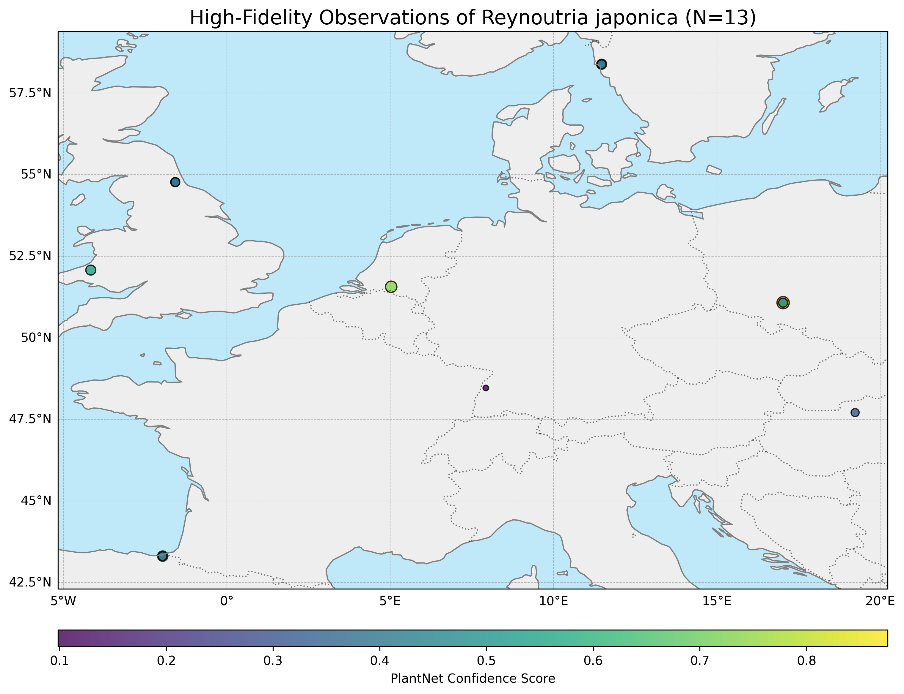

[](https://www.repostatus.org/#active)
[](https://github.com/Simon-Reynaert/iEcology-IAS-miner/actions/workflows/tests.yml)
[](https://iecology-ias-miner.readthedocs.io/en/latest/index.html)
[](https://opensource.org/licenses/MIT)

# iEcology-IAS-miner

Copyright (C) 2025-2026 [Simon Reynaert](https://scholar.google.be/citations?user=yIVCDfoAAAAJ&hl=en).

Project website: https://onestop-project.eu/

The goal of **iEcology-IAS-miner** is to allow users to seamlessly extract data from a variety of internet platforms on invasive species mentions and process them to daily counts per species x country x platform datasets. Specifically, it creates timeseries datasets recording changes in invasive alien species (IAS) searches, mentions, posts, pageviews and activity between a given time range (worked example is 2016 - 2025) from **Wikipedia**, **Flickr**, **Youtube** and **iNaturalist**. Reference data on the same species x country combinations is also pulled from **EASIN** and **GBIF**.  

Currently this repository is still a work in progress. Soon it will be integrated within the OneSTOP repository.  

| __Publications About the Library__ | TBA |
| :--- | :--- |
| __Packages and Releases__ |  [](https://github.com/Simon-Reynaert/iEcology-IAS-miner/releases) |
| __Pytest Test Coverage__ | [](https://codecov.io/gh/Simon-Reynaert/iEcology-IAS-miner) |
| __DOI__ | TBA |
| __Contact Information__ | simon.reynaert@plantentuinmeise.be |
| __Documentation__ | [](https://iecology-ias-miner.readthedocs.io/en/latest/index.html)|

# Installation
You can install the development version of iEcology-IAS-miner from Github with:
```bash
# Clone the repository
git clone https://github.com/Simon-Reynaert/iEcology-IAS-miner.git
cd iEcology-IAS-miner

# Optional: create a virtual environment (highly recommended!)
python -m venv .venv
# Activate the environment (Windows)
.\.venv\Scripts\activate
# Activate the environment (Linux/macOS)
source .venv/bin/activate

# Install dependencies
pip install --upgrade pip
pip install -r requirements.txt

# Run all tests to verify installation
pytest --maxfail=1 --disable-warnings -q
```
# Example workflow demonstration
More detailed code demonstrations can be found on the documentation website (https://iecology-ias-miner.readthedocs.io/en/latest/index.html) or in the /scripts or /docs subdirectories.

# Demonstrative workflow for the automated downloading and identification to species level of geolocated Flickr images

In this notebook, we show the minimal workflow for the automated fetching and to species-level identification of geolocated Flickr images. Images are fetched through the Flickr API based on fuzzy keyword matches with any tags (title, description, keywords), after which the image urls are used to download images locally and files are sent for species-level classification by machine vision models through their respective API's (e.g., pl@ntnet), which responds with an identification rank and associated probability of exact species match. No manual verification of the final classified images is performed afterwards, but the script checks if the queried species keyword in the Flickr API corresponds with the first rank of the machine vision model API response, to only retain images that have a very high likelihood for being the species of interest, thus reflecting 'true' occurrences. 

Note that these scripts will not work if the platform's respective API keys (Flickr and pl@ntnet in this example) have not been set in your local .env file located in the root directory of the library. Demo keys for these APIs can be obtained freely through the developer section of both platforms. The .env file can be opened in any text editor and should look something like this:
  
FLICKR_API_KEY='*insert flickr API key*'  
FLICKR_API_SECRET='*insert flickr secret*'  
PLANTNET_API_KEY='*insert pl@ntnet API key*'

Within the context of compliance to existing GDPR regulation, publishing these observations as well as their associated identifiers and coordinates should not be done publicly without informing the original poster of the images on Flickr and asking for their permission explicitly.

Please contact me with persistent issues at **simon.reynaert@plantentuinmeise.be**.

## 1. Setting up your local environment and testing dependencies


```python
#set the paths correctly on local device so that functions can be imported
import sys
import os

notebook_dir = os.getcwd()
print(f"The notebook is located at '{notebook_dir}'.")
src_path = os.path.abspath(os.path.join(notebook_dir, "../src"))
print(f"The functions are located at '{src_path}'.")

# Add to Python path if not already there
if src_path not in sys.path:
    sys.path.insert(0, src_path)
```

    The notebook is located at 'c:\Users\simon\Documents\GitHub\iEcology-IAS-miner\scripts'.
    The functions are located at 'c:\Users\simon\Documents\GitHub\iEcology-IAS-miner\src'.
    


```python
#set up the project path (i.e. root folder of the repository) for module imports
import sys
import os

notebook_dir = os.getcwd()
project_path = os.path.abspath(os.path.join(notebook_dir, ".."))

# Only add if not present, which avoids duplicates on reruns
if project_path not in sys.path:
    sys.path.insert(0, project_path)

print(f"Project path now includes: {project_path}")
```

    Project path now includes: c:\Users\simon\Documents\GitHub\iEcology-IAS-miner
    


```python
#test all imports

from activity_mining.get_flickr_mentions_final import (
    get_flickr_client, 
    load_species_list, 
    scrape_flickr_data,
    EU_BOUNDING_BOXES #predefined bounding box for Europe
)
from data_processing.process_flickr_images import process_flickr_data
from flickr_to_plantnet.DL_flickr_images import FlickrImageDownloader, download_species_images
from flickr_to_plantnet.plantnet_identification import run_full_pipeline
from flickr_to_plantnet.generate_observation_map import generate_observation_map

print("All imports were successful.")
```

    All imports were successful.
    

## 2. Fetching the Flickr images, geolocating them and deduplicating repeat observations

### 2.1. Query Flickr for images matching species names and save metadata


```python
from activity_mining.get_flickr_mentions_final import (
    get_flickr_client, 
    scrape_flickr_data,
    EU_BOUNDING_BOXES #predefined bounding box for Europe
)

#load client
flickr = get_flickr_client()

#load sp list
species_list = ["Reynoutria japonica"] #this list, used for querying images associated with keywords of species names on flickr can be adapated to your needs (e.g., other IAS species, synonyms, etc.)

#fetch flickr data
results_df = scrape_flickr_data(
    flickr_client = flickr,
    species_list = species_list,
    bounding_boxes= EU_BOUNDING_BOXES,
    start_date = "2004-01-01",
    end_date = "2025-12-31")

#save results df
results_df.to_csv("Reynoutria_japonica_example_Flickr.csv", index=False)

#show head of results
results_df.head()
```

    📅 Scraping data between 2004-01-01 and 2025-12-31...
    

    Fetching for EU:   0%|          | 0/1 [00:00<?, ?it/s]

    Loading formatted geocoded file...
    

    Fetching for EU: 100%|██████████| 1/1 [00:02<00:00,  2.51s/it]
    


<table border="1" class="dataframe">
  <thead>
    <tr style="text-align: right;">
      <th></th>
      <th>photo_id</th>
      <th>scientific_name</th>
      <th>country</th>
      <th>date_taken</th>
      <th>latitude</th>
      <th>longitude</th>
      <th>url</th>
      <th>tags</th>
    </tr>
  </thead>
  <tbody>
    <tr>
      <th>0</th>
      <td>54909908330</td>
      <td>Reynoutria japonica</td>
      <td>NL</td>
      <td>2025-11-08 11:50:48</td>
      <td>52.302766</td>
      <td>5.000035</td>
      <td>None</td>
      <td>fallopiajaponica reynoutriajaponica polygonumc...</td>
    </tr>
    <tr>
      <th>1</th>
      <td>54845527262</td>
      <td>Reynoutria japonica</td>
      <td>PL</td>
      <td>2025-09-19 05:11:29</td>
      <td>51.076337</td>
      <td>17.027542</td>
      <td>https://live.staticflickr.com/65535/5484552726...</td>
      <td>japaneseknotweed asianknotweed rdestowiecostro...</td>
    </tr>
    <tr>
      <th>2</th>
      <td>54190445341</td>
      <td>Reynoutria japonica</td>
      <td>PL</td>
      <td>2024-10-11 16:59:31</td>
      <td>51.076337</td>
      <td>17.027542</td>
      <td>https://live.staticflickr.com/65535/5419044534...</td>
      <td>japaneseknotweed asianknotweed rdestowiecostro...</td>
    </tr>
    <tr>
      <th>3</th>
      <td>54173787691</td>
      <td>Reynoutria japonica</td>
      <td>PL</td>
      <td>2024-09-21 15:31:58</td>
      <td>51.076337</td>
      <td>17.027542</td>
      <td>https://live.staticflickr.com/65535/5417378769...</td>
      <td>japaneseknotweed asianknotweed rdestowiecostro...</td>
    </tr>
    <tr>
      <th>4</th>
      <td>54002984902</td>
      <td>Reynoutria japonica</td>
      <td>GB</td>
      <td>2024-08-31 15:15:52</td>
      <td>52.075677</td>
      <td>-4.161374</td>
      <td>https://live.staticflickr.com/65535/5400298490...</td>
      <td>garden plant perennial fallopiajaponica japane...</td>
    </tr>
  </tbody>
</table>
</div>


### 2.2. Deduplicate and geocode images with missing country tags


```python
# !!only works if the mined data .csv is located in the same folder as this notebook!!
from data_processing.process_flickr_images import process_flickr_data

process_flickr_data("Reynoutria_japonica_example_Flickr.csv",#input csv file with mined flickr data 
                    "deduplicated_geolocated_Reynoutria_japonica_example.csv", #output csv file with processed data
                    100) #the 100 here is the distance in meters between observations made by the same person on the same day for deduplication
```

    Deduplicating rows:   0%|          | 0/41 [00:00<?, ?it/s]

    Deduplicating rows: 100%|██████████| 41/41 [00:00<00:00, 3689.48it/s]

    Deduplicated & geocoded European data saved to: deduplicated_geolocated_Reynoutria_japonica_example.csv
    Number of rows in final CSV: 27
    

    
    

### 2.3. Download geolocated and filtered images locally using metadata URL's


```python
from flickr_to_plantnet.DL_flickr_images import FlickrImageDownloader, download_species_images

# Your custom configuration
results = download_species_images(
    csv_path='deduplicated_geolocated_Reynoutria_japonica_example.csv',
    species_list=['Reynoutria japonica'], #adapt list based on species of interest present in the originally mined .csv
    skip_processed=True,
    processed_csv_path='downloaded_images_Reynoutria_japonica_example.csv' #tracks how many are downloaded and processed and keeps their metadata
)
```

    
    ==================================================
    **Starting processing for species: Reynoutria japonica**
    ==================================================
    Processing 25 observations for Reynoutria japonica...
      ✅ Saved image and metadata for ID: 42364521564
       💤 Pausing for 0.99 seconds...
      ✅ Saved image and metadata for ID: 42364521064
       💤 Pausing for 1.42 seconds...
      ✅ Saved image and metadata for ID: 49992671526
       💤 Pausing for 0.57 seconds...
      ✅ Saved image and metadata for ID: 42227719200
       💤 Pausing for 0.62 seconds...
      ✅ Saved image and metadata for ID: 50182511527
       💤 Pausing for 1.31 seconds...
      ✅ Saved image and metadata for ID: 51444019700
       💤 Pausing for 1.86 seconds...
      ✅ Saved image and metadata for ID: 50023375437
       💤 Pausing for 0.70 seconds...
      ✅ Saved image and metadata for ID: 51833590842
       💤 Pausing for 0.74 seconds...
      ✅ Saved image and metadata for ID: 51863869930
       💤 Pausing for 1.72 seconds...
      ✅ Saved image and metadata for ID: 51895385250
       💤 Pausing for 1.69 seconds...
      ✅ Saved image and metadata for ID: 50781450247
       💤 Pausing for 1.35 seconds...
      ✅ Saved image and metadata for ID: 51738980087
       💤 Pausing for 1.30 seconds...
      ✅ Saved image and metadata for ID: 51630623792
       💤 Pausing for 1.59 seconds...
      ✅ Saved image and metadata for ID: 52734126953
       💤 Pausing for 1.30 seconds...
      ⚠️ Skipping ID: 52301161891. File already exists.
      ⚠️ Skipping ID: 52519094010. File already exists.
      ⚠️ Skipping ID: 52518890464. File already exists.
      ⚠️ Skipping ID: 52523566414. File already exists.
      ✅ Saved image and metadata for ID: 53294757182
       💤 Pausing for 0.60 seconds...
      ✅ Saved image and metadata for ID: 53846285069
       💤 Pausing for 1.45 seconds...
      ✅ Saved image and metadata for ID: 53845921271
       💤 Pausing for 1.01 seconds...
      ✅ Saved image and metadata for ID: 54002984902
       💤 Pausing for 1.11 seconds...
      ✅ Saved image and metadata for ID: 54173787691
       💤 Pausing for 1.51 seconds...
      ✅ Saved image and metadata for ID: 54190445341
       💤 Pausing for 1.09 seconds...
      ✅ Saved image and metadata for ID: 54845527262
       💤 Pausing for 1.78 seconds...
    
    Completed Reynoutria japonica: 21 images downloaded
    
    Successfully saved metadata to: **PlantNet_Batch_Images\master_observations_metadata.csv**
    Total records: 21
    

## 3. Send images to pl@ntnet API for identification (free tier limited to 500 images per day)


```python
import pandas as pd
from flickr_to_plantnet.plantnet_identification import run_full_pipeline

summary, high_fidelity = run_full_pipeline(
    base_dir="PlantNet_Batch_Images",
    metadata_file="PlantNet_Batch_Images/master_observations_metadata.csv",
    output_summary_file="full_API_response_analysis.csv",
    output_high_fidelity_file="full_API_validated_plants.csv"
)

#make df
df = pd.read_csv(high_fidelity)

#print head of final observations df
df.head()

```

    📋 Loading metadata to get expected species...
    ✅ Loaded metadata for 21 observations
    ✅ Found 26 observation folders
    
    --- Processing ID 1/26: 42227719200 ---
      🎯 Expected species: Reynoutria japonica
      📊 Got 10 total results
        1. Reynoutria japonica (Score: 0.0988)
        2. Reynoutria sachalinensis (Score: 0.0702)
        3. Glycine max (Score: 0.0175)
        4. Ipomoea batatas (Score: 0.0094)
        5. Fagopyrum esculentum (Score: 0.0071)
        ✅ MATCH! Expected species found at rank 1
    
    --- Processing ID 2/26: 42364521064 ---
      🎯 Expected species: Reynoutria japonica
      📊 Got 10 total results
        1. Reynoutria japonica (Score: 0.3896)
        2. Reynoutria sachalinensis (Score: 0.0295)
        3. Anredera cordifolia (Score: 0.0068)
        4. Castanea seguinii (Score: 0.0067)
        5. Clethra barbinervis (Score: 0.0032)
        ✅ MATCH! Expected species found at rank 1
    
    --- Processing ID 3/26: 42364521564 ---
      🎯 Expected species: Reynoutria japonica
      📊 Got 4 total results
        1. Reynoutria japonica (Score: 0.5888)
        2. Reynoutria sachalinensis (Score: 0.0779)
        3. Anredera cordifolia (Score: 0.0024)
        4. Aruncus dioicus (Score: 0.0016)
        ✅ MATCH! Expected species found at rank 1
    
    --- Processing ID 4/26: 49992671526 ---
      🎯 Expected species: Reynoutria japonica
      📊 Got 5 total results
        1. Reynoutria japonica (Score: 0.3184)
        2. Reynoutria sachalinensis (Score: 0.1327)
        3. Allophylus cobbe (Score: 0.0014)
        4. Fallopia baldschuanica (Score: 0.0014)
        5. Anredera vesicaria (Score: 0.0011)
        ✅ MATCH! Expected species found at rank 1
    
    --- Processing ID 5/26: 50023375437 ---
      🎯 Expected species: Reynoutria japonica
      📊 Got 3 total results
        1. Fallopia japonica (Score: 0.2854)
        2. Populus alba (Score: 0.0025)
        3. Alnus glutinosa (Score: 0.0018)
        ❌ Expected species 'Reynoutria japonica' NOT found in top 5
    
    --- Processing ID 6/26: 50182511527 ---
      🎯 Expected species: Reynoutria japonica
      📊 Got 2 total results
        1. Reynoutria japonica (Score: 0.7367)
        2. Reynoutria sachalinensis (Score: 0.1371)
        ✅ MATCH! Expected species found at rank 1
    
    --- Processing ID 7/26: 50781450247 ---
      🎯 Expected species: Reynoutria japonica
      📊 Got 10 total results
        1. Artemisia scoparia (Score: 0.0858)
        2. Tamarix parviflora (Score: 0.0647)
        3. Aruncus dioicus (Score: 0.0338)
        4. Tamarix gallica (Score: 0.0167)
        5. Tamarix chinensis (Score: 0.0144)
        ❌ Expected species 'Reynoutria japonica' NOT found in top 5
    
    --- Processing ID 8/26: 51444019700 ---
      🎯 Expected species: Reynoutria japonica
      📊 Got 2 total results
        1. Reynoutria japonica (Score: 0.5463)
        2. Reynoutria sachalinensis (Score: 0.1136)
        ✅ MATCH! Expected species found at rank 1
    
    --- Processing ID 9/26: 51630623792 ---
      🎯 Expected species: Reynoutria japonica
      📊 Got 3 total results
        1. Fallopia japonica (Score: 0.4806)
        2. Rubus armeniacus (Score: 0.0036)
        3. Spiraea chamaedryfolia (Score: 0.0016)
        ❌ Expected species 'Reynoutria japonica' NOT found in top 5
    
    --- Processing ID 10/26: 51738980087 ---
      🎯 Expected species: Reynoutria japonica
      📊 Got 10 total results
        1. Actinidia kolomikta (Score: 0.2691)
        2. Corylus heterophylla (Score: 0.0689)
        3. Koenigia weyrichii (Score: 0.0389)
        4. Reynoutria japonica (Score: 0.0377)
        5. Androcalva fraseri (Score: 0.0204)
        ✅ MATCH! Expected species found at rank 4
    
    --- Processing ID 11/26: 51833590842 ---
      🎯 Expected species: Reynoutria japonica
      📊 Got 3 total results
        1. Reynoutria japonica (Score: 0.3883)
        2. Reynoutria sachalinensis (Score: 0.0953)
        3. Poranopsis paniculata (Score: 0.0011)
        ✅ MATCH! Expected species found at rank 1
    
    --- Processing ID 12/26: 51863869930 ---
      🎯 Expected species: Reynoutria japonica
      📊 Got 10 total results
        1. Licania elliptica (Score: 0.0267)
        2. Acalypha caturus (Score: 0.0246)
        3. Mareya micrantha (Score: 0.0236)
        4. Boehmeria grandis (Score: 0.0173)
        5. Mareya congolensis (Score: 0.0168)
        ❌ Expected species 'Reynoutria japonica' NOT found in top 5
    
    --- Processing ID 13/26: 51895385250 ---
      🎯 Expected species: Reynoutria japonica
      📊 Got 10 total results
        1. Asparagus buchananii (Score: 0.0696)
        2. Tamarix parviflora (Score: 0.0674)
        3. Artemisia scoparia (Score: 0.0576)
        4. Aruncus dioicus (Score: 0.0411)
        5. Tamarix chinensis (Score: 0.0203)
        ❌ Expected species 'Reynoutria japonica' NOT found in top 5
    
    --- Processing ID 14/26: 52301161891 ---
      🎯 Expected species: Unknown
      📊 Got 4 total results
        1. Reynoutria × bohemica (Score: 0.8587)
        2. Reynoutria japonica (Score: 0.0900)
        3. Reynoutria sachalinensis (Score: 0.0209)
        4. Reynoutria compacta (Score: 0.0027)
        ❌ Expected species 'Unknown' NOT found in top 5
    
    --- Processing ID 15/26: 52517089803 ---
      🎯 Expected species: Unknown
      📊 Got 10 total results
        1. Reynoutria japonica (Score: 0.3251)
        2. Reynoutria sachalinensis (Score: 0.0195)
        3. Fallopia baldschuanica (Score: 0.0068)
        4. Falcaria vulgaris (Score: 0.0048)
        5. Ilex paraguariensis (Score: 0.0040)
        ❌ Expected species 'Unknown' NOT found in top 5
    
    --- Processing ID 16/26: 52518890464 ---
      🎯 Expected species: Unknown
      📊 Got 2 total results
        1. Reynoutria japonica (Score: 0.8800)
        2. Reynoutria sachalinensis (Score: 0.0164)
        ❌ Expected species 'Unknown' NOT found in top 5
    
    --- Processing ID 17/26: 52519094010 ---
      🎯 Expected species: Unknown
      📊 Got 4 total results
        1. Reynoutria japonica (Score: 0.7997)
        2. Reynoutria sachalinensis (Score: 0.0216)
        3. Fallopia baldschuanica (Score: 0.0012)
        4. Citharexylum spinosum (Score: 0.0011)
        ❌ Expected species 'Unknown' NOT found in top 5
    
    --- Processing ID 18/26: 52523566414 ---
      🎯 Expected species: Unknown
      📊 Got 6 total results
        1. Reynoutria japonica (Score: 0.4675)
        2. Reynoutria sachalinensis (Score: 0.0342)
        3. Anredera cordifolia (Score: 0.0033)
        4. Buchanania cochinchinensis (Score: 0.0029)
        5. Hydrocotyle umbellata (Score: 0.0019)
        ❌ Expected species 'Unknown' NOT found in top 5
    
    --- Processing ID 19/26: 52734126953 ---
      🎯 Expected species: Reynoutria japonica
      📊 Got 10 total results
        1. Gamblea innovans (Score: 0.1428)
        2. Cunila origanoides (Score: 0.0293)
        3. Lagerstroemia indica (Score: 0.0241)
        4. Rosa acicularis (Score: 0.0163)
        5. Reynoutria japonica (Score: 0.0162)
        ✅ MATCH! Expected species found at rank 5
    
    --- Processing ID 20/26: 53294757182 ---
      🎯 Expected species: Reynoutria japonica
      📊 Got 4 total results
        1. Fallopia japonica (Score: 0.1164)
        2. Cyperus imbricatus (Score: 0.0013)
        3. Urtica dioica (Score: 0.0012)
        4. Heracleum mantegazzianum (Score: 0.0011)
        ❌ Expected species 'Reynoutria japonica' NOT found in top 5
    
    --- Processing ID 21/26: 53845921271 ---
      🎯 Expected species: Reynoutria japonica
      📊 Got 5 total results
        1. Reynoutria japonica (Score: 0.3826)
        2. Reynoutria sachalinensis (Score: 0.0213)
        3. Euonymus atropurpureus (Score: 0.0020)
        4. Toxicodendron succedaneum (Score: 0.0014)
        5. Homalanthus populifolius (Score: 0.0011)
        ✅ MATCH! Expected species found at rank 1
    
    --- Processing ID 22/26: 53846285069 ---
      🎯 Expected species: Reynoutria japonica
      📊 Got 8 total results
        1. Reynoutria japonica (Score: 0.4433)
        2. Reynoutria sachalinensis (Score: 0.0498)
        3. Triadica sebifera (Score: 0.0225)
        4. Toxicodendron succedaneum (Score: 0.0029)
        5. Homalanthus populifolius (Score: 0.0026)
        ✅ MATCH! Expected species found at rank 1
    
    --- Processing ID 23/26: 54002984902 ---
      🎯 Expected species: Reynoutria japonica
      📊 Got 3 total results
        1. Reynoutria japonica (Score: 0.5438)
        2. Reynoutria sachalinensis (Score: 0.0798)
        3. Anredera cordifolia (Score: 0.0015)
        ✅ MATCH! Expected species found at rank 1
    
    --- Processing ID 24/26: 54173787691 ---
      🎯 Expected species: Reynoutria japonica
      📊 Got 7 total results
        1. Reynoutria japonica (Score: 0.5710)
        2. Reynoutria sachalinensis (Score: 0.1163)
        3. Neoshirakia japonica (Score: 0.0057)
        4. Viburnum setigerum (Score: 0.0023)
        5. Rivina humilis (Score: 0.0020)
        ✅ MATCH! Expected species found at rank 1
    
    --- Processing ID 25/26: 54190445341 ---
      🎯 Expected species: Reynoutria japonica
      📊 Got 2 total results
        1. Reynoutria japonica (Score: 0.8761)
        2. Reynoutria sachalinensis (Score: 0.0410)
        ✅ MATCH! Expected species found at rank 1
    
    --- Processing ID 26/26: 54845527262 ---
      🎯 Expected species: Reynoutria japonica
      📊 Got 10 total results
        1. Reynoutria japonica (Score: 0.4266)
        2. Citharexylum spinosum (Score: 0.0325)
        3. Anredera cordifolia (Score: 0.0107)
        4. Reynoutria sachalinensis (Score: 0.0081)
        5. Cryptotaenia japonica (Score: 0.0066)
        ✅ MATCH! Expected species found at rank 1
    
    ✅ Identification summary saved to: full_API_response_analysis.csv
    
    🔍 Filtering for high-fidelity observations (Rank 1 matches only)...
      ✅ Found 13 observations where expected species ranked #1
      💾 High-fidelity dataset saved to: full_API_validated_plants.csv
      📊 Final dataset contains 13 observations with 8 columns
    
    📈 SUMMARY STATISTICS:
      Total observations processed: 26
      Successful API calls: 26 (100.0%)
      Expected species found in top 5: 15 (57.7%)
      Expected species ranked #1 (high-fidelity): 13 (50.0%)
    
      📊 Rank distribution when species found:
        Rank 1: 13 observations (86.7%)
        Rank 4: 1 observations (6.7%)
        Rank 5: 1 observations (6.7%)
    


<table border="1" class="dataframe">
  <thead>
    <tr style="text-align: right;">
      <th></th>
      <th>photo_id</th>
      <th>scientific_name</th>
      <th>latitude</th>
      <th>longitude</th>
      <th>local_folder</th>
      <th>local_path</th>
      <th>PlantNet_Confidence_Score</th>
      <th>API_Status</th>
    </tr>
  </thead>
  <tbody>
    <tr>
      <th>0</th>
      <td>42364521564</td>
      <td>Reynoutria japonica</td>
      <td>43.309202</td>
      <td>-1.959753</td>
      <td>42364521564</td>
      <td>PlantNet_Batch_Images\42364521564\42364521564.jpg</td>
      <td>0.58877</td>
      <td>Success</td>
    </tr>
    <tr>
      <th>1</th>
      <td>42364521064</td>
      <td>Reynoutria japonica</td>
      <td>43.307038</td>
      <td>-1.966289</td>
      <td>42364521064</td>
      <td>PlantNet_Batch_Images\42364521064\42364521064.jpg</td>
      <td>0.38959</td>
      <td>Success</td>
    </tr>
    <tr>
      <th>2</th>
      <td>49992671526</td>
      <td>Reynoutria japonica</td>
      <td>47.707985</td>
      <td>19.231352</td>
      <td>49992671526</td>
      <td>PlantNet_Batch_Images\49992671526\49992671526.jpg</td>
      <td>0.31842</td>
      <td>Success</td>
    </tr>
    <tr>
      <th>3</th>
      <td>42227719200</td>
      <td>Reynoutria japonica</td>
      <td>48.461936</td>
      <td>7.929847</td>
      <td>42227719200</td>
      <td>PlantNet_Batch_Images\42227719200\42227719200.jpg</td>
      <td>0.09876</td>
      <td>Success</td>
    </tr>
    <tr>
      <th>4</th>
      <td>50182511527</td>
      <td>Reynoutria japonica</td>
      <td>51.563785</td>
      <td>5.032682</td>
      <td>50182511527</td>
      <td>PlantNet_Batch_Images\50182511527\50182511527.jpg</td>
      <td>0.73669</td>
      <td>Success</td>
    </tr>
  </tbody>
</table>
</div>


## 4. Plot verified observations on EU map


```python
# Assuming you run this successfully first:
# summary, high_fidelity_path, plotting_data_path = run_full_pipeline(...)

# 1. Import the function (assuming the import path is correct)
from flickr_to_plantnet.generate_observation_map import generate_observation_map

import pandas as pd
import os

# A safer approach is to read the file path from the base directory used:
data_file_path = "full_API_validated_plants.csv"

# 2. Call the mapping function with the correct data file path
map_file_path = generate_observation_map(
    data_file_path=data_file_path,  # <--- Change this variable/path
    output_filename="Reynoutria_japonica_EU_Map.png",
    auto_zoom=True
)

print(f"\nMap generation complete. View the file: {map_file_path}")

# Optional: Display the map in the notebook
from IPython.display import Image
Image(map_file_path)
```

    📊 Loading data from: full_API_validated_plants.csv
    ✅ Loaded 13 observations with valid coordinates.
    🗺️ Generating map visualization...
    🔍 Auto-set map extent to: Lon -5.16-20.23, Lat 42.31-59.38
    

    c:\Users\simon\Documents\GitHub\iEcology-IAS-miner\.venv\Lib\site-packages\cartopy\io\__init__.py:242: DownloadWarning: Downloading: https://naturalearth.s3.amazonaws.com/50m_physical/ne_50m_land.zip
      warnings.warn(f'Downloading: {url}', DownloadWarning)
    c:\Users\simon\Documents\GitHub\iEcology-IAS-miner\.venv\Lib\site-packages\cartopy\io\__init__.py:242: DownloadWarning: Downloading: https://naturalearth.s3.amazonaws.com/50m_physical/ne_50m_ocean.zip
      warnings.warn(f'Downloading: {url}', DownloadWarning)
    c:\Users\simon\Documents\GitHub\iEcology-IAS-miner\.venv\Lib\site-packages\cartopy\io\__init__.py:242: DownloadWarning: Downloading: https://naturalearth.s3.amazonaws.com/50m_cultural/ne_50m_admin_0_boundary_lines_land.zip
      warnings.warn(f'Downloading: {url}', DownloadWarning)
    

    ✅ Map saved to: Reynoutria_japonica_EU_Map.png
    
    Map generation complete. View the file: Reynoutria_japonica_EU_Map.png
    


    

