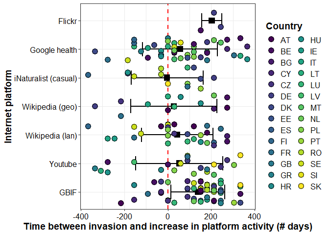

This R markdown document goes over the processing and statistical analysis that was performed in R of the mined iEcology data for the *iEcology-IAS-miner* Github repository.

# 1. Loading the required packages


``` r
# install.packages(c("tidyverse","lubridate","tidyr","timetk","anomalize","tibbletime","ggplot2","stringr","viridis","countrycode","tbl2xts","reshape2","Hmisc","broom","lme4","nlme","gamlss"))  # if needed
library(tidyverse)
library(lubridate)
library(dplyr)
library(timetk)
library(anomalize)
library(tidyr)
library(tibbletime)
library(ggplot2)
library(stringr)
library(viridis)
library(countrycode)
library(tbl2xts)
library(reshape2)
library(Hmisc)
library(broom)
library(lme4)
library(nlme)
library(gamlss)
library(readr)
library(cowplot)
```

``` r
#check working directory
getwd()
```

```
## [1] "C:/Users/simon/Documents"
```

# 2. Load in all data sources and preprocess

## 2.1. Load in the EASIN lists, filter out species x country invasions >=2016 and save as new csv


``` r
#––  Load data
uni <- read_csv("UnionList_Species_Traits_85_present.csv")
```

```
## Registered S3 method overwritten by 'bit':
##   method   from  
##   print.ri gamlss
```

```
## Rows: 937 Columns: 7
## ── Column specification ────────────────────────────────────────────────────────
## Delimiter: ","
## chr (6): EASIN.ID, SCIENTIFIC_NAME, COUNTRY, Group, Habitat, WIKI NAME
## dbl (1): YEAR
## 
## ℹ Use `spec()` to retrieve the full column specification for this data.
## ℹ Specify the column types or set `show_col_types = FALSE` to quiet this message.
```

``` r
uni=uni%>%
mutate(COUNTRY = ifelse(COUNTRY == "UK", "GB",ifelse(COUNTRY == "EL", "GR", COUNTRY)))
  
str(uni)
```

```
## tibble [937 × 7] (S3: tbl_df/tbl/data.frame)
##  $ EASIN.ID       : chr [1:937] "R00053" "R00053" "R00053" "R00053" ...
##  $ SCIENTIFIC_NAME: chr [1:937] "Acacia saligna" "Acacia saligna" "Acacia saligna" "Acacia saligna" ...
##  $ COUNTRY        : chr [1:937] "CY" "CZ" "DK" "GR" ...
##  $ YEAR           : num [1:937] 1881 2012 2023 1842 1800 ...
##  $ Group          : chr [1:937] "Plantae" "Plantae" "Plantae" "Plantae" ...
##  $ Habitat        : chr [1:937] "Terrestrial" "Terrestrial" "Terrestrial" "Terrestrial" ...
##  $ WIKI NAME      : chr [1:937] "Acacia saligna" "Acacia saligna" "Acacia saligna" "Acacia saligna" ...
```

``` r
unique(uni$COUNTRY)
```

```
##  [1] "CY" "CZ" "DK" "GR" "ES" "FR" "HR" "IT" "MT" "PT" "SE" "GB" "AT" "DE" "NL"
## [16] "BE" "BG" "EE" "HU" "IE" "LU" "LV" "PL" "RO" "SI" "SK" "LT" "FI"
```

``` r
#––  uni#––  Filter introductions to YEAR >= 2016
intro_year <- uni %>%
  filter(YEAR >= 2016) %>%
  select(SCIENTIFIC_NAME, COUNTRY, YEAR, 'WIKI NAME', Group, Habitat,EASIN.ID) %>%
  distinct()
if (nrow(intro_year) == 0) stop("No introductions found after 2016.")

str(intro_year)
```

```
## tibble [112 × 7] (S3: tbl_df/tbl/data.frame)
##  $ SCIENTIFIC_NAME: chr [1:112] "Acacia saligna" "Acridotheres tristis" "Acridotheres tristis" "Alopochen aegyptiaca" ...
##  $ COUNTRY        : chr [1:112] "DK" "CY" "GR" "LT" ...
##  $ YEAR           : num [1:112] 2023 2022 2017 2016 2017 ...
##  $ WIKI NAME      : chr [1:112] "Acacia saligna" "Acridotheres tristis" "Acridotheres tristis" "Alopochen aegyptiaca" ...
##  $ Group          : chr [1:112] "Plantae" "Aves" "Aves" "Aves" ...
##  $ Habitat        : chr [1:112] "Terrestrial" "Terrestrial" "Terrestrial" "Both" ...
##  $ EASIN.ID       : chr [1:112] "R00053" "R00212" "R00212" "R00644" ...
```

``` r
#fix inconsistent naming for merge with datasets later on

intro_year <- intro_year %>%
  mutate(
    SCIENTIFIC_NAME = case_when(
      # Mappings where the "FROM" name might be in intro_year and needs to change "TO" the new canonical form.
      # This is crucial because you want intro_year to contain the *standardized* names.
      SCIENTIFIC_NAME == "Cortaderia selloana subsp. jubata" ~ "Cortaderia jubata",
      SCIENTIFIC_NAME == "Eichhornia crassipes" ~ "Pontederia crassipes",
      SCIENTIFIC_NAME == "Trachemys scripta elegans" ~ "Trachemys scripta",
      SCIENTIFIC_NAME == "Pennisetum setaceum" ~ "Cenchrus setaceus",
      SCIENTIFIC_NAME == "Herpestes auropunctatus" ~ "Urva auropunctata",
      SCIENTIFIC_NAME == "Neltuma juliflora" ~ "Prosopis juliflora",
      SCIENTIFIC_NAME == "Orconectes limosus" ~ "Faxonius limosus",
      SCIENTIFIC_NAME == "Orconectes virilis" ~ "Faxonius virilis",
      SCIENTIFIC_NAME == "Solenopsis geminata" ~ "Solenopsis invicta",
      SCIENTIFIC_NAME == "Solenopsis richteri" ~ "Solenopsis invicta",
      SCIENTIFIC_NAME == "Pueraria montana (Lour.) Merr. var. lobata" ~ "Pueraria montana",
      SCIENTIFIC_NAME == "Gambusia holbrooki" ~ "Gambusia affinis",
      TRUE ~ SCIENTIFIC_NAME # Keep other names as they are
    ))

unique(intro_year$SCIENTIFIC_NAME)
```

```
##  [1] "Acacia saligna"             "Acridotheres tristis"      
##  [3] "Alopochen aegyptiaca"       "Ameiurus melas"            
##  [5] "Asclepias syriaca"          "Cabomba caroliniana"       
##  [7] "Celastrus orbiculatus"      "Cenchrus setaceus"         
##  [9] "Cortaderia jubata"          "Elodea nuttallii"          
## [11] "Eriocheir sinensis"         "Faxonius limosus"          
## [13] "Faxonius rusticus"          "Gunnera tinctoria"         
## [15] "Gymnocoronis spilanthoides" "Hakea sericea"             
## [17] "Heracleum mantegazzianum"   "Heracleum sosnowskyi"      
## [19] "Humulus scandens"           "Hydrocotyle ranunculoides" 
## [21] "Impatiens glandulifera"     "Koenigia polystachya"      
## [23] "Lampropeltis getula"        "Lespedeza cuneata"         
## [25] "Ludwigia grandiflora"       "Ludwigia peploides"        
## [27] "Lygodium japonicum"         "Lysichiton americanus"     
## [29] "Microstegium vimineum"      "Muntiacus reevesi"         
## [31] "Myocastor coypus"           "Myriophyllum heterophyllum"
## [33] "Nasua nasua"                "Prosopis juliflora"        
## [35] "Nyctereutes procyonoides"   "Pacifastacus leniusculus"  
## [37] "Parthenium hysterophorus"   "Perccottus glenii"         
## [39] "Persicaria perfoliata"      "Pistia stratiotes"         
## [41] "Plotosus lineatus"          "Pontederia crassipes"      
## [43] "Procambarus clarkii"        "Procambarus virginalis"    
## [45] "Rugulopteryx okamurae"      "Salvinia molesta"          
## [47] "Sciurus carolinensis"       "Solenopsis invicta"        
## [49] "Threskiornis aethiopicus"   "Trachemys scripta"         
## [51] "Triadica sebifera"          "Vespa velutina nigrithorax"
## [53] "Wasmannia auropunctata"     "Xenopus laevis"
```

``` r
length(unique(intro_year$SCIENTIFIC_NAME))
```

```
## [1] 54
```

``` r
write.csv(intro_year, "intros_after_2016_EASIN.csv", row.names = FALSE)
```
## 2.2. Load and pre-process the wikipedia language to country mapping pageview data


``` r
#load wiki language pageview data

pv  <- read_csv("species_pageviews_analysis_2016_present.csv")
```

```
## Rows: 1222 Columns: 3424
## ── Column specification ────────────────────────────────────────────────────────
## Delimiter: ","
## chr    (3): Scientific Name, Language, Wikipedia Title
## dbl (3421): 20160101, 20160102, 20160103, 20160104, 20160105, 20160106, 2016...
## 
## ℹ Use `spec()` to retrieve the full column specification for this data.
## ℹ Specify the column types or set `show_col_types = FALSE` to quiet this message.
```

``` r
#––Define language → country mapping
lang2country <- list(
  en = c("GB","IE"), es = "ES", el = c("GR","CY"), fr = c("FR","LU"), de = c("DE","AT","CH"),
  it = "IT", pt = "PT", nl = c("NL","BE"), sv = "SE", da = "DK", fi = "FI", cs = "CZ",
  hr = "HR", hu = "HU", pl = "PL", ro = "RO", sk = "SK", sl = "SI",
  bg = "BG", et = "EE", lv = "LV", lt = "LT", mt = "MT",
  be = "BE"
)

# Sanity check: ensure all intro countries are covered
mapped_countries <- unique(unlist(lang2country))
missing_countries <- setdiff(unique(intro_year$COUNTRY), mapped_countries)
if (length(missing_countries) > 0) {
  warning(paste(
    "Countries with no language mapping:", paste(missing_countries, collapse = ", ")
  ))
}

#––  Prepare pageviews & join
uni_for_join <- uni %>%
  select(-any_of("COUNTRY")) %>% # Drop the 'COUNTRY' column if it exists in 'uni'
  distinct(`WIKI NAME`, .keep_all = TRUE) # Selects one representative row for each WIKI NAME in 'uni'.
# If 'uni' has a 'COUNTRY' column, it will be included
# but not used for joining.

# Step 2: Perform the join.
pv2 <- pv %>%
  rename('WIKI NAME' = `Scientific Name`) %>%
  mutate(COUNTRY = lang2country[Language]) %>% # Keeps the COUNTRY from pv pipeline
  unnest_longer(COUNTRY) %>%
  filter(!is.na(COUNTRY)) %>%
  inner_join(uni_for_join, by = c("WIKI NAME"))

unique(pv2$SCIENTIFIC_NAME)
```

```
##  [1] "Acacia saligna"                            
##  [2] "Acridotheres tristis"                      
##  [3] "Ailanthus altissima"                       
##  [4] "Alopochen aegyptiaca"                      
##  [5] "Alternanthera philoxeroides"               
##  [6] "Ameiurus melas"                            
##  [7] "Andropogon virginicus"                     
##  [8] "Arthurdendyus triangulatus"                
##  [9] "Asclepias syriaca"                         
## [10] "Axis axis"                                 
## [11] "Baccharis halimifolia"                     
## [12] "Cabomba caroliniana"                       
## [13] "Callosciurus erythraeus"                   
## [14] "Callosciurus finlaysonii"                  
## [15] "Cardiospermum grandiflorum"                
## [16] "Celastrus orbiculatus"                     
## [17] "Channa argus"                              
## [18] "Cortaderia selloana subsp. jubata"         
## [19] "Corvus splendens"                          
## [20] "Ehrharta calycina"                         
## [21] "Pontederia crassipes"                      
## [22] "Elodea nuttallii"                          
## [23] "Eriocheir sinensis"                        
## [24] "Faxonius rusticus"                         
## [25] "Fundulus heteroclitus"                     
## [26] "Gambusia affinis"                          
## [27] "Gambusia holbrooki"                        
## [28] "Gunnera tinctoria"                         
## [29] "Gymnocoronis spilanthoides"                
## [30] "Hakea sericea"                             
## [31] "Heracleum mantegazzianum"                  
## [32] "Heracleum persicum"                        
## [33] "Heracleum sosnowskyi"                      
## [34] "Urva auropunctata"                         
## [35] "Humulus scandens"                          
## [36] "Hydrocotyle ranunculoides"                 
## [37] "Impatiens glandulifera"                    
## [38] "Koenigia polystachya"                      
## [39] "Lagarosiphon major"                        
## [40] "Lampropeltis getula"                       
## [41] "Lepomis gibbosus"                          
## [42] "Lespedeza cuneata"                         
## [43] "Lithobates catesbeianus"                   
## [44] "Ludwigia grandiflora"                      
## [45] "Ludwigia peploides"                        
## [46] "Lygodium japonicum"                        
## [47] "Lysichiton americanus"                     
## [48] "Microstegium vimineum"                     
## [49] "Muntiacus reevesi"                         
## [50] "Myocastor coypus"                          
## [51] "Myriophyllum aquaticum"                    
## [52] "Myriophyllum heterophyllum"                
## [53] "Nasua nasua"                               
## [54] "Nyctereutes procyonoides"                  
## [55] "Ondatra zibethicus"                        
## [56] "Oxyura jamaicensis"                        
## [57] "Pacifastacus leniusculus"                  
## [58] "Parthenium hysterophorus"                  
## [59] "Cenchrus setaceus"                         
## [60] "Perccottus glenii"                         
## [61] "Persicaria perfoliata"                     
## [62] "Pistia stratiotes"                         
## [63] "Plotosus lineatus"                         
## [64] "Procambarus clarkii"                       
## [65] "Procambarus virginalis"                    
## [66] "Procyon lotor"                             
## [67] "Neltuma juliflora"                         
## [68] "Pseudorasbora parva"                       
## [69] "Pueraria montana (Lour.) Merr. var. lobata"
## [70] "Pycnonotus cafer"                          
## [71] "Rugulopteryx okamurae"                     
## [72] "Salvinia molesta"                          
## [73] "Sciurus carolinensis"                      
## [74] "Sciurus niger"                             
## [75] "Solenopsis geminata"                       
## [76] "Solenopsis invicta"                        
## [77] "Tamias sibiricus"                          
## [78] "Threskiornis aethiopicus"                  
## [79] "Trachemys scripta"                         
## [80] "Triadica sebifera"                         
## [81] "Vespa velutina nigrithorax"                
## [82] "Wasmannia auropunctata"                    
## [83] "Xenopus laevis"
```

``` r
unique(pv2$`WIKI NAME`)
```

```
##  [1] "Acacia saligna"              "Acridotheres tristis"       
##  [3] "Ailanthus altissima"         "Alopochen aegyptiaca"       
##  [5] "Alternanthera philoxeroides" "Ameiurus melas"             
##  [7] "Andropogon virginicus"       "Arthurdendyus triangulatus" 
##  [9] "Asclepias syriaca"           "Axis axis"                  
## [11] "Baccharis halimifolia"       "Cabomba caroliniana"        
## [13] "Callosciurus erythraeus"     "Callosciurus finlaysonii"   
## [15] "Cardiospermum grandiflorum"  "Celastrus orbiculatus"      
## [17] "Channa argus"                "Cortaderia jubata"          
## [19] "Corvus splendens"            "Ehrharta calycina"          
## [21] "Eichhornia crassipes"        "Elodea nuttallii"           
## [23] "Eriocheir sinensis"          "Faxonius rusticus"          
## [25] "Fundulus heteroclitus"       "Gambusia affinis"           
## [27] "Gambusia holbrooki"          "Gunnera tinctoria"          
## [29] "Gymnocoronis spilanthoides"  "Hakea sericea"              
## [31] "Heracleum mantegazzianum"    "Heracleum persicum"         
## [33] "Heracleum sosnowskyi"        "Herpestes javanicus"        
## [35] "Humulus scandens"            "Hydrocotyle ranunculoides"  
## [37] "Impatiens glandulifera"      "Koenigia polystachya"       
## [39] "Lagarosiphon major"          "Lampropeltis getula"        
## [41] "Lepomis gibbosus"            "Lespedeza cuneata"          
## [43] "Lithobates catesbeianus"     "Ludwigia grandiflora"       
## [45] "Ludwigia peploides"          "Lygodium japonicum"         
## [47] "Lysichiton americanus"       "Microstegium vimineum"      
## [49] "Muntiacus reevesi"           "Myocastor coypus"           
## [51] "Myriophyllum aquaticum"      "Myriophyllum heterophyllum" 
## [53] "Nasua nasua"                 "Nyctereutes procyonoides"   
## [55] "Ondatra zibethicus"          "Oxyura jamaicensis"         
## [57] "Pacifastacus leniusculus"    "Parthenium hysterophorus"   
## [59] "Pennisetum setaceum"         "Perccottus glenii"          
## [61] "Persicaria perfoliata"       "Pistia stratiotes"          
## [63] "Plotosus lineatus"           "Procambarus clarkii"        
## [65] "Procambarus virginalis"      "Procyon lotor"              
## [67] "Prosopis juliflora"          "Pseudorasbora parva"        
## [69] "Pueraria montana"            "Pycnonotus cafer"           
## [71] "Rugulopteryx okamurae"       "Salvinia molesta"           
## [73] "Sciurus carolinensis"        "Sciurus niger"              
## [75] "Solenopsis geminata"         "Solenopsis invicta"         
## [77] "Tamias sibiricus"            "Threskiornis aethiopicus"   
## [79] "Trachemys scripta elegans"   "Triadica sebifera"          
## [81] "Vespa velutina nigrithorax"  "Wasmannia auropunctata"     
## [83] "Xenopus laevis"
```

``` r
length(unique(pv$`Scientific Name`))
```

```
## [1] 88
```

``` r
length(unique(pv2$`WIKI NAME`))
```

```
## [1] 83
```

``` r
#Pivot to long format
pv_long <- pv2 %>%
  pivot_longer(cols = matches("^[0-9]{8}$"),
               names_to = "date", values_to = "views") %>%
  mutate(date = ymd(date), views = as.numeric(views)) %>%
  filter(!is.na(date), !is.na(views)) %>%
  select(SCIENTIFIC_NAME, COUNTRY, YEAR, date, views)

str(pv_long)
```

```
## tibble [3,597,024 × 5] (S3: tbl_df/tbl/data.frame)
##  $ SCIENTIFIC_NAME: chr [1:3597024] "Acacia saligna" "Acacia saligna" "Acacia saligna" "Acacia saligna" ...
##  $ COUNTRY        : chr [1:3597024] "DE" "DE" "DE" "DE" ...
##  $ YEAR           : num [1:3597024] 1881 1881 1881 1881 1881 ...
##  $ date           : Date[1:3597024], format: "2016-01-01" "2016-01-02" ...
##  $ views          : num [1:3597024] 5 10 4 3 4 5 7 41 6 5 ...
```
## 2.3. Load, join and pre-process the wikipedia geolocated pageview datasets


``` r
#load in the data
wikidat_geo <- read_csv("species_pageviews_wiki_geolocated_2023-02-06_now.csv")
```

```
## Rows: 629 Columns: 787
## ── Column specification ────────────────────────────────────────────────────────
## Delimiter: ","
## chr   (3): Scientific Name, Country, Wikidata Q-number
## dbl (784): 2023-02-06, 2023-02-07, 2023-02-08, 2023-02-09, 2023-02-10, 2023-...
## 
## ℹ Use `spec()` to retrieve the full column specification for this data.
## ℹ Specify the column types or set `show_col_types = FALSE` to quiet this message.
```

``` r
head(wikidat_geo)
```

<div data-pagedtable="false">
  <script data-pagedtable-source type="application/json">
{"columns":[{"label":["Scientific Name"],"name":[1],"type":["chr"],"align":["left"]},{"label":["Country"],"name":[2],"type":["chr"],"align":["left"]},{"label":["Wikidata Q-number"],"name":[3],"type":["chr"],"align":["left"]},{"label":["2023-02-06"],"name":[4],"type":["dbl"],"align":["right"]},{"label":["2023-02-07"],"name":[5],"type":["dbl"],"align":["right"]},{"label":["2023-02-08"],"name":[6],"type":["dbl"],"align":["right"]},{"label":["2023-02-09"],"name":[7],"type":["dbl"],"align":["right"]},{"label":["2023-02-10"],"name":[8],"type":["dbl"],"align":["right"]},{"label":["2023-02-11"],"name":[9],"type":["dbl"],"align":["right"]},{"label":["2023-02-12"],"name":[10],"type":["dbl"],"align":["right"]},{"label":["2023-02-13"],"name":[11],"type":["dbl"],"align":["right"]},{"label":["2023-02-14"],"name":[12],"type":["dbl"],"align":["right"]},{"label":["2023-02-15"],"name":[13],"type":["dbl"],"align":["right"]},{"label":["2023-02-16"],"name":[14],"type":["dbl"],"align":["right"]},{"label":["2023-02-17"],"name":[15],"type":["dbl"],"align":["right"]},{"label":["2023-02-18"],"name":[16],"type":["dbl"],"align":["right"]},{"label":["2023-02-19"],"name":[17],"type":["dbl"],"align":["right"]},{"label":["2023-02-20"],"name":[18],"type":["dbl"],"align":["right"]},{"label":["2023-02-21"],"name":[19],"type":["dbl"],"align":["right"]},{"label":["2023-02-22"],"name":[20],"type":["dbl"],"align":["right"]},{"label":["2023-02-23"],"name":[21],"type":["dbl"],"align":["right"]},{"label":["2023-02-24"],"name":[22],"type":["dbl"],"align":["right"]},{"label":["2023-02-25"],"name":[23],"type":["dbl"],"align":["right"]},{"label":["2023-02-26"],"name":[24],"type":["dbl"],"align":["right"]},{"label":["2023-02-27"],"name":[25],"type":["dbl"],"align":["right"]},{"label":["2023-02-28"],"name":[26],"type":["dbl"],"align":["right"]},{"label":["2023-03-01"],"name":[27],"type":["dbl"],"align":["right"]},{"label":["2023-03-02"],"name":[28],"type":["dbl"],"align":["right"]},{"label":["2023-03-03"],"name":[29],"type":["dbl"],"align":["right"]},{"label":["2023-03-04"],"name":[30],"type":["dbl"],"align":["right"]},{"label":["2023-03-05"],"name":[31],"type":["dbl"],"align":["right"]},{"label":["2023-03-06"],"name":[32],"type":["dbl"],"align":["right"]},{"label":["2023-03-07"],"name":[33],"type":["dbl"],"align":["right"]},{"label":["2023-03-08"],"name":[34],"type":["dbl"],"align":["right"]},{"label":["2023-03-09"],"name":[35],"type":["dbl"],"align":["right"]},{"label":["2023-03-10"],"name":[36],"type":["dbl"],"align":["right"]},{"label":["2023-03-11"],"name":[37],"type":["dbl"],"align":["right"]},{"label":["2023-03-12"],"name":[38],"type":["dbl"],"align":["right"]},{"label":["2023-03-13"],"name":[39],"type":["dbl"],"align":["right"]},{"label":["2023-03-14"],"name":[40],"type":["dbl"],"align":["right"]},{"label":["2023-03-15"],"name":[41],"type":["dbl"],"align":["right"]},{"label":["2023-03-16"],"name":[42],"type":["dbl"],"align":["right"]},{"label":["2023-03-17"],"name":[43],"type":["dbl"],"align":["right"]},{"label":["2023-03-18"],"name":[44],"type":["dbl"],"align":["right"]},{"label":["2023-03-19"],"name":[45],"type":["dbl"],"align":["right"]},{"label":["2023-03-20"],"name":[46],"type":["dbl"],"align":["right"]},{"label":["2023-03-21"],"name":[47],"type":["dbl"],"align":["right"]},{"label":["2023-03-22"],"name":[48],"type":["dbl"],"align":["right"]},{"label":["2023-03-23"],"name":[49],"type":["dbl"],"align":["right"]},{"label":["2023-03-24"],"name":[50],"type":["dbl"],"align":["right"]},{"label":["2023-03-25"],"name":[51],"type":["dbl"],"align":["right"]},{"label":["2023-03-26"],"name":[52],"type":["dbl"],"align":["right"]},{"label":["2023-03-27"],"name":[53],"type":["dbl"],"align":["right"]},{"label":["2023-03-28"],"name":[54],"type":["dbl"],"align":["right"]},{"label":["2023-03-29"],"name":[55],"type":["dbl"],"align":["right"]},{"label":["2023-03-30"],"name":[56],"type":["dbl"],"align":["right"]},{"label":["2023-03-31"],"name":[57],"type":["dbl"],"align":["right"]},{"label":["2023-04-01"],"name":[58],"type":["dbl"],"align":["right"]},{"label":["2023-04-02"],"name":[59],"type":["dbl"],"align":["right"]},{"label":["2023-04-03"],"name":[60],"type":["dbl"],"align":["right"]},{"label":["2023-04-04"],"name":[61],"type":["dbl"],"align":["right"]},{"label":["2023-04-05"],"name":[62],"type":["dbl"],"align":["right"]},{"label":["2023-04-06"],"name":[63],"type":["dbl"],"align":["right"]},{"label":["2023-04-07"],"name":[64],"type":["dbl"],"align":["right"]},{"label":["2023-04-08"],"name":[65],"type":["dbl"],"align":["right"]},{"label":["2023-04-09"],"name":[66],"type":["dbl"],"align":["right"]},{"label":["2023-04-10"],"name":[67],"type":["dbl"],"align":["right"]},{"label":["2023-04-11"],"name":[68],"type":["dbl"],"align":["right"]},{"label":["2023-04-12"],"name":[69],"type":["dbl"],"align":["right"]},{"label":["2023-04-13"],"name":[70],"type":["dbl"],"align":["right"]},{"label":["2023-04-14"],"name":[71],"type":["dbl"],"align":["right"]},{"label":["2023-04-15"],"name":[72],"type":["dbl"],"align":["right"]},{"label":["2023-04-16"],"name":[73],"type":["dbl"],"align":["right"]},{"label":["2023-04-17"],"name":[74],"type":["dbl"],"align":["right"]},{"label":["2023-04-18"],"name":[75],"type":["dbl"],"align":["right"]},{"label":["2023-04-19"],"name":[76],"type":["dbl"],"align":["right"]},{"label":["2023-04-20"],"name":[77],"type":["dbl"],"align":["right"]},{"label":["2023-04-21"],"name":[78],"type":["dbl"],"align":["right"]},{"label":["2023-04-22"],"name":[79],"type":["dbl"],"align":["right"]},{"label":["2023-04-23"],"name":[80],"type":["dbl"],"align":["right"]},{"label":["2023-04-24"],"name":[81],"type":["dbl"],"align":["right"]},{"label":["2023-04-25"],"name":[82],"type":["dbl"],"align":["right"]},{"label":["2023-04-26"],"name":[83],"type":["dbl"],"align":["right"]},{"label":["2023-04-27"],"name":[84],"type":["dbl"],"align":["right"]},{"label":["2023-04-28"],"name":[85],"type":["dbl"],"align":["right"]},{"label":["2023-04-29"],"name":[86],"type":["dbl"],"align":["right"]},{"label":["2023-04-30"],"name":[87],"type":["dbl"],"align":["right"]},{"label":["2023-05-01"],"name":[88],"type":["dbl"],"align":["right"]},{"label":["2023-05-02"],"name":[89],"type":["dbl"],"align":["right"]},{"label":["2023-05-03"],"name":[90],"type":["dbl"],"align":["right"]},{"label":["2023-05-04"],"name":[91],"type":["dbl"],"align":["right"]},{"label":["2023-05-05"],"name":[92],"type":["dbl"],"align":["right"]},{"label":["2023-05-06"],"name":[93],"type":["dbl"],"align":["right"]},{"label":["2023-05-07"],"name":[94],"type":["dbl"],"align":["right"]},{"label":["2023-05-08"],"name":[95],"type":["dbl"],"align":["right"]},{"label":["2023-05-09"],"name":[96],"type":["dbl"],"align":["right"]},{"label":["2023-05-10"],"name":[97],"type":["dbl"],"align":["right"]},{"label":["2023-05-11"],"name":[98],"type":["dbl"],"align":["right"]},{"label":["2023-05-12"],"name":[99],"type":["dbl"],"align":["right"]},{"label":["2023-05-13"],"name":[100],"type":["dbl"],"align":["right"]},{"label":["2023-05-14"],"name":[101],"type":["dbl"],"align":["right"]},{"label":["2023-05-15"],"name":[102],"type":["dbl"],"align":["right"]},{"label":["2023-05-16"],"name":[103],"type":["dbl"],"align":["right"]},{"label":["2023-05-17"],"name":[104],"type":["dbl"],"align":["right"]},{"label":["2023-05-18"],"name":[105],"type":["dbl"],"align":["right"]},{"label":["2023-05-19"],"name":[106],"type":["dbl"],"align":["right"]},{"label":["2023-05-20"],"name":[107],"type":["dbl"],"align":["right"]},{"label":["2023-05-21"],"name":[108],"type":["dbl"],"align":["right"]},{"label":["2023-05-22"],"name":[109],"type":["dbl"],"align":["right"]},{"label":["2023-05-23"],"name":[110],"type":["dbl"],"align":["right"]},{"label":["2023-05-24"],"name":[111],"type":["dbl"],"align":["right"]},{"label":["2023-05-25"],"name":[112],"type":["dbl"],"align":["right"]},{"label":["2023-05-26"],"name":[113],"type":["dbl"],"align":["right"]},{"label":["2023-05-27"],"name":[114],"type":["dbl"],"align":["right"]},{"label":["2023-05-28"],"name":[115],"type":["dbl"],"align":["right"]},{"label":["2023-05-29"],"name":[116],"type":["dbl"],"align":["right"]},{"label":["2023-05-30"],"name":[117],"type":["dbl"],"align":["right"]},{"label":["2023-05-31"],"name":[118],"type":["dbl"],"align":["right"]},{"label":["2023-06-01"],"name":[119],"type":["dbl"],"align":["right"]},{"label":["2023-06-02"],"name":[120],"type":["dbl"],"align":["right"]},{"label":["2023-06-03"],"name":[121],"type":["dbl"],"align":["right"]},{"label":["2023-06-04"],"name":[122],"type":["dbl"],"align":["right"]},{"label":["2023-06-05"],"name":[123],"type":["dbl"],"align":["right"]},{"label":["2023-06-06"],"name":[124],"type":["dbl"],"align":["right"]},{"label":["2023-06-07"],"name":[125],"type":["dbl"],"align":["right"]},{"label":["2023-06-08"],"name":[126],"type":["dbl"],"align":["right"]},{"label":["2023-06-09"],"name":[127],"type":["dbl"],"align":["right"]},{"label":["2023-06-10"],"name":[128],"type":["dbl"],"align":["right"]},{"label":["2023-06-11"],"name":[129],"type":["dbl"],"align":["right"]},{"label":["2023-06-12"],"name":[130],"type":["dbl"],"align":["right"]},{"label":["2023-06-13"],"name":[131],"type":["dbl"],"align":["right"]},{"label":["2023-06-14"],"name":[132],"type":["dbl"],"align":["right"]},{"label":["2023-06-15"],"name":[133],"type":["dbl"],"align":["right"]},{"label":["2023-06-16"],"name":[134],"type":["dbl"],"align":["right"]},{"label":["2023-06-17"],"name":[135],"type":["dbl"],"align":["right"]},{"label":["2023-06-18"],"name":[136],"type":["dbl"],"align":["right"]},{"label":["2023-06-19"],"name":[137],"type":["dbl"],"align":["right"]},{"label":["2023-06-20"],"name":[138],"type":["dbl"],"align":["right"]},{"label":["2023-06-21"],"name":[139],"type":["dbl"],"align":["right"]},{"label":["2023-06-22"],"name":[140],"type":["dbl"],"align":["right"]},{"label":["2023-06-23"],"name":[141],"type":["dbl"],"align":["right"]},{"label":["2023-06-24"],"name":[142],"type":["dbl"],"align":["right"]},{"label":["2023-06-25"],"name":[143],"type":["dbl"],"align":["right"]},{"label":["2023-06-26"],"name":[144],"type":["dbl"],"align":["right"]},{"label":["2023-06-27"],"name":[145],"type":["dbl"],"align":["right"]},{"label":["2023-06-28"],"name":[146],"type":["dbl"],"align":["right"]},{"label":["2023-06-29"],"name":[147],"type":["dbl"],"align":["right"]},{"label":["2023-06-30"],"name":[148],"type":["dbl"],"align":["right"]},{"label":["2023-07-01"],"name":[149],"type":["dbl"],"align":["right"]},{"label":["2023-07-02"],"name":[150],"type":["dbl"],"align":["right"]},{"label":["2023-07-03"],"name":[151],"type":["dbl"],"align":["right"]},{"label":["2023-07-04"],"name":[152],"type":["dbl"],"align":["right"]},{"label":["2023-07-05"],"name":[153],"type":["dbl"],"align":["right"]},{"label":["2023-07-06"],"name":[154],"type":["dbl"],"align":["right"]},{"label":["2023-07-07"],"name":[155],"type":["dbl"],"align":["right"]},{"label":["2023-07-08"],"name":[156],"type":["dbl"],"align":["right"]},{"label":["2023-07-09"],"name":[157],"type":["dbl"],"align":["right"]},{"label":["2023-07-10"],"name":[158],"type":["dbl"],"align":["right"]},{"label":["2023-07-11"],"name":[159],"type":["dbl"],"align":["right"]},{"label":["2023-07-12"],"name":[160],"type":["dbl"],"align":["right"]},{"label":["2023-07-13"],"name":[161],"type":["dbl"],"align":["right"]},{"label":["2023-07-14"],"name":[162],"type":["dbl"],"align":["right"]},{"label":["2023-07-15"],"name":[163],"type":["dbl"],"align":["right"]},{"label":["2023-07-16"],"name":[164],"type":["dbl"],"align":["right"]},{"label":["2023-07-17"],"name":[165],"type":["dbl"],"align":["right"]},{"label":["2023-07-18"],"name":[166],"type":["dbl"],"align":["right"]},{"label":["2023-07-19"],"name":[167],"type":["dbl"],"align":["right"]},{"label":["2023-07-20"],"name":[168],"type":["dbl"],"align":["right"]},{"label":["2023-07-21"],"name":[169],"type":["dbl"],"align":["right"]},{"label":["2023-07-22"],"name":[170],"type":["dbl"],"align":["right"]},{"label":["2023-07-23"],"name":[171],"type":["dbl"],"align":["right"]},{"label":["2023-07-24"],"name":[172],"type":["dbl"],"align":["right"]},{"label":["2023-07-25"],"name":[173],"type":["dbl"],"align":["right"]},{"label":["2023-07-26"],"name":[174],"type":["dbl"],"align":["right"]},{"label":["2023-07-27"],"name":[175],"type":["dbl"],"align":["right"]},{"label":["2023-07-28"],"name":[176],"type":["dbl"],"align":["right"]},{"label":["2023-07-29"],"name":[177],"type":["dbl"],"align":["right"]},{"label":["2023-07-30"],"name":[178],"type":["dbl"],"align":["right"]},{"label":["2023-07-31"],"name":[179],"type":["dbl"],"align":["right"]},{"label":["2023-08-01"],"name":[180],"type":["dbl"],"align":["right"]},{"label":["2023-08-02"],"name":[181],"type":["dbl"],"align":["right"]},{"label":["2023-08-03"],"name":[182],"type":["dbl"],"align":["right"]},{"label":["2023-08-04"],"name":[183],"type":["dbl"],"align":["right"]},{"label":["2023-08-05"],"name":[184],"type":["dbl"],"align":["right"]},{"label":["2023-08-06"],"name":[185],"type":["dbl"],"align":["right"]},{"label":["2023-08-07"],"name":[186],"type":["dbl"],"align":["right"]},{"label":["2023-08-08"],"name":[187],"type":["dbl"],"align":["right"]},{"label":["2023-08-09"],"name":[188],"type":["dbl"],"align":["right"]},{"label":["2023-08-10"],"name":[189],"type":["dbl"],"align":["right"]},{"label":["2023-08-11"],"name":[190],"type":["dbl"],"align":["right"]},{"label":["2023-08-12"],"name":[191],"type":["dbl"],"align":["right"]},{"label":["2023-08-13"],"name":[192],"type":["dbl"],"align":["right"]},{"label":["2023-08-14"],"name":[193],"type":["dbl"],"align":["right"]},{"label":["2023-08-15"],"name":[194],"type":["dbl"],"align":["right"]},{"label":["2023-08-16"],"name":[195],"type":["dbl"],"align":["right"]},{"label":["2023-08-17"],"name":[196],"type":["dbl"],"align":["right"]},{"label":["2023-08-18"],"name":[197],"type":["dbl"],"align":["right"]},{"label":["2023-08-19"],"name":[198],"type":["dbl"],"align":["right"]},{"label":["2023-08-20"],"name":[199],"type":["dbl"],"align":["right"]},{"label":["2023-08-21"],"name":[200],"type":["dbl"],"align":["right"]},{"label":["2023-08-22"],"name":[201],"type":["dbl"],"align":["right"]},{"label":["2023-08-23"],"name":[202],"type":["dbl"],"align":["right"]},{"label":["2023-08-24"],"name":[203],"type":["dbl"],"align":["right"]},{"label":["2023-08-25"],"name":[204],"type":["dbl"],"align":["right"]},{"label":["2023-08-26"],"name":[205],"type":["dbl"],"align":["right"]},{"label":["2023-08-27"],"name":[206],"type":["dbl"],"align":["right"]},{"label":["2023-08-28"],"name":[207],"type":["dbl"],"align":["right"]},{"label":["2023-08-29"],"name":[208],"type":["dbl"],"align":["right"]},{"label":["2023-08-30"],"name":[209],"type":["dbl"],"align":["right"]},{"label":["2023-08-31"],"name":[210],"type":["dbl"],"align":["right"]},{"label":["2023-09-01"],"name":[211],"type":["dbl"],"align":["right"]},{"label":["2023-09-02"],"name":[212],"type":["dbl"],"align":["right"]},{"label":["2023-09-03"],"name":[213],"type":["dbl"],"align":["right"]},{"label":["2023-09-04"],"name":[214],"type":["dbl"],"align":["right"]},{"label":["2023-09-05"],"name":[215],"type":["dbl"],"align":["right"]},{"label":["2023-09-06"],"name":[216],"type":["dbl"],"align":["right"]},{"label":["2023-09-07"],"name":[217],"type":["dbl"],"align":["right"]},{"label":["2023-09-08"],"name":[218],"type":["dbl"],"align":["right"]},{"label":["2023-09-09"],"name":[219],"type":["dbl"],"align":["right"]},{"label":["2023-09-10"],"name":[220],"type":["dbl"],"align":["right"]},{"label":["2023-09-11"],"name":[221],"type":["dbl"],"align":["right"]},{"label":["2023-09-12"],"name":[222],"type":["dbl"],"align":["right"]},{"label":["2023-09-13"],"name":[223],"type":["dbl"],"align":["right"]},{"label":["2023-09-14"],"name":[224],"type":["dbl"],"align":["right"]},{"label":["2023-09-15"],"name":[225],"type":["dbl"],"align":["right"]},{"label":["2023-09-16"],"name":[226],"type":["dbl"],"align":["right"]},{"label":["2023-09-17"],"name":[227],"type":["dbl"],"align":["right"]},{"label":["2023-09-18"],"name":[228],"type":["dbl"],"align":["right"]},{"label":["2023-09-19"],"name":[229],"type":["dbl"],"align":["right"]},{"label":["2023-09-20"],"name":[230],"type":["dbl"],"align":["right"]},{"label":["2023-09-21"],"name":[231],"type":["dbl"],"align":["right"]},{"label":["2023-09-22"],"name":[232],"type":["dbl"],"align":["right"]},{"label":["2023-09-23"],"name":[233],"type":["dbl"],"align":["right"]},{"label":["2023-09-24"],"name":[234],"type":["dbl"],"align":["right"]},{"label":["2023-09-25"],"name":[235],"type":["dbl"],"align":["right"]},{"label":["2023-09-26"],"name":[236],"type":["dbl"],"align":["right"]},{"label":["2023-09-27"],"name":[237],"type":["dbl"],"align":["right"]},{"label":["2023-09-28"],"name":[238],"type":["dbl"],"align":["right"]},{"label":["2023-09-29"],"name":[239],"type":["dbl"],"align":["right"]},{"label":["2023-09-30"],"name":[240],"type":["dbl"],"align":["right"]},{"label":["2023-10-01"],"name":[241],"type":["dbl"],"align":["right"]},{"label":["2023-10-02"],"name":[242],"type":["dbl"],"align":["right"]},{"label":["2023-10-03"],"name":[243],"type":["dbl"],"align":["right"]},{"label":["2023-10-04"],"name":[244],"type":["dbl"],"align":["right"]},{"label":["2023-10-05"],"name":[245],"type":["dbl"],"align":["right"]},{"label":["2023-10-06"],"name":[246],"type":["dbl"],"align":["right"]},{"label":["2023-10-07"],"name":[247],"type":["dbl"],"align":["right"]},{"label":["2023-10-08"],"name":[248],"type":["dbl"],"align":["right"]},{"label":["2023-10-09"],"name":[249],"type":["dbl"],"align":["right"]},{"label":["2023-10-10"],"name":[250],"type":["dbl"],"align":["right"]},{"label":["2023-10-11"],"name":[251],"type":["dbl"],"align":["right"]},{"label":["2023-10-12"],"name":[252],"type":["dbl"],"align":["right"]},{"label":["2023-10-13"],"name":[253],"type":["dbl"],"align":["right"]},{"label":["2023-10-14"],"name":[254],"type":["dbl"],"align":["right"]},{"label":["2023-10-15"],"name":[255],"type":["dbl"],"align":["right"]},{"label":["2023-10-16"],"name":[256],"type":["dbl"],"align":["right"]},{"label":["2023-10-17"],"name":[257],"type":["dbl"],"align":["right"]},{"label":["2023-10-18"],"name":[258],"type":["dbl"],"align":["right"]},{"label":["2023-10-19"],"name":[259],"type":["dbl"],"align":["right"]},{"label":["2023-10-20"],"name":[260],"type":["dbl"],"align":["right"]},{"label":["2023-10-21"],"name":[261],"type":["dbl"],"align":["right"]},{"label":["2023-10-22"],"name":[262],"type":["dbl"],"align":["right"]},{"label":["2023-10-23"],"name":[263],"type":["dbl"],"align":["right"]},{"label":["2023-10-24"],"name":[264],"type":["dbl"],"align":["right"]},{"label":["2023-10-25"],"name":[265],"type":["dbl"],"align":["right"]},{"label":["2023-10-26"],"name":[266],"type":["dbl"],"align":["right"]},{"label":["2023-10-27"],"name":[267],"type":["dbl"],"align":["right"]},{"label":["2023-10-28"],"name":[268],"type":["dbl"],"align":["right"]},{"label":["2023-10-29"],"name":[269],"type":["dbl"],"align":["right"]},{"label":["2023-10-30"],"name":[270],"type":["dbl"],"align":["right"]},{"label":["2023-10-31"],"name":[271],"type":["dbl"],"align":["right"]},{"label":["2023-11-01"],"name":[272],"type":["dbl"],"align":["right"]},{"label":["2023-11-02"],"name":[273],"type":["dbl"],"align":["right"]},{"label":["2023-11-03"],"name":[274],"type":["dbl"],"align":["right"]},{"label":["2023-11-04"],"name":[275],"type":["dbl"],"align":["right"]},{"label":["2023-11-05"],"name":[276],"type":["dbl"],"align":["right"]},{"label":["2023-11-06"],"name":[277],"type":["dbl"],"align":["right"]},{"label":["2023-11-07"],"name":[278],"type":["dbl"],"align":["right"]},{"label":["2023-11-08"],"name":[279],"type":["dbl"],"align":["right"]},{"label":["2023-11-09"],"name":[280],"type":["dbl"],"align":["right"]},{"label":["2023-11-10"],"name":[281],"type":["dbl"],"align":["right"]},{"label":["2023-11-11"],"name":[282],"type":["dbl"],"align":["right"]},{"label":["2023-11-12"],"name":[283],"type":["dbl"],"align":["right"]},{"label":["2023-11-13"],"name":[284],"type":["dbl"],"align":["right"]},{"label":["2023-11-14"],"name":[285],"type":["dbl"],"align":["right"]},{"label":["2023-11-15"],"name":[286],"type":["dbl"],"align":["right"]},{"label":["2023-11-16"],"name":[287],"type":["dbl"],"align":["right"]},{"label":["2023-11-17"],"name":[288],"type":["dbl"],"align":["right"]},{"label":["2023-11-18"],"name":[289],"type":["dbl"],"align":["right"]},{"label":["2023-11-19"],"name":[290],"type":["dbl"],"align":["right"]},{"label":["2023-11-20"],"name":[291],"type":["dbl"],"align":["right"]},{"label":["2023-11-21"],"name":[292],"type":["dbl"],"align":["right"]},{"label":["2023-11-22"],"name":[293],"type":["dbl"],"align":["right"]},{"label":["2023-11-23"],"name":[294],"type":["dbl"],"align":["right"]},{"label":["2023-11-24"],"name":[295],"type":["dbl"],"align":["right"]},{"label":["2023-11-25"],"name":[296],"type":["dbl"],"align":["right"]},{"label":["2023-11-26"],"name":[297],"type":["dbl"],"align":["right"]},{"label":["2023-11-27"],"name":[298],"type":["dbl"],"align":["right"]},{"label":["2023-11-28"],"name":[299],"type":["dbl"],"align":["right"]},{"label":["2023-11-29"],"name":[300],"type":["dbl"],"align":["right"]},{"label":["2023-11-30"],"name":[301],"type":["dbl"],"align":["right"]},{"label":["2023-12-01"],"name":[302],"type":["dbl"],"align":["right"]},{"label":["2023-12-02"],"name":[303],"type":["dbl"],"align":["right"]},{"label":["2023-12-03"],"name":[304],"type":["dbl"],"align":["right"]},{"label":["2023-12-04"],"name":[305],"type":["dbl"],"align":["right"]},{"label":["2023-12-05"],"name":[306],"type":["dbl"],"align":["right"]},{"label":["2023-12-06"],"name":[307],"type":["dbl"],"align":["right"]},{"label":["2023-12-07"],"name":[308],"type":["dbl"],"align":["right"]},{"label":["2023-12-08"],"name":[309],"type":["dbl"],"align":["right"]},{"label":["2023-12-09"],"name":[310],"type":["dbl"],"align":["right"]},{"label":["2023-12-10"],"name":[311],"type":["dbl"],"align":["right"]},{"label":["2023-12-11"],"name":[312],"type":["dbl"],"align":["right"]},{"label":["2023-12-12"],"name":[313],"type":["dbl"],"align":["right"]},{"label":["2023-12-13"],"name":[314],"type":["dbl"],"align":["right"]},{"label":["2023-12-14"],"name":[315],"type":["dbl"],"align":["right"]},{"label":["2023-12-15"],"name":[316],"type":["dbl"],"align":["right"]},{"label":["2023-12-16"],"name":[317],"type":["dbl"],"align":["right"]},{"label":["2023-12-17"],"name":[318],"type":["dbl"],"align":["right"]},{"label":["2023-12-18"],"name":[319],"type":["dbl"],"align":["right"]},{"label":["2023-12-19"],"name":[320],"type":["dbl"],"align":["right"]},{"label":["2023-12-20"],"name":[321],"type":["dbl"],"align":["right"]},{"label":["2023-12-21"],"name":[322],"type":["dbl"],"align":["right"]},{"label":["2023-12-22"],"name":[323],"type":["dbl"],"align":["right"]},{"label":["2023-12-23"],"name":[324],"type":["dbl"],"align":["right"]},{"label":["2023-12-24"],"name":[325],"type":["dbl"],"align":["right"]},{"label":["2023-12-25"],"name":[326],"type":["dbl"],"align":["right"]},{"label":["2023-12-26"],"name":[327],"type":["dbl"],"align":["right"]},{"label":["2023-12-27"],"name":[328],"type":["dbl"],"align":["right"]},{"label":["2023-12-28"],"name":[329],"type":["dbl"],"align":["right"]},{"label":["2023-12-29"],"name":[330],"type":["dbl"],"align":["right"]},{"label":["2023-12-30"],"name":[331],"type":["dbl"],"align":["right"]},{"label":["2023-12-31"],"name":[332],"type":["dbl"],"align":["right"]},{"label":["2024-01-01"],"name":[333],"type":["dbl"],"align":["right"]},{"label":["2024-01-02"],"name":[334],"type":["dbl"],"align":["right"]},{"label":["2024-01-03"],"name":[335],"type":["dbl"],"align":["right"]},{"label":["2024-01-04"],"name":[336],"type":["dbl"],"align":["right"]},{"label":["2024-01-05"],"name":[337],"type":["dbl"],"align":["right"]},{"label":["2024-01-06"],"name":[338],"type":["dbl"],"align":["right"]},{"label":["2024-01-07"],"name":[339],"type":["dbl"],"align":["right"]},{"label":["2024-01-08"],"name":[340],"type":["dbl"],"align":["right"]},{"label":["2024-01-09"],"name":[341],"type":["dbl"],"align":["right"]},{"label":["2024-01-10"],"name":[342],"type":["dbl"],"align":["right"]},{"label":["2024-01-11"],"name":[343],"type":["dbl"],"align":["right"]},{"label":["2024-01-12"],"name":[344],"type":["dbl"],"align":["right"]},{"label":["2024-01-13"],"name":[345],"type":["dbl"],"align":["right"]},{"label":["2024-01-14"],"name":[346],"type":["dbl"],"align":["right"]},{"label":["2024-01-15"],"name":[347],"type":["dbl"],"align":["right"]},{"label":["2024-01-16"],"name":[348],"type":["dbl"],"align":["right"]},{"label":["2024-01-17"],"name":[349],"type":["dbl"],"align":["right"]},{"label":["2024-01-18"],"name":[350],"type":["dbl"],"align":["right"]},{"label":["2024-01-19"],"name":[351],"type":["dbl"],"align":["right"]},{"label":["2024-01-20"],"name":[352],"type":["dbl"],"align":["right"]},{"label":["2024-01-21"],"name":[353],"type":["dbl"],"align":["right"]},{"label":["2024-01-22"],"name":[354],"type":["dbl"],"align":["right"]},{"label":["2024-01-23"],"name":[355],"type":["dbl"],"align":["right"]},{"label":["2024-01-24"],"name":[356],"type":["dbl"],"align":["right"]},{"label":["2024-01-25"],"name":[357],"type":["dbl"],"align":["right"]},{"label":["2024-01-26"],"name":[358],"type":["dbl"],"align":["right"]},{"label":["2024-01-27"],"name":[359],"type":["dbl"],"align":["right"]},{"label":["2024-01-28"],"name":[360],"type":["dbl"],"align":["right"]},{"label":["2024-01-29"],"name":[361],"type":["dbl"],"align":["right"]},{"label":["2024-01-30"],"name":[362],"type":["dbl"],"align":["right"]},{"label":["2024-01-31"],"name":[363],"type":["dbl"],"align":["right"]},{"label":["2024-02-01"],"name":[364],"type":["dbl"],"align":["right"]},{"label":["2024-02-02"],"name":[365],"type":["dbl"],"align":["right"]},{"label":["2024-02-03"],"name":[366],"type":["dbl"],"align":["right"]},{"label":["2024-02-04"],"name":[367],"type":["dbl"],"align":["right"]},{"label":["2024-02-05"],"name":[368],"type":["dbl"],"align":["right"]},{"label":["2024-02-06"],"name":[369],"type":["dbl"],"align":["right"]},{"label":["2024-02-07"],"name":[370],"type":["dbl"],"align":["right"]},{"label":["2024-02-08"],"name":[371],"type":["dbl"],"align":["right"]},{"label":["2024-02-09"],"name":[372],"type":["dbl"],"align":["right"]},{"label":["2024-02-10"],"name":[373],"type":["dbl"],"align":["right"]},{"label":["2024-02-11"],"name":[374],"type":["dbl"],"align":["right"]},{"label":["2024-02-12"],"name":[375],"type":["dbl"],"align":["right"]},{"label":["2024-02-13"],"name":[376],"type":["dbl"],"align":["right"]},{"label":["2024-02-14"],"name":[377],"type":["dbl"],"align":["right"]},{"label":["2024-02-15"],"name":[378],"type":["dbl"],"align":["right"]},{"label":["2024-02-16"],"name":[379],"type":["dbl"],"align":["right"]},{"label":["2024-02-17"],"name":[380],"type":["dbl"],"align":["right"]},{"label":["2024-02-18"],"name":[381],"type":["dbl"],"align":["right"]},{"label":["2024-02-19"],"name":[382],"type":["dbl"],"align":["right"]},{"label":["2024-02-20"],"name":[383],"type":["dbl"],"align":["right"]},{"label":["2024-02-21"],"name":[384],"type":["dbl"],"align":["right"]},{"label":["2024-02-22"],"name":[385],"type":["dbl"],"align":["right"]},{"label":["2024-02-23"],"name":[386],"type":["dbl"],"align":["right"]},{"label":["2024-02-24"],"name":[387],"type":["dbl"],"align":["right"]},{"label":["2024-02-25"],"name":[388],"type":["dbl"],"align":["right"]},{"label":["2024-02-26"],"name":[389],"type":["dbl"],"align":["right"]},{"label":["2024-02-27"],"name":[390],"type":["dbl"],"align":["right"]},{"label":["2024-02-28"],"name":[391],"type":["dbl"],"align":["right"]},{"label":["2024-02-29"],"name":[392],"type":["dbl"],"align":["right"]},{"label":["2024-03-01"],"name":[393],"type":["dbl"],"align":["right"]},{"label":["2024-03-02"],"name":[394],"type":["dbl"],"align":["right"]},{"label":["2024-03-03"],"name":[395],"type":["dbl"],"align":["right"]},{"label":["2024-03-04"],"name":[396],"type":["dbl"],"align":["right"]},{"label":["2024-03-05"],"name":[397],"type":["dbl"],"align":["right"]},{"label":["2024-03-06"],"name":[398],"type":["dbl"],"align":["right"]},{"label":["2024-03-07"],"name":[399],"type":["dbl"],"align":["right"]},{"label":["2024-03-08"],"name":[400],"type":["dbl"],"align":["right"]},{"label":["2024-03-09"],"name":[401],"type":["dbl"],"align":["right"]},{"label":["2024-03-10"],"name":[402],"type":["dbl"],"align":["right"]},{"label":["2024-03-11"],"name":[403],"type":["dbl"],"align":["right"]},{"label":["2024-03-12"],"name":[404],"type":["dbl"],"align":["right"]},{"label":["2024-03-13"],"name":[405],"type":["dbl"],"align":["right"]},{"label":["2024-03-14"],"name":[406],"type":["dbl"],"align":["right"]},{"label":["2024-03-15"],"name":[407],"type":["dbl"],"align":["right"]},{"label":["2024-03-16"],"name":[408],"type":["dbl"],"align":["right"]},{"label":["2024-03-17"],"name":[409],"type":["dbl"],"align":["right"]},{"label":["2024-03-18"],"name":[410],"type":["dbl"],"align":["right"]},{"label":["2024-03-19"],"name":[411],"type":["dbl"],"align":["right"]},{"label":["2024-03-20"],"name":[412],"type":["dbl"],"align":["right"]},{"label":["2024-03-21"],"name":[413],"type":["dbl"],"align":["right"]},{"label":["2024-03-22"],"name":[414],"type":["dbl"],"align":["right"]},{"label":["2024-03-23"],"name":[415],"type":["dbl"],"align":["right"]},{"label":["2024-03-24"],"name":[416],"type":["dbl"],"align":["right"]},{"label":["2024-03-25"],"name":[417],"type":["dbl"],"align":["right"]},{"label":["2024-03-26"],"name":[418],"type":["dbl"],"align":["right"]},{"label":["2024-03-27"],"name":[419],"type":["dbl"],"align":["right"]},{"label":["2024-03-28"],"name":[420],"type":["dbl"],"align":["right"]},{"label":["2024-03-29"],"name":[421],"type":["dbl"],"align":["right"]},{"label":["2024-03-30"],"name":[422],"type":["dbl"],"align":["right"]},{"label":["2024-03-31"],"name":[423],"type":["dbl"],"align":["right"]},{"label":["2024-04-01"],"name":[424],"type":["dbl"],"align":["right"]},{"label":["2024-04-02"],"name":[425],"type":["dbl"],"align":["right"]},{"label":["2024-04-03"],"name":[426],"type":["dbl"],"align":["right"]},{"label":["2024-04-04"],"name":[427],"type":["dbl"],"align":["right"]},{"label":["2024-04-05"],"name":[428],"type":["dbl"],"align":["right"]},{"label":["2024-04-06"],"name":[429],"type":["dbl"],"align":["right"]},{"label":["2024-04-07"],"name":[430],"type":["dbl"],"align":["right"]},{"label":["2024-04-08"],"name":[431],"type":["dbl"],"align":["right"]},{"label":["2024-04-09"],"name":[432],"type":["dbl"],"align":["right"]},{"label":["2024-04-10"],"name":[433],"type":["dbl"],"align":["right"]},{"label":["2024-04-11"],"name":[434],"type":["dbl"],"align":["right"]},{"label":["2024-04-12"],"name":[435],"type":["dbl"],"align":["right"]},{"label":["2024-04-13"],"name":[436],"type":["dbl"],"align":["right"]},{"label":["2024-04-14"],"name":[437],"type":["dbl"],"align":["right"]},{"label":["2024-04-15"],"name":[438],"type":["dbl"],"align":["right"]},{"label":["2024-04-16"],"name":[439],"type":["dbl"],"align":["right"]},{"label":["2024-04-17"],"name":[440],"type":["dbl"],"align":["right"]},{"label":["2024-04-18"],"name":[441],"type":["dbl"],"align":["right"]},{"label":["2024-04-19"],"name":[442],"type":["dbl"],"align":["right"]},{"label":["2024-04-20"],"name":[443],"type":["dbl"],"align":["right"]},{"label":["2024-04-21"],"name":[444],"type":["dbl"],"align":["right"]},{"label":["2024-04-22"],"name":[445],"type":["dbl"],"align":["right"]},{"label":["2024-04-23"],"name":[446],"type":["dbl"],"align":["right"]},{"label":["2024-04-24"],"name":[447],"type":["dbl"],"align":["right"]},{"label":["2024-04-25"],"name":[448],"type":["dbl"],"align":["right"]},{"label":["2024-04-26"],"name":[449],"type":["dbl"],"align":["right"]},{"label":["2024-04-27"],"name":[450],"type":["dbl"],"align":["right"]},{"label":["2024-04-28"],"name":[451],"type":["dbl"],"align":["right"]},{"label":["2024-04-29"],"name":[452],"type":["dbl"],"align":["right"]},{"label":["2024-04-30"],"name":[453],"type":["dbl"],"align":["right"]},{"label":["2024-05-01"],"name":[454],"type":["dbl"],"align":["right"]},{"label":["2024-05-02"],"name":[455],"type":["dbl"],"align":["right"]},{"label":["2024-05-03"],"name":[456],"type":["dbl"],"align":["right"]},{"label":["2024-05-04"],"name":[457],"type":["dbl"],"align":["right"]},{"label":["2024-05-05"],"name":[458],"type":["dbl"],"align":["right"]},{"label":["2024-05-06"],"name":[459],"type":["dbl"],"align":["right"]},{"label":["2024-05-07"],"name":[460],"type":["dbl"],"align":["right"]},{"label":["2024-05-08"],"name":[461],"type":["dbl"],"align":["right"]},{"label":["2024-05-09"],"name":[462],"type":["dbl"],"align":["right"]},{"label":["2024-05-10"],"name":[463],"type":["dbl"],"align":["right"]},{"label":["2024-05-11"],"name":[464],"type":["dbl"],"align":["right"]},{"label":["2024-05-12"],"name":[465],"type":["dbl"],"align":["right"]},{"label":["2024-05-13"],"name":[466],"type":["dbl"],"align":["right"]},{"label":["2024-05-14"],"name":[467],"type":["dbl"],"align":["right"]},{"label":["2024-05-15"],"name":[468],"type":["dbl"],"align":["right"]},{"label":["2024-05-16"],"name":[469],"type":["dbl"],"align":["right"]},{"label":["2024-05-17"],"name":[470],"type":["dbl"],"align":["right"]},{"label":["2024-05-18"],"name":[471],"type":["dbl"],"align":["right"]},{"label":["2024-05-19"],"name":[472],"type":["dbl"],"align":["right"]},{"label":["2024-05-20"],"name":[473],"type":["dbl"],"align":["right"]},{"label":["2024-05-21"],"name":[474],"type":["dbl"],"align":["right"]},{"label":["2024-05-22"],"name":[475],"type":["dbl"],"align":["right"]},{"label":["2024-05-23"],"name":[476],"type":["dbl"],"align":["right"]},{"label":["2024-05-24"],"name":[477],"type":["dbl"],"align":["right"]},{"label":["2024-05-25"],"name":[478],"type":["dbl"],"align":["right"]},{"label":["2024-05-26"],"name":[479],"type":["dbl"],"align":["right"]},{"label":["2024-05-27"],"name":[480],"type":["dbl"],"align":["right"]},{"label":["2024-05-28"],"name":[481],"type":["dbl"],"align":["right"]},{"label":["2024-05-29"],"name":[482],"type":["dbl"],"align":["right"]},{"label":["2024-05-30"],"name":[483],"type":["dbl"],"align":["right"]},{"label":["2024-05-31"],"name":[484],"type":["dbl"],"align":["right"]},{"label":["2024-06-01"],"name":[485],"type":["dbl"],"align":["right"]},{"label":["2024-06-02"],"name":[486],"type":["dbl"],"align":["right"]},{"label":["2024-06-03"],"name":[487],"type":["dbl"],"align":["right"]},{"label":["2024-06-04"],"name":[488],"type":["dbl"],"align":["right"]},{"label":["2024-06-05"],"name":[489],"type":["dbl"],"align":["right"]},{"label":["2024-06-06"],"name":[490],"type":["dbl"],"align":["right"]},{"label":["2024-06-07"],"name":[491],"type":["dbl"],"align":["right"]},{"label":["2024-06-08"],"name":[492],"type":["dbl"],"align":["right"]},{"label":["2024-06-09"],"name":[493],"type":["dbl"],"align":["right"]},{"label":["2024-06-10"],"name":[494],"type":["dbl"],"align":["right"]},{"label":["2024-06-11"],"name":[495],"type":["dbl"],"align":["right"]},{"label":["2024-06-12"],"name":[496],"type":["dbl"],"align":["right"]},{"label":["2024-06-13"],"name":[497],"type":["dbl"],"align":["right"]},{"label":["2024-06-14"],"name":[498],"type":["dbl"],"align":["right"]},{"label":["2024-06-15"],"name":[499],"type":["dbl"],"align":["right"]},{"label":["2024-06-16"],"name":[500],"type":["dbl"],"align":["right"]},{"label":["2024-06-17"],"name":[501],"type":["dbl"],"align":["right"]},{"label":["2024-06-18"],"name":[502],"type":["dbl"],"align":["right"]},{"label":["2024-06-19"],"name":[503],"type":["dbl"],"align":["right"]},{"label":["2024-06-20"],"name":[504],"type":["dbl"],"align":["right"]},{"label":["2024-06-21"],"name":[505],"type":["dbl"],"align":["right"]},{"label":["2024-06-22"],"name":[506],"type":["dbl"],"align":["right"]},{"label":["2024-06-23"],"name":[507],"type":["dbl"],"align":["right"]},{"label":["2024-06-24"],"name":[508],"type":["dbl"],"align":["right"]},{"label":["2024-06-25"],"name":[509],"type":["dbl"],"align":["right"]},{"label":["2024-06-26"],"name":[510],"type":["dbl"],"align":["right"]},{"label":["2024-06-27"],"name":[511],"type":["dbl"],"align":["right"]},{"label":["2024-06-28"],"name":[512],"type":["dbl"],"align":["right"]},{"label":["2024-06-29"],"name":[513],"type":["dbl"],"align":["right"]},{"label":["2024-06-30"],"name":[514],"type":["dbl"],"align":["right"]},{"label":["2024-07-01"],"name":[515],"type":["dbl"],"align":["right"]},{"label":["2024-07-02"],"name":[516],"type":["dbl"],"align":["right"]},{"label":["2024-07-03"],"name":[517],"type":["dbl"],"align":["right"]},{"label":["2024-07-04"],"name":[518],"type":["dbl"],"align":["right"]},{"label":["2024-07-05"],"name":[519],"type":["dbl"],"align":["right"]},{"label":["2024-07-06"],"name":[520],"type":["dbl"],"align":["right"]},{"label":["2024-07-07"],"name":[521],"type":["dbl"],"align":["right"]},{"label":["2024-07-08"],"name":[522],"type":["dbl"],"align":["right"]},{"label":["2024-07-09"],"name":[523],"type":["dbl"],"align":["right"]},{"label":["2024-07-10"],"name":[524],"type":["dbl"],"align":["right"]},{"label":["2024-07-11"],"name":[525],"type":["dbl"],"align":["right"]},{"label":["2024-07-12"],"name":[526],"type":["dbl"],"align":["right"]},{"label":["2024-07-13"],"name":[527],"type":["dbl"],"align":["right"]},{"label":["2024-07-14"],"name":[528],"type":["dbl"],"align":["right"]},{"label":["2024-07-15"],"name":[529],"type":["dbl"],"align":["right"]},{"label":["2024-07-16"],"name":[530],"type":["dbl"],"align":["right"]},{"label":["2024-07-17"],"name":[531],"type":["dbl"],"align":["right"]},{"label":["2024-07-18"],"name":[532],"type":["dbl"],"align":["right"]},{"label":["2024-07-19"],"name":[533],"type":["dbl"],"align":["right"]},{"label":["2024-07-20"],"name":[534],"type":["dbl"],"align":["right"]},{"label":["2024-07-21"],"name":[535],"type":["dbl"],"align":["right"]},{"label":["2024-07-22"],"name":[536],"type":["dbl"],"align":["right"]},{"label":["2024-07-23"],"name":[537],"type":["dbl"],"align":["right"]},{"label":["2024-07-24"],"name":[538],"type":["dbl"],"align":["right"]},{"label":["2024-07-25"],"name":[539],"type":["dbl"],"align":["right"]},{"label":["2024-07-26"],"name":[540],"type":["dbl"],"align":["right"]},{"label":["2024-07-27"],"name":[541],"type":["dbl"],"align":["right"]},{"label":["2024-07-28"],"name":[542],"type":["dbl"],"align":["right"]},{"label":["2024-07-29"],"name":[543],"type":["dbl"],"align":["right"]},{"label":["2024-07-30"],"name":[544],"type":["dbl"],"align":["right"]},{"label":["2024-07-31"],"name":[545],"type":["dbl"],"align":["right"]},{"label":["2024-08-01"],"name":[546],"type":["dbl"],"align":["right"]},{"label":["2024-08-02"],"name":[547],"type":["dbl"],"align":["right"]},{"label":["2024-08-03"],"name":[548],"type":["dbl"],"align":["right"]},{"label":["2024-08-04"],"name":[549],"type":["dbl"],"align":["right"]},{"label":["2024-08-05"],"name":[550],"type":["dbl"],"align":["right"]},{"label":["2024-08-06"],"name":[551],"type":["dbl"],"align":["right"]},{"label":["2024-08-07"],"name":[552],"type":["dbl"],"align":["right"]},{"label":["2024-08-08"],"name":[553],"type":["dbl"],"align":["right"]},{"label":["2024-08-09"],"name":[554],"type":["dbl"],"align":["right"]},{"label":["2024-08-10"],"name":[555],"type":["dbl"],"align":["right"]},{"label":["2024-08-11"],"name":[556],"type":["dbl"],"align":["right"]},{"label":["2024-08-12"],"name":[557],"type":["dbl"],"align":["right"]},{"label":["2024-08-13"],"name":[558],"type":["dbl"],"align":["right"]},{"label":["2024-08-14"],"name":[559],"type":["dbl"],"align":["right"]},{"label":["2024-08-15"],"name":[560],"type":["dbl"],"align":["right"]},{"label":["2024-08-16"],"name":[561],"type":["dbl"],"align":["right"]},{"label":["2024-08-17"],"name":[562],"type":["dbl"],"align":["right"]},{"label":["2024-08-18"],"name":[563],"type":["dbl"],"align":["right"]},{"label":["2024-08-19"],"name":[564],"type":["dbl"],"align":["right"]},{"label":["2024-08-20"],"name":[565],"type":["dbl"],"align":["right"]},{"label":["2024-08-21"],"name":[566],"type":["dbl"],"align":["right"]},{"label":["2024-08-22"],"name":[567],"type":["dbl"],"align":["right"]},{"label":["2024-08-23"],"name":[568],"type":["dbl"],"align":["right"]},{"label":["2024-08-24"],"name":[569],"type":["dbl"],"align":["right"]},{"label":["2024-08-25"],"name":[570],"type":["dbl"],"align":["right"]},{"label":["2024-08-26"],"name":[571],"type":["dbl"],"align":["right"]},{"label":["2024-08-27"],"name":[572],"type":["dbl"],"align":["right"]},{"label":["2024-08-28"],"name":[573],"type":["dbl"],"align":["right"]},{"label":["2024-08-29"],"name":[574],"type":["dbl"],"align":["right"]},{"label":["2024-08-30"],"name":[575],"type":["dbl"],"align":["right"]},{"label":["2024-08-31"],"name":[576],"type":["dbl"],"align":["right"]},{"label":["2024-09-01"],"name":[577],"type":["dbl"],"align":["right"]},{"label":["2024-09-02"],"name":[578],"type":["dbl"],"align":["right"]},{"label":["2024-09-03"],"name":[579],"type":["dbl"],"align":["right"]},{"label":["2024-09-04"],"name":[580],"type":["dbl"],"align":["right"]},{"label":["2024-09-05"],"name":[581],"type":["dbl"],"align":["right"]},{"label":["2024-09-06"],"name":[582],"type":["dbl"],"align":["right"]},{"label":["2024-09-07"],"name":[583],"type":["dbl"],"align":["right"]},{"label":["2024-09-08"],"name":[584],"type":["dbl"],"align":["right"]},{"label":["2024-09-09"],"name":[585],"type":["dbl"],"align":["right"]},{"label":["2024-09-10"],"name":[586],"type":["dbl"],"align":["right"]},{"label":["2024-09-11"],"name":[587],"type":["dbl"],"align":["right"]},{"label":["2024-09-12"],"name":[588],"type":["dbl"],"align":["right"]},{"label":["2024-09-13"],"name":[589],"type":["dbl"],"align":["right"]},{"label":["2024-09-14"],"name":[590],"type":["dbl"],"align":["right"]},{"label":["2024-09-15"],"name":[591],"type":["dbl"],"align":["right"]},{"label":["2024-09-16"],"name":[592],"type":["dbl"],"align":["right"]},{"label":["2024-09-17"],"name":[593],"type":["dbl"],"align":["right"]},{"label":["2024-09-18"],"name":[594],"type":["dbl"],"align":["right"]},{"label":["2024-09-19"],"name":[595],"type":["dbl"],"align":["right"]},{"label":["2024-09-20"],"name":[596],"type":["dbl"],"align":["right"]},{"label":["2024-09-21"],"name":[597],"type":["dbl"],"align":["right"]},{"label":["2024-09-22"],"name":[598],"type":["dbl"],"align":["right"]},{"label":["2024-09-23"],"name":[599],"type":["dbl"],"align":["right"]},{"label":["2024-09-24"],"name":[600],"type":["dbl"],"align":["right"]},{"label":["2024-09-25"],"name":[601],"type":["dbl"],"align":["right"]},{"label":["2024-09-26"],"name":[602],"type":["dbl"],"align":["right"]},{"label":["2024-09-27"],"name":[603],"type":["dbl"],"align":["right"]},{"label":["2024-09-28"],"name":[604],"type":["dbl"],"align":["right"]},{"label":["2024-09-29"],"name":[605],"type":["dbl"],"align":["right"]},{"label":["2024-09-30"],"name":[606],"type":["dbl"],"align":["right"]},{"label":["2024-10-01"],"name":[607],"type":["dbl"],"align":["right"]},{"label":["2024-10-02"],"name":[608],"type":["dbl"],"align":["right"]},{"label":["2024-10-03"],"name":[609],"type":["dbl"],"align":["right"]},{"label":["2024-10-04"],"name":[610],"type":["dbl"],"align":["right"]},{"label":["2024-10-05"],"name":[611],"type":["dbl"],"align":["right"]},{"label":["2024-10-06"],"name":[612],"type":["dbl"],"align":["right"]},{"label":["2024-10-07"],"name":[613],"type":["dbl"],"align":["right"]},{"label":["2024-10-08"],"name":[614],"type":["dbl"],"align":["right"]},{"label":["2024-10-09"],"name":[615],"type":["dbl"],"align":["right"]},{"label":["2024-10-10"],"name":[616],"type":["dbl"],"align":["right"]},{"label":["2024-10-11"],"name":[617],"type":["dbl"],"align":["right"]},{"label":["2024-10-12"],"name":[618],"type":["dbl"],"align":["right"]},{"label":["2024-10-13"],"name":[619],"type":["dbl"],"align":["right"]},{"label":["2024-10-14"],"name":[620],"type":["dbl"],"align":["right"]},{"label":["2024-10-15"],"name":[621],"type":["dbl"],"align":["right"]},{"label":["2024-10-16"],"name":[622],"type":["dbl"],"align":["right"]},{"label":["2024-10-17"],"name":[623],"type":["dbl"],"align":["right"]},{"label":["2024-10-18"],"name":[624],"type":["dbl"],"align":["right"]},{"label":["2024-10-19"],"name":[625],"type":["dbl"],"align":["right"]},{"label":["2024-10-20"],"name":[626],"type":["dbl"],"align":["right"]},{"label":["2024-10-21"],"name":[627],"type":["dbl"],"align":["right"]},{"label":["2024-10-22"],"name":[628],"type":["dbl"],"align":["right"]},{"label":["2024-10-23"],"name":[629],"type":["dbl"],"align":["right"]},{"label":["2024-10-24"],"name":[630],"type":["dbl"],"align":["right"]},{"label":["2024-10-25"],"name":[631],"type":["dbl"],"align":["right"]},{"label":["2024-10-26"],"name":[632],"type":["dbl"],"align":["right"]},{"label":["2024-10-27"],"name":[633],"type":["dbl"],"align":["right"]},{"label":["2024-10-28"],"name":[634],"type":["dbl"],"align":["right"]},{"label":["2024-10-29"],"name":[635],"type":["dbl"],"align":["right"]},{"label":["2024-10-30"],"name":[636],"type":["dbl"],"align":["right"]},{"label":["2024-10-31"],"name":[637],"type":["dbl"],"align":["right"]},{"label":["2024-11-01"],"name":[638],"type":["dbl"],"align":["right"]},{"label":["2024-11-02"],"name":[639],"type":["dbl"],"align":["right"]},{"label":["2024-11-03"],"name":[640],"type":["dbl"],"align":["right"]},{"label":["2024-11-04"],"name":[641],"type":["dbl"],"align":["right"]},{"label":["2024-11-05"],"name":[642],"type":["dbl"],"align":["right"]},{"label":["2024-11-06"],"name":[643],"type":["dbl"],"align":["right"]},{"label":["2024-11-07"],"name":[644],"type":["dbl"],"align":["right"]},{"label":["2024-11-08"],"name":[645],"type":["dbl"],"align":["right"]},{"label":["2024-11-09"],"name":[646],"type":["dbl"],"align":["right"]},{"label":["2024-11-10"],"name":[647],"type":["dbl"],"align":["right"]},{"label":["2024-11-11"],"name":[648],"type":["dbl"],"align":["right"]},{"label":["2024-11-12"],"name":[649],"type":["dbl"],"align":["right"]},{"label":["2024-11-13"],"name":[650],"type":["dbl"],"align":["right"]},{"label":["2024-11-14"],"name":[651],"type":["dbl"],"align":["right"]},{"label":["2024-11-15"],"name":[652],"type":["dbl"],"align":["right"]},{"label":["2024-11-16"],"name":[653],"type":["dbl"],"align":["right"]},{"label":["2024-11-17"],"name":[654],"type":["dbl"],"align":["right"]},{"label":["2024-11-18"],"name":[655],"type":["dbl"],"align":["right"]},{"label":["2024-11-19"],"name":[656],"type":["dbl"],"align":["right"]},{"label":["2024-11-20"],"name":[657],"type":["dbl"],"align":["right"]},{"label":["2024-11-21"],"name":[658],"type":["dbl"],"align":["right"]},{"label":["2024-11-22"],"name":[659],"type":["dbl"],"align":["right"]},{"label":["2024-11-23"],"name":[660],"type":["dbl"],"align":["right"]},{"label":["2024-11-24"],"name":[661],"type":["dbl"],"align":["right"]},{"label":["2024-11-25"],"name":[662],"type":["dbl"],"align":["right"]},{"label":["2024-11-26"],"name":[663],"type":["dbl"],"align":["right"]},{"label":["2024-11-27"],"name":[664],"type":["dbl"],"align":["right"]},{"label":["2024-11-28"],"name":[665],"type":["dbl"],"align":["right"]},{"label":["2024-11-29"],"name":[666],"type":["dbl"],"align":["right"]},{"label":["2024-11-30"],"name":[667],"type":["dbl"],"align":["right"]},{"label":["2024-12-01"],"name":[668],"type":["dbl"],"align":["right"]},{"label":["2024-12-02"],"name":[669],"type":["dbl"],"align":["right"]},{"label":["2024-12-03"],"name":[670],"type":["dbl"],"align":["right"]},{"label":["2024-12-04"],"name":[671],"type":["dbl"],"align":["right"]},{"label":["2024-12-06"],"name":[672],"type":["dbl"],"align":["right"]},{"label":["2024-12-07"],"name":[673],"type":["dbl"],"align":["right"]},{"label":["2024-12-08"],"name":[674],"type":["dbl"],"align":["right"]},{"label":["2024-12-10"],"name":[675],"type":["dbl"],"align":["right"]},{"label":["2024-12-11"],"name":[676],"type":["dbl"],"align":["right"]},{"label":["2024-12-12"],"name":[677],"type":["dbl"],"align":["right"]},{"label":["2024-12-13"],"name":[678],"type":["dbl"],"align":["right"]},{"label":["2024-12-14"],"name":[679],"type":["dbl"],"align":["right"]},{"label":["2024-12-15"],"name":[680],"type":["dbl"],"align":["right"]},{"label":["2024-12-16"],"name":[681],"type":["dbl"],"align":["right"]},{"label":["2024-12-17"],"name":[682],"type":["dbl"],"align":["right"]},{"label":["2024-12-18"],"name":[683],"type":["dbl"],"align":["right"]},{"label":["2024-12-19"],"name":[684],"type":["dbl"],"align":["right"]},{"label":["2024-12-20"],"name":[685],"type":["dbl"],"align":["right"]},{"label":["2024-12-21"],"name":[686],"type":["dbl"],"align":["right"]},{"label":["2024-12-22"],"name":[687],"type":["dbl"],"align":["right"]},{"label":["2024-12-23"],"name":[688],"type":["dbl"],"align":["right"]},{"label":["2024-12-24"],"name":[689],"type":["dbl"],"align":["right"]},{"label":["2024-12-25"],"name":[690],"type":["dbl"],"align":["right"]},{"label":["2024-12-26"],"name":[691],"type":["dbl"],"align":["right"]},{"label":["2024-12-27"],"name":[692],"type":["dbl"],"align":["right"]},{"label":["2024-12-28"],"name":[693],"type":["dbl"],"align":["right"]},{"label":["2024-12-29"],"name":[694],"type":["dbl"],"align":["right"]},{"label":["2024-12-30"],"name":[695],"type":["dbl"],"align":["right"]},{"label":["2024-12-31"],"name":[696],"type":["dbl"],"align":["right"]},{"label":["2025-01-01"],"name":[697],"type":["dbl"],"align":["right"]},{"label":["2025-01-02"],"name":[698],"type":["dbl"],"align":["right"]},{"label":["2025-01-03"],"name":[699],"type":["dbl"],"align":["right"]},{"label":["2025-01-04"],"name":[700],"type":["dbl"],"align":["right"]},{"label":["2025-01-05"],"name":[701],"type":["dbl"],"align":["right"]},{"label":["2025-01-06"],"name":[702],"type":["dbl"],"align":["right"]},{"label":["2025-01-07"],"name":[703],"type":["dbl"],"align":["right"]},{"label":["2025-01-08"],"name":[704],"type":["dbl"],"align":["right"]},{"label":["2025-01-09"],"name":[705],"type":["dbl"],"align":["right"]},{"label":["2025-01-10"],"name":[706],"type":["dbl"],"align":["right"]},{"label":["2025-01-11"],"name":[707],"type":["dbl"],"align":["right"]},{"label":["2025-01-12"],"name":[708],"type":["dbl"],"align":["right"]},{"label":["2025-01-13"],"name":[709],"type":["dbl"],"align":["right"]},{"label":["2025-01-14"],"name":[710],"type":["dbl"],"align":["right"]},{"label":["2025-01-15"],"name":[711],"type":["dbl"],"align":["right"]},{"label":["2025-01-16"],"name":[712],"type":["dbl"],"align":["right"]},{"label":["2025-01-17"],"name":[713],"type":["dbl"],"align":["right"]},{"label":["2025-01-18"],"name":[714],"type":["dbl"],"align":["right"]},{"label":["2025-01-19"],"name":[715],"type":["dbl"],"align":["right"]},{"label":["2025-01-20"],"name":[716],"type":["dbl"],"align":["right"]},{"label":["2025-01-21"],"name":[717],"type":["dbl"],"align":["right"]},{"label":["2025-01-22"],"name":[718],"type":["dbl"],"align":["right"]},{"label":["2025-01-23"],"name":[719],"type":["dbl"],"align":["right"]},{"label":["2025-01-24"],"name":[720],"type":["dbl"],"align":["right"]},{"label":["2025-01-25"],"name":[721],"type":["dbl"],"align":["right"]},{"label":["2025-01-26"],"name":[722],"type":["dbl"],"align":["right"]},{"label":["2025-01-27"],"name":[723],"type":["dbl"],"align":["right"]},{"label":["2025-01-28"],"name":[724],"type":["dbl"],"align":["right"]},{"label":["2025-01-29"],"name":[725],"type":["dbl"],"align":["right"]},{"label":["2025-01-30"],"name":[726],"type":["dbl"],"align":["right"]},{"label":["2025-01-31"],"name":[727],"type":["dbl"],"align":["right"]},{"label":["2025-02-01"],"name":[728],"type":["dbl"],"align":["right"]},{"label":["2025-02-02"],"name":[729],"type":["dbl"],"align":["right"]},{"label":["2025-02-03"],"name":[730],"type":["dbl"],"align":["right"]},{"label":["2025-02-04"],"name":[731],"type":["dbl"],"align":["right"]},{"label":["2025-02-05"],"name":[732],"type":["dbl"],"align":["right"]},{"label":["2025-02-06"],"name":[733],"type":["dbl"],"align":["right"]},{"label":["2025-02-07"],"name":[734],"type":["dbl"],"align":["right"]},{"label":["2025-02-08"],"name":[735],"type":["dbl"],"align":["right"]},{"label":["2025-02-09"],"name":[736],"type":["dbl"],"align":["right"]},{"label":["2025-02-10"],"name":[737],"type":["dbl"],"align":["right"]},{"label":["2025-02-11"],"name":[738],"type":["dbl"],"align":["right"]},{"label":["2025-02-12"],"name":[739],"type":["dbl"],"align":["right"]},{"label":["2025-02-13"],"name":[740],"type":["dbl"],"align":["right"]},{"label":["2025-02-14"],"name":[741],"type":["dbl"],"align":["right"]},{"label":["2025-02-15"],"name":[742],"type":["dbl"],"align":["right"]},{"label":["2025-02-16"],"name":[743],"type":["dbl"],"align":["right"]},{"label":["2025-02-17"],"name":[744],"type":["dbl"],"align":["right"]},{"label":["2025-02-18"],"name":[745],"type":["dbl"],"align":["right"]},{"label":["2025-02-19"],"name":[746],"type":["dbl"],"align":["right"]},{"label":["2025-02-20"],"name":[747],"type":["dbl"],"align":["right"]},{"label":["2025-02-21"],"name":[748],"type":["dbl"],"align":["right"]},{"label":["2025-02-22"],"name":[749],"type":["dbl"],"align":["right"]},{"label":["2025-02-23"],"name":[750],"type":["dbl"],"align":["right"]},{"label":["2025-02-24"],"name":[751],"type":["dbl"],"align":["right"]},{"label":["2025-02-25"],"name":[752],"type":["dbl"],"align":["right"]},{"label":["2025-02-26"],"name":[753],"type":["dbl"],"align":["right"]},{"label":["2025-02-27"],"name":[754],"type":["dbl"],"align":["right"]},{"label":["2025-02-28"],"name":[755],"type":["dbl"],"align":["right"]},{"label":["2025-03-01"],"name":[756],"type":["dbl"],"align":["right"]},{"label":["2025-03-02"],"name":[757],"type":["dbl"],"align":["right"]},{"label":["2025-03-03"],"name":[758],"type":["dbl"],"align":["right"]},{"label":["2025-03-04"],"name":[759],"type":["dbl"],"align":["right"]},{"label":["2025-03-05"],"name":[760],"type":["dbl"],"align":["right"]},{"label":["2025-03-06"],"name":[761],"type":["dbl"],"align":["right"]},{"label":["2025-03-07"],"name":[762],"type":["dbl"],"align":["right"]},{"label":["2025-03-08"],"name":[763],"type":["dbl"],"align":["right"]},{"label":["2025-03-09"],"name":[764],"type":["dbl"],"align":["right"]},{"label":["2025-03-10"],"name":[765],"type":["dbl"],"align":["right"]},{"label":["2025-03-11"],"name":[766],"type":["dbl"],"align":["right"]},{"label":["2025-03-12"],"name":[767],"type":["dbl"],"align":["right"]},{"label":["2025-03-13"],"name":[768],"type":["dbl"],"align":["right"]},{"label":["2025-03-14"],"name":[769],"type":["dbl"],"align":["right"]},{"label":["2025-03-15"],"name":[770],"type":["dbl"],"align":["right"]},{"label":["2025-03-16"],"name":[771],"type":["dbl"],"align":["right"]},{"label":["2025-03-17"],"name":[772],"type":["dbl"],"align":["right"]},{"label":["2025-03-18"],"name":[773],"type":["dbl"],"align":["right"]},{"label":["2025-03-19"],"name":[774],"type":["dbl"],"align":["right"]},{"label":["2025-03-20"],"name":[775],"type":["dbl"],"align":["right"]},{"label":["2025-03-21"],"name":[776],"type":["dbl"],"align":["right"]},{"label":["2025-03-22"],"name":[777],"type":["dbl"],"align":["right"]},{"label":["2025-03-23"],"name":[778],"type":["dbl"],"align":["right"]},{"label":["2025-03-24"],"name":[779],"type":["dbl"],"align":["right"]},{"label":["2025-03-25"],"name":[780],"type":["dbl"],"align":["right"]},{"label":["2025-03-26"],"name":[781],"type":["dbl"],"align":["right"]},{"label":["2025-03-27"],"name":[782],"type":["dbl"],"align":["right"]},{"label":["2025-03-28"],"name":[783],"type":["dbl"],"align":["right"]},{"label":["2025-03-29"],"name":[784],"type":["dbl"],"align":["right"]},{"label":["2025-03-30"],"name":[785],"type":["dbl"],"align":["right"]},{"label":["2025-03-31"],"name":[786],"type":["dbl"],"align":["right"]},{"label":["2025-04-01"],"name":[787],"type":["dbl"],"align":["right"]}],"data":[{"1":"Acacia saligna","2":"France","3":"Q402385","4":"NA","5":"NA","6":"NA","7":"NA","8":"NA","9":"NA","10":"NA","11":"NA","12":"NA","13":"NA","14":"NA","15":"NA","16":"NA","17":"NA","18":"NA","19":"NA","20":"NA","21":"NA","22":"NA","23":"NA","24":"NA","25":"NA","26":"NA","27":"NA","28":"NA","29":"NA","30":"NA","31":"NA","32":"NA","33":"NA","34":"NA","35":"NA","36":"NA","37":"NA","38":"NA","39":"NA","40":"NA","41":"NA","42":"NA","43":"NA","44":"NA","45":"NA","46":"NA","47":"NA","48":"NA","49":"NA","50":"NA","51":"NA","52":"NA","53":"NA","54":"NA","55":"NA","56":"NA","57":"NA","58":"NA","59":"NA","60":"NA","61":"NA","62":"NA","63":"NA","64":"NA","65":"NA","66":"NA","67":"NA","68":"NA","69":"NA","70":"NA","71":"NA","72":"NA","73":"NA","74":"NA","75":"NA","76":"NA","77":"NA","78":"NA","79":"NA","80":"NA","81":"NA","82":"NA","83":"NA","84":"NA","85":"NA","86":"NA","87":"NA","88":"NA","89":"NA","90":"NA","91":"NA","92":"NA","93":"NA","94":"NA","95":"NA","96":"NA","97":"NA","98":"NA","99":"NA","100":"NA","101":"NA","102":"NA","103":"NA","104":"NA","105":"NA","106":"NA","107":"NA","108":"NA","109":"NA","110":"NA","111":"NA","112":"NA","113":"NA","114":"NA","115":"NA","116":"NA","117":"NA","118":"NA","119":"NA","120":"NA","121":"NA","122":"NA","123":"NA","124":"NA","125":"NA","126":"NA","127":"NA","128":"NA","129":"NA","130":"NA","131":"NA","132":"NA","133":"NA","134":"NA","135":"NA","136":"NA","137":"NA","138":"NA","139":"NA","140":"NA","141":"NA","142":"NA","143":"NA","144":"NA","145":"NA","146":"NA","147":"NA","148":"NA","149":"NA","150":"NA","151":"NA","152":"NA","153":"NA","154":"NA","155":"NA","156":"NA","157":"NA","158":"NA","159":"NA","160":"NA","161":"NA","162":"NA","163":"NA","164":"NA","165":"NA","166":"NA","167":"NA","168":"NA","169":"NA","170":"NA","171":"NA","172":"NA","173":"NA","174":"NA","175":"NA","176":"NA","177":"NA","178":"NA","179":"NA","180":"NA","181":"NA","182":"NA","183":"NA","184":"NA","185":"NA","186":"NA","187":"NA","188":"NA","189":"NA","190":"NA","191":"NA","192":"NA","193":"NA","194":"NA","195":"NA","196":"NA","197":"NA","198":"NA","199":"NA","200":"NA","201":"NA","202":"NA","203":"NA","204":"NA","205":"NA","206":"NA","207":"NA","208":"NA","209":"NA","210":"NA","211":"NA","212":"NA","213":"NA","214":"NA","215":"NA","216":"NA","217":"NA","218":"NA","219":"NA","220":"NA","221":"NA","222":"NA","223":"NA","224":"NA","225":"NA","226":"NA","227":"NA","228":"NA","229":"NA","230":"NA","231":"NA","232":"NA","233":"NA","234":"NA","235":"NA","236":"NA","237":"NA","238":"NA","239":"NA","240":"NA","241":"NA","242":"NA","243":"NA","244":"NA","245":"NA","246":"NA","247":"NA","248":"NA","249":"NA","250":"NA","251":"NA","252":"NA","253":"NA","254":"NA","255":"NA","256":"NA","257":"NA","258":"NA","259":"NA","260":"NA","261":"NA","262":"NA","263":"NA","264":"NA","265":"NA","266":"NA","267":"NA","268":"NA","269":"NA","270":"NA","271":"NA","272":"NA","273":"NA","274":"NA","275":"NA","276":"NA","277":"NA","278":"NA","279":"NA","280":"NA","281":"NA","282":"NA","283":"NA","284":"NA","285":"NA","286":"NA","287":"NA","288":"NA","289":"NA","290":"NA","291":"NA","292":"NA","293":"NA","294":"NA","295":"NA","296":"NA","297":"NA","298":"NA","299":"NA","300":"NA","301":"NA","302":"NA","303":"NA","304":"NA","305":"NA","306":"NA","307":"NA","308":"NA","309":"NA","310":"NA","311":"NA","312":"NA","313":"NA","314":"NA","315":"NA","316":"NA","317":"NA","318":"NA","319":"NA","320":"NA","321":"NA","322":"NA","323":"NA","324":"NA","325":"NA","326":"NA","327":"NA","328":"NA","329":"NA","330":"NA","331":"NA","332":"NA","333":"NA","334":"NA","335":"NA","336":"NA","337":"NA","338":"NA","339":"NA","340":"NA","341":"NA","342":"NA","343":"NA","344":"NA","345":"NA","346":"NA","347":"NA","348":"NA","349":"NA","350":"NA","351":"NA","352":"NA","353":"NA","354":"NA","355":"NA","356":"NA","357":"NA","358":"NA","359":"NA","360":"NA","361":"NA","362":"NA","363":"NA","364":"NA","365":"NA","366":"NA","367":"NA","368":"NA","369":"NA","370":"NA","371":"NA","372":"NA","373":"NA","374":"NA","375":"NA","376":"NA","377":"NA","378":"NA","379":"NA","380":"NA","381":"NA","382":"NA","383":"NA","384":"NA","385":"NA","386":"NA","387":"NA","388":"NA","389":"NA","390":"NA","391":"NA","392":"NA","393":"NA","394":"NA","395":"NA","396":"NA","397":"NA","398":"NA","399":"NA","400":"NA","401":"NA","402":"NA","403":"NA","404":"NA","405":"NA","406":"NA","407":"NA","408":"NA","409":"NA","410":"NA","411":"NA","412":"NA","413":"NA","414":"NA","415":"NA","416":"NA","417":"NA","418":"NA","419":"NA","420":"NA","421":"NA","422":"NA","423":"NA","424":"NA","425":"NA","426":"NA","427":"NA","428":"NA","429":"NA","430":"NA","431":"NA","432":"NA","433":"NA","434":"NA","435":"NA","436":"NA","437":"NA","438":"NA","439":"NA","440":"NA","441":"NA","442":"NA","443":"NA","444":"NA","445":"NA","446":"NA","447":"NA","448":"NA","449":"NA","450":"NA","451":"NA","452":"NA","453":"NA","454":"NA","455":"NA","456":"NA","457":"NA","458":"NA","459":"NA","460":"NA","461":"NA","462":"NA","463":"NA","464":"NA","465":"NA","466":"NA","467":"NA","468":"NA","469":"NA","470":"NA","471":"NA","472":"NA","473":"NA","474":"NA","475":"NA","476":"NA","477":"NA","478":"NA","479":"NA","480":"NA","481":"NA","482":"NA","483":"NA","484":"NA","485":"NA","486":"NA","487":"NA","488":"164","489":"284","490":"165","491":"NA","492":"NA","493":"NA","494":"NA","495":"NA","496":"NA","497":"NA","498":"NA","499":"NA","500":"NA","501":"NA","502":"NA","503":"NA","504":"NA","505":"NA","506":"NA","507":"NA","508":"NA","509":"NA","510":"NA","511":"NA","512":"NA","513":"NA","514":"NA","515":"NA","516":"NA","517":"NA","518":"NA","519":"NA","520":"NA","521":"NA","522":"NA","523":"NA","524":"NA","525":"NA","526":"NA","527":"NA","528":"NA","529":"NA","530":"NA","531":"NA","532":"NA","533":"NA","534":"NA","535":"NA","536":"NA","537":"NA","538":"NA","539":"NA","540":"NA","541":"NA","542":"NA","543":"NA","544":"NA","545":"NA","546":"NA","547":"NA","548":"NA","549":"NA","550":"NA","551":"NA","552":"NA","553":"NA","554":"NA","555":"NA","556":"NA","557":"NA","558":"NA","559":"NA","560":"NA","561":"NA","562":"NA","563":"NA","564":"NA","565":"NA","566":"NA","567":"NA","568":"NA","569":"NA","570":"NA","571":"NA","572":"NA","573":"NA","574":"NA","575":"NA","576":"NA","577":"NA","578":"NA","579":"NA","580":"NA","581":"NA","582":"NA","583":"NA","584":"NA","585":"NA","586":"NA","587":"NA","588":"NA","589":"NA","590":"NA","591":"NA","592":"NA","593":"NA","594":"NA","595":"NA","596":"NA","597":"NA","598":"NA","599":"NA","600":"NA","601":"NA","602":"NA","603":"NA","604":"NA","605":"NA","606":"NA","607":"NA","608":"NA","609":"NA","610":"NA","611":"NA","612":"160","613":"NA","614":"NA","615":"NA","616":"NA","617":"NA","618":"NA","619":"NA","620":"NA","621":"NA","622":"NA","623":"NA","624":"NA","625":"NA","626":"NA","627":"NA","628":"NA","629":"NA","630":"NA","631":"NA","632":"NA","633":"NA","634":"NA","635":"NA","636":"NA","637":"NA","638":"NA","639":"NA","640":"NA","641":"NA","642":"NA","643":"NA","644":"NA","645":"NA","646":"NA","647":"NA","648":"NA","649":"NA","650":"NA","651":"NA","652":"NA","653":"NA","654":"NA","655":"NA","656":"NA","657":"NA","658":"NA","659":"NA","660":"NA","661":"NA","662":"NA","663":"NA","664":"NA","665":"NA","666":"NA","667":"NA","668":"NA","669":"NA","670":"NA","671":"NA","672":"NA","673":"NA","674":"NA","675":"NA","676":"NA","677":"NA","678":"NA","679":"NA","680":"NA","681":"NA","682":"NA","683":"NA","684":"NA","685":"NA","686":"NA","687":"NA","688":"NA","689":"NA","690":"NA","691":"NA","692":"NA","693":"NA","694":"NA","695":"NA","696":"NA","697":"NA","698":"NA","699":"NA","700":"NA","701":"NA","702":"NA","703":"NA","704":"NA","705":"NA","706":"NA","707":"NA","708":"NA","709":"NA","710":"NA","711":"NA","712":"NA","713":"NA","714":"NA","715":"NA","716":"NA","717":"NA","718":"NA","719":"NA","720":"NA","721":"NA","722":"NA","723":"NA","724":"NA","725":"NA","726":"NA","727":"NA","728":"NA","729":"NA","730":"NA","731":"NA","732":"NA","733":"NA","734":"NA","735":"NA","736":"NA","737":"NA","738":"NA","739":"NA","740":"NA","741":"NA","742":"NA","743":"NA","744":"NA","745":"NA","746":"NA","747":"NA","748":"NA","749":"NA","750":"NA","751":"NA","752":"NA","753":"NA","754":"NA","755":"NA","756":"NA","757":"NA","758":"NA","759":"NA","760":"NA","761":"NA","762":"NA","763":"NA","764":"NA","765":"NA","766":"NA","767":"NA","768":"NA","769":"NA","770":"NA","771":"NA","772":"NA","773":"NA","774":"NA","775":"147","776":"NA","777":"NA","778":"NA","779":"NA","780":"NA","781":"NA","782":"NA","783":"NA","784":"NA","785":"NA","786":"NA","787":"NA"},{"1":"Acacia saligna","2":"Germany","3":"Q402385","4":"NA","5":"NA","6":"NA","7":"NA","8":"NA","9":"NA","10":"NA","11":"NA","12":"NA","13":"NA","14":"NA","15":"NA","16":"NA","17":"NA","18":"NA","19":"NA","20":"NA","21":"NA","22":"NA","23":"NA","24":"NA","25":"NA","26":"NA","27":"NA","28":"NA","29":"NA","30":"NA","31":"NA","32":"NA","33":"NA","34":"NA","35":"NA","36":"NA","37":"NA","38":"NA","39":"NA","40":"NA","41":"NA","42":"NA","43":"NA","44":"NA","45":"NA","46":"NA","47":"NA","48":"NA","49":"NA","50":"NA","51":"NA","52":"NA","53":"NA","54":"NA","55":"NA","56":"NA","57":"NA","58":"NA","59":"NA","60":"NA","61":"NA","62":"NA","63":"NA","64":"NA","65":"NA","66":"NA","67":"NA","68":"NA","69":"NA","70":"NA","71":"NA","72":"NA","73":"NA","74":"NA","75":"NA","76":"NA","77":"NA","78":"NA","79":"NA","80":"NA","81":"NA","82":"NA","83":"NA","84":"NA","85":"NA","86":"NA","87":"NA","88":"NA","89":"NA","90":"NA","91":"NA","92":"NA","93":"NA","94":"NA","95":"NA","96":"NA","97":"NA","98":"NA","99":"NA","100":"NA","101":"NA","102":"NA","103":"NA","104":"NA","105":"NA","106":"NA","107":"NA","108":"NA","109":"NA","110":"NA","111":"NA","112":"NA","113":"NA","114":"NA","115":"NA","116":"NA","117":"NA","118":"NA","119":"NA","120":"NA","121":"NA","122":"NA","123":"NA","124":"NA","125":"NA","126":"NA","127":"NA","128":"NA","129":"NA","130":"NA","131":"NA","132":"NA","133":"NA","134":"NA","135":"NA","136":"NA","137":"NA","138":"NA","139":"NA","140":"NA","141":"NA","142":"NA","143":"NA","144":"NA","145":"NA","146":"NA","147":"NA","148":"NA","149":"NA","150":"NA","151":"NA","152":"NA","153":"NA","154":"NA","155":"NA","156":"NA","157":"NA","158":"NA","159":"NA","160":"NA","161":"NA","162":"NA","163":"NA","164":"NA","165":"NA","166":"NA","167":"NA","168":"NA","169":"NA","170":"NA","171":"NA","172":"NA","173":"NA","174":"NA","175":"NA","176":"NA","177":"NA","178":"NA","179":"NA","180":"NA","181":"NA","182":"NA","183":"NA","184":"NA","185":"NA","186":"NA","187":"NA","188":"NA","189":"NA","190":"NA","191":"NA","192":"NA","193":"NA","194":"NA","195":"NA","196":"NA","197":"NA","198":"NA","199":"NA","200":"NA","201":"NA","202":"NA","203":"NA","204":"NA","205":"NA","206":"NA","207":"NA","208":"NA","209":"NA","210":"NA","211":"NA","212":"NA","213":"NA","214":"NA","215":"NA","216":"NA","217":"NA","218":"NA","219":"NA","220":"NA","221":"NA","222":"NA","223":"NA","224":"NA","225":"NA","226":"NA","227":"NA","228":"NA","229":"NA","230":"NA","231":"NA","232":"NA","233":"NA","234":"NA","235":"NA","236":"NA","237":"NA","238":"NA","239":"NA","240":"NA","241":"NA","242":"NA","243":"NA","244":"NA","245":"NA","246":"NA","247":"NA","248":"NA","249":"NA","250":"NA","251":"NA","252":"NA","253":"NA","254":"NA","255":"NA","256":"NA","257":"NA","258":"NA","259":"NA","260":"NA","261":"NA","262":"NA","263":"NA","264":"NA","265":"NA","266":"NA","267":"NA","268":"NA","269":"NA","270":"NA","271":"NA","272":"NA","273":"NA","274":"NA","275":"NA","276":"NA","277":"NA","278":"NA","279":"NA","280":"NA","281":"NA","282":"NA","283":"NA","284":"NA","285":"NA","286":"NA","287":"NA","288":"NA","289":"NA","290":"NA","291":"NA","292":"NA","293":"NA","294":"NA","295":"NA","296":"NA","297":"NA","298":"NA","299":"NA","300":"NA","301":"NA","302":"NA","303":"NA","304":"NA","305":"NA","306":"NA","307":"NA","308":"NA","309":"NA","310":"NA","311":"NA","312":"NA","313":"NA","314":"NA","315":"NA","316":"NA","317":"NA","318":"NA","319":"NA","320":"NA","321":"NA","322":"NA","323":"NA","324":"NA","325":"NA","326":"NA","327":"NA","328":"NA","329":"NA","330":"NA","331":"NA","332":"NA","333":"NA","334":"NA","335":"NA","336":"NA","337":"NA","338":"NA","339":"NA","340":"NA","341":"NA","342":"NA","343":"NA","344":"NA","345":"NA","346":"NA","347":"NA","348":"NA","349":"NA","350":"NA","351":"NA","352":"NA","353":"NA","354":"NA","355":"NA","356":"NA","357":"NA","358":"NA","359":"NA","360":"NA","361":"NA","362":"NA","363":"NA","364":"NA","365":"NA","366":"NA","367":"NA","368":"NA","369":"NA","370":"NA","371":"NA","372":"NA","373":"NA","374":"NA","375":"NA","376":"NA","377":"NA","378":"NA","379":"NA","380":"NA","381":"NA","382":"NA","383":"NA","384":"NA","385":"NA","386":"NA","387":"NA","388":"NA","389":"NA","390":"NA","391":"NA","392":"NA","393":"NA","394":"NA","395":"NA","396":"NA","397":"NA","398":"NA","399":"NA","400":"NA","401":"NA","402":"NA","403":"NA","404":"NA","405":"NA","406":"NA","407":"NA","408":"NA","409":"119","410":"NA","411":"NA","412":"NA","413":"NA","414":"NA","415":"NA","416":"NA","417":"NA","418":"NA","419":"NA","420":"NA","421":"NA","422":"NA","423":"NA","424":"NA","425":"NA","426":"NA","427":"NA","428":"NA","429":"NA","430":"NA","431":"NA","432":"NA","433":"NA","434":"NA","435":"NA","436":"NA","437":"NA","438":"NA","439":"NA","440":"NA","441":"NA","442":"NA","443":"NA","444":"NA","445":"NA","446":"NA","447":"NA","448":"NA","449":"NA","450":"NA","451":"NA","452":"NA","453":"NA","454":"NA","455":"NA","456":"NA","457":"NA","458":"NA","459":"NA","460":"NA","461":"NA","462":"NA","463":"NA","464":"NA","465":"NA","466":"NA","467":"NA","468":"NA","469":"NA","470":"NA","471":"NA","472":"NA","473":"NA","474":"NA","475":"NA","476":"NA","477":"NA","478":"NA","479":"NA","480":"NA","481":"NA","482":"NA","483":"NA","484":"NA","485":"NA","486":"NA","487":"NA","488":"NA","489":"NA","490":"NA","491":"NA","492":"NA","493":"NA","494":"NA","495":"NA","496":"NA","497":"NA","498":"NA","499":"NA","500":"NA","501":"NA","502":"NA","503":"NA","504":"NA","505":"NA","506":"NA","507":"NA","508":"NA","509":"NA","510":"NA","511":"NA","512":"NA","513":"NA","514":"NA","515":"NA","516":"NA","517":"NA","518":"NA","519":"NA","520":"NA","521":"NA","522":"NA","523":"NA","524":"NA","525":"NA","526":"NA","527":"NA","528":"NA","529":"NA","530":"NA","531":"NA","532":"NA","533":"NA","534":"NA","535":"NA","536":"NA","537":"NA","538":"NA","539":"NA","540":"NA","541":"NA","542":"NA","543":"NA","544":"NA","545":"NA","546":"NA","547":"NA","548":"NA","549":"NA","550":"NA","551":"NA","552":"NA","553":"NA","554":"NA","555":"NA","556":"NA","557":"NA","558":"NA","559":"NA","560":"NA","561":"NA","562":"NA","563":"NA","564":"NA","565":"NA","566":"NA","567":"NA","568":"NA","569":"NA","570":"NA","571":"NA","572":"NA","573":"NA","574":"NA","575":"NA","576":"NA","577":"NA","578":"NA","579":"NA","580":"NA","581":"NA","582":"NA","583":"NA","584":"NA","585":"NA","586":"NA","587":"NA","588":"NA","589":"NA","590":"NA","591":"NA","592":"NA","593":"NA","594":"NA","595":"NA","596":"NA","597":"NA","598":"NA","599":"NA","600":"NA","601":"NA","602":"NA","603":"NA","604":"NA","605":"NA","606":"NA","607":"NA","608":"NA","609":"NA","610":"NA","611":"NA","612":"NA","613":"NA","614":"NA","615":"NA","616":"NA","617":"NA","618":"NA","619":"NA","620":"NA","621":"NA","622":"NA","623":"NA","624":"NA","625":"NA","626":"NA","627":"NA","628":"NA","629":"NA","630":"NA","631":"NA","632":"NA","633":"NA","634":"NA","635":"NA","636":"NA","637":"NA","638":"NA","639":"NA","640":"NA","641":"NA","642":"NA","643":"NA","644":"NA","645":"NA","646":"NA","647":"NA","648":"NA","649":"NA","650":"NA","651":"NA","652":"NA","653":"NA","654":"NA","655":"NA","656":"NA","657":"NA","658":"NA","659":"NA","660":"NA","661":"NA","662":"NA","663":"NA","664":"NA","665":"NA","666":"NA","667":"NA","668":"NA","669":"NA","670":"NA","671":"NA","672":"NA","673":"NA","674":"NA","675":"NA","676":"NA","677":"NA","678":"NA","679":"NA","680":"NA","681":"NA","682":"NA","683":"NA","684":"NA","685":"NA","686":"NA","687":"NA","688":"NA","689":"NA","690":"NA","691":"NA","692":"NA","693":"NA","694":"NA","695":"NA","696":"NA","697":"NA","698":"NA","699":"NA","700":"NA","701":"NA","702":"NA","703":"NA","704":"NA","705":"NA","706":"NA","707":"NA","708":"NA","709":"NA","710":"NA","711":"NA","712":"NA","713":"NA","714":"NA","715":"NA","716":"NA","717":"NA","718":"NA","719":"NA","720":"NA","721":"NA","722":"NA","723":"NA","724":"NA","725":"NA","726":"NA","727":"NA","728":"NA","729":"NA","730":"NA","731":"NA","732":"NA","733":"NA","734":"NA","735":"NA","736":"NA","737":"NA","738":"NA","739":"NA","740":"NA","741":"NA","742":"NA","743":"NA","744":"NA","745":"NA","746":"NA","747":"NA","748":"NA","749":"NA","750":"NA","751":"NA","752":"NA","753":"NA","754":"NA","755":"NA","756":"NA","757":"NA","758":"NA","759":"NA","760":"NA","761":"NA","762":"NA","763":"NA","764":"NA","765":"NA","766":"NA","767":"NA","768":"NA","769":"NA","770":"NA","771":"NA","772":"NA","773":"NA","774":"NA","775":"NA","776":"NA","777":"NA","778":"NA","779":"NA","780":"NA","781":"NA","782":"NA","783":"NA","784":"NA","785":"NA","786":"NA","787":"NA"},{"1":"Acacia saligna","2":"Israel","3":"Q402385","4":"NA","5":"NA","6":"NA","7":"NA","8":"NA","9":"NA","10":"NA","11":"NA","12":"NA","13":"NA","14":"NA","15":"NA","16":"NA","17":"NA","18":"NA","19":"NA","20":"NA","21":"NA","22":"NA","23":"NA","24":"NA","25":"NA","26":"NA","27":"NA","28":"NA","29":"NA","30":"NA","31":"NA","32":"NA","33":"NA","34":"NA","35":"NA","36":"NA","37":"NA","38":"NA","39":"NA","40":"NA","41":"NA","42":"NA","43":"NA","44":"NA","45":"NA","46":"NA","47":"NA","48":"NA","49":"NA","50":"NA","51":"NA","52":"NA","53":"NA","54":"NA","55":"NA","56":"NA","57":"NA","58":"NA","59":"NA","60":"NA","61":"NA","62":"NA","63":"NA","64":"NA","65":"NA","66":"NA","67":"NA","68":"NA","69":"NA","70":"NA","71":"NA","72":"NA","73":"NA","74":"NA","75":"NA","76":"NA","77":"NA","78":"NA","79":"NA","80":"NA","81":"NA","82":"NA","83":"NA","84":"NA","85":"NA","86":"NA","87":"NA","88":"NA","89":"NA","90":"NA","91":"NA","92":"NA","93":"NA","94":"NA","95":"NA","96":"NA","97":"NA","98":"NA","99":"NA","100":"NA","101":"NA","102":"NA","103":"NA","104":"NA","105":"NA","106":"NA","107":"NA","108":"NA","109":"NA","110":"NA","111":"NA","112":"NA","113":"NA","114":"NA","115":"NA","116":"NA","117":"NA","118":"NA","119":"NA","120":"NA","121":"NA","122":"NA","123":"NA","124":"NA","125":"NA","126":"NA","127":"NA","128":"NA","129":"NA","130":"NA","131":"NA","132":"NA","133":"NA","134":"NA","135":"NA","136":"NA","137":"NA","138":"NA","139":"NA","140":"NA","141":"NA","142":"NA","143":"NA","144":"NA","145":"NA","146":"NA","147":"NA","148":"NA","149":"NA","150":"NA","151":"NA","152":"NA","153":"NA","154":"NA","155":"NA","156":"NA","157":"NA","158":"NA","159":"NA","160":"NA","161":"NA","162":"NA","163":"NA","164":"NA","165":"NA","166":"NA","167":"NA","168":"NA","169":"NA","170":"NA","171":"NA","172":"NA","173":"NA","174":"NA","175":"NA","176":"NA","177":"NA","178":"NA","179":"NA","180":"NA","181":"NA","182":"NA","183":"NA","184":"NA","185":"NA","186":"NA","187":"NA","188":"NA","189":"NA","190":"237","191":"188","192":"NA","193":"NA","194":"NA","195":"NA","196":"NA","197":"NA","198":"NA","199":"NA","200":"NA","201":"NA","202":"NA","203":"NA","204":"NA","205":"NA","206":"NA","207":"NA","208":"NA","209":"NA","210":"NA","211":"NA","212":"NA","213":"NA","214":"NA","215":"NA","216":"NA","217":"NA","218":"NA","219":"NA","220":"NA","221":"NA","222":"NA","223":"NA","224":"NA","225":"NA","226":"NA","227":"NA","228":"NA","229":"NA","230":"NA","231":"NA","232":"NA","233":"NA","234":"NA","235":"NA","236":"NA","237":"NA","238":"NA","239":"NA","240":"NA","241":"NA","242":"NA","243":"NA","244":"NA","245":"NA","246":"NA","247":"NA","248":"NA","249":"NA","250":"NA","251":"NA","252":"NA","253":"NA","254":"NA","255":"NA","256":"NA","257":"NA","258":"NA","259":"NA","260":"NA","261":"NA","262":"NA","263":"NA","264":"NA","265":"NA","266":"NA","267":"NA","268":"NA","269":"NA","270":"NA","271":"NA","272":"NA","273":"NA","274":"NA","275":"NA","276":"NA","277":"NA","278":"NA","279":"NA","280":"NA","281":"NA","282":"NA","283":"NA","284":"NA","285":"NA","286":"NA","287":"NA","288":"NA","289":"NA","290":"NA","291":"NA","292":"NA","293":"NA","294":"NA","295":"NA","296":"NA","297":"NA","298":"NA","299":"NA","300":"NA","301":"NA","302":"NA","303":"NA","304":"NA","305":"NA","306":"NA","307":"NA","308":"NA","309":"NA","310":"NA","311":"NA","312":"NA","313":"NA","314":"NA","315":"NA","316":"NA","317":"NA","318":"NA","319":"NA","320":"NA","321":"NA","322":"NA","323":"NA","324":"NA","325":"NA","326":"NA","327":"NA","328":"NA","329":"NA","330":"NA","331":"NA","332":"NA","333":"NA","334":"NA","335":"NA","336":"NA","337":"NA","338":"NA","339":"NA","340":"NA","341":"NA","342":"NA","343":"NA","344":"NA","345":"NA","346":"NA","347":"NA","348":"NA","349":"NA","350":"NA","351":"NA","352":"NA","353":"NA","354":"NA","355":"NA","356":"NA","357":"NA","358":"NA","359":"NA","360":"NA","361":"NA","362":"NA","363":"NA","364":"NA","365":"NA","366":"NA","367":"NA","368":"NA","369":"NA","370":"NA","371":"NA","372":"NA","373":"NA","374":"NA","375":"NA","376":"NA","377":"NA","378":"NA","379":"NA","380":"NA","381":"NA","382":"NA","383":"NA","384":"NA","385":"NA","386":"NA","387":"NA","388":"NA","389":"NA","390":"NA","391":"NA","392":"NA","393":"NA","394":"NA","395":"NA","396":"NA","397":"NA","398":"NA","399":"NA","400":"NA","401":"NA","402":"NA","403":"NA","404":"NA","405":"NA","406":"NA","407":"NA","408":"NA","409":"NA","410":"NA","411":"NA","412":"NA","413":"NA","414":"NA","415":"NA","416":"NA","417":"NA","418":"NA","419":"NA","420":"NA","421":"NA","422":"NA","423":"NA","424":"NA","425":"NA","426":"NA","427":"NA","428":"NA","429":"NA","430":"NA","431":"NA","432":"NA","433":"NA","434":"NA","435":"NA","436":"NA","437":"NA","438":"NA","439":"NA","440":"NA","441":"NA","442":"NA","443":"NA","444":"NA","445":"NA","446":"NA","447":"NA","448":"NA","449":"NA","450":"NA","451":"NA","452":"NA","453":"NA","454":"NA","455":"NA","456":"NA","457":"NA","458":"NA","459":"NA","460":"NA","461":"NA","462":"NA","463":"NA","464":"NA","465":"NA","466":"NA","467":"NA","468":"NA","469":"NA","470":"NA","471":"NA","472":"NA","473":"NA","474":"NA","475":"NA","476":"NA","477":"NA","478":"NA","479":"NA","480":"NA","481":"NA","482":"NA","483":"NA","484":"NA","485":"NA","486":"NA","487":"NA","488":"NA","489":"NA","490":"NA","491":"NA","492":"NA","493":"NA","494":"NA","495":"NA","496":"NA","497":"NA","498":"NA","499":"NA","500":"NA","501":"NA","502":"NA","503":"NA","504":"NA","505":"NA","506":"NA","507":"NA","508":"NA","509":"NA","510":"NA","511":"NA","512":"NA","513":"NA","514":"NA","515":"NA","516":"NA","517":"NA","518":"NA","519":"NA","520":"NA","521":"NA","522":"NA","523":"NA","524":"NA","525":"NA","526":"NA","527":"NA","528":"NA","529":"NA","530":"NA","531":"NA","532":"NA","533":"NA","534":"NA","535":"NA","536":"NA","537":"NA","538":"NA","539":"NA","540":"NA","541":"NA","542":"NA","543":"NA","544":"NA","545":"NA","546":"NA","547":"NA","548":"NA","549":"NA","550":"NA","551":"NA","552":"NA","553":"NA","554":"NA","555":"NA","556":"NA","557":"NA","558":"NA","559":"NA","560":"NA","561":"NA","562":"NA","563":"NA","564":"NA","565":"NA","566":"NA","567":"NA","568":"NA","569":"NA","570":"NA","571":"NA","572":"NA","573":"NA","574":"NA","575":"NA","576":"NA","577":"NA","578":"NA","579":"NA","580":"NA","581":"NA","582":"NA","583":"NA","584":"NA","585":"NA","586":"NA","587":"NA","588":"NA","589":"NA","590":"NA","591":"NA","592":"NA","593":"NA","594":"NA","595":"NA","596":"NA","597":"NA","598":"NA","599":"NA","600":"NA","601":"NA","602":"NA","603":"NA","604":"NA","605":"NA","606":"NA","607":"NA","608":"NA","609":"NA","610":"NA","611":"NA","612":"NA","613":"NA","614":"NA","615":"NA","616":"NA","617":"NA","618":"NA","619":"NA","620":"NA","621":"NA","622":"NA","623":"NA","624":"NA","625":"NA","626":"NA","627":"NA","628":"NA","629":"NA","630":"NA","631":"NA","632":"NA","633":"NA","634":"NA","635":"NA","636":"NA","637":"NA","638":"NA","639":"NA","640":"NA","641":"NA","642":"NA","643":"NA","644":"NA","645":"NA","646":"156","647":"NA","648":"NA","649":"NA","650":"NA","651":"NA","652":"NA","653":"NA","654":"NA","655":"NA","656":"NA","657":"NA","658":"NA","659":"NA","660":"NA","661":"NA","662":"NA","663":"NA","664":"NA","665":"NA","666":"NA","667":"NA","668":"NA","669":"NA","670":"NA","671":"NA","672":"NA","673":"NA","674":"NA","675":"NA","676":"NA","677":"NA","678":"NA","679":"NA","680":"NA","681":"NA","682":"NA","683":"NA","684":"NA","685":"NA","686":"NA","687":"NA","688":"NA","689":"NA","690":"NA","691":"NA","692":"NA","693":"NA","694":"NA","695":"NA","696":"NA","697":"NA","698":"NA","699":"NA","700":"NA","701":"NA","702":"NA","703":"NA","704":"NA","705":"NA","706":"NA","707":"NA","708":"NA","709":"NA","710":"NA","711":"NA","712":"NA","713":"NA","714":"NA","715":"NA","716":"NA","717":"NA","718":"NA","719":"NA","720":"NA","721":"NA","722":"NA","723":"NA","724":"NA","725":"NA","726":"NA","727":"NA","728":"NA","729":"NA","730":"NA","731":"NA","732":"NA","733":"NA","734":"NA","735":"NA","736":"NA","737":"NA","738":"NA","739":"NA","740":"NA","741":"NA","742":"NA","743":"NA","744":"NA","745":"NA","746":"NA","747":"NA","748":"NA","749":"NA","750":"NA","751":"NA","752":"NA","753":"NA","754":"NA","755":"NA","756":"NA","757":"NA","758":"NA","759":"NA","760":"NA","761":"NA","762":"NA","763":"NA","764":"NA","765":"NA","766":"NA","767":"NA","768":"NA","769":"NA","770":"NA","771":"NA","772":"NA","773":"NA","774":"NA","775":"NA","776":"NA","777":"NA","778":"NA","779":"NA","780":"NA","781":"NA","782":"NA","783":"NA","784":"NA","785":"NA","786":"NA","787":"NA"},{"1":"Acridotheres tristis","2":"Algeria","3":"Q116667","4":"NA","5":"NA","6":"NA","7":"NA","8":"NA","9":"NA","10":"NA","11":"NA","12":"NA","13":"NA","14":"NA","15":"NA","16":"NA","17":"NA","18":"NA","19":"NA","20":"NA","21":"NA","22":"NA","23":"NA","24":"NA","25":"NA","26":"NA","27":"NA","28":"NA","29":"NA","30":"NA","31":"NA","32":"NA","33":"NA","34":"NA","35":"NA","36":"NA","37":"NA","38":"NA","39":"NA","40":"NA","41":"NA","42":"NA","43":"NA","44":"NA","45":"NA","46":"NA","47":"NA","48":"NA","49":"NA","50":"NA","51":"NA","52":"NA","53":"NA","54":"NA","55":"NA","56":"NA","57":"NA","58":"NA","59":"NA","60":"NA","61":"NA","62":"NA","63":"NA","64":"NA","65":"NA","66":"NA","67":"NA","68":"NA","69":"NA","70":"NA","71":"NA","72":"NA","73":"NA","74":"NA","75":"NA","76":"NA","77":"NA","78":"NA","79":"NA","80":"NA","81":"NA","82":"NA","83":"NA","84":"NA","85":"NA","86":"NA","87":"NA","88":"NA","89":"NA","90":"NA","91":"NA","92":"NA","93":"NA","94":"NA","95":"NA","96":"NA","97":"NA","98":"NA","99":"NA","100":"NA","101":"NA","102":"NA","103":"NA","104":"NA","105":"NA","106":"NA","107":"NA","108":"NA","109":"NA","110":"NA","111":"NA","112":"NA","113":"NA","114":"NA","115":"NA","116":"NA","117":"NA","118":"NA","119":"NA","120":"NA","121":"NA","122":"NA","123":"NA","124":"NA","125":"NA","126":"NA","127":"NA","128":"NA","129":"NA","130":"NA","131":"NA","132":"NA","133":"NA","134":"NA","135":"NA","136":"NA","137":"NA","138":"NA","139":"NA","140":"NA","141":"NA","142":"NA","143":"NA","144":"NA","145":"NA","146":"NA","147":"NA","148":"NA","149":"NA","150":"NA","151":"NA","152":"NA","153":"NA","154":"NA","155":"NA","156":"NA","157":"NA","158":"NA","159":"NA","160":"NA","161":"NA","162":"NA","163":"NA","164":"NA","165":"NA","166":"NA","167":"NA","168":"NA","169":"NA","170":"NA","171":"NA","172":"NA","173":"NA","174":"NA","175":"NA","176":"NA","177":"NA","178":"NA","179":"NA","180":"NA","181":"NA","182":"NA","183":"NA","184":"NA","185":"NA","186":"NA","187":"NA","188":"NA","189":"NA","190":"NA","191":"NA","192":"NA","193":"NA","194":"NA","195":"NA","196":"NA","197":"NA","198":"NA","199":"NA","200":"NA","201":"NA","202":"NA","203":"NA","204":"NA","205":"NA","206":"NA","207":"NA","208":"NA","209":"NA","210":"NA","211":"NA","212":"NA","213":"NA","214":"NA","215":"NA","216":"NA","217":"NA","218":"NA","219":"NA","220":"NA","221":"NA","222":"NA","223":"NA","224":"NA","225":"NA","226":"NA","227":"NA","228":"NA","229":"NA","230":"NA","231":"NA","232":"NA","233":"NA","234":"NA","235":"NA","236":"NA","237":"NA","238":"NA","239":"NA","240":"NA","241":"NA","242":"NA","243":"NA","244":"NA","245":"NA","246":"NA","247":"NA","248":"NA","249":"NA","250":"NA","251":"NA","252":"NA","253":"NA","254":"NA","255":"NA","256":"NA","257":"NA","258":"NA","259":"NA","260":"NA","261":"NA","262":"NA","263":"NA","264":"NA","265":"NA","266":"NA","267":"NA","268":"NA","269":"NA","270":"NA","271":"NA","272":"NA","273":"NA","274":"NA","275":"NA","276":"NA","277":"NA","278":"NA","279":"NA","280":"NA","281":"NA","282":"NA","283":"NA","284":"NA","285":"NA","286":"NA","287":"NA","288":"NA","289":"NA","290":"NA","291":"NA","292":"NA","293":"NA","294":"NA","295":"NA","296":"NA","297":"NA","298":"NA","299":"NA","300":"NA","301":"NA","302":"NA","303":"NA","304":"NA","305":"NA","306":"NA","307":"NA","308":"NA","309":"NA","310":"NA","311":"NA","312":"NA","313":"NA","314":"NA","315":"NA","316":"NA","317":"NA","318":"NA","319":"NA","320":"NA","321":"NA","322":"NA","323":"NA","324":"NA","325":"NA","326":"NA","327":"NA","328":"NA","329":"NA","330":"NA","331":"NA","332":"NA","333":"NA","334":"NA","335":"NA","336":"NA","337":"NA","338":"NA","339":"NA","340":"NA","341":"NA","342":"NA","343":"NA","344":"NA","345":"NA","346":"NA","347":"NA","348":"NA","349":"NA","350":"NA","351":"NA","352":"NA","353":"NA","354":"NA","355":"NA","356":"NA","357":"NA","358":"NA","359":"NA","360":"NA","361":"NA","362":"NA","363":"NA","364":"NA","365":"NA","366":"NA","367":"NA","368":"NA","369":"NA","370":"NA","371":"NA","372":"NA","373":"NA","374":"NA","375":"NA","376":"NA","377":"NA","378":"NA","379":"NA","380":"NA","381":"NA","382":"NA","383":"NA","384":"NA","385":"NA","386":"NA","387":"NA","388":"NA","389":"NA","390":"NA","391":"NA","392":"NA","393":"NA","394":"NA","395":"NA","396":"NA","397":"NA","398":"NA","399":"NA","400":"NA","401":"NA","402":"NA","403":"NA","404":"NA","405":"NA","406":"NA","407":"NA","408":"NA","409":"NA","410":"NA","411":"NA","412":"NA","413":"NA","414":"NA","415":"NA","416":"NA","417":"NA","418":"NA","419":"NA","420":"NA","421":"NA","422":"NA","423":"NA","424":"NA","425":"NA","426":"NA","427":"NA","428":"NA","429":"NA","430":"NA","431":"NA","432":"NA","433":"NA","434":"NA","435":"NA","436":"NA","437":"NA","438":"NA","439":"NA","440":"NA","441":"NA","442":"NA","443":"NA","444":"NA","445":"NA","446":"NA","447":"NA","448":"NA","449":"NA","450":"NA","451":"NA","452":"NA","453":"NA","454":"NA","455":"NA","456":"NA","457":"NA","458":"NA","459":"NA","460":"NA","461":"NA","462":"NA","463":"NA","464":"NA","465":"NA","466":"NA","467":"NA","468":"NA","469":"NA","470":"NA","471":"NA","472":"NA","473":"NA","474":"NA","475":"NA","476":"NA","477":"NA","478":"NA","479":"NA","480":"NA","481":"NA","482":"NA","483":"NA","484":"NA","485":"NA","486":"NA","487":"NA","488":"NA","489":"NA","490":"NA","491":"NA","492":"NA","493":"NA","494":"NA","495":"NA","496":"NA","497":"NA","498":"NA","499":"NA","500":"NA","501":"NA","502":"NA","503":"NA","504":"NA","505":"NA","506":"NA","507":"NA","508":"NA","509":"NA","510":"NA","511":"NA","512":"NA","513":"NA","514":"NA","515":"NA","516":"NA","517":"NA","518":"NA","519":"NA","520":"NA","521":"NA","522":"NA","523":"NA","524":"NA","525":"NA","526":"NA","527":"NA","528":"NA","529":"NA","530":"NA","531":"NA","532":"NA","533":"NA","534":"NA","535":"NA","536":"NA","537":"NA","538":"NA","539":"NA","540":"NA","541":"NA","542":"NA","543":"NA","544":"NA","545":"NA","546":"NA","547":"NA","548":"NA","549":"NA","550":"NA","551":"NA","552":"NA","553":"NA","554":"NA","555":"NA","556":"NA","557":"NA","558":"NA","559":"NA","560":"NA","561":"NA","562":"NA","563":"NA","564":"NA","565":"NA","566":"NA","567":"NA","568":"NA","569":"NA","570":"NA","571":"NA","572":"NA","573":"NA","574":"NA","575":"NA","576":"NA","577":"NA","578":"NA","579":"NA","580":"NA","581":"NA","582":"NA","583":"NA","584":"NA","585":"NA","586":"NA","587":"NA","588":"NA","589":"NA","590":"NA","591":"NA","592":"NA","593":"NA","594":"NA","595":"NA","596":"NA","597":"NA","598":"NA","599":"NA","600":"NA","601":"NA","602":"NA","603":"NA","604":"NA","605":"NA","606":"NA","607":"NA","608":"NA","609":"NA","610":"NA","611":"NA","612":"NA","613":"NA","614":"NA","615":"NA","616":"NA","617":"NA","618":"NA","619":"NA","620":"NA","621":"NA","622":"NA","623":"NA","624":"NA","625":"NA","626":"NA","627":"NA","628":"NA","629":"NA","630":"NA","631":"NA","632":"NA","633":"NA","634":"NA","635":"NA","636":"NA","637":"NA","638":"NA","639":"NA","640":"NA","641":"NA","642":"NA","643":"NA","644":"NA","645":"NA","646":"NA","647":"NA","648":"NA","649":"NA","650":"NA","651":"NA","652":"NA","653":"NA","654":"NA","655":"NA","656":"292","657":"462","658":"1154","659":"825","660":"287","661":"283","662":"823","663":"1008","664":"669","665":"315","666":"187","667":"120","668":"90","669":"98","670":"NA","671":"NA","672":"NA","673":"NA","674":"NA","675":"NA","676":"NA","677":"NA","678":"NA","679":"NA","680":"NA","681":"NA","682":"NA","683":"NA","684":"NA","685":"NA","686":"NA","687":"NA","688":"NA","689":"NA","690":"312","691":"NA","692":"NA","693":"NA","694":"NA","695":"NA","696":"NA","697":"NA","698":"NA","699":"NA","700":"NA","701":"NA","702":"NA","703":"NA","704":"NA","705":"NA","706":"NA","707":"NA","708":"NA","709":"NA","710":"NA","711":"NA","712":"NA","713":"NA","714":"NA","715":"NA","716":"NA","717":"NA","718":"NA","719":"NA","720":"NA","721":"NA","722":"NA","723":"NA","724":"NA","725":"NA","726":"NA","727":"NA","728":"NA","729":"NA","730":"NA","731":"NA","732":"NA","733":"NA","734":"NA","735":"NA","736":"NA","737":"NA","738":"NA","739":"NA","740":"NA","741":"NA","742":"NA","743":"NA","744":"NA","745":"NA","746":"NA","747":"NA","748":"NA","749":"NA","750":"NA","751":"NA","752":"NA","753":"NA","754":"NA","755":"NA","756":"NA","757":"NA","758":"NA","759":"NA","760":"NA","761":"NA","762":"NA","763":"NA","764":"NA","765":"NA","766":"NA","767":"NA","768":"NA","769":"NA","770":"NA","771":"NA","772":"NA","773":"NA","774":"NA","775":"NA","776":"NA","777":"NA","778":"NA","779":"NA","780":"NA","781":"NA","782":"NA","783":"NA","784":"NA","785":"NA","786":"NA","787":"NA"},{"1":"Acridotheres tristis","2":"Australia","3":"Q116667","4":"NA","5":"96","6":"NA","7":"NA","8":"NA","9":"NA","10":"137","11":"115","12":"NA","13":"NA","14":"NA","15":"126","16":"121","17":"119","18":"133","19":"NA","20":"NA","21":"117","22":"123","23":"104","24":"NA","25":"102","26":"NA","27":"NA","28":"110","29":"138","30":"105","31":"102","32":"NA","33":"NA","34":"117","35":"NA","36":"NA","37":"129","38":"93","39":"NA","40":"NA","41":"NA","42":"NA","43":"NA","44":"NA","45":"NA","46":"NA","47":"101","48":"NA","49":"NA","50":"NA","51":"99","52":"NA","53":"NA","54":"NA","55":"NA","56":"91","57":"NA","58":"119","59":"NA","60":"90","61":"NA","62":"NA","63":"NA","64":"NA","65":"NA","66":"NA","67":"NA","68":"NA","69":"NA","70":"NA","71":"NA","72":"NA","73":"NA","74":"NA","75":"NA","76":"NA","77":"NA","78":"NA","79":"NA","80":"NA","81":"NA","82":"146","83":"NA","84":"94","85":"NA","86":"NA","87":"NA","88":"NA","89":"NA","90":"NA","91":"NA","92":"NA","93":"NA","94":"NA","95":"NA","96":"NA","97":"NA","98":"NA","99":"NA","100":"93","101":"NA","102":"NA","103":"NA","104":"NA","105":"NA","106":"NA","107":"102","108":"134","109":"NA","110":"114","111":"92","112":"NA","113":"NA","114":"NA","115":"NA","116":"NA","117":"NA","118":"131","119":"NA","120":"117","121":"94","122":"91","123":"NA","124":"NA","125":"NA","126":"NA","127":"NA","128":"NA","129":"NA","130":"NA","131":"NA","132":"NA","133":"NA","134":"NA","135":"NA","136":"NA","137":"NA","138":"NA","139":"NA","140":"NA","141":"NA","142":"NA","143":"NA","144":"NA","145":"NA","146":"NA","147":"NA","148":"NA","149":"NA","150":"NA","151":"NA","152":"NA","153":"NA","154":"NA","155":"NA","156":"NA","157":"NA","158":"96","159":"NA","160":"NA","161":"NA","162":"NA","163":"NA","164":"NA","165":"102","166":"NA","167":"NA","168":"NA","169":"NA","170":"91","171":"92","172":"NA","173":"NA","174":"NA","175":"NA","176":"NA","177":"NA","178":"NA","179":"NA","180":"NA","181":"NA","182":"NA","183":"NA","184":"NA","185":"97","186":"NA","187":"NA","188":"NA","189":"90","190":"NA","191":"NA","192":"NA","193":"99","194":"NA","195":"NA","196":"NA","197":"NA","198":"NA","199":"NA","200":"NA","201":"NA","202":"98","203":"NA","204":"NA","205":"99","206":"NA","207":"95","208":"109","209":"NA","210":"106","211":"NA","212":"100","213":"115","214":"NA","215":"NA","216":"111","217":"NA","218":"96","219":"128","220":"99","221":"134","222":"107","223":"NA","224":"110","225":"116","226":"125","227":"92","228":"NA","229":"94","230":"NA","231":"NA","232":"NA","233":"NA","234":"NA","235":"NA","236":"NA","237":"NA","238":"93","239":"102","240":"129","241":"97","242":"110","243":"NA","244":"NA","245":"221","246":"NA","247":"104","248":"122","249":"NA","250":"107","251":"NA","252":"NA","253":"90","254":"119","255":"142","256":"99","257":"118","258":"113","259":"176","260":"140","261":"142","262":"127","263":"99","264":"109","265":"NA","266":"114","267":"NA","268":"114","269":"107","270":"135","271":"NA","272":"103","273":"123","274":"105","275":"111","276":"143","277":"134","278":"119","279":"155","280":"139","281":"127","282":"201","283":"158","284":"NA","285":"90","286":"137","287":"115","288":"NA","289":"146","290":"NA","291":"153","292":"119","293":"127","294":"NA","295":"118","296":"160","297":"144","298":"NA","299":"NA","300":"101","301":"NA","302":"141","303":"96","304":"132","305":"95","306":"129","307":"111","308":"146","309":"93","310":"119","311":"143","312":"97","313":"126","314":"NA","315":"135","316":"119","317":"149","318":"180","319":"120","320":"NA","321":"128","322":"NA","323":"135","324":"129","325":"96","326":"140","327":"126","328":"202","329":"140","330":"NA","331":"206","332":"156","333":"191","334":"124","335":"116","336":"NA","337":"117","338":"180","339":"150","340":"119","341":"105","342":"103","343":"140","344":"139","345":"95","346":"114","347":"121","348":"103","349":"NA","350":"118","351":"94","352":"160","353":"90","354":"121","355":"125","356":"156","357":"113","358":"152","359":"151","360":"136","361":"97","362":"190","363":"338","364":"144","365":"147","366":"156","367":"107","368":"NA","369":"NA","370":"NA","371":"92","372":"119","373":"111","374":"114","375":"NA","376":"93","377":"NA","378":"NA","379":"98","380":"131","381":"114","382":"NA","383":"91","384":"NA","385":"NA","386":"NA","387":"195","388":"113","389":"NA","390":"NA","391":"NA","392":"NA","393":"92","394":"90","395":"94","396":"NA","397":"NA","398":"91","399":"NA","400":"NA","401":"96","402":"NA","403":"NA","404":"NA","405":"102","406":"NA","407":"NA","408":"NA","409":"NA","410":"102","411":"NA","412":"NA","413":"NA","414":"138","415":"93","416":"NA","417":"114","418":"NA","419":"NA","420":"NA","421":"114","422":"92","423":"94","424":"NA","425":"NA","426":"NA","427":"NA","428":"NA","429":"113","430":"100","431":"NA","432":"NA","433":"NA","434":"92","435":"99","436":"NA","437":"100","438":"NA","439":"NA","440":"NA","441":"NA","442":"NA","443":"NA","444":"NA","445":"NA","446":"NA","447":"NA","448":"NA","449":"97","450":"NA","451":"NA","452":"NA","453":"NA","454":"NA","455":"95","456":"NA","457":"NA","458":"NA","459":"NA","460":"NA","461":"NA","462":"NA","463":"NA","464":"NA","465":"NA","466":"NA","467":"NA","468":"NA","469":"NA","470":"NA","471":"NA","472":"NA","473":"NA","474":"NA","475":"NA","476":"NA","477":"NA","478":"NA","479":"NA","480":"NA","481":"NA","482":"NA","483":"NA","484":"NA","485":"NA","486":"NA","487":"NA","488":"NA","489":"NA","490":"NA","491":"NA","492":"112","493":"NA","494":"93","495":"NA","496":"NA","497":"NA","498":"NA","499":"NA","500":"NA","501":"NA","502":"NA","503":"NA","504":"NA","505":"NA","506":"NA","507":"NA","508":"NA","509":"NA","510":"NA","511":"NA","512":"NA","513":"NA","514":"NA","515":"NA","516":"NA","517":"NA","518":"NA","519":"NA","520":"95","521":"NA","522":"NA","523":"NA","524":"NA","525":"NA","526":"NA","527":"NA","528":"NA","529":"NA","530":"NA","531":"NA","532":"105","533":"106","534":"NA","535":"NA","536":"96","537":"NA","538":"NA","539":"NA","540":"NA","541":"NA","542":"NA","543":"NA","544":"NA","545":"NA","546":"NA","547":"NA","548":"NA","549":"NA","550":"NA","551":"NA","552":"NA","553":"NA","554":"NA","555":"NA","556":"97","557":"NA","558":"NA","559":"NA","560":"NA","561":"NA","562":"NA","563":"NA","564":"117","565":"NA","566":"91","567":"NA","568":"90","569":"NA","570":"NA","571":"NA","572":"NA","573":"NA","574":"NA","575":"NA","576":"NA","577":"NA","578":"NA","579":"NA","580":"NA","581":"NA","582":"NA","583":"NA","584":"96","585":"NA","586":"NA","587":"NA","588":"NA","589":"NA","590":"NA","591":"NA","592":"NA","593":"92","594":"NA","595":"90","596":"NA","597":"NA","598":"99","599":"110","600":"NA","601":"NA","602":"NA","603":"92","604":"NA","605":"127","606":"93","607":"132","608":"125","609":"NA","610":"127","611":"135","612":"162","613":"NA","614":"91","615":"NA","616":"NA","617":"108","618":"150","619":"149","620":"166","621":"122","622":"NA","623":"NA","624":"95","625":"151","626":"171","627":"140","628":"NA","629":"143","630":"NA","631":"104","632":"154","633":"121","634":"122","635":"120","636":"128","637":"165","638":"110","639":"110","640":"146","641":"118","642":"103","643":"NA","644":"NA","645":"NA","646":"139","647":"144","648":"118","649":"151","650":"112","651":"151","652":"151","653":"NA","654":"143","655":"142","656":"115","657":"126","658":"139","659":"126","660":"152","661":"172","662":"106","663":"92","664":"154","665":"95","666":"119","667":"NA","668":"104","669":"131","670":"138","671":"117","672":"123","673":"137","674":"132","675":"103","676":"100","677":"95","678":"113","679":"115","680":"104","681":"127","682":"133","683":"93","684":"162","685":"152","686":"183","687":"357","688":"162","689":"153","690":"126","691":"138","692":"127","693":"177","694":"129","695":"104","696":"133","697":"152","698":"114","699":"149","700":"143","701":"173","702":"105","703":"187","704":"150","705":"161","706":"188","707":"136","708":"165","709":"118","710":"129","711":"112","712":"105","713":"109","714":"146","715":"157","716":"NA","717":"115","718":"NA","719":"174","720":"105","721":"142","722":"134","723":"121","724":"NA","725":"142","726":"121","727":"102","728":"NA","729":"130","730":"100","731":"NA","732":"118","733":"115","734":"NA","735":"NA","736":"104","737":"NA","738":"NA","739":"90","740":"99","741":"108","742":"111","743":"NA","744":"NA","745":"NA","746":"92","747":"95","748":"110","749":"94","750":"NA","751":"117","752":"NA","753":"NA","754":"NA","755":"NA","756":"105","757":"NA","758":"98","759":"NA","760":"NA","761":"NA","762":"NA","763":"173","764":"126","765":"90","766":"93","767":"NA","768":"NA","769":"NA","770":"103","771":"NA","772":"NA","773":"NA","774":"NA","775":"NA","776":"NA","777":"NA","778":"NA","779":"NA","780":"NA","781":"NA","782":"NA","783":"NA","784":"NA","785":"129","786":"NA","787":"NA"},{"1":"Acridotheres tristis","2":"Bulgaria","3":"Q116667","4":"NA","5":"NA","6":"NA","7":"NA","8":"NA","9":"NA","10":"NA","11":"NA","12":"NA","13":"NA","14":"NA","15":"NA","16":"NA","17":"NA","18":"NA","19":"NA","20":"NA","21":"NA","22":"NA","23":"NA","24":"NA","25":"NA","26":"NA","27":"NA","28":"NA","29":"NA","30":"NA","31":"NA","32":"NA","33":"NA","34":"NA","35":"NA","36":"NA","37":"NA","38":"NA","39":"NA","40":"NA","41":"NA","42":"NA","43":"NA","44":"NA","45":"NA","46":"NA","47":"NA","48":"NA","49":"NA","50":"NA","51":"NA","52":"NA","53":"NA","54":"NA","55":"NA","56":"NA","57":"NA","58":"NA","59":"NA","60":"NA","61":"NA","62":"NA","63":"NA","64":"NA","65":"NA","66":"NA","67":"NA","68":"NA","69":"NA","70":"NA","71":"NA","72":"NA","73":"NA","74":"NA","75":"NA","76":"NA","77":"NA","78":"NA","79":"NA","80":"NA","81":"NA","82":"NA","83":"NA","84":"NA","85":"NA","86":"NA","87":"NA","88":"NA","89":"NA","90":"NA","91":"NA","92":"NA","93":"NA","94":"NA","95":"NA","96":"NA","97":"NA","98":"NA","99":"NA","100":"NA","101":"NA","102":"NA","103":"NA","104":"NA","105":"NA","106":"NA","107":"NA","108":"NA","109":"NA","110":"NA","111":"NA","112":"NA","113":"NA","114":"NA","115":"NA","116":"NA","117":"NA","118":"NA","119":"NA","120":"NA","121":"NA","122":"NA","123":"NA","124":"NA","125":"NA","126":"NA","127":"NA","128":"NA","129":"NA","130":"NA","131":"NA","132":"NA","133":"NA","134":"NA","135":"NA","136":"NA","137":"NA","138":"NA","139":"NA","140":"NA","141":"NA","142":"NA","143":"NA","144":"NA","145":"NA","146":"NA","147":"NA","148":"199","149":"NA","150":"NA","151":"NA","152":"NA","153":"NA","154":"NA","155":"NA","156":"NA","157":"NA","158":"NA","159":"NA","160":"NA","161":"NA","162":"NA","163":"NA","164":"NA","165":"NA","166":"NA","167":"NA","168":"NA","169":"NA","170":"NA","171":"NA","172":"NA","173":"NA","174":"NA","175":"NA","176":"NA","177":"NA","178":"NA","179":"NA","180":"NA","181":"NA","182":"NA","183":"NA","184":"NA","185":"NA","186":"NA","187":"NA","188":"NA","189":"NA","190":"NA","191":"NA","192":"NA","193":"NA","194":"NA","195":"NA","196":"NA","197":"NA","198":"NA","199":"NA","200":"NA","201":"NA","202":"NA","203":"NA","204":"NA","205":"NA","206":"NA","207":"NA","208":"NA","209":"NA","210":"NA","211":"NA","212":"NA","213":"NA","214":"NA","215":"NA","216":"NA","217":"NA","218":"NA","219":"NA","220":"NA","221":"NA","222":"NA","223":"NA","224":"NA","225":"NA","226":"NA","227":"NA","228":"NA","229":"NA","230":"NA","231":"NA","232":"NA","233":"NA","234":"NA","235":"NA","236":"NA","237":"NA","238":"NA","239":"NA","240":"NA","241":"NA","242":"NA","243":"NA","244":"NA","245":"NA","246":"NA","247":"NA","248":"NA","249":"NA","250":"NA","251":"NA","252":"NA","253":"NA","254":"NA","255":"NA","256":"NA","257":"NA","258":"NA","259":"NA","260":"NA","261":"NA","262":"NA","263":"NA","264":"NA","265":"NA","266":"NA","267":"NA","268":"NA","269":"NA","270":"NA","271":"NA","272":"NA","273":"NA","274":"NA","275":"NA","276":"NA","277":"NA","278":"NA","279":"NA","280":"NA","281":"NA","282":"NA","283":"NA","284":"NA","285":"NA","286":"NA","287":"NA","288":"NA","289":"NA","290":"NA","291":"NA","292":"NA","293":"NA","294":"NA","295":"NA","296":"NA","297":"NA","298":"NA","299":"NA","300":"NA","301":"NA","302":"NA","303":"NA","304":"NA","305":"NA","306":"NA","307":"NA","308":"NA","309":"NA","310":"NA","311":"NA","312":"NA","313":"NA","314":"NA","315":"NA","316":"NA","317":"NA","318":"NA","319":"NA","320":"NA","321":"NA","322":"NA","323":"NA","324":"NA","325":"NA","326":"NA","327":"NA","328":"NA","329":"NA","330":"NA","331":"NA","332":"NA","333":"NA","334":"NA","335":"NA","336":"NA","337":"NA","338":"NA","339":"NA","340":"NA","341":"NA","342":"NA","343":"NA","344":"NA","345":"NA","346":"NA","347":"NA","348":"NA","349":"NA","350":"NA","351":"NA","352":"NA","353":"NA","354":"NA","355":"NA","356":"NA","357":"NA","358":"NA","359":"NA","360":"NA","361":"NA","362":"NA","363":"NA","364":"NA","365":"NA","366":"NA","367":"NA","368":"NA","369":"NA","370":"NA","371":"NA","372":"NA","373":"NA","374":"NA","375":"NA","376":"NA","377":"NA","378":"NA","379":"NA","380":"NA","381":"NA","382":"NA","383":"NA","384":"NA","385":"NA","386":"NA","387":"NA","388":"NA","389":"NA","390":"NA","391":"NA","392":"NA","393":"NA","394":"NA","395":"NA","396":"NA","397":"NA","398":"NA","399":"NA","400":"NA","401":"NA","402":"NA","403":"NA","404":"NA","405":"NA","406":"NA","407":"NA","408":"NA","409":"NA","410":"NA","411":"NA","412":"NA","413":"NA","414":"NA","415":"NA","416":"NA","417":"NA","418":"NA","419":"NA","420":"NA","421":"NA","422":"NA","423":"NA","424":"NA","425":"NA","426":"NA","427":"NA","428":"NA","429":"NA","430":"NA","431":"NA","432":"NA","433":"NA","434":"NA","435":"NA","436":"NA","437":"NA","438":"NA","439":"NA","440":"NA","441":"NA","442":"NA","443":"NA","444":"NA","445":"NA","446":"NA","447":"NA","448":"NA","449":"NA","450":"NA","451":"NA","452":"NA","453":"NA","454":"NA","455":"NA","456":"NA","457":"NA","458":"NA","459":"NA","460":"NA","461":"NA","462":"NA","463":"NA","464":"NA","465":"NA","466":"NA","467":"NA","468":"NA","469":"NA","470":"NA","471":"NA","472":"NA","473":"NA","474":"NA","475":"NA","476":"NA","477":"NA","478":"NA","479":"NA","480":"NA","481":"NA","482":"NA","483":"NA","484":"NA","485":"NA","486":"NA","487":"NA","488":"NA","489":"NA","490":"NA","491":"NA","492":"NA","493":"NA","494":"NA","495":"NA","496":"NA","497":"NA","498":"NA","499":"NA","500":"NA","501":"NA","502":"NA","503":"NA","504":"NA","505":"NA","506":"NA","507":"NA","508":"NA","509":"NA","510":"NA","511":"NA","512":"NA","513":"NA","514":"NA","515":"NA","516":"NA","517":"NA","518":"NA","519":"NA","520":"NA","521":"NA","522":"NA","523":"NA","524":"NA","525":"NA","526":"NA","527":"NA","528":"NA","529":"NA","530":"NA","531":"NA","532":"NA","533":"NA","534":"NA","535":"NA","536":"NA","537":"NA","538":"NA","539":"NA","540":"NA","541":"NA","542":"NA","543":"NA","544":"NA","545":"NA","546":"NA","547":"NA","548":"NA","549":"NA","550":"NA","551":"NA","552":"NA","553":"NA","554":"NA","555":"NA","556":"NA","557":"NA","558":"NA","559":"NA","560":"NA","561":"NA","562":"NA","563":"NA","564":"NA","565":"NA","566":"NA","567":"NA","568":"NA","569":"NA","570":"NA","571":"NA","572":"NA","573":"NA","574":"NA","575":"NA","576":"NA","577":"NA","578":"NA","579":"NA","580":"NA","581":"NA","582":"NA","583":"NA","584":"NA","585":"NA","586":"NA","587":"NA","588":"NA","589":"NA","590":"NA","591":"NA","592":"NA","593":"NA","594":"NA","595":"NA","596":"NA","597":"NA","598":"NA","599":"NA","600":"NA","601":"NA","602":"NA","603":"NA","604":"NA","605":"NA","606":"NA","607":"NA","608":"NA","609":"NA","610":"NA","611":"NA","612":"NA","613":"NA","614":"NA","615":"NA","616":"NA","617":"NA","618":"NA","619":"NA","620":"NA","621":"NA","622":"NA","623":"NA","624":"NA","625":"NA","626":"NA","627":"NA","628":"NA","629":"NA","630":"NA","631":"NA","632":"NA","633":"NA","634":"NA","635":"NA","636":"NA","637":"NA","638":"NA","639":"NA","640":"NA","641":"NA","642":"NA","643":"NA","644":"NA","645":"NA","646":"NA","647":"NA","648":"NA","649":"NA","650":"NA","651":"NA","652":"NA","653":"NA","654":"NA","655":"NA","656":"NA","657":"NA","658":"NA","659":"NA","660":"NA","661":"NA","662":"NA","663":"NA","664":"NA","665":"NA","666":"NA","667":"NA","668":"NA","669":"NA","670":"NA","671":"NA","672":"NA","673":"NA","674":"NA","675":"NA","676":"NA","677":"NA","678":"NA","679":"NA","680":"NA","681":"NA","682":"NA","683":"NA","684":"NA","685":"NA","686":"NA","687":"NA","688":"NA","689":"NA","690":"NA","691":"NA","692":"NA","693":"NA","694":"NA","695":"NA","696":"NA","697":"NA","698":"NA","699":"NA","700":"NA","701":"NA","702":"NA","703":"NA","704":"NA","705":"NA","706":"NA","707":"NA","708":"NA","709":"NA","710":"NA","711":"NA","712":"NA","713":"NA","714":"NA","715":"NA","716":"NA","717":"NA","718":"NA","719":"NA","720":"NA","721":"NA","722":"NA","723":"NA","724":"NA","725":"NA","726":"NA","727":"NA","728":"NA","729":"NA","730":"NA","731":"NA","732":"NA","733":"NA","734":"NA","735":"NA","736":"NA","737":"NA","738":"NA","739":"NA","740":"NA","741":"NA","742":"NA","743":"NA","744":"NA","745":"NA","746":"NA","747":"NA","748":"NA","749":"NA","750":"NA","751":"NA","752":"NA","753":"NA","754":"NA","755":"NA","756":"NA","757":"NA","758":"NA","759":"NA","760":"NA","761":"NA","762":"NA","763":"NA","764":"NA","765":"NA","766":"NA","767":"NA","768":"NA","769":"NA","770":"NA","771":"NA","772":"NA","773":"NA","774":"NA","775":"NA","776":"NA","777":"NA","778":"NA","779":"NA","780":"NA","781":"NA","782":"NA","783":"NA","784":"NA","785":"NA","786":"NA","787":"NA"}],"options":{"columns":{"min":{},"max":[10]},"rows":{"min":[10],"max":[10]},"pages":{}}}
  </script>
</div>

``` r
wikidat_geo_old <- read_csv("species_pageviews_wiki_geolocated_2017-02-09_2023-02-05.csv")
```

```
## Rows: 425 Columns: 2185
## ── Column specification ────────────────────────────────────────────────────────
## Delimiter: ","
## chr    (3): Scientific Name, Country, Wikidata Q-number
## dbl (2182): 2017-02-09, 2017-02-10, 2017-02-11, 2017-02-12, 2017-02-13, 2017...
## 
## ℹ Use `spec()` to retrieve the full column specification for this data.
## ℹ Specify the column types or set `show_col_types = FALSE` to quiet this message.
```

``` r
head(wikidat_geo_old)
```

<div data-pagedtable="false">
  <script data-pagedtable-source type="application/json">
{"columns":[{"label":["Scientific Name"],"name":[1],"type":["chr"],"align":["left"]},{"label":["Country"],"name":[2],"type":["chr"],"align":["left"]},{"label":["Wikidata Q-number"],"name":[3],"type":["chr"],"align":["left"]},{"label":["2017-02-09"],"name":[4],"type":["dbl"],"align":["right"]},{"label":["2017-02-10"],"name":[5],"type":["dbl"],"align":["right"]},{"label":["2017-02-11"],"name":[6],"type":["dbl"],"align":["right"]},{"label":["2017-02-12"],"name":[7],"type":["dbl"],"align":["right"]},{"label":["2017-02-13"],"name":[8],"type":["dbl"],"align":["right"]},{"label":["2017-02-14"],"name":[9],"type":["dbl"],"align":["right"]},{"label":["2017-02-15"],"name":[10],"type":["dbl"],"align":["right"]},{"label":["2017-02-16"],"name":[11],"type":["dbl"],"align":["right"]},{"label":["2017-02-17"],"name":[12],"type":["dbl"],"align":["right"]},{"label":["2017-02-18"],"name":[13],"type":["dbl"],"align":["right"]},{"label":["2017-02-19"],"name":[14],"type":["dbl"],"align":["right"]},{"label":["2017-02-20"],"name":[15],"type":["dbl"],"align":["right"]},{"label":["2017-02-21"],"name":[16],"type":["dbl"],"align":["right"]},{"label":["2017-02-22"],"name":[17],"type":["dbl"],"align":["right"]},{"label":["2017-02-23"],"name":[18],"type":["dbl"],"align":["right"]},{"label":["2017-02-24"],"name":[19],"type":["dbl"],"align":["right"]},{"label":["2017-02-25"],"name":[20],"type":["dbl"],"align":["right"]},{"label":["2017-02-26"],"name":[21],"type":["dbl"],"align":["right"]},{"label":["2017-02-27"],"name":[22],"type":["dbl"],"align":["right"]},{"label":["2017-02-28"],"name":[23],"type":["dbl"],"align":["right"]},{"label":["2017-03-01"],"name":[24],"type":["dbl"],"align":["right"]},{"label":["2017-03-02"],"name":[25],"type":["dbl"],"align":["right"]},{"label":["2017-03-03"],"name":[26],"type":["dbl"],"align":["right"]},{"label":["2017-03-04"],"name":[27],"type":["dbl"],"align":["right"]},{"label":["2017-03-05"],"name":[28],"type":["dbl"],"align":["right"]},{"label":["2017-03-06"],"name":[29],"type":["dbl"],"align":["right"]},{"label":["2017-03-07"],"name":[30],"type":["dbl"],"align":["right"]},{"label":["2017-03-08"],"name":[31],"type":["dbl"],"align":["right"]},{"label":["2017-03-09"],"name":[32],"type":["dbl"],"align":["right"]},{"label":["2017-03-10"],"name":[33],"type":["dbl"],"align":["right"]},{"label":["2017-03-11"],"name":[34],"type":["dbl"],"align":["right"]},{"label":["2017-03-12"],"name":[35],"type":["dbl"],"align":["right"]},{"label":["2017-03-13"],"name":[36],"type":["dbl"],"align":["right"]},{"label":["2017-03-14"],"name":[37],"type":["dbl"],"align":["right"]},{"label":["2017-03-15"],"name":[38],"type":["dbl"],"align":["right"]},{"label":["2017-03-16"],"name":[39],"type":["dbl"],"align":["right"]},{"label":["2017-03-17"],"name":[40],"type":["dbl"],"align":["right"]},{"label":["2017-03-18"],"name":[41],"type":["dbl"],"align":["right"]},{"label":["2017-03-19"],"name":[42],"type":["dbl"],"align":["right"]},{"label":["2017-03-20"],"name":[43],"type":["dbl"],"align":["right"]},{"label":["2017-03-21"],"name":[44],"type":["dbl"],"align":["right"]},{"label":["2017-03-22"],"name":[45],"type":["dbl"],"align":["right"]},{"label":["2017-03-23"],"name":[46],"type":["dbl"],"align":["right"]},{"label":["2017-03-24"],"name":[47],"type":["dbl"],"align":["right"]},{"label":["2017-03-25"],"name":[48],"type":["dbl"],"align":["right"]},{"label":["2017-03-26"],"name":[49],"type":["dbl"],"align":["right"]},{"label":["2017-03-27"],"name":[50],"type":["dbl"],"align":["right"]},{"label":["2017-03-28"],"name":[51],"type":["dbl"],"align":["right"]},{"label":["2017-03-29"],"name":[52],"type":["dbl"],"align":["right"]},{"label":["2017-03-30"],"name":[53],"type":["dbl"],"align":["right"]},{"label":["2017-03-31"],"name":[54],"type":["dbl"],"align":["right"]},{"label":["2017-04-01"],"name":[55],"type":["dbl"],"align":["right"]},{"label":["2017-04-02"],"name":[56],"type":["dbl"],"align":["right"]},{"label":["2017-04-03"],"name":[57],"type":["dbl"],"align":["right"]},{"label":["2017-04-04"],"name":[58],"type":["dbl"],"align":["right"]},{"label":["2017-04-05"],"name":[59],"type":["dbl"],"align":["right"]},{"label":["2017-04-06"],"name":[60],"type":["dbl"],"align":["right"]},{"label":["2017-04-07"],"name":[61],"type":["dbl"],"align":["right"]},{"label":["2017-04-08"],"name":[62],"type":["dbl"],"align":["right"]},{"label":["2017-04-09"],"name":[63],"type":["dbl"],"align":["right"]},{"label":["2017-04-10"],"name":[64],"type":["dbl"],"align":["right"]},{"label":["2017-04-11"],"name":[65],"type":["dbl"],"align":["right"]},{"label":["2017-04-12"],"name":[66],"type":["dbl"],"align":["right"]},{"label":["2017-04-13"],"name":[67],"type":["dbl"],"align":["right"]},{"label":["2017-04-14"],"name":[68],"type":["dbl"],"align":["right"]},{"label":["2017-04-15"],"name":[69],"type":["dbl"],"align":["right"]},{"label":["2017-04-16"],"name":[70],"type":["dbl"],"align":["right"]},{"label":["2017-04-17"],"name":[71],"type":["dbl"],"align":["right"]},{"label":["2017-04-18"],"name":[72],"type":["dbl"],"align":["right"]},{"label":["2017-04-19"],"name":[73],"type":["dbl"],"align":["right"]},{"label":["2017-04-20"],"name":[74],"type":["dbl"],"align":["right"]},{"label":["2017-04-21"],"name":[75],"type":["dbl"],"align":["right"]},{"label":["2017-04-22"],"name":[76],"type":["dbl"],"align":["right"]},{"label":["2017-04-23"],"name":[77],"type":["dbl"],"align":["right"]},{"label":["2017-04-24"],"name":[78],"type":["dbl"],"align":["right"]},{"label":["2017-04-25"],"name":[79],"type":["dbl"],"align":["right"]},{"label":["2017-04-26"],"name":[80],"type":["dbl"],"align":["right"]},{"label":["2017-04-27"],"name":[81],"type":["dbl"],"align":["right"]},{"label":["2017-04-28"],"name":[82],"type":["dbl"],"align":["right"]},{"label":["2017-04-29"],"name":[83],"type":["dbl"],"align":["right"]},{"label":["2017-04-30"],"name":[84],"type":["dbl"],"align":["right"]},{"label":["2017-05-01"],"name":[85],"type":["dbl"],"align":["right"]},{"label":["2017-05-02"],"name":[86],"type":["dbl"],"align":["right"]},{"label":["2017-05-03"],"name":[87],"type":["dbl"],"align":["right"]},{"label":["2017-05-04"],"name":[88],"type":["dbl"],"align":["right"]},{"label":["2017-05-05"],"name":[89],"type":["dbl"],"align":["right"]},{"label":["2017-05-06"],"name":[90],"type":["dbl"],"align":["right"]},{"label":["2017-05-07"],"name":[91],"type":["dbl"],"align":["right"]},{"label":["2017-05-08"],"name":[92],"type":["dbl"],"align":["right"]},{"label":["2017-05-09"],"name":[93],"type":["dbl"],"align":["right"]},{"label":["2017-05-10"],"name":[94],"type":["dbl"],"align":["right"]},{"label":["2017-05-11"],"name":[95],"type":["dbl"],"align":["right"]},{"label":["2017-05-12"],"name":[96],"type":["dbl"],"align":["right"]},{"label":["2017-05-13"],"name":[97],"type":["dbl"],"align":["right"]},{"label":["2017-05-14"],"name":[98],"type":["dbl"],"align":["right"]},{"label":["2017-05-15"],"name":[99],"type":["dbl"],"align":["right"]},{"label":["2017-05-16"],"name":[100],"type":["dbl"],"align":["right"]},{"label":["2017-05-17"],"name":[101],"type":["dbl"],"align":["right"]},{"label":["2017-05-18"],"name":[102],"type":["dbl"],"align":["right"]},{"label":["2017-05-19"],"name":[103],"type":["dbl"],"align":["right"]},{"label":["2017-05-20"],"name":[104],"type":["dbl"],"align":["right"]},{"label":["2017-05-21"],"name":[105],"type":["dbl"],"align":["right"]},{"label":["2017-05-22"],"name":[106],"type":["dbl"],"align":["right"]},{"label":["2017-05-23"],"name":[107],"type":["dbl"],"align":["right"]},{"label":["2017-05-24"],"name":[108],"type":["dbl"],"align":["right"]},{"label":["2017-05-25"],"name":[109],"type":["dbl"],"align":["right"]},{"label":["2017-05-26"],"name":[110],"type":["dbl"],"align":["right"]},{"label":["2017-05-27"],"name":[111],"type":["dbl"],"align":["right"]},{"label":["2017-05-28"],"name":[112],"type":["dbl"],"align":["right"]},{"label":["2017-05-29"],"name":[113],"type":["dbl"],"align":["right"]},{"label":["2017-05-30"],"name":[114],"type":["dbl"],"align":["right"]},{"label":["2017-05-31"],"name":[115],"type":["dbl"],"align":["right"]},{"label":["2017-06-01"],"name":[116],"type":["dbl"],"align":["right"]},{"label":["2017-06-02"],"name":[117],"type":["dbl"],"align":["right"]},{"label":["2017-06-03"],"name":[118],"type":["dbl"],"align":["right"]},{"label":["2017-06-04"],"name":[119],"type":["dbl"],"align":["right"]},{"label":["2017-06-05"],"name":[120],"type":["dbl"],"align":["right"]},{"label":["2017-06-06"],"name":[121],"type":["dbl"],"align":["right"]},{"label":["2017-06-07"],"name":[122],"type":["dbl"],"align":["right"]},{"label":["2017-06-08"],"name":[123],"type":["dbl"],"align":["right"]},{"label":["2017-06-09"],"name":[124],"type":["dbl"],"align":["right"]},{"label":["2017-06-10"],"name":[125],"type":["dbl"],"align":["right"]},{"label":["2017-06-11"],"name":[126],"type":["dbl"],"align":["right"]},{"label":["2017-06-12"],"name":[127],"type":["dbl"],"align":["right"]},{"label":["2017-06-13"],"name":[128],"type":["dbl"],"align":["right"]},{"label":["2017-06-14"],"name":[129],"type":["dbl"],"align":["right"]},{"label":["2017-06-15"],"name":[130],"type":["dbl"],"align":["right"]},{"label":["2017-06-16"],"name":[131],"type":["dbl"],"align":["right"]},{"label":["2017-06-17"],"name":[132],"type":["dbl"],"align":["right"]},{"label":["2017-06-18"],"name":[133],"type":["dbl"],"align":["right"]},{"label":["2017-06-19"],"name":[134],"type":["dbl"],"align":["right"]},{"label":["2017-06-20"],"name":[135],"type":["dbl"],"align":["right"]},{"label":["2017-06-21"],"name":[136],"type":["dbl"],"align":["right"]},{"label":["2017-06-22"],"name":[137],"type":["dbl"],"align":["right"]},{"label":["2017-06-23"],"name":[138],"type":["dbl"],"align":["right"]},{"label":["2017-06-24"],"name":[139],"type":["dbl"],"align":["right"]},{"label":["2017-06-25"],"name":[140],"type":["dbl"],"align":["right"]},{"label":["2017-06-27"],"name":[141],"type":["dbl"],"align":["right"]},{"label":["2017-06-28"],"name":[142],"type":["dbl"],"align":["right"]},{"label":["2017-06-29"],"name":[143],"type":["dbl"],"align":["right"]},{"label":["2017-06-30"],"name":[144],"type":["dbl"],"align":["right"]},{"label":["2017-07-01"],"name":[145],"type":["dbl"],"align":["right"]},{"label":["2017-07-02"],"name":[146],"type":["dbl"],"align":["right"]},{"label":["2017-07-03"],"name":[147],"type":["dbl"],"align":["right"]},{"label":["2017-07-04"],"name":[148],"type":["dbl"],"align":["right"]},{"label":["2017-07-05"],"name":[149],"type":["dbl"],"align":["right"]},{"label":["2017-07-06"],"name":[150],"type":["dbl"],"align":["right"]},{"label":["2017-07-07"],"name":[151],"type":["dbl"],"align":["right"]},{"label":["2017-07-08"],"name":[152],"type":["dbl"],"align":["right"]},{"label":["2017-07-09"],"name":[153],"type":["dbl"],"align":["right"]},{"label":["2017-07-10"],"name":[154],"type":["dbl"],"align":["right"]},{"label":["2017-07-11"],"name":[155],"type":["dbl"],"align":["right"]},{"label":["2017-07-12"],"name":[156],"type":["dbl"],"align":["right"]},{"label":["2017-07-13"],"name":[157],"type":["dbl"],"align":["right"]},{"label":["2017-07-14"],"name":[158],"type":["dbl"],"align":["right"]},{"label":["2017-07-15"],"name":[159],"type":["dbl"],"align":["right"]},{"label":["2017-07-16"],"name":[160],"type":["dbl"],"align":["right"]},{"label":["2017-07-17"],"name":[161],"type":["dbl"],"align":["right"]},{"label":["2017-07-18"],"name":[162],"type":["dbl"],"align":["right"]},{"label":["2017-07-19"],"name":[163],"type":["dbl"],"align":["right"]},{"label":["2017-07-20"],"name":[164],"type":["dbl"],"align":["right"]},{"label":["2017-07-21"],"name":[165],"type":["dbl"],"align":["right"]},{"label":["2017-07-22"],"name":[166],"type":["dbl"],"align":["right"]},{"label":["2017-07-23"],"name":[167],"type":["dbl"],"align":["right"]},{"label":["2017-07-25"],"name":[168],"type":["dbl"],"align":["right"]},{"label":["2017-07-26"],"name":[169],"type":["dbl"],"align":["right"]},{"label":["2017-07-27"],"name":[170],"type":["dbl"],"align":["right"]},{"label":["2017-07-28"],"name":[171],"type":["dbl"],"align":["right"]},{"label":["2017-07-29"],"name":[172],"type":["dbl"],"align":["right"]},{"label":["2017-07-30"],"name":[173],"type":["dbl"],"align":["right"]},{"label":["2017-07-31"],"name":[174],"type":["dbl"],"align":["right"]},{"label":["2017-08-01"],"name":[175],"type":["dbl"],"align":["right"]},{"label":["2017-08-02"],"name":[176],"type":["dbl"],"align":["right"]},{"label":["2017-08-03"],"name":[177],"type":["dbl"],"align":["right"]},{"label":["2017-08-04"],"name":[178],"type":["dbl"],"align":["right"]},{"label":["2017-08-05"],"name":[179],"type":["dbl"],"align":["right"]},{"label":["2017-08-06"],"name":[180],"type":["dbl"],"align":["right"]},{"label":["2017-08-07"],"name":[181],"type":["dbl"],"align":["right"]},{"label":["2017-08-08"],"name":[182],"type":["dbl"],"align":["right"]},{"label":["2017-08-09"],"name":[183],"type":["dbl"],"align":["right"]},{"label":["2017-08-10"],"name":[184],"type":["dbl"],"align":["right"]},{"label":["2017-08-11"],"name":[185],"type":["dbl"],"align":["right"]},{"label":["2017-08-12"],"name":[186],"type":["dbl"],"align":["right"]},{"label":["2017-08-13"],"name":[187],"type":["dbl"],"align":["right"]},{"label":["2017-08-14"],"name":[188],"type":["dbl"],"align":["right"]},{"label":["2017-08-15"],"name":[189],"type":["dbl"],"align":["right"]},{"label":["2017-08-16"],"name":[190],"type":["dbl"],"align":["right"]},{"label":["2017-08-17"],"name":[191],"type":["dbl"],"align":["right"]},{"label":["2017-08-18"],"name":[192],"type":["dbl"],"align":["right"]},{"label":["2017-08-19"],"name":[193],"type":["dbl"],"align":["right"]},{"label":["2017-08-20"],"name":[194],"type":["dbl"],"align":["right"]},{"label":["2017-08-21"],"name":[195],"type":["dbl"],"align":["right"]},{"label":["2017-08-22"],"name":[196],"type":["dbl"],"align":["right"]},{"label":["2017-08-23"],"name":[197],"type":["dbl"],"align":["right"]},{"label":["2017-08-24"],"name":[198],"type":["dbl"],"align":["right"]},{"label":["2017-08-25"],"name":[199],"type":["dbl"],"align":["right"]},{"label":["2017-08-26"],"name":[200],"type":["dbl"],"align":["right"]},{"label":["2017-08-27"],"name":[201],"type":["dbl"],"align":["right"]},{"label":["2017-08-28"],"name":[202],"type":["dbl"],"align":["right"]},{"label":["2017-08-29"],"name":[203],"type":["dbl"],"align":["right"]},{"label":["2017-08-30"],"name":[204],"type":["dbl"],"align":["right"]},{"label":["2017-08-31"],"name":[205],"type":["dbl"],"align":["right"]},{"label":["2017-09-01"],"name":[206],"type":["dbl"],"align":["right"]},{"label":["2017-09-02"],"name":[207],"type":["dbl"],"align":["right"]},{"label":["2017-09-03"],"name":[208],"type":["dbl"],"align":["right"]},{"label":["2017-09-04"],"name":[209],"type":["dbl"],"align":["right"]},{"label":["2017-09-05"],"name":[210],"type":["dbl"],"align":["right"]},{"label":["2017-09-06"],"name":[211],"type":["dbl"],"align":["right"]},{"label":["2017-09-07"],"name":[212],"type":["dbl"],"align":["right"]},{"label":["2017-09-08"],"name":[213],"type":["dbl"],"align":["right"]},{"label":["2017-09-09"],"name":[214],"type":["dbl"],"align":["right"]},{"label":["2017-09-10"],"name":[215],"type":["dbl"],"align":["right"]},{"label":["2017-09-11"],"name":[216],"type":["dbl"],"align":["right"]},{"label":["2017-09-12"],"name":[217],"type":["dbl"],"align":["right"]},{"label":["2017-09-13"],"name":[218],"type":["dbl"],"align":["right"]},{"label":["2017-09-14"],"name":[219],"type":["dbl"],"align":["right"]},{"label":["2017-09-15"],"name":[220],"type":["dbl"],"align":["right"]},{"label":["2017-09-16"],"name":[221],"type":["dbl"],"align":["right"]},{"label":["2017-09-17"],"name":[222],"type":["dbl"],"align":["right"]},{"label":["2017-09-18"],"name":[223],"type":["dbl"],"align":["right"]},{"label":["2017-09-19"],"name":[224],"type":["dbl"],"align":["right"]},{"label":["2017-09-20"],"name":[225],"type":["dbl"],"align":["right"]},{"label":["2017-09-21"],"name":[226],"type":["dbl"],"align":["right"]},{"label":["2017-09-22"],"name":[227],"type":["dbl"],"align":["right"]},{"label":["2017-09-23"],"name":[228],"type":["dbl"],"align":["right"]},{"label":["2017-09-24"],"name":[229],"type":["dbl"],"align":["right"]},{"label":["2017-09-25"],"name":[230],"type":["dbl"],"align":["right"]},{"label":["2017-09-26"],"name":[231],"type":["dbl"],"align":["right"]},{"label":["2017-09-27"],"name":[232],"type":["dbl"],"align":["right"]},{"label":["2017-09-28"],"name":[233],"type":["dbl"],"align":["right"]},{"label":["2017-09-29"],"name":[234],"type":["dbl"],"align":["right"]},{"label":["2017-09-30"],"name":[235],"type":["dbl"],"align":["right"]},{"label":["2017-10-01"],"name":[236],"type":["dbl"],"align":["right"]},{"label":["2017-10-02"],"name":[237],"type":["dbl"],"align":["right"]},{"label":["2017-10-03"],"name":[238],"type":["dbl"],"align":["right"]},{"label":["2017-10-04"],"name":[239],"type":["dbl"],"align":["right"]},{"label":["2017-10-05"],"name":[240],"type":["dbl"],"align":["right"]},{"label":["2017-10-06"],"name":[241],"type":["dbl"],"align":["right"]},{"label":["2017-10-07"],"name":[242],"type":["dbl"],"align":["right"]},{"label":["2017-10-08"],"name":[243],"type":["dbl"],"align":["right"]},{"label":["2017-10-09"],"name":[244],"type":["dbl"],"align":["right"]},{"label":["2017-10-10"],"name":[245],"type":["dbl"],"align":["right"]},{"label":["2017-10-11"],"name":[246],"type":["dbl"],"align":["right"]},{"label":["2017-10-12"],"name":[247],"type":["dbl"],"align":["right"]},{"label":["2017-10-13"],"name":[248],"type":["dbl"],"align":["right"]},{"label":["2017-10-14"],"name":[249],"type":["dbl"],"align":["right"]},{"label":["2017-10-15"],"name":[250],"type":["dbl"],"align":["right"]},{"label":["2017-10-16"],"name":[251],"type":["dbl"],"align":["right"]},{"label":["2017-10-17"],"name":[252],"type":["dbl"],"align":["right"]},{"label":["2017-10-18"],"name":[253],"type":["dbl"],"align":["right"]},{"label":["2017-10-19"],"name":[254],"type":["dbl"],"align":["right"]},{"label":["2017-10-20"],"name":[255],"type":["dbl"],"align":["right"]},{"label":["2017-10-21"],"name":[256],"type":["dbl"],"align":["right"]},{"label":["2017-10-22"],"name":[257],"type":["dbl"],"align":["right"]},{"label":["2017-10-23"],"name":[258],"type":["dbl"],"align":["right"]},{"label":["2017-10-24"],"name":[259],"type":["dbl"],"align":["right"]},{"label":["2017-10-25"],"name":[260],"type":["dbl"],"align":["right"]},{"label":["2017-10-26"],"name":[261],"type":["dbl"],"align":["right"]},{"label":["2017-10-27"],"name":[262],"type":["dbl"],"align":["right"]},{"label":["2017-10-28"],"name":[263],"type":["dbl"],"align":["right"]},{"label":["2017-10-29"],"name":[264],"type":["dbl"],"align":["right"]},{"label":["2017-10-30"],"name":[265],"type":["dbl"],"align":["right"]},{"label":["2017-10-31"],"name":[266],"type":["dbl"],"align":["right"]},{"label":["2017-11-01"],"name":[267],"type":["dbl"],"align":["right"]},{"label":["2017-11-02"],"name":[268],"type":["dbl"],"align":["right"]},{"label":["2017-11-03"],"name":[269],"type":["dbl"],"align":["right"]},{"label":["2017-11-04"],"name":[270],"type":["dbl"],"align":["right"]},{"label":["2017-11-05"],"name":[271],"type":["dbl"],"align":["right"]},{"label":["2017-11-06"],"name":[272],"type":["dbl"],"align":["right"]},{"label":["2017-11-07"],"name":[273],"type":["dbl"],"align":["right"]},{"label":["2017-11-08"],"name":[274],"type":["dbl"],"align":["right"]},{"label":["2017-11-09"],"name":[275],"type":["dbl"],"align":["right"]},{"label":["2017-11-10"],"name":[276],"type":["dbl"],"align":["right"]},{"label":["2017-11-11"],"name":[277],"type":["dbl"],"align":["right"]},{"label":["2017-11-12"],"name":[278],"type":["dbl"],"align":["right"]},{"label":["2017-11-13"],"name":[279],"type":["dbl"],"align":["right"]},{"label":["2017-11-14"],"name":[280],"type":["dbl"],"align":["right"]},{"label":["2017-11-15"],"name":[281],"type":["dbl"],"align":["right"]},{"label":["2017-11-16"],"name":[282],"type":["dbl"],"align":["right"]},{"label":["2017-11-17"],"name":[283],"type":["dbl"],"align":["right"]},{"label":["2017-11-18"],"name":[284],"type":["dbl"],"align":["right"]},{"label":["2017-11-19"],"name":[285],"type":["dbl"],"align":["right"]},{"label":["2017-11-20"],"name":[286],"type":["dbl"],"align":["right"]},{"label":["2017-11-21"],"name":[287],"type":["dbl"],"align":["right"]},{"label":["2017-11-22"],"name":[288],"type":["dbl"],"align":["right"]},{"label":["2017-11-23"],"name":[289],"type":["dbl"],"align":["right"]},{"label":["2017-11-24"],"name":[290],"type":["dbl"],"align":["right"]},{"label":["2017-11-25"],"name":[291],"type":["dbl"],"align":["right"]},{"label":["2017-11-26"],"name":[292],"type":["dbl"],"align":["right"]},{"label":["2017-11-27"],"name":[293],"type":["dbl"],"align":["right"]},{"label":["2017-11-28"],"name":[294],"type":["dbl"],"align":["right"]},{"label":["2017-11-29"],"name":[295],"type":["dbl"],"align":["right"]},{"label":["2017-11-30"],"name":[296],"type":["dbl"],"align":["right"]},{"label":["2017-12-01"],"name":[297],"type":["dbl"],"align":["right"]},{"label":["2017-12-02"],"name":[298],"type":["dbl"],"align":["right"]},{"label":["2017-12-03"],"name":[299],"type":["dbl"],"align":["right"]},{"label":["2017-12-04"],"name":[300],"type":["dbl"],"align":["right"]},{"label":["2017-12-05"],"name":[301],"type":["dbl"],"align":["right"]},{"label":["2017-12-06"],"name":[302],"type":["dbl"],"align":["right"]},{"label":["2017-12-07"],"name":[303],"type":["dbl"],"align":["right"]},{"label":["2017-12-08"],"name":[304],"type":["dbl"],"align":["right"]},{"label":["2017-12-09"],"name":[305],"type":["dbl"],"align":["right"]},{"label":["2017-12-10"],"name":[306],"type":["dbl"],"align":["right"]},{"label":["2017-12-11"],"name":[307],"type":["dbl"],"align":["right"]},{"label":["2017-12-12"],"name":[308],"type":["dbl"],"align":["right"]},{"label":["2017-12-13"],"name":[309],"type":["dbl"],"align":["right"]},{"label":["2017-12-14"],"name":[310],"type":["dbl"],"align":["right"]},{"label":["2017-12-15"],"name":[311],"type":["dbl"],"align":["right"]},{"label":["2017-12-16"],"name":[312],"type":["dbl"],"align":["right"]},{"label":["2017-12-17"],"name":[313],"type":["dbl"],"align":["right"]},{"label":["2017-12-18"],"name":[314],"type":["dbl"],"align":["right"]},{"label":["2017-12-19"],"name":[315],"type":["dbl"],"align":["right"]},{"label":["2017-12-20"],"name":[316],"type":["dbl"],"align":["right"]},{"label":["2017-12-21"],"name":[317],"type":["dbl"],"align":["right"]},{"label":["2017-12-22"],"name":[318],"type":["dbl"],"align":["right"]},{"label":["2017-12-23"],"name":[319],"type":["dbl"],"align":["right"]},{"label":["2017-12-24"],"name":[320],"type":["dbl"],"align":["right"]},{"label":["2017-12-25"],"name":[321],"type":["dbl"],"align":["right"]},{"label":["2017-12-26"],"name":[322],"type":["dbl"],"align":["right"]},{"label":["2017-12-27"],"name":[323],"type":["dbl"],"align":["right"]},{"label":["2017-12-28"],"name":[324],"type":["dbl"],"align":["right"]},{"label":["2017-12-29"],"name":[325],"type":["dbl"],"align":["right"]},{"label":["2017-12-30"],"name":[326],"type":["dbl"],"align":["right"]},{"label":["2017-12-31"],"name":[327],"type":["dbl"],"align":["right"]},{"label":["2018-01-01"],"name":[328],"type":["dbl"],"align":["right"]},{"label":["2018-01-02"],"name":[329],"type":["dbl"],"align":["right"]},{"label":["2018-01-03"],"name":[330],"type":["dbl"],"align":["right"]},{"label":["2018-01-04"],"name":[331],"type":["dbl"],"align":["right"]},{"label":["2018-01-05"],"name":[332],"type":["dbl"],"align":["right"]},{"label":["2018-01-06"],"name":[333],"type":["dbl"],"align":["right"]},{"label":["2018-01-07"],"name":[334],"type":["dbl"],"align":["right"]},{"label":["2018-01-08"],"name":[335],"type":["dbl"],"align":["right"]},{"label":["2018-01-09"],"name":[336],"type":["dbl"],"align":["right"]},{"label":["2018-01-10"],"name":[337],"type":["dbl"],"align":["right"]},{"label":["2018-01-11"],"name":[338],"type":["dbl"],"align":["right"]},{"label":["2018-01-12"],"name":[339],"type":["dbl"],"align":["right"]},{"label":["2018-01-13"],"name":[340],"type":["dbl"],"align":["right"]},{"label":["2018-01-14"],"name":[341],"type":["dbl"],"align":["right"]},{"label":["2018-01-15"],"name":[342],"type":["dbl"],"align":["right"]},{"label":["2018-01-16"],"name":[343],"type":["dbl"],"align":["right"]},{"label":["2018-01-17"],"name":[344],"type":["dbl"],"align":["right"]},{"label":["2018-01-18"],"name":[345],"type":["dbl"],"align":["right"]},{"label":["2018-01-19"],"name":[346],"type":["dbl"],"align":["right"]},{"label":["2018-01-20"],"name":[347],"type":["dbl"],"align":["right"]},{"label":["2018-01-21"],"name":[348],"type":["dbl"],"align":["right"]},{"label":["2018-01-22"],"name":[349],"type":["dbl"],"align":["right"]},{"label":["2018-01-23"],"name":[350],"type":["dbl"],"align":["right"]},{"label":["2018-01-24"],"name":[351],"type":["dbl"],"align":["right"]},{"label":["2018-01-25"],"name":[352],"type":["dbl"],"align":["right"]},{"label":["2018-01-26"],"name":[353],"type":["dbl"],"align":["right"]},{"label":["2018-01-27"],"name":[354],"type":["dbl"],"align":["right"]},{"label":["2018-01-28"],"name":[355],"type":["dbl"],"align":["right"]},{"label":["2018-01-29"],"name":[356],"type":["dbl"],"align":["right"]},{"label":["2018-01-30"],"name":[357],"type":["dbl"],"align":["right"]},{"label":["2018-01-31"],"name":[358],"type":["dbl"],"align":["right"]},{"label":["2018-02-01"],"name":[359],"type":["dbl"],"align":["right"]},{"label":["2018-02-02"],"name":[360],"type":["dbl"],"align":["right"]},{"label":["2018-02-03"],"name":[361],"type":["dbl"],"align":["right"]},{"label":["2018-02-04"],"name":[362],"type":["dbl"],"align":["right"]},{"label":["2018-02-05"],"name":[363],"type":["dbl"],"align":["right"]},{"label":["2018-02-06"],"name":[364],"type":["dbl"],"align":["right"]},{"label":["2018-02-07"],"name":[365],"type":["dbl"],"align":["right"]},{"label":["2018-02-08"],"name":[366],"type":["dbl"],"align":["right"]},{"label":["2018-02-09"],"name":[367],"type":["dbl"],"align":["right"]},{"label":["2018-02-10"],"name":[368],"type":["dbl"],"align":["right"]},{"label":["2018-02-11"],"name":[369],"type":["dbl"],"align":["right"]},{"label":["2018-02-12"],"name":[370],"type":["dbl"],"align":["right"]},{"label":["2018-02-13"],"name":[371],"type":["dbl"],"align":["right"]},{"label":["2018-02-14"],"name":[372],"type":["dbl"],"align":["right"]},{"label":["2018-02-15"],"name":[373],"type":["dbl"],"align":["right"]},{"label":["2018-02-16"],"name":[374],"type":["dbl"],"align":["right"]},{"label":["2018-02-17"],"name":[375],"type":["dbl"],"align":["right"]},{"label":["2018-02-18"],"name":[376],"type":["dbl"],"align":["right"]},{"label":["2018-02-19"],"name":[377],"type":["dbl"],"align":["right"]},{"label":["2018-02-20"],"name":[378],"type":["dbl"],"align":["right"]},{"label":["2018-02-21"],"name":[379],"type":["dbl"],"align":["right"]},{"label":["2018-02-22"],"name":[380],"type":["dbl"],"align":["right"]},{"label":["2018-02-23"],"name":[381],"type":["dbl"],"align":["right"]},{"label":["2018-02-24"],"name":[382],"type":["dbl"],"align":["right"]},{"label":["2018-02-25"],"name":[383],"type":["dbl"],"align":["right"]},{"label":["2018-02-26"],"name":[384],"type":["dbl"],"align":["right"]},{"label":["2018-02-27"],"name":[385],"type":["dbl"],"align":["right"]},{"label":["2018-02-28"],"name":[386],"type":["dbl"],"align":["right"]},{"label":["2018-03-01"],"name":[387],"type":["dbl"],"align":["right"]},{"label":["2018-03-02"],"name":[388],"type":["dbl"],"align":["right"]},{"label":["2018-03-03"],"name":[389],"type":["dbl"],"align":["right"]},{"label":["2018-03-04"],"name":[390],"type":["dbl"],"align":["right"]},{"label":["2018-03-05"],"name":[391],"type":["dbl"],"align":["right"]},{"label":["2018-03-06"],"name":[392],"type":["dbl"],"align":["right"]},{"label":["2018-03-07"],"name":[393],"type":["dbl"],"align":["right"]},{"label":["2018-03-08"],"name":[394],"type":["dbl"],"align":["right"]},{"label":["2018-03-09"],"name":[395],"type":["dbl"],"align":["right"]},{"label":["2018-03-10"],"name":[396],"type":["dbl"],"align":["right"]},{"label":["2018-03-11"],"name":[397],"type":["dbl"],"align":["right"]},{"label":["2018-03-12"],"name":[398],"type":["dbl"],"align":["right"]},{"label":["2018-03-13"],"name":[399],"type":["dbl"],"align":["right"]},{"label":["2018-03-14"],"name":[400],"type":["dbl"],"align":["right"]},{"label":["2018-03-15"],"name":[401],"type":["dbl"],"align":["right"]},{"label":["2018-03-16"],"name":[402],"type":["dbl"],"align":["right"]},{"label":["2018-03-17"],"name":[403],"type":["dbl"],"align":["right"]},{"label":["2018-03-18"],"name":[404],"type":["dbl"],"align":["right"]},{"label":["2018-03-19"],"name":[405],"type":["dbl"],"align":["right"]},{"label":["2018-03-20"],"name":[406],"type":["dbl"],"align":["right"]},{"label":["2018-03-21"],"name":[407],"type":["dbl"],"align":["right"]},{"label":["2018-03-22"],"name":[408],"type":["dbl"],"align":["right"]},{"label":["2018-03-23"],"name":[409],"type":["dbl"],"align":["right"]},{"label":["2018-03-24"],"name":[410],"type":["dbl"],"align":["right"]},{"label":["2018-03-25"],"name":[411],"type":["dbl"],"align":["right"]},{"label":["2018-03-26"],"name":[412],"type":["dbl"],"align":["right"]},{"label":["2018-03-27"],"name":[413],"type":["dbl"],"align":["right"]},{"label":["2018-03-28"],"name":[414],"type":["dbl"],"align":["right"]},{"label":["2018-03-29"],"name":[415],"type":["dbl"],"align":["right"]},{"label":["2018-03-30"],"name":[416],"type":["dbl"],"align":["right"]},{"label":["2018-03-31"],"name":[417],"type":["dbl"],"align":["right"]},{"label":["2018-04-01"],"name":[418],"type":["dbl"],"align":["right"]},{"label":["2018-04-02"],"name":[419],"type":["dbl"],"align":["right"]},{"label":["2018-04-03"],"name":[420],"type":["dbl"],"align":["right"]},{"label":["2018-04-04"],"name":[421],"type":["dbl"],"align":["right"]},{"label":["2018-04-05"],"name":[422],"type":["dbl"],"align":["right"]},{"label":["2018-04-06"],"name":[423],"type":["dbl"],"align":["right"]},{"label":["2018-04-07"],"name":[424],"type":["dbl"],"align":["right"]},{"label":["2018-04-08"],"name":[425],"type":["dbl"],"align":["right"]},{"label":["2018-04-09"],"name":[426],"type":["dbl"],"align":["right"]},{"label":["2018-04-10"],"name":[427],"type":["dbl"],"align":["right"]},{"label":["2018-04-11"],"name":[428],"type":["dbl"],"align":["right"]},{"label":["2018-04-12"],"name":[429],"type":["dbl"],"align":["right"]},{"label":["2018-04-13"],"name":[430],"type":["dbl"],"align":["right"]},{"label":["2018-04-14"],"name":[431],"type":["dbl"],"align":["right"]},{"label":["2018-04-15"],"name":[432],"type":["dbl"],"align":["right"]},{"label":["2018-04-16"],"name":[433],"type":["dbl"],"align":["right"]},{"label":["2018-04-17"],"name":[434],"type":["dbl"],"align":["right"]},{"label":["2018-04-18"],"name":[435],"type":["dbl"],"align":["right"]},{"label":["2018-04-19"],"name":[436],"type":["dbl"],"align":["right"]},{"label":["2018-04-20"],"name":[437],"type":["dbl"],"align":["right"]},{"label":["2018-04-21"],"name":[438],"type":["dbl"],"align":["right"]},{"label":["2018-04-22"],"name":[439],"type":["dbl"],"align":["right"]},{"label":["2018-04-23"],"name":[440],"type":["dbl"],"align":["right"]},{"label":["2018-04-24"],"name":[441],"type":["dbl"],"align":["right"]},{"label":["2018-04-25"],"name":[442],"type":["dbl"],"align":["right"]},{"label":["2018-04-26"],"name":[443],"type":["dbl"],"align":["right"]},{"label":["2018-04-27"],"name":[444],"type":["dbl"],"align":["right"]},{"label":["2018-04-28"],"name":[445],"type":["dbl"],"align":["right"]},{"label":["2018-04-29"],"name":[446],"type":["dbl"],"align":["right"]},{"label":["2018-04-30"],"name":[447],"type":["dbl"],"align":["right"]},{"label":["2018-05-01"],"name":[448],"type":["dbl"],"align":["right"]},{"label":["2018-05-02"],"name":[449],"type":["dbl"],"align":["right"]},{"label":["2018-05-03"],"name":[450],"type":["dbl"],"align":["right"]},{"label":["2018-05-04"],"name":[451],"type":["dbl"],"align":["right"]},{"label":["2018-05-05"],"name":[452],"type":["dbl"],"align":["right"]},{"label":["2018-05-06"],"name":[453],"type":["dbl"],"align":["right"]},{"label":["2018-05-07"],"name":[454],"type":["dbl"],"align":["right"]},{"label":["2018-05-08"],"name":[455],"type":["dbl"],"align":["right"]},{"label":["2018-05-09"],"name":[456],"type":["dbl"],"align":["right"]},{"label":["2018-05-10"],"name":[457],"type":["dbl"],"align":["right"]},{"label":["2018-05-11"],"name":[458],"type":["dbl"],"align":["right"]},{"label":["2018-05-12"],"name":[459],"type":["dbl"],"align":["right"]},{"label":["2018-05-13"],"name":[460],"type":["dbl"],"align":["right"]},{"label":["2018-05-14"],"name":[461],"type":["dbl"],"align":["right"]},{"label":["2018-05-15"],"name":[462],"type":["dbl"],"align":["right"]},{"label":["2018-05-16"],"name":[463],"type":["dbl"],"align":["right"]},{"label":["2018-05-17"],"name":[464],"type":["dbl"],"align":["right"]},{"label":["2018-05-18"],"name":[465],"type":["dbl"],"align":["right"]},{"label":["2018-05-19"],"name":[466],"type":["dbl"],"align":["right"]},{"label":["2018-05-20"],"name":[467],"type":["dbl"],"align":["right"]},{"label":["2018-05-21"],"name":[468],"type":["dbl"],"align":["right"]},{"label":["2018-05-22"],"name":[469],"type":["dbl"],"align":["right"]},{"label":["2018-05-23"],"name":[470],"type":["dbl"],"align":["right"]},{"label":["2018-05-24"],"name":[471],"type":["dbl"],"align":["right"]},{"label":["2018-05-25"],"name":[472],"type":["dbl"],"align":["right"]},{"label":["2018-05-26"],"name":[473],"type":["dbl"],"align":["right"]},{"label":["2018-05-27"],"name":[474],"type":["dbl"],"align":["right"]},{"label":["2018-05-28"],"name":[475],"type":["dbl"],"align":["right"]},{"label":["2018-05-29"],"name":[476],"type":["dbl"],"align":["right"]},{"label":["2018-05-30"],"name":[477],"type":["dbl"],"align":["right"]},{"label":["2018-05-31"],"name":[478],"type":["dbl"],"align":["right"]},{"label":["2018-06-01"],"name":[479],"type":["dbl"],"align":["right"]},{"label":["2018-06-02"],"name":[480],"type":["dbl"],"align":["right"]},{"label":["2018-06-03"],"name":[481],"type":["dbl"],"align":["right"]},{"label":["2018-06-04"],"name":[482],"type":["dbl"],"align":["right"]},{"label":["2018-06-05"],"name":[483],"type":["dbl"],"align":["right"]},{"label":["2018-06-06"],"name":[484],"type":["dbl"],"align":["right"]},{"label":["2018-06-07"],"name":[485],"type":["dbl"],"align":["right"]},{"label":["2018-06-08"],"name":[486],"type":["dbl"],"align":["right"]},{"label":["2018-06-09"],"name":[487],"type":["dbl"],"align":["right"]},{"label":["2018-06-10"],"name":[488],"type":["dbl"],"align":["right"]},{"label":["2018-06-11"],"name":[489],"type":["dbl"],"align":["right"]},{"label":["2018-06-12"],"name":[490],"type":["dbl"],"align":["right"]},{"label":["2018-06-13"],"name":[491],"type":["dbl"],"align":["right"]},{"label":["2018-06-14"],"name":[492],"type":["dbl"],"align":["right"]},{"label":["2018-06-15"],"name":[493],"type":["dbl"],"align":["right"]},{"label":["2018-06-16"],"name":[494],"type":["dbl"],"align":["right"]},{"label":["2018-06-17"],"name":[495],"type":["dbl"],"align":["right"]},{"label":["2018-06-18"],"name":[496],"type":["dbl"],"align":["right"]},{"label":["2018-06-19"],"name":[497],"type":["dbl"],"align":["right"]},{"label":["2018-06-20"],"name":[498],"type":["dbl"],"align":["right"]},{"label":["2018-06-21"],"name":[499],"type":["dbl"],"align":["right"]},{"label":["2018-06-22"],"name":[500],"type":["dbl"],"align":["right"]},{"label":["2018-06-23"],"name":[501],"type":["dbl"],"align":["right"]},{"label":["2018-06-24"],"name":[502],"type":["dbl"],"align":["right"]},{"label":["2018-06-25"],"name":[503],"type":["dbl"],"align":["right"]},{"label":["2018-06-26"],"name":[504],"type":["dbl"],"align":["right"]},{"label":["2018-06-27"],"name":[505],"type":["dbl"],"align":["right"]},{"label":["2018-06-28"],"name":[506],"type":["dbl"],"align":["right"]},{"label":["2018-06-29"],"name":[507],"type":["dbl"],"align":["right"]},{"label":["2018-06-30"],"name":[508],"type":["dbl"],"align":["right"]},{"label":["2018-07-01"],"name":[509],"type":["dbl"],"align":["right"]},{"label":["2018-07-02"],"name":[510],"type":["dbl"],"align":["right"]},{"label":["2018-07-03"],"name":[511],"type":["dbl"],"align":["right"]},{"label":["2018-07-04"],"name":[512],"type":["dbl"],"align":["right"]},{"label":["2018-07-05"],"name":[513],"type":["dbl"],"align":["right"]},{"label":["2018-07-06"],"name":[514],"type":["dbl"],"align":["right"]},{"label":["2018-07-07"],"name":[515],"type":["dbl"],"align":["right"]},{"label":["2018-07-08"],"name":[516],"type":["dbl"],"align":["right"]},{"label":["2018-07-09"],"name":[517],"type":["dbl"],"align":["right"]},{"label":["2018-07-10"],"name":[518],"type":["dbl"],"align":["right"]},{"label":["2018-07-11"],"name":[519],"type":["dbl"],"align":["right"]},{"label":["2018-07-12"],"name":[520],"type":["dbl"],"align":["right"]},{"label":["2018-07-13"],"name":[521],"type":["dbl"],"align":["right"]},{"label":["2018-07-14"],"name":[522],"type":["dbl"],"align":["right"]},{"label":["2018-07-15"],"name":[523],"type":["dbl"],"align":["right"]},{"label":["2018-07-16"],"name":[524],"type":["dbl"],"align":["right"]},{"label":["2018-07-17"],"name":[525],"type":["dbl"],"align":["right"]},{"label":["2018-07-18"],"name":[526],"type":["dbl"],"align":["right"]},{"label":["2018-07-19"],"name":[527],"type":["dbl"],"align":["right"]},{"label":["2018-07-20"],"name":[528],"type":["dbl"],"align":["right"]},{"label":["2018-07-21"],"name":[529],"type":["dbl"],"align":["right"]},{"label":["2018-07-22"],"name":[530],"type":["dbl"],"align":["right"]},{"label":["2018-07-23"],"name":[531],"type":["dbl"],"align":["right"]},{"label":["2018-07-24"],"name":[532],"type":["dbl"],"align":["right"]},{"label":["2018-07-25"],"name":[533],"type":["dbl"],"align":["right"]},{"label":["2018-07-26"],"name":[534],"type":["dbl"],"align":["right"]},{"label":["2018-07-27"],"name":[535],"type":["dbl"],"align":["right"]},{"label":["2018-07-28"],"name":[536],"type":["dbl"],"align":["right"]},{"label":["2018-07-29"],"name":[537],"type":["dbl"],"align":["right"]},{"label":["2018-07-30"],"name":[538],"type":["dbl"],"align":["right"]},{"label":["2018-07-31"],"name":[539],"type":["dbl"],"align":["right"]},{"label":["2018-08-01"],"name":[540],"type":["dbl"],"align":["right"]},{"label":["2018-08-02"],"name":[541],"type":["dbl"],"align":["right"]},{"label":["2018-08-03"],"name":[542],"type":["dbl"],"align":["right"]},{"label":["2018-08-04"],"name":[543],"type":["dbl"],"align":["right"]},{"label":["2018-08-05"],"name":[544],"type":["dbl"],"align":["right"]},{"label":["2018-08-06"],"name":[545],"type":["dbl"],"align":["right"]},{"label":["2018-08-07"],"name":[546],"type":["dbl"],"align":["right"]},{"label":["2018-08-08"],"name":[547],"type":["dbl"],"align":["right"]},{"label":["2018-08-09"],"name":[548],"type":["dbl"],"align":["right"]},{"label":["2018-08-10"],"name":[549],"type":["dbl"],"align":["right"]},{"label":["2018-08-11"],"name":[550],"type":["dbl"],"align":["right"]},{"label":["2018-08-12"],"name":[551],"type":["dbl"],"align":["right"]},{"label":["2018-08-13"],"name":[552],"type":["dbl"],"align":["right"]},{"label":["2018-08-14"],"name":[553],"type":["dbl"],"align":["right"]},{"label":["2018-08-15"],"name":[554],"type":["dbl"],"align":["right"]},{"label":["2018-08-16"],"name":[555],"type":["dbl"],"align":["right"]},{"label":["2018-08-17"],"name":[556],"type":["dbl"],"align":["right"]},{"label":["2018-08-18"],"name":[557],"type":["dbl"],"align":["right"]},{"label":["2018-08-19"],"name":[558],"type":["dbl"],"align":["right"]},{"label":["2018-08-20"],"name":[559],"type":["dbl"],"align":["right"]},{"label":["2018-08-21"],"name":[560],"type":["dbl"],"align":["right"]},{"label":["2018-08-22"],"name":[561],"type":["dbl"],"align":["right"]},{"label":["2018-08-23"],"name":[562],"type":["dbl"],"align":["right"]},{"label":["2018-08-24"],"name":[563],"type":["dbl"],"align":["right"]},{"label":["2018-08-25"],"name":[564],"type":["dbl"],"align":["right"]},{"label":["2018-08-26"],"name":[565],"type":["dbl"],"align":["right"]},{"label":["2018-08-27"],"name":[566],"type":["dbl"],"align":["right"]},{"label":["2018-08-28"],"name":[567],"type":["dbl"],"align":["right"]},{"label":["2018-08-29"],"name":[568],"type":["dbl"],"align":["right"]},{"label":["2018-08-30"],"name":[569],"type":["dbl"],"align":["right"]},{"label":["2018-08-31"],"name":[570],"type":["dbl"],"align":["right"]},{"label":["2018-09-01"],"name":[571],"type":["dbl"],"align":["right"]},{"label":["2018-09-02"],"name":[572],"type":["dbl"],"align":["right"]},{"label":["2018-09-03"],"name":[573],"type":["dbl"],"align":["right"]},{"label":["2018-09-04"],"name":[574],"type":["dbl"],"align":["right"]},{"label":["2018-09-05"],"name":[575],"type":["dbl"],"align":["right"]},{"label":["2018-09-06"],"name":[576],"type":["dbl"],"align":["right"]},{"label":["2018-09-07"],"name":[577],"type":["dbl"],"align":["right"]},{"label":["2018-09-08"],"name":[578],"type":["dbl"],"align":["right"]},{"label":["2018-09-09"],"name":[579],"type":["dbl"],"align":["right"]},{"label":["2018-09-10"],"name":[580],"type":["dbl"],"align":["right"]},{"label":["2018-09-11"],"name":[581],"type":["dbl"],"align":["right"]},{"label":["2018-09-12"],"name":[582],"type":["dbl"],"align":["right"]},{"label":["2018-09-13"],"name":[583],"type":["dbl"],"align":["right"]},{"label":["2018-09-14"],"name":[584],"type":["dbl"],"align":["right"]},{"label":["2018-09-15"],"name":[585],"type":["dbl"],"align":["right"]},{"label":["2018-09-16"],"name":[586],"type":["dbl"],"align":["right"]},{"label":["2018-09-17"],"name":[587],"type":["dbl"],"align":["right"]},{"label":["2018-09-18"],"name":[588],"type":["dbl"],"align":["right"]},{"label":["2018-09-19"],"name":[589],"type":["dbl"],"align":["right"]},{"label":["2018-09-20"],"name":[590],"type":["dbl"],"align":["right"]},{"label":["2018-09-21"],"name":[591],"type":["dbl"],"align":["right"]},{"label":["2018-09-22"],"name":[592],"type":["dbl"],"align":["right"]},{"label":["2018-09-23"],"name":[593],"type":["dbl"],"align":["right"]},{"label":["2018-09-24"],"name":[594],"type":["dbl"],"align":["right"]},{"label":["2018-09-25"],"name":[595],"type":["dbl"],"align":["right"]},{"label":["2018-09-26"],"name":[596],"type":["dbl"],"align":["right"]},{"label":["2018-09-27"],"name":[597],"type":["dbl"],"align":["right"]},{"label":["2018-09-28"],"name":[598],"type":["dbl"],"align":["right"]},{"label":["2018-09-29"],"name":[599],"type":["dbl"],"align":["right"]},{"label":["2018-09-30"],"name":[600],"type":["dbl"],"align":["right"]},{"label":["2018-10-01"],"name":[601],"type":["dbl"],"align":["right"]},{"label":["2018-10-02"],"name":[602],"type":["dbl"],"align":["right"]},{"label":["2018-10-03"],"name":[603],"type":["dbl"],"align":["right"]},{"label":["2018-10-04"],"name":[604],"type":["dbl"],"align":["right"]},{"label":["2018-10-05"],"name":[605],"type":["dbl"],"align":["right"]},{"label":["2018-10-06"],"name":[606],"type":["dbl"],"align":["right"]},{"label":["2018-10-07"],"name":[607],"type":["dbl"],"align":["right"]},{"label":["2018-10-08"],"name":[608],"type":["dbl"],"align":["right"]},{"label":["2018-10-09"],"name":[609],"type":["dbl"],"align":["right"]},{"label":["2018-10-10"],"name":[610],"type":["dbl"],"align":["right"]},{"label":["2018-10-11"],"name":[611],"type":["dbl"],"align":["right"]},{"label":["2018-10-12"],"name":[612],"type":["dbl"],"align":["right"]},{"label":["2018-10-13"],"name":[613],"type":["dbl"],"align":["right"]},{"label":["2018-10-14"],"name":[614],"type":["dbl"],"align":["right"]},{"label":["2018-10-15"],"name":[615],"type":["dbl"],"align":["right"]},{"label":["2018-10-16"],"name":[616],"type":["dbl"],"align":["right"]},{"label":["2018-10-17"],"name":[617],"type":["dbl"],"align":["right"]},{"label":["2018-10-18"],"name":[618],"type":["dbl"],"align":["right"]},{"label":["2018-10-19"],"name":[619],"type":["dbl"],"align":["right"]},{"label":["2018-10-20"],"name":[620],"type":["dbl"],"align":["right"]},{"label":["2018-10-21"],"name":[621],"type":["dbl"],"align":["right"]},{"label":["2018-10-22"],"name":[622],"type":["dbl"],"align":["right"]},{"label":["2018-10-23"],"name":[623],"type":["dbl"],"align":["right"]},{"label":["2018-10-24"],"name":[624],"type":["dbl"],"align":["right"]},{"label":["2018-10-25"],"name":[625],"type":["dbl"],"align":["right"]},{"label":["2018-10-26"],"name":[626],"type":["dbl"],"align":["right"]},{"label":["2018-10-27"],"name":[627],"type":["dbl"],"align":["right"]},{"label":["2018-10-28"],"name":[628],"type":["dbl"],"align":["right"]},{"label":["2018-10-29"],"name":[629],"type":["dbl"],"align":["right"]},{"label":["2018-10-30"],"name":[630],"type":["dbl"],"align":["right"]},{"label":["2018-10-31"],"name":[631],"type":["dbl"],"align":["right"]},{"label":["2018-11-01"],"name":[632],"type":["dbl"],"align":["right"]},{"label":["2018-11-02"],"name":[633],"type":["dbl"],"align":["right"]},{"label":["2018-11-03"],"name":[634],"type":["dbl"],"align":["right"]},{"label":["2018-11-04"],"name":[635],"type":["dbl"],"align":["right"]},{"label":["2018-11-05"],"name":[636],"type":["dbl"],"align":["right"]},{"label":["2018-11-06"],"name":[637],"type":["dbl"],"align":["right"]},{"label":["2018-11-07"],"name":[638],"type":["dbl"],"align":["right"]},{"label":["2018-11-08"],"name":[639],"type":["dbl"],"align":["right"]},{"label":["2018-11-09"],"name":[640],"type":["dbl"],"align":["right"]},{"label":["2018-11-10"],"name":[641],"type":["dbl"],"align":["right"]},{"label":["2018-11-11"],"name":[642],"type":["dbl"],"align":["right"]},{"label":["2018-11-12"],"name":[643],"type":["dbl"],"align":["right"]},{"label":["2018-11-13"],"name":[644],"type":["dbl"],"align":["right"]},{"label":["2018-11-14"],"name":[645],"type":["dbl"],"align":["right"]},{"label":["2018-11-15"],"name":[646],"type":["dbl"],"align":["right"]},{"label":["2018-11-16"],"name":[647],"type":["dbl"],"align":["right"]},{"label":["2018-11-17"],"name":[648],"type":["dbl"],"align":["right"]},{"label":["2018-11-18"],"name":[649],"type":["dbl"],"align":["right"]},{"label":["2018-11-19"],"name":[650],"type":["dbl"],"align":["right"]},{"label":["2018-11-20"],"name":[651],"type":["dbl"],"align":["right"]},{"label":["2018-11-21"],"name":[652],"type":["dbl"],"align":["right"]},{"label":["2018-11-22"],"name":[653],"type":["dbl"],"align":["right"]},{"label":["2018-11-23"],"name":[654],"type":["dbl"],"align":["right"]},{"label":["2018-11-24"],"name":[655],"type":["dbl"],"align":["right"]},{"label":["2018-11-25"],"name":[656],"type":["dbl"],"align":["right"]},{"label":["2018-11-26"],"name":[657],"type":["dbl"],"align":["right"]},{"label":["2018-11-27"],"name":[658],"type":["dbl"],"align":["right"]},{"label":["2018-11-28"],"name":[659],"type":["dbl"],"align":["right"]},{"label":["2018-11-29"],"name":[660],"type":["dbl"],"align":["right"]},{"label":["2018-11-30"],"name":[661],"type":["dbl"],"align":["right"]},{"label":["2018-12-01"],"name":[662],"type":["dbl"],"align":["right"]},{"label":["2018-12-02"],"name":[663],"type":["dbl"],"align":["right"]},{"label":["2018-12-03"],"name":[664],"type":["dbl"],"align":["right"]},{"label":["2018-12-04"],"name":[665],"type":["dbl"],"align":["right"]},{"label":["2018-12-05"],"name":[666],"type":["dbl"],"align":["right"]},{"label":["2018-12-06"],"name":[667],"type":["dbl"],"align":["right"]},{"label":["2018-12-07"],"name":[668],"type":["dbl"],"align":["right"]},{"label":["2018-12-08"],"name":[669],"type":["dbl"],"align":["right"]},{"label":["2018-12-09"],"name":[670],"type":["dbl"],"align":["right"]},{"label":["2018-12-10"],"name":[671],"type":["dbl"],"align":["right"]},{"label":["2018-12-11"],"name":[672],"type":["dbl"],"align":["right"]},{"label":["2018-12-12"],"name":[673],"type":["dbl"],"align":["right"]},{"label":["2018-12-13"],"name":[674],"type":["dbl"],"align":["right"]},{"label":["2018-12-14"],"name":[675],"type":["dbl"],"align":["right"]},{"label":["2018-12-15"],"name":[676],"type":["dbl"],"align":["right"]},{"label":["2018-12-16"],"name":[677],"type":["dbl"],"align":["right"]},{"label":["2018-12-17"],"name":[678],"type":["dbl"],"align":["right"]},{"label":["2018-12-18"],"name":[679],"type":["dbl"],"align":["right"]},{"label":["2018-12-19"],"name":[680],"type":["dbl"],"align":["right"]},{"label":["2018-12-20"],"name":[681],"type":["dbl"],"align":["right"]},{"label":["2018-12-21"],"name":[682],"type":["dbl"],"align":["right"]},{"label":["2018-12-22"],"name":[683],"type":["dbl"],"align":["right"]},{"label":["2018-12-23"],"name":[684],"type":["dbl"],"align":["right"]},{"label":["2018-12-24"],"name":[685],"type":["dbl"],"align":["right"]},{"label":["2018-12-25"],"name":[686],"type":["dbl"],"align":["right"]},{"label":["2018-12-26"],"name":[687],"type":["dbl"],"align":["right"]},{"label":["2018-12-27"],"name":[688],"type":["dbl"],"align":["right"]},{"label":["2018-12-28"],"name":[689],"type":["dbl"],"align":["right"]},{"label":["2018-12-29"],"name":[690],"type":["dbl"],"align":["right"]},{"label":["2018-12-30"],"name":[691],"type":["dbl"],"align":["right"]},{"label":["2018-12-31"],"name":[692],"type":["dbl"],"align":["right"]},{"label":["2019-01-01"],"name":[693],"type":["dbl"],"align":["right"]},{"label":["2019-01-02"],"name":[694],"type":["dbl"],"align":["right"]},{"label":["2019-01-03"],"name":[695],"type":["dbl"],"align":["right"]},{"label":["2019-01-04"],"name":[696],"type":["dbl"],"align":["right"]},{"label":["2019-01-05"],"name":[697],"type":["dbl"],"align":["right"]},{"label":["2019-01-06"],"name":[698],"type":["dbl"],"align":["right"]},{"label":["2019-01-07"],"name":[699],"type":["dbl"],"align":["right"]},{"label":["2019-01-08"],"name":[700],"type":["dbl"],"align":["right"]},{"label":["2019-01-09"],"name":[701],"type":["dbl"],"align":["right"]},{"label":["2019-01-10"],"name":[702],"type":["dbl"],"align":["right"]},{"label":["2019-01-11"],"name":[703],"type":["dbl"],"align":["right"]},{"label":["2019-01-12"],"name":[704],"type":["dbl"],"align":["right"]},{"label":["2019-01-13"],"name":[705],"type":["dbl"],"align":["right"]},{"label":["2019-01-14"],"name":[706],"type":["dbl"],"align":["right"]},{"label":["2019-01-15"],"name":[707],"type":["dbl"],"align":["right"]},{"label":["2019-01-16"],"name":[708],"type":["dbl"],"align":["right"]},{"label":["2019-01-17"],"name":[709],"type":["dbl"],"align":["right"]},{"label":["2019-01-18"],"name":[710],"type":["dbl"],"align":["right"]},{"label":["2019-01-19"],"name":[711],"type":["dbl"],"align":["right"]},{"label":["2019-01-20"],"name":[712],"type":["dbl"],"align":["right"]},{"label":["2019-01-21"],"name":[713],"type":["dbl"],"align":["right"]},{"label":["2019-01-22"],"name":[714],"type":["dbl"],"align":["right"]},{"label":["2019-01-23"],"name":[715],"type":["dbl"],"align":["right"]},{"label":["2019-01-24"],"name":[716],"type":["dbl"],"align":["right"]},{"label":["2019-01-25"],"name":[717],"type":["dbl"],"align":["right"]},{"label":["2019-01-26"],"name":[718],"type":["dbl"],"align":["right"]},{"label":["2019-01-27"],"name":[719],"type":["dbl"],"align":["right"]},{"label":["2019-01-28"],"name":[720],"type":["dbl"],"align":["right"]},{"label":["2019-01-29"],"name":[721],"type":["dbl"],"align":["right"]},{"label":["2019-01-30"],"name":[722],"type":["dbl"],"align":["right"]},{"label":["2019-01-31"],"name":[723],"type":["dbl"],"align":["right"]},{"label":["2019-02-01"],"name":[724],"type":["dbl"],"align":["right"]},{"label":["2019-02-02"],"name":[725],"type":["dbl"],"align":["right"]},{"label":["2019-02-03"],"name":[726],"type":["dbl"],"align":["right"]},{"label":["2019-02-04"],"name":[727],"type":["dbl"],"align":["right"]},{"label":["2019-02-05"],"name":[728],"type":["dbl"],"align":["right"]},{"label":["2019-02-06"],"name":[729],"type":["dbl"],"align":["right"]},{"label":["2019-02-07"],"name":[730],"type":["dbl"],"align":["right"]},{"label":["2019-02-08"],"name":[731],"type":["dbl"],"align":["right"]},{"label":["2019-02-09"],"name":[732],"type":["dbl"],"align":["right"]},{"label":["2019-02-10"],"name":[733],"type":["dbl"],"align":["right"]},{"label":["2019-02-11"],"name":[734],"type":["dbl"],"align":["right"]},{"label":["2019-02-12"],"name":[735],"type":["dbl"],"align":["right"]},{"label":["2019-02-13"],"name":[736],"type":["dbl"],"align":["right"]},{"label":["2019-02-14"],"name":[737],"type":["dbl"],"align":["right"]},{"label":["2019-02-15"],"name":[738],"type":["dbl"],"align":["right"]},{"label":["2019-02-16"],"name":[739],"type":["dbl"],"align":["right"]},{"label":["2019-02-17"],"name":[740],"type":["dbl"],"align":["right"]},{"label":["2019-02-18"],"name":[741],"type":["dbl"],"align":["right"]},{"label":["2019-02-19"],"name":[742],"type":["dbl"],"align":["right"]},{"label":["2019-02-20"],"name":[743],"type":["dbl"],"align":["right"]},{"label":["2019-02-21"],"name":[744],"type":["dbl"],"align":["right"]},{"label":["2019-02-22"],"name":[745],"type":["dbl"],"align":["right"]},{"label":["2019-02-23"],"name":[746],"type":["dbl"],"align":["right"]},{"label":["2019-02-24"],"name":[747],"type":["dbl"],"align":["right"]},{"label":["2019-02-25"],"name":[748],"type":["dbl"],"align":["right"]},{"label":["2019-02-26"],"name":[749],"type":["dbl"],"align":["right"]},{"label":["2019-02-27"],"name":[750],"type":["dbl"],"align":["right"]},{"label":["2019-02-28"],"name":[751],"type":["dbl"],"align":["right"]},{"label":["2019-03-01"],"name":[752],"type":["dbl"],"align":["right"]},{"label":["2019-03-02"],"name":[753],"type":["dbl"],"align":["right"]},{"label":["2019-03-03"],"name":[754],"type":["dbl"],"align":["right"]},{"label":["2019-03-04"],"name":[755],"type":["dbl"],"align":["right"]},{"label":["2019-03-05"],"name":[756],"type":["dbl"],"align":["right"]},{"label":["2019-03-06"],"name":[757],"type":["dbl"],"align":["right"]},{"label":["2019-03-07"],"name":[758],"type":["dbl"],"align":["right"]},{"label":["2019-03-08"],"name":[759],"type":["dbl"],"align":["right"]},{"label":["2019-03-09"],"name":[760],"type":["dbl"],"align":["right"]},{"label":["2019-03-10"],"name":[761],"type":["dbl"],"align":["right"]},{"label":["2019-03-11"],"name":[762],"type":["dbl"],"align":["right"]},{"label":["2019-03-12"],"name":[763],"type":["dbl"],"align":["right"]},{"label":["2019-03-13"],"name":[764],"type":["dbl"],"align":["right"]},{"label":["2019-03-14"],"name":[765],"type":["dbl"],"align":["right"]},{"label":["2019-03-15"],"name":[766],"type":["dbl"],"align":["right"]},{"label":["2019-03-16"],"name":[767],"type":["dbl"],"align":["right"]},{"label":["2019-03-17"],"name":[768],"type":["dbl"],"align":["right"]},{"label":["2019-03-18"],"name":[769],"type":["dbl"],"align":["right"]},{"label":["2019-03-19"],"name":[770],"type":["dbl"],"align":["right"]},{"label":["2019-03-20"],"name":[771],"type":["dbl"],"align":["right"]},{"label":["2019-03-21"],"name":[772],"type":["dbl"],"align":["right"]},{"label":["2019-03-22"],"name":[773],"type":["dbl"],"align":["right"]},{"label":["2019-03-23"],"name":[774],"type":["dbl"],"align":["right"]},{"label":["2019-03-24"],"name":[775],"type":["dbl"],"align":["right"]},{"label":["2019-03-25"],"name":[776],"type":["dbl"],"align":["right"]},{"label":["2019-03-26"],"name":[777],"type":["dbl"],"align":["right"]},{"label":["2019-03-27"],"name":[778],"type":["dbl"],"align":["right"]},{"label":["2019-03-28"],"name":[779],"type":["dbl"],"align":["right"]},{"label":["2019-03-29"],"name":[780],"type":["dbl"],"align":["right"]},{"label":["2019-03-30"],"name":[781],"type":["dbl"],"align":["right"]},{"label":["2019-03-31"],"name":[782],"type":["dbl"],"align":["right"]},{"label":["2019-04-01"],"name":[783],"type":["dbl"],"align":["right"]},{"label":["2019-04-02"],"name":[784],"type":["dbl"],"align":["right"]},{"label":["2019-04-03"],"name":[785],"type":["dbl"],"align":["right"]},{"label":["2019-04-04"],"name":[786],"type":["dbl"],"align":["right"]},{"label":["2019-04-05"],"name":[787],"type":["dbl"],"align":["right"]},{"label":["2019-04-06"],"name":[788],"type":["dbl"],"align":["right"]},{"label":["2019-04-07"],"name":[789],"type":["dbl"],"align":["right"]},{"label":["2019-04-08"],"name":[790],"type":["dbl"],"align":["right"]},{"label":["2019-04-09"],"name":[791],"type":["dbl"],"align":["right"]},{"label":["2019-04-10"],"name":[792],"type":["dbl"],"align":["right"]},{"label":["2019-04-11"],"name":[793],"type":["dbl"],"align":["right"]},{"label":["2019-04-12"],"name":[794],"type":["dbl"],"align":["right"]},{"label":["2019-04-13"],"name":[795],"type":["dbl"],"align":["right"]},{"label":["2019-04-14"],"name":[796],"type":["dbl"],"align":["right"]},{"label":["2019-04-15"],"name":[797],"type":["dbl"],"align":["right"]},{"label":["2019-04-16"],"name":[798],"type":["dbl"],"align":["right"]},{"label":["2019-04-17"],"name":[799],"type":["dbl"],"align":["right"]},{"label":["2019-04-18"],"name":[800],"type":["dbl"],"align":["right"]},{"label":["2019-04-19"],"name":[801],"type":["dbl"],"align":["right"]},{"label":["2019-04-20"],"name":[802],"type":["dbl"],"align":["right"]},{"label":["2019-04-21"],"name":[803],"type":["dbl"],"align":["right"]},{"label":["2019-04-22"],"name":[804],"type":["dbl"],"align":["right"]},{"label":["2019-04-23"],"name":[805],"type":["dbl"],"align":["right"]},{"label":["2019-04-24"],"name":[806],"type":["dbl"],"align":["right"]},{"label":["2019-04-25"],"name":[807],"type":["dbl"],"align":["right"]},{"label":["2019-04-26"],"name":[808],"type":["dbl"],"align":["right"]},{"label":["2019-04-27"],"name":[809],"type":["dbl"],"align":["right"]},{"label":["2019-04-28"],"name":[810],"type":["dbl"],"align":["right"]},{"label":["2019-04-29"],"name":[811],"type":["dbl"],"align":["right"]},{"label":["2019-04-30"],"name":[812],"type":["dbl"],"align":["right"]},{"label":["2019-05-01"],"name":[813],"type":["dbl"],"align":["right"]},{"label":["2019-05-02"],"name":[814],"type":["dbl"],"align":["right"]},{"label":["2019-05-03"],"name":[815],"type":["dbl"],"align":["right"]},{"label":["2019-05-04"],"name":[816],"type":["dbl"],"align":["right"]},{"label":["2019-05-05"],"name":[817],"type":["dbl"],"align":["right"]},{"label":["2019-05-06"],"name":[818],"type":["dbl"],"align":["right"]},{"label":["2019-05-07"],"name":[819],"type":["dbl"],"align":["right"]},{"label":["2019-05-08"],"name":[820],"type":["dbl"],"align":["right"]},{"label":["2019-05-09"],"name":[821],"type":["dbl"],"align":["right"]},{"label":["2019-05-10"],"name":[822],"type":["dbl"],"align":["right"]},{"label":["2019-05-11"],"name":[823],"type":["dbl"],"align":["right"]},{"label":["2019-05-12"],"name":[824],"type":["dbl"],"align":["right"]},{"label":["2019-05-13"],"name":[825],"type":["dbl"],"align":["right"]},{"label":["2019-05-14"],"name":[826],"type":["dbl"],"align":["right"]},{"label":["2019-05-15"],"name":[827],"type":["dbl"],"align":["right"]},{"label":["2019-05-16"],"name":[828],"type":["dbl"],"align":["right"]},{"label":["2019-05-17"],"name":[829],"type":["dbl"],"align":["right"]},{"label":["2019-05-18"],"name":[830],"type":["dbl"],"align":["right"]},{"label":["2019-05-19"],"name":[831],"type":["dbl"],"align":["right"]},{"label":["2019-05-20"],"name":[832],"type":["dbl"],"align":["right"]},{"label":["2019-05-21"],"name":[833],"type":["dbl"],"align":["right"]},{"label":["2019-05-22"],"name":[834],"type":["dbl"],"align":["right"]},{"label":["2019-05-23"],"name":[835],"type":["dbl"],"align":["right"]},{"label":["2019-05-24"],"name":[836],"type":["dbl"],"align":["right"]},{"label":["2019-05-25"],"name":[837],"type":["dbl"],"align":["right"]},{"label":["2019-05-26"],"name":[838],"type":["dbl"],"align":["right"]},{"label":["2019-05-27"],"name":[839],"type":["dbl"],"align":["right"]},{"label":["2019-05-28"],"name":[840],"type":["dbl"],"align":["right"]},{"label":["2019-05-29"],"name":[841],"type":["dbl"],"align":["right"]},{"label":["2019-05-30"],"name":[842],"type":["dbl"],"align":["right"]},{"label":["2019-05-31"],"name":[843],"type":["dbl"],"align":["right"]},{"label":["2019-06-01"],"name":[844],"type":["dbl"],"align":["right"]},{"label":["2019-06-02"],"name":[845],"type":["dbl"],"align":["right"]},{"label":["2019-06-03"],"name":[846],"type":["dbl"],"align":["right"]},{"label":["2019-06-04"],"name":[847],"type":["dbl"],"align":["right"]},{"label":["2019-06-05"],"name":[848],"type":["dbl"],"align":["right"]},{"label":["2019-06-06"],"name":[849],"type":["dbl"],"align":["right"]},{"label":["2019-06-07"],"name":[850],"type":["dbl"],"align":["right"]},{"label":["2019-06-08"],"name":[851],"type":["dbl"],"align":["right"]},{"label":["2019-06-09"],"name":[852],"type":["dbl"],"align":["right"]},{"label":["2019-06-10"],"name":[853],"type":["dbl"],"align":["right"]},{"label":["2019-06-11"],"name":[854],"type":["dbl"],"align":["right"]},{"label":["2019-06-12"],"name":[855],"type":["dbl"],"align":["right"]},{"label":["2019-06-13"],"name":[856],"type":["dbl"],"align":["right"]},{"label":["2019-06-14"],"name":[857],"type":["dbl"],"align":["right"]},{"label":["2019-06-15"],"name":[858],"type":["dbl"],"align":["right"]},{"label":["2019-06-16"],"name":[859],"type":["dbl"],"align":["right"]},{"label":["2019-06-17"],"name":[860],"type":["dbl"],"align":["right"]},{"label":["2019-06-18"],"name":[861],"type":["dbl"],"align":["right"]},{"label":["2019-06-19"],"name":[862],"type":["dbl"],"align":["right"]},{"label":["2019-06-20"],"name":[863],"type":["dbl"],"align":["right"]},{"label":["2019-06-21"],"name":[864],"type":["dbl"],"align":["right"]},{"label":["2019-06-22"],"name":[865],"type":["dbl"],"align":["right"]},{"label":["2019-06-23"],"name":[866],"type":["dbl"],"align":["right"]},{"label":["2019-06-24"],"name":[867],"type":["dbl"],"align":["right"]},{"label":["2019-06-25"],"name":[868],"type":["dbl"],"align":["right"]},{"label":["2019-06-26"],"name":[869],"type":["dbl"],"align":["right"]},{"label":["2019-06-27"],"name":[870],"type":["dbl"],"align":["right"]},{"label":["2019-06-28"],"name":[871],"type":["dbl"],"align":["right"]},{"label":["2019-06-29"],"name":[872],"type":["dbl"],"align":["right"]},{"label":["2019-06-30"],"name":[873],"type":["dbl"],"align":["right"]},{"label":["2019-07-01"],"name":[874],"type":["dbl"],"align":["right"]},{"label":["2019-07-02"],"name":[875],"type":["dbl"],"align":["right"]},{"label":["2019-07-03"],"name":[876],"type":["dbl"],"align":["right"]},{"label":["2019-07-04"],"name":[877],"type":["dbl"],"align":["right"]},{"label":["2019-07-05"],"name":[878],"type":["dbl"],"align":["right"]},{"label":["2019-07-06"],"name":[879],"type":["dbl"],"align":["right"]},{"label":["2019-07-07"],"name":[880],"type":["dbl"],"align":["right"]},{"label":["2019-07-08"],"name":[881],"type":["dbl"],"align":["right"]},{"label":["2019-07-09"],"name":[882],"type":["dbl"],"align":["right"]},{"label":["2019-07-10"],"name":[883],"type":["dbl"],"align":["right"]},{"label":["2019-07-11"],"name":[884],"type":["dbl"],"align":["right"]},{"label":["2019-07-12"],"name":[885],"type":["dbl"],"align":["right"]},{"label":["2019-07-13"],"name":[886],"type":["dbl"],"align":["right"]},{"label":["2019-07-14"],"name":[887],"type":["dbl"],"align":["right"]},{"label":["2019-07-15"],"name":[888],"type":["dbl"],"align":["right"]},{"label":["2019-07-16"],"name":[889],"type":["dbl"],"align":["right"]},{"label":["2019-07-17"],"name":[890],"type":["dbl"],"align":["right"]},{"label":["2019-07-18"],"name":[891],"type":["dbl"],"align":["right"]},{"label":["2019-07-19"],"name":[892],"type":["dbl"],"align":["right"]},{"label":["2019-07-20"],"name":[893],"type":["dbl"],"align":["right"]},{"label":["2019-07-21"],"name":[894],"type":["dbl"],"align":["right"]},{"label":["2019-07-22"],"name":[895],"type":["dbl"],"align":["right"]},{"label":["2019-07-23"],"name":[896],"type":["dbl"],"align":["right"]},{"label":["2019-07-24"],"name":[897],"type":["dbl"],"align":["right"]},{"label":["2019-07-25"],"name":[898],"type":["dbl"],"align":["right"]},{"label":["2019-07-26"],"name":[899],"type":["dbl"],"align":["right"]},{"label":["2019-07-27"],"name":[900],"type":["dbl"],"align":["right"]},{"label":["2019-07-28"],"name":[901],"type":["dbl"],"align":["right"]},{"label":["2019-07-29"],"name":[902],"type":["dbl"],"align":["right"]},{"label":["2019-07-30"],"name":[903],"type":["dbl"],"align":["right"]},{"label":["2019-07-31"],"name":[904],"type":["dbl"],"align":["right"]},{"label":["2019-08-01"],"name":[905],"type":["dbl"],"align":["right"]},{"label":["2019-08-02"],"name":[906],"type":["dbl"],"align":["right"]},{"label":["2019-08-03"],"name":[907],"type":["dbl"],"align":["right"]},{"label":["2019-08-04"],"name":[908],"type":["dbl"],"align":["right"]},{"label":["2019-08-05"],"name":[909],"type":["dbl"],"align":["right"]},{"label":["2019-08-06"],"name":[910],"type":["dbl"],"align":["right"]},{"label":["2019-08-07"],"name":[911],"type":["dbl"],"align":["right"]},{"label":["2019-08-08"],"name":[912],"type":["dbl"],"align":["right"]},{"label":["2019-08-09"],"name":[913],"type":["dbl"],"align":["right"]},{"label":["2019-08-10"],"name":[914],"type":["dbl"],"align":["right"]},{"label":["2019-08-11"],"name":[915],"type":["dbl"],"align":["right"]},{"label":["2019-08-12"],"name":[916],"type":["dbl"],"align":["right"]},{"label":["2019-08-13"],"name":[917],"type":["dbl"],"align":["right"]},{"label":["2019-08-14"],"name":[918],"type":["dbl"],"align":["right"]},{"label":["2019-08-15"],"name":[919],"type":["dbl"],"align":["right"]},{"label":["2019-08-16"],"name":[920],"type":["dbl"],"align":["right"]},{"label":["2019-08-17"],"name":[921],"type":["dbl"],"align":["right"]},{"label":["2019-08-18"],"name":[922],"type":["dbl"],"align":["right"]},{"label":["2019-08-19"],"name":[923],"type":["dbl"],"align":["right"]},{"label":["2019-08-20"],"name":[924],"type":["dbl"],"align":["right"]},{"label":["2019-08-21"],"name":[925],"type":["dbl"],"align":["right"]},{"label":["2019-08-22"],"name":[926],"type":["dbl"],"align":["right"]},{"label":["2019-08-23"],"name":[927],"type":["dbl"],"align":["right"]},{"label":["2019-08-24"],"name":[928],"type":["dbl"],"align":["right"]},{"label":["2019-08-25"],"name":[929],"type":["dbl"],"align":["right"]},{"label":["2019-08-26"],"name":[930],"type":["dbl"],"align":["right"]},{"label":["2019-08-27"],"name":[931],"type":["dbl"],"align":["right"]},{"label":["2019-08-28"],"name":[932],"type":["dbl"],"align":["right"]},{"label":["2019-08-29"],"name":[933],"type":["dbl"],"align":["right"]},{"label":["2019-08-30"],"name":[934],"type":["dbl"],"align":["right"]},{"label":["2019-08-31"],"name":[935],"type":["dbl"],"align":["right"]},{"label":["2019-09-01"],"name":[936],"type":["dbl"],"align":["right"]},{"label":["2019-09-02"],"name":[937],"type":["dbl"],"align":["right"]},{"label":["2019-09-03"],"name":[938],"type":["dbl"],"align":["right"]},{"label":["2019-09-04"],"name":[939],"type":["dbl"],"align":["right"]},{"label":["2019-09-05"],"name":[940],"type":["dbl"],"align":["right"]},{"label":["2019-09-06"],"name":[941],"type":["dbl"],"align":["right"]},{"label":["2019-09-07"],"name":[942],"type":["dbl"],"align":["right"]},{"label":["2019-09-08"],"name":[943],"type":["dbl"],"align":["right"]},{"label":["2019-09-09"],"name":[944],"type":["dbl"],"align":["right"]},{"label":["2019-09-10"],"name":[945],"type":["dbl"],"align":["right"]},{"label":["2019-09-11"],"name":[946],"type":["dbl"],"align":["right"]},{"label":["2019-09-12"],"name":[947],"type":["dbl"],"align":["right"]},{"label":["2019-09-13"],"name":[948],"type":["dbl"],"align":["right"]},{"label":["2019-09-14"],"name":[949],"type":["dbl"],"align":["right"]},{"label":["2019-09-15"],"name":[950],"type":["dbl"],"align":["right"]},{"label":["2019-09-16"],"name":[951],"type":["dbl"],"align":["right"]},{"label":["2019-09-17"],"name":[952],"type":["dbl"],"align":["right"]},{"label":["2019-09-18"],"name":[953],"type":["dbl"],"align":["right"]},{"label":["2019-09-19"],"name":[954],"type":["dbl"],"align":["right"]},{"label":["2019-09-20"],"name":[955],"type":["dbl"],"align":["right"]},{"label":["2019-09-21"],"name":[956],"type":["dbl"],"align":["right"]},{"label":["2019-09-22"],"name":[957],"type":["dbl"],"align":["right"]},{"label":["2019-09-23"],"name":[958],"type":["dbl"],"align":["right"]},{"label":["2019-09-24"],"name":[959],"type":["dbl"],"align":["right"]},{"label":["2019-09-25"],"name":[960],"type":["dbl"],"align":["right"]},{"label":["2019-09-26"],"name":[961],"type":["dbl"],"align":["right"]},{"label":["2019-09-27"],"name":[962],"type":["dbl"],"align":["right"]},{"label":["2019-09-28"],"name":[963],"type":["dbl"],"align":["right"]},{"label":["2019-09-29"],"name":[964],"type":["dbl"],"align":["right"]},{"label":["2019-09-30"],"name":[965],"type":["dbl"],"align":["right"]},{"label":["2019-10-01"],"name":[966],"type":["dbl"],"align":["right"]},{"label":["2019-10-02"],"name":[967],"type":["dbl"],"align":["right"]},{"label":["2019-10-03"],"name":[968],"type":["dbl"],"align":["right"]},{"label":["2019-10-04"],"name":[969],"type":["dbl"],"align":["right"]},{"label":["2019-10-05"],"name":[970],"type":["dbl"],"align":["right"]},{"label":["2019-10-06"],"name":[971],"type":["dbl"],"align":["right"]},{"label":["2019-10-07"],"name":[972],"type":["dbl"],"align":["right"]},{"label":["2019-10-08"],"name":[973],"type":["dbl"],"align":["right"]},{"label":["2019-10-09"],"name":[974],"type":["dbl"],"align":["right"]},{"label":["2019-10-10"],"name":[975],"type":["dbl"],"align":["right"]},{"label":["2019-10-11"],"name":[976],"type":["dbl"],"align":["right"]},{"label":["2019-10-12"],"name":[977],"type":["dbl"],"align":["right"]},{"label":["2019-10-13"],"name":[978],"type":["dbl"],"align":["right"]},{"label":["2019-10-14"],"name":[979],"type":["dbl"],"align":["right"]},{"label":["2019-10-15"],"name":[980],"type":["dbl"],"align":["right"]},{"label":["2019-10-16"],"name":[981],"type":["dbl"],"align":["right"]},{"label":["2019-10-17"],"name":[982],"type":["dbl"],"align":["right"]},{"label":["2019-10-18"],"name":[983],"type":["dbl"],"align":["right"]},{"label":["2019-10-19"],"name":[984],"type":["dbl"],"align":["right"]},{"label":["2019-10-20"],"name":[985],"type":["dbl"],"align":["right"]},{"label":["2019-10-21"],"name":[986],"type":["dbl"],"align":["right"]},{"label":["2019-10-22"],"name":[987],"type":["dbl"],"align":["right"]},{"label":["2019-10-23"],"name":[988],"type":["dbl"],"align":["right"]},{"label":["2019-10-24"],"name":[989],"type":["dbl"],"align":["right"]},{"label":["2019-10-25"],"name":[990],"type":["dbl"],"align":["right"]},{"label":["2019-10-26"],"name":[991],"type":["dbl"],"align":["right"]},{"label":["2019-10-27"],"name":[992],"type":["dbl"],"align":["right"]},{"label":["2019-10-28"],"name":[993],"type":["dbl"],"align":["right"]},{"label":["2019-10-29"],"name":[994],"type":["dbl"],"align":["right"]},{"label":["2019-10-30"],"name":[995],"type":["dbl"],"align":["right"]},{"label":["2019-10-31"],"name":[996],"type":["dbl"],"align":["right"]},{"label":["2019-11-01"],"name":[997],"type":["dbl"],"align":["right"]},{"label":["2019-11-02"],"name":[998],"type":["dbl"],"align":["right"]},{"label":["2019-11-03"],"name":[999],"type":["dbl"],"align":["right"]},{"label":["2019-11-04"],"name":[1000],"type":["dbl"],"align":["right"]},{"label":["2019-11-05"],"name":[1001],"type":["dbl"],"align":["right"]},{"label":["2019-11-06"],"name":[1002],"type":["dbl"],"align":["right"]},{"label":["2019-11-07"],"name":[1003],"type":["dbl"],"align":["right"]},{"label":["2019-11-08"],"name":[1004],"type":["dbl"],"align":["right"]},{"label":["2019-11-09"],"name":[1005],"type":["dbl"],"align":["right"]},{"label":["2019-11-10"],"name":[1006],"type":["dbl"],"align":["right"]},{"label":["2019-11-11"],"name":[1007],"type":["dbl"],"align":["right"]},{"label":["2019-11-12"],"name":[1008],"type":["dbl"],"align":["right"]},{"label":["2019-11-13"],"name":[1009],"type":["dbl"],"align":["right"]},{"label":["2019-11-14"],"name":[1010],"type":["dbl"],"align":["right"]},{"label":["2019-11-15"],"name":[1011],"type":["dbl"],"align":["right"]},{"label":["2019-11-16"],"name":[1012],"type":["dbl"],"align":["right"]},{"label":["2019-11-17"],"name":[1013],"type":["dbl"],"align":["right"]},{"label":["2019-11-18"],"name":[1014],"type":["dbl"],"align":["right"]},{"label":["2019-11-19"],"name":[1015],"type":["dbl"],"align":["right"]},{"label":["2019-11-20"],"name":[1016],"type":["dbl"],"align":["right"]},{"label":["2019-11-21"],"name":[1017],"type":["dbl"],"align":["right"]},{"label":["2019-11-22"],"name":[1018],"type":["dbl"],"align":["right"]},{"label":["2019-11-23"],"name":[1019],"type":["dbl"],"align":["right"]},{"label":["2019-11-24"],"name":[1020],"type":["dbl"],"align":["right"]},{"label":["2019-11-25"],"name":[1021],"type":["dbl"],"align":["right"]},{"label":["2019-11-26"],"name":[1022],"type":["dbl"],"align":["right"]},{"label":["2019-11-27"],"name":[1023],"type":["dbl"],"align":["right"]},{"label":["2019-11-28"],"name":[1024],"type":["dbl"],"align":["right"]},{"label":["2019-11-29"],"name":[1025],"type":["dbl"],"align":["right"]},{"label":["2019-11-30"],"name":[1026],"type":["dbl"],"align":["right"]},{"label":["2019-12-01"],"name":[1027],"type":["dbl"],"align":["right"]},{"label":["2019-12-02"],"name":[1028],"type":["dbl"],"align":["right"]},{"label":["2019-12-03"],"name":[1029],"type":["dbl"],"align":["right"]},{"label":["2019-12-04"],"name":[1030],"type":["dbl"],"align":["right"]},{"label":["2019-12-05"],"name":[1031],"type":["dbl"],"align":["right"]},{"label":["2019-12-06"],"name":[1032],"type":["dbl"],"align":["right"]},{"label":["2019-12-07"],"name":[1033],"type":["dbl"],"align":["right"]},{"label":["2019-12-08"],"name":[1034],"type":["dbl"],"align":["right"]},{"label":["2019-12-09"],"name":[1035],"type":["dbl"],"align":["right"]},{"label":["2019-12-10"],"name":[1036],"type":["dbl"],"align":["right"]},{"label":["2019-12-11"],"name":[1037],"type":["dbl"],"align":["right"]},{"label":["2019-12-12"],"name":[1038],"type":["dbl"],"align":["right"]},{"label":["2019-12-13"],"name":[1039],"type":["dbl"],"align":["right"]},{"label":["2019-12-14"],"name":[1040],"type":["dbl"],"align":["right"]},{"label":["2019-12-15"],"name":[1041],"type":["dbl"],"align":["right"]},{"label":["2019-12-16"],"name":[1042],"type":["dbl"],"align":["right"]},{"label":["2019-12-17"],"name":[1043],"type":["dbl"],"align":["right"]},{"label":["2019-12-18"],"name":[1044],"type":["dbl"],"align":["right"]},{"label":["2019-12-19"],"name":[1045],"type":["dbl"],"align":["right"]},{"label":["2019-12-20"],"name":[1046],"type":["dbl"],"align":["right"]},{"label":["2019-12-21"],"name":[1047],"type":["dbl"],"align":["right"]},{"label":["2019-12-22"],"name":[1048],"type":["dbl"],"align":["right"]},{"label":["2019-12-23"],"name":[1049],"type":["dbl"],"align":["right"]},{"label":["2019-12-24"],"name":[1050],"type":["dbl"],"align":["right"]},{"label":["2019-12-25"],"name":[1051],"type":["dbl"],"align":["right"]},{"label":["2019-12-26"],"name":[1052],"type":["dbl"],"align":["right"]},{"label":["2019-12-27"],"name":[1053],"type":["dbl"],"align":["right"]},{"label":["2019-12-28"],"name":[1054],"type":["dbl"],"align":["right"]},{"label":["2019-12-29"],"name":[1055],"type":["dbl"],"align":["right"]},{"label":["2019-12-30"],"name":[1056],"type":["dbl"],"align":["right"]},{"label":["2019-12-31"],"name":[1057],"type":["dbl"],"align":["right"]},{"label":["2020-01-01"],"name":[1058],"type":["dbl"],"align":["right"]},{"label":["2020-01-02"],"name":[1059],"type":["dbl"],"align":["right"]},{"label":["2020-01-03"],"name":[1060],"type":["dbl"],"align":["right"]},{"label":["2020-01-04"],"name":[1061],"type":["dbl"],"align":["right"]},{"label":["2020-01-05"],"name":[1062],"type":["dbl"],"align":["right"]},{"label":["2020-01-06"],"name":[1063],"type":["dbl"],"align":["right"]},{"label":["2020-01-07"],"name":[1064],"type":["dbl"],"align":["right"]},{"label":["2020-01-08"],"name":[1065],"type":["dbl"],"align":["right"]},{"label":["2020-01-09"],"name":[1066],"type":["dbl"],"align":["right"]},{"label":["2020-01-10"],"name":[1067],"type":["dbl"],"align":["right"]},{"label":["2020-01-11"],"name":[1068],"type":["dbl"],"align":["right"]},{"label":["2020-01-12"],"name":[1069],"type":["dbl"],"align":["right"]},{"label":["2020-01-13"],"name":[1070],"type":["dbl"],"align":["right"]},{"label":["2020-01-14"],"name":[1071],"type":["dbl"],"align":["right"]},{"label":["2020-01-15"],"name":[1072],"type":["dbl"],"align":["right"]},{"label":["2020-01-16"],"name":[1073],"type":["dbl"],"align":["right"]},{"label":["2020-01-17"],"name":[1074],"type":["dbl"],"align":["right"]},{"label":["2020-01-18"],"name":[1075],"type":["dbl"],"align":["right"]},{"label":["2020-01-19"],"name":[1076],"type":["dbl"],"align":["right"]},{"label":["2020-01-20"],"name":[1077],"type":["dbl"],"align":["right"]},{"label":["2020-01-21"],"name":[1078],"type":["dbl"],"align":["right"]},{"label":["2020-01-22"],"name":[1079],"type":["dbl"],"align":["right"]},{"label":["2020-01-23"],"name":[1080],"type":["dbl"],"align":["right"]},{"label":["2020-01-24"],"name":[1081],"type":["dbl"],"align":["right"]},{"label":["2020-01-25"],"name":[1082],"type":["dbl"],"align":["right"]},{"label":["2020-01-26"],"name":[1083],"type":["dbl"],"align":["right"]},{"label":["2020-01-27"],"name":[1084],"type":["dbl"],"align":["right"]},{"label":["2020-01-28"],"name":[1085],"type":["dbl"],"align":["right"]},{"label":["2020-01-29"],"name":[1086],"type":["dbl"],"align":["right"]},{"label":["2020-01-30"],"name":[1087],"type":["dbl"],"align":["right"]},{"label":["2020-01-31"],"name":[1088],"type":["dbl"],"align":["right"]},{"label":["2020-02-01"],"name":[1089],"type":["dbl"],"align":["right"]},{"label":["2020-02-02"],"name":[1090],"type":["dbl"],"align":["right"]},{"label":["2020-02-03"],"name":[1091],"type":["dbl"],"align":["right"]},{"label":["2020-02-04"],"name":[1092],"type":["dbl"],"align":["right"]},{"label":["2020-02-05"],"name":[1093],"type":["dbl"],"align":["right"]},{"label":["2020-02-06"],"name":[1094],"type":["dbl"],"align":["right"]},{"label":["2020-02-07"],"name":[1095],"type":["dbl"],"align":["right"]},{"label":["2020-02-08"],"name":[1096],"type":["dbl"],"align":["right"]},{"label":["2020-02-09"],"name":[1097],"type":["dbl"],"align":["right"]},{"label":["2020-02-10"],"name":[1098],"type":["dbl"],"align":["right"]},{"label":["2020-02-11"],"name":[1099],"type":["dbl"],"align":["right"]},{"label":["2020-02-12"],"name":[1100],"type":["dbl"],"align":["right"]},{"label":["2020-02-13"],"name":[1101],"type":["dbl"],"align":["right"]},{"label":["2020-02-14"],"name":[1102],"type":["dbl"],"align":["right"]},{"label":["2020-02-15"],"name":[1103],"type":["dbl"],"align":["right"]},{"label":["2020-02-16"],"name":[1104],"type":["dbl"],"align":["right"]},{"label":["2020-02-17"],"name":[1105],"type":["dbl"],"align":["right"]},{"label":["2020-02-18"],"name":[1106],"type":["dbl"],"align":["right"]},{"label":["2020-02-19"],"name":[1107],"type":["dbl"],"align":["right"]},{"label":["2020-02-20"],"name":[1108],"type":["dbl"],"align":["right"]},{"label":["2020-02-21"],"name":[1109],"type":["dbl"],"align":["right"]},{"label":["2020-02-22"],"name":[1110],"type":["dbl"],"align":["right"]},{"label":["2020-02-23"],"name":[1111],"type":["dbl"],"align":["right"]},{"label":["2020-02-24"],"name":[1112],"type":["dbl"],"align":["right"]},{"label":["2020-02-25"],"name":[1113],"type":["dbl"],"align":["right"]},{"label":["2020-02-26"],"name":[1114],"type":["dbl"],"align":["right"]},{"label":["2020-02-27"],"name":[1115],"type":["dbl"],"align":["right"]},{"label":["2020-02-28"],"name":[1116],"type":["dbl"],"align":["right"]},{"label":["2020-02-29"],"name":[1117],"type":["dbl"],"align":["right"]},{"label":["2020-03-01"],"name":[1118],"type":["dbl"],"align":["right"]},{"label":["2020-03-02"],"name":[1119],"type":["dbl"],"align":["right"]},{"label":["2020-03-03"],"name":[1120],"type":["dbl"],"align":["right"]},{"label":["2020-03-04"],"name":[1121],"type":["dbl"],"align":["right"]},{"label":["2020-03-05"],"name":[1122],"type":["dbl"],"align":["right"]},{"label":["2020-03-06"],"name":[1123],"type":["dbl"],"align":["right"]},{"label":["2020-03-07"],"name":[1124],"type":["dbl"],"align":["right"]},{"label":["2020-03-08"],"name":[1125],"type":["dbl"],"align":["right"]},{"label":["2020-03-09"],"name":[1126],"type":["dbl"],"align":["right"]},{"label":["2020-03-10"],"name":[1127],"type":["dbl"],"align":["right"]},{"label":["2020-03-11"],"name":[1128],"type":["dbl"],"align":["right"]},{"label":["2020-03-12"],"name":[1129],"type":["dbl"],"align":["right"]},{"label":["2020-03-13"],"name":[1130],"type":["dbl"],"align":["right"]},{"label":["2020-03-14"],"name":[1131],"type":["dbl"],"align":["right"]},{"label":["2020-03-15"],"name":[1132],"type":["dbl"],"align":["right"]},{"label":["2020-03-16"],"name":[1133],"type":["dbl"],"align":["right"]},{"label":["2020-03-17"],"name":[1134],"type":["dbl"],"align":["right"]},{"label":["2020-03-18"],"name":[1135],"type":["dbl"],"align":["right"]},{"label":["2020-03-19"],"name":[1136],"type":["dbl"],"align":["right"]},{"label":["2020-03-20"],"name":[1137],"type":["dbl"],"align":["right"]},{"label":["2020-03-21"],"name":[1138],"type":["dbl"],"align":["right"]},{"label":["2020-03-22"],"name":[1139],"type":["dbl"],"align":["right"]},{"label":["2020-03-23"],"name":[1140],"type":["dbl"],"align":["right"]},{"label":["2020-03-24"],"name":[1141],"type":["dbl"],"align":["right"]},{"label":["2020-03-25"],"name":[1142],"type":["dbl"],"align":["right"]},{"label":["2020-03-26"],"name":[1143],"type":["dbl"],"align":["right"]},{"label":["2020-03-27"],"name":[1144],"type":["dbl"],"align":["right"]},{"label":["2020-03-28"],"name":[1145],"type":["dbl"],"align":["right"]},{"label":["2020-03-29"],"name":[1146],"type":["dbl"],"align":["right"]},{"label":["2020-03-30"],"name":[1147],"type":["dbl"],"align":["right"]},{"label":["2020-03-31"],"name":[1148],"type":["dbl"],"align":["right"]},{"label":["2020-04-01"],"name":[1149],"type":["dbl"],"align":["right"]},{"label":["2020-04-02"],"name":[1150],"type":["dbl"],"align":["right"]},{"label":["2020-04-03"],"name":[1151],"type":["dbl"],"align":["right"]},{"label":["2020-04-04"],"name":[1152],"type":["dbl"],"align":["right"]},{"label":["2020-04-05"],"name":[1153],"type":["dbl"],"align":["right"]},{"label":["2020-04-06"],"name":[1154],"type":["dbl"],"align":["right"]},{"label":["2020-04-07"],"name":[1155],"type":["dbl"],"align":["right"]},{"label":["2020-04-08"],"name":[1156],"type":["dbl"],"align":["right"]},{"label":["2020-04-09"],"name":[1157],"type":["dbl"],"align":["right"]},{"label":["2020-04-10"],"name":[1158],"type":["dbl"],"align":["right"]},{"label":["2020-04-11"],"name":[1159],"type":["dbl"],"align":["right"]},{"label":["2020-04-12"],"name":[1160],"type":["dbl"],"align":["right"]},{"label":["2020-04-13"],"name":[1161],"type":["dbl"],"align":["right"]},{"label":["2020-04-14"],"name":[1162],"type":["dbl"],"align":["right"]},{"label":["2020-04-15"],"name":[1163],"type":["dbl"],"align":["right"]},{"label":["2020-04-16"],"name":[1164],"type":["dbl"],"align":["right"]},{"label":["2020-04-17"],"name":[1165],"type":["dbl"],"align":["right"]},{"label":["2020-04-18"],"name":[1166],"type":["dbl"],"align":["right"]},{"label":["2020-04-19"],"name":[1167],"type":["dbl"],"align":["right"]},{"label":["2020-04-20"],"name":[1168],"type":["dbl"],"align":["right"]},{"label":["2020-04-21"],"name":[1169],"type":["dbl"],"align":["right"]},{"label":["2020-04-22"],"name":[1170],"type":["dbl"],"align":["right"]},{"label":["2020-04-23"],"name":[1171],"type":["dbl"],"align":["right"]},{"label":["2020-04-24"],"name":[1172],"type":["dbl"],"align":["right"]},{"label":["2020-04-25"],"name":[1173],"type":["dbl"],"align":["right"]},{"label":["2020-04-26"],"name":[1174],"type":["dbl"],"align":["right"]},{"label":["2020-04-27"],"name":[1175],"type":["dbl"],"align":["right"]},{"label":["2020-04-28"],"name":[1176],"type":["dbl"],"align":["right"]},{"label":["2020-04-29"],"name":[1177],"type":["dbl"],"align":["right"]},{"label":["2020-04-30"],"name":[1178],"type":["dbl"],"align":["right"]},{"label":["2020-05-01"],"name":[1179],"type":["dbl"],"align":["right"]},{"label":["2020-05-02"],"name":[1180],"type":["dbl"],"align":["right"]},{"label":["2020-05-03"],"name":[1181],"type":["dbl"],"align":["right"]},{"label":["2020-05-04"],"name":[1182],"type":["dbl"],"align":["right"]},{"label":["2020-05-05"],"name":[1183],"type":["dbl"],"align":["right"]},{"label":["2020-05-06"],"name":[1184],"type":["dbl"],"align":["right"]},{"label":["2020-05-07"],"name":[1185],"type":["dbl"],"align":["right"]},{"label":["2020-05-08"],"name":[1186],"type":["dbl"],"align":["right"]},{"label":["2020-05-09"],"name":[1187],"type":["dbl"],"align":["right"]},{"label":["2020-05-10"],"name":[1188],"type":["dbl"],"align":["right"]},{"label":["2020-05-11"],"name":[1189],"type":["dbl"],"align":["right"]},{"label":["2020-05-12"],"name":[1190],"type":["dbl"],"align":["right"]},{"label":["2020-05-13"],"name":[1191],"type":["dbl"],"align":["right"]},{"label":["2020-05-14"],"name":[1192],"type":["dbl"],"align":["right"]},{"label":["2020-05-15"],"name":[1193],"type":["dbl"],"align":["right"]},{"label":["2020-05-16"],"name":[1194],"type":["dbl"],"align":["right"]},{"label":["2020-05-17"],"name":[1195],"type":["dbl"],"align":["right"]},{"label":["2020-05-18"],"name":[1196],"type":["dbl"],"align":["right"]},{"label":["2020-05-19"],"name":[1197],"type":["dbl"],"align":["right"]},{"label":["2020-05-20"],"name":[1198],"type":["dbl"],"align":["right"]},{"label":["2020-05-21"],"name":[1199],"type":["dbl"],"align":["right"]},{"label":["2020-05-22"],"name":[1200],"type":["dbl"],"align":["right"]},{"label":["2020-05-23"],"name":[1201],"type":["dbl"],"align":["right"]},{"label":["2020-05-24"],"name":[1202],"type":["dbl"],"align":["right"]},{"label":["2020-05-25"],"name":[1203],"type":["dbl"],"align":["right"]},{"label":["2020-05-26"],"name":[1204],"type":["dbl"],"align":["right"]},{"label":["2020-05-27"],"name":[1205],"type":["dbl"],"align":["right"]},{"label":["2020-05-28"],"name":[1206],"type":["dbl"],"align":["right"]},{"label":["2020-05-29"],"name":[1207],"type":["dbl"],"align":["right"]},{"label":["2020-05-30"],"name":[1208],"type":["dbl"],"align":["right"]},{"label":["2020-05-31"],"name":[1209],"type":["dbl"],"align":["right"]},{"label":["2020-06-01"],"name":[1210],"type":["dbl"],"align":["right"]},{"label":["2020-06-02"],"name":[1211],"type":["dbl"],"align":["right"]},{"label":["2020-06-03"],"name":[1212],"type":["dbl"],"align":["right"]},{"label":["2020-06-04"],"name":[1213],"type":["dbl"],"align":["right"]},{"label":["2020-06-05"],"name":[1214],"type":["dbl"],"align":["right"]},{"label":["2020-06-06"],"name":[1215],"type":["dbl"],"align":["right"]},{"label":["2020-06-07"],"name":[1216],"type":["dbl"],"align":["right"]},{"label":["2020-06-08"],"name":[1217],"type":["dbl"],"align":["right"]},{"label":["2020-06-09"],"name":[1218],"type":["dbl"],"align":["right"]},{"label":["2020-06-10"],"name":[1219],"type":["dbl"],"align":["right"]},{"label":["2020-06-11"],"name":[1220],"type":["dbl"],"align":["right"]},{"label":["2020-06-12"],"name":[1221],"type":["dbl"],"align":["right"]},{"label":["2020-06-13"],"name":[1222],"type":["dbl"],"align":["right"]},{"label":["2020-06-14"],"name":[1223],"type":["dbl"],"align":["right"]},{"label":["2020-06-15"],"name":[1224],"type":["dbl"],"align":["right"]},{"label":["2020-06-16"],"name":[1225],"type":["dbl"],"align":["right"]},{"label":["2020-06-17"],"name":[1226],"type":["dbl"],"align":["right"]},{"label":["2020-06-18"],"name":[1227],"type":["dbl"],"align":["right"]},{"label":["2020-06-19"],"name":[1228],"type":["dbl"],"align":["right"]},{"label":["2020-06-20"],"name":[1229],"type":["dbl"],"align":["right"]},{"label":["2020-06-21"],"name":[1230],"type":["dbl"],"align":["right"]},{"label":["2020-06-22"],"name":[1231],"type":["dbl"],"align":["right"]},{"label":["2020-06-23"],"name":[1232],"type":["dbl"],"align":["right"]},{"label":["2020-06-24"],"name":[1233],"type":["dbl"],"align":["right"]},{"label":["2020-06-25"],"name":[1234],"type":["dbl"],"align":["right"]},{"label":["2020-06-26"],"name":[1235],"type":["dbl"],"align":["right"]},{"label":["2020-06-27"],"name":[1236],"type":["dbl"],"align":["right"]},{"label":["2020-06-28"],"name":[1237],"type":["dbl"],"align":["right"]},{"label":["2020-06-29"],"name":[1238],"type":["dbl"],"align":["right"]},{"label":["2020-06-30"],"name":[1239],"type":["dbl"],"align":["right"]},{"label":["2020-07-01"],"name":[1240],"type":["dbl"],"align":["right"]},{"label":["2020-07-02"],"name":[1241],"type":["dbl"],"align":["right"]},{"label":["2020-07-03"],"name":[1242],"type":["dbl"],"align":["right"]},{"label":["2020-07-04"],"name":[1243],"type":["dbl"],"align":["right"]},{"label":["2020-07-05"],"name":[1244],"type":["dbl"],"align":["right"]},{"label":["2020-07-06"],"name":[1245],"type":["dbl"],"align":["right"]},{"label":["2020-07-07"],"name":[1246],"type":["dbl"],"align":["right"]},{"label":["2020-07-08"],"name":[1247],"type":["dbl"],"align":["right"]},{"label":["2020-07-09"],"name":[1248],"type":["dbl"],"align":["right"]},{"label":["2020-07-10"],"name":[1249],"type":["dbl"],"align":["right"]},{"label":["2020-07-11"],"name":[1250],"type":["dbl"],"align":["right"]},{"label":["2020-07-12"],"name":[1251],"type":["dbl"],"align":["right"]},{"label":["2020-07-13"],"name":[1252],"type":["dbl"],"align":["right"]},{"label":["2020-07-14"],"name":[1253],"type":["dbl"],"align":["right"]},{"label":["2020-07-15"],"name":[1254],"type":["dbl"],"align":["right"]},{"label":["2020-07-16"],"name":[1255],"type":["dbl"],"align":["right"]},{"label":["2020-07-17"],"name":[1256],"type":["dbl"],"align":["right"]},{"label":["2020-07-18"],"name":[1257],"type":["dbl"],"align":["right"]},{"label":["2020-07-21"],"name":[1258],"type":["dbl"],"align":["right"]},{"label":["2020-07-22"],"name":[1259],"type":["dbl"],"align":["right"]},{"label":["2020-07-23"],"name":[1260],"type":["dbl"],"align":["right"]},{"label":["2020-07-24"],"name":[1261],"type":["dbl"],"align":["right"]},{"label":["2020-07-25"],"name":[1262],"type":["dbl"],"align":["right"]},{"label":["2020-07-26"],"name":[1263],"type":["dbl"],"align":["right"]},{"label":["2020-07-27"],"name":[1264],"type":["dbl"],"align":["right"]},{"label":["2020-07-28"],"name":[1265],"type":["dbl"],"align":["right"]},{"label":["2020-07-29"],"name":[1266],"type":["dbl"],"align":["right"]},{"label":["2020-07-30"],"name":[1267],"type":["dbl"],"align":["right"]},{"label":["2020-07-31"],"name":[1268],"type":["dbl"],"align":["right"]},{"label":["2020-08-01"],"name":[1269],"type":["dbl"],"align":["right"]},{"label":["2020-08-02"],"name":[1270],"type":["dbl"],"align":["right"]},{"label":["2020-08-03"],"name":[1271],"type":["dbl"],"align":["right"]},{"label":["2020-08-04"],"name":[1272],"type":["dbl"],"align":["right"]},{"label":["2020-08-05"],"name":[1273],"type":["dbl"],"align":["right"]},{"label":["2020-08-06"],"name":[1274],"type":["dbl"],"align":["right"]},{"label":["2020-08-07"],"name":[1275],"type":["dbl"],"align":["right"]},{"label":["2020-08-08"],"name":[1276],"type":["dbl"],"align":["right"]},{"label":["2020-08-09"],"name":[1277],"type":["dbl"],"align":["right"]},{"label":["2020-08-10"],"name":[1278],"type":["dbl"],"align":["right"]},{"label":["2020-08-11"],"name":[1279],"type":["dbl"],"align":["right"]},{"label":["2020-08-12"],"name":[1280],"type":["dbl"],"align":["right"]},{"label":["2020-08-13"],"name":[1281],"type":["dbl"],"align":["right"]},{"label":["2020-08-14"],"name":[1282],"type":["dbl"],"align":["right"]},{"label":["2020-08-15"],"name":[1283],"type":["dbl"],"align":["right"]},{"label":["2020-08-16"],"name":[1284],"type":["dbl"],"align":["right"]},{"label":["2020-08-17"],"name":[1285],"type":["dbl"],"align":["right"]},{"label":["2020-08-18"],"name":[1286],"type":["dbl"],"align":["right"]},{"label":["2020-08-19"],"name":[1287],"type":["dbl"],"align":["right"]},{"label":["2020-08-20"],"name":[1288],"type":["dbl"],"align":["right"]},{"label":["2020-08-21"],"name":[1289],"type":["dbl"],"align":["right"]},{"label":["2020-08-22"],"name":[1290],"type":["dbl"],"align":["right"]},{"label":["2020-08-23"],"name":[1291],"type":["dbl"],"align":["right"]},{"label":["2020-08-24"],"name":[1292],"type":["dbl"],"align":["right"]},{"label":["2020-08-25"],"name":[1293],"type":["dbl"],"align":["right"]},{"label":["2020-08-26"],"name":[1294],"type":["dbl"],"align":["right"]},{"label":["2020-08-27"],"name":[1295],"type":["dbl"],"align":["right"]},{"label":["2020-08-28"],"name":[1296],"type":["dbl"],"align":["right"]},{"label":["2020-08-29"],"name":[1297],"type":["dbl"],"align":["right"]},{"label":["2020-08-30"],"name":[1298],"type":["dbl"],"align":["right"]},{"label":["2020-08-31"],"name":[1299],"type":["dbl"],"align":["right"]},{"label":["2020-09-01"],"name":[1300],"type":["dbl"],"align":["right"]},{"label":["2020-09-02"],"name":[1301],"type":["dbl"],"align":["right"]},{"label":["2020-09-03"],"name":[1302],"type":["dbl"],"align":["right"]},{"label":["2020-09-04"],"name":[1303],"type":["dbl"],"align":["right"]},{"label":["2020-09-05"],"name":[1304],"type":["dbl"],"align":["right"]},{"label":["2020-09-06"],"name":[1305],"type":["dbl"],"align":["right"]},{"label":["2020-09-07"],"name":[1306],"type":["dbl"],"align":["right"]},{"label":["2020-09-08"],"name":[1307],"type":["dbl"],"align":["right"]},{"label":["2020-09-09"],"name":[1308],"type":["dbl"],"align":["right"]},{"label":["2020-09-10"],"name":[1309],"type":["dbl"],"align":["right"]},{"label":["2020-09-11"],"name":[1310],"type":["dbl"],"align":["right"]},{"label":["2020-09-12"],"name":[1311],"type":["dbl"],"align":["right"]},{"label":["2020-09-13"],"name":[1312],"type":["dbl"],"align":["right"]},{"label":["2020-09-14"],"name":[1313],"type":["dbl"],"align":["right"]},{"label":["2020-09-15"],"name":[1314],"type":["dbl"],"align":["right"]},{"label":["2020-09-16"],"name":[1315],"type":["dbl"],"align":["right"]},{"label":["2020-09-17"],"name":[1316],"type":["dbl"],"align":["right"]},{"label":["2020-09-18"],"name":[1317],"type":["dbl"],"align":["right"]},{"label":["2020-09-19"],"name":[1318],"type":["dbl"],"align":["right"]},{"label":["2020-09-20"],"name":[1319],"type":["dbl"],"align":["right"]},{"label":["2020-09-21"],"name":[1320],"type":["dbl"],"align":["right"]},{"label":["2020-09-22"],"name":[1321],"type":["dbl"],"align":["right"]},{"label":["2020-09-23"],"name":[1322],"type":["dbl"],"align":["right"]},{"label":["2020-09-24"],"name":[1323],"type":["dbl"],"align":["right"]},{"label":["2020-09-25"],"name":[1324],"type":["dbl"],"align":["right"]},{"label":["2020-09-26"],"name":[1325],"type":["dbl"],"align":["right"]},{"label":["2020-09-27"],"name":[1326],"type":["dbl"],"align":["right"]},{"label":["2020-09-28"],"name":[1327],"type":["dbl"],"align":["right"]},{"label":["2020-09-29"],"name":[1328],"type":["dbl"],"align":["right"]},{"label":["2020-09-30"],"name":[1329],"type":["dbl"],"align":["right"]},{"label":["2020-10-01"],"name":[1330],"type":["dbl"],"align":["right"]},{"label":["2020-10-02"],"name":[1331],"type":["dbl"],"align":["right"]},{"label":["2020-10-03"],"name":[1332],"type":["dbl"],"align":["right"]},{"label":["2020-10-04"],"name":[1333],"type":["dbl"],"align":["right"]},{"label":["2020-10-05"],"name":[1334],"type":["dbl"],"align":["right"]},{"label":["2020-10-06"],"name":[1335],"type":["dbl"],"align":["right"]},{"label":["2020-10-07"],"name":[1336],"type":["dbl"],"align":["right"]},{"label":["2020-10-08"],"name":[1337],"type":["dbl"],"align":["right"]},{"label":["2020-10-09"],"name":[1338],"type":["dbl"],"align":["right"]},{"label":["2020-10-10"],"name":[1339],"type":["dbl"],"align":["right"]},{"label":["2020-10-11"],"name":[1340],"type":["dbl"],"align":["right"]},{"label":["2020-10-12"],"name":[1341],"type":["dbl"],"align":["right"]},{"label":["2020-10-13"],"name":[1342],"type":["dbl"],"align":["right"]},{"label":["2020-10-14"],"name":[1343],"type":["dbl"],"align":["right"]},{"label":["2020-10-15"],"name":[1344],"type":["dbl"],"align":["right"]},{"label":["2020-10-16"],"name":[1345],"type":["dbl"],"align":["right"]},{"label":["2020-10-17"],"name":[1346],"type":["dbl"],"align":["right"]},{"label":["2020-10-18"],"name":[1347],"type":["dbl"],"align":["right"]},{"label":["2020-10-19"],"name":[1348],"type":["dbl"],"align":["right"]},{"label":["2020-10-20"],"name":[1349],"type":["dbl"],"align":["right"]},{"label":["2020-10-21"],"name":[1350],"type":["dbl"],"align":["right"]},{"label":["2020-10-22"],"name":[1351],"type":["dbl"],"align":["right"]},{"label":["2020-10-23"],"name":[1352],"type":["dbl"],"align":["right"]},{"label":["2020-10-24"],"name":[1353],"type":["dbl"],"align":["right"]},{"label":["2020-10-25"],"name":[1354],"type":["dbl"],"align":["right"]},{"label":["2020-10-26"],"name":[1355],"type":["dbl"],"align":["right"]},{"label":["2020-10-27"],"name":[1356],"type":["dbl"],"align":["right"]},{"label":["2020-10-28"],"name":[1357],"type":["dbl"],"align":["right"]},{"label":["2020-10-29"],"name":[1358],"type":["dbl"],"align":["right"]},{"label":["2020-10-30"],"name":[1359],"type":["dbl"],"align":["right"]},{"label":["2020-10-31"],"name":[1360],"type":["dbl"],"align":["right"]},{"label":["2020-11-01"],"name":[1361],"type":["dbl"],"align":["right"]},{"label":["2020-11-02"],"name":[1362],"type":["dbl"],"align":["right"]},{"label":["2020-11-03"],"name":[1363],"type":["dbl"],"align":["right"]},{"label":["2020-11-04"],"name":[1364],"type":["dbl"],"align":["right"]},{"label":["2020-11-05"],"name":[1365],"type":["dbl"],"align":["right"]},{"label":["2020-11-06"],"name":[1366],"type":["dbl"],"align":["right"]},{"label":["2020-11-07"],"name":[1367],"type":["dbl"],"align":["right"]},{"label":["2020-11-08"],"name":[1368],"type":["dbl"],"align":["right"]},{"label":["2020-11-09"],"name":[1369],"type":["dbl"],"align":["right"]},{"label":["2020-11-10"],"name":[1370],"type":["dbl"],"align":["right"]},{"label":["2020-11-11"],"name":[1371],"type":["dbl"],"align":["right"]},{"label":["2020-11-12"],"name":[1372],"type":["dbl"],"align":["right"]},{"label":["2020-11-13"],"name":[1373],"type":["dbl"],"align":["right"]},{"label":["2020-11-14"],"name":[1374],"type":["dbl"],"align":["right"]},{"label":["2020-11-15"],"name":[1375],"type":["dbl"],"align":["right"]},{"label":["2020-11-16"],"name":[1376],"type":["dbl"],"align":["right"]},{"label":["2020-11-17"],"name":[1377],"type":["dbl"],"align":["right"]},{"label":["2020-11-18"],"name":[1378],"type":["dbl"],"align":["right"]},{"label":["2020-11-19"],"name":[1379],"type":["dbl"],"align":["right"]},{"label":["2020-11-20"],"name":[1380],"type":["dbl"],"align":["right"]},{"label":["2020-11-21"],"name":[1381],"type":["dbl"],"align":["right"]},{"label":["2020-11-22"],"name":[1382],"type":["dbl"],"align":["right"]},{"label":["2020-11-23"],"name":[1383],"type":["dbl"],"align":["right"]},{"label":["2020-11-24"],"name":[1384],"type":["dbl"],"align":["right"]},{"label":["2020-11-25"],"name":[1385],"type":["dbl"],"align":["right"]},{"label":["2020-11-26"],"name":[1386],"type":["dbl"],"align":["right"]},{"label":["2020-11-27"],"name":[1387],"type":["dbl"],"align":["right"]},{"label":["2020-11-28"],"name":[1388],"type":["dbl"],"align":["right"]},{"label":["2020-11-29"],"name":[1389],"type":["dbl"],"align":["right"]},{"label":["2020-11-30"],"name":[1390],"type":["dbl"],"align":["right"]},{"label":["2020-12-01"],"name":[1391],"type":["dbl"],"align":["right"]},{"label":["2020-12-02"],"name":[1392],"type":["dbl"],"align":["right"]},{"label":["2020-12-03"],"name":[1393],"type":["dbl"],"align":["right"]},{"label":["2020-12-04"],"name":[1394],"type":["dbl"],"align":["right"]},{"label":["2020-12-05"],"name":[1395],"type":["dbl"],"align":["right"]},{"label":["2020-12-06"],"name":[1396],"type":["dbl"],"align":["right"]},{"label":["2020-12-07"],"name":[1397],"type":["dbl"],"align":["right"]},{"label":["2020-12-08"],"name":[1398],"type":["dbl"],"align":["right"]},{"label":["2020-12-09"],"name":[1399],"type":["dbl"],"align":["right"]},{"label":["2020-12-10"],"name":[1400],"type":["dbl"],"align":["right"]},{"label":["2020-12-11"],"name":[1401],"type":["dbl"],"align":["right"]},{"label":["2020-12-12"],"name":[1402],"type":["dbl"],"align":["right"]},{"label":["2020-12-13"],"name":[1403],"type":["dbl"],"align":["right"]},{"label":["2020-12-14"],"name":[1404],"type":["dbl"],"align":["right"]},{"label":["2020-12-15"],"name":[1405],"type":["dbl"],"align":["right"]},{"label":["2020-12-16"],"name":[1406],"type":["dbl"],"align":["right"]},{"label":["2020-12-17"],"name":[1407],"type":["dbl"],"align":["right"]},{"label":["2020-12-18"],"name":[1408],"type":["dbl"],"align":["right"]},{"label":["2020-12-19"],"name":[1409],"type":["dbl"],"align":["right"]},{"label":["2020-12-20"],"name":[1410],"type":["dbl"],"align":["right"]},{"label":["2020-12-21"],"name":[1411],"type":["dbl"],"align":["right"]},{"label":["2020-12-22"],"name":[1412],"type":["dbl"],"align":["right"]},{"label":["2020-12-23"],"name":[1413],"type":["dbl"],"align":["right"]},{"label":["2020-12-24"],"name":[1414],"type":["dbl"],"align":["right"]},{"label":["2020-12-25"],"name":[1415],"type":["dbl"],"align":["right"]},{"label":["2020-12-26"],"name":[1416],"type":["dbl"],"align":["right"]},{"label":["2020-12-27"],"name":[1417],"type":["dbl"],"align":["right"]},{"label":["2020-12-28"],"name":[1418],"type":["dbl"],"align":["right"]},{"label":["2020-12-29"],"name":[1419],"type":["dbl"],"align":["right"]},{"label":["2020-12-30"],"name":[1420],"type":["dbl"],"align":["right"]},{"label":["2020-12-31"],"name":[1421],"type":["dbl"],"align":["right"]},{"label":["2021-01-01"],"name":[1422],"type":["dbl"],"align":["right"]},{"label":["2021-01-02"],"name":[1423],"type":["dbl"],"align":["right"]},{"label":["2021-01-03"],"name":[1424],"type":["dbl"],"align":["right"]},{"label":["2021-01-04"],"name":[1425],"type":["dbl"],"align":["right"]},{"label":["2021-01-05"],"name":[1426],"type":["dbl"],"align":["right"]},{"label":["2021-01-06"],"name":[1427],"type":["dbl"],"align":["right"]},{"label":["2021-01-07"],"name":[1428],"type":["dbl"],"align":["right"]},{"label":["2021-01-08"],"name":[1429],"type":["dbl"],"align":["right"]},{"label":["2021-01-09"],"name":[1430],"type":["dbl"],"align":["right"]},{"label":["2021-01-10"],"name":[1431],"type":["dbl"],"align":["right"]},{"label":["2021-01-11"],"name":[1432],"type":["dbl"],"align":["right"]},{"label":["2021-01-12"],"name":[1433],"type":["dbl"],"align":["right"]},{"label":["2021-01-13"],"name":[1434],"type":["dbl"],"align":["right"]},{"label":["2021-01-14"],"name":[1435],"type":["dbl"],"align":["right"]},{"label":["2021-01-15"],"name":[1436],"type":["dbl"],"align":["right"]},{"label":["2021-01-16"],"name":[1437],"type":["dbl"],"align":["right"]},{"label":["2021-01-17"],"name":[1438],"type":["dbl"],"align":["right"]},{"label":["2021-01-18"],"name":[1439],"type":["dbl"],"align":["right"]},{"label":["2021-01-19"],"name":[1440],"type":["dbl"],"align":["right"]},{"label":["2021-01-20"],"name":[1441],"type":["dbl"],"align":["right"]},{"label":["2021-01-21"],"name":[1442],"type":["dbl"],"align":["right"]},{"label":["2021-01-22"],"name":[1443],"type":["dbl"],"align":["right"]},{"label":["2021-01-23"],"name":[1444],"type":["dbl"],"align":["right"]},{"label":["2021-01-24"],"name":[1445],"type":["dbl"],"align":["right"]},{"label":["2021-01-25"],"name":[1446],"type":["dbl"],"align":["right"]},{"label":["2021-01-26"],"name":[1447],"type":["dbl"],"align":["right"]},{"label":["2021-01-27"],"name":[1448],"type":["dbl"],"align":["right"]},{"label":["2021-01-28"],"name":[1449],"type":["dbl"],"align":["right"]},{"label":["2021-01-29"],"name":[1450],"type":["dbl"],"align":["right"]},{"label":["2021-01-30"],"name":[1451],"type":["dbl"],"align":["right"]},{"label":["2021-01-31"],"name":[1452],"type":["dbl"],"align":["right"]},{"label":["2021-02-01"],"name":[1453],"type":["dbl"],"align":["right"]},{"label":["2021-02-02"],"name":[1454],"type":["dbl"],"align":["right"]},{"label":["2021-02-03"],"name":[1455],"type":["dbl"],"align":["right"]},{"label":["2021-02-04"],"name":[1456],"type":["dbl"],"align":["right"]},{"label":["2021-02-05"],"name":[1457],"type":["dbl"],"align":["right"]},{"label":["2021-02-06"],"name":[1458],"type":["dbl"],"align":["right"]},{"label":["2021-02-07"],"name":[1459],"type":["dbl"],"align":["right"]},{"label":["2021-02-08"],"name":[1460],"type":["dbl"],"align":["right"]},{"label":["2021-02-09"],"name":[1461],"type":["dbl"],"align":["right"]},{"label":["2021-02-10"],"name":[1462],"type":["dbl"],"align":["right"]},{"label":["2021-02-11"],"name":[1463],"type":["dbl"],"align":["right"]},{"label":["2021-02-12"],"name":[1464],"type":["dbl"],"align":["right"]},{"label":["2021-02-13"],"name":[1465],"type":["dbl"],"align":["right"]},{"label":["2021-02-14"],"name":[1466],"type":["dbl"],"align":["right"]},{"label":["2021-02-15"],"name":[1467],"type":["dbl"],"align":["right"]},{"label":["2021-02-16"],"name":[1468],"type":["dbl"],"align":["right"]},{"label":["2021-02-17"],"name":[1469],"type":["dbl"],"align":["right"]},{"label":["2021-02-18"],"name":[1470],"type":["dbl"],"align":["right"]},{"label":["2021-02-19"],"name":[1471],"type":["dbl"],"align":["right"]},{"label":["2021-02-20"],"name":[1472],"type":["dbl"],"align":["right"]},{"label":["2021-02-21"],"name":[1473],"type":["dbl"],"align":["right"]},{"label":["2021-02-22"],"name":[1474],"type":["dbl"],"align":["right"]},{"label":["2021-02-23"],"name":[1475],"type":["dbl"],"align":["right"]},{"label":["2021-02-24"],"name":[1476],"type":["dbl"],"align":["right"]},{"label":["2021-02-25"],"name":[1477],"type":["dbl"],"align":["right"]},{"label":["2021-02-26"],"name":[1478],"type":["dbl"],"align":["right"]},{"label":["2021-02-27"],"name":[1479],"type":["dbl"],"align":["right"]},{"label":["2021-02-28"],"name":[1480],"type":["dbl"],"align":["right"]},{"label":["2021-03-01"],"name":[1481],"type":["dbl"],"align":["right"]},{"label":["2021-03-02"],"name":[1482],"type":["dbl"],"align":["right"]},{"label":["2021-03-03"],"name":[1483],"type":["dbl"],"align":["right"]},{"label":["2021-03-04"],"name":[1484],"type":["dbl"],"align":["right"]},{"label":["2021-03-05"],"name":[1485],"type":["dbl"],"align":["right"]},{"label":["2021-03-06"],"name":[1486],"type":["dbl"],"align":["right"]},{"label":["2021-03-07"],"name":[1487],"type":["dbl"],"align":["right"]},{"label":["2021-03-08"],"name":[1488],"type":["dbl"],"align":["right"]},{"label":["2021-03-09"],"name":[1489],"type":["dbl"],"align":["right"]},{"label":["2021-03-10"],"name":[1490],"type":["dbl"],"align":["right"]},{"label":["2021-03-11"],"name":[1491],"type":["dbl"],"align":["right"]},{"label":["2021-03-12"],"name":[1492],"type":["dbl"],"align":["right"]},{"label":["2021-03-13"],"name":[1493],"type":["dbl"],"align":["right"]},{"label":["2021-03-14"],"name":[1494],"type":["dbl"],"align":["right"]},{"label":["2021-03-15"],"name":[1495],"type":["dbl"],"align":["right"]},{"label":["2021-03-16"],"name":[1496],"type":["dbl"],"align":["right"]},{"label":["2021-03-17"],"name":[1497],"type":["dbl"],"align":["right"]},{"label":["2021-03-18"],"name":[1498],"type":["dbl"],"align":["right"]},{"label":["2021-03-19"],"name":[1499],"type":["dbl"],"align":["right"]},{"label":["2021-03-20"],"name":[1500],"type":["dbl"],"align":["right"]},{"label":["2021-03-21"],"name":[1501],"type":["dbl"],"align":["right"]},{"label":["2021-03-22"],"name":[1502],"type":["dbl"],"align":["right"]},{"label":["2021-03-23"],"name":[1503],"type":["dbl"],"align":["right"]},{"label":["2021-03-24"],"name":[1504],"type":["dbl"],"align":["right"]},{"label":["2021-03-25"],"name":[1505],"type":["dbl"],"align":["right"]},{"label":["2021-03-26"],"name":[1506],"type":["dbl"],"align":["right"]},{"label":["2021-03-27"],"name":[1507],"type":["dbl"],"align":["right"]},{"label":["2021-03-28"],"name":[1508],"type":["dbl"],"align":["right"]},{"label":["2021-03-29"],"name":[1509],"type":["dbl"],"align":["right"]},{"label":["2021-03-30"],"name":[1510],"type":["dbl"],"align":["right"]},{"label":["2021-03-31"],"name":[1511],"type":["dbl"],"align":["right"]},{"label":["2021-04-01"],"name":[1512],"type":["dbl"],"align":["right"]},{"label":["2021-04-02"],"name":[1513],"type":["dbl"],"align":["right"]},{"label":["2021-04-03"],"name":[1514],"type":["dbl"],"align":["right"]},{"label":["2021-04-04"],"name":[1515],"type":["dbl"],"align":["right"]},{"label":["2021-04-05"],"name":[1516],"type":["dbl"],"align":["right"]},{"label":["2021-04-06"],"name":[1517],"type":["dbl"],"align":["right"]},{"label":["2021-04-07"],"name":[1518],"type":["dbl"],"align":["right"]},{"label":["2021-04-08"],"name":[1519],"type":["dbl"],"align":["right"]},{"label":["2021-04-09"],"name":[1520],"type":["dbl"],"align":["right"]},{"label":["2021-04-10"],"name":[1521],"type":["dbl"],"align":["right"]},{"label":["2021-04-11"],"name":[1522],"type":["dbl"],"align":["right"]},{"label":["2021-04-12"],"name":[1523],"type":["dbl"],"align":["right"]},{"label":["2021-04-13"],"name":[1524],"type":["dbl"],"align":["right"]},{"label":["2021-04-14"],"name":[1525],"type":["dbl"],"align":["right"]},{"label":["2021-04-15"],"name":[1526],"type":["dbl"],"align":["right"]},{"label":["2021-04-16"],"name":[1527],"type":["dbl"],"align":["right"]},{"label":["2021-04-17"],"name":[1528],"type":["dbl"],"align":["right"]},{"label":["2021-04-18"],"name":[1529],"type":["dbl"],"align":["right"]},{"label":["2021-04-19"],"name":[1530],"type":["dbl"],"align":["right"]},{"label":["2021-04-20"],"name":[1531],"type":["dbl"],"align":["right"]},{"label":["2021-04-21"],"name":[1532],"type":["dbl"],"align":["right"]},{"label":["2021-04-22"],"name":[1533],"type":["dbl"],"align":["right"]},{"label":["2021-04-23"],"name":[1534],"type":["dbl"],"align":["right"]},{"label":["2021-04-24"],"name":[1535],"type":["dbl"],"align":["right"]},{"label":["2021-04-25"],"name":[1536],"type":["dbl"],"align":["right"]},{"label":["2021-04-26"],"name":[1537],"type":["dbl"],"align":["right"]},{"label":["2021-04-27"],"name":[1538],"type":["dbl"],"align":["right"]},{"label":["2021-04-28"],"name":[1539],"type":["dbl"],"align":["right"]},{"label":["2021-04-29"],"name":[1540],"type":["dbl"],"align":["right"]},{"label":["2021-04-30"],"name":[1541],"type":["dbl"],"align":["right"]},{"label":["2021-05-01"],"name":[1542],"type":["dbl"],"align":["right"]},{"label":["2021-05-02"],"name":[1543],"type":["dbl"],"align":["right"]},{"label":["2021-05-03"],"name":[1544],"type":["dbl"],"align":["right"]},{"label":["2021-05-04"],"name":[1545],"type":["dbl"],"align":["right"]},{"label":["2021-05-05"],"name":[1546],"type":["dbl"],"align":["right"]},{"label":["2021-05-06"],"name":[1547],"type":["dbl"],"align":["right"]},{"label":["2021-05-07"],"name":[1548],"type":["dbl"],"align":["right"]},{"label":["2021-05-08"],"name":[1549],"type":["dbl"],"align":["right"]},{"label":["2021-05-09"],"name":[1550],"type":["dbl"],"align":["right"]},{"label":["2021-05-10"],"name":[1551],"type":["dbl"],"align":["right"]},{"label":["2021-05-11"],"name":[1552],"type":["dbl"],"align":["right"]},{"label":["2021-05-12"],"name":[1553],"type":["dbl"],"align":["right"]},{"label":["2021-05-13"],"name":[1554],"type":["dbl"],"align":["right"]},{"label":["2021-05-14"],"name":[1555],"type":["dbl"],"align":["right"]},{"label":["2021-05-15"],"name":[1556],"type":["dbl"],"align":["right"]},{"label":["2021-05-16"],"name":[1557],"type":["dbl"],"align":["right"]},{"label":["2021-05-17"],"name":[1558],"type":["dbl"],"align":["right"]},{"label":["2021-05-18"],"name":[1559],"type":["dbl"],"align":["right"]},{"label":["2021-05-19"],"name":[1560],"type":["dbl"],"align":["right"]},{"label":["2021-05-20"],"name":[1561],"type":["dbl"],"align":["right"]},{"label":["2021-05-21"],"name":[1562],"type":["dbl"],"align":["right"]},{"label":["2021-05-22"],"name":[1563],"type":["dbl"],"align":["right"]},{"label":["2021-05-23"],"name":[1564],"type":["dbl"],"align":["right"]},{"label":["2021-05-24"],"name":[1565],"type":["dbl"],"align":["right"]},{"label":["2021-05-25"],"name":[1566],"type":["dbl"],"align":["right"]},{"label":["2021-05-26"],"name":[1567],"type":["dbl"],"align":["right"]},{"label":["2021-05-27"],"name":[1568],"type":["dbl"],"align":["right"]},{"label":["2021-05-28"],"name":[1569],"type":["dbl"],"align":["right"]},{"label":["2021-05-29"],"name":[1570],"type":["dbl"],"align":["right"]},{"label":["2021-05-30"],"name":[1571],"type":["dbl"],"align":["right"]},{"label":["2021-05-31"],"name":[1572],"type":["dbl"],"align":["right"]},{"label":["2021-06-01"],"name":[1573],"type":["dbl"],"align":["right"]},{"label":["2021-06-02"],"name":[1574],"type":["dbl"],"align":["right"]},{"label":["2021-06-03"],"name":[1575],"type":["dbl"],"align":["right"]},{"label":["2021-06-04"],"name":[1576],"type":["dbl"],"align":["right"]},{"label":["2021-06-05"],"name":[1577],"type":["dbl"],"align":["right"]},{"label":["2021-06-06"],"name":[1578],"type":["dbl"],"align":["right"]},{"label":["2021-06-07"],"name":[1579],"type":["dbl"],"align":["right"]},{"label":["2021-06-08"],"name":[1580],"type":["dbl"],"align":["right"]},{"label":["2021-06-09"],"name":[1581],"type":["dbl"],"align":["right"]},{"label":["2021-06-10"],"name":[1582],"type":["dbl"],"align":["right"]},{"label":["2021-06-11"],"name":[1583],"type":["dbl"],"align":["right"]},{"label":["2021-06-12"],"name":[1584],"type":["dbl"],"align":["right"]},{"label":["2021-06-13"],"name":[1585],"type":["dbl"],"align":["right"]},{"label":["2021-06-14"],"name":[1586],"type":["dbl"],"align":["right"]},{"label":["2021-06-15"],"name":[1587],"type":["dbl"],"align":["right"]},{"label":["2021-06-16"],"name":[1588],"type":["dbl"],"align":["right"]},{"label":["2021-06-17"],"name":[1589],"type":["dbl"],"align":["right"]},{"label":["2021-06-18"],"name":[1590],"type":["dbl"],"align":["right"]},{"label":["2021-06-19"],"name":[1591],"type":["dbl"],"align":["right"]},{"label":["2021-06-20"],"name":[1592],"type":["dbl"],"align":["right"]},{"label":["2021-06-21"],"name":[1593],"type":["dbl"],"align":["right"]},{"label":["2021-06-22"],"name":[1594],"type":["dbl"],"align":["right"]},{"label":["2021-06-23"],"name":[1595],"type":["dbl"],"align":["right"]},{"label":["2021-06-24"],"name":[1596],"type":["dbl"],"align":["right"]},{"label":["2021-06-25"],"name":[1597],"type":["dbl"],"align":["right"]},{"label":["2021-06-26"],"name":[1598],"type":["dbl"],"align":["right"]},{"label":["2021-06-27"],"name":[1599],"type":["dbl"],"align":["right"]},{"label":["2021-06-28"],"name":[1600],"type":["dbl"],"align":["right"]},{"label":["2021-06-29"],"name":[1601],"type":["dbl"],"align":["right"]},{"label":["2021-06-30"],"name":[1602],"type":["dbl"],"align":["right"]},{"label":["2021-07-01"],"name":[1603],"type":["dbl"],"align":["right"]},{"label":["2021-07-02"],"name":[1604],"type":["dbl"],"align":["right"]},{"label":["2021-07-03"],"name":[1605],"type":["dbl"],"align":["right"]},{"label":["2021-07-04"],"name":[1606],"type":["dbl"],"align":["right"]},{"label":["2021-07-05"],"name":[1607],"type":["dbl"],"align":["right"]},{"label":["2021-07-06"],"name":[1608],"type":["dbl"],"align":["right"]},{"label":["2021-07-07"],"name":[1609],"type":["dbl"],"align":["right"]},{"label":["2021-07-08"],"name":[1610],"type":["dbl"],"align":["right"]},{"label":["2021-07-09"],"name":[1611],"type":["dbl"],"align":["right"]},{"label":["2021-07-10"],"name":[1612],"type":["dbl"],"align":["right"]},{"label":["2021-07-11"],"name":[1613],"type":["dbl"],"align":["right"]},{"label":["2021-07-12"],"name":[1614],"type":["dbl"],"align":["right"]},{"label":["2021-07-13"],"name":[1615],"type":["dbl"],"align":["right"]},{"label":["2021-07-14"],"name":[1616],"type":["dbl"],"align":["right"]},{"label":["2021-07-15"],"name":[1617],"type":["dbl"],"align":["right"]},{"label":["2021-07-16"],"name":[1618],"type":["dbl"],"align":["right"]},{"label":["2021-07-17"],"name":[1619],"type":["dbl"],"align":["right"]},{"label":["2021-07-18"],"name":[1620],"type":["dbl"],"align":["right"]},{"label":["2021-07-19"],"name":[1621],"type":["dbl"],"align":["right"]},{"label":["2021-07-20"],"name":[1622],"type":["dbl"],"align":["right"]},{"label":["2021-07-21"],"name":[1623],"type":["dbl"],"align":["right"]},{"label":["2021-07-22"],"name":[1624],"type":["dbl"],"align":["right"]},{"label":["2021-07-23"],"name":[1625],"type":["dbl"],"align":["right"]},{"label":["2021-07-24"],"name":[1626],"type":["dbl"],"align":["right"]},{"label":["2021-07-25"],"name":[1627],"type":["dbl"],"align":["right"]},{"label":["2021-07-26"],"name":[1628],"type":["dbl"],"align":["right"]},{"label":["2021-07-27"],"name":[1629],"type":["dbl"],"align":["right"]},{"label":["2021-07-28"],"name":[1630],"type":["dbl"],"align":["right"]},{"label":["2021-07-29"],"name":[1631],"type":["dbl"],"align":["right"]},{"label":["2021-07-30"],"name":[1632],"type":["dbl"],"align":["right"]},{"label":["2021-07-31"],"name":[1633],"type":["dbl"],"align":["right"]},{"label":["2021-08-01"],"name":[1634],"type":["dbl"],"align":["right"]},{"label":["2021-08-02"],"name":[1635],"type":["dbl"],"align":["right"]},{"label":["2021-08-03"],"name":[1636],"type":["dbl"],"align":["right"]},{"label":["2021-08-04"],"name":[1637],"type":["dbl"],"align":["right"]},{"label":["2021-08-05"],"name":[1638],"type":["dbl"],"align":["right"]},{"label":["2021-08-06"],"name":[1639],"type":["dbl"],"align":["right"]},{"label":["2021-08-07"],"name":[1640],"type":["dbl"],"align":["right"]},{"label":["2021-08-08"],"name":[1641],"type":["dbl"],"align":["right"]},{"label":["2021-08-09"],"name":[1642],"type":["dbl"],"align":["right"]},{"label":["2021-08-10"],"name":[1643],"type":["dbl"],"align":["right"]},{"label":["2021-08-11"],"name":[1644],"type":["dbl"],"align":["right"]},{"label":["2021-08-12"],"name":[1645],"type":["dbl"],"align":["right"]},{"label":["2021-08-13"],"name":[1646],"type":["dbl"],"align":["right"]},{"label":["2021-08-14"],"name":[1647],"type":["dbl"],"align":["right"]},{"label":["2021-08-15"],"name":[1648],"type":["dbl"],"align":["right"]},{"label":["2021-08-16"],"name":[1649],"type":["dbl"],"align":["right"]},{"label":["2021-08-17"],"name":[1650],"type":["dbl"],"align":["right"]},{"label":["2021-08-18"],"name":[1651],"type":["dbl"],"align":["right"]},{"label":["2021-08-19"],"name":[1652],"type":["dbl"],"align":["right"]},{"label":["2021-08-20"],"name":[1653],"type":["dbl"],"align":["right"]},{"label":["2021-08-21"],"name":[1654],"type":["dbl"],"align":["right"]},{"label":["2021-08-22"],"name":[1655],"type":["dbl"],"align":["right"]},{"label":["2021-08-23"],"name":[1656],"type":["dbl"],"align":["right"]},{"label":["2021-08-24"],"name":[1657],"type":["dbl"],"align":["right"]},{"label":["2021-08-25"],"name":[1658],"type":["dbl"],"align":["right"]},{"label":["2021-08-26"],"name":[1659],"type":["dbl"],"align":["right"]},{"label":["2021-08-27"],"name":[1660],"type":["dbl"],"align":["right"]},{"label":["2021-08-28"],"name":[1661],"type":["dbl"],"align":["right"]},{"label":["2021-08-29"],"name":[1662],"type":["dbl"],"align":["right"]},{"label":["2021-08-30"],"name":[1663],"type":["dbl"],"align":["right"]},{"label":["2021-08-31"],"name":[1664],"type":["dbl"],"align":["right"]},{"label":["2021-09-01"],"name":[1665],"type":["dbl"],"align":["right"]},{"label":["2021-09-02"],"name":[1666],"type":["dbl"],"align":["right"]},{"label":["2021-09-03"],"name":[1667],"type":["dbl"],"align":["right"]},{"label":["2021-09-04"],"name":[1668],"type":["dbl"],"align":["right"]},{"label":["2021-09-05"],"name":[1669],"type":["dbl"],"align":["right"]},{"label":["2021-09-06"],"name":[1670],"type":["dbl"],"align":["right"]},{"label":["2021-09-07"],"name":[1671],"type":["dbl"],"align":["right"]},{"label":["2021-09-08"],"name":[1672],"type":["dbl"],"align":["right"]},{"label":["2021-09-09"],"name":[1673],"type":["dbl"],"align":["right"]},{"label":["2021-09-10"],"name":[1674],"type":["dbl"],"align":["right"]},{"label":["2021-09-11"],"name":[1675],"type":["dbl"],"align":["right"]},{"label":["2021-09-12"],"name":[1676],"type":["dbl"],"align":["right"]},{"label":["2021-09-13"],"name":[1677],"type":["dbl"],"align":["right"]},{"label":["2021-09-14"],"name":[1678],"type":["dbl"],"align":["right"]},{"label":["2021-09-15"],"name":[1679],"type":["dbl"],"align":["right"]},{"label":["2021-09-16"],"name":[1680],"type":["dbl"],"align":["right"]},{"label":["2021-09-17"],"name":[1681],"type":["dbl"],"align":["right"]},{"label":["2021-09-18"],"name":[1682],"type":["dbl"],"align":["right"]},{"label":["2021-09-19"],"name":[1683],"type":["dbl"],"align":["right"]},{"label":["2021-09-20"],"name":[1684],"type":["dbl"],"align":["right"]},{"label":["2021-09-21"],"name":[1685],"type":["dbl"],"align":["right"]},{"label":["2021-09-22"],"name":[1686],"type":["dbl"],"align":["right"]},{"label":["2021-09-23"],"name":[1687],"type":["dbl"],"align":["right"]},{"label":["2021-09-24"],"name":[1688],"type":["dbl"],"align":["right"]},{"label":["2021-09-25"],"name":[1689],"type":["dbl"],"align":["right"]},{"label":["2021-09-26"],"name":[1690],"type":["dbl"],"align":["right"]},{"label":["2021-09-27"],"name":[1691],"type":["dbl"],"align":["right"]},{"label":["2021-09-28"],"name":[1692],"type":["dbl"],"align":["right"]},{"label":["2021-09-29"],"name":[1693],"type":["dbl"],"align":["right"]},{"label":["2021-09-30"],"name":[1694],"type":["dbl"],"align":["right"]},{"label":["2021-10-01"],"name":[1695],"type":["dbl"],"align":["right"]},{"label":["2021-10-02"],"name":[1696],"type":["dbl"],"align":["right"]},{"label":["2021-10-03"],"name":[1697],"type":["dbl"],"align":["right"]},{"label":["2021-10-04"],"name":[1698],"type":["dbl"],"align":["right"]},{"label":["2021-10-05"],"name":[1699],"type":["dbl"],"align":["right"]},{"label":["2021-10-06"],"name":[1700],"type":["dbl"],"align":["right"]},{"label":["2021-10-07"],"name":[1701],"type":["dbl"],"align":["right"]},{"label":["2021-10-08"],"name":[1702],"type":["dbl"],"align":["right"]},{"label":["2021-10-09"],"name":[1703],"type":["dbl"],"align":["right"]},{"label":["2021-10-10"],"name":[1704],"type":["dbl"],"align":["right"]},{"label":["2021-10-11"],"name":[1705],"type":["dbl"],"align":["right"]},{"label":["2021-10-12"],"name":[1706],"type":["dbl"],"align":["right"]},{"label":["2021-10-13"],"name":[1707],"type":["dbl"],"align":["right"]},{"label":["2021-10-14"],"name":[1708],"type":["dbl"],"align":["right"]},{"label":["2021-10-15"],"name":[1709],"type":["dbl"],"align":["right"]},{"label":["2021-10-16"],"name":[1710],"type":["dbl"],"align":["right"]},{"label":["2021-10-17"],"name":[1711],"type":["dbl"],"align":["right"]},{"label":["2021-10-18"],"name":[1712],"type":["dbl"],"align":["right"]},{"label":["2021-10-19"],"name":[1713],"type":["dbl"],"align":["right"]},{"label":["2021-10-20"],"name":[1714],"type":["dbl"],"align":["right"]},{"label":["2021-10-21"],"name":[1715],"type":["dbl"],"align":["right"]},{"label":["2021-10-22"],"name":[1716],"type":["dbl"],"align":["right"]},{"label":["2021-10-23"],"name":[1717],"type":["dbl"],"align":["right"]},{"label":["2021-10-24"],"name":[1718],"type":["dbl"],"align":["right"]},{"label":["2021-10-25"],"name":[1719],"type":["dbl"],"align":["right"]},{"label":["2021-10-26"],"name":[1720],"type":["dbl"],"align":["right"]},{"label":["2021-10-27"],"name":[1721],"type":["dbl"],"align":["right"]},{"label":["2021-10-28"],"name":[1722],"type":["dbl"],"align":["right"]},{"label":["2021-10-29"],"name":[1723],"type":["dbl"],"align":["right"]},{"label":["2021-10-30"],"name":[1724],"type":["dbl"],"align":["right"]},{"label":["2021-10-31"],"name":[1725],"type":["dbl"],"align":["right"]},{"label":["2021-11-01"],"name":[1726],"type":["dbl"],"align":["right"]},{"label":["2021-11-02"],"name":[1727],"type":["dbl"],"align":["right"]},{"label":["2021-11-03"],"name":[1728],"type":["dbl"],"align":["right"]},{"label":["2021-11-04"],"name":[1729],"type":["dbl"],"align":["right"]},{"label":["2021-11-05"],"name":[1730],"type":["dbl"],"align":["right"]},{"label":["2021-11-06"],"name":[1731],"type":["dbl"],"align":["right"]},{"label":["2021-11-07"],"name":[1732],"type":["dbl"],"align":["right"]},{"label":["2021-11-08"],"name":[1733],"type":["dbl"],"align":["right"]},{"label":["2021-11-09"],"name":[1734],"type":["dbl"],"align":["right"]},{"label":["2021-11-10"],"name":[1735],"type":["dbl"],"align":["right"]},{"label":["2021-11-11"],"name":[1736],"type":["dbl"],"align":["right"]},{"label":["2021-11-12"],"name":[1737],"type":["dbl"],"align":["right"]},{"label":["2021-11-13"],"name":[1738],"type":["dbl"],"align":["right"]},{"label":["2021-11-14"],"name":[1739],"type":["dbl"],"align":["right"]},{"label":["2021-11-15"],"name":[1740],"type":["dbl"],"align":["right"]},{"label":["2021-11-16"],"name":[1741],"type":["dbl"],"align":["right"]},{"label":["2021-11-17"],"name":[1742],"type":["dbl"],"align":["right"]},{"label":["2021-11-18"],"name":[1743],"type":["dbl"],"align":["right"]},{"label":["2021-11-19"],"name":[1744],"type":["dbl"],"align":["right"]},{"label":["2021-11-20"],"name":[1745],"type":["dbl"],"align":["right"]},{"label":["2021-11-21"],"name":[1746],"type":["dbl"],"align":["right"]},{"label":["2021-11-22"],"name":[1747],"type":["dbl"],"align":["right"]},{"label":["2021-11-23"],"name":[1748],"type":["dbl"],"align":["right"]},{"label":["2021-11-24"],"name":[1749],"type":["dbl"],"align":["right"]},{"label":["2021-11-25"],"name":[1750],"type":["dbl"],"align":["right"]},{"label":["2021-11-26"],"name":[1751],"type":["dbl"],"align":["right"]},{"label":["2021-11-27"],"name":[1752],"type":["dbl"],"align":["right"]},{"label":["2021-11-28"],"name":[1753],"type":["dbl"],"align":["right"]},{"label":["2021-11-29"],"name":[1754],"type":["dbl"],"align":["right"]},{"label":["2021-11-30"],"name":[1755],"type":["dbl"],"align":["right"]},{"label":["2021-12-01"],"name":[1756],"type":["dbl"],"align":["right"]},{"label":["2021-12-02"],"name":[1757],"type":["dbl"],"align":["right"]},{"label":["2021-12-03"],"name":[1758],"type":["dbl"],"align":["right"]},{"label":["2021-12-04"],"name":[1759],"type":["dbl"],"align":["right"]},{"label":["2021-12-05"],"name":[1760],"type":["dbl"],"align":["right"]},{"label":["2021-12-06"],"name":[1761],"type":["dbl"],"align":["right"]},{"label":["2021-12-07"],"name":[1762],"type":["dbl"],"align":["right"]},{"label":["2021-12-08"],"name":[1763],"type":["dbl"],"align":["right"]},{"label":["2021-12-09"],"name":[1764],"type":["dbl"],"align":["right"]},{"label":["2021-12-10"],"name":[1765],"type":["dbl"],"align":["right"]},{"label":["2021-12-11"],"name":[1766],"type":["dbl"],"align":["right"]},{"label":["2021-12-12"],"name":[1767],"type":["dbl"],"align":["right"]},{"label":["2021-12-13"],"name":[1768],"type":["dbl"],"align":["right"]},{"label":["2021-12-14"],"name":[1769],"type":["dbl"],"align":["right"]},{"label":["2021-12-15"],"name":[1770],"type":["dbl"],"align":["right"]},{"label":["2021-12-16"],"name":[1771],"type":["dbl"],"align":["right"]},{"label":["2021-12-17"],"name":[1772],"type":["dbl"],"align":["right"]},{"label":["2021-12-18"],"name":[1773],"type":["dbl"],"align":["right"]},{"label":["2021-12-19"],"name":[1774],"type":["dbl"],"align":["right"]},{"label":["2021-12-20"],"name":[1775],"type":["dbl"],"align":["right"]},{"label":["2021-12-21"],"name":[1776],"type":["dbl"],"align":["right"]},{"label":["2021-12-22"],"name":[1777],"type":["dbl"],"align":["right"]},{"label":["2021-12-23"],"name":[1778],"type":["dbl"],"align":["right"]},{"label":["2021-12-24"],"name":[1779],"type":["dbl"],"align":["right"]},{"label":["2021-12-25"],"name":[1780],"type":["dbl"],"align":["right"]},{"label":["2021-12-26"],"name":[1781],"type":["dbl"],"align":["right"]},{"label":["2021-12-27"],"name":[1782],"type":["dbl"],"align":["right"]},{"label":["2021-12-28"],"name":[1783],"type":["dbl"],"align":["right"]},{"label":["2021-12-29"],"name":[1784],"type":["dbl"],"align":["right"]},{"label":["2021-12-30"],"name":[1785],"type":["dbl"],"align":["right"]},{"label":["2021-12-31"],"name":[1786],"type":["dbl"],"align":["right"]},{"label":["2022-01-01"],"name":[1787],"type":["dbl"],"align":["right"]},{"label":["2022-01-02"],"name":[1788],"type":["dbl"],"align":["right"]},{"label":["2022-01-03"],"name":[1789],"type":["dbl"],"align":["right"]},{"label":["2022-01-04"],"name":[1790],"type":["dbl"],"align":["right"]},{"label":["2022-01-05"],"name":[1791],"type":["dbl"],"align":["right"]},{"label":["2022-01-06"],"name":[1792],"type":["dbl"],"align":["right"]},{"label":["2022-01-07"],"name":[1793],"type":["dbl"],"align":["right"]},{"label":["2022-01-08"],"name":[1794],"type":["dbl"],"align":["right"]},{"label":["2022-01-09"],"name":[1795],"type":["dbl"],"align":["right"]},{"label":["2022-01-10"],"name":[1796],"type":["dbl"],"align":["right"]},{"label":["2022-01-11"],"name":[1797],"type":["dbl"],"align":["right"]},{"label":["2022-01-12"],"name":[1798],"type":["dbl"],"align":["right"]},{"label":["2022-01-13"],"name":[1799],"type":["dbl"],"align":["right"]},{"label":["2022-01-14"],"name":[1800],"type":["dbl"],"align":["right"]},{"label":["2022-01-15"],"name":[1801],"type":["dbl"],"align":["right"]},{"label":["2022-01-16"],"name":[1802],"type":["dbl"],"align":["right"]},{"label":["2022-01-17"],"name":[1803],"type":["dbl"],"align":["right"]},{"label":["2022-01-18"],"name":[1804],"type":["dbl"],"align":["right"]},{"label":["2022-01-19"],"name":[1805],"type":["dbl"],"align":["right"]},{"label":["2022-01-20"],"name":[1806],"type":["dbl"],"align":["right"]},{"label":["2022-01-21"],"name":[1807],"type":["dbl"],"align":["right"]},{"label":["2022-01-22"],"name":[1808],"type":["dbl"],"align":["right"]},{"label":["2022-01-23"],"name":[1809],"type":["dbl"],"align":["right"]},{"label":["2022-01-24"],"name":[1810],"type":["dbl"],"align":["right"]},{"label":["2022-01-25"],"name":[1811],"type":["dbl"],"align":["right"]},{"label":["2022-01-26"],"name":[1812],"type":["dbl"],"align":["right"]},{"label":["2022-01-27"],"name":[1813],"type":["dbl"],"align":["right"]},{"label":["2022-01-28"],"name":[1814],"type":["dbl"],"align":["right"]},{"label":["2022-01-29"],"name":[1815],"type":["dbl"],"align":["right"]},{"label":["2022-01-30"],"name":[1816],"type":["dbl"],"align":["right"]},{"label":["2022-01-31"],"name":[1817],"type":["dbl"],"align":["right"]},{"label":["2022-02-01"],"name":[1818],"type":["dbl"],"align":["right"]},{"label":["2022-02-02"],"name":[1819],"type":["dbl"],"align":["right"]},{"label":["2022-02-03"],"name":[1820],"type":["dbl"],"align":["right"]},{"label":["2022-02-04"],"name":[1821],"type":["dbl"],"align":["right"]},{"label":["2022-02-05"],"name":[1822],"type":["dbl"],"align":["right"]},{"label":["2022-02-06"],"name":[1823],"type":["dbl"],"align":["right"]},{"label":["2022-02-07"],"name":[1824],"type":["dbl"],"align":["right"]},{"label":["2022-02-08"],"name":[1825],"type":["dbl"],"align":["right"]},{"label":["2022-02-09"],"name":[1826],"type":["dbl"],"align":["right"]},{"label":["2022-02-10"],"name":[1827],"type":["dbl"],"align":["right"]},{"label":["2022-02-11"],"name":[1828],"type":["dbl"],"align":["right"]},{"label":["2022-02-12"],"name":[1829],"type":["dbl"],"align":["right"]},{"label":["2022-02-13"],"name":[1830],"type":["dbl"],"align":["right"]},{"label":["2022-02-14"],"name":[1831],"type":["dbl"],"align":["right"]},{"label":["2022-02-15"],"name":[1832],"type":["dbl"],"align":["right"]},{"label":["2022-02-16"],"name":[1833],"type":["dbl"],"align":["right"]},{"label":["2022-02-17"],"name":[1834],"type":["dbl"],"align":["right"]},{"label":["2022-02-18"],"name":[1835],"type":["dbl"],"align":["right"]},{"label":["2022-02-19"],"name":[1836],"type":["dbl"],"align":["right"]},{"label":["2022-02-20"],"name":[1837],"type":["dbl"],"align":["right"]},{"label":["2022-02-21"],"name":[1838],"type":["dbl"],"align":["right"]},{"label":["2022-02-22"],"name":[1839],"type":["dbl"],"align":["right"]},{"label":["2022-02-23"],"name":[1840],"type":["dbl"],"align":["right"]},{"label":["2022-02-24"],"name":[1841],"type":["dbl"],"align":["right"]},{"label":["2022-02-25"],"name":[1842],"type":["dbl"],"align":["right"]},{"label":["2022-02-26"],"name":[1843],"type":["dbl"],"align":["right"]},{"label":["2022-02-27"],"name":[1844],"type":["dbl"],"align":["right"]},{"label":["2022-02-28"],"name":[1845],"type":["dbl"],"align":["right"]},{"label":["2022-03-01"],"name":[1846],"type":["dbl"],"align":["right"]},{"label":["2022-03-02"],"name":[1847],"type":["dbl"],"align":["right"]},{"label":["2022-03-03"],"name":[1848],"type":["dbl"],"align":["right"]},{"label":["2022-03-04"],"name":[1849],"type":["dbl"],"align":["right"]},{"label":["2022-03-05"],"name":[1850],"type":["dbl"],"align":["right"]},{"label":["2022-03-06"],"name":[1851],"type":["dbl"],"align":["right"]},{"label":["2022-03-07"],"name":[1852],"type":["dbl"],"align":["right"]},{"label":["2022-03-08"],"name":[1853],"type":["dbl"],"align":["right"]},{"label":["2022-03-09"],"name":[1854],"type":["dbl"],"align":["right"]},{"label":["2022-03-10"],"name":[1855],"type":["dbl"],"align":["right"]},{"label":["2022-03-11"],"name":[1856],"type":["dbl"],"align":["right"]},{"label":["2022-03-12"],"name":[1857],"type":["dbl"],"align":["right"]},{"label":["2022-03-13"],"name":[1858],"type":["dbl"],"align":["right"]},{"label":["2022-03-14"],"name":[1859],"type":["dbl"],"align":["right"]},{"label":["2022-03-15"],"name":[1860],"type":["dbl"],"align":["right"]},{"label":["2022-03-16"],"name":[1861],"type":["dbl"],"align":["right"]},{"label":["2022-03-17"],"name":[1862],"type":["dbl"],"align":["right"]},{"label":["2022-03-18"],"name":[1863],"type":["dbl"],"align":["right"]},{"label":["2022-03-19"],"name":[1864],"type":["dbl"],"align":["right"]},{"label":["2022-03-20"],"name":[1865],"type":["dbl"],"align":["right"]},{"label":["2022-03-21"],"name":[1866],"type":["dbl"],"align":["right"]},{"label":["2022-03-22"],"name":[1867],"type":["dbl"],"align":["right"]},{"label":["2022-03-23"],"name":[1868],"type":["dbl"],"align":["right"]},{"label":["2022-03-24"],"name":[1869],"type":["dbl"],"align":["right"]},{"label":["2022-03-25"],"name":[1870],"type":["dbl"],"align":["right"]},{"label":["2022-03-26"],"name":[1871],"type":["dbl"],"align":["right"]},{"label":["2022-03-27"],"name":[1872],"type":["dbl"],"align":["right"]},{"label":["2022-03-28"],"name":[1873],"type":["dbl"],"align":["right"]},{"label":["2022-03-29"],"name":[1874],"type":["dbl"],"align":["right"]},{"label":["2022-03-30"],"name":[1875],"type":["dbl"],"align":["right"]},{"label":["2022-03-31"],"name":[1876],"type":["dbl"],"align":["right"]},{"label":["2022-04-01"],"name":[1877],"type":["dbl"],"align":["right"]},{"label":["2022-04-02"],"name":[1878],"type":["dbl"],"align":["right"]},{"label":["2022-04-03"],"name":[1879],"type":["dbl"],"align":["right"]},{"label":["2022-04-04"],"name":[1880],"type":["dbl"],"align":["right"]},{"label":["2022-04-05"],"name":[1881],"type":["dbl"],"align":["right"]},{"label":["2022-04-06"],"name":[1882],"type":["dbl"],"align":["right"]},{"label":["2022-04-07"],"name":[1883],"type":["dbl"],"align":["right"]},{"label":["2022-04-08"],"name":[1884],"type":["dbl"],"align":["right"]},{"label":["2022-04-09"],"name":[1885],"type":["dbl"],"align":["right"]},{"label":["2022-04-10"],"name":[1886],"type":["dbl"],"align":["right"]},{"label":["2022-04-11"],"name":[1887],"type":["dbl"],"align":["right"]},{"label":["2022-04-13"],"name":[1888],"type":["dbl"],"align":["right"]},{"label":["2022-04-14"],"name":[1889],"type":["dbl"],"align":["right"]},{"label":["2022-04-15"],"name":[1890],"type":["dbl"],"align":["right"]},{"label":["2022-04-16"],"name":[1891],"type":["dbl"],"align":["right"]},{"label":["2022-04-17"],"name":[1892],"type":["dbl"],"align":["right"]},{"label":["2022-04-18"],"name":[1893],"type":["dbl"],"align":["right"]},{"label":["2022-04-19"],"name":[1894],"type":["dbl"],"align":["right"]},{"label":["2022-04-20"],"name":[1895],"type":["dbl"],"align":["right"]},{"label":["2022-04-21"],"name":[1896],"type":["dbl"],"align":["right"]},{"label":["2022-04-22"],"name":[1897],"type":["dbl"],"align":["right"]},{"label":["2022-04-23"],"name":[1898],"type":["dbl"],"align":["right"]},{"label":["2022-04-24"],"name":[1899],"type":["dbl"],"align":["right"]},{"label":["2022-04-25"],"name":[1900],"type":["dbl"],"align":["right"]},{"label":["2022-04-26"],"name":[1901],"type":["dbl"],"align":["right"]},{"label":["2022-04-27"],"name":[1902],"type":["dbl"],"align":["right"]},{"label":["2022-04-28"],"name":[1903],"type":["dbl"],"align":["right"]},{"label":["2022-04-29"],"name":[1904],"type":["dbl"],"align":["right"]},{"label":["2022-04-30"],"name":[1905],"type":["dbl"],"align":["right"]},{"label":["2022-05-01"],"name":[1906],"type":["dbl"],"align":["right"]},{"label":["2022-05-02"],"name":[1907],"type":["dbl"],"align":["right"]},{"label":["2022-05-03"],"name":[1908],"type":["dbl"],"align":["right"]},{"label":["2022-05-04"],"name":[1909],"type":["dbl"],"align":["right"]},{"label":["2022-05-05"],"name":[1910],"type":["dbl"],"align":["right"]},{"label":["2022-05-06"],"name":[1911],"type":["dbl"],"align":["right"]},{"label":["2022-05-07"],"name":[1912],"type":["dbl"],"align":["right"]},{"label":["2022-05-08"],"name":[1913],"type":["dbl"],"align":["right"]},{"label":["2022-05-09"],"name":[1914],"type":["dbl"],"align":["right"]},{"label":["2022-05-10"],"name":[1915],"type":["dbl"],"align":["right"]},{"label":["2022-05-11"],"name":[1916],"type":["dbl"],"align":["right"]},{"label":["2022-05-12"],"name":[1917],"type":["dbl"],"align":["right"]},{"label":["2022-05-13"],"name":[1918],"type":["dbl"],"align":["right"]},{"label":["2022-05-14"],"name":[1919],"type":["dbl"],"align":["right"]},{"label":["2022-05-15"],"name":[1920],"type":["dbl"],"align":["right"]},{"label":["2022-05-16"],"name":[1921],"type":["dbl"],"align":["right"]},{"label":["2022-05-17"],"name":[1922],"type":["dbl"],"align":["right"]},{"label":["2022-05-18"],"name":[1923],"type":["dbl"],"align":["right"]},{"label":["2022-05-19"],"name":[1924],"type":["dbl"],"align":["right"]},{"label":["2022-05-20"],"name":[1925],"type":["dbl"],"align":["right"]},{"label":["2022-05-21"],"name":[1926],"type":["dbl"],"align":["right"]},{"label":["2022-05-22"],"name":[1927],"type":["dbl"],"align":["right"]},{"label":["2022-05-23"],"name":[1928],"type":["dbl"],"align":["right"]},{"label":["2022-05-24"],"name":[1929],"type":["dbl"],"align":["right"]},{"label":["2022-05-25"],"name":[1930],"type":["dbl"],"align":["right"]},{"label":["2022-05-26"],"name":[1931],"type":["dbl"],"align":["right"]},{"label":["2022-05-27"],"name":[1932],"type":["dbl"],"align":["right"]},{"label":["2022-05-28"],"name":[1933],"type":["dbl"],"align":["right"]},{"label":["2022-05-29"],"name":[1934],"type":["dbl"],"align":["right"]},{"label":["2022-05-30"],"name":[1935],"type":["dbl"],"align":["right"]},{"label":["2022-05-31"],"name":[1936],"type":["dbl"],"align":["right"]},{"label":["2022-06-01"],"name":[1937],"type":["dbl"],"align":["right"]},{"label":["2022-06-02"],"name":[1938],"type":["dbl"],"align":["right"]},{"label":["2022-06-03"],"name":[1939],"type":["dbl"],"align":["right"]},{"label":["2022-06-04"],"name":[1940],"type":["dbl"],"align":["right"]},{"label":["2022-06-05"],"name":[1941],"type":["dbl"],"align":["right"]},{"label":["2022-06-06"],"name":[1942],"type":["dbl"],"align":["right"]},{"label":["2022-06-07"],"name":[1943],"type":["dbl"],"align":["right"]},{"label":["2022-06-08"],"name":[1944],"type":["dbl"],"align":["right"]},{"label":["2022-06-09"],"name":[1945],"type":["dbl"],"align":["right"]},{"label":["2022-06-10"],"name":[1946],"type":["dbl"],"align":["right"]},{"label":["2022-06-11"],"name":[1947],"type":["dbl"],"align":["right"]},{"label":["2022-06-12"],"name":[1948],"type":["dbl"],"align":["right"]},{"label":["2022-06-13"],"name":[1949],"type":["dbl"],"align":["right"]},{"label":["2022-06-14"],"name":[1950],"type":["dbl"],"align":["right"]},{"label":["2022-06-15"],"name":[1951],"type":["dbl"],"align":["right"]},{"label":["2022-06-16"],"name":[1952],"type":["dbl"],"align":["right"]},{"label":["2022-06-17"],"name":[1953],"type":["dbl"],"align":["right"]},{"label":["2022-06-18"],"name":[1954],"type":["dbl"],"align":["right"]},{"label":["2022-06-19"],"name":[1955],"type":["dbl"],"align":["right"]},{"label":["2022-06-20"],"name":[1956],"type":["dbl"],"align":["right"]},{"label":["2022-06-21"],"name":[1957],"type":["dbl"],"align":["right"]},{"label":["2022-06-22"],"name":[1958],"type":["dbl"],"align":["right"]},{"label":["2022-06-23"],"name":[1959],"type":["dbl"],"align":["right"]},{"label":["2022-06-24"],"name":[1960],"type":["dbl"],"align":["right"]},{"label":["2022-06-25"],"name":[1961],"type":["dbl"],"align":["right"]},{"label":["2022-06-26"],"name":[1962],"type":["dbl"],"align":["right"]},{"label":["2022-06-27"],"name":[1963],"type":["dbl"],"align":["right"]},{"label":["2022-06-28"],"name":[1964],"type":["dbl"],"align":["right"]},{"label":["2022-06-29"],"name":[1965],"type":["dbl"],"align":["right"]},{"label":["2022-06-30"],"name":[1966],"type":["dbl"],"align":["right"]},{"label":["2022-07-01"],"name":[1967],"type":["dbl"],"align":["right"]},{"label":["2022-07-02"],"name":[1968],"type":["dbl"],"align":["right"]},{"label":["2022-07-03"],"name":[1969],"type":["dbl"],"align":["right"]},{"label":["2022-07-04"],"name":[1970],"type":["dbl"],"align":["right"]},{"label":["2022-07-05"],"name":[1971],"type":["dbl"],"align":["right"]},{"label":["2022-07-06"],"name":[1972],"type":["dbl"],"align":["right"]},{"label":["2022-07-07"],"name":[1973],"type":["dbl"],"align":["right"]},{"label":["2022-07-08"],"name":[1974],"type":["dbl"],"align":["right"]},{"label":["2022-07-09"],"name":[1975],"type":["dbl"],"align":["right"]},{"label":["2022-07-10"],"name":[1976],"type":["dbl"],"align":["right"]},{"label":["2022-07-11"],"name":[1977],"type":["dbl"],"align":["right"]},{"label":["2022-07-12"],"name":[1978],"type":["dbl"],"align":["right"]},{"label":["2022-07-13"],"name":[1979],"type":["dbl"],"align":["right"]},{"label":["2022-07-14"],"name":[1980],"type":["dbl"],"align":["right"]},{"label":["2022-07-15"],"name":[1981],"type":["dbl"],"align":["right"]},{"label":["2022-07-16"],"name":[1982],"type":["dbl"],"align":["right"]},{"label":["2022-07-17"],"name":[1983],"type":["dbl"],"align":["right"]},{"label":["2022-07-18"],"name":[1984],"type":["dbl"],"align":["right"]},{"label":["2022-07-19"],"name":[1985],"type":["dbl"],"align":["right"]},{"label":["2022-07-20"],"name":[1986],"type":["dbl"],"align":["right"]},{"label":["2022-07-21"],"name":[1987],"type":["dbl"],"align":["right"]},{"label":["2022-07-22"],"name":[1988],"type":["dbl"],"align":["right"]},{"label":["2022-07-23"],"name":[1989],"type":["dbl"],"align":["right"]},{"label":["2022-07-24"],"name":[1990],"type":["dbl"],"align":["right"]},{"label":["2022-07-25"],"name":[1991],"type":["dbl"],"align":["right"]},{"label":["2022-07-26"],"name":[1992],"type":["dbl"],"align":["right"]},{"label":["2022-07-27"],"name":[1993],"type":["dbl"],"align":["right"]},{"label":["2022-07-28"],"name":[1994],"type":["dbl"],"align":["right"]},{"label":["2022-07-29"],"name":[1995],"type":["dbl"],"align":["right"]},{"label":["2022-07-30"],"name":[1996],"type":["dbl"],"align":["right"]},{"label":["2022-07-31"],"name":[1997],"type":["dbl"],"align":["right"]},{"label":["2022-08-01"],"name":[1998],"type":["dbl"],"align":["right"]},{"label":["2022-08-02"],"name":[1999],"type":["dbl"],"align":["right"]},{"label":["2022-08-03"],"name":[2000],"type":["dbl"],"align":["right"]},{"label":["2022-08-04"],"name":[2001],"type":["dbl"],"align":["right"]},{"label":["2022-08-05"],"name":[2002],"type":["dbl"],"align":["right"]},{"label":["2022-08-06"],"name":[2003],"type":["dbl"],"align":["right"]},{"label":["2022-08-07"],"name":[2004],"type":["dbl"],"align":["right"]},{"label":["2022-08-08"],"name":[2005],"type":["dbl"],"align":["right"]},{"label":["2022-08-09"],"name":[2006],"type":["dbl"],"align":["right"]},{"label":["2022-08-10"],"name":[2007],"type":["dbl"],"align":["right"]},{"label":["2022-08-11"],"name":[2008],"type":["dbl"],"align":["right"]},{"label":["2022-08-12"],"name":[2009],"type":["dbl"],"align":["right"]},{"label":["2022-08-13"],"name":[2010],"type":["dbl"],"align":["right"]},{"label":["2022-08-14"],"name":[2011],"type":["dbl"],"align":["right"]},{"label":["2022-08-15"],"name":[2012],"type":["dbl"],"align":["right"]},{"label":["2022-08-16"],"name":[2013],"type":["dbl"],"align":["right"]},{"label":["2022-08-17"],"name":[2014],"type":["dbl"],"align":["right"]},{"label":["2022-08-18"],"name":[2015],"type":["dbl"],"align":["right"]},{"label":["2022-08-19"],"name":[2016],"type":["dbl"],"align":["right"]},{"label":["2022-08-20"],"name":[2017],"type":["dbl"],"align":["right"]},{"label":["2022-08-21"],"name":[2018],"type":["dbl"],"align":["right"]},{"label":["2022-08-22"],"name":[2019],"type":["dbl"],"align":["right"]},{"label":["2022-08-23"],"name":[2020],"type":["dbl"],"align":["right"]},{"label":["2022-08-24"],"name":[2021],"type":["dbl"],"align":["right"]},{"label":["2022-08-25"],"name":[2022],"type":["dbl"],"align":["right"]},{"label":["2022-08-26"],"name":[2023],"type":["dbl"],"align":["right"]},{"label":["2022-08-27"],"name":[2024],"type":["dbl"],"align":["right"]},{"label":["2022-08-28"],"name":[2025],"type":["dbl"],"align":["right"]},{"label":["2022-08-29"],"name":[2026],"type":["dbl"],"align":["right"]},{"label":["2022-08-30"],"name":[2027],"type":["dbl"],"align":["right"]},{"label":["2022-08-31"],"name":[2028],"type":["dbl"],"align":["right"]},{"label":["2022-09-01"],"name":[2029],"type":["dbl"],"align":["right"]},{"label":["2022-09-02"],"name":[2030],"type":["dbl"],"align":["right"]},{"label":["2022-09-03"],"name":[2031],"type":["dbl"],"align":["right"]},{"label":["2022-09-04"],"name":[2032],"type":["dbl"],"align":["right"]},{"label":["2022-09-05"],"name":[2033],"type":["dbl"],"align":["right"]},{"label":["2022-09-06"],"name":[2034],"type":["dbl"],"align":["right"]},{"label":["2022-09-07"],"name":[2035],"type":["dbl"],"align":["right"]},{"label":["2022-09-08"],"name":[2036],"type":["dbl"],"align":["right"]},{"label":["2022-09-09"],"name":[2037],"type":["dbl"],"align":["right"]},{"label":["2022-09-10"],"name":[2038],"type":["dbl"],"align":["right"]},{"label":["2022-09-11"],"name":[2039],"type":["dbl"],"align":["right"]},{"label":["2022-09-12"],"name":[2040],"type":["dbl"],"align":["right"]},{"label":["2022-09-13"],"name":[2041],"type":["dbl"],"align":["right"]},{"label":["2022-09-14"],"name":[2042],"type":["dbl"],"align":["right"]},{"label":["2022-09-15"],"name":[2043],"type":["dbl"],"align":["right"]},{"label":["2022-09-16"],"name":[2044],"type":["dbl"],"align":["right"]},{"label":["2022-09-17"],"name":[2045],"type":["dbl"],"align":["right"]},{"label":["2022-09-18"],"name":[2046],"type":["dbl"],"align":["right"]},{"label":["2022-09-19"],"name":[2047],"type":["dbl"],"align":["right"]},{"label":["2022-09-20"],"name":[2048],"type":["dbl"],"align":["right"]},{"label":["2022-09-21"],"name":[2049],"type":["dbl"],"align":["right"]},{"label":["2022-09-22"],"name":[2050],"type":["dbl"],"align":["right"]},{"label":["2022-09-23"],"name":[2051],"type":["dbl"],"align":["right"]},{"label":["2022-09-24"],"name":[2052],"type":["dbl"],"align":["right"]},{"label":["2022-09-25"],"name":[2053],"type":["dbl"],"align":["right"]},{"label":["2022-09-26"],"name":[2054],"type":["dbl"],"align":["right"]},{"label":["2022-09-27"],"name":[2055],"type":["dbl"],"align":["right"]},{"label":["2022-09-28"],"name":[2056],"type":["dbl"],"align":["right"]},{"label":["2022-09-29"],"name":[2057],"type":["dbl"],"align":["right"]},{"label":["2022-09-30"],"name":[2058],"type":["dbl"],"align":["right"]},{"label":["2022-10-01"],"name":[2059],"type":["dbl"],"align":["right"]},{"label":["2022-10-02"],"name":[2060],"type":["dbl"],"align":["right"]},{"label":["2022-10-03"],"name":[2061],"type":["dbl"],"align":["right"]},{"label":["2022-10-04"],"name":[2062],"type":["dbl"],"align":["right"]},{"label":["2022-10-05"],"name":[2063],"type":["dbl"],"align":["right"]},{"label":["2022-10-06"],"name":[2064],"type":["dbl"],"align":["right"]},{"label":["2022-10-07"],"name":[2065],"type":["dbl"],"align":["right"]},{"label":["2022-10-08"],"name":[2066],"type":["dbl"],"align":["right"]},{"label":["2022-10-09"],"name":[2067],"type":["dbl"],"align":["right"]},{"label":["2022-10-10"],"name":[2068],"type":["dbl"],"align":["right"]},{"label":["2022-10-11"],"name":[2069],"type":["dbl"],"align":["right"]},{"label":["2022-10-12"],"name":[2070],"type":["dbl"],"align":["right"]},{"label":["2022-10-13"],"name":[2071],"type":["dbl"],"align":["right"]},{"label":["2022-10-14"],"name":[2072],"type":["dbl"],"align":["right"]},{"label":["2022-10-15"],"name":[2073],"type":["dbl"],"align":["right"]},{"label":["2022-10-16"],"name":[2074],"type":["dbl"],"align":["right"]},{"label":["2022-10-17"],"name":[2075],"type":["dbl"],"align":["right"]},{"label":["2022-10-18"],"name":[2076],"type":["dbl"],"align":["right"]},{"label":["2022-10-20"],"name":[2077],"type":["dbl"],"align":["right"]},{"label":["2022-10-21"],"name":[2078],"type":["dbl"],"align":["right"]},{"label":["2022-10-22"],"name":[2079],"type":["dbl"],"align":["right"]},{"label":["2022-10-23"],"name":[2080],"type":["dbl"],"align":["right"]},{"label":["2022-10-24"],"name":[2081],"type":["dbl"],"align":["right"]},{"label":["2022-10-25"],"name":[2082],"type":["dbl"],"align":["right"]},{"label":["2022-10-26"],"name":[2083],"type":["dbl"],"align":["right"]},{"label":["2022-10-27"],"name":[2084],"type":["dbl"],"align":["right"]},{"label":["2022-10-28"],"name":[2085],"type":["dbl"],"align":["right"]},{"label":["2022-10-29"],"name":[2086],"type":["dbl"],"align":["right"]},{"label":["2022-10-30"],"name":[2087],"type":["dbl"],"align":["right"]},{"label":["2022-10-31"],"name":[2088],"type":["dbl"],"align":["right"]},{"label":["2022-11-01"],"name":[2089],"type":["dbl"],"align":["right"]},{"label":["2022-11-02"],"name":[2090],"type":["dbl"],"align":["right"]},{"label":["2022-11-03"],"name":[2091],"type":["dbl"],"align":["right"]},{"label":["2022-11-04"],"name":[2092],"type":["dbl"],"align":["right"]},{"label":["2022-11-05"],"name":[2093],"type":["dbl"],"align":["right"]},{"label":["2022-11-06"],"name":[2094],"type":["dbl"],"align":["right"]},{"label":["2022-11-07"],"name":[2095],"type":["dbl"],"align":["right"]},{"label":["2022-11-08"],"name":[2096],"type":["dbl"],"align":["right"]},{"label":["2022-11-09"],"name":[2097],"type":["dbl"],"align":["right"]},{"label":["2022-11-10"],"name":[2098],"type":["dbl"],"align":["right"]},{"label":["2022-11-11"],"name":[2099],"type":["dbl"],"align":["right"]},{"label":["2022-11-12"],"name":[2100],"type":["dbl"],"align":["right"]},{"label":["2022-11-13"],"name":[2101],"type":["dbl"],"align":["right"]},{"label":["2022-11-14"],"name":[2102],"type":["dbl"],"align":["right"]},{"label":["2022-11-15"],"name":[2103],"type":["dbl"],"align":["right"]},{"label":["2022-11-16"],"name":[2104],"type":["dbl"],"align":["right"]},{"label":["2022-11-17"],"name":[2105],"type":["dbl"],"align":["right"]},{"label":["2022-11-18"],"name":[2106],"type":["dbl"],"align":["right"]},{"label":["2022-11-19"],"name":[2107],"type":["dbl"],"align":["right"]},{"label":["2022-11-20"],"name":[2108],"type":["dbl"],"align":["right"]},{"label":["2022-11-21"],"name":[2109],"type":["dbl"],"align":["right"]},{"label":["2022-11-22"],"name":[2110],"type":["dbl"],"align":["right"]},{"label":["2022-11-23"],"name":[2111],"type":["dbl"],"align":["right"]},{"label":["2022-11-24"],"name":[2112],"type":["dbl"],"align":["right"]},{"label":["2022-11-25"],"name":[2113],"type":["dbl"],"align":["right"]},{"label":["2022-11-26"],"name":[2114],"type":["dbl"],"align":["right"]},{"label":["2022-11-27"],"name":[2115],"type":["dbl"],"align":["right"]},{"label":["2022-11-28"],"name":[2116],"type":["dbl"],"align":["right"]},{"label":["2022-11-29"],"name":[2117],"type":["dbl"],"align":["right"]},{"label":["2022-11-30"],"name":[2118],"type":["dbl"],"align":["right"]},{"label":["2022-12-01"],"name":[2119],"type":["dbl"],"align":["right"]},{"label":["2022-12-02"],"name":[2120],"type":["dbl"],"align":["right"]},{"label":["2022-12-03"],"name":[2121],"type":["dbl"],"align":["right"]},{"label":["2022-12-04"],"name":[2122],"type":["dbl"],"align":["right"]},{"label":["2022-12-05"],"name":[2123],"type":["dbl"],"align":["right"]},{"label":["2022-12-06"],"name":[2124],"type":["dbl"],"align":["right"]},{"label":["2022-12-07"],"name":[2125],"type":["dbl"],"align":["right"]},{"label":["2022-12-08"],"name":[2126],"type":["dbl"],"align":["right"]},{"label":["2022-12-09"],"name":[2127],"type":["dbl"],"align":["right"]},{"label":["2022-12-10"],"name":[2128],"type":["dbl"],"align":["right"]},{"label":["2022-12-11"],"name":[2129],"type":["dbl"],"align":["right"]},{"label":["2022-12-12"],"name":[2130],"type":["dbl"],"align":["right"]},{"label":["2022-12-13"],"name":[2131],"type":["dbl"],"align":["right"]},{"label":["2022-12-14"],"name":[2132],"type":["dbl"],"align":["right"]},{"label":["2022-12-15"],"name":[2133],"type":["dbl"],"align":["right"]},{"label":["2022-12-16"],"name":[2134],"type":["dbl"],"align":["right"]},{"label":["2022-12-17"],"name":[2135],"type":["dbl"],"align":["right"]},{"label":["2022-12-18"],"name":[2136],"type":["dbl"],"align":["right"]},{"label":["2022-12-19"],"name":[2137],"type":["dbl"],"align":["right"]},{"label":["2022-12-20"],"name":[2138],"type":["dbl"],"align":["right"]},{"label":["2022-12-21"],"name":[2139],"type":["dbl"],"align":["right"]},{"label":["2022-12-22"],"name":[2140],"type":["dbl"],"align":["right"]},{"label":["2022-12-23"],"name":[2141],"type":["dbl"],"align":["right"]},{"label":["2022-12-24"],"name":[2142],"type":["dbl"],"align":["right"]},{"label":["2022-12-25"],"name":[2143],"type":["dbl"],"align":["right"]},{"label":["2022-12-26"],"name":[2144],"type":["dbl"],"align":["right"]},{"label":["2022-12-27"],"name":[2145],"type":["dbl"],"align":["right"]},{"label":["2022-12-28"],"name":[2146],"type":["dbl"],"align":["right"]},{"label":["2022-12-29"],"name":[2147],"type":["dbl"],"align":["right"]},{"label":["2022-12-30"],"name":[2148],"type":["dbl"],"align":["right"]},{"label":["2022-12-31"],"name":[2149],"type":["dbl"],"align":["right"]},{"label":["2023-01-01"],"name":[2150],"type":["dbl"],"align":["right"]},{"label":["2023-01-02"],"name":[2151],"type":["dbl"],"align":["right"]},{"label":["2023-01-03"],"name":[2152],"type":["dbl"],"align":["right"]},{"label":["2023-01-04"],"name":[2153],"type":["dbl"],"align":["right"]},{"label":["2023-01-05"],"name":[2154],"type":["dbl"],"align":["right"]},{"label":["2023-01-06"],"name":[2155],"type":["dbl"],"align":["right"]},{"label":["2023-01-07"],"name":[2156],"type":["dbl"],"align":["right"]},{"label":["2023-01-08"],"name":[2157],"type":["dbl"],"align":["right"]},{"label":["2023-01-09"],"name":[2158],"type":["dbl"],"align":["right"]},{"label":["2023-01-10"],"name":[2159],"type":["dbl"],"align":["right"]},{"label":["2023-01-11"],"name":[2160],"type":["dbl"],"align":["right"]},{"label":["2023-01-12"],"name":[2161],"type":["dbl"],"align":["right"]},{"label":["2023-01-13"],"name":[2162],"type":["dbl"],"align":["right"]},{"label":["2023-01-14"],"name":[2163],"type":["dbl"],"align":["right"]},{"label":["2023-01-15"],"name":[2164],"type":["dbl"],"align":["right"]},{"label":["2023-01-16"],"name":[2165],"type":["dbl"],"align":["right"]},{"label":["2023-01-17"],"name":[2166],"type":["dbl"],"align":["right"]},{"label":["2023-01-18"],"name":[2167],"type":["dbl"],"align":["right"]},{"label":["2023-01-19"],"name":[2168],"type":["dbl"],"align":["right"]},{"label":["2023-01-20"],"name":[2169],"type":["dbl"],"align":["right"]},{"label":["2023-01-21"],"name":[2170],"type":["dbl"],"align":["right"]},{"label":["2023-01-22"],"name":[2171],"type":["dbl"],"align":["right"]},{"label":["2023-01-23"],"name":[2172],"type":["dbl"],"align":["right"]},{"label":["2023-01-24"],"name":[2173],"type":["dbl"],"align":["right"]},{"label":["2023-01-25"],"name":[2174],"type":["dbl"],"align":["right"]},{"label":["2023-01-26"],"name":[2175],"type":["dbl"],"align":["right"]},{"label":["2023-01-27"],"name":[2176],"type":["dbl"],"align":["right"]},{"label":["2023-01-28"],"name":[2177],"type":["dbl"],"align":["right"]},{"label":["2023-01-29"],"name":[2178],"type":["dbl"],"align":["right"]},{"label":["2023-01-30"],"name":[2179],"type":["dbl"],"align":["right"]},{"label":["2023-01-31"],"name":[2180],"type":["dbl"],"align":["right"]},{"label":["2023-02-01"],"name":[2181],"type":["dbl"],"align":["right"]},{"label":["2023-02-02"],"name":[2182],"type":["dbl"],"align":["right"]},{"label":["2023-02-03"],"name":[2183],"type":["dbl"],"align":["right"]},{"label":["2023-02-04"],"name":[2184],"type":["dbl"],"align":["right"]},{"label":["2023-02-05"],"name":[2185],"type":["dbl"],"align":["right"]}],"data":[{"1":"Acridotheres tristis","2":"Germany","3":"Q116667","4":"NA","5":"NA","6":"NA","7":"NA","8":"NA","9":"NA","10":"NA","11":"NA","12":"NA","13":"NA","14":"NA","15":"NA","16":"NA","17":"NA","18":"NA","19":"NA","20":"NA","21":"NA","22":"NA","23":"NA","24":"NA","25":"NA","26":"NA","27":"NA","28":"NA","29":"NA","30":"NA","31":"NA","32":"NA","33":"NA","34":"NA","35":"NA","36":"NA","37":"NA","38":"NA","39":"NA","40":"NA","41":"NA","42":"NA","43":"NA","44":"NA","45":"NA","46":"NA","47":"NA","48":"NA","49":"NA","50":"NA","51":"NA","52":"NA","53":"NA","54":"NA","55":"NA","56":"NA","57":"NA","58":"NA","59":"NA","60":"NA","61":"NA","62":"NA","63":"NA","64":"NA","65":"NA","66":"NA","67":"NA","68":"NA","69":"NA","70":"NA","71":"NA","72":"NA","73":"NA","74":"NA","75":"NA","76":"NA","77":"NA","78":"NA","79":"NA","80":"NA","81":"NA","82":"NA","83":"NA","84":"NA","85":"NA","86":"NA","87":"NA","88":"NA","89":"NA","90":"NA","91":"NA","92":"NA","93":"NA","94":"NA","95":"NA","96":"NA","97":"NA","98":"NA","99":"NA","100":"NA","101":"NA","102":"NA","103":"NA","104":"NA","105":"NA","106":"NA","107":"NA","108":"NA","109":"NA","110":"NA","111":"NA","112":"NA","113":"NA","114":"NA","115":"NA","116":"NA","117":"NA","118":"NA","119":"NA","120":"NA","121":"NA","122":"NA","123":"NA","124":"NA","125":"NA","126":"NA","127":"NA","128":"NA","129":"NA","130":"NA","131":"NA","132":"NA","133":"NA","134":"NA","135":"NA","136":"NA","137":"NA","138":"NA","139":"NA","140":"NA","141":"NA","142":"NA","143":"NA","144":"NA","145":"NA","146":"NA","147":"NA","148":"NA","149":"NA","150":"NA","151":"NA","152":"NA","153":"NA","154":"NA","155":"NA","156":"NA","157":"NA","158":"NA","159":"NA","160":"NA","161":"NA","162":"NA","163":"NA","164":"NA","165":"NA","166":"NA","167":"NA","168":"NA","169":"NA","170":"NA","171":"NA","172":"NA","173":"NA","174":"NA","175":"NA","176":"NA","177":"NA","178":"NA","179":"NA","180":"NA","181":"NA","182":"NA","183":"NA","184":"NA","185":"NA","186":"NA","187":"NA","188":"NA","189":"NA","190":"NA","191":"NA","192":"NA","193":"NA","194":"NA","195":"NA","196":"NA","197":"NA","198":"NA","199":"NA","200":"NA","201":"NA","202":"NA","203":"NA","204":"NA","205":"NA","206":"NA","207":"NA","208":"NA","209":"NA","210":"NA","211":"NA","212":"NA","213":"NA","214":"NA","215":"NA","216":"NA","217":"NA","218":"NA","219":"NA","220":"NA","221":"NA","222":"NA","223":"NA","224":"NA","225":"NA","226":"NA","227":"NA","228":"NA","229":"NA","230":"NA","231":"NA","232":"NA","233":"NA","234":"NA","235":"NA","236":"NA","237":"NA","238":"NA","239":"NA","240":"NA","241":"NA","242":"NA","243":"NA","244":"NA","245":"NA","246":"NA","247":"NA","248":"NA","249":"NA","250":"NA","251":"NA","252":"NA","253":"NA","254":"NA","255":"NA","256":"NA","257":"NA","258":"NA","259":"NA","260":"NA","261":"NA","262":"NA","263":"NA","264":"NA","265":"NA","266":"NA","267":"NA","268":"NA","269":"NA","270":"NA","271":"NA","272":"NA","273":"NA","274":"NA","275":"NA","276":"NA","277":"NA","278":"NA","279":"NA","280":"NA","281":"NA","282":"NA","283":"NA","284":"NA","285":"NA","286":"NA","287":"NA","288":"NA","289":"NA","290":"NA","291":"NA","292":"NA","293":"NA","294":"NA","295":"NA","296":"NA","297":"NA","298":"NA","299":"NA","300":"NA","301":"NA","302":"NA","303":"NA","304":"NA","305":"NA","306":"NA","307":"NA","308":"NA","309":"NA","310":"NA","311":"NA","312":"NA","313":"NA","314":"NA","315":"NA","316":"NA","317":"NA","318":"NA","319":"NA","320":"NA","321":"NA","322":"NA","323":"NA","324":"NA","325":"NA","326":"NA","327":"NA","328":"NA","329":"NA","330":"NA","331":"NA","332":"NA","333":"NA","334":"NA","335":"NA","336":"NA","337":"NA","338":"NA","339":"NA","340":"NA","341":"NA","342":"NA","343":"NA","344":"NA","345":"NA","346":"NA","347":"NA","348":"NA","349":"NA","350":"NA","351":"NA","352":"NA","353":"NA","354":"NA","355":"NA","356":"NA","357":"NA","358":"NA","359":"NA","360":"NA","361":"NA","362":"NA","363":"NA","364":"NA","365":"NA","366":"NA","367":"NA","368":"NA","369":"NA","370":"NA","371":"NA","372":"NA","373":"NA","374":"NA","375":"NA","376":"NA","377":"NA","378":"NA","379":"NA","380":"NA","381":"NA","382":"NA","383":"NA","384":"NA","385":"NA","386":"NA","387":"NA","388":"NA","389":"NA","390":"NA","391":"NA","392":"NA","393":"NA","394":"NA","395":"NA","396":"NA","397":"NA","398":"NA","399":"NA","400":"NA","401":"NA","402":"NA","403":"NA","404":"NA","405":"NA","406":"NA","407":"NA","408":"NA","409":"NA","410":"NA","411":"NA","412":"NA","413":"NA","414":"NA","415":"NA","416":"NA","417":"NA","418":"NA","419":"NA","420":"NA","421":"NA","422":"NA","423":"NA","424":"NA","425":"NA","426":"NA","427":"NA","428":"NA","429":"NA","430":"NA","431":"NA","432":"NA","433":"NA","434":"NA","435":"NA","436":"NA","437":"NA","438":"NA","439":"NA","440":"NA","441":"NA","442":"NA","443":"NA","444":"NA","445":"NA","446":"NA","447":"NA","448":"NA","449":"NA","450":"NA","451":"NA","452":"NA","453":"NA","454":"NA","455":"NA","456":"NA","457":"NA","458":"NA","459":"NA","460":"NA","461":"NA","462":"NA","463":"NA","464":"NA","465":"NA","466":"NA","467":"NA","468":"NA","469":"NA","470":"NA","471":"NA","472":"NA","473":"NA","474":"NA","475":"NA","476":"NA","477":"NA","478":"NA","479":"NA","480":"NA","481":"NA","482":"NA","483":"NA","484":"NA","485":"NA","486":"NA","487":"NA","488":"NA","489":"NA","490":"NA","491":"NA","492":"NA","493":"NA","494":"NA","495":"NA","496":"NA","497":"NA","498":"NA","499":"NA","500":"NA","501":"NA","502":"NA","503":"NA","504":"NA","505":"NA","506":"NA","507":"NA","508":"NA","509":"NA","510":"NA","511":"NA","512":"NA","513":"NA","514":"NA","515":"NA","516":"NA","517":"NA","518":"NA","519":"NA","520":"NA","521":"NA","522":"NA","523":"NA","524":"NA","525":"NA","526":"NA","527":"NA","528":"NA","529":"NA","530":"NA","531":"NA","532":"NA","533":"NA","534":"NA","535":"NA","536":"NA","537":"NA","538":"NA","539":"NA","540":"NA","541":"NA","542":"NA","543":"NA","544":"NA","545":"NA","546":"NA","547":"NA","548":"NA","549":"NA","550":"NA","551":"NA","552":"NA","553":"NA","554":"NA","555":"NA","556":"NA","557":"NA","558":"NA","559":"NA","560":"NA","561":"NA","562":"NA","563":"NA","564":"NA","565":"NA","566":"NA","567":"NA","568":"NA","569":"NA","570":"NA","571":"NA","572":"NA","573":"NA","574":"NA","575":"NA","576":"NA","577":"NA","578":"NA","579":"NA","580":"NA","581":"NA","582":"NA","583":"NA","584":"NA","585":"NA","586":"NA","587":"NA","588":"NA","589":"NA","590":"NA","591":"NA","592":"NA","593":"NA","594":"NA","595":"NA","596":"NA","597":"NA","598":"NA","599":"NA","600":"NA","601":"NA","602":"NA","603":"NA","604":"NA","605":"NA","606":"NA","607":"NA","608":"NA","609":"NA","610":"NA","611":"NA","612":"NA","613":"NA","614":"NA","615":"NA","616":"NA","617":"NA","618":"NA","619":"NA","620":"NA","621":"NA","622":"NA","623":"NA","624":"NA","625":"NA","626":"NA","627":"NA","628":"NA","629":"NA","630":"NA","631":"NA","632":"NA","633":"NA","634":"NA","635":"NA","636":"NA","637":"NA","638":"NA","639":"NA","640":"NA","641":"NA","642":"NA","643":"NA","644":"NA","645":"NA","646":"NA","647":"NA","648":"NA","649":"NA","650":"NA","651":"NA","652":"NA","653":"NA","654":"NA","655":"NA","656":"NA","657":"NA","658":"NA","659":"NA","660":"NA","661":"NA","662":"NA","663":"NA","664":"NA","665":"NA","666":"NA","667":"NA","668":"NA","669":"NA","670":"NA","671":"NA","672":"NA","673":"NA","674":"NA","675":"NA","676":"NA","677":"NA","678":"NA","679":"NA","680":"NA","681":"NA","682":"NA","683":"NA","684":"NA","685":"NA","686":"NA","687":"NA","688":"NA","689":"NA","690":"NA","691":"NA","692":"NA","693":"NA","694":"NA","695":"NA","696":"NA","697":"NA","698":"NA","699":"NA","700":"NA","701":"NA","702":"NA","703":"NA","704":"NA","705":"NA","706":"NA","707":"NA","708":"NA","709":"NA","710":"NA","711":"NA","712":"NA","713":"NA","714":"NA","715":"NA","716":"NA","717":"NA","718":"NA","719":"NA","720":"NA","721":"NA","722":"NA","723":"NA","724":"NA","725":"NA","726":"NA","727":"NA","728":"NA","729":"NA","730":"NA","731":"NA","732":"NA","733":"NA","734":"NA","735":"NA","736":"NA","737":"NA","738":"NA","739":"NA","740":"NA","741":"NA","742":"NA","743":"NA","744":"NA","745":"NA","746":"NA","747":"NA","748":"NA","749":"NA","750":"NA","751":"NA","752":"NA","753":"NA","754":"NA","755":"NA","756":"NA","757":"NA","758":"NA","759":"NA","760":"NA","761":"NA","762":"NA","763":"NA","764":"NA","765":"NA","766":"NA","767":"NA","768":"NA","769":"NA","770":"NA","771":"NA","772":"NA","773":"NA","774":"NA","775":"NA","776":"NA","777":"NA","778":"NA","779":"NA","780":"NA","781":"NA","782":"NA","783":"NA","784":"NA","785":"NA","786":"NA","787":"NA","788":"NA","789":"NA","790":"NA","791":"NA","792":"NA","793":"NA","794":"NA","795":"NA","796":"NA","797":"NA","798":"NA","799":"NA","800":"NA","801":"NA","802":"NA","803":"NA","804":"NA","805":"NA","806":"NA","807":"NA","808":"NA","809":"NA","810":"NA","811":"NA","812":"NA","813":"NA","814":"NA","815":"NA","816":"NA","817":"NA","818":"NA","819":"NA","820":"NA","821":"NA","822":"NA","823":"NA","824":"NA","825":"NA","826":"NA","827":"NA","828":"NA","829":"NA","830":"NA","831":"NA","832":"NA","833":"NA","834":"NA","835":"NA","836":"NA","837":"NA","838":"NA","839":"NA","840":"NA","841":"NA","842":"NA","843":"NA","844":"NA","845":"NA","846":"NA","847":"NA","848":"NA","849":"NA","850":"NA","851":"NA","852":"NA","853":"NA","854":"NA","855":"NA","856":"NA","857":"NA","858":"NA","859":"NA","860":"NA","861":"NA","862":"NA","863":"NA","864":"NA","865":"NA","866":"NA","867":"NA","868":"NA","869":"NA","870":"NA","871":"NA","872":"NA","873":"NA","874":"NA","875":"NA","876":"NA","877":"NA","878":"NA","879":"NA","880":"NA","881":"NA","882":"NA","883":"NA","884":"NA","885":"NA","886":"NA","887":"NA","888":"NA","889":"NA","890":"NA","891":"NA","892":"NA","893":"NA","894":"NA","895":"NA","896":"NA","897":"NA","898":"NA","899":"NA","900":"NA","901":"NA","902":"NA","903":"NA","904":"NA","905":"NA","906":"NA","907":"NA","908":"NA","909":"NA","910":"NA","911":"NA","912":"NA","913":"NA","914":"NA","915":"NA","916":"NA","917":"NA","918":"NA","919":"NA","920":"NA","921":"NA","922":"NA","923":"NA","924":"NA","925":"NA","926":"NA","927":"NA","928":"NA","929":"NA","930":"NA","931":"NA","932":"NA","933":"NA","934":"NA","935":"NA","936":"NA","937":"NA","938":"NA","939":"NA","940":"NA","941":"NA","942":"NA","943":"NA","944":"NA","945":"NA","946":"NA","947":"NA","948":"NA","949":"NA","950":"NA","951":"NA","952":"NA","953":"NA","954":"NA","955":"NA","956":"NA","957":"NA","958":"NA","959":"NA","960":"NA","961":"NA","962":"NA","963":"NA","964":"NA","965":"NA","966":"NA","967":"NA","968":"NA","969":"NA","970":"NA","971":"NA","972":"NA","973":"NA","974":"NA","975":"NA","976":"NA","977":"NA","978":"NA","979":"NA","980":"NA","981":"NA","982":"NA","983":"NA","984":"NA","985":"NA","986":"NA","987":"NA","988":"NA","989":"NA","990":"NA","991":"NA","992":"NA","993":"NA","994":"NA","995":"NA","996":"NA","997":"NA","998":"NA","999":"NA","1000":"NA","1001":"NA","1002":"NA","1003":"NA","1004":"NA","1005":"NA","1006":"NA","1007":"NA","1008":"NA","1009":"NA","1010":"NA","1011":"NA","1012":"NA","1013":"NA","1014":"NA","1015":"NA","1016":"NA","1017":"NA","1018":"NA","1019":"NA","1020":"NA","1021":"NA","1022":"NA","1023":"NA","1024":"NA","1025":"NA","1026":"NA","1027":"NA","1028":"NA","1029":"NA","1030":"NA","1031":"NA","1032":"NA","1033":"NA","1034":"NA","1035":"NA","1036":"NA","1037":"NA","1038":"NA","1039":"NA","1040":"NA","1041":"NA","1042":"NA","1043":"NA","1044":"NA","1045":"NA","1046":"NA","1047":"NA","1048":"NA","1049":"NA","1050":"NA","1051":"NA","1052":"NA","1053":"NA","1054":"NA","1055":"NA","1056":"NA","1057":"NA","1058":"NA","1059":"NA","1060":"NA","1061":"NA","1062":"NA","1063":"NA","1064":"NA","1065":"NA","1066":"NA","1067":"NA","1068":"NA","1069":"NA","1070":"NA","1071":"NA","1072":"NA","1073":"NA","1074":"NA","1075":"NA","1076":"NA","1077":"NA","1078":"NA","1079":"NA","1080":"NA","1081":"NA","1082":"NA","1083":"NA","1084":"NA","1085":"NA","1086":"NA","1087":"NA","1088":"NA","1089":"NA","1090":"NA","1091":"NA","1092":"NA","1093":"NA","1094":"NA","1095":"NA","1096":"NA","1097":"NA","1098":"NA","1099":"NA","1100":"NA","1101":"NA","1102":"NA","1103":"NA","1104":"NA","1105":"NA","1106":"NA","1107":"NA","1108":"NA","1109":"NA","1110":"NA","1111":"NA","1112":"NA","1113":"NA","1114":"NA","1115":"NA","1116":"NA","1117":"NA","1118":"NA","1119":"NA","1120":"NA","1121":"NA","1122":"NA","1123":"NA","1124":"NA","1125":"NA","1126":"NA","1127":"NA","1128":"NA","1129":"NA","1130":"NA","1131":"NA","1132":"NA","1133":"NA","1134":"NA","1135":"NA","1136":"NA","1137":"NA","1138":"NA","1139":"NA","1140":"NA","1141":"NA","1142":"NA","1143":"NA","1144":"NA","1145":"NA","1146":"NA","1147":"NA","1148":"NA","1149":"NA","1150":"NA","1151":"NA","1152":"NA","1153":"NA","1154":"NA","1155":"NA","1156":"NA","1157":"NA","1158":"NA","1159":"NA","1160":"NA","1161":"NA","1162":"NA","1163":"NA","1164":"NA","1165":"NA","1166":"NA","1167":"NA","1168":"NA","1169":"NA","1170":"NA","1171":"NA","1172":"NA","1173":"NA","1174":"NA","1175":"NA","1176":"NA","1177":"NA","1178":"NA","1179":"NA","1180":"NA","1181":"NA","1182":"NA","1183":"NA","1184":"NA","1185":"NA","1186":"NA","1187":"NA","1188":"NA","1189":"NA","1190":"NA","1191":"NA","1192":"NA","1193":"NA","1194":"NA","1195":"NA","1196":"NA","1197":"NA","1198":"NA","1199":"NA","1200":"NA","1201":"NA","1202":"NA","1203":"NA","1204":"NA","1205":"NA","1206":"NA","1207":"NA","1208":"NA","1209":"NA","1210":"NA","1211":"NA","1212":"NA","1213":"NA","1214":"NA","1215":"NA","1216":"NA","1217":"NA","1218":"NA","1219":"NA","1220":"NA","1221":"NA","1222":"NA","1223":"NA","1224":"NA","1225":"NA","1226":"NA","1227":"NA","1228":"NA","1229":"NA","1230":"NA","1231":"NA","1232":"NA","1233":"NA","1234":"NA","1235":"NA","1236":"NA","1237":"NA","1238":"NA","1239":"NA","1240":"NA","1241":"NA","1242":"NA","1243":"NA","1244":"NA","1245":"NA","1246":"NA","1247":"NA","1248":"NA","1249":"NA","1250":"NA","1251":"NA","1252":"NA","1253":"NA","1254":"NA","1255":"NA","1256":"NA","1257":"NA","1258":"NA","1259":"NA","1260":"NA","1261":"NA","1262":"NA","1263":"NA","1264":"NA","1265":"NA","1266":"NA","1267":"NA","1268":"NA","1269":"NA","1270":"NA","1271":"NA","1272":"NA","1273":"NA","1274":"NA","1275":"NA","1276":"NA","1277":"NA","1278":"NA","1279":"NA","1280":"NA","1281":"NA","1282":"NA","1283":"NA","1284":"NA","1285":"NA","1286":"NA","1287":"NA","1288":"NA","1289":"NA","1290":"NA","1291":"NA","1292":"NA","1293":"NA","1294":"NA","1295":"NA","1296":"NA","1297":"NA","1298":"NA","1299":"NA","1300":"NA","1301":"NA","1302":"NA","1303":"NA","1304":"NA","1305":"NA","1306":"NA","1307":"NA","1308":"NA","1309":"NA","1310":"NA","1311":"NA","1312":"NA","1313":"NA","1314":"NA","1315":"NA","1316":"NA","1317":"NA","1318":"NA","1319":"NA","1320":"NA","1321":"NA","1322":"NA","1323":"NA","1324":"NA","1325":"NA","1326":"NA","1327":"NA","1328":"NA","1329":"NA","1330":"NA","1331":"NA","1332":"NA","1333":"NA","1334":"NA","1335":"NA","1336":"NA","1337":"NA","1338":"NA","1339":"NA","1340":"NA","1341":"NA","1342":"NA","1343":"NA","1344":"NA","1345":"NA","1346":"NA","1347":"NA","1348":"NA","1349":"NA","1350":"NA","1351":"NA","1352":"NA","1353":"NA","1354":"NA","1355":"NA","1356":"NA","1357":"NA","1358":"NA","1359":"NA","1360":"NA","1361":"NA","1362":"NA","1363":"NA","1364":"NA","1365":"NA","1366":"NA","1367":"NA","1368":"NA","1369":"NA","1370":"NA","1371":"NA","1372":"NA","1373":"NA","1374":"NA","1375":"NA","1376":"NA","1377":"NA","1378":"NA","1379":"NA","1380":"NA","1381":"NA","1382":"NA","1383":"NA","1384":"NA","1385":"NA","1386":"NA","1387":"NA","1388":"NA","1389":"NA","1390":"NA","1391":"NA","1392":"NA","1393":"NA","1394":"NA","1395":"NA","1396":"NA","1397":"NA","1398":"NA","1399":"NA","1400":"NA","1401":"NA","1402":"NA","1403":"NA","1404":"NA","1405":"NA","1406":"NA","1407":"NA","1408":"NA","1409":"NA","1410":"NA","1411":"NA","1412":"NA","1413":"NA","1414":"NA","1415":"NA","1416":"NA","1417":"NA","1418":"NA","1419":"NA","1420":"NA","1421":"NA","1422":"NA","1423":"NA","1424":"NA","1425":"NA","1426":"NA","1427":"NA","1428":"NA","1429":"NA","1430":"NA","1431":"NA","1432":"NA","1433":"NA","1434":"NA","1435":"NA","1436":"NA","1437":"NA","1438":"NA","1439":"NA","1440":"NA","1441":"NA","1442":"NA","1443":"NA","1444":"NA","1445":"NA","1446":"NA","1447":"NA","1448":"NA","1449":"NA","1450":"NA","1451":"NA","1452":"NA","1453":"NA","1454":"NA","1455":"NA","1456":"NA","1457":"NA","1458":"NA","1459":"NA","1460":"NA","1461":"NA","1462":"NA","1463":"NA","1464":"NA","1465":"NA","1466":"NA","1467":"NA","1468":"NA","1469":"NA","1470":"NA","1471":"NA","1472":"NA","1473":"NA","1474":"NA","1475":"NA","1476":"NA","1477":"NA","1478":"NA","1479":"NA","1480":"NA","1481":"NA","1482":"NA","1483":"NA","1484":"NA","1485":"NA","1486":"NA","1487":"NA","1488":"NA","1489":"NA","1490":"NA","1491":"NA","1492":"NA","1493":"NA","1494":"NA","1495":"NA","1496":"NA","1497":"NA","1498":"NA","1499":"NA","1500":"NA","1501":"NA","1502":"NA","1503":"NA","1504":"NA","1505":"NA","1506":"NA","1507":"NA","1508":"NA","1509":"NA","1510":"NA","1511":"NA","1512":"NA","1513":"NA","1514":"NA","1515":"NA","1516":"NA","1517":"NA","1518":"NA","1519":"NA","1520":"NA","1521":"NA","1522":"NA","1523":"NA","1524":"NA","1525":"NA","1526":"NA","1527":"NA","1528":"NA","1529":"NA","1530":"NA","1531":"NA","1532":"NA","1533":"NA","1534":"NA","1535":"NA","1536":"NA","1537":"NA","1538":"NA","1539":"NA","1540":"NA","1541":"NA","1542":"NA","1543":"NA","1544":"NA","1545":"NA","1546":"NA","1547":"NA","1548":"NA","1549":"NA","1550":"NA","1551":"NA","1552":"NA","1553":"NA","1554":"NA","1555":"NA","1556":"NA","1557":"NA","1558":"NA","1559":"NA","1560":"NA","1561":"NA","1562":"NA","1563":"NA","1564":"NA","1565":"NA","1566":"NA","1567":"NA","1568":"NA","1569":"NA","1570":"NA","1571":"NA","1572":"NA","1573":"NA","1574":"NA","1575":"NA","1576":"NA","1577":"NA","1578":"NA","1579":"NA","1580":"NA","1581":"NA","1582":"NA","1583":"NA","1584":"NA","1585":"NA","1586":"NA","1587":"NA","1588":"NA","1589":"NA","1590":"NA","1591":"NA","1592":"NA","1593":"NA","1594":"NA","1595":"NA","1596":"NA","1597":"NA","1598":"NA","1599":"NA","1600":"NA","1601":"NA","1602":"NA","1603":"NA","1604":"NA","1605":"NA","1606":"NA","1607":"NA","1608":"NA","1609":"NA","1610":"NA","1611":"NA","1612":"NA","1613":"NA","1614":"NA","1615":"NA","1616":"NA","1617":"NA","1618":"NA","1619":"NA","1620":"NA","1621":"NA","1622":"NA","1623":"NA","1624":"NA","1625":"NA","1626":"NA","1627":"NA","1628":"NA","1629":"NA","1630":"NA","1631":"NA","1632":"NA","1633":"NA","1634":"NA","1635":"NA","1636":"NA","1637":"NA","1638":"NA","1639":"NA","1640":"NA","1641":"NA","1642":"NA","1643":"NA","1644":"NA","1645":"NA","1646":"NA","1647":"NA","1648":"NA","1649":"NA","1650":"NA","1651":"NA","1652":"NA","1653":"NA","1654":"NA","1655":"NA","1656":"NA","1657":"NA","1658":"NA","1659":"NA","1660":"NA","1661":"NA","1662":"NA","1663":"NA","1664":"NA","1665":"NA","1666":"NA","1667":"NA","1668":"NA","1669":"NA","1670":"NA","1671":"NA","1672":"NA","1673":"NA","1674":"NA","1675":"NA","1676":"NA","1677":"NA","1678":"NA","1679":"NA","1680":"NA","1681":"NA","1682":"NA","1683":"NA","1684":"NA","1685":"NA","1686":"NA","1687":"NA","1688":"NA","1689":"NA","1690":"NA","1691":"NA","1692":"NA","1693":"NA","1694":"NA","1695":"NA","1696":"NA","1697":"NA","1698":"NA","1699":"NA","1700":"NA","1701":"NA","1702":"NA","1703":"NA","1704":"NA","1705":"NA","1706":"NA","1707":"NA","1708":"NA","1709":"NA","1710":"NA","1711":"NA","1712":"NA","1713":"NA","1714":"NA","1715":"NA","1716":"NA","1717":"NA","1718":"NA","1719":"NA","1720":"NA","1721":"NA","1722":"NA","1723":"NA","1724":"NA","1725":"NA","1726":"NA","1727":"NA","1728":"NA","1729":"NA","1730":"NA","1731":"NA","1732":"NA","1733":"NA","1734":"525","1735":"510","1736":"NA","1737":"NA","1738":"NA","1739":"NA","1740":"NA","1741":"NA","1742":"NA","1743":"NA","1744":"NA","1745":"NA","1746":"NA","1747":"NA","1748":"NA","1749":"NA","1750":"NA","1751":"NA","1752":"NA","1753":"NA","1754":"NA","1755":"NA","1756":"NA","1757":"NA","1758":"NA","1759":"NA","1760":"NA","1761":"NA","1762":"NA","1763":"NA","1764":"NA","1765":"NA","1766":"NA","1767":"NA","1768":"NA","1769":"NA","1770":"NA","1771":"NA","1772":"NA","1773":"NA","1774":"NA","1775":"NA","1776":"NA","1777":"NA","1778":"NA","1779":"NA","1780":"NA","1781":"NA","1782":"NA","1783":"NA","1784":"NA","1785":"NA","1786":"NA","1787":"NA","1788":"NA","1789":"NA","1790":"NA","1791":"NA","1792":"NA","1793":"NA","1794":"NA","1795":"NA","1796":"NA","1797":"NA","1798":"NA","1799":"NA","1800":"NA","1801":"NA","1802":"NA","1803":"NA","1804":"NA","1805":"NA","1806":"NA","1807":"NA","1808":"NA","1809":"NA","1810":"NA","1811":"NA","1812":"NA","1813":"NA","1814":"NA","1815":"NA","1816":"NA","1817":"NA","1818":"NA","1819":"NA","1820":"NA","1821":"NA","1822":"NA","1823":"NA","1824":"NA","1825":"NA","1826":"NA","1827":"NA","1828":"NA","1829":"NA","1830":"NA","1831":"NA","1832":"NA","1833":"NA","1834":"NA","1835":"NA","1836":"NA","1837":"NA","1838":"NA","1839":"NA","1840":"NA","1841":"NA","1842":"NA","1843":"NA","1844":"NA","1845":"NA","1846":"NA","1847":"NA","1848":"NA","1849":"NA","1850":"NA","1851":"NA","1852":"NA","1853":"NA","1854":"NA","1855":"NA","1856":"NA","1857":"NA","1858":"NA","1859":"NA","1860":"NA","1861":"NA","1862":"NA","1863":"NA","1864":"NA","1865":"NA","1866":"NA","1867":"NA","1868":"NA","1869":"NA","1870":"NA","1871":"NA","1872":"NA","1873":"NA","1874":"NA","1875":"NA","1876":"NA","1877":"NA","1878":"NA","1879":"NA","1880":"NA","1881":"NA","1882":"NA","1883":"NA","1884":"NA","1885":"NA","1886":"NA","1887":"NA","1888":"NA","1889":"NA","1890":"NA","1891":"NA","1892":"NA","1893":"NA","1894":"NA","1895":"NA","1896":"NA","1897":"NA","1898":"NA","1899":"NA","1900":"NA","1901":"NA","1902":"NA","1903":"NA","1904":"NA","1905":"NA","1906":"NA","1907":"NA","1908":"NA","1909":"NA","1910":"NA","1911":"NA","1912":"NA","1913":"NA","1914":"NA","1915":"NA","1916":"NA","1917":"NA","1918":"NA","1919":"NA","1920":"NA","1921":"NA","1922":"NA","1923":"NA","1924":"NA","1925":"NA","1926":"NA","1927":"NA","1928":"NA","1929":"NA","1930":"NA","1931":"NA","1932":"NA","1933":"NA","1934":"NA","1935":"NA","1936":"NA","1937":"NA","1938":"NA","1939":"NA","1940":"NA","1941":"NA","1942":"NA","1943":"NA","1944":"NA","1945":"NA","1946":"NA","1947":"NA","1948":"NA","1949":"NA","1950":"NA","1951":"NA","1952":"NA","1953":"NA","1954":"NA","1955":"NA","1956":"NA","1957":"NA","1958":"NA","1959":"NA","1960":"NA","1961":"NA","1962":"NA","1963":"NA","1964":"NA","1965":"NA","1966":"NA","1967":"NA","1968":"NA","1969":"NA","1970":"NA","1971":"NA","1972":"NA","1973":"NA","1974":"NA","1975":"NA","1976":"NA","1977":"NA","1978":"NA","1979":"NA","1980":"NA","1981":"NA","1982":"NA","1983":"NA","1984":"NA","1985":"NA","1986":"NA","1987":"NA","1988":"NA","1989":"NA","1990":"NA","1991":"NA","1992":"NA","1993":"NA","1994":"NA","1995":"NA","1996":"NA","1997":"NA","1998":"NA","1999":"NA","2000":"NA","2001":"NA","2002":"NA","2003":"NA","2004":"NA","2005":"NA","2006":"NA","2007":"NA","2008":"NA","2009":"NA","2010":"NA","2011":"NA","2012":"NA","2013":"NA","2014":"NA","2015":"NA","2016":"NA","2017":"NA","2018":"NA","2019":"NA","2020":"NA","2021":"NA","2022":"NA","2023":"NA","2024":"NA","2025":"NA","2026":"NA","2027":"NA","2028":"NA","2029":"NA","2030":"NA","2031":"NA","2032":"NA","2033":"NA","2034":"NA","2035":"NA","2036":"NA","2037":"NA","2038":"NA","2039":"NA","2040":"NA","2041":"NA","2042":"NA","2043":"NA","2044":"NA","2045":"NA","2046":"NA","2047":"NA","2048":"NA","2049":"NA","2050":"NA","2051":"NA","2052":"NA","2053":"NA","2054":"NA","2055":"NA","2056":"NA","2057":"NA","2058":"NA","2059":"NA","2060":"NA","2061":"NA","2062":"NA","2063":"NA","2064":"NA","2065":"NA","2066":"NA","2067":"NA","2068":"NA","2069":"NA","2070":"NA","2071":"NA","2072":"NA","2073":"NA","2074":"NA","2075":"NA","2076":"NA","2077":"NA","2078":"NA","2079":"NA","2080":"NA","2081":"NA","2082":"NA","2083":"NA","2084":"NA","2085":"NA","2086":"NA","2087":"NA","2088":"NA","2089":"NA","2090":"NA","2091":"NA","2092":"NA","2093":"NA","2094":"NA","2095":"NA","2096":"NA","2097":"NA","2098":"NA","2099":"NA","2100":"NA","2101":"NA","2102":"NA","2103":"NA","2104":"NA","2105":"NA","2106":"NA","2107":"NA","2108":"NA","2109":"NA","2110":"NA","2111":"NA","2112":"NA","2113":"NA","2114":"NA","2115":"NA","2116":"NA","2117":"NA","2118":"NA","2119":"NA","2120":"NA","2121":"NA","2122":"NA","2123":"NA","2124":"NA","2125":"NA","2126":"NA","2127":"NA","2128":"NA","2129":"NA","2130":"NA","2131":"NA","2132":"NA","2133":"NA","2134":"NA","2135":"NA","2136":"NA","2137":"NA","2138":"NA","2139":"NA","2140":"NA","2141":"NA","2142":"NA","2143":"NA","2144":"NA","2145":"NA","2146":"NA","2147":"NA","2148":"NA","2149":"NA","2150":"NA","2151":"NA","2152":"NA","2153":"NA","2154":"NA","2155":"NA","2156":"NA","2157":"NA","2158":"NA","2159":"NA","2160":"NA","2161":"NA","2162":"NA","2163":"NA","2164":"NA","2165":"NA","2166":"NA","2167":"NA","2168":"NA","2169":"NA","2170":"NA","2171":"NA","2172":"NA","2173":"NA","2174":"NA","2175":"NA","2176":"NA","2177":"NA","2178":"NA","2179":"NA","2180":"NA","2181":"NA","2182":"NA","2183":"NA","2184":"NA","2185":"NA"},{"1":"Acridotheres tristis","2":"India","3":"Q116667","4":"NA","5":"NA","6":"NA","7":"NA","8":"NA","9":"NA","10":"NA","11":"NA","12":"NA","13":"NA","14":"NA","15":"NA","16":"NA","17":"NA","18":"NA","19":"NA","20":"NA","21":"NA","22":"NA","23":"NA","24":"NA","25":"NA","26":"NA","27":"NA","28":"NA","29":"NA","30":"NA","31":"NA","32":"NA","33":"NA","34":"NA","35":"NA","36":"NA","37":"NA","38":"NA","39":"NA","40":"NA","41":"NA","42":"NA","43":"NA","44":"NA","45":"NA","46":"NA","47":"NA","48":"NA","49":"NA","50":"NA","51":"NA","52":"NA","53":"NA","54":"NA","55":"NA","56":"NA","57":"NA","58":"NA","59":"NA","60":"NA","61":"NA","62":"NA","63":"NA","64":"NA","65":"NA","66":"NA","67":"NA","68":"NA","69":"NA","70":"NA","71":"NA","72":"NA","73":"NA","74":"NA","75":"NA","76":"NA","77":"NA","78":"NA","79":"NA","80":"NA","81":"NA","82":"NA","83":"NA","84":"NA","85":"NA","86":"NA","87":"NA","88":"NA","89":"NA","90":"NA","91":"NA","92":"NA","93":"NA","94":"NA","95":"NA","96":"NA","97":"NA","98":"NA","99":"NA","100":"NA","101":"NA","102":"NA","103":"NA","104":"NA","105":"NA","106":"NA","107":"NA","108":"NA","109":"NA","110":"NA","111":"NA","112":"NA","113":"NA","114":"NA","115":"NA","116":"NA","117":"NA","118":"NA","119":"NA","120":"NA","121":"NA","122":"NA","123":"NA","124":"NA","125":"NA","126":"NA","127":"NA","128":"NA","129":"NA","130":"NA","131":"NA","132":"NA","133":"NA","134":"NA","135":"NA","136":"NA","137":"NA","138":"NA","139":"NA","140":"NA","141":"NA","142":"NA","143":"NA","144":"NA","145":"NA","146":"NA","147":"NA","148":"NA","149":"NA","150":"NA","151":"NA","152":"NA","153":"NA","154":"NA","155":"NA","156":"NA","157":"NA","158":"NA","159":"NA","160":"NA","161":"NA","162":"NA","163":"NA","164":"NA","165":"NA","166":"NA","167":"NA","168":"NA","169":"NA","170":"NA","171":"NA","172":"NA","173":"NA","174":"NA","175":"NA","176":"NA","177":"NA","178":"NA","179":"NA","180":"NA","181":"NA","182":"NA","183":"NA","184":"NA","185":"NA","186":"NA","187":"NA","188":"NA","189":"NA","190":"NA","191":"NA","192":"NA","193":"NA","194":"NA","195":"NA","196":"NA","197":"NA","198":"NA","199":"NA","200":"NA","201":"NA","202":"NA","203":"NA","204":"NA","205":"NA","206":"NA","207":"NA","208":"NA","209":"NA","210":"NA","211":"NA","212":"NA","213":"NA","214":"NA","215":"NA","216":"NA","217":"NA","218":"NA","219":"NA","220":"NA","221":"NA","222":"NA","223":"NA","224":"NA","225":"NA","226":"NA","227":"NA","228":"NA","229":"NA","230":"NA","231":"NA","232":"NA","233":"NA","234":"NA","235":"NA","236":"NA","237":"NA","238":"NA","239":"NA","240":"NA","241":"NA","242":"NA","243":"NA","244":"NA","245":"NA","246":"NA","247":"NA","248":"NA","249":"NA","250":"NA","251":"NA","252":"NA","253":"NA","254":"NA","255":"NA","256":"NA","257":"NA","258":"NA","259":"NA","260":"NA","261":"NA","262":"NA","263":"NA","264":"NA","265":"NA","266":"NA","267":"NA","268":"NA","269":"NA","270":"NA","271":"NA","272":"NA","273":"NA","274":"NA","275":"NA","276":"NA","277":"NA","278":"NA","279":"NA","280":"NA","281":"NA","282":"NA","283":"NA","284":"NA","285":"NA","286":"NA","287":"NA","288":"NA","289":"NA","290":"NA","291":"NA","292":"NA","293":"NA","294":"NA","295":"NA","296":"NA","297":"NA","298":"NA","299":"NA","300":"NA","301":"NA","302":"NA","303":"NA","304":"NA","305":"NA","306":"NA","307":"NA","308":"NA","309":"NA","310":"NA","311":"NA","312":"NA","313":"NA","314":"NA","315":"NA","316":"NA","317":"NA","318":"NA","319":"NA","320":"NA","321":"NA","322":"NA","323":"NA","324":"NA","325":"NA","326":"NA","327":"NA","328":"NA","329":"NA","330":"NA","331":"NA","332":"NA","333":"NA","334":"NA","335":"NA","336":"NA","337":"NA","338":"NA","339":"NA","340":"NA","341":"NA","342":"NA","343":"NA","344":"NA","345":"NA","346":"NA","347":"NA","348":"NA","349":"NA","350":"NA","351":"NA","352":"NA","353":"NA","354":"NA","355":"NA","356":"NA","357":"NA","358":"NA","359":"NA","360":"NA","361":"NA","362":"NA","363":"NA","364":"NA","365":"NA","366":"NA","367":"NA","368":"NA","369":"NA","370":"NA","371":"NA","372":"NA","373":"NA","374":"NA","375":"NA","376":"NA","377":"NA","378":"NA","379":"NA","380":"NA","381":"NA","382":"NA","383":"NA","384":"NA","385":"NA","386":"NA","387":"NA","388":"NA","389":"NA","390":"NA","391":"NA","392":"NA","393":"NA","394":"NA","395":"NA","396":"NA","397":"NA","398":"NA","399":"NA","400":"NA","401":"NA","402":"NA","403":"NA","404":"NA","405":"NA","406":"NA","407":"NA","408":"NA","409":"NA","410":"NA","411":"NA","412":"NA","413":"NA","414":"NA","415":"NA","416":"NA","417":"NA","418":"NA","419":"NA","420":"NA","421":"NA","422":"NA","423":"NA","424":"NA","425":"NA","426":"NA","427":"NA","428":"NA","429":"NA","430":"NA","431":"NA","432":"NA","433":"NA","434":"NA","435":"NA","436":"NA","437":"NA","438":"NA","439":"NA","440":"NA","441":"NA","442":"NA","443":"NA","444":"NA","445":"NA","446":"NA","447":"NA","448":"NA","449":"NA","450":"NA","451":"NA","452":"NA","453":"NA","454":"NA","455":"NA","456":"NA","457":"NA","458":"NA","459":"NA","460":"NA","461":"NA","462":"NA","463":"NA","464":"NA","465":"NA","466":"NA","467":"NA","468":"NA","469":"NA","470":"NA","471":"NA","472":"NA","473":"NA","474":"NA","475":"NA","476":"NA","477":"NA","478":"NA","479":"NA","480":"NA","481":"NA","482":"NA","483":"NA","484":"NA","485":"NA","486":"NA","487":"NA","488":"NA","489":"NA","490":"NA","491":"NA","492":"NA","493":"NA","494":"NA","495":"NA","496":"NA","497":"NA","498":"NA","499":"NA","500":"NA","501":"NA","502":"NA","503":"NA","504":"NA","505":"NA","506":"NA","507":"NA","508":"NA","509":"NA","510":"NA","511":"NA","512":"NA","513":"NA","514":"NA","515":"NA","516":"NA","517":"NA","518":"NA","519":"NA","520":"NA","521":"NA","522":"NA","523":"NA","524":"NA","525":"NA","526":"NA","527":"NA","528":"NA","529":"NA","530":"NA","531":"NA","532":"NA","533":"NA","534":"NA","535":"NA","536":"NA","537":"NA","538":"NA","539":"NA","540":"NA","541":"NA","542":"NA","543":"NA","544":"NA","545":"NA","546":"NA","547":"NA","548":"NA","549":"NA","550":"NA","551":"NA","552":"NA","553":"NA","554":"NA","555":"NA","556":"NA","557":"NA","558":"NA","559":"NA","560":"NA","561":"NA","562":"NA","563":"NA","564":"NA","565":"NA","566":"NA","567":"NA","568":"NA","569":"NA","570":"NA","571":"NA","572":"NA","573":"NA","574":"NA","575":"NA","576":"NA","577":"NA","578":"NA","579":"NA","580":"NA","581":"NA","582":"NA","583":"NA","584":"NA","585":"NA","586":"NA","587":"NA","588":"NA","589":"NA","590":"NA","591":"NA","592":"NA","593":"NA","594":"NA","595":"NA","596":"NA","597":"NA","598":"NA","599":"NA","600":"NA","601":"NA","602":"NA","603":"NA","604":"NA","605":"NA","606":"NA","607":"NA","608":"NA","609":"NA","610":"NA","611":"NA","612":"NA","613":"NA","614":"NA","615":"NA","616":"NA","617":"NA","618":"NA","619":"NA","620":"NA","621":"NA","622":"NA","623":"NA","624":"NA","625":"NA","626":"NA","627":"NA","628":"NA","629":"NA","630":"NA","631":"NA","632":"NA","633":"NA","634":"NA","635":"NA","636":"NA","637":"NA","638":"NA","639":"NA","640":"NA","641":"NA","642":"NA","643":"NA","644":"NA","645":"NA","646":"NA","647":"NA","648":"NA","649":"NA","650":"NA","651":"NA","652":"NA","653":"NA","654":"NA","655":"NA","656":"NA","657":"NA","658":"NA","659":"NA","660":"NA","661":"NA","662":"NA","663":"NA","664":"NA","665":"NA","666":"NA","667":"NA","668":"NA","669":"NA","670":"NA","671":"NA","672":"NA","673":"NA","674":"NA","675":"NA","676":"NA","677":"NA","678":"NA","679":"NA","680":"NA","681":"NA","682":"NA","683":"NA","684":"NA","685":"NA","686":"NA","687":"NA","688":"NA","689":"NA","690":"NA","691":"NA","692":"NA","693":"NA","694":"NA","695":"NA","696":"NA","697":"NA","698":"NA","699":"NA","700":"NA","701":"NA","702":"NA","703":"NA","704":"NA","705":"NA","706":"NA","707":"NA","708":"NA","709":"NA","710":"NA","711":"NA","712":"NA","713":"NA","714":"NA","715":"NA","716":"NA","717":"NA","718":"NA","719":"NA","720":"NA","721":"NA","722":"NA","723":"NA","724":"NA","725":"NA","726":"NA","727":"NA","728":"NA","729":"NA","730":"NA","731":"NA","732":"NA","733":"NA","734":"NA","735":"NA","736":"NA","737":"NA","738":"NA","739":"NA","740":"NA","741":"NA","742":"NA","743":"NA","744":"NA","745":"NA","746":"NA","747":"NA","748":"NA","749":"NA","750":"NA","751":"NA","752":"NA","753":"NA","754":"NA","755":"NA","756":"NA","757":"NA","758":"NA","759":"NA","760":"NA","761":"NA","762":"NA","763":"NA","764":"NA","765":"NA","766":"NA","767":"NA","768":"NA","769":"NA","770":"NA","771":"NA","772":"NA","773":"NA","774":"NA","775":"NA","776":"NA","777":"NA","778":"NA","779":"NA","780":"NA","781":"NA","782":"NA","783":"NA","784":"NA","785":"NA","786":"NA","787":"NA","788":"NA","789":"NA","790":"NA","791":"NA","792":"NA","793":"NA","794":"NA","795":"NA","796":"NA","797":"NA","798":"NA","799":"NA","800":"NA","801":"NA","802":"NA","803":"NA","804":"NA","805":"NA","806":"NA","807":"NA","808":"NA","809":"NA","810":"NA","811":"NA","812":"NA","813":"NA","814":"NA","815":"NA","816":"NA","817":"NA","818":"NA","819":"NA","820":"NA","821":"NA","822":"NA","823":"NA","824":"NA","825":"NA","826":"NA","827":"NA","828":"NA","829":"NA","830":"NA","831":"NA","832":"NA","833":"NA","834":"NA","835":"NA","836":"NA","837":"NA","838":"NA","839":"NA","840":"NA","841":"NA","842":"NA","843":"NA","844":"NA","845":"NA","846":"NA","847":"NA","848":"NA","849":"NA","850":"NA","851":"NA","852":"NA","853":"NA","854":"NA","855":"NA","856":"NA","857":"NA","858":"NA","859":"NA","860":"NA","861":"NA","862":"NA","863":"NA","864":"NA","865":"NA","866":"NA","867":"NA","868":"NA","869":"NA","870":"NA","871":"NA","872":"NA","873":"NA","874":"NA","875":"NA","876":"NA","877":"NA","878":"NA","879":"NA","880":"NA","881":"NA","882":"NA","883":"NA","884":"NA","885":"NA","886":"NA","887":"NA","888":"NA","889":"NA","890":"NA","891":"NA","892":"NA","893":"NA","894":"NA","895":"NA","896":"NA","897":"NA","898":"NA","899":"NA","900":"NA","901":"NA","902":"NA","903":"NA","904":"NA","905":"NA","906":"NA","907":"NA","908":"NA","909":"NA","910":"NA","911":"NA","912":"NA","913":"NA","914":"NA","915":"NA","916":"NA","917":"NA","918":"NA","919":"NA","920":"NA","921":"NA","922":"NA","923":"NA","924":"NA","925":"NA","926":"NA","927":"NA","928":"NA","929":"NA","930":"NA","931":"NA","932":"NA","933":"NA","934":"NA","935":"NA","936":"NA","937":"NA","938":"NA","939":"NA","940":"NA","941":"NA","942":"NA","943":"NA","944":"NA","945":"NA","946":"NA","947":"NA","948":"NA","949":"NA","950":"NA","951":"NA","952":"NA","953":"NA","954":"NA","955":"NA","956":"NA","957":"NA","958":"NA","959":"NA","960":"NA","961":"NA","962":"NA","963":"NA","964":"NA","965":"NA","966":"NA","967":"NA","968":"NA","969":"NA","970":"NA","971":"NA","972":"NA","973":"NA","974":"NA","975":"NA","976":"NA","977":"NA","978":"NA","979":"NA","980":"NA","981":"NA","982":"NA","983":"NA","984":"NA","985":"NA","986":"NA","987":"NA","988":"NA","989":"NA","990":"NA","991":"NA","992":"NA","993":"NA","994":"NA","995":"NA","996":"NA","997":"NA","998":"NA","999":"NA","1000":"NA","1001":"NA","1002":"NA","1003":"NA","1004":"NA","1005":"NA","1006":"NA","1007":"NA","1008":"NA","1009":"NA","1010":"NA","1011":"NA","1012":"NA","1013":"NA","1014":"NA","1015":"NA","1016":"NA","1017":"NA","1018":"NA","1019":"NA","1020":"NA","1021":"NA","1022":"NA","1023":"NA","1024":"NA","1025":"NA","1026":"NA","1027":"NA","1028":"NA","1029":"NA","1030":"NA","1031":"NA","1032":"NA","1033":"NA","1034":"NA","1035":"NA","1036":"NA","1037":"NA","1038":"NA","1039":"NA","1040":"NA","1041":"NA","1042":"NA","1043":"NA","1044":"NA","1045":"NA","1046":"NA","1047":"NA","1048":"NA","1049":"NA","1050":"NA","1051":"NA","1052":"NA","1053":"NA","1054":"NA","1055":"NA","1056":"NA","1057":"NA","1058":"NA","1059":"NA","1060":"NA","1061":"NA","1062":"NA","1063":"NA","1064":"NA","1065":"NA","1066":"NA","1067":"NA","1068":"NA","1069":"NA","1070":"NA","1071":"NA","1072":"NA","1073":"NA","1074":"NA","1075":"NA","1076":"NA","1077":"NA","1078":"NA","1079":"NA","1080":"NA","1081":"NA","1082":"NA","1083":"NA","1084":"NA","1085":"NA","1086":"NA","1087":"NA","1088":"NA","1089":"NA","1090":"NA","1091":"NA","1092":"NA","1093":"NA","1094":"NA","1095":"NA","1096":"NA","1097":"NA","1098":"NA","1099":"NA","1100":"NA","1101":"NA","1102":"NA","1103":"NA","1104":"NA","1105":"NA","1106":"NA","1107":"NA","1108":"NA","1109":"NA","1110":"NA","1111":"NA","1112":"NA","1113":"NA","1114":"NA","1115":"NA","1116":"NA","1117":"NA","1118":"NA","1119":"NA","1120":"NA","1121":"NA","1122":"NA","1123":"NA","1124":"NA","1125":"NA","1126":"NA","1127":"NA","1128":"NA","1129":"NA","1130":"NA","1131":"NA","1132":"NA","1133":"NA","1134":"NA","1135":"NA","1136":"NA","1137":"NA","1138":"NA","1139":"NA","1140":"NA","1141":"NA","1142":"NA","1143":"NA","1144":"NA","1145":"NA","1146":"NA","1147":"NA","1148":"NA","1149":"NA","1150":"NA","1151":"NA","1152":"NA","1153":"NA","1154":"NA","1155":"NA","1156":"NA","1157":"NA","1158":"NA","1159":"NA","1160":"NA","1161":"NA","1162":"NA","1163":"NA","1164":"NA","1165":"NA","1166":"NA","1167":"NA","1168":"NA","1169":"NA","1170":"NA","1171":"NA","1172":"NA","1173":"NA","1174":"NA","1175":"NA","1176":"NA","1177":"NA","1178":"NA","1179":"NA","1180":"NA","1181":"NA","1182":"NA","1183":"NA","1184":"NA","1185":"NA","1186":"NA","1187":"NA","1188":"NA","1189":"NA","1190":"NA","1191":"NA","1192":"NA","1193":"NA","1194":"NA","1195":"NA","1196":"NA","1197":"NA","1198":"NA","1199":"NA","1200":"NA","1201":"NA","1202":"NA","1203":"NA","1204":"NA","1205":"NA","1206":"NA","1207":"NA","1208":"NA","1209":"NA","1210":"NA","1211":"NA","1212":"NA","1213":"NA","1214":"NA","1215":"NA","1216":"NA","1217":"NA","1218":"NA","1219":"NA","1220":"NA","1221":"NA","1222":"NA","1223":"NA","1224":"NA","1225":"NA","1226":"NA","1227":"NA","1228":"NA","1229":"NA","1230":"NA","1231":"NA","1232":"NA","1233":"NA","1234":"NA","1235":"NA","1236":"NA","1237":"NA","1238":"NA","1239":"NA","1240":"NA","1241":"NA","1242":"NA","1243":"NA","1244":"NA","1245":"NA","1246":"NA","1247":"NA","1248":"NA","1249":"NA","1250":"NA","1251":"NA","1252":"NA","1253":"NA","1254":"NA","1255":"NA","1256":"NA","1257":"NA","1258":"NA","1259":"NA","1260":"NA","1261":"NA","1262":"NA","1263":"NA","1264":"NA","1265":"NA","1266":"NA","1267":"NA","1268":"NA","1269":"NA","1270":"NA","1271":"NA","1272":"NA","1273":"NA","1274":"NA","1275":"NA","1276":"NA","1277":"NA","1278":"NA","1279":"NA","1280":"NA","1281":"NA","1282":"NA","1283":"NA","1284":"NA","1285":"NA","1286":"NA","1287":"NA","1288":"NA","1289":"NA","1290":"NA","1291":"NA","1292":"NA","1293":"NA","1294":"NA","1295":"NA","1296":"NA","1297":"NA","1298":"NA","1299":"NA","1300":"NA","1301":"NA","1302":"NA","1303":"NA","1304":"484","1305":"NA","1306":"NA","1307":"NA","1308":"NA","1309":"NA","1310":"NA","1311":"NA","1312":"NA","1313":"NA","1314":"NA","1315":"NA","1316":"NA","1317":"NA","1318":"NA","1319":"NA","1320":"NA","1321":"NA","1322":"NA","1323":"NA","1324":"NA","1325":"NA","1326":"NA","1327":"NA","1328":"NA","1329":"NA","1330":"NA","1331":"NA","1332":"NA","1333":"NA","1334":"NA","1335":"NA","1336":"NA","1337":"NA","1338":"NA","1339":"NA","1340":"NA","1341":"549","1342":"791","1343":"480","1344":"NA","1345":"NA","1346":"NA","1347":"NA","1348":"NA","1349":"NA","1350":"493","1351":"NA","1352":"NA","1353":"NA","1354":"NA","1355":"NA","1356":"NA","1357":"NA","1358":"NA","1359":"NA","1360":"NA","1361":"NA","1362":"NA","1363":"NA","1364":"NA","1365":"NA","1366":"NA","1367":"NA","1368":"NA","1369":"NA","1370":"NA","1371":"NA","1372":"NA","1373":"NA","1374":"NA","1375":"NA","1376":"NA","1377":"NA","1378":"NA","1379":"NA","1380":"NA","1381":"NA","1382":"NA","1383":"NA","1384":"NA","1385":"NA","1386":"NA","1387":"NA","1388":"NA","1389":"NA","1390":"NA","1391":"NA","1392":"NA","1393":"NA","1394":"NA","1395":"NA","1396":"NA","1397":"NA","1398":"NA","1399":"NA","1400":"NA","1401":"NA","1402":"NA","1403":"NA","1404":"NA","1405":"NA","1406":"NA","1407":"NA","1408":"NA","1409":"NA","1410":"NA","1411":"NA","1412":"NA","1413":"NA","1414":"NA","1415":"NA","1416":"NA","1417":"NA","1418":"NA","1419":"NA","1420":"NA","1421":"NA","1422":"NA","1423":"NA","1424":"NA","1425":"NA","1426":"NA","1427":"NA","1428":"NA","1429":"NA","1430":"NA","1431":"NA","1432":"NA","1433":"NA","1434":"NA","1435":"NA","1436":"NA","1437":"NA","1438":"NA","1439":"NA","1440":"NA","1441":"NA","1442":"NA","1443":"NA","1444":"NA","1445":"NA","1446":"NA","1447":"NA","1448":"NA","1449":"NA","1450":"NA","1451":"NA","1452":"NA","1453":"NA","1454":"NA","1455":"NA","1456":"NA","1457":"NA","1458":"NA","1459":"NA","1460":"NA","1461":"NA","1462":"NA","1463":"NA","1464":"NA","1465":"NA","1466":"NA","1467":"NA","1468":"NA","1469":"NA","1470":"NA","1471":"NA","1472":"NA","1473":"NA","1474":"NA","1475":"NA","1476":"NA","1477":"NA","1478":"NA","1479":"NA","1480":"NA","1481":"NA","1482":"NA","1483":"NA","1484":"NA","1485":"NA","1486":"NA","1487":"NA","1488":"NA","1489":"NA","1490":"NA","1491":"NA","1492":"NA","1493":"NA","1494":"NA","1495":"NA","1496":"NA","1497":"NA","1498":"NA","1499":"NA","1500":"NA","1501":"NA","1502":"NA","1503":"NA","1504":"NA","1505":"NA","1506":"NA","1507":"NA","1508":"NA","1509":"NA","1510":"NA","1511":"NA","1512":"NA","1513":"NA","1514":"NA","1515":"NA","1516":"NA","1517":"NA","1518":"NA","1519":"NA","1520":"NA","1521":"NA","1522":"NA","1523":"NA","1524":"NA","1525":"NA","1526":"NA","1527":"NA","1528":"NA","1529":"NA","1530":"NA","1531":"NA","1532":"NA","1533":"NA","1534":"NA","1535":"NA","1536":"NA","1537":"NA","1538":"NA","1539":"NA","1540":"NA","1541":"NA","1542":"NA","1543":"NA","1544":"NA","1545":"NA","1546":"NA","1547":"NA","1548":"NA","1549":"NA","1550":"NA","1551":"NA","1552":"NA","1553":"NA","1554":"NA","1555":"NA","1556":"NA","1557":"NA","1558":"NA","1559":"NA","1560":"NA","1561":"NA","1562":"NA","1563":"NA","1564":"NA","1565":"NA","1566":"NA","1567":"NA","1568":"NA","1569":"NA","1570":"NA","1571":"NA","1572":"NA","1573":"NA","1574":"NA","1575":"NA","1576":"NA","1577":"NA","1578":"NA","1579":"NA","1580":"NA","1581":"NA","1582":"NA","1583":"NA","1584":"NA","1585":"NA","1586":"NA","1587":"NA","1588":"NA","1589":"NA","1590":"NA","1591":"NA","1592":"NA","1593":"NA","1594":"NA","1595":"NA","1596":"NA","1597":"NA","1598":"NA","1599":"NA","1600":"NA","1601":"NA","1602":"NA","1603":"NA","1604":"NA","1605":"NA","1606":"NA","1607":"NA","1608":"NA","1609":"NA","1610":"NA","1611":"NA","1612":"NA","1613":"NA","1614":"NA","1615":"NA","1616":"NA","1617":"NA","1618":"NA","1619":"NA","1620":"NA","1621":"NA","1622":"NA","1623":"NA","1624":"NA","1625":"NA","1626":"NA","1627":"NA","1628":"NA","1629":"NA","1630":"NA","1631":"NA","1632":"NA","1633":"NA","1634":"NA","1635":"NA","1636":"NA","1637":"NA","1638":"NA","1639":"NA","1640":"NA","1641":"NA","1642":"NA","1643":"NA","1644":"NA","1645":"NA","1646":"NA","1647":"NA","1648":"NA","1649":"NA","1650":"NA","1651":"NA","1652":"NA","1653":"NA","1654":"NA","1655":"NA","1656":"NA","1657":"NA","1658":"NA","1659":"NA","1660":"NA","1661":"NA","1662":"NA","1663":"NA","1664":"NA","1665":"NA","1666":"NA","1667":"NA","1668":"NA","1669":"NA","1670":"NA","1671":"477","1672":"588","1673":"NA","1674":"NA","1675":"NA","1676":"NA","1677":"NA","1678":"NA","1679":"NA","1680":"NA","1681":"NA","1682":"NA","1683":"NA","1684":"NA","1685":"NA","1686":"NA","1687":"NA","1688":"NA","1689":"NA","1690":"NA","1691":"NA","1692":"NA","1693":"NA","1694":"NA","1695":"NA","1696":"NA","1697":"NA","1698":"NA","1699":"NA","1700":"NA","1701":"NA","1702":"NA","1703":"NA","1704":"NA","1705":"NA","1706":"NA","1707":"NA","1708":"NA","1709":"NA","1710":"NA","1711":"NA","1712":"NA","1713":"NA","1714":"NA","1715":"NA","1716":"NA","1717":"NA","1718":"NA","1719":"NA","1720":"NA","1721":"NA","1722":"NA","1723":"NA","1724":"NA","1725":"NA","1726":"NA","1727":"NA","1728":"NA","1729":"NA","1730":"NA","1731":"NA","1732":"NA","1733":"NA","1734":"NA","1735":"NA","1736":"NA","1737":"NA","1738":"NA","1739":"NA","1740":"NA","1741":"NA","1742":"NA","1743":"NA","1744":"NA","1745":"NA","1746":"NA","1747":"NA","1748":"NA","1749":"NA","1750":"NA","1751":"NA","1752":"NA","1753":"NA","1754":"NA","1755":"NA","1756":"NA","1757":"NA","1758":"NA","1759":"NA","1760":"NA","1761":"NA","1762":"NA","1763":"NA","1764":"NA","1765":"NA","1766":"NA","1767":"NA","1768":"NA","1769":"NA","1770":"NA","1771":"NA","1772":"NA","1773":"NA","1774":"NA","1775":"NA","1776":"NA","1777":"NA","1778":"NA","1779":"NA","1780":"NA","1781":"NA","1782":"NA","1783":"NA","1784":"NA","1785":"NA","1786":"NA","1787":"NA","1788":"NA","1789":"NA","1790":"NA","1791":"NA","1792":"NA","1793":"NA","1794":"NA","1795":"NA","1796":"NA","1797":"NA","1798":"NA","1799":"NA","1800":"NA","1801":"NA","1802":"NA","1803":"NA","1804":"NA","1805":"NA","1806":"NA","1807":"NA","1808":"NA","1809":"NA","1810":"NA","1811":"NA","1812":"NA","1813":"NA","1814":"NA","1815":"NA","1816":"NA","1817":"NA","1818":"NA","1819":"NA","1820":"NA","1821":"NA","1822":"NA","1823":"NA","1824":"NA","1825":"NA","1826":"NA","1827":"NA","1828":"NA","1829":"NA","1830":"NA","1831":"NA","1832":"NA","1833":"NA","1834":"NA","1835":"NA","1836":"NA","1837":"NA","1838":"NA","1839":"NA","1840":"NA","1841":"NA","1842":"NA","1843":"NA","1844":"NA","1845":"NA","1846":"NA","1847":"NA","1848":"NA","1849":"NA","1850":"NA","1851":"NA","1852":"NA","1853":"NA","1854":"NA","1855":"NA","1856":"NA","1857":"NA","1858":"NA","1859":"NA","1860":"NA","1861":"NA","1862":"NA","1863":"NA","1864":"NA","1865":"NA","1866":"NA","1867":"NA","1868":"NA","1869":"NA","1870":"NA","1871":"NA","1872":"NA","1873":"NA","1874":"NA","1875":"NA","1876":"NA","1877":"NA","1878":"NA","1879":"NA","1880":"NA","1881":"NA","1882":"NA","1883":"NA","1884":"NA","1885":"NA","1886":"NA","1887":"NA","1888":"NA","1889":"NA","1890":"NA","1891":"NA","1892":"NA","1893":"NA","1894":"NA","1895":"NA","1896":"NA","1897":"NA","1898":"NA","1899":"NA","1900":"NA","1901":"NA","1902":"NA","1903":"NA","1904":"NA","1905":"NA","1906":"NA","1907":"NA","1908":"NA","1909":"NA","1910":"NA","1911":"NA","1912":"NA","1913":"NA","1914":"NA","1915":"NA","1916":"NA","1917":"NA","1918":"NA","1919":"NA","1920":"NA","1921":"NA","1922":"NA","1923":"NA","1924":"NA","1925":"NA","1926":"NA","1927":"NA","1928":"NA","1929":"NA","1930":"NA","1931":"NA","1932":"NA","1933":"NA","1934":"NA","1935":"NA","1936":"NA","1937":"NA","1938":"NA","1939":"NA","1940":"NA","1941":"NA","1942":"NA","1943":"NA","1944":"NA","1945":"NA","1946":"NA","1947":"NA","1948":"NA","1949":"NA","1950":"NA","1951":"NA","1952":"NA","1953":"NA","1954":"NA","1955":"NA","1956":"NA","1957":"NA","1958":"NA","1959":"NA","1960":"NA","1961":"NA","1962":"NA","1963":"NA","1964":"NA","1965":"NA","1966":"NA","1967":"NA","1968":"NA","1969":"NA","1970":"NA","1971":"NA","1972":"NA","1973":"NA","1974":"NA","1975":"NA","1976":"NA","1977":"NA","1978":"NA","1979":"NA","1980":"NA","1981":"NA","1982":"NA","1983":"NA","1984":"NA","1985":"NA","1986":"NA","1987":"NA","1988":"NA","1989":"NA","1990":"NA","1991":"NA","1992":"NA","1993":"NA","1994":"NA","1995":"NA","1996":"NA","1997":"NA","1998":"NA","1999":"NA","2000":"NA","2001":"NA","2002":"NA","2003":"NA","2004":"NA","2005":"NA","2006":"NA","2007":"NA","2008":"NA","2009":"NA","2010":"NA","2011":"NA","2012":"NA","2013":"NA","2014":"NA","2015":"NA","2016":"NA","2017":"NA","2018":"NA","2019":"NA","2020":"NA","2021":"NA","2022":"NA","2023":"NA","2024":"NA","2025":"NA","2026":"NA","2027":"NA","2028":"NA","2029":"NA","2030":"NA","2031":"NA","2032":"NA","2033":"NA","2034":"NA","2035":"NA","2036":"NA","2037":"NA","2038":"NA","2039":"NA","2040":"NA","2041":"NA","2042":"NA","2043":"NA","2044":"NA","2045":"NA","2046":"NA","2047":"NA","2048":"NA","2049":"NA","2050":"NA","2051":"NA","2052":"NA","2053":"NA","2054":"NA","2055":"NA","2056":"NA","2057":"NA","2058":"NA","2059":"NA","2060":"NA","2061":"NA","2062":"NA","2063":"NA","2064":"NA","2065":"NA","2066":"NA","2067":"NA","2068":"NA","2069":"NA","2070":"NA","2071":"NA","2072":"NA","2073":"NA","2074":"NA","2075":"NA","2076":"NA","2077":"NA","2078":"NA","2079":"NA","2080":"NA","2081":"NA","2082":"NA","2083":"NA","2084":"NA","2085":"NA","2086":"NA","2087":"NA","2088":"NA","2089":"NA","2090":"NA","2091":"NA","2092":"NA","2093":"NA","2094":"NA","2095":"NA","2096":"NA","2097":"NA","2098":"NA","2099":"NA","2100":"NA","2101":"NA","2102":"NA","2103":"NA","2104":"NA","2105":"NA","2106":"NA","2107":"NA","2108":"NA","2109":"NA","2110":"NA","2111":"NA","2112":"NA","2113":"NA","2114":"NA","2115":"NA","2116":"NA","2117":"NA","2118":"NA","2119":"NA","2120":"NA","2121":"NA","2122":"NA","2123":"NA","2124":"NA","2125":"NA","2126":"NA","2127":"NA","2128":"NA","2129":"NA","2130":"NA","2131":"NA","2132":"NA","2133":"NA","2134":"NA","2135":"NA","2136":"NA","2137":"NA","2138":"NA","2139":"NA","2140":"NA","2141":"NA","2142":"NA","2143":"NA","2144":"NA","2145":"NA","2146":"NA","2147":"NA","2148":"NA","2149":"NA","2150":"NA","2151":"NA","2152":"NA","2153":"NA","2154":"NA","2155":"NA","2156":"NA","2157":"NA","2158":"NA","2159":"NA","2160":"NA","2161":"NA","2162":"NA","2163":"NA","2164":"NA","2165":"NA","2166":"NA","2167":"NA","2168":"NA","2169":"NA","2170":"NA","2171":"NA","2172":"NA","2173":"NA","2174":"NA","2175":"NA","2176":"NA","2177":"NA","2178":"NA","2179":"NA","2180":"NA","2181":"NA","2182":"NA","2183":"NA","2184":"NA","2185":"NA"},{"1":"Acridotheres tristis","2":"Israel","3":"Q116667","4":"NA","5":"NA","6":"NA","7":"NA","8":"NA","9":"NA","10":"NA","11":"NA","12":"NA","13":"NA","14":"NA","15":"NA","16":"NA","17":"NA","18":"NA","19":"NA","20":"NA","21":"NA","22":"NA","23":"NA","24":"NA","25":"NA","26":"NA","27":"NA","28":"NA","29":"NA","30":"NA","31":"NA","32":"NA","33":"NA","34":"NA","35":"NA","36":"NA","37":"NA","38":"NA","39":"NA","40":"NA","41":"NA","42":"NA","43":"NA","44":"NA","45":"NA","46":"NA","47":"NA","48":"NA","49":"NA","50":"NA","51":"NA","52":"NA","53":"NA","54":"NA","55":"NA","56":"NA","57":"NA","58":"NA","59":"NA","60":"NA","61":"NA","62":"NA","63":"NA","64":"NA","65":"NA","66":"NA","67":"NA","68":"NA","69":"NA","70":"NA","71":"NA","72":"NA","73":"NA","74":"NA","75":"NA","76":"NA","77":"NA","78":"1984","79":"3531","80":"NA","81":"NA","82":"NA","83":"NA","84":"NA","85":"NA","86":"NA","87":"NA","88":"NA","89":"NA","90":"NA","91":"NA","92":"NA","93":"NA","94":"NA","95":"NA","96":"NA","97":"NA","98":"NA","99":"NA","100":"NA","101":"NA","102":"NA","103":"NA","104":"NA","105":"NA","106":"NA","107":"NA","108":"NA","109":"NA","110":"NA","111":"NA","112":"NA","113":"NA","114":"NA","115":"NA","116":"NA","117":"NA","118":"NA","119":"NA","120":"NA","121":"NA","122":"NA","123":"NA","124":"NA","125":"NA","126":"NA","127":"NA","128":"NA","129":"NA","130":"NA","131":"NA","132":"NA","133":"NA","134":"NA","135":"NA","136":"NA","137":"NA","138":"NA","139":"NA","140":"NA","141":"NA","142":"NA","143":"NA","144":"NA","145":"NA","146":"NA","147":"NA","148":"NA","149":"NA","150":"NA","151":"NA","152":"NA","153":"NA","154":"NA","155":"NA","156":"NA","157":"NA","158":"NA","159":"NA","160":"NA","161":"NA","162":"NA","163":"NA","164":"NA","165":"NA","166":"NA","167":"NA","168":"NA","169":"NA","170":"NA","171":"NA","172":"NA","173":"NA","174":"NA","175":"NA","176":"NA","177":"NA","178":"NA","179":"NA","180":"NA","181":"NA","182":"NA","183":"NA","184":"NA","185":"NA","186":"NA","187":"NA","188":"NA","189":"NA","190":"NA","191":"NA","192":"NA","193":"NA","194":"NA","195":"NA","196":"NA","197":"NA","198":"NA","199":"NA","200":"NA","201":"NA","202":"NA","203":"NA","204":"NA","205":"NA","206":"NA","207":"NA","208":"NA","209":"NA","210":"NA","211":"NA","212":"NA","213":"NA","214":"NA","215":"NA","216":"NA","217":"NA","218":"NA","219":"NA","220":"NA","221":"NA","222":"NA","223":"NA","224":"NA","225":"NA","226":"NA","227":"NA","228":"NA","229":"NA","230":"NA","231":"NA","232":"NA","233":"NA","234":"NA","235":"NA","236":"NA","237":"NA","238":"NA","239":"NA","240":"NA","241":"NA","242":"NA","243":"NA","244":"NA","245":"NA","246":"NA","247":"NA","248":"NA","249":"NA","250":"NA","251":"NA","252":"NA","253":"NA","254":"NA","255":"NA","256":"NA","257":"NA","258":"NA","259":"NA","260":"NA","261":"NA","262":"NA","263":"NA","264":"NA","265":"NA","266":"NA","267":"NA","268":"NA","269":"NA","270":"NA","271":"NA","272":"NA","273":"NA","274":"NA","275":"NA","276":"NA","277":"NA","278":"NA","279":"NA","280":"NA","281":"NA","282":"NA","283":"NA","284":"NA","285":"NA","286":"NA","287":"NA","288":"NA","289":"NA","290":"NA","291":"NA","292":"NA","293":"NA","294":"NA","295":"NA","296":"NA","297":"NA","298":"NA","299":"NA","300":"NA","301":"NA","302":"NA","303":"NA","304":"NA","305":"NA","306":"NA","307":"NA","308":"NA","309":"NA","310":"NA","311":"NA","312":"NA","313":"NA","314":"NA","315":"NA","316":"NA","317":"NA","318":"NA","319":"NA","320":"NA","321":"NA","322":"NA","323":"NA","324":"NA","325":"NA","326":"NA","327":"NA","328":"NA","329":"NA","330":"NA","331":"NA","332":"NA","333":"NA","334":"NA","335":"NA","336":"NA","337":"NA","338":"NA","339":"NA","340":"NA","341":"NA","342":"NA","343":"NA","344":"NA","345":"NA","346":"NA","347":"NA","348":"NA","349":"NA","350":"NA","351":"NA","352":"NA","353":"NA","354":"NA","355":"NA","356":"NA","357":"NA","358":"NA","359":"NA","360":"NA","361":"NA","362":"NA","363":"NA","364":"NA","365":"NA","366":"NA","367":"NA","368":"NA","369":"NA","370":"NA","371":"NA","372":"NA","373":"NA","374":"NA","375":"NA","376":"NA","377":"NA","378":"NA","379":"NA","380":"NA","381":"NA","382":"NA","383":"NA","384":"NA","385":"NA","386":"NA","387":"NA","388":"NA","389":"NA","390":"NA","391":"NA","392":"NA","393":"NA","394":"NA","395":"NA","396":"NA","397":"NA","398":"NA","399":"NA","400":"NA","401":"NA","402":"NA","403":"NA","404":"NA","405":"NA","406":"NA","407":"NA","408":"NA","409":"NA","410":"NA","411":"NA","412":"NA","413":"NA","414":"NA","415":"NA","416":"NA","417":"NA","418":"NA","419":"NA","420":"NA","421":"NA","422":"NA","423":"NA","424":"NA","425":"NA","426":"NA","427":"NA","428":"NA","429":"NA","430":"NA","431":"NA","432":"NA","433":"NA","434":"NA","435":"NA","436":"NA","437":"NA","438":"NA","439":"NA","440":"NA","441":"NA","442":"NA","443":"NA","444":"NA","445":"NA","446":"NA","447":"NA","448":"NA","449":"NA","450":"NA","451":"NA","452":"NA","453":"NA","454":"NA","455":"NA","456":"NA","457":"NA","458":"NA","459":"NA","460":"NA","461":"NA","462":"NA","463":"NA","464":"NA","465":"NA","466":"NA","467":"NA","468":"NA","469":"NA","470":"NA","471":"NA","472":"NA","473":"NA","474":"NA","475":"NA","476":"NA","477":"NA","478":"NA","479":"NA","480":"NA","481":"NA","482":"NA","483":"NA","484":"NA","485":"NA","486":"NA","487":"NA","488":"NA","489":"NA","490":"NA","491":"NA","492":"NA","493":"NA","494":"NA","495":"NA","496":"NA","497":"NA","498":"NA","499":"NA","500":"NA","501":"NA","502":"NA","503":"NA","504":"NA","505":"NA","506":"NA","507":"NA","508":"NA","509":"NA","510":"NA","511":"NA","512":"NA","513":"NA","514":"NA","515":"NA","516":"NA","517":"NA","518":"NA","519":"NA","520":"933","521":"594","522":"508","523":"NA","524":"NA","525":"NA","526":"837","527":"NA","528":"NA","529":"NA","530":"NA","531":"NA","532":"NA","533":"NA","534":"NA","535":"NA","536":"NA","537":"NA","538":"NA","539":"NA","540":"NA","541":"NA","542":"NA","543":"NA","544":"NA","545":"NA","546":"NA","547":"NA","548":"NA","549":"NA","550":"NA","551":"NA","552":"NA","553":"NA","554":"NA","555":"NA","556":"NA","557":"NA","558":"NA","559":"NA","560":"NA","561":"NA","562":"NA","563":"NA","564":"NA","565":"NA","566":"NA","567":"NA","568":"NA","569":"NA","570":"NA","571":"NA","572":"NA","573":"NA","574":"NA","575":"NA","576":"NA","577":"NA","578":"NA","579":"NA","580":"NA","581":"NA","582":"NA","583":"NA","584":"NA","585":"NA","586":"NA","587":"NA","588":"NA","589":"NA","590":"NA","591":"NA","592":"NA","593":"NA","594":"NA","595":"NA","596":"NA","597":"NA","598":"NA","599":"NA","600":"NA","601":"NA","602":"NA","603":"NA","604":"NA","605":"NA","606":"NA","607":"NA","608":"NA","609":"NA","610":"NA","611":"NA","612":"NA","613":"NA","614":"NA","615":"NA","616":"NA","617":"NA","618":"NA","619":"NA","620":"NA","621":"NA","622":"NA","623":"NA","624":"NA","625":"NA","626":"NA","627":"NA","628":"NA","629":"NA","630":"NA","631":"NA","632":"NA","633":"NA","634":"NA","635":"NA","636":"NA","637":"NA","638":"NA","639":"NA","640":"NA","641":"NA","642":"NA","643":"NA","644":"NA","645":"NA","646":"NA","647":"NA","648":"NA","649":"NA","650":"NA","651":"NA","652":"NA","653":"NA","654":"NA","655":"NA","656":"NA","657":"NA","658":"NA","659":"NA","660":"NA","661":"NA","662":"NA","663":"NA","664":"NA","665":"NA","666":"NA","667":"NA","668":"NA","669":"NA","670":"NA","671":"NA","672":"NA","673":"NA","674":"NA","675":"NA","676":"NA","677":"NA","678":"NA","679":"NA","680":"NA","681":"NA","682":"NA","683":"NA","684":"NA","685":"NA","686":"NA","687":"NA","688":"NA","689":"NA","690":"NA","691":"NA","692":"NA","693":"NA","694":"NA","695":"NA","696":"NA","697":"NA","698":"NA","699":"NA","700":"NA","701":"NA","702":"NA","703":"NA","704":"NA","705":"NA","706":"NA","707":"NA","708":"NA","709":"NA","710":"NA","711":"NA","712":"NA","713":"NA","714":"NA","715":"NA","716":"NA","717":"NA","718":"NA","719":"NA","720":"NA","721":"NA","722":"NA","723":"NA","724":"NA","725":"NA","726":"NA","727":"NA","728":"NA","729":"NA","730":"NA","731":"NA","732":"NA","733":"NA","734":"NA","735":"NA","736":"NA","737":"NA","738":"NA","739":"NA","740":"NA","741":"NA","742":"NA","743":"NA","744":"NA","745":"NA","746":"NA","747":"NA","748":"NA","749":"NA","750":"NA","751":"NA","752":"NA","753":"NA","754":"NA","755":"NA","756":"NA","757":"NA","758":"NA","759":"NA","760":"NA","761":"NA","762":"NA","763":"NA","764":"NA","765":"NA","766":"NA","767":"NA","768":"NA","769":"NA","770":"NA","771":"NA","772":"NA","773":"NA","774":"NA","775":"NA","776":"NA","777":"NA","778":"NA","779":"NA","780":"NA","781":"NA","782":"NA","783":"NA","784":"NA","785":"NA","786":"NA","787":"NA","788":"NA","789":"NA","790":"NA","791":"NA","792":"NA","793":"NA","794":"NA","795":"NA","796":"NA","797":"NA","798":"NA","799":"NA","800":"NA","801":"NA","802":"NA","803":"NA","804":"NA","805":"NA","806":"NA","807":"NA","808":"NA","809":"NA","810":"NA","811":"NA","812":"NA","813":"NA","814":"NA","815":"NA","816":"NA","817":"NA","818":"NA","819":"NA","820":"NA","821":"454","822":"NA","823":"NA","824":"NA","825":"NA","826":"NA","827":"NA","828":"NA","829":"NA","830":"NA","831":"NA","832":"NA","833":"NA","834":"NA","835":"NA","836":"NA","837":"NA","838":"NA","839":"NA","840":"NA","841":"478","842":"NA","843":"461","844":"815","845":"490","846":"NA","847":"NA","848":"NA","849":"NA","850":"520","851":"595","852":"554","853":"NA","854":"NA","855":"NA","856":"NA","857":"NA","858":"515","859":"NA","860":"NA","861":"NA","862":"NA","863":"NA","864":"NA","865":"NA","866":"NA","867":"NA","868":"NA","869":"NA","870":"NA","871":"NA","872":"NA","873":"NA","874":"NA","875":"NA","876":"NA","877":"NA","878":"NA","879":"NA","880":"NA","881":"NA","882":"NA","883":"NA","884":"NA","885":"NA","886":"NA","887":"NA","888":"NA","889":"NA","890":"NA","891":"NA","892":"NA","893":"NA","894":"NA","895":"NA","896":"NA","897":"NA","898":"NA","899":"NA","900":"NA","901":"NA","902":"NA","903":"NA","904":"NA","905":"NA","906":"NA","907":"NA","908":"NA","909":"NA","910":"NA","911":"NA","912":"NA","913":"NA","914":"NA","915":"NA","916":"NA","917":"NA","918":"NA","919":"NA","920":"NA","921":"NA","922":"NA","923":"NA","924":"NA","925":"NA","926":"NA","927":"NA","928":"NA","929":"NA","930":"NA","931":"NA","932":"NA","933":"NA","934":"NA","935":"NA","936":"NA","937":"NA","938":"NA","939":"NA","940":"NA","941":"NA","942":"NA","943":"NA","944":"NA","945":"NA","946":"NA","947":"NA","948":"NA","949":"NA","950":"NA","951":"NA","952":"NA","953":"NA","954":"NA","955":"NA","956":"NA","957":"NA","958":"NA","959":"NA","960":"NA","961":"NA","962":"NA","963":"NA","964":"NA","965":"NA","966":"NA","967":"NA","968":"NA","969":"NA","970":"NA","971":"NA","972":"NA","973":"NA","974":"NA","975":"NA","976":"NA","977":"NA","978":"NA","979":"NA","980":"NA","981":"NA","982":"NA","983":"NA","984":"NA","985":"NA","986":"NA","987":"NA","988":"NA","989":"NA","990":"NA","991":"NA","992":"NA","993":"NA","994":"NA","995":"NA","996":"NA","997":"NA","998":"NA","999":"NA","1000":"NA","1001":"NA","1002":"NA","1003":"NA","1004":"NA","1005":"NA","1006":"NA","1007":"NA","1008":"NA","1009":"NA","1010":"NA","1011":"NA","1012":"NA","1013":"NA","1014":"NA","1015":"NA","1016":"NA","1017":"NA","1018":"NA","1019":"NA","1020":"NA","1021":"NA","1022":"NA","1023":"NA","1024":"NA","1025":"NA","1026":"NA","1027":"NA","1028":"NA","1029":"NA","1030":"NA","1031":"NA","1032":"NA","1033":"NA","1034":"NA","1035":"NA","1036":"NA","1037":"NA","1038":"NA","1039":"NA","1040":"NA","1041":"NA","1042":"NA","1043":"NA","1044":"NA","1045":"NA","1046":"NA","1047":"NA","1048":"NA","1049":"NA","1050":"NA","1051":"NA","1052":"NA","1053":"NA","1054":"NA","1055":"NA","1056":"NA","1057":"NA","1058":"NA","1059":"NA","1060":"NA","1061":"NA","1062":"NA","1063":"NA","1064":"NA","1065":"NA","1066":"NA","1067":"NA","1068":"NA","1069":"NA","1070":"NA","1071":"NA","1072":"NA","1073":"NA","1074":"NA","1075":"NA","1076":"NA","1077":"NA","1078":"NA","1079":"NA","1080":"NA","1081":"NA","1082":"NA","1083":"NA","1084":"NA","1085":"NA","1086":"NA","1087":"NA","1088":"NA","1089":"NA","1090":"NA","1091":"NA","1092":"NA","1093":"NA","1094":"NA","1095":"NA","1096":"NA","1097":"NA","1098":"NA","1099":"NA","1100":"NA","1101":"NA","1102":"NA","1103":"NA","1104":"NA","1105":"NA","1106":"NA","1107":"NA","1108":"NA","1109":"NA","1110":"NA","1111":"NA","1112":"NA","1113":"NA","1114":"NA","1115":"NA","1116":"NA","1117":"NA","1118":"NA","1119":"NA","1120":"NA","1121":"NA","1122":"NA","1123":"NA","1124":"NA","1125":"NA","1126":"NA","1127":"NA","1128":"NA","1129":"NA","1130":"NA","1131":"NA","1132":"NA","1133":"NA","1134":"NA","1135":"NA","1136":"NA","1137":"NA","1138":"NA","1139":"NA","1140":"NA","1141":"NA","1142":"NA","1143":"NA","1144":"NA","1145":"NA","1146":"NA","1147":"NA","1148":"NA","1149":"NA","1150":"NA","1151":"NA","1152":"NA","1153":"NA","1154":"NA","1155":"NA","1156":"NA","1157":"NA","1158":"NA","1159":"NA","1160":"NA","1161":"NA","1162":"NA","1163":"490","1164":"489","1165":"NA","1166":"528","1167":"455","1168":"NA","1169":"NA","1170":"481","1171":"NA","1172":"NA","1173":"604","1174":"NA","1175":"NA","1176":"NA","1177":"482","1178":"NA","1179":"NA","1180":"543","1181":"NA","1182":"502","1183":"NA","1184":"NA","1185":"471","1186":"NA","1187":"588","1188":"NA","1189":"NA","1190":"NA","1191":"497","1192":"NA","1193":"460","1194":"621","1195":"461","1196":"NA","1197":"NA","1198":"NA","1199":"NA","1200":"NA","1201":"662","1202":"NA","1203":"NA","1204":"NA","1205":"NA","1206":"NA","1207":"505","1208":"482","1209":"NA","1210":"NA","1211":"NA","1212":"NA","1213":"542","1214":"457","1215":"521","1216":"NA","1217":"NA","1218":"NA","1219":"NA","1220":"NA","1221":"NA","1222":"NA","1223":"NA","1224":"451","1225":"NA","1226":"NA","1227":"NA","1228":"NA","1229":"NA","1230":"NA","1231":"NA","1232":"NA","1233":"NA","1234":"NA","1235":"NA","1236":"456","1237":"NA","1238":"NA","1239":"NA","1240":"NA","1241":"NA","1242":"NA","1243":"NA","1244":"NA","1245":"NA","1246":"573","1247":"NA","1248":"NA","1249":"NA","1250":"NA","1251":"NA","1252":"NA","1253":"NA","1254":"NA","1255":"NA","1256":"NA","1257":"NA","1258":"NA","1259":"NA","1260":"NA","1261":"NA","1262":"NA","1263":"NA","1264":"NA","1265":"NA","1266":"NA","1267":"NA","1268":"NA","1269":"NA","1270":"NA","1271":"NA","1272":"NA","1273":"NA","1274":"NA","1275":"NA","1276":"NA","1277":"NA","1278":"NA","1279":"NA","1280":"NA","1281":"NA","1282":"NA","1283":"NA","1284":"NA","1285":"NA","1286":"NA","1287":"NA","1288":"NA","1289":"NA","1290":"NA","1291":"NA","1292":"NA","1293":"NA","1294":"NA","1295":"NA","1296":"NA","1297":"NA","1298":"NA","1299":"NA","1300":"NA","1301":"NA","1302":"NA","1303":"NA","1304":"NA","1305":"NA","1306":"NA","1307":"NA","1308":"NA","1309":"NA","1310":"NA","1311":"NA","1312":"NA","1313":"NA","1314":"NA","1315":"NA","1316":"NA","1317":"NA","1318":"NA","1319":"NA","1320":"NA","1321":"NA","1322":"NA","1323":"NA","1324":"NA","1325":"NA","1326":"NA","1327":"NA","1328":"NA","1329":"NA","1330":"NA","1331":"NA","1332":"NA","1333":"NA","1334":"NA","1335":"NA","1336":"NA","1337":"NA","1338":"NA","1339":"NA","1340":"NA","1341":"NA","1342":"NA","1343":"NA","1344":"NA","1345":"NA","1346":"NA","1347":"NA","1348":"NA","1349":"NA","1350":"NA","1351":"NA","1352":"NA","1353":"NA","1354":"NA","1355":"NA","1356":"NA","1357":"NA","1358":"NA","1359":"NA","1360":"NA","1361":"NA","1362":"NA","1363":"NA","1364":"NA","1365":"NA","1366":"NA","1367":"NA","1368":"NA","1369":"NA","1370":"NA","1371":"NA","1372":"NA","1373":"NA","1374":"NA","1375":"NA","1376":"NA","1377":"NA","1378":"NA","1379":"NA","1380":"NA","1381":"NA","1382":"NA","1383":"NA","1384":"NA","1385":"NA","1386":"NA","1387":"NA","1388":"NA","1389":"NA","1390":"NA","1391":"NA","1392":"NA","1393":"NA","1394":"NA","1395":"NA","1396":"NA","1397":"NA","1398":"NA","1399":"NA","1400":"NA","1401":"NA","1402":"NA","1403":"NA","1404":"NA","1405":"NA","1406":"NA","1407":"NA","1408":"NA","1409":"NA","1410":"NA","1411":"NA","1412":"NA","1413":"NA","1414":"NA","1415":"NA","1416":"NA","1417":"NA","1418":"NA","1419":"NA","1420":"NA","1421":"NA","1422":"NA","1423":"NA","1424":"NA","1425":"NA","1426":"NA","1427":"NA","1428":"NA","1429":"NA","1430":"NA","1431":"NA","1432":"NA","1433":"NA","1434":"NA","1435":"NA","1436":"NA","1437":"NA","1438":"NA","1439":"NA","1440":"NA","1441":"NA","1442":"NA","1443":"NA","1444":"NA","1445":"NA","1446":"NA","1447":"NA","1448":"NA","1449":"NA","1450":"NA","1451":"NA","1452":"NA","1453":"NA","1454":"NA","1455":"NA","1456":"NA","1457":"NA","1458":"NA","1459":"NA","1460":"NA","1461":"NA","1462":"NA","1463":"NA","1464":"NA","1465":"NA","1466":"NA","1467":"NA","1468":"NA","1469":"NA","1470":"NA","1471":"NA","1472":"NA","1473":"NA","1474":"NA","1475":"NA","1476":"NA","1477":"NA","1478":"NA","1479":"NA","1480":"NA","1481":"NA","1482":"NA","1483":"NA","1484":"NA","1485":"NA","1486":"NA","1487":"NA","1488":"NA","1489":"NA","1490":"NA","1491":"NA","1492":"NA","1493":"NA","1494":"NA","1495":"NA","1496":"NA","1497":"NA","1498":"NA","1499":"NA","1500":"NA","1501":"NA","1502":"NA","1503":"NA","1504":"NA","1505":"NA","1506":"NA","1507":"NA","1508":"NA","1509":"NA","1510":"NA","1511":"NA","1512":"NA","1513":"NA","1514":"NA","1515":"NA","1516":"NA","1517":"NA","1518":"NA","1519":"NA","1520":"NA","1521":"NA","1522":"NA","1523":"NA","1524":"NA","1525":"NA","1526":"NA","1527":"NA","1528":"NA","1529":"NA","1530":"NA","1531":"NA","1532":"NA","1533":"NA","1534":"NA","1535":"NA","1536":"NA","1537":"NA","1538":"NA","1539":"NA","1540":"NA","1541":"NA","1542":"532","1543":"NA","1544":"NA","1545":"NA","1546":"NA","1547":"NA","1548":"NA","1549":"NA","1550":"NA","1551":"NA","1552":"NA","1553":"NA","1554":"NA","1555":"NA","1556":"NA","1557":"NA","1558":"NA","1559":"NA","1560":"NA","1561":"NA","1562":"NA","1563":"519","1564":"NA","1565":"NA","1566":"NA","1567":"NA","1568":"NA","1569":"NA","1570":"497","1571":"549","1572":"NA","1573":"NA","1574":"NA","1575":"NA","1576":"NA","1577":"NA","1578":"NA","1579":"NA","1580":"NA","1581":"485","1582":"470","1583":"NA","1584":"NA","1585":"NA","1586":"NA","1587":"NA","1588":"NA","1589":"NA","1590":"NA","1591":"NA","1592":"NA","1593":"NA","1594":"NA","1595":"NA","1596":"NA","1597":"NA","1598":"484","1599":"NA","1600":"NA","1601":"NA","1602":"NA","1603":"NA","1604":"NA","1605":"NA","1606":"NA","1607":"NA","1608":"NA","1609":"NA","1610":"NA","1611":"NA","1612":"NA","1613":"NA","1614":"NA","1615":"NA","1616":"NA","1617":"NA","1618":"NA","1619":"NA","1620":"NA","1621":"NA","1622":"NA","1623":"NA","1624":"530","1625":"NA","1626":"NA","1627":"NA","1628":"NA","1629":"NA","1630":"NA","1631":"NA","1632":"NA","1633":"NA","1634":"NA","1635":"NA","1636":"NA","1637":"NA","1638":"NA","1639":"NA","1640":"NA","1641":"NA","1642":"NA","1643":"NA","1644":"NA","1645":"NA","1646":"NA","1647":"NA","1648":"NA","1649":"NA","1650":"NA","1651":"NA","1652":"NA","1653":"NA","1654":"NA","1655":"NA","1656":"NA","1657":"NA","1658":"NA","1659":"NA","1660":"NA","1661":"NA","1662":"NA","1663":"NA","1664":"NA","1665":"NA","1666":"NA","1667":"NA","1668":"NA","1669":"NA","1670":"NA","1671":"NA","1672":"NA","1673":"NA","1674":"NA","1675":"NA","1676":"NA","1677":"NA","1678":"NA","1679":"NA","1680":"NA","1681":"NA","1682":"NA","1683":"NA","1684":"NA","1685":"NA","1686":"NA","1687":"NA","1688":"NA","1689":"NA","1690":"NA","1691":"NA","1692":"NA","1693":"NA","1694":"NA","1695":"NA","1696":"NA","1697":"NA","1698":"NA","1699":"NA","1700":"NA","1701":"NA","1702":"NA","1703":"NA","1704":"NA","1705":"NA","1706":"NA","1707":"NA","1708":"NA","1709":"NA","1710":"NA","1711":"NA","1712":"NA","1713":"NA","1714":"NA","1715":"NA","1716":"NA","1717":"NA","1718":"NA","1719":"NA","1720":"NA","1721":"NA","1722":"NA","1723":"NA","1724":"NA","1725":"NA","1726":"NA","1727":"NA","1728":"NA","1729":"NA","1730":"NA","1731":"NA","1732":"NA","1733":"NA","1734":"NA","1735":"NA","1736":"NA","1737":"NA","1738":"NA","1739":"NA","1740":"NA","1741":"NA","1742":"NA","1743":"NA","1744":"NA","1745":"NA","1746":"NA","1747":"NA","1748":"NA","1749":"NA","1750":"NA","1751":"NA","1752":"NA","1753":"NA","1754":"NA","1755":"NA","1756":"NA","1757":"NA","1758":"NA","1759":"NA","1760":"NA","1761":"NA","1762":"NA","1763":"NA","1764":"NA","1765":"NA","1766":"NA","1767":"NA","1768":"NA","1769":"NA","1770":"NA","1771":"NA","1772":"NA","1773":"NA","1774":"NA","1775":"NA","1776":"NA","1777":"NA","1778":"NA","1779":"NA","1780":"NA","1781":"NA","1782":"NA","1783":"NA","1784":"NA","1785":"NA","1786":"NA","1787":"NA","1788":"NA","1789":"NA","1790":"NA","1791":"NA","1792":"NA","1793":"NA","1794":"NA","1795":"NA","1796":"NA","1797":"NA","1798":"NA","1799":"NA","1800":"NA","1801":"NA","1802":"NA","1803":"NA","1804":"NA","1805":"NA","1806":"NA","1807":"NA","1808":"NA","1809":"NA","1810":"NA","1811":"NA","1812":"NA","1813":"NA","1814":"NA","1815":"NA","1816":"NA","1817":"NA","1818":"NA","1819":"NA","1820":"NA","1821":"NA","1822":"NA","1823":"NA","1824":"NA","1825":"NA","1826":"NA","1827":"NA","1828":"NA","1829":"NA","1830":"NA","1831":"NA","1832":"NA","1833":"NA","1834":"NA","1835":"NA","1836":"NA","1837":"NA","1838":"NA","1839":"NA","1840":"NA","1841":"NA","1842":"NA","1843":"NA","1844":"NA","1845":"NA","1846":"NA","1847":"NA","1848":"NA","1849":"NA","1850":"NA","1851":"NA","1852":"NA","1853":"NA","1854":"NA","1855":"NA","1856":"NA","1857":"NA","1858":"NA","1859":"NA","1860":"NA","1861":"NA","1862":"NA","1863":"NA","1864":"NA","1865":"NA","1866":"NA","1867":"NA","1868":"NA","1869":"NA","1870":"NA","1871":"NA","1872":"NA","1873":"NA","1874":"NA","1875":"NA","1876":"NA","1877":"NA","1878":"NA","1879":"NA","1880":"NA","1881":"NA","1882":"NA","1883":"NA","1884":"NA","1885":"NA","1886":"NA","1887":"NA","1888":"NA","1889":"NA","1890":"NA","1891":"NA","1892":"NA","1893":"NA","1894":"NA","1895":"NA","1896":"NA","1897":"NA","1898":"NA","1899":"NA","1900":"NA","1901":"NA","1902":"NA","1903":"NA","1904":"NA","1905":"NA","1906":"NA","1907":"NA","1908":"NA","1909":"NA","1910":"NA","1911":"NA","1912":"NA","1913":"NA","1914":"NA","1915":"NA","1916":"NA","1917":"NA","1918":"NA","1919":"NA","1920":"NA","1921":"NA","1922":"NA","1923":"NA","1924":"NA","1925":"NA","1926":"NA","1927":"NA","1928":"NA","1929":"NA","1930":"NA","1931":"467","1932":"641","1933":"527","1934":"511","1935":"NA","1936":"NA","1937":"NA","1938":"NA","1939":"NA","1940":"NA","1941":"NA","1942":"NA","1943":"NA","1944":"NA","1945":"NA","1946":"NA","1947":"NA","1948":"NA","1949":"NA","1950":"NA","1951":"NA","1952":"NA","1953":"NA","1954":"NA","1955":"NA","1956":"NA","1957":"NA","1958":"739","1959":"NA","1960":"NA","1961":"NA","1962":"NA","1963":"NA","1964":"NA","1965":"NA","1966":"NA","1967":"NA","1968":"NA","1969":"NA","1970":"NA","1971":"NA","1972":"NA","1973":"NA","1974":"NA","1975":"NA","1976":"NA","1977":"NA","1978":"NA","1979":"NA","1980":"NA","1981":"NA","1982":"NA","1983":"NA","1984":"NA","1985":"NA","1986":"NA","1987":"NA","1988":"NA","1989":"NA","1990":"NA","1991":"NA","1992":"NA","1993":"NA","1994":"NA","1995":"NA","1996":"NA","1997":"NA","1998":"NA","1999":"NA","2000":"NA","2001":"NA","2002":"NA","2003":"NA","2004":"NA","2005":"NA","2006":"NA","2007":"NA","2008":"NA","2009":"NA","2010":"NA","2011":"NA","2012":"NA","2013":"NA","2014":"NA","2015":"NA","2016":"NA","2017":"NA","2018":"NA","2019":"NA","2020":"NA","2021":"NA","2022":"NA","2023":"NA","2024":"NA","2025":"NA","2026":"NA","2027":"NA","2028":"NA","2029":"NA","2030":"NA","2031":"NA","2032":"NA","2033":"NA","2034":"NA","2035":"NA","2036":"NA","2037":"NA","2038":"NA","2039":"NA","2040":"NA","2041":"NA","2042":"NA","2043":"NA","2044":"NA","2045":"NA","2046":"NA","2047":"NA","2048":"NA","2049":"NA","2050":"NA","2051":"NA","2052":"NA","2053":"NA","2054":"NA","2055":"NA","2056":"NA","2057":"NA","2058":"NA","2059":"NA","2060":"NA","2061":"NA","2062":"NA","2063":"NA","2064":"NA","2065":"NA","2066":"NA","2067":"NA","2068":"NA","2069":"NA","2070":"NA","2071":"NA","2072":"NA","2073":"NA","2074":"NA","2075":"NA","2076":"NA","2077":"NA","2078":"NA","2079":"NA","2080":"NA","2081":"NA","2082":"NA","2083":"NA","2084":"NA","2085":"NA","2086":"NA","2087":"NA","2088":"NA","2089":"NA","2090":"NA","2091":"NA","2092":"NA","2093":"NA","2094":"NA","2095":"NA","2096":"NA","2097":"NA","2098":"NA","2099":"NA","2100":"NA","2101":"NA","2102":"NA","2103":"NA","2104":"NA","2105":"NA","2106":"NA","2107":"NA","2108":"NA","2109":"NA","2110":"NA","2111":"NA","2112":"NA","2113":"NA","2114":"NA","2115":"NA","2116":"NA","2117":"NA","2118":"NA","2119":"NA","2120":"NA","2121":"NA","2122":"NA","2123":"NA","2124":"NA","2125":"NA","2126":"NA","2127":"NA","2128":"NA","2129":"NA","2130":"NA","2131":"NA","2132":"NA","2133":"NA","2134":"NA","2135":"NA","2136":"NA","2137":"NA","2138":"NA","2139":"NA","2140":"NA","2141":"NA","2142":"NA","2143":"NA","2144":"NA","2145":"NA","2146":"NA","2147":"NA","2148":"NA","2149":"NA","2150":"NA","2151":"NA","2152":"NA","2153":"NA","2154":"NA","2155":"NA","2156":"NA","2157":"NA","2158":"NA","2159":"NA","2160":"NA","2161":"NA","2162":"NA","2163":"NA","2164":"NA","2165":"NA","2166":"NA","2167":"NA","2168":"NA","2169":"NA","2170":"NA","2171":"NA","2172":"NA","2173":"NA","2174":"NA","2175":"NA","2176":"NA","2177":"NA","2178":"NA","2179":"NA","2180":"NA","2181":"NA","2182":"NA","2183":"NA","2184":"NA","2185":"NA"},{"1":"Acridotheres tristis","2":"Japan","3":"Q116667","4":"NA","5":"NA","6":"NA","7":"NA","8":"NA","9":"NA","10":"NA","11":"NA","12":"NA","13":"NA","14":"NA","15":"NA","16":"NA","17":"NA","18":"NA","19":"NA","20":"NA","21":"NA","22":"NA","23":"NA","24":"NA","25":"NA","26":"NA","27":"NA","28":"NA","29":"NA","30":"NA","31":"NA","32":"NA","33":"NA","34":"NA","35":"NA","36":"NA","37":"NA","38":"NA","39":"NA","40":"NA","41":"NA","42":"NA","43":"NA","44":"NA","45":"NA","46":"NA","47":"NA","48":"NA","49":"NA","50":"NA","51":"NA","52":"NA","53":"NA","54":"NA","55":"NA","56":"NA","57":"NA","58":"NA","59":"NA","60":"NA","61":"NA","62":"NA","63":"NA","64":"NA","65":"NA","66":"NA","67":"NA","68":"NA","69":"NA","70":"NA","71":"NA","72":"NA","73":"NA","74":"NA","75":"NA","76":"NA","77":"NA","78":"NA","79":"NA","80":"NA","81":"NA","82":"NA","83":"NA","84":"NA","85":"NA","86":"NA","87":"NA","88":"NA","89":"NA","90":"NA","91":"NA","92":"NA","93":"NA","94":"NA","95":"NA","96":"NA","97":"NA","98":"NA","99":"NA","100":"NA","101":"NA","102":"NA","103":"NA","104":"NA","105":"NA","106":"NA","107":"NA","108":"NA","109":"NA","110":"NA","111":"NA","112":"NA","113":"NA","114":"NA","115":"NA","116":"NA","117":"NA","118":"NA","119":"NA","120":"NA","121":"NA","122":"NA","123":"NA","124":"NA","125":"NA","126":"NA","127":"NA","128":"NA","129":"NA","130":"NA","131":"NA","132":"NA","133":"NA","134":"NA","135":"NA","136":"NA","137":"NA","138":"NA","139":"NA","140":"NA","141":"NA","142":"NA","143":"NA","144":"NA","145":"NA","146":"NA","147":"NA","148":"NA","149":"NA","150":"NA","151":"NA","152":"NA","153":"NA","154":"NA","155":"NA","156":"NA","157":"NA","158":"NA","159":"NA","160":"NA","161":"NA","162":"NA","163":"NA","164":"NA","165":"NA","166":"NA","167":"NA","168":"NA","169":"NA","170":"NA","171":"NA","172":"NA","173":"NA","174":"NA","175":"NA","176":"NA","177":"NA","178":"NA","179":"NA","180":"NA","181":"NA","182":"NA","183":"NA","184":"NA","185":"NA","186":"NA","187":"NA","188":"NA","189":"NA","190":"NA","191":"NA","192":"NA","193":"NA","194":"NA","195":"NA","196":"NA","197":"NA","198":"NA","199":"NA","200":"NA","201":"NA","202":"NA","203":"NA","204":"NA","205":"NA","206":"NA","207":"NA","208":"NA","209":"NA","210":"NA","211":"NA","212":"NA","213":"NA","214":"NA","215":"NA","216":"NA","217":"NA","218":"NA","219":"NA","220":"NA","221":"NA","222":"NA","223":"NA","224":"NA","225":"NA","226":"NA","227":"NA","228":"NA","229":"NA","230":"NA","231":"NA","232":"NA","233":"NA","234":"NA","235":"NA","236":"NA","237":"NA","238":"503","239":"NA","240":"NA","241":"NA","242":"NA","243":"NA","244":"NA","245":"NA","246":"NA","247":"NA","248":"NA","249":"NA","250":"NA","251":"NA","252":"NA","253":"NA","254":"NA","255":"NA","256":"NA","257":"NA","258":"NA","259":"NA","260":"NA","261":"NA","262":"NA","263":"NA","264":"NA","265":"NA","266":"NA","267":"NA","268":"NA","269":"NA","270":"NA","271":"NA","272":"NA","273":"NA","274":"NA","275":"NA","276":"NA","277":"NA","278":"NA","279":"NA","280":"NA","281":"NA","282":"NA","283":"NA","284":"NA","285":"NA","286":"NA","287":"NA","288":"NA","289":"NA","290":"NA","291":"NA","292":"NA","293":"NA","294":"NA","295":"NA","296":"NA","297":"NA","298":"NA","299":"NA","300":"NA","301":"NA","302":"NA","303":"NA","304":"NA","305":"NA","306":"NA","307":"NA","308":"NA","309":"NA","310":"NA","311":"NA","312":"NA","313":"NA","314":"NA","315":"NA","316":"NA","317":"NA","318":"NA","319":"NA","320":"NA","321":"NA","322":"NA","323":"NA","324":"NA","325":"NA","326":"NA","327":"NA","328":"NA","329":"NA","330":"NA","331":"NA","332":"NA","333":"NA","334":"NA","335":"NA","336":"NA","337":"NA","338":"NA","339":"NA","340":"NA","341":"NA","342":"NA","343":"NA","344":"NA","345":"NA","346":"NA","347":"NA","348":"NA","349":"NA","350":"NA","351":"NA","352":"NA","353":"NA","354":"NA","355":"NA","356":"NA","357":"NA","358":"NA","359":"NA","360":"NA","361":"NA","362":"NA","363":"NA","364":"NA","365":"NA","366":"NA","367":"NA","368":"NA","369":"NA","370":"NA","371":"NA","372":"NA","373":"NA","374":"NA","375":"NA","376":"NA","377":"NA","378":"NA","379":"NA","380":"NA","381":"NA","382":"NA","383":"NA","384":"NA","385":"NA","386":"NA","387":"NA","388":"NA","389":"NA","390":"NA","391":"NA","392":"NA","393":"NA","394":"NA","395":"NA","396":"NA","397":"NA","398":"NA","399":"NA","400":"NA","401":"NA","402":"NA","403":"NA","404":"NA","405":"NA","406":"NA","407":"NA","408":"NA","409":"NA","410":"NA","411":"NA","412":"NA","413":"NA","414":"NA","415":"NA","416":"NA","417":"NA","418":"NA","419":"NA","420":"NA","421":"NA","422":"NA","423":"NA","424":"NA","425":"NA","426":"NA","427":"NA","428":"NA","429":"NA","430":"NA","431":"NA","432":"NA","433":"NA","434":"NA","435":"NA","436":"NA","437":"NA","438":"NA","439":"NA","440":"NA","441":"NA","442":"NA","443":"NA","444":"NA","445":"NA","446":"NA","447":"NA","448":"NA","449":"NA","450":"NA","451":"NA","452":"NA","453":"NA","454":"NA","455":"NA","456":"NA","457":"NA","458":"NA","459":"NA","460":"NA","461":"NA","462":"NA","463":"NA","464":"NA","465":"NA","466":"NA","467":"NA","468":"NA","469":"NA","470":"NA","471":"NA","472":"NA","473":"NA","474":"NA","475":"NA","476":"NA","477":"NA","478":"NA","479":"NA","480":"NA","481":"NA","482":"NA","483":"NA","484":"NA","485":"NA","486":"NA","487":"NA","488":"NA","489":"NA","490":"NA","491":"NA","492":"NA","493":"NA","494":"NA","495":"NA","496":"NA","497":"NA","498":"NA","499":"NA","500":"NA","501":"NA","502":"NA","503":"NA","504":"NA","505":"NA","506":"NA","507":"NA","508":"NA","509":"NA","510":"NA","511":"NA","512":"NA","513":"NA","514":"NA","515":"NA","516":"NA","517":"NA","518":"NA","519":"NA","520":"NA","521":"NA","522":"NA","523":"NA","524":"NA","525":"NA","526":"NA","527":"NA","528":"NA","529":"NA","530":"NA","531":"NA","532":"NA","533":"NA","534":"NA","535":"NA","536":"NA","537":"NA","538":"NA","539":"NA","540":"NA","541":"NA","542":"NA","543":"NA","544":"NA","545":"NA","546":"NA","547":"NA","548":"NA","549":"NA","550":"NA","551":"NA","552":"NA","553":"NA","554":"NA","555":"NA","556":"NA","557":"NA","558":"NA","559":"NA","560":"NA","561":"NA","562":"NA","563":"NA","564":"NA","565":"NA","566":"NA","567":"NA","568":"NA","569":"NA","570":"NA","571":"NA","572":"NA","573":"NA","574":"NA","575":"NA","576":"NA","577":"NA","578":"NA","579":"NA","580":"NA","581":"NA","582":"NA","583":"NA","584":"NA","585":"NA","586":"NA","587":"NA","588":"NA","589":"NA","590":"NA","591":"NA","592":"NA","593":"NA","594":"NA","595":"NA","596":"NA","597":"NA","598":"NA","599":"NA","600":"NA","601":"NA","602":"NA","603":"NA","604":"NA","605":"NA","606":"NA","607":"NA","608":"NA","609":"NA","610":"NA","611":"NA","612":"NA","613":"NA","614":"NA","615":"NA","616":"NA","617":"NA","618":"NA","619":"NA","620":"NA","621":"NA","622":"NA","623":"NA","624":"NA","625":"NA","626":"NA","627":"NA","628":"NA","629":"NA","630":"NA","631":"NA","632":"NA","633":"NA","634":"NA","635":"NA","636":"NA","637":"NA","638":"NA","639":"NA","640":"NA","641":"NA","642":"NA","643":"NA","644":"NA","645":"NA","646":"NA","647":"NA","648":"NA","649":"NA","650":"NA","651":"NA","652":"NA","653":"NA","654":"NA","655":"NA","656":"NA","657":"NA","658":"NA","659":"NA","660":"NA","661":"NA","662":"NA","663":"NA","664":"NA","665":"NA","666":"NA","667":"NA","668":"NA","669":"NA","670":"NA","671":"NA","672":"NA","673":"493","674":"NA","675":"NA","676":"NA","677":"NA","678":"NA","679":"NA","680":"NA","681":"NA","682":"NA","683":"NA","684":"NA","685":"NA","686":"NA","687":"NA","688":"NA","689":"NA","690":"NA","691":"NA","692":"NA","693":"NA","694":"NA","695":"NA","696":"NA","697":"NA","698":"NA","699":"NA","700":"NA","701":"NA","702":"NA","703":"NA","704":"NA","705":"NA","706":"NA","707":"NA","708":"NA","709":"NA","710":"NA","711":"NA","712":"NA","713":"NA","714":"NA","715":"NA","716":"NA","717":"NA","718":"NA","719":"NA","720":"NA","721":"NA","722":"NA","723":"NA","724":"NA","725":"NA","726":"NA","727":"NA","728":"NA","729":"NA","730":"NA","731":"NA","732":"NA","733":"NA","734":"NA","735":"NA","736":"NA","737":"NA","738":"NA","739":"NA","740":"NA","741":"NA","742":"NA","743":"NA","744":"NA","745":"NA","746":"NA","747":"NA","748":"NA","749":"NA","750":"NA","751":"NA","752":"NA","753":"NA","754":"NA","755":"NA","756":"NA","757":"NA","758":"NA","759":"NA","760":"NA","761":"NA","762":"NA","763":"NA","764":"NA","765":"NA","766":"NA","767":"NA","768":"NA","769":"NA","770":"NA","771":"NA","772":"NA","773":"NA","774":"NA","775":"NA","776":"NA","777":"NA","778":"NA","779":"NA","780":"NA","781":"NA","782":"NA","783":"NA","784":"NA","785":"NA","786":"NA","787":"NA","788":"NA","789":"NA","790":"NA","791":"NA","792":"NA","793":"NA","794":"NA","795":"NA","796":"NA","797":"NA","798":"NA","799":"NA","800":"NA","801":"NA","802":"NA","803":"NA","804":"NA","805":"NA","806":"NA","807":"NA","808":"NA","809":"NA","810":"NA","811":"NA","812":"NA","813":"NA","814":"NA","815":"NA","816":"NA","817":"NA","818":"NA","819":"NA","820":"NA","821":"NA","822":"NA","823":"NA","824":"NA","825":"NA","826":"NA","827":"NA","828":"NA","829":"NA","830":"NA","831":"NA","832":"NA","833":"NA","834":"NA","835":"NA","836":"NA","837":"NA","838":"NA","839":"NA","840":"NA","841":"NA","842":"NA","843":"NA","844":"NA","845":"NA","846":"NA","847":"NA","848":"NA","849":"NA","850":"NA","851":"NA","852":"NA","853":"NA","854":"NA","855":"NA","856":"NA","857":"NA","858":"NA","859":"NA","860":"NA","861":"NA","862":"NA","863":"NA","864":"NA","865":"NA","866":"NA","867":"NA","868":"NA","869":"NA","870":"NA","871":"NA","872":"NA","873":"NA","874":"NA","875":"NA","876":"NA","877":"NA","878":"NA","879":"NA","880":"NA","881":"NA","882":"NA","883":"NA","884":"NA","885":"NA","886":"NA","887":"NA","888":"NA","889":"NA","890":"NA","891":"NA","892":"NA","893":"NA","894":"NA","895":"NA","896":"NA","897":"NA","898":"NA","899":"NA","900":"NA","901":"NA","902":"NA","903":"NA","904":"NA","905":"NA","906":"NA","907":"NA","908":"NA","909":"NA","910":"NA","911":"NA","912":"NA","913":"NA","914":"NA","915":"NA","916":"NA","917":"NA","918":"NA","919":"NA","920":"NA","921":"NA","922":"NA","923":"NA","924":"NA","925":"NA","926":"NA","927":"NA","928":"NA","929":"NA","930":"NA","931":"NA","932":"NA","933":"NA","934":"NA","935":"NA","936":"NA","937":"NA","938":"NA","939":"NA","940":"NA","941":"NA","942":"NA","943":"NA","944":"NA","945":"NA","946":"NA","947":"NA","948":"NA","949":"NA","950":"NA","951":"NA","952":"NA","953":"NA","954":"NA","955":"NA","956":"NA","957":"NA","958":"NA","959":"NA","960":"NA","961":"NA","962":"NA","963":"NA","964":"NA","965":"NA","966":"NA","967":"NA","968":"NA","969":"NA","970":"NA","971":"NA","972":"NA","973":"NA","974":"NA","975":"NA","976":"NA","977":"NA","978":"NA","979":"NA","980":"NA","981":"NA","982":"NA","983":"NA","984":"NA","985":"NA","986":"NA","987":"NA","988":"NA","989":"NA","990":"NA","991":"NA","992":"NA","993":"NA","994":"NA","995":"NA","996":"NA","997":"NA","998":"NA","999":"NA","1000":"NA","1001":"NA","1002":"NA","1003":"NA","1004":"NA","1005":"NA","1006":"NA","1007":"NA","1008":"NA","1009":"NA","1010":"NA","1011":"NA","1012":"NA","1013":"NA","1014":"NA","1015":"NA","1016":"NA","1017":"NA","1018":"NA","1019":"NA","1020":"NA","1021":"NA","1022":"NA","1023":"NA","1024":"NA","1025":"NA","1026":"NA","1027":"NA","1028":"NA","1029":"NA","1030":"NA","1031":"NA","1032":"NA","1033":"NA","1034":"NA","1035":"NA","1036":"NA","1037":"NA","1038":"NA","1039":"NA","1040":"NA","1041":"NA","1042":"NA","1043":"NA","1044":"NA","1045":"NA","1046":"NA","1047":"NA","1048":"NA","1049":"NA","1050":"NA","1051":"NA","1052":"NA","1053":"NA","1054":"NA","1055":"NA","1056":"NA","1057":"NA","1058":"NA","1059":"NA","1060":"NA","1061":"NA","1062":"NA","1063":"NA","1064":"NA","1065":"NA","1066":"NA","1067":"NA","1068":"NA","1069":"NA","1070":"NA","1071":"NA","1072":"NA","1073":"NA","1074":"NA","1075":"NA","1076":"NA","1077":"NA","1078":"NA","1079":"NA","1080":"NA","1081":"NA","1082":"NA","1083":"NA","1084":"NA","1085":"NA","1086":"NA","1087":"NA","1088":"NA","1089":"NA","1090":"NA","1091":"NA","1092":"NA","1093":"NA","1094":"NA","1095":"NA","1096":"NA","1097":"NA","1098":"NA","1099":"NA","1100":"NA","1101":"NA","1102":"NA","1103":"NA","1104":"NA","1105":"NA","1106":"NA","1107":"NA","1108":"NA","1109":"NA","1110":"NA","1111":"NA","1112":"NA","1113":"NA","1114":"NA","1115":"NA","1116":"NA","1117":"NA","1118":"NA","1119":"NA","1120":"NA","1121":"NA","1122":"NA","1123":"NA","1124":"NA","1125":"NA","1126":"NA","1127":"NA","1128":"NA","1129":"NA","1130":"NA","1131":"NA","1132":"NA","1133":"NA","1134":"NA","1135":"NA","1136":"NA","1137":"NA","1138":"NA","1139":"NA","1140":"NA","1141":"NA","1142":"NA","1143":"NA","1144":"NA","1145":"NA","1146":"NA","1147":"NA","1148":"NA","1149":"NA","1150":"NA","1151":"NA","1152":"NA","1153":"NA","1154":"NA","1155":"NA","1156":"NA","1157":"NA","1158":"NA","1159":"NA","1160":"NA","1161":"NA","1162":"NA","1163":"NA","1164":"NA","1165":"NA","1166":"NA","1167":"NA","1168":"NA","1169":"NA","1170":"NA","1171":"NA","1172":"NA","1173":"NA","1174":"NA","1175":"NA","1176":"NA","1177":"NA","1178":"NA","1179":"NA","1180":"NA","1181":"NA","1182":"NA","1183":"NA","1184":"NA","1185":"NA","1186":"NA","1187":"NA","1188":"NA","1189":"NA","1190":"NA","1191":"NA","1192":"NA","1193":"NA","1194":"NA","1195":"NA","1196":"NA","1197":"NA","1198":"NA","1199":"NA","1200":"NA","1201":"NA","1202":"NA","1203":"NA","1204":"NA","1205":"NA","1206":"NA","1207":"NA","1208":"NA","1209":"NA","1210":"NA","1211":"NA","1212":"NA","1213":"NA","1214":"NA","1215":"NA","1216":"NA","1217":"NA","1218":"NA","1219":"NA","1220":"NA","1221":"NA","1222":"NA","1223":"NA","1224":"NA","1225":"NA","1226":"NA","1227":"NA","1228":"NA","1229":"NA","1230":"NA","1231":"NA","1232":"NA","1233":"NA","1234":"NA","1235":"NA","1236":"NA","1237":"NA","1238":"NA","1239":"NA","1240":"NA","1241":"NA","1242":"NA","1243":"NA","1244":"NA","1245":"NA","1246":"NA","1247":"NA","1248":"NA","1249":"NA","1250":"NA","1251":"NA","1252":"NA","1253":"NA","1254":"NA","1255":"NA","1256":"NA","1257":"NA","1258":"NA","1259":"NA","1260":"NA","1261":"NA","1262":"NA","1263":"NA","1264":"NA","1265":"NA","1266":"NA","1267":"NA","1268":"NA","1269":"NA","1270":"NA","1271":"NA","1272":"NA","1273":"NA","1274":"NA","1275":"NA","1276":"NA","1277":"NA","1278":"NA","1279":"NA","1280":"NA","1281":"NA","1282":"NA","1283":"NA","1284":"NA","1285":"NA","1286":"NA","1287":"NA","1288":"NA","1289":"NA","1290":"NA","1291":"NA","1292":"NA","1293":"NA","1294":"NA","1295":"NA","1296":"NA","1297":"NA","1298":"NA","1299":"NA","1300":"NA","1301":"NA","1302":"NA","1303":"NA","1304":"NA","1305":"NA","1306":"NA","1307":"NA","1308":"NA","1309":"NA","1310":"NA","1311":"NA","1312":"NA","1313":"NA","1314":"NA","1315":"NA","1316":"NA","1317":"NA","1318":"NA","1319":"NA","1320":"NA","1321":"NA","1322":"NA","1323":"NA","1324":"NA","1325":"NA","1326":"NA","1327":"NA","1328":"NA","1329":"NA","1330":"NA","1331":"NA","1332":"NA","1333":"NA","1334":"NA","1335":"NA","1336":"NA","1337":"NA","1338":"NA","1339":"NA","1340":"NA","1341":"NA","1342":"NA","1343":"NA","1344":"NA","1345":"NA","1346":"NA","1347":"NA","1348":"NA","1349":"NA","1350":"NA","1351":"NA","1352":"NA","1353":"NA","1354":"NA","1355":"NA","1356":"NA","1357":"NA","1358":"NA","1359":"NA","1360":"NA","1361":"NA","1362":"NA","1363":"NA","1364":"NA","1365":"NA","1366":"NA","1367":"NA","1368":"NA","1369":"NA","1370":"NA","1371":"NA","1372":"NA","1373":"NA","1374":"NA","1375":"NA","1376":"NA","1377":"NA","1378":"NA","1379":"NA","1380":"NA","1381":"NA","1382":"NA","1383":"NA","1384":"NA","1385":"NA","1386":"NA","1387":"NA","1388":"NA","1389":"NA","1390":"NA","1391":"NA","1392":"NA","1393":"NA","1394":"NA","1395":"NA","1396":"NA","1397":"NA","1398":"NA","1399":"NA","1400":"NA","1401":"NA","1402":"NA","1403":"NA","1404":"NA","1405":"NA","1406":"NA","1407":"NA","1408":"NA","1409":"NA","1410":"NA","1411":"NA","1412":"NA","1413":"NA","1414":"NA","1415":"NA","1416":"NA","1417":"NA","1418":"NA","1419":"NA","1420":"NA","1421":"NA","1422":"NA","1423":"NA","1424":"NA","1425":"NA","1426":"NA","1427":"NA","1428":"NA","1429":"NA","1430":"NA","1431":"NA","1432":"NA","1433":"NA","1434":"NA","1435":"NA","1436":"NA","1437":"NA","1438":"NA","1439":"NA","1440":"NA","1441":"NA","1442":"NA","1443":"NA","1444":"NA","1445":"NA","1446":"NA","1447":"NA","1448":"NA","1449":"NA","1450":"NA","1451":"NA","1452":"NA","1453":"NA","1454":"NA","1455":"NA","1456":"NA","1457":"NA","1458":"NA","1459":"NA","1460":"NA","1461":"NA","1462":"NA","1463":"NA","1464":"NA","1465":"NA","1466":"NA","1467":"NA","1468":"NA","1469":"NA","1470":"NA","1471":"NA","1472":"NA","1473":"NA","1474":"NA","1475":"NA","1476":"NA","1477":"NA","1478":"NA","1479":"NA","1480":"NA","1481":"NA","1482":"NA","1483":"NA","1484":"NA","1485":"NA","1486":"NA","1487":"NA","1488":"NA","1489":"NA","1490":"NA","1491":"NA","1492":"NA","1493":"NA","1494":"NA","1495":"NA","1496":"NA","1497":"NA","1498":"NA","1499":"NA","1500":"NA","1501":"NA","1502":"NA","1503":"NA","1504":"NA","1505":"NA","1506":"NA","1507":"NA","1508":"NA","1509":"NA","1510":"NA","1511":"NA","1512":"NA","1513":"NA","1514":"NA","1515":"NA","1516":"NA","1517":"NA","1518":"NA","1519":"NA","1520":"NA","1521":"NA","1522":"NA","1523":"NA","1524":"NA","1525":"NA","1526":"NA","1527":"NA","1528":"NA","1529":"NA","1530":"NA","1531":"NA","1532":"NA","1533":"NA","1534":"NA","1535":"NA","1536":"NA","1537":"NA","1538":"NA","1539":"NA","1540":"NA","1541":"NA","1542":"NA","1543":"NA","1544":"NA","1545":"NA","1546":"NA","1547":"NA","1548":"NA","1549":"NA","1550":"NA","1551":"NA","1552":"NA","1553":"NA","1554":"NA","1555":"NA","1556":"NA","1557":"NA","1558":"NA","1559":"NA","1560":"NA","1561":"NA","1562":"NA","1563":"NA","1564":"NA","1565":"NA","1566":"NA","1567":"NA","1568":"NA","1569":"NA","1570":"NA","1571":"NA","1572":"NA","1573":"NA","1574":"NA","1575":"NA","1576":"NA","1577":"NA","1578":"NA","1579":"NA","1580":"NA","1581":"NA","1582":"NA","1583":"NA","1584":"NA","1585":"NA","1586":"NA","1587":"NA","1588":"NA","1589":"NA","1590":"NA","1591":"NA","1592":"NA","1593":"NA","1594":"NA","1595":"NA","1596":"NA","1597":"NA","1598":"NA","1599":"NA","1600":"NA","1601":"NA","1602":"NA","1603":"NA","1604":"NA","1605":"NA","1606":"NA","1607":"NA","1608":"NA","1609":"NA","1610":"NA","1611":"NA","1612":"NA","1613":"NA","1614":"NA","1615":"NA","1616":"NA","1617":"NA","1618":"NA","1619":"NA","1620":"NA","1621":"NA","1622":"NA","1623":"NA","1624":"NA","1625":"NA","1626":"NA","1627":"NA","1628":"NA","1629":"NA","1630":"NA","1631":"NA","1632":"NA","1633":"NA","1634":"NA","1635":"NA","1636":"NA","1637":"NA","1638":"NA","1639":"NA","1640":"NA","1641":"NA","1642":"NA","1643":"NA","1644":"NA","1645":"NA","1646":"NA","1647":"NA","1648":"NA","1649":"NA","1650":"NA","1651":"NA","1652":"NA","1653":"NA","1654":"NA","1655":"NA","1656":"NA","1657":"NA","1658":"NA","1659":"NA","1660":"NA","1661":"NA","1662":"NA","1663":"NA","1664":"NA","1665":"NA","1666":"NA","1667":"NA","1668":"NA","1669":"NA","1670":"NA","1671":"NA","1672":"NA","1673":"NA","1674":"NA","1675":"NA","1676":"NA","1677":"NA","1678":"NA","1679":"NA","1680":"NA","1681":"NA","1682":"NA","1683":"NA","1684":"NA","1685":"NA","1686":"NA","1687":"NA","1688":"NA","1689":"NA","1690":"NA","1691":"NA","1692":"NA","1693":"NA","1694":"NA","1695":"NA","1696":"NA","1697":"NA","1698":"NA","1699":"NA","1700":"NA","1701":"NA","1702":"NA","1703":"NA","1704":"NA","1705":"NA","1706":"NA","1707":"NA","1708":"NA","1709":"NA","1710":"NA","1711":"NA","1712":"NA","1713":"NA","1714":"NA","1715":"NA","1716":"NA","1717":"NA","1718":"NA","1719":"NA","1720":"691","1721":"NA","1722":"NA","1723":"NA","1724":"NA","1725":"NA","1726":"NA","1727":"NA","1728":"NA","1729":"NA","1730":"NA","1731":"NA","1732":"NA","1733":"NA","1734":"NA","1735":"NA","1736":"NA","1737":"NA","1738":"NA","1739":"NA","1740":"NA","1741":"NA","1742":"NA","1743":"NA","1744":"NA","1745":"NA","1746":"NA","1747":"NA","1748":"NA","1749":"NA","1750":"NA","1751":"NA","1752":"NA","1753":"NA","1754":"NA","1755":"NA","1756":"NA","1757":"NA","1758":"NA","1759":"NA","1760":"NA","1761":"NA","1762":"NA","1763":"NA","1764":"NA","1765":"NA","1766":"NA","1767":"NA","1768":"NA","1769":"NA","1770":"NA","1771":"NA","1772":"NA","1773":"NA","1774":"NA","1775":"NA","1776":"NA","1777":"NA","1778":"NA","1779":"NA","1780":"NA","1781":"NA","1782":"NA","1783":"NA","1784":"NA","1785":"NA","1786":"NA","1787":"NA","1788":"NA","1789":"NA","1790":"NA","1791":"NA","1792":"NA","1793":"NA","1794":"NA","1795":"NA","1796":"NA","1797":"NA","1798":"NA","1799":"NA","1800":"NA","1801":"NA","1802":"NA","1803":"NA","1804":"NA","1805":"NA","1806":"NA","1807":"NA","1808":"NA","1809":"NA","1810":"NA","1811":"NA","1812":"NA","1813":"NA","1814":"NA","1815":"NA","1816":"NA","1817":"NA","1818":"NA","1819":"NA","1820":"NA","1821":"NA","1822":"NA","1823":"NA","1824":"NA","1825":"NA","1826":"NA","1827":"NA","1828":"NA","1829":"NA","1830":"NA","1831":"NA","1832":"NA","1833":"NA","1834":"NA","1835":"NA","1836":"NA","1837":"NA","1838":"NA","1839":"NA","1840":"NA","1841":"NA","1842":"NA","1843":"NA","1844":"NA","1845":"NA","1846":"NA","1847":"NA","1848":"NA","1849":"NA","1850":"NA","1851":"NA","1852":"NA","1853":"NA","1854":"NA","1855":"NA","1856":"NA","1857":"NA","1858":"NA","1859":"NA","1860":"NA","1861":"NA","1862":"NA","1863":"NA","1864":"NA","1865":"NA","1866":"NA","1867":"NA","1868":"NA","1869":"NA","1870":"NA","1871":"NA","1872":"NA","1873":"NA","1874":"NA","1875":"NA","1876":"NA","1877":"NA","1878":"NA","1879":"NA","1880":"NA","1881":"NA","1882":"NA","1883":"NA","1884":"NA","1885":"NA","1886":"NA","1887":"NA","1888":"NA","1889":"NA","1890":"NA","1891":"NA","1892":"NA","1893":"NA","1894":"NA","1895":"NA","1896":"NA","1897":"NA","1898":"NA","1899":"NA","1900":"NA","1901":"NA","1902":"NA","1903":"NA","1904":"NA","1905":"NA","1906":"NA","1907":"NA","1908":"NA","1909":"NA","1910":"NA","1911":"NA","1912":"NA","1913":"NA","1914":"NA","1915":"NA","1916":"NA","1917":"NA","1918":"NA","1919":"NA","1920":"NA","1921":"NA","1922":"NA","1923":"NA","1924":"NA","1925":"NA","1926":"NA","1927":"NA","1928":"NA","1929":"NA","1930":"NA","1931":"NA","1932":"NA","1933":"NA","1934":"NA","1935":"NA","1936":"NA","1937":"NA","1938":"NA","1939":"NA","1940":"NA","1941":"NA","1942":"NA","1943":"NA","1944":"NA","1945":"NA","1946":"NA","1947":"NA","1948":"NA","1949":"NA","1950":"NA","1951":"NA","1952":"NA","1953":"NA","1954":"NA","1955":"NA","1956":"NA","1957":"NA","1958":"NA","1959":"NA","1960":"NA","1961":"NA","1962":"NA","1963":"NA","1964":"NA","1965":"NA","1966":"NA","1967":"NA","1968":"NA","1969":"NA","1970":"NA","1971":"NA","1972":"NA","1973":"NA","1974":"NA","1975":"NA","1976":"NA","1977":"NA","1978":"NA","1979":"NA","1980":"NA","1981":"NA","1982":"NA","1983":"NA","1984":"NA","1985":"NA","1986":"NA","1987":"NA","1988":"NA","1989":"NA","1990":"NA","1991":"NA","1992":"NA","1993":"NA","1994":"NA","1995":"NA","1996":"NA","1997":"NA","1998":"NA","1999":"NA","2000":"NA","2001":"NA","2002":"NA","2003":"NA","2004":"NA","2005":"NA","2006":"NA","2007":"NA","2008":"NA","2009":"NA","2010":"NA","2011":"NA","2012":"NA","2013":"NA","2014":"NA","2015":"NA","2016":"NA","2017":"NA","2018":"NA","2019":"NA","2020":"NA","2021":"NA","2022":"NA","2023":"NA","2024":"NA","2025":"NA","2026":"NA","2027":"NA","2028":"NA","2029":"NA","2030":"NA","2031":"NA","2032":"NA","2033":"NA","2034":"NA","2035":"NA","2036":"NA","2037":"NA","2038":"NA","2039":"NA","2040":"NA","2041":"NA","2042":"NA","2043":"NA","2044":"NA","2045":"NA","2046":"NA","2047":"NA","2048":"NA","2049":"NA","2050":"NA","2051":"NA","2052":"NA","2053":"NA","2054":"NA","2055":"NA","2056":"NA","2057":"NA","2058":"NA","2059":"NA","2060":"NA","2061":"NA","2062":"NA","2063":"NA","2064":"NA","2065":"NA","2066":"NA","2067":"NA","2068":"NA","2069":"NA","2070":"NA","2071":"NA","2072":"NA","2073":"NA","2074":"NA","2075":"NA","2076":"NA","2077":"NA","2078":"NA","2079":"NA","2080":"NA","2081":"NA","2082":"NA","2083":"NA","2084":"NA","2085":"NA","2086":"NA","2087":"NA","2088":"NA","2089":"NA","2090":"NA","2091":"NA","2092":"NA","2093":"NA","2094":"NA","2095":"NA","2096":"NA","2097":"NA","2098":"NA","2099":"NA","2100":"NA","2101":"NA","2102":"NA","2103":"NA","2104":"NA","2105":"NA","2106":"NA","2107":"NA","2108":"NA","2109":"NA","2110":"NA","2111":"NA","2112":"NA","2113":"NA","2114":"NA","2115":"NA","2116":"NA","2117":"NA","2118":"NA","2119":"NA","2120":"NA","2121":"NA","2122":"NA","2123":"NA","2124":"NA","2125":"NA","2126":"NA","2127":"NA","2128":"NA","2129":"NA","2130":"NA","2131":"NA","2132":"NA","2133":"NA","2134":"NA","2135":"NA","2136":"NA","2137":"NA","2138":"NA","2139":"NA","2140":"NA","2141":"NA","2142":"NA","2143":"NA","2144":"NA","2145":"NA","2146":"NA","2147":"NA","2148":"NA","2149":"NA","2150":"NA","2151":"NA","2152":"NA","2153":"NA","2154":"NA","2155":"NA","2156":"NA","2157":"NA","2158":"NA","2159":"NA","2160":"NA","2161":"NA","2162":"NA","2163":"NA","2164":"NA","2165":"NA","2166":"NA","2167":"NA","2168":"NA","2169":"NA","2170":"NA","2171":"NA","2172":"NA","2173":"NA","2174":"NA","2175":"NA","2176":"NA","2177":"NA","2178":"NA","2179":"NA","2180":"NA","2181":"NA","2182":"NA","2183":"NA","2184":"NA","2185":"NA"},{"1":"Acridotheres tristis","2":"Netherlands","3":"Q116667","4":"NA","5":"NA","6":"NA","7":"NA","8":"NA","9":"NA","10":"NA","11":"NA","12":"NA","13":"NA","14":"NA","15":"NA","16":"NA","17":"NA","18":"NA","19":"NA","20":"NA","21":"NA","22":"NA","23":"NA","24":"NA","25":"NA","26":"NA","27":"NA","28":"NA","29":"NA","30":"NA","31":"NA","32":"NA","33":"NA","34":"NA","35":"NA","36":"NA","37":"NA","38":"NA","39":"NA","40":"NA","41":"NA","42":"NA","43":"NA","44":"NA","45":"NA","46":"NA","47":"NA","48":"NA","49":"NA","50":"NA","51":"NA","52":"NA","53":"NA","54":"NA","55":"NA","56":"NA","57":"NA","58":"NA","59":"NA","60":"NA","61":"NA","62":"NA","63":"NA","64":"NA","65":"NA","66":"NA","67":"NA","68":"NA","69":"NA","70":"NA","71":"NA","72":"NA","73":"NA","74":"NA","75":"NA","76":"NA","77":"NA","78":"NA","79":"NA","80":"NA","81":"NA","82":"NA","83":"NA","84":"NA","85":"NA","86":"NA","87":"NA","88":"NA","89":"NA","90":"NA","91":"NA","92":"NA","93":"NA","94":"NA","95":"NA","96":"NA","97":"NA","98":"NA","99":"NA","100":"NA","101":"NA","102":"NA","103":"NA","104":"NA","105":"NA","106":"NA","107":"NA","108":"NA","109":"NA","110":"NA","111":"NA","112":"NA","113":"NA","114":"NA","115":"NA","116":"NA","117":"NA","118":"NA","119":"NA","120":"NA","121":"NA","122":"NA","123":"NA","124":"NA","125":"NA","126":"NA","127":"NA","128":"NA","129":"NA","130":"NA","131":"NA","132":"NA","133":"NA","134":"NA","135":"NA","136":"NA","137":"NA","138":"NA","139":"NA","140":"NA","141":"NA","142":"NA","143":"NA","144":"NA","145":"NA","146":"NA","147":"NA","148":"NA","149":"NA","150":"NA","151":"NA","152":"NA","153":"NA","154":"NA","155":"NA","156":"NA","157":"NA","158":"NA","159":"NA","160":"NA","161":"NA","162":"NA","163":"NA","164":"NA","165":"NA","166":"NA","167":"NA","168":"NA","169":"NA","170":"NA","171":"NA","172":"NA","173":"NA","174":"NA","175":"NA","176":"NA","177":"NA","178":"NA","179":"NA","180":"NA","181":"NA","182":"NA","183":"NA","184":"NA","185":"NA","186":"NA","187":"NA","188":"NA","189":"NA","190":"NA","191":"NA","192":"NA","193":"NA","194":"NA","195":"NA","196":"NA","197":"NA","198":"NA","199":"NA","200":"NA","201":"NA","202":"NA","203":"NA","204":"NA","205":"NA","206":"NA","207":"NA","208":"NA","209":"NA","210":"NA","211":"NA","212":"NA","213":"NA","214":"NA","215":"NA","216":"NA","217":"NA","218":"NA","219":"NA","220":"NA","221":"NA","222":"NA","223":"NA","224":"NA","225":"NA","226":"NA","227":"NA","228":"NA","229":"NA","230":"NA","231":"NA","232":"NA","233":"NA","234":"NA","235":"NA","236":"NA","237":"NA","238":"NA","239":"NA","240":"NA","241":"NA","242":"NA","243":"NA","244":"NA","245":"NA","246":"NA","247":"NA","248":"NA","249":"NA","250":"NA","251":"NA","252":"NA","253":"NA","254":"NA","255":"NA","256":"NA","257":"NA","258":"NA","259":"NA","260":"NA","261":"NA","262":"NA","263":"NA","264":"NA","265":"NA","266":"NA","267":"NA","268":"NA","269":"NA","270":"NA","271":"NA","272":"NA","273":"NA","274":"NA","275":"NA","276":"NA","277":"NA","278":"NA","279":"NA","280":"NA","281":"NA","282":"NA","283":"NA","284":"NA","285":"NA","286":"NA","287":"NA","288":"NA","289":"NA","290":"NA","291":"NA","292":"NA","293":"NA","294":"NA","295":"NA","296":"NA","297":"NA","298":"NA","299":"NA","300":"NA","301":"NA","302":"NA","303":"NA","304":"NA","305":"NA","306":"NA","307":"NA","308":"NA","309":"NA","310":"NA","311":"NA","312":"NA","313":"NA","314":"NA","315":"NA","316":"NA","317":"NA","318":"NA","319":"NA","320":"NA","321":"NA","322":"NA","323":"NA","324":"NA","325":"NA","326":"NA","327":"NA","328":"NA","329":"NA","330":"NA","331":"NA","332":"NA","333":"NA","334":"NA","335":"NA","336":"NA","337":"NA","338":"NA","339":"NA","340":"NA","341":"NA","342":"NA","343":"NA","344":"NA","345":"NA","346":"NA","347":"NA","348":"NA","349":"NA","350":"NA","351":"NA","352":"NA","353":"NA","354":"NA","355":"NA","356":"NA","357":"NA","358":"NA","359":"NA","360":"NA","361":"NA","362":"NA","363":"NA","364":"NA","365":"NA","366":"NA","367":"NA","368":"NA","369":"NA","370":"NA","371":"NA","372":"NA","373":"NA","374":"NA","375":"NA","376":"NA","377":"NA","378":"NA","379":"NA","380":"NA","381":"NA","382":"NA","383":"NA","384":"NA","385":"NA","386":"NA","387":"NA","388":"NA","389":"NA","390":"NA","391":"NA","392":"NA","393":"NA","394":"NA","395":"NA","396":"NA","397":"NA","398":"NA","399":"NA","400":"NA","401":"NA","402":"NA","403":"NA","404":"NA","405":"NA","406":"NA","407":"NA","408":"NA","409":"NA","410":"NA","411":"NA","412":"NA","413":"NA","414":"NA","415":"NA","416":"NA","417":"NA","418":"NA","419":"NA","420":"NA","421":"NA","422":"NA","423":"NA","424":"NA","425":"NA","426":"NA","427":"NA","428":"NA","429":"NA","430":"NA","431":"NA","432":"NA","433":"NA","434":"NA","435":"NA","436":"NA","437":"NA","438":"NA","439":"NA","440":"NA","441":"NA","442":"NA","443":"NA","444":"NA","445":"NA","446":"NA","447":"NA","448":"NA","449":"NA","450":"NA","451":"NA","452":"NA","453":"NA","454":"NA","455":"NA","456":"NA","457":"NA","458":"NA","459":"NA","460":"NA","461":"NA","462":"NA","463":"NA","464":"NA","465":"NA","466":"NA","467":"NA","468":"NA","469":"NA","470":"NA","471":"NA","472":"NA","473":"NA","474":"NA","475":"NA","476":"NA","477":"NA","478":"NA","479":"NA","480":"NA","481":"NA","482":"NA","483":"NA","484":"NA","485":"NA","486":"NA","487":"NA","488":"NA","489":"NA","490":"NA","491":"NA","492":"NA","493":"NA","494":"NA","495":"NA","496":"NA","497":"NA","498":"NA","499":"NA","500":"NA","501":"NA","502":"NA","503":"NA","504":"NA","505":"NA","506":"NA","507":"NA","508":"NA","509":"NA","510":"NA","511":"NA","512":"NA","513":"NA","514":"NA","515":"NA","516":"NA","517":"NA","518":"NA","519":"NA","520":"NA","521":"NA","522":"NA","523":"NA","524":"NA","525":"NA","526":"NA","527":"NA","528":"NA","529":"NA","530":"NA","531":"NA","532":"NA","533":"NA","534":"NA","535":"NA","536":"NA","537":"NA","538":"NA","539":"NA","540":"NA","541":"NA","542":"NA","543":"NA","544":"NA","545":"NA","546":"NA","547":"NA","548":"NA","549":"NA","550":"NA","551":"NA","552":"NA","553":"NA","554":"NA","555":"NA","556":"NA","557":"NA","558":"NA","559":"NA","560":"NA","561":"NA","562":"NA","563":"NA","564":"NA","565":"NA","566":"NA","567":"NA","568":"NA","569":"NA","570":"NA","571":"NA","572":"NA","573":"NA","574":"NA","575":"NA","576":"NA","577":"NA","578":"NA","579":"NA","580":"NA","581":"NA","582":"NA","583":"NA","584":"NA","585":"NA","586":"NA","587":"NA","588":"NA","589":"NA","590":"NA","591":"NA","592":"NA","593":"NA","594":"NA","595":"NA","596":"NA","597":"NA","598":"NA","599":"NA","600":"NA","601":"NA","602":"NA","603":"NA","604":"NA","605":"NA","606":"NA","607":"NA","608":"NA","609":"NA","610":"NA","611":"NA","612":"NA","613":"NA","614":"NA","615":"NA","616":"NA","617":"NA","618":"NA","619":"NA","620":"NA","621":"NA","622":"NA","623":"NA","624":"NA","625":"NA","626":"NA","627":"NA","628":"NA","629":"NA","630":"NA","631":"NA","632":"NA","633":"NA","634":"NA","635":"NA","636":"NA","637":"NA","638":"NA","639":"NA","640":"NA","641":"NA","642":"NA","643":"NA","644":"NA","645":"NA","646":"NA","647":"NA","648":"NA","649":"NA","650":"NA","651":"NA","652":"NA","653":"NA","654":"NA","655":"NA","656":"NA","657":"NA","658":"NA","659":"NA","660":"NA","661":"NA","662":"NA","663":"NA","664":"NA","665":"NA","666":"NA","667":"NA","668":"NA","669":"NA","670":"NA","671":"NA","672":"NA","673":"NA","674":"NA","675":"NA","676":"NA","677":"NA","678":"NA","679":"NA","680":"NA","681":"NA","682":"NA","683":"NA","684":"NA","685":"NA","686":"NA","687":"NA","688":"NA","689":"NA","690":"NA","691":"NA","692":"NA","693":"NA","694":"NA","695":"NA","696":"NA","697":"NA","698":"NA","699":"NA","700":"NA","701":"NA","702":"NA","703":"NA","704":"NA","705":"NA","706":"NA","707":"NA","708":"NA","709":"NA","710":"NA","711":"NA","712":"NA","713":"NA","714":"NA","715":"NA","716":"NA","717":"NA","718":"NA","719":"NA","720":"NA","721":"NA","722":"NA","723":"NA","724":"NA","725":"NA","726":"NA","727":"NA","728":"NA","729":"NA","730":"NA","731":"NA","732":"NA","733":"NA","734":"NA","735":"NA","736":"NA","737":"NA","738":"NA","739":"NA","740":"NA","741":"NA","742":"NA","743":"NA","744":"NA","745":"NA","746":"NA","747":"NA","748":"NA","749":"NA","750":"NA","751":"NA","752":"NA","753":"NA","754":"NA","755":"NA","756":"NA","757":"NA","758":"NA","759":"NA","760":"NA","761":"NA","762":"NA","763":"NA","764":"NA","765":"NA","766":"NA","767":"NA","768":"NA","769":"NA","770":"NA","771":"NA","772":"NA","773":"NA","774":"NA","775":"NA","776":"NA","777":"NA","778":"NA","779":"NA","780":"NA","781":"NA","782":"NA","783":"NA","784":"NA","785":"NA","786":"NA","787":"NA","788":"NA","789":"NA","790":"NA","791":"NA","792":"NA","793":"NA","794":"NA","795":"NA","796":"NA","797":"NA","798":"NA","799":"NA","800":"NA","801":"NA","802":"NA","803":"NA","804":"NA","805":"NA","806":"NA","807":"NA","808":"NA","809":"NA","810":"NA","811":"NA","812":"NA","813":"NA","814":"NA","815":"NA","816":"NA","817":"NA","818":"NA","819":"NA","820":"NA","821":"NA","822":"NA","823":"NA","824":"NA","825":"NA","826":"NA","827":"NA","828":"NA","829":"NA","830":"NA","831":"NA","832":"NA","833":"NA","834":"NA","835":"NA","836":"NA","837":"NA","838":"NA","839":"NA","840":"NA","841":"NA","842":"NA","843":"NA","844":"NA","845":"NA","846":"NA","847":"NA","848":"NA","849":"NA","850":"NA","851":"NA","852":"NA","853":"NA","854":"NA","855":"NA","856":"NA","857":"NA","858":"NA","859":"NA","860":"NA","861":"NA","862":"NA","863":"NA","864":"NA","865":"NA","866":"NA","867":"NA","868":"NA","869":"NA","870":"NA","871":"NA","872":"NA","873":"NA","874":"NA","875":"NA","876":"NA","877":"NA","878":"NA","879":"NA","880":"NA","881":"NA","882":"NA","883":"NA","884":"NA","885":"NA","886":"NA","887":"NA","888":"NA","889":"NA","890":"NA","891":"NA","892":"NA","893":"NA","894":"NA","895":"NA","896":"NA","897":"NA","898":"NA","899":"NA","900":"NA","901":"NA","902":"NA","903":"NA","904":"NA","905":"NA","906":"NA","907":"NA","908":"NA","909":"NA","910":"NA","911":"NA","912":"NA","913":"NA","914":"NA","915":"NA","916":"NA","917":"NA","918":"NA","919":"NA","920":"NA","921":"NA","922":"NA","923":"NA","924":"NA","925":"NA","926":"NA","927":"NA","928":"NA","929":"NA","930":"NA","931":"NA","932":"NA","933":"NA","934":"NA","935":"NA","936":"NA","937":"NA","938":"NA","939":"NA","940":"NA","941":"NA","942":"NA","943":"NA","944":"NA","945":"NA","946":"NA","947":"NA","948":"NA","949":"NA","950":"NA","951":"NA","952":"NA","953":"NA","954":"NA","955":"NA","956":"NA","957":"NA","958":"NA","959":"NA","960":"NA","961":"NA","962":"NA","963":"NA","964":"NA","965":"NA","966":"NA","967":"NA","968":"NA","969":"NA","970":"NA","971":"NA","972":"NA","973":"NA","974":"NA","975":"NA","976":"NA","977":"NA","978":"NA","979":"NA","980":"NA","981":"NA","982":"NA","983":"NA","984":"NA","985":"NA","986":"NA","987":"NA","988":"NA","989":"NA","990":"NA","991":"NA","992":"NA","993":"NA","994":"NA","995":"NA","996":"NA","997":"NA","998":"NA","999":"NA","1000":"NA","1001":"NA","1002":"NA","1003":"NA","1004":"NA","1005":"NA","1006":"NA","1007":"NA","1008":"NA","1009":"NA","1010":"NA","1011":"NA","1012":"NA","1013":"NA","1014":"NA","1015":"NA","1016":"NA","1017":"NA","1018":"NA","1019":"NA","1020":"NA","1021":"NA","1022":"NA","1023":"NA","1024":"NA","1025":"NA","1026":"NA","1027":"NA","1028":"NA","1029":"NA","1030":"NA","1031":"NA","1032":"NA","1033":"NA","1034":"NA","1035":"NA","1036":"NA","1037":"NA","1038":"NA","1039":"NA","1040":"NA","1041":"NA","1042":"NA","1043":"NA","1044":"NA","1045":"NA","1046":"NA","1047":"NA","1048":"NA","1049":"NA","1050":"NA","1051":"NA","1052":"NA","1053":"NA","1054":"NA","1055":"NA","1056":"NA","1057":"NA","1058":"NA","1059":"NA","1060":"NA","1061":"NA","1062":"NA","1063":"NA","1064":"NA","1065":"NA","1066":"NA","1067":"NA","1068":"NA","1069":"NA","1070":"NA","1071":"NA","1072":"NA","1073":"NA","1074":"NA","1075":"NA","1076":"NA","1077":"NA","1078":"NA","1079":"NA","1080":"NA","1081":"NA","1082":"NA","1083":"NA","1084":"NA","1085":"NA","1086":"NA","1087":"NA","1088":"NA","1089":"NA","1090":"NA","1091":"NA","1092":"NA","1093":"NA","1094":"NA","1095":"NA","1096":"NA","1097":"NA","1098":"NA","1099":"NA","1100":"NA","1101":"NA","1102":"NA","1103":"NA","1104":"NA","1105":"NA","1106":"NA","1107":"NA","1108":"NA","1109":"NA","1110":"NA","1111":"NA","1112":"NA","1113":"NA","1114":"NA","1115":"NA","1116":"NA","1117":"NA","1118":"NA","1119":"NA","1120":"NA","1121":"NA","1122":"NA","1123":"NA","1124":"NA","1125":"NA","1126":"NA","1127":"NA","1128":"NA","1129":"NA","1130":"NA","1131":"NA","1132":"NA","1133":"NA","1134":"NA","1135":"NA","1136":"NA","1137":"NA","1138":"NA","1139":"NA","1140":"NA","1141":"NA","1142":"NA","1143":"NA","1144":"NA","1145":"NA","1146":"NA","1147":"NA","1148":"NA","1149":"NA","1150":"NA","1151":"NA","1152":"NA","1153":"NA","1154":"NA","1155":"NA","1156":"NA","1157":"NA","1158":"NA","1159":"NA","1160":"NA","1161":"NA","1162":"NA","1163":"NA","1164":"NA","1165":"NA","1166":"NA","1167":"NA","1168":"NA","1169":"NA","1170":"NA","1171":"NA","1172":"NA","1173":"NA","1174":"NA","1175":"NA","1176":"NA","1177":"NA","1178":"NA","1179":"NA","1180":"NA","1181":"NA","1182":"NA","1183":"NA","1184":"NA","1185":"NA","1186":"NA","1187":"NA","1188":"NA","1189":"NA","1190":"NA","1191":"NA","1192":"NA","1193":"NA","1194":"NA","1195":"NA","1196":"NA","1197":"NA","1198":"NA","1199":"NA","1200":"NA","1201":"NA","1202":"NA","1203":"NA","1204":"NA","1205":"NA","1206":"NA","1207":"NA","1208":"NA","1209":"NA","1210":"NA","1211":"NA","1212":"NA","1213":"NA","1214":"NA","1215":"NA","1216":"NA","1217":"NA","1218":"NA","1219":"NA","1220":"NA","1221":"NA","1222":"NA","1223":"NA","1224":"NA","1225":"NA","1226":"NA","1227":"NA","1228":"NA","1229":"NA","1230":"NA","1231":"NA","1232":"NA","1233":"NA","1234":"NA","1235":"NA","1236":"NA","1237":"NA","1238":"NA","1239":"NA","1240":"NA","1241":"NA","1242":"NA","1243":"NA","1244":"NA","1245":"NA","1246":"NA","1247":"NA","1248":"NA","1249":"NA","1250":"NA","1251":"NA","1252":"NA","1253":"NA","1254":"NA","1255":"NA","1256":"NA","1257":"NA","1258":"NA","1259":"NA","1260":"NA","1261":"NA","1262":"NA","1263":"NA","1264":"NA","1265":"NA","1266":"NA","1267":"NA","1268":"NA","1269":"NA","1270":"NA","1271":"NA","1272":"NA","1273":"NA","1274":"NA","1275":"NA","1276":"NA","1277":"NA","1278":"NA","1279":"NA","1280":"NA","1281":"NA","1282":"NA","1283":"NA","1284":"NA","1285":"NA","1286":"NA","1287":"NA","1288":"NA","1289":"NA","1290":"NA","1291":"NA","1292":"NA","1293":"NA","1294":"NA","1295":"NA","1296":"NA","1297":"NA","1298":"NA","1299":"NA","1300":"NA","1301":"NA","1302":"NA","1303":"NA","1304":"NA","1305":"NA","1306":"NA","1307":"NA","1308":"NA","1309":"NA","1310":"NA","1311":"NA","1312":"NA","1313":"NA","1314":"NA","1315":"NA","1316":"NA","1317":"NA","1318":"NA","1319":"NA","1320":"NA","1321":"NA","1322":"NA","1323":"NA","1324":"NA","1325":"NA","1326":"NA","1327":"NA","1328":"NA","1329":"NA","1330":"NA","1331":"NA","1332":"NA","1333":"NA","1334":"NA","1335":"NA","1336":"NA","1337":"NA","1338":"NA","1339":"NA","1340":"NA","1341":"NA","1342":"NA","1343":"NA","1344":"NA","1345":"NA","1346":"NA","1347":"NA","1348":"NA","1349":"NA","1350":"NA","1351":"NA","1352":"NA","1353":"NA","1354":"NA","1355":"NA","1356":"NA","1357":"NA","1358":"NA","1359":"NA","1360":"NA","1361":"NA","1362":"NA","1363":"NA","1364":"NA","1365":"NA","1366":"NA","1367":"NA","1368":"NA","1369":"NA","1370":"NA","1371":"NA","1372":"NA","1373":"NA","1374":"NA","1375":"NA","1376":"NA","1377":"NA","1378":"NA","1379":"NA","1380":"NA","1381":"NA","1382":"NA","1383":"NA","1384":"NA","1385":"NA","1386":"NA","1387":"NA","1388":"NA","1389":"NA","1390":"NA","1391":"NA","1392":"NA","1393":"NA","1394":"NA","1395":"NA","1396":"NA","1397":"NA","1398":"NA","1399":"NA","1400":"NA","1401":"NA","1402":"NA","1403":"NA","1404":"NA","1405":"NA","1406":"NA","1407":"NA","1408":"NA","1409":"NA","1410":"NA","1411":"NA","1412":"NA","1413":"NA","1414":"NA","1415":"NA","1416":"NA","1417":"NA","1418":"NA","1419":"NA","1420":"NA","1421":"NA","1422":"NA","1423":"NA","1424":"NA","1425":"NA","1426":"NA","1427":"NA","1428":"NA","1429":"NA","1430":"NA","1431":"NA","1432":"NA","1433":"NA","1434":"NA","1435":"NA","1436":"NA","1437":"NA","1438":"NA","1439":"NA","1440":"NA","1441":"NA","1442":"NA","1443":"NA","1444":"NA","1445":"NA","1446":"NA","1447":"NA","1448":"NA","1449":"NA","1450":"NA","1451":"NA","1452":"NA","1453":"NA","1454":"NA","1455":"NA","1456":"NA","1457":"NA","1458":"NA","1459":"NA","1460":"NA","1461":"NA","1462":"NA","1463":"NA","1464":"NA","1465":"NA","1466":"NA","1467":"NA","1468":"NA","1469":"NA","1470":"NA","1471":"NA","1472":"NA","1473":"NA","1474":"NA","1475":"NA","1476":"NA","1477":"NA","1478":"NA","1479":"NA","1480":"NA","1481":"NA","1482":"NA","1483":"NA","1484":"NA","1485":"NA","1486":"NA","1487":"NA","1488":"NA","1489":"NA","1490":"NA","1491":"1251","1492":"735","1493":"NA","1494":"NA","1495":"NA","1496":"NA","1497":"NA","1498":"NA","1499":"NA","1500":"NA","1501":"NA","1502":"NA","1503":"NA","1504":"NA","1505":"NA","1506":"NA","1507":"NA","1508":"NA","1509":"NA","1510":"NA","1511":"NA","1512":"NA","1513":"NA","1514":"NA","1515":"NA","1516":"NA","1517":"NA","1518":"NA","1519":"NA","1520":"NA","1521":"NA","1522":"NA","1523":"NA","1524":"NA","1525":"NA","1526":"NA","1527":"NA","1528":"NA","1529":"NA","1530":"NA","1531":"NA","1532":"NA","1533":"NA","1534":"NA","1535":"NA","1536":"NA","1537":"NA","1538":"NA","1539":"NA","1540":"NA","1541":"NA","1542":"NA","1543":"NA","1544":"NA","1545":"NA","1546":"NA","1547":"NA","1548":"NA","1549":"NA","1550":"NA","1551":"NA","1552":"NA","1553":"NA","1554":"NA","1555":"NA","1556":"NA","1557":"NA","1558":"NA","1559":"NA","1560":"NA","1561":"NA","1562":"NA","1563":"NA","1564":"NA","1565":"NA","1566":"NA","1567":"NA","1568":"NA","1569":"NA","1570":"NA","1571":"NA","1572":"NA","1573":"NA","1574":"NA","1575":"NA","1576":"NA","1577":"NA","1578":"NA","1579":"NA","1580":"NA","1581":"NA","1582":"NA","1583":"NA","1584":"NA","1585":"NA","1586":"NA","1587":"NA","1588":"NA","1589":"NA","1590":"NA","1591":"NA","1592":"NA","1593":"NA","1594":"NA","1595":"NA","1596":"NA","1597":"NA","1598":"NA","1599":"NA","1600":"NA","1601":"NA","1602":"NA","1603":"NA","1604":"NA","1605":"NA","1606":"NA","1607":"NA","1608":"NA","1609":"NA","1610":"NA","1611":"NA","1612":"NA","1613":"NA","1614":"NA","1615":"NA","1616":"NA","1617":"NA","1618":"NA","1619":"NA","1620":"NA","1621":"NA","1622":"NA","1623":"NA","1624":"NA","1625":"NA","1626":"NA","1627":"NA","1628":"NA","1629":"NA","1630":"NA","1631":"NA","1632":"NA","1633":"NA","1634":"NA","1635":"NA","1636":"NA","1637":"NA","1638":"NA","1639":"NA","1640":"NA","1641":"NA","1642":"NA","1643":"NA","1644":"NA","1645":"NA","1646":"NA","1647":"NA","1648":"NA","1649":"NA","1650":"NA","1651":"NA","1652":"NA","1653":"NA","1654":"NA","1655":"NA","1656":"NA","1657":"NA","1658":"NA","1659":"NA","1660":"NA","1661":"NA","1662":"NA","1663":"NA","1664":"NA","1665":"NA","1666":"NA","1667":"NA","1668":"NA","1669":"NA","1670":"NA","1671":"NA","1672":"NA","1673":"NA","1674":"NA","1675":"NA","1676":"NA","1677":"NA","1678":"NA","1679":"NA","1680":"NA","1681":"NA","1682":"NA","1683":"NA","1684":"NA","1685":"NA","1686":"NA","1687":"NA","1688":"NA","1689":"NA","1690":"NA","1691":"NA","1692":"NA","1693":"NA","1694":"NA","1695":"NA","1696":"NA","1697":"NA","1698":"NA","1699":"NA","1700":"NA","1701":"NA","1702":"NA","1703":"NA","1704":"NA","1705":"NA","1706":"NA","1707":"NA","1708":"NA","1709":"NA","1710":"NA","1711":"NA","1712":"NA","1713":"NA","1714":"NA","1715":"NA","1716":"NA","1717":"NA","1718":"NA","1719":"NA","1720":"NA","1721":"NA","1722":"NA","1723":"NA","1724":"NA","1725":"NA","1726":"NA","1727":"NA","1728":"NA","1729":"NA","1730":"NA","1731":"NA","1732":"NA","1733":"NA","1734":"NA","1735":"NA","1736":"NA","1737":"NA","1738":"NA","1739":"NA","1740":"NA","1741":"NA","1742":"NA","1743":"NA","1744":"NA","1745":"NA","1746":"NA","1747":"NA","1748":"NA","1749":"NA","1750":"NA","1751":"NA","1752":"NA","1753":"NA","1754":"NA","1755":"NA","1756":"NA","1757":"NA","1758":"NA","1759":"NA","1760":"NA","1761":"NA","1762":"NA","1763":"NA","1764":"NA","1765":"NA","1766":"NA","1767":"NA","1768":"NA","1769":"NA","1770":"NA","1771":"NA","1772":"NA","1773":"NA","1774":"NA","1775":"NA","1776":"NA","1777":"NA","1778":"NA","1779":"NA","1780":"NA","1781":"NA","1782":"NA","1783":"NA","1784":"NA","1785":"NA","1786":"NA","1787":"NA","1788":"NA","1789":"NA","1790":"NA","1791":"NA","1792":"NA","1793":"NA","1794":"NA","1795":"NA","1796":"NA","1797":"NA","1798":"NA","1799":"NA","1800":"NA","1801":"NA","1802":"NA","1803":"NA","1804":"NA","1805":"NA","1806":"NA","1807":"NA","1808":"NA","1809":"NA","1810":"NA","1811":"NA","1812":"NA","1813":"NA","1814":"NA","1815":"NA","1816":"NA","1817":"NA","1818":"NA","1819":"NA","1820":"NA","1821":"NA","1822":"NA","1823":"NA","1824":"NA","1825":"NA","1826":"NA","1827":"NA","1828":"NA","1829":"NA","1830":"NA","1831":"NA","1832":"NA","1833":"NA","1834":"NA","1835":"NA","1836":"NA","1837":"NA","1838":"NA","1839":"NA","1840":"NA","1841":"NA","1842":"NA","1843":"NA","1844":"NA","1845":"NA","1846":"NA","1847":"NA","1848":"NA","1849":"NA","1850":"NA","1851":"NA","1852":"NA","1853":"NA","1854":"NA","1855":"NA","1856":"NA","1857":"NA","1858":"NA","1859":"NA","1860":"NA","1861":"NA","1862":"NA","1863":"NA","1864":"NA","1865":"NA","1866":"NA","1867":"NA","1868":"NA","1869":"NA","1870":"NA","1871":"NA","1872":"NA","1873":"NA","1874":"NA","1875":"NA","1876":"NA","1877":"NA","1878":"NA","1879":"NA","1880":"NA","1881":"NA","1882":"NA","1883":"NA","1884":"NA","1885":"NA","1886":"NA","1887":"NA","1888":"NA","1889":"NA","1890":"NA","1891":"NA","1892":"NA","1893":"NA","1894":"NA","1895":"NA","1896":"NA","1897":"NA","1898":"NA","1899":"NA","1900":"NA","1901":"NA","1902":"NA","1903":"NA","1904":"NA","1905":"NA","1906":"NA","1907":"NA","1908":"NA","1909":"NA","1910":"NA","1911":"NA","1912":"NA","1913":"NA","1914":"NA","1915":"NA","1916":"NA","1917":"NA","1918":"NA","1919":"NA","1920":"NA","1921":"NA","1922":"NA","1923":"NA","1924":"NA","1925":"NA","1926":"NA","1927":"NA","1928":"NA","1929":"NA","1930":"NA","1931":"NA","1932":"NA","1933":"NA","1934":"NA","1935":"NA","1936":"NA","1937":"NA","1938":"NA","1939":"NA","1940":"NA","1941":"NA","1942":"NA","1943":"NA","1944":"NA","1945":"NA","1946":"NA","1947":"NA","1948":"NA","1949":"NA","1950":"NA","1951":"NA","1952":"NA","1953":"NA","1954":"NA","1955":"NA","1956":"NA","1957":"NA","1958":"NA","1959":"NA","1960":"NA","1961":"NA","1962":"NA","1963":"NA","1964":"NA","1965":"NA","1966":"NA","1967":"NA","1968":"NA","1969":"NA","1970":"NA","1971":"NA","1972":"NA","1973":"NA","1974":"NA","1975":"NA","1976":"NA","1977":"NA","1978":"NA","1979":"NA","1980":"NA","1981":"NA","1982":"NA","1983":"NA","1984":"NA","1985":"NA","1986":"NA","1987":"NA","1988":"NA","1989":"NA","1990":"NA","1991":"NA","1992":"NA","1993":"NA","1994":"NA","1995":"NA","1996":"NA","1997":"NA","1998":"NA","1999":"NA","2000":"NA","2001":"NA","2002":"NA","2003":"NA","2004":"NA","2005":"NA","2006":"NA","2007":"NA","2008":"NA","2009":"NA","2010":"NA","2011":"NA","2012":"NA","2013":"NA","2014":"NA","2015":"NA","2016":"NA","2017":"NA","2018":"NA","2019":"NA","2020":"NA","2021":"NA","2022":"NA","2023":"NA","2024":"NA","2025":"NA","2026":"NA","2027":"NA","2028":"NA","2029":"NA","2030":"NA","2031":"NA","2032":"NA","2033":"NA","2034":"NA","2035":"NA","2036":"NA","2037":"NA","2038":"NA","2039":"NA","2040":"NA","2041":"NA","2042":"NA","2043":"NA","2044":"NA","2045":"NA","2046":"NA","2047":"NA","2048":"NA","2049":"NA","2050":"NA","2051":"NA","2052":"NA","2053":"NA","2054":"NA","2055":"NA","2056":"NA","2057":"NA","2058":"NA","2059":"NA","2060":"NA","2061":"NA","2062":"NA","2063":"NA","2064":"NA","2065":"NA","2066":"NA","2067":"NA","2068":"NA","2069":"NA","2070":"NA","2071":"NA","2072":"NA","2073":"NA","2074":"NA","2075":"NA","2076":"NA","2077":"NA","2078":"NA","2079":"NA","2080":"NA","2081":"NA","2082":"NA","2083":"NA","2084":"NA","2085":"NA","2086":"NA","2087":"NA","2088":"NA","2089":"NA","2090":"NA","2091":"NA","2092":"NA","2093":"NA","2094":"NA","2095":"NA","2096":"NA","2097":"NA","2098":"NA","2099":"NA","2100":"NA","2101":"NA","2102":"NA","2103":"NA","2104":"NA","2105":"NA","2106":"NA","2107":"NA","2108":"NA","2109":"NA","2110":"NA","2111":"NA","2112":"NA","2113":"NA","2114":"NA","2115":"NA","2116":"NA","2117":"NA","2118":"NA","2119":"NA","2120":"NA","2121":"NA","2122":"NA","2123":"NA","2124":"NA","2125":"NA","2126":"NA","2127":"NA","2128":"NA","2129":"NA","2130":"NA","2131":"NA","2132":"NA","2133":"NA","2134":"NA","2135":"NA","2136":"NA","2137":"NA","2138":"NA","2139":"NA","2140":"NA","2141":"NA","2142":"NA","2143":"NA","2144":"NA","2145":"NA","2146":"NA","2147":"NA","2148":"NA","2149":"NA","2150":"NA","2151":"NA","2152":"NA","2153":"NA","2154":"NA","2155":"NA","2156":"NA","2157":"NA","2158":"NA","2159":"NA","2160":"NA","2161":"NA","2162":"NA","2163":"NA","2164":"NA","2165":"NA","2166":"NA","2167":"NA","2168":"NA","2169":"NA","2170":"NA","2171":"NA","2172":"NA","2173":"NA","2174":"NA","2175":"NA","2176":"NA","2177":"NA","2178":"NA","2179":"NA","2180":"NA","2181":"NA","2182":"NA","2183":"NA","2184":"NA","2185":"NA"},{"1":"Acridotheres tristis","2":"Taiwan","3":"Q116667","4":"NA","5":"NA","6":"NA","7":"NA","8":"NA","9":"NA","10":"NA","11":"NA","12":"NA","13":"NA","14":"NA","15":"NA","16":"NA","17":"NA","18":"NA","19":"NA","20":"NA","21":"NA","22":"NA","23":"NA","24":"NA","25":"NA","26":"NA","27":"NA","28":"NA","29":"NA","30":"NA","31":"NA","32":"NA","33":"NA","34":"NA","35":"NA","36":"NA","37":"NA","38":"NA","39":"NA","40":"NA","41":"NA","42":"NA","43":"NA","44":"NA","45":"NA","46":"NA","47":"NA","48":"NA","49":"NA","50":"NA","51":"NA","52":"NA","53":"NA","54":"NA","55":"NA","56":"NA","57":"NA","58":"NA","59":"NA","60":"NA","61":"NA","62":"NA","63":"NA","64":"NA","65":"NA","66":"NA","67":"NA","68":"NA","69":"NA","70":"NA","71":"NA","72":"NA","73":"NA","74":"NA","75":"NA","76":"NA","77":"NA","78":"NA","79":"NA","80":"NA","81":"NA","82":"NA","83":"NA","84":"NA","85":"NA","86":"NA","87":"NA","88":"NA","89":"NA","90":"NA","91":"NA","92":"NA","93":"NA","94":"NA","95":"NA","96":"NA","97":"NA","98":"NA","99":"NA","100":"NA","101":"NA","102":"NA","103":"NA","104":"NA","105":"NA","106":"NA","107":"NA","108":"NA","109":"NA","110":"NA","111":"NA","112":"NA","113":"NA","114":"NA","115":"NA","116":"NA","117":"NA","118":"NA","119":"NA","120":"NA","121":"NA","122":"NA","123":"NA","124":"NA","125":"NA","126":"NA","127":"NA","128":"NA","129":"NA","130":"NA","131":"NA","132":"NA","133":"NA","134":"NA","135":"NA","136":"NA","137":"NA","138":"NA","139":"NA","140":"NA","141":"NA","142":"NA","143":"NA","144":"NA","145":"NA","146":"NA","147":"NA","148":"NA","149":"NA","150":"NA","151":"NA","152":"NA","153":"NA","154":"NA","155":"NA","156":"NA","157":"NA","158":"NA","159":"NA","160":"NA","161":"NA","162":"NA","163":"NA","164":"NA","165":"NA","166":"NA","167":"NA","168":"NA","169":"NA","170":"NA","171":"NA","172":"NA","173":"NA","174":"NA","175":"NA","176":"NA","177":"NA","178":"NA","179":"NA","180":"NA","181":"NA","182":"NA","183":"NA","184":"NA","185":"NA","186":"NA","187":"NA","188":"NA","189":"NA","190":"NA","191":"NA","192":"NA","193":"NA","194":"NA","195":"NA","196":"NA","197":"NA","198":"NA","199":"NA","200":"NA","201":"NA","202":"NA","203":"NA","204":"NA","205":"NA","206":"NA","207":"NA","208":"NA","209":"NA","210":"NA","211":"NA","212":"NA","213":"NA","214":"NA","215":"NA","216":"NA","217":"NA","218":"NA","219":"NA","220":"NA","221":"NA","222":"NA","223":"NA","224":"NA","225":"NA","226":"NA","227":"NA","228":"NA","229":"NA","230":"NA","231":"NA","232":"NA","233":"NA","234":"NA","235":"NA","236":"NA","237":"NA","238":"NA","239":"NA","240":"NA","241":"NA","242":"NA","243":"NA","244":"NA","245":"NA","246":"NA","247":"NA","248":"NA","249":"NA","250":"NA","251":"NA","252":"NA","253":"NA","254":"NA","255":"NA","256":"NA","257":"NA","258":"NA","259":"NA","260":"NA","261":"NA","262":"NA","263":"NA","264":"NA","265":"NA","266":"NA","267":"NA","268":"NA","269":"NA","270":"NA","271":"NA","272":"NA","273":"NA","274":"NA","275":"NA","276":"NA","277":"NA","278":"NA","279":"NA","280":"NA","281":"NA","282":"NA","283":"NA","284":"NA","285":"NA","286":"NA","287":"NA","288":"NA","289":"NA","290":"NA","291":"NA","292":"NA","293":"NA","294":"NA","295":"NA","296":"NA","297":"NA","298":"NA","299":"NA","300":"NA","301":"NA","302":"NA","303":"NA","304":"NA","305":"NA","306":"NA","307":"NA","308":"NA","309":"NA","310":"NA","311":"NA","312":"NA","313":"NA","314":"NA","315":"NA","316":"NA","317":"NA","318":"NA","319":"NA","320":"NA","321":"NA","322":"NA","323":"NA","324":"NA","325":"NA","326":"NA","327":"NA","328":"NA","329":"NA","330":"NA","331":"NA","332":"NA","333":"NA","334":"NA","335":"NA","336":"NA","337":"NA","338":"NA","339":"NA","340":"NA","341":"NA","342":"NA","343":"NA","344":"NA","345":"NA","346":"NA","347":"NA","348":"NA","349":"NA","350":"NA","351":"NA","352":"NA","353":"NA","354":"NA","355":"NA","356":"NA","357":"NA","358":"NA","359":"NA","360":"NA","361":"NA","362":"NA","363":"NA","364":"NA","365":"NA","366":"NA","367":"NA","368":"NA","369":"NA","370":"NA","371":"NA","372":"NA","373":"NA","374":"NA","375":"NA","376":"NA","377":"NA","378":"NA","379":"NA","380":"NA","381":"NA","382":"NA","383":"NA","384":"NA","385":"NA","386":"NA","387":"NA","388":"NA","389":"NA","390":"NA","391":"NA","392":"NA","393":"NA","394":"NA","395":"NA","396":"NA","397":"NA","398":"NA","399":"NA","400":"NA","401":"NA","402":"NA","403":"NA","404":"NA","405":"NA","406":"NA","407":"NA","408":"NA","409":"NA","410":"NA","411":"NA","412":"NA","413":"NA","414":"NA","415":"NA","416":"NA","417":"NA","418":"NA","419":"NA","420":"NA","421":"NA","422":"NA","423":"NA","424":"NA","425":"NA","426":"NA","427":"NA","428":"NA","429":"NA","430":"NA","431":"NA","432":"NA","433":"NA","434":"NA","435":"NA","436":"NA","437":"NA","438":"NA","439":"NA","440":"NA","441":"NA","442":"NA","443":"NA","444":"NA","445":"NA","446":"NA","447":"NA","448":"NA","449":"NA","450":"NA","451":"NA","452":"NA","453":"NA","454":"NA","455":"NA","456":"NA","457":"NA","458":"NA","459":"NA","460":"NA","461":"NA","462":"NA","463":"NA","464":"NA","465":"NA","466":"NA","467":"NA","468":"NA","469":"NA","470":"NA","471":"NA","472":"NA","473":"NA","474":"NA","475":"NA","476":"NA","477":"NA","478":"NA","479":"NA","480":"NA","481":"NA","482":"NA","483":"NA","484":"NA","485":"NA","486":"NA","487":"NA","488":"NA","489":"NA","490":"NA","491":"NA","492":"NA","493":"NA","494":"NA","495":"NA","496":"NA","497":"NA","498":"NA","499":"NA","500":"NA","501":"NA","502":"NA","503":"NA","504":"NA","505":"NA","506":"NA","507":"NA","508":"NA","509":"NA","510":"NA","511":"NA","512":"NA","513":"NA","514":"NA","515":"NA","516":"NA","517":"NA","518":"NA","519":"NA","520":"NA","521":"NA","522":"NA","523":"NA","524":"NA","525":"NA","526":"NA","527":"NA","528":"NA","529":"NA","530":"NA","531":"NA","532":"NA","533":"NA","534":"NA","535":"NA","536":"NA","537":"NA","538":"NA","539":"NA","540":"NA","541":"NA","542":"NA","543":"NA","544":"NA","545":"NA","546":"NA","547":"NA","548":"NA","549":"NA","550":"NA","551":"NA","552":"NA","553":"NA","554":"NA","555":"NA","556":"NA","557":"NA","558":"NA","559":"NA","560":"NA","561":"NA","562":"NA","563":"NA","564":"NA","565":"NA","566":"NA","567":"NA","568":"NA","569":"NA","570":"NA","571":"NA","572":"NA","573":"NA","574":"NA","575":"NA","576":"NA","577":"NA","578":"NA","579":"NA","580":"NA","581":"NA","582":"NA","583":"NA","584":"NA","585":"NA","586":"NA","587":"NA","588":"NA","589":"NA","590":"NA","591":"NA","592":"NA","593":"NA","594":"NA","595":"NA","596":"NA","597":"NA","598":"NA","599":"NA","600":"NA","601":"NA","602":"NA","603":"NA","604":"NA","605":"NA","606":"NA","607":"NA","608":"NA","609":"NA","610":"NA","611":"NA","612":"NA","613":"NA","614":"NA","615":"NA","616":"NA","617":"NA","618":"NA","619":"NA","620":"NA","621":"NA","622":"NA","623":"NA","624":"NA","625":"NA","626":"NA","627":"NA","628":"NA","629":"NA","630":"NA","631":"NA","632":"NA","633":"NA","634":"NA","635":"NA","636":"NA","637":"NA","638":"NA","639":"NA","640":"NA","641":"NA","642":"NA","643":"NA","644":"NA","645":"NA","646":"NA","647":"NA","648":"NA","649":"NA","650":"NA","651":"NA","652":"NA","653":"NA","654":"NA","655":"NA","656":"NA","657":"NA","658":"NA","659":"NA","660":"NA","661":"NA","662":"NA","663":"NA","664":"NA","665":"NA","666":"NA","667":"NA","668":"NA","669":"NA","670":"NA","671":"NA","672":"NA","673":"NA","674":"NA","675":"NA","676":"NA","677":"NA","678":"NA","679":"NA","680":"NA","681":"NA","682":"NA","683":"NA","684":"NA","685":"NA","686":"NA","687":"NA","688":"NA","689":"NA","690":"NA","691":"NA","692":"NA","693":"NA","694":"NA","695":"NA","696":"NA","697":"NA","698":"NA","699":"NA","700":"NA","701":"NA","702":"NA","703":"NA","704":"NA","705":"NA","706":"NA","707":"NA","708":"NA","709":"NA","710":"NA","711":"NA","712":"NA","713":"NA","714":"NA","715":"NA","716":"NA","717":"NA","718":"NA","719":"NA","720":"NA","721":"NA","722":"NA","723":"NA","724":"NA","725":"NA","726":"NA","727":"NA","728":"NA","729":"NA","730":"NA","731":"NA","732":"NA","733":"NA","734":"NA","735":"NA","736":"NA","737":"NA","738":"NA","739":"NA","740":"NA","741":"NA","742":"NA","743":"NA","744":"NA","745":"NA","746":"NA","747":"NA","748":"NA","749":"NA","750":"NA","751":"NA","752":"NA","753":"NA","754":"NA","755":"NA","756":"NA","757":"NA","758":"NA","759":"NA","760":"NA","761":"NA","762":"NA","763":"NA","764":"NA","765":"NA","766":"NA","767":"NA","768":"NA","769":"NA","770":"NA","771":"NA","772":"NA","773":"NA","774":"NA","775":"NA","776":"NA","777":"NA","778":"NA","779":"NA","780":"NA","781":"NA","782":"NA","783":"NA","784":"NA","785":"NA","786":"NA","787":"NA","788":"NA","789":"NA","790":"NA","791":"NA","792":"NA","793":"NA","794":"NA","795":"NA","796":"NA","797":"NA","798":"NA","799":"NA","800":"NA","801":"NA","802":"NA","803":"NA","804":"NA","805":"NA","806":"NA","807":"NA","808":"NA","809":"NA","810":"NA","811":"NA","812":"NA","813":"NA","814":"NA","815":"NA","816":"NA","817":"NA","818":"NA","819":"NA","820":"NA","821":"NA","822":"NA","823":"NA","824":"NA","825":"NA","826":"NA","827":"NA","828":"NA","829":"NA","830":"NA","831":"NA","832":"NA","833":"NA","834":"NA","835":"NA","836":"NA","837":"NA","838":"NA","839":"NA","840":"NA","841":"NA","842":"NA","843":"NA","844":"NA","845":"NA","846":"NA","847":"NA","848":"NA","849":"NA","850":"NA","851":"NA","852":"NA","853":"NA","854":"NA","855":"NA","856":"NA","857":"NA","858":"NA","859":"NA","860":"NA","861":"NA","862":"NA","863":"NA","864":"NA","865":"NA","866":"NA","867":"NA","868":"NA","869":"NA","870":"NA","871":"NA","872":"NA","873":"NA","874":"NA","875":"NA","876":"NA","877":"NA","878":"NA","879":"NA","880":"NA","881":"NA","882":"NA","883":"NA","884":"NA","885":"NA","886":"NA","887":"NA","888":"NA","889":"NA","890":"NA","891":"NA","892":"NA","893":"NA","894":"NA","895":"NA","896":"NA","897":"NA","898":"NA","899":"NA","900":"NA","901":"NA","902":"NA","903":"NA","904":"NA","905":"NA","906":"NA","907":"NA","908":"NA","909":"NA","910":"NA","911":"NA","912":"NA","913":"NA","914":"NA","915":"NA","916":"NA","917":"NA","918":"NA","919":"NA","920":"NA","921":"NA","922":"NA","923":"NA","924":"NA","925":"NA","926":"NA","927":"NA","928":"NA","929":"NA","930":"NA","931":"NA","932":"NA","933":"NA","934":"NA","935":"NA","936":"NA","937":"NA","938":"NA","939":"NA","940":"NA","941":"NA","942":"NA","943":"NA","944":"NA","945":"NA","946":"NA","947":"NA","948":"NA","949":"NA","950":"NA","951":"NA","952":"NA","953":"NA","954":"NA","955":"NA","956":"NA","957":"NA","958":"NA","959":"NA","960":"NA","961":"NA","962":"NA","963":"NA","964":"NA","965":"NA","966":"NA","967":"NA","968":"NA","969":"NA","970":"NA","971":"NA","972":"NA","973":"NA","974":"NA","975":"NA","976":"NA","977":"NA","978":"NA","979":"NA","980":"NA","981":"NA","982":"NA","983":"NA","984":"NA","985":"NA","986":"NA","987":"NA","988":"NA","989":"NA","990":"NA","991":"NA","992":"NA","993":"NA","994":"NA","995":"NA","996":"NA","997":"NA","998":"NA","999":"NA","1000":"NA","1001":"NA","1002":"NA","1003":"NA","1004":"NA","1005":"NA","1006":"NA","1007":"NA","1008":"NA","1009":"NA","1010":"NA","1011":"NA","1012":"NA","1013":"NA","1014":"NA","1015":"NA","1016":"NA","1017":"NA","1018":"NA","1019":"NA","1020":"NA","1021":"NA","1022":"NA","1023":"NA","1024":"NA","1025":"NA","1026":"NA","1027":"NA","1028":"NA","1029":"NA","1030":"NA","1031":"NA","1032":"NA","1033":"NA","1034":"NA","1035":"NA","1036":"NA","1037":"NA","1038":"NA","1039":"NA","1040":"NA","1041":"NA","1042":"NA","1043":"NA","1044":"NA","1045":"NA","1046":"NA","1047":"NA","1048":"NA","1049":"NA","1050":"NA","1051":"NA","1052":"NA","1053":"NA","1054":"NA","1055":"NA","1056":"NA","1057":"NA","1058":"NA","1059":"NA","1060":"NA","1061":"NA","1062":"NA","1063":"NA","1064":"NA","1065":"NA","1066":"NA","1067":"NA","1068":"NA","1069":"NA","1070":"NA","1071":"NA","1072":"NA","1073":"NA","1074":"NA","1075":"NA","1076":"NA","1077":"NA","1078":"NA","1079":"NA","1080":"NA","1081":"NA","1082":"NA","1083":"NA","1084":"NA","1085":"NA","1086":"NA","1087":"NA","1088":"NA","1089":"NA","1090":"NA","1091":"NA","1092":"NA","1093":"NA","1094":"NA","1095":"NA","1096":"NA","1097":"NA","1098":"NA","1099":"NA","1100":"NA","1101":"NA","1102":"NA","1103":"NA","1104":"NA","1105":"NA","1106":"NA","1107":"NA","1108":"NA","1109":"NA","1110":"NA","1111":"NA","1112":"NA","1113":"NA","1114":"NA","1115":"NA","1116":"NA","1117":"NA","1118":"NA","1119":"NA","1120":"NA","1121":"NA","1122":"NA","1123":"NA","1124":"NA","1125":"NA","1126":"NA","1127":"NA","1128":"NA","1129":"NA","1130":"NA","1131":"NA","1132":"NA","1133":"NA","1134":"NA","1135":"NA","1136":"NA","1137":"NA","1138":"NA","1139":"NA","1140":"NA","1141":"NA","1142":"NA","1143":"NA","1144":"NA","1145":"NA","1146":"NA","1147":"NA","1148":"NA","1149":"NA","1150":"NA","1151":"NA","1152":"NA","1153":"NA","1154":"NA","1155":"NA","1156":"NA","1157":"NA","1158":"NA","1159":"NA","1160":"NA","1161":"NA","1162":"NA","1163":"NA","1164":"NA","1165":"NA","1166":"NA","1167":"NA","1168":"NA","1169":"NA","1170":"NA","1171":"NA","1172":"NA","1173":"NA","1174":"NA","1175":"NA","1176":"NA","1177":"NA","1178":"NA","1179":"NA","1180":"NA","1181":"NA","1182":"NA","1183":"NA","1184":"NA","1185":"NA","1186":"NA","1187":"NA","1188":"NA","1189":"NA","1190":"NA","1191":"NA","1192":"NA","1193":"NA","1194":"NA","1195":"NA","1196":"NA","1197":"NA","1198":"NA","1199":"NA","1200":"NA","1201":"NA","1202":"NA","1203":"NA","1204":"NA","1205":"NA","1206":"NA","1207":"NA","1208":"NA","1209":"NA","1210":"NA","1211":"NA","1212":"NA","1213":"NA","1214":"NA","1215":"NA","1216":"NA","1217":"NA","1218":"NA","1219":"NA","1220":"NA","1221":"NA","1222":"NA","1223":"NA","1224":"NA","1225":"NA","1226":"NA","1227":"NA","1228":"NA","1229":"NA","1230":"NA","1231":"NA","1232":"NA","1233":"NA","1234":"NA","1235":"NA","1236":"NA","1237":"NA","1238":"NA","1239":"NA","1240":"NA","1241":"NA","1242":"NA","1243":"NA","1244":"NA","1245":"NA","1246":"NA","1247":"NA","1248":"NA","1249":"NA","1250":"NA","1251":"NA","1252":"NA","1253":"NA","1254":"NA","1255":"NA","1256":"NA","1257":"NA","1258":"NA","1259":"NA","1260":"NA","1261":"NA","1262":"NA","1263":"NA","1264":"NA","1265":"NA","1266":"NA","1267":"NA","1268":"NA","1269":"NA","1270":"NA","1271":"NA","1272":"NA","1273":"NA","1274":"NA","1275":"NA","1276":"NA","1277":"NA","1278":"NA","1279":"NA","1280":"NA","1281":"NA","1282":"NA","1283":"NA","1284":"NA","1285":"NA","1286":"NA","1287":"NA","1288":"NA","1289":"NA","1290":"NA","1291":"NA","1292":"NA","1293":"NA","1294":"NA","1295":"NA","1296":"NA","1297":"NA","1298":"NA","1299":"NA","1300":"NA","1301":"NA","1302":"NA","1303":"NA","1304":"NA","1305":"NA","1306":"NA","1307":"NA","1308":"NA","1309":"NA","1310":"NA","1311":"NA","1312":"NA","1313":"NA","1314":"NA","1315":"NA","1316":"NA","1317":"NA","1318":"NA","1319":"NA","1320":"NA","1321":"NA","1322":"NA","1323":"NA","1324":"NA","1325":"NA","1326":"NA","1327":"NA","1328":"NA","1329":"NA","1330":"NA","1331":"NA","1332":"NA","1333":"NA","1334":"NA","1335":"NA","1336":"NA","1337":"NA","1338":"NA","1339":"NA","1340":"NA","1341":"NA","1342":"NA","1343":"NA","1344":"NA","1345":"NA","1346":"NA","1347":"NA","1348":"NA","1349":"NA","1350":"NA","1351":"NA","1352":"NA","1353":"NA","1354":"NA","1355":"NA","1356":"NA","1357":"NA","1358":"NA","1359":"NA","1360":"NA","1361":"NA","1362":"NA","1363":"NA","1364":"NA","1365":"NA","1366":"NA","1367":"NA","1368":"NA","1369":"NA","1370":"NA","1371":"NA","1372":"NA","1373":"NA","1374":"NA","1375":"NA","1376":"NA","1377":"NA","1378":"NA","1379":"NA","1380":"NA","1381":"NA","1382":"NA","1383":"NA","1384":"NA","1385":"NA","1386":"NA","1387":"NA","1388":"NA","1389":"NA","1390":"NA","1391":"NA","1392":"NA","1393":"NA","1394":"NA","1395":"NA","1396":"NA","1397":"NA","1398":"NA","1399":"NA","1400":"NA","1401":"NA","1402":"NA","1403":"NA","1404":"NA","1405":"NA","1406":"NA","1407":"NA","1408":"NA","1409":"NA","1410":"NA","1411":"NA","1412":"NA","1413":"NA","1414":"NA","1415":"NA","1416":"NA","1417":"NA","1418":"NA","1419":"NA","1420":"NA","1421":"NA","1422":"NA","1423":"NA","1424":"NA","1425":"NA","1426":"NA","1427":"NA","1428":"NA","1429":"NA","1430":"NA","1431":"NA","1432":"NA","1433":"NA","1434":"NA","1435":"NA","1436":"NA","1437":"NA","1438":"NA","1439":"NA","1440":"NA","1441":"NA","1442":"NA","1443":"NA","1444":"NA","1445":"NA","1446":"NA","1447":"NA","1448":"NA","1449":"NA","1450":"NA","1451":"NA","1452":"NA","1453":"NA","1454":"NA","1455":"NA","1456":"NA","1457":"NA","1458":"NA","1459":"NA","1460":"NA","1461":"NA","1462":"NA","1463":"NA","1464":"NA","1465":"NA","1466":"NA","1467":"NA","1468":"NA","1469":"NA","1470":"NA","1471":"NA","1472":"NA","1473":"NA","1474":"NA","1475":"NA","1476":"NA","1477":"NA","1478":"NA","1479":"NA","1480":"NA","1481":"NA","1482":"NA","1483":"NA","1484":"NA","1485":"NA","1486":"NA","1487":"NA","1488":"NA","1489":"NA","1490":"NA","1491":"NA","1492":"NA","1493":"NA","1494":"NA","1495":"NA","1496":"NA","1497":"NA","1498":"NA","1499":"NA","1500":"NA","1501":"NA","1502":"NA","1503":"NA","1504":"NA","1505":"NA","1506":"NA","1507":"NA","1508":"NA","1509":"NA","1510":"NA","1511":"NA","1512":"NA","1513":"NA","1514":"NA","1515":"NA","1516":"NA","1517":"NA","1518":"NA","1519":"NA","1520":"NA","1521":"NA","1522":"NA","1523":"NA","1524":"NA","1525":"NA","1526":"NA","1527":"NA","1528":"NA","1529":"NA","1530":"477","1531":"NA","1532":"NA","1533":"NA","1534":"NA","1535":"NA","1536":"NA","1537":"NA","1538":"NA","1539":"NA","1540":"NA","1541":"NA","1542":"NA","1543":"NA","1544":"NA","1545":"NA","1546":"NA","1547":"NA","1548":"NA","1549":"NA","1550":"NA","1551":"NA","1552":"NA","1553":"NA","1554":"NA","1555":"NA","1556":"NA","1557":"NA","1558":"NA","1559":"NA","1560":"NA","1561":"NA","1562":"NA","1563":"NA","1564":"NA","1565":"NA","1566":"NA","1567":"NA","1568":"NA","1569":"NA","1570":"NA","1571":"NA","1572":"NA","1573":"NA","1574":"NA","1575":"NA","1576":"NA","1577":"NA","1578":"NA","1579":"NA","1580":"NA","1581":"NA","1582":"NA","1583":"NA","1584":"NA","1585":"NA","1586":"NA","1587":"NA","1588":"NA","1589":"NA","1590":"NA","1591":"NA","1592":"NA","1593":"NA","1594":"NA","1595":"NA","1596":"NA","1597":"NA","1598":"NA","1599":"NA","1600":"NA","1601":"NA","1602":"NA","1603":"NA","1604":"NA","1605":"NA","1606":"NA","1607":"NA","1608":"NA","1609":"NA","1610":"NA","1611":"NA","1612":"NA","1613":"NA","1614":"NA","1615":"NA","1616":"NA","1617":"NA","1618":"NA","1619":"NA","1620":"NA","1621":"NA","1622":"NA","1623":"NA","1624":"NA","1625":"NA","1626":"NA","1627":"NA","1628":"NA","1629":"NA","1630":"NA","1631":"NA","1632":"NA","1633":"NA","1634":"NA","1635":"NA","1636":"NA","1637":"NA","1638":"NA","1639":"NA","1640":"NA","1641":"NA","1642":"NA","1643":"NA","1644":"NA","1645":"NA","1646":"NA","1647":"NA","1648":"NA","1649":"NA","1650":"NA","1651":"NA","1652":"NA","1653":"NA","1654":"NA","1655":"NA","1656":"NA","1657":"NA","1658":"NA","1659":"NA","1660":"NA","1661":"NA","1662":"NA","1663":"NA","1664":"NA","1665":"NA","1666":"NA","1667":"NA","1668":"NA","1669":"NA","1670":"NA","1671":"NA","1672":"NA","1673":"NA","1674":"NA","1675":"NA","1676":"NA","1677":"NA","1678":"NA","1679":"NA","1680":"NA","1681":"NA","1682":"NA","1683":"NA","1684":"NA","1685":"NA","1686":"NA","1687":"NA","1688":"NA","1689":"NA","1690":"NA","1691":"NA","1692":"NA","1693":"NA","1694":"NA","1695":"NA","1696":"NA","1697":"NA","1698":"NA","1699":"NA","1700":"NA","1701":"NA","1702":"NA","1703":"NA","1704":"NA","1705":"NA","1706":"NA","1707":"NA","1708":"NA","1709":"NA","1710":"NA","1711":"NA","1712":"NA","1713":"NA","1714":"NA","1715":"NA","1716":"NA","1717":"NA","1718":"NA","1719":"NA","1720":"NA","1721":"NA","1722":"NA","1723":"NA","1724":"NA","1725":"NA","1726":"NA","1727":"NA","1728":"NA","1729":"NA","1730":"NA","1731":"NA","1732":"NA","1733":"NA","1734":"NA","1735":"NA","1736":"NA","1737":"NA","1738":"NA","1739":"NA","1740":"NA","1741":"NA","1742":"NA","1743":"NA","1744":"NA","1745":"NA","1746":"NA","1747":"NA","1748":"NA","1749":"NA","1750":"NA","1751":"NA","1752":"NA","1753":"NA","1754":"NA","1755":"NA","1756":"NA","1757":"NA","1758":"NA","1759":"NA","1760":"NA","1761":"NA","1762":"NA","1763":"NA","1764":"NA","1765":"NA","1766":"NA","1767":"NA","1768":"NA","1769":"NA","1770":"NA","1771":"NA","1772":"NA","1773":"NA","1774":"NA","1775":"NA","1776":"NA","1777":"NA","1778":"NA","1779":"NA","1780":"NA","1781":"NA","1782":"NA","1783":"NA","1784":"NA","1785":"NA","1786":"NA","1787":"NA","1788":"NA","1789":"NA","1790":"NA","1791":"NA","1792":"NA","1793":"NA","1794":"NA","1795":"NA","1796":"NA","1797":"NA","1798":"NA","1799":"NA","1800":"NA","1801":"NA","1802":"NA","1803":"NA","1804":"NA","1805":"NA","1806":"NA","1807":"NA","1808":"NA","1809":"NA","1810":"NA","1811":"NA","1812":"NA","1813":"NA","1814":"NA","1815":"NA","1816":"NA","1817":"NA","1818":"NA","1819":"NA","1820":"NA","1821":"NA","1822":"NA","1823":"NA","1824":"NA","1825":"NA","1826":"NA","1827":"NA","1828":"NA","1829":"NA","1830":"NA","1831":"NA","1832":"NA","1833":"NA","1834":"NA","1835":"NA","1836":"NA","1837":"NA","1838":"NA","1839":"NA","1840":"NA","1841":"NA","1842":"NA","1843":"NA","1844":"NA","1845":"NA","1846":"NA","1847":"NA","1848":"NA","1849":"NA","1850":"NA","1851":"NA","1852":"NA","1853":"NA","1854":"NA","1855":"NA","1856":"NA","1857":"NA","1858":"NA","1859":"NA","1860":"NA","1861":"NA","1862":"NA","1863":"NA","1864":"NA","1865":"NA","1866":"NA","1867":"NA","1868":"NA","1869":"NA","1870":"NA","1871":"NA","1872":"NA","1873":"NA","1874":"NA","1875":"NA","1876":"NA","1877":"NA","1878":"NA","1879":"NA","1880":"NA","1881":"NA","1882":"NA","1883":"NA","1884":"NA","1885":"NA","1886":"NA","1887":"NA","1888":"NA","1889":"NA","1890":"NA","1891":"NA","1892":"NA","1893":"NA","1894":"NA","1895":"NA","1896":"NA","1897":"NA","1898":"NA","1899":"NA","1900":"NA","1901":"NA","1902":"NA","1903":"NA","1904":"NA","1905":"NA","1906":"NA","1907":"NA","1908":"NA","1909":"NA","1910":"NA","1911":"NA","1912":"NA","1913":"NA","1914":"NA","1915":"NA","1916":"NA","1917":"NA","1918":"NA","1919":"NA","1920":"NA","1921":"NA","1922":"NA","1923":"NA","1924":"NA","1925":"NA","1926":"NA","1927":"NA","1928":"NA","1929":"NA","1930":"NA","1931":"NA","1932":"NA","1933":"NA","1934":"NA","1935":"NA","1936":"NA","1937":"NA","1938":"NA","1939":"NA","1940":"NA","1941":"NA","1942":"NA","1943":"NA","1944":"NA","1945":"NA","1946":"NA","1947":"NA","1948":"NA","1949":"NA","1950":"NA","1951":"NA","1952":"NA","1953":"NA","1954":"NA","1955":"NA","1956":"NA","1957":"NA","1958":"NA","1959":"NA","1960":"NA","1961":"NA","1962":"NA","1963":"NA","1964":"NA","1965":"NA","1966":"NA","1967":"NA","1968":"NA","1969":"NA","1970":"NA","1971":"NA","1972":"NA","1973":"NA","1974":"NA","1975":"NA","1976":"NA","1977":"NA","1978":"NA","1979":"NA","1980":"NA","1981":"NA","1982":"NA","1983":"NA","1984":"NA","1985":"NA","1986":"NA","1987":"NA","1988":"NA","1989":"NA","1990":"NA","1991":"NA","1992":"NA","1993":"NA","1994":"NA","1995":"NA","1996":"NA","1997":"NA","1998":"NA","1999":"NA","2000":"NA","2001":"NA","2002":"NA","2003":"NA","2004":"NA","2005":"NA","2006":"NA","2007":"NA","2008":"NA","2009":"NA","2010":"NA","2011":"NA","2012":"NA","2013":"NA","2014":"NA","2015":"NA","2016":"NA","2017":"NA","2018":"NA","2019":"NA","2020":"NA","2021":"NA","2022":"NA","2023":"NA","2024":"NA","2025":"NA","2026":"NA","2027":"NA","2028":"NA","2029":"NA","2030":"NA","2031":"NA","2032":"NA","2033":"NA","2034":"NA","2035":"NA","2036":"NA","2037":"NA","2038":"NA","2039":"NA","2040":"NA","2041":"NA","2042":"NA","2043":"NA","2044":"NA","2045":"NA","2046":"NA","2047":"NA","2048":"NA","2049":"NA","2050":"NA","2051":"NA","2052":"NA","2053":"NA","2054":"NA","2055":"NA","2056":"NA","2057":"NA","2058":"NA","2059":"NA","2060":"NA","2061":"NA","2062":"NA","2063":"NA","2064":"NA","2065":"NA","2066":"NA","2067":"NA","2068":"NA","2069":"NA","2070":"NA","2071":"NA","2072":"NA","2073":"NA","2074":"NA","2075":"NA","2076":"NA","2077":"NA","2078":"NA","2079":"NA","2080":"NA","2081":"NA","2082":"NA","2083":"NA","2084":"NA","2085":"NA","2086":"NA","2087":"NA","2088":"NA","2089":"NA","2090":"NA","2091":"NA","2092":"NA","2093":"NA","2094":"NA","2095":"NA","2096":"NA","2097":"NA","2098":"NA","2099":"NA","2100":"NA","2101":"NA","2102":"NA","2103":"NA","2104":"NA","2105":"NA","2106":"NA","2107":"NA","2108":"NA","2109":"NA","2110":"NA","2111":"NA","2112":"NA","2113":"NA","2114":"NA","2115":"NA","2116":"NA","2117":"NA","2118":"NA","2119":"NA","2120":"NA","2121":"NA","2122":"NA","2123":"NA","2124":"NA","2125":"NA","2126":"NA","2127":"NA","2128":"NA","2129":"NA","2130":"NA","2131":"NA","2132":"NA","2133":"NA","2134":"NA","2135":"NA","2136":"NA","2137":"NA","2138":"NA","2139":"NA","2140":"NA","2141":"NA","2142":"NA","2143":"NA","2144":"NA","2145":"NA","2146":"NA","2147":"NA","2148":"NA","2149":"NA","2150":"NA","2151":"NA","2152":"NA","2153":"NA","2154":"NA","2155":"NA","2156":"NA","2157":"NA","2158":"NA","2159":"NA","2160":"NA","2161":"NA","2162":"NA","2163":"NA","2164":"NA","2165":"NA","2166":"NA","2167":"NA","2168":"NA","2169":"NA","2170":"NA","2171":"NA","2172":"NA","2173":"NA","2174":"NA","2175":"NA","2176":"NA","2177":"NA","2178":"NA","2179":"NA","2180":"NA","2181":"NA","2182":"NA","2183":"NA","2184":"NA","2185":"NA"}],"options":{"columns":{"min":{},"max":[10]},"rows":{"min":[10],"max":[10]},"pages":{}}}
  </script>
</div>

``` r
# Join the two dataframes on shared ID columns
combined_geo <- full_join(
  wikidat_geo_old,
  wikidat_geo,
  by = c("Scientific Name", "Country", "Wikidata Q-number")
)

head(combined_geo)
```

<div data-pagedtable="false">
  <script data-pagedtable-source type="application/json">
{"columns":[{"label":["Scientific Name"],"name":[1],"type":["chr"],"align":["left"]},{"label":["Country"],"name":[2],"type":["chr"],"align":["left"]},{"label":["Wikidata Q-number"],"name":[3],"type":["chr"],"align":["left"]},{"label":["2017-02-09"],"name":[4],"type":["dbl"],"align":["right"]},{"label":["2017-02-10"],"name":[5],"type":["dbl"],"align":["right"]},{"label":["2017-02-11"],"name":[6],"type":["dbl"],"align":["right"]},{"label":["2017-02-12"],"name":[7],"type":["dbl"],"align":["right"]},{"label":["2017-02-13"],"name":[8],"type":["dbl"],"align":["right"]},{"label":["2017-02-14"],"name":[9],"type":["dbl"],"align":["right"]},{"label":["2017-02-15"],"name":[10],"type":["dbl"],"align":["right"]},{"label":["2017-02-16"],"name":[11],"type":["dbl"],"align":["right"]},{"label":["2017-02-17"],"name":[12],"type":["dbl"],"align":["right"]},{"label":["2017-02-18"],"name":[13],"type":["dbl"],"align":["right"]},{"label":["2017-02-19"],"name":[14],"type":["dbl"],"align":["right"]},{"label":["2017-02-20"],"name":[15],"type":["dbl"],"align":["right"]},{"label":["2017-02-21"],"name":[16],"type":["dbl"],"align":["right"]},{"label":["2017-02-22"],"name":[17],"type":["dbl"],"align":["right"]},{"label":["2017-02-23"],"name":[18],"type":["dbl"],"align":["right"]},{"label":["2017-02-24"],"name":[19],"type":["dbl"],"align":["right"]},{"label":["2017-02-25"],"name":[20],"type":["dbl"],"align":["right"]},{"label":["2017-02-26"],"name":[21],"type":["dbl"],"align":["right"]},{"label":["2017-02-27"],"name":[22],"type":["dbl"],"align":["right"]},{"label":["2017-02-28"],"name":[23],"type":["dbl"],"align":["right"]},{"label":["2017-03-01"],"name":[24],"type":["dbl"],"align":["right"]},{"label":["2017-03-02"],"name":[25],"type":["dbl"],"align":["right"]},{"label":["2017-03-03"],"name":[26],"type":["dbl"],"align":["right"]},{"label":["2017-03-04"],"name":[27],"type":["dbl"],"align":["right"]},{"label":["2017-03-05"],"name":[28],"type":["dbl"],"align":["right"]},{"label":["2017-03-06"],"name":[29],"type":["dbl"],"align":["right"]},{"label":["2017-03-07"],"name":[30],"type":["dbl"],"align":["right"]},{"label":["2017-03-08"],"name":[31],"type":["dbl"],"align":["right"]},{"label":["2017-03-09"],"name":[32],"type":["dbl"],"align":["right"]},{"label":["2017-03-10"],"name":[33],"type":["dbl"],"align":["right"]},{"label":["2017-03-11"],"name":[34],"type":["dbl"],"align":["right"]},{"label":["2017-03-12"],"name":[35],"type":["dbl"],"align":["right"]},{"label":["2017-03-13"],"name":[36],"type":["dbl"],"align":["right"]},{"label":["2017-03-14"],"name":[37],"type":["dbl"],"align":["right"]},{"label":["2017-03-15"],"name":[38],"type":["dbl"],"align":["right"]},{"label":["2017-03-16"],"name":[39],"type":["dbl"],"align":["right"]},{"label":["2017-03-17"],"name":[40],"type":["dbl"],"align":["right"]},{"label":["2017-03-18"],"name":[41],"type":["dbl"],"align":["right"]},{"label":["2017-03-19"],"name":[42],"type":["dbl"],"align":["right"]},{"label":["2017-03-20"],"name":[43],"type":["dbl"],"align":["right"]},{"label":["2017-03-21"],"name":[44],"type":["dbl"],"align":["right"]},{"label":["2017-03-22"],"name":[45],"type":["dbl"],"align":["right"]},{"label":["2017-03-23"],"name":[46],"type":["dbl"],"align":["right"]},{"label":["2017-03-24"],"name":[47],"type":["dbl"],"align":["right"]},{"label":["2017-03-25"],"name":[48],"type":["dbl"],"align":["right"]},{"label":["2017-03-26"],"name":[49],"type":["dbl"],"align":["right"]},{"label":["2017-03-27"],"name":[50],"type":["dbl"],"align":["right"]},{"label":["2017-03-28"],"name":[51],"type":["dbl"],"align":["right"]},{"label":["2017-03-29"],"name":[52],"type":["dbl"],"align":["right"]},{"label":["2017-03-30"],"name":[53],"type":["dbl"],"align":["right"]},{"label":["2017-03-31"],"name":[54],"type":["dbl"],"align":["right"]},{"label":["2017-04-01"],"name":[55],"type":["dbl"],"align":["right"]},{"label":["2017-04-02"],"name":[56],"type":["dbl"],"align":["right"]},{"label":["2017-04-03"],"name":[57],"type":["dbl"],"align":["right"]},{"label":["2017-04-04"],"name":[58],"type":["dbl"],"align":["right"]},{"label":["2017-04-05"],"name":[59],"type":["dbl"],"align":["right"]},{"label":["2017-04-06"],"name":[60],"type":["dbl"],"align":["right"]},{"label":["2017-04-07"],"name":[61],"type":["dbl"],"align":["right"]},{"label":["2017-04-08"],"name":[62],"type":["dbl"],"align":["right"]},{"label":["2017-04-09"],"name":[63],"type":["dbl"],"align":["right"]},{"label":["2017-04-10"],"name":[64],"type":["dbl"],"align":["right"]},{"label":["2017-04-11"],"name":[65],"type":["dbl"],"align":["right"]},{"label":["2017-04-12"],"name":[66],"type":["dbl"],"align":["right"]},{"label":["2017-04-13"],"name":[67],"type":["dbl"],"align":["right"]},{"label":["2017-04-14"],"name":[68],"type":["dbl"],"align":["right"]},{"label":["2017-04-15"],"name":[69],"type":["dbl"],"align":["right"]},{"label":["2017-04-16"],"name":[70],"type":["dbl"],"align":["right"]},{"label":["2017-04-17"],"name":[71],"type":["dbl"],"align":["right"]},{"label":["2017-04-18"],"name":[72],"type":["dbl"],"align":["right"]},{"label":["2017-04-19"],"name":[73],"type":["dbl"],"align":["right"]},{"label":["2017-04-20"],"name":[74],"type":["dbl"],"align":["right"]},{"label":["2017-04-21"],"name":[75],"type":["dbl"],"align":["right"]},{"label":["2017-04-22"],"name":[76],"type":["dbl"],"align":["right"]},{"label":["2017-04-23"],"name":[77],"type":["dbl"],"align":["right"]},{"label":["2017-04-24"],"name":[78],"type":["dbl"],"align":["right"]},{"label":["2017-04-25"],"name":[79],"type":["dbl"],"align":["right"]},{"label":["2017-04-26"],"name":[80],"type":["dbl"],"align":["right"]},{"label":["2017-04-27"],"name":[81],"type":["dbl"],"align":["right"]},{"label":["2017-04-28"],"name":[82],"type":["dbl"],"align":["right"]},{"label":["2017-04-29"],"name":[83],"type":["dbl"],"align":["right"]},{"label":["2017-04-30"],"name":[84],"type":["dbl"],"align":["right"]},{"label":["2017-05-01"],"name":[85],"type":["dbl"],"align":["right"]},{"label":["2017-05-02"],"name":[86],"type":["dbl"],"align":["right"]},{"label":["2017-05-03"],"name":[87],"type":["dbl"],"align":["right"]},{"label":["2017-05-04"],"name":[88],"type":["dbl"],"align":["right"]},{"label":["2017-05-05"],"name":[89],"type":["dbl"],"align":["right"]},{"label":["2017-05-06"],"name":[90],"type":["dbl"],"align":["right"]},{"label":["2017-05-07"],"name":[91],"type":["dbl"],"align":["right"]},{"label":["2017-05-08"],"name":[92],"type":["dbl"],"align":["right"]},{"label":["2017-05-09"],"name":[93],"type":["dbl"],"align":["right"]},{"label":["2017-05-10"],"name":[94],"type":["dbl"],"align":["right"]},{"label":["2017-05-11"],"name":[95],"type":["dbl"],"align":["right"]},{"label":["2017-05-12"],"name":[96],"type":["dbl"],"align":["right"]},{"label":["2017-05-13"],"name":[97],"type":["dbl"],"align":["right"]},{"label":["2017-05-14"],"name":[98],"type":["dbl"],"align":["right"]},{"label":["2017-05-15"],"name":[99],"type":["dbl"],"align":["right"]},{"label":["2017-05-16"],"name":[100],"type":["dbl"],"align":["right"]},{"label":["2017-05-17"],"name":[101],"type":["dbl"],"align":["right"]},{"label":["2017-05-18"],"name":[102],"type":["dbl"],"align":["right"]},{"label":["2017-05-19"],"name":[103],"type":["dbl"],"align":["right"]},{"label":["2017-05-20"],"name":[104],"type":["dbl"],"align":["right"]},{"label":["2017-05-21"],"name":[105],"type":["dbl"],"align":["right"]},{"label":["2017-05-22"],"name":[106],"type":["dbl"],"align":["right"]},{"label":["2017-05-23"],"name":[107],"type":["dbl"],"align":["right"]},{"label":["2017-05-24"],"name":[108],"type":["dbl"],"align":["right"]},{"label":["2017-05-25"],"name":[109],"type":["dbl"],"align":["right"]},{"label":["2017-05-26"],"name":[110],"type":["dbl"],"align":["right"]},{"label":["2017-05-27"],"name":[111],"type":["dbl"],"align":["right"]},{"label":["2017-05-28"],"name":[112],"type":["dbl"],"align":["right"]},{"label":["2017-05-29"],"name":[113],"type":["dbl"],"align":["right"]},{"label":["2017-05-30"],"name":[114],"type":["dbl"],"align":["right"]},{"label":["2017-05-31"],"name":[115],"type":["dbl"],"align":["right"]},{"label":["2017-06-01"],"name":[116],"type":["dbl"],"align":["right"]},{"label":["2017-06-02"],"name":[117],"type":["dbl"],"align":["right"]},{"label":["2017-06-03"],"name":[118],"type":["dbl"],"align":["right"]},{"label":["2017-06-04"],"name":[119],"type":["dbl"],"align":["right"]},{"label":["2017-06-05"],"name":[120],"type":["dbl"],"align":["right"]},{"label":["2017-06-06"],"name":[121],"type":["dbl"],"align":["right"]},{"label":["2017-06-07"],"name":[122],"type":["dbl"],"align":["right"]},{"label":["2017-06-08"],"name":[123],"type":["dbl"],"align":["right"]},{"label":["2017-06-09"],"name":[124],"type":["dbl"],"align":["right"]},{"label":["2017-06-10"],"name":[125],"type":["dbl"],"align":["right"]},{"label":["2017-06-11"],"name":[126],"type":["dbl"],"align":["right"]},{"label":["2017-06-12"],"name":[127],"type":["dbl"],"align":["right"]},{"label":["2017-06-13"],"name":[128],"type":["dbl"],"align":["right"]},{"label":["2017-06-14"],"name":[129],"type":["dbl"],"align":["right"]},{"label":["2017-06-15"],"name":[130],"type":["dbl"],"align":["right"]},{"label":["2017-06-16"],"name":[131],"type":["dbl"],"align":["right"]},{"label":["2017-06-17"],"name":[132],"type":["dbl"],"align":["right"]},{"label":["2017-06-18"],"name":[133],"type":["dbl"],"align":["right"]},{"label":["2017-06-19"],"name":[134],"type":["dbl"],"align":["right"]},{"label":["2017-06-20"],"name":[135],"type":["dbl"],"align":["right"]},{"label":["2017-06-21"],"name":[136],"type":["dbl"],"align":["right"]},{"label":["2017-06-22"],"name":[137],"type":["dbl"],"align":["right"]},{"label":["2017-06-23"],"name":[138],"type":["dbl"],"align":["right"]},{"label":["2017-06-24"],"name":[139],"type":["dbl"],"align":["right"]},{"label":["2017-06-25"],"name":[140],"type":["dbl"],"align":["right"]},{"label":["2017-06-27"],"name":[141],"type":["dbl"],"align":["right"]},{"label":["2017-06-28"],"name":[142],"type":["dbl"],"align":["right"]},{"label":["2017-06-29"],"name":[143],"type":["dbl"],"align":["right"]},{"label":["2017-06-30"],"name":[144],"type":["dbl"],"align":["right"]},{"label":["2017-07-01"],"name":[145],"type":["dbl"],"align":["right"]},{"label":["2017-07-02"],"name":[146],"type":["dbl"],"align":["right"]},{"label":["2017-07-03"],"name":[147],"type":["dbl"],"align":["right"]},{"label":["2017-07-04"],"name":[148],"type":["dbl"],"align":["right"]},{"label":["2017-07-05"],"name":[149],"type":["dbl"],"align":["right"]},{"label":["2017-07-06"],"name":[150],"type":["dbl"],"align":["right"]},{"label":["2017-07-07"],"name":[151],"type":["dbl"],"align":["right"]},{"label":["2017-07-08"],"name":[152],"type":["dbl"],"align":["right"]},{"label":["2017-07-09"],"name":[153],"type":["dbl"],"align":["right"]},{"label":["2017-07-10"],"name":[154],"type":["dbl"],"align":["right"]},{"label":["2017-07-11"],"name":[155],"type":["dbl"],"align":["right"]},{"label":["2017-07-12"],"name":[156],"type":["dbl"],"align":["right"]},{"label":["2017-07-13"],"name":[157],"type":["dbl"],"align":["right"]},{"label":["2017-07-14"],"name":[158],"type":["dbl"],"align":["right"]},{"label":["2017-07-15"],"name":[159],"type":["dbl"],"align":["right"]},{"label":["2017-07-16"],"name":[160],"type":["dbl"],"align":["right"]},{"label":["2017-07-17"],"name":[161],"type":["dbl"],"align":["right"]},{"label":["2017-07-18"],"name":[162],"type":["dbl"],"align":["right"]},{"label":["2017-07-19"],"name":[163],"type":["dbl"],"align":["right"]},{"label":["2017-07-20"],"name":[164],"type":["dbl"],"align":["right"]},{"label":["2017-07-21"],"name":[165],"type":["dbl"],"align":["right"]},{"label":["2017-07-22"],"name":[166],"type":["dbl"],"align":["right"]},{"label":["2017-07-23"],"name":[167],"type":["dbl"],"align":["right"]},{"label":["2017-07-25"],"name":[168],"type":["dbl"],"align":["right"]},{"label":["2017-07-26"],"name":[169],"type":["dbl"],"align":["right"]},{"label":["2017-07-27"],"name":[170],"type":["dbl"],"align":["right"]},{"label":["2017-07-28"],"name":[171],"type":["dbl"],"align":["right"]},{"label":["2017-07-29"],"name":[172],"type":["dbl"],"align":["right"]},{"label":["2017-07-30"],"name":[173],"type":["dbl"],"align":["right"]},{"label":["2017-07-31"],"name":[174],"type":["dbl"],"align":["right"]},{"label":["2017-08-01"],"name":[175],"type":["dbl"],"align":["right"]},{"label":["2017-08-02"],"name":[176],"type":["dbl"],"align":["right"]},{"label":["2017-08-03"],"name":[177],"type":["dbl"],"align":["right"]},{"label":["2017-08-04"],"name":[178],"type":["dbl"],"align":["right"]},{"label":["2017-08-05"],"name":[179],"type":["dbl"],"align":["right"]},{"label":["2017-08-06"],"name":[180],"type":["dbl"],"align":["right"]},{"label":["2017-08-07"],"name":[181],"type":["dbl"],"align":["right"]},{"label":["2017-08-08"],"name":[182],"type":["dbl"],"align":["right"]},{"label":["2017-08-09"],"name":[183],"type":["dbl"],"align":["right"]},{"label":["2017-08-10"],"name":[184],"type":["dbl"],"align":["right"]},{"label":["2017-08-11"],"name":[185],"type":["dbl"],"align":["right"]},{"label":["2017-08-12"],"name":[186],"type":["dbl"],"align":["right"]},{"label":["2017-08-13"],"name":[187],"type":["dbl"],"align":["right"]},{"label":["2017-08-14"],"name":[188],"type":["dbl"],"align":["right"]},{"label":["2017-08-15"],"name":[189],"type":["dbl"],"align":["right"]},{"label":["2017-08-16"],"name":[190],"type":["dbl"],"align":["right"]},{"label":["2017-08-17"],"name":[191],"type":["dbl"],"align":["right"]},{"label":["2017-08-18"],"name":[192],"type":["dbl"],"align":["right"]},{"label":["2017-08-19"],"name":[193],"type":["dbl"],"align":["right"]},{"label":["2017-08-20"],"name":[194],"type":["dbl"],"align":["right"]},{"label":["2017-08-21"],"name":[195],"type":["dbl"],"align":["right"]},{"label":["2017-08-22"],"name":[196],"type":["dbl"],"align":["right"]},{"label":["2017-08-23"],"name":[197],"type":["dbl"],"align":["right"]},{"label":["2017-08-24"],"name":[198],"type":["dbl"],"align":["right"]},{"label":["2017-08-25"],"name":[199],"type":["dbl"],"align":["right"]},{"label":["2017-08-26"],"name":[200],"type":["dbl"],"align":["right"]},{"label":["2017-08-27"],"name":[201],"type":["dbl"],"align":["right"]},{"label":["2017-08-28"],"name":[202],"type":["dbl"],"align":["right"]},{"label":["2017-08-29"],"name":[203],"type":["dbl"],"align":["right"]},{"label":["2017-08-30"],"name":[204],"type":["dbl"],"align":["right"]},{"label":["2017-08-31"],"name":[205],"type":["dbl"],"align":["right"]},{"label":["2017-09-01"],"name":[206],"type":["dbl"],"align":["right"]},{"label":["2017-09-02"],"name":[207],"type":["dbl"],"align":["right"]},{"label":["2017-09-03"],"name":[208],"type":["dbl"],"align":["right"]},{"label":["2017-09-04"],"name":[209],"type":["dbl"],"align":["right"]},{"label":["2017-09-05"],"name":[210],"type":["dbl"],"align":["right"]},{"label":["2017-09-06"],"name":[211],"type":["dbl"],"align":["right"]},{"label":["2017-09-07"],"name":[212],"type":["dbl"],"align":["right"]},{"label":["2017-09-08"],"name":[213],"type":["dbl"],"align":["right"]},{"label":["2017-09-09"],"name":[214],"type":["dbl"],"align":["right"]},{"label":["2017-09-10"],"name":[215],"type":["dbl"],"align":["right"]},{"label":["2017-09-11"],"name":[216],"type":["dbl"],"align":["right"]},{"label":["2017-09-12"],"name":[217],"type":["dbl"],"align":["right"]},{"label":["2017-09-13"],"name":[218],"type":["dbl"],"align":["right"]},{"label":["2017-09-14"],"name":[219],"type":["dbl"],"align":["right"]},{"label":["2017-09-15"],"name":[220],"type":["dbl"],"align":["right"]},{"label":["2017-09-16"],"name":[221],"type":["dbl"],"align":["right"]},{"label":["2017-09-17"],"name":[222],"type":["dbl"],"align":["right"]},{"label":["2017-09-18"],"name":[223],"type":["dbl"],"align":["right"]},{"label":["2017-09-19"],"name":[224],"type":["dbl"],"align":["right"]},{"label":["2017-09-20"],"name":[225],"type":["dbl"],"align":["right"]},{"label":["2017-09-21"],"name":[226],"type":["dbl"],"align":["right"]},{"label":["2017-09-22"],"name":[227],"type":["dbl"],"align":["right"]},{"label":["2017-09-23"],"name":[228],"type":["dbl"],"align":["right"]},{"label":["2017-09-24"],"name":[229],"type":["dbl"],"align":["right"]},{"label":["2017-09-25"],"name":[230],"type":["dbl"],"align":["right"]},{"label":["2017-09-26"],"name":[231],"type":["dbl"],"align":["right"]},{"label":["2017-09-27"],"name":[232],"type":["dbl"],"align":["right"]},{"label":["2017-09-28"],"name":[233],"type":["dbl"],"align":["right"]},{"label":["2017-09-29"],"name":[234],"type":["dbl"],"align":["right"]},{"label":["2017-09-30"],"name":[235],"type":["dbl"],"align":["right"]},{"label":["2017-10-01"],"name":[236],"type":["dbl"],"align":["right"]},{"label":["2017-10-02"],"name":[237],"type":["dbl"],"align":["right"]},{"label":["2017-10-03"],"name":[238],"type":["dbl"],"align":["right"]},{"label":["2017-10-04"],"name":[239],"type":["dbl"],"align":["right"]},{"label":["2017-10-05"],"name":[240],"type":["dbl"],"align":["right"]},{"label":["2017-10-06"],"name":[241],"type":["dbl"],"align":["right"]},{"label":["2017-10-07"],"name":[242],"type":["dbl"],"align":["right"]},{"label":["2017-10-08"],"name":[243],"type":["dbl"],"align":["right"]},{"label":["2017-10-09"],"name":[244],"type":["dbl"],"align":["right"]},{"label":["2017-10-10"],"name":[245],"type":["dbl"],"align":["right"]},{"label":["2017-10-11"],"name":[246],"type":["dbl"],"align":["right"]},{"label":["2017-10-12"],"name":[247],"type":["dbl"],"align":["right"]},{"label":["2017-10-13"],"name":[248],"type":["dbl"],"align":["right"]},{"label":["2017-10-14"],"name":[249],"type":["dbl"],"align":["right"]},{"label":["2017-10-15"],"name":[250],"type":["dbl"],"align":["right"]},{"label":["2017-10-16"],"name":[251],"type":["dbl"],"align":["right"]},{"label":["2017-10-17"],"name":[252],"type":["dbl"],"align":["right"]},{"label":["2017-10-18"],"name":[253],"type":["dbl"],"align":["right"]},{"label":["2017-10-19"],"name":[254],"type":["dbl"],"align":["right"]},{"label":["2017-10-20"],"name":[255],"type":["dbl"],"align":["right"]},{"label":["2017-10-21"],"name":[256],"type":["dbl"],"align":["right"]},{"label":["2017-10-22"],"name":[257],"type":["dbl"],"align":["right"]},{"label":["2017-10-23"],"name":[258],"type":["dbl"],"align":["right"]},{"label":["2017-10-24"],"name":[259],"type":["dbl"],"align":["right"]},{"label":["2017-10-25"],"name":[260],"type":["dbl"],"align":["right"]},{"label":["2017-10-26"],"name":[261],"type":["dbl"],"align":["right"]},{"label":["2017-10-27"],"name":[262],"type":["dbl"],"align":["right"]},{"label":["2017-10-28"],"name":[263],"type":["dbl"],"align":["right"]},{"label":["2017-10-29"],"name":[264],"type":["dbl"],"align":["right"]},{"label":["2017-10-30"],"name":[265],"type":["dbl"],"align":["right"]},{"label":["2017-10-31"],"name":[266],"type":["dbl"],"align":["right"]},{"label":["2017-11-01"],"name":[267],"type":["dbl"],"align":["right"]},{"label":["2017-11-02"],"name":[268],"type":["dbl"],"align":["right"]},{"label":["2017-11-03"],"name":[269],"type":["dbl"],"align":["right"]},{"label":["2017-11-04"],"name":[270],"type":["dbl"],"align":["right"]},{"label":["2017-11-05"],"name":[271],"type":["dbl"],"align":["right"]},{"label":["2017-11-06"],"name":[272],"type":["dbl"],"align":["right"]},{"label":["2017-11-07"],"name":[273],"type":["dbl"],"align":["right"]},{"label":["2017-11-08"],"name":[274],"type":["dbl"],"align":["right"]},{"label":["2017-11-09"],"name":[275],"type":["dbl"],"align":["right"]},{"label":["2017-11-10"],"name":[276],"type":["dbl"],"align":["right"]},{"label":["2017-11-11"],"name":[277],"type":["dbl"],"align":["right"]},{"label":["2017-11-12"],"name":[278],"type":["dbl"],"align":["right"]},{"label":["2017-11-13"],"name":[279],"type":["dbl"],"align":["right"]},{"label":["2017-11-14"],"name":[280],"type":["dbl"],"align":["right"]},{"label":["2017-11-15"],"name":[281],"type":["dbl"],"align":["right"]},{"label":["2017-11-16"],"name":[282],"type":["dbl"],"align":["right"]},{"label":["2017-11-17"],"name":[283],"type":["dbl"],"align":["right"]},{"label":["2017-11-18"],"name":[284],"type":["dbl"],"align":["right"]},{"label":["2017-11-19"],"name":[285],"type":["dbl"],"align":["right"]},{"label":["2017-11-20"],"name":[286],"type":["dbl"],"align":["right"]},{"label":["2017-11-21"],"name":[287],"type":["dbl"],"align":["right"]},{"label":["2017-11-22"],"name":[288],"type":["dbl"],"align":["right"]},{"label":["2017-11-23"],"name":[289],"type":["dbl"],"align":["right"]},{"label":["2017-11-24"],"name":[290],"type":["dbl"],"align":["right"]},{"label":["2017-11-25"],"name":[291],"type":["dbl"],"align":["right"]},{"label":["2017-11-26"],"name":[292],"type":["dbl"],"align":["right"]},{"label":["2017-11-27"],"name":[293],"type":["dbl"],"align":["right"]},{"label":["2017-11-28"],"name":[294],"type":["dbl"],"align":["right"]},{"label":["2017-11-29"],"name":[295],"type":["dbl"],"align":["right"]},{"label":["2017-11-30"],"name":[296],"type":["dbl"],"align":["right"]},{"label":["2017-12-01"],"name":[297],"type":["dbl"],"align":["right"]},{"label":["2017-12-02"],"name":[298],"type":["dbl"],"align":["right"]},{"label":["2017-12-03"],"name":[299],"type":["dbl"],"align":["right"]},{"label":["2017-12-04"],"name":[300],"type":["dbl"],"align":["right"]},{"label":["2017-12-05"],"name":[301],"type":["dbl"],"align":["right"]},{"label":["2017-12-06"],"name":[302],"type":["dbl"],"align":["right"]},{"label":["2017-12-07"],"name":[303],"type":["dbl"],"align":["right"]},{"label":["2017-12-08"],"name":[304],"type":["dbl"],"align":["right"]},{"label":["2017-12-09"],"name":[305],"type":["dbl"],"align":["right"]},{"label":["2017-12-10"],"name":[306],"type":["dbl"],"align":["right"]},{"label":["2017-12-11"],"name":[307],"type":["dbl"],"align":["right"]},{"label":["2017-12-12"],"name":[308],"type":["dbl"],"align":["right"]},{"label":["2017-12-13"],"name":[309],"type":["dbl"],"align":["right"]},{"label":["2017-12-14"],"name":[310],"type":["dbl"],"align":["right"]},{"label":["2017-12-15"],"name":[311],"type":["dbl"],"align":["right"]},{"label":["2017-12-16"],"name":[312],"type":["dbl"],"align":["right"]},{"label":["2017-12-17"],"name":[313],"type":["dbl"],"align":["right"]},{"label":["2017-12-18"],"name":[314],"type":["dbl"],"align":["right"]},{"label":["2017-12-19"],"name":[315],"type":["dbl"],"align":["right"]},{"label":["2017-12-20"],"name":[316],"type":["dbl"],"align":["right"]},{"label":["2017-12-21"],"name":[317],"type":["dbl"],"align":["right"]},{"label":["2017-12-22"],"name":[318],"type":["dbl"],"align":["right"]},{"label":["2017-12-23"],"name":[319],"type":["dbl"],"align":["right"]},{"label":["2017-12-24"],"name":[320],"type":["dbl"],"align":["right"]},{"label":["2017-12-25"],"name":[321],"type":["dbl"],"align":["right"]},{"label":["2017-12-26"],"name":[322],"type":["dbl"],"align":["right"]},{"label":["2017-12-27"],"name":[323],"type":["dbl"],"align":["right"]},{"label":["2017-12-28"],"name":[324],"type":["dbl"],"align":["right"]},{"label":["2017-12-29"],"name":[325],"type":["dbl"],"align":["right"]},{"label":["2017-12-30"],"name":[326],"type":["dbl"],"align":["right"]},{"label":["2017-12-31"],"name":[327],"type":["dbl"],"align":["right"]},{"label":["2018-01-01"],"name":[328],"type":["dbl"],"align":["right"]},{"label":["2018-01-02"],"name":[329],"type":["dbl"],"align":["right"]},{"label":["2018-01-03"],"name":[330],"type":["dbl"],"align":["right"]},{"label":["2018-01-04"],"name":[331],"type":["dbl"],"align":["right"]},{"label":["2018-01-05"],"name":[332],"type":["dbl"],"align":["right"]},{"label":["2018-01-06"],"name":[333],"type":["dbl"],"align":["right"]},{"label":["2018-01-07"],"name":[334],"type":["dbl"],"align":["right"]},{"label":["2018-01-08"],"name":[335],"type":["dbl"],"align":["right"]},{"label":["2018-01-09"],"name":[336],"type":["dbl"],"align":["right"]},{"label":["2018-01-10"],"name":[337],"type":["dbl"],"align":["right"]},{"label":["2018-01-11"],"name":[338],"type":["dbl"],"align":["right"]},{"label":["2018-01-12"],"name":[339],"type":["dbl"],"align":["right"]},{"label":["2018-01-13"],"name":[340],"type":["dbl"],"align":["right"]},{"label":["2018-01-14"],"name":[341],"type":["dbl"],"align":["right"]},{"label":["2018-01-15"],"name":[342],"type":["dbl"],"align":["right"]},{"label":["2018-01-16"],"name":[343],"type":["dbl"],"align":["right"]},{"label":["2018-01-17"],"name":[344],"type":["dbl"],"align":["right"]},{"label":["2018-01-18"],"name":[345],"type":["dbl"],"align":["right"]},{"label":["2018-01-19"],"name":[346],"type":["dbl"],"align":["right"]},{"label":["2018-01-20"],"name":[347],"type":["dbl"],"align":["right"]},{"label":["2018-01-21"],"name":[348],"type":["dbl"],"align":["right"]},{"label":["2018-01-22"],"name":[349],"type":["dbl"],"align":["right"]},{"label":["2018-01-23"],"name":[350],"type":["dbl"],"align":["right"]},{"label":["2018-01-24"],"name":[351],"type":["dbl"],"align":["right"]},{"label":["2018-01-25"],"name":[352],"type":["dbl"],"align":["right"]},{"label":["2018-01-26"],"name":[353],"type":["dbl"],"align":["right"]},{"label":["2018-01-27"],"name":[354],"type":["dbl"],"align":["right"]},{"label":["2018-01-28"],"name":[355],"type":["dbl"],"align":["right"]},{"label":["2018-01-29"],"name":[356],"type":["dbl"],"align":["right"]},{"label":["2018-01-30"],"name":[357],"type":["dbl"],"align":["right"]},{"label":["2018-01-31"],"name":[358],"type":["dbl"],"align":["right"]},{"label":["2018-02-01"],"name":[359],"type":["dbl"],"align":["right"]},{"label":["2018-02-02"],"name":[360],"type":["dbl"],"align":["right"]},{"label":["2018-02-03"],"name":[361],"type":["dbl"],"align":["right"]},{"label":["2018-02-04"],"name":[362],"type":["dbl"],"align":["right"]},{"label":["2018-02-05"],"name":[363],"type":["dbl"],"align":["right"]},{"label":["2018-02-06"],"name":[364],"type":["dbl"],"align":["right"]},{"label":["2018-02-07"],"name":[365],"type":["dbl"],"align":["right"]},{"label":["2018-02-08"],"name":[366],"type":["dbl"],"align":["right"]},{"label":["2018-02-09"],"name":[367],"type":["dbl"],"align":["right"]},{"label":["2018-02-10"],"name":[368],"type":["dbl"],"align":["right"]},{"label":["2018-02-11"],"name":[369],"type":["dbl"],"align":["right"]},{"label":["2018-02-12"],"name":[370],"type":["dbl"],"align":["right"]},{"label":["2018-02-13"],"name":[371],"type":["dbl"],"align":["right"]},{"label":["2018-02-14"],"name":[372],"type":["dbl"],"align":["right"]},{"label":["2018-02-15"],"name":[373],"type":["dbl"],"align":["right"]},{"label":["2018-02-16"],"name":[374],"type":["dbl"],"align":["right"]},{"label":["2018-02-17"],"name":[375],"type":["dbl"],"align":["right"]},{"label":["2018-02-18"],"name":[376],"type":["dbl"],"align":["right"]},{"label":["2018-02-19"],"name":[377],"type":["dbl"],"align":["right"]},{"label":["2018-02-20"],"name":[378],"type":["dbl"],"align":["right"]},{"label":["2018-02-21"],"name":[379],"type":["dbl"],"align":["right"]},{"label":["2018-02-22"],"name":[380],"type":["dbl"],"align":["right"]},{"label":["2018-02-23"],"name":[381],"type":["dbl"],"align":["right"]},{"label":["2018-02-24"],"name":[382],"type":["dbl"],"align":["right"]},{"label":["2018-02-25"],"name":[383],"type":["dbl"],"align":["right"]},{"label":["2018-02-26"],"name":[384],"type":["dbl"],"align":["right"]},{"label":["2018-02-27"],"name":[385],"type":["dbl"],"align":["right"]},{"label":["2018-02-28"],"name":[386],"type":["dbl"],"align":["right"]},{"label":["2018-03-01"],"name":[387],"type":["dbl"],"align":["right"]},{"label":["2018-03-02"],"name":[388],"type":["dbl"],"align":["right"]},{"label":["2018-03-03"],"name":[389],"type":["dbl"],"align":["right"]},{"label":["2018-03-04"],"name":[390],"type":["dbl"],"align":["right"]},{"label":["2018-03-05"],"name":[391],"type":["dbl"],"align":["right"]},{"label":["2018-03-06"],"name":[392],"type":["dbl"],"align":["right"]},{"label":["2018-03-07"],"name":[393],"type":["dbl"],"align":["right"]},{"label":["2018-03-08"],"name":[394],"type":["dbl"],"align":["right"]},{"label":["2018-03-09"],"name":[395],"type":["dbl"],"align":["right"]},{"label":["2018-03-10"],"name":[396],"type":["dbl"],"align":["right"]},{"label":["2018-03-11"],"name":[397],"type":["dbl"],"align":["right"]},{"label":["2018-03-12"],"name":[398],"type":["dbl"],"align":["right"]},{"label":["2018-03-13"],"name":[399],"type":["dbl"],"align":["right"]},{"label":["2018-03-14"],"name":[400],"type":["dbl"],"align":["right"]},{"label":["2018-03-15"],"name":[401],"type":["dbl"],"align":["right"]},{"label":["2018-03-16"],"name":[402],"type":["dbl"],"align":["right"]},{"label":["2018-03-17"],"name":[403],"type":["dbl"],"align":["right"]},{"label":["2018-03-18"],"name":[404],"type":["dbl"],"align":["right"]},{"label":["2018-03-19"],"name":[405],"type":["dbl"],"align":["right"]},{"label":["2018-03-20"],"name":[406],"type":["dbl"],"align":["right"]},{"label":["2018-03-21"],"name":[407],"type":["dbl"],"align":["right"]},{"label":["2018-03-22"],"name":[408],"type":["dbl"],"align":["right"]},{"label":["2018-03-23"],"name":[409],"type":["dbl"],"align":["right"]},{"label":["2018-03-24"],"name":[410],"type":["dbl"],"align":["right"]},{"label":["2018-03-25"],"name":[411],"type":["dbl"],"align":["right"]},{"label":["2018-03-26"],"name":[412],"type":["dbl"],"align":["right"]},{"label":["2018-03-27"],"name":[413],"type":["dbl"],"align":["right"]},{"label":["2018-03-28"],"name":[414],"type":["dbl"],"align":["right"]},{"label":["2018-03-29"],"name":[415],"type":["dbl"],"align":["right"]},{"label":["2018-03-30"],"name":[416],"type":["dbl"],"align":["right"]},{"label":["2018-03-31"],"name":[417],"type":["dbl"],"align":["right"]},{"label":["2018-04-01"],"name":[418],"type":["dbl"],"align":["right"]},{"label":["2018-04-02"],"name":[419],"type":["dbl"],"align":["right"]},{"label":["2018-04-03"],"name":[420],"type":["dbl"],"align":["right"]},{"label":["2018-04-04"],"name":[421],"type":["dbl"],"align":["right"]},{"label":["2018-04-05"],"name":[422],"type":["dbl"],"align":["right"]},{"label":["2018-04-06"],"name":[423],"type":["dbl"],"align":["right"]},{"label":["2018-04-07"],"name":[424],"type":["dbl"],"align":["right"]},{"label":["2018-04-08"],"name":[425],"type":["dbl"],"align":["right"]},{"label":["2018-04-09"],"name":[426],"type":["dbl"],"align":["right"]},{"label":["2018-04-10"],"name":[427],"type":["dbl"],"align":["right"]},{"label":["2018-04-11"],"name":[428],"type":["dbl"],"align":["right"]},{"label":["2018-04-12"],"name":[429],"type":["dbl"],"align":["right"]},{"label":["2018-04-13"],"name":[430],"type":["dbl"],"align":["right"]},{"label":["2018-04-14"],"name":[431],"type":["dbl"],"align":["right"]},{"label":["2018-04-15"],"name":[432],"type":["dbl"],"align":["right"]},{"label":["2018-04-16"],"name":[433],"type":["dbl"],"align":["right"]},{"label":["2018-04-17"],"name":[434],"type":["dbl"],"align":["right"]},{"label":["2018-04-18"],"name":[435],"type":["dbl"],"align":["right"]},{"label":["2018-04-19"],"name":[436],"type":["dbl"],"align":["right"]},{"label":["2018-04-20"],"name":[437],"type":["dbl"],"align":["right"]},{"label":["2018-04-21"],"name":[438],"type":["dbl"],"align":["right"]},{"label":["2018-04-22"],"name":[439],"type":["dbl"],"align":["right"]},{"label":["2018-04-23"],"name":[440],"type":["dbl"],"align":["right"]},{"label":["2018-04-24"],"name":[441],"type":["dbl"],"align":["right"]},{"label":["2018-04-25"],"name":[442],"type":["dbl"],"align":["right"]},{"label":["2018-04-26"],"name":[443],"type":["dbl"],"align":["right"]},{"label":["2018-04-27"],"name":[444],"type":["dbl"],"align":["right"]},{"label":["2018-04-28"],"name":[445],"type":["dbl"],"align":["right"]},{"label":["2018-04-29"],"name":[446],"type":["dbl"],"align":["right"]},{"label":["2018-04-30"],"name":[447],"type":["dbl"],"align":["right"]},{"label":["2018-05-01"],"name":[448],"type":["dbl"],"align":["right"]},{"label":["2018-05-02"],"name":[449],"type":["dbl"],"align":["right"]},{"label":["2018-05-03"],"name":[450],"type":["dbl"],"align":["right"]},{"label":["2018-05-04"],"name":[451],"type":["dbl"],"align":["right"]},{"label":["2018-05-05"],"name":[452],"type":["dbl"],"align":["right"]},{"label":["2018-05-06"],"name":[453],"type":["dbl"],"align":["right"]},{"label":["2018-05-07"],"name":[454],"type":["dbl"],"align":["right"]},{"label":["2018-05-08"],"name":[455],"type":["dbl"],"align":["right"]},{"label":["2018-05-09"],"name":[456],"type":["dbl"],"align":["right"]},{"label":["2018-05-10"],"name":[457],"type":["dbl"],"align":["right"]},{"label":["2018-05-11"],"name":[458],"type":["dbl"],"align":["right"]},{"label":["2018-05-12"],"name":[459],"type":["dbl"],"align":["right"]},{"label":["2018-05-13"],"name":[460],"type":["dbl"],"align":["right"]},{"label":["2018-05-14"],"name":[461],"type":["dbl"],"align":["right"]},{"label":["2018-05-15"],"name":[462],"type":["dbl"],"align":["right"]},{"label":["2018-05-16"],"name":[463],"type":["dbl"],"align":["right"]},{"label":["2018-05-17"],"name":[464],"type":["dbl"],"align":["right"]},{"label":["2018-05-18"],"name":[465],"type":["dbl"],"align":["right"]},{"label":["2018-05-19"],"name":[466],"type":["dbl"],"align":["right"]},{"label":["2018-05-20"],"name":[467],"type":["dbl"],"align":["right"]},{"label":["2018-05-21"],"name":[468],"type":["dbl"],"align":["right"]},{"label":["2018-05-22"],"name":[469],"type":["dbl"],"align":["right"]},{"label":["2018-05-23"],"name":[470],"type":["dbl"],"align":["right"]},{"label":["2018-05-24"],"name":[471],"type":["dbl"],"align":["right"]},{"label":["2018-05-25"],"name":[472],"type":["dbl"],"align":["right"]},{"label":["2018-05-26"],"name":[473],"type":["dbl"],"align":["right"]},{"label":["2018-05-27"],"name":[474],"type":["dbl"],"align":["right"]},{"label":["2018-05-28"],"name":[475],"type":["dbl"],"align":["right"]},{"label":["2018-05-29"],"name":[476],"type":["dbl"],"align":["right"]},{"label":["2018-05-30"],"name":[477],"type":["dbl"],"align":["right"]},{"label":["2018-05-31"],"name":[478],"type":["dbl"],"align":["right"]},{"label":["2018-06-01"],"name":[479],"type":["dbl"],"align":["right"]},{"label":["2018-06-02"],"name":[480],"type":["dbl"],"align":["right"]},{"label":["2018-06-03"],"name":[481],"type":["dbl"],"align":["right"]},{"label":["2018-06-04"],"name":[482],"type":["dbl"],"align":["right"]},{"label":["2018-06-05"],"name":[483],"type":["dbl"],"align":["right"]},{"label":["2018-06-06"],"name":[484],"type":["dbl"],"align":["right"]},{"label":["2018-06-07"],"name":[485],"type":["dbl"],"align":["right"]},{"label":["2018-06-08"],"name":[486],"type":["dbl"],"align":["right"]},{"label":["2018-06-09"],"name":[487],"type":["dbl"],"align":["right"]},{"label":["2018-06-10"],"name":[488],"type":["dbl"],"align":["right"]},{"label":["2018-06-11"],"name":[489],"type":["dbl"],"align":["right"]},{"label":["2018-06-12"],"name":[490],"type":["dbl"],"align":["right"]},{"label":["2018-06-13"],"name":[491],"type":["dbl"],"align":["right"]},{"label":["2018-06-14"],"name":[492],"type":["dbl"],"align":["right"]},{"label":["2018-06-15"],"name":[493],"type":["dbl"],"align":["right"]},{"label":["2018-06-16"],"name":[494],"type":["dbl"],"align":["right"]},{"label":["2018-06-17"],"name":[495],"type":["dbl"],"align":["right"]},{"label":["2018-06-18"],"name":[496],"type":["dbl"],"align":["right"]},{"label":["2018-06-19"],"name":[497],"type":["dbl"],"align":["right"]},{"label":["2018-06-20"],"name":[498],"type":["dbl"],"align":["right"]},{"label":["2018-06-21"],"name":[499],"type":["dbl"],"align":["right"]},{"label":["2018-06-22"],"name":[500],"type":["dbl"],"align":["right"]},{"label":["2018-06-23"],"name":[501],"type":["dbl"],"align":["right"]},{"label":["2018-06-24"],"name":[502],"type":["dbl"],"align":["right"]},{"label":["2018-06-25"],"name":[503],"type":["dbl"],"align":["right"]},{"label":["2018-06-26"],"name":[504],"type":["dbl"],"align":["right"]},{"label":["2018-06-27"],"name":[505],"type":["dbl"],"align":["right"]},{"label":["2018-06-28"],"name":[506],"type":["dbl"],"align":["right"]},{"label":["2018-06-29"],"name":[507],"type":["dbl"],"align":["right"]},{"label":["2018-06-30"],"name":[508],"type":["dbl"],"align":["right"]},{"label":["2018-07-01"],"name":[509],"type":["dbl"],"align":["right"]},{"label":["2018-07-02"],"name":[510],"type":["dbl"],"align":["right"]},{"label":["2018-07-03"],"name":[511],"type":["dbl"],"align":["right"]},{"label":["2018-07-04"],"name":[512],"type":["dbl"],"align":["right"]},{"label":["2018-07-05"],"name":[513],"type":["dbl"],"align":["right"]},{"label":["2018-07-06"],"name":[514],"type":["dbl"],"align":["right"]},{"label":["2018-07-07"],"name":[515],"type":["dbl"],"align":["right"]},{"label":["2018-07-08"],"name":[516],"type":["dbl"],"align":["right"]},{"label":["2018-07-09"],"name":[517],"type":["dbl"],"align":["right"]},{"label":["2018-07-10"],"name":[518],"type":["dbl"],"align":["right"]},{"label":["2018-07-11"],"name":[519],"type":["dbl"],"align":["right"]},{"label":["2018-07-12"],"name":[520],"type":["dbl"],"align":["right"]},{"label":["2018-07-13"],"name":[521],"type":["dbl"],"align":["right"]},{"label":["2018-07-14"],"name":[522],"type":["dbl"],"align":["right"]},{"label":["2018-07-15"],"name":[523],"type":["dbl"],"align":["right"]},{"label":["2018-07-16"],"name":[524],"type":["dbl"],"align":["right"]},{"label":["2018-07-17"],"name":[525],"type":["dbl"],"align":["right"]},{"label":["2018-07-18"],"name":[526],"type":["dbl"],"align":["right"]},{"label":["2018-07-19"],"name":[527],"type":["dbl"],"align":["right"]},{"label":["2018-07-20"],"name":[528],"type":["dbl"],"align":["right"]},{"label":["2018-07-21"],"name":[529],"type":["dbl"],"align":["right"]},{"label":["2018-07-22"],"name":[530],"type":["dbl"],"align":["right"]},{"label":["2018-07-23"],"name":[531],"type":["dbl"],"align":["right"]},{"label":["2018-07-24"],"name":[532],"type":["dbl"],"align":["right"]},{"label":["2018-07-25"],"name":[533],"type":["dbl"],"align":["right"]},{"label":["2018-07-26"],"name":[534],"type":["dbl"],"align":["right"]},{"label":["2018-07-27"],"name":[535],"type":["dbl"],"align":["right"]},{"label":["2018-07-28"],"name":[536],"type":["dbl"],"align":["right"]},{"label":["2018-07-29"],"name":[537],"type":["dbl"],"align":["right"]},{"label":["2018-07-30"],"name":[538],"type":["dbl"],"align":["right"]},{"label":["2018-07-31"],"name":[539],"type":["dbl"],"align":["right"]},{"label":["2018-08-01"],"name":[540],"type":["dbl"],"align":["right"]},{"label":["2018-08-02"],"name":[541],"type":["dbl"],"align":["right"]},{"label":["2018-08-03"],"name":[542],"type":["dbl"],"align":["right"]},{"label":["2018-08-04"],"name":[543],"type":["dbl"],"align":["right"]},{"label":["2018-08-05"],"name":[544],"type":["dbl"],"align":["right"]},{"label":["2018-08-06"],"name":[545],"type":["dbl"],"align":["right"]},{"label":["2018-08-07"],"name":[546],"type":["dbl"],"align":["right"]},{"label":["2018-08-08"],"name":[547],"type":["dbl"],"align":["right"]},{"label":["2018-08-09"],"name":[548],"type":["dbl"],"align":["right"]},{"label":["2018-08-10"],"name":[549],"type":["dbl"],"align":["right"]},{"label":["2018-08-11"],"name":[550],"type":["dbl"],"align":["right"]},{"label":["2018-08-12"],"name":[551],"type":["dbl"],"align":["right"]},{"label":["2018-08-13"],"name":[552],"type":["dbl"],"align":["right"]},{"label":["2018-08-14"],"name":[553],"type":["dbl"],"align":["right"]},{"label":["2018-08-15"],"name":[554],"type":["dbl"],"align":["right"]},{"label":["2018-08-16"],"name":[555],"type":["dbl"],"align":["right"]},{"label":["2018-08-17"],"name":[556],"type":["dbl"],"align":["right"]},{"label":["2018-08-18"],"name":[557],"type":["dbl"],"align":["right"]},{"label":["2018-08-19"],"name":[558],"type":["dbl"],"align":["right"]},{"label":["2018-08-20"],"name":[559],"type":["dbl"],"align":["right"]},{"label":["2018-08-21"],"name":[560],"type":["dbl"],"align":["right"]},{"label":["2018-08-22"],"name":[561],"type":["dbl"],"align":["right"]},{"label":["2018-08-23"],"name":[562],"type":["dbl"],"align":["right"]},{"label":["2018-08-24"],"name":[563],"type":["dbl"],"align":["right"]},{"label":["2018-08-25"],"name":[564],"type":["dbl"],"align":["right"]},{"label":["2018-08-26"],"name":[565],"type":["dbl"],"align":["right"]},{"label":["2018-08-27"],"name":[566],"type":["dbl"],"align":["right"]},{"label":["2018-08-28"],"name":[567],"type":["dbl"],"align":["right"]},{"label":["2018-08-29"],"name":[568],"type":["dbl"],"align":["right"]},{"label":["2018-08-30"],"name":[569],"type":["dbl"],"align":["right"]},{"label":["2018-08-31"],"name":[570],"type":["dbl"],"align":["right"]},{"label":["2018-09-01"],"name":[571],"type":["dbl"],"align":["right"]},{"label":["2018-09-02"],"name":[572],"type":["dbl"],"align":["right"]},{"label":["2018-09-03"],"name":[573],"type":["dbl"],"align":["right"]},{"label":["2018-09-04"],"name":[574],"type":["dbl"],"align":["right"]},{"label":["2018-09-05"],"name":[575],"type":["dbl"],"align":["right"]},{"label":["2018-09-06"],"name":[576],"type":["dbl"],"align":["right"]},{"label":["2018-09-07"],"name":[577],"type":["dbl"],"align":["right"]},{"label":["2018-09-08"],"name":[578],"type":["dbl"],"align":["right"]},{"label":["2018-09-09"],"name":[579],"type":["dbl"],"align":["right"]},{"label":["2018-09-10"],"name":[580],"type":["dbl"],"align":["right"]},{"label":["2018-09-11"],"name":[581],"type":["dbl"],"align":["right"]},{"label":["2018-09-12"],"name":[582],"type":["dbl"],"align":["right"]},{"label":["2018-09-13"],"name":[583],"type":["dbl"],"align":["right"]},{"label":["2018-09-14"],"name":[584],"type":["dbl"],"align":["right"]},{"label":["2018-09-15"],"name":[585],"type":["dbl"],"align":["right"]},{"label":["2018-09-16"],"name":[586],"type":["dbl"],"align":["right"]},{"label":["2018-09-17"],"name":[587],"type":["dbl"],"align":["right"]},{"label":["2018-09-18"],"name":[588],"type":["dbl"],"align":["right"]},{"label":["2018-09-19"],"name":[589],"type":["dbl"],"align":["right"]},{"label":["2018-09-20"],"name":[590],"type":["dbl"],"align":["right"]},{"label":["2018-09-21"],"name":[591],"type":["dbl"],"align":["right"]},{"label":["2018-09-22"],"name":[592],"type":["dbl"],"align":["right"]},{"label":["2018-09-23"],"name":[593],"type":["dbl"],"align":["right"]},{"label":["2018-09-24"],"name":[594],"type":["dbl"],"align":["right"]},{"label":["2018-09-25"],"name":[595],"type":["dbl"],"align":["right"]},{"label":["2018-09-26"],"name":[596],"type":["dbl"],"align":["right"]},{"label":["2018-09-27"],"name":[597],"type":["dbl"],"align":["right"]},{"label":["2018-09-28"],"name":[598],"type":["dbl"],"align":["right"]},{"label":["2018-09-29"],"name":[599],"type":["dbl"],"align":["right"]},{"label":["2018-09-30"],"name":[600],"type":["dbl"],"align":["right"]},{"label":["2018-10-01"],"name":[601],"type":["dbl"],"align":["right"]},{"label":["2018-10-02"],"name":[602],"type":["dbl"],"align":["right"]},{"label":["2018-10-03"],"name":[603],"type":["dbl"],"align":["right"]},{"label":["2018-10-04"],"name":[604],"type":["dbl"],"align":["right"]},{"label":["2018-10-05"],"name":[605],"type":["dbl"],"align":["right"]},{"label":["2018-10-06"],"name":[606],"type":["dbl"],"align":["right"]},{"label":["2018-10-07"],"name":[607],"type":["dbl"],"align":["right"]},{"label":["2018-10-08"],"name":[608],"type":["dbl"],"align":["right"]},{"label":["2018-10-09"],"name":[609],"type":["dbl"],"align":["right"]},{"label":["2018-10-10"],"name":[610],"type":["dbl"],"align":["right"]},{"label":["2018-10-11"],"name":[611],"type":["dbl"],"align":["right"]},{"label":["2018-10-12"],"name":[612],"type":["dbl"],"align":["right"]},{"label":["2018-10-13"],"name":[613],"type":["dbl"],"align":["right"]},{"label":["2018-10-14"],"name":[614],"type":["dbl"],"align":["right"]},{"label":["2018-10-15"],"name":[615],"type":["dbl"],"align":["right"]},{"label":["2018-10-16"],"name":[616],"type":["dbl"],"align":["right"]},{"label":["2018-10-17"],"name":[617],"type":["dbl"],"align":["right"]},{"label":["2018-10-18"],"name":[618],"type":["dbl"],"align":["right"]},{"label":["2018-10-19"],"name":[619],"type":["dbl"],"align":["right"]},{"label":["2018-10-20"],"name":[620],"type":["dbl"],"align":["right"]},{"label":["2018-10-21"],"name":[621],"type":["dbl"],"align":["right"]},{"label":["2018-10-22"],"name":[622],"type":["dbl"],"align":["right"]},{"label":["2018-10-23"],"name":[623],"type":["dbl"],"align":["right"]},{"label":["2018-10-24"],"name":[624],"type":["dbl"],"align":["right"]},{"label":["2018-10-25"],"name":[625],"type":["dbl"],"align":["right"]},{"label":["2018-10-26"],"name":[626],"type":["dbl"],"align":["right"]},{"label":["2018-10-27"],"name":[627],"type":["dbl"],"align":["right"]},{"label":["2018-10-28"],"name":[628],"type":["dbl"],"align":["right"]},{"label":["2018-10-29"],"name":[629],"type":["dbl"],"align":["right"]},{"label":["2018-10-30"],"name":[630],"type":["dbl"],"align":["right"]},{"label":["2018-10-31"],"name":[631],"type":["dbl"],"align":["right"]},{"label":["2018-11-01"],"name":[632],"type":["dbl"],"align":["right"]},{"label":["2018-11-02"],"name":[633],"type":["dbl"],"align":["right"]},{"label":["2018-11-03"],"name":[634],"type":["dbl"],"align":["right"]},{"label":["2018-11-04"],"name":[635],"type":["dbl"],"align":["right"]},{"label":["2018-11-05"],"name":[636],"type":["dbl"],"align":["right"]},{"label":["2018-11-06"],"name":[637],"type":["dbl"],"align":["right"]},{"label":["2018-11-07"],"name":[638],"type":["dbl"],"align":["right"]},{"label":["2018-11-08"],"name":[639],"type":["dbl"],"align":["right"]},{"label":["2018-11-09"],"name":[640],"type":["dbl"],"align":["right"]},{"label":["2018-11-10"],"name":[641],"type":["dbl"],"align":["right"]},{"label":["2018-11-11"],"name":[642],"type":["dbl"],"align":["right"]},{"label":["2018-11-12"],"name":[643],"type":["dbl"],"align":["right"]},{"label":["2018-11-13"],"name":[644],"type":["dbl"],"align":["right"]},{"label":["2018-11-14"],"name":[645],"type":["dbl"],"align":["right"]},{"label":["2018-11-15"],"name":[646],"type":["dbl"],"align":["right"]},{"label":["2018-11-16"],"name":[647],"type":["dbl"],"align":["right"]},{"label":["2018-11-17"],"name":[648],"type":["dbl"],"align":["right"]},{"label":["2018-11-18"],"name":[649],"type":["dbl"],"align":["right"]},{"label":["2018-11-19"],"name":[650],"type":["dbl"],"align":["right"]},{"label":["2018-11-20"],"name":[651],"type":["dbl"],"align":["right"]},{"label":["2018-11-21"],"name":[652],"type":["dbl"],"align":["right"]},{"label":["2018-11-22"],"name":[653],"type":["dbl"],"align":["right"]},{"label":["2018-11-23"],"name":[654],"type":["dbl"],"align":["right"]},{"label":["2018-11-24"],"name":[655],"type":["dbl"],"align":["right"]},{"label":["2018-11-25"],"name":[656],"type":["dbl"],"align":["right"]},{"label":["2018-11-26"],"name":[657],"type":["dbl"],"align":["right"]},{"label":["2018-11-27"],"name":[658],"type":["dbl"],"align":["right"]},{"label":["2018-11-28"],"name":[659],"type":["dbl"],"align":["right"]},{"label":["2018-11-29"],"name":[660],"type":["dbl"],"align":["right"]},{"label":["2018-11-30"],"name":[661],"type":["dbl"],"align":["right"]},{"label":["2018-12-01"],"name":[662],"type":["dbl"],"align":["right"]},{"label":["2018-12-02"],"name":[663],"type":["dbl"],"align":["right"]},{"label":["2018-12-03"],"name":[664],"type":["dbl"],"align":["right"]},{"label":["2018-12-04"],"name":[665],"type":["dbl"],"align":["right"]},{"label":["2018-12-05"],"name":[666],"type":["dbl"],"align":["right"]},{"label":["2018-12-06"],"name":[667],"type":["dbl"],"align":["right"]},{"label":["2018-12-07"],"name":[668],"type":["dbl"],"align":["right"]},{"label":["2018-12-08"],"name":[669],"type":["dbl"],"align":["right"]},{"label":["2018-12-09"],"name":[670],"type":["dbl"],"align":["right"]},{"label":["2018-12-10"],"name":[671],"type":["dbl"],"align":["right"]},{"label":["2018-12-11"],"name":[672],"type":["dbl"],"align":["right"]},{"label":["2018-12-12"],"name":[673],"type":["dbl"],"align":["right"]},{"label":["2018-12-13"],"name":[674],"type":["dbl"],"align":["right"]},{"label":["2018-12-14"],"name":[675],"type":["dbl"],"align":["right"]},{"label":["2018-12-15"],"name":[676],"type":["dbl"],"align":["right"]},{"label":["2018-12-16"],"name":[677],"type":["dbl"],"align":["right"]},{"label":["2018-12-17"],"name":[678],"type":["dbl"],"align":["right"]},{"label":["2018-12-18"],"name":[679],"type":["dbl"],"align":["right"]},{"label":["2018-12-19"],"name":[680],"type":["dbl"],"align":["right"]},{"label":["2018-12-20"],"name":[681],"type":["dbl"],"align":["right"]},{"label":["2018-12-21"],"name":[682],"type":["dbl"],"align":["right"]},{"label":["2018-12-22"],"name":[683],"type":["dbl"],"align":["right"]},{"label":["2018-12-23"],"name":[684],"type":["dbl"],"align":["right"]},{"label":["2018-12-24"],"name":[685],"type":["dbl"],"align":["right"]},{"label":["2018-12-25"],"name":[686],"type":["dbl"],"align":["right"]},{"label":["2018-12-26"],"name":[687],"type":["dbl"],"align":["right"]},{"label":["2018-12-27"],"name":[688],"type":["dbl"],"align":["right"]},{"label":["2018-12-28"],"name":[689],"type":["dbl"],"align":["right"]},{"label":["2018-12-29"],"name":[690],"type":["dbl"],"align":["right"]},{"label":["2018-12-30"],"name":[691],"type":["dbl"],"align":["right"]},{"label":["2018-12-31"],"name":[692],"type":["dbl"],"align":["right"]},{"label":["2019-01-01"],"name":[693],"type":["dbl"],"align":["right"]},{"label":["2019-01-02"],"name":[694],"type":["dbl"],"align":["right"]},{"label":["2019-01-03"],"name":[695],"type":["dbl"],"align":["right"]},{"label":["2019-01-04"],"name":[696],"type":["dbl"],"align":["right"]},{"label":["2019-01-05"],"name":[697],"type":["dbl"],"align":["right"]},{"label":["2019-01-06"],"name":[698],"type":["dbl"],"align":["right"]},{"label":["2019-01-07"],"name":[699],"type":["dbl"],"align":["right"]},{"label":["2019-01-08"],"name":[700],"type":["dbl"],"align":["right"]},{"label":["2019-01-09"],"name":[701],"type":["dbl"],"align":["right"]},{"label":["2019-01-10"],"name":[702],"type":["dbl"],"align":["right"]},{"label":["2019-01-11"],"name":[703],"type":["dbl"],"align":["right"]},{"label":["2019-01-12"],"name":[704],"type":["dbl"],"align":["right"]},{"label":["2019-01-13"],"name":[705],"type":["dbl"],"align":["right"]},{"label":["2019-01-14"],"name":[706],"type":["dbl"],"align":["right"]},{"label":["2019-01-15"],"name":[707],"type":["dbl"],"align":["right"]},{"label":["2019-01-16"],"name":[708],"type":["dbl"],"align":["right"]},{"label":["2019-01-17"],"name":[709],"type":["dbl"],"align":["right"]},{"label":["2019-01-18"],"name":[710],"type":["dbl"],"align":["right"]},{"label":["2019-01-19"],"name":[711],"type":["dbl"],"align":["right"]},{"label":["2019-01-20"],"name":[712],"type":["dbl"],"align":["right"]},{"label":["2019-01-21"],"name":[713],"type":["dbl"],"align":["right"]},{"label":["2019-01-22"],"name":[714],"type":["dbl"],"align":["right"]},{"label":["2019-01-23"],"name":[715],"type":["dbl"],"align":["right"]},{"label":["2019-01-24"],"name":[716],"type":["dbl"],"align":["right"]},{"label":["2019-01-25"],"name":[717],"type":["dbl"],"align":["right"]},{"label":["2019-01-26"],"name":[718],"type":["dbl"],"align":["right"]},{"label":["2019-01-27"],"name":[719],"type":["dbl"],"align":["right"]},{"label":["2019-01-28"],"name":[720],"type":["dbl"],"align":["right"]},{"label":["2019-01-29"],"name":[721],"type":["dbl"],"align":["right"]},{"label":["2019-01-30"],"name":[722],"type":["dbl"],"align":["right"]},{"label":["2019-01-31"],"name":[723],"type":["dbl"],"align":["right"]},{"label":["2019-02-01"],"name":[724],"type":["dbl"],"align":["right"]},{"label":["2019-02-02"],"name":[725],"type":["dbl"],"align":["right"]},{"label":["2019-02-03"],"name":[726],"type":["dbl"],"align":["right"]},{"label":["2019-02-04"],"name":[727],"type":["dbl"],"align":["right"]},{"label":["2019-02-05"],"name":[728],"type":["dbl"],"align":["right"]},{"label":["2019-02-06"],"name":[729],"type":["dbl"],"align":["right"]},{"label":["2019-02-07"],"name":[730],"type":["dbl"],"align":["right"]},{"label":["2019-02-08"],"name":[731],"type":["dbl"],"align":["right"]},{"label":["2019-02-09"],"name":[732],"type":["dbl"],"align":["right"]},{"label":["2019-02-10"],"name":[733],"type":["dbl"],"align":["right"]},{"label":["2019-02-11"],"name":[734],"type":["dbl"],"align":["right"]},{"label":["2019-02-12"],"name":[735],"type":["dbl"],"align":["right"]},{"label":["2019-02-13"],"name":[736],"type":["dbl"],"align":["right"]},{"label":["2019-02-14"],"name":[737],"type":["dbl"],"align":["right"]},{"label":["2019-02-15"],"name":[738],"type":["dbl"],"align":["right"]},{"label":["2019-02-16"],"name":[739],"type":["dbl"],"align":["right"]},{"label":["2019-02-17"],"name":[740],"type":["dbl"],"align":["right"]},{"label":["2019-02-18"],"name":[741],"type":["dbl"],"align":["right"]},{"label":["2019-02-19"],"name":[742],"type":["dbl"],"align":["right"]},{"label":["2019-02-20"],"name":[743],"type":["dbl"],"align":["right"]},{"label":["2019-02-21"],"name":[744],"type":["dbl"],"align":["right"]},{"label":["2019-02-22"],"name":[745],"type":["dbl"],"align":["right"]},{"label":["2019-02-23"],"name":[746],"type":["dbl"],"align":["right"]},{"label":["2019-02-24"],"name":[747],"type":["dbl"],"align":["right"]},{"label":["2019-02-25"],"name":[748],"type":["dbl"],"align":["right"]},{"label":["2019-02-26"],"name":[749],"type":["dbl"],"align":["right"]},{"label":["2019-02-27"],"name":[750],"type":["dbl"],"align":["right"]},{"label":["2019-02-28"],"name":[751],"type":["dbl"],"align":["right"]},{"label":["2019-03-01"],"name":[752],"type":["dbl"],"align":["right"]},{"label":["2019-03-02"],"name":[753],"type":["dbl"],"align":["right"]},{"label":["2019-03-03"],"name":[754],"type":["dbl"],"align":["right"]},{"label":["2019-03-04"],"name":[755],"type":["dbl"],"align":["right"]},{"label":["2019-03-05"],"name":[756],"type":["dbl"],"align":["right"]},{"label":["2019-03-06"],"name":[757],"type":["dbl"],"align":["right"]},{"label":["2019-03-07"],"name":[758],"type":["dbl"],"align":["right"]},{"label":["2019-03-08"],"name":[759],"type":["dbl"],"align":["right"]},{"label":["2019-03-09"],"name":[760],"type":["dbl"],"align":["right"]},{"label":["2019-03-10"],"name":[761],"type":["dbl"],"align":["right"]},{"label":["2019-03-11"],"name":[762],"type":["dbl"],"align":["right"]},{"label":["2019-03-12"],"name":[763],"type":["dbl"],"align":["right"]},{"label":["2019-03-13"],"name":[764],"type":["dbl"],"align":["right"]},{"label":["2019-03-14"],"name":[765],"type":["dbl"],"align":["right"]},{"label":["2019-03-15"],"name":[766],"type":["dbl"],"align":["right"]},{"label":["2019-03-16"],"name":[767],"type":["dbl"],"align":["right"]},{"label":["2019-03-17"],"name":[768],"type":["dbl"],"align":["right"]},{"label":["2019-03-18"],"name":[769],"type":["dbl"],"align":["right"]},{"label":["2019-03-19"],"name":[770],"type":["dbl"],"align":["right"]},{"label":["2019-03-20"],"name":[771],"type":["dbl"],"align":["right"]},{"label":["2019-03-21"],"name":[772],"type":["dbl"],"align":["right"]},{"label":["2019-03-22"],"name":[773],"type":["dbl"],"align":["right"]},{"label":["2019-03-23"],"name":[774],"type":["dbl"],"align":["right"]},{"label":["2019-03-24"],"name":[775],"type":["dbl"],"align":["right"]},{"label":["2019-03-25"],"name":[776],"type":["dbl"],"align":["right"]},{"label":["2019-03-26"],"name":[777],"type":["dbl"],"align":["right"]},{"label":["2019-03-27"],"name":[778],"type":["dbl"],"align":["right"]},{"label":["2019-03-28"],"name":[779],"type":["dbl"],"align":["right"]},{"label":["2019-03-29"],"name":[780],"type":["dbl"],"align":["right"]},{"label":["2019-03-30"],"name":[781],"type":["dbl"],"align":["right"]},{"label":["2019-03-31"],"name":[782],"type":["dbl"],"align":["right"]},{"label":["2019-04-01"],"name":[783],"type":["dbl"],"align":["right"]},{"label":["2019-04-02"],"name":[784],"type":["dbl"],"align":["right"]},{"label":["2019-04-03"],"name":[785],"type":["dbl"],"align":["right"]},{"label":["2019-04-04"],"name":[786],"type":["dbl"],"align":["right"]},{"label":["2019-04-05"],"name":[787],"type":["dbl"],"align":["right"]},{"label":["2019-04-06"],"name":[788],"type":["dbl"],"align":["right"]},{"label":["2019-04-07"],"name":[789],"type":["dbl"],"align":["right"]},{"label":["2019-04-08"],"name":[790],"type":["dbl"],"align":["right"]},{"label":["2019-04-09"],"name":[791],"type":["dbl"],"align":["right"]},{"label":["2019-04-10"],"name":[792],"type":["dbl"],"align":["right"]},{"label":["2019-04-11"],"name":[793],"type":["dbl"],"align":["right"]},{"label":["2019-04-12"],"name":[794],"type":["dbl"],"align":["right"]},{"label":["2019-04-13"],"name":[795],"type":["dbl"],"align":["right"]},{"label":["2019-04-14"],"name":[796],"type":["dbl"],"align":["right"]},{"label":["2019-04-15"],"name":[797],"type":["dbl"],"align":["right"]},{"label":["2019-04-16"],"name":[798],"type":["dbl"],"align":["right"]},{"label":["2019-04-17"],"name":[799],"type":["dbl"],"align":["right"]},{"label":["2019-04-18"],"name":[800],"type":["dbl"],"align":["right"]},{"label":["2019-04-19"],"name":[801],"type":["dbl"],"align":["right"]},{"label":["2019-04-20"],"name":[802],"type":["dbl"],"align":["right"]},{"label":["2019-04-21"],"name":[803],"type":["dbl"],"align":["right"]},{"label":["2019-04-22"],"name":[804],"type":["dbl"],"align":["right"]},{"label":["2019-04-23"],"name":[805],"type":["dbl"],"align":["right"]},{"label":["2019-04-24"],"name":[806],"type":["dbl"],"align":["right"]},{"label":["2019-04-25"],"name":[807],"type":["dbl"],"align":["right"]},{"label":["2019-04-26"],"name":[808],"type":["dbl"],"align":["right"]},{"label":["2019-04-27"],"name":[809],"type":["dbl"],"align":["right"]},{"label":["2019-04-28"],"name":[810],"type":["dbl"],"align":["right"]},{"label":["2019-04-29"],"name":[811],"type":["dbl"],"align":["right"]},{"label":["2019-04-30"],"name":[812],"type":["dbl"],"align":["right"]},{"label":["2019-05-01"],"name":[813],"type":["dbl"],"align":["right"]},{"label":["2019-05-02"],"name":[814],"type":["dbl"],"align":["right"]},{"label":["2019-05-03"],"name":[815],"type":["dbl"],"align":["right"]},{"label":["2019-05-04"],"name":[816],"type":["dbl"],"align":["right"]},{"label":["2019-05-05"],"name":[817],"type":["dbl"],"align":["right"]},{"label":["2019-05-06"],"name":[818],"type":["dbl"],"align":["right"]},{"label":["2019-05-07"],"name":[819],"type":["dbl"],"align":["right"]},{"label":["2019-05-08"],"name":[820],"type":["dbl"],"align":["right"]},{"label":["2019-05-09"],"name":[821],"type":["dbl"],"align":["right"]},{"label":["2019-05-10"],"name":[822],"type":["dbl"],"align":["right"]},{"label":["2019-05-11"],"name":[823],"type":["dbl"],"align":["right"]},{"label":["2019-05-12"],"name":[824],"type":["dbl"],"align":["right"]},{"label":["2019-05-13"],"name":[825],"type":["dbl"],"align":["right"]},{"label":["2019-05-14"],"name":[826],"type":["dbl"],"align":["right"]},{"label":["2019-05-15"],"name":[827],"type":["dbl"],"align":["right"]},{"label":["2019-05-16"],"name":[828],"type":["dbl"],"align":["right"]},{"label":["2019-05-17"],"name":[829],"type":["dbl"],"align":["right"]},{"label":["2019-05-18"],"name":[830],"type":["dbl"],"align":["right"]},{"label":["2019-05-19"],"name":[831],"type":["dbl"],"align":["right"]},{"label":["2019-05-20"],"name":[832],"type":["dbl"],"align":["right"]},{"label":["2019-05-21"],"name":[833],"type":["dbl"],"align":["right"]},{"label":["2019-05-22"],"name":[834],"type":["dbl"],"align":["right"]},{"label":["2019-05-23"],"name":[835],"type":["dbl"],"align":["right"]},{"label":["2019-05-24"],"name":[836],"type":["dbl"],"align":["right"]},{"label":["2019-05-25"],"name":[837],"type":["dbl"],"align":["right"]},{"label":["2019-05-26"],"name":[838],"type":["dbl"],"align":["right"]},{"label":["2019-05-27"],"name":[839],"type":["dbl"],"align":["right"]},{"label":["2019-05-28"],"name":[840],"type":["dbl"],"align":["right"]},{"label":["2019-05-29"],"name":[841],"type":["dbl"],"align":["right"]},{"label":["2019-05-30"],"name":[842],"type":["dbl"],"align":["right"]},{"label":["2019-05-31"],"name":[843],"type":["dbl"],"align":["right"]},{"label":["2019-06-01"],"name":[844],"type":["dbl"],"align":["right"]},{"label":["2019-06-02"],"name":[845],"type":["dbl"],"align":["right"]},{"label":["2019-06-03"],"name":[846],"type":["dbl"],"align":["right"]},{"label":["2019-06-04"],"name":[847],"type":["dbl"],"align":["right"]},{"label":["2019-06-05"],"name":[848],"type":["dbl"],"align":["right"]},{"label":["2019-06-06"],"name":[849],"type":["dbl"],"align":["right"]},{"label":["2019-06-07"],"name":[850],"type":["dbl"],"align":["right"]},{"label":["2019-06-08"],"name":[851],"type":["dbl"],"align":["right"]},{"label":["2019-06-09"],"name":[852],"type":["dbl"],"align":["right"]},{"label":["2019-06-10"],"name":[853],"type":["dbl"],"align":["right"]},{"label":["2019-06-11"],"name":[854],"type":["dbl"],"align":["right"]},{"label":["2019-06-12"],"name":[855],"type":["dbl"],"align":["right"]},{"label":["2019-06-13"],"name":[856],"type":["dbl"],"align":["right"]},{"label":["2019-06-14"],"name":[857],"type":["dbl"],"align":["right"]},{"label":["2019-06-15"],"name":[858],"type":["dbl"],"align":["right"]},{"label":["2019-06-16"],"name":[859],"type":["dbl"],"align":["right"]},{"label":["2019-06-17"],"name":[860],"type":["dbl"],"align":["right"]},{"label":["2019-06-18"],"name":[861],"type":["dbl"],"align":["right"]},{"label":["2019-06-19"],"name":[862],"type":["dbl"],"align":["right"]},{"label":["2019-06-20"],"name":[863],"type":["dbl"],"align":["right"]},{"label":["2019-06-21"],"name":[864],"type":["dbl"],"align":["right"]},{"label":["2019-06-22"],"name":[865],"type":["dbl"],"align":["right"]},{"label":["2019-06-23"],"name":[866],"type":["dbl"],"align":["right"]},{"label":["2019-06-24"],"name":[867],"type":["dbl"],"align":["right"]},{"label":["2019-06-25"],"name":[868],"type":["dbl"],"align":["right"]},{"label":["2019-06-26"],"name":[869],"type":["dbl"],"align":["right"]},{"label":["2019-06-27"],"name":[870],"type":["dbl"],"align":["right"]},{"label":["2019-06-28"],"name":[871],"type":["dbl"],"align":["right"]},{"label":["2019-06-29"],"name":[872],"type":["dbl"],"align":["right"]},{"label":["2019-06-30"],"name":[873],"type":["dbl"],"align":["right"]},{"label":["2019-07-01"],"name":[874],"type":["dbl"],"align":["right"]},{"label":["2019-07-02"],"name":[875],"type":["dbl"],"align":["right"]},{"label":["2019-07-03"],"name":[876],"type":["dbl"],"align":["right"]},{"label":["2019-07-04"],"name":[877],"type":["dbl"],"align":["right"]},{"label":["2019-07-05"],"name":[878],"type":["dbl"],"align":["right"]},{"label":["2019-07-06"],"name":[879],"type":["dbl"],"align":["right"]},{"label":["2019-07-07"],"name":[880],"type":["dbl"],"align":["right"]},{"label":["2019-07-08"],"name":[881],"type":["dbl"],"align":["right"]},{"label":["2019-07-09"],"name":[882],"type":["dbl"],"align":["right"]},{"label":["2019-07-10"],"name":[883],"type":["dbl"],"align":["right"]},{"label":["2019-07-11"],"name":[884],"type":["dbl"],"align":["right"]},{"label":["2019-07-12"],"name":[885],"type":["dbl"],"align":["right"]},{"label":["2019-07-13"],"name":[886],"type":["dbl"],"align":["right"]},{"label":["2019-07-14"],"name":[887],"type":["dbl"],"align":["right"]},{"label":["2019-07-15"],"name":[888],"type":["dbl"],"align":["right"]},{"label":["2019-07-16"],"name":[889],"type":["dbl"],"align":["right"]},{"label":["2019-07-17"],"name":[890],"type":["dbl"],"align":["right"]},{"label":["2019-07-18"],"name":[891],"type":["dbl"],"align":["right"]},{"label":["2019-07-19"],"name":[892],"type":["dbl"],"align":["right"]},{"label":["2019-07-20"],"name":[893],"type":["dbl"],"align":["right"]},{"label":["2019-07-21"],"name":[894],"type":["dbl"],"align":["right"]},{"label":["2019-07-22"],"name":[895],"type":["dbl"],"align":["right"]},{"label":["2019-07-23"],"name":[896],"type":["dbl"],"align":["right"]},{"label":["2019-07-24"],"name":[897],"type":["dbl"],"align":["right"]},{"label":["2019-07-25"],"name":[898],"type":["dbl"],"align":["right"]},{"label":["2019-07-26"],"name":[899],"type":["dbl"],"align":["right"]},{"label":["2019-07-27"],"name":[900],"type":["dbl"],"align":["right"]},{"label":["2019-07-28"],"name":[901],"type":["dbl"],"align":["right"]},{"label":["2019-07-29"],"name":[902],"type":["dbl"],"align":["right"]},{"label":["2019-07-30"],"name":[903],"type":["dbl"],"align":["right"]},{"label":["2019-07-31"],"name":[904],"type":["dbl"],"align":["right"]},{"label":["2019-08-01"],"name":[905],"type":["dbl"],"align":["right"]},{"label":["2019-08-02"],"name":[906],"type":["dbl"],"align":["right"]},{"label":["2019-08-03"],"name":[907],"type":["dbl"],"align":["right"]},{"label":["2019-08-04"],"name":[908],"type":["dbl"],"align":["right"]},{"label":["2019-08-05"],"name":[909],"type":["dbl"],"align":["right"]},{"label":["2019-08-06"],"name":[910],"type":["dbl"],"align":["right"]},{"label":["2019-08-07"],"name":[911],"type":["dbl"],"align":["right"]},{"label":["2019-08-08"],"name":[912],"type":["dbl"],"align":["right"]},{"label":["2019-08-09"],"name":[913],"type":["dbl"],"align":["right"]},{"label":["2019-08-10"],"name":[914],"type":["dbl"],"align":["right"]},{"label":["2019-08-11"],"name":[915],"type":["dbl"],"align":["right"]},{"label":["2019-08-12"],"name":[916],"type":["dbl"],"align":["right"]},{"label":["2019-08-13"],"name":[917],"type":["dbl"],"align":["right"]},{"label":["2019-08-14"],"name":[918],"type":["dbl"],"align":["right"]},{"label":["2019-08-15"],"name":[919],"type":["dbl"],"align":["right"]},{"label":["2019-08-16"],"name":[920],"type":["dbl"],"align":["right"]},{"label":["2019-08-17"],"name":[921],"type":["dbl"],"align":["right"]},{"label":["2019-08-18"],"name":[922],"type":["dbl"],"align":["right"]},{"label":["2019-08-19"],"name":[923],"type":["dbl"],"align":["right"]},{"label":["2019-08-20"],"name":[924],"type":["dbl"],"align":["right"]},{"label":["2019-08-21"],"name":[925],"type":["dbl"],"align":["right"]},{"label":["2019-08-22"],"name":[926],"type":["dbl"],"align":["right"]},{"label":["2019-08-23"],"name":[927],"type":["dbl"],"align":["right"]},{"label":["2019-08-24"],"name":[928],"type":["dbl"],"align":["right"]},{"label":["2019-08-25"],"name":[929],"type":["dbl"],"align":["right"]},{"label":["2019-08-26"],"name":[930],"type":["dbl"],"align":["right"]},{"label":["2019-08-27"],"name":[931],"type":["dbl"],"align":["right"]},{"label":["2019-08-28"],"name":[932],"type":["dbl"],"align":["right"]},{"label":["2019-08-29"],"name":[933],"type":["dbl"],"align":["right"]},{"label":["2019-08-30"],"name":[934],"type":["dbl"],"align":["right"]},{"label":["2019-08-31"],"name":[935],"type":["dbl"],"align":["right"]},{"label":["2019-09-01"],"name":[936],"type":["dbl"],"align":["right"]},{"label":["2019-09-02"],"name":[937],"type":["dbl"],"align":["right"]},{"label":["2019-09-03"],"name":[938],"type":["dbl"],"align":["right"]},{"label":["2019-09-04"],"name":[939],"type":["dbl"],"align":["right"]},{"label":["2019-09-05"],"name":[940],"type":["dbl"],"align":["right"]},{"label":["2019-09-06"],"name":[941],"type":["dbl"],"align":["right"]},{"label":["2019-09-07"],"name":[942],"type":["dbl"],"align":["right"]},{"label":["2019-09-08"],"name":[943],"type":["dbl"],"align":["right"]},{"label":["2019-09-09"],"name":[944],"type":["dbl"],"align":["right"]},{"label":["2019-09-10"],"name":[945],"type":["dbl"],"align":["right"]},{"label":["2019-09-11"],"name":[946],"type":["dbl"],"align":["right"]},{"label":["2019-09-12"],"name":[947],"type":["dbl"],"align":["right"]},{"label":["2019-09-13"],"name":[948],"type":["dbl"],"align":["right"]},{"label":["2019-09-14"],"name":[949],"type":["dbl"],"align":["right"]},{"label":["2019-09-15"],"name":[950],"type":["dbl"],"align":["right"]},{"label":["2019-09-16"],"name":[951],"type":["dbl"],"align":["right"]},{"label":["2019-09-17"],"name":[952],"type":["dbl"],"align":["right"]},{"label":["2019-09-18"],"name":[953],"type":["dbl"],"align":["right"]},{"label":["2019-09-19"],"name":[954],"type":["dbl"],"align":["right"]},{"label":["2019-09-20"],"name":[955],"type":["dbl"],"align":["right"]},{"label":["2019-09-21"],"name":[956],"type":["dbl"],"align":["right"]},{"label":["2019-09-22"],"name":[957],"type":["dbl"],"align":["right"]},{"label":["2019-09-23"],"name":[958],"type":["dbl"],"align":["right"]},{"label":["2019-09-24"],"name":[959],"type":["dbl"],"align":["right"]},{"label":["2019-09-25"],"name":[960],"type":["dbl"],"align":["right"]},{"label":["2019-09-26"],"name":[961],"type":["dbl"],"align":["right"]},{"label":["2019-09-27"],"name":[962],"type":["dbl"],"align":["right"]},{"label":["2019-09-28"],"name":[963],"type":["dbl"],"align":["right"]},{"label":["2019-09-29"],"name":[964],"type":["dbl"],"align":["right"]},{"label":["2019-09-30"],"name":[965],"type":["dbl"],"align":["right"]},{"label":["2019-10-01"],"name":[966],"type":["dbl"],"align":["right"]},{"label":["2019-10-02"],"name":[967],"type":["dbl"],"align":["right"]},{"label":["2019-10-03"],"name":[968],"type":["dbl"],"align":["right"]},{"label":["2019-10-04"],"name":[969],"type":["dbl"],"align":["right"]},{"label":["2019-10-05"],"name":[970],"type":["dbl"],"align":["right"]},{"label":["2019-10-06"],"name":[971],"type":["dbl"],"align":["right"]},{"label":["2019-10-07"],"name":[972],"type":["dbl"],"align":["right"]},{"label":["2019-10-08"],"name":[973],"type":["dbl"],"align":["right"]},{"label":["2019-10-09"],"name":[974],"type":["dbl"],"align":["right"]},{"label":["2019-10-10"],"name":[975],"type":["dbl"],"align":["right"]},{"label":["2019-10-11"],"name":[976],"type":["dbl"],"align":["right"]},{"label":["2019-10-12"],"name":[977],"type":["dbl"],"align":["right"]},{"label":["2019-10-13"],"name":[978],"type":["dbl"],"align":["right"]},{"label":["2019-10-14"],"name":[979],"type":["dbl"],"align":["right"]},{"label":["2019-10-15"],"name":[980],"type":["dbl"],"align":["right"]},{"label":["2019-10-16"],"name":[981],"type":["dbl"],"align":["right"]},{"label":["2019-10-17"],"name":[982],"type":["dbl"],"align":["right"]},{"label":["2019-10-18"],"name":[983],"type":["dbl"],"align":["right"]},{"label":["2019-10-19"],"name":[984],"type":["dbl"],"align":["right"]},{"label":["2019-10-20"],"name":[985],"type":["dbl"],"align":["right"]},{"label":["2019-10-21"],"name":[986],"type":["dbl"],"align":["right"]},{"label":["2019-10-22"],"name":[987],"type":["dbl"],"align":["right"]},{"label":["2019-10-23"],"name":[988],"type":["dbl"],"align":["right"]},{"label":["2019-10-24"],"name":[989],"type":["dbl"],"align":["right"]},{"label":["2019-10-25"],"name":[990],"type":["dbl"],"align":["right"]},{"label":["2019-10-26"],"name":[991],"type":["dbl"],"align":["right"]},{"label":["2019-10-27"],"name":[992],"type":["dbl"],"align":["right"]},{"label":["2019-10-28"],"name":[993],"type":["dbl"],"align":["right"]},{"label":["2019-10-29"],"name":[994],"type":["dbl"],"align":["right"]},{"label":["2019-10-30"],"name":[995],"type":["dbl"],"align":["right"]},{"label":["2019-10-31"],"name":[996],"type":["dbl"],"align":["right"]},{"label":["2019-11-01"],"name":[997],"type":["dbl"],"align":["right"]},{"label":["2019-11-02"],"name":[998],"type":["dbl"],"align":["right"]},{"label":["2019-11-03"],"name":[999],"type":["dbl"],"align":["right"]},{"label":["2019-11-04"],"name":[1000],"type":["dbl"],"align":["right"]},{"label":["2019-11-05"],"name":[1001],"type":["dbl"],"align":["right"]},{"label":["2019-11-06"],"name":[1002],"type":["dbl"],"align":["right"]},{"label":["2019-11-07"],"name":[1003],"type":["dbl"],"align":["right"]},{"label":["2019-11-08"],"name":[1004],"type":["dbl"],"align":["right"]},{"label":["2019-11-09"],"name":[1005],"type":["dbl"],"align":["right"]},{"label":["2019-11-10"],"name":[1006],"type":["dbl"],"align":["right"]},{"label":["2019-11-11"],"name":[1007],"type":["dbl"],"align":["right"]},{"label":["2019-11-12"],"name":[1008],"type":["dbl"],"align":["right"]},{"label":["2019-11-13"],"name":[1009],"type":["dbl"],"align":["right"]},{"label":["2019-11-14"],"name":[1010],"type":["dbl"],"align":["right"]},{"label":["2019-11-15"],"name":[1011],"type":["dbl"],"align":["right"]},{"label":["2019-11-16"],"name":[1012],"type":["dbl"],"align":["right"]},{"label":["2019-11-17"],"name":[1013],"type":["dbl"],"align":["right"]},{"label":["2019-11-18"],"name":[1014],"type":["dbl"],"align":["right"]},{"label":["2019-11-19"],"name":[1015],"type":["dbl"],"align":["right"]},{"label":["2019-11-20"],"name":[1016],"type":["dbl"],"align":["right"]},{"label":["2019-11-21"],"name":[1017],"type":["dbl"],"align":["right"]},{"label":["2019-11-22"],"name":[1018],"type":["dbl"],"align":["right"]},{"label":["2019-11-23"],"name":[1019],"type":["dbl"],"align":["right"]},{"label":["2019-11-24"],"name":[1020],"type":["dbl"],"align":["right"]},{"label":["2019-11-25"],"name":[1021],"type":["dbl"],"align":["right"]},{"label":["2019-11-26"],"name":[1022],"type":["dbl"],"align":["right"]},{"label":["2019-11-27"],"name":[1023],"type":["dbl"],"align":["right"]},{"label":["2019-11-28"],"name":[1024],"type":["dbl"],"align":["right"]},{"label":["2019-11-29"],"name":[1025],"type":["dbl"],"align":["right"]},{"label":["2019-11-30"],"name":[1026],"type":["dbl"],"align":["right"]},{"label":["2019-12-01"],"name":[1027],"type":["dbl"],"align":["right"]},{"label":["2019-12-02"],"name":[1028],"type":["dbl"],"align":["right"]},{"label":["2019-12-03"],"name":[1029],"type":["dbl"],"align":["right"]},{"label":["2019-12-04"],"name":[1030],"type":["dbl"],"align":["right"]},{"label":["2019-12-05"],"name":[1031],"type":["dbl"],"align":["right"]},{"label":["2019-12-06"],"name":[1032],"type":["dbl"],"align":["right"]},{"label":["2019-12-07"],"name":[1033],"type":["dbl"],"align":["right"]},{"label":["2019-12-08"],"name":[1034],"type":["dbl"],"align":["right"]},{"label":["2019-12-09"],"name":[1035],"type":["dbl"],"align":["right"]},{"label":["2019-12-10"],"name":[1036],"type":["dbl"],"align":["right"]},{"label":["2019-12-11"],"name":[1037],"type":["dbl"],"align":["right"]},{"label":["2019-12-12"],"name":[1038],"type":["dbl"],"align":["right"]},{"label":["2019-12-13"],"name":[1039],"type":["dbl"],"align":["right"]},{"label":["2019-12-14"],"name":[1040],"type":["dbl"],"align":["right"]},{"label":["2019-12-15"],"name":[1041],"type":["dbl"],"align":["right"]},{"label":["2019-12-16"],"name":[1042],"type":["dbl"],"align":["right"]},{"label":["2019-12-17"],"name":[1043],"type":["dbl"],"align":["right"]},{"label":["2019-12-18"],"name":[1044],"type":["dbl"],"align":["right"]},{"label":["2019-12-19"],"name":[1045],"type":["dbl"],"align":["right"]},{"label":["2019-12-20"],"name":[1046],"type":["dbl"],"align":["right"]},{"label":["2019-12-21"],"name":[1047],"type":["dbl"],"align":["right"]},{"label":["2019-12-22"],"name":[1048],"type":["dbl"],"align":["right"]},{"label":["2019-12-23"],"name":[1049],"type":["dbl"],"align":["right"]},{"label":["2019-12-24"],"name":[1050],"type":["dbl"],"align":["right"]},{"label":["2019-12-25"],"name":[1051],"type":["dbl"],"align":["right"]},{"label":["2019-12-26"],"name":[1052],"type":["dbl"],"align":["right"]},{"label":["2019-12-27"],"name":[1053],"type":["dbl"],"align":["right"]},{"label":["2019-12-28"],"name":[1054],"type":["dbl"],"align":["right"]},{"label":["2019-12-29"],"name":[1055],"type":["dbl"],"align":["right"]},{"label":["2019-12-30"],"name":[1056],"type":["dbl"],"align":["right"]},{"label":["2019-12-31"],"name":[1057],"type":["dbl"],"align":["right"]},{"label":["2020-01-01"],"name":[1058],"type":["dbl"],"align":["right"]},{"label":["2020-01-02"],"name":[1059],"type":["dbl"],"align":["right"]},{"label":["2020-01-03"],"name":[1060],"type":["dbl"],"align":["right"]},{"label":["2020-01-04"],"name":[1061],"type":["dbl"],"align":["right"]},{"label":["2020-01-05"],"name":[1062],"type":["dbl"],"align":["right"]},{"label":["2020-01-06"],"name":[1063],"type":["dbl"],"align":["right"]},{"label":["2020-01-07"],"name":[1064],"type":["dbl"],"align":["right"]},{"label":["2020-01-08"],"name":[1065],"type":["dbl"],"align":["right"]},{"label":["2020-01-09"],"name":[1066],"type":["dbl"],"align":["right"]},{"label":["2020-01-10"],"name":[1067],"type":["dbl"],"align":["right"]},{"label":["2020-01-11"],"name":[1068],"type":["dbl"],"align":["right"]},{"label":["2020-01-12"],"name":[1069],"type":["dbl"],"align":["right"]},{"label":["2020-01-13"],"name":[1070],"type":["dbl"],"align":["right"]},{"label":["2020-01-14"],"name":[1071],"type":["dbl"],"align":["right"]},{"label":["2020-01-15"],"name":[1072],"type":["dbl"],"align":["right"]},{"label":["2020-01-16"],"name":[1073],"type":["dbl"],"align":["right"]},{"label":["2020-01-17"],"name":[1074],"type":["dbl"],"align":["right"]},{"label":["2020-01-18"],"name":[1075],"type":["dbl"],"align":["right"]},{"label":["2020-01-19"],"name":[1076],"type":["dbl"],"align":["right"]},{"label":["2020-01-20"],"name":[1077],"type":["dbl"],"align":["right"]},{"label":["2020-01-21"],"name":[1078],"type":["dbl"],"align":["right"]},{"label":["2020-01-22"],"name":[1079],"type":["dbl"],"align":["right"]},{"label":["2020-01-23"],"name":[1080],"type":["dbl"],"align":["right"]},{"label":["2020-01-24"],"name":[1081],"type":["dbl"],"align":["right"]},{"label":["2020-01-25"],"name":[1082],"type":["dbl"],"align":["right"]},{"label":["2020-01-26"],"name":[1083],"type":["dbl"],"align":["right"]},{"label":["2020-01-27"],"name":[1084],"type":["dbl"],"align":["right"]},{"label":["2020-01-28"],"name":[1085],"type":["dbl"],"align":["right"]},{"label":["2020-01-29"],"name":[1086],"type":["dbl"],"align":["right"]},{"label":["2020-01-30"],"name":[1087],"type":["dbl"],"align":["right"]},{"label":["2020-01-31"],"name":[1088],"type":["dbl"],"align":["right"]},{"label":["2020-02-01"],"name":[1089],"type":["dbl"],"align":["right"]},{"label":["2020-02-02"],"name":[1090],"type":["dbl"],"align":["right"]},{"label":["2020-02-03"],"name":[1091],"type":["dbl"],"align":["right"]},{"label":["2020-02-04"],"name":[1092],"type":["dbl"],"align":["right"]},{"label":["2020-02-05"],"name":[1093],"type":["dbl"],"align":["right"]},{"label":["2020-02-06"],"name":[1094],"type":["dbl"],"align":["right"]},{"label":["2020-02-07"],"name":[1095],"type":["dbl"],"align":["right"]},{"label":["2020-02-08"],"name":[1096],"type":["dbl"],"align":["right"]},{"label":["2020-02-09"],"name":[1097],"type":["dbl"],"align":["right"]},{"label":["2020-02-10"],"name":[1098],"type":["dbl"],"align":["right"]},{"label":["2020-02-11"],"name":[1099],"type":["dbl"],"align":["right"]},{"label":["2020-02-12"],"name":[1100],"type":["dbl"],"align":["right"]},{"label":["2020-02-13"],"name":[1101],"type":["dbl"],"align":["right"]},{"label":["2020-02-14"],"name":[1102],"type":["dbl"],"align":["right"]},{"label":["2020-02-15"],"name":[1103],"type":["dbl"],"align":["right"]},{"label":["2020-02-16"],"name":[1104],"type":["dbl"],"align":["right"]},{"label":["2020-02-17"],"name":[1105],"type":["dbl"],"align":["right"]},{"label":["2020-02-18"],"name":[1106],"type":["dbl"],"align":["right"]},{"label":["2020-02-19"],"name":[1107],"type":["dbl"],"align":["right"]},{"label":["2020-02-20"],"name":[1108],"type":["dbl"],"align":["right"]},{"label":["2020-02-21"],"name":[1109],"type":["dbl"],"align":["right"]},{"label":["2020-02-22"],"name":[1110],"type":["dbl"],"align":["right"]},{"label":["2020-02-23"],"name":[1111],"type":["dbl"],"align":["right"]},{"label":["2020-02-24"],"name":[1112],"type":["dbl"],"align":["right"]},{"label":["2020-02-25"],"name":[1113],"type":["dbl"],"align":["right"]},{"label":["2020-02-26"],"name":[1114],"type":["dbl"],"align":["right"]},{"label":["2020-02-27"],"name":[1115],"type":["dbl"],"align":["right"]},{"label":["2020-02-28"],"name":[1116],"type":["dbl"],"align":["right"]},{"label":["2020-02-29"],"name":[1117],"type":["dbl"],"align":["right"]},{"label":["2020-03-01"],"name":[1118],"type":["dbl"],"align":["right"]},{"label":["2020-03-02"],"name":[1119],"type":["dbl"],"align":["right"]},{"label":["2020-03-03"],"name":[1120],"type":["dbl"],"align":["right"]},{"label":["2020-03-04"],"name":[1121],"type":["dbl"],"align":["right"]},{"label":["2020-03-05"],"name":[1122],"type":["dbl"],"align":["right"]},{"label":["2020-03-06"],"name":[1123],"type":["dbl"],"align":["right"]},{"label":["2020-03-07"],"name":[1124],"type":["dbl"],"align":["right"]},{"label":["2020-03-08"],"name":[1125],"type":["dbl"],"align":["right"]},{"label":["2020-03-09"],"name":[1126],"type":["dbl"],"align":["right"]},{"label":["2020-03-10"],"name":[1127],"type":["dbl"],"align":["right"]},{"label":["2020-03-11"],"name":[1128],"type":["dbl"],"align":["right"]},{"label":["2020-03-12"],"name":[1129],"type":["dbl"],"align":["right"]},{"label":["2020-03-13"],"name":[1130],"type":["dbl"],"align":["right"]},{"label":["2020-03-14"],"name":[1131],"type":["dbl"],"align":["right"]},{"label":["2020-03-15"],"name":[1132],"type":["dbl"],"align":["right"]},{"label":["2020-03-16"],"name":[1133],"type":["dbl"],"align":["right"]},{"label":["2020-03-17"],"name":[1134],"type":["dbl"],"align":["right"]},{"label":["2020-03-18"],"name":[1135],"type":["dbl"],"align":["right"]},{"label":["2020-03-19"],"name":[1136],"type":["dbl"],"align":["right"]},{"label":["2020-03-20"],"name":[1137],"type":["dbl"],"align":["right"]},{"label":["2020-03-21"],"name":[1138],"type":["dbl"],"align":["right"]},{"label":["2020-03-22"],"name":[1139],"type":["dbl"],"align":["right"]},{"label":["2020-03-23"],"name":[1140],"type":["dbl"],"align":["right"]},{"label":["2020-03-24"],"name":[1141],"type":["dbl"],"align":["right"]},{"label":["2020-03-25"],"name":[1142],"type":["dbl"],"align":["right"]},{"label":["2020-03-26"],"name":[1143],"type":["dbl"],"align":["right"]},{"label":["2020-03-27"],"name":[1144],"type":["dbl"],"align":["right"]},{"label":["2020-03-28"],"name":[1145],"type":["dbl"],"align":["right"]},{"label":["2020-03-29"],"name":[1146],"type":["dbl"],"align":["right"]},{"label":["2020-03-30"],"name":[1147],"type":["dbl"],"align":["right"]},{"label":["2020-03-31"],"name":[1148],"type":["dbl"],"align":["right"]},{"label":["2020-04-01"],"name":[1149],"type":["dbl"],"align":["right"]},{"label":["2020-04-02"],"name":[1150],"type":["dbl"],"align":["right"]},{"label":["2020-04-03"],"name":[1151],"type":["dbl"],"align":["right"]},{"label":["2020-04-04"],"name":[1152],"type":["dbl"],"align":["right"]},{"label":["2020-04-05"],"name":[1153],"type":["dbl"],"align":["right"]},{"label":["2020-04-06"],"name":[1154],"type":["dbl"],"align":["right"]},{"label":["2020-04-07"],"name":[1155],"type":["dbl"],"align":["right"]},{"label":["2020-04-08"],"name":[1156],"type":["dbl"],"align":["right"]},{"label":["2020-04-09"],"name":[1157],"type":["dbl"],"align":["right"]},{"label":["2020-04-10"],"name":[1158],"type":["dbl"],"align":["right"]},{"label":["2020-04-11"],"name":[1159],"type":["dbl"],"align":["right"]},{"label":["2020-04-12"],"name":[1160],"type":["dbl"],"align":["right"]},{"label":["2020-04-13"],"name":[1161],"type":["dbl"],"align":["right"]},{"label":["2020-04-14"],"name":[1162],"type":["dbl"],"align":["right"]},{"label":["2020-04-15"],"name":[1163],"type":["dbl"],"align":["right"]},{"label":["2020-04-16"],"name":[1164],"type":["dbl"],"align":["right"]},{"label":["2020-04-17"],"name":[1165],"type":["dbl"],"align":["right"]},{"label":["2020-04-18"],"name":[1166],"type":["dbl"],"align":["right"]},{"label":["2020-04-19"],"name":[1167],"type":["dbl"],"align":["right"]},{"label":["2020-04-20"],"name":[1168],"type":["dbl"],"align":["right"]},{"label":["2020-04-21"],"name":[1169],"type":["dbl"],"align":["right"]},{"label":["2020-04-22"],"name":[1170],"type":["dbl"],"align":["right"]},{"label":["2020-04-23"],"name":[1171],"type":["dbl"],"align":["right"]},{"label":["2020-04-24"],"name":[1172],"type":["dbl"],"align":["right"]},{"label":["2020-04-25"],"name":[1173],"type":["dbl"],"align":["right"]},{"label":["2020-04-26"],"name":[1174],"type":["dbl"],"align":["right"]},{"label":["2020-04-27"],"name":[1175],"type":["dbl"],"align":["right"]},{"label":["2020-04-28"],"name":[1176],"type":["dbl"],"align":["right"]},{"label":["2020-04-29"],"name":[1177],"type":["dbl"],"align":["right"]},{"label":["2020-04-30"],"name":[1178],"type":["dbl"],"align":["right"]},{"label":["2020-05-01"],"name":[1179],"type":["dbl"],"align":["right"]},{"label":["2020-05-02"],"name":[1180],"type":["dbl"],"align":["right"]},{"label":["2020-05-03"],"name":[1181],"type":["dbl"],"align":["right"]},{"label":["2020-05-04"],"name":[1182],"type":["dbl"],"align":["right"]},{"label":["2020-05-05"],"name":[1183],"type":["dbl"],"align":["right"]},{"label":["2020-05-06"],"name":[1184],"type":["dbl"],"align":["right"]},{"label":["2020-05-07"],"name":[1185],"type":["dbl"],"align":["right"]},{"label":["2020-05-08"],"name":[1186],"type":["dbl"],"align":["right"]},{"label":["2020-05-09"],"name":[1187],"type":["dbl"],"align":["right"]},{"label":["2020-05-10"],"name":[1188],"type":["dbl"],"align":["right"]},{"label":["2020-05-11"],"name":[1189],"type":["dbl"],"align":["right"]},{"label":["2020-05-12"],"name":[1190],"type":["dbl"],"align":["right"]},{"label":["2020-05-13"],"name":[1191],"type":["dbl"],"align":["right"]},{"label":["2020-05-14"],"name":[1192],"type":["dbl"],"align":["right"]},{"label":["2020-05-15"],"name":[1193],"type":["dbl"],"align":["right"]},{"label":["2020-05-16"],"name":[1194],"type":["dbl"],"align":["right"]},{"label":["2020-05-17"],"name":[1195],"type":["dbl"],"align":["right"]},{"label":["2020-05-18"],"name":[1196],"type":["dbl"],"align":["right"]},{"label":["2020-05-19"],"name":[1197],"type":["dbl"],"align":["right"]},{"label":["2020-05-20"],"name":[1198],"type":["dbl"],"align":["right"]},{"label":["2020-05-21"],"name":[1199],"type":["dbl"],"align":["right"]},{"label":["2020-05-22"],"name":[1200],"type":["dbl"],"align":["right"]},{"label":["2020-05-23"],"name":[1201],"type":["dbl"],"align":["right"]},{"label":["2020-05-24"],"name":[1202],"type":["dbl"],"align":["right"]},{"label":["2020-05-25"],"name":[1203],"type":["dbl"],"align":["right"]},{"label":["2020-05-26"],"name":[1204],"type":["dbl"],"align":["right"]},{"label":["2020-05-27"],"name":[1205],"type":["dbl"],"align":["right"]},{"label":["2020-05-28"],"name":[1206],"type":["dbl"],"align":["right"]},{"label":["2020-05-29"],"name":[1207],"type":["dbl"],"align":["right"]},{"label":["2020-05-30"],"name":[1208],"type":["dbl"],"align":["right"]},{"label":["2020-05-31"],"name":[1209],"type":["dbl"],"align":["right"]},{"label":["2020-06-01"],"name":[1210],"type":["dbl"],"align":["right"]},{"label":["2020-06-02"],"name":[1211],"type":["dbl"],"align":["right"]},{"label":["2020-06-03"],"name":[1212],"type":["dbl"],"align":["right"]},{"label":["2020-06-04"],"name":[1213],"type":["dbl"],"align":["right"]},{"label":["2020-06-05"],"name":[1214],"type":["dbl"],"align":["right"]},{"label":["2020-06-06"],"name":[1215],"type":["dbl"],"align":["right"]},{"label":["2020-06-07"],"name":[1216],"type":["dbl"],"align":["right"]},{"label":["2020-06-08"],"name":[1217],"type":["dbl"],"align":["right"]},{"label":["2020-06-09"],"name":[1218],"type":["dbl"],"align":["right"]},{"label":["2020-06-10"],"name":[1219],"type":["dbl"],"align":["right"]},{"label":["2020-06-11"],"name":[1220],"type":["dbl"],"align":["right"]},{"label":["2020-06-12"],"name":[1221],"type":["dbl"],"align":["right"]},{"label":["2020-06-13"],"name":[1222],"type":["dbl"],"align":["right"]},{"label":["2020-06-14"],"name":[1223],"type":["dbl"],"align":["right"]},{"label":["2020-06-15"],"name":[1224],"type":["dbl"],"align":["right"]},{"label":["2020-06-16"],"name":[1225],"type":["dbl"],"align":["right"]},{"label":["2020-06-17"],"name":[1226],"type":["dbl"],"align":["right"]},{"label":["2020-06-18"],"name":[1227],"type":["dbl"],"align":["right"]},{"label":["2020-06-19"],"name":[1228],"type":["dbl"],"align":["right"]},{"label":["2020-06-20"],"name":[1229],"type":["dbl"],"align":["right"]},{"label":["2020-06-21"],"name":[1230],"type":["dbl"],"align":["right"]},{"label":["2020-06-22"],"name":[1231],"type":["dbl"],"align":["right"]},{"label":["2020-06-23"],"name":[1232],"type":["dbl"],"align":["right"]},{"label":["2020-06-24"],"name":[1233],"type":["dbl"],"align":["right"]},{"label":["2020-06-25"],"name":[1234],"type":["dbl"],"align":["right"]},{"label":["2020-06-26"],"name":[1235],"type":["dbl"],"align":["right"]},{"label":["2020-06-27"],"name":[1236],"type":["dbl"],"align":["right"]},{"label":["2020-06-28"],"name":[1237],"type":["dbl"],"align":["right"]},{"label":["2020-06-29"],"name":[1238],"type":["dbl"],"align":["right"]},{"label":["2020-06-30"],"name":[1239],"type":["dbl"],"align":["right"]},{"label":["2020-07-01"],"name":[1240],"type":["dbl"],"align":["right"]},{"label":["2020-07-02"],"name":[1241],"type":["dbl"],"align":["right"]},{"label":["2020-07-03"],"name":[1242],"type":["dbl"],"align":["right"]},{"label":["2020-07-04"],"name":[1243],"type":["dbl"],"align":["right"]},{"label":["2020-07-05"],"name":[1244],"type":["dbl"],"align":["right"]},{"label":["2020-07-06"],"name":[1245],"type":["dbl"],"align":["right"]},{"label":["2020-07-07"],"name":[1246],"type":["dbl"],"align":["right"]},{"label":["2020-07-08"],"name":[1247],"type":["dbl"],"align":["right"]},{"label":["2020-07-09"],"name":[1248],"type":["dbl"],"align":["right"]},{"label":["2020-07-10"],"name":[1249],"type":["dbl"],"align":["right"]},{"label":["2020-07-11"],"name":[1250],"type":["dbl"],"align":["right"]},{"label":["2020-07-12"],"name":[1251],"type":["dbl"],"align":["right"]},{"label":["2020-07-13"],"name":[1252],"type":["dbl"],"align":["right"]},{"label":["2020-07-14"],"name":[1253],"type":["dbl"],"align":["right"]},{"label":["2020-07-15"],"name":[1254],"type":["dbl"],"align":["right"]},{"label":["2020-07-16"],"name":[1255],"type":["dbl"],"align":["right"]},{"label":["2020-07-17"],"name":[1256],"type":["dbl"],"align":["right"]},{"label":["2020-07-18"],"name":[1257],"type":["dbl"],"align":["right"]},{"label":["2020-07-21"],"name":[1258],"type":["dbl"],"align":["right"]},{"label":["2020-07-22"],"name":[1259],"type":["dbl"],"align":["right"]},{"label":["2020-07-23"],"name":[1260],"type":["dbl"],"align":["right"]},{"label":["2020-07-24"],"name":[1261],"type":["dbl"],"align":["right"]},{"label":["2020-07-25"],"name":[1262],"type":["dbl"],"align":["right"]},{"label":["2020-07-26"],"name":[1263],"type":["dbl"],"align":["right"]},{"label":["2020-07-27"],"name":[1264],"type":["dbl"],"align":["right"]},{"label":["2020-07-28"],"name":[1265],"type":["dbl"],"align":["right"]},{"label":["2020-07-29"],"name":[1266],"type":["dbl"],"align":["right"]},{"label":["2020-07-30"],"name":[1267],"type":["dbl"],"align":["right"]},{"label":["2020-07-31"],"name":[1268],"type":["dbl"],"align":["right"]},{"label":["2020-08-01"],"name":[1269],"type":["dbl"],"align":["right"]},{"label":["2020-08-02"],"name":[1270],"type":["dbl"],"align":["right"]},{"label":["2020-08-03"],"name":[1271],"type":["dbl"],"align":["right"]},{"label":["2020-08-04"],"name":[1272],"type":["dbl"],"align":["right"]},{"label":["2020-08-05"],"name":[1273],"type":["dbl"],"align":["right"]},{"label":["2020-08-06"],"name":[1274],"type":["dbl"],"align":["right"]},{"label":["2020-08-07"],"name":[1275],"type":["dbl"],"align":["right"]},{"label":["2020-08-08"],"name":[1276],"type":["dbl"],"align":["right"]},{"label":["2020-08-09"],"name":[1277],"type":["dbl"],"align":["right"]},{"label":["2020-08-10"],"name":[1278],"type":["dbl"],"align":["right"]},{"label":["2020-08-11"],"name":[1279],"type":["dbl"],"align":["right"]},{"label":["2020-08-12"],"name":[1280],"type":["dbl"],"align":["right"]},{"label":["2020-08-13"],"name":[1281],"type":["dbl"],"align":["right"]},{"label":["2020-08-14"],"name":[1282],"type":["dbl"],"align":["right"]},{"label":["2020-08-15"],"name":[1283],"type":["dbl"],"align":["right"]},{"label":["2020-08-16"],"name":[1284],"type":["dbl"],"align":["right"]},{"label":["2020-08-17"],"name":[1285],"type":["dbl"],"align":["right"]},{"label":["2020-08-18"],"name":[1286],"type":["dbl"],"align":["right"]},{"label":["2020-08-19"],"name":[1287],"type":["dbl"],"align":["right"]},{"label":["2020-08-20"],"name":[1288],"type":["dbl"],"align":["right"]},{"label":["2020-08-21"],"name":[1289],"type":["dbl"],"align":["right"]},{"label":["2020-08-22"],"name":[1290],"type":["dbl"],"align":["right"]},{"label":["2020-08-23"],"name":[1291],"type":["dbl"],"align":["right"]},{"label":["2020-08-24"],"name":[1292],"type":["dbl"],"align":["right"]},{"label":["2020-08-25"],"name":[1293],"type":["dbl"],"align":["right"]},{"label":["2020-08-26"],"name":[1294],"type":["dbl"],"align":["right"]},{"label":["2020-08-27"],"name":[1295],"type":["dbl"],"align":["right"]},{"label":["2020-08-28"],"name":[1296],"type":["dbl"],"align":["right"]},{"label":["2020-08-29"],"name":[1297],"type":["dbl"],"align":["right"]},{"label":["2020-08-30"],"name":[1298],"type":["dbl"],"align":["right"]},{"label":["2020-08-31"],"name":[1299],"type":["dbl"],"align":["right"]},{"label":["2020-09-01"],"name":[1300],"type":["dbl"],"align":["right"]},{"label":["2020-09-02"],"name":[1301],"type":["dbl"],"align":["right"]},{"label":["2020-09-03"],"name":[1302],"type":["dbl"],"align":["right"]},{"label":["2020-09-04"],"name":[1303],"type":["dbl"],"align":["right"]},{"label":["2020-09-05"],"name":[1304],"type":["dbl"],"align":["right"]},{"label":["2020-09-06"],"name":[1305],"type":["dbl"],"align":["right"]},{"label":["2020-09-07"],"name":[1306],"type":["dbl"],"align":["right"]},{"label":["2020-09-08"],"name":[1307],"type":["dbl"],"align":["right"]},{"label":["2020-09-09"],"name":[1308],"type":["dbl"],"align":["right"]},{"label":["2020-09-10"],"name":[1309],"type":["dbl"],"align":["right"]},{"label":["2020-09-11"],"name":[1310],"type":["dbl"],"align":["right"]},{"label":["2020-09-12"],"name":[1311],"type":["dbl"],"align":["right"]},{"label":["2020-09-13"],"name":[1312],"type":["dbl"],"align":["right"]},{"label":["2020-09-14"],"name":[1313],"type":["dbl"],"align":["right"]},{"label":["2020-09-15"],"name":[1314],"type":["dbl"],"align":["right"]},{"label":["2020-09-16"],"name":[1315],"type":["dbl"],"align":["right"]},{"label":["2020-09-17"],"name":[1316],"type":["dbl"],"align":["right"]},{"label":["2020-09-18"],"name":[1317],"type":["dbl"],"align":["right"]},{"label":["2020-09-19"],"name":[1318],"type":["dbl"],"align":["right"]},{"label":["2020-09-20"],"name":[1319],"type":["dbl"],"align":["right"]},{"label":["2020-09-21"],"name":[1320],"type":["dbl"],"align":["right"]},{"label":["2020-09-22"],"name":[1321],"type":["dbl"],"align":["right"]},{"label":["2020-09-23"],"name":[1322],"type":["dbl"],"align":["right"]},{"label":["2020-09-24"],"name":[1323],"type":["dbl"],"align":["right"]},{"label":["2020-09-25"],"name":[1324],"type":["dbl"],"align":["right"]},{"label":["2020-09-26"],"name":[1325],"type":["dbl"],"align":["right"]},{"label":["2020-09-27"],"name":[1326],"type":["dbl"],"align":["right"]},{"label":["2020-09-28"],"name":[1327],"type":["dbl"],"align":["right"]},{"label":["2020-09-29"],"name":[1328],"type":["dbl"],"align":["right"]},{"label":["2020-09-30"],"name":[1329],"type":["dbl"],"align":["right"]},{"label":["2020-10-01"],"name":[1330],"type":["dbl"],"align":["right"]},{"label":["2020-10-02"],"name":[1331],"type":["dbl"],"align":["right"]},{"label":["2020-10-03"],"name":[1332],"type":["dbl"],"align":["right"]},{"label":["2020-10-04"],"name":[1333],"type":["dbl"],"align":["right"]},{"label":["2020-10-05"],"name":[1334],"type":["dbl"],"align":["right"]},{"label":["2020-10-06"],"name":[1335],"type":["dbl"],"align":["right"]},{"label":["2020-10-07"],"name":[1336],"type":["dbl"],"align":["right"]},{"label":["2020-10-08"],"name":[1337],"type":["dbl"],"align":["right"]},{"label":["2020-10-09"],"name":[1338],"type":["dbl"],"align":["right"]},{"label":["2020-10-10"],"name":[1339],"type":["dbl"],"align":["right"]},{"label":["2020-10-11"],"name":[1340],"type":["dbl"],"align":["right"]},{"label":["2020-10-12"],"name":[1341],"type":["dbl"],"align":["right"]},{"label":["2020-10-13"],"name":[1342],"type":["dbl"],"align":["right"]},{"label":["2020-10-14"],"name":[1343],"type":["dbl"],"align":["right"]},{"label":["2020-10-15"],"name":[1344],"type":["dbl"],"align":["right"]},{"label":["2020-10-16"],"name":[1345],"type":["dbl"],"align":["right"]},{"label":["2020-10-17"],"name":[1346],"type":["dbl"],"align":["right"]},{"label":["2020-10-18"],"name":[1347],"type":["dbl"],"align":["right"]},{"label":["2020-10-19"],"name":[1348],"type":["dbl"],"align":["right"]},{"label":["2020-10-20"],"name":[1349],"type":["dbl"],"align":["right"]},{"label":["2020-10-21"],"name":[1350],"type":["dbl"],"align":["right"]},{"label":["2020-10-22"],"name":[1351],"type":["dbl"],"align":["right"]},{"label":["2020-10-23"],"name":[1352],"type":["dbl"],"align":["right"]},{"label":["2020-10-24"],"name":[1353],"type":["dbl"],"align":["right"]},{"label":["2020-10-25"],"name":[1354],"type":["dbl"],"align":["right"]},{"label":["2020-10-26"],"name":[1355],"type":["dbl"],"align":["right"]},{"label":["2020-10-27"],"name":[1356],"type":["dbl"],"align":["right"]},{"label":["2020-10-28"],"name":[1357],"type":["dbl"],"align":["right"]},{"label":["2020-10-29"],"name":[1358],"type":["dbl"],"align":["right"]},{"label":["2020-10-30"],"name":[1359],"type":["dbl"],"align":["right"]},{"label":["2020-10-31"],"name":[1360],"type":["dbl"],"align":["right"]},{"label":["2020-11-01"],"name":[1361],"type":["dbl"],"align":["right"]},{"label":["2020-11-02"],"name":[1362],"type":["dbl"],"align":["right"]},{"label":["2020-11-03"],"name":[1363],"type":["dbl"],"align":["right"]},{"label":["2020-11-04"],"name":[1364],"type":["dbl"],"align":["right"]},{"label":["2020-11-05"],"name":[1365],"type":["dbl"],"align":["right"]},{"label":["2020-11-06"],"name":[1366],"type":["dbl"],"align":["right"]},{"label":["2020-11-07"],"name":[1367],"type":["dbl"],"align":["right"]},{"label":["2020-11-08"],"name":[1368],"type":["dbl"],"align":["right"]},{"label":["2020-11-09"],"name":[1369],"type":["dbl"],"align":["right"]},{"label":["2020-11-10"],"name":[1370],"type":["dbl"],"align":["right"]},{"label":["2020-11-11"],"name":[1371],"type":["dbl"],"align":["right"]},{"label":["2020-11-12"],"name":[1372],"type":["dbl"],"align":["right"]},{"label":["2020-11-13"],"name":[1373],"type":["dbl"],"align":["right"]},{"label":["2020-11-14"],"name":[1374],"type":["dbl"],"align":["right"]},{"label":["2020-11-15"],"name":[1375],"type":["dbl"],"align":["right"]},{"label":["2020-11-16"],"name":[1376],"type":["dbl"],"align":["right"]},{"label":["2020-11-17"],"name":[1377],"type":["dbl"],"align":["right"]},{"label":["2020-11-18"],"name":[1378],"type":["dbl"],"align":["right"]},{"label":["2020-11-19"],"name":[1379],"type":["dbl"],"align":["right"]},{"label":["2020-11-20"],"name":[1380],"type":["dbl"],"align":["right"]},{"label":["2020-11-21"],"name":[1381],"type":["dbl"],"align":["right"]},{"label":["2020-11-22"],"name":[1382],"type":["dbl"],"align":["right"]},{"label":["2020-11-23"],"name":[1383],"type":["dbl"],"align":["right"]},{"label":["2020-11-24"],"name":[1384],"type":["dbl"],"align":["right"]},{"label":["2020-11-25"],"name":[1385],"type":["dbl"],"align":["right"]},{"label":["2020-11-26"],"name":[1386],"type":["dbl"],"align":["right"]},{"label":["2020-11-27"],"name":[1387],"type":["dbl"],"align":["right"]},{"label":["2020-11-28"],"name":[1388],"type":["dbl"],"align":["right"]},{"label":["2020-11-29"],"name":[1389],"type":["dbl"],"align":["right"]},{"label":["2020-11-30"],"name":[1390],"type":["dbl"],"align":["right"]},{"label":["2020-12-01"],"name":[1391],"type":["dbl"],"align":["right"]},{"label":["2020-12-02"],"name":[1392],"type":["dbl"],"align":["right"]},{"label":["2020-12-03"],"name":[1393],"type":["dbl"],"align":["right"]},{"label":["2020-12-04"],"name":[1394],"type":["dbl"],"align":["right"]},{"label":["2020-12-05"],"name":[1395],"type":["dbl"],"align":["right"]},{"label":["2020-12-06"],"name":[1396],"type":["dbl"],"align":["right"]},{"label":["2020-12-07"],"name":[1397],"type":["dbl"],"align":["right"]},{"label":["2020-12-08"],"name":[1398],"type":["dbl"],"align":["right"]},{"label":["2020-12-09"],"name":[1399],"type":["dbl"],"align":["right"]},{"label":["2020-12-10"],"name":[1400],"type":["dbl"],"align":["right"]},{"label":["2020-12-11"],"name":[1401],"type":["dbl"],"align":["right"]},{"label":["2020-12-12"],"name":[1402],"type":["dbl"],"align":["right"]},{"label":["2020-12-13"],"name":[1403],"type":["dbl"],"align":["right"]},{"label":["2020-12-14"],"name":[1404],"type":["dbl"],"align":["right"]},{"label":["2020-12-15"],"name":[1405],"type":["dbl"],"align":["right"]},{"label":["2020-12-16"],"name":[1406],"type":["dbl"],"align":["right"]},{"label":["2020-12-17"],"name":[1407],"type":["dbl"],"align":["right"]},{"label":["2020-12-18"],"name":[1408],"type":["dbl"],"align":["right"]},{"label":["2020-12-19"],"name":[1409],"type":["dbl"],"align":["right"]},{"label":["2020-12-20"],"name":[1410],"type":["dbl"],"align":["right"]},{"label":["2020-12-21"],"name":[1411],"type":["dbl"],"align":["right"]},{"label":["2020-12-22"],"name":[1412],"type":["dbl"],"align":["right"]},{"label":["2020-12-23"],"name":[1413],"type":["dbl"],"align":["right"]},{"label":["2020-12-24"],"name":[1414],"type":["dbl"],"align":["right"]},{"label":["2020-12-25"],"name":[1415],"type":["dbl"],"align":["right"]},{"label":["2020-12-26"],"name":[1416],"type":["dbl"],"align":["right"]},{"label":["2020-12-27"],"name":[1417],"type":["dbl"],"align":["right"]},{"label":["2020-12-28"],"name":[1418],"type":["dbl"],"align":["right"]},{"label":["2020-12-29"],"name":[1419],"type":["dbl"],"align":["right"]},{"label":["2020-12-30"],"name":[1420],"type":["dbl"],"align":["right"]},{"label":["2020-12-31"],"name":[1421],"type":["dbl"],"align":["right"]},{"label":["2021-01-01"],"name":[1422],"type":["dbl"],"align":["right"]},{"label":["2021-01-02"],"name":[1423],"type":["dbl"],"align":["right"]},{"label":["2021-01-03"],"name":[1424],"type":["dbl"],"align":["right"]},{"label":["2021-01-04"],"name":[1425],"type":["dbl"],"align":["right"]},{"label":["2021-01-05"],"name":[1426],"type":["dbl"],"align":["right"]},{"label":["2021-01-06"],"name":[1427],"type":["dbl"],"align":["right"]},{"label":["2021-01-07"],"name":[1428],"type":["dbl"],"align":["right"]},{"label":["2021-01-08"],"name":[1429],"type":["dbl"],"align":["right"]},{"label":["2021-01-09"],"name":[1430],"type":["dbl"],"align":["right"]},{"label":["2021-01-10"],"name":[1431],"type":["dbl"],"align":["right"]},{"label":["2021-01-11"],"name":[1432],"type":["dbl"],"align":["right"]},{"label":["2021-01-12"],"name":[1433],"type":["dbl"],"align":["right"]},{"label":["2021-01-13"],"name":[1434],"type":["dbl"],"align":["right"]},{"label":["2021-01-14"],"name":[1435],"type":["dbl"],"align":["right"]},{"label":["2021-01-15"],"name":[1436],"type":["dbl"],"align":["right"]},{"label":["2021-01-16"],"name":[1437],"type":["dbl"],"align":["right"]},{"label":["2021-01-17"],"name":[1438],"type":["dbl"],"align":["right"]},{"label":["2021-01-18"],"name":[1439],"type":["dbl"],"align":["right"]},{"label":["2021-01-19"],"name":[1440],"type":["dbl"],"align":["right"]},{"label":["2021-01-20"],"name":[1441],"type":["dbl"],"align":["right"]},{"label":["2021-01-21"],"name":[1442],"type":["dbl"],"align":["right"]},{"label":["2021-01-22"],"name":[1443],"type":["dbl"],"align":["right"]},{"label":["2021-01-23"],"name":[1444],"type":["dbl"],"align":["right"]},{"label":["2021-01-24"],"name":[1445],"type":["dbl"],"align":["right"]},{"label":["2021-01-25"],"name":[1446],"type":["dbl"],"align":["right"]},{"label":["2021-01-26"],"name":[1447],"type":["dbl"],"align":["right"]},{"label":["2021-01-27"],"name":[1448],"type":["dbl"],"align":["right"]},{"label":["2021-01-28"],"name":[1449],"type":["dbl"],"align":["right"]},{"label":["2021-01-29"],"name":[1450],"type":["dbl"],"align":["right"]},{"label":["2021-01-30"],"name":[1451],"type":["dbl"],"align":["right"]},{"label":["2021-01-31"],"name":[1452],"type":["dbl"],"align":["right"]},{"label":["2021-02-01"],"name":[1453],"type":["dbl"],"align":["right"]},{"label":["2021-02-02"],"name":[1454],"type":["dbl"],"align":["right"]},{"label":["2021-02-03"],"name":[1455],"type":["dbl"],"align":["right"]},{"label":["2021-02-04"],"name":[1456],"type":["dbl"],"align":["right"]},{"label":["2021-02-05"],"name":[1457],"type":["dbl"],"align":["right"]},{"label":["2021-02-06"],"name":[1458],"type":["dbl"],"align":["right"]},{"label":["2021-02-07"],"name":[1459],"type":["dbl"],"align":["right"]},{"label":["2021-02-08"],"name":[1460],"type":["dbl"],"align":["right"]},{"label":["2021-02-09"],"name":[1461],"type":["dbl"],"align":["right"]},{"label":["2021-02-10"],"name":[1462],"type":["dbl"],"align":["right"]},{"label":["2021-02-11"],"name":[1463],"type":["dbl"],"align":["right"]},{"label":["2021-02-12"],"name":[1464],"type":["dbl"],"align":["right"]},{"label":["2021-02-13"],"name":[1465],"type":["dbl"],"align":["right"]},{"label":["2021-02-14"],"name":[1466],"type":["dbl"],"align":["right"]},{"label":["2021-02-15"],"name":[1467],"type":["dbl"],"align":["right"]},{"label":["2021-02-16"],"name":[1468],"type":["dbl"],"align":["right"]},{"label":["2021-02-17"],"name":[1469],"type":["dbl"],"align":["right"]},{"label":["2021-02-18"],"name":[1470],"type":["dbl"],"align":["right"]},{"label":["2021-02-19"],"name":[1471],"type":["dbl"],"align":["right"]},{"label":["2021-02-20"],"name":[1472],"type":["dbl"],"align":["right"]},{"label":["2021-02-21"],"name":[1473],"type":["dbl"],"align":["right"]},{"label":["2021-02-22"],"name":[1474],"type":["dbl"],"align":["right"]},{"label":["2021-02-23"],"name":[1475],"type":["dbl"],"align":["right"]},{"label":["2021-02-24"],"name":[1476],"type":["dbl"],"align":["right"]},{"label":["2021-02-25"],"name":[1477],"type":["dbl"],"align":["right"]},{"label":["2021-02-26"],"name":[1478],"type":["dbl"],"align":["right"]},{"label":["2021-02-27"],"name":[1479],"type":["dbl"],"align":["right"]},{"label":["2021-02-28"],"name":[1480],"type":["dbl"],"align":["right"]},{"label":["2021-03-01"],"name":[1481],"type":["dbl"],"align":["right"]},{"label":["2021-03-02"],"name":[1482],"type":["dbl"],"align":["right"]},{"label":["2021-03-03"],"name":[1483],"type":["dbl"],"align":["right"]},{"label":["2021-03-04"],"name":[1484],"type":["dbl"],"align":["right"]},{"label":["2021-03-05"],"name":[1485],"type":["dbl"],"align":["right"]},{"label":["2021-03-06"],"name":[1486],"type":["dbl"],"align":["right"]},{"label":["2021-03-07"],"name":[1487],"type":["dbl"],"align":["right"]},{"label":["2021-03-08"],"name":[1488],"type":["dbl"],"align":["right"]},{"label":["2021-03-09"],"name":[1489],"type":["dbl"],"align":["right"]},{"label":["2021-03-10"],"name":[1490],"type":["dbl"],"align":["right"]},{"label":["2021-03-11"],"name":[1491],"type":["dbl"],"align":["right"]},{"label":["2021-03-12"],"name":[1492],"type":["dbl"],"align":["right"]},{"label":["2021-03-13"],"name":[1493],"type":["dbl"],"align":["right"]},{"label":["2021-03-14"],"name":[1494],"type":["dbl"],"align":["right"]},{"label":["2021-03-15"],"name":[1495],"type":["dbl"],"align":["right"]},{"label":["2021-03-16"],"name":[1496],"type":["dbl"],"align":["right"]},{"label":["2021-03-17"],"name":[1497],"type":["dbl"],"align":["right"]},{"label":["2021-03-18"],"name":[1498],"type":["dbl"],"align":["right"]},{"label":["2021-03-19"],"name":[1499],"type":["dbl"],"align":["right"]},{"label":["2021-03-20"],"name":[1500],"type":["dbl"],"align":["right"]},{"label":["2021-03-21"],"name":[1501],"type":["dbl"],"align":["right"]},{"label":["2021-03-22"],"name":[1502],"type":["dbl"],"align":["right"]},{"label":["2021-03-23"],"name":[1503],"type":["dbl"],"align":["right"]},{"label":["2021-03-24"],"name":[1504],"type":["dbl"],"align":["right"]},{"label":["2021-03-25"],"name":[1505],"type":["dbl"],"align":["right"]},{"label":["2021-03-26"],"name":[1506],"type":["dbl"],"align":["right"]},{"label":["2021-03-27"],"name":[1507],"type":["dbl"],"align":["right"]},{"label":["2021-03-28"],"name":[1508],"type":["dbl"],"align":["right"]},{"label":["2021-03-29"],"name":[1509],"type":["dbl"],"align":["right"]},{"label":["2021-03-30"],"name":[1510],"type":["dbl"],"align":["right"]},{"label":["2021-03-31"],"name":[1511],"type":["dbl"],"align":["right"]},{"label":["2021-04-01"],"name":[1512],"type":["dbl"],"align":["right"]},{"label":["2021-04-02"],"name":[1513],"type":["dbl"],"align":["right"]},{"label":["2021-04-03"],"name":[1514],"type":["dbl"],"align":["right"]},{"label":["2021-04-04"],"name":[1515],"type":["dbl"],"align":["right"]},{"label":["2021-04-05"],"name":[1516],"type":["dbl"],"align":["right"]},{"label":["2021-04-06"],"name":[1517],"type":["dbl"],"align":["right"]},{"label":["2021-04-07"],"name":[1518],"type":["dbl"],"align":["right"]},{"label":["2021-04-08"],"name":[1519],"type":["dbl"],"align":["right"]},{"label":["2021-04-09"],"name":[1520],"type":["dbl"],"align":["right"]},{"label":["2021-04-10"],"name":[1521],"type":["dbl"],"align":["right"]},{"label":["2021-04-11"],"name":[1522],"type":["dbl"],"align":["right"]},{"label":["2021-04-12"],"name":[1523],"type":["dbl"],"align":["right"]},{"label":["2021-04-13"],"name":[1524],"type":["dbl"],"align":["right"]},{"label":["2021-04-14"],"name":[1525],"type":["dbl"],"align":["right"]},{"label":["2021-04-15"],"name":[1526],"type":["dbl"],"align":["right"]},{"label":["2021-04-16"],"name":[1527],"type":["dbl"],"align":["right"]},{"label":["2021-04-17"],"name":[1528],"type":["dbl"],"align":["right"]},{"label":["2021-04-18"],"name":[1529],"type":["dbl"],"align":["right"]},{"label":["2021-04-19"],"name":[1530],"type":["dbl"],"align":["right"]},{"label":["2021-04-20"],"name":[1531],"type":["dbl"],"align":["right"]},{"label":["2021-04-21"],"name":[1532],"type":["dbl"],"align":["right"]},{"label":["2021-04-22"],"name":[1533],"type":["dbl"],"align":["right"]},{"label":["2021-04-23"],"name":[1534],"type":["dbl"],"align":["right"]},{"label":["2021-04-24"],"name":[1535],"type":["dbl"],"align":["right"]},{"label":["2021-04-25"],"name":[1536],"type":["dbl"],"align":["right"]},{"label":["2021-04-26"],"name":[1537],"type":["dbl"],"align":["right"]},{"label":["2021-04-27"],"name":[1538],"type":["dbl"],"align":["right"]},{"label":["2021-04-28"],"name":[1539],"type":["dbl"],"align":["right"]},{"label":["2021-04-29"],"name":[1540],"type":["dbl"],"align":["right"]},{"label":["2021-04-30"],"name":[1541],"type":["dbl"],"align":["right"]},{"label":["2021-05-01"],"name":[1542],"type":["dbl"],"align":["right"]},{"label":["2021-05-02"],"name":[1543],"type":["dbl"],"align":["right"]},{"label":["2021-05-03"],"name":[1544],"type":["dbl"],"align":["right"]},{"label":["2021-05-04"],"name":[1545],"type":["dbl"],"align":["right"]},{"label":["2021-05-05"],"name":[1546],"type":["dbl"],"align":["right"]},{"label":["2021-05-06"],"name":[1547],"type":["dbl"],"align":["right"]},{"label":["2021-05-07"],"name":[1548],"type":["dbl"],"align":["right"]},{"label":["2021-05-08"],"name":[1549],"type":["dbl"],"align":["right"]},{"label":["2021-05-09"],"name":[1550],"type":["dbl"],"align":["right"]},{"label":["2021-05-10"],"name":[1551],"type":["dbl"],"align":["right"]},{"label":["2021-05-11"],"name":[1552],"type":["dbl"],"align":["right"]},{"label":["2021-05-12"],"name":[1553],"type":["dbl"],"align":["right"]},{"label":["2021-05-13"],"name":[1554],"type":["dbl"],"align":["right"]},{"label":["2021-05-14"],"name":[1555],"type":["dbl"],"align":["right"]},{"label":["2021-05-15"],"name":[1556],"type":["dbl"],"align":["right"]},{"label":["2021-05-16"],"name":[1557],"type":["dbl"],"align":["right"]},{"label":["2021-05-17"],"name":[1558],"type":["dbl"],"align":["right"]},{"label":["2021-05-18"],"name":[1559],"type":["dbl"],"align":["right"]},{"label":["2021-05-19"],"name":[1560],"type":["dbl"],"align":["right"]},{"label":["2021-05-20"],"name":[1561],"type":["dbl"],"align":["right"]},{"label":["2021-05-21"],"name":[1562],"type":["dbl"],"align":["right"]},{"label":["2021-05-22"],"name":[1563],"type":["dbl"],"align":["right"]},{"label":["2021-05-23"],"name":[1564],"type":["dbl"],"align":["right"]},{"label":["2021-05-24"],"name":[1565],"type":["dbl"],"align":["right"]},{"label":["2021-05-25"],"name":[1566],"type":["dbl"],"align":["right"]},{"label":["2021-05-26"],"name":[1567],"type":["dbl"],"align":["right"]},{"label":["2021-05-27"],"name":[1568],"type":["dbl"],"align":["right"]},{"label":["2021-05-28"],"name":[1569],"type":["dbl"],"align":["right"]},{"label":["2021-05-29"],"name":[1570],"type":["dbl"],"align":["right"]},{"label":["2021-05-30"],"name":[1571],"type":["dbl"],"align":["right"]},{"label":["2021-05-31"],"name":[1572],"type":["dbl"],"align":["right"]},{"label":["2021-06-01"],"name":[1573],"type":["dbl"],"align":["right"]},{"label":["2021-06-02"],"name":[1574],"type":["dbl"],"align":["right"]},{"label":["2021-06-03"],"name":[1575],"type":["dbl"],"align":["right"]},{"label":["2021-06-04"],"name":[1576],"type":["dbl"],"align":["right"]},{"label":["2021-06-05"],"name":[1577],"type":["dbl"],"align":["right"]},{"label":["2021-06-06"],"name":[1578],"type":["dbl"],"align":["right"]},{"label":["2021-06-07"],"name":[1579],"type":["dbl"],"align":["right"]},{"label":["2021-06-08"],"name":[1580],"type":["dbl"],"align":["right"]},{"label":["2021-06-09"],"name":[1581],"type":["dbl"],"align":["right"]},{"label":["2021-06-10"],"name":[1582],"type":["dbl"],"align":["right"]},{"label":["2021-06-11"],"name":[1583],"type":["dbl"],"align":["right"]},{"label":["2021-06-12"],"name":[1584],"type":["dbl"],"align":["right"]},{"label":["2021-06-13"],"name":[1585],"type":["dbl"],"align":["right"]},{"label":["2021-06-14"],"name":[1586],"type":["dbl"],"align":["right"]},{"label":["2021-06-15"],"name":[1587],"type":["dbl"],"align":["right"]},{"label":["2021-06-16"],"name":[1588],"type":["dbl"],"align":["right"]},{"label":["2021-06-17"],"name":[1589],"type":["dbl"],"align":["right"]},{"label":["2021-06-18"],"name":[1590],"type":["dbl"],"align":["right"]},{"label":["2021-06-19"],"name":[1591],"type":["dbl"],"align":["right"]},{"label":["2021-06-20"],"name":[1592],"type":["dbl"],"align":["right"]},{"label":["2021-06-21"],"name":[1593],"type":["dbl"],"align":["right"]},{"label":["2021-06-22"],"name":[1594],"type":["dbl"],"align":["right"]},{"label":["2021-06-23"],"name":[1595],"type":["dbl"],"align":["right"]},{"label":["2021-06-24"],"name":[1596],"type":["dbl"],"align":["right"]},{"label":["2021-06-25"],"name":[1597],"type":["dbl"],"align":["right"]},{"label":["2021-06-26"],"name":[1598],"type":["dbl"],"align":["right"]},{"label":["2021-06-27"],"name":[1599],"type":["dbl"],"align":["right"]},{"label":["2021-06-28"],"name":[1600],"type":["dbl"],"align":["right"]},{"label":["2021-06-29"],"name":[1601],"type":["dbl"],"align":["right"]},{"label":["2021-06-30"],"name":[1602],"type":["dbl"],"align":["right"]},{"label":["2021-07-01"],"name":[1603],"type":["dbl"],"align":["right"]},{"label":["2021-07-02"],"name":[1604],"type":["dbl"],"align":["right"]},{"label":["2021-07-03"],"name":[1605],"type":["dbl"],"align":["right"]},{"label":["2021-07-04"],"name":[1606],"type":["dbl"],"align":["right"]},{"label":["2021-07-05"],"name":[1607],"type":["dbl"],"align":["right"]},{"label":["2021-07-06"],"name":[1608],"type":["dbl"],"align":["right"]},{"label":["2021-07-07"],"name":[1609],"type":["dbl"],"align":["right"]},{"label":["2021-07-08"],"name":[1610],"type":["dbl"],"align":["right"]},{"label":["2021-07-09"],"name":[1611],"type":["dbl"],"align":["right"]},{"label":["2021-07-10"],"name":[1612],"type":["dbl"],"align":["right"]},{"label":["2021-07-11"],"name":[1613],"type":["dbl"],"align":["right"]},{"label":["2021-07-12"],"name":[1614],"type":["dbl"],"align":["right"]},{"label":["2021-07-13"],"name":[1615],"type":["dbl"],"align":["right"]},{"label":["2021-07-14"],"name":[1616],"type":["dbl"],"align":["right"]},{"label":["2021-07-15"],"name":[1617],"type":["dbl"],"align":["right"]},{"label":["2021-07-16"],"name":[1618],"type":["dbl"],"align":["right"]},{"label":["2021-07-17"],"name":[1619],"type":["dbl"],"align":["right"]},{"label":["2021-07-18"],"name":[1620],"type":["dbl"],"align":["right"]},{"label":["2021-07-19"],"name":[1621],"type":["dbl"],"align":["right"]},{"label":["2021-07-20"],"name":[1622],"type":["dbl"],"align":["right"]},{"label":["2021-07-21"],"name":[1623],"type":["dbl"],"align":["right"]},{"label":["2021-07-22"],"name":[1624],"type":["dbl"],"align":["right"]},{"label":["2021-07-23"],"name":[1625],"type":["dbl"],"align":["right"]},{"label":["2021-07-24"],"name":[1626],"type":["dbl"],"align":["right"]},{"label":["2021-07-25"],"name":[1627],"type":["dbl"],"align":["right"]},{"label":["2021-07-26"],"name":[1628],"type":["dbl"],"align":["right"]},{"label":["2021-07-27"],"name":[1629],"type":["dbl"],"align":["right"]},{"label":["2021-07-28"],"name":[1630],"type":["dbl"],"align":["right"]},{"label":["2021-07-29"],"name":[1631],"type":["dbl"],"align":["right"]},{"label":["2021-07-30"],"name":[1632],"type":["dbl"],"align":["right"]},{"label":["2021-07-31"],"name":[1633],"type":["dbl"],"align":["right"]},{"label":["2021-08-01"],"name":[1634],"type":["dbl"],"align":["right"]},{"label":["2021-08-02"],"name":[1635],"type":["dbl"],"align":["right"]},{"label":["2021-08-03"],"name":[1636],"type":["dbl"],"align":["right"]},{"label":["2021-08-04"],"name":[1637],"type":["dbl"],"align":["right"]},{"label":["2021-08-05"],"name":[1638],"type":["dbl"],"align":["right"]},{"label":["2021-08-06"],"name":[1639],"type":["dbl"],"align":["right"]},{"label":["2021-08-07"],"name":[1640],"type":["dbl"],"align":["right"]},{"label":["2021-08-08"],"name":[1641],"type":["dbl"],"align":["right"]},{"label":["2021-08-09"],"name":[1642],"type":["dbl"],"align":["right"]},{"label":["2021-08-10"],"name":[1643],"type":["dbl"],"align":["right"]},{"label":["2021-08-11"],"name":[1644],"type":["dbl"],"align":["right"]},{"label":["2021-08-12"],"name":[1645],"type":["dbl"],"align":["right"]},{"label":["2021-08-13"],"name":[1646],"type":["dbl"],"align":["right"]},{"label":["2021-08-14"],"name":[1647],"type":["dbl"],"align":["right"]},{"label":["2021-08-15"],"name":[1648],"type":["dbl"],"align":["right"]},{"label":["2021-08-16"],"name":[1649],"type":["dbl"],"align":["right"]},{"label":["2021-08-17"],"name":[1650],"type":["dbl"],"align":["right"]},{"label":["2021-08-18"],"name":[1651],"type":["dbl"],"align":["right"]},{"label":["2021-08-19"],"name":[1652],"type":["dbl"],"align":["right"]},{"label":["2021-08-20"],"name":[1653],"type":["dbl"],"align":["right"]},{"label":["2021-08-21"],"name":[1654],"type":["dbl"],"align":["right"]},{"label":["2021-08-22"],"name":[1655],"type":["dbl"],"align":["right"]},{"label":["2021-08-23"],"name":[1656],"type":["dbl"],"align":["right"]},{"label":["2021-08-24"],"name":[1657],"type":["dbl"],"align":["right"]},{"label":["2021-08-25"],"name":[1658],"type":["dbl"],"align":["right"]},{"label":["2021-08-26"],"name":[1659],"type":["dbl"],"align":["right"]},{"label":["2021-08-27"],"name":[1660],"type":["dbl"],"align":["right"]},{"label":["2021-08-28"],"name":[1661],"type":["dbl"],"align":["right"]},{"label":["2021-08-29"],"name":[1662],"type":["dbl"],"align":["right"]},{"label":["2021-08-30"],"name":[1663],"type":["dbl"],"align":["right"]},{"label":["2021-08-31"],"name":[1664],"type":["dbl"],"align":["right"]},{"label":["2021-09-01"],"name":[1665],"type":["dbl"],"align":["right"]},{"label":["2021-09-02"],"name":[1666],"type":["dbl"],"align":["right"]},{"label":["2021-09-03"],"name":[1667],"type":["dbl"],"align":["right"]},{"label":["2021-09-04"],"name":[1668],"type":["dbl"],"align":["right"]},{"label":["2021-09-05"],"name":[1669],"type":["dbl"],"align":["right"]},{"label":["2021-09-06"],"name":[1670],"type":["dbl"],"align":["right"]},{"label":["2021-09-07"],"name":[1671],"type":["dbl"],"align":["right"]},{"label":["2021-09-08"],"name":[1672],"type":["dbl"],"align":["right"]},{"label":["2021-09-09"],"name":[1673],"type":["dbl"],"align":["right"]},{"label":["2021-09-10"],"name":[1674],"type":["dbl"],"align":["right"]},{"label":["2021-09-11"],"name":[1675],"type":["dbl"],"align":["right"]},{"label":["2021-09-12"],"name":[1676],"type":["dbl"],"align":["right"]},{"label":["2021-09-13"],"name":[1677],"type":["dbl"],"align":["right"]},{"label":["2021-09-14"],"name":[1678],"type":["dbl"],"align":["right"]},{"label":["2021-09-15"],"name":[1679],"type":["dbl"],"align":["right"]},{"label":["2021-09-16"],"name":[1680],"type":["dbl"],"align":["right"]},{"label":["2021-09-17"],"name":[1681],"type":["dbl"],"align":["right"]},{"label":["2021-09-18"],"name":[1682],"type":["dbl"],"align":["right"]},{"label":["2021-09-19"],"name":[1683],"type":["dbl"],"align":["right"]},{"label":["2021-09-20"],"name":[1684],"type":["dbl"],"align":["right"]},{"label":["2021-09-21"],"name":[1685],"type":["dbl"],"align":["right"]},{"label":["2021-09-22"],"name":[1686],"type":["dbl"],"align":["right"]},{"label":["2021-09-23"],"name":[1687],"type":["dbl"],"align":["right"]},{"label":["2021-09-24"],"name":[1688],"type":["dbl"],"align":["right"]},{"label":["2021-09-25"],"name":[1689],"type":["dbl"],"align":["right"]},{"label":["2021-09-26"],"name":[1690],"type":["dbl"],"align":["right"]},{"label":["2021-09-27"],"name":[1691],"type":["dbl"],"align":["right"]},{"label":["2021-09-28"],"name":[1692],"type":["dbl"],"align":["right"]},{"label":["2021-09-29"],"name":[1693],"type":["dbl"],"align":["right"]},{"label":["2021-09-30"],"name":[1694],"type":["dbl"],"align":["right"]},{"label":["2021-10-01"],"name":[1695],"type":["dbl"],"align":["right"]},{"label":["2021-10-02"],"name":[1696],"type":["dbl"],"align":["right"]},{"label":["2021-10-03"],"name":[1697],"type":["dbl"],"align":["right"]},{"label":["2021-10-04"],"name":[1698],"type":["dbl"],"align":["right"]},{"label":["2021-10-05"],"name":[1699],"type":["dbl"],"align":["right"]},{"label":["2021-10-06"],"name":[1700],"type":["dbl"],"align":["right"]},{"label":["2021-10-07"],"name":[1701],"type":["dbl"],"align":["right"]},{"label":["2021-10-08"],"name":[1702],"type":["dbl"],"align":["right"]},{"label":["2021-10-09"],"name":[1703],"type":["dbl"],"align":["right"]},{"label":["2021-10-10"],"name":[1704],"type":["dbl"],"align":["right"]},{"label":["2021-10-11"],"name":[1705],"type":["dbl"],"align":["right"]},{"label":["2021-10-12"],"name":[1706],"type":["dbl"],"align":["right"]},{"label":["2021-10-13"],"name":[1707],"type":["dbl"],"align":["right"]},{"label":["2021-10-14"],"name":[1708],"type":["dbl"],"align":["right"]},{"label":["2021-10-15"],"name":[1709],"type":["dbl"],"align":["right"]},{"label":["2021-10-16"],"name":[1710],"type":["dbl"],"align":["right"]},{"label":["2021-10-17"],"name":[1711],"type":["dbl"],"align":["right"]},{"label":["2021-10-18"],"name":[1712],"type":["dbl"],"align":["right"]},{"label":["2021-10-19"],"name":[1713],"type":["dbl"],"align":["right"]},{"label":["2021-10-20"],"name":[1714],"type":["dbl"],"align":["right"]},{"label":["2021-10-21"],"name":[1715],"type":["dbl"],"align":["right"]},{"label":["2021-10-22"],"name":[1716],"type":["dbl"],"align":["right"]},{"label":["2021-10-23"],"name":[1717],"type":["dbl"],"align":["right"]},{"label":["2021-10-24"],"name":[1718],"type":["dbl"],"align":["right"]},{"label":["2021-10-25"],"name":[1719],"type":["dbl"],"align":["right"]},{"label":["2021-10-26"],"name":[1720],"type":["dbl"],"align":["right"]},{"label":["2021-10-27"],"name":[1721],"type":["dbl"],"align":["right"]},{"label":["2021-10-28"],"name":[1722],"type":["dbl"],"align":["right"]},{"label":["2021-10-29"],"name":[1723],"type":["dbl"],"align":["right"]},{"label":["2021-10-30"],"name":[1724],"type":["dbl"],"align":["right"]},{"label":["2021-10-31"],"name":[1725],"type":["dbl"],"align":["right"]},{"label":["2021-11-01"],"name":[1726],"type":["dbl"],"align":["right"]},{"label":["2021-11-02"],"name":[1727],"type":["dbl"],"align":["right"]},{"label":["2021-11-03"],"name":[1728],"type":["dbl"],"align":["right"]},{"label":["2021-11-04"],"name":[1729],"type":["dbl"],"align":["right"]},{"label":["2021-11-05"],"name":[1730],"type":["dbl"],"align":["right"]},{"label":["2021-11-06"],"name":[1731],"type":["dbl"],"align":["right"]},{"label":["2021-11-07"],"name":[1732],"type":["dbl"],"align":["right"]},{"label":["2021-11-08"],"name":[1733],"type":["dbl"],"align":["right"]},{"label":["2021-11-09"],"name":[1734],"type":["dbl"],"align":["right"]},{"label":["2021-11-10"],"name":[1735],"type":["dbl"],"align":["right"]},{"label":["2021-11-11"],"name":[1736],"type":["dbl"],"align":["right"]},{"label":["2021-11-12"],"name":[1737],"type":["dbl"],"align":["right"]},{"label":["2021-11-13"],"name":[1738],"type":["dbl"],"align":["right"]},{"label":["2021-11-14"],"name":[1739],"type":["dbl"],"align":["right"]},{"label":["2021-11-15"],"name":[1740],"type":["dbl"],"align":["right"]},{"label":["2021-11-16"],"name":[1741],"type":["dbl"],"align":["right"]},{"label":["2021-11-17"],"name":[1742],"type":["dbl"],"align":["right"]},{"label":["2021-11-18"],"name":[1743],"type":["dbl"],"align":["right"]},{"label":["2021-11-19"],"name":[1744],"type":["dbl"],"align":["right"]},{"label":["2021-11-20"],"name":[1745],"type":["dbl"],"align":["right"]},{"label":["2021-11-21"],"name":[1746],"type":["dbl"],"align":["right"]},{"label":["2021-11-22"],"name":[1747],"type":["dbl"],"align":["right"]},{"label":["2021-11-23"],"name":[1748],"type":["dbl"],"align":["right"]},{"label":["2021-11-24"],"name":[1749],"type":["dbl"],"align":["right"]},{"label":["2021-11-25"],"name":[1750],"type":["dbl"],"align":["right"]},{"label":["2021-11-26"],"name":[1751],"type":["dbl"],"align":["right"]},{"label":["2021-11-27"],"name":[1752],"type":["dbl"],"align":["right"]},{"label":["2021-11-28"],"name":[1753],"type":["dbl"],"align":["right"]},{"label":["2021-11-29"],"name":[1754],"type":["dbl"],"align":["right"]},{"label":["2021-11-30"],"name":[1755],"type":["dbl"],"align":["right"]},{"label":["2021-12-01"],"name":[1756],"type":["dbl"],"align":["right"]},{"label":["2021-12-02"],"name":[1757],"type":["dbl"],"align":["right"]},{"label":["2021-12-03"],"name":[1758],"type":["dbl"],"align":["right"]},{"label":["2021-12-04"],"name":[1759],"type":["dbl"],"align":["right"]},{"label":["2021-12-05"],"name":[1760],"type":["dbl"],"align":["right"]},{"label":["2021-12-06"],"name":[1761],"type":["dbl"],"align":["right"]},{"label":["2021-12-07"],"name":[1762],"type":["dbl"],"align":["right"]},{"label":["2021-12-08"],"name":[1763],"type":["dbl"],"align":["right"]},{"label":["2021-12-09"],"name":[1764],"type":["dbl"],"align":["right"]},{"label":["2021-12-10"],"name":[1765],"type":["dbl"],"align":["right"]},{"label":["2021-12-11"],"name":[1766],"type":["dbl"],"align":["right"]},{"label":["2021-12-12"],"name":[1767],"type":["dbl"],"align":["right"]},{"label":["2021-12-13"],"name":[1768],"type":["dbl"],"align":["right"]},{"label":["2021-12-14"],"name":[1769],"type":["dbl"],"align":["right"]},{"label":["2021-12-15"],"name":[1770],"type":["dbl"],"align":["right"]},{"label":["2021-12-16"],"name":[1771],"type":["dbl"],"align":["right"]},{"label":["2021-12-17"],"name":[1772],"type":["dbl"],"align":["right"]},{"label":["2021-12-18"],"name":[1773],"type":["dbl"],"align":["right"]},{"label":["2021-12-19"],"name":[1774],"type":["dbl"],"align":["right"]},{"label":["2021-12-20"],"name":[1775],"type":["dbl"],"align":["right"]},{"label":["2021-12-21"],"name":[1776],"type":["dbl"],"align":["right"]},{"label":["2021-12-22"],"name":[1777],"type":["dbl"],"align":["right"]},{"label":["2021-12-23"],"name":[1778],"type":["dbl"],"align":["right"]},{"label":["2021-12-24"],"name":[1779],"type":["dbl"],"align":["right"]},{"label":["2021-12-25"],"name":[1780],"type":["dbl"],"align":["right"]},{"label":["2021-12-26"],"name":[1781],"type":["dbl"],"align":["right"]},{"label":["2021-12-27"],"name":[1782],"type":["dbl"],"align":["right"]},{"label":["2021-12-28"],"name":[1783],"type":["dbl"],"align":["right"]},{"label":["2021-12-29"],"name":[1784],"type":["dbl"],"align":["right"]},{"label":["2021-12-30"],"name":[1785],"type":["dbl"],"align":["right"]},{"label":["2021-12-31"],"name":[1786],"type":["dbl"],"align":["right"]},{"label":["2022-01-01"],"name":[1787],"type":["dbl"],"align":["right"]},{"label":["2022-01-02"],"name":[1788],"type":["dbl"],"align":["right"]},{"label":["2022-01-03"],"name":[1789],"type":["dbl"],"align":["right"]},{"label":["2022-01-04"],"name":[1790],"type":["dbl"],"align":["right"]},{"label":["2022-01-05"],"name":[1791],"type":["dbl"],"align":["right"]},{"label":["2022-01-06"],"name":[1792],"type":["dbl"],"align":["right"]},{"label":["2022-01-07"],"name":[1793],"type":["dbl"],"align":["right"]},{"label":["2022-01-08"],"name":[1794],"type":["dbl"],"align":["right"]},{"label":["2022-01-09"],"name":[1795],"type":["dbl"],"align":["right"]},{"label":["2022-01-10"],"name":[1796],"type":["dbl"],"align":["right"]},{"label":["2022-01-11"],"name":[1797],"type":["dbl"],"align":["right"]},{"label":["2022-01-12"],"name":[1798],"type":["dbl"],"align":["right"]},{"label":["2022-01-13"],"name":[1799],"type":["dbl"],"align":["right"]},{"label":["2022-01-14"],"name":[1800],"type":["dbl"],"align":["right"]},{"label":["2022-01-15"],"name":[1801],"type":["dbl"],"align":["right"]},{"label":["2022-01-16"],"name":[1802],"type":["dbl"],"align":["right"]},{"label":["2022-01-17"],"name":[1803],"type":["dbl"],"align":["right"]},{"label":["2022-01-18"],"name":[1804],"type":["dbl"],"align":["right"]},{"label":["2022-01-19"],"name":[1805],"type":["dbl"],"align":["right"]},{"label":["2022-01-20"],"name":[1806],"type":["dbl"],"align":["right"]},{"label":["2022-01-21"],"name":[1807],"type":["dbl"],"align":["right"]},{"label":["2022-01-22"],"name":[1808],"type":["dbl"],"align":["right"]},{"label":["2022-01-23"],"name":[1809],"type":["dbl"],"align":["right"]},{"label":["2022-01-24"],"name":[1810],"type":["dbl"],"align":["right"]},{"label":["2022-01-25"],"name":[1811],"type":["dbl"],"align":["right"]},{"label":["2022-01-26"],"name":[1812],"type":["dbl"],"align":["right"]},{"label":["2022-01-27"],"name":[1813],"type":["dbl"],"align":["right"]},{"label":["2022-01-28"],"name":[1814],"type":["dbl"],"align":["right"]},{"label":["2022-01-29"],"name":[1815],"type":["dbl"],"align":["right"]},{"label":["2022-01-30"],"name":[1816],"type":["dbl"],"align":["right"]},{"label":["2022-01-31"],"name":[1817],"type":["dbl"],"align":["right"]},{"label":["2022-02-01"],"name":[1818],"type":["dbl"],"align":["right"]},{"label":["2022-02-02"],"name":[1819],"type":["dbl"],"align":["right"]},{"label":["2022-02-03"],"name":[1820],"type":["dbl"],"align":["right"]},{"label":["2022-02-04"],"name":[1821],"type":["dbl"],"align":["right"]},{"label":["2022-02-05"],"name":[1822],"type":["dbl"],"align":["right"]},{"label":["2022-02-06"],"name":[1823],"type":["dbl"],"align":["right"]},{"label":["2022-02-07"],"name":[1824],"type":["dbl"],"align":["right"]},{"label":["2022-02-08"],"name":[1825],"type":["dbl"],"align":["right"]},{"label":["2022-02-09"],"name":[1826],"type":["dbl"],"align":["right"]},{"label":["2022-02-10"],"name":[1827],"type":["dbl"],"align":["right"]},{"label":["2022-02-11"],"name":[1828],"type":["dbl"],"align":["right"]},{"label":["2022-02-12"],"name":[1829],"type":["dbl"],"align":["right"]},{"label":["2022-02-13"],"name":[1830],"type":["dbl"],"align":["right"]},{"label":["2022-02-14"],"name":[1831],"type":["dbl"],"align":["right"]},{"label":["2022-02-15"],"name":[1832],"type":["dbl"],"align":["right"]},{"label":["2022-02-16"],"name":[1833],"type":["dbl"],"align":["right"]},{"label":["2022-02-17"],"name":[1834],"type":["dbl"],"align":["right"]},{"label":["2022-02-18"],"name":[1835],"type":["dbl"],"align":["right"]},{"label":["2022-02-19"],"name":[1836],"type":["dbl"],"align":["right"]},{"label":["2022-02-20"],"name":[1837],"type":["dbl"],"align":["right"]},{"label":["2022-02-21"],"name":[1838],"type":["dbl"],"align":["right"]},{"label":["2022-02-22"],"name":[1839],"type":["dbl"],"align":["right"]},{"label":["2022-02-23"],"name":[1840],"type":["dbl"],"align":["right"]},{"label":["2022-02-24"],"name":[1841],"type":["dbl"],"align":["right"]},{"label":["2022-02-25"],"name":[1842],"type":["dbl"],"align":["right"]},{"label":["2022-02-26"],"name":[1843],"type":["dbl"],"align":["right"]},{"label":["2022-02-27"],"name":[1844],"type":["dbl"],"align":["right"]},{"label":["2022-02-28"],"name":[1845],"type":["dbl"],"align":["right"]},{"label":["2022-03-01"],"name":[1846],"type":["dbl"],"align":["right"]},{"label":["2022-03-02"],"name":[1847],"type":["dbl"],"align":["right"]},{"label":["2022-03-03"],"name":[1848],"type":["dbl"],"align":["right"]},{"label":["2022-03-04"],"name":[1849],"type":["dbl"],"align":["right"]},{"label":["2022-03-05"],"name":[1850],"type":["dbl"],"align":["right"]},{"label":["2022-03-06"],"name":[1851],"type":["dbl"],"align":["right"]},{"label":["2022-03-07"],"name":[1852],"type":["dbl"],"align":["right"]},{"label":["2022-03-08"],"name":[1853],"type":["dbl"],"align":["right"]},{"label":["2022-03-09"],"name":[1854],"type":["dbl"],"align":["right"]},{"label":["2022-03-10"],"name":[1855],"type":["dbl"],"align":["right"]},{"label":["2022-03-11"],"name":[1856],"type":["dbl"],"align":["right"]},{"label":["2022-03-12"],"name":[1857],"type":["dbl"],"align":["right"]},{"label":["2022-03-13"],"name":[1858],"type":["dbl"],"align":["right"]},{"label":["2022-03-14"],"name":[1859],"type":["dbl"],"align":["right"]},{"label":["2022-03-15"],"name":[1860],"type":["dbl"],"align":["right"]},{"label":["2022-03-16"],"name":[1861],"type":["dbl"],"align":["right"]},{"label":["2022-03-17"],"name":[1862],"type":["dbl"],"align":["right"]},{"label":["2022-03-18"],"name":[1863],"type":["dbl"],"align":["right"]},{"label":["2022-03-19"],"name":[1864],"type":["dbl"],"align":["right"]},{"label":["2022-03-20"],"name":[1865],"type":["dbl"],"align":["right"]},{"label":["2022-03-21"],"name":[1866],"type":["dbl"],"align":["right"]},{"label":["2022-03-22"],"name":[1867],"type":["dbl"],"align":["right"]},{"label":["2022-03-23"],"name":[1868],"type":["dbl"],"align":["right"]},{"label":["2022-03-24"],"name":[1869],"type":["dbl"],"align":["right"]},{"label":["2022-03-25"],"name":[1870],"type":["dbl"],"align":["right"]},{"label":["2022-03-26"],"name":[1871],"type":["dbl"],"align":["right"]},{"label":["2022-03-27"],"name":[1872],"type":["dbl"],"align":["right"]},{"label":["2022-03-28"],"name":[1873],"type":["dbl"],"align":["right"]},{"label":["2022-03-29"],"name":[1874],"type":["dbl"],"align":["right"]},{"label":["2022-03-30"],"name":[1875],"type":["dbl"],"align":["right"]},{"label":["2022-03-31"],"name":[1876],"type":["dbl"],"align":["right"]},{"label":["2022-04-01"],"name":[1877],"type":["dbl"],"align":["right"]},{"label":["2022-04-02"],"name":[1878],"type":["dbl"],"align":["right"]},{"label":["2022-04-03"],"name":[1879],"type":["dbl"],"align":["right"]},{"label":["2022-04-04"],"name":[1880],"type":["dbl"],"align":["right"]},{"label":["2022-04-05"],"name":[1881],"type":["dbl"],"align":["right"]},{"label":["2022-04-06"],"name":[1882],"type":["dbl"],"align":["right"]},{"label":["2022-04-07"],"name":[1883],"type":["dbl"],"align":["right"]},{"label":["2022-04-08"],"name":[1884],"type":["dbl"],"align":["right"]},{"label":["2022-04-09"],"name":[1885],"type":["dbl"],"align":["right"]},{"label":["2022-04-10"],"name":[1886],"type":["dbl"],"align":["right"]},{"label":["2022-04-11"],"name":[1887],"type":["dbl"],"align":["right"]},{"label":["2022-04-13"],"name":[1888],"type":["dbl"],"align":["right"]},{"label":["2022-04-14"],"name":[1889],"type":["dbl"],"align":["right"]},{"label":["2022-04-15"],"name":[1890],"type":["dbl"],"align":["right"]},{"label":["2022-04-16"],"name":[1891],"type":["dbl"],"align":["right"]},{"label":["2022-04-17"],"name":[1892],"type":["dbl"],"align":["right"]},{"label":["2022-04-18"],"name":[1893],"type":["dbl"],"align":["right"]},{"label":["2022-04-19"],"name":[1894],"type":["dbl"],"align":["right"]},{"label":["2022-04-20"],"name":[1895],"type":["dbl"],"align":["right"]},{"label":["2022-04-21"],"name":[1896],"type":["dbl"],"align":["right"]},{"label":["2022-04-22"],"name":[1897],"type":["dbl"],"align":["right"]},{"label":["2022-04-23"],"name":[1898],"type":["dbl"],"align":["right"]},{"label":["2022-04-24"],"name":[1899],"type":["dbl"],"align":["right"]},{"label":["2022-04-25"],"name":[1900],"type":["dbl"],"align":["right"]},{"label":["2022-04-26"],"name":[1901],"type":["dbl"],"align":["right"]},{"label":["2022-04-27"],"name":[1902],"type":["dbl"],"align":["right"]},{"label":["2022-04-28"],"name":[1903],"type":["dbl"],"align":["right"]},{"label":["2022-04-29"],"name":[1904],"type":["dbl"],"align":["right"]},{"label":["2022-04-30"],"name":[1905],"type":["dbl"],"align":["right"]},{"label":["2022-05-01"],"name":[1906],"type":["dbl"],"align":["right"]},{"label":["2022-05-02"],"name":[1907],"type":["dbl"],"align":["right"]},{"label":["2022-05-03"],"name":[1908],"type":["dbl"],"align":["right"]},{"label":["2022-05-04"],"name":[1909],"type":["dbl"],"align":["right"]},{"label":["2022-05-05"],"name":[1910],"type":["dbl"],"align":["right"]},{"label":["2022-05-06"],"name":[1911],"type":["dbl"],"align":["right"]},{"label":["2022-05-07"],"name":[1912],"type":["dbl"],"align":["right"]},{"label":["2022-05-08"],"name":[1913],"type":["dbl"],"align":["right"]},{"label":["2022-05-09"],"name":[1914],"type":["dbl"],"align":["right"]},{"label":["2022-05-10"],"name":[1915],"type":["dbl"],"align":["right"]},{"label":["2022-05-11"],"name":[1916],"type":["dbl"],"align":["right"]},{"label":["2022-05-12"],"name":[1917],"type":["dbl"],"align":["right"]},{"label":["2022-05-13"],"name":[1918],"type":["dbl"],"align":["right"]},{"label":["2022-05-14"],"name":[1919],"type":["dbl"],"align":["right"]},{"label":["2022-05-15"],"name":[1920],"type":["dbl"],"align":["right"]},{"label":["2022-05-16"],"name":[1921],"type":["dbl"],"align":["right"]},{"label":["2022-05-17"],"name":[1922],"type":["dbl"],"align":["right"]},{"label":["2022-05-18"],"name":[1923],"type":["dbl"],"align":["right"]},{"label":["2022-05-19"],"name":[1924],"type":["dbl"],"align":["right"]},{"label":["2022-05-20"],"name":[1925],"type":["dbl"],"align":["right"]},{"label":["2022-05-21"],"name":[1926],"type":["dbl"],"align":["right"]},{"label":["2022-05-22"],"name":[1927],"type":["dbl"],"align":["right"]},{"label":["2022-05-23"],"name":[1928],"type":["dbl"],"align":["right"]},{"label":["2022-05-24"],"name":[1929],"type":["dbl"],"align":["right"]},{"label":["2022-05-25"],"name":[1930],"type":["dbl"],"align":["right"]},{"label":["2022-05-26"],"name":[1931],"type":["dbl"],"align":["right"]},{"label":["2022-05-27"],"name":[1932],"type":["dbl"],"align":["right"]},{"label":["2022-05-28"],"name":[1933],"type":["dbl"],"align":["right"]},{"label":["2022-05-29"],"name":[1934],"type":["dbl"],"align":["right"]},{"label":["2022-05-30"],"name":[1935],"type":["dbl"],"align":["right"]},{"label":["2022-05-31"],"name":[1936],"type":["dbl"],"align":["right"]},{"label":["2022-06-01"],"name":[1937],"type":["dbl"],"align":["right"]},{"label":["2022-06-02"],"name":[1938],"type":["dbl"],"align":["right"]},{"label":["2022-06-03"],"name":[1939],"type":["dbl"],"align":["right"]},{"label":["2022-06-04"],"name":[1940],"type":["dbl"],"align":["right"]},{"label":["2022-06-05"],"name":[1941],"type":["dbl"],"align":["right"]},{"label":["2022-06-06"],"name":[1942],"type":["dbl"],"align":["right"]},{"label":["2022-06-07"],"name":[1943],"type":["dbl"],"align":["right"]},{"label":["2022-06-08"],"name":[1944],"type":["dbl"],"align":["right"]},{"label":["2022-06-09"],"name":[1945],"type":["dbl"],"align":["right"]},{"label":["2022-06-10"],"name":[1946],"type":["dbl"],"align":["right"]},{"label":["2022-06-11"],"name":[1947],"type":["dbl"],"align":["right"]},{"label":["2022-06-12"],"name":[1948],"type":["dbl"],"align":["right"]},{"label":["2022-06-13"],"name":[1949],"type":["dbl"],"align":["right"]},{"label":["2022-06-14"],"name":[1950],"type":["dbl"],"align":["right"]},{"label":["2022-06-15"],"name":[1951],"type":["dbl"],"align":["right"]},{"label":["2022-06-16"],"name":[1952],"type":["dbl"],"align":["right"]},{"label":["2022-06-17"],"name":[1953],"type":["dbl"],"align":["right"]},{"label":["2022-06-18"],"name":[1954],"type":["dbl"],"align":["right"]},{"label":["2022-06-19"],"name":[1955],"type":["dbl"],"align":["right"]},{"label":["2022-06-20"],"name":[1956],"type":["dbl"],"align":["right"]},{"label":["2022-06-21"],"name":[1957],"type":["dbl"],"align":["right"]},{"label":["2022-06-22"],"name":[1958],"type":["dbl"],"align":["right"]},{"label":["2022-06-23"],"name":[1959],"type":["dbl"],"align":["right"]},{"label":["2022-06-24"],"name":[1960],"type":["dbl"],"align":["right"]},{"label":["2022-06-25"],"name":[1961],"type":["dbl"],"align":["right"]},{"label":["2022-06-26"],"name":[1962],"type":["dbl"],"align":["right"]},{"label":["2022-06-27"],"name":[1963],"type":["dbl"],"align":["right"]},{"label":["2022-06-28"],"name":[1964],"type":["dbl"],"align":["right"]},{"label":["2022-06-29"],"name":[1965],"type":["dbl"],"align":["right"]},{"label":["2022-06-30"],"name":[1966],"type":["dbl"],"align":["right"]},{"label":["2022-07-01"],"name":[1967],"type":["dbl"],"align":["right"]},{"label":["2022-07-02"],"name":[1968],"type":["dbl"],"align":["right"]},{"label":["2022-07-03"],"name":[1969],"type":["dbl"],"align":["right"]},{"label":["2022-07-04"],"name":[1970],"type":["dbl"],"align":["right"]},{"label":["2022-07-05"],"name":[1971],"type":["dbl"],"align":["right"]},{"label":["2022-07-06"],"name":[1972],"type":["dbl"],"align":["right"]},{"label":["2022-07-07"],"name":[1973],"type":["dbl"],"align":["right"]},{"label":["2022-07-08"],"name":[1974],"type":["dbl"],"align":["right"]},{"label":["2022-07-09"],"name":[1975],"type":["dbl"],"align":["right"]},{"label":["2022-07-10"],"name":[1976],"type":["dbl"],"align":["right"]},{"label":["2022-07-11"],"name":[1977],"type":["dbl"],"align":["right"]},{"label":["2022-07-12"],"name":[1978],"type":["dbl"],"align":["right"]},{"label":["2022-07-13"],"name":[1979],"type":["dbl"],"align":["right"]},{"label":["2022-07-14"],"name":[1980],"type":["dbl"],"align":["right"]},{"label":["2022-07-15"],"name":[1981],"type":["dbl"],"align":["right"]},{"label":["2022-07-16"],"name":[1982],"type":["dbl"],"align":["right"]},{"label":["2022-07-17"],"name":[1983],"type":["dbl"],"align":["right"]},{"label":["2022-07-18"],"name":[1984],"type":["dbl"],"align":["right"]},{"label":["2022-07-19"],"name":[1985],"type":["dbl"],"align":["right"]},{"label":["2022-07-20"],"name":[1986],"type":["dbl"],"align":["right"]},{"label":["2022-07-21"],"name":[1987],"type":["dbl"],"align":["right"]},{"label":["2022-07-22"],"name":[1988],"type":["dbl"],"align":["right"]},{"label":["2022-07-23"],"name":[1989],"type":["dbl"],"align":["right"]},{"label":["2022-07-24"],"name":[1990],"type":["dbl"],"align":["right"]},{"label":["2022-07-25"],"name":[1991],"type":["dbl"],"align":["right"]},{"label":["2022-07-26"],"name":[1992],"type":["dbl"],"align":["right"]},{"label":["2022-07-27"],"name":[1993],"type":["dbl"],"align":["right"]},{"label":["2022-07-28"],"name":[1994],"type":["dbl"],"align":["right"]},{"label":["2022-07-29"],"name":[1995],"type":["dbl"],"align":["right"]},{"label":["2022-07-30"],"name":[1996],"type":["dbl"],"align":["right"]},{"label":["2022-07-31"],"name":[1997],"type":["dbl"],"align":["right"]},{"label":["2022-08-01"],"name":[1998],"type":["dbl"],"align":["right"]},{"label":["2022-08-02"],"name":[1999],"type":["dbl"],"align":["right"]},{"label":["2022-08-03"],"name":[2000],"type":["dbl"],"align":["right"]},{"label":["2022-08-04"],"name":[2001],"type":["dbl"],"align":["right"]},{"label":["2022-08-05"],"name":[2002],"type":["dbl"],"align":["right"]},{"label":["2022-08-06"],"name":[2003],"type":["dbl"],"align":["right"]},{"label":["2022-08-07"],"name":[2004],"type":["dbl"],"align":["right"]},{"label":["2022-08-08"],"name":[2005],"type":["dbl"],"align":["right"]},{"label":["2022-08-09"],"name":[2006],"type":["dbl"],"align":["right"]},{"label":["2022-08-10"],"name":[2007],"type":["dbl"],"align":["right"]},{"label":["2022-08-11"],"name":[2008],"type":["dbl"],"align":["right"]},{"label":["2022-08-12"],"name":[2009],"type":["dbl"],"align":["right"]},{"label":["2022-08-13"],"name":[2010],"type":["dbl"],"align":["right"]},{"label":["2022-08-14"],"name":[2011],"type":["dbl"],"align":["right"]},{"label":["2022-08-15"],"name":[2012],"type":["dbl"],"align":["right"]},{"label":["2022-08-16"],"name":[2013],"type":["dbl"],"align":["right"]},{"label":["2022-08-17"],"name":[2014],"type":["dbl"],"align":["right"]},{"label":["2022-08-18"],"name":[2015],"type":["dbl"],"align":["right"]},{"label":["2022-08-19"],"name":[2016],"type":["dbl"],"align":["right"]},{"label":["2022-08-20"],"name":[2017],"type":["dbl"],"align":["right"]},{"label":["2022-08-21"],"name":[2018],"type":["dbl"],"align":["right"]},{"label":["2022-08-22"],"name":[2019],"type":["dbl"],"align":["right"]},{"label":["2022-08-23"],"name":[2020],"type":["dbl"],"align":["right"]},{"label":["2022-08-24"],"name":[2021],"type":["dbl"],"align":["right"]},{"label":["2022-08-25"],"name":[2022],"type":["dbl"],"align":["right"]},{"label":["2022-08-26"],"name":[2023],"type":["dbl"],"align":["right"]},{"label":["2022-08-27"],"name":[2024],"type":["dbl"],"align":["right"]},{"label":["2022-08-28"],"name":[2025],"type":["dbl"],"align":["right"]},{"label":["2022-08-29"],"name":[2026],"type":["dbl"],"align":["right"]},{"label":["2022-08-30"],"name":[2027],"type":["dbl"],"align":["right"]},{"label":["2022-08-31"],"name":[2028],"type":["dbl"],"align":["right"]},{"label":["2022-09-01"],"name":[2029],"type":["dbl"],"align":["right"]},{"label":["2022-09-02"],"name":[2030],"type":["dbl"],"align":["right"]},{"label":["2022-09-03"],"name":[2031],"type":["dbl"],"align":["right"]},{"label":["2022-09-04"],"name":[2032],"type":["dbl"],"align":["right"]},{"label":["2022-09-05"],"name":[2033],"type":["dbl"],"align":["right"]},{"label":["2022-09-06"],"name":[2034],"type":["dbl"],"align":["right"]},{"label":["2022-09-07"],"name":[2035],"type":["dbl"],"align":["right"]},{"label":["2022-09-08"],"name":[2036],"type":["dbl"],"align":["right"]},{"label":["2022-09-09"],"name":[2037],"type":["dbl"],"align":["right"]},{"label":["2022-09-10"],"name":[2038],"type":["dbl"],"align":["right"]},{"label":["2022-09-11"],"name":[2039],"type":["dbl"],"align":["right"]},{"label":["2022-09-12"],"name":[2040],"type":["dbl"],"align":["right"]},{"label":["2022-09-13"],"name":[2041],"type":["dbl"],"align":["right"]},{"label":["2022-09-14"],"name":[2042],"type":["dbl"],"align":["right"]},{"label":["2022-09-15"],"name":[2043],"type":["dbl"],"align":["right"]},{"label":["2022-09-16"],"name":[2044],"type":["dbl"],"align":["right"]},{"label":["2022-09-17"],"name":[2045],"type":["dbl"],"align":["right"]},{"label":["2022-09-18"],"name":[2046],"type":["dbl"],"align":["right"]},{"label":["2022-09-19"],"name":[2047],"type":["dbl"],"align":["right"]},{"label":["2022-09-20"],"name":[2048],"type":["dbl"],"align":["right"]},{"label":["2022-09-21"],"name":[2049],"type":["dbl"],"align":["right"]},{"label":["2022-09-22"],"name":[2050],"type":["dbl"],"align":["right"]},{"label":["2022-09-23"],"name":[2051],"type":["dbl"],"align":["right"]},{"label":["2022-09-24"],"name":[2052],"type":["dbl"],"align":["right"]},{"label":["2022-09-25"],"name":[2053],"type":["dbl"],"align":["right"]},{"label":["2022-09-26"],"name":[2054],"type":["dbl"],"align":["right"]},{"label":["2022-09-27"],"name":[2055],"type":["dbl"],"align":["right"]},{"label":["2022-09-28"],"name":[2056],"type":["dbl"],"align":["right"]},{"label":["2022-09-29"],"name":[2057],"type":["dbl"],"align":["right"]},{"label":["2022-09-30"],"name":[2058],"type":["dbl"],"align":["right"]},{"label":["2022-10-01"],"name":[2059],"type":["dbl"],"align":["right"]},{"label":["2022-10-02"],"name":[2060],"type":["dbl"],"align":["right"]},{"label":["2022-10-03"],"name":[2061],"type":["dbl"],"align":["right"]},{"label":["2022-10-04"],"name":[2062],"type":["dbl"],"align":["right"]},{"label":["2022-10-05"],"name":[2063],"type":["dbl"],"align":["right"]},{"label":["2022-10-06"],"name":[2064],"type":["dbl"],"align":["right"]},{"label":["2022-10-07"],"name":[2065],"type":["dbl"],"align":["right"]},{"label":["2022-10-08"],"name":[2066],"type":["dbl"],"align":["right"]},{"label":["2022-10-09"],"name":[2067],"type":["dbl"],"align":["right"]},{"label":["2022-10-10"],"name":[2068],"type":["dbl"],"align":["right"]},{"label":["2022-10-11"],"name":[2069],"type":["dbl"],"align":["right"]},{"label":["2022-10-12"],"name":[2070],"type":["dbl"],"align":["right"]},{"label":["2022-10-13"],"name":[2071],"type":["dbl"],"align":["right"]},{"label":["2022-10-14"],"name":[2072],"type":["dbl"],"align":["right"]},{"label":["2022-10-15"],"name":[2073],"type":["dbl"],"align":["right"]},{"label":["2022-10-16"],"name":[2074],"type":["dbl"],"align":["right"]},{"label":["2022-10-17"],"name":[2075],"type":["dbl"],"align":["right"]},{"label":["2022-10-18"],"name":[2076],"type":["dbl"],"align":["right"]},{"label":["2022-10-20"],"name":[2077],"type":["dbl"],"align":["right"]},{"label":["2022-10-21"],"name":[2078],"type":["dbl"],"align":["right"]},{"label":["2022-10-22"],"name":[2079],"type":["dbl"],"align":["right"]},{"label":["2022-10-23"],"name":[2080],"type":["dbl"],"align":["right"]},{"label":["2022-10-24"],"name":[2081],"type":["dbl"],"align":["right"]},{"label":["2022-10-25"],"name":[2082],"type":["dbl"],"align":["right"]},{"label":["2022-10-26"],"name":[2083],"type":["dbl"],"align":["right"]},{"label":["2022-10-27"],"name":[2084],"type":["dbl"],"align":["right"]},{"label":["2022-10-28"],"name":[2085],"type":["dbl"],"align":["right"]},{"label":["2022-10-29"],"name":[2086],"type":["dbl"],"align":["right"]},{"label":["2022-10-30"],"name":[2087],"type":["dbl"],"align":["right"]},{"label":["2022-10-31"],"name":[2088],"type":["dbl"],"align":["right"]},{"label":["2022-11-01"],"name":[2089],"type":["dbl"],"align":["right"]},{"label":["2022-11-02"],"name":[2090],"type":["dbl"],"align":["right"]},{"label":["2022-11-03"],"name":[2091],"type":["dbl"],"align":["right"]},{"label":["2022-11-04"],"name":[2092],"type":["dbl"],"align":["right"]},{"label":["2022-11-05"],"name":[2093],"type":["dbl"],"align":["right"]},{"label":["2022-11-06"],"name":[2094],"type":["dbl"],"align":["right"]},{"label":["2022-11-07"],"name":[2095],"type":["dbl"],"align":["right"]},{"label":["2022-11-08"],"name":[2096],"type":["dbl"],"align":["right"]},{"label":["2022-11-09"],"name":[2097],"type":["dbl"],"align":["right"]},{"label":["2022-11-10"],"name":[2098],"type":["dbl"],"align":["right"]},{"label":["2022-11-11"],"name":[2099],"type":["dbl"],"align":["right"]},{"label":["2022-11-12"],"name":[2100],"type":["dbl"],"align":["right"]},{"label":["2022-11-13"],"name":[2101],"type":["dbl"],"align":["right"]},{"label":["2022-11-14"],"name":[2102],"type":["dbl"],"align":["right"]},{"label":["2022-11-15"],"name":[2103],"type":["dbl"],"align":["right"]},{"label":["2022-11-16"],"name":[2104],"type":["dbl"],"align":["right"]},{"label":["2022-11-17"],"name":[2105],"type":["dbl"],"align":["right"]},{"label":["2022-11-18"],"name":[2106],"type":["dbl"],"align":["right"]},{"label":["2022-11-19"],"name":[2107],"type":["dbl"],"align":["right"]},{"label":["2022-11-20"],"name":[2108],"type":["dbl"],"align":["right"]},{"label":["2022-11-21"],"name":[2109],"type":["dbl"],"align":["right"]},{"label":["2022-11-22"],"name":[2110],"type":["dbl"],"align":["right"]},{"label":["2022-11-23"],"name":[2111],"type":["dbl"],"align":["right"]},{"label":["2022-11-24"],"name":[2112],"type":["dbl"],"align":["right"]},{"label":["2022-11-25"],"name":[2113],"type":["dbl"],"align":["right"]},{"label":["2022-11-26"],"name":[2114],"type":["dbl"],"align":["right"]},{"label":["2022-11-27"],"name":[2115],"type":["dbl"],"align":["right"]},{"label":["2022-11-28"],"name":[2116],"type":["dbl"],"align":["right"]},{"label":["2022-11-29"],"name":[2117],"type":["dbl"],"align":["right"]},{"label":["2022-11-30"],"name":[2118],"type":["dbl"],"align":["right"]},{"label":["2022-12-01"],"name":[2119],"type":["dbl"],"align":["right"]},{"label":["2022-12-02"],"name":[2120],"type":["dbl"],"align":["right"]},{"label":["2022-12-03"],"name":[2121],"type":["dbl"],"align":["right"]},{"label":["2022-12-04"],"name":[2122],"type":["dbl"],"align":["right"]},{"label":["2022-12-05"],"name":[2123],"type":["dbl"],"align":["right"]},{"label":["2022-12-06"],"name":[2124],"type":["dbl"],"align":["right"]},{"label":["2022-12-07"],"name":[2125],"type":["dbl"],"align":["right"]},{"label":["2022-12-08"],"name":[2126],"type":["dbl"],"align":["right"]},{"label":["2022-12-09"],"name":[2127],"type":["dbl"],"align":["right"]},{"label":["2022-12-10"],"name":[2128],"type":["dbl"],"align":["right"]},{"label":["2022-12-11"],"name":[2129],"type":["dbl"],"align":["right"]},{"label":["2022-12-12"],"name":[2130],"type":["dbl"],"align":["right"]},{"label":["2022-12-13"],"name":[2131],"type":["dbl"],"align":["right"]},{"label":["2022-12-14"],"name":[2132],"type":["dbl"],"align":["right"]},{"label":["2022-12-15"],"name":[2133],"type":["dbl"],"align":["right"]},{"label":["2022-12-16"],"name":[2134],"type":["dbl"],"align":["right"]},{"label":["2022-12-17"],"name":[2135],"type":["dbl"],"align":["right"]},{"label":["2022-12-18"],"name":[2136],"type":["dbl"],"align":["right"]},{"label":["2022-12-19"],"name":[2137],"type":["dbl"],"align":["right"]},{"label":["2022-12-20"],"name":[2138],"type":["dbl"],"align":["right"]},{"label":["2022-12-21"],"name":[2139],"type":["dbl"],"align":["right"]},{"label":["2022-12-22"],"name":[2140],"type":["dbl"],"align":["right"]},{"label":["2022-12-23"],"name":[2141],"type":["dbl"],"align":["right"]},{"label":["2022-12-24"],"name":[2142],"type":["dbl"],"align":["right"]},{"label":["2022-12-25"],"name":[2143],"type":["dbl"],"align":["right"]},{"label":["2022-12-26"],"name":[2144],"type":["dbl"],"align":["right"]},{"label":["2022-12-27"],"name":[2145],"type":["dbl"],"align":["right"]},{"label":["2022-12-28"],"name":[2146],"type":["dbl"],"align":["right"]},{"label":["2022-12-29"],"name":[2147],"type":["dbl"],"align":["right"]},{"label":["2022-12-30"],"name":[2148],"type":["dbl"],"align":["right"]},{"label":["2022-12-31"],"name":[2149],"type":["dbl"],"align":["right"]},{"label":["2023-01-01"],"name":[2150],"type":["dbl"],"align":["right"]},{"label":["2023-01-02"],"name":[2151],"type":["dbl"],"align":["right"]},{"label":["2023-01-03"],"name":[2152],"type":["dbl"],"align":["right"]},{"label":["2023-01-04"],"name":[2153],"type":["dbl"],"align":["right"]},{"label":["2023-01-05"],"name":[2154],"type":["dbl"],"align":["right"]},{"label":["2023-01-06"],"name":[2155],"type":["dbl"],"align":["right"]},{"label":["2023-01-07"],"name":[2156],"type":["dbl"],"align":["right"]},{"label":["2023-01-08"],"name":[2157],"type":["dbl"],"align":["right"]},{"label":["2023-01-09"],"name":[2158],"type":["dbl"],"align":["right"]},{"label":["2023-01-10"],"name":[2159],"type":["dbl"],"align":["right"]},{"label":["2023-01-11"],"name":[2160],"type":["dbl"],"align":["right"]},{"label":["2023-01-12"],"name":[2161],"type":["dbl"],"align":["right"]},{"label":["2023-01-13"],"name":[2162],"type":["dbl"],"align":["right"]},{"label":["2023-01-14"],"name":[2163],"type":["dbl"],"align":["right"]},{"label":["2023-01-15"],"name":[2164],"type":["dbl"],"align":["right"]},{"label":["2023-01-16"],"name":[2165],"type":["dbl"],"align":["right"]},{"label":["2023-01-17"],"name":[2166],"type":["dbl"],"align":["right"]},{"label":["2023-01-18"],"name":[2167],"type":["dbl"],"align":["right"]},{"label":["2023-01-19"],"name":[2168],"type":["dbl"],"align":["right"]},{"label":["2023-01-20"],"name":[2169],"type":["dbl"],"align":["right"]},{"label":["2023-01-21"],"name":[2170],"type":["dbl"],"align":["right"]},{"label":["2023-01-22"],"name":[2171],"type":["dbl"],"align":["right"]},{"label":["2023-01-23"],"name":[2172],"type":["dbl"],"align":["right"]},{"label":["2023-01-24"],"name":[2173],"type":["dbl"],"align":["right"]},{"label":["2023-01-25"],"name":[2174],"type":["dbl"],"align":["right"]},{"label":["2023-01-26"],"name":[2175],"type":["dbl"],"align":["right"]},{"label":["2023-01-27"],"name":[2176],"type":["dbl"],"align":["right"]},{"label":["2023-01-28"],"name":[2177],"type":["dbl"],"align":["right"]},{"label":["2023-01-29"],"name":[2178],"type":["dbl"],"align":["right"]},{"label":["2023-01-30"],"name":[2179],"type":["dbl"],"align":["right"]},{"label":["2023-01-31"],"name":[2180],"type":["dbl"],"align":["right"]},{"label":["2023-02-01"],"name":[2181],"type":["dbl"],"align":["right"]},{"label":["2023-02-02"],"name":[2182],"type":["dbl"],"align":["right"]},{"label":["2023-02-03"],"name":[2183],"type":["dbl"],"align":["right"]},{"label":["2023-02-04"],"name":[2184],"type":["dbl"],"align":["right"]},{"label":["2023-02-05"],"name":[2185],"type":["dbl"],"align":["right"]},{"label":["2023-02-06"],"name":[2186],"type":["dbl"],"align":["right"]},{"label":["2023-02-07"],"name":[2187],"type":["dbl"],"align":["right"]},{"label":["2023-02-08"],"name":[2188],"type":["dbl"],"align":["right"]},{"label":["2023-02-09"],"name":[2189],"type":["dbl"],"align":["right"]},{"label":["2023-02-10"],"name":[2190],"type":["dbl"],"align":["right"]},{"label":["2023-02-11"],"name":[2191],"type":["dbl"],"align":["right"]},{"label":["2023-02-12"],"name":[2192],"type":["dbl"],"align":["right"]},{"label":["2023-02-13"],"name":[2193],"type":["dbl"],"align":["right"]},{"label":["2023-02-14"],"name":[2194],"type":["dbl"],"align":["right"]},{"label":["2023-02-15"],"name":[2195],"type":["dbl"],"align":["right"]},{"label":["2023-02-16"],"name":[2196],"type":["dbl"],"align":["right"]},{"label":["2023-02-17"],"name":[2197],"type":["dbl"],"align":["right"]},{"label":["2023-02-18"],"name":[2198],"type":["dbl"],"align":["right"]},{"label":["2023-02-19"],"name":[2199],"type":["dbl"],"align":["right"]},{"label":["2023-02-20"],"name":[2200],"type":["dbl"],"align":["right"]},{"label":["2023-02-21"],"name":[2201],"type":["dbl"],"align":["right"]},{"label":["2023-02-22"],"name":[2202],"type":["dbl"],"align":["right"]},{"label":["2023-02-23"],"name":[2203],"type":["dbl"],"align":["right"]},{"label":["2023-02-24"],"name":[2204],"type":["dbl"],"align":["right"]},{"label":["2023-02-25"],"name":[2205],"type":["dbl"],"align":["right"]},{"label":["2023-02-26"],"name":[2206],"type":["dbl"],"align":["right"]},{"label":["2023-02-27"],"name":[2207],"type":["dbl"],"align":["right"]},{"label":["2023-02-28"],"name":[2208],"type":["dbl"],"align":["right"]},{"label":["2023-03-01"],"name":[2209],"type":["dbl"],"align":["right"]},{"label":["2023-03-02"],"name":[2210],"type":["dbl"],"align":["right"]},{"label":["2023-03-03"],"name":[2211],"type":["dbl"],"align":["right"]},{"label":["2023-03-04"],"name":[2212],"type":["dbl"],"align":["right"]},{"label":["2023-03-05"],"name":[2213],"type":["dbl"],"align":["right"]},{"label":["2023-03-06"],"name":[2214],"type":["dbl"],"align":["right"]},{"label":["2023-03-07"],"name":[2215],"type":["dbl"],"align":["right"]},{"label":["2023-03-08"],"name":[2216],"type":["dbl"],"align":["right"]},{"label":["2023-03-09"],"name":[2217],"type":["dbl"],"align":["right"]},{"label":["2023-03-10"],"name":[2218],"type":["dbl"],"align":["right"]},{"label":["2023-03-11"],"name":[2219],"type":["dbl"],"align":["right"]},{"label":["2023-03-12"],"name":[2220],"type":["dbl"],"align":["right"]},{"label":["2023-03-13"],"name":[2221],"type":["dbl"],"align":["right"]},{"label":["2023-03-14"],"name":[2222],"type":["dbl"],"align":["right"]},{"label":["2023-03-15"],"name":[2223],"type":["dbl"],"align":["right"]},{"label":["2023-03-16"],"name":[2224],"type":["dbl"],"align":["right"]},{"label":["2023-03-17"],"name":[2225],"type":["dbl"],"align":["right"]},{"label":["2023-03-18"],"name":[2226],"type":["dbl"],"align":["right"]},{"label":["2023-03-19"],"name":[2227],"type":["dbl"],"align":["right"]},{"label":["2023-03-20"],"name":[2228],"type":["dbl"],"align":["right"]},{"label":["2023-03-21"],"name":[2229],"type":["dbl"],"align":["right"]},{"label":["2023-03-22"],"name":[2230],"type":["dbl"],"align":["right"]},{"label":["2023-03-23"],"name":[2231],"type":["dbl"],"align":["right"]},{"label":["2023-03-24"],"name":[2232],"type":["dbl"],"align":["right"]},{"label":["2023-03-25"],"name":[2233],"type":["dbl"],"align":["right"]},{"label":["2023-03-26"],"name":[2234],"type":["dbl"],"align":["right"]},{"label":["2023-03-27"],"name":[2235],"type":["dbl"],"align":["right"]},{"label":["2023-03-28"],"name":[2236],"type":["dbl"],"align":["right"]},{"label":["2023-03-29"],"name":[2237],"type":["dbl"],"align":["right"]},{"label":["2023-03-30"],"name":[2238],"type":["dbl"],"align":["right"]},{"label":["2023-03-31"],"name":[2239],"type":["dbl"],"align":["right"]},{"label":["2023-04-01"],"name":[2240],"type":["dbl"],"align":["right"]},{"label":["2023-04-02"],"name":[2241],"type":["dbl"],"align":["right"]},{"label":["2023-04-03"],"name":[2242],"type":["dbl"],"align":["right"]},{"label":["2023-04-04"],"name":[2243],"type":["dbl"],"align":["right"]},{"label":["2023-04-05"],"name":[2244],"type":["dbl"],"align":["right"]},{"label":["2023-04-06"],"name":[2245],"type":["dbl"],"align":["right"]},{"label":["2023-04-07"],"name":[2246],"type":["dbl"],"align":["right"]},{"label":["2023-04-08"],"name":[2247],"type":["dbl"],"align":["right"]},{"label":["2023-04-09"],"name":[2248],"type":["dbl"],"align":["right"]},{"label":["2023-04-10"],"name":[2249],"type":["dbl"],"align":["right"]},{"label":["2023-04-11"],"name":[2250],"type":["dbl"],"align":["right"]},{"label":["2023-04-12"],"name":[2251],"type":["dbl"],"align":["right"]},{"label":["2023-04-13"],"name":[2252],"type":["dbl"],"align":["right"]},{"label":["2023-04-14"],"name":[2253],"type":["dbl"],"align":["right"]},{"label":["2023-04-15"],"name":[2254],"type":["dbl"],"align":["right"]},{"label":["2023-04-16"],"name":[2255],"type":["dbl"],"align":["right"]},{"label":["2023-04-17"],"name":[2256],"type":["dbl"],"align":["right"]},{"label":["2023-04-18"],"name":[2257],"type":["dbl"],"align":["right"]},{"label":["2023-04-19"],"name":[2258],"type":["dbl"],"align":["right"]},{"label":["2023-04-20"],"name":[2259],"type":["dbl"],"align":["right"]},{"label":["2023-04-21"],"name":[2260],"type":["dbl"],"align":["right"]},{"label":["2023-04-22"],"name":[2261],"type":["dbl"],"align":["right"]},{"label":["2023-04-23"],"name":[2262],"type":["dbl"],"align":["right"]},{"label":["2023-04-24"],"name":[2263],"type":["dbl"],"align":["right"]},{"label":["2023-04-25"],"name":[2264],"type":["dbl"],"align":["right"]},{"label":["2023-04-26"],"name":[2265],"type":["dbl"],"align":["right"]},{"label":["2023-04-27"],"name":[2266],"type":["dbl"],"align":["right"]},{"label":["2023-04-28"],"name":[2267],"type":["dbl"],"align":["right"]},{"label":["2023-04-29"],"name":[2268],"type":["dbl"],"align":["right"]},{"label":["2023-04-30"],"name":[2269],"type":["dbl"],"align":["right"]},{"label":["2023-05-01"],"name":[2270],"type":["dbl"],"align":["right"]},{"label":["2023-05-02"],"name":[2271],"type":["dbl"],"align":["right"]},{"label":["2023-05-03"],"name":[2272],"type":["dbl"],"align":["right"]},{"label":["2023-05-04"],"name":[2273],"type":["dbl"],"align":["right"]},{"label":["2023-05-05"],"name":[2274],"type":["dbl"],"align":["right"]},{"label":["2023-05-06"],"name":[2275],"type":["dbl"],"align":["right"]},{"label":["2023-05-07"],"name":[2276],"type":["dbl"],"align":["right"]},{"label":["2023-05-08"],"name":[2277],"type":["dbl"],"align":["right"]},{"label":["2023-05-09"],"name":[2278],"type":["dbl"],"align":["right"]},{"label":["2023-05-10"],"name":[2279],"type":["dbl"],"align":["right"]},{"label":["2023-05-11"],"name":[2280],"type":["dbl"],"align":["right"]},{"label":["2023-05-12"],"name":[2281],"type":["dbl"],"align":["right"]},{"label":["2023-05-13"],"name":[2282],"type":["dbl"],"align":["right"]},{"label":["2023-05-14"],"name":[2283],"type":["dbl"],"align":["right"]},{"label":["2023-05-15"],"name":[2284],"type":["dbl"],"align":["right"]},{"label":["2023-05-16"],"name":[2285],"type":["dbl"],"align":["right"]},{"label":["2023-05-17"],"name":[2286],"type":["dbl"],"align":["right"]},{"label":["2023-05-18"],"name":[2287],"type":["dbl"],"align":["right"]},{"label":["2023-05-19"],"name":[2288],"type":["dbl"],"align":["right"]},{"label":["2023-05-20"],"name":[2289],"type":["dbl"],"align":["right"]},{"label":["2023-05-21"],"name":[2290],"type":["dbl"],"align":["right"]},{"label":["2023-05-22"],"name":[2291],"type":["dbl"],"align":["right"]},{"label":["2023-05-23"],"name":[2292],"type":["dbl"],"align":["right"]},{"label":["2023-05-24"],"name":[2293],"type":["dbl"],"align":["right"]},{"label":["2023-05-25"],"name":[2294],"type":["dbl"],"align":["right"]},{"label":["2023-05-26"],"name":[2295],"type":["dbl"],"align":["right"]},{"label":["2023-05-27"],"name":[2296],"type":["dbl"],"align":["right"]},{"label":["2023-05-28"],"name":[2297],"type":["dbl"],"align":["right"]},{"label":["2023-05-29"],"name":[2298],"type":["dbl"],"align":["right"]},{"label":["2023-05-30"],"name":[2299],"type":["dbl"],"align":["right"]},{"label":["2023-05-31"],"name":[2300],"type":["dbl"],"align":["right"]},{"label":["2023-06-01"],"name":[2301],"type":["dbl"],"align":["right"]},{"label":["2023-06-02"],"name":[2302],"type":["dbl"],"align":["right"]},{"label":["2023-06-03"],"name":[2303],"type":["dbl"],"align":["right"]},{"label":["2023-06-04"],"name":[2304],"type":["dbl"],"align":["right"]},{"label":["2023-06-05"],"name":[2305],"type":["dbl"],"align":["right"]},{"label":["2023-06-06"],"name":[2306],"type":["dbl"],"align":["right"]},{"label":["2023-06-07"],"name":[2307],"type":["dbl"],"align":["right"]},{"label":["2023-06-08"],"name":[2308],"type":["dbl"],"align":["right"]},{"label":["2023-06-09"],"name":[2309],"type":["dbl"],"align":["right"]},{"label":["2023-06-10"],"name":[2310],"type":["dbl"],"align":["right"]},{"label":["2023-06-11"],"name":[2311],"type":["dbl"],"align":["right"]},{"label":["2023-06-12"],"name":[2312],"type":["dbl"],"align":["right"]},{"label":["2023-06-13"],"name":[2313],"type":["dbl"],"align":["right"]},{"label":["2023-06-14"],"name":[2314],"type":["dbl"],"align":["right"]},{"label":["2023-06-15"],"name":[2315],"type":["dbl"],"align":["right"]},{"label":["2023-06-16"],"name":[2316],"type":["dbl"],"align":["right"]},{"label":["2023-06-17"],"name":[2317],"type":["dbl"],"align":["right"]},{"label":["2023-06-18"],"name":[2318],"type":["dbl"],"align":["right"]},{"label":["2023-06-19"],"name":[2319],"type":["dbl"],"align":["right"]},{"label":["2023-06-20"],"name":[2320],"type":["dbl"],"align":["right"]},{"label":["2023-06-21"],"name":[2321],"type":["dbl"],"align":["right"]},{"label":["2023-06-22"],"name":[2322],"type":["dbl"],"align":["right"]},{"label":["2023-06-23"],"name":[2323],"type":["dbl"],"align":["right"]},{"label":["2023-06-24"],"name":[2324],"type":["dbl"],"align":["right"]},{"label":["2023-06-25"],"name":[2325],"type":["dbl"],"align":["right"]},{"label":["2023-06-26"],"name":[2326],"type":["dbl"],"align":["right"]},{"label":["2023-06-27"],"name":[2327],"type":["dbl"],"align":["right"]},{"label":["2023-06-28"],"name":[2328],"type":["dbl"],"align":["right"]},{"label":["2023-06-29"],"name":[2329],"type":["dbl"],"align":["right"]},{"label":["2023-06-30"],"name":[2330],"type":["dbl"],"align":["right"]},{"label":["2023-07-01"],"name":[2331],"type":["dbl"],"align":["right"]},{"label":["2023-07-02"],"name":[2332],"type":["dbl"],"align":["right"]},{"label":["2023-07-03"],"name":[2333],"type":["dbl"],"align":["right"]},{"label":["2023-07-04"],"name":[2334],"type":["dbl"],"align":["right"]},{"label":["2023-07-05"],"name":[2335],"type":["dbl"],"align":["right"]},{"label":["2023-07-06"],"name":[2336],"type":["dbl"],"align":["right"]},{"label":["2023-07-07"],"name":[2337],"type":["dbl"],"align":["right"]},{"label":["2023-07-08"],"name":[2338],"type":["dbl"],"align":["right"]},{"label":["2023-07-09"],"name":[2339],"type":["dbl"],"align":["right"]},{"label":["2023-07-10"],"name":[2340],"type":["dbl"],"align":["right"]},{"label":["2023-07-11"],"name":[2341],"type":["dbl"],"align":["right"]},{"label":["2023-07-12"],"name":[2342],"type":["dbl"],"align":["right"]},{"label":["2023-07-13"],"name":[2343],"type":["dbl"],"align":["right"]},{"label":["2023-07-14"],"name":[2344],"type":["dbl"],"align":["right"]},{"label":["2023-07-15"],"name":[2345],"type":["dbl"],"align":["right"]},{"label":["2023-07-16"],"name":[2346],"type":["dbl"],"align":["right"]},{"label":["2023-07-17"],"name":[2347],"type":["dbl"],"align":["right"]},{"label":["2023-07-18"],"name":[2348],"type":["dbl"],"align":["right"]},{"label":["2023-07-19"],"name":[2349],"type":["dbl"],"align":["right"]},{"label":["2023-07-20"],"name":[2350],"type":["dbl"],"align":["right"]},{"label":["2023-07-21"],"name":[2351],"type":["dbl"],"align":["right"]},{"label":["2023-07-22"],"name":[2352],"type":["dbl"],"align":["right"]},{"label":["2023-07-23"],"name":[2353],"type":["dbl"],"align":["right"]},{"label":["2023-07-24"],"name":[2354],"type":["dbl"],"align":["right"]},{"label":["2023-07-25"],"name":[2355],"type":["dbl"],"align":["right"]},{"label":["2023-07-26"],"name":[2356],"type":["dbl"],"align":["right"]},{"label":["2023-07-27"],"name":[2357],"type":["dbl"],"align":["right"]},{"label":["2023-07-28"],"name":[2358],"type":["dbl"],"align":["right"]},{"label":["2023-07-29"],"name":[2359],"type":["dbl"],"align":["right"]},{"label":["2023-07-30"],"name":[2360],"type":["dbl"],"align":["right"]},{"label":["2023-07-31"],"name":[2361],"type":["dbl"],"align":["right"]},{"label":["2023-08-01"],"name":[2362],"type":["dbl"],"align":["right"]},{"label":["2023-08-02"],"name":[2363],"type":["dbl"],"align":["right"]},{"label":["2023-08-03"],"name":[2364],"type":["dbl"],"align":["right"]},{"label":["2023-08-04"],"name":[2365],"type":["dbl"],"align":["right"]},{"label":["2023-08-05"],"name":[2366],"type":["dbl"],"align":["right"]},{"label":["2023-08-06"],"name":[2367],"type":["dbl"],"align":["right"]},{"label":["2023-08-07"],"name":[2368],"type":["dbl"],"align":["right"]},{"label":["2023-08-08"],"name":[2369],"type":["dbl"],"align":["right"]},{"label":["2023-08-09"],"name":[2370],"type":["dbl"],"align":["right"]},{"label":["2023-08-10"],"name":[2371],"type":["dbl"],"align":["right"]},{"label":["2023-08-11"],"name":[2372],"type":["dbl"],"align":["right"]},{"label":["2023-08-12"],"name":[2373],"type":["dbl"],"align":["right"]},{"label":["2023-08-13"],"name":[2374],"type":["dbl"],"align":["right"]},{"label":["2023-08-14"],"name":[2375],"type":["dbl"],"align":["right"]},{"label":["2023-08-15"],"name":[2376],"type":["dbl"],"align":["right"]},{"label":["2023-08-16"],"name":[2377],"type":["dbl"],"align":["right"]},{"label":["2023-08-17"],"name":[2378],"type":["dbl"],"align":["right"]},{"label":["2023-08-18"],"name":[2379],"type":["dbl"],"align":["right"]},{"label":["2023-08-19"],"name":[2380],"type":["dbl"],"align":["right"]},{"label":["2023-08-20"],"name":[2381],"type":["dbl"],"align":["right"]},{"label":["2023-08-21"],"name":[2382],"type":["dbl"],"align":["right"]},{"label":["2023-08-22"],"name":[2383],"type":["dbl"],"align":["right"]},{"label":["2023-08-23"],"name":[2384],"type":["dbl"],"align":["right"]},{"label":["2023-08-24"],"name":[2385],"type":["dbl"],"align":["right"]},{"label":["2023-08-25"],"name":[2386],"type":["dbl"],"align":["right"]},{"label":["2023-08-26"],"name":[2387],"type":["dbl"],"align":["right"]},{"label":["2023-08-27"],"name":[2388],"type":["dbl"],"align":["right"]},{"label":["2023-08-28"],"name":[2389],"type":["dbl"],"align":["right"]},{"label":["2023-08-29"],"name":[2390],"type":["dbl"],"align":["right"]},{"label":["2023-08-30"],"name":[2391],"type":["dbl"],"align":["right"]},{"label":["2023-08-31"],"name":[2392],"type":["dbl"],"align":["right"]},{"label":["2023-09-01"],"name":[2393],"type":["dbl"],"align":["right"]},{"label":["2023-09-02"],"name":[2394],"type":["dbl"],"align":["right"]},{"label":["2023-09-03"],"name":[2395],"type":["dbl"],"align":["right"]},{"label":["2023-09-04"],"name":[2396],"type":["dbl"],"align":["right"]},{"label":["2023-09-05"],"name":[2397],"type":["dbl"],"align":["right"]},{"label":["2023-09-06"],"name":[2398],"type":["dbl"],"align":["right"]},{"label":["2023-09-07"],"name":[2399],"type":["dbl"],"align":["right"]},{"label":["2023-09-08"],"name":[2400],"type":["dbl"],"align":["right"]},{"label":["2023-09-09"],"name":[2401],"type":["dbl"],"align":["right"]},{"label":["2023-09-10"],"name":[2402],"type":["dbl"],"align":["right"]},{"label":["2023-09-11"],"name":[2403],"type":["dbl"],"align":["right"]},{"label":["2023-09-12"],"name":[2404],"type":["dbl"],"align":["right"]},{"label":["2023-09-13"],"name":[2405],"type":["dbl"],"align":["right"]},{"label":["2023-09-14"],"name":[2406],"type":["dbl"],"align":["right"]},{"label":["2023-09-15"],"name":[2407],"type":["dbl"],"align":["right"]},{"label":["2023-09-16"],"name":[2408],"type":["dbl"],"align":["right"]},{"label":["2023-09-17"],"name":[2409],"type":["dbl"],"align":["right"]},{"label":["2023-09-18"],"name":[2410],"type":["dbl"],"align":["right"]},{"label":["2023-09-19"],"name":[2411],"type":["dbl"],"align":["right"]},{"label":["2023-09-20"],"name":[2412],"type":["dbl"],"align":["right"]},{"label":["2023-09-21"],"name":[2413],"type":["dbl"],"align":["right"]},{"label":["2023-09-22"],"name":[2414],"type":["dbl"],"align":["right"]},{"label":["2023-09-23"],"name":[2415],"type":["dbl"],"align":["right"]},{"label":["2023-09-24"],"name":[2416],"type":["dbl"],"align":["right"]},{"label":["2023-09-25"],"name":[2417],"type":["dbl"],"align":["right"]},{"label":["2023-09-26"],"name":[2418],"type":["dbl"],"align":["right"]},{"label":["2023-09-27"],"name":[2419],"type":["dbl"],"align":["right"]},{"label":["2023-09-28"],"name":[2420],"type":["dbl"],"align":["right"]},{"label":["2023-09-29"],"name":[2421],"type":["dbl"],"align":["right"]},{"label":["2023-09-30"],"name":[2422],"type":["dbl"],"align":["right"]},{"label":["2023-10-01"],"name":[2423],"type":["dbl"],"align":["right"]},{"label":["2023-10-02"],"name":[2424],"type":["dbl"],"align":["right"]},{"label":["2023-10-03"],"name":[2425],"type":["dbl"],"align":["right"]},{"label":["2023-10-04"],"name":[2426],"type":["dbl"],"align":["right"]},{"label":["2023-10-05"],"name":[2427],"type":["dbl"],"align":["right"]},{"label":["2023-10-06"],"name":[2428],"type":["dbl"],"align":["right"]},{"label":["2023-10-07"],"name":[2429],"type":["dbl"],"align":["right"]},{"label":["2023-10-08"],"name":[2430],"type":["dbl"],"align":["right"]},{"label":["2023-10-09"],"name":[2431],"type":["dbl"],"align":["right"]},{"label":["2023-10-10"],"name":[2432],"type":["dbl"],"align":["right"]},{"label":["2023-10-11"],"name":[2433],"type":["dbl"],"align":["right"]},{"label":["2023-10-12"],"name":[2434],"type":["dbl"],"align":["right"]},{"label":["2023-10-13"],"name":[2435],"type":["dbl"],"align":["right"]},{"label":["2023-10-14"],"name":[2436],"type":["dbl"],"align":["right"]},{"label":["2023-10-15"],"name":[2437],"type":["dbl"],"align":["right"]},{"label":["2023-10-16"],"name":[2438],"type":["dbl"],"align":["right"]},{"label":["2023-10-17"],"name":[2439],"type":["dbl"],"align":["right"]},{"label":["2023-10-18"],"name":[2440],"type":["dbl"],"align":["right"]},{"label":["2023-10-19"],"name":[2441],"type":["dbl"],"align":["right"]},{"label":["2023-10-20"],"name":[2442],"type":["dbl"],"align":["right"]},{"label":["2023-10-21"],"name":[2443],"type":["dbl"],"align":["right"]},{"label":["2023-10-22"],"name":[2444],"type":["dbl"],"align":["right"]},{"label":["2023-10-23"],"name":[2445],"type":["dbl"],"align":["right"]},{"label":["2023-10-24"],"name":[2446],"type":["dbl"],"align":["right"]},{"label":["2023-10-25"],"name":[2447],"type":["dbl"],"align":["right"]},{"label":["2023-10-26"],"name":[2448],"type":["dbl"],"align":["right"]},{"label":["2023-10-27"],"name":[2449],"type":["dbl"],"align":["right"]},{"label":["2023-10-28"],"name":[2450],"type":["dbl"],"align":["right"]},{"label":["2023-10-29"],"name":[2451],"type":["dbl"],"align":["right"]},{"label":["2023-10-30"],"name":[2452],"type":["dbl"],"align":["right"]},{"label":["2023-10-31"],"name":[2453],"type":["dbl"],"align":["right"]},{"label":["2023-11-01"],"name":[2454],"type":["dbl"],"align":["right"]},{"label":["2023-11-02"],"name":[2455],"type":["dbl"],"align":["right"]},{"label":["2023-11-03"],"name":[2456],"type":["dbl"],"align":["right"]},{"label":["2023-11-04"],"name":[2457],"type":["dbl"],"align":["right"]},{"label":["2023-11-05"],"name":[2458],"type":["dbl"],"align":["right"]},{"label":["2023-11-06"],"name":[2459],"type":["dbl"],"align":["right"]},{"label":["2023-11-07"],"name":[2460],"type":["dbl"],"align":["right"]},{"label":["2023-11-08"],"name":[2461],"type":["dbl"],"align":["right"]},{"label":["2023-11-09"],"name":[2462],"type":["dbl"],"align":["right"]},{"label":["2023-11-10"],"name":[2463],"type":["dbl"],"align":["right"]},{"label":["2023-11-11"],"name":[2464],"type":["dbl"],"align":["right"]},{"label":["2023-11-12"],"name":[2465],"type":["dbl"],"align":["right"]},{"label":["2023-11-13"],"name":[2466],"type":["dbl"],"align":["right"]},{"label":["2023-11-14"],"name":[2467],"type":["dbl"],"align":["right"]},{"label":["2023-11-15"],"name":[2468],"type":["dbl"],"align":["right"]},{"label":["2023-11-16"],"name":[2469],"type":["dbl"],"align":["right"]},{"label":["2023-11-17"],"name":[2470],"type":["dbl"],"align":["right"]},{"label":["2023-11-18"],"name":[2471],"type":["dbl"],"align":["right"]},{"label":["2023-11-19"],"name":[2472],"type":["dbl"],"align":["right"]},{"label":["2023-11-20"],"name":[2473],"type":["dbl"],"align":["right"]},{"label":["2023-11-21"],"name":[2474],"type":["dbl"],"align":["right"]},{"label":["2023-11-22"],"name":[2475],"type":["dbl"],"align":["right"]},{"label":["2023-11-23"],"name":[2476],"type":["dbl"],"align":["right"]},{"label":["2023-11-24"],"name":[2477],"type":["dbl"],"align":["right"]},{"label":["2023-11-25"],"name":[2478],"type":["dbl"],"align":["right"]},{"label":["2023-11-26"],"name":[2479],"type":["dbl"],"align":["right"]},{"label":["2023-11-27"],"name":[2480],"type":["dbl"],"align":["right"]},{"label":["2023-11-28"],"name":[2481],"type":["dbl"],"align":["right"]},{"label":["2023-11-29"],"name":[2482],"type":["dbl"],"align":["right"]},{"label":["2023-11-30"],"name":[2483],"type":["dbl"],"align":["right"]},{"label":["2023-12-01"],"name":[2484],"type":["dbl"],"align":["right"]},{"label":["2023-12-02"],"name":[2485],"type":["dbl"],"align":["right"]},{"label":["2023-12-03"],"name":[2486],"type":["dbl"],"align":["right"]},{"label":["2023-12-04"],"name":[2487],"type":["dbl"],"align":["right"]},{"label":["2023-12-05"],"name":[2488],"type":["dbl"],"align":["right"]},{"label":["2023-12-06"],"name":[2489],"type":["dbl"],"align":["right"]},{"label":["2023-12-07"],"name":[2490],"type":["dbl"],"align":["right"]},{"label":["2023-12-08"],"name":[2491],"type":["dbl"],"align":["right"]},{"label":["2023-12-09"],"name":[2492],"type":["dbl"],"align":["right"]},{"label":["2023-12-10"],"name":[2493],"type":["dbl"],"align":["right"]},{"label":["2023-12-11"],"name":[2494],"type":["dbl"],"align":["right"]},{"label":["2023-12-12"],"name":[2495],"type":["dbl"],"align":["right"]},{"label":["2023-12-13"],"name":[2496],"type":["dbl"],"align":["right"]},{"label":["2023-12-14"],"name":[2497],"type":["dbl"],"align":["right"]},{"label":["2023-12-15"],"name":[2498],"type":["dbl"],"align":["right"]},{"label":["2023-12-16"],"name":[2499],"type":["dbl"],"align":["right"]},{"label":["2023-12-17"],"name":[2500],"type":["dbl"],"align":["right"]},{"label":["2023-12-18"],"name":[2501],"type":["dbl"],"align":["right"]},{"label":["2023-12-19"],"name":[2502],"type":["dbl"],"align":["right"]},{"label":["2023-12-20"],"name":[2503],"type":["dbl"],"align":["right"]},{"label":["2023-12-21"],"name":[2504],"type":["dbl"],"align":["right"]},{"label":["2023-12-22"],"name":[2505],"type":["dbl"],"align":["right"]},{"label":["2023-12-23"],"name":[2506],"type":["dbl"],"align":["right"]},{"label":["2023-12-24"],"name":[2507],"type":["dbl"],"align":["right"]},{"label":["2023-12-25"],"name":[2508],"type":["dbl"],"align":["right"]},{"label":["2023-12-26"],"name":[2509],"type":["dbl"],"align":["right"]},{"label":["2023-12-27"],"name":[2510],"type":["dbl"],"align":["right"]},{"label":["2023-12-28"],"name":[2511],"type":["dbl"],"align":["right"]},{"label":["2023-12-29"],"name":[2512],"type":["dbl"],"align":["right"]},{"label":["2023-12-30"],"name":[2513],"type":["dbl"],"align":["right"]},{"label":["2023-12-31"],"name":[2514],"type":["dbl"],"align":["right"]},{"label":["2024-01-01"],"name":[2515],"type":["dbl"],"align":["right"]},{"label":["2024-01-02"],"name":[2516],"type":["dbl"],"align":["right"]},{"label":["2024-01-03"],"name":[2517],"type":["dbl"],"align":["right"]},{"label":["2024-01-04"],"name":[2518],"type":["dbl"],"align":["right"]},{"label":["2024-01-05"],"name":[2519],"type":["dbl"],"align":["right"]},{"label":["2024-01-06"],"name":[2520],"type":["dbl"],"align":["right"]},{"label":["2024-01-07"],"name":[2521],"type":["dbl"],"align":["right"]},{"label":["2024-01-08"],"name":[2522],"type":["dbl"],"align":["right"]},{"label":["2024-01-09"],"name":[2523],"type":["dbl"],"align":["right"]},{"label":["2024-01-10"],"name":[2524],"type":["dbl"],"align":["right"]},{"label":["2024-01-11"],"name":[2525],"type":["dbl"],"align":["right"]},{"label":["2024-01-12"],"name":[2526],"type":["dbl"],"align":["right"]},{"label":["2024-01-13"],"name":[2527],"type":["dbl"],"align":["right"]},{"label":["2024-01-14"],"name":[2528],"type":["dbl"],"align":["right"]},{"label":["2024-01-15"],"name":[2529],"type":["dbl"],"align":["right"]},{"label":["2024-01-16"],"name":[2530],"type":["dbl"],"align":["right"]},{"label":["2024-01-17"],"name":[2531],"type":["dbl"],"align":["right"]},{"label":["2024-01-18"],"name":[2532],"type":["dbl"],"align":["right"]},{"label":["2024-01-19"],"name":[2533],"type":["dbl"],"align":["right"]},{"label":["2024-01-20"],"name":[2534],"type":["dbl"],"align":["right"]},{"label":["2024-01-21"],"name":[2535],"type":["dbl"],"align":["right"]},{"label":["2024-01-22"],"name":[2536],"type":["dbl"],"align":["right"]},{"label":["2024-01-23"],"name":[2537],"type":["dbl"],"align":["right"]},{"label":["2024-01-24"],"name":[2538],"type":["dbl"],"align":["right"]},{"label":["2024-01-25"],"name":[2539],"type":["dbl"],"align":["right"]},{"label":["2024-01-26"],"name":[2540],"type":["dbl"],"align":["right"]},{"label":["2024-01-27"],"name":[2541],"type":["dbl"],"align":["right"]},{"label":["2024-01-28"],"name":[2542],"type":["dbl"],"align":["right"]},{"label":["2024-01-29"],"name":[2543],"type":["dbl"],"align":["right"]},{"label":["2024-01-30"],"name":[2544],"type":["dbl"],"align":["right"]},{"label":["2024-01-31"],"name":[2545],"type":["dbl"],"align":["right"]},{"label":["2024-02-01"],"name":[2546],"type":["dbl"],"align":["right"]},{"label":["2024-02-02"],"name":[2547],"type":["dbl"],"align":["right"]},{"label":["2024-02-03"],"name":[2548],"type":["dbl"],"align":["right"]},{"label":["2024-02-04"],"name":[2549],"type":["dbl"],"align":["right"]},{"label":["2024-02-05"],"name":[2550],"type":["dbl"],"align":["right"]},{"label":["2024-02-06"],"name":[2551],"type":["dbl"],"align":["right"]},{"label":["2024-02-07"],"name":[2552],"type":["dbl"],"align":["right"]},{"label":["2024-02-08"],"name":[2553],"type":["dbl"],"align":["right"]},{"label":["2024-02-09"],"name":[2554],"type":["dbl"],"align":["right"]},{"label":["2024-02-10"],"name":[2555],"type":["dbl"],"align":["right"]},{"label":["2024-02-11"],"name":[2556],"type":["dbl"],"align":["right"]},{"label":["2024-02-12"],"name":[2557],"type":["dbl"],"align":["right"]},{"label":["2024-02-13"],"name":[2558],"type":["dbl"],"align":["right"]},{"label":["2024-02-14"],"name":[2559],"type":["dbl"],"align":["right"]},{"label":["2024-02-15"],"name":[2560],"type":["dbl"],"align":["right"]},{"label":["2024-02-16"],"name":[2561],"type":["dbl"],"align":["right"]},{"label":["2024-02-17"],"name":[2562],"type":["dbl"],"align":["right"]},{"label":["2024-02-18"],"name":[2563],"type":["dbl"],"align":["right"]},{"label":["2024-02-19"],"name":[2564],"type":["dbl"],"align":["right"]},{"label":["2024-02-20"],"name":[2565],"type":["dbl"],"align":["right"]},{"label":["2024-02-21"],"name":[2566],"type":["dbl"],"align":["right"]},{"label":["2024-02-22"],"name":[2567],"type":["dbl"],"align":["right"]},{"label":["2024-02-23"],"name":[2568],"type":["dbl"],"align":["right"]},{"label":["2024-02-24"],"name":[2569],"type":["dbl"],"align":["right"]},{"label":["2024-02-25"],"name":[2570],"type":["dbl"],"align":["right"]},{"label":["2024-02-26"],"name":[2571],"type":["dbl"],"align":["right"]},{"label":["2024-02-27"],"name":[2572],"type":["dbl"],"align":["right"]},{"label":["2024-02-28"],"name":[2573],"type":["dbl"],"align":["right"]},{"label":["2024-02-29"],"name":[2574],"type":["dbl"],"align":["right"]},{"label":["2024-03-01"],"name":[2575],"type":["dbl"],"align":["right"]},{"label":["2024-03-02"],"name":[2576],"type":["dbl"],"align":["right"]},{"label":["2024-03-03"],"name":[2577],"type":["dbl"],"align":["right"]},{"label":["2024-03-04"],"name":[2578],"type":["dbl"],"align":["right"]},{"label":["2024-03-05"],"name":[2579],"type":["dbl"],"align":["right"]},{"label":["2024-03-06"],"name":[2580],"type":["dbl"],"align":["right"]},{"label":["2024-03-07"],"name":[2581],"type":["dbl"],"align":["right"]},{"label":["2024-03-08"],"name":[2582],"type":["dbl"],"align":["right"]},{"label":["2024-03-09"],"name":[2583],"type":["dbl"],"align":["right"]},{"label":["2024-03-10"],"name":[2584],"type":["dbl"],"align":["right"]},{"label":["2024-03-11"],"name":[2585],"type":["dbl"],"align":["right"]},{"label":["2024-03-12"],"name":[2586],"type":["dbl"],"align":["right"]},{"label":["2024-03-13"],"name":[2587],"type":["dbl"],"align":["right"]},{"label":["2024-03-14"],"name":[2588],"type":["dbl"],"align":["right"]},{"label":["2024-03-15"],"name":[2589],"type":["dbl"],"align":["right"]},{"label":["2024-03-16"],"name":[2590],"type":["dbl"],"align":["right"]},{"label":["2024-03-17"],"name":[2591],"type":["dbl"],"align":["right"]},{"label":["2024-03-18"],"name":[2592],"type":["dbl"],"align":["right"]},{"label":["2024-03-19"],"name":[2593],"type":["dbl"],"align":["right"]},{"label":["2024-03-20"],"name":[2594],"type":["dbl"],"align":["right"]},{"label":["2024-03-21"],"name":[2595],"type":["dbl"],"align":["right"]},{"label":["2024-03-22"],"name":[2596],"type":["dbl"],"align":["right"]},{"label":["2024-03-23"],"name":[2597],"type":["dbl"],"align":["right"]},{"label":["2024-03-24"],"name":[2598],"type":["dbl"],"align":["right"]},{"label":["2024-03-25"],"name":[2599],"type":["dbl"],"align":["right"]},{"label":["2024-03-26"],"name":[2600],"type":["dbl"],"align":["right"]},{"label":["2024-03-27"],"name":[2601],"type":["dbl"],"align":["right"]},{"label":["2024-03-28"],"name":[2602],"type":["dbl"],"align":["right"]},{"label":["2024-03-29"],"name":[2603],"type":["dbl"],"align":["right"]},{"label":["2024-03-30"],"name":[2604],"type":["dbl"],"align":["right"]},{"label":["2024-03-31"],"name":[2605],"type":["dbl"],"align":["right"]},{"label":["2024-04-01"],"name":[2606],"type":["dbl"],"align":["right"]},{"label":["2024-04-02"],"name":[2607],"type":["dbl"],"align":["right"]},{"label":["2024-04-03"],"name":[2608],"type":["dbl"],"align":["right"]},{"label":["2024-04-04"],"name":[2609],"type":["dbl"],"align":["right"]},{"label":["2024-04-05"],"name":[2610],"type":["dbl"],"align":["right"]},{"label":["2024-04-06"],"name":[2611],"type":["dbl"],"align":["right"]},{"label":["2024-04-07"],"name":[2612],"type":["dbl"],"align":["right"]},{"label":["2024-04-08"],"name":[2613],"type":["dbl"],"align":["right"]},{"label":["2024-04-09"],"name":[2614],"type":["dbl"],"align":["right"]},{"label":["2024-04-10"],"name":[2615],"type":["dbl"],"align":["right"]},{"label":["2024-04-11"],"name":[2616],"type":["dbl"],"align":["right"]},{"label":["2024-04-12"],"name":[2617],"type":["dbl"],"align":["right"]},{"label":["2024-04-13"],"name":[2618],"type":["dbl"],"align":["right"]},{"label":["2024-04-14"],"name":[2619],"type":["dbl"],"align":["right"]},{"label":["2024-04-15"],"name":[2620],"type":["dbl"],"align":["right"]},{"label":["2024-04-16"],"name":[2621],"type":["dbl"],"align":["right"]},{"label":["2024-04-17"],"name":[2622],"type":["dbl"],"align":["right"]},{"label":["2024-04-18"],"name":[2623],"type":["dbl"],"align":["right"]},{"label":["2024-04-19"],"name":[2624],"type":["dbl"],"align":["right"]},{"label":["2024-04-20"],"name":[2625],"type":["dbl"],"align":["right"]},{"label":["2024-04-21"],"name":[2626],"type":["dbl"],"align":["right"]},{"label":["2024-04-22"],"name":[2627],"type":["dbl"],"align":["right"]},{"label":["2024-04-23"],"name":[2628],"type":["dbl"],"align":["right"]},{"label":["2024-04-24"],"name":[2629],"type":["dbl"],"align":["right"]},{"label":["2024-04-25"],"name":[2630],"type":["dbl"],"align":["right"]},{"label":["2024-04-26"],"name":[2631],"type":["dbl"],"align":["right"]},{"label":["2024-04-27"],"name":[2632],"type":["dbl"],"align":["right"]},{"label":["2024-04-28"],"name":[2633],"type":["dbl"],"align":["right"]},{"label":["2024-04-29"],"name":[2634],"type":["dbl"],"align":["right"]},{"label":["2024-04-30"],"name":[2635],"type":["dbl"],"align":["right"]},{"label":["2024-05-01"],"name":[2636],"type":["dbl"],"align":["right"]},{"label":["2024-05-02"],"name":[2637],"type":["dbl"],"align":["right"]},{"label":["2024-05-03"],"name":[2638],"type":["dbl"],"align":["right"]},{"label":["2024-05-04"],"name":[2639],"type":["dbl"],"align":["right"]},{"label":["2024-05-05"],"name":[2640],"type":["dbl"],"align":["right"]},{"label":["2024-05-06"],"name":[2641],"type":["dbl"],"align":["right"]},{"label":["2024-05-07"],"name":[2642],"type":["dbl"],"align":["right"]},{"label":["2024-05-08"],"name":[2643],"type":["dbl"],"align":["right"]},{"label":["2024-05-09"],"name":[2644],"type":["dbl"],"align":["right"]},{"label":["2024-05-10"],"name":[2645],"type":["dbl"],"align":["right"]},{"label":["2024-05-11"],"name":[2646],"type":["dbl"],"align":["right"]},{"label":["2024-05-12"],"name":[2647],"type":["dbl"],"align":["right"]},{"label":["2024-05-13"],"name":[2648],"type":["dbl"],"align":["right"]},{"label":["2024-05-14"],"name":[2649],"type":["dbl"],"align":["right"]},{"label":["2024-05-15"],"name":[2650],"type":["dbl"],"align":["right"]},{"label":["2024-05-16"],"name":[2651],"type":["dbl"],"align":["right"]},{"label":["2024-05-17"],"name":[2652],"type":["dbl"],"align":["right"]},{"label":["2024-05-18"],"name":[2653],"type":["dbl"],"align":["right"]},{"label":["2024-05-19"],"name":[2654],"type":["dbl"],"align":["right"]},{"label":["2024-05-20"],"name":[2655],"type":["dbl"],"align":["right"]},{"label":["2024-05-21"],"name":[2656],"type":["dbl"],"align":["right"]},{"label":["2024-05-22"],"name":[2657],"type":["dbl"],"align":["right"]},{"label":["2024-05-23"],"name":[2658],"type":["dbl"],"align":["right"]},{"label":["2024-05-24"],"name":[2659],"type":["dbl"],"align":["right"]},{"label":["2024-05-25"],"name":[2660],"type":["dbl"],"align":["right"]},{"label":["2024-05-26"],"name":[2661],"type":["dbl"],"align":["right"]},{"label":["2024-05-27"],"name":[2662],"type":["dbl"],"align":["right"]},{"label":["2024-05-28"],"name":[2663],"type":["dbl"],"align":["right"]},{"label":["2024-05-29"],"name":[2664],"type":["dbl"],"align":["right"]},{"label":["2024-05-30"],"name":[2665],"type":["dbl"],"align":["right"]},{"label":["2024-05-31"],"name":[2666],"type":["dbl"],"align":["right"]},{"label":["2024-06-01"],"name":[2667],"type":["dbl"],"align":["right"]},{"label":["2024-06-02"],"name":[2668],"type":["dbl"],"align":["right"]},{"label":["2024-06-03"],"name":[2669],"type":["dbl"],"align":["right"]},{"label":["2024-06-04"],"name":[2670],"type":["dbl"],"align":["right"]},{"label":["2024-06-05"],"name":[2671],"type":["dbl"],"align":["right"]},{"label":["2024-06-06"],"name":[2672],"type":["dbl"],"align":["right"]},{"label":["2024-06-07"],"name":[2673],"type":["dbl"],"align":["right"]},{"label":["2024-06-08"],"name":[2674],"type":["dbl"],"align":["right"]},{"label":["2024-06-09"],"name":[2675],"type":["dbl"],"align":["right"]},{"label":["2024-06-10"],"name":[2676],"type":["dbl"],"align":["right"]},{"label":["2024-06-11"],"name":[2677],"type":["dbl"],"align":["right"]},{"label":["2024-06-12"],"name":[2678],"type":["dbl"],"align":["right"]},{"label":["2024-06-13"],"name":[2679],"type":["dbl"],"align":["right"]},{"label":["2024-06-14"],"name":[2680],"type":["dbl"],"align":["right"]},{"label":["2024-06-15"],"name":[2681],"type":["dbl"],"align":["right"]},{"label":["2024-06-16"],"name":[2682],"type":["dbl"],"align":["right"]},{"label":["2024-06-17"],"name":[2683],"type":["dbl"],"align":["right"]},{"label":["2024-06-18"],"name":[2684],"type":["dbl"],"align":["right"]},{"label":["2024-06-19"],"name":[2685],"type":["dbl"],"align":["right"]},{"label":["2024-06-20"],"name":[2686],"type":["dbl"],"align":["right"]},{"label":["2024-06-21"],"name":[2687],"type":["dbl"],"align":["right"]},{"label":["2024-06-22"],"name":[2688],"type":["dbl"],"align":["right"]},{"label":["2024-06-23"],"name":[2689],"type":["dbl"],"align":["right"]},{"label":["2024-06-24"],"name":[2690],"type":["dbl"],"align":["right"]},{"label":["2024-06-25"],"name":[2691],"type":["dbl"],"align":["right"]},{"label":["2024-06-26"],"name":[2692],"type":["dbl"],"align":["right"]},{"label":["2024-06-27"],"name":[2693],"type":["dbl"],"align":["right"]},{"label":["2024-06-28"],"name":[2694],"type":["dbl"],"align":["right"]},{"label":["2024-06-29"],"name":[2695],"type":["dbl"],"align":["right"]},{"label":["2024-06-30"],"name":[2696],"type":["dbl"],"align":["right"]},{"label":["2024-07-01"],"name":[2697],"type":["dbl"],"align":["right"]},{"label":["2024-07-02"],"name":[2698],"type":["dbl"],"align":["right"]},{"label":["2024-07-03"],"name":[2699],"type":["dbl"],"align":["right"]},{"label":["2024-07-04"],"name":[2700],"type":["dbl"],"align":["right"]},{"label":["2024-07-05"],"name":[2701],"type":["dbl"],"align":["right"]},{"label":["2024-07-06"],"name":[2702],"type":["dbl"],"align":["right"]},{"label":["2024-07-07"],"name":[2703],"type":["dbl"],"align":["right"]},{"label":["2024-07-08"],"name":[2704],"type":["dbl"],"align":["right"]},{"label":["2024-07-09"],"name":[2705],"type":["dbl"],"align":["right"]},{"label":["2024-07-10"],"name":[2706],"type":["dbl"],"align":["right"]},{"label":["2024-07-11"],"name":[2707],"type":["dbl"],"align":["right"]},{"label":["2024-07-12"],"name":[2708],"type":["dbl"],"align":["right"]},{"label":["2024-07-13"],"name":[2709],"type":["dbl"],"align":["right"]},{"label":["2024-07-14"],"name":[2710],"type":["dbl"],"align":["right"]},{"label":["2024-07-15"],"name":[2711],"type":["dbl"],"align":["right"]},{"label":["2024-07-16"],"name":[2712],"type":["dbl"],"align":["right"]},{"label":["2024-07-17"],"name":[2713],"type":["dbl"],"align":["right"]},{"label":["2024-07-18"],"name":[2714],"type":["dbl"],"align":["right"]},{"label":["2024-07-19"],"name":[2715],"type":["dbl"],"align":["right"]},{"label":["2024-07-20"],"name":[2716],"type":["dbl"],"align":["right"]},{"label":["2024-07-21"],"name":[2717],"type":["dbl"],"align":["right"]},{"label":["2024-07-22"],"name":[2718],"type":["dbl"],"align":["right"]},{"label":["2024-07-23"],"name":[2719],"type":["dbl"],"align":["right"]},{"label":["2024-07-24"],"name":[2720],"type":["dbl"],"align":["right"]},{"label":["2024-07-25"],"name":[2721],"type":["dbl"],"align":["right"]},{"label":["2024-07-26"],"name":[2722],"type":["dbl"],"align":["right"]},{"label":["2024-07-27"],"name":[2723],"type":["dbl"],"align":["right"]},{"label":["2024-07-28"],"name":[2724],"type":["dbl"],"align":["right"]},{"label":["2024-07-29"],"name":[2725],"type":["dbl"],"align":["right"]},{"label":["2024-07-30"],"name":[2726],"type":["dbl"],"align":["right"]},{"label":["2024-07-31"],"name":[2727],"type":["dbl"],"align":["right"]},{"label":["2024-08-01"],"name":[2728],"type":["dbl"],"align":["right"]},{"label":["2024-08-02"],"name":[2729],"type":["dbl"],"align":["right"]},{"label":["2024-08-03"],"name":[2730],"type":["dbl"],"align":["right"]},{"label":["2024-08-04"],"name":[2731],"type":["dbl"],"align":["right"]},{"label":["2024-08-05"],"name":[2732],"type":["dbl"],"align":["right"]},{"label":["2024-08-06"],"name":[2733],"type":["dbl"],"align":["right"]},{"label":["2024-08-07"],"name":[2734],"type":["dbl"],"align":["right"]},{"label":["2024-08-08"],"name":[2735],"type":["dbl"],"align":["right"]},{"label":["2024-08-09"],"name":[2736],"type":["dbl"],"align":["right"]},{"label":["2024-08-10"],"name":[2737],"type":["dbl"],"align":["right"]},{"label":["2024-08-11"],"name":[2738],"type":["dbl"],"align":["right"]},{"label":["2024-08-12"],"name":[2739],"type":["dbl"],"align":["right"]},{"label":["2024-08-13"],"name":[2740],"type":["dbl"],"align":["right"]},{"label":["2024-08-14"],"name":[2741],"type":["dbl"],"align":["right"]},{"label":["2024-08-15"],"name":[2742],"type":["dbl"],"align":["right"]},{"label":["2024-08-16"],"name":[2743],"type":["dbl"],"align":["right"]},{"label":["2024-08-17"],"name":[2744],"type":["dbl"],"align":["right"]},{"label":["2024-08-18"],"name":[2745],"type":["dbl"],"align":["right"]},{"label":["2024-08-19"],"name":[2746],"type":["dbl"],"align":["right"]},{"label":["2024-08-20"],"name":[2747],"type":["dbl"],"align":["right"]},{"label":["2024-08-21"],"name":[2748],"type":["dbl"],"align":["right"]},{"label":["2024-08-22"],"name":[2749],"type":["dbl"],"align":["right"]},{"label":["2024-08-23"],"name":[2750],"type":["dbl"],"align":["right"]},{"label":["2024-08-24"],"name":[2751],"type":["dbl"],"align":["right"]},{"label":["2024-08-25"],"name":[2752],"type":["dbl"],"align":["right"]},{"label":["2024-08-26"],"name":[2753],"type":["dbl"],"align":["right"]},{"label":["2024-08-27"],"name":[2754],"type":["dbl"],"align":["right"]},{"label":["2024-08-28"],"name":[2755],"type":["dbl"],"align":["right"]},{"label":["2024-08-29"],"name":[2756],"type":["dbl"],"align":["right"]},{"label":["2024-08-30"],"name":[2757],"type":["dbl"],"align":["right"]},{"label":["2024-08-31"],"name":[2758],"type":["dbl"],"align":["right"]},{"label":["2024-09-01"],"name":[2759],"type":["dbl"],"align":["right"]},{"label":["2024-09-02"],"name":[2760],"type":["dbl"],"align":["right"]},{"label":["2024-09-03"],"name":[2761],"type":["dbl"],"align":["right"]},{"label":["2024-09-04"],"name":[2762],"type":["dbl"],"align":["right"]},{"label":["2024-09-05"],"name":[2763],"type":["dbl"],"align":["right"]},{"label":["2024-09-06"],"name":[2764],"type":["dbl"],"align":["right"]},{"label":["2024-09-07"],"name":[2765],"type":["dbl"],"align":["right"]},{"label":["2024-09-08"],"name":[2766],"type":["dbl"],"align":["right"]},{"label":["2024-09-09"],"name":[2767],"type":["dbl"],"align":["right"]},{"label":["2024-09-10"],"name":[2768],"type":["dbl"],"align":["right"]},{"label":["2024-09-11"],"name":[2769],"type":["dbl"],"align":["right"]},{"label":["2024-09-12"],"name":[2770],"type":["dbl"],"align":["right"]},{"label":["2024-09-13"],"name":[2771],"type":["dbl"],"align":["right"]},{"label":["2024-09-14"],"name":[2772],"type":["dbl"],"align":["right"]},{"label":["2024-09-15"],"name":[2773],"type":["dbl"],"align":["right"]},{"label":["2024-09-16"],"name":[2774],"type":["dbl"],"align":["right"]},{"label":["2024-09-17"],"name":[2775],"type":["dbl"],"align":["right"]},{"label":["2024-09-18"],"name":[2776],"type":["dbl"],"align":["right"]},{"label":["2024-09-19"],"name":[2777],"type":["dbl"],"align":["right"]},{"label":["2024-09-20"],"name":[2778],"type":["dbl"],"align":["right"]},{"label":["2024-09-21"],"name":[2779],"type":["dbl"],"align":["right"]},{"label":["2024-09-22"],"name":[2780],"type":["dbl"],"align":["right"]},{"label":["2024-09-23"],"name":[2781],"type":["dbl"],"align":["right"]},{"label":["2024-09-24"],"name":[2782],"type":["dbl"],"align":["right"]},{"label":["2024-09-25"],"name":[2783],"type":["dbl"],"align":["right"]},{"label":["2024-09-26"],"name":[2784],"type":["dbl"],"align":["right"]},{"label":["2024-09-27"],"name":[2785],"type":["dbl"],"align":["right"]},{"label":["2024-09-28"],"name":[2786],"type":["dbl"],"align":["right"]},{"label":["2024-09-29"],"name":[2787],"type":["dbl"],"align":["right"]},{"label":["2024-09-30"],"name":[2788],"type":["dbl"],"align":["right"]},{"label":["2024-10-01"],"name":[2789],"type":["dbl"],"align":["right"]},{"label":["2024-10-02"],"name":[2790],"type":["dbl"],"align":["right"]},{"label":["2024-10-03"],"name":[2791],"type":["dbl"],"align":["right"]},{"label":["2024-10-04"],"name":[2792],"type":["dbl"],"align":["right"]},{"label":["2024-10-05"],"name":[2793],"type":["dbl"],"align":["right"]},{"label":["2024-10-06"],"name":[2794],"type":["dbl"],"align":["right"]},{"label":["2024-10-07"],"name":[2795],"type":["dbl"],"align":["right"]},{"label":["2024-10-08"],"name":[2796],"type":["dbl"],"align":["right"]},{"label":["2024-10-09"],"name":[2797],"type":["dbl"],"align":["right"]},{"label":["2024-10-10"],"name":[2798],"type":["dbl"],"align":["right"]},{"label":["2024-10-11"],"name":[2799],"type":["dbl"],"align":["right"]},{"label":["2024-10-12"],"name":[2800],"type":["dbl"],"align":["right"]},{"label":["2024-10-13"],"name":[2801],"type":["dbl"],"align":["right"]},{"label":["2024-10-14"],"name":[2802],"type":["dbl"],"align":["right"]},{"label":["2024-10-15"],"name":[2803],"type":["dbl"],"align":["right"]},{"label":["2024-10-16"],"name":[2804],"type":["dbl"],"align":["right"]},{"label":["2024-10-17"],"name":[2805],"type":["dbl"],"align":["right"]},{"label":["2024-10-18"],"name":[2806],"type":["dbl"],"align":["right"]},{"label":["2024-10-19"],"name":[2807],"type":["dbl"],"align":["right"]},{"label":["2024-10-20"],"name":[2808],"type":["dbl"],"align":["right"]},{"label":["2024-10-21"],"name":[2809],"type":["dbl"],"align":["right"]},{"label":["2024-10-22"],"name":[2810],"type":["dbl"],"align":["right"]},{"label":["2024-10-23"],"name":[2811],"type":["dbl"],"align":["right"]},{"label":["2024-10-24"],"name":[2812],"type":["dbl"],"align":["right"]},{"label":["2024-10-25"],"name":[2813],"type":["dbl"],"align":["right"]},{"label":["2024-10-26"],"name":[2814],"type":["dbl"],"align":["right"]},{"label":["2024-10-27"],"name":[2815],"type":["dbl"],"align":["right"]},{"label":["2024-10-28"],"name":[2816],"type":["dbl"],"align":["right"]},{"label":["2024-10-29"],"name":[2817],"type":["dbl"],"align":["right"]},{"label":["2024-10-30"],"name":[2818],"type":["dbl"],"align":["right"]},{"label":["2024-10-31"],"name":[2819],"type":["dbl"],"align":["right"]},{"label":["2024-11-01"],"name":[2820],"type":["dbl"],"align":["right"]},{"label":["2024-11-02"],"name":[2821],"type":["dbl"],"align":["right"]},{"label":["2024-11-03"],"name":[2822],"type":["dbl"],"align":["right"]},{"label":["2024-11-04"],"name":[2823],"type":["dbl"],"align":["right"]},{"label":["2024-11-05"],"name":[2824],"type":["dbl"],"align":["right"]},{"label":["2024-11-06"],"name":[2825],"type":["dbl"],"align":["right"]},{"label":["2024-11-07"],"name":[2826],"type":["dbl"],"align":["right"]},{"label":["2024-11-08"],"name":[2827],"type":["dbl"],"align":["right"]},{"label":["2024-11-09"],"name":[2828],"type":["dbl"],"align":["right"]},{"label":["2024-11-10"],"name":[2829],"type":["dbl"],"align":["right"]},{"label":["2024-11-11"],"name":[2830],"type":["dbl"],"align":["right"]},{"label":["2024-11-12"],"name":[2831],"type":["dbl"],"align":["right"]},{"label":["2024-11-13"],"name":[2832],"type":["dbl"],"align":["right"]},{"label":["2024-11-14"],"name":[2833],"type":["dbl"],"align":["right"]},{"label":["2024-11-15"],"name":[2834],"type":["dbl"],"align":["right"]},{"label":["2024-11-16"],"name":[2835],"type":["dbl"],"align":["right"]},{"label":["2024-11-17"],"name":[2836],"type":["dbl"],"align":["right"]},{"label":["2024-11-18"],"name":[2837],"type":["dbl"],"align":["right"]},{"label":["2024-11-19"],"name":[2838],"type":["dbl"],"align":["right"]},{"label":["2024-11-20"],"name":[2839],"type":["dbl"],"align":["right"]},{"label":["2024-11-21"],"name":[2840],"type":["dbl"],"align":["right"]},{"label":["2024-11-22"],"name":[2841],"type":["dbl"],"align":["right"]},{"label":["2024-11-23"],"name":[2842],"type":["dbl"],"align":["right"]},{"label":["2024-11-24"],"name":[2843],"type":["dbl"],"align":["right"]},{"label":["2024-11-25"],"name":[2844],"type":["dbl"],"align":["right"]},{"label":["2024-11-26"],"name":[2845],"type":["dbl"],"align":["right"]},{"label":["2024-11-27"],"name":[2846],"type":["dbl"],"align":["right"]},{"label":["2024-11-28"],"name":[2847],"type":["dbl"],"align":["right"]},{"label":["2024-11-29"],"name":[2848],"type":["dbl"],"align":["right"]},{"label":["2024-11-30"],"name":[2849],"type":["dbl"],"align":["right"]},{"label":["2024-12-01"],"name":[2850],"type":["dbl"],"align":["right"]},{"label":["2024-12-02"],"name":[2851],"type":["dbl"],"align":["right"]},{"label":["2024-12-03"],"name":[2852],"type":["dbl"],"align":["right"]},{"label":["2024-12-04"],"name":[2853],"type":["dbl"],"align":["right"]},{"label":["2024-12-06"],"name":[2854],"type":["dbl"],"align":["right"]},{"label":["2024-12-07"],"name":[2855],"type":["dbl"],"align":["right"]},{"label":["2024-12-08"],"name":[2856],"type":["dbl"],"align":["right"]},{"label":["2024-12-10"],"name":[2857],"type":["dbl"],"align":["right"]},{"label":["2024-12-11"],"name":[2858],"type":["dbl"],"align":["right"]},{"label":["2024-12-12"],"name":[2859],"type":["dbl"],"align":["right"]},{"label":["2024-12-13"],"name":[2860],"type":["dbl"],"align":["right"]},{"label":["2024-12-14"],"name":[2861],"type":["dbl"],"align":["right"]},{"label":["2024-12-15"],"name":[2862],"type":["dbl"],"align":["right"]},{"label":["2024-12-16"],"name":[2863],"type":["dbl"],"align":["right"]},{"label":["2024-12-17"],"name":[2864],"type":["dbl"],"align":["right"]},{"label":["2024-12-18"],"name":[2865],"type":["dbl"],"align":["right"]},{"label":["2024-12-19"],"name":[2866],"type":["dbl"],"align":["right"]},{"label":["2024-12-20"],"name":[2867],"type":["dbl"],"align":["right"]},{"label":["2024-12-21"],"name":[2868],"type":["dbl"],"align":["right"]},{"label":["2024-12-22"],"name":[2869],"type":["dbl"],"align":["right"]},{"label":["2024-12-23"],"name":[2870],"type":["dbl"],"align":["right"]},{"label":["2024-12-24"],"name":[2871],"type":["dbl"],"align":["right"]},{"label":["2024-12-25"],"name":[2872],"type":["dbl"],"align":["right"]},{"label":["2024-12-26"],"name":[2873],"type":["dbl"],"align":["right"]},{"label":["2024-12-27"],"name":[2874],"type":["dbl"],"align":["right"]},{"label":["2024-12-28"],"name":[2875],"type":["dbl"],"align":["right"]},{"label":["2024-12-29"],"name":[2876],"type":["dbl"],"align":["right"]},{"label":["2024-12-30"],"name":[2877],"type":["dbl"],"align":["right"]},{"label":["2024-12-31"],"name":[2878],"type":["dbl"],"align":["right"]},{"label":["2025-01-01"],"name":[2879],"type":["dbl"],"align":["right"]},{"label":["2025-01-02"],"name":[2880],"type":["dbl"],"align":["right"]},{"label":["2025-01-03"],"name":[2881],"type":["dbl"],"align":["right"]},{"label":["2025-01-04"],"name":[2882],"type":["dbl"],"align":["right"]},{"label":["2025-01-05"],"name":[2883],"type":["dbl"],"align":["right"]},{"label":["2025-01-06"],"name":[2884],"type":["dbl"],"align":["right"]},{"label":["2025-01-07"],"name":[2885],"type":["dbl"],"align":["right"]},{"label":["2025-01-08"],"name":[2886],"type":["dbl"],"align":["right"]},{"label":["2025-01-09"],"name":[2887],"type":["dbl"],"align":["right"]},{"label":["2025-01-10"],"name":[2888],"type":["dbl"],"align":["right"]},{"label":["2025-01-11"],"name":[2889],"type":["dbl"],"align":["right"]},{"label":["2025-01-12"],"name":[2890],"type":["dbl"],"align":["right"]},{"label":["2025-01-13"],"name":[2891],"type":["dbl"],"align":["right"]},{"label":["2025-01-14"],"name":[2892],"type":["dbl"],"align":["right"]},{"label":["2025-01-15"],"name":[2893],"type":["dbl"],"align":["right"]},{"label":["2025-01-16"],"name":[2894],"type":["dbl"],"align":["right"]},{"label":["2025-01-17"],"name":[2895],"type":["dbl"],"align":["right"]},{"label":["2025-01-18"],"name":[2896],"type":["dbl"],"align":["right"]},{"label":["2025-01-19"],"name":[2897],"type":["dbl"],"align":["right"]},{"label":["2025-01-20"],"name":[2898],"type":["dbl"],"align":["right"]},{"label":["2025-01-21"],"name":[2899],"type":["dbl"],"align":["right"]},{"label":["2025-01-22"],"name":[2900],"type":["dbl"],"align":["right"]},{"label":["2025-01-23"],"name":[2901],"type":["dbl"],"align":["right"]},{"label":["2025-01-24"],"name":[2902],"type":["dbl"],"align":["right"]},{"label":["2025-01-25"],"name":[2903],"type":["dbl"],"align":["right"]},{"label":["2025-01-26"],"name":[2904],"type":["dbl"],"align":["right"]},{"label":["2025-01-27"],"name":[2905],"type":["dbl"],"align":["right"]},{"label":["2025-01-28"],"name":[2906],"type":["dbl"],"align":["right"]},{"label":["2025-01-29"],"name":[2907],"type":["dbl"],"align":["right"]},{"label":["2025-01-30"],"name":[2908],"type":["dbl"],"align":["right"]},{"label":["2025-01-31"],"name":[2909],"type":["dbl"],"align":["right"]},{"label":["2025-02-01"],"name":[2910],"type":["dbl"],"align":["right"]},{"label":["2025-02-02"],"name":[2911],"type":["dbl"],"align":["right"]},{"label":["2025-02-03"],"name":[2912],"type":["dbl"],"align":["right"]},{"label":["2025-02-04"],"name":[2913],"type":["dbl"],"align":["right"]},{"label":["2025-02-05"],"name":[2914],"type":["dbl"],"align":["right"]},{"label":["2025-02-06"],"name":[2915],"type":["dbl"],"align":["right"]},{"label":["2025-02-07"],"name":[2916],"type":["dbl"],"align":["right"]},{"label":["2025-02-08"],"name":[2917],"type":["dbl"],"align":["right"]},{"label":["2025-02-09"],"name":[2918],"type":["dbl"],"align":["right"]},{"label":["2025-02-10"],"name":[2919],"type":["dbl"],"align":["right"]},{"label":["2025-02-11"],"name":[2920],"type":["dbl"],"align":["right"]},{"label":["2025-02-12"],"name":[2921],"type":["dbl"],"align":["right"]},{"label":["2025-02-13"],"name":[2922],"type":["dbl"],"align":["right"]},{"label":["2025-02-14"],"name":[2923],"type":["dbl"],"align":["right"]},{"label":["2025-02-15"],"name":[2924],"type":["dbl"],"align":["right"]},{"label":["2025-02-16"],"name":[2925],"type":["dbl"],"align":["right"]},{"label":["2025-02-17"],"name":[2926],"type":["dbl"],"align":["right"]},{"label":["2025-02-18"],"name":[2927],"type":["dbl"],"align":["right"]},{"label":["2025-02-19"],"name":[2928],"type":["dbl"],"align":["right"]},{"label":["2025-02-20"],"name":[2929],"type":["dbl"],"align":["right"]},{"label":["2025-02-21"],"name":[2930],"type":["dbl"],"align":["right"]},{"label":["2025-02-22"],"name":[2931],"type":["dbl"],"align":["right"]},{"label":["2025-02-23"],"name":[2932],"type":["dbl"],"align":["right"]},{"label":["2025-02-24"],"name":[2933],"type":["dbl"],"align":["right"]},{"label":["2025-02-25"],"name":[2934],"type":["dbl"],"align":["right"]},{"label":["2025-02-26"],"name":[2935],"type":["dbl"],"align":["right"]},{"label":["2025-02-27"],"name":[2936],"type":["dbl"],"align":["right"]},{"label":["2025-02-28"],"name":[2937],"type":["dbl"],"align":["right"]},{"label":["2025-03-01"],"name":[2938],"type":["dbl"],"align":["right"]},{"label":["2025-03-02"],"name":[2939],"type":["dbl"],"align":["right"]},{"label":["2025-03-03"],"name":[2940],"type":["dbl"],"align":["right"]},{"label":["2025-03-04"],"name":[2941],"type":["dbl"],"align":["right"]},{"label":["2025-03-05"],"name":[2942],"type":["dbl"],"align":["right"]},{"label":["2025-03-06"],"name":[2943],"type":["dbl"],"align":["right"]},{"label":["2025-03-07"],"name":[2944],"type":["dbl"],"align":["right"]},{"label":["2025-03-08"],"name":[2945],"type":["dbl"],"align":["right"]},{"label":["2025-03-09"],"name":[2946],"type":["dbl"],"align":["right"]},{"label":["2025-03-10"],"name":[2947],"type":["dbl"],"align":["right"]},{"label":["2025-03-11"],"name":[2948],"type":["dbl"],"align":["right"]},{"label":["2025-03-12"],"name":[2949],"type":["dbl"],"align":["right"]},{"label":["2025-03-13"],"name":[2950],"type":["dbl"],"align":["right"]},{"label":["2025-03-14"],"name":[2951],"type":["dbl"],"align":["right"]},{"label":["2025-03-15"],"name":[2952],"type":["dbl"],"align":["right"]},{"label":["2025-03-16"],"name":[2953],"type":["dbl"],"align":["right"]},{"label":["2025-03-17"],"name":[2954],"type":["dbl"],"align":["right"]},{"label":["2025-03-18"],"name":[2955],"type":["dbl"],"align":["right"]},{"label":["2025-03-19"],"name":[2956],"type":["dbl"],"align":["right"]},{"label":["2025-03-20"],"name":[2957],"type":["dbl"],"align":["right"]},{"label":["2025-03-21"],"name":[2958],"type":["dbl"],"align":["right"]},{"label":["2025-03-22"],"name":[2959],"type":["dbl"],"align":["right"]},{"label":["2025-03-23"],"name":[2960],"type":["dbl"],"align":["right"]},{"label":["2025-03-24"],"name":[2961],"type":["dbl"],"align":["right"]},{"label":["2025-03-25"],"name":[2962],"type":["dbl"],"align":["right"]},{"label":["2025-03-26"],"name":[2963],"type":["dbl"],"align":["right"]},{"label":["2025-03-27"],"name":[2964],"type":["dbl"],"align":["right"]},{"label":["2025-03-28"],"name":[2965],"type":["dbl"],"align":["right"]},{"label":["2025-03-29"],"name":[2966],"type":["dbl"],"align":["right"]},{"label":["2025-03-30"],"name":[2967],"type":["dbl"],"align":["right"]},{"label":["2025-03-31"],"name":[2968],"type":["dbl"],"align":["right"]},{"label":["2025-04-01"],"name":[2969],"type":["dbl"],"align":["right"]}],"data":[{"1":"Acridotheres tristis","2":"Germany","3":"Q116667","4":"NA","5":"NA","6":"NA","7":"NA","8":"NA","9":"NA","10":"NA","11":"NA","12":"NA","13":"NA","14":"NA","15":"NA","16":"NA","17":"NA","18":"NA","19":"NA","20":"NA","21":"NA","22":"NA","23":"NA","24":"NA","25":"NA","26":"NA","27":"NA","28":"NA","29":"NA","30":"NA","31":"NA","32":"NA","33":"NA","34":"NA","35":"NA","36":"NA","37":"NA","38":"NA","39":"NA","40":"NA","41":"NA","42":"NA","43":"NA","44":"NA","45":"NA","46":"NA","47":"NA","48":"NA","49":"NA","50":"NA","51":"NA","52":"NA","53":"NA","54":"NA","55":"NA","56":"NA","57":"NA","58":"NA","59":"NA","60":"NA","61":"NA","62":"NA","63":"NA","64":"NA","65":"NA","66":"NA","67":"NA","68":"NA","69":"NA","70":"NA","71":"NA","72":"NA","73":"NA","74":"NA","75":"NA","76":"NA","77":"NA","78":"NA","79":"NA","80":"NA","81":"NA","82":"NA","83":"NA","84":"NA","85":"NA","86":"NA","87":"NA","88":"NA","89":"NA","90":"NA","91":"NA","92":"NA","93":"NA","94":"NA","95":"NA","96":"NA","97":"NA","98":"NA","99":"NA","100":"NA","101":"NA","102":"NA","103":"NA","104":"NA","105":"NA","106":"NA","107":"NA","108":"NA","109":"NA","110":"NA","111":"NA","112":"NA","113":"NA","114":"NA","115":"NA","116":"NA","117":"NA","118":"NA","119":"NA","120":"NA","121":"NA","122":"NA","123":"NA","124":"NA","125":"NA","126":"NA","127":"NA","128":"NA","129":"NA","130":"NA","131":"NA","132":"NA","133":"NA","134":"NA","135":"NA","136":"NA","137":"NA","138":"NA","139":"NA","140":"NA","141":"NA","142":"NA","143":"NA","144":"NA","145":"NA","146":"NA","147":"NA","148":"NA","149":"NA","150":"NA","151":"NA","152":"NA","153":"NA","154":"NA","155":"NA","156":"NA","157":"NA","158":"NA","159":"NA","160":"NA","161":"NA","162":"NA","163":"NA","164":"NA","165":"NA","166":"NA","167":"NA","168":"NA","169":"NA","170":"NA","171":"NA","172":"NA","173":"NA","174":"NA","175":"NA","176":"NA","177":"NA","178":"NA","179":"NA","180":"NA","181":"NA","182":"NA","183":"NA","184":"NA","185":"NA","186":"NA","187":"NA","188":"NA","189":"NA","190":"NA","191":"NA","192":"NA","193":"NA","194":"NA","195":"NA","196":"NA","197":"NA","198":"NA","199":"NA","200":"NA","201":"NA","202":"NA","203":"NA","204":"NA","205":"NA","206":"NA","207":"NA","208":"NA","209":"NA","210":"NA","211":"NA","212":"NA","213":"NA","214":"NA","215":"NA","216":"NA","217":"NA","218":"NA","219":"NA","220":"NA","221":"NA","222":"NA","223":"NA","224":"NA","225":"NA","226":"NA","227":"NA","228":"NA","229":"NA","230":"NA","231":"NA","232":"NA","233":"NA","234":"NA","235":"NA","236":"NA","237":"NA","238":"NA","239":"NA","240":"NA","241":"NA","242":"NA","243":"NA","244":"NA","245":"NA","246":"NA","247":"NA","248":"NA","249":"NA","250":"NA","251":"NA","252":"NA","253":"NA","254":"NA","255":"NA","256":"NA","257":"NA","258":"NA","259":"NA","260":"NA","261":"NA","262":"NA","263":"NA","264":"NA","265":"NA","266":"NA","267":"NA","268":"NA","269":"NA","270":"NA","271":"NA","272":"NA","273":"NA","274":"NA","275":"NA","276":"NA","277":"NA","278":"NA","279":"NA","280":"NA","281":"NA","282":"NA","283":"NA","284":"NA","285":"NA","286":"NA","287":"NA","288":"NA","289":"NA","290":"NA","291":"NA","292":"NA","293":"NA","294":"NA","295":"NA","296":"NA","297":"NA","298":"NA","299":"NA","300":"NA","301":"NA","302":"NA","303":"NA","304":"NA","305":"NA","306":"NA","307":"NA","308":"NA","309":"NA","310":"NA","311":"NA","312":"NA","313":"NA","314":"NA","315":"NA","316":"NA","317":"NA","318":"NA","319":"NA","320":"NA","321":"NA","322":"NA","323":"NA","324":"NA","325":"NA","326":"NA","327":"NA","328":"NA","329":"NA","330":"NA","331":"NA","332":"NA","333":"NA","334":"NA","335":"NA","336":"NA","337":"NA","338":"NA","339":"NA","340":"NA","341":"NA","342":"NA","343":"NA","344":"NA","345":"NA","346":"NA","347":"NA","348":"NA","349":"NA","350":"NA","351":"NA","352":"NA","353":"NA","354":"NA","355":"NA","356":"NA","357":"NA","358":"NA","359":"NA","360":"NA","361":"NA","362":"NA","363":"NA","364":"NA","365":"NA","366":"NA","367":"NA","368":"NA","369":"NA","370":"NA","371":"NA","372":"NA","373":"NA","374":"NA","375":"NA","376":"NA","377":"NA","378":"NA","379":"NA","380":"NA","381":"NA","382":"NA","383":"NA","384":"NA","385":"NA","386":"NA","387":"NA","388":"NA","389":"NA","390":"NA","391":"NA","392":"NA","393":"NA","394":"NA","395":"NA","396":"NA","397":"NA","398":"NA","399":"NA","400":"NA","401":"NA","402":"NA","403":"NA","404":"NA","405":"NA","406":"NA","407":"NA","408":"NA","409":"NA","410":"NA","411":"NA","412":"NA","413":"NA","414":"NA","415":"NA","416":"NA","417":"NA","418":"NA","419":"NA","420":"NA","421":"NA","422":"NA","423":"NA","424":"NA","425":"NA","426":"NA","427":"NA","428":"NA","429":"NA","430":"NA","431":"NA","432":"NA","433":"NA","434":"NA","435":"NA","436":"NA","437":"NA","438":"NA","439":"NA","440":"NA","441":"NA","442":"NA","443":"NA","444":"NA","445":"NA","446":"NA","447":"NA","448":"NA","449":"NA","450":"NA","451":"NA","452":"NA","453":"NA","454":"NA","455":"NA","456":"NA","457":"NA","458":"NA","459":"NA","460":"NA","461":"NA","462":"NA","463":"NA","464":"NA","465":"NA","466":"NA","467":"NA","468":"NA","469":"NA","470":"NA","471":"NA","472":"NA","473":"NA","474":"NA","475":"NA","476":"NA","477":"NA","478":"NA","479":"NA","480":"NA","481":"NA","482":"NA","483":"NA","484":"NA","485":"NA","486":"NA","487":"NA","488":"NA","489":"NA","490":"NA","491":"NA","492":"NA","493":"NA","494":"NA","495":"NA","496":"NA","497":"NA","498":"NA","499":"NA","500":"NA","501":"NA","502":"NA","503":"NA","504":"NA","505":"NA","506":"NA","507":"NA","508":"NA","509":"NA","510":"NA","511":"NA","512":"NA","513":"NA","514":"NA","515":"NA","516":"NA","517":"NA","518":"NA","519":"NA","520":"NA","521":"NA","522":"NA","523":"NA","524":"NA","525":"NA","526":"NA","527":"NA","528":"NA","529":"NA","530":"NA","531":"NA","532":"NA","533":"NA","534":"NA","535":"NA","536":"NA","537":"NA","538":"NA","539":"NA","540":"NA","541":"NA","542":"NA","543":"NA","544":"NA","545":"NA","546":"NA","547":"NA","548":"NA","549":"NA","550":"NA","551":"NA","552":"NA","553":"NA","554":"NA","555":"NA","556":"NA","557":"NA","558":"NA","559":"NA","560":"NA","561":"NA","562":"NA","563":"NA","564":"NA","565":"NA","566":"NA","567":"NA","568":"NA","569":"NA","570":"NA","571":"NA","572":"NA","573":"NA","574":"NA","575":"NA","576":"NA","577":"NA","578":"NA","579":"NA","580":"NA","581":"NA","582":"NA","583":"NA","584":"NA","585":"NA","586":"NA","587":"NA","588":"NA","589":"NA","590":"NA","591":"NA","592":"NA","593":"NA","594":"NA","595":"NA","596":"NA","597":"NA","598":"NA","599":"NA","600":"NA","601":"NA","602":"NA","603":"NA","604":"NA","605":"NA","606":"NA","607":"NA","608":"NA","609":"NA","610":"NA","611":"NA","612":"NA","613":"NA","614":"NA","615":"NA","616":"NA","617":"NA","618":"NA","619":"NA","620":"NA","621":"NA","622":"NA","623":"NA","624":"NA","625":"NA","626":"NA","627":"NA","628":"NA","629":"NA","630":"NA","631":"NA","632":"NA","633":"NA","634":"NA","635":"NA","636":"NA","637":"NA","638":"NA","639":"NA","640":"NA","641":"NA","642":"NA","643":"NA","644":"NA","645":"NA","646":"NA","647":"NA","648":"NA","649":"NA","650":"NA","651":"NA","652":"NA","653":"NA","654":"NA","655":"NA","656":"NA","657":"NA","658":"NA","659":"NA","660":"NA","661":"NA","662":"NA","663":"NA","664":"NA","665":"NA","666":"NA","667":"NA","668":"NA","669":"NA","670":"NA","671":"NA","672":"NA","673":"NA","674":"NA","675":"NA","676":"NA","677":"NA","678":"NA","679":"NA","680":"NA","681":"NA","682":"NA","683":"NA","684":"NA","685":"NA","686":"NA","687":"NA","688":"NA","689":"NA","690":"NA","691":"NA","692":"NA","693":"NA","694":"NA","695":"NA","696":"NA","697":"NA","698":"NA","699":"NA","700":"NA","701":"NA","702":"NA","703":"NA","704":"NA","705":"NA","706":"NA","707":"NA","708":"NA","709":"NA","710":"NA","711":"NA","712":"NA","713":"NA","714":"NA","715":"NA","716":"NA","717":"NA","718":"NA","719":"NA","720":"NA","721":"NA","722":"NA","723":"NA","724":"NA","725":"NA","726":"NA","727":"NA","728":"NA","729":"NA","730":"NA","731":"NA","732":"NA","733":"NA","734":"NA","735":"NA","736":"NA","737":"NA","738":"NA","739":"NA","740":"NA","741":"NA","742":"NA","743":"NA","744":"NA","745":"NA","746":"NA","747":"NA","748":"NA","749":"NA","750":"NA","751":"NA","752":"NA","753":"NA","754":"NA","755":"NA","756":"NA","757":"NA","758":"NA","759":"NA","760":"NA","761":"NA","762":"NA","763":"NA","764":"NA","765":"NA","766":"NA","767":"NA","768":"NA","769":"NA","770":"NA","771":"NA","772":"NA","773":"NA","774":"NA","775":"NA","776":"NA","777":"NA","778":"NA","779":"NA","780":"NA","781":"NA","782":"NA","783":"NA","784":"NA","785":"NA","786":"NA","787":"NA","788":"NA","789":"NA","790":"NA","791":"NA","792":"NA","793":"NA","794":"NA","795":"NA","796":"NA","797":"NA","798":"NA","799":"NA","800":"NA","801":"NA","802":"NA","803":"NA","804":"NA","805":"NA","806":"NA","807":"NA","808":"NA","809":"NA","810":"NA","811":"NA","812":"NA","813":"NA","814":"NA","815":"NA","816":"NA","817":"NA","818":"NA","819":"NA","820":"NA","821":"NA","822":"NA","823":"NA","824":"NA","825":"NA","826":"NA","827":"NA","828":"NA","829":"NA","830":"NA","831":"NA","832":"NA","833":"NA","834":"NA","835":"NA","836":"NA","837":"NA","838":"NA","839":"NA","840":"NA","841":"NA","842":"NA","843":"NA","844":"NA","845":"NA","846":"NA","847":"NA","848":"NA","849":"NA","850":"NA","851":"NA","852":"NA","853":"NA","854":"NA","855":"NA","856":"NA","857":"NA","858":"NA","859":"NA","860":"NA","861":"NA","862":"NA","863":"NA","864":"NA","865":"NA","866":"NA","867":"NA","868":"NA","869":"NA","870":"NA","871":"NA","872":"NA","873":"NA","874":"NA","875":"NA","876":"NA","877":"NA","878":"NA","879":"NA","880":"NA","881":"NA","882":"NA","883":"NA","884":"NA","885":"NA","886":"NA","887":"NA","888":"NA","889":"NA","890":"NA","891":"NA","892":"NA","893":"NA","894":"NA","895":"NA","896":"NA","897":"NA","898":"NA","899":"NA","900":"NA","901":"NA","902":"NA","903":"NA","904":"NA","905":"NA","906":"NA","907":"NA","908":"NA","909":"NA","910":"NA","911":"NA","912":"NA","913":"NA","914":"NA","915":"NA","916":"NA","917":"NA","918":"NA","919":"NA","920":"NA","921":"NA","922":"NA","923":"NA","924":"NA","925":"NA","926":"NA","927":"NA","928":"NA","929":"NA","930":"NA","931":"NA","932":"NA","933":"NA","934":"NA","935":"NA","936":"NA","937":"NA","938":"NA","939":"NA","940":"NA","941":"NA","942":"NA","943":"NA","944":"NA","945":"NA","946":"NA","947":"NA","948":"NA","949":"NA","950":"NA","951":"NA","952":"NA","953":"NA","954":"NA","955":"NA","956":"NA","957":"NA","958":"NA","959":"NA","960":"NA","961":"NA","962":"NA","963":"NA","964":"NA","965":"NA","966":"NA","967":"NA","968":"NA","969":"NA","970":"NA","971":"NA","972":"NA","973":"NA","974":"NA","975":"NA","976":"NA","977":"NA","978":"NA","979":"NA","980":"NA","981":"NA","982":"NA","983":"NA","984":"NA","985":"NA","986":"NA","987":"NA","988":"NA","989":"NA","990":"NA","991":"NA","992":"NA","993":"NA","994":"NA","995":"NA","996":"NA","997":"NA","998":"NA","999":"NA","1000":"NA","1001":"NA","1002":"NA","1003":"NA","1004":"NA","1005":"NA","1006":"NA","1007":"NA","1008":"NA","1009":"NA","1010":"NA","1011":"NA","1012":"NA","1013":"NA","1014":"NA","1015":"NA","1016":"NA","1017":"NA","1018":"NA","1019":"NA","1020":"NA","1021":"NA","1022":"NA","1023":"NA","1024":"NA","1025":"NA","1026":"NA","1027":"NA","1028":"NA","1029":"NA","1030":"NA","1031":"NA","1032":"NA","1033":"NA","1034":"NA","1035":"NA","1036":"NA","1037":"NA","1038":"NA","1039":"NA","1040":"NA","1041":"NA","1042":"NA","1043":"NA","1044":"NA","1045":"NA","1046":"NA","1047":"NA","1048":"NA","1049":"NA","1050":"NA","1051":"NA","1052":"NA","1053":"NA","1054":"NA","1055":"NA","1056":"NA","1057":"NA","1058":"NA","1059":"NA","1060":"NA","1061":"NA","1062":"NA","1063":"NA","1064":"NA","1065":"NA","1066":"NA","1067":"NA","1068":"NA","1069":"NA","1070":"NA","1071":"NA","1072":"NA","1073":"NA","1074":"NA","1075":"NA","1076":"NA","1077":"NA","1078":"NA","1079":"NA","1080":"NA","1081":"NA","1082":"NA","1083":"NA","1084":"NA","1085":"NA","1086":"NA","1087":"NA","1088":"NA","1089":"NA","1090":"NA","1091":"NA","1092":"NA","1093":"NA","1094":"NA","1095":"NA","1096":"NA","1097":"NA","1098":"NA","1099":"NA","1100":"NA","1101":"NA","1102":"NA","1103":"NA","1104":"NA","1105":"NA","1106":"NA","1107":"NA","1108":"NA","1109":"NA","1110":"NA","1111":"NA","1112":"NA","1113":"NA","1114":"NA","1115":"NA","1116":"NA","1117":"NA","1118":"NA","1119":"NA","1120":"NA","1121":"NA","1122":"NA","1123":"NA","1124":"NA","1125":"NA","1126":"NA","1127":"NA","1128":"NA","1129":"NA","1130":"NA","1131":"NA","1132":"NA","1133":"NA","1134":"NA","1135":"NA","1136":"NA","1137":"NA","1138":"NA","1139":"NA","1140":"NA","1141":"NA","1142":"NA","1143":"NA","1144":"NA","1145":"NA","1146":"NA","1147":"NA","1148":"NA","1149":"NA","1150":"NA","1151":"NA","1152":"NA","1153":"NA","1154":"NA","1155":"NA","1156":"NA","1157":"NA","1158":"NA","1159":"NA","1160":"NA","1161":"NA","1162":"NA","1163":"NA","1164":"NA","1165":"NA","1166":"NA","1167":"NA","1168":"NA","1169":"NA","1170":"NA","1171":"NA","1172":"NA","1173":"NA","1174":"NA","1175":"NA","1176":"NA","1177":"NA","1178":"NA","1179":"NA","1180":"NA","1181":"NA","1182":"NA","1183":"NA","1184":"NA","1185":"NA","1186":"NA","1187":"NA","1188":"NA","1189":"NA","1190":"NA","1191":"NA","1192":"NA","1193":"NA","1194":"NA","1195":"NA","1196":"NA","1197":"NA","1198":"NA","1199":"NA","1200":"NA","1201":"NA","1202":"NA","1203":"NA","1204":"NA","1205":"NA","1206":"NA","1207":"NA","1208":"NA","1209":"NA","1210":"NA","1211":"NA","1212":"NA","1213":"NA","1214":"NA","1215":"NA","1216":"NA","1217":"NA","1218":"NA","1219":"NA","1220":"NA","1221":"NA","1222":"NA","1223":"NA","1224":"NA","1225":"NA","1226":"NA","1227":"NA","1228":"NA","1229":"NA","1230":"NA","1231":"NA","1232":"NA","1233":"NA","1234":"NA","1235":"NA","1236":"NA","1237":"NA","1238":"NA","1239":"NA","1240":"NA","1241":"NA","1242":"NA","1243":"NA","1244":"NA","1245":"NA","1246":"NA","1247":"NA","1248":"NA","1249":"NA","1250":"NA","1251":"NA","1252":"NA","1253":"NA","1254":"NA","1255":"NA","1256":"NA","1257":"NA","1258":"NA","1259":"NA","1260":"NA","1261":"NA","1262":"NA","1263":"NA","1264":"NA","1265":"NA","1266":"NA","1267":"NA","1268":"NA","1269":"NA","1270":"NA","1271":"NA","1272":"NA","1273":"NA","1274":"NA","1275":"NA","1276":"NA","1277":"NA","1278":"NA","1279":"NA","1280":"NA","1281":"NA","1282":"NA","1283":"NA","1284":"NA","1285":"NA","1286":"NA","1287":"NA","1288":"NA","1289":"NA","1290":"NA","1291":"NA","1292":"NA","1293":"NA","1294":"NA","1295":"NA","1296":"NA","1297":"NA","1298":"NA","1299":"NA","1300":"NA","1301":"NA","1302":"NA","1303":"NA","1304":"NA","1305":"NA","1306":"NA","1307":"NA","1308":"NA","1309":"NA","1310":"NA","1311":"NA","1312":"NA","1313":"NA","1314":"NA","1315":"NA","1316":"NA","1317":"NA","1318":"NA","1319":"NA","1320":"NA","1321":"NA","1322":"NA","1323":"NA","1324":"NA","1325":"NA","1326":"NA","1327":"NA","1328":"NA","1329":"NA","1330":"NA","1331":"NA","1332":"NA","1333":"NA","1334":"NA","1335":"NA","1336":"NA","1337":"NA","1338":"NA","1339":"NA","1340":"NA","1341":"NA","1342":"NA","1343":"NA","1344":"NA","1345":"NA","1346":"NA","1347":"NA","1348":"NA","1349":"NA","1350":"NA","1351":"NA","1352":"NA","1353":"NA","1354":"NA","1355":"NA","1356":"NA","1357":"NA","1358":"NA","1359":"NA","1360":"NA","1361":"NA","1362":"NA","1363":"NA","1364":"NA","1365":"NA","1366":"NA","1367":"NA","1368":"NA","1369":"NA","1370":"NA","1371":"NA","1372":"NA","1373":"NA","1374":"NA","1375":"NA","1376":"NA","1377":"NA","1378":"NA","1379":"NA","1380":"NA","1381":"NA","1382":"NA","1383":"NA","1384":"NA","1385":"NA","1386":"NA","1387":"NA","1388":"NA","1389":"NA","1390":"NA","1391":"NA","1392":"NA","1393":"NA","1394":"NA","1395":"NA","1396":"NA","1397":"NA","1398":"NA","1399":"NA","1400":"NA","1401":"NA","1402":"NA","1403":"NA","1404":"NA","1405":"NA","1406":"NA","1407":"NA","1408":"NA","1409":"NA","1410":"NA","1411":"NA","1412":"NA","1413":"NA","1414":"NA","1415":"NA","1416":"NA","1417":"NA","1418":"NA","1419":"NA","1420":"NA","1421":"NA","1422":"NA","1423":"NA","1424":"NA","1425":"NA","1426":"NA","1427":"NA","1428":"NA","1429":"NA","1430":"NA","1431":"NA","1432":"NA","1433":"NA","1434":"NA","1435":"NA","1436":"NA","1437":"NA","1438":"NA","1439":"NA","1440":"NA","1441":"NA","1442":"NA","1443":"NA","1444":"NA","1445":"NA","1446":"NA","1447":"NA","1448":"NA","1449":"NA","1450":"NA","1451":"NA","1452":"NA","1453":"NA","1454":"NA","1455":"NA","1456":"NA","1457":"NA","1458":"NA","1459":"NA","1460":"NA","1461":"NA","1462":"NA","1463":"NA","1464":"NA","1465":"NA","1466":"NA","1467":"NA","1468":"NA","1469":"NA","1470":"NA","1471":"NA","1472":"NA","1473":"NA","1474":"NA","1475":"NA","1476":"NA","1477":"NA","1478":"NA","1479":"NA","1480":"NA","1481":"NA","1482":"NA","1483":"NA","1484":"NA","1485":"NA","1486":"NA","1487":"NA","1488":"NA","1489":"NA","1490":"NA","1491":"NA","1492":"NA","1493":"NA","1494":"NA","1495":"NA","1496":"NA","1497":"NA","1498":"NA","1499":"NA","1500":"NA","1501":"NA","1502":"NA","1503":"NA","1504":"NA","1505":"NA","1506":"NA","1507":"NA","1508":"NA","1509":"NA","1510":"NA","1511":"NA","1512":"NA","1513":"NA","1514":"NA","1515":"NA","1516":"NA","1517":"NA","1518":"NA","1519":"NA","1520":"NA","1521":"NA","1522":"NA","1523":"NA","1524":"NA","1525":"NA","1526":"NA","1527":"NA","1528":"NA","1529":"NA","1530":"NA","1531":"NA","1532":"NA","1533":"NA","1534":"NA","1535":"NA","1536":"NA","1537":"NA","1538":"NA","1539":"NA","1540":"NA","1541":"NA","1542":"NA","1543":"NA","1544":"NA","1545":"NA","1546":"NA","1547":"NA","1548":"NA","1549":"NA","1550":"NA","1551":"NA","1552":"NA","1553":"NA","1554":"NA","1555":"NA","1556":"NA","1557":"NA","1558":"NA","1559":"NA","1560":"NA","1561":"NA","1562":"NA","1563":"NA","1564":"NA","1565":"NA","1566":"NA","1567":"NA","1568":"NA","1569":"NA","1570":"NA","1571":"NA","1572":"NA","1573":"NA","1574":"NA","1575":"NA","1576":"NA","1577":"NA","1578":"NA","1579":"NA","1580":"NA","1581":"NA","1582":"NA","1583":"NA","1584":"NA","1585":"NA","1586":"NA","1587":"NA","1588":"NA","1589":"NA","1590":"NA","1591":"NA","1592":"NA","1593":"NA","1594":"NA","1595":"NA","1596":"NA","1597":"NA","1598":"NA","1599":"NA","1600":"NA","1601":"NA","1602":"NA","1603":"NA","1604":"NA","1605":"NA","1606":"NA","1607":"NA","1608":"NA","1609":"NA","1610":"NA","1611":"NA","1612":"NA","1613":"NA","1614":"NA","1615":"NA","1616":"NA","1617":"NA","1618":"NA","1619":"NA","1620":"NA","1621":"NA","1622":"NA","1623":"NA","1624":"NA","1625":"NA","1626":"NA","1627":"NA","1628":"NA","1629":"NA","1630":"NA","1631":"NA","1632":"NA","1633":"NA","1634":"NA","1635":"NA","1636":"NA","1637":"NA","1638":"NA","1639":"NA","1640":"NA","1641":"NA","1642":"NA","1643":"NA","1644":"NA","1645":"NA","1646":"NA","1647":"NA","1648":"NA","1649":"NA","1650":"NA","1651":"NA","1652":"NA","1653":"NA","1654":"NA","1655":"NA","1656":"NA","1657":"NA","1658":"NA","1659":"NA","1660":"NA","1661":"NA","1662":"NA","1663":"NA","1664":"NA","1665":"NA","1666":"NA","1667":"NA","1668":"NA","1669":"NA","1670":"NA","1671":"NA","1672":"NA","1673":"NA","1674":"NA","1675":"NA","1676":"NA","1677":"NA","1678":"NA","1679":"NA","1680":"NA","1681":"NA","1682":"NA","1683":"NA","1684":"NA","1685":"NA","1686":"NA","1687":"NA","1688":"NA","1689":"NA","1690":"NA","1691":"NA","1692":"NA","1693":"NA","1694":"NA","1695":"NA","1696":"NA","1697":"NA","1698":"NA","1699":"NA","1700":"NA","1701":"NA","1702":"NA","1703":"NA","1704":"NA","1705":"NA","1706":"NA","1707":"NA","1708":"NA","1709":"NA","1710":"NA","1711":"NA","1712":"NA","1713":"NA","1714":"NA","1715":"NA","1716":"NA","1717":"NA","1718":"NA","1719":"NA","1720":"NA","1721":"NA","1722":"NA","1723":"NA","1724":"NA","1725":"NA","1726":"NA","1727":"NA","1728":"NA","1729":"NA","1730":"NA","1731":"NA","1732":"NA","1733":"NA","1734":"525","1735":"510","1736":"NA","1737":"NA","1738":"NA","1739":"NA","1740":"NA","1741":"NA","1742":"NA","1743":"NA","1744":"NA","1745":"NA","1746":"NA","1747":"NA","1748":"NA","1749":"NA","1750":"NA","1751":"NA","1752":"NA","1753":"NA","1754":"NA","1755":"NA","1756":"NA","1757":"NA","1758":"NA","1759":"NA","1760":"NA","1761":"NA","1762":"NA","1763":"NA","1764":"NA","1765":"NA","1766":"NA","1767":"NA","1768":"NA","1769":"NA","1770":"NA","1771":"NA","1772":"NA","1773":"NA","1774":"NA","1775":"NA","1776":"NA","1777":"NA","1778":"NA","1779":"NA","1780":"NA","1781":"NA","1782":"NA","1783":"NA","1784":"NA","1785":"NA","1786":"NA","1787":"NA","1788":"NA","1789":"NA","1790":"NA","1791":"NA","1792":"NA","1793":"NA","1794":"NA","1795":"NA","1796":"NA","1797":"NA","1798":"NA","1799":"NA","1800":"NA","1801":"NA","1802":"NA","1803":"NA","1804":"NA","1805":"NA","1806":"NA","1807":"NA","1808":"NA","1809":"NA","1810":"NA","1811":"NA","1812":"NA","1813":"NA","1814":"NA","1815":"NA","1816":"NA","1817":"NA","1818":"NA","1819":"NA","1820":"NA","1821":"NA","1822":"NA","1823":"NA","1824":"NA","1825":"NA","1826":"NA","1827":"NA","1828":"NA","1829":"NA","1830":"NA","1831":"NA","1832":"NA","1833":"NA","1834":"NA","1835":"NA","1836":"NA","1837":"NA","1838":"NA","1839":"NA","1840":"NA","1841":"NA","1842":"NA","1843":"NA","1844":"NA","1845":"NA","1846":"NA","1847":"NA","1848":"NA","1849":"NA","1850":"NA","1851":"NA","1852":"NA","1853":"NA","1854":"NA","1855":"NA","1856":"NA","1857":"NA","1858":"NA","1859":"NA","1860":"NA","1861":"NA","1862":"NA","1863":"NA","1864":"NA","1865":"NA","1866":"NA","1867":"NA","1868":"NA","1869":"NA","1870":"NA","1871":"NA","1872":"NA","1873":"NA","1874":"NA","1875":"NA","1876":"NA","1877":"NA","1878":"NA","1879":"NA","1880":"NA","1881":"NA","1882":"NA","1883":"NA","1884":"NA","1885":"NA","1886":"NA","1887":"NA","1888":"NA","1889":"NA","1890":"NA","1891":"NA","1892":"NA","1893":"NA","1894":"NA","1895":"NA","1896":"NA","1897":"NA","1898":"NA","1899":"NA","1900":"NA","1901":"NA","1902":"NA","1903":"NA","1904":"NA","1905":"NA","1906":"NA","1907":"NA","1908":"NA","1909":"NA","1910":"NA","1911":"NA","1912":"NA","1913":"NA","1914":"NA","1915":"NA","1916":"NA","1917":"NA","1918":"NA","1919":"NA","1920":"NA","1921":"NA","1922":"NA","1923":"NA","1924":"NA","1925":"NA","1926":"NA","1927":"NA","1928":"NA","1929":"NA","1930":"NA","1931":"NA","1932":"NA","1933":"NA","1934":"NA","1935":"NA","1936":"NA","1937":"NA","1938":"NA","1939":"NA","1940":"NA","1941":"NA","1942":"NA","1943":"NA","1944":"NA","1945":"NA","1946":"NA","1947":"NA","1948":"NA","1949":"NA","1950":"NA","1951":"NA","1952":"NA","1953":"NA","1954":"NA","1955":"NA","1956":"NA","1957":"NA","1958":"NA","1959":"NA","1960":"NA","1961":"NA","1962":"NA","1963":"NA","1964":"NA","1965":"NA","1966":"NA","1967":"NA","1968":"NA","1969":"NA","1970":"NA","1971":"NA","1972":"NA","1973":"NA","1974":"NA","1975":"NA","1976":"NA","1977":"NA","1978":"NA","1979":"NA","1980":"NA","1981":"NA","1982":"NA","1983":"NA","1984":"NA","1985":"NA","1986":"NA","1987":"NA","1988":"NA","1989":"NA","1990":"NA","1991":"NA","1992":"NA","1993":"NA","1994":"NA","1995":"NA","1996":"NA","1997":"NA","1998":"NA","1999":"NA","2000":"NA","2001":"NA","2002":"NA","2003":"NA","2004":"NA","2005":"NA","2006":"NA","2007":"NA","2008":"NA","2009":"NA","2010":"NA","2011":"NA","2012":"NA","2013":"NA","2014":"NA","2015":"NA","2016":"NA","2017":"NA","2018":"NA","2019":"NA","2020":"NA","2021":"NA","2022":"NA","2023":"NA","2024":"NA","2025":"NA","2026":"NA","2027":"NA","2028":"NA","2029":"NA","2030":"NA","2031":"NA","2032":"NA","2033":"NA","2034":"NA","2035":"NA","2036":"NA","2037":"NA","2038":"NA","2039":"NA","2040":"NA","2041":"NA","2042":"NA","2043":"NA","2044":"NA","2045":"NA","2046":"NA","2047":"NA","2048":"NA","2049":"NA","2050":"NA","2051":"NA","2052":"NA","2053":"NA","2054":"NA","2055":"NA","2056":"NA","2057":"NA","2058":"NA","2059":"NA","2060":"NA","2061":"NA","2062":"NA","2063":"NA","2064":"NA","2065":"NA","2066":"NA","2067":"NA","2068":"NA","2069":"NA","2070":"NA","2071":"NA","2072":"NA","2073":"NA","2074":"NA","2075":"NA","2076":"NA","2077":"NA","2078":"NA","2079":"NA","2080":"NA","2081":"NA","2082":"NA","2083":"NA","2084":"NA","2085":"NA","2086":"NA","2087":"NA","2088":"NA","2089":"NA","2090":"NA","2091":"NA","2092":"NA","2093":"NA","2094":"NA","2095":"NA","2096":"NA","2097":"NA","2098":"NA","2099":"NA","2100":"NA","2101":"NA","2102":"NA","2103":"NA","2104":"NA","2105":"NA","2106":"NA","2107":"NA","2108":"NA","2109":"NA","2110":"NA","2111":"NA","2112":"NA","2113":"NA","2114":"NA","2115":"NA","2116":"NA","2117":"NA","2118":"NA","2119":"NA","2120":"NA","2121":"NA","2122":"NA","2123":"NA","2124":"NA","2125":"NA","2126":"NA","2127":"NA","2128":"NA","2129":"NA","2130":"NA","2131":"NA","2132":"NA","2133":"NA","2134":"NA","2135":"NA","2136":"NA","2137":"NA","2138":"NA","2139":"NA","2140":"NA","2141":"NA","2142":"NA","2143":"NA","2144":"NA","2145":"NA","2146":"NA","2147":"NA","2148":"NA","2149":"NA","2150":"NA","2151":"NA","2152":"NA","2153":"NA","2154":"NA","2155":"NA","2156":"NA","2157":"NA","2158":"NA","2159":"NA","2160":"NA","2161":"NA","2162":"NA","2163":"NA","2164":"NA","2165":"NA","2166":"NA","2167":"NA","2168":"NA","2169":"NA","2170":"NA","2171":"NA","2172":"NA","2173":"NA","2174":"NA","2175":"NA","2176":"NA","2177":"NA","2178":"NA","2179":"NA","2180":"NA","2181":"NA","2182":"NA","2183":"NA","2184":"NA","2185":"NA","2186":"NA","2187":"NA","2188":"NA","2189":"NA","2190":"NA","2191":"NA","2192":"NA","2193":"NA","2194":"NA","2195":"NA","2196":"NA","2197":"NA","2198":"NA","2199":"NA","2200":"NA","2201":"NA","2202":"NA","2203":"NA","2204":"NA","2205":"NA","2206":"NA","2207":"NA","2208":"NA","2209":"NA","2210":"NA","2211":"NA","2212":"NA","2213":"NA","2214":"NA","2215":"NA","2216":"NA","2217":"NA","2218":"NA","2219":"NA","2220":"NA","2221":"NA","2222":"NA","2223":"NA","2224":"NA","2225":"NA","2226":"NA","2227":"NA","2228":"NA","2229":"NA","2230":"NA","2231":"NA","2232":"NA","2233":"NA","2234":"NA","2235":"NA","2236":"NA","2237":"NA","2238":"NA","2239":"NA","2240":"NA","2241":"NA","2242":"NA","2243":"NA","2244":"NA","2245":"NA","2246":"NA","2247":"NA","2248":"NA","2249":"NA","2250":"NA","2251":"NA","2252":"NA","2253":"NA","2254":"NA","2255":"NA","2256":"NA","2257":"NA","2258":"NA","2259":"NA","2260":"NA","2261":"NA","2262":"NA","2263":"NA","2264":"NA","2265":"NA","2266":"NA","2267":"NA","2268":"NA","2269":"NA","2270":"NA","2271":"NA","2272":"NA","2273":"NA","2274":"NA","2275":"NA","2276":"NA","2277":"NA","2278":"NA","2279":"NA","2280":"NA","2281":"NA","2282":"NA","2283":"NA","2284":"NA","2285":"NA","2286":"NA","2287":"NA","2288":"NA","2289":"NA","2290":"NA","2291":"NA","2292":"NA","2293":"NA","2294":"NA","2295":"NA","2296":"NA","2297":"NA","2298":"NA","2299":"NA","2300":"NA","2301":"NA","2302":"NA","2303":"NA","2304":"NA","2305":"NA","2306":"NA","2307":"NA","2308":"NA","2309":"NA","2310":"NA","2311":"NA","2312":"NA","2313":"NA","2314":"NA","2315":"NA","2316":"NA","2317":"NA","2318":"NA","2319":"NA","2320":"NA","2321":"NA","2322":"NA","2323":"NA","2324":"NA","2325":"NA","2326":"NA","2327":"NA","2328":"NA","2329":"NA","2330":"NA","2331":"NA","2332":"NA","2333":"NA","2334":"NA","2335":"NA","2336":"NA","2337":"NA","2338":"NA","2339":"NA","2340":"NA","2341":"NA","2342":"NA","2343":"NA","2344":"NA","2345":"NA","2346":"NA","2347":"NA","2348":"NA","2349":"NA","2350":"NA","2351":"NA","2352":"NA","2353":"NA","2354":"NA","2355":"NA","2356":"NA","2357":"NA","2358":"NA","2359":"NA","2360":"NA","2361":"NA","2362":"NA","2363":"NA","2364":"NA","2365":"NA","2366":"NA","2367":"NA","2368":"NA","2369":"NA","2370":"NA","2371":"NA","2372":"NA","2373":"NA","2374":"NA","2375":"NA","2376":"NA","2377":"NA","2378":"NA","2379":"NA","2380":"NA","2381":"NA","2382":"NA","2383":"NA","2384":"NA","2385":"NA","2386":"NA","2387":"NA","2388":"NA","2389":"NA","2390":"NA","2391":"NA","2392":"NA","2393":"NA","2394":"NA","2395":"NA","2396":"NA","2397":"NA","2398":"NA","2399":"NA","2400":"NA","2401":"NA","2402":"NA","2403":"NA","2404":"NA","2405":"NA","2406":"NA","2407":"NA","2408":"NA","2409":"NA","2410":"NA","2411":"NA","2412":"NA","2413":"NA","2414":"NA","2415":"NA","2416":"NA","2417":"NA","2418":"NA","2419":"NA","2420":"NA","2421":"NA","2422":"NA","2423":"NA","2424":"NA","2425":"NA","2426":"NA","2427":"NA","2428":"NA","2429":"NA","2430":"NA","2431":"NA","2432":"NA","2433":"NA","2434":"NA","2435":"NA","2436":"NA","2437":"NA","2438":"NA","2439":"NA","2440":"NA","2441":"NA","2442":"NA","2443":"NA","2444":"NA","2445":"NA","2446":"NA","2447":"NA","2448":"NA","2449":"NA","2450":"NA","2451":"NA","2452":"NA","2453":"NA","2454":"NA","2455":"NA","2456":"NA","2457":"NA","2458":"NA","2459":"NA","2460":"NA","2461":"NA","2462":"NA","2463":"NA","2464":"NA","2465":"NA","2466":"NA","2467":"NA","2468":"NA","2469":"NA","2470":"NA","2471":"NA","2472":"NA","2473":"NA","2474":"NA","2475":"NA","2476":"NA","2477":"NA","2478":"NA","2479":"NA","2480":"NA","2481":"NA","2482":"NA","2483":"NA","2484":"NA","2485":"NA","2486":"NA","2487":"NA","2488":"NA","2489":"NA","2490":"NA","2491":"NA","2492":"NA","2493":"NA","2494":"NA","2495":"NA","2496":"NA","2497":"NA","2498":"NA","2499":"NA","2500":"NA","2501":"NA","2502":"NA","2503":"NA","2504":"NA","2505":"NA","2506":"NA","2507":"NA","2508":"NA","2509":"NA","2510":"NA","2511":"NA","2512":"NA","2513":"NA","2514":"NA","2515":"NA","2516":"NA","2517":"NA","2518":"NA","2519":"NA","2520":"NA","2521":"NA","2522":"NA","2523":"NA","2524":"NA","2525":"NA","2526":"NA","2527":"NA","2528":"NA","2529":"NA","2530":"NA","2531":"NA","2532":"NA","2533":"NA","2534":"NA","2535":"NA","2536":"NA","2537":"NA","2538":"NA","2539":"NA","2540":"NA","2541":"NA","2542":"NA","2543":"NA","2544":"NA","2545":"NA","2546":"NA","2547":"NA","2548":"NA","2549":"NA","2550":"NA","2551":"NA","2552":"NA","2553":"NA","2554":"NA","2555":"NA","2556":"NA","2557":"NA","2558":"NA","2559":"NA","2560":"NA","2561":"NA","2562":"NA","2563":"NA","2564":"NA","2565":"NA","2566":"NA","2567":"NA","2568":"NA","2569":"NA","2570":"NA","2571":"NA","2572":"NA","2573":"NA","2574":"NA","2575":"NA","2576":"NA","2577":"NA","2578":"NA","2579":"NA","2580":"NA","2581":"NA","2582":"NA","2583":"NA","2584":"NA","2585":"NA","2586":"NA","2587":"NA","2588":"NA","2589":"NA","2590":"NA","2591":"NA","2592":"NA","2593":"NA","2594":"NA","2595":"NA","2596":"NA","2597":"NA","2598":"NA","2599":"NA","2600":"NA","2601":"NA","2602":"NA","2603":"NA","2604":"NA","2605":"NA","2606":"NA","2607":"NA","2608":"NA","2609":"NA","2610":"NA","2611":"NA","2612":"NA","2613":"NA","2614":"NA","2615":"NA","2616":"NA","2617":"NA","2618":"NA","2619":"NA","2620":"NA","2621":"NA","2622":"NA","2623":"NA","2624":"NA","2625":"NA","2626":"NA","2627":"NA","2628":"NA","2629":"NA","2630":"NA","2631":"NA","2632":"NA","2633":"NA","2634":"NA","2635":"NA","2636":"NA","2637":"NA","2638":"NA","2639":"NA","2640":"NA","2641":"NA","2642":"NA","2643":"NA","2644":"NA","2645":"NA","2646":"NA","2647":"NA","2648":"NA","2649":"NA","2650":"NA","2651":"NA","2652":"NA","2653":"NA","2654":"NA","2655":"NA","2656":"NA","2657":"NA","2658":"NA","2659":"NA","2660":"NA","2661":"NA","2662":"NA","2663":"NA","2664":"NA","2665":"NA","2666":"NA","2667":"NA","2668":"NA","2669":"NA","2670":"NA","2671":"NA","2672":"NA","2673":"NA","2674":"NA","2675":"NA","2676":"NA","2677":"NA","2678":"NA","2679":"NA","2680":"NA","2681":"NA","2682":"NA","2683":"NA","2684":"NA","2685":"NA","2686":"NA","2687":"NA","2688":"NA","2689":"NA","2690":"NA","2691":"NA","2692":"NA","2693":"NA","2694":"NA","2695":"NA","2696":"NA","2697":"NA","2698":"NA","2699":"NA","2700":"NA","2701":"NA","2702":"NA","2703":"NA","2704":"NA","2705":"NA","2706":"NA","2707":"NA","2708":"NA","2709":"NA","2710":"NA","2711":"NA","2712":"NA","2713":"NA","2714":"NA","2715":"NA","2716":"NA","2717":"NA","2718":"NA","2719":"NA","2720":"NA","2721":"NA","2722":"NA","2723":"NA","2724":"NA","2725":"NA","2726":"NA","2727":"NA","2728":"NA","2729":"NA","2730":"NA","2731":"NA","2732":"NA","2733":"NA","2734":"NA","2735":"NA","2736":"NA","2737":"NA","2738":"NA","2739":"NA","2740":"NA","2741":"NA","2742":"NA","2743":"NA","2744":"NA","2745":"NA","2746":"NA","2747":"NA","2748":"NA","2749":"NA","2750":"NA","2751":"NA","2752":"NA","2753":"NA","2754":"NA","2755":"NA","2756":"NA","2757":"NA","2758":"NA","2759":"NA","2760":"NA","2761":"NA","2762":"NA","2763":"NA","2764":"NA","2765":"NA","2766":"NA","2767":"NA","2768":"NA","2769":"NA","2770":"NA","2771":"NA","2772":"NA","2773":"NA","2774":"NA","2775":"NA","2776":"NA","2777":"NA","2778":"NA","2779":"NA","2780":"NA","2781":"NA","2782":"NA","2783":"NA","2784":"NA","2785":"NA","2786":"NA","2787":"NA","2788":"NA","2789":"NA","2790":"NA","2791":"NA","2792":"NA","2793":"NA","2794":"NA","2795":"NA","2796":"NA","2797":"NA","2798":"NA","2799":"NA","2800":"NA","2801":"NA","2802":"NA","2803":"NA","2804":"NA","2805":"NA","2806":"NA","2807":"NA","2808":"NA","2809":"NA","2810":"NA","2811":"NA","2812":"NA","2813":"NA","2814":"NA","2815":"NA","2816":"NA","2817":"NA","2818":"NA","2819":"NA","2820":"NA","2821":"NA","2822":"NA","2823":"NA","2824":"NA","2825":"NA","2826":"NA","2827":"NA","2828":"NA","2829":"NA","2830":"NA","2831":"NA","2832":"NA","2833":"NA","2834":"NA","2835":"NA","2836":"NA","2837":"NA","2838":"NA","2839":"NA","2840":"NA","2841":"NA","2842":"NA","2843":"NA","2844":"NA","2845":"NA","2846":"NA","2847":"NA","2848":"NA","2849":"NA","2850":"NA","2851":"NA","2852":"NA","2853":"NA","2854":"NA","2855":"NA","2856":"NA","2857":"NA","2858":"NA","2859":"NA","2860":"NA","2861":"NA","2862":"NA","2863":"NA","2864":"NA","2865":"NA","2866":"NA","2867":"NA","2868":"NA","2869":"NA","2870":"NA","2871":"NA","2872":"NA","2873":"NA","2874":"NA","2875":"NA","2876":"NA","2877":"NA","2878":"NA","2879":"NA","2880":"NA","2881":"NA","2882":"NA","2883":"NA","2884":"NA","2885":"NA","2886":"NA","2887":"NA","2888":"NA","2889":"NA","2890":"NA","2891":"NA","2892":"NA","2893":"NA","2894":"NA","2895":"NA","2896":"NA","2897":"NA","2898":"NA","2899":"NA","2900":"NA","2901":"NA","2902":"NA","2903":"NA","2904":"NA","2905":"NA","2906":"NA","2907":"NA","2908":"NA","2909":"NA","2910":"NA","2911":"NA","2912":"NA","2913":"NA","2914":"NA","2915":"NA","2916":"NA","2917":"NA","2918":"NA","2919":"NA","2920":"NA","2921":"NA","2922":"NA","2923":"NA","2924":"NA","2925":"NA","2926":"NA","2927":"NA","2928":"NA","2929":"NA","2930":"NA","2931":"NA","2932":"NA","2933":"NA","2934":"NA","2935":"NA","2936":"NA","2937":"NA","2938":"NA","2939":"NA","2940":"NA","2941":"NA","2942":"NA","2943":"NA","2944":"NA","2945":"NA","2946":"NA","2947":"NA","2948":"NA","2949":"NA","2950":"NA","2951":"NA","2952":"NA","2953":"NA","2954":"NA","2955":"NA","2956":"NA","2957":"NA","2958":"NA","2959":"NA","2960":"NA","2961":"NA","2962":"NA","2963":"NA","2964":"NA","2965":"NA","2966":"NA","2967":"NA","2968":"NA","2969":"NA"},{"1":"Acridotheres tristis","2":"India","3":"Q116667","4":"NA","5":"NA","6":"NA","7":"NA","8":"NA","9":"NA","10":"NA","11":"NA","12":"NA","13":"NA","14":"NA","15":"NA","16":"NA","17":"NA","18":"NA","19":"NA","20":"NA","21":"NA","22":"NA","23":"NA","24":"NA","25":"NA","26":"NA","27":"NA","28":"NA","29":"NA","30":"NA","31":"NA","32":"NA","33":"NA","34":"NA","35":"NA","36":"NA","37":"NA","38":"NA","39":"NA","40":"NA","41":"NA","42":"NA","43":"NA","44":"NA","45":"NA","46":"NA","47":"NA","48":"NA","49":"NA","50":"NA","51":"NA","52":"NA","53":"NA","54":"NA","55":"NA","56":"NA","57":"NA","58":"NA","59":"NA","60":"NA","61":"NA","62":"NA","63":"NA","64":"NA","65":"NA","66":"NA","67":"NA","68":"NA","69":"NA","70":"NA","71":"NA","72":"NA","73":"NA","74":"NA","75":"NA","76":"NA","77":"NA","78":"NA","79":"NA","80":"NA","81":"NA","82":"NA","83":"NA","84":"NA","85":"NA","86":"NA","87":"NA","88":"NA","89":"NA","90":"NA","91":"NA","92":"NA","93":"NA","94":"NA","95":"NA","96":"NA","97":"NA","98":"NA","99":"NA","100":"NA","101":"NA","102":"NA","103":"NA","104":"NA","105":"NA","106":"NA","107":"NA","108":"NA","109":"NA","110":"NA","111":"NA","112":"NA","113":"NA","114":"NA","115":"NA","116":"NA","117":"NA","118":"NA","119":"NA","120":"NA","121":"NA","122":"NA","123":"NA","124":"NA","125":"NA","126":"NA","127":"NA","128":"NA","129":"NA","130":"NA","131":"NA","132":"NA","133":"NA","134":"NA","135":"NA","136":"NA","137":"NA","138":"NA","139":"NA","140":"NA","141":"NA","142":"NA","143":"NA","144":"NA","145":"NA","146":"NA","147":"NA","148":"NA","149":"NA","150":"NA","151":"NA","152":"NA","153":"NA","154":"NA","155":"NA","156":"NA","157":"NA","158":"NA","159":"NA","160":"NA","161":"NA","162":"NA","163":"NA","164":"NA","165":"NA","166":"NA","167":"NA","168":"NA","169":"NA","170":"NA","171":"NA","172":"NA","173":"NA","174":"NA","175":"NA","176":"NA","177":"NA","178":"NA","179":"NA","180":"NA","181":"NA","182":"NA","183":"NA","184":"NA","185":"NA","186":"NA","187":"NA","188":"NA","189":"NA","190":"NA","191":"NA","192":"NA","193":"NA","194":"NA","195":"NA","196":"NA","197":"NA","198":"NA","199":"NA","200":"NA","201":"NA","202":"NA","203":"NA","204":"NA","205":"NA","206":"NA","207":"NA","208":"NA","209":"NA","210":"NA","211":"NA","212":"NA","213":"NA","214":"NA","215":"NA","216":"NA","217":"NA","218":"NA","219":"NA","220":"NA","221":"NA","222":"NA","223":"NA","224":"NA","225":"NA","226":"NA","227":"NA","228":"NA","229":"NA","230":"NA","231":"NA","232":"NA","233":"NA","234":"NA","235":"NA","236":"NA","237":"NA","238":"NA","239":"NA","240":"NA","241":"NA","242":"NA","243":"NA","244":"NA","245":"NA","246":"NA","247":"NA","248":"NA","249":"NA","250":"NA","251":"NA","252":"NA","253":"NA","254":"NA","255":"NA","256":"NA","257":"NA","258":"NA","259":"NA","260":"NA","261":"NA","262":"NA","263":"NA","264":"NA","265":"NA","266":"NA","267":"NA","268":"NA","269":"NA","270":"NA","271":"NA","272":"NA","273":"NA","274":"NA","275":"NA","276":"NA","277":"NA","278":"NA","279":"NA","280":"NA","281":"NA","282":"NA","283":"NA","284":"NA","285":"NA","286":"NA","287":"NA","288":"NA","289":"NA","290":"NA","291":"NA","292":"NA","293":"NA","294":"NA","295":"NA","296":"NA","297":"NA","298":"NA","299":"NA","300":"NA","301":"NA","302":"NA","303":"NA","304":"NA","305":"NA","306":"NA","307":"NA","308":"NA","309":"NA","310":"NA","311":"NA","312":"NA","313":"NA","314":"NA","315":"NA","316":"NA","317":"NA","318":"NA","319":"NA","320":"NA","321":"NA","322":"NA","323":"NA","324":"NA","325":"NA","326":"NA","327":"NA","328":"NA","329":"NA","330":"NA","331":"NA","332":"NA","333":"NA","334":"NA","335":"NA","336":"NA","337":"NA","338":"NA","339":"NA","340":"NA","341":"NA","342":"NA","343":"NA","344":"NA","345":"NA","346":"NA","347":"NA","348":"NA","349":"NA","350":"NA","351":"NA","352":"NA","353":"NA","354":"NA","355":"NA","356":"NA","357":"NA","358":"NA","359":"NA","360":"NA","361":"NA","362":"NA","363":"NA","364":"NA","365":"NA","366":"NA","367":"NA","368":"NA","369":"NA","370":"NA","371":"NA","372":"NA","373":"NA","374":"NA","375":"NA","376":"NA","377":"NA","378":"NA","379":"NA","380":"NA","381":"NA","382":"NA","383":"NA","384":"NA","385":"NA","386":"NA","387":"NA","388":"NA","389":"NA","390":"NA","391":"NA","392":"NA","393":"NA","394":"NA","395":"NA","396":"NA","397":"NA","398":"NA","399":"NA","400":"NA","401":"NA","402":"NA","403":"NA","404":"NA","405":"NA","406":"NA","407":"NA","408":"NA","409":"NA","410":"NA","411":"NA","412":"NA","413":"NA","414":"NA","415":"NA","416":"NA","417":"NA","418":"NA","419":"NA","420":"NA","421":"NA","422":"NA","423":"NA","424":"NA","425":"NA","426":"NA","427":"NA","428":"NA","429":"NA","430":"NA","431":"NA","432":"NA","433":"NA","434":"NA","435":"NA","436":"NA","437":"NA","438":"NA","439":"NA","440":"NA","441":"NA","442":"NA","443":"NA","444":"NA","445":"NA","446":"NA","447":"NA","448":"NA","449":"NA","450":"NA","451":"NA","452":"NA","453":"NA","454":"NA","455":"NA","456":"NA","457":"NA","458":"NA","459":"NA","460":"NA","461":"NA","462":"NA","463":"NA","464":"NA","465":"NA","466":"NA","467":"NA","468":"NA","469":"NA","470":"NA","471":"NA","472":"NA","473":"NA","474":"NA","475":"NA","476":"NA","477":"NA","478":"NA","479":"NA","480":"NA","481":"NA","482":"NA","483":"NA","484":"NA","485":"NA","486":"NA","487":"NA","488":"NA","489":"NA","490":"NA","491":"NA","492":"NA","493":"NA","494":"NA","495":"NA","496":"NA","497":"NA","498":"NA","499":"NA","500":"NA","501":"NA","502":"NA","503":"NA","504":"NA","505":"NA","506":"NA","507":"NA","508":"NA","509":"NA","510":"NA","511":"NA","512":"NA","513":"NA","514":"NA","515":"NA","516":"NA","517":"NA","518":"NA","519":"NA","520":"NA","521":"NA","522":"NA","523":"NA","524":"NA","525":"NA","526":"NA","527":"NA","528":"NA","529":"NA","530":"NA","531":"NA","532":"NA","533":"NA","534":"NA","535":"NA","536":"NA","537":"NA","538":"NA","539":"NA","540":"NA","541":"NA","542":"NA","543":"NA","544":"NA","545":"NA","546":"NA","547":"NA","548":"NA","549":"NA","550":"NA","551":"NA","552":"NA","553":"NA","554":"NA","555":"NA","556":"NA","557":"NA","558":"NA","559":"NA","560":"NA","561":"NA","562":"NA","563":"NA","564":"NA","565":"NA","566":"NA","567":"NA","568":"NA","569":"NA","570":"NA","571":"NA","572":"NA","573":"NA","574":"NA","575":"NA","576":"NA","577":"NA","578":"NA","579":"NA","580":"NA","581":"NA","582":"NA","583":"NA","584":"NA","585":"NA","586":"NA","587":"NA","588":"NA","589":"NA","590":"NA","591":"NA","592":"NA","593":"NA","594":"NA","595":"NA","596":"NA","597":"NA","598":"NA","599":"NA","600":"NA","601":"NA","602":"NA","603":"NA","604":"NA","605":"NA","606":"NA","607":"NA","608":"NA","609":"NA","610":"NA","611":"NA","612":"NA","613":"NA","614":"NA","615":"NA","616":"NA","617":"NA","618":"NA","619":"NA","620":"NA","621":"NA","622":"NA","623":"NA","624":"NA","625":"NA","626":"NA","627":"NA","628":"NA","629":"NA","630":"NA","631":"NA","632":"NA","633":"NA","634":"NA","635":"NA","636":"NA","637":"NA","638":"NA","639":"NA","640":"NA","641":"NA","642":"NA","643":"NA","644":"NA","645":"NA","646":"NA","647":"NA","648":"NA","649":"NA","650":"NA","651":"NA","652":"NA","653":"NA","654":"NA","655":"NA","656":"NA","657":"NA","658":"NA","659":"NA","660":"NA","661":"NA","662":"NA","663":"NA","664":"NA","665":"NA","666":"NA","667":"NA","668":"NA","669":"NA","670":"NA","671":"NA","672":"NA","673":"NA","674":"NA","675":"NA","676":"NA","677":"NA","678":"NA","679":"NA","680":"NA","681":"NA","682":"NA","683":"NA","684":"NA","685":"NA","686":"NA","687":"NA","688":"NA","689":"NA","690":"NA","691":"NA","692":"NA","693":"NA","694":"NA","695":"NA","696":"NA","697":"NA","698":"NA","699":"NA","700":"NA","701":"NA","702":"NA","703":"NA","704":"NA","705":"NA","706":"NA","707":"NA","708":"NA","709":"NA","710":"NA","711":"NA","712":"NA","713":"NA","714":"NA","715":"NA","716":"NA","717":"NA","718":"NA","719":"NA","720":"NA","721":"NA","722":"NA","723":"NA","724":"NA","725":"NA","726":"NA","727":"NA","728":"NA","729":"NA","730":"NA","731":"NA","732":"NA","733":"NA","734":"NA","735":"NA","736":"NA","737":"NA","738":"NA","739":"NA","740":"NA","741":"NA","742":"NA","743":"NA","744":"NA","745":"NA","746":"NA","747":"NA","748":"NA","749":"NA","750":"NA","751":"NA","752":"NA","753":"NA","754":"NA","755":"NA","756":"NA","757":"NA","758":"NA","759":"NA","760":"NA","761":"NA","762":"NA","763":"NA","764":"NA","765":"NA","766":"NA","767":"NA","768":"NA","769":"NA","770":"NA","771":"NA","772":"NA","773":"NA","774":"NA","775":"NA","776":"NA","777":"NA","778":"NA","779":"NA","780":"NA","781":"NA","782":"NA","783":"NA","784":"NA","785":"NA","786":"NA","787":"NA","788":"NA","789":"NA","790":"NA","791":"NA","792":"NA","793":"NA","794":"NA","795":"NA","796":"NA","797":"NA","798":"NA","799":"NA","800":"NA","801":"NA","802":"NA","803":"NA","804":"NA","805":"NA","806":"NA","807":"NA","808":"NA","809":"NA","810":"NA","811":"NA","812":"NA","813":"NA","814":"NA","815":"NA","816":"NA","817":"NA","818":"NA","819":"NA","820":"NA","821":"NA","822":"NA","823":"NA","824":"NA","825":"NA","826":"NA","827":"NA","828":"NA","829":"NA","830":"NA","831":"NA","832":"NA","833":"NA","834":"NA","835":"NA","836":"NA","837":"NA","838":"NA","839":"NA","840":"NA","841":"NA","842":"NA","843":"NA","844":"NA","845":"NA","846":"NA","847":"NA","848":"NA","849":"NA","850":"NA","851":"NA","852":"NA","853":"NA","854":"NA","855":"NA","856":"NA","857":"NA","858":"NA","859":"NA","860":"NA","861":"NA","862":"NA","863":"NA","864":"NA","865":"NA","866":"NA","867":"NA","868":"NA","869":"NA","870":"NA","871":"NA","872":"NA","873":"NA","874":"NA","875":"NA","876":"NA","877":"NA","878":"NA","879":"NA","880":"NA","881":"NA","882":"NA","883":"NA","884":"NA","885":"NA","886":"NA","887":"NA","888":"NA","889":"NA","890":"NA","891":"NA","892":"NA","893":"NA","894":"NA","895":"NA","896":"NA","897":"NA","898":"NA","899":"NA","900":"NA","901":"NA","902":"NA","903":"NA","904":"NA","905":"NA","906":"NA","907":"NA","908":"NA","909":"NA","910":"NA","911":"NA","912":"NA","913":"NA","914":"NA","915":"NA","916":"NA","917":"NA","918":"NA","919":"NA","920":"NA","921":"NA","922":"NA","923":"NA","924":"NA","925":"NA","926":"NA","927":"NA","928":"NA","929":"NA","930":"NA","931":"NA","932":"NA","933":"NA","934":"NA","935":"NA","936":"NA","937":"NA","938":"NA","939":"NA","940":"NA","941":"NA","942":"NA","943":"NA","944":"NA","945":"NA","946":"NA","947":"NA","948":"NA","949":"NA","950":"NA","951":"NA","952":"NA","953":"NA","954":"NA","955":"NA","956":"NA","957":"NA","958":"NA","959":"NA","960":"NA","961":"NA","962":"NA","963":"NA","964":"NA","965":"NA","966":"NA","967":"NA","968":"NA","969":"NA","970":"NA","971":"NA","972":"NA","973":"NA","974":"NA","975":"NA","976":"NA","977":"NA","978":"NA","979":"NA","980":"NA","981":"NA","982":"NA","983":"NA","984":"NA","985":"NA","986":"NA","987":"NA","988":"NA","989":"NA","990":"NA","991":"NA","992":"NA","993":"NA","994":"NA","995":"NA","996":"NA","997":"NA","998":"NA","999":"NA","1000":"NA","1001":"NA","1002":"NA","1003":"NA","1004":"NA","1005":"NA","1006":"NA","1007":"NA","1008":"NA","1009":"NA","1010":"NA","1011":"NA","1012":"NA","1013":"NA","1014":"NA","1015":"NA","1016":"NA","1017":"NA","1018":"NA","1019":"NA","1020":"NA","1021":"NA","1022":"NA","1023":"NA","1024":"NA","1025":"NA","1026":"NA","1027":"NA","1028":"NA","1029":"NA","1030":"NA","1031":"NA","1032":"NA","1033":"NA","1034":"NA","1035":"NA","1036":"NA","1037":"NA","1038":"NA","1039":"NA","1040":"NA","1041":"NA","1042":"NA","1043":"NA","1044":"NA","1045":"NA","1046":"NA","1047":"NA","1048":"NA","1049":"NA","1050":"NA","1051":"NA","1052":"NA","1053":"NA","1054":"NA","1055":"NA","1056":"NA","1057":"NA","1058":"NA","1059":"NA","1060":"NA","1061":"NA","1062":"NA","1063":"NA","1064":"NA","1065":"NA","1066":"NA","1067":"NA","1068":"NA","1069":"NA","1070":"NA","1071":"NA","1072":"NA","1073":"NA","1074":"NA","1075":"NA","1076":"NA","1077":"NA","1078":"NA","1079":"NA","1080":"NA","1081":"NA","1082":"NA","1083":"NA","1084":"NA","1085":"NA","1086":"NA","1087":"NA","1088":"NA","1089":"NA","1090":"NA","1091":"NA","1092":"NA","1093":"NA","1094":"NA","1095":"NA","1096":"NA","1097":"NA","1098":"NA","1099":"NA","1100":"NA","1101":"NA","1102":"NA","1103":"NA","1104":"NA","1105":"NA","1106":"NA","1107":"NA","1108":"NA","1109":"NA","1110":"NA","1111":"NA","1112":"NA","1113":"NA","1114":"NA","1115":"NA","1116":"NA","1117":"NA","1118":"NA","1119":"NA","1120":"NA","1121":"NA","1122":"NA","1123":"NA","1124":"NA","1125":"NA","1126":"NA","1127":"NA","1128":"NA","1129":"NA","1130":"NA","1131":"NA","1132":"NA","1133":"NA","1134":"NA","1135":"NA","1136":"NA","1137":"NA","1138":"NA","1139":"NA","1140":"NA","1141":"NA","1142":"NA","1143":"NA","1144":"NA","1145":"NA","1146":"NA","1147":"NA","1148":"NA","1149":"NA","1150":"NA","1151":"NA","1152":"NA","1153":"NA","1154":"NA","1155":"NA","1156":"NA","1157":"NA","1158":"NA","1159":"NA","1160":"NA","1161":"NA","1162":"NA","1163":"NA","1164":"NA","1165":"NA","1166":"NA","1167":"NA","1168":"NA","1169":"NA","1170":"NA","1171":"NA","1172":"NA","1173":"NA","1174":"NA","1175":"NA","1176":"NA","1177":"NA","1178":"NA","1179":"NA","1180":"NA","1181":"NA","1182":"NA","1183":"NA","1184":"NA","1185":"NA","1186":"NA","1187":"NA","1188":"NA","1189":"NA","1190":"NA","1191":"NA","1192":"NA","1193":"NA","1194":"NA","1195":"NA","1196":"NA","1197":"NA","1198":"NA","1199":"NA","1200":"NA","1201":"NA","1202":"NA","1203":"NA","1204":"NA","1205":"NA","1206":"NA","1207":"NA","1208":"NA","1209":"NA","1210":"NA","1211":"NA","1212":"NA","1213":"NA","1214":"NA","1215":"NA","1216":"NA","1217":"NA","1218":"NA","1219":"NA","1220":"NA","1221":"NA","1222":"NA","1223":"NA","1224":"NA","1225":"NA","1226":"NA","1227":"NA","1228":"NA","1229":"NA","1230":"NA","1231":"NA","1232":"NA","1233":"NA","1234":"NA","1235":"NA","1236":"NA","1237":"NA","1238":"NA","1239":"NA","1240":"NA","1241":"NA","1242":"NA","1243":"NA","1244":"NA","1245":"NA","1246":"NA","1247":"NA","1248":"NA","1249":"NA","1250":"NA","1251":"NA","1252":"NA","1253":"NA","1254":"NA","1255":"NA","1256":"NA","1257":"NA","1258":"NA","1259":"NA","1260":"NA","1261":"NA","1262":"NA","1263":"NA","1264":"NA","1265":"NA","1266":"NA","1267":"NA","1268":"NA","1269":"NA","1270":"NA","1271":"NA","1272":"NA","1273":"NA","1274":"NA","1275":"NA","1276":"NA","1277":"NA","1278":"NA","1279":"NA","1280":"NA","1281":"NA","1282":"NA","1283":"NA","1284":"NA","1285":"NA","1286":"NA","1287":"NA","1288":"NA","1289":"NA","1290":"NA","1291":"NA","1292":"NA","1293":"NA","1294":"NA","1295":"NA","1296":"NA","1297":"NA","1298":"NA","1299":"NA","1300":"NA","1301":"NA","1302":"NA","1303":"NA","1304":"484","1305":"NA","1306":"NA","1307":"NA","1308":"NA","1309":"NA","1310":"NA","1311":"NA","1312":"NA","1313":"NA","1314":"NA","1315":"NA","1316":"NA","1317":"NA","1318":"NA","1319":"NA","1320":"NA","1321":"NA","1322":"NA","1323":"NA","1324":"NA","1325":"NA","1326":"NA","1327":"NA","1328":"NA","1329":"NA","1330":"NA","1331":"NA","1332":"NA","1333":"NA","1334":"NA","1335":"NA","1336":"NA","1337":"NA","1338":"NA","1339":"NA","1340":"NA","1341":"549","1342":"791","1343":"480","1344":"NA","1345":"NA","1346":"NA","1347":"NA","1348":"NA","1349":"NA","1350":"493","1351":"NA","1352":"NA","1353":"NA","1354":"NA","1355":"NA","1356":"NA","1357":"NA","1358":"NA","1359":"NA","1360":"NA","1361":"NA","1362":"NA","1363":"NA","1364":"NA","1365":"NA","1366":"NA","1367":"NA","1368":"NA","1369":"NA","1370":"NA","1371":"NA","1372":"NA","1373":"NA","1374":"NA","1375":"NA","1376":"NA","1377":"NA","1378":"NA","1379":"NA","1380":"NA","1381":"NA","1382":"NA","1383":"NA","1384":"NA","1385":"NA","1386":"NA","1387":"NA","1388":"NA","1389":"NA","1390":"NA","1391":"NA","1392":"NA","1393":"NA","1394":"NA","1395":"NA","1396":"NA","1397":"NA","1398":"NA","1399":"NA","1400":"NA","1401":"NA","1402":"NA","1403":"NA","1404":"NA","1405":"NA","1406":"NA","1407":"NA","1408":"NA","1409":"NA","1410":"NA","1411":"NA","1412":"NA","1413":"NA","1414":"NA","1415":"NA","1416":"NA","1417":"NA","1418":"NA","1419":"NA","1420":"NA","1421":"NA","1422":"NA","1423":"NA","1424":"NA","1425":"NA","1426":"NA","1427":"NA","1428":"NA","1429":"NA","1430":"NA","1431":"NA","1432":"NA","1433":"NA","1434":"NA","1435":"NA","1436":"NA","1437":"NA","1438":"NA","1439":"NA","1440":"NA","1441":"NA","1442":"NA","1443":"NA","1444":"NA","1445":"NA","1446":"NA","1447":"NA","1448":"NA","1449":"NA","1450":"NA","1451":"NA","1452":"NA","1453":"NA","1454":"NA","1455":"NA","1456":"NA","1457":"NA","1458":"NA","1459":"NA","1460":"NA","1461":"NA","1462":"NA","1463":"NA","1464":"NA","1465":"NA","1466":"NA","1467":"NA","1468":"NA","1469":"NA","1470":"NA","1471":"NA","1472":"NA","1473":"NA","1474":"NA","1475":"NA","1476":"NA","1477":"NA","1478":"NA","1479":"NA","1480":"NA","1481":"NA","1482":"NA","1483":"NA","1484":"NA","1485":"NA","1486":"NA","1487":"NA","1488":"NA","1489":"NA","1490":"NA","1491":"NA","1492":"NA","1493":"NA","1494":"NA","1495":"NA","1496":"NA","1497":"NA","1498":"NA","1499":"NA","1500":"NA","1501":"NA","1502":"NA","1503":"NA","1504":"NA","1505":"NA","1506":"NA","1507":"NA","1508":"NA","1509":"NA","1510":"NA","1511":"NA","1512":"NA","1513":"NA","1514":"NA","1515":"NA","1516":"NA","1517":"NA","1518":"NA","1519":"NA","1520":"NA","1521":"NA","1522":"NA","1523":"NA","1524":"NA","1525":"NA","1526":"NA","1527":"NA","1528":"NA","1529":"NA","1530":"NA","1531":"NA","1532":"NA","1533":"NA","1534":"NA","1535":"NA","1536":"NA","1537":"NA","1538":"NA","1539":"NA","1540":"NA","1541":"NA","1542":"NA","1543":"NA","1544":"NA","1545":"NA","1546":"NA","1547":"NA","1548":"NA","1549":"NA","1550":"NA","1551":"NA","1552":"NA","1553":"NA","1554":"NA","1555":"NA","1556":"NA","1557":"NA","1558":"NA","1559":"NA","1560":"NA","1561":"NA","1562":"NA","1563":"NA","1564":"NA","1565":"NA","1566":"NA","1567":"NA","1568":"NA","1569":"NA","1570":"NA","1571":"NA","1572":"NA","1573":"NA","1574":"NA","1575":"NA","1576":"NA","1577":"NA","1578":"NA","1579":"NA","1580":"NA","1581":"NA","1582":"NA","1583":"NA","1584":"NA","1585":"NA","1586":"NA","1587":"NA","1588":"NA","1589":"NA","1590":"NA","1591":"NA","1592":"NA","1593":"NA","1594":"NA","1595":"NA","1596":"NA","1597":"NA","1598":"NA","1599":"NA","1600":"NA","1601":"NA","1602":"NA","1603":"NA","1604":"NA","1605":"NA","1606":"NA","1607":"NA","1608":"NA","1609":"NA","1610":"NA","1611":"NA","1612":"NA","1613":"NA","1614":"NA","1615":"NA","1616":"NA","1617":"NA","1618":"NA","1619":"NA","1620":"NA","1621":"NA","1622":"NA","1623":"NA","1624":"NA","1625":"NA","1626":"NA","1627":"NA","1628":"NA","1629":"NA","1630":"NA","1631":"NA","1632":"NA","1633":"NA","1634":"NA","1635":"NA","1636":"NA","1637":"NA","1638":"NA","1639":"NA","1640":"NA","1641":"NA","1642":"NA","1643":"NA","1644":"NA","1645":"NA","1646":"NA","1647":"NA","1648":"NA","1649":"NA","1650":"NA","1651":"NA","1652":"NA","1653":"NA","1654":"NA","1655":"NA","1656":"NA","1657":"NA","1658":"NA","1659":"NA","1660":"NA","1661":"NA","1662":"NA","1663":"NA","1664":"NA","1665":"NA","1666":"NA","1667":"NA","1668":"NA","1669":"NA","1670":"NA","1671":"477","1672":"588","1673":"NA","1674":"NA","1675":"NA","1676":"NA","1677":"NA","1678":"NA","1679":"NA","1680":"NA","1681":"NA","1682":"NA","1683":"NA","1684":"NA","1685":"NA","1686":"NA","1687":"NA","1688":"NA","1689":"NA","1690":"NA","1691":"NA","1692":"NA","1693":"NA","1694":"NA","1695":"NA","1696":"NA","1697":"NA","1698":"NA","1699":"NA","1700":"NA","1701":"NA","1702":"NA","1703":"NA","1704":"NA","1705":"NA","1706":"NA","1707":"NA","1708":"NA","1709":"NA","1710":"NA","1711":"NA","1712":"NA","1713":"NA","1714":"NA","1715":"NA","1716":"NA","1717":"NA","1718":"NA","1719":"NA","1720":"NA","1721":"NA","1722":"NA","1723":"NA","1724":"NA","1725":"NA","1726":"NA","1727":"NA","1728":"NA","1729":"NA","1730":"NA","1731":"NA","1732":"NA","1733":"NA","1734":"NA","1735":"NA","1736":"NA","1737":"NA","1738":"NA","1739":"NA","1740":"NA","1741":"NA","1742":"NA","1743":"NA","1744":"NA","1745":"NA","1746":"NA","1747":"NA","1748":"NA","1749":"NA","1750":"NA","1751":"NA","1752":"NA","1753":"NA","1754":"NA","1755":"NA","1756":"NA","1757":"NA","1758":"NA","1759":"NA","1760":"NA","1761":"NA","1762":"NA","1763":"NA","1764":"NA","1765":"NA","1766":"NA","1767":"NA","1768":"NA","1769":"NA","1770":"NA","1771":"NA","1772":"NA","1773":"NA","1774":"NA","1775":"NA","1776":"NA","1777":"NA","1778":"NA","1779":"NA","1780":"NA","1781":"NA","1782":"NA","1783":"NA","1784":"NA","1785":"NA","1786":"NA","1787":"NA","1788":"NA","1789":"NA","1790":"NA","1791":"NA","1792":"NA","1793":"NA","1794":"NA","1795":"NA","1796":"NA","1797":"NA","1798":"NA","1799":"NA","1800":"NA","1801":"NA","1802":"NA","1803":"NA","1804":"NA","1805":"NA","1806":"NA","1807":"NA","1808":"NA","1809":"NA","1810":"NA","1811":"NA","1812":"NA","1813":"NA","1814":"NA","1815":"NA","1816":"NA","1817":"NA","1818":"NA","1819":"NA","1820":"NA","1821":"NA","1822":"NA","1823":"NA","1824":"NA","1825":"NA","1826":"NA","1827":"NA","1828":"NA","1829":"NA","1830":"NA","1831":"NA","1832":"NA","1833":"NA","1834":"NA","1835":"NA","1836":"NA","1837":"NA","1838":"NA","1839":"NA","1840":"NA","1841":"NA","1842":"NA","1843":"NA","1844":"NA","1845":"NA","1846":"NA","1847":"NA","1848":"NA","1849":"NA","1850":"NA","1851":"NA","1852":"NA","1853":"NA","1854":"NA","1855":"NA","1856":"NA","1857":"NA","1858":"NA","1859":"NA","1860":"NA","1861":"NA","1862":"NA","1863":"NA","1864":"NA","1865":"NA","1866":"NA","1867":"NA","1868":"NA","1869":"NA","1870":"NA","1871":"NA","1872":"NA","1873":"NA","1874":"NA","1875":"NA","1876":"NA","1877":"NA","1878":"NA","1879":"NA","1880":"NA","1881":"NA","1882":"NA","1883":"NA","1884":"NA","1885":"NA","1886":"NA","1887":"NA","1888":"NA","1889":"NA","1890":"NA","1891":"NA","1892":"NA","1893":"NA","1894":"NA","1895":"NA","1896":"NA","1897":"NA","1898":"NA","1899":"NA","1900":"NA","1901":"NA","1902":"NA","1903":"NA","1904":"NA","1905":"NA","1906":"NA","1907":"NA","1908":"NA","1909":"NA","1910":"NA","1911":"NA","1912":"NA","1913":"NA","1914":"NA","1915":"NA","1916":"NA","1917":"NA","1918":"NA","1919":"NA","1920":"NA","1921":"NA","1922":"NA","1923":"NA","1924":"NA","1925":"NA","1926":"NA","1927":"NA","1928":"NA","1929":"NA","1930":"NA","1931":"NA","1932":"NA","1933":"NA","1934":"NA","1935":"NA","1936":"NA","1937":"NA","1938":"NA","1939":"NA","1940":"NA","1941":"NA","1942":"NA","1943":"NA","1944":"NA","1945":"NA","1946":"NA","1947":"NA","1948":"NA","1949":"NA","1950":"NA","1951":"NA","1952":"NA","1953":"NA","1954":"NA","1955":"NA","1956":"NA","1957":"NA","1958":"NA","1959":"NA","1960":"NA","1961":"NA","1962":"NA","1963":"NA","1964":"NA","1965":"NA","1966":"NA","1967":"NA","1968":"NA","1969":"NA","1970":"NA","1971":"NA","1972":"NA","1973":"NA","1974":"NA","1975":"NA","1976":"NA","1977":"NA","1978":"NA","1979":"NA","1980":"NA","1981":"NA","1982":"NA","1983":"NA","1984":"NA","1985":"NA","1986":"NA","1987":"NA","1988":"NA","1989":"NA","1990":"NA","1991":"NA","1992":"NA","1993":"NA","1994":"NA","1995":"NA","1996":"NA","1997":"NA","1998":"NA","1999":"NA","2000":"NA","2001":"NA","2002":"NA","2003":"NA","2004":"NA","2005":"NA","2006":"NA","2007":"NA","2008":"NA","2009":"NA","2010":"NA","2011":"NA","2012":"NA","2013":"NA","2014":"NA","2015":"NA","2016":"NA","2017":"NA","2018":"NA","2019":"NA","2020":"NA","2021":"NA","2022":"NA","2023":"NA","2024":"NA","2025":"NA","2026":"NA","2027":"NA","2028":"NA","2029":"NA","2030":"NA","2031":"NA","2032":"NA","2033":"NA","2034":"NA","2035":"NA","2036":"NA","2037":"NA","2038":"NA","2039":"NA","2040":"NA","2041":"NA","2042":"NA","2043":"NA","2044":"NA","2045":"NA","2046":"NA","2047":"NA","2048":"NA","2049":"NA","2050":"NA","2051":"NA","2052":"NA","2053":"NA","2054":"NA","2055":"NA","2056":"NA","2057":"NA","2058":"NA","2059":"NA","2060":"NA","2061":"NA","2062":"NA","2063":"NA","2064":"NA","2065":"NA","2066":"NA","2067":"NA","2068":"NA","2069":"NA","2070":"NA","2071":"NA","2072":"NA","2073":"NA","2074":"NA","2075":"NA","2076":"NA","2077":"NA","2078":"NA","2079":"NA","2080":"NA","2081":"NA","2082":"NA","2083":"NA","2084":"NA","2085":"NA","2086":"NA","2087":"NA","2088":"NA","2089":"NA","2090":"NA","2091":"NA","2092":"NA","2093":"NA","2094":"NA","2095":"NA","2096":"NA","2097":"NA","2098":"NA","2099":"NA","2100":"NA","2101":"NA","2102":"NA","2103":"NA","2104":"NA","2105":"NA","2106":"NA","2107":"NA","2108":"NA","2109":"NA","2110":"NA","2111":"NA","2112":"NA","2113":"NA","2114":"NA","2115":"NA","2116":"NA","2117":"NA","2118":"NA","2119":"NA","2120":"NA","2121":"NA","2122":"NA","2123":"NA","2124":"NA","2125":"NA","2126":"NA","2127":"NA","2128":"NA","2129":"NA","2130":"NA","2131":"NA","2132":"NA","2133":"NA","2134":"NA","2135":"NA","2136":"NA","2137":"NA","2138":"NA","2139":"NA","2140":"NA","2141":"NA","2142":"NA","2143":"NA","2144":"NA","2145":"NA","2146":"NA","2147":"NA","2148":"NA","2149":"NA","2150":"NA","2151":"NA","2152":"NA","2153":"NA","2154":"NA","2155":"NA","2156":"NA","2157":"NA","2158":"NA","2159":"NA","2160":"NA","2161":"NA","2162":"NA","2163":"NA","2164":"NA","2165":"NA","2166":"NA","2167":"NA","2168":"NA","2169":"NA","2170":"NA","2171":"NA","2172":"NA","2173":"NA","2174":"NA","2175":"NA","2176":"NA","2177":"NA","2178":"NA","2179":"NA","2180":"NA","2181":"NA","2182":"NA","2183":"NA","2184":"NA","2185":"NA","2186":"129","2187":"276","2188":"190","2189":"185","2190":"229","2191":"129","2192":"262","2193":"158","2194":"247","2195":"199","2196":"243","2197":"228","2198":"215","2199":"218","2200":"240","2201":"199","2202":"173","2203":"263","2204":"182","2205":"148","2206":"178","2207":"169","2208":"256","2209":"220","2210":"206","2211":"212","2212":"228","2213":"195","2214":"183","2215":"159","2216":"194","2217":"158","2218":"209","2219":"145","2220":"203","2221":"224","2222":"247","2223":"255","2224":"210","2225":"249","2226":"183","2227":"225","2228":"241","2229":"189","2230":"278","2231":"215","2232":"183","2233":"208","2234":"210","2235":"245","2236":"255","2237":"219","2238":"292","2239":"199","2240":"171","2241":"197","2242":"232","2243":"199","2244":"148","2245":"93","2246":"119","2247":"134","2248":"128","2249":"114","2250":"NA","2251":"129","2252":"99","2253":"98","2254":"104","2255":"111","2256":"97","2257":"NA","2258":"119","2259":"219","2260":"223","2261":"192","2262":"265","2263":"234","2264":"203","2265":"240","2266":"265","2267":"218","2268":"208","2269":"223","2270":"269","2271":"205","2272":"234","2273":"256","2274":"267","2275":"198","2276":"262","2277":"222","2278":"277","2279":"262","2280":"261","2281":"271","2282":"287","2283":"244","2284":"270","2285":"288","2286":"248","2287":"244","2288":"244","2289":"336","2290":"305","2291":"331","2292":"319","2293":"345","2294":"204","2295":"193","2296":"196","2297":"185","2298":"189","2299":"161","2300":"180","2301":"198","2302":"250","2303":"167","2304":"176","2305":"207","2306":"238","2307":"243","2308":"207","2309":"223","2310":"153","2311":"208","2312":"181","2313":"227","2314":"208","2315":"229","2316":"241","2317":"215","2318":"242","2319":"NA","2320":"268","2321":"269","2322":"212","2323":"363","2324":"418","2325":"266","2326":"210","2327":"221","2328":"234","2329":"210","2330":"196","2331":"161","2332":"249","2333":"211","2334":"182","2335":"173","2336":"212","2337":"190","2338":"136","2339":"205","2340":"189","2341":"250","2342":"217","2343":"168","2344":"211","2345":"165","2346":"203","2347":"222","2348":"196","2349":"168","2350":"150","2351":"175","2352":"220","2353":"177","2354":"179","2355":"188","2356":"225","2357":"195","2358":"196","2359":"167","2360":"166","2361":"192","2362":"124","2363":"166","2364":"177","2365":"162","2366":"158","2367":"125","2368":"242","2369":"114","2370":"164","2371":"145","2372":"174","2373":"133","2374":"111","2375":"143","2376":"145","2377":"132","2378":"119","2379":"192","2380":"141","2381":"183","2382":"168","2383":"201","2384":"262","2385":"158","2386":"186","2387":"139","2388":"200","2389":"162","2390":"195","2391":"198","2392":"127","2393":"173","2394":"153","2395":"178","2396":"167","2397":"169","2398":"130","2399":"162","2400":"148","2401":"166","2402":"204","2403":"138","2404":"153","2405":"176","2406":"129","2407":"144","2408":"155","2409":"149","2410":"109","2411":"125","2412":"137","2413":"147","2414":"136","2415":"148","2416":"179","2417":"155","2418":"153","2419":"122","2420":"171","2421":"188","2422":"162","2423":"170","2424":"196","2425":"165","2426":"179","2427":"165","2428":"163","2429":"137","2430":"146","2431":"142","2432":"154","2433":"123","2434":"218","2435":"161","2436":"193","2437":"223","2438":"165","2439":"116","2440":"147","2441":"152","2442":"153","2443":"133","2444":"158","2445":"163","2446":"162","2447":"NA","2448":"205","2449":"104","2450":"104","2451":"166","2452":"127","2453":"165","2454":"125","2455":"146","2456":"179","2457":"116","2458":"171","2459":"169","2460":"194","2461":"178","2462":"148","2463":"122","2464":"NA","2465":"121","2466":"NA","2467":"142","2468":"118","2469":"136","2470":"NA","2471":"134","2472":"NA","2473":"182","2474":"215","2475":"189","2476":"NA","2477":"157","2478":"131","2479":"167","2480":"NA","2481":"204","2482":"155","2483":"184","2484":"186","2485":"130","2486":"171","2487":"170","2488":"195","2489":"187","2490":"173","2491":"146","2492":"114","2493":"163","2494":"135","2495":"168","2496":"119","2497":"179","2498":"152","2499":"206","2500":"176","2501":"195","2502":"174","2503":"193","2504":"128","2505":"146","2506":"144","2507":"158","2508":"127","2509":"127","2510":"176","2511":"165","2512":"146","2513":"120","2514":"115","2515":"110","2516":"199","2517":"190","2518":"169","2519":"142","2520":"153","2521":"209","2522":"147","2523":"130","2524":"110","2525":"128","2526":"186","2527":"114","2528":"142","2529":"147","2530":"204","2531":"138","2532":"196","2533":"139","2534":"116","2535":"126","2536":"92","2537":"151","2538":"167","2539":"159","2540":"131","2541":"153","2542":"149","2543":"214","2544":"214","2545":"189","2546":"218","2547":"141","2548":"152","2549":"187","2550":"174","2551":"140","2552":"184","2553":"152","2554":"164","2555":"167","2556":"197","2557":"144","2558":"136","2559":"181","2560":"171","2561":"173","2562":"138","2563":"194","2564":"218","2565":"182","2566":"195","2567":"210","2568":"159","2569":"202","2570":"165","2571":"180","2572":"143","2573":"162","2574":"150","2575":"167","2576":"157","2577":"196","2578":"220","2579":"161","2580":"160","2581":"189","2582":"155","2583":"146","2584":"140","2585":"190","2586":"235","2587":"132","2588":"202","2589":"213","2590":"165","2591":"190","2592":"153","2593":"214","2594":"216","2595":"188","2596":"156","2597":"139","2598":"158","2599":"153","2600":"154","2601":"192","2602":"180","2603":"194","2604":"199","2605":"160","2606":"186","2607":"210","2608":"191","2609":"202","2610":"210","2611":"138","2612":"171","2613":"152","2614":"230","2615":"181","2616":"173","2617":"223","2618":"155","2619":"189","2620":"169","2621":"213","2622":"197","2623":"252","2624":"196","2625":"199","2626":"182","2627":"189","2628":"226","2629":"214","2630":"229","2631":"201","2632":"173","2633":"207","2634":"229","2635":"270","2636":"256","2637":"254","2638":"215","2639":"202","2640":"183","2641":"222","2642":"231","2643":"221","2644":"174","2645":"103","2646":"NA","2647":"NA","2648":"114","2649":"109","2650":"114","2651":"104","2652":"119","2653":"114","2654":"130","2655":"128","2656":"115","2657":"NA","2658":"129","2659":"120","2660":"127","2661":"116","2662":"154","2663":"113","2664":"137","2665":"122","2666":"141","2667":"117","2668":"132","2669":"92","2670":"92","2671":"94","2672":"111","2673":"124","2674":"121","2675":"148","2676":"126","2677":"121","2678":"NA","2679":"141","2680":"110","2681":"134","2682":"98","2683":"134","2684":"126","2685":"140","2686":"103","2687":"114","2688":"133","2689":"160","2690":"NA","2691":"116","2692":"133","2693":"169","2694":"91","2695":"122","2696":"105","2697":"124","2698":"127","2699":"125","2700":"NA","2701":"141","2702":"137","2703":"141","2704":"134","2705":"139","2706":"110","2707":"NA","2708":"123","2709":"124","2710":"122","2711":"130","2712":"107","2713":"NA","2714":"114","2715":"116","2716":"113","2717":"137","2718":"165","2719":"112","2720":"104","2721":"116","2722":"NA","2723":"118","2724":"93","2725":"116","2726":"156","2727":"130","2728":"119","2729":"115","2730":"127","2731":"164","2732":"125","2733":"108","2734":"93","2735":"97","2736":"NA","2737":"NA","2738":"115","2739":"153","2740":"NA","2741":"97","2742":"117","2743":"127","2744":"116","2745":"119","2746":"124","2747":"98","2748":"137","2749":"100","2750":"118","2751":"99","2752":"115","2753":"125","2754":"NA","2755":"NA","2756":"92","2757":"110","2758":"NA","2759":"154","2760":"98","2761":"106","2762":"120","2763":"NA","2764":"NA","2765":"101","2766":"NA","2767":"119","2768":"NA","2769":"117","2770":"NA","2771":"101","2772":"NA","2773":"NA","2774":"NA","2775":"NA","2776":"NA","2777":"110","2778":"NA","2779":"NA","2780":"124","2781":"99","2782":"NA","2783":"NA","2784":"107","2785":"NA","2786":"NA","2787":"113","2788":"NA","2789":"NA","2790":"NA","2791":"NA","2792":"NA","2793":"NA","2794":"93","2795":"104","2796":"NA","2797":"NA","2798":"NA","2799":"111","2800":"NA","2801":"102","2802":"NA","2803":"NA","2804":"107","2805":"102","2806":"106","2807":"NA","2808":"105","2809":"95","2810":"118","2811":"NA","2812":"NA","2813":"NA","2814":"NA","2815":"NA","2816":"98","2817":"NA","2818":"NA","2819":"NA","2820":"NA","2821":"NA","2822":"NA","2823":"113","2824":"NA","2825":"131","2826":"100","2827":"NA","2828":"NA","2829":"110","2830":"95","2831":"126","2832":"98","2833":"94","2834":"NA","2835":"NA","2836":"96","2837":"NA","2838":"111","2839":"113","2840":"94","2841":"NA","2842":"NA","2843":"96","2844":"102","2845":"133","2846":"114","2847":"NA","2848":"NA","2849":"NA","2850":"127","2851":"NA","2852":"103","2853":"99","2854":"111","2855":"90","2856":"91","2857":"NA","2858":"NA","2859":"119","2860":"NA","2861":"NA","2862":"91","2863":"NA","2864":"111","2865":"NA","2866":"105","2867":"NA","2868":"NA","2869":"106","2870":"95","2871":"102","2872":"91","2873":"NA","2874":"NA","2875":"NA","2876":"NA","2877":"NA","2878":"NA","2879":"NA","2880":"102","2881":"NA","2882":"110","2883":"NA","2884":"99","2885":"NA","2886":"91","2887":"111","2888":"NA","2889":"102","2890":"NA","2891":"97","2892":"NA","2893":"NA","2894":"NA","2895":"NA","2896":"110","2897":"108","2898":"NA","2899":"101","2900":"108","2901":"108","2902":"NA","2903":"NA","2904":"106","2905":"103","2906":"124","2907":"134","2908":"NA","2909":"110","2910":"NA","2911":"NA","2912":"NA","2913":"93","2914":"NA","2915":"132","2916":"101","2917":"NA","2918":"110","2919":"135","2920":"93","2921":"148","2922":"151","2923":"104","2924":"NA","2925":"NA","2926":"108","2927":"119","2928":"99","2929":"120","2930":"NA","2931":"NA","2932":"NA","2933":"NA","2934":"NA","2935":"NA","2936":"91","2937":"NA","2938":"NA","2939":"397","2940":"NA","2941":"NA","2942":"NA","2943":"112","2944":"NA","2945":"NA","2946":"NA","2947":"120","2948":"NA","2949":"NA","2950":"101","2951":"NA","2952":"NA","2953":"123","2954":"108","2955":"97","2956":"107","2957":"101","2958":"98","2959":"NA","2960":"116","2961":"NA","2962":"119","2963":"113","2964":"98","2965":"125","2966":"114","2967":"102","2968":"NA","2969":"142"},{"1":"Acridotheres tristis","2":"Israel","3":"Q116667","4":"NA","5":"NA","6":"NA","7":"NA","8":"NA","9":"NA","10":"NA","11":"NA","12":"NA","13":"NA","14":"NA","15":"NA","16":"NA","17":"NA","18":"NA","19":"NA","20":"NA","21":"NA","22":"NA","23":"NA","24":"NA","25":"NA","26":"NA","27":"NA","28":"NA","29":"NA","30":"NA","31":"NA","32":"NA","33":"NA","34":"NA","35":"NA","36":"NA","37":"NA","38":"NA","39":"NA","40":"NA","41":"NA","42":"NA","43":"NA","44":"NA","45":"NA","46":"NA","47":"NA","48":"NA","49":"NA","50":"NA","51":"NA","52":"NA","53":"NA","54":"NA","55":"NA","56":"NA","57":"NA","58":"NA","59":"NA","60":"NA","61":"NA","62":"NA","63":"NA","64":"NA","65":"NA","66":"NA","67":"NA","68":"NA","69":"NA","70":"NA","71":"NA","72":"NA","73":"NA","74":"NA","75":"NA","76":"NA","77":"NA","78":"1984","79":"3531","80":"NA","81":"NA","82":"NA","83":"NA","84":"NA","85":"NA","86":"NA","87":"NA","88":"NA","89":"NA","90":"NA","91":"NA","92":"NA","93":"NA","94":"NA","95":"NA","96":"NA","97":"NA","98":"NA","99":"NA","100":"NA","101":"NA","102":"NA","103":"NA","104":"NA","105":"NA","106":"NA","107":"NA","108":"NA","109":"NA","110":"NA","111":"NA","112":"NA","113":"NA","114":"NA","115":"NA","116":"NA","117":"NA","118":"NA","119":"NA","120":"NA","121":"NA","122":"NA","123":"NA","124":"NA","125":"NA","126":"NA","127":"NA","128":"NA","129":"NA","130":"NA","131":"NA","132":"NA","133":"NA","134":"NA","135":"NA","136":"NA","137":"NA","138":"NA","139":"NA","140":"NA","141":"NA","142":"NA","143":"NA","144":"NA","145":"NA","146":"NA","147":"NA","148":"NA","149":"NA","150":"NA","151":"NA","152":"NA","153":"NA","154":"NA","155":"NA","156":"NA","157":"NA","158":"NA","159":"NA","160":"NA","161":"NA","162":"NA","163":"NA","164":"NA","165":"NA","166":"NA","167":"NA","168":"NA","169":"NA","170":"NA","171":"NA","172":"NA","173":"NA","174":"NA","175":"NA","176":"NA","177":"NA","178":"NA","179":"NA","180":"NA","181":"NA","182":"NA","183":"NA","184":"NA","185":"NA","186":"NA","187":"NA","188":"NA","189":"NA","190":"NA","191":"NA","192":"NA","193":"NA","194":"NA","195":"NA","196":"NA","197":"NA","198":"NA","199":"NA","200":"NA","201":"NA","202":"NA","203":"NA","204":"NA","205":"NA","206":"NA","207":"NA","208":"NA","209":"NA","210":"NA","211":"NA","212":"NA","213":"NA","214":"NA","215":"NA","216":"NA","217":"NA","218":"NA","219":"NA","220":"NA","221":"NA","222":"NA","223":"NA","224":"NA","225":"NA","226":"NA","227":"NA","228":"NA","229":"NA","230":"NA","231":"NA","232":"NA","233":"NA","234":"NA","235":"NA","236":"NA","237":"NA","238":"NA","239":"NA","240":"NA","241":"NA","242":"NA","243":"NA","244":"NA","245":"NA","246":"NA","247":"NA","248":"NA","249":"NA","250":"NA","251":"NA","252":"NA","253":"NA","254":"NA","255":"NA","256":"NA","257":"NA","258":"NA","259":"NA","260":"NA","261":"NA","262":"NA","263":"NA","264":"NA","265":"NA","266":"NA","267":"NA","268":"NA","269":"NA","270":"NA","271":"NA","272":"NA","273":"NA","274":"NA","275":"NA","276":"NA","277":"NA","278":"NA","279":"NA","280":"NA","281":"NA","282":"NA","283":"NA","284":"NA","285":"NA","286":"NA","287":"NA","288":"NA","289":"NA","290":"NA","291":"NA","292":"NA","293":"NA","294":"NA","295":"NA","296":"NA","297":"NA","298":"NA","299":"NA","300":"NA","301":"NA","302":"NA","303":"NA","304":"NA","305":"NA","306":"NA","307":"NA","308":"NA","309":"NA","310":"NA","311":"NA","312":"NA","313":"NA","314":"NA","315":"NA","316":"NA","317":"NA","318":"NA","319":"NA","320":"NA","321":"NA","322":"NA","323":"NA","324":"NA","325":"NA","326":"NA","327":"NA","328":"NA","329":"NA","330":"NA","331":"NA","332":"NA","333":"NA","334":"NA","335":"NA","336":"NA","337":"NA","338":"NA","339":"NA","340":"NA","341":"NA","342":"NA","343":"NA","344":"NA","345":"NA","346":"NA","347":"NA","348":"NA","349":"NA","350":"NA","351":"NA","352":"NA","353":"NA","354":"NA","355":"NA","356":"NA","357":"NA","358":"NA","359":"NA","360":"NA","361":"NA","362":"NA","363":"NA","364":"NA","365":"NA","366":"NA","367":"NA","368":"NA","369":"NA","370":"NA","371":"NA","372":"NA","373":"NA","374":"NA","375":"NA","376":"NA","377":"NA","378":"NA","379":"NA","380":"NA","381":"NA","382":"NA","383":"NA","384":"NA","385":"NA","386":"NA","387":"NA","388":"NA","389":"NA","390":"NA","391":"NA","392":"NA","393":"NA","394":"NA","395":"NA","396":"NA","397":"NA","398":"NA","399":"NA","400":"NA","401":"NA","402":"NA","403":"NA","404":"NA","405":"NA","406":"NA","407":"NA","408":"NA","409":"NA","410":"NA","411":"NA","412":"NA","413":"NA","414":"NA","415":"NA","416":"NA","417":"NA","418":"NA","419":"NA","420":"NA","421":"NA","422":"NA","423":"NA","424":"NA","425":"NA","426":"NA","427":"NA","428":"NA","429":"NA","430":"NA","431":"NA","432":"NA","433":"NA","434":"NA","435":"NA","436":"NA","437":"NA","438":"NA","439":"NA","440":"NA","441":"NA","442":"NA","443":"NA","444":"NA","445":"NA","446":"NA","447":"NA","448":"NA","449":"NA","450":"NA","451":"NA","452":"NA","453":"NA","454":"NA","455":"NA","456":"NA","457":"NA","458":"NA","459":"NA","460":"NA","461":"NA","462":"NA","463":"NA","464":"NA","465":"NA","466":"NA","467":"NA","468":"NA","469":"NA","470":"NA","471":"NA","472":"NA","473":"NA","474":"NA","475":"NA","476":"NA","477":"NA","478":"NA","479":"NA","480":"NA","481":"NA","482":"NA","483":"NA","484":"NA","485":"NA","486":"NA","487":"NA","488":"NA","489":"NA","490":"NA","491":"NA","492":"NA","493":"NA","494":"NA","495":"NA","496":"NA","497":"NA","498":"NA","499":"NA","500":"NA","501":"NA","502":"NA","503":"NA","504":"NA","505":"NA","506":"NA","507":"NA","508":"NA","509":"NA","510":"NA","511":"NA","512":"NA","513":"NA","514":"NA","515":"NA","516":"NA","517":"NA","518":"NA","519":"NA","520":"933","521":"594","522":"508","523":"NA","524":"NA","525":"NA","526":"837","527":"NA","528":"NA","529":"NA","530":"NA","531":"NA","532":"NA","533":"NA","534":"NA","535":"NA","536":"NA","537":"NA","538":"NA","539":"NA","540":"NA","541":"NA","542":"NA","543":"NA","544":"NA","545":"NA","546":"NA","547":"NA","548":"NA","549":"NA","550":"NA","551":"NA","552":"NA","553":"NA","554":"NA","555":"NA","556":"NA","557":"NA","558":"NA","559":"NA","560":"NA","561":"NA","562":"NA","563":"NA","564":"NA","565":"NA","566":"NA","567":"NA","568":"NA","569":"NA","570":"NA","571":"NA","572":"NA","573":"NA","574":"NA","575":"NA","576":"NA","577":"NA","578":"NA","579":"NA","580":"NA","581":"NA","582":"NA","583":"NA","584":"NA","585":"NA","586":"NA","587":"NA","588":"NA","589":"NA","590":"NA","591":"NA","592":"NA","593":"NA","594":"NA","595":"NA","596":"NA","597":"NA","598":"NA","599":"NA","600":"NA","601":"NA","602":"NA","603":"NA","604":"NA","605":"NA","606":"NA","607":"NA","608":"NA","609":"NA","610":"NA","611":"NA","612":"NA","613":"NA","614":"NA","615":"NA","616":"NA","617":"NA","618":"NA","619":"NA","620":"NA","621":"NA","622":"NA","623":"NA","624":"NA","625":"NA","626":"NA","627":"NA","628":"NA","629":"NA","630":"NA","631":"NA","632":"NA","633":"NA","634":"NA","635":"NA","636":"NA","637":"NA","638":"NA","639":"NA","640":"NA","641":"NA","642":"NA","643":"NA","644":"NA","645":"NA","646":"NA","647":"NA","648":"NA","649":"NA","650":"NA","651":"NA","652":"NA","653":"NA","654":"NA","655":"NA","656":"NA","657":"NA","658":"NA","659":"NA","660":"NA","661":"NA","662":"NA","663":"NA","664":"NA","665":"NA","666":"NA","667":"NA","668":"NA","669":"NA","670":"NA","671":"NA","672":"NA","673":"NA","674":"NA","675":"NA","676":"NA","677":"NA","678":"NA","679":"NA","680":"NA","681":"NA","682":"NA","683":"NA","684":"NA","685":"NA","686":"NA","687":"NA","688":"NA","689":"NA","690":"NA","691":"NA","692":"NA","693":"NA","694":"NA","695":"NA","696":"NA","697":"NA","698":"NA","699":"NA","700":"NA","701":"NA","702":"NA","703":"NA","704":"NA","705":"NA","706":"NA","707":"NA","708":"NA","709":"NA","710":"NA","711":"NA","712":"NA","713":"NA","714":"NA","715":"NA","716":"NA","717":"NA","718":"NA","719":"NA","720":"NA","721":"NA","722":"NA","723":"NA","724":"NA","725":"NA","726":"NA","727":"NA","728":"NA","729":"NA","730":"NA","731":"NA","732":"NA","733":"NA","734":"NA","735":"NA","736":"NA","737":"NA","738":"NA","739":"NA","740":"NA","741":"NA","742":"NA","743":"NA","744":"NA","745":"NA","746":"NA","747":"NA","748":"NA","749":"NA","750":"NA","751":"NA","752":"NA","753":"NA","754":"NA","755":"NA","756":"NA","757":"NA","758":"NA","759":"NA","760":"NA","761":"NA","762":"NA","763":"NA","764":"NA","765":"NA","766":"NA","767":"NA","768":"NA","769":"NA","770":"NA","771":"NA","772":"NA","773":"NA","774":"NA","775":"NA","776":"NA","777":"NA","778":"NA","779":"NA","780":"NA","781":"NA","782":"NA","783":"NA","784":"NA","785":"NA","786":"NA","787":"NA","788":"NA","789":"NA","790":"NA","791":"NA","792":"NA","793":"NA","794":"NA","795":"NA","796":"NA","797":"NA","798":"NA","799":"NA","800":"NA","801":"NA","802":"NA","803":"NA","804":"NA","805":"NA","806":"NA","807":"NA","808":"NA","809":"NA","810":"NA","811":"NA","812":"NA","813":"NA","814":"NA","815":"NA","816":"NA","817":"NA","818":"NA","819":"NA","820":"NA","821":"454","822":"NA","823":"NA","824":"NA","825":"NA","826":"NA","827":"NA","828":"NA","829":"NA","830":"NA","831":"NA","832":"NA","833":"NA","834":"NA","835":"NA","836":"NA","837":"NA","838":"NA","839":"NA","840":"NA","841":"478","842":"NA","843":"461","844":"815","845":"490","846":"NA","847":"NA","848":"NA","849":"NA","850":"520","851":"595","852":"554","853":"NA","854":"NA","855":"NA","856":"NA","857":"NA","858":"515","859":"NA","860":"NA","861":"NA","862":"NA","863":"NA","864":"NA","865":"NA","866":"NA","867":"NA","868":"NA","869":"NA","870":"NA","871":"NA","872":"NA","873":"NA","874":"NA","875":"NA","876":"NA","877":"NA","878":"NA","879":"NA","880":"NA","881":"NA","882":"NA","883":"NA","884":"NA","885":"NA","886":"NA","887":"NA","888":"NA","889":"NA","890":"NA","891":"NA","892":"NA","893":"NA","894":"NA","895":"NA","896":"NA","897":"NA","898":"NA","899":"NA","900":"NA","901":"NA","902":"NA","903":"NA","904":"NA","905":"NA","906":"NA","907":"NA","908":"NA","909":"NA","910":"NA","911":"NA","912":"NA","913":"NA","914":"NA","915":"NA","916":"NA","917":"NA","918":"NA","919":"NA","920":"NA","921":"NA","922":"NA","923":"NA","924":"NA","925":"NA","926":"NA","927":"NA","928":"NA","929":"NA","930":"NA","931":"NA","932":"NA","933":"NA","934":"NA","935":"NA","936":"NA","937":"NA","938":"NA","939":"NA","940":"NA","941":"NA","942":"NA","943":"NA","944":"NA","945":"NA","946":"NA","947":"NA","948":"NA","949":"NA","950":"NA","951":"NA","952":"NA","953":"NA","954":"NA","955":"NA","956":"NA","957":"NA","958":"NA","959":"NA","960":"NA","961":"NA","962":"NA","963":"NA","964":"NA","965":"NA","966":"NA","967":"NA","968":"NA","969":"NA","970":"NA","971":"NA","972":"NA","973":"NA","974":"NA","975":"NA","976":"NA","977":"NA","978":"NA","979":"NA","980":"NA","981":"NA","982":"NA","983":"NA","984":"NA","985":"NA","986":"NA","987":"NA","988":"NA","989":"NA","990":"NA","991":"NA","992":"NA","993":"NA","994":"NA","995":"NA","996":"NA","997":"NA","998":"NA","999":"NA","1000":"NA","1001":"NA","1002":"NA","1003":"NA","1004":"NA","1005":"NA","1006":"NA","1007":"NA","1008":"NA","1009":"NA","1010":"NA","1011":"NA","1012":"NA","1013":"NA","1014":"NA","1015":"NA","1016":"NA","1017":"NA","1018":"NA","1019":"NA","1020":"NA","1021":"NA","1022":"NA","1023":"NA","1024":"NA","1025":"NA","1026":"NA","1027":"NA","1028":"NA","1029":"NA","1030":"NA","1031":"NA","1032":"NA","1033":"NA","1034":"NA","1035":"NA","1036":"NA","1037":"NA","1038":"NA","1039":"NA","1040":"NA","1041":"NA","1042":"NA","1043":"NA","1044":"NA","1045":"NA","1046":"NA","1047":"NA","1048":"NA","1049":"NA","1050":"NA","1051":"NA","1052":"NA","1053":"NA","1054":"NA","1055":"NA","1056":"NA","1057":"NA","1058":"NA","1059":"NA","1060":"NA","1061":"NA","1062":"NA","1063":"NA","1064":"NA","1065":"NA","1066":"NA","1067":"NA","1068":"NA","1069":"NA","1070":"NA","1071":"NA","1072":"NA","1073":"NA","1074":"NA","1075":"NA","1076":"NA","1077":"NA","1078":"NA","1079":"NA","1080":"NA","1081":"NA","1082":"NA","1083":"NA","1084":"NA","1085":"NA","1086":"NA","1087":"NA","1088":"NA","1089":"NA","1090":"NA","1091":"NA","1092":"NA","1093":"NA","1094":"NA","1095":"NA","1096":"NA","1097":"NA","1098":"NA","1099":"NA","1100":"NA","1101":"NA","1102":"NA","1103":"NA","1104":"NA","1105":"NA","1106":"NA","1107":"NA","1108":"NA","1109":"NA","1110":"NA","1111":"NA","1112":"NA","1113":"NA","1114":"NA","1115":"NA","1116":"NA","1117":"NA","1118":"NA","1119":"NA","1120":"NA","1121":"NA","1122":"NA","1123":"NA","1124":"NA","1125":"NA","1126":"NA","1127":"NA","1128":"NA","1129":"NA","1130":"NA","1131":"NA","1132":"NA","1133":"NA","1134":"NA","1135":"NA","1136":"NA","1137":"NA","1138":"NA","1139":"NA","1140":"NA","1141":"NA","1142":"NA","1143":"NA","1144":"NA","1145":"NA","1146":"NA","1147":"NA","1148":"NA","1149":"NA","1150":"NA","1151":"NA","1152":"NA","1153":"NA","1154":"NA","1155":"NA","1156":"NA","1157":"NA","1158":"NA","1159":"NA","1160":"NA","1161":"NA","1162":"NA","1163":"490","1164":"489","1165":"NA","1166":"528","1167":"455","1168":"NA","1169":"NA","1170":"481","1171":"NA","1172":"NA","1173":"604","1174":"NA","1175":"NA","1176":"NA","1177":"482","1178":"NA","1179":"NA","1180":"543","1181":"NA","1182":"502","1183":"NA","1184":"NA","1185":"471","1186":"NA","1187":"588","1188":"NA","1189":"NA","1190":"NA","1191":"497","1192":"NA","1193":"460","1194":"621","1195":"461","1196":"NA","1197":"NA","1198":"NA","1199":"NA","1200":"NA","1201":"662","1202":"NA","1203":"NA","1204":"NA","1205":"NA","1206":"NA","1207":"505","1208":"482","1209":"NA","1210":"NA","1211":"NA","1212":"NA","1213":"542","1214":"457","1215":"521","1216":"NA","1217":"NA","1218":"NA","1219":"NA","1220":"NA","1221":"NA","1222":"NA","1223":"NA","1224":"451","1225":"NA","1226":"NA","1227":"NA","1228":"NA","1229":"NA","1230":"NA","1231":"NA","1232":"NA","1233":"NA","1234":"NA","1235":"NA","1236":"456","1237":"NA","1238":"NA","1239":"NA","1240":"NA","1241":"NA","1242":"NA","1243":"NA","1244":"NA","1245":"NA","1246":"573","1247":"NA","1248":"NA","1249":"NA","1250":"NA","1251":"NA","1252":"NA","1253":"NA","1254":"NA","1255":"NA","1256":"NA","1257":"NA","1258":"NA","1259":"NA","1260":"NA","1261":"NA","1262":"NA","1263":"NA","1264":"NA","1265":"NA","1266":"NA","1267":"NA","1268":"NA","1269":"NA","1270":"NA","1271":"NA","1272":"NA","1273":"NA","1274":"NA","1275":"NA","1276":"NA","1277":"NA","1278":"NA","1279":"NA","1280":"NA","1281":"NA","1282":"NA","1283":"NA","1284":"NA","1285":"NA","1286":"NA","1287":"NA","1288":"NA","1289":"NA","1290":"NA","1291":"NA","1292":"NA","1293":"NA","1294":"NA","1295":"NA","1296":"NA","1297":"NA","1298":"NA","1299":"NA","1300":"NA","1301":"NA","1302":"NA","1303":"NA","1304":"NA","1305":"NA","1306":"NA","1307":"NA","1308":"NA","1309":"NA","1310":"NA","1311":"NA","1312":"NA","1313":"NA","1314":"NA","1315":"NA","1316":"NA","1317":"NA","1318":"NA","1319":"NA","1320":"NA","1321":"NA","1322":"NA","1323":"NA","1324":"NA","1325":"NA","1326":"NA","1327":"NA","1328":"NA","1329":"NA","1330":"NA","1331":"NA","1332":"NA","1333":"NA","1334":"NA","1335":"NA","1336":"NA","1337":"NA","1338":"NA","1339":"NA","1340":"NA","1341":"NA","1342":"NA","1343":"NA","1344":"NA","1345":"NA","1346":"NA","1347":"NA","1348":"NA","1349":"NA","1350":"NA","1351":"NA","1352":"NA","1353":"NA","1354":"NA","1355":"NA","1356":"NA","1357":"NA","1358":"NA","1359":"NA","1360":"NA","1361":"NA","1362":"NA","1363":"NA","1364":"NA","1365":"NA","1366":"NA","1367":"NA","1368":"NA","1369":"NA","1370":"NA","1371":"NA","1372":"NA","1373":"NA","1374":"NA","1375":"NA","1376":"NA","1377":"NA","1378":"NA","1379":"NA","1380":"NA","1381":"NA","1382":"NA","1383":"NA","1384":"NA","1385":"NA","1386":"NA","1387":"NA","1388":"NA","1389":"NA","1390":"NA","1391":"NA","1392":"NA","1393":"NA","1394":"NA","1395":"NA","1396":"NA","1397":"NA","1398":"NA","1399":"NA","1400":"NA","1401":"NA","1402":"NA","1403":"NA","1404":"NA","1405":"NA","1406":"NA","1407":"NA","1408":"NA","1409":"NA","1410":"NA","1411":"NA","1412":"NA","1413":"NA","1414":"NA","1415":"NA","1416":"NA","1417":"NA","1418":"NA","1419":"NA","1420":"NA","1421":"NA","1422":"NA","1423":"NA","1424":"NA","1425":"NA","1426":"NA","1427":"NA","1428":"NA","1429":"NA","1430":"NA","1431":"NA","1432":"NA","1433":"NA","1434":"NA","1435":"NA","1436":"NA","1437":"NA","1438":"NA","1439":"NA","1440":"NA","1441":"NA","1442":"NA","1443":"NA","1444":"NA","1445":"NA","1446":"NA","1447":"NA","1448":"NA","1449":"NA","1450":"NA","1451":"NA","1452":"NA","1453":"NA","1454":"NA","1455":"NA","1456":"NA","1457":"NA","1458":"NA","1459":"NA","1460":"NA","1461":"NA","1462":"NA","1463":"NA","1464":"NA","1465":"NA","1466":"NA","1467":"NA","1468":"NA","1469":"NA","1470":"NA","1471":"NA","1472":"NA","1473":"NA","1474":"NA","1475":"NA","1476":"NA","1477":"NA","1478":"NA","1479":"NA","1480":"NA","1481":"NA","1482":"NA","1483":"NA","1484":"NA","1485":"NA","1486":"NA","1487":"NA","1488":"NA","1489":"NA","1490":"NA","1491":"NA","1492":"NA","1493":"NA","1494":"NA","1495":"NA","1496":"NA","1497":"NA","1498":"NA","1499":"NA","1500":"NA","1501":"NA","1502":"NA","1503":"NA","1504":"NA","1505":"NA","1506":"NA","1507":"NA","1508":"NA","1509":"NA","1510":"NA","1511":"NA","1512":"NA","1513":"NA","1514":"NA","1515":"NA","1516":"NA","1517":"NA","1518":"NA","1519":"NA","1520":"NA","1521":"NA","1522":"NA","1523":"NA","1524":"NA","1525":"NA","1526":"NA","1527":"NA","1528":"NA","1529":"NA","1530":"NA","1531":"NA","1532":"NA","1533":"NA","1534":"NA","1535":"NA","1536":"NA","1537":"NA","1538":"NA","1539":"NA","1540":"NA","1541":"NA","1542":"532","1543":"NA","1544":"NA","1545":"NA","1546":"NA","1547":"NA","1548":"NA","1549":"NA","1550":"NA","1551":"NA","1552":"NA","1553":"NA","1554":"NA","1555":"NA","1556":"NA","1557":"NA","1558":"NA","1559":"NA","1560":"NA","1561":"NA","1562":"NA","1563":"519","1564":"NA","1565":"NA","1566":"NA","1567":"NA","1568":"NA","1569":"NA","1570":"497","1571":"549","1572":"NA","1573":"NA","1574":"NA","1575":"NA","1576":"NA","1577":"NA","1578":"NA","1579":"NA","1580":"NA","1581":"485","1582":"470","1583":"NA","1584":"NA","1585":"NA","1586":"NA","1587":"NA","1588":"NA","1589":"NA","1590":"NA","1591":"NA","1592":"NA","1593":"NA","1594":"NA","1595":"NA","1596":"NA","1597":"NA","1598":"484","1599":"NA","1600":"NA","1601":"NA","1602":"NA","1603":"NA","1604":"NA","1605":"NA","1606":"NA","1607":"NA","1608":"NA","1609":"NA","1610":"NA","1611":"NA","1612":"NA","1613":"NA","1614":"NA","1615":"NA","1616":"NA","1617":"NA","1618":"NA","1619":"NA","1620":"NA","1621":"NA","1622":"NA","1623":"NA","1624":"530","1625":"NA","1626":"NA","1627":"NA","1628":"NA","1629":"NA","1630":"NA","1631":"NA","1632":"NA","1633":"NA","1634":"NA","1635":"NA","1636":"NA","1637":"NA","1638":"NA","1639":"NA","1640":"NA","1641":"NA","1642":"NA","1643":"NA","1644":"NA","1645":"NA","1646":"NA","1647":"NA","1648":"NA","1649":"NA","1650":"NA","1651":"NA","1652":"NA","1653":"NA","1654":"NA","1655":"NA","1656":"NA","1657":"NA","1658":"NA","1659":"NA","1660":"NA","1661":"NA","1662":"NA","1663":"NA","1664":"NA","1665":"NA","1666":"NA","1667":"NA","1668":"NA","1669":"NA","1670":"NA","1671":"NA","1672":"NA","1673":"NA","1674":"NA","1675":"NA","1676":"NA","1677":"NA","1678":"NA","1679":"NA","1680":"NA","1681":"NA","1682":"NA","1683":"NA","1684":"NA","1685":"NA","1686":"NA","1687":"NA","1688":"NA","1689":"NA","1690":"NA","1691":"NA","1692":"NA","1693":"NA","1694":"NA","1695":"NA","1696":"NA","1697":"NA","1698":"NA","1699":"NA","1700":"NA","1701":"NA","1702":"NA","1703":"NA","1704":"NA","1705":"NA","1706":"NA","1707":"NA","1708":"NA","1709":"NA","1710":"NA","1711":"NA","1712":"NA","1713":"NA","1714":"NA","1715":"NA","1716":"NA","1717":"NA","1718":"NA","1719":"NA","1720":"NA","1721":"NA","1722":"NA","1723":"NA","1724":"NA","1725":"NA","1726":"NA","1727":"NA","1728":"NA","1729":"NA","1730":"NA","1731":"NA","1732":"NA","1733":"NA","1734":"NA","1735":"NA","1736":"NA","1737":"NA","1738":"NA","1739":"NA","1740":"NA","1741":"NA","1742":"NA","1743":"NA","1744":"NA","1745":"NA","1746":"NA","1747":"NA","1748":"NA","1749":"NA","1750":"NA","1751":"NA","1752":"NA","1753":"NA","1754":"NA","1755":"NA","1756":"NA","1757":"NA","1758":"NA","1759":"NA","1760":"NA","1761":"NA","1762":"NA","1763":"NA","1764":"NA","1765":"NA","1766":"NA","1767":"NA","1768":"NA","1769":"NA","1770":"NA","1771":"NA","1772":"NA","1773":"NA","1774":"NA","1775":"NA","1776":"NA","1777":"NA","1778":"NA","1779":"NA","1780":"NA","1781":"NA","1782":"NA","1783":"NA","1784":"NA","1785":"NA","1786":"NA","1787":"NA","1788":"NA","1789":"NA","1790":"NA","1791":"NA","1792":"NA","1793":"NA","1794":"NA","1795":"NA","1796":"NA","1797":"NA","1798":"NA","1799":"NA","1800":"NA","1801":"NA","1802":"NA","1803":"NA","1804":"NA","1805":"NA","1806":"NA","1807":"NA","1808":"NA","1809":"NA","1810":"NA","1811":"NA","1812":"NA","1813":"NA","1814":"NA","1815":"NA","1816":"NA","1817":"NA","1818":"NA","1819":"NA","1820":"NA","1821":"NA","1822":"NA","1823":"NA","1824":"NA","1825":"NA","1826":"NA","1827":"NA","1828":"NA","1829":"NA","1830":"NA","1831":"NA","1832":"NA","1833":"NA","1834":"NA","1835":"NA","1836":"NA","1837":"NA","1838":"NA","1839":"NA","1840":"NA","1841":"NA","1842":"NA","1843":"NA","1844":"NA","1845":"NA","1846":"NA","1847":"NA","1848":"NA","1849":"NA","1850":"NA","1851":"NA","1852":"NA","1853":"NA","1854":"NA","1855":"NA","1856":"NA","1857":"NA","1858":"NA","1859":"NA","1860":"NA","1861":"NA","1862":"NA","1863":"NA","1864":"NA","1865":"NA","1866":"NA","1867":"NA","1868":"NA","1869":"NA","1870":"NA","1871":"NA","1872":"NA","1873":"NA","1874":"NA","1875":"NA","1876":"NA","1877":"NA","1878":"NA","1879":"NA","1880":"NA","1881":"NA","1882":"NA","1883":"NA","1884":"NA","1885":"NA","1886":"NA","1887":"NA","1888":"NA","1889":"NA","1890":"NA","1891":"NA","1892":"NA","1893":"NA","1894":"NA","1895":"NA","1896":"NA","1897":"NA","1898":"NA","1899":"NA","1900":"NA","1901":"NA","1902":"NA","1903":"NA","1904":"NA","1905":"NA","1906":"NA","1907":"NA","1908":"NA","1909":"NA","1910":"NA","1911":"NA","1912":"NA","1913":"NA","1914":"NA","1915":"NA","1916":"NA","1917":"NA","1918":"NA","1919":"NA","1920":"NA","1921":"NA","1922":"NA","1923":"NA","1924":"NA","1925":"NA","1926":"NA","1927":"NA","1928":"NA","1929":"NA","1930":"NA","1931":"467","1932":"641","1933":"527","1934":"511","1935":"NA","1936":"NA","1937":"NA","1938":"NA","1939":"NA","1940":"NA","1941":"NA","1942":"NA","1943":"NA","1944":"NA","1945":"NA","1946":"NA","1947":"NA","1948":"NA","1949":"NA","1950":"NA","1951":"NA","1952":"NA","1953":"NA","1954":"NA","1955":"NA","1956":"NA","1957":"NA","1958":"739","1959":"NA","1960":"NA","1961":"NA","1962":"NA","1963":"NA","1964":"NA","1965":"NA","1966":"NA","1967":"NA","1968":"NA","1969":"NA","1970":"NA","1971":"NA","1972":"NA","1973":"NA","1974":"NA","1975":"NA","1976":"NA","1977":"NA","1978":"NA","1979":"NA","1980":"NA","1981":"NA","1982":"NA","1983":"NA","1984":"NA","1985":"NA","1986":"NA","1987":"NA","1988":"NA","1989":"NA","1990":"NA","1991":"NA","1992":"NA","1993":"NA","1994":"NA","1995":"NA","1996":"NA","1997":"NA","1998":"NA","1999":"NA","2000":"NA","2001":"NA","2002":"NA","2003":"NA","2004":"NA","2005":"NA","2006":"NA","2007":"NA","2008":"NA","2009":"NA","2010":"NA","2011":"NA","2012":"NA","2013":"NA","2014":"NA","2015":"NA","2016":"NA","2017":"NA","2018":"NA","2019":"NA","2020":"NA","2021":"NA","2022":"NA","2023":"NA","2024":"NA","2025":"NA","2026":"NA","2027":"NA","2028":"NA","2029":"NA","2030":"NA","2031":"NA","2032":"NA","2033":"NA","2034":"NA","2035":"NA","2036":"NA","2037":"NA","2038":"NA","2039":"NA","2040":"NA","2041":"NA","2042":"NA","2043":"NA","2044":"NA","2045":"NA","2046":"NA","2047":"NA","2048":"NA","2049":"NA","2050":"NA","2051":"NA","2052":"NA","2053":"NA","2054":"NA","2055":"NA","2056":"NA","2057":"NA","2058":"NA","2059":"NA","2060":"NA","2061":"NA","2062":"NA","2063":"NA","2064":"NA","2065":"NA","2066":"NA","2067":"NA","2068":"NA","2069":"NA","2070":"NA","2071":"NA","2072":"NA","2073":"NA","2074":"NA","2075":"NA","2076":"NA","2077":"NA","2078":"NA","2079":"NA","2080":"NA","2081":"NA","2082":"NA","2083":"NA","2084":"NA","2085":"NA","2086":"NA","2087":"NA","2088":"NA","2089":"NA","2090":"NA","2091":"NA","2092":"NA","2093":"NA","2094":"NA","2095":"NA","2096":"NA","2097":"NA","2098":"NA","2099":"NA","2100":"NA","2101":"NA","2102":"NA","2103":"NA","2104":"NA","2105":"NA","2106":"NA","2107":"NA","2108":"NA","2109":"NA","2110":"NA","2111":"NA","2112":"NA","2113":"NA","2114":"NA","2115":"NA","2116":"NA","2117":"NA","2118":"NA","2119":"NA","2120":"NA","2121":"NA","2122":"NA","2123":"NA","2124":"NA","2125":"NA","2126":"NA","2127":"NA","2128":"NA","2129":"NA","2130":"NA","2131":"NA","2132":"NA","2133":"NA","2134":"NA","2135":"NA","2136":"NA","2137":"NA","2138":"NA","2139":"NA","2140":"NA","2141":"NA","2142":"NA","2143":"NA","2144":"NA","2145":"NA","2146":"NA","2147":"NA","2148":"NA","2149":"NA","2150":"NA","2151":"NA","2152":"NA","2153":"NA","2154":"NA","2155":"NA","2156":"NA","2157":"NA","2158":"NA","2159":"NA","2160":"NA","2161":"NA","2162":"NA","2163":"NA","2164":"NA","2165":"NA","2166":"NA","2167":"NA","2168":"NA","2169":"NA","2170":"NA","2171":"NA","2172":"NA","2173":"NA","2174":"NA","2175":"NA","2176":"NA","2177":"NA","2178":"NA","2179":"NA","2180":"NA","2181":"NA","2182":"NA","2183":"NA","2184":"NA","2185":"NA","2186":"NA","2187":"NA","2188":"NA","2189":"NA","2190":"NA","2191":"NA","2192":"NA","2193":"NA","2194":"NA","2195":"NA","2196":"NA","2197":"NA","2198":"NA","2199":"NA","2200":"NA","2201":"NA","2202":"NA","2203":"NA","2204":"NA","2205":"NA","2206":"NA","2207":"NA","2208":"NA","2209":"381","2210":"254","2211":"240","2212":"232","2213":"NA","2214":"NA","2215":"NA","2216":"NA","2217":"NA","2218":"NA","2219":"186","2220":"NA","2221":"167","2222":"216","2223":"NA","2224":"NA","2225":"181","2226":"202","2227":"NA","2228":"NA","2229":"152","2230":"NA","2231":"NA","2232":"121","2233":"191","2234":"147","2235":"NA","2236":"NA","2237":"NA","2238":"NA","2239":"NA","2240":"201","2241":"NA","2242":"NA","2243":"NA","2244":"NA","2245":"159","2246":"102","2247":"179","2248":"184","2249":"NA","2250":"177","2251":"NA","2252":"NA","2253":"147","2254":"223","2255":"188","2256":"141","2257":"164","2258":"211","2259":"189","2260":"222","2261":"268","2262":"253","2263":"165","2264":"151","2265":"313","2266":"194","2267":"198","2268":"299","2269":"266","2270":"191","2271":"236","2272":"225","2273":"331","2274":"241","2275":"327","2276":"274","2277":"225","2278":"276","2279":"217","2280":"514","2281":"542","2282":"422","2283":"340","2284":"367","2285":"276","2286":"339","2287":"306","2288":"360","2289":"439","2290":"369","2291":"283","2292":"261","2293":"274","2294":"280","2295":"303","2296":"304","2297":"427","2298":"332","2299":"223","2300":"197","2301":"230","2302":"244","2303":"285","2304":"197","2305":"214","2306":"216","2307":"274","2308":"269","2309":"218","2310":"258","2311":"205","2312":"196","2313":"191","2314":"202","2315":"237","2316":"210","2317":"196","2318":"228","2319":"NA","2320":"214","2321":"192","2322":"190","2323":"497","2324":"431","2325":"371","2326":"183","2327":"232","2328":"151","2329":"191","2330":"230","2331":"232","2332":"231","2333":"134","2334":"144","2335":"185","2336":"208","2337":"312","2338":"384","2339":"264","2340":"190","2341":"161","2342":"187","2343":"102","2344":"164","2345":"176","2346":"141","2347":"126","2348":"97","2349":"NA","2350":"155","2351":"166","2352":"183","2353":"NA","2354":"NA","2355":"NA","2356":"NA","2357":"NA","2358":"141","2359":"149","2360":"NA","2361":"132","2362":"NA","2363":"NA","2364":"NA","2365":"NA","2366":"170","2367":"NA","2368":"145","2369":"NA","2370":"NA","2371":"NA","2372":"138","2373":"NA","2374":"NA","2375":"NA","2376":"NA","2377":"NA","2378":"NA","2379":"NA","2380":"140","2381":"NA","2382":"NA","2383":"NA","2384":"NA","2385":"NA","2386":"NA","2387":"NA","2388":"NA","2389":"NA","2390":"NA","2391":"NA","2392":"NA","2393":"NA","2394":"NA","2395":"NA","2396":"NA","2397":"NA","2398":"NA","2399":"NA","2400":"NA","2401":"NA","2402":"NA","2403":"NA","2404":"NA","2405":"NA","2406":"NA","2407":"NA","2408":"NA","2409":"119","2410":"NA","2411":"NA","2412":"NA","2413":"NA","2414":"NA","2415":"NA","2416":"NA","2417":"NA","2418":"NA","2419":"NA","2420":"NA","2421":"NA","2422":"NA","2423":"NA","2424":"NA","2425":"NA","2426":"NA","2427":"NA","2428":"NA","2429":"NA","2430":"NA","2431":"NA","2432":"NA","2433":"NA","2434":"NA","2435":"NA","2436":"NA","2437":"NA","2438":"NA","2439":"NA","2440":"NA","2441":"NA","2442":"NA","2443":"NA","2444":"NA","2445":"NA","2446":"NA","2447":"NA","2448":"NA","2449":"NA","2450":"NA","2451":"NA","2452":"NA","2453":"NA","2454":"NA","2455":"NA","2456":"NA","2457":"NA","2458":"NA","2459":"NA","2460":"NA","2461":"NA","2462":"NA","2463":"NA","2464":"NA","2465":"NA","2466":"NA","2467":"NA","2468":"NA","2469":"NA","2470":"NA","2471":"NA","2472":"NA","2473":"NA","2474":"NA","2475":"NA","2476":"NA","2477":"NA","2478":"NA","2479":"NA","2480":"NA","2481":"NA","2482":"NA","2483":"NA","2484":"NA","2485":"NA","2486":"NA","2487":"NA","2488":"NA","2489":"NA","2490":"NA","2491":"NA","2492":"NA","2493":"NA","2494":"NA","2495":"NA","2496":"NA","2497":"NA","2498":"NA","2499":"NA","2500":"NA","2501":"NA","2502":"NA","2503":"NA","2504":"NA","2505":"NA","2506":"NA","2507":"NA","2508":"NA","2509":"NA","2510":"NA","2511":"NA","2512":"NA","2513":"NA","2514":"NA","2515":"NA","2516":"NA","2517":"NA","2518":"NA","2519":"NA","2520":"NA","2521":"NA","2522":"NA","2523":"NA","2524":"NA","2525":"NA","2526":"NA","2527":"NA","2528":"NA","2529":"NA","2530":"NA","2531":"NA","2532":"NA","2533":"NA","2534":"NA","2535":"NA","2536":"NA","2537":"NA","2538":"NA","2539":"NA","2540":"NA","2541":"NA","2542":"NA","2543":"NA","2544":"NA","2545":"NA","2546":"NA","2547":"NA","2548":"NA","2549":"NA","2550":"213","2551":"157","2552":"NA","2553":"NA","2554":"NA","2555":"NA","2556":"NA","2557":"NA","2558":"NA","2559":"NA","2560":"NA","2561":"NA","2562":"NA","2563":"NA","2564":"NA","2565":"NA","2566":"NA","2567":"NA","2568":"NA","2569":"NA","2570":"NA","2571":"NA","2572":"NA","2573":"NA","2574":"NA","2575":"NA","2576":"117","2577":"NA","2578":"NA","2579":"NA","2580":"NA","2581":"NA","2582":"NA","2583":"NA","2584":"NA","2585":"NA","2586":"NA","2587":"141","2588":"NA","2589":"NA","2590":"164","2591":"NA","2592":"NA","2593":"NA","2594":"NA","2595":"NA","2596":"NA","2597":"NA","2598":"NA","2599":"NA","2600":"NA","2601":"NA","2602":"NA","2603":"NA","2604":"210","2605":"132","2606":"NA","2607":"NA","2608":"NA","2609":"NA","2610":"131","2611":"147","2612":"NA","2613":"266","2614":"170","2615":"179","2616":"155","2617":"188","2618":"202","2619":"113","2620":"143","2621":"NA","2622":"130","2623":"148","2624":"172","2625":"211","2626":"137","2627":"160","2628":"240","2629":"168","2630":"142","2631":"216","2632":"278","2633":"278","2634":"360","2635":"223","2636":"202","2637":"201","2638":"361","2639":"934","2640":"635","2641":"744","2642":"687","2643":"479","2644":"331","2645":"233","2646":"370","2647":"215","2648":"277","2649":"360","2650":"258","2651":"262","2652":"340","2653":"536","2654":"470","2655":"423","2656":"372","2657":"282","2658":"285","2659":"341","2660":"346","2661":"239","2662":"297","2663":"285","2664":"339","2665":"271","2666":"327","2667":"346","2668":"290","2669":"246","2670":"237","2671":"167","2672":"242","2673":"162","2674":"290","2675":"255","2676":"229","2677":"243","2678":"318","2679":"218","2680":"240","2681":"244","2682":"250","2683":"164","2684":"164","2685":"159","2686":"181","2687":"205","2688":"252","2689":"204","2690":"183","2691":"166","2692":"197","2693":"151","2694":"208","2695":"252","2696":"176","2697":"150","2698":"150","2699":"112","2700":"200","2701":"161","2702":"256","2703":"202","2704":"247","2705":"275","2706":"239","2707":"174","2708":"123","2709":"182","2710":"123","2711":"NA","2712":"129","2713":"NA","2714":"NA","2715":"118","2716":"190","2717":"92","2718":"NA","2719":"NA","2720":"NA","2721":"NA","2722":"NA","2723":"130","2724":"116","2725":"165","2726":"107","2727":"NA","2728":"NA","2729":"NA","2730":"141","2731":"NA","2732":"NA","2733":"NA","2734":"NA","2735":"NA","2736":"NA","2737":"NA","2738":"NA","2739":"NA","2740":"NA","2741":"NA","2742":"NA","2743":"128","2744":"NA","2745":"NA","2746":"NA","2747":"NA","2748":"NA","2749":"NA","2750":"NA","2751":"NA","2752":"NA","2753":"NA","2754":"NA","2755":"NA","2756":"NA","2757":"NA","2758":"124","2759":"NA","2760":"NA","2761":"NA","2762":"NA","2763":"NA","2764":"154","2765":"NA","2766":"NA","2767":"NA","2768":"NA","2769":"NA","2770":"NA","2771":"NA","2772":"NA","2773":"NA","2774":"NA","2775":"273","2776":"156","2777":"NA","2778":"NA","2779":"NA","2780":"NA","2781":"NA","2782":"NA","2783":"NA","2784":"NA","2785":"NA","2786":"NA","2787":"NA","2788":"NA","2789":"NA","2790":"NA","2791":"NA","2792":"NA","2793":"NA","2794":"NA","2795":"NA","2796":"NA","2797":"NA","2798":"NA","2799":"NA","2800":"NA","2801":"NA","2802":"NA","2803":"NA","2804":"NA","2805":"NA","2806":"NA","2807":"NA","2808":"NA","2809":"NA","2810":"NA","2811":"NA","2812":"NA","2813":"NA","2814":"NA","2815":"NA","2816":"NA","2817":"NA","2818":"NA","2819":"NA","2820":"NA","2821":"NA","2822":"NA","2823":"NA","2824":"NA","2825":"NA","2826":"NA","2827":"NA","2828":"NA","2829":"NA","2830":"NA","2831":"NA","2832":"NA","2833":"NA","2834":"NA","2835":"NA","2836":"NA","2837":"NA","2838":"NA","2839":"NA","2840":"NA","2841":"NA","2842":"NA","2843":"NA","2844":"NA","2845":"NA","2846":"NA","2847":"NA","2848":"NA","2849":"NA","2850":"NA","2851":"NA","2852":"NA","2853":"NA","2854":"NA","2855":"NA","2856":"NA","2857":"NA","2858":"NA","2859":"NA","2860":"NA","2861":"NA","2862":"NA","2863":"NA","2864":"NA","2865":"NA","2866":"NA","2867":"NA","2868":"NA","2869":"NA","2870":"NA","2871":"NA","2872":"NA","2873":"NA","2874":"NA","2875":"NA","2876":"NA","2877":"NA","2878":"NA","2879":"NA","2880":"NA","2881":"NA","2882":"NA","2883":"NA","2884":"NA","2885":"NA","2886":"NA","2887":"NA","2888":"NA","2889":"NA","2890":"NA","2891":"NA","2892":"NA","2893":"NA","2894":"NA","2895":"NA","2896":"NA","2897":"NA","2898":"NA","2899":"NA","2900":"NA","2901":"NA","2902":"NA","2903":"NA","2904":"NA","2905":"NA","2906":"NA","2907":"NA","2908":"NA","2909":"NA","2910":"NA","2911":"NA","2912":"NA","2913":"NA","2914":"NA","2915":"NA","2916":"NA","2917":"NA","2918":"NA","2919":"NA","2920":"NA","2921":"NA","2922":"NA","2923":"NA","2924":"NA","2925":"NA","2926":"NA","2927":"NA","2928":"NA","2929":"NA","2930":"NA","2931":"NA","2932":"NA","2933":"NA","2934":"NA","2935":"NA","2936":"NA","2937":"NA","2938":"NA","2939":"NA","2940":"NA","2941":"NA","2942":"NA","2943":"NA","2944":"NA","2945":"NA","2946":"NA","2947":"NA","2948":"NA","2949":"NA","2950":"NA","2951":"NA","2952":"NA","2953":"NA","2954":"NA","2955":"NA","2956":"NA","2957":"NA","2958":"NA","2959":"NA","2960":"NA","2961":"NA","2962":"NA","2963":"NA","2964":"NA","2965":"NA","2966":"126","2967":"NA","2968":"NA","2969":"NA"},{"1":"Acridotheres tristis","2":"Japan","3":"Q116667","4":"NA","5":"NA","6":"NA","7":"NA","8":"NA","9":"NA","10":"NA","11":"NA","12":"NA","13":"NA","14":"NA","15":"NA","16":"NA","17":"NA","18":"NA","19":"NA","20":"NA","21":"NA","22":"NA","23":"NA","24":"NA","25":"NA","26":"NA","27":"NA","28":"NA","29":"NA","30":"NA","31":"NA","32":"NA","33":"NA","34":"NA","35":"NA","36":"NA","37":"NA","38":"NA","39":"NA","40":"NA","41":"NA","42":"NA","43":"NA","44":"NA","45":"NA","46":"NA","47":"NA","48":"NA","49":"NA","50":"NA","51":"NA","52":"NA","53":"NA","54":"NA","55":"NA","56":"NA","57":"NA","58":"NA","59":"NA","60":"NA","61":"NA","62":"NA","63":"NA","64":"NA","65":"NA","66":"NA","67":"NA","68":"NA","69":"NA","70":"NA","71":"NA","72":"NA","73":"NA","74":"NA","75":"NA","76":"NA","77":"NA","78":"NA","79":"NA","80":"NA","81":"NA","82":"NA","83":"NA","84":"NA","85":"NA","86":"NA","87":"NA","88":"NA","89":"NA","90":"NA","91":"NA","92":"NA","93":"NA","94":"NA","95":"NA","96":"NA","97":"NA","98":"NA","99":"NA","100":"NA","101":"NA","102":"NA","103":"NA","104":"NA","105":"NA","106":"NA","107":"NA","108":"NA","109":"NA","110":"NA","111":"NA","112":"NA","113":"NA","114":"NA","115":"NA","116":"NA","117":"NA","118":"NA","119":"NA","120":"NA","121":"NA","122":"NA","123":"NA","124":"NA","125":"NA","126":"NA","127":"NA","128":"NA","129":"NA","130":"NA","131":"NA","132":"NA","133":"NA","134":"NA","135":"NA","136":"NA","137":"NA","138":"NA","139":"NA","140":"NA","141":"NA","142":"NA","143":"NA","144":"NA","145":"NA","146":"NA","147":"NA","148":"NA","149":"NA","150":"NA","151":"NA","152":"NA","153":"NA","154":"NA","155":"NA","156":"NA","157":"NA","158":"NA","159":"NA","160":"NA","161":"NA","162":"NA","163":"NA","164":"NA","165":"NA","166":"NA","167":"NA","168":"NA","169":"NA","170":"NA","171":"NA","172":"NA","173":"NA","174":"NA","175":"NA","176":"NA","177":"NA","178":"NA","179":"NA","180":"NA","181":"NA","182":"NA","183":"NA","184":"NA","185":"NA","186":"NA","187":"NA","188":"NA","189":"NA","190":"NA","191":"NA","192":"NA","193":"NA","194":"NA","195":"NA","196":"NA","197":"NA","198":"NA","199":"NA","200":"NA","201":"NA","202":"NA","203":"NA","204":"NA","205":"NA","206":"NA","207":"NA","208":"NA","209":"NA","210":"NA","211":"NA","212":"NA","213":"NA","214":"NA","215":"NA","216":"NA","217":"NA","218":"NA","219":"NA","220":"NA","221":"NA","222":"NA","223":"NA","224":"NA","225":"NA","226":"NA","227":"NA","228":"NA","229":"NA","230":"NA","231":"NA","232":"NA","233":"NA","234":"NA","235":"NA","236":"NA","237":"NA","238":"503","239":"NA","240":"NA","241":"NA","242":"NA","243":"NA","244":"NA","245":"NA","246":"NA","247":"NA","248":"NA","249":"NA","250":"NA","251":"NA","252":"NA","253":"NA","254":"NA","255":"NA","256":"NA","257":"NA","258":"NA","259":"NA","260":"NA","261":"NA","262":"NA","263":"NA","264":"NA","265":"NA","266":"NA","267":"NA","268":"NA","269":"NA","270":"NA","271":"NA","272":"NA","273":"NA","274":"NA","275":"NA","276":"NA","277":"NA","278":"NA","279":"NA","280":"NA","281":"NA","282":"NA","283":"NA","284":"NA","285":"NA","286":"NA","287":"NA","288":"NA","289":"NA","290":"NA","291":"NA","292":"NA","293":"NA","294":"NA","295":"NA","296":"NA","297":"NA","298":"NA","299":"NA","300":"NA","301":"NA","302":"NA","303":"NA","304":"NA","305":"NA","306":"NA","307":"NA","308":"NA","309":"NA","310":"NA","311":"NA","312":"NA","313":"NA","314":"NA","315":"NA","316":"NA","317":"NA","318":"NA","319":"NA","320":"NA","321":"NA","322":"NA","323":"NA","324":"NA","325":"NA","326":"NA","327":"NA","328":"NA","329":"NA","330":"NA","331":"NA","332":"NA","333":"NA","334":"NA","335":"NA","336":"NA","337":"NA","338":"NA","339":"NA","340":"NA","341":"NA","342":"NA","343":"NA","344":"NA","345":"NA","346":"NA","347":"NA","348":"NA","349":"NA","350":"NA","351":"NA","352":"NA","353":"NA","354":"NA","355":"NA","356":"NA","357":"NA","358":"NA","359":"NA","360":"NA","361":"NA","362":"NA","363":"NA","364":"NA","365":"NA","366":"NA","367":"NA","368":"NA","369":"NA","370":"NA","371":"NA","372":"NA","373":"NA","374":"NA","375":"NA","376":"NA","377":"NA","378":"NA","379":"NA","380":"NA","381":"NA","382":"NA","383":"NA","384":"NA","385":"NA","386":"NA","387":"NA","388":"NA","389":"NA","390":"NA","391":"NA","392":"NA","393":"NA","394":"NA","395":"NA","396":"NA","397":"NA","398":"NA","399":"NA","400":"NA","401":"NA","402":"NA","403":"NA","404":"NA","405":"NA","406":"NA","407":"NA","408":"NA","409":"NA","410":"NA","411":"NA","412":"NA","413":"NA","414":"NA","415":"NA","416":"NA","417":"NA","418":"NA","419":"NA","420":"NA","421":"NA","422":"NA","423":"NA","424":"NA","425":"NA","426":"NA","427":"NA","428":"NA","429":"NA","430":"NA","431":"NA","432":"NA","433":"NA","434":"NA","435":"NA","436":"NA","437":"NA","438":"NA","439":"NA","440":"NA","441":"NA","442":"NA","443":"NA","444":"NA","445":"NA","446":"NA","447":"NA","448":"NA","449":"NA","450":"NA","451":"NA","452":"NA","453":"NA","454":"NA","455":"NA","456":"NA","457":"NA","458":"NA","459":"NA","460":"NA","461":"NA","462":"NA","463":"NA","464":"NA","465":"NA","466":"NA","467":"NA","468":"NA","469":"NA","470":"NA","471":"NA","472":"NA","473":"NA","474":"NA","475":"NA","476":"NA","477":"NA","478":"NA","479":"NA","480":"NA","481":"NA","482":"NA","483":"NA","484":"NA","485":"NA","486":"NA","487":"NA","488":"NA","489":"NA","490":"NA","491":"NA","492":"NA","493":"NA","494":"NA","495":"NA","496":"NA","497":"NA","498":"NA","499":"NA","500":"NA","501":"NA","502":"NA","503":"NA","504":"NA","505":"NA","506":"NA","507":"NA","508":"NA","509":"NA","510":"NA","511":"NA","512":"NA","513":"NA","514":"NA","515":"NA","516":"NA","517":"NA","518":"NA","519":"NA","520":"NA","521":"NA","522":"NA","523":"NA","524":"NA","525":"NA","526":"NA","527":"NA","528":"NA","529":"NA","530":"NA","531":"NA","532":"NA","533":"NA","534":"NA","535":"NA","536":"NA","537":"NA","538":"NA","539":"NA","540":"NA","541":"NA","542":"NA","543":"NA","544":"NA","545":"NA","546":"NA","547":"NA","548":"NA","549":"NA","550":"NA","551":"NA","552":"NA","553":"NA","554":"NA","555":"NA","556":"NA","557":"NA","558":"NA","559":"NA","560":"NA","561":"NA","562":"NA","563":"NA","564":"NA","565":"NA","566":"NA","567":"NA","568":"NA","569":"NA","570":"NA","571":"NA","572":"NA","573":"NA","574":"NA","575":"NA","576":"NA","577":"NA","578":"NA","579":"NA","580":"NA","581":"NA","582":"NA","583":"NA","584":"NA","585":"NA","586":"NA","587":"NA","588":"NA","589":"NA","590":"NA","591":"NA","592":"NA","593":"NA","594":"NA","595":"NA","596":"NA","597":"NA","598":"NA","599":"NA","600":"NA","601":"NA","602":"NA","603":"NA","604":"NA","605":"NA","606":"NA","607":"NA","608":"NA","609":"NA","610":"NA","611":"NA","612":"NA","613":"NA","614":"NA","615":"NA","616":"NA","617":"NA","618":"NA","619":"NA","620":"NA","621":"NA","622":"NA","623":"NA","624":"NA","625":"NA","626":"NA","627":"NA","628":"NA","629":"NA","630":"NA","631":"NA","632":"NA","633":"NA","634":"NA","635":"NA","636":"NA","637":"NA","638":"NA","639":"NA","640":"NA","641":"NA","642":"NA","643":"NA","644":"NA","645":"NA","646":"NA","647":"NA","648":"NA","649":"NA","650":"NA","651":"NA","652":"NA","653":"NA","654":"NA","655":"NA","656":"NA","657":"NA","658":"NA","659":"NA","660":"NA","661":"NA","662":"NA","663":"NA","664":"NA","665":"NA","666":"NA","667":"NA","668":"NA","669":"NA","670":"NA","671":"NA","672":"NA","673":"493","674":"NA","675":"NA","676":"NA","677":"NA","678":"NA","679":"NA","680":"NA","681":"NA","682":"NA","683":"NA","684":"NA","685":"NA","686":"NA","687":"NA","688":"NA","689":"NA","690":"NA","691":"NA","692":"NA","693":"NA","694":"NA","695":"NA","696":"NA","697":"NA","698":"NA","699":"NA","700":"NA","701":"NA","702":"NA","703":"NA","704":"NA","705":"NA","706":"NA","707":"NA","708":"NA","709":"NA","710":"NA","711":"NA","712":"NA","713":"NA","714":"NA","715":"NA","716":"NA","717":"NA","718":"NA","719":"NA","720":"NA","721":"NA","722":"NA","723":"NA","724":"NA","725":"NA","726":"NA","727":"NA","728":"NA","729":"NA","730":"NA","731":"NA","732":"NA","733":"NA","734":"NA","735":"NA","736":"NA","737":"NA","738":"NA","739":"NA","740":"NA","741":"NA","742":"NA","743":"NA","744":"NA","745":"NA","746":"NA","747":"NA","748":"NA","749":"NA","750":"NA","751":"NA","752":"NA","753":"NA","754":"NA","755":"NA","756":"NA","757":"NA","758":"NA","759":"NA","760":"NA","761":"NA","762":"NA","763":"NA","764":"NA","765":"NA","766":"NA","767":"NA","768":"NA","769":"NA","770":"NA","771":"NA","772":"NA","773":"NA","774":"NA","775":"NA","776":"NA","777":"NA","778":"NA","779":"NA","780":"NA","781":"NA","782":"NA","783":"NA","784":"NA","785":"NA","786":"NA","787":"NA","788":"NA","789":"NA","790":"NA","791":"NA","792":"NA","793":"NA","794":"NA","795":"NA","796":"NA","797":"NA","798":"NA","799":"NA","800":"NA","801":"NA","802":"NA","803":"NA","804":"NA","805":"NA","806":"NA","807":"NA","808":"NA","809":"NA","810":"NA","811":"NA","812":"NA","813":"NA","814":"NA","815":"NA","816":"NA","817":"NA","818":"NA","819":"NA","820":"NA","821":"NA","822":"NA","823":"NA","824":"NA","825":"NA","826":"NA","827":"NA","828":"NA","829":"NA","830":"NA","831":"NA","832":"NA","833":"NA","834":"NA","835":"NA","836":"NA","837":"NA","838":"NA","839":"NA","840":"NA","841":"NA","842":"NA","843":"NA","844":"NA","845":"NA","846":"NA","847":"NA","848":"NA","849":"NA","850":"NA","851":"NA","852":"NA","853":"NA","854":"NA","855":"NA","856":"NA","857":"NA","858":"NA","859":"NA","860":"NA","861":"NA","862":"NA","863":"NA","864":"NA","865":"NA","866":"NA","867":"NA","868":"NA","869":"NA","870":"NA","871":"NA","872":"NA","873":"NA","874":"NA","875":"NA","876":"NA","877":"NA","878":"NA","879":"NA","880":"NA","881":"NA","882":"NA","883":"NA","884":"NA","885":"NA","886":"NA","887":"NA","888":"NA","889":"NA","890":"NA","891":"NA","892":"NA","893":"NA","894":"NA","895":"NA","896":"NA","897":"NA","898":"NA","899":"NA","900":"NA","901":"NA","902":"NA","903":"NA","904":"NA","905":"NA","906":"NA","907":"NA","908":"NA","909":"NA","910":"NA","911":"NA","912":"NA","913":"NA","914":"NA","915":"NA","916":"NA","917":"NA","918":"NA","919":"NA","920":"NA","921":"NA","922":"NA","923":"NA","924":"NA","925":"NA","926":"NA","927":"NA","928":"NA","929":"NA","930":"NA","931":"NA","932":"NA","933":"NA","934":"NA","935":"NA","936":"NA","937":"NA","938":"NA","939":"NA","940":"NA","941":"NA","942":"NA","943":"NA","944":"NA","945":"NA","946":"NA","947":"NA","948":"NA","949":"NA","950":"NA","951":"NA","952":"NA","953":"NA","954":"NA","955":"NA","956":"NA","957":"NA","958":"NA","959":"NA","960":"NA","961":"NA","962":"NA","963":"NA","964":"NA","965":"NA","966":"NA","967":"NA","968":"NA","969":"NA","970":"NA","971":"NA","972":"NA","973":"NA","974":"NA","975":"NA","976":"NA","977":"NA","978":"NA","979":"NA","980":"NA","981":"NA","982":"NA","983":"NA","984":"NA","985":"NA","986":"NA","987":"NA","988":"NA","989":"NA","990":"NA","991":"NA","992":"NA","993":"NA","994":"NA","995":"NA","996":"NA","997":"NA","998":"NA","999":"NA","1000":"NA","1001":"NA","1002":"NA","1003":"NA","1004":"NA","1005":"NA","1006":"NA","1007":"NA","1008":"NA","1009":"NA","1010":"NA","1011":"NA","1012":"NA","1013":"NA","1014":"NA","1015":"NA","1016":"NA","1017":"NA","1018":"NA","1019":"NA","1020":"NA","1021":"NA","1022":"NA","1023":"NA","1024":"NA","1025":"NA","1026":"NA","1027":"NA","1028":"NA","1029":"NA","1030":"NA","1031":"NA","1032":"NA","1033":"NA","1034":"NA","1035":"NA","1036":"NA","1037":"NA","1038":"NA","1039":"NA","1040":"NA","1041":"NA","1042":"NA","1043":"NA","1044":"NA","1045":"NA","1046":"NA","1047":"NA","1048":"NA","1049":"NA","1050":"NA","1051":"NA","1052":"NA","1053":"NA","1054":"NA","1055":"NA","1056":"NA","1057":"NA","1058":"NA","1059":"NA","1060":"NA","1061":"NA","1062":"NA","1063":"NA","1064":"NA","1065":"NA","1066":"NA","1067":"NA","1068":"NA","1069":"NA","1070":"NA","1071":"NA","1072":"NA","1073":"NA","1074":"NA","1075":"NA","1076":"NA","1077":"NA","1078":"NA","1079":"NA","1080":"NA","1081":"NA","1082":"NA","1083":"NA","1084":"NA","1085":"NA","1086":"NA","1087":"NA","1088":"NA","1089":"NA","1090":"NA","1091":"NA","1092":"NA","1093":"NA","1094":"NA","1095":"NA","1096":"NA","1097":"NA","1098":"NA","1099":"NA","1100":"NA","1101":"NA","1102":"NA","1103":"NA","1104":"NA","1105":"NA","1106":"NA","1107":"NA","1108":"NA","1109":"NA","1110":"NA","1111":"NA","1112":"NA","1113":"NA","1114":"NA","1115":"NA","1116":"NA","1117":"NA","1118":"NA","1119":"NA","1120":"NA","1121":"NA","1122":"NA","1123":"NA","1124":"NA","1125":"NA","1126":"NA","1127":"NA","1128":"NA","1129":"NA","1130":"NA","1131":"NA","1132":"NA","1133":"NA","1134":"NA","1135":"NA","1136":"NA","1137":"NA","1138":"NA","1139":"NA","1140":"NA","1141":"NA","1142":"NA","1143":"NA","1144":"NA","1145":"NA","1146":"NA","1147":"NA","1148":"NA","1149":"NA","1150":"NA","1151":"NA","1152":"NA","1153":"NA","1154":"NA","1155":"NA","1156":"NA","1157":"NA","1158":"NA","1159":"NA","1160":"NA","1161":"NA","1162":"NA","1163":"NA","1164":"NA","1165":"NA","1166":"NA","1167":"NA","1168":"NA","1169":"NA","1170":"NA","1171":"NA","1172":"NA","1173":"NA","1174":"NA","1175":"NA","1176":"NA","1177":"NA","1178":"NA","1179":"NA","1180":"NA","1181":"NA","1182":"NA","1183":"NA","1184":"NA","1185":"NA","1186":"NA","1187":"NA","1188":"NA","1189":"NA","1190":"NA","1191":"NA","1192":"NA","1193":"NA","1194":"NA","1195":"NA","1196":"NA","1197":"NA","1198":"NA","1199":"NA","1200":"NA","1201":"NA","1202":"NA","1203":"NA","1204":"NA","1205":"NA","1206":"NA","1207":"NA","1208":"NA","1209":"NA","1210":"NA","1211":"NA","1212":"NA","1213":"NA","1214":"NA","1215":"NA","1216":"NA","1217":"NA","1218":"NA","1219":"NA","1220":"NA","1221":"NA","1222":"NA","1223":"NA","1224":"NA","1225":"NA","1226":"NA","1227":"NA","1228":"NA","1229":"NA","1230":"NA","1231":"NA","1232":"NA","1233":"NA","1234":"NA","1235":"NA","1236":"NA","1237":"NA","1238":"NA","1239":"NA","1240":"NA","1241":"NA","1242":"NA","1243":"NA","1244":"NA","1245":"NA","1246":"NA","1247":"NA","1248":"NA","1249":"NA","1250":"NA","1251":"NA","1252":"NA","1253":"NA","1254":"NA","1255":"NA","1256":"NA","1257":"NA","1258":"NA","1259":"NA","1260":"NA","1261":"NA","1262":"NA","1263":"NA","1264":"NA","1265":"NA","1266":"NA","1267":"NA","1268":"NA","1269":"NA","1270":"NA","1271":"NA","1272":"NA","1273":"NA","1274":"NA","1275":"NA","1276":"NA","1277":"NA","1278":"NA","1279":"NA","1280":"NA","1281":"NA","1282":"NA","1283":"NA","1284":"NA","1285":"NA","1286":"NA","1287":"NA","1288":"NA","1289":"NA","1290":"NA","1291":"NA","1292":"NA","1293":"NA","1294":"NA","1295":"NA","1296":"NA","1297":"NA","1298":"NA","1299":"NA","1300":"NA","1301":"NA","1302":"NA","1303":"NA","1304":"NA","1305":"NA","1306":"NA","1307":"NA","1308":"NA","1309":"NA","1310":"NA","1311":"NA","1312":"NA","1313":"NA","1314":"NA","1315":"NA","1316":"NA","1317":"NA","1318":"NA","1319":"NA","1320":"NA","1321":"NA","1322":"NA","1323":"NA","1324":"NA","1325":"NA","1326":"NA","1327":"NA","1328":"NA","1329":"NA","1330":"NA","1331":"NA","1332":"NA","1333":"NA","1334":"NA","1335":"NA","1336":"NA","1337":"NA","1338":"NA","1339":"NA","1340":"NA","1341":"NA","1342":"NA","1343":"NA","1344":"NA","1345":"NA","1346":"NA","1347":"NA","1348":"NA","1349":"NA","1350":"NA","1351":"NA","1352":"NA","1353":"NA","1354":"NA","1355":"NA","1356":"NA","1357":"NA","1358":"NA","1359":"NA","1360":"NA","1361":"NA","1362":"NA","1363":"NA","1364":"NA","1365":"NA","1366":"NA","1367":"NA","1368":"NA","1369":"NA","1370":"NA","1371":"NA","1372":"NA","1373":"NA","1374":"NA","1375":"NA","1376":"NA","1377":"NA","1378":"NA","1379":"NA","1380":"NA","1381":"NA","1382":"NA","1383":"NA","1384":"NA","1385":"NA","1386":"NA","1387":"NA","1388":"NA","1389":"NA","1390":"NA","1391":"NA","1392":"NA","1393":"NA","1394":"NA","1395":"NA","1396":"NA","1397":"NA","1398":"NA","1399":"NA","1400":"NA","1401":"NA","1402":"NA","1403":"NA","1404":"NA","1405":"NA","1406":"NA","1407":"NA","1408":"NA","1409":"NA","1410":"NA","1411":"NA","1412":"NA","1413":"NA","1414":"NA","1415":"NA","1416":"NA","1417":"NA","1418":"NA","1419":"NA","1420":"NA","1421":"NA","1422":"NA","1423":"NA","1424":"NA","1425":"NA","1426":"NA","1427":"NA","1428":"NA","1429":"NA","1430":"NA","1431":"NA","1432":"NA","1433":"NA","1434":"NA","1435":"NA","1436":"NA","1437":"NA","1438":"NA","1439":"NA","1440":"NA","1441":"NA","1442":"NA","1443":"NA","1444":"NA","1445":"NA","1446":"NA","1447":"NA","1448":"NA","1449":"NA","1450":"NA","1451":"NA","1452":"NA","1453":"NA","1454":"NA","1455":"NA","1456":"NA","1457":"NA","1458":"NA","1459":"NA","1460":"NA","1461":"NA","1462":"NA","1463":"NA","1464":"NA","1465":"NA","1466":"NA","1467":"NA","1468":"NA","1469":"NA","1470":"NA","1471":"NA","1472":"NA","1473":"NA","1474":"NA","1475":"NA","1476":"NA","1477":"NA","1478":"NA","1479":"NA","1480":"NA","1481":"NA","1482":"NA","1483":"NA","1484":"NA","1485":"NA","1486":"NA","1487":"NA","1488":"NA","1489":"NA","1490":"NA","1491":"NA","1492":"NA","1493":"NA","1494":"NA","1495":"NA","1496":"NA","1497":"NA","1498":"NA","1499":"NA","1500":"NA","1501":"NA","1502":"NA","1503":"NA","1504":"NA","1505":"NA","1506":"NA","1507":"NA","1508":"NA","1509":"NA","1510":"NA","1511":"NA","1512":"NA","1513":"NA","1514":"NA","1515":"NA","1516":"NA","1517":"NA","1518":"NA","1519":"NA","1520":"NA","1521":"NA","1522":"NA","1523":"NA","1524":"NA","1525":"NA","1526":"NA","1527":"NA","1528":"NA","1529":"NA","1530":"NA","1531":"NA","1532":"NA","1533":"NA","1534":"NA","1535":"NA","1536":"NA","1537":"NA","1538":"NA","1539":"NA","1540":"NA","1541":"NA","1542":"NA","1543":"NA","1544":"NA","1545":"NA","1546":"NA","1547":"NA","1548":"NA","1549":"NA","1550":"NA","1551":"NA","1552":"NA","1553":"NA","1554":"NA","1555":"NA","1556":"NA","1557":"NA","1558":"NA","1559":"NA","1560":"NA","1561":"NA","1562":"NA","1563":"NA","1564":"NA","1565":"NA","1566":"NA","1567":"NA","1568":"NA","1569":"NA","1570":"NA","1571":"NA","1572":"NA","1573":"NA","1574":"NA","1575":"NA","1576":"NA","1577":"NA","1578":"NA","1579":"NA","1580":"NA","1581":"NA","1582":"NA","1583":"NA","1584":"NA","1585":"NA","1586":"NA","1587":"NA","1588":"NA","1589":"NA","1590":"NA","1591":"NA","1592":"NA","1593":"NA","1594":"NA","1595":"NA","1596":"NA","1597":"NA","1598":"NA","1599":"NA","1600":"NA","1601":"NA","1602":"NA","1603":"NA","1604":"NA","1605":"NA","1606":"NA","1607":"NA","1608":"NA","1609":"NA","1610":"NA","1611":"NA","1612":"NA","1613":"NA","1614":"NA","1615":"NA","1616":"NA","1617":"NA","1618":"NA","1619":"NA","1620":"NA","1621":"NA","1622":"NA","1623":"NA","1624":"NA","1625":"NA","1626":"NA","1627":"NA","1628":"NA","1629":"NA","1630":"NA","1631":"NA","1632":"NA","1633":"NA","1634":"NA","1635":"NA","1636":"NA","1637":"NA","1638":"NA","1639":"NA","1640":"NA","1641":"NA","1642":"NA","1643":"NA","1644":"NA","1645":"NA","1646":"NA","1647":"NA","1648":"NA","1649":"NA","1650":"NA","1651":"NA","1652":"NA","1653":"NA","1654":"NA","1655":"NA","1656":"NA","1657":"NA","1658":"NA","1659":"NA","1660":"NA","1661":"NA","1662":"NA","1663":"NA","1664":"NA","1665":"NA","1666":"NA","1667":"NA","1668":"NA","1669":"NA","1670":"NA","1671":"NA","1672":"NA","1673":"NA","1674":"NA","1675":"NA","1676":"NA","1677":"NA","1678":"NA","1679":"NA","1680":"NA","1681":"NA","1682":"NA","1683":"NA","1684":"NA","1685":"NA","1686":"NA","1687":"NA","1688":"NA","1689":"NA","1690":"NA","1691":"NA","1692":"NA","1693":"NA","1694":"NA","1695":"NA","1696":"NA","1697":"NA","1698":"NA","1699":"NA","1700":"NA","1701":"NA","1702":"NA","1703":"NA","1704":"NA","1705":"NA","1706":"NA","1707":"NA","1708":"NA","1709":"NA","1710":"NA","1711":"NA","1712":"NA","1713":"NA","1714":"NA","1715":"NA","1716":"NA","1717":"NA","1718":"NA","1719":"NA","1720":"691","1721":"NA","1722":"NA","1723":"NA","1724":"NA","1725":"NA","1726":"NA","1727":"NA","1728":"NA","1729":"NA","1730":"NA","1731":"NA","1732":"NA","1733":"NA","1734":"NA","1735":"NA","1736":"NA","1737":"NA","1738":"NA","1739":"NA","1740":"NA","1741":"NA","1742":"NA","1743":"NA","1744":"NA","1745":"NA","1746":"NA","1747":"NA","1748":"NA","1749":"NA","1750":"NA","1751":"NA","1752":"NA","1753":"NA","1754":"NA","1755":"NA","1756":"NA","1757":"NA","1758":"NA","1759":"NA","1760":"NA","1761":"NA","1762":"NA","1763":"NA","1764":"NA","1765":"NA","1766":"NA","1767":"NA","1768":"NA","1769":"NA","1770":"NA","1771":"NA","1772":"NA","1773":"NA","1774":"NA","1775":"NA","1776":"NA","1777":"NA","1778":"NA","1779":"NA","1780":"NA","1781":"NA","1782":"NA","1783":"NA","1784":"NA","1785":"NA","1786":"NA","1787":"NA","1788":"NA","1789":"NA","1790":"NA","1791":"NA","1792":"NA","1793":"NA","1794":"NA","1795":"NA","1796":"NA","1797":"NA","1798":"NA","1799":"NA","1800":"NA","1801":"NA","1802":"NA","1803":"NA","1804":"NA","1805":"NA","1806":"NA","1807":"NA","1808":"NA","1809":"NA","1810":"NA","1811":"NA","1812":"NA","1813":"NA","1814":"NA","1815":"NA","1816":"NA","1817":"NA","1818":"NA","1819":"NA","1820":"NA","1821":"NA","1822":"NA","1823":"NA","1824":"NA","1825":"NA","1826":"NA","1827":"NA","1828":"NA","1829":"NA","1830":"NA","1831":"NA","1832":"NA","1833":"NA","1834":"NA","1835":"NA","1836":"NA","1837":"NA","1838":"NA","1839":"NA","1840":"NA","1841":"NA","1842":"NA","1843":"NA","1844":"NA","1845":"NA","1846":"NA","1847":"NA","1848":"NA","1849":"NA","1850":"NA","1851":"NA","1852":"NA","1853":"NA","1854":"NA","1855":"NA","1856":"NA","1857":"NA","1858":"NA","1859":"NA","1860":"NA","1861":"NA","1862":"NA","1863":"NA","1864":"NA","1865":"NA","1866":"NA","1867":"NA","1868":"NA","1869":"NA","1870":"NA","1871":"NA","1872":"NA","1873":"NA","1874":"NA","1875":"NA","1876":"NA","1877":"NA","1878":"NA","1879":"NA","1880":"NA","1881":"NA","1882":"NA","1883":"NA","1884":"NA","1885":"NA","1886":"NA","1887":"NA","1888":"NA","1889":"NA","1890":"NA","1891":"NA","1892":"NA","1893":"NA","1894":"NA","1895":"NA","1896":"NA","1897":"NA","1898":"NA","1899":"NA","1900":"NA","1901":"NA","1902":"NA","1903":"NA","1904":"NA","1905":"NA","1906":"NA","1907":"NA","1908":"NA","1909":"NA","1910":"NA","1911":"NA","1912":"NA","1913":"NA","1914":"NA","1915":"NA","1916":"NA","1917":"NA","1918":"NA","1919":"NA","1920":"NA","1921":"NA","1922":"NA","1923":"NA","1924":"NA","1925":"NA","1926":"NA","1927":"NA","1928":"NA","1929":"NA","1930":"NA","1931":"NA","1932":"NA","1933":"NA","1934":"NA","1935":"NA","1936":"NA","1937":"NA","1938":"NA","1939":"NA","1940":"NA","1941":"NA","1942":"NA","1943":"NA","1944":"NA","1945":"NA","1946":"NA","1947":"NA","1948":"NA","1949":"NA","1950":"NA","1951":"NA","1952":"NA","1953":"NA","1954":"NA","1955":"NA","1956":"NA","1957":"NA","1958":"NA","1959":"NA","1960":"NA","1961":"NA","1962":"NA","1963":"NA","1964":"NA","1965":"NA","1966":"NA","1967":"NA","1968":"NA","1969":"NA","1970":"NA","1971":"NA","1972":"NA","1973":"NA","1974":"NA","1975":"NA","1976":"NA","1977":"NA","1978":"NA","1979":"NA","1980":"NA","1981":"NA","1982":"NA","1983":"NA","1984":"NA","1985":"NA","1986":"NA","1987":"NA","1988":"NA","1989":"NA","1990":"NA","1991":"NA","1992":"NA","1993":"NA","1994":"NA","1995":"NA","1996":"NA","1997":"NA","1998":"NA","1999":"NA","2000":"NA","2001":"NA","2002":"NA","2003":"NA","2004":"NA","2005":"NA","2006":"NA","2007":"NA","2008":"NA","2009":"NA","2010":"NA","2011":"NA","2012":"NA","2013":"NA","2014":"NA","2015":"NA","2016":"NA","2017":"NA","2018":"NA","2019":"NA","2020":"NA","2021":"NA","2022":"NA","2023":"NA","2024":"NA","2025":"NA","2026":"NA","2027":"NA","2028":"NA","2029":"NA","2030":"NA","2031":"NA","2032":"NA","2033":"NA","2034":"NA","2035":"NA","2036":"NA","2037":"NA","2038":"NA","2039":"NA","2040":"NA","2041":"NA","2042":"NA","2043":"NA","2044":"NA","2045":"NA","2046":"NA","2047":"NA","2048":"NA","2049":"NA","2050":"NA","2051":"NA","2052":"NA","2053":"NA","2054":"NA","2055":"NA","2056":"NA","2057":"NA","2058":"NA","2059":"NA","2060":"NA","2061":"NA","2062":"NA","2063":"NA","2064":"NA","2065":"NA","2066":"NA","2067":"NA","2068":"NA","2069":"NA","2070":"NA","2071":"NA","2072":"NA","2073":"NA","2074":"NA","2075":"NA","2076":"NA","2077":"NA","2078":"NA","2079":"NA","2080":"NA","2081":"NA","2082":"NA","2083":"NA","2084":"NA","2085":"NA","2086":"NA","2087":"NA","2088":"NA","2089":"NA","2090":"NA","2091":"NA","2092":"NA","2093":"NA","2094":"NA","2095":"NA","2096":"NA","2097":"NA","2098":"NA","2099":"NA","2100":"NA","2101":"NA","2102":"NA","2103":"NA","2104":"NA","2105":"NA","2106":"NA","2107":"NA","2108":"NA","2109":"NA","2110":"NA","2111":"NA","2112":"NA","2113":"NA","2114":"NA","2115":"NA","2116":"NA","2117":"NA","2118":"NA","2119":"NA","2120":"NA","2121":"NA","2122":"NA","2123":"NA","2124":"NA","2125":"NA","2126":"NA","2127":"NA","2128":"NA","2129":"NA","2130":"NA","2131":"NA","2132":"NA","2133":"NA","2134":"NA","2135":"NA","2136":"NA","2137":"NA","2138":"NA","2139":"NA","2140":"NA","2141":"NA","2142":"NA","2143":"NA","2144":"NA","2145":"NA","2146":"NA","2147":"NA","2148":"NA","2149":"NA","2150":"NA","2151":"NA","2152":"NA","2153":"NA","2154":"NA","2155":"NA","2156":"NA","2157":"NA","2158":"NA","2159":"NA","2160":"NA","2161":"NA","2162":"NA","2163":"NA","2164":"NA","2165":"NA","2166":"NA","2167":"NA","2168":"NA","2169":"NA","2170":"NA","2171":"NA","2172":"NA","2173":"NA","2174":"NA","2175":"NA","2176":"NA","2177":"NA","2178":"NA","2179":"NA","2180":"NA","2181":"NA","2182":"NA","2183":"NA","2184":"NA","2185":"NA","2186":"NA","2187":"NA","2188":"NA","2189":"NA","2190":"NA","2191":"NA","2192":"NA","2193":"NA","2194":"NA","2195":"NA","2196":"NA","2197":"NA","2198":"NA","2199":"NA","2200":"NA","2201":"NA","2202":"NA","2203":"NA","2204":"NA","2205":"NA","2206":"NA","2207":"NA","2208":"NA","2209":"NA","2210":"NA","2211":"NA","2212":"NA","2213":"NA","2214":"NA","2215":"NA","2216":"NA","2217":"NA","2218":"NA","2219":"NA","2220":"NA","2221":"NA","2222":"NA","2223":"NA","2224":"NA","2225":"NA","2226":"NA","2227":"NA","2228":"NA","2229":"NA","2230":"NA","2231":"NA","2232":"NA","2233":"NA","2234":"NA","2235":"NA","2236":"NA","2237":"NA","2238":"NA","2239":"NA","2240":"NA","2241":"NA","2242":"NA","2243":"NA","2244":"NA","2245":"NA","2246":"NA","2247":"NA","2248":"NA","2249":"NA","2250":"NA","2251":"NA","2252":"NA","2253":"NA","2254":"NA","2255":"NA","2256":"NA","2257":"NA","2258":"NA","2259":"NA","2260":"NA","2261":"NA","2262":"NA","2263":"NA","2264":"NA","2265":"NA","2266":"NA","2267":"NA","2268":"NA","2269":"NA","2270":"NA","2271":"NA","2272":"NA","2273":"NA","2274":"NA","2275":"NA","2276":"NA","2277":"NA","2278":"NA","2279":"NA","2280":"NA","2281":"NA","2282":"NA","2283":"NA","2284":"NA","2285":"NA","2286":"NA","2287":"NA","2288":"NA","2289":"NA","2290":"NA","2291":"NA","2292":"NA","2293":"NA","2294":"NA","2295":"NA","2296":"NA","2297":"NA","2298":"NA","2299":"NA","2300":"NA","2301":"NA","2302":"NA","2303":"NA","2304":"NA","2305":"NA","2306":"NA","2307":"NA","2308":"NA","2309":"NA","2310":"NA","2311":"NA","2312":"NA","2313":"NA","2314":"NA","2315":"NA","2316":"NA","2317":"NA","2318":"NA","2319":"NA","2320":"NA","2321":"NA","2322":"NA","2323":"NA","2324":"339","2325":"NA","2326":"NA","2327":"NA","2328":"NA","2329":"NA","2330":"NA","2331":"NA","2332":"NA","2333":"NA","2334":"NA","2335":"NA","2336":"NA","2337":"NA","2338":"NA","2339":"NA","2340":"NA","2341":"NA","2342":"NA","2343":"NA","2344":"NA","2345":"NA","2346":"NA","2347":"NA","2348":"NA","2349":"NA","2350":"NA","2351":"NA","2352":"NA","2353":"NA","2354":"NA","2355":"NA","2356":"NA","2357":"NA","2358":"NA","2359":"NA","2360":"NA","2361":"NA","2362":"NA","2363":"NA","2364":"NA","2365":"NA","2366":"NA","2367":"NA","2368":"NA","2369":"NA","2370":"NA","2371":"NA","2372":"NA","2373":"NA","2374":"NA","2375":"NA","2376":"NA","2377":"NA","2378":"NA","2379":"NA","2380":"NA","2381":"NA","2382":"NA","2383":"NA","2384":"NA","2385":"NA","2386":"NA","2387":"NA","2388":"NA","2389":"NA","2390":"NA","2391":"NA","2392":"NA","2393":"NA","2394":"NA","2395":"NA","2396":"NA","2397":"NA","2398":"NA","2399":"NA","2400":"NA","2401":"NA","2402":"NA","2403":"NA","2404":"NA","2405":"NA","2406":"NA","2407":"NA","2408":"NA","2409":"NA","2410":"NA","2411":"NA","2412":"NA","2413":"NA","2414":"NA","2415":"NA","2416":"NA","2417":"NA","2418":"NA","2419":"NA","2420":"NA","2421":"NA","2422":"NA","2423":"NA","2424":"NA","2425":"NA","2426":"NA","2427":"NA","2428":"NA","2429":"NA","2430":"NA","2431":"NA","2432":"NA","2433":"NA","2434":"NA","2435":"NA","2436":"NA","2437":"NA","2438":"NA","2439":"NA","2440":"NA","2441":"NA","2442":"NA","2443":"NA","2444":"NA","2445":"NA","2446":"NA","2447":"NA","2448":"NA","2449":"NA","2450":"NA","2451":"NA","2452":"NA","2453":"NA","2454":"NA","2455":"NA","2456":"NA","2457":"NA","2458":"NA","2459":"NA","2460":"NA","2461":"NA","2462":"NA","2463":"NA","2464":"NA","2465":"NA","2466":"NA","2467":"NA","2468":"NA","2469":"NA","2470":"NA","2471":"NA","2472":"NA","2473":"NA","2474":"NA","2475":"NA","2476":"NA","2477":"NA","2478":"NA","2479":"NA","2480":"NA","2481":"NA","2482":"NA","2483":"NA","2484":"NA","2485":"NA","2486":"NA","2487":"NA","2488":"NA","2489":"NA","2490":"NA","2491":"NA","2492":"NA","2493":"NA","2494":"NA","2495":"NA","2496":"NA","2497":"NA","2498":"NA","2499":"NA","2500":"NA","2501":"NA","2502":"NA","2503":"NA","2504":"NA","2505":"NA","2506":"NA","2507":"NA","2508":"NA","2509":"NA","2510":"NA","2511":"NA","2512":"NA","2513":"NA","2514":"NA","2515":"NA","2516":"NA","2517":"NA","2518":"NA","2519":"NA","2520":"NA","2521":"NA","2522":"NA","2523":"NA","2524":"NA","2525":"NA","2526":"NA","2527":"NA","2528":"NA","2529":"NA","2530":"NA","2531":"NA","2532":"NA","2533":"NA","2534":"NA","2535":"NA","2536":"NA","2537":"NA","2538":"NA","2539":"NA","2540":"NA","2541":"NA","2542":"NA","2543":"NA","2544":"NA","2545":"NA","2546":"NA","2547":"NA","2548":"NA","2549":"NA","2550":"NA","2551":"NA","2552":"NA","2553":"NA","2554":"NA","2555":"NA","2556":"NA","2557":"NA","2558":"NA","2559":"NA","2560":"NA","2561":"NA","2562":"NA","2563":"NA","2564":"NA","2565":"NA","2566":"NA","2567":"NA","2568":"NA","2569":"NA","2570":"NA","2571":"NA","2572":"NA","2573":"NA","2574":"NA","2575":"NA","2576":"NA","2577":"NA","2578":"NA","2579":"NA","2580":"NA","2581":"NA","2582":"NA","2583":"NA","2584":"NA","2585":"NA","2586":"NA","2587":"NA","2588":"NA","2589":"NA","2590":"NA","2591":"NA","2592":"NA","2593":"NA","2594":"NA","2595":"NA","2596":"NA","2597":"NA","2598":"NA","2599":"NA","2600":"NA","2601":"NA","2602":"NA","2603":"NA","2604":"NA","2605":"NA","2606":"NA","2607":"NA","2608":"NA","2609":"NA","2610":"NA","2611":"NA","2612":"NA","2613":"NA","2614":"NA","2615":"NA","2616":"NA","2617":"NA","2618":"NA","2619":"NA","2620":"NA","2621":"NA","2622":"NA","2623":"NA","2624":"NA","2625":"NA","2626":"NA","2627":"NA","2628":"NA","2629":"NA","2630":"NA","2631":"NA","2632":"NA","2633":"NA","2634":"NA","2635":"NA","2636":"NA","2637":"NA","2638":"NA","2639":"NA","2640":"NA","2641":"NA","2642":"NA","2643":"NA","2644":"NA","2645":"NA","2646":"NA","2647":"NA","2648":"NA","2649":"NA","2650":"NA","2651":"NA","2652":"NA","2653":"NA","2654":"NA","2655":"NA","2656":"NA","2657":"NA","2658":"NA","2659":"NA","2660":"NA","2661":"NA","2662":"NA","2663":"NA","2664":"NA","2665":"NA","2666":"NA","2667":"NA","2668":"NA","2669":"NA","2670":"NA","2671":"NA","2672":"NA","2673":"NA","2674":"NA","2675":"NA","2676":"NA","2677":"NA","2678":"NA","2679":"NA","2680":"NA","2681":"NA","2682":"NA","2683":"NA","2684":"NA","2685":"NA","2686":"NA","2687":"NA","2688":"NA","2689":"NA","2690":"NA","2691":"NA","2692":"NA","2693":"NA","2694":"NA","2695":"NA","2696":"NA","2697":"NA","2698":"NA","2699":"NA","2700":"NA","2701":"NA","2702":"NA","2703":"NA","2704":"NA","2705":"NA","2706":"NA","2707":"NA","2708":"NA","2709":"NA","2710":"NA","2711":"NA","2712":"NA","2713":"NA","2714":"NA","2715":"NA","2716":"NA","2717":"NA","2718":"NA","2719":"NA","2720":"NA","2721":"NA","2722":"NA","2723":"NA","2724":"NA","2725":"NA","2726":"NA","2727":"NA","2728":"NA","2729":"NA","2730":"NA","2731":"NA","2732":"NA","2733":"NA","2734":"NA","2735":"NA","2736":"NA","2737":"NA","2738":"NA","2739":"NA","2740":"NA","2741":"NA","2742":"NA","2743":"NA","2744":"NA","2745":"NA","2746":"NA","2747":"NA","2748":"NA","2749":"NA","2750":"NA","2751":"NA","2752":"NA","2753":"NA","2754":"NA","2755":"NA","2756":"NA","2757":"NA","2758":"NA","2759":"NA","2760":"NA","2761":"NA","2762":"NA","2763":"NA","2764":"NA","2765":"NA","2766":"NA","2767":"NA","2768":"NA","2769":"NA","2770":"NA","2771":"NA","2772":"NA","2773":"NA","2774":"NA","2775":"NA","2776":"NA","2777":"NA","2778":"NA","2779":"NA","2780":"NA","2781":"NA","2782":"NA","2783":"NA","2784":"NA","2785":"NA","2786":"NA","2787":"NA","2788":"NA","2789":"NA","2790":"NA","2791":"NA","2792":"NA","2793":"NA","2794":"NA","2795":"NA","2796":"NA","2797":"NA","2798":"NA","2799":"NA","2800":"NA","2801":"NA","2802":"NA","2803":"NA","2804":"NA","2805":"NA","2806":"NA","2807":"NA","2808":"NA","2809":"NA","2810":"NA","2811":"NA","2812":"NA","2813":"NA","2814":"NA","2815":"NA","2816":"NA","2817":"NA","2818":"NA","2819":"NA","2820":"NA","2821":"NA","2822":"NA","2823":"NA","2824":"NA","2825":"NA","2826":"NA","2827":"NA","2828":"NA","2829":"NA","2830":"NA","2831":"NA","2832":"NA","2833":"NA","2834":"NA","2835":"NA","2836":"NA","2837":"NA","2838":"NA","2839":"NA","2840":"NA","2841":"NA","2842":"NA","2843":"NA","2844":"NA","2845":"NA","2846":"NA","2847":"NA","2848":"NA","2849":"NA","2850":"NA","2851":"NA","2852":"NA","2853":"NA","2854":"NA","2855":"NA","2856":"NA","2857":"NA","2858":"NA","2859":"NA","2860":"NA","2861":"NA","2862":"NA","2863":"NA","2864":"NA","2865":"NA","2866":"NA","2867":"NA","2868":"NA","2869":"NA","2870":"NA","2871":"NA","2872":"NA","2873":"NA","2874":"NA","2875":"NA","2876":"NA","2877":"NA","2878":"NA","2879":"NA","2880":"NA","2881":"NA","2882":"NA","2883":"NA","2884":"NA","2885":"NA","2886":"NA","2887":"NA","2888":"NA","2889":"NA","2890":"NA","2891":"NA","2892":"NA","2893":"NA","2894":"NA","2895":"NA","2896":"NA","2897":"NA","2898":"NA","2899":"NA","2900":"NA","2901":"NA","2902":"NA","2903":"NA","2904":"NA","2905":"NA","2906":"NA","2907":"NA","2908":"NA","2909":"NA","2910":"NA","2911":"NA","2912":"NA","2913":"NA","2914":"NA","2915":"NA","2916":"NA","2917":"NA","2918":"NA","2919":"NA","2920":"NA","2921":"NA","2922":"NA","2923":"NA","2924":"NA","2925":"NA","2926":"NA","2927":"NA","2928":"NA","2929":"NA","2930":"NA","2931":"NA","2932":"NA","2933":"NA","2934":"NA","2935":"NA","2936":"NA","2937":"NA","2938":"NA","2939":"NA","2940":"NA","2941":"NA","2942":"NA","2943":"NA","2944":"NA","2945":"NA","2946":"NA","2947":"NA","2948":"NA","2949":"NA","2950":"NA","2951":"NA","2952":"NA","2953":"NA","2954":"NA","2955":"NA","2956":"NA","2957":"NA","2958":"NA","2959":"NA","2960":"NA","2961":"NA","2962":"NA","2963":"NA","2964":"NA","2965":"NA","2966":"NA","2967":"NA","2968":"NA","2969":"NA"},{"1":"Acridotheres tristis","2":"Netherlands","3":"Q116667","4":"NA","5":"NA","6":"NA","7":"NA","8":"NA","9":"NA","10":"NA","11":"NA","12":"NA","13":"NA","14":"NA","15":"NA","16":"NA","17":"NA","18":"NA","19":"NA","20":"NA","21":"NA","22":"NA","23":"NA","24":"NA","25":"NA","26":"NA","27":"NA","28":"NA","29":"NA","30":"NA","31":"NA","32":"NA","33":"NA","34":"NA","35":"NA","36":"NA","37":"NA","38":"NA","39":"NA","40":"NA","41":"NA","42":"NA","43":"NA","44":"NA","45":"NA","46":"NA","47":"NA","48":"NA","49":"NA","50":"NA","51":"NA","52":"NA","53":"NA","54":"NA","55":"NA","56":"NA","57":"NA","58":"NA","59":"NA","60":"NA","61":"NA","62":"NA","63":"NA","64":"NA","65":"NA","66":"NA","67":"NA","68":"NA","69":"NA","70":"NA","71":"NA","72":"NA","73":"NA","74":"NA","75":"NA","76":"NA","77":"NA","78":"NA","79":"NA","80":"NA","81":"NA","82":"NA","83":"NA","84":"NA","85":"NA","86":"NA","87":"NA","88":"NA","89":"NA","90":"NA","91":"NA","92":"NA","93":"NA","94":"NA","95":"NA","96":"NA","97":"NA","98":"NA","99":"NA","100":"NA","101":"NA","102":"NA","103":"NA","104":"NA","105":"NA","106":"NA","107":"NA","108":"NA","109":"NA","110":"NA","111":"NA","112":"NA","113":"NA","114":"NA","115":"NA","116":"NA","117":"NA","118":"NA","119":"NA","120":"NA","121":"NA","122":"NA","123":"NA","124":"NA","125":"NA","126":"NA","127":"NA","128":"NA","129":"NA","130":"NA","131":"NA","132":"NA","133":"NA","134":"NA","135":"NA","136":"NA","137":"NA","138":"NA","139":"NA","140":"NA","141":"NA","142":"NA","143":"NA","144":"NA","145":"NA","146":"NA","147":"NA","148":"NA","149":"NA","150":"NA","151":"NA","152":"NA","153":"NA","154":"NA","155":"NA","156":"NA","157":"NA","158":"NA","159":"NA","160":"NA","161":"NA","162":"NA","163":"NA","164":"NA","165":"NA","166":"NA","167":"NA","168":"NA","169":"NA","170":"NA","171":"NA","172":"NA","173":"NA","174":"NA","175":"NA","176":"NA","177":"NA","178":"NA","179":"NA","180":"NA","181":"NA","182":"NA","183":"NA","184":"NA","185":"NA","186":"NA","187":"NA","188":"NA","189":"NA","190":"NA","191":"NA","192":"NA","193":"NA","194":"NA","195":"NA","196":"NA","197":"NA","198":"NA","199":"NA","200":"NA","201":"NA","202":"NA","203":"NA","204":"NA","205":"NA","206":"NA","207":"NA","208":"NA","209":"NA","210":"NA","211":"NA","212":"NA","213":"NA","214":"NA","215":"NA","216":"NA","217":"NA","218":"NA","219":"NA","220":"NA","221":"NA","222":"NA","223":"NA","224":"NA","225":"NA","226":"NA","227":"NA","228":"NA","229":"NA","230":"NA","231":"NA","232":"NA","233":"NA","234":"NA","235":"NA","236":"NA","237":"NA","238":"NA","239":"NA","240":"NA","241":"NA","242":"NA","243":"NA","244":"NA","245":"NA","246":"NA","247":"NA","248":"NA","249":"NA","250":"NA","251":"NA","252":"NA","253":"NA","254":"NA","255":"NA","256":"NA","257":"NA","258":"NA","259":"NA","260":"NA","261":"NA","262":"NA","263":"NA","264":"NA","265":"NA","266":"NA","267":"NA","268":"NA","269":"NA","270":"NA","271":"NA","272":"NA","273":"NA","274":"NA","275":"NA","276":"NA","277":"NA","278":"NA","279":"NA","280":"NA","281":"NA","282":"NA","283":"NA","284":"NA","285":"NA","286":"NA","287":"NA","288":"NA","289":"NA","290":"NA","291":"NA","292":"NA","293":"NA","294":"NA","295":"NA","296":"NA","297":"NA","298":"NA","299":"NA","300":"NA","301":"NA","302":"NA","303":"NA","304":"NA","305":"NA","306":"NA","307":"NA","308":"NA","309":"NA","310":"NA","311":"NA","312":"NA","313":"NA","314":"NA","315":"NA","316":"NA","317":"NA","318":"NA","319":"NA","320":"NA","321":"NA","322":"NA","323":"NA","324":"NA","325":"NA","326":"NA","327":"NA","328":"NA","329":"NA","330":"NA","331":"NA","332":"NA","333":"NA","334":"NA","335":"NA","336":"NA","337":"NA","338":"NA","339":"NA","340":"NA","341":"NA","342":"NA","343":"NA","344":"NA","345":"NA","346":"NA","347":"NA","348":"NA","349":"NA","350":"NA","351":"NA","352":"NA","353":"NA","354":"NA","355":"NA","356":"NA","357":"NA","358":"NA","359":"NA","360":"NA","361":"NA","362":"NA","363":"NA","364":"NA","365":"NA","366":"NA","367":"NA","368":"NA","369":"NA","370":"NA","371":"NA","372":"NA","373":"NA","374":"NA","375":"NA","376":"NA","377":"NA","378":"NA","379":"NA","380":"NA","381":"NA","382":"NA","383":"NA","384":"NA","385":"NA","386":"NA","387":"NA","388":"NA","389":"NA","390":"NA","391":"NA","392":"NA","393":"NA","394":"NA","395":"NA","396":"NA","397":"NA","398":"NA","399":"NA","400":"NA","401":"NA","402":"NA","403":"NA","404":"NA","405":"NA","406":"NA","407":"NA","408":"NA","409":"NA","410":"NA","411":"NA","412":"NA","413":"NA","414":"NA","415":"NA","416":"NA","417":"NA","418":"NA","419":"NA","420":"NA","421":"NA","422":"NA","423":"NA","424":"NA","425":"NA","426":"NA","427":"NA","428":"NA","429":"NA","430":"NA","431":"NA","432":"NA","433":"NA","434":"NA","435":"NA","436":"NA","437":"NA","438":"NA","439":"NA","440":"NA","441":"NA","442":"NA","443":"NA","444":"NA","445":"NA","446":"NA","447":"NA","448":"NA","449":"NA","450":"NA","451":"NA","452":"NA","453":"NA","454":"NA","455":"NA","456":"NA","457":"NA","458":"NA","459":"NA","460":"NA","461":"NA","462":"NA","463":"NA","464":"NA","465":"NA","466":"NA","467":"NA","468":"NA","469":"NA","470":"NA","471":"NA","472":"NA","473":"NA","474":"NA","475":"NA","476":"NA","477":"NA","478":"NA","479":"NA","480":"NA","481":"NA","482":"NA","483":"NA","484":"NA","485":"NA","486":"NA","487":"NA","488":"NA","489":"NA","490":"NA","491":"NA","492":"NA","493":"NA","494":"NA","495":"NA","496":"NA","497":"NA","498":"NA","499":"NA","500":"NA","501":"NA","502":"NA","503":"NA","504":"NA","505":"NA","506":"NA","507":"NA","508":"NA","509":"NA","510":"NA","511":"NA","512":"NA","513":"NA","514":"NA","515":"NA","516":"NA","517":"NA","518":"NA","519":"NA","520":"NA","521":"NA","522":"NA","523":"NA","524":"NA","525":"NA","526":"NA","527":"NA","528":"NA","529":"NA","530":"NA","531":"NA","532":"NA","533":"NA","534":"NA","535":"NA","536":"NA","537":"NA","538":"NA","539":"NA","540":"NA","541":"NA","542":"NA","543":"NA","544":"NA","545":"NA","546":"NA","547":"NA","548":"NA","549":"NA","550":"NA","551":"NA","552":"NA","553":"NA","554":"NA","555":"NA","556":"NA","557":"NA","558":"NA","559":"NA","560":"NA","561":"NA","562":"NA","563":"NA","564":"NA","565":"NA","566":"NA","567":"NA","568":"NA","569":"NA","570":"NA","571":"NA","572":"NA","573":"NA","574":"NA","575":"NA","576":"NA","577":"NA","578":"NA","579":"NA","580":"NA","581":"NA","582":"NA","583":"NA","584":"NA","585":"NA","586":"NA","587":"NA","588":"NA","589":"NA","590":"NA","591":"NA","592":"NA","593":"NA","594":"NA","595":"NA","596":"NA","597":"NA","598":"NA","599":"NA","600":"NA","601":"NA","602":"NA","603":"NA","604":"NA","605":"NA","606":"NA","607":"NA","608":"NA","609":"NA","610":"NA","611":"NA","612":"NA","613":"NA","614":"NA","615":"NA","616":"NA","617":"NA","618":"NA","619":"NA","620":"NA","621":"NA","622":"NA","623":"NA","624":"NA","625":"NA","626":"NA","627":"NA","628":"NA","629":"NA","630":"NA","631":"NA","632":"NA","633":"NA","634":"NA","635":"NA","636":"NA","637":"NA","638":"NA","639":"NA","640":"NA","641":"NA","642":"NA","643":"NA","644":"NA","645":"NA","646":"NA","647":"NA","648":"NA","649":"NA","650":"NA","651":"NA","652":"NA","653":"NA","654":"NA","655":"NA","656":"NA","657":"NA","658":"NA","659":"NA","660":"NA","661":"NA","662":"NA","663":"NA","664":"NA","665":"NA","666":"NA","667":"NA","668":"NA","669":"NA","670":"NA","671":"NA","672":"NA","673":"NA","674":"NA","675":"NA","676":"NA","677":"NA","678":"NA","679":"NA","680":"NA","681":"NA","682":"NA","683":"NA","684":"NA","685":"NA","686":"NA","687":"NA","688":"NA","689":"NA","690":"NA","691":"NA","692":"NA","693":"NA","694":"NA","695":"NA","696":"NA","697":"NA","698":"NA","699":"NA","700":"NA","701":"NA","702":"NA","703":"NA","704":"NA","705":"NA","706":"NA","707":"NA","708":"NA","709":"NA","710":"NA","711":"NA","712":"NA","713":"NA","714":"NA","715":"NA","716":"NA","717":"NA","718":"NA","719":"NA","720":"NA","721":"NA","722":"NA","723":"NA","724":"NA","725":"NA","726":"NA","727":"NA","728":"NA","729":"NA","730":"NA","731":"NA","732":"NA","733":"NA","734":"NA","735":"NA","736":"NA","737":"NA","738":"NA","739":"NA","740":"NA","741":"NA","742":"NA","743":"NA","744":"NA","745":"NA","746":"NA","747":"NA","748":"NA","749":"NA","750":"NA","751":"NA","752":"NA","753":"NA","754":"NA","755":"NA","756":"NA","757":"NA","758":"NA","759":"NA","760":"NA","761":"NA","762":"NA","763":"NA","764":"NA","765":"NA","766":"NA","767":"NA","768":"NA","769":"NA","770":"NA","771":"NA","772":"NA","773":"NA","774":"NA","775":"NA","776":"NA","777":"NA","778":"NA","779":"NA","780":"NA","781":"NA","782":"NA","783":"NA","784":"NA","785":"NA","786":"NA","787":"NA","788":"NA","789":"NA","790":"NA","791":"NA","792":"NA","793":"NA","794":"NA","795":"NA","796":"NA","797":"NA","798":"NA","799":"NA","800":"NA","801":"NA","802":"NA","803":"NA","804":"NA","805":"NA","806":"NA","807":"NA","808":"NA","809":"NA","810":"NA","811":"NA","812":"NA","813":"NA","814":"NA","815":"NA","816":"NA","817":"NA","818":"NA","819":"NA","820":"NA","821":"NA","822":"NA","823":"NA","824":"NA","825":"NA","826":"NA","827":"NA","828":"NA","829":"NA","830":"NA","831":"NA","832":"NA","833":"NA","834":"NA","835":"NA","836":"NA","837":"NA","838":"NA","839":"NA","840":"NA","841":"NA","842":"NA","843":"NA","844":"NA","845":"NA","846":"NA","847":"NA","848":"NA","849":"NA","850":"NA","851":"NA","852":"NA","853":"NA","854":"NA","855":"NA","856":"NA","857":"NA","858":"NA","859":"NA","860":"NA","861":"NA","862":"NA","863":"NA","864":"NA","865":"NA","866":"NA","867":"NA","868":"NA","869":"NA","870":"NA","871":"NA","872":"NA","873":"NA","874":"NA","875":"NA","876":"NA","877":"NA","878":"NA","879":"NA","880":"NA","881":"NA","882":"NA","883":"NA","884":"NA","885":"NA","886":"NA","887":"NA","888":"NA","889":"NA","890":"NA","891":"NA","892":"NA","893":"NA","894":"NA","895":"NA","896":"NA","897":"NA","898":"NA","899":"NA","900":"NA","901":"NA","902":"NA","903":"NA","904":"NA","905":"NA","906":"NA","907":"NA","908":"NA","909":"NA","910":"NA","911":"NA","912":"NA","913":"NA","914":"NA","915":"NA","916":"NA","917":"NA","918":"NA","919":"NA","920":"NA","921":"NA","922":"NA","923":"NA","924":"NA","925":"NA","926":"NA","927":"NA","928":"NA","929":"NA","930":"NA","931":"NA","932":"NA","933":"NA","934":"NA","935":"NA","936":"NA","937":"NA","938":"NA","939":"NA","940":"NA","941":"NA","942":"NA","943":"NA","944":"NA","945":"NA","946":"NA","947":"NA","948":"NA","949":"NA","950":"NA","951":"NA","952":"NA","953":"NA","954":"NA","955":"NA","956":"NA","957":"NA","958":"NA","959":"NA","960":"NA","961":"NA","962":"NA","963":"NA","964":"NA","965":"NA","966":"NA","967":"NA","968":"NA","969":"NA","970":"NA","971":"NA","972":"NA","973":"NA","974":"NA","975":"NA","976":"NA","977":"NA","978":"NA","979":"NA","980":"NA","981":"NA","982":"NA","983":"NA","984":"NA","985":"NA","986":"NA","987":"NA","988":"NA","989":"NA","990":"NA","991":"NA","992":"NA","993":"NA","994":"NA","995":"NA","996":"NA","997":"NA","998":"NA","999":"NA","1000":"NA","1001":"NA","1002":"NA","1003":"NA","1004":"NA","1005":"NA","1006":"NA","1007":"NA","1008":"NA","1009":"NA","1010":"NA","1011":"NA","1012":"NA","1013":"NA","1014":"NA","1015":"NA","1016":"NA","1017":"NA","1018":"NA","1019":"NA","1020":"NA","1021":"NA","1022":"NA","1023":"NA","1024":"NA","1025":"NA","1026":"NA","1027":"NA","1028":"NA","1029":"NA","1030":"NA","1031":"NA","1032":"NA","1033":"NA","1034":"NA","1035":"NA","1036":"NA","1037":"NA","1038":"NA","1039":"NA","1040":"NA","1041":"NA","1042":"NA","1043":"NA","1044":"NA","1045":"NA","1046":"NA","1047":"NA","1048":"NA","1049":"NA","1050":"NA","1051":"NA","1052":"NA","1053":"NA","1054":"NA","1055":"NA","1056":"NA","1057":"NA","1058":"NA","1059":"NA","1060":"NA","1061":"NA","1062":"NA","1063":"NA","1064":"NA","1065":"NA","1066":"NA","1067":"NA","1068":"NA","1069":"NA","1070":"NA","1071":"NA","1072":"NA","1073":"NA","1074":"NA","1075":"NA","1076":"NA","1077":"NA","1078":"NA","1079":"NA","1080":"NA","1081":"NA","1082":"NA","1083":"NA","1084":"NA","1085":"NA","1086":"NA","1087":"NA","1088":"NA","1089":"NA","1090":"NA","1091":"NA","1092":"NA","1093":"NA","1094":"NA","1095":"NA","1096":"NA","1097":"NA","1098":"NA","1099":"NA","1100":"NA","1101":"NA","1102":"NA","1103":"NA","1104":"NA","1105":"NA","1106":"NA","1107":"NA","1108":"NA","1109":"NA","1110":"NA","1111":"NA","1112":"NA","1113":"NA","1114":"NA","1115":"NA","1116":"NA","1117":"NA","1118":"NA","1119":"NA","1120":"NA","1121":"NA","1122":"NA","1123":"NA","1124":"NA","1125":"NA","1126":"NA","1127":"NA","1128":"NA","1129":"NA","1130":"NA","1131":"NA","1132":"NA","1133":"NA","1134":"NA","1135":"NA","1136":"NA","1137":"NA","1138":"NA","1139":"NA","1140":"NA","1141":"NA","1142":"NA","1143":"NA","1144":"NA","1145":"NA","1146":"NA","1147":"NA","1148":"NA","1149":"NA","1150":"NA","1151":"NA","1152":"NA","1153":"NA","1154":"NA","1155":"NA","1156":"NA","1157":"NA","1158":"NA","1159":"NA","1160":"NA","1161":"NA","1162":"NA","1163":"NA","1164":"NA","1165":"NA","1166":"NA","1167":"NA","1168":"NA","1169":"NA","1170":"NA","1171":"NA","1172":"NA","1173":"NA","1174":"NA","1175":"NA","1176":"NA","1177":"NA","1178":"NA","1179":"NA","1180":"NA","1181":"NA","1182":"NA","1183":"NA","1184":"NA","1185":"NA","1186":"NA","1187":"NA","1188":"NA","1189":"NA","1190":"NA","1191":"NA","1192":"NA","1193":"NA","1194":"NA","1195":"NA","1196":"NA","1197":"NA","1198":"NA","1199":"NA","1200":"NA","1201":"NA","1202":"NA","1203":"NA","1204":"NA","1205":"NA","1206":"NA","1207":"NA","1208":"NA","1209":"NA","1210":"NA","1211":"NA","1212":"NA","1213":"NA","1214":"NA","1215":"NA","1216":"NA","1217":"NA","1218":"NA","1219":"NA","1220":"NA","1221":"NA","1222":"NA","1223":"NA","1224":"NA","1225":"NA","1226":"NA","1227":"NA","1228":"NA","1229":"NA","1230":"NA","1231":"NA","1232":"NA","1233":"NA","1234":"NA","1235":"NA","1236":"NA","1237":"NA","1238":"NA","1239":"NA","1240":"NA","1241":"NA","1242":"NA","1243":"NA","1244":"NA","1245":"NA","1246":"NA","1247":"NA","1248":"NA","1249":"NA","1250":"NA","1251":"NA","1252":"NA","1253":"NA","1254":"NA","1255":"NA","1256":"NA","1257":"NA","1258":"NA","1259":"NA","1260":"NA","1261":"NA","1262":"NA","1263":"NA","1264":"NA","1265":"NA","1266":"NA","1267":"NA","1268":"NA","1269":"NA","1270":"NA","1271":"NA","1272":"NA","1273":"NA","1274":"NA","1275":"NA","1276":"NA","1277":"NA","1278":"NA","1279":"NA","1280":"NA","1281":"NA","1282":"NA","1283":"NA","1284":"NA","1285":"NA","1286":"NA","1287":"NA","1288":"NA","1289":"NA","1290":"NA","1291":"NA","1292":"NA","1293":"NA","1294":"NA","1295":"NA","1296":"NA","1297":"NA","1298":"NA","1299":"NA","1300":"NA","1301":"NA","1302":"NA","1303":"NA","1304":"NA","1305":"NA","1306":"NA","1307":"NA","1308":"NA","1309":"NA","1310":"NA","1311":"NA","1312":"NA","1313":"NA","1314":"NA","1315":"NA","1316":"NA","1317":"NA","1318":"NA","1319":"NA","1320":"NA","1321":"NA","1322":"NA","1323":"NA","1324":"NA","1325":"NA","1326":"NA","1327":"NA","1328":"NA","1329":"NA","1330":"NA","1331":"NA","1332":"NA","1333":"NA","1334":"NA","1335":"NA","1336":"NA","1337":"NA","1338":"NA","1339":"NA","1340":"NA","1341":"NA","1342":"NA","1343":"NA","1344":"NA","1345":"NA","1346":"NA","1347":"NA","1348":"NA","1349":"NA","1350":"NA","1351":"NA","1352":"NA","1353":"NA","1354":"NA","1355":"NA","1356":"NA","1357":"NA","1358":"NA","1359":"NA","1360":"NA","1361":"NA","1362":"NA","1363":"NA","1364":"NA","1365":"NA","1366":"NA","1367":"NA","1368":"NA","1369":"NA","1370":"NA","1371":"NA","1372":"NA","1373":"NA","1374":"NA","1375":"NA","1376":"NA","1377":"NA","1378":"NA","1379":"NA","1380":"NA","1381":"NA","1382":"NA","1383":"NA","1384":"NA","1385":"NA","1386":"NA","1387":"NA","1388":"NA","1389":"NA","1390":"NA","1391":"NA","1392":"NA","1393":"NA","1394":"NA","1395":"NA","1396":"NA","1397":"NA","1398":"NA","1399":"NA","1400":"NA","1401":"NA","1402":"NA","1403":"NA","1404":"NA","1405":"NA","1406":"NA","1407":"NA","1408":"NA","1409":"NA","1410":"NA","1411":"NA","1412":"NA","1413":"NA","1414":"NA","1415":"NA","1416":"NA","1417":"NA","1418":"NA","1419":"NA","1420":"NA","1421":"NA","1422":"NA","1423":"NA","1424":"NA","1425":"NA","1426":"NA","1427":"NA","1428":"NA","1429":"NA","1430":"NA","1431":"NA","1432":"NA","1433":"NA","1434":"NA","1435":"NA","1436":"NA","1437":"NA","1438":"NA","1439":"NA","1440":"NA","1441":"NA","1442":"NA","1443":"NA","1444":"NA","1445":"NA","1446":"NA","1447":"NA","1448":"NA","1449":"NA","1450":"NA","1451":"NA","1452":"NA","1453":"NA","1454":"NA","1455":"NA","1456":"NA","1457":"NA","1458":"NA","1459":"NA","1460":"NA","1461":"NA","1462":"NA","1463":"NA","1464":"NA","1465":"NA","1466":"NA","1467":"NA","1468":"NA","1469":"NA","1470":"NA","1471":"NA","1472":"NA","1473":"NA","1474":"NA","1475":"NA","1476":"NA","1477":"NA","1478":"NA","1479":"NA","1480":"NA","1481":"NA","1482":"NA","1483":"NA","1484":"NA","1485":"NA","1486":"NA","1487":"NA","1488":"NA","1489":"NA","1490":"NA","1491":"1251","1492":"735","1493":"NA","1494":"NA","1495":"NA","1496":"NA","1497":"NA","1498":"NA","1499":"NA","1500":"NA","1501":"NA","1502":"NA","1503":"NA","1504":"NA","1505":"NA","1506":"NA","1507":"NA","1508":"NA","1509":"NA","1510":"NA","1511":"NA","1512":"NA","1513":"NA","1514":"NA","1515":"NA","1516":"NA","1517":"NA","1518":"NA","1519":"NA","1520":"NA","1521":"NA","1522":"NA","1523":"NA","1524":"NA","1525":"NA","1526":"NA","1527":"NA","1528":"NA","1529":"NA","1530":"NA","1531":"NA","1532":"NA","1533":"NA","1534":"NA","1535":"NA","1536":"NA","1537":"NA","1538":"NA","1539":"NA","1540":"NA","1541":"NA","1542":"NA","1543":"NA","1544":"NA","1545":"NA","1546":"NA","1547":"NA","1548":"NA","1549":"NA","1550":"NA","1551":"NA","1552":"NA","1553":"NA","1554":"NA","1555":"NA","1556":"NA","1557":"NA","1558":"NA","1559":"NA","1560":"NA","1561":"NA","1562":"NA","1563":"NA","1564":"NA","1565":"NA","1566":"NA","1567":"NA","1568":"NA","1569":"NA","1570":"NA","1571":"NA","1572":"NA","1573":"NA","1574":"NA","1575":"NA","1576":"NA","1577":"NA","1578":"NA","1579":"NA","1580":"NA","1581":"NA","1582":"NA","1583":"NA","1584":"NA","1585":"NA","1586":"NA","1587":"NA","1588":"NA","1589":"NA","1590":"NA","1591":"NA","1592":"NA","1593":"NA","1594":"NA","1595":"NA","1596":"NA","1597":"NA","1598":"NA","1599":"NA","1600":"NA","1601":"NA","1602":"NA","1603":"NA","1604":"NA","1605":"NA","1606":"NA","1607":"NA","1608":"NA","1609":"NA","1610":"NA","1611":"NA","1612":"NA","1613":"NA","1614":"NA","1615":"NA","1616":"NA","1617":"NA","1618":"NA","1619":"NA","1620":"NA","1621":"NA","1622":"NA","1623":"NA","1624":"NA","1625":"NA","1626":"NA","1627":"NA","1628":"NA","1629":"NA","1630":"NA","1631":"NA","1632":"NA","1633":"NA","1634":"NA","1635":"NA","1636":"NA","1637":"NA","1638":"NA","1639":"NA","1640":"NA","1641":"NA","1642":"NA","1643":"NA","1644":"NA","1645":"NA","1646":"NA","1647":"NA","1648":"NA","1649":"NA","1650":"NA","1651":"NA","1652":"NA","1653":"NA","1654":"NA","1655":"NA","1656":"NA","1657":"NA","1658":"NA","1659":"NA","1660":"NA","1661":"NA","1662":"NA","1663":"NA","1664":"NA","1665":"NA","1666":"NA","1667":"NA","1668":"NA","1669":"NA","1670":"NA","1671":"NA","1672":"NA","1673":"NA","1674":"NA","1675":"NA","1676":"NA","1677":"NA","1678":"NA","1679":"NA","1680":"NA","1681":"NA","1682":"NA","1683":"NA","1684":"NA","1685":"NA","1686":"NA","1687":"NA","1688":"NA","1689":"NA","1690":"NA","1691":"NA","1692":"NA","1693":"NA","1694":"NA","1695":"NA","1696":"NA","1697":"NA","1698":"NA","1699":"NA","1700":"NA","1701":"NA","1702":"NA","1703":"NA","1704":"NA","1705":"NA","1706":"NA","1707":"NA","1708":"NA","1709":"NA","1710":"NA","1711":"NA","1712":"NA","1713":"NA","1714":"NA","1715":"NA","1716":"NA","1717":"NA","1718":"NA","1719":"NA","1720":"NA","1721":"NA","1722":"NA","1723":"NA","1724":"NA","1725":"NA","1726":"NA","1727":"NA","1728":"NA","1729":"NA","1730":"NA","1731":"NA","1732":"NA","1733":"NA","1734":"NA","1735":"NA","1736":"NA","1737":"NA","1738":"NA","1739":"NA","1740":"NA","1741":"NA","1742":"NA","1743":"NA","1744":"NA","1745":"NA","1746":"NA","1747":"NA","1748":"NA","1749":"NA","1750":"NA","1751":"NA","1752":"NA","1753":"NA","1754":"NA","1755":"NA","1756":"NA","1757":"NA","1758":"NA","1759":"NA","1760":"NA","1761":"NA","1762":"NA","1763":"NA","1764":"NA","1765":"NA","1766":"NA","1767":"NA","1768":"NA","1769":"NA","1770":"NA","1771":"NA","1772":"NA","1773":"NA","1774":"NA","1775":"NA","1776":"NA","1777":"NA","1778":"NA","1779":"NA","1780":"NA","1781":"NA","1782":"NA","1783":"NA","1784":"NA","1785":"NA","1786":"NA","1787":"NA","1788":"NA","1789":"NA","1790":"NA","1791":"NA","1792":"NA","1793":"NA","1794":"NA","1795":"NA","1796":"NA","1797":"NA","1798":"NA","1799":"NA","1800":"NA","1801":"NA","1802":"NA","1803":"NA","1804":"NA","1805":"NA","1806":"NA","1807":"NA","1808":"NA","1809":"NA","1810":"NA","1811":"NA","1812":"NA","1813":"NA","1814":"NA","1815":"NA","1816":"NA","1817":"NA","1818":"NA","1819":"NA","1820":"NA","1821":"NA","1822":"NA","1823":"NA","1824":"NA","1825":"NA","1826":"NA","1827":"NA","1828":"NA","1829":"NA","1830":"NA","1831":"NA","1832":"NA","1833":"NA","1834":"NA","1835":"NA","1836":"NA","1837":"NA","1838":"NA","1839":"NA","1840":"NA","1841":"NA","1842":"NA","1843":"NA","1844":"NA","1845":"NA","1846":"NA","1847":"NA","1848":"NA","1849":"NA","1850":"NA","1851":"NA","1852":"NA","1853":"NA","1854":"NA","1855":"NA","1856":"NA","1857":"NA","1858":"NA","1859":"NA","1860":"NA","1861":"NA","1862":"NA","1863":"NA","1864":"NA","1865":"NA","1866":"NA","1867":"NA","1868":"NA","1869":"NA","1870":"NA","1871":"NA","1872":"NA","1873":"NA","1874":"NA","1875":"NA","1876":"NA","1877":"NA","1878":"NA","1879":"NA","1880":"NA","1881":"NA","1882":"NA","1883":"NA","1884":"NA","1885":"NA","1886":"NA","1887":"NA","1888":"NA","1889":"NA","1890":"NA","1891":"NA","1892":"NA","1893":"NA","1894":"NA","1895":"NA","1896":"NA","1897":"NA","1898":"NA","1899":"NA","1900":"NA","1901":"NA","1902":"NA","1903":"NA","1904":"NA","1905":"NA","1906":"NA","1907":"NA","1908":"NA","1909":"NA","1910":"NA","1911":"NA","1912":"NA","1913":"NA","1914":"NA","1915":"NA","1916":"NA","1917":"NA","1918":"NA","1919":"NA","1920":"NA","1921":"NA","1922":"NA","1923":"NA","1924":"NA","1925":"NA","1926":"NA","1927":"NA","1928":"NA","1929":"NA","1930":"NA","1931":"NA","1932":"NA","1933":"NA","1934":"NA","1935":"NA","1936":"NA","1937":"NA","1938":"NA","1939":"NA","1940":"NA","1941":"NA","1942":"NA","1943":"NA","1944":"NA","1945":"NA","1946":"NA","1947":"NA","1948":"NA","1949":"NA","1950":"NA","1951":"NA","1952":"NA","1953":"NA","1954":"NA","1955":"NA","1956":"NA","1957":"NA","1958":"NA","1959":"NA","1960":"NA","1961":"NA","1962":"NA","1963":"NA","1964":"NA","1965":"NA","1966":"NA","1967":"NA","1968":"NA","1969":"NA","1970":"NA","1971":"NA","1972":"NA","1973":"NA","1974":"NA","1975":"NA","1976":"NA","1977":"NA","1978":"NA","1979":"NA","1980":"NA","1981":"NA","1982":"NA","1983":"NA","1984":"NA","1985":"NA","1986":"NA","1987":"NA","1988":"NA","1989":"NA","1990":"NA","1991":"NA","1992":"NA","1993":"NA","1994":"NA","1995":"NA","1996":"NA","1997":"NA","1998":"NA","1999":"NA","2000":"NA","2001":"NA","2002":"NA","2003":"NA","2004":"NA","2005":"NA","2006":"NA","2007":"NA","2008":"NA","2009":"NA","2010":"NA","2011":"NA","2012":"NA","2013":"NA","2014":"NA","2015":"NA","2016":"NA","2017":"NA","2018":"NA","2019":"NA","2020":"NA","2021":"NA","2022":"NA","2023":"NA","2024":"NA","2025":"NA","2026":"NA","2027":"NA","2028":"NA","2029":"NA","2030":"NA","2031":"NA","2032":"NA","2033":"NA","2034":"NA","2035":"NA","2036":"NA","2037":"NA","2038":"NA","2039":"NA","2040":"NA","2041":"NA","2042":"NA","2043":"NA","2044":"NA","2045":"NA","2046":"NA","2047":"NA","2048":"NA","2049":"NA","2050":"NA","2051":"NA","2052":"NA","2053":"NA","2054":"NA","2055":"NA","2056":"NA","2057":"NA","2058":"NA","2059":"NA","2060":"NA","2061":"NA","2062":"NA","2063":"NA","2064":"NA","2065":"NA","2066":"NA","2067":"NA","2068":"NA","2069":"NA","2070":"NA","2071":"NA","2072":"NA","2073":"NA","2074":"NA","2075":"NA","2076":"NA","2077":"NA","2078":"NA","2079":"NA","2080":"NA","2081":"NA","2082":"NA","2083":"NA","2084":"NA","2085":"NA","2086":"NA","2087":"NA","2088":"NA","2089":"NA","2090":"NA","2091":"NA","2092":"NA","2093":"NA","2094":"NA","2095":"NA","2096":"NA","2097":"NA","2098":"NA","2099":"NA","2100":"NA","2101":"NA","2102":"NA","2103":"NA","2104":"NA","2105":"NA","2106":"NA","2107":"NA","2108":"NA","2109":"NA","2110":"NA","2111":"NA","2112":"NA","2113":"NA","2114":"NA","2115":"NA","2116":"NA","2117":"NA","2118":"NA","2119":"NA","2120":"NA","2121":"NA","2122":"NA","2123":"NA","2124":"NA","2125":"NA","2126":"NA","2127":"NA","2128":"NA","2129":"NA","2130":"NA","2131":"NA","2132":"NA","2133":"NA","2134":"NA","2135":"NA","2136":"NA","2137":"NA","2138":"NA","2139":"NA","2140":"NA","2141":"NA","2142":"NA","2143":"NA","2144":"NA","2145":"NA","2146":"NA","2147":"NA","2148":"NA","2149":"NA","2150":"NA","2151":"NA","2152":"NA","2153":"NA","2154":"NA","2155":"NA","2156":"NA","2157":"NA","2158":"NA","2159":"NA","2160":"NA","2161":"NA","2162":"NA","2163":"NA","2164":"NA","2165":"NA","2166":"NA","2167":"NA","2168":"NA","2169":"NA","2170":"NA","2171":"NA","2172":"NA","2173":"NA","2174":"NA","2175":"NA","2176":"NA","2177":"NA","2178":"NA","2179":"NA","2180":"NA","2181":"NA","2182":"NA","2183":"NA","2184":"NA","2185":"NA","2186":"NA","2187":"NA","2188":"NA","2189":"NA","2190":"NA","2191":"NA","2192":"NA","2193":"NA","2194":"NA","2195":"NA","2196":"NA","2197":"NA","2198":"NA","2199":"NA","2200":"NA","2201":"NA","2202":"NA","2203":"NA","2204":"NA","2205":"NA","2206":"NA","2207":"NA","2208":"NA","2209":"NA","2210":"NA","2211":"NA","2212":"NA","2213":"NA","2214":"NA","2215":"NA","2216":"NA","2217":"NA","2218":"NA","2219":"NA","2220":"NA","2221":"NA","2222":"NA","2223":"NA","2224":"NA","2225":"NA","2226":"NA","2227":"NA","2228":"NA","2229":"NA","2230":"NA","2231":"NA","2232":"NA","2233":"NA","2234":"NA","2235":"NA","2236":"NA","2237":"NA","2238":"NA","2239":"NA","2240":"NA","2241":"NA","2242":"NA","2243":"NA","2244":"NA","2245":"NA","2246":"NA","2247":"NA","2248":"NA","2249":"NA","2250":"NA","2251":"NA","2252":"NA","2253":"NA","2254":"NA","2255":"NA","2256":"NA","2257":"NA","2258":"NA","2259":"NA","2260":"NA","2261":"NA","2262":"NA","2263":"NA","2264":"NA","2265":"NA","2266":"NA","2267":"NA","2268":"NA","2269":"NA","2270":"NA","2271":"NA","2272":"NA","2273":"NA","2274":"NA","2275":"NA","2276":"NA","2277":"NA","2278":"NA","2279":"NA","2280":"NA","2281":"NA","2282":"NA","2283":"NA","2284":"NA","2285":"NA","2286":"NA","2287":"NA","2288":"NA","2289":"NA","2290":"NA","2291":"NA","2292":"NA","2293":"NA","2294":"NA","2295":"NA","2296":"NA","2297":"NA","2298":"NA","2299":"NA","2300":"NA","2301":"NA","2302":"NA","2303":"NA","2304":"NA","2305":"NA","2306":"NA","2307":"NA","2308":"NA","2309":"NA","2310":"NA","2311":"NA","2312":"NA","2313":"NA","2314":"NA","2315":"NA","2316":"NA","2317":"NA","2318":"NA","2319":"NA","2320":"NA","2321":"NA","2322":"NA","2323":"NA","2324":"NA","2325":"NA","2326":"NA","2327":"NA","2328":"NA","2329":"NA","2330":"NA","2331":"NA","2332":"NA","2333":"NA","2334":"183","2335":"NA","2336":"NA","2337":"NA","2338":"NA","2339":"NA","2340":"NA","2341":"NA","2342":"NA","2343":"NA","2344":"NA","2345":"NA","2346":"NA","2347":"NA","2348":"NA","2349":"NA","2350":"NA","2351":"NA","2352":"NA","2353":"NA","2354":"NA","2355":"NA","2356":"NA","2357":"NA","2358":"NA","2359":"NA","2360":"NA","2361":"NA","2362":"NA","2363":"NA","2364":"NA","2365":"NA","2366":"NA","2367":"NA","2368":"NA","2369":"NA","2370":"NA","2371":"NA","2372":"NA","2373":"NA","2374":"NA","2375":"NA","2376":"NA","2377":"NA","2378":"NA","2379":"NA","2380":"NA","2381":"NA","2382":"NA","2383":"NA","2384":"NA","2385":"NA","2386":"NA","2387":"NA","2388":"NA","2389":"NA","2390":"NA","2391":"NA","2392":"NA","2393":"NA","2394":"NA","2395":"NA","2396":"NA","2397":"NA","2398":"NA","2399":"NA","2400":"NA","2401":"NA","2402":"NA","2403":"NA","2404":"NA","2405":"NA","2406":"NA","2407":"NA","2408":"NA","2409":"NA","2410":"NA","2411":"NA","2412":"NA","2413":"NA","2414":"NA","2415":"NA","2416":"NA","2417":"NA","2418":"NA","2419":"NA","2420":"NA","2421":"NA","2422":"NA","2423":"NA","2424":"NA","2425":"NA","2426":"NA","2427":"NA","2428":"NA","2429":"NA","2430":"NA","2431":"NA","2432":"NA","2433":"NA","2434":"NA","2435":"NA","2436":"NA","2437":"NA","2438":"NA","2439":"NA","2440":"NA","2441":"NA","2442":"NA","2443":"NA","2444":"NA","2445":"NA","2446":"NA","2447":"NA","2448":"NA","2449":"NA","2450":"NA","2451":"NA","2452":"NA","2453":"NA","2454":"NA","2455":"NA","2456":"NA","2457":"NA","2458":"NA","2459":"NA","2460":"NA","2461":"NA","2462":"NA","2463":"NA","2464":"NA","2465":"NA","2466":"NA","2467":"NA","2468":"NA","2469":"NA","2470":"NA","2471":"NA","2472":"NA","2473":"NA","2474":"NA","2475":"NA","2476":"NA","2477":"NA","2478":"NA","2479":"NA","2480":"NA","2481":"NA","2482":"NA","2483":"NA","2484":"NA","2485":"NA","2486":"NA","2487":"NA","2488":"NA","2489":"NA","2490":"NA","2491":"NA","2492":"NA","2493":"NA","2494":"NA","2495":"NA","2496":"NA","2497":"NA","2498":"NA","2499":"NA","2500":"NA","2501":"NA","2502":"NA","2503":"NA","2504":"NA","2505":"NA","2506":"NA","2507":"NA","2508":"NA","2509":"NA","2510":"NA","2511":"NA","2512":"NA","2513":"NA","2514":"NA","2515":"NA","2516":"NA","2517":"NA","2518":"NA","2519":"NA","2520":"NA","2521":"NA","2522":"NA","2523":"NA","2524":"NA","2525":"NA","2526":"NA","2527":"NA","2528":"NA","2529":"NA","2530":"NA","2531":"NA","2532":"NA","2533":"NA","2534":"NA","2535":"NA","2536":"NA","2537":"NA","2538":"NA","2539":"NA","2540":"NA","2541":"NA","2542":"NA","2543":"NA","2544":"NA","2545":"NA","2546":"NA","2547":"NA","2548":"NA","2549":"NA","2550":"NA","2551":"NA","2552":"NA","2553":"NA","2554":"NA","2555":"NA","2556":"NA","2557":"NA","2558":"NA","2559":"NA","2560":"NA","2561":"NA","2562":"NA","2563":"NA","2564":"NA","2565":"NA","2566":"NA","2567":"NA","2568":"NA","2569":"NA","2570":"NA","2571":"NA","2572":"NA","2573":"NA","2574":"NA","2575":"NA","2576":"NA","2577":"NA","2578":"NA","2579":"NA","2580":"NA","2581":"NA","2582":"NA","2583":"NA","2584":"NA","2585":"NA","2586":"NA","2587":"NA","2588":"NA","2589":"NA","2590":"NA","2591":"NA","2592":"NA","2593":"NA","2594":"NA","2595":"NA","2596":"NA","2597":"NA","2598":"NA","2599":"NA","2600":"NA","2601":"NA","2602":"NA","2603":"NA","2604":"NA","2605":"NA","2606":"NA","2607":"NA","2608":"NA","2609":"NA","2610":"NA","2611":"NA","2612":"NA","2613":"NA","2614":"NA","2615":"NA","2616":"NA","2617":"NA","2618":"NA","2619":"NA","2620":"NA","2621":"NA","2622":"NA","2623":"NA","2624":"NA","2625":"NA","2626":"NA","2627":"NA","2628":"NA","2629":"NA","2630":"NA","2631":"NA","2632":"NA","2633":"NA","2634":"NA","2635":"NA","2636":"NA","2637":"NA","2638":"NA","2639":"NA","2640":"NA","2641":"NA","2642":"NA","2643":"NA","2644":"NA","2645":"NA","2646":"NA","2647":"NA","2648":"NA","2649":"NA","2650":"NA","2651":"NA","2652":"NA","2653":"NA","2654":"NA","2655":"NA","2656":"NA","2657":"NA","2658":"NA","2659":"NA","2660":"NA","2661":"NA","2662":"NA","2663":"NA","2664":"NA","2665":"NA","2666":"NA","2667":"NA","2668":"NA","2669":"NA","2670":"NA","2671":"NA","2672":"NA","2673":"NA","2674":"NA","2675":"NA","2676":"NA","2677":"NA","2678":"NA","2679":"NA","2680":"NA","2681":"NA","2682":"NA","2683":"NA","2684":"NA","2685":"NA","2686":"NA","2687":"NA","2688":"NA","2689":"NA","2690":"NA","2691":"NA","2692":"NA","2693":"NA","2694":"NA","2695":"NA","2696":"NA","2697":"NA","2698":"NA","2699":"NA","2700":"NA","2701":"NA","2702":"NA","2703":"NA","2704":"NA","2705":"NA","2706":"NA","2707":"NA","2708":"NA","2709":"NA","2710":"NA","2711":"NA","2712":"NA","2713":"NA","2714":"NA","2715":"NA","2716":"NA","2717":"NA","2718":"NA","2719":"NA","2720":"NA","2721":"NA","2722":"NA","2723":"NA","2724":"NA","2725":"NA","2726":"NA","2727":"NA","2728":"NA","2729":"NA","2730":"NA","2731":"NA","2732":"NA","2733":"NA","2734":"NA","2735":"NA","2736":"NA","2737":"NA","2738":"NA","2739":"NA","2740":"NA","2741":"NA","2742":"NA","2743":"NA","2744":"NA","2745":"NA","2746":"NA","2747":"NA","2748":"NA","2749":"NA","2750":"NA","2751":"NA","2752":"NA","2753":"NA","2754":"NA","2755":"NA","2756":"NA","2757":"NA","2758":"NA","2759":"NA","2760":"NA","2761":"NA","2762":"NA","2763":"NA","2764":"NA","2765":"NA","2766":"NA","2767":"NA","2768":"NA","2769":"NA","2770":"NA","2771":"NA","2772":"NA","2773":"NA","2774":"NA","2775":"NA","2776":"NA","2777":"NA","2778":"NA","2779":"NA","2780":"NA","2781":"NA","2782":"NA","2783":"NA","2784":"NA","2785":"NA","2786":"NA","2787":"NA","2788":"NA","2789":"NA","2790":"NA","2791":"NA","2792":"NA","2793":"NA","2794":"NA","2795":"NA","2796":"NA","2797":"NA","2798":"NA","2799":"NA","2800":"NA","2801":"NA","2802":"NA","2803":"NA","2804":"NA","2805":"NA","2806":"NA","2807":"NA","2808":"NA","2809":"NA","2810":"NA","2811":"NA","2812":"NA","2813":"NA","2814":"NA","2815":"NA","2816":"NA","2817":"NA","2818":"NA","2819":"NA","2820":"NA","2821":"NA","2822":"NA","2823":"NA","2824":"NA","2825":"NA","2826":"NA","2827":"NA","2828":"NA","2829":"NA","2830":"NA","2831":"NA","2832":"NA","2833":"NA","2834":"NA","2835":"NA","2836":"NA","2837":"NA","2838":"NA","2839":"NA","2840":"NA","2841":"NA","2842":"NA","2843":"NA","2844":"NA","2845":"NA","2846":"NA","2847":"NA","2848":"NA","2849":"NA","2850":"NA","2851":"NA","2852":"NA","2853":"NA","2854":"NA","2855":"NA","2856":"NA","2857":"NA","2858":"NA","2859":"NA","2860":"NA","2861":"NA","2862":"NA","2863":"NA","2864":"NA","2865":"NA","2866":"NA","2867":"NA","2868":"NA","2869":"NA","2870":"NA","2871":"NA","2872":"NA","2873":"NA","2874":"NA","2875":"NA","2876":"NA","2877":"NA","2878":"NA","2879":"NA","2880":"NA","2881":"NA","2882":"NA","2883":"NA","2884":"NA","2885":"NA","2886":"NA","2887":"NA","2888":"NA","2889":"NA","2890":"NA","2891":"NA","2892":"NA","2893":"NA","2894":"NA","2895":"NA","2896":"NA","2897":"NA","2898":"NA","2899":"NA","2900":"NA","2901":"NA","2902":"NA","2903":"NA","2904":"NA","2905":"NA","2906":"NA","2907":"NA","2908":"NA","2909":"NA","2910":"NA","2911":"NA","2912":"NA","2913":"NA","2914":"NA","2915":"NA","2916":"NA","2917":"NA","2918":"NA","2919":"NA","2920":"NA","2921":"NA","2922":"NA","2923":"NA","2924":"NA","2925":"NA","2926":"NA","2927":"NA","2928":"NA","2929":"NA","2930":"NA","2931":"NA","2932":"NA","2933":"NA","2934":"NA","2935":"NA","2936":"NA","2937":"NA","2938":"NA","2939":"NA","2940":"NA","2941":"NA","2942":"NA","2943":"NA","2944":"NA","2945":"NA","2946":"NA","2947":"NA","2948":"NA","2949":"NA","2950":"NA","2951":"NA","2952":"NA","2953":"NA","2954":"NA","2955":"NA","2956":"NA","2957":"NA","2958":"NA","2959":"NA","2960":"NA","2961":"NA","2962":"NA","2963":"NA","2964":"NA","2965":"NA","2966":"NA","2967":"NA","2968":"NA","2969":"NA"},{"1":"Acridotheres tristis","2":"Taiwan","3":"Q116667","4":"NA","5":"NA","6":"NA","7":"NA","8":"NA","9":"NA","10":"NA","11":"NA","12":"NA","13":"NA","14":"NA","15":"NA","16":"NA","17":"NA","18":"NA","19":"NA","20":"NA","21":"NA","22":"NA","23":"NA","24":"NA","25":"NA","26":"NA","27":"NA","28":"NA","29":"NA","30":"NA","31":"NA","32":"NA","33":"NA","34":"NA","35":"NA","36":"NA","37":"NA","38":"NA","39":"NA","40":"NA","41":"NA","42":"NA","43":"NA","44":"NA","45":"NA","46":"NA","47":"NA","48":"NA","49":"NA","50":"NA","51":"NA","52":"NA","53":"NA","54":"NA","55":"NA","56":"NA","57":"NA","58":"NA","59":"NA","60":"NA","61":"NA","62":"NA","63":"NA","64":"NA","65":"NA","66":"NA","67":"NA","68":"NA","69":"NA","70":"NA","71":"NA","72":"NA","73":"NA","74":"NA","75":"NA","76":"NA","77":"NA","78":"NA","79":"NA","80":"NA","81":"NA","82":"NA","83":"NA","84":"NA","85":"NA","86":"NA","87":"NA","88":"NA","89":"NA","90":"NA","91":"NA","92":"NA","93":"NA","94":"NA","95":"NA","96":"NA","97":"NA","98":"NA","99":"NA","100":"NA","101":"NA","102":"NA","103":"NA","104":"NA","105":"NA","106":"NA","107":"NA","108":"NA","109":"NA","110":"NA","111":"NA","112":"NA","113":"NA","114":"NA","115":"NA","116":"NA","117":"NA","118":"NA","119":"NA","120":"NA","121":"NA","122":"NA","123":"NA","124":"NA","125":"NA","126":"NA","127":"NA","128":"NA","129":"NA","130":"NA","131":"NA","132":"NA","133":"NA","134":"NA","135":"NA","136":"NA","137":"NA","138":"NA","139":"NA","140":"NA","141":"NA","142":"NA","143":"NA","144":"NA","145":"NA","146":"NA","147":"NA","148":"NA","149":"NA","150":"NA","151":"NA","152":"NA","153":"NA","154":"NA","155":"NA","156":"NA","157":"NA","158":"NA","159":"NA","160":"NA","161":"NA","162":"NA","163":"NA","164":"NA","165":"NA","166":"NA","167":"NA","168":"NA","169":"NA","170":"NA","171":"NA","172":"NA","173":"NA","174":"NA","175":"NA","176":"NA","177":"NA","178":"NA","179":"NA","180":"NA","181":"NA","182":"NA","183":"NA","184":"NA","185":"NA","186":"NA","187":"NA","188":"NA","189":"NA","190":"NA","191":"NA","192":"NA","193":"NA","194":"NA","195":"NA","196":"NA","197":"NA","198":"NA","199":"NA","200":"NA","201":"NA","202":"NA","203":"NA","204":"NA","205":"NA","206":"NA","207":"NA","208":"NA","209":"NA","210":"NA","211":"NA","212":"NA","213":"NA","214":"NA","215":"NA","216":"NA","217":"NA","218":"NA","219":"NA","220":"NA","221":"NA","222":"NA","223":"NA","224":"NA","225":"NA","226":"NA","227":"NA","228":"NA","229":"NA","230":"NA","231":"NA","232":"NA","233":"NA","234":"NA","235":"NA","236":"NA","237":"NA","238":"NA","239":"NA","240":"NA","241":"NA","242":"NA","243":"NA","244":"NA","245":"NA","246":"NA","247":"NA","248":"NA","249":"NA","250":"NA","251":"NA","252":"NA","253":"NA","254":"NA","255":"NA","256":"NA","257":"NA","258":"NA","259":"NA","260":"NA","261":"NA","262":"NA","263":"NA","264":"NA","265":"NA","266":"NA","267":"NA","268":"NA","269":"NA","270":"NA","271":"NA","272":"NA","273":"NA","274":"NA","275":"NA","276":"NA","277":"NA","278":"NA","279":"NA","280":"NA","281":"NA","282":"NA","283":"NA","284":"NA","285":"NA","286":"NA","287":"NA","288":"NA","289":"NA","290":"NA","291":"NA","292":"NA","293":"NA","294":"NA","295":"NA","296":"NA","297":"NA","298":"NA","299":"NA","300":"NA","301":"NA","302":"NA","303":"NA","304":"NA","305":"NA","306":"NA","307":"NA","308":"NA","309":"NA","310":"NA","311":"NA","312":"NA","313":"NA","314":"NA","315":"NA","316":"NA","317":"NA","318":"NA","319":"NA","320":"NA","321":"NA","322":"NA","323":"NA","324":"NA","325":"NA","326":"NA","327":"NA","328":"NA","329":"NA","330":"NA","331":"NA","332":"NA","333":"NA","334":"NA","335":"NA","336":"NA","337":"NA","338":"NA","339":"NA","340":"NA","341":"NA","342":"NA","343":"NA","344":"NA","345":"NA","346":"NA","347":"NA","348":"NA","349":"NA","350":"NA","351":"NA","352":"NA","353":"NA","354":"NA","355":"NA","356":"NA","357":"NA","358":"NA","359":"NA","360":"NA","361":"NA","362":"NA","363":"NA","364":"NA","365":"NA","366":"NA","367":"NA","368":"NA","369":"NA","370":"NA","371":"NA","372":"NA","373":"NA","374":"NA","375":"NA","376":"NA","377":"NA","378":"NA","379":"NA","380":"NA","381":"NA","382":"NA","383":"NA","384":"NA","385":"NA","386":"NA","387":"NA","388":"NA","389":"NA","390":"NA","391":"NA","392":"NA","393":"NA","394":"NA","395":"NA","396":"NA","397":"NA","398":"NA","399":"NA","400":"NA","401":"NA","402":"NA","403":"NA","404":"NA","405":"NA","406":"NA","407":"NA","408":"NA","409":"NA","410":"NA","411":"NA","412":"NA","413":"NA","414":"NA","415":"NA","416":"NA","417":"NA","418":"NA","419":"NA","420":"NA","421":"NA","422":"NA","423":"NA","424":"NA","425":"NA","426":"NA","427":"NA","428":"NA","429":"NA","430":"NA","431":"NA","432":"NA","433":"NA","434":"NA","435":"NA","436":"NA","437":"NA","438":"NA","439":"NA","440":"NA","441":"NA","442":"NA","443":"NA","444":"NA","445":"NA","446":"NA","447":"NA","448":"NA","449":"NA","450":"NA","451":"NA","452":"NA","453":"NA","454":"NA","455":"NA","456":"NA","457":"NA","458":"NA","459":"NA","460":"NA","461":"NA","462":"NA","463":"NA","464":"NA","465":"NA","466":"NA","467":"NA","468":"NA","469":"NA","470":"NA","471":"NA","472":"NA","473":"NA","474":"NA","475":"NA","476":"NA","477":"NA","478":"NA","479":"NA","480":"NA","481":"NA","482":"NA","483":"NA","484":"NA","485":"NA","486":"NA","487":"NA","488":"NA","489":"NA","490":"NA","491":"NA","492":"NA","493":"NA","494":"NA","495":"NA","496":"NA","497":"NA","498":"NA","499":"NA","500":"NA","501":"NA","502":"NA","503":"NA","504":"NA","505":"NA","506":"NA","507":"NA","508":"NA","509":"NA","510":"NA","511":"NA","512":"NA","513":"NA","514":"NA","515":"NA","516":"NA","517":"NA","518":"NA","519":"NA","520":"NA","521":"NA","522":"NA","523":"NA","524":"NA","525":"NA","526":"NA","527":"NA","528":"NA","529":"NA","530":"NA","531":"NA","532":"NA","533":"NA","534":"NA","535":"NA","536":"NA","537":"NA","538":"NA","539":"NA","540":"NA","541":"NA","542":"NA","543":"NA","544":"NA","545":"NA","546":"NA","547":"NA","548":"NA","549":"NA","550":"NA","551":"NA","552":"NA","553":"NA","554":"NA","555":"NA","556":"NA","557":"NA","558":"NA","559":"NA","560":"NA","561":"NA","562":"NA","563":"NA","564":"NA","565":"NA","566":"NA","567":"NA","568":"NA","569":"NA","570":"NA","571":"NA","572":"NA","573":"NA","574":"NA","575":"NA","576":"NA","577":"NA","578":"NA","579":"NA","580":"NA","581":"NA","582":"NA","583":"NA","584":"NA","585":"NA","586":"NA","587":"NA","588":"NA","589":"NA","590":"NA","591":"NA","592":"NA","593":"NA","594":"NA","595":"NA","596":"NA","597":"NA","598":"NA","599":"NA","600":"NA","601":"NA","602":"NA","603":"NA","604":"NA","605":"NA","606":"NA","607":"NA","608":"NA","609":"NA","610":"NA","611":"NA","612":"NA","613":"NA","614":"NA","615":"NA","616":"NA","617":"NA","618":"NA","619":"NA","620":"NA","621":"NA","622":"NA","623":"NA","624":"NA","625":"NA","626":"NA","627":"NA","628":"NA","629":"NA","630":"NA","631":"NA","632":"NA","633":"NA","634":"NA","635":"NA","636":"NA","637":"NA","638":"NA","639":"NA","640":"NA","641":"NA","642":"NA","643":"NA","644":"NA","645":"NA","646":"NA","647":"NA","648":"NA","649":"NA","650":"NA","651":"NA","652":"NA","653":"NA","654":"NA","655":"NA","656":"NA","657":"NA","658":"NA","659":"NA","660":"NA","661":"NA","662":"NA","663":"NA","664":"NA","665":"NA","666":"NA","667":"NA","668":"NA","669":"NA","670":"NA","671":"NA","672":"NA","673":"NA","674":"NA","675":"NA","676":"NA","677":"NA","678":"NA","679":"NA","680":"NA","681":"NA","682":"NA","683":"NA","684":"NA","685":"NA","686":"NA","687":"NA","688":"NA","689":"NA","690":"NA","691":"NA","692":"NA","693":"NA","694":"NA","695":"NA","696":"NA","697":"NA","698":"NA","699":"NA","700":"NA","701":"NA","702":"NA","703":"NA","704":"NA","705":"NA","706":"NA","707":"NA","708":"NA","709":"NA","710":"NA","711":"NA","712":"NA","713":"NA","714":"NA","715":"NA","716":"NA","717":"NA","718":"NA","719":"NA","720":"NA","721":"NA","722":"NA","723":"NA","724":"NA","725":"NA","726":"NA","727":"NA","728":"NA","729":"NA","730":"NA","731":"NA","732":"NA","733":"NA","734":"NA","735":"NA","736":"NA","737":"NA","738":"NA","739":"NA","740":"NA","741":"NA","742":"NA","743":"NA","744":"NA","745":"NA","746":"NA","747":"NA","748":"NA","749":"NA","750":"NA","751":"NA","752":"NA","753":"NA","754":"NA","755":"NA","756":"NA","757":"NA","758":"NA","759":"NA","760":"NA","761":"NA","762":"NA","763":"NA","764":"NA","765":"NA","766":"NA","767":"NA","768":"NA","769":"NA","770":"NA","771":"NA","772":"NA","773":"NA","774":"NA","775":"NA","776":"NA","777":"NA","778":"NA","779":"NA","780":"NA","781":"NA","782":"NA","783":"NA","784":"NA","785":"NA","786":"NA","787":"NA","788":"NA","789":"NA","790":"NA","791":"NA","792":"NA","793":"NA","794":"NA","795":"NA","796":"NA","797":"NA","798":"NA","799":"NA","800":"NA","801":"NA","802":"NA","803":"NA","804":"NA","805":"NA","806":"NA","807":"NA","808":"NA","809":"NA","810":"NA","811":"NA","812":"NA","813":"NA","814":"NA","815":"NA","816":"NA","817":"NA","818":"NA","819":"NA","820":"NA","821":"NA","822":"NA","823":"NA","824":"NA","825":"NA","826":"NA","827":"NA","828":"NA","829":"NA","830":"NA","831":"NA","832":"NA","833":"NA","834":"NA","835":"NA","836":"NA","837":"NA","838":"NA","839":"NA","840":"NA","841":"NA","842":"NA","843":"NA","844":"NA","845":"NA","846":"NA","847":"NA","848":"NA","849":"NA","850":"NA","851":"NA","852":"NA","853":"NA","854":"NA","855":"NA","856":"NA","857":"NA","858":"NA","859":"NA","860":"NA","861":"NA","862":"NA","863":"NA","864":"NA","865":"NA","866":"NA","867":"NA","868":"NA","869":"NA","870":"NA","871":"NA","872":"NA","873":"NA","874":"NA","875":"NA","876":"NA","877":"NA","878":"NA","879":"NA","880":"NA","881":"NA","882":"NA","883":"NA","884":"NA","885":"NA","886":"NA","887":"NA","888":"NA","889":"NA","890":"NA","891":"NA","892":"NA","893":"NA","894":"NA","895":"NA","896":"NA","897":"NA","898":"NA","899":"NA","900":"NA","901":"NA","902":"NA","903":"NA","904":"NA","905":"NA","906":"NA","907":"NA","908":"NA","909":"NA","910":"NA","911":"NA","912":"NA","913":"NA","914":"NA","915":"NA","916":"NA","917":"NA","918":"NA","919":"NA","920":"NA","921":"NA","922":"NA","923":"NA","924":"NA","925":"NA","926":"NA","927":"NA","928":"NA","929":"NA","930":"NA","931":"NA","932":"NA","933":"NA","934":"NA","935":"NA","936":"NA","937":"NA","938":"NA","939":"NA","940":"NA","941":"NA","942":"NA","943":"NA","944":"NA","945":"NA","946":"NA","947":"NA","948":"NA","949":"NA","950":"NA","951":"NA","952":"NA","953":"NA","954":"NA","955":"NA","956":"NA","957":"NA","958":"NA","959":"NA","960":"NA","961":"NA","962":"NA","963":"NA","964":"NA","965":"NA","966":"NA","967":"NA","968":"NA","969":"NA","970":"NA","971":"NA","972":"NA","973":"NA","974":"NA","975":"NA","976":"NA","977":"NA","978":"NA","979":"NA","980":"NA","981":"NA","982":"NA","983":"NA","984":"NA","985":"NA","986":"NA","987":"NA","988":"NA","989":"NA","990":"NA","991":"NA","992":"NA","993":"NA","994":"NA","995":"NA","996":"NA","997":"NA","998":"NA","999":"NA","1000":"NA","1001":"NA","1002":"NA","1003":"NA","1004":"NA","1005":"NA","1006":"NA","1007":"NA","1008":"NA","1009":"NA","1010":"NA","1011":"NA","1012":"NA","1013":"NA","1014":"NA","1015":"NA","1016":"NA","1017":"NA","1018":"NA","1019":"NA","1020":"NA","1021":"NA","1022":"NA","1023":"NA","1024":"NA","1025":"NA","1026":"NA","1027":"NA","1028":"NA","1029":"NA","1030":"NA","1031":"NA","1032":"NA","1033":"NA","1034":"NA","1035":"NA","1036":"NA","1037":"NA","1038":"NA","1039":"NA","1040":"NA","1041":"NA","1042":"NA","1043":"NA","1044":"NA","1045":"NA","1046":"NA","1047":"NA","1048":"NA","1049":"NA","1050":"NA","1051":"NA","1052":"NA","1053":"NA","1054":"NA","1055":"NA","1056":"NA","1057":"NA","1058":"NA","1059":"NA","1060":"NA","1061":"NA","1062":"NA","1063":"NA","1064":"NA","1065":"NA","1066":"NA","1067":"NA","1068":"NA","1069":"NA","1070":"NA","1071":"NA","1072":"NA","1073":"NA","1074":"NA","1075":"NA","1076":"NA","1077":"NA","1078":"NA","1079":"NA","1080":"NA","1081":"NA","1082":"NA","1083":"NA","1084":"NA","1085":"NA","1086":"NA","1087":"NA","1088":"NA","1089":"NA","1090":"NA","1091":"NA","1092":"NA","1093":"NA","1094":"NA","1095":"NA","1096":"NA","1097":"NA","1098":"NA","1099":"NA","1100":"NA","1101":"NA","1102":"NA","1103":"NA","1104":"NA","1105":"NA","1106":"NA","1107":"NA","1108":"NA","1109":"NA","1110":"NA","1111":"NA","1112":"NA","1113":"NA","1114":"NA","1115":"NA","1116":"NA","1117":"NA","1118":"NA","1119":"NA","1120":"NA","1121":"NA","1122":"NA","1123":"NA","1124":"NA","1125":"NA","1126":"NA","1127":"NA","1128":"NA","1129":"NA","1130":"NA","1131":"NA","1132":"NA","1133":"NA","1134":"NA","1135":"NA","1136":"NA","1137":"NA","1138":"NA","1139":"NA","1140":"NA","1141":"NA","1142":"NA","1143":"NA","1144":"NA","1145":"NA","1146":"NA","1147":"NA","1148":"NA","1149":"NA","1150":"NA","1151":"NA","1152":"NA","1153":"NA","1154":"NA","1155":"NA","1156":"NA","1157":"NA","1158":"NA","1159":"NA","1160":"NA","1161":"NA","1162":"NA","1163":"NA","1164":"NA","1165":"NA","1166":"NA","1167":"NA","1168":"NA","1169":"NA","1170":"NA","1171":"NA","1172":"NA","1173":"NA","1174":"NA","1175":"NA","1176":"NA","1177":"NA","1178":"NA","1179":"NA","1180":"NA","1181":"NA","1182":"NA","1183":"NA","1184":"NA","1185":"NA","1186":"NA","1187":"NA","1188":"NA","1189":"NA","1190":"NA","1191":"NA","1192":"NA","1193":"NA","1194":"NA","1195":"NA","1196":"NA","1197":"NA","1198":"NA","1199":"NA","1200":"NA","1201":"NA","1202":"NA","1203":"NA","1204":"NA","1205":"NA","1206":"NA","1207":"NA","1208":"NA","1209":"NA","1210":"NA","1211":"NA","1212":"NA","1213":"NA","1214":"NA","1215":"NA","1216":"NA","1217":"NA","1218":"NA","1219":"NA","1220":"NA","1221":"NA","1222":"NA","1223":"NA","1224":"NA","1225":"NA","1226":"NA","1227":"NA","1228":"NA","1229":"NA","1230":"NA","1231":"NA","1232":"NA","1233":"NA","1234":"NA","1235":"NA","1236":"NA","1237":"NA","1238":"NA","1239":"NA","1240":"NA","1241":"NA","1242":"NA","1243":"NA","1244":"NA","1245":"NA","1246":"NA","1247":"NA","1248":"NA","1249":"NA","1250":"NA","1251":"NA","1252":"NA","1253":"NA","1254":"NA","1255":"NA","1256":"NA","1257":"NA","1258":"NA","1259":"NA","1260":"NA","1261":"NA","1262":"NA","1263":"NA","1264":"NA","1265":"NA","1266":"NA","1267":"NA","1268":"NA","1269":"NA","1270":"NA","1271":"NA","1272":"NA","1273":"NA","1274":"NA","1275":"NA","1276":"NA","1277":"NA","1278":"NA","1279":"NA","1280":"NA","1281":"NA","1282":"NA","1283":"NA","1284":"NA","1285":"NA","1286":"NA","1287":"NA","1288":"NA","1289":"NA","1290":"NA","1291":"NA","1292":"NA","1293":"NA","1294":"NA","1295":"NA","1296":"NA","1297":"NA","1298":"NA","1299":"NA","1300":"NA","1301":"NA","1302":"NA","1303":"NA","1304":"NA","1305":"NA","1306":"NA","1307":"NA","1308":"NA","1309":"NA","1310":"NA","1311":"NA","1312":"NA","1313":"NA","1314":"NA","1315":"NA","1316":"NA","1317":"NA","1318":"NA","1319":"NA","1320":"NA","1321":"NA","1322":"NA","1323":"NA","1324":"NA","1325":"NA","1326":"NA","1327":"NA","1328":"NA","1329":"NA","1330":"NA","1331":"NA","1332":"NA","1333":"NA","1334":"NA","1335":"NA","1336":"NA","1337":"NA","1338":"NA","1339":"NA","1340":"NA","1341":"NA","1342":"NA","1343":"NA","1344":"NA","1345":"NA","1346":"NA","1347":"NA","1348":"NA","1349":"NA","1350":"NA","1351":"NA","1352":"NA","1353":"NA","1354":"NA","1355":"NA","1356":"NA","1357":"NA","1358":"NA","1359":"NA","1360":"NA","1361":"NA","1362":"NA","1363":"NA","1364":"NA","1365":"NA","1366":"NA","1367":"NA","1368":"NA","1369":"NA","1370":"NA","1371":"NA","1372":"NA","1373":"NA","1374":"NA","1375":"NA","1376":"NA","1377":"NA","1378":"NA","1379":"NA","1380":"NA","1381":"NA","1382":"NA","1383":"NA","1384":"NA","1385":"NA","1386":"NA","1387":"NA","1388":"NA","1389":"NA","1390":"NA","1391":"NA","1392":"NA","1393":"NA","1394":"NA","1395":"NA","1396":"NA","1397":"NA","1398":"NA","1399":"NA","1400":"NA","1401":"NA","1402":"NA","1403":"NA","1404":"NA","1405":"NA","1406":"NA","1407":"NA","1408":"NA","1409":"NA","1410":"NA","1411":"NA","1412":"NA","1413":"NA","1414":"NA","1415":"NA","1416":"NA","1417":"NA","1418":"NA","1419":"NA","1420":"NA","1421":"NA","1422":"NA","1423":"NA","1424":"NA","1425":"NA","1426":"NA","1427":"NA","1428":"NA","1429":"NA","1430":"NA","1431":"NA","1432":"NA","1433":"NA","1434":"NA","1435":"NA","1436":"NA","1437":"NA","1438":"NA","1439":"NA","1440":"NA","1441":"NA","1442":"NA","1443":"NA","1444":"NA","1445":"NA","1446":"NA","1447":"NA","1448":"NA","1449":"NA","1450":"NA","1451":"NA","1452":"NA","1453":"NA","1454":"NA","1455":"NA","1456":"NA","1457":"NA","1458":"NA","1459":"NA","1460":"NA","1461":"NA","1462":"NA","1463":"NA","1464":"NA","1465":"NA","1466":"NA","1467":"NA","1468":"NA","1469":"NA","1470":"NA","1471":"NA","1472":"NA","1473":"NA","1474":"NA","1475":"NA","1476":"NA","1477":"NA","1478":"NA","1479":"NA","1480":"NA","1481":"NA","1482":"NA","1483":"NA","1484":"NA","1485":"NA","1486":"NA","1487":"NA","1488":"NA","1489":"NA","1490":"NA","1491":"NA","1492":"NA","1493":"NA","1494":"NA","1495":"NA","1496":"NA","1497":"NA","1498":"NA","1499":"NA","1500":"NA","1501":"NA","1502":"NA","1503":"NA","1504":"NA","1505":"NA","1506":"NA","1507":"NA","1508":"NA","1509":"NA","1510":"NA","1511":"NA","1512":"NA","1513":"NA","1514":"NA","1515":"NA","1516":"NA","1517":"NA","1518":"NA","1519":"NA","1520":"NA","1521":"NA","1522":"NA","1523":"NA","1524":"NA","1525":"NA","1526":"NA","1527":"NA","1528":"NA","1529":"NA","1530":"477","1531":"NA","1532":"NA","1533":"NA","1534":"NA","1535":"NA","1536":"NA","1537":"NA","1538":"NA","1539":"NA","1540":"NA","1541":"NA","1542":"NA","1543":"NA","1544":"NA","1545":"NA","1546":"NA","1547":"NA","1548":"NA","1549":"NA","1550":"NA","1551":"NA","1552":"NA","1553":"NA","1554":"NA","1555":"NA","1556":"NA","1557":"NA","1558":"NA","1559":"NA","1560":"NA","1561":"NA","1562":"NA","1563":"NA","1564":"NA","1565":"NA","1566":"NA","1567":"NA","1568":"NA","1569":"NA","1570":"NA","1571":"NA","1572":"NA","1573":"NA","1574":"NA","1575":"NA","1576":"NA","1577":"NA","1578":"NA","1579":"NA","1580":"NA","1581":"NA","1582":"NA","1583":"NA","1584":"NA","1585":"NA","1586":"NA","1587":"NA","1588":"NA","1589":"NA","1590":"NA","1591":"NA","1592":"NA","1593":"NA","1594":"NA","1595":"NA","1596":"NA","1597":"NA","1598":"NA","1599":"NA","1600":"NA","1601":"NA","1602":"NA","1603":"NA","1604":"NA","1605":"NA","1606":"NA","1607":"NA","1608":"NA","1609":"NA","1610":"NA","1611":"NA","1612":"NA","1613":"NA","1614":"NA","1615":"NA","1616":"NA","1617":"NA","1618":"NA","1619":"NA","1620":"NA","1621":"NA","1622":"NA","1623":"NA","1624":"NA","1625":"NA","1626":"NA","1627":"NA","1628":"NA","1629":"NA","1630":"NA","1631":"NA","1632":"NA","1633":"NA","1634":"NA","1635":"NA","1636":"NA","1637":"NA","1638":"NA","1639":"NA","1640":"NA","1641":"NA","1642":"NA","1643":"NA","1644":"NA","1645":"NA","1646":"NA","1647":"NA","1648":"NA","1649":"NA","1650":"NA","1651":"NA","1652":"NA","1653":"NA","1654":"NA","1655":"NA","1656":"NA","1657":"NA","1658":"NA","1659":"NA","1660":"NA","1661":"NA","1662":"NA","1663":"NA","1664":"NA","1665":"NA","1666":"NA","1667":"NA","1668":"NA","1669":"NA","1670":"NA","1671":"NA","1672":"NA","1673":"NA","1674":"NA","1675":"NA","1676":"NA","1677":"NA","1678":"NA","1679":"NA","1680":"NA","1681":"NA","1682":"NA","1683":"NA","1684":"NA","1685":"NA","1686":"NA","1687":"NA","1688":"NA","1689":"NA","1690":"NA","1691":"NA","1692":"NA","1693":"NA","1694":"NA","1695":"NA","1696":"NA","1697":"NA","1698":"NA","1699":"NA","1700":"NA","1701":"NA","1702":"NA","1703":"NA","1704":"NA","1705":"NA","1706":"NA","1707":"NA","1708":"NA","1709":"NA","1710":"NA","1711":"NA","1712":"NA","1713":"NA","1714":"NA","1715":"NA","1716":"NA","1717":"NA","1718":"NA","1719":"NA","1720":"NA","1721":"NA","1722":"NA","1723":"NA","1724":"NA","1725":"NA","1726":"NA","1727":"NA","1728":"NA","1729":"NA","1730":"NA","1731":"NA","1732":"NA","1733":"NA","1734":"NA","1735":"NA","1736":"NA","1737":"NA","1738":"NA","1739":"NA","1740":"NA","1741":"NA","1742":"NA","1743":"NA","1744":"NA","1745":"NA","1746":"NA","1747":"NA","1748":"NA","1749":"NA","1750":"NA","1751":"NA","1752":"NA","1753":"NA","1754":"NA","1755":"NA","1756":"NA","1757":"NA","1758":"NA","1759":"NA","1760":"NA","1761":"NA","1762":"NA","1763":"NA","1764":"NA","1765":"NA","1766":"NA","1767":"NA","1768":"NA","1769":"NA","1770":"NA","1771":"NA","1772":"NA","1773":"NA","1774":"NA","1775":"NA","1776":"NA","1777":"NA","1778":"NA","1779":"NA","1780":"NA","1781":"NA","1782":"NA","1783":"NA","1784":"NA","1785":"NA","1786":"NA","1787":"NA","1788":"NA","1789":"NA","1790":"NA","1791":"NA","1792":"NA","1793":"NA","1794":"NA","1795":"NA","1796":"NA","1797":"NA","1798":"NA","1799":"NA","1800":"NA","1801":"NA","1802":"NA","1803":"NA","1804":"NA","1805":"NA","1806":"NA","1807":"NA","1808":"NA","1809":"NA","1810":"NA","1811":"NA","1812":"NA","1813":"NA","1814":"NA","1815":"NA","1816":"NA","1817":"NA","1818":"NA","1819":"NA","1820":"NA","1821":"NA","1822":"NA","1823":"NA","1824":"NA","1825":"NA","1826":"NA","1827":"NA","1828":"NA","1829":"NA","1830":"NA","1831":"NA","1832":"NA","1833":"NA","1834":"NA","1835":"NA","1836":"NA","1837":"NA","1838":"NA","1839":"NA","1840":"NA","1841":"NA","1842":"NA","1843":"NA","1844":"NA","1845":"NA","1846":"NA","1847":"NA","1848":"NA","1849":"NA","1850":"NA","1851":"NA","1852":"NA","1853":"NA","1854":"NA","1855":"NA","1856":"NA","1857":"NA","1858":"NA","1859":"NA","1860":"NA","1861":"NA","1862":"NA","1863":"NA","1864":"NA","1865":"NA","1866":"NA","1867":"NA","1868":"NA","1869":"NA","1870":"NA","1871":"NA","1872":"NA","1873":"NA","1874":"NA","1875":"NA","1876":"NA","1877":"NA","1878":"NA","1879":"NA","1880":"NA","1881":"NA","1882":"NA","1883":"NA","1884":"NA","1885":"NA","1886":"NA","1887":"NA","1888":"NA","1889":"NA","1890":"NA","1891":"NA","1892":"NA","1893":"NA","1894":"NA","1895":"NA","1896":"NA","1897":"NA","1898":"NA","1899":"NA","1900":"NA","1901":"NA","1902":"NA","1903":"NA","1904":"NA","1905":"NA","1906":"NA","1907":"NA","1908":"NA","1909":"NA","1910":"NA","1911":"NA","1912":"NA","1913":"NA","1914":"NA","1915":"NA","1916":"NA","1917":"NA","1918":"NA","1919":"NA","1920":"NA","1921":"NA","1922":"NA","1923":"NA","1924":"NA","1925":"NA","1926":"NA","1927":"NA","1928":"NA","1929":"NA","1930":"NA","1931":"NA","1932":"NA","1933":"NA","1934":"NA","1935":"NA","1936":"NA","1937":"NA","1938":"NA","1939":"NA","1940":"NA","1941":"NA","1942":"NA","1943":"NA","1944":"NA","1945":"NA","1946":"NA","1947":"NA","1948":"NA","1949":"NA","1950":"NA","1951":"NA","1952":"NA","1953":"NA","1954":"NA","1955":"NA","1956":"NA","1957":"NA","1958":"NA","1959":"NA","1960":"NA","1961":"NA","1962":"NA","1963":"NA","1964":"NA","1965":"NA","1966":"NA","1967":"NA","1968":"NA","1969":"NA","1970":"NA","1971":"NA","1972":"NA","1973":"NA","1974":"NA","1975":"NA","1976":"NA","1977":"NA","1978":"NA","1979":"NA","1980":"NA","1981":"NA","1982":"NA","1983":"NA","1984":"NA","1985":"NA","1986":"NA","1987":"NA","1988":"NA","1989":"NA","1990":"NA","1991":"NA","1992":"NA","1993":"NA","1994":"NA","1995":"NA","1996":"NA","1997":"NA","1998":"NA","1999":"NA","2000":"NA","2001":"NA","2002":"NA","2003":"NA","2004":"NA","2005":"NA","2006":"NA","2007":"NA","2008":"NA","2009":"NA","2010":"NA","2011":"NA","2012":"NA","2013":"NA","2014":"NA","2015":"NA","2016":"NA","2017":"NA","2018":"NA","2019":"NA","2020":"NA","2021":"NA","2022":"NA","2023":"NA","2024":"NA","2025":"NA","2026":"NA","2027":"NA","2028":"NA","2029":"NA","2030":"NA","2031":"NA","2032":"NA","2033":"NA","2034":"NA","2035":"NA","2036":"NA","2037":"NA","2038":"NA","2039":"NA","2040":"NA","2041":"NA","2042":"NA","2043":"NA","2044":"NA","2045":"NA","2046":"NA","2047":"NA","2048":"NA","2049":"NA","2050":"NA","2051":"NA","2052":"NA","2053":"NA","2054":"NA","2055":"NA","2056":"NA","2057":"NA","2058":"NA","2059":"NA","2060":"NA","2061":"NA","2062":"NA","2063":"NA","2064":"NA","2065":"NA","2066":"NA","2067":"NA","2068":"NA","2069":"NA","2070":"NA","2071":"NA","2072":"NA","2073":"NA","2074":"NA","2075":"NA","2076":"NA","2077":"NA","2078":"NA","2079":"NA","2080":"NA","2081":"NA","2082":"NA","2083":"NA","2084":"NA","2085":"NA","2086":"NA","2087":"NA","2088":"NA","2089":"NA","2090":"NA","2091":"NA","2092":"NA","2093":"NA","2094":"NA","2095":"NA","2096":"NA","2097":"NA","2098":"NA","2099":"NA","2100":"NA","2101":"NA","2102":"NA","2103":"NA","2104":"NA","2105":"NA","2106":"NA","2107":"NA","2108":"NA","2109":"NA","2110":"NA","2111":"NA","2112":"NA","2113":"NA","2114":"NA","2115":"NA","2116":"NA","2117":"NA","2118":"NA","2119":"NA","2120":"NA","2121":"NA","2122":"NA","2123":"NA","2124":"NA","2125":"NA","2126":"NA","2127":"NA","2128":"NA","2129":"NA","2130":"NA","2131":"NA","2132":"NA","2133":"NA","2134":"NA","2135":"NA","2136":"NA","2137":"NA","2138":"NA","2139":"NA","2140":"NA","2141":"NA","2142":"NA","2143":"NA","2144":"NA","2145":"NA","2146":"NA","2147":"NA","2148":"NA","2149":"NA","2150":"NA","2151":"NA","2152":"NA","2153":"NA","2154":"NA","2155":"NA","2156":"NA","2157":"NA","2158":"NA","2159":"NA","2160":"NA","2161":"NA","2162":"NA","2163":"NA","2164":"NA","2165":"NA","2166":"NA","2167":"NA","2168":"NA","2169":"NA","2170":"NA","2171":"NA","2172":"NA","2173":"NA","2174":"NA","2175":"NA","2176":"NA","2177":"NA","2178":"NA","2179":"NA","2180":"NA","2181":"NA","2182":"NA","2183":"NA","2184":"NA","2185":"NA","2186":"NA","2187":"NA","2188":"NA","2189":"NA","2190":"NA","2191":"NA","2192":"NA","2193":"NA","2194":"NA","2195":"NA","2196":"NA","2197":"NA","2198":"NA","2199":"NA","2200":"NA","2201":"NA","2202":"NA","2203":"NA","2204":"NA","2205":"NA","2206":"NA","2207":"NA","2208":"NA","2209":"NA","2210":"NA","2211":"NA","2212":"NA","2213":"NA","2214":"NA","2215":"NA","2216":"NA","2217":"NA","2218":"NA","2219":"NA","2220":"NA","2221":"NA","2222":"NA","2223":"NA","2224":"NA","2225":"NA","2226":"NA","2227":"NA","2228":"NA","2229":"NA","2230":"NA","2231":"NA","2232":"NA","2233":"NA","2234":"NA","2235":"NA","2236":"NA","2237":"NA","2238":"NA","2239":"NA","2240":"NA","2241":"NA","2242":"NA","2243":"NA","2244":"NA","2245":"NA","2246":"NA","2247":"NA","2248":"NA","2249":"NA","2250":"NA","2251":"NA","2252":"NA","2253":"NA","2254":"NA","2255":"NA","2256":"NA","2257":"NA","2258":"NA","2259":"NA","2260":"NA","2261":"NA","2262":"NA","2263":"NA","2264":"NA","2265":"NA","2266":"NA","2267":"NA","2268":"NA","2269":"NA","2270":"NA","2271":"NA","2272":"NA","2273":"NA","2274":"NA","2275":"NA","2276":"NA","2277":"NA","2278":"NA","2279":"NA","2280":"NA","2281":"NA","2282":"NA","2283":"NA","2284":"NA","2285":"NA","2286":"NA","2287":"NA","2288":"NA","2289":"NA","2290":"NA","2291":"NA","2292":"NA","2293":"NA","2294":"NA","2295":"NA","2296":"NA","2297":"NA","2298":"NA","2299":"NA","2300":"NA","2301":"NA","2302":"NA","2303":"NA","2304":"NA","2305":"NA","2306":"NA","2307":"NA","2308":"NA","2309":"NA","2310":"NA","2311":"NA","2312":"NA","2313":"NA","2314":"NA","2315":"NA","2316":"NA","2317":"NA","2318":"NA","2319":"NA","2320":"NA","2321":"NA","2322":"NA","2323":"NA","2324":"NA","2325":"NA","2326":"NA","2327":"NA","2328":"NA","2329":"NA","2330":"NA","2331":"NA","2332":"NA","2333":"NA","2334":"NA","2335":"NA","2336":"NA","2337":"NA","2338":"NA","2339":"NA","2340":"NA","2341":"NA","2342":"NA","2343":"NA","2344":"NA","2345":"NA","2346":"NA","2347":"NA","2348":"NA","2349":"NA","2350":"NA","2351":"NA","2352":"NA","2353":"NA","2354":"NA","2355":"NA","2356":"NA","2357":"NA","2358":"NA","2359":"NA","2360":"NA","2361":"NA","2362":"NA","2363":"NA","2364":"NA","2365":"NA","2366":"NA","2367":"NA","2368":"NA","2369":"NA","2370":"NA","2371":"NA","2372":"NA","2373":"NA","2374":"NA","2375":"NA","2376":"NA","2377":"NA","2378":"NA","2379":"NA","2380":"NA","2381":"NA","2382":"NA","2383":"NA","2384":"NA","2385":"NA","2386":"NA","2387":"NA","2388":"NA","2389":"NA","2390":"NA","2391":"NA","2392":"NA","2393":"NA","2394":"NA","2395":"NA","2396":"NA","2397":"NA","2398":"NA","2399":"NA","2400":"NA","2401":"NA","2402":"NA","2403":"NA","2404":"NA","2405":"NA","2406":"NA","2407":"NA","2408":"NA","2409":"NA","2410":"NA","2411":"NA","2412":"NA","2413":"NA","2414":"NA","2415":"NA","2416":"NA","2417":"NA","2418":"NA","2419":"NA","2420":"NA","2421":"NA","2422":"NA","2423":"NA","2424":"NA","2425":"NA","2426":"NA","2427":"NA","2428":"NA","2429":"NA","2430":"NA","2431":"NA","2432":"NA","2433":"NA","2434":"NA","2435":"NA","2436":"NA","2437":"NA","2438":"NA","2439":"NA","2440":"NA","2441":"NA","2442":"NA","2443":"NA","2444":"NA","2445":"NA","2446":"NA","2447":"NA","2448":"NA","2449":"NA","2450":"NA","2451":"NA","2452":"NA","2453":"NA","2454":"NA","2455":"NA","2456":"NA","2457":"NA","2458":"NA","2459":"NA","2460":"NA","2461":"NA","2462":"NA","2463":"NA","2464":"NA","2465":"NA","2466":"NA","2467":"NA","2468":"NA","2469":"NA","2470":"NA","2471":"NA","2472":"NA","2473":"NA","2474":"NA","2475":"NA","2476":"NA","2477":"NA","2478":"NA","2479":"NA","2480":"NA","2481":"NA","2482":"NA","2483":"NA","2484":"NA","2485":"NA","2486":"NA","2487":"NA","2488":"NA","2489":"NA","2490":"NA","2491":"NA","2492":"NA","2493":"NA","2494":"NA","2495":"NA","2496":"NA","2497":"NA","2498":"NA","2499":"NA","2500":"NA","2501":"NA","2502":"NA","2503":"NA","2504":"NA","2505":"NA","2506":"NA","2507":"NA","2508":"NA","2509":"NA","2510":"NA","2511":"NA","2512":"NA","2513":"NA","2514":"NA","2515":"NA","2516":"NA","2517":"NA","2518":"NA","2519":"NA","2520":"NA","2521":"NA","2522":"NA","2523":"NA","2524":"NA","2525":"NA","2526":"NA","2527":"NA","2528":"NA","2529":"NA","2530":"NA","2531":"NA","2532":"NA","2533":"NA","2534":"NA","2535":"NA","2536":"NA","2537":"NA","2538":"NA","2539":"NA","2540":"NA","2541":"NA","2542":"NA","2543":"NA","2544":"NA","2545":"NA","2546":"NA","2547":"NA","2548":"NA","2549":"NA","2550":"NA","2551":"NA","2552":"NA","2553":"NA","2554":"NA","2555":"NA","2556":"NA","2557":"NA","2558":"NA","2559":"NA","2560":"NA","2561":"NA","2562":"NA","2563":"NA","2564":"NA","2565":"NA","2566":"NA","2567":"NA","2568":"NA","2569":"NA","2570":"NA","2571":"NA","2572":"NA","2573":"NA","2574":"NA","2575":"NA","2576":"NA","2577":"NA","2578":"NA","2579":"NA","2580":"NA","2581":"NA","2582":"NA","2583":"NA","2584":"NA","2585":"NA","2586":"NA","2587":"NA","2588":"NA","2589":"NA","2590":"NA","2591":"NA","2592":"NA","2593":"NA","2594":"NA","2595":"NA","2596":"NA","2597":"NA","2598":"NA","2599":"NA","2600":"NA","2601":"NA","2602":"NA","2603":"NA","2604":"NA","2605":"NA","2606":"NA","2607":"NA","2608":"NA","2609":"NA","2610":"NA","2611":"NA","2612":"NA","2613":"NA","2614":"NA","2615":"NA","2616":"NA","2617":"NA","2618":"NA","2619":"NA","2620":"NA","2621":"NA","2622":"NA","2623":"NA","2624":"NA","2625":"NA","2626":"NA","2627":"NA","2628":"NA","2629":"NA","2630":"NA","2631":"NA","2632":"NA","2633":"NA","2634":"NA","2635":"NA","2636":"NA","2637":"NA","2638":"NA","2639":"NA","2640":"NA","2641":"NA","2642":"NA","2643":"NA","2644":"NA","2645":"NA","2646":"NA","2647":"NA","2648":"NA","2649":"NA","2650":"NA","2651":"NA","2652":"NA","2653":"NA","2654":"NA","2655":"NA","2656":"NA","2657":"NA","2658":"NA","2659":"NA","2660":"NA","2661":"NA","2662":"NA","2663":"NA","2664":"NA","2665":"NA","2666":"NA","2667":"NA","2668":"NA","2669":"NA","2670":"NA","2671":"NA","2672":"NA","2673":"NA","2674":"NA","2675":"NA","2676":"NA","2677":"NA","2678":"NA","2679":"NA","2680":"NA","2681":"NA","2682":"NA","2683":"NA","2684":"NA","2685":"NA","2686":"NA","2687":"NA","2688":"NA","2689":"NA","2690":"NA","2691":"NA","2692":"NA","2693":"NA","2694":"NA","2695":"NA","2696":"NA","2697":"NA","2698":"NA","2699":"NA","2700":"NA","2701":"NA","2702":"NA","2703":"NA","2704":"NA","2705":"NA","2706":"NA","2707":"NA","2708":"NA","2709":"NA","2710":"NA","2711":"NA","2712":"NA","2713":"NA","2714":"NA","2715":"NA","2716":"NA","2717":"NA","2718":"NA","2719":"NA","2720":"NA","2721":"NA","2722":"NA","2723":"NA","2724":"NA","2725":"NA","2726":"NA","2727":"NA","2728":"NA","2729":"NA","2730":"NA","2731":"NA","2732":"NA","2733":"NA","2734":"NA","2735":"NA","2736":"NA","2737":"NA","2738":"NA","2739":"NA","2740":"NA","2741":"NA","2742":"NA","2743":"NA","2744":"NA","2745":"NA","2746":"NA","2747":"NA","2748":"NA","2749":"NA","2750":"NA","2751":"NA","2752":"NA","2753":"NA","2754":"NA","2755":"NA","2756":"NA","2757":"NA","2758":"NA","2759":"NA","2760":"NA","2761":"NA","2762":"NA","2763":"NA","2764":"NA","2765":"NA","2766":"NA","2767":"NA","2768":"NA","2769":"NA","2770":"NA","2771":"NA","2772":"NA","2773":"NA","2774":"NA","2775":"NA","2776":"NA","2777":"NA","2778":"NA","2779":"NA","2780":"NA","2781":"NA","2782":"NA","2783":"NA","2784":"NA","2785":"NA","2786":"NA","2787":"NA","2788":"NA","2789":"NA","2790":"NA","2791":"NA","2792":"NA","2793":"NA","2794":"NA","2795":"NA","2796":"NA","2797":"NA","2798":"NA","2799":"NA","2800":"NA","2801":"NA","2802":"NA","2803":"NA","2804":"NA","2805":"NA","2806":"NA","2807":"NA","2808":"NA","2809":"NA","2810":"NA","2811":"NA","2812":"NA","2813":"NA","2814":"NA","2815":"NA","2816":"NA","2817":"NA","2818":"NA","2819":"NA","2820":"NA","2821":"NA","2822":"NA","2823":"NA","2824":"NA","2825":"NA","2826":"NA","2827":"NA","2828":"NA","2829":"NA","2830":"NA","2831":"NA","2832":"NA","2833":"NA","2834":"NA","2835":"NA","2836":"NA","2837":"NA","2838":"NA","2839":"NA","2840":"NA","2841":"NA","2842":"NA","2843":"NA","2844":"NA","2845":"NA","2846":"NA","2847":"NA","2848":"NA","2849":"NA","2850":"NA","2851":"NA","2852":"NA","2853":"NA","2854":"NA","2855":"NA","2856":"NA","2857":"NA","2858":"NA","2859":"NA","2860":"NA","2861":"NA","2862":"NA","2863":"NA","2864":"NA","2865":"NA","2866":"NA","2867":"NA","2868":"NA","2869":"NA","2870":"NA","2871":"NA","2872":"NA","2873":"NA","2874":"NA","2875":"NA","2876":"NA","2877":"NA","2878":"NA","2879":"NA","2880":"NA","2881":"NA","2882":"NA","2883":"NA","2884":"NA","2885":"NA","2886":"NA","2887":"NA","2888":"NA","2889":"NA","2890":"NA","2891":"NA","2892":"NA","2893":"NA","2894":"NA","2895":"NA","2896":"NA","2897":"NA","2898":"NA","2899":"NA","2900":"NA","2901":"NA","2902":"NA","2903":"NA","2904":"NA","2905":"NA","2906":"NA","2907":"NA","2908":"NA","2909":"NA","2910":"NA","2911":"NA","2912":"NA","2913":"NA","2914":"NA","2915":"NA","2916":"NA","2917":"NA","2918":"NA","2919":"NA","2920":"NA","2921":"NA","2922":"NA","2923":"NA","2924":"NA","2925":"NA","2926":"NA","2927":"NA","2928":"NA","2929":"NA","2930":"NA","2931":"NA","2932":"NA","2933":"NA","2934":"NA","2935":"NA","2936":"NA","2937":"NA","2938":"NA","2939":"NA","2940":"NA","2941":"NA","2942":"NA","2943":"NA","2944":"NA","2945":"NA","2946":"NA","2947":"NA","2948":"NA","2949":"NA","2950":"NA","2951":"NA","2952":"NA","2953":"NA","2954":"NA","2955":"NA","2956":"NA","2957":"NA","2958":"NA","2959":"NA","2960":"NA","2961":"NA","2962":"NA","2963":"NA","2964":"NA","2965":"NA","2966":"NA","2967":"NA","2968":"NA","2969":"NA"}],"options":{"columns":{"min":{},"max":[10]},"rows":{"min":[10],"max":[10]},"pages":{}}}
  </script>
</div>

``` r
write_csv(combined_geo, "combined_wiki_pageviews_geo_2017-now.csv")

combined_geo_mapped <- combined_geo %>%
  mutate(
    COUNTRY = countrycode(Country,
                               origin = "country.name",
                               destination = "iso2c")
  )
```

```
## Warning: There was 1 warning in `mutate()`.
## ℹ In argument: `COUNTRY = countrycode(Country, origin = "country.name",
##   destination = "iso2c")`.
## Caused by warning:
## ! Some values were not matched unambiguously: unknown
```

``` r
head(combined_geo_mapped)
```

<div data-pagedtable="false">
  <script data-pagedtable-source type="application/json">
{"columns":[{"label":["Scientific Name"],"name":[1],"type":["chr"],"align":["left"]},{"label":["Country"],"name":[2],"type":["chr"],"align":["left"]},{"label":["Wikidata Q-number"],"name":[3],"type":["chr"],"align":["left"]},{"label":["2017-02-09"],"name":[4],"type":["dbl"],"align":["right"]},{"label":["2017-02-10"],"name":[5],"type":["dbl"],"align":["right"]},{"label":["2017-02-11"],"name":[6],"type":["dbl"],"align":["right"]},{"label":["2017-02-12"],"name":[7],"type":["dbl"],"align":["right"]},{"label":["2017-02-13"],"name":[8],"type":["dbl"],"align":["right"]},{"label":["2017-02-14"],"name":[9],"type":["dbl"],"align":["right"]},{"label":["2017-02-15"],"name":[10],"type":["dbl"],"align":["right"]},{"label":["2017-02-16"],"name":[11],"type":["dbl"],"align":["right"]},{"label":["2017-02-17"],"name":[12],"type":["dbl"],"align":["right"]},{"label":["2017-02-18"],"name":[13],"type":["dbl"],"align":["right"]},{"label":["2017-02-19"],"name":[14],"type":["dbl"],"align":["right"]},{"label":["2017-02-20"],"name":[15],"type":["dbl"],"align":["right"]},{"label":["2017-02-21"],"name":[16],"type":["dbl"],"align":["right"]},{"label":["2017-02-22"],"name":[17],"type":["dbl"],"align":["right"]},{"label":["2017-02-23"],"name":[18],"type":["dbl"],"align":["right"]},{"label":["2017-02-24"],"name":[19],"type":["dbl"],"align":["right"]},{"label":["2017-02-25"],"name":[20],"type":["dbl"],"align":["right"]},{"label":["2017-02-26"],"name":[21],"type":["dbl"],"align":["right"]},{"label":["2017-02-27"],"name":[22],"type":["dbl"],"align":["right"]},{"label":["2017-02-28"],"name":[23],"type":["dbl"],"align":["right"]},{"label":["2017-03-01"],"name":[24],"type":["dbl"],"align":["right"]},{"label":["2017-03-02"],"name":[25],"type":["dbl"],"align":["right"]},{"label":["2017-03-03"],"name":[26],"type":["dbl"],"align":["right"]},{"label":["2017-03-04"],"name":[27],"type":["dbl"],"align":["right"]},{"label":["2017-03-05"],"name":[28],"type":["dbl"],"align":["right"]},{"label":["2017-03-06"],"name":[29],"type":["dbl"],"align":["right"]},{"label":["2017-03-07"],"name":[30],"type":["dbl"],"align":["right"]},{"label":["2017-03-08"],"name":[31],"type":["dbl"],"align":["right"]},{"label":["2017-03-09"],"name":[32],"type":["dbl"],"align":["right"]},{"label":["2017-03-10"],"name":[33],"type":["dbl"],"align":["right"]},{"label":["2017-03-11"],"name":[34],"type":["dbl"],"align":["right"]},{"label":["2017-03-12"],"name":[35],"type":["dbl"],"align":["right"]},{"label":["2017-03-13"],"name":[36],"type":["dbl"],"align":["right"]},{"label":["2017-03-14"],"name":[37],"type":["dbl"],"align":["right"]},{"label":["2017-03-15"],"name":[38],"type":["dbl"],"align":["right"]},{"label":["2017-03-16"],"name":[39],"type":["dbl"],"align":["right"]},{"label":["2017-03-17"],"name":[40],"type":["dbl"],"align":["right"]},{"label":["2017-03-18"],"name":[41],"type":["dbl"],"align":["right"]},{"label":["2017-03-19"],"name":[42],"type":["dbl"],"align":["right"]},{"label":["2017-03-20"],"name":[43],"type":["dbl"],"align":["right"]},{"label":["2017-03-21"],"name":[44],"type":["dbl"],"align":["right"]},{"label":["2017-03-22"],"name":[45],"type":["dbl"],"align":["right"]},{"label":["2017-03-23"],"name":[46],"type":["dbl"],"align":["right"]},{"label":["2017-03-24"],"name":[47],"type":["dbl"],"align":["right"]},{"label":["2017-03-25"],"name":[48],"type":["dbl"],"align":["right"]},{"label":["2017-03-26"],"name":[49],"type":["dbl"],"align":["right"]},{"label":["2017-03-27"],"name":[50],"type":["dbl"],"align":["right"]},{"label":["2017-03-28"],"name":[51],"type":["dbl"],"align":["right"]},{"label":["2017-03-29"],"name":[52],"type":["dbl"],"align":["right"]},{"label":["2017-03-30"],"name":[53],"type":["dbl"],"align":["right"]},{"label":["2017-03-31"],"name":[54],"type":["dbl"],"align":["right"]},{"label":["2017-04-01"],"name":[55],"type":["dbl"],"align":["right"]},{"label":["2017-04-02"],"name":[56],"type":["dbl"],"align":["right"]},{"label":["2017-04-03"],"name":[57],"type":["dbl"],"align":["right"]},{"label":["2017-04-04"],"name":[58],"type":["dbl"],"align":["right"]},{"label":["2017-04-05"],"name":[59],"type":["dbl"],"align":["right"]},{"label":["2017-04-06"],"name":[60],"type":["dbl"],"align":["right"]},{"label":["2017-04-07"],"name":[61],"type":["dbl"],"align":["right"]},{"label":["2017-04-08"],"name":[62],"type":["dbl"],"align":["right"]},{"label":["2017-04-09"],"name":[63],"type":["dbl"],"align":["right"]},{"label":["2017-04-10"],"name":[64],"type":["dbl"],"align":["right"]},{"label":["2017-04-11"],"name":[65],"type":["dbl"],"align":["right"]},{"label":["2017-04-12"],"name":[66],"type":["dbl"],"align":["right"]},{"label":["2017-04-13"],"name":[67],"type":["dbl"],"align":["right"]},{"label":["2017-04-14"],"name":[68],"type":["dbl"],"align":["right"]},{"label":["2017-04-15"],"name":[69],"type":["dbl"],"align":["right"]},{"label":["2017-04-16"],"name":[70],"type":["dbl"],"align":["right"]},{"label":["2017-04-17"],"name":[71],"type":["dbl"],"align":["right"]},{"label":["2017-04-18"],"name":[72],"type":["dbl"],"align":["right"]},{"label":["2017-04-19"],"name":[73],"type":["dbl"],"align":["right"]},{"label":["2017-04-20"],"name":[74],"type":["dbl"],"align":["right"]},{"label":["2017-04-21"],"name":[75],"type":["dbl"],"align":["right"]},{"label":["2017-04-22"],"name":[76],"type":["dbl"],"align":["right"]},{"label":["2017-04-23"],"name":[77],"type":["dbl"],"align":["right"]},{"label":["2017-04-24"],"name":[78],"type":["dbl"],"align":["right"]},{"label":["2017-04-25"],"name":[79],"type":["dbl"],"align":["right"]},{"label":["2017-04-26"],"name":[80],"type":["dbl"],"align":["right"]},{"label":["2017-04-27"],"name":[81],"type":["dbl"],"align":["right"]},{"label":["2017-04-28"],"name":[82],"type":["dbl"],"align":["right"]},{"label":["2017-04-29"],"name":[83],"type":["dbl"],"align":["right"]},{"label":["2017-04-30"],"name":[84],"type":["dbl"],"align":["right"]},{"label":["2017-05-01"],"name":[85],"type":["dbl"],"align":["right"]},{"label":["2017-05-02"],"name":[86],"type":["dbl"],"align":["right"]},{"label":["2017-05-03"],"name":[87],"type":["dbl"],"align":["right"]},{"label":["2017-05-04"],"name":[88],"type":["dbl"],"align":["right"]},{"label":["2017-05-05"],"name":[89],"type":["dbl"],"align":["right"]},{"label":["2017-05-06"],"name":[90],"type":["dbl"],"align":["right"]},{"label":["2017-05-07"],"name":[91],"type":["dbl"],"align":["right"]},{"label":["2017-05-08"],"name":[92],"type":["dbl"],"align":["right"]},{"label":["2017-05-09"],"name":[93],"type":["dbl"],"align":["right"]},{"label":["2017-05-10"],"name":[94],"type":["dbl"],"align":["right"]},{"label":["2017-05-11"],"name":[95],"type":["dbl"],"align":["right"]},{"label":["2017-05-12"],"name":[96],"type":["dbl"],"align":["right"]},{"label":["2017-05-13"],"name":[97],"type":["dbl"],"align":["right"]},{"label":["2017-05-14"],"name":[98],"type":["dbl"],"align":["right"]},{"label":["2017-05-15"],"name":[99],"type":["dbl"],"align":["right"]},{"label":["2017-05-16"],"name":[100],"type":["dbl"],"align":["right"]},{"label":["2017-05-17"],"name":[101],"type":["dbl"],"align":["right"]},{"label":["2017-05-18"],"name":[102],"type":["dbl"],"align":["right"]},{"label":["2017-05-19"],"name":[103],"type":["dbl"],"align":["right"]},{"label":["2017-05-20"],"name":[104],"type":["dbl"],"align":["right"]},{"label":["2017-05-21"],"name":[105],"type":["dbl"],"align":["right"]},{"label":["2017-05-22"],"name":[106],"type":["dbl"],"align":["right"]},{"label":["2017-05-23"],"name":[107],"type":["dbl"],"align":["right"]},{"label":["2017-05-24"],"name":[108],"type":["dbl"],"align":["right"]},{"label":["2017-05-25"],"name":[109],"type":["dbl"],"align":["right"]},{"label":["2017-05-26"],"name":[110],"type":["dbl"],"align":["right"]},{"label":["2017-05-27"],"name":[111],"type":["dbl"],"align":["right"]},{"label":["2017-05-28"],"name":[112],"type":["dbl"],"align":["right"]},{"label":["2017-05-29"],"name":[113],"type":["dbl"],"align":["right"]},{"label":["2017-05-30"],"name":[114],"type":["dbl"],"align":["right"]},{"label":["2017-05-31"],"name":[115],"type":["dbl"],"align":["right"]},{"label":["2017-06-01"],"name":[116],"type":["dbl"],"align":["right"]},{"label":["2017-06-02"],"name":[117],"type":["dbl"],"align":["right"]},{"label":["2017-06-03"],"name":[118],"type":["dbl"],"align":["right"]},{"label":["2017-06-04"],"name":[119],"type":["dbl"],"align":["right"]},{"label":["2017-06-05"],"name":[120],"type":["dbl"],"align":["right"]},{"label":["2017-06-06"],"name":[121],"type":["dbl"],"align":["right"]},{"label":["2017-06-07"],"name":[122],"type":["dbl"],"align":["right"]},{"label":["2017-06-08"],"name":[123],"type":["dbl"],"align":["right"]},{"label":["2017-06-09"],"name":[124],"type":["dbl"],"align":["right"]},{"label":["2017-06-10"],"name":[125],"type":["dbl"],"align":["right"]},{"label":["2017-06-11"],"name":[126],"type":["dbl"],"align":["right"]},{"label":["2017-06-12"],"name":[127],"type":["dbl"],"align":["right"]},{"label":["2017-06-13"],"name":[128],"type":["dbl"],"align":["right"]},{"label":["2017-06-14"],"name":[129],"type":["dbl"],"align":["right"]},{"label":["2017-06-15"],"name":[130],"type":["dbl"],"align":["right"]},{"label":["2017-06-16"],"name":[131],"type":["dbl"],"align":["right"]},{"label":["2017-06-17"],"name":[132],"type":["dbl"],"align":["right"]},{"label":["2017-06-18"],"name":[133],"type":["dbl"],"align":["right"]},{"label":["2017-06-19"],"name":[134],"type":["dbl"],"align":["right"]},{"label":["2017-06-20"],"name":[135],"type":["dbl"],"align":["right"]},{"label":["2017-06-21"],"name":[136],"type":["dbl"],"align":["right"]},{"label":["2017-06-22"],"name":[137],"type":["dbl"],"align":["right"]},{"label":["2017-06-23"],"name":[138],"type":["dbl"],"align":["right"]},{"label":["2017-06-24"],"name":[139],"type":["dbl"],"align":["right"]},{"label":["2017-06-25"],"name":[140],"type":["dbl"],"align":["right"]},{"label":["2017-06-27"],"name":[141],"type":["dbl"],"align":["right"]},{"label":["2017-06-28"],"name":[142],"type":["dbl"],"align":["right"]},{"label":["2017-06-29"],"name":[143],"type":["dbl"],"align":["right"]},{"label":["2017-06-30"],"name":[144],"type":["dbl"],"align":["right"]},{"label":["2017-07-01"],"name":[145],"type":["dbl"],"align":["right"]},{"label":["2017-07-02"],"name":[146],"type":["dbl"],"align":["right"]},{"label":["2017-07-03"],"name":[147],"type":["dbl"],"align":["right"]},{"label":["2017-07-04"],"name":[148],"type":["dbl"],"align":["right"]},{"label":["2017-07-05"],"name":[149],"type":["dbl"],"align":["right"]},{"label":["2017-07-06"],"name":[150],"type":["dbl"],"align":["right"]},{"label":["2017-07-07"],"name":[151],"type":["dbl"],"align":["right"]},{"label":["2017-07-08"],"name":[152],"type":["dbl"],"align":["right"]},{"label":["2017-07-09"],"name":[153],"type":["dbl"],"align":["right"]},{"label":["2017-07-10"],"name":[154],"type":["dbl"],"align":["right"]},{"label":["2017-07-11"],"name":[155],"type":["dbl"],"align":["right"]},{"label":["2017-07-12"],"name":[156],"type":["dbl"],"align":["right"]},{"label":["2017-07-13"],"name":[157],"type":["dbl"],"align":["right"]},{"label":["2017-07-14"],"name":[158],"type":["dbl"],"align":["right"]},{"label":["2017-07-15"],"name":[159],"type":["dbl"],"align":["right"]},{"label":["2017-07-16"],"name":[160],"type":["dbl"],"align":["right"]},{"label":["2017-07-17"],"name":[161],"type":["dbl"],"align":["right"]},{"label":["2017-07-18"],"name":[162],"type":["dbl"],"align":["right"]},{"label":["2017-07-19"],"name":[163],"type":["dbl"],"align":["right"]},{"label":["2017-07-20"],"name":[164],"type":["dbl"],"align":["right"]},{"label":["2017-07-21"],"name":[165],"type":["dbl"],"align":["right"]},{"label":["2017-07-22"],"name":[166],"type":["dbl"],"align":["right"]},{"label":["2017-07-23"],"name":[167],"type":["dbl"],"align":["right"]},{"label":["2017-07-25"],"name":[168],"type":["dbl"],"align":["right"]},{"label":["2017-07-26"],"name":[169],"type":["dbl"],"align":["right"]},{"label":["2017-07-27"],"name":[170],"type":["dbl"],"align":["right"]},{"label":["2017-07-28"],"name":[171],"type":["dbl"],"align":["right"]},{"label":["2017-07-29"],"name":[172],"type":["dbl"],"align":["right"]},{"label":["2017-07-30"],"name":[173],"type":["dbl"],"align":["right"]},{"label":["2017-07-31"],"name":[174],"type":["dbl"],"align":["right"]},{"label":["2017-08-01"],"name":[175],"type":["dbl"],"align":["right"]},{"label":["2017-08-02"],"name":[176],"type":["dbl"],"align":["right"]},{"label":["2017-08-03"],"name":[177],"type":["dbl"],"align":["right"]},{"label":["2017-08-04"],"name":[178],"type":["dbl"],"align":["right"]},{"label":["2017-08-05"],"name":[179],"type":["dbl"],"align":["right"]},{"label":["2017-08-06"],"name":[180],"type":["dbl"],"align":["right"]},{"label":["2017-08-07"],"name":[181],"type":["dbl"],"align":["right"]},{"label":["2017-08-08"],"name":[182],"type":["dbl"],"align":["right"]},{"label":["2017-08-09"],"name":[183],"type":["dbl"],"align":["right"]},{"label":["2017-08-10"],"name":[184],"type":["dbl"],"align":["right"]},{"label":["2017-08-11"],"name":[185],"type":["dbl"],"align":["right"]},{"label":["2017-08-12"],"name":[186],"type":["dbl"],"align":["right"]},{"label":["2017-08-13"],"name":[187],"type":["dbl"],"align":["right"]},{"label":["2017-08-14"],"name":[188],"type":["dbl"],"align":["right"]},{"label":["2017-08-15"],"name":[189],"type":["dbl"],"align":["right"]},{"label":["2017-08-16"],"name":[190],"type":["dbl"],"align":["right"]},{"label":["2017-08-17"],"name":[191],"type":["dbl"],"align":["right"]},{"label":["2017-08-18"],"name":[192],"type":["dbl"],"align":["right"]},{"label":["2017-08-19"],"name":[193],"type":["dbl"],"align":["right"]},{"label":["2017-08-20"],"name":[194],"type":["dbl"],"align":["right"]},{"label":["2017-08-21"],"name":[195],"type":["dbl"],"align":["right"]},{"label":["2017-08-22"],"name":[196],"type":["dbl"],"align":["right"]},{"label":["2017-08-23"],"name":[197],"type":["dbl"],"align":["right"]},{"label":["2017-08-24"],"name":[198],"type":["dbl"],"align":["right"]},{"label":["2017-08-25"],"name":[199],"type":["dbl"],"align":["right"]},{"label":["2017-08-26"],"name":[200],"type":["dbl"],"align":["right"]},{"label":["2017-08-27"],"name":[201],"type":["dbl"],"align":["right"]},{"label":["2017-08-28"],"name":[202],"type":["dbl"],"align":["right"]},{"label":["2017-08-29"],"name":[203],"type":["dbl"],"align":["right"]},{"label":["2017-08-30"],"name":[204],"type":["dbl"],"align":["right"]},{"label":["2017-08-31"],"name":[205],"type":["dbl"],"align":["right"]},{"label":["2017-09-01"],"name":[206],"type":["dbl"],"align":["right"]},{"label":["2017-09-02"],"name":[207],"type":["dbl"],"align":["right"]},{"label":["2017-09-03"],"name":[208],"type":["dbl"],"align":["right"]},{"label":["2017-09-04"],"name":[209],"type":["dbl"],"align":["right"]},{"label":["2017-09-05"],"name":[210],"type":["dbl"],"align":["right"]},{"label":["2017-09-06"],"name":[211],"type":["dbl"],"align":["right"]},{"label":["2017-09-07"],"name":[212],"type":["dbl"],"align":["right"]},{"label":["2017-09-08"],"name":[213],"type":["dbl"],"align":["right"]},{"label":["2017-09-09"],"name":[214],"type":["dbl"],"align":["right"]},{"label":["2017-09-10"],"name":[215],"type":["dbl"],"align":["right"]},{"label":["2017-09-11"],"name":[216],"type":["dbl"],"align":["right"]},{"label":["2017-09-12"],"name":[217],"type":["dbl"],"align":["right"]},{"label":["2017-09-13"],"name":[218],"type":["dbl"],"align":["right"]},{"label":["2017-09-14"],"name":[219],"type":["dbl"],"align":["right"]},{"label":["2017-09-15"],"name":[220],"type":["dbl"],"align":["right"]},{"label":["2017-09-16"],"name":[221],"type":["dbl"],"align":["right"]},{"label":["2017-09-17"],"name":[222],"type":["dbl"],"align":["right"]},{"label":["2017-09-18"],"name":[223],"type":["dbl"],"align":["right"]},{"label":["2017-09-19"],"name":[224],"type":["dbl"],"align":["right"]},{"label":["2017-09-20"],"name":[225],"type":["dbl"],"align":["right"]},{"label":["2017-09-21"],"name":[226],"type":["dbl"],"align":["right"]},{"label":["2017-09-22"],"name":[227],"type":["dbl"],"align":["right"]},{"label":["2017-09-23"],"name":[228],"type":["dbl"],"align":["right"]},{"label":["2017-09-24"],"name":[229],"type":["dbl"],"align":["right"]},{"label":["2017-09-25"],"name":[230],"type":["dbl"],"align":["right"]},{"label":["2017-09-26"],"name":[231],"type":["dbl"],"align":["right"]},{"label":["2017-09-27"],"name":[232],"type":["dbl"],"align":["right"]},{"label":["2017-09-28"],"name":[233],"type":["dbl"],"align":["right"]},{"label":["2017-09-29"],"name":[234],"type":["dbl"],"align":["right"]},{"label":["2017-09-30"],"name":[235],"type":["dbl"],"align":["right"]},{"label":["2017-10-01"],"name":[236],"type":["dbl"],"align":["right"]},{"label":["2017-10-02"],"name":[237],"type":["dbl"],"align":["right"]},{"label":["2017-10-03"],"name":[238],"type":["dbl"],"align":["right"]},{"label":["2017-10-04"],"name":[239],"type":["dbl"],"align":["right"]},{"label":["2017-10-05"],"name":[240],"type":["dbl"],"align":["right"]},{"label":["2017-10-06"],"name":[241],"type":["dbl"],"align":["right"]},{"label":["2017-10-07"],"name":[242],"type":["dbl"],"align":["right"]},{"label":["2017-10-08"],"name":[243],"type":["dbl"],"align":["right"]},{"label":["2017-10-09"],"name":[244],"type":["dbl"],"align":["right"]},{"label":["2017-10-10"],"name":[245],"type":["dbl"],"align":["right"]},{"label":["2017-10-11"],"name":[246],"type":["dbl"],"align":["right"]},{"label":["2017-10-12"],"name":[247],"type":["dbl"],"align":["right"]},{"label":["2017-10-13"],"name":[248],"type":["dbl"],"align":["right"]},{"label":["2017-10-14"],"name":[249],"type":["dbl"],"align":["right"]},{"label":["2017-10-15"],"name":[250],"type":["dbl"],"align":["right"]},{"label":["2017-10-16"],"name":[251],"type":["dbl"],"align":["right"]},{"label":["2017-10-17"],"name":[252],"type":["dbl"],"align":["right"]},{"label":["2017-10-18"],"name":[253],"type":["dbl"],"align":["right"]},{"label":["2017-10-19"],"name":[254],"type":["dbl"],"align":["right"]},{"label":["2017-10-20"],"name":[255],"type":["dbl"],"align":["right"]},{"label":["2017-10-21"],"name":[256],"type":["dbl"],"align":["right"]},{"label":["2017-10-22"],"name":[257],"type":["dbl"],"align":["right"]},{"label":["2017-10-23"],"name":[258],"type":["dbl"],"align":["right"]},{"label":["2017-10-24"],"name":[259],"type":["dbl"],"align":["right"]},{"label":["2017-10-25"],"name":[260],"type":["dbl"],"align":["right"]},{"label":["2017-10-26"],"name":[261],"type":["dbl"],"align":["right"]},{"label":["2017-10-27"],"name":[262],"type":["dbl"],"align":["right"]},{"label":["2017-10-28"],"name":[263],"type":["dbl"],"align":["right"]},{"label":["2017-10-29"],"name":[264],"type":["dbl"],"align":["right"]},{"label":["2017-10-30"],"name":[265],"type":["dbl"],"align":["right"]},{"label":["2017-10-31"],"name":[266],"type":["dbl"],"align":["right"]},{"label":["2017-11-01"],"name":[267],"type":["dbl"],"align":["right"]},{"label":["2017-11-02"],"name":[268],"type":["dbl"],"align":["right"]},{"label":["2017-11-03"],"name":[269],"type":["dbl"],"align":["right"]},{"label":["2017-11-04"],"name":[270],"type":["dbl"],"align":["right"]},{"label":["2017-11-05"],"name":[271],"type":["dbl"],"align":["right"]},{"label":["2017-11-06"],"name":[272],"type":["dbl"],"align":["right"]},{"label":["2017-11-07"],"name":[273],"type":["dbl"],"align":["right"]},{"label":["2017-11-08"],"name":[274],"type":["dbl"],"align":["right"]},{"label":["2017-11-09"],"name":[275],"type":["dbl"],"align":["right"]},{"label":["2017-11-10"],"name":[276],"type":["dbl"],"align":["right"]},{"label":["2017-11-11"],"name":[277],"type":["dbl"],"align":["right"]},{"label":["2017-11-12"],"name":[278],"type":["dbl"],"align":["right"]},{"label":["2017-11-13"],"name":[279],"type":["dbl"],"align":["right"]},{"label":["2017-11-14"],"name":[280],"type":["dbl"],"align":["right"]},{"label":["2017-11-15"],"name":[281],"type":["dbl"],"align":["right"]},{"label":["2017-11-16"],"name":[282],"type":["dbl"],"align":["right"]},{"label":["2017-11-17"],"name":[283],"type":["dbl"],"align":["right"]},{"label":["2017-11-18"],"name":[284],"type":["dbl"],"align":["right"]},{"label":["2017-11-19"],"name":[285],"type":["dbl"],"align":["right"]},{"label":["2017-11-20"],"name":[286],"type":["dbl"],"align":["right"]},{"label":["2017-11-21"],"name":[287],"type":["dbl"],"align":["right"]},{"label":["2017-11-22"],"name":[288],"type":["dbl"],"align":["right"]},{"label":["2017-11-23"],"name":[289],"type":["dbl"],"align":["right"]},{"label":["2017-11-24"],"name":[290],"type":["dbl"],"align":["right"]},{"label":["2017-11-25"],"name":[291],"type":["dbl"],"align":["right"]},{"label":["2017-11-26"],"name":[292],"type":["dbl"],"align":["right"]},{"label":["2017-11-27"],"name":[293],"type":["dbl"],"align":["right"]},{"label":["2017-11-28"],"name":[294],"type":["dbl"],"align":["right"]},{"label":["2017-11-29"],"name":[295],"type":["dbl"],"align":["right"]},{"label":["2017-11-30"],"name":[296],"type":["dbl"],"align":["right"]},{"label":["2017-12-01"],"name":[297],"type":["dbl"],"align":["right"]},{"label":["2017-12-02"],"name":[298],"type":["dbl"],"align":["right"]},{"label":["2017-12-03"],"name":[299],"type":["dbl"],"align":["right"]},{"label":["2017-12-04"],"name":[300],"type":["dbl"],"align":["right"]},{"label":["2017-12-05"],"name":[301],"type":["dbl"],"align":["right"]},{"label":["2017-12-06"],"name":[302],"type":["dbl"],"align":["right"]},{"label":["2017-12-07"],"name":[303],"type":["dbl"],"align":["right"]},{"label":["2017-12-08"],"name":[304],"type":["dbl"],"align":["right"]},{"label":["2017-12-09"],"name":[305],"type":["dbl"],"align":["right"]},{"label":["2017-12-10"],"name":[306],"type":["dbl"],"align":["right"]},{"label":["2017-12-11"],"name":[307],"type":["dbl"],"align":["right"]},{"label":["2017-12-12"],"name":[308],"type":["dbl"],"align":["right"]},{"label":["2017-12-13"],"name":[309],"type":["dbl"],"align":["right"]},{"label":["2017-12-14"],"name":[310],"type":["dbl"],"align":["right"]},{"label":["2017-12-15"],"name":[311],"type":["dbl"],"align":["right"]},{"label":["2017-12-16"],"name":[312],"type":["dbl"],"align":["right"]},{"label":["2017-12-17"],"name":[313],"type":["dbl"],"align":["right"]},{"label":["2017-12-18"],"name":[314],"type":["dbl"],"align":["right"]},{"label":["2017-12-19"],"name":[315],"type":["dbl"],"align":["right"]},{"label":["2017-12-20"],"name":[316],"type":["dbl"],"align":["right"]},{"label":["2017-12-21"],"name":[317],"type":["dbl"],"align":["right"]},{"label":["2017-12-22"],"name":[318],"type":["dbl"],"align":["right"]},{"label":["2017-12-23"],"name":[319],"type":["dbl"],"align":["right"]},{"label":["2017-12-24"],"name":[320],"type":["dbl"],"align":["right"]},{"label":["2017-12-25"],"name":[321],"type":["dbl"],"align":["right"]},{"label":["2017-12-26"],"name":[322],"type":["dbl"],"align":["right"]},{"label":["2017-12-27"],"name":[323],"type":["dbl"],"align":["right"]},{"label":["2017-12-28"],"name":[324],"type":["dbl"],"align":["right"]},{"label":["2017-12-29"],"name":[325],"type":["dbl"],"align":["right"]},{"label":["2017-12-30"],"name":[326],"type":["dbl"],"align":["right"]},{"label":["2017-12-31"],"name":[327],"type":["dbl"],"align":["right"]},{"label":["2018-01-01"],"name":[328],"type":["dbl"],"align":["right"]},{"label":["2018-01-02"],"name":[329],"type":["dbl"],"align":["right"]},{"label":["2018-01-03"],"name":[330],"type":["dbl"],"align":["right"]},{"label":["2018-01-04"],"name":[331],"type":["dbl"],"align":["right"]},{"label":["2018-01-05"],"name":[332],"type":["dbl"],"align":["right"]},{"label":["2018-01-06"],"name":[333],"type":["dbl"],"align":["right"]},{"label":["2018-01-07"],"name":[334],"type":["dbl"],"align":["right"]},{"label":["2018-01-08"],"name":[335],"type":["dbl"],"align":["right"]},{"label":["2018-01-09"],"name":[336],"type":["dbl"],"align":["right"]},{"label":["2018-01-10"],"name":[337],"type":["dbl"],"align":["right"]},{"label":["2018-01-11"],"name":[338],"type":["dbl"],"align":["right"]},{"label":["2018-01-12"],"name":[339],"type":["dbl"],"align":["right"]},{"label":["2018-01-13"],"name":[340],"type":["dbl"],"align":["right"]},{"label":["2018-01-14"],"name":[341],"type":["dbl"],"align":["right"]},{"label":["2018-01-15"],"name":[342],"type":["dbl"],"align":["right"]},{"label":["2018-01-16"],"name":[343],"type":["dbl"],"align":["right"]},{"label":["2018-01-17"],"name":[344],"type":["dbl"],"align":["right"]},{"label":["2018-01-18"],"name":[345],"type":["dbl"],"align":["right"]},{"label":["2018-01-19"],"name":[346],"type":["dbl"],"align":["right"]},{"label":["2018-01-20"],"name":[347],"type":["dbl"],"align":["right"]},{"label":["2018-01-21"],"name":[348],"type":["dbl"],"align":["right"]},{"label":["2018-01-22"],"name":[349],"type":["dbl"],"align":["right"]},{"label":["2018-01-23"],"name":[350],"type":["dbl"],"align":["right"]},{"label":["2018-01-24"],"name":[351],"type":["dbl"],"align":["right"]},{"label":["2018-01-25"],"name":[352],"type":["dbl"],"align":["right"]},{"label":["2018-01-26"],"name":[353],"type":["dbl"],"align":["right"]},{"label":["2018-01-27"],"name":[354],"type":["dbl"],"align":["right"]},{"label":["2018-01-28"],"name":[355],"type":["dbl"],"align":["right"]},{"label":["2018-01-29"],"name":[356],"type":["dbl"],"align":["right"]},{"label":["2018-01-30"],"name":[357],"type":["dbl"],"align":["right"]},{"label":["2018-01-31"],"name":[358],"type":["dbl"],"align":["right"]},{"label":["2018-02-01"],"name":[359],"type":["dbl"],"align":["right"]},{"label":["2018-02-02"],"name":[360],"type":["dbl"],"align":["right"]},{"label":["2018-02-03"],"name":[361],"type":["dbl"],"align":["right"]},{"label":["2018-02-04"],"name":[362],"type":["dbl"],"align":["right"]},{"label":["2018-02-05"],"name":[363],"type":["dbl"],"align":["right"]},{"label":["2018-02-06"],"name":[364],"type":["dbl"],"align":["right"]},{"label":["2018-02-07"],"name":[365],"type":["dbl"],"align":["right"]},{"label":["2018-02-08"],"name":[366],"type":["dbl"],"align":["right"]},{"label":["2018-02-09"],"name":[367],"type":["dbl"],"align":["right"]},{"label":["2018-02-10"],"name":[368],"type":["dbl"],"align":["right"]},{"label":["2018-02-11"],"name":[369],"type":["dbl"],"align":["right"]},{"label":["2018-02-12"],"name":[370],"type":["dbl"],"align":["right"]},{"label":["2018-02-13"],"name":[371],"type":["dbl"],"align":["right"]},{"label":["2018-02-14"],"name":[372],"type":["dbl"],"align":["right"]},{"label":["2018-02-15"],"name":[373],"type":["dbl"],"align":["right"]},{"label":["2018-02-16"],"name":[374],"type":["dbl"],"align":["right"]},{"label":["2018-02-17"],"name":[375],"type":["dbl"],"align":["right"]},{"label":["2018-02-18"],"name":[376],"type":["dbl"],"align":["right"]},{"label":["2018-02-19"],"name":[377],"type":["dbl"],"align":["right"]},{"label":["2018-02-20"],"name":[378],"type":["dbl"],"align":["right"]},{"label":["2018-02-21"],"name":[379],"type":["dbl"],"align":["right"]},{"label":["2018-02-22"],"name":[380],"type":["dbl"],"align":["right"]},{"label":["2018-02-23"],"name":[381],"type":["dbl"],"align":["right"]},{"label":["2018-02-24"],"name":[382],"type":["dbl"],"align":["right"]},{"label":["2018-02-25"],"name":[383],"type":["dbl"],"align":["right"]},{"label":["2018-02-26"],"name":[384],"type":["dbl"],"align":["right"]},{"label":["2018-02-27"],"name":[385],"type":["dbl"],"align":["right"]},{"label":["2018-02-28"],"name":[386],"type":["dbl"],"align":["right"]},{"label":["2018-03-01"],"name":[387],"type":["dbl"],"align":["right"]},{"label":["2018-03-02"],"name":[388],"type":["dbl"],"align":["right"]},{"label":["2018-03-03"],"name":[389],"type":["dbl"],"align":["right"]},{"label":["2018-03-04"],"name":[390],"type":["dbl"],"align":["right"]},{"label":["2018-03-05"],"name":[391],"type":["dbl"],"align":["right"]},{"label":["2018-03-06"],"name":[392],"type":["dbl"],"align":["right"]},{"label":["2018-03-07"],"name":[393],"type":["dbl"],"align":["right"]},{"label":["2018-03-08"],"name":[394],"type":["dbl"],"align":["right"]},{"label":["2018-03-09"],"name":[395],"type":["dbl"],"align":["right"]},{"label":["2018-03-10"],"name":[396],"type":["dbl"],"align":["right"]},{"label":["2018-03-11"],"name":[397],"type":["dbl"],"align":["right"]},{"label":["2018-03-12"],"name":[398],"type":["dbl"],"align":["right"]},{"label":["2018-03-13"],"name":[399],"type":["dbl"],"align":["right"]},{"label":["2018-03-14"],"name":[400],"type":["dbl"],"align":["right"]},{"label":["2018-03-15"],"name":[401],"type":["dbl"],"align":["right"]},{"label":["2018-03-16"],"name":[402],"type":["dbl"],"align":["right"]},{"label":["2018-03-17"],"name":[403],"type":["dbl"],"align":["right"]},{"label":["2018-03-18"],"name":[404],"type":["dbl"],"align":["right"]},{"label":["2018-03-19"],"name":[405],"type":["dbl"],"align":["right"]},{"label":["2018-03-20"],"name":[406],"type":["dbl"],"align":["right"]},{"label":["2018-03-21"],"name":[407],"type":["dbl"],"align":["right"]},{"label":["2018-03-22"],"name":[408],"type":["dbl"],"align":["right"]},{"label":["2018-03-23"],"name":[409],"type":["dbl"],"align":["right"]},{"label":["2018-03-24"],"name":[410],"type":["dbl"],"align":["right"]},{"label":["2018-03-25"],"name":[411],"type":["dbl"],"align":["right"]},{"label":["2018-03-26"],"name":[412],"type":["dbl"],"align":["right"]},{"label":["2018-03-27"],"name":[413],"type":["dbl"],"align":["right"]},{"label":["2018-03-28"],"name":[414],"type":["dbl"],"align":["right"]},{"label":["2018-03-29"],"name":[415],"type":["dbl"],"align":["right"]},{"label":["2018-03-30"],"name":[416],"type":["dbl"],"align":["right"]},{"label":["2018-03-31"],"name":[417],"type":["dbl"],"align":["right"]},{"label":["2018-04-01"],"name":[418],"type":["dbl"],"align":["right"]},{"label":["2018-04-02"],"name":[419],"type":["dbl"],"align":["right"]},{"label":["2018-04-03"],"name":[420],"type":["dbl"],"align":["right"]},{"label":["2018-04-04"],"name":[421],"type":["dbl"],"align":["right"]},{"label":["2018-04-05"],"name":[422],"type":["dbl"],"align":["right"]},{"label":["2018-04-06"],"name":[423],"type":["dbl"],"align":["right"]},{"label":["2018-04-07"],"name":[424],"type":["dbl"],"align":["right"]},{"label":["2018-04-08"],"name":[425],"type":["dbl"],"align":["right"]},{"label":["2018-04-09"],"name":[426],"type":["dbl"],"align":["right"]},{"label":["2018-04-10"],"name":[427],"type":["dbl"],"align":["right"]},{"label":["2018-04-11"],"name":[428],"type":["dbl"],"align":["right"]},{"label":["2018-04-12"],"name":[429],"type":["dbl"],"align":["right"]},{"label":["2018-04-13"],"name":[430],"type":["dbl"],"align":["right"]},{"label":["2018-04-14"],"name":[431],"type":["dbl"],"align":["right"]},{"label":["2018-04-15"],"name":[432],"type":["dbl"],"align":["right"]},{"label":["2018-04-16"],"name":[433],"type":["dbl"],"align":["right"]},{"label":["2018-04-17"],"name":[434],"type":["dbl"],"align":["right"]},{"label":["2018-04-18"],"name":[435],"type":["dbl"],"align":["right"]},{"label":["2018-04-19"],"name":[436],"type":["dbl"],"align":["right"]},{"label":["2018-04-20"],"name":[437],"type":["dbl"],"align":["right"]},{"label":["2018-04-21"],"name":[438],"type":["dbl"],"align":["right"]},{"label":["2018-04-22"],"name":[439],"type":["dbl"],"align":["right"]},{"label":["2018-04-23"],"name":[440],"type":["dbl"],"align":["right"]},{"label":["2018-04-24"],"name":[441],"type":["dbl"],"align":["right"]},{"label":["2018-04-25"],"name":[442],"type":["dbl"],"align":["right"]},{"label":["2018-04-26"],"name":[443],"type":["dbl"],"align":["right"]},{"label":["2018-04-27"],"name":[444],"type":["dbl"],"align":["right"]},{"label":["2018-04-28"],"name":[445],"type":["dbl"],"align":["right"]},{"label":["2018-04-29"],"name":[446],"type":["dbl"],"align":["right"]},{"label":["2018-04-30"],"name":[447],"type":["dbl"],"align":["right"]},{"label":["2018-05-01"],"name":[448],"type":["dbl"],"align":["right"]},{"label":["2018-05-02"],"name":[449],"type":["dbl"],"align":["right"]},{"label":["2018-05-03"],"name":[450],"type":["dbl"],"align":["right"]},{"label":["2018-05-04"],"name":[451],"type":["dbl"],"align":["right"]},{"label":["2018-05-05"],"name":[452],"type":["dbl"],"align":["right"]},{"label":["2018-05-06"],"name":[453],"type":["dbl"],"align":["right"]},{"label":["2018-05-07"],"name":[454],"type":["dbl"],"align":["right"]},{"label":["2018-05-08"],"name":[455],"type":["dbl"],"align":["right"]},{"label":["2018-05-09"],"name":[456],"type":["dbl"],"align":["right"]},{"label":["2018-05-10"],"name":[457],"type":["dbl"],"align":["right"]},{"label":["2018-05-11"],"name":[458],"type":["dbl"],"align":["right"]},{"label":["2018-05-12"],"name":[459],"type":["dbl"],"align":["right"]},{"label":["2018-05-13"],"name":[460],"type":["dbl"],"align":["right"]},{"label":["2018-05-14"],"name":[461],"type":["dbl"],"align":["right"]},{"label":["2018-05-15"],"name":[462],"type":["dbl"],"align":["right"]},{"label":["2018-05-16"],"name":[463],"type":["dbl"],"align":["right"]},{"label":["2018-05-17"],"name":[464],"type":["dbl"],"align":["right"]},{"label":["2018-05-18"],"name":[465],"type":["dbl"],"align":["right"]},{"label":["2018-05-19"],"name":[466],"type":["dbl"],"align":["right"]},{"label":["2018-05-20"],"name":[467],"type":["dbl"],"align":["right"]},{"label":["2018-05-21"],"name":[468],"type":["dbl"],"align":["right"]},{"label":["2018-05-22"],"name":[469],"type":["dbl"],"align":["right"]},{"label":["2018-05-23"],"name":[470],"type":["dbl"],"align":["right"]},{"label":["2018-05-24"],"name":[471],"type":["dbl"],"align":["right"]},{"label":["2018-05-25"],"name":[472],"type":["dbl"],"align":["right"]},{"label":["2018-05-26"],"name":[473],"type":["dbl"],"align":["right"]},{"label":["2018-05-27"],"name":[474],"type":["dbl"],"align":["right"]},{"label":["2018-05-28"],"name":[475],"type":["dbl"],"align":["right"]},{"label":["2018-05-29"],"name":[476],"type":["dbl"],"align":["right"]},{"label":["2018-05-30"],"name":[477],"type":["dbl"],"align":["right"]},{"label":["2018-05-31"],"name":[478],"type":["dbl"],"align":["right"]},{"label":["2018-06-01"],"name":[479],"type":["dbl"],"align":["right"]},{"label":["2018-06-02"],"name":[480],"type":["dbl"],"align":["right"]},{"label":["2018-06-03"],"name":[481],"type":["dbl"],"align":["right"]},{"label":["2018-06-04"],"name":[482],"type":["dbl"],"align":["right"]},{"label":["2018-06-05"],"name":[483],"type":["dbl"],"align":["right"]},{"label":["2018-06-06"],"name":[484],"type":["dbl"],"align":["right"]},{"label":["2018-06-07"],"name":[485],"type":["dbl"],"align":["right"]},{"label":["2018-06-08"],"name":[486],"type":["dbl"],"align":["right"]},{"label":["2018-06-09"],"name":[487],"type":["dbl"],"align":["right"]},{"label":["2018-06-10"],"name":[488],"type":["dbl"],"align":["right"]},{"label":["2018-06-11"],"name":[489],"type":["dbl"],"align":["right"]},{"label":["2018-06-12"],"name":[490],"type":["dbl"],"align":["right"]},{"label":["2018-06-13"],"name":[491],"type":["dbl"],"align":["right"]},{"label":["2018-06-14"],"name":[492],"type":["dbl"],"align":["right"]},{"label":["2018-06-15"],"name":[493],"type":["dbl"],"align":["right"]},{"label":["2018-06-16"],"name":[494],"type":["dbl"],"align":["right"]},{"label":["2018-06-17"],"name":[495],"type":["dbl"],"align":["right"]},{"label":["2018-06-18"],"name":[496],"type":["dbl"],"align":["right"]},{"label":["2018-06-19"],"name":[497],"type":["dbl"],"align":["right"]},{"label":["2018-06-20"],"name":[498],"type":["dbl"],"align":["right"]},{"label":["2018-06-21"],"name":[499],"type":["dbl"],"align":["right"]},{"label":["2018-06-22"],"name":[500],"type":["dbl"],"align":["right"]},{"label":["2018-06-23"],"name":[501],"type":["dbl"],"align":["right"]},{"label":["2018-06-24"],"name":[502],"type":["dbl"],"align":["right"]},{"label":["2018-06-25"],"name":[503],"type":["dbl"],"align":["right"]},{"label":["2018-06-26"],"name":[504],"type":["dbl"],"align":["right"]},{"label":["2018-06-27"],"name":[505],"type":["dbl"],"align":["right"]},{"label":["2018-06-28"],"name":[506],"type":["dbl"],"align":["right"]},{"label":["2018-06-29"],"name":[507],"type":["dbl"],"align":["right"]},{"label":["2018-06-30"],"name":[508],"type":["dbl"],"align":["right"]},{"label":["2018-07-01"],"name":[509],"type":["dbl"],"align":["right"]},{"label":["2018-07-02"],"name":[510],"type":["dbl"],"align":["right"]},{"label":["2018-07-03"],"name":[511],"type":["dbl"],"align":["right"]},{"label":["2018-07-04"],"name":[512],"type":["dbl"],"align":["right"]},{"label":["2018-07-05"],"name":[513],"type":["dbl"],"align":["right"]},{"label":["2018-07-06"],"name":[514],"type":["dbl"],"align":["right"]},{"label":["2018-07-07"],"name":[515],"type":["dbl"],"align":["right"]},{"label":["2018-07-08"],"name":[516],"type":["dbl"],"align":["right"]},{"label":["2018-07-09"],"name":[517],"type":["dbl"],"align":["right"]},{"label":["2018-07-10"],"name":[518],"type":["dbl"],"align":["right"]},{"label":["2018-07-11"],"name":[519],"type":["dbl"],"align":["right"]},{"label":["2018-07-12"],"name":[520],"type":["dbl"],"align":["right"]},{"label":["2018-07-13"],"name":[521],"type":["dbl"],"align":["right"]},{"label":["2018-07-14"],"name":[522],"type":["dbl"],"align":["right"]},{"label":["2018-07-15"],"name":[523],"type":["dbl"],"align":["right"]},{"label":["2018-07-16"],"name":[524],"type":["dbl"],"align":["right"]},{"label":["2018-07-17"],"name":[525],"type":["dbl"],"align":["right"]},{"label":["2018-07-18"],"name":[526],"type":["dbl"],"align":["right"]},{"label":["2018-07-19"],"name":[527],"type":["dbl"],"align":["right"]},{"label":["2018-07-20"],"name":[528],"type":["dbl"],"align":["right"]},{"label":["2018-07-21"],"name":[529],"type":["dbl"],"align":["right"]},{"label":["2018-07-22"],"name":[530],"type":["dbl"],"align":["right"]},{"label":["2018-07-23"],"name":[531],"type":["dbl"],"align":["right"]},{"label":["2018-07-24"],"name":[532],"type":["dbl"],"align":["right"]},{"label":["2018-07-25"],"name":[533],"type":["dbl"],"align":["right"]},{"label":["2018-07-26"],"name":[534],"type":["dbl"],"align":["right"]},{"label":["2018-07-27"],"name":[535],"type":["dbl"],"align":["right"]},{"label":["2018-07-28"],"name":[536],"type":["dbl"],"align":["right"]},{"label":["2018-07-29"],"name":[537],"type":["dbl"],"align":["right"]},{"label":["2018-07-30"],"name":[538],"type":["dbl"],"align":["right"]},{"label":["2018-07-31"],"name":[539],"type":["dbl"],"align":["right"]},{"label":["2018-08-01"],"name":[540],"type":["dbl"],"align":["right"]},{"label":["2018-08-02"],"name":[541],"type":["dbl"],"align":["right"]},{"label":["2018-08-03"],"name":[542],"type":["dbl"],"align":["right"]},{"label":["2018-08-04"],"name":[543],"type":["dbl"],"align":["right"]},{"label":["2018-08-05"],"name":[544],"type":["dbl"],"align":["right"]},{"label":["2018-08-06"],"name":[545],"type":["dbl"],"align":["right"]},{"label":["2018-08-07"],"name":[546],"type":["dbl"],"align":["right"]},{"label":["2018-08-08"],"name":[547],"type":["dbl"],"align":["right"]},{"label":["2018-08-09"],"name":[548],"type":["dbl"],"align":["right"]},{"label":["2018-08-10"],"name":[549],"type":["dbl"],"align":["right"]},{"label":["2018-08-11"],"name":[550],"type":["dbl"],"align":["right"]},{"label":["2018-08-12"],"name":[551],"type":["dbl"],"align":["right"]},{"label":["2018-08-13"],"name":[552],"type":["dbl"],"align":["right"]},{"label":["2018-08-14"],"name":[553],"type":["dbl"],"align":["right"]},{"label":["2018-08-15"],"name":[554],"type":["dbl"],"align":["right"]},{"label":["2018-08-16"],"name":[555],"type":["dbl"],"align":["right"]},{"label":["2018-08-17"],"name":[556],"type":["dbl"],"align":["right"]},{"label":["2018-08-18"],"name":[557],"type":["dbl"],"align":["right"]},{"label":["2018-08-19"],"name":[558],"type":["dbl"],"align":["right"]},{"label":["2018-08-20"],"name":[559],"type":["dbl"],"align":["right"]},{"label":["2018-08-21"],"name":[560],"type":["dbl"],"align":["right"]},{"label":["2018-08-22"],"name":[561],"type":["dbl"],"align":["right"]},{"label":["2018-08-23"],"name":[562],"type":["dbl"],"align":["right"]},{"label":["2018-08-24"],"name":[563],"type":["dbl"],"align":["right"]},{"label":["2018-08-25"],"name":[564],"type":["dbl"],"align":["right"]},{"label":["2018-08-26"],"name":[565],"type":["dbl"],"align":["right"]},{"label":["2018-08-27"],"name":[566],"type":["dbl"],"align":["right"]},{"label":["2018-08-28"],"name":[567],"type":["dbl"],"align":["right"]},{"label":["2018-08-29"],"name":[568],"type":["dbl"],"align":["right"]},{"label":["2018-08-30"],"name":[569],"type":["dbl"],"align":["right"]},{"label":["2018-08-31"],"name":[570],"type":["dbl"],"align":["right"]},{"label":["2018-09-01"],"name":[571],"type":["dbl"],"align":["right"]},{"label":["2018-09-02"],"name":[572],"type":["dbl"],"align":["right"]},{"label":["2018-09-03"],"name":[573],"type":["dbl"],"align":["right"]},{"label":["2018-09-04"],"name":[574],"type":["dbl"],"align":["right"]},{"label":["2018-09-05"],"name":[575],"type":["dbl"],"align":["right"]},{"label":["2018-09-06"],"name":[576],"type":["dbl"],"align":["right"]},{"label":["2018-09-07"],"name":[577],"type":["dbl"],"align":["right"]},{"label":["2018-09-08"],"name":[578],"type":["dbl"],"align":["right"]},{"label":["2018-09-09"],"name":[579],"type":["dbl"],"align":["right"]},{"label":["2018-09-10"],"name":[580],"type":["dbl"],"align":["right"]},{"label":["2018-09-11"],"name":[581],"type":["dbl"],"align":["right"]},{"label":["2018-09-12"],"name":[582],"type":["dbl"],"align":["right"]},{"label":["2018-09-13"],"name":[583],"type":["dbl"],"align":["right"]},{"label":["2018-09-14"],"name":[584],"type":["dbl"],"align":["right"]},{"label":["2018-09-15"],"name":[585],"type":["dbl"],"align":["right"]},{"label":["2018-09-16"],"name":[586],"type":["dbl"],"align":["right"]},{"label":["2018-09-17"],"name":[587],"type":["dbl"],"align":["right"]},{"label":["2018-09-18"],"name":[588],"type":["dbl"],"align":["right"]},{"label":["2018-09-19"],"name":[589],"type":["dbl"],"align":["right"]},{"label":["2018-09-20"],"name":[590],"type":["dbl"],"align":["right"]},{"label":["2018-09-21"],"name":[591],"type":["dbl"],"align":["right"]},{"label":["2018-09-22"],"name":[592],"type":["dbl"],"align":["right"]},{"label":["2018-09-23"],"name":[593],"type":["dbl"],"align":["right"]},{"label":["2018-09-24"],"name":[594],"type":["dbl"],"align":["right"]},{"label":["2018-09-25"],"name":[595],"type":["dbl"],"align":["right"]},{"label":["2018-09-26"],"name":[596],"type":["dbl"],"align":["right"]},{"label":["2018-09-27"],"name":[597],"type":["dbl"],"align":["right"]},{"label":["2018-09-28"],"name":[598],"type":["dbl"],"align":["right"]},{"label":["2018-09-29"],"name":[599],"type":["dbl"],"align":["right"]},{"label":["2018-09-30"],"name":[600],"type":["dbl"],"align":["right"]},{"label":["2018-10-01"],"name":[601],"type":["dbl"],"align":["right"]},{"label":["2018-10-02"],"name":[602],"type":["dbl"],"align":["right"]},{"label":["2018-10-03"],"name":[603],"type":["dbl"],"align":["right"]},{"label":["2018-10-04"],"name":[604],"type":["dbl"],"align":["right"]},{"label":["2018-10-05"],"name":[605],"type":["dbl"],"align":["right"]},{"label":["2018-10-06"],"name":[606],"type":["dbl"],"align":["right"]},{"label":["2018-10-07"],"name":[607],"type":["dbl"],"align":["right"]},{"label":["2018-10-08"],"name":[608],"type":["dbl"],"align":["right"]},{"label":["2018-10-09"],"name":[609],"type":["dbl"],"align":["right"]},{"label":["2018-10-10"],"name":[610],"type":["dbl"],"align":["right"]},{"label":["2018-10-11"],"name":[611],"type":["dbl"],"align":["right"]},{"label":["2018-10-12"],"name":[612],"type":["dbl"],"align":["right"]},{"label":["2018-10-13"],"name":[613],"type":["dbl"],"align":["right"]},{"label":["2018-10-14"],"name":[614],"type":["dbl"],"align":["right"]},{"label":["2018-10-15"],"name":[615],"type":["dbl"],"align":["right"]},{"label":["2018-10-16"],"name":[616],"type":["dbl"],"align":["right"]},{"label":["2018-10-17"],"name":[617],"type":["dbl"],"align":["right"]},{"label":["2018-10-18"],"name":[618],"type":["dbl"],"align":["right"]},{"label":["2018-10-19"],"name":[619],"type":["dbl"],"align":["right"]},{"label":["2018-10-20"],"name":[620],"type":["dbl"],"align":["right"]},{"label":["2018-10-21"],"name":[621],"type":["dbl"],"align":["right"]},{"label":["2018-10-22"],"name":[622],"type":["dbl"],"align":["right"]},{"label":["2018-10-23"],"name":[623],"type":["dbl"],"align":["right"]},{"label":["2018-10-24"],"name":[624],"type":["dbl"],"align":["right"]},{"label":["2018-10-25"],"name":[625],"type":["dbl"],"align":["right"]},{"label":["2018-10-26"],"name":[626],"type":["dbl"],"align":["right"]},{"label":["2018-10-27"],"name":[627],"type":["dbl"],"align":["right"]},{"label":["2018-10-28"],"name":[628],"type":["dbl"],"align":["right"]},{"label":["2018-10-29"],"name":[629],"type":["dbl"],"align":["right"]},{"label":["2018-10-30"],"name":[630],"type":["dbl"],"align":["right"]},{"label":["2018-10-31"],"name":[631],"type":["dbl"],"align":["right"]},{"label":["2018-11-01"],"name":[632],"type":["dbl"],"align":["right"]},{"label":["2018-11-02"],"name":[633],"type":["dbl"],"align":["right"]},{"label":["2018-11-03"],"name":[634],"type":["dbl"],"align":["right"]},{"label":["2018-11-04"],"name":[635],"type":["dbl"],"align":["right"]},{"label":["2018-11-05"],"name":[636],"type":["dbl"],"align":["right"]},{"label":["2018-11-06"],"name":[637],"type":["dbl"],"align":["right"]},{"label":["2018-11-07"],"name":[638],"type":["dbl"],"align":["right"]},{"label":["2018-11-08"],"name":[639],"type":["dbl"],"align":["right"]},{"label":["2018-11-09"],"name":[640],"type":["dbl"],"align":["right"]},{"label":["2018-11-10"],"name":[641],"type":["dbl"],"align":["right"]},{"label":["2018-11-11"],"name":[642],"type":["dbl"],"align":["right"]},{"label":["2018-11-12"],"name":[643],"type":["dbl"],"align":["right"]},{"label":["2018-11-13"],"name":[644],"type":["dbl"],"align":["right"]},{"label":["2018-11-14"],"name":[645],"type":["dbl"],"align":["right"]},{"label":["2018-11-15"],"name":[646],"type":["dbl"],"align":["right"]},{"label":["2018-11-16"],"name":[647],"type":["dbl"],"align":["right"]},{"label":["2018-11-17"],"name":[648],"type":["dbl"],"align":["right"]},{"label":["2018-11-18"],"name":[649],"type":["dbl"],"align":["right"]},{"label":["2018-11-19"],"name":[650],"type":["dbl"],"align":["right"]},{"label":["2018-11-20"],"name":[651],"type":["dbl"],"align":["right"]},{"label":["2018-11-21"],"name":[652],"type":["dbl"],"align":["right"]},{"label":["2018-11-22"],"name":[653],"type":["dbl"],"align":["right"]},{"label":["2018-11-23"],"name":[654],"type":["dbl"],"align":["right"]},{"label":["2018-11-24"],"name":[655],"type":["dbl"],"align":["right"]},{"label":["2018-11-25"],"name":[656],"type":["dbl"],"align":["right"]},{"label":["2018-11-26"],"name":[657],"type":["dbl"],"align":["right"]},{"label":["2018-11-27"],"name":[658],"type":["dbl"],"align":["right"]},{"label":["2018-11-28"],"name":[659],"type":["dbl"],"align":["right"]},{"label":["2018-11-29"],"name":[660],"type":["dbl"],"align":["right"]},{"label":["2018-11-30"],"name":[661],"type":["dbl"],"align":["right"]},{"label":["2018-12-01"],"name":[662],"type":["dbl"],"align":["right"]},{"label":["2018-12-02"],"name":[663],"type":["dbl"],"align":["right"]},{"label":["2018-12-03"],"name":[664],"type":["dbl"],"align":["right"]},{"label":["2018-12-04"],"name":[665],"type":["dbl"],"align":["right"]},{"label":["2018-12-05"],"name":[666],"type":["dbl"],"align":["right"]},{"label":["2018-12-06"],"name":[667],"type":["dbl"],"align":["right"]},{"label":["2018-12-07"],"name":[668],"type":["dbl"],"align":["right"]},{"label":["2018-12-08"],"name":[669],"type":["dbl"],"align":["right"]},{"label":["2018-12-09"],"name":[670],"type":["dbl"],"align":["right"]},{"label":["2018-12-10"],"name":[671],"type":["dbl"],"align":["right"]},{"label":["2018-12-11"],"name":[672],"type":["dbl"],"align":["right"]},{"label":["2018-12-12"],"name":[673],"type":["dbl"],"align":["right"]},{"label":["2018-12-13"],"name":[674],"type":["dbl"],"align":["right"]},{"label":["2018-12-14"],"name":[675],"type":["dbl"],"align":["right"]},{"label":["2018-12-15"],"name":[676],"type":["dbl"],"align":["right"]},{"label":["2018-12-16"],"name":[677],"type":["dbl"],"align":["right"]},{"label":["2018-12-17"],"name":[678],"type":["dbl"],"align":["right"]},{"label":["2018-12-18"],"name":[679],"type":["dbl"],"align":["right"]},{"label":["2018-12-19"],"name":[680],"type":["dbl"],"align":["right"]},{"label":["2018-12-20"],"name":[681],"type":["dbl"],"align":["right"]},{"label":["2018-12-21"],"name":[682],"type":["dbl"],"align":["right"]},{"label":["2018-12-22"],"name":[683],"type":["dbl"],"align":["right"]},{"label":["2018-12-23"],"name":[684],"type":["dbl"],"align":["right"]},{"label":["2018-12-24"],"name":[685],"type":["dbl"],"align":["right"]},{"label":["2018-12-25"],"name":[686],"type":["dbl"],"align":["right"]},{"label":["2018-12-26"],"name":[687],"type":["dbl"],"align":["right"]},{"label":["2018-12-27"],"name":[688],"type":["dbl"],"align":["right"]},{"label":["2018-12-28"],"name":[689],"type":["dbl"],"align":["right"]},{"label":["2018-12-29"],"name":[690],"type":["dbl"],"align":["right"]},{"label":["2018-12-30"],"name":[691],"type":["dbl"],"align":["right"]},{"label":["2018-12-31"],"name":[692],"type":["dbl"],"align":["right"]},{"label":["2019-01-01"],"name":[693],"type":["dbl"],"align":["right"]},{"label":["2019-01-02"],"name":[694],"type":["dbl"],"align":["right"]},{"label":["2019-01-03"],"name":[695],"type":["dbl"],"align":["right"]},{"label":["2019-01-04"],"name":[696],"type":["dbl"],"align":["right"]},{"label":["2019-01-05"],"name":[697],"type":["dbl"],"align":["right"]},{"label":["2019-01-06"],"name":[698],"type":["dbl"],"align":["right"]},{"label":["2019-01-07"],"name":[699],"type":["dbl"],"align":["right"]},{"label":["2019-01-08"],"name":[700],"type":["dbl"],"align":["right"]},{"label":["2019-01-09"],"name":[701],"type":["dbl"],"align":["right"]},{"label":["2019-01-10"],"name":[702],"type":["dbl"],"align":["right"]},{"label":["2019-01-11"],"name":[703],"type":["dbl"],"align":["right"]},{"label":["2019-01-12"],"name":[704],"type":["dbl"],"align":["right"]},{"label":["2019-01-13"],"name":[705],"type":["dbl"],"align":["right"]},{"label":["2019-01-14"],"name":[706],"type":["dbl"],"align":["right"]},{"label":["2019-01-15"],"name":[707],"type":["dbl"],"align":["right"]},{"label":["2019-01-16"],"name":[708],"type":["dbl"],"align":["right"]},{"label":["2019-01-17"],"name":[709],"type":["dbl"],"align":["right"]},{"label":["2019-01-18"],"name":[710],"type":["dbl"],"align":["right"]},{"label":["2019-01-19"],"name":[711],"type":["dbl"],"align":["right"]},{"label":["2019-01-20"],"name":[712],"type":["dbl"],"align":["right"]},{"label":["2019-01-21"],"name":[713],"type":["dbl"],"align":["right"]},{"label":["2019-01-22"],"name":[714],"type":["dbl"],"align":["right"]},{"label":["2019-01-23"],"name":[715],"type":["dbl"],"align":["right"]},{"label":["2019-01-24"],"name":[716],"type":["dbl"],"align":["right"]},{"label":["2019-01-25"],"name":[717],"type":["dbl"],"align":["right"]},{"label":["2019-01-26"],"name":[718],"type":["dbl"],"align":["right"]},{"label":["2019-01-27"],"name":[719],"type":["dbl"],"align":["right"]},{"label":["2019-01-28"],"name":[720],"type":["dbl"],"align":["right"]},{"label":["2019-01-29"],"name":[721],"type":["dbl"],"align":["right"]},{"label":["2019-01-30"],"name":[722],"type":["dbl"],"align":["right"]},{"label":["2019-01-31"],"name":[723],"type":["dbl"],"align":["right"]},{"label":["2019-02-01"],"name":[724],"type":["dbl"],"align":["right"]},{"label":["2019-02-02"],"name":[725],"type":["dbl"],"align":["right"]},{"label":["2019-02-03"],"name":[726],"type":["dbl"],"align":["right"]},{"label":["2019-02-04"],"name":[727],"type":["dbl"],"align":["right"]},{"label":["2019-02-05"],"name":[728],"type":["dbl"],"align":["right"]},{"label":["2019-02-06"],"name":[729],"type":["dbl"],"align":["right"]},{"label":["2019-02-07"],"name":[730],"type":["dbl"],"align":["right"]},{"label":["2019-02-08"],"name":[731],"type":["dbl"],"align":["right"]},{"label":["2019-02-09"],"name":[732],"type":["dbl"],"align":["right"]},{"label":["2019-02-10"],"name":[733],"type":["dbl"],"align":["right"]},{"label":["2019-02-11"],"name":[734],"type":["dbl"],"align":["right"]},{"label":["2019-02-12"],"name":[735],"type":["dbl"],"align":["right"]},{"label":["2019-02-13"],"name":[736],"type":["dbl"],"align":["right"]},{"label":["2019-02-14"],"name":[737],"type":["dbl"],"align":["right"]},{"label":["2019-02-15"],"name":[738],"type":["dbl"],"align":["right"]},{"label":["2019-02-16"],"name":[739],"type":["dbl"],"align":["right"]},{"label":["2019-02-17"],"name":[740],"type":["dbl"],"align":["right"]},{"label":["2019-02-18"],"name":[741],"type":["dbl"],"align":["right"]},{"label":["2019-02-19"],"name":[742],"type":["dbl"],"align":["right"]},{"label":["2019-02-20"],"name":[743],"type":["dbl"],"align":["right"]},{"label":["2019-02-21"],"name":[744],"type":["dbl"],"align":["right"]},{"label":["2019-02-22"],"name":[745],"type":["dbl"],"align":["right"]},{"label":["2019-02-23"],"name":[746],"type":["dbl"],"align":["right"]},{"label":["2019-02-24"],"name":[747],"type":["dbl"],"align":["right"]},{"label":["2019-02-25"],"name":[748],"type":["dbl"],"align":["right"]},{"label":["2019-02-26"],"name":[749],"type":["dbl"],"align":["right"]},{"label":["2019-02-27"],"name":[750],"type":["dbl"],"align":["right"]},{"label":["2019-02-28"],"name":[751],"type":["dbl"],"align":["right"]},{"label":["2019-03-01"],"name":[752],"type":["dbl"],"align":["right"]},{"label":["2019-03-02"],"name":[753],"type":["dbl"],"align":["right"]},{"label":["2019-03-03"],"name":[754],"type":["dbl"],"align":["right"]},{"label":["2019-03-04"],"name":[755],"type":["dbl"],"align":["right"]},{"label":["2019-03-05"],"name":[756],"type":["dbl"],"align":["right"]},{"label":["2019-03-06"],"name":[757],"type":["dbl"],"align":["right"]},{"label":["2019-03-07"],"name":[758],"type":["dbl"],"align":["right"]},{"label":["2019-03-08"],"name":[759],"type":["dbl"],"align":["right"]},{"label":["2019-03-09"],"name":[760],"type":["dbl"],"align":["right"]},{"label":["2019-03-10"],"name":[761],"type":["dbl"],"align":["right"]},{"label":["2019-03-11"],"name":[762],"type":["dbl"],"align":["right"]},{"label":["2019-03-12"],"name":[763],"type":["dbl"],"align":["right"]},{"label":["2019-03-13"],"name":[764],"type":["dbl"],"align":["right"]},{"label":["2019-03-14"],"name":[765],"type":["dbl"],"align":["right"]},{"label":["2019-03-15"],"name":[766],"type":["dbl"],"align":["right"]},{"label":["2019-03-16"],"name":[767],"type":["dbl"],"align":["right"]},{"label":["2019-03-17"],"name":[768],"type":["dbl"],"align":["right"]},{"label":["2019-03-18"],"name":[769],"type":["dbl"],"align":["right"]},{"label":["2019-03-19"],"name":[770],"type":["dbl"],"align":["right"]},{"label":["2019-03-20"],"name":[771],"type":["dbl"],"align":["right"]},{"label":["2019-03-21"],"name":[772],"type":["dbl"],"align":["right"]},{"label":["2019-03-22"],"name":[773],"type":["dbl"],"align":["right"]},{"label":["2019-03-23"],"name":[774],"type":["dbl"],"align":["right"]},{"label":["2019-03-24"],"name":[775],"type":["dbl"],"align":["right"]},{"label":["2019-03-25"],"name":[776],"type":["dbl"],"align":["right"]},{"label":["2019-03-26"],"name":[777],"type":["dbl"],"align":["right"]},{"label":["2019-03-27"],"name":[778],"type":["dbl"],"align":["right"]},{"label":["2019-03-28"],"name":[779],"type":["dbl"],"align":["right"]},{"label":["2019-03-29"],"name":[780],"type":["dbl"],"align":["right"]},{"label":["2019-03-30"],"name":[781],"type":["dbl"],"align":["right"]},{"label":["2019-03-31"],"name":[782],"type":["dbl"],"align":["right"]},{"label":["2019-04-01"],"name":[783],"type":["dbl"],"align":["right"]},{"label":["2019-04-02"],"name":[784],"type":["dbl"],"align":["right"]},{"label":["2019-04-03"],"name":[785],"type":["dbl"],"align":["right"]},{"label":["2019-04-04"],"name":[786],"type":["dbl"],"align":["right"]},{"label":["2019-04-05"],"name":[787],"type":["dbl"],"align":["right"]},{"label":["2019-04-06"],"name":[788],"type":["dbl"],"align":["right"]},{"label":["2019-04-07"],"name":[789],"type":["dbl"],"align":["right"]},{"label":["2019-04-08"],"name":[790],"type":["dbl"],"align":["right"]},{"label":["2019-04-09"],"name":[791],"type":["dbl"],"align":["right"]},{"label":["2019-04-10"],"name":[792],"type":["dbl"],"align":["right"]},{"label":["2019-04-11"],"name":[793],"type":["dbl"],"align":["right"]},{"label":["2019-04-12"],"name":[794],"type":["dbl"],"align":["right"]},{"label":["2019-04-13"],"name":[795],"type":["dbl"],"align":["right"]},{"label":["2019-04-14"],"name":[796],"type":["dbl"],"align":["right"]},{"label":["2019-04-15"],"name":[797],"type":["dbl"],"align":["right"]},{"label":["2019-04-16"],"name":[798],"type":["dbl"],"align":["right"]},{"label":["2019-04-17"],"name":[799],"type":["dbl"],"align":["right"]},{"label":["2019-04-18"],"name":[800],"type":["dbl"],"align":["right"]},{"label":["2019-04-19"],"name":[801],"type":["dbl"],"align":["right"]},{"label":["2019-04-20"],"name":[802],"type":["dbl"],"align":["right"]},{"label":["2019-04-21"],"name":[803],"type":["dbl"],"align":["right"]},{"label":["2019-04-22"],"name":[804],"type":["dbl"],"align":["right"]},{"label":["2019-04-23"],"name":[805],"type":["dbl"],"align":["right"]},{"label":["2019-04-24"],"name":[806],"type":["dbl"],"align":["right"]},{"label":["2019-04-25"],"name":[807],"type":["dbl"],"align":["right"]},{"label":["2019-04-26"],"name":[808],"type":["dbl"],"align":["right"]},{"label":["2019-04-27"],"name":[809],"type":["dbl"],"align":["right"]},{"label":["2019-04-28"],"name":[810],"type":["dbl"],"align":["right"]},{"label":["2019-04-29"],"name":[811],"type":["dbl"],"align":["right"]},{"label":["2019-04-30"],"name":[812],"type":["dbl"],"align":["right"]},{"label":["2019-05-01"],"name":[813],"type":["dbl"],"align":["right"]},{"label":["2019-05-02"],"name":[814],"type":["dbl"],"align":["right"]},{"label":["2019-05-03"],"name":[815],"type":["dbl"],"align":["right"]},{"label":["2019-05-04"],"name":[816],"type":["dbl"],"align":["right"]},{"label":["2019-05-05"],"name":[817],"type":["dbl"],"align":["right"]},{"label":["2019-05-06"],"name":[818],"type":["dbl"],"align":["right"]},{"label":["2019-05-07"],"name":[819],"type":["dbl"],"align":["right"]},{"label":["2019-05-08"],"name":[820],"type":["dbl"],"align":["right"]},{"label":["2019-05-09"],"name":[821],"type":["dbl"],"align":["right"]},{"label":["2019-05-10"],"name":[822],"type":["dbl"],"align":["right"]},{"label":["2019-05-11"],"name":[823],"type":["dbl"],"align":["right"]},{"label":["2019-05-12"],"name":[824],"type":["dbl"],"align":["right"]},{"label":["2019-05-13"],"name":[825],"type":["dbl"],"align":["right"]},{"label":["2019-05-14"],"name":[826],"type":["dbl"],"align":["right"]},{"label":["2019-05-15"],"name":[827],"type":["dbl"],"align":["right"]},{"label":["2019-05-16"],"name":[828],"type":["dbl"],"align":["right"]},{"label":["2019-05-17"],"name":[829],"type":["dbl"],"align":["right"]},{"label":["2019-05-18"],"name":[830],"type":["dbl"],"align":["right"]},{"label":["2019-05-19"],"name":[831],"type":["dbl"],"align":["right"]},{"label":["2019-05-20"],"name":[832],"type":["dbl"],"align":["right"]},{"label":["2019-05-21"],"name":[833],"type":["dbl"],"align":["right"]},{"label":["2019-05-22"],"name":[834],"type":["dbl"],"align":["right"]},{"label":["2019-05-23"],"name":[835],"type":["dbl"],"align":["right"]},{"label":["2019-05-24"],"name":[836],"type":["dbl"],"align":["right"]},{"label":["2019-05-25"],"name":[837],"type":["dbl"],"align":["right"]},{"label":["2019-05-26"],"name":[838],"type":["dbl"],"align":["right"]},{"label":["2019-05-27"],"name":[839],"type":["dbl"],"align":["right"]},{"label":["2019-05-28"],"name":[840],"type":["dbl"],"align":["right"]},{"label":["2019-05-29"],"name":[841],"type":["dbl"],"align":["right"]},{"label":["2019-05-30"],"name":[842],"type":["dbl"],"align":["right"]},{"label":["2019-05-31"],"name":[843],"type":["dbl"],"align":["right"]},{"label":["2019-06-01"],"name":[844],"type":["dbl"],"align":["right"]},{"label":["2019-06-02"],"name":[845],"type":["dbl"],"align":["right"]},{"label":["2019-06-03"],"name":[846],"type":["dbl"],"align":["right"]},{"label":["2019-06-04"],"name":[847],"type":["dbl"],"align":["right"]},{"label":["2019-06-05"],"name":[848],"type":["dbl"],"align":["right"]},{"label":["2019-06-06"],"name":[849],"type":["dbl"],"align":["right"]},{"label":["2019-06-07"],"name":[850],"type":["dbl"],"align":["right"]},{"label":["2019-06-08"],"name":[851],"type":["dbl"],"align":["right"]},{"label":["2019-06-09"],"name":[852],"type":["dbl"],"align":["right"]},{"label":["2019-06-10"],"name":[853],"type":["dbl"],"align":["right"]},{"label":["2019-06-11"],"name":[854],"type":["dbl"],"align":["right"]},{"label":["2019-06-12"],"name":[855],"type":["dbl"],"align":["right"]},{"label":["2019-06-13"],"name":[856],"type":["dbl"],"align":["right"]},{"label":["2019-06-14"],"name":[857],"type":["dbl"],"align":["right"]},{"label":["2019-06-15"],"name":[858],"type":["dbl"],"align":["right"]},{"label":["2019-06-16"],"name":[859],"type":["dbl"],"align":["right"]},{"label":["2019-06-17"],"name":[860],"type":["dbl"],"align":["right"]},{"label":["2019-06-18"],"name":[861],"type":["dbl"],"align":["right"]},{"label":["2019-06-19"],"name":[862],"type":["dbl"],"align":["right"]},{"label":["2019-06-20"],"name":[863],"type":["dbl"],"align":["right"]},{"label":["2019-06-21"],"name":[864],"type":["dbl"],"align":["right"]},{"label":["2019-06-22"],"name":[865],"type":["dbl"],"align":["right"]},{"label":["2019-06-23"],"name":[866],"type":["dbl"],"align":["right"]},{"label":["2019-06-24"],"name":[867],"type":["dbl"],"align":["right"]},{"label":["2019-06-25"],"name":[868],"type":["dbl"],"align":["right"]},{"label":["2019-06-26"],"name":[869],"type":["dbl"],"align":["right"]},{"label":["2019-06-27"],"name":[870],"type":["dbl"],"align":["right"]},{"label":["2019-06-28"],"name":[871],"type":["dbl"],"align":["right"]},{"label":["2019-06-29"],"name":[872],"type":["dbl"],"align":["right"]},{"label":["2019-06-30"],"name":[873],"type":["dbl"],"align":["right"]},{"label":["2019-07-01"],"name":[874],"type":["dbl"],"align":["right"]},{"label":["2019-07-02"],"name":[875],"type":["dbl"],"align":["right"]},{"label":["2019-07-03"],"name":[876],"type":["dbl"],"align":["right"]},{"label":["2019-07-04"],"name":[877],"type":["dbl"],"align":["right"]},{"label":["2019-07-05"],"name":[878],"type":["dbl"],"align":["right"]},{"label":["2019-07-06"],"name":[879],"type":["dbl"],"align":["right"]},{"label":["2019-07-07"],"name":[880],"type":["dbl"],"align":["right"]},{"label":["2019-07-08"],"name":[881],"type":["dbl"],"align":["right"]},{"label":["2019-07-09"],"name":[882],"type":["dbl"],"align":["right"]},{"label":["2019-07-10"],"name":[883],"type":["dbl"],"align":["right"]},{"label":["2019-07-11"],"name":[884],"type":["dbl"],"align":["right"]},{"label":["2019-07-12"],"name":[885],"type":["dbl"],"align":["right"]},{"label":["2019-07-13"],"name":[886],"type":["dbl"],"align":["right"]},{"label":["2019-07-14"],"name":[887],"type":["dbl"],"align":["right"]},{"label":["2019-07-15"],"name":[888],"type":["dbl"],"align":["right"]},{"label":["2019-07-16"],"name":[889],"type":["dbl"],"align":["right"]},{"label":["2019-07-17"],"name":[890],"type":["dbl"],"align":["right"]},{"label":["2019-07-18"],"name":[891],"type":["dbl"],"align":["right"]},{"label":["2019-07-19"],"name":[892],"type":["dbl"],"align":["right"]},{"label":["2019-07-20"],"name":[893],"type":["dbl"],"align":["right"]},{"label":["2019-07-21"],"name":[894],"type":["dbl"],"align":["right"]},{"label":["2019-07-22"],"name":[895],"type":["dbl"],"align":["right"]},{"label":["2019-07-23"],"name":[896],"type":["dbl"],"align":["right"]},{"label":["2019-07-24"],"name":[897],"type":["dbl"],"align":["right"]},{"label":["2019-07-25"],"name":[898],"type":["dbl"],"align":["right"]},{"label":["2019-07-26"],"name":[899],"type":["dbl"],"align":["right"]},{"label":["2019-07-27"],"name":[900],"type":["dbl"],"align":["right"]},{"label":["2019-07-28"],"name":[901],"type":["dbl"],"align":["right"]},{"label":["2019-07-29"],"name":[902],"type":["dbl"],"align":["right"]},{"label":["2019-07-30"],"name":[903],"type":["dbl"],"align":["right"]},{"label":["2019-07-31"],"name":[904],"type":["dbl"],"align":["right"]},{"label":["2019-08-01"],"name":[905],"type":["dbl"],"align":["right"]},{"label":["2019-08-02"],"name":[906],"type":["dbl"],"align":["right"]},{"label":["2019-08-03"],"name":[907],"type":["dbl"],"align":["right"]},{"label":["2019-08-04"],"name":[908],"type":["dbl"],"align":["right"]},{"label":["2019-08-05"],"name":[909],"type":["dbl"],"align":["right"]},{"label":["2019-08-06"],"name":[910],"type":["dbl"],"align":["right"]},{"label":["2019-08-07"],"name":[911],"type":["dbl"],"align":["right"]},{"label":["2019-08-08"],"name":[912],"type":["dbl"],"align":["right"]},{"label":["2019-08-09"],"name":[913],"type":["dbl"],"align":["right"]},{"label":["2019-08-10"],"name":[914],"type":["dbl"],"align":["right"]},{"label":["2019-08-11"],"name":[915],"type":["dbl"],"align":["right"]},{"label":["2019-08-12"],"name":[916],"type":["dbl"],"align":["right"]},{"label":["2019-08-13"],"name":[917],"type":["dbl"],"align":["right"]},{"label":["2019-08-14"],"name":[918],"type":["dbl"],"align":["right"]},{"label":["2019-08-15"],"name":[919],"type":["dbl"],"align":["right"]},{"label":["2019-08-16"],"name":[920],"type":["dbl"],"align":["right"]},{"label":["2019-08-17"],"name":[921],"type":["dbl"],"align":["right"]},{"label":["2019-08-18"],"name":[922],"type":["dbl"],"align":["right"]},{"label":["2019-08-19"],"name":[923],"type":["dbl"],"align":["right"]},{"label":["2019-08-20"],"name":[924],"type":["dbl"],"align":["right"]},{"label":["2019-08-21"],"name":[925],"type":["dbl"],"align":["right"]},{"label":["2019-08-22"],"name":[926],"type":["dbl"],"align":["right"]},{"label":["2019-08-23"],"name":[927],"type":["dbl"],"align":["right"]},{"label":["2019-08-24"],"name":[928],"type":["dbl"],"align":["right"]},{"label":["2019-08-25"],"name":[929],"type":["dbl"],"align":["right"]},{"label":["2019-08-26"],"name":[930],"type":["dbl"],"align":["right"]},{"label":["2019-08-27"],"name":[931],"type":["dbl"],"align":["right"]},{"label":["2019-08-28"],"name":[932],"type":["dbl"],"align":["right"]},{"label":["2019-08-29"],"name":[933],"type":["dbl"],"align":["right"]},{"label":["2019-08-30"],"name":[934],"type":["dbl"],"align":["right"]},{"label":["2019-08-31"],"name":[935],"type":["dbl"],"align":["right"]},{"label":["2019-09-01"],"name":[936],"type":["dbl"],"align":["right"]},{"label":["2019-09-02"],"name":[937],"type":["dbl"],"align":["right"]},{"label":["2019-09-03"],"name":[938],"type":["dbl"],"align":["right"]},{"label":["2019-09-04"],"name":[939],"type":["dbl"],"align":["right"]},{"label":["2019-09-05"],"name":[940],"type":["dbl"],"align":["right"]},{"label":["2019-09-06"],"name":[941],"type":["dbl"],"align":["right"]},{"label":["2019-09-07"],"name":[942],"type":["dbl"],"align":["right"]},{"label":["2019-09-08"],"name":[943],"type":["dbl"],"align":["right"]},{"label":["2019-09-09"],"name":[944],"type":["dbl"],"align":["right"]},{"label":["2019-09-10"],"name":[945],"type":["dbl"],"align":["right"]},{"label":["2019-09-11"],"name":[946],"type":["dbl"],"align":["right"]},{"label":["2019-09-12"],"name":[947],"type":["dbl"],"align":["right"]},{"label":["2019-09-13"],"name":[948],"type":["dbl"],"align":["right"]},{"label":["2019-09-14"],"name":[949],"type":["dbl"],"align":["right"]},{"label":["2019-09-15"],"name":[950],"type":["dbl"],"align":["right"]},{"label":["2019-09-16"],"name":[951],"type":["dbl"],"align":["right"]},{"label":["2019-09-17"],"name":[952],"type":["dbl"],"align":["right"]},{"label":["2019-09-18"],"name":[953],"type":["dbl"],"align":["right"]},{"label":["2019-09-19"],"name":[954],"type":["dbl"],"align":["right"]},{"label":["2019-09-20"],"name":[955],"type":["dbl"],"align":["right"]},{"label":["2019-09-21"],"name":[956],"type":["dbl"],"align":["right"]},{"label":["2019-09-22"],"name":[957],"type":["dbl"],"align":["right"]},{"label":["2019-09-23"],"name":[958],"type":["dbl"],"align":["right"]},{"label":["2019-09-24"],"name":[959],"type":["dbl"],"align":["right"]},{"label":["2019-09-25"],"name":[960],"type":["dbl"],"align":["right"]},{"label":["2019-09-26"],"name":[961],"type":["dbl"],"align":["right"]},{"label":["2019-09-27"],"name":[962],"type":["dbl"],"align":["right"]},{"label":["2019-09-28"],"name":[963],"type":["dbl"],"align":["right"]},{"label":["2019-09-29"],"name":[964],"type":["dbl"],"align":["right"]},{"label":["2019-09-30"],"name":[965],"type":["dbl"],"align":["right"]},{"label":["2019-10-01"],"name":[966],"type":["dbl"],"align":["right"]},{"label":["2019-10-02"],"name":[967],"type":["dbl"],"align":["right"]},{"label":["2019-10-03"],"name":[968],"type":["dbl"],"align":["right"]},{"label":["2019-10-04"],"name":[969],"type":["dbl"],"align":["right"]},{"label":["2019-10-05"],"name":[970],"type":["dbl"],"align":["right"]},{"label":["2019-10-06"],"name":[971],"type":["dbl"],"align":["right"]},{"label":["2019-10-07"],"name":[972],"type":["dbl"],"align":["right"]},{"label":["2019-10-08"],"name":[973],"type":["dbl"],"align":["right"]},{"label":["2019-10-09"],"name":[974],"type":["dbl"],"align":["right"]},{"label":["2019-10-10"],"name":[975],"type":["dbl"],"align":["right"]},{"label":["2019-10-11"],"name":[976],"type":["dbl"],"align":["right"]},{"label":["2019-10-12"],"name":[977],"type":["dbl"],"align":["right"]},{"label":["2019-10-13"],"name":[978],"type":["dbl"],"align":["right"]},{"label":["2019-10-14"],"name":[979],"type":["dbl"],"align":["right"]},{"label":["2019-10-15"],"name":[980],"type":["dbl"],"align":["right"]},{"label":["2019-10-16"],"name":[981],"type":["dbl"],"align":["right"]},{"label":["2019-10-17"],"name":[982],"type":["dbl"],"align":["right"]},{"label":["2019-10-18"],"name":[983],"type":["dbl"],"align":["right"]},{"label":["2019-10-19"],"name":[984],"type":["dbl"],"align":["right"]},{"label":["2019-10-20"],"name":[985],"type":["dbl"],"align":["right"]},{"label":["2019-10-21"],"name":[986],"type":["dbl"],"align":["right"]},{"label":["2019-10-22"],"name":[987],"type":["dbl"],"align":["right"]},{"label":["2019-10-23"],"name":[988],"type":["dbl"],"align":["right"]},{"label":["2019-10-24"],"name":[989],"type":["dbl"],"align":["right"]},{"label":["2019-10-25"],"name":[990],"type":["dbl"],"align":["right"]},{"label":["2019-10-26"],"name":[991],"type":["dbl"],"align":["right"]},{"label":["2019-10-27"],"name":[992],"type":["dbl"],"align":["right"]},{"label":["2019-10-28"],"name":[993],"type":["dbl"],"align":["right"]},{"label":["2019-10-29"],"name":[994],"type":["dbl"],"align":["right"]},{"label":["2019-10-30"],"name":[995],"type":["dbl"],"align":["right"]},{"label":["2019-10-31"],"name":[996],"type":["dbl"],"align":["right"]},{"label":["2019-11-01"],"name":[997],"type":["dbl"],"align":["right"]},{"label":["2019-11-02"],"name":[998],"type":["dbl"],"align":["right"]},{"label":["2019-11-03"],"name":[999],"type":["dbl"],"align":["right"]},{"label":["2019-11-04"],"name":[1000],"type":["dbl"],"align":["right"]},{"label":["2019-11-05"],"name":[1001],"type":["dbl"],"align":["right"]},{"label":["2019-11-06"],"name":[1002],"type":["dbl"],"align":["right"]},{"label":["2019-11-07"],"name":[1003],"type":["dbl"],"align":["right"]},{"label":["2019-11-08"],"name":[1004],"type":["dbl"],"align":["right"]},{"label":["2019-11-09"],"name":[1005],"type":["dbl"],"align":["right"]},{"label":["2019-11-10"],"name":[1006],"type":["dbl"],"align":["right"]},{"label":["2019-11-11"],"name":[1007],"type":["dbl"],"align":["right"]},{"label":["2019-11-12"],"name":[1008],"type":["dbl"],"align":["right"]},{"label":["2019-11-13"],"name":[1009],"type":["dbl"],"align":["right"]},{"label":["2019-11-14"],"name":[1010],"type":["dbl"],"align":["right"]},{"label":["2019-11-15"],"name":[1011],"type":["dbl"],"align":["right"]},{"label":["2019-11-16"],"name":[1012],"type":["dbl"],"align":["right"]},{"label":["2019-11-17"],"name":[1013],"type":["dbl"],"align":["right"]},{"label":["2019-11-18"],"name":[1014],"type":["dbl"],"align":["right"]},{"label":["2019-11-19"],"name":[1015],"type":["dbl"],"align":["right"]},{"label":["2019-11-20"],"name":[1016],"type":["dbl"],"align":["right"]},{"label":["2019-11-21"],"name":[1017],"type":["dbl"],"align":["right"]},{"label":["2019-11-22"],"name":[1018],"type":["dbl"],"align":["right"]},{"label":["2019-11-23"],"name":[1019],"type":["dbl"],"align":["right"]},{"label":["2019-11-24"],"name":[1020],"type":["dbl"],"align":["right"]},{"label":["2019-11-25"],"name":[1021],"type":["dbl"],"align":["right"]},{"label":["2019-11-26"],"name":[1022],"type":["dbl"],"align":["right"]},{"label":["2019-11-27"],"name":[1023],"type":["dbl"],"align":["right"]},{"label":["2019-11-28"],"name":[1024],"type":["dbl"],"align":["right"]},{"label":["2019-11-29"],"name":[1025],"type":["dbl"],"align":["right"]},{"label":["2019-11-30"],"name":[1026],"type":["dbl"],"align":["right"]},{"label":["2019-12-01"],"name":[1027],"type":["dbl"],"align":["right"]},{"label":["2019-12-02"],"name":[1028],"type":["dbl"],"align":["right"]},{"label":["2019-12-03"],"name":[1029],"type":["dbl"],"align":["right"]},{"label":["2019-12-04"],"name":[1030],"type":["dbl"],"align":["right"]},{"label":["2019-12-05"],"name":[1031],"type":["dbl"],"align":["right"]},{"label":["2019-12-06"],"name":[1032],"type":["dbl"],"align":["right"]},{"label":["2019-12-07"],"name":[1033],"type":["dbl"],"align":["right"]},{"label":["2019-12-08"],"name":[1034],"type":["dbl"],"align":["right"]},{"label":["2019-12-09"],"name":[1035],"type":["dbl"],"align":["right"]},{"label":["2019-12-10"],"name":[1036],"type":["dbl"],"align":["right"]},{"label":["2019-12-11"],"name":[1037],"type":["dbl"],"align":["right"]},{"label":["2019-12-12"],"name":[1038],"type":["dbl"],"align":["right"]},{"label":["2019-12-13"],"name":[1039],"type":["dbl"],"align":["right"]},{"label":["2019-12-14"],"name":[1040],"type":["dbl"],"align":["right"]},{"label":["2019-12-15"],"name":[1041],"type":["dbl"],"align":["right"]},{"label":["2019-12-16"],"name":[1042],"type":["dbl"],"align":["right"]},{"label":["2019-12-17"],"name":[1043],"type":["dbl"],"align":["right"]},{"label":["2019-12-18"],"name":[1044],"type":["dbl"],"align":["right"]},{"label":["2019-12-19"],"name":[1045],"type":["dbl"],"align":["right"]},{"label":["2019-12-20"],"name":[1046],"type":["dbl"],"align":["right"]},{"label":["2019-12-21"],"name":[1047],"type":["dbl"],"align":["right"]},{"label":["2019-12-22"],"name":[1048],"type":["dbl"],"align":["right"]},{"label":["2019-12-23"],"name":[1049],"type":["dbl"],"align":["right"]},{"label":["2019-12-24"],"name":[1050],"type":["dbl"],"align":["right"]},{"label":["2019-12-25"],"name":[1051],"type":["dbl"],"align":["right"]},{"label":["2019-12-26"],"name":[1052],"type":["dbl"],"align":["right"]},{"label":["2019-12-27"],"name":[1053],"type":["dbl"],"align":["right"]},{"label":["2019-12-28"],"name":[1054],"type":["dbl"],"align":["right"]},{"label":["2019-12-29"],"name":[1055],"type":["dbl"],"align":["right"]},{"label":["2019-12-30"],"name":[1056],"type":["dbl"],"align":["right"]},{"label":["2019-12-31"],"name":[1057],"type":["dbl"],"align":["right"]},{"label":["2020-01-01"],"name":[1058],"type":["dbl"],"align":["right"]},{"label":["2020-01-02"],"name":[1059],"type":["dbl"],"align":["right"]},{"label":["2020-01-03"],"name":[1060],"type":["dbl"],"align":["right"]},{"label":["2020-01-04"],"name":[1061],"type":["dbl"],"align":["right"]},{"label":["2020-01-05"],"name":[1062],"type":["dbl"],"align":["right"]},{"label":["2020-01-06"],"name":[1063],"type":["dbl"],"align":["right"]},{"label":["2020-01-07"],"name":[1064],"type":["dbl"],"align":["right"]},{"label":["2020-01-08"],"name":[1065],"type":["dbl"],"align":["right"]},{"label":["2020-01-09"],"name":[1066],"type":["dbl"],"align":["right"]},{"label":["2020-01-10"],"name":[1067],"type":["dbl"],"align":["right"]},{"label":["2020-01-11"],"name":[1068],"type":["dbl"],"align":["right"]},{"label":["2020-01-12"],"name":[1069],"type":["dbl"],"align":["right"]},{"label":["2020-01-13"],"name":[1070],"type":["dbl"],"align":["right"]},{"label":["2020-01-14"],"name":[1071],"type":["dbl"],"align":["right"]},{"label":["2020-01-15"],"name":[1072],"type":["dbl"],"align":["right"]},{"label":["2020-01-16"],"name":[1073],"type":["dbl"],"align":["right"]},{"label":["2020-01-17"],"name":[1074],"type":["dbl"],"align":["right"]},{"label":["2020-01-18"],"name":[1075],"type":["dbl"],"align":["right"]},{"label":["2020-01-19"],"name":[1076],"type":["dbl"],"align":["right"]},{"label":["2020-01-20"],"name":[1077],"type":["dbl"],"align":["right"]},{"label":["2020-01-21"],"name":[1078],"type":["dbl"],"align":["right"]},{"label":["2020-01-22"],"name":[1079],"type":["dbl"],"align":["right"]},{"label":["2020-01-23"],"name":[1080],"type":["dbl"],"align":["right"]},{"label":["2020-01-24"],"name":[1081],"type":["dbl"],"align":["right"]},{"label":["2020-01-25"],"name":[1082],"type":["dbl"],"align":["right"]},{"label":["2020-01-26"],"name":[1083],"type":["dbl"],"align":["right"]},{"label":["2020-01-27"],"name":[1084],"type":["dbl"],"align":["right"]},{"label":["2020-01-28"],"name":[1085],"type":["dbl"],"align":["right"]},{"label":["2020-01-29"],"name":[1086],"type":["dbl"],"align":["right"]},{"label":["2020-01-30"],"name":[1087],"type":["dbl"],"align":["right"]},{"label":["2020-01-31"],"name":[1088],"type":["dbl"],"align":["right"]},{"label":["2020-02-01"],"name":[1089],"type":["dbl"],"align":["right"]},{"label":["2020-02-02"],"name":[1090],"type":["dbl"],"align":["right"]},{"label":["2020-02-03"],"name":[1091],"type":["dbl"],"align":["right"]},{"label":["2020-02-04"],"name":[1092],"type":["dbl"],"align":["right"]},{"label":["2020-02-05"],"name":[1093],"type":["dbl"],"align":["right"]},{"label":["2020-02-06"],"name":[1094],"type":["dbl"],"align":["right"]},{"label":["2020-02-07"],"name":[1095],"type":["dbl"],"align":["right"]},{"label":["2020-02-08"],"name":[1096],"type":["dbl"],"align":["right"]},{"label":["2020-02-09"],"name":[1097],"type":["dbl"],"align":["right"]},{"label":["2020-02-10"],"name":[1098],"type":["dbl"],"align":["right"]},{"label":["2020-02-11"],"name":[1099],"type":["dbl"],"align":["right"]},{"label":["2020-02-12"],"name":[1100],"type":["dbl"],"align":["right"]},{"label":["2020-02-13"],"name":[1101],"type":["dbl"],"align":["right"]},{"label":["2020-02-14"],"name":[1102],"type":["dbl"],"align":["right"]},{"label":["2020-02-15"],"name":[1103],"type":["dbl"],"align":["right"]},{"label":["2020-02-16"],"name":[1104],"type":["dbl"],"align":["right"]},{"label":["2020-02-17"],"name":[1105],"type":["dbl"],"align":["right"]},{"label":["2020-02-18"],"name":[1106],"type":["dbl"],"align":["right"]},{"label":["2020-02-19"],"name":[1107],"type":["dbl"],"align":["right"]},{"label":["2020-02-20"],"name":[1108],"type":["dbl"],"align":["right"]},{"label":["2020-02-21"],"name":[1109],"type":["dbl"],"align":["right"]},{"label":["2020-02-22"],"name":[1110],"type":["dbl"],"align":["right"]},{"label":["2020-02-23"],"name":[1111],"type":["dbl"],"align":["right"]},{"label":["2020-02-24"],"name":[1112],"type":["dbl"],"align":["right"]},{"label":["2020-02-25"],"name":[1113],"type":["dbl"],"align":["right"]},{"label":["2020-02-26"],"name":[1114],"type":["dbl"],"align":["right"]},{"label":["2020-02-27"],"name":[1115],"type":["dbl"],"align":["right"]},{"label":["2020-02-28"],"name":[1116],"type":["dbl"],"align":["right"]},{"label":["2020-02-29"],"name":[1117],"type":["dbl"],"align":["right"]},{"label":["2020-03-01"],"name":[1118],"type":["dbl"],"align":["right"]},{"label":["2020-03-02"],"name":[1119],"type":["dbl"],"align":["right"]},{"label":["2020-03-03"],"name":[1120],"type":["dbl"],"align":["right"]},{"label":["2020-03-04"],"name":[1121],"type":["dbl"],"align":["right"]},{"label":["2020-03-05"],"name":[1122],"type":["dbl"],"align":["right"]},{"label":["2020-03-06"],"name":[1123],"type":["dbl"],"align":["right"]},{"label":["2020-03-07"],"name":[1124],"type":["dbl"],"align":["right"]},{"label":["2020-03-08"],"name":[1125],"type":["dbl"],"align":["right"]},{"label":["2020-03-09"],"name":[1126],"type":["dbl"],"align":["right"]},{"label":["2020-03-10"],"name":[1127],"type":["dbl"],"align":["right"]},{"label":["2020-03-11"],"name":[1128],"type":["dbl"],"align":["right"]},{"label":["2020-03-12"],"name":[1129],"type":["dbl"],"align":["right"]},{"label":["2020-03-13"],"name":[1130],"type":["dbl"],"align":["right"]},{"label":["2020-03-14"],"name":[1131],"type":["dbl"],"align":["right"]},{"label":["2020-03-15"],"name":[1132],"type":["dbl"],"align":["right"]},{"label":["2020-03-16"],"name":[1133],"type":["dbl"],"align":["right"]},{"label":["2020-03-17"],"name":[1134],"type":["dbl"],"align":["right"]},{"label":["2020-03-18"],"name":[1135],"type":["dbl"],"align":["right"]},{"label":["2020-03-19"],"name":[1136],"type":["dbl"],"align":["right"]},{"label":["2020-03-20"],"name":[1137],"type":["dbl"],"align":["right"]},{"label":["2020-03-21"],"name":[1138],"type":["dbl"],"align":["right"]},{"label":["2020-03-22"],"name":[1139],"type":["dbl"],"align":["right"]},{"label":["2020-03-23"],"name":[1140],"type":["dbl"],"align":["right"]},{"label":["2020-03-24"],"name":[1141],"type":["dbl"],"align":["right"]},{"label":["2020-03-25"],"name":[1142],"type":["dbl"],"align":["right"]},{"label":["2020-03-26"],"name":[1143],"type":["dbl"],"align":["right"]},{"label":["2020-03-27"],"name":[1144],"type":["dbl"],"align":["right"]},{"label":["2020-03-28"],"name":[1145],"type":["dbl"],"align":["right"]},{"label":["2020-03-29"],"name":[1146],"type":["dbl"],"align":["right"]},{"label":["2020-03-30"],"name":[1147],"type":["dbl"],"align":["right"]},{"label":["2020-03-31"],"name":[1148],"type":["dbl"],"align":["right"]},{"label":["2020-04-01"],"name":[1149],"type":["dbl"],"align":["right"]},{"label":["2020-04-02"],"name":[1150],"type":["dbl"],"align":["right"]},{"label":["2020-04-03"],"name":[1151],"type":["dbl"],"align":["right"]},{"label":["2020-04-04"],"name":[1152],"type":["dbl"],"align":["right"]},{"label":["2020-04-05"],"name":[1153],"type":["dbl"],"align":["right"]},{"label":["2020-04-06"],"name":[1154],"type":["dbl"],"align":["right"]},{"label":["2020-04-07"],"name":[1155],"type":["dbl"],"align":["right"]},{"label":["2020-04-08"],"name":[1156],"type":["dbl"],"align":["right"]},{"label":["2020-04-09"],"name":[1157],"type":["dbl"],"align":["right"]},{"label":["2020-04-10"],"name":[1158],"type":["dbl"],"align":["right"]},{"label":["2020-04-11"],"name":[1159],"type":["dbl"],"align":["right"]},{"label":["2020-04-12"],"name":[1160],"type":["dbl"],"align":["right"]},{"label":["2020-04-13"],"name":[1161],"type":["dbl"],"align":["right"]},{"label":["2020-04-14"],"name":[1162],"type":["dbl"],"align":["right"]},{"label":["2020-04-15"],"name":[1163],"type":["dbl"],"align":["right"]},{"label":["2020-04-16"],"name":[1164],"type":["dbl"],"align":["right"]},{"label":["2020-04-17"],"name":[1165],"type":["dbl"],"align":["right"]},{"label":["2020-04-18"],"name":[1166],"type":["dbl"],"align":["right"]},{"label":["2020-04-19"],"name":[1167],"type":["dbl"],"align":["right"]},{"label":["2020-04-20"],"name":[1168],"type":["dbl"],"align":["right"]},{"label":["2020-04-21"],"name":[1169],"type":["dbl"],"align":["right"]},{"label":["2020-04-22"],"name":[1170],"type":["dbl"],"align":["right"]},{"label":["2020-04-23"],"name":[1171],"type":["dbl"],"align":["right"]},{"label":["2020-04-24"],"name":[1172],"type":["dbl"],"align":["right"]},{"label":["2020-04-25"],"name":[1173],"type":["dbl"],"align":["right"]},{"label":["2020-04-26"],"name":[1174],"type":["dbl"],"align":["right"]},{"label":["2020-04-27"],"name":[1175],"type":["dbl"],"align":["right"]},{"label":["2020-04-28"],"name":[1176],"type":["dbl"],"align":["right"]},{"label":["2020-04-29"],"name":[1177],"type":["dbl"],"align":["right"]},{"label":["2020-04-30"],"name":[1178],"type":["dbl"],"align":["right"]},{"label":["2020-05-01"],"name":[1179],"type":["dbl"],"align":["right"]},{"label":["2020-05-02"],"name":[1180],"type":["dbl"],"align":["right"]},{"label":["2020-05-03"],"name":[1181],"type":["dbl"],"align":["right"]},{"label":["2020-05-04"],"name":[1182],"type":["dbl"],"align":["right"]},{"label":["2020-05-05"],"name":[1183],"type":["dbl"],"align":["right"]},{"label":["2020-05-06"],"name":[1184],"type":["dbl"],"align":["right"]},{"label":["2020-05-07"],"name":[1185],"type":["dbl"],"align":["right"]},{"label":["2020-05-08"],"name":[1186],"type":["dbl"],"align":["right"]},{"label":["2020-05-09"],"name":[1187],"type":["dbl"],"align":["right"]},{"label":["2020-05-10"],"name":[1188],"type":["dbl"],"align":["right"]},{"label":["2020-05-11"],"name":[1189],"type":["dbl"],"align":["right"]},{"label":["2020-05-12"],"name":[1190],"type":["dbl"],"align":["right"]},{"label":["2020-05-13"],"name":[1191],"type":["dbl"],"align":["right"]},{"label":["2020-05-14"],"name":[1192],"type":["dbl"],"align":["right"]},{"label":["2020-05-15"],"name":[1193],"type":["dbl"],"align":["right"]},{"label":["2020-05-16"],"name":[1194],"type":["dbl"],"align":["right"]},{"label":["2020-05-17"],"name":[1195],"type":["dbl"],"align":["right"]},{"label":["2020-05-18"],"name":[1196],"type":["dbl"],"align":["right"]},{"label":["2020-05-19"],"name":[1197],"type":["dbl"],"align":["right"]},{"label":["2020-05-20"],"name":[1198],"type":["dbl"],"align":["right"]},{"label":["2020-05-21"],"name":[1199],"type":["dbl"],"align":["right"]},{"label":["2020-05-22"],"name":[1200],"type":["dbl"],"align":["right"]},{"label":["2020-05-23"],"name":[1201],"type":["dbl"],"align":["right"]},{"label":["2020-05-24"],"name":[1202],"type":["dbl"],"align":["right"]},{"label":["2020-05-25"],"name":[1203],"type":["dbl"],"align":["right"]},{"label":["2020-05-26"],"name":[1204],"type":["dbl"],"align":["right"]},{"label":["2020-05-27"],"name":[1205],"type":["dbl"],"align":["right"]},{"label":["2020-05-28"],"name":[1206],"type":["dbl"],"align":["right"]},{"label":["2020-05-29"],"name":[1207],"type":["dbl"],"align":["right"]},{"label":["2020-05-30"],"name":[1208],"type":["dbl"],"align":["right"]},{"label":["2020-05-31"],"name":[1209],"type":["dbl"],"align":["right"]},{"label":["2020-06-01"],"name":[1210],"type":["dbl"],"align":["right"]},{"label":["2020-06-02"],"name":[1211],"type":["dbl"],"align":["right"]},{"label":["2020-06-03"],"name":[1212],"type":["dbl"],"align":["right"]},{"label":["2020-06-04"],"name":[1213],"type":["dbl"],"align":["right"]},{"label":["2020-06-05"],"name":[1214],"type":["dbl"],"align":["right"]},{"label":["2020-06-06"],"name":[1215],"type":["dbl"],"align":["right"]},{"label":["2020-06-07"],"name":[1216],"type":["dbl"],"align":["right"]},{"label":["2020-06-08"],"name":[1217],"type":["dbl"],"align":["right"]},{"label":["2020-06-09"],"name":[1218],"type":["dbl"],"align":["right"]},{"label":["2020-06-10"],"name":[1219],"type":["dbl"],"align":["right"]},{"label":["2020-06-11"],"name":[1220],"type":["dbl"],"align":["right"]},{"label":["2020-06-12"],"name":[1221],"type":["dbl"],"align":["right"]},{"label":["2020-06-13"],"name":[1222],"type":["dbl"],"align":["right"]},{"label":["2020-06-14"],"name":[1223],"type":["dbl"],"align":["right"]},{"label":["2020-06-15"],"name":[1224],"type":["dbl"],"align":["right"]},{"label":["2020-06-16"],"name":[1225],"type":["dbl"],"align":["right"]},{"label":["2020-06-17"],"name":[1226],"type":["dbl"],"align":["right"]},{"label":["2020-06-18"],"name":[1227],"type":["dbl"],"align":["right"]},{"label":["2020-06-19"],"name":[1228],"type":["dbl"],"align":["right"]},{"label":["2020-06-20"],"name":[1229],"type":["dbl"],"align":["right"]},{"label":["2020-06-21"],"name":[1230],"type":["dbl"],"align":["right"]},{"label":["2020-06-22"],"name":[1231],"type":["dbl"],"align":["right"]},{"label":["2020-06-23"],"name":[1232],"type":["dbl"],"align":["right"]},{"label":["2020-06-24"],"name":[1233],"type":["dbl"],"align":["right"]},{"label":["2020-06-25"],"name":[1234],"type":["dbl"],"align":["right"]},{"label":["2020-06-26"],"name":[1235],"type":["dbl"],"align":["right"]},{"label":["2020-06-27"],"name":[1236],"type":["dbl"],"align":["right"]},{"label":["2020-06-28"],"name":[1237],"type":["dbl"],"align":["right"]},{"label":["2020-06-29"],"name":[1238],"type":["dbl"],"align":["right"]},{"label":["2020-06-30"],"name":[1239],"type":["dbl"],"align":["right"]},{"label":["2020-07-01"],"name":[1240],"type":["dbl"],"align":["right"]},{"label":["2020-07-02"],"name":[1241],"type":["dbl"],"align":["right"]},{"label":["2020-07-03"],"name":[1242],"type":["dbl"],"align":["right"]},{"label":["2020-07-04"],"name":[1243],"type":["dbl"],"align":["right"]},{"label":["2020-07-05"],"name":[1244],"type":["dbl"],"align":["right"]},{"label":["2020-07-06"],"name":[1245],"type":["dbl"],"align":["right"]},{"label":["2020-07-07"],"name":[1246],"type":["dbl"],"align":["right"]},{"label":["2020-07-08"],"name":[1247],"type":["dbl"],"align":["right"]},{"label":["2020-07-09"],"name":[1248],"type":["dbl"],"align":["right"]},{"label":["2020-07-10"],"name":[1249],"type":["dbl"],"align":["right"]},{"label":["2020-07-11"],"name":[1250],"type":["dbl"],"align":["right"]},{"label":["2020-07-12"],"name":[1251],"type":["dbl"],"align":["right"]},{"label":["2020-07-13"],"name":[1252],"type":["dbl"],"align":["right"]},{"label":["2020-07-14"],"name":[1253],"type":["dbl"],"align":["right"]},{"label":["2020-07-15"],"name":[1254],"type":["dbl"],"align":["right"]},{"label":["2020-07-16"],"name":[1255],"type":["dbl"],"align":["right"]},{"label":["2020-07-17"],"name":[1256],"type":["dbl"],"align":["right"]},{"label":["2020-07-18"],"name":[1257],"type":["dbl"],"align":["right"]},{"label":["2020-07-21"],"name":[1258],"type":["dbl"],"align":["right"]},{"label":["2020-07-22"],"name":[1259],"type":["dbl"],"align":["right"]},{"label":["2020-07-23"],"name":[1260],"type":["dbl"],"align":["right"]},{"label":["2020-07-24"],"name":[1261],"type":["dbl"],"align":["right"]},{"label":["2020-07-25"],"name":[1262],"type":["dbl"],"align":["right"]},{"label":["2020-07-26"],"name":[1263],"type":["dbl"],"align":["right"]},{"label":["2020-07-27"],"name":[1264],"type":["dbl"],"align":["right"]},{"label":["2020-07-28"],"name":[1265],"type":["dbl"],"align":["right"]},{"label":["2020-07-29"],"name":[1266],"type":["dbl"],"align":["right"]},{"label":["2020-07-30"],"name":[1267],"type":["dbl"],"align":["right"]},{"label":["2020-07-31"],"name":[1268],"type":["dbl"],"align":["right"]},{"label":["2020-08-01"],"name":[1269],"type":["dbl"],"align":["right"]},{"label":["2020-08-02"],"name":[1270],"type":["dbl"],"align":["right"]},{"label":["2020-08-03"],"name":[1271],"type":["dbl"],"align":["right"]},{"label":["2020-08-04"],"name":[1272],"type":["dbl"],"align":["right"]},{"label":["2020-08-05"],"name":[1273],"type":["dbl"],"align":["right"]},{"label":["2020-08-06"],"name":[1274],"type":["dbl"],"align":["right"]},{"label":["2020-08-07"],"name":[1275],"type":["dbl"],"align":["right"]},{"label":["2020-08-08"],"name":[1276],"type":["dbl"],"align":["right"]},{"label":["2020-08-09"],"name":[1277],"type":["dbl"],"align":["right"]},{"label":["2020-08-10"],"name":[1278],"type":["dbl"],"align":["right"]},{"label":["2020-08-11"],"name":[1279],"type":["dbl"],"align":["right"]},{"label":["2020-08-12"],"name":[1280],"type":["dbl"],"align":["right"]},{"label":["2020-08-13"],"name":[1281],"type":["dbl"],"align":["right"]},{"label":["2020-08-14"],"name":[1282],"type":["dbl"],"align":["right"]},{"label":["2020-08-15"],"name":[1283],"type":["dbl"],"align":["right"]},{"label":["2020-08-16"],"name":[1284],"type":["dbl"],"align":["right"]},{"label":["2020-08-17"],"name":[1285],"type":["dbl"],"align":["right"]},{"label":["2020-08-18"],"name":[1286],"type":["dbl"],"align":["right"]},{"label":["2020-08-19"],"name":[1287],"type":["dbl"],"align":["right"]},{"label":["2020-08-20"],"name":[1288],"type":["dbl"],"align":["right"]},{"label":["2020-08-21"],"name":[1289],"type":["dbl"],"align":["right"]},{"label":["2020-08-22"],"name":[1290],"type":["dbl"],"align":["right"]},{"label":["2020-08-23"],"name":[1291],"type":["dbl"],"align":["right"]},{"label":["2020-08-24"],"name":[1292],"type":["dbl"],"align":["right"]},{"label":["2020-08-25"],"name":[1293],"type":["dbl"],"align":["right"]},{"label":["2020-08-26"],"name":[1294],"type":["dbl"],"align":["right"]},{"label":["2020-08-27"],"name":[1295],"type":["dbl"],"align":["right"]},{"label":["2020-08-28"],"name":[1296],"type":["dbl"],"align":["right"]},{"label":["2020-08-29"],"name":[1297],"type":["dbl"],"align":["right"]},{"label":["2020-08-30"],"name":[1298],"type":["dbl"],"align":["right"]},{"label":["2020-08-31"],"name":[1299],"type":["dbl"],"align":["right"]},{"label":["2020-09-01"],"name":[1300],"type":["dbl"],"align":["right"]},{"label":["2020-09-02"],"name":[1301],"type":["dbl"],"align":["right"]},{"label":["2020-09-03"],"name":[1302],"type":["dbl"],"align":["right"]},{"label":["2020-09-04"],"name":[1303],"type":["dbl"],"align":["right"]},{"label":["2020-09-05"],"name":[1304],"type":["dbl"],"align":["right"]},{"label":["2020-09-06"],"name":[1305],"type":["dbl"],"align":["right"]},{"label":["2020-09-07"],"name":[1306],"type":["dbl"],"align":["right"]},{"label":["2020-09-08"],"name":[1307],"type":["dbl"],"align":["right"]},{"label":["2020-09-09"],"name":[1308],"type":["dbl"],"align":["right"]},{"label":["2020-09-10"],"name":[1309],"type":["dbl"],"align":["right"]},{"label":["2020-09-11"],"name":[1310],"type":["dbl"],"align":["right"]},{"label":["2020-09-12"],"name":[1311],"type":["dbl"],"align":["right"]},{"label":["2020-09-13"],"name":[1312],"type":["dbl"],"align":["right"]},{"label":["2020-09-14"],"name":[1313],"type":["dbl"],"align":["right"]},{"label":["2020-09-15"],"name":[1314],"type":["dbl"],"align":["right"]},{"label":["2020-09-16"],"name":[1315],"type":["dbl"],"align":["right"]},{"label":["2020-09-17"],"name":[1316],"type":["dbl"],"align":["right"]},{"label":["2020-09-18"],"name":[1317],"type":["dbl"],"align":["right"]},{"label":["2020-09-19"],"name":[1318],"type":["dbl"],"align":["right"]},{"label":["2020-09-20"],"name":[1319],"type":["dbl"],"align":["right"]},{"label":["2020-09-21"],"name":[1320],"type":["dbl"],"align":["right"]},{"label":["2020-09-22"],"name":[1321],"type":["dbl"],"align":["right"]},{"label":["2020-09-23"],"name":[1322],"type":["dbl"],"align":["right"]},{"label":["2020-09-24"],"name":[1323],"type":["dbl"],"align":["right"]},{"label":["2020-09-25"],"name":[1324],"type":["dbl"],"align":["right"]},{"label":["2020-09-26"],"name":[1325],"type":["dbl"],"align":["right"]},{"label":["2020-09-27"],"name":[1326],"type":["dbl"],"align":["right"]},{"label":["2020-09-28"],"name":[1327],"type":["dbl"],"align":["right"]},{"label":["2020-09-29"],"name":[1328],"type":["dbl"],"align":["right"]},{"label":["2020-09-30"],"name":[1329],"type":["dbl"],"align":["right"]},{"label":["2020-10-01"],"name":[1330],"type":["dbl"],"align":["right"]},{"label":["2020-10-02"],"name":[1331],"type":["dbl"],"align":["right"]},{"label":["2020-10-03"],"name":[1332],"type":["dbl"],"align":["right"]},{"label":["2020-10-04"],"name":[1333],"type":["dbl"],"align":["right"]},{"label":["2020-10-05"],"name":[1334],"type":["dbl"],"align":["right"]},{"label":["2020-10-06"],"name":[1335],"type":["dbl"],"align":["right"]},{"label":["2020-10-07"],"name":[1336],"type":["dbl"],"align":["right"]},{"label":["2020-10-08"],"name":[1337],"type":["dbl"],"align":["right"]},{"label":["2020-10-09"],"name":[1338],"type":["dbl"],"align":["right"]},{"label":["2020-10-10"],"name":[1339],"type":["dbl"],"align":["right"]},{"label":["2020-10-11"],"name":[1340],"type":["dbl"],"align":["right"]},{"label":["2020-10-12"],"name":[1341],"type":["dbl"],"align":["right"]},{"label":["2020-10-13"],"name":[1342],"type":["dbl"],"align":["right"]},{"label":["2020-10-14"],"name":[1343],"type":["dbl"],"align":["right"]},{"label":["2020-10-15"],"name":[1344],"type":["dbl"],"align":["right"]},{"label":["2020-10-16"],"name":[1345],"type":["dbl"],"align":["right"]},{"label":["2020-10-17"],"name":[1346],"type":["dbl"],"align":["right"]},{"label":["2020-10-18"],"name":[1347],"type":["dbl"],"align":["right"]},{"label":["2020-10-19"],"name":[1348],"type":["dbl"],"align":["right"]},{"label":["2020-10-20"],"name":[1349],"type":["dbl"],"align":["right"]},{"label":["2020-10-21"],"name":[1350],"type":["dbl"],"align":["right"]},{"label":["2020-10-22"],"name":[1351],"type":["dbl"],"align":["right"]},{"label":["2020-10-23"],"name":[1352],"type":["dbl"],"align":["right"]},{"label":["2020-10-24"],"name":[1353],"type":["dbl"],"align":["right"]},{"label":["2020-10-25"],"name":[1354],"type":["dbl"],"align":["right"]},{"label":["2020-10-26"],"name":[1355],"type":["dbl"],"align":["right"]},{"label":["2020-10-27"],"name":[1356],"type":["dbl"],"align":["right"]},{"label":["2020-10-28"],"name":[1357],"type":["dbl"],"align":["right"]},{"label":["2020-10-29"],"name":[1358],"type":["dbl"],"align":["right"]},{"label":["2020-10-30"],"name":[1359],"type":["dbl"],"align":["right"]},{"label":["2020-10-31"],"name":[1360],"type":["dbl"],"align":["right"]},{"label":["2020-11-01"],"name":[1361],"type":["dbl"],"align":["right"]},{"label":["2020-11-02"],"name":[1362],"type":["dbl"],"align":["right"]},{"label":["2020-11-03"],"name":[1363],"type":["dbl"],"align":["right"]},{"label":["2020-11-04"],"name":[1364],"type":["dbl"],"align":["right"]},{"label":["2020-11-05"],"name":[1365],"type":["dbl"],"align":["right"]},{"label":["2020-11-06"],"name":[1366],"type":["dbl"],"align":["right"]},{"label":["2020-11-07"],"name":[1367],"type":["dbl"],"align":["right"]},{"label":["2020-11-08"],"name":[1368],"type":["dbl"],"align":["right"]},{"label":["2020-11-09"],"name":[1369],"type":["dbl"],"align":["right"]},{"label":["2020-11-10"],"name":[1370],"type":["dbl"],"align":["right"]},{"label":["2020-11-11"],"name":[1371],"type":["dbl"],"align":["right"]},{"label":["2020-11-12"],"name":[1372],"type":["dbl"],"align":["right"]},{"label":["2020-11-13"],"name":[1373],"type":["dbl"],"align":["right"]},{"label":["2020-11-14"],"name":[1374],"type":["dbl"],"align":["right"]},{"label":["2020-11-15"],"name":[1375],"type":["dbl"],"align":["right"]},{"label":["2020-11-16"],"name":[1376],"type":["dbl"],"align":["right"]},{"label":["2020-11-17"],"name":[1377],"type":["dbl"],"align":["right"]},{"label":["2020-11-18"],"name":[1378],"type":["dbl"],"align":["right"]},{"label":["2020-11-19"],"name":[1379],"type":["dbl"],"align":["right"]},{"label":["2020-11-20"],"name":[1380],"type":["dbl"],"align":["right"]},{"label":["2020-11-21"],"name":[1381],"type":["dbl"],"align":["right"]},{"label":["2020-11-22"],"name":[1382],"type":["dbl"],"align":["right"]},{"label":["2020-11-23"],"name":[1383],"type":["dbl"],"align":["right"]},{"label":["2020-11-24"],"name":[1384],"type":["dbl"],"align":["right"]},{"label":["2020-11-25"],"name":[1385],"type":["dbl"],"align":["right"]},{"label":["2020-11-26"],"name":[1386],"type":["dbl"],"align":["right"]},{"label":["2020-11-27"],"name":[1387],"type":["dbl"],"align":["right"]},{"label":["2020-11-28"],"name":[1388],"type":["dbl"],"align":["right"]},{"label":["2020-11-29"],"name":[1389],"type":["dbl"],"align":["right"]},{"label":["2020-11-30"],"name":[1390],"type":["dbl"],"align":["right"]},{"label":["2020-12-01"],"name":[1391],"type":["dbl"],"align":["right"]},{"label":["2020-12-02"],"name":[1392],"type":["dbl"],"align":["right"]},{"label":["2020-12-03"],"name":[1393],"type":["dbl"],"align":["right"]},{"label":["2020-12-04"],"name":[1394],"type":["dbl"],"align":["right"]},{"label":["2020-12-05"],"name":[1395],"type":["dbl"],"align":["right"]},{"label":["2020-12-06"],"name":[1396],"type":["dbl"],"align":["right"]},{"label":["2020-12-07"],"name":[1397],"type":["dbl"],"align":["right"]},{"label":["2020-12-08"],"name":[1398],"type":["dbl"],"align":["right"]},{"label":["2020-12-09"],"name":[1399],"type":["dbl"],"align":["right"]},{"label":["2020-12-10"],"name":[1400],"type":["dbl"],"align":["right"]},{"label":["2020-12-11"],"name":[1401],"type":["dbl"],"align":["right"]},{"label":["2020-12-12"],"name":[1402],"type":["dbl"],"align":["right"]},{"label":["2020-12-13"],"name":[1403],"type":["dbl"],"align":["right"]},{"label":["2020-12-14"],"name":[1404],"type":["dbl"],"align":["right"]},{"label":["2020-12-15"],"name":[1405],"type":["dbl"],"align":["right"]},{"label":["2020-12-16"],"name":[1406],"type":["dbl"],"align":["right"]},{"label":["2020-12-17"],"name":[1407],"type":["dbl"],"align":["right"]},{"label":["2020-12-18"],"name":[1408],"type":["dbl"],"align":["right"]},{"label":["2020-12-19"],"name":[1409],"type":["dbl"],"align":["right"]},{"label":["2020-12-20"],"name":[1410],"type":["dbl"],"align":["right"]},{"label":["2020-12-21"],"name":[1411],"type":["dbl"],"align":["right"]},{"label":["2020-12-22"],"name":[1412],"type":["dbl"],"align":["right"]},{"label":["2020-12-23"],"name":[1413],"type":["dbl"],"align":["right"]},{"label":["2020-12-24"],"name":[1414],"type":["dbl"],"align":["right"]},{"label":["2020-12-25"],"name":[1415],"type":["dbl"],"align":["right"]},{"label":["2020-12-26"],"name":[1416],"type":["dbl"],"align":["right"]},{"label":["2020-12-27"],"name":[1417],"type":["dbl"],"align":["right"]},{"label":["2020-12-28"],"name":[1418],"type":["dbl"],"align":["right"]},{"label":["2020-12-29"],"name":[1419],"type":["dbl"],"align":["right"]},{"label":["2020-12-30"],"name":[1420],"type":["dbl"],"align":["right"]},{"label":["2020-12-31"],"name":[1421],"type":["dbl"],"align":["right"]},{"label":["2021-01-01"],"name":[1422],"type":["dbl"],"align":["right"]},{"label":["2021-01-02"],"name":[1423],"type":["dbl"],"align":["right"]},{"label":["2021-01-03"],"name":[1424],"type":["dbl"],"align":["right"]},{"label":["2021-01-04"],"name":[1425],"type":["dbl"],"align":["right"]},{"label":["2021-01-05"],"name":[1426],"type":["dbl"],"align":["right"]},{"label":["2021-01-06"],"name":[1427],"type":["dbl"],"align":["right"]},{"label":["2021-01-07"],"name":[1428],"type":["dbl"],"align":["right"]},{"label":["2021-01-08"],"name":[1429],"type":["dbl"],"align":["right"]},{"label":["2021-01-09"],"name":[1430],"type":["dbl"],"align":["right"]},{"label":["2021-01-10"],"name":[1431],"type":["dbl"],"align":["right"]},{"label":["2021-01-11"],"name":[1432],"type":["dbl"],"align":["right"]},{"label":["2021-01-12"],"name":[1433],"type":["dbl"],"align":["right"]},{"label":["2021-01-13"],"name":[1434],"type":["dbl"],"align":["right"]},{"label":["2021-01-14"],"name":[1435],"type":["dbl"],"align":["right"]},{"label":["2021-01-15"],"name":[1436],"type":["dbl"],"align":["right"]},{"label":["2021-01-16"],"name":[1437],"type":["dbl"],"align":["right"]},{"label":["2021-01-17"],"name":[1438],"type":["dbl"],"align":["right"]},{"label":["2021-01-18"],"name":[1439],"type":["dbl"],"align":["right"]},{"label":["2021-01-19"],"name":[1440],"type":["dbl"],"align":["right"]},{"label":["2021-01-20"],"name":[1441],"type":["dbl"],"align":["right"]},{"label":["2021-01-21"],"name":[1442],"type":["dbl"],"align":["right"]},{"label":["2021-01-22"],"name":[1443],"type":["dbl"],"align":["right"]},{"label":["2021-01-23"],"name":[1444],"type":["dbl"],"align":["right"]},{"label":["2021-01-24"],"name":[1445],"type":["dbl"],"align":["right"]},{"label":["2021-01-25"],"name":[1446],"type":["dbl"],"align":["right"]},{"label":["2021-01-26"],"name":[1447],"type":["dbl"],"align":["right"]},{"label":["2021-01-27"],"name":[1448],"type":["dbl"],"align":["right"]},{"label":["2021-01-28"],"name":[1449],"type":["dbl"],"align":["right"]},{"label":["2021-01-29"],"name":[1450],"type":["dbl"],"align":["right"]},{"label":["2021-01-30"],"name":[1451],"type":["dbl"],"align":["right"]},{"label":["2021-01-31"],"name":[1452],"type":["dbl"],"align":["right"]},{"label":["2021-02-01"],"name":[1453],"type":["dbl"],"align":["right"]},{"label":["2021-02-02"],"name":[1454],"type":["dbl"],"align":["right"]},{"label":["2021-02-03"],"name":[1455],"type":["dbl"],"align":["right"]},{"label":["2021-02-04"],"name":[1456],"type":["dbl"],"align":["right"]},{"label":["2021-02-05"],"name":[1457],"type":["dbl"],"align":["right"]},{"label":["2021-02-06"],"name":[1458],"type":["dbl"],"align":["right"]},{"label":["2021-02-07"],"name":[1459],"type":["dbl"],"align":["right"]},{"label":["2021-02-08"],"name":[1460],"type":["dbl"],"align":["right"]},{"label":["2021-02-09"],"name":[1461],"type":["dbl"],"align":["right"]},{"label":["2021-02-10"],"name":[1462],"type":["dbl"],"align":["right"]},{"label":["2021-02-11"],"name":[1463],"type":["dbl"],"align":["right"]},{"label":["2021-02-12"],"name":[1464],"type":["dbl"],"align":["right"]},{"label":["2021-02-13"],"name":[1465],"type":["dbl"],"align":["right"]},{"label":["2021-02-14"],"name":[1466],"type":["dbl"],"align":["right"]},{"label":["2021-02-15"],"name":[1467],"type":["dbl"],"align":["right"]},{"label":["2021-02-16"],"name":[1468],"type":["dbl"],"align":["right"]},{"label":["2021-02-17"],"name":[1469],"type":["dbl"],"align":["right"]},{"label":["2021-02-18"],"name":[1470],"type":["dbl"],"align":["right"]},{"label":["2021-02-19"],"name":[1471],"type":["dbl"],"align":["right"]},{"label":["2021-02-20"],"name":[1472],"type":["dbl"],"align":["right"]},{"label":["2021-02-21"],"name":[1473],"type":["dbl"],"align":["right"]},{"label":["2021-02-22"],"name":[1474],"type":["dbl"],"align":["right"]},{"label":["2021-02-23"],"name":[1475],"type":["dbl"],"align":["right"]},{"label":["2021-02-24"],"name":[1476],"type":["dbl"],"align":["right"]},{"label":["2021-02-25"],"name":[1477],"type":["dbl"],"align":["right"]},{"label":["2021-02-26"],"name":[1478],"type":["dbl"],"align":["right"]},{"label":["2021-02-27"],"name":[1479],"type":["dbl"],"align":["right"]},{"label":["2021-02-28"],"name":[1480],"type":["dbl"],"align":["right"]},{"label":["2021-03-01"],"name":[1481],"type":["dbl"],"align":["right"]},{"label":["2021-03-02"],"name":[1482],"type":["dbl"],"align":["right"]},{"label":["2021-03-03"],"name":[1483],"type":["dbl"],"align":["right"]},{"label":["2021-03-04"],"name":[1484],"type":["dbl"],"align":["right"]},{"label":["2021-03-05"],"name":[1485],"type":["dbl"],"align":["right"]},{"label":["2021-03-06"],"name":[1486],"type":["dbl"],"align":["right"]},{"label":["2021-03-07"],"name":[1487],"type":["dbl"],"align":["right"]},{"label":["2021-03-08"],"name":[1488],"type":["dbl"],"align":["right"]},{"label":["2021-03-09"],"name":[1489],"type":["dbl"],"align":["right"]},{"label":["2021-03-10"],"name":[1490],"type":["dbl"],"align":["right"]},{"label":["2021-03-11"],"name":[1491],"type":["dbl"],"align":["right"]},{"label":["2021-03-12"],"name":[1492],"type":["dbl"],"align":["right"]},{"label":["2021-03-13"],"name":[1493],"type":["dbl"],"align":["right"]},{"label":["2021-03-14"],"name":[1494],"type":["dbl"],"align":["right"]},{"label":["2021-03-15"],"name":[1495],"type":["dbl"],"align":["right"]},{"label":["2021-03-16"],"name":[1496],"type":["dbl"],"align":["right"]},{"label":["2021-03-17"],"name":[1497],"type":["dbl"],"align":["right"]},{"label":["2021-03-18"],"name":[1498],"type":["dbl"],"align":["right"]},{"label":["2021-03-19"],"name":[1499],"type":["dbl"],"align":["right"]},{"label":["2021-03-20"],"name":[1500],"type":["dbl"],"align":["right"]},{"label":["2021-03-21"],"name":[1501],"type":["dbl"],"align":["right"]},{"label":["2021-03-22"],"name":[1502],"type":["dbl"],"align":["right"]},{"label":["2021-03-23"],"name":[1503],"type":["dbl"],"align":["right"]},{"label":["2021-03-24"],"name":[1504],"type":["dbl"],"align":["right"]},{"label":["2021-03-25"],"name":[1505],"type":["dbl"],"align":["right"]},{"label":["2021-03-26"],"name":[1506],"type":["dbl"],"align":["right"]},{"label":["2021-03-27"],"name":[1507],"type":["dbl"],"align":["right"]},{"label":["2021-03-28"],"name":[1508],"type":["dbl"],"align":["right"]},{"label":["2021-03-29"],"name":[1509],"type":["dbl"],"align":["right"]},{"label":["2021-03-30"],"name":[1510],"type":["dbl"],"align":["right"]},{"label":["2021-03-31"],"name":[1511],"type":["dbl"],"align":["right"]},{"label":["2021-04-01"],"name":[1512],"type":["dbl"],"align":["right"]},{"label":["2021-04-02"],"name":[1513],"type":["dbl"],"align":["right"]},{"label":["2021-04-03"],"name":[1514],"type":["dbl"],"align":["right"]},{"label":["2021-04-04"],"name":[1515],"type":["dbl"],"align":["right"]},{"label":["2021-04-05"],"name":[1516],"type":["dbl"],"align":["right"]},{"label":["2021-04-06"],"name":[1517],"type":["dbl"],"align":["right"]},{"label":["2021-04-07"],"name":[1518],"type":["dbl"],"align":["right"]},{"label":["2021-04-08"],"name":[1519],"type":["dbl"],"align":["right"]},{"label":["2021-04-09"],"name":[1520],"type":["dbl"],"align":["right"]},{"label":["2021-04-10"],"name":[1521],"type":["dbl"],"align":["right"]},{"label":["2021-04-11"],"name":[1522],"type":["dbl"],"align":["right"]},{"label":["2021-04-12"],"name":[1523],"type":["dbl"],"align":["right"]},{"label":["2021-04-13"],"name":[1524],"type":["dbl"],"align":["right"]},{"label":["2021-04-14"],"name":[1525],"type":["dbl"],"align":["right"]},{"label":["2021-04-15"],"name":[1526],"type":["dbl"],"align":["right"]},{"label":["2021-04-16"],"name":[1527],"type":["dbl"],"align":["right"]},{"label":["2021-04-17"],"name":[1528],"type":["dbl"],"align":["right"]},{"label":["2021-04-18"],"name":[1529],"type":["dbl"],"align":["right"]},{"label":["2021-04-19"],"name":[1530],"type":["dbl"],"align":["right"]},{"label":["2021-04-20"],"name":[1531],"type":["dbl"],"align":["right"]},{"label":["2021-04-21"],"name":[1532],"type":["dbl"],"align":["right"]},{"label":["2021-04-22"],"name":[1533],"type":["dbl"],"align":["right"]},{"label":["2021-04-23"],"name":[1534],"type":["dbl"],"align":["right"]},{"label":["2021-04-24"],"name":[1535],"type":["dbl"],"align":["right"]},{"label":["2021-04-25"],"name":[1536],"type":["dbl"],"align":["right"]},{"label":["2021-04-26"],"name":[1537],"type":["dbl"],"align":["right"]},{"label":["2021-04-27"],"name":[1538],"type":["dbl"],"align":["right"]},{"label":["2021-04-28"],"name":[1539],"type":["dbl"],"align":["right"]},{"label":["2021-04-29"],"name":[1540],"type":["dbl"],"align":["right"]},{"label":["2021-04-30"],"name":[1541],"type":["dbl"],"align":["right"]},{"label":["2021-05-01"],"name":[1542],"type":["dbl"],"align":["right"]},{"label":["2021-05-02"],"name":[1543],"type":["dbl"],"align":["right"]},{"label":["2021-05-03"],"name":[1544],"type":["dbl"],"align":["right"]},{"label":["2021-05-04"],"name":[1545],"type":["dbl"],"align":["right"]},{"label":["2021-05-05"],"name":[1546],"type":["dbl"],"align":["right"]},{"label":["2021-05-06"],"name":[1547],"type":["dbl"],"align":["right"]},{"label":["2021-05-07"],"name":[1548],"type":["dbl"],"align":["right"]},{"label":["2021-05-08"],"name":[1549],"type":["dbl"],"align":["right"]},{"label":["2021-05-09"],"name":[1550],"type":["dbl"],"align":["right"]},{"label":["2021-05-10"],"name":[1551],"type":["dbl"],"align":["right"]},{"label":["2021-05-11"],"name":[1552],"type":["dbl"],"align":["right"]},{"label":["2021-05-12"],"name":[1553],"type":["dbl"],"align":["right"]},{"label":["2021-05-13"],"name":[1554],"type":["dbl"],"align":["right"]},{"label":["2021-05-14"],"name":[1555],"type":["dbl"],"align":["right"]},{"label":["2021-05-15"],"name":[1556],"type":["dbl"],"align":["right"]},{"label":["2021-05-16"],"name":[1557],"type":["dbl"],"align":["right"]},{"label":["2021-05-17"],"name":[1558],"type":["dbl"],"align":["right"]},{"label":["2021-05-18"],"name":[1559],"type":["dbl"],"align":["right"]},{"label":["2021-05-19"],"name":[1560],"type":["dbl"],"align":["right"]},{"label":["2021-05-20"],"name":[1561],"type":["dbl"],"align":["right"]},{"label":["2021-05-21"],"name":[1562],"type":["dbl"],"align":["right"]},{"label":["2021-05-22"],"name":[1563],"type":["dbl"],"align":["right"]},{"label":["2021-05-23"],"name":[1564],"type":["dbl"],"align":["right"]},{"label":["2021-05-24"],"name":[1565],"type":["dbl"],"align":["right"]},{"label":["2021-05-25"],"name":[1566],"type":["dbl"],"align":["right"]},{"label":["2021-05-26"],"name":[1567],"type":["dbl"],"align":["right"]},{"label":["2021-05-27"],"name":[1568],"type":["dbl"],"align":["right"]},{"label":["2021-05-28"],"name":[1569],"type":["dbl"],"align":["right"]},{"label":["2021-05-29"],"name":[1570],"type":["dbl"],"align":["right"]},{"label":["2021-05-30"],"name":[1571],"type":["dbl"],"align":["right"]},{"label":["2021-05-31"],"name":[1572],"type":["dbl"],"align":["right"]},{"label":["2021-06-01"],"name":[1573],"type":["dbl"],"align":["right"]},{"label":["2021-06-02"],"name":[1574],"type":["dbl"],"align":["right"]},{"label":["2021-06-03"],"name":[1575],"type":["dbl"],"align":["right"]},{"label":["2021-06-04"],"name":[1576],"type":["dbl"],"align":["right"]},{"label":["2021-06-05"],"name":[1577],"type":["dbl"],"align":["right"]},{"label":["2021-06-06"],"name":[1578],"type":["dbl"],"align":["right"]},{"label":["2021-06-07"],"name":[1579],"type":["dbl"],"align":["right"]},{"label":["2021-06-08"],"name":[1580],"type":["dbl"],"align":["right"]},{"label":["2021-06-09"],"name":[1581],"type":["dbl"],"align":["right"]},{"label":["2021-06-10"],"name":[1582],"type":["dbl"],"align":["right"]},{"label":["2021-06-11"],"name":[1583],"type":["dbl"],"align":["right"]},{"label":["2021-06-12"],"name":[1584],"type":["dbl"],"align":["right"]},{"label":["2021-06-13"],"name":[1585],"type":["dbl"],"align":["right"]},{"label":["2021-06-14"],"name":[1586],"type":["dbl"],"align":["right"]},{"label":["2021-06-15"],"name":[1587],"type":["dbl"],"align":["right"]},{"label":["2021-06-16"],"name":[1588],"type":["dbl"],"align":["right"]},{"label":["2021-06-17"],"name":[1589],"type":["dbl"],"align":["right"]},{"label":["2021-06-18"],"name":[1590],"type":["dbl"],"align":["right"]},{"label":["2021-06-19"],"name":[1591],"type":["dbl"],"align":["right"]},{"label":["2021-06-20"],"name":[1592],"type":["dbl"],"align":["right"]},{"label":["2021-06-21"],"name":[1593],"type":["dbl"],"align":["right"]},{"label":["2021-06-22"],"name":[1594],"type":["dbl"],"align":["right"]},{"label":["2021-06-23"],"name":[1595],"type":["dbl"],"align":["right"]},{"label":["2021-06-24"],"name":[1596],"type":["dbl"],"align":["right"]},{"label":["2021-06-25"],"name":[1597],"type":["dbl"],"align":["right"]},{"label":["2021-06-26"],"name":[1598],"type":["dbl"],"align":["right"]},{"label":["2021-06-27"],"name":[1599],"type":["dbl"],"align":["right"]},{"label":["2021-06-28"],"name":[1600],"type":["dbl"],"align":["right"]},{"label":["2021-06-29"],"name":[1601],"type":["dbl"],"align":["right"]},{"label":["2021-06-30"],"name":[1602],"type":["dbl"],"align":["right"]},{"label":["2021-07-01"],"name":[1603],"type":["dbl"],"align":["right"]},{"label":["2021-07-02"],"name":[1604],"type":["dbl"],"align":["right"]},{"label":["2021-07-03"],"name":[1605],"type":["dbl"],"align":["right"]},{"label":["2021-07-04"],"name":[1606],"type":["dbl"],"align":["right"]},{"label":["2021-07-05"],"name":[1607],"type":["dbl"],"align":["right"]},{"label":["2021-07-06"],"name":[1608],"type":["dbl"],"align":["right"]},{"label":["2021-07-07"],"name":[1609],"type":["dbl"],"align":["right"]},{"label":["2021-07-08"],"name":[1610],"type":["dbl"],"align":["right"]},{"label":["2021-07-09"],"name":[1611],"type":["dbl"],"align":["right"]},{"label":["2021-07-10"],"name":[1612],"type":["dbl"],"align":["right"]},{"label":["2021-07-11"],"name":[1613],"type":["dbl"],"align":["right"]},{"label":["2021-07-12"],"name":[1614],"type":["dbl"],"align":["right"]},{"label":["2021-07-13"],"name":[1615],"type":["dbl"],"align":["right"]},{"label":["2021-07-14"],"name":[1616],"type":["dbl"],"align":["right"]},{"label":["2021-07-15"],"name":[1617],"type":["dbl"],"align":["right"]},{"label":["2021-07-16"],"name":[1618],"type":["dbl"],"align":["right"]},{"label":["2021-07-17"],"name":[1619],"type":["dbl"],"align":["right"]},{"label":["2021-07-18"],"name":[1620],"type":["dbl"],"align":["right"]},{"label":["2021-07-19"],"name":[1621],"type":["dbl"],"align":["right"]},{"label":["2021-07-20"],"name":[1622],"type":["dbl"],"align":["right"]},{"label":["2021-07-21"],"name":[1623],"type":["dbl"],"align":["right"]},{"label":["2021-07-22"],"name":[1624],"type":["dbl"],"align":["right"]},{"label":["2021-07-23"],"name":[1625],"type":["dbl"],"align":["right"]},{"label":["2021-07-24"],"name":[1626],"type":["dbl"],"align":["right"]},{"label":["2021-07-25"],"name":[1627],"type":["dbl"],"align":["right"]},{"label":["2021-07-26"],"name":[1628],"type":["dbl"],"align":["right"]},{"label":["2021-07-27"],"name":[1629],"type":["dbl"],"align":["right"]},{"label":["2021-07-28"],"name":[1630],"type":["dbl"],"align":["right"]},{"label":["2021-07-29"],"name":[1631],"type":["dbl"],"align":["right"]},{"label":["2021-07-30"],"name":[1632],"type":["dbl"],"align":["right"]},{"label":["2021-07-31"],"name":[1633],"type":["dbl"],"align":["right"]},{"label":["2021-08-01"],"name":[1634],"type":["dbl"],"align":["right"]},{"label":["2021-08-02"],"name":[1635],"type":["dbl"],"align":["right"]},{"label":["2021-08-03"],"name":[1636],"type":["dbl"],"align":["right"]},{"label":["2021-08-04"],"name":[1637],"type":["dbl"],"align":["right"]},{"label":["2021-08-05"],"name":[1638],"type":["dbl"],"align":["right"]},{"label":["2021-08-06"],"name":[1639],"type":["dbl"],"align":["right"]},{"label":["2021-08-07"],"name":[1640],"type":["dbl"],"align":["right"]},{"label":["2021-08-08"],"name":[1641],"type":["dbl"],"align":["right"]},{"label":["2021-08-09"],"name":[1642],"type":["dbl"],"align":["right"]},{"label":["2021-08-10"],"name":[1643],"type":["dbl"],"align":["right"]},{"label":["2021-08-11"],"name":[1644],"type":["dbl"],"align":["right"]},{"label":["2021-08-12"],"name":[1645],"type":["dbl"],"align":["right"]},{"label":["2021-08-13"],"name":[1646],"type":["dbl"],"align":["right"]},{"label":["2021-08-14"],"name":[1647],"type":["dbl"],"align":["right"]},{"label":["2021-08-15"],"name":[1648],"type":["dbl"],"align":["right"]},{"label":["2021-08-16"],"name":[1649],"type":["dbl"],"align":["right"]},{"label":["2021-08-17"],"name":[1650],"type":["dbl"],"align":["right"]},{"label":["2021-08-18"],"name":[1651],"type":["dbl"],"align":["right"]},{"label":["2021-08-19"],"name":[1652],"type":["dbl"],"align":["right"]},{"label":["2021-08-20"],"name":[1653],"type":["dbl"],"align":["right"]},{"label":["2021-08-21"],"name":[1654],"type":["dbl"],"align":["right"]},{"label":["2021-08-22"],"name":[1655],"type":["dbl"],"align":["right"]},{"label":["2021-08-23"],"name":[1656],"type":["dbl"],"align":["right"]},{"label":["2021-08-24"],"name":[1657],"type":["dbl"],"align":["right"]},{"label":["2021-08-25"],"name":[1658],"type":["dbl"],"align":["right"]},{"label":["2021-08-26"],"name":[1659],"type":["dbl"],"align":["right"]},{"label":["2021-08-27"],"name":[1660],"type":["dbl"],"align":["right"]},{"label":["2021-08-28"],"name":[1661],"type":["dbl"],"align":["right"]},{"label":["2021-08-29"],"name":[1662],"type":["dbl"],"align":["right"]},{"label":["2021-08-30"],"name":[1663],"type":["dbl"],"align":["right"]},{"label":["2021-08-31"],"name":[1664],"type":["dbl"],"align":["right"]},{"label":["2021-09-01"],"name":[1665],"type":["dbl"],"align":["right"]},{"label":["2021-09-02"],"name":[1666],"type":["dbl"],"align":["right"]},{"label":["2021-09-03"],"name":[1667],"type":["dbl"],"align":["right"]},{"label":["2021-09-04"],"name":[1668],"type":["dbl"],"align":["right"]},{"label":["2021-09-05"],"name":[1669],"type":["dbl"],"align":["right"]},{"label":["2021-09-06"],"name":[1670],"type":["dbl"],"align":["right"]},{"label":["2021-09-07"],"name":[1671],"type":["dbl"],"align":["right"]},{"label":["2021-09-08"],"name":[1672],"type":["dbl"],"align":["right"]},{"label":["2021-09-09"],"name":[1673],"type":["dbl"],"align":["right"]},{"label":["2021-09-10"],"name":[1674],"type":["dbl"],"align":["right"]},{"label":["2021-09-11"],"name":[1675],"type":["dbl"],"align":["right"]},{"label":["2021-09-12"],"name":[1676],"type":["dbl"],"align":["right"]},{"label":["2021-09-13"],"name":[1677],"type":["dbl"],"align":["right"]},{"label":["2021-09-14"],"name":[1678],"type":["dbl"],"align":["right"]},{"label":["2021-09-15"],"name":[1679],"type":["dbl"],"align":["right"]},{"label":["2021-09-16"],"name":[1680],"type":["dbl"],"align":["right"]},{"label":["2021-09-17"],"name":[1681],"type":["dbl"],"align":["right"]},{"label":["2021-09-18"],"name":[1682],"type":["dbl"],"align":["right"]},{"label":["2021-09-19"],"name":[1683],"type":["dbl"],"align":["right"]},{"label":["2021-09-20"],"name":[1684],"type":["dbl"],"align":["right"]},{"label":["2021-09-21"],"name":[1685],"type":["dbl"],"align":["right"]},{"label":["2021-09-22"],"name":[1686],"type":["dbl"],"align":["right"]},{"label":["2021-09-23"],"name":[1687],"type":["dbl"],"align":["right"]},{"label":["2021-09-24"],"name":[1688],"type":["dbl"],"align":["right"]},{"label":["2021-09-25"],"name":[1689],"type":["dbl"],"align":["right"]},{"label":["2021-09-26"],"name":[1690],"type":["dbl"],"align":["right"]},{"label":["2021-09-27"],"name":[1691],"type":["dbl"],"align":["right"]},{"label":["2021-09-28"],"name":[1692],"type":["dbl"],"align":["right"]},{"label":["2021-09-29"],"name":[1693],"type":["dbl"],"align":["right"]},{"label":["2021-09-30"],"name":[1694],"type":["dbl"],"align":["right"]},{"label":["2021-10-01"],"name":[1695],"type":["dbl"],"align":["right"]},{"label":["2021-10-02"],"name":[1696],"type":["dbl"],"align":["right"]},{"label":["2021-10-03"],"name":[1697],"type":["dbl"],"align":["right"]},{"label":["2021-10-04"],"name":[1698],"type":["dbl"],"align":["right"]},{"label":["2021-10-05"],"name":[1699],"type":["dbl"],"align":["right"]},{"label":["2021-10-06"],"name":[1700],"type":["dbl"],"align":["right"]},{"label":["2021-10-07"],"name":[1701],"type":["dbl"],"align":["right"]},{"label":["2021-10-08"],"name":[1702],"type":["dbl"],"align":["right"]},{"label":["2021-10-09"],"name":[1703],"type":["dbl"],"align":["right"]},{"label":["2021-10-10"],"name":[1704],"type":["dbl"],"align":["right"]},{"label":["2021-10-11"],"name":[1705],"type":["dbl"],"align":["right"]},{"label":["2021-10-12"],"name":[1706],"type":["dbl"],"align":["right"]},{"label":["2021-10-13"],"name":[1707],"type":["dbl"],"align":["right"]},{"label":["2021-10-14"],"name":[1708],"type":["dbl"],"align":["right"]},{"label":["2021-10-15"],"name":[1709],"type":["dbl"],"align":["right"]},{"label":["2021-10-16"],"name":[1710],"type":["dbl"],"align":["right"]},{"label":["2021-10-17"],"name":[1711],"type":["dbl"],"align":["right"]},{"label":["2021-10-18"],"name":[1712],"type":["dbl"],"align":["right"]},{"label":["2021-10-19"],"name":[1713],"type":["dbl"],"align":["right"]},{"label":["2021-10-20"],"name":[1714],"type":["dbl"],"align":["right"]},{"label":["2021-10-21"],"name":[1715],"type":["dbl"],"align":["right"]},{"label":["2021-10-22"],"name":[1716],"type":["dbl"],"align":["right"]},{"label":["2021-10-23"],"name":[1717],"type":["dbl"],"align":["right"]},{"label":["2021-10-24"],"name":[1718],"type":["dbl"],"align":["right"]},{"label":["2021-10-25"],"name":[1719],"type":["dbl"],"align":["right"]},{"label":["2021-10-26"],"name":[1720],"type":["dbl"],"align":["right"]},{"label":["2021-10-27"],"name":[1721],"type":["dbl"],"align":["right"]},{"label":["2021-10-28"],"name":[1722],"type":["dbl"],"align":["right"]},{"label":["2021-10-29"],"name":[1723],"type":["dbl"],"align":["right"]},{"label":["2021-10-30"],"name":[1724],"type":["dbl"],"align":["right"]},{"label":["2021-10-31"],"name":[1725],"type":["dbl"],"align":["right"]},{"label":["2021-11-01"],"name":[1726],"type":["dbl"],"align":["right"]},{"label":["2021-11-02"],"name":[1727],"type":["dbl"],"align":["right"]},{"label":["2021-11-03"],"name":[1728],"type":["dbl"],"align":["right"]},{"label":["2021-11-04"],"name":[1729],"type":["dbl"],"align":["right"]},{"label":["2021-11-05"],"name":[1730],"type":["dbl"],"align":["right"]},{"label":["2021-11-06"],"name":[1731],"type":["dbl"],"align":["right"]},{"label":["2021-11-07"],"name":[1732],"type":["dbl"],"align":["right"]},{"label":["2021-11-08"],"name":[1733],"type":["dbl"],"align":["right"]},{"label":["2021-11-09"],"name":[1734],"type":["dbl"],"align":["right"]},{"label":["2021-11-10"],"name":[1735],"type":["dbl"],"align":["right"]},{"label":["2021-11-11"],"name":[1736],"type":["dbl"],"align":["right"]},{"label":["2021-11-12"],"name":[1737],"type":["dbl"],"align":["right"]},{"label":["2021-11-13"],"name":[1738],"type":["dbl"],"align":["right"]},{"label":["2021-11-14"],"name":[1739],"type":["dbl"],"align":["right"]},{"label":["2021-11-15"],"name":[1740],"type":["dbl"],"align":["right"]},{"label":["2021-11-16"],"name":[1741],"type":["dbl"],"align":["right"]},{"label":["2021-11-17"],"name":[1742],"type":["dbl"],"align":["right"]},{"label":["2021-11-18"],"name":[1743],"type":["dbl"],"align":["right"]},{"label":["2021-11-19"],"name":[1744],"type":["dbl"],"align":["right"]},{"label":["2021-11-20"],"name":[1745],"type":["dbl"],"align":["right"]},{"label":["2021-11-21"],"name":[1746],"type":["dbl"],"align":["right"]},{"label":["2021-11-22"],"name":[1747],"type":["dbl"],"align":["right"]},{"label":["2021-11-23"],"name":[1748],"type":["dbl"],"align":["right"]},{"label":["2021-11-24"],"name":[1749],"type":["dbl"],"align":["right"]},{"label":["2021-11-25"],"name":[1750],"type":["dbl"],"align":["right"]},{"label":["2021-11-26"],"name":[1751],"type":["dbl"],"align":["right"]},{"label":["2021-11-27"],"name":[1752],"type":["dbl"],"align":["right"]},{"label":["2021-11-28"],"name":[1753],"type":["dbl"],"align":["right"]},{"label":["2021-11-29"],"name":[1754],"type":["dbl"],"align":["right"]},{"label":["2021-11-30"],"name":[1755],"type":["dbl"],"align":["right"]},{"label":["2021-12-01"],"name":[1756],"type":["dbl"],"align":["right"]},{"label":["2021-12-02"],"name":[1757],"type":["dbl"],"align":["right"]},{"label":["2021-12-03"],"name":[1758],"type":["dbl"],"align":["right"]},{"label":["2021-12-04"],"name":[1759],"type":["dbl"],"align":["right"]},{"label":["2021-12-05"],"name":[1760],"type":["dbl"],"align":["right"]},{"label":["2021-12-06"],"name":[1761],"type":["dbl"],"align":["right"]},{"label":["2021-12-07"],"name":[1762],"type":["dbl"],"align":["right"]},{"label":["2021-12-08"],"name":[1763],"type":["dbl"],"align":["right"]},{"label":["2021-12-09"],"name":[1764],"type":["dbl"],"align":["right"]},{"label":["2021-12-10"],"name":[1765],"type":["dbl"],"align":["right"]},{"label":["2021-12-11"],"name":[1766],"type":["dbl"],"align":["right"]},{"label":["2021-12-12"],"name":[1767],"type":["dbl"],"align":["right"]},{"label":["2021-12-13"],"name":[1768],"type":["dbl"],"align":["right"]},{"label":["2021-12-14"],"name":[1769],"type":["dbl"],"align":["right"]},{"label":["2021-12-15"],"name":[1770],"type":["dbl"],"align":["right"]},{"label":["2021-12-16"],"name":[1771],"type":["dbl"],"align":["right"]},{"label":["2021-12-17"],"name":[1772],"type":["dbl"],"align":["right"]},{"label":["2021-12-18"],"name":[1773],"type":["dbl"],"align":["right"]},{"label":["2021-12-19"],"name":[1774],"type":["dbl"],"align":["right"]},{"label":["2021-12-20"],"name":[1775],"type":["dbl"],"align":["right"]},{"label":["2021-12-21"],"name":[1776],"type":["dbl"],"align":["right"]},{"label":["2021-12-22"],"name":[1777],"type":["dbl"],"align":["right"]},{"label":["2021-12-23"],"name":[1778],"type":["dbl"],"align":["right"]},{"label":["2021-12-24"],"name":[1779],"type":["dbl"],"align":["right"]},{"label":["2021-12-25"],"name":[1780],"type":["dbl"],"align":["right"]},{"label":["2021-12-26"],"name":[1781],"type":["dbl"],"align":["right"]},{"label":["2021-12-27"],"name":[1782],"type":["dbl"],"align":["right"]},{"label":["2021-12-28"],"name":[1783],"type":["dbl"],"align":["right"]},{"label":["2021-12-29"],"name":[1784],"type":["dbl"],"align":["right"]},{"label":["2021-12-30"],"name":[1785],"type":["dbl"],"align":["right"]},{"label":["2021-12-31"],"name":[1786],"type":["dbl"],"align":["right"]},{"label":["2022-01-01"],"name":[1787],"type":["dbl"],"align":["right"]},{"label":["2022-01-02"],"name":[1788],"type":["dbl"],"align":["right"]},{"label":["2022-01-03"],"name":[1789],"type":["dbl"],"align":["right"]},{"label":["2022-01-04"],"name":[1790],"type":["dbl"],"align":["right"]},{"label":["2022-01-05"],"name":[1791],"type":["dbl"],"align":["right"]},{"label":["2022-01-06"],"name":[1792],"type":["dbl"],"align":["right"]},{"label":["2022-01-07"],"name":[1793],"type":["dbl"],"align":["right"]},{"label":["2022-01-08"],"name":[1794],"type":["dbl"],"align":["right"]},{"label":["2022-01-09"],"name":[1795],"type":["dbl"],"align":["right"]},{"label":["2022-01-10"],"name":[1796],"type":["dbl"],"align":["right"]},{"label":["2022-01-11"],"name":[1797],"type":["dbl"],"align":["right"]},{"label":["2022-01-12"],"name":[1798],"type":["dbl"],"align":["right"]},{"label":["2022-01-13"],"name":[1799],"type":["dbl"],"align":["right"]},{"label":["2022-01-14"],"name":[1800],"type":["dbl"],"align":["right"]},{"label":["2022-01-15"],"name":[1801],"type":["dbl"],"align":["right"]},{"label":["2022-01-16"],"name":[1802],"type":["dbl"],"align":["right"]},{"label":["2022-01-17"],"name":[1803],"type":["dbl"],"align":["right"]},{"label":["2022-01-18"],"name":[1804],"type":["dbl"],"align":["right"]},{"label":["2022-01-19"],"name":[1805],"type":["dbl"],"align":["right"]},{"label":["2022-01-20"],"name":[1806],"type":["dbl"],"align":["right"]},{"label":["2022-01-21"],"name":[1807],"type":["dbl"],"align":["right"]},{"label":["2022-01-22"],"name":[1808],"type":["dbl"],"align":["right"]},{"label":["2022-01-23"],"name":[1809],"type":["dbl"],"align":["right"]},{"label":["2022-01-24"],"name":[1810],"type":["dbl"],"align":["right"]},{"label":["2022-01-25"],"name":[1811],"type":["dbl"],"align":["right"]},{"label":["2022-01-26"],"name":[1812],"type":["dbl"],"align":["right"]},{"label":["2022-01-27"],"name":[1813],"type":["dbl"],"align":["right"]},{"label":["2022-01-28"],"name":[1814],"type":["dbl"],"align":["right"]},{"label":["2022-01-29"],"name":[1815],"type":["dbl"],"align":["right"]},{"label":["2022-01-30"],"name":[1816],"type":["dbl"],"align":["right"]},{"label":["2022-01-31"],"name":[1817],"type":["dbl"],"align":["right"]},{"label":["2022-02-01"],"name":[1818],"type":["dbl"],"align":["right"]},{"label":["2022-02-02"],"name":[1819],"type":["dbl"],"align":["right"]},{"label":["2022-02-03"],"name":[1820],"type":["dbl"],"align":["right"]},{"label":["2022-02-04"],"name":[1821],"type":["dbl"],"align":["right"]},{"label":["2022-02-05"],"name":[1822],"type":["dbl"],"align":["right"]},{"label":["2022-02-06"],"name":[1823],"type":["dbl"],"align":["right"]},{"label":["2022-02-07"],"name":[1824],"type":["dbl"],"align":["right"]},{"label":["2022-02-08"],"name":[1825],"type":["dbl"],"align":["right"]},{"label":["2022-02-09"],"name":[1826],"type":["dbl"],"align":["right"]},{"label":["2022-02-10"],"name":[1827],"type":["dbl"],"align":["right"]},{"label":["2022-02-11"],"name":[1828],"type":["dbl"],"align":["right"]},{"label":["2022-02-12"],"name":[1829],"type":["dbl"],"align":["right"]},{"label":["2022-02-13"],"name":[1830],"type":["dbl"],"align":["right"]},{"label":["2022-02-14"],"name":[1831],"type":["dbl"],"align":["right"]},{"label":["2022-02-15"],"name":[1832],"type":["dbl"],"align":["right"]},{"label":["2022-02-16"],"name":[1833],"type":["dbl"],"align":["right"]},{"label":["2022-02-17"],"name":[1834],"type":["dbl"],"align":["right"]},{"label":["2022-02-18"],"name":[1835],"type":["dbl"],"align":["right"]},{"label":["2022-02-19"],"name":[1836],"type":["dbl"],"align":["right"]},{"label":["2022-02-20"],"name":[1837],"type":["dbl"],"align":["right"]},{"label":["2022-02-21"],"name":[1838],"type":["dbl"],"align":["right"]},{"label":["2022-02-22"],"name":[1839],"type":["dbl"],"align":["right"]},{"label":["2022-02-23"],"name":[1840],"type":["dbl"],"align":["right"]},{"label":["2022-02-24"],"name":[1841],"type":["dbl"],"align":["right"]},{"label":["2022-02-25"],"name":[1842],"type":["dbl"],"align":["right"]},{"label":["2022-02-26"],"name":[1843],"type":["dbl"],"align":["right"]},{"label":["2022-02-27"],"name":[1844],"type":["dbl"],"align":["right"]},{"label":["2022-02-28"],"name":[1845],"type":["dbl"],"align":["right"]},{"label":["2022-03-01"],"name":[1846],"type":["dbl"],"align":["right"]},{"label":["2022-03-02"],"name":[1847],"type":["dbl"],"align":["right"]},{"label":["2022-03-03"],"name":[1848],"type":["dbl"],"align":["right"]},{"label":["2022-03-04"],"name":[1849],"type":["dbl"],"align":["right"]},{"label":["2022-03-05"],"name":[1850],"type":["dbl"],"align":["right"]},{"label":["2022-03-06"],"name":[1851],"type":["dbl"],"align":["right"]},{"label":["2022-03-07"],"name":[1852],"type":["dbl"],"align":["right"]},{"label":["2022-03-08"],"name":[1853],"type":["dbl"],"align":["right"]},{"label":["2022-03-09"],"name":[1854],"type":["dbl"],"align":["right"]},{"label":["2022-03-10"],"name":[1855],"type":["dbl"],"align":["right"]},{"label":["2022-03-11"],"name":[1856],"type":["dbl"],"align":["right"]},{"label":["2022-03-12"],"name":[1857],"type":["dbl"],"align":["right"]},{"label":["2022-03-13"],"name":[1858],"type":["dbl"],"align":["right"]},{"label":["2022-03-14"],"name":[1859],"type":["dbl"],"align":["right"]},{"label":["2022-03-15"],"name":[1860],"type":["dbl"],"align":["right"]},{"label":["2022-03-16"],"name":[1861],"type":["dbl"],"align":["right"]},{"label":["2022-03-17"],"name":[1862],"type":["dbl"],"align":["right"]},{"label":["2022-03-18"],"name":[1863],"type":["dbl"],"align":["right"]},{"label":["2022-03-19"],"name":[1864],"type":["dbl"],"align":["right"]},{"label":["2022-03-20"],"name":[1865],"type":["dbl"],"align":["right"]},{"label":["2022-03-21"],"name":[1866],"type":["dbl"],"align":["right"]},{"label":["2022-03-22"],"name":[1867],"type":["dbl"],"align":["right"]},{"label":["2022-03-23"],"name":[1868],"type":["dbl"],"align":["right"]},{"label":["2022-03-24"],"name":[1869],"type":["dbl"],"align":["right"]},{"label":["2022-03-25"],"name":[1870],"type":["dbl"],"align":["right"]},{"label":["2022-03-26"],"name":[1871],"type":["dbl"],"align":["right"]},{"label":["2022-03-27"],"name":[1872],"type":["dbl"],"align":["right"]},{"label":["2022-03-28"],"name":[1873],"type":["dbl"],"align":["right"]},{"label":["2022-03-29"],"name":[1874],"type":["dbl"],"align":["right"]},{"label":["2022-03-30"],"name":[1875],"type":["dbl"],"align":["right"]},{"label":["2022-03-31"],"name":[1876],"type":["dbl"],"align":["right"]},{"label":["2022-04-01"],"name":[1877],"type":["dbl"],"align":["right"]},{"label":["2022-04-02"],"name":[1878],"type":["dbl"],"align":["right"]},{"label":["2022-04-03"],"name":[1879],"type":["dbl"],"align":["right"]},{"label":["2022-04-04"],"name":[1880],"type":["dbl"],"align":["right"]},{"label":["2022-04-05"],"name":[1881],"type":["dbl"],"align":["right"]},{"label":["2022-04-06"],"name":[1882],"type":["dbl"],"align":["right"]},{"label":["2022-04-07"],"name":[1883],"type":["dbl"],"align":["right"]},{"label":["2022-04-08"],"name":[1884],"type":["dbl"],"align":["right"]},{"label":["2022-04-09"],"name":[1885],"type":["dbl"],"align":["right"]},{"label":["2022-04-10"],"name":[1886],"type":["dbl"],"align":["right"]},{"label":["2022-04-11"],"name":[1887],"type":["dbl"],"align":["right"]},{"label":["2022-04-13"],"name":[1888],"type":["dbl"],"align":["right"]},{"label":["2022-04-14"],"name":[1889],"type":["dbl"],"align":["right"]},{"label":["2022-04-15"],"name":[1890],"type":["dbl"],"align":["right"]},{"label":["2022-04-16"],"name":[1891],"type":["dbl"],"align":["right"]},{"label":["2022-04-17"],"name":[1892],"type":["dbl"],"align":["right"]},{"label":["2022-04-18"],"name":[1893],"type":["dbl"],"align":["right"]},{"label":["2022-04-19"],"name":[1894],"type":["dbl"],"align":["right"]},{"label":["2022-04-20"],"name":[1895],"type":["dbl"],"align":["right"]},{"label":["2022-04-21"],"name":[1896],"type":["dbl"],"align":["right"]},{"label":["2022-04-22"],"name":[1897],"type":["dbl"],"align":["right"]},{"label":["2022-04-23"],"name":[1898],"type":["dbl"],"align":["right"]},{"label":["2022-04-24"],"name":[1899],"type":["dbl"],"align":["right"]},{"label":["2022-04-25"],"name":[1900],"type":["dbl"],"align":["right"]},{"label":["2022-04-26"],"name":[1901],"type":["dbl"],"align":["right"]},{"label":["2022-04-27"],"name":[1902],"type":["dbl"],"align":["right"]},{"label":["2022-04-28"],"name":[1903],"type":["dbl"],"align":["right"]},{"label":["2022-04-29"],"name":[1904],"type":["dbl"],"align":["right"]},{"label":["2022-04-30"],"name":[1905],"type":["dbl"],"align":["right"]},{"label":["2022-05-01"],"name":[1906],"type":["dbl"],"align":["right"]},{"label":["2022-05-02"],"name":[1907],"type":["dbl"],"align":["right"]},{"label":["2022-05-03"],"name":[1908],"type":["dbl"],"align":["right"]},{"label":["2022-05-04"],"name":[1909],"type":["dbl"],"align":["right"]},{"label":["2022-05-05"],"name":[1910],"type":["dbl"],"align":["right"]},{"label":["2022-05-06"],"name":[1911],"type":["dbl"],"align":["right"]},{"label":["2022-05-07"],"name":[1912],"type":["dbl"],"align":["right"]},{"label":["2022-05-08"],"name":[1913],"type":["dbl"],"align":["right"]},{"label":["2022-05-09"],"name":[1914],"type":["dbl"],"align":["right"]},{"label":["2022-05-10"],"name":[1915],"type":["dbl"],"align":["right"]},{"label":["2022-05-11"],"name":[1916],"type":["dbl"],"align":["right"]},{"label":["2022-05-12"],"name":[1917],"type":["dbl"],"align":["right"]},{"label":["2022-05-13"],"name":[1918],"type":["dbl"],"align":["right"]},{"label":["2022-05-14"],"name":[1919],"type":["dbl"],"align":["right"]},{"label":["2022-05-15"],"name":[1920],"type":["dbl"],"align":["right"]},{"label":["2022-05-16"],"name":[1921],"type":["dbl"],"align":["right"]},{"label":["2022-05-17"],"name":[1922],"type":["dbl"],"align":["right"]},{"label":["2022-05-18"],"name":[1923],"type":["dbl"],"align":["right"]},{"label":["2022-05-19"],"name":[1924],"type":["dbl"],"align":["right"]},{"label":["2022-05-20"],"name":[1925],"type":["dbl"],"align":["right"]},{"label":["2022-05-21"],"name":[1926],"type":["dbl"],"align":["right"]},{"label":["2022-05-22"],"name":[1927],"type":["dbl"],"align":["right"]},{"label":["2022-05-23"],"name":[1928],"type":["dbl"],"align":["right"]},{"label":["2022-05-24"],"name":[1929],"type":["dbl"],"align":["right"]},{"label":["2022-05-25"],"name":[1930],"type":["dbl"],"align":["right"]},{"label":["2022-05-26"],"name":[1931],"type":["dbl"],"align":["right"]},{"label":["2022-05-27"],"name":[1932],"type":["dbl"],"align":["right"]},{"label":["2022-05-28"],"name":[1933],"type":["dbl"],"align":["right"]},{"label":["2022-05-29"],"name":[1934],"type":["dbl"],"align":["right"]},{"label":["2022-05-30"],"name":[1935],"type":["dbl"],"align":["right"]},{"label":["2022-05-31"],"name":[1936],"type":["dbl"],"align":["right"]},{"label":["2022-06-01"],"name":[1937],"type":["dbl"],"align":["right"]},{"label":["2022-06-02"],"name":[1938],"type":["dbl"],"align":["right"]},{"label":["2022-06-03"],"name":[1939],"type":["dbl"],"align":["right"]},{"label":["2022-06-04"],"name":[1940],"type":["dbl"],"align":["right"]},{"label":["2022-06-05"],"name":[1941],"type":["dbl"],"align":["right"]},{"label":["2022-06-06"],"name":[1942],"type":["dbl"],"align":["right"]},{"label":["2022-06-07"],"name":[1943],"type":["dbl"],"align":["right"]},{"label":["2022-06-08"],"name":[1944],"type":["dbl"],"align":["right"]},{"label":["2022-06-09"],"name":[1945],"type":["dbl"],"align":["right"]},{"label":["2022-06-10"],"name":[1946],"type":["dbl"],"align":["right"]},{"label":["2022-06-11"],"name":[1947],"type":["dbl"],"align":["right"]},{"label":["2022-06-12"],"name":[1948],"type":["dbl"],"align":["right"]},{"label":["2022-06-13"],"name":[1949],"type":["dbl"],"align":["right"]},{"label":["2022-06-14"],"name":[1950],"type":["dbl"],"align":["right"]},{"label":["2022-06-15"],"name":[1951],"type":["dbl"],"align":["right"]},{"label":["2022-06-16"],"name":[1952],"type":["dbl"],"align":["right"]},{"label":["2022-06-17"],"name":[1953],"type":["dbl"],"align":["right"]},{"label":["2022-06-18"],"name":[1954],"type":["dbl"],"align":["right"]},{"label":["2022-06-19"],"name":[1955],"type":["dbl"],"align":["right"]},{"label":["2022-06-20"],"name":[1956],"type":["dbl"],"align":["right"]},{"label":["2022-06-21"],"name":[1957],"type":["dbl"],"align":["right"]},{"label":["2022-06-22"],"name":[1958],"type":["dbl"],"align":["right"]},{"label":["2022-06-23"],"name":[1959],"type":["dbl"],"align":["right"]},{"label":["2022-06-24"],"name":[1960],"type":["dbl"],"align":["right"]},{"label":["2022-06-25"],"name":[1961],"type":["dbl"],"align":["right"]},{"label":["2022-06-26"],"name":[1962],"type":["dbl"],"align":["right"]},{"label":["2022-06-27"],"name":[1963],"type":["dbl"],"align":["right"]},{"label":["2022-06-28"],"name":[1964],"type":["dbl"],"align":["right"]},{"label":["2022-06-29"],"name":[1965],"type":["dbl"],"align":["right"]},{"label":["2022-06-30"],"name":[1966],"type":["dbl"],"align":["right"]},{"label":["2022-07-01"],"name":[1967],"type":["dbl"],"align":["right"]},{"label":["2022-07-02"],"name":[1968],"type":["dbl"],"align":["right"]},{"label":["2022-07-03"],"name":[1969],"type":["dbl"],"align":["right"]},{"label":["2022-07-04"],"name":[1970],"type":["dbl"],"align":["right"]},{"label":["2022-07-05"],"name":[1971],"type":["dbl"],"align":["right"]},{"label":["2022-07-06"],"name":[1972],"type":["dbl"],"align":["right"]},{"label":["2022-07-07"],"name":[1973],"type":["dbl"],"align":["right"]},{"label":["2022-07-08"],"name":[1974],"type":["dbl"],"align":["right"]},{"label":["2022-07-09"],"name":[1975],"type":["dbl"],"align":["right"]},{"label":["2022-07-10"],"name":[1976],"type":["dbl"],"align":["right"]},{"label":["2022-07-11"],"name":[1977],"type":["dbl"],"align":["right"]},{"label":["2022-07-12"],"name":[1978],"type":["dbl"],"align":["right"]},{"label":["2022-07-13"],"name":[1979],"type":["dbl"],"align":["right"]},{"label":["2022-07-14"],"name":[1980],"type":["dbl"],"align":["right"]},{"label":["2022-07-15"],"name":[1981],"type":["dbl"],"align":["right"]},{"label":["2022-07-16"],"name":[1982],"type":["dbl"],"align":["right"]},{"label":["2022-07-17"],"name":[1983],"type":["dbl"],"align":["right"]},{"label":["2022-07-18"],"name":[1984],"type":["dbl"],"align":["right"]},{"label":["2022-07-19"],"name":[1985],"type":["dbl"],"align":["right"]},{"label":["2022-07-20"],"name":[1986],"type":["dbl"],"align":["right"]},{"label":["2022-07-21"],"name":[1987],"type":["dbl"],"align":["right"]},{"label":["2022-07-22"],"name":[1988],"type":["dbl"],"align":["right"]},{"label":["2022-07-23"],"name":[1989],"type":["dbl"],"align":["right"]},{"label":["2022-07-24"],"name":[1990],"type":["dbl"],"align":["right"]},{"label":["2022-07-25"],"name":[1991],"type":["dbl"],"align":["right"]},{"label":["2022-07-26"],"name":[1992],"type":["dbl"],"align":["right"]},{"label":["2022-07-27"],"name":[1993],"type":["dbl"],"align":["right"]},{"label":["2022-07-28"],"name":[1994],"type":["dbl"],"align":["right"]},{"label":["2022-07-29"],"name":[1995],"type":["dbl"],"align":["right"]},{"label":["2022-07-30"],"name":[1996],"type":["dbl"],"align":["right"]},{"label":["2022-07-31"],"name":[1997],"type":["dbl"],"align":["right"]},{"label":["2022-08-01"],"name":[1998],"type":["dbl"],"align":["right"]},{"label":["2022-08-02"],"name":[1999],"type":["dbl"],"align":["right"]},{"label":["2022-08-03"],"name":[2000],"type":["dbl"],"align":["right"]},{"label":["2022-08-04"],"name":[2001],"type":["dbl"],"align":["right"]},{"label":["2022-08-05"],"name":[2002],"type":["dbl"],"align":["right"]},{"label":["2022-08-06"],"name":[2003],"type":["dbl"],"align":["right"]},{"label":["2022-08-07"],"name":[2004],"type":["dbl"],"align":["right"]},{"label":["2022-08-08"],"name":[2005],"type":["dbl"],"align":["right"]},{"label":["2022-08-09"],"name":[2006],"type":["dbl"],"align":["right"]},{"label":["2022-08-10"],"name":[2007],"type":["dbl"],"align":["right"]},{"label":["2022-08-11"],"name":[2008],"type":["dbl"],"align":["right"]},{"label":["2022-08-12"],"name":[2009],"type":["dbl"],"align":["right"]},{"label":["2022-08-13"],"name":[2010],"type":["dbl"],"align":["right"]},{"label":["2022-08-14"],"name":[2011],"type":["dbl"],"align":["right"]},{"label":["2022-08-15"],"name":[2012],"type":["dbl"],"align":["right"]},{"label":["2022-08-16"],"name":[2013],"type":["dbl"],"align":["right"]},{"label":["2022-08-17"],"name":[2014],"type":["dbl"],"align":["right"]},{"label":["2022-08-18"],"name":[2015],"type":["dbl"],"align":["right"]},{"label":["2022-08-19"],"name":[2016],"type":["dbl"],"align":["right"]},{"label":["2022-08-20"],"name":[2017],"type":["dbl"],"align":["right"]},{"label":["2022-08-21"],"name":[2018],"type":["dbl"],"align":["right"]},{"label":["2022-08-22"],"name":[2019],"type":["dbl"],"align":["right"]},{"label":["2022-08-23"],"name":[2020],"type":["dbl"],"align":["right"]},{"label":["2022-08-24"],"name":[2021],"type":["dbl"],"align":["right"]},{"label":["2022-08-25"],"name":[2022],"type":["dbl"],"align":["right"]},{"label":["2022-08-26"],"name":[2023],"type":["dbl"],"align":["right"]},{"label":["2022-08-27"],"name":[2024],"type":["dbl"],"align":["right"]},{"label":["2022-08-28"],"name":[2025],"type":["dbl"],"align":["right"]},{"label":["2022-08-29"],"name":[2026],"type":["dbl"],"align":["right"]},{"label":["2022-08-30"],"name":[2027],"type":["dbl"],"align":["right"]},{"label":["2022-08-31"],"name":[2028],"type":["dbl"],"align":["right"]},{"label":["2022-09-01"],"name":[2029],"type":["dbl"],"align":["right"]},{"label":["2022-09-02"],"name":[2030],"type":["dbl"],"align":["right"]},{"label":["2022-09-03"],"name":[2031],"type":["dbl"],"align":["right"]},{"label":["2022-09-04"],"name":[2032],"type":["dbl"],"align":["right"]},{"label":["2022-09-05"],"name":[2033],"type":["dbl"],"align":["right"]},{"label":["2022-09-06"],"name":[2034],"type":["dbl"],"align":["right"]},{"label":["2022-09-07"],"name":[2035],"type":["dbl"],"align":["right"]},{"label":["2022-09-08"],"name":[2036],"type":["dbl"],"align":["right"]},{"label":["2022-09-09"],"name":[2037],"type":["dbl"],"align":["right"]},{"label":["2022-09-10"],"name":[2038],"type":["dbl"],"align":["right"]},{"label":["2022-09-11"],"name":[2039],"type":["dbl"],"align":["right"]},{"label":["2022-09-12"],"name":[2040],"type":["dbl"],"align":["right"]},{"label":["2022-09-13"],"name":[2041],"type":["dbl"],"align":["right"]},{"label":["2022-09-14"],"name":[2042],"type":["dbl"],"align":["right"]},{"label":["2022-09-15"],"name":[2043],"type":["dbl"],"align":["right"]},{"label":["2022-09-16"],"name":[2044],"type":["dbl"],"align":["right"]},{"label":["2022-09-17"],"name":[2045],"type":["dbl"],"align":["right"]},{"label":["2022-09-18"],"name":[2046],"type":["dbl"],"align":["right"]},{"label":["2022-09-19"],"name":[2047],"type":["dbl"],"align":["right"]},{"label":["2022-09-20"],"name":[2048],"type":["dbl"],"align":["right"]},{"label":["2022-09-21"],"name":[2049],"type":["dbl"],"align":["right"]},{"label":["2022-09-22"],"name":[2050],"type":["dbl"],"align":["right"]},{"label":["2022-09-23"],"name":[2051],"type":["dbl"],"align":["right"]},{"label":["2022-09-24"],"name":[2052],"type":["dbl"],"align":["right"]},{"label":["2022-09-25"],"name":[2053],"type":["dbl"],"align":["right"]},{"label":["2022-09-26"],"name":[2054],"type":["dbl"],"align":["right"]},{"label":["2022-09-27"],"name":[2055],"type":["dbl"],"align":["right"]},{"label":["2022-09-28"],"name":[2056],"type":["dbl"],"align":["right"]},{"label":["2022-09-29"],"name":[2057],"type":["dbl"],"align":["right"]},{"label":["2022-09-30"],"name":[2058],"type":["dbl"],"align":["right"]},{"label":["2022-10-01"],"name":[2059],"type":["dbl"],"align":["right"]},{"label":["2022-10-02"],"name":[2060],"type":["dbl"],"align":["right"]},{"label":["2022-10-03"],"name":[2061],"type":["dbl"],"align":["right"]},{"label":["2022-10-04"],"name":[2062],"type":["dbl"],"align":["right"]},{"label":["2022-10-05"],"name":[2063],"type":["dbl"],"align":["right"]},{"label":["2022-10-06"],"name":[2064],"type":["dbl"],"align":["right"]},{"label":["2022-10-07"],"name":[2065],"type":["dbl"],"align":["right"]},{"label":["2022-10-08"],"name":[2066],"type":["dbl"],"align":["right"]},{"label":["2022-10-09"],"name":[2067],"type":["dbl"],"align":["right"]},{"label":["2022-10-10"],"name":[2068],"type":["dbl"],"align":["right"]},{"label":["2022-10-11"],"name":[2069],"type":["dbl"],"align":["right"]},{"label":["2022-10-12"],"name":[2070],"type":["dbl"],"align":["right"]},{"label":["2022-10-13"],"name":[2071],"type":["dbl"],"align":["right"]},{"label":["2022-10-14"],"name":[2072],"type":["dbl"],"align":["right"]},{"label":["2022-10-15"],"name":[2073],"type":["dbl"],"align":["right"]},{"label":["2022-10-16"],"name":[2074],"type":["dbl"],"align":["right"]},{"label":["2022-10-17"],"name":[2075],"type":["dbl"],"align":["right"]},{"label":["2022-10-18"],"name":[2076],"type":["dbl"],"align":["right"]},{"label":["2022-10-20"],"name":[2077],"type":["dbl"],"align":["right"]},{"label":["2022-10-21"],"name":[2078],"type":["dbl"],"align":["right"]},{"label":["2022-10-22"],"name":[2079],"type":["dbl"],"align":["right"]},{"label":["2022-10-23"],"name":[2080],"type":["dbl"],"align":["right"]},{"label":["2022-10-24"],"name":[2081],"type":["dbl"],"align":["right"]},{"label":["2022-10-25"],"name":[2082],"type":["dbl"],"align":["right"]},{"label":["2022-10-26"],"name":[2083],"type":["dbl"],"align":["right"]},{"label":["2022-10-27"],"name":[2084],"type":["dbl"],"align":["right"]},{"label":["2022-10-28"],"name":[2085],"type":["dbl"],"align":["right"]},{"label":["2022-10-29"],"name":[2086],"type":["dbl"],"align":["right"]},{"label":["2022-10-30"],"name":[2087],"type":["dbl"],"align":["right"]},{"label":["2022-10-31"],"name":[2088],"type":["dbl"],"align":["right"]},{"label":["2022-11-01"],"name":[2089],"type":["dbl"],"align":["right"]},{"label":["2022-11-02"],"name":[2090],"type":["dbl"],"align":["right"]},{"label":["2022-11-03"],"name":[2091],"type":["dbl"],"align":["right"]},{"label":["2022-11-04"],"name":[2092],"type":["dbl"],"align":["right"]},{"label":["2022-11-05"],"name":[2093],"type":["dbl"],"align":["right"]},{"label":["2022-11-06"],"name":[2094],"type":["dbl"],"align":["right"]},{"label":["2022-11-07"],"name":[2095],"type":["dbl"],"align":["right"]},{"label":["2022-11-08"],"name":[2096],"type":["dbl"],"align":["right"]},{"label":["2022-11-09"],"name":[2097],"type":["dbl"],"align":["right"]},{"label":["2022-11-10"],"name":[2098],"type":["dbl"],"align":["right"]},{"label":["2022-11-11"],"name":[2099],"type":["dbl"],"align":["right"]},{"label":["2022-11-12"],"name":[2100],"type":["dbl"],"align":["right"]},{"label":["2022-11-13"],"name":[2101],"type":["dbl"],"align":["right"]},{"label":["2022-11-14"],"name":[2102],"type":["dbl"],"align":["right"]},{"label":["2022-11-15"],"name":[2103],"type":["dbl"],"align":["right"]},{"label":["2022-11-16"],"name":[2104],"type":["dbl"],"align":["right"]},{"label":["2022-11-17"],"name":[2105],"type":["dbl"],"align":["right"]},{"label":["2022-11-18"],"name":[2106],"type":["dbl"],"align":["right"]},{"label":["2022-11-19"],"name":[2107],"type":["dbl"],"align":["right"]},{"label":["2022-11-20"],"name":[2108],"type":["dbl"],"align":["right"]},{"label":["2022-11-21"],"name":[2109],"type":["dbl"],"align":["right"]},{"label":["2022-11-22"],"name":[2110],"type":["dbl"],"align":["right"]},{"label":["2022-11-23"],"name":[2111],"type":["dbl"],"align":["right"]},{"label":["2022-11-24"],"name":[2112],"type":["dbl"],"align":["right"]},{"label":["2022-11-25"],"name":[2113],"type":["dbl"],"align":["right"]},{"label":["2022-11-26"],"name":[2114],"type":["dbl"],"align":["right"]},{"label":["2022-11-27"],"name":[2115],"type":["dbl"],"align":["right"]},{"label":["2022-11-28"],"name":[2116],"type":["dbl"],"align":["right"]},{"label":["2022-11-29"],"name":[2117],"type":["dbl"],"align":["right"]},{"label":["2022-11-30"],"name":[2118],"type":["dbl"],"align":["right"]},{"label":["2022-12-01"],"name":[2119],"type":["dbl"],"align":["right"]},{"label":["2022-12-02"],"name":[2120],"type":["dbl"],"align":["right"]},{"label":["2022-12-03"],"name":[2121],"type":["dbl"],"align":["right"]},{"label":["2022-12-04"],"name":[2122],"type":["dbl"],"align":["right"]},{"label":["2022-12-05"],"name":[2123],"type":["dbl"],"align":["right"]},{"label":["2022-12-06"],"name":[2124],"type":["dbl"],"align":["right"]},{"label":["2022-12-07"],"name":[2125],"type":["dbl"],"align":["right"]},{"label":["2022-12-08"],"name":[2126],"type":["dbl"],"align":["right"]},{"label":["2022-12-09"],"name":[2127],"type":["dbl"],"align":["right"]},{"label":["2022-12-10"],"name":[2128],"type":["dbl"],"align":["right"]},{"label":["2022-12-11"],"name":[2129],"type":["dbl"],"align":["right"]},{"label":["2022-12-12"],"name":[2130],"type":["dbl"],"align":["right"]},{"label":["2022-12-13"],"name":[2131],"type":["dbl"],"align":["right"]},{"label":["2022-12-14"],"name":[2132],"type":["dbl"],"align":["right"]},{"label":["2022-12-15"],"name":[2133],"type":["dbl"],"align":["right"]},{"label":["2022-12-16"],"name":[2134],"type":["dbl"],"align":["right"]},{"label":["2022-12-17"],"name":[2135],"type":["dbl"],"align":["right"]},{"label":["2022-12-18"],"name":[2136],"type":["dbl"],"align":["right"]},{"label":["2022-12-19"],"name":[2137],"type":["dbl"],"align":["right"]},{"label":["2022-12-20"],"name":[2138],"type":["dbl"],"align":["right"]},{"label":["2022-12-21"],"name":[2139],"type":["dbl"],"align":["right"]},{"label":["2022-12-22"],"name":[2140],"type":["dbl"],"align":["right"]},{"label":["2022-12-23"],"name":[2141],"type":["dbl"],"align":["right"]},{"label":["2022-12-24"],"name":[2142],"type":["dbl"],"align":["right"]},{"label":["2022-12-25"],"name":[2143],"type":["dbl"],"align":["right"]},{"label":["2022-12-26"],"name":[2144],"type":["dbl"],"align":["right"]},{"label":["2022-12-27"],"name":[2145],"type":["dbl"],"align":["right"]},{"label":["2022-12-28"],"name":[2146],"type":["dbl"],"align":["right"]},{"label":["2022-12-29"],"name":[2147],"type":["dbl"],"align":["right"]},{"label":["2022-12-30"],"name":[2148],"type":["dbl"],"align":["right"]},{"label":["2022-12-31"],"name":[2149],"type":["dbl"],"align":["right"]},{"label":["2023-01-01"],"name":[2150],"type":["dbl"],"align":["right"]},{"label":["2023-01-02"],"name":[2151],"type":["dbl"],"align":["right"]},{"label":["2023-01-03"],"name":[2152],"type":["dbl"],"align":["right"]},{"label":["2023-01-04"],"name":[2153],"type":["dbl"],"align":["right"]},{"label":["2023-01-05"],"name":[2154],"type":["dbl"],"align":["right"]},{"label":["2023-01-06"],"name":[2155],"type":["dbl"],"align":["right"]},{"label":["2023-01-07"],"name":[2156],"type":["dbl"],"align":["right"]},{"label":["2023-01-08"],"name":[2157],"type":["dbl"],"align":["right"]},{"label":["2023-01-09"],"name":[2158],"type":["dbl"],"align":["right"]},{"label":["2023-01-10"],"name":[2159],"type":["dbl"],"align":["right"]},{"label":["2023-01-11"],"name":[2160],"type":["dbl"],"align":["right"]},{"label":["2023-01-12"],"name":[2161],"type":["dbl"],"align":["right"]},{"label":["2023-01-13"],"name":[2162],"type":["dbl"],"align":["right"]},{"label":["2023-01-14"],"name":[2163],"type":["dbl"],"align":["right"]},{"label":["2023-01-15"],"name":[2164],"type":["dbl"],"align":["right"]},{"label":["2023-01-16"],"name":[2165],"type":["dbl"],"align":["right"]},{"label":["2023-01-17"],"name":[2166],"type":["dbl"],"align":["right"]},{"label":["2023-01-18"],"name":[2167],"type":["dbl"],"align":["right"]},{"label":["2023-01-19"],"name":[2168],"type":["dbl"],"align":["right"]},{"label":["2023-01-20"],"name":[2169],"type":["dbl"],"align":["right"]},{"label":["2023-01-21"],"name":[2170],"type":["dbl"],"align":["right"]},{"label":["2023-01-22"],"name":[2171],"type":["dbl"],"align":["right"]},{"label":["2023-01-23"],"name":[2172],"type":["dbl"],"align":["right"]},{"label":["2023-01-24"],"name":[2173],"type":["dbl"],"align":["right"]},{"label":["2023-01-25"],"name":[2174],"type":["dbl"],"align":["right"]},{"label":["2023-01-26"],"name":[2175],"type":["dbl"],"align":["right"]},{"label":["2023-01-27"],"name":[2176],"type":["dbl"],"align":["right"]},{"label":["2023-01-28"],"name":[2177],"type":["dbl"],"align":["right"]},{"label":["2023-01-29"],"name":[2178],"type":["dbl"],"align":["right"]},{"label":["2023-01-30"],"name":[2179],"type":["dbl"],"align":["right"]},{"label":["2023-01-31"],"name":[2180],"type":["dbl"],"align":["right"]},{"label":["2023-02-01"],"name":[2181],"type":["dbl"],"align":["right"]},{"label":["2023-02-02"],"name":[2182],"type":["dbl"],"align":["right"]},{"label":["2023-02-03"],"name":[2183],"type":["dbl"],"align":["right"]},{"label":["2023-02-04"],"name":[2184],"type":["dbl"],"align":["right"]},{"label":["2023-02-05"],"name":[2185],"type":["dbl"],"align":["right"]},{"label":["2023-02-06"],"name":[2186],"type":["dbl"],"align":["right"]},{"label":["2023-02-07"],"name":[2187],"type":["dbl"],"align":["right"]},{"label":["2023-02-08"],"name":[2188],"type":["dbl"],"align":["right"]},{"label":["2023-02-09"],"name":[2189],"type":["dbl"],"align":["right"]},{"label":["2023-02-10"],"name":[2190],"type":["dbl"],"align":["right"]},{"label":["2023-02-11"],"name":[2191],"type":["dbl"],"align":["right"]},{"label":["2023-02-12"],"name":[2192],"type":["dbl"],"align":["right"]},{"label":["2023-02-13"],"name":[2193],"type":["dbl"],"align":["right"]},{"label":["2023-02-14"],"name":[2194],"type":["dbl"],"align":["right"]},{"label":["2023-02-15"],"name":[2195],"type":["dbl"],"align":["right"]},{"label":["2023-02-16"],"name":[2196],"type":["dbl"],"align":["right"]},{"label":["2023-02-17"],"name":[2197],"type":["dbl"],"align":["right"]},{"label":["2023-02-18"],"name":[2198],"type":["dbl"],"align":["right"]},{"label":["2023-02-19"],"name":[2199],"type":["dbl"],"align":["right"]},{"label":["2023-02-20"],"name":[2200],"type":["dbl"],"align":["right"]},{"label":["2023-02-21"],"name":[2201],"type":["dbl"],"align":["right"]},{"label":["2023-02-22"],"name":[2202],"type":["dbl"],"align":["right"]},{"label":["2023-02-23"],"name":[2203],"type":["dbl"],"align":["right"]},{"label":["2023-02-24"],"name":[2204],"type":["dbl"],"align":["right"]},{"label":["2023-02-25"],"name":[2205],"type":["dbl"],"align":["right"]},{"label":["2023-02-26"],"name":[2206],"type":["dbl"],"align":["right"]},{"label":["2023-02-27"],"name":[2207],"type":["dbl"],"align":["right"]},{"label":["2023-02-28"],"name":[2208],"type":["dbl"],"align":["right"]},{"label":["2023-03-01"],"name":[2209],"type":["dbl"],"align":["right"]},{"label":["2023-03-02"],"name":[2210],"type":["dbl"],"align":["right"]},{"label":["2023-03-03"],"name":[2211],"type":["dbl"],"align":["right"]},{"label":["2023-03-04"],"name":[2212],"type":["dbl"],"align":["right"]},{"label":["2023-03-05"],"name":[2213],"type":["dbl"],"align":["right"]},{"label":["2023-03-06"],"name":[2214],"type":["dbl"],"align":["right"]},{"label":["2023-03-07"],"name":[2215],"type":["dbl"],"align":["right"]},{"label":["2023-03-08"],"name":[2216],"type":["dbl"],"align":["right"]},{"label":["2023-03-09"],"name":[2217],"type":["dbl"],"align":["right"]},{"label":["2023-03-10"],"name":[2218],"type":["dbl"],"align":["right"]},{"label":["2023-03-11"],"name":[2219],"type":["dbl"],"align":["right"]},{"label":["2023-03-12"],"name":[2220],"type":["dbl"],"align":["right"]},{"label":["2023-03-13"],"name":[2221],"type":["dbl"],"align":["right"]},{"label":["2023-03-14"],"name":[2222],"type":["dbl"],"align":["right"]},{"label":["2023-03-15"],"name":[2223],"type":["dbl"],"align":["right"]},{"label":["2023-03-16"],"name":[2224],"type":["dbl"],"align":["right"]},{"label":["2023-03-17"],"name":[2225],"type":["dbl"],"align":["right"]},{"label":["2023-03-18"],"name":[2226],"type":["dbl"],"align":["right"]},{"label":["2023-03-19"],"name":[2227],"type":["dbl"],"align":["right"]},{"label":["2023-03-20"],"name":[2228],"type":["dbl"],"align":["right"]},{"label":["2023-03-21"],"name":[2229],"type":["dbl"],"align":["right"]},{"label":["2023-03-22"],"name":[2230],"type":["dbl"],"align":["right"]},{"label":["2023-03-23"],"name":[2231],"type":["dbl"],"align":["right"]},{"label":["2023-03-24"],"name":[2232],"type":["dbl"],"align":["right"]},{"label":["2023-03-25"],"name":[2233],"type":["dbl"],"align":["right"]},{"label":["2023-03-26"],"name":[2234],"type":["dbl"],"align":["right"]},{"label":["2023-03-27"],"name":[2235],"type":["dbl"],"align":["right"]},{"label":["2023-03-28"],"name":[2236],"type":["dbl"],"align":["right"]},{"label":["2023-03-29"],"name":[2237],"type":["dbl"],"align":["right"]},{"label":["2023-03-30"],"name":[2238],"type":["dbl"],"align":["right"]},{"label":["2023-03-31"],"name":[2239],"type":["dbl"],"align":["right"]},{"label":["2023-04-01"],"name":[2240],"type":["dbl"],"align":["right"]},{"label":["2023-04-02"],"name":[2241],"type":["dbl"],"align":["right"]},{"label":["2023-04-03"],"name":[2242],"type":["dbl"],"align":["right"]},{"label":["2023-04-04"],"name":[2243],"type":["dbl"],"align":["right"]},{"label":["2023-04-05"],"name":[2244],"type":["dbl"],"align":["right"]},{"label":["2023-04-06"],"name":[2245],"type":["dbl"],"align":["right"]},{"label":["2023-04-07"],"name":[2246],"type":["dbl"],"align":["right"]},{"label":["2023-04-08"],"name":[2247],"type":["dbl"],"align":["right"]},{"label":["2023-04-09"],"name":[2248],"type":["dbl"],"align":["right"]},{"label":["2023-04-10"],"name":[2249],"type":["dbl"],"align":["right"]},{"label":["2023-04-11"],"name":[2250],"type":["dbl"],"align":["right"]},{"label":["2023-04-12"],"name":[2251],"type":["dbl"],"align":["right"]},{"label":["2023-04-13"],"name":[2252],"type":["dbl"],"align":["right"]},{"label":["2023-04-14"],"name":[2253],"type":["dbl"],"align":["right"]},{"label":["2023-04-15"],"name":[2254],"type":["dbl"],"align":["right"]},{"label":["2023-04-16"],"name":[2255],"type":["dbl"],"align":["right"]},{"label":["2023-04-17"],"name":[2256],"type":["dbl"],"align":["right"]},{"label":["2023-04-18"],"name":[2257],"type":["dbl"],"align":["right"]},{"label":["2023-04-19"],"name":[2258],"type":["dbl"],"align":["right"]},{"label":["2023-04-20"],"name":[2259],"type":["dbl"],"align":["right"]},{"label":["2023-04-21"],"name":[2260],"type":["dbl"],"align":["right"]},{"label":["2023-04-22"],"name":[2261],"type":["dbl"],"align":["right"]},{"label":["2023-04-23"],"name":[2262],"type":["dbl"],"align":["right"]},{"label":["2023-04-24"],"name":[2263],"type":["dbl"],"align":["right"]},{"label":["2023-04-25"],"name":[2264],"type":["dbl"],"align":["right"]},{"label":["2023-04-26"],"name":[2265],"type":["dbl"],"align":["right"]},{"label":["2023-04-27"],"name":[2266],"type":["dbl"],"align":["right"]},{"label":["2023-04-28"],"name":[2267],"type":["dbl"],"align":["right"]},{"label":["2023-04-29"],"name":[2268],"type":["dbl"],"align":["right"]},{"label":["2023-04-30"],"name":[2269],"type":["dbl"],"align":["right"]},{"label":["2023-05-01"],"name":[2270],"type":["dbl"],"align":["right"]},{"label":["2023-05-02"],"name":[2271],"type":["dbl"],"align":["right"]},{"label":["2023-05-03"],"name":[2272],"type":["dbl"],"align":["right"]},{"label":["2023-05-04"],"name":[2273],"type":["dbl"],"align":["right"]},{"label":["2023-05-05"],"name":[2274],"type":["dbl"],"align":["right"]},{"label":["2023-05-06"],"name":[2275],"type":["dbl"],"align":["right"]},{"label":["2023-05-07"],"name":[2276],"type":["dbl"],"align":["right"]},{"label":["2023-05-08"],"name":[2277],"type":["dbl"],"align":["right"]},{"label":["2023-05-09"],"name":[2278],"type":["dbl"],"align":["right"]},{"label":["2023-05-10"],"name":[2279],"type":["dbl"],"align":["right"]},{"label":["2023-05-11"],"name":[2280],"type":["dbl"],"align":["right"]},{"label":["2023-05-12"],"name":[2281],"type":["dbl"],"align":["right"]},{"label":["2023-05-13"],"name":[2282],"type":["dbl"],"align":["right"]},{"label":["2023-05-14"],"name":[2283],"type":["dbl"],"align":["right"]},{"label":["2023-05-15"],"name":[2284],"type":["dbl"],"align":["right"]},{"label":["2023-05-16"],"name":[2285],"type":["dbl"],"align":["right"]},{"label":["2023-05-17"],"name":[2286],"type":["dbl"],"align":["right"]},{"label":["2023-05-18"],"name":[2287],"type":["dbl"],"align":["right"]},{"label":["2023-05-19"],"name":[2288],"type":["dbl"],"align":["right"]},{"label":["2023-05-20"],"name":[2289],"type":["dbl"],"align":["right"]},{"label":["2023-05-21"],"name":[2290],"type":["dbl"],"align":["right"]},{"label":["2023-05-22"],"name":[2291],"type":["dbl"],"align":["right"]},{"label":["2023-05-23"],"name":[2292],"type":["dbl"],"align":["right"]},{"label":["2023-05-24"],"name":[2293],"type":["dbl"],"align":["right"]},{"label":["2023-05-25"],"name":[2294],"type":["dbl"],"align":["right"]},{"label":["2023-05-26"],"name":[2295],"type":["dbl"],"align":["right"]},{"label":["2023-05-27"],"name":[2296],"type":["dbl"],"align":["right"]},{"label":["2023-05-28"],"name":[2297],"type":["dbl"],"align":["right"]},{"label":["2023-05-29"],"name":[2298],"type":["dbl"],"align":["right"]},{"label":["2023-05-30"],"name":[2299],"type":["dbl"],"align":["right"]},{"label":["2023-05-31"],"name":[2300],"type":["dbl"],"align":["right"]},{"label":["2023-06-01"],"name":[2301],"type":["dbl"],"align":["right"]},{"label":["2023-06-02"],"name":[2302],"type":["dbl"],"align":["right"]},{"label":["2023-06-03"],"name":[2303],"type":["dbl"],"align":["right"]},{"label":["2023-06-04"],"name":[2304],"type":["dbl"],"align":["right"]},{"label":["2023-06-05"],"name":[2305],"type":["dbl"],"align":["right"]},{"label":["2023-06-06"],"name":[2306],"type":["dbl"],"align":["right"]},{"label":["2023-06-07"],"name":[2307],"type":["dbl"],"align":["right"]},{"label":["2023-06-08"],"name":[2308],"type":["dbl"],"align":["right"]},{"label":["2023-06-09"],"name":[2309],"type":["dbl"],"align":["right"]},{"label":["2023-06-10"],"name":[2310],"type":["dbl"],"align":["right"]},{"label":["2023-06-11"],"name":[2311],"type":["dbl"],"align":["right"]},{"label":["2023-06-12"],"name":[2312],"type":["dbl"],"align":["right"]},{"label":["2023-06-13"],"name":[2313],"type":["dbl"],"align":["right"]},{"label":["2023-06-14"],"name":[2314],"type":["dbl"],"align":["right"]},{"label":["2023-06-15"],"name":[2315],"type":["dbl"],"align":["right"]},{"label":["2023-06-16"],"name":[2316],"type":["dbl"],"align":["right"]},{"label":["2023-06-17"],"name":[2317],"type":["dbl"],"align":["right"]},{"label":["2023-06-18"],"name":[2318],"type":["dbl"],"align":["right"]},{"label":["2023-06-19"],"name":[2319],"type":["dbl"],"align":["right"]},{"label":["2023-06-20"],"name":[2320],"type":["dbl"],"align":["right"]},{"label":["2023-06-21"],"name":[2321],"type":["dbl"],"align":["right"]},{"label":["2023-06-22"],"name":[2322],"type":["dbl"],"align":["right"]},{"label":["2023-06-23"],"name":[2323],"type":["dbl"],"align":["right"]},{"label":["2023-06-24"],"name":[2324],"type":["dbl"],"align":["right"]},{"label":["2023-06-25"],"name":[2325],"type":["dbl"],"align":["right"]},{"label":["2023-06-26"],"name":[2326],"type":["dbl"],"align":["right"]},{"label":["2023-06-27"],"name":[2327],"type":["dbl"],"align":["right"]},{"label":["2023-06-28"],"name":[2328],"type":["dbl"],"align":["right"]},{"label":["2023-06-29"],"name":[2329],"type":["dbl"],"align":["right"]},{"label":["2023-06-30"],"name":[2330],"type":["dbl"],"align":["right"]},{"label":["2023-07-01"],"name":[2331],"type":["dbl"],"align":["right"]},{"label":["2023-07-02"],"name":[2332],"type":["dbl"],"align":["right"]},{"label":["2023-07-03"],"name":[2333],"type":["dbl"],"align":["right"]},{"label":["2023-07-04"],"name":[2334],"type":["dbl"],"align":["right"]},{"label":["2023-07-05"],"name":[2335],"type":["dbl"],"align":["right"]},{"label":["2023-07-06"],"name":[2336],"type":["dbl"],"align":["right"]},{"label":["2023-07-07"],"name":[2337],"type":["dbl"],"align":["right"]},{"label":["2023-07-08"],"name":[2338],"type":["dbl"],"align":["right"]},{"label":["2023-07-09"],"name":[2339],"type":["dbl"],"align":["right"]},{"label":["2023-07-10"],"name":[2340],"type":["dbl"],"align":["right"]},{"label":["2023-07-11"],"name":[2341],"type":["dbl"],"align":["right"]},{"label":["2023-07-12"],"name":[2342],"type":["dbl"],"align":["right"]},{"label":["2023-07-13"],"name":[2343],"type":["dbl"],"align":["right"]},{"label":["2023-07-14"],"name":[2344],"type":["dbl"],"align":["right"]},{"label":["2023-07-15"],"name":[2345],"type":["dbl"],"align":["right"]},{"label":["2023-07-16"],"name":[2346],"type":["dbl"],"align":["right"]},{"label":["2023-07-17"],"name":[2347],"type":["dbl"],"align":["right"]},{"label":["2023-07-18"],"name":[2348],"type":["dbl"],"align":["right"]},{"label":["2023-07-19"],"name":[2349],"type":["dbl"],"align":["right"]},{"label":["2023-07-20"],"name":[2350],"type":["dbl"],"align":["right"]},{"label":["2023-07-21"],"name":[2351],"type":["dbl"],"align":["right"]},{"label":["2023-07-22"],"name":[2352],"type":["dbl"],"align":["right"]},{"label":["2023-07-23"],"name":[2353],"type":["dbl"],"align":["right"]},{"label":["2023-07-24"],"name":[2354],"type":["dbl"],"align":["right"]},{"label":["2023-07-25"],"name":[2355],"type":["dbl"],"align":["right"]},{"label":["2023-07-26"],"name":[2356],"type":["dbl"],"align":["right"]},{"label":["2023-07-27"],"name":[2357],"type":["dbl"],"align":["right"]},{"label":["2023-07-28"],"name":[2358],"type":["dbl"],"align":["right"]},{"label":["2023-07-29"],"name":[2359],"type":["dbl"],"align":["right"]},{"label":["2023-07-30"],"name":[2360],"type":["dbl"],"align":["right"]},{"label":["2023-07-31"],"name":[2361],"type":["dbl"],"align":["right"]},{"label":["2023-08-01"],"name":[2362],"type":["dbl"],"align":["right"]},{"label":["2023-08-02"],"name":[2363],"type":["dbl"],"align":["right"]},{"label":["2023-08-03"],"name":[2364],"type":["dbl"],"align":["right"]},{"label":["2023-08-04"],"name":[2365],"type":["dbl"],"align":["right"]},{"label":["2023-08-05"],"name":[2366],"type":["dbl"],"align":["right"]},{"label":["2023-08-06"],"name":[2367],"type":["dbl"],"align":["right"]},{"label":["2023-08-07"],"name":[2368],"type":["dbl"],"align":["right"]},{"label":["2023-08-08"],"name":[2369],"type":["dbl"],"align":["right"]},{"label":["2023-08-09"],"name":[2370],"type":["dbl"],"align":["right"]},{"label":["2023-08-10"],"name":[2371],"type":["dbl"],"align":["right"]},{"label":["2023-08-11"],"name":[2372],"type":["dbl"],"align":["right"]},{"label":["2023-08-12"],"name":[2373],"type":["dbl"],"align":["right"]},{"label":["2023-08-13"],"name":[2374],"type":["dbl"],"align":["right"]},{"label":["2023-08-14"],"name":[2375],"type":["dbl"],"align":["right"]},{"label":["2023-08-15"],"name":[2376],"type":["dbl"],"align":["right"]},{"label":["2023-08-16"],"name":[2377],"type":["dbl"],"align":["right"]},{"label":["2023-08-17"],"name":[2378],"type":["dbl"],"align":["right"]},{"label":["2023-08-18"],"name":[2379],"type":["dbl"],"align":["right"]},{"label":["2023-08-19"],"name":[2380],"type":["dbl"],"align":["right"]},{"label":["2023-08-20"],"name":[2381],"type":["dbl"],"align":["right"]},{"label":["2023-08-21"],"name":[2382],"type":["dbl"],"align":["right"]},{"label":["2023-08-22"],"name":[2383],"type":["dbl"],"align":["right"]},{"label":["2023-08-23"],"name":[2384],"type":["dbl"],"align":["right"]},{"label":["2023-08-24"],"name":[2385],"type":["dbl"],"align":["right"]},{"label":["2023-08-25"],"name":[2386],"type":["dbl"],"align":["right"]},{"label":["2023-08-26"],"name":[2387],"type":["dbl"],"align":["right"]},{"label":["2023-08-27"],"name":[2388],"type":["dbl"],"align":["right"]},{"label":["2023-08-28"],"name":[2389],"type":["dbl"],"align":["right"]},{"label":["2023-08-29"],"name":[2390],"type":["dbl"],"align":["right"]},{"label":["2023-08-30"],"name":[2391],"type":["dbl"],"align":["right"]},{"label":["2023-08-31"],"name":[2392],"type":["dbl"],"align":["right"]},{"label":["2023-09-01"],"name":[2393],"type":["dbl"],"align":["right"]},{"label":["2023-09-02"],"name":[2394],"type":["dbl"],"align":["right"]},{"label":["2023-09-03"],"name":[2395],"type":["dbl"],"align":["right"]},{"label":["2023-09-04"],"name":[2396],"type":["dbl"],"align":["right"]},{"label":["2023-09-05"],"name":[2397],"type":["dbl"],"align":["right"]},{"label":["2023-09-06"],"name":[2398],"type":["dbl"],"align":["right"]},{"label":["2023-09-07"],"name":[2399],"type":["dbl"],"align":["right"]},{"label":["2023-09-08"],"name":[2400],"type":["dbl"],"align":["right"]},{"label":["2023-09-09"],"name":[2401],"type":["dbl"],"align":["right"]},{"label":["2023-09-10"],"name":[2402],"type":["dbl"],"align":["right"]},{"label":["2023-09-11"],"name":[2403],"type":["dbl"],"align":["right"]},{"label":["2023-09-12"],"name":[2404],"type":["dbl"],"align":["right"]},{"label":["2023-09-13"],"name":[2405],"type":["dbl"],"align":["right"]},{"label":["2023-09-14"],"name":[2406],"type":["dbl"],"align":["right"]},{"label":["2023-09-15"],"name":[2407],"type":["dbl"],"align":["right"]},{"label":["2023-09-16"],"name":[2408],"type":["dbl"],"align":["right"]},{"label":["2023-09-17"],"name":[2409],"type":["dbl"],"align":["right"]},{"label":["2023-09-18"],"name":[2410],"type":["dbl"],"align":["right"]},{"label":["2023-09-19"],"name":[2411],"type":["dbl"],"align":["right"]},{"label":["2023-09-20"],"name":[2412],"type":["dbl"],"align":["right"]},{"label":["2023-09-21"],"name":[2413],"type":["dbl"],"align":["right"]},{"label":["2023-09-22"],"name":[2414],"type":["dbl"],"align":["right"]},{"label":["2023-09-23"],"name":[2415],"type":["dbl"],"align":["right"]},{"label":["2023-09-24"],"name":[2416],"type":["dbl"],"align":["right"]},{"label":["2023-09-25"],"name":[2417],"type":["dbl"],"align":["right"]},{"label":["2023-09-26"],"name":[2418],"type":["dbl"],"align":["right"]},{"label":["2023-09-27"],"name":[2419],"type":["dbl"],"align":["right"]},{"label":["2023-09-28"],"name":[2420],"type":["dbl"],"align":["right"]},{"label":["2023-09-29"],"name":[2421],"type":["dbl"],"align":["right"]},{"label":["2023-09-30"],"name":[2422],"type":["dbl"],"align":["right"]},{"label":["2023-10-01"],"name":[2423],"type":["dbl"],"align":["right"]},{"label":["2023-10-02"],"name":[2424],"type":["dbl"],"align":["right"]},{"label":["2023-10-03"],"name":[2425],"type":["dbl"],"align":["right"]},{"label":["2023-10-04"],"name":[2426],"type":["dbl"],"align":["right"]},{"label":["2023-10-05"],"name":[2427],"type":["dbl"],"align":["right"]},{"label":["2023-10-06"],"name":[2428],"type":["dbl"],"align":["right"]},{"label":["2023-10-07"],"name":[2429],"type":["dbl"],"align":["right"]},{"label":["2023-10-08"],"name":[2430],"type":["dbl"],"align":["right"]},{"label":["2023-10-09"],"name":[2431],"type":["dbl"],"align":["right"]},{"label":["2023-10-10"],"name":[2432],"type":["dbl"],"align":["right"]},{"label":["2023-10-11"],"name":[2433],"type":["dbl"],"align":["right"]},{"label":["2023-10-12"],"name":[2434],"type":["dbl"],"align":["right"]},{"label":["2023-10-13"],"name":[2435],"type":["dbl"],"align":["right"]},{"label":["2023-10-14"],"name":[2436],"type":["dbl"],"align":["right"]},{"label":["2023-10-15"],"name":[2437],"type":["dbl"],"align":["right"]},{"label":["2023-10-16"],"name":[2438],"type":["dbl"],"align":["right"]},{"label":["2023-10-17"],"name":[2439],"type":["dbl"],"align":["right"]},{"label":["2023-10-18"],"name":[2440],"type":["dbl"],"align":["right"]},{"label":["2023-10-19"],"name":[2441],"type":["dbl"],"align":["right"]},{"label":["2023-10-20"],"name":[2442],"type":["dbl"],"align":["right"]},{"label":["2023-10-21"],"name":[2443],"type":["dbl"],"align":["right"]},{"label":["2023-10-22"],"name":[2444],"type":["dbl"],"align":["right"]},{"label":["2023-10-23"],"name":[2445],"type":["dbl"],"align":["right"]},{"label":["2023-10-24"],"name":[2446],"type":["dbl"],"align":["right"]},{"label":["2023-10-25"],"name":[2447],"type":["dbl"],"align":["right"]},{"label":["2023-10-26"],"name":[2448],"type":["dbl"],"align":["right"]},{"label":["2023-10-27"],"name":[2449],"type":["dbl"],"align":["right"]},{"label":["2023-10-28"],"name":[2450],"type":["dbl"],"align":["right"]},{"label":["2023-10-29"],"name":[2451],"type":["dbl"],"align":["right"]},{"label":["2023-10-30"],"name":[2452],"type":["dbl"],"align":["right"]},{"label":["2023-10-31"],"name":[2453],"type":["dbl"],"align":["right"]},{"label":["2023-11-01"],"name":[2454],"type":["dbl"],"align":["right"]},{"label":["2023-11-02"],"name":[2455],"type":["dbl"],"align":["right"]},{"label":["2023-11-03"],"name":[2456],"type":["dbl"],"align":["right"]},{"label":["2023-11-04"],"name":[2457],"type":["dbl"],"align":["right"]},{"label":["2023-11-05"],"name":[2458],"type":["dbl"],"align":["right"]},{"label":["2023-11-06"],"name":[2459],"type":["dbl"],"align":["right"]},{"label":["2023-11-07"],"name":[2460],"type":["dbl"],"align":["right"]},{"label":["2023-11-08"],"name":[2461],"type":["dbl"],"align":["right"]},{"label":["2023-11-09"],"name":[2462],"type":["dbl"],"align":["right"]},{"label":["2023-11-10"],"name":[2463],"type":["dbl"],"align":["right"]},{"label":["2023-11-11"],"name":[2464],"type":["dbl"],"align":["right"]},{"label":["2023-11-12"],"name":[2465],"type":["dbl"],"align":["right"]},{"label":["2023-11-13"],"name":[2466],"type":["dbl"],"align":["right"]},{"label":["2023-11-14"],"name":[2467],"type":["dbl"],"align":["right"]},{"label":["2023-11-15"],"name":[2468],"type":["dbl"],"align":["right"]},{"label":["2023-11-16"],"name":[2469],"type":["dbl"],"align":["right"]},{"label":["2023-11-17"],"name":[2470],"type":["dbl"],"align":["right"]},{"label":["2023-11-18"],"name":[2471],"type":["dbl"],"align":["right"]},{"label":["2023-11-19"],"name":[2472],"type":["dbl"],"align":["right"]},{"label":["2023-11-20"],"name":[2473],"type":["dbl"],"align":["right"]},{"label":["2023-11-21"],"name":[2474],"type":["dbl"],"align":["right"]},{"label":["2023-11-22"],"name":[2475],"type":["dbl"],"align":["right"]},{"label":["2023-11-23"],"name":[2476],"type":["dbl"],"align":["right"]},{"label":["2023-11-24"],"name":[2477],"type":["dbl"],"align":["right"]},{"label":["2023-11-25"],"name":[2478],"type":["dbl"],"align":["right"]},{"label":["2023-11-26"],"name":[2479],"type":["dbl"],"align":["right"]},{"label":["2023-11-27"],"name":[2480],"type":["dbl"],"align":["right"]},{"label":["2023-11-28"],"name":[2481],"type":["dbl"],"align":["right"]},{"label":["2023-11-29"],"name":[2482],"type":["dbl"],"align":["right"]},{"label":["2023-11-30"],"name":[2483],"type":["dbl"],"align":["right"]},{"label":["2023-12-01"],"name":[2484],"type":["dbl"],"align":["right"]},{"label":["2023-12-02"],"name":[2485],"type":["dbl"],"align":["right"]},{"label":["2023-12-03"],"name":[2486],"type":["dbl"],"align":["right"]},{"label":["2023-12-04"],"name":[2487],"type":["dbl"],"align":["right"]},{"label":["2023-12-05"],"name":[2488],"type":["dbl"],"align":["right"]},{"label":["2023-12-06"],"name":[2489],"type":["dbl"],"align":["right"]},{"label":["2023-12-07"],"name":[2490],"type":["dbl"],"align":["right"]},{"label":["2023-12-08"],"name":[2491],"type":["dbl"],"align":["right"]},{"label":["2023-12-09"],"name":[2492],"type":["dbl"],"align":["right"]},{"label":["2023-12-10"],"name":[2493],"type":["dbl"],"align":["right"]},{"label":["2023-12-11"],"name":[2494],"type":["dbl"],"align":["right"]},{"label":["2023-12-12"],"name":[2495],"type":["dbl"],"align":["right"]},{"label":["2023-12-13"],"name":[2496],"type":["dbl"],"align":["right"]},{"label":["2023-12-14"],"name":[2497],"type":["dbl"],"align":["right"]},{"label":["2023-12-15"],"name":[2498],"type":["dbl"],"align":["right"]},{"label":["2023-12-16"],"name":[2499],"type":["dbl"],"align":["right"]},{"label":["2023-12-17"],"name":[2500],"type":["dbl"],"align":["right"]},{"label":["2023-12-18"],"name":[2501],"type":["dbl"],"align":["right"]},{"label":["2023-12-19"],"name":[2502],"type":["dbl"],"align":["right"]},{"label":["2023-12-20"],"name":[2503],"type":["dbl"],"align":["right"]},{"label":["2023-12-21"],"name":[2504],"type":["dbl"],"align":["right"]},{"label":["2023-12-22"],"name":[2505],"type":["dbl"],"align":["right"]},{"label":["2023-12-23"],"name":[2506],"type":["dbl"],"align":["right"]},{"label":["2023-12-24"],"name":[2507],"type":["dbl"],"align":["right"]},{"label":["2023-12-25"],"name":[2508],"type":["dbl"],"align":["right"]},{"label":["2023-12-26"],"name":[2509],"type":["dbl"],"align":["right"]},{"label":["2023-12-27"],"name":[2510],"type":["dbl"],"align":["right"]},{"label":["2023-12-28"],"name":[2511],"type":["dbl"],"align":["right"]},{"label":["2023-12-29"],"name":[2512],"type":["dbl"],"align":["right"]},{"label":["2023-12-30"],"name":[2513],"type":["dbl"],"align":["right"]},{"label":["2023-12-31"],"name":[2514],"type":["dbl"],"align":["right"]},{"label":["2024-01-01"],"name":[2515],"type":["dbl"],"align":["right"]},{"label":["2024-01-02"],"name":[2516],"type":["dbl"],"align":["right"]},{"label":["2024-01-03"],"name":[2517],"type":["dbl"],"align":["right"]},{"label":["2024-01-04"],"name":[2518],"type":["dbl"],"align":["right"]},{"label":["2024-01-05"],"name":[2519],"type":["dbl"],"align":["right"]},{"label":["2024-01-06"],"name":[2520],"type":["dbl"],"align":["right"]},{"label":["2024-01-07"],"name":[2521],"type":["dbl"],"align":["right"]},{"label":["2024-01-08"],"name":[2522],"type":["dbl"],"align":["right"]},{"label":["2024-01-09"],"name":[2523],"type":["dbl"],"align":["right"]},{"label":["2024-01-10"],"name":[2524],"type":["dbl"],"align":["right"]},{"label":["2024-01-11"],"name":[2525],"type":["dbl"],"align":["right"]},{"label":["2024-01-12"],"name":[2526],"type":["dbl"],"align":["right"]},{"label":["2024-01-13"],"name":[2527],"type":["dbl"],"align":["right"]},{"label":["2024-01-14"],"name":[2528],"type":["dbl"],"align":["right"]},{"label":["2024-01-15"],"name":[2529],"type":["dbl"],"align":["right"]},{"label":["2024-01-16"],"name":[2530],"type":["dbl"],"align":["right"]},{"label":["2024-01-17"],"name":[2531],"type":["dbl"],"align":["right"]},{"label":["2024-01-18"],"name":[2532],"type":["dbl"],"align":["right"]},{"label":["2024-01-19"],"name":[2533],"type":["dbl"],"align":["right"]},{"label":["2024-01-20"],"name":[2534],"type":["dbl"],"align":["right"]},{"label":["2024-01-21"],"name":[2535],"type":["dbl"],"align":["right"]},{"label":["2024-01-22"],"name":[2536],"type":["dbl"],"align":["right"]},{"label":["2024-01-23"],"name":[2537],"type":["dbl"],"align":["right"]},{"label":["2024-01-24"],"name":[2538],"type":["dbl"],"align":["right"]},{"label":["2024-01-25"],"name":[2539],"type":["dbl"],"align":["right"]},{"label":["2024-01-26"],"name":[2540],"type":["dbl"],"align":["right"]},{"label":["2024-01-27"],"name":[2541],"type":["dbl"],"align":["right"]},{"label":["2024-01-28"],"name":[2542],"type":["dbl"],"align":["right"]},{"label":["2024-01-29"],"name":[2543],"type":["dbl"],"align":["right"]},{"label":["2024-01-30"],"name":[2544],"type":["dbl"],"align":["right"]},{"label":["2024-01-31"],"name":[2545],"type":["dbl"],"align":["right"]},{"label":["2024-02-01"],"name":[2546],"type":["dbl"],"align":["right"]},{"label":["2024-02-02"],"name":[2547],"type":["dbl"],"align":["right"]},{"label":["2024-02-03"],"name":[2548],"type":["dbl"],"align":["right"]},{"label":["2024-02-04"],"name":[2549],"type":["dbl"],"align":["right"]},{"label":["2024-02-05"],"name":[2550],"type":["dbl"],"align":["right"]},{"label":["2024-02-06"],"name":[2551],"type":["dbl"],"align":["right"]},{"label":["2024-02-07"],"name":[2552],"type":["dbl"],"align":["right"]},{"label":["2024-02-08"],"name":[2553],"type":["dbl"],"align":["right"]},{"label":["2024-02-09"],"name":[2554],"type":["dbl"],"align":["right"]},{"label":["2024-02-10"],"name":[2555],"type":["dbl"],"align":["right"]},{"label":["2024-02-11"],"name":[2556],"type":["dbl"],"align":["right"]},{"label":["2024-02-12"],"name":[2557],"type":["dbl"],"align":["right"]},{"label":["2024-02-13"],"name":[2558],"type":["dbl"],"align":["right"]},{"label":["2024-02-14"],"name":[2559],"type":["dbl"],"align":["right"]},{"label":["2024-02-15"],"name":[2560],"type":["dbl"],"align":["right"]},{"label":["2024-02-16"],"name":[2561],"type":["dbl"],"align":["right"]},{"label":["2024-02-17"],"name":[2562],"type":["dbl"],"align":["right"]},{"label":["2024-02-18"],"name":[2563],"type":["dbl"],"align":["right"]},{"label":["2024-02-19"],"name":[2564],"type":["dbl"],"align":["right"]},{"label":["2024-02-20"],"name":[2565],"type":["dbl"],"align":["right"]},{"label":["2024-02-21"],"name":[2566],"type":["dbl"],"align":["right"]},{"label":["2024-02-22"],"name":[2567],"type":["dbl"],"align":["right"]},{"label":["2024-02-23"],"name":[2568],"type":["dbl"],"align":["right"]},{"label":["2024-02-24"],"name":[2569],"type":["dbl"],"align":["right"]},{"label":["2024-02-25"],"name":[2570],"type":["dbl"],"align":["right"]},{"label":["2024-02-26"],"name":[2571],"type":["dbl"],"align":["right"]},{"label":["2024-02-27"],"name":[2572],"type":["dbl"],"align":["right"]},{"label":["2024-02-28"],"name":[2573],"type":["dbl"],"align":["right"]},{"label":["2024-02-29"],"name":[2574],"type":["dbl"],"align":["right"]},{"label":["2024-03-01"],"name":[2575],"type":["dbl"],"align":["right"]},{"label":["2024-03-02"],"name":[2576],"type":["dbl"],"align":["right"]},{"label":["2024-03-03"],"name":[2577],"type":["dbl"],"align":["right"]},{"label":["2024-03-04"],"name":[2578],"type":["dbl"],"align":["right"]},{"label":["2024-03-05"],"name":[2579],"type":["dbl"],"align":["right"]},{"label":["2024-03-06"],"name":[2580],"type":["dbl"],"align":["right"]},{"label":["2024-03-07"],"name":[2581],"type":["dbl"],"align":["right"]},{"label":["2024-03-08"],"name":[2582],"type":["dbl"],"align":["right"]},{"label":["2024-03-09"],"name":[2583],"type":["dbl"],"align":["right"]},{"label":["2024-03-10"],"name":[2584],"type":["dbl"],"align":["right"]},{"label":["2024-03-11"],"name":[2585],"type":["dbl"],"align":["right"]},{"label":["2024-03-12"],"name":[2586],"type":["dbl"],"align":["right"]},{"label":["2024-03-13"],"name":[2587],"type":["dbl"],"align":["right"]},{"label":["2024-03-14"],"name":[2588],"type":["dbl"],"align":["right"]},{"label":["2024-03-15"],"name":[2589],"type":["dbl"],"align":["right"]},{"label":["2024-03-16"],"name":[2590],"type":["dbl"],"align":["right"]},{"label":["2024-03-17"],"name":[2591],"type":["dbl"],"align":["right"]},{"label":["2024-03-18"],"name":[2592],"type":["dbl"],"align":["right"]},{"label":["2024-03-19"],"name":[2593],"type":["dbl"],"align":["right"]},{"label":["2024-03-20"],"name":[2594],"type":["dbl"],"align":["right"]},{"label":["2024-03-21"],"name":[2595],"type":["dbl"],"align":["right"]},{"label":["2024-03-22"],"name":[2596],"type":["dbl"],"align":["right"]},{"label":["2024-03-23"],"name":[2597],"type":["dbl"],"align":["right"]},{"label":["2024-03-24"],"name":[2598],"type":["dbl"],"align":["right"]},{"label":["2024-03-25"],"name":[2599],"type":["dbl"],"align":["right"]},{"label":["2024-03-26"],"name":[2600],"type":["dbl"],"align":["right"]},{"label":["2024-03-27"],"name":[2601],"type":["dbl"],"align":["right"]},{"label":["2024-03-28"],"name":[2602],"type":["dbl"],"align":["right"]},{"label":["2024-03-29"],"name":[2603],"type":["dbl"],"align":["right"]},{"label":["2024-03-30"],"name":[2604],"type":["dbl"],"align":["right"]},{"label":["2024-03-31"],"name":[2605],"type":["dbl"],"align":["right"]},{"label":["2024-04-01"],"name":[2606],"type":["dbl"],"align":["right"]},{"label":["2024-04-02"],"name":[2607],"type":["dbl"],"align":["right"]},{"label":["2024-04-03"],"name":[2608],"type":["dbl"],"align":["right"]},{"label":["2024-04-04"],"name":[2609],"type":["dbl"],"align":["right"]},{"label":["2024-04-05"],"name":[2610],"type":["dbl"],"align":["right"]},{"label":["2024-04-06"],"name":[2611],"type":["dbl"],"align":["right"]},{"label":["2024-04-07"],"name":[2612],"type":["dbl"],"align":["right"]},{"label":["2024-04-08"],"name":[2613],"type":["dbl"],"align":["right"]},{"label":["2024-04-09"],"name":[2614],"type":["dbl"],"align":["right"]},{"label":["2024-04-10"],"name":[2615],"type":["dbl"],"align":["right"]},{"label":["2024-04-11"],"name":[2616],"type":["dbl"],"align":["right"]},{"label":["2024-04-12"],"name":[2617],"type":["dbl"],"align":["right"]},{"label":["2024-04-13"],"name":[2618],"type":["dbl"],"align":["right"]},{"label":["2024-04-14"],"name":[2619],"type":["dbl"],"align":["right"]},{"label":["2024-04-15"],"name":[2620],"type":["dbl"],"align":["right"]},{"label":["2024-04-16"],"name":[2621],"type":["dbl"],"align":["right"]},{"label":["2024-04-17"],"name":[2622],"type":["dbl"],"align":["right"]},{"label":["2024-04-18"],"name":[2623],"type":["dbl"],"align":["right"]},{"label":["2024-04-19"],"name":[2624],"type":["dbl"],"align":["right"]},{"label":["2024-04-20"],"name":[2625],"type":["dbl"],"align":["right"]},{"label":["2024-04-21"],"name":[2626],"type":["dbl"],"align":["right"]},{"label":["2024-04-22"],"name":[2627],"type":["dbl"],"align":["right"]},{"label":["2024-04-23"],"name":[2628],"type":["dbl"],"align":["right"]},{"label":["2024-04-24"],"name":[2629],"type":["dbl"],"align":["right"]},{"label":["2024-04-25"],"name":[2630],"type":["dbl"],"align":["right"]},{"label":["2024-04-26"],"name":[2631],"type":["dbl"],"align":["right"]},{"label":["2024-04-27"],"name":[2632],"type":["dbl"],"align":["right"]},{"label":["2024-04-28"],"name":[2633],"type":["dbl"],"align":["right"]},{"label":["2024-04-29"],"name":[2634],"type":["dbl"],"align":["right"]},{"label":["2024-04-30"],"name":[2635],"type":["dbl"],"align":["right"]},{"label":["2024-05-01"],"name":[2636],"type":["dbl"],"align":["right"]},{"label":["2024-05-02"],"name":[2637],"type":["dbl"],"align":["right"]},{"label":["2024-05-03"],"name":[2638],"type":["dbl"],"align":["right"]},{"label":["2024-05-04"],"name":[2639],"type":["dbl"],"align":["right"]},{"label":["2024-05-05"],"name":[2640],"type":["dbl"],"align":["right"]},{"label":["2024-05-06"],"name":[2641],"type":["dbl"],"align":["right"]},{"label":["2024-05-07"],"name":[2642],"type":["dbl"],"align":["right"]},{"label":["2024-05-08"],"name":[2643],"type":["dbl"],"align":["right"]},{"label":["2024-05-09"],"name":[2644],"type":["dbl"],"align":["right"]},{"label":["2024-05-10"],"name":[2645],"type":["dbl"],"align":["right"]},{"label":["2024-05-11"],"name":[2646],"type":["dbl"],"align":["right"]},{"label":["2024-05-12"],"name":[2647],"type":["dbl"],"align":["right"]},{"label":["2024-05-13"],"name":[2648],"type":["dbl"],"align":["right"]},{"label":["2024-05-14"],"name":[2649],"type":["dbl"],"align":["right"]},{"label":["2024-05-15"],"name":[2650],"type":["dbl"],"align":["right"]},{"label":["2024-05-16"],"name":[2651],"type":["dbl"],"align":["right"]},{"label":["2024-05-17"],"name":[2652],"type":["dbl"],"align":["right"]},{"label":["2024-05-18"],"name":[2653],"type":["dbl"],"align":["right"]},{"label":["2024-05-19"],"name":[2654],"type":["dbl"],"align":["right"]},{"label":["2024-05-20"],"name":[2655],"type":["dbl"],"align":["right"]},{"label":["2024-05-21"],"name":[2656],"type":["dbl"],"align":["right"]},{"label":["2024-05-22"],"name":[2657],"type":["dbl"],"align":["right"]},{"label":["2024-05-23"],"name":[2658],"type":["dbl"],"align":["right"]},{"label":["2024-05-24"],"name":[2659],"type":["dbl"],"align":["right"]},{"label":["2024-05-25"],"name":[2660],"type":["dbl"],"align":["right"]},{"label":["2024-05-26"],"name":[2661],"type":["dbl"],"align":["right"]},{"label":["2024-05-27"],"name":[2662],"type":["dbl"],"align":["right"]},{"label":["2024-05-28"],"name":[2663],"type":["dbl"],"align":["right"]},{"label":["2024-05-29"],"name":[2664],"type":["dbl"],"align":["right"]},{"label":["2024-05-30"],"name":[2665],"type":["dbl"],"align":["right"]},{"label":["2024-05-31"],"name":[2666],"type":["dbl"],"align":["right"]},{"label":["2024-06-01"],"name":[2667],"type":["dbl"],"align":["right"]},{"label":["2024-06-02"],"name":[2668],"type":["dbl"],"align":["right"]},{"label":["2024-06-03"],"name":[2669],"type":["dbl"],"align":["right"]},{"label":["2024-06-04"],"name":[2670],"type":["dbl"],"align":["right"]},{"label":["2024-06-05"],"name":[2671],"type":["dbl"],"align":["right"]},{"label":["2024-06-06"],"name":[2672],"type":["dbl"],"align":["right"]},{"label":["2024-06-07"],"name":[2673],"type":["dbl"],"align":["right"]},{"label":["2024-06-08"],"name":[2674],"type":["dbl"],"align":["right"]},{"label":["2024-06-09"],"name":[2675],"type":["dbl"],"align":["right"]},{"label":["2024-06-10"],"name":[2676],"type":["dbl"],"align":["right"]},{"label":["2024-06-11"],"name":[2677],"type":["dbl"],"align":["right"]},{"label":["2024-06-12"],"name":[2678],"type":["dbl"],"align":["right"]},{"label":["2024-06-13"],"name":[2679],"type":["dbl"],"align":["right"]},{"label":["2024-06-14"],"name":[2680],"type":["dbl"],"align":["right"]},{"label":["2024-06-15"],"name":[2681],"type":["dbl"],"align":["right"]},{"label":["2024-06-16"],"name":[2682],"type":["dbl"],"align":["right"]},{"label":["2024-06-17"],"name":[2683],"type":["dbl"],"align":["right"]},{"label":["2024-06-18"],"name":[2684],"type":["dbl"],"align":["right"]},{"label":["2024-06-19"],"name":[2685],"type":["dbl"],"align":["right"]},{"label":["2024-06-20"],"name":[2686],"type":["dbl"],"align":["right"]},{"label":["2024-06-21"],"name":[2687],"type":["dbl"],"align":["right"]},{"label":["2024-06-22"],"name":[2688],"type":["dbl"],"align":["right"]},{"label":["2024-06-23"],"name":[2689],"type":["dbl"],"align":["right"]},{"label":["2024-06-24"],"name":[2690],"type":["dbl"],"align":["right"]},{"label":["2024-06-25"],"name":[2691],"type":["dbl"],"align":["right"]},{"label":["2024-06-26"],"name":[2692],"type":["dbl"],"align":["right"]},{"label":["2024-06-27"],"name":[2693],"type":["dbl"],"align":["right"]},{"label":["2024-06-28"],"name":[2694],"type":["dbl"],"align":["right"]},{"label":["2024-06-29"],"name":[2695],"type":["dbl"],"align":["right"]},{"label":["2024-06-30"],"name":[2696],"type":["dbl"],"align":["right"]},{"label":["2024-07-01"],"name":[2697],"type":["dbl"],"align":["right"]},{"label":["2024-07-02"],"name":[2698],"type":["dbl"],"align":["right"]},{"label":["2024-07-03"],"name":[2699],"type":["dbl"],"align":["right"]},{"label":["2024-07-04"],"name":[2700],"type":["dbl"],"align":["right"]},{"label":["2024-07-05"],"name":[2701],"type":["dbl"],"align":["right"]},{"label":["2024-07-06"],"name":[2702],"type":["dbl"],"align":["right"]},{"label":["2024-07-07"],"name":[2703],"type":["dbl"],"align":["right"]},{"label":["2024-07-08"],"name":[2704],"type":["dbl"],"align":["right"]},{"label":["2024-07-09"],"name":[2705],"type":["dbl"],"align":["right"]},{"label":["2024-07-10"],"name":[2706],"type":["dbl"],"align":["right"]},{"label":["2024-07-11"],"name":[2707],"type":["dbl"],"align":["right"]},{"label":["2024-07-12"],"name":[2708],"type":["dbl"],"align":["right"]},{"label":["2024-07-13"],"name":[2709],"type":["dbl"],"align":["right"]},{"label":["2024-07-14"],"name":[2710],"type":["dbl"],"align":["right"]},{"label":["2024-07-15"],"name":[2711],"type":["dbl"],"align":["right"]},{"label":["2024-07-16"],"name":[2712],"type":["dbl"],"align":["right"]},{"label":["2024-07-17"],"name":[2713],"type":["dbl"],"align":["right"]},{"label":["2024-07-18"],"name":[2714],"type":["dbl"],"align":["right"]},{"label":["2024-07-19"],"name":[2715],"type":["dbl"],"align":["right"]},{"label":["2024-07-20"],"name":[2716],"type":["dbl"],"align":["right"]},{"label":["2024-07-21"],"name":[2717],"type":["dbl"],"align":["right"]},{"label":["2024-07-22"],"name":[2718],"type":["dbl"],"align":["right"]},{"label":["2024-07-23"],"name":[2719],"type":["dbl"],"align":["right"]},{"label":["2024-07-24"],"name":[2720],"type":["dbl"],"align":["right"]},{"label":["2024-07-25"],"name":[2721],"type":["dbl"],"align":["right"]},{"label":["2024-07-26"],"name":[2722],"type":["dbl"],"align":["right"]},{"label":["2024-07-27"],"name":[2723],"type":["dbl"],"align":["right"]},{"label":["2024-07-28"],"name":[2724],"type":["dbl"],"align":["right"]},{"label":["2024-07-29"],"name":[2725],"type":["dbl"],"align":["right"]},{"label":["2024-07-30"],"name":[2726],"type":["dbl"],"align":["right"]},{"label":["2024-07-31"],"name":[2727],"type":["dbl"],"align":["right"]},{"label":["2024-08-01"],"name":[2728],"type":["dbl"],"align":["right"]},{"label":["2024-08-02"],"name":[2729],"type":["dbl"],"align":["right"]},{"label":["2024-08-03"],"name":[2730],"type":["dbl"],"align":["right"]},{"label":["2024-08-04"],"name":[2731],"type":["dbl"],"align":["right"]},{"label":["2024-08-05"],"name":[2732],"type":["dbl"],"align":["right"]},{"label":["2024-08-06"],"name":[2733],"type":["dbl"],"align":["right"]},{"label":["2024-08-07"],"name":[2734],"type":["dbl"],"align":["right"]},{"label":["2024-08-08"],"name":[2735],"type":["dbl"],"align":["right"]},{"label":["2024-08-09"],"name":[2736],"type":["dbl"],"align":["right"]},{"label":["2024-08-10"],"name":[2737],"type":["dbl"],"align":["right"]},{"label":["2024-08-11"],"name":[2738],"type":["dbl"],"align":["right"]},{"label":["2024-08-12"],"name":[2739],"type":["dbl"],"align":["right"]},{"label":["2024-08-13"],"name":[2740],"type":["dbl"],"align":["right"]},{"label":["2024-08-14"],"name":[2741],"type":["dbl"],"align":["right"]},{"label":["2024-08-15"],"name":[2742],"type":["dbl"],"align":["right"]},{"label":["2024-08-16"],"name":[2743],"type":["dbl"],"align":["right"]},{"label":["2024-08-17"],"name":[2744],"type":["dbl"],"align":["right"]},{"label":["2024-08-18"],"name":[2745],"type":["dbl"],"align":["right"]},{"label":["2024-08-19"],"name":[2746],"type":["dbl"],"align":["right"]},{"label":["2024-08-20"],"name":[2747],"type":["dbl"],"align":["right"]},{"label":["2024-08-21"],"name":[2748],"type":["dbl"],"align":["right"]},{"label":["2024-08-22"],"name":[2749],"type":["dbl"],"align":["right"]},{"label":["2024-08-23"],"name":[2750],"type":["dbl"],"align":["right"]},{"label":["2024-08-24"],"name":[2751],"type":["dbl"],"align":["right"]},{"label":["2024-08-25"],"name":[2752],"type":["dbl"],"align":["right"]},{"label":["2024-08-26"],"name":[2753],"type":["dbl"],"align":["right"]},{"label":["2024-08-27"],"name":[2754],"type":["dbl"],"align":["right"]},{"label":["2024-08-28"],"name":[2755],"type":["dbl"],"align":["right"]},{"label":["2024-08-29"],"name":[2756],"type":["dbl"],"align":["right"]},{"label":["2024-08-30"],"name":[2757],"type":["dbl"],"align":["right"]},{"label":["2024-08-31"],"name":[2758],"type":["dbl"],"align":["right"]},{"label":["2024-09-01"],"name":[2759],"type":["dbl"],"align":["right"]},{"label":["2024-09-02"],"name":[2760],"type":["dbl"],"align":["right"]},{"label":["2024-09-03"],"name":[2761],"type":["dbl"],"align":["right"]},{"label":["2024-09-04"],"name":[2762],"type":["dbl"],"align":["right"]},{"label":["2024-09-05"],"name":[2763],"type":["dbl"],"align":["right"]},{"label":["2024-09-06"],"name":[2764],"type":["dbl"],"align":["right"]},{"label":["2024-09-07"],"name":[2765],"type":["dbl"],"align":["right"]},{"label":["2024-09-08"],"name":[2766],"type":["dbl"],"align":["right"]},{"label":["2024-09-09"],"name":[2767],"type":["dbl"],"align":["right"]},{"label":["2024-09-10"],"name":[2768],"type":["dbl"],"align":["right"]},{"label":["2024-09-11"],"name":[2769],"type":["dbl"],"align":["right"]},{"label":["2024-09-12"],"name":[2770],"type":["dbl"],"align":["right"]},{"label":["2024-09-13"],"name":[2771],"type":["dbl"],"align":["right"]},{"label":["2024-09-14"],"name":[2772],"type":["dbl"],"align":["right"]},{"label":["2024-09-15"],"name":[2773],"type":["dbl"],"align":["right"]},{"label":["2024-09-16"],"name":[2774],"type":["dbl"],"align":["right"]},{"label":["2024-09-17"],"name":[2775],"type":["dbl"],"align":["right"]},{"label":["2024-09-18"],"name":[2776],"type":["dbl"],"align":["right"]},{"label":["2024-09-19"],"name":[2777],"type":["dbl"],"align":["right"]},{"label":["2024-09-20"],"name":[2778],"type":["dbl"],"align":["right"]},{"label":["2024-09-21"],"name":[2779],"type":["dbl"],"align":["right"]},{"label":["2024-09-22"],"name":[2780],"type":["dbl"],"align":["right"]},{"label":["2024-09-23"],"name":[2781],"type":["dbl"],"align":["right"]},{"label":["2024-09-24"],"name":[2782],"type":["dbl"],"align":["right"]},{"label":["2024-09-25"],"name":[2783],"type":["dbl"],"align":["right"]},{"label":["2024-09-26"],"name":[2784],"type":["dbl"],"align":["right"]},{"label":["2024-09-27"],"name":[2785],"type":["dbl"],"align":["right"]},{"label":["2024-09-28"],"name":[2786],"type":["dbl"],"align":["right"]},{"label":["2024-09-29"],"name":[2787],"type":["dbl"],"align":["right"]},{"label":["2024-09-30"],"name":[2788],"type":["dbl"],"align":["right"]},{"label":["2024-10-01"],"name":[2789],"type":["dbl"],"align":["right"]},{"label":["2024-10-02"],"name":[2790],"type":["dbl"],"align":["right"]},{"label":["2024-10-03"],"name":[2791],"type":["dbl"],"align":["right"]},{"label":["2024-10-04"],"name":[2792],"type":["dbl"],"align":["right"]},{"label":["2024-10-05"],"name":[2793],"type":["dbl"],"align":["right"]},{"label":["2024-10-06"],"name":[2794],"type":["dbl"],"align":["right"]},{"label":["2024-10-07"],"name":[2795],"type":["dbl"],"align":["right"]},{"label":["2024-10-08"],"name":[2796],"type":["dbl"],"align":["right"]},{"label":["2024-10-09"],"name":[2797],"type":["dbl"],"align":["right"]},{"label":["2024-10-10"],"name":[2798],"type":["dbl"],"align":["right"]},{"label":["2024-10-11"],"name":[2799],"type":["dbl"],"align":["right"]},{"label":["2024-10-12"],"name":[2800],"type":["dbl"],"align":["right"]},{"label":["2024-10-13"],"name":[2801],"type":["dbl"],"align":["right"]},{"label":["2024-10-14"],"name":[2802],"type":["dbl"],"align":["right"]},{"label":["2024-10-15"],"name":[2803],"type":["dbl"],"align":["right"]},{"label":["2024-10-16"],"name":[2804],"type":["dbl"],"align":["right"]},{"label":["2024-10-17"],"name":[2805],"type":["dbl"],"align":["right"]},{"label":["2024-10-18"],"name":[2806],"type":["dbl"],"align":["right"]},{"label":["2024-10-19"],"name":[2807],"type":["dbl"],"align":["right"]},{"label":["2024-10-20"],"name":[2808],"type":["dbl"],"align":["right"]},{"label":["2024-10-21"],"name":[2809],"type":["dbl"],"align":["right"]},{"label":["2024-10-22"],"name":[2810],"type":["dbl"],"align":["right"]},{"label":["2024-10-23"],"name":[2811],"type":["dbl"],"align":["right"]},{"label":["2024-10-24"],"name":[2812],"type":["dbl"],"align":["right"]},{"label":["2024-10-25"],"name":[2813],"type":["dbl"],"align":["right"]},{"label":["2024-10-26"],"name":[2814],"type":["dbl"],"align":["right"]},{"label":["2024-10-27"],"name":[2815],"type":["dbl"],"align":["right"]},{"label":["2024-10-28"],"name":[2816],"type":["dbl"],"align":["right"]},{"label":["2024-10-29"],"name":[2817],"type":["dbl"],"align":["right"]},{"label":["2024-10-30"],"name":[2818],"type":["dbl"],"align":["right"]},{"label":["2024-10-31"],"name":[2819],"type":["dbl"],"align":["right"]},{"label":["2024-11-01"],"name":[2820],"type":["dbl"],"align":["right"]},{"label":["2024-11-02"],"name":[2821],"type":["dbl"],"align":["right"]},{"label":["2024-11-03"],"name":[2822],"type":["dbl"],"align":["right"]},{"label":["2024-11-04"],"name":[2823],"type":["dbl"],"align":["right"]},{"label":["2024-11-05"],"name":[2824],"type":["dbl"],"align":["right"]},{"label":["2024-11-06"],"name":[2825],"type":["dbl"],"align":["right"]},{"label":["2024-11-07"],"name":[2826],"type":["dbl"],"align":["right"]},{"label":["2024-11-08"],"name":[2827],"type":["dbl"],"align":["right"]},{"label":["2024-11-09"],"name":[2828],"type":["dbl"],"align":["right"]},{"label":["2024-11-10"],"name":[2829],"type":["dbl"],"align":["right"]},{"label":["2024-11-11"],"name":[2830],"type":["dbl"],"align":["right"]},{"label":["2024-11-12"],"name":[2831],"type":["dbl"],"align":["right"]},{"label":["2024-11-13"],"name":[2832],"type":["dbl"],"align":["right"]},{"label":["2024-11-14"],"name":[2833],"type":["dbl"],"align":["right"]},{"label":["2024-11-15"],"name":[2834],"type":["dbl"],"align":["right"]},{"label":["2024-11-16"],"name":[2835],"type":["dbl"],"align":["right"]},{"label":["2024-11-17"],"name":[2836],"type":["dbl"],"align":["right"]},{"label":["2024-11-18"],"name":[2837],"type":["dbl"],"align":["right"]},{"label":["2024-11-19"],"name":[2838],"type":["dbl"],"align":["right"]},{"label":["2024-11-20"],"name":[2839],"type":["dbl"],"align":["right"]},{"label":["2024-11-21"],"name":[2840],"type":["dbl"],"align":["right"]},{"label":["2024-11-22"],"name":[2841],"type":["dbl"],"align":["right"]},{"label":["2024-11-23"],"name":[2842],"type":["dbl"],"align":["right"]},{"label":["2024-11-24"],"name":[2843],"type":["dbl"],"align":["right"]},{"label":["2024-11-25"],"name":[2844],"type":["dbl"],"align":["right"]},{"label":["2024-11-26"],"name":[2845],"type":["dbl"],"align":["right"]},{"label":["2024-11-27"],"name":[2846],"type":["dbl"],"align":["right"]},{"label":["2024-11-28"],"name":[2847],"type":["dbl"],"align":["right"]},{"label":["2024-11-29"],"name":[2848],"type":["dbl"],"align":["right"]},{"label":["2024-11-30"],"name":[2849],"type":["dbl"],"align":["right"]},{"label":["2024-12-01"],"name":[2850],"type":["dbl"],"align":["right"]},{"label":["2024-12-02"],"name":[2851],"type":["dbl"],"align":["right"]},{"label":["2024-12-03"],"name":[2852],"type":["dbl"],"align":["right"]},{"label":["2024-12-04"],"name":[2853],"type":["dbl"],"align":["right"]},{"label":["2024-12-06"],"name":[2854],"type":["dbl"],"align":["right"]},{"label":["2024-12-07"],"name":[2855],"type":["dbl"],"align":["right"]},{"label":["2024-12-08"],"name":[2856],"type":["dbl"],"align":["right"]},{"label":["2024-12-10"],"name":[2857],"type":["dbl"],"align":["right"]},{"label":["2024-12-11"],"name":[2858],"type":["dbl"],"align":["right"]},{"label":["2024-12-12"],"name":[2859],"type":["dbl"],"align":["right"]},{"label":["2024-12-13"],"name":[2860],"type":["dbl"],"align":["right"]},{"label":["2024-12-14"],"name":[2861],"type":["dbl"],"align":["right"]},{"label":["2024-12-15"],"name":[2862],"type":["dbl"],"align":["right"]},{"label":["2024-12-16"],"name":[2863],"type":["dbl"],"align":["right"]},{"label":["2024-12-17"],"name":[2864],"type":["dbl"],"align":["right"]},{"label":["2024-12-18"],"name":[2865],"type":["dbl"],"align":["right"]},{"label":["2024-12-19"],"name":[2866],"type":["dbl"],"align":["right"]},{"label":["2024-12-20"],"name":[2867],"type":["dbl"],"align":["right"]},{"label":["2024-12-21"],"name":[2868],"type":["dbl"],"align":["right"]},{"label":["2024-12-22"],"name":[2869],"type":["dbl"],"align":["right"]},{"label":["2024-12-23"],"name":[2870],"type":["dbl"],"align":["right"]},{"label":["2024-12-24"],"name":[2871],"type":["dbl"],"align":["right"]},{"label":["2024-12-25"],"name":[2872],"type":["dbl"],"align":["right"]},{"label":["2024-12-26"],"name":[2873],"type":["dbl"],"align":["right"]},{"label":["2024-12-27"],"name":[2874],"type":["dbl"],"align":["right"]},{"label":["2024-12-28"],"name":[2875],"type":["dbl"],"align":["right"]},{"label":["2024-12-29"],"name":[2876],"type":["dbl"],"align":["right"]},{"label":["2024-12-30"],"name":[2877],"type":["dbl"],"align":["right"]},{"label":["2024-12-31"],"name":[2878],"type":["dbl"],"align":["right"]},{"label":["2025-01-01"],"name":[2879],"type":["dbl"],"align":["right"]},{"label":["2025-01-02"],"name":[2880],"type":["dbl"],"align":["right"]},{"label":["2025-01-03"],"name":[2881],"type":["dbl"],"align":["right"]},{"label":["2025-01-04"],"name":[2882],"type":["dbl"],"align":["right"]},{"label":["2025-01-05"],"name":[2883],"type":["dbl"],"align":["right"]},{"label":["2025-01-06"],"name":[2884],"type":["dbl"],"align":["right"]},{"label":["2025-01-07"],"name":[2885],"type":["dbl"],"align":["right"]},{"label":["2025-01-08"],"name":[2886],"type":["dbl"],"align":["right"]},{"label":["2025-01-09"],"name":[2887],"type":["dbl"],"align":["right"]},{"label":["2025-01-10"],"name":[2888],"type":["dbl"],"align":["right"]},{"label":["2025-01-11"],"name":[2889],"type":["dbl"],"align":["right"]},{"label":["2025-01-12"],"name":[2890],"type":["dbl"],"align":["right"]},{"label":["2025-01-13"],"name":[2891],"type":["dbl"],"align":["right"]},{"label":["2025-01-14"],"name":[2892],"type":["dbl"],"align":["right"]},{"label":["2025-01-15"],"name":[2893],"type":["dbl"],"align":["right"]},{"label":["2025-01-16"],"name":[2894],"type":["dbl"],"align":["right"]},{"label":["2025-01-17"],"name":[2895],"type":["dbl"],"align":["right"]},{"label":["2025-01-18"],"name":[2896],"type":["dbl"],"align":["right"]},{"label":["2025-01-19"],"name":[2897],"type":["dbl"],"align":["right"]},{"label":["2025-01-20"],"name":[2898],"type":["dbl"],"align":["right"]},{"label":["2025-01-21"],"name":[2899],"type":["dbl"],"align":["right"]},{"label":["2025-01-22"],"name":[2900],"type":["dbl"],"align":["right"]},{"label":["2025-01-23"],"name":[2901],"type":["dbl"],"align":["right"]},{"label":["2025-01-24"],"name":[2902],"type":["dbl"],"align":["right"]},{"label":["2025-01-25"],"name":[2903],"type":["dbl"],"align":["right"]},{"label":["2025-01-26"],"name":[2904],"type":["dbl"],"align":["right"]},{"label":["2025-01-27"],"name":[2905],"type":["dbl"],"align":["right"]},{"label":["2025-01-28"],"name":[2906],"type":["dbl"],"align":["right"]},{"label":["2025-01-29"],"name":[2907],"type":["dbl"],"align":["right"]},{"label":["2025-01-30"],"name":[2908],"type":["dbl"],"align":["right"]},{"label":["2025-01-31"],"name":[2909],"type":["dbl"],"align":["right"]},{"label":["2025-02-01"],"name":[2910],"type":["dbl"],"align":["right"]},{"label":["2025-02-02"],"name":[2911],"type":["dbl"],"align":["right"]},{"label":["2025-02-03"],"name":[2912],"type":["dbl"],"align":["right"]},{"label":["2025-02-04"],"name":[2913],"type":["dbl"],"align":["right"]},{"label":["2025-02-05"],"name":[2914],"type":["dbl"],"align":["right"]},{"label":["2025-02-06"],"name":[2915],"type":["dbl"],"align":["right"]},{"label":["2025-02-07"],"name":[2916],"type":["dbl"],"align":["right"]},{"label":["2025-02-08"],"name":[2917],"type":["dbl"],"align":["right"]},{"label":["2025-02-09"],"name":[2918],"type":["dbl"],"align":["right"]},{"label":["2025-02-10"],"name":[2919],"type":["dbl"],"align":["right"]},{"label":["2025-02-11"],"name":[2920],"type":["dbl"],"align":["right"]},{"label":["2025-02-12"],"name":[2921],"type":["dbl"],"align":["right"]},{"label":["2025-02-13"],"name":[2922],"type":["dbl"],"align":["right"]},{"label":["2025-02-14"],"name":[2923],"type":["dbl"],"align":["right"]},{"label":["2025-02-15"],"name":[2924],"type":["dbl"],"align":["right"]},{"label":["2025-02-16"],"name":[2925],"type":["dbl"],"align":["right"]},{"label":["2025-02-17"],"name":[2926],"type":["dbl"],"align":["right"]},{"label":["2025-02-18"],"name":[2927],"type":["dbl"],"align":["right"]},{"label":["2025-02-19"],"name":[2928],"type":["dbl"],"align":["right"]},{"label":["2025-02-20"],"name":[2929],"type":["dbl"],"align":["right"]},{"label":["2025-02-21"],"name":[2930],"type":["dbl"],"align":["right"]},{"label":["2025-02-22"],"name":[2931],"type":["dbl"],"align":["right"]},{"label":["2025-02-23"],"name":[2932],"type":["dbl"],"align":["right"]},{"label":["2025-02-24"],"name":[2933],"type":["dbl"],"align":["right"]},{"label":["2025-02-25"],"name":[2934],"type":["dbl"],"align":["right"]},{"label":["2025-02-26"],"name":[2935],"type":["dbl"],"align":["right"]},{"label":["2025-02-27"],"name":[2936],"type":["dbl"],"align":["right"]},{"label":["2025-02-28"],"name":[2937],"type":["dbl"],"align":["right"]},{"label":["2025-03-01"],"name":[2938],"type":["dbl"],"align":["right"]},{"label":["2025-03-02"],"name":[2939],"type":["dbl"],"align":["right"]},{"label":["2025-03-03"],"name":[2940],"type":["dbl"],"align":["right"]},{"label":["2025-03-04"],"name":[2941],"type":["dbl"],"align":["right"]},{"label":["2025-03-05"],"name":[2942],"type":["dbl"],"align":["right"]},{"label":["2025-03-06"],"name":[2943],"type":["dbl"],"align":["right"]},{"label":["2025-03-07"],"name":[2944],"type":["dbl"],"align":["right"]},{"label":["2025-03-08"],"name":[2945],"type":["dbl"],"align":["right"]},{"label":["2025-03-09"],"name":[2946],"type":["dbl"],"align":["right"]},{"label":["2025-03-10"],"name":[2947],"type":["dbl"],"align":["right"]},{"label":["2025-03-11"],"name":[2948],"type":["dbl"],"align":["right"]},{"label":["2025-03-12"],"name":[2949],"type":["dbl"],"align":["right"]},{"label":["2025-03-13"],"name":[2950],"type":["dbl"],"align":["right"]},{"label":["2025-03-14"],"name":[2951],"type":["dbl"],"align":["right"]},{"label":["2025-03-15"],"name":[2952],"type":["dbl"],"align":["right"]},{"label":["2025-03-16"],"name":[2953],"type":["dbl"],"align":["right"]},{"label":["2025-03-17"],"name":[2954],"type":["dbl"],"align":["right"]},{"label":["2025-03-18"],"name":[2955],"type":["dbl"],"align":["right"]},{"label":["2025-03-19"],"name":[2956],"type":["dbl"],"align":["right"]},{"label":["2025-03-20"],"name":[2957],"type":["dbl"],"align":["right"]},{"label":["2025-03-21"],"name":[2958],"type":["dbl"],"align":["right"]},{"label":["2025-03-22"],"name":[2959],"type":["dbl"],"align":["right"]},{"label":["2025-03-23"],"name":[2960],"type":["dbl"],"align":["right"]},{"label":["2025-03-24"],"name":[2961],"type":["dbl"],"align":["right"]},{"label":["2025-03-25"],"name":[2962],"type":["dbl"],"align":["right"]},{"label":["2025-03-26"],"name":[2963],"type":["dbl"],"align":["right"]},{"label":["2025-03-27"],"name":[2964],"type":["dbl"],"align":["right"]},{"label":["2025-03-28"],"name":[2965],"type":["dbl"],"align":["right"]},{"label":["2025-03-29"],"name":[2966],"type":["dbl"],"align":["right"]},{"label":["2025-03-30"],"name":[2967],"type":["dbl"],"align":["right"]},{"label":["2025-03-31"],"name":[2968],"type":["dbl"],"align":["right"]},{"label":["2025-04-01"],"name":[2969],"type":["dbl"],"align":["right"]},{"label":["COUNTRY"],"name":[2970],"type":["chr"],"align":["left"]}],"data":[{"1":"Acridotheres tristis","2":"Germany","3":"Q116667","4":"NA","5":"NA","6":"NA","7":"NA","8":"NA","9":"NA","10":"NA","11":"NA","12":"NA","13":"NA","14":"NA","15":"NA","16":"NA","17":"NA","18":"NA","19":"NA","20":"NA","21":"NA","22":"NA","23":"NA","24":"NA","25":"NA","26":"NA","27":"NA","28":"NA","29":"NA","30":"NA","31":"NA","32":"NA","33":"NA","34":"NA","35":"NA","36":"NA","37":"NA","38":"NA","39":"NA","40":"NA","41":"NA","42":"NA","43":"NA","44":"NA","45":"NA","46":"NA","47":"NA","48":"NA","49":"NA","50":"NA","51":"NA","52":"NA","53":"NA","54":"NA","55":"NA","56":"NA","57":"NA","58":"NA","59":"NA","60":"NA","61":"NA","62":"NA","63":"NA","64":"NA","65":"NA","66":"NA","67":"NA","68":"NA","69":"NA","70":"NA","71":"NA","72":"NA","73":"NA","74":"NA","75":"NA","76":"NA","77":"NA","78":"NA","79":"NA","80":"NA","81":"NA","82":"NA","83":"NA","84":"NA","85":"NA","86":"NA","87":"NA","88":"NA","89":"NA","90":"NA","91":"NA","92":"NA","93":"NA","94":"NA","95":"NA","96":"NA","97":"NA","98":"NA","99":"NA","100":"NA","101":"NA","102":"NA","103":"NA","104":"NA","105":"NA","106":"NA","107":"NA","108":"NA","109":"NA","110":"NA","111":"NA","112":"NA","113":"NA","114":"NA","115":"NA","116":"NA","117":"NA","118":"NA","119":"NA","120":"NA","121":"NA","122":"NA","123":"NA","124":"NA","125":"NA","126":"NA","127":"NA","128":"NA","129":"NA","130":"NA","131":"NA","132":"NA","133":"NA","134":"NA","135":"NA","136":"NA","137":"NA","138":"NA","139":"NA","140":"NA","141":"NA","142":"NA","143":"NA","144":"NA","145":"NA","146":"NA","147":"NA","148":"NA","149":"NA","150":"NA","151":"NA","152":"NA","153":"NA","154":"NA","155":"NA","156":"NA","157":"NA","158":"NA","159":"NA","160":"NA","161":"NA","162":"NA","163":"NA","164":"NA","165":"NA","166":"NA","167":"NA","168":"NA","169":"NA","170":"NA","171":"NA","172":"NA","173":"NA","174":"NA","175":"NA","176":"NA","177":"NA","178":"NA","179":"NA","180":"NA","181":"NA","182":"NA","183":"NA","184":"NA","185":"NA","186":"NA","187":"NA","188":"NA","189":"NA","190":"NA","191":"NA","192":"NA","193":"NA","194":"NA","195":"NA","196":"NA","197":"NA","198":"NA","199":"NA","200":"NA","201":"NA","202":"NA","203":"NA","204":"NA","205":"NA","206":"NA","207":"NA","208":"NA","209":"NA","210":"NA","211":"NA","212":"NA","213":"NA","214":"NA","215":"NA","216":"NA","217":"NA","218":"NA","219":"NA","220":"NA","221":"NA","222":"NA","223":"NA","224":"NA","225":"NA","226":"NA","227":"NA","228":"NA","229":"NA","230":"NA","231":"NA","232":"NA","233":"NA","234":"NA","235":"NA","236":"NA","237":"NA","238":"NA","239":"NA","240":"NA","241":"NA","242":"NA","243":"NA","244":"NA","245":"NA","246":"NA","247":"NA","248":"NA","249":"NA","250":"NA","251":"NA","252":"NA","253":"NA","254":"NA","255":"NA","256":"NA","257":"NA","258":"NA","259":"NA","260":"NA","261":"NA","262":"NA","263":"NA","264":"NA","265":"NA","266":"NA","267":"NA","268":"NA","269":"NA","270":"NA","271":"NA","272":"NA","273":"NA","274":"NA","275":"NA","276":"NA","277":"NA","278":"NA","279":"NA","280":"NA","281":"NA","282":"NA","283":"NA","284":"NA","285":"NA","286":"NA","287":"NA","288":"NA","289":"NA","290":"NA","291":"NA","292":"NA","293":"NA","294":"NA","295":"NA","296":"NA","297":"NA","298":"NA","299":"NA","300":"NA","301":"NA","302":"NA","303":"NA","304":"NA","305":"NA","306":"NA","307":"NA","308":"NA","309":"NA","310":"NA","311":"NA","312":"NA","313":"NA","314":"NA","315":"NA","316":"NA","317":"NA","318":"NA","319":"NA","320":"NA","321":"NA","322":"NA","323":"NA","324":"NA","325":"NA","326":"NA","327":"NA","328":"NA","329":"NA","330":"NA","331":"NA","332":"NA","333":"NA","334":"NA","335":"NA","336":"NA","337":"NA","338":"NA","339":"NA","340":"NA","341":"NA","342":"NA","343":"NA","344":"NA","345":"NA","346":"NA","347":"NA","348":"NA","349":"NA","350":"NA","351":"NA","352":"NA","353":"NA","354":"NA","355":"NA","356":"NA","357":"NA","358":"NA","359":"NA","360":"NA","361":"NA","362":"NA","363":"NA","364":"NA","365":"NA","366":"NA","367":"NA","368":"NA","369":"NA","370":"NA","371":"NA","372":"NA","373":"NA","374":"NA","375":"NA","376":"NA","377":"NA","378":"NA","379":"NA","380":"NA","381":"NA","382":"NA","383":"NA","384":"NA","385":"NA","386":"NA","387":"NA","388":"NA","389":"NA","390":"NA","391":"NA","392":"NA","393":"NA","394":"NA","395":"NA","396":"NA","397":"NA","398":"NA","399":"NA","400":"NA","401":"NA","402":"NA","403":"NA","404":"NA","405":"NA","406":"NA","407":"NA","408":"NA","409":"NA","410":"NA","411":"NA","412":"NA","413":"NA","414":"NA","415":"NA","416":"NA","417":"NA","418":"NA","419":"NA","420":"NA","421":"NA","422":"NA","423":"NA","424":"NA","425":"NA","426":"NA","427":"NA","428":"NA","429":"NA","430":"NA","431":"NA","432":"NA","433":"NA","434":"NA","435":"NA","436":"NA","437":"NA","438":"NA","439":"NA","440":"NA","441":"NA","442":"NA","443":"NA","444":"NA","445":"NA","446":"NA","447":"NA","448":"NA","449":"NA","450":"NA","451":"NA","452":"NA","453":"NA","454":"NA","455":"NA","456":"NA","457":"NA","458":"NA","459":"NA","460":"NA","461":"NA","462":"NA","463":"NA","464":"NA","465":"NA","466":"NA","467":"NA","468":"NA","469":"NA","470":"NA","471":"NA","472":"NA","473":"NA","474":"NA","475":"NA","476":"NA","477":"NA","478":"NA","479":"NA","480":"NA","481":"NA","482":"NA","483":"NA","484":"NA","485":"NA","486":"NA","487":"NA","488":"NA","489":"NA","490":"NA","491":"NA","492":"NA","493":"NA","494":"NA","495":"NA","496":"NA","497":"NA","498":"NA","499":"NA","500":"NA","501":"NA","502":"NA","503":"NA","504":"NA","505":"NA","506":"NA","507":"NA","508":"NA","509":"NA","510":"NA","511":"NA","512":"NA","513":"NA","514":"NA","515":"NA","516":"NA","517":"NA","518":"NA","519":"NA","520":"NA","521":"NA","522":"NA","523":"NA","524":"NA","525":"NA","526":"NA","527":"NA","528":"NA","529":"NA","530":"NA","531":"NA","532":"NA","533":"NA","534":"NA","535":"NA","536":"NA","537":"NA","538":"NA","539":"NA","540":"NA","541":"NA","542":"NA","543":"NA","544":"NA","545":"NA","546":"NA","547":"NA","548":"NA","549":"NA","550":"NA","551":"NA","552":"NA","553":"NA","554":"NA","555":"NA","556":"NA","557":"NA","558":"NA","559":"NA","560":"NA","561":"NA","562":"NA","563":"NA","564":"NA","565":"NA","566":"NA","567":"NA","568":"NA","569":"NA","570":"NA","571":"NA","572":"NA","573":"NA","574":"NA","575":"NA","576":"NA","577":"NA","578":"NA","579":"NA","580":"NA","581":"NA","582":"NA","583":"NA","584":"NA","585":"NA","586":"NA","587":"NA","588":"NA","589":"NA","590":"NA","591":"NA","592":"NA","593":"NA","594":"NA","595":"NA","596":"NA","597":"NA","598":"NA","599":"NA","600":"NA","601":"NA","602":"NA","603":"NA","604":"NA","605":"NA","606":"NA","607":"NA","608":"NA","609":"NA","610":"NA","611":"NA","612":"NA","613":"NA","614":"NA","615":"NA","616":"NA","617":"NA","618":"NA","619":"NA","620":"NA","621":"NA","622":"NA","623":"NA","624":"NA","625":"NA","626":"NA","627":"NA","628":"NA","629":"NA","630":"NA","631":"NA","632":"NA","633":"NA","634":"NA","635":"NA","636":"NA","637":"NA","638":"NA","639":"NA","640":"NA","641":"NA","642":"NA","643":"NA","644":"NA","645":"NA","646":"NA","647":"NA","648":"NA","649":"NA","650":"NA","651":"NA","652":"NA","653":"NA","654":"NA","655":"NA","656":"NA","657":"NA","658":"NA","659":"NA","660":"NA","661":"NA","662":"NA","663":"NA","664":"NA","665":"NA","666":"NA","667":"NA","668":"NA","669":"NA","670":"NA","671":"NA","672":"NA","673":"NA","674":"NA","675":"NA","676":"NA","677":"NA","678":"NA","679":"NA","680":"NA","681":"NA","682":"NA","683":"NA","684":"NA","685":"NA","686":"NA","687":"NA","688":"NA","689":"NA","690":"NA","691":"NA","692":"NA","693":"NA","694":"NA","695":"NA","696":"NA","697":"NA","698":"NA","699":"NA","700":"NA","701":"NA","702":"NA","703":"NA","704":"NA","705":"NA","706":"NA","707":"NA","708":"NA","709":"NA","710":"NA","711":"NA","712":"NA","713":"NA","714":"NA","715":"NA","716":"NA","717":"NA","718":"NA","719":"NA","720":"NA","721":"NA","722":"NA","723":"NA","724":"NA","725":"NA","726":"NA","727":"NA","728":"NA","729":"NA","730":"NA","731":"NA","732":"NA","733":"NA","734":"NA","735":"NA","736":"NA","737":"NA","738":"NA","739":"NA","740":"NA","741":"NA","742":"NA","743":"NA","744":"NA","745":"NA","746":"NA","747":"NA","748":"NA","749":"NA","750":"NA","751":"NA","752":"NA","753":"NA","754":"NA","755":"NA","756":"NA","757":"NA","758":"NA","759":"NA","760":"NA","761":"NA","762":"NA","763":"NA","764":"NA","765":"NA","766":"NA","767":"NA","768":"NA","769":"NA","770":"NA","771":"NA","772":"NA","773":"NA","774":"NA","775":"NA","776":"NA","777":"NA","778":"NA","779":"NA","780":"NA","781":"NA","782":"NA","783":"NA","784":"NA","785":"NA","786":"NA","787":"NA","788":"NA","789":"NA","790":"NA","791":"NA","792":"NA","793":"NA","794":"NA","795":"NA","796":"NA","797":"NA","798":"NA","799":"NA","800":"NA","801":"NA","802":"NA","803":"NA","804":"NA","805":"NA","806":"NA","807":"NA","808":"NA","809":"NA","810":"NA","811":"NA","812":"NA","813":"NA","814":"NA","815":"NA","816":"NA","817":"NA","818":"NA","819":"NA","820":"NA","821":"NA","822":"NA","823":"NA","824":"NA","825":"NA","826":"NA","827":"NA","828":"NA","829":"NA","830":"NA","831":"NA","832":"NA","833":"NA","834":"NA","835":"NA","836":"NA","837":"NA","838":"NA","839":"NA","840":"NA","841":"NA","842":"NA","843":"NA","844":"NA","845":"NA","846":"NA","847":"NA","848":"NA","849":"NA","850":"NA","851":"NA","852":"NA","853":"NA","854":"NA","855":"NA","856":"NA","857":"NA","858":"NA","859":"NA","860":"NA","861":"NA","862":"NA","863":"NA","864":"NA","865":"NA","866":"NA","867":"NA","868":"NA","869":"NA","870":"NA","871":"NA","872":"NA","873":"NA","874":"NA","875":"NA","876":"NA","877":"NA","878":"NA","879":"NA","880":"NA","881":"NA","882":"NA","883":"NA","884":"NA","885":"NA","886":"NA","887":"NA","888":"NA","889":"NA","890":"NA","891":"NA","892":"NA","893":"NA","894":"NA","895":"NA","896":"NA","897":"NA","898":"NA","899":"NA","900":"NA","901":"NA","902":"NA","903":"NA","904":"NA","905":"NA","906":"NA","907":"NA","908":"NA","909":"NA","910":"NA","911":"NA","912":"NA","913":"NA","914":"NA","915":"NA","916":"NA","917":"NA","918":"NA","919":"NA","920":"NA","921":"NA","922":"NA","923":"NA","924":"NA","925":"NA","926":"NA","927":"NA","928":"NA","929":"NA","930":"NA","931":"NA","932":"NA","933":"NA","934":"NA","935":"NA","936":"NA","937":"NA","938":"NA","939":"NA","940":"NA","941":"NA","942":"NA","943":"NA","944":"NA","945":"NA","946":"NA","947":"NA","948":"NA","949":"NA","950":"NA","951":"NA","952":"NA","953":"NA","954":"NA","955":"NA","956":"NA","957":"NA","958":"NA","959":"NA","960":"NA","961":"NA","962":"NA","963":"NA","964":"NA","965":"NA","966":"NA","967":"NA","968":"NA","969":"NA","970":"NA","971":"NA","972":"NA","973":"NA","974":"NA","975":"NA","976":"NA","977":"NA","978":"NA","979":"NA","980":"NA","981":"NA","982":"NA","983":"NA","984":"NA","985":"NA","986":"NA","987":"NA","988":"NA","989":"NA","990":"NA","991":"NA","992":"NA","993":"NA","994":"NA","995":"NA","996":"NA","997":"NA","998":"NA","999":"NA","1000":"NA","1001":"NA","1002":"NA","1003":"NA","1004":"NA","1005":"NA","1006":"NA","1007":"NA","1008":"NA","1009":"NA","1010":"NA","1011":"NA","1012":"NA","1013":"NA","1014":"NA","1015":"NA","1016":"NA","1017":"NA","1018":"NA","1019":"NA","1020":"NA","1021":"NA","1022":"NA","1023":"NA","1024":"NA","1025":"NA","1026":"NA","1027":"NA","1028":"NA","1029":"NA","1030":"NA","1031":"NA","1032":"NA","1033":"NA","1034":"NA","1035":"NA","1036":"NA","1037":"NA","1038":"NA","1039":"NA","1040":"NA","1041":"NA","1042":"NA","1043":"NA","1044":"NA","1045":"NA","1046":"NA","1047":"NA","1048":"NA","1049":"NA","1050":"NA","1051":"NA","1052":"NA","1053":"NA","1054":"NA","1055":"NA","1056":"NA","1057":"NA","1058":"NA","1059":"NA","1060":"NA","1061":"NA","1062":"NA","1063":"NA","1064":"NA","1065":"NA","1066":"NA","1067":"NA","1068":"NA","1069":"NA","1070":"NA","1071":"NA","1072":"NA","1073":"NA","1074":"NA","1075":"NA","1076":"NA","1077":"NA","1078":"NA","1079":"NA","1080":"NA","1081":"NA","1082":"NA","1083":"NA","1084":"NA","1085":"NA","1086":"NA","1087":"NA","1088":"NA","1089":"NA","1090":"NA","1091":"NA","1092":"NA","1093":"NA","1094":"NA","1095":"NA","1096":"NA","1097":"NA","1098":"NA","1099":"NA","1100":"NA","1101":"NA","1102":"NA","1103":"NA","1104":"NA","1105":"NA","1106":"NA","1107":"NA","1108":"NA","1109":"NA","1110":"NA","1111":"NA","1112":"NA","1113":"NA","1114":"NA","1115":"NA","1116":"NA","1117":"NA","1118":"NA","1119":"NA","1120":"NA","1121":"NA","1122":"NA","1123":"NA","1124":"NA","1125":"NA","1126":"NA","1127":"NA","1128":"NA","1129":"NA","1130":"NA","1131":"NA","1132":"NA","1133":"NA","1134":"NA","1135":"NA","1136":"NA","1137":"NA","1138":"NA","1139":"NA","1140":"NA","1141":"NA","1142":"NA","1143":"NA","1144":"NA","1145":"NA","1146":"NA","1147":"NA","1148":"NA","1149":"NA","1150":"NA","1151":"NA","1152":"NA","1153":"NA","1154":"NA","1155":"NA","1156":"NA","1157":"NA","1158":"NA","1159":"NA","1160":"NA","1161":"NA","1162":"NA","1163":"NA","1164":"NA","1165":"NA","1166":"NA","1167":"NA","1168":"NA","1169":"NA","1170":"NA","1171":"NA","1172":"NA","1173":"NA","1174":"NA","1175":"NA","1176":"NA","1177":"NA","1178":"NA","1179":"NA","1180":"NA","1181":"NA","1182":"NA","1183":"NA","1184":"NA","1185":"NA","1186":"NA","1187":"NA","1188":"NA","1189":"NA","1190":"NA","1191":"NA","1192":"NA","1193":"NA","1194":"NA","1195":"NA","1196":"NA","1197":"NA","1198":"NA","1199":"NA","1200":"NA","1201":"NA","1202":"NA","1203":"NA","1204":"NA","1205":"NA","1206":"NA","1207":"NA","1208":"NA","1209":"NA","1210":"NA","1211":"NA","1212":"NA","1213":"NA","1214":"NA","1215":"NA","1216":"NA","1217":"NA","1218":"NA","1219":"NA","1220":"NA","1221":"NA","1222":"NA","1223":"NA","1224":"NA","1225":"NA","1226":"NA","1227":"NA","1228":"NA","1229":"NA","1230":"NA","1231":"NA","1232":"NA","1233":"NA","1234":"NA","1235":"NA","1236":"NA","1237":"NA","1238":"NA","1239":"NA","1240":"NA","1241":"NA","1242":"NA","1243":"NA","1244":"NA","1245":"NA","1246":"NA","1247":"NA","1248":"NA","1249":"NA","1250":"NA","1251":"NA","1252":"NA","1253":"NA","1254":"NA","1255":"NA","1256":"NA","1257":"NA","1258":"NA","1259":"NA","1260":"NA","1261":"NA","1262":"NA","1263":"NA","1264":"NA","1265":"NA","1266":"NA","1267":"NA","1268":"NA","1269":"NA","1270":"NA","1271":"NA","1272":"NA","1273":"NA","1274":"NA","1275":"NA","1276":"NA","1277":"NA","1278":"NA","1279":"NA","1280":"NA","1281":"NA","1282":"NA","1283":"NA","1284":"NA","1285":"NA","1286":"NA","1287":"NA","1288":"NA","1289":"NA","1290":"NA","1291":"NA","1292":"NA","1293":"NA","1294":"NA","1295":"NA","1296":"NA","1297":"NA","1298":"NA","1299":"NA","1300":"NA","1301":"NA","1302":"NA","1303":"NA","1304":"NA","1305":"NA","1306":"NA","1307":"NA","1308":"NA","1309":"NA","1310":"NA","1311":"NA","1312":"NA","1313":"NA","1314":"NA","1315":"NA","1316":"NA","1317":"NA","1318":"NA","1319":"NA","1320":"NA","1321":"NA","1322":"NA","1323":"NA","1324":"NA","1325":"NA","1326":"NA","1327":"NA","1328":"NA","1329":"NA","1330":"NA","1331":"NA","1332":"NA","1333":"NA","1334":"NA","1335":"NA","1336":"NA","1337":"NA","1338":"NA","1339":"NA","1340":"NA","1341":"NA","1342":"NA","1343":"NA","1344":"NA","1345":"NA","1346":"NA","1347":"NA","1348":"NA","1349":"NA","1350":"NA","1351":"NA","1352":"NA","1353":"NA","1354":"NA","1355":"NA","1356":"NA","1357":"NA","1358":"NA","1359":"NA","1360":"NA","1361":"NA","1362":"NA","1363":"NA","1364":"NA","1365":"NA","1366":"NA","1367":"NA","1368":"NA","1369":"NA","1370":"NA","1371":"NA","1372":"NA","1373":"NA","1374":"NA","1375":"NA","1376":"NA","1377":"NA","1378":"NA","1379":"NA","1380":"NA","1381":"NA","1382":"NA","1383":"NA","1384":"NA","1385":"NA","1386":"NA","1387":"NA","1388":"NA","1389":"NA","1390":"NA","1391":"NA","1392":"NA","1393":"NA","1394":"NA","1395":"NA","1396":"NA","1397":"NA","1398":"NA","1399":"NA","1400":"NA","1401":"NA","1402":"NA","1403":"NA","1404":"NA","1405":"NA","1406":"NA","1407":"NA","1408":"NA","1409":"NA","1410":"NA","1411":"NA","1412":"NA","1413":"NA","1414":"NA","1415":"NA","1416":"NA","1417":"NA","1418":"NA","1419":"NA","1420":"NA","1421":"NA","1422":"NA","1423":"NA","1424":"NA","1425":"NA","1426":"NA","1427":"NA","1428":"NA","1429":"NA","1430":"NA","1431":"NA","1432":"NA","1433":"NA","1434":"NA","1435":"NA","1436":"NA","1437":"NA","1438":"NA","1439":"NA","1440":"NA","1441":"NA","1442":"NA","1443":"NA","1444":"NA","1445":"NA","1446":"NA","1447":"NA","1448":"NA","1449":"NA","1450":"NA","1451":"NA","1452":"NA","1453":"NA","1454":"NA","1455":"NA","1456":"NA","1457":"NA","1458":"NA","1459":"NA","1460":"NA","1461":"NA","1462":"NA","1463":"NA","1464":"NA","1465":"NA","1466":"NA","1467":"NA","1468":"NA","1469":"NA","1470":"NA","1471":"NA","1472":"NA","1473":"NA","1474":"NA","1475":"NA","1476":"NA","1477":"NA","1478":"NA","1479":"NA","1480":"NA","1481":"NA","1482":"NA","1483":"NA","1484":"NA","1485":"NA","1486":"NA","1487":"NA","1488":"NA","1489":"NA","1490":"NA","1491":"NA","1492":"NA","1493":"NA","1494":"NA","1495":"NA","1496":"NA","1497":"NA","1498":"NA","1499":"NA","1500":"NA","1501":"NA","1502":"NA","1503":"NA","1504":"NA","1505":"NA","1506":"NA","1507":"NA","1508":"NA","1509":"NA","1510":"NA","1511":"NA","1512":"NA","1513":"NA","1514":"NA","1515":"NA","1516":"NA","1517":"NA","1518":"NA","1519":"NA","1520":"NA","1521":"NA","1522":"NA","1523":"NA","1524":"NA","1525":"NA","1526":"NA","1527":"NA","1528":"NA","1529":"NA","1530":"NA","1531":"NA","1532":"NA","1533":"NA","1534":"NA","1535":"NA","1536":"NA","1537":"NA","1538":"NA","1539":"NA","1540":"NA","1541":"NA","1542":"NA","1543":"NA","1544":"NA","1545":"NA","1546":"NA","1547":"NA","1548":"NA","1549":"NA","1550":"NA","1551":"NA","1552":"NA","1553":"NA","1554":"NA","1555":"NA","1556":"NA","1557":"NA","1558":"NA","1559":"NA","1560":"NA","1561":"NA","1562":"NA","1563":"NA","1564":"NA","1565":"NA","1566":"NA","1567":"NA","1568":"NA","1569":"NA","1570":"NA","1571":"NA","1572":"NA","1573":"NA","1574":"NA","1575":"NA","1576":"NA","1577":"NA","1578":"NA","1579":"NA","1580":"NA","1581":"NA","1582":"NA","1583":"NA","1584":"NA","1585":"NA","1586":"NA","1587":"NA","1588":"NA","1589":"NA","1590":"NA","1591":"NA","1592":"NA","1593":"NA","1594":"NA","1595":"NA","1596":"NA","1597":"NA","1598":"NA","1599":"NA","1600":"NA","1601":"NA","1602":"NA","1603":"NA","1604":"NA","1605":"NA","1606":"NA","1607":"NA","1608":"NA","1609":"NA","1610":"NA","1611":"NA","1612":"NA","1613":"NA","1614":"NA","1615":"NA","1616":"NA","1617":"NA","1618":"NA","1619":"NA","1620":"NA","1621":"NA","1622":"NA","1623":"NA","1624":"NA","1625":"NA","1626":"NA","1627":"NA","1628":"NA","1629":"NA","1630":"NA","1631":"NA","1632":"NA","1633":"NA","1634":"NA","1635":"NA","1636":"NA","1637":"NA","1638":"NA","1639":"NA","1640":"NA","1641":"NA","1642":"NA","1643":"NA","1644":"NA","1645":"NA","1646":"NA","1647":"NA","1648":"NA","1649":"NA","1650":"NA","1651":"NA","1652":"NA","1653":"NA","1654":"NA","1655":"NA","1656":"NA","1657":"NA","1658":"NA","1659":"NA","1660":"NA","1661":"NA","1662":"NA","1663":"NA","1664":"NA","1665":"NA","1666":"NA","1667":"NA","1668":"NA","1669":"NA","1670":"NA","1671":"NA","1672":"NA","1673":"NA","1674":"NA","1675":"NA","1676":"NA","1677":"NA","1678":"NA","1679":"NA","1680":"NA","1681":"NA","1682":"NA","1683":"NA","1684":"NA","1685":"NA","1686":"NA","1687":"NA","1688":"NA","1689":"NA","1690":"NA","1691":"NA","1692":"NA","1693":"NA","1694":"NA","1695":"NA","1696":"NA","1697":"NA","1698":"NA","1699":"NA","1700":"NA","1701":"NA","1702":"NA","1703":"NA","1704":"NA","1705":"NA","1706":"NA","1707":"NA","1708":"NA","1709":"NA","1710":"NA","1711":"NA","1712":"NA","1713":"NA","1714":"NA","1715":"NA","1716":"NA","1717":"NA","1718":"NA","1719":"NA","1720":"NA","1721":"NA","1722":"NA","1723":"NA","1724":"NA","1725":"NA","1726":"NA","1727":"NA","1728":"NA","1729":"NA","1730":"NA","1731":"NA","1732":"NA","1733":"NA","1734":"525","1735":"510","1736":"NA","1737":"NA","1738":"NA","1739":"NA","1740":"NA","1741":"NA","1742":"NA","1743":"NA","1744":"NA","1745":"NA","1746":"NA","1747":"NA","1748":"NA","1749":"NA","1750":"NA","1751":"NA","1752":"NA","1753":"NA","1754":"NA","1755":"NA","1756":"NA","1757":"NA","1758":"NA","1759":"NA","1760":"NA","1761":"NA","1762":"NA","1763":"NA","1764":"NA","1765":"NA","1766":"NA","1767":"NA","1768":"NA","1769":"NA","1770":"NA","1771":"NA","1772":"NA","1773":"NA","1774":"NA","1775":"NA","1776":"NA","1777":"NA","1778":"NA","1779":"NA","1780":"NA","1781":"NA","1782":"NA","1783":"NA","1784":"NA","1785":"NA","1786":"NA","1787":"NA","1788":"NA","1789":"NA","1790":"NA","1791":"NA","1792":"NA","1793":"NA","1794":"NA","1795":"NA","1796":"NA","1797":"NA","1798":"NA","1799":"NA","1800":"NA","1801":"NA","1802":"NA","1803":"NA","1804":"NA","1805":"NA","1806":"NA","1807":"NA","1808":"NA","1809":"NA","1810":"NA","1811":"NA","1812":"NA","1813":"NA","1814":"NA","1815":"NA","1816":"NA","1817":"NA","1818":"NA","1819":"NA","1820":"NA","1821":"NA","1822":"NA","1823":"NA","1824":"NA","1825":"NA","1826":"NA","1827":"NA","1828":"NA","1829":"NA","1830":"NA","1831":"NA","1832":"NA","1833":"NA","1834":"NA","1835":"NA","1836":"NA","1837":"NA","1838":"NA","1839":"NA","1840":"NA","1841":"NA","1842":"NA","1843":"NA","1844":"NA","1845":"NA","1846":"NA","1847":"NA","1848":"NA","1849":"NA","1850":"NA","1851":"NA","1852":"NA","1853":"NA","1854":"NA","1855":"NA","1856":"NA","1857":"NA","1858":"NA","1859":"NA","1860":"NA","1861":"NA","1862":"NA","1863":"NA","1864":"NA","1865":"NA","1866":"NA","1867":"NA","1868":"NA","1869":"NA","1870":"NA","1871":"NA","1872":"NA","1873":"NA","1874":"NA","1875":"NA","1876":"NA","1877":"NA","1878":"NA","1879":"NA","1880":"NA","1881":"NA","1882":"NA","1883":"NA","1884":"NA","1885":"NA","1886":"NA","1887":"NA","1888":"NA","1889":"NA","1890":"NA","1891":"NA","1892":"NA","1893":"NA","1894":"NA","1895":"NA","1896":"NA","1897":"NA","1898":"NA","1899":"NA","1900":"NA","1901":"NA","1902":"NA","1903":"NA","1904":"NA","1905":"NA","1906":"NA","1907":"NA","1908":"NA","1909":"NA","1910":"NA","1911":"NA","1912":"NA","1913":"NA","1914":"NA","1915":"NA","1916":"NA","1917":"NA","1918":"NA","1919":"NA","1920":"NA","1921":"NA","1922":"NA","1923":"NA","1924":"NA","1925":"NA","1926":"NA","1927":"NA","1928":"NA","1929":"NA","1930":"NA","1931":"NA","1932":"NA","1933":"NA","1934":"NA","1935":"NA","1936":"NA","1937":"NA","1938":"NA","1939":"NA","1940":"NA","1941":"NA","1942":"NA","1943":"NA","1944":"NA","1945":"NA","1946":"NA","1947":"NA","1948":"NA","1949":"NA","1950":"NA","1951":"NA","1952":"NA","1953":"NA","1954":"NA","1955":"NA","1956":"NA","1957":"NA","1958":"NA","1959":"NA","1960":"NA","1961":"NA","1962":"NA","1963":"NA","1964":"NA","1965":"NA","1966":"NA","1967":"NA","1968":"NA","1969":"NA","1970":"NA","1971":"NA","1972":"NA","1973":"NA","1974":"NA","1975":"NA","1976":"NA","1977":"NA","1978":"NA","1979":"NA","1980":"NA","1981":"NA","1982":"NA","1983":"NA","1984":"NA","1985":"NA","1986":"NA","1987":"NA","1988":"NA","1989":"NA","1990":"NA","1991":"NA","1992":"NA","1993":"NA","1994":"NA","1995":"NA","1996":"NA","1997":"NA","1998":"NA","1999":"NA","2000":"NA","2001":"NA","2002":"NA","2003":"NA","2004":"NA","2005":"NA","2006":"NA","2007":"NA","2008":"NA","2009":"NA","2010":"NA","2011":"NA","2012":"NA","2013":"NA","2014":"NA","2015":"NA","2016":"NA","2017":"NA","2018":"NA","2019":"NA","2020":"NA","2021":"NA","2022":"NA","2023":"NA","2024":"NA","2025":"NA","2026":"NA","2027":"NA","2028":"NA","2029":"NA","2030":"NA","2031":"NA","2032":"NA","2033":"NA","2034":"NA","2035":"NA","2036":"NA","2037":"NA","2038":"NA","2039":"NA","2040":"NA","2041":"NA","2042":"NA","2043":"NA","2044":"NA","2045":"NA","2046":"NA","2047":"NA","2048":"NA","2049":"NA","2050":"NA","2051":"NA","2052":"NA","2053":"NA","2054":"NA","2055":"NA","2056":"NA","2057":"NA","2058":"NA","2059":"NA","2060":"NA","2061":"NA","2062":"NA","2063":"NA","2064":"NA","2065":"NA","2066":"NA","2067":"NA","2068":"NA","2069":"NA","2070":"NA","2071":"NA","2072":"NA","2073":"NA","2074":"NA","2075":"NA","2076":"NA","2077":"NA","2078":"NA","2079":"NA","2080":"NA","2081":"NA","2082":"NA","2083":"NA","2084":"NA","2085":"NA","2086":"NA","2087":"NA","2088":"NA","2089":"NA","2090":"NA","2091":"NA","2092":"NA","2093":"NA","2094":"NA","2095":"NA","2096":"NA","2097":"NA","2098":"NA","2099":"NA","2100":"NA","2101":"NA","2102":"NA","2103":"NA","2104":"NA","2105":"NA","2106":"NA","2107":"NA","2108":"NA","2109":"NA","2110":"NA","2111":"NA","2112":"NA","2113":"NA","2114":"NA","2115":"NA","2116":"NA","2117":"NA","2118":"NA","2119":"NA","2120":"NA","2121":"NA","2122":"NA","2123":"NA","2124":"NA","2125":"NA","2126":"NA","2127":"NA","2128":"NA","2129":"NA","2130":"NA","2131":"NA","2132":"NA","2133":"NA","2134":"NA","2135":"NA","2136":"NA","2137":"NA","2138":"NA","2139":"NA","2140":"NA","2141":"NA","2142":"NA","2143":"NA","2144":"NA","2145":"NA","2146":"NA","2147":"NA","2148":"NA","2149":"NA","2150":"NA","2151":"NA","2152":"NA","2153":"NA","2154":"NA","2155":"NA","2156":"NA","2157":"NA","2158":"NA","2159":"NA","2160":"NA","2161":"NA","2162":"NA","2163":"NA","2164":"NA","2165":"NA","2166":"NA","2167":"NA","2168":"NA","2169":"NA","2170":"NA","2171":"NA","2172":"NA","2173":"NA","2174":"NA","2175":"NA","2176":"NA","2177":"NA","2178":"NA","2179":"NA","2180":"NA","2181":"NA","2182":"NA","2183":"NA","2184":"NA","2185":"NA","2186":"NA","2187":"NA","2188":"NA","2189":"NA","2190":"NA","2191":"NA","2192":"NA","2193":"NA","2194":"NA","2195":"NA","2196":"NA","2197":"NA","2198":"NA","2199":"NA","2200":"NA","2201":"NA","2202":"NA","2203":"NA","2204":"NA","2205":"NA","2206":"NA","2207":"NA","2208":"NA","2209":"NA","2210":"NA","2211":"NA","2212":"NA","2213":"NA","2214":"NA","2215":"NA","2216":"NA","2217":"NA","2218":"NA","2219":"NA","2220":"NA","2221":"NA","2222":"NA","2223":"NA","2224":"NA","2225":"NA","2226":"NA","2227":"NA","2228":"NA","2229":"NA","2230":"NA","2231":"NA","2232":"NA","2233":"NA","2234":"NA","2235":"NA","2236":"NA","2237":"NA","2238":"NA","2239":"NA","2240":"NA","2241":"NA","2242":"NA","2243":"NA","2244":"NA","2245":"NA","2246":"NA","2247":"NA","2248":"NA","2249":"NA","2250":"NA","2251":"NA","2252":"NA","2253":"NA","2254":"NA","2255":"NA","2256":"NA","2257":"NA","2258":"NA","2259":"NA","2260":"NA","2261":"NA","2262":"NA","2263":"NA","2264":"NA","2265":"NA","2266":"NA","2267":"NA","2268":"NA","2269":"NA","2270":"NA","2271":"NA","2272":"NA","2273":"NA","2274":"NA","2275":"NA","2276":"NA","2277":"NA","2278":"NA","2279":"NA","2280":"NA","2281":"NA","2282":"NA","2283":"NA","2284":"NA","2285":"NA","2286":"NA","2287":"NA","2288":"NA","2289":"NA","2290":"NA","2291":"NA","2292":"NA","2293":"NA","2294":"NA","2295":"NA","2296":"NA","2297":"NA","2298":"NA","2299":"NA","2300":"NA","2301":"NA","2302":"NA","2303":"NA","2304":"NA","2305":"NA","2306":"NA","2307":"NA","2308":"NA","2309":"NA","2310":"NA","2311":"NA","2312":"NA","2313":"NA","2314":"NA","2315":"NA","2316":"NA","2317":"NA","2318":"NA","2319":"NA","2320":"NA","2321":"NA","2322":"NA","2323":"NA","2324":"NA","2325":"NA","2326":"NA","2327":"NA","2328":"NA","2329":"NA","2330":"NA","2331":"NA","2332":"NA","2333":"NA","2334":"NA","2335":"NA","2336":"NA","2337":"NA","2338":"NA","2339":"NA","2340":"NA","2341":"NA","2342":"NA","2343":"NA","2344":"NA","2345":"NA","2346":"NA","2347":"NA","2348":"NA","2349":"NA","2350":"NA","2351":"NA","2352":"NA","2353":"NA","2354":"NA","2355":"NA","2356":"NA","2357":"NA","2358":"NA","2359":"NA","2360":"NA","2361":"NA","2362":"NA","2363":"NA","2364":"NA","2365":"NA","2366":"NA","2367":"NA","2368":"NA","2369":"NA","2370":"NA","2371":"NA","2372":"NA","2373":"NA","2374":"NA","2375":"NA","2376":"NA","2377":"NA","2378":"NA","2379":"NA","2380":"NA","2381":"NA","2382":"NA","2383":"NA","2384":"NA","2385":"NA","2386":"NA","2387":"NA","2388":"NA","2389":"NA","2390":"NA","2391":"NA","2392":"NA","2393":"NA","2394":"NA","2395":"NA","2396":"NA","2397":"NA","2398":"NA","2399":"NA","2400":"NA","2401":"NA","2402":"NA","2403":"NA","2404":"NA","2405":"NA","2406":"NA","2407":"NA","2408":"NA","2409":"NA","2410":"NA","2411":"NA","2412":"NA","2413":"NA","2414":"NA","2415":"NA","2416":"NA","2417":"NA","2418":"NA","2419":"NA","2420":"NA","2421":"NA","2422":"NA","2423":"NA","2424":"NA","2425":"NA","2426":"NA","2427":"NA","2428":"NA","2429":"NA","2430":"NA","2431":"NA","2432":"NA","2433":"NA","2434":"NA","2435":"NA","2436":"NA","2437":"NA","2438":"NA","2439":"NA","2440":"NA","2441":"NA","2442":"NA","2443":"NA","2444":"NA","2445":"NA","2446":"NA","2447":"NA","2448":"NA","2449":"NA","2450":"NA","2451":"NA","2452":"NA","2453":"NA","2454":"NA","2455":"NA","2456":"NA","2457":"NA","2458":"NA","2459":"NA","2460":"NA","2461":"NA","2462":"NA","2463":"NA","2464":"NA","2465":"NA","2466":"NA","2467":"NA","2468":"NA","2469":"NA","2470":"NA","2471":"NA","2472":"NA","2473":"NA","2474":"NA","2475":"NA","2476":"NA","2477":"NA","2478":"NA","2479":"NA","2480":"NA","2481":"NA","2482":"NA","2483":"NA","2484":"NA","2485":"NA","2486":"NA","2487":"NA","2488":"NA","2489":"NA","2490":"NA","2491":"NA","2492":"NA","2493":"NA","2494":"NA","2495":"NA","2496":"NA","2497":"NA","2498":"NA","2499":"NA","2500":"NA","2501":"NA","2502":"NA","2503":"NA","2504":"NA","2505":"NA","2506":"NA","2507":"NA","2508":"NA","2509":"NA","2510":"NA","2511":"NA","2512":"NA","2513":"NA","2514":"NA","2515":"NA","2516":"NA","2517":"NA","2518":"NA","2519":"NA","2520":"NA","2521":"NA","2522":"NA","2523":"NA","2524":"NA","2525":"NA","2526":"NA","2527":"NA","2528":"NA","2529":"NA","2530":"NA","2531":"NA","2532":"NA","2533":"NA","2534":"NA","2535":"NA","2536":"NA","2537":"NA","2538":"NA","2539":"NA","2540":"NA","2541":"NA","2542":"NA","2543":"NA","2544":"NA","2545":"NA","2546":"NA","2547":"NA","2548":"NA","2549":"NA","2550":"NA","2551":"NA","2552":"NA","2553":"NA","2554":"NA","2555":"NA","2556":"NA","2557":"NA","2558":"NA","2559":"NA","2560":"NA","2561":"NA","2562":"NA","2563":"NA","2564":"NA","2565":"NA","2566":"NA","2567":"NA","2568":"NA","2569":"NA","2570":"NA","2571":"NA","2572":"NA","2573":"NA","2574":"NA","2575":"NA","2576":"NA","2577":"NA","2578":"NA","2579":"NA","2580":"NA","2581":"NA","2582":"NA","2583":"NA","2584":"NA","2585":"NA","2586":"NA","2587":"NA","2588":"NA","2589":"NA","2590":"NA","2591":"NA","2592":"NA","2593":"NA","2594":"NA","2595":"NA","2596":"NA","2597":"NA","2598":"NA","2599":"NA","2600":"NA","2601":"NA","2602":"NA","2603":"NA","2604":"NA","2605":"NA","2606":"NA","2607":"NA","2608":"NA","2609":"NA","2610":"NA","2611":"NA","2612":"NA","2613":"NA","2614":"NA","2615":"NA","2616":"NA","2617":"NA","2618":"NA","2619":"NA","2620":"NA","2621":"NA","2622":"NA","2623":"NA","2624":"NA","2625":"NA","2626":"NA","2627":"NA","2628":"NA","2629":"NA","2630":"NA","2631":"NA","2632":"NA","2633":"NA","2634":"NA","2635":"NA","2636":"NA","2637":"NA","2638":"NA","2639":"NA","2640":"NA","2641":"NA","2642":"NA","2643":"NA","2644":"NA","2645":"NA","2646":"NA","2647":"NA","2648":"NA","2649":"NA","2650":"NA","2651":"NA","2652":"NA","2653":"NA","2654":"NA","2655":"NA","2656":"NA","2657":"NA","2658":"NA","2659":"NA","2660":"NA","2661":"NA","2662":"NA","2663":"NA","2664":"NA","2665":"NA","2666":"NA","2667":"NA","2668":"NA","2669":"NA","2670":"NA","2671":"NA","2672":"NA","2673":"NA","2674":"NA","2675":"NA","2676":"NA","2677":"NA","2678":"NA","2679":"NA","2680":"NA","2681":"NA","2682":"NA","2683":"NA","2684":"NA","2685":"NA","2686":"NA","2687":"NA","2688":"NA","2689":"NA","2690":"NA","2691":"NA","2692":"NA","2693":"NA","2694":"NA","2695":"NA","2696":"NA","2697":"NA","2698":"NA","2699":"NA","2700":"NA","2701":"NA","2702":"NA","2703":"NA","2704":"NA","2705":"NA","2706":"NA","2707":"NA","2708":"NA","2709":"NA","2710":"NA","2711":"NA","2712":"NA","2713":"NA","2714":"NA","2715":"NA","2716":"NA","2717":"NA","2718":"NA","2719":"NA","2720":"NA","2721":"NA","2722":"NA","2723":"NA","2724":"NA","2725":"NA","2726":"NA","2727":"NA","2728":"NA","2729":"NA","2730":"NA","2731":"NA","2732":"NA","2733":"NA","2734":"NA","2735":"NA","2736":"NA","2737":"NA","2738":"NA","2739":"NA","2740":"NA","2741":"NA","2742":"NA","2743":"NA","2744":"NA","2745":"NA","2746":"NA","2747":"NA","2748":"NA","2749":"NA","2750":"NA","2751":"NA","2752":"NA","2753":"NA","2754":"NA","2755":"NA","2756":"NA","2757":"NA","2758":"NA","2759":"NA","2760":"NA","2761":"NA","2762":"NA","2763":"NA","2764":"NA","2765":"NA","2766":"NA","2767":"NA","2768":"NA","2769":"NA","2770":"NA","2771":"NA","2772":"NA","2773":"NA","2774":"NA","2775":"NA","2776":"NA","2777":"NA","2778":"NA","2779":"NA","2780":"NA","2781":"NA","2782":"NA","2783":"NA","2784":"NA","2785":"NA","2786":"NA","2787":"NA","2788":"NA","2789":"NA","2790":"NA","2791":"NA","2792":"NA","2793":"NA","2794":"NA","2795":"NA","2796":"NA","2797":"NA","2798":"NA","2799":"NA","2800":"NA","2801":"NA","2802":"NA","2803":"NA","2804":"NA","2805":"NA","2806":"NA","2807":"NA","2808":"NA","2809":"NA","2810":"NA","2811":"NA","2812":"NA","2813":"NA","2814":"NA","2815":"NA","2816":"NA","2817":"NA","2818":"NA","2819":"NA","2820":"NA","2821":"NA","2822":"NA","2823":"NA","2824":"NA","2825":"NA","2826":"NA","2827":"NA","2828":"NA","2829":"NA","2830":"NA","2831":"NA","2832":"NA","2833":"NA","2834":"NA","2835":"NA","2836":"NA","2837":"NA","2838":"NA","2839":"NA","2840":"NA","2841":"NA","2842":"NA","2843":"NA","2844":"NA","2845":"NA","2846":"NA","2847":"NA","2848":"NA","2849":"NA","2850":"NA","2851":"NA","2852":"NA","2853":"NA","2854":"NA","2855":"NA","2856":"NA","2857":"NA","2858":"NA","2859":"NA","2860":"NA","2861":"NA","2862":"NA","2863":"NA","2864":"NA","2865":"NA","2866":"NA","2867":"NA","2868":"NA","2869":"NA","2870":"NA","2871":"NA","2872":"NA","2873":"NA","2874":"NA","2875":"NA","2876":"NA","2877":"NA","2878":"NA","2879":"NA","2880":"NA","2881":"NA","2882":"NA","2883":"NA","2884":"NA","2885":"NA","2886":"NA","2887":"NA","2888":"NA","2889":"NA","2890":"NA","2891":"NA","2892":"NA","2893":"NA","2894":"NA","2895":"NA","2896":"NA","2897":"NA","2898":"NA","2899":"NA","2900":"NA","2901":"NA","2902":"NA","2903":"NA","2904":"NA","2905":"NA","2906":"NA","2907":"NA","2908":"NA","2909":"NA","2910":"NA","2911":"NA","2912":"NA","2913":"NA","2914":"NA","2915":"NA","2916":"NA","2917":"NA","2918":"NA","2919":"NA","2920":"NA","2921":"NA","2922":"NA","2923":"NA","2924":"NA","2925":"NA","2926":"NA","2927":"NA","2928":"NA","2929":"NA","2930":"NA","2931":"NA","2932":"NA","2933":"NA","2934":"NA","2935":"NA","2936":"NA","2937":"NA","2938":"NA","2939":"NA","2940":"NA","2941":"NA","2942":"NA","2943":"NA","2944":"NA","2945":"NA","2946":"NA","2947":"NA","2948":"NA","2949":"NA","2950":"NA","2951":"NA","2952":"NA","2953":"NA","2954":"NA","2955":"NA","2956":"NA","2957":"NA","2958":"NA","2959":"NA","2960":"NA","2961":"NA","2962":"NA","2963":"NA","2964":"NA","2965":"NA","2966":"NA","2967":"NA","2968":"NA","2969":"NA","2970":"DE"},{"1":"Acridotheres tristis","2":"India","3":"Q116667","4":"NA","5":"NA","6":"NA","7":"NA","8":"NA","9":"NA","10":"NA","11":"NA","12":"NA","13":"NA","14":"NA","15":"NA","16":"NA","17":"NA","18":"NA","19":"NA","20":"NA","21":"NA","22":"NA","23":"NA","24":"NA","25":"NA","26":"NA","27":"NA","28":"NA","29":"NA","30":"NA","31":"NA","32":"NA","33":"NA","34":"NA","35":"NA","36":"NA","37":"NA","38":"NA","39":"NA","40":"NA","41":"NA","42":"NA","43":"NA","44":"NA","45":"NA","46":"NA","47":"NA","48":"NA","49":"NA","50":"NA","51":"NA","52":"NA","53":"NA","54":"NA","55":"NA","56":"NA","57":"NA","58":"NA","59":"NA","60":"NA","61":"NA","62":"NA","63":"NA","64":"NA","65":"NA","66":"NA","67":"NA","68":"NA","69":"NA","70":"NA","71":"NA","72":"NA","73":"NA","74":"NA","75":"NA","76":"NA","77":"NA","78":"NA","79":"NA","80":"NA","81":"NA","82":"NA","83":"NA","84":"NA","85":"NA","86":"NA","87":"NA","88":"NA","89":"NA","90":"NA","91":"NA","92":"NA","93":"NA","94":"NA","95":"NA","96":"NA","97":"NA","98":"NA","99":"NA","100":"NA","101":"NA","102":"NA","103":"NA","104":"NA","105":"NA","106":"NA","107":"NA","108":"NA","109":"NA","110":"NA","111":"NA","112":"NA","113":"NA","114":"NA","115":"NA","116":"NA","117":"NA","118":"NA","119":"NA","120":"NA","121":"NA","122":"NA","123":"NA","124":"NA","125":"NA","126":"NA","127":"NA","128":"NA","129":"NA","130":"NA","131":"NA","132":"NA","133":"NA","134":"NA","135":"NA","136":"NA","137":"NA","138":"NA","139":"NA","140":"NA","141":"NA","142":"NA","143":"NA","144":"NA","145":"NA","146":"NA","147":"NA","148":"NA","149":"NA","150":"NA","151":"NA","152":"NA","153":"NA","154":"NA","155":"NA","156":"NA","157":"NA","158":"NA","159":"NA","160":"NA","161":"NA","162":"NA","163":"NA","164":"NA","165":"NA","166":"NA","167":"NA","168":"NA","169":"NA","170":"NA","171":"NA","172":"NA","173":"NA","174":"NA","175":"NA","176":"NA","177":"NA","178":"NA","179":"NA","180":"NA","181":"NA","182":"NA","183":"NA","184":"NA","185":"NA","186":"NA","187":"NA","188":"NA","189":"NA","190":"NA","191":"NA","192":"NA","193":"NA","194":"NA","195":"NA","196":"NA","197":"NA","198":"NA","199":"NA","200":"NA","201":"NA","202":"NA","203":"NA","204":"NA","205":"NA","206":"NA","207":"NA","208":"NA","209":"NA","210":"NA","211":"NA","212":"NA","213":"NA","214":"NA","215":"NA","216":"NA","217":"NA","218":"NA","219":"NA","220":"NA","221":"NA","222":"NA","223":"NA","224":"NA","225":"NA","226":"NA","227":"NA","228":"NA","229":"NA","230":"NA","231":"NA","232":"NA","233":"NA","234":"NA","235":"NA","236":"NA","237":"NA","238":"NA","239":"NA","240":"NA","241":"NA","242":"NA","243":"NA","244":"NA","245":"NA","246":"NA","247":"NA","248":"NA","249":"NA","250":"NA","251":"NA","252":"NA","253":"NA","254":"NA","255":"NA","256":"NA","257":"NA","258":"NA","259":"NA","260":"NA","261":"NA","262":"NA","263":"NA","264":"NA","265":"NA","266":"NA","267":"NA","268":"NA","269":"NA","270":"NA","271":"NA","272":"NA","273":"NA","274":"NA","275":"NA","276":"NA","277":"NA","278":"NA","279":"NA","280":"NA","281":"NA","282":"NA","283":"NA","284":"NA","285":"NA","286":"NA","287":"NA","288":"NA","289":"NA","290":"NA","291":"NA","292":"NA","293":"NA","294":"NA","295":"NA","296":"NA","297":"NA","298":"NA","299":"NA","300":"NA","301":"NA","302":"NA","303":"NA","304":"NA","305":"NA","306":"NA","307":"NA","308":"NA","309":"NA","310":"NA","311":"NA","312":"NA","313":"NA","314":"NA","315":"NA","316":"NA","317":"NA","318":"NA","319":"NA","320":"NA","321":"NA","322":"NA","323":"NA","324":"NA","325":"NA","326":"NA","327":"NA","328":"NA","329":"NA","330":"NA","331":"NA","332":"NA","333":"NA","334":"NA","335":"NA","336":"NA","337":"NA","338":"NA","339":"NA","340":"NA","341":"NA","342":"NA","343":"NA","344":"NA","345":"NA","346":"NA","347":"NA","348":"NA","349":"NA","350":"NA","351":"NA","352":"NA","353":"NA","354":"NA","355":"NA","356":"NA","357":"NA","358":"NA","359":"NA","360":"NA","361":"NA","362":"NA","363":"NA","364":"NA","365":"NA","366":"NA","367":"NA","368":"NA","369":"NA","370":"NA","371":"NA","372":"NA","373":"NA","374":"NA","375":"NA","376":"NA","377":"NA","378":"NA","379":"NA","380":"NA","381":"NA","382":"NA","383":"NA","384":"NA","385":"NA","386":"NA","387":"NA","388":"NA","389":"NA","390":"NA","391":"NA","392":"NA","393":"NA","394":"NA","395":"NA","396":"NA","397":"NA","398":"NA","399":"NA","400":"NA","401":"NA","402":"NA","403":"NA","404":"NA","405":"NA","406":"NA","407":"NA","408":"NA","409":"NA","410":"NA","411":"NA","412":"NA","413":"NA","414":"NA","415":"NA","416":"NA","417":"NA","418":"NA","419":"NA","420":"NA","421":"NA","422":"NA","423":"NA","424":"NA","425":"NA","426":"NA","427":"NA","428":"NA","429":"NA","430":"NA","431":"NA","432":"NA","433":"NA","434":"NA","435":"NA","436":"NA","437":"NA","438":"NA","439":"NA","440":"NA","441":"NA","442":"NA","443":"NA","444":"NA","445":"NA","446":"NA","447":"NA","448":"NA","449":"NA","450":"NA","451":"NA","452":"NA","453":"NA","454":"NA","455":"NA","456":"NA","457":"NA","458":"NA","459":"NA","460":"NA","461":"NA","462":"NA","463":"NA","464":"NA","465":"NA","466":"NA","467":"NA","468":"NA","469":"NA","470":"NA","471":"NA","472":"NA","473":"NA","474":"NA","475":"NA","476":"NA","477":"NA","478":"NA","479":"NA","480":"NA","481":"NA","482":"NA","483":"NA","484":"NA","485":"NA","486":"NA","487":"NA","488":"NA","489":"NA","490":"NA","491":"NA","492":"NA","493":"NA","494":"NA","495":"NA","496":"NA","497":"NA","498":"NA","499":"NA","500":"NA","501":"NA","502":"NA","503":"NA","504":"NA","505":"NA","506":"NA","507":"NA","508":"NA","509":"NA","510":"NA","511":"NA","512":"NA","513":"NA","514":"NA","515":"NA","516":"NA","517":"NA","518":"NA","519":"NA","520":"NA","521":"NA","522":"NA","523":"NA","524":"NA","525":"NA","526":"NA","527":"NA","528":"NA","529":"NA","530":"NA","531":"NA","532":"NA","533":"NA","534":"NA","535":"NA","536":"NA","537":"NA","538":"NA","539":"NA","540":"NA","541":"NA","542":"NA","543":"NA","544":"NA","545":"NA","546":"NA","547":"NA","548":"NA","549":"NA","550":"NA","551":"NA","552":"NA","553":"NA","554":"NA","555":"NA","556":"NA","557":"NA","558":"NA","559":"NA","560":"NA","561":"NA","562":"NA","563":"NA","564":"NA","565":"NA","566":"NA","567":"NA","568":"NA","569":"NA","570":"NA","571":"NA","572":"NA","573":"NA","574":"NA","575":"NA","576":"NA","577":"NA","578":"NA","579":"NA","580":"NA","581":"NA","582":"NA","583":"NA","584":"NA","585":"NA","586":"NA","587":"NA","588":"NA","589":"NA","590":"NA","591":"NA","592":"NA","593":"NA","594":"NA","595":"NA","596":"NA","597":"NA","598":"NA","599":"NA","600":"NA","601":"NA","602":"NA","603":"NA","604":"NA","605":"NA","606":"NA","607":"NA","608":"NA","609":"NA","610":"NA","611":"NA","612":"NA","613":"NA","614":"NA","615":"NA","616":"NA","617":"NA","618":"NA","619":"NA","620":"NA","621":"NA","622":"NA","623":"NA","624":"NA","625":"NA","626":"NA","627":"NA","628":"NA","629":"NA","630":"NA","631":"NA","632":"NA","633":"NA","634":"NA","635":"NA","636":"NA","637":"NA","638":"NA","639":"NA","640":"NA","641":"NA","642":"NA","643":"NA","644":"NA","645":"NA","646":"NA","647":"NA","648":"NA","649":"NA","650":"NA","651":"NA","652":"NA","653":"NA","654":"NA","655":"NA","656":"NA","657":"NA","658":"NA","659":"NA","660":"NA","661":"NA","662":"NA","663":"NA","664":"NA","665":"NA","666":"NA","667":"NA","668":"NA","669":"NA","670":"NA","671":"NA","672":"NA","673":"NA","674":"NA","675":"NA","676":"NA","677":"NA","678":"NA","679":"NA","680":"NA","681":"NA","682":"NA","683":"NA","684":"NA","685":"NA","686":"NA","687":"NA","688":"NA","689":"NA","690":"NA","691":"NA","692":"NA","693":"NA","694":"NA","695":"NA","696":"NA","697":"NA","698":"NA","699":"NA","700":"NA","701":"NA","702":"NA","703":"NA","704":"NA","705":"NA","706":"NA","707":"NA","708":"NA","709":"NA","710":"NA","711":"NA","712":"NA","713":"NA","714":"NA","715":"NA","716":"NA","717":"NA","718":"NA","719":"NA","720":"NA","721":"NA","722":"NA","723":"NA","724":"NA","725":"NA","726":"NA","727":"NA","728":"NA","729":"NA","730":"NA","731":"NA","732":"NA","733":"NA","734":"NA","735":"NA","736":"NA","737":"NA","738":"NA","739":"NA","740":"NA","741":"NA","742":"NA","743":"NA","744":"NA","745":"NA","746":"NA","747":"NA","748":"NA","749":"NA","750":"NA","751":"NA","752":"NA","753":"NA","754":"NA","755":"NA","756":"NA","757":"NA","758":"NA","759":"NA","760":"NA","761":"NA","762":"NA","763":"NA","764":"NA","765":"NA","766":"NA","767":"NA","768":"NA","769":"NA","770":"NA","771":"NA","772":"NA","773":"NA","774":"NA","775":"NA","776":"NA","777":"NA","778":"NA","779":"NA","780":"NA","781":"NA","782":"NA","783":"NA","784":"NA","785":"NA","786":"NA","787":"NA","788":"NA","789":"NA","790":"NA","791":"NA","792":"NA","793":"NA","794":"NA","795":"NA","796":"NA","797":"NA","798":"NA","799":"NA","800":"NA","801":"NA","802":"NA","803":"NA","804":"NA","805":"NA","806":"NA","807":"NA","808":"NA","809":"NA","810":"NA","811":"NA","812":"NA","813":"NA","814":"NA","815":"NA","816":"NA","817":"NA","818":"NA","819":"NA","820":"NA","821":"NA","822":"NA","823":"NA","824":"NA","825":"NA","826":"NA","827":"NA","828":"NA","829":"NA","830":"NA","831":"NA","832":"NA","833":"NA","834":"NA","835":"NA","836":"NA","837":"NA","838":"NA","839":"NA","840":"NA","841":"NA","842":"NA","843":"NA","844":"NA","845":"NA","846":"NA","847":"NA","848":"NA","849":"NA","850":"NA","851":"NA","852":"NA","853":"NA","854":"NA","855":"NA","856":"NA","857":"NA","858":"NA","859":"NA","860":"NA","861":"NA","862":"NA","863":"NA","864":"NA","865":"NA","866":"NA","867":"NA","868":"NA","869":"NA","870":"NA","871":"NA","872":"NA","873":"NA","874":"NA","875":"NA","876":"NA","877":"NA","878":"NA","879":"NA","880":"NA","881":"NA","882":"NA","883":"NA","884":"NA","885":"NA","886":"NA","887":"NA","888":"NA","889":"NA","890":"NA","891":"NA","892":"NA","893":"NA","894":"NA","895":"NA","896":"NA","897":"NA","898":"NA","899":"NA","900":"NA","901":"NA","902":"NA","903":"NA","904":"NA","905":"NA","906":"NA","907":"NA","908":"NA","909":"NA","910":"NA","911":"NA","912":"NA","913":"NA","914":"NA","915":"NA","916":"NA","917":"NA","918":"NA","919":"NA","920":"NA","921":"NA","922":"NA","923":"NA","924":"NA","925":"NA","926":"NA","927":"NA","928":"NA","929":"NA","930":"NA","931":"NA","932":"NA","933":"NA","934":"NA","935":"NA","936":"NA","937":"NA","938":"NA","939":"NA","940":"NA","941":"NA","942":"NA","943":"NA","944":"NA","945":"NA","946":"NA","947":"NA","948":"NA","949":"NA","950":"NA","951":"NA","952":"NA","953":"NA","954":"NA","955":"NA","956":"NA","957":"NA","958":"NA","959":"NA","960":"NA","961":"NA","962":"NA","963":"NA","964":"NA","965":"NA","966":"NA","967":"NA","968":"NA","969":"NA","970":"NA","971":"NA","972":"NA","973":"NA","974":"NA","975":"NA","976":"NA","977":"NA","978":"NA","979":"NA","980":"NA","981":"NA","982":"NA","983":"NA","984":"NA","985":"NA","986":"NA","987":"NA","988":"NA","989":"NA","990":"NA","991":"NA","992":"NA","993":"NA","994":"NA","995":"NA","996":"NA","997":"NA","998":"NA","999":"NA","1000":"NA","1001":"NA","1002":"NA","1003":"NA","1004":"NA","1005":"NA","1006":"NA","1007":"NA","1008":"NA","1009":"NA","1010":"NA","1011":"NA","1012":"NA","1013":"NA","1014":"NA","1015":"NA","1016":"NA","1017":"NA","1018":"NA","1019":"NA","1020":"NA","1021":"NA","1022":"NA","1023":"NA","1024":"NA","1025":"NA","1026":"NA","1027":"NA","1028":"NA","1029":"NA","1030":"NA","1031":"NA","1032":"NA","1033":"NA","1034":"NA","1035":"NA","1036":"NA","1037":"NA","1038":"NA","1039":"NA","1040":"NA","1041":"NA","1042":"NA","1043":"NA","1044":"NA","1045":"NA","1046":"NA","1047":"NA","1048":"NA","1049":"NA","1050":"NA","1051":"NA","1052":"NA","1053":"NA","1054":"NA","1055":"NA","1056":"NA","1057":"NA","1058":"NA","1059":"NA","1060":"NA","1061":"NA","1062":"NA","1063":"NA","1064":"NA","1065":"NA","1066":"NA","1067":"NA","1068":"NA","1069":"NA","1070":"NA","1071":"NA","1072":"NA","1073":"NA","1074":"NA","1075":"NA","1076":"NA","1077":"NA","1078":"NA","1079":"NA","1080":"NA","1081":"NA","1082":"NA","1083":"NA","1084":"NA","1085":"NA","1086":"NA","1087":"NA","1088":"NA","1089":"NA","1090":"NA","1091":"NA","1092":"NA","1093":"NA","1094":"NA","1095":"NA","1096":"NA","1097":"NA","1098":"NA","1099":"NA","1100":"NA","1101":"NA","1102":"NA","1103":"NA","1104":"NA","1105":"NA","1106":"NA","1107":"NA","1108":"NA","1109":"NA","1110":"NA","1111":"NA","1112":"NA","1113":"NA","1114":"NA","1115":"NA","1116":"NA","1117":"NA","1118":"NA","1119":"NA","1120":"NA","1121":"NA","1122":"NA","1123":"NA","1124":"NA","1125":"NA","1126":"NA","1127":"NA","1128":"NA","1129":"NA","1130":"NA","1131":"NA","1132":"NA","1133":"NA","1134":"NA","1135":"NA","1136":"NA","1137":"NA","1138":"NA","1139":"NA","1140":"NA","1141":"NA","1142":"NA","1143":"NA","1144":"NA","1145":"NA","1146":"NA","1147":"NA","1148":"NA","1149":"NA","1150":"NA","1151":"NA","1152":"NA","1153":"NA","1154":"NA","1155":"NA","1156":"NA","1157":"NA","1158":"NA","1159":"NA","1160":"NA","1161":"NA","1162":"NA","1163":"NA","1164":"NA","1165":"NA","1166":"NA","1167":"NA","1168":"NA","1169":"NA","1170":"NA","1171":"NA","1172":"NA","1173":"NA","1174":"NA","1175":"NA","1176":"NA","1177":"NA","1178":"NA","1179":"NA","1180":"NA","1181":"NA","1182":"NA","1183":"NA","1184":"NA","1185":"NA","1186":"NA","1187":"NA","1188":"NA","1189":"NA","1190":"NA","1191":"NA","1192":"NA","1193":"NA","1194":"NA","1195":"NA","1196":"NA","1197":"NA","1198":"NA","1199":"NA","1200":"NA","1201":"NA","1202":"NA","1203":"NA","1204":"NA","1205":"NA","1206":"NA","1207":"NA","1208":"NA","1209":"NA","1210":"NA","1211":"NA","1212":"NA","1213":"NA","1214":"NA","1215":"NA","1216":"NA","1217":"NA","1218":"NA","1219":"NA","1220":"NA","1221":"NA","1222":"NA","1223":"NA","1224":"NA","1225":"NA","1226":"NA","1227":"NA","1228":"NA","1229":"NA","1230":"NA","1231":"NA","1232":"NA","1233":"NA","1234":"NA","1235":"NA","1236":"NA","1237":"NA","1238":"NA","1239":"NA","1240":"NA","1241":"NA","1242":"NA","1243":"NA","1244":"NA","1245":"NA","1246":"NA","1247":"NA","1248":"NA","1249":"NA","1250":"NA","1251":"NA","1252":"NA","1253":"NA","1254":"NA","1255":"NA","1256":"NA","1257":"NA","1258":"NA","1259":"NA","1260":"NA","1261":"NA","1262":"NA","1263":"NA","1264":"NA","1265":"NA","1266":"NA","1267":"NA","1268":"NA","1269":"NA","1270":"NA","1271":"NA","1272":"NA","1273":"NA","1274":"NA","1275":"NA","1276":"NA","1277":"NA","1278":"NA","1279":"NA","1280":"NA","1281":"NA","1282":"NA","1283":"NA","1284":"NA","1285":"NA","1286":"NA","1287":"NA","1288":"NA","1289":"NA","1290":"NA","1291":"NA","1292":"NA","1293":"NA","1294":"NA","1295":"NA","1296":"NA","1297":"NA","1298":"NA","1299":"NA","1300":"NA","1301":"NA","1302":"NA","1303":"NA","1304":"484","1305":"NA","1306":"NA","1307":"NA","1308":"NA","1309":"NA","1310":"NA","1311":"NA","1312":"NA","1313":"NA","1314":"NA","1315":"NA","1316":"NA","1317":"NA","1318":"NA","1319":"NA","1320":"NA","1321":"NA","1322":"NA","1323":"NA","1324":"NA","1325":"NA","1326":"NA","1327":"NA","1328":"NA","1329":"NA","1330":"NA","1331":"NA","1332":"NA","1333":"NA","1334":"NA","1335":"NA","1336":"NA","1337":"NA","1338":"NA","1339":"NA","1340":"NA","1341":"549","1342":"791","1343":"480","1344":"NA","1345":"NA","1346":"NA","1347":"NA","1348":"NA","1349":"NA","1350":"493","1351":"NA","1352":"NA","1353":"NA","1354":"NA","1355":"NA","1356":"NA","1357":"NA","1358":"NA","1359":"NA","1360":"NA","1361":"NA","1362":"NA","1363":"NA","1364":"NA","1365":"NA","1366":"NA","1367":"NA","1368":"NA","1369":"NA","1370":"NA","1371":"NA","1372":"NA","1373":"NA","1374":"NA","1375":"NA","1376":"NA","1377":"NA","1378":"NA","1379":"NA","1380":"NA","1381":"NA","1382":"NA","1383":"NA","1384":"NA","1385":"NA","1386":"NA","1387":"NA","1388":"NA","1389":"NA","1390":"NA","1391":"NA","1392":"NA","1393":"NA","1394":"NA","1395":"NA","1396":"NA","1397":"NA","1398":"NA","1399":"NA","1400":"NA","1401":"NA","1402":"NA","1403":"NA","1404":"NA","1405":"NA","1406":"NA","1407":"NA","1408":"NA","1409":"NA","1410":"NA","1411":"NA","1412":"NA","1413":"NA","1414":"NA","1415":"NA","1416":"NA","1417":"NA","1418":"NA","1419":"NA","1420":"NA","1421":"NA","1422":"NA","1423":"NA","1424":"NA","1425":"NA","1426":"NA","1427":"NA","1428":"NA","1429":"NA","1430":"NA","1431":"NA","1432":"NA","1433":"NA","1434":"NA","1435":"NA","1436":"NA","1437":"NA","1438":"NA","1439":"NA","1440":"NA","1441":"NA","1442":"NA","1443":"NA","1444":"NA","1445":"NA","1446":"NA","1447":"NA","1448":"NA","1449":"NA","1450":"NA","1451":"NA","1452":"NA","1453":"NA","1454":"NA","1455":"NA","1456":"NA","1457":"NA","1458":"NA","1459":"NA","1460":"NA","1461":"NA","1462":"NA","1463":"NA","1464":"NA","1465":"NA","1466":"NA","1467":"NA","1468":"NA","1469":"NA","1470":"NA","1471":"NA","1472":"NA","1473":"NA","1474":"NA","1475":"NA","1476":"NA","1477":"NA","1478":"NA","1479":"NA","1480":"NA","1481":"NA","1482":"NA","1483":"NA","1484":"NA","1485":"NA","1486":"NA","1487":"NA","1488":"NA","1489":"NA","1490":"NA","1491":"NA","1492":"NA","1493":"NA","1494":"NA","1495":"NA","1496":"NA","1497":"NA","1498":"NA","1499":"NA","1500":"NA","1501":"NA","1502":"NA","1503":"NA","1504":"NA","1505":"NA","1506":"NA","1507":"NA","1508":"NA","1509":"NA","1510":"NA","1511":"NA","1512":"NA","1513":"NA","1514":"NA","1515":"NA","1516":"NA","1517":"NA","1518":"NA","1519":"NA","1520":"NA","1521":"NA","1522":"NA","1523":"NA","1524":"NA","1525":"NA","1526":"NA","1527":"NA","1528":"NA","1529":"NA","1530":"NA","1531":"NA","1532":"NA","1533":"NA","1534":"NA","1535":"NA","1536":"NA","1537":"NA","1538":"NA","1539":"NA","1540":"NA","1541":"NA","1542":"NA","1543":"NA","1544":"NA","1545":"NA","1546":"NA","1547":"NA","1548":"NA","1549":"NA","1550":"NA","1551":"NA","1552":"NA","1553":"NA","1554":"NA","1555":"NA","1556":"NA","1557":"NA","1558":"NA","1559":"NA","1560":"NA","1561":"NA","1562":"NA","1563":"NA","1564":"NA","1565":"NA","1566":"NA","1567":"NA","1568":"NA","1569":"NA","1570":"NA","1571":"NA","1572":"NA","1573":"NA","1574":"NA","1575":"NA","1576":"NA","1577":"NA","1578":"NA","1579":"NA","1580":"NA","1581":"NA","1582":"NA","1583":"NA","1584":"NA","1585":"NA","1586":"NA","1587":"NA","1588":"NA","1589":"NA","1590":"NA","1591":"NA","1592":"NA","1593":"NA","1594":"NA","1595":"NA","1596":"NA","1597":"NA","1598":"NA","1599":"NA","1600":"NA","1601":"NA","1602":"NA","1603":"NA","1604":"NA","1605":"NA","1606":"NA","1607":"NA","1608":"NA","1609":"NA","1610":"NA","1611":"NA","1612":"NA","1613":"NA","1614":"NA","1615":"NA","1616":"NA","1617":"NA","1618":"NA","1619":"NA","1620":"NA","1621":"NA","1622":"NA","1623":"NA","1624":"NA","1625":"NA","1626":"NA","1627":"NA","1628":"NA","1629":"NA","1630":"NA","1631":"NA","1632":"NA","1633":"NA","1634":"NA","1635":"NA","1636":"NA","1637":"NA","1638":"NA","1639":"NA","1640":"NA","1641":"NA","1642":"NA","1643":"NA","1644":"NA","1645":"NA","1646":"NA","1647":"NA","1648":"NA","1649":"NA","1650":"NA","1651":"NA","1652":"NA","1653":"NA","1654":"NA","1655":"NA","1656":"NA","1657":"NA","1658":"NA","1659":"NA","1660":"NA","1661":"NA","1662":"NA","1663":"NA","1664":"NA","1665":"NA","1666":"NA","1667":"NA","1668":"NA","1669":"NA","1670":"NA","1671":"477","1672":"588","1673":"NA","1674":"NA","1675":"NA","1676":"NA","1677":"NA","1678":"NA","1679":"NA","1680":"NA","1681":"NA","1682":"NA","1683":"NA","1684":"NA","1685":"NA","1686":"NA","1687":"NA","1688":"NA","1689":"NA","1690":"NA","1691":"NA","1692":"NA","1693":"NA","1694":"NA","1695":"NA","1696":"NA","1697":"NA","1698":"NA","1699":"NA","1700":"NA","1701":"NA","1702":"NA","1703":"NA","1704":"NA","1705":"NA","1706":"NA","1707":"NA","1708":"NA","1709":"NA","1710":"NA","1711":"NA","1712":"NA","1713":"NA","1714":"NA","1715":"NA","1716":"NA","1717":"NA","1718":"NA","1719":"NA","1720":"NA","1721":"NA","1722":"NA","1723":"NA","1724":"NA","1725":"NA","1726":"NA","1727":"NA","1728":"NA","1729":"NA","1730":"NA","1731":"NA","1732":"NA","1733":"NA","1734":"NA","1735":"NA","1736":"NA","1737":"NA","1738":"NA","1739":"NA","1740":"NA","1741":"NA","1742":"NA","1743":"NA","1744":"NA","1745":"NA","1746":"NA","1747":"NA","1748":"NA","1749":"NA","1750":"NA","1751":"NA","1752":"NA","1753":"NA","1754":"NA","1755":"NA","1756":"NA","1757":"NA","1758":"NA","1759":"NA","1760":"NA","1761":"NA","1762":"NA","1763":"NA","1764":"NA","1765":"NA","1766":"NA","1767":"NA","1768":"NA","1769":"NA","1770":"NA","1771":"NA","1772":"NA","1773":"NA","1774":"NA","1775":"NA","1776":"NA","1777":"NA","1778":"NA","1779":"NA","1780":"NA","1781":"NA","1782":"NA","1783":"NA","1784":"NA","1785":"NA","1786":"NA","1787":"NA","1788":"NA","1789":"NA","1790":"NA","1791":"NA","1792":"NA","1793":"NA","1794":"NA","1795":"NA","1796":"NA","1797":"NA","1798":"NA","1799":"NA","1800":"NA","1801":"NA","1802":"NA","1803":"NA","1804":"NA","1805":"NA","1806":"NA","1807":"NA","1808":"NA","1809":"NA","1810":"NA","1811":"NA","1812":"NA","1813":"NA","1814":"NA","1815":"NA","1816":"NA","1817":"NA","1818":"NA","1819":"NA","1820":"NA","1821":"NA","1822":"NA","1823":"NA","1824":"NA","1825":"NA","1826":"NA","1827":"NA","1828":"NA","1829":"NA","1830":"NA","1831":"NA","1832":"NA","1833":"NA","1834":"NA","1835":"NA","1836":"NA","1837":"NA","1838":"NA","1839":"NA","1840":"NA","1841":"NA","1842":"NA","1843":"NA","1844":"NA","1845":"NA","1846":"NA","1847":"NA","1848":"NA","1849":"NA","1850":"NA","1851":"NA","1852":"NA","1853":"NA","1854":"NA","1855":"NA","1856":"NA","1857":"NA","1858":"NA","1859":"NA","1860":"NA","1861":"NA","1862":"NA","1863":"NA","1864":"NA","1865":"NA","1866":"NA","1867":"NA","1868":"NA","1869":"NA","1870":"NA","1871":"NA","1872":"NA","1873":"NA","1874":"NA","1875":"NA","1876":"NA","1877":"NA","1878":"NA","1879":"NA","1880":"NA","1881":"NA","1882":"NA","1883":"NA","1884":"NA","1885":"NA","1886":"NA","1887":"NA","1888":"NA","1889":"NA","1890":"NA","1891":"NA","1892":"NA","1893":"NA","1894":"NA","1895":"NA","1896":"NA","1897":"NA","1898":"NA","1899":"NA","1900":"NA","1901":"NA","1902":"NA","1903":"NA","1904":"NA","1905":"NA","1906":"NA","1907":"NA","1908":"NA","1909":"NA","1910":"NA","1911":"NA","1912":"NA","1913":"NA","1914":"NA","1915":"NA","1916":"NA","1917":"NA","1918":"NA","1919":"NA","1920":"NA","1921":"NA","1922":"NA","1923":"NA","1924":"NA","1925":"NA","1926":"NA","1927":"NA","1928":"NA","1929":"NA","1930":"NA","1931":"NA","1932":"NA","1933":"NA","1934":"NA","1935":"NA","1936":"NA","1937":"NA","1938":"NA","1939":"NA","1940":"NA","1941":"NA","1942":"NA","1943":"NA","1944":"NA","1945":"NA","1946":"NA","1947":"NA","1948":"NA","1949":"NA","1950":"NA","1951":"NA","1952":"NA","1953":"NA","1954":"NA","1955":"NA","1956":"NA","1957":"NA","1958":"NA","1959":"NA","1960":"NA","1961":"NA","1962":"NA","1963":"NA","1964":"NA","1965":"NA","1966":"NA","1967":"NA","1968":"NA","1969":"NA","1970":"NA","1971":"NA","1972":"NA","1973":"NA","1974":"NA","1975":"NA","1976":"NA","1977":"NA","1978":"NA","1979":"NA","1980":"NA","1981":"NA","1982":"NA","1983":"NA","1984":"NA","1985":"NA","1986":"NA","1987":"NA","1988":"NA","1989":"NA","1990":"NA","1991":"NA","1992":"NA","1993":"NA","1994":"NA","1995":"NA","1996":"NA","1997":"NA","1998":"NA","1999":"NA","2000":"NA","2001":"NA","2002":"NA","2003":"NA","2004":"NA","2005":"NA","2006":"NA","2007":"NA","2008":"NA","2009":"NA","2010":"NA","2011":"NA","2012":"NA","2013":"NA","2014":"NA","2015":"NA","2016":"NA","2017":"NA","2018":"NA","2019":"NA","2020":"NA","2021":"NA","2022":"NA","2023":"NA","2024":"NA","2025":"NA","2026":"NA","2027":"NA","2028":"NA","2029":"NA","2030":"NA","2031":"NA","2032":"NA","2033":"NA","2034":"NA","2035":"NA","2036":"NA","2037":"NA","2038":"NA","2039":"NA","2040":"NA","2041":"NA","2042":"NA","2043":"NA","2044":"NA","2045":"NA","2046":"NA","2047":"NA","2048":"NA","2049":"NA","2050":"NA","2051":"NA","2052":"NA","2053":"NA","2054":"NA","2055":"NA","2056":"NA","2057":"NA","2058":"NA","2059":"NA","2060":"NA","2061":"NA","2062":"NA","2063":"NA","2064":"NA","2065":"NA","2066":"NA","2067":"NA","2068":"NA","2069":"NA","2070":"NA","2071":"NA","2072":"NA","2073":"NA","2074":"NA","2075":"NA","2076":"NA","2077":"NA","2078":"NA","2079":"NA","2080":"NA","2081":"NA","2082":"NA","2083":"NA","2084":"NA","2085":"NA","2086":"NA","2087":"NA","2088":"NA","2089":"NA","2090":"NA","2091":"NA","2092":"NA","2093":"NA","2094":"NA","2095":"NA","2096":"NA","2097":"NA","2098":"NA","2099":"NA","2100":"NA","2101":"NA","2102":"NA","2103":"NA","2104":"NA","2105":"NA","2106":"NA","2107":"NA","2108":"NA","2109":"NA","2110":"NA","2111":"NA","2112":"NA","2113":"NA","2114":"NA","2115":"NA","2116":"NA","2117":"NA","2118":"NA","2119":"NA","2120":"NA","2121":"NA","2122":"NA","2123":"NA","2124":"NA","2125":"NA","2126":"NA","2127":"NA","2128":"NA","2129":"NA","2130":"NA","2131":"NA","2132":"NA","2133":"NA","2134":"NA","2135":"NA","2136":"NA","2137":"NA","2138":"NA","2139":"NA","2140":"NA","2141":"NA","2142":"NA","2143":"NA","2144":"NA","2145":"NA","2146":"NA","2147":"NA","2148":"NA","2149":"NA","2150":"NA","2151":"NA","2152":"NA","2153":"NA","2154":"NA","2155":"NA","2156":"NA","2157":"NA","2158":"NA","2159":"NA","2160":"NA","2161":"NA","2162":"NA","2163":"NA","2164":"NA","2165":"NA","2166":"NA","2167":"NA","2168":"NA","2169":"NA","2170":"NA","2171":"NA","2172":"NA","2173":"NA","2174":"NA","2175":"NA","2176":"NA","2177":"NA","2178":"NA","2179":"NA","2180":"NA","2181":"NA","2182":"NA","2183":"NA","2184":"NA","2185":"NA","2186":"129","2187":"276","2188":"190","2189":"185","2190":"229","2191":"129","2192":"262","2193":"158","2194":"247","2195":"199","2196":"243","2197":"228","2198":"215","2199":"218","2200":"240","2201":"199","2202":"173","2203":"263","2204":"182","2205":"148","2206":"178","2207":"169","2208":"256","2209":"220","2210":"206","2211":"212","2212":"228","2213":"195","2214":"183","2215":"159","2216":"194","2217":"158","2218":"209","2219":"145","2220":"203","2221":"224","2222":"247","2223":"255","2224":"210","2225":"249","2226":"183","2227":"225","2228":"241","2229":"189","2230":"278","2231":"215","2232":"183","2233":"208","2234":"210","2235":"245","2236":"255","2237":"219","2238":"292","2239":"199","2240":"171","2241":"197","2242":"232","2243":"199","2244":"148","2245":"93","2246":"119","2247":"134","2248":"128","2249":"114","2250":"NA","2251":"129","2252":"99","2253":"98","2254":"104","2255":"111","2256":"97","2257":"NA","2258":"119","2259":"219","2260":"223","2261":"192","2262":"265","2263":"234","2264":"203","2265":"240","2266":"265","2267":"218","2268":"208","2269":"223","2270":"269","2271":"205","2272":"234","2273":"256","2274":"267","2275":"198","2276":"262","2277":"222","2278":"277","2279":"262","2280":"261","2281":"271","2282":"287","2283":"244","2284":"270","2285":"288","2286":"248","2287":"244","2288":"244","2289":"336","2290":"305","2291":"331","2292":"319","2293":"345","2294":"204","2295":"193","2296":"196","2297":"185","2298":"189","2299":"161","2300":"180","2301":"198","2302":"250","2303":"167","2304":"176","2305":"207","2306":"238","2307":"243","2308":"207","2309":"223","2310":"153","2311":"208","2312":"181","2313":"227","2314":"208","2315":"229","2316":"241","2317":"215","2318":"242","2319":"NA","2320":"268","2321":"269","2322":"212","2323":"363","2324":"418","2325":"266","2326":"210","2327":"221","2328":"234","2329":"210","2330":"196","2331":"161","2332":"249","2333":"211","2334":"182","2335":"173","2336":"212","2337":"190","2338":"136","2339":"205","2340":"189","2341":"250","2342":"217","2343":"168","2344":"211","2345":"165","2346":"203","2347":"222","2348":"196","2349":"168","2350":"150","2351":"175","2352":"220","2353":"177","2354":"179","2355":"188","2356":"225","2357":"195","2358":"196","2359":"167","2360":"166","2361":"192","2362":"124","2363":"166","2364":"177","2365":"162","2366":"158","2367":"125","2368":"242","2369":"114","2370":"164","2371":"145","2372":"174","2373":"133","2374":"111","2375":"143","2376":"145","2377":"132","2378":"119","2379":"192","2380":"141","2381":"183","2382":"168","2383":"201","2384":"262","2385":"158","2386":"186","2387":"139","2388":"200","2389":"162","2390":"195","2391":"198","2392":"127","2393":"173","2394":"153","2395":"178","2396":"167","2397":"169","2398":"130","2399":"162","2400":"148","2401":"166","2402":"204","2403":"138","2404":"153","2405":"176","2406":"129","2407":"144","2408":"155","2409":"149","2410":"109","2411":"125","2412":"137","2413":"147","2414":"136","2415":"148","2416":"179","2417":"155","2418":"153","2419":"122","2420":"171","2421":"188","2422":"162","2423":"170","2424":"196","2425":"165","2426":"179","2427":"165","2428":"163","2429":"137","2430":"146","2431":"142","2432":"154","2433":"123","2434":"218","2435":"161","2436":"193","2437":"223","2438":"165","2439":"116","2440":"147","2441":"152","2442":"153","2443":"133","2444":"158","2445":"163","2446":"162","2447":"NA","2448":"205","2449":"104","2450":"104","2451":"166","2452":"127","2453":"165","2454":"125","2455":"146","2456":"179","2457":"116","2458":"171","2459":"169","2460":"194","2461":"178","2462":"148","2463":"122","2464":"NA","2465":"121","2466":"NA","2467":"142","2468":"118","2469":"136","2470":"NA","2471":"134","2472":"NA","2473":"182","2474":"215","2475":"189","2476":"NA","2477":"157","2478":"131","2479":"167","2480":"NA","2481":"204","2482":"155","2483":"184","2484":"186","2485":"130","2486":"171","2487":"170","2488":"195","2489":"187","2490":"173","2491":"146","2492":"114","2493":"163","2494":"135","2495":"168","2496":"119","2497":"179","2498":"152","2499":"206","2500":"176","2501":"195","2502":"174","2503":"193","2504":"128","2505":"146","2506":"144","2507":"158","2508":"127","2509":"127","2510":"176","2511":"165","2512":"146","2513":"120","2514":"115","2515":"110","2516":"199","2517":"190","2518":"169","2519":"142","2520":"153","2521":"209","2522":"147","2523":"130","2524":"110","2525":"128","2526":"186","2527":"114","2528":"142","2529":"147","2530":"204","2531":"138","2532":"196","2533":"139","2534":"116","2535":"126","2536":"92","2537":"151","2538":"167","2539":"159","2540":"131","2541":"153","2542":"149","2543":"214","2544":"214","2545":"189","2546":"218","2547":"141","2548":"152","2549":"187","2550":"174","2551":"140","2552":"184","2553":"152","2554":"164","2555":"167","2556":"197","2557":"144","2558":"136","2559":"181","2560":"171","2561":"173","2562":"138","2563":"194","2564":"218","2565":"182","2566":"195","2567":"210","2568":"159","2569":"202","2570":"165","2571":"180","2572":"143","2573":"162","2574":"150","2575":"167","2576":"157","2577":"196","2578":"220","2579":"161","2580":"160","2581":"189","2582":"155","2583":"146","2584":"140","2585":"190","2586":"235","2587":"132","2588":"202","2589":"213","2590":"165","2591":"190","2592":"153","2593":"214","2594":"216","2595":"188","2596":"156","2597":"139","2598":"158","2599":"153","2600":"154","2601":"192","2602":"180","2603":"194","2604":"199","2605":"160","2606":"186","2607":"210","2608":"191","2609":"202","2610":"210","2611":"138","2612":"171","2613":"152","2614":"230","2615":"181","2616":"173","2617":"223","2618":"155","2619":"189","2620":"169","2621":"213","2622":"197","2623":"252","2624":"196","2625":"199","2626":"182","2627":"189","2628":"226","2629":"214","2630":"229","2631":"201","2632":"173","2633":"207","2634":"229","2635":"270","2636":"256","2637":"254","2638":"215","2639":"202","2640":"183","2641":"222","2642":"231","2643":"221","2644":"174","2645":"103","2646":"NA","2647":"NA","2648":"114","2649":"109","2650":"114","2651":"104","2652":"119","2653":"114","2654":"130","2655":"128","2656":"115","2657":"NA","2658":"129","2659":"120","2660":"127","2661":"116","2662":"154","2663":"113","2664":"137","2665":"122","2666":"141","2667":"117","2668":"132","2669":"92","2670":"92","2671":"94","2672":"111","2673":"124","2674":"121","2675":"148","2676":"126","2677":"121","2678":"NA","2679":"141","2680":"110","2681":"134","2682":"98","2683":"134","2684":"126","2685":"140","2686":"103","2687":"114","2688":"133","2689":"160","2690":"NA","2691":"116","2692":"133","2693":"169","2694":"91","2695":"122","2696":"105","2697":"124","2698":"127","2699":"125","2700":"NA","2701":"141","2702":"137","2703":"141","2704":"134","2705":"139","2706":"110","2707":"NA","2708":"123","2709":"124","2710":"122","2711":"130","2712":"107","2713":"NA","2714":"114","2715":"116","2716":"113","2717":"137","2718":"165","2719":"112","2720":"104","2721":"116","2722":"NA","2723":"118","2724":"93","2725":"116","2726":"156","2727":"130","2728":"119","2729":"115","2730":"127","2731":"164","2732":"125","2733":"108","2734":"93","2735":"97","2736":"NA","2737":"NA","2738":"115","2739":"153","2740":"NA","2741":"97","2742":"117","2743":"127","2744":"116","2745":"119","2746":"124","2747":"98","2748":"137","2749":"100","2750":"118","2751":"99","2752":"115","2753":"125","2754":"NA","2755":"NA","2756":"92","2757":"110","2758":"NA","2759":"154","2760":"98","2761":"106","2762":"120","2763":"NA","2764":"NA","2765":"101","2766":"NA","2767":"119","2768":"NA","2769":"117","2770":"NA","2771":"101","2772":"NA","2773":"NA","2774":"NA","2775":"NA","2776":"NA","2777":"110","2778":"NA","2779":"NA","2780":"124","2781":"99","2782":"NA","2783":"NA","2784":"107","2785":"NA","2786":"NA","2787":"113","2788":"NA","2789":"NA","2790":"NA","2791":"NA","2792":"NA","2793":"NA","2794":"93","2795":"104","2796":"NA","2797":"NA","2798":"NA","2799":"111","2800":"NA","2801":"102","2802":"NA","2803":"NA","2804":"107","2805":"102","2806":"106","2807":"NA","2808":"105","2809":"95","2810":"118","2811":"NA","2812":"NA","2813":"NA","2814":"NA","2815":"NA","2816":"98","2817":"NA","2818":"NA","2819":"NA","2820":"NA","2821":"NA","2822":"NA","2823":"113","2824":"NA","2825":"131","2826":"100","2827":"NA","2828":"NA","2829":"110","2830":"95","2831":"126","2832":"98","2833":"94","2834":"NA","2835":"NA","2836":"96","2837":"NA","2838":"111","2839":"113","2840":"94","2841":"NA","2842":"NA","2843":"96","2844":"102","2845":"133","2846":"114","2847":"NA","2848":"NA","2849":"NA","2850":"127","2851":"NA","2852":"103","2853":"99","2854":"111","2855":"90","2856":"91","2857":"NA","2858":"NA","2859":"119","2860":"NA","2861":"NA","2862":"91","2863":"NA","2864":"111","2865":"NA","2866":"105","2867":"NA","2868":"NA","2869":"106","2870":"95","2871":"102","2872":"91","2873":"NA","2874":"NA","2875":"NA","2876":"NA","2877":"NA","2878":"NA","2879":"NA","2880":"102","2881":"NA","2882":"110","2883":"NA","2884":"99","2885":"NA","2886":"91","2887":"111","2888":"NA","2889":"102","2890":"NA","2891":"97","2892":"NA","2893":"NA","2894":"NA","2895":"NA","2896":"110","2897":"108","2898":"NA","2899":"101","2900":"108","2901":"108","2902":"NA","2903":"NA","2904":"106","2905":"103","2906":"124","2907":"134","2908":"NA","2909":"110","2910":"NA","2911":"NA","2912":"NA","2913":"93","2914":"NA","2915":"132","2916":"101","2917":"NA","2918":"110","2919":"135","2920":"93","2921":"148","2922":"151","2923":"104","2924":"NA","2925":"NA","2926":"108","2927":"119","2928":"99","2929":"120","2930":"NA","2931":"NA","2932":"NA","2933":"NA","2934":"NA","2935":"NA","2936":"91","2937":"NA","2938":"NA","2939":"397","2940":"NA","2941":"NA","2942":"NA","2943":"112","2944":"NA","2945":"NA","2946":"NA","2947":"120","2948":"NA","2949":"NA","2950":"101","2951":"NA","2952":"NA","2953":"123","2954":"108","2955":"97","2956":"107","2957":"101","2958":"98","2959":"NA","2960":"116","2961":"NA","2962":"119","2963":"113","2964":"98","2965":"125","2966":"114","2967":"102","2968":"NA","2969":"142","2970":"IN"},{"1":"Acridotheres tristis","2":"Israel","3":"Q116667","4":"NA","5":"NA","6":"NA","7":"NA","8":"NA","9":"NA","10":"NA","11":"NA","12":"NA","13":"NA","14":"NA","15":"NA","16":"NA","17":"NA","18":"NA","19":"NA","20":"NA","21":"NA","22":"NA","23":"NA","24":"NA","25":"NA","26":"NA","27":"NA","28":"NA","29":"NA","30":"NA","31":"NA","32":"NA","33":"NA","34":"NA","35":"NA","36":"NA","37":"NA","38":"NA","39":"NA","40":"NA","41":"NA","42":"NA","43":"NA","44":"NA","45":"NA","46":"NA","47":"NA","48":"NA","49":"NA","50":"NA","51":"NA","52":"NA","53":"NA","54":"NA","55":"NA","56":"NA","57":"NA","58":"NA","59":"NA","60":"NA","61":"NA","62":"NA","63":"NA","64":"NA","65":"NA","66":"NA","67":"NA","68":"NA","69":"NA","70":"NA","71":"NA","72":"NA","73":"NA","74":"NA","75":"NA","76":"NA","77":"NA","78":"1984","79":"3531","80":"NA","81":"NA","82":"NA","83":"NA","84":"NA","85":"NA","86":"NA","87":"NA","88":"NA","89":"NA","90":"NA","91":"NA","92":"NA","93":"NA","94":"NA","95":"NA","96":"NA","97":"NA","98":"NA","99":"NA","100":"NA","101":"NA","102":"NA","103":"NA","104":"NA","105":"NA","106":"NA","107":"NA","108":"NA","109":"NA","110":"NA","111":"NA","112":"NA","113":"NA","114":"NA","115":"NA","116":"NA","117":"NA","118":"NA","119":"NA","120":"NA","121":"NA","122":"NA","123":"NA","124":"NA","125":"NA","126":"NA","127":"NA","128":"NA","129":"NA","130":"NA","131":"NA","132":"NA","133":"NA","134":"NA","135":"NA","136":"NA","137":"NA","138":"NA","139":"NA","140":"NA","141":"NA","142":"NA","143":"NA","144":"NA","145":"NA","146":"NA","147":"NA","148":"NA","149":"NA","150":"NA","151":"NA","152":"NA","153":"NA","154":"NA","155":"NA","156":"NA","157":"NA","158":"NA","159":"NA","160":"NA","161":"NA","162":"NA","163":"NA","164":"NA","165":"NA","166":"NA","167":"NA","168":"NA","169":"NA","170":"NA","171":"NA","172":"NA","173":"NA","174":"NA","175":"NA","176":"NA","177":"NA","178":"NA","179":"NA","180":"NA","181":"NA","182":"NA","183":"NA","184":"NA","185":"NA","186":"NA","187":"NA","188":"NA","189":"NA","190":"NA","191":"NA","192":"NA","193":"NA","194":"NA","195":"NA","196":"NA","197":"NA","198":"NA","199":"NA","200":"NA","201":"NA","202":"NA","203":"NA","204":"NA","205":"NA","206":"NA","207":"NA","208":"NA","209":"NA","210":"NA","211":"NA","212":"NA","213":"NA","214":"NA","215":"NA","216":"NA","217":"NA","218":"NA","219":"NA","220":"NA","221":"NA","222":"NA","223":"NA","224":"NA","225":"NA","226":"NA","227":"NA","228":"NA","229":"NA","230":"NA","231":"NA","232":"NA","233":"NA","234":"NA","235":"NA","236":"NA","237":"NA","238":"NA","239":"NA","240":"NA","241":"NA","242":"NA","243":"NA","244":"NA","245":"NA","246":"NA","247":"NA","248":"NA","249":"NA","250":"NA","251":"NA","252":"NA","253":"NA","254":"NA","255":"NA","256":"NA","257":"NA","258":"NA","259":"NA","260":"NA","261":"NA","262":"NA","263":"NA","264":"NA","265":"NA","266":"NA","267":"NA","268":"NA","269":"NA","270":"NA","271":"NA","272":"NA","273":"NA","274":"NA","275":"NA","276":"NA","277":"NA","278":"NA","279":"NA","280":"NA","281":"NA","282":"NA","283":"NA","284":"NA","285":"NA","286":"NA","287":"NA","288":"NA","289":"NA","290":"NA","291":"NA","292":"NA","293":"NA","294":"NA","295":"NA","296":"NA","297":"NA","298":"NA","299":"NA","300":"NA","301":"NA","302":"NA","303":"NA","304":"NA","305":"NA","306":"NA","307":"NA","308":"NA","309":"NA","310":"NA","311":"NA","312":"NA","313":"NA","314":"NA","315":"NA","316":"NA","317":"NA","318":"NA","319":"NA","320":"NA","321":"NA","322":"NA","323":"NA","324":"NA","325":"NA","326":"NA","327":"NA","328":"NA","329":"NA","330":"NA","331":"NA","332":"NA","333":"NA","334":"NA","335":"NA","336":"NA","337":"NA","338":"NA","339":"NA","340":"NA","341":"NA","342":"NA","343":"NA","344":"NA","345":"NA","346":"NA","347":"NA","348":"NA","349":"NA","350":"NA","351":"NA","352":"NA","353":"NA","354":"NA","355":"NA","356":"NA","357":"NA","358":"NA","359":"NA","360":"NA","361":"NA","362":"NA","363":"NA","364":"NA","365":"NA","366":"NA","367":"NA","368":"NA","369":"NA","370":"NA","371":"NA","372":"NA","373":"NA","374":"NA","375":"NA","376":"NA","377":"NA","378":"NA","379":"NA","380":"NA","381":"NA","382":"NA","383":"NA","384":"NA","385":"NA","386":"NA","387":"NA","388":"NA","389":"NA","390":"NA","391":"NA","392":"NA","393":"NA","394":"NA","395":"NA","396":"NA","397":"NA","398":"NA","399":"NA","400":"NA","401":"NA","402":"NA","403":"NA","404":"NA","405":"NA","406":"NA","407":"NA","408":"NA","409":"NA","410":"NA","411":"NA","412":"NA","413":"NA","414":"NA","415":"NA","416":"NA","417":"NA","418":"NA","419":"NA","420":"NA","421":"NA","422":"NA","423":"NA","424":"NA","425":"NA","426":"NA","427":"NA","428":"NA","429":"NA","430":"NA","431":"NA","432":"NA","433":"NA","434":"NA","435":"NA","436":"NA","437":"NA","438":"NA","439":"NA","440":"NA","441":"NA","442":"NA","443":"NA","444":"NA","445":"NA","446":"NA","447":"NA","448":"NA","449":"NA","450":"NA","451":"NA","452":"NA","453":"NA","454":"NA","455":"NA","456":"NA","457":"NA","458":"NA","459":"NA","460":"NA","461":"NA","462":"NA","463":"NA","464":"NA","465":"NA","466":"NA","467":"NA","468":"NA","469":"NA","470":"NA","471":"NA","472":"NA","473":"NA","474":"NA","475":"NA","476":"NA","477":"NA","478":"NA","479":"NA","480":"NA","481":"NA","482":"NA","483":"NA","484":"NA","485":"NA","486":"NA","487":"NA","488":"NA","489":"NA","490":"NA","491":"NA","492":"NA","493":"NA","494":"NA","495":"NA","496":"NA","497":"NA","498":"NA","499":"NA","500":"NA","501":"NA","502":"NA","503":"NA","504":"NA","505":"NA","506":"NA","507":"NA","508":"NA","509":"NA","510":"NA","511":"NA","512":"NA","513":"NA","514":"NA","515":"NA","516":"NA","517":"NA","518":"NA","519":"NA","520":"933","521":"594","522":"508","523":"NA","524":"NA","525":"NA","526":"837","527":"NA","528":"NA","529":"NA","530":"NA","531":"NA","532":"NA","533":"NA","534":"NA","535":"NA","536":"NA","537":"NA","538":"NA","539":"NA","540":"NA","541":"NA","542":"NA","543":"NA","544":"NA","545":"NA","546":"NA","547":"NA","548":"NA","549":"NA","550":"NA","551":"NA","552":"NA","553":"NA","554":"NA","555":"NA","556":"NA","557":"NA","558":"NA","559":"NA","560":"NA","561":"NA","562":"NA","563":"NA","564":"NA","565":"NA","566":"NA","567":"NA","568":"NA","569":"NA","570":"NA","571":"NA","572":"NA","573":"NA","574":"NA","575":"NA","576":"NA","577":"NA","578":"NA","579":"NA","580":"NA","581":"NA","582":"NA","583":"NA","584":"NA","585":"NA","586":"NA","587":"NA","588":"NA","589":"NA","590":"NA","591":"NA","592":"NA","593":"NA","594":"NA","595":"NA","596":"NA","597":"NA","598":"NA","599":"NA","600":"NA","601":"NA","602":"NA","603":"NA","604":"NA","605":"NA","606":"NA","607":"NA","608":"NA","609":"NA","610":"NA","611":"NA","612":"NA","613":"NA","614":"NA","615":"NA","616":"NA","617":"NA","618":"NA","619":"NA","620":"NA","621":"NA","622":"NA","623":"NA","624":"NA","625":"NA","626":"NA","627":"NA","628":"NA","629":"NA","630":"NA","631":"NA","632":"NA","633":"NA","634":"NA","635":"NA","636":"NA","637":"NA","638":"NA","639":"NA","640":"NA","641":"NA","642":"NA","643":"NA","644":"NA","645":"NA","646":"NA","647":"NA","648":"NA","649":"NA","650":"NA","651":"NA","652":"NA","653":"NA","654":"NA","655":"NA","656":"NA","657":"NA","658":"NA","659":"NA","660":"NA","661":"NA","662":"NA","663":"NA","664":"NA","665":"NA","666":"NA","667":"NA","668":"NA","669":"NA","670":"NA","671":"NA","672":"NA","673":"NA","674":"NA","675":"NA","676":"NA","677":"NA","678":"NA","679":"NA","680":"NA","681":"NA","682":"NA","683":"NA","684":"NA","685":"NA","686":"NA","687":"NA","688":"NA","689":"NA","690":"NA","691":"NA","692":"NA","693":"NA","694":"NA","695":"NA","696":"NA","697":"NA","698":"NA","699":"NA","700":"NA","701":"NA","702":"NA","703":"NA","704":"NA","705":"NA","706":"NA","707":"NA","708":"NA","709":"NA","710":"NA","711":"NA","712":"NA","713":"NA","714":"NA","715":"NA","716":"NA","717":"NA","718":"NA","719":"NA","720":"NA","721":"NA","722":"NA","723":"NA","724":"NA","725":"NA","726":"NA","727":"NA","728":"NA","729":"NA","730":"NA","731":"NA","732":"NA","733":"NA","734":"NA","735":"NA","736":"NA","737":"NA","738":"NA","739":"NA","740":"NA","741":"NA","742":"NA","743":"NA","744":"NA","745":"NA","746":"NA","747":"NA","748":"NA","749":"NA","750":"NA","751":"NA","752":"NA","753":"NA","754":"NA","755":"NA","756":"NA","757":"NA","758":"NA","759":"NA","760":"NA","761":"NA","762":"NA","763":"NA","764":"NA","765":"NA","766":"NA","767":"NA","768":"NA","769":"NA","770":"NA","771":"NA","772":"NA","773":"NA","774":"NA","775":"NA","776":"NA","777":"NA","778":"NA","779":"NA","780":"NA","781":"NA","782":"NA","783":"NA","784":"NA","785":"NA","786":"NA","787":"NA","788":"NA","789":"NA","790":"NA","791":"NA","792":"NA","793":"NA","794":"NA","795":"NA","796":"NA","797":"NA","798":"NA","799":"NA","800":"NA","801":"NA","802":"NA","803":"NA","804":"NA","805":"NA","806":"NA","807":"NA","808":"NA","809":"NA","810":"NA","811":"NA","812":"NA","813":"NA","814":"NA","815":"NA","816":"NA","817":"NA","818":"NA","819":"NA","820":"NA","821":"454","822":"NA","823":"NA","824":"NA","825":"NA","826":"NA","827":"NA","828":"NA","829":"NA","830":"NA","831":"NA","832":"NA","833":"NA","834":"NA","835":"NA","836":"NA","837":"NA","838":"NA","839":"NA","840":"NA","841":"478","842":"NA","843":"461","844":"815","845":"490","846":"NA","847":"NA","848":"NA","849":"NA","850":"520","851":"595","852":"554","853":"NA","854":"NA","855":"NA","856":"NA","857":"NA","858":"515","859":"NA","860":"NA","861":"NA","862":"NA","863":"NA","864":"NA","865":"NA","866":"NA","867":"NA","868":"NA","869":"NA","870":"NA","871":"NA","872":"NA","873":"NA","874":"NA","875":"NA","876":"NA","877":"NA","878":"NA","879":"NA","880":"NA","881":"NA","882":"NA","883":"NA","884":"NA","885":"NA","886":"NA","887":"NA","888":"NA","889":"NA","890":"NA","891":"NA","892":"NA","893":"NA","894":"NA","895":"NA","896":"NA","897":"NA","898":"NA","899":"NA","900":"NA","901":"NA","902":"NA","903":"NA","904":"NA","905":"NA","906":"NA","907":"NA","908":"NA","909":"NA","910":"NA","911":"NA","912":"NA","913":"NA","914":"NA","915":"NA","916":"NA","917":"NA","918":"NA","919":"NA","920":"NA","921":"NA","922":"NA","923":"NA","924":"NA","925":"NA","926":"NA","927":"NA","928":"NA","929":"NA","930":"NA","931":"NA","932":"NA","933":"NA","934":"NA","935":"NA","936":"NA","937":"NA","938":"NA","939":"NA","940":"NA","941":"NA","942":"NA","943":"NA","944":"NA","945":"NA","946":"NA","947":"NA","948":"NA","949":"NA","950":"NA","951":"NA","952":"NA","953":"NA","954":"NA","955":"NA","956":"NA","957":"NA","958":"NA","959":"NA","960":"NA","961":"NA","962":"NA","963":"NA","964":"NA","965":"NA","966":"NA","967":"NA","968":"NA","969":"NA","970":"NA","971":"NA","972":"NA","973":"NA","974":"NA","975":"NA","976":"NA","977":"NA","978":"NA","979":"NA","980":"NA","981":"NA","982":"NA","983":"NA","984":"NA","985":"NA","986":"NA","987":"NA","988":"NA","989":"NA","990":"NA","991":"NA","992":"NA","993":"NA","994":"NA","995":"NA","996":"NA","997":"NA","998":"NA","999":"NA","1000":"NA","1001":"NA","1002":"NA","1003":"NA","1004":"NA","1005":"NA","1006":"NA","1007":"NA","1008":"NA","1009":"NA","1010":"NA","1011":"NA","1012":"NA","1013":"NA","1014":"NA","1015":"NA","1016":"NA","1017":"NA","1018":"NA","1019":"NA","1020":"NA","1021":"NA","1022":"NA","1023":"NA","1024":"NA","1025":"NA","1026":"NA","1027":"NA","1028":"NA","1029":"NA","1030":"NA","1031":"NA","1032":"NA","1033":"NA","1034":"NA","1035":"NA","1036":"NA","1037":"NA","1038":"NA","1039":"NA","1040":"NA","1041":"NA","1042":"NA","1043":"NA","1044":"NA","1045":"NA","1046":"NA","1047":"NA","1048":"NA","1049":"NA","1050":"NA","1051":"NA","1052":"NA","1053":"NA","1054":"NA","1055":"NA","1056":"NA","1057":"NA","1058":"NA","1059":"NA","1060":"NA","1061":"NA","1062":"NA","1063":"NA","1064":"NA","1065":"NA","1066":"NA","1067":"NA","1068":"NA","1069":"NA","1070":"NA","1071":"NA","1072":"NA","1073":"NA","1074":"NA","1075":"NA","1076":"NA","1077":"NA","1078":"NA","1079":"NA","1080":"NA","1081":"NA","1082":"NA","1083":"NA","1084":"NA","1085":"NA","1086":"NA","1087":"NA","1088":"NA","1089":"NA","1090":"NA","1091":"NA","1092":"NA","1093":"NA","1094":"NA","1095":"NA","1096":"NA","1097":"NA","1098":"NA","1099":"NA","1100":"NA","1101":"NA","1102":"NA","1103":"NA","1104":"NA","1105":"NA","1106":"NA","1107":"NA","1108":"NA","1109":"NA","1110":"NA","1111":"NA","1112":"NA","1113":"NA","1114":"NA","1115":"NA","1116":"NA","1117":"NA","1118":"NA","1119":"NA","1120":"NA","1121":"NA","1122":"NA","1123":"NA","1124":"NA","1125":"NA","1126":"NA","1127":"NA","1128":"NA","1129":"NA","1130":"NA","1131":"NA","1132":"NA","1133":"NA","1134":"NA","1135":"NA","1136":"NA","1137":"NA","1138":"NA","1139":"NA","1140":"NA","1141":"NA","1142":"NA","1143":"NA","1144":"NA","1145":"NA","1146":"NA","1147":"NA","1148":"NA","1149":"NA","1150":"NA","1151":"NA","1152":"NA","1153":"NA","1154":"NA","1155":"NA","1156":"NA","1157":"NA","1158":"NA","1159":"NA","1160":"NA","1161":"NA","1162":"NA","1163":"490","1164":"489","1165":"NA","1166":"528","1167":"455","1168":"NA","1169":"NA","1170":"481","1171":"NA","1172":"NA","1173":"604","1174":"NA","1175":"NA","1176":"NA","1177":"482","1178":"NA","1179":"NA","1180":"543","1181":"NA","1182":"502","1183":"NA","1184":"NA","1185":"471","1186":"NA","1187":"588","1188":"NA","1189":"NA","1190":"NA","1191":"497","1192":"NA","1193":"460","1194":"621","1195":"461","1196":"NA","1197":"NA","1198":"NA","1199":"NA","1200":"NA","1201":"662","1202":"NA","1203":"NA","1204":"NA","1205":"NA","1206":"NA","1207":"505","1208":"482","1209":"NA","1210":"NA","1211":"NA","1212":"NA","1213":"542","1214":"457","1215":"521","1216":"NA","1217":"NA","1218":"NA","1219":"NA","1220":"NA","1221":"NA","1222":"NA","1223":"NA","1224":"451","1225":"NA","1226":"NA","1227":"NA","1228":"NA","1229":"NA","1230":"NA","1231":"NA","1232":"NA","1233":"NA","1234":"NA","1235":"NA","1236":"456","1237":"NA","1238":"NA","1239":"NA","1240":"NA","1241":"NA","1242":"NA","1243":"NA","1244":"NA","1245":"NA","1246":"573","1247":"NA","1248":"NA","1249":"NA","1250":"NA","1251":"NA","1252":"NA","1253":"NA","1254":"NA","1255":"NA","1256":"NA","1257":"NA","1258":"NA","1259":"NA","1260":"NA","1261":"NA","1262":"NA","1263":"NA","1264":"NA","1265":"NA","1266":"NA","1267":"NA","1268":"NA","1269":"NA","1270":"NA","1271":"NA","1272":"NA","1273":"NA","1274":"NA","1275":"NA","1276":"NA","1277":"NA","1278":"NA","1279":"NA","1280":"NA","1281":"NA","1282":"NA","1283":"NA","1284":"NA","1285":"NA","1286":"NA","1287":"NA","1288":"NA","1289":"NA","1290":"NA","1291":"NA","1292":"NA","1293":"NA","1294":"NA","1295":"NA","1296":"NA","1297":"NA","1298":"NA","1299":"NA","1300":"NA","1301":"NA","1302":"NA","1303":"NA","1304":"NA","1305":"NA","1306":"NA","1307":"NA","1308":"NA","1309":"NA","1310":"NA","1311":"NA","1312":"NA","1313":"NA","1314":"NA","1315":"NA","1316":"NA","1317":"NA","1318":"NA","1319":"NA","1320":"NA","1321":"NA","1322":"NA","1323":"NA","1324":"NA","1325":"NA","1326":"NA","1327":"NA","1328":"NA","1329":"NA","1330":"NA","1331":"NA","1332":"NA","1333":"NA","1334":"NA","1335":"NA","1336":"NA","1337":"NA","1338":"NA","1339":"NA","1340":"NA","1341":"NA","1342":"NA","1343":"NA","1344":"NA","1345":"NA","1346":"NA","1347":"NA","1348":"NA","1349":"NA","1350":"NA","1351":"NA","1352":"NA","1353":"NA","1354":"NA","1355":"NA","1356":"NA","1357":"NA","1358":"NA","1359":"NA","1360":"NA","1361":"NA","1362":"NA","1363":"NA","1364":"NA","1365":"NA","1366":"NA","1367":"NA","1368":"NA","1369":"NA","1370":"NA","1371":"NA","1372":"NA","1373":"NA","1374":"NA","1375":"NA","1376":"NA","1377":"NA","1378":"NA","1379":"NA","1380":"NA","1381":"NA","1382":"NA","1383":"NA","1384":"NA","1385":"NA","1386":"NA","1387":"NA","1388":"NA","1389":"NA","1390":"NA","1391":"NA","1392":"NA","1393":"NA","1394":"NA","1395":"NA","1396":"NA","1397":"NA","1398":"NA","1399":"NA","1400":"NA","1401":"NA","1402":"NA","1403":"NA","1404":"NA","1405":"NA","1406":"NA","1407":"NA","1408":"NA","1409":"NA","1410":"NA","1411":"NA","1412":"NA","1413":"NA","1414":"NA","1415":"NA","1416":"NA","1417":"NA","1418":"NA","1419":"NA","1420":"NA","1421":"NA","1422":"NA","1423":"NA","1424":"NA","1425":"NA","1426":"NA","1427":"NA","1428":"NA","1429":"NA","1430":"NA","1431":"NA","1432":"NA","1433":"NA","1434":"NA","1435":"NA","1436":"NA","1437":"NA","1438":"NA","1439":"NA","1440":"NA","1441":"NA","1442":"NA","1443":"NA","1444":"NA","1445":"NA","1446":"NA","1447":"NA","1448":"NA","1449":"NA","1450":"NA","1451":"NA","1452":"NA","1453":"NA","1454":"NA","1455":"NA","1456":"NA","1457":"NA","1458":"NA","1459":"NA","1460":"NA","1461":"NA","1462":"NA","1463":"NA","1464":"NA","1465":"NA","1466":"NA","1467":"NA","1468":"NA","1469":"NA","1470":"NA","1471":"NA","1472":"NA","1473":"NA","1474":"NA","1475":"NA","1476":"NA","1477":"NA","1478":"NA","1479":"NA","1480":"NA","1481":"NA","1482":"NA","1483":"NA","1484":"NA","1485":"NA","1486":"NA","1487":"NA","1488":"NA","1489":"NA","1490":"NA","1491":"NA","1492":"NA","1493":"NA","1494":"NA","1495":"NA","1496":"NA","1497":"NA","1498":"NA","1499":"NA","1500":"NA","1501":"NA","1502":"NA","1503":"NA","1504":"NA","1505":"NA","1506":"NA","1507":"NA","1508":"NA","1509":"NA","1510":"NA","1511":"NA","1512":"NA","1513":"NA","1514":"NA","1515":"NA","1516":"NA","1517":"NA","1518":"NA","1519":"NA","1520":"NA","1521":"NA","1522":"NA","1523":"NA","1524":"NA","1525":"NA","1526":"NA","1527":"NA","1528":"NA","1529":"NA","1530":"NA","1531":"NA","1532":"NA","1533":"NA","1534":"NA","1535":"NA","1536":"NA","1537":"NA","1538":"NA","1539":"NA","1540":"NA","1541":"NA","1542":"532","1543":"NA","1544":"NA","1545":"NA","1546":"NA","1547":"NA","1548":"NA","1549":"NA","1550":"NA","1551":"NA","1552":"NA","1553":"NA","1554":"NA","1555":"NA","1556":"NA","1557":"NA","1558":"NA","1559":"NA","1560":"NA","1561":"NA","1562":"NA","1563":"519","1564":"NA","1565":"NA","1566":"NA","1567":"NA","1568":"NA","1569":"NA","1570":"497","1571":"549","1572":"NA","1573":"NA","1574":"NA","1575":"NA","1576":"NA","1577":"NA","1578":"NA","1579":"NA","1580":"NA","1581":"485","1582":"470","1583":"NA","1584":"NA","1585":"NA","1586":"NA","1587":"NA","1588":"NA","1589":"NA","1590":"NA","1591":"NA","1592":"NA","1593":"NA","1594":"NA","1595":"NA","1596":"NA","1597":"NA","1598":"484","1599":"NA","1600":"NA","1601":"NA","1602":"NA","1603":"NA","1604":"NA","1605":"NA","1606":"NA","1607":"NA","1608":"NA","1609":"NA","1610":"NA","1611":"NA","1612":"NA","1613":"NA","1614":"NA","1615":"NA","1616":"NA","1617":"NA","1618":"NA","1619":"NA","1620":"NA","1621":"NA","1622":"NA","1623":"NA","1624":"530","1625":"NA","1626":"NA","1627":"NA","1628":"NA","1629":"NA","1630":"NA","1631":"NA","1632":"NA","1633":"NA","1634":"NA","1635":"NA","1636":"NA","1637":"NA","1638":"NA","1639":"NA","1640":"NA","1641":"NA","1642":"NA","1643":"NA","1644":"NA","1645":"NA","1646":"NA","1647":"NA","1648":"NA","1649":"NA","1650":"NA","1651":"NA","1652":"NA","1653":"NA","1654":"NA","1655":"NA","1656":"NA","1657":"NA","1658":"NA","1659":"NA","1660":"NA","1661":"NA","1662":"NA","1663":"NA","1664":"NA","1665":"NA","1666":"NA","1667":"NA","1668":"NA","1669":"NA","1670":"NA","1671":"NA","1672":"NA","1673":"NA","1674":"NA","1675":"NA","1676":"NA","1677":"NA","1678":"NA","1679":"NA","1680":"NA","1681":"NA","1682":"NA","1683":"NA","1684":"NA","1685":"NA","1686":"NA","1687":"NA","1688":"NA","1689":"NA","1690":"NA","1691":"NA","1692":"NA","1693":"NA","1694":"NA","1695":"NA","1696":"NA","1697":"NA","1698":"NA","1699":"NA","1700":"NA","1701":"NA","1702":"NA","1703":"NA","1704":"NA","1705":"NA","1706":"NA","1707":"NA","1708":"NA","1709":"NA","1710":"NA","1711":"NA","1712":"NA","1713":"NA","1714":"NA","1715":"NA","1716":"NA","1717":"NA","1718":"NA","1719":"NA","1720":"NA","1721":"NA","1722":"NA","1723":"NA","1724":"NA","1725":"NA","1726":"NA","1727":"NA","1728":"NA","1729":"NA","1730":"NA","1731":"NA","1732":"NA","1733":"NA","1734":"NA","1735":"NA","1736":"NA","1737":"NA","1738":"NA","1739":"NA","1740":"NA","1741":"NA","1742":"NA","1743":"NA","1744":"NA","1745":"NA","1746":"NA","1747":"NA","1748":"NA","1749":"NA","1750":"NA","1751":"NA","1752":"NA","1753":"NA","1754":"NA","1755":"NA","1756":"NA","1757":"NA","1758":"NA","1759":"NA","1760":"NA","1761":"NA","1762":"NA","1763":"NA","1764":"NA","1765":"NA","1766":"NA","1767":"NA","1768":"NA","1769":"NA","1770":"NA","1771":"NA","1772":"NA","1773":"NA","1774":"NA","1775":"NA","1776":"NA","1777":"NA","1778":"NA","1779":"NA","1780":"NA","1781":"NA","1782":"NA","1783":"NA","1784":"NA","1785":"NA","1786":"NA","1787":"NA","1788":"NA","1789":"NA","1790":"NA","1791":"NA","1792":"NA","1793":"NA","1794":"NA","1795":"NA","1796":"NA","1797":"NA","1798":"NA","1799":"NA","1800":"NA","1801":"NA","1802":"NA","1803":"NA","1804":"NA","1805":"NA","1806":"NA","1807":"NA","1808":"NA","1809":"NA","1810":"NA","1811":"NA","1812":"NA","1813":"NA","1814":"NA","1815":"NA","1816":"NA","1817":"NA","1818":"NA","1819":"NA","1820":"NA","1821":"NA","1822":"NA","1823":"NA","1824":"NA","1825":"NA","1826":"NA","1827":"NA","1828":"NA","1829":"NA","1830":"NA","1831":"NA","1832":"NA","1833":"NA","1834":"NA","1835":"NA","1836":"NA","1837":"NA","1838":"NA","1839":"NA","1840":"NA","1841":"NA","1842":"NA","1843":"NA","1844":"NA","1845":"NA","1846":"NA","1847":"NA","1848":"NA","1849":"NA","1850":"NA","1851":"NA","1852":"NA","1853":"NA","1854":"NA","1855":"NA","1856":"NA","1857":"NA","1858":"NA","1859":"NA","1860":"NA","1861":"NA","1862":"NA","1863":"NA","1864":"NA","1865":"NA","1866":"NA","1867":"NA","1868":"NA","1869":"NA","1870":"NA","1871":"NA","1872":"NA","1873":"NA","1874":"NA","1875":"NA","1876":"NA","1877":"NA","1878":"NA","1879":"NA","1880":"NA","1881":"NA","1882":"NA","1883":"NA","1884":"NA","1885":"NA","1886":"NA","1887":"NA","1888":"NA","1889":"NA","1890":"NA","1891":"NA","1892":"NA","1893":"NA","1894":"NA","1895":"NA","1896":"NA","1897":"NA","1898":"NA","1899":"NA","1900":"NA","1901":"NA","1902":"NA","1903":"NA","1904":"NA","1905":"NA","1906":"NA","1907":"NA","1908":"NA","1909":"NA","1910":"NA","1911":"NA","1912":"NA","1913":"NA","1914":"NA","1915":"NA","1916":"NA","1917":"NA","1918":"NA","1919":"NA","1920":"NA","1921":"NA","1922":"NA","1923":"NA","1924":"NA","1925":"NA","1926":"NA","1927":"NA","1928":"NA","1929":"NA","1930":"NA","1931":"467","1932":"641","1933":"527","1934":"511","1935":"NA","1936":"NA","1937":"NA","1938":"NA","1939":"NA","1940":"NA","1941":"NA","1942":"NA","1943":"NA","1944":"NA","1945":"NA","1946":"NA","1947":"NA","1948":"NA","1949":"NA","1950":"NA","1951":"NA","1952":"NA","1953":"NA","1954":"NA","1955":"NA","1956":"NA","1957":"NA","1958":"739","1959":"NA","1960":"NA","1961":"NA","1962":"NA","1963":"NA","1964":"NA","1965":"NA","1966":"NA","1967":"NA","1968":"NA","1969":"NA","1970":"NA","1971":"NA","1972":"NA","1973":"NA","1974":"NA","1975":"NA","1976":"NA","1977":"NA","1978":"NA","1979":"NA","1980":"NA","1981":"NA","1982":"NA","1983":"NA","1984":"NA","1985":"NA","1986":"NA","1987":"NA","1988":"NA","1989":"NA","1990":"NA","1991":"NA","1992":"NA","1993":"NA","1994":"NA","1995":"NA","1996":"NA","1997":"NA","1998":"NA","1999":"NA","2000":"NA","2001":"NA","2002":"NA","2003":"NA","2004":"NA","2005":"NA","2006":"NA","2007":"NA","2008":"NA","2009":"NA","2010":"NA","2011":"NA","2012":"NA","2013":"NA","2014":"NA","2015":"NA","2016":"NA","2017":"NA","2018":"NA","2019":"NA","2020":"NA","2021":"NA","2022":"NA","2023":"NA","2024":"NA","2025":"NA","2026":"NA","2027":"NA","2028":"NA","2029":"NA","2030":"NA","2031":"NA","2032":"NA","2033":"NA","2034":"NA","2035":"NA","2036":"NA","2037":"NA","2038":"NA","2039":"NA","2040":"NA","2041":"NA","2042":"NA","2043":"NA","2044":"NA","2045":"NA","2046":"NA","2047":"NA","2048":"NA","2049":"NA","2050":"NA","2051":"NA","2052":"NA","2053":"NA","2054":"NA","2055":"NA","2056":"NA","2057":"NA","2058":"NA","2059":"NA","2060":"NA","2061":"NA","2062":"NA","2063":"NA","2064":"NA","2065":"NA","2066":"NA","2067":"NA","2068":"NA","2069":"NA","2070":"NA","2071":"NA","2072":"NA","2073":"NA","2074":"NA","2075":"NA","2076":"NA","2077":"NA","2078":"NA","2079":"NA","2080":"NA","2081":"NA","2082":"NA","2083":"NA","2084":"NA","2085":"NA","2086":"NA","2087":"NA","2088":"NA","2089":"NA","2090":"NA","2091":"NA","2092":"NA","2093":"NA","2094":"NA","2095":"NA","2096":"NA","2097":"NA","2098":"NA","2099":"NA","2100":"NA","2101":"NA","2102":"NA","2103":"NA","2104":"NA","2105":"NA","2106":"NA","2107":"NA","2108":"NA","2109":"NA","2110":"NA","2111":"NA","2112":"NA","2113":"NA","2114":"NA","2115":"NA","2116":"NA","2117":"NA","2118":"NA","2119":"NA","2120":"NA","2121":"NA","2122":"NA","2123":"NA","2124":"NA","2125":"NA","2126":"NA","2127":"NA","2128":"NA","2129":"NA","2130":"NA","2131":"NA","2132":"NA","2133":"NA","2134":"NA","2135":"NA","2136":"NA","2137":"NA","2138":"NA","2139":"NA","2140":"NA","2141":"NA","2142":"NA","2143":"NA","2144":"NA","2145":"NA","2146":"NA","2147":"NA","2148":"NA","2149":"NA","2150":"NA","2151":"NA","2152":"NA","2153":"NA","2154":"NA","2155":"NA","2156":"NA","2157":"NA","2158":"NA","2159":"NA","2160":"NA","2161":"NA","2162":"NA","2163":"NA","2164":"NA","2165":"NA","2166":"NA","2167":"NA","2168":"NA","2169":"NA","2170":"NA","2171":"NA","2172":"NA","2173":"NA","2174":"NA","2175":"NA","2176":"NA","2177":"NA","2178":"NA","2179":"NA","2180":"NA","2181":"NA","2182":"NA","2183":"NA","2184":"NA","2185":"NA","2186":"NA","2187":"NA","2188":"NA","2189":"NA","2190":"NA","2191":"NA","2192":"NA","2193":"NA","2194":"NA","2195":"NA","2196":"NA","2197":"NA","2198":"NA","2199":"NA","2200":"NA","2201":"NA","2202":"NA","2203":"NA","2204":"NA","2205":"NA","2206":"NA","2207":"NA","2208":"NA","2209":"381","2210":"254","2211":"240","2212":"232","2213":"NA","2214":"NA","2215":"NA","2216":"NA","2217":"NA","2218":"NA","2219":"186","2220":"NA","2221":"167","2222":"216","2223":"NA","2224":"NA","2225":"181","2226":"202","2227":"NA","2228":"NA","2229":"152","2230":"NA","2231":"NA","2232":"121","2233":"191","2234":"147","2235":"NA","2236":"NA","2237":"NA","2238":"NA","2239":"NA","2240":"201","2241":"NA","2242":"NA","2243":"NA","2244":"NA","2245":"159","2246":"102","2247":"179","2248":"184","2249":"NA","2250":"177","2251":"NA","2252":"NA","2253":"147","2254":"223","2255":"188","2256":"141","2257":"164","2258":"211","2259":"189","2260":"222","2261":"268","2262":"253","2263":"165","2264":"151","2265":"313","2266":"194","2267":"198","2268":"299","2269":"266","2270":"191","2271":"236","2272":"225","2273":"331","2274":"241","2275":"327","2276":"274","2277":"225","2278":"276","2279":"217","2280":"514","2281":"542","2282":"422","2283":"340","2284":"367","2285":"276","2286":"339","2287":"306","2288":"360","2289":"439","2290":"369","2291":"283","2292":"261","2293":"274","2294":"280","2295":"303","2296":"304","2297":"427","2298":"332","2299":"223","2300":"197","2301":"230","2302":"244","2303":"285","2304":"197","2305":"214","2306":"216","2307":"274","2308":"269","2309":"218","2310":"258","2311":"205","2312":"196","2313":"191","2314":"202","2315":"237","2316":"210","2317":"196","2318":"228","2319":"NA","2320":"214","2321":"192","2322":"190","2323":"497","2324":"431","2325":"371","2326":"183","2327":"232","2328":"151","2329":"191","2330":"230","2331":"232","2332":"231","2333":"134","2334":"144","2335":"185","2336":"208","2337":"312","2338":"384","2339":"264","2340":"190","2341":"161","2342":"187","2343":"102","2344":"164","2345":"176","2346":"141","2347":"126","2348":"97","2349":"NA","2350":"155","2351":"166","2352":"183","2353":"NA","2354":"NA","2355":"NA","2356":"NA","2357":"NA","2358":"141","2359":"149","2360":"NA","2361":"132","2362":"NA","2363":"NA","2364":"NA","2365":"NA","2366":"170","2367":"NA","2368":"145","2369":"NA","2370":"NA","2371":"NA","2372":"138","2373":"NA","2374":"NA","2375":"NA","2376":"NA","2377":"NA","2378":"NA","2379":"NA","2380":"140","2381":"NA","2382":"NA","2383":"NA","2384":"NA","2385":"NA","2386":"NA","2387":"NA","2388":"NA","2389":"NA","2390":"NA","2391":"NA","2392":"NA","2393":"NA","2394":"NA","2395":"NA","2396":"NA","2397":"NA","2398":"NA","2399":"NA","2400":"NA","2401":"NA","2402":"NA","2403":"NA","2404":"NA","2405":"NA","2406":"NA","2407":"NA","2408":"NA","2409":"119","2410":"NA","2411":"NA","2412":"NA","2413":"NA","2414":"NA","2415":"NA","2416":"NA","2417":"NA","2418":"NA","2419":"NA","2420":"NA","2421":"NA","2422":"NA","2423":"NA","2424":"NA","2425":"NA","2426":"NA","2427":"NA","2428":"NA","2429":"NA","2430":"NA","2431":"NA","2432":"NA","2433":"NA","2434":"NA","2435":"NA","2436":"NA","2437":"NA","2438":"NA","2439":"NA","2440":"NA","2441":"NA","2442":"NA","2443":"NA","2444":"NA","2445":"NA","2446":"NA","2447":"NA","2448":"NA","2449":"NA","2450":"NA","2451":"NA","2452":"NA","2453":"NA","2454":"NA","2455":"NA","2456":"NA","2457":"NA","2458":"NA","2459":"NA","2460":"NA","2461":"NA","2462":"NA","2463":"NA","2464":"NA","2465":"NA","2466":"NA","2467":"NA","2468":"NA","2469":"NA","2470":"NA","2471":"NA","2472":"NA","2473":"NA","2474":"NA","2475":"NA","2476":"NA","2477":"NA","2478":"NA","2479":"NA","2480":"NA","2481":"NA","2482":"NA","2483":"NA","2484":"NA","2485":"NA","2486":"NA","2487":"NA","2488":"NA","2489":"NA","2490":"NA","2491":"NA","2492":"NA","2493":"NA","2494":"NA","2495":"NA","2496":"NA","2497":"NA","2498":"NA","2499":"NA","2500":"NA","2501":"NA","2502":"NA","2503":"NA","2504":"NA","2505":"NA","2506":"NA","2507":"NA","2508":"NA","2509":"NA","2510":"NA","2511":"NA","2512":"NA","2513":"NA","2514":"NA","2515":"NA","2516":"NA","2517":"NA","2518":"NA","2519":"NA","2520":"NA","2521":"NA","2522":"NA","2523":"NA","2524":"NA","2525":"NA","2526":"NA","2527":"NA","2528":"NA","2529":"NA","2530":"NA","2531":"NA","2532":"NA","2533":"NA","2534":"NA","2535":"NA","2536":"NA","2537":"NA","2538":"NA","2539":"NA","2540":"NA","2541":"NA","2542":"NA","2543":"NA","2544":"NA","2545":"NA","2546":"NA","2547":"NA","2548":"NA","2549":"NA","2550":"213","2551":"157","2552":"NA","2553":"NA","2554":"NA","2555":"NA","2556":"NA","2557":"NA","2558":"NA","2559":"NA","2560":"NA","2561":"NA","2562":"NA","2563":"NA","2564":"NA","2565":"NA","2566":"NA","2567":"NA","2568":"NA","2569":"NA","2570":"NA","2571":"NA","2572":"NA","2573":"NA","2574":"NA","2575":"NA","2576":"117","2577":"NA","2578":"NA","2579":"NA","2580":"NA","2581":"NA","2582":"NA","2583":"NA","2584":"NA","2585":"NA","2586":"NA","2587":"141","2588":"NA","2589":"NA","2590":"164","2591":"NA","2592":"NA","2593":"NA","2594":"NA","2595":"NA","2596":"NA","2597":"NA","2598":"NA","2599":"NA","2600":"NA","2601":"NA","2602":"NA","2603":"NA","2604":"210","2605":"132","2606":"NA","2607":"NA","2608":"NA","2609":"NA","2610":"131","2611":"147","2612":"NA","2613":"266","2614":"170","2615":"179","2616":"155","2617":"188","2618":"202","2619":"113","2620":"143","2621":"NA","2622":"130","2623":"148","2624":"172","2625":"211","2626":"137","2627":"160","2628":"240","2629":"168","2630":"142","2631":"216","2632":"278","2633":"278","2634":"360","2635":"223","2636":"202","2637":"201","2638":"361","2639":"934","2640":"635","2641":"744","2642":"687","2643":"479","2644":"331","2645":"233","2646":"370","2647":"215","2648":"277","2649":"360","2650":"258","2651":"262","2652":"340","2653":"536","2654":"470","2655":"423","2656":"372","2657":"282","2658":"285","2659":"341","2660":"346","2661":"239","2662":"297","2663":"285","2664":"339","2665":"271","2666":"327","2667":"346","2668":"290","2669":"246","2670":"237","2671":"167","2672":"242","2673":"162","2674":"290","2675":"255","2676":"229","2677":"243","2678":"318","2679":"218","2680":"240","2681":"244","2682":"250","2683":"164","2684":"164","2685":"159","2686":"181","2687":"205","2688":"252","2689":"204","2690":"183","2691":"166","2692":"197","2693":"151","2694":"208","2695":"252","2696":"176","2697":"150","2698":"150","2699":"112","2700":"200","2701":"161","2702":"256","2703":"202","2704":"247","2705":"275","2706":"239","2707":"174","2708":"123","2709":"182","2710":"123","2711":"NA","2712":"129","2713":"NA","2714":"NA","2715":"118","2716":"190","2717":"92","2718":"NA","2719":"NA","2720":"NA","2721":"NA","2722":"NA","2723":"130","2724":"116","2725":"165","2726":"107","2727":"NA","2728":"NA","2729":"NA","2730":"141","2731":"NA","2732":"NA","2733":"NA","2734":"NA","2735":"NA","2736":"NA","2737":"NA","2738":"NA","2739":"NA","2740":"NA","2741":"NA","2742":"NA","2743":"128","2744":"NA","2745":"NA","2746":"NA","2747":"NA","2748":"NA","2749":"NA","2750":"NA","2751":"NA","2752":"NA","2753":"NA","2754":"NA","2755":"NA","2756":"NA","2757":"NA","2758":"124","2759":"NA","2760":"NA","2761":"NA","2762":"NA","2763":"NA","2764":"154","2765":"NA","2766":"NA","2767":"NA","2768":"NA","2769":"NA","2770":"NA","2771":"NA","2772":"NA","2773":"NA","2774":"NA","2775":"273","2776":"156","2777":"NA","2778":"NA","2779":"NA","2780":"NA","2781":"NA","2782":"NA","2783":"NA","2784":"NA","2785":"NA","2786":"NA","2787":"NA","2788":"NA","2789":"NA","2790":"NA","2791":"NA","2792":"NA","2793":"NA","2794":"NA","2795":"NA","2796":"NA","2797":"NA","2798":"NA","2799":"NA","2800":"NA","2801":"NA","2802":"NA","2803":"NA","2804":"NA","2805":"NA","2806":"NA","2807":"NA","2808":"NA","2809":"NA","2810":"NA","2811":"NA","2812":"NA","2813":"NA","2814":"NA","2815":"NA","2816":"NA","2817":"NA","2818":"NA","2819":"NA","2820":"NA","2821":"NA","2822":"NA","2823":"NA","2824":"NA","2825":"NA","2826":"NA","2827":"NA","2828":"NA","2829":"NA","2830":"NA","2831":"NA","2832":"NA","2833":"NA","2834":"NA","2835":"NA","2836":"NA","2837":"NA","2838":"NA","2839":"NA","2840":"NA","2841":"NA","2842":"NA","2843":"NA","2844":"NA","2845":"NA","2846":"NA","2847":"NA","2848":"NA","2849":"NA","2850":"NA","2851":"NA","2852":"NA","2853":"NA","2854":"NA","2855":"NA","2856":"NA","2857":"NA","2858":"NA","2859":"NA","2860":"NA","2861":"NA","2862":"NA","2863":"NA","2864":"NA","2865":"NA","2866":"NA","2867":"NA","2868":"NA","2869":"NA","2870":"NA","2871":"NA","2872":"NA","2873":"NA","2874":"NA","2875":"NA","2876":"NA","2877":"NA","2878":"NA","2879":"NA","2880":"NA","2881":"NA","2882":"NA","2883":"NA","2884":"NA","2885":"NA","2886":"NA","2887":"NA","2888":"NA","2889":"NA","2890":"NA","2891":"NA","2892":"NA","2893":"NA","2894":"NA","2895":"NA","2896":"NA","2897":"NA","2898":"NA","2899":"NA","2900":"NA","2901":"NA","2902":"NA","2903":"NA","2904":"NA","2905":"NA","2906":"NA","2907":"NA","2908":"NA","2909":"NA","2910":"NA","2911":"NA","2912":"NA","2913":"NA","2914":"NA","2915":"NA","2916":"NA","2917":"NA","2918":"NA","2919":"NA","2920":"NA","2921":"NA","2922":"NA","2923":"NA","2924":"NA","2925":"NA","2926":"NA","2927":"NA","2928":"NA","2929":"NA","2930":"NA","2931":"NA","2932":"NA","2933":"NA","2934":"NA","2935":"NA","2936":"NA","2937":"NA","2938":"NA","2939":"NA","2940":"NA","2941":"NA","2942":"NA","2943":"NA","2944":"NA","2945":"NA","2946":"NA","2947":"NA","2948":"NA","2949":"NA","2950":"NA","2951":"NA","2952":"NA","2953":"NA","2954":"NA","2955":"NA","2956":"NA","2957":"NA","2958":"NA","2959":"NA","2960":"NA","2961":"NA","2962":"NA","2963":"NA","2964":"NA","2965":"NA","2966":"126","2967":"NA","2968":"NA","2969":"NA","2970":"IL"},{"1":"Acridotheres tristis","2":"Japan","3":"Q116667","4":"NA","5":"NA","6":"NA","7":"NA","8":"NA","9":"NA","10":"NA","11":"NA","12":"NA","13":"NA","14":"NA","15":"NA","16":"NA","17":"NA","18":"NA","19":"NA","20":"NA","21":"NA","22":"NA","23":"NA","24":"NA","25":"NA","26":"NA","27":"NA","28":"NA","29":"NA","30":"NA","31":"NA","32":"NA","33":"NA","34":"NA","35":"NA","36":"NA","37":"NA","38":"NA","39":"NA","40":"NA","41":"NA","42":"NA","43":"NA","44":"NA","45":"NA","46":"NA","47":"NA","48":"NA","49":"NA","50":"NA","51":"NA","52":"NA","53":"NA","54":"NA","55":"NA","56":"NA","57":"NA","58":"NA","59":"NA","60":"NA","61":"NA","62":"NA","63":"NA","64":"NA","65":"NA","66":"NA","67":"NA","68":"NA","69":"NA","70":"NA","71":"NA","72":"NA","73":"NA","74":"NA","75":"NA","76":"NA","77":"NA","78":"NA","79":"NA","80":"NA","81":"NA","82":"NA","83":"NA","84":"NA","85":"NA","86":"NA","87":"NA","88":"NA","89":"NA","90":"NA","91":"NA","92":"NA","93":"NA","94":"NA","95":"NA","96":"NA","97":"NA","98":"NA","99":"NA","100":"NA","101":"NA","102":"NA","103":"NA","104":"NA","105":"NA","106":"NA","107":"NA","108":"NA","109":"NA","110":"NA","111":"NA","112":"NA","113":"NA","114":"NA","115":"NA","116":"NA","117":"NA","118":"NA","119":"NA","120":"NA","121":"NA","122":"NA","123":"NA","124":"NA","125":"NA","126":"NA","127":"NA","128":"NA","129":"NA","130":"NA","131":"NA","132":"NA","133":"NA","134":"NA","135":"NA","136":"NA","137":"NA","138":"NA","139":"NA","140":"NA","141":"NA","142":"NA","143":"NA","144":"NA","145":"NA","146":"NA","147":"NA","148":"NA","149":"NA","150":"NA","151":"NA","152":"NA","153":"NA","154":"NA","155":"NA","156":"NA","157":"NA","158":"NA","159":"NA","160":"NA","161":"NA","162":"NA","163":"NA","164":"NA","165":"NA","166":"NA","167":"NA","168":"NA","169":"NA","170":"NA","171":"NA","172":"NA","173":"NA","174":"NA","175":"NA","176":"NA","177":"NA","178":"NA","179":"NA","180":"NA","181":"NA","182":"NA","183":"NA","184":"NA","185":"NA","186":"NA","187":"NA","188":"NA","189":"NA","190":"NA","191":"NA","192":"NA","193":"NA","194":"NA","195":"NA","196":"NA","197":"NA","198":"NA","199":"NA","200":"NA","201":"NA","202":"NA","203":"NA","204":"NA","205":"NA","206":"NA","207":"NA","208":"NA","209":"NA","210":"NA","211":"NA","212":"NA","213":"NA","214":"NA","215":"NA","216":"NA","217":"NA","218":"NA","219":"NA","220":"NA","221":"NA","222":"NA","223":"NA","224":"NA","225":"NA","226":"NA","227":"NA","228":"NA","229":"NA","230":"NA","231":"NA","232":"NA","233":"NA","234":"NA","235":"NA","236":"NA","237":"NA","238":"503","239":"NA","240":"NA","241":"NA","242":"NA","243":"NA","244":"NA","245":"NA","246":"NA","247":"NA","248":"NA","249":"NA","250":"NA","251":"NA","252":"NA","253":"NA","254":"NA","255":"NA","256":"NA","257":"NA","258":"NA","259":"NA","260":"NA","261":"NA","262":"NA","263":"NA","264":"NA","265":"NA","266":"NA","267":"NA","268":"NA","269":"NA","270":"NA","271":"NA","272":"NA","273":"NA","274":"NA","275":"NA","276":"NA","277":"NA","278":"NA","279":"NA","280":"NA","281":"NA","282":"NA","283":"NA","284":"NA","285":"NA","286":"NA","287":"NA","288":"NA","289":"NA","290":"NA","291":"NA","292":"NA","293":"NA","294":"NA","295":"NA","296":"NA","297":"NA","298":"NA","299":"NA","300":"NA","301":"NA","302":"NA","303":"NA","304":"NA","305":"NA","306":"NA","307":"NA","308":"NA","309":"NA","310":"NA","311":"NA","312":"NA","313":"NA","314":"NA","315":"NA","316":"NA","317":"NA","318":"NA","319":"NA","320":"NA","321":"NA","322":"NA","323":"NA","324":"NA","325":"NA","326":"NA","327":"NA","328":"NA","329":"NA","330":"NA","331":"NA","332":"NA","333":"NA","334":"NA","335":"NA","336":"NA","337":"NA","338":"NA","339":"NA","340":"NA","341":"NA","342":"NA","343":"NA","344":"NA","345":"NA","346":"NA","347":"NA","348":"NA","349":"NA","350":"NA","351":"NA","352":"NA","353":"NA","354":"NA","355":"NA","356":"NA","357":"NA","358":"NA","359":"NA","360":"NA","361":"NA","362":"NA","363":"NA","364":"NA","365":"NA","366":"NA","367":"NA","368":"NA","369":"NA","370":"NA","371":"NA","372":"NA","373":"NA","374":"NA","375":"NA","376":"NA","377":"NA","378":"NA","379":"NA","380":"NA","381":"NA","382":"NA","383":"NA","384":"NA","385":"NA","386":"NA","387":"NA","388":"NA","389":"NA","390":"NA","391":"NA","392":"NA","393":"NA","394":"NA","395":"NA","396":"NA","397":"NA","398":"NA","399":"NA","400":"NA","401":"NA","402":"NA","403":"NA","404":"NA","405":"NA","406":"NA","407":"NA","408":"NA","409":"NA","410":"NA","411":"NA","412":"NA","413":"NA","414":"NA","415":"NA","416":"NA","417":"NA","418":"NA","419":"NA","420":"NA","421":"NA","422":"NA","423":"NA","424":"NA","425":"NA","426":"NA","427":"NA","428":"NA","429":"NA","430":"NA","431":"NA","432":"NA","433":"NA","434":"NA","435":"NA","436":"NA","437":"NA","438":"NA","439":"NA","440":"NA","441":"NA","442":"NA","443":"NA","444":"NA","445":"NA","446":"NA","447":"NA","448":"NA","449":"NA","450":"NA","451":"NA","452":"NA","453":"NA","454":"NA","455":"NA","456":"NA","457":"NA","458":"NA","459":"NA","460":"NA","461":"NA","462":"NA","463":"NA","464":"NA","465":"NA","466":"NA","467":"NA","468":"NA","469":"NA","470":"NA","471":"NA","472":"NA","473":"NA","474":"NA","475":"NA","476":"NA","477":"NA","478":"NA","479":"NA","480":"NA","481":"NA","482":"NA","483":"NA","484":"NA","485":"NA","486":"NA","487":"NA","488":"NA","489":"NA","490":"NA","491":"NA","492":"NA","493":"NA","494":"NA","495":"NA","496":"NA","497":"NA","498":"NA","499":"NA","500":"NA","501":"NA","502":"NA","503":"NA","504":"NA","505":"NA","506":"NA","507":"NA","508":"NA","509":"NA","510":"NA","511":"NA","512":"NA","513":"NA","514":"NA","515":"NA","516":"NA","517":"NA","518":"NA","519":"NA","520":"NA","521":"NA","522":"NA","523":"NA","524":"NA","525":"NA","526":"NA","527":"NA","528":"NA","529":"NA","530":"NA","531":"NA","532":"NA","533":"NA","534":"NA","535":"NA","536":"NA","537":"NA","538":"NA","539":"NA","540":"NA","541":"NA","542":"NA","543":"NA","544":"NA","545":"NA","546":"NA","547":"NA","548":"NA","549":"NA","550":"NA","551":"NA","552":"NA","553":"NA","554":"NA","555":"NA","556":"NA","557":"NA","558":"NA","559":"NA","560":"NA","561":"NA","562":"NA","563":"NA","564":"NA","565":"NA","566":"NA","567":"NA","568":"NA","569":"NA","570":"NA","571":"NA","572":"NA","573":"NA","574":"NA","575":"NA","576":"NA","577":"NA","578":"NA","579":"NA","580":"NA","581":"NA","582":"NA","583":"NA","584":"NA","585":"NA","586":"NA","587":"NA","588":"NA","589":"NA","590":"NA","591":"NA","592":"NA","593":"NA","594":"NA","595":"NA","596":"NA","597":"NA","598":"NA","599":"NA","600":"NA","601":"NA","602":"NA","603":"NA","604":"NA","605":"NA","606":"NA","607":"NA","608":"NA","609":"NA","610":"NA","611":"NA","612":"NA","613":"NA","614":"NA","615":"NA","616":"NA","617":"NA","618":"NA","619":"NA","620":"NA","621":"NA","622":"NA","623":"NA","624":"NA","625":"NA","626":"NA","627":"NA","628":"NA","629":"NA","630":"NA","631":"NA","632":"NA","633":"NA","634":"NA","635":"NA","636":"NA","637":"NA","638":"NA","639":"NA","640":"NA","641":"NA","642":"NA","643":"NA","644":"NA","645":"NA","646":"NA","647":"NA","648":"NA","649":"NA","650":"NA","651":"NA","652":"NA","653":"NA","654":"NA","655":"NA","656":"NA","657":"NA","658":"NA","659":"NA","660":"NA","661":"NA","662":"NA","663":"NA","664":"NA","665":"NA","666":"NA","667":"NA","668":"NA","669":"NA","670":"NA","671":"NA","672":"NA","673":"493","674":"NA","675":"NA","676":"NA","677":"NA","678":"NA","679":"NA","680":"NA","681":"NA","682":"NA","683":"NA","684":"NA","685":"NA","686":"NA","687":"NA","688":"NA","689":"NA","690":"NA","691":"NA","692":"NA","693":"NA","694":"NA","695":"NA","696":"NA","697":"NA","698":"NA","699":"NA","700":"NA","701":"NA","702":"NA","703":"NA","704":"NA","705":"NA","706":"NA","707":"NA","708":"NA","709":"NA","710":"NA","711":"NA","712":"NA","713":"NA","714":"NA","715":"NA","716":"NA","717":"NA","718":"NA","719":"NA","720":"NA","721":"NA","722":"NA","723":"NA","724":"NA","725":"NA","726":"NA","727":"NA","728":"NA","729":"NA","730":"NA","731":"NA","732":"NA","733":"NA","734":"NA","735":"NA","736":"NA","737":"NA","738":"NA","739":"NA","740":"NA","741":"NA","742":"NA","743":"NA","744":"NA","745":"NA","746":"NA","747":"NA","748":"NA","749":"NA","750":"NA","751":"NA","752":"NA","753":"NA","754":"NA","755":"NA","756":"NA","757":"NA","758":"NA","759":"NA","760":"NA","761":"NA","762":"NA","763":"NA","764":"NA","765":"NA","766":"NA","767":"NA","768":"NA","769":"NA","770":"NA","771":"NA","772":"NA","773":"NA","774":"NA","775":"NA","776":"NA","777":"NA","778":"NA","779":"NA","780":"NA","781":"NA","782":"NA","783":"NA","784":"NA","785":"NA","786":"NA","787":"NA","788":"NA","789":"NA","790":"NA","791":"NA","792":"NA","793":"NA","794":"NA","795":"NA","796":"NA","797":"NA","798":"NA","799":"NA","800":"NA","801":"NA","802":"NA","803":"NA","804":"NA","805":"NA","806":"NA","807":"NA","808":"NA","809":"NA","810":"NA","811":"NA","812":"NA","813":"NA","814":"NA","815":"NA","816":"NA","817":"NA","818":"NA","819":"NA","820":"NA","821":"NA","822":"NA","823":"NA","824":"NA","825":"NA","826":"NA","827":"NA","828":"NA","829":"NA","830":"NA","831":"NA","832":"NA","833":"NA","834":"NA","835":"NA","836":"NA","837":"NA","838":"NA","839":"NA","840":"NA","841":"NA","842":"NA","843":"NA","844":"NA","845":"NA","846":"NA","847":"NA","848":"NA","849":"NA","850":"NA","851":"NA","852":"NA","853":"NA","854":"NA","855":"NA","856":"NA","857":"NA","858":"NA","859":"NA","860":"NA","861":"NA","862":"NA","863":"NA","864":"NA","865":"NA","866":"NA","867":"NA","868":"NA","869":"NA","870":"NA","871":"NA","872":"NA","873":"NA","874":"NA","875":"NA","876":"NA","877":"NA","878":"NA","879":"NA","880":"NA","881":"NA","882":"NA","883":"NA","884":"NA","885":"NA","886":"NA","887":"NA","888":"NA","889":"NA","890":"NA","891":"NA","892":"NA","893":"NA","894":"NA","895":"NA","896":"NA","897":"NA","898":"NA","899":"NA","900":"NA","901":"NA","902":"NA","903":"NA","904":"NA","905":"NA","906":"NA","907":"NA","908":"NA","909":"NA","910":"NA","911":"NA","912":"NA","913":"NA","914":"NA","915":"NA","916":"NA","917":"NA","918":"NA","919":"NA","920":"NA","921":"NA","922":"NA","923":"NA","924":"NA","925":"NA","926":"NA","927":"NA","928":"NA","929":"NA","930":"NA","931":"NA","932":"NA","933":"NA","934":"NA","935":"NA","936":"NA","937":"NA","938":"NA","939":"NA","940":"NA","941":"NA","942":"NA","943":"NA","944":"NA","945":"NA","946":"NA","947":"NA","948":"NA","949":"NA","950":"NA","951":"NA","952":"NA","953":"NA","954":"NA","955":"NA","956":"NA","957":"NA","958":"NA","959":"NA","960":"NA","961":"NA","962":"NA","963":"NA","964":"NA","965":"NA","966":"NA","967":"NA","968":"NA","969":"NA","970":"NA","971":"NA","972":"NA","973":"NA","974":"NA","975":"NA","976":"NA","977":"NA","978":"NA","979":"NA","980":"NA","981":"NA","982":"NA","983":"NA","984":"NA","985":"NA","986":"NA","987":"NA","988":"NA","989":"NA","990":"NA","991":"NA","992":"NA","993":"NA","994":"NA","995":"NA","996":"NA","997":"NA","998":"NA","999":"NA","1000":"NA","1001":"NA","1002":"NA","1003":"NA","1004":"NA","1005":"NA","1006":"NA","1007":"NA","1008":"NA","1009":"NA","1010":"NA","1011":"NA","1012":"NA","1013":"NA","1014":"NA","1015":"NA","1016":"NA","1017":"NA","1018":"NA","1019":"NA","1020":"NA","1021":"NA","1022":"NA","1023":"NA","1024":"NA","1025":"NA","1026":"NA","1027":"NA","1028":"NA","1029":"NA","1030":"NA","1031":"NA","1032":"NA","1033":"NA","1034":"NA","1035":"NA","1036":"NA","1037":"NA","1038":"NA","1039":"NA","1040":"NA","1041":"NA","1042":"NA","1043":"NA","1044":"NA","1045":"NA","1046":"NA","1047":"NA","1048":"NA","1049":"NA","1050":"NA","1051":"NA","1052":"NA","1053":"NA","1054":"NA","1055":"NA","1056":"NA","1057":"NA","1058":"NA","1059":"NA","1060":"NA","1061":"NA","1062":"NA","1063":"NA","1064":"NA","1065":"NA","1066":"NA","1067":"NA","1068":"NA","1069":"NA","1070":"NA","1071":"NA","1072":"NA","1073":"NA","1074":"NA","1075":"NA","1076":"NA","1077":"NA","1078":"NA","1079":"NA","1080":"NA","1081":"NA","1082":"NA","1083":"NA","1084":"NA","1085":"NA","1086":"NA","1087":"NA","1088":"NA","1089":"NA","1090":"NA","1091":"NA","1092":"NA","1093":"NA","1094":"NA","1095":"NA","1096":"NA","1097":"NA","1098":"NA","1099":"NA","1100":"NA","1101":"NA","1102":"NA","1103":"NA","1104":"NA","1105":"NA","1106":"NA","1107":"NA","1108":"NA","1109":"NA","1110":"NA","1111":"NA","1112":"NA","1113":"NA","1114":"NA","1115":"NA","1116":"NA","1117":"NA","1118":"NA","1119":"NA","1120":"NA","1121":"NA","1122":"NA","1123":"NA","1124":"NA","1125":"NA","1126":"NA","1127":"NA","1128":"NA","1129":"NA","1130":"NA","1131":"NA","1132":"NA","1133":"NA","1134":"NA","1135":"NA","1136":"NA","1137":"NA","1138":"NA","1139":"NA","1140":"NA","1141":"NA","1142":"NA","1143":"NA","1144":"NA","1145":"NA","1146":"NA","1147":"NA","1148":"NA","1149":"NA","1150":"NA","1151":"NA","1152":"NA","1153":"NA","1154":"NA","1155":"NA","1156":"NA","1157":"NA","1158":"NA","1159":"NA","1160":"NA","1161":"NA","1162":"NA","1163":"NA","1164":"NA","1165":"NA","1166":"NA","1167":"NA","1168":"NA","1169":"NA","1170":"NA","1171":"NA","1172":"NA","1173":"NA","1174":"NA","1175":"NA","1176":"NA","1177":"NA","1178":"NA","1179":"NA","1180":"NA","1181":"NA","1182":"NA","1183":"NA","1184":"NA","1185":"NA","1186":"NA","1187":"NA","1188":"NA","1189":"NA","1190":"NA","1191":"NA","1192":"NA","1193":"NA","1194":"NA","1195":"NA","1196":"NA","1197":"NA","1198":"NA","1199":"NA","1200":"NA","1201":"NA","1202":"NA","1203":"NA","1204":"NA","1205":"NA","1206":"NA","1207":"NA","1208":"NA","1209":"NA","1210":"NA","1211":"NA","1212":"NA","1213":"NA","1214":"NA","1215":"NA","1216":"NA","1217":"NA","1218":"NA","1219":"NA","1220":"NA","1221":"NA","1222":"NA","1223":"NA","1224":"NA","1225":"NA","1226":"NA","1227":"NA","1228":"NA","1229":"NA","1230":"NA","1231":"NA","1232":"NA","1233":"NA","1234":"NA","1235":"NA","1236":"NA","1237":"NA","1238":"NA","1239":"NA","1240":"NA","1241":"NA","1242":"NA","1243":"NA","1244":"NA","1245":"NA","1246":"NA","1247":"NA","1248":"NA","1249":"NA","1250":"NA","1251":"NA","1252":"NA","1253":"NA","1254":"NA","1255":"NA","1256":"NA","1257":"NA","1258":"NA","1259":"NA","1260":"NA","1261":"NA","1262":"NA","1263":"NA","1264":"NA","1265":"NA","1266":"NA","1267":"NA","1268":"NA","1269":"NA","1270":"NA","1271":"NA","1272":"NA","1273":"NA","1274":"NA","1275":"NA","1276":"NA","1277":"NA","1278":"NA","1279":"NA","1280":"NA","1281":"NA","1282":"NA","1283":"NA","1284":"NA","1285":"NA","1286":"NA","1287":"NA","1288":"NA","1289":"NA","1290":"NA","1291":"NA","1292":"NA","1293":"NA","1294":"NA","1295":"NA","1296":"NA","1297":"NA","1298":"NA","1299":"NA","1300":"NA","1301":"NA","1302":"NA","1303":"NA","1304":"NA","1305":"NA","1306":"NA","1307":"NA","1308":"NA","1309":"NA","1310":"NA","1311":"NA","1312":"NA","1313":"NA","1314":"NA","1315":"NA","1316":"NA","1317":"NA","1318":"NA","1319":"NA","1320":"NA","1321":"NA","1322":"NA","1323":"NA","1324":"NA","1325":"NA","1326":"NA","1327":"NA","1328":"NA","1329":"NA","1330":"NA","1331":"NA","1332":"NA","1333":"NA","1334":"NA","1335":"NA","1336":"NA","1337":"NA","1338":"NA","1339":"NA","1340":"NA","1341":"NA","1342":"NA","1343":"NA","1344":"NA","1345":"NA","1346":"NA","1347":"NA","1348":"NA","1349":"NA","1350":"NA","1351":"NA","1352":"NA","1353":"NA","1354":"NA","1355":"NA","1356":"NA","1357":"NA","1358":"NA","1359":"NA","1360":"NA","1361":"NA","1362":"NA","1363":"NA","1364":"NA","1365":"NA","1366":"NA","1367":"NA","1368":"NA","1369":"NA","1370":"NA","1371":"NA","1372":"NA","1373":"NA","1374":"NA","1375":"NA","1376":"NA","1377":"NA","1378":"NA","1379":"NA","1380":"NA","1381":"NA","1382":"NA","1383":"NA","1384":"NA","1385":"NA","1386":"NA","1387":"NA","1388":"NA","1389":"NA","1390":"NA","1391":"NA","1392":"NA","1393":"NA","1394":"NA","1395":"NA","1396":"NA","1397":"NA","1398":"NA","1399":"NA","1400":"NA","1401":"NA","1402":"NA","1403":"NA","1404":"NA","1405":"NA","1406":"NA","1407":"NA","1408":"NA","1409":"NA","1410":"NA","1411":"NA","1412":"NA","1413":"NA","1414":"NA","1415":"NA","1416":"NA","1417":"NA","1418":"NA","1419":"NA","1420":"NA","1421":"NA","1422":"NA","1423":"NA","1424":"NA","1425":"NA","1426":"NA","1427":"NA","1428":"NA","1429":"NA","1430":"NA","1431":"NA","1432":"NA","1433":"NA","1434":"NA","1435":"NA","1436":"NA","1437":"NA","1438":"NA","1439":"NA","1440":"NA","1441":"NA","1442":"NA","1443":"NA","1444":"NA","1445":"NA","1446":"NA","1447":"NA","1448":"NA","1449":"NA","1450":"NA","1451":"NA","1452":"NA","1453":"NA","1454":"NA","1455":"NA","1456":"NA","1457":"NA","1458":"NA","1459":"NA","1460":"NA","1461":"NA","1462":"NA","1463":"NA","1464":"NA","1465":"NA","1466":"NA","1467":"NA","1468":"NA","1469":"NA","1470":"NA","1471":"NA","1472":"NA","1473":"NA","1474":"NA","1475":"NA","1476":"NA","1477":"NA","1478":"NA","1479":"NA","1480":"NA","1481":"NA","1482":"NA","1483":"NA","1484":"NA","1485":"NA","1486":"NA","1487":"NA","1488":"NA","1489":"NA","1490":"NA","1491":"NA","1492":"NA","1493":"NA","1494":"NA","1495":"NA","1496":"NA","1497":"NA","1498":"NA","1499":"NA","1500":"NA","1501":"NA","1502":"NA","1503":"NA","1504":"NA","1505":"NA","1506":"NA","1507":"NA","1508":"NA","1509":"NA","1510":"NA","1511":"NA","1512":"NA","1513":"NA","1514":"NA","1515":"NA","1516":"NA","1517":"NA","1518":"NA","1519":"NA","1520":"NA","1521":"NA","1522":"NA","1523":"NA","1524":"NA","1525":"NA","1526":"NA","1527":"NA","1528":"NA","1529":"NA","1530":"NA","1531":"NA","1532":"NA","1533":"NA","1534":"NA","1535":"NA","1536":"NA","1537":"NA","1538":"NA","1539":"NA","1540":"NA","1541":"NA","1542":"NA","1543":"NA","1544":"NA","1545":"NA","1546":"NA","1547":"NA","1548":"NA","1549":"NA","1550":"NA","1551":"NA","1552":"NA","1553":"NA","1554":"NA","1555":"NA","1556":"NA","1557":"NA","1558":"NA","1559":"NA","1560":"NA","1561":"NA","1562":"NA","1563":"NA","1564":"NA","1565":"NA","1566":"NA","1567":"NA","1568":"NA","1569":"NA","1570":"NA","1571":"NA","1572":"NA","1573":"NA","1574":"NA","1575":"NA","1576":"NA","1577":"NA","1578":"NA","1579":"NA","1580":"NA","1581":"NA","1582":"NA","1583":"NA","1584":"NA","1585":"NA","1586":"NA","1587":"NA","1588":"NA","1589":"NA","1590":"NA","1591":"NA","1592":"NA","1593":"NA","1594":"NA","1595":"NA","1596":"NA","1597":"NA","1598":"NA","1599":"NA","1600":"NA","1601":"NA","1602":"NA","1603":"NA","1604":"NA","1605":"NA","1606":"NA","1607":"NA","1608":"NA","1609":"NA","1610":"NA","1611":"NA","1612":"NA","1613":"NA","1614":"NA","1615":"NA","1616":"NA","1617":"NA","1618":"NA","1619":"NA","1620":"NA","1621":"NA","1622":"NA","1623":"NA","1624":"NA","1625":"NA","1626":"NA","1627":"NA","1628":"NA","1629":"NA","1630":"NA","1631":"NA","1632":"NA","1633":"NA","1634":"NA","1635":"NA","1636":"NA","1637":"NA","1638":"NA","1639":"NA","1640":"NA","1641":"NA","1642":"NA","1643":"NA","1644":"NA","1645":"NA","1646":"NA","1647":"NA","1648":"NA","1649":"NA","1650":"NA","1651":"NA","1652":"NA","1653":"NA","1654":"NA","1655":"NA","1656":"NA","1657":"NA","1658":"NA","1659":"NA","1660":"NA","1661":"NA","1662":"NA","1663":"NA","1664":"NA","1665":"NA","1666":"NA","1667":"NA","1668":"NA","1669":"NA","1670":"NA","1671":"NA","1672":"NA","1673":"NA","1674":"NA","1675":"NA","1676":"NA","1677":"NA","1678":"NA","1679":"NA","1680":"NA","1681":"NA","1682":"NA","1683":"NA","1684":"NA","1685":"NA","1686":"NA","1687":"NA","1688":"NA","1689":"NA","1690":"NA","1691":"NA","1692":"NA","1693":"NA","1694":"NA","1695":"NA","1696":"NA","1697":"NA","1698":"NA","1699":"NA","1700":"NA","1701":"NA","1702":"NA","1703":"NA","1704":"NA","1705":"NA","1706":"NA","1707":"NA","1708":"NA","1709":"NA","1710":"NA","1711":"NA","1712":"NA","1713":"NA","1714":"NA","1715":"NA","1716":"NA","1717":"NA","1718":"NA","1719":"NA","1720":"691","1721":"NA","1722":"NA","1723":"NA","1724":"NA","1725":"NA","1726":"NA","1727":"NA","1728":"NA","1729":"NA","1730":"NA","1731":"NA","1732":"NA","1733":"NA","1734":"NA","1735":"NA","1736":"NA","1737":"NA","1738":"NA","1739":"NA","1740":"NA","1741":"NA","1742":"NA","1743":"NA","1744":"NA","1745":"NA","1746":"NA","1747":"NA","1748":"NA","1749":"NA","1750":"NA","1751":"NA","1752":"NA","1753":"NA","1754":"NA","1755":"NA","1756":"NA","1757":"NA","1758":"NA","1759":"NA","1760":"NA","1761":"NA","1762":"NA","1763":"NA","1764":"NA","1765":"NA","1766":"NA","1767":"NA","1768":"NA","1769":"NA","1770":"NA","1771":"NA","1772":"NA","1773":"NA","1774":"NA","1775":"NA","1776":"NA","1777":"NA","1778":"NA","1779":"NA","1780":"NA","1781":"NA","1782":"NA","1783":"NA","1784":"NA","1785":"NA","1786":"NA","1787":"NA","1788":"NA","1789":"NA","1790":"NA","1791":"NA","1792":"NA","1793":"NA","1794":"NA","1795":"NA","1796":"NA","1797":"NA","1798":"NA","1799":"NA","1800":"NA","1801":"NA","1802":"NA","1803":"NA","1804":"NA","1805":"NA","1806":"NA","1807":"NA","1808":"NA","1809":"NA","1810":"NA","1811":"NA","1812":"NA","1813":"NA","1814":"NA","1815":"NA","1816":"NA","1817":"NA","1818":"NA","1819":"NA","1820":"NA","1821":"NA","1822":"NA","1823":"NA","1824":"NA","1825":"NA","1826":"NA","1827":"NA","1828":"NA","1829":"NA","1830":"NA","1831":"NA","1832":"NA","1833":"NA","1834":"NA","1835":"NA","1836":"NA","1837":"NA","1838":"NA","1839":"NA","1840":"NA","1841":"NA","1842":"NA","1843":"NA","1844":"NA","1845":"NA","1846":"NA","1847":"NA","1848":"NA","1849":"NA","1850":"NA","1851":"NA","1852":"NA","1853":"NA","1854":"NA","1855":"NA","1856":"NA","1857":"NA","1858":"NA","1859":"NA","1860":"NA","1861":"NA","1862":"NA","1863":"NA","1864":"NA","1865":"NA","1866":"NA","1867":"NA","1868":"NA","1869":"NA","1870":"NA","1871":"NA","1872":"NA","1873":"NA","1874":"NA","1875":"NA","1876":"NA","1877":"NA","1878":"NA","1879":"NA","1880":"NA","1881":"NA","1882":"NA","1883":"NA","1884":"NA","1885":"NA","1886":"NA","1887":"NA","1888":"NA","1889":"NA","1890":"NA","1891":"NA","1892":"NA","1893":"NA","1894":"NA","1895":"NA","1896":"NA","1897":"NA","1898":"NA","1899":"NA","1900":"NA","1901":"NA","1902":"NA","1903":"NA","1904":"NA","1905":"NA","1906":"NA","1907":"NA","1908":"NA","1909":"NA","1910":"NA","1911":"NA","1912":"NA","1913":"NA","1914":"NA","1915":"NA","1916":"NA","1917":"NA","1918":"NA","1919":"NA","1920":"NA","1921":"NA","1922":"NA","1923":"NA","1924":"NA","1925":"NA","1926":"NA","1927":"NA","1928":"NA","1929":"NA","1930":"NA","1931":"NA","1932":"NA","1933":"NA","1934":"NA","1935":"NA","1936":"NA","1937":"NA","1938":"NA","1939":"NA","1940":"NA","1941":"NA","1942":"NA","1943":"NA","1944":"NA","1945":"NA","1946":"NA","1947":"NA","1948":"NA","1949":"NA","1950":"NA","1951":"NA","1952":"NA","1953":"NA","1954":"NA","1955":"NA","1956":"NA","1957":"NA","1958":"NA","1959":"NA","1960":"NA","1961":"NA","1962":"NA","1963":"NA","1964":"NA","1965":"NA","1966":"NA","1967":"NA","1968":"NA","1969":"NA","1970":"NA","1971":"NA","1972":"NA","1973":"NA","1974":"NA","1975":"NA","1976":"NA","1977":"NA","1978":"NA","1979":"NA","1980":"NA","1981":"NA","1982":"NA","1983":"NA","1984":"NA","1985":"NA","1986":"NA","1987":"NA","1988":"NA","1989":"NA","1990":"NA","1991":"NA","1992":"NA","1993":"NA","1994":"NA","1995":"NA","1996":"NA","1997":"NA","1998":"NA","1999":"NA","2000":"NA","2001":"NA","2002":"NA","2003":"NA","2004":"NA","2005":"NA","2006":"NA","2007":"NA","2008":"NA","2009":"NA","2010":"NA","2011":"NA","2012":"NA","2013":"NA","2014":"NA","2015":"NA","2016":"NA","2017":"NA","2018":"NA","2019":"NA","2020":"NA","2021":"NA","2022":"NA","2023":"NA","2024":"NA","2025":"NA","2026":"NA","2027":"NA","2028":"NA","2029":"NA","2030":"NA","2031":"NA","2032":"NA","2033":"NA","2034":"NA","2035":"NA","2036":"NA","2037":"NA","2038":"NA","2039":"NA","2040":"NA","2041":"NA","2042":"NA","2043":"NA","2044":"NA","2045":"NA","2046":"NA","2047":"NA","2048":"NA","2049":"NA","2050":"NA","2051":"NA","2052":"NA","2053":"NA","2054":"NA","2055":"NA","2056":"NA","2057":"NA","2058":"NA","2059":"NA","2060":"NA","2061":"NA","2062":"NA","2063":"NA","2064":"NA","2065":"NA","2066":"NA","2067":"NA","2068":"NA","2069":"NA","2070":"NA","2071":"NA","2072":"NA","2073":"NA","2074":"NA","2075":"NA","2076":"NA","2077":"NA","2078":"NA","2079":"NA","2080":"NA","2081":"NA","2082":"NA","2083":"NA","2084":"NA","2085":"NA","2086":"NA","2087":"NA","2088":"NA","2089":"NA","2090":"NA","2091":"NA","2092":"NA","2093":"NA","2094":"NA","2095":"NA","2096":"NA","2097":"NA","2098":"NA","2099":"NA","2100":"NA","2101":"NA","2102":"NA","2103":"NA","2104":"NA","2105":"NA","2106":"NA","2107":"NA","2108":"NA","2109":"NA","2110":"NA","2111":"NA","2112":"NA","2113":"NA","2114":"NA","2115":"NA","2116":"NA","2117":"NA","2118":"NA","2119":"NA","2120":"NA","2121":"NA","2122":"NA","2123":"NA","2124":"NA","2125":"NA","2126":"NA","2127":"NA","2128":"NA","2129":"NA","2130":"NA","2131":"NA","2132":"NA","2133":"NA","2134":"NA","2135":"NA","2136":"NA","2137":"NA","2138":"NA","2139":"NA","2140":"NA","2141":"NA","2142":"NA","2143":"NA","2144":"NA","2145":"NA","2146":"NA","2147":"NA","2148":"NA","2149":"NA","2150":"NA","2151":"NA","2152":"NA","2153":"NA","2154":"NA","2155":"NA","2156":"NA","2157":"NA","2158":"NA","2159":"NA","2160":"NA","2161":"NA","2162":"NA","2163":"NA","2164":"NA","2165":"NA","2166":"NA","2167":"NA","2168":"NA","2169":"NA","2170":"NA","2171":"NA","2172":"NA","2173":"NA","2174":"NA","2175":"NA","2176":"NA","2177":"NA","2178":"NA","2179":"NA","2180":"NA","2181":"NA","2182":"NA","2183":"NA","2184":"NA","2185":"NA","2186":"NA","2187":"NA","2188":"NA","2189":"NA","2190":"NA","2191":"NA","2192":"NA","2193":"NA","2194":"NA","2195":"NA","2196":"NA","2197":"NA","2198":"NA","2199":"NA","2200":"NA","2201":"NA","2202":"NA","2203":"NA","2204":"NA","2205":"NA","2206":"NA","2207":"NA","2208":"NA","2209":"NA","2210":"NA","2211":"NA","2212":"NA","2213":"NA","2214":"NA","2215":"NA","2216":"NA","2217":"NA","2218":"NA","2219":"NA","2220":"NA","2221":"NA","2222":"NA","2223":"NA","2224":"NA","2225":"NA","2226":"NA","2227":"NA","2228":"NA","2229":"NA","2230":"NA","2231":"NA","2232":"NA","2233":"NA","2234":"NA","2235":"NA","2236":"NA","2237":"NA","2238":"NA","2239":"NA","2240":"NA","2241":"NA","2242":"NA","2243":"NA","2244":"NA","2245":"NA","2246":"NA","2247":"NA","2248":"NA","2249":"NA","2250":"NA","2251":"NA","2252":"NA","2253":"NA","2254":"NA","2255":"NA","2256":"NA","2257":"NA","2258":"NA","2259":"NA","2260":"NA","2261":"NA","2262":"NA","2263":"NA","2264":"NA","2265":"NA","2266":"NA","2267":"NA","2268":"NA","2269":"NA","2270":"NA","2271":"NA","2272":"NA","2273":"NA","2274":"NA","2275":"NA","2276":"NA","2277":"NA","2278":"NA","2279":"NA","2280":"NA","2281":"NA","2282":"NA","2283":"NA","2284":"NA","2285":"NA","2286":"NA","2287":"NA","2288":"NA","2289":"NA","2290":"NA","2291":"NA","2292":"NA","2293":"NA","2294":"NA","2295":"NA","2296":"NA","2297":"NA","2298":"NA","2299":"NA","2300":"NA","2301":"NA","2302":"NA","2303":"NA","2304":"NA","2305":"NA","2306":"NA","2307":"NA","2308":"NA","2309":"NA","2310":"NA","2311":"NA","2312":"NA","2313":"NA","2314":"NA","2315":"NA","2316":"NA","2317":"NA","2318":"NA","2319":"NA","2320":"NA","2321":"NA","2322":"NA","2323":"NA","2324":"339","2325":"NA","2326":"NA","2327":"NA","2328":"NA","2329":"NA","2330":"NA","2331":"NA","2332":"NA","2333":"NA","2334":"NA","2335":"NA","2336":"NA","2337":"NA","2338":"NA","2339":"NA","2340":"NA","2341":"NA","2342":"NA","2343":"NA","2344":"NA","2345":"NA","2346":"NA","2347":"NA","2348":"NA","2349":"NA","2350":"NA","2351":"NA","2352":"NA","2353":"NA","2354":"NA","2355":"NA","2356":"NA","2357":"NA","2358":"NA","2359":"NA","2360":"NA","2361":"NA","2362":"NA","2363":"NA","2364":"NA","2365":"NA","2366":"NA","2367":"NA","2368":"NA","2369":"NA","2370":"NA","2371":"NA","2372":"NA","2373":"NA","2374":"NA","2375":"NA","2376":"NA","2377":"NA","2378":"NA","2379":"NA","2380":"NA","2381":"NA","2382":"NA","2383":"NA","2384":"NA","2385":"NA","2386":"NA","2387":"NA","2388":"NA","2389":"NA","2390":"NA","2391":"NA","2392":"NA","2393":"NA","2394":"NA","2395":"NA","2396":"NA","2397":"NA","2398":"NA","2399":"NA","2400":"NA","2401":"NA","2402":"NA","2403":"NA","2404":"NA","2405":"NA","2406":"NA","2407":"NA","2408":"NA","2409":"NA","2410":"NA","2411":"NA","2412":"NA","2413":"NA","2414":"NA","2415":"NA","2416":"NA","2417":"NA","2418":"NA","2419":"NA","2420":"NA","2421":"NA","2422":"NA","2423":"NA","2424":"NA","2425":"NA","2426":"NA","2427":"NA","2428":"NA","2429":"NA","2430":"NA","2431":"NA","2432":"NA","2433":"NA","2434":"NA","2435":"NA","2436":"NA","2437":"NA","2438":"NA","2439":"NA","2440":"NA","2441":"NA","2442":"NA","2443":"NA","2444":"NA","2445":"NA","2446":"NA","2447":"NA","2448":"NA","2449":"NA","2450":"NA","2451":"NA","2452":"NA","2453":"NA","2454":"NA","2455":"NA","2456":"NA","2457":"NA","2458":"NA","2459":"NA","2460":"NA","2461":"NA","2462":"NA","2463":"NA","2464":"NA","2465":"NA","2466":"NA","2467":"NA","2468":"NA","2469":"NA","2470":"NA","2471":"NA","2472":"NA","2473":"NA","2474":"NA","2475":"NA","2476":"NA","2477":"NA","2478":"NA","2479":"NA","2480":"NA","2481":"NA","2482":"NA","2483":"NA","2484":"NA","2485":"NA","2486":"NA","2487":"NA","2488":"NA","2489":"NA","2490":"NA","2491":"NA","2492":"NA","2493":"NA","2494":"NA","2495":"NA","2496":"NA","2497":"NA","2498":"NA","2499":"NA","2500":"NA","2501":"NA","2502":"NA","2503":"NA","2504":"NA","2505":"NA","2506":"NA","2507":"NA","2508":"NA","2509":"NA","2510":"NA","2511":"NA","2512":"NA","2513":"NA","2514":"NA","2515":"NA","2516":"NA","2517":"NA","2518":"NA","2519":"NA","2520":"NA","2521":"NA","2522":"NA","2523":"NA","2524":"NA","2525":"NA","2526":"NA","2527":"NA","2528":"NA","2529":"NA","2530":"NA","2531":"NA","2532":"NA","2533":"NA","2534":"NA","2535":"NA","2536":"NA","2537":"NA","2538":"NA","2539":"NA","2540":"NA","2541":"NA","2542":"NA","2543":"NA","2544":"NA","2545":"NA","2546":"NA","2547":"NA","2548":"NA","2549":"NA","2550":"NA","2551":"NA","2552":"NA","2553":"NA","2554":"NA","2555":"NA","2556":"NA","2557":"NA","2558":"NA","2559":"NA","2560":"NA","2561":"NA","2562":"NA","2563":"NA","2564":"NA","2565":"NA","2566":"NA","2567":"NA","2568":"NA","2569":"NA","2570":"NA","2571":"NA","2572":"NA","2573":"NA","2574":"NA","2575":"NA","2576":"NA","2577":"NA","2578":"NA","2579":"NA","2580":"NA","2581":"NA","2582":"NA","2583":"NA","2584":"NA","2585":"NA","2586":"NA","2587":"NA","2588":"NA","2589":"NA","2590":"NA","2591":"NA","2592":"NA","2593":"NA","2594":"NA","2595":"NA","2596":"NA","2597":"NA","2598":"NA","2599":"NA","2600":"NA","2601":"NA","2602":"NA","2603":"NA","2604":"NA","2605":"NA","2606":"NA","2607":"NA","2608":"NA","2609":"NA","2610":"NA","2611":"NA","2612":"NA","2613":"NA","2614":"NA","2615":"NA","2616":"NA","2617":"NA","2618":"NA","2619":"NA","2620":"NA","2621":"NA","2622":"NA","2623":"NA","2624":"NA","2625":"NA","2626":"NA","2627":"NA","2628":"NA","2629":"NA","2630":"NA","2631":"NA","2632":"NA","2633":"NA","2634":"NA","2635":"NA","2636":"NA","2637":"NA","2638":"NA","2639":"NA","2640":"NA","2641":"NA","2642":"NA","2643":"NA","2644":"NA","2645":"NA","2646":"NA","2647":"NA","2648":"NA","2649":"NA","2650":"NA","2651":"NA","2652":"NA","2653":"NA","2654":"NA","2655":"NA","2656":"NA","2657":"NA","2658":"NA","2659":"NA","2660":"NA","2661":"NA","2662":"NA","2663":"NA","2664":"NA","2665":"NA","2666":"NA","2667":"NA","2668":"NA","2669":"NA","2670":"NA","2671":"NA","2672":"NA","2673":"NA","2674":"NA","2675":"NA","2676":"NA","2677":"NA","2678":"NA","2679":"NA","2680":"NA","2681":"NA","2682":"NA","2683":"NA","2684":"NA","2685":"NA","2686":"NA","2687":"NA","2688":"NA","2689":"NA","2690":"NA","2691":"NA","2692":"NA","2693":"NA","2694":"NA","2695":"NA","2696":"NA","2697":"NA","2698":"NA","2699":"NA","2700":"NA","2701":"NA","2702":"NA","2703":"NA","2704":"NA","2705":"NA","2706":"NA","2707":"NA","2708":"NA","2709":"NA","2710":"NA","2711":"NA","2712":"NA","2713":"NA","2714":"NA","2715":"NA","2716":"NA","2717":"NA","2718":"NA","2719":"NA","2720":"NA","2721":"NA","2722":"NA","2723":"NA","2724":"NA","2725":"NA","2726":"NA","2727":"NA","2728":"NA","2729":"NA","2730":"NA","2731":"NA","2732":"NA","2733":"NA","2734":"NA","2735":"NA","2736":"NA","2737":"NA","2738":"NA","2739":"NA","2740":"NA","2741":"NA","2742":"NA","2743":"NA","2744":"NA","2745":"NA","2746":"NA","2747":"NA","2748":"NA","2749":"NA","2750":"NA","2751":"NA","2752":"NA","2753":"NA","2754":"NA","2755":"NA","2756":"NA","2757":"NA","2758":"NA","2759":"NA","2760":"NA","2761":"NA","2762":"NA","2763":"NA","2764":"NA","2765":"NA","2766":"NA","2767":"NA","2768":"NA","2769":"NA","2770":"NA","2771":"NA","2772":"NA","2773":"NA","2774":"NA","2775":"NA","2776":"NA","2777":"NA","2778":"NA","2779":"NA","2780":"NA","2781":"NA","2782":"NA","2783":"NA","2784":"NA","2785":"NA","2786":"NA","2787":"NA","2788":"NA","2789":"NA","2790":"NA","2791":"NA","2792":"NA","2793":"NA","2794":"NA","2795":"NA","2796":"NA","2797":"NA","2798":"NA","2799":"NA","2800":"NA","2801":"NA","2802":"NA","2803":"NA","2804":"NA","2805":"NA","2806":"NA","2807":"NA","2808":"NA","2809":"NA","2810":"NA","2811":"NA","2812":"NA","2813":"NA","2814":"NA","2815":"NA","2816":"NA","2817":"NA","2818":"NA","2819":"NA","2820":"NA","2821":"NA","2822":"NA","2823":"NA","2824":"NA","2825":"NA","2826":"NA","2827":"NA","2828":"NA","2829":"NA","2830":"NA","2831":"NA","2832":"NA","2833":"NA","2834":"NA","2835":"NA","2836":"NA","2837":"NA","2838":"NA","2839":"NA","2840":"NA","2841":"NA","2842":"NA","2843":"NA","2844":"NA","2845":"NA","2846":"NA","2847":"NA","2848":"NA","2849":"NA","2850":"NA","2851":"NA","2852":"NA","2853":"NA","2854":"NA","2855":"NA","2856":"NA","2857":"NA","2858":"NA","2859":"NA","2860":"NA","2861":"NA","2862":"NA","2863":"NA","2864":"NA","2865":"NA","2866":"NA","2867":"NA","2868":"NA","2869":"NA","2870":"NA","2871":"NA","2872":"NA","2873":"NA","2874":"NA","2875":"NA","2876":"NA","2877":"NA","2878":"NA","2879":"NA","2880":"NA","2881":"NA","2882":"NA","2883":"NA","2884":"NA","2885":"NA","2886":"NA","2887":"NA","2888":"NA","2889":"NA","2890":"NA","2891":"NA","2892":"NA","2893":"NA","2894":"NA","2895":"NA","2896":"NA","2897":"NA","2898":"NA","2899":"NA","2900":"NA","2901":"NA","2902":"NA","2903":"NA","2904":"NA","2905":"NA","2906":"NA","2907":"NA","2908":"NA","2909":"NA","2910":"NA","2911":"NA","2912":"NA","2913":"NA","2914":"NA","2915":"NA","2916":"NA","2917":"NA","2918":"NA","2919":"NA","2920":"NA","2921":"NA","2922":"NA","2923":"NA","2924":"NA","2925":"NA","2926":"NA","2927":"NA","2928":"NA","2929":"NA","2930":"NA","2931":"NA","2932":"NA","2933":"NA","2934":"NA","2935":"NA","2936":"NA","2937":"NA","2938":"NA","2939":"NA","2940":"NA","2941":"NA","2942":"NA","2943":"NA","2944":"NA","2945":"NA","2946":"NA","2947":"NA","2948":"NA","2949":"NA","2950":"NA","2951":"NA","2952":"NA","2953":"NA","2954":"NA","2955":"NA","2956":"NA","2957":"NA","2958":"NA","2959":"NA","2960":"NA","2961":"NA","2962":"NA","2963":"NA","2964":"NA","2965":"NA","2966":"NA","2967":"NA","2968":"NA","2969":"NA","2970":"JP"},{"1":"Acridotheres tristis","2":"Netherlands","3":"Q116667","4":"NA","5":"NA","6":"NA","7":"NA","8":"NA","9":"NA","10":"NA","11":"NA","12":"NA","13":"NA","14":"NA","15":"NA","16":"NA","17":"NA","18":"NA","19":"NA","20":"NA","21":"NA","22":"NA","23":"NA","24":"NA","25":"NA","26":"NA","27":"NA","28":"NA","29":"NA","30":"NA","31":"NA","32":"NA","33":"NA","34":"NA","35":"NA","36":"NA","37":"NA","38":"NA","39":"NA","40":"NA","41":"NA","42":"NA","43":"NA","44":"NA","45":"NA","46":"NA","47":"NA","48":"NA","49":"NA","50":"NA","51":"NA","52":"NA","53":"NA","54":"NA","55":"NA","56":"NA","57":"NA","58":"NA","59":"NA","60":"NA","61":"NA","62":"NA","63":"NA","64":"NA","65":"NA","66":"NA","67":"NA","68":"NA","69":"NA","70":"NA","71":"NA","72":"NA","73":"NA","74":"NA","75":"NA","76":"NA","77":"NA","78":"NA","79":"NA","80":"NA","81":"NA","82":"NA","83":"NA","84":"NA","85":"NA","86":"NA","87":"NA","88":"NA","89":"NA","90":"NA","91":"NA","92":"NA","93":"NA","94":"NA","95":"NA","96":"NA","97":"NA","98":"NA","99":"NA","100":"NA","101":"NA","102":"NA","103":"NA","104":"NA","105":"NA","106":"NA","107":"NA","108":"NA","109":"NA","110":"NA","111":"NA","112":"NA","113":"NA","114":"NA","115":"NA","116":"NA","117":"NA","118":"NA","119":"NA","120":"NA","121":"NA","122":"NA","123":"NA","124":"NA","125":"NA","126":"NA","127":"NA","128":"NA","129":"NA","130":"NA","131":"NA","132":"NA","133":"NA","134":"NA","135":"NA","136":"NA","137":"NA","138":"NA","139":"NA","140":"NA","141":"NA","142":"NA","143":"NA","144":"NA","145":"NA","146":"NA","147":"NA","148":"NA","149":"NA","150":"NA","151":"NA","152":"NA","153":"NA","154":"NA","155":"NA","156":"NA","157":"NA","158":"NA","159":"NA","160":"NA","161":"NA","162":"NA","163":"NA","164":"NA","165":"NA","166":"NA","167":"NA","168":"NA","169":"NA","170":"NA","171":"NA","172":"NA","173":"NA","174":"NA","175":"NA","176":"NA","177":"NA","178":"NA","179":"NA","180":"NA","181":"NA","182":"NA","183":"NA","184":"NA","185":"NA","186":"NA","187":"NA","188":"NA","189":"NA","190":"NA","191":"NA","192":"NA","193":"NA","194":"NA","195":"NA","196":"NA","197":"NA","198":"NA","199":"NA","200":"NA","201":"NA","202":"NA","203":"NA","204":"NA","205":"NA","206":"NA","207":"NA","208":"NA","209":"NA","210":"NA","211":"NA","212":"NA","213":"NA","214":"NA","215":"NA","216":"NA","217":"NA","218":"NA","219":"NA","220":"NA","221":"NA","222":"NA","223":"NA","224":"NA","225":"NA","226":"NA","227":"NA","228":"NA","229":"NA","230":"NA","231":"NA","232":"NA","233":"NA","234":"NA","235":"NA","236":"NA","237":"NA","238":"NA","239":"NA","240":"NA","241":"NA","242":"NA","243":"NA","244":"NA","245":"NA","246":"NA","247":"NA","248":"NA","249":"NA","250":"NA","251":"NA","252":"NA","253":"NA","254":"NA","255":"NA","256":"NA","257":"NA","258":"NA","259":"NA","260":"NA","261":"NA","262":"NA","263":"NA","264":"NA","265":"NA","266":"NA","267":"NA","268":"NA","269":"NA","270":"NA","271":"NA","272":"NA","273":"NA","274":"NA","275":"NA","276":"NA","277":"NA","278":"NA","279":"NA","280":"NA","281":"NA","282":"NA","283":"NA","284":"NA","285":"NA","286":"NA","287":"NA","288":"NA","289":"NA","290":"NA","291":"NA","292":"NA","293":"NA","294":"NA","295":"NA","296":"NA","297":"NA","298":"NA","299":"NA","300":"NA","301":"NA","302":"NA","303":"NA","304":"NA","305":"NA","306":"NA","307":"NA","308":"NA","309":"NA","310":"NA","311":"NA","312":"NA","313":"NA","314":"NA","315":"NA","316":"NA","317":"NA","318":"NA","319":"NA","320":"NA","321":"NA","322":"NA","323":"NA","324":"NA","325":"NA","326":"NA","327":"NA","328":"NA","329":"NA","330":"NA","331":"NA","332":"NA","333":"NA","334":"NA","335":"NA","336":"NA","337":"NA","338":"NA","339":"NA","340":"NA","341":"NA","342":"NA","343":"NA","344":"NA","345":"NA","346":"NA","347":"NA","348":"NA","349":"NA","350":"NA","351":"NA","352":"NA","353":"NA","354":"NA","355":"NA","356":"NA","357":"NA","358":"NA","359":"NA","360":"NA","361":"NA","362":"NA","363":"NA","364":"NA","365":"NA","366":"NA","367":"NA","368":"NA","369":"NA","370":"NA","371":"NA","372":"NA","373":"NA","374":"NA","375":"NA","376":"NA","377":"NA","378":"NA","379":"NA","380":"NA","381":"NA","382":"NA","383":"NA","384":"NA","385":"NA","386":"NA","387":"NA","388":"NA","389":"NA","390":"NA","391":"NA","392":"NA","393":"NA","394":"NA","395":"NA","396":"NA","397":"NA","398":"NA","399":"NA","400":"NA","401":"NA","402":"NA","403":"NA","404":"NA","405":"NA","406":"NA","407":"NA","408":"NA","409":"NA","410":"NA","411":"NA","412":"NA","413":"NA","414":"NA","415":"NA","416":"NA","417":"NA","418":"NA","419":"NA","420":"NA","421":"NA","422":"NA","423":"NA","424":"NA","425":"NA","426":"NA","427":"NA","428":"NA","429":"NA","430":"NA","431":"NA","432":"NA","433":"NA","434":"NA","435":"NA","436":"NA","437":"NA","438":"NA","439":"NA","440":"NA","441":"NA","442":"NA","443":"NA","444":"NA","445":"NA","446":"NA","447":"NA","448":"NA","449":"NA","450":"NA","451":"NA","452":"NA","453":"NA","454":"NA","455":"NA","456":"NA","457":"NA","458":"NA","459":"NA","460":"NA","461":"NA","462":"NA","463":"NA","464":"NA","465":"NA","466":"NA","467":"NA","468":"NA","469":"NA","470":"NA","471":"NA","472":"NA","473":"NA","474":"NA","475":"NA","476":"NA","477":"NA","478":"NA","479":"NA","480":"NA","481":"NA","482":"NA","483":"NA","484":"NA","485":"NA","486":"NA","487":"NA","488":"NA","489":"NA","490":"NA","491":"NA","492":"NA","493":"NA","494":"NA","495":"NA","496":"NA","497":"NA","498":"NA","499":"NA","500":"NA","501":"NA","502":"NA","503":"NA","504":"NA","505":"NA","506":"NA","507":"NA","508":"NA","509":"NA","510":"NA","511":"NA","512":"NA","513":"NA","514":"NA","515":"NA","516":"NA","517":"NA","518":"NA","519":"NA","520":"NA","521":"NA","522":"NA","523":"NA","524":"NA","525":"NA","526":"NA","527":"NA","528":"NA","529":"NA","530":"NA","531":"NA","532":"NA","533":"NA","534":"NA","535":"NA","536":"NA","537":"NA","538":"NA","539":"NA","540":"NA","541":"NA","542":"NA","543":"NA","544":"NA","545":"NA","546":"NA","547":"NA","548":"NA","549":"NA","550":"NA","551":"NA","552":"NA","553":"NA","554":"NA","555":"NA","556":"NA","557":"NA","558":"NA","559":"NA","560":"NA","561":"NA","562":"NA","563":"NA","564":"NA","565":"NA","566":"NA","567":"NA","568":"NA","569":"NA","570":"NA","571":"NA","572":"NA","573":"NA","574":"NA","575":"NA","576":"NA","577":"NA","578":"NA","579":"NA","580":"NA","581":"NA","582":"NA","583":"NA","584":"NA","585":"NA","586":"NA","587":"NA","588":"NA","589":"NA","590":"NA","591":"NA","592":"NA","593":"NA","594":"NA","595":"NA","596":"NA","597":"NA","598":"NA","599":"NA","600":"NA","601":"NA","602":"NA","603":"NA","604":"NA","605":"NA","606":"NA","607":"NA","608":"NA","609":"NA","610":"NA","611":"NA","612":"NA","613":"NA","614":"NA","615":"NA","616":"NA","617":"NA","618":"NA","619":"NA","620":"NA","621":"NA","622":"NA","623":"NA","624":"NA","625":"NA","626":"NA","627":"NA","628":"NA","629":"NA","630":"NA","631":"NA","632":"NA","633":"NA","634":"NA","635":"NA","636":"NA","637":"NA","638":"NA","639":"NA","640":"NA","641":"NA","642":"NA","643":"NA","644":"NA","645":"NA","646":"NA","647":"NA","648":"NA","649":"NA","650":"NA","651":"NA","652":"NA","653":"NA","654":"NA","655":"NA","656":"NA","657":"NA","658":"NA","659":"NA","660":"NA","661":"NA","662":"NA","663":"NA","664":"NA","665":"NA","666":"NA","667":"NA","668":"NA","669":"NA","670":"NA","671":"NA","672":"NA","673":"NA","674":"NA","675":"NA","676":"NA","677":"NA","678":"NA","679":"NA","680":"NA","681":"NA","682":"NA","683":"NA","684":"NA","685":"NA","686":"NA","687":"NA","688":"NA","689":"NA","690":"NA","691":"NA","692":"NA","693":"NA","694":"NA","695":"NA","696":"NA","697":"NA","698":"NA","699":"NA","700":"NA","701":"NA","702":"NA","703":"NA","704":"NA","705":"NA","706":"NA","707":"NA","708":"NA","709":"NA","710":"NA","711":"NA","712":"NA","713":"NA","714":"NA","715":"NA","716":"NA","717":"NA","718":"NA","719":"NA","720":"NA","721":"NA","722":"NA","723":"NA","724":"NA","725":"NA","726":"NA","727":"NA","728":"NA","729":"NA","730":"NA","731":"NA","732":"NA","733":"NA","734":"NA","735":"NA","736":"NA","737":"NA","738":"NA","739":"NA","740":"NA","741":"NA","742":"NA","743":"NA","744":"NA","745":"NA","746":"NA","747":"NA","748":"NA","749":"NA","750":"NA","751":"NA","752":"NA","753":"NA","754":"NA","755":"NA","756":"NA","757":"NA","758":"NA","759":"NA","760":"NA","761":"NA","762":"NA","763":"NA","764":"NA","765":"NA","766":"NA","767":"NA","768":"NA","769":"NA","770":"NA","771":"NA","772":"NA","773":"NA","774":"NA","775":"NA","776":"NA","777":"NA","778":"NA","779":"NA","780":"NA","781":"NA","782":"NA","783":"NA","784":"NA","785":"NA","786":"NA","787":"NA","788":"NA","789":"NA","790":"NA","791":"NA","792":"NA","793":"NA","794":"NA","795":"NA","796":"NA","797":"NA","798":"NA","799":"NA","800":"NA","801":"NA","802":"NA","803":"NA","804":"NA","805":"NA","806":"NA","807":"NA","808":"NA","809":"NA","810":"NA","811":"NA","812":"NA","813":"NA","814":"NA","815":"NA","816":"NA","817":"NA","818":"NA","819":"NA","820":"NA","821":"NA","822":"NA","823":"NA","824":"NA","825":"NA","826":"NA","827":"NA","828":"NA","829":"NA","830":"NA","831":"NA","832":"NA","833":"NA","834":"NA","835":"NA","836":"NA","837":"NA","838":"NA","839":"NA","840":"NA","841":"NA","842":"NA","843":"NA","844":"NA","845":"NA","846":"NA","847":"NA","848":"NA","849":"NA","850":"NA","851":"NA","852":"NA","853":"NA","854":"NA","855":"NA","856":"NA","857":"NA","858":"NA","859":"NA","860":"NA","861":"NA","862":"NA","863":"NA","864":"NA","865":"NA","866":"NA","867":"NA","868":"NA","869":"NA","870":"NA","871":"NA","872":"NA","873":"NA","874":"NA","875":"NA","876":"NA","877":"NA","878":"NA","879":"NA","880":"NA","881":"NA","882":"NA","883":"NA","884":"NA","885":"NA","886":"NA","887":"NA","888":"NA","889":"NA","890":"NA","891":"NA","892":"NA","893":"NA","894":"NA","895":"NA","896":"NA","897":"NA","898":"NA","899":"NA","900":"NA","901":"NA","902":"NA","903":"NA","904":"NA","905":"NA","906":"NA","907":"NA","908":"NA","909":"NA","910":"NA","911":"NA","912":"NA","913":"NA","914":"NA","915":"NA","916":"NA","917":"NA","918":"NA","919":"NA","920":"NA","921":"NA","922":"NA","923":"NA","924":"NA","925":"NA","926":"NA","927":"NA","928":"NA","929":"NA","930":"NA","931":"NA","932":"NA","933":"NA","934":"NA","935":"NA","936":"NA","937":"NA","938":"NA","939":"NA","940":"NA","941":"NA","942":"NA","943":"NA","944":"NA","945":"NA","946":"NA","947":"NA","948":"NA","949":"NA","950":"NA","951":"NA","952":"NA","953":"NA","954":"NA","955":"NA","956":"NA","957":"NA","958":"NA","959":"NA","960":"NA","961":"NA","962":"NA","963":"NA","964":"NA","965":"NA","966":"NA","967":"NA","968":"NA","969":"NA","970":"NA","971":"NA","972":"NA","973":"NA","974":"NA","975":"NA","976":"NA","977":"NA","978":"NA","979":"NA","980":"NA","981":"NA","982":"NA","983":"NA","984":"NA","985":"NA","986":"NA","987":"NA","988":"NA","989":"NA","990":"NA","991":"NA","992":"NA","993":"NA","994":"NA","995":"NA","996":"NA","997":"NA","998":"NA","999":"NA","1000":"NA","1001":"NA","1002":"NA","1003":"NA","1004":"NA","1005":"NA","1006":"NA","1007":"NA","1008":"NA","1009":"NA","1010":"NA","1011":"NA","1012":"NA","1013":"NA","1014":"NA","1015":"NA","1016":"NA","1017":"NA","1018":"NA","1019":"NA","1020":"NA","1021":"NA","1022":"NA","1023":"NA","1024":"NA","1025":"NA","1026":"NA","1027":"NA","1028":"NA","1029":"NA","1030":"NA","1031":"NA","1032":"NA","1033":"NA","1034":"NA","1035":"NA","1036":"NA","1037":"NA","1038":"NA","1039":"NA","1040":"NA","1041":"NA","1042":"NA","1043":"NA","1044":"NA","1045":"NA","1046":"NA","1047":"NA","1048":"NA","1049":"NA","1050":"NA","1051":"NA","1052":"NA","1053":"NA","1054":"NA","1055":"NA","1056":"NA","1057":"NA","1058":"NA","1059":"NA","1060":"NA","1061":"NA","1062":"NA","1063":"NA","1064":"NA","1065":"NA","1066":"NA","1067":"NA","1068":"NA","1069":"NA","1070":"NA","1071":"NA","1072":"NA","1073":"NA","1074":"NA","1075":"NA","1076":"NA","1077":"NA","1078":"NA","1079":"NA","1080":"NA","1081":"NA","1082":"NA","1083":"NA","1084":"NA","1085":"NA","1086":"NA","1087":"NA","1088":"NA","1089":"NA","1090":"NA","1091":"NA","1092":"NA","1093":"NA","1094":"NA","1095":"NA","1096":"NA","1097":"NA","1098":"NA","1099":"NA","1100":"NA","1101":"NA","1102":"NA","1103":"NA","1104":"NA","1105":"NA","1106":"NA","1107":"NA","1108":"NA","1109":"NA","1110":"NA","1111":"NA","1112":"NA","1113":"NA","1114":"NA","1115":"NA","1116":"NA","1117":"NA","1118":"NA","1119":"NA","1120":"NA","1121":"NA","1122":"NA","1123":"NA","1124":"NA","1125":"NA","1126":"NA","1127":"NA","1128":"NA","1129":"NA","1130":"NA","1131":"NA","1132":"NA","1133":"NA","1134":"NA","1135":"NA","1136":"NA","1137":"NA","1138":"NA","1139":"NA","1140":"NA","1141":"NA","1142":"NA","1143":"NA","1144":"NA","1145":"NA","1146":"NA","1147":"NA","1148":"NA","1149":"NA","1150":"NA","1151":"NA","1152":"NA","1153":"NA","1154":"NA","1155":"NA","1156":"NA","1157":"NA","1158":"NA","1159":"NA","1160":"NA","1161":"NA","1162":"NA","1163":"NA","1164":"NA","1165":"NA","1166":"NA","1167":"NA","1168":"NA","1169":"NA","1170":"NA","1171":"NA","1172":"NA","1173":"NA","1174":"NA","1175":"NA","1176":"NA","1177":"NA","1178":"NA","1179":"NA","1180":"NA","1181":"NA","1182":"NA","1183":"NA","1184":"NA","1185":"NA","1186":"NA","1187":"NA","1188":"NA","1189":"NA","1190":"NA","1191":"NA","1192":"NA","1193":"NA","1194":"NA","1195":"NA","1196":"NA","1197":"NA","1198":"NA","1199":"NA","1200":"NA","1201":"NA","1202":"NA","1203":"NA","1204":"NA","1205":"NA","1206":"NA","1207":"NA","1208":"NA","1209":"NA","1210":"NA","1211":"NA","1212":"NA","1213":"NA","1214":"NA","1215":"NA","1216":"NA","1217":"NA","1218":"NA","1219":"NA","1220":"NA","1221":"NA","1222":"NA","1223":"NA","1224":"NA","1225":"NA","1226":"NA","1227":"NA","1228":"NA","1229":"NA","1230":"NA","1231":"NA","1232":"NA","1233":"NA","1234":"NA","1235":"NA","1236":"NA","1237":"NA","1238":"NA","1239":"NA","1240":"NA","1241":"NA","1242":"NA","1243":"NA","1244":"NA","1245":"NA","1246":"NA","1247":"NA","1248":"NA","1249":"NA","1250":"NA","1251":"NA","1252":"NA","1253":"NA","1254":"NA","1255":"NA","1256":"NA","1257":"NA","1258":"NA","1259":"NA","1260":"NA","1261":"NA","1262":"NA","1263":"NA","1264":"NA","1265":"NA","1266":"NA","1267":"NA","1268":"NA","1269":"NA","1270":"NA","1271":"NA","1272":"NA","1273":"NA","1274":"NA","1275":"NA","1276":"NA","1277":"NA","1278":"NA","1279":"NA","1280":"NA","1281":"NA","1282":"NA","1283":"NA","1284":"NA","1285":"NA","1286":"NA","1287":"NA","1288":"NA","1289":"NA","1290":"NA","1291":"NA","1292":"NA","1293":"NA","1294":"NA","1295":"NA","1296":"NA","1297":"NA","1298":"NA","1299":"NA","1300":"NA","1301":"NA","1302":"NA","1303":"NA","1304":"NA","1305":"NA","1306":"NA","1307":"NA","1308":"NA","1309":"NA","1310":"NA","1311":"NA","1312":"NA","1313":"NA","1314":"NA","1315":"NA","1316":"NA","1317":"NA","1318":"NA","1319":"NA","1320":"NA","1321":"NA","1322":"NA","1323":"NA","1324":"NA","1325":"NA","1326":"NA","1327":"NA","1328":"NA","1329":"NA","1330":"NA","1331":"NA","1332":"NA","1333":"NA","1334":"NA","1335":"NA","1336":"NA","1337":"NA","1338":"NA","1339":"NA","1340":"NA","1341":"NA","1342":"NA","1343":"NA","1344":"NA","1345":"NA","1346":"NA","1347":"NA","1348":"NA","1349":"NA","1350":"NA","1351":"NA","1352":"NA","1353":"NA","1354":"NA","1355":"NA","1356":"NA","1357":"NA","1358":"NA","1359":"NA","1360":"NA","1361":"NA","1362":"NA","1363":"NA","1364":"NA","1365":"NA","1366":"NA","1367":"NA","1368":"NA","1369":"NA","1370":"NA","1371":"NA","1372":"NA","1373":"NA","1374":"NA","1375":"NA","1376":"NA","1377":"NA","1378":"NA","1379":"NA","1380":"NA","1381":"NA","1382":"NA","1383":"NA","1384":"NA","1385":"NA","1386":"NA","1387":"NA","1388":"NA","1389":"NA","1390":"NA","1391":"NA","1392":"NA","1393":"NA","1394":"NA","1395":"NA","1396":"NA","1397":"NA","1398":"NA","1399":"NA","1400":"NA","1401":"NA","1402":"NA","1403":"NA","1404":"NA","1405":"NA","1406":"NA","1407":"NA","1408":"NA","1409":"NA","1410":"NA","1411":"NA","1412":"NA","1413":"NA","1414":"NA","1415":"NA","1416":"NA","1417":"NA","1418":"NA","1419":"NA","1420":"NA","1421":"NA","1422":"NA","1423":"NA","1424":"NA","1425":"NA","1426":"NA","1427":"NA","1428":"NA","1429":"NA","1430":"NA","1431":"NA","1432":"NA","1433":"NA","1434":"NA","1435":"NA","1436":"NA","1437":"NA","1438":"NA","1439":"NA","1440":"NA","1441":"NA","1442":"NA","1443":"NA","1444":"NA","1445":"NA","1446":"NA","1447":"NA","1448":"NA","1449":"NA","1450":"NA","1451":"NA","1452":"NA","1453":"NA","1454":"NA","1455":"NA","1456":"NA","1457":"NA","1458":"NA","1459":"NA","1460":"NA","1461":"NA","1462":"NA","1463":"NA","1464":"NA","1465":"NA","1466":"NA","1467":"NA","1468":"NA","1469":"NA","1470":"NA","1471":"NA","1472":"NA","1473":"NA","1474":"NA","1475":"NA","1476":"NA","1477":"NA","1478":"NA","1479":"NA","1480":"NA","1481":"NA","1482":"NA","1483":"NA","1484":"NA","1485":"NA","1486":"NA","1487":"NA","1488":"NA","1489":"NA","1490":"NA","1491":"1251","1492":"735","1493":"NA","1494":"NA","1495":"NA","1496":"NA","1497":"NA","1498":"NA","1499":"NA","1500":"NA","1501":"NA","1502":"NA","1503":"NA","1504":"NA","1505":"NA","1506":"NA","1507":"NA","1508":"NA","1509":"NA","1510":"NA","1511":"NA","1512":"NA","1513":"NA","1514":"NA","1515":"NA","1516":"NA","1517":"NA","1518":"NA","1519":"NA","1520":"NA","1521":"NA","1522":"NA","1523":"NA","1524":"NA","1525":"NA","1526":"NA","1527":"NA","1528":"NA","1529":"NA","1530":"NA","1531":"NA","1532":"NA","1533":"NA","1534":"NA","1535":"NA","1536":"NA","1537":"NA","1538":"NA","1539":"NA","1540":"NA","1541":"NA","1542":"NA","1543":"NA","1544":"NA","1545":"NA","1546":"NA","1547":"NA","1548":"NA","1549":"NA","1550":"NA","1551":"NA","1552":"NA","1553":"NA","1554":"NA","1555":"NA","1556":"NA","1557":"NA","1558":"NA","1559":"NA","1560":"NA","1561":"NA","1562":"NA","1563":"NA","1564":"NA","1565":"NA","1566":"NA","1567":"NA","1568":"NA","1569":"NA","1570":"NA","1571":"NA","1572":"NA","1573":"NA","1574":"NA","1575":"NA","1576":"NA","1577":"NA","1578":"NA","1579":"NA","1580":"NA","1581":"NA","1582":"NA","1583":"NA","1584":"NA","1585":"NA","1586":"NA","1587":"NA","1588":"NA","1589":"NA","1590":"NA","1591":"NA","1592":"NA","1593":"NA","1594":"NA","1595":"NA","1596":"NA","1597":"NA","1598":"NA","1599":"NA","1600":"NA","1601":"NA","1602":"NA","1603":"NA","1604":"NA","1605":"NA","1606":"NA","1607":"NA","1608":"NA","1609":"NA","1610":"NA","1611":"NA","1612":"NA","1613":"NA","1614":"NA","1615":"NA","1616":"NA","1617":"NA","1618":"NA","1619":"NA","1620":"NA","1621":"NA","1622":"NA","1623":"NA","1624":"NA","1625":"NA","1626":"NA","1627":"NA","1628":"NA","1629":"NA","1630":"NA","1631":"NA","1632":"NA","1633":"NA","1634":"NA","1635":"NA","1636":"NA","1637":"NA","1638":"NA","1639":"NA","1640":"NA","1641":"NA","1642":"NA","1643":"NA","1644":"NA","1645":"NA","1646":"NA","1647":"NA","1648":"NA","1649":"NA","1650":"NA","1651":"NA","1652":"NA","1653":"NA","1654":"NA","1655":"NA","1656":"NA","1657":"NA","1658":"NA","1659":"NA","1660":"NA","1661":"NA","1662":"NA","1663":"NA","1664":"NA","1665":"NA","1666":"NA","1667":"NA","1668":"NA","1669":"NA","1670":"NA","1671":"NA","1672":"NA","1673":"NA","1674":"NA","1675":"NA","1676":"NA","1677":"NA","1678":"NA","1679":"NA","1680":"NA","1681":"NA","1682":"NA","1683":"NA","1684":"NA","1685":"NA","1686":"NA","1687":"NA","1688":"NA","1689":"NA","1690":"NA","1691":"NA","1692":"NA","1693":"NA","1694":"NA","1695":"NA","1696":"NA","1697":"NA","1698":"NA","1699":"NA","1700":"NA","1701":"NA","1702":"NA","1703":"NA","1704":"NA","1705":"NA","1706":"NA","1707":"NA","1708":"NA","1709":"NA","1710":"NA","1711":"NA","1712":"NA","1713":"NA","1714":"NA","1715":"NA","1716":"NA","1717":"NA","1718":"NA","1719":"NA","1720":"NA","1721":"NA","1722":"NA","1723":"NA","1724":"NA","1725":"NA","1726":"NA","1727":"NA","1728":"NA","1729":"NA","1730":"NA","1731":"NA","1732":"NA","1733":"NA","1734":"NA","1735":"NA","1736":"NA","1737":"NA","1738":"NA","1739":"NA","1740":"NA","1741":"NA","1742":"NA","1743":"NA","1744":"NA","1745":"NA","1746":"NA","1747":"NA","1748":"NA","1749":"NA","1750":"NA","1751":"NA","1752":"NA","1753":"NA","1754":"NA","1755":"NA","1756":"NA","1757":"NA","1758":"NA","1759":"NA","1760":"NA","1761":"NA","1762":"NA","1763":"NA","1764":"NA","1765":"NA","1766":"NA","1767":"NA","1768":"NA","1769":"NA","1770":"NA","1771":"NA","1772":"NA","1773":"NA","1774":"NA","1775":"NA","1776":"NA","1777":"NA","1778":"NA","1779":"NA","1780":"NA","1781":"NA","1782":"NA","1783":"NA","1784":"NA","1785":"NA","1786":"NA","1787":"NA","1788":"NA","1789":"NA","1790":"NA","1791":"NA","1792":"NA","1793":"NA","1794":"NA","1795":"NA","1796":"NA","1797":"NA","1798":"NA","1799":"NA","1800":"NA","1801":"NA","1802":"NA","1803":"NA","1804":"NA","1805":"NA","1806":"NA","1807":"NA","1808":"NA","1809":"NA","1810":"NA","1811":"NA","1812":"NA","1813":"NA","1814":"NA","1815":"NA","1816":"NA","1817":"NA","1818":"NA","1819":"NA","1820":"NA","1821":"NA","1822":"NA","1823":"NA","1824":"NA","1825":"NA","1826":"NA","1827":"NA","1828":"NA","1829":"NA","1830":"NA","1831":"NA","1832":"NA","1833":"NA","1834":"NA","1835":"NA","1836":"NA","1837":"NA","1838":"NA","1839":"NA","1840":"NA","1841":"NA","1842":"NA","1843":"NA","1844":"NA","1845":"NA","1846":"NA","1847":"NA","1848":"NA","1849":"NA","1850":"NA","1851":"NA","1852":"NA","1853":"NA","1854":"NA","1855":"NA","1856":"NA","1857":"NA","1858":"NA","1859":"NA","1860":"NA","1861":"NA","1862":"NA","1863":"NA","1864":"NA","1865":"NA","1866":"NA","1867":"NA","1868":"NA","1869":"NA","1870":"NA","1871":"NA","1872":"NA","1873":"NA","1874":"NA","1875":"NA","1876":"NA","1877":"NA","1878":"NA","1879":"NA","1880":"NA","1881":"NA","1882":"NA","1883":"NA","1884":"NA","1885":"NA","1886":"NA","1887":"NA","1888":"NA","1889":"NA","1890":"NA","1891":"NA","1892":"NA","1893":"NA","1894":"NA","1895":"NA","1896":"NA","1897":"NA","1898":"NA","1899":"NA","1900":"NA","1901":"NA","1902":"NA","1903":"NA","1904":"NA","1905":"NA","1906":"NA","1907":"NA","1908":"NA","1909":"NA","1910":"NA","1911":"NA","1912":"NA","1913":"NA","1914":"NA","1915":"NA","1916":"NA","1917":"NA","1918":"NA","1919":"NA","1920":"NA","1921":"NA","1922":"NA","1923":"NA","1924":"NA","1925":"NA","1926":"NA","1927":"NA","1928":"NA","1929":"NA","1930":"NA","1931":"NA","1932":"NA","1933":"NA","1934":"NA","1935":"NA","1936":"NA","1937":"NA","1938":"NA","1939":"NA","1940":"NA","1941":"NA","1942":"NA","1943":"NA","1944":"NA","1945":"NA","1946":"NA","1947":"NA","1948":"NA","1949":"NA","1950":"NA","1951":"NA","1952":"NA","1953":"NA","1954":"NA","1955":"NA","1956":"NA","1957":"NA","1958":"NA","1959":"NA","1960":"NA","1961":"NA","1962":"NA","1963":"NA","1964":"NA","1965":"NA","1966":"NA","1967":"NA","1968":"NA","1969":"NA","1970":"NA","1971":"NA","1972":"NA","1973":"NA","1974":"NA","1975":"NA","1976":"NA","1977":"NA","1978":"NA","1979":"NA","1980":"NA","1981":"NA","1982":"NA","1983":"NA","1984":"NA","1985":"NA","1986":"NA","1987":"NA","1988":"NA","1989":"NA","1990":"NA","1991":"NA","1992":"NA","1993":"NA","1994":"NA","1995":"NA","1996":"NA","1997":"NA","1998":"NA","1999":"NA","2000":"NA","2001":"NA","2002":"NA","2003":"NA","2004":"NA","2005":"NA","2006":"NA","2007":"NA","2008":"NA","2009":"NA","2010":"NA","2011":"NA","2012":"NA","2013":"NA","2014":"NA","2015":"NA","2016":"NA","2017":"NA","2018":"NA","2019":"NA","2020":"NA","2021":"NA","2022":"NA","2023":"NA","2024":"NA","2025":"NA","2026":"NA","2027":"NA","2028":"NA","2029":"NA","2030":"NA","2031":"NA","2032":"NA","2033":"NA","2034":"NA","2035":"NA","2036":"NA","2037":"NA","2038":"NA","2039":"NA","2040":"NA","2041":"NA","2042":"NA","2043":"NA","2044":"NA","2045":"NA","2046":"NA","2047":"NA","2048":"NA","2049":"NA","2050":"NA","2051":"NA","2052":"NA","2053":"NA","2054":"NA","2055":"NA","2056":"NA","2057":"NA","2058":"NA","2059":"NA","2060":"NA","2061":"NA","2062":"NA","2063":"NA","2064":"NA","2065":"NA","2066":"NA","2067":"NA","2068":"NA","2069":"NA","2070":"NA","2071":"NA","2072":"NA","2073":"NA","2074":"NA","2075":"NA","2076":"NA","2077":"NA","2078":"NA","2079":"NA","2080":"NA","2081":"NA","2082":"NA","2083":"NA","2084":"NA","2085":"NA","2086":"NA","2087":"NA","2088":"NA","2089":"NA","2090":"NA","2091":"NA","2092":"NA","2093":"NA","2094":"NA","2095":"NA","2096":"NA","2097":"NA","2098":"NA","2099":"NA","2100":"NA","2101":"NA","2102":"NA","2103":"NA","2104":"NA","2105":"NA","2106":"NA","2107":"NA","2108":"NA","2109":"NA","2110":"NA","2111":"NA","2112":"NA","2113":"NA","2114":"NA","2115":"NA","2116":"NA","2117":"NA","2118":"NA","2119":"NA","2120":"NA","2121":"NA","2122":"NA","2123":"NA","2124":"NA","2125":"NA","2126":"NA","2127":"NA","2128":"NA","2129":"NA","2130":"NA","2131":"NA","2132":"NA","2133":"NA","2134":"NA","2135":"NA","2136":"NA","2137":"NA","2138":"NA","2139":"NA","2140":"NA","2141":"NA","2142":"NA","2143":"NA","2144":"NA","2145":"NA","2146":"NA","2147":"NA","2148":"NA","2149":"NA","2150":"NA","2151":"NA","2152":"NA","2153":"NA","2154":"NA","2155":"NA","2156":"NA","2157":"NA","2158":"NA","2159":"NA","2160":"NA","2161":"NA","2162":"NA","2163":"NA","2164":"NA","2165":"NA","2166":"NA","2167":"NA","2168":"NA","2169":"NA","2170":"NA","2171":"NA","2172":"NA","2173":"NA","2174":"NA","2175":"NA","2176":"NA","2177":"NA","2178":"NA","2179":"NA","2180":"NA","2181":"NA","2182":"NA","2183":"NA","2184":"NA","2185":"NA","2186":"NA","2187":"NA","2188":"NA","2189":"NA","2190":"NA","2191":"NA","2192":"NA","2193":"NA","2194":"NA","2195":"NA","2196":"NA","2197":"NA","2198":"NA","2199":"NA","2200":"NA","2201":"NA","2202":"NA","2203":"NA","2204":"NA","2205":"NA","2206":"NA","2207":"NA","2208":"NA","2209":"NA","2210":"NA","2211":"NA","2212":"NA","2213":"NA","2214":"NA","2215":"NA","2216":"NA","2217":"NA","2218":"NA","2219":"NA","2220":"NA","2221":"NA","2222":"NA","2223":"NA","2224":"NA","2225":"NA","2226":"NA","2227":"NA","2228":"NA","2229":"NA","2230":"NA","2231":"NA","2232":"NA","2233":"NA","2234":"NA","2235":"NA","2236":"NA","2237":"NA","2238":"NA","2239":"NA","2240":"NA","2241":"NA","2242":"NA","2243":"NA","2244":"NA","2245":"NA","2246":"NA","2247":"NA","2248":"NA","2249":"NA","2250":"NA","2251":"NA","2252":"NA","2253":"NA","2254":"NA","2255":"NA","2256":"NA","2257":"NA","2258":"NA","2259":"NA","2260":"NA","2261":"NA","2262":"NA","2263":"NA","2264":"NA","2265":"NA","2266":"NA","2267":"NA","2268":"NA","2269":"NA","2270":"NA","2271":"NA","2272":"NA","2273":"NA","2274":"NA","2275":"NA","2276":"NA","2277":"NA","2278":"NA","2279":"NA","2280":"NA","2281":"NA","2282":"NA","2283":"NA","2284":"NA","2285":"NA","2286":"NA","2287":"NA","2288":"NA","2289":"NA","2290":"NA","2291":"NA","2292":"NA","2293":"NA","2294":"NA","2295":"NA","2296":"NA","2297":"NA","2298":"NA","2299":"NA","2300":"NA","2301":"NA","2302":"NA","2303":"NA","2304":"NA","2305":"NA","2306":"NA","2307":"NA","2308":"NA","2309":"NA","2310":"NA","2311":"NA","2312":"NA","2313":"NA","2314":"NA","2315":"NA","2316":"NA","2317":"NA","2318":"NA","2319":"NA","2320":"NA","2321":"NA","2322":"NA","2323":"NA","2324":"NA","2325":"NA","2326":"NA","2327":"NA","2328":"NA","2329":"NA","2330":"NA","2331":"NA","2332":"NA","2333":"NA","2334":"183","2335":"NA","2336":"NA","2337":"NA","2338":"NA","2339":"NA","2340":"NA","2341":"NA","2342":"NA","2343":"NA","2344":"NA","2345":"NA","2346":"NA","2347":"NA","2348":"NA","2349":"NA","2350":"NA","2351":"NA","2352":"NA","2353":"NA","2354":"NA","2355":"NA","2356":"NA","2357":"NA","2358":"NA","2359":"NA","2360":"NA","2361":"NA","2362":"NA","2363":"NA","2364":"NA","2365":"NA","2366":"NA","2367":"NA","2368":"NA","2369":"NA","2370":"NA","2371":"NA","2372":"NA","2373":"NA","2374":"NA","2375":"NA","2376":"NA","2377":"NA","2378":"NA","2379":"NA","2380":"NA","2381":"NA","2382":"NA","2383":"NA","2384":"NA","2385":"NA","2386":"NA","2387":"NA","2388":"NA","2389":"NA","2390":"NA","2391":"NA","2392":"NA","2393":"NA","2394":"NA","2395":"NA","2396":"NA","2397":"NA","2398":"NA","2399":"NA","2400":"NA","2401":"NA","2402":"NA","2403":"NA","2404":"NA","2405":"NA","2406":"NA","2407":"NA","2408":"NA","2409":"NA","2410":"NA","2411":"NA","2412":"NA","2413":"NA","2414":"NA","2415":"NA","2416":"NA","2417":"NA","2418":"NA","2419":"NA","2420":"NA","2421":"NA","2422":"NA","2423":"NA","2424":"NA","2425":"NA","2426":"NA","2427":"NA","2428":"NA","2429":"NA","2430":"NA","2431":"NA","2432":"NA","2433":"NA","2434":"NA","2435":"NA","2436":"NA","2437":"NA","2438":"NA","2439":"NA","2440":"NA","2441":"NA","2442":"NA","2443":"NA","2444":"NA","2445":"NA","2446":"NA","2447":"NA","2448":"NA","2449":"NA","2450":"NA","2451":"NA","2452":"NA","2453":"NA","2454":"NA","2455":"NA","2456":"NA","2457":"NA","2458":"NA","2459":"NA","2460":"NA","2461":"NA","2462":"NA","2463":"NA","2464":"NA","2465":"NA","2466":"NA","2467":"NA","2468":"NA","2469":"NA","2470":"NA","2471":"NA","2472":"NA","2473":"NA","2474":"NA","2475":"NA","2476":"NA","2477":"NA","2478":"NA","2479":"NA","2480":"NA","2481":"NA","2482":"NA","2483":"NA","2484":"NA","2485":"NA","2486":"NA","2487":"NA","2488":"NA","2489":"NA","2490":"NA","2491":"NA","2492":"NA","2493":"NA","2494":"NA","2495":"NA","2496":"NA","2497":"NA","2498":"NA","2499":"NA","2500":"NA","2501":"NA","2502":"NA","2503":"NA","2504":"NA","2505":"NA","2506":"NA","2507":"NA","2508":"NA","2509":"NA","2510":"NA","2511":"NA","2512":"NA","2513":"NA","2514":"NA","2515":"NA","2516":"NA","2517":"NA","2518":"NA","2519":"NA","2520":"NA","2521":"NA","2522":"NA","2523":"NA","2524":"NA","2525":"NA","2526":"NA","2527":"NA","2528":"NA","2529":"NA","2530":"NA","2531":"NA","2532":"NA","2533":"NA","2534":"NA","2535":"NA","2536":"NA","2537":"NA","2538":"NA","2539":"NA","2540":"NA","2541":"NA","2542":"NA","2543":"NA","2544":"NA","2545":"NA","2546":"NA","2547":"NA","2548":"NA","2549":"NA","2550":"NA","2551":"NA","2552":"NA","2553":"NA","2554":"NA","2555":"NA","2556":"NA","2557":"NA","2558":"NA","2559":"NA","2560":"NA","2561":"NA","2562":"NA","2563":"NA","2564":"NA","2565":"NA","2566":"NA","2567":"NA","2568":"NA","2569":"NA","2570":"NA","2571":"NA","2572":"NA","2573":"NA","2574":"NA","2575":"NA","2576":"NA","2577":"NA","2578":"NA","2579":"NA","2580":"NA","2581":"NA","2582":"NA","2583":"NA","2584":"NA","2585":"NA","2586":"NA","2587":"NA","2588":"NA","2589":"NA","2590":"NA","2591":"NA","2592":"NA","2593":"NA","2594":"NA","2595":"NA","2596":"NA","2597":"NA","2598":"NA","2599":"NA","2600":"NA","2601":"NA","2602":"NA","2603":"NA","2604":"NA","2605":"NA","2606":"NA","2607":"NA","2608":"NA","2609":"NA","2610":"NA","2611":"NA","2612":"NA","2613":"NA","2614":"NA","2615":"NA","2616":"NA","2617":"NA","2618":"NA","2619":"NA","2620":"NA","2621":"NA","2622":"NA","2623":"NA","2624":"NA","2625":"NA","2626":"NA","2627":"NA","2628":"NA","2629":"NA","2630":"NA","2631":"NA","2632":"NA","2633":"NA","2634":"NA","2635":"NA","2636":"NA","2637":"NA","2638":"NA","2639":"NA","2640":"NA","2641":"NA","2642":"NA","2643":"NA","2644":"NA","2645":"NA","2646":"NA","2647":"NA","2648":"NA","2649":"NA","2650":"NA","2651":"NA","2652":"NA","2653":"NA","2654":"NA","2655":"NA","2656":"NA","2657":"NA","2658":"NA","2659":"NA","2660":"NA","2661":"NA","2662":"NA","2663":"NA","2664":"NA","2665":"NA","2666":"NA","2667":"NA","2668":"NA","2669":"NA","2670":"NA","2671":"NA","2672":"NA","2673":"NA","2674":"NA","2675":"NA","2676":"NA","2677":"NA","2678":"NA","2679":"NA","2680":"NA","2681":"NA","2682":"NA","2683":"NA","2684":"NA","2685":"NA","2686":"NA","2687":"NA","2688":"NA","2689":"NA","2690":"NA","2691":"NA","2692":"NA","2693":"NA","2694":"NA","2695":"NA","2696":"NA","2697":"NA","2698":"NA","2699":"NA","2700":"NA","2701":"NA","2702":"NA","2703":"NA","2704":"NA","2705":"NA","2706":"NA","2707":"NA","2708":"NA","2709":"NA","2710":"NA","2711":"NA","2712":"NA","2713":"NA","2714":"NA","2715":"NA","2716":"NA","2717":"NA","2718":"NA","2719":"NA","2720":"NA","2721":"NA","2722":"NA","2723":"NA","2724":"NA","2725":"NA","2726":"NA","2727":"NA","2728":"NA","2729":"NA","2730":"NA","2731":"NA","2732":"NA","2733":"NA","2734":"NA","2735":"NA","2736":"NA","2737":"NA","2738":"NA","2739":"NA","2740":"NA","2741":"NA","2742":"NA","2743":"NA","2744":"NA","2745":"NA","2746":"NA","2747":"NA","2748":"NA","2749":"NA","2750":"NA","2751":"NA","2752":"NA","2753":"NA","2754":"NA","2755":"NA","2756":"NA","2757":"NA","2758":"NA","2759":"NA","2760":"NA","2761":"NA","2762":"NA","2763":"NA","2764":"NA","2765":"NA","2766":"NA","2767":"NA","2768":"NA","2769":"NA","2770":"NA","2771":"NA","2772":"NA","2773":"NA","2774":"NA","2775":"NA","2776":"NA","2777":"NA","2778":"NA","2779":"NA","2780":"NA","2781":"NA","2782":"NA","2783":"NA","2784":"NA","2785":"NA","2786":"NA","2787":"NA","2788":"NA","2789":"NA","2790":"NA","2791":"NA","2792":"NA","2793":"NA","2794":"NA","2795":"NA","2796":"NA","2797":"NA","2798":"NA","2799":"NA","2800":"NA","2801":"NA","2802":"NA","2803":"NA","2804":"NA","2805":"NA","2806":"NA","2807":"NA","2808":"NA","2809":"NA","2810":"NA","2811":"NA","2812":"NA","2813":"NA","2814":"NA","2815":"NA","2816":"NA","2817":"NA","2818":"NA","2819":"NA","2820":"NA","2821":"NA","2822":"NA","2823":"NA","2824":"NA","2825":"NA","2826":"NA","2827":"NA","2828":"NA","2829":"NA","2830":"NA","2831":"NA","2832":"NA","2833":"NA","2834":"NA","2835":"NA","2836":"NA","2837":"NA","2838":"NA","2839":"NA","2840":"NA","2841":"NA","2842":"NA","2843":"NA","2844":"NA","2845":"NA","2846":"NA","2847":"NA","2848":"NA","2849":"NA","2850":"NA","2851":"NA","2852":"NA","2853":"NA","2854":"NA","2855":"NA","2856":"NA","2857":"NA","2858":"NA","2859":"NA","2860":"NA","2861":"NA","2862":"NA","2863":"NA","2864":"NA","2865":"NA","2866":"NA","2867":"NA","2868":"NA","2869":"NA","2870":"NA","2871":"NA","2872":"NA","2873":"NA","2874":"NA","2875":"NA","2876":"NA","2877":"NA","2878":"NA","2879":"NA","2880":"NA","2881":"NA","2882":"NA","2883":"NA","2884":"NA","2885":"NA","2886":"NA","2887":"NA","2888":"NA","2889":"NA","2890":"NA","2891":"NA","2892":"NA","2893":"NA","2894":"NA","2895":"NA","2896":"NA","2897":"NA","2898":"NA","2899":"NA","2900":"NA","2901":"NA","2902":"NA","2903":"NA","2904":"NA","2905":"NA","2906":"NA","2907":"NA","2908":"NA","2909":"NA","2910":"NA","2911":"NA","2912":"NA","2913":"NA","2914":"NA","2915":"NA","2916":"NA","2917":"NA","2918":"NA","2919":"NA","2920":"NA","2921":"NA","2922":"NA","2923":"NA","2924":"NA","2925":"NA","2926":"NA","2927":"NA","2928":"NA","2929":"NA","2930":"NA","2931":"NA","2932":"NA","2933":"NA","2934":"NA","2935":"NA","2936":"NA","2937":"NA","2938":"NA","2939":"NA","2940":"NA","2941":"NA","2942":"NA","2943":"NA","2944":"NA","2945":"NA","2946":"NA","2947":"NA","2948":"NA","2949":"NA","2950":"NA","2951":"NA","2952":"NA","2953":"NA","2954":"NA","2955":"NA","2956":"NA","2957":"NA","2958":"NA","2959":"NA","2960":"NA","2961":"NA","2962":"NA","2963":"NA","2964":"NA","2965":"NA","2966":"NA","2967":"NA","2968":"NA","2969":"NA","2970":"NL"},{"1":"Acridotheres tristis","2":"Taiwan","3":"Q116667","4":"NA","5":"NA","6":"NA","7":"NA","8":"NA","9":"NA","10":"NA","11":"NA","12":"NA","13":"NA","14":"NA","15":"NA","16":"NA","17":"NA","18":"NA","19":"NA","20":"NA","21":"NA","22":"NA","23":"NA","24":"NA","25":"NA","26":"NA","27":"NA","28":"NA","29":"NA","30":"NA","31":"NA","32":"NA","33":"NA","34":"NA","35":"NA","36":"NA","37":"NA","38":"NA","39":"NA","40":"NA","41":"NA","42":"NA","43":"NA","44":"NA","45":"NA","46":"NA","47":"NA","48":"NA","49":"NA","50":"NA","51":"NA","52":"NA","53":"NA","54":"NA","55":"NA","56":"NA","57":"NA","58":"NA","59":"NA","60":"NA","61":"NA","62":"NA","63":"NA","64":"NA","65":"NA","66":"NA","67":"NA","68":"NA","69":"NA","70":"NA","71":"NA","72":"NA","73":"NA","74":"NA","75":"NA","76":"NA","77":"NA","78":"NA","79":"NA","80":"NA","81":"NA","82":"NA","83":"NA","84":"NA","85":"NA","86":"NA","87":"NA","88":"NA","89":"NA","90":"NA","91":"NA","92":"NA","93":"NA","94":"NA","95":"NA","96":"NA","97":"NA","98":"NA","99":"NA","100":"NA","101":"NA","102":"NA","103":"NA","104":"NA","105":"NA","106":"NA","107":"NA","108":"NA","109":"NA","110":"NA","111":"NA","112":"NA","113":"NA","114":"NA","115":"NA","116":"NA","117":"NA","118":"NA","119":"NA","120":"NA","121":"NA","122":"NA","123":"NA","124":"NA","125":"NA","126":"NA","127":"NA","128":"NA","129":"NA","130":"NA","131":"NA","132":"NA","133":"NA","134":"NA","135":"NA","136":"NA","137":"NA","138":"NA","139":"NA","140":"NA","141":"NA","142":"NA","143":"NA","144":"NA","145":"NA","146":"NA","147":"NA","148":"NA","149":"NA","150":"NA","151":"NA","152":"NA","153":"NA","154":"NA","155":"NA","156":"NA","157":"NA","158":"NA","159":"NA","160":"NA","161":"NA","162":"NA","163":"NA","164":"NA","165":"NA","166":"NA","167":"NA","168":"NA","169":"NA","170":"NA","171":"NA","172":"NA","173":"NA","174":"NA","175":"NA","176":"NA","177":"NA","178":"NA","179":"NA","180":"NA","181":"NA","182":"NA","183":"NA","184":"NA","185":"NA","186":"NA","187":"NA","188":"NA","189":"NA","190":"NA","191":"NA","192":"NA","193":"NA","194":"NA","195":"NA","196":"NA","197":"NA","198":"NA","199":"NA","200":"NA","201":"NA","202":"NA","203":"NA","204":"NA","205":"NA","206":"NA","207":"NA","208":"NA","209":"NA","210":"NA","211":"NA","212":"NA","213":"NA","214":"NA","215":"NA","216":"NA","217":"NA","218":"NA","219":"NA","220":"NA","221":"NA","222":"NA","223":"NA","224":"NA","225":"NA","226":"NA","227":"NA","228":"NA","229":"NA","230":"NA","231":"NA","232":"NA","233":"NA","234":"NA","235":"NA","236":"NA","237":"NA","238":"NA","239":"NA","240":"NA","241":"NA","242":"NA","243":"NA","244":"NA","245":"NA","246":"NA","247":"NA","248":"NA","249":"NA","250":"NA","251":"NA","252":"NA","253":"NA","254":"NA","255":"NA","256":"NA","257":"NA","258":"NA","259":"NA","260":"NA","261":"NA","262":"NA","263":"NA","264":"NA","265":"NA","266":"NA","267":"NA","268":"NA","269":"NA","270":"NA","271":"NA","272":"NA","273":"NA","274":"NA","275":"NA","276":"NA","277":"NA","278":"NA","279":"NA","280":"NA","281":"NA","282":"NA","283":"NA","284":"NA","285":"NA","286":"NA","287":"NA","288":"NA","289":"NA","290":"NA","291":"NA","292":"NA","293":"NA","294":"NA","295":"NA","296":"NA","297":"NA","298":"NA","299":"NA","300":"NA","301":"NA","302":"NA","303":"NA","304":"NA","305":"NA","306":"NA","307":"NA","308":"NA","309":"NA","310":"NA","311":"NA","312":"NA","313":"NA","314":"NA","315":"NA","316":"NA","317":"NA","318":"NA","319":"NA","320":"NA","321":"NA","322":"NA","323":"NA","324":"NA","325":"NA","326":"NA","327":"NA","328":"NA","329":"NA","330":"NA","331":"NA","332":"NA","333":"NA","334":"NA","335":"NA","336":"NA","337":"NA","338":"NA","339":"NA","340":"NA","341":"NA","342":"NA","343":"NA","344":"NA","345":"NA","346":"NA","347":"NA","348":"NA","349":"NA","350":"NA","351":"NA","352":"NA","353":"NA","354":"NA","355":"NA","356":"NA","357":"NA","358":"NA","359":"NA","360":"NA","361":"NA","362":"NA","363":"NA","364":"NA","365":"NA","366":"NA","367":"NA","368":"NA","369":"NA","370":"NA","371":"NA","372":"NA","373":"NA","374":"NA","375":"NA","376":"NA","377":"NA","378":"NA","379":"NA","380":"NA","381":"NA","382":"NA","383":"NA","384":"NA","385":"NA","386":"NA","387":"NA","388":"NA","389":"NA","390":"NA","391":"NA","392":"NA","393":"NA","394":"NA","395":"NA","396":"NA","397":"NA","398":"NA","399":"NA","400":"NA","401":"NA","402":"NA","403":"NA","404":"NA","405":"NA","406":"NA","407":"NA","408":"NA","409":"NA","410":"NA","411":"NA","412":"NA","413":"NA","414":"NA","415":"NA","416":"NA","417":"NA","418":"NA","419":"NA","420":"NA","421":"NA","422":"NA","423":"NA","424":"NA","425":"NA","426":"NA","427":"NA","428":"NA","429":"NA","430":"NA","431":"NA","432":"NA","433":"NA","434":"NA","435":"NA","436":"NA","437":"NA","438":"NA","439":"NA","440":"NA","441":"NA","442":"NA","443":"NA","444":"NA","445":"NA","446":"NA","447":"NA","448":"NA","449":"NA","450":"NA","451":"NA","452":"NA","453":"NA","454":"NA","455":"NA","456":"NA","457":"NA","458":"NA","459":"NA","460":"NA","461":"NA","462":"NA","463":"NA","464":"NA","465":"NA","466":"NA","467":"NA","468":"NA","469":"NA","470":"NA","471":"NA","472":"NA","473":"NA","474":"NA","475":"NA","476":"NA","477":"NA","478":"NA","479":"NA","480":"NA","481":"NA","482":"NA","483":"NA","484":"NA","485":"NA","486":"NA","487":"NA","488":"NA","489":"NA","490":"NA","491":"NA","492":"NA","493":"NA","494":"NA","495":"NA","496":"NA","497":"NA","498":"NA","499":"NA","500":"NA","501":"NA","502":"NA","503":"NA","504":"NA","505":"NA","506":"NA","507":"NA","508":"NA","509":"NA","510":"NA","511":"NA","512":"NA","513":"NA","514":"NA","515":"NA","516":"NA","517":"NA","518":"NA","519":"NA","520":"NA","521":"NA","522":"NA","523":"NA","524":"NA","525":"NA","526":"NA","527":"NA","528":"NA","529":"NA","530":"NA","531":"NA","532":"NA","533":"NA","534":"NA","535":"NA","536":"NA","537":"NA","538":"NA","539":"NA","540":"NA","541":"NA","542":"NA","543":"NA","544":"NA","545":"NA","546":"NA","547":"NA","548":"NA","549":"NA","550":"NA","551":"NA","552":"NA","553":"NA","554":"NA","555":"NA","556":"NA","557":"NA","558":"NA","559":"NA","560":"NA","561":"NA","562":"NA","563":"NA","564":"NA","565":"NA","566":"NA","567":"NA","568":"NA","569":"NA","570":"NA","571":"NA","572":"NA","573":"NA","574":"NA","575":"NA","576":"NA","577":"NA","578":"NA","579":"NA","580":"NA","581":"NA","582":"NA","583":"NA","584":"NA","585":"NA","586":"NA","587":"NA","588":"NA","589":"NA","590":"NA","591":"NA","592":"NA","593":"NA","594":"NA","595":"NA","596":"NA","597":"NA","598":"NA","599":"NA","600":"NA","601":"NA","602":"NA","603":"NA","604":"NA","605":"NA","606":"NA","607":"NA","608":"NA","609":"NA","610":"NA","611":"NA","612":"NA","613":"NA","614":"NA","615":"NA","616":"NA","617":"NA","618":"NA","619":"NA","620":"NA","621":"NA","622":"NA","623":"NA","624":"NA","625":"NA","626":"NA","627":"NA","628":"NA","629":"NA","630":"NA","631":"NA","632":"NA","633":"NA","634":"NA","635":"NA","636":"NA","637":"NA","638":"NA","639":"NA","640":"NA","641":"NA","642":"NA","643":"NA","644":"NA","645":"NA","646":"NA","647":"NA","648":"NA","649":"NA","650":"NA","651":"NA","652":"NA","653":"NA","654":"NA","655":"NA","656":"NA","657":"NA","658":"NA","659":"NA","660":"NA","661":"NA","662":"NA","663":"NA","664":"NA","665":"NA","666":"NA","667":"NA","668":"NA","669":"NA","670":"NA","671":"NA","672":"NA","673":"NA","674":"NA","675":"NA","676":"NA","677":"NA","678":"NA","679":"NA","680":"NA","681":"NA","682":"NA","683":"NA","684":"NA","685":"NA","686":"NA","687":"NA","688":"NA","689":"NA","690":"NA","691":"NA","692":"NA","693":"NA","694":"NA","695":"NA","696":"NA","697":"NA","698":"NA","699":"NA","700":"NA","701":"NA","702":"NA","703":"NA","704":"NA","705":"NA","706":"NA","707":"NA","708":"NA","709":"NA","710":"NA","711":"NA","712":"NA","713":"NA","714":"NA","715":"NA","716":"NA","717":"NA","718":"NA","719":"NA","720":"NA","721":"NA","722":"NA","723":"NA","724":"NA","725":"NA","726":"NA","727":"NA","728":"NA","729":"NA","730":"NA","731":"NA","732":"NA","733":"NA","734":"NA","735":"NA","736":"NA","737":"NA","738":"NA","739":"NA","740":"NA","741":"NA","742":"NA","743":"NA","744":"NA","745":"NA","746":"NA","747":"NA","748":"NA","749":"NA","750":"NA","751":"NA","752":"NA","753":"NA","754":"NA","755":"NA","756":"NA","757":"NA","758":"NA","759":"NA","760":"NA","761":"NA","762":"NA","763":"NA","764":"NA","765":"NA","766":"NA","767":"NA","768":"NA","769":"NA","770":"NA","771":"NA","772":"NA","773":"NA","774":"NA","775":"NA","776":"NA","777":"NA","778":"NA","779":"NA","780":"NA","781":"NA","782":"NA","783":"NA","784":"NA","785":"NA","786":"NA","787":"NA","788":"NA","789":"NA","790":"NA","791":"NA","792":"NA","793":"NA","794":"NA","795":"NA","796":"NA","797":"NA","798":"NA","799":"NA","800":"NA","801":"NA","802":"NA","803":"NA","804":"NA","805":"NA","806":"NA","807":"NA","808":"NA","809":"NA","810":"NA","811":"NA","812":"NA","813":"NA","814":"NA","815":"NA","816":"NA","817":"NA","818":"NA","819":"NA","820":"NA","821":"NA","822":"NA","823":"NA","824":"NA","825":"NA","826":"NA","827":"NA","828":"NA","829":"NA","830":"NA","831":"NA","832":"NA","833":"NA","834":"NA","835":"NA","836":"NA","837":"NA","838":"NA","839":"NA","840":"NA","841":"NA","842":"NA","843":"NA","844":"NA","845":"NA","846":"NA","847":"NA","848":"NA","849":"NA","850":"NA","851":"NA","852":"NA","853":"NA","854":"NA","855":"NA","856":"NA","857":"NA","858":"NA","859":"NA","860":"NA","861":"NA","862":"NA","863":"NA","864":"NA","865":"NA","866":"NA","867":"NA","868":"NA","869":"NA","870":"NA","871":"NA","872":"NA","873":"NA","874":"NA","875":"NA","876":"NA","877":"NA","878":"NA","879":"NA","880":"NA","881":"NA","882":"NA","883":"NA","884":"NA","885":"NA","886":"NA","887":"NA","888":"NA","889":"NA","890":"NA","891":"NA","892":"NA","893":"NA","894":"NA","895":"NA","896":"NA","897":"NA","898":"NA","899":"NA","900":"NA","901":"NA","902":"NA","903":"NA","904":"NA","905":"NA","906":"NA","907":"NA","908":"NA","909":"NA","910":"NA","911":"NA","912":"NA","913":"NA","914":"NA","915":"NA","916":"NA","917":"NA","918":"NA","919":"NA","920":"NA","921":"NA","922":"NA","923":"NA","924":"NA","925":"NA","926":"NA","927":"NA","928":"NA","929":"NA","930":"NA","931":"NA","932":"NA","933":"NA","934":"NA","935":"NA","936":"NA","937":"NA","938":"NA","939":"NA","940":"NA","941":"NA","942":"NA","943":"NA","944":"NA","945":"NA","946":"NA","947":"NA","948":"NA","949":"NA","950":"NA","951":"NA","952":"NA","953":"NA","954":"NA","955":"NA","956":"NA","957":"NA","958":"NA","959":"NA","960":"NA","961":"NA","962":"NA","963":"NA","964":"NA","965":"NA","966":"NA","967":"NA","968":"NA","969":"NA","970":"NA","971":"NA","972":"NA","973":"NA","974":"NA","975":"NA","976":"NA","977":"NA","978":"NA","979":"NA","980":"NA","981":"NA","982":"NA","983":"NA","984":"NA","985":"NA","986":"NA","987":"NA","988":"NA","989":"NA","990":"NA","991":"NA","992":"NA","993":"NA","994":"NA","995":"NA","996":"NA","997":"NA","998":"NA","999":"NA","1000":"NA","1001":"NA","1002":"NA","1003":"NA","1004":"NA","1005":"NA","1006":"NA","1007":"NA","1008":"NA","1009":"NA","1010":"NA","1011":"NA","1012":"NA","1013":"NA","1014":"NA","1015":"NA","1016":"NA","1017":"NA","1018":"NA","1019":"NA","1020":"NA","1021":"NA","1022":"NA","1023":"NA","1024":"NA","1025":"NA","1026":"NA","1027":"NA","1028":"NA","1029":"NA","1030":"NA","1031":"NA","1032":"NA","1033":"NA","1034":"NA","1035":"NA","1036":"NA","1037":"NA","1038":"NA","1039":"NA","1040":"NA","1041":"NA","1042":"NA","1043":"NA","1044":"NA","1045":"NA","1046":"NA","1047":"NA","1048":"NA","1049":"NA","1050":"NA","1051":"NA","1052":"NA","1053":"NA","1054":"NA","1055":"NA","1056":"NA","1057":"NA","1058":"NA","1059":"NA","1060":"NA","1061":"NA","1062":"NA","1063":"NA","1064":"NA","1065":"NA","1066":"NA","1067":"NA","1068":"NA","1069":"NA","1070":"NA","1071":"NA","1072":"NA","1073":"NA","1074":"NA","1075":"NA","1076":"NA","1077":"NA","1078":"NA","1079":"NA","1080":"NA","1081":"NA","1082":"NA","1083":"NA","1084":"NA","1085":"NA","1086":"NA","1087":"NA","1088":"NA","1089":"NA","1090":"NA","1091":"NA","1092":"NA","1093":"NA","1094":"NA","1095":"NA","1096":"NA","1097":"NA","1098":"NA","1099":"NA","1100":"NA","1101":"NA","1102":"NA","1103":"NA","1104":"NA","1105":"NA","1106":"NA","1107":"NA","1108":"NA","1109":"NA","1110":"NA","1111":"NA","1112":"NA","1113":"NA","1114":"NA","1115":"NA","1116":"NA","1117":"NA","1118":"NA","1119":"NA","1120":"NA","1121":"NA","1122":"NA","1123":"NA","1124":"NA","1125":"NA","1126":"NA","1127":"NA","1128":"NA","1129":"NA","1130":"NA","1131":"NA","1132":"NA","1133":"NA","1134":"NA","1135":"NA","1136":"NA","1137":"NA","1138":"NA","1139":"NA","1140":"NA","1141":"NA","1142":"NA","1143":"NA","1144":"NA","1145":"NA","1146":"NA","1147":"NA","1148":"NA","1149":"NA","1150":"NA","1151":"NA","1152":"NA","1153":"NA","1154":"NA","1155":"NA","1156":"NA","1157":"NA","1158":"NA","1159":"NA","1160":"NA","1161":"NA","1162":"NA","1163":"NA","1164":"NA","1165":"NA","1166":"NA","1167":"NA","1168":"NA","1169":"NA","1170":"NA","1171":"NA","1172":"NA","1173":"NA","1174":"NA","1175":"NA","1176":"NA","1177":"NA","1178":"NA","1179":"NA","1180":"NA","1181":"NA","1182":"NA","1183":"NA","1184":"NA","1185":"NA","1186":"NA","1187":"NA","1188":"NA","1189":"NA","1190":"NA","1191":"NA","1192":"NA","1193":"NA","1194":"NA","1195":"NA","1196":"NA","1197":"NA","1198":"NA","1199":"NA","1200":"NA","1201":"NA","1202":"NA","1203":"NA","1204":"NA","1205":"NA","1206":"NA","1207":"NA","1208":"NA","1209":"NA","1210":"NA","1211":"NA","1212":"NA","1213":"NA","1214":"NA","1215":"NA","1216":"NA","1217":"NA","1218":"NA","1219":"NA","1220":"NA","1221":"NA","1222":"NA","1223":"NA","1224":"NA","1225":"NA","1226":"NA","1227":"NA","1228":"NA","1229":"NA","1230":"NA","1231":"NA","1232":"NA","1233":"NA","1234":"NA","1235":"NA","1236":"NA","1237":"NA","1238":"NA","1239":"NA","1240":"NA","1241":"NA","1242":"NA","1243":"NA","1244":"NA","1245":"NA","1246":"NA","1247":"NA","1248":"NA","1249":"NA","1250":"NA","1251":"NA","1252":"NA","1253":"NA","1254":"NA","1255":"NA","1256":"NA","1257":"NA","1258":"NA","1259":"NA","1260":"NA","1261":"NA","1262":"NA","1263":"NA","1264":"NA","1265":"NA","1266":"NA","1267":"NA","1268":"NA","1269":"NA","1270":"NA","1271":"NA","1272":"NA","1273":"NA","1274":"NA","1275":"NA","1276":"NA","1277":"NA","1278":"NA","1279":"NA","1280":"NA","1281":"NA","1282":"NA","1283":"NA","1284":"NA","1285":"NA","1286":"NA","1287":"NA","1288":"NA","1289":"NA","1290":"NA","1291":"NA","1292":"NA","1293":"NA","1294":"NA","1295":"NA","1296":"NA","1297":"NA","1298":"NA","1299":"NA","1300":"NA","1301":"NA","1302":"NA","1303":"NA","1304":"NA","1305":"NA","1306":"NA","1307":"NA","1308":"NA","1309":"NA","1310":"NA","1311":"NA","1312":"NA","1313":"NA","1314":"NA","1315":"NA","1316":"NA","1317":"NA","1318":"NA","1319":"NA","1320":"NA","1321":"NA","1322":"NA","1323":"NA","1324":"NA","1325":"NA","1326":"NA","1327":"NA","1328":"NA","1329":"NA","1330":"NA","1331":"NA","1332":"NA","1333":"NA","1334":"NA","1335":"NA","1336":"NA","1337":"NA","1338":"NA","1339":"NA","1340":"NA","1341":"NA","1342":"NA","1343":"NA","1344":"NA","1345":"NA","1346":"NA","1347":"NA","1348":"NA","1349":"NA","1350":"NA","1351":"NA","1352":"NA","1353":"NA","1354":"NA","1355":"NA","1356":"NA","1357":"NA","1358":"NA","1359":"NA","1360":"NA","1361":"NA","1362":"NA","1363":"NA","1364":"NA","1365":"NA","1366":"NA","1367":"NA","1368":"NA","1369":"NA","1370":"NA","1371":"NA","1372":"NA","1373":"NA","1374":"NA","1375":"NA","1376":"NA","1377":"NA","1378":"NA","1379":"NA","1380":"NA","1381":"NA","1382":"NA","1383":"NA","1384":"NA","1385":"NA","1386":"NA","1387":"NA","1388":"NA","1389":"NA","1390":"NA","1391":"NA","1392":"NA","1393":"NA","1394":"NA","1395":"NA","1396":"NA","1397":"NA","1398":"NA","1399":"NA","1400":"NA","1401":"NA","1402":"NA","1403":"NA","1404":"NA","1405":"NA","1406":"NA","1407":"NA","1408":"NA","1409":"NA","1410":"NA","1411":"NA","1412":"NA","1413":"NA","1414":"NA","1415":"NA","1416":"NA","1417":"NA","1418":"NA","1419":"NA","1420":"NA","1421":"NA","1422":"NA","1423":"NA","1424":"NA","1425":"NA","1426":"NA","1427":"NA","1428":"NA","1429":"NA","1430":"NA","1431":"NA","1432":"NA","1433":"NA","1434":"NA","1435":"NA","1436":"NA","1437":"NA","1438":"NA","1439":"NA","1440":"NA","1441":"NA","1442":"NA","1443":"NA","1444":"NA","1445":"NA","1446":"NA","1447":"NA","1448":"NA","1449":"NA","1450":"NA","1451":"NA","1452":"NA","1453":"NA","1454":"NA","1455":"NA","1456":"NA","1457":"NA","1458":"NA","1459":"NA","1460":"NA","1461":"NA","1462":"NA","1463":"NA","1464":"NA","1465":"NA","1466":"NA","1467":"NA","1468":"NA","1469":"NA","1470":"NA","1471":"NA","1472":"NA","1473":"NA","1474":"NA","1475":"NA","1476":"NA","1477":"NA","1478":"NA","1479":"NA","1480":"NA","1481":"NA","1482":"NA","1483":"NA","1484":"NA","1485":"NA","1486":"NA","1487":"NA","1488":"NA","1489":"NA","1490":"NA","1491":"NA","1492":"NA","1493":"NA","1494":"NA","1495":"NA","1496":"NA","1497":"NA","1498":"NA","1499":"NA","1500":"NA","1501":"NA","1502":"NA","1503":"NA","1504":"NA","1505":"NA","1506":"NA","1507":"NA","1508":"NA","1509":"NA","1510":"NA","1511":"NA","1512":"NA","1513":"NA","1514":"NA","1515":"NA","1516":"NA","1517":"NA","1518":"NA","1519":"NA","1520":"NA","1521":"NA","1522":"NA","1523":"NA","1524":"NA","1525":"NA","1526":"NA","1527":"NA","1528":"NA","1529":"NA","1530":"477","1531":"NA","1532":"NA","1533":"NA","1534":"NA","1535":"NA","1536":"NA","1537":"NA","1538":"NA","1539":"NA","1540":"NA","1541":"NA","1542":"NA","1543":"NA","1544":"NA","1545":"NA","1546":"NA","1547":"NA","1548":"NA","1549":"NA","1550":"NA","1551":"NA","1552":"NA","1553":"NA","1554":"NA","1555":"NA","1556":"NA","1557":"NA","1558":"NA","1559":"NA","1560":"NA","1561":"NA","1562":"NA","1563":"NA","1564":"NA","1565":"NA","1566":"NA","1567":"NA","1568":"NA","1569":"NA","1570":"NA","1571":"NA","1572":"NA","1573":"NA","1574":"NA","1575":"NA","1576":"NA","1577":"NA","1578":"NA","1579":"NA","1580":"NA","1581":"NA","1582":"NA","1583":"NA","1584":"NA","1585":"NA","1586":"NA","1587":"NA","1588":"NA","1589":"NA","1590":"NA","1591":"NA","1592":"NA","1593":"NA","1594":"NA","1595":"NA","1596":"NA","1597":"NA","1598":"NA","1599":"NA","1600":"NA","1601":"NA","1602":"NA","1603":"NA","1604":"NA","1605":"NA","1606":"NA","1607":"NA","1608":"NA","1609":"NA","1610":"NA","1611":"NA","1612":"NA","1613":"NA","1614":"NA","1615":"NA","1616":"NA","1617":"NA","1618":"NA","1619":"NA","1620":"NA","1621":"NA","1622":"NA","1623":"NA","1624":"NA","1625":"NA","1626":"NA","1627":"NA","1628":"NA","1629":"NA","1630":"NA","1631":"NA","1632":"NA","1633":"NA","1634":"NA","1635":"NA","1636":"NA","1637":"NA","1638":"NA","1639":"NA","1640":"NA","1641":"NA","1642":"NA","1643":"NA","1644":"NA","1645":"NA","1646":"NA","1647":"NA","1648":"NA","1649":"NA","1650":"NA","1651":"NA","1652":"NA","1653":"NA","1654":"NA","1655":"NA","1656":"NA","1657":"NA","1658":"NA","1659":"NA","1660":"NA","1661":"NA","1662":"NA","1663":"NA","1664":"NA","1665":"NA","1666":"NA","1667":"NA","1668":"NA","1669":"NA","1670":"NA","1671":"NA","1672":"NA","1673":"NA","1674":"NA","1675":"NA","1676":"NA","1677":"NA","1678":"NA","1679":"NA","1680":"NA","1681":"NA","1682":"NA","1683":"NA","1684":"NA","1685":"NA","1686":"NA","1687":"NA","1688":"NA","1689":"NA","1690":"NA","1691":"NA","1692":"NA","1693":"NA","1694":"NA","1695":"NA","1696":"NA","1697":"NA","1698":"NA","1699":"NA","1700":"NA","1701":"NA","1702":"NA","1703":"NA","1704":"NA","1705":"NA","1706":"NA","1707":"NA","1708":"NA","1709":"NA","1710":"NA","1711":"NA","1712":"NA","1713":"NA","1714":"NA","1715":"NA","1716":"NA","1717":"NA","1718":"NA","1719":"NA","1720":"NA","1721":"NA","1722":"NA","1723":"NA","1724":"NA","1725":"NA","1726":"NA","1727":"NA","1728":"NA","1729":"NA","1730":"NA","1731":"NA","1732":"NA","1733":"NA","1734":"NA","1735":"NA","1736":"NA","1737":"NA","1738":"NA","1739":"NA","1740":"NA","1741":"NA","1742":"NA","1743":"NA","1744":"NA","1745":"NA","1746":"NA","1747":"NA","1748":"NA","1749":"NA","1750":"NA","1751":"NA","1752":"NA","1753":"NA","1754":"NA","1755":"NA","1756":"NA","1757":"NA","1758":"NA","1759":"NA","1760":"NA","1761":"NA","1762":"NA","1763":"NA","1764":"NA","1765":"NA","1766":"NA","1767":"NA","1768":"NA","1769":"NA","1770":"NA","1771":"NA","1772":"NA","1773":"NA","1774":"NA","1775":"NA","1776":"NA","1777":"NA","1778":"NA","1779":"NA","1780":"NA","1781":"NA","1782":"NA","1783":"NA","1784":"NA","1785":"NA","1786":"NA","1787":"NA","1788":"NA","1789":"NA","1790":"NA","1791":"NA","1792":"NA","1793":"NA","1794":"NA","1795":"NA","1796":"NA","1797":"NA","1798":"NA","1799":"NA","1800":"NA","1801":"NA","1802":"NA","1803":"NA","1804":"NA","1805":"NA","1806":"NA","1807":"NA","1808":"NA","1809":"NA","1810":"NA","1811":"NA","1812":"NA","1813":"NA","1814":"NA","1815":"NA","1816":"NA","1817":"NA","1818":"NA","1819":"NA","1820":"NA","1821":"NA","1822":"NA","1823":"NA","1824":"NA","1825":"NA","1826":"NA","1827":"NA","1828":"NA","1829":"NA","1830":"NA","1831":"NA","1832":"NA","1833":"NA","1834":"NA","1835":"NA","1836":"NA","1837":"NA","1838":"NA","1839":"NA","1840":"NA","1841":"NA","1842":"NA","1843":"NA","1844":"NA","1845":"NA","1846":"NA","1847":"NA","1848":"NA","1849":"NA","1850":"NA","1851":"NA","1852":"NA","1853":"NA","1854":"NA","1855":"NA","1856":"NA","1857":"NA","1858":"NA","1859":"NA","1860":"NA","1861":"NA","1862":"NA","1863":"NA","1864":"NA","1865":"NA","1866":"NA","1867":"NA","1868":"NA","1869":"NA","1870":"NA","1871":"NA","1872":"NA","1873":"NA","1874":"NA","1875":"NA","1876":"NA","1877":"NA","1878":"NA","1879":"NA","1880":"NA","1881":"NA","1882":"NA","1883":"NA","1884":"NA","1885":"NA","1886":"NA","1887":"NA","1888":"NA","1889":"NA","1890":"NA","1891":"NA","1892":"NA","1893":"NA","1894":"NA","1895":"NA","1896":"NA","1897":"NA","1898":"NA","1899":"NA","1900":"NA","1901":"NA","1902":"NA","1903":"NA","1904":"NA","1905":"NA","1906":"NA","1907":"NA","1908":"NA","1909":"NA","1910":"NA","1911":"NA","1912":"NA","1913":"NA","1914":"NA","1915":"NA","1916":"NA","1917":"NA","1918":"NA","1919":"NA","1920":"NA","1921":"NA","1922":"NA","1923":"NA","1924":"NA","1925":"NA","1926":"NA","1927":"NA","1928":"NA","1929":"NA","1930":"NA","1931":"NA","1932":"NA","1933":"NA","1934":"NA","1935":"NA","1936":"NA","1937":"NA","1938":"NA","1939":"NA","1940":"NA","1941":"NA","1942":"NA","1943":"NA","1944":"NA","1945":"NA","1946":"NA","1947":"NA","1948":"NA","1949":"NA","1950":"NA","1951":"NA","1952":"NA","1953":"NA","1954":"NA","1955":"NA","1956":"NA","1957":"NA","1958":"NA","1959":"NA","1960":"NA","1961":"NA","1962":"NA","1963":"NA","1964":"NA","1965":"NA","1966":"NA","1967":"NA","1968":"NA","1969":"NA","1970":"NA","1971":"NA","1972":"NA","1973":"NA","1974":"NA","1975":"NA","1976":"NA","1977":"NA","1978":"NA","1979":"NA","1980":"NA","1981":"NA","1982":"NA","1983":"NA","1984":"NA","1985":"NA","1986":"NA","1987":"NA","1988":"NA","1989":"NA","1990":"NA","1991":"NA","1992":"NA","1993":"NA","1994":"NA","1995":"NA","1996":"NA","1997":"NA","1998":"NA","1999":"NA","2000":"NA","2001":"NA","2002":"NA","2003":"NA","2004":"NA","2005":"NA","2006":"NA","2007":"NA","2008":"NA","2009":"NA","2010":"NA","2011":"NA","2012":"NA","2013":"NA","2014":"NA","2015":"NA","2016":"NA","2017":"NA","2018":"NA","2019":"NA","2020":"NA","2021":"NA","2022":"NA","2023":"NA","2024":"NA","2025":"NA","2026":"NA","2027":"NA","2028":"NA","2029":"NA","2030":"NA","2031":"NA","2032":"NA","2033":"NA","2034":"NA","2035":"NA","2036":"NA","2037":"NA","2038":"NA","2039":"NA","2040":"NA","2041":"NA","2042":"NA","2043":"NA","2044":"NA","2045":"NA","2046":"NA","2047":"NA","2048":"NA","2049":"NA","2050":"NA","2051":"NA","2052":"NA","2053":"NA","2054":"NA","2055":"NA","2056":"NA","2057":"NA","2058":"NA","2059":"NA","2060":"NA","2061":"NA","2062":"NA","2063":"NA","2064":"NA","2065":"NA","2066":"NA","2067":"NA","2068":"NA","2069":"NA","2070":"NA","2071":"NA","2072":"NA","2073":"NA","2074":"NA","2075":"NA","2076":"NA","2077":"NA","2078":"NA","2079":"NA","2080":"NA","2081":"NA","2082":"NA","2083":"NA","2084":"NA","2085":"NA","2086":"NA","2087":"NA","2088":"NA","2089":"NA","2090":"NA","2091":"NA","2092":"NA","2093":"NA","2094":"NA","2095":"NA","2096":"NA","2097":"NA","2098":"NA","2099":"NA","2100":"NA","2101":"NA","2102":"NA","2103":"NA","2104":"NA","2105":"NA","2106":"NA","2107":"NA","2108":"NA","2109":"NA","2110":"NA","2111":"NA","2112":"NA","2113":"NA","2114":"NA","2115":"NA","2116":"NA","2117":"NA","2118":"NA","2119":"NA","2120":"NA","2121":"NA","2122":"NA","2123":"NA","2124":"NA","2125":"NA","2126":"NA","2127":"NA","2128":"NA","2129":"NA","2130":"NA","2131":"NA","2132":"NA","2133":"NA","2134":"NA","2135":"NA","2136":"NA","2137":"NA","2138":"NA","2139":"NA","2140":"NA","2141":"NA","2142":"NA","2143":"NA","2144":"NA","2145":"NA","2146":"NA","2147":"NA","2148":"NA","2149":"NA","2150":"NA","2151":"NA","2152":"NA","2153":"NA","2154":"NA","2155":"NA","2156":"NA","2157":"NA","2158":"NA","2159":"NA","2160":"NA","2161":"NA","2162":"NA","2163":"NA","2164":"NA","2165":"NA","2166":"NA","2167":"NA","2168":"NA","2169":"NA","2170":"NA","2171":"NA","2172":"NA","2173":"NA","2174":"NA","2175":"NA","2176":"NA","2177":"NA","2178":"NA","2179":"NA","2180":"NA","2181":"NA","2182":"NA","2183":"NA","2184":"NA","2185":"NA","2186":"NA","2187":"NA","2188":"NA","2189":"NA","2190":"NA","2191":"NA","2192":"NA","2193":"NA","2194":"NA","2195":"NA","2196":"NA","2197":"NA","2198":"NA","2199":"NA","2200":"NA","2201":"NA","2202":"NA","2203":"NA","2204":"NA","2205":"NA","2206":"NA","2207":"NA","2208":"NA","2209":"NA","2210":"NA","2211":"NA","2212":"NA","2213":"NA","2214":"NA","2215":"NA","2216":"NA","2217":"NA","2218":"NA","2219":"NA","2220":"NA","2221":"NA","2222":"NA","2223":"NA","2224":"NA","2225":"NA","2226":"NA","2227":"NA","2228":"NA","2229":"NA","2230":"NA","2231":"NA","2232":"NA","2233":"NA","2234":"NA","2235":"NA","2236":"NA","2237":"NA","2238":"NA","2239":"NA","2240":"NA","2241":"NA","2242":"NA","2243":"NA","2244":"NA","2245":"NA","2246":"NA","2247":"NA","2248":"NA","2249":"NA","2250":"NA","2251":"NA","2252":"NA","2253":"NA","2254":"NA","2255":"NA","2256":"NA","2257":"NA","2258":"NA","2259":"NA","2260":"NA","2261":"NA","2262":"NA","2263":"NA","2264":"NA","2265":"NA","2266":"NA","2267":"NA","2268":"NA","2269":"NA","2270":"NA","2271":"NA","2272":"NA","2273":"NA","2274":"NA","2275":"NA","2276":"NA","2277":"NA","2278":"NA","2279":"NA","2280":"NA","2281":"NA","2282":"NA","2283":"NA","2284":"NA","2285":"NA","2286":"NA","2287":"NA","2288":"NA","2289":"NA","2290":"NA","2291":"NA","2292":"NA","2293":"NA","2294":"NA","2295":"NA","2296":"NA","2297":"NA","2298":"NA","2299":"NA","2300":"NA","2301":"NA","2302":"NA","2303":"NA","2304":"NA","2305":"NA","2306":"NA","2307":"NA","2308":"NA","2309":"NA","2310":"NA","2311":"NA","2312":"NA","2313":"NA","2314":"NA","2315":"NA","2316":"NA","2317":"NA","2318":"NA","2319":"NA","2320":"NA","2321":"NA","2322":"NA","2323":"NA","2324":"NA","2325":"NA","2326":"NA","2327":"NA","2328":"NA","2329":"NA","2330":"NA","2331":"NA","2332":"NA","2333":"NA","2334":"NA","2335":"NA","2336":"NA","2337":"NA","2338":"NA","2339":"NA","2340":"NA","2341":"NA","2342":"NA","2343":"NA","2344":"NA","2345":"NA","2346":"NA","2347":"NA","2348":"NA","2349":"NA","2350":"NA","2351":"NA","2352":"NA","2353":"NA","2354":"NA","2355":"NA","2356":"NA","2357":"NA","2358":"NA","2359":"NA","2360":"NA","2361":"NA","2362":"NA","2363":"NA","2364":"NA","2365":"NA","2366":"NA","2367":"NA","2368":"NA","2369":"NA","2370":"NA","2371":"NA","2372":"NA","2373":"NA","2374":"NA","2375":"NA","2376":"NA","2377":"NA","2378":"NA","2379":"NA","2380":"NA","2381":"NA","2382":"NA","2383":"NA","2384":"NA","2385":"NA","2386":"NA","2387":"NA","2388":"NA","2389":"NA","2390":"NA","2391":"NA","2392":"NA","2393":"NA","2394":"NA","2395":"NA","2396":"NA","2397":"NA","2398":"NA","2399":"NA","2400":"NA","2401":"NA","2402":"NA","2403":"NA","2404":"NA","2405":"NA","2406":"NA","2407":"NA","2408":"NA","2409":"NA","2410":"NA","2411":"NA","2412":"NA","2413":"NA","2414":"NA","2415":"NA","2416":"NA","2417":"NA","2418":"NA","2419":"NA","2420":"NA","2421":"NA","2422":"NA","2423":"NA","2424":"NA","2425":"NA","2426":"NA","2427":"NA","2428":"NA","2429":"NA","2430":"NA","2431":"NA","2432":"NA","2433":"NA","2434":"NA","2435":"NA","2436":"NA","2437":"NA","2438":"NA","2439":"NA","2440":"NA","2441":"NA","2442":"NA","2443":"NA","2444":"NA","2445":"NA","2446":"NA","2447":"NA","2448":"NA","2449":"NA","2450":"NA","2451":"NA","2452":"NA","2453":"NA","2454":"NA","2455":"NA","2456":"NA","2457":"NA","2458":"NA","2459":"NA","2460":"NA","2461":"NA","2462":"NA","2463":"NA","2464":"NA","2465":"NA","2466":"NA","2467":"NA","2468":"NA","2469":"NA","2470":"NA","2471":"NA","2472":"NA","2473":"NA","2474":"NA","2475":"NA","2476":"NA","2477":"NA","2478":"NA","2479":"NA","2480":"NA","2481":"NA","2482":"NA","2483":"NA","2484":"NA","2485":"NA","2486":"NA","2487":"NA","2488":"NA","2489":"NA","2490":"NA","2491":"NA","2492":"NA","2493":"NA","2494":"NA","2495":"NA","2496":"NA","2497":"NA","2498":"NA","2499":"NA","2500":"NA","2501":"NA","2502":"NA","2503":"NA","2504":"NA","2505":"NA","2506":"NA","2507":"NA","2508":"NA","2509":"NA","2510":"NA","2511":"NA","2512":"NA","2513":"NA","2514":"NA","2515":"NA","2516":"NA","2517":"NA","2518":"NA","2519":"NA","2520":"NA","2521":"NA","2522":"NA","2523":"NA","2524":"NA","2525":"NA","2526":"NA","2527":"NA","2528":"NA","2529":"NA","2530":"NA","2531":"NA","2532":"NA","2533":"NA","2534":"NA","2535":"NA","2536":"NA","2537":"NA","2538":"NA","2539":"NA","2540":"NA","2541":"NA","2542":"NA","2543":"NA","2544":"NA","2545":"NA","2546":"NA","2547":"NA","2548":"NA","2549":"NA","2550":"NA","2551":"NA","2552":"NA","2553":"NA","2554":"NA","2555":"NA","2556":"NA","2557":"NA","2558":"NA","2559":"NA","2560":"NA","2561":"NA","2562":"NA","2563":"NA","2564":"NA","2565":"NA","2566":"NA","2567":"NA","2568":"NA","2569":"NA","2570":"NA","2571":"NA","2572":"NA","2573":"NA","2574":"NA","2575":"NA","2576":"NA","2577":"NA","2578":"NA","2579":"NA","2580":"NA","2581":"NA","2582":"NA","2583":"NA","2584":"NA","2585":"NA","2586":"NA","2587":"NA","2588":"NA","2589":"NA","2590":"NA","2591":"NA","2592":"NA","2593":"NA","2594":"NA","2595":"NA","2596":"NA","2597":"NA","2598":"NA","2599":"NA","2600":"NA","2601":"NA","2602":"NA","2603":"NA","2604":"NA","2605":"NA","2606":"NA","2607":"NA","2608":"NA","2609":"NA","2610":"NA","2611":"NA","2612":"NA","2613":"NA","2614":"NA","2615":"NA","2616":"NA","2617":"NA","2618":"NA","2619":"NA","2620":"NA","2621":"NA","2622":"NA","2623":"NA","2624":"NA","2625":"NA","2626":"NA","2627":"NA","2628":"NA","2629":"NA","2630":"NA","2631":"NA","2632":"NA","2633":"NA","2634":"NA","2635":"NA","2636":"NA","2637":"NA","2638":"NA","2639":"NA","2640":"NA","2641":"NA","2642":"NA","2643":"NA","2644":"NA","2645":"NA","2646":"NA","2647":"NA","2648":"NA","2649":"NA","2650":"NA","2651":"NA","2652":"NA","2653":"NA","2654":"NA","2655":"NA","2656":"NA","2657":"NA","2658":"NA","2659":"NA","2660":"NA","2661":"NA","2662":"NA","2663":"NA","2664":"NA","2665":"NA","2666":"NA","2667":"NA","2668":"NA","2669":"NA","2670":"NA","2671":"NA","2672":"NA","2673":"NA","2674":"NA","2675":"NA","2676":"NA","2677":"NA","2678":"NA","2679":"NA","2680":"NA","2681":"NA","2682":"NA","2683":"NA","2684":"NA","2685":"NA","2686":"NA","2687":"NA","2688":"NA","2689":"NA","2690":"NA","2691":"NA","2692":"NA","2693":"NA","2694":"NA","2695":"NA","2696":"NA","2697":"NA","2698":"NA","2699":"NA","2700":"NA","2701":"NA","2702":"NA","2703":"NA","2704":"NA","2705":"NA","2706":"NA","2707":"NA","2708":"NA","2709":"NA","2710":"NA","2711":"NA","2712":"NA","2713":"NA","2714":"NA","2715":"NA","2716":"NA","2717":"NA","2718":"NA","2719":"NA","2720":"NA","2721":"NA","2722":"NA","2723":"NA","2724":"NA","2725":"NA","2726":"NA","2727":"NA","2728":"NA","2729":"NA","2730":"NA","2731":"NA","2732":"NA","2733":"NA","2734":"NA","2735":"NA","2736":"NA","2737":"NA","2738":"NA","2739":"NA","2740":"NA","2741":"NA","2742":"NA","2743":"NA","2744":"NA","2745":"NA","2746":"NA","2747":"NA","2748":"NA","2749":"NA","2750":"NA","2751":"NA","2752":"NA","2753":"NA","2754":"NA","2755":"NA","2756":"NA","2757":"NA","2758":"NA","2759":"NA","2760":"NA","2761":"NA","2762":"NA","2763":"NA","2764":"NA","2765":"NA","2766":"NA","2767":"NA","2768":"NA","2769":"NA","2770":"NA","2771":"NA","2772":"NA","2773":"NA","2774":"NA","2775":"NA","2776":"NA","2777":"NA","2778":"NA","2779":"NA","2780":"NA","2781":"NA","2782":"NA","2783":"NA","2784":"NA","2785":"NA","2786":"NA","2787":"NA","2788":"NA","2789":"NA","2790":"NA","2791":"NA","2792":"NA","2793":"NA","2794":"NA","2795":"NA","2796":"NA","2797":"NA","2798":"NA","2799":"NA","2800":"NA","2801":"NA","2802":"NA","2803":"NA","2804":"NA","2805":"NA","2806":"NA","2807":"NA","2808":"NA","2809":"NA","2810":"NA","2811":"NA","2812":"NA","2813":"NA","2814":"NA","2815":"NA","2816":"NA","2817":"NA","2818":"NA","2819":"NA","2820":"NA","2821":"NA","2822":"NA","2823":"NA","2824":"NA","2825":"NA","2826":"NA","2827":"NA","2828":"NA","2829":"NA","2830":"NA","2831":"NA","2832":"NA","2833":"NA","2834":"NA","2835":"NA","2836":"NA","2837":"NA","2838":"NA","2839":"NA","2840":"NA","2841":"NA","2842":"NA","2843":"NA","2844":"NA","2845":"NA","2846":"NA","2847":"NA","2848":"NA","2849":"NA","2850":"NA","2851":"NA","2852":"NA","2853":"NA","2854":"NA","2855":"NA","2856":"NA","2857":"NA","2858":"NA","2859":"NA","2860":"NA","2861":"NA","2862":"NA","2863":"NA","2864":"NA","2865":"NA","2866":"NA","2867":"NA","2868":"NA","2869":"NA","2870":"NA","2871":"NA","2872":"NA","2873":"NA","2874":"NA","2875":"NA","2876":"NA","2877":"NA","2878":"NA","2879":"NA","2880":"NA","2881":"NA","2882":"NA","2883":"NA","2884":"NA","2885":"NA","2886":"NA","2887":"NA","2888":"NA","2889":"NA","2890":"NA","2891":"NA","2892":"NA","2893":"NA","2894":"NA","2895":"NA","2896":"NA","2897":"NA","2898":"NA","2899":"NA","2900":"NA","2901":"NA","2902":"NA","2903":"NA","2904":"NA","2905":"NA","2906":"NA","2907":"NA","2908":"NA","2909":"NA","2910":"NA","2911":"NA","2912":"NA","2913":"NA","2914":"NA","2915":"NA","2916":"NA","2917":"NA","2918":"NA","2919":"NA","2920":"NA","2921":"NA","2922":"NA","2923":"NA","2924":"NA","2925":"NA","2926":"NA","2927":"NA","2928":"NA","2929":"NA","2930":"NA","2931":"NA","2932":"NA","2933":"NA","2934":"NA","2935":"NA","2936":"NA","2937":"NA","2938":"NA","2939":"NA","2940":"NA","2941":"NA","2942":"NA","2943":"NA","2944":"NA","2945":"NA","2946":"NA","2947":"NA","2948":"NA","2949":"NA","2950":"NA","2951":"NA","2952":"NA","2953":"NA","2954":"NA","2955":"NA","2956":"NA","2957":"NA","2958":"NA","2959":"NA","2960":"NA","2961":"NA","2962":"NA","2963":"NA","2964":"NA","2965":"NA","2966":"NA","2967":"NA","2968":"NA","2969":"NA","2970":"TW"}],"options":{"columns":{"min":{},"max":[10]},"rows":{"min":[10],"max":[10]},"pages":{}}}
  </script>
</div>

``` r
# Step 2: Inner join to retain only matching species x country rows
filtered_data <- combined_geo_mapped %>%
  inner_join(uni_for_join, by = c("Scientific Name" = "WIKI NAME"))

unique(filtered_data$COUNTRY)
```

```
##  [1] "DE" "IN" "IL" "JP" "NL" "TW" "US" "AT" "BE" "HR" "CZ" "DK" "FR" "GR" "IT"
## [16] "SI" "ES" "SE" "GB" "ID" "PL" "CA" "HU" "AR" "BR" "HK" "MY" "PH" "CH" "VA"
## [31] "AU" "GD" "CL" "BG" "FI" "IE" "MX" "NO" "SK" "KR" "LT" "UA" "UY" "AM" "CO"
## [46] "EE" "NZ" "MK" "RO" "RS" "SX" NA   "LU" "PE" "NG" "ZA" "IS" "PT" "SG" "DZ"
## [61] "JO" "KG" "TH" "BO" "RU" "TN" "BT" "BA" "PR" "RW" "DO" "GH" "MA" "GI"
```

``` r
# narrow down to EU countries on list
desired_iso2_countries <- c( 
  "GB","IE", "ES", "GR", "FR","LU", "DE","AT","CH", "IT", "PT", "NL","BE",
  "SE", "DK", "FI", "CZ", "HR", "HU", "PL", "RO", "SK", "SI", "BG", "EE",
  "LV", "LT", "MT", "CY"
)

filtered_data <- filtered_data %>%
  filter(COUNTRY %in% desired_iso2_countries)

unique(filtered_data$COUNTRY)
```

```
##  [1] "DE" "NL" "AT" "BE" "HR" "CZ" "DK" "FR" "GR" "IT" "SI" "ES" "SE" "GB" "PL"
## [16] "HU" "CH" "BG" "FI" "IE" "SK" "LT" "EE" "RO" "LU" "PT"
```

``` r
# Convert date columns to long format
long_data_geo <- filtered_data %>%
  pivot_longer(
    cols = matches("^\\d{4}-\\d{2}-\\d{2}$"),
    names_to = "Date",
    values_to = "Pageviews"
  )

head(long_data_geo)
```

<div data-pagedtable="false">
  <script data-pagedtable-source type="application/json">
{"columns":[{"label":["Scientific Name"],"name":[1],"type":["chr"],"align":["left"]},{"label":["Country"],"name":[2],"type":["chr"],"align":["left"]},{"label":["Wikidata Q-number"],"name":[3],"type":["chr"],"align":["left"]},{"label":["COUNTRY"],"name":[4],"type":["chr"],"align":["left"]},{"label":["EASIN.ID"],"name":[5],"type":["chr"],"align":["left"]},{"label":["SCIENTIFIC_NAME"],"name":[6],"type":["chr"],"align":["left"]},{"label":["YEAR"],"name":[7],"type":["dbl"],"align":["right"]},{"label":["Group"],"name":[8],"type":["chr"],"align":["left"]},{"label":["Habitat"],"name":[9],"type":["chr"],"align":["left"]},{"label":["Date"],"name":[10],"type":["chr"],"align":["left"]},{"label":["Pageviews"],"name":[11],"type":["dbl"],"align":["right"]}],"data":[{"1":"Acridotheres tristis","2":"Germany","3":"Q116667","4":"DE","5":"R00212","6":"Acridotheres tristis","7":"2010","8":"Aves","9":"Terrestrial","10":"2017-02-09","11":"NA"},{"1":"Acridotheres tristis","2":"Germany","3":"Q116667","4":"DE","5":"R00212","6":"Acridotheres tristis","7":"2010","8":"Aves","9":"Terrestrial","10":"2017-02-10","11":"NA"},{"1":"Acridotheres tristis","2":"Germany","3":"Q116667","4":"DE","5":"R00212","6":"Acridotheres tristis","7":"2010","8":"Aves","9":"Terrestrial","10":"2017-02-11","11":"NA"},{"1":"Acridotheres tristis","2":"Germany","3":"Q116667","4":"DE","5":"R00212","6":"Acridotheres tristis","7":"2010","8":"Aves","9":"Terrestrial","10":"2017-02-12","11":"NA"},{"1":"Acridotheres tristis","2":"Germany","3":"Q116667","4":"DE","5":"R00212","6":"Acridotheres tristis","7":"2010","8":"Aves","9":"Terrestrial","10":"2017-02-13","11":"NA"},{"1":"Acridotheres tristis","2":"Germany","3":"Q116667","4":"DE","5":"R00212","6":"Acridotheres tristis","7":"2010","8":"Aves","9":"Terrestrial","10":"2017-02-14","11":"NA"}],"options":{"columns":{"min":{},"max":[10]},"rows":{"min":[10],"max":[10]},"pages":{}}}
  </script>
</div>

``` r
summary(long_data_geo)
```

```
##  Scientific Name      Country          Wikidata Q-number    COUNTRY         
##  Length:1165638     Length:1165638     Length:1165638     Length:1165638    
##  Class :character   Class :character   Class :character   Class :character  
##  Mode  :character   Mode  :character   Mode  :character   Mode  :character  
##                                                                             
##                                                                             
##                                                                             
##                                                                             
##    EASIN.ID         SCIENTIFIC_NAME         YEAR         Group          
##  Length:1165638     Length:1165638     Min.   :1796   Length:1165638    
##  Class :character   Class :character   1st Qu.:1935   Class :character  
##  Mode  :character   Mode  :character   Median :1982   Mode  :character  
##                                        Mean   :1965                     
##                                        3rd Qu.:2007                     
##                                        Max.   :2024                     
##                                                                         
##    Habitat              Date             Pageviews      
##  Length:1165638     Length:1165638     Min.   :   90.0  
##  Class :character   Class :character   1st Qu.:  196.0  
##  Mode  :character   Mode  :character   Median :  451.0  
##                                        Mean   :  519.6  
##                                        3rd Qu.:  683.0  
##                                        Max.   :20686.0  
##                                        NA's   :1132906
```

## 2.4. Load and pre-process geolocated Google health activity data


``` r
# Set the path to the folder containing the CSV files
folder_path <- "C:/Users/simon/Documents/Google health_OneStop"

# List all CSV files in the folder
csv_files <- list.files(path = folder_path, pattern = "\\.csv$", full.names = TRUE)

# Function to read a CSV and add species name
read_and_tag <- function(file_path) {
  # Extract the species name from the file name (remove directory and extension)
  species_name <- tools::file_path_sans_ext(basename(file_path))
  
  # Read the CSV file
  df <- read.csv(file_path)
  
  # Add species name column
  df$Species <- species_name
  
  return(df)
}

# Apply the function to all files and combine into one DataFrame
combined_df <- do.call(rbind, lapply(csv_files, read_and_tag))

# Reorder columns to put Species first (optional)
combined_df <- combined_df %>% select(Species, everything())

# View result
head(combined_df)
```

<div data-pagedtable="false">
  <script data-pagedtable-source type="application/json">
{"columns":[{"label":[""],"name":["_rn_"],"type":[""],"align":["left"]},{"label":["Species"],"name":[1],"type":["chr"],"align":["left"]},{"label":["date"],"name":[2],"type":["chr"],"align":["left"]},{"label":["AT"],"name":[3],"type":["dbl"],"align":["right"]},{"label":["BE"],"name":[4],"type":["dbl"],"align":["right"]},{"label":["BG"],"name":[5],"type":["dbl"],"align":["right"]},{"label":["CY"],"name":[6],"type":["dbl"],"align":["right"]},{"label":["CZ"],"name":[7],"type":["dbl"],"align":["right"]},{"label":["DE"],"name":[8],"type":["dbl"],"align":["right"]},{"label":["DK"],"name":[9],"type":["dbl"],"align":["right"]},{"label":["EE"],"name":[10],"type":["dbl"],"align":["right"]},{"label":["ES"],"name":[11],"type":["dbl"],"align":["right"]},{"label":["FI"],"name":[12],"type":["dbl"],"align":["right"]},{"label":["FR"],"name":[13],"type":["dbl"],"align":["right"]},{"label":["GB"],"name":[14],"type":["dbl"],"align":["right"]},{"label":["GR"],"name":[15],"type":["dbl"],"align":["right"]},{"label":["HR"],"name":[16],"type":["dbl"],"align":["right"]},{"label":["HU"],"name":[17],"type":["dbl"],"align":["right"]},{"label":["IE"],"name":[18],"type":["dbl"],"align":["right"]},{"label":["IT"],"name":[19],"type":["dbl"],"align":["right"]},{"label":["LT"],"name":[20],"type":["dbl"],"align":["right"]},{"label":["LU"],"name":[21],"type":["dbl"],"align":["right"]},{"label":["LV"],"name":[22],"type":["dbl"],"align":["right"]},{"label":["MT"],"name":[23],"type":["dbl"],"align":["right"]},{"label":["NL"],"name":[24],"type":["dbl"],"align":["right"]},{"label":["PL"],"name":[25],"type":["dbl"],"align":["right"]},{"label":["PT"],"name":[26],"type":["dbl"],"align":["right"]},{"label":["RO"],"name":[27],"type":["dbl"],"align":["right"]},{"label":["SE"],"name":[28],"type":["dbl"],"align":["right"]},{"label":["SI"],"name":[29],"type":["dbl"],"align":["right"]},{"label":["SK"],"name":[30],"type":["dbl"],"align":["right"]}],"data":[{"1":"Acacia_saligna","2":"2015-12-27","3":"0","4":"0","5":"0","6":"0","7":"0","8":"0","9":"0","10":"0","11":"0","12":"0","13":"0.000000","14":"0","15":"0","16":"0","17":"0","18":"0","19":"0","20":"0.0000","21":"0","22":"0","23":"0","24":"0","25":"0","26":"0","27":"0.00000","28":"0","29":"0","30":"0","_rn_":"1"},{"1":"Acacia_saligna","2":"2016-01-03","3":"0","4":"0","5":"0","6":"0","7":"0","8":"0","9":"0","10":"0","11":"0","12":"0","13":"0.000000","14":"0","15":"0","16":"0","17":"0","18":"0","19":"0","20":"0.0000","21":"0","22":"0","23":"0","24":"0","25":"0","26":"0","27":"0.00000","28":"0","29":"0","30":"0","_rn_":"2"},{"1":"Acacia_saligna","2":"2016-01-10","3":"0","4":"0","5":"0","6":"0","7":"0","8":"0","9":"0","10":"0","11":"0","12":"0","13":"8.675739","14":"0","15":"0","16":"0","17":"0","18":"0","19":"0","20":"0.0000","21":"0","22":"0","23":"0","24":"0","25":"0","26":"0","27":"71.18939","28":"0","29":"0","30":"0","_rn_":"3"},{"1":"Acacia_saligna","2":"2016-01-17","3":"0","4":"0","5":"0","6":"0","7":"0","8":"0","9":"0","10":"0","11":"0","12":"0","13":"0.000000","14":"0","15":"0","16":"0","17":"0","18":"0","19":"0","20":"281.4073","21":"0","22":"0","23":"0","24":"0","25":"0","26":"0","27":"0.00000","28":"0","29":"0","30":"0","_rn_":"4"},{"1":"Acacia_saligna","2":"2016-01-24","3":"0","4":"0","5":"0","6":"0","7":"0","8":"0","9":"0","10":"0","11":"0","12":"0","13":"0.000000","14":"0","15":"0","16":"0","17":"0","18":"0","19":"0","20":"0.0000","21":"0","22":"0","23":"0","24":"0","25":"0","26":"0","27":"0.00000","28":"0","29":"0","30":"0","_rn_":"5"},{"1":"Acacia_saligna","2":"2016-01-31","3":"0","4":"0","5":"0","6":"0","7":"0","8":"0","9":"0","10":"0","11":"0","12":"0","13":"0.000000","14":"0","15":"0","16":"0","17":"0","18":"0","19":"0","20":"0.0000","21":"0","22":"0","23":"0","24":"0","25":"0","26":"0","27":"0.00000","28":"0","29":"0","30":"0","_rn_":"6"}],"options":{"columns":{"min":{},"max":[10]},"rows":{"min":[10],"max":[10]},"pages":{}}}
  </script>
</div>

``` r
#Reshape combined_df from wide to long format
long_df <- combined_df %>%
  pivot_longer(
    cols = -c(Species, date),
    names_to = "COUNTRY",
    values_to = "value"
  )

# Clean species names to match intro_year_googlehealth format
long_df <- long_df %>%
  mutate(SCIENTIFIC_NAME = str_replace_all(Species, "_", " "))

#fix name mismatches
long_df$SCIENTIFIC_NAME<-c(ifelse(long_df$SCIENTIFIC_NAME=="Vespa velutina","Vespa velutina nigrithorax",long_df$SCIENTIFIC_NAME))

# Filter to only relevant columns
final_df_googlehealth <- long_df %>%
  select(date, SCIENTIFIC_NAME, COUNTRY, value)

# View the result
head(final_df_googlehealth)
```

<div data-pagedtable="false">
  <script data-pagedtable-source type="application/json">
{"columns":[{"label":["date"],"name":[1],"type":["chr"],"align":["left"]},{"label":["SCIENTIFIC_NAME"],"name":[2],"type":["chr"],"align":["left"]},{"label":["COUNTRY"],"name":[3],"type":["chr"],"align":["left"]},{"label":["value"],"name":[4],"type":["dbl"],"align":["right"]}],"data":[{"1":"2015-12-27","2":"Acacia saligna","3":"AT","4":"0"},{"1":"2015-12-27","2":"Acacia saligna","3":"BE","4":"0"},{"1":"2015-12-27","2":"Acacia saligna","3":"BG","4":"0"},{"1":"2015-12-27","2":"Acacia saligna","3":"CY","4":"0"},{"1":"2015-12-27","2":"Acacia saligna","3":"CZ","4":"0"},{"1":"2015-12-27","2":"Acacia saligna","3":"DE","4":"0"}],"options":{"columns":{"min":{},"max":[10]},"rows":{"min":[10],"max":[10]},"pages":{}}}
  </script>
</div>

``` r
unique(final_df_googlehealth$COUNTRY)
```

```
##  [1] "AT" "BE" "BG" "CY" "CZ" "DE" "DK" "EE" "ES" "FI" "FR" "GB" "GR" "HR" "HU"
## [16] "IE" "IT" "LT" "LU" "LV" "MT" "NL" "PL" "PT" "RO" "SE" "SI" "SK"
```

## 2.5. Load and pre-process geolocated Flickr data


``` r
# Read the CSV file (update path if needed)
data_flickr <- read_csv("deduplicated_geocoded_flickr_2004-now.csv")
```

```
## Rows: 3052 Columns: 11
## ── Column specification ────────────────────────────────────────────────────────
## Delimiter: ","
## chr  (6): scientific_name, country, url, tags, detected_cc, detected_country
## dbl  (3): photo_id, latitude, longitude
## dttm (2): date_taken, timestamp
## 
## ℹ Use `spec()` to retrieve the full column specification for this data.
## ℹ Specify the column types or set `show_col_types = FALSE` to quiet this message.
```

``` r
daily_counts_flickr <- data_flickr %>%
  mutate(
    date = as.Date(date_taken), # extract date only, ignore time
    # Convert detected_country (full name) to ISO2 code (e.g., "US", "GB")
    detected_country_iso2 = countrycode(detected_country,
                                        origin = "country.name",
                                        destination = "iso2c",
                                        nomatch = NA_character_),
  ) %>%
  # Filter to include only the desired EU countries
  filter(detected_country_iso2 %in% desired_iso2_countries ) %>%
  rename(COUNTRY = detected_country_iso2)%>%
  # Group by species, the NEW ISO2 country column, and date to count observations
  group_by(scientific_name, COUNTRY, date) %>%
  summarise(observations = n(), .groups = "drop")

str(daily_counts_flickr)
```

```
## tibble [2,697 × 4] (S3: tbl_df/tbl/data.frame)
##  $ scientific_name: chr [1:2697] "Acacia saligna" "Acacia saligna" "Ailanthus altissima" "Ailanthus altissima" ...
##  $ COUNTRY        : chr [1:2697] "ES" "GR" "AT" "DE" ...
##  $ date           : Date[1:2697], format: "2008-01-04" "2016-05-02" ...
##  $ observations   : int [1:2697] 1 1 1 1 1 1 1 1 1 1 ...
```

``` r
head(daily_counts_flickr)
```

<div data-pagedtable="false">
  <script data-pagedtable-source type="application/json">
{"columns":[{"label":["scientific_name"],"name":[1],"type":["chr"],"align":["left"]},{"label":["COUNTRY"],"name":[2],"type":["chr"],"align":["left"]},{"label":["date"],"name":[3],"type":["date"],"align":["right"]},{"label":["observations"],"name":[4],"type":["int"],"align":["right"]}],"data":[{"1":"Acacia saligna","2":"ES","3":"2008-01-04","4":"1"},{"1":"Acacia saligna","2":"GR","3":"2016-05-02","4":"1"},{"1":"Ailanthus altissima","2":"AT","3":"2022-11-01","4":"1"},{"1":"Ailanthus altissima","2":"DE","3":"2008-08-03","4":"1"},{"1":"Ailanthus altissima","2":"DE","3":"2009-07-01","4":"1"},{"1":"Ailanthus altissima","2":"DE","3":"2012-06-22","4":"1"}],"options":{"columns":{"min":{},"max":[10]},"rows":{"min":[10],"max":[10]},"pages":{}}}
  </script>
</div>

``` r
# Create full date range (This part seems independent of country filtering logic)
full_dates <- seq.Date(from = as.Date("2016-01-01"), to = Sys.Date(), by = "day")

# Expand the data to all combinations, fill missing observations with 0
expanded_df_flickr <- daily_counts_flickr %>%
  # Select the scientific_name, the NEW ISO2 country column, date, and observations
  select(scientific_name, COUNTRY, date, observations) %>%
  distinct() %>% # Ensure unique combinations before expanding
  complete(
    scientific_name,
    # Use the ISO2 country column for expansion
    COUNTRY,
    date = full_dates,
    fill = list(observations = 0)
  )

head(expanded_df_flickr)
```

<div data-pagedtable="false">
  <script data-pagedtable-source type="application/json">
{"columns":[{"label":["scientific_name"],"name":[1],"type":["chr"],"align":["left"]},{"label":["COUNTRY"],"name":[2],"type":["chr"],"align":["left"]},{"label":["date"],"name":[3],"type":["date"],"align":["right"]},{"label":["observations"],"name":[4],"type":["int"],"align":["right"]}],"data":[{"1":"Acacia saligna","2":"AT","3":"2016-01-01","4":"0"},{"1":"Acacia saligna","2":"AT","3":"2016-01-02","4":"0"},{"1":"Acacia saligna","2":"AT","3":"2016-01-03","4":"0"},{"1":"Acacia saligna","2":"AT","3":"2016-01-04","4":"0"},{"1":"Acacia saligna","2":"AT","3":"2016-01-05","4":"0"},{"1":"Acacia saligna","2":"AT","3":"2016-01-06","4":"0"}],"options":{"columns":{"min":{},"max":[10]},"rows":{"min":[10],"max":[10]},"pages":{}}}
  </script>
</div>

## 2.6. Load and pre-process geolocated iNaturalist casual observations


``` r
# Read the CSV file (update path if needed)
data_inat <- read_csv("species_country_observations_inat_2016_present.csv")
```

```
## Rows: 975 Columns: 3487
## ── Column specification ────────────────────────────────────────────────────────
## Delimiter: ","
## chr    (2): Scientific Name, Country
## dbl (3485): 2016-01-01, 2016-01-02, 2016-01-03, 2016-01-04, 2016-01-05, 2016...
## 
## ℹ Use `spec()` to retrieve the full column specification for this data.
## ℹ Specify the column types or set `show_col_types = FALSE` to quiet this message.
```

``` r
head(data_inat)
```

<div data-pagedtable="false">
  <script data-pagedtable-source type="application/json">
{"columns":[{"label":["Scientific Name"],"name":[1],"type":["chr"],"align":["left"]},{"label":["Country"],"name":[2],"type":["chr"],"align":["left"]},{"label":["2016-01-01"],"name":[3],"type":["dbl"],"align":["right"]},{"label":["2016-01-02"],"name":[4],"type":["dbl"],"align":["right"]},{"label":["2016-01-03"],"name":[5],"type":["dbl"],"align":["right"]},{"label":["2016-01-04"],"name":[6],"type":["dbl"],"align":["right"]},{"label":["2016-01-05"],"name":[7],"type":["dbl"],"align":["right"]},{"label":["2016-01-06"],"name":[8],"type":["dbl"],"align":["right"]},{"label":["2016-01-07"],"name":[9],"type":["dbl"],"align":["right"]},{"label":["2016-01-08"],"name":[10],"type":["dbl"],"align":["right"]},{"label":["2016-01-09"],"name":[11],"type":["dbl"],"align":["right"]},{"label":["2016-01-10"],"name":[12],"type":["dbl"],"align":["right"]},{"label":["2016-01-11"],"name":[13],"type":["dbl"],"align":["right"]},{"label":["2016-01-12"],"name":[14],"type":["dbl"],"align":["right"]},{"label":["2016-01-13"],"name":[15],"type":["dbl"],"align":["right"]},{"label":["2016-01-14"],"name":[16],"type":["dbl"],"align":["right"]},{"label":["2016-01-15"],"name":[17],"type":["dbl"],"align":["right"]},{"label":["2016-01-16"],"name":[18],"type":["dbl"],"align":["right"]},{"label":["2016-01-17"],"name":[19],"type":["dbl"],"align":["right"]},{"label":["2016-01-18"],"name":[20],"type":["dbl"],"align":["right"]},{"label":["2016-01-19"],"name":[21],"type":["dbl"],"align":["right"]},{"label":["2016-01-20"],"name":[22],"type":["dbl"],"align":["right"]},{"label":["2016-01-21"],"name":[23],"type":["dbl"],"align":["right"]},{"label":["2016-01-22"],"name":[24],"type":["dbl"],"align":["right"]},{"label":["2016-01-23"],"name":[25],"type":["dbl"],"align":["right"]},{"label":["2016-01-24"],"name":[26],"type":["dbl"],"align":["right"]},{"label":["2016-01-25"],"name":[27],"type":["dbl"],"align":["right"]},{"label":["2016-01-26"],"name":[28],"type":["dbl"],"align":["right"]},{"label":["2016-01-27"],"name":[29],"type":["dbl"],"align":["right"]},{"label":["2016-01-28"],"name":[30],"type":["dbl"],"align":["right"]},{"label":["2016-01-29"],"name":[31],"type":["dbl"],"align":["right"]},{"label":["2016-01-30"],"name":[32],"type":["dbl"],"align":["right"]},{"label":["2016-01-31"],"name":[33],"type":["dbl"],"align":["right"]},{"label":["2016-02-01"],"name":[34],"type":["dbl"],"align":["right"]},{"label":["2016-02-02"],"name":[35],"type":["dbl"],"align":["right"]},{"label":["2016-02-03"],"name":[36],"type":["dbl"],"align":["right"]},{"label":["2016-02-04"],"name":[37],"type":["dbl"],"align":["right"]},{"label":["2016-02-05"],"name":[38],"type":["dbl"],"align":["right"]},{"label":["2016-02-06"],"name":[39],"type":["dbl"],"align":["right"]},{"label":["2016-02-07"],"name":[40],"type":["dbl"],"align":["right"]},{"label":["2016-02-08"],"name":[41],"type":["dbl"],"align":["right"]},{"label":["2016-02-09"],"name":[42],"type":["dbl"],"align":["right"]},{"label":["2016-02-10"],"name":[43],"type":["dbl"],"align":["right"]},{"label":["2016-02-11"],"name":[44],"type":["dbl"],"align":["right"]},{"label":["2016-02-12"],"name":[45],"type":["dbl"],"align":["right"]},{"label":["2016-02-13"],"name":[46],"type":["dbl"],"align":["right"]},{"label":["2016-02-14"],"name":[47],"type":["dbl"],"align":["right"]},{"label":["2016-02-15"],"name":[48],"type":["dbl"],"align":["right"]},{"label":["2016-02-16"],"name":[49],"type":["dbl"],"align":["right"]},{"label":["2016-02-17"],"name":[50],"type":["dbl"],"align":["right"]},{"label":["2016-02-18"],"name":[51],"type":["dbl"],"align":["right"]},{"label":["2016-02-19"],"name":[52],"type":["dbl"],"align":["right"]},{"label":["2016-02-20"],"name":[53],"type":["dbl"],"align":["right"]},{"label":["2016-02-21"],"name":[54],"type":["dbl"],"align":["right"]},{"label":["2016-02-22"],"name":[55],"type":["dbl"],"align":["right"]},{"label":["2016-02-23"],"name":[56],"type":["dbl"],"align":["right"]},{"label":["2016-02-24"],"name":[57],"type":["dbl"],"align":["right"]},{"label":["2016-02-25"],"name":[58],"type":["dbl"],"align":["right"]},{"label":["2016-02-26"],"name":[59],"type":["dbl"],"align":["right"]},{"label":["2016-02-27"],"name":[60],"type":["dbl"],"align":["right"]},{"label":["2016-02-28"],"name":[61],"type":["dbl"],"align":["right"]},{"label":["2016-02-29"],"name":[62],"type":["dbl"],"align":["right"]},{"label":["2016-03-01"],"name":[63],"type":["dbl"],"align":["right"]},{"label":["2016-03-02"],"name":[64],"type":["dbl"],"align":["right"]},{"label":["2016-03-03"],"name":[65],"type":["dbl"],"align":["right"]},{"label":["2016-03-04"],"name":[66],"type":["dbl"],"align":["right"]},{"label":["2016-03-05"],"name":[67],"type":["dbl"],"align":["right"]},{"label":["2016-03-06"],"name":[68],"type":["dbl"],"align":["right"]},{"label":["2016-03-07"],"name":[69],"type":["dbl"],"align":["right"]},{"label":["2016-03-08"],"name":[70],"type":["dbl"],"align":["right"]},{"label":["2016-03-09"],"name":[71],"type":["dbl"],"align":["right"]},{"label":["2016-03-10"],"name":[72],"type":["dbl"],"align":["right"]},{"label":["2016-03-11"],"name":[73],"type":["dbl"],"align":["right"]},{"label":["2016-03-12"],"name":[74],"type":["dbl"],"align":["right"]},{"label":["2016-03-13"],"name":[75],"type":["dbl"],"align":["right"]},{"label":["2016-03-14"],"name":[76],"type":["dbl"],"align":["right"]},{"label":["2016-03-15"],"name":[77],"type":["dbl"],"align":["right"]},{"label":["2016-03-16"],"name":[78],"type":["dbl"],"align":["right"]},{"label":["2016-03-17"],"name":[79],"type":["dbl"],"align":["right"]},{"label":["2016-03-18"],"name":[80],"type":["dbl"],"align":["right"]},{"label":["2016-03-19"],"name":[81],"type":["dbl"],"align":["right"]},{"label":["2016-03-20"],"name":[82],"type":["dbl"],"align":["right"]},{"label":["2016-03-21"],"name":[83],"type":["dbl"],"align":["right"]},{"label":["2016-03-22"],"name":[84],"type":["dbl"],"align":["right"]},{"label":["2016-03-23"],"name":[85],"type":["dbl"],"align":["right"]},{"label":["2016-03-24"],"name":[86],"type":["dbl"],"align":["right"]},{"label":["2016-03-25"],"name":[87],"type":["dbl"],"align":["right"]},{"label":["2016-03-26"],"name":[88],"type":["dbl"],"align":["right"]},{"label":["2016-03-27"],"name":[89],"type":["dbl"],"align":["right"]},{"label":["2016-03-28"],"name":[90],"type":["dbl"],"align":["right"]},{"label":["2016-03-29"],"name":[91],"type":["dbl"],"align":["right"]},{"label":["2016-03-30"],"name":[92],"type":["dbl"],"align":["right"]},{"label":["2016-03-31"],"name":[93],"type":["dbl"],"align":["right"]},{"label":["2016-04-01"],"name":[94],"type":["dbl"],"align":["right"]},{"label":["2016-04-02"],"name":[95],"type":["dbl"],"align":["right"]},{"label":["2016-04-03"],"name":[96],"type":["dbl"],"align":["right"]},{"label":["2016-04-04"],"name":[97],"type":["dbl"],"align":["right"]},{"label":["2016-04-05"],"name":[98],"type":["dbl"],"align":["right"]},{"label":["2016-04-06"],"name":[99],"type":["dbl"],"align":["right"]},{"label":["2016-04-07"],"name":[100],"type":["dbl"],"align":["right"]},{"label":["2016-04-08"],"name":[101],"type":["dbl"],"align":["right"]},{"label":["2016-04-09"],"name":[102],"type":["dbl"],"align":["right"]},{"label":["2016-04-10"],"name":[103],"type":["dbl"],"align":["right"]},{"label":["2016-04-11"],"name":[104],"type":["dbl"],"align":["right"]},{"label":["2016-04-12"],"name":[105],"type":["dbl"],"align":["right"]},{"label":["2016-04-13"],"name":[106],"type":["dbl"],"align":["right"]},{"label":["2016-04-14"],"name":[107],"type":["dbl"],"align":["right"]},{"label":["2016-04-15"],"name":[108],"type":["dbl"],"align":["right"]},{"label":["2016-04-16"],"name":[109],"type":["dbl"],"align":["right"]},{"label":["2016-04-17"],"name":[110],"type":["dbl"],"align":["right"]},{"label":["2016-04-18"],"name":[111],"type":["dbl"],"align":["right"]},{"label":["2016-04-19"],"name":[112],"type":["dbl"],"align":["right"]},{"label":["2016-04-20"],"name":[113],"type":["dbl"],"align":["right"]},{"label":["2016-04-21"],"name":[114],"type":["dbl"],"align":["right"]},{"label":["2016-04-22"],"name":[115],"type":["dbl"],"align":["right"]},{"label":["2016-04-23"],"name":[116],"type":["dbl"],"align":["right"]},{"label":["2016-04-24"],"name":[117],"type":["dbl"],"align":["right"]},{"label":["2016-04-25"],"name":[118],"type":["dbl"],"align":["right"]},{"label":["2016-04-26"],"name":[119],"type":["dbl"],"align":["right"]},{"label":["2016-04-27"],"name":[120],"type":["dbl"],"align":["right"]},{"label":["2016-04-28"],"name":[121],"type":["dbl"],"align":["right"]},{"label":["2016-04-29"],"name":[122],"type":["dbl"],"align":["right"]},{"label":["2016-04-30"],"name":[123],"type":["dbl"],"align":["right"]},{"label":["2016-05-01"],"name":[124],"type":["dbl"],"align":["right"]},{"label":["2016-05-02"],"name":[125],"type":["dbl"],"align":["right"]},{"label":["2016-05-03"],"name":[126],"type":["dbl"],"align":["right"]},{"label":["2016-05-04"],"name":[127],"type":["dbl"],"align":["right"]},{"label":["2016-05-05"],"name":[128],"type":["dbl"],"align":["right"]},{"label":["2016-05-06"],"name":[129],"type":["dbl"],"align":["right"]},{"label":["2016-05-07"],"name":[130],"type":["dbl"],"align":["right"]},{"label":["2016-05-08"],"name":[131],"type":["dbl"],"align":["right"]},{"label":["2016-05-09"],"name":[132],"type":["dbl"],"align":["right"]},{"label":["2016-05-10"],"name":[133],"type":["dbl"],"align":["right"]},{"label":["2016-05-11"],"name":[134],"type":["dbl"],"align":["right"]},{"label":["2016-05-12"],"name":[135],"type":["dbl"],"align":["right"]},{"label":["2016-05-13"],"name":[136],"type":["dbl"],"align":["right"]},{"label":["2016-05-14"],"name":[137],"type":["dbl"],"align":["right"]},{"label":["2016-05-15"],"name":[138],"type":["dbl"],"align":["right"]},{"label":["2016-05-16"],"name":[139],"type":["dbl"],"align":["right"]},{"label":["2016-05-17"],"name":[140],"type":["dbl"],"align":["right"]},{"label":["2016-05-18"],"name":[141],"type":["dbl"],"align":["right"]},{"label":["2016-05-19"],"name":[142],"type":["dbl"],"align":["right"]},{"label":["2016-05-20"],"name":[143],"type":["dbl"],"align":["right"]},{"label":["2016-05-21"],"name":[144],"type":["dbl"],"align":["right"]},{"label":["2016-05-22"],"name":[145],"type":["dbl"],"align":["right"]},{"label":["2016-05-23"],"name":[146],"type":["dbl"],"align":["right"]},{"label":["2016-05-24"],"name":[147],"type":["dbl"],"align":["right"]},{"label":["2016-05-25"],"name":[148],"type":["dbl"],"align":["right"]},{"label":["2016-05-26"],"name":[149],"type":["dbl"],"align":["right"]},{"label":["2016-05-27"],"name":[150],"type":["dbl"],"align":["right"]},{"label":["2016-05-28"],"name":[151],"type":["dbl"],"align":["right"]},{"label":["2016-05-29"],"name":[152],"type":["dbl"],"align":["right"]},{"label":["2016-05-30"],"name":[153],"type":["dbl"],"align":["right"]},{"label":["2016-05-31"],"name":[154],"type":["dbl"],"align":["right"]},{"label":["2016-06-01"],"name":[155],"type":["dbl"],"align":["right"]},{"label":["2016-06-02"],"name":[156],"type":["dbl"],"align":["right"]},{"label":["2016-06-03"],"name":[157],"type":["dbl"],"align":["right"]},{"label":["2016-06-04"],"name":[158],"type":["dbl"],"align":["right"]},{"label":["2016-06-05"],"name":[159],"type":["dbl"],"align":["right"]},{"label":["2016-06-06"],"name":[160],"type":["dbl"],"align":["right"]},{"label":["2016-06-07"],"name":[161],"type":["dbl"],"align":["right"]},{"label":["2016-06-08"],"name":[162],"type":["dbl"],"align":["right"]},{"label":["2016-06-09"],"name":[163],"type":["dbl"],"align":["right"]},{"label":["2016-06-10"],"name":[164],"type":["dbl"],"align":["right"]},{"label":["2016-06-11"],"name":[165],"type":["dbl"],"align":["right"]},{"label":["2016-06-12"],"name":[166],"type":["dbl"],"align":["right"]},{"label":["2016-06-13"],"name":[167],"type":["dbl"],"align":["right"]},{"label":["2016-06-14"],"name":[168],"type":["dbl"],"align":["right"]},{"label":["2016-06-15"],"name":[169],"type":["dbl"],"align":["right"]},{"label":["2016-06-16"],"name":[170],"type":["dbl"],"align":["right"]},{"label":["2016-06-17"],"name":[171],"type":["dbl"],"align":["right"]},{"label":["2016-06-18"],"name":[172],"type":["dbl"],"align":["right"]},{"label":["2016-06-19"],"name":[173],"type":["dbl"],"align":["right"]},{"label":["2016-06-20"],"name":[174],"type":["dbl"],"align":["right"]},{"label":["2016-06-21"],"name":[175],"type":["dbl"],"align":["right"]},{"label":["2016-06-22"],"name":[176],"type":["dbl"],"align":["right"]},{"label":["2016-06-23"],"name":[177],"type":["dbl"],"align":["right"]},{"label":["2016-06-24"],"name":[178],"type":["dbl"],"align":["right"]},{"label":["2016-06-25"],"name":[179],"type":["dbl"],"align":["right"]},{"label":["2016-06-26"],"name":[180],"type":["dbl"],"align":["right"]},{"label":["2016-06-27"],"name":[181],"type":["dbl"],"align":["right"]},{"label":["2016-06-28"],"name":[182],"type":["dbl"],"align":["right"]},{"label":["2016-06-29"],"name":[183],"type":["dbl"],"align":["right"]},{"label":["2016-06-30"],"name":[184],"type":["dbl"],"align":["right"]},{"label":["2016-07-01"],"name":[185],"type":["dbl"],"align":["right"]},{"label":["2016-07-02"],"name":[186],"type":["dbl"],"align":["right"]},{"label":["2016-07-03"],"name":[187],"type":["dbl"],"align":["right"]},{"label":["2016-07-04"],"name":[188],"type":["dbl"],"align":["right"]},{"label":["2016-07-05"],"name":[189],"type":["dbl"],"align":["right"]},{"label":["2016-07-06"],"name":[190],"type":["dbl"],"align":["right"]},{"label":["2016-07-07"],"name":[191],"type":["dbl"],"align":["right"]},{"label":["2016-07-08"],"name":[192],"type":["dbl"],"align":["right"]},{"label":["2016-07-09"],"name":[193],"type":["dbl"],"align":["right"]},{"label":["2016-07-10"],"name":[194],"type":["dbl"],"align":["right"]},{"label":["2016-07-11"],"name":[195],"type":["dbl"],"align":["right"]},{"label":["2016-07-12"],"name":[196],"type":["dbl"],"align":["right"]},{"label":["2016-07-13"],"name":[197],"type":["dbl"],"align":["right"]},{"label":["2016-07-14"],"name":[198],"type":["dbl"],"align":["right"]},{"label":["2016-07-15"],"name":[199],"type":["dbl"],"align":["right"]},{"label":["2016-07-16"],"name":[200],"type":["dbl"],"align":["right"]},{"label":["2016-07-17"],"name":[201],"type":["dbl"],"align":["right"]},{"label":["2016-07-18"],"name":[202],"type":["dbl"],"align":["right"]},{"label":["2016-07-19"],"name":[203],"type":["dbl"],"align":["right"]},{"label":["2016-07-20"],"name":[204],"type":["dbl"],"align":["right"]},{"label":["2016-07-21"],"name":[205],"type":["dbl"],"align":["right"]},{"label":["2016-07-22"],"name":[206],"type":["dbl"],"align":["right"]},{"label":["2016-07-23"],"name":[207],"type":["dbl"],"align":["right"]},{"label":["2016-07-24"],"name":[208],"type":["dbl"],"align":["right"]},{"label":["2016-07-25"],"name":[209],"type":["dbl"],"align":["right"]},{"label":["2016-07-26"],"name":[210],"type":["dbl"],"align":["right"]},{"label":["2016-07-27"],"name":[211],"type":["dbl"],"align":["right"]},{"label":["2016-07-28"],"name":[212],"type":["dbl"],"align":["right"]},{"label":["2016-07-29"],"name":[213],"type":["dbl"],"align":["right"]},{"label":["2016-07-30"],"name":[214],"type":["dbl"],"align":["right"]},{"label":["2016-07-31"],"name":[215],"type":["dbl"],"align":["right"]},{"label":["2016-08-01"],"name":[216],"type":["dbl"],"align":["right"]},{"label":["2016-08-02"],"name":[217],"type":["dbl"],"align":["right"]},{"label":["2016-08-03"],"name":[218],"type":["dbl"],"align":["right"]},{"label":["2016-08-04"],"name":[219],"type":["dbl"],"align":["right"]},{"label":["2016-08-05"],"name":[220],"type":["dbl"],"align":["right"]},{"label":["2016-08-06"],"name":[221],"type":["dbl"],"align":["right"]},{"label":["2016-08-07"],"name":[222],"type":["dbl"],"align":["right"]},{"label":["2016-08-08"],"name":[223],"type":["dbl"],"align":["right"]},{"label":["2016-08-09"],"name":[224],"type":["dbl"],"align":["right"]},{"label":["2016-08-10"],"name":[225],"type":["dbl"],"align":["right"]},{"label":["2016-08-11"],"name":[226],"type":["dbl"],"align":["right"]},{"label":["2016-08-12"],"name":[227],"type":["dbl"],"align":["right"]},{"label":["2016-08-13"],"name":[228],"type":["dbl"],"align":["right"]},{"label":["2016-08-14"],"name":[229],"type":["dbl"],"align":["right"]},{"label":["2016-08-15"],"name":[230],"type":["dbl"],"align":["right"]},{"label":["2016-08-16"],"name":[231],"type":["dbl"],"align":["right"]},{"label":["2016-08-17"],"name":[232],"type":["dbl"],"align":["right"]},{"label":["2016-08-18"],"name":[233],"type":["dbl"],"align":["right"]},{"label":["2016-08-19"],"name":[234],"type":["dbl"],"align":["right"]},{"label":["2016-08-20"],"name":[235],"type":["dbl"],"align":["right"]},{"label":["2016-08-21"],"name":[236],"type":["dbl"],"align":["right"]},{"label":["2016-08-22"],"name":[237],"type":["dbl"],"align":["right"]},{"label":["2016-08-23"],"name":[238],"type":["dbl"],"align":["right"]},{"label":["2016-08-24"],"name":[239],"type":["dbl"],"align":["right"]},{"label":["2016-08-25"],"name":[240],"type":["dbl"],"align":["right"]},{"label":["2016-08-26"],"name":[241],"type":["dbl"],"align":["right"]},{"label":["2016-08-27"],"name":[242],"type":["dbl"],"align":["right"]},{"label":["2016-08-28"],"name":[243],"type":["dbl"],"align":["right"]},{"label":["2016-08-29"],"name":[244],"type":["dbl"],"align":["right"]},{"label":["2016-08-30"],"name":[245],"type":["dbl"],"align":["right"]},{"label":["2016-08-31"],"name":[246],"type":["dbl"],"align":["right"]},{"label":["2016-09-01"],"name":[247],"type":["dbl"],"align":["right"]},{"label":["2016-09-02"],"name":[248],"type":["dbl"],"align":["right"]},{"label":["2016-09-03"],"name":[249],"type":["dbl"],"align":["right"]},{"label":["2016-09-04"],"name":[250],"type":["dbl"],"align":["right"]},{"label":["2016-09-05"],"name":[251],"type":["dbl"],"align":["right"]},{"label":["2016-09-06"],"name":[252],"type":["dbl"],"align":["right"]},{"label":["2016-09-07"],"name":[253],"type":["dbl"],"align":["right"]},{"label":["2016-09-08"],"name":[254],"type":["dbl"],"align":["right"]},{"label":["2016-09-09"],"name":[255],"type":["dbl"],"align":["right"]},{"label":["2016-09-10"],"name":[256],"type":["dbl"],"align":["right"]},{"label":["2016-09-11"],"name":[257],"type":["dbl"],"align":["right"]},{"label":["2016-09-12"],"name":[258],"type":["dbl"],"align":["right"]},{"label":["2016-09-13"],"name":[259],"type":["dbl"],"align":["right"]},{"label":["2016-09-14"],"name":[260],"type":["dbl"],"align":["right"]},{"label":["2016-09-15"],"name":[261],"type":["dbl"],"align":["right"]},{"label":["2016-09-16"],"name":[262],"type":["dbl"],"align":["right"]},{"label":["2016-09-17"],"name":[263],"type":["dbl"],"align":["right"]},{"label":["2016-09-18"],"name":[264],"type":["dbl"],"align":["right"]},{"label":["2016-09-19"],"name":[265],"type":["dbl"],"align":["right"]},{"label":["2016-09-20"],"name":[266],"type":["dbl"],"align":["right"]},{"label":["2016-09-21"],"name":[267],"type":["dbl"],"align":["right"]},{"label":["2016-09-22"],"name":[268],"type":["dbl"],"align":["right"]},{"label":["2016-09-23"],"name":[269],"type":["dbl"],"align":["right"]},{"label":["2016-09-24"],"name":[270],"type":["dbl"],"align":["right"]},{"label":["2016-09-25"],"name":[271],"type":["dbl"],"align":["right"]},{"label":["2016-09-26"],"name":[272],"type":["dbl"],"align":["right"]},{"label":["2016-09-27"],"name":[273],"type":["dbl"],"align":["right"]},{"label":["2016-09-28"],"name":[274],"type":["dbl"],"align":["right"]},{"label":["2016-09-29"],"name":[275],"type":["dbl"],"align":["right"]},{"label":["2016-09-30"],"name":[276],"type":["dbl"],"align":["right"]},{"label":["2016-10-01"],"name":[277],"type":["dbl"],"align":["right"]},{"label":["2016-10-02"],"name":[278],"type":["dbl"],"align":["right"]},{"label":["2016-10-03"],"name":[279],"type":["dbl"],"align":["right"]},{"label":["2016-10-04"],"name":[280],"type":["dbl"],"align":["right"]},{"label":["2016-10-05"],"name":[281],"type":["dbl"],"align":["right"]},{"label":["2016-10-06"],"name":[282],"type":["dbl"],"align":["right"]},{"label":["2016-10-07"],"name":[283],"type":["dbl"],"align":["right"]},{"label":["2016-10-08"],"name":[284],"type":["dbl"],"align":["right"]},{"label":["2016-10-09"],"name":[285],"type":["dbl"],"align":["right"]},{"label":["2016-10-10"],"name":[286],"type":["dbl"],"align":["right"]},{"label":["2016-10-11"],"name":[287],"type":["dbl"],"align":["right"]},{"label":["2016-10-12"],"name":[288],"type":["dbl"],"align":["right"]},{"label":["2016-10-13"],"name":[289],"type":["dbl"],"align":["right"]},{"label":["2016-10-14"],"name":[290],"type":["dbl"],"align":["right"]},{"label":["2016-10-15"],"name":[291],"type":["dbl"],"align":["right"]},{"label":["2016-10-16"],"name":[292],"type":["dbl"],"align":["right"]},{"label":["2016-10-17"],"name":[293],"type":["dbl"],"align":["right"]},{"label":["2016-10-18"],"name":[294],"type":["dbl"],"align":["right"]},{"label":["2016-10-19"],"name":[295],"type":["dbl"],"align":["right"]},{"label":["2016-10-20"],"name":[296],"type":["dbl"],"align":["right"]},{"label":["2016-10-21"],"name":[297],"type":["dbl"],"align":["right"]},{"label":["2016-10-22"],"name":[298],"type":["dbl"],"align":["right"]},{"label":["2016-10-23"],"name":[299],"type":["dbl"],"align":["right"]},{"label":["2016-10-24"],"name":[300],"type":["dbl"],"align":["right"]},{"label":["2016-10-25"],"name":[301],"type":["dbl"],"align":["right"]},{"label":["2016-10-26"],"name":[302],"type":["dbl"],"align":["right"]},{"label":["2016-10-27"],"name":[303],"type":["dbl"],"align":["right"]},{"label":["2016-10-28"],"name":[304],"type":["dbl"],"align":["right"]},{"label":["2016-10-29"],"name":[305],"type":["dbl"],"align":["right"]},{"label":["2016-10-30"],"name":[306],"type":["dbl"],"align":["right"]},{"label":["2016-10-31"],"name":[307],"type":["dbl"],"align":["right"]},{"label":["2016-11-01"],"name":[308],"type":["dbl"],"align":["right"]},{"label":["2016-11-02"],"name":[309],"type":["dbl"],"align":["right"]},{"label":["2016-11-03"],"name":[310],"type":["dbl"],"align":["right"]},{"label":["2016-11-04"],"name":[311],"type":["dbl"],"align":["right"]},{"label":["2016-11-05"],"name":[312],"type":["dbl"],"align":["right"]},{"label":["2016-11-06"],"name":[313],"type":["dbl"],"align":["right"]},{"label":["2016-11-07"],"name":[314],"type":["dbl"],"align":["right"]},{"label":["2016-11-08"],"name":[315],"type":["dbl"],"align":["right"]},{"label":["2016-11-09"],"name":[316],"type":["dbl"],"align":["right"]},{"label":["2016-11-10"],"name":[317],"type":["dbl"],"align":["right"]},{"label":["2016-11-11"],"name":[318],"type":["dbl"],"align":["right"]},{"label":["2016-11-12"],"name":[319],"type":["dbl"],"align":["right"]},{"label":["2016-11-13"],"name":[320],"type":["dbl"],"align":["right"]},{"label":["2016-11-14"],"name":[321],"type":["dbl"],"align":["right"]},{"label":["2016-11-15"],"name":[322],"type":["dbl"],"align":["right"]},{"label":["2016-11-16"],"name":[323],"type":["dbl"],"align":["right"]},{"label":["2016-11-17"],"name":[324],"type":["dbl"],"align":["right"]},{"label":["2016-11-18"],"name":[325],"type":["dbl"],"align":["right"]},{"label":["2016-11-19"],"name":[326],"type":["dbl"],"align":["right"]},{"label":["2016-11-20"],"name":[327],"type":["dbl"],"align":["right"]},{"label":["2016-11-21"],"name":[328],"type":["dbl"],"align":["right"]},{"label":["2016-11-22"],"name":[329],"type":["dbl"],"align":["right"]},{"label":["2016-11-23"],"name":[330],"type":["dbl"],"align":["right"]},{"label":["2016-11-24"],"name":[331],"type":["dbl"],"align":["right"]},{"label":["2016-11-25"],"name":[332],"type":["dbl"],"align":["right"]},{"label":["2016-11-26"],"name":[333],"type":["dbl"],"align":["right"]},{"label":["2016-11-27"],"name":[334],"type":["dbl"],"align":["right"]},{"label":["2016-11-28"],"name":[335],"type":["dbl"],"align":["right"]},{"label":["2016-11-29"],"name":[336],"type":["dbl"],"align":["right"]},{"label":["2016-11-30"],"name":[337],"type":["dbl"],"align":["right"]},{"label":["2016-12-01"],"name":[338],"type":["dbl"],"align":["right"]},{"label":["2016-12-02"],"name":[339],"type":["dbl"],"align":["right"]},{"label":["2016-12-03"],"name":[340],"type":["dbl"],"align":["right"]},{"label":["2016-12-04"],"name":[341],"type":["dbl"],"align":["right"]},{"label":["2016-12-05"],"name":[342],"type":["dbl"],"align":["right"]},{"label":["2016-12-06"],"name":[343],"type":["dbl"],"align":["right"]},{"label":["2016-12-07"],"name":[344],"type":["dbl"],"align":["right"]},{"label":["2016-12-08"],"name":[345],"type":["dbl"],"align":["right"]},{"label":["2016-12-09"],"name":[346],"type":["dbl"],"align":["right"]},{"label":["2016-12-10"],"name":[347],"type":["dbl"],"align":["right"]},{"label":["2016-12-11"],"name":[348],"type":["dbl"],"align":["right"]},{"label":["2016-12-12"],"name":[349],"type":["dbl"],"align":["right"]},{"label":["2016-12-13"],"name":[350],"type":["dbl"],"align":["right"]},{"label":["2016-12-14"],"name":[351],"type":["dbl"],"align":["right"]},{"label":["2016-12-15"],"name":[352],"type":["dbl"],"align":["right"]},{"label":["2016-12-16"],"name":[353],"type":["dbl"],"align":["right"]},{"label":["2016-12-17"],"name":[354],"type":["dbl"],"align":["right"]},{"label":["2016-12-18"],"name":[355],"type":["dbl"],"align":["right"]},{"label":["2016-12-19"],"name":[356],"type":["dbl"],"align":["right"]},{"label":["2016-12-20"],"name":[357],"type":["dbl"],"align":["right"]},{"label":["2016-12-21"],"name":[358],"type":["dbl"],"align":["right"]},{"label":["2016-12-22"],"name":[359],"type":["dbl"],"align":["right"]},{"label":["2016-12-23"],"name":[360],"type":["dbl"],"align":["right"]},{"label":["2016-12-24"],"name":[361],"type":["dbl"],"align":["right"]},{"label":["2016-12-25"],"name":[362],"type":["dbl"],"align":["right"]},{"label":["2016-12-26"],"name":[363],"type":["dbl"],"align":["right"]},{"label":["2016-12-27"],"name":[364],"type":["dbl"],"align":["right"]},{"label":["2016-12-28"],"name":[365],"type":["dbl"],"align":["right"]},{"label":["2016-12-29"],"name":[366],"type":["dbl"],"align":["right"]},{"label":["2016-12-30"],"name":[367],"type":["dbl"],"align":["right"]},{"label":["2016-12-31"],"name":[368],"type":["dbl"],"align":["right"]},{"label":["2017-01-01"],"name":[369],"type":["dbl"],"align":["right"]},{"label":["2017-01-02"],"name":[370],"type":["dbl"],"align":["right"]},{"label":["2017-01-03"],"name":[371],"type":["dbl"],"align":["right"]},{"label":["2017-01-04"],"name":[372],"type":["dbl"],"align":["right"]},{"label":["2017-01-05"],"name":[373],"type":["dbl"],"align":["right"]},{"label":["2017-01-06"],"name":[374],"type":["dbl"],"align":["right"]},{"label":["2017-01-07"],"name":[375],"type":["dbl"],"align":["right"]},{"label":["2017-01-08"],"name":[376],"type":["dbl"],"align":["right"]},{"label":["2017-01-09"],"name":[377],"type":["dbl"],"align":["right"]},{"label":["2017-01-10"],"name":[378],"type":["dbl"],"align":["right"]},{"label":["2017-01-11"],"name":[379],"type":["dbl"],"align":["right"]},{"label":["2017-01-12"],"name":[380],"type":["dbl"],"align":["right"]},{"label":["2017-01-13"],"name":[381],"type":["dbl"],"align":["right"]},{"label":["2017-01-14"],"name":[382],"type":["dbl"],"align":["right"]},{"label":["2017-01-15"],"name":[383],"type":["dbl"],"align":["right"]},{"label":["2017-01-16"],"name":[384],"type":["dbl"],"align":["right"]},{"label":["2017-01-17"],"name":[385],"type":["dbl"],"align":["right"]},{"label":["2017-01-18"],"name":[386],"type":["dbl"],"align":["right"]},{"label":["2017-01-19"],"name":[387],"type":["dbl"],"align":["right"]},{"label":["2017-01-20"],"name":[388],"type":["dbl"],"align":["right"]},{"label":["2017-01-21"],"name":[389],"type":["dbl"],"align":["right"]},{"label":["2017-01-22"],"name":[390],"type":["dbl"],"align":["right"]},{"label":["2017-01-23"],"name":[391],"type":["dbl"],"align":["right"]},{"label":["2017-01-24"],"name":[392],"type":["dbl"],"align":["right"]},{"label":["2017-01-25"],"name":[393],"type":["dbl"],"align":["right"]},{"label":["2017-01-26"],"name":[394],"type":["dbl"],"align":["right"]},{"label":["2017-01-27"],"name":[395],"type":["dbl"],"align":["right"]},{"label":["2017-01-28"],"name":[396],"type":["dbl"],"align":["right"]},{"label":["2017-01-29"],"name":[397],"type":["dbl"],"align":["right"]},{"label":["2017-01-30"],"name":[398],"type":["dbl"],"align":["right"]},{"label":["2017-01-31"],"name":[399],"type":["dbl"],"align":["right"]},{"label":["2017-02-01"],"name":[400],"type":["dbl"],"align":["right"]},{"label":["2017-02-02"],"name":[401],"type":["dbl"],"align":["right"]},{"label":["2017-02-03"],"name":[402],"type":["dbl"],"align":["right"]},{"label":["2017-02-04"],"name":[403],"type":["dbl"],"align":["right"]},{"label":["2017-02-05"],"name":[404],"type":["dbl"],"align":["right"]},{"label":["2017-02-06"],"name":[405],"type":["dbl"],"align":["right"]},{"label":["2017-02-07"],"name":[406],"type":["dbl"],"align":["right"]},{"label":["2017-02-08"],"name":[407],"type":["dbl"],"align":["right"]},{"label":["2017-02-09"],"name":[408],"type":["dbl"],"align":["right"]},{"label":["2017-02-10"],"name":[409],"type":["dbl"],"align":["right"]},{"label":["2017-02-11"],"name":[410],"type":["dbl"],"align":["right"]},{"label":["2017-02-12"],"name":[411],"type":["dbl"],"align":["right"]},{"label":["2017-02-13"],"name":[412],"type":["dbl"],"align":["right"]},{"label":["2017-02-14"],"name":[413],"type":["dbl"],"align":["right"]},{"label":["2017-02-15"],"name":[414],"type":["dbl"],"align":["right"]},{"label":["2017-02-16"],"name":[415],"type":["dbl"],"align":["right"]},{"label":["2017-02-17"],"name":[416],"type":["dbl"],"align":["right"]},{"label":["2017-02-18"],"name":[417],"type":["dbl"],"align":["right"]},{"label":["2017-02-19"],"name":[418],"type":["dbl"],"align":["right"]},{"label":["2017-02-20"],"name":[419],"type":["dbl"],"align":["right"]},{"label":["2017-02-21"],"name":[420],"type":["dbl"],"align":["right"]},{"label":["2017-02-22"],"name":[421],"type":["dbl"],"align":["right"]},{"label":["2017-02-23"],"name":[422],"type":["dbl"],"align":["right"]},{"label":["2017-02-24"],"name":[423],"type":["dbl"],"align":["right"]},{"label":["2017-02-25"],"name":[424],"type":["dbl"],"align":["right"]},{"label":["2017-02-26"],"name":[425],"type":["dbl"],"align":["right"]},{"label":["2017-02-27"],"name":[426],"type":["dbl"],"align":["right"]},{"label":["2017-02-28"],"name":[427],"type":["dbl"],"align":["right"]},{"label":["2017-03-01"],"name":[428],"type":["dbl"],"align":["right"]},{"label":["2017-03-02"],"name":[429],"type":["dbl"],"align":["right"]},{"label":["2017-03-03"],"name":[430],"type":["dbl"],"align":["right"]},{"label":["2017-03-04"],"name":[431],"type":["dbl"],"align":["right"]},{"label":["2017-03-05"],"name":[432],"type":["dbl"],"align":["right"]},{"label":["2017-03-06"],"name":[433],"type":["dbl"],"align":["right"]},{"label":["2017-03-07"],"name":[434],"type":["dbl"],"align":["right"]},{"label":["2017-03-08"],"name":[435],"type":["dbl"],"align":["right"]},{"label":["2017-03-09"],"name":[436],"type":["dbl"],"align":["right"]},{"label":["2017-03-10"],"name":[437],"type":["dbl"],"align":["right"]},{"label":["2017-03-11"],"name":[438],"type":["dbl"],"align":["right"]},{"label":["2017-03-12"],"name":[439],"type":["dbl"],"align":["right"]},{"label":["2017-03-13"],"name":[440],"type":["dbl"],"align":["right"]},{"label":["2017-03-14"],"name":[441],"type":["dbl"],"align":["right"]},{"label":["2017-03-15"],"name":[442],"type":["dbl"],"align":["right"]},{"label":["2017-03-16"],"name":[443],"type":["dbl"],"align":["right"]},{"label":["2017-03-17"],"name":[444],"type":["dbl"],"align":["right"]},{"label":["2017-03-18"],"name":[445],"type":["dbl"],"align":["right"]},{"label":["2017-03-19"],"name":[446],"type":["dbl"],"align":["right"]},{"label":["2017-03-20"],"name":[447],"type":["dbl"],"align":["right"]},{"label":["2017-03-21"],"name":[448],"type":["dbl"],"align":["right"]},{"label":["2017-03-22"],"name":[449],"type":["dbl"],"align":["right"]},{"label":["2017-03-23"],"name":[450],"type":["dbl"],"align":["right"]},{"label":["2017-03-24"],"name":[451],"type":["dbl"],"align":["right"]},{"label":["2017-03-25"],"name":[452],"type":["dbl"],"align":["right"]},{"label":["2017-03-26"],"name":[453],"type":["dbl"],"align":["right"]},{"label":["2017-03-27"],"name":[454],"type":["dbl"],"align":["right"]},{"label":["2017-03-28"],"name":[455],"type":["dbl"],"align":["right"]},{"label":["2017-03-29"],"name":[456],"type":["dbl"],"align":["right"]},{"label":["2017-03-30"],"name":[457],"type":["dbl"],"align":["right"]},{"label":["2017-03-31"],"name":[458],"type":["dbl"],"align":["right"]},{"label":["2017-04-01"],"name":[459],"type":["dbl"],"align":["right"]},{"label":["2017-04-02"],"name":[460],"type":["dbl"],"align":["right"]},{"label":["2017-04-03"],"name":[461],"type":["dbl"],"align":["right"]},{"label":["2017-04-04"],"name":[462],"type":["dbl"],"align":["right"]},{"label":["2017-04-05"],"name":[463],"type":["dbl"],"align":["right"]},{"label":["2017-04-06"],"name":[464],"type":["dbl"],"align":["right"]},{"label":["2017-04-07"],"name":[465],"type":["dbl"],"align":["right"]},{"label":["2017-04-08"],"name":[466],"type":["dbl"],"align":["right"]},{"label":["2017-04-09"],"name":[467],"type":["dbl"],"align":["right"]},{"label":["2017-04-10"],"name":[468],"type":["dbl"],"align":["right"]},{"label":["2017-04-11"],"name":[469],"type":["dbl"],"align":["right"]},{"label":["2017-04-12"],"name":[470],"type":["dbl"],"align":["right"]},{"label":["2017-04-13"],"name":[471],"type":["dbl"],"align":["right"]},{"label":["2017-04-14"],"name":[472],"type":["dbl"],"align":["right"]},{"label":["2017-04-15"],"name":[473],"type":["dbl"],"align":["right"]},{"label":["2017-04-16"],"name":[474],"type":["dbl"],"align":["right"]},{"label":["2017-04-17"],"name":[475],"type":["dbl"],"align":["right"]},{"label":["2017-04-18"],"name":[476],"type":["dbl"],"align":["right"]},{"label":["2017-04-19"],"name":[477],"type":["dbl"],"align":["right"]},{"label":["2017-04-20"],"name":[478],"type":["dbl"],"align":["right"]},{"label":["2017-04-21"],"name":[479],"type":["dbl"],"align":["right"]},{"label":["2017-04-22"],"name":[480],"type":["dbl"],"align":["right"]},{"label":["2017-04-23"],"name":[481],"type":["dbl"],"align":["right"]},{"label":["2017-04-24"],"name":[482],"type":["dbl"],"align":["right"]},{"label":["2017-04-25"],"name":[483],"type":["dbl"],"align":["right"]},{"label":["2017-04-26"],"name":[484],"type":["dbl"],"align":["right"]},{"label":["2017-04-27"],"name":[485],"type":["dbl"],"align":["right"]},{"label":["2017-04-28"],"name":[486],"type":["dbl"],"align":["right"]},{"label":["2017-04-29"],"name":[487],"type":["dbl"],"align":["right"]},{"label":["2017-04-30"],"name":[488],"type":["dbl"],"align":["right"]},{"label":["2017-05-01"],"name":[489],"type":["dbl"],"align":["right"]},{"label":["2017-05-02"],"name":[490],"type":["dbl"],"align":["right"]},{"label":["2017-05-03"],"name":[491],"type":["dbl"],"align":["right"]},{"label":["2017-05-04"],"name":[492],"type":["dbl"],"align":["right"]},{"label":["2017-05-05"],"name":[493],"type":["dbl"],"align":["right"]},{"label":["2017-05-06"],"name":[494],"type":["dbl"],"align":["right"]},{"label":["2017-05-07"],"name":[495],"type":["dbl"],"align":["right"]},{"label":["2017-05-08"],"name":[496],"type":["dbl"],"align":["right"]},{"label":["2017-05-09"],"name":[497],"type":["dbl"],"align":["right"]},{"label":["2017-05-10"],"name":[498],"type":["dbl"],"align":["right"]},{"label":["2017-05-11"],"name":[499],"type":["dbl"],"align":["right"]},{"label":["2017-05-12"],"name":[500],"type":["dbl"],"align":["right"]},{"label":["2017-05-13"],"name":[501],"type":["dbl"],"align":["right"]},{"label":["2017-05-14"],"name":[502],"type":["dbl"],"align":["right"]},{"label":["2017-05-15"],"name":[503],"type":["dbl"],"align":["right"]},{"label":["2017-05-16"],"name":[504],"type":["dbl"],"align":["right"]},{"label":["2017-05-17"],"name":[505],"type":["dbl"],"align":["right"]},{"label":["2017-05-18"],"name":[506],"type":["dbl"],"align":["right"]},{"label":["2017-05-19"],"name":[507],"type":["dbl"],"align":["right"]},{"label":["2017-05-20"],"name":[508],"type":["dbl"],"align":["right"]},{"label":["2017-05-21"],"name":[509],"type":["dbl"],"align":["right"]},{"label":["2017-05-22"],"name":[510],"type":["dbl"],"align":["right"]},{"label":["2017-05-23"],"name":[511],"type":["dbl"],"align":["right"]},{"label":["2017-05-24"],"name":[512],"type":["dbl"],"align":["right"]},{"label":["2017-05-25"],"name":[513],"type":["dbl"],"align":["right"]},{"label":["2017-05-26"],"name":[514],"type":["dbl"],"align":["right"]},{"label":["2017-05-27"],"name":[515],"type":["dbl"],"align":["right"]},{"label":["2017-05-28"],"name":[516],"type":["dbl"],"align":["right"]},{"label":["2017-05-29"],"name":[517],"type":["dbl"],"align":["right"]},{"label":["2017-05-30"],"name":[518],"type":["dbl"],"align":["right"]},{"label":["2017-05-31"],"name":[519],"type":["dbl"],"align":["right"]},{"label":["2017-06-01"],"name":[520],"type":["dbl"],"align":["right"]},{"label":["2017-06-02"],"name":[521],"type":["dbl"],"align":["right"]},{"label":["2017-06-03"],"name":[522],"type":["dbl"],"align":["right"]},{"label":["2017-06-04"],"name":[523],"type":["dbl"],"align":["right"]},{"label":["2017-06-05"],"name":[524],"type":["dbl"],"align":["right"]},{"label":["2017-06-06"],"name":[525],"type":["dbl"],"align":["right"]},{"label":["2017-06-07"],"name":[526],"type":["dbl"],"align":["right"]},{"label":["2017-06-08"],"name":[527],"type":["dbl"],"align":["right"]},{"label":["2017-06-09"],"name":[528],"type":["dbl"],"align":["right"]},{"label":["2017-06-10"],"name":[529],"type":["dbl"],"align":["right"]},{"label":["2017-06-11"],"name":[530],"type":["dbl"],"align":["right"]},{"label":["2017-06-12"],"name":[531],"type":["dbl"],"align":["right"]},{"label":["2017-06-13"],"name":[532],"type":["dbl"],"align":["right"]},{"label":["2017-06-14"],"name":[533],"type":["dbl"],"align":["right"]},{"label":["2017-06-15"],"name":[534],"type":["dbl"],"align":["right"]},{"label":["2017-06-16"],"name":[535],"type":["dbl"],"align":["right"]},{"label":["2017-06-17"],"name":[536],"type":["dbl"],"align":["right"]},{"label":["2017-06-18"],"name":[537],"type":["dbl"],"align":["right"]},{"label":["2017-06-19"],"name":[538],"type":["dbl"],"align":["right"]},{"label":["2017-06-20"],"name":[539],"type":["dbl"],"align":["right"]},{"label":["2017-06-21"],"name":[540],"type":["dbl"],"align":["right"]},{"label":["2017-06-22"],"name":[541],"type":["dbl"],"align":["right"]},{"label":["2017-06-23"],"name":[542],"type":["dbl"],"align":["right"]},{"label":["2017-06-24"],"name":[543],"type":["dbl"],"align":["right"]},{"label":["2017-06-25"],"name":[544],"type":["dbl"],"align":["right"]},{"label":["2017-06-26"],"name":[545],"type":["dbl"],"align":["right"]},{"label":["2017-06-27"],"name":[546],"type":["dbl"],"align":["right"]},{"label":["2017-06-28"],"name":[547],"type":["dbl"],"align":["right"]},{"label":["2017-06-29"],"name":[548],"type":["dbl"],"align":["right"]},{"label":["2017-06-30"],"name":[549],"type":["dbl"],"align":["right"]},{"label":["2017-07-01"],"name":[550],"type":["dbl"],"align":["right"]},{"label":["2017-07-02"],"name":[551],"type":["dbl"],"align":["right"]},{"label":["2017-07-03"],"name":[552],"type":["dbl"],"align":["right"]},{"label":["2017-07-04"],"name":[553],"type":["dbl"],"align":["right"]},{"label":["2017-07-05"],"name":[554],"type":["dbl"],"align":["right"]},{"label":["2017-07-06"],"name":[555],"type":["dbl"],"align":["right"]},{"label":["2017-07-07"],"name":[556],"type":["dbl"],"align":["right"]},{"label":["2017-07-08"],"name":[557],"type":["dbl"],"align":["right"]},{"label":["2017-07-09"],"name":[558],"type":["dbl"],"align":["right"]},{"label":["2017-07-10"],"name":[559],"type":["dbl"],"align":["right"]},{"label":["2017-07-11"],"name":[560],"type":["dbl"],"align":["right"]},{"label":["2017-07-12"],"name":[561],"type":["dbl"],"align":["right"]},{"label":["2017-07-13"],"name":[562],"type":["dbl"],"align":["right"]},{"label":["2017-07-14"],"name":[563],"type":["dbl"],"align":["right"]},{"label":["2017-07-15"],"name":[564],"type":["dbl"],"align":["right"]},{"label":["2017-07-16"],"name":[565],"type":["dbl"],"align":["right"]},{"label":["2017-07-17"],"name":[566],"type":["dbl"],"align":["right"]},{"label":["2017-07-18"],"name":[567],"type":["dbl"],"align":["right"]},{"label":["2017-07-19"],"name":[568],"type":["dbl"],"align":["right"]},{"label":["2017-07-20"],"name":[569],"type":["dbl"],"align":["right"]},{"label":["2017-07-21"],"name":[570],"type":["dbl"],"align":["right"]},{"label":["2017-07-22"],"name":[571],"type":["dbl"],"align":["right"]},{"label":["2017-07-23"],"name":[572],"type":["dbl"],"align":["right"]},{"label":["2017-07-24"],"name":[573],"type":["dbl"],"align":["right"]},{"label":["2017-07-25"],"name":[574],"type":["dbl"],"align":["right"]},{"label":["2017-07-26"],"name":[575],"type":["dbl"],"align":["right"]},{"label":["2017-07-27"],"name":[576],"type":["dbl"],"align":["right"]},{"label":["2017-07-28"],"name":[577],"type":["dbl"],"align":["right"]},{"label":["2017-07-29"],"name":[578],"type":["dbl"],"align":["right"]},{"label":["2017-07-30"],"name":[579],"type":["dbl"],"align":["right"]},{"label":["2017-07-31"],"name":[580],"type":["dbl"],"align":["right"]},{"label":["2017-08-01"],"name":[581],"type":["dbl"],"align":["right"]},{"label":["2017-08-02"],"name":[582],"type":["dbl"],"align":["right"]},{"label":["2017-08-03"],"name":[583],"type":["dbl"],"align":["right"]},{"label":["2017-08-04"],"name":[584],"type":["dbl"],"align":["right"]},{"label":["2017-08-05"],"name":[585],"type":["dbl"],"align":["right"]},{"label":["2017-08-06"],"name":[586],"type":["dbl"],"align":["right"]},{"label":["2017-08-07"],"name":[587],"type":["dbl"],"align":["right"]},{"label":["2017-08-08"],"name":[588],"type":["dbl"],"align":["right"]},{"label":["2017-08-09"],"name":[589],"type":["dbl"],"align":["right"]},{"label":["2017-08-10"],"name":[590],"type":["dbl"],"align":["right"]},{"label":["2017-08-11"],"name":[591],"type":["dbl"],"align":["right"]},{"label":["2017-08-12"],"name":[592],"type":["dbl"],"align":["right"]},{"label":["2017-08-13"],"name":[593],"type":["dbl"],"align":["right"]},{"label":["2017-08-14"],"name":[594],"type":["dbl"],"align":["right"]},{"label":["2017-08-15"],"name":[595],"type":["dbl"],"align":["right"]},{"label":["2017-08-16"],"name":[596],"type":["dbl"],"align":["right"]},{"label":["2017-08-17"],"name":[597],"type":["dbl"],"align":["right"]},{"label":["2017-08-18"],"name":[598],"type":["dbl"],"align":["right"]},{"label":["2017-08-19"],"name":[599],"type":["dbl"],"align":["right"]},{"label":["2017-08-20"],"name":[600],"type":["dbl"],"align":["right"]},{"label":["2017-08-21"],"name":[601],"type":["dbl"],"align":["right"]},{"label":["2017-08-22"],"name":[602],"type":["dbl"],"align":["right"]},{"label":["2017-08-23"],"name":[603],"type":["dbl"],"align":["right"]},{"label":["2017-08-24"],"name":[604],"type":["dbl"],"align":["right"]},{"label":["2017-08-25"],"name":[605],"type":["dbl"],"align":["right"]},{"label":["2017-08-26"],"name":[606],"type":["dbl"],"align":["right"]},{"label":["2017-08-27"],"name":[607],"type":["dbl"],"align":["right"]},{"label":["2017-08-28"],"name":[608],"type":["dbl"],"align":["right"]},{"label":["2017-08-29"],"name":[609],"type":["dbl"],"align":["right"]},{"label":["2017-08-30"],"name":[610],"type":["dbl"],"align":["right"]},{"label":["2017-08-31"],"name":[611],"type":["dbl"],"align":["right"]},{"label":["2017-09-01"],"name":[612],"type":["dbl"],"align":["right"]},{"label":["2017-09-02"],"name":[613],"type":["dbl"],"align":["right"]},{"label":["2017-09-03"],"name":[614],"type":["dbl"],"align":["right"]},{"label":["2017-09-04"],"name":[615],"type":["dbl"],"align":["right"]},{"label":["2017-09-05"],"name":[616],"type":["dbl"],"align":["right"]},{"label":["2017-09-06"],"name":[617],"type":["dbl"],"align":["right"]},{"label":["2017-09-07"],"name":[618],"type":["dbl"],"align":["right"]},{"label":["2017-09-08"],"name":[619],"type":["dbl"],"align":["right"]},{"label":["2017-09-09"],"name":[620],"type":["dbl"],"align":["right"]},{"label":["2017-09-10"],"name":[621],"type":["dbl"],"align":["right"]},{"label":["2017-09-11"],"name":[622],"type":["dbl"],"align":["right"]},{"label":["2017-09-12"],"name":[623],"type":["dbl"],"align":["right"]},{"label":["2017-09-13"],"name":[624],"type":["dbl"],"align":["right"]},{"label":["2017-09-14"],"name":[625],"type":["dbl"],"align":["right"]},{"label":["2017-09-15"],"name":[626],"type":["dbl"],"align":["right"]},{"label":["2017-09-16"],"name":[627],"type":["dbl"],"align":["right"]},{"label":["2017-09-17"],"name":[628],"type":["dbl"],"align":["right"]},{"label":["2017-09-18"],"name":[629],"type":["dbl"],"align":["right"]},{"label":["2017-09-19"],"name":[630],"type":["dbl"],"align":["right"]},{"label":["2017-09-20"],"name":[631],"type":["dbl"],"align":["right"]},{"label":["2017-09-21"],"name":[632],"type":["dbl"],"align":["right"]},{"label":["2017-09-22"],"name":[633],"type":["dbl"],"align":["right"]},{"label":["2017-09-23"],"name":[634],"type":["dbl"],"align":["right"]},{"label":["2017-09-24"],"name":[635],"type":["dbl"],"align":["right"]},{"label":["2017-09-25"],"name":[636],"type":["dbl"],"align":["right"]},{"label":["2017-09-26"],"name":[637],"type":["dbl"],"align":["right"]},{"label":["2017-09-27"],"name":[638],"type":["dbl"],"align":["right"]},{"label":["2017-09-28"],"name":[639],"type":["dbl"],"align":["right"]},{"label":["2017-09-29"],"name":[640],"type":["dbl"],"align":["right"]},{"label":["2017-09-30"],"name":[641],"type":["dbl"],"align":["right"]},{"label":["2017-10-01"],"name":[642],"type":["dbl"],"align":["right"]},{"label":["2017-10-02"],"name":[643],"type":["dbl"],"align":["right"]},{"label":["2017-10-03"],"name":[644],"type":["dbl"],"align":["right"]},{"label":["2017-10-04"],"name":[645],"type":["dbl"],"align":["right"]},{"label":["2017-10-05"],"name":[646],"type":["dbl"],"align":["right"]},{"label":["2017-10-06"],"name":[647],"type":["dbl"],"align":["right"]},{"label":["2017-10-07"],"name":[648],"type":["dbl"],"align":["right"]},{"label":["2017-10-08"],"name":[649],"type":["dbl"],"align":["right"]},{"label":["2017-10-09"],"name":[650],"type":["dbl"],"align":["right"]},{"label":["2017-10-10"],"name":[651],"type":["dbl"],"align":["right"]},{"label":["2017-10-11"],"name":[652],"type":["dbl"],"align":["right"]},{"label":["2017-10-12"],"name":[653],"type":["dbl"],"align":["right"]},{"label":["2017-10-13"],"name":[654],"type":["dbl"],"align":["right"]},{"label":["2017-10-14"],"name":[655],"type":["dbl"],"align":["right"]},{"label":["2017-10-15"],"name":[656],"type":["dbl"],"align":["right"]},{"label":["2017-10-16"],"name":[657],"type":["dbl"],"align":["right"]},{"label":["2017-10-17"],"name":[658],"type":["dbl"],"align":["right"]},{"label":["2017-10-18"],"name":[659],"type":["dbl"],"align":["right"]},{"label":["2017-10-19"],"name":[660],"type":["dbl"],"align":["right"]},{"label":["2017-10-20"],"name":[661],"type":["dbl"],"align":["right"]},{"label":["2017-10-21"],"name":[662],"type":["dbl"],"align":["right"]},{"label":["2017-10-22"],"name":[663],"type":["dbl"],"align":["right"]},{"label":["2017-10-23"],"name":[664],"type":["dbl"],"align":["right"]},{"label":["2017-10-24"],"name":[665],"type":["dbl"],"align":["right"]},{"label":["2017-10-25"],"name":[666],"type":["dbl"],"align":["right"]},{"label":["2017-10-26"],"name":[667],"type":["dbl"],"align":["right"]},{"label":["2017-10-27"],"name":[668],"type":["dbl"],"align":["right"]},{"label":["2017-10-28"],"name":[669],"type":["dbl"],"align":["right"]},{"label":["2017-10-29"],"name":[670],"type":["dbl"],"align":["right"]},{"label":["2017-10-30"],"name":[671],"type":["dbl"],"align":["right"]},{"label":["2017-10-31"],"name":[672],"type":["dbl"],"align":["right"]},{"label":["2017-11-01"],"name":[673],"type":["dbl"],"align":["right"]},{"label":["2017-11-02"],"name":[674],"type":["dbl"],"align":["right"]},{"label":["2017-11-03"],"name":[675],"type":["dbl"],"align":["right"]},{"label":["2017-11-04"],"name":[676],"type":["dbl"],"align":["right"]},{"label":["2017-11-05"],"name":[677],"type":["dbl"],"align":["right"]},{"label":["2017-11-06"],"name":[678],"type":["dbl"],"align":["right"]},{"label":["2017-11-07"],"name":[679],"type":["dbl"],"align":["right"]},{"label":["2017-11-08"],"name":[680],"type":["dbl"],"align":["right"]},{"label":["2017-11-09"],"name":[681],"type":["dbl"],"align":["right"]},{"label":["2017-11-10"],"name":[682],"type":["dbl"],"align":["right"]},{"label":["2017-11-11"],"name":[683],"type":["dbl"],"align":["right"]},{"label":["2017-11-12"],"name":[684],"type":["dbl"],"align":["right"]},{"label":["2017-11-13"],"name":[685],"type":["dbl"],"align":["right"]},{"label":["2017-11-14"],"name":[686],"type":["dbl"],"align":["right"]},{"label":["2017-11-15"],"name":[687],"type":["dbl"],"align":["right"]},{"label":["2017-11-16"],"name":[688],"type":["dbl"],"align":["right"]},{"label":["2017-11-17"],"name":[689],"type":["dbl"],"align":["right"]},{"label":["2017-11-18"],"name":[690],"type":["dbl"],"align":["right"]},{"label":["2017-11-19"],"name":[691],"type":["dbl"],"align":["right"]},{"label":["2017-11-20"],"name":[692],"type":["dbl"],"align":["right"]},{"label":["2017-11-21"],"name":[693],"type":["dbl"],"align":["right"]},{"label":["2017-11-22"],"name":[694],"type":["dbl"],"align":["right"]},{"label":["2017-11-23"],"name":[695],"type":["dbl"],"align":["right"]},{"label":["2017-11-24"],"name":[696],"type":["dbl"],"align":["right"]},{"label":["2017-11-25"],"name":[697],"type":["dbl"],"align":["right"]},{"label":["2017-11-26"],"name":[698],"type":["dbl"],"align":["right"]},{"label":["2017-11-27"],"name":[699],"type":["dbl"],"align":["right"]},{"label":["2017-11-28"],"name":[700],"type":["dbl"],"align":["right"]},{"label":["2017-11-29"],"name":[701],"type":["dbl"],"align":["right"]},{"label":["2017-11-30"],"name":[702],"type":["dbl"],"align":["right"]},{"label":["2017-12-01"],"name":[703],"type":["dbl"],"align":["right"]},{"label":["2017-12-02"],"name":[704],"type":["dbl"],"align":["right"]},{"label":["2017-12-03"],"name":[705],"type":["dbl"],"align":["right"]},{"label":["2017-12-04"],"name":[706],"type":["dbl"],"align":["right"]},{"label":["2017-12-05"],"name":[707],"type":["dbl"],"align":["right"]},{"label":["2017-12-06"],"name":[708],"type":["dbl"],"align":["right"]},{"label":["2017-12-07"],"name":[709],"type":["dbl"],"align":["right"]},{"label":["2017-12-08"],"name":[710],"type":["dbl"],"align":["right"]},{"label":["2017-12-09"],"name":[711],"type":["dbl"],"align":["right"]},{"label":["2017-12-10"],"name":[712],"type":["dbl"],"align":["right"]},{"label":["2017-12-11"],"name":[713],"type":["dbl"],"align":["right"]},{"label":["2017-12-12"],"name":[714],"type":["dbl"],"align":["right"]},{"label":["2017-12-13"],"name":[715],"type":["dbl"],"align":["right"]},{"label":["2017-12-14"],"name":[716],"type":["dbl"],"align":["right"]},{"label":["2017-12-15"],"name":[717],"type":["dbl"],"align":["right"]},{"label":["2017-12-16"],"name":[718],"type":["dbl"],"align":["right"]},{"label":["2017-12-17"],"name":[719],"type":["dbl"],"align":["right"]},{"label":["2017-12-18"],"name":[720],"type":["dbl"],"align":["right"]},{"label":["2017-12-19"],"name":[721],"type":["dbl"],"align":["right"]},{"label":["2017-12-20"],"name":[722],"type":["dbl"],"align":["right"]},{"label":["2017-12-21"],"name":[723],"type":["dbl"],"align":["right"]},{"label":["2017-12-22"],"name":[724],"type":["dbl"],"align":["right"]},{"label":["2017-12-23"],"name":[725],"type":["dbl"],"align":["right"]},{"label":["2017-12-24"],"name":[726],"type":["dbl"],"align":["right"]},{"label":["2017-12-25"],"name":[727],"type":["dbl"],"align":["right"]},{"label":["2017-12-26"],"name":[728],"type":["dbl"],"align":["right"]},{"label":["2017-12-27"],"name":[729],"type":["dbl"],"align":["right"]},{"label":["2017-12-28"],"name":[730],"type":["dbl"],"align":["right"]},{"label":["2017-12-29"],"name":[731],"type":["dbl"],"align":["right"]},{"label":["2017-12-30"],"name":[732],"type":["dbl"],"align":["right"]},{"label":["2017-12-31"],"name":[733],"type":["dbl"],"align":["right"]},{"label":["2018-01-01"],"name":[734],"type":["dbl"],"align":["right"]},{"label":["2018-01-02"],"name":[735],"type":["dbl"],"align":["right"]},{"label":["2018-01-03"],"name":[736],"type":["dbl"],"align":["right"]},{"label":["2018-01-04"],"name":[737],"type":["dbl"],"align":["right"]},{"label":["2018-01-05"],"name":[738],"type":["dbl"],"align":["right"]},{"label":["2018-01-06"],"name":[739],"type":["dbl"],"align":["right"]},{"label":["2018-01-07"],"name":[740],"type":["dbl"],"align":["right"]},{"label":["2018-01-08"],"name":[741],"type":["dbl"],"align":["right"]},{"label":["2018-01-09"],"name":[742],"type":["dbl"],"align":["right"]},{"label":["2018-01-10"],"name":[743],"type":["dbl"],"align":["right"]},{"label":["2018-01-11"],"name":[744],"type":["dbl"],"align":["right"]},{"label":["2018-01-12"],"name":[745],"type":["dbl"],"align":["right"]},{"label":["2018-01-13"],"name":[746],"type":["dbl"],"align":["right"]},{"label":["2018-01-14"],"name":[747],"type":["dbl"],"align":["right"]},{"label":["2018-01-15"],"name":[748],"type":["dbl"],"align":["right"]},{"label":["2018-01-16"],"name":[749],"type":["dbl"],"align":["right"]},{"label":["2018-01-17"],"name":[750],"type":["dbl"],"align":["right"]},{"label":["2018-01-18"],"name":[751],"type":["dbl"],"align":["right"]},{"label":["2018-01-19"],"name":[752],"type":["dbl"],"align":["right"]},{"label":["2018-01-20"],"name":[753],"type":["dbl"],"align":["right"]},{"label":["2018-01-21"],"name":[754],"type":["dbl"],"align":["right"]},{"label":["2018-01-22"],"name":[755],"type":["dbl"],"align":["right"]},{"label":["2018-01-23"],"name":[756],"type":["dbl"],"align":["right"]},{"label":["2018-01-24"],"name":[757],"type":["dbl"],"align":["right"]},{"label":["2018-01-25"],"name":[758],"type":["dbl"],"align":["right"]},{"label":["2018-01-26"],"name":[759],"type":["dbl"],"align":["right"]},{"label":["2018-01-27"],"name":[760],"type":["dbl"],"align":["right"]},{"label":["2018-01-28"],"name":[761],"type":["dbl"],"align":["right"]},{"label":["2018-01-29"],"name":[762],"type":["dbl"],"align":["right"]},{"label":["2018-01-30"],"name":[763],"type":["dbl"],"align":["right"]},{"label":["2018-01-31"],"name":[764],"type":["dbl"],"align":["right"]},{"label":["2018-02-01"],"name":[765],"type":["dbl"],"align":["right"]},{"label":["2018-02-02"],"name":[766],"type":["dbl"],"align":["right"]},{"label":["2018-02-03"],"name":[767],"type":["dbl"],"align":["right"]},{"label":["2018-02-04"],"name":[768],"type":["dbl"],"align":["right"]},{"label":["2018-02-05"],"name":[769],"type":["dbl"],"align":["right"]},{"label":["2018-02-06"],"name":[770],"type":["dbl"],"align":["right"]},{"label":["2018-02-07"],"name":[771],"type":["dbl"],"align":["right"]},{"label":["2018-02-08"],"name":[772],"type":["dbl"],"align":["right"]},{"label":["2018-02-09"],"name":[773],"type":["dbl"],"align":["right"]},{"label":["2018-02-10"],"name":[774],"type":["dbl"],"align":["right"]},{"label":["2018-02-11"],"name":[775],"type":["dbl"],"align":["right"]},{"label":["2018-02-12"],"name":[776],"type":["dbl"],"align":["right"]},{"label":["2018-02-13"],"name":[777],"type":["dbl"],"align":["right"]},{"label":["2018-02-14"],"name":[778],"type":["dbl"],"align":["right"]},{"label":["2018-02-15"],"name":[779],"type":["dbl"],"align":["right"]},{"label":["2018-02-16"],"name":[780],"type":["dbl"],"align":["right"]},{"label":["2018-02-17"],"name":[781],"type":["dbl"],"align":["right"]},{"label":["2018-02-18"],"name":[782],"type":["dbl"],"align":["right"]},{"label":["2018-02-19"],"name":[783],"type":["dbl"],"align":["right"]},{"label":["2018-02-20"],"name":[784],"type":["dbl"],"align":["right"]},{"label":["2018-02-21"],"name":[785],"type":["dbl"],"align":["right"]},{"label":["2018-02-22"],"name":[786],"type":["dbl"],"align":["right"]},{"label":["2018-02-23"],"name":[787],"type":["dbl"],"align":["right"]},{"label":["2018-02-24"],"name":[788],"type":["dbl"],"align":["right"]},{"label":["2018-02-25"],"name":[789],"type":["dbl"],"align":["right"]},{"label":["2018-02-26"],"name":[790],"type":["dbl"],"align":["right"]},{"label":["2018-02-27"],"name":[791],"type":["dbl"],"align":["right"]},{"label":["2018-02-28"],"name":[792],"type":["dbl"],"align":["right"]},{"label":["2018-03-01"],"name":[793],"type":["dbl"],"align":["right"]},{"label":["2018-03-02"],"name":[794],"type":["dbl"],"align":["right"]},{"label":["2018-03-03"],"name":[795],"type":["dbl"],"align":["right"]},{"label":["2018-03-04"],"name":[796],"type":["dbl"],"align":["right"]},{"label":["2018-03-05"],"name":[797],"type":["dbl"],"align":["right"]},{"label":["2018-03-06"],"name":[798],"type":["dbl"],"align":["right"]},{"label":["2018-03-07"],"name":[799],"type":["dbl"],"align":["right"]},{"label":["2018-03-08"],"name":[800],"type":["dbl"],"align":["right"]},{"label":["2018-03-09"],"name":[801],"type":["dbl"],"align":["right"]},{"label":["2018-03-10"],"name":[802],"type":["dbl"],"align":["right"]},{"label":["2018-03-11"],"name":[803],"type":["dbl"],"align":["right"]},{"label":["2018-03-12"],"name":[804],"type":["dbl"],"align":["right"]},{"label":["2018-03-13"],"name":[805],"type":["dbl"],"align":["right"]},{"label":["2018-03-14"],"name":[806],"type":["dbl"],"align":["right"]},{"label":["2018-03-15"],"name":[807],"type":["dbl"],"align":["right"]},{"label":["2018-03-16"],"name":[808],"type":["dbl"],"align":["right"]},{"label":["2018-03-17"],"name":[809],"type":["dbl"],"align":["right"]},{"label":["2018-03-18"],"name":[810],"type":["dbl"],"align":["right"]},{"label":["2018-03-19"],"name":[811],"type":["dbl"],"align":["right"]},{"label":["2018-03-20"],"name":[812],"type":["dbl"],"align":["right"]},{"label":["2018-03-21"],"name":[813],"type":["dbl"],"align":["right"]},{"label":["2018-03-22"],"name":[814],"type":["dbl"],"align":["right"]},{"label":["2018-03-23"],"name":[815],"type":["dbl"],"align":["right"]},{"label":["2018-03-24"],"name":[816],"type":["dbl"],"align":["right"]},{"label":["2018-03-25"],"name":[817],"type":["dbl"],"align":["right"]},{"label":["2018-03-26"],"name":[818],"type":["dbl"],"align":["right"]},{"label":["2018-03-27"],"name":[819],"type":["dbl"],"align":["right"]},{"label":["2018-03-28"],"name":[820],"type":["dbl"],"align":["right"]},{"label":["2018-03-29"],"name":[821],"type":["dbl"],"align":["right"]},{"label":["2018-03-30"],"name":[822],"type":["dbl"],"align":["right"]},{"label":["2018-03-31"],"name":[823],"type":["dbl"],"align":["right"]},{"label":["2018-04-01"],"name":[824],"type":["dbl"],"align":["right"]},{"label":["2018-04-02"],"name":[825],"type":["dbl"],"align":["right"]},{"label":["2018-04-03"],"name":[826],"type":["dbl"],"align":["right"]},{"label":["2018-04-04"],"name":[827],"type":["dbl"],"align":["right"]},{"label":["2018-04-05"],"name":[828],"type":["dbl"],"align":["right"]},{"label":["2018-04-06"],"name":[829],"type":["dbl"],"align":["right"]},{"label":["2018-04-07"],"name":[830],"type":["dbl"],"align":["right"]},{"label":["2018-04-08"],"name":[831],"type":["dbl"],"align":["right"]},{"label":["2018-04-09"],"name":[832],"type":["dbl"],"align":["right"]},{"label":["2018-04-10"],"name":[833],"type":["dbl"],"align":["right"]},{"label":["2018-04-11"],"name":[834],"type":["dbl"],"align":["right"]},{"label":["2018-04-12"],"name":[835],"type":["dbl"],"align":["right"]},{"label":["2018-04-13"],"name":[836],"type":["dbl"],"align":["right"]},{"label":["2018-04-14"],"name":[837],"type":["dbl"],"align":["right"]},{"label":["2018-04-15"],"name":[838],"type":["dbl"],"align":["right"]},{"label":["2018-04-16"],"name":[839],"type":["dbl"],"align":["right"]},{"label":["2018-04-17"],"name":[840],"type":["dbl"],"align":["right"]},{"label":["2018-04-18"],"name":[841],"type":["dbl"],"align":["right"]},{"label":["2018-04-19"],"name":[842],"type":["dbl"],"align":["right"]},{"label":["2018-04-20"],"name":[843],"type":["dbl"],"align":["right"]},{"label":["2018-04-21"],"name":[844],"type":["dbl"],"align":["right"]},{"label":["2018-04-22"],"name":[845],"type":["dbl"],"align":["right"]},{"label":["2018-04-23"],"name":[846],"type":["dbl"],"align":["right"]},{"label":["2018-04-24"],"name":[847],"type":["dbl"],"align":["right"]},{"label":["2018-04-25"],"name":[848],"type":["dbl"],"align":["right"]},{"label":["2018-04-26"],"name":[849],"type":["dbl"],"align":["right"]},{"label":["2018-04-27"],"name":[850],"type":["dbl"],"align":["right"]},{"label":["2018-04-28"],"name":[851],"type":["dbl"],"align":["right"]},{"label":["2018-04-29"],"name":[852],"type":["dbl"],"align":["right"]},{"label":["2018-04-30"],"name":[853],"type":["dbl"],"align":["right"]},{"label":["2018-05-01"],"name":[854],"type":["dbl"],"align":["right"]},{"label":["2018-05-02"],"name":[855],"type":["dbl"],"align":["right"]},{"label":["2018-05-03"],"name":[856],"type":["dbl"],"align":["right"]},{"label":["2018-05-04"],"name":[857],"type":["dbl"],"align":["right"]},{"label":["2018-05-05"],"name":[858],"type":["dbl"],"align":["right"]},{"label":["2018-05-06"],"name":[859],"type":["dbl"],"align":["right"]},{"label":["2018-05-07"],"name":[860],"type":["dbl"],"align":["right"]},{"label":["2018-05-08"],"name":[861],"type":["dbl"],"align":["right"]},{"label":["2018-05-09"],"name":[862],"type":["dbl"],"align":["right"]},{"label":["2018-05-10"],"name":[863],"type":["dbl"],"align":["right"]},{"label":["2018-05-11"],"name":[864],"type":["dbl"],"align":["right"]},{"label":["2018-05-12"],"name":[865],"type":["dbl"],"align":["right"]},{"label":["2018-05-13"],"name":[866],"type":["dbl"],"align":["right"]},{"label":["2018-05-14"],"name":[867],"type":["dbl"],"align":["right"]},{"label":["2018-05-15"],"name":[868],"type":["dbl"],"align":["right"]},{"label":["2018-05-16"],"name":[869],"type":["dbl"],"align":["right"]},{"label":["2018-05-17"],"name":[870],"type":["dbl"],"align":["right"]},{"label":["2018-05-18"],"name":[871],"type":["dbl"],"align":["right"]},{"label":["2018-05-19"],"name":[872],"type":["dbl"],"align":["right"]},{"label":["2018-05-20"],"name":[873],"type":["dbl"],"align":["right"]},{"label":["2018-05-21"],"name":[874],"type":["dbl"],"align":["right"]},{"label":["2018-05-22"],"name":[875],"type":["dbl"],"align":["right"]},{"label":["2018-05-23"],"name":[876],"type":["dbl"],"align":["right"]},{"label":["2018-05-24"],"name":[877],"type":["dbl"],"align":["right"]},{"label":["2018-05-25"],"name":[878],"type":["dbl"],"align":["right"]},{"label":["2018-05-26"],"name":[879],"type":["dbl"],"align":["right"]},{"label":["2018-05-27"],"name":[880],"type":["dbl"],"align":["right"]},{"label":["2018-05-28"],"name":[881],"type":["dbl"],"align":["right"]},{"label":["2018-05-29"],"name":[882],"type":["dbl"],"align":["right"]},{"label":["2018-05-30"],"name":[883],"type":["dbl"],"align":["right"]},{"label":["2018-05-31"],"name":[884],"type":["dbl"],"align":["right"]},{"label":["2018-06-01"],"name":[885],"type":["dbl"],"align":["right"]},{"label":["2018-06-02"],"name":[886],"type":["dbl"],"align":["right"]},{"label":["2018-06-03"],"name":[887],"type":["dbl"],"align":["right"]},{"label":["2018-06-04"],"name":[888],"type":["dbl"],"align":["right"]},{"label":["2018-06-05"],"name":[889],"type":["dbl"],"align":["right"]},{"label":["2018-06-06"],"name":[890],"type":["dbl"],"align":["right"]},{"label":["2018-06-07"],"name":[891],"type":["dbl"],"align":["right"]},{"label":["2018-06-08"],"name":[892],"type":["dbl"],"align":["right"]},{"label":["2018-06-09"],"name":[893],"type":["dbl"],"align":["right"]},{"label":["2018-06-10"],"name":[894],"type":["dbl"],"align":["right"]},{"label":["2018-06-11"],"name":[895],"type":["dbl"],"align":["right"]},{"label":["2018-06-12"],"name":[896],"type":["dbl"],"align":["right"]},{"label":["2018-06-13"],"name":[897],"type":["dbl"],"align":["right"]},{"label":["2018-06-14"],"name":[898],"type":["dbl"],"align":["right"]},{"label":["2018-06-15"],"name":[899],"type":["dbl"],"align":["right"]},{"label":["2018-06-16"],"name":[900],"type":["dbl"],"align":["right"]},{"label":["2018-06-17"],"name":[901],"type":["dbl"],"align":["right"]},{"label":["2018-06-18"],"name":[902],"type":["dbl"],"align":["right"]},{"label":["2018-06-19"],"name":[903],"type":["dbl"],"align":["right"]},{"label":["2018-06-20"],"name":[904],"type":["dbl"],"align":["right"]},{"label":["2018-06-21"],"name":[905],"type":["dbl"],"align":["right"]},{"label":["2018-06-22"],"name":[906],"type":["dbl"],"align":["right"]},{"label":["2018-06-23"],"name":[907],"type":["dbl"],"align":["right"]},{"label":["2018-06-24"],"name":[908],"type":["dbl"],"align":["right"]},{"label":["2018-06-25"],"name":[909],"type":["dbl"],"align":["right"]},{"label":["2018-06-26"],"name":[910],"type":["dbl"],"align":["right"]},{"label":["2018-06-27"],"name":[911],"type":["dbl"],"align":["right"]},{"label":["2018-06-28"],"name":[912],"type":["dbl"],"align":["right"]},{"label":["2018-06-29"],"name":[913],"type":["dbl"],"align":["right"]},{"label":["2018-06-30"],"name":[914],"type":["dbl"],"align":["right"]},{"label":["2018-07-01"],"name":[915],"type":["dbl"],"align":["right"]},{"label":["2018-07-02"],"name":[916],"type":["dbl"],"align":["right"]},{"label":["2018-07-03"],"name":[917],"type":["dbl"],"align":["right"]},{"label":["2018-07-04"],"name":[918],"type":["dbl"],"align":["right"]},{"label":["2018-07-05"],"name":[919],"type":["dbl"],"align":["right"]},{"label":["2018-07-06"],"name":[920],"type":["dbl"],"align":["right"]},{"label":["2018-07-07"],"name":[921],"type":["dbl"],"align":["right"]},{"label":["2018-07-08"],"name":[922],"type":["dbl"],"align":["right"]},{"label":["2018-07-09"],"name":[923],"type":["dbl"],"align":["right"]},{"label":["2018-07-10"],"name":[924],"type":["dbl"],"align":["right"]},{"label":["2018-07-11"],"name":[925],"type":["dbl"],"align":["right"]},{"label":["2018-07-12"],"name":[926],"type":["dbl"],"align":["right"]},{"label":["2018-07-13"],"name":[927],"type":["dbl"],"align":["right"]},{"label":["2018-07-14"],"name":[928],"type":["dbl"],"align":["right"]},{"label":["2018-07-15"],"name":[929],"type":["dbl"],"align":["right"]},{"label":["2018-07-16"],"name":[930],"type":["dbl"],"align":["right"]},{"label":["2018-07-17"],"name":[931],"type":["dbl"],"align":["right"]},{"label":["2018-07-18"],"name":[932],"type":["dbl"],"align":["right"]},{"label":["2018-07-19"],"name":[933],"type":["dbl"],"align":["right"]},{"label":["2018-07-20"],"name":[934],"type":["dbl"],"align":["right"]},{"label":["2018-07-21"],"name":[935],"type":["dbl"],"align":["right"]},{"label":["2018-07-22"],"name":[936],"type":["dbl"],"align":["right"]},{"label":["2018-07-23"],"name":[937],"type":["dbl"],"align":["right"]},{"label":["2018-07-24"],"name":[938],"type":["dbl"],"align":["right"]},{"label":["2018-07-25"],"name":[939],"type":["dbl"],"align":["right"]},{"label":["2018-07-26"],"name":[940],"type":["dbl"],"align":["right"]},{"label":["2018-07-27"],"name":[941],"type":["dbl"],"align":["right"]},{"label":["2018-07-28"],"name":[942],"type":["dbl"],"align":["right"]},{"label":["2018-07-29"],"name":[943],"type":["dbl"],"align":["right"]},{"label":["2018-07-30"],"name":[944],"type":["dbl"],"align":["right"]},{"label":["2018-07-31"],"name":[945],"type":["dbl"],"align":["right"]},{"label":["2018-08-01"],"name":[946],"type":["dbl"],"align":["right"]},{"label":["2018-08-02"],"name":[947],"type":["dbl"],"align":["right"]},{"label":["2018-08-03"],"name":[948],"type":["dbl"],"align":["right"]},{"label":["2018-08-04"],"name":[949],"type":["dbl"],"align":["right"]},{"label":["2018-08-05"],"name":[950],"type":["dbl"],"align":["right"]},{"label":["2018-08-06"],"name":[951],"type":["dbl"],"align":["right"]},{"label":["2018-08-07"],"name":[952],"type":["dbl"],"align":["right"]},{"label":["2018-08-08"],"name":[953],"type":["dbl"],"align":["right"]},{"label":["2018-08-09"],"name":[954],"type":["dbl"],"align":["right"]},{"label":["2018-08-10"],"name":[955],"type":["dbl"],"align":["right"]},{"label":["2018-08-11"],"name":[956],"type":["dbl"],"align":["right"]},{"label":["2018-08-12"],"name":[957],"type":["dbl"],"align":["right"]},{"label":["2018-08-13"],"name":[958],"type":["dbl"],"align":["right"]},{"label":["2018-08-14"],"name":[959],"type":["dbl"],"align":["right"]},{"label":["2018-08-15"],"name":[960],"type":["dbl"],"align":["right"]},{"label":["2018-08-16"],"name":[961],"type":["dbl"],"align":["right"]},{"label":["2018-08-17"],"name":[962],"type":["dbl"],"align":["right"]},{"label":["2018-08-18"],"name":[963],"type":["dbl"],"align":["right"]},{"label":["2018-08-19"],"name":[964],"type":["dbl"],"align":["right"]},{"label":["2018-08-20"],"name":[965],"type":["dbl"],"align":["right"]},{"label":["2018-08-21"],"name":[966],"type":["dbl"],"align":["right"]},{"label":["2018-08-22"],"name":[967],"type":["dbl"],"align":["right"]},{"label":["2018-08-23"],"name":[968],"type":["dbl"],"align":["right"]},{"label":["2018-08-24"],"name":[969],"type":["dbl"],"align":["right"]},{"label":["2018-08-25"],"name":[970],"type":["dbl"],"align":["right"]},{"label":["2018-08-26"],"name":[971],"type":["dbl"],"align":["right"]},{"label":["2018-08-27"],"name":[972],"type":["dbl"],"align":["right"]},{"label":["2018-08-28"],"name":[973],"type":["dbl"],"align":["right"]},{"label":["2018-08-29"],"name":[974],"type":["dbl"],"align":["right"]},{"label":["2018-08-30"],"name":[975],"type":["dbl"],"align":["right"]},{"label":["2018-08-31"],"name":[976],"type":["dbl"],"align":["right"]},{"label":["2018-09-01"],"name":[977],"type":["dbl"],"align":["right"]},{"label":["2018-09-02"],"name":[978],"type":["dbl"],"align":["right"]},{"label":["2018-09-03"],"name":[979],"type":["dbl"],"align":["right"]},{"label":["2018-09-04"],"name":[980],"type":["dbl"],"align":["right"]},{"label":["2018-09-05"],"name":[981],"type":["dbl"],"align":["right"]},{"label":["2018-09-06"],"name":[982],"type":["dbl"],"align":["right"]},{"label":["2018-09-07"],"name":[983],"type":["dbl"],"align":["right"]},{"label":["2018-09-08"],"name":[984],"type":["dbl"],"align":["right"]},{"label":["2018-09-09"],"name":[985],"type":["dbl"],"align":["right"]},{"label":["2018-09-10"],"name":[986],"type":["dbl"],"align":["right"]},{"label":["2018-09-11"],"name":[987],"type":["dbl"],"align":["right"]},{"label":["2018-09-12"],"name":[988],"type":["dbl"],"align":["right"]},{"label":["2018-09-13"],"name":[989],"type":["dbl"],"align":["right"]},{"label":["2018-09-14"],"name":[990],"type":["dbl"],"align":["right"]},{"label":["2018-09-15"],"name":[991],"type":["dbl"],"align":["right"]},{"label":["2018-09-16"],"name":[992],"type":["dbl"],"align":["right"]},{"label":["2018-09-17"],"name":[993],"type":["dbl"],"align":["right"]},{"label":["2018-09-18"],"name":[994],"type":["dbl"],"align":["right"]},{"label":["2018-09-19"],"name":[995],"type":["dbl"],"align":["right"]},{"label":["2018-09-20"],"name":[996],"type":["dbl"],"align":["right"]},{"label":["2018-09-21"],"name":[997],"type":["dbl"],"align":["right"]},{"label":["2018-09-22"],"name":[998],"type":["dbl"],"align":["right"]},{"label":["2018-09-23"],"name":[999],"type":["dbl"],"align":["right"]},{"label":["2018-09-24"],"name":[1000],"type":["dbl"],"align":["right"]},{"label":["2018-09-25"],"name":[1001],"type":["dbl"],"align":["right"]},{"label":["2018-09-26"],"name":[1002],"type":["dbl"],"align":["right"]},{"label":["2018-09-27"],"name":[1003],"type":["dbl"],"align":["right"]},{"label":["2018-09-28"],"name":[1004],"type":["dbl"],"align":["right"]},{"label":["2018-09-29"],"name":[1005],"type":["dbl"],"align":["right"]},{"label":["2018-09-30"],"name":[1006],"type":["dbl"],"align":["right"]},{"label":["2018-10-01"],"name":[1007],"type":["dbl"],"align":["right"]},{"label":["2018-10-02"],"name":[1008],"type":["dbl"],"align":["right"]},{"label":["2018-10-03"],"name":[1009],"type":["dbl"],"align":["right"]},{"label":["2018-10-04"],"name":[1010],"type":["dbl"],"align":["right"]},{"label":["2018-10-05"],"name":[1011],"type":["dbl"],"align":["right"]},{"label":["2018-10-06"],"name":[1012],"type":["dbl"],"align":["right"]},{"label":["2018-10-07"],"name":[1013],"type":["dbl"],"align":["right"]},{"label":["2018-10-08"],"name":[1014],"type":["dbl"],"align":["right"]},{"label":["2018-10-09"],"name":[1015],"type":["dbl"],"align":["right"]},{"label":["2018-10-10"],"name":[1016],"type":["dbl"],"align":["right"]},{"label":["2018-10-11"],"name":[1017],"type":["dbl"],"align":["right"]},{"label":["2018-10-12"],"name":[1018],"type":["dbl"],"align":["right"]},{"label":["2018-10-13"],"name":[1019],"type":["dbl"],"align":["right"]},{"label":["2018-10-14"],"name":[1020],"type":["dbl"],"align":["right"]},{"label":["2018-10-15"],"name":[1021],"type":["dbl"],"align":["right"]},{"label":["2018-10-16"],"name":[1022],"type":["dbl"],"align":["right"]},{"label":["2018-10-17"],"name":[1023],"type":["dbl"],"align":["right"]},{"label":["2018-10-18"],"name":[1024],"type":["dbl"],"align":["right"]},{"label":["2018-10-19"],"name":[1025],"type":["dbl"],"align":["right"]},{"label":["2018-10-20"],"name":[1026],"type":["dbl"],"align":["right"]},{"label":["2018-10-21"],"name":[1027],"type":["dbl"],"align":["right"]},{"label":["2018-10-22"],"name":[1028],"type":["dbl"],"align":["right"]},{"label":["2018-10-23"],"name":[1029],"type":["dbl"],"align":["right"]},{"label":["2018-10-24"],"name":[1030],"type":["dbl"],"align":["right"]},{"label":["2018-10-25"],"name":[1031],"type":["dbl"],"align":["right"]},{"label":["2018-10-26"],"name":[1032],"type":["dbl"],"align":["right"]},{"label":["2018-10-27"],"name":[1033],"type":["dbl"],"align":["right"]},{"label":["2018-10-28"],"name":[1034],"type":["dbl"],"align":["right"]},{"label":["2018-10-29"],"name":[1035],"type":["dbl"],"align":["right"]},{"label":["2018-10-30"],"name":[1036],"type":["dbl"],"align":["right"]},{"label":["2018-10-31"],"name":[1037],"type":["dbl"],"align":["right"]},{"label":["2018-11-01"],"name":[1038],"type":["dbl"],"align":["right"]},{"label":["2018-11-02"],"name":[1039],"type":["dbl"],"align":["right"]},{"label":["2018-11-03"],"name":[1040],"type":["dbl"],"align":["right"]},{"label":["2018-11-04"],"name":[1041],"type":["dbl"],"align":["right"]},{"label":["2018-11-05"],"name":[1042],"type":["dbl"],"align":["right"]},{"label":["2018-11-06"],"name":[1043],"type":["dbl"],"align":["right"]},{"label":["2018-11-07"],"name":[1044],"type":["dbl"],"align":["right"]},{"label":["2018-11-08"],"name":[1045],"type":["dbl"],"align":["right"]},{"label":["2018-11-09"],"name":[1046],"type":["dbl"],"align":["right"]},{"label":["2018-11-10"],"name":[1047],"type":["dbl"],"align":["right"]},{"label":["2018-11-11"],"name":[1048],"type":["dbl"],"align":["right"]},{"label":["2018-11-12"],"name":[1049],"type":["dbl"],"align":["right"]},{"label":["2018-11-13"],"name":[1050],"type":["dbl"],"align":["right"]},{"label":["2018-11-14"],"name":[1051],"type":["dbl"],"align":["right"]},{"label":["2018-11-15"],"name":[1052],"type":["dbl"],"align":["right"]},{"label":["2018-11-16"],"name":[1053],"type":["dbl"],"align":["right"]},{"label":["2018-11-17"],"name":[1054],"type":["dbl"],"align":["right"]},{"label":["2018-11-18"],"name":[1055],"type":["dbl"],"align":["right"]},{"label":["2018-11-19"],"name":[1056],"type":["dbl"],"align":["right"]},{"label":["2018-11-20"],"name":[1057],"type":["dbl"],"align":["right"]},{"label":["2018-11-21"],"name":[1058],"type":["dbl"],"align":["right"]},{"label":["2018-11-22"],"name":[1059],"type":["dbl"],"align":["right"]},{"label":["2018-11-23"],"name":[1060],"type":["dbl"],"align":["right"]},{"label":["2018-11-24"],"name":[1061],"type":["dbl"],"align":["right"]},{"label":["2018-11-25"],"name":[1062],"type":["dbl"],"align":["right"]},{"label":["2018-11-26"],"name":[1063],"type":["dbl"],"align":["right"]},{"label":["2018-11-27"],"name":[1064],"type":["dbl"],"align":["right"]},{"label":["2018-11-28"],"name":[1065],"type":["dbl"],"align":["right"]},{"label":["2018-11-29"],"name":[1066],"type":["dbl"],"align":["right"]},{"label":["2018-11-30"],"name":[1067],"type":["dbl"],"align":["right"]},{"label":["2018-12-01"],"name":[1068],"type":["dbl"],"align":["right"]},{"label":["2018-12-02"],"name":[1069],"type":["dbl"],"align":["right"]},{"label":["2018-12-03"],"name":[1070],"type":["dbl"],"align":["right"]},{"label":["2018-12-04"],"name":[1071],"type":["dbl"],"align":["right"]},{"label":["2018-12-05"],"name":[1072],"type":["dbl"],"align":["right"]},{"label":["2018-12-06"],"name":[1073],"type":["dbl"],"align":["right"]},{"label":["2018-12-07"],"name":[1074],"type":["dbl"],"align":["right"]},{"label":["2018-12-08"],"name":[1075],"type":["dbl"],"align":["right"]},{"label":["2018-12-09"],"name":[1076],"type":["dbl"],"align":["right"]},{"label":["2018-12-10"],"name":[1077],"type":["dbl"],"align":["right"]},{"label":["2018-12-11"],"name":[1078],"type":["dbl"],"align":["right"]},{"label":["2018-12-12"],"name":[1079],"type":["dbl"],"align":["right"]},{"label":["2018-12-13"],"name":[1080],"type":["dbl"],"align":["right"]},{"label":["2018-12-14"],"name":[1081],"type":["dbl"],"align":["right"]},{"label":["2018-12-15"],"name":[1082],"type":["dbl"],"align":["right"]},{"label":["2018-12-16"],"name":[1083],"type":["dbl"],"align":["right"]},{"label":["2018-12-17"],"name":[1084],"type":["dbl"],"align":["right"]},{"label":["2018-12-18"],"name":[1085],"type":["dbl"],"align":["right"]},{"label":["2018-12-19"],"name":[1086],"type":["dbl"],"align":["right"]},{"label":["2018-12-20"],"name":[1087],"type":["dbl"],"align":["right"]},{"label":["2018-12-21"],"name":[1088],"type":["dbl"],"align":["right"]},{"label":["2018-12-22"],"name":[1089],"type":["dbl"],"align":["right"]},{"label":["2018-12-23"],"name":[1090],"type":["dbl"],"align":["right"]},{"label":["2018-12-24"],"name":[1091],"type":["dbl"],"align":["right"]},{"label":["2018-12-25"],"name":[1092],"type":["dbl"],"align":["right"]},{"label":["2018-12-26"],"name":[1093],"type":["dbl"],"align":["right"]},{"label":["2018-12-27"],"name":[1094],"type":["dbl"],"align":["right"]},{"label":["2018-12-28"],"name":[1095],"type":["dbl"],"align":["right"]},{"label":["2018-12-29"],"name":[1096],"type":["dbl"],"align":["right"]},{"label":["2018-12-30"],"name":[1097],"type":["dbl"],"align":["right"]},{"label":["2018-12-31"],"name":[1098],"type":["dbl"],"align":["right"]},{"label":["2019-01-01"],"name":[1099],"type":["dbl"],"align":["right"]},{"label":["2019-01-02"],"name":[1100],"type":["dbl"],"align":["right"]},{"label":["2019-01-03"],"name":[1101],"type":["dbl"],"align":["right"]},{"label":["2019-01-04"],"name":[1102],"type":["dbl"],"align":["right"]},{"label":["2019-01-05"],"name":[1103],"type":["dbl"],"align":["right"]},{"label":["2019-01-06"],"name":[1104],"type":["dbl"],"align":["right"]},{"label":["2019-01-07"],"name":[1105],"type":["dbl"],"align":["right"]},{"label":["2019-01-08"],"name":[1106],"type":["dbl"],"align":["right"]},{"label":["2019-01-09"],"name":[1107],"type":["dbl"],"align":["right"]},{"label":["2019-01-10"],"name":[1108],"type":["dbl"],"align":["right"]},{"label":["2019-01-11"],"name":[1109],"type":["dbl"],"align":["right"]},{"label":["2019-01-12"],"name":[1110],"type":["dbl"],"align":["right"]},{"label":["2019-01-13"],"name":[1111],"type":["dbl"],"align":["right"]},{"label":["2019-01-14"],"name":[1112],"type":["dbl"],"align":["right"]},{"label":["2019-01-15"],"name":[1113],"type":["dbl"],"align":["right"]},{"label":["2019-01-16"],"name":[1114],"type":["dbl"],"align":["right"]},{"label":["2019-01-17"],"name":[1115],"type":["dbl"],"align":["right"]},{"label":["2019-01-18"],"name":[1116],"type":["dbl"],"align":["right"]},{"label":["2019-01-19"],"name":[1117],"type":["dbl"],"align":["right"]},{"label":["2019-01-20"],"name":[1118],"type":["dbl"],"align":["right"]},{"label":["2019-01-21"],"name":[1119],"type":["dbl"],"align":["right"]},{"label":["2019-01-22"],"name":[1120],"type":["dbl"],"align":["right"]},{"label":["2019-01-23"],"name":[1121],"type":["dbl"],"align":["right"]},{"label":["2019-01-24"],"name":[1122],"type":["dbl"],"align":["right"]},{"label":["2019-01-25"],"name":[1123],"type":["dbl"],"align":["right"]},{"label":["2019-01-26"],"name":[1124],"type":["dbl"],"align":["right"]},{"label":["2019-01-27"],"name":[1125],"type":["dbl"],"align":["right"]},{"label":["2019-01-28"],"name":[1126],"type":["dbl"],"align":["right"]},{"label":["2019-01-29"],"name":[1127],"type":["dbl"],"align":["right"]},{"label":["2019-01-30"],"name":[1128],"type":["dbl"],"align":["right"]},{"label":["2019-01-31"],"name":[1129],"type":["dbl"],"align":["right"]},{"label":["2019-02-01"],"name":[1130],"type":["dbl"],"align":["right"]},{"label":["2019-02-02"],"name":[1131],"type":["dbl"],"align":["right"]},{"label":["2019-02-03"],"name":[1132],"type":["dbl"],"align":["right"]},{"label":["2019-02-04"],"name":[1133],"type":["dbl"],"align":["right"]},{"label":["2019-02-05"],"name":[1134],"type":["dbl"],"align":["right"]},{"label":["2019-02-06"],"name":[1135],"type":["dbl"],"align":["right"]},{"label":["2019-02-07"],"name":[1136],"type":["dbl"],"align":["right"]},{"label":["2019-02-08"],"name":[1137],"type":["dbl"],"align":["right"]},{"label":["2019-02-09"],"name":[1138],"type":["dbl"],"align":["right"]},{"label":["2019-02-10"],"name":[1139],"type":["dbl"],"align":["right"]},{"label":["2019-02-11"],"name":[1140],"type":["dbl"],"align":["right"]},{"label":["2019-02-12"],"name":[1141],"type":["dbl"],"align":["right"]},{"label":["2019-02-13"],"name":[1142],"type":["dbl"],"align":["right"]},{"label":["2019-02-14"],"name":[1143],"type":["dbl"],"align":["right"]},{"label":["2019-02-15"],"name":[1144],"type":["dbl"],"align":["right"]},{"label":["2019-02-16"],"name":[1145],"type":["dbl"],"align":["right"]},{"label":["2019-02-17"],"name":[1146],"type":["dbl"],"align":["right"]},{"label":["2019-02-18"],"name":[1147],"type":["dbl"],"align":["right"]},{"label":["2019-02-19"],"name":[1148],"type":["dbl"],"align":["right"]},{"label":["2019-02-20"],"name":[1149],"type":["dbl"],"align":["right"]},{"label":["2019-02-21"],"name":[1150],"type":["dbl"],"align":["right"]},{"label":["2019-02-22"],"name":[1151],"type":["dbl"],"align":["right"]},{"label":["2019-02-23"],"name":[1152],"type":["dbl"],"align":["right"]},{"label":["2019-02-24"],"name":[1153],"type":["dbl"],"align":["right"]},{"label":["2019-02-25"],"name":[1154],"type":["dbl"],"align":["right"]},{"label":["2019-02-26"],"name":[1155],"type":["dbl"],"align":["right"]},{"label":["2019-02-27"],"name":[1156],"type":["dbl"],"align":["right"]},{"label":["2019-02-28"],"name":[1157],"type":["dbl"],"align":["right"]},{"label":["2019-03-01"],"name":[1158],"type":["dbl"],"align":["right"]},{"label":["2019-03-02"],"name":[1159],"type":["dbl"],"align":["right"]},{"label":["2019-03-03"],"name":[1160],"type":["dbl"],"align":["right"]},{"label":["2019-03-04"],"name":[1161],"type":["dbl"],"align":["right"]},{"label":["2019-03-05"],"name":[1162],"type":["dbl"],"align":["right"]},{"label":["2019-03-06"],"name":[1163],"type":["dbl"],"align":["right"]},{"label":["2019-03-07"],"name":[1164],"type":["dbl"],"align":["right"]},{"label":["2019-03-08"],"name":[1165],"type":["dbl"],"align":["right"]},{"label":["2019-03-09"],"name":[1166],"type":["dbl"],"align":["right"]},{"label":["2019-03-10"],"name":[1167],"type":["dbl"],"align":["right"]},{"label":["2019-03-11"],"name":[1168],"type":["dbl"],"align":["right"]},{"label":["2019-03-12"],"name":[1169],"type":["dbl"],"align":["right"]},{"label":["2019-03-13"],"name":[1170],"type":["dbl"],"align":["right"]},{"label":["2019-03-14"],"name":[1171],"type":["dbl"],"align":["right"]},{"label":["2019-03-15"],"name":[1172],"type":["dbl"],"align":["right"]},{"label":["2019-03-16"],"name":[1173],"type":["dbl"],"align":["right"]},{"label":["2019-03-17"],"name":[1174],"type":["dbl"],"align":["right"]},{"label":["2019-03-18"],"name":[1175],"type":["dbl"],"align":["right"]},{"label":["2019-03-19"],"name":[1176],"type":["dbl"],"align":["right"]},{"label":["2019-03-20"],"name":[1177],"type":["dbl"],"align":["right"]},{"label":["2019-03-21"],"name":[1178],"type":["dbl"],"align":["right"]},{"label":["2019-03-22"],"name":[1179],"type":["dbl"],"align":["right"]},{"label":["2019-03-23"],"name":[1180],"type":["dbl"],"align":["right"]},{"label":["2019-03-24"],"name":[1181],"type":["dbl"],"align":["right"]},{"label":["2019-03-25"],"name":[1182],"type":["dbl"],"align":["right"]},{"label":["2019-03-26"],"name":[1183],"type":["dbl"],"align":["right"]},{"label":["2019-03-27"],"name":[1184],"type":["dbl"],"align":["right"]},{"label":["2019-03-28"],"name":[1185],"type":["dbl"],"align":["right"]},{"label":["2019-03-29"],"name":[1186],"type":["dbl"],"align":["right"]},{"label":["2019-03-30"],"name":[1187],"type":["dbl"],"align":["right"]},{"label":["2019-03-31"],"name":[1188],"type":["dbl"],"align":["right"]},{"label":["2019-04-01"],"name":[1189],"type":["dbl"],"align":["right"]},{"label":["2019-04-02"],"name":[1190],"type":["dbl"],"align":["right"]},{"label":["2019-04-03"],"name":[1191],"type":["dbl"],"align":["right"]},{"label":["2019-04-04"],"name":[1192],"type":["dbl"],"align":["right"]},{"label":["2019-04-05"],"name":[1193],"type":["dbl"],"align":["right"]},{"label":["2019-04-06"],"name":[1194],"type":["dbl"],"align":["right"]},{"label":["2019-04-07"],"name":[1195],"type":["dbl"],"align":["right"]},{"label":["2019-04-08"],"name":[1196],"type":["dbl"],"align":["right"]},{"label":["2019-04-09"],"name":[1197],"type":["dbl"],"align":["right"]},{"label":["2019-04-10"],"name":[1198],"type":["dbl"],"align":["right"]},{"label":["2019-04-11"],"name":[1199],"type":["dbl"],"align":["right"]},{"label":["2019-04-12"],"name":[1200],"type":["dbl"],"align":["right"]},{"label":["2019-04-13"],"name":[1201],"type":["dbl"],"align":["right"]},{"label":["2019-04-14"],"name":[1202],"type":["dbl"],"align":["right"]},{"label":["2019-04-15"],"name":[1203],"type":["dbl"],"align":["right"]},{"label":["2019-04-16"],"name":[1204],"type":["dbl"],"align":["right"]},{"label":["2019-04-17"],"name":[1205],"type":["dbl"],"align":["right"]},{"label":["2019-04-18"],"name":[1206],"type":["dbl"],"align":["right"]},{"label":["2019-04-19"],"name":[1207],"type":["dbl"],"align":["right"]},{"label":["2019-04-20"],"name":[1208],"type":["dbl"],"align":["right"]},{"label":["2019-04-21"],"name":[1209],"type":["dbl"],"align":["right"]},{"label":["2019-04-22"],"name":[1210],"type":["dbl"],"align":["right"]},{"label":["2019-04-23"],"name":[1211],"type":["dbl"],"align":["right"]},{"label":["2019-04-24"],"name":[1212],"type":["dbl"],"align":["right"]},{"label":["2019-04-25"],"name":[1213],"type":["dbl"],"align":["right"]},{"label":["2019-04-26"],"name":[1214],"type":["dbl"],"align":["right"]},{"label":["2019-04-27"],"name":[1215],"type":["dbl"],"align":["right"]},{"label":["2019-04-28"],"name":[1216],"type":["dbl"],"align":["right"]},{"label":["2019-04-29"],"name":[1217],"type":["dbl"],"align":["right"]},{"label":["2019-04-30"],"name":[1218],"type":["dbl"],"align":["right"]},{"label":["2019-05-01"],"name":[1219],"type":["dbl"],"align":["right"]},{"label":["2019-05-02"],"name":[1220],"type":["dbl"],"align":["right"]},{"label":["2019-05-03"],"name":[1221],"type":["dbl"],"align":["right"]},{"label":["2019-05-04"],"name":[1222],"type":["dbl"],"align":["right"]},{"label":["2019-05-05"],"name":[1223],"type":["dbl"],"align":["right"]},{"label":["2019-05-06"],"name":[1224],"type":["dbl"],"align":["right"]},{"label":["2019-05-07"],"name":[1225],"type":["dbl"],"align":["right"]},{"label":["2019-05-08"],"name":[1226],"type":["dbl"],"align":["right"]},{"label":["2019-05-09"],"name":[1227],"type":["dbl"],"align":["right"]},{"label":["2019-05-10"],"name":[1228],"type":["dbl"],"align":["right"]},{"label":["2019-05-11"],"name":[1229],"type":["dbl"],"align":["right"]},{"label":["2019-05-12"],"name":[1230],"type":["dbl"],"align":["right"]},{"label":["2019-05-13"],"name":[1231],"type":["dbl"],"align":["right"]},{"label":["2019-05-14"],"name":[1232],"type":["dbl"],"align":["right"]},{"label":["2019-05-15"],"name":[1233],"type":["dbl"],"align":["right"]},{"label":["2019-05-16"],"name":[1234],"type":["dbl"],"align":["right"]},{"label":["2019-05-17"],"name":[1235],"type":["dbl"],"align":["right"]},{"label":["2019-05-18"],"name":[1236],"type":["dbl"],"align":["right"]},{"label":["2019-05-19"],"name":[1237],"type":["dbl"],"align":["right"]},{"label":["2019-05-20"],"name":[1238],"type":["dbl"],"align":["right"]},{"label":["2019-05-21"],"name":[1239],"type":["dbl"],"align":["right"]},{"label":["2019-05-22"],"name":[1240],"type":["dbl"],"align":["right"]},{"label":["2019-05-23"],"name":[1241],"type":["dbl"],"align":["right"]},{"label":["2019-05-24"],"name":[1242],"type":["dbl"],"align":["right"]},{"label":["2019-05-25"],"name":[1243],"type":["dbl"],"align":["right"]},{"label":["2019-05-26"],"name":[1244],"type":["dbl"],"align":["right"]},{"label":["2019-05-27"],"name":[1245],"type":["dbl"],"align":["right"]},{"label":["2019-05-28"],"name":[1246],"type":["dbl"],"align":["right"]},{"label":["2019-05-29"],"name":[1247],"type":["dbl"],"align":["right"]},{"label":["2019-05-30"],"name":[1248],"type":["dbl"],"align":["right"]},{"label":["2019-05-31"],"name":[1249],"type":["dbl"],"align":["right"]},{"label":["2019-06-01"],"name":[1250],"type":["dbl"],"align":["right"]},{"label":["2019-06-02"],"name":[1251],"type":["dbl"],"align":["right"]},{"label":["2019-06-03"],"name":[1252],"type":["dbl"],"align":["right"]},{"label":["2019-06-04"],"name":[1253],"type":["dbl"],"align":["right"]},{"label":["2019-06-05"],"name":[1254],"type":["dbl"],"align":["right"]},{"label":["2019-06-06"],"name":[1255],"type":["dbl"],"align":["right"]},{"label":["2019-06-07"],"name":[1256],"type":["dbl"],"align":["right"]},{"label":["2019-06-08"],"name":[1257],"type":["dbl"],"align":["right"]},{"label":["2019-06-09"],"name":[1258],"type":["dbl"],"align":["right"]},{"label":["2019-06-10"],"name":[1259],"type":["dbl"],"align":["right"]},{"label":["2019-06-11"],"name":[1260],"type":["dbl"],"align":["right"]},{"label":["2019-06-12"],"name":[1261],"type":["dbl"],"align":["right"]},{"label":["2019-06-13"],"name":[1262],"type":["dbl"],"align":["right"]},{"label":["2019-06-14"],"name":[1263],"type":["dbl"],"align":["right"]},{"label":["2019-06-15"],"name":[1264],"type":["dbl"],"align":["right"]},{"label":["2019-06-16"],"name":[1265],"type":["dbl"],"align":["right"]},{"label":["2019-06-17"],"name":[1266],"type":["dbl"],"align":["right"]},{"label":["2019-06-18"],"name":[1267],"type":["dbl"],"align":["right"]},{"label":["2019-06-19"],"name":[1268],"type":["dbl"],"align":["right"]},{"label":["2019-06-20"],"name":[1269],"type":["dbl"],"align":["right"]},{"label":["2019-06-21"],"name":[1270],"type":["dbl"],"align":["right"]},{"label":["2019-06-22"],"name":[1271],"type":["dbl"],"align":["right"]},{"label":["2019-06-23"],"name":[1272],"type":["dbl"],"align":["right"]},{"label":["2019-06-24"],"name":[1273],"type":["dbl"],"align":["right"]},{"label":["2019-06-25"],"name":[1274],"type":["dbl"],"align":["right"]},{"label":["2019-06-26"],"name":[1275],"type":["dbl"],"align":["right"]},{"label":["2019-06-27"],"name":[1276],"type":["dbl"],"align":["right"]},{"label":["2019-06-28"],"name":[1277],"type":["dbl"],"align":["right"]},{"label":["2019-06-29"],"name":[1278],"type":["dbl"],"align":["right"]},{"label":["2019-06-30"],"name":[1279],"type":["dbl"],"align":["right"]},{"label":["2019-07-01"],"name":[1280],"type":["dbl"],"align":["right"]},{"label":["2019-07-02"],"name":[1281],"type":["dbl"],"align":["right"]},{"label":["2019-07-03"],"name":[1282],"type":["dbl"],"align":["right"]},{"label":["2019-07-04"],"name":[1283],"type":["dbl"],"align":["right"]},{"label":["2019-07-05"],"name":[1284],"type":["dbl"],"align":["right"]},{"label":["2019-07-06"],"name":[1285],"type":["dbl"],"align":["right"]},{"label":["2019-07-07"],"name":[1286],"type":["dbl"],"align":["right"]},{"label":["2019-07-08"],"name":[1287],"type":["dbl"],"align":["right"]},{"label":["2019-07-09"],"name":[1288],"type":["dbl"],"align":["right"]},{"label":["2019-07-10"],"name":[1289],"type":["dbl"],"align":["right"]},{"label":["2019-07-11"],"name":[1290],"type":["dbl"],"align":["right"]},{"label":["2019-07-12"],"name":[1291],"type":["dbl"],"align":["right"]},{"label":["2019-07-13"],"name":[1292],"type":["dbl"],"align":["right"]},{"label":["2019-07-14"],"name":[1293],"type":["dbl"],"align":["right"]},{"label":["2019-07-15"],"name":[1294],"type":["dbl"],"align":["right"]},{"label":["2019-07-16"],"name":[1295],"type":["dbl"],"align":["right"]},{"label":["2019-07-17"],"name":[1296],"type":["dbl"],"align":["right"]},{"label":["2019-07-18"],"name":[1297],"type":["dbl"],"align":["right"]},{"label":["2019-07-19"],"name":[1298],"type":["dbl"],"align":["right"]},{"label":["2019-07-20"],"name":[1299],"type":["dbl"],"align":["right"]},{"label":["2019-07-21"],"name":[1300],"type":["dbl"],"align":["right"]},{"label":["2019-07-22"],"name":[1301],"type":["dbl"],"align":["right"]},{"label":["2019-07-23"],"name":[1302],"type":["dbl"],"align":["right"]},{"label":["2019-07-24"],"name":[1303],"type":["dbl"],"align":["right"]},{"label":["2019-07-25"],"name":[1304],"type":["dbl"],"align":["right"]},{"label":["2019-07-26"],"name":[1305],"type":["dbl"],"align":["right"]},{"label":["2019-07-27"],"name":[1306],"type":["dbl"],"align":["right"]},{"label":["2019-07-28"],"name":[1307],"type":["dbl"],"align":["right"]},{"label":["2019-07-29"],"name":[1308],"type":["dbl"],"align":["right"]},{"label":["2019-07-30"],"name":[1309],"type":["dbl"],"align":["right"]},{"label":["2019-07-31"],"name":[1310],"type":["dbl"],"align":["right"]},{"label":["2019-08-01"],"name":[1311],"type":["dbl"],"align":["right"]},{"label":["2019-08-02"],"name":[1312],"type":["dbl"],"align":["right"]},{"label":["2019-08-03"],"name":[1313],"type":["dbl"],"align":["right"]},{"label":["2019-08-04"],"name":[1314],"type":["dbl"],"align":["right"]},{"label":["2019-08-05"],"name":[1315],"type":["dbl"],"align":["right"]},{"label":["2019-08-06"],"name":[1316],"type":["dbl"],"align":["right"]},{"label":["2019-08-07"],"name":[1317],"type":["dbl"],"align":["right"]},{"label":["2019-08-08"],"name":[1318],"type":["dbl"],"align":["right"]},{"label":["2019-08-09"],"name":[1319],"type":["dbl"],"align":["right"]},{"label":["2019-08-10"],"name":[1320],"type":["dbl"],"align":["right"]},{"label":["2019-08-11"],"name":[1321],"type":["dbl"],"align":["right"]},{"label":["2019-08-12"],"name":[1322],"type":["dbl"],"align":["right"]},{"label":["2019-08-13"],"name":[1323],"type":["dbl"],"align":["right"]},{"label":["2019-08-14"],"name":[1324],"type":["dbl"],"align":["right"]},{"label":["2019-08-15"],"name":[1325],"type":["dbl"],"align":["right"]},{"label":["2019-08-16"],"name":[1326],"type":["dbl"],"align":["right"]},{"label":["2019-08-17"],"name":[1327],"type":["dbl"],"align":["right"]},{"label":["2019-08-18"],"name":[1328],"type":["dbl"],"align":["right"]},{"label":["2019-08-19"],"name":[1329],"type":["dbl"],"align":["right"]},{"label":["2019-08-20"],"name":[1330],"type":["dbl"],"align":["right"]},{"label":["2019-08-21"],"name":[1331],"type":["dbl"],"align":["right"]},{"label":["2019-08-22"],"name":[1332],"type":["dbl"],"align":["right"]},{"label":["2019-08-23"],"name":[1333],"type":["dbl"],"align":["right"]},{"label":["2019-08-24"],"name":[1334],"type":["dbl"],"align":["right"]},{"label":["2019-08-25"],"name":[1335],"type":["dbl"],"align":["right"]},{"label":["2019-08-26"],"name":[1336],"type":["dbl"],"align":["right"]},{"label":["2019-08-27"],"name":[1337],"type":["dbl"],"align":["right"]},{"label":["2019-08-28"],"name":[1338],"type":["dbl"],"align":["right"]},{"label":["2019-08-29"],"name":[1339],"type":["dbl"],"align":["right"]},{"label":["2019-08-30"],"name":[1340],"type":["dbl"],"align":["right"]},{"label":["2019-08-31"],"name":[1341],"type":["dbl"],"align":["right"]},{"label":["2019-09-01"],"name":[1342],"type":["dbl"],"align":["right"]},{"label":["2019-09-02"],"name":[1343],"type":["dbl"],"align":["right"]},{"label":["2019-09-03"],"name":[1344],"type":["dbl"],"align":["right"]},{"label":["2019-09-04"],"name":[1345],"type":["dbl"],"align":["right"]},{"label":["2019-09-05"],"name":[1346],"type":["dbl"],"align":["right"]},{"label":["2019-09-06"],"name":[1347],"type":["dbl"],"align":["right"]},{"label":["2019-09-07"],"name":[1348],"type":["dbl"],"align":["right"]},{"label":["2019-09-08"],"name":[1349],"type":["dbl"],"align":["right"]},{"label":["2019-09-09"],"name":[1350],"type":["dbl"],"align":["right"]},{"label":["2019-09-10"],"name":[1351],"type":["dbl"],"align":["right"]},{"label":["2019-09-11"],"name":[1352],"type":["dbl"],"align":["right"]},{"label":["2019-09-12"],"name":[1353],"type":["dbl"],"align":["right"]},{"label":["2019-09-13"],"name":[1354],"type":["dbl"],"align":["right"]},{"label":["2019-09-14"],"name":[1355],"type":["dbl"],"align":["right"]},{"label":["2019-09-15"],"name":[1356],"type":["dbl"],"align":["right"]},{"label":["2019-09-16"],"name":[1357],"type":["dbl"],"align":["right"]},{"label":["2019-09-17"],"name":[1358],"type":["dbl"],"align":["right"]},{"label":["2019-09-18"],"name":[1359],"type":["dbl"],"align":["right"]},{"label":["2019-09-19"],"name":[1360],"type":["dbl"],"align":["right"]},{"label":["2019-09-20"],"name":[1361],"type":["dbl"],"align":["right"]},{"label":["2019-09-21"],"name":[1362],"type":["dbl"],"align":["right"]},{"label":["2019-09-22"],"name":[1363],"type":["dbl"],"align":["right"]},{"label":["2019-09-23"],"name":[1364],"type":["dbl"],"align":["right"]},{"label":["2019-09-24"],"name":[1365],"type":["dbl"],"align":["right"]},{"label":["2019-09-25"],"name":[1366],"type":["dbl"],"align":["right"]},{"label":["2019-09-26"],"name":[1367],"type":["dbl"],"align":["right"]},{"label":["2019-09-27"],"name":[1368],"type":["dbl"],"align":["right"]},{"label":["2019-09-28"],"name":[1369],"type":["dbl"],"align":["right"]},{"label":["2019-09-29"],"name":[1370],"type":["dbl"],"align":["right"]},{"label":["2019-09-30"],"name":[1371],"type":["dbl"],"align":["right"]},{"label":["2019-10-01"],"name":[1372],"type":["dbl"],"align":["right"]},{"label":["2019-10-02"],"name":[1373],"type":["dbl"],"align":["right"]},{"label":["2019-10-03"],"name":[1374],"type":["dbl"],"align":["right"]},{"label":["2019-10-04"],"name":[1375],"type":["dbl"],"align":["right"]},{"label":["2019-10-05"],"name":[1376],"type":["dbl"],"align":["right"]},{"label":["2019-10-06"],"name":[1377],"type":["dbl"],"align":["right"]},{"label":["2019-10-07"],"name":[1378],"type":["dbl"],"align":["right"]},{"label":["2019-10-08"],"name":[1379],"type":["dbl"],"align":["right"]},{"label":["2019-10-09"],"name":[1380],"type":["dbl"],"align":["right"]},{"label":["2019-10-10"],"name":[1381],"type":["dbl"],"align":["right"]},{"label":["2019-10-11"],"name":[1382],"type":["dbl"],"align":["right"]},{"label":["2019-10-12"],"name":[1383],"type":["dbl"],"align":["right"]},{"label":["2019-10-13"],"name":[1384],"type":["dbl"],"align":["right"]},{"label":["2019-10-14"],"name":[1385],"type":["dbl"],"align":["right"]},{"label":["2019-10-15"],"name":[1386],"type":["dbl"],"align":["right"]},{"label":["2019-10-16"],"name":[1387],"type":["dbl"],"align":["right"]},{"label":["2019-10-17"],"name":[1388],"type":["dbl"],"align":["right"]},{"label":["2019-10-18"],"name":[1389],"type":["dbl"],"align":["right"]},{"label":["2019-10-19"],"name":[1390],"type":["dbl"],"align":["right"]},{"label":["2019-10-20"],"name":[1391],"type":["dbl"],"align":["right"]},{"label":["2019-10-21"],"name":[1392],"type":["dbl"],"align":["right"]},{"label":["2019-10-22"],"name":[1393],"type":["dbl"],"align":["right"]},{"label":["2019-10-23"],"name":[1394],"type":["dbl"],"align":["right"]},{"label":["2019-10-24"],"name":[1395],"type":["dbl"],"align":["right"]},{"label":["2019-10-25"],"name":[1396],"type":["dbl"],"align":["right"]},{"label":["2019-10-26"],"name":[1397],"type":["dbl"],"align":["right"]},{"label":["2019-10-27"],"name":[1398],"type":["dbl"],"align":["right"]},{"label":["2019-10-28"],"name":[1399],"type":["dbl"],"align":["right"]},{"label":["2019-10-29"],"name":[1400],"type":["dbl"],"align":["right"]},{"label":["2019-10-30"],"name":[1401],"type":["dbl"],"align":["right"]},{"label":["2019-10-31"],"name":[1402],"type":["dbl"],"align":["right"]},{"label":["2019-11-01"],"name":[1403],"type":["dbl"],"align":["right"]},{"label":["2019-11-02"],"name":[1404],"type":["dbl"],"align":["right"]},{"label":["2019-11-03"],"name":[1405],"type":["dbl"],"align":["right"]},{"label":["2019-11-04"],"name":[1406],"type":["dbl"],"align":["right"]},{"label":["2019-11-05"],"name":[1407],"type":["dbl"],"align":["right"]},{"label":["2019-11-06"],"name":[1408],"type":["dbl"],"align":["right"]},{"label":["2019-11-07"],"name":[1409],"type":["dbl"],"align":["right"]},{"label":["2019-11-08"],"name":[1410],"type":["dbl"],"align":["right"]},{"label":["2019-11-09"],"name":[1411],"type":["dbl"],"align":["right"]},{"label":["2019-11-10"],"name":[1412],"type":["dbl"],"align":["right"]},{"label":["2019-11-11"],"name":[1413],"type":["dbl"],"align":["right"]},{"label":["2019-11-12"],"name":[1414],"type":["dbl"],"align":["right"]},{"label":["2019-11-13"],"name":[1415],"type":["dbl"],"align":["right"]},{"label":["2019-11-14"],"name":[1416],"type":["dbl"],"align":["right"]},{"label":["2019-11-15"],"name":[1417],"type":["dbl"],"align":["right"]},{"label":["2019-11-16"],"name":[1418],"type":["dbl"],"align":["right"]},{"label":["2019-11-17"],"name":[1419],"type":["dbl"],"align":["right"]},{"label":["2019-11-18"],"name":[1420],"type":["dbl"],"align":["right"]},{"label":["2019-11-19"],"name":[1421],"type":["dbl"],"align":["right"]},{"label":["2019-11-20"],"name":[1422],"type":["dbl"],"align":["right"]},{"label":["2019-11-21"],"name":[1423],"type":["dbl"],"align":["right"]},{"label":["2019-11-22"],"name":[1424],"type":["dbl"],"align":["right"]},{"label":["2019-11-23"],"name":[1425],"type":["dbl"],"align":["right"]},{"label":["2019-11-24"],"name":[1426],"type":["dbl"],"align":["right"]},{"label":["2019-11-25"],"name":[1427],"type":["dbl"],"align":["right"]},{"label":["2019-11-26"],"name":[1428],"type":["dbl"],"align":["right"]},{"label":["2019-11-27"],"name":[1429],"type":["dbl"],"align":["right"]},{"label":["2019-11-28"],"name":[1430],"type":["dbl"],"align":["right"]},{"label":["2019-11-29"],"name":[1431],"type":["dbl"],"align":["right"]},{"label":["2019-11-30"],"name":[1432],"type":["dbl"],"align":["right"]},{"label":["2019-12-01"],"name":[1433],"type":["dbl"],"align":["right"]},{"label":["2019-12-02"],"name":[1434],"type":["dbl"],"align":["right"]},{"label":["2019-12-03"],"name":[1435],"type":["dbl"],"align":["right"]},{"label":["2019-12-04"],"name":[1436],"type":["dbl"],"align":["right"]},{"label":["2019-12-05"],"name":[1437],"type":["dbl"],"align":["right"]},{"label":["2019-12-06"],"name":[1438],"type":["dbl"],"align":["right"]},{"label":["2019-12-07"],"name":[1439],"type":["dbl"],"align":["right"]},{"label":["2019-12-08"],"name":[1440],"type":["dbl"],"align":["right"]},{"label":["2019-12-09"],"name":[1441],"type":["dbl"],"align":["right"]},{"label":["2019-12-10"],"name":[1442],"type":["dbl"],"align":["right"]},{"label":["2019-12-11"],"name":[1443],"type":["dbl"],"align":["right"]},{"label":["2019-12-12"],"name":[1444],"type":["dbl"],"align":["right"]},{"label":["2019-12-13"],"name":[1445],"type":["dbl"],"align":["right"]},{"label":["2019-12-14"],"name":[1446],"type":["dbl"],"align":["right"]},{"label":["2019-12-15"],"name":[1447],"type":["dbl"],"align":["right"]},{"label":["2019-12-16"],"name":[1448],"type":["dbl"],"align":["right"]},{"label":["2019-12-17"],"name":[1449],"type":["dbl"],"align":["right"]},{"label":["2019-12-18"],"name":[1450],"type":["dbl"],"align":["right"]},{"label":["2019-12-19"],"name":[1451],"type":["dbl"],"align":["right"]},{"label":["2019-12-20"],"name":[1452],"type":["dbl"],"align":["right"]},{"label":["2019-12-21"],"name":[1453],"type":["dbl"],"align":["right"]},{"label":["2019-12-22"],"name":[1454],"type":["dbl"],"align":["right"]},{"label":["2019-12-23"],"name":[1455],"type":["dbl"],"align":["right"]},{"label":["2019-12-24"],"name":[1456],"type":["dbl"],"align":["right"]},{"label":["2019-12-25"],"name":[1457],"type":["dbl"],"align":["right"]},{"label":["2019-12-26"],"name":[1458],"type":["dbl"],"align":["right"]},{"label":["2019-12-27"],"name":[1459],"type":["dbl"],"align":["right"]},{"label":["2019-12-28"],"name":[1460],"type":["dbl"],"align":["right"]},{"label":["2019-12-29"],"name":[1461],"type":["dbl"],"align":["right"]},{"label":["2019-12-30"],"name":[1462],"type":["dbl"],"align":["right"]},{"label":["2019-12-31"],"name":[1463],"type":["dbl"],"align":["right"]},{"label":["2020-01-01"],"name":[1464],"type":["dbl"],"align":["right"]},{"label":["2020-01-02"],"name":[1465],"type":["dbl"],"align":["right"]},{"label":["2020-01-03"],"name":[1466],"type":["dbl"],"align":["right"]},{"label":["2020-01-04"],"name":[1467],"type":["dbl"],"align":["right"]},{"label":["2020-01-05"],"name":[1468],"type":["dbl"],"align":["right"]},{"label":["2020-01-06"],"name":[1469],"type":["dbl"],"align":["right"]},{"label":["2020-01-07"],"name":[1470],"type":["dbl"],"align":["right"]},{"label":["2020-01-08"],"name":[1471],"type":["dbl"],"align":["right"]},{"label":["2020-01-09"],"name":[1472],"type":["dbl"],"align":["right"]},{"label":["2020-01-10"],"name":[1473],"type":["dbl"],"align":["right"]},{"label":["2020-01-11"],"name":[1474],"type":["dbl"],"align":["right"]},{"label":["2020-01-12"],"name":[1475],"type":["dbl"],"align":["right"]},{"label":["2020-01-13"],"name":[1476],"type":["dbl"],"align":["right"]},{"label":["2020-01-14"],"name":[1477],"type":["dbl"],"align":["right"]},{"label":["2020-01-15"],"name":[1478],"type":["dbl"],"align":["right"]},{"label":["2020-01-16"],"name":[1479],"type":["dbl"],"align":["right"]},{"label":["2020-01-17"],"name":[1480],"type":["dbl"],"align":["right"]},{"label":["2020-01-18"],"name":[1481],"type":["dbl"],"align":["right"]},{"label":["2020-01-19"],"name":[1482],"type":["dbl"],"align":["right"]},{"label":["2020-01-20"],"name":[1483],"type":["dbl"],"align":["right"]},{"label":["2020-01-21"],"name":[1484],"type":["dbl"],"align":["right"]},{"label":["2020-01-22"],"name":[1485],"type":["dbl"],"align":["right"]},{"label":["2020-01-23"],"name":[1486],"type":["dbl"],"align":["right"]},{"label":["2020-01-24"],"name":[1487],"type":["dbl"],"align":["right"]},{"label":["2020-01-25"],"name":[1488],"type":["dbl"],"align":["right"]},{"label":["2020-01-26"],"name":[1489],"type":["dbl"],"align":["right"]},{"label":["2020-01-27"],"name":[1490],"type":["dbl"],"align":["right"]},{"label":["2020-01-28"],"name":[1491],"type":["dbl"],"align":["right"]},{"label":["2020-01-29"],"name":[1492],"type":["dbl"],"align":["right"]},{"label":["2020-01-30"],"name":[1493],"type":["dbl"],"align":["right"]},{"label":["2020-01-31"],"name":[1494],"type":["dbl"],"align":["right"]},{"label":["2020-02-01"],"name":[1495],"type":["dbl"],"align":["right"]},{"label":["2020-02-02"],"name":[1496],"type":["dbl"],"align":["right"]},{"label":["2020-02-03"],"name":[1497],"type":["dbl"],"align":["right"]},{"label":["2020-02-04"],"name":[1498],"type":["dbl"],"align":["right"]},{"label":["2020-02-05"],"name":[1499],"type":["dbl"],"align":["right"]},{"label":["2020-02-06"],"name":[1500],"type":["dbl"],"align":["right"]},{"label":["2020-02-07"],"name":[1501],"type":["dbl"],"align":["right"]},{"label":["2020-02-08"],"name":[1502],"type":["dbl"],"align":["right"]},{"label":["2020-02-09"],"name":[1503],"type":["dbl"],"align":["right"]},{"label":["2020-02-10"],"name":[1504],"type":["dbl"],"align":["right"]},{"label":["2020-02-11"],"name":[1505],"type":["dbl"],"align":["right"]},{"label":["2020-02-12"],"name":[1506],"type":["dbl"],"align":["right"]},{"label":["2020-02-13"],"name":[1507],"type":["dbl"],"align":["right"]},{"label":["2020-02-14"],"name":[1508],"type":["dbl"],"align":["right"]},{"label":["2020-02-15"],"name":[1509],"type":["dbl"],"align":["right"]},{"label":["2020-02-16"],"name":[1510],"type":["dbl"],"align":["right"]},{"label":["2020-02-17"],"name":[1511],"type":["dbl"],"align":["right"]},{"label":["2020-02-18"],"name":[1512],"type":["dbl"],"align":["right"]},{"label":["2020-02-19"],"name":[1513],"type":["dbl"],"align":["right"]},{"label":["2020-02-20"],"name":[1514],"type":["dbl"],"align":["right"]},{"label":["2020-02-21"],"name":[1515],"type":["dbl"],"align":["right"]},{"label":["2020-02-22"],"name":[1516],"type":["dbl"],"align":["right"]},{"label":["2020-02-23"],"name":[1517],"type":["dbl"],"align":["right"]},{"label":["2020-02-24"],"name":[1518],"type":["dbl"],"align":["right"]},{"label":["2020-02-25"],"name":[1519],"type":["dbl"],"align":["right"]},{"label":["2020-02-26"],"name":[1520],"type":["dbl"],"align":["right"]},{"label":["2020-02-27"],"name":[1521],"type":["dbl"],"align":["right"]},{"label":["2020-02-28"],"name":[1522],"type":["dbl"],"align":["right"]},{"label":["2020-02-29"],"name":[1523],"type":["dbl"],"align":["right"]},{"label":["2020-03-01"],"name":[1524],"type":["dbl"],"align":["right"]},{"label":["2020-03-02"],"name":[1525],"type":["dbl"],"align":["right"]},{"label":["2020-03-03"],"name":[1526],"type":["dbl"],"align":["right"]},{"label":["2020-03-04"],"name":[1527],"type":["dbl"],"align":["right"]},{"label":["2020-03-05"],"name":[1528],"type":["dbl"],"align":["right"]},{"label":["2020-03-06"],"name":[1529],"type":["dbl"],"align":["right"]},{"label":["2020-03-07"],"name":[1530],"type":["dbl"],"align":["right"]},{"label":["2020-03-08"],"name":[1531],"type":["dbl"],"align":["right"]},{"label":["2020-03-09"],"name":[1532],"type":["dbl"],"align":["right"]},{"label":["2020-03-10"],"name":[1533],"type":["dbl"],"align":["right"]},{"label":["2020-03-11"],"name":[1534],"type":["dbl"],"align":["right"]},{"label":["2020-03-12"],"name":[1535],"type":["dbl"],"align":["right"]},{"label":["2020-03-13"],"name":[1536],"type":["dbl"],"align":["right"]},{"label":["2020-03-14"],"name":[1537],"type":["dbl"],"align":["right"]},{"label":["2020-03-15"],"name":[1538],"type":["dbl"],"align":["right"]},{"label":["2020-03-16"],"name":[1539],"type":["dbl"],"align":["right"]},{"label":["2020-03-17"],"name":[1540],"type":["dbl"],"align":["right"]},{"label":["2020-03-18"],"name":[1541],"type":["dbl"],"align":["right"]},{"label":["2020-03-19"],"name":[1542],"type":["dbl"],"align":["right"]},{"label":["2020-03-20"],"name":[1543],"type":["dbl"],"align":["right"]},{"label":["2020-03-21"],"name":[1544],"type":["dbl"],"align":["right"]},{"label":["2020-03-22"],"name":[1545],"type":["dbl"],"align":["right"]},{"label":["2020-03-23"],"name":[1546],"type":["dbl"],"align":["right"]},{"label":["2020-03-24"],"name":[1547],"type":["dbl"],"align":["right"]},{"label":["2020-03-25"],"name":[1548],"type":["dbl"],"align":["right"]},{"label":["2020-03-26"],"name":[1549],"type":["dbl"],"align":["right"]},{"label":["2020-03-27"],"name":[1550],"type":["dbl"],"align":["right"]},{"label":["2020-03-28"],"name":[1551],"type":["dbl"],"align":["right"]},{"label":["2020-03-29"],"name":[1552],"type":["dbl"],"align":["right"]},{"label":["2020-03-30"],"name":[1553],"type":["dbl"],"align":["right"]},{"label":["2020-03-31"],"name":[1554],"type":["dbl"],"align":["right"]},{"label":["2020-04-01"],"name":[1555],"type":["dbl"],"align":["right"]},{"label":["2020-04-02"],"name":[1556],"type":["dbl"],"align":["right"]},{"label":["2020-04-03"],"name":[1557],"type":["dbl"],"align":["right"]},{"label":["2020-04-04"],"name":[1558],"type":["dbl"],"align":["right"]},{"label":["2020-04-05"],"name":[1559],"type":["dbl"],"align":["right"]},{"label":["2020-04-06"],"name":[1560],"type":["dbl"],"align":["right"]},{"label":["2020-04-07"],"name":[1561],"type":["dbl"],"align":["right"]},{"label":["2020-04-08"],"name":[1562],"type":["dbl"],"align":["right"]},{"label":["2020-04-09"],"name":[1563],"type":["dbl"],"align":["right"]},{"label":["2020-04-10"],"name":[1564],"type":["dbl"],"align":["right"]},{"label":["2020-04-11"],"name":[1565],"type":["dbl"],"align":["right"]},{"label":["2020-04-12"],"name":[1566],"type":["dbl"],"align":["right"]},{"label":["2020-04-13"],"name":[1567],"type":["dbl"],"align":["right"]},{"label":["2020-04-14"],"name":[1568],"type":["dbl"],"align":["right"]},{"label":["2020-04-15"],"name":[1569],"type":["dbl"],"align":["right"]},{"label":["2020-04-16"],"name":[1570],"type":["dbl"],"align":["right"]},{"label":["2020-04-17"],"name":[1571],"type":["dbl"],"align":["right"]},{"label":["2020-04-18"],"name":[1572],"type":["dbl"],"align":["right"]},{"label":["2020-04-19"],"name":[1573],"type":["dbl"],"align":["right"]},{"label":["2020-04-20"],"name":[1574],"type":["dbl"],"align":["right"]},{"label":["2020-04-21"],"name":[1575],"type":["dbl"],"align":["right"]},{"label":["2020-04-22"],"name":[1576],"type":["dbl"],"align":["right"]},{"label":["2020-04-23"],"name":[1577],"type":["dbl"],"align":["right"]},{"label":["2020-04-24"],"name":[1578],"type":["dbl"],"align":["right"]},{"label":["2020-04-25"],"name":[1579],"type":["dbl"],"align":["right"]},{"label":["2020-04-26"],"name":[1580],"type":["dbl"],"align":["right"]},{"label":["2020-04-27"],"name":[1581],"type":["dbl"],"align":["right"]},{"label":["2020-04-28"],"name":[1582],"type":["dbl"],"align":["right"]},{"label":["2020-04-29"],"name":[1583],"type":["dbl"],"align":["right"]},{"label":["2020-04-30"],"name":[1584],"type":["dbl"],"align":["right"]},{"label":["2020-05-01"],"name":[1585],"type":["dbl"],"align":["right"]},{"label":["2020-05-02"],"name":[1586],"type":["dbl"],"align":["right"]},{"label":["2020-05-03"],"name":[1587],"type":["dbl"],"align":["right"]},{"label":["2020-05-04"],"name":[1588],"type":["dbl"],"align":["right"]},{"label":["2020-05-05"],"name":[1589],"type":["dbl"],"align":["right"]},{"label":["2020-05-06"],"name":[1590],"type":["dbl"],"align":["right"]},{"label":["2020-05-07"],"name":[1591],"type":["dbl"],"align":["right"]},{"label":["2020-05-08"],"name":[1592],"type":["dbl"],"align":["right"]},{"label":["2020-05-09"],"name":[1593],"type":["dbl"],"align":["right"]},{"label":["2020-05-10"],"name":[1594],"type":["dbl"],"align":["right"]},{"label":["2020-05-11"],"name":[1595],"type":["dbl"],"align":["right"]},{"label":["2020-05-12"],"name":[1596],"type":["dbl"],"align":["right"]},{"label":["2020-05-13"],"name":[1597],"type":["dbl"],"align":["right"]},{"label":["2020-05-14"],"name":[1598],"type":["dbl"],"align":["right"]},{"label":["2020-05-15"],"name":[1599],"type":["dbl"],"align":["right"]},{"label":["2020-05-16"],"name":[1600],"type":["dbl"],"align":["right"]},{"label":["2020-05-17"],"name":[1601],"type":["dbl"],"align":["right"]},{"label":["2020-05-18"],"name":[1602],"type":["dbl"],"align":["right"]},{"label":["2020-05-19"],"name":[1603],"type":["dbl"],"align":["right"]},{"label":["2020-05-20"],"name":[1604],"type":["dbl"],"align":["right"]},{"label":["2020-05-21"],"name":[1605],"type":["dbl"],"align":["right"]},{"label":["2020-05-22"],"name":[1606],"type":["dbl"],"align":["right"]},{"label":["2020-05-23"],"name":[1607],"type":["dbl"],"align":["right"]},{"label":["2020-05-24"],"name":[1608],"type":["dbl"],"align":["right"]},{"label":["2020-05-25"],"name":[1609],"type":["dbl"],"align":["right"]},{"label":["2020-05-26"],"name":[1610],"type":["dbl"],"align":["right"]},{"label":["2020-05-27"],"name":[1611],"type":["dbl"],"align":["right"]},{"label":["2020-05-28"],"name":[1612],"type":["dbl"],"align":["right"]},{"label":["2020-05-29"],"name":[1613],"type":["dbl"],"align":["right"]},{"label":["2020-05-30"],"name":[1614],"type":["dbl"],"align":["right"]},{"label":["2020-05-31"],"name":[1615],"type":["dbl"],"align":["right"]},{"label":["2020-06-01"],"name":[1616],"type":["dbl"],"align":["right"]},{"label":["2020-06-02"],"name":[1617],"type":["dbl"],"align":["right"]},{"label":["2020-06-03"],"name":[1618],"type":["dbl"],"align":["right"]},{"label":["2020-06-04"],"name":[1619],"type":["dbl"],"align":["right"]},{"label":["2020-06-05"],"name":[1620],"type":["dbl"],"align":["right"]},{"label":["2020-06-06"],"name":[1621],"type":["dbl"],"align":["right"]},{"label":["2020-06-07"],"name":[1622],"type":["dbl"],"align":["right"]},{"label":["2020-06-08"],"name":[1623],"type":["dbl"],"align":["right"]},{"label":["2020-06-09"],"name":[1624],"type":["dbl"],"align":["right"]},{"label":["2020-06-10"],"name":[1625],"type":["dbl"],"align":["right"]},{"label":["2020-06-11"],"name":[1626],"type":["dbl"],"align":["right"]},{"label":["2020-06-12"],"name":[1627],"type":["dbl"],"align":["right"]},{"label":["2020-06-13"],"name":[1628],"type":["dbl"],"align":["right"]},{"label":["2020-06-14"],"name":[1629],"type":["dbl"],"align":["right"]},{"label":["2020-06-15"],"name":[1630],"type":["dbl"],"align":["right"]},{"label":["2020-06-16"],"name":[1631],"type":["dbl"],"align":["right"]},{"label":["2020-06-17"],"name":[1632],"type":["dbl"],"align":["right"]},{"label":["2020-06-18"],"name":[1633],"type":["dbl"],"align":["right"]},{"label":["2020-06-19"],"name":[1634],"type":["dbl"],"align":["right"]},{"label":["2020-06-20"],"name":[1635],"type":["dbl"],"align":["right"]},{"label":["2020-06-21"],"name":[1636],"type":["dbl"],"align":["right"]},{"label":["2020-06-22"],"name":[1637],"type":["dbl"],"align":["right"]},{"label":["2020-06-23"],"name":[1638],"type":["dbl"],"align":["right"]},{"label":["2020-06-24"],"name":[1639],"type":["dbl"],"align":["right"]},{"label":["2020-06-25"],"name":[1640],"type":["dbl"],"align":["right"]},{"label":["2020-06-26"],"name":[1641],"type":["dbl"],"align":["right"]},{"label":["2020-06-27"],"name":[1642],"type":["dbl"],"align":["right"]},{"label":["2020-06-28"],"name":[1643],"type":["dbl"],"align":["right"]},{"label":["2020-06-29"],"name":[1644],"type":["dbl"],"align":["right"]},{"label":["2020-06-30"],"name":[1645],"type":["dbl"],"align":["right"]},{"label":["2020-07-01"],"name":[1646],"type":["dbl"],"align":["right"]},{"label":["2020-07-02"],"name":[1647],"type":["dbl"],"align":["right"]},{"label":["2020-07-03"],"name":[1648],"type":["dbl"],"align":["right"]},{"label":["2020-07-04"],"name":[1649],"type":["dbl"],"align":["right"]},{"label":["2020-07-05"],"name":[1650],"type":["dbl"],"align":["right"]},{"label":["2020-07-06"],"name":[1651],"type":["dbl"],"align":["right"]},{"label":["2020-07-07"],"name":[1652],"type":["dbl"],"align":["right"]},{"label":["2020-07-08"],"name":[1653],"type":["dbl"],"align":["right"]},{"label":["2020-07-09"],"name":[1654],"type":["dbl"],"align":["right"]},{"label":["2020-07-10"],"name":[1655],"type":["dbl"],"align":["right"]},{"label":["2020-07-11"],"name":[1656],"type":["dbl"],"align":["right"]},{"label":["2020-07-12"],"name":[1657],"type":["dbl"],"align":["right"]},{"label":["2020-07-13"],"name":[1658],"type":["dbl"],"align":["right"]},{"label":["2020-07-14"],"name":[1659],"type":["dbl"],"align":["right"]},{"label":["2020-07-15"],"name":[1660],"type":["dbl"],"align":["right"]},{"label":["2020-07-16"],"name":[1661],"type":["dbl"],"align":["right"]},{"label":["2020-07-17"],"name":[1662],"type":["dbl"],"align":["right"]},{"label":["2020-07-18"],"name":[1663],"type":["dbl"],"align":["right"]},{"label":["2020-07-19"],"name":[1664],"type":["dbl"],"align":["right"]},{"label":["2020-07-20"],"name":[1665],"type":["dbl"],"align":["right"]},{"label":["2020-07-21"],"name":[1666],"type":["dbl"],"align":["right"]},{"label":["2020-07-22"],"name":[1667],"type":["dbl"],"align":["right"]},{"label":["2020-07-23"],"name":[1668],"type":["dbl"],"align":["right"]},{"label":["2020-07-24"],"name":[1669],"type":["dbl"],"align":["right"]},{"label":["2020-07-25"],"name":[1670],"type":["dbl"],"align":["right"]},{"label":["2020-07-26"],"name":[1671],"type":["dbl"],"align":["right"]},{"label":["2020-07-27"],"name":[1672],"type":["dbl"],"align":["right"]},{"label":["2020-07-28"],"name":[1673],"type":["dbl"],"align":["right"]},{"label":["2020-07-29"],"name":[1674],"type":["dbl"],"align":["right"]},{"label":["2020-07-30"],"name":[1675],"type":["dbl"],"align":["right"]},{"label":["2020-07-31"],"name":[1676],"type":["dbl"],"align":["right"]},{"label":["2020-08-01"],"name":[1677],"type":["dbl"],"align":["right"]},{"label":["2020-08-02"],"name":[1678],"type":["dbl"],"align":["right"]},{"label":["2020-08-03"],"name":[1679],"type":["dbl"],"align":["right"]},{"label":["2020-08-04"],"name":[1680],"type":["dbl"],"align":["right"]},{"label":["2020-08-05"],"name":[1681],"type":["dbl"],"align":["right"]},{"label":["2020-08-06"],"name":[1682],"type":["dbl"],"align":["right"]},{"label":["2020-08-07"],"name":[1683],"type":["dbl"],"align":["right"]},{"label":["2020-08-08"],"name":[1684],"type":["dbl"],"align":["right"]},{"label":["2020-08-09"],"name":[1685],"type":["dbl"],"align":["right"]},{"label":["2020-08-10"],"name":[1686],"type":["dbl"],"align":["right"]},{"label":["2020-08-11"],"name":[1687],"type":["dbl"],"align":["right"]},{"label":["2020-08-12"],"name":[1688],"type":["dbl"],"align":["right"]},{"label":["2020-08-13"],"name":[1689],"type":["dbl"],"align":["right"]},{"label":["2020-08-14"],"name":[1690],"type":["dbl"],"align":["right"]},{"label":["2020-08-15"],"name":[1691],"type":["dbl"],"align":["right"]},{"label":["2020-08-16"],"name":[1692],"type":["dbl"],"align":["right"]},{"label":["2020-08-17"],"name":[1693],"type":["dbl"],"align":["right"]},{"label":["2020-08-18"],"name":[1694],"type":["dbl"],"align":["right"]},{"label":["2020-08-19"],"name":[1695],"type":["dbl"],"align":["right"]},{"label":["2020-08-20"],"name":[1696],"type":["dbl"],"align":["right"]},{"label":["2020-08-21"],"name":[1697],"type":["dbl"],"align":["right"]},{"label":["2020-08-22"],"name":[1698],"type":["dbl"],"align":["right"]},{"label":["2020-08-23"],"name":[1699],"type":["dbl"],"align":["right"]},{"label":["2020-08-24"],"name":[1700],"type":["dbl"],"align":["right"]},{"label":["2020-08-25"],"name":[1701],"type":["dbl"],"align":["right"]},{"label":["2020-08-26"],"name":[1702],"type":["dbl"],"align":["right"]},{"label":["2020-08-27"],"name":[1703],"type":["dbl"],"align":["right"]},{"label":["2020-08-28"],"name":[1704],"type":["dbl"],"align":["right"]},{"label":["2020-08-29"],"name":[1705],"type":["dbl"],"align":["right"]},{"label":["2020-08-30"],"name":[1706],"type":["dbl"],"align":["right"]},{"label":["2020-08-31"],"name":[1707],"type":["dbl"],"align":["right"]},{"label":["2020-09-01"],"name":[1708],"type":["dbl"],"align":["right"]},{"label":["2020-09-02"],"name":[1709],"type":["dbl"],"align":["right"]},{"label":["2020-09-03"],"name":[1710],"type":["dbl"],"align":["right"]},{"label":["2020-09-04"],"name":[1711],"type":["dbl"],"align":["right"]},{"label":["2020-09-05"],"name":[1712],"type":["dbl"],"align":["right"]},{"label":["2020-09-06"],"name":[1713],"type":["dbl"],"align":["right"]},{"label":["2020-09-07"],"name":[1714],"type":["dbl"],"align":["right"]},{"label":["2020-09-08"],"name":[1715],"type":["dbl"],"align":["right"]},{"label":["2020-09-09"],"name":[1716],"type":["dbl"],"align":["right"]},{"label":["2020-09-10"],"name":[1717],"type":["dbl"],"align":["right"]},{"label":["2020-09-11"],"name":[1718],"type":["dbl"],"align":["right"]},{"label":["2020-09-12"],"name":[1719],"type":["dbl"],"align":["right"]},{"label":["2020-09-13"],"name":[1720],"type":["dbl"],"align":["right"]},{"label":["2020-09-14"],"name":[1721],"type":["dbl"],"align":["right"]},{"label":["2020-09-15"],"name":[1722],"type":["dbl"],"align":["right"]},{"label":["2020-09-16"],"name":[1723],"type":["dbl"],"align":["right"]},{"label":["2020-09-17"],"name":[1724],"type":["dbl"],"align":["right"]},{"label":["2020-09-18"],"name":[1725],"type":["dbl"],"align":["right"]},{"label":["2020-09-19"],"name":[1726],"type":["dbl"],"align":["right"]},{"label":["2020-09-20"],"name":[1727],"type":["dbl"],"align":["right"]},{"label":["2020-09-21"],"name":[1728],"type":["dbl"],"align":["right"]},{"label":["2020-09-22"],"name":[1729],"type":["dbl"],"align":["right"]},{"label":["2020-09-23"],"name":[1730],"type":["dbl"],"align":["right"]},{"label":["2020-09-24"],"name":[1731],"type":["dbl"],"align":["right"]},{"label":["2020-09-25"],"name":[1732],"type":["dbl"],"align":["right"]},{"label":["2020-09-26"],"name":[1733],"type":["dbl"],"align":["right"]},{"label":["2020-09-27"],"name":[1734],"type":["dbl"],"align":["right"]},{"label":["2020-09-28"],"name":[1735],"type":["dbl"],"align":["right"]},{"label":["2020-09-29"],"name":[1736],"type":["dbl"],"align":["right"]},{"label":["2020-09-30"],"name":[1737],"type":["dbl"],"align":["right"]},{"label":["2020-10-01"],"name":[1738],"type":["dbl"],"align":["right"]},{"label":["2020-10-02"],"name":[1739],"type":["dbl"],"align":["right"]},{"label":["2020-10-03"],"name":[1740],"type":["dbl"],"align":["right"]},{"label":["2020-10-04"],"name":[1741],"type":["dbl"],"align":["right"]},{"label":["2020-10-05"],"name":[1742],"type":["dbl"],"align":["right"]},{"label":["2020-10-06"],"name":[1743],"type":["dbl"],"align":["right"]},{"label":["2020-10-07"],"name":[1744],"type":["dbl"],"align":["right"]},{"label":["2020-10-08"],"name":[1745],"type":["dbl"],"align":["right"]},{"label":["2020-10-09"],"name":[1746],"type":["dbl"],"align":["right"]},{"label":["2020-10-10"],"name":[1747],"type":["dbl"],"align":["right"]},{"label":["2020-10-11"],"name":[1748],"type":["dbl"],"align":["right"]},{"label":["2020-10-12"],"name":[1749],"type":["dbl"],"align":["right"]},{"label":["2020-10-13"],"name":[1750],"type":["dbl"],"align":["right"]},{"label":["2020-10-14"],"name":[1751],"type":["dbl"],"align":["right"]},{"label":["2020-10-15"],"name":[1752],"type":["dbl"],"align":["right"]},{"label":["2020-10-16"],"name":[1753],"type":["dbl"],"align":["right"]},{"label":["2020-10-17"],"name":[1754],"type":["dbl"],"align":["right"]},{"label":["2020-10-18"],"name":[1755],"type":["dbl"],"align":["right"]},{"label":["2020-10-19"],"name":[1756],"type":["dbl"],"align":["right"]},{"label":["2020-10-20"],"name":[1757],"type":["dbl"],"align":["right"]},{"label":["2020-10-21"],"name":[1758],"type":["dbl"],"align":["right"]},{"label":["2020-10-22"],"name":[1759],"type":["dbl"],"align":["right"]},{"label":["2020-10-23"],"name":[1760],"type":["dbl"],"align":["right"]},{"label":["2020-10-24"],"name":[1761],"type":["dbl"],"align":["right"]},{"label":["2020-10-25"],"name":[1762],"type":["dbl"],"align":["right"]},{"label":["2020-10-26"],"name":[1763],"type":["dbl"],"align":["right"]},{"label":["2020-10-27"],"name":[1764],"type":["dbl"],"align":["right"]},{"label":["2020-10-28"],"name":[1765],"type":["dbl"],"align":["right"]},{"label":["2020-10-29"],"name":[1766],"type":["dbl"],"align":["right"]},{"label":["2020-10-30"],"name":[1767],"type":["dbl"],"align":["right"]},{"label":["2020-10-31"],"name":[1768],"type":["dbl"],"align":["right"]},{"label":["2020-11-01"],"name":[1769],"type":["dbl"],"align":["right"]},{"label":["2020-11-02"],"name":[1770],"type":["dbl"],"align":["right"]},{"label":["2020-11-03"],"name":[1771],"type":["dbl"],"align":["right"]},{"label":["2020-11-04"],"name":[1772],"type":["dbl"],"align":["right"]},{"label":["2020-11-05"],"name":[1773],"type":["dbl"],"align":["right"]},{"label":["2020-11-06"],"name":[1774],"type":["dbl"],"align":["right"]},{"label":["2020-11-07"],"name":[1775],"type":["dbl"],"align":["right"]},{"label":["2020-11-08"],"name":[1776],"type":["dbl"],"align":["right"]},{"label":["2020-11-09"],"name":[1777],"type":["dbl"],"align":["right"]},{"label":["2020-11-10"],"name":[1778],"type":["dbl"],"align":["right"]},{"label":["2020-11-11"],"name":[1779],"type":["dbl"],"align":["right"]},{"label":["2020-11-12"],"name":[1780],"type":["dbl"],"align":["right"]},{"label":["2020-11-13"],"name":[1781],"type":["dbl"],"align":["right"]},{"label":["2020-11-14"],"name":[1782],"type":["dbl"],"align":["right"]},{"label":["2020-11-15"],"name":[1783],"type":["dbl"],"align":["right"]},{"label":["2020-11-16"],"name":[1784],"type":["dbl"],"align":["right"]},{"label":["2020-11-17"],"name":[1785],"type":["dbl"],"align":["right"]},{"label":["2020-11-18"],"name":[1786],"type":["dbl"],"align":["right"]},{"label":["2020-11-19"],"name":[1787],"type":["dbl"],"align":["right"]},{"label":["2020-11-20"],"name":[1788],"type":["dbl"],"align":["right"]},{"label":["2020-11-21"],"name":[1789],"type":["dbl"],"align":["right"]},{"label":["2020-11-22"],"name":[1790],"type":["dbl"],"align":["right"]},{"label":["2020-11-23"],"name":[1791],"type":["dbl"],"align":["right"]},{"label":["2020-11-24"],"name":[1792],"type":["dbl"],"align":["right"]},{"label":["2020-11-25"],"name":[1793],"type":["dbl"],"align":["right"]},{"label":["2020-11-26"],"name":[1794],"type":["dbl"],"align":["right"]},{"label":["2020-11-27"],"name":[1795],"type":["dbl"],"align":["right"]},{"label":["2020-11-28"],"name":[1796],"type":["dbl"],"align":["right"]},{"label":["2020-11-29"],"name":[1797],"type":["dbl"],"align":["right"]},{"label":["2020-11-30"],"name":[1798],"type":["dbl"],"align":["right"]},{"label":["2020-12-01"],"name":[1799],"type":["dbl"],"align":["right"]},{"label":["2020-12-02"],"name":[1800],"type":["dbl"],"align":["right"]},{"label":["2020-12-03"],"name":[1801],"type":["dbl"],"align":["right"]},{"label":["2020-12-04"],"name":[1802],"type":["dbl"],"align":["right"]},{"label":["2020-12-05"],"name":[1803],"type":["dbl"],"align":["right"]},{"label":["2020-12-06"],"name":[1804],"type":["dbl"],"align":["right"]},{"label":["2020-12-07"],"name":[1805],"type":["dbl"],"align":["right"]},{"label":["2020-12-08"],"name":[1806],"type":["dbl"],"align":["right"]},{"label":["2020-12-09"],"name":[1807],"type":["dbl"],"align":["right"]},{"label":["2020-12-10"],"name":[1808],"type":["dbl"],"align":["right"]},{"label":["2020-12-11"],"name":[1809],"type":["dbl"],"align":["right"]},{"label":["2020-12-12"],"name":[1810],"type":["dbl"],"align":["right"]},{"label":["2020-12-13"],"name":[1811],"type":["dbl"],"align":["right"]},{"label":["2020-12-14"],"name":[1812],"type":["dbl"],"align":["right"]},{"label":["2020-12-15"],"name":[1813],"type":["dbl"],"align":["right"]},{"label":["2020-12-16"],"name":[1814],"type":["dbl"],"align":["right"]},{"label":["2020-12-17"],"name":[1815],"type":["dbl"],"align":["right"]},{"label":["2020-12-18"],"name":[1816],"type":["dbl"],"align":["right"]},{"label":["2020-12-19"],"name":[1817],"type":["dbl"],"align":["right"]},{"label":["2020-12-20"],"name":[1818],"type":["dbl"],"align":["right"]},{"label":["2020-12-21"],"name":[1819],"type":["dbl"],"align":["right"]},{"label":["2020-12-22"],"name":[1820],"type":["dbl"],"align":["right"]},{"label":["2020-12-23"],"name":[1821],"type":["dbl"],"align":["right"]},{"label":["2020-12-24"],"name":[1822],"type":["dbl"],"align":["right"]},{"label":["2020-12-25"],"name":[1823],"type":["dbl"],"align":["right"]},{"label":["2020-12-26"],"name":[1824],"type":["dbl"],"align":["right"]},{"label":["2020-12-27"],"name":[1825],"type":["dbl"],"align":["right"]},{"label":["2020-12-28"],"name":[1826],"type":["dbl"],"align":["right"]},{"label":["2020-12-29"],"name":[1827],"type":["dbl"],"align":["right"]},{"label":["2020-12-30"],"name":[1828],"type":["dbl"],"align":["right"]},{"label":["2020-12-31"],"name":[1829],"type":["dbl"],"align":["right"]},{"label":["2021-01-01"],"name":[1830],"type":["dbl"],"align":["right"]},{"label":["2021-01-02"],"name":[1831],"type":["dbl"],"align":["right"]},{"label":["2021-01-03"],"name":[1832],"type":["dbl"],"align":["right"]},{"label":["2021-01-04"],"name":[1833],"type":["dbl"],"align":["right"]},{"label":["2021-01-05"],"name":[1834],"type":["dbl"],"align":["right"]},{"label":["2021-01-06"],"name":[1835],"type":["dbl"],"align":["right"]},{"label":["2021-01-07"],"name":[1836],"type":["dbl"],"align":["right"]},{"label":["2021-01-08"],"name":[1837],"type":["dbl"],"align":["right"]},{"label":["2021-01-09"],"name":[1838],"type":["dbl"],"align":["right"]},{"label":["2021-01-10"],"name":[1839],"type":["dbl"],"align":["right"]},{"label":["2021-01-11"],"name":[1840],"type":["dbl"],"align":["right"]},{"label":["2021-01-12"],"name":[1841],"type":["dbl"],"align":["right"]},{"label":["2021-01-13"],"name":[1842],"type":["dbl"],"align":["right"]},{"label":["2021-01-14"],"name":[1843],"type":["dbl"],"align":["right"]},{"label":["2021-01-15"],"name":[1844],"type":["dbl"],"align":["right"]},{"label":["2021-01-16"],"name":[1845],"type":["dbl"],"align":["right"]},{"label":["2021-01-17"],"name":[1846],"type":["dbl"],"align":["right"]},{"label":["2021-01-18"],"name":[1847],"type":["dbl"],"align":["right"]},{"label":["2021-01-19"],"name":[1848],"type":["dbl"],"align":["right"]},{"label":["2021-01-20"],"name":[1849],"type":["dbl"],"align":["right"]},{"label":["2021-01-21"],"name":[1850],"type":["dbl"],"align":["right"]},{"label":["2021-01-22"],"name":[1851],"type":["dbl"],"align":["right"]},{"label":["2021-01-23"],"name":[1852],"type":["dbl"],"align":["right"]},{"label":["2021-01-24"],"name":[1853],"type":["dbl"],"align":["right"]},{"label":["2021-01-25"],"name":[1854],"type":["dbl"],"align":["right"]},{"label":["2021-01-26"],"name":[1855],"type":["dbl"],"align":["right"]},{"label":["2021-01-27"],"name":[1856],"type":["dbl"],"align":["right"]},{"label":["2021-01-28"],"name":[1857],"type":["dbl"],"align":["right"]},{"label":["2021-01-29"],"name":[1858],"type":["dbl"],"align":["right"]},{"label":["2021-01-30"],"name":[1859],"type":["dbl"],"align":["right"]},{"label":["2021-01-31"],"name":[1860],"type":["dbl"],"align":["right"]},{"label":["2021-02-01"],"name":[1861],"type":["dbl"],"align":["right"]},{"label":["2021-02-02"],"name":[1862],"type":["dbl"],"align":["right"]},{"label":["2021-02-03"],"name":[1863],"type":["dbl"],"align":["right"]},{"label":["2021-02-04"],"name":[1864],"type":["dbl"],"align":["right"]},{"label":["2021-02-05"],"name":[1865],"type":["dbl"],"align":["right"]},{"label":["2021-02-06"],"name":[1866],"type":["dbl"],"align":["right"]},{"label":["2021-02-07"],"name":[1867],"type":["dbl"],"align":["right"]},{"label":["2021-02-08"],"name":[1868],"type":["dbl"],"align":["right"]},{"label":["2021-02-09"],"name":[1869],"type":["dbl"],"align":["right"]},{"label":["2021-02-10"],"name":[1870],"type":["dbl"],"align":["right"]},{"label":["2021-02-11"],"name":[1871],"type":["dbl"],"align":["right"]},{"label":["2021-02-12"],"name":[1872],"type":["dbl"],"align":["right"]},{"label":["2021-02-13"],"name":[1873],"type":["dbl"],"align":["right"]},{"label":["2021-02-14"],"name":[1874],"type":["dbl"],"align":["right"]},{"label":["2021-02-15"],"name":[1875],"type":["dbl"],"align":["right"]},{"label":["2021-02-16"],"name":[1876],"type":["dbl"],"align":["right"]},{"label":["2021-02-17"],"name":[1877],"type":["dbl"],"align":["right"]},{"label":["2021-02-18"],"name":[1878],"type":["dbl"],"align":["right"]},{"label":["2021-02-19"],"name":[1879],"type":["dbl"],"align":["right"]},{"label":["2021-02-20"],"name":[1880],"type":["dbl"],"align":["right"]},{"label":["2021-02-21"],"name":[1881],"type":["dbl"],"align":["right"]},{"label":["2021-02-22"],"name":[1882],"type":["dbl"],"align":["right"]},{"label":["2021-02-23"],"name":[1883],"type":["dbl"],"align":["right"]},{"label":["2021-02-24"],"name":[1884],"type":["dbl"],"align":["right"]},{"label":["2021-02-25"],"name":[1885],"type":["dbl"],"align":["right"]},{"label":["2021-02-26"],"name":[1886],"type":["dbl"],"align":["right"]},{"label":["2021-02-27"],"name":[1887],"type":["dbl"],"align":["right"]},{"label":["2021-02-28"],"name":[1888],"type":["dbl"],"align":["right"]},{"label":["2021-03-01"],"name":[1889],"type":["dbl"],"align":["right"]},{"label":["2021-03-02"],"name":[1890],"type":["dbl"],"align":["right"]},{"label":["2021-03-03"],"name":[1891],"type":["dbl"],"align":["right"]},{"label":["2021-03-04"],"name":[1892],"type":["dbl"],"align":["right"]},{"label":["2021-03-05"],"name":[1893],"type":["dbl"],"align":["right"]},{"label":["2021-03-06"],"name":[1894],"type":["dbl"],"align":["right"]},{"label":["2021-03-07"],"name":[1895],"type":["dbl"],"align":["right"]},{"label":["2021-03-08"],"name":[1896],"type":["dbl"],"align":["right"]},{"label":["2021-03-09"],"name":[1897],"type":["dbl"],"align":["right"]},{"label":["2021-03-10"],"name":[1898],"type":["dbl"],"align":["right"]},{"label":["2021-03-11"],"name":[1899],"type":["dbl"],"align":["right"]},{"label":["2021-03-12"],"name":[1900],"type":["dbl"],"align":["right"]},{"label":["2021-03-13"],"name":[1901],"type":["dbl"],"align":["right"]},{"label":["2021-03-14"],"name":[1902],"type":["dbl"],"align":["right"]},{"label":["2021-03-15"],"name":[1903],"type":["dbl"],"align":["right"]},{"label":["2021-03-16"],"name":[1904],"type":["dbl"],"align":["right"]},{"label":["2021-03-17"],"name":[1905],"type":["dbl"],"align":["right"]},{"label":["2021-03-18"],"name":[1906],"type":["dbl"],"align":["right"]},{"label":["2021-03-19"],"name":[1907],"type":["dbl"],"align":["right"]},{"label":["2021-03-20"],"name":[1908],"type":["dbl"],"align":["right"]},{"label":["2021-03-21"],"name":[1909],"type":["dbl"],"align":["right"]},{"label":["2021-03-22"],"name":[1910],"type":["dbl"],"align":["right"]},{"label":["2021-03-23"],"name":[1911],"type":["dbl"],"align":["right"]},{"label":["2021-03-24"],"name":[1912],"type":["dbl"],"align":["right"]},{"label":["2021-03-25"],"name":[1913],"type":["dbl"],"align":["right"]},{"label":["2021-03-26"],"name":[1914],"type":["dbl"],"align":["right"]},{"label":["2021-03-27"],"name":[1915],"type":["dbl"],"align":["right"]},{"label":["2021-03-28"],"name":[1916],"type":["dbl"],"align":["right"]},{"label":["2021-03-29"],"name":[1917],"type":["dbl"],"align":["right"]},{"label":["2021-03-30"],"name":[1918],"type":["dbl"],"align":["right"]},{"label":["2021-03-31"],"name":[1919],"type":["dbl"],"align":["right"]},{"label":["2021-04-01"],"name":[1920],"type":["dbl"],"align":["right"]},{"label":["2021-04-02"],"name":[1921],"type":["dbl"],"align":["right"]},{"label":["2021-04-03"],"name":[1922],"type":["dbl"],"align":["right"]},{"label":["2021-04-04"],"name":[1923],"type":["dbl"],"align":["right"]},{"label":["2021-04-05"],"name":[1924],"type":["dbl"],"align":["right"]},{"label":["2021-04-06"],"name":[1925],"type":["dbl"],"align":["right"]},{"label":["2021-04-07"],"name":[1926],"type":["dbl"],"align":["right"]},{"label":["2021-04-08"],"name":[1927],"type":["dbl"],"align":["right"]},{"label":["2021-04-09"],"name":[1928],"type":["dbl"],"align":["right"]},{"label":["2021-04-10"],"name":[1929],"type":["dbl"],"align":["right"]},{"label":["2021-04-11"],"name":[1930],"type":["dbl"],"align":["right"]},{"label":["2021-04-12"],"name":[1931],"type":["dbl"],"align":["right"]},{"label":["2021-04-13"],"name":[1932],"type":["dbl"],"align":["right"]},{"label":["2021-04-14"],"name":[1933],"type":["dbl"],"align":["right"]},{"label":["2021-04-15"],"name":[1934],"type":["dbl"],"align":["right"]},{"label":["2021-04-16"],"name":[1935],"type":["dbl"],"align":["right"]},{"label":["2021-04-17"],"name":[1936],"type":["dbl"],"align":["right"]},{"label":["2021-04-18"],"name":[1937],"type":["dbl"],"align":["right"]},{"label":["2021-04-19"],"name":[1938],"type":["dbl"],"align":["right"]},{"label":["2021-04-20"],"name":[1939],"type":["dbl"],"align":["right"]},{"label":["2021-04-21"],"name":[1940],"type":["dbl"],"align":["right"]},{"label":["2021-04-22"],"name":[1941],"type":["dbl"],"align":["right"]},{"label":["2021-04-23"],"name":[1942],"type":["dbl"],"align":["right"]},{"label":["2021-04-24"],"name":[1943],"type":["dbl"],"align":["right"]},{"label":["2021-04-25"],"name":[1944],"type":["dbl"],"align":["right"]},{"label":["2021-04-26"],"name":[1945],"type":["dbl"],"align":["right"]},{"label":["2021-04-27"],"name":[1946],"type":["dbl"],"align":["right"]},{"label":["2021-04-28"],"name":[1947],"type":["dbl"],"align":["right"]},{"label":["2021-04-29"],"name":[1948],"type":["dbl"],"align":["right"]},{"label":["2021-04-30"],"name":[1949],"type":["dbl"],"align":["right"]},{"label":["2021-05-01"],"name":[1950],"type":["dbl"],"align":["right"]},{"label":["2021-05-02"],"name":[1951],"type":["dbl"],"align":["right"]},{"label":["2021-05-03"],"name":[1952],"type":["dbl"],"align":["right"]},{"label":["2021-05-04"],"name":[1953],"type":["dbl"],"align":["right"]},{"label":["2021-05-05"],"name":[1954],"type":["dbl"],"align":["right"]},{"label":["2021-05-06"],"name":[1955],"type":["dbl"],"align":["right"]},{"label":["2021-05-07"],"name":[1956],"type":["dbl"],"align":["right"]},{"label":["2021-05-08"],"name":[1957],"type":["dbl"],"align":["right"]},{"label":["2021-05-09"],"name":[1958],"type":["dbl"],"align":["right"]},{"label":["2021-05-10"],"name":[1959],"type":["dbl"],"align":["right"]},{"label":["2021-05-11"],"name":[1960],"type":["dbl"],"align":["right"]},{"label":["2021-05-12"],"name":[1961],"type":["dbl"],"align":["right"]},{"label":["2021-05-13"],"name":[1962],"type":["dbl"],"align":["right"]},{"label":["2021-05-14"],"name":[1963],"type":["dbl"],"align":["right"]},{"label":["2021-05-15"],"name":[1964],"type":["dbl"],"align":["right"]},{"label":["2021-05-16"],"name":[1965],"type":["dbl"],"align":["right"]},{"label":["2021-05-17"],"name":[1966],"type":["dbl"],"align":["right"]},{"label":["2021-05-18"],"name":[1967],"type":["dbl"],"align":["right"]},{"label":["2021-05-19"],"name":[1968],"type":["dbl"],"align":["right"]},{"label":["2021-05-20"],"name":[1969],"type":["dbl"],"align":["right"]},{"label":["2021-05-21"],"name":[1970],"type":["dbl"],"align":["right"]},{"label":["2021-05-22"],"name":[1971],"type":["dbl"],"align":["right"]},{"label":["2021-05-23"],"name":[1972],"type":["dbl"],"align":["right"]},{"label":["2021-05-24"],"name":[1973],"type":["dbl"],"align":["right"]},{"label":["2021-05-25"],"name":[1974],"type":["dbl"],"align":["right"]},{"label":["2021-05-26"],"name":[1975],"type":["dbl"],"align":["right"]},{"label":["2021-05-27"],"name":[1976],"type":["dbl"],"align":["right"]},{"label":["2021-05-28"],"name":[1977],"type":["dbl"],"align":["right"]},{"label":["2021-05-29"],"name":[1978],"type":["dbl"],"align":["right"]},{"label":["2021-05-30"],"name":[1979],"type":["dbl"],"align":["right"]},{"label":["2021-05-31"],"name":[1980],"type":["dbl"],"align":["right"]},{"label":["2021-06-01"],"name":[1981],"type":["dbl"],"align":["right"]},{"label":["2021-06-02"],"name":[1982],"type":["dbl"],"align":["right"]},{"label":["2021-06-03"],"name":[1983],"type":["dbl"],"align":["right"]},{"label":["2021-06-04"],"name":[1984],"type":["dbl"],"align":["right"]},{"label":["2021-06-05"],"name":[1985],"type":["dbl"],"align":["right"]},{"label":["2021-06-06"],"name":[1986],"type":["dbl"],"align":["right"]},{"label":["2021-06-07"],"name":[1987],"type":["dbl"],"align":["right"]},{"label":["2021-06-08"],"name":[1988],"type":["dbl"],"align":["right"]},{"label":["2021-06-09"],"name":[1989],"type":["dbl"],"align":["right"]},{"label":["2021-06-10"],"name":[1990],"type":["dbl"],"align":["right"]},{"label":["2021-06-11"],"name":[1991],"type":["dbl"],"align":["right"]},{"label":["2021-06-12"],"name":[1992],"type":["dbl"],"align":["right"]},{"label":["2021-06-13"],"name":[1993],"type":["dbl"],"align":["right"]},{"label":["2021-06-14"],"name":[1994],"type":["dbl"],"align":["right"]},{"label":["2021-06-15"],"name":[1995],"type":["dbl"],"align":["right"]},{"label":["2021-06-16"],"name":[1996],"type":["dbl"],"align":["right"]},{"label":["2021-06-17"],"name":[1997],"type":["dbl"],"align":["right"]},{"label":["2021-06-18"],"name":[1998],"type":["dbl"],"align":["right"]},{"label":["2021-06-19"],"name":[1999],"type":["dbl"],"align":["right"]},{"label":["2021-06-20"],"name":[2000],"type":["dbl"],"align":["right"]},{"label":["2021-06-21"],"name":[2001],"type":["dbl"],"align":["right"]},{"label":["2021-06-22"],"name":[2002],"type":["dbl"],"align":["right"]},{"label":["2021-06-23"],"name":[2003],"type":["dbl"],"align":["right"]},{"label":["2021-06-24"],"name":[2004],"type":["dbl"],"align":["right"]},{"label":["2021-06-25"],"name":[2005],"type":["dbl"],"align":["right"]},{"label":["2021-06-26"],"name":[2006],"type":["dbl"],"align":["right"]},{"label":["2021-06-27"],"name":[2007],"type":["dbl"],"align":["right"]},{"label":["2021-06-28"],"name":[2008],"type":["dbl"],"align":["right"]},{"label":["2021-06-29"],"name":[2009],"type":["dbl"],"align":["right"]},{"label":["2021-06-30"],"name":[2010],"type":["dbl"],"align":["right"]},{"label":["2021-07-01"],"name":[2011],"type":["dbl"],"align":["right"]},{"label":["2021-07-02"],"name":[2012],"type":["dbl"],"align":["right"]},{"label":["2021-07-03"],"name":[2013],"type":["dbl"],"align":["right"]},{"label":["2021-07-04"],"name":[2014],"type":["dbl"],"align":["right"]},{"label":["2021-07-05"],"name":[2015],"type":["dbl"],"align":["right"]},{"label":["2021-07-06"],"name":[2016],"type":["dbl"],"align":["right"]},{"label":["2021-07-07"],"name":[2017],"type":["dbl"],"align":["right"]},{"label":["2021-07-08"],"name":[2018],"type":["dbl"],"align":["right"]},{"label":["2021-07-09"],"name":[2019],"type":["dbl"],"align":["right"]},{"label":["2021-07-10"],"name":[2020],"type":["dbl"],"align":["right"]},{"label":["2021-07-11"],"name":[2021],"type":["dbl"],"align":["right"]},{"label":["2021-07-12"],"name":[2022],"type":["dbl"],"align":["right"]},{"label":["2021-07-13"],"name":[2023],"type":["dbl"],"align":["right"]},{"label":["2021-07-14"],"name":[2024],"type":["dbl"],"align":["right"]},{"label":["2021-07-15"],"name":[2025],"type":["dbl"],"align":["right"]},{"label":["2021-07-16"],"name":[2026],"type":["dbl"],"align":["right"]},{"label":["2021-07-17"],"name":[2027],"type":["dbl"],"align":["right"]},{"label":["2021-07-18"],"name":[2028],"type":["dbl"],"align":["right"]},{"label":["2021-07-19"],"name":[2029],"type":["dbl"],"align":["right"]},{"label":["2021-07-20"],"name":[2030],"type":["dbl"],"align":["right"]},{"label":["2021-07-21"],"name":[2031],"type":["dbl"],"align":["right"]},{"label":["2021-07-22"],"name":[2032],"type":["dbl"],"align":["right"]},{"label":["2021-07-23"],"name":[2033],"type":["dbl"],"align":["right"]},{"label":["2021-07-24"],"name":[2034],"type":["dbl"],"align":["right"]},{"label":["2021-07-25"],"name":[2035],"type":["dbl"],"align":["right"]},{"label":["2021-07-26"],"name":[2036],"type":["dbl"],"align":["right"]},{"label":["2021-07-27"],"name":[2037],"type":["dbl"],"align":["right"]},{"label":["2021-07-28"],"name":[2038],"type":["dbl"],"align":["right"]},{"label":["2021-07-29"],"name":[2039],"type":["dbl"],"align":["right"]},{"label":["2021-07-30"],"name":[2040],"type":["dbl"],"align":["right"]},{"label":["2021-07-31"],"name":[2041],"type":["dbl"],"align":["right"]},{"label":["2021-08-01"],"name":[2042],"type":["dbl"],"align":["right"]},{"label":["2021-08-02"],"name":[2043],"type":["dbl"],"align":["right"]},{"label":["2021-08-03"],"name":[2044],"type":["dbl"],"align":["right"]},{"label":["2021-08-04"],"name":[2045],"type":["dbl"],"align":["right"]},{"label":["2021-08-05"],"name":[2046],"type":["dbl"],"align":["right"]},{"label":["2021-08-06"],"name":[2047],"type":["dbl"],"align":["right"]},{"label":["2021-08-07"],"name":[2048],"type":["dbl"],"align":["right"]},{"label":["2021-08-08"],"name":[2049],"type":["dbl"],"align":["right"]},{"label":["2021-08-09"],"name":[2050],"type":["dbl"],"align":["right"]},{"label":["2021-08-10"],"name":[2051],"type":["dbl"],"align":["right"]},{"label":["2021-08-11"],"name":[2052],"type":["dbl"],"align":["right"]},{"label":["2021-08-12"],"name":[2053],"type":["dbl"],"align":["right"]},{"label":["2021-08-13"],"name":[2054],"type":["dbl"],"align":["right"]},{"label":["2021-08-14"],"name":[2055],"type":["dbl"],"align":["right"]},{"label":["2021-08-15"],"name":[2056],"type":["dbl"],"align":["right"]},{"label":["2021-08-16"],"name":[2057],"type":["dbl"],"align":["right"]},{"label":["2021-08-17"],"name":[2058],"type":["dbl"],"align":["right"]},{"label":["2021-08-18"],"name":[2059],"type":["dbl"],"align":["right"]},{"label":["2021-08-19"],"name":[2060],"type":["dbl"],"align":["right"]},{"label":["2021-08-20"],"name":[2061],"type":["dbl"],"align":["right"]},{"label":["2021-08-21"],"name":[2062],"type":["dbl"],"align":["right"]},{"label":["2021-08-22"],"name":[2063],"type":["dbl"],"align":["right"]},{"label":["2021-08-23"],"name":[2064],"type":["dbl"],"align":["right"]},{"label":["2021-08-24"],"name":[2065],"type":["dbl"],"align":["right"]},{"label":["2021-08-25"],"name":[2066],"type":["dbl"],"align":["right"]},{"label":["2021-08-26"],"name":[2067],"type":["dbl"],"align":["right"]},{"label":["2021-08-27"],"name":[2068],"type":["dbl"],"align":["right"]},{"label":["2021-08-28"],"name":[2069],"type":["dbl"],"align":["right"]},{"label":["2021-08-29"],"name":[2070],"type":["dbl"],"align":["right"]},{"label":["2021-08-30"],"name":[2071],"type":["dbl"],"align":["right"]},{"label":["2021-08-31"],"name":[2072],"type":["dbl"],"align":["right"]},{"label":["2021-09-01"],"name":[2073],"type":["dbl"],"align":["right"]},{"label":["2021-09-02"],"name":[2074],"type":["dbl"],"align":["right"]},{"label":["2021-09-03"],"name":[2075],"type":["dbl"],"align":["right"]},{"label":["2021-09-04"],"name":[2076],"type":["dbl"],"align":["right"]},{"label":["2021-09-05"],"name":[2077],"type":["dbl"],"align":["right"]},{"label":["2021-09-06"],"name":[2078],"type":["dbl"],"align":["right"]},{"label":["2021-09-07"],"name":[2079],"type":["dbl"],"align":["right"]},{"label":["2021-09-08"],"name":[2080],"type":["dbl"],"align":["right"]},{"label":["2021-09-09"],"name":[2081],"type":["dbl"],"align":["right"]},{"label":["2021-09-10"],"name":[2082],"type":["dbl"],"align":["right"]},{"label":["2021-09-11"],"name":[2083],"type":["dbl"],"align":["right"]},{"label":["2021-09-12"],"name":[2084],"type":["dbl"],"align":["right"]},{"label":["2021-09-13"],"name":[2085],"type":["dbl"],"align":["right"]},{"label":["2021-09-14"],"name":[2086],"type":["dbl"],"align":["right"]},{"label":["2021-09-15"],"name":[2087],"type":["dbl"],"align":["right"]},{"label":["2021-09-16"],"name":[2088],"type":["dbl"],"align":["right"]},{"label":["2021-09-17"],"name":[2089],"type":["dbl"],"align":["right"]},{"label":["2021-09-18"],"name":[2090],"type":["dbl"],"align":["right"]},{"label":["2021-09-19"],"name":[2091],"type":["dbl"],"align":["right"]},{"label":["2021-09-20"],"name":[2092],"type":["dbl"],"align":["right"]},{"label":["2021-09-21"],"name":[2093],"type":["dbl"],"align":["right"]},{"label":["2021-09-22"],"name":[2094],"type":["dbl"],"align":["right"]},{"label":["2021-09-23"],"name":[2095],"type":["dbl"],"align":["right"]},{"label":["2021-09-24"],"name":[2096],"type":["dbl"],"align":["right"]},{"label":["2021-09-25"],"name":[2097],"type":["dbl"],"align":["right"]},{"label":["2021-09-26"],"name":[2098],"type":["dbl"],"align":["right"]},{"label":["2021-09-27"],"name":[2099],"type":["dbl"],"align":["right"]},{"label":["2021-09-28"],"name":[2100],"type":["dbl"],"align":["right"]},{"label":["2021-09-29"],"name":[2101],"type":["dbl"],"align":["right"]},{"label":["2021-09-30"],"name":[2102],"type":["dbl"],"align":["right"]},{"label":["2021-10-01"],"name":[2103],"type":["dbl"],"align":["right"]},{"label":["2021-10-02"],"name":[2104],"type":["dbl"],"align":["right"]},{"label":["2021-10-03"],"name":[2105],"type":["dbl"],"align":["right"]},{"label":["2021-10-04"],"name":[2106],"type":["dbl"],"align":["right"]},{"label":["2021-10-05"],"name":[2107],"type":["dbl"],"align":["right"]},{"label":["2021-10-06"],"name":[2108],"type":["dbl"],"align":["right"]},{"label":["2021-10-07"],"name":[2109],"type":["dbl"],"align":["right"]},{"label":["2021-10-08"],"name":[2110],"type":["dbl"],"align":["right"]},{"label":["2021-10-09"],"name":[2111],"type":["dbl"],"align":["right"]},{"label":["2021-10-10"],"name":[2112],"type":["dbl"],"align":["right"]},{"label":["2021-10-11"],"name":[2113],"type":["dbl"],"align":["right"]},{"label":["2021-10-12"],"name":[2114],"type":["dbl"],"align":["right"]},{"label":["2021-10-13"],"name":[2115],"type":["dbl"],"align":["right"]},{"label":["2021-10-14"],"name":[2116],"type":["dbl"],"align":["right"]},{"label":["2021-10-15"],"name":[2117],"type":["dbl"],"align":["right"]},{"label":["2021-10-16"],"name":[2118],"type":["dbl"],"align":["right"]},{"label":["2021-10-17"],"name":[2119],"type":["dbl"],"align":["right"]},{"label":["2021-10-18"],"name":[2120],"type":["dbl"],"align":["right"]},{"label":["2021-10-19"],"name":[2121],"type":["dbl"],"align":["right"]},{"label":["2021-10-20"],"name":[2122],"type":["dbl"],"align":["right"]},{"label":["2021-10-21"],"name":[2123],"type":["dbl"],"align":["right"]},{"label":["2021-10-22"],"name":[2124],"type":["dbl"],"align":["right"]},{"label":["2021-10-23"],"name":[2125],"type":["dbl"],"align":["right"]},{"label":["2021-10-24"],"name":[2126],"type":["dbl"],"align":["right"]},{"label":["2021-10-25"],"name":[2127],"type":["dbl"],"align":["right"]},{"label":["2021-10-26"],"name":[2128],"type":["dbl"],"align":["right"]},{"label":["2021-10-27"],"name":[2129],"type":["dbl"],"align":["right"]},{"label":["2021-10-28"],"name":[2130],"type":["dbl"],"align":["right"]},{"label":["2021-10-29"],"name":[2131],"type":["dbl"],"align":["right"]},{"label":["2021-10-30"],"name":[2132],"type":["dbl"],"align":["right"]},{"label":["2021-10-31"],"name":[2133],"type":["dbl"],"align":["right"]},{"label":["2021-11-01"],"name":[2134],"type":["dbl"],"align":["right"]},{"label":["2021-11-02"],"name":[2135],"type":["dbl"],"align":["right"]},{"label":["2021-11-03"],"name":[2136],"type":["dbl"],"align":["right"]},{"label":["2021-11-04"],"name":[2137],"type":["dbl"],"align":["right"]},{"label":["2021-11-05"],"name":[2138],"type":["dbl"],"align":["right"]},{"label":["2021-11-06"],"name":[2139],"type":["dbl"],"align":["right"]},{"label":["2021-11-07"],"name":[2140],"type":["dbl"],"align":["right"]},{"label":["2021-11-08"],"name":[2141],"type":["dbl"],"align":["right"]},{"label":["2021-11-09"],"name":[2142],"type":["dbl"],"align":["right"]},{"label":["2021-11-10"],"name":[2143],"type":["dbl"],"align":["right"]},{"label":["2021-11-11"],"name":[2144],"type":["dbl"],"align":["right"]},{"label":["2021-11-12"],"name":[2145],"type":["dbl"],"align":["right"]},{"label":["2021-11-13"],"name":[2146],"type":["dbl"],"align":["right"]},{"label":["2021-11-14"],"name":[2147],"type":["dbl"],"align":["right"]},{"label":["2021-11-15"],"name":[2148],"type":["dbl"],"align":["right"]},{"label":["2021-11-16"],"name":[2149],"type":["dbl"],"align":["right"]},{"label":["2021-11-17"],"name":[2150],"type":["dbl"],"align":["right"]},{"label":["2021-11-18"],"name":[2151],"type":["dbl"],"align":["right"]},{"label":["2021-11-19"],"name":[2152],"type":["dbl"],"align":["right"]},{"label":["2021-11-20"],"name":[2153],"type":["dbl"],"align":["right"]},{"label":["2021-11-21"],"name":[2154],"type":["dbl"],"align":["right"]},{"label":["2021-11-22"],"name":[2155],"type":["dbl"],"align":["right"]},{"label":["2021-11-23"],"name":[2156],"type":["dbl"],"align":["right"]},{"label":["2021-11-24"],"name":[2157],"type":["dbl"],"align":["right"]},{"label":["2021-11-25"],"name":[2158],"type":["dbl"],"align":["right"]},{"label":["2021-11-26"],"name":[2159],"type":["dbl"],"align":["right"]},{"label":["2021-11-27"],"name":[2160],"type":["dbl"],"align":["right"]},{"label":["2021-11-28"],"name":[2161],"type":["dbl"],"align":["right"]},{"label":["2021-11-29"],"name":[2162],"type":["dbl"],"align":["right"]},{"label":["2021-11-30"],"name":[2163],"type":["dbl"],"align":["right"]},{"label":["2021-12-01"],"name":[2164],"type":["dbl"],"align":["right"]},{"label":["2021-12-02"],"name":[2165],"type":["dbl"],"align":["right"]},{"label":["2021-12-03"],"name":[2166],"type":["dbl"],"align":["right"]},{"label":["2021-12-04"],"name":[2167],"type":["dbl"],"align":["right"]},{"label":["2021-12-05"],"name":[2168],"type":["dbl"],"align":["right"]},{"label":["2021-12-06"],"name":[2169],"type":["dbl"],"align":["right"]},{"label":["2021-12-07"],"name":[2170],"type":["dbl"],"align":["right"]},{"label":["2021-12-08"],"name":[2171],"type":["dbl"],"align":["right"]},{"label":["2021-12-09"],"name":[2172],"type":["dbl"],"align":["right"]},{"label":["2021-12-10"],"name":[2173],"type":["dbl"],"align":["right"]},{"label":["2021-12-11"],"name":[2174],"type":["dbl"],"align":["right"]},{"label":["2021-12-12"],"name":[2175],"type":["dbl"],"align":["right"]},{"label":["2021-12-13"],"name":[2176],"type":["dbl"],"align":["right"]},{"label":["2021-12-14"],"name":[2177],"type":["dbl"],"align":["right"]},{"label":["2021-12-15"],"name":[2178],"type":["dbl"],"align":["right"]},{"label":["2021-12-16"],"name":[2179],"type":["dbl"],"align":["right"]},{"label":["2021-12-17"],"name":[2180],"type":["dbl"],"align":["right"]},{"label":["2021-12-18"],"name":[2181],"type":["dbl"],"align":["right"]},{"label":["2021-12-19"],"name":[2182],"type":["dbl"],"align":["right"]},{"label":["2021-12-20"],"name":[2183],"type":["dbl"],"align":["right"]},{"label":["2021-12-21"],"name":[2184],"type":["dbl"],"align":["right"]},{"label":["2021-12-22"],"name":[2185],"type":["dbl"],"align":["right"]},{"label":["2021-12-23"],"name":[2186],"type":["dbl"],"align":["right"]},{"label":["2021-12-24"],"name":[2187],"type":["dbl"],"align":["right"]},{"label":["2021-12-25"],"name":[2188],"type":["dbl"],"align":["right"]},{"label":["2021-12-26"],"name":[2189],"type":["dbl"],"align":["right"]},{"label":["2021-12-27"],"name":[2190],"type":["dbl"],"align":["right"]},{"label":["2021-12-28"],"name":[2191],"type":["dbl"],"align":["right"]},{"label":["2021-12-29"],"name":[2192],"type":["dbl"],"align":["right"]},{"label":["2021-12-30"],"name":[2193],"type":["dbl"],"align":["right"]},{"label":["2021-12-31"],"name":[2194],"type":["dbl"],"align":["right"]},{"label":["2022-01-01"],"name":[2195],"type":["dbl"],"align":["right"]},{"label":["2022-01-02"],"name":[2196],"type":["dbl"],"align":["right"]},{"label":["2022-01-03"],"name":[2197],"type":["dbl"],"align":["right"]},{"label":["2022-01-04"],"name":[2198],"type":["dbl"],"align":["right"]},{"label":["2022-01-05"],"name":[2199],"type":["dbl"],"align":["right"]},{"label":["2022-01-06"],"name":[2200],"type":["dbl"],"align":["right"]},{"label":["2022-01-07"],"name":[2201],"type":["dbl"],"align":["right"]},{"label":["2022-01-08"],"name":[2202],"type":["dbl"],"align":["right"]},{"label":["2022-01-09"],"name":[2203],"type":["dbl"],"align":["right"]},{"label":["2022-01-10"],"name":[2204],"type":["dbl"],"align":["right"]},{"label":["2022-01-11"],"name":[2205],"type":["dbl"],"align":["right"]},{"label":["2022-01-12"],"name":[2206],"type":["dbl"],"align":["right"]},{"label":["2022-01-13"],"name":[2207],"type":["dbl"],"align":["right"]},{"label":["2022-01-14"],"name":[2208],"type":["dbl"],"align":["right"]},{"label":["2022-01-15"],"name":[2209],"type":["dbl"],"align":["right"]},{"label":["2022-01-16"],"name":[2210],"type":["dbl"],"align":["right"]},{"label":["2022-01-17"],"name":[2211],"type":["dbl"],"align":["right"]},{"label":["2022-01-18"],"name":[2212],"type":["dbl"],"align":["right"]},{"label":["2022-01-19"],"name":[2213],"type":["dbl"],"align":["right"]},{"label":["2022-01-20"],"name":[2214],"type":["dbl"],"align":["right"]},{"label":["2022-01-21"],"name":[2215],"type":["dbl"],"align":["right"]},{"label":["2022-01-22"],"name":[2216],"type":["dbl"],"align":["right"]},{"label":["2022-01-23"],"name":[2217],"type":["dbl"],"align":["right"]},{"label":["2022-01-24"],"name":[2218],"type":["dbl"],"align":["right"]},{"label":["2022-01-25"],"name":[2219],"type":["dbl"],"align":["right"]},{"label":["2022-01-26"],"name":[2220],"type":["dbl"],"align":["right"]},{"label":["2022-01-27"],"name":[2221],"type":["dbl"],"align":["right"]},{"label":["2022-01-28"],"name":[2222],"type":["dbl"],"align":["right"]},{"label":["2022-01-29"],"name":[2223],"type":["dbl"],"align":["right"]},{"label":["2022-01-30"],"name":[2224],"type":["dbl"],"align":["right"]},{"label":["2022-01-31"],"name":[2225],"type":["dbl"],"align":["right"]},{"label":["2022-02-01"],"name":[2226],"type":["dbl"],"align":["right"]},{"label":["2022-02-02"],"name":[2227],"type":["dbl"],"align":["right"]},{"label":["2022-02-03"],"name":[2228],"type":["dbl"],"align":["right"]},{"label":["2022-02-04"],"name":[2229],"type":["dbl"],"align":["right"]},{"label":["2022-02-05"],"name":[2230],"type":["dbl"],"align":["right"]},{"label":["2022-02-06"],"name":[2231],"type":["dbl"],"align":["right"]},{"label":["2022-02-07"],"name":[2232],"type":["dbl"],"align":["right"]},{"label":["2022-02-08"],"name":[2233],"type":["dbl"],"align":["right"]},{"label":["2022-02-09"],"name":[2234],"type":["dbl"],"align":["right"]},{"label":["2022-02-10"],"name":[2235],"type":["dbl"],"align":["right"]},{"label":["2022-02-11"],"name":[2236],"type":["dbl"],"align":["right"]},{"label":["2022-02-12"],"name":[2237],"type":["dbl"],"align":["right"]},{"label":["2022-02-13"],"name":[2238],"type":["dbl"],"align":["right"]},{"label":["2022-02-14"],"name":[2239],"type":["dbl"],"align":["right"]},{"label":["2022-02-15"],"name":[2240],"type":["dbl"],"align":["right"]},{"label":["2022-02-16"],"name":[2241],"type":["dbl"],"align":["right"]},{"label":["2022-02-17"],"name":[2242],"type":["dbl"],"align":["right"]},{"label":["2022-02-18"],"name":[2243],"type":["dbl"],"align":["right"]},{"label":["2022-02-19"],"name":[2244],"type":["dbl"],"align":["right"]},{"label":["2022-02-20"],"name":[2245],"type":["dbl"],"align":["right"]},{"label":["2022-02-21"],"name":[2246],"type":["dbl"],"align":["right"]},{"label":["2022-02-22"],"name":[2247],"type":["dbl"],"align":["right"]},{"label":["2022-02-23"],"name":[2248],"type":["dbl"],"align":["right"]},{"label":["2022-02-24"],"name":[2249],"type":["dbl"],"align":["right"]},{"label":["2022-02-25"],"name":[2250],"type":["dbl"],"align":["right"]},{"label":["2022-02-26"],"name":[2251],"type":["dbl"],"align":["right"]},{"label":["2022-02-27"],"name":[2252],"type":["dbl"],"align":["right"]},{"label":["2022-02-28"],"name":[2253],"type":["dbl"],"align":["right"]},{"label":["2022-03-01"],"name":[2254],"type":["dbl"],"align":["right"]},{"label":["2022-03-02"],"name":[2255],"type":["dbl"],"align":["right"]},{"label":["2022-03-03"],"name":[2256],"type":["dbl"],"align":["right"]},{"label":["2022-03-04"],"name":[2257],"type":["dbl"],"align":["right"]},{"label":["2022-03-05"],"name":[2258],"type":["dbl"],"align":["right"]},{"label":["2022-03-06"],"name":[2259],"type":["dbl"],"align":["right"]},{"label":["2022-03-07"],"name":[2260],"type":["dbl"],"align":["right"]},{"label":["2022-03-08"],"name":[2261],"type":["dbl"],"align":["right"]},{"label":["2022-03-09"],"name":[2262],"type":["dbl"],"align":["right"]},{"label":["2022-03-10"],"name":[2263],"type":["dbl"],"align":["right"]},{"label":["2022-03-11"],"name":[2264],"type":["dbl"],"align":["right"]},{"label":["2022-03-12"],"name":[2265],"type":["dbl"],"align":["right"]},{"label":["2022-03-13"],"name":[2266],"type":["dbl"],"align":["right"]},{"label":["2022-03-14"],"name":[2267],"type":["dbl"],"align":["right"]},{"label":["2022-03-15"],"name":[2268],"type":["dbl"],"align":["right"]},{"label":["2022-03-16"],"name":[2269],"type":["dbl"],"align":["right"]},{"label":["2022-03-17"],"name":[2270],"type":["dbl"],"align":["right"]},{"label":["2022-03-18"],"name":[2271],"type":["dbl"],"align":["right"]},{"label":["2022-03-19"],"name":[2272],"type":["dbl"],"align":["right"]},{"label":["2022-03-20"],"name":[2273],"type":["dbl"],"align":["right"]},{"label":["2022-03-21"],"name":[2274],"type":["dbl"],"align":["right"]},{"label":["2022-03-22"],"name":[2275],"type":["dbl"],"align":["right"]},{"label":["2022-03-23"],"name":[2276],"type":["dbl"],"align":["right"]},{"label":["2022-03-24"],"name":[2277],"type":["dbl"],"align":["right"]},{"label":["2022-03-25"],"name":[2278],"type":["dbl"],"align":["right"]},{"label":["2022-03-26"],"name":[2279],"type":["dbl"],"align":["right"]},{"label":["2022-03-27"],"name":[2280],"type":["dbl"],"align":["right"]},{"label":["2022-03-28"],"name":[2281],"type":["dbl"],"align":["right"]},{"label":["2022-03-29"],"name":[2282],"type":["dbl"],"align":["right"]},{"label":["2022-03-30"],"name":[2283],"type":["dbl"],"align":["right"]},{"label":["2022-03-31"],"name":[2284],"type":["dbl"],"align":["right"]},{"label":["2022-04-01"],"name":[2285],"type":["dbl"],"align":["right"]},{"label":["2022-04-02"],"name":[2286],"type":["dbl"],"align":["right"]},{"label":["2022-04-03"],"name":[2287],"type":["dbl"],"align":["right"]},{"label":["2022-04-04"],"name":[2288],"type":["dbl"],"align":["right"]},{"label":["2022-04-05"],"name":[2289],"type":["dbl"],"align":["right"]},{"label":["2022-04-06"],"name":[2290],"type":["dbl"],"align":["right"]},{"label":["2022-04-07"],"name":[2291],"type":["dbl"],"align":["right"]},{"label":["2022-04-08"],"name":[2292],"type":["dbl"],"align":["right"]},{"label":["2022-04-09"],"name":[2293],"type":["dbl"],"align":["right"]},{"label":["2022-04-10"],"name":[2294],"type":["dbl"],"align":["right"]},{"label":["2022-04-11"],"name":[2295],"type":["dbl"],"align":["right"]},{"label":["2022-04-12"],"name":[2296],"type":["dbl"],"align":["right"]},{"label":["2022-04-13"],"name":[2297],"type":["dbl"],"align":["right"]},{"label":["2022-04-14"],"name":[2298],"type":["dbl"],"align":["right"]},{"label":["2022-04-15"],"name":[2299],"type":["dbl"],"align":["right"]},{"label":["2022-04-16"],"name":[2300],"type":["dbl"],"align":["right"]},{"label":["2022-04-17"],"name":[2301],"type":["dbl"],"align":["right"]},{"label":["2022-04-18"],"name":[2302],"type":["dbl"],"align":["right"]},{"label":["2022-04-19"],"name":[2303],"type":["dbl"],"align":["right"]},{"label":["2022-04-20"],"name":[2304],"type":["dbl"],"align":["right"]},{"label":["2022-04-21"],"name":[2305],"type":["dbl"],"align":["right"]},{"label":["2022-04-22"],"name":[2306],"type":["dbl"],"align":["right"]},{"label":["2022-04-23"],"name":[2307],"type":["dbl"],"align":["right"]},{"label":["2022-04-24"],"name":[2308],"type":["dbl"],"align":["right"]},{"label":["2022-04-25"],"name":[2309],"type":["dbl"],"align":["right"]},{"label":["2022-04-26"],"name":[2310],"type":["dbl"],"align":["right"]},{"label":["2022-04-27"],"name":[2311],"type":["dbl"],"align":["right"]},{"label":["2022-04-28"],"name":[2312],"type":["dbl"],"align":["right"]},{"label":["2022-04-29"],"name":[2313],"type":["dbl"],"align":["right"]},{"label":["2022-04-30"],"name":[2314],"type":["dbl"],"align":["right"]},{"label":["2022-05-01"],"name":[2315],"type":["dbl"],"align":["right"]},{"label":["2022-05-02"],"name":[2316],"type":["dbl"],"align":["right"]},{"label":["2022-05-03"],"name":[2317],"type":["dbl"],"align":["right"]},{"label":["2022-05-04"],"name":[2318],"type":["dbl"],"align":["right"]},{"label":["2022-05-05"],"name":[2319],"type":["dbl"],"align":["right"]},{"label":["2022-05-06"],"name":[2320],"type":["dbl"],"align":["right"]},{"label":["2022-05-07"],"name":[2321],"type":["dbl"],"align":["right"]},{"label":["2022-05-08"],"name":[2322],"type":["dbl"],"align":["right"]},{"label":["2022-05-09"],"name":[2323],"type":["dbl"],"align":["right"]},{"label":["2022-05-10"],"name":[2324],"type":["dbl"],"align":["right"]},{"label":["2022-05-11"],"name":[2325],"type":["dbl"],"align":["right"]},{"label":["2022-05-12"],"name":[2326],"type":["dbl"],"align":["right"]},{"label":["2022-05-13"],"name":[2327],"type":["dbl"],"align":["right"]},{"label":["2022-05-14"],"name":[2328],"type":["dbl"],"align":["right"]},{"label":["2022-05-15"],"name":[2329],"type":["dbl"],"align":["right"]},{"label":["2022-05-16"],"name":[2330],"type":["dbl"],"align":["right"]},{"label":["2022-05-17"],"name":[2331],"type":["dbl"],"align":["right"]},{"label":["2022-05-18"],"name":[2332],"type":["dbl"],"align":["right"]},{"label":["2022-05-19"],"name":[2333],"type":["dbl"],"align":["right"]},{"label":["2022-05-20"],"name":[2334],"type":["dbl"],"align":["right"]},{"label":["2022-05-21"],"name":[2335],"type":["dbl"],"align":["right"]},{"label":["2022-05-22"],"name":[2336],"type":["dbl"],"align":["right"]},{"label":["2022-05-23"],"name":[2337],"type":["dbl"],"align":["right"]},{"label":["2022-05-24"],"name":[2338],"type":["dbl"],"align":["right"]},{"label":["2022-05-25"],"name":[2339],"type":["dbl"],"align":["right"]},{"label":["2022-05-26"],"name":[2340],"type":["dbl"],"align":["right"]},{"label":["2022-05-27"],"name":[2341],"type":["dbl"],"align":["right"]},{"label":["2022-05-28"],"name":[2342],"type":["dbl"],"align":["right"]},{"label":["2022-05-29"],"name":[2343],"type":["dbl"],"align":["right"]},{"label":["2022-05-30"],"name":[2344],"type":["dbl"],"align":["right"]},{"label":["2022-05-31"],"name":[2345],"type":["dbl"],"align":["right"]},{"label":["2022-06-01"],"name":[2346],"type":["dbl"],"align":["right"]},{"label":["2022-06-02"],"name":[2347],"type":["dbl"],"align":["right"]},{"label":["2022-06-03"],"name":[2348],"type":["dbl"],"align":["right"]},{"label":["2022-06-04"],"name":[2349],"type":["dbl"],"align":["right"]},{"label":["2022-06-05"],"name":[2350],"type":["dbl"],"align":["right"]},{"label":["2022-06-06"],"name":[2351],"type":["dbl"],"align":["right"]},{"label":["2022-06-07"],"name":[2352],"type":["dbl"],"align":["right"]},{"label":["2022-06-08"],"name":[2353],"type":["dbl"],"align":["right"]},{"label":["2022-06-09"],"name":[2354],"type":["dbl"],"align":["right"]},{"label":["2022-06-10"],"name":[2355],"type":["dbl"],"align":["right"]},{"label":["2022-06-11"],"name":[2356],"type":["dbl"],"align":["right"]},{"label":["2022-06-12"],"name":[2357],"type":["dbl"],"align":["right"]},{"label":["2022-06-13"],"name":[2358],"type":["dbl"],"align":["right"]},{"label":["2022-06-14"],"name":[2359],"type":["dbl"],"align":["right"]},{"label":["2022-06-15"],"name":[2360],"type":["dbl"],"align":["right"]},{"label":["2022-06-16"],"name":[2361],"type":["dbl"],"align":["right"]},{"label":["2022-06-17"],"name":[2362],"type":["dbl"],"align":["right"]},{"label":["2022-06-18"],"name":[2363],"type":["dbl"],"align":["right"]},{"label":["2022-06-19"],"name":[2364],"type":["dbl"],"align":["right"]},{"label":["2022-06-20"],"name":[2365],"type":["dbl"],"align":["right"]},{"label":["2022-06-21"],"name":[2366],"type":["dbl"],"align":["right"]},{"label":["2022-06-22"],"name":[2367],"type":["dbl"],"align":["right"]},{"label":["2022-06-23"],"name":[2368],"type":["dbl"],"align":["right"]},{"label":["2022-06-24"],"name":[2369],"type":["dbl"],"align":["right"]},{"label":["2022-06-25"],"name":[2370],"type":["dbl"],"align":["right"]},{"label":["2022-06-26"],"name":[2371],"type":["dbl"],"align":["right"]},{"label":["2022-06-27"],"name":[2372],"type":["dbl"],"align":["right"]},{"label":["2022-06-28"],"name":[2373],"type":["dbl"],"align":["right"]},{"label":["2022-06-29"],"name":[2374],"type":["dbl"],"align":["right"]},{"label":["2022-06-30"],"name":[2375],"type":["dbl"],"align":["right"]},{"label":["2022-07-01"],"name":[2376],"type":["dbl"],"align":["right"]},{"label":["2022-07-02"],"name":[2377],"type":["dbl"],"align":["right"]},{"label":["2022-07-03"],"name":[2378],"type":["dbl"],"align":["right"]},{"label":["2022-07-04"],"name":[2379],"type":["dbl"],"align":["right"]},{"label":["2022-07-05"],"name":[2380],"type":["dbl"],"align":["right"]},{"label":["2022-07-06"],"name":[2381],"type":["dbl"],"align":["right"]},{"label":["2022-07-07"],"name":[2382],"type":["dbl"],"align":["right"]},{"label":["2022-07-08"],"name":[2383],"type":["dbl"],"align":["right"]},{"label":["2022-07-09"],"name":[2384],"type":["dbl"],"align":["right"]},{"label":["2022-07-10"],"name":[2385],"type":["dbl"],"align":["right"]},{"label":["2022-07-11"],"name":[2386],"type":["dbl"],"align":["right"]},{"label":["2022-07-12"],"name":[2387],"type":["dbl"],"align":["right"]},{"label":["2022-07-13"],"name":[2388],"type":["dbl"],"align":["right"]},{"label":["2022-07-14"],"name":[2389],"type":["dbl"],"align":["right"]},{"label":["2022-07-15"],"name":[2390],"type":["dbl"],"align":["right"]},{"label":["2022-07-16"],"name":[2391],"type":["dbl"],"align":["right"]},{"label":["2022-07-17"],"name":[2392],"type":["dbl"],"align":["right"]},{"label":["2022-07-18"],"name":[2393],"type":["dbl"],"align":["right"]},{"label":["2022-07-19"],"name":[2394],"type":["dbl"],"align":["right"]},{"label":["2022-07-20"],"name":[2395],"type":["dbl"],"align":["right"]},{"label":["2022-07-21"],"name":[2396],"type":["dbl"],"align":["right"]},{"label":["2022-07-22"],"name":[2397],"type":["dbl"],"align":["right"]},{"label":["2022-07-23"],"name":[2398],"type":["dbl"],"align":["right"]},{"label":["2022-07-24"],"name":[2399],"type":["dbl"],"align":["right"]},{"label":["2022-07-25"],"name":[2400],"type":["dbl"],"align":["right"]},{"label":["2022-07-26"],"name":[2401],"type":["dbl"],"align":["right"]},{"label":["2022-07-27"],"name":[2402],"type":["dbl"],"align":["right"]},{"label":["2022-07-28"],"name":[2403],"type":["dbl"],"align":["right"]},{"label":["2022-07-29"],"name":[2404],"type":["dbl"],"align":["right"]},{"label":["2022-07-30"],"name":[2405],"type":["dbl"],"align":["right"]},{"label":["2022-07-31"],"name":[2406],"type":["dbl"],"align":["right"]},{"label":["2022-08-01"],"name":[2407],"type":["dbl"],"align":["right"]},{"label":["2022-08-02"],"name":[2408],"type":["dbl"],"align":["right"]},{"label":["2022-08-03"],"name":[2409],"type":["dbl"],"align":["right"]},{"label":["2022-08-04"],"name":[2410],"type":["dbl"],"align":["right"]},{"label":["2022-08-05"],"name":[2411],"type":["dbl"],"align":["right"]},{"label":["2022-08-06"],"name":[2412],"type":["dbl"],"align":["right"]},{"label":["2022-08-07"],"name":[2413],"type":["dbl"],"align":["right"]},{"label":["2022-08-08"],"name":[2414],"type":["dbl"],"align":["right"]},{"label":["2022-08-09"],"name":[2415],"type":["dbl"],"align":["right"]},{"label":["2022-08-10"],"name":[2416],"type":["dbl"],"align":["right"]},{"label":["2022-08-11"],"name":[2417],"type":["dbl"],"align":["right"]},{"label":["2022-08-12"],"name":[2418],"type":["dbl"],"align":["right"]},{"label":["2022-08-13"],"name":[2419],"type":["dbl"],"align":["right"]},{"label":["2022-08-14"],"name":[2420],"type":["dbl"],"align":["right"]},{"label":["2022-08-15"],"name":[2421],"type":["dbl"],"align":["right"]},{"label":["2022-08-16"],"name":[2422],"type":["dbl"],"align":["right"]},{"label":["2022-08-17"],"name":[2423],"type":["dbl"],"align":["right"]},{"label":["2022-08-18"],"name":[2424],"type":["dbl"],"align":["right"]},{"label":["2022-08-19"],"name":[2425],"type":["dbl"],"align":["right"]},{"label":["2022-08-20"],"name":[2426],"type":["dbl"],"align":["right"]},{"label":["2022-08-21"],"name":[2427],"type":["dbl"],"align":["right"]},{"label":["2022-08-22"],"name":[2428],"type":["dbl"],"align":["right"]},{"label":["2022-08-23"],"name":[2429],"type":["dbl"],"align":["right"]},{"label":["2022-08-24"],"name":[2430],"type":["dbl"],"align":["right"]},{"label":["2022-08-25"],"name":[2431],"type":["dbl"],"align":["right"]},{"label":["2022-08-26"],"name":[2432],"type":["dbl"],"align":["right"]},{"label":["2022-08-27"],"name":[2433],"type":["dbl"],"align":["right"]},{"label":["2022-08-28"],"name":[2434],"type":["dbl"],"align":["right"]},{"label":["2022-08-29"],"name":[2435],"type":["dbl"],"align":["right"]},{"label":["2022-08-30"],"name":[2436],"type":["dbl"],"align":["right"]},{"label":["2022-08-31"],"name":[2437],"type":["dbl"],"align":["right"]},{"label":["2022-09-01"],"name":[2438],"type":["dbl"],"align":["right"]},{"label":["2022-09-02"],"name":[2439],"type":["dbl"],"align":["right"]},{"label":["2022-09-03"],"name":[2440],"type":["dbl"],"align":["right"]},{"label":["2022-09-04"],"name":[2441],"type":["dbl"],"align":["right"]},{"label":["2022-09-05"],"name":[2442],"type":["dbl"],"align":["right"]},{"label":["2022-09-06"],"name":[2443],"type":["dbl"],"align":["right"]},{"label":["2022-09-07"],"name":[2444],"type":["dbl"],"align":["right"]},{"label":["2022-09-08"],"name":[2445],"type":["dbl"],"align":["right"]},{"label":["2022-09-09"],"name":[2446],"type":["dbl"],"align":["right"]},{"label":["2022-09-10"],"name":[2447],"type":["dbl"],"align":["right"]},{"label":["2022-09-11"],"name":[2448],"type":["dbl"],"align":["right"]},{"label":["2022-09-12"],"name":[2449],"type":["dbl"],"align":["right"]},{"label":["2022-09-13"],"name":[2450],"type":["dbl"],"align":["right"]},{"label":["2022-09-14"],"name":[2451],"type":["dbl"],"align":["right"]},{"label":["2022-09-15"],"name":[2452],"type":["dbl"],"align":["right"]},{"label":["2022-09-16"],"name":[2453],"type":["dbl"],"align":["right"]},{"label":["2022-09-17"],"name":[2454],"type":["dbl"],"align":["right"]},{"label":["2022-09-18"],"name":[2455],"type":["dbl"],"align":["right"]},{"label":["2022-09-19"],"name":[2456],"type":["dbl"],"align":["right"]},{"label":["2022-09-20"],"name":[2457],"type":["dbl"],"align":["right"]},{"label":["2022-09-21"],"name":[2458],"type":["dbl"],"align":["right"]},{"label":["2022-09-22"],"name":[2459],"type":["dbl"],"align":["right"]},{"label":["2022-09-23"],"name":[2460],"type":["dbl"],"align":["right"]},{"label":["2022-09-24"],"name":[2461],"type":["dbl"],"align":["right"]},{"label":["2022-09-25"],"name":[2462],"type":["dbl"],"align":["right"]},{"label":["2022-09-26"],"name":[2463],"type":["dbl"],"align":["right"]},{"label":["2022-09-27"],"name":[2464],"type":["dbl"],"align":["right"]},{"label":["2022-09-28"],"name":[2465],"type":["dbl"],"align":["right"]},{"label":["2022-09-29"],"name":[2466],"type":["dbl"],"align":["right"]},{"label":["2022-09-30"],"name":[2467],"type":["dbl"],"align":["right"]},{"label":["2022-10-01"],"name":[2468],"type":["dbl"],"align":["right"]},{"label":["2022-10-02"],"name":[2469],"type":["dbl"],"align":["right"]},{"label":["2022-10-03"],"name":[2470],"type":["dbl"],"align":["right"]},{"label":["2022-10-04"],"name":[2471],"type":["dbl"],"align":["right"]},{"label":["2022-10-05"],"name":[2472],"type":["dbl"],"align":["right"]},{"label":["2022-10-06"],"name":[2473],"type":["dbl"],"align":["right"]},{"label":["2022-10-07"],"name":[2474],"type":["dbl"],"align":["right"]},{"label":["2022-10-08"],"name":[2475],"type":["dbl"],"align":["right"]},{"label":["2022-10-09"],"name":[2476],"type":["dbl"],"align":["right"]},{"label":["2022-10-10"],"name":[2477],"type":["dbl"],"align":["right"]},{"label":["2022-10-11"],"name":[2478],"type":["dbl"],"align":["right"]},{"label":["2022-10-12"],"name":[2479],"type":["dbl"],"align":["right"]},{"label":["2022-10-13"],"name":[2480],"type":["dbl"],"align":["right"]},{"label":["2022-10-14"],"name":[2481],"type":["dbl"],"align":["right"]},{"label":["2022-10-15"],"name":[2482],"type":["dbl"],"align":["right"]},{"label":["2022-10-16"],"name":[2483],"type":["dbl"],"align":["right"]},{"label":["2022-10-17"],"name":[2484],"type":["dbl"],"align":["right"]},{"label":["2022-10-18"],"name":[2485],"type":["dbl"],"align":["right"]},{"label":["2022-10-19"],"name":[2486],"type":["dbl"],"align":["right"]},{"label":["2022-10-20"],"name":[2487],"type":["dbl"],"align":["right"]},{"label":["2022-10-21"],"name":[2488],"type":["dbl"],"align":["right"]},{"label":["2022-10-22"],"name":[2489],"type":["dbl"],"align":["right"]},{"label":["2022-10-23"],"name":[2490],"type":["dbl"],"align":["right"]},{"label":["2022-10-24"],"name":[2491],"type":["dbl"],"align":["right"]},{"label":["2022-10-25"],"name":[2492],"type":["dbl"],"align":["right"]},{"label":["2022-10-26"],"name":[2493],"type":["dbl"],"align":["right"]},{"label":["2022-10-27"],"name":[2494],"type":["dbl"],"align":["right"]},{"label":["2022-10-28"],"name":[2495],"type":["dbl"],"align":["right"]},{"label":["2022-10-29"],"name":[2496],"type":["dbl"],"align":["right"]},{"label":["2022-10-30"],"name":[2497],"type":["dbl"],"align":["right"]},{"label":["2022-10-31"],"name":[2498],"type":["dbl"],"align":["right"]},{"label":["2022-11-01"],"name":[2499],"type":["dbl"],"align":["right"]},{"label":["2022-11-02"],"name":[2500],"type":["dbl"],"align":["right"]},{"label":["2022-11-03"],"name":[2501],"type":["dbl"],"align":["right"]},{"label":["2022-11-04"],"name":[2502],"type":["dbl"],"align":["right"]},{"label":["2022-11-05"],"name":[2503],"type":["dbl"],"align":["right"]},{"label":["2022-11-06"],"name":[2504],"type":["dbl"],"align":["right"]},{"label":["2022-11-07"],"name":[2505],"type":["dbl"],"align":["right"]},{"label":["2022-11-08"],"name":[2506],"type":["dbl"],"align":["right"]},{"label":["2022-11-09"],"name":[2507],"type":["dbl"],"align":["right"]},{"label":["2022-11-10"],"name":[2508],"type":["dbl"],"align":["right"]},{"label":["2022-11-11"],"name":[2509],"type":["dbl"],"align":["right"]},{"label":["2022-11-12"],"name":[2510],"type":["dbl"],"align":["right"]},{"label":["2022-11-13"],"name":[2511],"type":["dbl"],"align":["right"]},{"label":["2022-11-14"],"name":[2512],"type":["dbl"],"align":["right"]},{"label":["2022-11-15"],"name":[2513],"type":["dbl"],"align":["right"]},{"label":["2022-11-16"],"name":[2514],"type":["dbl"],"align":["right"]},{"label":["2022-11-17"],"name":[2515],"type":["dbl"],"align":["right"]},{"label":["2022-11-18"],"name":[2516],"type":["dbl"],"align":["right"]},{"label":["2022-11-19"],"name":[2517],"type":["dbl"],"align":["right"]},{"label":["2022-11-20"],"name":[2518],"type":["dbl"],"align":["right"]},{"label":["2022-11-21"],"name":[2519],"type":["dbl"],"align":["right"]},{"label":["2022-11-22"],"name":[2520],"type":["dbl"],"align":["right"]},{"label":["2022-11-23"],"name":[2521],"type":["dbl"],"align":["right"]},{"label":["2022-11-24"],"name":[2522],"type":["dbl"],"align":["right"]},{"label":["2022-11-25"],"name":[2523],"type":["dbl"],"align":["right"]},{"label":["2022-11-26"],"name":[2524],"type":["dbl"],"align":["right"]},{"label":["2022-11-27"],"name":[2525],"type":["dbl"],"align":["right"]},{"label":["2022-11-28"],"name":[2526],"type":["dbl"],"align":["right"]},{"label":["2022-11-29"],"name":[2527],"type":["dbl"],"align":["right"]},{"label":["2022-11-30"],"name":[2528],"type":["dbl"],"align":["right"]},{"label":["2022-12-01"],"name":[2529],"type":["dbl"],"align":["right"]},{"label":["2022-12-02"],"name":[2530],"type":["dbl"],"align":["right"]},{"label":["2022-12-03"],"name":[2531],"type":["dbl"],"align":["right"]},{"label":["2022-12-04"],"name":[2532],"type":["dbl"],"align":["right"]},{"label":["2022-12-05"],"name":[2533],"type":["dbl"],"align":["right"]},{"label":["2022-12-06"],"name":[2534],"type":["dbl"],"align":["right"]},{"label":["2022-12-07"],"name":[2535],"type":["dbl"],"align":["right"]},{"label":["2022-12-08"],"name":[2536],"type":["dbl"],"align":["right"]},{"label":["2022-12-09"],"name":[2537],"type":["dbl"],"align":["right"]},{"label":["2022-12-10"],"name":[2538],"type":["dbl"],"align":["right"]},{"label":["2022-12-11"],"name":[2539],"type":["dbl"],"align":["right"]},{"label":["2022-12-12"],"name":[2540],"type":["dbl"],"align":["right"]},{"label":["2022-12-13"],"name":[2541],"type":["dbl"],"align":["right"]},{"label":["2022-12-14"],"name":[2542],"type":["dbl"],"align":["right"]},{"label":["2022-12-15"],"name":[2543],"type":["dbl"],"align":["right"]},{"label":["2022-12-16"],"name":[2544],"type":["dbl"],"align":["right"]},{"label":["2022-12-17"],"name":[2545],"type":["dbl"],"align":["right"]},{"label":["2022-12-18"],"name":[2546],"type":["dbl"],"align":["right"]},{"label":["2022-12-19"],"name":[2547],"type":["dbl"],"align":["right"]},{"label":["2022-12-20"],"name":[2548],"type":["dbl"],"align":["right"]},{"label":["2022-12-21"],"name":[2549],"type":["dbl"],"align":["right"]},{"label":["2022-12-22"],"name":[2550],"type":["dbl"],"align":["right"]},{"label":["2022-12-23"],"name":[2551],"type":["dbl"],"align":["right"]},{"label":["2022-12-24"],"name":[2552],"type":["dbl"],"align":["right"]},{"label":["2022-12-25"],"name":[2553],"type":["dbl"],"align":["right"]},{"label":["2022-12-26"],"name":[2554],"type":["dbl"],"align":["right"]},{"label":["2022-12-27"],"name":[2555],"type":["dbl"],"align":["right"]},{"label":["2022-12-28"],"name":[2556],"type":["dbl"],"align":["right"]},{"label":["2022-12-29"],"name":[2557],"type":["dbl"],"align":["right"]},{"label":["2022-12-30"],"name":[2558],"type":["dbl"],"align":["right"]},{"label":["2022-12-31"],"name":[2559],"type":["dbl"],"align":["right"]},{"label":["2023-01-01"],"name":[2560],"type":["dbl"],"align":["right"]},{"label":["2023-01-02"],"name":[2561],"type":["dbl"],"align":["right"]},{"label":["2023-01-03"],"name":[2562],"type":["dbl"],"align":["right"]},{"label":["2023-01-04"],"name":[2563],"type":["dbl"],"align":["right"]},{"label":["2023-01-05"],"name":[2564],"type":["dbl"],"align":["right"]},{"label":["2023-01-06"],"name":[2565],"type":["dbl"],"align":["right"]},{"label":["2023-01-07"],"name":[2566],"type":["dbl"],"align":["right"]},{"label":["2023-01-08"],"name":[2567],"type":["dbl"],"align":["right"]},{"label":["2023-01-09"],"name":[2568],"type":["dbl"],"align":["right"]},{"label":["2023-01-10"],"name":[2569],"type":["dbl"],"align":["right"]},{"label":["2023-01-11"],"name":[2570],"type":["dbl"],"align":["right"]},{"label":["2023-01-12"],"name":[2571],"type":["dbl"],"align":["right"]},{"label":["2023-01-13"],"name":[2572],"type":["dbl"],"align":["right"]},{"label":["2023-01-14"],"name":[2573],"type":["dbl"],"align":["right"]},{"label":["2023-01-15"],"name":[2574],"type":["dbl"],"align":["right"]},{"label":["2023-01-16"],"name":[2575],"type":["dbl"],"align":["right"]},{"label":["2023-01-17"],"name":[2576],"type":["dbl"],"align":["right"]},{"label":["2023-01-18"],"name":[2577],"type":["dbl"],"align":["right"]},{"label":["2023-01-19"],"name":[2578],"type":["dbl"],"align":["right"]},{"label":["2023-01-20"],"name":[2579],"type":["dbl"],"align":["right"]},{"label":["2023-01-21"],"name":[2580],"type":["dbl"],"align":["right"]},{"label":["2023-01-22"],"name":[2581],"type":["dbl"],"align":["right"]},{"label":["2023-01-23"],"name":[2582],"type":["dbl"],"align":["right"]},{"label":["2023-01-24"],"name":[2583],"type":["dbl"],"align":["right"]},{"label":["2023-01-25"],"name":[2584],"type":["dbl"],"align":["right"]},{"label":["2023-01-26"],"name":[2585],"type":["dbl"],"align":["right"]},{"label":["2023-01-27"],"name":[2586],"type":["dbl"],"align":["right"]},{"label":["2023-01-28"],"name":[2587],"type":["dbl"],"align":["right"]},{"label":["2023-01-29"],"name":[2588],"type":["dbl"],"align":["right"]},{"label":["2023-01-30"],"name":[2589],"type":["dbl"],"align":["right"]},{"label":["2023-01-31"],"name":[2590],"type":["dbl"],"align":["right"]},{"label":["2023-02-01"],"name":[2591],"type":["dbl"],"align":["right"]},{"label":["2023-02-02"],"name":[2592],"type":["dbl"],"align":["right"]},{"label":["2023-02-03"],"name":[2593],"type":["dbl"],"align":["right"]},{"label":["2023-02-04"],"name":[2594],"type":["dbl"],"align":["right"]},{"label":["2023-02-05"],"name":[2595],"type":["dbl"],"align":["right"]},{"label":["2023-02-06"],"name":[2596],"type":["dbl"],"align":["right"]},{"label":["2023-02-07"],"name":[2597],"type":["dbl"],"align":["right"]},{"label":["2023-02-08"],"name":[2598],"type":["dbl"],"align":["right"]},{"label":["2023-02-09"],"name":[2599],"type":["dbl"],"align":["right"]},{"label":["2023-02-10"],"name":[2600],"type":["dbl"],"align":["right"]},{"label":["2023-02-11"],"name":[2601],"type":["dbl"],"align":["right"]},{"label":["2023-02-12"],"name":[2602],"type":["dbl"],"align":["right"]},{"label":["2023-02-13"],"name":[2603],"type":["dbl"],"align":["right"]},{"label":["2023-02-14"],"name":[2604],"type":["dbl"],"align":["right"]},{"label":["2023-02-15"],"name":[2605],"type":["dbl"],"align":["right"]},{"label":["2023-02-16"],"name":[2606],"type":["dbl"],"align":["right"]},{"label":["2023-02-17"],"name":[2607],"type":["dbl"],"align":["right"]},{"label":["2023-02-18"],"name":[2608],"type":["dbl"],"align":["right"]},{"label":["2023-02-19"],"name":[2609],"type":["dbl"],"align":["right"]},{"label":["2023-02-20"],"name":[2610],"type":["dbl"],"align":["right"]},{"label":["2023-02-21"],"name":[2611],"type":["dbl"],"align":["right"]},{"label":["2023-02-22"],"name":[2612],"type":["dbl"],"align":["right"]},{"label":["2023-02-23"],"name":[2613],"type":["dbl"],"align":["right"]},{"label":["2023-02-24"],"name":[2614],"type":["dbl"],"align":["right"]},{"label":["2023-02-25"],"name":[2615],"type":["dbl"],"align":["right"]},{"label":["2023-02-26"],"name":[2616],"type":["dbl"],"align":["right"]},{"label":["2023-02-27"],"name":[2617],"type":["dbl"],"align":["right"]},{"label":["2023-02-28"],"name":[2618],"type":["dbl"],"align":["right"]},{"label":["2023-03-01"],"name":[2619],"type":["dbl"],"align":["right"]},{"label":["2023-03-02"],"name":[2620],"type":["dbl"],"align":["right"]},{"label":["2023-03-03"],"name":[2621],"type":["dbl"],"align":["right"]},{"label":["2023-03-04"],"name":[2622],"type":["dbl"],"align":["right"]},{"label":["2023-03-05"],"name":[2623],"type":["dbl"],"align":["right"]},{"label":["2023-03-06"],"name":[2624],"type":["dbl"],"align":["right"]},{"label":["2023-03-07"],"name":[2625],"type":["dbl"],"align":["right"]},{"label":["2023-03-08"],"name":[2626],"type":["dbl"],"align":["right"]},{"label":["2023-03-09"],"name":[2627],"type":["dbl"],"align":["right"]},{"label":["2023-03-10"],"name":[2628],"type":["dbl"],"align":["right"]},{"label":["2023-03-11"],"name":[2629],"type":["dbl"],"align":["right"]},{"label":["2023-03-12"],"name":[2630],"type":["dbl"],"align":["right"]},{"label":["2023-03-13"],"name":[2631],"type":["dbl"],"align":["right"]},{"label":["2023-03-14"],"name":[2632],"type":["dbl"],"align":["right"]},{"label":["2023-03-15"],"name":[2633],"type":["dbl"],"align":["right"]},{"label":["2023-03-16"],"name":[2634],"type":["dbl"],"align":["right"]},{"label":["2023-03-17"],"name":[2635],"type":["dbl"],"align":["right"]},{"label":["2023-03-18"],"name":[2636],"type":["dbl"],"align":["right"]},{"label":["2023-03-19"],"name":[2637],"type":["dbl"],"align":["right"]},{"label":["2023-03-20"],"name":[2638],"type":["dbl"],"align":["right"]},{"label":["2023-03-21"],"name":[2639],"type":["dbl"],"align":["right"]},{"label":["2023-03-22"],"name":[2640],"type":["dbl"],"align":["right"]},{"label":["2023-03-23"],"name":[2641],"type":["dbl"],"align":["right"]},{"label":["2023-03-24"],"name":[2642],"type":["dbl"],"align":["right"]},{"label":["2023-03-25"],"name":[2643],"type":["dbl"],"align":["right"]},{"label":["2023-03-26"],"name":[2644],"type":["dbl"],"align":["right"]},{"label":["2023-03-27"],"name":[2645],"type":["dbl"],"align":["right"]},{"label":["2023-03-28"],"name":[2646],"type":["dbl"],"align":["right"]},{"label":["2023-03-29"],"name":[2647],"type":["dbl"],"align":["right"]},{"label":["2023-03-30"],"name":[2648],"type":["dbl"],"align":["right"]},{"label":["2023-03-31"],"name":[2649],"type":["dbl"],"align":["right"]},{"label":["2023-04-01"],"name":[2650],"type":["dbl"],"align":["right"]},{"label":["2023-04-02"],"name":[2651],"type":["dbl"],"align":["right"]},{"label":["2023-04-03"],"name":[2652],"type":["dbl"],"align":["right"]},{"label":["2023-04-04"],"name":[2653],"type":["dbl"],"align":["right"]},{"label":["2023-04-05"],"name":[2654],"type":["dbl"],"align":["right"]},{"label":["2023-04-06"],"name":[2655],"type":["dbl"],"align":["right"]},{"label":["2023-04-07"],"name":[2656],"type":["dbl"],"align":["right"]},{"label":["2023-04-08"],"name":[2657],"type":["dbl"],"align":["right"]},{"label":["2023-04-09"],"name":[2658],"type":["dbl"],"align":["right"]},{"label":["2023-04-10"],"name":[2659],"type":["dbl"],"align":["right"]},{"label":["2023-04-11"],"name":[2660],"type":["dbl"],"align":["right"]},{"label":["2023-04-12"],"name":[2661],"type":["dbl"],"align":["right"]},{"label":["2023-04-13"],"name":[2662],"type":["dbl"],"align":["right"]},{"label":["2023-04-14"],"name":[2663],"type":["dbl"],"align":["right"]},{"label":["2023-04-15"],"name":[2664],"type":["dbl"],"align":["right"]},{"label":["2023-04-16"],"name":[2665],"type":["dbl"],"align":["right"]},{"label":["2023-04-17"],"name":[2666],"type":["dbl"],"align":["right"]},{"label":["2023-04-18"],"name":[2667],"type":["dbl"],"align":["right"]},{"label":["2023-04-19"],"name":[2668],"type":["dbl"],"align":["right"]},{"label":["2023-04-20"],"name":[2669],"type":["dbl"],"align":["right"]},{"label":["2023-04-21"],"name":[2670],"type":["dbl"],"align":["right"]},{"label":["2023-04-22"],"name":[2671],"type":["dbl"],"align":["right"]},{"label":["2023-04-23"],"name":[2672],"type":["dbl"],"align":["right"]},{"label":["2023-04-24"],"name":[2673],"type":["dbl"],"align":["right"]},{"label":["2023-04-25"],"name":[2674],"type":["dbl"],"align":["right"]},{"label":["2023-04-26"],"name":[2675],"type":["dbl"],"align":["right"]},{"label":["2023-04-27"],"name":[2676],"type":["dbl"],"align":["right"]},{"label":["2023-04-28"],"name":[2677],"type":["dbl"],"align":["right"]},{"label":["2023-04-29"],"name":[2678],"type":["dbl"],"align":["right"]},{"label":["2023-04-30"],"name":[2679],"type":["dbl"],"align":["right"]},{"label":["2023-05-01"],"name":[2680],"type":["dbl"],"align":["right"]},{"label":["2023-05-02"],"name":[2681],"type":["dbl"],"align":["right"]},{"label":["2023-05-03"],"name":[2682],"type":["dbl"],"align":["right"]},{"label":["2023-05-04"],"name":[2683],"type":["dbl"],"align":["right"]},{"label":["2023-05-05"],"name":[2684],"type":["dbl"],"align":["right"]},{"label":["2023-05-06"],"name":[2685],"type":["dbl"],"align":["right"]},{"label":["2023-05-07"],"name":[2686],"type":["dbl"],"align":["right"]},{"label":["2023-05-08"],"name":[2687],"type":["dbl"],"align":["right"]},{"label":["2023-05-09"],"name":[2688],"type":["dbl"],"align":["right"]},{"label":["2023-05-10"],"name":[2689],"type":["dbl"],"align":["right"]},{"label":["2023-05-11"],"name":[2690],"type":["dbl"],"align":["right"]},{"label":["2023-05-12"],"name":[2691],"type":["dbl"],"align":["right"]},{"label":["2023-05-13"],"name":[2692],"type":["dbl"],"align":["right"]},{"label":["2023-05-14"],"name":[2693],"type":["dbl"],"align":["right"]},{"label":["2023-05-15"],"name":[2694],"type":["dbl"],"align":["right"]},{"label":["2023-05-16"],"name":[2695],"type":["dbl"],"align":["right"]},{"label":["2023-05-17"],"name":[2696],"type":["dbl"],"align":["right"]},{"label":["2023-05-18"],"name":[2697],"type":["dbl"],"align":["right"]},{"label":["2023-05-19"],"name":[2698],"type":["dbl"],"align":["right"]},{"label":["2023-05-20"],"name":[2699],"type":["dbl"],"align":["right"]},{"label":["2023-05-21"],"name":[2700],"type":["dbl"],"align":["right"]},{"label":["2023-05-22"],"name":[2701],"type":["dbl"],"align":["right"]},{"label":["2023-05-23"],"name":[2702],"type":["dbl"],"align":["right"]},{"label":["2023-05-24"],"name":[2703],"type":["dbl"],"align":["right"]},{"label":["2023-05-25"],"name":[2704],"type":["dbl"],"align":["right"]},{"label":["2023-05-26"],"name":[2705],"type":["dbl"],"align":["right"]},{"label":["2023-05-27"],"name":[2706],"type":["dbl"],"align":["right"]},{"label":["2023-05-28"],"name":[2707],"type":["dbl"],"align":["right"]},{"label":["2023-05-29"],"name":[2708],"type":["dbl"],"align":["right"]},{"label":["2023-05-30"],"name":[2709],"type":["dbl"],"align":["right"]},{"label":["2023-05-31"],"name":[2710],"type":["dbl"],"align":["right"]},{"label":["2023-06-01"],"name":[2711],"type":["dbl"],"align":["right"]},{"label":["2023-06-02"],"name":[2712],"type":["dbl"],"align":["right"]},{"label":["2023-06-03"],"name":[2713],"type":["dbl"],"align":["right"]},{"label":["2023-06-04"],"name":[2714],"type":["dbl"],"align":["right"]},{"label":["2023-06-05"],"name":[2715],"type":["dbl"],"align":["right"]},{"label":["2023-06-06"],"name":[2716],"type":["dbl"],"align":["right"]},{"label":["2023-06-07"],"name":[2717],"type":["dbl"],"align":["right"]},{"label":["2023-06-08"],"name":[2718],"type":["dbl"],"align":["right"]},{"label":["2023-06-09"],"name":[2719],"type":["dbl"],"align":["right"]},{"label":["2023-06-10"],"name":[2720],"type":["dbl"],"align":["right"]},{"label":["2023-06-11"],"name":[2721],"type":["dbl"],"align":["right"]},{"label":["2023-06-12"],"name":[2722],"type":["dbl"],"align":["right"]},{"label":["2023-06-13"],"name":[2723],"type":["dbl"],"align":["right"]},{"label":["2023-06-14"],"name":[2724],"type":["dbl"],"align":["right"]},{"label":["2023-06-15"],"name":[2725],"type":["dbl"],"align":["right"]},{"label":["2023-06-16"],"name":[2726],"type":["dbl"],"align":["right"]},{"label":["2023-06-17"],"name":[2727],"type":["dbl"],"align":["right"]},{"label":["2023-06-18"],"name":[2728],"type":["dbl"],"align":["right"]},{"label":["2023-06-19"],"name":[2729],"type":["dbl"],"align":["right"]},{"label":["2023-06-20"],"name":[2730],"type":["dbl"],"align":["right"]},{"label":["2023-06-21"],"name":[2731],"type":["dbl"],"align":["right"]},{"label":["2023-06-22"],"name":[2732],"type":["dbl"],"align":["right"]},{"label":["2023-06-23"],"name":[2733],"type":["dbl"],"align":["right"]},{"label":["2023-06-24"],"name":[2734],"type":["dbl"],"align":["right"]},{"label":["2023-06-25"],"name":[2735],"type":["dbl"],"align":["right"]},{"label":["2023-06-26"],"name":[2736],"type":["dbl"],"align":["right"]},{"label":["2023-06-27"],"name":[2737],"type":["dbl"],"align":["right"]},{"label":["2023-06-28"],"name":[2738],"type":["dbl"],"align":["right"]},{"label":["2023-06-29"],"name":[2739],"type":["dbl"],"align":["right"]},{"label":["2023-06-30"],"name":[2740],"type":["dbl"],"align":["right"]},{"label":["2023-07-01"],"name":[2741],"type":["dbl"],"align":["right"]},{"label":["2023-07-02"],"name":[2742],"type":["dbl"],"align":["right"]},{"label":["2023-07-03"],"name":[2743],"type":["dbl"],"align":["right"]},{"label":["2023-07-04"],"name":[2744],"type":["dbl"],"align":["right"]},{"label":["2023-07-05"],"name":[2745],"type":["dbl"],"align":["right"]},{"label":["2023-07-06"],"name":[2746],"type":["dbl"],"align":["right"]},{"label":["2023-07-07"],"name":[2747],"type":["dbl"],"align":["right"]},{"label":["2023-07-08"],"name":[2748],"type":["dbl"],"align":["right"]},{"label":["2023-07-09"],"name":[2749],"type":["dbl"],"align":["right"]},{"label":["2023-07-10"],"name":[2750],"type":["dbl"],"align":["right"]},{"label":["2023-07-11"],"name":[2751],"type":["dbl"],"align":["right"]},{"label":["2023-07-12"],"name":[2752],"type":["dbl"],"align":["right"]},{"label":["2023-07-13"],"name":[2753],"type":["dbl"],"align":["right"]},{"label":["2023-07-14"],"name":[2754],"type":["dbl"],"align":["right"]},{"label":["2023-07-15"],"name":[2755],"type":["dbl"],"align":["right"]},{"label":["2023-07-16"],"name":[2756],"type":["dbl"],"align":["right"]},{"label":["2023-07-17"],"name":[2757],"type":["dbl"],"align":["right"]},{"label":["2023-07-18"],"name":[2758],"type":["dbl"],"align":["right"]},{"label":["2023-07-19"],"name":[2759],"type":["dbl"],"align":["right"]},{"label":["2023-07-20"],"name":[2760],"type":["dbl"],"align":["right"]},{"label":["2023-07-21"],"name":[2761],"type":["dbl"],"align":["right"]},{"label":["2023-07-22"],"name":[2762],"type":["dbl"],"align":["right"]},{"label":["2023-07-23"],"name":[2763],"type":["dbl"],"align":["right"]},{"label":["2023-07-24"],"name":[2764],"type":["dbl"],"align":["right"]},{"label":["2023-07-25"],"name":[2765],"type":["dbl"],"align":["right"]},{"label":["2023-07-26"],"name":[2766],"type":["dbl"],"align":["right"]},{"label":["2023-07-27"],"name":[2767],"type":["dbl"],"align":["right"]},{"label":["2023-07-28"],"name":[2768],"type":["dbl"],"align":["right"]},{"label":["2023-07-29"],"name":[2769],"type":["dbl"],"align":["right"]},{"label":["2023-07-30"],"name":[2770],"type":["dbl"],"align":["right"]},{"label":["2023-07-31"],"name":[2771],"type":["dbl"],"align":["right"]},{"label":["2023-08-01"],"name":[2772],"type":["dbl"],"align":["right"]},{"label":["2023-08-02"],"name":[2773],"type":["dbl"],"align":["right"]},{"label":["2023-08-03"],"name":[2774],"type":["dbl"],"align":["right"]},{"label":["2023-08-04"],"name":[2775],"type":["dbl"],"align":["right"]},{"label":["2023-08-05"],"name":[2776],"type":["dbl"],"align":["right"]},{"label":["2023-08-06"],"name":[2777],"type":["dbl"],"align":["right"]},{"label":["2023-08-07"],"name":[2778],"type":["dbl"],"align":["right"]},{"label":["2023-08-08"],"name":[2779],"type":["dbl"],"align":["right"]},{"label":["2023-08-09"],"name":[2780],"type":["dbl"],"align":["right"]},{"label":["2023-08-10"],"name":[2781],"type":["dbl"],"align":["right"]},{"label":["2023-08-11"],"name":[2782],"type":["dbl"],"align":["right"]},{"label":["2023-08-12"],"name":[2783],"type":["dbl"],"align":["right"]},{"label":["2023-08-13"],"name":[2784],"type":["dbl"],"align":["right"]},{"label":["2023-08-14"],"name":[2785],"type":["dbl"],"align":["right"]},{"label":["2023-08-15"],"name":[2786],"type":["dbl"],"align":["right"]},{"label":["2023-08-16"],"name":[2787],"type":["dbl"],"align":["right"]},{"label":["2023-08-17"],"name":[2788],"type":["dbl"],"align":["right"]},{"label":["2023-08-18"],"name":[2789],"type":["dbl"],"align":["right"]},{"label":["2023-08-19"],"name":[2790],"type":["dbl"],"align":["right"]},{"label":["2023-08-20"],"name":[2791],"type":["dbl"],"align":["right"]},{"label":["2023-08-21"],"name":[2792],"type":["dbl"],"align":["right"]},{"label":["2023-08-22"],"name":[2793],"type":["dbl"],"align":["right"]},{"label":["2023-08-23"],"name":[2794],"type":["dbl"],"align":["right"]},{"label":["2023-08-24"],"name":[2795],"type":["dbl"],"align":["right"]},{"label":["2023-08-25"],"name":[2796],"type":["dbl"],"align":["right"]},{"label":["2023-08-26"],"name":[2797],"type":["dbl"],"align":["right"]},{"label":["2023-08-27"],"name":[2798],"type":["dbl"],"align":["right"]},{"label":["2023-08-28"],"name":[2799],"type":["dbl"],"align":["right"]},{"label":["2023-08-29"],"name":[2800],"type":["dbl"],"align":["right"]},{"label":["2023-08-30"],"name":[2801],"type":["dbl"],"align":["right"]},{"label":["2023-08-31"],"name":[2802],"type":["dbl"],"align":["right"]},{"label":["2023-09-01"],"name":[2803],"type":["dbl"],"align":["right"]},{"label":["2023-09-02"],"name":[2804],"type":["dbl"],"align":["right"]},{"label":["2023-09-03"],"name":[2805],"type":["dbl"],"align":["right"]},{"label":["2023-09-04"],"name":[2806],"type":["dbl"],"align":["right"]},{"label":["2023-09-05"],"name":[2807],"type":["dbl"],"align":["right"]},{"label":["2023-09-06"],"name":[2808],"type":["dbl"],"align":["right"]},{"label":["2023-09-07"],"name":[2809],"type":["dbl"],"align":["right"]},{"label":["2023-09-08"],"name":[2810],"type":["dbl"],"align":["right"]},{"label":["2023-09-09"],"name":[2811],"type":["dbl"],"align":["right"]},{"label":["2023-09-10"],"name":[2812],"type":["dbl"],"align":["right"]},{"label":["2023-09-11"],"name":[2813],"type":["dbl"],"align":["right"]},{"label":["2023-09-12"],"name":[2814],"type":["dbl"],"align":["right"]},{"label":["2023-09-13"],"name":[2815],"type":["dbl"],"align":["right"]},{"label":["2023-09-14"],"name":[2816],"type":["dbl"],"align":["right"]},{"label":["2023-09-15"],"name":[2817],"type":["dbl"],"align":["right"]},{"label":["2023-09-16"],"name":[2818],"type":["dbl"],"align":["right"]},{"label":["2023-09-17"],"name":[2819],"type":["dbl"],"align":["right"]},{"label":["2023-09-18"],"name":[2820],"type":["dbl"],"align":["right"]},{"label":["2023-09-19"],"name":[2821],"type":["dbl"],"align":["right"]},{"label":["2023-09-20"],"name":[2822],"type":["dbl"],"align":["right"]},{"label":["2023-09-21"],"name":[2823],"type":["dbl"],"align":["right"]},{"label":["2023-09-22"],"name":[2824],"type":["dbl"],"align":["right"]},{"label":["2023-09-23"],"name":[2825],"type":["dbl"],"align":["right"]},{"label":["2023-09-24"],"name":[2826],"type":["dbl"],"align":["right"]},{"label":["2023-09-25"],"name":[2827],"type":["dbl"],"align":["right"]},{"label":["2023-09-26"],"name":[2828],"type":["dbl"],"align":["right"]},{"label":["2023-09-27"],"name":[2829],"type":["dbl"],"align":["right"]},{"label":["2023-09-28"],"name":[2830],"type":["dbl"],"align":["right"]},{"label":["2023-09-29"],"name":[2831],"type":["dbl"],"align":["right"]},{"label":["2023-09-30"],"name":[2832],"type":["dbl"],"align":["right"]},{"label":["2023-10-01"],"name":[2833],"type":["dbl"],"align":["right"]},{"label":["2023-10-02"],"name":[2834],"type":["dbl"],"align":["right"]},{"label":["2023-10-03"],"name":[2835],"type":["dbl"],"align":["right"]},{"label":["2023-10-04"],"name":[2836],"type":["dbl"],"align":["right"]},{"label":["2023-10-05"],"name":[2837],"type":["dbl"],"align":["right"]},{"label":["2023-10-06"],"name":[2838],"type":["dbl"],"align":["right"]},{"label":["2023-10-07"],"name":[2839],"type":["dbl"],"align":["right"]},{"label":["2023-10-08"],"name":[2840],"type":["dbl"],"align":["right"]},{"label":["2023-10-09"],"name":[2841],"type":["dbl"],"align":["right"]},{"label":["2023-10-10"],"name":[2842],"type":["dbl"],"align":["right"]},{"label":["2023-10-11"],"name":[2843],"type":["dbl"],"align":["right"]},{"label":["2023-10-12"],"name":[2844],"type":["dbl"],"align":["right"]},{"label":["2023-10-13"],"name":[2845],"type":["dbl"],"align":["right"]},{"label":["2023-10-14"],"name":[2846],"type":["dbl"],"align":["right"]},{"label":["2023-10-15"],"name":[2847],"type":["dbl"],"align":["right"]},{"label":["2023-10-16"],"name":[2848],"type":["dbl"],"align":["right"]},{"label":["2023-10-17"],"name":[2849],"type":["dbl"],"align":["right"]},{"label":["2023-10-18"],"name":[2850],"type":["dbl"],"align":["right"]},{"label":["2023-10-19"],"name":[2851],"type":["dbl"],"align":["right"]},{"label":["2023-10-20"],"name":[2852],"type":["dbl"],"align":["right"]},{"label":["2023-10-21"],"name":[2853],"type":["dbl"],"align":["right"]},{"label":["2023-10-22"],"name":[2854],"type":["dbl"],"align":["right"]},{"label":["2023-10-23"],"name":[2855],"type":["dbl"],"align":["right"]},{"label":["2023-10-24"],"name":[2856],"type":["dbl"],"align":["right"]},{"label":["2023-10-25"],"name":[2857],"type":["dbl"],"align":["right"]},{"label":["2023-10-26"],"name":[2858],"type":["dbl"],"align":["right"]},{"label":["2023-10-27"],"name":[2859],"type":["dbl"],"align":["right"]},{"label":["2023-10-28"],"name":[2860],"type":["dbl"],"align":["right"]},{"label":["2023-10-29"],"name":[2861],"type":["dbl"],"align":["right"]},{"label":["2023-10-30"],"name":[2862],"type":["dbl"],"align":["right"]},{"label":["2023-10-31"],"name":[2863],"type":["dbl"],"align":["right"]},{"label":["2023-11-01"],"name":[2864],"type":["dbl"],"align":["right"]},{"label":["2023-11-02"],"name":[2865],"type":["dbl"],"align":["right"]},{"label":["2023-11-03"],"name":[2866],"type":["dbl"],"align":["right"]},{"label":["2023-11-04"],"name":[2867],"type":["dbl"],"align":["right"]},{"label":["2023-11-05"],"name":[2868],"type":["dbl"],"align":["right"]},{"label":["2023-11-06"],"name":[2869],"type":["dbl"],"align":["right"]},{"label":["2023-11-07"],"name":[2870],"type":["dbl"],"align":["right"]},{"label":["2023-11-08"],"name":[2871],"type":["dbl"],"align":["right"]},{"label":["2023-11-09"],"name":[2872],"type":["dbl"],"align":["right"]},{"label":["2023-11-10"],"name":[2873],"type":["dbl"],"align":["right"]},{"label":["2023-11-11"],"name":[2874],"type":["dbl"],"align":["right"]},{"label":["2023-11-12"],"name":[2875],"type":["dbl"],"align":["right"]},{"label":["2023-11-13"],"name":[2876],"type":["dbl"],"align":["right"]},{"label":["2023-11-14"],"name":[2877],"type":["dbl"],"align":["right"]},{"label":["2023-11-15"],"name":[2878],"type":["dbl"],"align":["right"]},{"label":["2023-11-16"],"name":[2879],"type":["dbl"],"align":["right"]},{"label":["2023-11-17"],"name":[2880],"type":["dbl"],"align":["right"]},{"label":["2023-11-18"],"name":[2881],"type":["dbl"],"align":["right"]},{"label":["2023-11-19"],"name":[2882],"type":["dbl"],"align":["right"]},{"label":["2023-11-20"],"name":[2883],"type":["dbl"],"align":["right"]},{"label":["2023-11-21"],"name":[2884],"type":["dbl"],"align":["right"]},{"label":["2023-11-22"],"name":[2885],"type":["dbl"],"align":["right"]},{"label":["2023-11-23"],"name":[2886],"type":["dbl"],"align":["right"]},{"label":["2023-11-24"],"name":[2887],"type":["dbl"],"align":["right"]},{"label":["2023-11-25"],"name":[2888],"type":["dbl"],"align":["right"]},{"label":["2023-11-26"],"name":[2889],"type":["dbl"],"align":["right"]},{"label":["2023-11-27"],"name":[2890],"type":["dbl"],"align":["right"]},{"label":["2023-11-28"],"name":[2891],"type":["dbl"],"align":["right"]},{"label":["2023-11-29"],"name":[2892],"type":["dbl"],"align":["right"]},{"label":["2023-11-30"],"name":[2893],"type":["dbl"],"align":["right"]},{"label":["2023-12-01"],"name":[2894],"type":["dbl"],"align":["right"]},{"label":["2023-12-02"],"name":[2895],"type":["dbl"],"align":["right"]},{"label":["2023-12-03"],"name":[2896],"type":["dbl"],"align":["right"]},{"label":["2023-12-04"],"name":[2897],"type":["dbl"],"align":["right"]},{"label":["2023-12-05"],"name":[2898],"type":["dbl"],"align":["right"]},{"label":["2023-12-06"],"name":[2899],"type":["dbl"],"align":["right"]},{"label":["2023-12-07"],"name":[2900],"type":["dbl"],"align":["right"]},{"label":["2023-12-08"],"name":[2901],"type":["dbl"],"align":["right"]},{"label":["2023-12-09"],"name":[2902],"type":["dbl"],"align":["right"]},{"label":["2023-12-10"],"name":[2903],"type":["dbl"],"align":["right"]},{"label":["2023-12-11"],"name":[2904],"type":["dbl"],"align":["right"]},{"label":["2023-12-12"],"name":[2905],"type":["dbl"],"align":["right"]},{"label":["2023-12-13"],"name":[2906],"type":["dbl"],"align":["right"]},{"label":["2023-12-14"],"name":[2907],"type":["dbl"],"align":["right"]},{"label":["2023-12-15"],"name":[2908],"type":["dbl"],"align":["right"]},{"label":["2023-12-16"],"name":[2909],"type":["dbl"],"align":["right"]},{"label":["2023-12-17"],"name":[2910],"type":["dbl"],"align":["right"]},{"label":["2023-12-18"],"name":[2911],"type":["dbl"],"align":["right"]},{"label":["2023-12-19"],"name":[2912],"type":["dbl"],"align":["right"]},{"label":["2023-12-20"],"name":[2913],"type":["dbl"],"align":["right"]},{"label":["2023-12-21"],"name":[2914],"type":["dbl"],"align":["right"]},{"label":["2023-12-22"],"name":[2915],"type":["dbl"],"align":["right"]},{"label":["2023-12-23"],"name":[2916],"type":["dbl"],"align":["right"]},{"label":["2023-12-24"],"name":[2917],"type":["dbl"],"align":["right"]},{"label":["2023-12-25"],"name":[2918],"type":["dbl"],"align":["right"]},{"label":["2023-12-26"],"name":[2919],"type":["dbl"],"align":["right"]},{"label":["2023-12-27"],"name":[2920],"type":["dbl"],"align":["right"]},{"label":["2023-12-28"],"name":[2921],"type":["dbl"],"align":["right"]},{"label":["2023-12-29"],"name":[2922],"type":["dbl"],"align":["right"]},{"label":["2023-12-30"],"name":[2923],"type":["dbl"],"align":["right"]},{"label":["2023-12-31"],"name":[2924],"type":["dbl"],"align":["right"]},{"label":["2024-01-01"],"name":[2925],"type":["dbl"],"align":["right"]},{"label":["2024-01-02"],"name":[2926],"type":["dbl"],"align":["right"]},{"label":["2024-01-03"],"name":[2927],"type":["dbl"],"align":["right"]},{"label":["2024-01-04"],"name":[2928],"type":["dbl"],"align":["right"]},{"label":["2024-01-05"],"name":[2929],"type":["dbl"],"align":["right"]},{"label":["2024-01-06"],"name":[2930],"type":["dbl"],"align":["right"]},{"label":["2024-01-07"],"name":[2931],"type":["dbl"],"align":["right"]},{"label":["2024-01-08"],"name":[2932],"type":["dbl"],"align":["right"]},{"label":["2024-01-09"],"name":[2933],"type":["dbl"],"align":["right"]},{"label":["2024-01-10"],"name":[2934],"type":["dbl"],"align":["right"]},{"label":["2024-01-11"],"name":[2935],"type":["dbl"],"align":["right"]},{"label":["2024-01-12"],"name":[2936],"type":["dbl"],"align":["right"]},{"label":["2024-01-13"],"name":[2937],"type":["dbl"],"align":["right"]},{"label":["2024-01-14"],"name":[2938],"type":["dbl"],"align":["right"]},{"label":["2024-01-15"],"name":[2939],"type":["dbl"],"align":["right"]},{"label":["2024-01-16"],"name":[2940],"type":["dbl"],"align":["right"]},{"label":["2024-01-17"],"name":[2941],"type":["dbl"],"align":["right"]},{"label":["2024-01-18"],"name":[2942],"type":["dbl"],"align":["right"]},{"label":["2024-01-19"],"name":[2943],"type":["dbl"],"align":["right"]},{"label":["2024-01-20"],"name":[2944],"type":["dbl"],"align":["right"]},{"label":["2024-01-21"],"name":[2945],"type":["dbl"],"align":["right"]},{"label":["2024-01-22"],"name":[2946],"type":["dbl"],"align":["right"]},{"label":["2024-01-23"],"name":[2947],"type":["dbl"],"align":["right"]},{"label":["2024-01-24"],"name":[2948],"type":["dbl"],"align":["right"]},{"label":["2024-01-25"],"name":[2949],"type":["dbl"],"align":["right"]},{"label":["2024-01-26"],"name":[2950],"type":["dbl"],"align":["right"]},{"label":["2024-01-27"],"name":[2951],"type":["dbl"],"align":["right"]},{"label":["2024-01-28"],"name":[2952],"type":["dbl"],"align":["right"]},{"label":["2024-01-29"],"name":[2953],"type":["dbl"],"align":["right"]},{"label":["2024-01-30"],"name":[2954],"type":["dbl"],"align":["right"]},{"label":["2024-01-31"],"name":[2955],"type":["dbl"],"align":["right"]},{"label":["2024-02-01"],"name":[2956],"type":["dbl"],"align":["right"]},{"label":["2024-02-02"],"name":[2957],"type":["dbl"],"align":["right"]},{"label":["2024-02-03"],"name":[2958],"type":["dbl"],"align":["right"]},{"label":["2024-02-04"],"name":[2959],"type":["dbl"],"align":["right"]},{"label":["2024-02-05"],"name":[2960],"type":["dbl"],"align":["right"]},{"label":["2024-02-06"],"name":[2961],"type":["dbl"],"align":["right"]},{"label":["2024-02-07"],"name":[2962],"type":["dbl"],"align":["right"]},{"label":["2024-02-08"],"name":[2963],"type":["dbl"],"align":["right"]},{"label":["2024-02-09"],"name":[2964],"type":["dbl"],"align":["right"]},{"label":["2024-02-10"],"name":[2965],"type":["dbl"],"align":["right"]},{"label":["2024-02-11"],"name":[2966],"type":["dbl"],"align":["right"]},{"label":["2024-02-12"],"name":[2967],"type":["dbl"],"align":["right"]},{"label":["2024-02-13"],"name":[2968],"type":["dbl"],"align":["right"]},{"label":["2024-02-14"],"name":[2969],"type":["dbl"],"align":["right"]},{"label":["2024-02-15"],"name":[2970],"type":["dbl"],"align":["right"]},{"label":["2024-02-16"],"name":[2971],"type":["dbl"],"align":["right"]},{"label":["2024-02-17"],"name":[2972],"type":["dbl"],"align":["right"]},{"label":["2024-02-18"],"name":[2973],"type":["dbl"],"align":["right"]},{"label":["2024-02-19"],"name":[2974],"type":["dbl"],"align":["right"]},{"label":["2024-02-20"],"name":[2975],"type":["dbl"],"align":["right"]},{"label":["2024-02-21"],"name":[2976],"type":["dbl"],"align":["right"]},{"label":["2024-02-22"],"name":[2977],"type":["dbl"],"align":["right"]},{"label":["2024-02-23"],"name":[2978],"type":["dbl"],"align":["right"]},{"label":["2024-02-24"],"name":[2979],"type":["dbl"],"align":["right"]},{"label":["2024-02-25"],"name":[2980],"type":["dbl"],"align":["right"]},{"label":["2024-02-26"],"name":[2981],"type":["dbl"],"align":["right"]},{"label":["2024-02-27"],"name":[2982],"type":["dbl"],"align":["right"]},{"label":["2024-02-28"],"name":[2983],"type":["dbl"],"align":["right"]},{"label":["2024-02-29"],"name":[2984],"type":["dbl"],"align":["right"]},{"label":["2024-03-01"],"name":[2985],"type":["dbl"],"align":["right"]},{"label":["2024-03-02"],"name":[2986],"type":["dbl"],"align":["right"]},{"label":["2024-03-03"],"name":[2987],"type":["dbl"],"align":["right"]},{"label":["2024-03-04"],"name":[2988],"type":["dbl"],"align":["right"]},{"label":["2024-03-05"],"name":[2989],"type":["dbl"],"align":["right"]},{"label":["2024-03-06"],"name":[2990],"type":["dbl"],"align":["right"]},{"label":["2024-03-07"],"name":[2991],"type":["dbl"],"align":["right"]},{"label":["2024-03-08"],"name":[2992],"type":["dbl"],"align":["right"]},{"label":["2024-03-09"],"name":[2993],"type":["dbl"],"align":["right"]},{"label":["2024-03-10"],"name":[2994],"type":["dbl"],"align":["right"]},{"label":["2024-03-11"],"name":[2995],"type":["dbl"],"align":["right"]},{"label":["2024-03-12"],"name":[2996],"type":["dbl"],"align":["right"]},{"label":["2024-03-13"],"name":[2997],"type":["dbl"],"align":["right"]},{"label":["2024-03-14"],"name":[2998],"type":["dbl"],"align":["right"]},{"label":["2024-03-15"],"name":[2999],"type":["dbl"],"align":["right"]},{"label":["2024-03-16"],"name":[3000],"type":["dbl"],"align":["right"]},{"label":["2024-03-17"],"name":[3001],"type":["dbl"],"align":["right"]},{"label":["2024-03-18"],"name":[3002],"type":["dbl"],"align":["right"]},{"label":["2024-03-19"],"name":[3003],"type":["dbl"],"align":["right"]},{"label":["2024-03-20"],"name":[3004],"type":["dbl"],"align":["right"]},{"label":["2024-03-21"],"name":[3005],"type":["dbl"],"align":["right"]},{"label":["2024-03-22"],"name":[3006],"type":["dbl"],"align":["right"]},{"label":["2024-03-23"],"name":[3007],"type":["dbl"],"align":["right"]},{"label":["2024-03-24"],"name":[3008],"type":["dbl"],"align":["right"]},{"label":["2024-03-25"],"name":[3009],"type":["dbl"],"align":["right"]},{"label":["2024-03-26"],"name":[3010],"type":["dbl"],"align":["right"]},{"label":["2024-03-27"],"name":[3011],"type":["dbl"],"align":["right"]},{"label":["2024-03-28"],"name":[3012],"type":["dbl"],"align":["right"]},{"label":["2024-03-29"],"name":[3013],"type":["dbl"],"align":["right"]},{"label":["2024-03-30"],"name":[3014],"type":["dbl"],"align":["right"]},{"label":["2024-03-31"],"name":[3015],"type":["dbl"],"align":["right"]},{"label":["2024-04-01"],"name":[3016],"type":["dbl"],"align":["right"]},{"label":["2024-04-02"],"name":[3017],"type":["dbl"],"align":["right"]},{"label":["2024-04-03"],"name":[3018],"type":["dbl"],"align":["right"]},{"label":["2024-04-04"],"name":[3019],"type":["dbl"],"align":["right"]},{"label":["2024-04-05"],"name":[3020],"type":["dbl"],"align":["right"]},{"label":["2024-04-06"],"name":[3021],"type":["dbl"],"align":["right"]},{"label":["2024-04-07"],"name":[3022],"type":["dbl"],"align":["right"]},{"label":["2024-04-08"],"name":[3023],"type":["dbl"],"align":["right"]},{"label":["2024-04-09"],"name":[3024],"type":["dbl"],"align":["right"]},{"label":["2024-04-10"],"name":[3025],"type":["dbl"],"align":["right"]},{"label":["2024-04-11"],"name":[3026],"type":["dbl"],"align":["right"]},{"label":["2024-04-12"],"name":[3027],"type":["dbl"],"align":["right"]},{"label":["2024-04-13"],"name":[3028],"type":["dbl"],"align":["right"]},{"label":["2024-04-14"],"name":[3029],"type":["dbl"],"align":["right"]},{"label":["2024-04-15"],"name":[3030],"type":["dbl"],"align":["right"]},{"label":["2024-04-16"],"name":[3031],"type":["dbl"],"align":["right"]},{"label":["2024-04-17"],"name":[3032],"type":["dbl"],"align":["right"]},{"label":["2024-04-18"],"name":[3033],"type":["dbl"],"align":["right"]},{"label":["2024-04-19"],"name":[3034],"type":["dbl"],"align":["right"]},{"label":["2024-04-20"],"name":[3035],"type":["dbl"],"align":["right"]},{"label":["2024-04-21"],"name":[3036],"type":["dbl"],"align":["right"]},{"label":["2024-04-22"],"name":[3037],"type":["dbl"],"align":["right"]},{"label":["2024-04-23"],"name":[3038],"type":["dbl"],"align":["right"]},{"label":["2024-04-24"],"name":[3039],"type":["dbl"],"align":["right"]},{"label":["2024-04-25"],"name":[3040],"type":["dbl"],"align":["right"]},{"label":["2024-04-26"],"name":[3041],"type":["dbl"],"align":["right"]},{"label":["2024-04-27"],"name":[3042],"type":["dbl"],"align":["right"]},{"label":["2024-04-28"],"name":[3043],"type":["dbl"],"align":["right"]},{"label":["2024-04-29"],"name":[3044],"type":["dbl"],"align":["right"]},{"label":["2024-04-30"],"name":[3045],"type":["dbl"],"align":["right"]},{"label":["2024-05-01"],"name":[3046],"type":["dbl"],"align":["right"]},{"label":["2024-05-02"],"name":[3047],"type":["dbl"],"align":["right"]},{"label":["2024-05-03"],"name":[3048],"type":["dbl"],"align":["right"]},{"label":["2024-05-04"],"name":[3049],"type":["dbl"],"align":["right"]},{"label":["2024-05-05"],"name":[3050],"type":["dbl"],"align":["right"]},{"label":["2024-05-06"],"name":[3051],"type":["dbl"],"align":["right"]},{"label":["2024-05-07"],"name":[3052],"type":["dbl"],"align":["right"]},{"label":["2024-05-08"],"name":[3053],"type":["dbl"],"align":["right"]},{"label":["2024-05-09"],"name":[3054],"type":["dbl"],"align":["right"]},{"label":["2024-05-10"],"name":[3055],"type":["dbl"],"align":["right"]},{"label":["2024-05-11"],"name":[3056],"type":["dbl"],"align":["right"]},{"label":["2024-05-12"],"name":[3057],"type":["dbl"],"align":["right"]},{"label":["2024-05-13"],"name":[3058],"type":["dbl"],"align":["right"]},{"label":["2024-05-14"],"name":[3059],"type":["dbl"],"align":["right"]},{"label":["2024-05-15"],"name":[3060],"type":["dbl"],"align":["right"]},{"label":["2024-05-16"],"name":[3061],"type":["dbl"],"align":["right"]},{"label":["2024-05-17"],"name":[3062],"type":["dbl"],"align":["right"]},{"label":["2024-05-18"],"name":[3063],"type":["dbl"],"align":["right"]},{"label":["2024-05-19"],"name":[3064],"type":["dbl"],"align":["right"]},{"label":["2024-05-20"],"name":[3065],"type":["dbl"],"align":["right"]},{"label":["2024-05-21"],"name":[3066],"type":["dbl"],"align":["right"]},{"label":["2024-05-22"],"name":[3067],"type":["dbl"],"align":["right"]},{"label":["2024-05-23"],"name":[3068],"type":["dbl"],"align":["right"]},{"label":["2024-05-24"],"name":[3069],"type":["dbl"],"align":["right"]},{"label":["2024-05-25"],"name":[3070],"type":["dbl"],"align":["right"]},{"label":["2024-05-26"],"name":[3071],"type":["dbl"],"align":["right"]},{"label":["2024-05-27"],"name":[3072],"type":["dbl"],"align":["right"]},{"label":["2024-05-28"],"name":[3073],"type":["dbl"],"align":["right"]},{"label":["2024-05-29"],"name":[3074],"type":["dbl"],"align":["right"]},{"label":["2024-05-30"],"name":[3075],"type":["dbl"],"align":["right"]},{"label":["2024-05-31"],"name":[3076],"type":["dbl"],"align":["right"]},{"label":["2024-06-01"],"name":[3077],"type":["dbl"],"align":["right"]},{"label":["2024-06-02"],"name":[3078],"type":["dbl"],"align":["right"]},{"label":["2024-06-03"],"name":[3079],"type":["dbl"],"align":["right"]},{"label":["2024-06-04"],"name":[3080],"type":["dbl"],"align":["right"]},{"label":["2024-06-05"],"name":[3081],"type":["dbl"],"align":["right"]},{"label":["2024-06-06"],"name":[3082],"type":["dbl"],"align":["right"]},{"label":["2024-06-07"],"name":[3083],"type":["dbl"],"align":["right"]},{"label":["2024-06-08"],"name":[3084],"type":["dbl"],"align":["right"]},{"label":["2024-06-09"],"name":[3085],"type":["dbl"],"align":["right"]},{"label":["2024-06-10"],"name":[3086],"type":["dbl"],"align":["right"]},{"label":["2024-06-11"],"name":[3087],"type":["dbl"],"align":["right"]},{"label":["2024-06-12"],"name":[3088],"type":["dbl"],"align":["right"]},{"label":["2024-06-13"],"name":[3089],"type":["dbl"],"align":["right"]},{"label":["2024-06-14"],"name":[3090],"type":["dbl"],"align":["right"]},{"label":["2024-06-15"],"name":[3091],"type":["dbl"],"align":["right"]},{"label":["2024-06-16"],"name":[3092],"type":["dbl"],"align":["right"]},{"label":["2024-06-17"],"name":[3093],"type":["dbl"],"align":["right"]},{"label":["2024-06-18"],"name":[3094],"type":["dbl"],"align":["right"]},{"label":["2024-06-19"],"name":[3095],"type":["dbl"],"align":["right"]},{"label":["2024-06-20"],"name":[3096],"type":["dbl"],"align":["right"]},{"label":["2024-06-21"],"name":[3097],"type":["dbl"],"align":["right"]},{"label":["2024-06-22"],"name":[3098],"type":["dbl"],"align":["right"]},{"label":["2024-06-23"],"name":[3099],"type":["dbl"],"align":["right"]},{"label":["2024-06-24"],"name":[3100],"type":["dbl"],"align":["right"]},{"label":["2024-06-25"],"name":[3101],"type":["dbl"],"align":["right"]},{"label":["2024-06-26"],"name":[3102],"type":["dbl"],"align":["right"]},{"label":["2024-06-27"],"name":[3103],"type":["dbl"],"align":["right"]},{"label":["2024-06-28"],"name":[3104],"type":["dbl"],"align":["right"]},{"label":["2024-06-29"],"name":[3105],"type":["dbl"],"align":["right"]},{"label":["2024-06-30"],"name":[3106],"type":["dbl"],"align":["right"]},{"label":["2024-07-01"],"name":[3107],"type":["dbl"],"align":["right"]},{"label":["2024-07-02"],"name":[3108],"type":["dbl"],"align":["right"]},{"label":["2024-07-03"],"name":[3109],"type":["dbl"],"align":["right"]},{"label":["2024-07-04"],"name":[3110],"type":["dbl"],"align":["right"]},{"label":["2024-07-05"],"name":[3111],"type":["dbl"],"align":["right"]},{"label":["2024-07-06"],"name":[3112],"type":["dbl"],"align":["right"]},{"label":["2024-07-07"],"name":[3113],"type":["dbl"],"align":["right"]},{"label":["2024-07-08"],"name":[3114],"type":["dbl"],"align":["right"]},{"label":["2024-07-09"],"name":[3115],"type":["dbl"],"align":["right"]},{"label":["2024-07-10"],"name":[3116],"type":["dbl"],"align":["right"]},{"label":["2024-07-11"],"name":[3117],"type":["dbl"],"align":["right"]},{"label":["2024-07-12"],"name":[3118],"type":["dbl"],"align":["right"]},{"label":["2024-07-13"],"name":[3119],"type":["dbl"],"align":["right"]},{"label":["2024-07-14"],"name":[3120],"type":["dbl"],"align":["right"]},{"label":["2024-07-15"],"name":[3121],"type":["dbl"],"align":["right"]},{"label":["2024-07-16"],"name":[3122],"type":["dbl"],"align":["right"]},{"label":["2024-07-17"],"name":[3123],"type":["dbl"],"align":["right"]},{"label":["2024-07-18"],"name":[3124],"type":["dbl"],"align":["right"]},{"label":["2024-07-19"],"name":[3125],"type":["dbl"],"align":["right"]},{"label":["2024-07-20"],"name":[3126],"type":["dbl"],"align":["right"]},{"label":["2024-07-21"],"name":[3127],"type":["dbl"],"align":["right"]},{"label":["2024-07-22"],"name":[3128],"type":["dbl"],"align":["right"]},{"label":["2024-07-23"],"name":[3129],"type":["dbl"],"align":["right"]},{"label":["2024-07-24"],"name":[3130],"type":["dbl"],"align":["right"]},{"label":["2024-07-25"],"name":[3131],"type":["dbl"],"align":["right"]},{"label":["2024-07-26"],"name":[3132],"type":["dbl"],"align":["right"]},{"label":["2024-07-27"],"name":[3133],"type":["dbl"],"align":["right"]},{"label":["2024-07-28"],"name":[3134],"type":["dbl"],"align":["right"]},{"label":["2024-07-29"],"name":[3135],"type":["dbl"],"align":["right"]},{"label":["2024-07-30"],"name":[3136],"type":["dbl"],"align":["right"]},{"label":["2024-07-31"],"name":[3137],"type":["dbl"],"align":["right"]},{"label":["2024-08-01"],"name":[3138],"type":["dbl"],"align":["right"]},{"label":["2024-08-02"],"name":[3139],"type":["dbl"],"align":["right"]},{"label":["2024-08-03"],"name":[3140],"type":["dbl"],"align":["right"]},{"label":["2024-08-04"],"name":[3141],"type":["dbl"],"align":["right"]},{"label":["2024-08-05"],"name":[3142],"type":["dbl"],"align":["right"]},{"label":["2024-08-06"],"name":[3143],"type":["dbl"],"align":["right"]},{"label":["2024-08-07"],"name":[3144],"type":["dbl"],"align":["right"]},{"label":["2024-08-08"],"name":[3145],"type":["dbl"],"align":["right"]},{"label":["2024-08-09"],"name":[3146],"type":["dbl"],"align":["right"]},{"label":["2024-08-10"],"name":[3147],"type":["dbl"],"align":["right"]},{"label":["2024-08-11"],"name":[3148],"type":["dbl"],"align":["right"]},{"label":["2024-08-12"],"name":[3149],"type":["dbl"],"align":["right"]},{"label":["2024-08-13"],"name":[3150],"type":["dbl"],"align":["right"]},{"label":["2024-08-14"],"name":[3151],"type":["dbl"],"align":["right"]},{"label":["2024-08-15"],"name":[3152],"type":["dbl"],"align":["right"]},{"label":["2024-08-16"],"name":[3153],"type":["dbl"],"align":["right"]},{"label":["2024-08-17"],"name":[3154],"type":["dbl"],"align":["right"]},{"label":["2024-08-18"],"name":[3155],"type":["dbl"],"align":["right"]},{"label":["2024-08-19"],"name":[3156],"type":["dbl"],"align":["right"]},{"label":["2024-08-20"],"name":[3157],"type":["dbl"],"align":["right"]},{"label":["2024-08-21"],"name":[3158],"type":["dbl"],"align":["right"]},{"label":["2024-08-22"],"name":[3159],"type":["dbl"],"align":["right"]},{"label":["2024-08-23"],"name":[3160],"type":["dbl"],"align":["right"]},{"label":["2024-08-24"],"name":[3161],"type":["dbl"],"align":["right"]},{"label":["2024-08-25"],"name":[3162],"type":["dbl"],"align":["right"]},{"label":["2024-08-26"],"name":[3163],"type":["dbl"],"align":["right"]},{"label":["2024-08-27"],"name":[3164],"type":["dbl"],"align":["right"]},{"label":["2024-08-28"],"name":[3165],"type":["dbl"],"align":["right"]},{"label":["2024-08-29"],"name":[3166],"type":["dbl"],"align":["right"]},{"label":["2024-08-30"],"name":[3167],"type":["dbl"],"align":["right"]},{"label":["2024-08-31"],"name":[3168],"type":["dbl"],"align":["right"]},{"label":["2024-09-01"],"name":[3169],"type":["dbl"],"align":["right"]},{"label":["2024-09-02"],"name":[3170],"type":["dbl"],"align":["right"]},{"label":["2024-09-03"],"name":[3171],"type":["dbl"],"align":["right"]},{"label":["2024-09-04"],"name":[3172],"type":["dbl"],"align":["right"]},{"label":["2024-09-05"],"name":[3173],"type":["dbl"],"align":["right"]},{"label":["2024-09-06"],"name":[3174],"type":["dbl"],"align":["right"]},{"label":["2024-09-07"],"name":[3175],"type":["dbl"],"align":["right"]},{"label":["2024-09-08"],"name":[3176],"type":["dbl"],"align":["right"]},{"label":["2024-09-09"],"name":[3177],"type":["dbl"],"align":["right"]},{"label":["2024-09-10"],"name":[3178],"type":["dbl"],"align":["right"]},{"label":["2024-09-11"],"name":[3179],"type":["dbl"],"align":["right"]},{"label":["2024-09-12"],"name":[3180],"type":["dbl"],"align":["right"]},{"label":["2024-09-13"],"name":[3181],"type":["dbl"],"align":["right"]},{"label":["2024-09-14"],"name":[3182],"type":["dbl"],"align":["right"]},{"label":["2024-09-15"],"name":[3183],"type":["dbl"],"align":["right"]},{"label":["2024-09-16"],"name":[3184],"type":["dbl"],"align":["right"]},{"label":["2024-09-17"],"name":[3185],"type":["dbl"],"align":["right"]},{"label":["2024-09-18"],"name":[3186],"type":["dbl"],"align":["right"]},{"label":["2024-09-19"],"name":[3187],"type":["dbl"],"align":["right"]},{"label":["2024-09-20"],"name":[3188],"type":["dbl"],"align":["right"]},{"label":["2024-09-21"],"name":[3189],"type":["dbl"],"align":["right"]},{"label":["2024-09-22"],"name":[3190],"type":["dbl"],"align":["right"]},{"label":["2024-09-23"],"name":[3191],"type":["dbl"],"align":["right"]},{"label":["2024-09-24"],"name":[3192],"type":["dbl"],"align":["right"]},{"label":["2024-09-25"],"name":[3193],"type":["dbl"],"align":["right"]},{"label":["2024-09-26"],"name":[3194],"type":["dbl"],"align":["right"]},{"label":["2024-09-27"],"name":[3195],"type":["dbl"],"align":["right"]},{"label":["2024-09-28"],"name":[3196],"type":["dbl"],"align":["right"]},{"label":["2024-09-29"],"name":[3197],"type":["dbl"],"align":["right"]},{"label":["2024-09-30"],"name":[3198],"type":["dbl"],"align":["right"]},{"label":["2024-10-01"],"name":[3199],"type":["dbl"],"align":["right"]},{"label":["2024-10-02"],"name":[3200],"type":["dbl"],"align":["right"]},{"label":["2024-10-03"],"name":[3201],"type":["dbl"],"align":["right"]},{"label":["2024-10-04"],"name":[3202],"type":["dbl"],"align":["right"]},{"label":["2024-10-05"],"name":[3203],"type":["dbl"],"align":["right"]},{"label":["2024-10-06"],"name":[3204],"type":["dbl"],"align":["right"]},{"label":["2024-10-07"],"name":[3205],"type":["dbl"],"align":["right"]},{"label":["2024-10-08"],"name":[3206],"type":["dbl"],"align":["right"]},{"label":["2024-10-09"],"name":[3207],"type":["dbl"],"align":["right"]},{"label":["2024-10-10"],"name":[3208],"type":["dbl"],"align":["right"]},{"label":["2024-10-11"],"name":[3209],"type":["dbl"],"align":["right"]},{"label":["2024-10-12"],"name":[3210],"type":["dbl"],"align":["right"]},{"label":["2024-10-13"],"name":[3211],"type":["dbl"],"align":["right"]},{"label":["2024-10-14"],"name":[3212],"type":["dbl"],"align":["right"]},{"label":["2024-10-15"],"name":[3213],"type":["dbl"],"align":["right"]},{"label":["2024-10-16"],"name":[3214],"type":["dbl"],"align":["right"]},{"label":["2024-10-17"],"name":[3215],"type":["dbl"],"align":["right"]},{"label":["2024-10-18"],"name":[3216],"type":["dbl"],"align":["right"]},{"label":["2024-10-19"],"name":[3217],"type":["dbl"],"align":["right"]},{"label":["2024-10-20"],"name":[3218],"type":["dbl"],"align":["right"]},{"label":["2024-10-21"],"name":[3219],"type":["dbl"],"align":["right"]},{"label":["2024-10-22"],"name":[3220],"type":["dbl"],"align":["right"]},{"label":["2024-10-23"],"name":[3221],"type":["dbl"],"align":["right"]},{"label":["2024-10-24"],"name":[3222],"type":["dbl"],"align":["right"]},{"label":["2024-10-25"],"name":[3223],"type":["dbl"],"align":["right"]},{"label":["2024-10-26"],"name":[3224],"type":["dbl"],"align":["right"]},{"label":["2024-10-27"],"name":[3225],"type":["dbl"],"align":["right"]},{"label":["2024-10-28"],"name":[3226],"type":["dbl"],"align":["right"]},{"label":["2024-10-29"],"name":[3227],"type":["dbl"],"align":["right"]},{"label":["2024-10-30"],"name":[3228],"type":["dbl"],"align":["right"]},{"label":["2024-10-31"],"name":[3229],"type":["dbl"],"align":["right"]},{"label":["2024-11-01"],"name":[3230],"type":["dbl"],"align":["right"]},{"label":["2024-11-02"],"name":[3231],"type":["dbl"],"align":["right"]},{"label":["2024-11-03"],"name":[3232],"type":["dbl"],"align":["right"]},{"label":["2024-11-04"],"name":[3233],"type":["dbl"],"align":["right"]},{"label":["2024-11-05"],"name":[3234],"type":["dbl"],"align":["right"]},{"label":["2024-11-06"],"name":[3235],"type":["dbl"],"align":["right"]},{"label":["2024-11-07"],"name":[3236],"type":["dbl"],"align":["right"]},{"label":["2024-11-08"],"name":[3237],"type":["dbl"],"align":["right"]},{"label":["2024-11-09"],"name":[3238],"type":["dbl"],"align":["right"]},{"label":["2024-11-10"],"name":[3239],"type":["dbl"],"align":["right"]},{"label":["2024-11-11"],"name":[3240],"type":["dbl"],"align":["right"]},{"label":["2024-11-12"],"name":[3241],"type":["dbl"],"align":["right"]},{"label":["2024-11-13"],"name":[3242],"type":["dbl"],"align":["right"]},{"label":["2024-11-14"],"name":[3243],"type":["dbl"],"align":["right"]},{"label":["2024-11-15"],"name":[3244],"type":["dbl"],"align":["right"]},{"label":["2024-11-16"],"name":[3245],"type":["dbl"],"align":["right"]},{"label":["2024-11-17"],"name":[3246],"type":["dbl"],"align":["right"]},{"label":["2024-11-18"],"name":[3247],"type":["dbl"],"align":["right"]},{"label":["2024-11-19"],"name":[3248],"type":["dbl"],"align":["right"]},{"label":["2024-11-20"],"name":[3249],"type":["dbl"],"align":["right"]},{"label":["2024-11-21"],"name":[3250],"type":["dbl"],"align":["right"]},{"label":["2024-11-22"],"name":[3251],"type":["dbl"],"align":["right"]},{"label":["2024-11-23"],"name":[3252],"type":["dbl"],"align":["right"]},{"label":["2024-11-24"],"name":[3253],"type":["dbl"],"align":["right"]},{"label":["2024-11-25"],"name":[3254],"type":["dbl"],"align":["right"]},{"label":["2024-11-26"],"name":[3255],"type":["dbl"],"align":["right"]},{"label":["2024-11-27"],"name":[3256],"type":["dbl"],"align":["right"]},{"label":["2024-11-28"],"name":[3257],"type":["dbl"],"align":["right"]},{"label":["2024-11-29"],"name":[3258],"type":["dbl"],"align":["right"]},{"label":["2024-11-30"],"name":[3259],"type":["dbl"],"align":["right"]},{"label":["2024-12-01"],"name":[3260],"type":["dbl"],"align":["right"]},{"label":["2024-12-02"],"name":[3261],"type":["dbl"],"align":["right"]},{"label":["2024-12-03"],"name":[3262],"type":["dbl"],"align":["right"]},{"label":["2024-12-04"],"name":[3263],"type":["dbl"],"align":["right"]},{"label":["2024-12-05"],"name":[3264],"type":["dbl"],"align":["right"]},{"label":["2024-12-06"],"name":[3265],"type":["dbl"],"align":["right"]},{"label":["2024-12-07"],"name":[3266],"type":["dbl"],"align":["right"]},{"label":["2024-12-08"],"name":[3267],"type":["dbl"],"align":["right"]},{"label":["2024-12-09"],"name":[3268],"type":["dbl"],"align":["right"]},{"label":["2024-12-10"],"name":[3269],"type":["dbl"],"align":["right"]},{"label":["2024-12-11"],"name":[3270],"type":["dbl"],"align":["right"]},{"label":["2024-12-12"],"name":[3271],"type":["dbl"],"align":["right"]},{"label":["2024-12-13"],"name":[3272],"type":["dbl"],"align":["right"]},{"label":["2024-12-14"],"name":[3273],"type":["dbl"],"align":["right"]},{"label":["2024-12-15"],"name":[3274],"type":["dbl"],"align":["right"]},{"label":["2024-12-16"],"name":[3275],"type":["dbl"],"align":["right"]},{"label":["2024-12-17"],"name":[3276],"type":["dbl"],"align":["right"]},{"label":["2024-12-18"],"name":[3277],"type":["dbl"],"align":["right"]},{"label":["2024-12-19"],"name":[3278],"type":["dbl"],"align":["right"]},{"label":["2024-12-20"],"name":[3279],"type":["dbl"],"align":["right"]},{"label":["2024-12-21"],"name":[3280],"type":["dbl"],"align":["right"]},{"label":["2024-12-22"],"name":[3281],"type":["dbl"],"align":["right"]},{"label":["2024-12-23"],"name":[3282],"type":["dbl"],"align":["right"]},{"label":["2024-12-24"],"name":[3283],"type":["dbl"],"align":["right"]},{"label":["2024-12-25"],"name":[3284],"type":["dbl"],"align":["right"]},{"label":["2024-12-26"],"name":[3285],"type":["dbl"],"align":["right"]},{"label":["2024-12-27"],"name":[3286],"type":["dbl"],"align":["right"]},{"label":["2024-12-28"],"name":[3287],"type":["dbl"],"align":["right"]},{"label":["2024-12-29"],"name":[3288],"type":["dbl"],"align":["right"]},{"label":["2024-12-30"],"name":[3289],"type":["dbl"],"align":["right"]},{"label":["2024-12-31"],"name":[3290],"type":["dbl"],"align":["right"]},{"label":["2025-01-01"],"name":[3291],"type":["dbl"],"align":["right"]},{"label":["2025-01-02"],"name":[3292],"type":["dbl"],"align":["right"]},{"label":["2025-01-03"],"name":[3293],"type":["dbl"],"align":["right"]},{"label":["2025-01-04"],"name":[3294],"type":["dbl"],"align":["right"]},{"label":["2025-01-05"],"name":[3295],"type":["dbl"],"align":["right"]},{"label":["2025-01-06"],"name":[3296],"type":["dbl"],"align":["right"]},{"label":["2025-01-07"],"name":[3297],"type":["dbl"],"align":["right"]},{"label":["2025-01-08"],"name":[3298],"type":["dbl"],"align":["right"]},{"label":["2025-01-09"],"name":[3299],"type":["dbl"],"align":["right"]},{"label":["2025-01-10"],"name":[3300],"type":["dbl"],"align":["right"]},{"label":["2025-01-11"],"name":[3301],"type":["dbl"],"align":["right"]},{"label":["2025-01-12"],"name":[3302],"type":["dbl"],"align":["right"]},{"label":["2025-01-13"],"name":[3303],"type":["dbl"],"align":["right"]},{"label":["2025-01-14"],"name":[3304],"type":["dbl"],"align":["right"]},{"label":["2025-01-15"],"name":[3305],"type":["dbl"],"align":["right"]},{"label":["2025-01-16"],"name":[3306],"type":["dbl"],"align":["right"]},{"label":["2025-01-17"],"name":[3307],"type":["dbl"],"align":["right"]},{"label":["2025-01-18"],"name":[3308],"type":["dbl"],"align":["right"]},{"label":["2025-01-19"],"name":[3309],"type":["dbl"],"align":["right"]},{"label":["2025-01-20"],"name":[3310],"type":["dbl"],"align":["right"]},{"label":["2025-01-21"],"name":[3311],"type":["dbl"],"align":["right"]},{"label":["2025-01-22"],"name":[3312],"type":["dbl"],"align":["right"]},{"label":["2025-01-23"],"name":[3313],"type":["dbl"],"align":["right"]},{"label":["2025-01-24"],"name":[3314],"type":["dbl"],"align":["right"]},{"label":["2025-01-25"],"name":[3315],"type":["dbl"],"align":["right"]},{"label":["2025-01-26"],"name":[3316],"type":["dbl"],"align":["right"]},{"label":["2025-01-27"],"name":[3317],"type":["dbl"],"align":["right"]},{"label":["2025-01-28"],"name":[3318],"type":["dbl"],"align":["right"]},{"label":["2025-01-29"],"name":[3319],"type":["dbl"],"align":["right"]},{"label":["2025-01-30"],"name":[3320],"type":["dbl"],"align":["right"]},{"label":["2025-01-31"],"name":[3321],"type":["dbl"],"align":["right"]},{"label":["2025-02-01"],"name":[3322],"type":["dbl"],"align":["right"]},{"label":["2025-02-02"],"name":[3323],"type":["dbl"],"align":["right"]},{"label":["2025-02-03"],"name":[3324],"type":["dbl"],"align":["right"]},{"label":["2025-02-04"],"name":[3325],"type":["dbl"],"align":["right"]},{"label":["2025-02-05"],"name":[3326],"type":["dbl"],"align":["right"]},{"label":["2025-02-06"],"name":[3327],"type":["dbl"],"align":["right"]},{"label":["2025-02-07"],"name":[3328],"type":["dbl"],"align":["right"]},{"label":["2025-02-08"],"name":[3329],"type":["dbl"],"align":["right"]},{"label":["2025-02-09"],"name":[3330],"type":["dbl"],"align":["right"]},{"label":["2025-02-10"],"name":[3331],"type":["dbl"],"align":["right"]},{"label":["2025-02-11"],"name":[3332],"type":["dbl"],"align":["right"]},{"label":["2025-02-12"],"name":[3333],"type":["dbl"],"align":["right"]},{"label":["2025-02-13"],"name":[3334],"type":["dbl"],"align":["right"]},{"label":["2025-02-14"],"name":[3335],"type":["dbl"],"align":["right"]},{"label":["2025-02-15"],"name":[3336],"type":["dbl"],"align":["right"]},{"label":["2025-02-16"],"name":[3337],"type":["dbl"],"align":["right"]},{"label":["2025-02-17"],"name":[3338],"type":["dbl"],"align":["right"]},{"label":["2025-02-18"],"name":[3339],"type":["dbl"],"align":["right"]},{"label":["2025-02-19"],"name":[3340],"type":["dbl"],"align":["right"]},{"label":["2025-02-20"],"name":[3341],"type":["dbl"],"align":["right"]},{"label":["2025-02-21"],"name":[3342],"type":["dbl"],"align":["right"]},{"label":["2025-02-22"],"name":[3343],"type":["dbl"],"align":["right"]},{"label":["2025-02-23"],"name":[3344],"type":["dbl"],"align":["right"]},{"label":["2025-02-24"],"name":[3345],"type":["dbl"],"align":["right"]},{"label":["2025-02-25"],"name":[3346],"type":["dbl"],"align":["right"]},{"label":["2025-02-26"],"name":[3347],"type":["dbl"],"align":["right"]},{"label":["2025-02-27"],"name":[3348],"type":["dbl"],"align":["right"]},{"label":["2025-02-28"],"name":[3349],"type":["dbl"],"align":["right"]},{"label":["2025-03-01"],"name":[3350],"type":["dbl"],"align":["right"]},{"label":["2025-03-02"],"name":[3351],"type":["dbl"],"align":["right"]},{"label":["2025-03-03"],"name":[3352],"type":["dbl"],"align":["right"]},{"label":["2025-03-04"],"name":[3353],"type":["dbl"],"align":["right"]},{"label":["2025-03-05"],"name":[3354],"type":["dbl"],"align":["right"]},{"label":["2025-03-06"],"name":[3355],"type":["dbl"],"align":["right"]},{"label":["2025-03-07"],"name":[3356],"type":["dbl"],"align":["right"]},{"label":["2025-03-08"],"name":[3357],"type":["dbl"],"align":["right"]},{"label":["2025-03-09"],"name":[3358],"type":["dbl"],"align":["right"]},{"label":["2025-03-10"],"name":[3359],"type":["dbl"],"align":["right"]},{"label":["2025-03-11"],"name":[3360],"type":["dbl"],"align":["right"]},{"label":["2025-03-12"],"name":[3361],"type":["dbl"],"align":["right"]},{"label":["2025-03-13"],"name":[3362],"type":["dbl"],"align":["right"]},{"label":["2025-03-14"],"name":[3363],"type":["dbl"],"align":["right"]},{"label":["2025-03-15"],"name":[3364],"type":["dbl"],"align":["right"]},{"label":["2025-03-16"],"name":[3365],"type":["dbl"],"align":["right"]},{"label":["2025-03-17"],"name":[3366],"type":["dbl"],"align":["right"]},{"label":["2025-03-18"],"name":[3367],"type":["dbl"],"align":["right"]},{"label":["2025-03-19"],"name":[3368],"type":["dbl"],"align":["right"]},{"label":["2025-03-20"],"name":[3369],"type":["dbl"],"align":["right"]},{"label":["2025-03-21"],"name":[3370],"type":["dbl"],"align":["right"]},{"label":["2025-03-22"],"name":[3371],"type":["dbl"],"align":["right"]},{"label":["2025-03-23"],"name":[3372],"type":["dbl"],"align":["right"]},{"label":["2025-03-24"],"name":[3373],"type":["dbl"],"align":["right"]},{"label":["2025-03-25"],"name":[3374],"type":["dbl"],"align":["right"]},{"label":["2025-03-26"],"name":[3375],"type":["dbl"],"align":["right"]},{"label":["2025-03-27"],"name":[3376],"type":["dbl"],"align":["right"]},{"label":["2025-03-28"],"name":[3377],"type":["dbl"],"align":["right"]},{"label":["2025-03-29"],"name":[3378],"type":["dbl"],"align":["right"]},{"label":["2025-03-30"],"name":[3379],"type":["dbl"],"align":["right"]},{"label":["2025-03-31"],"name":[3380],"type":["dbl"],"align":["right"]},{"label":["2025-04-01"],"name":[3381],"type":["dbl"],"align":["right"]},{"label":["2025-04-02"],"name":[3382],"type":["dbl"],"align":["right"]},{"label":["2025-04-03"],"name":[3383],"type":["dbl"],"align":["right"]},{"label":["2025-04-04"],"name":[3384],"type":["dbl"],"align":["right"]},{"label":["2025-04-05"],"name":[3385],"type":["dbl"],"align":["right"]},{"label":["2025-04-06"],"name":[3386],"type":["dbl"],"align":["right"]},{"label":["2025-04-07"],"name":[3387],"type":["dbl"],"align":["right"]},{"label":["2025-04-08"],"name":[3388],"type":["dbl"],"align":["right"]},{"label":["2025-04-09"],"name":[3389],"type":["dbl"],"align":["right"]},{"label":["2025-04-10"],"name":[3390],"type":["dbl"],"align":["right"]},{"label":["2025-04-11"],"name":[3391],"type":["dbl"],"align":["right"]},{"label":["2025-04-12"],"name":[3392],"type":["dbl"],"align":["right"]},{"label":["2025-04-13"],"name":[3393],"type":["dbl"],"align":["right"]},{"label":["2025-04-14"],"name":[3394],"type":["dbl"],"align":["right"]},{"label":["2025-04-15"],"name":[3395],"type":["dbl"],"align":["right"]},{"label":["2025-04-16"],"name":[3396],"type":["dbl"],"align":["right"]},{"label":["2025-04-17"],"name":[3397],"type":["dbl"],"align":["right"]},{"label":["2025-04-18"],"name":[3398],"type":["dbl"],"align":["right"]},{"label":["2025-04-19"],"name":[3399],"type":["dbl"],"align":["right"]},{"label":["2025-04-20"],"name":[3400],"type":["dbl"],"align":["right"]},{"label":["2025-04-21"],"name":[3401],"type":["dbl"],"align":["right"]},{"label":["2025-04-22"],"name":[3402],"type":["dbl"],"align":["right"]},{"label":["2025-04-23"],"name":[3403],"type":["dbl"],"align":["right"]},{"label":["2025-04-24"],"name":[3404],"type":["dbl"],"align":["right"]},{"label":["2025-04-25"],"name":[3405],"type":["dbl"],"align":["right"]},{"label":["2025-04-26"],"name":[3406],"type":["dbl"],"align":["right"]},{"label":["2025-04-27"],"name":[3407],"type":["dbl"],"align":["right"]},{"label":["2025-04-28"],"name":[3408],"type":["dbl"],"align":["right"]},{"label":["2025-04-29"],"name":[3409],"type":["dbl"],"align":["right"]},{"label":["2025-04-30"],"name":[3410],"type":["dbl"],"align":["right"]},{"label":["2025-05-01"],"name":[3411],"type":["dbl"],"align":["right"]},{"label":["2025-05-02"],"name":[3412],"type":["dbl"],"align":["right"]},{"label":["2025-05-03"],"name":[3413],"type":["dbl"],"align":["right"]},{"label":["2025-05-04"],"name":[3414],"type":["dbl"],"align":["right"]},{"label":["2025-05-05"],"name":[3415],"type":["dbl"],"align":["right"]},{"label":["2025-05-06"],"name":[3416],"type":["dbl"],"align":["right"]},{"label":["2025-05-07"],"name":[3417],"type":["dbl"],"align":["right"]},{"label":["2025-05-08"],"name":[3418],"type":["dbl"],"align":["right"]},{"label":["2025-05-09"],"name":[3419],"type":["dbl"],"align":["right"]},{"label":["2025-05-10"],"name":[3420],"type":["dbl"],"align":["right"]},{"label":["2025-05-11"],"name":[3421],"type":["dbl"],"align":["right"]},{"label":["2025-05-12"],"name":[3422],"type":["dbl"],"align":["right"]},{"label":["2025-05-13"],"name":[3423],"type":["dbl"],"align":["right"]},{"label":["2025-05-14"],"name":[3424],"type":["dbl"],"align":["right"]},{"label":["2025-05-15"],"name":[3425],"type":["dbl"],"align":["right"]},{"label":["2025-05-16"],"name":[3426],"type":["dbl"],"align":["right"]},{"label":["2025-05-17"],"name":[3427],"type":["dbl"],"align":["right"]},{"label":["2025-05-18"],"name":[3428],"type":["dbl"],"align":["right"]},{"label":["2025-05-19"],"name":[3429],"type":["dbl"],"align":["right"]},{"label":["2025-05-20"],"name":[3430],"type":["dbl"],"align":["right"]},{"label":["2025-05-21"],"name":[3431],"type":["dbl"],"align":["right"]},{"label":["2025-05-22"],"name":[3432],"type":["dbl"],"align":["right"]},{"label":["2025-05-23"],"name":[3433],"type":["dbl"],"align":["right"]},{"label":["2025-05-24"],"name":[3434],"type":["dbl"],"align":["right"]},{"label":["2025-05-25"],"name":[3435],"type":["dbl"],"align":["right"]},{"label":["2025-05-26"],"name":[3436],"type":["dbl"],"align":["right"]},{"label":["2025-05-27"],"name":[3437],"type":["dbl"],"align":["right"]},{"label":["2025-05-28"],"name":[3438],"type":["dbl"],"align":["right"]},{"label":["2025-05-29"],"name":[3439],"type":["dbl"],"align":["right"]},{"label":["2025-05-30"],"name":[3440],"type":["dbl"],"align":["right"]},{"label":["2025-05-31"],"name":[3441],"type":["dbl"],"align":["right"]},{"label":["2025-06-01"],"name":[3442],"type":["dbl"],"align":["right"]},{"label":["2025-06-02"],"name":[3443],"type":["dbl"],"align":["right"]},{"label":["2025-06-03"],"name":[3444],"type":["dbl"],"align":["right"]},{"label":["2025-06-04"],"name":[3445],"type":["dbl"],"align":["right"]},{"label":["2025-06-05"],"name":[3446],"type":["dbl"],"align":["right"]},{"label":["2025-06-06"],"name":[3447],"type":["dbl"],"align":["right"]},{"label":["2025-06-07"],"name":[3448],"type":["dbl"],"align":["right"]},{"label":["2025-06-08"],"name":[3449],"type":["dbl"],"align":["right"]},{"label":["2025-06-09"],"name":[3450],"type":["dbl"],"align":["right"]},{"label":["2025-06-10"],"name":[3451],"type":["dbl"],"align":["right"]},{"label":["2025-06-11"],"name":[3452],"type":["dbl"],"align":["right"]},{"label":["2025-06-12"],"name":[3453],"type":["dbl"],"align":["right"]},{"label":["2025-06-13"],"name":[3454],"type":["dbl"],"align":["right"]},{"label":["2025-06-14"],"name":[3455],"type":["dbl"],"align":["right"]},{"label":["2025-06-15"],"name":[3456],"type":["dbl"],"align":["right"]},{"label":["2025-06-16"],"name":[3457],"type":["dbl"],"align":["right"]},{"label":["2025-06-17"],"name":[3458],"type":["dbl"],"align":["right"]},{"label":["2025-06-18"],"name":[3459],"type":["dbl"],"align":["right"]},{"label":["2025-06-19"],"name":[3460],"type":["dbl"],"align":["right"]},{"label":["2025-06-20"],"name":[3461],"type":["dbl"],"align":["right"]},{"label":["2025-06-21"],"name":[3462],"type":["dbl"],"align":["right"]},{"label":["2025-06-22"],"name":[3463],"type":["dbl"],"align":["right"]},{"label":["2025-06-23"],"name":[3464],"type":["dbl"],"align":["right"]},{"label":["2025-06-24"],"name":[3465],"type":["dbl"],"align":["right"]},{"label":["2025-06-25"],"name":[3466],"type":["dbl"],"align":["right"]},{"label":["2025-06-26"],"name":[3467],"type":["dbl"],"align":["right"]},{"label":["2025-06-27"],"name":[3468],"type":["dbl"],"align":["right"]},{"label":["2025-06-28"],"name":[3469],"type":["dbl"],"align":["right"]},{"label":["2025-06-29"],"name":[3470],"type":["dbl"],"align":["right"]},{"label":["2025-06-30"],"name":[3471],"type":["dbl"],"align":["right"]},{"label":["2025-07-01"],"name":[3472],"type":["dbl"],"align":["right"]},{"label":["2025-07-02"],"name":[3473],"type":["dbl"],"align":["right"]},{"label":["2025-07-03"],"name":[3474],"type":["dbl"],"align":["right"]},{"label":["2025-07-04"],"name":[3475],"type":["dbl"],"align":["right"]},{"label":["2025-07-05"],"name":[3476],"type":["dbl"],"align":["right"]},{"label":["2025-07-06"],"name":[3477],"type":["dbl"],"align":["right"]},{"label":["2025-07-07"],"name":[3478],"type":["dbl"],"align":["right"]},{"label":["2025-07-08"],"name":[3479],"type":["dbl"],"align":["right"]},{"label":["2025-07-09"],"name":[3480],"type":["dbl"],"align":["right"]},{"label":["2025-07-10"],"name":[3481],"type":["dbl"],"align":["right"]},{"label":["2025-07-11"],"name":[3482],"type":["dbl"],"align":["right"]},{"label":["2025-07-12"],"name":[3483],"type":["dbl"],"align":["right"]},{"label":["2025-07-13"],"name":[3484],"type":["dbl"],"align":["right"]},{"label":["2025-07-14"],"name":[3485],"type":["dbl"],"align":["right"]},{"label":["2025-07-15"],"name":[3486],"type":["dbl"],"align":["right"]},{"label":["2025-07-16"],"name":[3487],"type":["dbl"],"align":["right"]}],"data":[{"1":"Acacia saligna","2":"AL","3":"0","4":"0","5":"0","6":"0","7":"0","8":"0","9":"0","10":"0","11":"0","12":"0","13":"0","14":"0","15":"0","16":"0","17":"0","18":"0","19":"0","20":"0","21":"0","22":"0","23":"0","24":"0","25":"0","26":"0","27":"0","28":"0","29":"0","30":"0","31":"0","32":"0","33":"0","34":"0","35":"0","36":"0","37":"0","38":"0","39":"0","40":"0","41":"0","42":"0","43":"0","44":"0","45":"0","46":"0","47":"0","48":"0","49":"0","50":"0","51":"0","52":"0","53":"0","54":"0","55":"0","56":"0","57":"0","58":"0","59":"0","60":"0","61":"0","62":"0","63":"0","64":"0","65":"0","66":"0","67":"0","68":"0","69":"0","70":"0","71":"0","72":"0","73":"0","74":"0","75":"0","76":"0","77":"0","78":"0","79":"0","80":"0","81":"0","82":"0","83":"0","84":"0","85":"0","86":"0","87":"0","88":"0","89":"0","90":"0","91":"0","92":"0","93":"0","94":"0","95":"0","96":"0","97":"0","98":"0","99":"0","100":"0","101":"0","102":"0","103":"0","104":"0","105":"0","106":"0","107":"0","108":"0","109":"0","110":"0","111":"0","112":"0","113":"0","114":"0","115":"0","116":"0","117":"0","118":"0","119":"0","120":"0","121":"0","122":"0","123":"0","124":"0","125":"0","126":"0","127":"0","128":"0","129":"0","130":"0","131":"0","132":"0","133":"0","134":"0","135":"0","136":"0","137":"0","138":"0","139":"0","140":"0","141":"0","142":"0","143":"0","144":"0","145":"0","146":"0","147":"0","148":"0","149":"0","150":"0","151":"0","152":"0","153":"0","154":"0","155":"0","156":"0","157":"0","158":"0","159":"0","160":"0","161":"0","162":"0","163":"0","164":"0","165":"0","166":"0","167":"0","168":"0","169":"0","170":"0","171":"0","172":"0","173":"0","174":"0","175":"0","176":"0","177":"0","178":"0","179":"0","180":"0","181":"0","182":"0","183":"0","184":"0","185":"0","186":"0","187":"0","188":"0","189":"0","190":"0","191":"0","192":"0","193":"0","194":"0","195":"0","196":"0","197":"0","198":"0","199":"0","200":"0","201":"0","202":"0","203":"0","204":"0","205":"0","206":"0","207":"0","208":"0","209":"0","210":"0","211":"0","212":"0","213":"0","214":"0","215":"0","216":"0","217":"0","218":"0","219":"0","220":"0","221":"0","222":"0","223":"0","224":"0","225":"0","226":"0","227":"0","228":"0","229":"0","230":"0","231":"0","232":"0","233":"0","234":"0","235":"0","236":"0","237":"0","238":"0","239":"0","240":"0","241":"0","242":"0","243":"0","244":"0","245":"0","246":"0","247":"0","248":"0","249":"0","250":"0","251":"0","252":"0","253":"0","254":"0","255":"0","256":"0","257":"0","258":"0","259":"0","260":"0","261":"0","262":"0","263":"0","264":"0","265":"0","266":"0","267":"0","268":"0","269":"0","270":"0","271":"0","272":"0","273":"0","274":"0","275":"0","276":"0","277":"0","278":"0","279":"0","280":"0","281":"0","282":"0","283":"0","284":"0","285":"0","286":"0","287":"0","288":"0","289":"0","290":"0","291":"0","292":"0","293":"0","294":"0","295":"0","296":"0","297":"0","298":"0","299":"0","300":"0","301":"0","302":"0","303":"0","304":"0","305":"0","306":"0","307":"0","308":"0","309":"0","310":"0","311":"0","312":"0","313":"0","314":"0","315":"0","316":"0","317":"0","318":"0","319":"0","320":"0","321":"0","322":"0","323":"0","324":"0","325":"0","326":"0","327":"0","328":"0","329":"0","330":"0","331":"0","332":"0","333":"0","334":"0","335":"0","336":"0","337":"0","338":"0","339":"0","340":"0","341":"0","342":"0","343":"0","344":"0","345":"0","346":"0","347":"0","348":"0","349":"0","350":"0","351":"0","352":"0","353":"0","354":"0","355":"0","356":"0","357":"0","358":"0","359":"0","360":"0","361":"0","362":"0","363":"0","364":"0","365":"0","366":"0","367":"0","368":"0","369":"0","370":"0","371":"0","372":"0","373":"0","374":"0","375":"0","376":"0","377":"0","378":"0","379":"0","380":"0","381":"0","382":"0","383":"0","384":"0","385":"0","386":"0","387":"0","388":"0","389":"0","390":"0","391":"0","392":"0","393":"0","394":"0","395":"0","396":"0","397":"0","398":"0","399":"0","400":"0","401":"0","402":"0","403":"0","404":"0","405":"0","406":"0","407":"0","408":"0","409":"0","410":"0","411":"0","412":"0","413":"0","414":"0","415":"0","416":"0","417":"0","418":"0","419":"0","420":"0","421":"0","422":"0","423":"0","424":"0","425":"0","426":"0","427":"0","428":"0","429":"0","430":"0","431":"0","432":"0","433":"0","434":"0","435":"0","436":"0","437":"0","438":"0","439":"0","440":"0","441":"0","442":"0","443":"0","444":"0","445":"0","446":"0","447":"0","448":"0","449":"0","450":"0","451":"0","452":"0","453":"0","454":"0","455":"0","456":"0","457":"0","458":"0","459":"0","460":"0","461":"0","462":"0","463":"0","464":"0","465":"0","466":"0","467":"0","468":"0","469":"0","470":"0","471":"0","472":"0","473":"0","474":"0","475":"0","476":"0","477":"0","478":"0","479":"0","480":"0","481":"0","482":"0","483":"0","484":"0","485":"0","486":"0","487":"0","488":"0","489":"0","490":"0","491":"0","492":"0","493":"0","494":"0","495":"0","496":"0","497":"0","498":"0","499":"0","500":"0","501":"0","502":"0","503":"0","504":"0","505":"0","506":"0","507":"0","508":"0","509":"0","510":"0","511":"0","512":"0","513":"0","514":"0","515":"0","516":"0","517":"0","518":"0","519":"0","520":"0","521":"0","522":"0","523":"0","524":"0","525":"0","526":"0","527":"0","528":"0","529":"0","530":"0","531":"0","532":"0","533":"0","534":"0","535":"0","536":"0","537":"0","538":"0","539":"0","540":"0","541":"0","542":"0","543":"0","544":"0","545":"0","546":"0","547":"0","548":"0","549":"0","550":"0","551":"0","552":"0","553":"0","554":"0","555":"0","556":"0","557":"0","558":"0","559":"0","560":"0","561":"0","562":"0","563":"0","564":"0","565":"0","566":"0","567":"0","568":"0","569":"0","570":"0","571":"0","572":"0","573":"0","574":"0","575":"0","576":"0","577":"0","578":"0","579":"0","580":"0","581":"0","582":"0","583":"0","584":"0","585":"0","586":"0","587":"0","588":"0","589":"0","590":"0","591":"0","592":"0","593":"0","594":"0","595":"0","596":"0","597":"0","598":"0","599":"0","600":"0","601":"0","602":"0","603":"0","604":"0","605":"0","606":"0","607":"0","608":"0","609":"0","610":"0","611":"0","612":"0","613":"0","614":"0","615":"0","616":"0","617":"0","618":"0","619":"0","620":"0","621":"0","622":"0","623":"0","624":"0","625":"0","626":"0","627":"0","628":"0","629":"0","630":"0","631":"0","632":"0","633":"0","634":"0","635":"0","636":"0","637":"0","638":"0","639":"0","640":"0","641":"0","642":"0","643":"0","644":"0","645":"0","646":"0","647":"0","648":"0","649":"0","650":"0","651":"0","652":"0","653":"0","654":"0","655":"0","656":"0","657":"0","658":"0","659":"0","660":"0","661":"0","662":"0","663":"0","664":"0","665":"0","666":"0","667":"0","668":"0","669":"0","670":"0","671":"0","672":"0","673":"0","674":"0","675":"0","676":"0","677":"0","678":"0","679":"0","680":"0","681":"0","682":"0","683":"0","684":"0","685":"0","686":"0","687":"0","688":"0","689":"0","690":"0","691":"0","692":"0","693":"0","694":"0","695":"0","696":"0","697":"0","698":"0","699":"0","700":"0","701":"0","702":"0","703":"0","704":"0","705":"0","706":"0","707":"0","708":"0","709":"0","710":"0","711":"0","712":"0","713":"0","714":"0","715":"0","716":"0","717":"0","718":"0","719":"0","720":"0","721":"0","722":"0","723":"0","724":"0","725":"0","726":"0","727":"0","728":"0","729":"0","730":"0","731":"0","732":"0","733":"0","734":"0","735":"0","736":"0","737":"0","738":"0","739":"0","740":"0","741":"0","742":"0","743":"0","744":"0","745":"0","746":"0","747":"0","748":"0","749":"0","750":"0","751":"0","752":"0","753":"0","754":"0","755":"0","756":"0","757":"0","758":"0","759":"0","760":"0","761":"0","762":"0","763":"0","764":"0","765":"0","766":"0","767":"0","768":"0","769":"0","770":"0","771":"0","772":"0","773":"0","774":"0","775":"0","776":"0","777":"0","778":"0","779":"0","780":"0","781":"0","782":"0","783":"0","784":"0","785":"0","786":"0","787":"0","788":"0","789":"0","790":"0","791":"0","792":"0","793":"0","794":"0","795":"0","796":"0","797":"0","798":"0","799":"0","800":"0","801":"0","802":"0","803":"0","804":"0","805":"0","806":"0","807":"0","808":"0","809":"0","810":"0","811":"0","812":"0","813":"0","814":"0","815":"0","816":"0","817":"0","818":"0","819":"0","820":"0","821":"0","822":"0","823":"0","824":"0","825":"0","826":"0","827":"0","828":"0","829":"0","830":"0","831":"0","832":"0","833":"0","834":"0","835":"0","836":"0","837":"0","838":"0","839":"0","840":"0","841":"0","842":"0","843":"0","844":"0","845":"0","846":"0","847":"0","848":"0","849":"0","850":"0","851":"0","852":"0","853":"0","854":"0","855":"0","856":"0","857":"0","858":"0","859":"0","860":"0","861":"0","862":"0","863":"0","864":"0","865":"0","866":"0","867":"0","868":"0","869":"0","870":"0","871":"0","872":"0","873":"0","874":"0","875":"0","876":"0","877":"0","878":"0","879":"0","880":"0","881":"0","882":"0","883":"0","884":"0","885":"0","886":"0","887":"0","888":"0","889":"0","890":"0","891":"0","892":"0","893":"0","894":"0","895":"0","896":"0","897":"0","898":"0","899":"0","900":"0","901":"0","902":"0","903":"0","904":"0","905":"0","906":"0","907":"0","908":"0","909":"0","910":"0","911":"0","912":"0","913":"0","914":"0","915":"0","916":"0","917":"0","918":"0","919":"0","920":"0","921":"0","922":"0","923":"0","924":"0","925":"0","926":"0","927":"0","928":"0","929":"0","930":"0","931":"0","932":"0","933":"0","934":"0","935":"0","936":"0","937":"0","938":"0","939":"0","940":"0","941":"0","942":"0","943":"0","944":"0","945":"0","946":"0","947":"0","948":"0","949":"0","950":"0","951":"0","952":"0","953":"0","954":"0","955":"0","956":"0","957":"0","958":"0","959":"0","960":"0","961":"0","962":"0","963":"0","964":"0","965":"0","966":"0","967":"0","968":"0","969":"0","970":"0","971":"0","972":"0","973":"0","974":"0","975":"0","976":"0","977":"0","978":"0","979":"0","980":"0","981":"0","982":"0","983":"0","984":"0","985":"0","986":"0","987":"0","988":"0","989":"0","990":"0","991":"0","992":"0","993":"0","994":"0","995":"0","996":"0","997":"0","998":"0","999":"0","1000":"0","1001":"0","1002":"0","1003":"0","1004":"0","1005":"0","1006":"0","1007":"0","1008":"0","1009":"0","1010":"0","1011":"0","1012":"0","1013":"0","1014":"0","1015":"0","1016":"0","1017":"0","1018":"0","1019":"0","1020":"0","1021":"0","1022":"0","1023":"0","1024":"0","1025":"0","1026":"0","1027":"0","1028":"0","1029":"0","1030":"0","1031":"0","1032":"0","1033":"0","1034":"0","1035":"0","1036":"0","1037":"0","1038":"0","1039":"0","1040":"0","1041":"0","1042":"0","1043":"0","1044":"0","1045":"0","1046":"0","1047":"0","1048":"0","1049":"0","1050":"0","1051":"0","1052":"0","1053":"0","1054":"0","1055":"0","1056":"0","1057":"0","1058":"0","1059":"0","1060":"0","1061":"0","1062":"0","1063":"0","1064":"0","1065":"0","1066":"0","1067":"0","1068":"0","1069":"0","1070":"0","1071":"0","1072":"0","1073":"0","1074":"0","1075":"0","1076":"0","1077":"0","1078":"0","1079":"0","1080":"0","1081":"0","1082":"0","1083":"0","1084":"0","1085":"0","1086":"0","1087":"0","1088":"0","1089":"0","1090":"0","1091":"0","1092":"0","1093":"0","1094":"0","1095":"0","1096":"0","1097":"0","1098":"0","1099":"0","1100":"0","1101":"0","1102":"0","1103":"0","1104":"0","1105":"0","1106":"0","1107":"0","1108":"0","1109":"0","1110":"0","1111":"0","1112":"0","1113":"0","1114":"0","1115":"0","1116":"0","1117":"0","1118":"0","1119":"0","1120":"0","1121":"0","1122":"0","1123":"0","1124":"0","1125":"0","1126":"0","1127":"0","1128":"0","1129":"0","1130":"0","1131":"0","1132":"0","1133":"0","1134":"0","1135":"0","1136":"0","1137":"0","1138":"0","1139":"0","1140":"0","1141":"0","1142":"0","1143":"0","1144":"0","1145":"0","1146":"0","1147":"0","1148":"0","1149":"0","1150":"0","1151":"0","1152":"0","1153":"0","1154":"0","1155":"0","1156":"0","1157":"0","1158":"0","1159":"0","1160":"0","1161":"0","1162":"0","1163":"0","1164":"0","1165":"0","1166":"0","1167":"0","1168":"0","1169":"0","1170":"0","1171":"0","1172":"0","1173":"0","1174":"0","1175":"0","1176":"0","1177":"0","1178":"0","1179":"0","1180":"0","1181":"0","1182":"0","1183":"0","1184":"0","1185":"0","1186":"0","1187":"0","1188":"0","1189":"0","1190":"0","1191":"0","1192":"0","1193":"0","1194":"0","1195":"0","1196":"0","1197":"0","1198":"0","1199":"0","1200":"0","1201":"0","1202":"0","1203":"0","1204":"0","1205":"0","1206":"0","1207":"0","1208":"0","1209":"0","1210":"0","1211":"0","1212":"0","1213":"0","1214":"0","1215":"0","1216":"0","1217":"0","1218":"0","1219":"0","1220":"0","1221":"0","1222":"0","1223":"0","1224":"0","1225":"0","1226":"0","1227":"0","1228":"0","1229":"0","1230":"0","1231":"0","1232":"0","1233":"0","1234":"0","1235":"0","1236":"0","1237":"0","1238":"0","1239":"0","1240":"0","1241":"0","1242":"0","1243":"0","1244":"0","1245":"0","1246":"0","1247":"0","1248":"0","1249":"0","1250":"0","1251":"0","1252":"0","1253":"0","1254":"0","1255":"0","1256":"0","1257":"0","1258":"0","1259":"0","1260":"0","1261":"0","1262":"0","1263":"0","1264":"0","1265":"0","1266":"0","1267":"0","1268":"0","1269":"0","1270":"0","1271":"0","1272":"0","1273":"0","1274":"0","1275":"0","1276":"0","1277":"0","1278":"0","1279":"0","1280":"0","1281":"0","1282":"0","1283":"0","1284":"0","1285":"0","1286":"0","1287":"0","1288":"0","1289":"0","1290":"0","1291":"0","1292":"0","1293":"0","1294":"0","1295":"0","1296":"0","1297":"0","1298":"0","1299":"0","1300":"0","1301":"0","1302":"0","1303":"0","1304":"0","1305":"0","1306":"0","1307":"0","1308":"0","1309":"0","1310":"0","1311":"0","1312":"0","1313":"0","1314":"0","1315":"0","1316":"0","1317":"0","1318":"0","1319":"0","1320":"0","1321":"0","1322":"0","1323":"0","1324":"0","1325":"0","1326":"0","1327":"0","1328":"0","1329":"0","1330":"0","1331":"0","1332":"0","1333":"0","1334":"0","1335":"0","1336":"0","1337":"0","1338":"0","1339":"0","1340":"0","1341":"0","1342":"0","1343":"0","1344":"0","1345":"0","1346":"0","1347":"0","1348":"0","1349":"0","1350":"0","1351":"0","1352":"0","1353":"0","1354":"0","1355":"0","1356":"0","1357":"0","1358":"0","1359":"0","1360":"0","1361":"0","1362":"0","1363":"0","1364":"0","1365":"0","1366":"0","1367":"0","1368":"0","1369":"0","1370":"0","1371":"0","1372":"0","1373":"0","1374":"0","1375":"0","1376":"0","1377":"0","1378":"0","1379":"0","1380":"0","1381":"0","1382":"0","1383":"0","1384":"0","1385":"0","1386":"0","1387":"0","1388":"0","1389":"0","1390":"0","1391":"0","1392":"0","1393":"0","1394":"0","1395":"0","1396":"0","1397":"0","1398":"0","1399":"0","1400":"0","1401":"0","1402":"0","1403":"0","1404":"0","1405":"0","1406":"0","1407":"0","1408":"0","1409":"0","1410":"0","1411":"0","1412":"0","1413":"0","1414":"0","1415":"0","1416":"0","1417":"0","1418":"0","1419":"0","1420":"0","1421":"0","1422":"0","1423":"0","1424":"0","1425":"0","1426":"0","1427":"0","1428":"0","1429":"0","1430":"0","1431":"0","1432":"0","1433":"0","1434":"0","1435":"0","1436":"0","1437":"0","1438":"0","1439":"0","1440":"0","1441":"0","1442":"0","1443":"0","1444":"0","1445":"0","1446":"0","1447":"0","1448":"0","1449":"0","1450":"0","1451":"0","1452":"0","1453":"0","1454":"0","1455":"0","1456":"0","1457":"0","1458":"0","1459":"0","1460":"0","1461":"0","1462":"0","1463":"0","1464":"0","1465":"0","1466":"0","1467":"0","1468":"0","1469":"0","1470":"0","1471":"0","1472":"0","1473":"0","1474":"0","1475":"0","1476":"0","1477":"0","1478":"0","1479":"0","1480":"0","1481":"0","1482":"0","1483":"0","1484":"0","1485":"0","1486":"0","1487":"0","1488":"0","1489":"0","1490":"0","1491":"0","1492":"0","1493":"0","1494":"0","1495":"0","1496":"0","1497":"0","1498":"0","1499":"0","1500":"0","1501":"0","1502":"0","1503":"0","1504":"0","1505":"0","1506":"0","1507":"0","1508":"0","1509":"0","1510":"0","1511":"0","1512":"0","1513":"0","1514":"0","1515":"0","1516":"0","1517":"0","1518":"0","1519":"0","1520":"0","1521":"0","1522":"0","1523":"0","1524":"0","1525":"0","1526":"0","1527":"0","1528":"0","1529":"0","1530":"0","1531":"0","1532":"0","1533":"0","1534":"0","1535":"0","1536":"0","1537":"0","1538":"0","1539":"0","1540":"0","1541":"0","1542":"0","1543":"0","1544":"0","1545":"0","1546":"0","1547":"0","1548":"0","1549":"0","1550":"0","1551":"0","1552":"0","1553":"0","1554":"0","1555":"0","1556":"0","1557":"0","1558":"0","1559":"0","1560":"0","1561":"0","1562":"0","1563":"0","1564":"0","1565":"0","1566":"0","1567":"0","1568":"0","1569":"0","1570":"0","1571":"0","1572":"0","1573":"0","1574":"0","1575":"0","1576":"0","1577":"0","1578":"0","1579":"0","1580":"0","1581":"0","1582":"0","1583":"0","1584":"0","1585":"0","1586":"0","1587":"0","1588":"0","1589":"0","1590":"0","1591":"0","1592":"0","1593":"0","1594":"0","1595":"0","1596":"0","1597":"0","1598":"0","1599":"0","1600":"0","1601":"0","1602":"0","1603":"0","1604":"0","1605":"0","1606":"0","1607":"0","1608":"0","1609":"0","1610":"0","1611":"0","1612":"0","1613":"0","1614":"0","1615":"0","1616":"0","1617":"0","1618":"0","1619":"0","1620":"0","1621":"0","1622":"0","1623":"0","1624":"0","1625":"0","1626":"0","1627":"0","1628":"0","1629":"0","1630":"0","1631":"0","1632":"0","1633":"0","1634":"0","1635":"0","1636":"0","1637":"0","1638":"0","1639":"0","1640":"0","1641":"0","1642":"0","1643":"0","1644":"0","1645":"0","1646":"0","1647":"0","1648":"0","1649":"0","1650":"0","1651":"0","1652":"0","1653":"0","1654":"0","1655":"0","1656":"0","1657":"0","1658":"0","1659":"0","1660":"0","1661":"0","1662":"0","1663":"0","1664":"0","1665":"0","1666":"0","1667":"0","1668":"0","1669":"0","1670":"0","1671":"0","1672":"0","1673":"0","1674":"0","1675":"0","1676":"0","1677":"0","1678":"0","1679":"0","1680":"0","1681":"0","1682":"0","1683":"0","1684":"0","1685":"0","1686":"0","1687":"0","1688":"0","1689":"0","1690":"0","1691":"0","1692":"0","1693":"0","1694":"0","1695":"0","1696":"0","1697":"0","1698":"0","1699":"0","1700":"0","1701":"0","1702":"0","1703":"0","1704":"0","1705":"0","1706":"0","1707":"0","1708":"0","1709":"0","1710":"0","1711":"0","1712":"0","1713":"0","1714":"0","1715":"0","1716":"0","1717":"0","1718":"0","1719":"0","1720":"0","1721":"0","1722":"0","1723":"0","1724":"0","1725":"0","1726":"0","1727":"0","1728":"0","1729":"0","1730":"0","1731":"0","1732":"0","1733":"0","1734":"0","1735":"0","1736":"0","1737":"0","1738":"0","1739":"0","1740":"0","1741":"0","1742":"0","1743":"0","1744":"0","1745":"0","1746":"0","1747":"0","1748":"0","1749":"0","1750":"0","1751":"0","1752":"0","1753":"0","1754":"0","1755":"0","1756":"0","1757":"0","1758":"0","1759":"0","1760":"0","1761":"0","1762":"0","1763":"0","1764":"0","1765":"0","1766":"0","1767":"0","1768":"0","1769":"0","1770":"0","1771":"0","1772":"0","1773":"0","1774":"0","1775":"0","1776":"0","1777":"0","1778":"0","1779":"0","1780":"0","1781":"0","1782":"0","1783":"0","1784":"0","1785":"0","1786":"0","1787":"0","1788":"0","1789":"0","1790":"0","1791":"0","1792":"0","1793":"0","1794":"0","1795":"0","1796":"0","1797":"0","1798":"0","1799":"0","1800":"0","1801":"0","1802":"0","1803":"0","1804":"0","1805":"0","1806":"0","1807":"0","1808":"0","1809":"0","1810":"0","1811":"0","1812":"0","1813":"0","1814":"0","1815":"0","1816":"0","1817":"0","1818":"0","1819":"0","1820":"0","1821":"0","1822":"0","1823":"0","1824":"0","1825":"0","1826":"0","1827":"0","1828":"0","1829":"0","1830":"0","1831":"0","1832":"0","1833":"0","1834":"0","1835":"0","1836":"0","1837":"0","1838":"0","1839":"0","1840":"0","1841":"0","1842":"0","1843":"0","1844":"0","1845":"0","1846":"0","1847":"0","1848":"0","1849":"0","1850":"0","1851":"0","1852":"0","1853":"0","1854":"0","1855":"0","1856":"0","1857":"0","1858":"0","1859":"0","1860":"0","1861":"0","1862":"0","1863":"0","1864":"0","1865":"0","1866":"0","1867":"0","1868":"0","1869":"0","1870":"0","1871":"0","1872":"0","1873":"0","1874":"0","1875":"0","1876":"0","1877":"0","1878":"0","1879":"0","1880":"0","1881":"0","1882":"0","1883":"0","1884":"0","1885":"0","1886":"0","1887":"0","1888":"0","1889":"0","1890":"0","1891":"0","1892":"0","1893":"0","1894":"0","1895":"0","1896":"0","1897":"0","1898":"0","1899":"0","1900":"0","1901":"0","1902":"0","1903":"0","1904":"0","1905":"0","1906":"0","1907":"0","1908":"0","1909":"0","1910":"0","1911":"0","1912":"0","1913":"0","1914":"0","1915":"0","1916":"0","1917":"0","1918":"0","1919":"0","1920":"0","1921":"0","1922":"0","1923":"0","1924":"0","1925":"0","1926":"0","1927":"0","1928":"0","1929":"0","1930":"0","1931":"0","1932":"0","1933":"0","1934":"0","1935":"0","1936":"0","1937":"0","1938":"0","1939":"0","1940":"0","1941":"0","1942":"0","1943":"0","1944":"0","1945":"0","1946":"0","1947":"0","1948":"0","1949":"0","1950":"0","1951":"0","1952":"0","1953":"0","1954":"0","1955":"0","1956":"0","1957":"0","1958":"0","1959":"0","1960":"0","1961":"0","1962":"0","1963":"0","1964":"0","1965":"0","1966":"0","1967":"0","1968":"0","1969":"0","1970":"0","1971":"0","1972":"0","1973":"0","1974":"0","1975":"0","1976":"0","1977":"0","1978":"0","1979":"0","1980":"0","1981":"0","1982":"0","1983":"0","1984":"0","1985":"0","1986":"0","1987":"0","1988":"0","1989":"0","1990":"0","1991":"0","1992":"0","1993":"0","1994":"0","1995":"0","1996":"0","1997":"0","1998":"0","1999":"0","2000":"0","2001":"0","2002":"0","2003":"0","2004":"0","2005":"0","2006":"0","2007":"0","2008":"0","2009":"0","2010":"0","2011":"0","2012":"0","2013":"0","2014":"0","2015":"0","2016":"0","2017":"0","2018":"0","2019":"0","2020":"0","2021":"0","2022":"0","2023":"0","2024":"0","2025":"0","2026":"0","2027":"0","2028":"0","2029":"0","2030":"0","2031":"0","2032":"0","2033":"0","2034":"0","2035":"0","2036":"0","2037":"0","2038":"0","2039":"0","2040":"0","2041":"0","2042":"0","2043":"0","2044":"0","2045":"0","2046":"0","2047":"0","2048":"0","2049":"0","2050":"0","2051":"0","2052":"0","2053":"0","2054":"0","2055":"0","2056":"0","2057":"0","2058":"0","2059":"0","2060":"0","2061":"0","2062":"0","2063":"0","2064":"0","2065":"0","2066":"0","2067":"0","2068":"0","2069":"0","2070":"0","2071":"0","2072":"0","2073":"0","2074":"0","2075":"0","2076":"0","2077":"1","2078":"0","2079":"0","2080":"0","2081":"0","2082":"0","2083":"0","2084":"0","2085":"0","2086":"0","2087":"0","2088":"0","2089":"0","2090":"0","2091":"0","2092":"0","2093":"0","2094":"0","2095":"0","2096":"0","2097":"0","2098":"0","2099":"0","2100":"0","2101":"0","2102":"0","2103":"0","2104":"0","2105":"0","2106":"0","2107":"0","2108":"0","2109":"0","2110":"0","2111":"0","2112":"0","2113":"0","2114":"0","2115":"0","2116":"0","2117":"0","2118":"0","2119":"0","2120":"0","2121":"0","2122":"0","2123":"0","2124":"0","2125":"0","2126":"0","2127":"0","2128":"0","2129":"0","2130":"0","2131":"0","2132":"0","2133":"0","2134":"0","2135":"0","2136":"0","2137":"0","2138":"0","2139":"0","2140":"0","2141":"0","2142":"0","2143":"0","2144":"0","2145":"0","2146":"0","2147":"0","2148":"0","2149":"0","2150":"0","2151":"0","2152":"0","2153":"0","2154":"0","2155":"0","2156":"0","2157":"0","2158":"0","2159":"0","2160":"0","2161":"0","2162":"0","2163":"0","2164":"0","2165":"0","2166":"0","2167":"0","2168":"0","2169":"0","2170":"0","2171":"0","2172":"0","2173":"0","2174":"0","2175":"0","2176":"0","2177":"0","2178":"0","2179":"0","2180":"0","2181":"0","2182":"0","2183":"0","2184":"0","2185":"0","2186":"0","2187":"0","2188":"0","2189":"0","2190":"0","2191":"0","2192":"0","2193":"0","2194":"0","2195":"0","2196":"0","2197":"0","2198":"0","2199":"0","2200":"0","2201":"0","2202":"0","2203":"0","2204":"0","2205":"0","2206":"0","2207":"0","2208":"0","2209":"0","2210":"0","2211":"0","2212":"0","2213":"0","2214":"0","2215":"0","2216":"0","2217":"0","2218":"0","2219":"0","2220":"0","2221":"0","2222":"0","2223":"0","2224":"0","2225":"0","2226":"0","2227":"0","2228":"0","2229":"0","2230":"0","2231":"0","2232":"0","2233":"0","2234":"0","2235":"0","2236":"0","2237":"0","2238":"0","2239":"0","2240":"0","2241":"0","2242":"0","2243":"0","2244":"0","2245":"0","2246":"0","2247":"0","2248":"0","2249":"0","2250":"0","2251":"0","2252":"0","2253":"0","2254":"0","2255":"0","2256":"0","2257":"0","2258":"0","2259":"0","2260":"0","2261":"0","2262":"0","2263":"0","2264":"0","2265":"0","2266":"0","2267":"0","2268":"0","2269":"0","2270":"0","2271":"0","2272":"0","2273":"0","2274":"0","2275":"0","2276":"0","2277":"0","2278":"0","2279":"0","2280":"0","2281":"0","2282":"0","2283":"0","2284":"0","2285":"0","2286":"0","2287":"0","2288":"0","2289":"0","2290":"0","2291":"0","2292":"0","2293":"0","2294":"0","2295":"0","2296":"0","2297":"0","2298":"0","2299":"0","2300":"0","2301":"0","2302":"0","2303":"0","2304":"0","2305":"0","2306":"0","2307":"0","2308":"0","2309":"0","2310":"0","2311":"0","2312":"0","2313":"0","2314":"0","2315":"0","2316":"0","2317":"0","2318":"0","2319":"0","2320":"0","2321":"0","2322":"0","2323":"0","2324":"0","2325":"0","2326":"0","2327":"0","2328":"0","2329":"0","2330":"0","2331":"0","2332":"0","2333":"0","2334":"0","2335":"0","2336":"0","2337":"0","2338":"0","2339":"0","2340":"0","2341":"0","2342":"0","2343":"0","2344":"0","2345":"0","2346":"0","2347":"0","2348":"0","2349":"0","2350":"0","2351":"0","2352":"0","2353":"0","2354":"0","2355":"0","2356":"0","2357":"0","2358":"0","2359":"0","2360":"0","2361":"0","2362":"0","2363":"0","2364":"0","2365":"0","2366":"0","2367":"0","2368":"0","2369":"0","2370":"0","2371":"0","2372":"0","2373":"0","2374":"0","2375":"0","2376":"0","2377":"0","2378":"0","2379":"0","2380":"0","2381":"0","2382":"0","2383":"0","2384":"0","2385":"0","2386":"0","2387":"0","2388":"0","2389":"0","2390":"0","2391":"0","2392":"0","2393":"0","2394":"0","2395":"0","2396":"0","2397":"0","2398":"0","2399":"0","2400":"0","2401":"0","2402":"0","2403":"0","2404":"0","2405":"0","2406":"0","2407":"0","2408":"0","2409":"0","2410":"0","2411":"0","2412":"0","2413":"0","2414":"0","2415":"0","2416":"0","2417":"0","2418":"0","2419":"0","2420":"0","2421":"0","2422":"0","2423":"0","2424":"0","2425":"0","2426":"0","2427":"0","2428":"0","2429":"0","2430":"0","2431":"0","2432":"0","2433":"0","2434":"0","2435":"0","2436":"0","2437":"0","2438":"0","2439":"0","2440":"0","2441":"0","2442":"0","2443":"0","2444":"0","2445":"0","2446":"0","2447":"0","2448":"0","2449":"0","2450":"0","2451":"0","2452":"0","2453":"0","2454":"0","2455":"0","2456":"0","2457":"0","2458":"0","2459":"0","2460":"0","2461":"0","2462":"0","2463":"0","2464":"0","2465":"0","2466":"0","2467":"0","2468":"0","2469":"0","2470":"0","2471":"0","2472":"0","2473":"0","2474":"0","2475":"0","2476":"0","2477":"0","2478":"0","2479":"0","2480":"0","2481":"0","2482":"0","2483":"0","2484":"0","2485":"0","2486":"0","2487":"0","2488":"0","2489":"0","2490":"0","2491":"0","2492":"0","2493":"0","2494":"0","2495":"0","2496":"0","2497":"0","2498":"0","2499":"0","2500":"0","2501":"0","2502":"0","2503":"0","2504":"0","2505":"0","2506":"0","2507":"0","2508":"0","2509":"0","2510":"0","2511":"0","2512":"0","2513":"0","2514":"0","2515":"0","2516":"0","2517":"0","2518":"0","2519":"0","2520":"0","2521":"0","2522":"0","2523":"0","2524":"0","2525":"0","2526":"0","2527":"0","2528":"0","2529":"0","2530":"0","2531":"0","2532":"0","2533":"0","2534":"0","2535":"0","2536":"0","2537":"0","2538":"0","2539":"0","2540":"0","2541":"0","2542":"0","2543":"0","2544":"0","2545":"0","2546":"0","2547":"0","2548":"0","2549":"0","2550":"0","2551":"0","2552":"0","2553":"0","2554":"0","2555":"0","2556":"0","2557":"0","2558":"0","2559":"0","2560":"0","2561":"0","2562":"0","2563":"0","2564":"0","2565":"0","2566":"0","2567":"0","2568":"0","2569":"0","2570":"0","2571":"0","2572":"0","2573":"0","2574":"0","2575":"0","2576":"0","2577":"0","2578":"0","2579":"0","2580":"0","2581":"0","2582":"0","2583":"0","2584":"0","2585":"0","2586":"0","2587":"0","2588":"0","2589":"0","2590":"0","2591":"0","2592":"0","2593":"0","2594":"0","2595":"0","2596":"0","2597":"0","2598":"0","2599":"0","2600":"0","2601":"0","2602":"0","2603":"0","2604":"0","2605":"0","2606":"0","2607":"0","2608":"0","2609":"0","2610":"0","2611":"0","2612":"0","2613":"0","2614":"0","2615":"0","2616":"0","2617":"0","2618":"0","2619":"0","2620":"0","2621":"0","2622":"0","2623":"0","2624":"0","2625":"0","2626":"0","2627":"0","2628":"0","2629":"0","2630":"0","2631":"0","2632":"0","2633":"0","2634":"0","2635":"0","2636":"0","2637":"0","2638":"0","2639":"0","2640":"0","2641":"0","2642":"0","2643":"0","2644":"0","2645":"0","2646":"0","2647":"0","2648":"0","2649":"0","2650":"0","2651":"0","2652":"0","2653":"0","2654":"0","2655":"0","2656":"0","2657":"0","2658":"0","2659":"0","2660":"0","2661":"0","2662":"0","2663":"0","2664":"0","2665":"0","2666":"0","2667":"0","2668":"0","2669":"0","2670":"0","2671":"0","2672":"0","2673":"0","2674":"0","2675":"0","2676":"0","2677":"0","2678":"0","2679":"0","2680":"0","2681":"0","2682":"0","2683":"0","2684":"0","2685":"0","2686":"0","2687":"0","2688":"0","2689":"0","2690":"0","2691":"0","2692":"0","2693":"0","2694":"0","2695":"0","2696":"0","2697":"0","2698":"0","2699":"0","2700":"0","2701":"0","2702":"0","2703":"0","2704":"0","2705":"0","2706":"0","2707":"0","2708":"0","2709":"0","2710":"0","2711":"0","2712":"0","2713":"0","2714":"0","2715":"0","2716":"0","2717":"0","2718":"0","2719":"0","2720":"0","2721":"0","2722":"0","2723":"0","2724":"0","2725":"0","2726":"0","2727":"0","2728":"0","2729":"0","2730":"0","2731":"0","2732":"0","2733":"0","2734":"0","2735":"0","2736":"0","2737":"0","2738":"0","2739":"0","2740":"0","2741":"0","2742":"0","2743":"0","2744":"0","2745":"0","2746":"0","2747":"0","2748":"0","2749":"0","2750":"0","2751":"0","2752":"0","2753":"0","2754":"0","2755":"0","2756":"0","2757":"0","2758":"0","2759":"0","2760":"0","2761":"0","2762":"0","2763":"0","2764":"0","2765":"0","2766":"0","2767":"0","2768":"0","2769":"0","2770":"0","2771":"0","2772":"0","2773":"0","2774":"0","2775":"0","2776":"0","2777":"0","2778":"0","2779":"0","2780":"0","2781":"0","2782":"0","2783":"0","2784":"0","2785":"0","2786":"0","2787":"0","2788":"0","2789":"0","2790":"0","2791":"0","2792":"0","2793":"0","2794":"0","2795":"0","2796":"0","2797":"0","2798":"0","2799":"0","2800":"0","2801":"0","2802":"0","2803":"0","2804":"0","2805":"0","2806":"0","2807":"0","2808":"0","2809":"0","2810":"0","2811":"0","2812":"0","2813":"0","2814":"0","2815":"0","2816":"0","2817":"0","2818":"0","2819":"0","2820":"0","2821":"0","2822":"0","2823":"0","2824":"0","2825":"0","2826":"0","2827":"0","2828":"0","2829":"0","2830":"0","2831":"0","2832":"0","2833":"0","2834":"0","2835":"0","2836":"0","2837":"0","2838":"0","2839":"0","2840":"0","2841":"0","2842":"0","2843":"0","2844":"0","2845":"0","2846":"0","2847":"0","2848":"0","2849":"0","2850":"0","2851":"0","2852":"0","2853":"0","2854":"0","2855":"0","2856":"0","2857":"0","2858":"0","2859":"0","2860":"0","2861":"0","2862":"0","2863":"0","2864":"0","2865":"0","2866":"0","2867":"0","2868":"0","2869":"0","2870":"0","2871":"0","2872":"0","2873":"0","2874":"0","2875":"0","2876":"0","2877":"0","2878":"0","2879":"0","2880":"0","2881":"0","2882":"0","2883":"0","2884":"0","2885":"0","2886":"0","2887":"0","2888":"0","2889":"0","2890":"0","2891":"0","2892":"0","2893":"0","2894":"0","2895":"0","2896":"0","2897":"0","2898":"0","2899":"0","2900":"0","2901":"0","2902":"0","2903":"0","2904":"0","2905":"0","2906":"0","2907":"0","2908":"0","2909":"0","2910":"0","2911":"0","2912":"0","2913":"0","2914":"0","2915":"0","2916":"0","2917":"0","2918":"0","2919":"0","2920":"0","2921":"0","2922":"0","2923":"0","2924":"0","2925":"0","2926":"0","2927":"0","2928":"0","2929":"0","2930":"0","2931":"0","2932":"0","2933":"0","2934":"0","2935":"0","2936":"0","2937":"0","2938":"0","2939":"0","2940":"0","2941":"0","2942":"0","2943":"0","2944":"0","2945":"0","2946":"0","2947":"0","2948":"0","2949":"0","2950":"0","2951":"0","2952":"0","2953":"0","2954":"0","2955":"0","2956":"0","2957":"0","2958":"0","2959":"0","2960":"0","2961":"0","2962":"0","2963":"0","2964":"0","2965":"0","2966":"0","2967":"0","2968":"0","2969":"0","2970":"0","2971":"0","2972":"0","2973":"0","2974":"0","2975":"0","2976":"0","2977":"0","2978":"0","2979":"0","2980":"0","2981":"0","2982":"0","2983":"0","2984":"0","2985":"0","2986":"0","2987":"0","2988":"0","2989":"0","2990":"0","2991":"0","2992":"0","2993":"0","2994":"0","2995":"0","2996":"0","2997":"0","2998":"0","2999":"0","3000":"0","3001":"0","3002":"0","3003":"0","3004":"0","3005":"0","3006":"0","3007":"0","3008":"0","3009":"0","3010":"0","3011":"0","3012":"0","3013":"0","3014":"0","3015":"0","3016":"0","3017":"0","3018":"0","3019":"0","3020":"0","3021":"0","3022":"0","3023":"0","3024":"0","3025":"0","3026":"0","3027":"0","3028":"0","3029":"0","3030":"0","3031":"0","3032":"0","3033":"0","3034":"0","3035":"0","3036":"0","3037":"1","3038":"0","3039":"0","3040":"0","3041":"0","3042":"0","3043":"0","3044":"0","3045":"0","3046":"0","3047":"0","3048":"0","3049":"0","3050":"0","3051":"0","3052":"0","3053":"0","3054":"0","3055":"0","3056":"0","3057":"0","3058":"0","3059":"0","3060":"0","3061":"0","3062":"0","3063":"0","3064":"0","3065":"0","3066":"0","3067":"0","3068":"0","3069":"0","3070":"0","3071":"0","3072":"0","3073":"0","3074":"0","3075":"0","3076":"0","3077":"0","3078":"0","3079":"0","3080":"0","3081":"0","3082":"0","3083":"0","3084":"0","3085":"0","3086":"0","3087":"0","3088":"0","3089":"0","3090":"0","3091":"0","3092":"0","3093":"0","3094":"0","3095":"0","3096":"0","3097":"0","3098":"0","3099":"0","3100":"0","3101":"0","3102":"0","3103":"0","3104":"0","3105":"0","3106":"0","3107":"0","3108":"0","3109":"0","3110":"0","3111":"0","3112":"0","3113":"0","3114":"0","3115":"0","3116":"0","3117":"0","3118":"0","3119":"0","3120":"0","3121":"0","3122":"0","3123":"0","3124":"0","3125":"0","3126":"0","3127":"0","3128":"0","3129":"0","3130":"0","3131":"0","3132":"0","3133":"0","3134":"0","3135":"0","3136":"0","3137":"0","3138":"0","3139":"0","3140":"0","3141":"0","3142":"0","3143":"0","3144":"0","3145":"0","3146":"0","3147":"0","3148":"0","3149":"0","3150":"0","3151":"0","3152":"0","3153":"0","3154":"0","3155":"0","3156":"0","3157":"0","3158":"0","3159":"0","3160":"0","3161":"0","3162":"0","3163":"0","3164":"0","3165":"0","3166":"0","3167":"0","3168":"0","3169":"0","3170":"0","3171":"0","3172":"0","3173":"0","3174":"0","3175":"0","3176":"0","3177":"0","3178":"0","3179":"0","3180":"0","3181":"0","3182":"0","3183":"0","3184":"0","3185":"0","3186":"0","3187":"0","3188":"0","3189":"0","3190":"0","3191":"0","3192":"0","3193":"0","3194":"0","3195":"0","3196":"0","3197":"0","3198":"0","3199":"0","3200":"0","3201":"0","3202":"0","3203":"0","3204":"0","3205":"0","3206":"0","3207":"0","3208":"0","3209":"0","3210":"0","3211":"0","3212":"0","3213":"0","3214":"0","3215":"0","3216":"0","3217":"0","3218":"0","3219":"0","3220":"0","3221":"0","3222":"0","3223":"0","3224":"0","3225":"0","3226":"0","3227":"0","3228":"0","3229":"0","3230":"0","3231":"0","3232":"0","3233":"0","3234":"0","3235":"0","3236":"0","3237":"0","3238":"0","3239":"0","3240":"0","3241":"0","3242":"0","3243":"0","3244":"0","3245":"0","3246":"0","3247":"0","3248":"0","3249":"0","3250":"0","3251":"0","3252":"0","3253":"0","3254":"0","3255":"0","3256":"0","3257":"0","3258":"0","3259":"0","3260":"0","3261":"0","3262":"0","3263":"0","3264":"0","3265":"0","3266":"0","3267":"0","3268":"0","3269":"0","3270":"0","3271":"0","3272":"0","3273":"0","3274":"0","3275":"0","3276":"0","3277":"0","3278":"0","3279":"0","3280":"0","3281":"0","3282":"0","3283":"0","3284":"0","3285":"0","3286":"0","3287":"0","3288":"0","3289":"0","3290":"0","3291":"0","3292":"0","3293":"0","3294":"0","3295":"0","3296":"0","3297":"0","3298":"0","3299":"0","3300":"0","3301":"0","3302":"0","3303":"0","3304":"0","3305":"0","3306":"0","3307":"0","3308":"0","3309":"0","3310":"0","3311":"0","3312":"0","3313":"0","3314":"0","3315":"0","3316":"0","3317":"0","3318":"0","3319":"0","3320":"0","3321":"0","3322":"0","3323":"0","3324":"0","3325":"0","3326":"0","3327":"0","3328":"0","3329":"0","3330":"0","3331":"0","3332":"0","3333":"0","3334":"0","3335":"0","3336":"0","3337":"0","3338":"0","3339":"0","3340":"0","3341":"0","3342":"0","3343":"0","3344":"0","3345":"0","3346":"0","3347":"0","3348":"0","3349":"0","3350":"0","3351":"0","3352":"0","3353":"0","3354":"0","3355":"0","3356":"0","3357":"0","3358":"0","3359":"0","3360":"0","3361":"0","3362":"0","3363":"0","3364":"0","3365":"0","3366":"0","3367":"0","3368":"0","3369":"0","3370":"0","3371":"0","3372":"0","3373":"0","3374":"0","3375":"0","3376":"0","3377":"0","3378":"0","3379":"0","3380":"0","3381":"0","3382":"0","3383":"0","3384":"0","3385":"0","3386":"0","3387":"0","3388":"0","3389":"0","3390":"0","3391":"0","3392":"0","3393":"1","3394":"0","3395":"0","3396":"0","3397":"0","3398":"0","3399":"0","3400":"0","3401":"0","3402":"0","3403":"0","3404":"0","3405":"0","3406":"0","3407":"0","3408":"0","3409":"0","3410":"0","3411":"0","3412":"0","3413":"0","3414":"0","3415":"0","3416":"0","3417":"0","3418":"0","3419":"0","3420":"0","3421":"0","3422":"0","3423":"0","3424":"0","3425":"0","3426":"0","3427":"0","3428":"0","3429":"0","3430":"0","3431":"0","3432":"0","3433":"0","3434":"0","3435":"0","3436":"0","3437":"0","3438":"0","3439":"0","3440":"0","3441":"0","3442":"0","3443":"0","3444":"0","3445":"0","3446":"0","3447":"0","3448":"0","3449":"0","3450":"0","3451":"0","3452":"0","3453":"0","3454":"0","3455":"0","3456":"0","3457":"0","3458":"0","3459":"0","3460":"0","3461":"0","3462":"0","3463":"0","3464":"0","3465":"0","3466":"0","3467":"0","3468":"0","3469":"0","3470":"0","3471":"0","3472":"0","3473":"0","3474":"0","3475":"0","3476":"0","3477":"0","3478":"0","3479":"0","3480":"0","3481":"0","3482":"0","3483":"0","3484":"0","3485":"0","3486":"0","3487":"0"},{"1":"Acacia saligna","2":"AT","3":"0","4":"0","5":"0","6":"0","7":"0","8":"0","9":"0","10":"0","11":"0","12":"0","13":"0","14":"0","15":"0","16":"0","17":"0","18":"0","19":"0","20":"0","21":"0","22":"0","23":"0","24":"0","25":"0","26":"0","27":"0","28":"0","29":"0","30":"0","31":"0","32":"0","33":"0","34":"0","35":"0","36":"0","37":"0","38":"0","39":"0","40":"0","41":"0","42":"0","43":"0","44":"0","45":"0","46":"0","47":"0","48":"0","49":"0","50":"0","51":"0","52":"0","53":"0","54":"0","55":"0","56":"0","57":"0","58":"0","59":"0","60":"0","61":"0","62":"0","63":"0","64":"0","65":"0","66":"0","67":"0","68":"0","69":"0","70":"0","71":"0","72":"0","73":"0","74":"0","75":"0","76":"0","77":"0","78":"0","79":"0","80":"0","81":"0","82":"0","83":"0","84":"0","85":"0","86":"0","87":"0","88":"0","89":"0","90":"0","91":"0","92":"0","93":"0","94":"0","95":"0","96":"0","97":"0","98":"0","99":"0","100":"0","101":"0","102":"0","103":"0","104":"0","105":"0","106":"0","107":"0","108":"0","109":"0","110":"0","111":"0","112":"0","113":"0","114":"0","115":"0","116":"0","117":"0","118":"0","119":"0","120":"0","121":"0","122":"0","123":"0","124":"0","125":"0","126":"0","127":"0","128":"0","129":"0","130":"0","131":"0","132":"0","133":"0","134":"0","135":"0","136":"0","137":"0","138":"0","139":"0","140":"0","141":"0","142":"0","143":"0","144":"0","145":"0","146":"0","147":"0","148":"0","149":"0","150":"0","151":"0","152":"0","153":"0","154":"0","155":"0","156":"0","157":"0","158":"0","159":"0","160":"0","161":"0","162":"0","163":"0","164":"0","165":"0","166":"0","167":"0","168":"0","169":"0","170":"0","171":"0","172":"0","173":"0","174":"0","175":"0","176":"0","177":"0","178":"0","179":"0","180":"0","181":"0","182":"0","183":"0","184":"0","185":"0","186":"0","187":"0","188":"0","189":"0","190":"0","191":"0","192":"0","193":"0","194":"0","195":"0","196":"0","197":"0","198":"0","199":"0","200":"0","201":"0","202":"0","203":"0","204":"0","205":"0","206":"0","207":"0","208":"0","209":"0","210":"0","211":"0","212":"0","213":"0","214":"0","215":"0","216":"0","217":"0","218":"0","219":"0","220":"0","221":"0","222":"0","223":"0","224":"0","225":"0","226":"0","227":"0","228":"0","229":"0","230":"0","231":"0","232":"0","233":"0","234":"0","235":"0","236":"0","237":"0","238":"0","239":"0","240":"0","241":"0","242":"0","243":"0","244":"0","245":"0","246":"0","247":"0","248":"0","249":"0","250":"0","251":"0","252":"0","253":"0","254":"0","255":"0","256":"0","257":"0","258":"0","259":"0","260":"0","261":"0","262":"0","263":"0","264":"0","265":"0","266":"0","267":"0","268":"0","269":"0","270":"0","271":"0","272":"0","273":"0","274":"0","275":"0","276":"0","277":"0","278":"0","279":"0","280":"0","281":"0","282":"0","283":"0","284":"0","285":"0","286":"0","287":"0","288":"0","289":"0","290":"0","291":"0","292":"0","293":"0","294":"0","295":"0","296":"0","297":"0","298":"0","299":"0","300":"0","301":"0","302":"0","303":"0","304":"0","305":"0","306":"0","307":"0","308":"0","309":"0","310":"0","311":"0","312":"0","313":"0","314":"0","315":"0","316":"0","317":"0","318":"0","319":"0","320":"0","321":"0","322":"0","323":"0","324":"0","325":"0","326":"0","327":"0","328":"0","329":"0","330":"0","331":"0","332":"0","333":"0","334":"0","335":"0","336":"0","337":"0","338":"0","339":"0","340":"0","341":"0","342":"0","343":"0","344":"0","345":"0","346":"0","347":"0","348":"0","349":"0","350":"0","351":"0","352":"0","353":"0","354":"0","355":"0","356":"0","357":"0","358":"0","359":"0","360":"0","361":"0","362":"0","363":"0","364":"0","365":"0","366":"0","367":"0","368":"0","369":"0","370":"0","371":"0","372":"0","373":"0","374":"0","375":"0","376":"0","377":"0","378":"0","379":"0","380":"0","381":"0","382":"0","383":"0","384":"0","385":"0","386":"0","387":"0","388":"0","389":"0","390":"0","391":"0","392":"0","393":"0","394":"0","395":"0","396":"0","397":"0","398":"0","399":"0","400":"0","401":"0","402":"0","403":"0","404":"0","405":"0","406":"0","407":"0","408":"0","409":"0","410":"0","411":"0","412":"0","413":"0","414":"0","415":"0","416":"0","417":"0","418":"0","419":"0","420":"0","421":"0","422":"0","423":"0","424":"0","425":"0","426":"0","427":"0","428":"0","429":"0","430":"0","431":"0","432":"0","433":"0","434":"0","435":"0","436":"0","437":"0","438":"0","439":"0","440":"0","441":"0","442":"0","443":"0","444":"0","445":"0","446":"0","447":"0","448":"0","449":"0","450":"0","451":"0","452":"0","453":"0","454":"0","455":"0","456":"0","457":"0","458":"0","459":"0","460":"0","461":"0","462":"0","463":"0","464":"0","465":"0","466":"0","467":"0","468":"0","469":"0","470":"0","471":"0","472":"0","473":"0","474":"0","475":"0","476":"0","477":"0","478":"0","479":"0","480":"0","481":"0","482":"0","483":"0","484":"0","485":"0","486":"0","487":"0","488":"0","489":"0","490":"0","491":"0","492":"0","493":"0","494":"0","495":"0","496":"0","497":"0","498":"0","499":"0","500":"0","501":"0","502":"0","503":"0","504":"0","505":"0","506":"0","507":"0","508":"0","509":"0","510":"0","511":"0","512":"0","513":"0","514":"0","515":"0","516":"0","517":"0","518":"0","519":"0","520":"0","521":"0","522":"0","523":"0","524":"0","525":"0","526":"0","527":"0","528":"0","529":"0","530":"0","531":"0","532":"0","533":"0","534":"0","535":"0","536":"0","537":"0","538":"0","539":"0","540":"0","541":"0","542":"0","543":"0","544":"0","545":"0","546":"0","547":"0","548":"0","549":"0","550":"0","551":"0","552":"0","553":"0","554":"0","555":"0","556":"0","557":"0","558":"0","559":"0","560":"0","561":"0","562":"0","563":"0","564":"0","565":"0","566":"0","567":"0","568":"0","569":"0","570":"0","571":"0","572":"0","573":"0","574":"0","575":"0","576":"0","577":"0","578":"0","579":"0","580":"0","581":"0","582":"0","583":"0","584":"0","585":"0","586":"0","587":"0","588":"0","589":"0","590":"0","591":"0","592":"0","593":"0","594":"0","595":"0","596":"0","597":"0","598":"0","599":"0","600":"0","601":"0","602":"0","603":"0","604":"0","605":"0","606":"0","607":"0","608":"0","609":"0","610":"0","611":"0","612":"0","613":"0","614":"0","615":"0","616":"0","617":"0","618":"0","619":"0","620":"0","621":"0","622":"0","623":"0","624":"0","625":"0","626":"0","627":"0","628":"0","629":"0","630":"0","631":"0","632":"0","633":"0","634":"0","635":"0","636":"0","637":"0","638":"0","639":"0","640":"0","641":"0","642":"0","643":"0","644":"0","645":"0","646":"0","647":"0","648":"0","649":"0","650":"0","651":"0","652":"0","653":"0","654":"0","655":"0","656":"0","657":"0","658":"0","659":"0","660":"0","661":"0","662":"0","663":"0","664":"0","665":"0","666":"0","667":"0","668":"0","669":"0","670":"0","671":"0","672":"0","673":"0","674":"0","675":"0","676":"0","677":"0","678":"0","679":"0","680":"0","681":"0","682":"0","683":"0","684":"0","685":"0","686":"0","687":"0","688":"0","689":"0","690":"0","691":"0","692":"0","693":"0","694":"0","695":"0","696":"0","697":"0","698":"0","699":"0","700":"0","701":"0","702":"0","703":"0","704":"0","705":"0","706":"0","707":"0","708":"0","709":"0","710":"0","711":"0","712":"0","713":"0","714":"0","715":"0","716":"0","717":"0","718":"0","719":"0","720":"0","721":"0","722":"0","723":"0","724":"0","725":"0","726":"0","727":"0","728":"0","729":"0","730":"0","731":"0","732":"0","733":"0","734":"0","735":"0","736":"0","737":"0","738":"0","739":"0","740":"0","741":"0","742":"0","743":"0","744":"0","745":"0","746":"0","747":"0","748":"0","749":"0","750":"0","751":"0","752":"0","753":"0","754":"0","755":"0","756":"0","757":"0","758":"0","759":"0","760":"0","761":"0","762":"0","763":"0","764":"0","765":"0","766":"0","767":"0","768":"0","769":"0","770":"0","771":"0","772":"0","773":"0","774":"0","775":"0","776":"0","777":"0","778":"0","779":"0","780":"0","781":"0","782":"0","783":"0","784":"0","785":"0","786":"0","787":"0","788":"0","789":"0","790":"0","791":"0","792":"0","793":"0","794":"0","795":"0","796":"0","797":"0","798":"0","799":"0","800":"0","801":"0","802":"0","803":"0","804":"0","805":"0","806":"0","807":"0","808":"0","809":"0","810":"0","811":"0","812":"0","813":"0","814":"0","815":"0","816":"0","817":"0","818":"0","819":"0","820":"0","821":"0","822":"0","823":"0","824":"0","825":"0","826":"0","827":"0","828":"0","829":"0","830":"0","831":"0","832":"0","833":"0","834":"0","835":"0","836":"0","837":"0","838":"0","839":"0","840":"0","841":"0","842":"0","843":"0","844":"0","845":"0","846":"0","847":"0","848":"0","849":"0","850":"0","851":"0","852":"0","853":"0","854":"0","855":"0","856":"0","857":"0","858":"0","859":"0","860":"0","861":"0","862":"0","863":"0","864":"0","865":"0","866":"0","867":"0","868":"0","869":"0","870":"0","871":"0","872":"0","873":"0","874":"0","875":"0","876":"0","877":"0","878":"0","879":"0","880":"0","881":"0","882":"0","883":"0","884":"0","885":"0","886":"0","887":"0","888":"0","889":"0","890":"0","891":"0","892":"0","893":"0","894":"0","895":"0","896":"0","897":"0","898":"0","899":"0","900":"0","901":"0","902":"0","903":"0","904":"0","905":"0","906":"0","907":"0","908":"0","909":"0","910":"0","911":"0","912":"0","913":"0","914":"0","915":"0","916":"0","917":"0","918":"0","919":"0","920":"0","921":"0","922":"0","923":"0","924":"0","925":"0","926":"0","927":"0","928":"0","929":"0","930":"0","931":"0","932":"0","933":"0","934":"0","935":"0","936":"0","937":"0","938":"0","939":"0","940":"0","941":"0","942":"0","943":"0","944":"0","945":"0","946":"0","947":"0","948":"0","949":"0","950":"0","951":"0","952":"0","953":"0","954":"0","955":"0","956":"0","957":"0","958":"0","959":"0","960":"0","961":"0","962":"0","963":"0","964":"0","965":"0","966":"0","967":"0","968":"0","969":"0","970":"0","971":"0","972":"0","973":"0","974":"0","975":"0","976":"0","977":"0","978":"0","979":"0","980":"0","981":"0","982":"0","983":"0","984":"0","985":"0","986":"0","987":"0","988":"0","989":"0","990":"0","991":"0","992":"0","993":"0","994":"0","995":"0","996":"0","997":"0","998":"0","999":"0","1000":"0","1001":"0","1002":"0","1003":"0","1004":"0","1005":"0","1006":"0","1007":"0","1008":"0","1009":"0","1010":"0","1011":"0","1012":"0","1013":"0","1014":"0","1015":"0","1016":"0","1017":"0","1018":"0","1019":"0","1020":"0","1021":"0","1022":"0","1023":"0","1024":"0","1025":"0","1026":"0","1027":"0","1028":"0","1029":"0","1030":"0","1031":"0","1032":"0","1033":"0","1034":"0","1035":"0","1036":"0","1037":"0","1038":"0","1039":"0","1040":"0","1041":"0","1042":"0","1043":"0","1044":"0","1045":"0","1046":"0","1047":"0","1048":"0","1049":"0","1050":"0","1051":"0","1052":"0","1053":"0","1054":"0","1055":"0","1056":"0","1057":"0","1058":"0","1059":"0","1060":"0","1061":"0","1062":"0","1063":"0","1064":"0","1065":"0","1066":"0","1067":"0","1068":"0","1069":"0","1070":"0","1071":"0","1072":"0","1073":"0","1074":"0","1075":"0","1076":"0","1077":"0","1078":"0","1079":"0","1080":"0","1081":"0","1082":"0","1083":"0","1084":"0","1085":"0","1086":"0","1087":"0","1088":"0","1089":"0","1090":"0","1091":"0","1092":"0","1093":"0","1094":"0","1095":"0","1096":"0","1097":"0","1098":"0","1099":"0","1100":"0","1101":"0","1102":"0","1103":"0","1104":"0","1105":"0","1106":"0","1107":"0","1108":"0","1109":"0","1110":"0","1111":"0","1112":"0","1113":"0","1114":"0","1115":"0","1116":"0","1117":"0","1118":"0","1119":"0","1120":"0","1121":"0","1122":"0","1123":"0","1124":"0","1125":"0","1126":"0","1127":"0","1128":"0","1129":"0","1130":"0","1131":"0","1132":"0","1133":"0","1134":"0","1135":"0","1136":"0","1137":"0","1138":"0","1139":"0","1140":"0","1141":"0","1142":"0","1143":"0","1144":"0","1145":"0","1146":"0","1147":"0","1148":"0","1149":"0","1150":"0","1151":"0","1152":"0","1153":"0","1154":"0","1155":"0","1156":"0","1157":"0","1158":"0","1159":"0","1160":"0","1161":"0","1162":"0","1163":"0","1164":"0","1165":"0","1166":"0","1167":"0","1168":"0","1169":"0","1170":"0","1171":"0","1172":"0","1173":"0","1174":"0","1175":"0","1176":"0","1177":"0","1178":"0","1179":"0","1180":"0","1181":"0","1182":"0","1183":"0","1184":"0","1185":"0","1186":"0","1187":"0","1188":"0","1189":"0","1190":"0","1191":"0","1192":"0","1193":"0","1194":"0","1195":"0","1196":"0","1197":"0","1198":"0","1199":"0","1200":"0","1201":"0","1202":"0","1203":"0","1204":"0","1205":"0","1206":"0","1207":"0","1208":"0","1209":"0","1210":"0","1211":"0","1212":"0","1213":"0","1214":"0","1215":"0","1216":"0","1217":"0","1218":"0","1219":"0","1220":"0","1221":"0","1222":"0","1223":"0","1224":"0","1225":"0","1226":"0","1227":"0","1228":"0","1229":"0","1230":"0","1231":"0","1232":"0","1233":"0","1234":"0","1235":"0","1236":"0","1237":"0","1238":"0","1239":"0","1240":"0","1241":"0","1242":"0","1243":"0","1244":"0","1245":"0","1246":"0","1247":"0","1248":"0","1249":"0","1250":"0","1251":"0","1252":"0","1253":"0","1254":"0","1255":"0","1256":"0","1257":"0","1258":"0","1259":"0","1260":"0","1261":"0","1262":"0","1263":"0","1264":"0","1265":"0","1266":"0","1267":"0","1268":"0","1269":"0","1270":"0","1271":"0","1272":"0","1273":"0","1274":"0","1275":"0","1276":"0","1277":"0","1278":"0","1279":"0","1280":"0","1281":"0","1282":"0","1283":"0","1284":"0","1285":"0","1286":"0","1287":"0","1288":"0","1289":"0","1290":"0","1291":"0","1292":"0","1293":"0","1294":"0","1295":"0","1296":"0","1297":"0","1298":"0","1299":"0","1300":"0","1301":"0","1302":"0","1303":"0","1304":"0","1305":"0","1306":"0","1307":"0","1308":"0","1309":"0","1310":"0","1311":"0","1312":"0","1313":"0","1314":"0","1315":"0","1316":"0","1317":"0","1318":"0","1319":"0","1320":"0","1321":"0","1322":"0","1323":"0","1324":"0","1325":"0","1326":"0","1327":"0","1328":"0","1329":"0","1330":"0","1331":"0","1332":"0","1333":"0","1334":"0","1335":"0","1336":"0","1337":"0","1338":"0","1339":"0","1340":"0","1341":"0","1342":"0","1343":"0","1344":"0","1345":"0","1346":"0","1347":"0","1348":"0","1349":"0","1350":"0","1351":"0","1352":"0","1353":"0","1354":"0","1355":"0","1356":"0","1357":"0","1358":"0","1359":"0","1360":"0","1361":"0","1362":"0","1363":"0","1364":"0","1365":"0","1366":"0","1367":"0","1368":"0","1369":"0","1370":"0","1371":"0","1372":"0","1373":"0","1374":"0","1375":"0","1376":"0","1377":"0","1378":"0","1379":"0","1380":"0","1381":"0","1382":"0","1383":"0","1384":"0","1385":"0","1386":"0","1387":"0","1388":"0","1389":"0","1390":"0","1391":"0","1392":"0","1393":"0","1394":"0","1395":"0","1396":"0","1397":"0","1398":"0","1399":"0","1400":"0","1401":"0","1402":"0","1403":"0","1404":"0","1405":"0","1406":"0","1407":"0","1408":"0","1409":"0","1410":"0","1411":"0","1412":"0","1413":"0","1414":"0","1415":"0","1416":"0","1417":"0","1418":"0","1419":"0","1420":"0","1421":"0","1422":"0","1423":"0","1424":"0","1425":"0","1426":"0","1427":"0","1428":"0","1429":"0","1430":"0","1431":"0","1432":"0","1433":"0","1434":"0","1435":"0","1436":"0","1437":"0","1438":"0","1439":"0","1440":"0","1441":"0","1442":"0","1443":"0","1444":"0","1445":"0","1446":"0","1447":"0","1448":"0","1449":"0","1450":"0","1451":"0","1452":"0","1453":"0","1454":"0","1455":"0","1456":"0","1457":"0","1458":"0","1459":"0","1460":"0","1461":"0","1462":"0","1463":"0","1464":"0","1465":"0","1466":"0","1467":"0","1468":"0","1469":"0","1470":"0","1471":"0","1472":"0","1473":"0","1474":"0","1475":"0","1476":"0","1477":"0","1478":"0","1479":"0","1480":"0","1481":"0","1482":"0","1483":"0","1484":"0","1485":"0","1486":"0","1487":"0","1488":"0","1489":"0","1490":"0","1491":"0","1492":"0","1493":"0","1494":"0","1495":"0","1496":"0","1497":"0","1498":"0","1499":"0","1500":"0","1501":"0","1502":"0","1503":"0","1504":"0","1505":"0","1506":"0","1507":"0","1508":"0","1509":"0","1510":"0","1511":"0","1512":"0","1513":"0","1514":"0","1515":"0","1516":"0","1517":"0","1518":"0","1519":"0","1520":"0","1521":"0","1522":"0","1523":"0","1524":"0","1525":"0","1526":"0","1527":"0","1528":"0","1529":"0","1530":"0","1531":"0","1532":"0","1533":"0","1534":"0","1535":"0","1536":"0","1537":"0","1538":"0","1539":"0","1540":"0","1541":"0","1542":"0","1543":"0","1544":"0","1545":"0","1546":"0","1547":"0","1548":"0","1549":"0","1550":"0","1551":"0","1552":"0","1553":"0","1554":"0","1555":"0","1556":"0","1557":"0","1558":"0","1559":"0","1560":"0","1561":"0","1562":"0","1563":"0","1564":"0","1565":"0","1566":"0","1567":"0","1568":"0","1569":"0","1570":"0","1571":"0","1572":"0","1573":"0","1574":"0","1575":"0","1576":"0","1577":"0","1578":"0","1579":"0","1580":"0","1581":"0","1582":"0","1583":"0","1584":"0","1585":"0","1586":"0","1587":"0","1588":"0","1589":"0","1590":"0","1591":"0","1592":"0","1593":"0","1594":"0","1595":"0","1596":"0","1597":"0","1598":"0","1599":"0","1600":"0","1601":"0","1602":"0","1603":"0","1604":"0","1605":"0","1606":"0","1607":"0","1608":"0","1609":"0","1610":"0","1611":"0","1612":"0","1613":"0","1614":"0","1615":"0","1616":"0","1617":"0","1618":"0","1619":"0","1620":"0","1621":"0","1622":"0","1623":"0","1624":"0","1625":"0","1626":"0","1627":"0","1628":"0","1629":"0","1630":"0","1631":"0","1632":"0","1633":"0","1634":"0","1635":"0","1636":"0","1637":"0","1638":"0","1639":"0","1640":"0","1641":"0","1642":"0","1643":"0","1644":"0","1645":"0","1646":"0","1647":"0","1648":"0","1649":"0","1650":"0","1651":"0","1652":"0","1653":"0","1654":"0","1655":"0","1656":"0","1657":"0","1658":"0","1659":"0","1660":"0","1661":"0","1662":"0","1663":"0","1664":"0","1665":"0","1666":"0","1667":"0","1668":"0","1669":"0","1670":"0","1671":"0","1672":"0","1673":"0","1674":"0","1675":"0","1676":"0","1677":"0","1678":"0","1679":"0","1680":"0","1681":"0","1682":"0","1683":"0","1684":"0","1685":"0","1686":"0","1687":"0","1688":"0","1689":"0","1690":"0","1691":"0","1692":"0","1693":"0","1694":"0","1695":"0","1696":"0","1697":"0","1698":"0","1699":"0","1700":"0","1701":"0","1702":"0","1703":"0","1704":"0","1705":"0","1706":"0","1707":"0","1708":"0","1709":"0","1710":"0","1711":"0","1712":"0","1713":"0","1714":"0","1715":"0","1716":"0","1717":"0","1718":"0","1719":"0","1720":"0","1721":"0","1722":"0","1723":"0","1724":"0","1725":"0","1726":"0","1727":"0","1728":"0","1729":"0","1730":"0","1731":"0","1732":"0","1733":"0","1734":"0","1735":"0","1736":"0","1737":"0","1738":"0","1739":"0","1740":"0","1741":"0","1742":"0","1743":"0","1744":"0","1745":"0","1746":"0","1747":"0","1748":"0","1749":"0","1750":"0","1751":"0","1752":"0","1753":"0","1754":"0","1755":"0","1756":"0","1757":"0","1758":"0","1759":"0","1760":"0","1761":"0","1762":"0","1763":"0","1764":"0","1765":"0","1766":"0","1767":"0","1768":"0","1769":"0","1770":"0","1771":"0","1772":"0","1773":"0","1774":"0","1775":"0","1776":"0","1777":"0","1778":"0","1779":"0","1780":"0","1781":"0","1782":"0","1783":"0","1784":"0","1785":"0","1786":"0","1787":"0","1788":"0","1789":"0","1790":"0","1791":"0","1792":"0","1793":"0","1794":"0","1795":"0","1796":"0","1797":"0","1798":"0","1799":"0","1800":"0","1801":"0","1802":"0","1803":"0","1804":"0","1805":"0","1806":"0","1807":"0","1808":"0","1809":"0","1810":"0","1811":"0","1812":"0","1813":"0","1814":"0","1815":"0","1816":"0","1817":"0","1818":"0","1819":"0","1820":"0","1821":"0","1822":"0","1823":"0","1824":"0","1825":"0","1826":"0","1827":"0","1828":"0","1829":"0","1830":"0","1831":"0","1832":"0","1833":"0","1834":"0","1835":"0","1836":"0","1837":"0","1838":"0","1839":"0","1840":"0","1841":"0","1842":"0","1843":"0","1844":"0","1845":"0","1846":"0","1847":"0","1848":"0","1849":"0","1850":"0","1851":"0","1852":"0","1853":"0","1854":"0","1855":"0","1856":"0","1857":"0","1858":"0","1859":"0","1860":"0","1861":"0","1862":"0","1863":"0","1864":"0","1865":"0","1866":"0","1867":"0","1868":"0","1869":"0","1870":"0","1871":"0","1872":"0","1873":"0","1874":"0","1875":"0","1876":"0","1877":"0","1878":"0","1879":"0","1880":"0","1881":"0","1882":"0","1883":"0","1884":"0","1885":"0","1886":"0","1887":"0","1888":"0","1889":"0","1890":"0","1891":"0","1892":"0","1893":"0","1894":"0","1895":"0","1896":"0","1897":"0","1898":"0","1899":"0","1900":"0","1901":"0","1902":"0","1903":"0","1904":"0","1905":"0","1906":"0","1907":"0","1908":"0","1909":"0","1910":"0","1911":"0","1912":"0","1913":"0","1914":"0","1915":"0","1916":"0","1917":"0","1918":"0","1919":"0","1920":"0","1921":"0","1922":"0","1923":"0","1924":"0","1925":"0","1926":"0","1927":"0","1928":"0","1929":"0","1930":"0","1931":"0","1932":"0","1933":"0","1934":"0","1935":"0","1936":"0","1937":"0","1938":"0","1939":"0","1940":"0","1941":"0","1942":"0","1943":"0","1944":"0","1945":"0","1946":"0","1947":"0","1948":"0","1949":"0","1950":"0","1951":"0","1952":"0","1953":"0","1954":"0","1955":"0","1956":"0","1957":"0","1958":"0","1959":"0","1960":"0","1961":"0","1962":"0","1963":"0","1964":"0","1965":"0","1966":"0","1967":"0","1968":"0","1969":"0","1970":"0","1971":"0","1972":"0","1973":"0","1974":"0","1975":"0","1976":"0","1977":"0","1978":"0","1979":"0","1980":"0","1981":"0","1982":"0","1983":"0","1984":"0","1985":"0","1986":"0","1987":"0","1988":"0","1989":"0","1990":"0","1991":"0","1992":"0","1993":"0","1994":"0","1995":"0","1996":"0","1997":"0","1998":"0","1999":"0","2000":"0","2001":"0","2002":"0","2003":"0","2004":"0","2005":"0","2006":"0","2007":"0","2008":"0","2009":"0","2010":"0","2011":"0","2012":"0","2013":"0","2014":"0","2015":"0","2016":"0","2017":"0","2018":"0","2019":"0","2020":"0","2021":"0","2022":"0","2023":"0","2024":"0","2025":"0","2026":"0","2027":"0","2028":"0","2029":"0","2030":"0","2031":"0","2032":"0","2033":"0","2034":"0","2035":"0","2036":"0","2037":"0","2038":"0","2039":"0","2040":"0","2041":"0","2042":"0","2043":"0","2044":"0","2045":"0","2046":"0","2047":"0","2048":"0","2049":"0","2050":"0","2051":"0","2052":"0","2053":"0","2054":"0","2055":"0","2056":"0","2057":"0","2058":"0","2059":"0","2060":"0","2061":"0","2062":"0","2063":"0","2064":"0","2065":"0","2066":"0","2067":"0","2068":"0","2069":"0","2070":"0","2071":"0","2072":"0","2073":"0","2074":"0","2075":"0","2076":"0","2077":"0","2078":"0","2079":"0","2080":"0","2081":"0","2082":"0","2083":"0","2084":"0","2085":"0","2086":"0","2087":"0","2088":"0","2089":"0","2090":"0","2091":"0","2092":"0","2093":"0","2094":"0","2095":"0","2096":"0","2097":"0","2098":"0","2099":"0","2100":"0","2101":"0","2102":"0","2103":"0","2104":"0","2105":"0","2106":"0","2107":"0","2108":"0","2109":"0","2110":"0","2111":"0","2112":"0","2113":"0","2114":"0","2115":"0","2116":"0","2117":"0","2118":"0","2119":"0","2120":"0","2121":"0","2122":"0","2123":"0","2124":"0","2125":"0","2126":"0","2127":"0","2128":"0","2129":"0","2130":"0","2131":"0","2132":"0","2133":"0","2134":"0","2135":"0","2136":"0","2137":"0","2138":"0","2139":"0","2140":"0","2141":"0","2142":"0","2143":"0","2144":"0","2145":"0","2146":"0","2147":"0","2148":"0","2149":"0","2150":"0","2151":"0","2152":"0","2153":"0","2154":"0","2155":"0","2156":"0","2157":"0","2158":"0","2159":"0","2160":"0","2161":"0","2162":"0","2163":"0","2164":"0","2165":"0","2166":"0","2167":"0","2168":"0","2169":"0","2170":"0","2171":"0","2172":"0","2173":"0","2174":"0","2175":"0","2176":"0","2177":"0","2178":"0","2179":"0","2180":"0","2181":"0","2182":"0","2183":"1","2184":"0","2185":"0","2186":"0","2187":"0","2188":"0","2189":"0","2190":"0","2191":"0","2192":"0","2193":"0","2194":"0","2195":"0","2196":"0","2197":"0","2198":"0","2199":"0","2200":"0","2201":"0","2202":"0","2203":"0","2204":"0","2205":"0","2206":"0","2207":"0","2208":"0","2209":"0","2210":"0","2211":"0","2212":"0","2213":"0","2214":"0","2215":"0","2216":"0","2217":"0","2218":"0","2219":"0","2220":"0","2221":"0","2222":"0","2223":"0","2224":"0","2225":"0","2226":"0","2227":"0","2228":"0","2229":"0","2230":"0","2231":"0","2232":"0","2233":"0","2234":"0","2235":"0","2236":"0","2237":"0","2238":"0","2239":"0","2240":"0","2241":"0","2242":"0","2243":"0","2244":"0","2245":"0","2246":"0","2247":"0","2248":"0","2249":"0","2250":"0","2251":"0","2252":"0","2253":"0","2254":"0","2255":"0","2256":"0","2257":"0","2258":"0","2259":"0","2260":"0","2261":"0","2262":"0","2263":"0","2264":"0","2265":"0","2266":"0","2267":"0","2268":"0","2269":"0","2270":"0","2271":"0","2272":"0","2273":"0","2274":"0","2275":"0","2276":"0","2277":"0","2278":"0","2279":"0","2280":"0","2281":"0","2282":"0","2283":"0","2284":"0","2285":"0","2286":"0","2287":"0","2288":"0","2289":"0","2290":"0","2291":"0","2292":"0","2293":"0","2294":"0","2295":"0","2296":"0","2297":"0","2298":"0","2299":"0","2300":"0","2301":"0","2302":"0","2303":"0","2304":"0","2305":"0","2306":"0","2307":"0","2308":"0","2309":"0","2310":"0","2311":"0","2312":"0","2313":"0","2314":"0","2315":"0","2316":"0","2317":"0","2318":"0","2319":"0","2320":"0","2321":"0","2322":"0","2323":"0","2324":"0","2325":"0","2326":"0","2327":"0","2328":"0","2329":"0","2330":"0","2331":"0","2332":"0","2333":"0","2334":"0","2335":"0","2336":"0","2337":"0","2338":"0","2339":"0","2340":"0","2341":"0","2342":"0","2343":"0","2344":"0","2345":"0","2346":"0","2347":"0","2348":"0","2349":"0","2350":"0","2351":"0","2352":"0","2353":"0","2354":"0","2355":"0","2356":"0","2357":"0","2358":"0","2359":"0","2360":"0","2361":"0","2362":"0","2363":"0","2364":"0","2365":"0","2366":"0","2367":"0","2368":"0","2369":"0","2370":"0","2371":"0","2372":"0","2373":"0","2374":"0","2375":"0","2376":"0","2377":"0","2378":"0","2379":"0","2380":"0","2381":"0","2382":"0","2383":"0","2384":"0","2385":"0","2386":"0","2387":"0","2388":"0","2389":"0","2390":"0","2391":"0","2392":"0","2393":"0","2394":"0","2395":"0","2396":"0","2397":"0","2398":"0","2399":"0","2400":"0","2401":"0","2402":"0","2403":"0","2404":"0","2405":"0","2406":"0","2407":"0","2408":"0","2409":"0","2410":"0","2411":"0","2412":"0","2413":"0","2414":"0","2415":"0","2416":"0","2417":"0","2418":"0","2419":"0","2420":"0","2421":"0","2422":"0","2423":"0","2424":"0","2425":"0","2426":"0","2427":"0","2428":"0","2429":"0","2430":"0","2431":"0","2432":"0","2433":"0","2434":"0","2435":"0","2436":"0","2437":"0","2438":"0","2439":"0","2440":"0","2441":"0","2442":"0","2443":"0","2444":"0","2445":"0","2446":"0","2447":"0","2448":"0","2449":"0","2450":"0","2451":"0","2452":"0","2453":"0","2454":"0","2455":"0","2456":"0","2457":"0","2458":"0","2459":"0","2460":"0","2461":"0","2462":"0","2463":"0","2464":"0","2465":"0","2466":"0","2467":"0","2468":"0","2469":"0","2470":"0","2471":"0","2472":"0","2473":"0","2474":"0","2475":"0","2476":"0","2477":"0","2478":"0","2479":"0","2480":"0","2481":"0","2482":"0","2483":"0","2484":"0","2485":"0","2486":"0","2487":"0","2488":"0","2489":"0","2490":"0","2491":"0","2492":"0","2493":"0","2494":"0","2495":"0","2496":"0","2497":"0","2498":"0","2499":"0","2500":"0","2501":"0","2502":"0","2503":"0","2504":"0","2505":"0","2506":"0","2507":"0","2508":"0","2509":"0","2510":"0","2511":"0","2512":"0","2513":"0","2514":"0","2515":"0","2516":"0","2517":"0","2518":"0","2519":"0","2520":"0","2521":"0","2522":"0","2523":"0","2524":"0","2525":"0","2526":"0","2527":"0","2528":"0","2529":"0","2530":"0","2531":"0","2532":"0","2533":"0","2534":"0","2535":"0","2536":"0","2537":"0","2538":"0","2539":"0","2540":"0","2541":"0","2542":"0","2543":"0","2544":"0","2545":"0","2546":"0","2547":"0","2548":"0","2549":"0","2550":"0","2551":"0","2552":"0","2553":"0","2554":"0","2555":"0","2556":"0","2557":"0","2558":"0","2559":"0","2560":"0","2561":"0","2562":"0","2563":"0","2564":"0","2565":"0","2566":"0","2567":"0","2568":"0","2569":"0","2570":"0","2571":"0","2572":"0","2573":"0","2574":"0","2575":"0","2576":"0","2577":"0","2578":"0","2579":"0","2580":"0","2581":"0","2582":"0","2583":"0","2584":"0","2585":"0","2586":"0","2587":"0","2588":"0","2589":"0","2590":"0","2591":"0","2592":"0","2593":"0","2594":"0","2595":"0","2596":"0","2597":"0","2598":"0","2599":"0","2600":"0","2601":"0","2602":"0","2603":"0","2604":"0","2605":"0","2606":"0","2607":"0","2608":"0","2609":"0","2610":"0","2611":"0","2612":"0","2613":"0","2614":"0","2615":"0","2616":"0","2617":"0","2618":"0","2619":"0","2620":"0","2621":"0","2622":"0","2623":"0","2624":"0","2625":"0","2626":"0","2627":"0","2628":"0","2629":"0","2630":"0","2631":"0","2632":"0","2633":"0","2634":"0","2635":"0","2636":"0","2637":"0","2638":"0","2639":"0","2640":"0","2641":"0","2642":"0","2643":"0","2644":"0","2645":"0","2646":"0","2647":"0","2648":"0","2649":"0","2650":"0","2651":"0","2652":"0","2653":"0","2654":"0","2655":"0","2656":"0","2657":"0","2658":"0","2659":"0","2660":"0","2661":"0","2662":"0","2663":"0","2664":"0","2665":"0","2666":"0","2667":"0","2668":"0","2669":"0","2670":"0","2671":"0","2672":"0","2673":"0","2674":"0","2675":"0","2676":"0","2677":"0","2678":"0","2679":"0","2680":"0","2681":"0","2682":"0","2683":"0","2684":"0","2685":"0","2686":"0","2687":"0","2688":"0","2689":"0","2690":"0","2691":"0","2692":"0","2693":"0","2694":"0","2695":"0","2696":"0","2697":"0","2698":"0","2699":"0","2700":"0","2701":"0","2702":"0","2703":"0","2704":"0","2705":"0","2706":"0","2707":"0","2708":"0","2709":"0","2710":"0","2711":"0","2712":"0","2713":"0","2714":"0","2715":"0","2716":"0","2717":"0","2718":"0","2719":"0","2720":"0","2721":"0","2722":"0","2723":"0","2724":"0","2725":"0","2726":"0","2727":"0","2728":"0","2729":"0","2730":"0","2731":"0","2732":"0","2733":"0","2734":"0","2735":"0","2736":"0","2737":"0","2738":"0","2739":"0","2740":"0","2741":"0","2742":"0","2743":"0","2744":"0","2745":"0","2746":"0","2747":"0","2748":"0","2749":"0","2750":"0","2751":"0","2752":"0","2753":"0","2754":"0","2755":"0","2756":"0","2757":"0","2758":"0","2759":"0","2760":"0","2761":"0","2762":"0","2763":"0","2764":"0","2765":"0","2766":"0","2767":"0","2768":"0","2769":"0","2770":"0","2771":"0","2772":"0","2773":"0","2774":"0","2775":"0","2776":"0","2777":"0","2778":"0","2779":"0","2780":"0","2781":"0","2782":"0","2783":"0","2784":"0","2785":"0","2786":"0","2787":"0","2788":"0","2789":"0","2790":"0","2791":"0","2792":"0","2793":"0","2794":"0","2795":"0","2796":"0","2797":"0","2798":"0","2799":"0","2800":"0","2801":"0","2802":"0","2803":"0","2804":"0","2805":"0","2806":"0","2807":"0","2808":"0","2809":"0","2810":"0","2811":"0","2812":"0","2813":"0","2814":"0","2815":"0","2816":"0","2817":"0","2818":"0","2819":"0","2820":"0","2821":"0","2822":"0","2823":"0","2824":"0","2825":"0","2826":"0","2827":"0","2828":"0","2829":"0","2830":"0","2831":"0","2832":"0","2833":"0","2834":"0","2835":"0","2836":"0","2837":"0","2838":"0","2839":"0","2840":"0","2841":"0","2842":"0","2843":"0","2844":"0","2845":"0","2846":"0","2847":"0","2848":"0","2849":"0","2850":"0","2851":"0","2852":"0","2853":"0","2854":"0","2855":"0","2856":"0","2857":"0","2858":"0","2859":"0","2860":"0","2861":"0","2862":"0","2863":"0","2864":"0","2865":"0","2866":"0","2867":"0","2868":"0","2869":"0","2870":"0","2871":"0","2872":"0","2873":"0","2874":"0","2875":"0","2876":"0","2877":"0","2878":"0","2879":"0","2880":"0","2881":"0","2882":"0","2883":"0","2884":"0","2885":"0","2886":"0","2887":"0","2888":"0","2889":"0","2890":"0","2891":"0","2892":"0","2893":"0","2894":"0","2895":"0","2896":"0","2897":"0","2898":"0","2899":"0","2900":"0","2901":"0","2902":"0","2903":"0","2904":"0","2905":"0","2906":"0","2907":"0","2908":"0","2909":"0","2910":"0","2911":"0","2912":"0","2913":"0","2914":"0","2915":"0","2916":"0","2917":"0","2918":"0","2919":"0","2920":"0","2921":"0","2922":"0","2923":"0","2924":"0","2925":"0","2926":"0","2927":"0","2928":"0","2929":"0","2930":"0","2931":"0","2932":"0","2933":"0","2934":"0","2935":"0","2936":"0","2937":"0","2938":"0","2939":"0","2940":"0","2941":"0","2942":"0","2943":"0","2944":"0","2945":"0","2946":"0","2947":"0","2948":"0","2949":"0","2950":"0","2951":"0","2952":"0","2953":"0","2954":"0","2955":"0","2956":"0","2957":"0","2958":"0","2959":"0","2960":"0","2961":"0","2962":"0","2963":"0","2964":"0","2965":"0","2966":"0","2967":"0","2968":"0","2969":"0","2970":"0","2971":"0","2972":"0","2973":"0","2974":"0","2975":"0","2976":"0","2977":"0","2978":"0","2979":"0","2980":"0","2981":"0","2982":"0","2983":"0","2984":"0","2985":"0","2986":"0","2987":"0","2988":"0","2989":"0","2990":"0","2991":"0","2992":"0","2993":"0","2994":"0","2995":"0","2996":"0","2997":"0","2998":"0","2999":"0","3000":"0","3001":"0","3002":"0","3003":"0","3004":"0","3005":"0","3006":"0","3007":"0","3008":"0","3009":"0","3010":"0","3011":"0","3012":"0","3013":"0","3014":"0","3015":"0","3016":"0","3017":"0","3018":"0","3019":"0","3020":"0","3021":"0","3022":"0","3023":"0","3024":"0","3025":"0","3026":"0","3027":"0","3028":"0","3029":"0","3030":"0","3031":"0","3032":"0","3033":"0","3034":"0","3035":"0","3036":"0","3037":"0","3038":"0","3039":"0","3040":"0","3041":"0","3042":"0","3043":"0","3044":"0","3045":"0","3046":"0","3047":"0","3048":"0","3049":"0","3050":"0","3051":"0","3052":"0","3053":"0","3054":"0","3055":"0","3056":"0","3057":"0","3058":"0","3059":"0","3060":"0","3061":"0","3062":"0","3063":"0","3064":"0","3065":"0","3066":"0","3067":"0","3068":"0","3069":"0","3070":"0","3071":"0","3072":"0","3073":"0","3074":"0","3075":"0","3076":"0","3077":"0","3078":"0","3079":"0","3080":"0","3081":"0","3082":"0","3083":"0","3084":"0","3085":"0","3086":"0","3087":"0","3088":"0","3089":"0","3090":"0","3091":"0","3092":"0","3093":"0","3094":"0","3095":"0","3096":"0","3097":"0","3098":"0","3099":"0","3100":"0","3101":"0","3102":"0","3103":"0","3104":"0","3105":"0","3106":"0","3107":"0","3108":"0","3109":"0","3110":"0","3111":"0","3112":"0","3113":"0","3114":"0","3115":"0","3116":"0","3117":"0","3118":"0","3119":"0","3120":"0","3121":"0","3122":"0","3123":"0","3124":"0","3125":"0","3126":"0","3127":"0","3128":"0","3129":"0","3130":"0","3131":"0","3132":"0","3133":"0","3134":"0","3135":"0","3136":"0","3137":"0","3138":"0","3139":"0","3140":"0","3141":"0","3142":"0","3143":"0","3144":"0","3145":"0","3146":"0","3147":"0","3148":"0","3149":"0","3150":"0","3151":"0","3152":"0","3153":"0","3154":"0","3155":"0","3156":"0","3157":"0","3158":"0","3159":"0","3160":"0","3161":"0","3162":"0","3163":"0","3164":"0","3165":"0","3166":"0","3167":"0","3168":"0","3169":"0","3170":"0","3171":"0","3172":"0","3173":"0","3174":"0","3175":"0","3176":"0","3177":"0","3178":"0","3179":"0","3180":"0","3181":"0","3182":"0","3183":"0","3184":"0","3185":"0","3186":"0","3187":"0","3188":"0","3189":"0","3190":"0","3191":"0","3192":"0","3193":"0","3194":"0","3195":"0","3196":"0","3197":"0","3198":"0","3199":"0","3200":"0","3201":"0","3202":"0","3203":"0","3204":"0","3205":"0","3206":"0","3207":"0","3208":"0","3209":"0","3210":"0","3211":"0","3212":"0","3213":"0","3214":"0","3215":"0","3216":"0","3217":"0","3218":"0","3219":"0","3220":"0","3221":"0","3222":"0","3223":"0","3224":"0","3225":"0","3226":"0","3227":"0","3228":"0","3229":"0","3230":"0","3231":"0","3232":"0","3233":"0","3234":"0","3235":"0","3236":"0","3237":"0","3238":"0","3239":"0","3240":"0","3241":"0","3242":"0","3243":"0","3244":"0","3245":"0","3246":"0","3247":"0","3248":"0","3249":"0","3250":"0","3251":"0","3252":"0","3253":"0","3254":"0","3255":"0","3256":"0","3257":"0","3258":"0","3259":"0","3260":"0","3261":"0","3262":"0","3263":"0","3264":"0","3265":"0","3266":"0","3267":"0","3268":"0","3269":"0","3270":"0","3271":"0","3272":"0","3273":"0","3274":"0","3275":"0","3276":"0","3277":"0","3278":"0","3279":"0","3280":"0","3281":"0","3282":"0","3283":"0","3284":"0","3285":"0","3286":"0","3287":"0","3288":"0","3289":"0","3290":"0","3291":"0","3292":"0","3293":"0","3294":"0","3295":"0","3296":"0","3297":"0","3298":"0","3299":"0","3300":"0","3301":"0","3302":"0","3303":"0","3304":"0","3305":"0","3306":"0","3307":"0","3308":"0","3309":"0","3310":"0","3311":"0","3312":"0","3313":"0","3314":"0","3315":"0","3316":"0","3317":"0","3318":"0","3319":"0","3320":"0","3321":"0","3322":"0","3323":"0","3324":"0","3325":"0","3326":"0","3327":"0","3328":"0","3329":"0","3330":"0","3331":"0","3332":"0","3333":"0","3334":"0","3335":"0","3336":"0","3337":"0","3338":"0","3339":"0","3340":"0","3341":"0","3342":"0","3343":"0","3344":"0","3345":"0","3346":"0","3347":"0","3348":"0","3349":"0","3350":"0","3351":"0","3352":"0","3353":"0","3354":"0","3355":"0","3356":"0","3357":"0","3358":"0","3359":"0","3360":"0","3361":"0","3362":"0","3363":"0","3364":"0","3365":"0","3366":"0","3367":"0","3368":"0","3369":"0","3370":"0","3371":"0","3372":"0","3373":"0","3374":"0","3375":"0","3376":"0","3377":"0","3378":"0","3379":"0","3380":"0","3381":"0","3382":"0","3383":"0","3384":"0","3385":"0","3386":"0","3387":"0","3388":"0","3389":"0","3390":"0","3391":"0","3392":"0","3393":"0","3394":"0","3395":"0","3396":"0","3397":"0","3398":"0","3399":"0","3400":"0","3401":"0","3402":"0","3403":"0","3404":"0","3405":"0","3406":"0","3407":"0","3408":"0","3409":"0","3410":"0","3411":"0","3412":"0","3413":"0","3414":"0","3415":"0","3416":"0","3417":"0","3418":"0","3419":"0","3420":"0","3421":"0","3422":"0","3423":"0","3424":"0","3425":"0","3426":"0","3427":"0","3428":"0","3429":"0","3430":"0","3431":"0","3432":"0","3433":"0","3434":"0","3435":"0","3436":"0","3437":"0","3438":"0","3439":"0","3440":"0","3441":"0","3442":"0","3443":"0","3444":"0","3445":"0","3446":"0","3447":"0","3448":"0","3449":"0","3450":"0","3451":"0","3452":"0","3453":"0","3454":"0","3455":"0","3456":"0","3457":"0","3458":"0","3459":"0","3460":"0","3461":"0","3462":"0","3463":"0","3464":"0","3465":"0","3466":"0","3467":"0","3468":"0","3469":"0","3470":"0","3471":"0","3472":"0","3473":"0","3474":"0","3475":"0","3476":"0","3477":"0","3478":"0","3479":"0","3480":"0","3481":"0","3482":"0","3483":"0","3484":"0","3485":"0","3486":"0","3487":"0"},{"1":"Acacia saligna","2":"ES","3":"0","4":"0","5":"0","6":"0","7":"0","8":"0","9":"0","10":"0","11":"0","12":"0","13":"0","14":"0","15":"0","16":"0","17":"0","18":"0","19":"0","20":"0","21":"0","22":"0","23":"0","24":"0","25":"0","26":"0","27":"0","28":"0","29":"0","30":"0","31":"0","32":"0","33":"0","34":"0","35":"0","36":"0","37":"0","38":"0","39":"0","40":"0","41":"0","42":"0","43":"0","44":"0","45":"0","46":"0","47":"0","48":"0","49":"0","50":"0","51":"0","52":"0","53":"0","54":"0","55":"0","56":"0","57":"0","58":"0","59":"0","60":"0","61":"1","62":"0","63":"0","64":"0","65":"0","66":"0","67":"0","68":"0","69":"0","70":"0","71":"0","72":"0","73":"0","74":"0","75":"0","76":"0","77":"0","78":"0","79":"0","80":"0","81":"0","82":"0","83":"0","84":"0","85":"0","86":"0","87":"0","88":"0","89":"0","90":"0","91":"0","92":"0","93":"0","94":"0","95":"0","96":"0","97":"0","98":"0","99":"0","100":"0","101":"0","102":"0","103":"0","104":"0","105":"0","106":"0","107":"0","108":"0","109":"0","110":"0","111":"0","112":"0","113":"0","114":"0","115":"0","116":"0","117":"0","118":"0","119":"0","120":"0","121":"0","122":"0","123":"0","124":"0","125":"0","126":"0","127":"0","128":"0","129":"0","130":"0","131":"0","132":"0","133":"0","134":"0","135":"0","136":"0","137":"0","138":"0","139":"0","140":"0","141":"0","142":"0","143":"0","144":"0","145":"0","146":"0","147":"0","148":"0","149":"0","150":"0","151":"0","152":"0","153":"0","154":"0","155":"0","156":"0","157":"0","158":"0","159":"0","160":"0","161":"0","162":"0","163":"0","164":"0","165":"0","166":"0","167":"0","168":"0","169":"0","170":"0","171":"0","172":"0","173":"0","174":"0","175":"0","176":"0","177":"0","178":"0","179":"0","180":"0","181":"0","182":"0","183":"0","184":"0","185":"0","186":"0","187":"1","188":"4","189":"0","190":"0","191":"0","192":"0","193":"1","194":"0","195":"0","196":"1","197":"0","198":"0","199":"0","200":"0","201":"0","202":"0","203":"0","204":"0","205":"0","206":"0","207":"0","208":"0","209":"0","210":"0","211":"0","212":"0","213":"0","214":"0","215":"0","216":"0","217":"0","218":"0","219":"0","220":"0","221":"0","222":"0","223":"0","224":"0","225":"0","226":"0","227":"0","228":"0","229":"0","230":"0","231":"0","232":"0","233":"0","234":"0","235":"0","236":"0","237":"0","238":"0","239":"0","240":"0","241":"0","242":"0","243":"0","244":"0","245":"0","246":"0","247":"0","248":"0","249":"0","250":"0","251":"0","252":"0","253":"0","254":"0","255":"0","256":"0","257":"0","258":"0","259":"0","260":"0","261":"0","262":"0","263":"0","264":"0","265":"0","266":"0","267":"0","268":"0","269":"0","270":"0","271":"0","272":"0","273":"0","274":"0","275":"0","276":"0","277":"0","278":"0","279":"0","280":"0","281":"0","282":"0","283":"0","284":"0","285":"0","286":"0","287":"0","288":"0","289":"0","290":"0","291":"0","292":"0","293":"0","294":"0","295":"0","296":"0","297":"0","298":"0","299":"0","300":"0","301":"0","302":"0","303":"0","304":"0","305":"0","306":"0","307":"0","308":"0","309":"0","310":"0","311":"0","312":"0","313":"0","314":"0","315":"0","316":"0","317":"0","318":"0","319":"0","320":"0","321":"0","322":"0","323":"0","324":"0","325":"0","326":"0","327":"0","328":"0","329":"0","330":"0","331":"0","332":"0","333":"0","334":"0","335":"0","336":"0","337":"0","338":"0","339":"0","340":"0","341":"0","342":"0","343":"0","344":"0","345":"0","346":"0","347":"0","348":"0","349":"0","350":"0","351":"0","352":"0","353":"0","354":"0","355":"0","356":"0","357":"0","358":"0","359":"0","360":"0","361":"0","362":"0","363":"0","364":"0","365":"0","366":"0","367":"0","368":"0","369":"0","370":"0","371":"0","372":"0","373":"0","374":"0","375":"0","376":"0","377":"0","378":"0","379":"0","380":"0","381":"0","382":"0","383":"0","384":"0","385":"0","386":"0","387":"0","388":"0","389":"0","390":"0","391":"0","392":"0","393":"0","394":"0","395":"0","396":"0","397":"0","398":"0","399":"0","400":"0","401":"0","402":"0","403":"0","404":"0","405":"0","406":"0","407":"0","408":"0","409":"0","410":"0","411":"0","412":"0","413":"0","414":"0","415":"0","416":"0","417":"0","418":"0","419":"0","420":"0","421":"0","422":"0","423":"0","424":"0","425":"0","426":"0","427":"0","428":"0","429":"0","430":"0","431":"0","432":"1","433":"0","434":"0","435":"0","436":"0","437":"0","438":"0","439":"0","440":"0","441":"0","442":"0","443":"0","444":"0","445":"0","446":"0","447":"0","448":"0","449":"0","450":"0","451":"0","452":"0","453":"0","454":"0","455":"0","456":"0","457":"0","458":"0","459":"0","460":"0","461":"0","462":"0","463":"0","464":"0","465":"0","466":"0","467":"0","468":"0","469":"0","470":"0","471":"0","472":"0","473":"0","474":"0","475":"0","476":"0","477":"0","478":"0","479":"0","480":"0","481":"0","482":"0","483":"0","484":"0","485":"0","486":"0","487":"0","488":"0","489":"0","490":"0","491":"0","492":"0","493":"0","494":"0","495":"0","496":"0","497":"0","498":"0","499":"0","500":"0","501":"0","502":"0","503":"0","504":"0","505":"0","506":"0","507":"0","508":"0","509":"0","510":"0","511":"0","512":"0","513":"0","514":"0","515":"0","516":"0","517":"0","518":"0","519":"0","520":"0","521":"0","522":"0","523":"0","524":"0","525":"0","526":"0","527":"0","528":"0","529":"0","530":"0","531":"0","532":"0","533":"0","534":"0","535":"0","536":"0","537":"0","538":"0","539":"0","540":"0","541":"0","542":"0","543":"0","544":"0","545":"0","546":"0","547":"0","548":"0","549":"0","550":"0","551":"0","552":"0","553":"1","554":"0","555":"0","556":"0","557":"0","558":"0","559":"0","560":"0","561":"0","562":"0","563":"0","564":"0","565":"0","566":"0","567":"0","568":"0","569":"0","570":"0","571":"0","572":"0","573":"0","574":"0","575":"0","576":"0","577":"0","578":"0","579":"0","580":"0","581":"0","582":"0","583":"0","584":"0","585":"0","586":"0","587":"0","588":"0","589":"0","590":"0","591":"0","592":"0","593":"0","594":"0","595":"0","596":"0","597":"0","598":"0","599":"0","600":"0","601":"0","602":"0","603":"0","604":"0","605":"0","606":"0","607":"0","608":"0","609":"0","610":"0","611":"0","612":"0","613":"0","614":"0","615":"0","616":"0","617":"0","618":"0","619":"0","620":"0","621":"0","622":"0","623":"0","624":"0","625":"0","626":"0","627":"0","628":"0","629":"0","630":"0","631":"0","632":"0","633":"0","634":"0","635":"0","636":"0","637":"0","638":"0","639":"0","640":"0","641":"0","642":"0","643":"0","644":"0","645":"0","646":"0","647":"0","648":"0","649":"0","650":"0","651":"0","652":"0","653":"0","654":"0","655":"0","656":"0","657":"0","658":"0","659":"0","660":"0","661":"0","662":"0","663":"0","664":"0","665":"0","666":"0","667":"0","668":"0","669":"0","670":"0","671":"1","672":"0","673":"0","674":"0","675":"0","676":"0","677":"0","678":"0","679":"0","680":"0","681":"0","682":"0","683":"0","684":"0","685":"0","686":"0","687":"0","688":"0","689":"0","690":"0","691":"0","692":"0","693":"0","694":"0","695":"0","696":"0","697":"0","698":"0","699":"0","700":"0","701":"0","702":"0","703":"0","704":"0","705":"0","706":"0","707":"0","708":"0","709":"0","710":"0","711":"0","712":"0","713":"0","714":"0","715":"0","716":"0","717":"0","718":"0","719":"0","720":"0","721":"0","722":"0","723":"0","724":"0","725":"0","726":"0","727":"0","728":"0","729":"0","730":"0","731":"0","732":"0","733":"0","734":"0","735":"0","736":"0","737":"0","738":"0","739":"0","740":"0","741":"0","742":"0","743":"0","744":"0","745":"0","746":"0","747":"0","748":"0","749":"0","750":"0","751":"0","752":"0","753":"0","754":"0","755":"0","756":"0","757":"0","758":"0","759":"0","760":"0","761":"0","762":"0","763":"0","764":"0","765":"0","766":"0","767":"0","768":"0","769":"0","770":"0","771":"0","772":"0","773":"0","774":"0","775":"1","776":"0","777":"0","778":"0","779":"0","780":"0","781":"0","782":"0","783":"0","784":"0","785":"0","786":"0","787":"0","788":"0","789":"0","790":"0","791":"0","792":"0","793":"0","794":"0","795":"0","796":"0","797":"0","798":"0","799":"0","800":"0","801":"0","802":"0","803":"0","804":"0","805":"0","806":"0","807":"0","808":"0","809":"0","810":"0","811":"0","812":"0","813":"0","814":"0","815":"0","816":"0","817":"0","818":"0","819":"0","820":"0","821":"0","822":"0","823":"0","824":"0","825":"0","826":"0","827":"0","828":"0","829":"0","830":"0","831":"0","832":"0","833":"0","834":"0","835":"0","836":"0","837":"0","838":"0","839":"0","840":"0","841":"0","842":"0","843":"0","844":"0","845":"0","846":"0","847":"0","848":"0","849":"0","850":"0","851":"0","852":"0","853":"0","854":"0","855":"0","856":"0","857":"0","858":"0","859":"0","860":"0","861":"0","862":"0","863":"0","864":"0","865":"0","866":"0","867":"0","868":"0","869":"0","870":"0","871":"0","872":"0","873":"0","874":"0","875":"0","876":"0","877":"0","878":"0","879":"0","880":"0","881":"0","882":"0","883":"0","884":"0","885":"0","886":"0","887":"0","888":"0","889":"0","890":"0","891":"0","892":"0","893":"0","894":"0","895":"0","896":"0","897":"0","898":"0","899":"0","900":"0","901":"0","902":"0","903":"0","904":"0","905":"0","906":"0","907":"0","908":"0","909":"0","910":"0","911":"0","912":"0","913":"0","914":"0","915":"0","916":"0","917":"0","918":"0","919":"0","920":"0","921":"0","922":"0","923":"0","924":"0","925":"0","926":"0","927":"0","928":"0","929":"0","930":"0","931":"0","932":"0","933":"0","934":"0","935":"0","936":"0","937":"0","938":"0","939":"0","940":"0","941":"0","942":"0","943":"0","944":"0","945":"0","946":"0","947":"0","948":"0","949":"0","950":"0","951":"0","952":"0","953":"0","954":"0","955":"0","956":"0","957":"0","958":"0","959":"0","960":"0","961":"0","962":"0","963":"0","964":"0","965":"0","966":"0","967":"0","968":"0","969":"0","970":"0","971":"0","972":"0","973":"0","974":"0","975":"0","976":"0","977":"0","978":"0","979":"0","980":"0","981":"0","982":"0","983":"0","984":"0","985":"0","986":"0","987":"0","988":"0","989":"0","990":"0","991":"0","992":"0","993":"0","994":"0","995":"0","996":"0","997":"0","998":"0","999":"0","1000":"0","1001":"0","1002":"0","1003":"0","1004":"0","1005":"0","1006":"0","1007":"0","1008":"0","1009":"0","1010":"0","1011":"0","1012":"0","1013":"0","1014":"0","1015":"0","1016":"0","1017":"0","1018":"0","1019":"0","1020":"0","1021":"0","1022":"0","1023":"0","1024":"0","1025":"0","1026":"0","1027":"0","1028":"0","1029":"0","1030":"0","1031":"0","1032":"0","1033":"0","1034":"0","1035":"0","1036":"0","1037":"0","1038":"0","1039":"0","1040":"0","1041":"0","1042":"0","1043":"0","1044":"0","1045":"0","1046":"0","1047":"0","1048":"0","1049":"0","1050":"0","1051":"0","1052":"0","1053":"0","1054":"0","1055":"0","1056":"0","1057":"0","1058":"0","1059":"0","1060":"0","1061":"0","1062":"0","1063":"0","1064":"0","1065":"0","1066":"0","1067":"0","1068":"0","1069":"0","1070":"0","1071":"0","1072":"0","1073":"0","1074":"0","1075":"0","1076":"0","1077":"0","1078":"0","1079":"0","1080":"0","1081":"0","1082":"0","1083":"0","1084":"0","1085":"0","1086":"0","1087":"0","1088":"0","1089":"0","1090":"0","1091":"0","1092":"0","1093":"0","1094":"0","1095":"0","1096":"0","1097":"0","1098":"0","1099":"0","1100":"0","1101":"0","1102":"0","1103":"0","1104":"0","1105":"0","1106":"0","1107":"0","1108":"0","1109":"0","1110":"0","1111":"0","1112":"0","1113":"0","1114":"0","1115":"0","1116":"0","1117":"0","1118":"0","1119":"0","1120":"0","1121":"0","1122":"0","1123":"0","1124":"0","1125":"0","1126":"0","1127":"0","1128":"0","1129":"0","1130":"0","1131":"0","1132":"0","1133":"0","1134":"0","1135":"0","1136":"0","1137":"0","1138":"0","1139":"0","1140":"0","1141":"0","1142":"0","1143":"0","1144":"0","1145":"0","1146":"0","1147":"0","1148":"0","1149":"0","1150":"0","1151":"0","1152":"0","1153":"0","1154":"0","1155":"0","1156":"0","1157":"0","1158":"0","1159":"0","1160":"1","1161":"0","1162":"0","1163":"0","1164":"0","1165":"0","1166":"0","1167":"0","1168":"0","1169":"0","1170":"0","1171":"0","1172":"0","1173":"0","1174":"0","1175":"0","1176":"0","1177":"0","1178":"0","1179":"0","1180":"0","1181":"0","1182":"0","1183":"0","1184":"0","1185":"0","1186":"0","1187":"0","1188":"0","1189":"0","1190":"0","1191":"0","1192":"0","1193":"0","1194":"0","1195":"0","1196":"0","1197":"0","1198":"0","1199":"0","1200":"0","1201":"0","1202":"0","1203":"0","1204":"0","1205":"0","1206":"0","1207":"0","1208":"0","1209":"0","1210":"0","1211":"0","1212":"0","1213":"0","1214":"0","1215":"0","1216":"0","1217":"0","1218":"0","1219":"0","1220":"0","1221":"0","1222":"0","1223":"0","1224":"0","1225":"0","1226":"0","1227":"0","1228":"0","1229":"0","1230":"0","1231":"0","1232":"0","1233":"0","1234":"0","1235":"0","1236":"0","1237":"0","1238":"0","1239":"0","1240":"0","1241":"0","1242":"0","1243":"0","1244":"0","1245":"0","1246":"0","1247":"0","1248":"0","1249":"0","1250":"0","1251":"0","1252":"0","1253":"0","1254":"0","1255":"0","1256":"0","1257":"0","1258":"0","1259":"0","1260":"0","1261":"0","1262":"0","1263":"0","1264":"0","1265":"0","1266":"0","1267":"0","1268":"0","1269":"0","1270":"0","1271":"0","1272":"0","1273":"0","1274":"0","1275":"0","1276":"0","1277":"0","1278":"0","1279":"0","1280":"0","1281":"0","1282":"0","1283":"0","1284":"0","1285":"0","1286":"0","1287":"0","1288":"0","1289":"0","1290":"0","1291":"0","1292":"0","1293":"0","1294":"0","1295":"0","1296":"0","1297":"0","1298":"0","1299":"0","1300":"0","1301":"0","1302":"0","1303":"0","1304":"0","1305":"0","1306":"0","1307":"0","1308":"0","1309":"0","1310":"0","1311":"0","1312":"0","1313":"0","1314":"0","1315":"0","1316":"0","1317":"0","1318":"0","1319":"0","1320":"0","1321":"0","1322":"0","1323":"0","1324":"0","1325":"0","1326":"0","1327":"0","1328":"0","1329":"0","1330":"0","1331":"0","1332":"0","1333":"0","1334":"0","1335":"0","1336":"0","1337":"0","1338":"0","1339":"0","1340":"0","1341":"0","1342":"0","1343":"0","1344":"0","1345":"0","1346":"0","1347":"0","1348":"0","1349":"0","1350":"0","1351":"0","1352":"0","1353":"0","1354":"0","1355":"0","1356":"0","1357":"0","1358":"0","1359":"0","1360":"0","1361":"0","1362":"0","1363":"0","1364":"0","1365":"0","1366":"0","1367":"0","1368":"0","1369":"0","1370":"0","1371":"0","1372":"0","1373":"0","1374":"0","1375":"0","1376":"0","1377":"0","1378":"0","1379":"0","1380":"0","1381":"0","1382":"0","1383":"0","1384":"0","1385":"0","1386":"0","1387":"0","1388":"0","1389":"0","1390":"0","1391":"0","1392":"0","1393":"0","1394":"0","1395":"0","1396":"0","1397":"0","1398":"0","1399":"0","1400":"0","1401":"0","1402":"0","1403":"0","1404":"0","1405":"0","1406":"0","1407":"0","1408":"0","1409":"0","1410":"0","1411":"0","1412":"0","1413":"0","1414":"0","1415":"0","1416":"0","1417":"0","1418":"0","1419":"0","1420":"0","1421":"0","1422":"0","1423":"0","1424":"0","1425":"0","1426":"0","1427":"0","1428":"0","1429":"0","1430":"0","1431":"0","1432":"0","1433":"0","1434":"0","1435":"0","1436":"0","1437":"0","1438":"0","1439":"0","1440":"0","1441":"0","1442":"0","1443":"0","1444":"0","1445":"0","1446":"0","1447":"0","1448":"0","1449":"0","1450":"0","1451":"0","1452":"0","1453":"0","1454":"0","1455":"0","1456":"0","1457":"0","1458":"0","1459":"0","1460":"0","1461":"0","1462":"0","1463":"0","1464":"0","1465":"0","1466":"0","1467":"0","1468":"0","1469":"0","1470":"0","1471":"0","1472":"0","1473":"0","1474":"0","1475":"0","1476":"0","1477":"0","1478":"0","1479":"0","1480":"0","1481":"0","1482":"0","1483":"0","1484":"0","1485":"0","1486":"0","1487":"0","1488":"0","1489":"0","1490":"0","1491":"0","1492":"0","1493":"0","1494":"0","1495":"0","1496":"0","1497":"0","1498":"0","1499":"0","1500":"0","1501":"0","1502":"0","1503":"0","1504":"0","1505":"0","1506":"0","1507":"0","1508":"0","1509":"0","1510":"0","1511":"0","1512":"0","1513":"0","1514":"0","1515":"0","1516":"0","1517":"0","1518":"0","1519":"0","1520":"0","1521":"0","1522":"0","1523":"0","1524":"0","1525":"0","1526":"0","1527":"0","1528":"0","1529":"0","1530":"0","1531":"0","1532":"0","1533":"0","1534":"0","1535":"0","1536":"0","1537":"0","1538":"0","1539":"0","1540":"0","1541":"0","1542":"0","1543":"0","1544":"0","1545":"0","1546":"0","1547":"0","1548":"0","1549":"0","1550":"0","1551":"0","1552":"0","1553":"0","1554":"0","1555":"0","1556":"0","1557":"0","1558":"0","1559":"0","1560":"0","1561":"0","1562":"0","1563":"0","1564":"0","1565":"0","1566":"0","1567":"0","1568":"0","1569":"0","1570":"0","1571":"0","1572":"0","1573":"0","1574":"0","1575":"0","1576":"0","1577":"0","1578":"0","1579":"0","1580":"0","1581":"0","1582":"0","1583":"0","1584":"0","1585":"0","1586":"0","1587":"0","1588":"0","1589":"0","1590":"0","1591":"0","1592":"0","1593":"0","1594":"0","1595":"0","1596":"0","1597":"0","1598":"0","1599":"0","1600":"0","1601":"0","1602":"0","1603":"0","1604":"0","1605":"0","1606":"0","1607":"0","1608":"0","1609":"0","1610":"0","1611":"0","1612":"0","1613":"0","1614":"0","1615":"0","1616":"0","1617":"0","1618":"0","1619":"0","1620":"0","1621":"0","1622":"0","1623":"0","1624":"0","1625":"0","1626":"0","1627":"0","1628":"0","1629":"0","1630":"0","1631":"0","1632":"0","1633":"0","1634":"0","1635":"0","1636":"0","1637":"0","1638":"0","1639":"0","1640":"0","1641":"0","1642":"0","1643":"0","1644":"0","1645":"0","1646":"0","1647":"0","1648":"0","1649":"0","1650":"0","1651":"0","1652":"0","1653":"0","1654":"0","1655":"0","1656":"0","1657":"0","1658":"0","1659":"0","1660":"0","1661":"0","1662":"0","1663":"0","1664":"0","1665":"0","1666":"0","1667":"0","1668":"0","1669":"0","1670":"0","1671":"0","1672":"0","1673":"0","1674":"0","1675":"0","1676":"0","1677":"0","1678":"0","1679":"0","1680":"0","1681":"0","1682":"0","1683":"0","1684":"0","1685":"0","1686":"0","1687":"0","1688":"1","1689":"0","1690":"0","1691":"0","1692":"0","1693":"0","1694":"0","1695":"0","1696":"0","1697":"0","1698":"0","1699":"0","1700":"0","1701":"0","1702":"0","1703":"0","1704":"0","1705":"0","1706":"0","1707":"0","1708":"0","1709":"0","1710":"0","1711":"1","1712":"0","1713":"0","1714":"0","1715":"0","1716":"0","1717":"0","1718":"0","1719":"0","1720":"0","1721":"0","1722":"0","1723":"0","1724":"0","1725":"0","1726":"0","1727":"0","1728":"0","1729":"0","1730":"0","1731":"0","1732":"0","1733":"0","1734":"0","1735":"0","1736":"0","1737":"0","1738":"0","1739":"0","1740":"0","1741":"0","1742":"0","1743":"0","1744":"0","1745":"0","1746":"0","1747":"0","1748":"0","1749":"0","1750":"0","1751":"0","1752":"0","1753":"0","1754":"0","1755":"0","1756":"0","1757":"0","1758":"0","1759":"0","1760":"0","1761":"0","1762":"0","1763":"0","1764":"0","1765":"0","1766":"0","1767":"0","1768":"0","1769":"0","1770":"0","1771":"0","1772":"0","1773":"0","1774":"0","1775":"0","1776":"0","1777":"0","1778":"0","1779":"0","1780":"0","1781":"0","1782":"0","1783":"0","1784":"0","1785":"0","1786":"0","1787":"0","1788":"0","1789":"0","1790":"0","1791":"0","1792":"0","1793":"0","1794":"0","1795":"0","1796":"1","1797":"0","1798":"0","1799":"0","1800":"0","1801":"0","1802":"0","1803":"0","1804":"0","1805":"0","1806":"0","1807":"0","1808":"0","1809":"0","1810":"0","1811":"0","1812":"0","1813":"0","1814":"0","1815":"0","1816":"0","1817":"0","1818":"0","1819":"0","1820":"0","1821":"0","1822":"0","1823":"0","1824":"0","1825":"0","1826":"0","1827":"0","1828":"0","1829":"1","1830":"0","1831":"0","1832":"0","1833":"0","1834":"0","1835":"0","1836":"0","1837":"0","1838":"0","1839":"0","1840":"0","1841":"0","1842":"0","1843":"0","1844":"0","1845":"0","1846":"0","1847":"0","1848":"0","1849":"0","1850":"0","1851":"0","1852":"0","1853":"0","1854":"0","1855":"0","1856":"0","1857":"0","1858":"0","1859":"0","1860":"0","1861":"0","1862":"0","1863":"0","1864":"0","1865":"0","1866":"0","1867":"0","1868":"0","1869":"0","1870":"0","1871":"0","1872":"1","1873":"1","1874":"0","1875":"0","1876":"0","1877":"0","1878":"0","1879":"0","1880":"0","1881":"0","1882":"1","1883":"0","1884":"0","1885":"0","1886":"0","1887":"0","1888":"0","1889":"1","1890":"0","1891":"0","1892":"0","1893":"0","1894":"0","1895":"0","1896":"0","1897":"0","1898":"0","1899":"0","1900":"0","1901":"0","1902":"0","1903":"0","1904":"0","1905":"1","1906":"0","1907":"1","1908":"1","1909":"0","1910":"0","1911":"1","1912":"0","1913":"0","1914":"0","1915":"0","1916":"1","1917":"0","1918":"0","1919":"0","1920":"0","1921":"0","1922":"0","1923":"0","1924":"1","1925":"1","1926":"0","1927":"0","1928":"0","1929":"0","1930":"0","1931":"0","1932":"0","1933":"0","1934":"0","1935":"0","1936":"1","1937":"0","1938":"0","1939":"0","1940":"0","1941":"0","1942":"0","1943":"0","1944":"0","1945":"0","1946":"0","1947":"0","1948":"0","1949":"0","1950":"0","1951":"0","1952":"0","1953":"0","1954":"0","1955":"0","1956":"0","1957":"0","1958":"0","1959":"0","1960":"0","1961":"0","1962":"0","1963":"0","1964":"0","1965":"0","1966":"0","1967":"0","1968":"0","1969":"0","1970":"0","1971":"0","1972":"1","1973":"0","1974":"0","1975":"0","1976":"0","1977":"0","1978":"1","1979":"0","1980":"0","1981":"0","1982":"0","1983":"0","1984":"0","1985":"0","1986":"0","1987":"0","1988":"0","1989":"0","1990":"0","1991":"0","1992":"0","1993":"0","1994":"0","1995":"0","1996":"0","1997":"0","1998":"0","1999":"0","2000":"0","2001":"0","2002":"0","2003":"0","2004":"0","2005":"0","2006":"0","2007":"0","2008":"0","2009":"0","2010":"0","2011":"0","2012":"0","2013":"0","2014":"0","2015":"0","2016":"0","2017":"0","2018":"0","2019":"0","2020":"0","2021":"0","2022":"0","2023":"0","2024":"1","2025":"0","2026":"0","2027":"0","2028":"0","2029":"0","2030":"0","2031":"0","2032":"0","2033":"0","2034":"0","2035":"0","2036":"0","2037":"0","2038":"0","2039":"0","2040":"0","2041":"0","2042":"0","2043":"0","2044":"0","2045":"0","2046":"0","2047":"0","2048":"0","2049":"0","2050":"0","2051":"0","2052":"0","2053":"0","2054":"0","2055":"0","2056":"0","2057":"0","2058":"0","2059":"0","2060":"0","2061":"0","2062":"0","2063":"1","2064":"0","2065":"0","2066":"0","2067":"0","2068":"0","2069":"0","2070":"0","2071":"0","2072":"0","2073":"0","2074":"0","2075":"0","2076":"0","2077":"0","2078":"1","2079":"0","2080":"0","2081":"0","2082":"0","2083":"0","2084":"0","2085":"0","2086":"0","2087":"0","2088":"0","2089":"0","2090":"0","2091":"0","2092":"0","2093":"0","2094":"0","2095":"0","2096":"2","2097":"0","2098":"0","2099":"0","2100":"0","2101":"0","2102":"0","2103":"0","2104":"0","2105":"0","2106":"0","2107":"0","2108":"0","2109":"0","2110":"0","2111":"0","2112":"0","2113":"0","2114":"0","2115":"0","2116":"0","2117":"0","2118":"0","2119":"0","2120":"0","2121":"0","2122":"0","2123":"0","2124":"0","2125":"0","2126":"0","2127":"0","2128":"0","2129":"0","2130":"0","2131":"0","2132":"0","2133":"0","2134":"0","2135":"0","2136":"0","2137":"0","2138":"0","2139":"0","2140":"0","2141":"0","2142":"0","2143":"0","2144":"0","2145":"0","2146":"0","2147":"0","2148":"0","2149":"0","2150":"0","2151":"0","2152":"0","2153":"0","2154":"0","2155":"0","2156":"0","2157":"0","2158":"0","2159":"0","2160":"1","2161":"0","2162":"0","2163":"0","2164":"0","2165":"0","2166":"0","2167":"0","2168":"0","2169":"0","2170":"0","2171":"0","2172":"0","2173":"0","2174":"0","2175":"0","2176":"0","2177":"0","2178":"0","2179":"0","2180":"0","2181":"0","2182":"0","2183":"0","2184":"0","2185":"0","2186":"0","2187":"0","2188":"0","2189":"0","2190":"0","2191":"0","2192":"0","2193":"0","2194":"0","2195":"1","2196":"0","2197":"0","2198":"0","2199":"0","2200":"0","2201":"0","2202":"0","2203":"0","2204":"0","2205":"0","2206":"0","2207":"0","2208":"0","2209":"1","2210":"0","2211":"0","2212":"0","2213":"1","2214":"0","2215":"0","2216":"0","2217":"0","2218":"0","2219":"0","2220":"0","2221":"0","2222":"0","2223":"0","2224":"0","2225":"1","2226":"0","2227":"0","2228":"0","2229":"0","2230":"0","2231":"0","2232":"0","2233":"0","2234":"0","2235":"0","2236":"0","2237":"0","2238":"0","2239":"0","2240":"0","2241":"0","2242":"0","2243":"0","2244":"0","2245":"0","2246":"0","2247":"0","2248":"0","2249":"0","2250":"1","2251":"0","2252":"0","2253":"0","2254":"0","2255":"0","2256":"0","2257":"0","2258":"0","2259":"0","2260":"0","2261":"0","2262":"1","2263":"0","2264":"0","2265":"1","2266":"0","2267":"0","2268":"0","2269":"0","2270":"0","2271":"0","2272":"0","2273":"0","2274":"0","2275":"1","2276":"0","2277":"0","2278":"0","2279":"0","2280":"0","2281":"0","2282":"1","2283":"0","2284":"0","2285":"3","2286":"0","2287":"0","2288":"0","2289":"0","2290":"1","2291":"2","2292":"5","2293":"0","2294":"0","2295":"1","2296":"1","2297":"0","2298":"0","2299":"0","2300":"0","2301":"0","2302":"0","2303":"0","2304":"0","2305":"0","2306":"1","2307":"0","2308":"0","2309":"0","2310":"1","2311":"1","2312":"0","2313":"0","2314":"0","2315":"0","2316":"0","2317":"0","2318":"0","2319":"0","2320":"0","2321":"0","2322":"1","2323":"0","2324":"0","2325":"0","2326":"0","2327":"0","2328":"0","2329":"1","2330":"0","2331":"0","2332":"0","2333":"0","2334":"1","2335":"0","2336":"1","2337":"1","2338":"0","2339":"2","2340":"0","2341":"0","2342":"0","2343":"0","2344":"0","2345":"0","2346":"0","2347":"0","2348":"0","2349":"0","2350":"0","2351":"0","2352":"0","2353":"0","2354":"0","2355":"0","2356":"0","2357":"0","2358":"0","2359":"0","2360":"0","2361":"0","2362":"0","2363":"0","2364":"0","2365":"0","2366":"0","2367":"0","2368":"0","2369":"0","2370":"0","2371":"0","2372":"0","2373":"0","2374":"0","2375":"0","2376":"0","2377":"0","2378":"0","2379":"0","2380":"0","2381":"0","2382":"0","2383":"0","2384":"0","2385":"0","2386":"1","2387":"0","2388":"0","2389":"0","2390":"0","2391":"0","2392":"0","2393":"0","2394":"0","2395":"0","2396":"1","2397":"0","2398":"0","2399":"0","2400":"0","2401":"0","2402":"1","2403":"0","2404":"0","2405":"0","2406":"0","2407":"0","2408":"0","2409":"0","2410":"0","2411":"0","2412":"0","2413":"0","2414":"0","2415":"0","2416":"0","2417":"0","2418":"1","2419":"0","2420":"0","2421":"0","2422":"0","2423":"2","2424":"0","2425":"0","2426":"1","2427":"0","2428":"0","2429":"0","2430":"0","2431":"0","2432":"1","2433":"0","2434":"0","2435":"0","2436":"0","2437":"0","2438":"0","2439":"0","2440":"0","2441":"1","2442":"0","2443":"0","2444":"0","2445":"0","2446":"0","2447":"0","2448":"0","2449":"0","2450":"0","2451":"0","2452":"0","2453":"0","2454":"1","2455":"0","2456":"0","2457":"1","2458":"0","2459":"0","2460":"0","2461":"0","2462":"0","2463":"0","2464":"0","2465":"0","2466":"0","2467":"0","2468":"0","2469":"0","2470":"0","2471":"0","2472":"1","2473":"0","2474":"0","2475":"0","2476":"0","2477":"0","2478":"0","2479":"0","2480":"0","2481":"0","2482":"1","2483":"0","2484":"0","2485":"0","2486":"0","2487":"0","2488":"0","2489":"0","2490":"0","2491":"0","2492":"0","2493":"0","2494":"1","2495":"0","2496":"0","2497":"0","2498":"0","2499":"0","2500":"0","2501":"0","2502":"0","2503":"0","2504":"0","2505":"0","2506":"0","2507":"0","2508":"0","2509":"0","2510":"0","2511":"0","2512":"0","2513":"0","2514":"0","2515":"0","2516":"0","2517":"0","2518":"0","2519":"0","2520":"0","2521":"0","2522":"0","2523":"0","2524":"0","2525":"0","2526":"0","2527":"0","2528":"0","2529":"0","2530":"0","2531":"0","2532":"0","2533":"0","2534":"0","2535":"0","2536":"0","2537":"0","2538":"0","2539":"0","2540":"0","2541":"0","2542":"0","2543":"0","2544":"0","2545":"0","2546":"0","2547":"0","2548":"0","2549":"0","2550":"0","2551":"0","2552":"0","2553":"0","2554":"0","2555":"1","2556":"0","2557":"0","2558":"0","2559":"0","2560":"0","2561":"0","2562":"0","2563":"0","2564":"0","2565":"0","2566":"0","2567":"0","2568":"0","2569":"1","2570":"0","2571":"0","2572":"0","2573":"0","2574":"0","2575":"0","2576":"0","2577":"0","2578":"0","2579":"0","2580":"1","2581":"0","2582":"0","2583":"0","2584":"0","2585":"0","2586":"0","2587":"1","2588":"0","2589":"0","2590":"0","2591":"0","2592":"0","2593":"0","2594":"0","2595":"1","2596":"9","2597":"0","2598":"0","2599":"0","2600":"0","2601":"1","2602":"0","2603":"0","2604":"0","2605":"0","2606":"0","2607":"0","2608":"1","2609":"0","2610":"0","2611":"1","2612":"0","2613":"0","2614":"0","2615":"1","2616":"1","2617":"0","2618":"0","2619":"0","2620":"0","2621":"0","2622":"0","2623":"1","2624":"0","2625":"0","2626":"0","2627":"0","2628":"1","2629":"1","2630":"0","2631":"1","2632":"2","2633":"1","2634":"1","2635":"0","2636":"0","2637":"3","2638":"1","2639":"0","2640":"0","2641":"0","2642":"1","2643":"0","2644":"0","2645":"0","2646":"2","2647":"1","2648":"0","2649":"0","2650":"0","2651":"1","2652":"0","2653":"1","2654":"2","2655":"0","2656":"1","2657":"1","2658":"1","2659":"1","2660":"1","2661":"1","2662":"0","2663":"0","2664":"0","2665":"0","2666":"2","2667":"0","2668":"0","2669":"0","2670":"0","2671":"0","2672":"1","2673":"0","2674":"1","2675":"0","2676":"0","2677":"0","2678":"0","2679":"0","2680":"0","2681":"0","2682":"1","2683":"0","2684":"0","2685":"0","2686":"0","2687":"0","2688":"0","2689":"0","2690":"0","2691":"0","2692":"0","2693":"1","2694":"0","2695":"0","2696":"0","2697":"0","2698":"0","2699":"1","2700":"0","2701":"0","2702":"0","2703":"0","2704":"0","2705":"0","2706":"0","2707":"0","2708":"0","2709":"0","2710":"0","2711":"0","2712":"0","2713":"1","2714":"0","2715":"1","2716":"1","2717":"0","2718":"0","2719":"1","2720":"0","2721":"0","2722":"0","2723":"1","2724":"0","2725":"1","2726":"0","2727":"0","2728":"0","2729":"0","2730":"0","2731":"0","2732":"0","2733":"0","2734":"0","2735":"0","2736":"0","2737":"0","2738":"0","2739":"0","2740":"0","2741":"0","2742":"0","2743":"0","2744":"0","2745":"0","2746":"0","2747":"0","2748":"0","2749":"1","2750":"0","2751":"0","2752":"1","2753":"0","2754":"0","2755":"0","2756":"0","2757":"0","2758":"0","2759":"0","2760":"0","2761":"0","2762":"0","2763":"0","2764":"0","2765":"0","2766":"0","2767":"0","2768":"0","2769":"0","2770":"1","2771":"0","2772":"0","2773":"0","2774":"0","2775":"1","2776":"0","2777":"0","2778":"0","2779":"1","2780":"0","2781":"0","2782":"0","2783":"3","2784":"1","2785":"0","2786":"0","2787":"0","2788":"0","2789":"0","2790":"0","2791":"0","2792":"0","2793":"0","2794":"0","2795":"0","2796":"0","2797":"0","2798":"0","2799":"0","2800":"0","2801":"0","2802":"0","2803":"0","2804":"0","2805":"0","2806":"0","2807":"0","2808":"0","2809":"0","2810":"0","2811":"0","2812":"0","2813":"0","2814":"0","2815":"0","2816":"0","2817":"0","2818":"0","2819":"0","2820":"0","2821":"0","2822":"0","2823":"1","2824":"0","2825":"0","2826":"0","2827":"0","2828":"0","2829":"0","2830":"0","2831":"1","2832":"1","2833":"0","2834":"0","2835":"7","2836":"0","2837":"0","2838":"0","2839":"0","2840":"0","2841":"0","2842":"0","2843":"0","2844":"0","2845":"0","2846":"0","2847":"0","2848":"0","2849":"0","2850":"0","2851":"1","2852":"0","2853":"1","2854":"0","2855":"0","2856":"0","2857":"0","2858":"0","2859":"0","2860":"0","2861":"0","2862":"0","2863":"0","2864":"0","2865":"0","2866":"0","2867":"0","2868":"3","2869":"0","2870":"0","2871":"0","2872":"0","2873":"0","2874":"0","2875":"0","2876":"0","2877":"0","2878":"0","2879":"0","2880":"0","2881":"0","2882":"0","2883":"0","2884":"0","2885":"0","2886":"0","2887":"0","2888":"0","2889":"0","2890":"0","2891":"0","2892":"0","2893":"0","2894":"0","2895":"0","2896":"0","2897":"0","2898":"0","2899":"0","2900":"0","2901":"0","2902":"0","2903":"0","2904":"0","2905":"0","2906":"0","2907":"0","2908":"0","2909":"0","2910":"1","2911":"0","2912":"0","2913":"0","2914":"0","2915":"0","2916":"0","2917":"0","2918":"0","2919":"0","2920":"0","2921":"0","2922":"0","2923":"1","2924":"0","2925":"0","2926":"0","2927":"0","2928":"0","2929":"0","2930":"0","2931":"0","2932":"0","2933":"0","2934":"0","2935":"0","2936":"0","2937":"0","2938":"0","2939":"0","2940":"0","2941":"0","2942":"0","2943":"0","2944":"0","2945":"0","2946":"0","2947":"2","2948":"0","2949":"1","2950":"0","2951":"0","2952":"0","2953":"0","2954":"0","2955":"0","2956":"0","2957":"0","2958":"0","2959":"1","2960":"0","2961":"0","2962":"0","2963":"0","2964":"0","2965":"1","2966":"0","2967":"0","2968":"0","2969":"0","2970":"0","2971":"0","2972":"0","2973":"0","2974":"0","2975":"0","2976":"0","2977":"0","2978":"0","2979":"1","2980":"0","2981":"0","2982":"0","2983":"0","2984":"0","2985":"2","2986":"1","2987":"1","2988":"0","2989":"0","2990":"0","2991":"0","2992":"1","2993":"1","2994":"1","2995":"0","2996":"0","2997":"0","2998":"1","2999":"0","3000":"1","3001":"0","3002":"0","3003":"1","3004":"0","3005":"2","3006":"1","3007":"0","3008":"0","3009":"0","3010":"1","3011":"0","3012":"0","3013":"2","3014":"0","3015":"0","3016":"0","3017":"0","3018":"0","3019":"1","3020":"0","3021":"1","3022":"1","3023":"1","3024":"0","3025":"0","3026":"1","3027":"0","3028":"0","3029":"0","3030":"0","3031":"0","3032":"1","3033":"0","3034":"0","3035":"0","3036":"0","3037":"1","3038":"0","3039":"0","3040":"2","3041":"0","3042":"0","3043":"0","3044":"0","3045":"0","3046":"0","3047":"0","3048":"1","3049":"0","3050":"0","3051":"0","3052":"0","3053":"0","3054":"0","3055":"0","3056":"0","3057":"0","3058":"0","3059":"0","3060":"0","3061":"0","3062":"4","3063":"0","3064":"0","3065":"0","3066":"2","3067":"0","3068":"0","3069":"0","3070":"1","3071":"0","3072":"0","3073":"0","3074":"0","3075":"1","3076":"0","3077":"0","3078":"0","3079":"0","3080":"0","3081":"0","3082":"0","3083":"0","3084":"1","3085":"0","3086":"0","3087":"0","3088":"0","3089":"0","3090":"0","3091":"3","3092":"0","3093":"0","3094":"0","3095":"0","3096":"0","3097":"0","3098":"0","3099":"0","3100":"0","3101":"0","3102":"0","3103":"0","3104":"0","3105":"0","3106":"0","3107":"0","3108":"0","3109":"0","3110":"0","3111":"0","3112":"0","3113":"0","3114":"0","3115":"0","3116":"0","3117":"0","3118":"0","3119":"0","3120":"0","3121":"0","3122":"0","3123":"0","3124":"0","3125":"0","3126":"0","3127":"0","3128":"0","3129":"0","3130":"0","3131":"0","3132":"1","3133":"1","3134":"0","3135":"0","3136":"0","3137":"0","3138":"0","3139":"0","3140":"0","3141":"0","3142":"0","3143":"0","3144":"0","3145":"0","3146":"0","3147":"0","3148":"0","3149":"0","3150":"0","3151":"0","3152":"3","3153":"0","3154":"0","3155":"1","3156":"0","3157":"0","3158":"0","3159":"1","3160":"0","3161":"0","3162":"0","3163":"2","3164":"0","3165":"0","3166":"0","3167":"0","3168":"0","3169":"0","3170":"0","3171":"0","3172":"1","3173":"0","3174":"0","3175":"0","3176":"0","3177":"0","3178":"0","3179":"0","3180":"0","3181":"0","3182":"0","3183":"0","3184":"0","3185":"0","3186":"0","3187":"0","3188":"0","3189":"0","3190":"0","3191":"0","3192":"0","3193":"0","3194":"0","3195":"0","3196":"0","3197":"0","3198":"0","3199":"0","3200":"0","3201":"0","3202":"0","3203":"0","3204":"0","3205":"0","3206":"0","3207":"0","3208":"0","3209":"0","3210":"0","3211":"0","3212":"0","3213":"0","3214":"0","3215":"0","3216":"0","3217":"0","3218":"0","3219":"0","3220":"0","3221":"0","3222":"0","3223":"0","3224":"0","3225":"0","3226":"0","3227":"0","3228":"0","3229":"0","3230":"0","3231":"0","3232":"0","3233":"0","3234":"0","3235":"0","3236":"0","3237":"0","3238":"0","3239":"0","3240":"0","3241":"0","3242":"1","3243":"0","3244":"0","3245":"0","3246":"0","3247":"0","3248":"0","3249":"0","3250":"0","3251":"0","3252":"0","3253":"0","3254":"1","3255":"0","3256":"0","3257":"0","3258":"1","3259":"0","3260":"0","3261":"0","3262":"0","3263":"0","3264":"0","3265":"0","3266":"1","3267":"0","3268":"0","3269":"0","3270":"0","3271":"0","3272":"0","3273":"0","3274":"0","3275":"0","3276":"0","3277":"0","3278":"0","3279":"0","3280":"0","3281":"1","3282":"0","3283":"0","3284":"0","3285":"0","3286":"0","3287":"0","3288":"1","3289":"1","3290":"0","3291":"0","3292":"0","3293":"0","3294":"0","3295":"0","3296":"0","3297":"0","3298":"0","3299":"0","3300":"0","3301":"0","3302":"0","3303":"0","3304":"0","3305":"0","3306":"0","3307":"0","3308":"0","3309":"1","3310":"0","3311":"0","3312":"0","3313":"1","3314":"0","3315":"0","3316":"0","3317":"0","3318":"0","3319":"0","3320":"1","3321":"1","3322":"0","3323":"0","3324":"12","3325":"0","3326":"0","3327":"1","3328":"0","3329":"0","3330":"0","3331":"0","3332":"0","3333":"0","3334":"0","3335":"0","3336":"0","3337":"0","3338":"0","3339":"0","3340":"0","3341":"0","3342":"0","3343":"0","3344":"1","3345":"0","3346":"1","3347":"1","3348":"0","3349":"0","3350":"0","3351":"1","3352":"2","3353":"0","3354":"0","3355":"0","3356":"0","3357":"0","3358":"0","3359":"0","3360":"1","3361":"0","3362":"0","3363":"0","3364":"0","3365":"2","3366":"0","3367":"0","3368":"0","3369":"0","3370":"0","3371":"0","3372":"4","3373":"1","3374":"0","3375":"1","3376":"0","3377":"4","3378":"0","3379":"2","3380":"1","3381":"0","3382":"0","3383":"0","3384":"0","3385":"1","3386":"1","3387":"1","3388":"0","3389":"0","3390":"0","3391":"2","3392":"0","3393":"0","3394":"1","3395":"0","3396":"2","3397":"0","3398":"0","3399":"1","3400":"0","3401":"1","3402":"1","3403":"0","3404":"2","3405":"0","3406":"1","3407":"1","3408":"0","3409":"0","3410":"0","3411":"0","3412":"0","3413":"0","3414":"0","3415":"0","3416":"0","3417":"0","3418":"0","3419":"0","3420":"0","3421":"2","3422":"2","3423":"0","3424":"0","3425":"0","3426":"0","3427":"1","3428":"0","3429":"0","3430":"0","3431":"0","3432":"0","3433":"0","3434":"0","3435":"0","3436":"0","3437":"0","3438":"0","3439":"0","3440":"0","3441":"0","3442":"0","3443":"0","3444":"0","3445":"0","3446":"0","3447":"0","3448":"0","3449":"0","3450":"0","3451":"0","3452":"0","3453":"0","3454":"0","3455":"0","3456":"0","3457":"0","3458":"0","3459":"0","3460":"0","3461":"0","3462":"0","3463":"0","3464":"0","3465":"0","3466":"0","3467":"0","3468":"0","3469":"0","3470":"0","3471":"0","3472":"0","3473":"0","3474":"0","3475":"0","3476":"0","3477":"0","3478":"0","3479":"0","3480":"1","3481":"1","3482":"0","3483":"0","3484":"0","3485":"0","3486":"1","3487":"0"},{"1":"Acacia saligna","2":"FR","3":"0","4":"0","5":"0","6":"0","7":"0","8":"0","9":"0","10":"0","11":"0","12":"0","13":"0","14":"0","15":"0","16":"0","17":"0","18":"0","19":"0","20":"0","21":"0","22":"0","23":"0","24":"0","25":"0","26":"0","27":"0","28":"0","29":"0","30":"0","31":"0","32":"0","33":"0","34":"0","35":"0","36":"0","37":"0","38":"0","39":"0","40":"0","41":"0","42":"0","43":"0","44":"0","45":"0","46":"0","47":"0","48":"0","49":"0","50":"0","51":"0","52":"0","53":"0","54":"0","55":"0","56":"0","57":"0","58":"0","59":"0","60":"0","61":"0","62":"0","63":"0","64":"0","65":"0","66":"0","67":"0","68":"0","69":"0","70":"0","71":"0","72":"0","73":"0","74":"0","75":"0","76":"0","77":"0","78":"0","79":"0","80":"0","81":"0","82":"0","83":"0","84":"0","85":"0","86":"0","87":"0","88":"0","89":"0","90":"0","91":"0","92":"0","93":"0","94":"0","95":"0","96":"0","97":"0","98":"0","99":"0","100":"0","101":"0","102":"0","103":"0","104":"0","105":"0","106":"0","107":"0","108":"0","109":"0","110":"0","111":"0","112":"0","113":"0","114":"0","115":"0","116":"0","117":"0","118":"0","119":"0","120":"0","121":"0","122":"0","123":"0","124":"0","125":"0","126":"0","127":"0","128":"0","129":"0","130":"0","131":"0","132":"0","133":"0","134":"0","135":"0","136":"0","137":"0","138":"0","139":"0","140":"0","141":"0","142":"0","143":"0","144":"0","145":"0","146":"0","147":"0","148":"0","149":"0","150":"0","151":"0","152":"0","153":"0","154":"0","155":"0","156":"0","157":"0","158":"0","159":"0","160":"0","161":"0","162":"0","163":"0","164":"0","165":"0","166":"0","167":"0","168":"0","169":"0","170":"0","171":"0","172":"0","173":"0","174":"0","175":"0","176":"0","177":"0","178":"0","179":"0","180":"0","181":"0","182":"0","183":"0","184":"0","185":"0","186":"0","187":"0","188":"0","189":"0","190":"0","191":"0","192":"0","193":"0","194":"0","195":"0","196":"0","197":"0","198":"0","199":"0","200":"0","201":"0","202":"0","203":"0","204":"0","205":"0","206":"0","207":"0","208":"0","209":"0","210":"0","211":"0","212":"0","213":"0","214":"0","215":"0","216":"0","217":"0","218":"0","219":"0","220":"0","221":"0","222":"0","223":"0","224":"0","225":"0","226":"0","227":"0","228":"0","229":"0","230":"0","231":"0","232":"0","233":"0","234":"0","235":"0","236":"0","237":"0","238":"0","239":"0","240":"0","241":"0","242":"0","243":"0","244":"0","245":"0","246":"0","247":"0","248":"0","249":"0","250":"0","251":"0","252":"0","253":"0","254":"0","255":"0","256":"0","257":"0","258":"0","259":"0","260":"0","261":"0","262":"0","263":"0","264":"0","265":"0","266":"0","267":"0","268":"0","269":"0","270":"0","271":"0","272":"0","273":"0","274":"0","275":"0","276":"0","277":"0","278":"0","279":"0","280":"0","281":"0","282":"0","283":"0","284":"0","285":"0","286":"0","287":"0","288":"0","289":"0","290":"0","291":"0","292":"0","293":"0","294":"0","295":"0","296":"0","297":"0","298":"0","299":"0","300":"0","301":"0","302":"0","303":"0","304":"0","305":"0","306":"0","307":"0","308":"0","309":"0","310":"0","311":"0","312":"0","313":"0","314":"0","315":"0","316":"0","317":"0","318":"0","319":"0","320":"0","321":"0","322":"0","323":"0","324":"0","325":"0","326":"0","327":"0","328":"0","329":"0","330":"0","331":"0","332":"0","333":"0","334":"0","335":"0","336":"0","337":"0","338":"0","339":"0","340":"0","341":"0","342":"0","343":"0","344":"0","345":"0","346":"0","347":"0","348":"0","349":"0","350":"0","351":"0","352":"0","353":"0","354":"0","355":"0","356":"0","357":"0","358":"0","359":"0","360":"0","361":"0","362":"0","363":"0","364":"0","365":"0","366":"0","367":"0","368":"0","369":"0","370":"0","371":"0","372":"0","373":"0","374":"0","375":"0","376":"0","377":"0","378":"0","379":"0","380":"0","381":"0","382":"0","383":"0","384":"0","385":"0","386":"0","387":"0","388":"0","389":"0","390":"0","391":"0","392":"0","393":"0","394":"0","395":"0","396":"0","397":"0","398":"0","399":"0","400":"0","401":"0","402":"0","403":"0","404":"0","405":"0","406":"0","407":"0","408":"0","409":"0","410":"0","411":"0","412":"0","413":"0","414":"0","415":"0","416":"0","417":"0","418":"0","419":"0","420":"0","421":"0","422":"0","423":"0","424":"0","425":"0","426":"0","427":"0","428":"0","429":"0","430":"0","431":"0","432":"0","433":"0","434":"0","435":"0","436":"0","437":"0","438":"0","439":"0","440":"0","441":"0","442":"0","443":"0","444":"0","445":"0","446":"0","447":"0","448":"0","449":"0","450":"0","451":"0","452":"0","453":"0","454":"0","455":"0","456":"0","457":"0","458":"0","459":"0","460":"0","461":"1","462":"0","463":"0","464":"0","465":"0","466":"0","467":"0","468":"0","469":"0","470":"0","471":"0","472":"0","473":"0","474":"0","475":"0","476":"0","477":"0","478":"0","479":"0","480":"0","481":"0","482":"0","483":"0","484":"0","485":"0","486":"0","487":"0","488":"0","489":"0","490":"0","491":"0","492":"0","493":"0","494":"0","495":"0","496":"0","497":"0","498":"0","499":"0","500":"0","501":"0","502":"0","503":"0","504":"0","505":"0","506":"0","507":"0","508":"0","509":"0","510":"0","511":"0","512":"0","513":"0","514":"0","515":"0","516":"0","517":"0","518":"0","519":"0","520":"0","521":"0","522":"0","523":"0","524":"0","525":"0","526":"0","527":"0","528":"0","529":"0","530":"0","531":"0","532":"0","533":"0","534":"0","535":"0","536":"0","537":"0","538":"0","539":"0","540":"0","541":"0","542":"0","543":"0","544":"0","545":"0","546":"0","547":"0","548":"0","549":"0","550":"0","551":"0","552":"0","553":"0","554":"0","555":"0","556":"0","557":"0","558":"0","559":"0","560":"0","561":"0","562":"0","563":"0","564":"0","565":"0","566":"0","567":"0","568":"0","569":"0","570":"0","571":"0","572":"0","573":"0","574":"0","575":"0","576":"0","577":"0","578":"0","579":"0","580":"0","581":"0","582":"0","583":"0","584":"0","585":"0","586":"0","587":"0","588":"0","589":"0","590":"0","591":"0","592":"0","593":"0","594":"0","595":"0","596":"0","597":"0","598":"0","599":"0","600":"0","601":"0","602":"0","603":"0","604":"0","605":"0","606":"0","607":"0","608":"0","609":"0","610":"0","611":"0","612":"0","613":"0","614":"0","615":"0","616":"0","617":"0","618":"0","619":"0","620":"0","621":"0","622":"0","623":"0","624":"0","625":"0","626":"0","627":"0","628":"0","629":"0","630":"0","631":"0","632":"0","633":"0","634":"0","635":"0","636":"0","637":"0","638":"0","639":"0","640":"0","641":"0","642":"0","643":"0","644":"0","645":"0","646":"0","647":"0","648":"0","649":"0","650":"0","651":"0","652":"0","653":"0","654":"0","655":"0","656":"0","657":"0","658":"0","659":"0","660":"0","661":"0","662":"0","663":"0","664":"0","665":"0","666":"0","667":"0","668":"0","669":"0","670":"0","671":"0","672":"0","673":"0","674":"0","675":"0","676":"0","677":"0","678":"0","679":"0","680":"0","681":"0","682":"0","683":"0","684":"0","685":"0","686":"0","687":"0","688":"0","689":"0","690":"0","691":"0","692":"0","693":"0","694":"0","695":"0","696":"0","697":"0","698":"0","699":"0","700":"0","701":"0","702":"0","703":"0","704":"0","705":"0","706":"0","707":"0","708":"0","709":"0","710":"0","711":"0","712":"0","713":"0","714":"0","715":"0","716":"0","717":"0","718":"0","719":"0","720":"0","721":"0","722":"0","723":"0","724":"0","725":"0","726":"0","727":"0","728":"0","729":"0","730":"0","731":"0","732":"0","733":"0","734":"0","735":"0","736":"0","737":"0","738":"0","739":"0","740":"0","741":"0","742":"0","743":"0","744":"0","745":"0","746":"0","747":"0","748":"0","749":"0","750":"0","751":"0","752":"0","753":"0","754":"0","755":"0","756":"0","757":"0","758":"0","759":"0","760":"0","761":"0","762":"0","763":"0","764":"0","765":"0","766":"0","767":"0","768":"0","769":"0","770":"0","771":"0","772":"0","773":"0","774":"0","775":"0","776":"0","777":"0","778":"0","779":"0","780":"0","781":"0","782":"0","783":"0","784":"0","785":"0","786":"0","787":"0","788":"0","789":"0","790":"0","791":"0","792":"0","793":"0","794":"0","795":"0","796":"0","797":"0","798":"0","799":"0","800":"0","801":"0","802":"0","803":"0","804":"0","805":"0","806":"0","807":"0","808":"0","809":"0","810":"0","811":"0","812":"0","813":"0","814":"0","815":"0","816":"0","817":"0","818":"0","819":"0","820":"0","821":"0","822":"0","823":"0","824":"0","825":"1","826":"0","827":"0","828":"0","829":"0","830":"0","831":"0","832":"0","833":"0","834":"0","835":"0","836":"0","837":"0","838":"0","839":"0","840":"0","841":"0","842":"0","843":"0","844":"0","845":"0","846":"0","847":"0","848":"0","849":"0","850":"0","851":"0","852":"0","853":"0","854":"0","855":"0","856":"0","857":"0","858":"0","859":"0","860":"0","861":"0","862":"0","863":"0","864":"0","865":"0","866":"0","867":"0","868":"0","869":"0","870":"0","871":"0","872":"0","873":"0","874":"0","875":"0","876":"0","877":"0","878":"0","879":"0","880":"0","881":"0","882":"0","883":"0","884":"0","885":"0","886":"0","887":"0","888":"0","889":"0","890":"0","891":"0","892":"0","893":"0","894":"0","895":"0","896":"0","897":"0","898":"0","899":"0","900":"0","901":"0","902":"0","903":"0","904":"0","905":"0","906":"0","907":"0","908":"0","909":"0","910":"0","911":"0","912":"0","913":"0","914":"0","915":"0","916":"0","917":"0","918":"0","919":"0","920":"0","921":"0","922":"0","923":"0","924":"0","925":"0","926":"0","927":"0","928":"0","929":"0","930":"0","931":"0","932":"0","933":"0","934":"0","935":"0","936":"0","937":"0","938":"0","939":"0","940":"0","941":"0","942":"0","943":"0","944":"0","945":"0","946":"0","947":"0","948":"0","949":"0","950":"0","951":"0","952":"0","953":"0","954":"0","955":"0","956":"0","957":"0","958":"0","959":"0","960":"0","961":"0","962":"0","963":"0","964":"0","965":"0","966":"0","967":"0","968":"0","969":"0","970":"0","971":"0","972":"0","973":"0","974":"0","975":"0","976":"0","977":"0","978":"0","979":"0","980":"0","981":"0","982":"0","983":"0","984":"0","985":"0","986":"0","987":"0","988":"0","989":"0","990":"0","991":"0","992":"0","993":"0","994":"0","995":"0","996":"0","997":"0","998":"0","999":"0","1000":"0","1001":"0","1002":"0","1003":"0","1004":"0","1005":"0","1006":"0","1007":"0","1008":"0","1009":"0","1010":"0","1011":"0","1012":"0","1013":"0","1014":"0","1015":"0","1016":"0","1017":"0","1018":"0","1019":"0","1020":"0","1021":"0","1022":"0","1023":"0","1024":"0","1025":"0","1026":"0","1027":"0","1028":"0","1029":"0","1030":"0","1031":"0","1032":"0","1033":"0","1034":"0","1035":"0","1036":"0","1037":"0","1038":"0","1039":"0","1040":"0","1041":"0","1042":"0","1043":"0","1044":"0","1045":"0","1046":"0","1047":"0","1048":"0","1049":"0","1050":"0","1051":"0","1052":"0","1053":"0","1054":"0","1055":"0","1056":"0","1057":"0","1058":"0","1059":"0","1060":"0","1061":"0","1062":"0","1063":"0","1064":"0","1065":"0","1066":"0","1067":"0","1068":"0","1069":"0","1070":"0","1071":"0","1072":"0","1073":"0","1074":"0","1075":"0","1076":"0","1077":"0","1078":"0","1079":"0","1080":"0","1081":"0","1082":"0","1083":"0","1084":"0","1085":"0","1086":"0","1087":"0","1088":"0","1089":"0","1090":"0","1091":"0","1092":"0","1093":"0","1094":"0","1095":"0","1096":"0","1097":"0","1098":"0","1099":"0","1100":"0","1101":"0","1102":"0","1103":"0","1104":"0","1105":"0","1106":"0","1107":"0","1108":"0","1109":"0","1110":"0","1111":"0","1112":"0","1113":"0","1114":"0","1115":"0","1116":"0","1117":"0","1118":"0","1119":"0","1120":"0","1121":"0","1122":"0","1123":"0","1124":"0","1125":"0","1126":"0","1127":"0","1128":"0","1129":"0","1130":"0","1131":"0","1132":"0","1133":"0","1134":"0","1135":"0","1136":"0","1137":"0","1138":"0","1139":"0","1140":"0","1141":"0","1142":"0","1143":"0","1144":"0","1145":"0","1146":"0","1147":"0","1148":"0","1149":"0","1150":"0","1151":"0","1152":"0","1153":"0","1154":"0","1155":"0","1156":"0","1157":"0","1158":"0","1159":"0","1160":"0","1161":"0","1162":"0","1163":"0","1164":"0","1165":"0","1166":"0","1167":"0","1168":"0","1169":"0","1170":"0","1171":"0","1172":"0","1173":"0","1174":"0","1175":"0","1176":"0","1177":"0","1178":"0","1179":"0","1180":"0","1181":"0","1182":"0","1183":"0","1184":"0","1185":"0","1186":"0","1187":"0","1188":"0","1189":"0","1190":"0","1191":"0","1192":"0","1193":"0","1194":"0","1195":"0","1196":"0","1197":"0","1198":"0","1199":"1","1200":"0","1201":"0","1202":"0","1203":"0","1204":"0","1205":"0","1206":"0","1207":"0","1208":"0","1209":"0","1210":"0","1211":"0","1212":"0","1213":"0","1214":"0","1215":"0","1216":"0","1217":"0","1218":"0","1219":"0","1220":"0","1221":"0","1222":"0","1223":"0","1224":"0","1225":"0","1226":"0","1227":"0","1228":"0","1229":"0","1230":"0","1231":"0","1232":"0","1233":"0","1234":"0","1235":"0","1236":"0","1237":"0","1238":"0","1239":"0","1240":"0","1241":"0","1242":"0","1243":"0","1244":"0","1245":"0","1246":"0","1247":"0","1248":"0","1249":"0","1250":"0","1251":"0","1252":"0","1253":"0","1254":"0","1255":"0","1256":"0","1257":"0","1258":"0","1259":"0","1260":"0","1261":"0","1262":"0","1263":"0","1264":"0","1265":"0","1266":"0","1267":"0","1268":"0","1269":"0","1270":"0","1271":"0","1272":"0","1273":"0","1274":"0","1275":"0","1276":"0","1277":"0","1278":"0","1279":"0","1280":"0","1281":"0","1282":"0","1283":"0","1284":"0","1285":"0","1286":"0","1287":"0","1288":"0","1289":"0","1290":"0","1291":"0","1292":"0","1293":"0","1294":"0","1295":"0","1296":"0","1297":"0","1298":"0","1299":"0","1300":"0","1301":"0","1302":"0","1303":"0","1304":"0","1305":"0","1306":"0","1307":"0","1308":"0","1309":"0","1310":"0","1311":"0","1312":"0","1313":"0","1314":"0","1315":"0","1316":"0","1317":"0","1318":"0","1319":"0","1320":"0","1321":"0","1322":"0","1323":"0","1324":"0","1325":"0","1326":"0","1327":"0","1328":"0","1329":"0","1330":"0","1331":"0","1332":"0","1333":"0","1334":"0","1335":"0","1336":"0","1337":"0","1338":"0","1339":"0","1340":"0","1341":"0","1342":"0","1343":"0","1344":"0","1345":"0","1346":"0","1347":"0","1348":"0","1349":"0","1350":"0","1351":"0","1352":"0","1353":"0","1354":"0","1355":"0","1356":"0","1357":"0","1358":"0","1359":"0","1360":"0","1361":"0","1362":"0","1363":"0","1364":"0","1365":"0","1366":"0","1367":"0","1368":"0","1369":"0","1370":"0","1371":"0","1372":"0","1373":"0","1374":"0","1375":"1","1376":"0","1377":"1","1378":"0","1379":"0","1380":"0","1381":"0","1382":"0","1383":"0","1384":"0","1385":"0","1386":"0","1387":"0","1388":"0","1389":"0","1390":"0","1391":"0","1392":"0","1393":"0","1394":"0","1395":"0","1396":"0","1397":"0","1398":"0","1399":"0","1400":"0","1401":"0","1402":"0","1403":"0","1404":"0","1405":"0","1406":"0","1407":"0","1408":"0","1409":"0","1410":"0","1411":"0","1412":"0","1413":"0","1414":"0","1415":"0","1416":"0","1417":"0","1418":"0","1419":"0","1420":"0","1421":"0","1422":"0","1423":"0","1424":"0","1425":"0","1426":"0","1427":"0","1428":"0","1429":"0","1430":"0","1431":"0","1432":"0","1433":"0","1434":"0","1435":"0","1436":"0","1437":"0","1438":"0","1439":"0","1440":"0","1441":"0","1442":"0","1443":"0","1444":"0","1445":"0","1446":"0","1447":"0","1448":"0","1449":"0","1450":"0","1451":"0","1452":"0","1453":"0","1454":"0","1455":"0","1456":"0","1457":"0","1458":"0","1459":"0","1460":"0","1461":"0","1462":"0","1463":"0","1464":"0","1465":"0","1466":"0","1467":"0","1468":"0","1469":"0","1470":"0","1471":"0","1472":"0","1473":"0","1474":"0","1475":"0","1476":"0","1477":"0","1478":"0","1479":"0","1480":"0","1481":"0","1482":"0","1483":"0","1484":"0","1485":"0","1486":"0","1487":"0","1488":"0","1489":"0","1490":"0","1491":"0","1492":"0","1493":"0","1494":"0","1495":"0","1496":"0","1497":"0","1498":"0","1499":"0","1500":"0","1501":"0","1502":"0","1503":"0","1504":"0","1505":"0","1506":"0","1507":"0","1508":"0","1509":"0","1510":"0","1511":"0","1512":"0","1513":"0","1514":"0","1515":"0","1516":"0","1517":"0","1518":"0","1519":"0","1520":"0","1521":"0","1522":"0","1523":"0","1524":"0","1525":"0","1526":"0","1527":"0","1528":"0","1529":"0","1530":"0","1531":"0","1532":"0","1533":"0","1534":"0","1535":"0","1536":"0","1537":"0","1538":"0","1539":"0","1540":"0","1541":"0","1542":"0","1543":"0","1544":"0","1545":"0","1546":"0","1547":"0","1548":"0","1549":"0","1550":"0","1551":"0","1552":"0","1553":"0","1554":"0","1555":"0","1556":"0","1557":"0","1558":"0","1559":"0","1560":"0","1561":"0","1562":"0","1563":"0","1564":"0","1565":"0","1566":"0","1567":"0","1568":"0","1569":"0","1570":"0","1571":"0","1572":"0","1573":"0","1574":"0","1575":"0","1576":"0","1577":"0","1578":"0","1579":"0","1580":"0","1581":"0","1582":"0","1583":"0","1584":"0","1585":"0","1586":"0","1587":"0","1588":"0","1589":"0","1590":"0","1591":"0","1592":"0","1593":"0","1594":"0","1595":"0","1596":"0","1597":"0","1598":"0","1599":"0","1600":"0","1601":"0","1602":"0","1603":"0","1604":"0","1605":"0","1606":"0","1607":"0","1608":"0","1609":"0","1610":"0","1611":"0","1612":"0","1613":"0","1614":"0","1615":"0","1616":"0","1617":"0","1618":"0","1619":"0","1620":"0","1621":"0","1622":"0","1623":"0","1624":"0","1625":"0","1626":"0","1627":"0","1628":"0","1629":"0","1630":"0","1631":"0","1632":"0","1633":"0","1634":"0","1635":"0","1636":"0","1637":"0","1638":"0","1639":"0","1640":"0","1641":"0","1642":"0","1643":"0","1644":"0","1645":"0","1646":"0","1647":"0","1648":"0","1649":"0","1650":"0","1651":"0","1652":"0","1653":"0","1654":"0","1655":"0","1656":"0","1657":"0","1658":"0","1659":"0","1660":"0","1661":"0","1662":"0","1663":"0","1664":"0","1665":"0","1666":"0","1667":"0","1668":"0","1669":"0","1670":"0","1671":"0","1672":"0","1673":"0","1674":"0","1675":"0","1676":"0","1677":"0","1678":"0","1679":"0","1680":"0","1681":"0","1682":"0","1683":"0","1684":"0","1685":"0","1686":"0","1687":"0","1688":"0","1689":"0","1690":"0","1691":"0","1692":"0","1693":"0","1694":"0","1695":"0","1696":"0","1697":"0","1698":"0","1699":"0","1700":"0","1701":"0","1702":"0","1703":"0","1704":"0","1705":"0","1706":"0","1707":"0","1708":"0","1709":"0","1710":"0","1711":"0","1712":"0","1713":"0","1714":"0","1715":"0","1716":"0","1717":"0","1718":"0","1719":"0","1720":"0","1721":"0","1722":"0","1723":"0","1724":"0","1725":"0","1726":"0","1727":"0","1728":"0","1729":"0","1730":"0","1731":"0","1732":"0","1733":"0","1734":"0","1735":"0","1736":"0","1737":"0","1738":"0","1739":"0","1740":"0","1741":"0","1742":"0","1743":"0","1744":"0","1745":"0","1746":"0","1747":"0","1748":"0","1749":"0","1750":"0","1751":"0","1752":"0","1753":"0","1754":"0","1755":"0","1756":"0","1757":"0","1758":"0","1759":"0","1760":"0","1761":"0","1762":"0","1763":"0","1764":"0","1765":"0","1766":"0","1767":"0","1768":"0","1769":"0","1770":"0","1771":"0","1772":"0","1773":"0","1774":"0","1775":"0","1776":"0","1777":"0","1778":"0","1779":"0","1780":"0","1781":"0","1782":"0","1783":"0","1784":"0","1785":"0","1786":"0","1787":"0","1788":"0","1789":"0","1790":"0","1791":"0","1792":"0","1793":"0","1794":"0","1795":"0","1796":"0","1797":"0","1798":"0","1799":"0","1800":"0","1801":"0","1802":"0","1803":"0","1804":"0","1805":"0","1806":"0","1807":"0","1808":"0","1809":"0","1810":"0","1811":"0","1812":"0","1813":"0","1814":"1","1815":"0","1816":"0","1817":"0","1818":"0","1819":"0","1820":"0","1821":"0","1822":"0","1823":"1","1824":"0","1825":"0","1826":"0","1827":"0","1828":"0","1829":"0","1830":"0","1831":"0","1832":"0","1833":"0","1834":"0","1835":"0","1836":"0","1837":"0","1838":"0","1839":"0","1840":"0","1841":"0","1842":"0","1843":"0","1844":"0","1845":"0","1846":"0","1847":"0","1848":"0","1849":"0","1850":"0","1851":"0","1852":"0","1853":"0","1854":"0","1855":"0","1856":"0","1857":"0","1858":"0","1859":"0","1860":"0","1861":"0","1862":"0","1863":"0","1864":"0","1865":"0","1866":"0","1867":"0","1868":"0","1869":"0","1870":"0","1871":"0","1872":"0","1873":"0","1874":"0","1875":"0","1876":"0","1877":"0","1878":"0","1879":"0","1880":"0","1881":"0","1882":"0","1883":"0","1884":"0","1885":"0","1886":"0","1887":"0","1888":"0","1889":"0","1890":"0","1891":"0","1892":"0","1893":"0","1894":"0","1895":"0","1896":"0","1897":"0","1898":"0","1899":"0","1900":"0","1901":"0","1902":"0","1903":"0","1904":"0","1905":"0","1906":"0","1907":"0","1908":"0","1909":"0","1910":"0","1911":"0","1912":"0","1913":"0","1914":"0","1915":"0","1916":"0","1917":"0","1918":"0","1919":"0","1920":"0","1921":"0","1922":"1","1923":"0","1924":"0","1925":"0","1926":"0","1927":"0","1928":"0","1929":"0","1930":"0","1931":"0","1932":"0","1933":"0","1934":"0","1935":"0","1936":"0","1937":"0","1938":"0","1939":"0","1940":"0","1941":"0","1942":"0","1943":"0","1944":"0","1945":"0","1946":"0","1947":"0","1948":"0","1949":"0","1950":"0","1951":"0","1952":"0","1953":"0","1954":"0","1955":"0","1956":"0","1957":"0","1958":"0","1959":"0","1960":"0","1961":"0","1962":"0","1963":"0","1964":"0","1965":"0","1966":"0","1967":"0","1968":"0","1969":"0","1970":"0","1971":"0","1972":"0","1973":"0","1974":"0","1975":"0","1976":"0","1977":"0","1978":"0","1979":"0","1980":"0","1981":"0","1982":"0","1983":"0","1984":"0","1985":"0","1986":"0","1987":"0","1988":"0","1989":"0","1990":"0","1991":"0","1992":"0","1993":"0","1994":"0","1995":"0","1996":"0","1997":"0","1998":"0","1999":"0","2000":"0","2001":"0","2002":"0","2003":"0","2004":"0","2005":"0","2006":"0","2007":"0","2008":"0","2009":"0","2010":"0","2011":"0","2012":"0","2013":"0","2014":"0","2015":"0","2016":"0","2017":"0","2018":"0","2019":"0","2020":"0","2021":"0","2022":"0","2023":"0","2024":"0","2025":"0","2026":"0","2027":"0","2028":"0","2029":"0","2030":"0","2031":"0","2032":"0","2033":"0","2034":"0","2035":"0","2036":"0","2037":"0","2038":"0","2039":"0","2040":"0","2041":"0","2042":"0","2043":"0","2044":"0","2045":"0","2046":"0","2047":"0","2048":"0","2049":"0","2050":"0","2051":"0","2052":"0","2053":"0","2054":"0","2055":"0","2056":"0","2057":"0","2058":"0","2059":"0","2060":"0","2061":"0","2062":"0","2063":"0","2064":"0","2065":"0","2066":"0","2067":"0","2068":"0","2069":"0","2070":"0","2071":"0","2072":"0","2073":"0","2074":"0","2075":"0","2076":"0","2077":"0","2078":"0","2079":"0","2080":"0","2081":"0","2082":"0","2083":"0","2084":"0","2085":"0","2086":"0","2087":"0","2088":"0","2089":"0","2090":"0","2091":"0","2092":"0","2093":"0","2094":"0","2095":"0","2096":"0","2097":"0","2098":"0","2099":"0","2100":"0","2101":"0","2102":"0","2103":"0","2104":"0","2105":"0","2106":"0","2107":"0","2108":"0","2109":"0","2110":"0","2111":"0","2112":"0","2113":"0","2114":"0","2115":"0","2116":"0","2117":"0","2118":"0","2119":"0","2120":"0","2121":"0","2122":"0","2123":"0","2124":"0","2125":"0","2126":"0","2127":"0","2128":"0","2129":"0","2130":"0","2131":"0","2132":"0","2133":"0","2134":"0","2135":"0","2136":"0","2137":"0","2138":"0","2139":"0","2140":"0","2141":"0","2142":"0","2143":"0","2144":"0","2145":"0","2146":"0","2147":"0","2148":"0","2149":"0","2150":"0","2151":"0","2152":"0","2153":"0","2154":"0","2155":"0","2156":"0","2157":"0","2158":"0","2159":"0","2160":"0","2161":"0","2162":"0","2163":"0","2164":"0","2165":"0","2166":"0","2167":"0","2168":"0","2169":"0","2170":"0","2171":"0","2172":"0","2173":"0","2174":"0","2175":"0","2176":"0","2177":"0","2178":"0","2179":"0","2180":"0","2181":"0","2182":"0","2183":"0","2184":"0","2185":"0","2186":"0","2187":"0","2188":"0","2189":"0","2190":"0","2191":"0","2192":"0","2193":"0","2194":"0","2195":"0","2196":"0","2197":"0","2198":"0","2199":"0","2200":"0","2201":"0","2202":"0","2203":"0","2204":"0","2205":"0","2206":"0","2207":"0","2208":"0","2209":"0","2210":"0","2211":"0","2212":"0","2213":"0","2214":"0","2215":"0","2216":"0","2217":"0","2218":"0","2219":"0","2220":"0","2221":"0","2222":"0","2223":"0","2224":"0","2225":"0","2226":"0","2227":"0","2228":"0","2229":"0","2230":"0","2231":"0","2232":"0","2233":"0","2234":"0","2235":"0","2236":"0","2237":"0","2238":"0","2239":"0","2240":"0","2241":"0","2242":"0","2243":"0","2244":"0","2245":"0","2246":"0","2247":"0","2248":"0","2249":"0","2250":"0","2251":"0","2252":"0","2253":"0","2254":"0","2255":"0","2256":"0","2257":"0","2258":"0","2259":"0","2260":"0","2261":"0","2262":"0","2263":"0","2264":"0","2265":"0","2266":"0","2267":"0","2268":"0","2269":"0","2270":"0","2271":"0","2272":"0","2273":"0","2274":"0","2275":"0","2276":"0","2277":"0","2278":"1","2279":"0","2280":"0","2281":"0","2282":"0","2283":"0","2284":"0","2285":"0","2286":"0","2287":"0","2288":"0","2289":"0","2290":"0","2291":"0","2292":"0","2293":"0","2294":"0","2295":"0","2296":"0","2297":"0","2298":"0","2299":"0","2300":"0","2301":"0","2302":"0","2303":"0","2304":"0","2305":"0","2306":"0","2307":"0","2308":"0","2309":"0","2310":"0","2311":"0","2312":"0","2313":"0","2314":"0","2315":"0","2316":"0","2317":"0","2318":"0","2319":"0","2320":"0","2321":"0","2322":"0","2323":"0","2324":"0","2325":"0","2326":"0","2327":"0","2328":"0","2329":"0","2330":"0","2331":"0","2332":"0","2333":"0","2334":"0","2335":"0","2336":"0","2337":"0","2338":"0","2339":"0","2340":"0","2341":"1","2342":"0","2343":"0","2344":"0","2345":"0","2346":"0","2347":"0","2348":"0","2349":"0","2350":"0","2351":"0","2352":"0","2353":"0","2354":"0","2355":"0","2356":"0","2357":"0","2358":"0","2359":"0","2360":"0","2361":"0","2362":"0","2363":"0","2364":"0","2365":"0","2366":"0","2367":"0","2368":"0","2369":"0","2370":"0","2371":"0","2372":"0","2373":"0","2374":"0","2375":"0","2376":"0","2377":"0","2378":"0","2379":"0","2380":"0","2381":"0","2382":"0","2383":"0","2384":"0","2385":"0","2386":"0","2387":"0","2388":"0","2389":"0","2390":"0","2391":"1","2392":"0","2393":"0","2394":"0","2395":"0","2396":"0","2397":"0","2398":"0","2399":"0","2400":"0","2401":"0","2402":"0","2403":"0","2404":"0","2405":"0","2406":"0","2407":"0","2408":"0","2409":"0","2410":"0","2411":"0","2412":"0","2413":"0","2414":"0","2415":"0","2416":"0","2417":"0","2418":"0","2419":"0","2420":"0","2421":"0","2422":"0","2423":"0","2424":"0","2425":"0","2426":"0","2427":"0","2428":"0","2429":"0","2430":"0","2431":"0","2432":"0","2433":"0","2434":"0","2435":"0","2436":"0","2437":"0","2438":"0","2439":"0","2440":"0","2441":"0","2442":"0","2443":"0","2444":"0","2445":"0","2446":"0","2447":"0","2448":"0","2449":"0","2450":"0","2451":"0","2452":"0","2453":"0","2454":"0","2455":"0","2456":"0","2457":"0","2458":"0","2459":"0","2460":"0","2461":"0","2462":"0","2463":"0","2464":"0","2465":"0","2466":"0","2467":"0","2468":"0","2469":"0","2470":"0","2471":"0","2472":"0","2473":"0","2474":"0","2475":"0","2476":"0","2477":"0","2478":"0","2479":"0","2480":"0","2481":"0","2482":"0","2483":"0","2484":"0","2485":"0","2486":"0","2487":"0","2488":"0","2489":"0","2490":"0","2491":"0","2492":"0","2493":"0","2494":"0","2495":"0","2496":"0","2497":"0","2498":"0","2499":"0","2500":"0","2501":"0","2502":"0","2503":"0","2504":"0","2505":"0","2506":"0","2507":"0","2508":"0","2509":"0","2510":"0","2511":"0","2512":"0","2513":"0","2514":"0","2515":"0","2516":"0","2517":"0","2518":"0","2519":"0","2520":"0","2521":"0","2522":"0","2523":"0","2524":"0","2525":"0","2526":"0","2527":"0","2528":"0","2529":"0","2530":"0","2531":"0","2532":"0","2533":"0","2534":"0","2535":"0","2536":"0","2537":"0","2538":"0","2539":"0","2540":"0","2541":"0","2542":"0","2543":"0","2544":"0","2545":"0","2546":"0","2547":"0","2548":"0","2549":"0","2550":"0","2551":"0","2552":"0","2553":"0","2554":"0","2555":"0","2556":"0","2557":"0","2558":"0","2559":"0","2560":"0","2561":"0","2562":"0","2563":"0","2564":"0","2565":"0","2566":"0","2567":"0","2568":"0","2569":"0","2570":"0","2571":"0","2572":"0","2573":"0","2574":"0","2575":"0","2576":"0","2577":"0","2578":"0","2579":"0","2580":"0","2581":"0","2582":"0","2583":"0","2584":"0","2585":"0","2586":"0","2587":"0","2588":"0","2589":"0","2590":"0","2591":"0","2592":"0","2593":"0","2594":"0","2595":"0","2596":"0","2597":"0","2598":"0","2599":"0","2600":"0","2601":"0","2602":"0","2603":"0","2604":"0","2605":"0","2606":"0","2607":"0","2608":"0","2609":"0","2610":"0","2611":"0","2612":"0","2613":"0","2614":"0","2615":"0","2616":"0","2617":"0","2618":"0","2619":"0","2620":"0","2621":"0","2622":"0","2623":"0","2624":"0","2625":"0","2626":"0","2627":"0","2628":"0","2629":"0","2630":"0","2631":"0","2632":"0","2633":"0","2634":"0","2635":"0","2636":"0","2637":"0","2638":"0","2639":"0","2640":"0","2641":"0","2642":"0","2643":"0","2644":"0","2645":"0","2646":"0","2647":"0","2648":"0","2649":"0","2650":"0","2651":"0","2652":"0","2653":"0","2654":"0","2655":"0","2656":"0","2657":"0","2658":"0","2659":"0","2660":"0","2661":"0","2662":"0","2663":"0","2664":"0","2665":"0","2666":"1","2667":"0","2668":"0","2669":"0","2670":"0","2671":"0","2672":"0","2673":"1","2674":"0","2675":"0","2676":"1","2677":"0","2678":"0","2679":"0","2680":"0","2681":"0","2682":"0","2683":"0","2684":"0","2685":"0","2686":"0","2687":"0","2688":"0","2689":"0","2690":"0","2691":"0","2692":"0","2693":"0","2694":"0","2695":"0","2696":"0","2697":"0","2698":"0","2699":"0","2700":"0","2701":"0","2702":"0","2703":"0","2704":"0","2705":"0","2706":"0","2707":"0","2708":"0","2709":"0","2710":"0","2711":"0","2712":"0","2713":"0","2714":"0","2715":"0","2716":"0","2717":"0","2718":"0","2719":"0","2720":"0","2721":"0","2722":"0","2723":"0","2724":"0","2725":"0","2726":"0","2727":"0","2728":"0","2729":"0","2730":"0","2731":"0","2732":"0","2733":"0","2734":"0","2735":"0","2736":"0","2737":"0","2738":"0","2739":"0","2740":"0","2741":"0","2742":"0","2743":"0","2744":"0","2745":"0","2746":"0","2747":"0","2748":"0","2749":"0","2750":"0","2751":"0","2752":"0","2753":"0","2754":"0","2755":"0","2756":"0","2757":"0","2758":"0","2759":"0","2760":"0","2761":"0","2762":"0","2763":"0","2764":"0","2765":"0","2766":"0","2767":"0","2768":"0","2769":"0","2770":"0","2771":"0","2772":"0","2773":"0","2774":"0","2775":"0","2776":"0","2777":"0","2778":"0","2779":"0","2780":"0","2781":"0","2782":"0","2783":"0","2784":"0","2785":"0","2786":"0","2787":"0","2788":"0","2789":"0","2790":"0","2791":"0","2792":"0","2793":"0","2794":"0","2795":"0","2796":"0","2797":"0","2798":"0","2799":"0","2800":"0","2801":"0","2802":"0","2803":"0","2804":"0","2805":"0","2806":"0","2807":"0","2808":"0","2809":"0","2810":"0","2811":"0","2812":"0","2813":"0","2814":"0","2815":"0","2816":"0","2817":"0","2818":"0","2819":"0","2820":"0","2821":"0","2822":"0","2823":"0","2824":"0","2825":"0","2826":"0","2827":"0","2828":"0","2829":"0","2830":"0","2831":"0","2832":"0","2833":"0","2834":"0","2835":"0","2836":"0","2837":"0","2838":"0","2839":"0","2840":"0","2841":"0","2842":"0","2843":"0","2844":"0","2845":"0","2846":"0","2847":"0","2848":"0","2849":"0","2850":"0","2851":"0","2852":"0","2853":"0","2854":"0","2855":"0","2856":"0","2857":"0","2858":"0","2859":"0","2860":"0","2861":"0","2862":"0","2863":"0","2864":"0","2865":"0","2866":"0","2867":"0","2868":"0","2869":"0","2870":"0","2871":"0","2872":"0","2873":"0","2874":"0","2875":"0","2876":"0","2877":"0","2878":"0","2879":"1","2880":"0","2881":"0","2882":"0","2883":"0","2884":"0","2885":"0","2886":"0","2887":"0","2888":"0","2889":"0","2890":"0","2891":"0","2892":"0","2893":"0","2894":"0","2895":"0","2896":"0","2897":"0","2898":"0","2899":"0","2900":"0","2901":"0","2902":"0","2903":"0","2904":"0","2905":"0","2906":"0","2907":"0","2908":"0","2909":"0","2910":"0","2911":"0","2912":"0","2913":"0","2914":"0","2915":"0","2916":"0","2917":"0","2918":"0","2919":"0","2920":"0","2921":"0","2922":"0","2923":"0","2924":"0","2925":"0","2926":"0","2927":"0","2928":"0","2929":"0","2930":"0","2931":"0","2932":"0","2933":"0","2934":"0","2935":"0","2936":"0","2937":"0","2938":"0","2939":"0","2940":"0","2941":"0","2942":"0","2943":"0","2944":"0","2945":"0","2946":"0","2947":"0","2948":"0","2949":"0","2950":"0","2951":"0","2952":"0","2953":"0","2954":"0","2955":"0","2956":"0","2957":"0","2958":"0","2959":"0","2960":"0","2961":"0","2962":"0","2963":"0","2964":"0","2965":"0","2966":"0","2967":"0","2968":"0","2969":"0","2970":"0","2971":"0","2972":"0","2973":"0","2974":"0","2975":"0","2976":"0","2977":"0","2978":"0","2979":"0","2980":"0","2981":"0","2982":"0","2983":"0","2984":"0","2985":"0","2986":"0","2987":"0","2988":"0","2989":"0","2990":"0","2991":"0","2992":"0","2993":"0","2994":"0","2995":"1","2996":"0","2997":"0","2998":"0","2999":"0","3000":"0","3001":"0","3002":"0","3003":"0","3004":"0","3005":"0","3006":"0","3007":"0","3008":"1","3009":"0","3010":"0","3011":"0","3012":"0","3013":"0","3014":"0","3015":"0","3016":"0","3017":"0","3018":"0","3019":"0","3020":"0","3021":"0","3022":"1","3023":"0","3024":"0","3025":"0","3026":"0","3027":"0","3028":"0","3029":"0","3030":"0","3031":"0","3032":"0","3033":"0","3034":"0","3035":"0","3036":"0","3037":"0","3038":"0","3039":"0","3040":"0","3041":"0","3042":"0","3043":"0","3044":"0","3045":"0","3046":"0","3047":"0","3048":"0","3049":"0","3050":"0","3051":"0","3052":"0","3053":"0","3054":"0","3055":"0","3056":"0","3057":"0","3058":"0","3059":"0","3060":"0","3061":"0","3062":"0","3063":"0","3064":"0","3065":"0","3066":"0","3067":"0","3068":"0","3069":"0","3070":"0","3071":"0","3072":"0","3073":"0","3074":"0","3075":"0","3076":"0","3077":"0","3078":"0","3079":"0","3080":"0","3081":"0","3082":"0","3083":"0","3084":"0","3085":"0","3086":"0","3087":"0","3088":"0","3089":"0","3090":"0","3091":"0","3092":"0","3093":"0","3094":"0","3095":"0","3096":"0","3097":"0","3098":"0","3099":"0","3100":"0","3101":"0","3102":"0","3103":"0","3104":"0","3105":"0","3106":"0","3107":"0","3108":"0","3109":"0","3110":"0","3111":"0","3112":"0","3113":"0","3114":"0","3115":"0","3116":"0","3117":"0","3118":"0","3119":"0","3120":"0","3121":"0","3122":"0","3123":"0","3124":"0","3125":"0","3126":"0","3127":"0","3128":"0","3129":"0","3130":"0","3131":"0","3132":"0","3133":"0","3134":"0","3135":"0","3136":"0","3137":"0","3138":"0","3139":"0","3140":"0","3141":"0","3142":"0","3143":"0","3144":"0","3145":"0","3146":"0","3147":"0","3148":"0","3149":"0","3150":"0","3151":"0","3152":"0","3153":"1","3154":"0","3155":"0","3156":"0","3157":"0","3158":"0","3159":"0","3160":"0","3161":"0","3162":"0","3163":"0","3164":"0","3165":"0","3166":"0","3167":"0","3168":"0","3169":"1","3170":"0","3171":"0","3172":"0","3173":"0","3174":"0","3175":"0","3176":"0","3177":"0","3178":"0","3179":"0","3180":"0","3181":"0","3182":"0","3183":"0","3184":"1","3185":"0","3186":"0","3187":"0","3188":"0","3189":"0","3190":"0","3191":"0","3192":"0","3193":"0","3194":"0","3195":"0","3196":"0","3197":"0","3198":"0","3199":"0","3200":"0","3201":"0","3202":"0","3203":"0","3204":"0","3205":"0","3206":"0","3207":"0","3208":"0","3209":"0","3210":"0","3211":"0","3212":"0","3213":"0","3214":"0","3215":"0","3216":"0","3217":"0","3218":"0","3219":"0","3220":"0","3221":"0","3222":"0","3223":"0","3224":"0","3225":"0","3226":"0","3227":"0","3228":"0","3229":"0","3230":"0","3231":"0","3232":"0","3233":"0","3234":"0","3235":"0","3236":"0","3237":"0","3238":"0","3239":"0","3240":"0","3241":"0","3242":"0","3243":"0","3244":"0","3245":"0","3246":"0","3247":"0","3248":"0","3249":"0","3250":"0","3251":"0","3252":"0","3253":"0","3254":"0","3255":"0","3256":"0","3257":"0","3258":"0","3259":"0","3260":"0","3261":"0","3262":"0","3263":"0","3264":"0","3265":"0","3266":"0","3267":"0","3268":"0","3269":"0","3270":"0","3271":"0","3272":"0","3273":"0","3274":"0","3275":"0","3276":"0","3277":"0","3278":"0","3279":"0","3280":"0","3281":"0","3282":"0","3283":"0","3284":"0","3285":"0","3286":"0","3287":"0","3288":"0","3289":"0","3290":"0","3291":"0","3292":"0","3293":"0","3294":"0","3295":"0","3296":"0","3297":"0","3298":"0","3299":"0","3300":"0","3301":"0","3302":"0","3303":"0","3304":"0","3305":"0","3306":"0","3307":"0","3308":"0","3309":"0","3310":"0","3311":"0","3312":"0","3313":"0","3314":"0","3315":"0","3316":"0","3317":"0","3318":"0","3319":"0","3320":"0","3321":"0","3322":"0","3323":"0","3324":"0","3325":"0","3326":"0","3327":"0","3328":"0","3329":"0","3330":"0","3331":"0","3332":"0","3333":"0","3334":"0","3335":"0","3336":"0","3337":"0","3338":"0","3339":"0","3340":"0","3341":"0","3342":"0","3343":"0","3344":"0","3345":"1","3346":"0","3347":"0","3348":"0","3349":"0","3350":"0","3351":"0","3352":"0","3353":"0","3354":"0","3355":"0","3356":"1","3357":"0","3358":"0","3359":"0","3360":"0","3361":"0","3362":"0","3363":"0","3364":"0","3365":"0","3366":"0","3367":"0","3368":"0","3369":"0","3370":"0","3371":"0","3372":"0","3373":"0","3374":"0","3375":"0","3376":"0","3377":"1","3378":"0","3379":"0","3380":"0","3381":"0","3382":"1","3383":"0","3384":"0","3385":"0","3386":"0","3387":"1","3388":"1","3389":"0","3390":"0","3391":"0","3392":"1","3393":"0","3394":"0","3395":"0","3396":"0","3397":"0","3398":"0","3399":"0","3400":"0","3401":"1","3402":"0","3403":"0","3404":"0","3405":"0","3406":"0","3407":"0","3408":"0","3409":"0","3410":"0","3411":"0","3412":"0","3413":"0","3414":"0","3415":"0","3416":"1","3417":"0","3418":"0","3419":"0","3420":"0","3421":"0","3422":"0","3423":"0","3424":"0","3425":"0","3426":"0","3427":"0","3428":"0","3429":"0","3430":"0","3431":"0","3432":"0","3433":"0","3434":"0","3435":"1","3436":"0","3437":"0","3438":"0","3439":"0","3440":"0","3441":"0","3442":"0","3443":"0","3444":"1","3445":"0","3446":"0","3447":"0","3448":"0","3449":"0","3450":"0","3451":"0","3452":"0","3453":"0","3454":"0","3455":"0","3456":"0","3457":"0","3458":"0","3459":"0","3460":"0","3461":"0","3462":"0","3463":"0","3464":"0","3465":"0","3466":"0","3467":"0","3468":"0","3469":"0","3470":"0","3471":"1","3472":"0","3473":"0","3474":"0","3475":"0","3476":"0","3477":"0","3478":"0","3479":"0","3480":"0","3481":"0","3482":"0","3483":"0","3484":"0","3485":"0","3486":"0","3487":"0"},{"1":"Acacia saligna","2":"GR","3":"0","4":"0","5":"0","6":"0","7":"0","8":"0","9":"0","10":"0","11":"0","12":"0","13":"0","14":"0","15":"0","16":"0","17":"0","18":"0","19":"0","20":"0","21":"0","22":"0","23":"0","24":"0","25":"0","26":"0","27":"0","28":"0","29":"0","30":"0","31":"0","32":"0","33":"0","34":"0","35":"0","36":"0","37":"0","38":"0","39":"0","40":"0","41":"0","42":"0","43":"0","44":"0","45":"0","46":"0","47":"0","48":"0","49":"0","50":"0","51":"0","52":"0","53":"0","54":"0","55":"0","56":"0","57":"0","58":"0","59":"0","60":"0","61":"0","62":"0","63":"0","64":"0","65":"0","66":"0","67":"0","68":"0","69":"0","70":"0","71":"0","72":"0","73":"0","74":"0","75":"0","76":"0","77":"0","78":"0","79":"0","80":"0","81":"0","82":"0","83":"0","84":"0","85":"0","86":"0","87":"0","88":"0","89":"0","90":"0","91":"0","92":"0","93":"0","94":"0","95":"0","96":"0","97":"0","98":"0","99":"0","100":"0","101":"0","102":"0","103":"0","104":"0","105":"0","106":"0","107":"0","108":"0","109":"0","110":"0","111":"0","112":"0","113":"0","114":"0","115":"0","116":"0","117":"0","118":"0","119":"0","120":"0","121":"0","122":"0","123":"0","124":"0","125":"0","126":"0","127":"0","128":"0","129":"0","130":"0","131":"0","132":"0","133":"0","134":"0","135":"0","136":"0","137":"0","138":"0","139":"0","140":"0","141":"0","142":"0","143":"0","144":"0","145":"0","146":"0","147":"0","148":"0","149":"0","150":"0","151":"0","152":"0","153":"0","154":"0","155":"0","156":"0","157":"0","158":"0","159":"0","160":"0","161":"0","162":"0","163":"0","164":"0","165":"0","166":"0","167":"0","168":"0","169":"0","170":"0","171":"0","172":"0","173":"0","174":"0","175":"0","176":"0","177":"0","178":"0","179":"0","180":"0","181":"0","182":"0","183":"0","184":"0","185":"0","186":"0","187":"0","188":"0","189":"0","190":"0","191":"0","192":"0","193":"0","194":"0","195":"0","196":"0","197":"0","198":"0","199":"0","200":"0","201":"0","202":"0","203":"0","204":"0","205":"0","206":"0","207":"0","208":"0","209":"0","210":"0","211":"0","212":"0","213":"0","214":"0","215":"0","216":"0","217":"0","218":"0","219":"0","220":"0","221":"0","222":"0","223":"0","224":"0","225":"0","226":"0","227":"0","228":"0","229":"0","230":"0","231":"0","232":"0","233":"0","234":"0","235":"0","236":"0","237":"0","238":"0","239":"0","240":"0","241":"0","242":"0","243":"0","244":"0","245":"0","246":"0","247":"0","248":"0","249":"0","250":"0","251":"0","252":"0","253":"0","254":"0","255":"0","256":"0","257":"0","258":"0","259":"0","260":"0","261":"0","262":"0","263":"0","264":"0","265":"0","266":"0","267":"0","268":"0","269":"0","270":"0","271":"0","272":"0","273":"0","274":"0","275":"0","276":"0","277":"0","278":"0","279":"0","280":"0","281":"0","282":"0","283":"0","284":"0","285":"0","286":"0","287":"0","288":"0","289":"0","290":"0","291":"0","292":"0","293":"0","294":"0","295":"0","296":"0","297":"0","298":"0","299":"0","300":"0","301":"0","302":"0","303":"0","304":"0","305":"0","306":"0","307":"0","308":"0","309":"0","310":"0","311":"0","312":"0","313":"0","314":"0","315":"0","316":"0","317":"0","318":"0","319":"0","320":"0","321":"0","322":"0","323":"0","324":"0","325":"0","326":"0","327":"0","328":"0","329":"0","330":"0","331":"0","332":"0","333":"0","334":"0","335":"0","336":"0","337":"0","338":"0","339":"0","340":"0","341":"0","342":"0","343":"0","344":"0","345":"0","346":"0","347":"0","348":"0","349":"0","350":"0","351":"0","352":"0","353":"0","354":"0","355":"0","356":"0","357":"0","358":"0","359":"0","360":"0","361":"0","362":"0","363":"0","364":"0","365":"0","366":"0","367":"0","368":"0","369":"0","370":"0","371":"0","372":"0","373":"0","374":"0","375":"0","376":"0","377":"0","378":"0","379":"0","380":"0","381":"0","382":"0","383":"0","384":"0","385":"0","386":"0","387":"0","388":"0","389":"0","390":"0","391":"0","392":"0","393":"0","394":"0","395":"0","396":"0","397":"0","398":"0","399":"0","400":"0","401":"0","402":"0","403":"0","404":"0","405":"0","406":"0","407":"0","408":"0","409":"0","410":"0","411":"0","412":"0","413":"0","414":"0","415":"0","416":"0","417":"0","418":"0","419":"0","420":"0","421":"0","422":"0","423":"0","424":"0","425":"0","426":"0","427":"0","428":"0","429":"0","430":"0","431":"0","432":"0","433":"0","434":"0","435":"0","436":"0","437":"0","438":"0","439":"0","440":"0","441":"0","442":"0","443":"0","444":"0","445":"0","446":"0","447":"0","448":"0","449":"0","450":"0","451":"0","452":"0","453":"0","454":"0","455":"0","456":"0","457":"0","458":"0","459":"1","460":"0","461":"0","462":"0","463":"0","464":"0","465":"0","466":"0","467":"0","468":"0","469":"0","470":"0","471":"0","472":"0","473":"0","474":"0","475":"0","476":"0","477":"0","478":"0","479":"0","480":"0","481":"0","482":"0","483":"0","484":"0","485":"0","486":"0","487":"0","488":"0","489":"0","490":"0","491":"0","492":"0","493":"0","494":"0","495":"0","496":"0","497":"0","498":"0","499":"0","500":"0","501":"0","502":"0","503":"0","504":"0","505":"0","506":"0","507":"0","508":"0","509":"0","510":"0","511":"0","512":"0","513":"0","514":"0","515":"0","516":"0","517":"0","518":"0","519":"0","520":"0","521":"0","522":"0","523":"0","524":"0","525":"0","526":"0","527":"0","528":"0","529":"0","530":"0","531":"0","532":"0","533":"0","534":"0","535":"0","536":"0","537":"0","538":"0","539":"0","540":"0","541":"0","542":"0","543":"0","544":"0","545":"0","546":"0","547":"0","548":"0","549":"0","550":"0","551":"0","552":"0","553":"0","554":"0","555":"0","556":"0","557":"0","558":"0","559":"0","560":"0","561":"0","562":"0","563":"0","564":"0","565":"0","566":"0","567":"0","568":"0","569":"0","570":"0","571":"0","572":"0","573":"0","574":"0","575":"0","576":"0","577":"0","578":"0","579":"0","580":"0","581":"0","582":"0","583":"0","584":"0","585":"0","586":"0","587":"0","588":"0","589":"0","590":"0","591":"0","592":"0","593":"0","594":"0","595":"0","596":"0","597":"0","598":"0","599":"0","600":"0","601":"0","602":"0","603":"0","604":"0","605":"0","606":"0","607":"0","608":"0","609":"0","610":"0","611":"0","612":"0","613":"0","614":"0","615":"0","616":"0","617":"0","618":"0","619":"0","620":"0","621":"0","622":"0","623":"0","624":"0","625":"0","626":"0","627":"0","628":"0","629":"0","630":"0","631":"0","632":"0","633":"0","634":"0","635":"0","636":"0","637":"0","638":"0","639":"0","640":"0","641":"0","642":"0","643":"0","644":"0","645":"0","646":"0","647":"0","648":"0","649":"0","650":"0","651":"0","652":"0","653":"0","654":"0","655":"0","656":"0","657":"0","658":"0","659":"0","660":"0","661":"0","662":"0","663":"0","664":"0","665":"0","666":"0","667":"0","668":"0","669":"0","670":"0","671":"0","672":"0","673":"0","674":"0","675":"0","676":"0","677":"0","678":"0","679":"0","680":"0","681":"0","682":"0","683":"0","684":"0","685":"0","686":"0","687":"0","688":"0","689":"0","690":"0","691":"0","692":"0","693":"0","694":"0","695":"0","696":"0","697":"0","698":"0","699":"0","700":"0","701":"0","702":"0","703":"0","704":"0","705":"0","706":"0","707":"0","708":"0","709":"0","710":"0","711":"0","712":"0","713":"0","714":"0","715":"0","716":"0","717":"0","718":"0","719":"0","720":"0","721":"0","722":"0","723":"0","724":"0","725":"0","726":"0","727":"0","728":"0","729":"0","730":"0","731":"0","732":"0","733":"0","734":"0","735":"0","736":"0","737":"0","738":"0","739":"0","740":"0","741":"0","742":"0","743":"0","744":"0","745":"0","746":"0","747":"0","748":"0","749":"0","750":"0","751":"0","752":"0","753":"0","754":"0","755":"0","756":"0","757":"0","758":"0","759":"0","760":"0","761":"0","762":"0","763":"0","764":"0","765":"0","766":"0","767":"0","768":"0","769":"0","770":"0","771":"0","772":"0","773":"0","774":"0","775":"0","776":"0","777":"0","778":"0","779":"0","780":"0","781":"0","782":"0","783":"0","784":"0","785":"0","786":"0","787":"0","788":"0","789":"0","790":"0","791":"0","792":"0","793":"0","794":"0","795":"0","796":"0","797":"1","798":"0","799":"0","800":"0","801":"0","802":"0","803":"0","804":"0","805":"0","806":"1","807":"0","808":"0","809":"0","810":"0","811":"0","812":"0","813":"0","814":"0","815":"0","816":"0","817":"0","818":"0","819":"0","820":"0","821":"0","822":"0","823":"0","824":"1","825":"0","826":"0","827":"0","828":"0","829":"0","830":"0","831":"0","832":"0","833":"0","834":"0","835":"0","836":"0","837":"0","838":"0","839":"0","840":"0","841":"0","842":"0","843":"0","844":"0","845":"0","846":"0","847":"0","848":"0","849":"0","850":"0","851":"0","852":"0","853":"0","854":"0","855":"0","856":"0","857":"0","858":"0","859":"0","860":"0","861":"0","862":"0","863":"0","864":"0","865":"0","866":"0","867":"0","868":"0","869":"0","870":"0","871":"0","872":"0","873":"0","874":"0","875":"0","876":"0","877":"0","878":"0","879":"0","880":"0","881":"0","882":"0","883":"0","884":"0","885":"0","886":"0","887":"0","888":"0","889":"0","890":"0","891":"0","892":"0","893":"0","894":"0","895":"0","896":"0","897":"0","898":"0","899":"0","900":"0","901":"0","902":"0","903":"0","904":"0","905":"0","906":"0","907":"0","908":"0","909":"0","910":"0","911":"0","912":"0","913":"0","914":"0","915":"0","916":"0","917":"0","918":"0","919":"0","920":"0","921":"0","922":"0","923":"0","924":"0","925":"0","926":"0","927":"0","928":"0","929":"0","930":"0","931":"0","932":"0","933":"0","934":"0","935":"0","936":"0","937":"0","938":"0","939":"0","940":"0","941":"0","942":"0","943":"0","944":"0","945":"0","946":"0","947":"0","948":"0","949":"0","950":"0","951":"0","952":"0","953":"0","954":"0","955":"0","956":"0","957":"0","958":"0","959":"0","960":"0","961":"0","962":"0","963":"0","964":"1","965":"0","966":"0","967":"0","968":"0","969":"0","970":"0","971":"0","972":"0","973":"0","974":"0","975":"0","976":"0","977":"0","978":"0","979":"0","980":"0","981":"0","982":"0","983":"0","984":"0","985":"0","986":"0","987":"0","988":"0","989":"0","990":"0","991":"0","992":"0","993":"0","994":"0","995":"0","996":"0","997":"0","998":"0","999":"0","1000":"0","1001":"0","1002":"0","1003":"0","1004":"0","1005":"0","1006":"0","1007":"0","1008":"0","1009":"0","1010":"0","1011":"0","1012":"0","1013":"0","1014":"0","1015":"0","1016":"0","1017":"0","1018":"0","1019":"0","1020":"0","1021":"0","1022":"0","1023":"0","1024":"0","1025":"0","1026":"0","1027":"0","1028":"0","1029":"0","1030":"0","1031":"0","1032":"0","1033":"0","1034":"0","1035":"0","1036":"0","1037":"0","1038":"0","1039":"0","1040":"0","1041":"0","1042":"0","1043":"0","1044":"0","1045":"0","1046":"0","1047":"0","1048":"0","1049":"0","1050":"0","1051":"0","1052":"0","1053":"0","1054":"0","1055":"0","1056":"0","1057":"0","1058":"0","1059":"0","1060":"0","1061":"0","1062":"0","1063":"0","1064":"0","1065":"0","1066":"0","1067":"0","1068":"0","1069":"0","1070":"0","1071":"0","1072":"0","1073":"0","1074":"0","1075":"0","1076":"0","1077":"0","1078":"0","1079":"0","1080":"0","1081":"0","1082":"0","1083":"0","1084":"0","1085":"0","1086":"0","1087":"0","1088":"0","1089":"0","1090":"0","1091":"0","1092":"0","1093":"0","1094":"0","1095":"0","1096":"0","1097":"0","1098":"0","1099":"0","1100":"0","1101":"0","1102":"0","1103":"0","1104":"0","1105":"0","1106":"0","1107":"0","1108":"0","1109":"0","1110":"0","1111":"0","1112":"0","1113":"0","1114":"0","1115":"0","1116":"0","1117":"0","1118":"0","1119":"0","1120":"0","1121":"0","1122":"0","1123":"0","1124":"0","1125":"0","1126":"0","1127":"0","1128":"0","1129":"0","1130":"0","1131":"0","1132":"0","1133":"0","1134":"0","1135":"0","1136":"0","1137":"0","1138":"0","1139":"0","1140":"0","1141":"0","1142":"0","1143":"0","1144":"0","1145":"0","1146":"0","1147":"0","1148":"0","1149":"0","1150":"0","1151":"0","1152":"0","1153":"0","1154":"0","1155":"0","1156":"0","1157":"0","1158":"0","1159":"0","1160":"0","1161":"0","1162":"0","1163":"0","1164":"0","1165":"0","1166":"0","1167":"0","1168":"0","1169":"0","1170":"0","1171":"0","1172":"0","1173":"0","1174":"0","1175":"0","1176":"0","1177":"0","1178":"0","1179":"0","1180":"1","1181":"0","1182":"0","1183":"0","1184":"1","1185":"0","1186":"0","1187":"0","1188":"0","1189":"0","1190":"0","1191":"0","1192":"1","1193":"0","1194":"2","1195":"0","1196":"0","1197":"0","1198":"0","1199":"0","1200":"0","1201":"0","1202":"0","1203":"0","1204":"0","1205":"0","1206":"1","1207":"0","1208":"0","1209":"1","1210":"0","1211":"0","1212":"0","1213":"0","1214":"0","1215":"0","1216":"0","1217":"0","1218":"0","1219":"0","1220":"0","1221":"0","1222":"0","1223":"0","1224":"0","1225":"0","1226":"0","1227":"0","1228":"0","1229":"0","1230":"0","1231":"0","1232":"0","1233":"0","1234":"0","1235":"0","1236":"0","1237":"0","1238":"0","1239":"0","1240":"0","1241":"0","1242":"0","1243":"0","1244":"0","1245":"0","1246":"0","1247":"0","1248":"0","1249":"0","1250":"0","1251":"0","1252":"0","1253":"0","1254":"0","1255":"0","1256":"0","1257":"0","1258":"0","1259":"0","1260":"0","1261":"0","1262":"0","1263":"0","1264":"0","1265":"0","1266":"0","1267":"0","1268":"0","1269":"0","1270":"0","1271":"0","1272":"0","1273":"0","1274":"0","1275":"0","1276":"0","1277":"0","1278":"0","1279":"0","1280":"0","1281":"0","1282":"0","1283":"0","1284":"0","1285":"0","1286":"0","1287":"0","1288":"0","1289":"0","1290":"0","1291":"0","1292":"0","1293":"0","1294":"0","1295":"0","1296":"0","1297":"0","1298":"0","1299":"0","1300":"0","1301":"0","1302":"0","1303":"0","1304":"0","1305":"0","1306":"0","1307":"0","1308":"0","1309":"0","1310":"0","1311":"0","1312":"0","1313":"0","1314":"0","1315":"0","1316":"0","1317":"0","1318":"0","1319":"0","1320":"0","1321":"0","1322":"0","1323":"0","1324":"0","1325":"0","1326":"0","1327":"0","1328":"0","1329":"0","1330":"0","1331":"0","1332":"0","1333":"0","1334":"0","1335":"0","1336":"0","1337":"0","1338":"0","1339":"0","1340":"0","1341":"0","1342":"0","1343":"0","1344":"0","1345":"0","1346":"0","1347":"0","1348":"0","1349":"0","1350":"0","1351":"0","1352":"0","1353":"0","1354":"0","1355":"0","1356":"0","1357":"0","1358":"0","1359":"1","1360":"0","1361":"0","1362":"0","1363":"0","1364":"0","1365":"0","1366":"0","1367":"0","1368":"0","1369":"0","1370":"0","1371":"0","1372":"0","1373":"0","1374":"0","1375":"0","1376":"0","1377":"0","1378":"0","1379":"0","1380":"0","1381":"0","1382":"0","1383":"0","1384":"0","1385":"0","1386":"0","1387":"0","1388":"0","1389":"0","1390":"0","1391":"0","1392":"0","1393":"0","1394":"0","1395":"0","1396":"0","1397":"0","1398":"0","1399":"0","1400":"0","1401":"0","1402":"0","1403":"0","1404":"0","1405":"0","1406":"0","1407":"0","1408":"0","1409":"0","1410":"0","1411":"0","1412":"0","1413":"0","1414":"0","1415":"0","1416":"0","1417":"0","1418":"0","1419":"0","1420":"0","1421":"0","1422":"0","1423":"0","1424":"0","1425":"0","1426":"0","1427":"0","1428":"0","1429":"0","1430":"0","1431":"0","1432":"0","1433":"0","1434":"0","1435":"0","1436":"0","1437":"0","1438":"0","1439":"0","1440":"0","1441":"0","1442":"0","1443":"0","1444":"0","1445":"0","1446":"0","1447":"0","1448":"0","1449":"0","1450":"0","1451":"0","1452":"0","1453":"0","1454":"0","1455":"0","1456":"0","1457":"0","1458":"0","1459":"0","1460":"0","1461":"0","1462":"0","1463":"0","1464":"0","1465":"0","1466":"0","1467":"0","1468":"0","1469":"0","1470":"0","1471":"0","1472":"0","1473":"0","1474":"0","1475":"0","1476":"0","1477":"0","1478":"0","1479":"0","1480":"0","1481":"0","1482":"0","1483":"0","1484":"0","1485":"0","1486":"0","1487":"0","1488":"0","1489":"0","1490":"0","1491":"0","1492":"0","1493":"0","1494":"0","1495":"0","1496":"0","1497":"0","1498":"0","1499":"0","1500":"0","1501":"0","1502":"0","1503":"0","1504":"0","1505":"0","1506":"0","1507":"0","1508":"0","1509":"0","1510":"0","1511":"0","1512":"0","1513":"0","1514":"0","1515":"0","1516":"0","1517":"0","1518":"0","1519":"0","1520":"0","1521":"0","1522":"0","1523":"0","1524":"0","1525":"0","1526":"0","1527":"0","1528":"0","1529":"0","1530":"0","1531":"0","1532":"0","1533":"0","1534":"0","1535":"0","1536":"0","1537":"0","1538":"0","1539":"0","1540":"0","1541":"0","1542":"0","1543":"0","1544":"0","1545":"0","1546":"0","1547":"0","1548":"0","1549":"0","1550":"0","1551":"0","1552":"0","1553":"0","1554":"0","1555":"0","1556":"1","1557":"0","1558":"0","1559":"1","1560":"0","1561":"0","1562":"0","1563":"0","1564":"0","1565":"0","1566":"0","1567":"0","1568":"0","1569":"0","1570":"0","1571":"0","1572":"0","1573":"0","1574":"0","1575":"0","1576":"0","1577":"0","1578":"0","1579":"0","1580":"0","1581":"0","1582":"0","1583":"0","1584":"0","1585":"0","1586":"0","1587":"0","1588":"0","1589":"0","1590":"0","1591":"0","1592":"0","1593":"0","1594":"0","1595":"0","1596":"0","1597":"0","1598":"0","1599":"0","1600":"0","1601":"0","1602":"0","1603":"0","1604":"0","1605":"0","1606":"0","1607":"0","1608":"0","1609":"0","1610":"0","1611":"0","1612":"0","1613":"0","1614":"0","1615":"0","1616":"0","1617":"0","1618":"0","1619":"0","1620":"0","1621":"0","1622":"0","1623":"0","1624":"0","1625":"0","1626":"0","1627":"0","1628":"0","1629":"0","1630":"0","1631":"0","1632":"0","1633":"0","1634":"0","1635":"0","1636":"0","1637":"0","1638":"0","1639":"0","1640":"0","1641":"0","1642":"0","1643":"0","1644":"0","1645":"0","1646":"0","1647":"0","1648":"0","1649":"0","1650":"0","1651":"0","1652":"0","1653":"0","1654":"0","1655":"0","1656":"0","1657":"0","1658":"0","1659":"0","1660":"0","1661":"0","1662":"0","1663":"0","1664":"0","1665":"0","1666":"0","1667":"0","1668":"0","1669":"0","1670":"0","1671":"0","1672":"0","1673":"0","1674":"0","1675":"0","1676":"0","1677":"0","1678":"0","1679":"0","1680":"0","1681":"0","1682":"0","1683":"0","1684":"0","1685":"0","1686":"0","1687":"0","1688":"0","1689":"0","1690":"0","1691":"0","1692":"0","1693":"0","1694":"0","1695":"0","1696":"0","1697":"0","1698":"0","1699":"0","1700":"0","1701":"0","1702":"0","1703":"0","1704":"0","1705":"0","1706":"0","1707":"0","1708":"0","1709":"0","1710":"0","1711":"0","1712":"0","1713":"0","1714":"0","1715":"0","1716":"0","1717":"0","1718":"0","1719":"0","1720":"0","1721":"0","1722":"0","1723":"0","1724":"0","1725":"0","1726":"0","1727":"0","1728":"0","1729":"0","1730":"0","1731":"0","1732":"0","1733":"0","1734":"0","1735":"0","1736":"0","1737":"0","1738":"0","1739":"0","1740":"0","1741":"0","1742":"0","1743":"0","1744":"0","1745":"0","1746":"0","1747":"0","1748":"0","1749":"0","1750":"0","1751":"0","1752":"0","1753":"0","1754":"0","1755":"0","1756":"0","1757":"0","1758":"0","1759":"0","1760":"0","1761":"0","1762":"0","1763":"0","1764":"0","1765":"0","1766":"0","1767":"0","1768":"0","1769":"0","1770":"0","1771":"0","1772":"0","1773":"0","1774":"0","1775":"0","1776":"0","1777":"0","1778":"0","1779":"0","1780":"0","1781":"0","1782":"0","1783":"0","1784":"0","1785":"0","1786":"0","1787":"0","1788":"0","1789":"0","1790":"0","1791":"0","1792":"0","1793":"0","1794":"0","1795":"0","1796":"0","1797":"0","1798":"0","1799":"0","1800":"0","1801":"0","1802":"0","1803":"0","1804":"0","1805":"0","1806":"0","1807":"0","1808":"0","1809":"0","1810":"0","1811":"0","1812":"0","1813":"0","1814":"0","1815":"0","1816":"0","1817":"0","1818":"0","1819":"0","1820":"0","1821":"0","1822":"0","1823":"0","1824":"0","1825":"0","1826":"0","1827":"0","1828":"0","1829":"0","1830":"0","1831":"0","1832":"0","1833":"0","1834":"0","1835":"0","1836":"0","1837":"0","1838":"0","1839":"0","1840":"0","1841":"0","1842":"0","1843":"0","1844":"0","1845":"0","1846":"0","1847":"0","1848":"1","1849":"0","1850":"0","1851":"0","1852":"0","1853":"0","1854":"0","1855":"0","1856":"0","1857":"0","1858":"0","1859":"0","1860":"0","1861":"0","1862":"0","1863":"0","1864":"0","1865":"0","1866":"0","1867":"0","1868":"0","1869":"0","1870":"0","1871":"0","1872":"0","1873":"0","1874":"0","1875":"0","1876":"0","1877":"0","1878":"0","1879":"0","1880":"0","1881":"0","1882":"0","1883":"0","1884":"0","1885":"0","1886":"0","1887":"0","1888":"0","1889":"0","1890":"0","1891":"0","1892":"0","1893":"0","1894":"0","1895":"0","1896":"0","1897":"0","1898":"0","1899":"0","1900":"0","1901":"0","1902":"0","1903":"0","1904":"0","1905":"0","1906":"1","1907":"0","1908":"0","1909":"0","1910":"0","1911":"0","1912":"0","1913":"0","1914":"0","1915":"0","1916":"0","1917":"0","1918":"0","1919":"0","1920":"0","1921":"0","1922":"0","1923":"1","1924":"0","1925":"0","1926":"0","1927":"0","1928":"0","1929":"0","1930":"0","1931":"0","1932":"0","1933":"0","1934":"0","1935":"0","1936":"0","1937":"0","1938":"0","1939":"0","1940":"0","1941":"0","1942":"0","1943":"0","1944":"0","1945":"0","1946":"0","1947":"0","1948":"0","1949":"0","1950":"0","1951":"0","1952":"0","1953":"0","1954":"0","1955":"0","1956":"0","1957":"0","1958":"0","1959":"0","1960":"0","1961":"0","1962":"0","1963":"0","1964":"0","1965":"0","1966":"0","1967":"0","1968":"0","1969":"0","1970":"0","1971":"0","1972":"0","1973":"0","1974":"0","1975":"0","1976":"0","1977":"0","1978":"0","1979":"0","1980":"0","1981":"0","1982":"0","1983":"0","1984":"0","1985":"0","1986":"0","1987":"0","1988":"0","1989":"0","1990":"0","1991":"0","1992":"0","1993":"0","1994":"0","1995":"0","1996":"0","1997":"0","1998":"0","1999":"0","2000":"0","2001":"0","2002":"0","2003":"0","2004":"0","2005":"0","2006":"0","2007":"0","2008":"0","2009":"0","2010":"0","2011":"0","2012":"0","2013":"0","2014":"0","2015":"0","2016":"0","2017":"0","2018":"0","2019":"0","2020":"0","2021":"0","2022":"0","2023":"0","2024":"0","2025":"0","2026":"0","2027":"0","2028":"0","2029":"0","2030":"0","2031":"1","2032":"0","2033":"0","2034":"0","2035":"0","2036":"1","2037":"0","2038":"0","2039":"0","2040":"0","2041":"0","2042":"0","2043":"0","2044":"0","2045":"0","2046":"0","2047":"0","2048":"0","2049":"0","2050":"0","2051":"0","2052":"0","2053":"0","2054":"0","2055":"0","2056":"0","2057":"0","2058":"0","2059":"1","2060":"0","2061":"0","2062":"0","2063":"0","2064":"0","2065":"0","2066":"0","2067":"0","2068":"0","2069":"0","2070":"0","2071":"0","2072":"0","2073":"0","2074":"0","2075":"0","2076":"0","2077":"0","2078":"0","2079":"0","2080":"0","2081":"0","2082":"0","2083":"0","2084":"0","2085":"0","2086":"0","2087":"0","2088":"0","2089":"0","2090":"0","2091":"0","2092":"0","2093":"0","2094":"0","2095":"0","2096":"0","2097":"0","2098":"0","2099":"0","2100":"0","2101":"0","2102":"0","2103":"0","2104":"0","2105":"0","2106":"0","2107":"0","2108":"0","2109":"0","2110":"0","2111":"0","2112":"0","2113":"0","2114":"0","2115":"0","2116":"0","2117":"0","2118":"0","2119":"0","2120":"0","2121":"0","2122":"0","2123":"0","2124":"0","2125":"0","2126":"0","2127":"0","2128":"0","2129":"0","2130":"0","2131":"0","2132":"0","2133":"0","2134":"0","2135":"0","2136":"0","2137":"0","2138":"0","2139":"0","2140":"0","2141":"0","2142":"0","2143":"0","2144":"0","2145":"0","2146":"0","2147":"0","2148":"0","2149":"0","2150":"0","2151":"0","2152":"0","2153":"0","2154":"0","2155":"0","2156":"0","2157":"0","2158":"0","2159":"0","2160":"0","2161":"0","2162":"0","2163":"0","2164":"0","2165":"0","2166":"1","2167":"0","2168":"0","2169":"0","2170":"0","2171":"0","2172":"0","2173":"0","2174":"0","2175":"0","2176":"0","2177":"0","2178":"0","2179":"0","2180":"0","2181":"0","2182":"0","2183":"0","2184":"0","2185":"0","2186":"0","2187":"0","2188":"0","2189":"0","2190":"0","2191":"0","2192":"0","2193":"0","2194":"0","2195":"0","2196":"0","2197":"0","2198":"0","2199":"0","2200":"0","2201":"0","2202":"0","2203":"0","2204":"0","2205":"0","2206":"0","2207":"0","2208":"0","2209":"0","2210":"0","2211":"0","2212":"0","2213":"0","2214":"0","2215":"0","2216":"0","2217":"0","2218":"0","2219":"0","2220":"0","2221":"0","2222":"0","2223":"0","2224":"0","2225":"0","2226":"0","2227":"0","2228":"0","2229":"0","2230":"0","2231":"0","2232":"0","2233":"0","2234":"0","2235":"0","2236":"0","2237":"0","2238":"1","2239":"0","2240":"0","2241":"0","2242":"0","2243":"0","2244":"0","2245":"0","2246":"0","2247":"0","2248":"0","2249":"0","2250":"0","2251":"0","2252":"0","2253":"0","2254":"0","2255":"0","2256":"0","2257":"0","2258":"0","2259":"0","2260":"0","2261":"0","2262":"0","2263":"0","2264":"0","2265":"0","2266":"0","2267":"0","2268":"0","2269":"0","2270":"0","2271":"0","2272":"0","2273":"0","2274":"0","2275":"0","2276":"0","2277":"0","2278":"1","2279":"0","2280":"0","2281":"0","2282":"0","2283":"0","2284":"0","2285":"0","2286":"0","2287":"0","2288":"0","2289":"0","2290":"0","2291":"1","2292":"0","2293":"1","2294":"1","2295":"0","2296":"2","2297":"0","2298":"0","2299":"2","2300":"0","2301":"1","2302":"0","2303":"1","2304":"0","2305":"1","2306":"0","2307":"0","2308":"0","2309":"0","2310":"0","2311":"0","2312":"0","2313":"1","2314":"0","2315":"0","2316":"0","2317":"0","2318":"0","2319":"0","2320":"1","2321":"0","2322":"0","2323":"0","2324":"0","2325":"0","2326":"0","2327":"0","2328":"0","2329":"0","2330":"0","2331":"0","2332":"0","2333":"0","2334":"0","2335":"0","2336":"0","2337":"0","2338":"0","2339":"0","2340":"0","2341":"0","2342":"0","2343":"0","2344":"0","2345":"0","2346":"0","2347":"0","2348":"0","2349":"1","2350":"0","2351":"0","2352":"0","2353":"0","2354":"0","2355":"0","2356":"0","2357":"0","2358":"0","2359":"0","2360":"0","2361":"0","2362":"0","2363":"0","2364":"0","2365":"0","2366":"0","2367":"0","2368":"0","2369":"0","2370":"0","2371":"0","2372":"0","2373":"0","2374":"0","2375":"0","2376":"0","2377":"0","2378":"0","2379":"0","2380":"0","2381":"0","2382":"0","2383":"0","2384":"0","2385":"0","2386":"0","2387":"0","2388":"0","2389":"0","2390":"0","2391":"0","2392":"0","2393":"0","2394":"0","2395":"0","2396":"0","2397":"0","2398":"0","2399":"0","2400":"0","2401":"0","2402":"0","2403":"0","2404":"0","2405":"0","2406":"0","2407":"0","2408":"0","2409":"0","2410":"0","2411":"0","2412":"0","2413":"0","2414":"0","2415":"0","2416":"0","2417":"0","2418":"0","2419":"0","2420":"0","2421":"0","2422":"0","2423":"0","2424":"0","2425":"0","2426":"1","2427":"0","2428":"0","2429":"0","2430":"0","2431":"0","2432":"0","2433":"0","2434":"0","2435":"0","2436":"0","2437":"0","2438":"0","2439":"0","2440":"0","2441":"0","2442":"0","2443":"0","2444":"0","2445":"0","2446":"0","2447":"0","2448":"0","2449":"0","2450":"0","2451":"0","2452":"0","2453":"0","2454":"0","2455":"0","2456":"0","2457":"0","2458":"0","2459":"0","2460":"0","2461":"0","2462":"0","2463":"0","2464":"0","2465":"0","2466":"0","2467":"0","2468":"0","2469":"0","2470":"0","2471":"0","2472":"0","2473":"0","2474":"0","2475":"0","2476":"0","2477":"0","2478":"0","2479":"0","2480":"0","2481":"0","2482":"0","2483":"0","2484":"0","2485":"0","2486":"0","2487":"0","2488":"0","2489":"0","2490":"0","2491":"0","2492":"0","2493":"0","2494":"0","2495":"0","2496":"0","2497":"0","2498":"0","2499":"0","2500":"0","2501":"0","2502":"0","2503":"0","2504":"0","2505":"0","2506":"0","2507":"0","2508":"0","2509":"0","2510":"0","2511":"0","2512":"0","2513":"0","2514":"0","2515":"0","2516":"0","2517":"0","2518":"0","2519":"0","2520":"0","2521":"0","2522":"0","2523":"0","2524":"0","2525":"0","2526":"0","2527":"0","2528":"0","2529":"0","2530":"0","2531":"0","2532":"0","2533":"0","2534":"0","2535":"0","2536":"0","2537":"0","2538":"0","2539":"0","2540":"0","2541":"0","2542":"0","2543":"0","2544":"0","2545":"0","2546":"0","2547":"0","2548":"0","2549":"0","2550":"0","2551":"0","2552":"0","2553":"0","2554":"0","2555":"0","2556":"0","2557":"0","2558":"0","2559":"0","2560":"0","2561":"0","2562":"0","2563":"0","2564":"0","2565":"0","2566":"0","2567":"0","2568":"0","2569":"0","2570":"0","2571":"0","2572":"0","2573":"0","2574":"0","2575":"0","2576":"0","2577":"0","2578":"0","2579":"0","2580":"0","2581":"0","2582":"0","2583":"0","2584":"0","2585":"0","2586":"0","2587":"0","2588":"0","2589":"0","2590":"0","2591":"0","2592":"0","2593":"0","2594":"0","2595":"0","2596":"0","2597":"0","2598":"0","2599":"0","2600":"0","2601":"0","2602":"0","2603":"0","2604":"0","2605":"0","2606":"0","2607":"0","2608":"0","2609":"0","2610":"0","2611":"0","2612":"0","2613":"0","2614":"0","2615":"0","2616":"0","2617":"0","2618":"0","2619":"0","2620":"0","2621":"0","2622":"0","2623":"1","2624":"0","2625":"0","2626":"0","2627":"0","2628":"0","2629":"0","2630":"0","2631":"0","2632":"0","2633":"0","2634":"0","2635":"0","2636":"2","2637":"1","2638":"0","2639":"0","2640":"0","2641":"0","2642":"0","2643":"0","2644":"0","2645":"2","2646":"0","2647":"0","2648":"0","2649":"2","2650":"0","2651":"3","2652":"2","2653":"1","2654":"1","2655":"0","2656":"2","2657":"1","2658":"1","2659":"0","2660":"0","2661":"0","2662":"1","2663":"0","2664":"0","2665":"0","2666":"1","2667":"1","2668":"0","2669":"0","2670":"0","2671":"0","2672":"0","2673":"1","2674":"0","2675":"0","2676":"0","2677":"0","2678":"1","2679":"1","2680":"0","2681":"0","2682":"0","2683":"0","2684":"0","2685":"0","2686":"0","2687":"0","2688":"0","2689":"0","2690":"0","2691":"0","2692":"0","2693":"0","2694":"0","2695":"0","2696":"0","2697":"0","2698":"0","2699":"1","2700":"0","2701":"0","2702":"0","2703":"0","2704":"0","2705":"0","2706":"0","2707":"0","2708":"0","2709":"0","2710":"0","2711":"0","2712":"0","2713":"0","2714":"0","2715":"0","2716":"0","2717":"0","2718":"0","2719":"0","2720":"0","2721":"0","2722":"0","2723":"0","2724":"0","2725":"0","2726":"1","2727":"0","2728":"0","2729":"0","2730":"0","2731":"0","2732":"0","2733":"0","2734":"0","2735":"0","2736":"1","2737":"0","2738":"0","2739":"0","2740":"0","2741":"0","2742":"1","2743":"0","2744":"0","2745":"1","2746":"0","2747":"0","2748":"0","2749":"1","2750":"0","2751":"0","2752":"0","2753":"0","2754":"0","2755":"0","2756":"0","2757":"0","2758":"0","2759":"0","2760":"0","2761":"1","2762":"0","2763":"0","2764":"0","2765":"0","2766":"0","2767":"0","2768":"0","2769":"0","2770":"0","2771":"0","2772":"0","2773":"0","2774":"0","2775":"0","2776":"0","2777":"0","2778":"0","2779":"0","2780":"0","2781":"0","2782":"0","2783":"0","2784":"0","2785":"0","2786":"0","2787":"1","2788":"0","2789":"0","2790":"0","2791":"0","2792":"0","2793":"0","2794":"0","2795":"0","2796":"0","2797":"0","2798":"0","2799":"1","2800":"0","2801":"0","2802":"0","2803":"0","2804":"0","2805":"0","2806":"0","2807":"0","2808":"0","2809":"0","2810":"0","2811":"0","2812":"0","2813":"0","2814":"0","2815":"0","2816":"0","2817":"0","2818":"0","2819":"0","2820":"0","2821":"0","2822":"1","2823":"0","2824":"0","2825":"0","2826":"0","2827":"0","2828":"0","2829":"0","2830":"0","2831":"0","2832":"0","2833":"0","2834":"0","2835":"0","2836":"0","2837":"0","2838":"0","2839":"0","2840":"0","2841":"0","2842":"0","2843":"0","2844":"0","2845":"0","2846":"0","2847":"0","2848":"0","2849":"0","2850":"0","2851":"0","2852":"0","2853":"0","2854":"0","2855":"0","2856":"0","2857":"0","2858":"0","2859":"0","2860":"0","2861":"0","2862":"0","2863":"0","2864":"0","2865":"0","2866":"0","2867":"0","2868":"0","2869":"0","2870":"0","2871":"0","2872":"0","2873":"0","2874":"0","2875":"0","2876":"0","2877":"0","2878":"0","2879":"0","2880":"0","2881":"0","2882":"0","2883":"0","2884":"0","2885":"0","2886":"0","2887":"0","2888":"0","2889":"0","2890":"0","2891":"0","2892":"0","2893":"0","2894":"0","2895":"0","2896":"0","2897":"0","2898":"0","2899":"0","2900":"0","2901":"0","2902":"0","2903":"0","2904":"0","2905":"0","2906":"0","2907":"0","2908":"0","2909":"0","2910":"0","2911":"0","2912":"0","2913":"0","2914":"0","2915":"0","2916":"0","2917":"0","2918":"0","2919":"0","2920":"0","2921":"0","2922":"0","2923":"0","2924":"0","2925":"0","2926":"0","2927":"0","2928":"1","2929":"0","2930":"1","2931":"0","2932":"0","2933":"0","2934":"0","2935":"0","2936":"0","2937":"0","2938":"0","2939":"0","2940":"0","2941":"0","2942":"0","2943":"0","2944":"0","2945":"0","2946":"0","2947":"0","2948":"0","2949":"0","2950":"0","2951":"0","2952":"1","2953":"0","2954":"0","2955":"0","2956":"0","2957":"0","2958":"0","2959":"0","2960":"0","2961":"0","2962":"0","2963":"0","2964":"0","2965":"0","2966":"0","2967":"0","2968":"0","2969":"0","2970":"0","2971":"0","2972":"0","2973":"0","2974":"0","2975":"0","2976":"0","2977":"0","2978":"0","2979":"0","2980":"0","2981":"0","2982":"0","2983":"0","2984":"0","2985":"0","2986":"0","2987":"0","2988":"0","2989":"0","2990":"0","2991":"0","2992":"0","2993":"0","2994":"0","2995":"0","2996":"0","2997":"0","2998":"0","2999":"0","3000":"0","3001":"0","3002":"0","3003":"0","3004":"0","3005":"0","3006":"0","3007":"0","3008":"0","3009":"1","3010":"0","3011":"0","3012":"0","3013":"0","3014":"0","3015":"0","3016":"0","3017":"1","3018":"0","3019":"0","3020":"0","3021":"0","3022":"0","3023":"1","3024":"0","3025":"0","3026":"0","3027":"0","3028":"0","3029":"0","3030":"0","3031":"0","3032":"0","3033":"0","3034":"0","3035":"0","3036":"0","3037":"0","3038":"0","3039":"0","3040":"0","3041":"0","3042":"0","3043":"0","3044":"0","3045":"0","3046":"0","3047":"0","3048":"0","3049":"1","3050":"0","3051":"0","3052":"0","3053":"0","3054":"0","3055":"0","3056":"0","3057":"0","3058":"0","3059":"0","3060":"0","3061":"0","3062":"0","3063":"0","3064":"0","3065":"0","3066":"0","3067":"0","3068":"0","3069":"0","3070":"0","3071":"0","3072":"0","3073":"0","3074":"0","3075":"0","3076":"0","3077":"0","3078":"0","3079":"0","3080":"0","3081":"0","3082":"0","3083":"0","3084":"0","3085":"0","3086":"0","3087":"0","3088":"0","3089":"0","3090":"0","3091":"0","3092":"0","3093":"0","3094":"0","3095":"0","3096":"0","3097":"0","3098":"0","3099":"0","3100":"0","3101":"0","3102":"0","3103":"0","3104":"0","3105":"0","3106":"0","3107":"0","3108":"0","3109":"0","3110":"0","3111":"0","3112":"0","3113":"0","3114":"0","3115":"0","3116":"0","3117":"0","3118":"0","3119":"0","3120":"0","3121":"0","3122":"0","3123":"0","3124":"0","3125":"0","3126":"0","3127":"0","3128":"0","3129":"0","3130":"0","3131":"0","3132":"0","3133":"0","3134":"0","3135":"0","3136":"0","3137":"0","3138":"0","3139":"0","3140":"0","3141":"0","3142":"0","3143":"0","3144":"0","3145":"0","3146":"0","3147":"0","3148":"0","3149":"0","3150":"0","3151":"0","3152":"0","3153":"0","3154":"0","3155":"0","3156":"0","3157":"0","3158":"0","3159":"0","3160":"0","3161":"0","3162":"0","3163":"0","3164":"0","3165":"0","3166":"0","3167":"0","3168":"0","3169":"1","3170":"0","3171":"0","3172":"0","3173":"0","3174":"0","3175":"0","3176":"0","3177":"0","3178":"0","3179":"0","3180":"0","3181":"0","3182":"0","3183":"0","3184":"0","3185":"0","3186":"0","3187":"0","3188":"2","3189":"0","3190":"0","3191":"0","3192":"0","3193":"1","3194":"1","3195":"0","3196":"0","3197":"0","3198":"0","3199":"0","3200":"0","3201":"0","3202":"0","3203":"0","3204":"0","3205":"0","3206":"0","3207":"0","3208":"0","3209":"0","3210":"0","3211":"0","3212":"0","3213":"0","3214":"0","3215":"0","3216":"0","3217":"1","3218":"0","3219":"0","3220":"0","3221":"0","3222":"0","3223":"0","3224":"0","3225":"0","3226":"0","3227":"0","3228":"0","3229":"0","3230":"0","3231":"0","3232":"0","3233":"0","3234":"0","3235":"0","3236":"0","3237":"0","3238":"0","3239":"0","3240":"0","3241":"0","3242":"0","3243":"0","3244":"0","3245":"0","3246":"0","3247":"0","3248":"0","3249":"0","3250":"0","3251":"0","3252":"0","3253":"0","3254":"0","3255":"1","3256":"0","3257":"0","3258":"0","3259":"0","3260":"0","3261":"0","3262":"0","3263":"0","3264":"0","3265":"0","3266":"0","3267":"0","3268":"0","3269":"0","3270":"0","3271":"0","3272":"0","3273":"0","3274":"0","3275":"0","3276":"0","3277":"0","3278":"0","3279":"0","3280":"0","3281":"0","3282":"0","3283":"0","3284":"0","3285":"0","3286":"0","3287":"0","3288":"0","3289":"0","3290":"0","3291":"0","3292":"0","3293":"0","3294":"0","3295":"0","3296":"0","3297":"0","3298":"0","3299":"0","3300":"0","3301":"0","3302":"0","3303":"0","3304":"0","3305":"0","3306":"0","3307":"0","3308":"0","3309":"0","3310":"0","3311":"0","3312":"0","3313":"0","3314":"0","3315":"0","3316":"1","3317":"0","3318":"0","3319":"0","3320":"0","3321":"0","3322":"0","3323":"0","3324":"0","3325":"0","3326":"0","3327":"0","3328":"0","3329":"0","3330":"0","3331":"0","3332":"0","3333":"0","3334":"0","3335":"0","3336":"0","3337":"0","3338":"0","3339":"0","3340":"0","3341":"1","3342":"0","3343":"0","3344":"0","3345":"0","3346":"0","3347":"0","3348":"0","3349":"0","3350":"0","3351":"0","3352":"0","3353":"0","3354":"0","3355":"0","3356":"0","3357":"0","3358":"0","3359":"0","3360":"0","3361":"0","3362":"0","3363":"0","3364":"0","3365":"0","3366":"0","3367":"1","3368":"0","3369":"0","3370":"1","3371":"1","3372":"1","3373":"0","3374":"0","3375":"0","3376":"0","3377":"2","3378":"0","3379":"1","3380":"0","3381":"0","3382":"0","3383":"0","3384":"2","3385":"0","3386":"3","3387":"0","3388":"0","3389":"0","3390":"0","3391":"2","3392":"0","3393":"0","3394":"0","3395":"0","3396":"0","3397":"0","3398":"1","3399":"2","3400":"0","3401":"0","3402":"1","3403":"0","3404":"1","3405":"0","3406":"0","3407":"1","3408":"0","3409":"0","3410":"0","3411":"0","3412":"0","3413":"0","3414":"0","3415":"0","3416":"0","3417":"0","3418":"0","3419":"1","3420":"0","3421":"0","3422":"0","3423":"0","3424":"1","3425":"0","3426":"0","3427":"0","3428":"0","3429":"0","3430":"0","3431":"0","3432":"0","3433":"0","3434":"0","3435":"0","3436":"0","3437":"0","3438":"0","3439":"0","3440":"0","3441":"0","3442":"1","3443":"0","3444":"0","3445":"0","3446":"0","3447":"0","3448":"0","3449":"0","3450":"0","3451":"0","3452":"0","3453":"0","3454":"0","3455":"1","3456":"0","3457":"0","3458":"0","3459":"0","3460":"0","3461":"0","3462":"0","3463":"0","3464":"0","3465":"0","3466":"0","3467":"0","3468":"0","3469":"0","3470":"0","3471":"0","3472":"0","3473":"0","3474":"0","3475":"0","3476":"0","3477":"0","3478":"0","3479":"0","3480":"0","3481":"1","3482":"0","3483":"0","3484":"0","3485":"0","3486":"0","3487":"0"},{"1":"Acacia saligna","2":"IT","3":"0","4":"0","5":"0","6":"0","7":"0","8":"0","9":"0","10":"0","11":"0","12":"0","13":"0","14":"0","15":"0","16":"0","17":"0","18":"0","19":"0","20":"0","21":"0","22":"0","23":"0","24":"0","25":"0","26":"0","27":"0","28":"0","29":"1","30":"0","31":"0","32":"0","33":"0","34":"0","35":"0","36":"0","37":"0","38":"0","39":"0","40":"0","41":"0","42":"0","43":"0","44":"0","45":"0","46":"0","47":"0","48":"0","49":"0","50":"0","51":"0","52":"0","53":"0","54":"0","55":"0","56":"0","57":"0","58":"0","59":"0","60":"0","61":"0","62":"0","63":"0","64":"0","65":"0","66":"0","67":"0","68":"0","69":"0","70":"0","71":"0","72":"0","73":"0","74":"0","75":"0","76":"0","77":"0","78":"0","79":"0","80":"0","81":"0","82":"0","83":"0","84":"0","85":"0","86":"0","87":"0","88":"0","89":"0","90":"0","91":"0","92":"0","93":"0","94":"0","95":"0","96":"0","97":"0","98":"0","99":"0","100":"0","101":"0","102":"0","103":"0","104":"0","105":"0","106":"0","107":"0","108":"0","109":"0","110":"0","111":"0","112":"0","113":"0","114":"0","115":"0","116":"0","117":"0","118":"0","119":"0","120":"0","121":"0","122":"0","123":"0","124":"0","125":"0","126":"0","127":"0","128":"0","129":"0","130":"0","131":"0","132":"0","133":"0","134":"0","135":"0","136":"0","137":"0","138":"0","139":"0","140":"0","141":"0","142":"0","143":"0","144":"0","145":"0","146":"0","147":"0","148":"0","149":"0","150":"0","151":"0","152":"0","153":"0","154":"0","155":"0","156":"0","157":"0","158":"0","159":"0","160":"0","161":"0","162":"0","163":"0","164":"0","165":"0","166":"0","167":"0","168":"0","169":"0","170":"0","171":"0","172":"0","173":"0","174":"0","175":"0","176":"0","177":"0","178":"0","179":"0","180":"0","181":"0","182":"0","183":"0","184":"0","185":"0","186":"0","187":"0","188":"0","189":"0","190":"0","191":"0","192":"0","193":"0","194":"0","195":"0","196":"0","197":"0","198":"0","199":"0","200":"0","201":"0","202":"0","203":"0","204":"0","205":"0","206":"0","207":"0","208":"0","209":"0","210":"0","211":"0","212":"0","213":"0","214":"0","215":"0","216":"0","217":"0","218":"0","219":"0","220":"0","221":"0","222":"0","223":"0","224":"0","225":"0","226":"0","227":"0","228":"0","229":"0","230":"0","231":"0","232":"0","233":"0","234":"0","235":"0","236":"0","237":"0","238":"0","239":"0","240":"0","241":"0","242":"0","243":"0","244":"0","245":"0","246":"0","247":"0","248":"0","249":"0","250":"0","251":"0","252":"0","253":"0","254":"0","255":"0","256":"0","257":"0","258":"0","259":"0","260":"0","261":"0","262":"0","263":"0","264":"0","265":"0","266":"0","267":"0","268":"0","269":"0","270":"0","271":"0","272":"0","273":"0","274":"0","275":"0","276":"0","277":"0","278":"0","279":"0","280":"0","281":"0","282":"0","283":"0","284":"0","285":"0","286":"0","287":"0","288":"0","289":"0","290":"0","291":"0","292":"0","293":"0","294":"0","295":"0","296":"0","297":"0","298":"0","299":"0","300":"0","301":"0","302":"0","303":"0","304":"0","305":"0","306":"0","307":"0","308":"0","309":"0","310":"0","311":"0","312":"0","313":"0","314":"0","315":"0","316":"0","317":"0","318":"0","319":"0","320":"0","321":"0","322":"0","323":"0","324":"0","325":"0","326":"0","327":"0","328":"0","329":"0","330":"0","331":"0","332":"0","333":"0","334":"0","335":"0","336":"0","337":"0","338":"0","339":"0","340":"0","341":"0","342":"0","343":"0","344":"0","345":"0","346":"0","347":"0","348":"0","349":"0","350":"0","351":"0","352":"0","353":"0","354":"0","355":"0","356":"0","357":"0","358":"0","359":"0","360":"0","361":"0","362":"0","363":"0","364":"0","365":"0","366":"0","367":"0","368":"0","369":"0","370":"0","371":"0","372":"0","373":"0","374":"0","375":"0","376":"0","377":"0","378":"0","379":"0","380":"0","381":"0","382":"0","383":"0","384":"0","385":"0","386":"0","387":"0","388":"0","389":"0","390":"0","391":"0","392":"0","393":"0","394":"0","395":"0","396":"0","397":"0","398":"0","399":"0","400":"0","401":"0","402":"0","403":"0","404":"0","405":"0","406":"0","407":"0","408":"0","409":"0","410":"0","411":"0","412":"0","413":"0","414":"0","415":"0","416":"0","417":"0","418":"1","419":"0","420":"0","421":"0","422":"0","423":"0","424":"0","425":"0","426":"0","427":"0","428":"0","429":"0","430":"0","431":"0","432":"0","433":"0","434":"0","435":"0","436":"0","437":"0","438":"0","439":"0","440":"0","441":"0","442":"0","443":"0","444":"0","445":"0","446":"0","447":"0","448":"0","449":"0","450":"0","451":"0","452":"0","453":"0","454":"0","455":"0","456":"0","457":"0","458":"0","459":"0","460":"0","461":"0","462":"0","463":"0","464":"0","465":"0","466":"0","467":"0","468":"0","469":"0","470":"0","471":"0","472":"0","473":"0","474":"0","475":"1","476":"0","477":"0","478":"0","479":"0","480":"0","481":"0","482":"0","483":"0","484":"0","485":"0","486":"0","487":"0","488":"0","489":"0","490":"1","491":"0","492":"0","493":"0","494":"0","495":"0","496":"0","497":"0","498":"0","499":"1","500":"0","501":"0","502":"0","503":"0","504":"0","505":"0","506":"0","507":"0","508":"0","509":"0","510":"0","511":"0","512":"0","513":"0","514":"0","515":"0","516":"0","517":"0","518":"0","519":"0","520":"0","521":"0","522":"0","523":"0","524":"0","525":"0","526":"0","527":"0","528":"0","529":"0","530":"0","531":"0","532":"0","533":"0","534":"0","535":"0","536":"0","537":"0","538":"0","539":"0","540":"0","541":"0","542":"0","543":"0","544":"0","545":"0","546":"0","547":"0","548":"0","549":"0","550":"0","551":"0","552":"0","553":"0","554":"0","555":"0","556":"0","557":"0","558":"0","559":"0","560":"0","561":"0","562":"0","563":"0","564":"0","565":"0","566":"0","567":"0","568":"0","569":"0","570":"0","571":"0","572":"0","573":"0","574":"0","575":"0","576":"0","577":"0","578":"0","579":"0","580":"0","581":"0","582":"0","583":"0","584":"0","585":"0","586":"0","587":"0","588":"0","589":"0","590":"0","591":"0","592":"0","593":"0","594":"0","595":"0","596":"0","597":"0","598":"0","599":"0","600":"0","601":"0","602":"0","603":"0","604":"0","605":"0","606":"0","607":"0","608":"0","609":"0","610":"0","611":"0","612":"0","613":"0","614":"0","615":"0","616":"0","617":"0","618":"0","619":"0","620":"0","621":"0","622":"0","623":"0","624":"0","625":"0","626":"0","627":"0","628":"0","629":"0","630":"0","631":"0","632":"0","633":"0","634":"0","635":"0","636":"0","637":"0","638":"0","639":"0","640":"0","641":"0","642":"0","643":"0","644":"0","645":"0","646":"1","647":"0","648":"0","649":"0","650":"0","651":"0","652":"0","653":"0","654":"0","655":"0","656":"0","657":"0","658":"0","659":"0","660":"0","661":"0","662":"0","663":"0","664":"0","665":"0","666":"0","667":"0","668":"0","669":"0","670":"0","671":"0","672":"0","673":"0","674":"0","675":"0","676":"0","677":"0","678":"0","679":"0","680":"0","681":"0","682":"0","683":"0","684":"0","685":"0","686":"0","687":"0","688":"0","689":"0","690":"0","691":"0","692":"0","693":"0","694":"0","695":"0","696":"0","697":"0","698":"0","699":"0","700":"0","701":"0","702":"0","703":"0","704":"0","705":"0","706":"0","707":"0","708":"0","709":"0","710":"0","711":"0","712":"0","713":"0","714":"0","715":"0","716":"0","717":"0","718":"0","719":"0","720":"0","721":"0","722":"0","723":"0","724":"0","725":"0","726":"0","727":"0","728":"0","729":"0","730":"0","731":"0","732":"0","733":"0","734":"0","735":"0","736":"0","737":"0","738":"0","739":"0","740":"0","741":"0","742":"0","743":"0","744":"0","745":"0","746":"0","747":"0","748":"0","749":"0","750":"0","751":"0","752":"0","753":"0","754":"0","755":"0","756":"0","757":"0","758":"0","759":"0","760":"0","761":"0","762":"0","763":"0","764":"0","765":"0","766":"0","767":"0","768":"0","769":"0","770":"0","771":"0","772":"0","773":"0","774":"0","775":"0","776":"0","777":"0","778":"0","779":"0","780":"0","781":"0","782":"0","783":"0","784":"0","785":"0","786":"0","787":"0","788":"0","789":"0","790":"0","791":"0","792":"0","793":"0","794":"0","795":"0","796":"0","797":"0","798":"0","799":"0","800":"0","801":"0","802":"0","803":"0","804":"0","805":"0","806":"0","807":"0","808":"0","809":"0","810":"0","811":"0","812":"0","813":"0","814":"0","815":"0","816":"0","817":"0","818":"0","819":"0","820":"0","821":"0","822":"0","823":"0","824":"1","825":"0","826":"0","827":"0","828":"0","829":"0","830":"0","831":"0","832":"0","833":"0","834":"0","835":"0","836":"0","837":"1","838":"0","839":"0","840":"0","841":"0","842":"0","843":"0","844":"0","845":"1","846":"0","847":"0","848":"0","849":"0","850":"0","851":"0","852":"0","853":"0","854":"0","855":"0","856":"0","857":"0","858":"0","859":"0","860":"0","861":"0","862":"0","863":"0","864":"0","865":"0","866":"0","867":"0","868":"0","869":"0","870":"0","871":"0","872":"0","873":"0","874":"0","875":"0","876":"0","877":"0","878":"0","879":"0","880":"0","881":"0","882":"0","883":"0","884":"0","885":"0","886":"0","887":"0","888":"0","889":"0","890":"0","891":"0","892":"0","893":"0","894":"0","895":"0","896":"0","897":"0","898":"0","899":"0","900":"0","901":"0","902":"0","903":"0","904":"0","905":"0","906":"0","907":"0","908":"0","909":"0","910":"0","911":"0","912":"0","913":"0","914":"0","915":"0","916":"0","917":"0","918":"0","919":"0","920":"0","921":"0","922":"0","923":"0","924":"0","925":"0","926":"0","927":"0","928":"1","929":"0","930":"0","931":"0","932":"0","933":"0","934":"0","935":"0","936":"0","937":"0","938":"0","939":"0","940":"0","941":"0","942":"0","943":"0","944":"0","945":"0","946":"0","947":"0","948":"0","949":"0","950":"0","951":"0","952":"0","953":"0","954":"0","955":"0","956":"0","957":"0","958":"0","959":"0","960":"0","961":"0","962":"0","963":"0","964":"0","965":"0","966":"0","967":"0","968":"0","969":"0","970":"0","971":"0","972":"0","973":"0","974":"0","975":"0","976":"0","977":"0","978":"0","979":"0","980":"0","981":"0","982":"0","983":"0","984":"0","985":"0","986":"0","987":"0","988":"0","989":"0","990":"0","991":"0","992":"0","993":"0","994":"0","995":"0","996":"0","997":"0","998":"0","999":"0","1000":"0","1001":"0","1002":"0","1003":"0","1004":"0","1005":"0","1006":"0","1007":"0","1008":"0","1009":"0","1010":"0","1011":"0","1012":"0","1013":"0","1014":"0","1015":"0","1016":"0","1017":"0","1018":"0","1019":"0","1020":"0","1021":"0","1022":"0","1023":"0","1024":"0","1025":"0","1026":"0","1027":"0","1028":"0","1029":"0","1030":"0","1031":"0","1032":"0","1033":"0","1034":"0","1035":"0","1036":"0","1037":"0","1038":"0","1039":"0","1040":"0","1041":"0","1042":"0","1043":"0","1044":"0","1045":"0","1046":"0","1047":"0","1048":"0","1049":"0","1050":"0","1051":"0","1052":"0","1053":"0","1054":"0","1055":"0","1056":"0","1057":"0","1058":"0","1059":"0","1060":"0","1061":"0","1062":"0","1063":"0","1064":"0","1065":"0","1066":"0","1067":"0","1068":"0","1069":"0","1070":"0","1071":"0","1072":"0","1073":"0","1074":"0","1075":"0","1076":"0","1077":"0","1078":"0","1079":"0","1080":"0","1081":"0","1082":"0","1083":"0","1084":"0","1085":"0","1086":"0","1087":"0","1088":"0","1089":"0","1090":"0","1091":"0","1092":"0","1093":"0","1094":"0","1095":"0","1096":"0","1097":"0","1098":"0","1099":"0","1100":"0","1101":"0","1102":"0","1103":"0","1104":"0","1105":"0","1106":"0","1107":"0","1108":"0","1109":"0","1110":"0","1111":"0","1112":"0","1113":"0","1114":"0","1115":"0","1116":"0","1117":"0","1118":"0","1119":"0","1120":"0","1121":"0","1122":"0","1123":"0","1124":"0","1125":"0","1126":"0","1127":"0","1128":"0","1129":"0","1130":"0","1131":"0","1132":"0","1133":"0","1134":"0","1135":"0","1136":"0","1137":"0","1138":"0","1139":"0","1140":"0","1141":"0","1142":"0","1143":"0","1144":"0","1145":"0","1146":"0","1147":"0","1148":"0","1149":"0","1150":"0","1151":"0","1152":"0","1153":"0","1154":"0","1155":"0","1156":"0","1157":"0","1158":"0","1159":"0","1160":"0","1161":"0","1162":"0","1163":"0","1164":"0","1165":"0","1166":"0","1167":"0","1168":"0","1169":"0","1170":"0","1171":"0","1172":"0","1173":"0","1174":"0","1175":"0","1176":"0","1177":"0","1178":"0","1179":"0","1180":"0","1181":"0","1182":"0","1183":"0","1184":"0","1185":"0","1186":"0","1187":"1","1188":"0","1189":"0","1190":"0","1191":"0","1192":"0","1193":"0","1194":"0","1195":"0","1196":"0","1197":"0","1198":"0","1199":"1","1200":"0","1201":"0","1202":"0","1203":"0","1204":"0","1205":"0","1206":"0","1207":"0","1208":"0","1209":"0","1210":"0","1211":"0","1212":"0","1213":"0","1214":"0","1215":"0","1216":"0","1217":"0","1218":"0","1219":"0","1220":"0","1221":"0","1222":"0","1223":"1","1224":"0","1225":"0","1226":"0","1227":"0","1228":"0","1229":"0","1230":"0","1231":"0","1232":"0","1233":"0","1234":"0","1235":"0","1236":"0","1237":"0","1238":"0","1239":"0","1240":"0","1241":"0","1242":"0","1243":"0","1244":"0","1245":"0","1246":"0","1247":"0","1248":"0","1249":"0","1250":"0","1251":"0","1252":"0","1253":"0","1254":"0","1255":"0","1256":"0","1257":"0","1258":"0","1259":"0","1260":"0","1261":"0","1262":"0","1263":"0","1264":"0","1265":"0","1266":"0","1267":"0","1268":"0","1269":"0","1270":"0","1271":"0","1272":"0","1273":"0","1274":"0","1275":"0","1276":"0","1277":"0","1278":"0","1279":"0","1280":"0","1281":"0","1282":"0","1283":"1","1284":"0","1285":"0","1286":"0","1287":"0","1288":"0","1289":"0","1290":"0","1291":"0","1292":"0","1293":"0","1294":"0","1295":"0","1296":"0","1297":"0","1298":"0","1299":"0","1300":"0","1301":"0","1302":"0","1303":"0","1304":"0","1305":"0","1306":"0","1307":"0","1308":"0","1309":"0","1310":"0","1311":"0","1312":"0","1313":"0","1314":"0","1315":"0","1316":"0","1317":"0","1318":"0","1319":"0","1320":"0","1321":"0","1322":"0","1323":"0","1324":"0","1325":"0","1326":"0","1327":"0","1328":"0","1329":"0","1330":"0","1331":"0","1332":"0","1333":"0","1334":"0","1335":"0","1336":"0","1337":"0","1338":"0","1339":"0","1340":"0","1341":"0","1342":"0","1343":"0","1344":"0","1345":"0","1346":"0","1347":"0","1348":"0","1349":"0","1350":"0","1351":"0","1352":"0","1353":"0","1354":"0","1355":"0","1356":"0","1357":"0","1358":"0","1359":"0","1360":"0","1361":"0","1362":"0","1363":"0","1364":"0","1365":"0","1366":"0","1367":"0","1368":"0","1369":"0","1370":"0","1371":"0","1372":"0","1373":"0","1374":"0","1375":"0","1376":"0","1377":"0","1378":"0","1379":"0","1380":"0","1381":"0","1382":"0","1383":"0","1384":"0","1385":"0","1386":"0","1387":"0","1388":"0","1389":"0","1390":"0","1391":"0","1392":"0","1393":"0","1394":"0","1395":"0","1396":"0","1397":"0","1398":"0","1399":"0","1400":"0","1401":"0","1402":"0","1403":"0","1404":"0","1405":"0","1406":"0","1407":"0","1408":"0","1409":"0","1410":"0","1411":"0","1412":"0","1413":"0","1414":"0","1415":"0","1416":"0","1417":"0","1418":"0","1419":"0","1420":"0","1421":"0","1422":"0","1423":"0","1424":"0","1425":"0","1426":"0","1427":"0","1428":"0","1429":"0","1430":"0","1431":"0","1432":"0","1433":"0","1434":"0","1435":"0","1436":"0","1437":"0","1438":"0","1439":"0","1440":"0","1441":"0","1442":"0","1443":"0","1444":"0","1445":"0","1446":"0","1447":"0","1448":"0","1449":"0","1450":"0","1451":"0","1452":"0","1453":"0","1454":"0","1455":"0","1456":"0","1457":"0","1458":"0","1459":"0","1460":"0","1461":"0","1462":"0","1463":"0","1464":"0","1465":"0","1466":"0","1467":"0","1468":"0","1469":"0","1470":"0","1471":"0","1472":"0","1473":"0","1474":"0","1475":"0","1476":"0","1477":"0","1478":"0","1479":"0","1480":"0","1481":"0","1482":"0","1483":"0","1484":"0","1485":"0","1486":"0","1487":"0","1488":"0","1489":"1","1490":"0","1491":"0","1492":"0","1493":"0","1494":"0","1495":"0","1496":"0","1497":"0","1498":"0","1499":"0","1500":"0","1501":"0","1502":"0","1503":"0","1504":"0","1505":"0","1506":"0","1507":"0","1508":"0","1509":"0","1510":"0","1511":"0","1512":"0","1513":"0","1514":"0","1515":"0","1516":"0","1517":"0","1518":"0","1519":"0","1520":"0","1521":"0","1522":"0","1523":"0","1524":"0","1525":"0","1526":"0","1527":"0","1528":"0","1529":"0","1530":"0","1531":"0","1532":"0","1533":"0","1534":"0","1535":"0","1536":"0","1537":"0","1538":"0","1539":"0","1540":"0","1541":"0","1542":"0","1543":"0","1544":"0","1545":"0","1546":"0","1547":"0","1548":"0","1549":"0","1550":"0","1551":"0","1552":"0","1553":"0","1554":"0","1555":"0","1556":"0","1557":"0","1558":"0","1559":"0","1560":"0","1561":"0","1562":"0","1563":"0","1564":"0","1565":"0","1566":"0","1567":"0","1568":"0","1569":"0","1570":"0","1571":"0","1572":"0","1573":"0","1574":"0","1575":"0","1576":"0","1577":"0","1578":"0","1579":"0","1580":"0","1581":"0","1582":"0","1583":"0","1584":"0","1585":"0","1586":"0","1587":"0","1588":"0","1589":"0","1590":"0","1591":"0","1592":"0","1593":"0","1594":"0","1595":"0","1596":"0","1597":"0","1598":"0","1599":"0","1600":"0","1601":"0","1602":"0","1603":"0","1604":"0","1605":"0","1606":"0","1607":"0","1608":"0","1609":"0","1610":"0","1611":"0","1612":"0","1613":"0","1614":"0","1615":"0","1616":"0","1617":"0","1618":"0","1619":"0","1620":"0","1621":"0","1622":"0","1623":"0","1624":"0","1625":"0","1626":"0","1627":"0","1628":"0","1629":"0","1630":"0","1631":"0","1632":"0","1633":"0","1634":"0","1635":"1","1636":"0","1637":"0","1638":"0","1639":"0","1640":"0","1641":"0","1642":"0","1643":"0","1644":"0","1645":"0","1646":"0","1647":"0","1648":"0","1649":"0","1650":"0","1651":"0","1652":"0","1653":"0","1654":"0","1655":"0","1656":"0","1657":"0","1658":"0","1659":"0","1660":"0","1661":"0","1662":"0","1663":"0","1664":"0","1665":"0","1666":"0","1667":"0","1668":"0","1669":"0","1670":"0","1671":"0","1672":"0","1673":"0","1674":"0","1675":"0","1676":"0","1677":"0","1678":"0","1679":"0","1680":"0","1681":"0","1682":"0","1683":"0","1684":"0","1685":"0","1686":"0","1687":"0","1688":"0","1689":"0","1690":"0","1691":"0","1692":"0","1693":"0","1694":"0","1695":"0","1696":"0","1697":"0","1698":"0","1699":"0","1700":"0","1701":"0","1702":"0","1703":"0","1704":"0","1705":"0","1706":"0","1707":"0","1708":"0","1709":"0","1710":"0","1711":"0","1712":"0","1713":"0","1714":"0","1715":"0","1716":"0","1717":"0","1718":"0","1719":"0","1720":"0","1721":"0","1722":"0","1723":"1","1724":"0","1725":"0","1726":"0","1727":"0","1728":"0","1729":"0","1730":"0","1731":"0","1732":"0","1733":"0","1734":"0","1735":"0","1736":"0","1737":"0","1738":"0","1739":"0","1740":"0","1741":"0","1742":"0","1743":"0","1744":"2","1745":"0","1746":"0","1747":"0","1748":"0","1749":"0","1750":"0","1751":"0","1752":"0","1753":"0","1754":"0","1755":"0","1756":"0","1757":"0","1758":"0","1759":"0","1760":"0","1761":"0","1762":"1","1763":"0","1764":"0","1765":"0","1766":"0","1767":"0","1768":"0","1769":"0","1770":"0","1771":"0","1772":"0","1773":"0","1774":"0","1775":"0","1776":"0","1777":"0","1778":"0","1779":"0","1780":"0","1781":"0","1782":"0","1783":"0","1784":"0","1785":"0","1786":"0","1787":"0","1788":"0","1789":"0","1790":"0","1791":"0","1792":"0","1793":"0","1794":"0","1795":"0","1796":"0","1797":"0","1798":"0","1799":"0","1800":"0","1801":"0","1802":"0","1803":"0","1804":"0","1805":"0","1806":"0","1807":"0","1808":"0","1809":"0","1810":"0","1811":"0","1812":"0","1813":"0","1814":"0","1815":"0","1816":"0","1817":"0","1818":"0","1819":"0","1820":"0","1821":"0","1822":"0","1823":"0","1824":"0","1825":"0","1826":"0","1827":"0","1828":"0","1829":"0","1830":"0","1831":"0","1832":"0","1833":"0","1834":"0","1835":"0","1836":"0","1837":"0","1838":"0","1839":"0","1840":"0","1841":"0","1842":"0","1843":"0","1844":"0","1845":"0","1846":"0","1847":"0","1848":"0","1849":"0","1850":"0","1851":"0","1852":"0","1853":"0","1854":"0","1855":"0","1856":"0","1857":"0","1858":"0","1859":"0","1860":"0","1861":"0","1862":"0","1863":"0","1864":"0","1865":"0","1866":"0","1867":"0","1868":"0","1869":"0","1870":"0","1871":"0","1872":"0","1873":"0","1874":"0","1875":"0","1876":"0","1877":"0","1878":"0","1879":"0","1880":"0","1881":"0","1882":"0","1883":"0","1884":"0","1885":"0","1886":"0","1887":"0","1888":"0","1889":"0","1890":"0","1891":"0","1892":"0","1893":"1","1894":"0","1895":"1","1896":"0","1897":"0","1898":"0","1899":"0","1900":"0","1901":"0","1902":"0","1903":"0","1904":"0","1905":"0","1906":"0","1907":"0","1908":"0","1909":"0","1910":"0","1911":"0","1912":"0","1913":"0","1914":"0","1915":"0","1916":"0","1917":"0","1918":"0","1919":"0","1920":"0","1921":"0","1922":"0","1923":"0","1924":"0","1925":"0","1926":"0","1927":"0","1928":"0","1929":"0","1930":"0","1931":"0","1932":"0","1933":"0","1934":"0","1935":"0","1936":"0","1937":"0","1938":"0","1939":"0","1940":"0","1941":"0","1942":"0","1943":"0","1944":"0","1945":"0","1946":"0","1947":"0","1948":"0","1949":"0","1950":"0","1951":"0","1952":"0","1953":"0","1954":"0","1955":"0","1956":"0","1957":"0","1958":"0","1959":"0","1960":"0","1961":"0","1962":"0","1963":"0","1964":"0","1965":"0","1966":"0","1967":"0","1968":"0","1969":"0","1970":"0","1971":"0","1972":"0","1973":"0","1974":"0","1975":"0","1976":"0","1977":"0","1978":"0","1979":"0","1980":"0","1981":"0","1982":"0","1983":"0","1984":"0","1985":"0","1986":"0","1987":"0","1988":"0","1989":"0","1990":"0","1991":"0","1992":"0","1993":"0","1994":"0","1995":"0","1996":"0","1997":"0","1998":"0","1999":"0","2000":"0","2001":"0","2002":"0","2003":"0","2004":"0","2005":"0","2006":"0","2007":"0","2008":"0","2009":"0","2010":"0","2011":"0","2012":"0","2013":"0","2014":"0","2015":"0","2016":"0","2017":"0","2018":"0","2019":"1","2020":"0","2021":"0","2022":"0","2023":"0","2024":"0","2025":"0","2026":"0","2027":"0","2028":"0","2029":"0","2030":"0","2031":"0","2032":"0","2033":"0","2034":"0","2035":"0","2036":"0","2037":"0","2038":"0","2039":"0","2040":"0","2041":"0","2042":"0","2043":"0","2044":"0","2045":"0","2046":"0","2047":"0","2048":"0","2049":"0","2050":"0","2051":"0","2052":"0","2053":"0","2054":"0","2055":"0","2056":"0","2057":"0","2058":"0","2059":"0","2060":"0","2061":"0","2062":"0","2063":"0","2064":"0","2065":"0","2066":"0","2067":"0","2068":"0","2069":"0","2070":"0","2071":"0","2072":"0","2073":"0","2074":"0","2075":"0","2076":"0","2077":"0","2078":"0","2079":"0","2080":"0","2081":"0","2082":"0","2083":"0","2084":"0","2085":"0","2086":"0","2087":"0","2088":"0","2089":"0","2090":"0","2091":"0","2092":"0","2093":"0","2094":"0","2095":"0","2096":"0","2097":"0","2098":"0","2099":"0","2100":"0","2101":"0","2102":"0","2103":"0","2104":"0","2105":"0","2106":"0","2107":"0","2108":"0","2109":"0","2110":"0","2111":"0","2112":"0","2113":"0","2114":"0","2115":"0","2116":"0","2117":"0","2118":"0","2119":"0","2120":"0","2121":"0","2122":"0","2123":"0","2124":"0","2125":"0","2126":"0","2127":"0","2128":"0","2129":"0","2130":"0","2131":"0","2132":"0","2133":"0","2134":"0","2135":"0","2136":"0","2137":"0","2138":"0","2139":"0","2140":"0","2141":"0","2142":"0","2143":"0","2144":"0","2145":"0","2146":"0","2147":"0","2148":"0","2149":"0","2150":"0","2151":"0","2152":"0","2153":"0","2154":"0","2155":"0","2156":"0","2157":"0","2158":"0","2159":"0","2160":"0","2161":"0","2162":"0","2163":"0","2164":"0","2165":"0","2166":"0","2167":"0","2168":"0","2169":"0","2170":"0","2171":"0","2172":"0","2173":"0","2174":"0","2175":"0","2176":"0","2177":"0","2178":"0","2179":"0","2180":"0","2181":"0","2182":"0","2183":"0","2184":"0","2185":"0","2186":"0","2187":"0","2188":"0","2189":"0","2190":"0","2191":"0","2192":"0","2193":"0","2194":"0","2195":"0","2196":"0","2197":"0","2198":"0","2199":"0","2200":"0","2201":"0","2202":"0","2203":"0","2204":"0","2205":"0","2206":"0","2207":"0","2208":"0","2209":"0","2210":"0","2211":"0","2212":"0","2213":"0","2214":"0","2215":"0","2216":"0","2217":"0","2218":"0","2219":"0","2220":"0","2221":"0","2222":"0","2223":"0","2224":"0","2225":"0","2226":"0","2227":"0","2228":"0","2229":"0","2230":"0","2231":"0","2232":"0","2233":"0","2234":"0","2235":"0","2236":"0","2237":"0","2238":"0","2239":"0","2240":"0","2241":"0","2242":"0","2243":"0","2244":"0","2245":"0","2246":"0","2247":"0","2248":"0","2249":"0","2250":"0","2251":"0","2252":"0","2253":"0","2254":"0","2255":"0","2256":"0","2257":"0","2258":"0","2259":"0","2260":"0","2261":"0","2262":"0","2263":"0","2264":"0","2265":"0","2266":"0","2267":"0","2268":"0","2269":"0","2270":"0","2271":"0","2272":"0","2273":"0","2274":"1","2275":"1","2276":"0","2277":"0","2278":"0","2279":"0","2280":"0","2281":"0","2282":"0","2283":"1","2284":"0","2285":"0","2286":"0","2287":"0","2288":"0","2289":"0","2290":"0","2291":"0","2292":"0","2293":"0","2294":"0","2295":"0","2296":"0","2297":"0","2298":"0","2299":"0","2300":"1","2301":"0","2302":"0","2303":"0","2304":"0","2305":"0","2306":"1","2307":"0","2308":"0","2309":"0","2310":"0","2311":"0","2312":"1","2313":"1","2314":"0","2315":"2","2316":"2","2317":"0","2318":"0","2319":"0","2320":"0","2321":"0","2322":"1","2323":"0","2324":"0","2325":"1","2326":"0","2327":"0","2328":"0","2329":"0","2330":"0","2331":"0","2332":"0","2333":"0","2334":"0","2335":"2","2336":"12","2337":"0","2338":"0","2339":"0","2340":"0","2341":"1","2342":"0","2343":"0","2344":"0","2345":"0","2346":"0","2347":"0","2348":"0","2349":"0","2350":"0","2351":"0","2352":"0","2353":"0","2354":"0","2355":"0","2356":"0","2357":"0","2358":"0","2359":"0","2360":"0","2361":"0","2362":"0","2363":"0","2364":"0","2365":"0","2366":"1","2367":"0","2368":"0","2369":"0","2370":"0","2371":"0","2372":"0","2373":"0","2374":"0","2375":"0","2376":"1","2377":"0","2378":"0","2379":"0","2380":"0","2381":"0","2382":"0","2383":"0","2384":"0","2385":"0","2386":"0","2387":"0","2388":"0","2389":"0","2390":"0","2391":"0","2392":"0","2393":"0","2394":"0","2395":"0","2396":"0","2397":"0","2398":"0","2399":"0","2400":"0","2401":"0","2402":"0","2403":"0","2404":"0","2405":"0","2406":"0","2407":"0","2408":"0","2409":"0","2410":"0","2411":"0","2412":"0","2413":"0","2414":"0","2415":"0","2416":"0","2417":"0","2418":"0","2419":"0","2420":"0","2421":"0","2422":"0","2423":"0","2424":"0","2425":"0","2426":"0","2427":"0","2428":"0","2429":"0","2430":"0","2431":"0","2432":"0","2433":"0","2434":"0","2435":"0","2436":"0","2437":"0","2438":"0","2439":"0","2440":"0","2441":"0","2442":"0","2443":"0","2444":"0","2445":"0","2446":"0","2447":"0","2448":"0","2449":"1","2450":"0","2451":"0","2452":"0","2453":"0","2454":"0","2455":"0","2456":"0","2457":"0","2458":"0","2459":"0","2460":"0","2461":"0","2462":"0","2463":"0","2464":"0","2465":"0","2466":"0","2467":"0","2468":"0","2469":"0","2470":"0","2471":"0","2472":"0","2473":"0","2474":"0","2475":"0","2476":"0","2477":"1","2478":"1","2479":"0","2480":"0","2481":"0","2482":"0","2483":"0","2484":"0","2485":"0","2486":"0","2487":"0","2488":"0","2489":"0","2490":"0","2491":"0","2492":"0","2493":"0","2494":"0","2495":"0","2496":"0","2497":"0","2498":"0","2499":"0","2500":"0","2501":"0","2502":"0","2503":"0","2504":"0","2505":"0","2506":"0","2507":"0","2508":"0","2509":"0","2510":"0","2511":"0","2512":"0","2513":"0","2514":"0","2515":"0","2516":"0","2517":"0","2518":"0","2519":"0","2520":"0","2521":"0","2522":"0","2523":"0","2524":"0","2525":"0","2526":"0","2527":"0","2528":"0","2529":"0","2530":"1","2531":"0","2532":"0","2533":"0","2534":"0","2535":"0","2536":"0","2537":"0","2538":"0","2539":"0","2540":"0","2541":"0","2542":"0","2543":"0","2544":"0","2545":"0","2546":"0","2547":"0","2548":"0","2549":"0","2550":"0","2551":"0","2552":"0","2553":"0","2554":"0","2555":"0","2556":"0","2557":"0","2558":"0","2559":"0","2560":"0","2561":"0","2562":"0","2563":"0","2564":"0","2565":"0","2566":"0","2567":"0","2568":"0","2569":"0","2570":"0","2571":"1","2572":"0","2573":"0","2574":"0","2575":"0","2576":"0","2577":"0","2578":"0","2579":"0","2580":"0","2581":"0","2582":"0","2583":"0","2584":"0","2585":"0","2586":"0","2587":"0","2588":"0","2589":"0","2590":"0","2591":"0","2592":"0","2593":"0","2594":"0","2595":"0","2596":"0","2597":"0","2598":"0","2599":"0","2600":"0","2601":"0","2602":"0","2603":"0","2604":"0","2605":"0","2606":"0","2607":"1","2608":"0","2609":"0","2610":"0","2611":"0","2612":"0","2613":"0","2614":"0","2615":"0","2616":"0","2617":"0","2618":"0","2619":"0","2620":"0","2621":"0","2622":"0","2623":"0","2624":"0","2625":"0","2626":"0","2627":"0","2628":"0","2629":"0","2630":"0","2631":"0","2632":"0","2633":"0","2634":"0","2635":"0","2636":"0","2637":"0","2638":"0","2639":"0","2640":"0","2641":"0","2642":"1","2643":"1","2644":"0","2645":"0","2646":"0","2647":"1","2648":"0","2649":"0","2650":"2","2651":"0","2652":"0","2653":"0","2654":"1","2655":"1","2656":"0","2657":"0","2658":"1","2659":"0","2660":"0","2661":"0","2662":"0","2663":"0","2664":"1","2665":"0","2666":"0","2667":"0","2668":"1","2669":"1","2670":"0","2671":"0","2672":"0","2673":"0","2674":"1","2675":"0","2676":"0","2677":"1","2678":"2","2679":"0","2680":"1","2681":"0","2682":"0","2683":"0","2684":"0","2685":"0","2686":"0","2687":"0","2688":"0","2689":"0","2690":"0","2691":"0","2692":"0","2693":"0","2694":"0","2695":"0","2696":"0","2697":"0","2698":"0","2699":"0","2700":"0","2701":"0","2702":"0","2703":"0","2704":"0","2705":"6","2706":"7","2707":"0","2708":"0","2709":"0","2710":"0","2711":"0","2712":"0","2713":"0","2714":"0","2715":"0","2716":"0","2717":"0","2718":"0","2719":"0","2720":"0","2721":"0","2722":"0","2723":"0","2724":"0","2725":"0","2726":"0","2727":"2","2728":"0","2729":"0","2730":"0","2731":"0","2732":"0","2733":"0","2734":"0","2735":"0","2736":"1","2737":"0","2738":"0","2739":"0","2740":"0","2741":"0","2742":"0","2743":"0","2744":"0","2745":"0","2746":"0","2747":"0","2748":"0","2749":"0","2750":"0","2751":"0","2752":"0","2753":"0","2754":"1","2755":"0","2756":"0","2757":"0","2758":"0","2759":"0","2760":"0","2761":"0","2762":"0","2763":"0","2764":"0","2765":"0","2766":"0","2767":"0","2768":"0","2769":"0","2770":"0","2771":"0","2772":"0","2773":"0","2774":"0","2775":"1","2776":"0","2777":"0","2778":"0","2779":"0","2780":"0","2781":"0","2782":"1","2783":"0","2784":"0","2785":"0","2786":"0","2787":"0","2788":"0","2789":"0","2790":"0","2791":"0","2792":"0","2793":"0","2794":"0","2795":"0","2796":"0","2797":"0","2798":"0","2799":"0","2800":"0","2801":"0","2802":"0","2803":"0","2804":"2","2805":"0","2806":"1","2807":"0","2808":"0","2809":"0","2810":"0","2811":"0","2812":"0","2813":"0","2814":"0","2815":"0","2816":"0","2817":"0","2818":"0","2819":"0","2820":"0","2821":"0","2822":"0","2823":"0","2824":"0","2825":"0","2826":"0","2827":"0","2828":"0","2829":"1","2830":"0","2831":"0","2832":"0","2833":"0","2834":"0","2835":"0","2836":"0","2837":"0","2838":"0","2839":"0","2840":"0","2841":"0","2842":"0","2843":"0","2844":"0","2845":"0","2846":"0","2847":"0","2848":"0","2849":"0","2850":"1","2851":"0","2852":"0","2853":"0","2854":"0","2855":"0","2856":"0","2857":"0","2858":"0","2859":"0","2860":"0","2861":"0","2862":"0","2863":"0","2864":"0","2865":"0","2866":"0","2867":"0","2868":"0","2869":"0","2870":"0","2871":"0","2872":"0","2873":"0","2874":"0","2875":"0","2876":"0","2877":"0","2878":"0","2879":"0","2880":"0","2881":"0","2882":"0","2883":"0","2884":"0","2885":"0","2886":"0","2887":"0","2888":"0","2889":"0","2890":"0","2891":"0","2892":"0","2893":"0","2894":"0","2895":"0","2896":"0","2897":"0","2898":"0","2899":"0","2900":"0","2901":"0","2902":"0","2903":"0","2904":"0","2905":"0","2906":"0","2907":"0","2908":"0","2909":"0","2910":"0","2911":"0","2912":"0","2913":"0","2914":"0","2915":"0","2916":"0","2917":"0","2918":"0","2919":"0","2920":"0","2921":"0","2922":"0","2923":"1","2924":"0","2925":"0","2926":"0","2927":"0","2928":"0","2929":"1","2930":"0","2931":"0","2932":"0","2933":"0","2934":"0","2935":"0","2936":"0","2937":"0","2938":"0","2939":"0","2940":"0","2941":"0","2942":"0","2943":"0","2944":"0","2945":"0","2946":"0","2947":"0","2948":"0","2949":"0","2950":"0","2951":"1","2952":"0","2953":"0","2954":"0","2955":"0","2956":"0","2957":"0","2958":"0","2959":"0","2960":"0","2961":"0","2962":"0","2963":"0","2964":"0","2965":"0","2966":"0","2967":"0","2968":"0","2969":"0","2970":"0","2971":"0","2972":"0","2973":"0","2974":"0","2975":"0","2976":"0","2977":"0","2978":"0","2979":"1","2980":"0","2981":"0","2982":"0","2983":"0","2984":"0","2985":"0","2986":"0","2987":"0","2988":"0","2989":"0","2990":"0","2991":"0","2992":"1","2993":"0","2994":"0","2995":"0","2996":"1","2997":"0","2998":"0","2999":"0","3000":"0","3001":"0","3002":"0","3003":"1","3004":"1","3005":"0","3006":"0","3007":"1","3008":"2","3009":"0","3010":"0","3011":"0","3012":"0","3013":"0","3014":"0","3015":"0","3016":"0","3017":"1","3018":"0","3019":"1","3020":"0","3021":"0","3022":"1","3023":"0","3024":"0","3025":"0","3026":"0","3027":"0","3028":"0","3029":"0","3030":"0","3031":"1","3032":"0","3033":"0","3034":"0","3035":"0","3036":"1","3037":"2","3038":"0","3039":"0","3040":"1","3041":"1","3042":"1","3043":"2","3044":"0","3045":"0","3046":"0","3047":"0","3048":"0","3049":"0","3050":"0","3051":"0","3052":"0","3053":"0","3054":"0","3055":"0","3056":"0","3057":"0","3058":"0","3059":"0","3060":"0","3061":"1","3062":"0","3063":"0","3064":"0","3065":"0","3066":"0","3067":"1","3068":"0","3069":"0","3070":"0","3071":"0","3072":"0","3073":"0","3074":"0","3075":"0","3076":"0","3077":"0","3078":"0","3079":"0","3080":"0","3081":"0","3082":"0","3083":"0","3084":"0","3085":"0","3086":"0","3087":"0","3088":"0","3089":"0","3090":"0","3091":"0","3092":"1","3093":"0","3094":"0","3095":"1","3096":"0","3097":"0","3098":"0","3099":"0","3100":"0","3101":"0","3102":"0","3103":"0","3104":"0","3105":"0","3106":"0","3107":"0","3108":"0","3109":"0","3110":"0","3111":"1","3112":"0","3113":"0","3114":"0","3115":"0","3116":"0","3117":"0","3118":"1","3119":"0","3120":"0","3121":"0","3122":"0","3123":"0","3124":"0","3125":"0","3126":"0","3127":"0","3128":"1","3129":"0","3130":"0","3131":"1","3132":"0","3133":"0","3134":"0","3135":"0","3136":"0","3137":"0","3138":"0","3139":"0","3140":"0","3141":"0","3142":"0","3143":"0","3144":"0","3145":"0","3146":"1","3147":"0","3148":"0","3149":"0","3150":"0","3151":"0","3152":"1","3153":"0","3154":"0","3155":"0","3156":"0","3157":"1","3158":"0","3159":"0","3160":"0","3161":"2","3162":"1","3163":"0","3164":"0","3165":"0","3166":"2","3167":"0","3168":"7","3169":"0","3170":"1","3171":"0","3172":"0","3173":"0","3174":"0","3175":"1","3176":"0","3177":"0","3178":"1","3179":"0","3180":"0","3181":"0","3182":"0","3183":"0","3184":"0","3185":"0","3186":"0","3187":"0","3188":"0","3189":"0","3190":"0","3191":"0","3192":"0","3193":"0","3194":"0","3195":"0","3196":"0","3197":"0","3198":"0","3199":"0","3200":"0","3201":"0","3202":"0","3203":"0","3204":"0","3205":"0","3206":"0","3207":"1","3208":"0","3209":"0","3210":"0","3211":"0","3212":"0","3213":"0","3214":"0","3215":"0","3216":"3","3217":"0","3218":"0","3219":"0","3220":"0","3221":"0","3222":"0","3223":"0","3224":"0","3225":"0","3226":"0","3227":"0","3228":"0","3229":"0","3230":"0","3231":"0","3232":"0","3233":"0","3234":"0","3235":"0","3236":"0","3237":"0","3238":"0","3239":"0","3240":"1","3241":"0","3242":"0","3243":"0","3244":"0","3245":"0","3246":"0","3247":"0","3248":"0","3249":"0","3250":"0","3251":"0","3252":"0","3253":"0","3254":"0","3255":"0","3256":"0","3257":"0","3258":"0","3259":"1","3260":"0","3261":"0","3262":"0","3263":"0","3264":"0","3265":"0","3266":"0","3267":"0","3268":"0","3269":"0","3270":"0","3271":"0","3272":"0","3273":"0","3274":"0","3275":"0","3276":"0","3277":"0","3278":"0","3279":"0","3280":"0","3281":"0","3282":"0","3283":"0","3284":"0","3285":"1","3286":"0","3287":"1","3288":"0","3289":"1","3290":"0","3291":"0","3292":"0","3293":"0","3294":"0","3295":"0","3296":"0","3297":"0","3298":"0","3299":"1","3300":"0","3301":"0","3302":"0","3303":"0","3304":"0","3305":"0","3306":"0","3307":"0","3308":"0","3309":"0","3310":"0","3311":"0","3312":"0","3313":"0","3314":"0","3315":"0","3316":"0","3317":"0","3318":"0","3319":"0","3320":"0","3321":"0","3322":"0","3323":"0","3324":"0","3325":"0","3326":"0","3327":"0","3328":"0","3329":"0","3330":"0","3331":"0","3332":"0","3333":"0","3334":"0","3335":"0","3336":"0","3337":"0","3338":"0","3339":"0","3340":"0","3341":"0","3342":"0","3343":"0","3344":"0","3345":"0","3346":"0","3347":"0","3348":"0","3349":"0","3350":"0","3351":"0","3352":"0","3353":"0","3354":"0","3355":"0","3356":"0","3357":"0","3358":"0","3359":"0","3360":"1","3361":"0","3362":"0","3363":"2","3364":"1","3365":"0","3366":"0","3367":"0","3368":"0","3369":"0","3370":"1","3371":"1","3372":"0","3373":"0","3374":"0","3375":"0","3376":"0","3377":"2","3378":"1","3379":"0","3380":"2","3381":"1","3382":"0","3383":"0","3384":"1","3385":"1","3386":"2","3387":"0","3388":"0","3389":"0","3390":"0","3391":"0","3392":"0","3393":"0","3394":"0","3395":"1","3396":"0","3397":"1","3398":"0","3399":"0","3400":"1","3401":"1","3402":"0","3403":"2","3404":"0","3405":"1","3406":"0","3407":"0","3408":"1","3409":"0","3410":"1","3411":"0","3412":"0","3413":"0","3414":"0","3415":"0","3416":"0","3417":"0","3418":"1","3419":"0","3420":"0","3421":"0","3422":"0","3423":"0","3424":"0","3425":"0","3426":"0","3427":"0","3428":"0","3429":"0","3430":"0","3431":"0","3432":"0","3433":"0","3434":"0","3435":"1","3436":"0","3437":"0","3438":"0","3439":"0","3440":"0","3441":"0","3442":"0","3443":"0","3444":"0","3445":"0","3446":"0","3447":"1","3448":"0","3449":"0","3450":"0","3451":"2","3452":"0","3453":"0","3454":"1","3455":"1","3456":"1","3457":"0","3458":"0","3459":"0","3460":"1","3461":"0","3462":"0","3463":"0","3464":"0","3465":"0","3466":"0","3467":"0","3468":"0","3469":"0","3470":"0","3471":"0","3472":"0","3473":"0","3474":"0","3475":"0","3476":"0","3477":"0","3478":"0","3479":"1","3480":"1","3481":"2","3482":"0","3483":"0","3484":"0","3485":"0","3486":"0","3487":"0"}],"options":{"columns":{"min":{},"max":[10]},"rows":{"min":[10],"max":[10]},"pages":{}}}
  </script>
</div>

``` r
# Convert data_inat to long format
long_inat_df <- data_inat %>%
  # Rename 'Scientific.Name' to 'SCIENTIFIC_NAME' for consistency
  rename(SCIENTIFIC_NAME = `Scientific Name`) %>%
  # Pivot all columns EXCEPT 'SCIENTIFIC_NAME' and 'Country'
  pivot_longer(
    cols = -c(SCIENTIFIC_NAME, Country), # Selects all columns EXCEPT these ID columns
    names_to = "date",                   # New column to store the date (old column names)
    values_to = "observations"           # New column to store the observation values
  ) %>%
  # Ensure the date column is in date format
  mutate(date = as.Date(date)) %>%
  # Add the 'Internet_platform' column with the tag 'inat'
  mutate(Internet_platform = "iNaturalist (casual)",
         views = observations,
         COUNTRY = Country
         ) %>%
  select(SCIENTIFIC_NAME, COUNTRY, date, views, Internet_platform)

#display first rows
print(head(long_inat_df))
```

```
## # A tibble: 6 × 5
##   SCIENTIFIC_NAME COUNTRY date       views Internet_platform   
##   <chr>           <chr>   <date>     <dbl> <chr>               
## 1 Acacia saligna  AL      2016-01-01     0 iNaturalist (casual)
## 2 Acacia saligna  AL      2016-01-02     0 iNaturalist (casual)
## 3 Acacia saligna  AL      2016-01-03     0 iNaturalist (casual)
## 4 Acacia saligna  AL      2016-01-04     0 iNaturalist (casual)
## 5 Acacia saligna  AL      2016-01-05     0 iNaturalist (casual)
## 6 Acacia saligna  AL      2016-01-06     0 iNaturalist (casual)
```

## 2.7. Load and pre-process youtube geolocated videos


``` r
# Define the folder path where the YouTube CSVs are located
# IMPORTANT: Adjust this path to match your actual directory structure.
youtube_folder_path <- "youtube_results_2016-now_fuzzymatch"

# Get a list of all CSV files in the folder
csv_files <- list.files(
  path = youtube_folder_path,
  pattern = "\\.csv$",
  full.names = TRUE
)

# Initialize an empty list to store processed data frames
youtube_data_list <- list()

# Loop through each CSV file
for (file_path in csv_files) {
  # Read the CSV file
  df <- read.csv(file_path, stringsAsFactors = FALSE)
  
  # Process the data:
  # 1. Extract date from 'published_at'
  # 2. Rename 'species' column to 'SCIENTIFIC_NAME' for consistency
  # 3. Count observations per day for each species x country combination
  processed_df <- df %>%
    mutate(
      date = as.Date(substr(published_at, 1, 10)), # Extract YYYY-MM-DD
      SCIENTIFIC_NAME = species # Rename for consistency
    ) %>%
    group_by(SCIENTIFIC_NAME, country, date) %>%
    summarise(observations = n(), .groups = "drop")
  
  youtube_data_list[[length(youtube_data_list) + 1]] <- processed_df
}

# Combine all processed data frames into a single one
if (length(youtube_data_list) > 0) {
  raw_youtube_counts <- bind_rows(youtube_data_list)
} else {
  raw_youtube_counts <- data.frame(
    SCIENTIFIC_NAME = character(),
    country = character(),
    date = as.Date(character()),
    observations = numeric()
  )
}

# Define the start date
start_date <- as.Date("2016-01-01")

# Determine the end date from the data, or current date if no data is present
# Using an if-else block to ensure end_date is always a Date object
if (nrow(raw_youtube_counts) > 0) {
  end_date <- max(raw_youtube_counts$date)
} else {
  end_date <- Sys.Date()
}

# Create a complete sequence of dates from 2016-01-01 to the latest date found
all_dates <- seq(from = start_date, to = end_date, by = "day")

# Use complete() instead of expand_grid() for more efficient date filling
processed_youtube_df <- raw_youtube_counts %>%
  complete(SCIENTIFIC_NAME, country, date = all_dates, fill = list(observations = 0)) %>%
  mutate(Internet_platform = "Youtube",
         COUNTRY = countrycode(country, # This is the original 'COUNTRY' column with full names
                                    origin = "country.name",
                                    destination = "iso2c",
                                    nomatch = NA_character_)) %>%
        
  filter(COUNTRY %in% desired_iso2_countries) %>%
  rename(views = observations) %>%
  select(SCIENTIFIC_NAME, COUNTRY, date, views, Internet_platform)

# Display the first few rows of the final processed YouTube dataframe
print(head(processed_youtube_df))
```

```
## # A tibble: 6 × 5
##   SCIENTIFIC_NAME COUNTRY date       views Internet_platform
##   <chr>           <chr>   <date>     <int> <chr>            
## 1 Acacia saligna  AT      2016-01-01     0 Youtube          
## 2 Acacia saligna  AT      2016-01-02     0 Youtube          
## 3 Acacia saligna  AT      2016-01-03     0 Youtube          
## 4 Acacia saligna  AT      2016-01-04     0 Youtube          
## 5 Acacia saligna  AT      2016-01-05     0 Youtube          
## 6 Acacia saligna  AT      2016-01-06     0 Youtube
```

## 2.8. Load and pre-process the GBIF data


``` r
gbif_df <-  read.csv("GBIF_Observations_2016-present_final.csv")
str(gbif_df)
```

```
## 'data.frame':	907 obs. of  3484 variables:
##  $ Scientific.Name: chr  "Acacia saligna" "Acacia saligna" "Acacia saligna" "Acacia saligna" ...
##  $ Country        : chr  "AL" "BE" "CY" "DK" ...
##  $ X2016.01.01    : num  0 0 0 0 0 0 0 0 0 0 ...
##  $ X2016.01.02    : num  0 0 0 0 0 0 0 0 0 2 ...
##  $ X2016.01.03    : num  0 0 0 0 0 0 0 0 0 0 ...
##  $ X2016.01.04    : num  0 0 0 0 0 0 0 0 0 0 ...
##  $ X2016.01.05    : num  0 0 0 0 0 0 0 0 0 0 ...
##  $ X2016.01.06    : num  0 0 0 0 0 0 0 0 0 0 ...
##  $ X2016.01.07    : num  0 0 0 0 0 0 0 0 0 1 ...
##  $ X2016.01.08    : num  0 0 0 0 0 0 0 0 0 0 ...
##  $ X2016.01.09    : num  0 0 0 0 0 0 0 0 0 0 ...
##  $ X2016.01.10    : num  0 0 0 0 0 0 0 0 0 0 ...
##  $ X2016.01.11    : num  0 0 0 0 0 0 0 0 0 0 ...
##  $ X2016.01.12    : num  0 0 0 0 0 0 0 0 0 0 ...
##  $ X2016.01.13    : num  0 0 0 0 0 0 0 0 0 0 ...
##  $ X2016.01.14    : num  0 0 0 0 0 0 0 0 0 0 ...
##  $ X2016.01.15    : num  0 0 0 0 0 0 0 0 0 0 ...
##  $ X2016.01.16    : num  0 0 0 0 0 0 0 0 0 0 ...
##  $ X2016.01.17    : num  0 0 0 0 0 0 0 0 0 1 ...
##  $ X2016.01.18    : num  0 0 0 0 0 0 0 0 0 0 ...
##  $ X2016.01.19    : num  0 0 0 0 0 0 0 0 0 0 ...
##  $ X2016.01.20    : num  0 0 0 0 0 0 0 0 0 1 ...
##  $ X2016.01.21    : num  0 0 0 0 0 0 0 0 0 0 ...
##  $ X2016.01.22    : num  0 0 0 0 0 0 0 0 0 0 ...
##  $ X2016.01.23    : num  0 0 0 0 0 0 0 0 0 1 ...
##  $ X2016.01.24    : num  0 0 0 0 0 0 0 0 0 2 ...
##  $ X2016.01.25    : num  0 0 0 0 0 0 0 1 0 0 ...
##  $ X2016.01.26    : num  0 0 0 0 0 0 0 0 0 0 ...
##  $ X2016.01.27    : num  0 0 0 0 0 0 0 0 0 0 ...
##  $ X2016.01.28    : num  0 0 0 0 0 0 0 0 0 0 ...
##  $ X2016.01.29    : num  0 0 0 0 1 0 0 0 0 0 ...
##  $ X2016.01.30    : num  0 0 0 0 0 0 0 0 0 0 ...
##  $ X2016.01.31    : num  0 0 0 0 0 0 0 0 0 0 ...
##  $ X2016.02.01    : num  0 0 0 0 0 0 0 0 0 0 ...
##  $ X2016.02.02    : num  0 0 0 0 0 9 0 0 0 1 ...
##  $ X2016.02.03    : num  0 0 0 0 0 0 0 0 0 0 ...
##  $ X2016.02.04    : num  0 0 0 0 0 0 0 0 0 0 ...
##  $ X2016.02.05    : num  0 0 0 0 0 0 0 0 0 1 ...
##  $ X2016.02.06    : num  0 0 0 0 0 0 0 0 0 1 ...
##  $ X2016.02.07    : num  0 0 0 0 0 0 0 0 0 3 ...
##  $ X2016.02.08    : num  0 0 0 0 0 0 0 0 0 2 ...
##  $ X2016.02.09    : num  0 0 0 0 0 0 0 0 0 2 ...
##  $ X2016.02.10    : num  0 0 0 0 0 0 0 0 0 0 ...
##  $ X2016.02.11    : num  0 0 0 0 0 2 0 0 0 1 ...
##  $ X2016.02.12    : num  0 0 0 0 0 0 0 0 0 0 ...
##  $ X2016.02.13    : num  0 0 0 0 0 0 0 0 0 0 ...
##  $ X2016.02.14    : num  0 0 0 0 1 0 0 0 0 0 ...
##  $ X2016.02.15    : num  0 0 0 0 0 0 0 0 0 5 ...
##  $ X2016.02.16    : num  0 0 0 0 0 0 0 0 0 2 ...
##  $ X2016.02.17    : num  0 0 0 0 0 0 0 0 0 0 ...
##  $ X2016.02.18    : num  0 0 0 0 0 0 0 0 0 6 ...
##  $ X2016.02.19    : num  0 0 0 0 0 0 0 0 0 2 ...
##  $ X2016.02.20    : num  0 0 0 0 0 0 0 0 0 3 ...
##  $ X2016.02.21    : num  0 0 0 0 1 0 0 0 0 9 ...
##  $ X2016.02.22    : num  0 0 0 0 0 0 0 0 0 1 ...
##  $ X2016.02.23    : num  0 0 0 0 0 0 0 0 0 2 ...
##  $ X2016.02.24    : num  0 0 0 0 1 0 0 0 0 0 ...
##  $ X2016.02.25    : num  0 0 0 0 0 0 0 0 0 5 ...
##  $ X2016.02.26    : num  0 0 0 0 0 0 0 0 0 0 ...
##  $ X2016.02.27    : num  0 0 0 0 0 0 0 0 0 11 ...
##  $ X2016.02.28    : num  0 0 0 0 0 0 0 0 0 5 ...
##  $ X2016.02.29    : num  0 0 0 0 0 0 0 0 0 1 ...
##  $ X2016.03.01    : num  0 0 0 0 0 0 0 0 0 1 ...
##  $ X2016.03.02    : num  0 0 0 0 1 0 0 0 0 9 ...
##  $ X2016.03.03    : num  0 0 0 0 0 0 0 0 0 2 ...
##  $ X2016.03.04    : num  0 0 1 0 1 0 0 0 0 0 ...
##  $ X2016.03.05    : num  0 0 0 0 0 0 0 0 0 8 ...
##  $ X2016.03.06    : num  0 0 0 0 0 0 0 0 0 8 ...
##  $ X2016.03.07    : num  0 0 0 0 0 0 0 0 0 3 ...
##  $ X2016.03.08    : num  0 0 0 0 0 0 0 0 0 2 ...
##  $ X2016.03.09    : num  0 0 0 0 0 0 1 0 0 11 ...
##  $ X2016.03.10    : num  0 0 0 0 1 0 0 0 0 12 ...
##  $ X2016.03.11    : num  0 0 0 0 0 0 0 0 0 2 ...
##  $ X2016.03.12    : num  0 0 0 0 0 0 0 0 0 8 ...
##  $ X2016.03.13    : num  0 0 0 0 0 0 0 0 0 13 ...
##  $ X2016.03.14    : num  0 0 0 0 1 0 0 0 0 1 ...
##  $ X2016.03.15    : num  0 0 0 0 0 0 0 0 0 2 ...
##  $ X2016.03.16    : num  0 0 0 0 0 0 0 0 0 1 ...
##  $ X2016.03.17    : num  0 0 0 0 0 0 0 0 0 8 ...
##  $ X2016.03.18    : num  0 0 0 0 0 0 0 0 0 6 ...
##  $ X2016.03.19    : num  0 0 0 0 2 0 0 0 0 9 ...
##  $ X2016.03.20    : num  0 0 0 0 0 0 0 0 0 7 ...
##  $ X2016.03.21    : num  0 0 0 0 0 0 0 0 0 0 ...
##  $ X2016.03.22    : num  0 0 0 0 1 0 0 0 0 1 ...
##  $ X2016.03.23    : num  0 0 0 0 0 0 0 0 0 5 ...
##  $ X2016.03.24    : num  0 0 0 0 0 0 0 0 0 1 ...
##  $ X2016.03.25    : num  0 0 0 0 0 0 0 0 0 7 ...
##  $ X2016.03.26    : num  0 0 0 0 0 0 0 0 0 1 ...
##  $ X2016.03.27    : num  0 0 0 0 0 0 0 0 0 1 ...
##  $ X2016.03.28    : num  0 0 0 0 0 0 0 0 0 1 ...
##  $ X2016.03.29    : num  0 0 0 0 0 0 0 0 0 0 ...
##  $ X2016.03.30    : num  0 0 0 0 2 0 0 0 0 1 ...
##  $ X2016.03.31    : num  0 0 0 0 0 0 0 0 0 2 ...
##  $ X2016.04.01    : num  0 0 0 0 0 0 0 0 0 0 ...
##  $ X2016.04.02    : num  0 0 0 0 0 0 0 1 0 5 ...
##  $ X2016.04.03    : num  0 0 0 0 0 0 0 0 0 0 ...
##  $ X2016.04.04    : num  0 0 0 0 0 0 0 0 0 0 ...
##  $ X2016.04.05    : num  0 0 0 0 0 0 0 0 0 7 ...
##  $ X2016.04.06    : num  0 0 0 0 0 0 0 0 0 0 ...
##   [list output truncated]
```

``` r
head(gbif_df)
```

<div data-pagedtable="false">
  <script data-pagedtable-source type="application/json">
{"columns":[{"label":[""],"name":["_rn_"],"type":[""],"align":["left"]},{"label":["Scientific.Name"],"name":[1],"type":["chr"],"align":["left"]},{"label":["Country"],"name":[2],"type":["chr"],"align":["left"]},{"label":["X2016.01.01"],"name":[3],"type":["dbl"],"align":["right"]},{"label":["X2016.01.02"],"name":[4],"type":["dbl"],"align":["right"]},{"label":["X2016.01.03"],"name":[5],"type":["dbl"],"align":["right"]},{"label":["X2016.01.04"],"name":[6],"type":["dbl"],"align":["right"]},{"label":["X2016.01.05"],"name":[7],"type":["dbl"],"align":["right"]},{"label":["X2016.01.06"],"name":[8],"type":["dbl"],"align":["right"]},{"label":["X2016.01.07"],"name":[9],"type":["dbl"],"align":["right"]},{"label":["X2016.01.08"],"name":[10],"type":["dbl"],"align":["right"]},{"label":["X2016.01.09"],"name":[11],"type":["dbl"],"align":["right"]},{"label":["X2016.01.10"],"name":[12],"type":["dbl"],"align":["right"]},{"label":["X2016.01.11"],"name":[13],"type":["dbl"],"align":["right"]},{"label":["X2016.01.12"],"name":[14],"type":["dbl"],"align":["right"]},{"label":["X2016.01.13"],"name":[15],"type":["dbl"],"align":["right"]},{"label":["X2016.01.14"],"name":[16],"type":["dbl"],"align":["right"]},{"label":["X2016.01.15"],"name":[17],"type":["dbl"],"align":["right"]},{"label":["X2016.01.16"],"name":[18],"type":["dbl"],"align":["right"]},{"label":["X2016.01.17"],"name":[19],"type":["dbl"],"align":["right"]},{"label":["X2016.01.18"],"name":[20],"type":["dbl"],"align":["right"]},{"label":["X2016.01.19"],"name":[21],"type":["dbl"],"align":["right"]},{"label":["X2016.01.20"],"name":[22],"type":["dbl"],"align":["right"]},{"label":["X2016.01.21"],"name":[23],"type":["dbl"],"align":["right"]},{"label":["X2016.01.22"],"name":[24],"type":["dbl"],"align":["right"]},{"label":["X2016.01.23"],"name":[25],"type":["dbl"],"align":["right"]},{"label":["X2016.01.24"],"name":[26],"type":["dbl"],"align":["right"]},{"label":["X2016.01.25"],"name":[27],"type":["dbl"],"align":["right"]},{"label":["X2016.01.26"],"name":[28],"type":["dbl"],"align":["right"]},{"label":["X2016.01.27"],"name":[29],"type":["dbl"],"align":["right"]},{"label":["X2016.01.28"],"name":[30],"type":["dbl"],"align":["right"]},{"label":["X2016.01.29"],"name":[31],"type":["dbl"],"align":["right"]},{"label":["X2016.01.30"],"name":[32],"type":["dbl"],"align":["right"]},{"label":["X2016.01.31"],"name":[33],"type":["dbl"],"align":["right"]},{"label":["X2016.02.01"],"name":[34],"type":["dbl"],"align":["right"]},{"label":["X2016.02.02"],"name":[35],"type":["dbl"],"align":["right"]},{"label":["X2016.02.03"],"name":[36],"type":["dbl"],"align":["right"]},{"label":["X2016.02.04"],"name":[37],"type":["dbl"],"align":["right"]},{"label":["X2016.02.05"],"name":[38],"type":["dbl"],"align":["right"]},{"label":["X2016.02.06"],"name":[39],"type":["dbl"],"align":["right"]},{"label":["X2016.02.07"],"name":[40],"type":["dbl"],"align":["right"]},{"label":["X2016.02.08"],"name":[41],"type":["dbl"],"align":["right"]},{"label":["X2016.02.09"],"name":[42],"type":["dbl"],"align":["right"]},{"label":["X2016.02.10"],"name":[43],"type":["dbl"],"align":["right"]},{"label":["X2016.02.11"],"name":[44],"type":["dbl"],"align":["right"]},{"label":["X2016.02.12"],"name":[45],"type":["dbl"],"align":["right"]},{"label":["X2016.02.13"],"name":[46],"type":["dbl"],"align":["right"]},{"label":["X2016.02.14"],"name":[47],"type":["dbl"],"align":["right"]},{"label":["X2016.02.15"],"name":[48],"type":["dbl"],"align":["right"]},{"label":["X2016.02.16"],"name":[49],"type":["dbl"],"align":["right"]},{"label":["X2016.02.17"],"name":[50],"type":["dbl"],"align":["right"]},{"label":["X2016.02.18"],"name":[51],"type":["dbl"],"align":["right"]},{"label":["X2016.02.19"],"name":[52],"type":["dbl"],"align":["right"]},{"label":["X2016.02.20"],"name":[53],"type":["dbl"],"align":["right"]},{"label":["X2016.02.21"],"name":[54],"type":["dbl"],"align":["right"]},{"label":["X2016.02.22"],"name":[55],"type":["dbl"],"align":["right"]},{"label":["X2016.02.23"],"name":[56],"type":["dbl"],"align":["right"]},{"label":["X2016.02.24"],"name":[57],"type":["dbl"],"align":["right"]},{"label":["X2016.02.25"],"name":[58],"type":["dbl"],"align":["right"]},{"label":["X2016.02.26"],"name":[59],"type":["dbl"],"align":["right"]},{"label":["X2016.02.27"],"name":[60],"type":["dbl"],"align":["right"]},{"label":["X2016.02.28"],"name":[61],"type":["dbl"],"align":["right"]},{"label":["X2016.02.29"],"name":[62],"type":["dbl"],"align":["right"]},{"label":["X2016.03.01"],"name":[63],"type":["dbl"],"align":["right"]},{"label":["X2016.03.02"],"name":[64],"type":["dbl"],"align":["right"]},{"label":["X2016.03.03"],"name":[65],"type":["dbl"],"align":["right"]},{"label":["X2016.03.04"],"name":[66],"type":["dbl"],"align":["right"]},{"label":["X2016.03.05"],"name":[67],"type":["dbl"],"align":["right"]},{"label":["X2016.03.06"],"name":[68],"type":["dbl"],"align":["right"]},{"label":["X2016.03.07"],"name":[69],"type":["dbl"],"align":["right"]},{"label":["X2016.03.08"],"name":[70],"type":["dbl"],"align":["right"]},{"label":["X2016.03.09"],"name":[71],"type":["dbl"],"align":["right"]},{"label":["X2016.03.10"],"name":[72],"type":["dbl"],"align":["right"]},{"label":["X2016.03.11"],"name":[73],"type":["dbl"],"align":["right"]},{"label":["X2016.03.12"],"name":[74],"type":["dbl"],"align":["right"]},{"label":["X2016.03.13"],"name":[75],"type":["dbl"],"align":["right"]},{"label":["X2016.03.14"],"name":[76],"type":["dbl"],"align":["right"]},{"label":["X2016.03.15"],"name":[77],"type":["dbl"],"align":["right"]},{"label":["X2016.03.16"],"name":[78],"type":["dbl"],"align":["right"]},{"label":["X2016.03.17"],"name":[79],"type":["dbl"],"align":["right"]},{"label":["X2016.03.18"],"name":[80],"type":["dbl"],"align":["right"]},{"label":["X2016.03.19"],"name":[81],"type":["dbl"],"align":["right"]},{"label":["X2016.03.20"],"name":[82],"type":["dbl"],"align":["right"]},{"label":["X2016.03.21"],"name":[83],"type":["dbl"],"align":["right"]},{"label":["X2016.03.22"],"name":[84],"type":["dbl"],"align":["right"]},{"label":["X2016.03.23"],"name":[85],"type":["dbl"],"align":["right"]},{"label":["X2016.03.24"],"name":[86],"type":["dbl"],"align":["right"]},{"label":["X2016.03.25"],"name":[87],"type":["dbl"],"align":["right"]},{"label":["X2016.03.26"],"name":[88],"type":["dbl"],"align":["right"]},{"label":["X2016.03.27"],"name":[89],"type":["dbl"],"align":["right"]},{"label":["X2016.03.28"],"name":[90],"type":["dbl"],"align":["right"]},{"label":["X2016.03.29"],"name":[91],"type":["dbl"],"align":["right"]},{"label":["X2016.03.30"],"name":[92],"type":["dbl"],"align":["right"]},{"label":["X2016.03.31"],"name":[93],"type":["dbl"],"align":["right"]},{"label":["X2016.04.01"],"name":[94],"type":["dbl"],"align":["right"]},{"label":["X2016.04.02"],"name":[95],"type":["dbl"],"align":["right"]},{"label":["X2016.04.03"],"name":[96],"type":["dbl"],"align":["right"]},{"label":["X2016.04.04"],"name":[97],"type":["dbl"],"align":["right"]},{"label":["X2016.04.05"],"name":[98],"type":["dbl"],"align":["right"]},{"label":["X2016.04.06"],"name":[99],"type":["dbl"],"align":["right"]},{"label":["X2016.04.07"],"name":[100],"type":["dbl"],"align":["right"]},{"label":["X2016.04.08"],"name":[101],"type":["dbl"],"align":["right"]},{"label":["X2016.04.09"],"name":[102],"type":["dbl"],"align":["right"]},{"label":["X2016.04.10"],"name":[103],"type":["dbl"],"align":["right"]},{"label":["X2016.04.11"],"name":[104],"type":["dbl"],"align":["right"]},{"label":["X2016.04.12"],"name":[105],"type":["dbl"],"align":["right"]},{"label":["X2016.04.13"],"name":[106],"type":["dbl"],"align":["right"]},{"label":["X2016.04.14"],"name":[107],"type":["dbl"],"align":["right"]},{"label":["X2016.04.15"],"name":[108],"type":["dbl"],"align":["right"]},{"label":["X2016.04.16"],"name":[109],"type":["dbl"],"align":["right"]},{"label":["X2016.04.17"],"name":[110],"type":["dbl"],"align":["right"]},{"label":["X2016.04.18"],"name":[111],"type":["dbl"],"align":["right"]},{"label":["X2016.04.19"],"name":[112],"type":["dbl"],"align":["right"]},{"label":["X2016.04.20"],"name":[113],"type":["dbl"],"align":["right"]},{"label":["X2016.04.21"],"name":[114],"type":["dbl"],"align":["right"]},{"label":["X2016.04.22"],"name":[115],"type":["dbl"],"align":["right"]},{"label":["X2016.04.23"],"name":[116],"type":["dbl"],"align":["right"]},{"label":["X2016.04.24"],"name":[117],"type":["dbl"],"align":["right"]},{"label":["X2016.04.25"],"name":[118],"type":["dbl"],"align":["right"]},{"label":["X2016.04.26"],"name":[119],"type":["dbl"],"align":["right"]},{"label":["X2016.04.27"],"name":[120],"type":["dbl"],"align":["right"]},{"label":["X2016.04.28"],"name":[121],"type":["dbl"],"align":["right"]},{"label":["X2016.04.29"],"name":[122],"type":["dbl"],"align":["right"]},{"label":["X2016.04.30"],"name":[123],"type":["dbl"],"align":["right"]},{"label":["X2016.05.01"],"name":[124],"type":["dbl"],"align":["right"]},{"label":["X2016.05.02"],"name":[125],"type":["dbl"],"align":["right"]},{"label":["X2016.05.03"],"name":[126],"type":["dbl"],"align":["right"]},{"label":["X2016.05.04"],"name":[127],"type":["dbl"],"align":["right"]},{"label":["X2016.05.05"],"name":[128],"type":["dbl"],"align":["right"]},{"label":["X2016.05.06"],"name":[129],"type":["dbl"],"align":["right"]},{"label":["X2016.05.07"],"name":[130],"type":["dbl"],"align":["right"]},{"label":["X2016.05.08"],"name":[131],"type":["dbl"],"align":["right"]},{"label":["X2016.05.09"],"name":[132],"type":["dbl"],"align":["right"]},{"label":["X2016.05.10"],"name":[133],"type":["dbl"],"align":["right"]},{"label":["X2016.05.11"],"name":[134],"type":["dbl"],"align":["right"]},{"label":["X2016.05.12"],"name":[135],"type":["dbl"],"align":["right"]},{"label":["X2016.05.13"],"name":[136],"type":["dbl"],"align":["right"]},{"label":["X2016.05.14"],"name":[137],"type":["dbl"],"align":["right"]},{"label":["X2016.05.15"],"name":[138],"type":["dbl"],"align":["right"]},{"label":["X2016.05.16"],"name":[139],"type":["dbl"],"align":["right"]},{"label":["X2016.05.17"],"name":[140],"type":["dbl"],"align":["right"]},{"label":["X2016.05.18"],"name":[141],"type":["dbl"],"align":["right"]},{"label":["X2016.05.19"],"name":[142],"type":["dbl"],"align":["right"]},{"label":["X2016.05.20"],"name":[143],"type":["dbl"],"align":["right"]},{"label":["X2016.05.21"],"name":[144],"type":["dbl"],"align":["right"]},{"label":["X2016.05.22"],"name":[145],"type":["dbl"],"align":["right"]},{"label":["X2016.05.23"],"name":[146],"type":["dbl"],"align":["right"]},{"label":["X2016.05.24"],"name":[147],"type":["dbl"],"align":["right"]},{"label":["X2016.05.25"],"name":[148],"type":["dbl"],"align":["right"]},{"label":["X2016.05.26"],"name":[149],"type":["dbl"],"align":["right"]},{"label":["X2016.05.27"],"name":[150],"type":["dbl"],"align":["right"]},{"label":["X2016.05.28"],"name":[151],"type":["dbl"],"align":["right"]},{"label":["X2016.05.29"],"name":[152],"type":["dbl"],"align":["right"]},{"label":["X2016.05.30"],"name":[153],"type":["dbl"],"align":["right"]},{"label":["X2016.05.31"],"name":[154],"type":["dbl"],"align":["right"]},{"label":["X2016.06.01"],"name":[155],"type":["dbl"],"align":["right"]},{"label":["X2016.06.02"],"name":[156],"type":["dbl"],"align":["right"]},{"label":["X2016.06.03"],"name":[157],"type":["dbl"],"align":["right"]},{"label":["X2016.06.04"],"name":[158],"type":["dbl"],"align":["right"]},{"label":["X2016.06.05"],"name":[159],"type":["dbl"],"align":["right"]},{"label":["X2016.06.06"],"name":[160],"type":["dbl"],"align":["right"]},{"label":["X2016.06.07"],"name":[161],"type":["dbl"],"align":["right"]},{"label":["X2016.06.08"],"name":[162],"type":["dbl"],"align":["right"]},{"label":["X2016.06.09"],"name":[163],"type":["dbl"],"align":["right"]},{"label":["X2016.06.10"],"name":[164],"type":["dbl"],"align":["right"]},{"label":["X2016.06.11"],"name":[165],"type":["dbl"],"align":["right"]},{"label":["X2016.06.12"],"name":[166],"type":["dbl"],"align":["right"]},{"label":["X2016.06.13"],"name":[167],"type":["dbl"],"align":["right"]},{"label":["X2016.06.14"],"name":[168],"type":["dbl"],"align":["right"]},{"label":["X2016.06.15"],"name":[169],"type":["dbl"],"align":["right"]},{"label":["X2016.06.16"],"name":[170],"type":["dbl"],"align":["right"]},{"label":["X2016.06.17"],"name":[171],"type":["dbl"],"align":["right"]},{"label":["X2016.06.18"],"name":[172],"type":["dbl"],"align":["right"]},{"label":["X2016.06.19"],"name":[173],"type":["dbl"],"align":["right"]},{"label":["X2016.06.20"],"name":[174],"type":["dbl"],"align":["right"]},{"label":["X2016.06.21"],"name":[175],"type":["dbl"],"align":["right"]},{"label":["X2016.06.22"],"name":[176],"type":["dbl"],"align":["right"]},{"label":["X2016.06.23"],"name":[177],"type":["dbl"],"align":["right"]},{"label":["X2016.06.24"],"name":[178],"type":["dbl"],"align":["right"]},{"label":["X2016.06.25"],"name":[179],"type":["dbl"],"align":["right"]},{"label":["X2016.06.26"],"name":[180],"type":["dbl"],"align":["right"]},{"label":["X2016.06.27"],"name":[181],"type":["dbl"],"align":["right"]},{"label":["X2016.06.28"],"name":[182],"type":["dbl"],"align":["right"]},{"label":["X2016.06.29"],"name":[183],"type":["dbl"],"align":["right"]},{"label":["X2016.06.30"],"name":[184],"type":["dbl"],"align":["right"]},{"label":["X2016.07.01"],"name":[185],"type":["dbl"],"align":["right"]},{"label":["X2016.07.02"],"name":[186],"type":["dbl"],"align":["right"]},{"label":["X2016.07.03"],"name":[187],"type":["dbl"],"align":["right"]},{"label":["X2016.07.04"],"name":[188],"type":["dbl"],"align":["right"]},{"label":["X2016.07.05"],"name":[189],"type":["dbl"],"align":["right"]},{"label":["X2016.07.06"],"name":[190],"type":["dbl"],"align":["right"]},{"label":["X2016.07.07"],"name":[191],"type":["dbl"],"align":["right"]},{"label":["X2016.07.08"],"name":[192],"type":["dbl"],"align":["right"]},{"label":["X2016.07.09"],"name":[193],"type":["dbl"],"align":["right"]},{"label":["X2016.07.10"],"name":[194],"type":["dbl"],"align":["right"]},{"label":["X2016.07.11"],"name":[195],"type":["dbl"],"align":["right"]},{"label":["X2016.07.12"],"name":[196],"type":["dbl"],"align":["right"]},{"label":["X2016.07.13"],"name":[197],"type":["dbl"],"align":["right"]},{"label":["X2016.07.14"],"name":[198],"type":["dbl"],"align":["right"]},{"label":["X2016.07.15"],"name":[199],"type":["dbl"],"align":["right"]},{"label":["X2016.07.16"],"name":[200],"type":["dbl"],"align":["right"]},{"label":["X2016.07.17"],"name":[201],"type":["dbl"],"align":["right"]},{"label":["X2016.07.18"],"name":[202],"type":["dbl"],"align":["right"]},{"label":["X2016.07.19"],"name":[203],"type":["dbl"],"align":["right"]},{"label":["X2016.07.20"],"name":[204],"type":["dbl"],"align":["right"]},{"label":["X2016.07.21"],"name":[205],"type":["dbl"],"align":["right"]},{"label":["X2016.07.22"],"name":[206],"type":["dbl"],"align":["right"]},{"label":["X2016.07.23"],"name":[207],"type":["dbl"],"align":["right"]},{"label":["X2016.07.24"],"name":[208],"type":["dbl"],"align":["right"]},{"label":["X2016.07.25"],"name":[209],"type":["dbl"],"align":["right"]},{"label":["X2016.07.26"],"name":[210],"type":["dbl"],"align":["right"]},{"label":["X2016.07.27"],"name":[211],"type":["dbl"],"align":["right"]},{"label":["X2016.07.28"],"name":[212],"type":["dbl"],"align":["right"]},{"label":["X2016.07.29"],"name":[213],"type":["dbl"],"align":["right"]},{"label":["X2016.07.30"],"name":[214],"type":["dbl"],"align":["right"]},{"label":["X2016.07.31"],"name":[215],"type":["dbl"],"align":["right"]},{"label":["X2016.08.01"],"name":[216],"type":["dbl"],"align":["right"]},{"label":["X2016.08.02"],"name":[217],"type":["dbl"],"align":["right"]},{"label":["X2016.08.03"],"name":[218],"type":["dbl"],"align":["right"]},{"label":["X2016.08.04"],"name":[219],"type":["dbl"],"align":["right"]},{"label":["X2016.08.05"],"name":[220],"type":["dbl"],"align":["right"]},{"label":["X2016.08.06"],"name":[221],"type":["dbl"],"align":["right"]},{"label":["X2016.08.07"],"name":[222],"type":["dbl"],"align":["right"]},{"label":["X2016.08.08"],"name":[223],"type":["dbl"],"align":["right"]},{"label":["X2016.08.09"],"name":[224],"type":["dbl"],"align":["right"]},{"label":["X2016.08.10"],"name":[225],"type":["dbl"],"align":["right"]},{"label":["X2016.08.11"],"name":[226],"type":["dbl"],"align":["right"]},{"label":["X2016.08.12"],"name":[227],"type":["dbl"],"align":["right"]},{"label":["X2016.08.13"],"name":[228],"type":["dbl"],"align":["right"]},{"label":["X2016.08.14"],"name":[229],"type":["dbl"],"align":["right"]},{"label":["X2016.08.15"],"name":[230],"type":["dbl"],"align":["right"]},{"label":["X2016.08.16"],"name":[231],"type":["dbl"],"align":["right"]},{"label":["X2016.08.17"],"name":[232],"type":["dbl"],"align":["right"]},{"label":["X2016.08.18"],"name":[233],"type":["dbl"],"align":["right"]},{"label":["X2016.08.19"],"name":[234],"type":["dbl"],"align":["right"]},{"label":["X2016.08.20"],"name":[235],"type":["dbl"],"align":["right"]},{"label":["X2016.08.21"],"name":[236],"type":["dbl"],"align":["right"]},{"label":["X2016.08.22"],"name":[237],"type":["dbl"],"align":["right"]},{"label":["X2016.08.23"],"name":[238],"type":["dbl"],"align":["right"]},{"label":["X2016.08.24"],"name":[239],"type":["dbl"],"align":["right"]},{"label":["X2016.08.25"],"name":[240],"type":["dbl"],"align":["right"]},{"label":["X2016.08.26"],"name":[241],"type":["dbl"],"align":["right"]},{"label":["X2016.08.27"],"name":[242],"type":["dbl"],"align":["right"]},{"label":["X2016.08.28"],"name":[243],"type":["dbl"],"align":["right"]},{"label":["X2016.08.29"],"name":[244],"type":["dbl"],"align":["right"]},{"label":["X2016.08.30"],"name":[245],"type":["dbl"],"align":["right"]},{"label":["X2016.08.31"],"name":[246],"type":["dbl"],"align":["right"]},{"label":["X2016.09.01"],"name":[247],"type":["dbl"],"align":["right"]},{"label":["X2016.09.02"],"name":[248],"type":["dbl"],"align":["right"]},{"label":["X2016.09.03"],"name":[249],"type":["dbl"],"align":["right"]},{"label":["X2016.09.04"],"name":[250],"type":["dbl"],"align":["right"]},{"label":["X2016.09.05"],"name":[251],"type":["dbl"],"align":["right"]},{"label":["X2016.09.06"],"name":[252],"type":["dbl"],"align":["right"]},{"label":["X2016.09.07"],"name":[253],"type":["dbl"],"align":["right"]},{"label":["X2016.09.08"],"name":[254],"type":["dbl"],"align":["right"]},{"label":["X2016.09.09"],"name":[255],"type":["dbl"],"align":["right"]},{"label":["X2016.09.10"],"name":[256],"type":["dbl"],"align":["right"]},{"label":["X2016.09.11"],"name":[257],"type":["dbl"],"align":["right"]},{"label":["X2016.09.12"],"name":[258],"type":["dbl"],"align":["right"]},{"label":["X2016.09.13"],"name":[259],"type":["dbl"],"align":["right"]},{"label":["X2016.09.14"],"name":[260],"type":["dbl"],"align":["right"]},{"label":["X2016.09.15"],"name":[261],"type":["dbl"],"align":["right"]},{"label":["X2016.09.16"],"name":[262],"type":["dbl"],"align":["right"]},{"label":["X2016.09.17"],"name":[263],"type":["dbl"],"align":["right"]},{"label":["X2016.09.18"],"name":[264],"type":["dbl"],"align":["right"]},{"label":["X2016.09.19"],"name":[265],"type":["dbl"],"align":["right"]},{"label":["X2016.09.20"],"name":[266],"type":["dbl"],"align":["right"]},{"label":["X2016.09.21"],"name":[267],"type":["dbl"],"align":["right"]},{"label":["X2016.09.22"],"name":[268],"type":["dbl"],"align":["right"]},{"label":["X2016.09.23"],"name":[269],"type":["dbl"],"align":["right"]},{"label":["X2016.09.24"],"name":[270],"type":["dbl"],"align":["right"]},{"label":["X2016.09.25"],"name":[271],"type":["dbl"],"align":["right"]},{"label":["X2016.09.26"],"name":[272],"type":["dbl"],"align":["right"]},{"label":["X2016.09.27"],"name":[273],"type":["dbl"],"align":["right"]},{"label":["X2016.09.28"],"name":[274],"type":["dbl"],"align":["right"]},{"label":["X2016.09.29"],"name":[275],"type":["dbl"],"align":["right"]},{"label":["X2016.09.30"],"name":[276],"type":["dbl"],"align":["right"]},{"label":["X2016.10.01"],"name":[277],"type":["dbl"],"align":["right"]},{"label":["X2016.10.02"],"name":[278],"type":["dbl"],"align":["right"]},{"label":["X2016.10.03"],"name":[279],"type":["dbl"],"align":["right"]},{"label":["X2016.10.04"],"name":[280],"type":["dbl"],"align":["right"]},{"label":["X2016.10.05"],"name":[281],"type":["dbl"],"align":["right"]},{"label":["X2016.10.06"],"name":[282],"type":["dbl"],"align":["right"]},{"label":["X2016.10.07"],"name":[283],"type":["dbl"],"align":["right"]},{"label":["X2016.10.08"],"name":[284],"type":["dbl"],"align":["right"]},{"label":["X2016.10.09"],"name":[285],"type":["dbl"],"align":["right"]},{"label":["X2016.10.10"],"name":[286],"type":["dbl"],"align":["right"]},{"label":["X2016.10.11"],"name":[287],"type":["dbl"],"align":["right"]},{"label":["X2016.10.12"],"name":[288],"type":["dbl"],"align":["right"]},{"label":["X2016.10.13"],"name":[289],"type":["dbl"],"align":["right"]},{"label":["X2016.10.14"],"name":[290],"type":["dbl"],"align":["right"]},{"label":["X2016.10.15"],"name":[291],"type":["dbl"],"align":["right"]},{"label":["X2016.10.16"],"name":[292],"type":["dbl"],"align":["right"]},{"label":["X2016.10.17"],"name":[293],"type":["dbl"],"align":["right"]},{"label":["X2016.10.18"],"name":[294],"type":["dbl"],"align":["right"]},{"label":["X2016.10.19"],"name":[295],"type":["dbl"],"align":["right"]},{"label":["X2016.10.20"],"name":[296],"type":["dbl"],"align":["right"]},{"label":["X2016.10.21"],"name":[297],"type":["dbl"],"align":["right"]},{"label":["X2016.10.22"],"name":[298],"type":["dbl"],"align":["right"]},{"label":["X2016.10.23"],"name":[299],"type":["dbl"],"align":["right"]},{"label":["X2016.10.24"],"name":[300],"type":["dbl"],"align":["right"]},{"label":["X2016.10.25"],"name":[301],"type":["dbl"],"align":["right"]},{"label":["X2016.10.26"],"name":[302],"type":["dbl"],"align":["right"]},{"label":["X2016.10.27"],"name":[303],"type":["dbl"],"align":["right"]},{"label":["X2016.10.28"],"name":[304],"type":["dbl"],"align":["right"]},{"label":["X2016.10.29"],"name":[305],"type":["dbl"],"align":["right"]},{"label":["X2016.10.30"],"name":[306],"type":["dbl"],"align":["right"]},{"label":["X2016.10.31"],"name":[307],"type":["dbl"],"align":["right"]},{"label":["X2016.11.01"],"name":[308],"type":["dbl"],"align":["right"]},{"label":["X2016.11.02"],"name":[309],"type":["dbl"],"align":["right"]},{"label":["X2016.11.03"],"name":[310],"type":["dbl"],"align":["right"]},{"label":["X2016.11.04"],"name":[311],"type":["dbl"],"align":["right"]},{"label":["X2016.11.05"],"name":[312],"type":["dbl"],"align":["right"]},{"label":["X2016.11.06"],"name":[313],"type":["dbl"],"align":["right"]},{"label":["X2016.11.07"],"name":[314],"type":["dbl"],"align":["right"]},{"label":["X2016.11.08"],"name":[315],"type":["dbl"],"align":["right"]},{"label":["X2016.11.09"],"name":[316],"type":["dbl"],"align":["right"]},{"label":["X2016.11.10"],"name":[317],"type":["dbl"],"align":["right"]},{"label":["X2016.11.11"],"name":[318],"type":["dbl"],"align":["right"]},{"label":["X2016.11.12"],"name":[319],"type":["dbl"],"align":["right"]},{"label":["X2016.11.13"],"name":[320],"type":["dbl"],"align":["right"]},{"label":["X2016.11.14"],"name":[321],"type":["dbl"],"align":["right"]},{"label":["X2016.11.15"],"name":[322],"type":["dbl"],"align":["right"]},{"label":["X2016.11.16"],"name":[323],"type":["dbl"],"align":["right"]},{"label":["X2016.11.17"],"name":[324],"type":["dbl"],"align":["right"]},{"label":["X2016.11.18"],"name":[325],"type":["dbl"],"align":["right"]},{"label":["X2016.11.19"],"name":[326],"type":["dbl"],"align":["right"]},{"label":["X2016.11.20"],"name":[327],"type":["dbl"],"align":["right"]},{"label":["X2016.11.21"],"name":[328],"type":["dbl"],"align":["right"]},{"label":["X2016.11.22"],"name":[329],"type":["dbl"],"align":["right"]},{"label":["X2016.11.23"],"name":[330],"type":["dbl"],"align":["right"]},{"label":["X2016.11.24"],"name":[331],"type":["dbl"],"align":["right"]},{"label":["X2016.11.25"],"name":[332],"type":["dbl"],"align":["right"]},{"label":["X2016.11.26"],"name":[333],"type":["dbl"],"align":["right"]},{"label":["X2016.11.27"],"name":[334],"type":["dbl"],"align":["right"]},{"label":["X2016.11.28"],"name":[335],"type":["dbl"],"align":["right"]},{"label":["X2016.11.29"],"name":[336],"type":["dbl"],"align":["right"]},{"label":["X2016.11.30"],"name":[337],"type":["dbl"],"align":["right"]},{"label":["X2016.12.01"],"name":[338],"type":["dbl"],"align":["right"]},{"label":["X2016.12.02"],"name":[339],"type":["dbl"],"align":["right"]},{"label":["X2016.12.03"],"name":[340],"type":["dbl"],"align":["right"]},{"label":["X2016.12.04"],"name":[341],"type":["dbl"],"align":["right"]},{"label":["X2016.12.05"],"name":[342],"type":["dbl"],"align":["right"]},{"label":["X2016.12.06"],"name":[343],"type":["dbl"],"align":["right"]},{"label":["X2016.12.07"],"name":[344],"type":["dbl"],"align":["right"]},{"label":["X2016.12.08"],"name":[345],"type":["dbl"],"align":["right"]},{"label":["X2016.12.09"],"name":[346],"type":["dbl"],"align":["right"]},{"label":["X2016.12.10"],"name":[347],"type":["dbl"],"align":["right"]},{"label":["X2016.12.11"],"name":[348],"type":["dbl"],"align":["right"]},{"label":["X2016.12.12"],"name":[349],"type":["dbl"],"align":["right"]},{"label":["X2016.12.13"],"name":[350],"type":["dbl"],"align":["right"]},{"label":["X2016.12.14"],"name":[351],"type":["dbl"],"align":["right"]},{"label":["X2016.12.15"],"name":[352],"type":["dbl"],"align":["right"]},{"label":["X2016.12.16"],"name":[353],"type":["dbl"],"align":["right"]},{"label":["X2016.12.17"],"name":[354],"type":["dbl"],"align":["right"]},{"label":["X2016.12.18"],"name":[355],"type":["dbl"],"align":["right"]},{"label":["X2016.12.19"],"name":[356],"type":["dbl"],"align":["right"]},{"label":["X2016.12.20"],"name":[357],"type":["dbl"],"align":["right"]},{"label":["X2016.12.21"],"name":[358],"type":["dbl"],"align":["right"]},{"label":["X2016.12.22"],"name":[359],"type":["dbl"],"align":["right"]},{"label":["X2016.12.23"],"name":[360],"type":["dbl"],"align":["right"]},{"label":["X2016.12.24"],"name":[361],"type":["dbl"],"align":["right"]},{"label":["X2016.12.25"],"name":[362],"type":["dbl"],"align":["right"]},{"label":["X2016.12.26"],"name":[363],"type":["dbl"],"align":["right"]},{"label":["X2016.12.27"],"name":[364],"type":["dbl"],"align":["right"]},{"label":["X2016.12.28"],"name":[365],"type":["dbl"],"align":["right"]},{"label":["X2016.12.29"],"name":[366],"type":["dbl"],"align":["right"]},{"label":["X2016.12.30"],"name":[367],"type":["dbl"],"align":["right"]},{"label":["X2016.12.31"],"name":[368],"type":["dbl"],"align":["right"]},{"label":["X2017.01.01"],"name":[369],"type":["dbl"],"align":["right"]},{"label":["X2017.01.02"],"name":[370],"type":["dbl"],"align":["right"]},{"label":["X2017.01.03"],"name":[371],"type":["dbl"],"align":["right"]},{"label":["X2017.01.04"],"name":[372],"type":["dbl"],"align":["right"]},{"label":["X2017.01.05"],"name":[373],"type":["dbl"],"align":["right"]},{"label":["X2017.01.06"],"name":[374],"type":["dbl"],"align":["right"]},{"label":["X2017.01.07"],"name":[375],"type":["dbl"],"align":["right"]},{"label":["X2017.01.08"],"name":[376],"type":["dbl"],"align":["right"]},{"label":["X2017.01.09"],"name":[377],"type":["dbl"],"align":["right"]},{"label":["X2017.01.10"],"name":[378],"type":["dbl"],"align":["right"]},{"label":["X2017.01.11"],"name":[379],"type":["dbl"],"align":["right"]},{"label":["X2017.01.12"],"name":[380],"type":["dbl"],"align":["right"]},{"label":["X2017.01.13"],"name":[381],"type":["dbl"],"align":["right"]},{"label":["X2017.01.14"],"name":[382],"type":["dbl"],"align":["right"]},{"label":["X2017.01.15"],"name":[383],"type":["dbl"],"align":["right"]},{"label":["X2017.01.16"],"name":[384],"type":["dbl"],"align":["right"]},{"label":["X2017.01.17"],"name":[385],"type":["dbl"],"align":["right"]},{"label":["X2017.01.18"],"name":[386],"type":["dbl"],"align":["right"]},{"label":["X2017.01.19"],"name":[387],"type":["dbl"],"align":["right"]},{"label":["X2017.01.20"],"name":[388],"type":["dbl"],"align":["right"]},{"label":["X2017.01.21"],"name":[389],"type":["dbl"],"align":["right"]},{"label":["X2017.01.22"],"name":[390],"type":["dbl"],"align":["right"]},{"label":["X2017.01.23"],"name":[391],"type":["dbl"],"align":["right"]},{"label":["X2017.01.24"],"name":[392],"type":["dbl"],"align":["right"]},{"label":["X2017.01.25"],"name":[393],"type":["dbl"],"align":["right"]},{"label":["X2017.01.26"],"name":[394],"type":["dbl"],"align":["right"]},{"label":["X2017.01.27"],"name":[395],"type":["dbl"],"align":["right"]},{"label":["X2017.01.28"],"name":[396],"type":["dbl"],"align":["right"]},{"label":["X2017.01.29"],"name":[397],"type":["dbl"],"align":["right"]},{"label":["X2017.01.30"],"name":[398],"type":["dbl"],"align":["right"]},{"label":["X2017.01.31"],"name":[399],"type":["dbl"],"align":["right"]},{"label":["X2017.02.01"],"name":[400],"type":["dbl"],"align":["right"]},{"label":["X2017.02.02"],"name":[401],"type":["dbl"],"align":["right"]},{"label":["X2017.02.03"],"name":[402],"type":["dbl"],"align":["right"]},{"label":["X2017.02.04"],"name":[403],"type":["dbl"],"align":["right"]},{"label":["X2017.02.05"],"name":[404],"type":["dbl"],"align":["right"]},{"label":["X2017.02.06"],"name":[405],"type":["dbl"],"align":["right"]},{"label":["X2017.02.07"],"name":[406],"type":["dbl"],"align":["right"]},{"label":["X2017.02.08"],"name":[407],"type":["dbl"],"align":["right"]},{"label":["X2017.02.09"],"name":[408],"type":["dbl"],"align":["right"]},{"label":["X2017.02.10"],"name":[409],"type":["dbl"],"align":["right"]},{"label":["X2017.02.11"],"name":[410],"type":["dbl"],"align":["right"]},{"label":["X2017.02.12"],"name":[411],"type":["dbl"],"align":["right"]},{"label":["X2017.02.13"],"name":[412],"type":["dbl"],"align":["right"]},{"label":["X2017.02.14"],"name":[413],"type":["dbl"],"align":["right"]},{"label":["X2017.02.15"],"name":[414],"type":["dbl"],"align":["right"]},{"label":["X2017.02.16"],"name":[415],"type":["dbl"],"align":["right"]},{"label":["X2017.02.17"],"name":[416],"type":["dbl"],"align":["right"]},{"label":["X2017.02.18"],"name":[417],"type":["dbl"],"align":["right"]},{"label":["X2017.02.19"],"name":[418],"type":["dbl"],"align":["right"]},{"label":["X2017.02.20"],"name":[419],"type":["dbl"],"align":["right"]},{"label":["X2017.02.21"],"name":[420],"type":["dbl"],"align":["right"]},{"label":["X2017.02.22"],"name":[421],"type":["dbl"],"align":["right"]},{"label":["X2017.02.23"],"name":[422],"type":["dbl"],"align":["right"]},{"label":["X2017.02.24"],"name":[423],"type":["dbl"],"align":["right"]},{"label":["X2017.02.25"],"name":[424],"type":["dbl"],"align":["right"]},{"label":["X2017.02.26"],"name":[425],"type":["dbl"],"align":["right"]},{"label":["X2017.02.27"],"name":[426],"type":["dbl"],"align":["right"]},{"label":["X2017.02.28"],"name":[427],"type":["dbl"],"align":["right"]},{"label":["X2017.03.01"],"name":[428],"type":["dbl"],"align":["right"]},{"label":["X2017.03.02"],"name":[429],"type":["dbl"],"align":["right"]},{"label":["X2017.03.03"],"name":[430],"type":["dbl"],"align":["right"]},{"label":["X2017.03.04"],"name":[431],"type":["dbl"],"align":["right"]},{"label":["X2017.03.05"],"name":[432],"type":["dbl"],"align":["right"]},{"label":["X2017.03.06"],"name":[433],"type":["dbl"],"align":["right"]},{"label":["X2017.03.07"],"name":[434],"type":["dbl"],"align":["right"]},{"label":["X2017.03.08"],"name":[435],"type":["dbl"],"align":["right"]},{"label":["X2017.03.09"],"name":[436],"type":["dbl"],"align":["right"]},{"label":["X2017.03.10"],"name":[437],"type":["dbl"],"align":["right"]},{"label":["X2017.03.11"],"name":[438],"type":["dbl"],"align":["right"]},{"label":["X2017.03.12"],"name":[439],"type":["dbl"],"align":["right"]},{"label":["X2017.03.13"],"name":[440],"type":["dbl"],"align":["right"]},{"label":["X2017.03.14"],"name":[441],"type":["dbl"],"align":["right"]},{"label":["X2017.03.15"],"name":[442],"type":["dbl"],"align":["right"]},{"label":["X2017.03.16"],"name":[443],"type":["dbl"],"align":["right"]},{"label":["X2017.03.17"],"name":[444],"type":["dbl"],"align":["right"]},{"label":["X2017.03.18"],"name":[445],"type":["dbl"],"align":["right"]},{"label":["X2017.03.19"],"name":[446],"type":["dbl"],"align":["right"]},{"label":["X2017.03.20"],"name":[447],"type":["dbl"],"align":["right"]},{"label":["X2017.03.21"],"name":[448],"type":["dbl"],"align":["right"]},{"label":["X2017.03.22"],"name":[449],"type":["dbl"],"align":["right"]},{"label":["X2017.03.23"],"name":[450],"type":["dbl"],"align":["right"]},{"label":["X2017.03.24"],"name":[451],"type":["dbl"],"align":["right"]},{"label":["X2017.03.25"],"name":[452],"type":["dbl"],"align":["right"]},{"label":["X2017.03.26"],"name":[453],"type":["dbl"],"align":["right"]},{"label":["X2017.03.27"],"name":[454],"type":["dbl"],"align":["right"]},{"label":["X2017.03.28"],"name":[455],"type":["dbl"],"align":["right"]},{"label":["X2017.03.29"],"name":[456],"type":["dbl"],"align":["right"]},{"label":["X2017.03.30"],"name":[457],"type":["dbl"],"align":["right"]},{"label":["X2017.03.31"],"name":[458],"type":["dbl"],"align":["right"]},{"label":["X2017.04.01"],"name":[459],"type":["dbl"],"align":["right"]},{"label":["X2017.04.02"],"name":[460],"type":["dbl"],"align":["right"]},{"label":["X2017.04.03"],"name":[461],"type":["dbl"],"align":["right"]},{"label":["X2017.04.04"],"name":[462],"type":["dbl"],"align":["right"]},{"label":["X2017.04.05"],"name":[463],"type":["dbl"],"align":["right"]},{"label":["X2017.04.06"],"name":[464],"type":["dbl"],"align":["right"]},{"label":["X2017.04.07"],"name":[465],"type":["dbl"],"align":["right"]},{"label":["X2017.04.08"],"name":[466],"type":["dbl"],"align":["right"]},{"label":["X2017.04.09"],"name":[467],"type":["dbl"],"align":["right"]},{"label":["X2017.04.10"],"name":[468],"type":["dbl"],"align":["right"]},{"label":["X2017.04.11"],"name":[469],"type":["dbl"],"align":["right"]},{"label":["X2017.04.12"],"name":[470],"type":["dbl"],"align":["right"]},{"label":["X2017.04.13"],"name":[471],"type":["dbl"],"align":["right"]},{"label":["X2017.04.14"],"name":[472],"type":["dbl"],"align":["right"]},{"label":["X2017.04.15"],"name":[473],"type":["dbl"],"align":["right"]},{"label":["X2017.04.16"],"name":[474],"type":["dbl"],"align":["right"]},{"label":["X2017.04.17"],"name":[475],"type":["dbl"],"align":["right"]},{"label":["X2017.04.18"],"name":[476],"type":["dbl"],"align":["right"]},{"label":["X2017.04.19"],"name":[477],"type":["dbl"],"align":["right"]},{"label":["X2017.04.20"],"name":[478],"type":["dbl"],"align":["right"]},{"label":["X2017.04.21"],"name":[479],"type":["dbl"],"align":["right"]},{"label":["X2017.04.22"],"name":[480],"type":["dbl"],"align":["right"]},{"label":["X2017.04.23"],"name":[481],"type":["dbl"],"align":["right"]},{"label":["X2017.04.24"],"name":[482],"type":["dbl"],"align":["right"]},{"label":["X2017.04.25"],"name":[483],"type":["dbl"],"align":["right"]},{"label":["X2017.04.26"],"name":[484],"type":["dbl"],"align":["right"]},{"label":["X2017.04.27"],"name":[485],"type":["dbl"],"align":["right"]},{"label":["X2017.04.28"],"name":[486],"type":["dbl"],"align":["right"]},{"label":["X2017.04.29"],"name":[487],"type":["dbl"],"align":["right"]},{"label":["X2017.04.30"],"name":[488],"type":["dbl"],"align":["right"]},{"label":["X2017.05.01"],"name":[489],"type":["dbl"],"align":["right"]},{"label":["X2017.05.02"],"name":[490],"type":["dbl"],"align":["right"]},{"label":["X2017.05.03"],"name":[491],"type":["dbl"],"align":["right"]},{"label":["X2017.05.04"],"name":[492],"type":["dbl"],"align":["right"]},{"label":["X2017.05.05"],"name":[493],"type":["dbl"],"align":["right"]},{"label":["X2017.05.06"],"name":[494],"type":["dbl"],"align":["right"]},{"label":["X2017.05.07"],"name":[495],"type":["dbl"],"align":["right"]},{"label":["X2017.05.08"],"name":[496],"type":["dbl"],"align":["right"]},{"label":["X2017.05.09"],"name":[497],"type":["dbl"],"align":["right"]},{"label":["X2017.05.10"],"name":[498],"type":["dbl"],"align":["right"]},{"label":["X2017.05.11"],"name":[499],"type":["dbl"],"align":["right"]},{"label":["X2017.05.12"],"name":[500],"type":["dbl"],"align":["right"]},{"label":["X2017.05.13"],"name":[501],"type":["dbl"],"align":["right"]},{"label":["X2017.05.14"],"name":[502],"type":["dbl"],"align":["right"]},{"label":["X2017.05.15"],"name":[503],"type":["dbl"],"align":["right"]},{"label":["X2017.05.16"],"name":[504],"type":["dbl"],"align":["right"]},{"label":["X2017.05.17"],"name":[505],"type":["dbl"],"align":["right"]},{"label":["X2017.05.18"],"name":[506],"type":["dbl"],"align":["right"]},{"label":["X2017.05.19"],"name":[507],"type":["dbl"],"align":["right"]},{"label":["X2017.05.20"],"name":[508],"type":["dbl"],"align":["right"]},{"label":["X2017.05.21"],"name":[509],"type":["dbl"],"align":["right"]},{"label":["X2017.05.22"],"name":[510],"type":["dbl"],"align":["right"]},{"label":["X2017.05.23"],"name":[511],"type":["dbl"],"align":["right"]},{"label":["X2017.05.24"],"name":[512],"type":["dbl"],"align":["right"]},{"label":["X2017.05.25"],"name":[513],"type":["dbl"],"align":["right"]},{"label":["X2017.05.26"],"name":[514],"type":["dbl"],"align":["right"]},{"label":["X2017.05.27"],"name":[515],"type":["dbl"],"align":["right"]},{"label":["X2017.05.28"],"name":[516],"type":["dbl"],"align":["right"]},{"label":["X2017.05.29"],"name":[517],"type":["dbl"],"align":["right"]},{"label":["X2017.05.30"],"name":[518],"type":["dbl"],"align":["right"]},{"label":["X2017.05.31"],"name":[519],"type":["dbl"],"align":["right"]},{"label":["X2017.06.01"],"name":[520],"type":["dbl"],"align":["right"]},{"label":["X2017.06.02"],"name":[521],"type":["dbl"],"align":["right"]},{"label":["X2017.06.03"],"name":[522],"type":["dbl"],"align":["right"]},{"label":["X2017.06.04"],"name":[523],"type":["dbl"],"align":["right"]},{"label":["X2017.06.05"],"name":[524],"type":["dbl"],"align":["right"]},{"label":["X2017.06.06"],"name":[525],"type":["dbl"],"align":["right"]},{"label":["X2017.06.07"],"name":[526],"type":["dbl"],"align":["right"]},{"label":["X2017.06.08"],"name":[527],"type":["dbl"],"align":["right"]},{"label":["X2017.06.09"],"name":[528],"type":["dbl"],"align":["right"]},{"label":["X2017.06.10"],"name":[529],"type":["dbl"],"align":["right"]},{"label":["X2017.06.11"],"name":[530],"type":["dbl"],"align":["right"]},{"label":["X2017.06.12"],"name":[531],"type":["dbl"],"align":["right"]},{"label":["X2017.06.13"],"name":[532],"type":["dbl"],"align":["right"]},{"label":["X2017.06.14"],"name":[533],"type":["dbl"],"align":["right"]},{"label":["X2017.06.15"],"name":[534],"type":["dbl"],"align":["right"]},{"label":["X2017.06.16"],"name":[535],"type":["dbl"],"align":["right"]},{"label":["X2017.06.17"],"name":[536],"type":["dbl"],"align":["right"]},{"label":["X2017.06.18"],"name":[537],"type":["dbl"],"align":["right"]},{"label":["X2017.06.19"],"name":[538],"type":["dbl"],"align":["right"]},{"label":["X2017.06.20"],"name":[539],"type":["dbl"],"align":["right"]},{"label":["X2017.06.21"],"name":[540],"type":["dbl"],"align":["right"]},{"label":["X2017.06.22"],"name":[541],"type":["dbl"],"align":["right"]},{"label":["X2017.06.23"],"name":[542],"type":["dbl"],"align":["right"]},{"label":["X2017.06.24"],"name":[543],"type":["dbl"],"align":["right"]},{"label":["X2017.06.25"],"name":[544],"type":["dbl"],"align":["right"]},{"label":["X2017.06.26"],"name":[545],"type":["dbl"],"align":["right"]},{"label":["X2017.06.27"],"name":[546],"type":["dbl"],"align":["right"]},{"label":["X2017.06.28"],"name":[547],"type":["dbl"],"align":["right"]},{"label":["X2017.06.29"],"name":[548],"type":["dbl"],"align":["right"]},{"label":["X2017.06.30"],"name":[549],"type":["dbl"],"align":["right"]},{"label":["X2017.07.01"],"name":[550],"type":["dbl"],"align":["right"]},{"label":["X2017.07.02"],"name":[551],"type":["dbl"],"align":["right"]},{"label":["X2017.07.03"],"name":[552],"type":["dbl"],"align":["right"]},{"label":["X2017.07.04"],"name":[553],"type":["dbl"],"align":["right"]},{"label":["X2017.07.05"],"name":[554],"type":["dbl"],"align":["right"]},{"label":["X2017.07.06"],"name":[555],"type":["dbl"],"align":["right"]},{"label":["X2017.07.07"],"name":[556],"type":["dbl"],"align":["right"]},{"label":["X2017.07.08"],"name":[557],"type":["dbl"],"align":["right"]},{"label":["X2017.07.09"],"name":[558],"type":["dbl"],"align":["right"]},{"label":["X2017.07.10"],"name":[559],"type":["dbl"],"align":["right"]},{"label":["X2017.07.11"],"name":[560],"type":["dbl"],"align":["right"]},{"label":["X2017.07.12"],"name":[561],"type":["dbl"],"align":["right"]},{"label":["X2017.07.13"],"name":[562],"type":["dbl"],"align":["right"]},{"label":["X2017.07.14"],"name":[563],"type":["dbl"],"align":["right"]},{"label":["X2017.07.15"],"name":[564],"type":["dbl"],"align":["right"]},{"label":["X2017.07.16"],"name":[565],"type":["dbl"],"align":["right"]},{"label":["X2017.07.17"],"name":[566],"type":["dbl"],"align":["right"]},{"label":["X2017.07.18"],"name":[567],"type":["dbl"],"align":["right"]},{"label":["X2017.07.19"],"name":[568],"type":["dbl"],"align":["right"]},{"label":["X2017.07.20"],"name":[569],"type":["dbl"],"align":["right"]},{"label":["X2017.07.21"],"name":[570],"type":["dbl"],"align":["right"]},{"label":["X2017.07.22"],"name":[571],"type":["dbl"],"align":["right"]},{"label":["X2017.07.23"],"name":[572],"type":["dbl"],"align":["right"]},{"label":["X2017.07.24"],"name":[573],"type":["dbl"],"align":["right"]},{"label":["X2017.07.25"],"name":[574],"type":["dbl"],"align":["right"]},{"label":["X2017.07.26"],"name":[575],"type":["dbl"],"align":["right"]},{"label":["X2017.07.27"],"name":[576],"type":["dbl"],"align":["right"]},{"label":["X2017.07.28"],"name":[577],"type":["dbl"],"align":["right"]},{"label":["X2017.07.29"],"name":[578],"type":["dbl"],"align":["right"]},{"label":["X2017.07.30"],"name":[579],"type":["dbl"],"align":["right"]},{"label":["X2017.07.31"],"name":[580],"type":["dbl"],"align":["right"]},{"label":["X2017.08.01"],"name":[581],"type":["dbl"],"align":["right"]},{"label":["X2017.08.02"],"name":[582],"type":["dbl"],"align":["right"]},{"label":["X2017.08.03"],"name":[583],"type":["dbl"],"align":["right"]},{"label":["X2017.08.04"],"name":[584],"type":["dbl"],"align":["right"]},{"label":["X2017.08.05"],"name":[585],"type":["dbl"],"align":["right"]},{"label":["X2017.08.06"],"name":[586],"type":["dbl"],"align":["right"]},{"label":["X2017.08.07"],"name":[587],"type":["dbl"],"align":["right"]},{"label":["X2017.08.08"],"name":[588],"type":["dbl"],"align":["right"]},{"label":["X2017.08.09"],"name":[589],"type":["dbl"],"align":["right"]},{"label":["X2017.08.10"],"name":[590],"type":["dbl"],"align":["right"]},{"label":["X2017.08.11"],"name":[591],"type":["dbl"],"align":["right"]},{"label":["X2017.08.12"],"name":[592],"type":["dbl"],"align":["right"]},{"label":["X2017.08.13"],"name":[593],"type":["dbl"],"align":["right"]},{"label":["X2017.08.14"],"name":[594],"type":["dbl"],"align":["right"]},{"label":["X2017.08.15"],"name":[595],"type":["dbl"],"align":["right"]},{"label":["X2017.08.16"],"name":[596],"type":["dbl"],"align":["right"]},{"label":["X2017.08.17"],"name":[597],"type":["dbl"],"align":["right"]},{"label":["X2017.08.18"],"name":[598],"type":["dbl"],"align":["right"]},{"label":["X2017.08.19"],"name":[599],"type":["dbl"],"align":["right"]},{"label":["X2017.08.20"],"name":[600],"type":["dbl"],"align":["right"]},{"label":["X2017.08.21"],"name":[601],"type":["dbl"],"align":["right"]},{"label":["X2017.08.22"],"name":[602],"type":["dbl"],"align":["right"]},{"label":["X2017.08.23"],"name":[603],"type":["dbl"],"align":["right"]},{"label":["X2017.08.24"],"name":[604],"type":["dbl"],"align":["right"]},{"label":["X2017.08.25"],"name":[605],"type":["dbl"],"align":["right"]},{"label":["X2017.08.26"],"name":[606],"type":["dbl"],"align":["right"]},{"label":["X2017.08.27"],"name":[607],"type":["dbl"],"align":["right"]},{"label":["X2017.08.28"],"name":[608],"type":["dbl"],"align":["right"]},{"label":["X2017.08.29"],"name":[609],"type":["dbl"],"align":["right"]},{"label":["X2017.08.30"],"name":[610],"type":["dbl"],"align":["right"]},{"label":["X2017.08.31"],"name":[611],"type":["dbl"],"align":["right"]},{"label":["X2017.09.01"],"name":[612],"type":["dbl"],"align":["right"]},{"label":["X2017.09.02"],"name":[613],"type":["dbl"],"align":["right"]},{"label":["X2017.09.03"],"name":[614],"type":["dbl"],"align":["right"]},{"label":["X2017.09.04"],"name":[615],"type":["dbl"],"align":["right"]},{"label":["X2017.09.05"],"name":[616],"type":["dbl"],"align":["right"]},{"label":["X2017.09.06"],"name":[617],"type":["dbl"],"align":["right"]},{"label":["X2017.09.07"],"name":[618],"type":["dbl"],"align":["right"]},{"label":["X2017.09.08"],"name":[619],"type":["dbl"],"align":["right"]},{"label":["X2017.09.09"],"name":[620],"type":["dbl"],"align":["right"]},{"label":["X2017.09.10"],"name":[621],"type":["dbl"],"align":["right"]},{"label":["X2017.09.11"],"name":[622],"type":["dbl"],"align":["right"]},{"label":["X2017.09.12"],"name":[623],"type":["dbl"],"align":["right"]},{"label":["X2017.09.13"],"name":[624],"type":["dbl"],"align":["right"]},{"label":["X2017.09.14"],"name":[625],"type":["dbl"],"align":["right"]},{"label":["X2017.09.15"],"name":[626],"type":["dbl"],"align":["right"]},{"label":["X2017.09.16"],"name":[627],"type":["dbl"],"align":["right"]},{"label":["X2017.09.17"],"name":[628],"type":["dbl"],"align":["right"]},{"label":["X2017.09.18"],"name":[629],"type":["dbl"],"align":["right"]},{"label":["X2017.09.19"],"name":[630],"type":["dbl"],"align":["right"]},{"label":["X2017.09.20"],"name":[631],"type":["dbl"],"align":["right"]},{"label":["X2017.09.21"],"name":[632],"type":["dbl"],"align":["right"]},{"label":["X2017.09.22"],"name":[633],"type":["dbl"],"align":["right"]},{"label":["X2017.09.23"],"name":[634],"type":["dbl"],"align":["right"]},{"label":["X2017.09.24"],"name":[635],"type":["dbl"],"align":["right"]},{"label":["X2017.09.25"],"name":[636],"type":["dbl"],"align":["right"]},{"label":["X2017.09.26"],"name":[637],"type":["dbl"],"align":["right"]},{"label":["X2017.09.27"],"name":[638],"type":["dbl"],"align":["right"]},{"label":["X2017.09.28"],"name":[639],"type":["dbl"],"align":["right"]},{"label":["X2017.09.29"],"name":[640],"type":["dbl"],"align":["right"]},{"label":["X2017.09.30"],"name":[641],"type":["dbl"],"align":["right"]},{"label":["X2017.10.01"],"name":[642],"type":["dbl"],"align":["right"]},{"label":["X2017.10.02"],"name":[643],"type":["dbl"],"align":["right"]},{"label":["X2017.10.03"],"name":[644],"type":["dbl"],"align":["right"]},{"label":["X2017.10.04"],"name":[645],"type":["dbl"],"align":["right"]},{"label":["X2017.10.05"],"name":[646],"type":["dbl"],"align":["right"]},{"label":["X2017.10.06"],"name":[647],"type":["dbl"],"align":["right"]},{"label":["X2017.10.07"],"name":[648],"type":["dbl"],"align":["right"]},{"label":["X2017.10.08"],"name":[649],"type":["dbl"],"align":["right"]},{"label":["X2017.10.09"],"name":[650],"type":["dbl"],"align":["right"]},{"label":["X2017.10.10"],"name":[651],"type":["dbl"],"align":["right"]},{"label":["X2017.10.11"],"name":[652],"type":["dbl"],"align":["right"]},{"label":["X2017.10.12"],"name":[653],"type":["dbl"],"align":["right"]},{"label":["X2017.10.13"],"name":[654],"type":["dbl"],"align":["right"]},{"label":["X2017.10.14"],"name":[655],"type":["dbl"],"align":["right"]},{"label":["X2017.10.15"],"name":[656],"type":["dbl"],"align":["right"]},{"label":["X2017.10.16"],"name":[657],"type":["dbl"],"align":["right"]},{"label":["X2017.10.17"],"name":[658],"type":["dbl"],"align":["right"]},{"label":["X2017.10.18"],"name":[659],"type":["dbl"],"align":["right"]},{"label":["X2017.10.19"],"name":[660],"type":["dbl"],"align":["right"]},{"label":["X2017.10.20"],"name":[661],"type":["dbl"],"align":["right"]},{"label":["X2017.10.21"],"name":[662],"type":["dbl"],"align":["right"]},{"label":["X2017.10.22"],"name":[663],"type":["dbl"],"align":["right"]},{"label":["X2017.10.23"],"name":[664],"type":["dbl"],"align":["right"]},{"label":["X2017.10.24"],"name":[665],"type":["dbl"],"align":["right"]},{"label":["X2017.10.25"],"name":[666],"type":["dbl"],"align":["right"]},{"label":["X2017.10.26"],"name":[667],"type":["dbl"],"align":["right"]},{"label":["X2017.10.27"],"name":[668],"type":["dbl"],"align":["right"]},{"label":["X2017.10.28"],"name":[669],"type":["dbl"],"align":["right"]},{"label":["X2017.10.29"],"name":[670],"type":["dbl"],"align":["right"]},{"label":["X2017.10.30"],"name":[671],"type":["dbl"],"align":["right"]},{"label":["X2017.10.31"],"name":[672],"type":["dbl"],"align":["right"]},{"label":["X2017.11.01"],"name":[673],"type":["dbl"],"align":["right"]},{"label":["X2017.11.02"],"name":[674],"type":["dbl"],"align":["right"]},{"label":["X2017.11.03"],"name":[675],"type":["dbl"],"align":["right"]},{"label":["X2017.11.04"],"name":[676],"type":["dbl"],"align":["right"]},{"label":["X2017.11.05"],"name":[677],"type":["dbl"],"align":["right"]},{"label":["X2017.11.06"],"name":[678],"type":["dbl"],"align":["right"]},{"label":["X2017.11.07"],"name":[679],"type":["dbl"],"align":["right"]},{"label":["X2017.11.08"],"name":[680],"type":["dbl"],"align":["right"]},{"label":["X2017.11.09"],"name":[681],"type":["dbl"],"align":["right"]},{"label":["X2017.11.10"],"name":[682],"type":["dbl"],"align":["right"]},{"label":["X2017.11.11"],"name":[683],"type":["dbl"],"align":["right"]},{"label":["X2017.11.12"],"name":[684],"type":["dbl"],"align":["right"]},{"label":["X2017.11.13"],"name":[685],"type":["dbl"],"align":["right"]},{"label":["X2017.11.14"],"name":[686],"type":["dbl"],"align":["right"]},{"label":["X2017.11.15"],"name":[687],"type":["dbl"],"align":["right"]},{"label":["X2017.11.16"],"name":[688],"type":["dbl"],"align":["right"]},{"label":["X2017.11.17"],"name":[689],"type":["dbl"],"align":["right"]},{"label":["X2017.11.18"],"name":[690],"type":["dbl"],"align":["right"]},{"label":["X2017.11.19"],"name":[691],"type":["dbl"],"align":["right"]},{"label":["X2017.11.20"],"name":[692],"type":["dbl"],"align":["right"]},{"label":["X2017.11.21"],"name":[693],"type":["dbl"],"align":["right"]},{"label":["X2017.11.22"],"name":[694],"type":["dbl"],"align":["right"]},{"label":["X2017.11.23"],"name":[695],"type":["dbl"],"align":["right"]},{"label":["X2017.11.24"],"name":[696],"type":["dbl"],"align":["right"]},{"label":["X2017.11.25"],"name":[697],"type":["dbl"],"align":["right"]},{"label":["X2017.11.26"],"name":[698],"type":["dbl"],"align":["right"]},{"label":["X2017.11.27"],"name":[699],"type":["dbl"],"align":["right"]},{"label":["X2017.11.28"],"name":[700],"type":["dbl"],"align":["right"]},{"label":["X2017.11.29"],"name":[701],"type":["dbl"],"align":["right"]},{"label":["X2017.11.30"],"name":[702],"type":["dbl"],"align":["right"]},{"label":["X2017.12.01"],"name":[703],"type":["dbl"],"align":["right"]},{"label":["X2017.12.02"],"name":[704],"type":["dbl"],"align":["right"]},{"label":["X2017.12.03"],"name":[705],"type":["dbl"],"align":["right"]},{"label":["X2017.12.04"],"name":[706],"type":["dbl"],"align":["right"]},{"label":["X2017.12.05"],"name":[707],"type":["dbl"],"align":["right"]},{"label":["X2017.12.06"],"name":[708],"type":["dbl"],"align":["right"]},{"label":["X2017.12.07"],"name":[709],"type":["dbl"],"align":["right"]},{"label":["X2017.12.08"],"name":[710],"type":["dbl"],"align":["right"]},{"label":["X2017.12.09"],"name":[711],"type":["dbl"],"align":["right"]},{"label":["X2017.12.10"],"name":[712],"type":["dbl"],"align":["right"]},{"label":["X2017.12.11"],"name":[713],"type":["dbl"],"align":["right"]},{"label":["X2017.12.12"],"name":[714],"type":["dbl"],"align":["right"]},{"label":["X2017.12.13"],"name":[715],"type":["dbl"],"align":["right"]},{"label":["X2017.12.14"],"name":[716],"type":["dbl"],"align":["right"]},{"label":["X2017.12.15"],"name":[717],"type":["dbl"],"align":["right"]},{"label":["X2017.12.16"],"name":[718],"type":["dbl"],"align":["right"]},{"label":["X2017.12.17"],"name":[719],"type":["dbl"],"align":["right"]},{"label":["X2017.12.18"],"name":[720],"type":["dbl"],"align":["right"]},{"label":["X2017.12.19"],"name":[721],"type":["dbl"],"align":["right"]},{"label":["X2017.12.20"],"name":[722],"type":["dbl"],"align":["right"]},{"label":["X2017.12.21"],"name":[723],"type":["dbl"],"align":["right"]},{"label":["X2017.12.22"],"name":[724],"type":["dbl"],"align":["right"]},{"label":["X2017.12.23"],"name":[725],"type":["dbl"],"align":["right"]},{"label":["X2017.12.24"],"name":[726],"type":["dbl"],"align":["right"]},{"label":["X2017.12.25"],"name":[727],"type":["dbl"],"align":["right"]},{"label":["X2017.12.26"],"name":[728],"type":["dbl"],"align":["right"]},{"label":["X2017.12.27"],"name":[729],"type":["dbl"],"align":["right"]},{"label":["X2017.12.28"],"name":[730],"type":["dbl"],"align":["right"]},{"label":["X2017.12.29"],"name":[731],"type":["dbl"],"align":["right"]},{"label":["X2017.12.30"],"name":[732],"type":["dbl"],"align":["right"]},{"label":["X2017.12.31"],"name":[733],"type":["dbl"],"align":["right"]},{"label":["X2018.01.01"],"name":[734],"type":["dbl"],"align":["right"]},{"label":["X2018.01.02"],"name":[735],"type":["dbl"],"align":["right"]},{"label":["X2018.01.03"],"name":[736],"type":["dbl"],"align":["right"]},{"label":["X2018.01.04"],"name":[737],"type":["dbl"],"align":["right"]},{"label":["X2018.01.05"],"name":[738],"type":["dbl"],"align":["right"]},{"label":["X2018.01.06"],"name":[739],"type":["dbl"],"align":["right"]},{"label":["X2018.01.07"],"name":[740],"type":["dbl"],"align":["right"]},{"label":["X2018.01.08"],"name":[741],"type":["dbl"],"align":["right"]},{"label":["X2018.01.09"],"name":[742],"type":["dbl"],"align":["right"]},{"label":["X2018.01.10"],"name":[743],"type":["dbl"],"align":["right"]},{"label":["X2018.01.11"],"name":[744],"type":["dbl"],"align":["right"]},{"label":["X2018.01.12"],"name":[745],"type":["dbl"],"align":["right"]},{"label":["X2018.01.13"],"name":[746],"type":["dbl"],"align":["right"]},{"label":["X2018.01.14"],"name":[747],"type":["dbl"],"align":["right"]},{"label":["X2018.01.15"],"name":[748],"type":["dbl"],"align":["right"]},{"label":["X2018.01.16"],"name":[749],"type":["dbl"],"align":["right"]},{"label":["X2018.01.17"],"name":[750],"type":["dbl"],"align":["right"]},{"label":["X2018.01.18"],"name":[751],"type":["dbl"],"align":["right"]},{"label":["X2018.01.19"],"name":[752],"type":["dbl"],"align":["right"]},{"label":["X2018.01.20"],"name":[753],"type":["dbl"],"align":["right"]},{"label":["X2018.01.21"],"name":[754],"type":["dbl"],"align":["right"]},{"label":["X2018.01.22"],"name":[755],"type":["dbl"],"align":["right"]},{"label":["X2018.01.23"],"name":[756],"type":["dbl"],"align":["right"]},{"label":["X2018.01.24"],"name":[757],"type":["dbl"],"align":["right"]},{"label":["X2018.01.25"],"name":[758],"type":["dbl"],"align":["right"]},{"label":["X2018.01.26"],"name":[759],"type":["dbl"],"align":["right"]},{"label":["X2018.01.27"],"name":[760],"type":["dbl"],"align":["right"]},{"label":["X2018.01.28"],"name":[761],"type":["dbl"],"align":["right"]},{"label":["X2018.01.29"],"name":[762],"type":["dbl"],"align":["right"]},{"label":["X2018.01.30"],"name":[763],"type":["dbl"],"align":["right"]},{"label":["X2018.01.31"],"name":[764],"type":["dbl"],"align":["right"]},{"label":["X2018.02.01"],"name":[765],"type":["dbl"],"align":["right"]},{"label":["X2018.02.02"],"name":[766],"type":["dbl"],"align":["right"]},{"label":["X2018.02.03"],"name":[767],"type":["dbl"],"align":["right"]},{"label":["X2018.02.04"],"name":[768],"type":["dbl"],"align":["right"]},{"label":["X2018.02.05"],"name":[769],"type":["dbl"],"align":["right"]},{"label":["X2018.02.06"],"name":[770],"type":["dbl"],"align":["right"]},{"label":["X2018.02.07"],"name":[771],"type":["dbl"],"align":["right"]},{"label":["X2018.02.08"],"name":[772],"type":["dbl"],"align":["right"]},{"label":["X2018.02.09"],"name":[773],"type":["dbl"],"align":["right"]},{"label":["X2018.02.10"],"name":[774],"type":["dbl"],"align":["right"]},{"label":["X2018.02.11"],"name":[775],"type":["dbl"],"align":["right"]},{"label":["X2018.02.12"],"name":[776],"type":["dbl"],"align":["right"]},{"label":["X2018.02.13"],"name":[777],"type":["dbl"],"align":["right"]},{"label":["X2018.02.14"],"name":[778],"type":["dbl"],"align":["right"]},{"label":["X2018.02.15"],"name":[779],"type":["dbl"],"align":["right"]},{"label":["X2018.02.16"],"name":[780],"type":["dbl"],"align":["right"]},{"label":["X2018.02.17"],"name":[781],"type":["dbl"],"align":["right"]},{"label":["X2018.02.18"],"name":[782],"type":["dbl"],"align":["right"]},{"label":["X2018.02.19"],"name":[783],"type":["dbl"],"align":["right"]},{"label":["X2018.02.20"],"name":[784],"type":["dbl"],"align":["right"]},{"label":["X2018.02.21"],"name":[785],"type":["dbl"],"align":["right"]},{"label":["X2018.02.22"],"name":[786],"type":["dbl"],"align":["right"]},{"label":["X2018.02.23"],"name":[787],"type":["dbl"],"align":["right"]},{"label":["X2018.02.24"],"name":[788],"type":["dbl"],"align":["right"]},{"label":["X2018.02.25"],"name":[789],"type":["dbl"],"align":["right"]},{"label":["X2018.02.26"],"name":[790],"type":["dbl"],"align":["right"]},{"label":["X2018.02.27"],"name":[791],"type":["dbl"],"align":["right"]},{"label":["X2018.02.28"],"name":[792],"type":["dbl"],"align":["right"]},{"label":["X2018.03.01"],"name":[793],"type":["dbl"],"align":["right"]},{"label":["X2018.03.02"],"name":[794],"type":["dbl"],"align":["right"]},{"label":["X2018.03.03"],"name":[795],"type":["dbl"],"align":["right"]},{"label":["X2018.03.04"],"name":[796],"type":["dbl"],"align":["right"]},{"label":["X2018.03.05"],"name":[797],"type":["dbl"],"align":["right"]},{"label":["X2018.03.06"],"name":[798],"type":["dbl"],"align":["right"]},{"label":["X2018.03.07"],"name":[799],"type":["dbl"],"align":["right"]},{"label":["X2018.03.08"],"name":[800],"type":["dbl"],"align":["right"]},{"label":["X2018.03.09"],"name":[801],"type":["dbl"],"align":["right"]},{"label":["X2018.03.10"],"name":[802],"type":["dbl"],"align":["right"]},{"label":["X2018.03.11"],"name":[803],"type":["dbl"],"align":["right"]},{"label":["X2018.03.12"],"name":[804],"type":["dbl"],"align":["right"]},{"label":["X2018.03.13"],"name":[805],"type":["dbl"],"align":["right"]},{"label":["X2018.03.14"],"name":[806],"type":["dbl"],"align":["right"]},{"label":["X2018.03.15"],"name":[807],"type":["dbl"],"align":["right"]},{"label":["X2018.03.16"],"name":[808],"type":["dbl"],"align":["right"]},{"label":["X2018.03.17"],"name":[809],"type":["dbl"],"align":["right"]},{"label":["X2018.03.18"],"name":[810],"type":["dbl"],"align":["right"]},{"label":["X2018.03.19"],"name":[811],"type":["dbl"],"align":["right"]},{"label":["X2018.03.20"],"name":[812],"type":["dbl"],"align":["right"]},{"label":["X2018.03.21"],"name":[813],"type":["dbl"],"align":["right"]},{"label":["X2018.03.22"],"name":[814],"type":["dbl"],"align":["right"]},{"label":["X2018.03.23"],"name":[815],"type":["dbl"],"align":["right"]},{"label":["X2018.03.24"],"name":[816],"type":["dbl"],"align":["right"]},{"label":["X2018.03.25"],"name":[817],"type":["dbl"],"align":["right"]},{"label":["X2018.03.26"],"name":[818],"type":["dbl"],"align":["right"]},{"label":["X2018.03.27"],"name":[819],"type":["dbl"],"align":["right"]},{"label":["X2018.03.28"],"name":[820],"type":["dbl"],"align":["right"]},{"label":["X2018.03.29"],"name":[821],"type":["dbl"],"align":["right"]},{"label":["X2018.03.30"],"name":[822],"type":["dbl"],"align":["right"]},{"label":["X2018.03.31"],"name":[823],"type":["dbl"],"align":["right"]},{"label":["X2018.04.01"],"name":[824],"type":["dbl"],"align":["right"]},{"label":["X2018.04.02"],"name":[825],"type":["dbl"],"align":["right"]},{"label":["X2018.04.03"],"name":[826],"type":["dbl"],"align":["right"]},{"label":["X2018.04.04"],"name":[827],"type":["dbl"],"align":["right"]},{"label":["X2018.04.05"],"name":[828],"type":["dbl"],"align":["right"]},{"label":["X2018.04.06"],"name":[829],"type":["dbl"],"align":["right"]},{"label":["X2018.04.07"],"name":[830],"type":["dbl"],"align":["right"]},{"label":["X2018.04.08"],"name":[831],"type":["dbl"],"align":["right"]},{"label":["X2018.04.09"],"name":[832],"type":["dbl"],"align":["right"]},{"label":["X2018.04.10"],"name":[833],"type":["dbl"],"align":["right"]},{"label":["X2018.04.11"],"name":[834],"type":["dbl"],"align":["right"]},{"label":["X2018.04.12"],"name":[835],"type":["dbl"],"align":["right"]},{"label":["X2018.04.13"],"name":[836],"type":["dbl"],"align":["right"]},{"label":["X2018.04.14"],"name":[837],"type":["dbl"],"align":["right"]},{"label":["X2018.04.15"],"name":[838],"type":["dbl"],"align":["right"]},{"label":["X2018.04.16"],"name":[839],"type":["dbl"],"align":["right"]},{"label":["X2018.04.17"],"name":[840],"type":["dbl"],"align":["right"]},{"label":["X2018.04.18"],"name":[841],"type":["dbl"],"align":["right"]},{"label":["X2018.04.19"],"name":[842],"type":["dbl"],"align":["right"]},{"label":["X2018.04.20"],"name":[843],"type":["dbl"],"align":["right"]},{"label":["X2018.04.21"],"name":[844],"type":["dbl"],"align":["right"]},{"label":["X2018.04.22"],"name":[845],"type":["dbl"],"align":["right"]},{"label":["X2018.04.23"],"name":[846],"type":["dbl"],"align":["right"]},{"label":["X2018.04.24"],"name":[847],"type":["dbl"],"align":["right"]},{"label":["X2018.04.25"],"name":[848],"type":["dbl"],"align":["right"]},{"label":["X2018.04.26"],"name":[849],"type":["dbl"],"align":["right"]},{"label":["X2018.04.27"],"name":[850],"type":["dbl"],"align":["right"]},{"label":["X2018.04.28"],"name":[851],"type":["dbl"],"align":["right"]},{"label":["X2018.04.29"],"name":[852],"type":["dbl"],"align":["right"]},{"label":["X2018.04.30"],"name":[853],"type":["dbl"],"align":["right"]},{"label":["X2018.05.01"],"name":[854],"type":["dbl"],"align":["right"]},{"label":["X2018.05.02"],"name":[855],"type":["dbl"],"align":["right"]},{"label":["X2018.05.03"],"name":[856],"type":["dbl"],"align":["right"]},{"label":["X2018.05.04"],"name":[857],"type":["dbl"],"align":["right"]},{"label":["X2018.05.05"],"name":[858],"type":["dbl"],"align":["right"]},{"label":["X2018.05.06"],"name":[859],"type":["dbl"],"align":["right"]},{"label":["X2018.05.07"],"name":[860],"type":["dbl"],"align":["right"]},{"label":["X2018.05.08"],"name":[861],"type":["dbl"],"align":["right"]},{"label":["X2018.05.09"],"name":[862],"type":["dbl"],"align":["right"]},{"label":["X2018.05.10"],"name":[863],"type":["dbl"],"align":["right"]},{"label":["X2018.05.11"],"name":[864],"type":["dbl"],"align":["right"]},{"label":["X2018.05.12"],"name":[865],"type":["dbl"],"align":["right"]},{"label":["X2018.05.13"],"name":[866],"type":["dbl"],"align":["right"]},{"label":["X2018.05.14"],"name":[867],"type":["dbl"],"align":["right"]},{"label":["X2018.05.15"],"name":[868],"type":["dbl"],"align":["right"]},{"label":["X2018.05.16"],"name":[869],"type":["dbl"],"align":["right"]},{"label":["X2018.05.17"],"name":[870],"type":["dbl"],"align":["right"]},{"label":["X2018.05.18"],"name":[871],"type":["dbl"],"align":["right"]},{"label":["X2018.05.19"],"name":[872],"type":["dbl"],"align":["right"]},{"label":["X2018.05.20"],"name":[873],"type":["dbl"],"align":["right"]},{"label":["X2018.05.21"],"name":[874],"type":["dbl"],"align":["right"]},{"label":["X2018.05.22"],"name":[875],"type":["dbl"],"align":["right"]},{"label":["X2018.05.23"],"name":[876],"type":["dbl"],"align":["right"]},{"label":["X2018.05.24"],"name":[877],"type":["dbl"],"align":["right"]},{"label":["X2018.05.25"],"name":[878],"type":["dbl"],"align":["right"]},{"label":["X2018.05.26"],"name":[879],"type":["dbl"],"align":["right"]},{"label":["X2018.05.27"],"name":[880],"type":["dbl"],"align":["right"]},{"label":["X2018.05.28"],"name":[881],"type":["dbl"],"align":["right"]},{"label":["X2018.05.29"],"name":[882],"type":["dbl"],"align":["right"]},{"label":["X2018.05.30"],"name":[883],"type":["dbl"],"align":["right"]},{"label":["X2018.05.31"],"name":[884],"type":["dbl"],"align":["right"]},{"label":["X2018.06.01"],"name":[885],"type":["dbl"],"align":["right"]},{"label":["X2018.06.02"],"name":[886],"type":["dbl"],"align":["right"]},{"label":["X2018.06.03"],"name":[887],"type":["dbl"],"align":["right"]},{"label":["X2018.06.04"],"name":[888],"type":["dbl"],"align":["right"]},{"label":["X2018.06.05"],"name":[889],"type":["dbl"],"align":["right"]},{"label":["X2018.06.06"],"name":[890],"type":["dbl"],"align":["right"]},{"label":["X2018.06.07"],"name":[891],"type":["dbl"],"align":["right"]},{"label":["X2018.06.08"],"name":[892],"type":["dbl"],"align":["right"]},{"label":["X2018.06.09"],"name":[893],"type":["dbl"],"align":["right"]},{"label":["X2018.06.10"],"name":[894],"type":["dbl"],"align":["right"]},{"label":["X2018.06.11"],"name":[895],"type":["dbl"],"align":["right"]},{"label":["X2018.06.12"],"name":[896],"type":["dbl"],"align":["right"]},{"label":["X2018.06.13"],"name":[897],"type":["dbl"],"align":["right"]},{"label":["X2018.06.14"],"name":[898],"type":["dbl"],"align":["right"]},{"label":["X2018.06.15"],"name":[899],"type":["dbl"],"align":["right"]},{"label":["X2018.06.16"],"name":[900],"type":["dbl"],"align":["right"]},{"label":["X2018.06.17"],"name":[901],"type":["dbl"],"align":["right"]},{"label":["X2018.06.18"],"name":[902],"type":["dbl"],"align":["right"]},{"label":["X2018.06.19"],"name":[903],"type":["dbl"],"align":["right"]},{"label":["X2018.06.20"],"name":[904],"type":["dbl"],"align":["right"]},{"label":["X2018.06.21"],"name":[905],"type":["dbl"],"align":["right"]},{"label":["X2018.06.22"],"name":[906],"type":["dbl"],"align":["right"]},{"label":["X2018.06.23"],"name":[907],"type":["dbl"],"align":["right"]},{"label":["X2018.06.24"],"name":[908],"type":["dbl"],"align":["right"]},{"label":["X2018.06.25"],"name":[909],"type":["dbl"],"align":["right"]},{"label":["X2018.06.26"],"name":[910],"type":["dbl"],"align":["right"]},{"label":["X2018.06.27"],"name":[911],"type":["dbl"],"align":["right"]},{"label":["X2018.06.28"],"name":[912],"type":["dbl"],"align":["right"]},{"label":["X2018.06.29"],"name":[913],"type":["dbl"],"align":["right"]},{"label":["X2018.06.30"],"name":[914],"type":["dbl"],"align":["right"]},{"label":["X2018.07.01"],"name":[915],"type":["dbl"],"align":["right"]},{"label":["X2018.07.02"],"name":[916],"type":["dbl"],"align":["right"]},{"label":["X2018.07.03"],"name":[917],"type":["dbl"],"align":["right"]},{"label":["X2018.07.04"],"name":[918],"type":["dbl"],"align":["right"]},{"label":["X2018.07.05"],"name":[919],"type":["dbl"],"align":["right"]},{"label":["X2018.07.06"],"name":[920],"type":["dbl"],"align":["right"]},{"label":["X2018.07.07"],"name":[921],"type":["dbl"],"align":["right"]},{"label":["X2018.07.08"],"name":[922],"type":["dbl"],"align":["right"]},{"label":["X2018.07.09"],"name":[923],"type":["dbl"],"align":["right"]},{"label":["X2018.07.10"],"name":[924],"type":["dbl"],"align":["right"]},{"label":["X2018.07.11"],"name":[925],"type":["dbl"],"align":["right"]},{"label":["X2018.07.12"],"name":[926],"type":["dbl"],"align":["right"]},{"label":["X2018.07.13"],"name":[927],"type":["dbl"],"align":["right"]},{"label":["X2018.07.14"],"name":[928],"type":["dbl"],"align":["right"]},{"label":["X2018.07.15"],"name":[929],"type":["dbl"],"align":["right"]},{"label":["X2018.07.16"],"name":[930],"type":["dbl"],"align":["right"]},{"label":["X2018.07.17"],"name":[931],"type":["dbl"],"align":["right"]},{"label":["X2018.07.18"],"name":[932],"type":["dbl"],"align":["right"]},{"label":["X2018.07.19"],"name":[933],"type":["dbl"],"align":["right"]},{"label":["X2018.07.20"],"name":[934],"type":["dbl"],"align":["right"]},{"label":["X2018.07.21"],"name":[935],"type":["dbl"],"align":["right"]},{"label":["X2018.07.22"],"name":[936],"type":["dbl"],"align":["right"]},{"label":["X2018.07.23"],"name":[937],"type":["dbl"],"align":["right"]},{"label":["X2018.07.24"],"name":[938],"type":["dbl"],"align":["right"]},{"label":["X2018.07.25"],"name":[939],"type":["dbl"],"align":["right"]},{"label":["X2018.07.26"],"name":[940],"type":["dbl"],"align":["right"]},{"label":["X2018.07.27"],"name":[941],"type":["dbl"],"align":["right"]},{"label":["X2018.07.28"],"name":[942],"type":["dbl"],"align":["right"]},{"label":["X2018.07.29"],"name":[943],"type":["dbl"],"align":["right"]},{"label":["X2018.07.30"],"name":[944],"type":["dbl"],"align":["right"]},{"label":["X2018.07.31"],"name":[945],"type":["dbl"],"align":["right"]},{"label":["X2018.08.01"],"name":[946],"type":["dbl"],"align":["right"]},{"label":["X2018.08.02"],"name":[947],"type":["dbl"],"align":["right"]},{"label":["X2018.08.03"],"name":[948],"type":["dbl"],"align":["right"]},{"label":["X2018.08.04"],"name":[949],"type":["dbl"],"align":["right"]},{"label":["X2018.08.05"],"name":[950],"type":["dbl"],"align":["right"]},{"label":["X2018.08.06"],"name":[951],"type":["dbl"],"align":["right"]},{"label":["X2018.08.07"],"name":[952],"type":["dbl"],"align":["right"]},{"label":["X2018.08.08"],"name":[953],"type":["dbl"],"align":["right"]},{"label":["X2018.08.09"],"name":[954],"type":["dbl"],"align":["right"]},{"label":["X2018.08.10"],"name":[955],"type":["dbl"],"align":["right"]},{"label":["X2018.08.11"],"name":[956],"type":["dbl"],"align":["right"]},{"label":["X2018.08.12"],"name":[957],"type":["dbl"],"align":["right"]},{"label":["X2018.08.13"],"name":[958],"type":["dbl"],"align":["right"]},{"label":["X2018.08.14"],"name":[959],"type":["dbl"],"align":["right"]},{"label":["X2018.08.15"],"name":[960],"type":["dbl"],"align":["right"]},{"label":["X2018.08.16"],"name":[961],"type":["dbl"],"align":["right"]},{"label":["X2018.08.17"],"name":[962],"type":["dbl"],"align":["right"]},{"label":["X2018.08.18"],"name":[963],"type":["dbl"],"align":["right"]},{"label":["X2018.08.19"],"name":[964],"type":["dbl"],"align":["right"]},{"label":["X2018.08.20"],"name":[965],"type":["dbl"],"align":["right"]},{"label":["X2018.08.21"],"name":[966],"type":["dbl"],"align":["right"]},{"label":["X2018.08.22"],"name":[967],"type":["dbl"],"align":["right"]},{"label":["X2018.08.23"],"name":[968],"type":["dbl"],"align":["right"]},{"label":["X2018.08.24"],"name":[969],"type":["dbl"],"align":["right"]},{"label":["X2018.08.25"],"name":[970],"type":["dbl"],"align":["right"]},{"label":["X2018.08.26"],"name":[971],"type":["dbl"],"align":["right"]},{"label":["X2018.08.27"],"name":[972],"type":["dbl"],"align":["right"]},{"label":["X2018.08.28"],"name":[973],"type":["dbl"],"align":["right"]},{"label":["X2018.08.29"],"name":[974],"type":["dbl"],"align":["right"]},{"label":["X2018.08.30"],"name":[975],"type":["dbl"],"align":["right"]},{"label":["X2018.08.31"],"name":[976],"type":["dbl"],"align":["right"]},{"label":["X2018.09.01"],"name":[977],"type":["dbl"],"align":["right"]},{"label":["X2018.09.02"],"name":[978],"type":["dbl"],"align":["right"]},{"label":["X2018.09.03"],"name":[979],"type":["dbl"],"align":["right"]},{"label":["X2018.09.04"],"name":[980],"type":["dbl"],"align":["right"]},{"label":["X2018.09.05"],"name":[981],"type":["dbl"],"align":["right"]},{"label":["X2018.09.06"],"name":[982],"type":["dbl"],"align":["right"]},{"label":["X2018.09.07"],"name":[983],"type":["dbl"],"align":["right"]},{"label":["X2018.09.08"],"name":[984],"type":["dbl"],"align":["right"]},{"label":["X2018.09.09"],"name":[985],"type":["dbl"],"align":["right"]},{"label":["X2018.09.10"],"name":[986],"type":["dbl"],"align":["right"]},{"label":["X2018.09.11"],"name":[987],"type":["dbl"],"align":["right"]},{"label":["X2018.09.12"],"name":[988],"type":["dbl"],"align":["right"]},{"label":["X2018.09.13"],"name":[989],"type":["dbl"],"align":["right"]},{"label":["X2018.09.14"],"name":[990],"type":["dbl"],"align":["right"]},{"label":["X2018.09.15"],"name":[991],"type":["dbl"],"align":["right"]},{"label":["X2018.09.16"],"name":[992],"type":["dbl"],"align":["right"]},{"label":["X2018.09.17"],"name":[993],"type":["dbl"],"align":["right"]},{"label":["X2018.09.18"],"name":[994],"type":["dbl"],"align":["right"]},{"label":["X2018.09.19"],"name":[995],"type":["dbl"],"align":["right"]},{"label":["X2018.09.20"],"name":[996],"type":["dbl"],"align":["right"]},{"label":["X2018.09.21"],"name":[997],"type":["dbl"],"align":["right"]},{"label":["X2018.09.22"],"name":[998],"type":["dbl"],"align":["right"]},{"label":["X2018.09.23"],"name":[999],"type":["dbl"],"align":["right"]},{"label":["X2018.09.24"],"name":[1000],"type":["dbl"],"align":["right"]},{"label":["X2018.09.25"],"name":[1001],"type":["dbl"],"align":["right"]},{"label":["X2018.09.26"],"name":[1002],"type":["dbl"],"align":["right"]},{"label":["X2018.09.27"],"name":[1003],"type":["dbl"],"align":["right"]},{"label":["X2018.09.28"],"name":[1004],"type":["dbl"],"align":["right"]},{"label":["X2018.09.29"],"name":[1005],"type":["dbl"],"align":["right"]},{"label":["X2018.09.30"],"name":[1006],"type":["dbl"],"align":["right"]},{"label":["X2018.10.01"],"name":[1007],"type":["dbl"],"align":["right"]},{"label":["X2018.10.02"],"name":[1008],"type":["dbl"],"align":["right"]},{"label":["X2018.10.03"],"name":[1009],"type":["dbl"],"align":["right"]},{"label":["X2018.10.04"],"name":[1010],"type":["dbl"],"align":["right"]},{"label":["X2018.10.05"],"name":[1011],"type":["dbl"],"align":["right"]},{"label":["X2018.10.06"],"name":[1012],"type":["dbl"],"align":["right"]},{"label":["X2018.10.07"],"name":[1013],"type":["dbl"],"align":["right"]},{"label":["X2018.10.08"],"name":[1014],"type":["dbl"],"align":["right"]},{"label":["X2018.10.09"],"name":[1015],"type":["dbl"],"align":["right"]},{"label":["X2018.10.10"],"name":[1016],"type":["dbl"],"align":["right"]},{"label":["X2018.10.11"],"name":[1017],"type":["dbl"],"align":["right"]},{"label":["X2018.10.12"],"name":[1018],"type":["dbl"],"align":["right"]},{"label":["X2018.10.13"],"name":[1019],"type":["dbl"],"align":["right"]},{"label":["X2018.10.14"],"name":[1020],"type":["dbl"],"align":["right"]},{"label":["X2018.10.15"],"name":[1021],"type":["dbl"],"align":["right"]},{"label":["X2018.10.16"],"name":[1022],"type":["dbl"],"align":["right"]},{"label":["X2018.10.17"],"name":[1023],"type":["dbl"],"align":["right"]},{"label":["X2018.10.18"],"name":[1024],"type":["dbl"],"align":["right"]},{"label":["X2018.10.19"],"name":[1025],"type":["dbl"],"align":["right"]},{"label":["X2018.10.20"],"name":[1026],"type":["dbl"],"align":["right"]},{"label":["X2018.10.21"],"name":[1027],"type":["dbl"],"align":["right"]},{"label":["X2018.10.22"],"name":[1028],"type":["dbl"],"align":["right"]},{"label":["X2018.10.23"],"name":[1029],"type":["dbl"],"align":["right"]},{"label":["X2018.10.24"],"name":[1030],"type":["dbl"],"align":["right"]},{"label":["X2018.10.25"],"name":[1031],"type":["dbl"],"align":["right"]},{"label":["X2018.10.26"],"name":[1032],"type":["dbl"],"align":["right"]},{"label":["X2018.10.27"],"name":[1033],"type":["dbl"],"align":["right"]},{"label":["X2018.10.28"],"name":[1034],"type":["dbl"],"align":["right"]},{"label":["X2018.10.29"],"name":[1035],"type":["dbl"],"align":["right"]},{"label":["X2018.10.30"],"name":[1036],"type":["dbl"],"align":["right"]},{"label":["X2018.10.31"],"name":[1037],"type":["dbl"],"align":["right"]},{"label":["X2018.11.01"],"name":[1038],"type":["dbl"],"align":["right"]},{"label":["X2018.11.02"],"name":[1039],"type":["dbl"],"align":["right"]},{"label":["X2018.11.03"],"name":[1040],"type":["dbl"],"align":["right"]},{"label":["X2018.11.04"],"name":[1041],"type":["dbl"],"align":["right"]},{"label":["X2018.11.05"],"name":[1042],"type":["dbl"],"align":["right"]},{"label":["X2018.11.06"],"name":[1043],"type":["dbl"],"align":["right"]},{"label":["X2018.11.07"],"name":[1044],"type":["dbl"],"align":["right"]},{"label":["X2018.11.08"],"name":[1045],"type":["dbl"],"align":["right"]},{"label":["X2018.11.09"],"name":[1046],"type":["dbl"],"align":["right"]},{"label":["X2018.11.10"],"name":[1047],"type":["dbl"],"align":["right"]},{"label":["X2018.11.11"],"name":[1048],"type":["dbl"],"align":["right"]},{"label":["X2018.11.12"],"name":[1049],"type":["dbl"],"align":["right"]},{"label":["X2018.11.13"],"name":[1050],"type":["dbl"],"align":["right"]},{"label":["X2018.11.14"],"name":[1051],"type":["dbl"],"align":["right"]},{"label":["X2018.11.15"],"name":[1052],"type":["dbl"],"align":["right"]},{"label":["X2018.11.16"],"name":[1053],"type":["dbl"],"align":["right"]},{"label":["X2018.11.17"],"name":[1054],"type":["dbl"],"align":["right"]},{"label":["X2018.11.18"],"name":[1055],"type":["dbl"],"align":["right"]},{"label":["X2018.11.19"],"name":[1056],"type":["dbl"],"align":["right"]},{"label":["X2018.11.20"],"name":[1057],"type":["dbl"],"align":["right"]},{"label":["X2018.11.21"],"name":[1058],"type":["dbl"],"align":["right"]},{"label":["X2018.11.22"],"name":[1059],"type":["dbl"],"align":["right"]},{"label":["X2018.11.23"],"name":[1060],"type":["dbl"],"align":["right"]},{"label":["X2018.11.24"],"name":[1061],"type":["dbl"],"align":["right"]},{"label":["X2018.11.25"],"name":[1062],"type":["dbl"],"align":["right"]},{"label":["X2018.11.26"],"name":[1063],"type":["dbl"],"align":["right"]},{"label":["X2018.11.27"],"name":[1064],"type":["dbl"],"align":["right"]},{"label":["X2018.11.28"],"name":[1065],"type":["dbl"],"align":["right"]},{"label":["X2018.11.29"],"name":[1066],"type":["dbl"],"align":["right"]},{"label":["X2018.11.30"],"name":[1067],"type":["dbl"],"align":["right"]},{"label":["X2018.12.01"],"name":[1068],"type":["dbl"],"align":["right"]},{"label":["X2018.12.02"],"name":[1069],"type":["dbl"],"align":["right"]},{"label":["X2018.12.03"],"name":[1070],"type":["dbl"],"align":["right"]},{"label":["X2018.12.04"],"name":[1071],"type":["dbl"],"align":["right"]},{"label":["X2018.12.05"],"name":[1072],"type":["dbl"],"align":["right"]},{"label":["X2018.12.06"],"name":[1073],"type":["dbl"],"align":["right"]},{"label":["X2018.12.07"],"name":[1074],"type":["dbl"],"align":["right"]},{"label":["X2018.12.08"],"name":[1075],"type":["dbl"],"align":["right"]},{"label":["X2018.12.09"],"name":[1076],"type":["dbl"],"align":["right"]},{"label":["X2018.12.10"],"name":[1077],"type":["dbl"],"align":["right"]},{"label":["X2018.12.11"],"name":[1078],"type":["dbl"],"align":["right"]},{"label":["X2018.12.12"],"name":[1079],"type":["dbl"],"align":["right"]},{"label":["X2018.12.13"],"name":[1080],"type":["dbl"],"align":["right"]},{"label":["X2018.12.14"],"name":[1081],"type":["dbl"],"align":["right"]},{"label":["X2018.12.15"],"name":[1082],"type":["dbl"],"align":["right"]},{"label":["X2018.12.16"],"name":[1083],"type":["dbl"],"align":["right"]},{"label":["X2018.12.17"],"name":[1084],"type":["dbl"],"align":["right"]},{"label":["X2018.12.18"],"name":[1085],"type":["dbl"],"align":["right"]},{"label":["X2018.12.19"],"name":[1086],"type":["dbl"],"align":["right"]},{"label":["X2018.12.20"],"name":[1087],"type":["dbl"],"align":["right"]},{"label":["X2018.12.21"],"name":[1088],"type":["dbl"],"align":["right"]},{"label":["X2018.12.22"],"name":[1089],"type":["dbl"],"align":["right"]},{"label":["X2018.12.23"],"name":[1090],"type":["dbl"],"align":["right"]},{"label":["X2018.12.24"],"name":[1091],"type":["dbl"],"align":["right"]},{"label":["X2018.12.25"],"name":[1092],"type":["dbl"],"align":["right"]},{"label":["X2018.12.26"],"name":[1093],"type":["dbl"],"align":["right"]},{"label":["X2018.12.27"],"name":[1094],"type":["dbl"],"align":["right"]},{"label":["X2018.12.28"],"name":[1095],"type":["dbl"],"align":["right"]},{"label":["X2018.12.29"],"name":[1096],"type":["dbl"],"align":["right"]},{"label":["X2018.12.30"],"name":[1097],"type":["dbl"],"align":["right"]},{"label":["X2018.12.31"],"name":[1098],"type":["dbl"],"align":["right"]},{"label":["X2019.01.01"],"name":[1099],"type":["dbl"],"align":["right"]},{"label":["X2019.01.02"],"name":[1100],"type":["dbl"],"align":["right"]},{"label":["X2019.01.03"],"name":[1101],"type":["dbl"],"align":["right"]},{"label":["X2019.01.04"],"name":[1102],"type":["dbl"],"align":["right"]},{"label":["X2019.01.05"],"name":[1103],"type":["dbl"],"align":["right"]},{"label":["X2019.01.06"],"name":[1104],"type":["dbl"],"align":["right"]},{"label":["X2019.01.07"],"name":[1105],"type":["dbl"],"align":["right"]},{"label":["X2019.01.08"],"name":[1106],"type":["dbl"],"align":["right"]},{"label":["X2019.01.09"],"name":[1107],"type":["dbl"],"align":["right"]},{"label":["X2019.01.10"],"name":[1108],"type":["dbl"],"align":["right"]},{"label":["X2019.01.11"],"name":[1109],"type":["dbl"],"align":["right"]},{"label":["X2019.01.12"],"name":[1110],"type":["dbl"],"align":["right"]},{"label":["X2019.01.13"],"name":[1111],"type":["dbl"],"align":["right"]},{"label":["X2019.01.14"],"name":[1112],"type":["dbl"],"align":["right"]},{"label":["X2019.01.15"],"name":[1113],"type":["dbl"],"align":["right"]},{"label":["X2019.01.16"],"name":[1114],"type":["dbl"],"align":["right"]},{"label":["X2019.01.17"],"name":[1115],"type":["dbl"],"align":["right"]},{"label":["X2019.01.18"],"name":[1116],"type":["dbl"],"align":["right"]},{"label":["X2019.01.19"],"name":[1117],"type":["dbl"],"align":["right"]},{"label":["X2019.01.20"],"name":[1118],"type":["dbl"],"align":["right"]},{"label":["X2019.01.21"],"name":[1119],"type":["dbl"],"align":["right"]},{"label":["X2019.01.22"],"name":[1120],"type":["dbl"],"align":["right"]},{"label":["X2019.01.23"],"name":[1121],"type":["dbl"],"align":["right"]},{"label":["X2019.01.24"],"name":[1122],"type":["dbl"],"align":["right"]},{"label":["X2019.01.25"],"name":[1123],"type":["dbl"],"align":["right"]},{"label":["X2019.01.26"],"name":[1124],"type":["dbl"],"align":["right"]},{"label":["X2019.01.27"],"name":[1125],"type":["dbl"],"align":["right"]},{"label":["X2019.01.28"],"name":[1126],"type":["dbl"],"align":["right"]},{"label":["X2019.01.29"],"name":[1127],"type":["dbl"],"align":["right"]},{"label":["X2019.01.30"],"name":[1128],"type":["dbl"],"align":["right"]},{"label":["X2019.01.31"],"name":[1129],"type":["dbl"],"align":["right"]},{"label":["X2019.02.01"],"name":[1130],"type":["dbl"],"align":["right"]},{"label":["X2019.02.02"],"name":[1131],"type":["dbl"],"align":["right"]},{"label":["X2019.02.03"],"name":[1132],"type":["dbl"],"align":["right"]},{"label":["X2019.02.04"],"name":[1133],"type":["dbl"],"align":["right"]},{"label":["X2019.02.05"],"name":[1134],"type":["dbl"],"align":["right"]},{"label":["X2019.02.06"],"name":[1135],"type":["dbl"],"align":["right"]},{"label":["X2019.02.07"],"name":[1136],"type":["dbl"],"align":["right"]},{"label":["X2019.02.08"],"name":[1137],"type":["dbl"],"align":["right"]},{"label":["X2019.02.09"],"name":[1138],"type":["dbl"],"align":["right"]},{"label":["X2019.02.10"],"name":[1139],"type":["dbl"],"align":["right"]},{"label":["X2019.02.11"],"name":[1140],"type":["dbl"],"align":["right"]},{"label":["X2019.02.12"],"name":[1141],"type":["dbl"],"align":["right"]},{"label":["X2019.02.13"],"name":[1142],"type":["dbl"],"align":["right"]},{"label":["X2019.02.14"],"name":[1143],"type":["dbl"],"align":["right"]},{"label":["X2019.02.15"],"name":[1144],"type":["dbl"],"align":["right"]},{"label":["X2019.02.16"],"name":[1145],"type":["dbl"],"align":["right"]},{"label":["X2019.02.17"],"name":[1146],"type":["dbl"],"align":["right"]},{"label":["X2019.02.18"],"name":[1147],"type":["dbl"],"align":["right"]},{"label":["X2019.02.19"],"name":[1148],"type":["dbl"],"align":["right"]},{"label":["X2019.02.20"],"name":[1149],"type":["dbl"],"align":["right"]},{"label":["X2019.02.21"],"name":[1150],"type":["dbl"],"align":["right"]},{"label":["X2019.02.22"],"name":[1151],"type":["dbl"],"align":["right"]},{"label":["X2019.02.23"],"name":[1152],"type":["dbl"],"align":["right"]},{"label":["X2019.02.24"],"name":[1153],"type":["dbl"],"align":["right"]},{"label":["X2019.02.25"],"name":[1154],"type":["dbl"],"align":["right"]},{"label":["X2019.02.26"],"name":[1155],"type":["dbl"],"align":["right"]},{"label":["X2019.02.27"],"name":[1156],"type":["dbl"],"align":["right"]},{"label":["X2019.02.28"],"name":[1157],"type":["dbl"],"align":["right"]},{"label":["X2019.03.01"],"name":[1158],"type":["dbl"],"align":["right"]},{"label":["X2019.03.02"],"name":[1159],"type":["dbl"],"align":["right"]},{"label":["X2019.03.03"],"name":[1160],"type":["dbl"],"align":["right"]},{"label":["X2019.03.04"],"name":[1161],"type":["dbl"],"align":["right"]},{"label":["X2019.03.05"],"name":[1162],"type":["dbl"],"align":["right"]},{"label":["X2019.03.06"],"name":[1163],"type":["dbl"],"align":["right"]},{"label":["X2019.03.07"],"name":[1164],"type":["dbl"],"align":["right"]},{"label":["X2019.03.08"],"name":[1165],"type":["dbl"],"align":["right"]},{"label":["X2019.03.09"],"name":[1166],"type":["dbl"],"align":["right"]},{"label":["X2019.03.10"],"name":[1167],"type":["dbl"],"align":["right"]},{"label":["X2019.03.11"],"name":[1168],"type":["dbl"],"align":["right"]},{"label":["X2019.03.12"],"name":[1169],"type":["dbl"],"align":["right"]},{"label":["X2019.03.13"],"name":[1170],"type":["dbl"],"align":["right"]},{"label":["X2019.03.14"],"name":[1171],"type":["dbl"],"align":["right"]},{"label":["X2019.03.15"],"name":[1172],"type":["dbl"],"align":["right"]},{"label":["X2019.03.16"],"name":[1173],"type":["dbl"],"align":["right"]},{"label":["X2019.03.17"],"name":[1174],"type":["dbl"],"align":["right"]},{"label":["X2019.03.18"],"name":[1175],"type":["dbl"],"align":["right"]},{"label":["X2019.03.19"],"name":[1176],"type":["dbl"],"align":["right"]},{"label":["X2019.03.20"],"name":[1177],"type":["dbl"],"align":["right"]},{"label":["X2019.03.21"],"name":[1178],"type":["dbl"],"align":["right"]},{"label":["X2019.03.22"],"name":[1179],"type":["dbl"],"align":["right"]},{"label":["X2019.03.23"],"name":[1180],"type":["dbl"],"align":["right"]},{"label":["X2019.03.24"],"name":[1181],"type":["dbl"],"align":["right"]},{"label":["X2019.03.25"],"name":[1182],"type":["dbl"],"align":["right"]},{"label":["X2019.03.26"],"name":[1183],"type":["dbl"],"align":["right"]},{"label":["X2019.03.27"],"name":[1184],"type":["dbl"],"align":["right"]},{"label":["X2019.03.28"],"name":[1185],"type":["dbl"],"align":["right"]},{"label":["X2019.03.29"],"name":[1186],"type":["dbl"],"align":["right"]},{"label":["X2019.03.30"],"name":[1187],"type":["dbl"],"align":["right"]},{"label":["X2019.03.31"],"name":[1188],"type":["dbl"],"align":["right"]},{"label":["X2019.04.01"],"name":[1189],"type":["dbl"],"align":["right"]},{"label":["X2019.04.02"],"name":[1190],"type":["dbl"],"align":["right"]},{"label":["X2019.04.03"],"name":[1191],"type":["dbl"],"align":["right"]},{"label":["X2019.04.04"],"name":[1192],"type":["dbl"],"align":["right"]},{"label":["X2019.04.05"],"name":[1193],"type":["dbl"],"align":["right"]},{"label":["X2019.04.06"],"name":[1194],"type":["dbl"],"align":["right"]},{"label":["X2019.04.07"],"name":[1195],"type":["dbl"],"align":["right"]},{"label":["X2019.04.08"],"name":[1196],"type":["dbl"],"align":["right"]},{"label":["X2019.04.09"],"name":[1197],"type":["dbl"],"align":["right"]},{"label":["X2019.04.10"],"name":[1198],"type":["dbl"],"align":["right"]},{"label":["X2019.04.11"],"name":[1199],"type":["dbl"],"align":["right"]},{"label":["X2019.04.12"],"name":[1200],"type":["dbl"],"align":["right"]},{"label":["X2019.04.13"],"name":[1201],"type":["dbl"],"align":["right"]},{"label":["X2019.04.14"],"name":[1202],"type":["dbl"],"align":["right"]},{"label":["X2019.04.15"],"name":[1203],"type":["dbl"],"align":["right"]},{"label":["X2019.04.16"],"name":[1204],"type":["dbl"],"align":["right"]},{"label":["X2019.04.17"],"name":[1205],"type":["dbl"],"align":["right"]},{"label":["X2019.04.18"],"name":[1206],"type":["dbl"],"align":["right"]},{"label":["X2019.04.19"],"name":[1207],"type":["dbl"],"align":["right"]},{"label":["X2019.04.20"],"name":[1208],"type":["dbl"],"align":["right"]},{"label":["X2019.04.21"],"name":[1209],"type":["dbl"],"align":["right"]},{"label":["X2019.04.22"],"name":[1210],"type":["dbl"],"align":["right"]},{"label":["X2019.04.23"],"name":[1211],"type":["dbl"],"align":["right"]},{"label":["X2019.04.24"],"name":[1212],"type":["dbl"],"align":["right"]},{"label":["X2019.04.25"],"name":[1213],"type":["dbl"],"align":["right"]},{"label":["X2019.04.26"],"name":[1214],"type":["dbl"],"align":["right"]},{"label":["X2019.04.27"],"name":[1215],"type":["dbl"],"align":["right"]},{"label":["X2019.04.28"],"name":[1216],"type":["dbl"],"align":["right"]},{"label":["X2019.04.29"],"name":[1217],"type":["dbl"],"align":["right"]},{"label":["X2019.04.30"],"name":[1218],"type":["dbl"],"align":["right"]},{"label":["X2019.05.01"],"name":[1219],"type":["dbl"],"align":["right"]},{"label":["X2019.05.02"],"name":[1220],"type":["dbl"],"align":["right"]},{"label":["X2019.05.03"],"name":[1221],"type":["dbl"],"align":["right"]},{"label":["X2019.05.04"],"name":[1222],"type":["dbl"],"align":["right"]},{"label":["X2019.05.05"],"name":[1223],"type":["dbl"],"align":["right"]},{"label":["X2019.05.06"],"name":[1224],"type":["dbl"],"align":["right"]},{"label":["X2019.05.07"],"name":[1225],"type":["dbl"],"align":["right"]},{"label":["X2019.05.08"],"name":[1226],"type":["dbl"],"align":["right"]},{"label":["X2019.05.09"],"name":[1227],"type":["dbl"],"align":["right"]},{"label":["X2019.05.10"],"name":[1228],"type":["dbl"],"align":["right"]},{"label":["X2019.05.11"],"name":[1229],"type":["dbl"],"align":["right"]},{"label":["X2019.05.12"],"name":[1230],"type":["dbl"],"align":["right"]},{"label":["X2019.05.13"],"name":[1231],"type":["dbl"],"align":["right"]},{"label":["X2019.05.14"],"name":[1232],"type":["dbl"],"align":["right"]},{"label":["X2019.05.15"],"name":[1233],"type":["dbl"],"align":["right"]},{"label":["X2019.05.16"],"name":[1234],"type":["dbl"],"align":["right"]},{"label":["X2019.05.17"],"name":[1235],"type":["dbl"],"align":["right"]},{"label":["X2019.05.18"],"name":[1236],"type":["dbl"],"align":["right"]},{"label":["X2019.05.19"],"name":[1237],"type":["dbl"],"align":["right"]},{"label":["X2019.05.20"],"name":[1238],"type":["dbl"],"align":["right"]},{"label":["X2019.05.21"],"name":[1239],"type":["dbl"],"align":["right"]},{"label":["X2019.05.22"],"name":[1240],"type":["dbl"],"align":["right"]},{"label":["X2019.05.23"],"name":[1241],"type":["dbl"],"align":["right"]},{"label":["X2019.05.24"],"name":[1242],"type":["dbl"],"align":["right"]},{"label":["X2019.05.25"],"name":[1243],"type":["dbl"],"align":["right"]},{"label":["X2019.05.26"],"name":[1244],"type":["dbl"],"align":["right"]},{"label":["X2019.05.27"],"name":[1245],"type":["dbl"],"align":["right"]},{"label":["X2019.05.28"],"name":[1246],"type":["dbl"],"align":["right"]},{"label":["X2019.05.29"],"name":[1247],"type":["dbl"],"align":["right"]},{"label":["X2019.05.30"],"name":[1248],"type":["dbl"],"align":["right"]},{"label":["X2019.05.31"],"name":[1249],"type":["dbl"],"align":["right"]},{"label":["X2019.06.01"],"name":[1250],"type":["dbl"],"align":["right"]},{"label":["X2019.06.02"],"name":[1251],"type":["dbl"],"align":["right"]},{"label":["X2019.06.03"],"name":[1252],"type":["dbl"],"align":["right"]},{"label":["X2019.06.04"],"name":[1253],"type":["dbl"],"align":["right"]},{"label":["X2019.06.05"],"name":[1254],"type":["dbl"],"align":["right"]},{"label":["X2019.06.06"],"name":[1255],"type":["dbl"],"align":["right"]},{"label":["X2019.06.07"],"name":[1256],"type":["dbl"],"align":["right"]},{"label":["X2019.06.08"],"name":[1257],"type":["dbl"],"align":["right"]},{"label":["X2019.06.09"],"name":[1258],"type":["dbl"],"align":["right"]},{"label":["X2019.06.10"],"name":[1259],"type":["dbl"],"align":["right"]},{"label":["X2019.06.11"],"name":[1260],"type":["dbl"],"align":["right"]},{"label":["X2019.06.12"],"name":[1261],"type":["dbl"],"align":["right"]},{"label":["X2019.06.13"],"name":[1262],"type":["dbl"],"align":["right"]},{"label":["X2019.06.14"],"name":[1263],"type":["dbl"],"align":["right"]},{"label":["X2019.06.15"],"name":[1264],"type":["dbl"],"align":["right"]},{"label":["X2019.06.16"],"name":[1265],"type":["dbl"],"align":["right"]},{"label":["X2019.06.17"],"name":[1266],"type":["dbl"],"align":["right"]},{"label":["X2019.06.18"],"name":[1267],"type":["dbl"],"align":["right"]},{"label":["X2019.06.19"],"name":[1268],"type":["dbl"],"align":["right"]},{"label":["X2019.06.20"],"name":[1269],"type":["dbl"],"align":["right"]},{"label":["X2019.06.21"],"name":[1270],"type":["dbl"],"align":["right"]},{"label":["X2019.06.22"],"name":[1271],"type":["dbl"],"align":["right"]},{"label":["X2019.06.23"],"name":[1272],"type":["dbl"],"align":["right"]},{"label":["X2019.06.24"],"name":[1273],"type":["dbl"],"align":["right"]},{"label":["X2019.06.25"],"name":[1274],"type":["dbl"],"align":["right"]},{"label":["X2019.06.26"],"name":[1275],"type":["dbl"],"align":["right"]},{"label":["X2019.06.27"],"name":[1276],"type":["dbl"],"align":["right"]},{"label":["X2019.06.28"],"name":[1277],"type":["dbl"],"align":["right"]},{"label":["X2019.06.29"],"name":[1278],"type":["dbl"],"align":["right"]},{"label":["X2019.06.30"],"name":[1279],"type":["dbl"],"align":["right"]},{"label":["X2019.07.01"],"name":[1280],"type":["dbl"],"align":["right"]},{"label":["X2019.07.02"],"name":[1281],"type":["dbl"],"align":["right"]},{"label":["X2019.07.03"],"name":[1282],"type":["dbl"],"align":["right"]},{"label":["X2019.07.04"],"name":[1283],"type":["dbl"],"align":["right"]},{"label":["X2019.07.05"],"name":[1284],"type":["dbl"],"align":["right"]},{"label":["X2019.07.06"],"name":[1285],"type":["dbl"],"align":["right"]},{"label":["X2019.07.07"],"name":[1286],"type":["dbl"],"align":["right"]},{"label":["X2019.07.08"],"name":[1287],"type":["dbl"],"align":["right"]},{"label":["X2019.07.09"],"name":[1288],"type":["dbl"],"align":["right"]},{"label":["X2019.07.10"],"name":[1289],"type":["dbl"],"align":["right"]},{"label":["X2019.07.11"],"name":[1290],"type":["dbl"],"align":["right"]},{"label":["X2019.07.12"],"name":[1291],"type":["dbl"],"align":["right"]},{"label":["X2019.07.13"],"name":[1292],"type":["dbl"],"align":["right"]},{"label":["X2019.07.14"],"name":[1293],"type":["dbl"],"align":["right"]},{"label":["X2019.07.15"],"name":[1294],"type":["dbl"],"align":["right"]},{"label":["X2019.07.16"],"name":[1295],"type":["dbl"],"align":["right"]},{"label":["X2019.07.17"],"name":[1296],"type":["dbl"],"align":["right"]},{"label":["X2019.07.18"],"name":[1297],"type":["dbl"],"align":["right"]},{"label":["X2019.07.19"],"name":[1298],"type":["dbl"],"align":["right"]},{"label":["X2019.07.20"],"name":[1299],"type":["dbl"],"align":["right"]},{"label":["X2019.07.21"],"name":[1300],"type":["dbl"],"align":["right"]},{"label":["X2019.07.22"],"name":[1301],"type":["dbl"],"align":["right"]},{"label":["X2019.07.23"],"name":[1302],"type":["dbl"],"align":["right"]},{"label":["X2019.07.24"],"name":[1303],"type":["dbl"],"align":["right"]},{"label":["X2019.07.25"],"name":[1304],"type":["dbl"],"align":["right"]},{"label":["X2019.07.26"],"name":[1305],"type":["dbl"],"align":["right"]},{"label":["X2019.07.27"],"name":[1306],"type":["dbl"],"align":["right"]},{"label":["X2019.07.28"],"name":[1307],"type":["dbl"],"align":["right"]},{"label":["X2019.07.29"],"name":[1308],"type":["dbl"],"align":["right"]},{"label":["X2019.07.30"],"name":[1309],"type":["dbl"],"align":["right"]},{"label":["X2019.07.31"],"name":[1310],"type":["dbl"],"align":["right"]},{"label":["X2019.08.01"],"name":[1311],"type":["dbl"],"align":["right"]},{"label":["X2019.08.02"],"name":[1312],"type":["dbl"],"align":["right"]},{"label":["X2019.08.03"],"name":[1313],"type":["dbl"],"align":["right"]},{"label":["X2019.08.04"],"name":[1314],"type":["dbl"],"align":["right"]},{"label":["X2019.08.05"],"name":[1315],"type":["dbl"],"align":["right"]},{"label":["X2019.08.06"],"name":[1316],"type":["dbl"],"align":["right"]},{"label":["X2019.08.07"],"name":[1317],"type":["dbl"],"align":["right"]},{"label":["X2019.08.08"],"name":[1318],"type":["dbl"],"align":["right"]},{"label":["X2019.08.09"],"name":[1319],"type":["dbl"],"align":["right"]},{"label":["X2019.08.10"],"name":[1320],"type":["dbl"],"align":["right"]},{"label":["X2019.08.11"],"name":[1321],"type":["dbl"],"align":["right"]},{"label":["X2019.08.12"],"name":[1322],"type":["dbl"],"align":["right"]},{"label":["X2019.08.13"],"name":[1323],"type":["dbl"],"align":["right"]},{"label":["X2019.08.14"],"name":[1324],"type":["dbl"],"align":["right"]},{"label":["X2019.08.15"],"name":[1325],"type":["dbl"],"align":["right"]},{"label":["X2019.08.16"],"name":[1326],"type":["dbl"],"align":["right"]},{"label":["X2019.08.17"],"name":[1327],"type":["dbl"],"align":["right"]},{"label":["X2019.08.18"],"name":[1328],"type":["dbl"],"align":["right"]},{"label":["X2019.08.19"],"name":[1329],"type":["dbl"],"align":["right"]},{"label":["X2019.08.20"],"name":[1330],"type":["dbl"],"align":["right"]},{"label":["X2019.08.21"],"name":[1331],"type":["dbl"],"align":["right"]},{"label":["X2019.08.22"],"name":[1332],"type":["dbl"],"align":["right"]},{"label":["X2019.08.23"],"name":[1333],"type":["dbl"],"align":["right"]},{"label":["X2019.08.24"],"name":[1334],"type":["dbl"],"align":["right"]},{"label":["X2019.08.25"],"name":[1335],"type":["dbl"],"align":["right"]},{"label":["X2019.08.26"],"name":[1336],"type":["dbl"],"align":["right"]},{"label":["X2019.08.27"],"name":[1337],"type":["dbl"],"align":["right"]},{"label":["X2019.08.28"],"name":[1338],"type":["dbl"],"align":["right"]},{"label":["X2019.08.29"],"name":[1339],"type":["dbl"],"align":["right"]},{"label":["X2019.08.30"],"name":[1340],"type":["dbl"],"align":["right"]},{"label":["X2019.08.31"],"name":[1341],"type":["dbl"],"align":["right"]},{"label":["X2019.09.01"],"name":[1342],"type":["dbl"],"align":["right"]},{"label":["X2019.09.02"],"name":[1343],"type":["dbl"],"align":["right"]},{"label":["X2019.09.03"],"name":[1344],"type":["dbl"],"align":["right"]},{"label":["X2019.09.04"],"name":[1345],"type":["dbl"],"align":["right"]},{"label":["X2019.09.05"],"name":[1346],"type":["dbl"],"align":["right"]},{"label":["X2019.09.06"],"name":[1347],"type":["dbl"],"align":["right"]},{"label":["X2019.09.07"],"name":[1348],"type":["dbl"],"align":["right"]},{"label":["X2019.09.08"],"name":[1349],"type":["dbl"],"align":["right"]},{"label":["X2019.09.09"],"name":[1350],"type":["dbl"],"align":["right"]},{"label":["X2019.09.10"],"name":[1351],"type":["dbl"],"align":["right"]},{"label":["X2019.09.11"],"name":[1352],"type":["dbl"],"align":["right"]},{"label":["X2019.09.12"],"name":[1353],"type":["dbl"],"align":["right"]},{"label":["X2019.09.13"],"name":[1354],"type":["dbl"],"align":["right"]},{"label":["X2019.09.14"],"name":[1355],"type":["dbl"],"align":["right"]},{"label":["X2019.09.15"],"name":[1356],"type":["dbl"],"align":["right"]},{"label":["X2019.09.16"],"name":[1357],"type":["dbl"],"align":["right"]},{"label":["X2019.09.17"],"name":[1358],"type":["dbl"],"align":["right"]},{"label":["X2019.09.18"],"name":[1359],"type":["dbl"],"align":["right"]},{"label":["X2019.09.19"],"name":[1360],"type":["dbl"],"align":["right"]},{"label":["X2019.09.20"],"name":[1361],"type":["dbl"],"align":["right"]},{"label":["X2019.09.21"],"name":[1362],"type":["dbl"],"align":["right"]},{"label":["X2019.09.22"],"name":[1363],"type":["dbl"],"align":["right"]},{"label":["X2019.09.23"],"name":[1364],"type":["dbl"],"align":["right"]},{"label":["X2019.09.24"],"name":[1365],"type":["dbl"],"align":["right"]},{"label":["X2019.09.25"],"name":[1366],"type":["dbl"],"align":["right"]},{"label":["X2019.09.26"],"name":[1367],"type":["dbl"],"align":["right"]},{"label":["X2019.09.27"],"name":[1368],"type":["dbl"],"align":["right"]},{"label":["X2019.09.28"],"name":[1369],"type":["dbl"],"align":["right"]},{"label":["X2019.09.29"],"name":[1370],"type":["dbl"],"align":["right"]},{"label":["X2019.09.30"],"name":[1371],"type":["dbl"],"align":["right"]},{"label":["X2019.10.01"],"name":[1372],"type":["dbl"],"align":["right"]},{"label":["X2019.10.02"],"name":[1373],"type":["dbl"],"align":["right"]},{"label":["X2019.10.03"],"name":[1374],"type":["dbl"],"align":["right"]},{"label":["X2019.10.04"],"name":[1375],"type":["dbl"],"align":["right"]},{"label":["X2019.10.05"],"name":[1376],"type":["dbl"],"align":["right"]},{"label":["X2019.10.06"],"name":[1377],"type":["dbl"],"align":["right"]},{"label":["X2019.10.07"],"name":[1378],"type":["dbl"],"align":["right"]},{"label":["X2019.10.08"],"name":[1379],"type":["dbl"],"align":["right"]},{"label":["X2019.10.09"],"name":[1380],"type":["dbl"],"align":["right"]},{"label":["X2019.10.10"],"name":[1381],"type":["dbl"],"align":["right"]},{"label":["X2019.10.11"],"name":[1382],"type":["dbl"],"align":["right"]},{"label":["X2019.10.12"],"name":[1383],"type":["dbl"],"align":["right"]},{"label":["X2019.10.13"],"name":[1384],"type":["dbl"],"align":["right"]},{"label":["X2019.10.14"],"name":[1385],"type":["dbl"],"align":["right"]},{"label":["X2019.10.15"],"name":[1386],"type":["dbl"],"align":["right"]},{"label":["X2019.10.16"],"name":[1387],"type":["dbl"],"align":["right"]},{"label":["X2019.10.17"],"name":[1388],"type":["dbl"],"align":["right"]},{"label":["X2019.10.18"],"name":[1389],"type":["dbl"],"align":["right"]},{"label":["X2019.10.19"],"name":[1390],"type":["dbl"],"align":["right"]},{"label":["X2019.10.20"],"name":[1391],"type":["dbl"],"align":["right"]},{"label":["X2019.10.21"],"name":[1392],"type":["dbl"],"align":["right"]},{"label":["X2019.10.22"],"name":[1393],"type":["dbl"],"align":["right"]},{"label":["X2019.10.23"],"name":[1394],"type":["dbl"],"align":["right"]},{"label":["X2019.10.24"],"name":[1395],"type":["dbl"],"align":["right"]},{"label":["X2019.10.25"],"name":[1396],"type":["dbl"],"align":["right"]},{"label":["X2019.10.26"],"name":[1397],"type":["dbl"],"align":["right"]},{"label":["X2019.10.27"],"name":[1398],"type":["dbl"],"align":["right"]},{"label":["X2019.10.28"],"name":[1399],"type":["dbl"],"align":["right"]},{"label":["X2019.10.29"],"name":[1400],"type":["dbl"],"align":["right"]},{"label":["X2019.10.30"],"name":[1401],"type":["dbl"],"align":["right"]},{"label":["X2019.10.31"],"name":[1402],"type":["dbl"],"align":["right"]},{"label":["X2019.11.01"],"name":[1403],"type":["dbl"],"align":["right"]},{"label":["X2019.11.02"],"name":[1404],"type":["dbl"],"align":["right"]},{"label":["X2019.11.03"],"name":[1405],"type":["dbl"],"align":["right"]},{"label":["X2019.11.04"],"name":[1406],"type":["dbl"],"align":["right"]},{"label":["X2019.11.05"],"name":[1407],"type":["dbl"],"align":["right"]},{"label":["X2019.11.06"],"name":[1408],"type":["dbl"],"align":["right"]},{"label":["X2019.11.07"],"name":[1409],"type":["dbl"],"align":["right"]},{"label":["X2019.11.08"],"name":[1410],"type":["dbl"],"align":["right"]},{"label":["X2019.11.09"],"name":[1411],"type":["dbl"],"align":["right"]},{"label":["X2019.11.10"],"name":[1412],"type":["dbl"],"align":["right"]},{"label":["X2019.11.11"],"name":[1413],"type":["dbl"],"align":["right"]},{"label":["X2019.11.12"],"name":[1414],"type":["dbl"],"align":["right"]},{"label":["X2019.11.13"],"name":[1415],"type":["dbl"],"align":["right"]},{"label":["X2019.11.14"],"name":[1416],"type":["dbl"],"align":["right"]},{"label":["X2019.11.15"],"name":[1417],"type":["dbl"],"align":["right"]},{"label":["X2019.11.16"],"name":[1418],"type":["dbl"],"align":["right"]},{"label":["X2019.11.17"],"name":[1419],"type":["dbl"],"align":["right"]},{"label":["X2019.11.18"],"name":[1420],"type":["dbl"],"align":["right"]},{"label":["X2019.11.19"],"name":[1421],"type":["dbl"],"align":["right"]},{"label":["X2019.11.20"],"name":[1422],"type":["dbl"],"align":["right"]},{"label":["X2019.11.21"],"name":[1423],"type":["dbl"],"align":["right"]},{"label":["X2019.11.22"],"name":[1424],"type":["dbl"],"align":["right"]},{"label":["X2019.11.23"],"name":[1425],"type":["dbl"],"align":["right"]},{"label":["X2019.11.24"],"name":[1426],"type":["dbl"],"align":["right"]},{"label":["X2019.11.25"],"name":[1427],"type":["dbl"],"align":["right"]},{"label":["X2019.11.26"],"name":[1428],"type":["dbl"],"align":["right"]},{"label":["X2019.11.27"],"name":[1429],"type":["dbl"],"align":["right"]},{"label":["X2019.11.28"],"name":[1430],"type":["dbl"],"align":["right"]},{"label":["X2019.11.29"],"name":[1431],"type":["dbl"],"align":["right"]},{"label":["X2019.11.30"],"name":[1432],"type":["dbl"],"align":["right"]},{"label":["X2019.12.01"],"name":[1433],"type":["dbl"],"align":["right"]},{"label":["X2019.12.02"],"name":[1434],"type":["dbl"],"align":["right"]},{"label":["X2019.12.03"],"name":[1435],"type":["dbl"],"align":["right"]},{"label":["X2019.12.04"],"name":[1436],"type":["dbl"],"align":["right"]},{"label":["X2019.12.05"],"name":[1437],"type":["dbl"],"align":["right"]},{"label":["X2019.12.06"],"name":[1438],"type":["dbl"],"align":["right"]},{"label":["X2019.12.07"],"name":[1439],"type":["dbl"],"align":["right"]},{"label":["X2019.12.08"],"name":[1440],"type":["dbl"],"align":["right"]},{"label":["X2019.12.09"],"name":[1441],"type":["dbl"],"align":["right"]},{"label":["X2019.12.10"],"name":[1442],"type":["dbl"],"align":["right"]},{"label":["X2019.12.11"],"name":[1443],"type":["dbl"],"align":["right"]},{"label":["X2019.12.12"],"name":[1444],"type":["dbl"],"align":["right"]},{"label":["X2019.12.13"],"name":[1445],"type":["dbl"],"align":["right"]},{"label":["X2019.12.14"],"name":[1446],"type":["dbl"],"align":["right"]},{"label":["X2019.12.15"],"name":[1447],"type":["dbl"],"align":["right"]},{"label":["X2019.12.16"],"name":[1448],"type":["dbl"],"align":["right"]},{"label":["X2019.12.17"],"name":[1449],"type":["dbl"],"align":["right"]},{"label":["X2019.12.18"],"name":[1450],"type":["dbl"],"align":["right"]},{"label":["X2019.12.19"],"name":[1451],"type":["dbl"],"align":["right"]},{"label":["X2019.12.20"],"name":[1452],"type":["dbl"],"align":["right"]},{"label":["X2019.12.21"],"name":[1453],"type":["dbl"],"align":["right"]},{"label":["X2019.12.22"],"name":[1454],"type":["dbl"],"align":["right"]},{"label":["X2019.12.23"],"name":[1455],"type":["dbl"],"align":["right"]},{"label":["X2019.12.24"],"name":[1456],"type":["dbl"],"align":["right"]},{"label":["X2019.12.25"],"name":[1457],"type":["dbl"],"align":["right"]},{"label":["X2019.12.26"],"name":[1458],"type":["dbl"],"align":["right"]},{"label":["X2019.12.27"],"name":[1459],"type":["dbl"],"align":["right"]},{"label":["X2019.12.28"],"name":[1460],"type":["dbl"],"align":["right"]},{"label":["X2019.12.29"],"name":[1461],"type":["dbl"],"align":["right"]},{"label":["X2019.12.30"],"name":[1462],"type":["dbl"],"align":["right"]},{"label":["X2019.12.31"],"name":[1463],"type":["dbl"],"align":["right"]},{"label":["X2020.01.01"],"name":[1464],"type":["dbl"],"align":["right"]},{"label":["X2020.01.02"],"name":[1465],"type":["dbl"],"align":["right"]},{"label":["X2020.01.03"],"name":[1466],"type":["dbl"],"align":["right"]},{"label":["X2020.01.04"],"name":[1467],"type":["dbl"],"align":["right"]},{"label":["X2020.01.05"],"name":[1468],"type":["dbl"],"align":["right"]},{"label":["X2020.01.06"],"name":[1469],"type":["dbl"],"align":["right"]},{"label":["X2020.01.07"],"name":[1470],"type":["dbl"],"align":["right"]},{"label":["X2020.01.08"],"name":[1471],"type":["dbl"],"align":["right"]},{"label":["X2020.01.09"],"name":[1472],"type":["dbl"],"align":["right"]},{"label":["X2020.01.10"],"name":[1473],"type":["dbl"],"align":["right"]},{"label":["X2020.01.11"],"name":[1474],"type":["dbl"],"align":["right"]},{"label":["X2020.01.12"],"name":[1475],"type":["dbl"],"align":["right"]},{"label":["X2020.01.13"],"name":[1476],"type":["dbl"],"align":["right"]},{"label":["X2020.01.14"],"name":[1477],"type":["dbl"],"align":["right"]},{"label":["X2020.01.15"],"name":[1478],"type":["dbl"],"align":["right"]},{"label":["X2020.01.16"],"name":[1479],"type":["dbl"],"align":["right"]},{"label":["X2020.01.17"],"name":[1480],"type":["dbl"],"align":["right"]},{"label":["X2020.01.18"],"name":[1481],"type":["dbl"],"align":["right"]},{"label":["X2020.01.19"],"name":[1482],"type":["dbl"],"align":["right"]},{"label":["X2020.01.20"],"name":[1483],"type":["dbl"],"align":["right"]},{"label":["X2020.01.21"],"name":[1484],"type":["dbl"],"align":["right"]},{"label":["X2020.01.22"],"name":[1485],"type":["dbl"],"align":["right"]},{"label":["X2020.01.23"],"name":[1486],"type":["dbl"],"align":["right"]},{"label":["X2020.01.24"],"name":[1487],"type":["dbl"],"align":["right"]},{"label":["X2020.01.25"],"name":[1488],"type":["dbl"],"align":["right"]},{"label":["X2020.01.26"],"name":[1489],"type":["dbl"],"align":["right"]},{"label":["X2020.01.27"],"name":[1490],"type":["dbl"],"align":["right"]},{"label":["X2020.01.28"],"name":[1491],"type":["dbl"],"align":["right"]},{"label":["X2020.01.29"],"name":[1492],"type":["dbl"],"align":["right"]},{"label":["X2020.01.30"],"name":[1493],"type":["dbl"],"align":["right"]},{"label":["X2020.01.31"],"name":[1494],"type":["dbl"],"align":["right"]},{"label":["X2020.02.01"],"name":[1495],"type":["dbl"],"align":["right"]},{"label":["X2020.02.02"],"name":[1496],"type":["dbl"],"align":["right"]},{"label":["X2020.02.03"],"name":[1497],"type":["dbl"],"align":["right"]},{"label":["X2020.02.04"],"name":[1498],"type":["dbl"],"align":["right"]},{"label":["X2020.02.05"],"name":[1499],"type":["dbl"],"align":["right"]},{"label":["X2020.02.06"],"name":[1500],"type":["dbl"],"align":["right"]},{"label":["X2020.02.07"],"name":[1501],"type":["dbl"],"align":["right"]},{"label":["X2020.02.08"],"name":[1502],"type":["dbl"],"align":["right"]},{"label":["X2020.02.09"],"name":[1503],"type":["dbl"],"align":["right"]},{"label":["X2020.02.10"],"name":[1504],"type":["dbl"],"align":["right"]},{"label":["X2020.02.11"],"name":[1505],"type":["dbl"],"align":["right"]},{"label":["X2020.02.12"],"name":[1506],"type":["dbl"],"align":["right"]},{"label":["X2020.02.13"],"name":[1507],"type":["dbl"],"align":["right"]},{"label":["X2020.02.14"],"name":[1508],"type":["dbl"],"align":["right"]},{"label":["X2020.02.15"],"name":[1509],"type":["dbl"],"align":["right"]},{"label":["X2020.02.16"],"name":[1510],"type":["dbl"],"align":["right"]},{"label":["X2020.02.17"],"name":[1511],"type":["dbl"],"align":["right"]},{"label":["X2020.02.18"],"name":[1512],"type":["dbl"],"align":["right"]},{"label":["X2020.02.19"],"name":[1513],"type":["dbl"],"align":["right"]},{"label":["X2020.02.20"],"name":[1514],"type":["dbl"],"align":["right"]},{"label":["X2020.02.21"],"name":[1515],"type":["dbl"],"align":["right"]},{"label":["X2020.02.22"],"name":[1516],"type":["dbl"],"align":["right"]},{"label":["X2020.02.23"],"name":[1517],"type":["dbl"],"align":["right"]},{"label":["X2020.02.24"],"name":[1518],"type":["dbl"],"align":["right"]},{"label":["X2020.02.25"],"name":[1519],"type":["dbl"],"align":["right"]},{"label":["X2020.02.26"],"name":[1520],"type":["dbl"],"align":["right"]},{"label":["X2020.02.27"],"name":[1521],"type":["dbl"],"align":["right"]},{"label":["X2020.02.28"],"name":[1522],"type":["dbl"],"align":["right"]},{"label":["X2020.02.29"],"name":[1523],"type":["dbl"],"align":["right"]},{"label":["X2020.03.01"],"name":[1524],"type":["dbl"],"align":["right"]},{"label":["X2020.03.02"],"name":[1525],"type":["dbl"],"align":["right"]},{"label":["X2020.03.03"],"name":[1526],"type":["dbl"],"align":["right"]},{"label":["X2020.03.04"],"name":[1527],"type":["dbl"],"align":["right"]},{"label":["X2020.03.05"],"name":[1528],"type":["dbl"],"align":["right"]},{"label":["X2020.03.06"],"name":[1529],"type":["dbl"],"align":["right"]},{"label":["X2020.03.07"],"name":[1530],"type":["dbl"],"align":["right"]},{"label":["X2020.03.08"],"name":[1531],"type":["dbl"],"align":["right"]},{"label":["X2020.03.09"],"name":[1532],"type":["dbl"],"align":["right"]},{"label":["X2020.03.10"],"name":[1533],"type":["dbl"],"align":["right"]},{"label":["X2020.03.11"],"name":[1534],"type":["dbl"],"align":["right"]},{"label":["X2020.03.12"],"name":[1535],"type":["dbl"],"align":["right"]},{"label":["X2020.03.13"],"name":[1536],"type":["dbl"],"align":["right"]},{"label":["X2020.03.14"],"name":[1537],"type":["dbl"],"align":["right"]},{"label":["X2020.03.15"],"name":[1538],"type":["dbl"],"align":["right"]},{"label":["X2020.03.16"],"name":[1539],"type":["dbl"],"align":["right"]},{"label":["X2020.03.17"],"name":[1540],"type":["dbl"],"align":["right"]},{"label":["X2020.03.18"],"name":[1541],"type":["dbl"],"align":["right"]},{"label":["X2020.03.19"],"name":[1542],"type":["dbl"],"align":["right"]},{"label":["X2020.03.20"],"name":[1543],"type":["dbl"],"align":["right"]},{"label":["X2020.03.21"],"name":[1544],"type":["dbl"],"align":["right"]},{"label":["X2020.03.22"],"name":[1545],"type":["dbl"],"align":["right"]},{"label":["X2020.03.23"],"name":[1546],"type":["dbl"],"align":["right"]},{"label":["X2020.03.24"],"name":[1547],"type":["dbl"],"align":["right"]},{"label":["X2020.03.25"],"name":[1548],"type":["dbl"],"align":["right"]},{"label":["X2020.03.26"],"name":[1549],"type":["dbl"],"align":["right"]},{"label":["X2020.03.27"],"name":[1550],"type":["dbl"],"align":["right"]},{"label":["X2020.03.28"],"name":[1551],"type":["dbl"],"align":["right"]},{"label":["X2020.03.29"],"name":[1552],"type":["dbl"],"align":["right"]},{"label":["X2020.03.30"],"name":[1553],"type":["dbl"],"align":["right"]},{"label":["X2020.03.31"],"name":[1554],"type":["dbl"],"align":["right"]},{"label":["X2020.04.01"],"name":[1555],"type":["dbl"],"align":["right"]},{"label":["X2020.04.02"],"name":[1556],"type":["dbl"],"align":["right"]},{"label":["X2020.04.03"],"name":[1557],"type":["dbl"],"align":["right"]},{"label":["X2020.04.04"],"name":[1558],"type":["dbl"],"align":["right"]},{"label":["X2020.04.05"],"name":[1559],"type":["dbl"],"align":["right"]},{"label":["X2020.04.06"],"name":[1560],"type":["dbl"],"align":["right"]},{"label":["X2020.04.07"],"name":[1561],"type":["dbl"],"align":["right"]},{"label":["X2020.04.08"],"name":[1562],"type":["dbl"],"align":["right"]},{"label":["X2020.04.09"],"name":[1563],"type":["dbl"],"align":["right"]},{"label":["X2020.04.10"],"name":[1564],"type":["dbl"],"align":["right"]},{"label":["X2020.04.11"],"name":[1565],"type":["dbl"],"align":["right"]},{"label":["X2020.04.12"],"name":[1566],"type":["dbl"],"align":["right"]},{"label":["X2020.04.13"],"name":[1567],"type":["dbl"],"align":["right"]},{"label":["X2020.04.14"],"name":[1568],"type":["dbl"],"align":["right"]},{"label":["X2020.04.15"],"name":[1569],"type":["dbl"],"align":["right"]},{"label":["X2020.04.16"],"name":[1570],"type":["dbl"],"align":["right"]},{"label":["X2020.04.17"],"name":[1571],"type":["dbl"],"align":["right"]},{"label":["X2020.04.18"],"name":[1572],"type":["dbl"],"align":["right"]},{"label":["X2020.04.19"],"name":[1573],"type":["dbl"],"align":["right"]},{"label":["X2020.04.20"],"name":[1574],"type":["dbl"],"align":["right"]},{"label":["X2020.04.21"],"name":[1575],"type":["dbl"],"align":["right"]},{"label":["X2020.04.22"],"name":[1576],"type":["dbl"],"align":["right"]},{"label":["X2020.04.23"],"name":[1577],"type":["dbl"],"align":["right"]},{"label":["X2020.04.24"],"name":[1578],"type":["dbl"],"align":["right"]},{"label":["X2020.04.25"],"name":[1579],"type":["dbl"],"align":["right"]},{"label":["X2020.04.26"],"name":[1580],"type":["dbl"],"align":["right"]},{"label":["X2020.04.27"],"name":[1581],"type":["dbl"],"align":["right"]},{"label":["X2020.04.28"],"name":[1582],"type":["dbl"],"align":["right"]},{"label":["X2020.04.29"],"name":[1583],"type":["dbl"],"align":["right"]},{"label":["X2020.04.30"],"name":[1584],"type":["dbl"],"align":["right"]},{"label":["X2020.05.01"],"name":[1585],"type":["dbl"],"align":["right"]},{"label":["X2020.05.02"],"name":[1586],"type":["dbl"],"align":["right"]},{"label":["X2020.05.03"],"name":[1587],"type":["dbl"],"align":["right"]},{"label":["X2020.05.04"],"name":[1588],"type":["dbl"],"align":["right"]},{"label":["X2020.05.05"],"name":[1589],"type":["dbl"],"align":["right"]},{"label":["X2020.05.06"],"name":[1590],"type":["dbl"],"align":["right"]},{"label":["X2020.05.07"],"name":[1591],"type":["dbl"],"align":["right"]},{"label":["X2020.05.08"],"name":[1592],"type":["dbl"],"align":["right"]},{"label":["X2020.05.09"],"name":[1593],"type":["dbl"],"align":["right"]},{"label":["X2020.05.10"],"name":[1594],"type":["dbl"],"align":["right"]},{"label":["X2020.05.11"],"name":[1595],"type":["dbl"],"align":["right"]},{"label":["X2020.05.12"],"name":[1596],"type":["dbl"],"align":["right"]},{"label":["X2020.05.13"],"name":[1597],"type":["dbl"],"align":["right"]},{"label":["X2020.05.14"],"name":[1598],"type":["dbl"],"align":["right"]},{"label":["X2020.05.15"],"name":[1599],"type":["dbl"],"align":["right"]},{"label":["X2020.05.16"],"name":[1600],"type":["dbl"],"align":["right"]},{"label":["X2020.05.17"],"name":[1601],"type":["dbl"],"align":["right"]},{"label":["X2020.05.18"],"name":[1602],"type":["dbl"],"align":["right"]},{"label":["X2020.05.19"],"name":[1603],"type":["dbl"],"align":["right"]},{"label":["X2020.05.20"],"name":[1604],"type":["dbl"],"align":["right"]},{"label":["X2020.05.21"],"name":[1605],"type":["dbl"],"align":["right"]},{"label":["X2020.05.22"],"name":[1606],"type":["dbl"],"align":["right"]},{"label":["X2020.05.23"],"name":[1607],"type":["dbl"],"align":["right"]},{"label":["X2020.05.24"],"name":[1608],"type":["dbl"],"align":["right"]},{"label":["X2020.05.25"],"name":[1609],"type":["dbl"],"align":["right"]},{"label":["X2020.05.26"],"name":[1610],"type":["dbl"],"align":["right"]},{"label":["X2020.05.27"],"name":[1611],"type":["dbl"],"align":["right"]},{"label":["X2020.05.28"],"name":[1612],"type":["dbl"],"align":["right"]},{"label":["X2020.05.29"],"name":[1613],"type":["dbl"],"align":["right"]},{"label":["X2020.05.30"],"name":[1614],"type":["dbl"],"align":["right"]},{"label":["X2020.05.31"],"name":[1615],"type":["dbl"],"align":["right"]},{"label":["X2020.06.01"],"name":[1616],"type":["dbl"],"align":["right"]},{"label":["X2020.06.02"],"name":[1617],"type":["dbl"],"align":["right"]},{"label":["X2020.06.03"],"name":[1618],"type":["dbl"],"align":["right"]},{"label":["X2020.06.04"],"name":[1619],"type":["dbl"],"align":["right"]},{"label":["X2020.06.05"],"name":[1620],"type":["dbl"],"align":["right"]},{"label":["X2020.06.06"],"name":[1621],"type":["dbl"],"align":["right"]},{"label":["X2020.06.07"],"name":[1622],"type":["dbl"],"align":["right"]},{"label":["X2020.06.08"],"name":[1623],"type":["dbl"],"align":["right"]},{"label":["X2020.06.09"],"name":[1624],"type":["dbl"],"align":["right"]},{"label":["X2020.06.10"],"name":[1625],"type":["dbl"],"align":["right"]},{"label":["X2020.06.11"],"name":[1626],"type":["dbl"],"align":["right"]},{"label":["X2020.06.12"],"name":[1627],"type":["dbl"],"align":["right"]},{"label":["X2020.06.13"],"name":[1628],"type":["dbl"],"align":["right"]},{"label":["X2020.06.14"],"name":[1629],"type":["dbl"],"align":["right"]},{"label":["X2020.06.15"],"name":[1630],"type":["dbl"],"align":["right"]},{"label":["X2020.06.16"],"name":[1631],"type":["dbl"],"align":["right"]},{"label":["X2020.06.17"],"name":[1632],"type":["dbl"],"align":["right"]},{"label":["X2020.06.18"],"name":[1633],"type":["dbl"],"align":["right"]},{"label":["X2020.06.19"],"name":[1634],"type":["dbl"],"align":["right"]},{"label":["X2020.06.20"],"name":[1635],"type":["dbl"],"align":["right"]},{"label":["X2020.06.21"],"name":[1636],"type":["dbl"],"align":["right"]},{"label":["X2020.06.22"],"name":[1637],"type":["dbl"],"align":["right"]},{"label":["X2020.06.23"],"name":[1638],"type":["dbl"],"align":["right"]},{"label":["X2020.06.24"],"name":[1639],"type":["dbl"],"align":["right"]},{"label":["X2020.06.25"],"name":[1640],"type":["dbl"],"align":["right"]},{"label":["X2020.06.26"],"name":[1641],"type":["dbl"],"align":["right"]},{"label":["X2020.06.27"],"name":[1642],"type":["dbl"],"align":["right"]},{"label":["X2020.06.28"],"name":[1643],"type":["dbl"],"align":["right"]},{"label":["X2020.06.29"],"name":[1644],"type":["dbl"],"align":["right"]},{"label":["X2020.06.30"],"name":[1645],"type":["dbl"],"align":["right"]},{"label":["X2020.07.01"],"name":[1646],"type":["dbl"],"align":["right"]},{"label":["X2020.07.02"],"name":[1647],"type":["dbl"],"align":["right"]},{"label":["X2020.07.03"],"name":[1648],"type":["dbl"],"align":["right"]},{"label":["X2020.07.04"],"name":[1649],"type":["dbl"],"align":["right"]},{"label":["X2020.07.05"],"name":[1650],"type":["dbl"],"align":["right"]},{"label":["X2020.07.06"],"name":[1651],"type":["dbl"],"align":["right"]},{"label":["X2020.07.07"],"name":[1652],"type":["dbl"],"align":["right"]},{"label":["X2020.07.08"],"name":[1653],"type":["dbl"],"align":["right"]},{"label":["X2020.07.09"],"name":[1654],"type":["dbl"],"align":["right"]},{"label":["X2020.07.10"],"name":[1655],"type":["dbl"],"align":["right"]},{"label":["X2020.07.11"],"name":[1656],"type":["dbl"],"align":["right"]},{"label":["X2020.07.12"],"name":[1657],"type":["dbl"],"align":["right"]},{"label":["X2020.07.13"],"name":[1658],"type":["dbl"],"align":["right"]},{"label":["X2020.07.14"],"name":[1659],"type":["dbl"],"align":["right"]},{"label":["X2020.07.15"],"name":[1660],"type":["dbl"],"align":["right"]},{"label":["X2020.07.16"],"name":[1661],"type":["dbl"],"align":["right"]},{"label":["X2020.07.17"],"name":[1662],"type":["dbl"],"align":["right"]},{"label":["X2020.07.18"],"name":[1663],"type":["dbl"],"align":["right"]},{"label":["X2020.07.19"],"name":[1664],"type":["dbl"],"align":["right"]},{"label":["X2020.07.20"],"name":[1665],"type":["dbl"],"align":["right"]},{"label":["X2020.07.21"],"name":[1666],"type":["dbl"],"align":["right"]},{"label":["X2020.07.22"],"name":[1667],"type":["dbl"],"align":["right"]},{"label":["X2020.07.23"],"name":[1668],"type":["dbl"],"align":["right"]},{"label":["X2020.07.24"],"name":[1669],"type":["dbl"],"align":["right"]},{"label":["X2020.07.25"],"name":[1670],"type":["dbl"],"align":["right"]},{"label":["X2020.07.26"],"name":[1671],"type":["dbl"],"align":["right"]},{"label":["X2020.07.27"],"name":[1672],"type":["dbl"],"align":["right"]},{"label":["X2020.07.28"],"name":[1673],"type":["dbl"],"align":["right"]},{"label":["X2020.07.29"],"name":[1674],"type":["dbl"],"align":["right"]},{"label":["X2020.07.30"],"name":[1675],"type":["dbl"],"align":["right"]},{"label":["X2020.07.31"],"name":[1676],"type":["dbl"],"align":["right"]},{"label":["X2020.08.01"],"name":[1677],"type":["dbl"],"align":["right"]},{"label":["X2020.08.02"],"name":[1678],"type":["dbl"],"align":["right"]},{"label":["X2020.08.03"],"name":[1679],"type":["dbl"],"align":["right"]},{"label":["X2020.08.04"],"name":[1680],"type":["dbl"],"align":["right"]},{"label":["X2020.08.05"],"name":[1681],"type":["dbl"],"align":["right"]},{"label":["X2020.08.06"],"name":[1682],"type":["dbl"],"align":["right"]},{"label":["X2020.08.07"],"name":[1683],"type":["dbl"],"align":["right"]},{"label":["X2020.08.08"],"name":[1684],"type":["dbl"],"align":["right"]},{"label":["X2020.08.09"],"name":[1685],"type":["dbl"],"align":["right"]},{"label":["X2020.08.10"],"name":[1686],"type":["dbl"],"align":["right"]},{"label":["X2020.08.11"],"name":[1687],"type":["dbl"],"align":["right"]},{"label":["X2020.08.12"],"name":[1688],"type":["dbl"],"align":["right"]},{"label":["X2020.08.13"],"name":[1689],"type":["dbl"],"align":["right"]},{"label":["X2020.08.14"],"name":[1690],"type":["dbl"],"align":["right"]},{"label":["X2020.08.15"],"name":[1691],"type":["dbl"],"align":["right"]},{"label":["X2020.08.16"],"name":[1692],"type":["dbl"],"align":["right"]},{"label":["X2020.08.17"],"name":[1693],"type":["dbl"],"align":["right"]},{"label":["X2020.08.18"],"name":[1694],"type":["dbl"],"align":["right"]},{"label":["X2020.08.19"],"name":[1695],"type":["dbl"],"align":["right"]},{"label":["X2020.08.20"],"name":[1696],"type":["dbl"],"align":["right"]},{"label":["X2020.08.21"],"name":[1697],"type":["dbl"],"align":["right"]},{"label":["X2020.08.22"],"name":[1698],"type":["dbl"],"align":["right"]},{"label":["X2020.08.23"],"name":[1699],"type":["dbl"],"align":["right"]},{"label":["X2020.08.24"],"name":[1700],"type":["dbl"],"align":["right"]},{"label":["X2020.08.25"],"name":[1701],"type":["dbl"],"align":["right"]},{"label":["X2020.08.26"],"name":[1702],"type":["dbl"],"align":["right"]},{"label":["X2020.08.27"],"name":[1703],"type":["dbl"],"align":["right"]},{"label":["X2020.08.28"],"name":[1704],"type":["dbl"],"align":["right"]},{"label":["X2020.08.29"],"name":[1705],"type":["dbl"],"align":["right"]},{"label":["X2020.08.30"],"name":[1706],"type":["dbl"],"align":["right"]},{"label":["X2020.08.31"],"name":[1707],"type":["dbl"],"align":["right"]},{"label":["X2020.09.01"],"name":[1708],"type":["dbl"],"align":["right"]},{"label":["X2020.09.02"],"name":[1709],"type":["dbl"],"align":["right"]},{"label":["X2020.09.03"],"name":[1710],"type":["dbl"],"align":["right"]},{"label":["X2020.09.04"],"name":[1711],"type":["dbl"],"align":["right"]},{"label":["X2020.09.05"],"name":[1712],"type":["dbl"],"align":["right"]},{"label":["X2020.09.06"],"name":[1713],"type":["dbl"],"align":["right"]},{"label":["X2020.09.07"],"name":[1714],"type":["dbl"],"align":["right"]},{"label":["X2020.09.08"],"name":[1715],"type":["dbl"],"align":["right"]},{"label":["X2020.09.09"],"name":[1716],"type":["dbl"],"align":["right"]},{"label":["X2020.09.10"],"name":[1717],"type":["dbl"],"align":["right"]},{"label":["X2020.09.11"],"name":[1718],"type":["dbl"],"align":["right"]},{"label":["X2020.09.12"],"name":[1719],"type":["dbl"],"align":["right"]},{"label":["X2020.09.13"],"name":[1720],"type":["dbl"],"align":["right"]},{"label":["X2020.09.14"],"name":[1721],"type":["dbl"],"align":["right"]},{"label":["X2020.09.15"],"name":[1722],"type":["dbl"],"align":["right"]},{"label":["X2020.09.16"],"name":[1723],"type":["dbl"],"align":["right"]},{"label":["X2020.09.17"],"name":[1724],"type":["dbl"],"align":["right"]},{"label":["X2020.09.18"],"name":[1725],"type":["dbl"],"align":["right"]},{"label":["X2020.09.19"],"name":[1726],"type":["dbl"],"align":["right"]},{"label":["X2020.09.20"],"name":[1727],"type":["dbl"],"align":["right"]},{"label":["X2020.09.21"],"name":[1728],"type":["dbl"],"align":["right"]},{"label":["X2020.09.22"],"name":[1729],"type":["dbl"],"align":["right"]},{"label":["X2020.09.23"],"name":[1730],"type":["dbl"],"align":["right"]},{"label":["X2020.09.24"],"name":[1731],"type":["dbl"],"align":["right"]},{"label":["X2020.09.25"],"name":[1732],"type":["dbl"],"align":["right"]},{"label":["X2020.09.26"],"name":[1733],"type":["dbl"],"align":["right"]},{"label":["X2020.09.27"],"name":[1734],"type":["dbl"],"align":["right"]},{"label":["X2020.09.28"],"name":[1735],"type":["dbl"],"align":["right"]},{"label":["X2020.09.29"],"name":[1736],"type":["dbl"],"align":["right"]},{"label":["X2020.09.30"],"name":[1737],"type":["dbl"],"align":["right"]},{"label":["X2020.10.01"],"name":[1738],"type":["dbl"],"align":["right"]},{"label":["X2020.10.02"],"name":[1739],"type":["dbl"],"align":["right"]},{"label":["X2020.10.03"],"name":[1740],"type":["dbl"],"align":["right"]},{"label":["X2020.10.04"],"name":[1741],"type":["dbl"],"align":["right"]},{"label":["X2020.10.05"],"name":[1742],"type":["dbl"],"align":["right"]},{"label":["X2020.10.06"],"name":[1743],"type":["dbl"],"align":["right"]},{"label":["X2020.10.07"],"name":[1744],"type":["dbl"],"align":["right"]},{"label":["X2020.10.08"],"name":[1745],"type":["dbl"],"align":["right"]},{"label":["X2020.10.09"],"name":[1746],"type":["dbl"],"align":["right"]},{"label":["X2020.10.10"],"name":[1747],"type":["dbl"],"align":["right"]},{"label":["X2020.10.11"],"name":[1748],"type":["dbl"],"align":["right"]},{"label":["X2020.10.12"],"name":[1749],"type":["dbl"],"align":["right"]},{"label":["X2020.10.13"],"name":[1750],"type":["dbl"],"align":["right"]},{"label":["X2020.10.14"],"name":[1751],"type":["dbl"],"align":["right"]},{"label":["X2020.10.15"],"name":[1752],"type":["dbl"],"align":["right"]},{"label":["X2020.10.16"],"name":[1753],"type":["dbl"],"align":["right"]},{"label":["X2020.10.17"],"name":[1754],"type":["dbl"],"align":["right"]},{"label":["X2020.10.18"],"name":[1755],"type":["dbl"],"align":["right"]},{"label":["X2020.10.19"],"name":[1756],"type":["dbl"],"align":["right"]},{"label":["X2020.10.20"],"name":[1757],"type":["dbl"],"align":["right"]},{"label":["X2020.10.21"],"name":[1758],"type":["dbl"],"align":["right"]},{"label":["X2020.10.22"],"name":[1759],"type":["dbl"],"align":["right"]},{"label":["X2020.10.23"],"name":[1760],"type":["dbl"],"align":["right"]},{"label":["X2020.10.24"],"name":[1761],"type":["dbl"],"align":["right"]},{"label":["X2020.10.25"],"name":[1762],"type":["dbl"],"align":["right"]},{"label":["X2020.10.26"],"name":[1763],"type":["dbl"],"align":["right"]},{"label":["X2020.10.27"],"name":[1764],"type":["dbl"],"align":["right"]},{"label":["X2020.10.28"],"name":[1765],"type":["dbl"],"align":["right"]},{"label":["X2020.10.29"],"name":[1766],"type":["dbl"],"align":["right"]},{"label":["X2020.10.30"],"name":[1767],"type":["dbl"],"align":["right"]},{"label":["X2020.10.31"],"name":[1768],"type":["dbl"],"align":["right"]},{"label":["X2020.11.01"],"name":[1769],"type":["dbl"],"align":["right"]},{"label":["X2020.11.02"],"name":[1770],"type":["dbl"],"align":["right"]},{"label":["X2020.11.03"],"name":[1771],"type":["dbl"],"align":["right"]},{"label":["X2020.11.04"],"name":[1772],"type":["dbl"],"align":["right"]},{"label":["X2020.11.05"],"name":[1773],"type":["dbl"],"align":["right"]},{"label":["X2020.11.06"],"name":[1774],"type":["dbl"],"align":["right"]},{"label":["X2020.11.07"],"name":[1775],"type":["dbl"],"align":["right"]},{"label":["X2020.11.08"],"name":[1776],"type":["dbl"],"align":["right"]},{"label":["X2020.11.09"],"name":[1777],"type":["dbl"],"align":["right"]},{"label":["X2020.11.10"],"name":[1778],"type":["dbl"],"align":["right"]},{"label":["X2020.11.11"],"name":[1779],"type":["dbl"],"align":["right"]},{"label":["X2020.11.12"],"name":[1780],"type":["dbl"],"align":["right"]},{"label":["X2020.11.13"],"name":[1781],"type":["dbl"],"align":["right"]},{"label":["X2020.11.14"],"name":[1782],"type":["dbl"],"align":["right"]},{"label":["X2020.11.15"],"name":[1783],"type":["dbl"],"align":["right"]},{"label":["X2020.11.16"],"name":[1784],"type":["dbl"],"align":["right"]},{"label":["X2020.11.17"],"name":[1785],"type":["dbl"],"align":["right"]},{"label":["X2020.11.18"],"name":[1786],"type":["dbl"],"align":["right"]},{"label":["X2020.11.19"],"name":[1787],"type":["dbl"],"align":["right"]},{"label":["X2020.11.20"],"name":[1788],"type":["dbl"],"align":["right"]},{"label":["X2020.11.21"],"name":[1789],"type":["dbl"],"align":["right"]},{"label":["X2020.11.22"],"name":[1790],"type":["dbl"],"align":["right"]},{"label":["X2020.11.23"],"name":[1791],"type":["dbl"],"align":["right"]},{"label":["X2020.11.24"],"name":[1792],"type":["dbl"],"align":["right"]},{"label":["X2020.11.25"],"name":[1793],"type":["dbl"],"align":["right"]},{"label":["X2020.11.26"],"name":[1794],"type":["dbl"],"align":["right"]},{"label":["X2020.11.27"],"name":[1795],"type":["dbl"],"align":["right"]},{"label":["X2020.11.28"],"name":[1796],"type":["dbl"],"align":["right"]},{"label":["X2020.11.29"],"name":[1797],"type":["dbl"],"align":["right"]},{"label":["X2020.11.30"],"name":[1798],"type":["dbl"],"align":["right"]},{"label":["X2020.12.01"],"name":[1799],"type":["dbl"],"align":["right"]},{"label":["X2020.12.02"],"name":[1800],"type":["dbl"],"align":["right"]},{"label":["X2020.12.03"],"name":[1801],"type":["dbl"],"align":["right"]},{"label":["X2020.12.04"],"name":[1802],"type":["dbl"],"align":["right"]},{"label":["X2020.12.05"],"name":[1803],"type":["dbl"],"align":["right"]},{"label":["X2020.12.06"],"name":[1804],"type":["dbl"],"align":["right"]},{"label":["X2020.12.07"],"name":[1805],"type":["dbl"],"align":["right"]},{"label":["X2020.12.08"],"name":[1806],"type":["dbl"],"align":["right"]},{"label":["X2020.12.09"],"name":[1807],"type":["dbl"],"align":["right"]},{"label":["X2020.12.10"],"name":[1808],"type":["dbl"],"align":["right"]},{"label":["X2020.12.11"],"name":[1809],"type":["dbl"],"align":["right"]},{"label":["X2020.12.12"],"name":[1810],"type":["dbl"],"align":["right"]},{"label":["X2020.12.13"],"name":[1811],"type":["dbl"],"align":["right"]},{"label":["X2020.12.14"],"name":[1812],"type":["dbl"],"align":["right"]},{"label":["X2020.12.15"],"name":[1813],"type":["dbl"],"align":["right"]},{"label":["X2020.12.16"],"name":[1814],"type":["dbl"],"align":["right"]},{"label":["X2020.12.17"],"name":[1815],"type":["dbl"],"align":["right"]},{"label":["X2020.12.18"],"name":[1816],"type":["dbl"],"align":["right"]},{"label":["X2020.12.19"],"name":[1817],"type":["dbl"],"align":["right"]},{"label":["X2020.12.20"],"name":[1818],"type":["dbl"],"align":["right"]},{"label":["X2020.12.21"],"name":[1819],"type":["dbl"],"align":["right"]},{"label":["X2020.12.22"],"name":[1820],"type":["dbl"],"align":["right"]},{"label":["X2020.12.23"],"name":[1821],"type":["dbl"],"align":["right"]},{"label":["X2020.12.24"],"name":[1822],"type":["dbl"],"align":["right"]},{"label":["X2020.12.25"],"name":[1823],"type":["dbl"],"align":["right"]},{"label":["X2020.12.26"],"name":[1824],"type":["dbl"],"align":["right"]},{"label":["X2020.12.27"],"name":[1825],"type":["dbl"],"align":["right"]},{"label":["X2020.12.28"],"name":[1826],"type":["dbl"],"align":["right"]},{"label":["X2020.12.29"],"name":[1827],"type":["dbl"],"align":["right"]},{"label":["X2020.12.30"],"name":[1828],"type":["dbl"],"align":["right"]},{"label":["X2020.12.31"],"name":[1829],"type":["dbl"],"align":["right"]},{"label":["X2021.01.01"],"name":[1830],"type":["dbl"],"align":["right"]},{"label":["X2021.01.02"],"name":[1831],"type":["dbl"],"align":["right"]},{"label":["X2021.01.03"],"name":[1832],"type":["dbl"],"align":["right"]},{"label":["X2021.01.04"],"name":[1833],"type":["dbl"],"align":["right"]},{"label":["X2021.01.05"],"name":[1834],"type":["dbl"],"align":["right"]},{"label":["X2021.01.06"],"name":[1835],"type":["dbl"],"align":["right"]},{"label":["X2021.01.07"],"name":[1836],"type":["dbl"],"align":["right"]},{"label":["X2021.01.08"],"name":[1837],"type":["dbl"],"align":["right"]},{"label":["X2021.01.09"],"name":[1838],"type":["dbl"],"align":["right"]},{"label":["X2021.01.10"],"name":[1839],"type":["dbl"],"align":["right"]},{"label":["X2021.01.11"],"name":[1840],"type":["dbl"],"align":["right"]},{"label":["X2021.01.12"],"name":[1841],"type":["dbl"],"align":["right"]},{"label":["X2021.01.13"],"name":[1842],"type":["dbl"],"align":["right"]},{"label":["X2021.01.14"],"name":[1843],"type":["dbl"],"align":["right"]},{"label":["X2021.01.15"],"name":[1844],"type":["dbl"],"align":["right"]},{"label":["X2021.01.16"],"name":[1845],"type":["dbl"],"align":["right"]},{"label":["X2021.01.17"],"name":[1846],"type":["dbl"],"align":["right"]},{"label":["X2021.01.18"],"name":[1847],"type":["dbl"],"align":["right"]},{"label":["X2021.01.19"],"name":[1848],"type":["dbl"],"align":["right"]},{"label":["X2021.01.20"],"name":[1849],"type":["dbl"],"align":["right"]},{"label":["X2021.01.21"],"name":[1850],"type":["dbl"],"align":["right"]},{"label":["X2021.01.22"],"name":[1851],"type":["dbl"],"align":["right"]},{"label":["X2021.01.23"],"name":[1852],"type":["dbl"],"align":["right"]},{"label":["X2021.01.24"],"name":[1853],"type":["dbl"],"align":["right"]},{"label":["X2021.01.25"],"name":[1854],"type":["dbl"],"align":["right"]},{"label":["X2021.01.26"],"name":[1855],"type":["dbl"],"align":["right"]},{"label":["X2021.01.27"],"name":[1856],"type":["dbl"],"align":["right"]},{"label":["X2021.01.28"],"name":[1857],"type":["dbl"],"align":["right"]},{"label":["X2021.01.29"],"name":[1858],"type":["dbl"],"align":["right"]},{"label":["X2021.01.30"],"name":[1859],"type":["dbl"],"align":["right"]},{"label":["X2021.01.31"],"name":[1860],"type":["dbl"],"align":["right"]},{"label":["X2021.02.01"],"name":[1861],"type":["dbl"],"align":["right"]},{"label":["X2021.02.02"],"name":[1862],"type":["dbl"],"align":["right"]},{"label":["X2021.02.03"],"name":[1863],"type":["dbl"],"align":["right"]},{"label":["X2021.02.04"],"name":[1864],"type":["dbl"],"align":["right"]},{"label":["X2021.02.05"],"name":[1865],"type":["dbl"],"align":["right"]},{"label":["X2021.02.06"],"name":[1866],"type":["dbl"],"align":["right"]},{"label":["X2021.02.07"],"name":[1867],"type":["dbl"],"align":["right"]},{"label":["X2021.02.08"],"name":[1868],"type":["dbl"],"align":["right"]},{"label":["X2021.02.09"],"name":[1869],"type":["dbl"],"align":["right"]},{"label":["X2021.02.10"],"name":[1870],"type":["dbl"],"align":["right"]},{"label":["X2021.02.11"],"name":[1871],"type":["dbl"],"align":["right"]},{"label":["X2021.02.12"],"name":[1872],"type":["dbl"],"align":["right"]},{"label":["X2021.02.13"],"name":[1873],"type":["dbl"],"align":["right"]},{"label":["X2021.02.14"],"name":[1874],"type":["dbl"],"align":["right"]},{"label":["X2021.02.15"],"name":[1875],"type":["dbl"],"align":["right"]},{"label":["X2021.02.16"],"name":[1876],"type":["dbl"],"align":["right"]},{"label":["X2021.02.17"],"name":[1877],"type":["dbl"],"align":["right"]},{"label":["X2021.02.18"],"name":[1878],"type":["dbl"],"align":["right"]},{"label":["X2021.02.19"],"name":[1879],"type":["dbl"],"align":["right"]},{"label":["X2021.02.20"],"name":[1880],"type":["dbl"],"align":["right"]},{"label":["X2021.02.21"],"name":[1881],"type":["dbl"],"align":["right"]},{"label":["X2021.02.22"],"name":[1882],"type":["dbl"],"align":["right"]},{"label":["X2021.02.23"],"name":[1883],"type":["dbl"],"align":["right"]},{"label":["X2021.02.24"],"name":[1884],"type":["dbl"],"align":["right"]},{"label":["X2021.02.25"],"name":[1885],"type":["dbl"],"align":["right"]},{"label":["X2021.02.26"],"name":[1886],"type":["dbl"],"align":["right"]},{"label":["X2021.02.27"],"name":[1887],"type":["dbl"],"align":["right"]},{"label":["X2021.02.28"],"name":[1888],"type":["dbl"],"align":["right"]},{"label":["X2021.03.01"],"name":[1889],"type":["dbl"],"align":["right"]},{"label":["X2021.03.02"],"name":[1890],"type":["dbl"],"align":["right"]},{"label":["X2021.03.03"],"name":[1891],"type":["dbl"],"align":["right"]},{"label":["X2021.03.04"],"name":[1892],"type":["dbl"],"align":["right"]},{"label":["X2021.03.05"],"name":[1893],"type":["dbl"],"align":["right"]},{"label":["X2021.03.06"],"name":[1894],"type":["dbl"],"align":["right"]},{"label":["X2021.03.07"],"name":[1895],"type":["dbl"],"align":["right"]},{"label":["X2021.03.08"],"name":[1896],"type":["dbl"],"align":["right"]},{"label":["X2021.03.09"],"name":[1897],"type":["dbl"],"align":["right"]},{"label":["X2021.03.10"],"name":[1898],"type":["dbl"],"align":["right"]},{"label":["X2021.03.11"],"name":[1899],"type":["dbl"],"align":["right"]},{"label":["X2021.03.12"],"name":[1900],"type":["dbl"],"align":["right"]},{"label":["X2021.03.13"],"name":[1901],"type":["dbl"],"align":["right"]},{"label":["X2021.03.14"],"name":[1902],"type":["dbl"],"align":["right"]},{"label":["X2021.03.15"],"name":[1903],"type":["dbl"],"align":["right"]},{"label":["X2021.03.16"],"name":[1904],"type":["dbl"],"align":["right"]},{"label":["X2021.03.17"],"name":[1905],"type":["dbl"],"align":["right"]},{"label":["X2021.03.18"],"name":[1906],"type":["dbl"],"align":["right"]},{"label":["X2021.03.19"],"name":[1907],"type":["dbl"],"align":["right"]},{"label":["X2021.03.20"],"name":[1908],"type":["dbl"],"align":["right"]},{"label":["X2021.03.21"],"name":[1909],"type":["dbl"],"align":["right"]},{"label":["X2021.03.22"],"name":[1910],"type":["dbl"],"align":["right"]},{"label":["X2021.03.23"],"name":[1911],"type":["dbl"],"align":["right"]},{"label":["X2021.03.24"],"name":[1912],"type":["dbl"],"align":["right"]},{"label":["X2021.03.25"],"name":[1913],"type":["dbl"],"align":["right"]},{"label":["X2021.03.26"],"name":[1914],"type":["dbl"],"align":["right"]},{"label":["X2021.03.27"],"name":[1915],"type":["dbl"],"align":["right"]},{"label":["X2021.03.28"],"name":[1916],"type":["dbl"],"align":["right"]},{"label":["X2021.03.29"],"name":[1917],"type":["dbl"],"align":["right"]},{"label":["X2021.03.30"],"name":[1918],"type":["dbl"],"align":["right"]},{"label":["X2021.03.31"],"name":[1919],"type":["dbl"],"align":["right"]},{"label":["X2021.04.01"],"name":[1920],"type":["dbl"],"align":["right"]},{"label":["X2021.04.02"],"name":[1921],"type":["dbl"],"align":["right"]},{"label":["X2021.04.03"],"name":[1922],"type":["dbl"],"align":["right"]},{"label":["X2021.04.04"],"name":[1923],"type":["dbl"],"align":["right"]},{"label":["X2021.04.05"],"name":[1924],"type":["dbl"],"align":["right"]},{"label":["X2021.04.06"],"name":[1925],"type":["dbl"],"align":["right"]},{"label":["X2021.04.07"],"name":[1926],"type":["dbl"],"align":["right"]},{"label":["X2021.04.08"],"name":[1927],"type":["dbl"],"align":["right"]},{"label":["X2021.04.09"],"name":[1928],"type":["dbl"],"align":["right"]},{"label":["X2021.04.10"],"name":[1929],"type":["dbl"],"align":["right"]},{"label":["X2021.04.11"],"name":[1930],"type":["dbl"],"align":["right"]},{"label":["X2021.04.12"],"name":[1931],"type":["dbl"],"align":["right"]},{"label":["X2021.04.13"],"name":[1932],"type":["dbl"],"align":["right"]},{"label":["X2021.04.14"],"name":[1933],"type":["dbl"],"align":["right"]},{"label":["X2021.04.15"],"name":[1934],"type":["dbl"],"align":["right"]},{"label":["X2021.04.16"],"name":[1935],"type":["dbl"],"align":["right"]},{"label":["X2021.04.17"],"name":[1936],"type":["dbl"],"align":["right"]},{"label":["X2021.04.18"],"name":[1937],"type":["dbl"],"align":["right"]},{"label":["X2021.04.19"],"name":[1938],"type":["dbl"],"align":["right"]},{"label":["X2021.04.20"],"name":[1939],"type":["dbl"],"align":["right"]},{"label":["X2021.04.21"],"name":[1940],"type":["dbl"],"align":["right"]},{"label":["X2021.04.22"],"name":[1941],"type":["dbl"],"align":["right"]},{"label":["X2021.04.23"],"name":[1942],"type":["dbl"],"align":["right"]},{"label":["X2021.04.24"],"name":[1943],"type":["dbl"],"align":["right"]},{"label":["X2021.04.25"],"name":[1944],"type":["dbl"],"align":["right"]},{"label":["X2021.04.26"],"name":[1945],"type":["dbl"],"align":["right"]},{"label":["X2021.04.27"],"name":[1946],"type":["dbl"],"align":["right"]},{"label":["X2021.04.28"],"name":[1947],"type":["dbl"],"align":["right"]},{"label":["X2021.04.29"],"name":[1948],"type":["dbl"],"align":["right"]},{"label":["X2021.04.30"],"name":[1949],"type":["dbl"],"align":["right"]},{"label":["X2021.05.01"],"name":[1950],"type":["dbl"],"align":["right"]},{"label":["X2021.05.02"],"name":[1951],"type":["dbl"],"align":["right"]},{"label":["X2021.05.03"],"name":[1952],"type":["dbl"],"align":["right"]},{"label":["X2021.05.04"],"name":[1953],"type":["dbl"],"align":["right"]},{"label":["X2021.05.05"],"name":[1954],"type":["dbl"],"align":["right"]},{"label":["X2021.05.06"],"name":[1955],"type":["dbl"],"align":["right"]},{"label":["X2021.05.07"],"name":[1956],"type":["dbl"],"align":["right"]},{"label":["X2021.05.08"],"name":[1957],"type":["dbl"],"align":["right"]},{"label":["X2021.05.09"],"name":[1958],"type":["dbl"],"align":["right"]},{"label":["X2021.05.10"],"name":[1959],"type":["dbl"],"align":["right"]},{"label":["X2021.05.11"],"name":[1960],"type":["dbl"],"align":["right"]},{"label":["X2021.05.12"],"name":[1961],"type":["dbl"],"align":["right"]},{"label":["X2021.05.13"],"name":[1962],"type":["dbl"],"align":["right"]},{"label":["X2021.05.14"],"name":[1963],"type":["dbl"],"align":["right"]},{"label":["X2021.05.15"],"name":[1964],"type":["dbl"],"align":["right"]},{"label":["X2021.05.16"],"name":[1965],"type":["dbl"],"align":["right"]},{"label":["X2021.05.17"],"name":[1966],"type":["dbl"],"align":["right"]},{"label":["X2021.05.18"],"name":[1967],"type":["dbl"],"align":["right"]},{"label":["X2021.05.19"],"name":[1968],"type":["dbl"],"align":["right"]},{"label":["X2021.05.20"],"name":[1969],"type":["dbl"],"align":["right"]},{"label":["X2021.05.21"],"name":[1970],"type":["dbl"],"align":["right"]},{"label":["X2021.05.22"],"name":[1971],"type":["dbl"],"align":["right"]},{"label":["X2021.05.23"],"name":[1972],"type":["dbl"],"align":["right"]},{"label":["X2021.05.24"],"name":[1973],"type":["dbl"],"align":["right"]},{"label":["X2021.05.25"],"name":[1974],"type":["dbl"],"align":["right"]},{"label":["X2021.05.26"],"name":[1975],"type":["dbl"],"align":["right"]},{"label":["X2021.05.27"],"name":[1976],"type":["dbl"],"align":["right"]},{"label":["X2021.05.28"],"name":[1977],"type":["dbl"],"align":["right"]},{"label":["X2021.05.29"],"name":[1978],"type":["dbl"],"align":["right"]},{"label":["X2021.05.30"],"name":[1979],"type":["dbl"],"align":["right"]},{"label":["X2021.05.31"],"name":[1980],"type":["dbl"],"align":["right"]},{"label":["X2021.06.01"],"name":[1981],"type":["dbl"],"align":["right"]},{"label":["X2021.06.02"],"name":[1982],"type":["dbl"],"align":["right"]},{"label":["X2021.06.03"],"name":[1983],"type":["dbl"],"align":["right"]},{"label":["X2021.06.04"],"name":[1984],"type":["dbl"],"align":["right"]},{"label":["X2021.06.05"],"name":[1985],"type":["dbl"],"align":["right"]},{"label":["X2021.06.06"],"name":[1986],"type":["dbl"],"align":["right"]},{"label":["X2021.06.07"],"name":[1987],"type":["dbl"],"align":["right"]},{"label":["X2021.06.08"],"name":[1988],"type":["dbl"],"align":["right"]},{"label":["X2021.06.09"],"name":[1989],"type":["dbl"],"align":["right"]},{"label":["X2021.06.10"],"name":[1990],"type":["dbl"],"align":["right"]},{"label":["X2021.06.11"],"name":[1991],"type":["dbl"],"align":["right"]},{"label":["X2021.06.12"],"name":[1992],"type":["dbl"],"align":["right"]},{"label":["X2021.06.13"],"name":[1993],"type":["dbl"],"align":["right"]},{"label":["X2021.06.14"],"name":[1994],"type":["dbl"],"align":["right"]},{"label":["X2021.06.15"],"name":[1995],"type":["dbl"],"align":["right"]},{"label":["X2021.06.16"],"name":[1996],"type":["dbl"],"align":["right"]},{"label":["X2021.06.17"],"name":[1997],"type":["dbl"],"align":["right"]},{"label":["X2021.06.18"],"name":[1998],"type":["dbl"],"align":["right"]},{"label":["X2021.06.19"],"name":[1999],"type":["dbl"],"align":["right"]},{"label":["X2021.06.20"],"name":[2000],"type":["dbl"],"align":["right"]},{"label":["X2021.06.21"],"name":[2001],"type":["dbl"],"align":["right"]},{"label":["X2021.06.22"],"name":[2002],"type":["dbl"],"align":["right"]},{"label":["X2021.06.23"],"name":[2003],"type":["dbl"],"align":["right"]},{"label":["X2021.06.24"],"name":[2004],"type":["dbl"],"align":["right"]},{"label":["X2021.06.25"],"name":[2005],"type":["dbl"],"align":["right"]},{"label":["X2021.06.26"],"name":[2006],"type":["dbl"],"align":["right"]},{"label":["X2021.06.27"],"name":[2007],"type":["dbl"],"align":["right"]},{"label":["X2021.06.28"],"name":[2008],"type":["dbl"],"align":["right"]},{"label":["X2021.06.29"],"name":[2009],"type":["dbl"],"align":["right"]},{"label":["X2021.06.30"],"name":[2010],"type":["dbl"],"align":["right"]},{"label":["X2021.07.01"],"name":[2011],"type":["dbl"],"align":["right"]},{"label":["X2021.07.02"],"name":[2012],"type":["dbl"],"align":["right"]},{"label":["X2021.07.03"],"name":[2013],"type":["dbl"],"align":["right"]},{"label":["X2021.07.04"],"name":[2014],"type":["dbl"],"align":["right"]},{"label":["X2021.07.05"],"name":[2015],"type":["dbl"],"align":["right"]},{"label":["X2021.07.06"],"name":[2016],"type":["dbl"],"align":["right"]},{"label":["X2021.07.07"],"name":[2017],"type":["dbl"],"align":["right"]},{"label":["X2021.07.08"],"name":[2018],"type":["dbl"],"align":["right"]},{"label":["X2021.07.09"],"name":[2019],"type":["dbl"],"align":["right"]},{"label":["X2021.07.10"],"name":[2020],"type":["dbl"],"align":["right"]},{"label":["X2021.07.11"],"name":[2021],"type":["dbl"],"align":["right"]},{"label":["X2021.07.12"],"name":[2022],"type":["dbl"],"align":["right"]},{"label":["X2021.07.13"],"name":[2023],"type":["dbl"],"align":["right"]},{"label":["X2021.07.14"],"name":[2024],"type":["dbl"],"align":["right"]},{"label":["X2021.07.15"],"name":[2025],"type":["dbl"],"align":["right"]},{"label":["X2021.07.16"],"name":[2026],"type":["dbl"],"align":["right"]},{"label":["X2021.07.17"],"name":[2027],"type":["dbl"],"align":["right"]},{"label":["X2021.07.18"],"name":[2028],"type":["dbl"],"align":["right"]},{"label":["X2021.07.19"],"name":[2029],"type":["dbl"],"align":["right"]},{"label":["X2021.07.20"],"name":[2030],"type":["dbl"],"align":["right"]},{"label":["X2021.07.21"],"name":[2031],"type":["dbl"],"align":["right"]},{"label":["X2021.07.22"],"name":[2032],"type":["dbl"],"align":["right"]},{"label":["X2021.07.23"],"name":[2033],"type":["dbl"],"align":["right"]},{"label":["X2021.07.24"],"name":[2034],"type":["dbl"],"align":["right"]},{"label":["X2021.07.25"],"name":[2035],"type":["dbl"],"align":["right"]},{"label":["X2021.07.26"],"name":[2036],"type":["dbl"],"align":["right"]},{"label":["X2021.07.27"],"name":[2037],"type":["dbl"],"align":["right"]},{"label":["X2021.07.28"],"name":[2038],"type":["dbl"],"align":["right"]},{"label":["X2021.07.29"],"name":[2039],"type":["dbl"],"align":["right"]},{"label":["X2021.07.30"],"name":[2040],"type":["dbl"],"align":["right"]},{"label":["X2021.07.31"],"name":[2041],"type":["dbl"],"align":["right"]},{"label":["X2021.08.01"],"name":[2042],"type":["dbl"],"align":["right"]},{"label":["X2021.08.02"],"name":[2043],"type":["dbl"],"align":["right"]},{"label":["X2021.08.03"],"name":[2044],"type":["dbl"],"align":["right"]},{"label":["X2021.08.04"],"name":[2045],"type":["dbl"],"align":["right"]},{"label":["X2021.08.05"],"name":[2046],"type":["dbl"],"align":["right"]},{"label":["X2021.08.06"],"name":[2047],"type":["dbl"],"align":["right"]},{"label":["X2021.08.07"],"name":[2048],"type":["dbl"],"align":["right"]},{"label":["X2021.08.08"],"name":[2049],"type":["dbl"],"align":["right"]},{"label":["X2021.08.09"],"name":[2050],"type":["dbl"],"align":["right"]},{"label":["X2021.08.10"],"name":[2051],"type":["dbl"],"align":["right"]},{"label":["X2021.08.11"],"name":[2052],"type":["dbl"],"align":["right"]},{"label":["X2021.08.12"],"name":[2053],"type":["dbl"],"align":["right"]},{"label":["X2021.08.13"],"name":[2054],"type":["dbl"],"align":["right"]},{"label":["X2021.08.14"],"name":[2055],"type":["dbl"],"align":["right"]},{"label":["X2021.08.15"],"name":[2056],"type":["dbl"],"align":["right"]},{"label":["X2021.08.16"],"name":[2057],"type":["dbl"],"align":["right"]},{"label":["X2021.08.17"],"name":[2058],"type":["dbl"],"align":["right"]},{"label":["X2021.08.18"],"name":[2059],"type":["dbl"],"align":["right"]},{"label":["X2021.08.19"],"name":[2060],"type":["dbl"],"align":["right"]},{"label":["X2021.08.20"],"name":[2061],"type":["dbl"],"align":["right"]},{"label":["X2021.08.21"],"name":[2062],"type":["dbl"],"align":["right"]},{"label":["X2021.08.22"],"name":[2063],"type":["dbl"],"align":["right"]},{"label":["X2021.08.23"],"name":[2064],"type":["dbl"],"align":["right"]},{"label":["X2021.08.24"],"name":[2065],"type":["dbl"],"align":["right"]},{"label":["X2021.08.25"],"name":[2066],"type":["dbl"],"align":["right"]},{"label":["X2021.08.26"],"name":[2067],"type":["dbl"],"align":["right"]},{"label":["X2021.08.27"],"name":[2068],"type":["dbl"],"align":["right"]},{"label":["X2021.08.28"],"name":[2069],"type":["dbl"],"align":["right"]},{"label":["X2021.08.29"],"name":[2070],"type":["dbl"],"align":["right"]},{"label":["X2021.08.30"],"name":[2071],"type":["dbl"],"align":["right"]},{"label":["X2021.08.31"],"name":[2072],"type":["dbl"],"align":["right"]},{"label":["X2021.09.01"],"name":[2073],"type":["dbl"],"align":["right"]},{"label":["X2021.09.02"],"name":[2074],"type":["dbl"],"align":["right"]},{"label":["X2021.09.03"],"name":[2075],"type":["dbl"],"align":["right"]},{"label":["X2021.09.04"],"name":[2076],"type":["dbl"],"align":["right"]},{"label":["X2021.09.05"],"name":[2077],"type":["dbl"],"align":["right"]},{"label":["X2021.09.06"],"name":[2078],"type":["dbl"],"align":["right"]},{"label":["X2021.09.07"],"name":[2079],"type":["dbl"],"align":["right"]},{"label":["X2021.09.08"],"name":[2080],"type":["dbl"],"align":["right"]},{"label":["X2021.09.09"],"name":[2081],"type":["dbl"],"align":["right"]},{"label":["X2021.09.10"],"name":[2082],"type":["dbl"],"align":["right"]},{"label":["X2021.09.11"],"name":[2083],"type":["dbl"],"align":["right"]},{"label":["X2021.09.12"],"name":[2084],"type":["dbl"],"align":["right"]},{"label":["X2021.09.13"],"name":[2085],"type":["dbl"],"align":["right"]},{"label":["X2021.09.14"],"name":[2086],"type":["dbl"],"align":["right"]},{"label":["X2021.09.15"],"name":[2087],"type":["dbl"],"align":["right"]},{"label":["X2021.09.16"],"name":[2088],"type":["dbl"],"align":["right"]},{"label":["X2021.09.17"],"name":[2089],"type":["dbl"],"align":["right"]},{"label":["X2021.09.18"],"name":[2090],"type":["dbl"],"align":["right"]},{"label":["X2021.09.19"],"name":[2091],"type":["dbl"],"align":["right"]},{"label":["X2021.09.20"],"name":[2092],"type":["dbl"],"align":["right"]},{"label":["X2021.09.21"],"name":[2093],"type":["dbl"],"align":["right"]},{"label":["X2021.09.22"],"name":[2094],"type":["dbl"],"align":["right"]},{"label":["X2021.09.23"],"name":[2095],"type":["dbl"],"align":["right"]},{"label":["X2021.09.24"],"name":[2096],"type":["dbl"],"align":["right"]},{"label":["X2021.09.25"],"name":[2097],"type":["dbl"],"align":["right"]},{"label":["X2021.09.26"],"name":[2098],"type":["dbl"],"align":["right"]},{"label":["X2021.09.27"],"name":[2099],"type":["dbl"],"align":["right"]},{"label":["X2021.09.28"],"name":[2100],"type":["dbl"],"align":["right"]},{"label":["X2021.09.29"],"name":[2101],"type":["dbl"],"align":["right"]},{"label":["X2021.09.30"],"name":[2102],"type":["dbl"],"align":["right"]},{"label":["X2021.10.01"],"name":[2103],"type":["dbl"],"align":["right"]},{"label":["X2021.10.02"],"name":[2104],"type":["dbl"],"align":["right"]},{"label":["X2021.10.03"],"name":[2105],"type":["dbl"],"align":["right"]},{"label":["X2021.10.04"],"name":[2106],"type":["dbl"],"align":["right"]},{"label":["X2021.10.05"],"name":[2107],"type":["dbl"],"align":["right"]},{"label":["X2021.10.06"],"name":[2108],"type":["dbl"],"align":["right"]},{"label":["X2021.10.07"],"name":[2109],"type":["dbl"],"align":["right"]},{"label":["X2021.10.08"],"name":[2110],"type":["dbl"],"align":["right"]},{"label":["X2021.10.09"],"name":[2111],"type":["dbl"],"align":["right"]},{"label":["X2021.10.10"],"name":[2112],"type":["dbl"],"align":["right"]},{"label":["X2021.10.11"],"name":[2113],"type":["dbl"],"align":["right"]},{"label":["X2021.10.12"],"name":[2114],"type":["dbl"],"align":["right"]},{"label":["X2021.10.13"],"name":[2115],"type":["dbl"],"align":["right"]},{"label":["X2021.10.14"],"name":[2116],"type":["dbl"],"align":["right"]},{"label":["X2021.10.15"],"name":[2117],"type":["dbl"],"align":["right"]},{"label":["X2021.10.16"],"name":[2118],"type":["dbl"],"align":["right"]},{"label":["X2021.10.17"],"name":[2119],"type":["dbl"],"align":["right"]},{"label":["X2021.10.18"],"name":[2120],"type":["dbl"],"align":["right"]},{"label":["X2021.10.19"],"name":[2121],"type":["dbl"],"align":["right"]},{"label":["X2021.10.20"],"name":[2122],"type":["dbl"],"align":["right"]},{"label":["X2021.10.21"],"name":[2123],"type":["dbl"],"align":["right"]},{"label":["X2021.10.22"],"name":[2124],"type":["dbl"],"align":["right"]},{"label":["X2021.10.23"],"name":[2125],"type":["dbl"],"align":["right"]},{"label":["X2021.10.24"],"name":[2126],"type":["dbl"],"align":["right"]},{"label":["X2021.10.25"],"name":[2127],"type":["dbl"],"align":["right"]},{"label":["X2021.10.26"],"name":[2128],"type":["dbl"],"align":["right"]},{"label":["X2021.10.27"],"name":[2129],"type":["dbl"],"align":["right"]},{"label":["X2021.10.28"],"name":[2130],"type":["dbl"],"align":["right"]},{"label":["X2021.10.29"],"name":[2131],"type":["dbl"],"align":["right"]},{"label":["X2021.10.30"],"name":[2132],"type":["dbl"],"align":["right"]},{"label":["X2021.10.31"],"name":[2133],"type":["dbl"],"align":["right"]},{"label":["X2021.11.01"],"name":[2134],"type":["dbl"],"align":["right"]},{"label":["X2021.11.02"],"name":[2135],"type":["dbl"],"align":["right"]},{"label":["X2021.11.03"],"name":[2136],"type":["dbl"],"align":["right"]},{"label":["X2021.11.04"],"name":[2137],"type":["dbl"],"align":["right"]},{"label":["X2021.11.05"],"name":[2138],"type":["dbl"],"align":["right"]},{"label":["X2021.11.06"],"name":[2139],"type":["dbl"],"align":["right"]},{"label":["X2021.11.07"],"name":[2140],"type":["dbl"],"align":["right"]},{"label":["X2021.11.08"],"name":[2141],"type":["dbl"],"align":["right"]},{"label":["X2021.11.09"],"name":[2142],"type":["dbl"],"align":["right"]},{"label":["X2021.11.10"],"name":[2143],"type":["dbl"],"align":["right"]},{"label":["X2021.11.11"],"name":[2144],"type":["dbl"],"align":["right"]},{"label":["X2021.11.12"],"name":[2145],"type":["dbl"],"align":["right"]},{"label":["X2021.11.13"],"name":[2146],"type":["dbl"],"align":["right"]},{"label":["X2021.11.14"],"name":[2147],"type":["dbl"],"align":["right"]},{"label":["X2021.11.15"],"name":[2148],"type":["dbl"],"align":["right"]},{"label":["X2021.11.16"],"name":[2149],"type":["dbl"],"align":["right"]},{"label":["X2021.11.17"],"name":[2150],"type":["dbl"],"align":["right"]},{"label":["X2021.11.18"],"name":[2151],"type":["dbl"],"align":["right"]},{"label":["X2021.11.19"],"name":[2152],"type":["dbl"],"align":["right"]},{"label":["X2021.11.20"],"name":[2153],"type":["dbl"],"align":["right"]},{"label":["X2021.11.21"],"name":[2154],"type":["dbl"],"align":["right"]},{"label":["X2021.11.22"],"name":[2155],"type":["dbl"],"align":["right"]},{"label":["X2021.11.23"],"name":[2156],"type":["dbl"],"align":["right"]},{"label":["X2021.11.24"],"name":[2157],"type":["dbl"],"align":["right"]},{"label":["X2021.11.25"],"name":[2158],"type":["dbl"],"align":["right"]},{"label":["X2021.11.26"],"name":[2159],"type":["dbl"],"align":["right"]},{"label":["X2021.11.27"],"name":[2160],"type":["dbl"],"align":["right"]},{"label":["X2021.11.28"],"name":[2161],"type":["dbl"],"align":["right"]},{"label":["X2021.11.29"],"name":[2162],"type":["dbl"],"align":["right"]},{"label":["X2021.11.30"],"name":[2163],"type":["dbl"],"align":["right"]},{"label":["X2021.12.01"],"name":[2164],"type":["dbl"],"align":["right"]},{"label":["X2021.12.02"],"name":[2165],"type":["dbl"],"align":["right"]},{"label":["X2021.12.03"],"name":[2166],"type":["dbl"],"align":["right"]},{"label":["X2021.12.04"],"name":[2167],"type":["dbl"],"align":["right"]},{"label":["X2021.12.05"],"name":[2168],"type":["dbl"],"align":["right"]},{"label":["X2021.12.06"],"name":[2169],"type":["dbl"],"align":["right"]},{"label":["X2021.12.07"],"name":[2170],"type":["dbl"],"align":["right"]},{"label":["X2021.12.08"],"name":[2171],"type":["dbl"],"align":["right"]},{"label":["X2021.12.09"],"name":[2172],"type":["dbl"],"align":["right"]},{"label":["X2021.12.10"],"name":[2173],"type":["dbl"],"align":["right"]},{"label":["X2021.12.11"],"name":[2174],"type":["dbl"],"align":["right"]},{"label":["X2021.12.12"],"name":[2175],"type":["dbl"],"align":["right"]},{"label":["X2021.12.13"],"name":[2176],"type":["dbl"],"align":["right"]},{"label":["X2021.12.14"],"name":[2177],"type":["dbl"],"align":["right"]},{"label":["X2021.12.15"],"name":[2178],"type":["dbl"],"align":["right"]},{"label":["X2021.12.16"],"name":[2179],"type":["dbl"],"align":["right"]},{"label":["X2021.12.17"],"name":[2180],"type":["dbl"],"align":["right"]},{"label":["X2021.12.18"],"name":[2181],"type":["dbl"],"align":["right"]},{"label":["X2021.12.19"],"name":[2182],"type":["dbl"],"align":["right"]},{"label":["X2021.12.20"],"name":[2183],"type":["dbl"],"align":["right"]},{"label":["X2021.12.21"],"name":[2184],"type":["dbl"],"align":["right"]},{"label":["X2021.12.22"],"name":[2185],"type":["dbl"],"align":["right"]},{"label":["X2021.12.23"],"name":[2186],"type":["dbl"],"align":["right"]},{"label":["X2021.12.24"],"name":[2187],"type":["dbl"],"align":["right"]},{"label":["X2021.12.25"],"name":[2188],"type":["dbl"],"align":["right"]},{"label":["X2021.12.26"],"name":[2189],"type":["dbl"],"align":["right"]},{"label":["X2021.12.27"],"name":[2190],"type":["dbl"],"align":["right"]},{"label":["X2021.12.28"],"name":[2191],"type":["dbl"],"align":["right"]},{"label":["X2021.12.29"],"name":[2192],"type":["dbl"],"align":["right"]},{"label":["X2021.12.30"],"name":[2193],"type":["dbl"],"align":["right"]},{"label":["X2021.12.31"],"name":[2194],"type":["dbl"],"align":["right"]},{"label":["X2022.01.01"],"name":[2195],"type":["dbl"],"align":["right"]},{"label":["X2022.01.02"],"name":[2196],"type":["dbl"],"align":["right"]},{"label":["X2022.01.03"],"name":[2197],"type":["dbl"],"align":["right"]},{"label":["X2022.01.04"],"name":[2198],"type":["dbl"],"align":["right"]},{"label":["X2022.01.05"],"name":[2199],"type":["dbl"],"align":["right"]},{"label":["X2022.01.06"],"name":[2200],"type":["dbl"],"align":["right"]},{"label":["X2022.01.07"],"name":[2201],"type":["dbl"],"align":["right"]},{"label":["X2022.01.08"],"name":[2202],"type":["dbl"],"align":["right"]},{"label":["X2022.01.09"],"name":[2203],"type":["dbl"],"align":["right"]},{"label":["X2022.01.10"],"name":[2204],"type":["dbl"],"align":["right"]},{"label":["X2022.01.11"],"name":[2205],"type":["dbl"],"align":["right"]},{"label":["X2022.01.12"],"name":[2206],"type":["dbl"],"align":["right"]},{"label":["X2022.01.13"],"name":[2207],"type":["dbl"],"align":["right"]},{"label":["X2022.01.14"],"name":[2208],"type":["dbl"],"align":["right"]},{"label":["X2022.01.15"],"name":[2209],"type":["dbl"],"align":["right"]},{"label":["X2022.01.16"],"name":[2210],"type":["dbl"],"align":["right"]},{"label":["X2022.01.17"],"name":[2211],"type":["dbl"],"align":["right"]},{"label":["X2022.01.18"],"name":[2212],"type":["dbl"],"align":["right"]},{"label":["X2022.01.19"],"name":[2213],"type":["dbl"],"align":["right"]},{"label":["X2022.01.20"],"name":[2214],"type":["dbl"],"align":["right"]},{"label":["X2022.01.21"],"name":[2215],"type":["dbl"],"align":["right"]},{"label":["X2022.01.22"],"name":[2216],"type":["dbl"],"align":["right"]},{"label":["X2022.01.23"],"name":[2217],"type":["dbl"],"align":["right"]},{"label":["X2022.01.24"],"name":[2218],"type":["dbl"],"align":["right"]},{"label":["X2022.01.25"],"name":[2219],"type":["dbl"],"align":["right"]},{"label":["X2022.01.26"],"name":[2220],"type":["dbl"],"align":["right"]},{"label":["X2022.01.27"],"name":[2221],"type":["dbl"],"align":["right"]},{"label":["X2022.01.28"],"name":[2222],"type":["dbl"],"align":["right"]},{"label":["X2022.01.29"],"name":[2223],"type":["dbl"],"align":["right"]},{"label":["X2022.01.30"],"name":[2224],"type":["dbl"],"align":["right"]},{"label":["X2022.01.31"],"name":[2225],"type":["dbl"],"align":["right"]},{"label":["X2022.02.01"],"name":[2226],"type":["dbl"],"align":["right"]},{"label":["X2022.02.02"],"name":[2227],"type":["dbl"],"align":["right"]},{"label":["X2022.02.03"],"name":[2228],"type":["dbl"],"align":["right"]},{"label":["X2022.02.04"],"name":[2229],"type":["dbl"],"align":["right"]},{"label":["X2022.02.05"],"name":[2230],"type":["dbl"],"align":["right"]},{"label":["X2022.02.06"],"name":[2231],"type":["dbl"],"align":["right"]},{"label":["X2022.02.07"],"name":[2232],"type":["dbl"],"align":["right"]},{"label":["X2022.02.08"],"name":[2233],"type":["dbl"],"align":["right"]},{"label":["X2022.02.09"],"name":[2234],"type":["dbl"],"align":["right"]},{"label":["X2022.02.10"],"name":[2235],"type":["dbl"],"align":["right"]},{"label":["X2022.02.11"],"name":[2236],"type":["dbl"],"align":["right"]},{"label":["X2022.02.12"],"name":[2237],"type":["dbl"],"align":["right"]},{"label":["X2022.02.13"],"name":[2238],"type":["dbl"],"align":["right"]},{"label":["X2022.02.14"],"name":[2239],"type":["dbl"],"align":["right"]},{"label":["X2022.02.15"],"name":[2240],"type":["dbl"],"align":["right"]},{"label":["X2022.02.16"],"name":[2241],"type":["dbl"],"align":["right"]},{"label":["X2022.02.17"],"name":[2242],"type":["dbl"],"align":["right"]},{"label":["X2022.02.18"],"name":[2243],"type":["dbl"],"align":["right"]},{"label":["X2022.02.19"],"name":[2244],"type":["dbl"],"align":["right"]},{"label":["X2022.02.20"],"name":[2245],"type":["dbl"],"align":["right"]},{"label":["X2022.02.21"],"name":[2246],"type":["dbl"],"align":["right"]},{"label":["X2022.02.22"],"name":[2247],"type":["dbl"],"align":["right"]},{"label":["X2022.02.23"],"name":[2248],"type":["dbl"],"align":["right"]},{"label":["X2022.02.24"],"name":[2249],"type":["dbl"],"align":["right"]},{"label":["X2022.02.25"],"name":[2250],"type":["dbl"],"align":["right"]},{"label":["X2022.02.26"],"name":[2251],"type":["dbl"],"align":["right"]},{"label":["X2022.02.27"],"name":[2252],"type":["dbl"],"align":["right"]},{"label":["X2022.02.28"],"name":[2253],"type":["dbl"],"align":["right"]},{"label":["X2022.03.01"],"name":[2254],"type":["dbl"],"align":["right"]},{"label":["X2022.03.02"],"name":[2255],"type":["dbl"],"align":["right"]},{"label":["X2022.03.03"],"name":[2256],"type":["dbl"],"align":["right"]},{"label":["X2022.03.04"],"name":[2257],"type":["dbl"],"align":["right"]},{"label":["X2022.03.05"],"name":[2258],"type":["dbl"],"align":["right"]},{"label":["X2022.03.06"],"name":[2259],"type":["dbl"],"align":["right"]},{"label":["X2022.03.07"],"name":[2260],"type":["dbl"],"align":["right"]},{"label":["X2022.03.08"],"name":[2261],"type":["dbl"],"align":["right"]},{"label":["X2022.03.09"],"name":[2262],"type":["dbl"],"align":["right"]},{"label":["X2022.03.10"],"name":[2263],"type":["dbl"],"align":["right"]},{"label":["X2022.03.11"],"name":[2264],"type":["dbl"],"align":["right"]},{"label":["X2022.03.12"],"name":[2265],"type":["dbl"],"align":["right"]},{"label":["X2022.03.13"],"name":[2266],"type":["dbl"],"align":["right"]},{"label":["X2022.03.14"],"name":[2267],"type":["dbl"],"align":["right"]},{"label":["X2022.03.15"],"name":[2268],"type":["dbl"],"align":["right"]},{"label":["X2022.03.16"],"name":[2269],"type":["dbl"],"align":["right"]},{"label":["X2022.03.17"],"name":[2270],"type":["dbl"],"align":["right"]},{"label":["X2022.03.18"],"name":[2271],"type":["dbl"],"align":["right"]},{"label":["X2022.03.19"],"name":[2272],"type":["dbl"],"align":["right"]},{"label":["X2022.03.20"],"name":[2273],"type":["dbl"],"align":["right"]},{"label":["X2022.03.21"],"name":[2274],"type":["dbl"],"align":["right"]},{"label":["X2022.03.22"],"name":[2275],"type":["dbl"],"align":["right"]},{"label":["X2022.03.23"],"name":[2276],"type":["dbl"],"align":["right"]},{"label":["X2022.03.24"],"name":[2277],"type":["dbl"],"align":["right"]},{"label":["X2022.03.25"],"name":[2278],"type":["dbl"],"align":["right"]},{"label":["X2022.03.26"],"name":[2279],"type":["dbl"],"align":["right"]},{"label":["X2022.03.27"],"name":[2280],"type":["dbl"],"align":["right"]},{"label":["X2022.03.28"],"name":[2281],"type":["dbl"],"align":["right"]},{"label":["X2022.03.29"],"name":[2282],"type":["dbl"],"align":["right"]},{"label":["X2022.03.30"],"name":[2283],"type":["dbl"],"align":["right"]},{"label":["X2022.03.31"],"name":[2284],"type":["dbl"],"align":["right"]},{"label":["X2022.04.01"],"name":[2285],"type":["dbl"],"align":["right"]},{"label":["X2022.04.02"],"name":[2286],"type":["dbl"],"align":["right"]},{"label":["X2022.04.03"],"name":[2287],"type":["dbl"],"align":["right"]},{"label":["X2022.04.04"],"name":[2288],"type":["dbl"],"align":["right"]},{"label":["X2022.04.05"],"name":[2289],"type":["dbl"],"align":["right"]},{"label":["X2022.04.06"],"name":[2290],"type":["dbl"],"align":["right"]},{"label":["X2022.04.07"],"name":[2291],"type":["dbl"],"align":["right"]},{"label":["X2022.04.08"],"name":[2292],"type":["dbl"],"align":["right"]},{"label":["X2022.04.09"],"name":[2293],"type":["dbl"],"align":["right"]},{"label":["X2022.04.10"],"name":[2294],"type":["dbl"],"align":["right"]},{"label":["X2022.04.11"],"name":[2295],"type":["dbl"],"align":["right"]},{"label":["X2022.04.12"],"name":[2296],"type":["dbl"],"align":["right"]},{"label":["X2022.04.13"],"name":[2297],"type":["dbl"],"align":["right"]},{"label":["X2022.04.14"],"name":[2298],"type":["dbl"],"align":["right"]},{"label":["X2022.04.15"],"name":[2299],"type":["dbl"],"align":["right"]},{"label":["X2022.04.16"],"name":[2300],"type":["dbl"],"align":["right"]},{"label":["X2022.04.17"],"name":[2301],"type":["dbl"],"align":["right"]},{"label":["X2022.04.18"],"name":[2302],"type":["dbl"],"align":["right"]},{"label":["X2022.04.19"],"name":[2303],"type":["dbl"],"align":["right"]},{"label":["X2022.04.20"],"name":[2304],"type":["dbl"],"align":["right"]},{"label":["X2022.04.21"],"name":[2305],"type":["dbl"],"align":["right"]},{"label":["X2022.04.22"],"name":[2306],"type":["dbl"],"align":["right"]},{"label":["X2022.04.23"],"name":[2307],"type":["dbl"],"align":["right"]},{"label":["X2022.04.24"],"name":[2308],"type":["dbl"],"align":["right"]},{"label":["X2022.04.25"],"name":[2309],"type":["dbl"],"align":["right"]},{"label":["X2022.04.26"],"name":[2310],"type":["dbl"],"align":["right"]},{"label":["X2022.04.27"],"name":[2311],"type":["dbl"],"align":["right"]},{"label":["X2022.04.28"],"name":[2312],"type":["dbl"],"align":["right"]},{"label":["X2022.04.29"],"name":[2313],"type":["dbl"],"align":["right"]},{"label":["X2022.04.30"],"name":[2314],"type":["dbl"],"align":["right"]},{"label":["X2022.05.01"],"name":[2315],"type":["dbl"],"align":["right"]},{"label":["X2022.05.02"],"name":[2316],"type":["dbl"],"align":["right"]},{"label":["X2022.05.03"],"name":[2317],"type":["dbl"],"align":["right"]},{"label":["X2022.05.04"],"name":[2318],"type":["dbl"],"align":["right"]},{"label":["X2022.05.05"],"name":[2319],"type":["dbl"],"align":["right"]},{"label":["X2022.05.06"],"name":[2320],"type":["dbl"],"align":["right"]},{"label":["X2022.05.07"],"name":[2321],"type":["dbl"],"align":["right"]},{"label":["X2022.05.08"],"name":[2322],"type":["dbl"],"align":["right"]},{"label":["X2022.05.09"],"name":[2323],"type":["dbl"],"align":["right"]},{"label":["X2022.05.10"],"name":[2324],"type":["dbl"],"align":["right"]},{"label":["X2022.05.11"],"name":[2325],"type":["dbl"],"align":["right"]},{"label":["X2022.05.12"],"name":[2326],"type":["dbl"],"align":["right"]},{"label":["X2022.05.13"],"name":[2327],"type":["dbl"],"align":["right"]},{"label":["X2022.05.14"],"name":[2328],"type":["dbl"],"align":["right"]},{"label":["X2022.05.15"],"name":[2329],"type":["dbl"],"align":["right"]},{"label":["X2022.05.16"],"name":[2330],"type":["dbl"],"align":["right"]},{"label":["X2022.05.17"],"name":[2331],"type":["dbl"],"align":["right"]},{"label":["X2022.05.18"],"name":[2332],"type":["dbl"],"align":["right"]},{"label":["X2022.05.19"],"name":[2333],"type":["dbl"],"align":["right"]},{"label":["X2022.05.20"],"name":[2334],"type":["dbl"],"align":["right"]},{"label":["X2022.05.21"],"name":[2335],"type":["dbl"],"align":["right"]},{"label":["X2022.05.22"],"name":[2336],"type":["dbl"],"align":["right"]},{"label":["X2022.05.23"],"name":[2337],"type":["dbl"],"align":["right"]},{"label":["X2022.05.24"],"name":[2338],"type":["dbl"],"align":["right"]},{"label":["X2022.05.25"],"name":[2339],"type":["dbl"],"align":["right"]},{"label":["X2022.05.26"],"name":[2340],"type":["dbl"],"align":["right"]},{"label":["X2022.05.27"],"name":[2341],"type":["dbl"],"align":["right"]},{"label":["X2022.05.28"],"name":[2342],"type":["dbl"],"align":["right"]},{"label":["X2022.05.29"],"name":[2343],"type":["dbl"],"align":["right"]},{"label":["X2022.05.30"],"name":[2344],"type":["dbl"],"align":["right"]},{"label":["X2022.05.31"],"name":[2345],"type":["dbl"],"align":["right"]},{"label":["X2022.06.01"],"name":[2346],"type":["dbl"],"align":["right"]},{"label":["X2022.06.02"],"name":[2347],"type":["dbl"],"align":["right"]},{"label":["X2022.06.03"],"name":[2348],"type":["dbl"],"align":["right"]},{"label":["X2022.06.04"],"name":[2349],"type":["dbl"],"align":["right"]},{"label":["X2022.06.05"],"name":[2350],"type":["dbl"],"align":["right"]},{"label":["X2022.06.06"],"name":[2351],"type":["dbl"],"align":["right"]},{"label":["X2022.06.07"],"name":[2352],"type":["dbl"],"align":["right"]},{"label":["X2022.06.08"],"name":[2353],"type":["dbl"],"align":["right"]},{"label":["X2022.06.09"],"name":[2354],"type":["dbl"],"align":["right"]},{"label":["X2022.06.10"],"name":[2355],"type":["dbl"],"align":["right"]},{"label":["X2022.06.11"],"name":[2356],"type":["dbl"],"align":["right"]},{"label":["X2022.06.12"],"name":[2357],"type":["dbl"],"align":["right"]},{"label":["X2022.06.13"],"name":[2358],"type":["dbl"],"align":["right"]},{"label":["X2022.06.14"],"name":[2359],"type":["dbl"],"align":["right"]},{"label":["X2022.06.15"],"name":[2360],"type":["dbl"],"align":["right"]},{"label":["X2022.06.16"],"name":[2361],"type":["dbl"],"align":["right"]},{"label":["X2022.06.17"],"name":[2362],"type":["dbl"],"align":["right"]},{"label":["X2022.06.18"],"name":[2363],"type":["dbl"],"align":["right"]},{"label":["X2022.06.19"],"name":[2364],"type":["dbl"],"align":["right"]},{"label":["X2022.06.20"],"name":[2365],"type":["dbl"],"align":["right"]},{"label":["X2022.06.21"],"name":[2366],"type":["dbl"],"align":["right"]},{"label":["X2022.06.22"],"name":[2367],"type":["dbl"],"align":["right"]},{"label":["X2022.06.23"],"name":[2368],"type":["dbl"],"align":["right"]},{"label":["X2022.06.24"],"name":[2369],"type":["dbl"],"align":["right"]},{"label":["X2022.06.25"],"name":[2370],"type":["dbl"],"align":["right"]},{"label":["X2022.06.26"],"name":[2371],"type":["dbl"],"align":["right"]},{"label":["X2022.06.27"],"name":[2372],"type":["dbl"],"align":["right"]},{"label":["X2022.06.28"],"name":[2373],"type":["dbl"],"align":["right"]},{"label":["X2022.06.29"],"name":[2374],"type":["dbl"],"align":["right"]},{"label":["X2022.06.30"],"name":[2375],"type":["dbl"],"align":["right"]},{"label":["X2022.07.01"],"name":[2376],"type":["dbl"],"align":["right"]},{"label":["X2022.07.02"],"name":[2377],"type":["dbl"],"align":["right"]},{"label":["X2022.07.03"],"name":[2378],"type":["dbl"],"align":["right"]},{"label":["X2022.07.04"],"name":[2379],"type":["dbl"],"align":["right"]},{"label":["X2022.07.05"],"name":[2380],"type":["dbl"],"align":["right"]},{"label":["X2022.07.06"],"name":[2381],"type":["dbl"],"align":["right"]},{"label":["X2022.07.07"],"name":[2382],"type":["dbl"],"align":["right"]},{"label":["X2022.07.08"],"name":[2383],"type":["dbl"],"align":["right"]},{"label":["X2022.07.09"],"name":[2384],"type":["dbl"],"align":["right"]},{"label":["X2022.07.10"],"name":[2385],"type":["dbl"],"align":["right"]},{"label":["X2022.07.11"],"name":[2386],"type":["dbl"],"align":["right"]},{"label":["X2022.07.12"],"name":[2387],"type":["dbl"],"align":["right"]},{"label":["X2022.07.13"],"name":[2388],"type":["dbl"],"align":["right"]},{"label":["X2022.07.14"],"name":[2389],"type":["dbl"],"align":["right"]},{"label":["X2022.07.15"],"name":[2390],"type":["dbl"],"align":["right"]},{"label":["X2022.07.16"],"name":[2391],"type":["dbl"],"align":["right"]},{"label":["X2022.07.17"],"name":[2392],"type":["dbl"],"align":["right"]},{"label":["X2022.07.18"],"name":[2393],"type":["dbl"],"align":["right"]},{"label":["X2022.07.19"],"name":[2394],"type":["dbl"],"align":["right"]},{"label":["X2022.07.20"],"name":[2395],"type":["dbl"],"align":["right"]},{"label":["X2022.07.21"],"name":[2396],"type":["dbl"],"align":["right"]},{"label":["X2022.07.22"],"name":[2397],"type":["dbl"],"align":["right"]},{"label":["X2022.07.23"],"name":[2398],"type":["dbl"],"align":["right"]},{"label":["X2022.07.24"],"name":[2399],"type":["dbl"],"align":["right"]},{"label":["X2022.07.25"],"name":[2400],"type":["dbl"],"align":["right"]},{"label":["X2022.07.26"],"name":[2401],"type":["dbl"],"align":["right"]},{"label":["X2022.07.27"],"name":[2402],"type":["dbl"],"align":["right"]},{"label":["X2022.07.28"],"name":[2403],"type":["dbl"],"align":["right"]},{"label":["X2022.07.29"],"name":[2404],"type":["dbl"],"align":["right"]},{"label":["X2022.07.30"],"name":[2405],"type":["dbl"],"align":["right"]},{"label":["X2022.07.31"],"name":[2406],"type":["dbl"],"align":["right"]},{"label":["X2022.08.01"],"name":[2407],"type":["dbl"],"align":["right"]},{"label":["X2022.08.02"],"name":[2408],"type":["dbl"],"align":["right"]},{"label":["X2022.08.03"],"name":[2409],"type":["dbl"],"align":["right"]},{"label":["X2022.08.04"],"name":[2410],"type":["dbl"],"align":["right"]},{"label":["X2022.08.05"],"name":[2411],"type":["dbl"],"align":["right"]},{"label":["X2022.08.06"],"name":[2412],"type":["dbl"],"align":["right"]},{"label":["X2022.08.07"],"name":[2413],"type":["dbl"],"align":["right"]},{"label":["X2022.08.08"],"name":[2414],"type":["dbl"],"align":["right"]},{"label":["X2022.08.09"],"name":[2415],"type":["dbl"],"align":["right"]},{"label":["X2022.08.10"],"name":[2416],"type":["dbl"],"align":["right"]},{"label":["X2022.08.11"],"name":[2417],"type":["dbl"],"align":["right"]},{"label":["X2022.08.12"],"name":[2418],"type":["dbl"],"align":["right"]},{"label":["X2022.08.13"],"name":[2419],"type":["dbl"],"align":["right"]},{"label":["X2022.08.14"],"name":[2420],"type":["dbl"],"align":["right"]},{"label":["X2022.08.15"],"name":[2421],"type":["dbl"],"align":["right"]},{"label":["X2022.08.16"],"name":[2422],"type":["dbl"],"align":["right"]},{"label":["X2022.08.17"],"name":[2423],"type":["dbl"],"align":["right"]},{"label":["X2022.08.18"],"name":[2424],"type":["dbl"],"align":["right"]},{"label":["X2022.08.19"],"name":[2425],"type":["dbl"],"align":["right"]},{"label":["X2022.08.20"],"name":[2426],"type":["dbl"],"align":["right"]},{"label":["X2022.08.21"],"name":[2427],"type":["dbl"],"align":["right"]},{"label":["X2022.08.22"],"name":[2428],"type":["dbl"],"align":["right"]},{"label":["X2022.08.23"],"name":[2429],"type":["dbl"],"align":["right"]},{"label":["X2022.08.24"],"name":[2430],"type":["dbl"],"align":["right"]},{"label":["X2022.08.25"],"name":[2431],"type":["dbl"],"align":["right"]},{"label":["X2022.08.26"],"name":[2432],"type":["dbl"],"align":["right"]},{"label":["X2022.08.27"],"name":[2433],"type":["dbl"],"align":["right"]},{"label":["X2022.08.28"],"name":[2434],"type":["dbl"],"align":["right"]},{"label":["X2022.08.29"],"name":[2435],"type":["dbl"],"align":["right"]},{"label":["X2022.08.30"],"name":[2436],"type":["dbl"],"align":["right"]},{"label":["X2022.08.31"],"name":[2437],"type":["dbl"],"align":["right"]},{"label":["X2022.09.01"],"name":[2438],"type":["dbl"],"align":["right"]},{"label":["X2022.09.02"],"name":[2439],"type":["dbl"],"align":["right"]},{"label":["X2022.09.03"],"name":[2440],"type":["dbl"],"align":["right"]},{"label":["X2022.09.04"],"name":[2441],"type":["dbl"],"align":["right"]},{"label":["X2022.09.05"],"name":[2442],"type":["dbl"],"align":["right"]},{"label":["X2022.09.06"],"name":[2443],"type":["dbl"],"align":["right"]},{"label":["X2022.09.07"],"name":[2444],"type":["dbl"],"align":["right"]},{"label":["X2022.09.08"],"name":[2445],"type":["dbl"],"align":["right"]},{"label":["X2022.09.09"],"name":[2446],"type":["dbl"],"align":["right"]},{"label":["X2022.09.10"],"name":[2447],"type":["dbl"],"align":["right"]},{"label":["X2022.09.11"],"name":[2448],"type":["dbl"],"align":["right"]},{"label":["X2022.09.12"],"name":[2449],"type":["dbl"],"align":["right"]},{"label":["X2022.09.13"],"name":[2450],"type":["dbl"],"align":["right"]},{"label":["X2022.09.14"],"name":[2451],"type":["dbl"],"align":["right"]},{"label":["X2022.09.15"],"name":[2452],"type":["dbl"],"align":["right"]},{"label":["X2022.09.16"],"name":[2453],"type":["dbl"],"align":["right"]},{"label":["X2022.09.17"],"name":[2454],"type":["dbl"],"align":["right"]},{"label":["X2022.09.18"],"name":[2455],"type":["dbl"],"align":["right"]},{"label":["X2022.09.19"],"name":[2456],"type":["dbl"],"align":["right"]},{"label":["X2022.09.20"],"name":[2457],"type":["dbl"],"align":["right"]},{"label":["X2022.09.21"],"name":[2458],"type":["dbl"],"align":["right"]},{"label":["X2022.09.22"],"name":[2459],"type":["dbl"],"align":["right"]},{"label":["X2022.09.23"],"name":[2460],"type":["dbl"],"align":["right"]},{"label":["X2022.09.24"],"name":[2461],"type":["dbl"],"align":["right"]},{"label":["X2022.09.25"],"name":[2462],"type":["dbl"],"align":["right"]},{"label":["X2022.09.26"],"name":[2463],"type":["dbl"],"align":["right"]},{"label":["X2022.09.27"],"name":[2464],"type":["dbl"],"align":["right"]},{"label":["X2022.09.28"],"name":[2465],"type":["dbl"],"align":["right"]},{"label":["X2022.09.29"],"name":[2466],"type":["dbl"],"align":["right"]},{"label":["X2022.09.30"],"name":[2467],"type":["dbl"],"align":["right"]},{"label":["X2022.10.01"],"name":[2468],"type":["dbl"],"align":["right"]},{"label":["X2022.10.02"],"name":[2469],"type":["dbl"],"align":["right"]},{"label":["X2022.10.03"],"name":[2470],"type":["dbl"],"align":["right"]},{"label":["X2022.10.04"],"name":[2471],"type":["dbl"],"align":["right"]},{"label":["X2022.10.05"],"name":[2472],"type":["dbl"],"align":["right"]},{"label":["X2022.10.06"],"name":[2473],"type":["dbl"],"align":["right"]},{"label":["X2022.10.07"],"name":[2474],"type":["dbl"],"align":["right"]},{"label":["X2022.10.08"],"name":[2475],"type":["dbl"],"align":["right"]},{"label":["X2022.10.09"],"name":[2476],"type":["dbl"],"align":["right"]},{"label":["X2022.10.10"],"name":[2477],"type":["dbl"],"align":["right"]},{"label":["X2022.10.11"],"name":[2478],"type":["dbl"],"align":["right"]},{"label":["X2022.10.12"],"name":[2479],"type":["dbl"],"align":["right"]},{"label":["X2022.10.13"],"name":[2480],"type":["dbl"],"align":["right"]},{"label":["X2022.10.14"],"name":[2481],"type":["dbl"],"align":["right"]},{"label":["X2022.10.15"],"name":[2482],"type":["dbl"],"align":["right"]},{"label":["X2022.10.16"],"name":[2483],"type":["dbl"],"align":["right"]},{"label":["X2022.10.17"],"name":[2484],"type":["dbl"],"align":["right"]},{"label":["X2022.10.18"],"name":[2485],"type":["dbl"],"align":["right"]},{"label":["X2022.10.19"],"name":[2486],"type":["dbl"],"align":["right"]},{"label":["X2022.10.20"],"name":[2487],"type":["dbl"],"align":["right"]},{"label":["X2022.10.21"],"name":[2488],"type":["dbl"],"align":["right"]},{"label":["X2022.10.22"],"name":[2489],"type":["dbl"],"align":["right"]},{"label":["X2022.10.23"],"name":[2490],"type":["dbl"],"align":["right"]},{"label":["X2022.10.24"],"name":[2491],"type":["dbl"],"align":["right"]},{"label":["X2022.10.25"],"name":[2492],"type":["dbl"],"align":["right"]},{"label":["X2022.10.26"],"name":[2493],"type":["dbl"],"align":["right"]},{"label":["X2022.10.27"],"name":[2494],"type":["dbl"],"align":["right"]},{"label":["X2022.10.28"],"name":[2495],"type":["dbl"],"align":["right"]},{"label":["X2022.10.29"],"name":[2496],"type":["dbl"],"align":["right"]},{"label":["X2022.10.30"],"name":[2497],"type":["dbl"],"align":["right"]},{"label":["X2022.10.31"],"name":[2498],"type":["dbl"],"align":["right"]},{"label":["X2022.11.01"],"name":[2499],"type":["dbl"],"align":["right"]},{"label":["X2022.11.02"],"name":[2500],"type":["dbl"],"align":["right"]},{"label":["X2022.11.03"],"name":[2501],"type":["dbl"],"align":["right"]},{"label":["X2022.11.04"],"name":[2502],"type":["dbl"],"align":["right"]},{"label":["X2022.11.05"],"name":[2503],"type":["dbl"],"align":["right"]},{"label":["X2022.11.06"],"name":[2504],"type":["dbl"],"align":["right"]},{"label":["X2022.11.07"],"name":[2505],"type":["dbl"],"align":["right"]},{"label":["X2022.11.08"],"name":[2506],"type":["dbl"],"align":["right"]},{"label":["X2022.11.09"],"name":[2507],"type":["dbl"],"align":["right"]},{"label":["X2022.11.10"],"name":[2508],"type":["dbl"],"align":["right"]},{"label":["X2022.11.11"],"name":[2509],"type":["dbl"],"align":["right"]},{"label":["X2022.11.12"],"name":[2510],"type":["dbl"],"align":["right"]},{"label":["X2022.11.13"],"name":[2511],"type":["dbl"],"align":["right"]},{"label":["X2022.11.14"],"name":[2512],"type":["dbl"],"align":["right"]},{"label":["X2022.11.15"],"name":[2513],"type":["dbl"],"align":["right"]},{"label":["X2022.11.16"],"name":[2514],"type":["dbl"],"align":["right"]},{"label":["X2022.11.17"],"name":[2515],"type":["dbl"],"align":["right"]},{"label":["X2022.11.18"],"name":[2516],"type":["dbl"],"align":["right"]},{"label":["X2022.11.19"],"name":[2517],"type":["dbl"],"align":["right"]},{"label":["X2022.11.20"],"name":[2518],"type":["dbl"],"align":["right"]},{"label":["X2022.11.21"],"name":[2519],"type":["dbl"],"align":["right"]},{"label":["X2022.11.22"],"name":[2520],"type":["dbl"],"align":["right"]},{"label":["X2022.11.23"],"name":[2521],"type":["dbl"],"align":["right"]},{"label":["X2022.11.24"],"name":[2522],"type":["dbl"],"align":["right"]},{"label":["X2022.11.25"],"name":[2523],"type":["dbl"],"align":["right"]},{"label":["X2022.11.26"],"name":[2524],"type":["dbl"],"align":["right"]},{"label":["X2022.11.27"],"name":[2525],"type":["dbl"],"align":["right"]},{"label":["X2022.11.28"],"name":[2526],"type":["dbl"],"align":["right"]},{"label":["X2022.11.29"],"name":[2527],"type":["dbl"],"align":["right"]},{"label":["X2022.11.30"],"name":[2528],"type":["dbl"],"align":["right"]},{"label":["X2022.12.01"],"name":[2529],"type":["dbl"],"align":["right"]},{"label":["X2022.12.02"],"name":[2530],"type":["dbl"],"align":["right"]},{"label":["X2022.12.03"],"name":[2531],"type":["dbl"],"align":["right"]},{"label":["X2022.12.04"],"name":[2532],"type":["dbl"],"align":["right"]},{"label":["X2022.12.05"],"name":[2533],"type":["dbl"],"align":["right"]},{"label":["X2022.12.06"],"name":[2534],"type":["dbl"],"align":["right"]},{"label":["X2022.12.07"],"name":[2535],"type":["dbl"],"align":["right"]},{"label":["X2022.12.08"],"name":[2536],"type":["dbl"],"align":["right"]},{"label":["X2022.12.09"],"name":[2537],"type":["dbl"],"align":["right"]},{"label":["X2022.12.10"],"name":[2538],"type":["dbl"],"align":["right"]},{"label":["X2022.12.11"],"name":[2539],"type":["dbl"],"align":["right"]},{"label":["X2022.12.12"],"name":[2540],"type":["dbl"],"align":["right"]},{"label":["X2022.12.13"],"name":[2541],"type":["dbl"],"align":["right"]},{"label":["X2022.12.14"],"name":[2542],"type":["dbl"],"align":["right"]},{"label":["X2022.12.15"],"name":[2543],"type":["dbl"],"align":["right"]},{"label":["X2022.12.16"],"name":[2544],"type":["dbl"],"align":["right"]},{"label":["X2022.12.17"],"name":[2545],"type":["dbl"],"align":["right"]},{"label":["X2022.12.18"],"name":[2546],"type":["dbl"],"align":["right"]},{"label":["X2022.12.19"],"name":[2547],"type":["dbl"],"align":["right"]},{"label":["X2022.12.20"],"name":[2548],"type":["dbl"],"align":["right"]},{"label":["X2022.12.21"],"name":[2549],"type":["dbl"],"align":["right"]},{"label":["X2022.12.22"],"name":[2550],"type":["dbl"],"align":["right"]},{"label":["X2022.12.23"],"name":[2551],"type":["dbl"],"align":["right"]},{"label":["X2022.12.24"],"name":[2552],"type":["dbl"],"align":["right"]},{"label":["X2022.12.25"],"name":[2553],"type":["dbl"],"align":["right"]},{"label":["X2022.12.26"],"name":[2554],"type":["dbl"],"align":["right"]},{"label":["X2022.12.27"],"name":[2555],"type":["dbl"],"align":["right"]},{"label":["X2022.12.28"],"name":[2556],"type":["dbl"],"align":["right"]},{"label":["X2022.12.29"],"name":[2557],"type":["dbl"],"align":["right"]},{"label":["X2022.12.30"],"name":[2558],"type":["dbl"],"align":["right"]},{"label":["X2022.12.31"],"name":[2559],"type":["dbl"],"align":["right"]},{"label":["X2023.01.01"],"name":[2560],"type":["dbl"],"align":["right"]},{"label":["X2023.01.02"],"name":[2561],"type":["dbl"],"align":["right"]},{"label":["X2023.01.03"],"name":[2562],"type":["dbl"],"align":["right"]},{"label":["X2023.01.04"],"name":[2563],"type":["dbl"],"align":["right"]},{"label":["X2023.01.05"],"name":[2564],"type":["dbl"],"align":["right"]},{"label":["X2023.01.06"],"name":[2565],"type":["dbl"],"align":["right"]},{"label":["X2023.01.07"],"name":[2566],"type":["dbl"],"align":["right"]},{"label":["X2023.01.08"],"name":[2567],"type":["dbl"],"align":["right"]},{"label":["X2023.01.09"],"name":[2568],"type":["dbl"],"align":["right"]},{"label":["X2023.01.10"],"name":[2569],"type":["dbl"],"align":["right"]},{"label":["X2023.01.11"],"name":[2570],"type":["dbl"],"align":["right"]},{"label":["X2023.01.12"],"name":[2571],"type":["dbl"],"align":["right"]},{"label":["X2023.01.13"],"name":[2572],"type":["dbl"],"align":["right"]},{"label":["X2023.01.14"],"name":[2573],"type":["dbl"],"align":["right"]},{"label":["X2023.01.15"],"name":[2574],"type":["dbl"],"align":["right"]},{"label":["X2023.01.16"],"name":[2575],"type":["dbl"],"align":["right"]},{"label":["X2023.01.17"],"name":[2576],"type":["dbl"],"align":["right"]},{"label":["X2023.01.18"],"name":[2577],"type":["dbl"],"align":["right"]},{"label":["X2023.01.19"],"name":[2578],"type":["dbl"],"align":["right"]},{"label":["X2023.01.20"],"name":[2579],"type":["dbl"],"align":["right"]},{"label":["X2023.01.21"],"name":[2580],"type":["dbl"],"align":["right"]},{"label":["X2023.01.22"],"name":[2581],"type":["dbl"],"align":["right"]},{"label":["X2023.01.23"],"name":[2582],"type":["dbl"],"align":["right"]},{"label":["X2023.01.24"],"name":[2583],"type":["dbl"],"align":["right"]},{"label":["X2023.01.25"],"name":[2584],"type":["dbl"],"align":["right"]},{"label":["X2023.01.26"],"name":[2585],"type":["dbl"],"align":["right"]},{"label":["X2023.01.27"],"name":[2586],"type":["dbl"],"align":["right"]},{"label":["X2023.01.28"],"name":[2587],"type":["dbl"],"align":["right"]},{"label":["X2023.01.29"],"name":[2588],"type":["dbl"],"align":["right"]},{"label":["X2023.01.30"],"name":[2589],"type":["dbl"],"align":["right"]},{"label":["X2023.01.31"],"name":[2590],"type":["dbl"],"align":["right"]},{"label":["X2023.02.01"],"name":[2591],"type":["dbl"],"align":["right"]},{"label":["X2023.02.02"],"name":[2592],"type":["dbl"],"align":["right"]},{"label":["X2023.02.03"],"name":[2593],"type":["dbl"],"align":["right"]},{"label":["X2023.02.04"],"name":[2594],"type":["dbl"],"align":["right"]},{"label":["X2023.02.05"],"name":[2595],"type":["dbl"],"align":["right"]},{"label":["X2023.02.06"],"name":[2596],"type":["dbl"],"align":["right"]},{"label":["X2023.02.07"],"name":[2597],"type":["dbl"],"align":["right"]},{"label":["X2023.02.08"],"name":[2598],"type":["dbl"],"align":["right"]},{"label":["X2023.02.09"],"name":[2599],"type":["dbl"],"align":["right"]},{"label":["X2023.02.10"],"name":[2600],"type":["dbl"],"align":["right"]},{"label":["X2023.02.11"],"name":[2601],"type":["dbl"],"align":["right"]},{"label":["X2023.02.12"],"name":[2602],"type":["dbl"],"align":["right"]},{"label":["X2023.02.13"],"name":[2603],"type":["dbl"],"align":["right"]},{"label":["X2023.02.14"],"name":[2604],"type":["dbl"],"align":["right"]},{"label":["X2023.02.15"],"name":[2605],"type":["dbl"],"align":["right"]},{"label":["X2023.02.16"],"name":[2606],"type":["dbl"],"align":["right"]},{"label":["X2023.02.17"],"name":[2607],"type":["dbl"],"align":["right"]},{"label":["X2023.02.18"],"name":[2608],"type":["dbl"],"align":["right"]},{"label":["X2023.02.19"],"name":[2609],"type":["dbl"],"align":["right"]},{"label":["X2023.02.20"],"name":[2610],"type":["dbl"],"align":["right"]},{"label":["X2023.02.21"],"name":[2611],"type":["dbl"],"align":["right"]},{"label":["X2023.02.22"],"name":[2612],"type":["dbl"],"align":["right"]},{"label":["X2023.02.23"],"name":[2613],"type":["dbl"],"align":["right"]},{"label":["X2023.02.24"],"name":[2614],"type":["dbl"],"align":["right"]},{"label":["X2023.02.25"],"name":[2615],"type":["dbl"],"align":["right"]},{"label":["X2023.02.26"],"name":[2616],"type":["dbl"],"align":["right"]},{"label":["X2023.02.27"],"name":[2617],"type":["dbl"],"align":["right"]},{"label":["X2023.02.28"],"name":[2618],"type":["dbl"],"align":["right"]},{"label":["X2023.03.01"],"name":[2619],"type":["dbl"],"align":["right"]},{"label":["X2023.03.02"],"name":[2620],"type":["dbl"],"align":["right"]},{"label":["X2023.03.03"],"name":[2621],"type":["dbl"],"align":["right"]},{"label":["X2023.03.04"],"name":[2622],"type":["dbl"],"align":["right"]},{"label":["X2023.03.05"],"name":[2623],"type":["dbl"],"align":["right"]},{"label":["X2023.03.06"],"name":[2624],"type":["dbl"],"align":["right"]},{"label":["X2023.03.07"],"name":[2625],"type":["dbl"],"align":["right"]},{"label":["X2023.03.08"],"name":[2626],"type":["dbl"],"align":["right"]},{"label":["X2023.03.09"],"name":[2627],"type":["dbl"],"align":["right"]},{"label":["X2023.03.10"],"name":[2628],"type":["dbl"],"align":["right"]},{"label":["X2023.03.11"],"name":[2629],"type":["dbl"],"align":["right"]},{"label":["X2023.03.12"],"name":[2630],"type":["dbl"],"align":["right"]},{"label":["X2023.03.13"],"name":[2631],"type":["dbl"],"align":["right"]},{"label":["X2023.03.14"],"name":[2632],"type":["dbl"],"align":["right"]},{"label":["X2023.03.15"],"name":[2633],"type":["dbl"],"align":["right"]},{"label":["X2023.03.16"],"name":[2634],"type":["dbl"],"align":["right"]},{"label":["X2023.03.17"],"name":[2635],"type":["dbl"],"align":["right"]},{"label":["X2023.03.18"],"name":[2636],"type":["dbl"],"align":["right"]},{"label":["X2023.03.19"],"name":[2637],"type":["dbl"],"align":["right"]},{"label":["X2023.03.20"],"name":[2638],"type":["dbl"],"align":["right"]},{"label":["X2023.03.21"],"name":[2639],"type":["dbl"],"align":["right"]},{"label":["X2023.03.22"],"name":[2640],"type":["dbl"],"align":["right"]},{"label":["X2023.03.23"],"name":[2641],"type":["dbl"],"align":["right"]},{"label":["X2023.03.24"],"name":[2642],"type":["dbl"],"align":["right"]},{"label":["X2023.03.25"],"name":[2643],"type":["dbl"],"align":["right"]},{"label":["X2023.03.26"],"name":[2644],"type":["dbl"],"align":["right"]},{"label":["X2023.03.27"],"name":[2645],"type":["dbl"],"align":["right"]},{"label":["X2023.03.28"],"name":[2646],"type":["dbl"],"align":["right"]},{"label":["X2023.03.29"],"name":[2647],"type":["dbl"],"align":["right"]},{"label":["X2023.03.30"],"name":[2648],"type":["dbl"],"align":["right"]},{"label":["X2023.03.31"],"name":[2649],"type":["dbl"],"align":["right"]},{"label":["X2023.04.01"],"name":[2650],"type":["dbl"],"align":["right"]},{"label":["X2023.04.02"],"name":[2651],"type":["dbl"],"align":["right"]},{"label":["X2023.04.03"],"name":[2652],"type":["dbl"],"align":["right"]},{"label":["X2023.04.04"],"name":[2653],"type":["dbl"],"align":["right"]},{"label":["X2023.04.05"],"name":[2654],"type":["dbl"],"align":["right"]},{"label":["X2023.04.06"],"name":[2655],"type":["dbl"],"align":["right"]},{"label":["X2023.04.07"],"name":[2656],"type":["dbl"],"align":["right"]},{"label":["X2023.04.08"],"name":[2657],"type":["dbl"],"align":["right"]},{"label":["X2023.04.09"],"name":[2658],"type":["dbl"],"align":["right"]},{"label":["X2023.04.10"],"name":[2659],"type":["dbl"],"align":["right"]},{"label":["X2023.04.11"],"name":[2660],"type":["dbl"],"align":["right"]},{"label":["X2023.04.12"],"name":[2661],"type":["dbl"],"align":["right"]},{"label":["X2023.04.13"],"name":[2662],"type":["dbl"],"align":["right"]},{"label":["X2023.04.14"],"name":[2663],"type":["dbl"],"align":["right"]},{"label":["X2023.04.15"],"name":[2664],"type":["dbl"],"align":["right"]},{"label":["X2023.04.16"],"name":[2665],"type":["dbl"],"align":["right"]},{"label":["X2023.04.17"],"name":[2666],"type":["dbl"],"align":["right"]},{"label":["X2023.04.18"],"name":[2667],"type":["dbl"],"align":["right"]},{"label":["X2023.04.19"],"name":[2668],"type":["dbl"],"align":["right"]},{"label":["X2023.04.20"],"name":[2669],"type":["dbl"],"align":["right"]},{"label":["X2023.04.21"],"name":[2670],"type":["dbl"],"align":["right"]},{"label":["X2023.04.22"],"name":[2671],"type":["dbl"],"align":["right"]},{"label":["X2023.04.23"],"name":[2672],"type":["dbl"],"align":["right"]},{"label":["X2023.04.24"],"name":[2673],"type":["dbl"],"align":["right"]},{"label":["X2023.04.25"],"name":[2674],"type":["dbl"],"align":["right"]},{"label":["X2023.04.26"],"name":[2675],"type":["dbl"],"align":["right"]},{"label":["X2023.04.27"],"name":[2676],"type":["dbl"],"align":["right"]},{"label":["X2023.04.28"],"name":[2677],"type":["dbl"],"align":["right"]},{"label":["X2023.04.29"],"name":[2678],"type":["dbl"],"align":["right"]},{"label":["X2023.04.30"],"name":[2679],"type":["dbl"],"align":["right"]},{"label":["X2023.05.01"],"name":[2680],"type":["dbl"],"align":["right"]},{"label":["X2023.05.02"],"name":[2681],"type":["dbl"],"align":["right"]},{"label":["X2023.05.03"],"name":[2682],"type":["dbl"],"align":["right"]},{"label":["X2023.05.04"],"name":[2683],"type":["dbl"],"align":["right"]},{"label":["X2023.05.05"],"name":[2684],"type":["dbl"],"align":["right"]},{"label":["X2023.05.06"],"name":[2685],"type":["dbl"],"align":["right"]},{"label":["X2023.05.07"],"name":[2686],"type":["dbl"],"align":["right"]},{"label":["X2023.05.08"],"name":[2687],"type":["dbl"],"align":["right"]},{"label":["X2023.05.09"],"name":[2688],"type":["dbl"],"align":["right"]},{"label":["X2023.05.10"],"name":[2689],"type":["dbl"],"align":["right"]},{"label":["X2023.05.11"],"name":[2690],"type":["dbl"],"align":["right"]},{"label":["X2023.05.12"],"name":[2691],"type":["dbl"],"align":["right"]},{"label":["X2023.05.13"],"name":[2692],"type":["dbl"],"align":["right"]},{"label":["X2023.05.14"],"name":[2693],"type":["dbl"],"align":["right"]},{"label":["X2023.05.15"],"name":[2694],"type":["dbl"],"align":["right"]},{"label":["X2023.05.16"],"name":[2695],"type":["dbl"],"align":["right"]},{"label":["X2023.05.17"],"name":[2696],"type":["dbl"],"align":["right"]},{"label":["X2023.05.18"],"name":[2697],"type":["dbl"],"align":["right"]},{"label":["X2023.05.19"],"name":[2698],"type":["dbl"],"align":["right"]},{"label":["X2023.05.20"],"name":[2699],"type":["dbl"],"align":["right"]},{"label":["X2023.05.21"],"name":[2700],"type":["dbl"],"align":["right"]},{"label":["X2023.05.22"],"name":[2701],"type":["dbl"],"align":["right"]},{"label":["X2023.05.23"],"name":[2702],"type":["dbl"],"align":["right"]},{"label":["X2023.05.24"],"name":[2703],"type":["dbl"],"align":["right"]},{"label":["X2023.05.25"],"name":[2704],"type":["dbl"],"align":["right"]},{"label":["X2023.05.26"],"name":[2705],"type":["dbl"],"align":["right"]},{"label":["X2023.05.27"],"name":[2706],"type":["dbl"],"align":["right"]},{"label":["X2023.05.28"],"name":[2707],"type":["dbl"],"align":["right"]},{"label":["X2023.05.29"],"name":[2708],"type":["dbl"],"align":["right"]},{"label":["X2023.05.30"],"name":[2709],"type":["dbl"],"align":["right"]},{"label":["X2023.05.31"],"name":[2710],"type":["dbl"],"align":["right"]},{"label":["X2023.06.01"],"name":[2711],"type":["dbl"],"align":["right"]},{"label":["X2023.06.02"],"name":[2712],"type":["dbl"],"align":["right"]},{"label":["X2023.06.03"],"name":[2713],"type":["dbl"],"align":["right"]},{"label":["X2023.06.04"],"name":[2714],"type":["dbl"],"align":["right"]},{"label":["X2023.06.05"],"name":[2715],"type":["dbl"],"align":["right"]},{"label":["X2023.06.06"],"name":[2716],"type":["dbl"],"align":["right"]},{"label":["X2023.06.07"],"name":[2717],"type":["dbl"],"align":["right"]},{"label":["X2023.06.08"],"name":[2718],"type":["dbl"],"align":["right"]},{"label":["X2023.06.09"],"name":[2719],"type":["dbl"],"align":["right"]},{"label":["X2023.06.10"],"name":[2720],"type":["dbl"],"align":["right"]},{"label":["X2023.06.11"],"name":[2721],"type":["dbl"],"align":["right"]},{"label":["X2023.06.12"],"name":[2722],"type":["dbl"],"align":["right"]},{"label":["X2023.06.13"],"name":[2723],"type":["dbl"],"align":["right"]},{"label":["X2023.06.14"],"name":[2724],"type":["dbl"],"align":["right"]},{"label":["X2023.06.15"],"name":[2725],"type":["dbl"],"align":["right"]},{"label":["X2023.06.16"],"name":[2726],"type":["dbl"],"align":["right"]},{"label":["X2023.06.17"],"name":[2727],"type":["dbl"],"align":["right"]},{"label":["X2023.06.18"],"name":[2728],"type":["dbl"],"align":["right"]},{"label":["X2023.06.19"],"name":[2729],"type":["dbl"],"align":["right"]},{"label":["X2023.06.20"],"name":[2730],"type":["dbl"],"align":["right"]},{"label":["X2023.06.21"],"name":[2731],"type":["dbl"],"align":["right"]},{"label":["X2023.06.22"],"name":[2732],"type":["dbl"],"align":["right"]},{"label":["X2023.06.23"],"name":[2733],"type":["dbl"],"align":["right"]},{"label":["X2023.06.24"],"name":[2734],"type":["dbl"],"align":["right"]},{"label":["X2023.06.25"],"name":[2735],"type":["dbl"],"align":["right"]},{"label":["X2023.06.26"],"name":[2736],"type":["dbl"],"align":["right"]},{"label":["X2023.06.27"],"name":[2737],"type":["dbl"],"align":["right"]},{"label":["X2023.06.28"],"name":[2738],"type":["dbl"],"align":["right"]},{"label":["X2023.06.29"],"name":[2739],"type":["dbl"],"align":["right"]},{"label":["X2023.06.30"],"name":[2740],"type":["dbl"],"align":["right"]},{"label":["X2023.07.01"],"name":[2741],"type":["dbl"],"align":["right"]},{"label":["X2023.07.02"],"name":[2742],"type":["dbl"],"align":["right"]},{"label":["X2023.07.03"],"name":[2743],"type":["dbl"],"align":["right"]},{"label":["X2023.07.04"],"name":[2744],"type":["dbl"],"align":["right"]},{"label":["X2023.07.05"],"name":[2745],"type":["dbl"],"align":["right"]},{"label":["X2023.07.06"],"name":[2746],"type":["dbl"],"align":["right"]},{"label":["X2023.07.07"],"name":[2747],"type":["dbl"],"align":["right"]},{"label":["X2023.07.08"],"name":[2748],"type":["dbl"],"align":["right"]},{"label":["X2023.07.09"],"name":[2749],"type":["dbl"],"align":["right"]},{"label":["X2023.07.10"],"name":[2750],"type":["dbl"],"align":["right"]},{"label":["X2023.07.11"],"name":[2751],"type":["dbl"],"align":["right"]},{"label":["X2023.07.12"],"name":[2752],"type":["dbl"],"align":["right"]},{"label":["X2023.07.13"],"name":[2753],"type":["dbl"],"align":["right"]},{"label":["X2023.07.14"],"name":[2754],"type":["dbl"],"align":["right"]},{"label":["X2023.07.15"],"name":[2755],"type":["dbl"],"align":["right"]},{"label":["X2023.07.16"],"name":[2756],"type":["dbl"],"align":["right"]},{"label":["X2023.07.17"],"name":[2757],"type":["dbl"],"align":["right"]},{"label":["X2023.07.18"],"name":[2758],"type":["dbl"],"align":["right"]},{"label":["X2023.07.19"],"name":[2759],"type":["dbl"],"align":["right"]},{"label":["X2023.07.20"],"name":[2760],"type":["dbl"],"align":["right"]},{"label":["X2023.07.21"],"name":[2761],"type":["dbl"],"align":["right"]},{"label":["X2023.07.22"],"name":[2762],"type":["dbl"],"align":["right"]},{"label":["X2023.07.23"],"name":[2763],"type":["dbl"],"align":["right"]},{"label":["X2023.07.24"],"name":[2764],"type":["dbl"],"align":["right"]},{"label":["X2023.07.25"],"name":[2765],"type":["dbl"],"align":["right"]},{"label":["X2023.07.26"],"name":[2766],"type":["dbl"],"align":["right"]},{"label":["X2023.07.27"],"name":[2767],"type":["dbl"],"align":["right"]},{"label":["X2023.07.28"],"name":[2768],"type":["dbl"],"align":["right"]},{"label":["X2023.07.29"],"name":[2769],"type":["dbl"],"align":["right"]},{"label":["X2023.07.30"],"name":[2770],"type":["dbl"],"align":["right"]},{"label":["X2023.07.31"],"name":[2771],"type":["dbl"],"align":["right"]},{"label":["X2023.08.01"],"name":[2772],"type":["dbl"],"align":["right"]},{"label":["X2023.08.02"],"name":[2773],"type":["dbl"],"align":["right"]},{"label":["X2023.08.03"],"name":[2774],"type":["dbl"],"align":["right"]},{"label":["X2023.08.04"],"name":[2775],"type":["dbl"],"align":["right"]},{"label":["X2023.08.05"],"name":[2776],"type":["dbl"],"align":["right"]},{"label":["X2023.08.06"],"name":[2777],"type":["dbl"],"align":["right"]},{"label":["X2023.08.07"],"name":[2778],"type":["dbl"],"align":["right"]},{"label":["X2023.08.08"],"name":[2779],"type":["dbl"],"align":["right"]},{"label":["X2023.08.09"],"name":[2780],"type":["dbl"],"align":["right"]},{"label":["X2023.08.10"],"name":[2781],"type":["dbl"],"align":["right"]},{"label":["X2023.08.11"],"name":[2782],"type":["dbl"],"align":["right"]},{"label":["X2023.08.12"],"name":[2783],"type":["dbl"],"align":["right"]},{"label":["X2023.08.13"],"name":[2784],"type":["dbl"],"align":["right"]},{"label":["X2023.08.14"],"name":[2785],"type":["dbl"],"align":["right"]},{"label":["X2023.08.15"],"name":[2786],"type":["dbl"],"align":["right"]},{"label":["X2023.08.16"],"name":[2787],"type":["dbl"],"align":["right"]},{"label":["X2023.08.17"],"name":[2788],"type":["dbl"],"align":["right"]},{"label":["X2023.08.18"],"name":[2789],"type":["dbl"],"align":["right"]},{"label":["X2023.08.19"],"name":[2790],"type":["dbl"],"align":["right"]},{"label":["X2023.08.20"],"name":[2791],"type":["dbl"],"align":["right"]},{"label":["X2023.08.21"],"name":[2792],"type":["dbl"],"align":["right"]},{"label":["X2023.08.22"],"name":[2793],"type":["dbl"],"align":["right"]},{"label":["X2023.08.23"],"name":[2794],"type":["dbl"],"align":["right"]},{"label":["X2023.08.24"],"name":[2795],"type":["dbl"],"align":["right"]},{"label":["X2023.08.25"],"name":[2796],"type":["dbl"],"align":["right"]},{"label":["X2023.08.26"],"name":[2797],"type":["dbl"],"align":["right"]},{"label":["X2023.08.27"],"name":[2798],"type":["dbl"],"align":["right"]},{"label":["X2023.08.28"],"name":[2799],"type":["dbl"],"align":["right"]},{"label":["X2023.08.29"],"name":[2800],"type":["dbl"],"align":["right"]},{"label":["X2023.08.30"],"name":[2801],"type":["dbl"],"align":["right"]},{"label":["X2023.08.31"],"name":[2802],"type":["dbl"],"align":["right"]},{"label":["X2023.09.01"],"name":[2803],"type":["dbl"],"align":["right"]},{"label":["X2023.09.02"],"name":[2804],"type":["dbl"],"align":["right"]},{"label":["X2023.09.03"],"name":[2805],"type":["dbl"],"align":["right"]},{"label":["X2023.09.04"],"name":[2806],"type":["dbl"],"align":["right"]},{"label":["X2023.09.05"],"name":[2807],"type":["dbl"],"align":["right"]},{"label":["X2023.09.06"],"name":[2808],"type":["dbl"],"align":["right"]},{"label":["X2023.09.07"],"name":[2809],"type":["dbl"],"align":["right"]},{"label":["X2023.09.08"],"name":[2810],"type":["dbl"],"align":["right"]},{"label":["X2023.09.09"],"name":[2811],"type":["dbl"],"align":["right"]},{"label":["X2023.09.10"],"name":[2812],"type":["dbl"],"align":["right"]},{"label":["X2023.09.11"],"name":[2813],"type":["dbl"],"align":["right"]},{"label":["X2023.09.12"],"name":[2814],"type":["dbl"],"align":["right"]},{"label":["X2023.09.13"],"name":[2815],"type":["dbl"],"align":["right"]},{"label":["X2023.09.14"],"name":[2816],"type":["dbl"],"align":["right"]},{"label":["X2023.09.15"],"name":[2817],"type":["dbl"],"align":["right"]},{"label":["X2023.09.16"],"name":[2818],"type":["dbl"],"align":["right"]},{"label":["X2023.09.17"],"name":[2819],"type":["dbl"],"align":["right"]},{"label":["X2023.09.18"],"name":[2820],"type":["dbl"],"align":["right"]},{"label":["X2023.09.19"],"name":[2821],"type":["dbl"],"align":["right"]},{"label":["X2023.09.20"],"name":[2822],"type":["dbl"],"align":["right"]},{"label":["X2023.09.21"],"name":[2823],"type":["dbl"],"align":["right"]},{"label":["X2023.09.22"],"name":[2824],"type":["dbl"],"align":["right"]},{"label":["X2023.09.23"],"name":[2825],"type":["dbl"],"align":["right"]},{"label":["X2023.09.24"],"name":[2826],"type":["dbl"],"align":["right"]},{"label":["X2023.09.25"],"name":[2827],"type":["dbl"],"align":["right"]},{"label":["X2023.09.26"],"name":[2828],"type":["dbl"],"align":["right"]},{"label":["X2023.09.27"],"name":[2829],"type":["dbl"],"align":["right"]},{"label":["X2023.09.28"],"name":[2830],"type":["dbl"],"align":["right"]},{"label":["X2023.09.29"],"name":[2831],"type":["dbl"],"align":["right"]},{"label":["X2023.09.30"],"name":[2832],"type":["dbl"],"align":["right"]},{"label":["X2023.10.01"],"name":[2833],"type":["dbl"],"align":["right"]},{"label":["X2023.10.02"],"name":[2834],"type":["dbl"],"align":["right"]},{"label":["X2023.10.03"],"name":[2835],"type":["dbl"],"align":["right"]},{"label":["X2023.10.04"],"name":[2836],"type":["dbl"],"align":["right"]},{"label":["X2023.10.05"],"name":[2837],"type":["dbl"],"align":["right"]},{"label":["X2023.10.06"],"name":[2838],"type":["dbl"],"align":["right"]},{"label":["X2023.10.07"],"name":[2839],"type":["dbl"],"align":["right"]},{"label":["X2023.10.08"],"name":[2840],"type":["dbl"],"align":["right"]},{"label":["X2023.10.09"],"name":[2841],"type":["dbl"],"align":["right"]},{"label":["X2023.10.10"],"name":[2842],"type":["dbl"],"align":["right"]},{"label":["X2023.10.11"],"name":[2843],"type":["dbl"],"align":["right"]},{"label":["X2023.10.12"],"name":[2844],"type":["dbl"],"align":["right"]},{"label":["X2023.10.13"],"name":[2845],"type":["dbl"],"align":["right"]},{"label":["X2023.10.14"],"name":[2846],"type":["dbl"],"align":["right"]},{"label":["X2023.10.15"],"name":[2847],"type":["dbl"],"align":["right"]},{"label":["X2023.10.16"],"name":[2848],"type":["dbl"],"align":["right"]},{"label":["X2023.10.17"],"name":[2849],"type":["dbl"],"align":["right"]},{"label":["X2023.10.18"],"name":[2850],"type":["dbl"],"align":["right"]},{"label":["X2023.10.19"],"name":[2851],"type":["dbl"],"align":["right"]},{"label":["X2023.10.20"],"name":[2852],"type":["dbl"],"align":["right"]},{"label":["X2023.10.21"],"name":[2853],"type":["dbl"],"align":["right"]},{"label":["X2023.10.22"],"name":[2854],"type":["dbl"],"align":["right"]},{"label":["X2023.10.23"],"name":[2855],"type":["dbl"],"align":["right"]},{"label":["X2023.10.24"],"name":[2856],"type":["dbl"],"align":["right"]},{"label":["X2023.10.25"],"name":[2857],"type":["dbl"],"align":["right"]},{"label":["X2023.10.26"],"name":[2858],"type":["dbl"],"align":["right"]},{"label":["X2023.10.27"],"name":[2859],"type":["dbl"],"align":["right"]},{"label":["X2023.10.28"],"name":[2860],"type":["dbl"],"align":["right"]},{"label":["X2023.10.29"],"name":[2861],"type":["dbl"],"align":["right"]},{"label":["X2023.10.30"],"name":[2862],"type":["dbl"],"align":["right"]},{"label":["X2023.10.31"],"name":[2863],"type":["dbl"],"align":["right"]},{"label":["X2023.11.01"],"name":[2864],"type":["dbl"],"align":["right"]},{"label":["X2023.11.02"],"name":[2865],"type":["dbl"],"align":["right"]},{"label":["X2023.11.03"],"name":[2866],"type":["dbl"],"align":["right"]},{"label":["X2023.11.04"],"name":[2867],"type":["dbl"],"align":["right"]},{"label":["X2023.11.05"],"name":[2868],"type":["dbl"],"align":["right"]},{"label":["X2023.11.06"],"name":[2869],"type":["dbl"],"align":["right"]},{"label":["X2023.11.07"],"name":[2870],"type":["dbl"],"align":["right"]},{"label":["X2023.11.08"],"name":[2871],"type":["dbl"],"align":["right"]},{"label":["X2023.11.09"],"name":[2872],"type":["dbl"],"align":["right"]},{"label":["X2023.11.10"],"name":[2873],"type":["dbl"],"align":["right"]},{"label":["X2023.11.11"],"name":[2874],"type":["dbl"],"align":["right"]},{"label":["X2023.11.12"],"name":[2875],"type":["dbl"],"align":["right"]},{"label":["X2023.11.13"],"name":[2876],"type":["dbl"],"align":["right"]},{"label":["X2023.11.14"],"name":[2877],"type":["dbl"],"align":["right"]},{"label":["X2023.11.15"],"name":[2878],"type":["dbl"],"align":["right"]},{"label":["X2023.11.16"],"name":[2879],"type":["dbl"],"align":["right"]},{"label":["X2023.11.17"],"name":[2880],"type":["dbl"],"align":["right"]},{"label":["X2023.11.18"],"name":[2881],"type":["dbl"],"align":["right"]},{"label":["X2023.11.19"],"name":[2882],"type":["dbl"],"align":["right"]},{"label":["X2023.11.20"],"name":[2883],"type":["dbl"],"align":["right"]},{"label":["X2023.11.21"],"name":[2884],"type":["dbl"],"align":["right"]},{"label":["X2023.11.22"],"name":[2885],"type":["dbl"],"align":["right"]},{"label":["X2023.11.23"],"name":[2886],"type":["dbl"],"align":["right"]},{"label":["X2023.11.24"],"name":[2887],"type":["dbl"],"align":["right"]},{"label":["X2023.11.25"],"name":[2888],"type":["dbl"],"align":["right"]},{"label":["X2023.11.26"],"name":[2889],"type":["dbl"],"align":["right"]},{"label":["X2023.11.27"],"name":[2890],"type":["dbl"],"align":["right"]},{"label":["X2023.11.28"],"name":[2891],"type":["dbl"],"align":["right"]},{"label":["X2023.11.29"],"name":[2892],"type":["dbl"],"align":["right"]},{"label":["X2023.11.30"],"name":[2893],"type":["dbl"],"align":["right"]},{"label":["X2023.12.01"],"name":[2894],"type":["dbl"],"align":["right"]},{"label":["X2023.12.02"],"name":[2895],"type":["dbl"],"align":["right"]},{"label":["X2023.12.03"],"name":[2896],"type":["dbl"],"align":["right"]},{"label":["X2023.12.04"],"name":[2897],"type":["dbl"],"align":["right"]},{"label":["X2023.12.05"],"name":[2898],"type":["dbl"],"align":["right"]},{"label":["X2023.12.06"],"name":[2899],"type":["dbl"],"align":["right"]},{"label":["X2023.12.07"],"name":[2900],"type":["dbl"],"align":["right"]},{"label":["X2023.12.08"],"name":[2901],"type":["dbl"],"align":["right"]},{"label":["X2023.12.09"],"name":[2902],"type":["dbl"],"align":["right"]},{"label":["X2023.12.10"],"name":[2903],"type":["dbl"],"align":["right"]},{"label":["X2023.12.11"],"name":[2904],"type":["dbl"],"align":["right"]},{"label":["X2023.12.12"],"name":[2905],"type":["dbl"],"align":["right"]},{"label":["X2023.12.13"],"name":[2906],"type":["dbl"],"align":["right"]},{"label":["X2023.12.14"],"name":[2907],"type":["dbl"],"align":["right"]},{"label":["X2023.12.15"],"name":[2908],"type":["dbl"],"align":["right"]},{"label":["X2023.12.16"],"name":[2909],"type":["dbl"],"align":["right"]},{"label":["X2023.12.17"],"name":[2910],"type":["dbl"],"align":["right"]},{"label":["X2023.12.18"],"name":[2911],"type":["dbl"],"align":["right"]},{"label":["X2023.12.19"],"name":[2912],"type":["dbl"],"align":["right"]},{"label":["X2023.12.20"],"name":[2913],"type":["dbl"],"align":["right"]},{"label":["X2023.12.21"],"name":[2914],"type":["dbl"],"align":["right"]},{"label":["X2023.12.22"],"name":[2915],"type":["dbl"],"align":["right"]},{"label":["X2023.12.23"],"name":[2916],"type":["dbl"],"align":["right"]},{"label":["X2023.12.24"],"name":[2917],"type":["dbl"],"align":["right"]},{"label":["X2023.12.25"],"name":[2918],"type":["dbl"],"align":["right"]},{"label":["X2023.12.26"],"name":[2919],"type":["dbl"],"align":["right"]},{"label":["X2023.12.27"],"name":[2920],"type":["dbl"],"align":["right"]},{"label":["X2023.12.28"],"name":[2921],"type":["dbl"],"align":["right"]},{"label":["X2023.12.29"],"name":[2922],"type":["dbl"],"align":["right"]},{"label":["X2023.12.30"],"name":[2923],"type":["dbl"],"align":["right"]},{"label":["X2023.12.31"],"name":[2924],"type":["dbl"],"align":["right"]},{"label":["X2024.01.01"],"name":[2925],"type":["dbl"],"align":["right"]},{"label":["X2024.01.02"],"name":[2926],"type":["dbl"],"align":["right"]},{"label":["X2024.01.03"],"name":[2927],"type":["dbl"],"align":["right"]},{"label":["X2024.01.04"],"name":[2928],"type":["dbl"],"align":["right"]},{"label":["X2024.01.05"],"name":[2929],"type":["dbl"],"align":["right"]},{"label":["X2024.01.06"],"name":[2930],"type":["dbl"],"align":["right"]},{"label":["X2024.01.07"],"name":[2931],"type":["dbl"],"align":["right"]},{"label":["X2024.01.08"],"name":[2932],"type":["dbl"],"align":["right"]},{"label":["X2024.01.09"],"name":[2933],"type":["dbl"],"align":["right"]},{"label":["X2024.01.10"],"name":[2934],"type":["dbl"],"align":["right"]},{"label":["X2024.01.11"],"name":[2935],"type":["dbl"],"align":["right"]},{"label":["X2024.01.12"],"name":[2936],"type":["dbl"],"align":["right"]},{"label":["X2024.01.13"],"name":[2937],"type":["dbl"],"align":["right"]},{"label":["X2024.01.14"],"name":[2938],"type":["dbl"],"align":["right"]},{"label":["X2024.01.15"],"name":[2939],"type":["dbl"],"align":["right"]},{"label":["X2024.01.16"],"name":[2940],"type":["dbl"],"align":["right"]},{"label":["X2024.01.17"],"name":[2941],"type":["dbl"],"align":["right"]},{"label":["X2024.01.18"],"name":[2942],"type":["dbl"],"align":["right"]},{"label":["X2024.01.19"],"name":[2943],"type":["dbl"],"align":["right"]},{"label":["X2024.01.20"],"name":[2944],"type":["dbl"],"align":["right"]},{"label":["X2024.01.21"],"name":[2945],"type":["dbl"],"align":["right"]},{"label":["X2024.01.22"],"name":[2946],"type":["dbl"],"align":["right"]},{"label":["X2024.01.23"],"name":[2947],"type":["dbl"],"align":["right"]},{"label":["X2024.01.24"],"name":[2948],"type":["dbl"],"align":["right"]},{"label":["X2024.01.25"],"name":[2949],"type":["dbl"],"align":["right"]},{"label":["X2024.01.26"],"name":[2950],"type":["dbl"],"align":["right"]},{"label":["X2024.01.27"],"name":[2951],"type":["dbl"],"align":["right"]},{"label":["X2024.01.28"],"name":[2952],"type":["dbl"],"align":["right"]},{"label":["X2024.01.29"],"name":[2953],"type":["dbl"],"align":["right"]},{"label":["X2024.01.30"],"name":[2954],"type":["dbl"],"align":["right"]},{"label":["X2024.01.31"],"name":[2955],"type":["dbl"],"align":["right"]},{"label":["X2024.02.01"],"name":[2956],"type":["dbl"],"align":["right"]},{"label":["X2024.02.02"],"name":[2957],"type":["dbl"],"align":["right"]},{"label":["X2024.02.03"],"name":[2958],"type":["dbl"],"align":["right"]},{"label":["X2024.02.04"],"name":[2959],"type":["dbl"],"align":["right"]},{"label":["X2024.02.05"],"name":[2960],"type":["dbl"],"align":["right"]},{"label":["X2024.02.06"],"name":[2961],"type":["dbl"],"align":["right"]},{"label":["X2024.02.07"],"name":[2962],"type":["dbl"],"align":["right"]},{"label":["X2024.02.08"],"name":[2963],"type":["dbl"],"align":["right"]},{"label":["X2024.02.09"],"name":[2964],"type":["dbl"],"align":["right"]},{"label":["X2024.02.10"],"name":[2965],"type":["dbl"],"align":["right"]},{"label":["X2024.02.11"],"name":[2966],"type":["dbl"],"align":["right"]},{"label":["X2024.02.12"],"name":[2967],"type":["dbl"],"align":["right"]},{"label":["X2024.02.13"],"name":[2968],"type":["dbl"],"align":["right"]},{"label":["X2024.02.14"],"name":[2969],"type":["dbl"],"align":["right"]},{"label":["X2024.02.15"],"name":[2970],"type":["dbl"],"align":["right"]},{"label":["X2024.02.16"],"name":[2971],"type":["dbl"],"align":["right"]},{"label":["X2024.02.17"],"name":[2972],"type":["dbl"],"align":["right"]},{"label":["X2024.02.18"],"name":[2973],"type":["dbl"],"align":["right"]},{"label":["X2024.02.19"],"name":[2974],"type":["dbl"],"align":["right"]},{"label":["X2024.02.20"],"name":[2975],"type":["dbl"],"align":["right"]},{"label":["X2024.02.21"],"name":[2976],"type":["dbl"],"align":["right"]},{"label":["X2024.02.22"],"name":[2977],"type":["dbl"],"align":["right"]},{"label":["X2024.02.23"],"name":[2978],"type":["dbl"],"align":["right"]},{"label":["X2024.02.24"],"name":[2979],"type":["dbl"],"align":["right"]},{"label":["X2024.02.25"],"name":[2980],"type":["dbl"],"align":["right"]},{"label":["X2024.02.26"],"name":[2981],"type":["dbl"],"align":["right"]},{"label":["X2024.02.27"],"name":[2982],"type":["dbl"],"align":["right"]},{"label":["X2024.02.28"],"name":[2983],"type":["dbl"],"align":["right"]},{"label":["X2024.02.29"],"name":[2984],"type":["dbl"],"align":["right"]},{"label":["X2024.03.01"],"name":[2985],"type":["dbl"],"align":["right"]},{"label":["X2024.03.02"],"name":[2986],"type":["dbl"],"align":["right"]},{"label":["X2024.03.03"],"name":[2987],"type":["dbl"],"align":["right"]},{"label":["X2024.03.04"],"name":[2988],"type":["dbl"],"align":["right"]},{"label":["X2024.03.05"],"name":[2989],"type":["dbl"],"align":["right"]},{"label":["X2024.03.06"],"name":[2990],"type":["dbl"],"align":["right"]},{"label":["X2024.03.07"],"name":[2991],"type":["dbl"],"align":["right"]},{"label":["X2024.03.08"],"name":[2992],"type":["dbl"],"align":["right"]},{"label":["X2024.03.09"],"name":[2993],"type":["dbl"],"align":["right"]},{"label":["X2024.03.10"],"name":[2994],"type":["dbl"],"align":["right"]},{"label":["X2024.03.11"],"name":[2995],"type":["dbl"],"align":["right"]},{"label":["X2024.03.12"],"name":[2996],"type":["dbl"],"align":["right"]},{"label":["X2024.03.13"],"name":[2997],"type":["dbl"],"align":["right"]},{"label":["X2024.03.14"],"name":[2998],"type":["dbl"],"align":["right"]},{"label":["X2024.03.15"],"name":[2999],"type":["dbl"],"align":["right"]},{"label":["X2024.03.16"],"name":[3000],"type":["dbl"],"align":["right"]},{"label":["X2024.03.17"],"name":[3001],"type":["dbl"],"align":["right"]},{"label":["X2024.03.18"],"name":[3002],"type":["dbl"],"align":["right"]},{"label":["X2024.03.19"],"name":[3003],"type":["dbl"],"align":["right"]},{"label":["X2024.03.20"],"name":[3004],"type":["dbl"],"align":["right"]},{"label":["X2024.03.21"],"name":[3005],"type":["dbl"],"align":["right"]},{"label":["X2024.03.22"],"name":[3006],"type":["dbl"],"align":["right"]},{"label":["X2024.03.23"],"name":[3007],"type":["dbl"],"align":["right"]},{"label":["X2024.03.24"],"name":[3008],"type":["dbl"],"align":["right"]},{"label":["X2024.03.25"],"name":[3009],"type":["dbl"],"align":["right"]},{"label":["X2024.03.26"],"name":[3010],"type":["dbl"],"align":["right"]},{"label":["X2024.03.27"],"name":[3011],"type":["dbl"],"align":["right"]},{"label":["X2024.03.28"],"name":[3012],"type":["dbl"],"align":["right"]},{"label":["X2024.03.29"],"name":[3013],"type":["dbl"],"align":["right"]},{"label":["X2024.03.30"],"name":[3014],"type":["dbl"],"align":["right"]},{"label":["X2024.03.31"],"name":[3015],"type":["dbl"],"align":["right"]},{"label":["X2024.04.01"],"name":[3016],"type":["dbl"],"align":["right"]},{"label":["X2024.04.02"],"name":[3017],"type":["dbl"],"align":["right"]},{"label":["X2024.04.03"],"name":[3018],"type":["dbl"],"align":["right"]},{"label":["X2024.04.04"],"name":[3019],"type":["dbl"],"align":["right"]},{"label":["X2024.04.05"],"name":[3020],"type":["dbl"],"align":["right"]},{"label":["X2024.04.06"],"name":[3021],"type":["dbl"],"align":["right"]},{"label":["X2024.04.07"],"name":[3022],"type":["dbl"],"align":["right"]},{"label":["X2024.04.08"],"name":[3023],"type":["dbl"],"align":["right"]},{"label":["X2024.04.09"],"name":[3024],"type":["dbl"],"align":["right"]},{"label":["X2024.04.10"],"name":[3025],"type":["dbl"],"align":["right"]},{"label":["X2024.04.11"],"name":[3026],"type":["dbl"],"align":["right"]},{"label":["X2024.04.12"],"name":[3027],"type":["dbl"],"align":["right"]},{"label":["X2024.04.13"],"name":[3028],"type":["dbl"],"align":["right"]},{"label":["X2024.04.14"],"name":[3029],"type":["dbl"],"align":["right"]},{"label":["X2024.04.15"],"name":[3030],"type":["dbl"],"align":["right"]},{"label":["X2024.04.16"],"name":[3031],"type":["dbl"],"align":["right"]},{"label":["X2024.04.17"],"name":[3032],"type":["dbl"],"align":["right"]},{"label":["X2024.04.18"],"name":[3033],"type":["dbl"],"align":["right"]},{"label":["X2024.04.19"],"name":[3034],"type":["dbl"],"align":["right"]},{"label":["X2024.04.20"],"name":[3035],"type":["dbl"],"align":["right"]},{"label":["X2024.04.21"],"name":[3036],"type":["dbl"],"align":["right"]},{"label":["X2024.04.22"],"name":[3037],"type":["dbl"],"align":["right"]},{"label":["X2024.04.23"],"name":[3038],"type":["dbl"],"align":["right"]},{"label":["X2024.04.24"],"name":[3039],"type":["dbl"],"align":["right"]},{"label":["X2024.04.25"],"name":[3040],"type":["dbl"],"align":["right"]},{"label":["X2024.04.26"],"name":[3041],"type":["dbl"],"align":["right"]},{"label":["X2024.04.27"],"name":[3042],"type":["dbl"],"align":["right"]},{"label":["X2024.04.28"],"name":[3043],"type":["dbl"],"align":["right"]},{"label":["X2024.04.29"],"name":[3044],"type":["dbl"],"align":["right"]},{"label":["X2024.04.30"],"name":[3045],"type":["dbl"],"align":["right"]},{"label":["X2024.05.01"],"name":[3046],"type":["dbl"],"align":["right"]},{"label":["X2024.05.02"],"name":[3047],"type":["dbl"],"align":["right"]},{"label":["X2024.05.03"],"name":[3048],"type":["dbl"],"align":["right"]},{"label":["X2024.05.04"],"name":[3049],"type":["dbl"],"align":["right"]},{"label":["X2024.05.05"],"name":[3050],"type":["dbl"],"align":["right"]},{"label":["X2024.05.06"],"name":[3051],"type":["dbl"],"align":["right"]},{"label":["X2024.05.07"],"name":[3052],"type":["dbl"],"align":["right"]},{"label":["X2024.05.08"],"name":[3053],"type":["dbl"],"align":["right"]},{"label":["X2024.05.09"],"name":[3054],"type":["dbl"],"align":["right"]},{"label":["X2024.05.10"],"name":[3055],"type":["dbl"],"align":["right"]},{"label":["X2024.05.11"],"name":[3056],"type":["dbl"],"align":["right"]},{"label":["X2024.05.12"],"name":[3057],"type":["dbl"],"align":["right"]},{"label":["X2024.05.13"],"name":[3058],"type":["dbl"],"align":["right"]},{"label":["X2024.05.14"],"name":[3059],"type":["dbl"],"align":["right"]},{"label":["X2024.05.15"],"name":[3060],"type":["dbl"],"align":["right"]},{"label":["X2024.05.16"],"name":[3061],"type":["dbl"],"align":["right"]},{"label":["X2024.05.17"],"name":[3062],"type":["dbl"],"align":["right"]},{"label":["X2024.05.18"],"name":[3063],"type":["dbl"],"align":["right"]},{"label":["X2024.05.19"],"name":[3064],"type":["dbl"],"align":["right"]},{"label":["X2024.05.20"],"name":[3065],"type":["dbl"],"align":["right"]},{"label":["X2024.05.21"],"name":[3066],"type":["dbl"],"align":["right"]},{"label":["X2024.05.22"],"name":[3067],"type":["dbl"],"align":["right"]},{"label":["X2024.05.23"],"name":[3068],"type":["dbl"],"align":["right"]},{"label":["X2024.05.24"],"name":[3069],"type":["dbl"],"align":["right"]},{"label":["X2024.05.25"],"name":[3070],"type":["dbl"],"align":["right"]},{"label":["X2024.05.26"],"name":[3071],"type":["dbl"],"align":["right"]},{"label":["X2024.05.27"],"name":[3072],"type":["dbl"],"align":["right"]},{"label":["X2024.05.28"],"name":[3073],"type":["dbl"],"align":["right"]},{"label":["X2024.05.29"],"name":[3074],"type":["dbl"],"align":["right"]},{"label":["X2024.05.30"],"name":[3075],"type":["dbl"],"align":["right"]},{"label":["X2024.05.31"],"name":[3076],"type":["dbl"],"align":["right"]},{"label":["X2024.06.01"],"name":[3077],"type":["dbl"],"align":["right"]},{"label":["X2024.06.02"],"name":[3078],"type":["dbl"],"align":["right"]},{"label":["X2024.06.03"],"name":[3079],"type":["dbl"],"align":["right"]},{"label":["X2024.06.04"],"name":[3080],"type":["dbl"],"align":["right"]},{"label":["X2024.06.05"],"name":[3081],"type":["dbl"],"align":["right"]},{"label":["X2024.06.06"],"name":[3082],"type":["dbl"],"align":["right"]},{"label":["X2024.06.07"],"name":[3083],"type":["dbl"],"align":["right"]},{"label":["X2024.06.08"],"name":[3084],"type":["dbl"],"align":["right"]},{"label":["X2024.06.09"],"name":[3085],"type":["dbl"],"align":["right"]},{"label":["X2024.06.10"],"name":[3086],"type":["dbl"],"align":["right"]},{"label":["X2024.06.11"],"name":[3087],"type":["dbl"],"align":["right"]},{"label":["X2024.06.12"],"name":[3088],"type":["dbl"],"align":["right"]},{"label":["X2024.06.13"],"name":[3089],"type":["dbl"],"align":["right"]},{"label":["X2024.06.14"],"name":[3090],"type":["dbl"],"align":["right"]},{"label":["X2024.06.15"],"name":[3091],"type":["dbl"],"align":["right"]},{"label":["X2024.06.16"],"name":[3092],"type":["dbl"],"align":["right"]},{"label":["X2024.06.17"],"name":[3093],"type":["dbl"],"align":["right"]},{"label":["X2024.06.18"],"name":[3094],"type":["dbl"],"align":["right"]},{"label":["X2024.06.19"],"name":[3095],"type":["dbl"],"align":["right"]},{"label":["X2024.06.20"],"name":[3096],"type":["dbl"],"align":["right"]},{"label":["X2024.06.21"],"name":[3097],"type":["dbl"],"align":["right"]},{"label":["X2024.06.22"],"name":[3098],"type":["dbl"],"align":["right"]},{"label":["X2024.06.23"],"name":[3099],"type":["dbl"],"align":["right"]},{"label":["X2024.06.24"],"name":[3100],"type":["dbl"],"align":["right"]},{"label":["X2024.06.25"],"name":[3101],"type":["dbl"],"align":["right"]},{"label":["X2024.06.26"],"name":[3102],"type":["dbl"],"align":["right"]},{"label":["X2024.06.27"],"name":[3103],"type":["dbl"],"align":["right"]},{"label":["X2024.06.28"],"name":[3104],"type":["dbl"],"align":["right"]},{"label":["X2024.06.29"],"name":[3105],"type":["dbl"],"align":["right"]},{"label":["X2024.06.30"],"name":[3106],"type":["dbl"],"align":["right"]},{"label":["X2024.07.01"],"name":[3107],"type":["dbl"],"align":["right"]},{"label":["X2024.07.02"],"name":[3108],"type":["dbl"],"align":["right"]},{"label":["X2024.07.03"],"name":[3109],"type":["dbl"],"align":["right"]},{"label":["X2024.07.04"],"name":[3110],"type":["dbl"],"align":["right"]},{"label":["X2024.07.05"],"name":[3111],"type":["dbl"],"align":["right"]},{"label":["X2024.07.06"],"name":[3112],"type":["dbl"],"align":["right"]},{"label":["X2024.07.07"],"name":[3113],"type":["dbl"],"align":["right"]},{"label":["X2024.07.08"],"name":[3114],"type":["dbl"],"align":["right"]},{"label":["X2024.07.09"],"name":[3115],"type":["dbl"],"align":["right"]},{"label":["X2024.07.10"],"name":[3116],"type":["dbl"],"align":["right"]},{"label":["X2024.07.11"],"name":[3117],"type":["dbl"],"align":["right"]},{"label":["X2024.07.12"],"name":[3118],"type":["dbl"],"align":["right"]},{"label":["X2024.07.13"],"name":[3119],"type":["dbl"],"align":["right"]},{"label":["X2024.07.14"],"name":[3120],"type":["dbl"],"align":["right"]},{"label":["X2024.07.15"],"name":[3121],"type":["dbl"],"align":["right"]},{"label":["X2024.07.16"],"name":[3122],"type":["dbl"],"align":["right"]},{"label":["X2024.07.17"],"name":[3123],"type":["dbl"],"align":["right"]},{"label":["X2024.07.18"],"name":[3124],"type":["dbl"],"align":["right"]},{"label":["X2024.07.19"],"name":[3125],"type":["dbl"],"align":["right"]},{"label":["X2024.07.20"],"name":[3126],"type":["dbl"],"align":["right"]},{"label":["X2024.07.21"],"name":[3127],"type":["dbl"],"align":["right"]},{"label":["X2024.07.22"],"name":[3128],"type":["dbl"],"align":["right"]},{"label":["X2024.07.23"],"name":[3129],"type":["dbl"],"align":["right"]},{"label":["X2024.07.24"],"name":[3130],"type":["dbl"],"align":["right"]},{"label":["X2024.07.25"],"name":[3131],"type":["dbl"],"align":["right"]},{"label":["X2024.07.26"],"name":[3132],"type":["dbl"],"align":["right"]},{"label":["X2024.07.27"],"name":[3133],"type":["dbl"],"align":["right"]},{"label":["X2024.07.28"],"name":[3134],"type":["dbl"],"align":["right"]},{"label":["X2024.07.29"],"name":[3135],"type":["dbl"],"align":["right"]},{"label":["X2024.07.30"],"name":[3136],"type":["dbl"],"align":["right"]},{"label":["X2024.07.31"],"name":[3137],"type":["dbl"],"align":["right"]},{"label":["X2024.08.01"],"name":[3138],"type":["dbl"],"align":["right"]},{"label":["X2024.08.02"],"name":[3139],"type":["dbl"],"align":["right"]},{"label":["X2024.08.03"],"name":[3140],"type":["dbl"],"align":["right"]},{"label":["X2024.08.04"],"name":[3141],"type":["dbl"],"align":["right"]},{"label":["X2024.08.05"],"name":[3142],"type":["dbl"],"align":["right"]},{"label":["X2024.08.06"],"name":[3143],"type":["dbl"],"align":["right"]},{"label":["X2024.08.07"],"name":[3144],"type":["dbl"],"align":["right"]},{"label":["X2024.08.08"],"name":[3145],"type":["dbl"],"align":["right"]},{"label":["X2024.08.09"],"name":[3146],"type":["dbl"],"align":["right"]},{"label":["X2024.08.10"],"name":[3147],"type":["dbl"],"align":["right"]},{"label":["X2024.08.11"],"name":[3148],"type":["dbl"],"align":["right"]},{"label":["X2024.08.12"],"name":[3149],"type":["dbl"],"align":["right"]},{"label":["X2024.08.13"],"name":[3150],"type":["dbl"],"align":["right"]},{"label":["X2024.08.14"],"name":[3151],"type":["dbl"],"align":["right"]},{"label":["X2024.08.15"],"name":[3152],"type":["dbl"],"align":["right"]},{"label":["X2024.08.16"],"name":[3153],"type":["dbl"],"align":["right"]},{"label":["X2024.08.17"],"name":[3154],"type":["dbl"],"align":["right"]},{"label":["X2024.08.18"],"name":[3155],"type":["dbl"],"align":["right"]},{"label":["X2024.08.19"],"name":[3156],"type":["dbl"],"align":["right"]},{"label":["X2024.08.20"],"name":[3157],"type":["dbl"],"align":["right"]},{"label":["X2024.08.21"],"name":[3158],"type":["dbl"],"align":["right"]},{"label":["X2024.08.22"],"name":[3159],"type":["dbl"],"align":["right"]},{"label":["X2024.08.23"],"name":[3160],"type":["dbl"],"align":["right"]},{"label":["X2024.08.24"],"name":[3161],"type":["dbl"],"align":["right"]},{"label":["X2024.08.25"],"name":[3162],"type":["dbl"],"align":["right"]},{"label":["X2024.08.26"],"name":[3163],"type":["dbl"],"align":["right"]},{"label":["X2024.08.27"],"name":[3164],"type":["dbl"],"align":["right"]},{"label":["X2024.08.28"],"name":[3165],"type":["dbl"],"align":["right"]},{"label":["X2024.08.29"],"name":[3166],"type":["dbl"],"align":["right"]},{"label":["X2024.08.30"],"name":[3167],"type":["dbl"],"align":["right"]},{"label":["X2024.08.31"],"name":[3168],"type":["dbl"],"align":["right"]},{"label":["X2024.09.01"],"name":[3169],"type":["dbl"],"align":["right"]},{"label":["X2024.09.02"],"name":[3170],"type":["dbl"],"align":["right"]},{"label":["X2024.09.03"],"name":[3171],"type":["dbl"],"align":["right"]},{"label":["X2024.09.04"],"name":[3172],"type":["dbl"],"align":["right"]},{"label":["X2024.09.05"],"name":[3173],"type":["dbl"],"align":["right"]},{"label":["X2024.09.06"],"name":[3174],"type":["dbl"],"align":["right"]},{"label":["X2024.09.07"],"name":[3175],"type":["dbl"],"align":["right"]},{"label":["X2024.09.08"],"name":[3176],"type":["dbl"],"align":["right"]},{"label":["X2024.09.09"],"name":[3177],"type":["dbl"],"align":["right"]},{"label":["X2024.09.10"],"name":[3178],"type":["dbl"],"align":["right"]},{"label":["X2024.09.11"],"name":[3179],"type":["dbl"],"align":["right"]},{"label":["X2024.09.12"],"name":[3180],"type":["dbl"],"align":["right"]},{"label":["X2024.09.13"],"name":[3181],"type":["dbl"],"align":["right"]},{"label":["X2024.09.14"],"name":[3182],"type":["dbl"],"align":["right"]},{"label":["X2024.09.15"],"name":[3183],"type":["dbl"],"align":["right"]},{"label":["X2024.09.16"],"name":[3184],"type":["dbl"],"align":["right"]},{"label":["X2024.09.17"],"name":[3185],"type":["dbl"],"align":["right"]},{"label":["X2024.09.18"],"name":[3186],"type":["dbl"],"align":["right"]},{"label":["X2024.09.19"],"name":[3187],"type":["dbl"],"align":["right"]},{"label":["X2024.09.20"],"name":[3188],"type":["dbl"],"align":["right"]},{"label":["X2024.09.21"],"name":[3189],"type":["dbl"],"align":["right"]},{"label":["X2024.09.22"],"name":[3190],"type":["dbl"],"align":["right"]},{"label":["X2024.09.23"],"name":[3191],"type":["dbl"],"align":["right"]},{"label":["X2024.09.24"],"name":[3192],"type":["dbl"],"align":["right"]},{"label":["X2024.09.25"],"name":[3193],"type":["dbl"],"align":["right"]},{"label":["X2024.09.26"],"name":[3194],"type":["dbl"],"align":["right"]},{"label":["X2024.09.27"],"name":[3195],"type":["dbl"],"align":["right"]},{"label":["X2024.09.28"],"name":[3196],"type":["dbl"],"align":["right"]},{"label":["X2024.09.29"],"name":[3197],"type":["dbl"],"align":["right"]},{"label":["X2024.09.30"],"name":[3198],"type":["dbl"],"align":["right"]},{"label":["X2024.10.01"],"name":[3199],"type":["dbl"],"align":["right"]},{"label":["X2024.10.02"],"name":[3200],"type":["dbl"],"align":["right"]},{"label":["X2024.10.03"],"name":[3201],"type":["dbl"],"align":["right"]},{"label":["X2024.10.04"],"name":[3202],"type":["dbl"],"align":["right"]},{"label":["X2024.10.05"],"name":[3203],"type":["dbl"],"align":["right"]},{"label":["X2024.10.06"],"name":[3204],"type":["dbl"],"align":["right"]},{"label":["X2024.10.07"],"name":[3205],"type":["dbl"],"align":["right"]},{"label":["X2024.10.08"],"name":[3206],"type":["dbl"],"align":["right"]},{"label":["X2024.10.09"],"name":[3207],"type":["dbl"],"align":["right"]},{"label":["X2024.10.10"],"name":[3208],"type":["dbl"],"align":["right"]},{"label":["X2024.10.11"],"name":[3209],"type":["dbl"],"align":["right"]},{"label":["X2024.10.12"],"name":[3210],"type":["dbl"],"align":["right"]},{"label":["X2024.10.13"],"name":[3211],"type":["dbl"],"align":["right"]},{"label":["X2024.10.14"],"name":[3212],"type":["dbl"],"align":["right"]},{"label":["X2024.10.15"],"name":[3213],"type":["dbl"],"align":["right"]},{"label":["X2024.10.16"],"name":[3214],"type":["dbl"],"align":["right"]},{"label":["X2024.10.17"],"name":[3215],"type":["dbl"],"align":["right"]},{"label":["X2024.10.18"],"name":[3216],"type":["dbl"],"align":["right"]},{"label":["X2024.10.19"],"name":[3217],"type":["dbl"],"align":["right"]},{"label":["X2024.10.20"],"name":[3218],"type":["dbl"],"align":["right"]},{"label":["X2024.10.21"],"name":[3219],"type":["dbl"],"align":["right"]},{"label":["X2024.10.22"],"name":[3220],"type":["dbl"],"align":["right"]},{"label":["X2024.10.23"],"name":[3221],"type":["dbl"],"align":["right"]},{"label":["X2024.10.24"],"name":[3222],"type":["dbl"],"align":["right"]},{"label":["X2024.10.25"],"name":[3223],"type":["dbl"],"align":["right"]},{"label":["X2024.10.26"],"name":[3224],"type":["dbl"],"align":["right"]},{"label":["X2024.10.27"],"name":[3225],"type":["dbl"],"align":["right"]},{"label":["X2024.10.28"],"name":[3226],"type":["dbl"],"align":["right"]},{"label":["X2024.10.29"],"name":[3227],"type":["dbl"],"align":["right"]},{"label":["X2024.10.30"],"name":[3228],"type":["dbl"],"align":["right"]},{"label":["X2024.10.31"],"name":[3229],"type":["dbl"],"align":["right"]},{"label":["X2024.11.01"],"name":[3230],"type":["dbl"],"align":["right"]},{"label":["X2024.11.02"],"name":[3231],"type":["dbl"],"align":["right"]},{"label":["X2024.11.03"],"name":[3232],"type":["dbl"],"align":["right"]},{"label":["X2024.11.04"],"name":[3233],"type":["dbl"],"align":["right"]},{"label":["X2024.11.05"],"name":[3234],"type":["dbl"],"align":["right"]},{"label":["X2024.11.06"],"name":[3235],"type":["dbl"],"align":["right"]},{"label":["X2024.11.07"],"name":[3236],"type":["dbl"],"align":["right"]},{"label":["X2024.11.08"],"name":[3237],"type":["dbl"],"align":["right"]},{"label":["X2024.11.09"],"name":[3238],"type":["dbl"],"align":["right"]},{"label":["X2024.11.10"],"name":[3239],"type":["dbl"],"align":["right"]},{"label":["X2024.11.11"],"name":[3240],"type":["dbl"],"align":["right"]},{"label":["X2024.11.12"],"name":[3241],"type":["dbl"],"align":["right"]},{"label":["X2024.11.13"],"name":[3242],"type":["dbl"],"align":["right"]},{"label":["X2024.11.14"],"name":[3243],"type":["dbl"],"align":["right"]},{"label":["X2024.11.15"],"name":[3244],"type":["dbl"],"align":["right"]},{"label":["X2024.11.16"],"name":[3245],"type":["dbl"],"align":["right"]},{"label":["X2024.11.17"],"name":[3246],"type":["dbl"],"align":["right"]},{"label":["X2024.11.18"],"name":[3247],"type":["dbl"],"align":["right"]},{"label":["X2024.11.19"],"name":[3248],"type":["dbl"],"align":["right"]},{"label":["X2024.11.20"],"name":[3249],"type":["dbl"],"align":["right"]},{"label":["X2024.11.21"],"name":[3250],"type":["dbl"],"align":["right"]},{"label":["X2024.11.22"],"name":[3251],"type":["dbl"],"align":["right"]},{"label":["X2024.11.23"],"name":[3252],"type":["dbl"],"align":["right"]},{"label":["X2024.11.24"],"name":[3253],"type":["dbl"],"align":["right"]},{"label":["X2024.11.25"],"name":[3254],"type":["dbl"],"align":["right"]},{"label":["X2024.11.26"],"name":[3255],"type":["dbl"],"align":["right"]},{"label":["X2024.11.27"],"name":[3256],"type":["dbl"],"align":["right"]},{"label":["X2024.11.28"],"name":[3257],"type":["dbl"],"align":["right"]},{"label":["X2024.11.29"],"name":[3258],"type":["dbl"],"align":["right"]},{"label":["X2024.11.30"],"name":[3259],"type":["dbl"],"align":["right"]},{"label":["X2024.12.01"],"name":[3260],"type":["dbl"],"align":["right"]},{"label":["X2024.12.02"],"name":[3261],"type":["dbl"],"align":["right"]},{"label":["X2024.12.03"],"name":[3262],"type":["dbl"],"align":["right"]},{"label":["X2024.12.04"],"name":[3263],"type":["dbl"],"align":["right"]},{"label":["X2024.12.05"],"name":[3264],"type":["dbl"],"align":["right"]},{"label":["X2024.12.06"],"name":[3265],"type":["dbl"],"align":["right"]},{"label":["X2024.12.07"],"name":[3266],"type":["dbl"],"align":["right"]},{"label":["X2024.12.08"],"name":[3267],"type":["dbl"],"align":["right"]},{"label":["X2024.12.09"],"name":[3268],"type":["dbl"],"align":["right"]},{"label":["X2024.12.10"],"name":[3269],"type":["dbl"],"align":["right"]},{"label":["X2024.12.11"],"name":[3270],"type":["dbl"],"align":["right"]},{"label":["X2024.12.12"],"name":[3271],"type":["dbl"],"align":["right"]},{"label":["X2024.12.13"],"name":[3272],"type":["dbl"],"align":["right"]},{"label":["X2024.12.14"],"name":[3273],"type":["dbl"],"align":["right"]},{"label":["X2024.12.15"],"name":[3274],"type":["dbl"],"align":["right"]},{"label":["X2024.12.16"],"name":[3275],"type":["dbl"],"align":["right"]},{"label":["X2024.12.17"],"name":[3276],"type":["dbl"],"align":["right"]},{"label":["X2024.12.18"],"name":[3277],"type":["dbl"],"align":["right"]},{"label":["X2024.12.19"],"name":[3278],"type":["dbl"],"align":["right"]},{"label":["X2024.12.20"],"name":[3279],"type":["dbl"],"align":["right"]},{"label":["X2024.12.21"],"name":[3280],"type":["dbl"],"align":["right"]},{"label":["X2024.12.22"],"name":[3281],"type":["dbl"],"align":["right"]},{"label":["X2024.12.23"],"name":[3282],"type":["dbl"],"align":["right"]},{"label":["X2024.12.24"],"name":[3283],"type":["dbl"],"align":["right"]},{"label":["X2024.12.25"],"name":[3284],"type":["dbl"],"align":["right"]},{"label":["X2024.12.26"],"name":[3285],"type":["dbl"],"align":["right"]},{"label":["X2024.12.27"],"name":[3286],"type":["dbl"],"align":["right"]},{"label":["X2024.12.28"],"name":[3287],"type":["dbl"],"align":["right"]},{"label":["X2024.12.29"],"name":[3288],"type":["dbl"],"align":["right"]},{"label":["X2024.12.30"],"name":[3289],"type":["dbl"],"align":["right"]},{"label":["X2024.12.31"],"name":[3290],"type":["dbl"],"align":["right"]},{"label":["X2025.01.01"],"name":[3291],"type":["dbl"],"align":["right"]},{"label":["X2025.01.02"],"name":[3292],"type":["dbl"],"align":["right"]},{"label":["X2025.01.03"],"name":[3293],"type":["dbl"],"align":["right"]},{"label":["X2025.01.04"],"name":[3294],"type":["dbl"],"align":["right"]},{"label":["X2025.01.05"],"name":[3295],"type":["dbl"],"align":["right"]},{"label":["X2025.01.06"],"name":[3296],"type":["dbl"],"align":["right"]},{"label":["X2025.01.07"],"name":[3297],"type":["dbl"],"align":["right"]},{"label":["X2025.01.08"],"name":[3298],"type":["dbl"],"align":["right"]},{"label":["X2025.01.09"],"name":[3299],"type":["dbl"],"align":["right"]},{"label":["X2025.01.10"],"name":[3300],"type":["dbl"],"align":["right"]},{"label":["X2025.01.11"],"name":[3301],"type":["dbl"],"align":["right"]},{"label":["X2025.01.12"],"name":[3302],"type":["dbl"],"align":["right"]},{"label":["X2025.01.13"],"name":[3303],"type":["dbl"],"align":["right"]},{"label":["X2025.01.14"],"name":[3304],"type":["dbl"],"align":["right"]},{"label":["X2025.01.15"],"name":[3305],"type":["dbl"],"align":["right"]},{"label":["X2025.01.16"],"name":[3306],"type":["dbl"],"align":["right"]},{"label":["X2025.01.17"],"name":[3307],"type":["dbl"],"align":["right"]},{"label":["X2025.01.18"],"name":[3308],"type":["dbl"],"align":["right"]},{"label":["X2025.01.19"],"name":[3309],"type":["dbl"],"align":["right"]},{"label":["X2025.01.20"],"name":[3310],"type":["dbl"],"align":["right"]},{"label":["X2025.01.21"],"name":[3311],"type":["dbl"],"align":["right"]},{"label":["X2025.01.22"],"name":[3312],"type":["dbl"],"align":["right"]},{"label":["X2025.01.23"],"name":[3313],"type":["dbl"],"align":["right"]},{"label":["X2025.01.24"],"name":[3314],"type":["dbl"],"align":["right"]},{"label":["X2025.01.25"],"name":[3315],"type":["dbl"],"align":["right"]},{"label":["X2025.01.26"],"name":[3316],"type":["dbl"],"align":["right"]},{"label":["X2025.01.27"],"name":[3317],"type":["dbl"],"align":["right"]},{"label":["X2025.01.28"],"name":[3318],"type":["dbl"],"align":["right"]},{"label":["X2025.01.29"],"name":[3319],"type":["dbl"],"align":["right"]},{"label":["X2025.01.30"],"name":[3320],"type":["dbl"],"align":["right"]},{"label":["X2025.01.31"],"name":[3321],"type":["dbl"],"align":["right"]},{"label":["X2025.02.01"],"name":[3322],"type":["dbl"],"align":["right"]},{"label":["X2025.02.02"],"name":[3323],"type":["dbl"],"align":["right"]},{"label":["X2025.02.03"],"name":[3324],"type":["dbl"],"align":["right"]},{"label":["X2025.02.04"],"name":[3325],"type":["dbl"],"align":["right"]},{"label":["X2025.02.05"],"name":[3326],"type":["dbl"],"align":["right"]},{"label":["X2025.02.06"],"name":[3327],"type":["dbl"],"align":["right"]},{"label":["X2025.02.07"],"name":[3328],"type":["dbl"],"align":["right"]},{"label":["X2025.02.08"],"name":[3329],"type":["dbl"],"align":["right"]},{"label":["X2025.02.09"],"name":[3330],"type":["dbl"],"align":["right"]},{"label":["X2025.02.10"],"name":[3331],"type":["dbl"],"align":["right"]},{"label":["X2025.02.11"],"name":[3332],"type":["dbl"],"align":["right"]},{"label":["X2025.02.12"],"name":[3333],"type":["dbl"],"align":["right"]},{"label":["X2025.02.13"],"name":[3334],"type":["dbl"],"align":["right"]},{"label":["X2025.02.14"],"name":[3335],"type":["dbl"],"align":["right"]},{"label":["X2025.02.15"],"name":[3336],"type":["dbl"],"align":["right"]},{"label":["X2025.02.16"],"name":[3337],"type":["dbl"],"align":["right"]},{"label":["X2025.02.17"],"name":[3338],"type":["dbl"],"align":["right"]},{"label":["X2025.02.18"],"name":[3339],"type":["dbl"],"align":["right"]},{"label":["X2025.02.19"],"name":[3340],"type":["dbl"],"align":["right"]},{"label":["X2025.02.20"],"name":[3341],"type":["dbl"],"align":["right"]},{"label":["X2025.02.21"],"name":[3342],"type":["dbl"],"align":["right"]},{"label":["X2025.02.22"],"name":[3343],"type":["dbl"],"align":["right"]},{"label":["X2025.02.23"],"name":[3344],"type":["dbl"],"align":["right"]},{"label":["X2025.02.24"],"name":[3345],"type":["dbl"],"align":["right"]},{"label":["X2025.02.25"],"name":[3346],"type":["dbl"],"align":["right"]},{"label":["X2025.02.26"],"name":[3347],"type":["dbl"],"align":["right"]},{"label":["X2025.02.27"],"name":[3348],"type":["dbl"],"align":["right"]},{"label":["X2025.02.28"],"name":[3349],"type":["dbl"],"align":["right"]},{"label":["X2025.03.01"],"name":[3350],"type":["dbl"],"align":["right"]},{"label":["X2025.03.02"],"name":[3351],"type":["dbl"],"align":["right"]},{"label":["X2025.03.03"],"name":[3352],"type":["dbl"],"align":["right"]},{"label":["X2025.03.04"],"name":[3353],"type":["dbl"],"align":["right"]},{"label":["X2025.03.05"],"name":[3354],"type":["dbl"],"align":["right"]},{"label":["X2025.03.06"],"name":[3355],"type":["dbl"],"align":["right"]},{"label":["X2025.03.07"],"name":[3356],"type":["dbl"],"align":["right"]},{"label":["X2025.03.08"],"name":[3357],"type":["dbl"],"align":["right"]},{"label":["X2025.03.09"],"name":[3358],"type":["dbl"],"align":["right"]},{"label":["X2025.03.10"],"name":[3359],"type":["dbl"],"align":["right"]},{"label":["X2025.03.11"],"name":[3360],"type":["dbl"],"align":["right"]},{"label":["X2025.03.12"],"name":[3361],"type":["dbl"],"align":["right"]},{"label":["X2025.03.13"],"name":[3362],"type":["dbl"],"align":["right"]},{"label":["X2025.03.14"],"name":[3363],"type":["dbl"],"align":["right"]},{"label":["X2025.03.15"],"name":[3364],"type":["dbl"],"align":["right"]},{"label":["X2025.03.16"],"name":[3365],"type":["dbl"],"align":["right"]},{"label":["X2025.03.17"],"name":[3366],"type":["dbl"],"align":["right"]},{"label":["X2025.03.18"],"name":[3367],"type":["dbl"],"align":["right"]},{"label":["X2025.03.19"],"name":[3368],"type":["dbl"],"align":["right"]},{"label":["X2025.03.20"],"name":[3369],"type":["dbl"],"align":["right"]},{"label":["X2025.03.21"],"name":[3370],"type":["dbl"],"align":["right"]},{"label":["X2025.03.22"],"name":[3371],"type":["dbl"],"align":["right"]},{"label":["X2025.03.23"],"name":[3372],"type":["dbl"],"align":["right"]},{"label":["X2025.03.24"],"name":[3373],"type":["dbl"],"align":["right"]},{"label":["X2025.03.25"],"name":[3374],"type":["dbl"],"align":["right"]},{"label":["X2025.03.26"],"name":[3375],"type":["dbl"],"align":["right"]},{"label":["X2025.03.27"],"name":[3376],"type":["dbl"],"align":["right"]},{"label":["X2025.03.28"],"name":[3377],"type":["dbl"],"align":["right"]},{"label":["X2025.03.29"],"name":[3378],"type":["dbl"],"align":["right"]},{"label":["X2025.03.30"],"name":[3379],"type":["dbl"],"align":["right"]},{"label":["X2025.03.31"],"name":[3380],"type":["dbl"],"align":["right"]},{"label":["X2025.04.01"],"name":[3381],"type":["dbl"],"align":["right"]},{"label":["X2025.04.02"],"name":[3382],"type":["dbl"],"align":["right"]},{"label":["X2025.04.03"],"name":[3383],"type":["dbl"],"align":["right"]},{"label":["X2025.04.04"],"name":[3384],"type":["dbl"],"align":["right"]},{"label":["X2025.04.05"],"name":[3385],"type":["dbl"],"align":["right"]},{"label":["X2025.04.06"],"name":[3386],"type":["dbl"],"align":["right"]},{"label":["X2025.04.07"],"name":[3387],"type":["dbl"],"align":["right"]},{"label":["X2025.04.08"],"name":[3388],"type":["dbl"],"align":["right"]},{"label":["X2025.04.09"],"name":[3389],"type":["dbl"],"align":["right"]},{"label":["X2025.04.10"],"name":[3390],"type":["dbl"],"align":["right"]},{"label":["X2025.04.11"],"name":[3391],"type":["dbl"],"align":["right"]},{"label":["X2025.04.12"],"name":[3392],"type":["dbl"],"align":["right"]},{"label":["X2025.04.13"],"name":[3393],"type":["dbl"],"align":["right"]},{"label":["X2025.04.14"],"name":[3394],"type":["dbl"],"align":["right"]},{"label":["X2025.04.15"],"name":[3395],"type":["dbl"],"align":["right"]},{"label":["X2025.04.16"],"name":[3396],"type":["dbl"],"align":["right"]},{"label":["X2025.04.17"],"name":[3397],"type":["dbl"],"align":["right"]},{"label":["X2025.04.18"],"name":[3398],"type":["dbl"],"align":["right"]},{"label":["X2025.04.19"],"name":[3399],"type":["dbl"],"align":["right"]},{"label":["X2025.04.20"],"name":[3400],"type":["dbl"],"align":["right"]},{"label":["X2025.04.21"],"name":[3401],"type":["dbl"],"align":["right"]},{"label":["X2025.04.22"],"name":[3402],"type":["dbl"],"align":["right"]},{"label":["X2025.04.23"],"name":[3403],"type":["dbl"],"align":["right"]},{"label":["X2025.04.24"],"name":[3404],"type":["dbl"],"align":["right"]},{"label":["X2025.04.25"],"name":[3405],"type":["dbl"],"align":["right"]},{"label":["X2025.04.26"],"name":[3406],"type":["dbl"],"align":["right"]},{"label":["X2025.04.27"],"name":[3407],"type":["dbl"],"align":["right"]},{"label":["X2025.04.28"],"name":[3408],"type":["dbl"],"align":["right"]},{"label":["X2025.04.29"],"name":[3409],"type":["dbl"],"align":["right"]},{"label":["X2025.04.30"],"name":[3410],"type":["dbl"],"align":["right"]},{"label":["X2025.05.01"],"name":[3411],"type":["dbl"],"align":["right"]},{"label":["X2025.05.02"],"name":[3412],"type":["dbl"],"align":["right"]},{"label":["X2025.05.03"],"name":[3413],"type":["dbl"],"align":["right"]},{"label":["X2025.05.04"],"name":[3414],"type":["dbl"],"align":["right"]},{"label":["X2025.05.05"],"name":[3415],"type":["dbl"],"align":["right"]},{"label":["X2025.05.06"],"name":[3416],"type":["dbl"],"align":["right"]},{"label":["X2025.05.07"],"name":[3417],"type":["dbl"],"align":["right"]},{"label":["X2025.05.08"],"name":[3418],"type":["dbl"],"align":["right"]},{"label":["X2025.05.09"],"name":[3419],"type":["dbl"],"align":["right"]},{"label":["X2025.05.10"],"name":[3420],"type":["dbl"],"align":["right"]},{"label":["X2025.05.11"],"name":[3421],"type":["dbl"],"align":["right"]},{"label":["X2025.05.12"],"name":[3422],"type":["dbl"],"align":["right"]},{"label":["X2025.05.13"],"name":[3423],"type":["dbl"],"align":["right"]},{"label":["X2025.05.14"],"name":[3424],"type":["dbl"],"align":["right"]},{"label":["X2025.05.15"],"name":[3425],"type":["dbl"],"align":["right"]},{"label":["X2025.05.16"],"name":[3426],"type":["dbl"],"align":["right"]},{"label":["X2025.05.17"],"name":[3427],"type":["dbl"],"align":["right"]},{"label":["X2025.05.18"],"name":[3428],"type":["dbl"],"align":["right"]},{"label":["X2025.05.19"],"name":[3429],"type":["dbl"],"align":["right"]},{"label":["X2025.05.20"],"name":[3430],"type":["dbl"],"align":["right"]},{"label":["X2025.05.21"],"name":[3431],"type":["dbl"],"align":["right"]},{"label":["X2025.05.22"],"name":[3432],"type":["dbl"],"align":["right"]},{"label":["X2025.05.23"],"name":[3433],"type":["dbl"],"align":["right"]},{"label":["X2025.05.24"],"name":[3434],"type":["dbl"],"align":["right"]},{"label":["X2025.05.25"],"name":[3435],"type":["dbl"],"align":["right"]},{"label":["X2025.05.26"],"name":[3436],"type":["dbl"],"align":["right"]},{"label":["X2025.05.27"],"name":[3437],"type":["dbl"],"align":["right"]},{"label":["X2025.05.28"],"name":[3438],"type":["dbl"],"align":["right"]},{"label":["X2025.05.29"],"name":[3439],"type":["dbl"],"align":["right"]},{"label":["X2025.05.30"],"name":[3440],"type":["dbl"],"align":["right"]},{"label":["X2025.05.31"],"name":[3441],"type":["dbl"],"align":["right"]},{"label":["X2025.06.01"],"name":[3442],"type":["dbl"],"align":["right"]},{"label":["X2025.06.02"],"name":[3443],"type":["dbl"],"align":["right"]},{"label":["X2025.06.03"],"name":[3444],"type":["dbl"],"align":["right"]},{"label":["X2025.06.04"],"name":[3445],"type":["dbl"],"align":["right"]},{"label":["X2025.06.05"],"name":[3446],"type":["dbl"],"align":["right"]},{"label":["X2025.06.06"],"name":[3447],"type":["dbl"],"align":["right"]},{"label":["X2025.06.07"],"name":[3448],"type":["dbl"],"align":["right"]},{"label":["X2025.06.08"],"name":[3449],"type":["dbl"],"align":["right"]},{"label":["X2025.06.09"],"name":[3450],"type":["dbl"],"align":["right"]},{"label":["X2025.06.10"],"name":[3451],"type":["dbl"],"align":["right"]},{"label":["X2025.06.11"],"name":[3452],"type":["dbl"],"align":["right"]},{"label":["X2025.06.12"],"name":[3453],"type":["dbl"],"align":["right"]},{"label":["X2025.06.13"],"name":[3454],"type":["dbl"],"align":["right"]},{"label":["X2025.06.14"],"name":[3455],"type":["dbl"],"align":["right"]},{"label":["X2025.06.15"],"name":[3456],"type":["dbl"],"align":["right"]},{"label":["X2025.06.16"],"name":[3457],"type":["dbl"],"align":["right"]},{"label":["X2025.06.17"],"name":[3458],"type":["dbl"],"align":["right"]},{"label":["X2025.06.18"],"name":[3459],"type":["dbl"],"align":["right"]},{"label":["X2025.06.19"],"name":[3460],"type":["dbl"],"align":["right"]},{"label":["X2025.06.20"],"name":[3461],"type":["dbl"],"align":["right"]},{"label":["X2025.06.21"],"name":[3462],"type":["dbl"],"align":["right"]},{"label":["X2025.06.22"],"name":[3463],"type":["dbl"],"align":["right"]},{"label":["X2025.06.23"],"name":[3464],"type":["dbl"],"align":["right"]},{"label":["X2025.06.24"],"name":[3465],"type":["dbl"],"align":["right"]},{"label":["X2025.06.25"],"name":[3466],"type":["dbl"],"align":["right"]},{"label":["X2025.06.26"],"name":[3467],"type":["dbl"],"align":["right"]},{"label":["X2025.06.27"],"name":[3468],"type":["dbl"],"align":["right"]},{"label":["X2025.06.28"],"name":[3469],"type":["dbl"],"align":["right"]},{"label":["X2025.06.29"],"name":[3470],"type":["dbl"],"align":["right"]},{"label":["X2025.06.30"],"name":[3471],"type":["dbl"],"align":["right"]},{"label":["X2025.07.01"],"name":[3472],"type":["dbl"],"align":["right"]},{"label":["X2025.07.02"],"name":[3473],"type":["dbl"],"align":["right"]},{"label":["X2025.07.03"],"name":[3474],"type":["dbl"],"align":["right"]},{"label":["X2025.07.04"],"name":[3475],"type":["dbl"],"align":["right"]},{"label":["X2025.07.05"],"name":[3476],"type":["dbl"],"align":["right"]},{"label":["X2025.07.06"],"name":[3477],"type":["dbl"],"align":["right"]},{"label":["X2025.07.07"],"name":[3478],"type":["dbl"],"align":["right"]},{"label":["X2025.07.08"],"name":[3479],"type":["dbl"],"align":["right"]},{"label":["X2025.07.09"],"name":[3480],"type":["dbl"],"align":["right"]},{"label":["X2025.07.10"],"name":[3481],"type":["dbl"],"align":["right"]},{"label":["X2025.07.11"],"name":[3482],"type":["dbl"],"align":["right"]},{"label":["X2025.07.12"],"name":[3483],"type":["dbl"],"align":["right"]},{"label":["X2025.07.13"],"name":[3484],"type":["dbl"],"align":["right"]}],"data":[{"1":"Acacia saligna","2":"AL","3":"0","4":"0","5":"0","6":"0","7":"0","8":"0","9":"0","10":"0","11":"0","12":"0","13":"0","14":"0","15":"0","16":"0","17":"0","18":"0","19":"0","20":"0","21":"0","22":"0","23":"0","24":"0","25":"0","26":"0","27":"0","28":"0","29":"0","30":"0","31":"0","32":"0","33":"0","34":"0","35":"0","36":"0","37":"0","38":"0","39":"0","40":"0","41":"0","42":"0","43":"0","44":"0","45":"0","46":"0","47":"0","48":"0","49":"0","50":"0","51":"0","52":"0","53":"0","54":"0","55":"0","56":"0","57":"0","58":"0","59":"0","60":"0","61":"0","62":"0","63":"0","64":"0","65":"0","66":"0","67":"0","68":"0","69":"0","70":"0","71":"0","72":"0","73":"0","74":"0","75":"0","76":"0","77":"0","78":"0","79":"0","80":"0","81":"0","82":"0","83":"0","84":"0","85":"0","86":"0","87":"0","88":"0","89":"0","90":"0","91":"0","92":"0","93":"0","94":"0","95":"0","96":"0","97":"0","98":"0","99":"0","100":"0","101":"0","102":"0","103":"0","104":"0","105":"0","106":"0","107":"0","108":"0","109":"0","110":"0","111":"0","112":"0","113":"0","114":"0","115":"0","116":"0","117":"0","118":"0","119":"0","120":"0","121":"0","122":"0","123":"0","124":"0","125":"0","126":"0","127":"0","128":"0","129":"0","130":"0","131":"0","132":"0","133":"0","134":"0","135":"0","136":"0","137":"0","138":"0","139":"0","140":"0","141":"0","142":"0","143":"0","144":"0","145":"0","146":"0","147":"0","148":"0","149":"0","150":"0","151":"0","152":"0","153":"0","154":"0","155":"0","156":"0","157":"0","158":"0","159":"0","160":"0","161":"0","162":"0","163":"0","164":"0","165":"0","166":"0","167":"0","168":"0","169":"0","170":"0","171":"0","172":"0","173":"0","174":"0","175":"0","176":"0","177":"0","178":"0","179":"0","180":"0","181":"0","182":"0","183":"0","184":"0","185":"0","186":"0","187":"0","188":"0","189":"0","190":"0","191":"0","192":"0","193":"0","194":"0","195":"0","196":"0","197":"0","198":"0","199":"0","200":"0","201":"0","202":"0","203":"0","204":"0","205":"0","206":"0","207":"0","208":"0","209":"0","210":"0","211":"0","212":"0","213":"0","214":"0","215":"0","216":"0","217":"0","218":"0","219":"0","220":"0","221":"0","222":"0","223":"0","224":"0","225":"0","226":"0","227":"0","228":"0","229":"0","230":"0","231":"0","232":"0","233":"0","234":"0","235":"0","236":"0","237":"0","238":"0","239":"0","240":"0","241":"0","242":"0","243":"0","244":"0","245":"0","246":"0","247":"0","248":"0","249":"0","250":"0","251":"0","252":"0","253":"0","254":"0","255":"0","256":"0","257":"0","258":"0","259":"0","260":"0","261":"0","262":"0","263":"0","264":"0","265":"0","266":"0","267":"0","268":"0","269":"0","270":"0","271":"0","272":"0","273":"0","274":"0","275":"0","276":"0","277":"0","278":"0","279":"0","280":"0","281":"0","282":"0","283":"0","284":"0","285":"0","286":"0","287":"0","288":"0","289":"0","290":"0","291":"0","292":"0","293":"0","294":"0","295":"0","296":"0","297":"0","298":"0","299":"0","300":"0","301":"0","302":"0","303":"0","304":"0","305":"0","306":"0","307":"0","308":"0","309":"0","310":"0","311":"0","312":"0","313":"0","314":"0","315":"0","316":"0","317":"0","318":"0","319":"0","320":"0","321":"0","322":"0","323":"0","324":"0","325":"0","326":"0","327":"0","328":"0","329":"0","330":"0","331":"0","332":"0","333":"0","334":"0","335":"0","336":"0","337":"0","338":"0","339":"0","340":"0","341":"0","342":"0","343":"0","344":"0","345":"0","346":"0","347":"0","348":"0","349":"0","350":"0","351":"0","352":"0","353":"0","354":"0","355":"0","356":"0","357":"0","358":"0","359":"0","360":"0","361":"0","362":"0","363":"0","364":"0","365":"0","366":"0","367":"0","368":"0","369":"0","370":"0","371":"0","372":"0","373":"0","374":"0","375":"0","376":"0","377":"0","378":"0","379":"0","380":"0","381":"0","382":"0","383":"0","384":"0","385":"0","386":"0","387":"0","388":"0","389":"0","390":"0","391":"0","392":"0","393":"0","394":"0","395":"0","396":"0","397":"0","398":"0","399":"0","400":"0","401":"0","402":"0","403":"0","404":"0","405":"0","406":"0","407":"0","408":"0","409":"0","410":"0","411":"0","412":"0","413":"0","414":"0","415":"0","416":"0","417":"0","418":"0","419":"0","420":"0","421":"0","422":"0","423":"0","424":"0","425":"0","426":"0","427":"0","428":"0","429":"0","430":"0","431":"0","432":"0","433":"0","434":"0","435":"0","436":"0","437":"0","438":"0","439":"0","440":"0","441":"0","442":"0","443":"0","444":"0","445":"0","446":"0","447":"0","448":"0","449":"0","450":"0","451":"0","452":"0","453":"0","454":"0","455":"0","456":"0","457":"0","458":"0","459":"0","460":"0","461":"0","462":"0","463":"0","464":"0","465":"0","466":"0","467":"0","468":"0","469":"0","470":"0","471":"0","472":"0","473":"0","474":"0","475":"0","476":"0","477":"0","478":"0","479":"0","480":"0","481":"0","482":"0","483":"0","484":"0","485":"0","486":"0","487":"0","488":"0","489":"0","490":"0","491":"0","492":"0","493":"0","494":"0","495":"0","496":"0","497":"0","498":"0","499":"0","500":"0","501":"0","502":"0","503":"0","504":"0","505":"0","506":"0","507":"0","508":"0","509":"0","510":"0","511":"0","512":"0","513":"0","514":"0","515":"0","516":"0","517":"0","518":"0","519":"0","520":"0","521":"0","522":"0","523":"0","524":"0","525":"0","526":"0","527":"0","528":"0","529":"0","530":"0","531":"0","532":"0","533":"0","534":"0","535":"0","536":"0","537":"0","538":"0","539":"0","540":"0","541":"0","542":"0","543":"0","544":"0","545":"0","546":"0","547":"0","548":"0","549":"0","550":"0","551":"0","552":"0","553":"0","554":"0","555":"0","556":"0","557":"0","558":"0","559":"0","560":"0","561":"0","562":"0","563":"0","564":"0","565":"0","566":"0","567":"0","568":"0","569":"0","570":"0","571":"0","572":"0","573":"0","574":"0","575":"0","576":"0","577":"0","578":"0","579":"0","580":"0","581":"0","582":"0","583":"0","584":"0","585":"0","586":"0","587":"0","588":"0","589":"0","590":"0","591":"0","592":"0","593":"0","594":"0","595":"0","596":"0","597":"0","598":"0","599":"0","600":"0","601":"0","602":"0","603":"0","604":"0","605":"0","606":"0","607":"0","608":"0","609":"0","610":"0","611":"0","612":"0","613":"0","614":"0","615":"0","616":"0","617":"0","618":"0","619":"0","620":"0","621":"0","622":"0","623":"0","624":"0","625":"0","626":"0","627":"0","628":"0","629":"0","630":"0","631":"0","632":"0","633":"0","634":"0","635":"0","636":"0","637":"0","638":"0","639":"0","640":"0","641":"0","642":"0","643":"0","644":"0","645":"0","646":"0","647":"0","648":"0","649":"0","650":"0","651":"0","652":"0","653":"0","654":"0","655":"0","656":"0","657":"0","658":"0","659":"0","660":"0","661":"0","662":"0","663":"0","664":"0","665":"0","666":"0","667":"0","668":"0","669":"0","670":"0","671":"0","672":"0","673":"0","674":"0","675":"0","676":"0","677":"0","678":"0","679":"0","680":"0","681":"0","682":"0","683":"0","684":"0","685":"0","686":"0","687":"0","688":"0","689":"0","690":"0","691":"0","692":"0","693":"0","694":"0","695":"0","696":"0","697":"0","698":"0","699":"0","700":"0","701":"0","702":"0","703":"0","704":"0","705":"0","706":"0","707":"0","708":"0","709":"0","710":"0","711":"0","712":"0","713":"0","714":"0","715":"0","716":"0","717":"0","718":"0","719":"0","720":"0","721":"0","722":"0","723":"0","724":"0","725":"0","726":"0","727":"0","728":"0","729":"0","730":"0","731":"0","732":"0","733":"0","734":"0","735":"0","736":"0","737":"0","738":"0","739":"0","740":"0","741":"0","742":"0","743":"0","744":"0","745":"0","746":"0","747":"0","748":"0","749":"0","750":"0","751":"0","752":"0","753":"0","754":"0","755":"0","756":"0","757":"0","758":"0","759":"0","760":"0","761":"0","762":"0","763":"0","764":"0","765":"0","766":"0","767":"0","768":"0","769":"0","770":"0","771":"0","772":"0","773":"0","774":"0","775":"0","776":"0","777":"0","778":"0","779":"0","780":"0","781":"0","782":"0","783":"0","784":"0","785":"0","786":"0","787":"0","788":"0","789":"0","790":"0","791":"0","792":"0","793":"0","794":"0","795":"0","796":"0","797":"0","798":"0","799":"0","800":"0","801":"0","802":"0","803":"0","804":"0","805":"0","806":"0","807":"0","808":"0","809":"0","810":"0","811":"0","812":"0","813":"0","814":"0","815":"0","816":"0","817":"0","818":"0","819":"0","820":"0","821":"0","822":"0","823":"0","824":"0","825":"0","826":"0","827":"0","828":"0","829":"0","830":"0","831":"0","832":"0","833":"0","834":"0","835":"0","836":"0","837":"0","838":"0","839":"0","840":"0","841":"0","842":"0","843":"0","844":"0","845":"0","846":"0","847":"0","848":"0","849":"0","850":"0","851":"0","852":"0","853":"0","854":"0","855":"0","856":"0","857":"0","858":"0","859":"0","860":"0","861":"0","862":"0","863":"0","864":"0","865":"0","866":"0","867":"0","868":"0","869":"0","870":"0","871":"0","872":"0","873":"0","874":"0","875":"0","876":"0","877":"0","878":"0","879":"0","880":"0","881":"0","882":"0","883":"0","884":"0","885":"0","886":"0","887":"0","888":"0","889":"0","890":"0","891":"0","892":"0","893":"0","894":"0","895":"0","896":"0","897":"0","898":"0","899":"0","900":"0","901":"0","902":"0","903":"0","904":"0","905":"0","906":"0","907":"0","908":"0","909":"0","910":"0","911":"0","912":"0","913":"0","914":"0","915":"0","916":"0","917":"0","918":"0","919":"0","920":"0","921":"0","922":"0","923":"0","924":"0","925":"0","926":"0","927":"0","928":"0","929":"0","930":"0","931":"0","932":"0","933":"0","934":"0","935":"0","936":"0","937":"0","938":"0","939":"0","940":"0","941":"0","942":"0","943":"0","944":"0","945":"0","946":"0","947":"0","948":"0","949":"0","950":"0","951":"0","952":"0","953":"0","954":"0","955":"0","956":"0","957":"0","958":"0","959":"0","960":"0","961":"0","962":"0","963":"0","964":"0","965":"0","966":"0","967":"0","968":"0","969":"0","970":"0","971":"0","972":"0","973":"0","974":"0","975":"0","976":"0","977":"0","978":"0","979":"0","980":"0","981":"0","982":"0","983":"0","984":"0","985":"0","986":"0","987":"0","988":"0","989":"0","990":"0","991":"0","992":"0","993":"0","994":"0","995":"0","996":"0","997":"0","998":"0","999":"0","1000":"0","1001":"0","1002":"0","1003":"0","1004":"0","1005":"0","1006":"0","1007":"0","1008":"0","1009":"0","1010":"0","1011":"0","1012":"0","1013":"0","1014":"0","1015":"0","1016":"0","1017":"0","1018":"0","1019":"0","1020":"0","1021":"0","1022":"0","1023":"0","1024":"0","1025":"0","1026":"0","1027":"0","1028":"0","1029":"0","1030":"0","1031":"0","1032":"0","1033":"0","1034":"0","1035":"0","1036":"0","1037":"0","1038":"0","1039":"0","1040":"0","1041":"0","1042":"0","1043":"0","1044":"0","1045":"0","1046":"0","1047":"0","1048":"0","1049":"0","1050":"0","1051":"0","1052":"0","1053":"0","1054":"0","1055":"0","1056":"0","1057":"0","1058":"0","1059":"0","1060":"0","1061":"0","1062":"0","1063":"0","1064":"0","1065":"0","1066":"0","1067":"0","1068":"0","1069":"0","1070":"0","1071":"0","1072":"0","1073":"0","1074":"0","1075":"0","1076":"0","1077":"0","1078":"0","1079":"0","1080":"0","1081":"0","1082":"0","1083":"0","1084":"0","1085":"0","1086":"0","1087":"0","1088":"0","1089":"0","1090":"0","1091":"0","1092":"0","1093":"0","1094":"0","1095":"0","1096":"0","1097":"0","1098":"0","1099":"0","1100":"0","1101":"0","1102":"0","1103":"0","1104":"0","1105":"0","1106":"0","1107":"0","1108":"0","1109":"0","1110":"0","1111":"0","1112":"0","1113":"0","1114":"0","1115":"0","1116":"0","1117":"0","1118":"0","1119":"0","1120":"0","1121":"0","1122":"0","1123":"0","1124":"0","1125":"0","1126":"0","1127":"0","1128":"0","1129":"0","1130":"0","1131":"0","1132":"0","1133":"0","1134":"0","1135":"0","1136":"0","1137":"0","1138":"0","1139":"0","1140":"0","1141":"0","1142":"0","1143":"0","1144":"0","1145":"0","1146":"0","1147":"0","1148":"0","1149":"0","1150":"0","1151":"0","1152":"0","1153":"0","1154":"0","1155":"0","1156":"0","1157":"0","1158":"0","1159":"0","1160":"0","1161":"0","1162":"0","1163":"0","1164":"0","1165":"0","1166":"0","1167":"0","1168":"0","1169":"0","1170":"0","1171":"0","1172":"0","1173":"0","1174":"0","1175":"0","1176":"0","1177":"0","1178":"0","1179":"0","1180":"0","1181":"0","1182":"0","1183":"0","1184":"0","1185":"0","1186":"0","1187":"0","1188":"0","1189":"0","1190":"0","1191":"0","1192":"0","1193":"0","1194":"0","1195":"0","1196":"0","1197":"0","1198":"0","1199":"0","1200":"0","1201":"0","1202":"0","1203":"0","1204":"0","1205":"0","1206":"0","1207":"0","1208":"0","1209":"0","1210":"0","1211":"0","1212":"0","1213":"0","1214":"0","1215":"0","1216":"0","1217":"0","1218":"0","1219":"0","1220":"0","1221":"0","1222":"0","1223":"0","1224":"0","1225":"0","1226":"0","1227":"0","1228":"0","1229":"0","1230":"0","1231":"0","1232":"0","1233":"0","1234":"0","1235":"0","1236":"0","1237":"0","1238":"0","1239":"0","1240":"0","1241":"0","1242":"0","1243":"0","1244":"0","1245":"0","1246":"0","1247":"0","1248":"0","1249":"0","1250":"0","1251":"0","1252":"0","1253":"0","1254":"0","1255":"0","1256":"0","1257":"0","1258":"0","1259":"0","1260":"0","1261":"0","1262":"0","1263":"0","1264":"0","1265":"0","1266":"0","1267":"0","1268":"0","1269":"0","1270":"0","1271":"0","1272":"0","1273":"0","1274":"0","1275":"0","1276":"0","1277":"0","1278":"0","1279":"0","1280":"0","1281":"0","1282":"0","1283":"0","1284":"0","1285":"0","1286":"0","1287":"0","1288":"0","1289":"0","1290":"0","1291":"0","1292":"0","1293":"0","1294":"0","1295":"0","1296":"0","1297":"0","1298":"0","1299":"0","1300":"0","1301":"0","1302":"0","1303":"0","1304":"0","1305":"0","1306":"0","1307":"0","1308":"0","1309":"0","1310":"0","1311":"0","1312":"0","1313":"0","1314":"0","1315":"0","1316":"0","1317":"0","1318":"0","1319":"0","1320":"0","1321":"0","1322":"0","1323":"0","1324":"0","1325":"0","1326":"0","1327":"0","1328":"0","1329":"0","1330":"0","1331":"0","1332":"0","1333":"0","1334":"0","1335":"0","1336":"0","1337":"0","1338":"0","1339":"0","1340":"0","1341":"0","1342":"0","1343":"0","1344":"0","1345":"0","1346":"0","1347":"0","1348":"0","1349":"0","1350":"0","1351":"0","1352":"0","1353":"0","1354":"0","1355":"0","1356":"0","1357":"0","1358":"0","1359":"0","1360":"0","1361":"0","1362":"0","1363":"0","1364":"0","1365":"0","1366":"0","1367":"0","1368":"0","1369":"0","1370":"0","1371":"0","1372":"0","1373":"0","1374":"0","1375":"0","1376":"0","1377":"0","1378":"0","1379":"0","1380":"0","1381":"0","1382":"0","1383":"0","1384":"0","1385":"0","1386":"0","1387":"0","1388":"0","1389":"0","1390":"0","1391":"0","1392":"0","1393":"0","1394":"0","1395":"0","1396":"0","1397":"0","1398":"0","1399":"0","1400":"0","1401":"0","1402":"0","1403":"0","1404":"0","1405":"0","1406":"0","1407":"0","1408":"0","1409":"0","1410":"0","1411":"0","1412":"0","1413":"0","1414":"0","1415":"0","1416":"0","1417":"0","1418":"0","1419":"0","1420":"0","1421":"0","1422":"0","1423":"0","1424":"0","1425":"0","1426":"0","1427":"0","1428":"0","1429":"0","1430":"0","1431":"0","1432":"0","1433":"0","1434":"0","1435":"0","1436":"0","1437":"0","1438":"0","1439":"0","1440":"0","1441":"0","1442":"0","1443":"0","1444":"0","1445":"0","1446":"0","1447":"0","1448":"0","1449":"0","1450":"0","1451":"0","1452":"0","1453":"0","1454":"0","1455":"0","1456":"0","1457":"0","1458":"0","1459":"0","1460":"0","1461":"0","1462":"0","1463":"0","1464":"0","1465":"0","1466":"0","1467":"0","1468":"0","1469":"0","1470":"0","1471":"0","1472":"0","1473":"0","1474":"0","1475":"0","1476":"0","1477":"0","1478":"0","1479":"0","1480":"0","1481":"0","1482":"0","1483":"0","1484":"0","1485":"0","1486":"0","1487":"0","1488":"0","1489":"0","1490":"0","1491":"0","1492":"0","1493":"0","1494":"0","1495":"0","1496":"0","1497":"0","1498":"0","1499":"0","1500":"0","1501":"0","1502":"0","1503":"0","1504":"0","1505":"0","1506":"0","1507":"0","1508":"0","1509":"0","1510":"0","1511":"0","1512":"0","1513":"0","1514":"0","1515":"0","1516":"0","1517":"0","1518":"0","1519":"0","1520":"0","1521":"0","1522":"0","1523":"0","1524":"0","1525":"0","1526":"0","1527":"0","1528":"0","1529":"0","1530":"0","1531":"0","1532":"0","1533":"0","1534":"0","1535":"0","1536":"0","1537":"0","1538":"0","1539":"0","1540":"0","1541":"0","1542":"0","1543":"0","1544":"0","1545":"0","1546":"0","1547":"0","1548":"0","1549":"0","1550":"0","1551":"0","1552":"0","1553":"0","1554":"0","1555":"0","1556":"0","1557":"0","1558":"0","1559":"0","1560":"0","1561":"0","1562":"0","1563":"0","1564":"0","1565":"0","1566":"0","1567":"0","1568":"0","1569":"0","1570":"0","1571":"0","1572":"0","1573":"0","1574":"0","1575":"0","1576":"0","1577":"0","1578":"0","1579":"0","1580":"0","1581":"0","1582":"0","1583":"0","1584":"0","1585":"0","1586":"0","1587":"0","1588":"0","1589":"0","1590":"0","1591":"0","1592":"0","1593":"0","1594":"0","1595":"0","1596":"0","1597":"0","1598":"0","1599":"0","1600":"0","1601":"0","1602":"0","1603":"0","1604":"0","1605":"0","1606":"0","1607":"0","1608":"0","1609":"0","1610":"0","1611":"0","1612":"0","1613":"0","1614":"0","1615":"0","1616":"0","1617":"0","1618":"0","1619":"0","1620":"0","1621":"0","1622":"0","1623":"0","1624":"0","1625":"0","1626":"0","1627":"0","1628":"0","1629":"0","1630":"0","1631":"0","1632":"0","1633":"0","1634":"0","1635":"0","1636":"0","1637":"0","1638":"0","1639":"0","1640":"0","1641":"0","1642":"0","1643":"0","1644":"0","1645":"0","1646":"0","1647":"0","1648":"0","1649":"0","1650":"0","1651":"0","1652":"0","1653":"0","1654":"0","1655":"0","1656":"0","1657":"0","1658":"0","1659":"0","1660":"0","1661":"0","1662":"0","1663":"0","1664":"0","1665":"0","1666":"0","1667":"0","1668":"0","1669":"0","1670":"0","1671":"0","1672":"0","1673":"0","1674":"0","1675":"0","1676":"0","1677":"0","1678":"0","1679":"0","1680":"0","1681":"0","1682":"0","1683":"0","1684":"0","1685":"0","1686":"0","1687":"0","1688":"0","1689":"0","1690":"0","1691":"0","1692":"0","1693":"0","1694":"0","1695":"0","1696":"0","1697":"0","1698":"0","1699":"0","1700":"0","1701":"0","1702":"0","1703":"0","1704":"0","1705":"0","1706":"0","1707":"0","1708":"0","1709":"0","1710":"0","1711":"0","1712":"0","1713":"0","1714":"0","1715":"0","1716":"0","1717":"0","1718":"0","1719":"0","1720":"0","1721":"0","1722":"0","1723":"0","1724":"0","1725":"0","1726":"0","1727":"0","1728":"0","1729":"0","1730":"0","1731":"0","1732":"0","1733":"0","1734":"0","1735":"0","1736":"0","1737":"0","1738":"0","1739":"0","1740":"0","1741":"0","1742":"0","1743":"0","1744":"0","1745":"0","1746":"0","1747":"0","1748":"0","1749":"0","1750":"0","1751":"0","1752":"0","1753":"0","1754":"0","1755":"0","1756":"0","1757":"0","1758":"0","1759":"0","1760":"0","1761":"0","1762":"0","1763":"0","1764":"0","1765":"0","1766":"0","1767":"0","1768":"0","1769":"0","1770":"0","1771":"0","1772":"0","1773":"0","1774":"0","1775":"0","1776":"0","1777":"0","1778":"0","1779":"0","1780":"0","1781":"0","1782":"0","1783":"0","1784":"0","1785":"0","1786":"0","1787":"0","1788":"0","1789":"0","1790":"0","1791":"0","1792":"0","1793":"0","1794":"0","1795":"0","1796":"0","1797":"0","1798":"0","1799":"0","1800":"0","1801":"0","1802":"0","1803":"0","1804":"0","1805":"0","1806":"0","1807":"0","1808":"0","1809":"0","1810":"0","1811":"0","1812":"0","1813":"0","1814":"0","1815":"0","1816":"0","1817":"0","1818":"0","1819":"0","1820":"0","1821":"0","1822":"0","1823":"0","1824":"0","1825":"0","1826":"0","1827":"0","1828":"0","1829":"0","1830":"0","1831":"0","1832":"0","1833":"0","1834":"0","1835":"0","1836":"0","1837":"0","1838":"0","1839":"0","1840":"0","1841":"0","1842":"0","1843":"0","1844":"0","1845":"0","1846":"0","1847":"0","1848":"0","1849":"0","1850":"0","1851":"0","1852":"0","1853":"0","1854":"0","1855":"0","1856":"0","1857":"0","1858":"0","1859":"0","1860":"0","1861":"0","1862":"0","1863":"0","1864":"0","1865":"0","1866":"0","1867":"0","1868":"0","1869":"0","1870":"0","1871":"0","1872":"0","1873":"0","1874":"0","1875":"0","1876":"0","1877":"0","1878":"0","1879":"0","1880":"0","1881":"0","1882":"0","1883":"0","1884":"0","1885":"0","1886":"0","1887":"0","1888":"0","1889":"0","1890":"0","1891":"0","1892":"0","1893":"0","1894":"0","1895":"0","1896":"0","1897":"0","1898":"0","1899":"0","1900":"0","1901":"0","1902":"0","1903":"0","1904":"0","1905":"0","1906":"0","1907":"0","1908":"0","1909":"0","1910":"0","1911":"0","1912":"0","1913":"0","1914":"0","1915":"0","1916":"0","1917":"0","1918":"0","1919":"0","1920":"0","1921":"0","1922":"0","1923":"0","1924":"0","1925":"0","1926":"0","1927":"0","1928":"0","1929":"0","1930":"0","1931":"0","1932":"0","1933":"0","1934":"0","1935":"0","1936":"0","1937":"0","1938":"0","1939":"0","1940":"0","1941":"0","1942":"0","1943":"0","1944":"0","1945":"0","1946":"0","1947":"0","1948":"0","1949":"0","1950":"0","1951":"0","1952":"0","1953":"0","1954":"0","1955":"0","1956":"0","1957":"0","1958":"0","1959":"0","1960":"0","1961":"0","1962":"0","1963":"0","1964":"0","1965":"0","1966":"0","1967":"0","1968":"0","1969":"0","1970":"0","1971":"0","1972":"0","1973":"0","1974":"0","1975":"0","1976":"0","1977":"0","1978":"0","1979":"0","1980":"0","1981":"0","1982":"0","1983":"0","1984":"0","1985":"0","1986":"0","1987":"0","1988":"0","1989":"0","1990":"0","1991":"0","1992":"0","1993":"0","1994":"0","1995":"0","1996":"0","1997":"0","1998":"0","1999":"0","2000":"0","2001":"0","2002":"0","2003":"0","2004":"0","2005":"0","2006":"0","2007":"0","2008":"0","2009":"0","2010":"0","2011":"0","2012":"0","2013":"0","2014":"0","2015":"0","2016":"0","2017":"0","2018":"0","2019":"0","2020":"0","2021":"0","2022":"0","2023":"0","2024":"0","2025":"0","2026":"0","2027":"0","2028":"0","2029":"0","2030":"0","2031":"0","2032":"0","2033":"0","2034":"0","2035":"0","2036":"0","2037":"0","2038":"0","2039":"0","2040":"0","2041":"0","2042":"0","2043":"0","2044":"0","2045":"0","2046":"0","2047":"0","2048":"0","2049":"0","2050":"0","2051":"0","2052":"0","2053":"0","2054":"0","2055":"0","2056":"0","2057":"0","2058":"0","2059":"0","2060":"0","2061":"0","2062":"0","2063":"0","2064":"0","2065":"0","2066":"0","2067":"0","2068":"0","2069":"0","2070":"0","2071":"0","2072":"0","2073":"0","2074":"0","2075":"0","2076":"0","2077":"0","2078":"0","2079":"0","2080":"0","2081":"0","2082":"0","2083":"0","2084":"0","2085":"0","2086":"0","2087":"0","2088":"0","2089":"0","2090":"0","2091":"0","2092":"0","2093":"0","2094":"0","2095":"0","2096":"0","2097":"0","2098":"0","2099":"0","2100":"0","2101":"0","2102":"0","2103":"0","2104":"0","2105":"0","2106":"0","2107":"0","2108":"0","2109":"0","2110":"0","2111":"0","2112":"0","2113":"0","2114":"0","2115":"0","2116":"0","2117":"0","2118":"0","2119":"0","2120":"0","2121":"0","2122":"0","2123":"0","2124":"0","2125":"0","2126":"0","2127":"0","2128":"0","2129":"0","2130":"0","2131":"0","2132":"0","2133":"0","2134":"0","2135":"0","2136":"0","2137":"0","2138":"0","2139":"0","2140":"0","2141":"0","2142":"0","2143":"0","2144":"0","2145":"0","2146":"0","2147":"0","2148":"0","2149":"0","2150":"0","2151":"0","2152":"0","2153":"0","2154":"0","2155":"0","2156":"0","2157":"0","2158":"0","2159":"0","2160":"0","2161":"0","2162":"0","2163":"0","2164":"0","2165":"0","2166":"0","2167":"0","2168":"0","2169":"0","2170":"0","2171":"0","2172":"0","2173":"0","2174":"0","2175":"0","2176":"0","2177":"0","2178":"0","2179":"0","2180":"0","2181":"0","2182":"0","2183":"0","2184":"0","2185":"0","2186":"0","2187":"0","2188":"0","2189":"0","2190":"0","2191":"0","2192":"0","2193":"0","2194":"0","2195":"0","2196":"0","2197":"0","2198":"0","2199":"0","2200":"0","2201":"0","2202":"0","2203":"0","2204":"0","2205":"0","2206":"0","2207":"0","2208":"0","2209":"0","2210":"0","2211":"0","2212":"0","2213":"0","2214":"0","2215":"0","2216":"0","2217":"0","2218":"0","2219":"0","2220":"0","2221":"0","2222":"0","2223":"0","2224":"0","2225":"0","2226":"0","2227":"0","2228":"0","2229":"0","2230":"0","2231":"0","2232":"0","2233":"0","2234":"0","2235":"0","2236":"0","2237":"0","2238":"0","2239":"0","2240":"0","2241":"0","2242":"0","2243":"0","2244":"0","2245":"0","2246":"0","2247":"0","2248":"0","2249":"0","2250":"0","2251":"0","2252":"0","2253":"0","2254":"0","2255":"0","2256":"0","2257":"0","2258":"0","2259":"0","2260":"0","2261":"0","2262":"0","2263":"0","2264":"0","2265":"0","2266":"0","2267":"0","2268":"0","2269":"0","2270":"0","2271":"0","2272":"0","2273":"0","2274":"0","2275":"0","2276":"0","2277":"0","2278":"0","2279":"0","2280":"0","2281":"0","2282":"0","2283":"0","2284":"0","2285":"0","2286":"0","2287":"0","2288":"0","2289":"0","2290":"0","2291":"0","2292":"0","2293":"0","2294":"0","2295":"0","2296":"0","2297":"0","2298":"0","2299":"0","2300":"0","2301":"0","2302":"0","2303":"3","2304":"0","2305":"2","2306":"0","2307":"0","2308":"7","2309":"0","2310":"0","2311":"0","2312":"0","2313":"0","2314":"0","2315":"0","2316":"0","2317":"0","2318":"0","2319":"0","2320":"0","2321":"0","2322":"0","2323":"0","2324":"0","2325":"0","2326":"0","2327":"0","2328":"0","2329":"0","2330":"0","2331":"0","2332":"0","2333":"0","2334":"0","2335":"0","2336":"0","2337":"0","2338":"0","2339":"0","2340":"0","2341":"0","2342":"0","2343":"0","2344":"0","2345":"0","2346":"0","2347":"0","2348":"0","2349":"0","2350":"0","2351":"0","2352":"0","2353":"0","2354":"0","2355":"0","2356":"0","2357":"0","2358":"0","2359":"0","2360":"0","2361":"0","2362":"0","2363":"0","2364":"0","2365":"0","2366":"0","2367":"0","2368":"0","2369":"0","2370":"0","2371":"0","2372":"0","2373":"0","2374":"0","2375":"0","2376":"0","2377":"0","2378":"0","2379":"0","2380":"0","2381":"0","2382":"0","2383":"0","2384":"0","2385":"0","2386":"0","2387":"0","2388":"0","2389":"0","2390":"0","2391":"0","2392":"0","2393":"0","2394":"0","2395":"0","2396":"0","2397":"0","2398":"0","2399":"0","2400":"0","2401":"0","2402":"0","2403":"0","2404":"0","2405":"0","2406":"0","2407":"0","2408":"0","2409":"0","2410":"0","2411":"0","2412":"0","2413":"0","2414":"0","2415":"0","2416":"0","2417":"0","2418":"0","2419":"0","2420":"0","2421":"0","2422":"0","2423":"0","2424":"0","2425":"0","2426":"0","2427":"0","2428":"0","2429":"0","2430":"0","2431":"0","2432":"0","2433":"0","2434":"0","2435":"0","2436":"0","2437":"0","2438":"0","2439":"0","2440":"0","2441":"0","2442":"0","2443":"0","2444":"0","2445":"0","2446":"0","2447":"0","2448":"0","2449":"0","2450":"0","2451":"0","2452":"0","2453":"0","2454":"0","2455":"0","2456":"0","2457":"0","2458":"0","2459":"0","2460":"0","2461":"0","2462":"0","2463":"0","2464":"0","2465":"0","2466":"1","2467":"0","2468":"0","2469":"0","2470":"0","2471":"0","2472":"1","2473":"0","2474":"0","2475":"0","2476":"0","2477":"0","2478":"0","2479":"0","2480":"0","2481":"0","2482":"0","2483":"0","2484":"0","2485":"0","2486":"0","2487":"0","2488":"0","2489":"0","2490":"0","2491":"0","2492":"0","2493":"0","2494":"0","2495":"0","2496":"0","2497":"0","2498":"0","2499":"0","2500":"0","2501":"0","2502":"0","2503":"0","2504":"0","2505":"0","2506":"0","2507":"0","2508":"0","2509":"0","2510":"0","2511":"0","2512":"0","2513":"0","2514":"0","2515":"0","2516":"0","2517":"0","2518":"0","2519":"0","2520":"0","2521":"0","2522":"0","2523":"0","2524":"0","2525":"0","2526":"0","2527":"0","2528":"0","2529":"0","2530":"0","2531":"0","2532":"0","2533":"0","2534":"0","2535":"0","2536":"0","2537":"0","2538":"0","2539":"0","2540":"0","2541":"0","2542":"0","2543":"0","2544":"0","2545":"0","2546":"0","2547":"0","2548":"0","2549":"0","2550":"0","2551":"0","2552":"0","2553":"0","2554":"0","2555":"0","2556":"0","2557":"0","2558":"0","2559":"0","2560":"0","2561":"0","2562":"0","2563":"0","2564":"0","2565":"0","2566":"0","2567":"0","2568":"0","2569":"0","2570":"0","2571":"0","2572":"0","2573":"0","2574":"0","2575":"0","2576":"0","2577":"0","2578":"0","2579":"0","2580":"0","2581":"0","2582":"0","2583":"0","2584":"0","2585":"0","2586":"0","2587":"0","2588":"0","2589":"0","2590":"0","2591":"0","2592":"0","2593":"0","2594":"0","2595":"0","2596":"0","2597":"0","2598":"0","2599":"0","2600":"0","2601":"0","2602":"0","2603":"0","2604":"1","2605":"0","2606":"0","2607":"0","2608":"0","2609":"0","2610":"0","2611":"0","2612":"0","2613":"0","2614":"0","2615":"0","2616":"0","2617":"0","2618":"0","2619":"0","2620":"0","2621":"0","2622":"0","2623":"0","2624":"1","2625":"0","2626":"0","2627":"0","2628":"0","2629":"0","2630":"0","2631":"0","2632":"0","2633":"0","2634":"0","2635":"0","2636":"0","2637":"0","2638":"0","2639":"0","2640":"0","2641":"0","2642":"0","2643":"0","2644":"0","2645":"0","2646":"1","2647":"0","2648":"0","2649":"0","2650":"0","2651":"0","2652":"0","2653":"0","2654":"0","2655":"1","2656":"0","2657":"0","2658":"0","2659":"0","2660":"0","2661":"0","2662":"0","2663":"0","2664":"0","2665":"0","2666":"0","2667":"0","2668":"0","2669":"0","2670":"0","2671":"0","2672":"0","2673":"0","2674":"0","2675":"0","2676":"0","2677":"0","2678":"0","2679":"0","2680":"0","2681":"0","2682":"0","2683":"0","2684":"0","2685":"0","2686":"0","2687":"0","2688":"0","2689":"0","2690":"0","2691":"0","2692":"0","2693":"0","2694":"0","2695":"0","2696":"0","2697":"0","2698":"0","2699":"0","2700":"0","2701":"0","2702":"0","2703":"0","2704":"0","2705":"0","2706":"0","2707":"0","2708":"0","2709":"0","2710":"0","2711":"0","2712":"0","2713":"0","2714":"0","2715":"0","2716":"0","2717":"0","2718":"0","2719":"0","2720":"0","2721":"0","2722":"0","2723":"0","2724":"0","2725":"0","2726":"0","2727":"0","2728":"0","2729":"0","2730":"0","2731":"0","2732":"0","2733":"0","2734":"0","2735":"0","2736":"0","2737":"0","2738":"0","2739":"0","2740":"0","2741":"0","2742":"0","2743":"0","2744":"0","2745":"0","2746":"0","2747":"0","2748":"0","2749":"0","2750":"0","2751":"0","2752":"0","2753":"0","2754":"0","2755":"0","2756":"0","2757":"0","2758":"0","2759":"0","2760":"0","2761":"0","2762":"0","2763":"0","2764":"0","2765":"0","2766":"0","2767":"0","2768":"0","2769":"0","2770":"0","2771":"0","2772":"0","2773":"0","2774":"0","2775":"0","2776":"0","2777":"0","2778":"0","2779":"0","2780":"0","2781":"0","2782":"0","2783":"0","2784":"0","2785":"0","2786":"0","2787":"0","2788":"0","2789":"0","2790":"0","2791":"0","2792":"0","2793":"0","2794":"0","2795":"0","2796":"0","2797":"0","2798":"0","2799":"0","2800":"0","2801":"0","2802":"0","2803":"0","2804":"0","2805":"0","2806":"0","2807":"0","2808":"0","2809":"0","2810":"0","2811":"0","2812":"0","2813":"0","2814":"0","2815":"0","2816":"0","2817":"0","2818":"0","2819":"0","2820":"0","2821":"0","2822":"0","2823":"0","2824":"0","2825":"0","2826":"0","2827":"0","2828":"0","2829":"0","2830":"0","2831":"0","2832":"0","2833":"0","2834":"0","2835":"0","2836":"0","2837":"0","2838":"0","2839":"0","2840":"0","2841":"0","2842":"0","2843":"0","2844":"0","2845":"0","2846":"0","2847":"0","2848":"0","2849":"0","2850":"0","2851":"0","2852":"0","2853":"0","2854":"0","2855":"0","2856":"0","2857":"0","2858":"0","2859":"0","2860":"0","2861":"0","2862":"0","2863":"0","2864":"0","2865":"0","2866":"0","2867":"0","2868":"0","2869":"0","2870":"1","2871":"0","2872":"0","2873":"0","2874":"0","2875":"0","2876":"0","2877":"0","2878":"0","2879":"0","2880":"0","2881":"0","2882":"0","2883":"0","2884":"0","2885":"0","2886":"0","2887":"0","2888":"0","2889":"0","2890":"0","2891":"0","2892":"0","2893":"0","2894":"0","2895":"0","2896":"0","2897":"0","2898":"0","2899":"0","2900":"0","2901":"0","2902":"0","2903":"0","2904":"0","2905":"0","2906":"0","2907":"0","2908":"0","2909":"0","2910":"0","2911":"0","2912":"0","2913":"0","2914":"0","2915":"0","2916":"0","2917":"0","2918":"0","2919":"0","2920":"0","2921":"0","2922":"0","2923":"0","2924":"0","2925":"0","2926":"0","2927":"0","2928":"0","2929":"0","2930":"0","2931":"0","2932":"0","2933":"0","2934":"0","2935":"0","2936":"0","2937":"0","2938":"0","2939":"0","2940":"0","2941":"0","2942":"0","2943":"0","2944":"0","2945":"0","2946":"0","2947":"0","2948":"0","2949":"0","2950":"0","2951":"0","2952":"0","2953":"0","2954":"0","2955":"0","2956":"0","2957":"0","2958":"0","2959":"0","2960":"0","2961":"0","2962":"0","2963":"0","2964":"0","2965":"0","2966":"0","2967":"0","2968":"0","2969":"0","2970":"0","2971":"0","2972":"0","2973":"0","2974":"0","2975":"0","2976":"0","2977":"0","2978":"0","2979":"0","2980":"0","2981":"0","2982":"0","2983":"0","2984":"0","2985":"0","2986":"0","2987":"0","2988":"0","2989":"0","2990":"0","2991":"0","2992":"0","2993":"0","2994":"0","2995":"0","2996":"0","2997":"0","2998":"0","2999":"0","3000":"0","3001":"0","3002":"0","3003":"0","3004":"0","3005":"0","3006":"0","3007":"0","3008":"0","3009":"0","3010":"0","3011":"0","3012":"0","3013":"0","3014":"0","3015":"0","3016":"0","3017":"0","3018":"0","3019":"0","3020":"0","3021":"0","3022":"0","3023":"0","3024":"0","3025":"0","3026":"0","3027":"0","3028":"0","3029":"0","3030":"0","3031":"0","3032":"0","3033":"0","3034":"0","3035":"0","3036":"0","3037":"0","3038":"0","3039":"0","3040":"0","3041":"0","3042":"0","3043":"0","3044":"0","3045":"0","3046":"0","3047":"0","3048":"0","3049":"0","3050":"0","3051":"0","3052":"0","3053":"0","3054":"0","3055":"0","3056":"0","3057":"0","3058":"0","3059":"0","3060":"0","3061":"0","3062":"0","3063":"0","3064":"0","3065":"0","3066":"0","3067":"0","3068":"0","3069":"0","3070":"0","3071":"0","3072":"0","3073":"0","3074":"0","3075":"0","3076":"0","3077":"0","3078":"0","3079":"0","3080":"0","3081":"0","3082":"0","3083":"0","3084":"0","3085":"0","3086":"0","3087":"0","3088":"0","3089":"0","3090":"0","3091":"0","3092":"0","3093":"0","3094":"0","3095":"0","3096":"0","3097":"0","3098":"0","3099":"0","3100":"0","3101":"0","3102":"0","3103":"0","3104":"0","3105":"0","3106":"0","3107":"0","3108":"0","3109":"0","3110":"0","3111":"0","3112":"0","3113":"0","3114":"0","3115":"0","3116":"0","3117":"0","3118":"0","3119":"0","3120":"0","3121":"0","3122":"0","3123":"0","3124":"0","3125":"0","3126":"0","3127":"0","3128":"0","3129":"0","3130":"0","3131":"0","3132":"0","3133":"0","3134":"0","3135":"0","3136":"0","3137":"0","3138":"0","3139":"0","3140":"0","3141":"0","3142":"0","3143":"0","3144":"0","3145":"0","3146":"0","3147":"0","3148":"0","3149":"0","3150":"0","3151":"0","3152":"0","3153":"0","3154":"0","3155":"0","3156":"0","3157":"0","3158":"0","3159":"0","3160":"0","3161":"0","3162":"0","3163":"0","3164":"0","3165":"0","3166":"0","3167":"0","3168":"0","3169":"0","3170":"0","3171":"0","3172":"0","3173":"0","3174":"0","3175":"0","3176":"0","3177":"0","3178":"0","3179":"0","3180":"0","3181":"0","3182":"0","3183":"0","3184":"0","3185":"0","3186":"0","3187":"0","3188":"0","3189":"0","3190":"0","3191":"0","3192":"0","3193":"0","3194":"0","3195":"0","3196":"0","3197":"0","3198":"0","3199":"0","3200":"0","3201":"0","3202":"0","3203":"0","3204":"0","3205":"0","3206":"0","3207":"0","3208":"0","3209":"0","3210":"0","3211":"0","3212":"0","3213":"0","3214":"0","3215":"0","3216":"0","3217":"0","3218":"0","3219":"0","3220":"0","3221":"0","3222":"0","3223":"0","3224":"0","3225":"0","3226":"0","3227":"0","3228":"0","3229":"0","3230":"0","3231":"0","3232":"0","3233":"0","3234":"0","3235":"0","3236":"0","3237":"0","3238":"0","3239":"0","3240":"0","3241":"0","3242":"0","3243":"0","3244":"0","3245":"0","3246":"0","3247":"0","3248":"0","3249":"0","3250":"0","3251":"0","3252":"0","3253":"0","3254":"0","3255":"0","3256":"0","3257":"0","3258":"0","3259":"0","3260":"0","3261":"0","3262":"0","3263":"0","3264":"0","3265":"0","3266":"0","3267":"0","3268":"0","3269":"0","3270":"0","3271":"0","3272":"0","3273":"0","3274":"0","3275":"0","3276":"0","3277":"0","3278":"0","3279":"0","3280":"0","3281":"0","3282":"0","3283":"0","3284":"0","3285":"0","3286":"0","3287":"0","3288":"0","3289":"0","3290":"0","3291":"0","3292":"0","3293":"0","3294":"0","3295":"0","3296":"0","3297":"0","3298":"0","3299":"0","3300":"0","3301":"0","3302":"0","3303":"0","3304":"0","3305":"0","3306":"0","3307":"0","3308":"0","3309":"0","3310":"0","3311":"0","3312":"0","3313":"0","3314":"0","3315":"0","3316":"0","3317":"0","3318":"0","3319":"0","3320":"0","3321":"0","3322":"0","3323":"0","3324":"0","3325":"0","3326":"0","3327":"0","3328":"0","3329":"0","3330":"0","3331":"0","3332":"0","3333":"0","3334":"0","3335":"0","3336":"0","3337":"0","3338":"0","3339":"0","3340":"0","3341":"0","3342":"0","3343":"0","3344":"0","3345":"0","3346":"0","3347":"0","3348":"0","3349":"0","3350":"0","3351":"0","3352":"0","3353":"0","3354":"0","3355":"0","3356":"0","3357":"0","3358":"0","3359":"0","3360":"0","3361":"0","3362":"0","3363":"1","3364":"0","3365":"0","3366":"0","3367":"0","3368":"0","3369":"0","3370":"0","3371":"0","3372":"0","3373":"0","3374":"0","3375":"0","3376":"0","3377":"0","3378":"0","3379":"0","3380":"0","3381":"0","3382":"0","3383":"0","3384":"0","3385":"0","3386":"0","3387":"0","3388":"0","3389":"0","3390":"0","3391":"0","3392":"0","3393":"0","3394":"0","3395":"0","3396":"0","3397":"0","3398":"0","3399":"0","3400":"0","3401":"0","3402":"0","3403":"0","3404":"0","3405":"0","3406":"0","3407":"0","3408":"0","3409":"0","3410":"0","3411":"0","3412":"0","3413":"0","3414":"0","3415":"0","3416":"0","3417":"0","3418":"0","3419":"0","3420":"0","3421":"0","3422":"0","3423":"0","3424":"0","3425":"0","3426":"0","3427":"0","3428":"0","3429":"0","3430":"0","3431":"0","3432":"0","3433":"0","3434":"0","3435":"0","3436":"0","3437":"0","3438":"0","3439":"0","3440":"0","3441":"0","3442":"0","3443":"0","3444":"0","3445":"0","3446":"0","3447":"0","3448":"0","3449":"0","3450":"0","3451":"0","3452":"0","3453":"0","3454":"0","3455":"0","3456":"0","3457":"0","3458":"0","3459":"0","3460":"0","3461":"0","3462":"0","3463":"0","3464":"0","3465":"0","3466":"0","3467":"0","3468":"0","3469":"0","3470":"0","3471":"0","3472":"0","3473":"0","3474":"0","3475":"0","3476":"0","3477":"0","3478":"0","3479":"0","3480":"0","3481":"0","3482":"0","3483":"0","3484":"0","_rn_":"1"},{"1":"Acacia saligna","2":"BE","3":"0","4":"0","5":"0","6":"0","7":"0","8":"0","9":"0","10":"0","11":"0","12":"0","13":"0","14":"0","15":"0","16":"0","17":"0","18":"0","19":"0","20":"0","21":"0","22":"0","23":"0","24":"0","25":"0","26":"0","27":"0","28":"0","29":"0","30":"0","31":"0","32":"0","33":"0","34":"0","35":"0","36":"0","37":"0","38":"0","39":"0","40":"0","41":"0","42":"0","43":"0","44":"0","45":"0","46":"0","47":"0","48":"0","49":"0","50":"0","51":"0","52":"0","53":"0","54":"0","55":"0","56":"0","57":"0","58":"0","59":"0","60":"0","61":"0","62":"0","63":"0","64":"0","65":"0","66":"0","67":"0","68":"0","69":"0","70":"0","71":"0","72":"0","73":"0","74":"0","75":"0","76":"0","77":"0","78":"0","79":"0","80":"0","81":"0","82":"0","83":"0","84":"0","85":"0","86":"0","87":"0","88":"0","89":"0","90":"0","91":"0","92":"0","93":"0","94":"0","95":"0","96":"0","97":"0","98":"0","99":"0","100":"0","101":"0","102":"0","103":"0","104":"0","105":"0","106":"0","107":"0","108":"0","109":"0","110":"0","111":"0","112":"0","113":"0","114":"0","115":"0","116":"0","117":"0","118":"0","119":"0","120":"0","121":"0","122":"0","123":"0","124":"0","125":"0","126":"0","127":"0","128":"0","129":"0","130":"0","131":"0","132":"0","133":"0","134":"0","135":"0","136":"0","137":"0","138":"0","139":"0","140":"0","141":"0","142":"0","143":"0","144":"0","145":"0","146":"0","147":"0","148":"0","149":"0","150":"0","151":"0","152":"0","153":"0","154":"0","155":"0","156":"0","157":"0","158":"0","159":"0","160":"0","161":"0","162":"0","163":"0","164":"0","165":"0","166":"0","167":"0","168":"0","169":"0","170":"0","171":"0","172":"0","173":"0","174":"0","175":"0","176":"0","177":"0","178":"0","179":"0","180":"0","181":"0","182":"0","183":"0","184":"0","185":"0","186":"0","187":"0","188":"0","189":"0","190":"0","191":"0","192":"0","193":"0","194":"0","195":"0","196":"0","197":"0","198":"0","199":"0","200":"0","201":"0","202":"0","203":"0","204":"0","205":"0","206":"0","207":"0","208":"0","209":"0","210":"0","211":"0","212":"0","213":"0","214":"0","215":"0","216":"0","217":"0","218":"0","219":"0","220":"0","221":"0","222":"0","223":"0","224":"0","225":"0","226":"0","227":"0","228":"0","229":"0","230":"0","231":"0","232":"0","233":"0","234":"0","235":"0","236":"0","237":"0","238":"0","239":"0","240":"0","241":"0","242":"0","243":"0","244":"0","245":"0","246":"0","247":"0","248":"0","249":"0","250":"0","251":"0","252":"0","253":"0","254":"0","255":"0","256":"0","257":"0","258":"0","259":"0","260":"0","261":"0","262":"0","263":"0","264":"0","265":"0","266":"0","267":"0","268":"0","269":"0","270":"0","271":"0","272":"0","273":"0","274":"0","275":"0","276":"0","277":"0","278":"0","279":"0","280":"0","281":"0","282":"0","283":"0","284":"0","285":"0","286":"0","287":"0","288":"0","289":"0","290":"0","291":"0","292":"0","293":"0","294":"0","295":"0","296":"0","297":"0","298":"0","299":"0","300":"0","301":"0","302":"0","303":"0","304":"0","305":"0","306":"0","307":"0","308":"0","309":"0","310":"0","311":"0","312":"0","313":"0","314":"0","315":"0","316":"0","317":"0","318":"0","319":"0","320":"0","321":"0","322":"0","323":"0","324":"0","325":"0","326":"0","327":"0","328":"0","329":"0","330":"0","331":"0","332":"0","333":"0","334":"0","335":"0","336":"0","337":"0","338":"0","339":"0","340":"0","341":"0","342":"0","343":"0","344":"0","345":"0","346":"0","347":"0","348":"0","349":"0","350":"0","351":"0","352":"0","353":"0","354":"0","355":"0","356":"0","357":"0","358":"0","359":"0","360":"0","361":"0","362":"0","363":"0","364":"0","365":"0","366":"0","367":"0","368":"0","369":"0","370":"0","371":"0","372":"0","373":"0","374":"0","375":"0","376":"0","377":"0","378":"0","379":"0","380":"0","381":"0","382":"0","383":"0","384":"0","385":"0","386":"0","387":"0","388":"0","389":"0","390":"0","391":"0","392":"0","393":"0","394":"0","395":"0","396":"0","397":"0","398":"0","399":"0","400":"0","401":"0","402":"0","403":"0","404":"0","405":"0","406":"0","407":"0","408":"0","409":"0","410":"0","411":"0","412":"0","413":"0","414":"0","415":"0","416":"0","417":"0","418":"0","419":"0","420":"0","421":"0","422":"0","423":"0","424":"0","425":"0","426":"0","427":"0","428":"0","429":"0","430":"0","431":"0","432":"0","433":"0","434":"0","435":"0","436":"0","437":"0","438":"0","439":"0","440":"0","441":"0","442":"0","443":"0","444":"0","445":"0","446":"0","447":"0","448":"0","449":"0","450":"0","451":"0","452":"0","453":"0","454":"0","455":"0","456":"0","457":"0","458":"0","459":"0","460":"0","461":"0","462":"0","463":"0","464":"0","465":"0","466":"0","467":"0","468":"0","469":"0","470":"0","471":"0","472":"0","473":"0","474":"0","475":"0","476":"0","477":"0","478":"0","479":"0","480":"0","481":"0","482":"0","483":"0","484":"0","485":"0","486":"0","487":"0","488":"0","489":"0","490":"0","491":"0","492":"0","493":"0","494":"0","495":"0","496":"0","497":"0","498":"0","499":"0","500":"0","501":"0","502":"0","503":"0","504":"0","505":"0","506":"0","507":"0","508":"0","509":"0","510":"0","511":"0","512":"0","513":"0","514":"0","515":"0","516":"0","517":"0","518":"0","519":"0","520":"0","521":"0","522":"0","523":"0","524":"0","525":"0","526":"0","527":"0","528":"0","529":"0","530":"0","531":"0","532":"0","533":"0","534":"0","535":"0","536":"0","537":"0","538":"0","539":"0","540":"0","541":"0","542":"0","543":"0","544":"0","545":"0","546":"0","547":"0","548":"0","549":"0","550":"0","551":"0","552":"0","553":"0","554":"0","555":"0","556":"0","557":"0","558":"0","559":"0","560":"0","561":"0","562":"0","563":"0","564":"0","565":"0","566":"0","567":"0","568":"0","569":"0","570":"0","571":"0","572":"0","573":"0","574":"0","575":"0","576":"0","577":"0","578":"0","579":"0","580":"0","581":"0","582":"0","583":"0","584":"0","585":"0","586":"0","587":"0","588":"0","589":"0","590":"0","591":"0","592":"0","593":"0","594":"0","595":"0","596":"0","597":"0","598":"0","599":"0","600":"0","601":"0","602":"0","603":"0","604":"0","605":"0","606":"0","607":"0","608":"0","609":"0","610":"0","611":"0","612":"0","613":"0","614":"0","615":"0","616":"0","617":"0","618":"0","619":"0","620":"0","621":"0","622":"0","623":"0","624":"0","625":"0","626":"0","627":"0","628":"0","629":"0","630":"0","631":"0","632":"0","633":"0","634":"0","635":"0","636":"0","637":"0","638":"0","639":"0","640":"0","641":"0","642":"0","643":"0","644":"0","645":"0","646":"0","647":"0","648":"0","649":"0","650":"0","651":"0","652":"0","653":"0","654":"0","655":"0","656":"0","657":"0","658":"0","659":"0","660":"0","661":"0","662":"0","663":"0","664":"0","665":"0","666":"0","667":"0","668":"0","669":"0","670":"0","671":"0","672":"0","673":"0","674":"0","675":"0","676":"0","677":"0","678":"0","679":"0","680":"0","681":"0","682":"0","683":"0","684":"0","685":"0","686":"0","687":"0","688":"0","689":"0","690":"0","691":"0","692":"0","693":"0","694":"0","695":"0","696":"0","697":"0","698":"0","699":"0","700":"0","701":"0","702":"0","703":"0","704":"0","705":"0","706":"0","707":"0","708":"0","709":"0","710":"0","711":"0","712":"0","713":"0","714":"0","715":"0","716":"0","717":"0","718":"0","719":"0","720":"0","721":"0","722":"0","723":"0","724":"0","725":"0","726":"0","727":"0","728":"0","729":"0","730":"0","731":"0","732":"0","733":"0","734":"0","735":"0","736":"0","737":"0","738":"0","739":"0","740":"0","741":"0","742":"0","743":"0","744":"0","745":"0","746":"0","747":"0","748":"0","749":"0","750":"0","751":"0","752":"0","753":"0","754":"0","755":"0","756":"0","757":"0","758":"0","759":"0","760":"0","761":"0","762":"0","763":"0","764":"0","765":"0","766":"0","767":"0","768":"0","769":"0","770":"0","771":"0","772":"0","773":"0","774":"0","775":"0","776":"0","777":"0","778":"0","779":"0","780":"0","781":"0","782":"0","783":"0","784":"0","785":"0","786":"0","787":"0","788":"0","789":"0","790":"0","791":"0","792":"0","793":"0","794":"0","795":"0","796":"0","797":"0","798":"0","799":"0","800":"0","801":"0","802":"0","803":"0","804":"0","805":"0","806":"0","807":"0","808":"0","809":"0","810":"0","811":"0","812":"0","813":"0","814":"0","815":"0","816":"0","817":"0","818":"0","819":"0","820":"0","821":"0","822":"0","823":"0","824":"0","825":"0","826":"0","827":"0","828":"0","829":"0","830":"0","831":"0","832":"0","833":"0","834":"0","835":"0","836":"0","837":"0","838":"0","839":"0","840":"0","841":"0","842":"0","843":"0","844":"0","845":"0","846":"0","847":"0","848":"0","849":"0","850":"0","851":"0","852":"0","853":"0","854":"0","855":"0","856":"0","857":"0","858":"0","859":"0","860":"0","861":"0","862":"0","863":"0","864":"0","865":"0","866":"0","867":"0","868":"0","869":"0","870":"0","871":"0","872":"0","873":"0","874":"0","875":"0","876":"0","877":"0","878":"0","879":"0","880":"0","881":"0","882":"0","883":"0","884":"0","885":"0","886":"0","887":"0","888":"0","889":"0","890":"0","891":"0","892":"0","893":"0","894":"0","895":"0","896":"0","897":"0","898":"0","899":"0","900":"0","901":"0","902":"0","903":"0","904":"0","905":"0","906":"0","907":"0","908":"0","909":"0","910":"0","911":"0","912":"0","913":"0","914":"0","915":"0","916":"0","917":"0","918":"0","919":"0","920":"0","921":"0","922":"0","923":"0","924":"0","925":"0","926":"0","927":"0","928":"0","929":"0","930":"0","931":"0","932":"0","933":"0","934":"0","935":"0","936":"0","937":"0","938":"0","939":"0","940":"0","941":"0","942":"0","943":"0","944":"0","945":"0","946":"0","947":"0","948":"0","949":"0","950":"0","951":"0","952":"0","953":"0","954":"0","955":"0","956":"0","957":"0","958":"0","959":"0","960":"0","961":"0","962":"0","963":"0","964":"0","965":"0","966":"0","967":"0","968":"0","969":"0","970":"0","971":"0","972":"0","973":"0","974":"0","975":"0","976":"0","977":"0","978":"0","979":"0","980":"0","981":"0","982":"0","983":"0","984":"0","985":"0","986":"0","987":"0","988":"0","989":"0","990":"0","991":"0","992":"0","993":"0","994":"0","995":"0","996":"0","997":"0","998":"0","999":"0","1000":"0","1001":"0","1002":"0","1003":"0","1004":"0","1005":"0","1006":"0","1007":"0","1008":"0","1009":"0","1010":"0","1011":"0","1012":"0","1013":"0","1014":"0","1015":"0","1016":"0","1017":"0","1018":"0","1019":"0","1020":"0","1021":"0","1022":"0","1023":"0","1024":"0","1025":"0","1026":"0","1027":"0","1028":"0","1029":"0","1030":"0","1031":"0","1032":"0","1033":"0","1034":"0","1035":"0","1036":"0","1037":"0","1038":"0","1039":"0","1040":"0","1041":"0","1042":"0","1043":"0","1044":"0","1045":"0","1046":"0","1047":"0","1048":"0","1049":"0","1050":"0","1051":"0","1052":"0","1053":"0","1054":"0","1055":"0","1056":"0","1057":"0","1058":"0","1059":"0","1060":"0","1061":"0","1062":"0","1063":"0","1064":"0","1065":"0","1066":"0","1067":"0","1068":"0","1069":"0","1070":"0","1071":"0","1072":"0","1073":"0","1074":"0","1075":"0","1076":"0","1077":"0","1078":"0","1079":"0","1080":"0","1081":"0","1082":"0","1083":"0","1084":"0","1085":"0","1086":"0","1087":"0","1088":"0","1089":"0","1090":"0","1091":"0","1092":"0","1093":"0","1094":"0","1095":"0","1096":"0","1097":"0","1098":"0","1099":"0","1100":"0","1101":"0","1102":"0","1103":"0","1104":"0","1105":"0","1106":"0","1107":"0","1108":"0","1109":"0","1110":"0","1111":"0","1112":"0","1113":"0","1114":"0","1115":"0","1116":"0","1117":"0","1118":"0","1119":"0","1120":"0","1121":"0","1122":"0","1123":"0","1124":"0","1125":"0","1126":"0","1127":"0","1128":"0","1129":"0","1130":"0","1131":"0","1132":"0","1133":"0","1134":"0","1135":"0","1136":"0","1137":"0","1138":"0","1139":"0","1140":"0","1141":"0","1142":"0","1143":"0","1144":"0","1145":"0","1146":"0","1147":"0","1148":"0","1149":"0","1150":"0","1151":"0","1152":"0","1153":"0","1154":"0","1155":"0","1156":"0","1157":"0","1158":"0","1159":"0","1160":"0","1161":"0","1162":"0","1163":"0","1164":"0","1165":"0","1166":"0","1167":"0","1168":"0","1169":"0","1170":"0","1171":"0","1172":"0","1173":"0","1174":"0","1175":"0","1176":"0","1177":"0","1178":"0","1179":"0","1180":"0","1181":"0","1182":"0","1183":"0","1184":"0","1185":"0","1186":"0","1187":"0","1188":"0","1189":"0","1190":"0","1191":"0","1192":"0","1193":"0","1194":"0","1195":"0","1196":"0","1197":"0","1198":"0","1199":"0","1200":"0","1201":"0","1202":"0","1203":"0","1204":"0","1205":"0","1206":"0","1207":"0","1208":"0","1209":"0","1210":"0","1211":"0","1212":"0","1213":"0","1214":"0","1215":"0","1216":"0","1217":"0","1218":"0","1219":"0","1220":"0","1221":"0","1222":"0","1223":"0","1224":"0","1225":"0","1226":"0","1227":"0","1228":"0","1229":"0","1230":"0","1231":"0","1232":"0","1233":"0","1234":"0","1235":"0","1236":"0","1237":"0","1238":"0","1239":"0","1240":"0","1241":"0","1242":"0","1243":"0","1244":"0","1245":"0","1246":"0","1247":"0","1248":"0","1249":"0","1250":"0","1251":"0","1252":"0","1253":"0","1254":"0","1255":"0","1256":"0","1257":"0","1258":"0","1259":"0","1260":"0","1261":"0","1262":"0","1263":"0","1264":"0","1265":"0","1266":"0","1267":"0","1268":"0","1269":"0","1270":"0","1271":"0","1272":"0","1273":"0","1274":"0","1275":"0","1276":"0","1277":"0","1278":"0","1279":"0","1280":"0","1281":"0","1282":"0","1283":"0","1284":"0","1285":"0","1286":"0","1287":"0","1288":"0","1289":"0","1290":"0","1291":"0","1292":"0","1293":"0","1294":"0","1295":"0","1296":"0","1297":"0","1298":"0","1299":"0","1300":"0","1301":"0","1302":"0","1303":"0","1304":"0","1305":"0","1306":"0","1307":"0","1308":"0","1309":"0","1310":"0","1311":"0","1312":"0","1313":"0","1314":"0","1315":"0","1316":"0","1317":"0","1318":"0","1319":"0","1320":"0","1321":"0","1322":"0","1323":"0","1324":"0","1325":"0","1326":"0","1327":"0","1328":"0","1329":"0","1330":"0","1331":"0","1332":"0","1333":"0","1334":"0","1335":"0","1336":"0","1337":"0","1338":"0","1339":"0","1340":"0","1341":"0","1342":"0","1343":"0","1344":"0","1345":"0","1346":"0","1347":"0","1348":"0","1349":"0","1350":"0","1351":"0","1352":"0","1353":"0","1354":"0","1355":"0","1356":"0","1357":"0","1358":"0","1359":"0","1360":"0","1361":"0","1362":"0","1363":"0","1364":"0","1365":"0","1366":"0","1367":"0","1368":"0","1369":"0","1370":"0","1371":"0","1372":"0","1373":"0","1374":"0","1375":"0","1376":"0","1377":"0","1378":"0","1379":"0","1380":"0","1381":"0","1382":"0","1383":"0","1384":"0","1385":"0","1386":"0","1387":"0","1388":"0","1389":"0","1390":"0","1391":"0","1392":"0","1393":"0","1394":"0","1395":"0","1396":"0","1397":"0","1398":"0","1399":"0","1400":"0","1401":"0","1402":"0","1403":"0","1404":"0","1405":"0","1406":"0","1407":"0","1408":"0","1409":"0","1410":"0","1411":"0","1412":"0","1413":"0","1414":"0","1415":"0","1416":"0","1417":"0","1418":"0","1419":"0","1420":"0","1421":"0","1422":"0","1423":"0","1424":"0","1425":"0","1426":"0","1427":"0","1428":"0","1429":"0","1430":"0","1431":"0","1432":"0","1433":"0","1434":"0","1435":"0","1436":"0","1437":"0","1438":"0","1439":"0","1440":"0","1441":"0","1442":"0","1443":"0","1444":"0","1445":"0","1446":"0","1447":"0","1448":"0","1449":"0","1450":"0","1451":"0","1452":"0","1453":"0","1454":"0","1455":"0","1456":"0","1457":"0","1458":"0","1459":"0","1460":"0","1461":"0","1462":"0","1463":"0","1464":"0","1465":"0","1466":"0","1467":"0","1468":"0","1469":"0","1470":"0","1471":"0","1472":"0","1473":"0","1474":"0","1475":"0","1476":"0","1477":"0","1478":"0","1479":"0","1480":"0","1481":"0","1482":"0","1483":"0","1484":"0","1485":"0","1486":"0","1487":"0","1488":"0","1489":"0","1490":"0","1491":"0","1492":"0","1493":"0","1494":"0","1495":"0","1496":"0","1497":"0","1498":"0","1499":"0","1500":"0","1501":"0","1502":"0","1503":"0","1504":"0","1505":"0","1506":"0","1507":"0","1508":"0","1509":"0","1510":"0","1511":"0","1512":"0","1513":"0","1514":"0","1515":"0","1516":"0","1517":"0","1518":"0","1519":"0","1520":"0","1521":"0","1522":"0","1523":"0","1524":"0","1525":"0","1526":"0","1527":"0","1528":"0","1529":"0","1530":"0","1531":"0","1532":"0","1533":"0","1534":"0","1535":"0","1536":"0","1537":"0","1538":"0","1539":"0","1540":"0","1541":"0","1542":"0","1543":"0","1544":"0","1545":"0","1546":"0","1547":"0","1548":"0","1549":"0","1550":"0","1551":"0","1552":"0","1553":"0","1554":"0","1555":"0","1556":"0","1557":"0","1558":"0","1559":"0","1560":"0","1561":"0","1562":"0","1563":"0","1564":"0","1565":"0","1566":"0","1567":"0","1568":"0","1569":"0","1570":"0","1571":"0","1572":"0","1573":"0","1574":"0","1575":"0","1576":"0","1577":"0","1578":"0","1579":"0","1580":"0","1581":"0","1582":"0","1583":"0","1584":"0","1585":"0","1586":"0","1587":"0","1588":"0","1589":"0","1590":"0","1591":"0","1592":"0","1593":"0","1594":"0","1595":"0","1596":"0","1597":"0","1598":"0","1599":"0","1600":"0","1601":"0","1602":"0","1603":"0","1604":"0","1605":"0","1606":"0","1607":"0","1608":"0","1609":"0","1610":"0","1611":"0","1612":"0","1613":"0","1614":"0","1615":"0","1616":"0","1617":"0","1618":"0","1619":"0","1620":"0","1621":"0","1622":"0","1623":"0","1624":"0","1625":"0","1626":"0","1627":"0","1628":"0","1629":"0","1630":"0","1631":"0","1632":"0","1633":"0","1634":"0","1635":"0","1636":"0","1637":"0","1638":"0","1639":"0","1640":"0","1641":"0","1642":"0","1643":"0","1644":"0","1645":"0","1646":"0","1647":"0","1648":"0","1649":"0","1650":"0","1651":"0","1652":"0","1653":"0","1654":"0","1655":"0","1656":"0","1657":"0","1658":"0","1659":"0","1660":"0","1661":"0","1662":"0","1663":"0","1664":"0","1665":"0","1666":"0","1667":"0","1668":"0","1669":"0","1670":"0","1671":"0","1672":"0","1673":"0","1674":"0","1675":"0","1676":"0","1677":"0","1678":"0","1679":"0","1680":"0","1681":"0","1682":"0","1683":"0","1684":"0","1685":"0","1686":"0","1687":"0","1688":"0","1689":"0","1690":"0","1691":"0","1692":"0","1693":"0","1694":"0","1695":"0","1696":"0","1697":"0","1698":"0","1699":"0","1700":"0","1701":"0","1702":"0","1703":"0","1704":"0","1705":"0","1706":"0","1707":"0","1708":"0","1709":"0","1710":"0","1711":"0","1712":"0","1713":"0","1714":"0","1715":"0","1716":"0","1717":"0","1718":"0","1719":"0","1720":"0","1721":"0","1722":"0","1723":"0","1724":"0","1725":"0","1726":"0","1727":"0","1728":"0","1729":"0","1730":"0","1731":"0","1732":"0","1733":"0","1734":"0","1735":"0","1736":"0","1737":"0","1738":"0","1739":"0","1740":"0","1741":"0","1742":"0","1743":"0","1744":"0","1745":"0","1746":"0","1747":"0","1748":"0","1749":"0","1750":"0","1751":"0","1752":"0","1753":"0","1754":"0","1755":"0","1756":"0","1757":"0","1758":"0","1759":"0","1760":"0","1761":"0","1762":"0","1763":"0","1764":"0","1765":"0","1766":"0","1767":"0","1768":"0","1769":"0","1770":"0","1771":"0","1772":"0","1773":"0","1774":"0","1775":"0","1776":"0","1777":"0","1778":"0","1779":"0","1780":"0","1781":"0","1782":"0","1783":"0","1784":"0","1785":"0","1786":"0","1787":"0","1788":"0","1789":"0","1790":"0","1791":"0","1792":"0","1793":"0","1794":"0","1795":"0","1796":"0","1797":"0","1798":"0","1799":"0","1800":"0","1801":"0","1802":"0","1803":"0","1804":"0","1805":"0","1806":"0","1807":"0","1808":"0","1809":"0","1810":"0","1811":"0","1812":"0","1813":"0","1814":"0","1815":"0","1816":"0","1817":"0","1818":"0","1819":"0","1820":"0","1821":"0","1822":"0","1823":"0","1824":"0","1825":"0","1826":"0","1827":"0","1828":"0","1829":"0","1830":"0","1831":"0","1832":"0","1833":"0","1834":"0","1835":"0","1836":"0","1837":"0","1838":"0","1839":"0","1840":"0","1841":"0","1842":"0","1843":"0","1844":"0","1845":"0","1846":"0","1847":"0","1848":"0","1849":"0","1850":"0","1851":"0","1852":"0","1853":"0","1854":"0","1855":"0","1856":"0","1857":"0","1858":"0","1859":"0","1860":"0","1861":"0","1862":"0","1863":"0","1864":"0","1865":"0","1866":"0","1867":"0","1868":"0","1869":"0","1870":"0","1871":"0","1872":"0","1873":"0","1874":"0","1875":"0","1876":"0","1877":"0","1878":"0","1879":"0","1880":"0","1881":"0","1882":"0","1883":"0","1884":"0","1885":"0","1886":"0","1887":"0","1888":"0","1889":"0","1890":"0","1891":"0","1892":"0","1893":"0","1894":"0","1895":"0","1896":"0","1897":"0","1898":"0","1899":"0","1900":"0","1901":"0","1902":"0","1903":"0","1904":"0","1905":"0","1906":"0","1907":"0","1908":"0","1909":"0","1910":"0","1911":"0","1912":"0","1913":"0","1914":"0","1915":"0","1916":"0","1917":"0","1918":"0","1919":"0","1920":"0","1921":"0","1922":"0","1923":"0","1924":"0","1925":"0","1926":"0","1927":"0","1928":"0","1929":"0","1930":"0","1931":"0","1932":"0","1933":"0","1934":"0","1935":"0","1936":"0","1937":"0","1938":"0","1939":"0","1940":"0","1941":"0","1942":"0","1943":"0","1944":"0","1945":"0","1946":"0","1947":"0","1948":"0","1949":"0","1950":"0","1951":"0","1952":"0","1953":"0","1954":"0","1955":"0","1956":"0","1957":"0","1958":"0","1959":"0","1960":"0","1961":"0","1962":"0","1963":"0","1964":"0","1965":"0","1966":"0","1967":"0","1968":"0","1969":"0","1970":"0","1971":"0","1972":"0","1973":"0","1974":"0","1975":"0","1976":"0","1977":"0","1978":"0","1979":"0","1980":"0","1981":"0","1982":"0","1983":"0","1984":"0","1985":"0","1986":"0","1987":"0","1988":"0","1989":"0","1990":"0","1991":"0","1992":"0","1993":"0","1994":"0","1995":"0","1996":"0","1997":"0","1998":"0","1999":"0","2000":"0","2001":"0","2002":"0","2003":"0","2004":"0","2005":"0","2006":"0","2007":"0","2008":"0","2009":"0","2010":"0","2011":"0","2012":"0","2013":"0","2014":"0","2015":"0","2016":"0","2017":"0","2018":"0","2019":"0","2020":"0","2021":"0","2022":"0","2023":"0","2024":"0","2025":"0","2026":"0","2027":"0","2028":"0","2029":"0","2030":"0","2031":"0","2032":"0","2033":"0","2034":"0","2035":"0","2036":"0","2037":"0","2038":"0","2039":"0","2040":"0","2041":"0","2042":"0","2043":"0","2044":"0","2045":"0","2046":"0","2047":"0","2048":"0","2049":"0","2050":"0","2051":"0","2052":"0","2053":"0","2054":"0","2055":"0","2056":"0","2057":"0","2058":"0","2059":"0","2060":"0","2061":"0","2062":"0","2063":"0","2064":"0","2065":"0","2066":"0","2067":"0","2068":"0","2069":"0","2070":"0","2071":"0","2072":"0","2073":"0","2074":"0","2075":"0","2076":"0","2077":"0","2078":"0","2079":"0","2080":"0","2081":"0","2082":"0","2083":"0","2084":"0","2085":"0","2086":"0","2087":"0","2088":"0","2089":"0","2090":"0","2091":"0","2092":"0","2093":"0","2094":"0","2095":"0","2096":"0","2097":"0","2098":"0","2099":"0","2100":"0","2101":"0","2102":"0","2103":"0","2104":"0","2105":"0","2106":"0","2107":"0","2108":"0","2109":"0","2110":"0","2111":"0","2112":"0","2113":"0","2114":"0","2115":"0","2116":"0","2117":"0","2118":"0","2119":"0","2120":"0","2121":"0","2122":"0","2123":"0","2124":"0","2125":"0","2126":"0","2127":"0","2128":"0","2129":"0","2130":"0","2131":"0","2132":"0","2133":"0","2134":"0","2135":"0","2136":"0","2137":"0","2138":"0","2139":"0","2140":"0","2141":"0","2142":"0","2143":"0","2144":"0","2145":"0","2146":"0","2147":"0","2148":"0","2149":"0","2150":"0","2151":"0","2152":"0","2153":"0","2154":"0","2155":"0","2156":"0","2157":"0","2158":"0","2159":"0","2160":"0","2161":"0","2162":"0","2163":"0","2164":"0","2165":"0","2166":"0","2167":"0","2168":"0","2169":"0","2170":"0","2171":"0","2172":"0","2173":"0","2174":"0","2175":"0","2176":"0","2177":"0","2178":"0","2179":"0","2180":"0","2181":"0","2182":"0","2183":"0","2184":"0","2185":"0","2186":"0","2187":"0","2188":"0","2189":"0","2190":"0","2191":"0","2192":"0","2193":"0","2194":"0","2195":"0","2196":"0","2197":"0","2198":"0","2199":"0","2200":"0","2201":"0","2202":"0","2203":"0","2204":"0","2205":"0","2206":"0","2207":"0","2208":"0","2209":"0","2210":"0","2211":"0","2212":"0","2213":"0","2214":"0","2215":"0","2216":"0","2217":"0","2218":"0","2219":"0","2220":"0","2221":"0","2222":"0","2223":"0","2224":"0","2225":"0","2226":"0","2227":"0","2228":"0","2229":"0","2230":"0","2231":"0","2232":"0","2233":"0","2234":"0","2235":"0","2236":"0","2237":"0","2238":"0","2239":"0","2240":"0","2241":"0","2242":"0","2243":"0","2244":"0","2245":"0","2246":"0","2247":"0","2248":"0","2249":"0","2250":"0","2251":"0","2252":"0","2253":"0","2254":"0","2255":"0","2256":"0","2257":"0","2258":"0","2259":"0","2260":"0","2261":"0","2262":"0","2263":"0","2264":"0","2265":"0","2266":"0","2267":"0","2268":"0","2269":"0","2270":"0","2271":"0","2272":"0","2273":"0","2274":"0","2275":"0","2276":"0","2277":"0","2278":"0","2279":"0","2280":"0","2281":"0","2282":"0","2283":"0","2284":"0","2285":"0","2286":"0","2287":"0","2288":"0","2289":"0","2290":"0","2291":"0","2292":"0","2293":"0","2294":"0","2295":"0","2296":"0","2297":"0","2298":"0","2299":"0","2300":"0","2301":"0","2302":"0","2303":"0","2304":"0","2305":"0","2306":"0","2307":"0","2308":"0","2309":"0","2310":"0","2311":"0","2312":"0","2313":"0","2314":"0","2315":"0","2316":"0","2317":"0","2318":"0","2319":"0","2320":"0","2321":"0","2322":"0","2323":"0","2324":"0","2325":"0","2326":"0","2327":"0","2328":"0","2329":"0","2330":"0","2331":"0","2332":"0","2333":"0","2334":"0","2335":"0","2336":"0","2337":"0","2338":"0","2339":"0","2340":"0","2341":"0","2342":"0","2343":"0","2344":"0","2345":"0","2346":"0","2347":"0","2348":"0","2349":"0","2350":"0","2351":"0","2352":"0","2353":"0","2354":"0","2355":"0","2356":"0","2357":"0","2358":"0","2359":"0","2360":"0","2361":"0","2362":"0","2363":"0","2364":"0","2365":"0","2366":"0","2367":"0","2368":"0","2369":"0","2370":"0","2371":"0","2372":"0","2373":"0","2374":"0","2375":"0","2376":"0","2377":"0","2378":"0","2379":"0","2380":"0","2381":"0","2382":"0","2383":"0","2384":"0","2385":"0","2386":"0","2387":"0","2388":"0","2389":"0","2390":"0","2391":"0","2392":"0","2393":"0","2394":"0","2395":"0","2396":"0","2397":"0","2398":"0","2399":"0","2400":"0","2401":"0","2402":"0","2403":"0","2404":"0","2405":"0","2406":"0","2407":"0","2408":"0","2409":"0","2410":"0","2411":"0","2412":"0","2413":"0","2414":"0","2415":"0","2416":"0","2417":"0","2418":"0","2419":"0","2420":"0","2421":"0","2422":"0","2423":"0","2424":"0","2425":"0","2426":"0","2427":"0","2428":"0","2429":"0","2430":"0","2431":"0","2432":"0","2433":"0","2434":"0","2435":"0","2436":"0","2437":"0","2438":"0","2439":"0","2440":"0","2441":"0","2442":"0","2443":"0","2444":"0","2445":"0","2446":"0","2447":"0","2448":"0","2449":"0","2450":"0","2451":"0","2452":"0","2453":"0","2454":"0","2455":"0","2456":"0","2457":"0","2458":"0","2459":"0","2460":"0","2461":"0","2462":"0","2463":"0","2464":"0","2465":"0","2466":"0","2467":"0","2468":"0","2469":"0","2470":"0","2471":"0","2472":"0","2473":"0","2474":"0","2475":"0","2476":"0","2477":"0","2478":"0","2479":"0","2480":"0","2481":"0","2482":"0","2483":"0","2484":"0","2485":"0","2486":"0","2487":"0","2488":"0","2489":"0","2490":"0","2491":"0","2492":"0","2493":"0","2494":"0","2495":"0","2496":"0","2497":"0","2498":"0","2499":"0","2500":"0","2501":"0","2502":"0","2503":"0","2504":"0","2505":"0","2506":"0","2507":"0","2508":"0","2509":"0","2510":"0","2511":"0","2512":"0","2513":"0","2514":"0","2515":"0","2516":"0","2517":"0","2518":"0","2519":"0","2520":"0","2521":"0","2522":"0","2523":"0","2524":"0","2525":"0","2526":"0","2527":"0","2528":"0","2529":"0","2530":"0","2531":"0","2532":"0","2533":"0","2534":"0","2535":"0","2536":"0","2537":"0","2538":"0","2539":"0","2540":"0","2541":"0","2542":"0","2543":"0","2544":"0","2545":"0","2546":"0","2547":"0","2548":"0","2549":"0","2550":"0","2551":"0","2552":"0","2553":"0","2554":"0","2555":"0","2556":"0","2557":"0","2558":"0","2559":"0","2560":"0","2561":"0","2562":"0","2563":"0","2564":"0","2565":"0","2566":"0","2567":"0","2568":"0","2569":"0","2570":"0","2571":"0","2572":"0","2573":"0","2574":"0","2575":"0","2576":"0","2577":"0","2578":"0","2579":"0","2580":"0","2581":"0","2582":"0","2583":"0","2584":"0","2585":"0","2586":"0","2587":"0","2588":"0","2589":"0","2590":"0","2591":"0","2592":"0","2593":"0","2594":"0","2595":"0","2596":"0","2597":"0","2598":"0","2599":"0","2600":"0","2601":"0","2602":"0","2603":"0","2604":"0","2605":"0","2606":"0","2607":"0","2608":"0","2609":"0","2610":"0","2611":"0","2612":"0","2613":"0","2614":"0","2615":"0","2616":"0","2617":"0","2618":"0","2619":"0","2620":"0","2621":"0","2622":"0","2623":"0","2624":"0","2625":"0","2626":"0","2627":"0","2628":"0","2629":"0","2630":"0","2631":"0","2632":"0","2633":"0","2634":"0","2635":"0","2636":"0","2637":"0","2638":"0","2639":"0","2640":"0","2641":"0","2642":"0","2643":"0","2644":"0","2645":"0","2646":"0","2647":"0","2648":"0","2649":"0","2650":"0","2651":"0","2652":"0","2653":"0","2654":"0","2655":"0","2656":"0","2657":"0","2658":"0","2659":"0","2660":"0","2661":"0","2662":"0","2663":"0","2664":"0","2665":"0","2666":"0","2667":"0","2668":"0","2669":"0","2670":"0","2671":"0","2672":"0","2673":"0","2674":"0","2675":"0","2676":"0","2677":"0","2678":"0","2679":"0","2680":"0","2681":"0","2682":"0","2683":"0","2684":"0","2685":"0","2686":"0","2687":"0","2688":"0","2689":"0","2690":"0","2691":"0","2692":"0","2693":"0","2694":"0","2695":"0","2696":"0","2697":"0","2698":"0","2699":"0","2700":"0","2701":"0","2702":"0","2703":"0","2704":"0","2705":"0","2706":"0","2707":"0","2708":"0","2709":"0","2710":"0","2711":"0","2712":"0","2713":"0","2714":"0","2715":"0","2716":"0","2717":"0","2718":"0","2719":"0","2720":"0","2721":"0","2722":"0","2723":"0","2724":"0","2725":"0","2726":"0","2727":"0","2728":"0","2729":"0","2730":"0","2731":"0","2732":"0","2733":"0","2734":"0","2735":"0","2736":"0","2737":"0","2738":"0","2739":"0","2740":"0","2741":"0","2742":"0","2743":"0","2744":"0","2745":"0","2746":"0","2747":"0","2748":"0","2749":"0","2750":"0","2751":"0","2752":"0","2753":"0","2754":"0","2755":"0","2756":"0","2757":"0","2758":"0","2759":"0","2760":"0","2761":"0","2762":"0","2763":"0","2764":"0","2765":"0","2766":"0","2767":"0","2768":"0","2769":"0","2770":"0","2771":"0","2772":"0","2773":"0","2774":"0","2775":"0","2776":"0","2777":"0","2778":"0","2779":"0","2780":"0","2781":"0","2782":"0","2783":"0","2784":"0","2785":"0","2786":"0","2787":"0","2788":"0","2789":"0","2790":"0","2791":"0","2792":"0","2793":"0","2794":"0","2795":"0","2796":"0","2797":"0","2798":"0","2799":"0","2800":"0","2801":"0","2802":"0","2803":"0","2804":"0","2805":"0","2806":"0","2807":"0","2808":"0","2809":"0","2810":"0","2811":"0","2812":"0","2813":"0","2814":"0","2815":"0","2816":"0","2817":"0","2818":"0","2819":"0","2820":"0","2821":"0","2822":"0","2823":"0","2824":"0","2825":"0","2826":"0","2827":"0","2828":"0","2829":"0","2830":"0","2831":"0","2832":"0","2833":"0","2834":"0","2835":"0","2836":"0","2837":"0","2838":"0","2839":"0","2840":"0","2841":"0","2842":"0","2843":"0","2844":"0","2845":"0","2846":"0","2847":"0","2848":"0","2849":"0","2850":"0","2851":"0","2852":"0","2853":"0","2854":"0","2855":"0","2856":"0","2857":"0","2858":"0","2859":"0","2860":"0","2861":"0","2862":"0","2863":"0","2864":"0","2865":"0","2866":"0","2867":"0","2868":"0","2869":"0","2870":"0","2871":"0","2872":"0","2873":"0","2874":"0","2875":"0","2876":"0","2877":"0","2878":"0","2879":"0","2880":"0","2881":"0","2882":"0","2883":"0","2884":"0","2885":"0","2886":"0","2887":"0","2888":"0","2889":"0","2890":"0","2891":"0","2892":"0","2893":"0","2894":"0","2895":"0","2896":"0","2897":"0","2898":"0","2899":"0","2900":"0","2901":"0","2902":"0","2903":"0","2904":"0","2905":"0","2906":"0","2907":"0","2908":"0","2909":"0","2910":"0","2911":"0","2912":"0","2913":"0","2914":"0","2915":"0","2916":"0","2917":"0","2918":"0","2919":"0","2920":"0","2921":"0","2922":"0","2923":"0","2924":"0","2925":"0","2926":"0","2927":"0","2928":"0","2929":"0","2930":"0","2931":"0","2932":"0","2933":"0","2934":"0","2935":"0","2936":"0","2937":"0","2938":"0","2939":"0","2940":"0","2941":"0","2942":"0","2943":"0","2944":"0","2945":"0","2946":"0","2947":"0","2948":"0","2949":"0","2950":"0","2951":"0","2952":"0","2953":"0","2954":"0","2955":"0","2956":"0","2957":"0","2958":"0","2959":"0","2960":"0","2961":"0","2962":"0","2963":"0","2964":"0","2965":"0","2966":"0","2967":"0","2968":"0","2969":"0","2970":"0","2971":"0","2972":"0","2973":"0","2974":"0","2975":"0","2976":"0","2977":"0","2978":"0","2979":"0","2980":"0","2981":"0","2982":"0","2983":"0","2984":"0","2985":"0","2986":"0","2987":"0","2988":"0","2989":"0","2990":"0","2991":"0","2992":"0","2993":"0","2994":"0","2995":"0","2996":"0","2997":"0","2998":"0","2999":"0","3000":"0","3001":"0","3002":"0","3003":"0","3004":"0","3005":"0","3006":"0","3007":"0","3008":"0","3009":"0","3010":"0","3011":"0","3012":"0","3013":"0","3014":"0","3015":"0","3016":"1","3017":"0","3018":"0","3019":"0","3020":"0","3021":"0","3022":"0","3023":"0","3024":"0","3025":"0","3026":"0","3027":"0","3028":"0","3029":"0","3030":"0","3031":"0","3032":"0","3033":"0","3034":"0","3035":"0","3036":"0","3037":"0","3038":"0","3039":"0","3040":"0","3041":"0","3042":"0","3043":"0","3044":"0","3045":"0","3046":"0","3047":"0","3048":"0","3049":"0","3050":"0","3051":"0","3052":"0","3053":"0","3054":"0","3055":"0","3056":"0","3057":"0","3058":"0","3059":"0","3060":"0","3061":"0","3062":"0","3063":"0","3064":"0","3065":"0","3066":"0","3067":"0","3068":"0","3069":"0","3070":"0","3071":"0","3072":"0","3073":"0","3074":"0","3075":"0","3076":"0","3077":"0","3078":"0","3079":"0","3080":"0","3081":"0","3082":"0","3083":"0","3084":"0","3085":"0","3086":"0","3087":"0","3088":"0","3089":"0","3090":"0","3091":"0","3092":"0","3093":"0","3094":"0","3095":"0","3096":"0","3097":"0","3098":"0","3099":"0","3100":"0","3101":"0","3102":"0","3103":"0","3104":"0","3105":"0","3106":"0","3107":"0","3108":"0","3109":"0","3110":"0","3111":"0","3112":"0","3113":"0","3114":"0","3115":"0","3116":"0","3117":"0","3118":"0","3119":"0","3120":"0","3121":"0","3122":"0","3123":"0","3124":"0","3125":"0","3126":"0","3127":"0","3128":"0","3129":"0","3130":"0","3131":"0","3132":"0","3133":"0","3134":"0","3135":"0","3136":"0","3137":"0","3138":"0","3139":"0","3140":"0","3141":"0","3142":"0","3143":"0","3144":"0","3145":"0","3146":"0","3147":"0","3148":"0","3149":"0","3150":"0","3151":"0","3152":"0","3153":"0","3154":"0","3155":"0","3156":"0","3157":"0","3158":"0","3159":"0","3160":"0","3161":"0","3162":"0","3163":"0","3164":"0","3165":"0","3166":"0","3167":"0","3168":"0","3169":"0","3170":"0","3171":"0","3172":"0","3173":"0","3174":"0","3175":"0","3176":"0","3177":"0","3178":"0","3179":"0","3180":"0","3181":"0","3182":"0","3183":"0","3184":"0","3185":"0","3186":"0","3187":"0","3188":"0","3189":"0","3190":"0","3191":"0","3192":"0","3193":"0","3194":"0","3195":"0","3196":"0","3197":"0","3198":"0","3199":"0","3200":"0","3201":"0","3202":"0","3203":"0","3204":"0","3205":"0","3206":"0","3207":"0","3208":"0","3209":"0","3210":"0","3211":"0","3212":"0","3213":"0","3214":"0","3215":"0","3216":"0","3217":"0","3218":"0","3219":"0","3220":"0","3221":"0","3222":"0","3223":"0","3224":"0","3225":"0","3226":"0","3227":"0","3228":"0","3229":"0","3230":"0","3231":"0","3232":"0","3233":"0","3234":"0","3235":"0","3236":"0","3237":"0","3238":"0","3239":"0","3240":"0","3241":"0","3242":"0","3243":"0","3244":"0","3245":"0","3246":"0","3247":"0","3248":"0","3249":"0","3250":"0","3251":"0","3252":"0","3253":"0","3254":"0","3255":"0","3256":"0","3257":"0","3258":"0","3259":"0","3260":"0","3261":"0","3262":"0","3263":"0","3264":"0","3265":"0","3266":"0","3267":"0","3268":"0","3269":"0","3270":"0","3271":"0","3272":"0","3273":"0","3274":"0","3275":"0","3276":"0","3277":"0","3278":"0","3279":"0","3280":"0","3281":"0","3282":"0","3283":"0","3284":"0","3285":"0","3286":"0","3287":"0","3288":"0","3289":"0","3290":"0","3291":"0","3292":"0","3293":"0","3294":"0","3295":"0","3296":"0","3297":"0","3298":"0","3299":"0","3300":"0","3301":"0","3302":"0","3303":"0","3304":"0","3305":"0","3306":"0","3307":"0","3308":"0","3309":"0","3310":"0","3311":"0","3312":"0","3313":"0","3314":"0","3315":"0","3316":"0","3317":"0","3318":"0","3319":"0","3320":"0","3321":"0","3322":"0","3323":"0","3324":"0","3325":"0","3326":"0","3327":"0","3328":"0","3329":"0","3330":"0","3331":"0","3332":"0","3333":"0","3334":"0","3335":"0","3336":"0","3337":"0","3338":"0","3339":"0","3340":"0","3341":"0","3342":"0","3343":"0","3344":"0","3345":"0","3346":"0","3347":"0","3348":"0","3349":"0","3350":"0","3351":"0","3352":"0","3353":"0","3354":"0","3355":"0","3356":"0","3357":"0","3358":"0","3359":"0","3360":"0","3361":"0","3362":"0","3363":"0","3364":"0","3365":"0","3366":"0","3367":"0","3368":"0","3369":"0","3370":"0","3371":"0","3372":"0","3373":"0","3374":"0","3375":"0","3376":"0","3377":"0","3378":"0","3379":"0","3380":"0","3381":"0","3382":"0","3383":"0","3384":"0","3385":"0","3386":"0","3387":"0","3388":"0","3389":"0","3390":"0","3391":"0","3392":"0","3393":"0","3394":"0","3395":"0","3396":"0","3397":"0","3398":"0","3399":"0","3400":"0","3401":"0","3402":"0","3403":"0","3404":"0","3405":"0","3406":"0","3407":"0","3408":"0","3409":"0","3410":"0","3411":"0","3412":"0","3413":"0","3414":"0","3415":"0","3416":"0","3417":"0","3418":"0","3419":"0","3420":"0","3421":"0","3422":"0","3423":"0","3424":"0","3425":"0","3426":"0","3427":"0","3428":"0","3429":"0","3430":"0","3431":"0","3432":"0","3433":"0","3434":"0","3435":"0","3436":"0","3437":"0","3438":"0","3439":"0","3440":"0","3441":"0","3442":"0","3443":"0","3444":"0","3445":"0","3446":"0","3447":"0","3448":"0","3449":"0","3450":"0","3451":"0","3452":"0","3453":"0","3454":"0","3455":"0","3456":"0","3457":"0","3458":"0","3459":"0","3460":"0","3461":"0","3462":"0","3463":"0","3464":"0","3465":"0","3466":"0","3467":"0","3468":"0","3469":"0","3470":"0","3471":"0","3472":"0","3473":"0","3474":"0","3475":"0","3476":"0","3477":"0","3478":"0","3479":"0","3480":"0","3481":"0","3482":"0","3483":"0","3484":"0","_rn_":"2"},{"1":"Acacia saligna","2":"CY","3":"0","4":"0","5":"0","6":"0","7":"0","8":"0","9":"0","10":"0","11":"0","12":"0","13":"0","14":"0","15":"0","16":"0","17":"0","18":"0","19":"0","20":"0","21":"0","22":"0","23":"0","24":"0","25":"0","26":"0","27":"0","28":"0","29":"0","30":"0","31":"0","32":"0","33":"0","34":"0","35":"0","36":"0","37":"0","38":"0","39":"0","40":"0","41":"0","42":"0","43":"0","44":"0","45":"0","46":"0","47":"0","48":"0","49":"0","50":"0","51":"0","52":"0","53":"0","54":"0","55":"0","56":"0","57":"0","58":"0","59":"0","60":"0","61":"0","62":"0","63":"0","64":"0","65":"0","66":"1","67":"0","68":"0","69":"0","70":"0","71":"0","72":"0","73":"0","74":"0","75":"0","76":"0","77":"0","78":"0","79":"0","80":"0","81":"0","82":"0","83":"0","84":"0","85":"0","86":"0","87":"0","88":"0","89":"0","90":"0","91":"0","92":"0","93":"0","94":"0","95":"0","96":"0","97":"0","98":"0","99":"0","100":"0","101":"0","102":"0","103":"0","104":"0","105":"0","106":"0","107":"0","108":"0","109":"0","110":"0","111":"0","112":"0","113":"0","114":"0","115":"0","116":"0","117":"0","118":"0","119":"0","120":"0","121":"0","122":"0","123":"0","124":"0","125":"0","126":"0","127":"0","128":"0","129":"0","130":"0","131":"0","132":"0","133":"0","134":"0","135":"0","136":"0","137":"0","138":"0","139":"0","140":"0","141":"0","142":"0","143":"0","144":"0","145":"0","146":"0","147":"0","148":"0","149":"0","150":"0","151":"0","152":"0","153":"0","154":"0","155":"0","156":"0","157":"0","158":"0","159":"0","160":"0","161":"0","162":"0","163":"0","164":"0","165":"0","166":"0","167":"0","168":"0","169":"0","170":"0","171":"0","172":"0","173":"0","174":"0","175":"0","176":"0","177":"0","178":"0","179":"0","180":"0","181":"0","182":"0","183":"0","184":"0","185":"0","186":"0","187":"0","188":"0","189":"0","190":"0","191":"0","192":"0","193":"0","194":"0","195":"0","196":"0","197":"0","198":"0","199":"0","200":"0","201":"0","202":"0","203":"0","204":"0","205":"0","206":"0","207":"0","208":"0","209":"0","210":"0","211":"0","212":"0","213":"0","214":"0","215":"0","216":"0","217":"0","218":"0","219":"0","220":"0","221":"0","222":"0","223":"0","224":"0","225":"0","226":"0","227":"0","228":"0","229":"0","230":"0","231":"0","232":"0","233":"0","234":"0","235":"0","236":"0","237":"0","238":"0","239":"0","240":"0","241":"0","242":"0","243":"0","244":"0","245":"0","246":"0","247":"0","248":"0","249":"0","250":"0","251":"0","252":"0","253":"0","254":"0","255":"0","256":"0","257":"0","258":"0","259":"0","260":"0","261":"0","262":"0","263":"0","264":"0","265":"0","266":"0","267":"0","268":"0","269":"0","270":"0","271":"0","272":"0","273":"0","274":"0","275":"0","276":"0","277":"0","278":"0","279":"0","280":"0","281":"0","282":"0","283":"0","284":"0","285":"0","286":"0","287":"0","288":"0","289":"0","290":"0","291":"0","292":"0","293":"0","294":"0","295":"0","296":"0","297":"0","298":"0","299":"0","300":"0","301":"0","302":"0","303":"0","304":"0","305":"0","306":"0","307":"0","308":"0","309":"0","310":"0","311":"0","312":"0","313":"0","314":"0","315":"0","316":"0","317":"0","318":"0","319":"0","320":"0","321":"0","322":"0","323":"0","324":"0","325":"0","326":"0","327":"0","328":"0","329":"0","330":"0","331":"0","332":"0","333":"0","334":"0","335":"0","336":"0","337":"0","338":"0","339":"0","340":"0","341":"0","342":"0","343":"0","344":"0","345":"0","346":"0","347":"0","348":"0","349":"0","350":"0","351":"0","352":"0","353":"0","354":"0","355":"0","356":"0","357":"0","358":"0","359":"0","360":"0","361":"0","362":"0","363":"0","364":"0","365":"0","366":"0","367":"0","368":"0","369":"0","370":"0","371":"0","372":"0","373":"0","374":"0","375":"0","376":"0","377":"0","378":"0","379":"0","380":"0","381":"0","382":"0","383":"0","384":"0","385":"0","386":"0","387":"0","388":"0","389":"0","390":"0","391":"0","392":"0","393":"0","394":"0","395":"0","396":"0","397":"0","398":"0","399":"0","400":"0","401":"0","402":"0","403":"0","404":"0","405":"0","406":"0","407":"0","408":"0","409":"0","410":"0","411":"0","412":"0","413":"0","414":"0","415":"0","416":"0","417":"0","418":"0","419":"0","420":"0","421":"0","422":"0","423":"0","424":"0","425":"0","426":"0","427":"0","428":"0","429":"1","430":"0","431":"0","432":"0","433":"0","434":"0","435":"0","436":"0","437":"0","438":"0","439":"0","440":"0","441":"0","442":"0","443":"0","444":"0","445":"0","446":"0","447":"0","448":"0","449":"0","450":"0","451":"0","452":"0","453":"1","454":"0","455":"0","456":"0","457":"0","458":"0","459":"0","460":"0","461":"0","462":"0","463":"0","464":"0","465":"0","466":"0","467":"0","468":"0","469":"0","470":"0","471":"0","472":"0","473":"0","474":"0","475":"0","476":"0","477":"0","478":"0","479":"0","480":"0","481":"5","482":"0","483":"0","484":"0","485":"0","486":"0","487":"0","488":"0","489":"0","490":"0","491":"0","492":"0","493":"0","494":"0","495":"0","496":"0","497":"0","498":"0","499":"0","500":"0","501":"0","502":"0","503":"0","504":"0","505":"0","506":"0","507":"0","508":"0","509":"0","510":"0","511":"0","512":"0","513":"0","514":"0","515":"0","516":"0","517":"0","518":"0","519":"0","520":"0","521":"0","522":"0","523":"0","524":"0","525":"0","526":"0","527":"0","528":"0","529":"0","530":"0","531":"0","532":"0","533":"0","534":"0","535":"0","536":"0","537":"0","538":"0","539":"0","540":"0","541":"0","542":"0","543":"0","544":"0","545":"0","546":"0","547":"0","548":"0","549":"0","550":"0","551":"0","552":"0","553":"0","554":"0","555":"0","556":"0","557":"0","558":"0","559":"0","560":"0","561":"0","562":"0","563":"0","564":"0","565":"0","566":"80","567":"0","568":"0","569":"0","570":"0","571":"0","572":"0","573":"0","574":"0","575":"0","576":"0","577":"0","578":"0","579":"0","580":"0","581":"0","582":"0","583":"0","584":"0","585":"0","586":"0","587":"0","588":"0","589":"0","590":"0","591":"0","592":"0","593":"0","594":"0","595":"0","596":"0","597":"0","598":"0","599":"0","600":"0","601":"0","602":"0","603":"0","604":"0","605":"0","606":"0","607":"0","608":"0","609":"0","610":"0","611":"0","612":"0","613":"0","614":"0","615":"0","616":"0","617":"0","618":"0","619":"0","620":"0","621":"0","622":"0","623":"0","624":"0","625":"0","626":"0","627":"0","628":"0","629":"0","630":"0","631":"0","632":"0","633":"0","634":"0","635":"0","636":"0","637":"0","638":"0","639":"0","640":"0","641":"0","642":"0","643":"0","644":"0","645":"0","646":"0","647":"0","648":"0","649":"0","650":"0","651":"0","652":"0","653":"0","654":"0","655":"0","656":"0","657":"0","658":"0","659":"0","660":"0","661":"0","662":"0","663":"0","664":"0","665":"0","666":"0","667":"0","668":"0","669":"0","670":"0","671":"0","672":"0","673":"0","674":"0","675":"0","676":"0","677":"0","678":"0","679":"0","680":"0","681":"0","682":"0","683":"0","684":"0","685":"0","686":"0","687":"0","688":"0","689":"0","690":"0","691":"0","692":"0","693":"0","694":"0","695":"0","696":"0","697":"0","698":"0","699":"0","700":"0","701":"0","702":"0","703":"0","704":"0","705":"0","706":"0","707":"0","708":"0","709":"0","710":"0","711":"0","712":"0","713":"0","714":"0","715":"0","716":"0","717":"0","718":"0","719":"0","720":"0","721":"0","722":"0","723":"0","724":"0","725":"0","726":"0","727":"0","728":"0","729":"0","730":"0","731":"0","732":"0","733":"0","734":"0","735":"0","736":"0","737":"0","738":"0","739":"0","740":"0","741":"0","742":"0","743":"0","744":"0","745":"0","746":"0","747":"0","748":"0","749":"0","750":"0","751":"0","752":"0","753":"0","754":"0","755":"0","756":"0","757":"0","758":"0","759":"0","760":"0","761":"0","762":"0","763":"0","764":"0","765":"0","766":"0","767":"0","768":"0","769":"0","770":"0","771":"0","772":"0","773":"0","774":"0","775":"0","776":"0","777":"0","778":"0","779":"0","780":"0","781":"0","782":"0","783":"0","784":"0","785":"0","786":"0","787":"0","788":"0","789":"0","790":"0","791":"0","792":"0","793":"0","794":"0","795":"0","796":"0","797":"0","798":"0","799":"0","800":"0","801":"0","802":"0","803":"0","804":"0","805":"0","806":"0","807":"0","808":"0","809":"0","810":"0","811":"0","812":"0","813":"0","814":"0","815":"0","816":"0","817":"0","818":"0","819":"0","820":"0","821":"0","822":"0","823":"0","824":"0","825":"0","826":"0","827":"0","828":"0","829":"0","830":"0","831":"0","832":"0","833":"0","834":"0","835":"0","836":"0","837":"0","838":"0","839":"0","840":"0","841":"0","842":"0","843":"0","844":"0","845":"0","846":"0","847":"0","848":"0","849":"0","850":"0","851":"0","852":"0","853":"0","854":"0","855":"0","856":"0","857":"0","858":"0","859":"1","860":"0","861":"0","862":"0","863":"0","864":"0","865":"0","866":"0","867":"0","868":"0","869":"0","870":"0","871":"0","872":"0","873":"0","874":"0","875":"0","876":"0","877":"0","878":"0","879":"0","880":"0","881":"0","882":"0","883":"0","884":"0","885":"0","886":"0","887":"0","888":"0","889":"0","890":"0","891":"0","892":"0","893":"0","894":"0","895":"0","896":"0","897":"0","898":"0","899":"0","900":"0","901":"0","902":"0","903":"0","904":"0","905":"0","906":"0","907":"0","908":"0","909":"0","910":"0","911":"0","912":"0","913":"0","914":"0","915":"0","916":"0","917":"0","918":"0","919":"0","920":"0","921":"0","922":"0","923":"0","924":"0","925":"0","926":"0","927":"0","928":"0","929":"0","930":"0","931":"0","932":"0","933":"0","934":"0","935":"0","936":"0","937":"0","938":"0","939":"0","940":"0","941":"0","942":"0","943":"0","944":"0","945":"0","946":"0","947":"0","948":"0","949":"0","950":"0","951":"0","952":"0","953":"0","954":"0","955":"0","956":"0","957":"0","958":"0","959":"0","960":"0","961":"0","962":"0","963":"0","964":"0","965":"0","966":"0","967":"0","968":"0","969":"0","970":"0","971":"0","972":"0","973":"0","974":"0","975":"0","976":"0","977":"0","978":"0","979":"0","980":"0","981":"0","982":"0","983":"0","984":"0","985":"0","986":"0","987":"0","988":"0","989":"0","990":"0","991":"0","992":"0","993":"0","994":"0","995":"0","996":"0","997":"0","998":"0","999":"0","1000":"0","1001":"0","1002":"0","1003":"0","1004":"0","1005":"0","1006":"0","1007":"0","1008":"0","1009":"0","1010":"0","1011":"0","1012":"0","1013":"0","1014":"0","1015":"0","1016":"0","1017":"0","1018":"0","1019":"0","1020":"0","1021":"0","1022":"0","1023":"0","1024":"0","1025":"0","1026":"0","1027":"0","1028":"0","1029":"0","1030":"0","1031":"0","1032":"0","1033":"0","1034":"0","1035":"0","1036":"0","1037":"0","1038":"0","1039":"0","1040":"0","1041":"0","1042":"0","1043":"0","1044":"0","1045":"0","1046":"0","1047":"0","1048":"0","1049":"0","1050":"0","1051":"0","1052":"0","1053":"0","1054":"0","1055":"1","1056":"1","1057":"1","1058":"0","1059":"0","1060":"0","1061":"0","1062":"0","1063":"0","1064":"1","1065":"0","1066":"0","1067":"0","1068":"0","1069":"0","1070":"0","1071":"0","1072":"0","1073":"0","1074":"0","1075":"0","1076":"0","1077":"0","1078":"0","1079":"0","1080":"0","1081":"0","1082":"0","1083":"0","1084":"0","1085":"0","1086":"0","1087":"0","1088":"0","1089":"0","1090":"0","1091":"0","1092":"0","1093":"0","1094":"0","1095":"0","1096":"0","1097":"0","1098":"0","1099":"0","1100":"0","1101":"0","1102":"0","1103":"0","1104":"0","1105":"0","1106":"0","1107":"0","1108":"0","1109":"0","1110":"0","1111":"0","1112":"0","1113":"0","1114":"0","1115":"0","1116":"0","1117":"0","1118":"0","1119":"0","1120":"0","1121":"0","1122":"0","1123":"0","1124":"0","1125":"0","1126":"0","1127":"0","1128":"0","1129":"0","1130":"0","1131":"0","1132":"0","1133":"0","1134":"0","1135":"0","1136":"0","1137":"0","1138":"0","1139":"0","1140":"1","1141":"0","1142":"0","1143":"0","1144":"0","1145":"0","1146":"0","1147":"0","1148":"0","1149":"0","1150":"0","1151":"0","1152":"0","1153":"0","1154":"2","1155":"1","1156":"10","1157":"5","1158":"0","1159":"0","1160":"0","1161":"0","1162":"0","1163":"0","1164":"0","1165":"0","1166":"0","1167":"0","1168":"0","1169":"0","1170":"0","1171":"0","1172":"0","1173":"0","1174":"0","1175":"0","1176":"0","1177":"0","1178":"0","1179":"0","1180":"0","1181":"0","1182":"0","1183":"0","1184":"0","1185":"0","1186":"0","1187":"0","1188":"0","1189":"0","1190":"0","1191":"0","1192":"0","1193":"0","1194":"0","1195":"0","1196":"0","1197":"1","1198":"0","1199":"0","1200":"0","1201":"0","1202":"0","1203":"0","1204":"0","1205":"0","1206":"0","1207":"0","1208":"0","1209":"0","1210":"0","1211":"0","1212":"0","1213":"0","1214":"0","1215":"0","1216":"0","1217":"0","1218":"0","1219":"0","1220":"0","1221":"0","1222":"0","1223":"0","1224":"0","1225":"0","1226":"0","1227":"0","1228":"0","1229":"0","1230":"0","1231":"0","1232":"0","1233":"0","1234":"0","1235":"0","1236":"0","1237":"0","1238":"0","1239":"0","1240":"0","1241":"0","1242":"0","1243":"0","1244":"0","1245":"0","1246":"0","1247":"0","1248":"0","1249":"0","1250":"0","1251":"0","1252":"0","1253":"0","1254":"0","1255":"0","1256":"0","1257":"0","1258":"0","1259":"0","1260":"0","1261":"0","1262":"0","1263":"0","1264":"0","1265":"0","1266":"0","1267":"0","1268":"0","1269":"0","1270":"0","1271":"0","1272":"0","1273":"0","1274":"0","1275":"0","1276":"0","1277":"0","1278":"0","1279":"0","1280":"0","1281":"0","1282":"0","1283":"0","1284":"0","1285":"0","1286":"0","1287":"0","1288":"0","1289":"0","1290":"0","1291":"0","1292":"0","1293":"0","1294":"0","1295":"0","1296":"0","1297":"0","1298":"0","1299":"0","1300":"0","1301":"0","1302":"0","1303":"0","1304":"0","1305":"0","1306":"0","1307":"0","1308":"0","1309":"0","1310":"0","1311":"0","1312":"0","1313":"0","1314":"0","1315":"0","1316":"0","1317":"0","1318":"0","1319":"0","1320":"0","1321":"0","1322":"0","1323":"0","1324":"0","1325":"0","1326":"0","1327":"0","1328":"0","1329":"0","1330":"0","1331":"0","1332":"0","1333":"0","1334":"0","1335":"0","1336":"0","1337":"0","1338":"0","1339":"0","1340":"0","1341":"0","1342":"0","1343":"0","1344":"0","1345":"0","1346":"0","1347":"0","1348":"0","1349":"0","1350":"0","1351":"0","1352":"0","1353":"0","1354":"0","1355":"0","1356":"0","1357":"0","1358":"0","1359":"0","1360":"0","1361":"0","1362":"0","1363":"0","1364":"0","1365":"0","1366":"0","1367":"0","1368":"0","1369":"0","1370":"0","1371":"0","1372":"0","1373":"0","1374":"1","1375":"0","1376":"0","1377":"0","1378":"0","1379":"0","1380":"0","1381":"0","1382":"0","1383":"0","1384":"0","1385":"0","1386":"0","1387":"0","1388":"0","1389":"0","1390":"0","1391":"0","1392":"0","1393":"0","1394":"0","1395":"0","1396":"0","1397":"0","1398":"1","1399":"0","1400":"0","1401":"0","1402":"0","1403":"0","1404":"0","1405":"0","1406":"0","1407":"0","1408":"0","1409":"0","1410":"0","1411":"1","1412":"0","1413":"0","1414":"0","1415":"0","1416":"0","1417":"0","1418":"0","1419":"0","1420":"0","1421":"0","1422":"0","1423":"0","1424":"0","1425":"0","1426":"0","1427":"0","1428":"0","1429":"0","1430":"0","1431":"0","1432":"0","1433":"0","1434":"0","1435":"0","1436":"0","1437":"0","1438":"0","1439":"0","1440":"0","1441":"0","1442":"0","1443":"0","1444":"0","1445":"0","1446":"0","1447":"0","1448":"0","1449":"0","1450":"0","1451":"0","1452":"0","1453":"0","1454":"0","1455":"0","1456":"0","1457":"0","1458":"0","1459":"0","1460":"0","1461":"0","1462":"0","1463":"0","1464":"0","1465":"0","1466":"0","1467":"0","1468":"0","1469":"0","1470":"0","1471":"0","1472":"0","1473":"0","1474":"0","1475":"0","1476":"0","1477":"0","1478":"0","1479":"0","1480":"0","1481":"0","1482":"0","1483":"0","1484":"0","1485":"0","1486":"0","1487":"0","1488":"0","1489":"0","1490":"0","1491":"0","1492":"0","1493":"0","1494":"0","1495":"0","1496":"0","1497":"0","1498":"0","1499":"0","1500":"0","1501":"0","1502":"0","1503":"0","1504":"0","1505":"0","1506":"0","1507":"0","1508":"0","1509":"0","1510":"0","1511":"0","1512":"0","1513":"0","1514":"0","1515":"0","1516":"0","1517":"0","1518":"0","1519":"0","1520":"0","1521":"0","1522":"0","1523":"0","1524":"0","1525":"0","1526":"0","1527":"0","1528":"1","1529":"0","1530":"0","1531":"0","1532":"0","1533":"0","1534":"0","1535":"0","1536":"0","1537":"0","1538":"0","1539":"0","1540":"0","1541":"0","1542":"0","1543":"0","1544":"0","1545":"0","1546":"0","1547":"0","1548":"0","1549":"0","1550":"0","1551":"0","1552":"0","1553":"0","1554":"0","1555":"0","1556":"0","1557":"0","1558":"0","1559":"0","1560":"0","1561":"0","1562":"0","1563":"0","1564":"0","1565":"0","1566":"0","1567":"0","1568":"0","1569":"0","1570":"0","1571":"0","1572":"0","1573":"0","1574":"0","1575":"0","1576":"0","1577":"0","1578":"0","1579":"0","1580":"0","1581":"0","1582":"0","1583":"0","1584":"0","1585":"0","1586":"0","1587":"0","1588":"0","1589":"0","1590":"0","1591":"0","1592":"0","1593":"0","1594":"0","1595":"0","1596":"0","1597":"0","1598":"0","1599":"0","1600":"0","1601":"0","1602":"0","1603":"0","1604":"0","1605":"0","1606":"0","1607":"0","1608":"0","1609":"0","1610":"0","1611":"0","1612":"0","1613":"0","1614":"0","1615":"0","1616":"0","1617":"0","1618":"0","1619":"0","1620":"0","1621":"0","1622":"0","1623":"0","1624":"0","1625":"0","1626":"0","1627":"0","1628":"0","1629":"0","1630":"0","1631":"0","1632":"0","1633":"0","1634":"0","1635":"0","1636":"0","1637":"0","1638":"0","1639":"0","1640":"0","1641":"0","1642":"0","1643":"0","1644":"0","1645":"0","1646":"0","1647":"0","1648":"0","1649":"0","1650":"0","1651":"0","1652":"0","1653":"0","1654":"0","1655":"0","1656":"0","1657":"0","1658":"0","1659":"0","1660":"0","1661":"0","1662":"0","1663":"0","1664":"0","1665":"0","1666":"0","1667":"0","1668":"0","1669":"0","1670":"0","1671":"0","1672":"0","1673":"0","1674":"0","1675":"0","1676":"0","1677":"0","1678":"0","1679":"0","1680":"0","1681":"0","1682":"0","1683":"0","1684":"0","1685":"0","1686":"0","1687":"0","1688":"0","1689":"0","1690":"0","1691":"0","1692":"0","1693":"0","1694":"0","1695":"0","1696":"0","1697":"0","1698":"0","1699":"0","1700":"0","1701":"0","1702":"0","1703":"0","1704":"0","1705":"0","1706":"0","1707":"0","1708":"0","1709":"0","1710":"0","1711":"0","1712":"0","1713":"0","1714":"0","1715":"0","1716":"0","1717":"0","1718":"0","1719":"0","1720":"0","1721":"0","1722":"0","1723":"0","1724":"0","1725":"0","1726":"0","1727":"0","1728":"0","1729":"0","1730":"0","1731":"0","1732":"0","1733":"0","1734":"0","1735":"0","1736":"0","1737":"0","1738":"0","1739":"0","1740":"0","1741":"0","1742":"0","1743":"0","1744":"0","1745":"0","1746":"0","1747":"0","1748":"1","1749":"0","1750":"0","1751":"0","1752":"0","1753":"0","1754":"0","1755":"0","1756":"0","1757":"0","1758":"0","1759":"0","1760":"0","1761":"0","1762":"0","1763":"0","1764":"0","1765":"0","1766":"0","1767":"0","1768":"0","1769":"0","1770":"0","1771":"0","1772":"0","1773":"0","1774":"0","1775":"0","1776":"0","1777":"0","1778":"0","1779":"0","1780":"0","1781":"0","1782":"0","1783":"0","1784":"0","1785":"0","1786":"0","1787":"0","1788":"0","1789":"0","1790":"0","1791":"0","1792":"0","1793":"0","1794":"0","1795":"0","1796":"0","1797":"0","1798":"0","1799":"0","1800":"0","1801":"0","1802":"0","1803":"0","1804":"0","1805":"0","1806":"0","1807":"0","1808":"0","1809":"0","1810":"0","1811":"0","1812":"0","1813":"0","1814":"0","1815":"0","1816":"0","1817":"0","1818":"0","1819":"0","1820":"0","1821":"0","1822":"0","1823":"0","1824":"0","1825":"0","1826":"0","1827":"0","1828":"0","1829":"0","1830":"0","1831":"0","1832":"0","1833":"0","1834":"0","1835":"0","1836":"0","1837":"0","1838":"0","1839":"0","1840":"0","1841":"0","1842":"0","1843":"0","1844":"0","1845":"0","1846":"0","1847":"0","1848":"0","1849":"0","1850":"0","1851":"0","1852":"0","1853":"0","1854":"0","1855":"0","1856":"0","1857":"0","1858":"0","1859":"0","1860":"0","1861":"0","1862":"0","1863":"0","1864":"0","1865":"0","1866":"0","1867":"0","1868":"0","1869":"0","1870":"0","1871":"0","1872":"0","1873":"0","1874":"0","1875":"0","1876":"0","1877":"0","1878":"0","1879":"0","1880":"0","1881":"0","1882":"0","1883":"0","1884":"0","1885":"0","1886":"0","1887":"0","1888":"0","1889":"0","1890":"0","1891":"0","1892":"0","1893":"0","1894":"0","1895":"0","1896":"0","1897":"0","1898":"0","1899":"0","1900":"0","1901":"0","1902":"0","1903":"0","1904":"0","1905":"0","1906":"0","1907":"0","1908":"0","1909":"0","1910":"0","1911":"0","1912":"0","1913":"0","1914":"0","1915":"0","1916":"0","1917":"0","1918":"0","1919":"0","1920":"0","1921":"0","1922":"0","1923":"0","1924":"0","1925":"0","1926":"0","1927":"0","1928":"0","1929":"0","1930":"0","1931":"0","1932":"0","1933":"0","1934":"0","1935":"0","1936":"0","1937":"0","1938":"0","1939":"0","1940":"0","1941":"0","1942":"0","1943":"0","1944":"0","1945":"0","1946":"0","1947":"0","1948":"0","1949":"0","1950":"0","1951":"0","1952":"0","1953":"0","1954":"0","1955":"0","1956":"0","1957":"0","1958":"0","1959":"0","1960":"0","1961":"0","1962":"0","1963":"0","1964":"0","1965":"0","1966":"0","1967":"0","1968":"0","1969":"0","1970":"0","1971":"0","1972":"0","1973":"0","1974":"0","1975":"0","1976":"0","1977":"0","1978":"0","1979":"0","1980":"0","1981":"0","1982":"0","1983":"0","1984":"0","1985":"0","1986":"0","1987":"0","1988":"0","1989":"0","1990":"0","1991":"0","1992":"0","1993":"0","1994":"0","1995":"0","1996":"0","1997":"0","1998":"0","1999":"0","2000":"0","2001":"0","2002":"0","2003":"0","2004":"0","2005":"0","2006":"0","2007":"0","2008":"0","2009":"0","2010":"0","2011":"0","2012":"0","2013":"0","2014":"0","2015":"0","2016":"0","2017":"0","2018":"0","2019":"0","2020":"0","2021":"0","2022":"0","2023":"0","2024":"0","2025":"0","2026":"0","2027":"0","2028":"0","2029":"0","2030":"0","2031":"0","2032":"0","2033":"0","2034":"0","2035":"0","2036":"0","2037":"0","2038":"0","2039":"0","2040":"0","2041":"0","2042":"0","2043":"0","2044":"0","2045":"0","2046":"0","2047":"0","2048":"0","2049":"0","2050":"0","2051":"0","2052":"0","2053":"0","2054":"0","2055":"0","2056":"0","2057":"0","2058":"0","2059":"0","2060":"0","2061":"0","2062":"0","2063":"0","2064":"0","2065":"0","2066":"0","2067":"0","2068":"0","2069":"0","2070":"0","2071":"0","2072":"0","2073":"0","2074":"0","2075":"0","2076":"0","2077":"0","2078":"0","2079":"0","2080":"0","2081":"0","2082":"0","2083":"0","2084":"0","2085":"0","2086":"0","2087":"0","2088":"0","2089":"0","2090":"0","2091":"0","2092":"0","2093":"0","2094":"0","2095":"0","2096":"0","2097":"0","2098":"0","2099":"0","2100":"1","2101":"0","2102":"0","2103":"0","2104":"0","2105":"0","2106":"0","2107":"0","2108":"0","2109":"0","2110":"0","2111":"0","2112":"0","2113":"0","2114":"0","2115":"0","2116":"0","2117":"0","2118":"0","2119":"0","2120":"0","2121":"0","2122":"0","2123":"0","2124":"0","2125":"0","2126":"0","2127":"0","2128":"0","2129":"0","2130":"0","2131":"0","2132":"0","2133":"0","2134":"0","2135":"0","2136":"0","2137":"0","2138":"0","2139":"0","2140":"0","2141":"0","2142":"0","2143":"0","2144":"0","2145":"0","2146":"0","2147":"0","2148":"0","2149":"0","2150":"0","2151":"0","2152":"0","2153":"0","2154":"0","2155":"0","2156":"0","2157":"0","2158":"0","2159":"0","2160":"0","2161":"0","2162":"0","2163":"0","2164":"0","2165":"0","2166":"0","2167":"0","2168":"0","2169":"0","2170":"0","2171":"0","2172":"0","2173":"0","2174":"0","2175":"0","2176":"0","2177":"0","2178":"0","2179":"0","2180":"0","2181":"0","2182":"0","2183":"0","2184":"0","2185":"0","2186":"0","2187":"0","2188":"0","2189":"0","2190":"0","2191":"0","2192":"0","2193":"0","2194":"0","2195":"0","2196":"0","2197":"0","2198":"0","2199":"0","2200":"0","2201":"0","2202":"0","2203":"0","2204":"0","2205":"0","2206":"0","2207":"0","2208":"0","2209":"0","2210":"0","2211":"0","2212":"0","2213":"0","2214":"0","2215":"0","2216":"0","2217":"0","2218":"0","2219":"0","2220":"0","2221":"0","2222":"0","2223":"0","2224":"0","2225":"0","2226":"0","2227":"0","2228":"0","2229":"0","2230":"0","2231":"0","2232":"0","2233":"0","2234":"0","2235":"0","2236":"0","2237":"0","2238":"0","2239":"0","2240":"0","2241":"0","2242":"0","2243":"0","2244":"0","2245":"0","2246":"0","2247":"0","2248":"0","2249":"0","2250":"0","2251":"0","2252":"0","2253":"0","2254":"0","2255":"0","2256":"0","2257":"0","2258":"0","2259":"0","2260":"0","2261":"0","2262":"0","2263":"0","2264":"0","2265":"0","2266":"0","2267":"0","2268":"0","2269":"0","2270":"0","2271":"0","2272":"0","2273":"0","2274":"0","2275":"0","2276":"0","2277":"0","2278":"1","2279":"0","2280":"0","2281":"0","2282":"0","2283":"0","2284":"0","2285":"0","2286":"0","2287":"1","2288":"0","2289":"0","2290":"0","2291":"1","2292":"0","2293":"0","2294":"1","2295":"0","2296":"0","2297":"0","2298":"0","2299":"0","2300":"0","2301":"0","2302":"1","2303":"0","2304":"0","2305":"0","2306":"0","2307":"0","2308":"0","2309":"0","2310":"0","2311":"0","2312":"0","2313":"0","2314":"0","2315":"0","2316":"0","2317":"0","2318":"0","2319":"0","2320":"0","2321":"1","2322":"0","2323":"0","2324":"0","2325":"0","2326":"0","2327":"0","2328":"0","2329":"0","2330":"0","2331":"0","2332":"0","2333":"0","2334":"0","2335":"2","2336":"0","2337":"0","2338":"0","2339":"0","2340":"0","2341":"0","2342":"0","2343":"0","2344":"0","2345":"0","2346":"0","2347":"0","2348":"0","2349":"0","2350":"0","2351":"0","2352":"0","2353":"0","2354":"0","2355":"0","2356":"0","2357":"0","2358":"0","2359":"0","2360":"0","2361":"0","2362":"0","2363":"0","2364":"0","2365":"0","2366":"0","2367":"0","2368":"0","2369":"0","2370":"0","2371":"0","2372":"0","2373":"0","2374":"0","2375":"0","2376":"0","2377":"0","2378":"0","2379":"0","2380":"0","2381":"0","2382":"0","2383":"0","2384":"0","2385":"1","2386":"0","2387":"0","2388":"0","2389":"0","2390":"0","2391":"0","2392":"1","2393":"0","2394":"0","2395":"0","2396":"0","2397":"0","2398":"0","2399":"0","2400":"0","2401":"0","2402":"0","2403":"0","2404":"0","2405":"0","2406":"0","2407":"0","2408":"0","2409":"0","2410":"0","2411":"0","2412":"0","2413":"0","2414":"0","2415":"0","2416":"0","2417":"0","2418":"0","2419":"0","2420":"0","2421":"0","2422":"0","2423":"0","2424":"0","2425":"0","2426":"0","2427":"0","2428":"0","2429":"0","2430":"0","2431":"0","2432":"0","2433":"0","2434":"0","2435":"0","2436":"0","2437":"0","2438":"0","2439":"0","2440":"0","2441":"0","2442":"0","2443":"0","2444":"0","2445":"0","2446":"0","2447":"0","2448":"0","2449":"0","2450":"0","2451":"0","2452":"0","2453":"0","2454":"0","2455":"0","2456":"0","2457":"0","2458":"0","2459":"0","2460":"0","2461":"0","2462":"0","2463":"0","2464":"0","2465":"0","2466":"0","2467":"0","2468":"0","2469":"0","2470":"0","2471":"0","2472":"0","2473":"0","2474":"0","2475":"0","2476":"0","2477":"0","2478":"0","2479":"0","2480":"0","2481":"0","2482":"0","2483":"0","2484":"0","2485":"0","2486":"0","2487":"0","2488":"0","2489":"0","2490":"0","2491":"0","2492":"0","2493":"0","2494":"0","2495":"0","2496":"0","2497":"0","2498":"0","2499":"0","2500":"0","2501":"0","2502":"0","2503":"0","2504":"0","2505":"0","2506":"0","2507":"0","2508":"0","2509":"0","2510":"0","2511":"0","2512":"0","2513":"0","2514":"0","2515":"0","2516":"0","2517":"0","2518":"0","2519":"0","2520":"0","2521":"0","2522":"0","2523":"0","2524":"0","2525":"0","2526":"0","2527":"0","2528":"0","2529":"0","2530":"0","2531":"0","2532":"0","2533":"0","2534":"0","2535":"0","2536":"0","2537":"0","2538":"0","2539":"0","2540":"0","2541":"0","2542":"0","2543":"0","2544":"0","2545":"0","2546":"0","2547":"0","2548":"0","2549":"0","2550":"0","2551":"0","2552":"0","2553":"0","2554":"0","2555":"0","2556":"0","2557":"0","2558":"0","2559":"0","2560":"0","2561":"0","2562":"0","2563":"0","2564":"0","2565":"0","2566":"0","2567":"0","2568":"0","2569":"0","2570":"0","2571":"0","2572":"0","2573":"0","2574":"0","2575":"0","2576":"0","2577":"0","2578":"0","2579":"0","2580":"0","2581":"0","2582":"0","2583":"0","2584":"0","2585":"0","2586":"0","2587":"0","2588":"0","2589":"0","2590":"0","2591":"0","2592":"0","2593":"0","2594":"0","2595":"0","2596":"0","2597":"0","2598":"0","2599":"0","2600":"0","2601":"0","2602":"0","2603":"0","2604":"0","2605":"0","2606":"0","2607":"0","2608":"0","2609":"0","2610":"0","2611":"0","2612":"0","2613":"0","2614":"0","2615":"0","2616":"0","2617":"0","2618":"1","2619":"2","2620":"0","2621":"0","2622":"0","2623":"0","2624":"0","2625":"0","2626":"0","2627":"0","2628":"0","2629":"0","2630":"0","2631":"0","2632":"1","2633":"1","2634":"0","2635":"1","2636":"0","2637":"0","2638":"0","2639":"1","2640":"0","2641":"0","2642":"1","2643":"0","2644":"1","2645":"2","2646":"0","2647":"0","2648":"0","2649":"0","2650":"0","2651":"0","2652":"0","2653":"0","2654":"1","2655":"0","2656":"1","2657":"0","2658":"0","2659":"1","2660":"0","2661":"0","2662":"0","2663":"0","2664":"0","2665":"0","2666":"0","2667":"0","2668":"0","2669":"0","2670":"0","2671":"0","2672":"0","2673":"0","2674":"0","2675":"0","2676":"0","2677":"0","2678":"0","2679":"0","2680":"0","2681":"0","2682":"0","2683":"0","2684":"0","2685":"0","2686":"0","2687":"0","2688":"0","2689":"0","2690":"0","2691":"0","2692":"0","2693":"0","2694":"0","2695":"0","2696":"0","2697":"0","2698":"0","2699":"0","2700":"0","2701":"0","2702":"0","2703":"0","2704":"0","2705":"0","2706":"1","2707":"0","2708":"0","2709":"0","2710":"0","2711":"0","2712":"0","2713":"0","2714":"0","2715":"0","2716":"0","2717":"0","2718":"0","2719":"0","2720":"0","2721":"0","2722":"0","2723":"0","2724":"0","2725":"0","2726":"0","2727":"0","2728":"0","2729":"0","2730":"0","2731":"0","2732":"0","2733":"0","2734":"0","2735":"0","2736":"0","2737":"0","2738":"0","2739":"0","2740":"0","2741":"0","2742":"0","2743":"0","2744":"0","2745":"0","2746":"0","2747":"0","2748":"0","2749":"0","2750":"0","2751":"0","2752":"0","2753":"0","2754":"0","2755":"0","2756":"0","2757":"0","2758":"0","2759":"0","2760":"0","2761":"0","2762":"0","2763":"0","2764":"0","2765":"0","2766":"0","2767":"0","2768":"0","2769":"0","2770":"0","2771":"0","2772":"0","2773":"0","2774":"0","2775":"0","2776":"0","2777":"0","2778":"0","2779":"0","2780":"0","2781":"0","2782":"0","2783":"0","2784":"0","2785":"0","2786":"0","2787":"0","2788":"0","2789":"0","2790":"0","2791":"0","2792":"0","2793":"0","2794":"0","2795":"0","2796":"0","2797":"0","2798":"0","2799":"0","2800":"0","2801":"0","2802":"0","2803":"0","2804":"0","2805":"0","2806":"0","2807":"0","2808":"0","2809":"0","2810":"0","2811":"0","2812":"0","2813":"0","2814":"0","2815":"0","2816":"0","2817":"0","2818":"0","2819":"0","2820":"0","2821":"0","2822":"0","2823":"0","2824":"0","2825":"0","2826":"0","2827":"0","2828":"0","2829":"0","2830":"0","2831":"0","2832":"0","2833":"0","2834":"0","2835":"0","2836":"0","2837":"0","2838":"0","2839":"0","2840":"0","2841":"0","2842":"0","2843":"0","2844":"0","2845":"0","2846":"0","2847":"0","2848":"0","2849":"0","2850":"0","2851":"0","2852":"0","2853":"0","2854":"0","2855":"0","2856":"0","2857":"0","2858":"0","2859":"0","2860":"0","2861":"0","2862":"0","2863":"0","2864":"0","2865":"0","2866":"0","2867":"0","2868":"0","2869":"0","2870":"0","2871":"0","2872":"0","2873":"0","2874":"0","2875":"0","2876":"0","2877":"0","2878":"0","2879":"0","2880":"0","2881":"0","2882":"0","2883":"0","2884":"0","2885":"0","2886":"0","2887":"0","2888":"0","2889":"0","2890":"0","2891":"0","2892":"0","2893":"0","2894":"0","2895":"0","2896":"0","2897":"0","2898":"0","2899":"0","2900":"0","2901":"0","2902":"0","2903":"0","2904":"0","2905":"0","2906":"0","2907":"0","2908":"0","2909":"0","2910":"0","2911":"0","2912":"0","2913":"0","2914":"0","2915":"0","2916":"0","2917":"0","2918":"0","2919":"0","2920":"0","2921":"0","2922":"0","2923":"0","2924":"0","2925":"0","2926":"0","2927":"0","2928":"0","2929":"0","2930":"0","2931":"0","2932":"0","2933":"0","2934":"0","2935":"0","2936":"0","2937":"0","2938":"0","2939":"0","2940":"0","2941":"0","2942":"0","2943":"0","2944":"0","2945":"0","2946":"0","2947":"0","2948":"0","2949":"0","2950":"0","2951":"0","2952":"0","2953":"0","2954":"0","2955":"0","2956":"0","2957":"0","2958":"0","2959":"0","2960":"0","2961":"0","2962":"0","2963":"0","2964":"0","2965":"0","2966":"0","2967":"0","2968":"0","2969":"0","2970":"0","2971":"0","2972":"0","2973":"0","2974":"0","2975":"0","2976":"0","2977":"0","2978":"0","2979":"0","2980":"0","2981":"0","2982":"0","2983":"0","2984":"0","2985":"0","2986":"0","2987":"0","2988":"0","2989":"0","2990":"0","2991":"0","2992":"0","2993":"0","2994":"0","2995":"0","2996":"0","2997":"0","2998":"0","2999":"0","3000":"0","3001":"0","3002":"0","3003":"0","3004":"0","3005":"0","3006":"0","3007":"0","3008":"0","3009":"2","3010":"0","3011":"0","3012":"0","3013":"2","3014":"0","3015":"0","3016":"2","3017":"1","3018":"0","3019":"0","3020":"0","3021":"0","3022":"0","3023":"0","3024":"0","3025":"1","3026":"0","3027":"1","3028":"0","3029":"0","3030":"0","3031":"0","3032":"0","3033":"0","3034":"0","3035":"0","3036":"0","3037":"0","3038":"0","3039":"0","3040":"0","3041":"0","3042":"0","3043":"0","3044":"0","3045":"0","3046":"0","3047":"0","3048":"0","3049":"0","3050":"0","3051":"0","3052":"0","3053":"0","3054":"0","3055":"0","3056":"0","3057":"0","3058":"0","3059":"0","3060":"0","3061":"0","3062":"0","3063":"0","3064":"0","3065":"0","3066":"0","3067":"0","3068":"0","3069":"0","3070":"0","3071":"0","3072":"0","3073":"0","3074":"0","3075":"0","3076":"0","3077":"0","3078":"0","3079":"0","3080":"0","3081":"0","3082":"0","3083":"0","3084":"0","3085":"0","3086":"0","3087":"0","3088":"0","3089":"0","3090":"0","3091":"0","3092":"0","3093":"0","3094":"0","3095":"0","3096":"0","3097":"0","3098":"0","3099":"0","3100":"0","3101":"0","3102":"0","3103":"0","3104":"0","3105":"0","3106":"0","3107":"0","3108":"0","3109":"0","3110":"0","3111":"0","3112":"0","3113":"0","3114":"0","3115":"0","3116":"0","3117":"0","3118":"0","3119":"0","3120":"0","3121":"0","3122":"0","3123":"0","3124":"0","3125":"0","3126":"0","3127":"0","3128":"0","3129":"0","3130":"0","3131":"0","3132":"0","3133":"0","3134":"0","3135":"0","3136":"0","3137":"0","3138":"0","3139":"0","3140":"0","3141":"0","3142":"0","3143":"0","3144":"0","3145":"0","3146":"0","3147":"0","3148":"0","3149":"0","3150":"0","3151":"0","3152":"0","3153":"0","3154":"0","3155":"0","3156":"0","3157":"0","3158":"0","3159":"0","3160":"0","3161":"0","3162":"0","3163":"0","3164":"0","3165":"0","3166":"0","3167":"0","3168":"0","3169":"0","3170":"0","3171":"0","3172":"0","3173":"0","3174":"0","3175":"0","3176":"0","3177":"0","3178":"0","3179":"0","3180":"0","3181":"0","3182":"0","3183":"0","3184":"0","3185":"0","3186":"0","3187":"0","3188":"0","3189":"0","3190":"0","3191":"0","3192":"0","3193":"0","3194":"0","3195":"0","3196":"0","3197":"0","3198":"0","3199":"0","3200":"0","3201":"0","3202":"0","3203":"0","3204":"0","3205":"0","3206":"0","3207":"0","3208":"0","3209":"0","3210":"0","3211":"0","3212":"0","3213":"0","3214":"0","3215":"0","3216":"0","3217":"0","3218":"0","3219":"0","3220":"0","3221":"0","3222":"0","3223":"0","3224":"0","3225":"0","3226":"0","3227":"0","3228":"0","3229":"0","3230":"0","3231":"0","3232":"0","3233":"0","3234":"0","3235":"0","3236":"0","3237":"0","3238":"0","3239":"0","3240":"0","3241":"0","3242":"0","3243":"0","3244":"0","3245":"0","3246":"0","3247":"0","3248":"0","3249":"0","3250":"0","3251":"0","3252":"0","3253":"0","3254":"0","3255":"0","3256":"0","3257":"0","3258":"0","3259":"0","3260":"0","3261":"0","3262":"0","3263":"0","3264":"0","3265":"0","3266":"0","3267":"0","3268":"0","3269":"0","3270":"0","3271":"0","3272":"0","3273":"0","3274":"0","3275":"0","3276":"0","3277":"0","3278":"0","3279":"0","3280":"0","3281":"0","3282":"0","3283":"0","3284":"0","3285":"0","3286":"0","3287":"0","3288":"0","3289":"0","3290":"0","3291":"0","3292":"0","3293":"0","3294":"0","3295":"0","3296":"0","3297":"0","3298":"0","3299":"0","3300":"0","3301":"0","3302":"0","3303":"0","3304":"0","3305":"0","3306":"0","3307":"0","3308":"0","3309":"0","3310":"0","3311":"0","3312":"0","3313":"0","3314":"0","3315":"0","3316":"0","3317":"0","3318":"0","3319":"0","3320":"0","3321":"0","3322":"0","3323":"0","3324":"0","3325":"0","3326":"0","3327":"0","3328":"0","3329":"0","3330":"0","3331":"0","3332":"0","3333":"0","3334":"0","3335":"0","3336":"0","3337":"0","3338":"0","3339":"0","3340":"0","3341":"1","3342":"0","3343":"0","3344":"0","3345":"0","3346":"0","3347":"0","3348":"0","3349":"0","3350":"0","3351":"0","3352":"0","3353":"0","3354":"0","3355":"0","3356":"0","3357":"0","3358":"0","3359":"0","3360":"0","3361":"0","3362":"1","3363":"0","3364":"0","3365":"3","3366":"1","3367":"2","3368":"0","3369":"0","3370":"2","3371":"0","3372":"1","3373":"0","3374":"1","3375":"0","3376":"0","3377":"0","3378":"1","3379":"0","3380":"1","3381":"0","3382":"0","3383":"0","3384":"0","3385":"0","3386":"0","3387":"1","3388":"0","3389":"0","3390":"0","3391":"0","3392":"1","3393":"0","3394":"0","3395":"0","3396":"0","3397":"0","3398":"0","3399":"0","3400":"0","3401":"0","3402":"0","3403":"0","3404":"0","3405":"0","3406":"0","3407":"0","3408":"0","3409":"0","3410":"0","3411":"0","3412":"0","3413":"0","3414":"0","3415":"0","3416":"0","3417":"0","3418":"0","3419":"0","3420":"0","3421":"0","3422":"0","3423":"0","3424":"0","3425":"0","3426":"0","3427":"0","3428":"0","3429":"0","3430":"0","3431":"0","3432":"0","3433":"1","3434":"0","3435":"0","3436":"0","3437":"0","3438":"0","3439":"0","3440":"0","3441":"0","3442":"1","3443":"0","3444":"0","3445":"0","3446":"0","3447":"0","3448":"0","3449":"0","3450":"0","3451":"0","3452":"0","3453":"0","3454":"0","3455":"0","3456":"0","3457":"0","3458":"0","3459":"0","3460":"0","3461":"0","3462":"0","3463":"0","3464":"0","3465":"0","3466":"0","3467":"0","3468":"0","3469":"0","3470":"0","3471":"0","3472":"0","3473":"0","3474":"0","3475":"0","3476":"0","3477":"0","3478":"0","3479":"0","3480":"0","3481":"0","3482":"0","3483":"0","3484":"0","_rn_":"3"},{"1":"Acacia saligna","2":"DK","3":"0","4":"0","5":"0","6":"0","7":"0","8":"0","9":"0","10":"0","11":"0","12":"0","13":"0","14":"0","15":"0","16":"0","17":"0","18":"0","19":"0","20":"0","21":"0","22":"0","23":"0","24":"0","25":"0","26":"0","27":"0","28":"0","29":"0","30":"0","31":"0","32":"0","33":"0","34":"0","35":"0","36":"0","37":"0","38":"0","39":"0","40":"0","41":"0","42":"0","43":"0","44":"0","45":"0","46":"0","47":"0","48":"0","49":"0","50":"0","51":"0","52":"0","53":"0","54":"0","55":"0","56":"0","57":"0","58":"0","59":"0","60":"0","61":"0","62":"0","63":"0","64":"0","65":"0","66":"0","67":"0","68":"0","69":"0","70":"0","71":"0","72":"0","73":"0","74":"0","75":"0","76":"0","77":"0","78":"0","79":"0","80":"0","81":"0","82":"0","83":"0","84":"0","85":"0","86":"0","87":"0","88":"0","89":"0","90":"0","91":"0","92":"0","93":"0","94":"0","95":"0","96":"0","97":"0","98":"0","99":"0","100":"0","101":"0","102":"0","103":"0","104":"0","105":"0","106":"0","107":"0","108":"0","109":"0","110":"0","111":"0","112":"0","113":"0","114":"0","115":"0","116":"0","117":"0","118":"0","119":"0","120":"0","121":"0","122":"0","123":"0","124":"0","125":"0","126":"0","127":"0","128":"0","129":"0","130":"0","131":"0","132":"0","133":"0","134":"0","135":"0","136":"0","137":"0","138":"0","139":"0","140":"0","141":"0","142":"0","143":"0","144":"0","145":"0","146":"0","147":"0","148":"0","149":"0","150":"0","151":"0","152":"0","153":"0","154":"0","155":"0","156":"0","157":"0","158":"0","159":"0","160":"0","161":"0","162":"0","163":"0","164":"0","165":"0","166":"0","167":"0","168":"0","169":"0","170":"0","171":"0","172":"0","173":"0","174":"0","175":"0","176":"0","177":"0","178":"0","179":"0","180":"0","181":"0","182":"0","183":"0","184":"0","185":"0","186":"0","187":"0","188":"0","189":"0","190":"0","191":"0","192":"0","193":"0","194":"0","195":"0","196":"0","197":"0","198":"0","199":"0","200":"0","201":"0","202":"0","203":"0","204":"0","205":"0","206":"0","207":"0","208":"0","209":"0","210":"0","211":"0","212":"0","213":"0","214":"0","215":"0","216":"0","217":"0","218":"0","219":"0","220":"0","221":"0","222":"0","223":"0","224":"0","225":"0","226":"0","227":"0","228":"0","229":"0","230":"0","231":"0","232":"0","233":"0","234":"0","235":"0","236":"0","237":"0","238":"0","239":"0","240":"0","241":"0","242":"0","243":"0","244":"0","245":"0","246":"0","247":"0","248":"0","249":"0","250":"0","251":"0","252":"0","253":"0","254":"0","255":"0","256":"0","257":"0","258":"0","259":"0","260":"0","261":"0","262":"0","263":"0","264":"0","265":"0","266":"0","267":"0","268":"0","269":"0","270":"0","271":"0","272":"0","273":"0","274":"0","275":"0","276":"0","277":"0","278":"0","279":"0","280":"0","281":"0","282":"0","283":"0","284":"0","285":"0","286":"0","287":"0","288":"0","289":"0","290":"0","291":"0","292":"0","293":"0","294":"0","295":"0","296":"0","297":"0","298":"0","299":"0","300":"0","301":"0","302":"0","303":"0","304":"0","305":"0","306":"0","307":"0","308":"0","309":"0","310":"0","311":"0","312":"0","313":"0","314":"0","315":"0","316":"0","317":"0","318":"0","319":"0","320":"0","321":"0","322":"0","323":"0","324":"0","325":"0","326":"0","327":"0","328":"0","329":"0","330":"0","331":"0","332":"0","333":"0","334":"0","335":"0","336":"0","337":"0","338":"0","339":"0","340":"0","341":"0","342":"0","343":"0","344":"0","345":"0","346":"0","347":"0","348":"0","349":"0","350":"0","351":"0","352":"0","353":"0","354":"0","355":"0","356":"0","357":"0","358":"0","359":"0","360":"0","361":"0","362":"0","363":"0","364":"0","365":"0","366":"0","367":"0","368":"0","369":"0","370":"0","371":"0","372":"0","373":"0","374":"0","375":"0","376":"0","377":"0","378":"0","379":"0","380":"0","381":"0","382":"0","383":"0","384":"0","385":"0","386":"0","387":"0","388":"0","389":"0","390":"0","391":"0","392":"0","393":"0","394":"0","395":"0","396":"0","397":"0","398":"0","399":"0","400":"0","401":"0","402":"0","403":"0","404":"0","405":"0","406":"0","407":"0","408":"0","409":"0","410":"0","411":"0","412":"0","413":"0","414":"0","415":"0","416":"0","417":"0","418":"0","419":"0","420":"0","421":"0","422":"0","423":"0","424":"0","425":"0","426":"0","427":"0","428":"0","429":"0","430":"0","431":"0","432":"0","433":"0","434":"0","435":"0","436":"0","437":"0","438":"0","439":"0","440":"0","441":"0","442":"0","443":"0","444":"0","445":"0","446":"0","447":"0","448":"0","449":"0","450":"0","451":"0","452":"0","453":"0","454":"0","455":"0","456":"0","457":"0","458":"0","459":"0","460":"0","461":"0","462":"0","463":"0","464":"0","465":"0","466":"0","467":"0","468":"0","469":"0","470":"0","471":"0","472":"0","473":"0","474":"0","475":"0","476":"0","477":"0","478":"0","479":"0","480":"0","481":"0","482":"0","483":"0","484":"0","485":"0","486":"0","487":"0","488":"0","489":"0","490":"0","491":"0","492":"0","493":"0","494":"0","495":"0","496":"0","497":"0","498":"0","499":"0","500":"0","501":"0","502":"0","503":"0","504":"0","505":"0","506":"0","507":"0","508":"0","509":"0","510":"0","511":"0","512":"0","513":"0","514":"0","515":"0","516":"0","517":"0","518":"0","519":"0","520":"0","521":"0","522":"0","523":"0","524":"0","525":"0","526":"0","527":"0","528":"0","529":"0","530":"0","531":"0","532":"0","533":"0","534":"0","535":"0","536":"0","537":"0","538":"0","539":"0","540":"0","541":"0","542":"0","543":"0","544":"0","545":"0","546":"0","547":"0","548":"0","549":"0","550":"0","551":"0","552":"0","553":"0","554":"0","555":"0","556":"0","557":"0","558":"0","559":"0","560":"0","561":"0","562":"0","563":"0","564":"0","565":"0","566":"0","567":"0","568":"0","569":"0","570":"0","571":"0","572":"0","573":"0","574":"0","575":"0","576":"0","577":"0","578":"0","579":"0","580":"0","581":"0","582":"0","583":"0","584":"0","585":"0","586":"0","587":"0","588":"0","589":"0","590":"0","591":"0","592":"0","593":"0","594":"0","595":"0","596":"0","597":"0","598":"0","599":"0","600":"0","601":"0","602":"0","603":"0","604":"0","605":"0","606":"0","607":"0","608":"0","609":"0","610":"0","611":"0","612":"0","613":"0","614":"0","615":"0","616":"0","617":"0","618":"0","619":"0","620":"0","621":"0","622":"0","623":"0","624":"0","625":"0","626":"0","627":"0","628":"0","629":"0","630":"0","631":"0","632":"0","633":"0","634":"0","635":"0","636":"0","637":"0","638":"0","639":"0","640":"0","641":"0","642":"0","643":"0","644":"0","645":"0","646":"0","647":"0","648":"0","649":"0","650":"0","651":"0","652":"0","653":"0","654":"0","655":"0","656":"0","657":"0","658":"0","659":"0","660":"0","661":"0","662":"0","663":"0","664":"0","665":"0","666":"0","667":"0","668":"0","669":"0","670":"0","671":"0","672":"0","673":"0","674":"0","675":"0","676":"0","677":"0","678":"0","679":"0","680":"0","681":"0","682":"0","683":"0","684":"0","685":"0","686":"0","687":"0","688":"0","689":"0","690":"0","691":"0","692":"0","693":"0","694":"0","695":"0","696":"0","697":"0","698":"0","699":"0","700":"0","701":"0","702":"0","703":"0","704":"0","705":"0","706":"0","707":"0","708":"0","709":"0","710":"0","711":"0","712":"0","713":"0","714":"0","715":"0","716":"0","717":"0","718":"0","719":"0","720":"0","721":"0","722":"0","723":"0","724":"0","725":"0","726":"0","727":"0","728":"0","729":"0","730":"0","731":"0","732":"0","733":"0","734":"0","735":"0","736":"0","737":"0","738":"0","739":"0","740":"0","741":"0","742":"0","743":"0","744":"0","745":"0","746":"0","747":"0","748":"0","749":"0","750":"0","751":"0","752":"0","753":"0","754":"0","755":"0","756":"0","757":"0","758":"0","759":"0","760":"0","761":"0","762":"0","763":"0","764":"0","765":"0","766":"0","767":"0","768":"0","769":"0","770":"0","771":"0","772":"0","773":"0","774":"0","775":"0","776":"0","777":"0","778":"0","779":"0","780":"0","781":"0","782":"0","783":"0","784":"0","785":"0","786":"0","787":"0","788":"0","789":"0","790":"0","791":"0","792":"0","793":"0","794":"0","795":"0","796":"0","797":"0","798":"0","799":"0","800":"0","801":"0","802":"0","803":"0","804":"0","805":"0","806":"0","807":"0","808":"0","809":"0","810":"0","811":"0","812":"0","813":"0","814":"0","815":"0","816":"0","817":"0","818":"0","819":"0","820":"0","821":"0","822":"0","823":"0","824":"0","825":"0","826":"0","827":"0","828":"0","829":"0","830":"0","831":"0","832":"0","833":"0","834":"0","835":"0","836":"0","837":"0","838":"0","839":"0","840":"0","841":"0","842":"0","843":"0","844":"0","845":"0","846":"0","847":"0","848":"0","849":"0","850":"0","851":"0","852":"0","853":"0","854":"0","855":"0","856":"0","857":"0","858":"0","859":"0","860":"0","861":"0","862":"0","863":"0","864":"0","865":"0","866":"0","867":"0","868":"0","869":"0","870":"0","871":"0","872":"0","873":"0","874":"0","875":"0","876":"0","877":"0","878":"0","879":"0","880":"0","881":"0","882":"0","883":"0","884":"0","885":"0","886":"0","887":"0","888":"0","889":"0","890":"0","891":"0","892":"0","893":"0","894":"0","895":"0","896":"0","897":"0","898":"0","899":"0","900":"0","901":"0","902":"0","903":"0","904":"0","905":"0","906":"0","907":"0","908":"0","909":"0","910":"0","911":"0","912":"0","913":"0","914":"0","915":"0","916":"0","917":"0","918":"0","919":"0","920":"0","921":"0","922":"0","923":"0","924":"0","925":"0","926":"0","927":"0","928":"0","929":"0","930":"0","931":"0","932":"0","933":"0","934":"0","935":"0","936":"0","937":"0","938":"0","939":"0","940":"0","941":"0","942":"0","943":"0","944":"0","945":"0","946":"0","947":"0","948":"0","949":"0","950":"0","951":"0","952":"0","953":"0","954":"0","955":"0","956":"0","957":"0","958":"0","959":"0","960":"0","961":"0","962":"0","963":"0","964":"0","965":"0","966":"0","967":"0","968":"0","969":"0","970":"0","971":"0","972":"0","973":"0","974":"0","975":"0","976":"0","977":"0","978":"0","979":"0","980":"0","981":"0","982":"0","983":"0","984":"0","985":"0","986":"0","987":"0","988":"0","989":"0","990":"0","991":"0","992":"0","993":"0","994":"0","995":"0","996":"0","997":"0","998":"0","999":"0","1000":"0","1001":"0","1002":"0","1003":"0","1004":"0","1005":"0","1006":"0","1007":"0","1008":"0","1009":"0","1010":"0","1011":"0","1012":"0","1013":"0","1014":"0","1015":"0","1016":"0","1017":"0","1018":"0","1019":"0","1020":"0","1021":"0","1022":"0","1023":"0","1024":"0","1025":"0","1026":"0","1027":"0","1028":"0","1029":"0","1030":"0","1031":"0","1032":"0","1033":"0","1034":"0","1035":"0","1036":"0","1037":"0","1038":"0","1039":"0","1040":"0","1041":"0","1042":"0","1043":"0","1044":"0","1045":"0","1046":"0","1047":"0","1048":"0","1049":"0","1050":"0","1051":"0","1052":"0","1053":"0","1054":"0","1055":"0","1056":"0","1057":"0","1058":"0","1059":"0","1060":"0","1061":"0","1062":"0","1063":"0","1064":"0","1065":"0","1066":"0","1067":"0","1068":"0","1069":"0","1070":"0","1071":"0","1072":"0","1073":"0","1074":"0","1075":"0","1076":"0","1077":"0","1078":"0","1079":"0","1080":"0","1081":"0","1082":"0","1083":"0","1084":"0","1085":"0","1086":"0","1087":"0","1088":"0","1089":"0","1090":"0","1091":"0","1092":"0","1093":"0","1094":"0","1095":"0","1096":"0","1097":"0","1098":"0","1099":"0","1100":"0","1101":"0","1102":"0","1103":"0","1104":"0","1105":"0","1106":"0","1107":"0","1108":"0","1109":"0","1110":"0","1111":"0","1112":"0","1113":"0","1114":"0","1115":"0","1116":"0","1117":"0","1118":"0","1119":"0","1120":"0","1121":"0","1122":"0","1123":"0","1124":"0","1125":"0","1126":"0","1127":"0","1128":"0","1129":"0","1130":"0","1131":"0","1132":"0","1133":"0","1134":"0","1135":"0","1136":"0","1137":"0","1138":"0","1139":"0","1140":"0","1141":"0","1142":"0","1143":"0","1144":"0","1145":"0","1146":"0","1147":"0","1148":"0","1149":"0","1150":"0","1151":"0","1152":"0","1153":"0","1154":"0","1155":"0","1156":"0","1157":"0","1158":"0","1159":"0","1160":"0","1161":"0","1162":"0","1163":"0","1164":"0","1165":"0","1166":"0","1167":"0","1168":"0","1169":"0","1170":"0","1171":"0","1172":"0","1173":"0","1174":"0","1175":"0","1176":"0","1177":"0","1178":"0","1179":"0","1180":"0","1181":"0","1182":"0","1183":"0","1184":"0","1185":"0","1186":"0","1187":"0","1188":"0","1189":"0","1190":"0","1191":"0","1192":"0","1193":"0","1194":"0","1195":"0","1196":"0","1197":"0","1198":"0","1199":"0","1200":"0","1201":"0","1202":"0","1203":"0","1204":"0","1205":"0","1206":"0","1207":"0","1208":"0","1209":"0","1210":"0","1211":"0","1212":"0","1213":"0","1214":"0","1215":"0","1216":"0","1217":"0","1218":"0","1219":"0","1220":"0","1221":"0","1222":"0","1223":"0","1224":"0","1225":"0","1226":"0","1227":"0","1228":"0","1229":"0","1230":"0","1231":"0","1232":"0","1233":"0","1234":"0","1235":"0","1236":"0","1237":"0","1238":"0","1239":"0","1240":"0","1241":"0","1242":"0","1243":"0","1244":"0","1245":"0","1246":"0","1247":"0","1248":"0","1249":"0","1250":"0","1251":"0","1252":"0","1253":"0","1254":"0","1255":"0","1256":"0","1257":"0","1258":"0","1259":"0","1260":"0","1261":"0","1262":"0","1263":"0","1264":"0","1265":"0","1266":"0","1267":"0","1268":"0","1269":"0","1270":"0","1271":"0","1272":"0","1273":"0","1274":"0","1275":"0","1276":"0","1277":"0","1278":"0","1279":"0","1280":"0","1281":"0","1282":"0","1283":"0","1284":"0","1285":"0","1286":"0","1287":"0","1288":"0","1289":"0","1290":"0","1291":"0","1292":"0","1293":"0","1294":"0","1295":"0","1296":"0","1297":"0","1298":"0","1299":"0","1300":"0","1301":"0","1302":"0","1303":"0","1304":"0","1305":"0","1306":"0","1307":"0","1308":"0","1309":"0","1310":"0","1311":"0","1312":"0","1313":"0","1314":"0","1315":"0","1316":"0","1317":"0","1318":"0","1319":"0","1320":"0","1321":"0","1322":"0","1323":"0","1324":"0","1325":"0","1326":"0","1327":"0","1328":"0","1329":"0","1330":"0","1331":"0","1332":"0","1333":"0","1334":"0","1335":"0","1336":"0","1337":"0","1338":"0","1339":"0","1340":"0","1341":"0","1342":"0","1343":"0","1344":"0","1345":"0","1346":"0","1347":"0","1348":"0","1349":"0","1350":"0","1351":"0","1352":"0","1353":"0","1354":"0","1355":"0","1356":"0","1357":"0","1358":"0","1359":"0","1360":"0","1361":"0","1362":"0","1363":"0","1364":"0","1365":"0","1366":"0","1367":"0","1368":"0","1369":"0","1370":"0","1371":"0","1372":"0","1373":"0","1374":"0","1375":"0","1376":"0","1377":"0","1378":"0","1379":"0","1380":"0","1381":"0","1382":"0","1383":"0","1384":"0","1385":"0","1386":"0","1387":"0","1388":"0","1389":"0","1390":"0","1391":"0","1392":"0","1393":"0","1394":"0","1395":"0","1396":"0","1397":"0","1398":"0","1399":"0","1400":"0","1401":"0","1402":"0","1403":"0","1404":"0","1405":"0","1406":"0","1407":"0","1408":"0","1409":"0","1410":"0","1411":"0","1412":"0","1413":"0","1414":"0","1415":"0","1416":"0","1417":"0","1418":"0","1419":"0","1420":"0","1421":"0","1422":"0","1423":"0","1424":"0","1425":"0","1426":"0","1427":"0","1428":"0","1429":"0","1430":"0","1431":"0","1432":"0","1433":"0","1434":"0","1435":"0","1436":"0","1437":"0","1438":"0","1439":"0","1440":"0","1441":"0","1442":"0","1443":"0","1444":"0","1445":"0","1446":"0","1447":"0","1448":"0","1449":"0","1450":"0","1451":"0","1452":"0","1453":"0","1454":"0","1455":"0","1456":"0","1457":"0","1458":"0","1459":"0","1460":"0","1461":"0","1462":"0","1463":"0","1464":"0","1465":"0","1466":"0","1467":"0","1468":"0","1469":"0","1470":"0","1471":"0","1472":"0","1473":"0","1474":"0","1475":"0","1476":"0","1477":"0","1478":"0","1479":"0","1480":"0","1481":"0","1482":"0","1483":"0","1484":"0","1485":"0","1486":"0","1487":"0","1488":"0","1489":"0","1490":"0","1491":"0","1492":"0","1493":"0","1494":"0","1495":"0","1496":"0","1497":"0","1498":"0","1499":"0","1500":"0","1501":"0","1502":"0","1503":"0","1504":"0","1505":"0","1506":"0","1507":"0","1508":"0","1509":"0","1510":"0","1511":"0","1512":"0","1513":"0","1514":"0","1515":"0","1516":"0","1517":"0","1518":"0","1519":"0","1520":"0","1521":"0","1522":"0","1523":"0","1524":"0","1525":"0","1526":"0","1527":"0","1528":"0","1529":"0","1530":"0","1531":"0","1532":"0","1533":"0","1534":"0","1535":"0","1536":"0","1537":"0","1538":"0","1539":"0","1540":"0","1541":"0","1542":"0","1543":"0","1544":"0","1545":"0","1546":"0","1547":"0","1548":"0","1549":"0","1550":"0","1551":"0","1552":"0","1553":"0","1554":"0","1555":"0","1556":"0","1557":"0","1558":"0","1559":"0","1560":"0","1561":"0","1562":"0","1563":"0","1564":"0","1565":"0","1566":"0","1567":"0","1568":"0","1569":"0","1570":"0","1571":"0","1572":"0","1573":"0","1574":"0","1575":"0","1576":"0","1577":"0","1578":"0","1579":"0","1580":"0","1581":"0","1582":"0","1583":"0","1584":"0","1585":"0","1586":"0","1587":"0","1588":"0","1589":"0","1590":"0","1591":"0","1592":"0","1593":"0","1594":"0","1595":"0","1596":"0","1597":"0","1598":"0","1599":"0","1600":"0","1601":"0","1602":"0","1603":"0","1604":"0","1605":"0","1606":"0","1607":"0","1608":"0","1609":"0","1610":"0","1611":"0","1612":"0","1613":"0","1614":"0","1615":"0","1616":"0","1617":"0","1618":"0","1619":"0","1620":"0","1621":"0","1622":"0","1623":"0","1624":"0","1625":"0","1626":"0","1627":"0","1628":"0","1629":"0","1630":"0","1631":"0","1632":"0","1633":"0","1634":"0","1635":"0","1636":"0","1637":"0","1638":"0","1639":"0","1640":"0","1641":"0","1642":"0","1643":"0","1644":"0","1645":"0","1646":"0","1647":"0","1648":"0","1649":"0","1650":"0","1651":"0","1652":"0","1653":"0","1654":"0","1655":"0","1656":"0","1657":"0","1658":"0","1659":"0","1660":"0","1661":"0","1662":"0","1663":"0","1664":"0","1665":"0","1666":"0","1667":"0","1668":"0","1669":"0","1670":"0","1671":"0","1672":"0","1673":"0","1674":"0","1675":"0","1676":"0","1677":"0","1678":"0","1679":"0","1680":"0","1681":"0","1682":"0","1683":"0","1684":"0","1685":"0","1686":"0","1687":"0","1688":"0","1689":"0","1690":"0","1691":"0","1692":"0","1693":"0","1694":"0","1695":"0","1696":"0","1697":"0","1698":"0","1699":"0","1700":"0","1701":"0","1702":"0","1703":"0","1704":"0","1705":"0","1706":"0","1707":"0","1708":"0","1709":"0","1710":"0","1711":"0","1712":"0","1713":"0","1714":"0","1715":"0","1716":"0","1717":"0","1718":"0","1719":"0","1720":"0","1721":"0","1722":"0","1723":"0","1724":"0","1725":"0","1726":"0","1727":"0","1728":"0","1729":"0","1730":"0","1731":"0","1732":"0","1733":"0","1734":"0","1735":"0","1736":"0","1737":"0","1738":"0","1739":"0","1740":"0","1741":"0","1742":"0","1743":"0","1744":"0","1745":"0","1746":"0","1747":"0","1748":"0","1749":"0","1750":"0","1751":"0","1752":"0","1753":"0","1754":"0","1755":"0","1756":"0","1757":"0","1758":"0","1759":"0","1760":"0","1761":"0","1762":"0","1763":"0","1764":"0","1765":"0","1766":"0","1767":"0","1768":"0","1769":"0","1770":"0","1771":"0","1772":"0","1773":"0","1774":"0","1775":"0","1776":"0","1777":"0","1778":"0","1779":"0","1780":"0","1781":"0","1782":"0","1783":"0","1784":"0","1785":"0","1786":"0","1787":"0","1788":"0","1789":"0","1790":"0","1791":"0","1792":"0","1793":"0","1794":"0","1795":"0","1796":"0","1797":"0","1798":"0","1799":"0","1800":"0","1801":"0","1802":"0","1803":"0","1804":"0","1805":"0","1806":"0","1807":"0","1808":"0","1809":"0","1810":"0","1811":"0","1812":"0","1813":"0","1814":"0","1815":"0","1816":"0","1817":"0","1818":"0","1819":"0","1820":"0","1821":"0","1822":"0","1823":"0","1824":"0","1825":"0","1826":"0","1827":"0","1828":"0","1829":"0","1830":"0","1831":"0","1832":"0","1833":"0","1834":"0","1835":"0","1836":"0","1837":"0","1838":"0","1839":"0","1840":"0","1841":"0","1842":"0","1843":"0","1844":"0","1845":"0","1846":"0","1847":"0","1848":"0","1849":"0","1850":"0","1851":"0","1852":"0","1853":"0","1854":"0","1855":"0","1856":"0","1857":"0","1858":"0","1859":"0","1860":"0","1861":"0","1862":"0","1863":"0","1864":"0","1865":"0","1866":"0","1867":"0","1868":"0","1869":"0","1870":"0","1871":"0","1872":"0","1873":"0","1874":"0","1875":"0","1876":"0","1877":"0","1878":"0","1879":"0","1880":"0","1881":"0","1882":"0","1883":"0","1884":"0","1885":"0","1886":"0","1887":"0","1888":"0","1889":"0","1890":"0","1891":"0","1892":"0","1893":"0","1894":"0","1895":"0","1896":"0","1897":"0","1898":"0","1899":"0","1900":"0","1901":"0","1902":"0","1903":"0","1904":"0","1905":"0","1906":"0","1907":"0","1908":"0","1909":"0","1910":"0","1911":"0","1912":"0","1913":"0","1914":"0","1915":"0","1916":"0","1917":"0","1918":"0","1919":"0","1920":"0","1921":"0","1922":"0","1923":"0","1924":"0","1925":"0","1926":"0","1927":"0","1928":"0","1929":"0","1930":"0","1931":"0","1932":"0","1933":"0","1934":"0","1935":"0","1936":"0","1937":"0","1938":"0","1939":"0","1940":"0","1941":"0","1942":"0","1943":"0","1944":"0","1945":"0","1946":"0","1947":"0","1948":"0","1949":"0","1950":"0","1951":"0","1952":"0","1953":"0","1954":"0","1955":"0","1956":"0","1957":"0","1958":"0","1959":"0","1960":"0","1961":"0","1962":"0","1963":"0","1964":"0","1965":"0","1966":"0","1967":"0","1968":"0","1969":"0","1970":"0","1971":"0","1972":"0","1973":"0","1974":"0","1975":"0","1976":"0","1977":"0","1978":"0","1979":"0","1980":"0","1981":"0","1982":"0","1983":"0","1984":"0","1985":"0","1986":"0","1987":"0","1988":"0","1989":"0","1990":"0","1991":"0","1992":"0","1993":"0","1994":"0","1995":"0","1996":"0","1997":"0","1998":"0","1999":"0","2000":"0","2001":"0","2002":"0","2003":"0","2004":"0","2005":"0","2006":"0","2007":"0","2008":"0","2009":"0","2010":"0","2011":"0","2012":"0","2013":"0","2014":"0","2015":"0","2016":"0","2017":"0","2018":"0","2019":"0","2020":"0","2021":"0","2022":"0","2023":"0","2024":"0","2025":"0","2026":"0","2027":"0","2028":"0","2029":"0","2030":"0","2031":"0","2032":"0","2033":"0","2034":"0","2035":"0","2036":"0","2037":"0","2038":"0","2039":"0","2040":"0","2041":"0","2042":"0","2043":"0","2044":"0","2045":"0","2046":"0","2047":"0","2048":"0","2049":"0","2050":"0","2051":"0","2052":"0","2053":"0","2054":"0","2055":"0","2056":"0","2057":"0","2058":"0","2059":"0","2060":"0","2061":"0","2062":"0","2063":"0","2064":"0","2065":"0","2066":"0","2067":"0","2068":"0","2069":"0","2070":"0","2071":"0","2072":"0","2073":"0","2074":"0","2075":"0","2076":"0","2077":"0","2078":"0","2079":"0","2080":"0","2081":"0","2082":"0","2083":"0","2084":"0","2085":"0","2086":"0","2087":"0","2088":"0","2089":"0","2090":"0","2091":"0","2092":"0","2093":"0","2094":"0","2095":"0","2096":"0","2097":"0","2098":"0","2099":"0","2100":"0","2101":"0","2102":"0","2103":"0","2104":"0","2105":"0","2106":"0","2107":"0","2108":"0","2109":"0","2110":"0","2111":"0","2112":"0","2113":"0","2114":"0","2115":"0","2116":"0","2117":"0","2118":"0","2119":"0","2120":"0","2121":"0","2122":"0","2123":"0","2124":"0","2125":"0","2126":"0","2127":"0","2128":"0","2129":"0","2130":"0","2131":"0","2132":"0","2133":"0","2134":"0","2135":"0","2136":"0","2137":"0","2138":"0","2139":"0","2140":"0","2141":"0","2142":"0","2143":"0","2144":"0","2145":"0","2146":"0","2147":"0","2148":"0","2149":"0","2150":"0","2151":"0","2152":"0","2153":"0","2154":"0","2155":"0","2156":"0","2157":"0","2158":"0","2159":"0","2160":"0","2161":"0","2162":"0","2163":"0","2164":"0","2165":"0","2166":"0","2167":"0","2168":"0","2169":"0","2170":"0","2171":"0","2172":"0","2173":"0","2174":"0","2175":"0","2176":"0","2177":"0","2178":"0","2179":"0","2180":"0","2181":"0","2182":"0","2183":"0","2184":"0","2185":"0","2186":"0","2187":"0","2188":"0","2189":"0","2190":"0","2191":"0","2192":"0","2193":"0","2194":"0","2195":"0","2196":"0","2197":"0","2198":"0","2199":"0","2200":"0","2201":"0","2202":"0","2203":"0","2204":"0","2205":"0","2206":"0","2207":"0","2208":"0","2209":"0","2210":"0","2211":"0","2212":"0","2213":"0","2214":"0","2215":"0","2216":"0","2217":"0","2218":"0","2219":"0","2220":"0","2221":"0","2222":"0","2223":"0","2224":"0","2225":"0","2226":"0","2227":"0","2228":"0","2229":"0","2230":"0","2231":"0","2232":"0","2233":"0","2234":"0","2235":"0","2236":"0","2237":"0","2238":"0","2239":"0","2240":"0","2241":"0","2242":"0","2243":"0","2244":"0","2245":"0","2246":"0","2247":"0","2248":"0","2249":"0","2250":"0","2251":"0","2252":"0","2253":"0","2254":"0","2255":"0","2256":"0","2257":"0","2258":"0","2259":"0","2260":"0","2261":"0","2262":"0","2263":"0","2264":"0","2265":"0","2266":"0","2267":"0","2268":"0","2269":"0","2270":"0","2271":"0","2272":"0","2273":"0","2274":"0","2275":"0","2276":"0","2277":"0","2278":"0","2279":"0","2280":"0","2281":"0","2282":"0","2283":"0","2284":"0","2285":"0","2286":"0","2287":"0","2288":"0","2289":"0","2290":"0","2291":"0","2292":"0","2293":"0","2294":"0","2295":"0","2296":"0","2297":"0","2298":"0","2299":"0","2300":"0","2301":"0","2302":"0","2303":"0","2304":"0","2305":"0","2306":"0","2307":"0","2308":"0","2309":"0","2310":"0","2311":"0","2312":"0","2313":"0","2314":"0","2315":"0","2316":"0","2317":"0","2318":"0","2319":"0","2320":"0","2321":"0","2322":"0","2323":"0","2324":"0","2325":"0","2326":"0","2327":"0","2328":"0","2329":"0","2330":"0","2331":"0","2332":"0","2333":"0","2334":"0","2335":"0","2336":"0","2337":"0","2338":"0","2339":"0","2340":"0","2341":"0","2342":"0","2343":"0","2344":"0","2345":"0","2346":"0","2347":"0","2348":"0","2349":"0","2350":"0","2351":"0","2352":"0","2353":"0","2354":"0","2355":"0","2356":"0","2357":"0","2358":"0","2359":"0","2360":"0","2361":"0","2362":"0","2363":"0","2364":"0","2365":"0","2366":"0","2367":"0","2368":"0","2369":"0","2370":"0","2371":"0","2372":"0","2373":"0","2374":"0","2375":"0","2376":"0","2377":"0","2378":"0","2379":"0","2380":"0","2381":"0","2382":"0","2383":"0","2384":"0","2385":"0","2386":"0","2387":"0","2388":"0","2389":"0","2390":"0","2391":"0","2392":"0","2393":"0","2394":"0","2395":"0","2396":"0","2397":"0","2398":"0","2399":"0","2400":"0","2401":"0","2402":"0","2403":"0","2404":"0","2405":"0","2406":"0","2407":"0","2408":"0","2409":"0","2410":"0","2411":"0","2412":"0","2413":"0","2414":"0","2415":"0","2416":"0","2417":"0","2418":"0","2419":"0","2420":"0","2421":"0","2422":"0","2423":"0","2424":"0","2425":"0","2426":"0","2427":"0","2428":"0","2429":"0","2430":"0","2431":"0","2432":"0","2433":"0","2434":"0","2435":"0","2436":"0","2437":"0","2438":"0","2439":"0","2440":"0","2441":"0","2442":"0","2443":"0","2444":"0","2445":"0","2446":"0","2447":"0","2448":"0","2449":"0","2450":"0","2451":"0","2452":"0","2453":"0","2454":"0","2455":"0","2456":"0","2457":"0","2458":"0","2459":"0","2460":"0","2461":"0","2462":"0","2463":"0","2464":"0","2465":"0","2466":"0","2467":"0","2468":"0","2469":"0","2470":"0","2471":"0","2472":"0","2473":"0","2474":"0","2475":"0","2476":"0","2477":"0","2478":"0","2479":"0","2480":"0","2481":"0","2482":"0","2483":"0","2484":"0","2485":"0","2486":"0","2487":"0","2488":"0","2489":"0","2490":"0","2491":"0","2492":"0","2493":"0","2494":"0","2495":"0","2496":"0","2497":"0","2498":"0","2499":"0","2500":"0","2501":"0","2502":"0","2503":"0","2504":"0","2505":"0","2506":"0","2507":"0","2508":"0","2509":"0","2510":"0","2511":"0","2512":"0","2513":"0","2514":"0","2515":"0","2516":"0","2517":"0","2518":"0","2519":"0","2520":"0","2521":"0","2522":"0","2523":"0","2524":"0","2525":"0","2526":"0","2527":"0","2528":"0","2529":"0","2530":"0","2531":"0","2532":"0","2533":"0","2534":"0","2535":"0","2536":"0","2537":"0","2538":"0","2539":"0","2540":"0","2541":"0","2542":"0","2543":"0","2544":"0","2545":"0","2546":"0","2547":"0","2548":"0","2549":"0","2550":"0","2551":"0","2552":"0","2553":"0","2554":"0","2555":"0","2556":"0","2557":"0","2558":"0","2559":"0","2560":"0","2561":"0","2562":"0","2563":"0","2564":"0","2565":"0","2566":"0","2567":"0","2568":"0","2569":"0","2570":"0","2571":"0","2572":"0","2573":"0","2574":"0","2575":"0","2576":"0","2577":"0","2578":"0","2579":"0","2580":"0","2581":"0","2582":"0","2583":"0","2584":"0","2585":"0","2586":"0","2587":"0","2588":"0","2589":"0","2590":"0","2591":"0","2592":"0","2593":"0","2594":"0","2595":"0","2596":"0","2597":"0","2598":"0","2599":"0","2600":"0","2601":"0","2602":"0","2603":"0","2604":"0","2605":"0","2606":"0","2607":"0","2608":"0","2609":"0","2610":"0","2611":"0","2612":"0","2613":"0","2614":"0","2615":"0","2616":"0","2617":"0","2618":"0","2619":"0","2620":"0","2621":"0","2622":"0","2623":"0","2624":"0","2625":"0","2626":"0","2627":"0","2628":"0","2629":"0","2630":"0","2631":"0","2632":"0","2633":"0","2634":"0","2635":"0","2636":"0","2637":"0","2638":"0","2639":"0","2640":"0","2641":"0","2642":"0","2643":"0","2644":"0","2645":"0","2646":"0","2647":"0","2648":"0","2649":"0","2650":"0","2651":"0","2652":"0","2653":"0","2654":"0","2655":"0","2656":"0","2657":"0","2658":"0","2659":"0","2660":"0","2661":"0","2662":"0","2663":"0","2664":"0","2665":"0","2666":"0","2667":"0","2668":"0","2669":"0","2670":"0","2671":"0","2672":"0","2673":"0","2674":"0","2675":"0","2676":"0","2677":"0","2678":"0","2679":"0","2680":"0","2681":"0","2682":"0","2683":"0","2684":"0","2685":"0","2686":"0","2687":"0","2688":"0","2689":"0","2690":"0","2691":"0","2692":"0","2693":"0","2694":"0","2695":"0","2696":"0","2697":"0","2698":"0","2699":"0","2700":"0","2701":"0","2702":"0","2703":"0","2704":"0","2705":"0","2706":"0","2707":"0","2708":"0","2709":"0","2710":"1","2711":"0","2712":"0","2713":"0","2714":"0","2715":"0","2716":"0","2717":"0","2718":"0","2719":"0","2720":"0","2721":"0","2722":"0","2723":"0","2724":"0","2725":"0","2726":"0","2727":"0","2728":"0","2729":"0","2730":"0","2731":"0","2732":"0","2733":"0","2734":"0","2735":"0","2736":"0","2737":"0","2738":"0","2739":"0","2740":"0","2741":"0","2742":"0","2743":"0","2744":"0","2745":"0","2746":"0","2747":"0","2748":"0","2749":"0","2750":"0","2751":"0","2752":"0","2753":"0","2754":"0","2755":"0","2756":"0","2757":"0","2758":"0","2759":"0","2760":"0","2761":"0","2762":"0","2763":"0","2764":"0","2765":"0","2766":"0","2767":"0","2768":"0","2769":"0","2770":"0","2771":"0","2772":"0","2773":"0","2774":"0","2775":"0","2776":"0","2777":"0","2778":"0","2779":"0","2780":"0","2781":"0","2782":"0","2783":"0","2784":"0","2785":"0","2786":"0","2787":"0","2788":"0","2789":"0","2790":"0","2791":"0","2792":"0","2793":"0","2794":"0","2795":"0","2796":"0","2797":"0","2798":"0","2799":"0","2800":"0","2801":"0","2802":"0","2803":"0","2804":"0","2805":"0","2806":"0","2807":"0","2808":"0","2809":"0","2810":"0","2811":"0","2812":"0","2813":"0","2814":"0","2815":"0","2816":"0","2817":"0","2818":"0","2819":"0","2820":"0","2821":"0","2822":"0","2823":"0","2824":"0","2825":"0","2826":"0","2827":"0","2828":"0","2829":"0","2830":"0","2831":"0","2832":"0","2833":"0","2834":"0","2835":"0","2836":"0","2837":"0","2838":"0","2839":"0","2840":"0","2841":"0","2842":"0","2843":"0","2844":"0","2845":"0","2846":"0","2847":"0","2848":"0","2849":"0","2850":"0","2851":"0","2852":"0","2853":"0","2854":"0","2855":"0","2856":"0","2857":"0","2858":"0","2859":"0","2860":"0","2861":"0","2862":"0","2863":"0","2864":"0","2865":"0","2866":"0","2867":"0","2868":"0","2869":"0","2870":"0","2871":"0","2872":"0","2873":"0","2874":"0","2875":"0","2876":"0","2877":"0","2878":"0","2879":"0","2880":"0","2881":"0","2882":"0","2883":"0","2884":"0","2885":"0","2886":"0","2887":"0","2888":"0","2889":"0","2890":"0","2891":"0","2892":"0","2893":"0","2894":"0","2895":"0","2896":"0","2897":"0","2898":"0","2899":"0","2900":"0","2901":"0","2902":"0","2903":"0","2904":"0","2905":"0","2906":"0","2907":"0","2908":"0","2909":"0","2910":"0","2911":"0","2912":"0","2913":"0","2914":"0","2915":"0","2916":"0","2917":"0","2918":"0","2919":"0","2920":"0","2921":"0","2922":"0","2923":"0","2924":"0","2925":"0","2926":"0","2927":"0","2928":"0","2929":"0","2930":"0","2931":"0","2932":"0","2933":"0","2934":"0","2935":"0","2936":"0","2937":"0","2938":"0","2939":"0","2940":"0","2941":"0","2942":"0","2943":"0","2944":"0","2945":"0","2946":"0","2947":"0","2948":"0","2949":"0","2950":"0","2951":"0","2952":"0","2953":"0","2954":"0","2955":"0","2956":"0","2957":"0","2958":"0","2959":"0","2960":"0","2961":"0","2962":"0","2963":"0","2964":"0","2965":"0","2966":"0","2967":"0","2968":"0","2969":"0","2970":"0","2971":"0","2972":"0","2973":"0","2974":"0","2975":"0","2976":"0","2977":"0","2978":"0","2979":"0","2980":"0","2981":"0","2982":"0","2983":"0","2984":"0","2985":"0","2986":"0","2987":"0","2988":"0","2989":"0","2990":"0","2991":"0","2992":"0","2993":"0","2994":"0","2995":"0","2996":"0","2997":"0","2998":"0","2999":"0","3000":"0","3001":"0","3002":"0","3003":"0","3004":"0","3005":"0","3006":"0","3007":"0","3008":"0","3009":"0","3010":"0","3011":"0","3012":"0","3013":"0","3014":"0","3015":"0","3016":"0","3017":"0","3018":"0","3019":"0","3020":"0","3021":"0","3022":"0","3023":"0","3024":"0","3025":"0","3026":"0","3027":"0","3028":"0","3029":"0","3030":"0","3031":"0","3032":"0","3033":"0","3034":"0","3035":"0","3036":"0","3037":"0","3038":"0","3039":"0","3040":"0","3041":"0","3042":"0","3043":"0","3044":"0","3045":"0","3046":"0","3047":"0","3048":"0","3049":"0","3050":"0","3051":"0","3052":"0","3053":"0","3054":"0","3055":"0","3056":"0","3057":"0","3058":"0","3059":"0","3060":"0","3061":"0","3062":"0","3063":"0","3064":"0","3065":"0","3066":"0","3067":"0","3068":"0","3069":"0","3070":"0","3071":"0","3072":"0","3073":"0","3074":"0","3075":"0","3076":"0","3077":"0","3078":"0","3079":"0","3080":"0","3081":"0","3082":"0","3083":"0","3084":"0","3085":"0","3086":"0","3087":"0","3088":"0","3089":"0","3090":"0","3091":"0","3092":"0","3093":"0","3094":"0","3095":"0","3096":"0","3097":"0","3098":"0","3099":"0","3100":"0","3101":"0","3102":"0","3103":"0","3104":"0","3105":"0","3106":"0","3107":"0","3108":"0","3109":"0","3110":"0","3111":"0","3112":"0","3113":"0","3114":"0","3115":"0","3116":"0","3117":"0","3118":"0","3119":"0","3120":"0","3121":"0","3122":"0","3123":"0","3124":"0","3125":"0","3126":"0","3127":"0","3128":"0","3129":"0","3130":"0","3131":"0","3132":"0","3133":"0","3134":"0","3135":"0","3136":"0","3137":"0","3138":"0","3139":"0","3140":"0","3141":"0","3142":"0","3143":"0","3144":"0","3145":"0","3146":"0","3147":"0","3148":"0","3149":"0","3150":"0","3151":"0","3152":"0","3153":"0","3154":"0","3155":"0","3156":"0","3157":"0","3158":"0","3159":"0","3160":"0","3161":"0","3162":"0","3163":"0","3164":"0","3165":"0","3166":"0","3167":"0","3168":"0","3169":"0","3170":"0","3171":"0","3172":"0","3173":"0","3174":"0","3175":"0","3176":"0","3177":"0","3178":"0","3179":"0","3180":"0","3181":"0","3182":"0","3183":"0","3184":"0","3185":"0","3186":"0","3187":"0","3188":"0","3189":"0","3190":"0","3191":"0","3192":"0","3193":"0","3194":"0","3195":"0","3196":"0","3197":"0","3198":"0","3199":"0","3200":"0","3201":"0","3202":"0","3203":"0","3204":"0","3205":"0","3206":"0","3207":"0","3208":"0","3209":"0","3210":"0","3211":"0","3212":"0","3213":"0","3214":"0","3215":"0","3216":"0","3217":"0","3218":"0","3219":"0","3220":"0","3221":"0","3222":"0","3223":"0","3224":"0","3225":"0","3226":"0","3227":"0","3228":"0","3229":"0","3230":"0","3231":"0","3232":"0","3233":"0","3234":"0","3235":"0","3236":"0","3237":"0","3238":"0","3239":"0","3240":"0","3241":"0","3242":"0","3243":"0","3244":"0","3245":"0","3246":"0","3247":"0","3248":"0","3249":"0","3250":"0","3251":"0","3252":"0","3253":"0","3254":"0","3255":"0","3256":"0","3257":"0","3258":"0","3259":"0","3260":"0","3261":"0","3262":"0","3263":"0","3264":"0","3265":"0","3266":"0","3267":"0","3268":"0","3269":"0","3270":"0","3271":"0","3272":"0","3273":"0","3274":"0","3275":"0","3276":"0","3277":"0","3278":"0","3279":"0","3280":"0","3281":"0","3282":"0","3283":"0","3284":"0","3285":"0","3286":"0","3287":"0","3288":"0","3289":"0","3290":"0","3291":"0","3292":"0","3293":"0","3294":"0","3295":"0","3296":"0","3297":"0","3298":"0","3299":"0","3300":"0","3301":"0","3302":"0","3303":"0","3304":"0","3305":"0","3306":"0","3307":"0","3308":"0","3309":"0","3310":"0","3311":"0","3312":"0","3313":"0","3314":"0","3315":"0","3316":"0","3317":"0","3318":"0","3319":"0","3320":"0","3321":"0","3322":"0","3323":"0","3324":"0","3325":"0","3326":"0","3327":"0","3328":"0","3329":"0","3330":"0","3331":"0","3332":"0","3333":"0","3334":"0","3335":"0","3336":"0","3337":"0","3338":"0","3339":"0","3340":"0","3341":"0","3342":"0","3343":"0","3344":"0","3345":"0","3346":"0","3347":"0","3348":"0","3349":"0","3350":"0","3351":"0","3352":"0","3353":"0","3354":"0","3355":"0","3356":"0","3357":"0","3358":"0","3359":"0","3360":"0","3361":"0","3362":"0","3363":"0","3364":"0","3365":"0","3366":"0","3367":"0","3368":"0","3369":"0","3370":"0","3371":"0","3372":"0","3373":"0","3374":"0","3375":"0","3376":"0","3377":"0","3378":"0","3379":"0","3380":"0","3381":"0","3382":"0","3383":"0","3384":"0","3385":"0","3386":"0","3387":"0","3388":"0","3389":"0","3390":"0","3391":"0","3392":"0","3393":"0","3394":"0","3395":"0","3396":"0","3397":"0","3398":"0","3399":"0","3400":"0","3401":"0","3402":"0","3403":"0","3404":"0","3405":"0","3406":"0","3407":"0","3408":"0","3409":"0","3410":"0","3411":"0","3412":"0","3413":"0","3414":"0","3415":"0","3416":"0","3417":"0","3418":"0","3419":"0","3420":"0","3421":"0","3422":"0","3423":"0","3424":"0","3425":"0","3426":"0","3427":"0","3428":"0","3429":"0","3430":"0","3431":"0","3432":"0","3433":"0","3434":"0","3435":"0","3436":"0","3437":"0","3438":"0","3439":"0","3440":"0","3441":"0","3442":"0","3443":"0","3444":"0","3445":"0","3446":"0","3447":"0","3448":"0","3449":"0","3450":"0","3451":"0","3452":"0","3453":"0","3454":"0","3455":"0","3456":"0","3457":"0","3458":"0","3459":"0","3460":"0","3461":"0","3462":"0","3463":"0","3464":"0","3465":"0","3466":"0","3467":"0","3468":"0","3469":"0","3470":"0","3471":"0","3472":"0","3473":"0","3474":"0","3475":"0","3476":"0","3477":"0","3478":"0","3479":"0","3480":"0","3481":"0","3482":"0","3483":"0","3484":"0","_rn_":"4"},{"1":"Acacia saligna","2":"ES","3":"0","4":"0","5":"0","6":"0","7":"0","8":"0","9":"0","10":"0","11":"0","12":"0","13":"0","14":"0","15":"0","16":"0","17":"0","18":"0","19":"0","20":"0","21":"0","22":"0","23":"0","24":"0","25":"0","26":"0","27":"0","28":"0","29":"0","30":"0","31":"1","32":"0","33":"0","34":"0","35":"0","36":"0","37":"0","38":"0","39":"0","40":"0","41":"0","42":"0","43":"0","44":"0","45":"0","46":"0","47":"1","48":"0","49":"0","50":"0","51":"0","52":"0","53":"0","54":"1","55":"0","56":"0","57":"1","58":"0","59":"0","60":"0","61":"0","62":"0","63":"0","64":"1","65":"0","66":"1","67":"0","68":"0","69":"0","70":"0","71":"0","72":"1","73":"0","74":"0","75":"0","76":"1","77":"0","78":"0","79":"0","80":"0","81":"2","82":"0","83":"0","84":"1","85":"0","86":"0","87":"0","88":"0","89":"0","90":"0","91":"0","92":"2","93":"0","94":"0","95":"0","96":"0","97":"0","98":"0","99":"0","100":"0","101":"0","102":"0","103":"0","104":"0","105":"0","106":"0","107":"1","108":"0","109":"1","110":"0","111":"0","112":"1","113":"0","114":"0","115":"0","116":"0","117":"0","118":"0","119":"4","120":"0","121":"1","122":"0","123":"0","124":"0","125":"1","126":"0","127":"1","128":"0","129":"0","130":"0","131":"0","132":"0","133":"0","134":"0","135":"0","136":"0","137":"0","138":"0","139":"0","140":"1","141":"0","142":"0","143":"0","144":"0","145":"0","146":"0","147":"0","148":"0","149":"0","150":"0","151":"0","152":"0","153":"0","154":"0","155":"0","156":"0","157":"0","158":"0","159":"0","160":"0","161":"0","162":"0","163":"0","164":"0","165":"0","166":"0","167":"0","168":"0","169":"0","170":"2","171":"0","172":"0","173":"0","174":"0","175":"0","176":"0","177":"0","178":"0","179":"0","180":"0","181":"0","182":"0","183":"0","184":"0","185":"0","186":"0","187":"0","188":"0","189":"0","190":"0","191":"0","192":"0","193":"0","194":"0","195":"0","196":"0","197":"0","198":"0","199":"0","200":"0","201":"1","202":"0","203":"0","204":"0","205":"0","206":"0","207":"0","208":"0","209":"0","210":"0","211":"0","212":"0","213":"0","214":"0","215":"0","216":"0","217":"0","218":"0","219":"0","220":"0","221":"0","222":"0","223":"0","224":"0","225":"0","226":"0","227":"0","228":"0","229":"0","230":"0","231":"0","232":"0","233":"0","234":"0","235":"0","236":"0","237":"0","238":"0","239":"0","240":"0","241":"0","242":"0","243":"0","244":"0","245":"0","246":"0","247":"0","248":"0","249":"0","250":"0","251":"0","252":"0","253":"0","254":"0","255":"0","256":"0","257":"0","258":"0","259":"0","260":"0","261":"0","262":"0","263":"0","264":"0","265":"0","266":"0","267":"0","268":"0","269":"0","270":"0","271":"0","272":"0","273":"0","274":"0","275":"0","276":"0","277":"0","278":"0","279":"0","280":"0","281":"0","282":"0","283":"0","284":"0","285":"0","286":"0","287":"0","288":"0","289":"0","290":"0","291":"0","292":"0","293":"0","294":"0","295":"0","296":"0","297":"0","298":"0","299":"0","300":"0","301":"0","302":"0","303":"0","304":"0","305":"0","306":"0","307":"0","308":"0","309":"0","310":"0","311":"0","312":"0","313":"0","314":"0","315":"0","316":"0","317":"0","318":"0","319":"0","320":"0","321":"0","322":"0","323":"0","324":"0","325":"0","326":"0","327":"0","328":"0","329":"0","330":"0","331":"0","332":"0","333":"0","334":"0","335":"0","336":"0","337":"0","338":"1","339":"0","340":"0","341":"0","342":"0","343":"0","344":"0","345":"0","346":"0","347":"0","348":"0","349":"0","350":"0","351":"0","352":"0","353":"0","354":"0","355":"0","356":"0","357":"0","358":"0","359":"0","360":"0","361":"0","362":"0","363":"0","364":"0","365":"0","366":"0","367":"0","368":"0","369":"0","370":"0","371":"0","372":"0","373":"0","374":"0","375":"0","376":"0","377":"0","378":"0","379":"0","380":"0","381":"0","382":"0","383":"0","384":"0","385":"0","386":"0","387":"0","388":"0","389":"0","390":"0","391":"0","392":"0","393":"1","394":"0","395":"0","396":"0","397":"0","398":"0","399":"0","400":"0","401":"0","402":"0","403":"0","404":"0","405":"0","406":"0","407":"0","408":"0","409":"1","410":"0","411":"0","412":"0","413":"0","414":"0","415":"0","416":"0","417":"0","418":"0","419":"0","420":"0","421":"0","422":"0","423":"0","424":"0","425":"2","426":"0","427":"1","428":"0","429":"0","430":"0","431":"0","432":"1","433":"0","434":"0","435":"0","436":"0","437":"0","438":"0","439":"0","440":"0","441":"0","442":"0","443":"0","444":"0","445":"0","446":"0","447":"1","448":"0","449":"0","450":"0","451":"0","452":"0","453":"0","454":"0","455":"0","456":"0","457":"0","458":"1","459":"0","460":"0","461":"0","462":"0","463":"0","464":"0","465":"0","466":"0","467":"0","468":"0","469":"1","470":"1","471":"0","472":"0","473":"0","474":"0","475":"0","476":"0","477":"0","478":"0","479":"0","480":"0","481":"0","482":"0","483":"1","484":"0","485":"0","486":"0","487":"0","488":"0","489":"0","490":"0","491":"0","492":"0","493":"0","494":"0","495":"0","496":"0","497":"0","498":"1","499":"0","500":"0","501":"0","502":"0","503":"0","504":"0","505":"0","506":"0","507":"0","508":"1","509":"0","510":"0","511":"0","512":"0","513":"0","514":"0","515":"0","516":"0","517":"0","518":"0","519":"0","520":"0","521":"0","522":"0","523":"0","524":"0","525":"0","526":"0","527":"0","528":"0","529":"0","530":"0","531":"0","532":"0","533":"0","534":"0","535":"0","536":"0","537":"0","538":"0","539":"0","540":"0","541":"0","542":"0","543":"0","544":"0","545":"0","546":"0","547":"0","548":"0","549":"0","550":"0","551":"2","552":"0","553":"0","554":"1","555":"0","556":"0","557":"0","558":"0","559":"0","560":"0","561":"0","562":"0","563":"0","564":"0","565":"1","566":"0","567":"0","568":"0","569":"1","570":"0","571":"0","572":"0","573":"0","574":"0","575":"0","576":"0","577":"0","578":"1","579":"0","580":"0","581":"0","582":"0","583":"0","584":"0","585":"0","586":"0","587":"0","588":"0","589":"0","590":"0","591":"0","592":"0","593":"0","594":"0","595":"0","596":"0","597":"0","598":"0","599":"0","600":"0","601":"0","602":"0","603":"0","604":"0","605":"0","606":"0","607":"0","608":"0","609":"0","610":"0","611":"0","612":"0","613":"0","614":"0","615":"0","616":"0","617":"0","618":"0","619":"0","620":"0","621":"0","622":"0","623":"0","624":"0","625":"0","626":"0","627":"0","628":"0","629":"0","630":"0","631":"0","632":"0","633":"0","634":"0","635":"0","636":"0","637":"0","638":"0","639":"0","640":"0","641":"0","642":"0","643":"0","644":"0","645":"0","646":"0","647":"0","648":"0","649":"0","650":"0","651":"0","652":"0","653":"0","654":"0","655":"0","656":"0","657":"0","658":"0","659":"0","660":"0","661":"0","662":"0","663":"0","664":"0","665":"0","666":"0","667":"0","668":"0","669":"0","670":"0","671":"0","672":"0","673":"0","674":"0","675":"0","676":"0","677":"0","678":"0","679":"0","680":"0","681":"0","682":"0","683":"0","684":"0","685":"0","686":"0","687":"0","688":"0","689":"0","690":"0","691":"0","692":"0","693":"0","694":"0","695":"0","696":"0","697":"0","698":"0","699":"0","700":"0","701":"0","702":"0","703":"0","704":"0","705":"0","706":"0","707":"0","708":"0","709":"0","710":"0","711":"0","712":"0","713":"0","714":"0","715":"0","716":"0","717":"0","718":"0","719":"0","720":"0","721":"0","722":"0","723":"0","724":"0","725":"0","726":"0","727":"0","728":"0","729":"0","730":"0","731":"0","732":"0","733":"0","734":"0","735":"0","736":"0","737":"0","738":"0","739":"0","740":"0","741":"0","742":"0","743":"0","744":"0","745":"0","746":"0","747":"0","748":"0","749":"0","750":"0","751":"0","752":"0","753":"0","754":"0","755":"0","756":"0","757":"0","758":"0","759":"0","760":"0","761":"0","762":"0","763":"0","764":"0","765":"0","766":"0","767":"0","768":"0","769":"0","770":"0","771":"0","772":"0","773":"0","774":"0","775":"0","776":"1","777":"0","778":"0","779":"0","780":"0","781":"0","782":"0","783":"0","784":"0","785":"0","786":"0","787":"0","788":"0","789":"0","790":"1","791":"0","792":"0","793":"0","794":"0","795":"0","796":"0","797":"0","798":"0","799":"0","800":"0","801":"0","802":"0","803":"0","804":"0","805":"1","806":"0","807":"0","808":"0","809":"0","810":"0","811":"0","812":"0","813":"0","814":"0","815":"0","816":"0","817":"0","818":"0","819":"0","820":"1","821":"0","822":"0","823":"0","824":"0","825":"0","826":"0","827":"0","828":"0","829":"0","830":"0","831":"1","832":"0","833":"0","834":"0","835":"0","836":"0","837":"1","838":"0","839":"0","840":"0","841":"0","842":"0","843":"1","844":"0","845":"1","846":"0","847":"0","848":"0","849":"0","850":"0","851":"0","852":"0","853":"0","854":"0","855":"1","856":"0","857":"0","858":"0","859":"0","860":"0","861":"0","862":"0","863":"0","864":"0","865":"0","866":"0","867":"0","868":"0","869":"0","870":"0","871":"0","872":"0","873":"0","874":"1","875":"7","876":"1","877":"2","878":"0","879":"0","880":"0","881":"0","882":"0","883":"0","884":"0","885":"0","886":"0","887":"0","888":"0","889":"0","890":"0","891":"0","892":"0","893":"0","894":"0","895":"0","896":"0","897":"0","898":"0","899":"0","900":"0","901":"0","902":"0","903":"0","904":"0","905":"0","906":"0","907":"0","908":"0","909":"0","910":"0","911":"0","912":"0","913":"0","914":"0","915":"0","916":"0","917":"0","918":"0","919":"0","920":"0","921":"0","922":"0","923":"0","924":"0","925":"0","926":"0","927":"0","928":"0","929":"0","930":"0","931":"0","932":"0","933":"0","934":"0","935":"1","936":"0","937":"0","938":"0","939":"0","940":"0","941":"0","942":"0","943":"0","944":"0","945":"0","946":"0","947":"0","948":"0","949":"0","950":"0","951":"0","952":"0","953":"0","954":"0","955":"0","956":"0","957":"0","958":"0","959":"0","960":"0","961":"0","962":"0","963":"0","964":"0","965":"0","966":"0","967":"0","968":"0","969":"0","970":"0","971":"0","972":"0","973":"0","974":"0","975":"0","976":"0","977":"0","978":"0","979":"0","980":"0","981":"0","982":"0","983":"0","984":"0","985":"0","986":"0","987":"0","988":"0","989":"0","990":"0","991":"0","992":"0","993":"0","994":"0","995":"0","996":"0","997":"0","998":"0","999":"0","1000":"0","1001":"0","1002":"0","1003":"0","1004":"0","1005":"0","1006":"0","1007":"0","1008":"0","1009":"0","1010":"0","1011":"0","1012":"0","1013":"0","1014":"0","1015":"0","1016":"0","1017":"0","1018":"0","1019":"0","1020":"0","1021":"0","1022":"0","1023":"0","1024":"0","1025":"0","1026":"0","1027":"0","1028":"0","1029":"0","1030":"0","1031":"0","1032":"0","1033":"0","1034":"0","1035":"0","1036":"0","1037":"0","1038":"0","1039":"0","1040":"0","1041":"0","1042":"0","1043":"0","1044":"0","1045":"0","1046":"0","1047":"0","1048":"0","1049":"0","1050":"0","1051":"0","1052":"0","1053":"0","1054":"0","1055":"0","1056":"0","1057":"0","1058":"0","1059":"0","1060":"0","1061":"0","1062":"0","1063":"0","1064":"0","1065":"0","1066":"0","1067":"0","1068":"0","1069":"0","1070":"0","1071":"0","1072":"0","1073":"0","1074":"0","1075":"0","1076":"0","1077":"0","1078":"0","1079":"0","1080":"0","1081":"0","1082":"0","1083":"0","1084":"0","1085":"0","1086":"0","1087":"0","1088":"0","1089":"0","1090":"0","1091":"0","1092":"0","1093":"0","1094":"0","1095":"0","1096":"0","1097":"0","1098":"0","1099":"0","1100":"0","1101":"0","1102":"0","1103":"0","1104":"0","1105":"0","1106":"0","1107":"0","1108":"0","1109":"0","1110":"0","1111":"0","1112":"0","1113":"0","1114":"0","1115":"0","1116":"0","1117":"0","1118":"0","1119":"0","1120":"0","1121":"0","1122":"0","1123":"0","1124":"0","1125":"0","1126":"0","1127":"0","1128":"0","1129":"0","1130":"0","1131":"0","1132":"0","1133":"0","1134":"0","1135":"0","1136":"1","1137":"0","1138":"0","1139":"0","1140":"0","1141":"0","1142":"0","1143":"0","1144":"0","1145":"0","1146":"0","1147":"1","1148":"1","1149":"0","1150":"0","1151":"0","1152":"1","1153":"0","1154":"1","1155":"0","1156":"0","1157":"0","1158":"1","1159":"0","1160":"0","1161":"0","1162":"0","1163":"0","1164":"0","1165":"1","1166":"0","1167":"0","1168":"0","1169":"0","1170":"0","1171":"0","1172":"0","1173":"0","1174":"0","1175":"0","1176":"1","1177":"1","1178":"0","1179":"0","1180":"1","1181":"0","1182":"0","1183":"0","1184":"0","1185":"0","1186":"0","1187":"0","1188":"0","1189":"0","1190":"0","1191":"0","1192":"0","1193":"0","1194":"0","1195":"0","1196":"0","1197":"0","1198":"0","1199":"0","1200":"0","1201":"0","1202":"0","1203":"0","1204":"0","1205":"0","1206":"0","1207":"0","1208":"0","1209":"0","1210":"0","1211":"0","1212":"1","1213":"0","1214":"0","1215":"0","1216":"0","1217":"0","1218":"0","1219":"0","1220":"0","1221":"3","1222":"0","1223":"0","1224":"0","1225":"0","1226":"0","1227":"0","1228":"0","1229":"0","1230":"1","1231":"0","1232":"0","1233":"0","1234":"0","1235":"12","1236":"0","1237":"0","1238":"0","1239":"0","1240":"0","1241":"0","1242":"0","1243":"0","1244":"0","1245":"0","1246":"0","1247":"0","1248":"0","1249":"0","1250":"0","1251":"0","1252":"0","1253":"0","1254":"0","1255":"1","1256":"0","1257":"0","1258":"0","1259":"0","1260":"0","1261":"0","1262":"0","1263":"1","1264":"0","1265":"0","1266":"4","1267":"0","1268":"0","1269":"0","1270":"0","1271":"0","1272":"0","1273":"0","1274":"0","1275":"0","1276":"0","1277":"0","1278":"0","1279":"0","1280":"0","1281":"0","1282":"0","1283":"0","1284":"0","1285":"0","1286":"0","1287":"0","1288":"0","1289":"0","1290":"0","1291":"0","1292":"0","1293":"0","1294":"0","1295":"0","1296":"3","1297":"0","1298":"0","1299":"0","1300":"0","1301":"0","1302":"0","1303":"0","1304":"0","1305":"0","1306":"0","1307":"0","1308":"0","1309":"0","1310":"0","1311":"0","1312":"0","1313":"0","1314":"0","1315":"0","1316":"0","1317":"0","1318":"0","1319":"0","1320":"0","1321":"0","1322":"0","1323":"0","1324":"0","1325":"1","1326":"0","1327":"0","1328":"0","1329":"0","1330":"0","1331":"0","1332":"0","1333":"0","1334":"0","1335":"0","1336":"0","1337":"0","1338":"0","1339":"0","1340":"0","1341":"0","1342":"0","1343":"0","1344":"0","1345":"0","1346":"0","1347":"0","1348":"0","1349":"0","1350":"0","1351":"0","1352":"0","1353":"0","1354":"0","1355":"0","1356":"0","1357":"0","1358":"1","1359":"0","1360":"0","1361":"0","1362":"0","1363":"0","1364":"0","1365":"0","1366":"0","1367":"0","1368":"0","1369":"0","1370":"0","1371":"0","1372":"0","1373":"0","1374":"0","1375":"0","1376":"0","1377":"0","1378":"0","1379":"0","1380":"0","1381":"0","1382":"0","1383":"0","1384":"0","1385":"0","1386":"0","1387":"0","1388":"0","1389":"0","1390":"0","1391":"0","1392":"0","1393":"0","1394":"0","1395":"0","1396":"0","1397":"0","1398":"0","1399":"0","1400":"0","1401":"0","1402":"0","1403":"0","1404":"0","1405":"0","1406":"0","1407":"0","1408":"0","1409":"0","1410":"0","1411":"0","1412":"0","1413":"0","1414":"0","1415":"0","1416":"0","1417":"0","1418":"0","1419":"0","1420":"0","1421":"0","1422":"0","1423":"0","1424":"0","1425":"0","1426":"0","1427":"0","1428":"0","1429":"0","1430":"0","1431":"0","1432":"0","1433":"0","1434":"0","1435":"0","1436":"0","1437":"0","1438":"0","1439":"0","1440":"0","1441":"0","1442":"0","1443":"0","1444":"0","1445":"0","1446":"0","1447":"0","1448":"1","1449":"0","1450":"0","1451":"0","1452":"0","1453":"0","1454":"0","1455":"0","1456":"0","1457":"0","1458":"0","1459":"0","1460":"0","1461":"0","1462":"0","1463":"1","1464":"0","1465":"0","1466":"0","1467":"0","1468":"1","1469":"0","1470":"0","1471":"0","1472":"0","1473":"0","1474":"0","1475":"0","1476":"0","1477":"0","1478":"0","1479":"0","1480":"0","1481":"0","1482":"0","1483":"0","1484":"0","1485":"0","1486":"0","1487":"0","1488":"0","1489":"0","1490":"0","1491":"0","1492":"1","1493":"0","1494":"0","1495":"0","1496":"0","1497":"0","1498":"1","1499":"0","1500":"0","1501":"0","1502":"1","1503":"0","1504":"0","1505":"6","1506":"0","1507":"0","1508":"0","1509":"1","1510":"1","1511":"0","1512":"0","1513":"0","1514":"0","1515":"2","1516":"1","1517":"0","1518":"1","1519":"0","1520":"1","1521":"0","1522":"1","1523":"1","1524":"3","1525":"2","1526":"0","1527":"0","1528":"0","1529":"1","1530":"1","1531":"0","1532":"2","1533":"1","1534":"0","1535":"1","1536":"1","1537":"0","1538":"1","1539":"0","1540":"0","1541":"0","1542":"0","1543":"0","1544":"1","1545":"0","1546":"0","1547":"0","1548":"0","1549":"0","1550":"0","1551":"0","1552":"0","1553":"1","1554":"0","1555":"0","1556":"0","1557":"0","1558":"0","1559":"0","1560":"0","1561":"0","1562":"0","1563":"0","1564":"0","1565":"0","1566":"0","1567":"0","1568":"0","1569":"0","1570":"0","1571":"0","1572":"0","1573":"0","1574":"0","1575":"1","1576":"0","1577":"0","1578":"0","1579":"0","1580":"0","1581":"0","1582":"0","1583":"0","1584":"0","1585":"0","1586":"0","1587":"0","1588":"0","1589":"0","1590":"0","1591":"0","1592":"0","1593":"0","1594":"0","1595":"0","1596":"0","1597":"0","1598":"0","1599":"0","1600":"0","1601":"3","1602":"0","1603":"0","1604":"0","1605":"0","1606":"0","1607":"0","1608":"0","1609":"1","1610":"1","1611":"1","1612":"1","1613":"1","1614":"0","1615":"0","1616":"0","1617":"0","1618":"0","1619":"0","1620":"0","1621":"0","1622":"0","1623":"0","1624":"0","1625":"0","1626":"1","1627":"0","1628":"0","1629":"0","1630":"0","1631":"0","1632":"0","1633":"0","1634":"0","1635":"0","1636":"0","1637":"0","1638":"0","1639":"0","1640":"0","1641":"0","1642":"0","1643":"0","1644":"0","1645":"0","1646":"0","1647":"0","1648":"0","1649":"0","1650":"0","1651":"0","1652":"0","1653":"1","1654":"0","1655":"0","1656":"0","1657":"0","1658":"0","1659":"0","1660":"0","1661":"0","1662":"0","1663":"0","1664":"0","1665":"0","1666":"0","1667":"0","1668":"1","1669":"0","1670":"0","1671":"0","1672":"0","1673":"0","1674":"0","1675":"0","1676":"0","1677":"0","1678":"0","1679":"0","1680":"0","1681":"0","1682":"0","1683":"0","1684":"0","1685":"0","1686":"0","1687":"0","1688":"0","1689":"0","1690":"0","1691":"0","1692":"0","1693":"0","1694":"0","1695":"0","1696":"0","1697":"0","1698":"0","1699":"0","1700":"0","1701":"0","1702":"0","1703":"0","1704":"0","1705":"0","1706":"0","1707":"0","1708":"0","1709":"0","1710":"1","1711":"0","1712":"0","1713":"0","1714":"0","1715":"0","1716":"0","1717":"1","1718":"0","1719":"0","1720":"0","1721":"0","1722":"0","1723":"0","1724":"0","1725":"0","1726":"0","1727":"0","1728":"0","1729":"0","1730":"0","1731":"0","1732":"0","1733":"1","1734":"0","1735":"0","1736":"0","1737":"0","1738":"0","1739":"0","1740":"0","1741":"0","1742":"0","1743":"0","1744":"0","1745":"0","1746":"0","1747":"0","1748":"0","1749":"0","1750":"0","1751":"0","1752":"0","1753":"0","1754":"0","1755":"0","1756":"0","1757":"0","1758":"0","1759":"0","1760":"0","1761":"0","1762":"0","1763":"0","1764":"0","1765":"0","1766":"0","1767":"0","1768":"0","1769":"0","1770":"0","1771":"0","1772":"0","1773":"0","1774":"0","1775":"0","1776":"0","1777":"0","1778":"0","1779":"1","1780":"0","1781":"0","1782":"0","1783":"0","1784":"0","1785":"0","1786":"0","1787":"0","1788":"0","1789":"0","1790":"0","1791":"0","1792":"0","1793":"0","1794":"0","1795":"0","1796":"0","1797":"0","1798":"0","1799":"0","1800":"0","1801":"0","1802":"0","1803":"0","1804":"0","1805":"0","1806":"0","1807":"0","1808":"0","1809":"0","1810":"0","1811":"0","1812":"0","1813":"0","1814":"0","1815":"0","1816":"0","1817":"0","1818":"0","1819":"0","1820":"0","1821":"0","1822":"0","1823":"0","1824":"0","1825":"0","1826":"0","1827":"0","1828":"0","1829":"0","1830":"0","1831":"0","1832":"0","1833":"0","1834":"0","1835":"0","1836":"0","1837":"0","1838":"0","1839":"0","1840":"0","1841":"0","1842":"0","1843":"0","1844":"0","1845":"0","1846":"0","1847":"0","1848":"0","1849":"0","1850":"0","1851":"0","1852":"0","1853":"0","1854":"0","1855":"0","1856":"0","1857":"0","1858":"0","1859":"0","1860":"0","1861":"0","1862":"0","1863":"0","1864":"0","1865":"0","1866":"0","1867":"0","1868":"1","1869":"0","1870":"0","1871":"0","1872":"0","1873":"0","1874":"0","1875":"1","1876":"0","1877":"0","1878":"0","1879":"0","1880":"0","1881":"0","1882":"0","1883":"1","1884":"0","1885":"0","1886":"1","1887":"0","1888":"0","1889":"1","1890":"0","1891":"0","1892":"2","1893":"0","1894":"1","1895":"0","1896":"0","1897":"0","1898":"1","1899":"1","1900":"0","1901":"0","1902":"0","1903":"0","1904":"1","1905":"0","1906":"1","1907":"0","1908":"1","1909":"0","1910":"1","1911":"2","1912":"1","1913":"0","1914":"0","1915":"2","1916":"2","1917":"0","1918":"2","1919":"0","1920":"2","1921":"0","1922":"2","1923":"0","1924":"0","1925":"0","1926":"0","1927":"1","1928":"0","1929":"1","1930":"0","1931":"0","1932":"7","1933":"0","1934":"0","1935":"0","1936":"0","1937":"0","1938":"1","1939":"0","1940":"1","1941":"0","1942":"0","1943":"0","1944":"0","1945":"0","1946":"0","1947":"0","1948":"1","1949":"0","1950":"0","1951":"1","1952":"0","1953":"0","1954":"0","1955":"0","1956":"0","1957":"0","1958":"0","1959":"0","1960":"0","1961":"0","1962":"0","1963":"0","1964":"0","1965":"1","1966":"0","1967":"0","1968":"0","1969":"1","1970":"0","1971":"0","1972":"1","1973":"0","1974":"0","1975":"0","1976":"1","1977":"0","1978":"0","1979":"0","1980":"1","1981":"0","1982":"0","1983":"0","1984":"0","1985":"0","1986":"0","1987":"0","1988":"0","1989":"0","1990":"0","1991":"0","1992":"0","1993":"0","1994":"0","1995":"0","1996":"0","1997":"0","1998":"0","1999":"0","2000":"0","2001":"0","2002":"1","2003":"0","2004":"0","2005":"0","2006":"0","2007":"0","2008":"0","2009":"0","2010":"0","2011":"1","2012":"0","2013":"0","2014":"0","2015":"0","2016":"0","2017":"0","2018":"0","2019":"1","2020":"0","2021":"0","2022":"0","2023":"0","2024":"0","2025":"0","2026":"0","2027":"1","2028":"0","2029":"0","2030":"0","2031":"0","2032":"0","2033":"0","2034":"0","2035":"0","2036":"0","2037":"0","2038":"0","2039":"0","2040":"0","2041":"0","2042":"0","2043":"0","2044":"0","2045":"0","2046":"0","2047":"0","2048":"0","2049":"0","2050":"0","2051":"0","2052":"0","2053":"0","2054":"0","2055":"0","2056":"0","2057":"0","2058":"0","2059":"0","2060":"0","2061":"0","2062":"0","2063":"0","2064":"0","2065":"0","2066":"0","2067":"0","2068":"0","2069":"0","2070":"0","2071":"0","2072":"0","2073":"0","2074":"0","2075":"0","2076":"0","2077":"0","2078":"0","2079":"0","2080":"0","2081":"0","2082":"0","2083":"0","2084":"0","2085":"0","2086":"0","2087":"0","2088":"0","2089":"0","2090":"0","2091":"0","2092":"0","2093":"0","2094":"0","2095":"0","2096":"0","2097":"0","2098":"0","2099":"0","2100":"0","2101":"0","2102":"0","2103":"0","2104":"0","2105":"0","2106":"0","2107":"0","2108":"0","2109":"0","2110":"0","2111":"0","2112":"0","2113":"0","2114":"0","2115":"0","2116":"0","2117":"0","2118":"0","2119":"0","2120":"0","2121":"0","2122":"0","2123":"0","2124":"0","2125":"0","2126":"0","2127":"0","2128":"0","2129":"0","2130":"0","2131":"0","2132":"0","2133":"0","2134":"0","2135":"0","2136":"0","2137":"0","2138":"0","2139":"0","2140":"0","2141":"0","2142":"0","2143":"0","2144":"0","2145":"0","2146":"0","2147":"0","2148":"0","2149":"0","2150":"0","2151":"0","2152":"0","2153":"0","2154":"0","2155":"0","2156":"0","2157":"0","2158":"0","2159":"0","2160":"0","2161":"0","2162":"0","2163":"0","2164":"0","2165":"0","2166":"0","2167":"0","2168":"0","2169":"0","2170":"0","2171":"0","2172":"0","2173":"0","2174":"0","2175":"0","2176":"0","2177":"0","2178":"0","2179":"0","2180":"0","2181":"0","2182":"0","2183":"0","2184":"0","2185":"0","2186":"0","2187":"0","2188":"0","2189":"2","2190":"0","2191":"0","2192":"0","2193":"0","2194":"1","2195":"1","2196":"0","2197":"0","2198":"0","2199":"0","2200":"0","2201":"0","2202":"0","2203":"0","2204":"0","2205":"0","2206":"0","2207":"0","2208":"0","2209":"0","2210":"0","2211":"0","2212":"0","2213":"0","2214":"0","2215":"0","2216":"0","2217":"0","2218":"0","2219":"0","2220":"1","2221":"0","2222":"0","2223":"0","2224":"0","2225":"0","2226":"0","2227":"0","2228":"0","2229":"0","2230":"0","2231":"0","2232":"1","2233":"1","2234":"0","2235":"0","2236":"0","2237":"1","2238":"0","2239":"0","2240":"0","2241":"0","2242":"2","2243":"1","2244":"0","2245":"0","2246":"0","2247":"0","2248":"0","2249":"0","2250":"0","2251":"0","2252":"0","2253":"2","2254":"0","2255":"0","2256":"0","2257":"0","2258":"0","2259":"0","2260":"1","2261":"0","2262":"0","2263":"0","2264":"0","2265":"0","2266":"0","2267":"0","2268":"1","2269":"0","2270":"0","2271":"1","2272":"2","2273":"5","2274":"0","2275":"0","2276":"0","2277":"0","2278":"0","2279":"0","2280":"0","2281":"0","2282":"1","2283":"0","2284":"1","2285":"1","2286":"1","2287":"0","2288":"1","2289":"1","2290":"0","2291":"0","2292":"2","2293":"4","2294":"2","2295":"1","2296":"0","2297":"2","2298":"0","2299":"0","2300":"2","2301":"0","2302":"0","2303":"1","2304":"0","2305":"0","2306":"1","2307":"0","2308":"1","2309":"0","2310":"0","2311":"0","2312":"0","2313":"0","2314":"0","2315":"0","2316":"0","2317":"0","2318":"0","2319":"1","2320":"0","2321":"0","2322":"0","2323":"0","2324":"0","2325":"0","2326":"0","2327":"0","2328":"0","2329":"0","2330":"0","2331":"0","2332":"0","2333":"2","2334":"0","2335":"1","2336":"1","2337":"0","2338":"0","2339":"0","2340":"0","2341":"0","2342":"0","2343":"0","2344":"0","2345":"0","2346":"0","2347":"0","2348":"0","2349":"0","2350":"0","2351":"0","2352":"0","2353":"0","2354":"0","2355":"0","2356":"0","2357":"0","2358":"0","2359":"0","2360":"0","2361":"0","2362":"0","2363":"0","2364":"0","2365":"0","2366":"0","2367":"0","2368":"0","2369":"0","2370":"0","2371":"0","2372":"0","2373":"0","2374":"0","2375":"0","2376":"0","2377":"0","2378":"0","2379":"0","2380":"0","2381":"0","2382":"0","2383":"0","2384":"0","2385":"0","2386":"0","2387":"0","2388":"0","2389":"0","2390":"0","2391":"0","2392":"1","2393":"0","2394":"0","2395":"0","2396":"0","2397":"0","2398":"0","2399":"0","2400":"0","2401":"0","2402":"0","2403":"0","2404":"0","2405":"0","2406":"0","2407":"0","2408":"0","2409":"0","2410":"0","2411":"0","2412":"0","2413":"0","2414":"0","2415":"0","2416":"0","2417":"0","2418":"0","2419":"0","2420":"0","2421":"0","2422":"0","2423":"0","2424":"0","2425":"0","2426":"0","2427":"0","2428":"0","2429":"0","2430":"0","2431":"0","2432":"1","2433":"0","2434":"0","2435":"0","2436":"0","2437":"0","2438":"0","2439":"0","2440":"0","2441":"0","2442":"0","2443":"0","2444":"0","2445":"0","2446":"0","2447":"0","2448":"0","2449":"0","2450":"0","2451":"0","2452":"0","2453":"0","2454":"0","2455":"0","2456":"0","2457":"0","2458":"0","2459":"0","2460":"0","2461":"0","2462":"0","2463":"0","2464":"0","2465":"0","2466":"0","2467":"0","2468":"0","2469":"0","2470":"0","2471":"0","2472":"0","2473":"0","2474":"0","2475":"0","2476":"0","2477":"0","2478":"0","2479":"0","2480":"0","2481":"0","2482":"0","2483":"0","2484":"0","2485":"0","2486":"0","2487":"0","2488":"0","2489":"0","2490":"0","2491":"0","2492":"0","2493":"0","2494":"0","2495":"0","2496":"0","2497":"0","2498":"0","2499":"0","2500":"0","2501":"0","2502":"0","2503":"0","2504":"0","2505":"0","2506":"0","2507":"0","2508":"0","2509":"0","2510":"0","2511":"0","2512":"0","2513":"0","2514":"0","2515":"0","2516":"1","2517":"0","2518":"0","2519":"0","2520":"1","2521":"0","2522":"0","2523":"0","2524":"0","2525":"0","2526":"0","2527":"0","2528":"0","2529":"0","2530":"0","2531":"0","2532":"0","2533":"0","2534":"0","2535":"0","2536":"0","2537":"0","2538":"0","2539":"0","2540":"0","2541":"0","2542":"0","2543":"0","2544":"0","2545":"0","2546":"0","2547":"0","2548":"0","2549":"0","2550":"0","2551":"0","2552":"1","2553":"0","2554":"0","2555":"0","2556":"1","2557":"0","2558":"0","2559":"0","2560":"0","2561":"1","2562":"0","2563":"0","2564":"0","2565":"0","2566":"0","2567":"0","2568":"1","2569":"0","2570":"0","2571":"0","2572":"0","2573":"0","2574":"0","2575":"0","2576":"0","2577":"0","2578":"0","2579":"1","2580":"0","2581":"0","2582":"0","2583":"0","2584":"0","2585":"0","2586":"0","2587":"0","2588":"0","2589":"0","2590":"0","2591":"0","2592":"0","2593":"0","2594":"0","2595":"0","2596":"0","2597":"0","2598":"0","2599":"0","2600":"0","2601":"0","2602":"0","2603":"0","2604":"0","2605":"0","2606":"0","2607":"0","2608":"0","2609":"1","2610":"0","2611":"1","2612":"0","2613":"0","2614":"0","2615":"1","2616":"0","2617":"0","2618":"0","2619":"1","2620":"0","2621":"0","2622":"0","2623":"0","2624":"0","2625":"0","2626":"0","2627":"0","2628":"2","2629":"1","2630":"0","2631":"1","2632":"0","2633":"1","2634":"0","2635":"4","2636":"1","2637":"2","2638":"1","2639":"0","2640":"1","2641":"3","2642":"2","2643":"0","2644":"0","2645":"0","2646":"0","2647":"0","2648":"0","2649":"2","2650":"1","2651":"1","2652":"1","2653":"3","2654":"0","2655":"0","2656":"1","2657":"0","2658":"2","2659":"0","2660":"0","2661":"0","2662":"3","2663":"0","2664":"0","2665":"0","2666":"0","2667":"0","2668":"1","2669":"0","2670":"0","2671":"0","2672":"0","2673":"1","2674":"0","2675":"0","2676":"0","2677":"0","2678":"0","2679":"0","2680":"0","2681":"0","2682":"0","2683":"0","2684":"0","2685":"0","2686":"0","2687":"0","2688":"1","2689":"0","2690":"0","2691":"0","2692":"0","2693":"0","2694":"0","2695":"0","2696":"0","2697":"0","2698":"1","2699":"0","2700":"0","2701":"0","2702":"0","2703":"0","2704":"0","2705":"0","2706":"0","2707":"0","2708":"0","2709":"0","2710":"0","2711":"0","2712":"0","2713":"0","2714":"0","2715":"0","2716":"0","2717":"0","2718":"0","2719":"0","2720":"1","2721":"0","2722":"0","2723":"0","2724":"0","2725":"2","2726":"0","2727":"0","2728":"0","2729":"0","2730":"0","2731":"0","2732":"0","2733":"0","2734":"0","2735":"0","2736":"0","2737":"0","2738":"0","2739":"0","2740":"0","2741":"0","2742":"0","2743":"0","2744":"0","2745":"0","2746":"0","2747":"0","2748":"0","2749":"0","2750":"0","2751":"0","2752":"0","2753":"0","2754":"0","2755":"0","2756":"0","2757":"0","2758":"0","2759":"0","2760":"0","2761":"0","2762":"0","2763":"0","2764":"0","2765":"0","2766":"0","2767":"0","2768":"0","2769":"0","2770":"0","2771":"0","2772":"0","2773":"0","2774":"0","2775":"0","2776":"0","2777":"0","2778":"0","2779":"0","2780":"0","2781":"0","2782":"0","2783":"0","2784":"0","2785":"0","2786":"0","2787":"0","2788":"0","2789":"0","2790":"0","2791":"0","2792":"0","2793":"0","2794":"0","2795":"3","2796":"0","2797":"0","2798":"0","2799":"0","2800":"0","2801":"0","2802":"0","2803":"0","2804":"0","2805":"0","2806":"0","2807":"0","2808":"0","2809":"0","2810":"0","2811":"0","2812":"0","2813":"0","2814":"0","2815":"0","2816":"1","2817":"0","2818":"0","2819":"0","2820":"0","2821":"0","2822":"0","2823":"0","2824":"0","2825":"0","2826":"0","2827":"0","2828":"0","2829":"0","2830":"0","2831":"1","2832":"1","2833":"0","2834":"0","2835":"0","2836":"1","2837":"0","2838":"0","2839":"1","2840":"0","2841":"0","2842":"0","2843":"1","2844":"0","2845":"0","2846":"0","2847":"0","2848":"0","2849":"1","2850":"0","2851":"0","2852":"0","2853":"1","2854":"0","2855":"0","2856":"0","2857":"0","2858":"0","2859":"0","2860":"0","2861":"0","2862":"0","2863":"0","2864":"1","2865":"0","2866":"0","2867":"0","2868":"1","2869":"0","2870":"0","2871":"0","2872":"0","2873":"0","2874":"1","2875":"0","2876":"0","2877":"0","2878":"0","2879":"0","2880":"0","2881":"0","2882":"0","2883":"0","2884":"0","2885":"0","2886":"0","2887":"0","2888":"0","2889":"0","2890":"0","2891":"0","2892":"0","2893":"0","2894":"0","2895":"0","2896":"1","2897":"0","2898":"0","2899":"2","2900":"0","2901":"0","2902":"0","2903":"0","2904":"0","2905":"0","2906":"0","2907":"0","2908":"0","2909":"0","2910":"0","2911":"0","2912":"0","2913":"0","2914":"0","2915":"0","2916":"0","2917":"0","2918":"0","2919":"0","2920":"0","2921":"0","2922":"0","2923":"0","2924":"0","2925":"0","2926":"0","2927":"0","2928":"0","2929":"0","2930":"0","2931":"0","2932":"1","2933":"0","2934":"0","2935":"0","2936":"0","2937":"0","2938":"0","2939":"0","2940":"1","2941":"0","2942":"0","2943":"0","2944":"0","2945":"0","2946":"0","2947":"0","2948":"0","2949":"0","2950":"0","2951":"0","2952":"0","2953":"1","2954":"0","2955":"0","2956":"0","2957":"1","2958":"0","2959":"2","2960":"1","2961":"0","2962":"0","2963":"0","2964":"0","2965":"2","2966":"1","2967":"0","2968":"0","2969":"2","2970":"1","2971":"1","2972":"3","2973":"5","2974":"0","2975":"1","2976":"0","2977":"1","2978":"1","2979":"1","2980":"1","2981":"0","2982":"3","2983":"0","2984":"3","2985":"2","2986":"1","2987":"3","2988":"1","2989":"2","2990":"1","2991":"2","2992":"1","2993":"0","2994":"3","2995":"3","2996":"1","2997":"4","2998":"2","2999":"1","3000":"3","3001":"5","3002":"1","3003":"2","3004":"0","3005":"1","3006":"1","3007":"2","3008":"3","3009":"2","3010":"0","3011":"1","3012":"3","3013":"0","3014":"1","3015":"2","3016":"2","3017":"1","3018":"1","3019":"0","3020":"2","3021":"0","3022":"0","3023":"0","3024":"0","3025":"0","3026":"0","3027":"1","3028":"0","3029":"1","3030":"0","3031":"1","3032":"0","3033":"0","3034":"1","3035":"0","3036":"0","3037":"0","3038":"0","3039":"0","3040":"2","3041":"1","3042":"1","3043":"0","3044":"0","3045":"0","3046":"0","3047":"0","3048":"1","3049":"0","3050":"0","3051":"0","3052":"0","3053":"0","3054":"0","3055":"0","3056":"0","3057":"2","3058":"1","3059":"0","3060":"0","3061":"0","3062":"1","3063":"3","3064":"0","3065":"5","3066":"0","3067":"0","3068":"0","3069":"0","3070":"0","3071":"1","3072":"1","3073":"0","3074":"1","3075":"0","3076":"0","3077":"0","3078":"0","3079":"0","3080":"0","3081":"0","3082":"0","3083":"0","3084":"2","3085":"1","3086":"0","3087":"0","3088":"0","3089":"0","3090":"0","3091":"1","3092":"1","3093":"0","3094":"0","3095":"0","3096":"0","3097":"0","3098":"1","3099":"0","3100":"0","3101":"1","3102":"0","3103":"0","3104":"2","3105":"0","3106":"0","3107":"3","3108":"0","3109":"0","3110":"0","3111":"0","3112":"0","3113":"0","3114":"0","3115":"0","3116":"0","3117":"0","3118":"0","3119":"0","3120":"0","3121":"0","3122":"1","3123":"0","3124":"0","3125":"0","3126":"1","3127":"0","3128":"0","3129":"1","3130":"0","3131":"0","3132":"0","3133":"1","3134":"0","3135":"0","3136":"1","3137":"0","3138":"1","3139":"1","3140":"0","3141":"0","3142":"0","3143":"0","3144":"1","3145":"0","3146":"0","3147":"0","3148":"0","3149":"0","3150":"0","3151":"0","3152":"0","3153":"0","3154":"0","3155":"0","3156":"0","3157":"1","3158":"0","3159":"0","3160":"0","3161":"0","3162":"0","3163":"2","3164":"0","3165":"0","3166":"0","3167":"0","3168":"0","3169":"0","3170":"0","3171":"1","3172":"0","3173":"0","3174":"0","3175":"0","3176":"0","3177":"0","3178":"0","3179":"1","3180":"2","3181":"0","3182":"1","3183":"0","3184":"0","3185":"0","3186":"0","3187":"0","3188":"0","3189":"0","3190":"0","3191":"0","3192":"1","3193":"0","3194":"0","3195":"0","3196":"0","3197":"0","3198":"0","3199":"0","3200":"1","3201":"0","3202":"0","3203":"0","3204":"0","3205":"0","3206":"0","3207":"0","3208":"0","3209":"0","3210":"0","3211":"0","3212":"0","3213":"0","3214":"0","3215":"0","3216":"0","3217":"0","3218":"0","3219":"0","3220":"0","3221":"0","3222":"0","3223":"0","3224":"0","3225":"0","3226":"0","3227":"0","3228":"1","3229":"1","3230":"2","3231":"2","3232":"0","3233":"0","3234":"0","3235":"0","3236":"0","3237":"0","3238":"0","3239":"0","3240":"0","3241":"0","3242":"0","3243":"0","3244":"3","3245":"5","3246":"0","3247":"0","3248":"0","3249":"0","3250":"0","3251":"0","3252":"0","3253":"0","3254":"0","3255":"0","3256":"0","3257":"0","3258":"1","3259":"0","3260":"0","3261":"0","3262":"0","3263":"0","3264":"0","3265":"1","3266":"1","3267":"0","3268":"0","3269":"0","3270":"1","3271":"0","3272":"0","3273":"0","3274":"1","3275":"0","3276":"0","3277":"0","3278":"0","3279":"1","3280":"0","3281":"0","3282":"0","3283":"0","3284":"0","3285":"0","3286":"0","3287":"0","3288":"0","3289":"1","3290":"0","3291":"1","3292":"1","3293":"0","3294":"0","3295":"0","3296":"0","3297":"0","3298":"0","3299":"2","3300":"0","3301":"1","3302":"0","3303":"0","3304":"0","3305":"0","3306":"6","3307":"1","3308":"1","3309":"0","3310":"0","3311":"0","3312":"0","3313":"0","3314":"0","3315":"0","3316":"0","3317":"2","3318":"0","3319":"0","3320":"0","3321":"2","3322":"2","3323":"2","3324":"3","3325":"1","3326":"0","3327":"0","3328":"0","3329":"1","3330":"2","3331":"0","3332":"0","3333":"1","3334":"0","3335":"0","3336":"0","3337":"0","3338":"1","3339":"0","3340":"0","3341":"3","3342":"0","3343":"0","3344":"4","3345":"1","3346":"0","3347":"0","3348":"2","3349":"1","3350":"3","3351":"0","3352":"0","3353":"1","3354":"2","3355":"4","3356":"2","3357":"1","3358":"1","3359":"3","3360":"0","3361":"4","3362":"3","3363":"1","3364":"1","3365":"1","3366":"2","3367":"3","3368":"2","3369":"3","3370":"3","3371":"1","3372":"1","3373":"1","3374":"0","3375":"3","3376":"2","3377":"1","3378":"4","3379":"1","3380":"1","3381":"4","3382":"1","3383":"2","3384":"3","3385":"4","3386":"1","3387":"0","3388":"3","3389":"5","3390":"0","3391":"0","3392":"1","3393":"1","3394":"1","3395":"0","3396":"1","3397":"1","3398":"0","3399":"0","3400":"0","3401":"0","3402":"0","3403":"0","3404":"0","3405":"1","3406":"0","3407":"1","3408":"0","3409":"0","3410":"0","3411":"1","3412":"1","3413":"1","3414":"0","3415":"0","3416":"1","3417":"0","3418":"1","3419":"0","3420":"0","3421":"1","3422":"0","3423":"0","3424":"0","3425":"1","3426":"3","3427":"3","3428":"0","3429":"0","3430":"0","3431":"0","3432":"0","3433":"1","3434":"1","3435":"0","3436":"0","3437":"0","3438":"0","3439":"0","3440":"0","3441":"0","3442":"1","3443":"0","3444":"0","3445":"0","3446":"0","3447":"0","3448":"0","3449":"0","3450":"0","3451":"0","3452":"0","3453":"0","3454":"0","3455":"0","3456":"0","3457":"0","3458":"0","3459":"0","3460":"0","3461":"0","3462":"0","3463":"0","3464":"0","3465":"0","3466":"0","3467":"0","3468":"0","3469":"0","3470":"0","3471":"0","3472":"0","3473":"0","3474":"0","3475":"0","3476":"0","3477":"0","3478":"0","3479":"0","3480":"0","3481":"0","3482":"0","3483":"0","3484":"0","_rn_":"5"},{"1":"Acacia saligna","2":"FR","3":"0","4":"0","5":"0","6":"0","7":"0","8":"0","9":"0","10":"0","11":"0","12":"0","13":"0","14":"0","15":"0","16":"0","17":"0","18":"0","19":"0","20":"0","21":"0","22":"0","23":"0","24":"0","25":"0","26":"0","27":"0","28":"0","29":"0","30":"0","31":"0","32":"0","33":"0","34":"0","35":"9","36":"0","37":"0","38":"0","39":"0","40":"0","41":"0","42":"0","43":"0","44":"2","45":"0","46":"0","47":"0","48":"0","49":"0","50":"0","51":"0","52":"0","53":"0","54":"0","55":"0","56":"0","57":"0","58":"0","59":"0","60":"0","61":"0","62":"0","63":"0","64":"0","65":"0","66":"0","67":"0","68":"0","69":"0","70":"0","71":"0","72":"0","73":"0","74":"0","75":"0","76":"0","77":"0","78":"0","79":"0","80":"0","81":"0","82":"0","83":"0","84":"0","85":"0","86":"0","87":"0","88":"0","89":"0","90":"0","91":"0","92":"0","93":"0","94":"0","95":"0","96":"0","97":"0","98":"0","99":"0","100":"0","101":"0","102":"0","103":"0","104":"0","105":"0","106":"0","107":"0","108":"0","109":"0","110":"0","111":"0","112":"0","113":"0","114":"0","115":"0","116":"0","117":"0","118":"0","119":"0","120":"0","121":"0","122":"0","123":"0","124":"0","125":"0","126":"0","127":"0","128":"0","129":"0","130":"0","131":"0","132":"0","133":"0","134":"0","135":"0","136":"0","137":"0","138":"0","139":"0","140":"0","141":"0","142":"0","143":"0","144":"0","145":"0","146":"0","147":"0","148":"0","149":"0","150":"0","151":"0","152":"0","153":"0","154":"0","155":"0","156":"0","157":"0","158":"0","159":"0","160":"0","161":"0","162":"0","163":"0","164":"0","165":"0","166":"0","167":"0","168":"0","169":"0","170":"0","171":"0","172":"0","173":"0","174":"0","175":"0","176":"0","177":"0","178":"0","179":"0","180":"0","181":"0","182":"0","183":"0","184":"0","185":"0","186":"0","187":"0","188":"0","189":"0","190":"0","191":"0","192":"0","193":"0","194":"0","195":"0","196":"0","197":"0","198":"0","199":"0","200":"0","201":"0","202":"0","203":"0","204":"0","205":"0","206":"0","207":"0","208":"0","209":"0","210":"0","211":"0","212":"0","213":"0","214":"0","215":"0","216":"0","217":"0","218":"0","219":"0","220":"0","221":"0","222":"0","223":"0","224":"0","225":"0","226":"0","227":"0","228":"0","229":"0","230":"0","231":"0","232":"0","233":"0","234":"0","235":"0","236":"0","237":"0","238":"0","239":"0","240":"0","241":"0","242":"0","243":"0","244":"0","245":"0","246":"0","247":"0","248":"0","249":"0","250":"0","251":"0","252":"0","253":"0","254":"0","255":"0","256":"0","257":"0","258":"0","259":"0","260":"0","261":"0","262":"0","263":"0","264":"0","265":"0","266":"0","267":"0","268":"0","269":"0","270":"0","271":"0","272":"0","273":"0","274":"0","275":"0","276":"0","277":"0","278":"0","279":"0","280":"0","281":"0","282":"0","283":"0","284":"0","285":"0","286":"0","287":"0","288":"0","289":"0","290":"0","291":"0","292":"0","293":"0","294":"0","295":"0","296":"0","297":"0","298":"0","299":"0","300":"0","301":"0","302":"0","303":"0","304":"0","305":"0","306":"0","307":"0","308":"0","309":"0","310":"0","311":"0","312":"0","313":"0","314":"0","315":"0","316":"0","317":"0","318":"0","319":"0","320":"0","321":"0","322":"0","323":"0","324":"0","325":"0","326":"0","327":"0","328":"0","329":"0","330":"0","331":"0","332":"0","333":"0","334":"0","335":"0","336":"0","337":"0","338":"0","339":"0","340":"0","341":"0","342":"0","343":"0","344":"0","345":"0","346":"0","347":"0","348":"0","349":"0","350":"0","351":"0","352":"0","353":"0","354":"0","355":"0","356":"0","357":"0","358":"0","359":"0","360":"0","361":"0","362":"0","363":"0","364":"0","365":"0","366":"0","367":"0","368":"0","369":"1","370":"0","371":"0","372":"0","373":"0","374":"0","375":"0","376":"0","377":"0","378":"0","379":"0","380":"0","381":"0","382":"0","383":"0","384":"0","385":"0","386":"0","387":"0","388":"0","389":"0","390":"0","391":"0","392":"0","393":"0","394":"0","395":"0","396":"0","397":"0","398":"0","399":"0","400":"0","401":"0","402":"0","403":"0","404":"0","405":"0","406":"0","407":"0","408":"0","409":"0","410":"0","411":"0","412":"0","413":"0","414":"0","415":"0","416":"0","417":"0","418":"0","419":"0","420":"0","421":"0","422":"0","423":"0","424":"0","425":"0","426":"0","427":"0","428":"0","429":"0","430":"0","431":"0","432":"4","433":"0","434":"0","435":"0","436":"0","437":"0","438":"0","439":"0","440":"0","441":"0","442":"0","443":"0","444":"0","445":"0","446":"0","447":"0","448":"0","449":"0","450":"0","451":"0","452":"0","453":"0","454":"0","455":"0","456":"0","457":"0","458":"0","459":"0","460":"0","461":"0","462":"0","463":"0","464":"0","465":"0","466":"0","467":"0","468":"0","469":"0","470":"0","471":"0","472":"0","473":"0","474":"0","475":"0","476":"0","477":"0","478":"0","479":"0","480":"0","481":"0","482":"0","483":"0","484":"0","485":"0","486":"0","487":"0","488":"0","489":"0","490":"0","491":"0","492":"0","493":"0","494":"0","495":"0","496":"0","497":"0","498":"0","499":"0","500":"0","501":"0","502":"0","503":"0","504":"0","505":"0","506":"0","507":"0","508":"0","509":"0","510":"0","511":"0","512":"0","513":"0","514":"0","515":"0","516":"0","517":"0","518":"0","519":"0","520":"0","521":"0","522":"0","523":"0","524":"0","525":"0","526":"0","527":"0","528":"0","529":"0","530":"0","531":"0","532":"0","533":"0","534":"0","535":"0","536":"0","537":"0","538":"0","539":"0","540":"0","541":"0","542":"0","543":"0","544":"0","545":"0","546":"0","547":"0","548":"0","549":"0","550":"0","551":"0","552":"0","553":"0","554":"0","555":"0","556":"0","557":"0","558":"0","559":"0","560":"0","561":"0","562":"0","563":"0","564":"0","565":"0","566":"0","567":"0","568":"0","569":"0","570":"0","571":"0","572":"0","573":"0","574":"0","575":"0","576":"0","577":"0","578":"0","579":"0","580":"0","581":"0","582":"0","583":"0","584":"0","585":"0","586":"0","587":"0","588":"0","589":"0","590":"0","591":"0","592":"0","593":"0","594":"0","595":"0","596":"0","597":"0","598":"0","599":"0","600":"0","601":"0","602":"0","603":"0","604":"0","605":"0","606":"0","607":"0","608":"0","609":"0","610":"2","611":"0","612":"0","613":"0","614":"0","615":"0","616":"0","617":"0","618":"0","619":"0","620":"0","621":"0","622":"0","623":"0","624":"0","625":"0","626":"0","627":"0","628":"0","629":"0","630":"0","631":"0","632":"1","633":"0","634":"0","635":"0","636":"0","637":"0","638":"0","639":"0","640":"0","641":"0","642":"0","643":"0","644":"0","645":"0","646":"0","647":"0","648":"0","649":"0","650":"0","651":"0","652":"0","653":"0","654":"0","655":"0","656":"0","657":"0","658":"0","659":"0","660":"0","661":"0","662":"0","663":"0","664":"0","665":"0","666":"0","667":"0","668":"0","669":"0","670":"0","671":"0","672":"0","673":"0","674":"0","675":"0","676":"0","677":"0","678":"0","679":"0","680":"0","681":"0","682":"0","683":"0","684":"0","685":"0","686":"0","687":"0","688":"0","689":"0","690":"0","691":"0","692":"0","693":"0","694":"0","695":"0","696":"0","697":"0","698":"0","699":"0","700":"0","701":"0","702":"0","703":"0","704":"0","705":"0","706":"0","707":"0","708":"0","709":"0","710":"0","711":"0","712":"0","713":"0","714":"0","715":"0","716":"0","717":"0","718":"0","719":"0","720":"0","721":"0","722":"0","723":"0","724":"0","725":"0","726":"0","727":"0","728":"0","729":"0","730":"0","731":"0","732":"0","733":"0","734":"0","735":"0","736":"0","737":"0","738":"0","739":"0","740":"0","741":"0","742":"0","743":"0","744":"0","745":"0","746":"0","747":"0","748":"0","749":"0","750":"0","751":"0","752":"0","753":"0","754":"0","755":"0","756":"0","757":"0","758":"0","759":"0","760":"0","761":"0","762":"0","763":"0","764":"0","765":"0","766":"0","767":"0","768":"0","769":"0","770":"0","771":"0","772":"0","773":"0","774":"0","775":"0","776":"0","777":"0","778":"0","779":"0","780":"0","781":"0","782":"0","783":"0","784":"0","785":"0","786":"0","787":"0","788":"0","789":"0","790":"0","791":"0","792":"0","793":"0","794":"0","795":"0","796":"0","797":"0","798":"0","799":"0","800":"0","801":"0","802":"0","803":"0","804":"0","805":"0","806":"3","807":"0","808":"0","809":"0","810":"0","811":"0","812":"0","813":"0","814":"0","815":"7","816":"0","817":"0","818":"0","819":"0","820":"0","821":"0","822":"1","823":"0","824":"0","825":"0","826":"0","827":"0","828":"0","829":"0","830":"0","831":"0","832":"0","833":"0","834":"0","835":"0","836":"0","837":"0","838":"1","839":"0","840":"0","841":"0","842":"0","843":"0","844":"0","845":"0","846":"0","847":"0","848":"0","849":"0","850":"0","851":"0","852":"0","853":"0","854":"0","855":"0","856":"0","857":"0","858":"0","859":"0","860":"0","861":"0","862":"0","863":"0","864":"3","865":"0","866":"0","867":"0","868":"1","869":"0","870":"0","871":"0","872":"0","873":"0","874":"0","875":"0","876":"0","877":"1","878":"0","879":"0","880":"0","881":"0","882":"0","883":"0","884":"0","885":"0","886":"0","887":"0","888":"0","889":"0","890":"0","891":"0","892":"0","893":"0","894":"0","895":"0","896":"3","897":"0","898":"0","899":"1","900":"0","901":"0","902":"0","903":"0","904":"0","905":"0","906":"0","907":"0","908":"0","909":"0","910":"0","911":"0","912":"0","913":"0","914":"0","915":"0","916":"0","917":"0","918":"0","919":"0","920":"0","921":"0","922":"0","923":"0","924":"0","925":"0","926":"0","927":"0","928":"0","929":"0","930":"0","931":"0","932":"0","933":"1","934":"0","935":"0","936":"0","937":"0","938":"0","939":"0","940":"0","941":"0","942":"0","943":"0","944":"0","945":"0","946":"0","947":"0","948":"0","949":"0","950":"0","951":"0","952":"0","953":"0","954":"0","955":"0","956":"0","957":"0","958":"0","959":"0","960":"0","961":"0","962":"0","963":"0","964":"0","965":"0","966":"0","967":"0","968":"0","969":"0","970":"0","971":"0","972":"0","973":"0","974":"0","975":"0","976":"0","977":"0","978":"0","979":"0","980":"0","981":"0","982":"0","983":"0","984":"0","985":"0","986":"0","987":"0","988":"0","989":"0","990":"0","991":"0","992":"0","993":"0","994":"0","995":"0","996":"0","997":"0","998":"0","999":"0","1000":"0","1001":"0","1002":"0","1003":"0","1004":"0","1005":"0","1006":"1","1007":"0","1008":"0","1009":"0","1010":"0","1011":"0","1012":"0","1013":"0","1014":"0","1015":"0","1016":"0","1017":"0","1018":"0","1019":"0","1020":"0","1021":"0","1022":"0","1023":"0","1024":"0","1025":"0","1026":"0","1027":"0","1028":"0","1029":"0","1030":"0","1031":"0","1032":"0","1033":"0","1034":"0","1035":"0","1036":"0","1037":"0","1038":"0","1039":"0","1040":"0","1041":"0","1042":"0","1043":"0","1044":"0","1045":"0","1046":"0","1047":"0","1048":"0","1049":"0","1050":"0","1051":"0","1052":"0","1053":"0","1054":"0","1055":"0","1056":"0","1057":"0","1058":"0","1059":"0","1060":"0","1061":"0","1062":"0","1063":"0","1064":"0","1065":"0","1066":"0","1067":"0","1068":"0","1069":"0","1070":"0","1071":"0","1072":"0","1073":"0","1074":"0","1075":"0","1076":"0","1077":"0","1078":"0","1079":"0","1080":"0","1081":"0","1082":"0","1083":"0","1084":"0","1085":"0","1086":"0","1087":"0","1088":"0","1089":"0","1090":"0","1091":"0","1092":"0","1093":"0","1094":"0","1095":"0","1096":"0","1097":"0","1098":"0","1099":"0","1100":"0","1101":"0","1102":"0","1103":"0","1104":"0","1105":"0","1106":"0","1107":"0","1108":"0","1109":"0","1110":"0","1111":"0","1112":"0","1113":"0","1114":"0","1115":"0","1116":"0","1117":"0","1118":"0","1119":"0","1120":"0","1121":"0","1122":"0","1123":"0","1124":"0","1125":"0","1126":"0","1127":"0","1128":"0","1129":"0","1130":"0","1131":"0","1132":"0","1133":"0","1134":"0","1135":"0","1136":"0","1137":"0","1138":"0","1139":"0","1140":"0","1141":"0","1142":"0","1143":"0","1144":"0","1145":"0","1146":"0","1147":"0","1148":"0","1149":"0","1150":"0","1151":"0","1152":"0","1153":"0","1154":"0","1155":"0","1156":"0","1157":"0","1158":"0","1159":"0","1160":"0","1161":"0","1162":"0","1163":"0","1164":"0","1165":"0","1166":"0","1167":"0","1168":"0","1169":"0","1170":"0","1171":"0","1172":"0","1173":"0","1174":"0","1175":"0","1176":"0","1177":"0","1178":"0","1179":"0","1180":"0","1181":"0","1182":"0","1183":"0","1184":"0","1185":"0","1186":"0","1187":"0","1188":"0","1189":"0","1190":"0","1191":"0","1192":"0","1193":"0","1194":"0","1195":"0","1196":"0","1197":"0","1198":"0","1199":"0","1200":"0","1201":"0","1202":"0","1203":"0","1204":"0","1205":"0","1206":"0","1207":"0","1208":"0","1209":"0","1210":"0","1211":"0","1212":"0","1213":"0","1214":"0","1215":"0","1216":"0","1217":"0","1218":"0","1219":"0","1220":"0","1221":"0","1222":"0","1223":"0","1224":"0","1225":"0","1226":"0","1227":"0","1228":"0","1229":"0","1230":"0","1231":"0","1232":"0","1233":"0","1234":"0","1235":"0","1236":"0","1237":"0","1238":"0","1239":"0","1240":"0","1241":"0","1242":"0","1243":"0","1244":"0","1245":"0","1246":"0","1247":"0","1248":"0","1249":"0","1250":"0","1251":"0","1252":"0","1253":"0","1254":"0","1255":"0","1256":"0","1257":"0","1258":"0","1259":"1","1260":"0","1261":"0","1262":"0","1263":"1","1264":"0","1265":"0","1266":"0","1267":"0","1268":"0","1269":"0","1270":"0","1271":"0","1272":"0","1273":"0","1274":"0","1275":"0","1276":"0","1277":"0","1278":"0","1279":"0","1280":"0","1281":"0","1282":"0","1283":"0","1284":"0","1285":"0","1286":"0","1287":"0","1288":"0","1289":"0","1290":"0","1291":"0","1292":"0","1293":"0","1294":"0","1295":"0","1296":"0","1297":"0","1298":"0","1299":"0","1300":"0","1301":"0","1302":"0","1303":"0","1304":"0","1305":"0","1306":"0","1307":"0","1308":"0","1309":"0","1310":"0","1311":"0","1312":"0","1313":"0","1314":"0","1315":"0","1316":"0","1317":"0","1318":"0","1319":"0","1320":"0","1321":"0","1322":"0","1323":"0","1324":"0","1325":"0","1326":"0","1327":"0","1328":"0","1329":"0","1330":"0","1331":"0","1332":"0","1333":"0","1334":"0","1335":"0","1336":"0","1337":"0","1338":"0","1339":"0","1340":"0","1341":"0","1342":"0","1343":"0","1344":"0","1345":"0","1346":"0","1347":"0","1348":"0","1349":"0","1350":"0","1351":"0","1352":"0","1353":"0","1354":"0","1355":"0","1356":"0","1357":"0","1358":"0","1359":"0","1360":"0","1361":"0","1362":"0","1363":"0","1364":"0","1365":"0","1366":"0","1367":"0","1368":"0","1369":"0","1370":"0","1371":"0","1372":"0","1373":"0","1374":"0","1375":"0","1376":"0","1377":"0","1378":"0","1379":"0","1380":"0","1381":"0","1382":"0","1383":"0","1384":"0","1385":"0","1386":"0","1387":"0","1388":"0","1389":"0","1390":"0","1391":"0","1392":"0","1393":"0","1394":"0","1395":"0","1396":"0","1397":"0","1398":"0","1399":"0","1400":"0","1401":"0","1402":"0","1403":"0","1404":"0","1405":"0","1406":"0","1407":"0","1408":"0","1409":"0","1410":"0","1411":"0","1412":"0","1413":"0","1414":"0","1415":"0","1416":"0","1417":"0","1418":"0","1419":"0","1420":"0","1421":"0","1422":"0","1423":"0","1424":"0","1425":"0","1426":"0","1427":"0","1428":"0","1429":"0","1430":"0","1431":"0","1432":"0","1433":"0","1434":"0","1435":"0","1436":"0","1437":"0","1438":"0","1439":"0","1440":"0","1441":"0","1442":"0","1443":"0","1444":"0","1445":"0","1446":"0","1447":"0","1448":"0","1449":"0","1450":"0","1451":"0","1452":"0","1453":"0","1454":"0","1455":"0","1456":"0","1457":"0","1458":"0","1459":"0","1460":"0","1461":"0","1462":"0","1463":"0","1464":"0","1465":"0","1466":"0","1467":"0","1468":"0","1469":"0","1470":"0","1471":"0","1472":"0","1473":"0","1474":"0","1475":"0","1476":"0","1477":"0","1478":"0","1479":"0","1480":"0","1481":"0","1482":"0","1483":"0","1484":"0","1485":"0","1486":"0","1487":"0","1488":"0","1489":"0","1490":"0","1491":"0","1492":"0","1493":"0","1494":"0","1495":"0","1496":"0","1497":"0","1498":"0","1499":"0","1500":"0","1501":"0","1502":"0","1503":"0","1504":"0","1505":"0","1506":"0","1507":"0","1508":"0","1509":"0","1510":"0","1511":"0","1512":"0","1513":"0","1514":"13","1515":"0","1516":"0","1517":"0","1518":"0","1519":"0","1520":"0","1521":"0","1522":"2","1523":"0","1524":"0","1525":"0","1526":"0","1527":"0","1528":"0","1529":"0","1530":"0","1531":"0","1532":"0","1533":"0","1534":"0","1535":"0","1536":"0","1537":"0","1538":"0","1539":"0","1540":"0","1541":"0","1542":"0","1543":"0","1544":"0","1545":"0","1546":"0","1547":"0","1548":"0","1549":"0","1550":"0","1551":"0","1552":"0","1553":"0","1554":"0","1555":"0","1556":"0","1557":"0","1558":"0","1559":"0","1560":"0","1561":"0","1562":"0","1563":"0","1564":"0","1565":"0","1566":"0","1567":"0","1568":"0","1569":"0","1570":"0","1571":"0","1572":"0","1573":"0","1574":"0","1575":"0","1576":"0","1577":"0","1578":"0","1579":"0","1580":"0","1581":"0","1582":"0","1583":"0","1584":"0","1585":"0","1586":"0","1587":"0","1588":"0","1589":"0","1590":"0","1591":"0","1592":"0","1593":"0","1594":"0","1595":"0","1596":"0","1597":"0","1598":"1","1599":"0","1600":"0","1601":"0","1602":"0","1603":"0","1604":"0","1605":"0","1606":"0","1607":"0","1608":"0","1609":"0","1610":"6","1611":"0","1612":"17","1613":"0","1614":"0","1615":"0","1616":"0","1617":"0","1618":"0","1619":"29","1620":"2","1621":"0","1622":"0","1623":"25","1624":"0","1625":"0","1626":"3","1627":"0","1628":"0","1629":"0","1630":"0","1631":"0","1632":"0","1633":"0","1634":"0","1635":"0","1636":"0","1637":"0","1638":"0","1639":"0","1640":"0","1641":"0","1642":"0","1643":"0","1644":"0","1645":"0","1646":"0","1647":"0","1648":"0","1649":"0","1650":"0","1651":"0","1652":"0","1653":"0","1654":"0","1655":"0","1656":"0","1657":"0","1658":"0","1659":"0","1660":"0","1661":"0","1662":"0","1663":"0","1664":"0","1665":"0","1666":"0","1667":"0","1668":"0","1669":"0","1670":"0","1671":"0","1672":"0","1673":"0","1674":"0","1675":"0","1676":"0","1677":"0","1678":"0","1679":"0","1680":"0","1681":"0","1682":"0","1683":"0","1684":"0","1685":"0","1686":"0","1687":"0","1688":"0","1689":"0","1690":"0","1691":"0","1692":"0","1693":"0","1694":"0","1695":"0","1696":"0","1697":"0","1698":"0","1699":"0","1700":"0","1701":"0","1702":"0","1703":"0","1704":"0","1705":"0","1706":"0","1707":"0","1708":"0","1709":"0","1710":"0","1711":"0","1712":"0","1713":"0","1714":"0","1715":"0","1716":"0","1717":"0","1718":"0","1719":"0","1720":"0","1721":"0","1722":"0","1723":"0","1724":"0","1725":"0","1726":"0","1727":"0","1728":"0","1729":"0","1730":"0","1731":"0","1732":"0","1733":"0","1734":"0","1735":"0","1736":"0","1737":"0","1738":"0","1739":"0","1740":"0","1741":"0","1742":"0","1743":"0","1744":"0","1745":"0","1746":"0","1747":"0","1748":"0","1749":"0","1750":"0","1751":"0","1752":"0","1753":"0","1754":"0","1755":"0","1756":"0","1757":"0","1758":"0","1759":"0","1760":"0","1761":"0","1762":"0","1763":"0","1764":"0","1765":"0","1766":"0","1767":"0","1768":"0","1769":"0","1770":"0","1771":"0","1772":"0","1773":"0","1774":"0","1775":"0","1776":"0","1777":"0","1778":"0","1779":"0","1780":"0","1781":"0","1782":"0","1783":"0","1784":"0","1785":"0","1786":"0","1787":"0","1788":"0","1789":"0","1790":"0","1791":"0","1792":"0","1793":"0","1794":"0","1795":"0","1796":"0","1797":"0","1798":"0","1799":"0","1800":"0","1801":"0","1802":"0","1803":"0","1804":"0","1805":"0","1806":"0","1807":"0","1808":"0","1809":"0","1810":"0","1811":"0","1812":"0","1813":"0","1814":"0","1815":"0","1816":"0","1817":"0","1818":"0","1819":"0","1820":"0","1821":"0","1822":"0","1823":"0","1824":"0","1825":"0","1826":"0","1827":"0","1828":"0","1829":"0","1830":"0","1831":"0","1832":"0","1833":"0","1834":"0","1835":"0","1836":"0","1837":"0","1838":"0","1839":"0","1840":"0","1841":"0","1842":"0","1843":"0","1844":"0","1845":"0","1846":"0","1847":"0","1848":"0","1849":"0","1850":"0","1851":"0","1852":"0","1853":"0","1854":"0","1855":"0","1856":"0","1857":"0","1858":"0","1859":"0","1860":"0","1861":"0","1862":"0","1863":"0","1864":"0","1865":"0","1866":"0","1867":"0","1868":"0","1869":"0","1870":"0","1871":"0","1872":"0","1873":"0","1874":"0","1875":"0","1876":"0","1877":"0","1878":"0","1879":"0","1880":"0","1881":"1","1882":"0","1883":"0","1884":"0","1885":"0","1886":"0","1887":"0","1888":"0","1889":"0","1890":"0","1891":"0","1892":"0","1893":"0","1894":"0","1895":"0","1896":"0","1897":"0","1898":"0","1899":"0","1900":"0","1901":"0","1902":"0","1903":"0","1904":"0","1905":"1","1906":"0","1907":"0","1908":"0","1909":"1","1910":"0","1911":"0","1912":"0","1913":"0","1914":"0","1915":"0","1916":"1","1917":"0","1918":"0","1919":"0","1920":"0","1921":"0","1922":"1","1923":"0","1924":"0","1925":"0","1926":"0","1927":"0","1928":"0","1929":"0","1930":"0","1931":"0","1932":"0","1933":"0","1934":"0","1935":"0","1936":"0","1937":"0","1938":"0","1939":"0","1940":"0","1941":"0","1942":"0","1943":"0","1944":"0","1945":"0","1946":"0","1947":"0","1948":"0","1949":"0","1950":"0","1951":"0","1952":"0","1953":"0","1954":"0","1955":"0","1956":"0","1957":"0","1958":"0","1959":"0","1960":"0","1961":"0","1962":"0","1963":"0","1964":"0","1965":"0","1966":"0","1967":"0","1968":"0","1969":"0","1970":"0","1971":"0","1972":"0","1973":"0","1974":"0","1975":"0","1976":"0","1977":"0","1978":"0","1979":"0","1980":"0","1981":"0","1982":"0","1983":"0","1984":"0","1985":"0","1986":"0","1987":"0","1988":"0","1989":"0","1990":"0","1991":"0","1992":"0","1993":"0","1994":"0","1995":"0","1996":"0","1997":"0","1998":"0","1999":"0","2000":"0","2001":"0","2002":"0","2003":"0","2004":"0","2005":"0","2006":"0","2007":"0","2008":"0","2009":"0","2010":"0","2011":"0","2012":"0","2013":"0","2014":"0","2015":"0","2016":"0","2017":"0","2018":"0","2019":"0","2020":"0","2021":"0","2022":"0","2023":"0","2024":"0","2025":"0","2026":"0","2027":"0","2028":"0","2029":"0","2030":"0","2031":"0","2032":"0","2033":"0","2034":"0","2035":"0","2036":"0","2037":"0","2038":"0","2039":"0","2040":"0","2041":"0","2042":"0","2043":"0","2044":"0","2045":"0","2046":"0","2047":"0","2048":"0","2049":"0","2050":"0","2051":"0","2052":"0","2053":"0","2054":"0","2055":"0","2056":"0","2057":"0","2058":"0","2059":"0","2060":"0","2061":"0","2062":"0","2063":"0","2064":"0","2065":"0","2066":"0","2067":"0","2068":"0","2069":"0","2070":"0","2071":"0","2072":"0","2073":"0","2074":"0","2075":"0","2076":"0","2077":"0","2078":"0","2079":"0","2080":"0","2081":"0","2082":"0","2083":"0","2084":"0","2085":"1","2086":"0","2087":"0","2088":"0","2089":"0","2090":"0","2091":"0","2092":"0","2093":"0","2094":"0","2095":"0","2096":"0","2097":"0","2098":"0","2099":"0","2100":"0","2101":"0","2102":"0","2103":"0","2104":"0","2105":"0","2106":"0","2107":"0","2108":"0","2109":"0","2110":"0","2111":"0","2112":"0","2113":"0","2114":"0","2115":"0","2116":"0","2117":"0","2118":"0","2119":"0","2120":"0","2121":"0","2122":"0","2123":"0","2124":"0","2125":"0","2126":"0","2127":"0","2128":"0","2129":"0","2130":"0","2131":"0","2132":"0","2133":"0","2134":"0","2135":"0","2136":"0","2137":"0","2138":"0","2139":"0","2140":"0","2141":"0","2142":"0","2143":"0","2144":"0","2145":"0","2146":"0","2147":"0","2148":"0","2149":"0","2150":"0","2151":"0","2152":"0","2153":"0","2154":"0","2155":"0","2156":"0","2157":"0","2158":"0","2159":"0","2160":"0","2161":"0","2162":"0","2163":"0","2164":"0","2165":"0","2166":"0","2167":"0","2168":"0","2169":"0","2170":"0","2171":"0","2172":"0","2173":"0","2174":"0","2175":"0","2176":"0","2177":"0","2178":"0","2179":"0","2180":"0","2181":"0","2182":"0","2183":"0","2184":"0","2185":"0","2186":"0","2187":"0","2188":"0","2189":"0","2190":"0","2191":"0","2192":"0","2193":"0","2194":"0","2195":"0","2196":"0","2197":"0","2198":"0","2199":"0","2200":"0","2201":"0","2202":"0","2203":"0","2204":"0","2205":"0","2206":"0","2207":"0","2208":"0","2209":"0","2210":"0","2211":"0","2212":"0","2213":"0","2214":"0","2215":"0","2216":"0","2217":"0","2218":"0","2219":"0","2220":"0","2221":"0","2222":"0","2223":"0","2224":"0","2225":"0","2226":"0","2227":"0","2228":"0","2229":"0","2230":"0","2231":"0","2232":"0","2233":"0","2234":"0","2235":"0","2236":"0","2237":"0","2238":"0","2239":"0","2240":"0","2241":"0","2242":"0","2243":"0","2244":"0","2245":"0","2246":"0","2247":"0","2248":"0","2249":"0","2250":"0","2251":"0","2252":"0","2253":"0","2254":"0","2255":"0","2256":"0","2257":"0","2258":"0","2259":"0","2260":"0","2261":"0","2262":"0","2263":"0","2264":"0","2265":"0","2266":"0","2267":"0","2268":"0","2269":"0","2270":"0","2271":"0","2272":"0","2273":"0","2274":"0","2275":"0","2276":"0","2277":"0","2278":"0","2279":"0","2280":"0","2281":"0","2282":"1","2283":"0","2284":"0","2285":"0","2286":"0","2287":"0","2288":"0","2289":"0","2290":"1","2291":"0","2292":"0","2293":"0","2294":"0","2295":"0","2296":"0","2297":"0","2298":"0","2299":"1","2300":"0","2301":"0","2302":"0","2303":"0","2304":"1","2305":"0","2306":"0","2307":"0","2308":"0","2309":"1","2310":"0","2311":"0","2312":"1","2313":"0","2314":"0","2315":"0","2316":"0","2317":"0","2318":"0","2319":"0","2320":"0","2321":"0","2322":"0","2323":"0","2324":"0","2325":"0","2326":"0","2327":"0","2328":"0","2329":"0","2330":"0","2331":"0","2332":"0","2333":"0","2334":"0","2335":"0","2336":"0","2337":"0","2338":"0","2339":"0","2340":"0","2341":"0","2342":"0","2343":"0","2344":"0","2345":"0","2346":"0","2347":"0","2348":"0","2349":"0","2350":"0","2351":"0","2352":"0","2353":"0","2354":"0","2355":"0","2356":"0","2357":"0","2358":"0","2359":"0","2360":"0","2361":"0","2362":"0","2363":"0","2364":"0","2365":"0","2366":"0","2367":"0","2368":"0","2369":"0","2370":"0","2371":"0","2372":"0","2373":"0","2374":"0","2375":"0","2376":"0","2377":"0","2378":"0","2379":"0","2380":"0","2381":"0","2382":"0","2383":"0","2384":"0","2385":"0","2386":"0","2387":"0","2388":"0","2389":"0","2390":"0","2391":"0","2392":"0","2393":"0","2394":"0","2395":"0","2396":"0","2397":"0","2398":"0","2399":"0","2400":"0","2401":"0","2402":"0","2403":"0","2404":"0","2405":"0","2406":"0","2407":"0","2408":"0","2409":"0","2410":"0","2411":"0","2412":"0","2413":"0","2414":"0","2415":"0","2416":"0","2417":"0","2418":"0","2419":"0","2420":"0","2421":"0","2422":"0","2423":"0","2424":"0","2425":"0","2426":"0","2427":"0","2428":"0","2429":"0","2430":"0","2431":"0","2432":"0","2433":"0","2434":"0","2435":"0","2436":"0","2437":"0","2438":"0","2439":"0","2440":"0","2441":"0","2442":"0","2443":"0","2444":"0","2445":"0","2446":"0","2447":"0","2448":"0","2449":"0","2450":"0","2451":"0","2452":"0","2453":"0","2454":"0","2455":"0","2456":"0","2457":"0","2458":"0","2459":"0","2460":"0","2461":"0","2462":"0","2463":"0","2464":"0","2465":"0","2466":"0","2467":"0","2468":"0","2469":"0","2470":"0","2471":"0","2472":"0","2473":"0","2474":"0","2475":"0","2476":"0","2477":"0","2478":"0","2479":"0","2480":"0","2481":"0","2482":"0","2483":"0","2484":"0","2485":"0","2486":"0","2487":"0","2488":"0","2489":"0","2490":"0","2491":"0","2492":"0","2493":"0","2494":"0","2495":"0","2496":"0","2497":"1","2498":"0","2499":"0","2500":"0","2501":"0","2502":"0","2503":"0","2504":"0","2505":"0","2506":"0","2507":"0","2508":"0","2509":"0","2510":"0","2511":"0","2512":"0","2513":"0","2514":"0","2515":"0","2516":"0","2517":"0","2518":"0","2519":"0","2520":"0","2521":"0","2522":"0","2523":"0","2524":"0","2525":"0","2526":"0","2527":"0","2528":"0","2529":"0","2530":"0","2531":"0","2532":"0","2533":"0","2534":"0","2535":"0","2536":"0","2537":"0","2538":"0","2539":"0","2540":"0","2541":"0","2542":"0","2543":"0","2544":"0","2545":"0","2546":"0","2547":"0","2548":"0","2549":"0","2550":"0","2551":"0","2552":"0","2553":"0","2554":"0","2555":"0","2556":"0","2557":"0","2558":"0","2559":"0","2560":"0","2561":"0","2562":"0","2563":"0","2564":"0","2565":"0","2566":"0","2567":"0","2568":"0","2569":"0","2570":"0","2571":"0","2572":"0","2573":"0","2574":"0","2575":"0","2576":"0","2577":"0","2578":"0","2579":"0","2580":"0","2581":"0","2582":"0","2583":"0","2584":"0","2585":"0","2586":"0","2587":"0","2588":"0","2589":"0","2590":"0","2591":"0","2592":"0","2593":"0","2594":"0","2595":"0","2596":"0","2597":"0","2598":"0","2599":"0","2600":"0","2601":"0","2602":"0","2603":"0","2604":"0","2605":"0","2606":"0","2607":"0","2608":"0","2609":"0","2610":"0","2611":"0","2612":"0","2613":"0","2614":"0","2615":"0","2616":"0","2617":"0","2618":"0","2619":"0","2620":"0","2621":"0","2622":"0","2623":"0","2624":"0","2625":"0","2626":"0","2627":"0","2628":"0","2629":"0","2630":"0","2631":"0","2632":"0","2633":"0","2634":"0","2635":"0","2636":"0","2637":"0","2638":"0","2639":"0","2640":"1","2641":"0","2642":"0","2643":"0","2644":"0","2645":"0","2646":"0","2647":"0","2648":"0","2649":"1","2650":"0","2651":"0","2652":"0","2653":"0","2654":"0","2655":"0","2656":"0","2657":"1","2658":"0","2659":"0","2660":"0","2661":"0","2662":"1","2663":"0","2664":"0","2665":"0","2666":"0","2667":"1","2668":"0","2669":"0","2670":"0","2671":"0","2672":"0","2673":"0","2674":"0","2675":"0","2676":"0","2677":"0","2678":"0","2679":"0","2680":"0","2681":"0","2682":"0","2683":"0","2684":"0","2685":"0","2686":"0","2687":"0","2688":"0","2689":"0","2690":"0","2691":"0","2692":"0","2693":"0","2694":"0","2695":"0","2696":"0","2697":"0","2698":"0","2699":"0","2700":"0","2701":"0","2702":"0","2703":"0","2704":"0","2705":"0","2706":"0","2707":"0","2708":"0","2709":"0","2710":"0","2711":"0","2712":"0","2713":"0","2714":"0","2715":"0","2716":"0","2717":"0","2718":"0","2719":"0","2720":"0","2721":"0","2722":"0","2723":"0","2724":"1","2725":"0","2726":"0","2727":"0","2728":"0","2729":"0","2730":"0","2731":"0","2732":"0","2733":"0","2734":"0","2735":"0","2736":"0","2737":"1","2738":"0","2739":"0","2740":"0","2741":"0","2742":"0","2743":"1","2744":"0","2745":"0","2746":"0","2747":"0","2748":"0","2749":"0","2750":"0","2751":"0","2752":"0","2753":"0","2754":"0","2755":"0","2756":"0","2757":"0","2758":"0","2759":"0","2760":"0","2761":"0","2762":"0","2763":"0","2764":"0","2765":"0","2766":"0","2767":"0","2768":"0","2769":"0","2770":"0","2771":"0","2772":"0","2773":"0","2774":"0","2775":"0","2776":"0","2777":"0","2778":"0","2779":"0","2780":"0","2781":"0","2782":"0","2783":"0","2784":"0","2785":"0","2786":"0","2787":"0","2788":"0","2789":"0","2790":"0","2791":"0","2792":"0","2793":"0","2794":"0","2795":"0","2796":"0","2797":"0","2798":"0","2799":"0","2800":"0","2801":"0","2802":"0","2803":"0","2804":"0","2805":"0","2806":"0","2807":"0","2808":"0","2809":"0","2810":"0","2811":"0","2812":"0","2813":"0","2814":"0","2815":"0","2816":"0","2817":"0","2818":"0","2819":"0","2820":"0","2821":"0","2822":"0","2823":"0","2824":"0","2825":"0","2826":"0","2827":"0","2828":"0","2829":"0","2830":"0","2831":"0","2832":"0","2833":"0","2834":"1","2835":"0","2836":"0","2837":"0","2838":"0","2839":"0","2840":"0","2841":"0","2842":"0","2843":"0","2844":"0","2845":"0","2846":"0","2847":"0","2848":"0","2849":"0","2850":"0","2851":"0","2852":"0","2853":"0","2854":"1","2855":"0","2856":"0","2857":"0","2858":"0","2859":"0","2860":"0","2861":"0","2862":"0","2863":"0","2864":"0","2865":"0","2866":"0","2867":"0","2868":"0","2869":"0","2870":"0","2871":"0","2872":"0","2873":"0","2874":"0","2875":"0","2876":"0","2877":"0","2878":"0","2879":"0","2880":"0","2881":"0","2882":"0","2883":"0","2884":"0","2885":"0","2886":"0","2887":"0","2888":"0","2889":"0","2890":"0","2891":"0","2892":"0","2893":"0","2894":"0","2895":"0","2896":"0","2897":"0","2898":"0","2899":"0","2900":"0","2901":"0","2902":"0","2903":"0","2904":"0","2905":"0","2906":"0","2907":"0","2908":"0","2909":"0","2910":"0","2911":"0","2912":"0","2913":"0","2914":"0","2915":"0","2916":"0","2917":"0","2918":"0","2919":"0","2920":"0","2921":"0","2922":"0","2923":"0","2924":"0","2925":"0","2926":"0","2927":"0","2928":"0","2929":"0","2930":"0","2931":"0","2932":"0","2933":"0","2934":"0","2935":"0","2936":"0","2937":"0","2938":"0","2939":"0","2940":"0","2941":"0","2942":"0","2943":"0","2944":"0","2945":"0","2946":"0","2947":"0","2948":"0","2949":"0","2950":"0","2951":"0","2952":"0","2953":"0","2954":"0","2955":"0","2956":"0","2957":"0","2958":"0","2959":"0","2960":"0","2961":"0","2962":"0","2963":"0","2964":"0","2965":"0","2966":"0","2967":"0","2968":"0","2969":"0","2970":"0","2971":"0","2972":"0","2973":"0","2974":"0","2975":"0","2976":"0","2977":"0","2978":"0","2979":"0","2980":"0","2981":"0","2982":"0","2983":"0","2984":"0","2985":"0","2986":"0","2987":"0","2988":"0","2989":"0","2990":"0","2991":"0","2992":"0","2993":"0","2994":"0","2995":"0","2996":"0","2997":"0","2998":"0","2999":"0","3000":"1","3001":"0","3002":"0","3003":"0","3004":"0","3005":"0","3006":"0","3007":"0","3008":"0","3009":"0","3010":"0","3011":"0","3012":"0","3013":"0","3014":"0","3015":"1","3016":"0","3017":"0","3018":"0","3019":"0","3020":"0","3021":"0","3022":"0","3023":"0","3024":"0","3025":"1","3026":"0","3027":"0","3028":"0","3029":"1","3030":"0","3031":"0","3032":"0","3033":"0","3034":"0","3035":"0","3036":"0","3037":"0","3038":"0","3039":"0","3040":"0","3041":"0","3042":"0","3043":"0","3044":"0","3045":"0","3046":"0","3047":"1","3048":"0","3049":"0","3050":"0","3051":"0","3052":"0","3053":"0","3054":"0","3055":"0","3056":"0","3057":"0","3058":"0","3059":"0","3060":"0","3061":"0","3062":"0","3063":"0","3064":"0","3065":"0","3066":"0","3067":"0","3068":"0","3069":"0","3070":"0","3071":"0","3072":"0","3073":"0","3074":"0","3075":"0","3076":"0","3077":"0","3078":"0","3079":"0","3080":"0","3081":"0","3082":"0","3083":"0","3084":"0","3085":"0","3086":"0","3087":"0","3088":"0","3089":"0","3090":"0","3091":"0","3092":"0","3093":"0","3094":"0","3095":"0","3096":"0","3097":"0","3098":"0","3099":"0","3100":"0","3101":"0","3102":"0","3103":"0","3104":"0","3105":"0","3106":"0","3107":"0","3108":"0","3109":"0","3110":"0","3111":"0","3112":"0","3113":"0","3114":"0","3115":"0","3116":"0","3117":"0","3118":"0","3119":"0","3120":"0","3121":"0","3122":"0","3123":"0","3124":"0","3125":"0","3126":"0","3127":"0","3128":"0","3129":"0","3130":"0","3131":"0","3132":"0","3133":"0","3134":"0","3135":"0","3136":"0","3137":"0","3138":"0","3139":"0","3140":"0","3141":"0","3142":"0","3143":"0","3144":"0","3145":"0","3146":"0","3147":"0","3148":"0","3149":"0","3150":"0","3151":"0","3152":"0","3153":"0","3154":"0","3155":"0","3156":"0","3157":"0","3158":"0","3159":"0","3160":"0","3161":"0","3162":"0","3163":"0","3164":"0","3165":"0","3166":"1","3167":"0","3168":"0","3169":"0","3170":"0","3171":"0","3172":"0","3173":"0","3174":"0","3175":"0","3176":"0","3177":"0","3178":"0","3179":"0","3180":"0","3181":"0","3182":"0","3183":"0","3184":"0","3185":"0","3186":"0","3187":"0","3188":"0","3189":"0","3190":"0","3191":"0","3192":"0","3193":"0","3194":"0","3195":"0","3196":"0","3197":"0","3198":"0","3199":"0","3200":"0","3201":"0","3202":"0","3203":"0","3204":"0","3205":"0","3206":"0","3207":"0","3208":"0","3209":"0","3210":"0","3211":"0","3212":"0","3213":"0","3214":"0","3215":"0","3216":"0","3217":"0","3218":"0","3219":"0","3220":"0","3221":"0","3222":"0","3223":"0","3224":"0","3225":"0","3226":"0","3227":"0","3228":"0","3229":"0","3230":"0","3231":"0","3232":"0","3233":"0","3234":"0","3235":"0","3236":"0","3237":"0","3238":"0","3239":"0","3240":"0","3241":"0","3242":"0","3243":"0","3244":"0","3245":"0","3246":"0","3247":"0","3248":"0","3249":"0","3250":"0","3251":"0","3252":"0","3253":"0","3254":"0","3255":"0","3256":"0","3257":"0","3258":"0","3259":"0","3260":"0","3261":"0","3262":"0","3263":"0","3264":"0","3265":"0","3266":"0","3267":"0","3268":"0","3269":"0","3270":"0","3271":"0","3272":"0","3273":"0","3274":"0","3275":"0","3276":"0","3277":"0","3278":"0","3279":"0","3280":"0","3281":"0","3282":"0","3283":"0","3284":"0","3285":"0","3286":"0","3287":"0","3288":"0","3289":"0","3290":"0","3291":"0","3292":"0","3293":"0","3294":"0","3295":"0","3296":"0","3297":"0","3298":"0","3299":"0","3300":"0","3301":"0","3302":"0","3303":"0","3304":"0","3305":"0","3306":"0","3307":"0","3308":"0","3309":"0","3310":"0","3311":"0","3312":"0","3313":"0","3314":"0","3315":"0","3316":"0","3317":"0","3318":"0","3319":"0","3320":"0","3321":"0","3322":"0","3323":"0","3324":"0","3325":"0","3326":"0","3327":"0","3328":"0","3329":"0","3330":"0","3331":"0","3332":"0","3333":"0","3334":"0","3335":"0","3336":"0","3337":"0","3338":"0","3339":"0","3340":"0","3341":"0","3342":"0","3343":"0","3344":"0","3345":"0","3346":"0","3347":"0","3348":"0","3349":"0","3350":"0","3351":"0","3352":"0","3353":"0","3354":"0","3355":"0","3356":"0","3357":"0","3358":"0","3359":"0","3360":"0","3361":"0","3362":"0","3363":"0","3364":"0","3365":"0","3366":"0","3367":"0","3368":"0","3369":"0","3370":"0","3371":"0","3372":"0","3373":"0","3374":"0","3375":"0","3376":"0","3377":"0","3378":"0","3379":"0","3380":"0","3381":"0","3382":"1","3383":"1","3384":"0","3385":"0","3386":"0","3387":"0","3388":"0","3389":"0","3390":"0","3391":"1","3392":"0","3393":"0","3394":"0","3395":"0","3396":"0","3397":"0","3398":"0","3399":"0","3400":"0","3401":"0","3402":"0","3403":"0","3404":"0","3405":"0","3406":"1","3407":"0","3408":"0","3409":"0","3410":"0","3411":"0","3412":"0","3413":"0","3414":"0","3415":"0","3416":"0","3417":"0","3418":"0","3419":"0","3420":"0","3421":"0","3422":"0","3423":"0","3424":"0","3425":"0","3426":"0","3427":"0","3428":"0","3429":"0","3430":"0","3431":"0","3432":"0","3433":"0","3434":"0","3435":"0","3436":"0","3437":"0","3438":"0","3439":"0","3440":"0","3441":"0","3442":"0","3443":"0","3444":"0","3445":"0","3446":"0","3447":"0","3448":"0","3449":"0","3450":"0","3451":"0","3452":"0","3453":"0","3454":"0","3455":"0","3456":"0","3457":"0","3458":"0","3459":"0","3460":"0","3461":"0","3462":"0","3463":"0","3464":"0","3465":"0","3466":"0","3467":"0","3468":"0","3469":"0","3470":"0","3471":"0","3472":"0","3473":"0","3474":"0","3475":"0","3476":"0","3477":"0","3478":"0","3479":"0","3480":"0","3481":"0","3482":"0","3483":"0","3484":"0","_rn_":"6"}],"options":{"columns":{"min":{},"max":[10]},"rows":{"min":[10],"max":[10]},"pages":{}}}
  </script>
</div>

``` r
gbif_long <- gbif_df %>%
  pivot_longer(
    cols = starts_with("X"),
    names_to = "Date",
    values_to = "Observations"
  ) %>%
  mutate(
    Date = as.Date(gsub("^X", "", Date), format = "%Y.%m.%d"),
    COUNTRY = Country,
    date = Date,
    views = Observations,
    SCIENTIFIC_NAME = Scientific.Name,
    Internet_platform = "GBIF"
  )%>%
  select(SCIENTIFIC_NAME, COUNTRY, date, views, Internet_platform)

# View the result
head(gbif_long)
```

<div data-pagedtable="false">
  <script data-pagedtable-source type="application/json">
{"columns":[{"label":["SCIENTIFIC_NAME"],"name":[1],"type":["chr"],"align":["left"]},{"label":["COUNTRY"],"name":[2],"type":["chr"],"align":["left"]},{"label":["date"],"name":[3],"type":["date"],"align":["right"]},{"label":["views"],"name":[4],"type":["dbl"],"align":["right"]},{"label":["Internet_platform"],"name":[5],"type":["chr"],"align":["left"]}],"data":[{"1":"Acacia saligna","2":"AL","3":"2016-01-01","4":"0","5":"GBIF"},{"1":"Acacia saligna","2":"AL","3":"2016-01-02","4":"0","5":"GBIF"},{"1":"Acacia saligna","2":"AL","3":"2016-01-03","4":"0","5":"GBIF"},{"1":"Acacia saligna","2":"AL","3":"2016-01-04","4":"0","5":"GBIF"},{"1":"Acacia saligna","2":"AL","3":"2016-01-05","4":"0","5":"GBIF"},{"1":"Acacia saligna","2":"AL","3":"2016-01-06","4":"0","5":"GBIF"}],"options":{"columns":{"min":{},"max":[10]},"rows":{"min":[10],"max":[10]},"pages":{}}}
  </script>
</div>

``` r
unique(gbif_long$COUNTRY)
```

```
##  [1] "AL" "BE" "CY" "DK" "ES" "FR" "GR" "IT" "MT" "PT" "DE" "GB" "NL" "RS" "SE"
## [16] "AT" "BA" "BG" "CH" "CZ" "HR" "HU" "LI" "LU" "ME" "MK" "NO" "PL" "RO" "SI"
## [31] "SK" "XK" "IE" "LT" "EE" "LV" "FI" "IS"
```

``` r
unique(gbif_long$SCIENTIFIC_NAME)
```

```
##  [1] "Acacia saligna"              "Acridotheres tristis"       
##  [3] "Ailanthus altissima"         "Alopochen aegyptiaca"       
##  [5] "Alternanthera philoxeroides" "Ameiurus melas"             
##  [7] "Andropogon virginicus"       "Arthurdendyus triangulatus" 
##  [9] "Asclepias syriaca"           "Axis axis"                  
## [11] "Baccharis halimifolia"       "Cabomba caroliniana"        
## [13] "Callosciurus erythraeus"     "Callosciurus finlaysonii"   
## [15] "Cardiospermum grandiflorum"  "Celastrus orbiculatus"      
## [17] "Cortaderia jubata"           "Corvus splendens"           
## [19] "Ehrharta calycina"           "Eichhornia crassipes"       
## [21] "Elodea nuttallii"            "Eriocheir sinensis"         
## [23] "Faxonius rusticus"           "Fundulus heteroclitus"      
## [25] "Gambusia affinis"            "Gambusia holbrooki"         
## [27] "Gunnera tinctoria"           "Gymnocoronis spilanthoides" 
## [29] "Hakea sericea"               "Heracleum mantegazzianum"   
## [31] "Heracleum persicum"          "Heracleum sosnowskyi"       
## [33] "Herpestes javanicus"         "Humulus scandens"           
## [35] "Hydrocotyle ranunculoides"   "Impatiens glandulifera"     
## [37] "Koenigia polystachya"        "Lagarosiphon major"         
## [39] "Lampropeltis getula"         "Lepomis gibbosus"           
## [41] "Lespedeza cuneata"           "Lithobates catesbeianus"    
## [43] "Ludwigia grandiflora"        "Ludwigia peploides"         
## [45] "Lygodium japonicum"          "Lysichiton americanus"      
## [47] "Microstegium vimineum"       "Muntiacus reevesi"          
## [49] "Myocastor coypus"            "Myriophyllum aquaticum"     
## [51] "Myriophyllum heterophyllum"  "Nasua nasua"                
## [53] "Nyctereutes procyonoides"    "Ondatra zibethicus"         
## [55] "Orconectes limosus"          "Orconectes virilis"         
## [57] "Oxyura jamaicensis"          "Pacifastacus leniusculus"   
## [59] "Parthenium hysterophorus"    "Pennisetum setaceum"        
## [61] "Perccottus glenii"           "Persicaria perfoliata"      
## [63] "Pistia stratiotes"           "Plotosus lineatus"          
## [65] "Procambarus clarkii"         "Procambarus virginalis"     
## [67] "Procyon lotor"               "Prosopis juliflora"         
## [69] "Pseudorasbora parva"         "Pueraria montana"           
## [71] "Pycnonotus cafer"            "Rugulopteryx okamurae"      
## [73] "Salvinia molesta"            "Sciurus carolinensis"       
## [75] "Sciurus niger"               "Solenopsis invicta"         
## [77] "Tamias sibiricus"            "Threskiornis aethiopicus"   
## [79] "Trachemys scripta elegans"   "Vespa velutina nigrithorax" 
## [81] "Wasmannia auropunctata"      "Xenopus laevis"
```

# 3. Combine all datasets into long format df including daily activity patterns


``` r
# Prepare long_data_geo (Wikipedia geotagged)
wiki_geo_df <- long_data_geo %>%
  rename(date = Date,
         views = Pageviews) %>%
  mutate(date = as.Date(date),
         views = ifelse(is.na(views), 0, views), #replace NA views with 0
         Internet_platform = "Wikipedia (geo)") %>%
  select(SCIENTIFIC_NAME, COUNTRY, date, views, Internet_platform)

# Prepare pv_long (Wikipedia language views)
wiki_lang_df <- pv_long %>%
  mutate(views = ifelse(is.na(views), 0, views)) %>%  # Replace NA views with 0
  mutate(Internet_platform = "Wikipedia (lan)") %>%
  select(SCIENTIFIC_NAME, COUNTRY, date, views, Internet_platform)

# Prepare long_df (Google Health Trends)
google_health_df <- long_df %>%
  mutate(
    views = ifelse(is.na(value), 0, value),  # fill NA with zero and create 'views'
    date = as.Date(date),
    Internet_platform = "Google health"
  ) %>%
  select(SCIENTIFIC_NAME, COUNTRY, date, views, Internet_platform)


# --- Prepare data_flickr (Flickr images) ---
flickr_df <- expanded_df_flickr %>%
  rename(SCIENTIFIC_NAME = scientific_name) %>%
  mutate(
    views = ifelse(is.na(observations), 0, observations), #replace NA views with 0
    Internet_platform = "Flickr"
  ) %>% 
  select(SCIENTIFIC_NAME, COUNTRY, date, views, Internet_platform)

#Combine all data

# --- Combine all data ---
combined_data <- bind_rows(
  wiki_geo_df,
  wiki_lang_df,
  google_health_df,
  flickr_df,
  gbif_long,
  long_inat_df,
  processed_youtube_df
)

unique(combined_data$SCIENTIFIC_NAME)
```

```
##  [1] "Acridotheres tristis"                      
##  [2] "Ailanthus altissima"                       
##  [3] "Alopochen aegyptiaca"                      
##  [4] "Ameiurus melas"                            
##  [5] "Asclepias syriaca"                         
##  [6] "Axis axis"                                 
##  [7] "Celastrus orbiculatus"                     
##  [8] "Channa argus"                              
##  [9] "Corvus splendens"                          
## [10] "Pontederia crassipes"                      
## [11] "Eriocheir sinensis"                        
## [12] "Gambusia affinis"                          
## [13] "Heracleum mantegazzianum"                  
## [14] "Heracleum persicum"                        
## [15] "Heracleum sosnowskyi"                      
## [16] "Impatiens glandulifera"                    
## [17] "Koenigia polystachya"                      
## [18] "Lampropeltis getula"                       
## [19] "Lepomis gibbosus"                          
## [20] "Lithobates catesbeianus"                   
## [21] "Lysichiton americanus"                     
## [22] "Muntiacus reevesi"                         
## [23] "Myocastor coypus"                          
## [24] "Nasua nasua"                               
## [25] "Nyctereutes procyonoides"                  
## [26] "Ondatra zibethicus"                        
## [27] "Pacifastacus leniusculus"                  
## [28] "Parthenium hysterophorus"                  
## [29] "Perccottus glenii"                         
## [30] "Pistia stratiotes"                         
## [31] "Plotosus lineatus"                         
## [32] "Procambarus clarkii"                       
## [33] "Procambarus virginalis"                    
## [34] "Procyon lotor"                             
## [35] "Pseudorasbora parva"                       
## [36] "Pueraria montana (Lour.) Merr. var. lobata"
## [37] "Pycnonotus cafer"                          
## [38] "Sciurus carolinensis"                      
## [39] "Sciurus niger"                             
## [40] "Solenopsis invicta"                        
## [41] "Tamias sibiricus"                          
## [42] "Threskiornis aethiopicus"                  
## [43] "Trachemys scripta"                         
## [44] "Vespa velutina nigrithorax"                
## [45] "Wasmannia auropunctata"                    
## [46] "Xenopus laevis"                            
## [47] "Acacia saligna"                            
## [48] "Arthurdendyus triangulatus"                
## [49] "Baccharis halimifolia"                     
## [50] "Cabomba caroliniana"                       
## [51] "Callosciurus erythraeus"                   
## [52] "Callosciurus finlaysonii"                  
## [53] "Cortaderia selloana subsp. jubata"         
## [54] "Elodea nuttallii"                          
## [55] "Fundulus heteroclitus"                     
## [56] "Gunnera tinctoria"                         
## [57] "Hakea sericea"                             
## [58] "Urva auropunctata"                         
## [59] "Ludwigia grandiflora"                      
## [60] "Ludwigia peploides"                        
## [61] "Myriophyllum aquaticum"                    
## [62] "Oxyura jamaicensis"                        
## [63] "Rugulopteryx okamurae"                     
## [64] "Triadica sebifera"                         
## [65] "Alternanthera philoxeroides"               
## [66] "Andropogon virginicus"                     
## [67] "Cardiospermum grandiflorum"                
## [68] "Ehrharta calycina"                         
## [69] "Faxonius rusticus"                         
## [70] "Gambusia holbrooki"                        
## [71] "Gymnocoronis spilanthoides"                
## [72] "Humulus scandens"                          
## [73] "Hydrocotyle ranunculoides"                 
## [74] "Lagarosiphon major"                        
## [75] "Lespedeza cuneata"                         
## [76] "Lygodium japonicum"                        
## [77] "Microstegium vimineum"                     
## [78] "Myriophyllum heterophyllum"                
## [79] "Cenchrus setaceus"                         
## [80] "Persicaria perfoliata"                     
## [81] "Neltuma juliflora"                         
## [82] "Salvinia molesta"                          
## [83] "Solenopsis geminata"                       
## [84] "Cortaderia jubata"                         
## [85] "Faxonius limosus"                          
## [86] "Faxonius virilis"                          
## [87] "Herpestes auropunctatus"                   
## [88] "Limnoperna fortunei"                       
## [89] "Morone americana"                          
## [90] "Pennisetum setaceum"                       
## [91] "Prosopis juliflora"                        
## [92] "Pueraria montana"                          
## [93] "Solenopsis richteri"                       
## [94] "Eichhornia crassipes"                      
## [95] "Orconectes limosus"                        
## [96] "Trachemys scripta elegans"                 
## [97] "Herpestes javanicus"                       
## [98] "Orconectes virilis"
```

``` r
# Apply the renaming logic
standardized_df <- combined_data %>%
  mutate(
    SCIENTIFIC_NAME = case_when(
      SCIENTIFIC_NAME == "Pennisetum setaceum" ~ "Cenchrus setaceus",
      SCIENTIFIC_NAME == "Eichhornia crassipes" ~ "Pontederia crassipes",
      SCIENTIFIC_NAME == "Orconectes limosus" ~ "Faxonius limosus",
      SCIENTIFIC_NAME == "Cortaderia selloana subsp. jubata" ~ "Cortaderia jubata",
      SCIENTIFIC_NAME == "Trachemys scripta elegans" ~ "Trachemys scripta",
      SCIENTIFIC_NAME == "Herpestes auropunctatus" ~ "Herpestes javanicus",
      SCIENTIFIC_NAME == "Orconectes virilis" ~ "Faxonius virilis",
      SCIENTIFIC_NAME == "Pueraria montana (Lour.) Merr. var. lobata" ~ "Pueraria montana",
      SCIENTIFIC_NAME == "Urva auropunctata" ~ "Wasmannia auropunctata", # Assuming Wasmannia is the standard
      SCIENTIFIC_NAME == "Neltuma juliflora" ~ "Prosopis juliflora",     # Assuming Prosopis is the standard
      TRUE ~ SCIENTIFIC_NAME # Keep other names as they are
    )
  )

# Now check the unique names again after the expanded fix
unique(standardized_df$SCIENTIFIC_NAME)
```

```
##  [1] "Acridotheres tristis"        "Ailanthus altissima"        
##  [3] "Alopochen aegyptiaca"        "Ameiurus melas"             
##  [5] "Asclepias syriaca"           "Axis axis"                  
##  [7] "Celastrus orbiculatus"       "Channa argus"               
##  [9] "Corvus splendens"            "Pontederia crassipes"       
## [11] "Eriocheir sinensis"          "Gambusia affinis"           
## [13] "Heracleum mantegazzianum"    "Heracleum persicum"         
## [15] "Heracleum sosnowskyi"        "Impatiens glandulifera"     
## [17] "Koenigia polystachya"        "Lampropeltis getula"        
## [19] "Lepomis gibbosus"            "Lithobates catesbeianus"    
## [21] "Lysichiton americanus"       "Muntiacus reevesi"          
## [23] "Myocastor coypus"            "Nasua nasua"                
## [25] "Nyctereutes procyonoides"    "Ondatra zibethicus"         
## [27] "Pacifastacus leniusculus"    "Parthenium hysterophorus"   
## [29] "Perccottus glenii"           "Pistia stratiotes"          
## [31] "Plotosus lineatus"           "Procambarus clarkii"        
## [33] "Procambarus virginalis"      "Procyon lotor"              
## [35] "Pseudorasbora parva"         "Pueraria montana"           
## [37] "Pycnonotus cafer"            "Sciurus carolinensis"       
## [39] "Sciurus niger"               "Solenopsis invicta"         
## [41] "Tamias sibiricus"            "Threskiornis aethiopicus"   
## [43] "Trachemys scripta"           "Vespa velutina nigrithorax" 
## [45] "Wasmannia auropunctata"      "Xenopus laevis"             
## [47] "Acacia saligna"              "Arthurdendyus triangulatus" 
## [49] "Baccharis halimifolia"       "Cabomba caroliniana"        
## [51] "Callosciurus erythraeus"     "Callosciurus finlaysonii"   
## [53] "Cortaderia jubata"           "Elodea nuttallii"           
## [55] "Fundulus heteroclitus"       "Gunnera tinctoria"          
## [57] "Hakea sericea"               "Ludwigia grandiflora"       
## [59] "Ludwigia peploides"          "Myriophyllum aquaticum"     
## [61] "Oxyura jamaicensis"          "Rugulopteryx okamurae"      
## [63] "Triadica sebifera"           "Alternanthera philoxeroides"
## [65] "Andropogon virginicus"       "Cardiospermum grandiflorum" 
## [67] "Ehrharta calycina"           "Faxonius rusticus"          
## [69] "Gambusia holbrooki"          "Gymnocoronis spilanthoides" 
## [71] "Humulus scandens"            "Hydrocotyle ranunculoides"  
## [73] "Lagarosiphon major"          "Lespedeza cuneata"          
## [75] "Lygodium japonicum"          "Microstegium vimineum"      
## [77] "Myriophyllum heterophyllum"  "Cenchrus setaceus"          
## [79] "Persicaria perfoliata"       "Prosopis juliflora"         
## [81] "Salvinia molesta"            "Solenopsis geminata"        
## [83] "Faxonius limosus"            "Faxonius virilis"           
## [85] "Herpestes javanicus"         "Limnoperna fortunei"        
## [87] "Morone americana"            "Solenopsis richteri"
```

``` r
# Display the unique names after standardization to verify
cat("Original unique names number:")
```

```
## Original unique names number:
```

``` r
length((unique(combined_data$SCIENTIFIC_NAME)))
```

```
## [1] 98
```

``` r
cat("Standardized unique names number:")
```

```
## Standardized unique names number:
```

``` r
length(unique(standardized_df$SCIENTIFIC_NAME))
```

```
## [1] 88
```

``` r
# View the first few rows of the updated dataframe
head(standardized_df)
```

<div data-pagedtable="false">
  <script data-pagedtable-source type="application/json">
{"columns":[{"label":["SCIENTIFIC_NAME"],"name":[1],"type":["chr"],"align":["left"]},{"label":["COUNTRY"],"name":[2],"type":["chr"],"align":["left"]},{"label":["date"],"name":[3],"type":["date"],"align":["right"]},{"label":["views"],"name":[4],"type":["dbl"],"align":["right"]},{"label":["Internet_platform"],"name":[5],"type":["chr"],"align":["left"]}],"data":[{"1":"Acridotheres tristis","2":"DE","3":"2017-02-09","4":"0","5":"Wikipedia (geo)"},{"1":"Acridotheres tristis","2":"DE","3":"2017-02-10","4":"0","5":"Wikipedia (geo)"},{"1":"Acridotheres tristis","2":"DE","3":"2017-02-11","4":"0","5":"Wikipedia (geo)"},{"1":"Acridotheres tristis","2":"DE","3":"2017-02-12","4":"0","5":"Wikipedia (geo)"},{"1":"Acridotheres tristis","2":"DE","3":"2017-02-13","4":"0","5":"Wikipedia (geo)"},{"1":"Acridotheres tristis","2":"DE","3":"2017-02-14","4":"0","5":"Wikipedia (geo)"}],"options":{"columns":{"min":{},"max":[10]},"rows":{"min":[10],"max":[10]},"pages":{}}}
  </script>
</div>

``` r
str(standardized_df)
```

```
## tibble [24,832,584 × 5] (S3: tbl_df/tbl/data.frame)
##  $ SCIENTIFIC_NAME  : chr [1:24832584] "Acridotheres tristis" "Acridotheres tristis" "Acridotheres tristis" "Acridotheres tristis" ...
##  $ COUNTRY          : chr [1:24832584] "DE" "DE" "DE" "DE" ...
##  $ date             : Date[1:24832584], format: "2017-02-09" "2017-02-10" ...
##  $ views            : num [1:24832584] 0 0 0 0 0 0 0 0 0 0 ...
##  $ Internet_platform: chr [1:24832584] "Wikipedia (geo)" "Wikipedia (geo)" "Wikipedia (geo)" "Wikipedia (geo)" ...
```

``` r
unique(standardized_df$Internet_platform)
```

```
## [1] "Wikipedia (geo)"      "Wikipedia (lan)"      "Google health"       
## [4] "Flickr"               "GBIF"                 "iNaturalist (casual)"
## [7] "Youtube"
```
# 4. Bin 'views' (= activity) per species x country x platform per month to capture signals of increased frequency


``` r
# Bin per month to also aggregate density of observations/views

standardized_df <- standardized_df %>%
  mutate(
    month_year = format(date, "%Y-%m")
  )

# Group by Internet_platform, SCIENTIFIC_NAME, COUNTRY, and the new month_year
# Then, sum the 'views' for each unique combination
grouped_monthly_views <- standardized_df %>%
  group_by(
    Internet_platform,
    SCIENTIFIC_NAME,
    COUNTRY,
    month_year
  ) %>%
  summarise(
    total_views = sum(views, na.rm = TRUE), # Sum the views, handling any missing values
    .groups = 'drop' # This tells dplyr to remove the grouping after summarizing
  )

# Display a preview of the grouped data
print("Head of the grouped monthly views:")
```

```
## [1] "Head of the grouped monthly views:"
```

``` r
print(head(grouped_monthly_views))
```

```
## # A tibble: 6 × 5
##   Internet_platform SCIENTIFIC_NAME COUNTRY month_year total_views
##   <chr>             <chr>           <chr>   <chr>            <dbl>
## 1 Flickr            Acacia saligna  AT      2016-01              0
## 2 Flickr            Acacia saligna  AT      2016-02              0
## 3 Flickr            Acacia saligna  AT      2016-03              0
## 4 Flickr            Acacia saligna  AT      2016-04              0
## 5 Flickr            Acacia saligna  AT      2016-05              0
## 6 Flickr            Acacia saligna  AT      2016-06              0
```

``` r
str(grouped_monthly_views)
```

```
## tibble [1,055,144 × 5] (S3: tbl_df/tbl/data.frame)
##  $ Internet_platform: chr [1:1055144] "Flickr" "Flickr" "Flickr" "Flickr" ...
##  $ SCIENTIFIC_NAME  : chr [1:1055144] "Acacia saligna" "Acacia saligna" "Acacia saligna" "Acacia saligna" ...
##  $ COUNTRY          : chr [1:1055144] "AT" "AT" "AT" "AT" ...
##  $ month_year       : chr [1:1055144] "2016-01" "2016-02" "2016-03" "2016-04" ...
##  $ total_views      : num [1:1055144] 0 0 0 0 0 0 0 0 0 0 ...
```

``` r
unique(grouped_monthly_views$Internet_platform)
```

```
## [1] "Flickr"               "GBIF"                 "Google health"       
## [4] "Wikipedia (geo)"      "Wikipedia (lan)"      "Youtube"             
## [7] "iNaturalist (casual)"
```

# 5. Join monthly long format data with the intro_year EASIN data and save as combined file


``` r
# Change inner_join to left_join to keep all rows from grouped_monthly_views
# even if they don't have a matching SCIENTIFIC_NAME/COUNTRY in intro_year.
# The 'YEAR' column will be NA for non-matching rows.
filtered_and_joined_views <- grouped_monthly_views %>%
  inner_join( 
    intro_year %>% select(SCIENTIFIC_NAME, COUNTRY, YEAR, Group, Habitat),
    by = c("SCIENTIFIC_NAME", "COUNTRY")
  )

# Show the data
print("Head of the filtered and joined monthly views (now includes Intro YEAR, possibly NA):")
```

```
## [1] "Head of the filtered and joined monthly views (now includes Intro YEAR, possibly NA):"
```

``` r
print(head(filtered_and_joined_views))
```

```
## # A tibble: 6 × 8
##   Internet_platform SCIENTIFIC_NAME COUNTRY month_year total_views  YEAR Group  
##   <chr>             <chr>           <chr>   <chr>            <dbl> <dbl> <chr>  
## 1 Flickr            Acacia saligna  DK      2016-01              0  2023 Plantae
## 2 Flickr            Acacia saligna  DK      2016-02              0  2023 Plantae
## 3 Flickr            Acacia saligna  DK      2016-03              0  2023 Plantae
## 4 Flickr            Acacia saligna  DK      2016-04              0  2023 Plantae
## 5 Flickr            Acacia saligna  DK      2016-05              0  2023 Plantae
## 6 Flickr            Acacia saligna  DK      2016-06              0  2023 Plantae
## # ℹ 1 more variable: Habitat <chr>
```

``` r
str(filtered_and_joined_views)
```

```
## tibble [53,455 × 8] (S3: tbl_df/tbl/data.frame)
##  $ Internet_platform: chr [1:53455] "Flickr" "Flickr" "Flickr" "Flickr" ...
##  $ SCIENTIFIC_NAME  : chr [1:53455] "Acacia saligna" "Acacia saligna" "Acacia saligna" "Acacia saligna" ...
##  $ COUNTRY          : chr [1:53455] "DK" "DK" "DK" "DK" ...
##  $ month_year       : chr [1:53455] "2016-01" "2016-02" "2016-03" "2016-04" ...
##  $ total_views      : num [1:53455] 0 0 0 0 0 0 0 0 0 0 ...
##  $ YEAR             : num [1:53455] 2023 2023 2023 2023 2023 ...
##  $ Group            : chr [1:53455] "Plantae" "Plantae" "Plantae" "Plantae" ...
##  $ Habitat          : chr [1:53455] "Terrestrial" "Terrestrial" "Terrestrial" "Terrestrial" ...
```

``` r
# Now Flickr and YouTube should appear here, but their YEAR column might be NA
print("Unique platforms after left_join:")
```

```
## [1] "Unique platforms after left_join:"
```

``` r
print(unique(filtered_and_joined_views$Internet_platform))
```

```
## [1] "Flickr"               "GBIF"                 "Google health"       
## [4] "Wikipedia (geo)"      "Wikipedia (lan)"      "Youtube"             
## [7] "iNaturalist (casual)"
```

``` r
write.csv(filtered_and_joined_views, "allplatforms_views_introyears.csv", row.names = FALSE)
```
# 6. Perform the anomalous activity detection surrounding the EASIN reported invasion year for all country x species x platform combinations and make plots

## 6.1. Prepare the data to feed to anomaly detection loop


``` r
# `pv_long` will be the primary input for the anomaly detection loop.
# The `YEAR` column in `pv_long` now *is* the introduction year for that row.
pv_long <- filtered_and_joined_views %>%
  mutate(date = ymd(paste0(month_year, "-01")), # Convert 'month_year' to 'date'
         views = as.numeric(total_views)) %>%    # Rename total_views to views for consistency
  # Explicitly select all columns needed, including the YEAR (intro year) from the join
  select(Internet_platform, SCIENTIFIC_NAME, COUNTRY, date, views, YEAR, Group, Habitat) %>%
  arrange(Internet_platform, SCIENTIFIC_NAME, COUNTRY, date)


# Print pv_long to confirm its structure
print("Head of pv_long (main input for anomaly detection):")
```

```
## [1] "Head of pv_long (main input for anomaly detection):"
```

``` r
print(head(pv_long))
```

```
## # A tibble: 6 × 8
##   Internet_platform SCIENTIFIC_NAME COUNTRY date       views  YEAR Group Habitat
##   <chr>             <chr>           <chr>   <date>     <dbl> <dbl> <chr> <chr>  
## 1 Flickr            Acacia saligna  DK      2016-01-01     0  2023 Plan… Terres…
## 2 Flickr            Acacia saligna  DK      2016-02-01     0  2023 Plan… Terres…
## 3 Flickr            Acacia saligna  DK      2016-03-01     0  2023 Plan… Terres…
## 4 Flickr            Acacia saligna  DK      2016-04-01     0  2023 Plan… Terres…
## 5 Flickr            Acacia saligna  DK      2016-05-01     0  2023 Plan… Terres…
## 6 Flickr            Acacia saligna  DK      2016-06-01     0  2023 Plan… Terres…
```

``` r
str(pv_long)
```

```
## tibble [53,455 × 8] (S3: tbl_df/tbl/data.frame)
##  $ Internet_platform: chr [1:53455] "Flickr" "Flickr" "Flickr" "Flickr" ...
##  $ SCIENTIFIC_NAME  : chr [1:53455] "Acacia saligna" "Acacia saligna" "Acacia saligna" "Acacia saligna" ...
##  $ COUNTRY          : chr [1:53455] "DK" "DK" "DK" "DK" ...
##  $ date             : Date[1:53455], format: "2016-01-01" "2016-02-01" ...
##  $ views            : num [1:53455] 0 0 0 0 0 0 0 0 0 0 ...
##  $ YEAR             : num [1:53455] 2023 2023 2023 2023 2023 ...
##  $ Group            : chr [1:53455] "Plantae" "Plantae" "Plantae" "Plantae" ...
##  $ Habitat          : chr [1:53455] "Terrestrial" "Terrestrial" "Terrestrial" "Terrestrial" ...
```

``` r
# This step also incorporates the checks for minimum data points and unique dates
# as these are prerequisites for time series decomposition.
pv_long <- pv_long %>%
  group_by(Internet_platform, SCIENTIFIC_NAME, COUNTRY) %>%
  filter({
    # Get non-NA views and unique dates for the current group
    non_na_views <- views[!is.na(views)]
    unique_dates <- unique(date)
    
    # Condition to KEEP the group:
    # 1. Must have at least 3 non-NA data points (common minimum for time series)
    has_enough_data_points <- length(non_na_views) >= 3
    
    # 2. Must have variability (not all NA and not all constant values)
    has_variability <- !(length(non_na_views) == 0 || min(non_na_views) == max(non_na_views))
    
    # 3. Must have at least 3 unique dates (critical for time series decomposition)
    has_enough_unique_dates <- length(unique_dates) >= 3
    
    # Combine all conditions to KEEP the group for analysis
    has_enough_data_points && has_variability && has_enough_unique_dates
  }) %>%
  ungroup() # Ungroup after filtering to avoid unexpected behavior in subsequent steps

str(pv_long)
```

```
## tibble [40,790 × 8] (S3: tbl_df/tbl/data.frame)
##  $ Internet_platform: chr [1:40790] "Flickr" "Flickr" "Flickr" "Flickr" ...
##  $ SCIENTIFIC_NAME  : chr [1:40790] "Gunnera tinctoria" "Gunnera tinctoria" "Gunnera tinctoria" "Gunnera tinctoria" ...
##  $ COUNTRY          : chr [1:40790] "DK" "DK" "DK" "DK" ...
##  $ date             : Date[1:40790], format: "2009-03-01" "2016-01-01" ...
##  $ views            : num [1:40790] 1 0 0 0 0 0 0 0 0 0 ...
##  $ YEAR             : num [1:40790] 2020 2020 2020 2020 2020 2020 2020 2020 2020 2020 ...
##  $ Group            : chr [1:40790] "Plantae" "Plantae" "Plantae" "Plantae" ...
##  $ Habitat          : chr [1:40790] "Terrestrial" "Terrestrial" "Terrestrial" "Terrestrial" ...
```

``` r
head(pv_long)
```

<div data-pagedtable="false">
  <script data-pagedtable-source type="application/json">
{"columns":[{"label":["Internet_platform"],"name":[1],"type":["chr"],"align":["left"]},{"label":["SCIENTIFIC_NAME"],"name":[2],"type":["chr"],"align":["left"]},{"label":["COUNTRY"],"name":[3],"type":["chr"],"align":["left"]},{"label":["date"],"name":[4],"type":["date"],"align":["right"]},{"label":["views"],"name":[5],"type":["dbl"],"align":["right"]},{"label":["YEAR"],"name":[6],"type":["dbl"],"align":["right"]},{"label":["Group"],"name":[7],"type":["chr"],"align":["left"]},{"label":["Habitat"],"name":[8],"type":["chr"],"align":["left"]}],"data":[{"1":"Flickr","2":"Gunnera tinctoria","3":"DK","4":"2009-03-01","5":"1","6":"2020","7":"Plantae","8":"Terrestrial"},{"1":"Flickr","2":"Gunnera tinctoria","3":"DK","4":"2016-01-01","5":"0","6":"2020","7":"Plantae","8":"Terrestrial"},{"1":"Flickr","2":"Gunnera tinctoria","3":"DK","4":"2016-02-01","5":"0","6":"2020","7":"Plantae","8":"Terrestrial"},{"1":"Flickr","2":"Gunnera tinctoria","3":"DK","4":"2016-03-01","5":"0","6":"2020","7":"Plantae","8":"Terrestrial"},{"1":"Flickr","2":"Gunnera tinctoria","3":"DK","4":"2016-04-01","5":"0","6":"2020","7":"Plantae","8":"Terrestrial"},{"1":"Flickr","2":"Gunnera tinctoria","3":"DK","4":"2016-05-01","5":"0","6":"2020","7":"Plantae","8":"Terrestrial"}],"options":{"columns":{"min":{},"max":[10]},"rows":{"min":[10],"max":[10]},"pages":{}}}
  </script>
</div>

## 6.2. Detect the anomalies and combine with raw data


``` r
# Make sure to initialize the list fresh every time you run this
all_results <- list()
all_anomalies <- list()

# Get unique platform-species-country combos
combos <- pv_long %>% distinct(Internet_platform, SCIENTIFIC_NAME, COUNTRY)
total_combos <- nrow(combos)

# Add a print statement to indicate the start of the loop
print(paste0("Starting anomaly detection for ", total_combos, " unique combinations."))
```

```
## [1] "Starting anomaly detection for 371 unique combinations."
```

``` r
# Store problematic combos
problematic_combos <- list()

for (i in seq_len(total_combos)) {
  platform <- combos$Internet_platform[i]
  sci_name <- combos$SCIENTIFIC_NAME[i]
  country  <- combos$COUNTRY[i]
  
  # Add a print statement for current iteration and combination
  cat(paste0("\nProcessing combination ", i, " of ", total_combos, ": Platform='", platform, "', Species='", sci_name, "', Country='", country, "'\n"))
  
  sub_df <- pv_long %>%
    filter(Internet_platform == platform,
           SCIENTIFIC_NAME == sci_name,
           COUNTRY == country) %>%
    arrange(date)
  
  # --- NEW: Additional checks before decomposition ---
  if (nrow(sub_df) < 3) {
    cat(paste0("  Skipping: Not enough data points (", nrow(sub_df), ") for time series analysis.\n"))
    next
  }
  
  # Get the non-NA views only
  non_na_views <- sub_df$views[!is.na(sub_df$views)]
  
  # Check if there are no non-NA views, or if all non-NA views are the same
  if (length(non_na_views) == 0 || (length(non_na_views) > 0 && min(non_na_views) == max(non_na_views))) {
    cat("  Skipping: 'views' column is all NA or has constant values (no variability).\n")
    next
  }
  
  # Check for date range and sufficient unique dates
  if (length(unique(sub_df$date)) < 3) {
    cat("  Skipping: Not enough unique dates for time series analysis.\n")
    next
  }
  
  # Convert to time tibble
  sub_df$date <- as.Date(sub_df$date) # Ensure 'date' is Date class
  sub_df_time <- as_tbl_time(sub_df, index = date)
  
  # Check if tbl_time conversion resulted in empty index
  if (nrow(sub_df_time) == 0) {
    cat("  Skipping: tbl_time conversion resulted in an empty tibble.\n")
    next
  }
  
  # --- Try-catch block for robust error handling ---
  tryCatch({
    results <- sub_df_time %>%
      group_by(Internet_platform, SCIENTIFIC_NAME, COUNTRY) %>%
      time_decompose(views, method = "twitter", frequency = "auto", trend = "auto") %>%
      anomalize(remainder, method = "gesd", alpha = 0.15, max_anoms = 0.5) %>%
      time_recompose() %>%
      ungroup()
    
    all_results[[i]] <- results
    
    flagged <- results %>%
      filter(anomaly == "Yes", observed > recomposed_l1) %>%
      select(Internet_platform, SCIENTIFIC_NAME, COUNTRY, date)
    
    if (nrow(flagged) > 0) {
      all_anomalies[[length(all_anomalies) + 1]] <- flagged
      cat(paste0("  Anomaly detected for this combination (", nrow(flagged), " anomalies flagged).\n"))
    } else {
      cat("  No anomalies detected for this combination.\n")
    }
  }, error = function(e) {
    # Store the problematic combination and error message
    problem_info <- list(
      platform = platform,
      sci_name = sci_name,
      country = country,
      error_message = e$message,
      sub_df_head = head(sub_df, 10), # Get first 10 rows of problematic sub_df
      sub_df_summary = summary(sub_df$views), # Summary of views column
      sub_df_dates = range(sub_df$date) # Date range
    )
    problematic_combos[[length(problematic_combos) + 1]] <<- problem_info # Use <<- to assign to outer scope
    cat(paste0("  ERROR: Crashed for this combination. Error message: ", e$message, "\n"))
    cat("  Details of problematic sub_df (first 10 rows):\n")
    print(head(sub_df))
    cat("  Summary of views column:\n")
    print(summary(sub_df$views))
    cat("  Date range:\n")
    print(range(sub_df$date))
  })
}
```

```
## 
## Processing combination 1 of 371: Platform='Flickr', Species='Gunnera tinctoria', Country='DK'
```

```
## Registered S3 method overwritten by 'quantmod':
##   method            from
##   as.zoo.data.frame zoo
```

```
##   Anomaly detected for this combination (1 anomalies flagged).
## 
## Processing combination 2 of 371: Platform='Flickr', Species='Nasua nasua', Country='BE'
##   Anomaly detected for this combination (1 anomalies flagged).
## 
## Processing combination 3 of 371: Platform='Flickr', Species='Nasua nasua', Country='DE'
##   Anomaly detected for this combination (13 anomalies flagged).
## 
## Processing combination 4 of 371: Platform='Flickr', Species='Nasua nasua', Country='DK'
##   Anomaly detected for this combination (1 anomalies flagged).
## 
## Processing combination 5 of 371: Platform='Flickr', Species='Pistia stratiotes', Country='PL'
##   Anomaly detected for this combination (2 anomalies flagged).
## 
## Processing combination 6 of 371: Platform='Flickr', Species='Sciurus carolinensis', Country='DE'
##   Anomaly detected for this combination (1 anomalies flagged).
## 
## Processing combination 7 of 371: Platform='Flickr', Species='Sciurus carolinensis', Country='FR'
##   Anomaly detected for this combination (1 anomalies flagged).
## 
## Processing combination 8 of 371: Platform='Flickr', Species='Threskiornis aethiopicus', Country='CZ'
##   Anomaly detected for this combination (1 anomalies flagged).
## 
## Processing combination 9 of 371: Platform='Flickr', Species='Threskiornis aethiopicus', Country='DE'
##   Anomaly detected for this combination (7 anomalies flagged).
## 
## Processing combination 10 of 371: Platform='GBIF', Species='Acacia saligna', Country='DK'
##   Anomaly detected for this combination (1 anomalies flagged).
## 
## Processing combination 11 of 371: Platform='GBIF', Species='Acridotheres tristis', Country='CY'
##   Anomaly detected for this combination (3 anomalies flagged).
## 
## Processing combination 12 of 371: Platform='GBIF', Species='Acridotheres tristis', Country='GR'
##   Anomaly detected for this combination (9 anomalies flagged).
## 
## Processing combination 13 of 371: Platform='GBIF', Species='Alopochen aegyptiaca', Country='LT'
##   Anomaly detected for this combination (2 anomalies flagged).
## 
## Processing combination 14 of 371: Platform='GBIF', Species='Ameiurus melas', Country='AT'
##   Anomaly detected for this combination (9 anomalies flagged).
## 
## Processing combination 15 of 371: Platform='GBIF', Species='Ameiurus melas', Country='BG'
##   Anomaly detected for this combination (2 anomalies flagged).
## 
## Processing combination 16 of 371: Platform='GBIF', Species='Asclepias syriaca', Country='EE'
##   Anomaly detected for this combination (1 anomalies flagged).
## 
## Processing combination 17 of 371: Platform='GBIF', Species='Asclepias syriaca', Country='LV'
##   Anomaly detected for this combination (2 anomalies flagged).
## 
## Processing combination 18 of 371: Platform='GBIF', Species='Celastrus orbiculatus', Country='SK'
##   Anomaly detected for this combination (3 anomalies flagged).
## 
## Processing combination 19 of 371: Platform='GBIF', Species='Cenchrus setaceus', Country='BE'
##   Anomaly detected for this combination (5 anomalies flagged).
## 
## Processing combination 20 of 371: Platform='GBIF', Species='Cenchrus setaceus', Country='CY'
##   Anomaly detected for this combination (5 anomalies flagged).
## 
## Processing combination 21 of 371: Platform='GBIF', Species='Cenchrus setaceus', Country='DE'
##   Anomaly detected for this combination (12 anomalies flagged).
## 
## Processing combination 22 of 371: Platform='GBIF', Species='Cenchrus setaceus', Country='LU'
##   Anomaly detected for this combination (4 anomalies flagged).
## 
## Processing combination 23 of 371: Platform='GBIF', Species='Cortaderia jubata', Country='ES'
##   Anomaly detected for this combination (1 anomalies flagged).
## 
## Processing combination 24 of 371: Platform='GBIF', Species='Elodea nuttallii', Country='ES'
##   Anomaly detected for this combination (2 anomalies flagged).
## 
## Processing combination 25 of 371: Platform='GBIF', Species='Elodea nuttallii', Country='LT'
##   Anomaly detected for this combination (1 anomalies flagged).
## 
## Processing combination 26 of 371: Platform='GBIF', Species='Faxonius rusticus', Country='FR'
##   Anomaly detected for this combination (1 anomalies flagged).
## 
## Processing combination 27 of 371: Platform='GBIF', Species='Gunnera tinctoria', Country='DK'
##   Anomaly detected for this combination (16 anomalies flagged).
## 
## Processing combination 28 of 371: Platform='GBIF', Species='Gunnera tinctoria', Country='LU'
##   Anomaly detected for this combination (1 anomalies flagged).
## 
## Processing combination 29 of 371: Platform='GBIF', Species='Gymnocoronis spilanthoides', Country='NL'
##   Anomaly detected for this combination (15 anomalies flagged).
## 
## Processing combination 30 of 371: Platform='GBIF', Species='Hakea sericea', Country='BE'
##   Anomaly detected for this combination (1 anomalies flagged).
## 
## Processing combination 31 of 371: Platform='GBIF', Species='Heracleum mantegazzianum', Country='GR'
##   Anomaly detected for this combination (1 anomalies flagged).
## 
## Processing combination 32 of 371: Platform='GBIF', Species='Heracleum mantegazzianum', Country='RO'
##   Anomaly detected for this combination (1 anomalies flagged).
## 
## Processing combination 33 of 371: Platform='GBIF', Species='Heracleum sosnowskyi', Country='BE'
##   Anomaly detected for this combination (1 anomalies flagged).
## 
## Processing combination 34 of 371: Platform='GBIF', Species='Heracleum sosnowskyi', Country='SE'
##   Anomaly detected for this combination (9 anomalies flagged).
## 
## Processing combination 35 of 371: Platform='GBIF', Species='Heracleum sosnowskyi', Country='SK'
##   Anomaly detected for this combination (11 anomalies flagged).
## 
## Processing combination 36 of 371: Platform='GBIF', Species='Hydrocotyle ranunculoides', Country='DK'
##   Anomaly detected for this combination (4 anomalies flagged).
## 
## Processing combination 37 of 371: Platform='GBIF', Species='Hydrocotyle ranunculoides', Country='PT'
##   Anomaly detected for this combination (1 anomalies flagged).
## 
## Processing combination 38 of 371: Platform='GBIF', Species='Impatiens glandulifera', Country='GR'
##   Anomaly detected for this combination (1 anomalies flagged).
## 
## Processing combination 39 of 371: Platform='GBIF', Species='Koenigia polystachya', Country='SI'
##   Anomaly detected for this combination (1 anomalies flagged).
## 
## Processing combination 40 of 371: Platform='GBIF', Species='Lespedeza cuneata', Country='BE'
##   Anomaly detected for this combination (1 anomalies flagged).
## 
## Processing combination 41 of 371: Platform='GBIF', Species='Ludwigia grandiflora', Country='AT'
##   Anomaly detected for this combination (1 anomalies flagged).
## 
## Processing combination 42 of 371: Platform='GBIF', Species='Ludwigia grandiflora', Country='PT'
##   Anomaly detected for this combination (6 anomalies flagged).
## 
## Processing combination 43 of 371: Platform='GBIF', Species='Ludwigia peploides', Country='HR'
##   Anomaly detected for this combination (3 anomalies flagged).
## 
## Processing combination 44 of 371: Platform='GBIF', Species='Ludwigia peploides', Country='HU'
##   Anomaly detected for this combination (2 anomalies flagged).
## 
## Processing combination 45 of 371: Platform='GBIF', Species='Ludwigia peploides', Country='RO'
##   Anomaly detected for this combination (2 anomalies flagged).
## 
## Processing combination 46 of 371: Platform='GBIF', Species='Lygodium japonicum', Country='SE'
##   Anomaly detected for this combination (1 anomalies flagged).
## 
## Processing combination 47 of 371: Platform='GBIF', Species='Lysichiton americanus', Country='CZ'
##   Anomaly detected for this combination (2 anomalies flagged).
## 
## Processing combination 48 of 371: Platform='GBIF', Species='Lysichiton americanus', Country='LU'
##   Anomaly detected for this combination (4 anomalies flagged).
## 
## Processing combination 49 of 371: Platform='GBIF', Species='Lysichiton americanus', Country='PL'
##   Anomaly detected for this combination (2 anomalies flagged).
## 
## Processing combination 50 of 371: Platform='GBIF', Species='Microstegium vimineum', Country='BE'
##   Anomaly detected for this combination (2 anomalies flagged).
## 
## Processing combination 51 of 371: Platform='GBIF', Species='Muntiacus reevesi', Country='AT'
##   Anomaly detected for this combination (6 anomalies flagged).
## 
## Processing combination 52 of 371: Platform='GBIF', Species='Myocastor coypus', Country='HU'
##   Anomaly detected for this combination (16 anomalies flagged).
## 
## Processing combination 53 of 371: Platform='GBIF', Species='Myocastor coypus', Country='LT'
##   Anomaly detected for this combination (3 anomalies flagged).
## 
## Processing combination 54 of 371: Platform='GBIF', Species='Myriophyllum heterophyllum', Country='SE'
##   Anomaly detected for this combination (11 anomalies flagged).
## 
## Processing combination 55 of 371: Platform='GBIF', Species='Nasua nasua', Country='BE'
##   Anomaly detected for this combination (1 anomalies flagged).
## 
## Processing combination 56 of 371: Platform='GBIF', Species='Nasua nasua', Country='DK'
##   Anomaly detected for this combination (1 anomalies flagged).
## 
## Processing combination 57 of 371: Platform='GBIF', Species='Nasua nasua', Country='HU'
##   Anomaly detected for this combination (1 anomalies flagged).
## 
## Processing combination 58 of 371: Platform='GBIF', Species='Nyctereutes procyonoides', Country='LU'
##   Anomaly detected for this combination (1 anomalies flagged).
## 
## Processing combination 59 of 371: Platform='GBIF', Species='Parthenium hysterophorus', Country='RO'
##   Anomaly detected for this combination (1 anomalies flagged).
## 
## Processing combination 60 of 371: Platform='GBIF', Species='Perccottus glenii', Country='CZ'
##   Anomaly detected for this combination (1 anomalies flagged).
## 
## Processing combination 61 of 371: Platform='GBIF', Species='Persicaria perfoliata', Country='NL'
##   Anomaly detected for this combination (2 anomalies flagged).
## 
## Processing combination 62 of 371: Platform='GBIF', Species='Pistia stratiotes', Country='FI'
##   Anomaly detected for this combination (1 anomalies flagged).
## 
## Processing combination 63 of 371: Platform='GBIF', Species='Pistia stratiotes', Country='HR'
##   Anomaly detected for this combination (1 anomalies flagged).
## 
## Processing combination 64 of 371: Platform='GBIF', Species='Pistia stratiotes', Country='PL'
##   Anomaly detected for this combination (2 anomalies flagged).
## 
## Processing combination 65 of 371: Platform='GBIF', Species='Pontederia crassipes', Country='PL'
##   Anomaly detected for this combination (1 anomalies flagged).
## 
## Processing combination 66 of 371: Platform='GBIF', Species='Procambarus clarkii', Country='MT'
##   Anomaly detected for this combination (3 anomalies flagged).
## 
## Processing combination 67 of 371: Platform='GBIF', Species='Procambarus clarkii', Country='PL'
##   Anomaly detected for this combination (2 anomalies flagged).
## 
## Processing combination 68 of 371: Platform='GBIF', Species='Procambarus virginalis', Country='AT'
##   Anomaly detected for this combination (7 anomalies flagged).
## 
## Processing combination 69 of 371: Platform='GBIF', Species='Procambarus virginalis', Country='BE'
##   Anomaly detected for this combination (25 anomalies flagged).
## 
## Processing combination 70 of 371: Platform='GBIF', Species='Procambarus virginalis', Country='ES'
##   Anomaly detected for this combination (1 anomalies flagged).
## 
## Processing combination 71 of 371: Platform='GBIF', Species='Procambarus virginalis', Country='FR'
##   Anomaly detected for this combination (1 anomalies flagged).
## 
## Processing combination 72 of 371: Platform='GBIF', Species='Prosopis juliflora', Country='BE'
##   Anomaly detected for this combination (2 anomalies flagged).
## 
## Processing combination 73 of 371: Platform='GBIF', Species='Rugulopteryx okamurae', Country='IT'
##   Anomaly detected for this combination (1 anomalies flagged).
## 
## Processing combination 74 of 371: Platform='GBIF', Species='Sciurus carolinensis', Country='DE'
##   Anomaly detected for this combination (6 anomalies flagged).
## 
## Processing combination 75 of 371: Platform='GBIF', Species='Sciurus carolinensis', Country='FR'
##   Anomaly detected for this combination (10 anomalies flagged).
## 
## Processing combination 76 of 371: Platform='GBIF', Species='Solenopsis invicta', Country='IT'
##   Anomaly detected for this combination (3 anomalies flagged).
## 
## Processing combination 77 of 371: Platform='GBIF', Species='Threskiornis aethiopicus', Country='CZ'
##   Anomaly detected for this combination (7 anomalies flagged).
## 
## Processing combination 78 of 371: Platform='GBIF', Species='Threskiornis aethiopicus', Country='DE'
##   Anomaly detected for this combination (20 anomalies flagged).
## 
## Processing combination 79 of 371: Platform='GBIF', Species='Trachemys scripta', Country='CY'
##   Anomaly detected for this combination (4 anomalies flagged).
## 
## Processing combination 80 of 371: Platform='GBIF', Species='Trachemys scripta', Country='SK'
##   Anomaly detected for this combination (11 anomalies flagged).
## 
## Processing combination 81 of 371: Platform='GBIF', Species='Vespa velutina nigrithorax', Country='AT'
##   Anomaly detected for this combination (1 anomalies flagged).
## 
## Processing combination 82 of 371: Platform='GBIF', Species='Vespa velutina nigrithorax', Country='GB'
##   Anomaly detected for this combination (5 anomalies flagged).
## 
## Processing combination 83 of 371: Platform='GBIF', Species='Vespa velutina nigrithorax', Country='LU'
##   Anomaly detected for this combination (29 anomalies flagged).
## 
## Processing combination 84 of 371: Platform='GBIF', Species='Vespa velutina nigrithorax', Country='NL'
##   Anomaly detected for this combination (31 anomalies flagged).
## 
## Processing combination 85 of 371: Platform='GBIF', Species='Wasmannia auropunctata', Country='CY'
##   Anomaly detected for this combination (16 anomalies flagged).
## 
## Processing combination 86 of 371: Platform='GBIF', Species='Wasmannia auropunctata', Country='FR'
##   Anomaly detected for this combination (1 anomalies flagged).
## 
## Processing combination 87 of 371: Platform='GBIF', Species='Xenopus laevis', Country='NL'
##   Anomaly detected for this combination (1 anomalies flagged).
## 
## Processing combination 88 of 371: Platform='Google health', Species='Acacia saligna', Country='DK'
##   Anomaly detected for this combination (2 anomalies flagged).
## 
## Processing combination 89 of 371: Platform='Google health', Species='Acridotheres tristis', Country='CY'
##   Anomaly detected for this combination (3 anomalies flagged).
## 
## Processing combination 90 of 371: Platform='Google health', Species='Acridotheres tristis', Country='GR'
##   Anomaly detected for this combination (2 anomalies flagged).
## 
## Processing combination 91 of 371: Platform='Google health', Species='Ameiurus melas', Country='AT'
##   Anomaly detected for this combination (3 anomalies flagged).
## 
## Processing combination 92 of 371: Platform='Google health', Species='Ameiurus melas', Country='BG'
##   Anomaly detected for this combination (3 anomalies flagged).
## 
## Processing combination 93 of 371: Platform='Google health', Species='Asclepias syriaca', Country='EE'
##   Anomaly detected for this combination (1 anomalies flagged).
## 
## Processing combination 94 of 371: Platform='Google health', Species='Asclepias syriaca', Country='ES'
##   Anomaly detected for this combination (2 anomalies flagged).
## 
## Processing combination 95 of 371: Platform='Google health', Species='Asclepias syriaca', Country='FI'
##   Anomaly detected for this combination (3 anomalies flagged).
## 
## Processing combination 96 of 371: Platform='Google health', Species='Asclepias syriaca', Country='LV'
##   Anomaly detected for this combination (3 anomalies flagged).
## 
## Processing combination 97 of 371: Platform='Google health', Species='Cabomba caroliniana', Country='AT'
##   Anomaly detected for this combination (5 anomalies flagged).
## 
## Processing combination 98 of 371: Platform='Google health', Species='Celastrus orbiculatus', Country='SK'
##   Anomaly detected for this combination (1 anomalies flagged).
## 
## Processing combination 99 of 371: Platform='Google health', Species='Cenchrus setaceus', Country='BE'
##   Anomaly detected for this combination (4 anomalies flagged).
## 
## Processing combination 100 of 371: Platform='Google health', Species='Cenchrus setaceus', Country='DE'
##   Anomaly detected for this combination (3 anomalies flagged).
## 
## Processing combination 101 of 371: Platform='Google health', Species='Cenchrus setaceus', Country='LU'
##   Anomaly detected for this combination (2 anomalies flagged).
## 
## Processing combination 102 of 371: Platform='Google health', Species='Cortaderia jubata', Country='BE'
##   Anomaly detected for this combination (4 anomalies flagged).
## 
## Processing combination 103 of 371: Platform='Google health', Species='Cortaderia jubata', Country='ES'
##   Anomaly detected for this combination (3 anomalies flagged).
## 
## Processing combination 104 of 371: Platform='Google health', Species='Elodea nuttallii', Country='ES'
##   Anomaly detected for this combination (1 anomalies flagged).
## 
## Processing combination 105 of 371: Platform='Google health', Species='Elodea nuttallii', Country='LT'
##   Anomaly detected for this combination (1 anomalies flagged).
## 
## Processing combination 106 of 371: Platform='Google health', Species='Eriocheir sinensis', Country='SK'
##   Anomaly detected for this combination (1 anomalies flagged).
## 
## Processing combination 107 of 371: Platform='Google health', Species='Faxonius limosus', Country='EE'
##   Anomaly detected for this combination (1 anomalies flagged).
## 
## Processing combination 108 of 371: Platform='Google health', Species='Faxonius rusticus', Country='FR'
##   Anomaly detected for this combination (4 anomalies flagged).
## 
## Processing combination 109 of 371: Platform='Google health', Species='Gunnera tinctoria', Country='DK'
##   Anomaly detected for this combination (3 anomalies flagged).
## 
## Processing combination 110 of 371: Platform='Google health', Species='Gunnera tinctoria', Country='LU'
##   Anomaly detected for this combination (3 anomalies flagged).
## 
## Processing combination 111 of 371: Platform='Google health', Species='Gymnocoronis spilanthoides', Country='FR'
##   Anomaly detected for this combination (2 anomalies flagged).
## 
## Processing combination 112 of 371: Platform='Google health', Species='Gymnocoronis spilanthoides', Country='NL'
##   Anomaly detected for this combination (3 anomalies flagged).
## 
## Processing combination 113 of 371: Platform='Google health', Species='Hakea sericea', Country='BE'
##   Anomaly detected for this combination (1 anomalies flagged).
## 
## Processing combination 114 of 371: Platform='Google health', Species='Heracleum mantegazzianum', Country='BG'
##   Anomaly detected for this combination (3 anomalies flagged).
## 
## Processing combination 115 of 371: Platform='Google health', Species='Heracleum mantegazzianum', Country='GR'
##   Anomaly detected for this combination (2 anomalies flagged).
## 
## Processing combination 116 of 371: Platform='Google health', Species='Heracleum mantegazzianum', Country='LT'
##   Anomaly detected for this combination (3 anomalies flagged).
## 
## Processing combination 117 of 371: Platform='Google health', Species='Heracleum sosnowskyi', Country='BE'
##   Anomaly detected for this combination (1 anomalies flagged).
## 
## Processing combination 118 of 371: Platform='Google health', Species='Heracleum sosnowskyi', Country='BG'
##   Anomaly detected for this combination (1 anomalies flagged).
## 
## Processing combination 119 of 371: Platform='Google health', Species='Heracleum sosnowskyi', Country='CZ'
##   Anomaly detected for this combination (2 anomalies flagged).
## 
## Processing combination 120 of 371: Platform='Google health', Species='Heracleum sosnowskyi', Country='NL'
##   Anomaly detected for this combination (8 anomalies flagged).
## 
## Processing combination 121 of 371: Platform='Google health', Species='Heracleum sosnowskyi', Country='PT'
##   Anomaly detected for this combination (1 anomalies flagged).
## 
## Processing combination 122 of 371: Platform='Google health', Species='Heracleum sosnowskyi', Country='SE'
##   Anomaly detected for this combination (4 anomalies flagged).
## 
## Processing combination 123 of 371: Platform='Google health', Species='Humulus scandens', Country='CZ'
##   Anomaly detected for this combination (2 anomalies flagged).
## 
## Processing combination 124 of 371: Platform='Google health', Species='Humulus scandens', Country='HR'
##   Anomaly detected for this combination (1 anomalies flagged).
## 
## Processing combination 125 of 371: Platform='Google health', Species='Hydrocotyle ranunculoides', Country='DK'
##   Anomaly detected for this combination (1 anomalies flagged).
## 
## Processing combination 126 of 371: Platform='Google health', Species='Hydrocotyle ranunculoides', Country='PT'
##   Anomaly detected for this combination (7 anomalies flagged).
## 
## Processing combination 127 of 371: Platform='Google health', Species='Impatiens glandulifera', Country='GR'
##   Anomaly detected for this combination (1 anomalies flagged).
## 
## Processing combination 128 of 371: Platform='Google health', Species='Koenigia polystachya', Country='SI'
##   Anomaly detected for this combination (4 anomalies flagged).
## 
## Processing combination 129 of 371: Platform='Google health', Species='Lampropeltis getula', Country='IT'
##   Anomaly detected for this combination (6 anomalies flagged).
## 
## Processing combination 130 of 371: Platform='Google health', Species='Lespedeza cuneata', Country='BE'
##   Anomaly detected for this combination (1 anomalies flagged).
## 
## Processing combination 131 of 371: Platform='Google health', Species='Ludwigia grandiflora', Country='AT'
##   Anomaly detected for this combination (1 anomalies flagged).
## 
## Processing combination 132 of 371: Platform='Google health', Species='Ludwigia grandiflora', Country='FI'
##   Anomaly detected for this combination (3 anomalies flagged).
## 
## Processing combination 133 of 371: Platform='Google health', Species='Ludwigia grandiflora', Country='PT'
##   Anomaly detected for this combination (7 anomalies flagged).
## 
## Processing combination 134 of 371: Platform='Google health', Species='Ludwigia peploides', Country='HR'
##   Anomaly detected for this combination (3 anomalies flagged).
## 
## Processing combination 135 of 371: Platform='Google health', Species='Ludwigia peploides', Country='HU'
##   Anomaly detected for this combination (7 anomalies flagged).
## 
## Processing combination 136 of 371: Platform='Google health', Species='Ludwigia peploides', Country='RO'
##   Anomaly detected for this combination (1 anomalies flagged).
## 
## Processing combination 137 of 371: Platform='Google health', Species='Lygodium japonicum', Country='SE'
##   Anomaly detected for this combination (1 anomalies flagged).
## 
## Processing combination 138 of 371: Platform='Google health', Species='Lysichiton americanus', Country='CZ'
##   Anomaly detected for this combination (2 anomalies flagged).
## 
## Processing combination 139 of 371: Platform='Google health', Species='Lysichiton americanus', Country='LU'
##   Anomaly detected for this combination (1 anomalies flagged).
## 
## Processing combination 140 of 371: Platform='Google health', Species='Lysichiton americanus', Country='PL'
##   Anomaly detected for this combination (4 anomalies flagged).
## 
## Processing combination 141 of 371: Platform='Google health', Species='Microstegium vimineum', Country='BE'
##   Anomaly detected for this combination (3 anomalies flagged).
## 
## Processing combination 142 of 371: Platform='Google health', Species='Muntiacus reevesi', Country='AT'
##   Anomaly detected for this combination (2 anomalies flagged).
## 
## Processing combination 143 of 371: Platform='Google health', Species='Myocastor coypus', Country='HU'
##   Anomaly detected for this combination (1 anomalies flagged).
## 
## Processing combination 144 of 371: Platform='Google health', Species='Myocastor coypus', Country='LT'
##   Anomaly detected for this combination (40 anomalies flagged).
## 
## Processing combination 145 of 371: Platform='Google health', Species='Myocastor coypus', Country='LV'
##   Anomaly detected for this combination (16 anomalies flagged).
## 
## Processing combination 146 of 371: Platform='Google health', Species='Myriophyllum heterophyllum', Country='SE'
##   Anomaly detected for this combination (1 anomalies flagged).
## 
## Processing combination 147 of 371: Platform='Google health', Species='Nasua nasua', Country='BE'
##   Anomaly detected for this combination (7 anomalies flagged).
## 
## Processing combination 148 of 371: Platform='Google health', Species='Nasua nasua', Country='DE'
##   Anomaly detected for this combination (2 anomalies flagged).
## 
## Processing combination 149 of 371: Platform='Google health', Species='Nasua nasua', Country='DK'
##   Anomaly detected for this combination (3 anomalies flagged).
## 
## Processing combination 150 of 371: Platform='Google health', Species='Nasua nasua', Country='HU'
##   Anomaly detected for this combination (1 anomalies flagged).
## 
## Processing combination 151 of 371: Platform='Google health', Species='Nyctereutes procyonoides', Country='LU'
##   Anomaly detected for this combination (3 anomalies flagged).
## 
## Processing combination 152 of 371: Platform='Google health', Species='Pacifastacus leniusculus', Country='MT'
##   Anomaly detected for this combination (3 anomalies flagged).
## 
## Processing combination 153 of 371: Platform='Google health', Species='Parthenium hysterophorus', Country='FR'
##   Anomaly detected for this combination (6 anomalies flagged).
## 
## Processing combination 154 of 371: Platform='Google health', Species='Parthenium hysterophorus', Country='RO'
##   Anomaly detected for this combination (2 anomalies flagged).
## 
## Processing combination 155 of 371: Platform='Google health', Species='Perccottus glenii', Country='CZ'
##   Anomaly detected for this combination (4 anomalies flagged).
## 
## Processing combination 156 of 371: Platform='Google health', Species='Persicaria perfoliata', Country='NL'
##   Anomaly detected for this combination (3 anomalies flagged).
## 
## Processing combination 157 of 371: Platform='Google health', Species='Pistia stratiotes', Country='FI'
##   Anomaly detected for this combination (1 anomalies flagged).
## 
## Processing combination 158 of 371: Platform='Google health', Species='Pistia stratiotes', Country='HR'
##   Anomaly detected for this combination (5 anomalies flagged).
## 
## Processing combination 159 of 371: Platform='Google health', Species='Pistia stratiotes', Country='PL'
##   Anomaly detected for this combination (23 anomalies flagged).
## 
## Processing combination 160 of 371: Platform='Google health', Species='Plotosus lineatus', Country='CY'
##   Anomaly detected for this combination (2 anomalies flagged).
## 
## Processing combination 161 of 371: Platform='Google health', Species='Pontederia crassipes', Country='MT'
##   Anomaly detected for this combination (1 anomalies flagged).
## 
## Processing combination 162 of 371: Platform='Google health', Species='Pontederia crassipes', Country='PL'
##   Anomaly detected for this combination (25 anomalies flagged).
## 
## Processing combination 163 of 371: Platform='Google health', Species='Procambarus clarkii', Country='GR'
##   Anomaly detected for this combination (1 anomalies flagged).
## 
## Processing combination 164 of 371: Platform='Google health', Species='Procambarus clarkii', Country='MT'
##   Anomaly detected for this combination (3 anomalies flagged).
## 
## Processing combination 165 of 371: Platform='Google health', Species='Procambarus clarkii', Country='PL'
##   Anomaly detected for this combination (10 anomalies flagged).
## 
## Processing combination 166 of 371: Platform='Google health', Species='Procambarus virginalis', Country='AT'
##   Anomaly detected for this combination (4 anomalies flagged).
## 
## Processing combination 167 of 371: Platform='Google health', Species='Procambarus virginalis', Country='BE'
##   Anomaly detected for this combination (4 anomalies flagged).
## 
## Processing combination 168 of 371: Platform='Google health', Species='Procambarus virginalis', Country='EE'
##   Anomaly detected for this combination (5 anomalies flagged).
## 
## Processing combination 169 of 371: Platform='Google health', Species='Procambarus virginalis', Country='ES'
##   Anomaly detected for this combination (3 anomalies flagged).
## 
## Processing combination 170 of 371: Platform='Google health', Species='Procambarus virginalis', Country='FR'
##   Anomaly detected for this combination (7 anomalies flagged).
## 
## Processing combination 171 of 371: Platform='Google health', Species='Procambarus virginalis', Country='MT'
##   Anomaly detected for this combination (2 anomalies flagged).
## 
## Processing combination 172 of 371: Platform='Google health', Species='Prosopis juliflora', Country='BE'
##   Anomaly detected for this combination (7 anomalies flagged).
## 
## Processing combination 173 of 371: Platform='Google health', Species='Prosopis juliflora', Country='HU'
##   Anomaly detected for this combination (2 anomalies flagged).
## 
## Processing combination 174 of 371: Platform='Google health', Species='Rugulopteryx okamurae', Country='IT'
##   Anomaly detected for this combination (5 anomalies flagged).
## 
## Processing combination 175 of 371: Platform='Google health', Species='Salvinia molesta', Country='GB'
##   Anomaly detected for this combination (4 anomalies flagged).
## 
## Processing combination 176 of 371: Platform='Google health', Species='Sciurus carolinensis', Country='DE'
##   Anomaly detected for this combination (3 anomalies flagged).
## 
## Processing combination 177 of 371: Platform='Google health', Species='Sciurus carolinensis', Country='FR'
##   No anomalies detected for this combination.
## 
## Processing combination 178 of 371: Platform='Google health', Species='Solenopsis invicta', Country='IT'
##   Anomaly detected for this combination (11 anomalies flagged).
## 
## Processing combination 179 of 371: Platform='Google health', Species='Threskiornis aethiopicus', Country='DE'
##   Anomaly detected for this combination (2 anomalies flagged).
## 
## Processing combination 180 of 371: Platform='Google health', Species='Trachemys scripta', Country='CY'
##   Anomaly detected for this combination (3 anomalies flagged).
## 
## Processing combination 181 of 371: Platform='Google health', Species='Trachemys scripta', Country='SK'
##   Anomaly detected for this combination (11 anomalies flagged).
## 
## Processing combination 182 of 371: Platform='Google health', Species='Triadica sebifera', Country='DE'
##   Anomaly detected for this combination (4 anomalies flagged).
## 
## Processing combination 183 of 371: Platform='Google health', Species='Triadica sebifera', Country='PT'
##   Anomaly detected for this combination (1 anomalies flagged).
## 
## Processing combination 184 of 371: Platform='Google health', Species='Wasmannia auropunctata', Country='CY'
##   Anomaly detected for this combination (4 anomalies flagged).
## 
## Processing combination 185 of 371: Platform='Google health', Species='Wasmannia auropunctata', Country='FR'
##   Anomaly detected for this combination (17 anomalies flagged).
## 
## Processing combination 186 of 371: Platform='Google health', Species='Xenopus laevis', Country='NL'
##   Anomaly detected for this combination (7 anomalies flagged).
## 
## Processing combination 187 of 371: Platform='Wikipedia (geo)', Species='Heracleum mantegazzianum', Country='BG'
##   Anomaly detected for this combination (7 anomalies flagged).
## 
## Processing combination 188 of 371: Platform='Wikipedia (geo)', Species='Heracleum sosnowskyi', Country='BE'
##   Anomaly detected for this combination (1 anomalies flagged).
## 
## Processing combination 189 of 371: Platform='Wikipedia (geo)', Species='Heracleum sosnowskyi', Country='CZ'
##   Anomaly detected for this combination (1 anomalies flagged).
## 
## Processing combination 190 of 371: Platform='Wikipedia (geo)', Species='Heracleum sosnowskyi', Country='SE'
##   Anomaly detected for this combination (1 anomalies flagged).
## 
## Processing combination 191 of 371: Platform='Wikipedia (geo)', Species='Heracleum sosnowskyi', Country='SK'
##   Anomaly detected for this combination (1 anomalies flagged).
## 
## Processing combination 192 of 371: Platform='Wikipedia (geo)', Species='Myocastor coypus', Country='HU'
##   Anomaly detected for this combination (19 anomalies flagged).
## 
## Processing combination 193 of 371: Platform='Wikipedia (geo)', Species='Myocastor coypus', Country='LT'
##   Anomaly detected for this combination (2 anomalies flagged).
## 
## Processing combination 194 of 371: Platform='Wikipedia (geo)', Species='Nyctereutes procyonoides', Country='LU'
##   Anomaly detected for this combination (2 anomalies flagged).
## 
## Processing combination 195 of 371: Platform='Wikipedia (geo)', Species='Pistia stratiotes', Country='PL'
##   Anomaly detected for this combination (3 anomalies flagged).
## 
## Processing combination 196 of 371: Platform='Wikipedia (geo)', Species='Pontederia crassipes', Country='PL'
##   Anomaly detected for this combination (2 anomalies flagged).
## 
## Processing combination 197 of 371: Platform='Wikipedia (geo)', Species='Procambarus clarkii', Country='PL'
##   Anomaly detected for this combination (2 anomalies flagged).
## 
## Processing combination 198 of 371: Platform='Wikipedia (geo)', Species='Procambarus virginalis', Country='AT'
##   Anomaly detected for this combination (2 anomalies flagged).
## 
## Processing combination 199 of 371: Platform='Wikipedia (geo)', Species='Procambarus virginalis', Country='BE'
##   Anomaly detected for this combination (5 anomalies flagged).
## 
## Processing combination 200 of 371: Platform='Wikipedia (geo)', Species='Procambarus virginalis', Country='FR'
##   Anomaly detected for this combination (2 anomalies flagged).
## 
## Processing combination 201 of 371: Platform='Wikipedia (geo)', Species='Sciurus carolinensis', Country='DE'
##   Anomaly detected for this combination (23 anomalies flagged).
## 
## Processing combination 202 of 371: Platform='Wikipedia (geo)', Species='Sciurus carolinensis', Country='FR'
##   Anomaly detected for this combination (2 anomalies flagged).
## 
## Processing combination 203 of 371: Platform='Wikipedia (geo)', Species='Solenopsis invicta', Country='IT'
##   Anomaly detected for this combination (14 anomalies flagged).
## 
## Processing combination 204 of 371: Platform='Wikipedia (geo)', Species='Triadica sebifera', Country='DE'
##   Anomaly detected for this combination (2 anomalies flagged).
## 
## Processing combination 205 of 371: Platform='Wikipedia (geo)', Species='Vespa velutina nigrithorax', Country='AT'
##   Anomaly detected for this combination (7 anomalies flagged).
## 
## Processing combination 206 of 371: Platform='Wikipedia (geo)', Species='Vespa velutina nigrithorax', Country='CZ'
##   Anomaly detected for this combination (10 anomalies flagged).
## 
## Processing combination 207 of 371: Platform='Wikipedia (geo)', Species='Vespa velutina nigrithorax', Country='GB'
##   Anomaly detected for this combination (23 anomalies flagged).
## 
## Processing combination 208 of 371: Platform='Wikipedia (geo)', Species='Vespa velutina nigrithorax', Country='HU'
##   Anomaly detected for this combination (13 anomalies flagged).
## 
## Processing combination 209 of 371: Platform='Wikipedia (geo)', Species='Vespa velutina nigrithorax', Country='IE'
##   Anomaly detected for this combination (1 anomalies flagged).
## 
## Processing combination 210 of 371: Platform='Wikipedia (geo)', Species='Vespa velutina nigrithorax', Country='NL'
##   Anomaly detected for this combination (22 anomalies flagged).
## 
## Processing combination 211 of 371: Platform='Wikipedia (geo)', Species='Wasmannia auropunctata', Country='FR'
##   Anomaly detected for this combination (9 anomalies flagged).
## 
## Processing combination 212 of 371: Platform='Wikipedia (lan)', Species='Alopochen aegyptiaca', Country='LT'
##   Anomaly detected for this combination (8 anomalies flagged).
## 
## Processing combination 213 of 371: Platform='Wikipedia (lan)', Species='Ameiurus melas', Country='AT'
##   Anomaly detected for this combination (6 anomalies flagged).
## 
## Processing combination 214 of 371: Platform='Wikipedia (lan)', Species='Ameiurus melas', Country='BG'
##   Anomaly detected for this combination (2 anomalies flagged).
## 
## Processing combination 215 of 371: Platform='Wikipedia (lan)', Species='Asclepias syriaca', Country='ES'
##   Anomaly detected for this combination (1 anomalies flagged).
## 
## Processing combination 216 of 371: Platform='Wikipedia (lan)', Species='Asclepias syriaca', Country='FI'
##   Anomaly detected for this combination (3 anomalies flagged).
## 
## Processing combination 217 of 371: Platform='Wikipedia (lan)', Species='Cabomba caroliniana', Country='AT'
##   Anomaly detected for this combination (11 anomalies flagged).
## 
## Processing combination 218 of 371: Platform='Wikipedia (lan)', Species='Cenchrus setaceus', Country='DE'
##   Anomaly detected for this combination (10 anomalies flagged).
## 
## Processing combination 219 of 371: Platform='Wikipedia (lan)', Species='Cortaderia jubata', Country='ES'
##   Anomaly detected for this combination (1 anomalies flagged).
## 
## Processing combination 220 of 371: Platform='Wikipedia (lan)', Species='Elodea nuttallii', Country='ES'
##   No anomalies detected for this combination.
## 
## Processing combination 221 of 371: Platform='Wikipedia (lan)', Species='Gunnera tinctoria', Country='LU'
##   Anomaly detected for this combination (7 anomalies flagged).
## 
## Processing combination 222 of 371: Platform='Wikipedia (lan)', Species='Gymnocoronis spilanthoides', Country='FR'
##   Anomaly detected for this combination (2 anomalies flagged).
## 
## Processing combination 223 of 371: Platform='Wikipedia (lan)', Species='Gymnocoronis spilanthoides', Country='NL'
##   Anomaly detected for this combination (1 anomalies flagged).
## 
## Processing combination 224 of 371: Platform='Wikipedia (lan)', Species='Heracleum mantegazzianum', Country='LT'
##   Anomaly detected for this combination (9 anomalies flagged).
## 
## Processing combination 225 of 371: Platform='Wikipedia (lan)', Species='Heracleum sosnowskyi', Country='BE'
##   Anomaly detected for this combination (6 anomalies flagged).
## 
## Processing combination 226 of 371: Platform='Wikipedia (lan)', Species='Heracleum sosnowskyi', Country='CZ'
##   Anomaly detected for this combination (19 anomalies flagged).
## 
## Processing combination 227 of 371: Platform='Wikipedia (lan)', Species='Heracleum sosnowskyi', Country='NL'
##   Anomaly detected for this combination (6 anomalies flagged).
## 
## Processing combination 228 of 371: Platform='Wikipedia (lan)', Species='Heracleum sosnowskyi', Country='SE'
##   Anomaly detected for this combination (7 anomalies flagged).
## 
## Processing combination 229 of 371: Platform='Wikipedia (lan)', Species='Humulus scandens', Country='HR'
##   Anomaly detected for this combination (8 anomalies flagged).
## 
## Processing combination 230 of 371: Platform='Wikipedia (lan)', Species='Ludwigia grandiflora', Country='AT'
##   Anomaly detected for this combination (6 anomalies flagged).
## 
## Processing combination 231 of 371: Platform='Wikipedia (lan)', Species='Lygodium japonicum', Country='SE'
##   Anomaly detected for this combination (8 anomalies flagged).
## 
## Processing combination 232 of 371: Platform='Wikipedia (lan)', Species='Lysichiton americanus', Country='LU'
##   Anomaly detected for this combination (9 anomalies flagged).
## 
## Processing combination 233 of 371: Platform='Wikipedia (lan)', Species='Lysichiton americanus', Country='PL'
##   Anomaly detected for this combination (9 anomalies flagged).
## 
## Processing combination 234 of 371: Platform='Wikipedia (lan)', Species='Muntiacus reevesi', Country='AT'
##   Anomaly detected for this combination (10 anomalies flagged).
## 
## Processing combination 235 of 371: Platform='Wikipedia (lan)', Species='Myocastor coypus', Country='HU'
##   Anomaly detected for this combination (7 anomalies flagged).
## 
## Processing combination 236 of 371: Platform='Wikipedia (lan)', Species='Myocastor coypus', Country='LT'
##   Anomaly detected for this combination (6 anomalies flagged).
## 
## Processing combination 237 of 371: Platform='Wikipedia (lan)', Species='Myriophyllum heterophyllum', Country='SE'
##   Anomaly detected for this combination (12 anomalies flagged).
## 
## Processing combination 238 of 371: Platform='Wikipedia (lan)', Species='Nasua nasua', Country='BE'
##   Anomaly detected for this combination (5 anomalies flagged).
## 
## Processing combination 239 of 371: Platform='Wikipedia (lan)', Species='Nasua nasua', Country='DE'
##   Anomaly detected for this combination (14 anomalies flagged).
## 
## Processing combination 240 of 371: Platform='Wikipedia (lan)', Species='Nasua nasua', Country='DK'
##   Anomaly detected for this combination (4 anomalies flagged).
## 
## Processing combination 241 of 371: Platform='Wikipedia (lan)', Species='Nasua nasua', Country='HU'
##   Anomaly detected for this combination (4 anomalies flagged).
## 
## Processing combination 242 of 371: Platform='Wikipedia (lan)', Species='Nyctereutes procyonoides', Country='LU'
##   Anomaly detected for this combination (14 anomalies flagged).
## 
## Processing combination 243 of 371: Platform='Wikipedia (lan)', Species='Parthenium hysterophorus', Country='FR'
##   Anomaly detected for this combination (22 anomalies flagged).
## 
## Processing combination 244 of 371: Platform='Wikipedia (lan)', Species='Persicaria perfoliata', Country='NL'
##   Anomaly detected for this combination (3 anomalies flagged).
## 
## Processing combination 245 of 371: Platform='Wikipedia (lan)', Species='Pistia stratiotes', Country='FI'
##   Anomaly detected for this combination (9 anomalies flagged).
## 
## Processing combination 246 of 371: Platform='Wikipedia (lan)', Species='Pistia stratiotes', Country='PL'
##   Anomaly detected for this combination (9 anomalies flagged).
## 
## Processing combination 247 of 371: Platform='Wikipedia (lan)', Species='Pontederia crassipes', Country='PL'
##   Anomaly detected for this combination (10 anomalies flagged).
## 
## Processing combination 248 of 371: Platform='Wikipedia (lan)', Species='Procambarus virginalis', Country='AT'
##   Anomaly detected for this combination (23 anomalies flagged).
## 
## Processing combination 249 of 371: Platform='Wikipedia (lan)', Species='Procambarus virginalis', Country='BE'
##   Anomaly detected for this combination (11 anomalies flagged).
## 
## Processing combination 250 of 371: Platform='Wikipedia (lan)', Species='Procambarus virginalis', Country='EE'
##   Anomaly detected for this combination (9 anomalies flagged).
## 
## Processing combination 251 of 371: Platform='Wikipedia (lan)', Species='Procambarus virginalis', Country='FR'
##   Anomaly detected for this combination (8 anomalies flagged).
## 
## Processing combination 252 of 371: Platform='Wikipedia (lan)', Species='Salvinia molesta', Country='GB'
##   Anomaly detected for this combination (2 anomalies flagged).
## 
## Processing combination 253 of 371: Platform='Wikipedia (lan)', Species='Sciurus carolinensis', Country='DE'
##   Anomaly detected for this combination (4 anomalies flagged).
## 
## Processing combination 254 of 371: Platform='Wikipedia (lan)', Species='Sciurus carolinensis', Country='FR'
##   Anomaly detected for this combination (4 anomalies flagged).
## 
## Processing combination 255 of 371: Platform='Wikipedia (lan)', Species='Solenopsis invicta', Country='IT'
##   Anomaly detected for this combination (10 anomalies flagged).
## 
## Processing combination 256 of 371: Platform='Wikipedia (lan)', Species='Threskiornis aethiopicus', Country='CZ'
##   Anomaly detected for this combination (8 anomalies flagged).
## 
## Processing combination 257 of 371: Platform='Wikipedia (lan)', Species='Threskiornis aethiopicus', Country='DE'
##   Anomaly detected for this combination (2 anomalies flagged).
## 
## Processing combination 258 of 371: Platform='Wikipedia (lan)', Species='Trachemys scripta', Country='CY'
##   No anomalies detected for this combination.
## 
## Processing combination 259 of 371: Platform='Wikipedia (lan)', Species='Trachemys scripta', Country='SK'
##   No anomalies detected for this combination.
## 
## Processing combination 260 of 371: Platform='Wikipedia (lan)', Species='Triadica sebifera', Country='DE'
##   Anomaly detected for this combination (10 anomalies flagged).
## 
## Processing combination 261 of 371: Platform='Wikipedia (lan)', Species='Triadica sebifera', Country='PT'
##   Anomaly detected for this combination (5 anomalies flagged).
## 
## Processing combination 262 of 371: Platform='Wikipedia (lan)', Species='Vespa velutina nigrithorax', Country='AT'
##   Anomaly detected for this combination (18 anomalies flagged).
## 
## Processing combination 263 of 371: Platform='Wikipedia (lan)', Species='Vespa velutina nigrithorax', Country='CZ'
##   Anomaly detected for this combination (21 anomalies flagged).
## 
## Processing combination 264 of 371: Platform='Wikipedia (lan)', Species='Vespa velutina nigrithorax', Country='GB'
##   Anomaly detected for this combination (5 anomalies flagged).
## 
## Processing combination 265 of 371: Platform='Wikipedia (lan)', Species='Vespa velutina nigrithorax', Country='HU'
##   Anomaly detected for this combination (11 anomalies flagged).
## 
## Processing combination 266 of 371: Platform='Wikipedia (lan)', Species='Vespa velutina nigrithorax', Country='IE'
##   Anomaly detected for this combination (5 anomalies flagged).
## 
## Processing combination 267 of 371: Platform='Wikipedia (lan)', Species='Vespa velutina nigrithorax', Country='LU'
##   Anomaly detected for this combination (7 anomalies flagged).
## 
## Processing combination 268 of 371: Platform='Wikipedia (lan)', Species='Vespa velutina nigrithorax', Country='NL'
##   Anomaly detected for this combination (14 anomalies flagged).
## 
## Processing combination 269 of 371: Platform='Wikipedia (lan)', Species='Wasmannia auropunctata', Country='FR'
##   Anomaly detected for this combination (10 anomalies flagged).
## 
## Processing combination 270 of 371: Platform='Wikipedia (lan)', Species='Xenopus laevis', Country='NL'
##   Anomaly detected for this combination (3 anomalies flagged).
## 
## Processing combination 271 of 371: Platform='Youtube', Species='Acridotheres tristis', Country='GR'
##   Anomaly detected for this combination (2 anomalies flagged).
## 
## Processing combination 272 of 371: Platform='Youtube', Species='Alopochen aegyptiaca', Country='LT'
##   Anomaly detected for this combination (1 anomalies flagged).
## 
## Processing combination 273 of 371: Platform='Youtube', Species='Cabomba caroliniana', Country='AT'
##   Anomaly detected for this combination (1 anomalies flagged).
## 
## Processing combination 274 of 371: Platform='Youtube', Species='Cenchrus setaceus', Country='BE'
##   Anomaly detected for this combination (1 anomalies flagged).
## 
## Processing combination 275 of 371: Platform='Youtube', Species='Cenchrus setaceus', Country='CY'
##   Anomaly detected for this combination (1 anomalies flagged).
## 
## Processing combination 276 of 371: Platform='Youtube', Species='Cenchrus setaceus', Country='DE'
##   Anomaly detected for this combination (1 anomalies flagged).
## 
## Processing combination 277 of 371: Platform='Youtube', Species='Cortaderia jubata', Country='BE'
##   Anomaly detected for this combination (5 anomalies flagged).
## 
## Processing combination 278 of 371: Platform='Youtube', Species='Gunnera tinctoria', Country='DK'
##   Anomaly detected for this combination (1 anomalies flagged).
## 
## Processing combination 279 of 371: Platform='Youtube', Species='Heracleum mantegazzianum', Country='LT'
##   Anomaly detected for this combination (1 anomalies flagged).
## 
## Processing combination 280 of 371: Platform='Youtube', Species='Heracleum sosnowskyi', Country='BE'
##   Anomaly detected for this combination (8 anomalies flagged).
## 
## Processing combination 281 of 371: Platform='Youtube', Species='Heracleum sosnowskyi', Country='CZ'
##   Anomaly detected for this combination (4 anomalies flagged).
## 
## Processing combination 282 of 371: Platform='Youtube', Species='Heracleum sosnowskyi', Country='NL'
##   Anomaly detected for this combination (8 anomalies flagged).
## 
## Processing combination 283 of 371: Platform='Youtube', Species='Heracleum sosnowskyi', Country='SE'
##   Anomaly detected for this combination (13 anomalies flagged).
## 
## Processing combination 284 of 371: Platform='Youtube', Species='Heracleum sosnowskyi', Country='SK'
##   Anomaly detected for this combination (9 anomalies flagged).
## 
## Processing combination 285 of 371: Platform='Youtube', Species='Humulus scandens', Country='CZ'
##   Anomaly detected for this combination (1 anomalies flagged).
## 
## Processing combination 286 of 371: Platform='Youtube', Species='Hydrocotyle ranunculoides', Country='PT'
##   Anomaly detected for this combination (1 anomalies flagged).
## 
## Processing combination 287 of 371: Platform='Youtube', Species='Lampropeltis getula', Country='IT'
##   Anomaly detected for this combination (1 anomalies flagged).
## 
## Processing combination 288 of 371: Platform='Youtube', Species='Ludwigia peploides', Country='HR'
##   Anomaly detected for this combination (2 anomalies flagged).
## 
## Processing combination 289 of 371: Platform='Youtube', Species='Lysichiton americanus', Country='CZ'
##   Anomaly detected for this combination (1 anomalies flagged).
## 
## Processing combination 290 of 371: Platform='Youtube', Species='Lysichiton americanus', Country='PL'
##   Anomaly detected for this combination (1 anomalies flagged).
## 
## Processing combination 291 of 371: Platform='Youtube', Species='Muntiacus reevesi', Country='AT'
##   Anomaly detected for this combination (3 anomalies flagged).
## 
## Processing combination 292 of 371: Platform='Youtube', Species='Myocastor coypus', Country='HU'
##   Anomaly detected for this combination (5 anomalies flagged).
## 
## Processing combination 293 of 371: Platform='Youtube', Species='Myocastor coypus', Country='LT'
##   Anomaly detected for this combination (9 anomalies flagged).
## 
## Processing combination 294 of 371: Platform='Youtube', Species='Myocastor coypus', Country='LV'
##   Anomaly detected for this combination (3 anomalies flagged).
## 
## Processing combination 295 of 371: Platform='Youtube', Species='Myriophyllum heterophyllum', Country='SE'
##   Anomaly detected for this combination (1 anomalies flagged).
## 
## Processing combination 296 of 371: Platform='Youtube', Species='Nasua nasua', Country='BE'
##   Anomaly detected for this combination (3 anomalies flagged).
## 
## Processing combination 297 of 371: Platform='Youtube', Species='Nasua nasua', Country='DE'
##   Anomaly detected for this combination (13 anomalies flagged).
## 
## Processing combination 298 of 371: Platform='Youtube', Species='Nasua nasua', Country='DK'
##   Anomaly detected for this combination (1 anomalies flagged).
## 
## Processing combination 299 of 371: Platform='Youtube', Species='Nasua nasua', Country='HU'
##   Anomaly detected for this combination (6 anomalies flagged).
## 
## Processing combination 300 of 371: Platform='Youtube', Species='Nyctereutes procyonoides', Country='LU'
##   Anomaly detected for this combination (1 anomalies flagged).
## 
## Processing combination 301 of 371: Platform='Youtube', Species='Pistia stratiotes', Country='HR'
##   Anomaly detected for this combination (8 anomalies flagged).
## 
## Processing combination 302 of 371: Platform='Youtube', Species='Pistia stratiotes', Country='PL'
##   Anomaly detected for this combination (12 anomalies flagged).
## 
## Processing combination 303 of 371: Platform='Youtube', Species='Pontederia crassipes', Country='PL'
##   Anomaly detected for this combination (2 anomalies flagged).
## 
## Processing combination 304 of 371: Platform='Youtube', Species='Procambarus clarkii', Country='GR'
##   Anomaly detected for this combination (1 anomalies flagged).
## 
## Processing combination 305 of 371: Platform='Youtube', Species='Procambarus clarkii', Country='MT'
##   Anomaly detected for this combination (4 anomalies flagged).
## 
## Processing combination 306 of 371: Platform='Youtube', Species='Procambarus clarkii', Country='PL'
##   Anomaly detected for this combination (12 anomalies flagged).
## 
## Processing combination 307 of 371: Platform='Youtube', Species='Procambarus virginalis', Country='AT'
##   Anomaly detected for this combination (1 anomalies flagged).
## 
## Processing combination 308 of 371: Platform='Youtube', Species='Procambarus virginalis', Country='BE'
##   Anomaly detected for this combination (1 anomalies flagged).
## 
## Processing combination 309 of 371: Platform='Youtube', Species='Procambarus virginalis', Country='EE'
##   Anomaly detected for this combination (1 anomalies flagged).
## 
## Processing combination 310 of 371: Platform='Youtube', Species='Procambarus virginalis', Country='RO'
##   Anomaly detected for this combination (2 anomalies flagged).
## 
## Processing combination 311 of 371: Platform='Youtube', Species='Rugulopteryx okamurae', Country='IT'
##   Anomaly detected for this combination (1 anomalies flagged).
## 
## Processing combination 312 of 371: Platform='Youtube', Species='Salvinia molesta', Country='GB'
##   Anomaly detected for this combination (2 anomalies flagged).
## 
## Processing combination 313 of 371: Platform='Youtube', Species='Sciurus carolinensis', Country='DE'
##   Anomaly detected for this combination (27 anomalies flagged).
## 
## Processing combination 314 of 371: Platform='Youtube', Species='Sciurus carolinensis', Country='FR'
##   Anomaly detected for this combination (8 anomalies flagged).
## 
## Processing combination 315 of 371: Platform='Youtube', Species='Solenopsis invicta', Country='IT'
##   Anomaly detected for this combination (3 anomalies flagged).
## 
## Processing combination 316 of 371: Platform='Youtube', Species='Threskiornis aethiopicus', Country='CZ'
##   Anomaly detected for this combination (1 anomalies flagged).
## 
## Processing combination 317 of 371: Platform='Youtube', Species='Threskiornis aethiopicus', Country='DE'
##   Anomaly detected for this combination (4 anomalies flagged).
## 
## Processing combination 318 of 371: Platform='Youtube', Species='Trachemys scripta', Country='CY'
##   Anomaly detected for this combination (1 anomalies flagged).
## 
## Processing combination 319 of 371: Platform='Youtube', Species='Trachemys scripta', Country='SK'
##   Anomaly detected for this combination (6 anomalies flagged).
## 
## Processing combination 320 of 371: Platform='Youtube', Species='Vespa velutina nigrithorax', Country='AT'
##   Anomaly detected for this combination (1 anomalies flagged).
## 
## Processing combination 321 of 371: Platform='Youtube', Species='Vespa velutina nigrithorax', Country='CZ'
##   Anomaly detected for this combination (2 anomalies flagged).
## 
## Processing combination 322 of 371: Platform='Youtube', Species='Vespa velutina nigrithorax', Country='GB'
##   Anomaly detected for this combination (1 anomalies flagged).
## 
## Processing combination 323 of 371: Platform='Youtube', Species='Vespa velutina nigrithorax', Country='HU'
##   Anomaly detected for this combination (1 anomalies flagged).
## 
## Processing combination 324 of 371: Platform='Youtube', Species='Vespa velutina nigrithorax', Country='LU'
##   Anomaly detected for this combination (1 anomalies flagged).
## 
## Processing combination 325 of 371: Platform='Youtube', Species='Vespa velutina nigrithorax', Country='NL'
##   Anomaly detected for this combination (1 anomalies flagged).
## 
## Processing combination 326 of 371: Platform='Youtube', Species='Wasmannia auropunctata', Country='FR'
##   Anomaly detected for this combination (1 anomalies flagged).
## 
## Processing combination 327 of 371: Platform='Youtube', Species='Xenopus laevis', Country='NL'
##   Anomaly detected for this combination (2 anomalies flagged).
## 
## Processing combination 328 of 371: Platform='iNaturalist (casual)', Species='Ameiurus melas', Country='AT'
##   Anomaly detected for this combination (4 anomalies flagged).
## 
## Processing combination 329 of 371: Platform='iNaturalist (casual)', Species='Ameiurus melas', Country='BG'
##   Anomaly detected for this combination (1 anomalies flagged).
## 
## Processing combination 330 of 371: Platform='iNaturalist (casual)', Species='Asclepias syriaca', Country='FI'
##   Anomaly detected for this combination (1 anomalies flagged).
## 
## Processing combination 331 of 371: Platform='iNaturalist (casual)', Species='Cenchrus setaceus', Country='BE'
##   Anomaly detected for this combination (5 anomalies flagged).
## 
## Processing combination 332 of 371: Platform='iNaturalist (casual)', Species='Cenchrus setaceus', Country='DE'
##   Anomaly detected for this combination (8 anomalies flagged).
## 
## Processing combination 333 of 371: Platform='iNaturalist (casual)', Species='Cenchrus setaceus', Country='LU'
##   Anomaly detected for this combination (2 anomalies flagged).
## 
## Processing combination 334 of 371: Platform='iNaturalist (casual)', Species='Gunnera tinctoria', Country='DK'
##   Anomaly detected for this combination (20 anomalies flagged).
## 
## Processing combination 335 of 371: Platform='iNaturalist (casual)', Species='Heracleum mantegazzianum', Country='BG'
##   Anomaly detected for this combination (1 anomalies flagged).
## 
## Processing combination 336 of 371: Platform='iNaturalist (casual)', Species='Heracleum mantegazzianum', Country='LT'
##   Anomaly detected for this combination (1 anomalies flagged).
## 
## Processing combination 337 of 371: Platform='iNaturalist (casual)', Species='Heracleum mantegazzianum', Country='RO'
##   Anomaly detected for this combination (8 anomalies flagged).
## 
## Processing combination 338 of 371: Platform='iNaturalist (casual)', Species='Heracleum sosnowskyi', Country='BG'
##   Anomaly detected for this combination (1 anomalies flagged).
## 
## Processing combination 339 of 371: Platform='iNaturalist (casual)', Species='Heracleum sosnowskyi', Country='CZ'
##   Anomaly detected for this combination (1 anomalies flagged).
## 
## Processing combination 340 of 371: Platform='iNaturalist (casual)', Species='Heracleum sosnowskyi', Country='NL'
##   Anomaly detected for this combination (2 anomalies flagged).
## 
## Processing combination 341 of 371: Platform='iNaturalist (casual)', Species='Heracleum sosnowskyi', Country='SE'
##   Anomaly detected for this combination (4 anomalies flagged).
## 
## Processing combination 342 of 371: Platform='iNaturalist (casual)', Species='Hydrocotyle ranunculoides', Country='DK'
##   Anomaly detected for this combination (1 anomalies flagged).
## 
## Processing combination 343 of 371: Platform='iNaturalist (casual)', Species='Ludwigia grandiflora', Country='PT'
##   Anomaly detected for this combination (7 anomalies flagged).
## 
## Processing combination 344 of 371: Platform='iNaturalist (casual)', Species='Ludwigia peploides', Country='HR'
##   Anomaly detected for this combination (4 anomalies flagged).
## 
## Processing combination 345 of 371: Platform='iNaturalist (casual)', Species='Ludwigia peploides', Country='HU'
##   Anomaly detected for this combination (1 anomalies flagged).
## 
## Processing combination 346 of 371: Platform='iNaturalist (casual)', Species='Lysichiton americanus', Country='CZ'
##   Anomaly detected for this combination (5 anomalies flagged).
## 
## Processing combination 347 of 371: Platform='iNaturalist (casual)', Species='Lysichiton americanus', Country='LU'
##   Anomaly detected for this combination (1 anomalies flagged).
## 
## Processing combination 348 of 371: Platform='iNaturalist (casual)', Species='Lysichiton americanus', Country='PL'
##   Anomaly detected for this combination (2 anomalies flagged).
## 
## Processing combination 349 of 371: Platform='iNaturalist (casual)', Species='Muntiacus reevesi', Country='AT'
##   Anomaly detected for this combination (2 anomalies flagged).
## 
## Processing combination 350 of 371: Platform='iNaturalist (casual)', Species='Myocastor coypus', Country='HU'
##   Anomaly detected for this combination (9 anomalies flagged).
## 
## Processing combination 351 of 371: Platform='iNaturalist (casual)', Species='Myriophyllum heterophyllum', Country='SE'
##   Anomaly detected for this combination (1 anomalies flagged).
## 
## Processing combination 352 of 371: Platform='iNaturalist (casual)', Species='Nasua nasua', Country='BE'
##   Anomaly detected for this combination (1 anomalies flagged).
## 
## Processing combination 353 of 371: Platform='iNaturalist (casual)', Species='Nasua nasua', Country='DE'
##   Anomaly detected for this combination (12 anomalies flagged).
## 
## Processing combination 354 of 371: Platform='iNaturalist (casual)', Species='Nasua nasua', Country='DK'
##   Anomaly detected for this combination (5 anomalies flagged).
## 
## Processing combination 355 of 371: Platform='iNaturalist (casual)', Species='Nasua nasua', Country='HU'
##   Anomaly detected for this combination (2 anomalies flagged).
## 
## Processing combination 356 of 371: Platform='iNaturalist (casual)', Species='Nyctereutes procyonoides', Country='LU'
##   Anomaly detected for this combination (2 anomalies flagged).
## 
## Processing combination 357 of 371: Platform='iNaturalist (casual)', Species='Pistia stratiotes', Country='FI'
##   Anomaly detected for this combination (2 anomalies flagged).
## 
## Processing combination 358 of 371: Platform='iNaturalist (casual)', Species='Pistia stratiotes', Country='PL'
##   Anomaly detected for this combination (9 anomalies flagged).
## 
## Processing combination 359 of 371: Platform='iNaturalist (casual)', Species='Pontederia crassipes', Country='PL'
##   Anomaly detected for this combination (2 anomalies flagged).
## 
## Processing combination 360 of 371: Platform='iNaturalist (casual)', Species='Procambarus clarkii', Country='MT'
##   Anomaly detected for this combination (1 anomalies flagged).
## 
## Processing combination 361 of 371: Platform='iNaturalist (casual)', Species='Procambarus virginalis', Country='AT'
##   Anomaly detected for this combination (3 anomalies flagged).
## 
## Processing combination 362 of 371: Platform='iNaturalist (casual)', Species='Procambarus virginalis', Country='RO'
##   Anomaly detected for this combination (7 anomalies flagged).
## 
## Processing combination 363 of 371: Platform='iNaturalist (casual)', Species='Salvinia molesta', Country='GB'
##   Anomaly detected for this combination (1 anomalies flagged).
## 
## Processing combination 364 of 371: Platform='iNaturalist (casual)', Species='Sciurus carolinensis', Country='DE'
##   Anomaly detected for this combination (2 anomalies flagged).
## 
## Processing combination 365 of 371: Platform='iNaturalist (casual)', Species='Sciurus carolinensis', Country='FR'
##   Anomaly detected for this combination (4 anomalies flagged).
## 
## Processing combination 366 of 371: Platform='iNaturalist (casual)', Species='Solenopsis invicta', Country='IT'
##   Anomaly detected for this combination (2 anomalies flagged).
## 
## Processing combination 367 of 371: Platform='iNaturalist (casual)', Species='Threskiornis aethiopicus', Country='DE'
##   Anomaly detected for this combination (3 anomalies flagged).
## 
## Processing combination 368 of 371: Platform='iNaturalist (casual)', Species='Trachemys scripta', Country='SK'
##   Anomaly detected for this combination (5 anomalies flagged).
## 
## Processing combination 369 of 371: Platform='iNaturalist (casual)', Species='Vespa velutina nigrithorax', Country='GB'
##   Anomaly detected for this combination (1 anomalies flagged).
## 
## Processing combination 370 of 371: Platform='iNaturalist (casual)', Species='Vespa velutina nigrithorax', Country='IE'
##   Anomaly detected for this combination (1 anomalies flagged).
## 
## Processing combination 371 of 371: Platform='iNaturalist (casual)', Species='Vespa velutina nigrithorax', Country='LU'
##   Anomaly detected for this combination (4 anomalies flagged).
```

``` r
# Add a print statement to indicate the end of the loop
print("\nAnomaly detection loop completed.")
```

```
## [1] "\nAnomaly detection loop completed."
```

``` r
# Print summary of problematic combos
if (length(problematic_combos) > 0) {
  print("\n--- Summary of Problematic Combinations ---")
  for (pc in problematic_combos) {
    cat(paste0("Platform: ", pc$platform, ", Species: ", pc$sci_name, ", Country: ", pc$country, "\n"))
    cat(paste0("  Error: ", pc$error_message, "\n"))
    cat("  Dates: ", paste(pc$sub_df_dates, collapse = " to "), "\n")
    cat("  Views summary: \n")
    print(pc$sub_df_summary)
    cat("---\n")
  }
}

# Combine all results, keep all rows (no distinct to preserve all anomalies)
anomaly_flags_full <- bind_rows(all_results)
print("Full anomaly results (anomaly_flags_full):")
```

```
## [1] "Full anomaly results (anomaly_flags_full):"
```

``` r
print(anomaly_flags_full)
```

```
## # A time tibble: 40,790 × 13
## # Index:         date
##    Internet_platform SCIENTIFIC_NAME   COUNTRY date       observed   season
##    <chr>             <chr>             <chr>   <date>        <dbl>    <dbl>
##  1 Flickr            Gunnera tinctoria DK      2009-03-01 1   e+ 0  0.452  
##  2 Flickr            Gunnera tinctoria DK      2016-01-01 0        -0.0465 
##  3 Flickr            Gunnera tinctoria DK      2016-02-01 0        -0.0448 
##  4 Flickr            Gunnera tinctoria DK      2016-03-01 0        -0.0432 
##  5 Flickr            Gunnera tinctoria DK      2016-04-01 0        -0.0417 
##  6 Flickr            Gunnera tinctoria DK      2016-05-01 0        -0.0400 
##  7 Flickr            Gunnera tinctoria DK      2016-06-01 0        -0.0382 
##  8 Flickr            Gunnera tinctoria DK      2016-07-01 0        -0.0360 
##  9 Flickr            Gunnera tinctoria DK      2016-08-01 6.07e-18 -0.00704
## 10 Flickr            Gunnera tinctoria DK      2016-09-01 0        -0.0423 
## # ℹ 40,780 more rows
## # ℹ 7 more variables: median_spans <dbl>, remainder <dbl>, remainder_l1 <dbl>,
## #   remainder_l2 <dbl>, anomaly <chr>, recomposed_l1 <dbl>, recomposed_l2 <dbl>
```

``` r
# Combine all anomalies into one dataframe
df_anomalies <- bind_rows(all_anomalies) %>%
  distinct(Internet_platform, SCIENTIFIC_NAME, COUNTRY, date) %>% # Keep only distinct anomaly points, include platform
  mutate(anomaly = "Yes")

# Add anomaly column to original df (safe join: 1:1 mapping)
pv_long_with_anomaly <- pv_long %>%
  left_join(df_anomalies, by = c("Internet_platform", "SCIENTIFIC_NAME", "COUNTRY", "date")) %>% # Join by platform
  mutate(anomaly = replace_na(anomaly, "No"))


# View or save result
print("Detected Anomalies (df_anomalies):")
```

```
## [1] "Detected Anomalies (df_anomalies):"
```

``` r
print(df_anomalies)
```

```
## # A time tibble: 1,842 × 5
## # Index:         date
##    Internet_platform SCIENTIFIC_NAME   COUNTRY date       anomaly
##    <chr>             <chr>             <chr>   <date>     <chr>  
##  1 Flickr            Gunnera tinctoria DK      2009-03-01 Yes    
##  2 Flickr            Nasua nasua       BE      2016-06-01 Yes    
##  3 Flickr            Nasua nasua       DE      2009-05-01 Yes    
##  4 Flickr            Nasua nasua       DE      2015-04-01 Yes    
##  5 Flickr            Nasua nasua       DE      2015-05-01 Yes    
##  6 Flickr            Nasua nasua       DE      2016-09-01 Yes    
##  7 Flickr            Nasua nasua       DE      2016-10-01 Yes    
##  8 Flickr            Nasua nasua       DE      2017-03-01 Yes    
##  9 Flickr            Nasua nasua       DE      2017-08-01 Yes    
## 10 Flickr            Nasua nasua       DE      2017-09-01 Yes    
## # ℹ 1,832 more rows
```

``` r
print("Original Data with Anomaly Flags (pv_long_with_anomaly):")
```

```
## [1] "Original Data with Anomaly Flags (pv_long_with_anomaly):"
```

``` r
print(pv_long_with_anomaly)
```

```
## # A tibble: 40,790 × 9
##    Internet_platform SCIENTIFIC_NAME   COUNTRY date       views  YEAR Group  
##    <chr>             <chr>             <chr>   <date>     <dbl> <dbl> <chr>  
##  1 Flickr            Gunnera tinctoria DK      2009-03-01     1  2020 Plantae
##  2 Flickr            Gunnera tinctoria DK      2016-01-01     0  2020 Plantae
##  3 Flickr            Gunnera tinctoria DK      2016-02-01     0  2020 Plantae
##  4 Flickr            Gunnera tinctoria DK      2016-03-01     0  2020 Plantae
##  5 Flickr            Gunnera tinctoria DK      2016-04-01     0  2020 Plantae
##  6 Flickr            Gunnera tinctoria DK      2016-05-01     0  2020 Plantae
##  7 Flickr            Gunnera tinctoria DK      2016-06-01     0  2020 Plantae
##  8 Flickr            Gunnera tinctoria DK      2016-07-01     0  2020 Plantae
##  9 Flickr            Gunnera tinctoria DK      2016-08-01     0  2020 Plantae
## 10 Flickr            Gunnera tinctoria DK      2016-09-01     0  2020 Plantae
## # ℹ 40,780 more rows
## # ℹ 2 more variables: Habitat <chr>, anomaly <chr>
```

``` r
write.csv(pv_long_with_anomaly, "pv_long_with_anomaly_flags.csv", row.names = FALSE)
```

## 6.3. Generate the anomaly plots for visual inspection


``` r
# Ensure output directory exists
out_dir <- "anomaly_plots_views_per_platform" # Renamed directory
dir.create(out_dir, showWarnings = FALSE)

head(pv_long_with_anomaly)
```

<div data-pagedtable="false">
  <script data-pagedtable-source type="application/json">
{"columns":[{"label":["Internet_platform"],"name":[1],"type":["chr"],"align":["left"]},{"label":["SCIENTIFIC_NAME"],"name":[2],"type":["chr"],"align":["left"]},{"label":["COUNTRY"],"name":[3],"type":["chr"],"align":["left"]},{"label":["date"],"name":[4],"type":["date"],"align":["right"]},{"label":["views"],"name":[5],"type":["dbl"],"align":["right"]},{"label":["YEAR"],"name":[6],"type":["dbl"],"align":["right"]},{"label":["Group"],"name":[7],"type":["chr"],"align":["left"]},{"label":["Habitat"],"name":[8],"type":["chr"],"align":["left"]},{"label":["anomaly"],"name":[9],"type":["chr"],"align":["left"]}],"data":[{"1":"Flickr","2":"Gunnera tinctoria","3":"DK","4":"2009-03-01","5":"1","6":"2020","7":"Plantae","8":"Terrestrial","9":"Yes"},{"1":"Flickr","2":"Gunnera tinctoria","3":"DK","4":"2016-01-01","5":"0","6":"2020","7":"Plantae","8":"Terrestrial","9":"No"},{"1":"Flickr","2":"Gunnera tinctoria","3":"DK","4":"2016-02-01","5":"0","6":"2020","7":"Plantae","8":"Terrestrial","9":"No"},{"1":"Flickr","2":"Gunnera tinctoria","3":"DK","4":"2016-03-01","5":"0","6":"2020","7":"Plantae","8":"Terrestrial","9":"No"},{"1":"Flickr","2":"Gunnera tinctoria","3":"DK","4":"2016-04-01","5":"0","6":"2020","7":"Plantae","8":"Terrestrial","9":"No"},{"1":"Flickr","2":"Gunnera tinctoria","3":"DK","4":"2016-05-01","5":"0","6":"2020","7":"Plantae","8":"Terrestrial","9":"No"}],"options":{"columns":{"min":{},"max":[10]},"rows":{"min":[10],"max":[10]},"pages":{}}}
  </script>
</div>

``` r
pv_long_with_anomaly$anomaly = factor(pv_long_with_anomaly$anomaly, levels = c("Yes", "No"), ordered = T) #make ordered factor

#Loop per platform and species, facet by country
platform_species_list <- unique(pv_long_with_anomaly %>% distinct(Internet_platform, SCIENTIFIC_NAME))

for (ps_row in seq_len(nrow(platform_species_list))) {
  current_platform <- platform_species_list$Internet_platform[ps_row]
  current_species <- platform_species_list$SCIENTIFIC_NAME[ps_row]
  
  df_sp <- pv_long_with_anomaly %>%
    filter(Internet_platform == current_platform,
           SCIENTIFIC_NAME == current_species)
  
  # Skip if no data for this platform-species combination at all
  if(nrow(df_sp) == 0) {
    cat(paste0("  Skipping plot: No data found for '", current_platform, "', '", current_species, "'.\n"))
    next
  }
  
  # --- NEW: Filter out countries with all NA or constant 'views' for plotting ---
  df_sp_filtered_for_plot <- df_sp %>%
    group_by(COUNTRY) %>% # Group by country to check each facet's data
    filter({
      non_na_views <- views[!is.na(views)]
      # Keep the group if it's NOT (all NAs OR has constant non-NA values)
      !(length(non_na_views) == 0 || (length(non_na_views) > 0 && min(non_na_views) == max(non_na_views)))
    }) %>%
    ungroup() # Ungroup after filtering
  
  # If after filtering, no data remains for any country for this platform-species, skip the plot
  if(nrow(df_sp_filtered_for_plot) == 0) {
    cat(paste0("  Skipping plot: All countries for '", current_platform, "', '", current_species, "' have constant or no views (will not plot).\n"))
    next # Skip saving the plot entirely
  }
  
  # Ensure intro years match countries that remain in df_sp_filtered_for_plot
  intro_sp <- intro_year %>%
    filter(SCIENTIFIC_NAME == current_species) %>%
    semi_join(df_sp_filtered_for_plot, by = "COUNTRY") # Use the filtered df_sp for semi_join
  
  
  p <- ggplot(df_sp_filtered_for_plot, aes(date, views)) + # Use the filtered dataframe for plotting
    geom_point(aes(color = anomaly)) +
    geom_vline(data = intro_sp,
               aes(xintercept = ymd(paste0(YEAR, "-01-01"))), # Using YEAR from intro_year
               linetype = "dashed", color = "red", size = 1) +
    facet_wrap(~ COUNTRY, scales = "free_y", ncol = 2) +
    labs(title = bquote(.(current_platform) ~ "activity by country for " * italic(.(current_species)) * " with invasion date"),
         x = "Date", y = "Observations / pageviews / searches (#)") +
    theme_minimal() +
    scale_color_manual(name = "Anomaly", values = c("red", "steelblue")) +
    theme(panel.background = element_rect(fill = "white", color = NA),
          plot.background = element_rect(fill = "white", color = NA),
          strip.text = element_text(size = 10))
  
  # Compute the actual intro-dates for this species/platform for x-axis expansion
  # Ensure intro_sp is not empty before attempting to get intro_dates
  if (nrow(intro_sp) > 0) {
    intro_dates <- ymd(paste0(intro_sp$YEAR, "-01-01"))
    p <- p + expand_limits(x = intro_dates)
  }
  
  # Save plot with platform and species in filename
  file_name <- paste0(
    str_replace_all(current_platform, "[^a-zA-Z0-9_]", "_"), "_",
    str_replace_all(current_species, "\\s+", "_"), ".png"
  )
  ggsave(file.path(out_dir, file_name),
         plot = p, width = 12, height = 7, bg = "white")
  
  cat(paste0("  Plot saved for '", current_platform, "', '", current_species, "'.\n"))
}
```

```
## Warning: Using `size` aesthetic for lines was deprecated in ggplot2 3.4.0.
## ℹ Please use `linewidth` instead.
## This warning is displayed once every 8 hours.
## Call `lifecycle::last_lifecycle_warnings()` to see where this warning was
## generated.
```

```
##   Plot saved for 'Flickr', 'Gunnera tinctoria'.
```

```
##   Plot saved for 'Flickr', 'Nasua nasua'.
```

```
##   Plot saved for 'Flickr', 'Pistia stratiotes'.
```

```
##   Plot saved for 'Flickr', 'Sciurus carolinensis'.
```

```
##   Plot saved for 'Flickr', 'Threskiornis aethiopicus'.
```

```
##   Plot saved for 'GBIF', 'Acacia saligna'.
```

```
##   Plot saved for 'GBIF', 'Acridotheres tristis'.
```

```
##   Plot saved for 'GBIF', 'Alopochen aegyptiaca'.
```

```
##   Plot saved for 'GBIF', 'Ameiurus melas'.
```

```
##   Plot saved for 'GBIF', 'Asclepias syriaca'.
```

```
##   Plot saved for 'GBIF', 'Celastrus orbiculatus'.
```

```
##   Plot saved for 'GBIF', 'Cenchrus setaceus'.
```

```
##   Plot saved for 'GBIF', 'Cortaderia jubata'.
```

```
##   Plot saved for 'GBIF', 'Elodea nuttallii'.
```

```
##   Plot saved for 'GBIF', 'Faxonius rusticus'.
```

```
##   Plot saved for 'GBIF', 'Gunnera tinctoria'.
```

```
##   Plot saved for 'GBIF', 'Gymnocoronis spilanthoides'.
```

```
##   Plot saved for 'GBIF', 'Hakea sericea'.
```

```
##   Plot saved for 'GBIF', 'Heracleum mantegazzianum'.
```

```
##   Plot saved for 'GBIF', 'Heracleum sosnowskyi'.
```

```
##   Plot saved for 'GBIF', 'Hydrocotyle ranunculoides'.
```

```
##   Plot saved for 'GBIF', 'Impatiens glandulifera'.
```

```
##   Plot saved for 'GBIF', 'Koenigia polystachya'.
```

```
##   Plot saved for 'GBIF', 'Lespedeza cuneata'.
```

```
##   Plot saved for 'GBIF', 'Ludwigia grandiflora'.
```

```
##   Plot saved for 'GBIF', 'Ludwigia peploides'.
```

```
##   Plot saved for 'GBIF', 'Lygodium japonicum'.
```

```
##   Plot saved for 'GBIF', 'Lysichiton americanus'.
```

```
##   Plot saved for 'GBIF', 'Microstegium vimineum'.
```

```
##   Plot saved for 'GBIF', 'Muntiacus reevesi'.
```

```
##   Plot saved for 'GBIF', 'Myocastor coypus'.
```

```
##   Plot saved for 'GBIF', 'Myriophyllum heterophyllum'.
```

```
##   Plot saved for 'GBIF', 'Nasua nasua'.
```

```
##   Plot saved for 'GBIF', 'Nyctereutes procyonoides'.
```

```
##   Plot saved for 'GBIF', 'Parthenium hysterophorus'.
```

```
##   Plot saved for 'GBIF', 'Perccottus glenii'.
```

```
##   Plot saved for 'GBIF', 'Persicaria perfoliata'.
```

```
##   Plot saved for 'GBIF', 'Pistia stratiotes'.
```

```
##   Plot saved for 'GBIF', 'Pontederia crassipes'.
```

```
##   Plot saved for 'GBIF', 'Procambarus clarkii'.
```

```
##   Plot saved for 'GBIF', 'Procambarus virginalis'.
```

```
##   Plot saved for 'GBIF', 'Prosopis juliflora'.
```

```
##   Plot saved for 'GBIF', 'Rugulopteryx okamurae'.
```

```
##   Plot saved for 'GBIF', 'Sciurus carolinensis'.
```

```
##   Plot saved for 'GBIF', 'Solenopsis invicta'.
```

```
##   Plot saved for 'GBIF', 'Threskiornis aethiopicus'.
```

```
##   Plot saved for 'GBIF', 'Trachemys scripta'.
```

```
##   Plot saved for 'GBIF', 'Vespa velutina nigrithorax'.
```

```
##   Plot saved for 'GBIF', 'Wasmannia auropunctata'.
```

```
##   Plot saved for 'GBIF', 'Xenopus laevis'.
```

```
##   Plot saved for 'Google health', 'Acacia saligna'.
```

```
##   Plot saved for 'Google health', 'Acridotheres tristis'.
```

```
##   Plot saved for 'Google health', 'Ameiurus melas'.
```

```
##   Plot saved for 'Google health', 'Asclepias syriaca'.
```

```
##   Plot saved for 'Google health', 'Cabomba caroliniana'.
```

```
##   Plot saved for 'Google health', 'Celastrus orbiculatus'.
```

```
##   Plot saved for 'Google health', 'Cenchrus setaceus'.
```

```
##   Plot saved for 'Google health', 'Cortaderia jubata'.
```

```
##   Plot saved for 'Google health', 'Elodea nuttallii'.
```

```
##   Plot saved for 'Google health', 'Eriocheir sinensis'.
```

```
##   Plot saved for 'Google health', 'Faxonius limosus'.
```

```
##   Plot saved for 'Google health', 'Faxonius rusticus'.
```

```
##   Plot saved for 'Google health', 'Gunnera tinctoria'.
```

```
##   Plot saved for 'Google health', 'Gymnocoronis spilanthoides'.
```

```
##   Plot saved for 'Google health', 'Hakea sericea'.
```

```
##   Plot saved for 'Google health', 'Heracleum mantegazzianum'.
```

```
##   Plot saved for 'Google health', 'Heracleum sosnowskyi'.
```

```
##   Plot saved for 'Google health', 'Humulus scandens'.
```

```
##   Plot saved for 'Google health', 'Hydrocotyle ranunculoides'.
```

```
##   Plot saved for 'Google health', 'Impatiens glandulifera'.
```

```
##   Plot saved for 'Google health', 'Koenigia polystachya'.
```

```
##   Plot saved for 'Google health', 'Lampropeltis getula'.
```

```
##   Plot saved for 'Google health', 'Lespedeza cuneata'.
```

```
##   Plot saved for 'Google health', 'Ludwigia grandiflora'.
```

```
##   Plot saved for 'Google health', 'Ludwigia peploides'.
```

```
##   Plot saved for 'Google health', 'Lygodium japonicum'.
```

```
##   Plot saved for 'Google health', 'Lysichiton americanus'.
```

```
##   Plot saved for 'Google health', 'Microstegium vimineum'.
```

```
##   Plot saved for 'Google health', 'Muntiacus reevesi'.
```

```
##   Plot saved for 'Google health', 'Myocastor coypus'.
```

```
##   Plot saved for 'Google health', 'Myriophyllum heterophyllum'.
```

```
##   Plot saved for 'Google health', 'Nasua nasua'.
```

```
##   Plot saved for 'Google health', 'Nyctereutes procyonoides'.
```

```
##   Plot saved for 'Google health', 'Pacifastacus leniusculus'.
```

```
##   Plot saved for 'Google health', 'Parthenium hysterophorus'.
```

```
##   Plot saved for 'Google health', 'Perccottus glenii'.
```

```
##   Plot saved for 'Google health', 'Persicaria perfoliata'.
```

```
##   Plot saved for 'Google health', 'Pistia stratiotes'.
```

```
##   Plot saved for 'Google health', 'Plotosus lineatus'.
```

```
##   Plot saved for 'Google health', 'Pontederia crassipes'.
```

```
##   Plot saved for 'Google health', 'Procambarus clarkii'.
```

```
##   Plot saved for 'Google health', 'Procambarus virginalis'.
```

```
##   Plot saved for 'Google health', 'Prosopis juliflora'.
```

```
##   Plot saved for 'Google health', 'Rugulopteryx okamurae'.
```

```
##   Plot saved for 'Google health', 'Salvinia molesta'.
```

```
##   Plot saved for 'Google health', 'Sciurus carolinensis'.
```

```
##   Plot saved for 'Google health', 'Solenopsis invicta'.
```

```
##   Plot saved for 'Google health', 'Threskiornis aethiopicus'.
```

```
##   Plot saved for 'Google health', 'Trachemys scripta'.
```

```
##   Plot saved for 'Google health', 'Triadica sebifera'.
```

```
##   Plot saved for 'Google health', 'Wasmannia auropunctata'.
```

```
##   Plot saved for 'Google health', 'Xenopus laevis'.
```

```
##   Plot saved for 'Wikipedia (geo)', 'Heracleum mantegazzianum'.
```

```
##   Plot saved for 'Wikipedia (geo)', 'Heracleum sosnowskyi'.
```

```
##   Plot saved for 'Wikipedia (geo)', 'Myocastor coypus'.
```

```
##   Plot saved for 'Wikipedia (geo)', 'Nyctereutes procyonoides'.
```

```
##   Plot saved for 'Wikipedia (geo)', 'Pistia stratiotes'.
```

```
##   Plot saved for 'Wikipedia (geo)', 'Pontederia crassipes'.
```

```
##   Plot saved for 'Wikipedia (geo)', 'Procambarus clarkii'.
```

```
##   Plot saved for 'Wikipedia (geo)', 'Procambarus virginalis'.
```

```
##   Plot saved for 'Wikipedia (geo)', 'Sciurus carolinensis'.
```

```
##   Plot saved for 'Wikipedia (geo)', 'Solenopsis invicta'.
```

```
##   Plot saved for 'Wikipedia (geo)', 'Triadica sebifera'.
```

```
##   Plot saved for 'Wikipedia (geo)', 'Vespa velutina nigrithorax'.
```

```
##   Plot saved for 'Wikipedia (geo)', 'Wasmannia auropunctata'.
```

```
##   Plot saved for 'Wikipedia (lan)', 'Alopochen aegyptiaca'.
```

```
##   Plot saved for 'Wikipedia (lan)', 'Ameiurus melas'.
```

```
##   Plot saved for 'Wikipedia (lan)', 'Asclepias syriaca'.
```

```
##   Plot saved for 'Wikipedia (lan)', 'Cabomba caroliniana'.
```

```
##   Plot saved for 'Wikipedia (lan)', 'Cenchrus setaceus'.
```

```
##   Plot saved for 'Wikipedia (lan)', 'Cortaderia jubata'.
```

```
##   Plot saved for 'Wikipedia (lan)', 'Elodea nuttallii'.
```

```
##   Plot saved for 'Wikipedia (lan)', 'Gunnera tinctoria'.
```

```
##   Plot saved for 'Wikipedia (lan)', 'Gymnocoronis spilanthoides'.
```

```
##   Plot saved for 'Wikipedia (lan)', 'Heracleum mantegazzianum'.
```

```
##   Plot saved for 'Wikipedia (lan)', 'Heracleum sosnowskyi'.
```

```
##   Plot saved for 'Wikipedia (lan)', 'Humulus scandens'.
```

```
##   Plot saved for 'Wikipedia (lan)', 'Ludwigia grandiflora'.
```

```
##   Plot saved for 'Wikipedia (lan)', 'Lygodium japonicum'.
```

```
##   Plot saved for 'Wikipedia (lan)', 'Lysichiton americanus'.
```

```
##   Plot saved for 'Wikipedia (lan)', 'Muntiacus reevesi'.
```

```
##   Plot saved for 'Wikipedia (lan)', 'Myocastor coypus'.
```

```
##   Plot saved for 'Wikipedia (lan)', 'Myriophyllum heterophyllum'.
```

```
##   Plot saved for 'Wikipedia (lan)', 'Nasua nasua'.
```

```
##   Plot saved for 'Wikipedia (lan)', 'Nyctereutes procyonoides'.
```

```
##   Plot saved for 'Wikipedia (lan)', 'Parthenium hysterophorus'.
```

```
##   Plot saved for 'Wikipedia (lan)', 'Persicaria perfoliata'.
```

```
##   Plot saved for 'Wikipedia (lan)', 'Pistia stratiotes'.
```

```
##   Plot saved for 'Wikipedia (lan)', 'Pontederia crassipes'.
```

```
##   Plot saved for 'Wikipedia (lan)', 'Procambarus virginalis'.
```

```
##   Plot saved for 'Wikipedia (lan)', 'Salvinia molesta'.
```

```
##   Plot saved for 'Wikipedia (lan)', 'Sciurus carolinensis'.
```

```
##   Plot saved for 'Wikipedia (lan)', 'Solenopsis invicta'.
```

```
##   Plot saved for 'Wikipedia (lan)', 'Threskiornis aethiopicus'.
```

```
##   Plot saved for 'Wikipedia (lan)', 'Trachemys scripta'.
```

```
##   Plot saved for 'Wikipedia (lan)', 'Triadica sebifera'.
```

```
##   Plot saved for 'Wikipedia (lan)', 'Vespa velutina nigrithorax'.
```

```
##   Plot saved for 'Wikipedia (lan)', 'Wasmannia auropunctata'.
```

```
##   Plot saved for 'Wikipedia (lan)', 'Xenopus laevis'.
```

```
##   Plot saved for 'Youtube', 'Acridotheres tristis'.
```

```
##   Plot saved for 'Youtube', 'Alopochen aegyptiaca'.
```

```
##   Plot saved for 'Youtube', 'Cabomba caroliniana'.
```

```
##   Plot saved for 'Youtube', 'Cenchrus setaceus'.
```

```
##   Plot saved for 'Youtube', 'Cortaderia jubata'.
```

```
##   Plot saved for 'Youtube', 'Gunnera tinctoria'.
```

```
##   Plot saved for 'Youtube', 'Heracleum mantegazzianum'.
```

```
##   Plot saved for 'Youtube', 'Heracleum sosnowskyi'.
```

```
##   Plot saved for 'Youtube', 'Humulus scandens'.
```

```
##   Plot saved for 'Youtube', 'Hydrocotyle ranunculoides'.
```

```
##   Plot saved for 'Youtube', 'Lampropeltis getula'.
```

```
##   Plot saved for 'Youtube', 'Ludwigia peploides'.
```

```
##   Plot saved for 'Youtube', 'Lysichiton americanus'.
```

```
##   Plot saved for 'Youtube', 'Muntiacus reevesi'.
```

```
##   Plot saved for 'Youtube', 'Myocastor coypus'.
```

```
##   Plot saved for 'Youtube', 'Myriophyllum heterophyllum'.
```

```
##   Plot saved for 'Youtube', 'Nasua nasua'.
```

```
##   Plot saved for 'Youtube', 'Nyctereutes procyonoides'.
```

```
##   Plot saved for 'Youtube', 'Pistia stratiotes'.
```

```
##   Plot saved for 'Youtube', 'Pontederia crassipes'.
```

```
##   Plot saved for 'Youtube', 'Procambarus clarkii'.
```

```
##   Plot saved for 'Youtube', 'Procambarus virginalis'.
```

```
##   Plot saved for 'Youtube', 'Rugulopteryx okamurae'.
```

```
##   Plot saved for 'Youtube', 'Salvinia molesta'.
```

```
##   Plot saved for 'Youtube', 'Sciurus carolinensis'.
```

```
##   Plot saved for 'Youtube', 'Solenopsis invicta'.
```

```
##   Plot saved for 'Youtube', 'Threskiornis aethiopicus'.
```

```
##   Plot saved for 'Youtube', 'Trachemys scripta'.
```

```
##   Plot saved for 'Youtube', 'Vespa velutina nigrithorax'.
```

```
##   Plot saved for 'Youtube', 'Wasmannia auropunctata'.
```

```
##   Plot saved for 'Youtube', 'Xenopus laevis'.
```

```
##   Plot saved for 'iNaturalist (casual)', 'Ameiurus melas'.
```

```
##   Plot saved for 'iNaturalist (casual)', 'Asclepias syriaca'.
```

```
##   Plot saved for 'iNaturalist (casual)', 'Cenchrus setaceus'.
```

```
##   Plot saved for 'iNaturalist (casual)', 'Gunnera tinctoria'.
```

```
##   Plot saved for 'iNaturalist (casual)', 'Heracleum mantegazzianum'.
```

```
##   Plot saved for 'iNaturalist (casual)', 'Heracleum sosnowskyi'.
```

```
##   Plot saved for 'iNaturalist (casual)', 'Hydrocotyle ranunculoides'.
```

```
##   Plot saved for 'iNaturalist (casual)', 'Ludwigia grandiflora'.
```

```
##   Plot saved for 'iNaturalist (casual)', 'Ludwigia peploides'.
```

```
##   Plot saved for 'iNaturalist (casual)', 'Lysichiton americanus'.
```

```
##   Plot saved for 'iNaturalist (casual)', 'Muntiacus reevesi'.
```

```
##   Plot saved for 'iNaturalist (casual)', 'Myocastor coypus'.
```

```
##   Plot saved for 'iNaturalist (casual)', 'Myriophyllum heterophyllum'.
```

```
##   Plot saved for 'iNaturalist (casual)', 'Nasua nasua'.
```

```
##   Plot saved for 'iNaturalist (casual)', 'Nyctereutes procyonoides'.
```

```
##   Plot saved for 'iNaturalist (casual)', 'Pistia stratiotes'.
```

```
##   Plot saved for 'iNaturalist (casual)', 'Pontederia crassipes'.
```

```
##   Plot saved for 'iNaturalist (casual)', 'Procambarus clarkii'.
```

```
##   Plot saved for 'iNaturalist (casual)', 'Procambarus virginalis'.
```

```
##   Plot saved for 'iNaturalist (casual)', 'Salvinia molesta'.
```

```
##   Plot saved for 'iNaturalist (casual)', 'Sciurus carolinensis'.
```

```
##   Plot saved for 'iNaturalist (casual)', 'Solenopsis invicta'.
```

```
##   Plot saved for 'iNaturalist (casual)', 'Threskiornis aethiopicus'.
```

```
##   Plot saved for 'iNaturalist (casual)', 'Trachemys scripta'.
```

```
##   Plot saved for 'iNaturalist (casual)', 'Vespa velutina nigrithorax'.
```

``` r
message(sprintf("Plots saved to '%s'/", out_dir))
```

```
## Plots saved to 'anomaly_plots_views_per_platform'/
```
## 6.4. Calculate lead or lag between earliest possible invasion date (i.e., january 1st of the invasion year) and anomalous increase in platform activity (if any)


``` r
# Assume your input dataframe is called pv_long_with_anomaly

# Ensure 'date' is of Date type (already done)
# Add 'internet_platform' column to pv_long_with_anomaly for consistency in lag_df
pv_long_with_anomaly_for_lag <- pv_long_with_anomaly %>%
  mutate(internet_platform = Internet_platform) # Use the existing Internet_platform column

# Main calculation
lag_df <- pv_long_with_anomaly_for_lag %>%
  group_by(Internet_platform, SCIENTIFIC_NAME, COUNTRY) %>% # Group by platform
  # Ensure intro_date is correctly derived from the YEAR associated with the data point
  # This relies on pv_long_with_anomaly having the correct YEAR for each combo.
  mutate(intro_date = as.Date(paste0(YEAR, "-01-01"))) %>%
  # Filter anomalies within a year before and a year after introduction
  filter(date >= (intro_date - days(366)) & date <= (intro_date + days(366))) %>%
  filter(anomaly == "Yes") %>%
  # Select the closest anomaly
  slice_min(abs(as.numeric(date - intro_date)), with_ties = FALSE) %>%
  mutate(lag_days = as.numeric(date - intro_date)) %>%
  select(Internet_platform, SCIENTIFIC_NAME, COUNTRY, lag_days) %>% # Select platform
  ungroup()

# Fill in combinations with no anomaly in window as NA
all_combinations <- pv_long_with_anomaly_for_lag %>%
  distinct(Internet_platform, SCIENTIFIC_NAME, COUNTRY) # Include platform

final_lags_views_per_platform <- all_combinations %>%
  left_join(lag_df, by = c("Internet_platform", "SCIENTIFIC_NAME", "COUNTRY"))

# View result
print("Final Lags (final_lags_views_per_platform):")
```

```
## [1] "Final Lags (final_lags_views_per_platform):"
```

``` r
print(final_lags_views_per_platform)
```

```
## # A tibble: 371 × 4
##    Internet_platform SCIENTIFIC_NAME          COUNTRY lag_days
##    <chr>             <chr>                    <chr>      <dbl>
##  1 Flickr            Gunnera tinctoria        DK            NA
##  2 Flickr            Nasua nasua              BE           152
##  3 Flickr            Nasua nasua              DE           244
##  4 Flickr            Nasua nasua              DK            NA
##  5 Flickr            Pistia stratiotes        PL            NA
##  6 Flickr            Sciurus carolinensis     DE            NA
##  7 Flickr            Sciurus carolinensis     FR            NA
##  8 Flickr            Threskiornis aethiopicus CZ            NA
##  9 Flickr            Threskiornis aethiopicus DE           212
## 10 GBIF              Acacia saligna           DK           120
## # ℹ 361 more rows
```

## 6.5. Generate mean comparison plots between countries, species, platforms 


``` r
# Use the 'final_lags_views_per_platform' as the base for plotting.
# Rename it to df_plot to match your template.
df_plot <- final_lags_views_per_platform %>%
  rename(internet_platform = Internet_platform) # Rename for consistency with plotting section
df_plot
```

<div data-pagedtable="false">
  <script data-pagedtable-source type="application/json">
{"columns":[{"label":["internet_platform"],"name":[1],"type":["chr"],"align":["left"]},{"label":["SCIENTIFIC_NAME"],"name":[2],"type":["chr"],"align":["left"]},{"label":["COUNTRY"],"name":[3],"type":["chr"],"align":["left"]},{"label":["lag_days"],"name":[4],"type":["dbl"],"align":["right"]}],"data":[{"1":"Flickr","2":"Gunnera tinctoria","3":"DK","4":"NA"},{"1":"Flickr","2":"Nasua nasua","3":"BE","4":"152"},{"1":"Flickr","2":"Nasua nasua","3":"DE","4":"244"},{"1":"Flickr","2":"Nasua nasua","3":"DK","4":"NA"},{"1":"Flickr","2":"Pistia stratiotes","3":"PL","4":"NA"},{"1":"Flickr","2":"Sciurus carolinensis","3":"DE","4":"NA"},{"1":"Flickr","2":"Sciurus carolinensis","3":"FR","4":"NA"},{"1":"Flickr","2":"Threskiornis aethiopicus","3":"CZ","4":"NA"},{"1":"Flickr","2":"Threskiornis aethiopicus","3":"DE","4":"212"},{"1":"GBIF","2":"Acacia saligna","3":"DK","4":"120"},{"1":"GBIF","2":"Acridotheres tristis","3":"CY","4":"90"},{"1":"GBIF","2":"Acridotheres tristis","3":"GR","4":"NA"},{"1":"GBIF","2":"Alopochen aegyptiaca","3":"LT","4":"244"},{"1":"GBIF","2":"Ameiurus melas","3":"AT","4":"-31"},{"1":"GBIF","2":"Ameiurus melas","3":"BG","4":"NA"},{"1":"GBIF","2":"Asclepias syriaca","3":"EE","4":"243"},{"1":"GBIF","2":"Asclepias syriaca","3":"LV","4":"182"},{"1":"GBIF","2":"Celastrus orbiculatus","3":"SK","4":"151"},{"1":"GBIF","2":"Cenchrus setaceus","3":"BE","4":"151"},{"1":"GBIF","2":"Cenchrus setaceus","3":"CY","4":"-153"},{"1":"GBIF","2":"Cenchrus setaceus","3":"DE","4":"-31"},{"1":"GBIF","2":"Cenchrus setaceus","3":"LU","4":"334"},{"1":"GBIF","2":"Cortaderia jubata","3":"ES","4":"243"},{"1":"GBIF","2":"Elodea nuttallii","3":"ES","4":"NA"},{"1":"GBIF","2":"Elodea nuttallii","3":"LT","4":"NA"},{"1":"GBIF","2":"Faxonius rusticus","3":"FR","4":"243"},{"1":"GBIF","2":"Gunnera tinctoria","3":"DK","4":"152"},{"1":"GBIF","2":"Gunnera tinctoria","3":"LU","4":"151"},{"1":"GBIF","2":"Gymnocoronis spilanthoides","3":"NL","4":"0"},{"1":"GBIF","2":"Hakea sericea","3":"BE","4":"151"},{"1":"GBIF","2":"Heracleum mantegazzianum","3":"GR","4":"243"},{"1":"GBIF","2":"Heracleum mantegazzianum","3":"RO","4":"212"},{"1":"GBIF","2":"Heracleum sosnowskyi","3":"BE","4":"151"},{"1":"GBIF","2":"Heracleum sosnowskyi","3":"SE","4":"151"},{"1":"GBIF","2":"Heracleum sosnowskyi","3":"SK","4":"213"},{"1":"GBIF","2":"Hydrocotyle ranunculoides","3":"DK","4":"121"},{"1":"GBIF","2":"Hydrocotyle ranunculoides","3":"PT","4":"0"},{"1":"GBIF","2":"Impatiens glandulifera","3":"GR","4":"120"},{"1":"GBIF","2":"Koenigia polystachya","3":"SI","4":"181"},{"1":"GBIF","2":"Lespedeza cuneata","3":"BE","4":"NA"},{"1":"GBIF","2":"Ludwigia grandiflora","3":"AT","4":"244"},{"1":"GBIF","2":"Ludwigia grandiflora","3":"PT","4":"305"},{"1":"GBIF","2":"Ludwigia peploides","3":"HR","4":"-153"},{"1":"GBIF","2":"Ludwigia peploides","3":"HU","4":"NA"},{"1":"GBIF","2":"Ludwigia peploides","3":"RO","4":"182"},{"1":"GBIF","2":"Lygodium japonicum","3":"SE","4":"121"},{"1":"GBIF","2":"Lysichiton americanus","3":"CZ","4":"NA"},{"1":"GBIF","2":"Lysichiton americanus","3":"LU","4":"120"},{"1":"GBIF","2":"Lysichiton americanus","3":"PL","4":"NA"},{"1":"GBIF","2":"Microstegium vimineum","3":"BE","4":"334"},{"1":"GBIF","2":"Muntiacus reevesi","3":"AT","4":"-214"},{"1":"GBIF","2":"Myocastor coypus","3":"HU","4":"NA"},{"1":"GBIF","2":"Myocastor coypus","3":"LT","4":"244"},{"1":"GBIF","2":"Myriophyllum heterophyllum","3":"SE","4":"151"},{"1":"GBIF","2":"Nasua nasua","3":"BE","4":"NA"},{"1":"GBIF","2":"Nasua nasua","3":"DK","4":"334"},{"1":"GBIF","2":"Nasua nasua","3":"HU","4":"NA"},{"1":"GBIF","2":"Nyctereutes procyonoides","3":"LU","4":"31"},{"1":"GBIF","2":"Parthenium hysterophorus","3":"RO","4":"182"},{"1":"GBIF","2":"Perccottus glenii","3":"CZ","4":"0"},{"1":"GBIF","2":"Persicaria perfoliata","3":"NL","4":"120"},{"1":"GBIF","2":"Pistia stratiotes","3":"FI","4":"212"},{"1":"GBIF","2":"Pistia stratiotes","3":"HR","4":"NA"},{"1":"GBIF","2":"Pistia stratiotes","3":"PL","4":"212"},{"1":"GBIF","2":"Pontederia crassipes","3":"PL","4":"NA"},{"1":"GBIF","2":"Procambarus clarkii","3":"MT","4":"NA"},{"1":"GBIF","2":"Procambarus clarkii","3":"PL","4":"NA"},{"1":"GBIF","2":"Procambarus virginalis","3":"AT","4":"151"},{"1":"GBIF","2":"Procambarus virginalis","3":"BE","4":"-61"},{"1":"GBIF","2":"Procambarus virginalis","3":"ES","4":"NA"},{"1":"GBIF","2":"Procambarus virginalis","3":"FR","4":"90"},{"1":"GBIF","2":"Prosopis juliflora","3":"BE","4":"151"},{"1":"GBIF","2":"Rugulopteryx okamurae","3":"IT","4":"181"},{"1":"GBIF","2":"Sciurus carolinensis","3":"DE","4":"213"},{"1":"GBIF","2":"Sciurus carolinensis","3":"FR","4":"-92"},{"1":"GBIF","2":"Solenopsis invicta","3":"IT","4":"NA"},{"1":"GBIF","2":"Threskiornis aethiopicus","3":"CZ","4":"90"},{"1":"GBIF","2":"Threskiornis aethiopicus","3":"DE","4":"90"},{"1":"GBIF","2":"Trachemys scripta","3":"CY","4":"NA"},{"1":"GBIF","2":"Trachemys scripta","3":"SK","4":"335"},{"1":"GBIF","2":"Vespa velutina nigrithorax","3":"AT","4":"213"},{"1":"GBIF","2":"Vespa velutina nigrithorax","3":"GB","4":"182"},{"1":"GBIF","2":"Vespa velutina nigrithorax","3":"LU","4":"244"},{"1":"GBIF","2":"Vespa velutina nigrithorax","3":"NL","4":"NA"},{"1":"GBIF","2":"Wasmannia auropunctata","3":"CY","4":"-31"},{"1":"GBIF","2":"Wasmannia auropunctata","3":"FR","4":"NA"},{"1":"GBIF","2":"Xenopus laevis","3":"NL","4":"212"},{"1":"Google health","2":"Acacia saligna","3":"DK","4":"-61"},{"1":"Google health","2":"Acridotheres tristis","3":"CY","4":"NA"},{"1":"Google health","2":"Acridotheres tristis","3":"GR","4":"NA"},{"1":"Google health","2":"Ameiurus melas","3":"AT","4":"NA"},{"1":"Google health","2":"Ameiurus melas","3":"BG","4":"NA"},{"1":"Google health","2":"Asclepias syriaca","3":"EE","4":"NA"},{"1":"Google health","2":"Asclepias syriaca","3":"ES","4":"NA"},{"1":"Google health","2":"Asclepias syriaca","3":"FI","4":"NA"},{"1":"Google health","2":"Asclepias syriaca","3":"LV","4":"182"},{"1":"Google health","2":"Cabomba caroliniana","3":"AT","4":"NA"},{"1":"Google health","2":"Celastrus orbiculatus","3":"SK","4":"NA"},{"1":"Google health","2":"Cenchrus setaceus","3":"BE","4":"-92"},{"1":"Google health","2":"Cenchrus setaceus","3":"DE","4":"151"},{"1":"Google health","2":"Cenchrus setaceus","3":"LU","4":"31"},{"1":"Google health","2":"Cortaderia jubata","3":"BE","4":"NA"},{"1":"Google health","2":"Cortaderia jubata","3":"ES","4":"NA"},{"1":"Google health","2":"Elodea nuttallii","3":"ES","4":"NA"},{"1":"Google health","2":"Elodea nuttallii","3":"LT","4":"NA"},{"1":"Google health","2":"Eriocheir sinensis","3":"SK","4":"NA"},{"1":"Google health","2":"Faxonius limosus","3":"EE","4":"NA"},{"1":"Google health","2":"Faxonius rusticus","3":"FR","4":"NA"},{"1":"Google health","2":"Gunnera tinctoria","3":"DK","4":"-334"},{"1":"Google health","2":"Gunnera tinctoria","3":"LU","4":"-153"},{"1":"Google health","2":"Gymnocoronis spilanthoides","3":"FR","4":"NA"},{"1":"Google health","2":"Gymnocoronis spilanthoides","3":"NL","4":"59"},{"1":"Google health","2":"Hakea sericea","3":"BE","4":"NA"},{"1":"Google health","2":"Heracleum mantegazzianum","3":"BG","4":"NA"},{"1":"Google health","2":"Heracleum mantegazzianum","3":"GR","4":"NA"},{"1":"Google health","2":"Heracleum mantegazzianum","3":"LT","4":"335"},{"1":"Google health","2":"Heracleum sosnowskyi","3":"BE","4":"NA"},{"1":"Google health","2":"Heracleum sosnowskyi","3":"BG","4":"NA"},{"1":"Google health","2":"Heracleum sosnowskyi","3":"CZ","4":"NA"},{"1":"Google health","2":"Heracleum sosnowskyi","3":"NL","4":"121"},{"1":"Google health","2":"Heracleum sosnowskyi","3":"PT","4":"NA"},{"1":"Google health","2":"Heracleum sosnowskyi","3":"SE","4":"NA"},{"1":"Google health","2":"Humulus scandens","3":"CZ","4":"NA"},{"1":"Google health","2":"Humulus scandens","3":"HR","4":"NA"},{"1":"Google health","2":"Hydrocotyle ranunculoides","3":"DK","4":"NA"},{"1":"Google health","2":"Hydrocotyle ranunculoides","3":"PT","4":"NA"},{"1":"Google health","2":"Impatiens glandulifera","3":"GR","4":"0"},{"1":"Google health","2":"Koenigia polystachya","3":"SI","4":"59"},{"1":"Google health","2":"Lampropeltis getula","3":"IT","4":"-92"},{"1":"Google health","2":"Lespedeza cuneata","3":"BE","4":"NA"},{"1":"Google health","2":"Ludwigia grandiflora","3":"AT","4":"NA"},{"1":"Google health","2":"Ludwigia grandiflora","3":"FI","4":"-153"},{"1":"Google health","2":"Ludwigia grandiflora","3":"PT","4":"NA"},{"1":"Google health","2":"Ludwigia peploides","3":"HR","4":"NA"},{"1":"Google health","2":"Ludwigia peploides","3":"HU","4":"365"},{"1":"Google health","2":"Ludwigia peploides","3":"RO","4":"NA"},{"1":"Google health","2":"Lygodium japonicum","3":"SE","4":"31"},{"1":"Google health","2":"Lysichiton americanus","3":"CZ","4":"NA"},{"1":"Google health","2":"Lysichiton americanus","3":"LU","4":"NA"},{"1":"Google health","2":"Lysichiton americanus","3":"PL","4":"NA"},{"1":"Google health","2":"Microstegium vimineum","3":"BE","4":"334"},{"1":"Google health","2":"Muntiacus reevesi","3":"AT","4":"NA"},{"1":"Google health","2":"Myocastor coypus","3":"HU","4":"NA"},{"1":"Google health","2":"Myocastor coypus","3":"LT","4":"0"},{"1":"Google health","2":"Myocastor coypus","3":"LV","4":"31"},{"1":"Google health","2":"Myriophyllum heterophyllum","3":"SE","4":"-184"},{"1":"Google health","2":"Nasua nasua","3":"BE","4":"182"},{"1":"Google health","2":"Nasua nasua","3":"DE","4":"182"},{"1":"Google health","2":"Nasua nasua","3":"DK","4":"NA"},{"1":"Google health","2":"Nasua nasua","3":"HU","4":"-31"},{"1":"Google health","2":"Nyctereutes procyonoides","3":"LU","4":"31"},{"1":"Google health","2":"Pacifastacus leniusculus","3":"MT","4":"121"},{"1":"Google health","2":"Parthenium hysterophorus","3":"FR","4":"-31"},{"1":"Google health","2":"Parthenium hysterophorus","3":"RO","4":"NA"},{"1":"Google health","2":"Perccottus glenii","3":"CZ","4":"31"},{"1":"Google health","2":"Persicaria perfoliata","3":"NL","4":"212"},{"1":"Google health","2":"Pistia stratiotes","3":"FI","4":"-153"},{"1":"Google health","2":"Pistia stratiotes","3":"HR","4":"-31"},{"1":"Google health","2":"Pistia stratiotes","3":"PL","4":"0"},{"1":"Google health","2":"Plotosus lineatus","3":"CY","4":"273"},{"1":"Google health","2":"Pontederia crassipes","3":"MT","4":"NA"},{"1":"Google health","2":"Pontederia crassipes","3":"PL","4":"91"},{"1":"Google health","2":"Procambarus clarkii","3":"GR","4":"-122"},{"1":"Google health","2":"Procambarus clarkii","3":"MT","4":"244"},{"1":"Google health","2":"Procambarus clarkii","3":"PL","4":"120"},{"1":"Google health","2":"Procambarus virginalis","3":"AT","4":"31"},{"1":"Google health","2":"Procambarus virginalis","3":"BE","4":"274"},{"1":"Google health","2":"Procambarus virginalis","3":"EE","4":"90"},{"1":"Google health","2":"Procambarus virginalis","3":"ES","4":"NA"},{"1":"Google health","2":"Procambarus virginalis","3":"FR","4":"304"},{"1":"Google health","2":"Procambarus virginalis","3":"MT","4":"NA"},{"1":"Google health","2":"Prosopis juliflora","3":"BE","4":"120"},{"1":"Google health","2":"Prosopis juliflora","3":"HU","4":"NA"},{"1":"Google health","2":"Rugulopteryx okamurae","3":"IT","4":"NA"},{"1":"Google health","2":"Salvinia molesta","3":"GB","4":"182"},{"1":"Google health","2":"Sciurus carolinensis","3":"DE","4":"NA"},{"1":"Google health","2":"Sciurus carolinensis","3":"FR","4":"NA"},{"1":"Google health","2":"Solenopsis invicta","3":"IT","4":"NA"},{"1":"Google health","2":"Threskiornis aethiopicus","3":"DE","4":"NA"},{"1":"Google health","2":"Trachemys scripta","3":"CY","4":"NA"},{"1":"Google health","2":"Trachemys scripta","3":"SK","4":"NA"},{"1":"Google health","2":"Triadica sebifera","3":"DE","4":"NA"},{"1":"Google health","2":"Triadica sebifera","3":"PT","4":"-275"},{"1":"Google health","2":"Wasmannia auropunctata","3":"CY","4":"365"},{"1":"Google health","2":"Wasmannia auropunctata","3":"FR","4":"-275"},{"1":"Google health","2":"Xenopus laevis","3":"NL","4":"31"},{"1":"Wikipedia (geo)","2":"Heracleum mantegazzianum","3":"BG","4":"212"},{"1":"Wikipedia (geo)","2":"Heracleum sosnowskyi","3":"BE","4":"NA"},{"1":"Wikipedia (geo)","2":"Heracleum sosnowskyi","3":"CZ","4":"NA"},{"1":"Wikipedia (geo)","2":"Heracleum sosnowskyi","3":"SE","4":"NA"},{"1":"Wikipedia (geo)","2":"Heracleum sosnowskyi","3":"SK","4":"NA"},{"1":"Wikipedia (geo)","2":"Myocastor coypus","3":"HU","4":"59"},{"1":"Wikipedia (geo)","2":"Myocastor coypus","3":"LT","4":"0"},{"1":"Wikipedia (geo)","2":"Nyctereutes procyonoides","3":"LU","4":"31"},{"1":"Wikipedia (geo)","2":"Pistia stratiotes","3":"PL","4":"NA"},{"1":"Wikipedia (geo)","2":"Pontederia crassipes","3":"PL","4":"NA"},{"1":"Wikipedia (geo)","2":"Procambarus clarkii","3":"PL","4":"NA"},{"1":"Wikipedia (geo)","2":"Procambarus virginalis","3":"AT","4":"273"},{"1":"Wikipedia (geo)","2":"Procambarus virginalis","3":"BE","4":"274"},{"1":"Wikipedia (geo)","2":"Procambarus virginalis","3":"FR","4":"-214"},{"1":"Wikipedia (geo)","2":"Sciurus carolinensis","3":"DE","4":"NA"},{"1":"Wikipedia (geo)","2":"Sciurus carolinensis","3":"FR","4":"NA"},{"1":"Wikipedia (geo)","2":"Solenopsis invicta","3":"IT","4":"-92"},{"1":"Wikipedia (geo)","2":"Triadica sebifera","3":"DE","4":"-334"},{"1":"Wikipedia (geo)","2":"Vespa velutina nigrithorax","3":"AT","4":"0"},{"1":"Wikipedia (geo)","2":"Vespa velutina nigrithorax","3":"CZ","4":"-214"},{"1":"Wikipedia (geo)","2":"Vespa velutina nigrithorax","3":"GB","4":"NA"},{"1":"Wikipedia (geo)","2":"Vespa velutina nigrithorax","3":"HU","4":"151"},{"1":"Wikipedia (geo)","2":"Vespa velutina nigrithorax","3":"IE","4":"NA"},{"1":"Wikipedia (geo)","2":"Vespa velutina nigrithorax","3":"NL","4":"212"},{"1":"Wikipedia (geo)","2":"Wasmannia auropunctata","3":"FR","4":"NA"},{"1":"Wikipedia (lan)","2":"Alopochen aegyptiaca","3":"LT","4":"NA"},{"1":"Wikipedia (lan)","2":"Ameiurus melas","3":"AT","4":"NA"},{"1":"Wikipedia (lan)","2":"Ameiurus melas","3":"BG","4":"274"},{"1":"Wikipedia (lan)","2":"Asclepias syriaca","3":"ES","4":"NA"},{"1":"Wikipedia (lan)","2":"Asclepias syriaca","3":"FI","4":"212"},{"1":"Wikipedia (lan)","2":"Cabomba caroliniana","3":"AT","4":"NA"},{"1":"Wikipedia (lan)","2":"Cenchrus setaceus","3":"DE","4":"NA"},{"1":"Wikipedia (lan)","2":"Cortaderia jubata","3":"ES","4":"NA"},{"1":"Wikipedia (lan)","2":"Elodea nuttallii","3":"ES","4":"NA"},{"1":"Wikipedia (lan)","2":"Gunnera tinctoria","3":"LU","4":"NA"},{"1":"Wikipedia (lan)","2":"Gymnocoronis spilanthoides","3":"FR","4":"243"},{"1":"Wikipedia (lan)","2":"Gymnocoronis spilanthoides","3":"NL","4":"NA"},{"1":"Wikipedia (lan)","2":"Heracleum mantegazzianum","3":"LT","4":"NA"},{"1":"Wikipedia (lan)","2":"Heracleum sosnowskyi","3":"BE","4":"NA"},{"1":"Wikipedia (lan)","2":"Heracleum sosnowskyi","3":"CZ","4":"213"},{"1":"Wikipedia (lan)","2":"Heracleum sosnowskyi","3":"NL","4":"NA"},{"1":"Wikipedia (lan)","2":"Heracleum sosnowskyi","3":"SE","4":"-153"},{"1":"Wikipedia (lan)","2":"Humulus scandens","3":"HR","4":"NA"},{"1":"Wikipedia (lan)","2":"Ludwigia grandiflora","3":"AT","4":"182"},{"1":"Wikipedia (lan)","2":"Lygodium japonicum","3":"SE","4":"-122"},{"1":"Wikipedia (lan)","2":"Lysichiton americanus","3":"LU","4":"90"},{"1":"Wikipedia (lan)","2":"Lysichiton americanus","3":"PL","4":"0"},{"1":"Wikipedia (lan)","2":"Muntiacus reevesi","3":"AT","4":"-31"},{"1":"Wikipedia (lan)","2":"Myocastor coypus","3":"HU","4":"NA"},{"1":"Wikipedia (lan)","2":"Myocastor coypus","3":"LT","4":"0"},{"1":"Wikipedia (lan)","2":"Myriophyllum heterophyllum","3":"SE","4":"0"},{"1":"Wikipedia (lan)","2":"Nasua nasua","3":"BE","4":"NA"},{"1":"Wikipedia (lan)","2":"Nasua nasua","3":"DE","4":"0"},{"1":"Wikipedia (lan)","2":"Nasua nasua","3":"DK","4":"90"},{"1":"Wikipedia (lan)","2":"Nasua nasua","3":"HU","4":"NA"},{"1":"Wikipedia (lan)","2":"Nyctereutes procyonoides","3":"LU","4":"0"},{"1":"Wikipedia (lan)","2":"Parthenium hysterophorus","3":"FR","4":"181"},{"1":"Wikipedia (lan)","2":"Persicaria perfoliata","3":"NL","4":"NA"},{"1":"Wikipedia (lan)","2":"Pistia stratiotes","3":"FI","4":"-365"},{"1":"Wikipedia (lan)","2":"Pistia stratiotes","3":"PL","4":"0"},{"1":"Wikipedia (lan)","2":"Pontederia crassipes","3":"PL","4":"121"},{"1":"Wikipedia (lan)","2":"Procambarus virginalis","3":"AT","4":"31"},{"1":"Wikipedia (lan)","2":"Procambarus virginalis","3":"BE","4":"274"},{"1":"Wikipedia (lan)","2":"Procambarus virginalis","3":"EE","4":"NA"},{"1":"Wikipedia (lan)","2":"Procambarus virginalis","3":"FR","4":"NA"},{"1":"Wikipedia (lan)","2":"Salvinia molesta","3":"GB","4":"NA"},{"1":"Wikipedia (lan)","2":"Sciurus carolinensis","3":"DE","4":"NA"},{"1":"Wikipedia (lan)","2":"Sciurus carolinensis","3":"FR","4":"NA"},{"1":"Wikipedia (lan)","2":"Solenopsis invicta","3":"IT","4":"-275"},{"1":"Wikipedia (lan)","2":"Threskiornis aethiopicus","3":"CZ","4":"NA"},{"1":"Wikipedia (lan)","2":"Threskiornis aethiopicus","3":"DE","4":"NA"},{"1":"Wikipedia (lan)","2":"Trachemys scripta","3":"CY","4":"NA"},{"1":"Wikipedia (lan)","2":"Trachemys scripta","3":"SK","4":"NA"},{"1":"Wikipedia (lan)","2":"Triadica sebifera","3":"DE","4":"NA"},{"1":"Wikipedia (lan)","2":"Triadica sebifera","3":"PT","4":"151"},{"1":"Wikipedia (lan)","2":"Vespa velutina nigrithorax","3":"AT","4":"121"},{"1":"Wikipedia (lan)","2":"Vespa velutina nigrithorax","3":"CZ","4":"31"},{"1":"Wikipedia (lan)","2":"Vespa velutina nigrithorax","3":"GB","4":"NA"},{"1":"Wikipedia (lan)","2":"Vespa velutina nigrithorax","3":"HU","4":"151"},{"1":"Wikipedia (lan)","2":"Vespa velutina nigrithorax","3":"IE","4":"-245"},{"1":"Wikipedia (lan)","2":"Vespa velutina nigrithorax","3":"LU","4":"121"},{"1":"Wikipedia (lan)","2":"Vespa velutina nigrithorax","3":"NL","4":"NA"},{"1":"Wikipedia (lan)","2":"Wasmannia auropunctata","3":"FR","4":"-153"},{"1":"Wikipedia (lan)","2":"Xenopus laevis","3":"NL","4":"181"},{"1":"Youtube","2":"Acridotheres tristis","3":"GR","4":"NA"},{"1":"Youtube","2":"Alopochen aegyptiaca","3":"LT","4":"NA"},{"1":"Youtube","2":"Cabomba caroliniana","3":"AT","4":"NA"},{"1":"Youtube","2":"Cenchrus setaceus","3":"BE","4":"NA"},{"1":"Youtube","2":"Cenchrus setaceus","3":"CY","4":"NA"},{"1":"Youtube","2":"Cenchrus setaceus","3":"DE","4":"NA"},{"1":"Youtube","2":"Cortaderia jubata","3":"BE","4":"NA"},{"1":"Youtube","2":"Gunnera tinctoria","3":"DK","4":"NA"},{"1":"Youtube","2":"Heracleum mantegazzianum","3":"LT","4":"NA"},{"1":"Youtube","2":"Heracleum sosnowskyi","3":"BE","4":"0"},{"1":"Youtube","2":"Heracleum sosnowskyi","3":"CZ","4":"244"},{"1":"Youtube","2":"Heracleum sosnowskyi","3":"NL","4":"NA"},{"1":"Youtube","2":"Heracleum sosnowskyi","3":"SE","4":"59"},{"1":"Youtube","2":"Heracleum sosnowskyi","3":"SK","4":"213"},{"1":"Youtube","2":"Humulus scandens","3":"CZ","4":"NA"},{"1":"Youtube","2":"Hydrocotyle ranunculoides","3":"PT","4":"91"},{"1":"Youtube","2":"Lampropeltis getula","3":"IT","4":"NA"},{"1":"Youtube","2":"Ludwigia peploides","3":"HR","4":"NA"},{"1":"Youtube","2":"Lysichiton americanus","3":"CZ","4":"NA"},{"1":"Youtube","2":"Lysichiton americanus","3":"PL","4":"NA"},{"1":"Youtube","2":"Muntiacus reevesi","3":"AT","4":"NA"},{"1":"Youtube","2":"Myocastor coypus","3":"HU","4":"-275"},{"1":"Youtube","2":"Myocastor coypus","3":"LT","4":"-306"},{"1":"Youtube","2":"Myocastor coypus","3":"LV","4":"-153"},{"1":"Youtube","2":"Myriophyllum heterophyllum","3":"SE","4":"NA"},{"1":"Youtube","2":"Nasua nasua","3":"BE","4":"0"},{"1":"Youtube","2":"Nasua nasua","3":"DE","4":"91"},{"1":"Youtube","2":"Nasua nasua","3":"DK","4":"NA"},{"1":"Youtube","2":"Nasua nasua","3":"HU","4":"NA"},{"1":"Youtube","2":"Nyctereutes procyonoides","3":"LU","4":"NA"},{"1":"Youtube","2":"Pistia stratiotes","3":"HR","4":"-31"},{"1":"Youtube","2":"Pistia stratiotes","3":"PL","4":"31"},{"1":"Youtube","2":"Pontederia crassipes","3":"PL","4":"121"},{"1":"Youtube","2":"Procambarus clarkii","3":"GR","4":"-334"},{"1":"Youtube","2":"Procambarus clarkii","3":"MT","4":"213"},{"1":"Youtube","2":"Procambarus clarkii","3":"PL","4":"304"},{"1":"Youtube","2":"Procambarus virginalis","3":"AT","4":"NA"},{"1":"Youtube","2":"Procambarus virginalis","3":"BE","4":"-275"},{"1":"Youtube","2":"Procambarus virginalis","3":"EE","4":"NA"},{"1":"Youtube","2":"Procambarus virginalis","3":"RO","4":"181"},{"1":"Youtube","2":"Rugulopteryx okamurae","3":"IT","4":"NA"},{"1":"Youtube","2":"Salvinia molesta","3":"GB","4":"182"},{"1":"Youtube","2":"Sciurus carolinensis","3":"DE","4":"152"},{"1":"Youtube","2":"Sciurus carolinensis","3":"FR","4":"90"},{"1":"Youtube","2":"Solenopsis invicta","3":"IT","4":"NA"},{"1":"Youtube","2":"Threskiornis aethiopicus","3":"CZ","4":"NA"},{"1":"Youtube","2":"Threskiornis aethiopicus","3":"DE","4":"NA"},{"1":"Youtube","2":"Trachemys scripta","3":"CY","4":"NA"},{"1":"Youtube","2":"Trachemys scripta","3":"SK","4":"335"},{"1":"Youtube","2":"Vespa velutina nigrithorax","3":"AT","4":"NA"},{"1":"Youtube","2":"Vespa velutina nigrithorax","3":"CZ","4":"273"},{"1":"Youtube","2":"Vespa velutina nigrithorax","3":"GB","4":"NA"},{"1":"Youtube","2":"Vespa velutina nigrithorax","3":"HU","4":"NA"},{"1":"Youtube","2":"Vespa velutina nigrithorax","3":"LU","4":"NA"},{"1":"Youtube","2":"Vespa velutina nigrithorax","3":"NL","4":"NA"},{"1":"Youtube","2":"Wasmannia auropunctata","3":"FR","4":"NA"},{"1":"Youtube","2":"Xenopus laevis","3":"NL","4":"NA"},{"1":"iNaturalist (casual)","2":"Ameiurus melas","3":"AT","4":"NA"},{"1":"iNaturalist (casual)","2":"Ameiurus melas","3":"BG","4":"NA"},{"1":"iNaturalist (casual)","2":"Asclepias syriaca","3":"FI","4":"NA"},{"1":"iNaturalist (casual)","2":"Cenchrus setaceus","3":"BE","4":"NA"},{"1":"iNaturalist (casual)","2":"Cenchrus setaceus","3":"DE","4":"-184"},{"1":"iNaturalist (casual)","2":"Cenchrus setaceus","3":"LU","4":"90"},{"1":"iNaturalist (casual)","2":"Gunnera tinctoria","3":"DK","4":"121"},{"1":"iNaturalist (casual)","2":"Heracleum mantegazzianum","3":"BG","4":"NA"},{"1":"iNaturalist (casual)","2":"Heracleum mantegazzianum","3":"LT","4":"NA"},{"1":"iNaturalist (casual)","2":"Heracleum mantegazzianum","3":"RO","4":"-31"},{"1":"iNaturalist (casual)","2":"Heracleum sosnowskyi","3":"BG","4":"NA"},{"1":"iNaturalist (casual)","2":"Heracleum sosnowskyi","3":"CZ","4":"NA"},{"1":"iNaturalist (casual)","2":"Heracleum sosnowskyi","3":"NL","4":"NA"},{"1":"iNaturalist (casual)","2":"Heracleum sosnowskyi","3":"SE","4":"-153"},{"1":"iNaturalist (casual)","2":"Hydrocotyle ranunculoides","3":"DK","4":"NA"},{"1":"iNaturalist (casual)","2":"Ludwigia grandiflora","3":"PT","4":"152"},{"1":"iNaturalist (casual)","2":"Ludwigia peploides","3":"HR","4":"NA"},{"1":"iNaturalist (casual)","2":"Ludwigia peploides","3":"HU","4":"NA"},{"1":"iNaturalist (casual)","2":"Lysichiton americanus","3":"CZ","4":"NA"},{"1":"iNaturalist (casual)","2":"Lysichiton americanus","3":"LU","4":"NA"},{"1":"iNaturalist (casual)","2":"Lysichiton americanus","3":"PL","4":"91"},{"1":"iNaturalist (casual)","2":"Muntiacus reevesi","3":"AT","4":"NA"},{"1":"iNaturalist (casual)","2":"Myocastor coypus","3":"HU","4":"-184"},{"1":"iNaturalist (casual)","2":"Myriophyllum heterophyllum","3":"SE","4":"NA"},{"1":"iNaturalist (casual)","2":"Nasua nasua","3":"BE","4":"NA"},{"1":"iNaturalist (casual)","2":"Nasua nasua","3":"DE","4":"213"},{"1":"iNaturalist (casual)","2":"Nasua nasua","3":"DK","4":"151"},{"1":"iNaturalist (casual)","2":"Nasua nasua","3":"HU","4":"NA"},{"1":"iNaturalist (casual)","2":"Nyctereutes procyonoides","3":"LU","4":"NA"},{"1":"iNaturalist (casual)","2":"Pistia stratiotes","3":"FI","4":"-365"},{"1":"iNaturalist (casual)","2":"Pistia stratiotes","3":"PL","4":"NA"},{"1":"iNaturalist (casual)","2":"Pontederia crassipes","3":"PL","4":"NA"},{"1":"iNaturalist (casual)","2":"Procambarus clarkii","3":"MT","4":"NA"},{"1":"iNaturalist (casual)","2":"Procambarus virginalis","3":"AT","4":"NA"},{"1":"iNaturalist (casual)","2":"Procambarus virginalis","3":"RO","4":"-31"},{"1":"iNaturalist (casual)","2":"Salvinia molesta","3":"GB","4":"NA"},{"1":"iNaturalist (casual)","2":"Sciurus carolinensis","3":"DE","4":"NA"},{"1":"iNaturalist (casual)","2":"Sciurus carolinensis","3":"FR","4":"90"},{"1":"iNaturalist (casual)","2":"Solenopsis invicta","3":"IT","4":"NA"},{"1":"iNaturalist (casual)","2":"Threskiornis aethiopicus","3":"DE","4":"NA"},{"1":"iNaturalist (casual)","2":"Trachemys scripta","3":"SK","4":"0"},{"1":"iNaturalist (casual)","2":"Vespa velutina nigrithorax","3":"GB","4":"NA"},{"1":"iNaturalist (casual)","2":"Vespa velutina nigrithorax","3":"IE","4":"NA"},{"1":"iNaturalist (casual)","2":"Vespa velutina nigrithorax","3":"LU","4":"NA"}],"options":{"columns":{"min":{},"max":[10]},"rows":{"min":[10],"max":[10]},"pages":{}}}
  </script>
</div>

``` r
# Join df_plot with intro_year on SCIENTIFIC_NAME and COUNTRY
df_plot_joined <- df_plot %>%
  left_join(intro_year, by = c("SCIENTIFIC_NAME", "COUNTRY"))

# Ensure the join was successful (optional check, but good for debugging)
if (nrow(df_plot_joined) == 0) {
  stop("df_plot_joined is empty after left_join. Check join keys and data.")
}
print("df_plot_joined after initial join:")
```

```
## [1] "df_plot_joined after initial join:"
```

``` r
print(df_plot_joined)
```

```
## # A tibble: 371 × 9
##    internet_platform SCIENTIFIC_NAME    COUNTRY lag_days  YEAR `WIKI NAME` Group
##    <chr>             <chr>              <chr>      <dbl> <dbl> <chr>       <chr>
##  1 Flickr            Gunnera tinctoria  DK            NA  2020 Gunnera ti… Plan…
##  2 Flickr            Nasua nasua        BE           152  2016 Nasua nasua Mamm…
##  3 Flickr            Nasua nasua        DE           244  2016 Nasua nasua Mamm…
##  4 Flickr            Nasua nasua        DK            NA  2019 Nasua nasua Mamm…
##  5 Flickr            Pistia stratiotes  PL            NA  2021 Pistia str… Plan…
##  6 Flickr            Sciurus carolinen… DE            NA  2016 Sciurus ca… Mamm…
##  7 Flickr            Sciurus carolinen… FR            NA  2019 Sciurus ca… Mamm…
##  8 Flickr            Threskiornis aeth… CZ            NA  2018 Threskiorn… Aves 
##  9 Flickr            Threskiornis aeth… DE           212  2018 Threskiorn… Aves 
## 10 GBIF              Acacia saligna     DK           120  2023 Acacia sal… Plan…
## # ℹ 361 more rows
## # ℹ 2 more variables: Habitat <chr>, EASIN.ID <chr>
```

``` r
df_plot_filtered_by_intro_year <- df_plot_joined %>%
  filter(!is.na(YEAR)) # Keep only rows where the YEAR from intro_year is present

# Check how many rows remain after this filter
cat("Number of rows after filtering for valid intro_year matches:", nrow(df_plot_filtered_by_intro_year), "\n")
```

```
## Number of rows after filtering for valid intro_year matches: 371
```

``` r
df_plot_joined
```

<div data-pagedtable="false">
  <script data-pagedtable-source type="application/json">
{"columns":[{"label":["internet_platform"],"name":[1],"type":["chr"],"align":["left"]},{"label":["SCIENTIFIC_NAME"],"name":[2],"type":["chr"],"align":["left"]},{"label":["COUNTRY"],"name":[3],"type":["chr"],"align":["left"]},{"label":["lag_days"],"name":[4],"type":["dbl"],"align":["right"]},{"label":["YEAR"],"name":[5],"type":["dbl"],"align":["right"]},{"label":["WIKI NAME"],"name":[6],"type":["chr"],"align":["left"]},{"label":["Group"],"name":[7],"type":["chr"],"align":["left"]},{"label":["Habitat"],"name":[8],"type":["chr"],"align":["left"]},{"label":["EASIN.ID"],"name":[9],"type":["chr"],"align":["left"]}],"data":[{"1":"Flickr","2":"Gunnera tinctoria","3":"DK","4":"NA","5":"2020","6":"Gunnera tinctoria","7":"Plantae","8":"Terrestrial","9":"R06923"},{"1":"Flickr","2":"Nasua nasua","3":"BE","4":"152","5":"2016","6":"Nasua nasua","7":"Mammalia","8":"Terrestrial","9":"R09857"},{"1":"Flickr","2":"Nasua nasua","3":"DE","4":"244","5":"2016","6":"Nasua nasua","7":"Mammalia","8":"Terrestrial","9":"R09857"},{"1":"Flickr","2":"Nasua nasua","3":"DK","4":"NA","5":"2019","6":"Nasua nasua","7":"Mammalia","8":"Terrestrial","9":"R09857"},{"1":"Flickr","2":"Pistia stratiotes","3":"PL","4":"NA","5":"2021","6":"Pistia stratiotes","7":"Plantae","8":"Aquatic","9":"R11671"},{"1":"Flickr","2":"Sciurus carolinensis","3":"DE","4":"NA","5":"2016","6":"Sciurus carolinensis","7":"Mammalia","8":"Terrestrial","9":"R13698"},{"1":"Flickr","2":"Sciurus carolinensis","3":"FR","4":"NA","5":"2019","6":"Sciurus carolinensis","7":"Mammalia","8":"Terrestrial","9":"R13698"},{"1":"Flickr","2":"Threskiornis aethiopicus","3":"CZ","4":"NA","5":"2018","6":"Threskiornis aethiopicus","7":"Aves","8":"Both","9":"R15136"},{"1":"Flickr","2":"Threskiornis aethiopicus","3":"DE","4":"212","5":"2018","6":"Threskiornis aethiopicus","7":"Aves","8":"Both","9":"R15136"},{"1":"GBIF","2":"Acacia saligna","3":"DK","4":"120","5":"2023","6":"Acacia saligna","7":"Plantae","8":"Terrestrial","9":"R00053"},{"1":"GBIF","2":"Acridotheres tristis","3":"CY","4":"90","5":"2022","6":"Acridotheres tristis","7":"Aves","8":"Terrestrial","9":"R00212"},{"1":"GBIF","2":"Acridotheres tristis","3":"GR","4":"NA","5":"2017","6":"Acridotheres tristis","7":"Aves","8":"Terrestrial","9":"R00212"},{"1":"GBIF","2":"Alopochen aegyptiaca","3":"LT","4":"244","5":"2016","6":"Alopochen aegyptiaca","7":"Aves","8":"Both","9":"R00644"},{"1":"GBIF","2":"Ameiurus melas","3":"AT","4":"-31","5":"2017","6":"Ameiurus melas","7":"Pisces","8":"Aquatic","9":"R00826"},{"1":"GBIF","2":"Ameiurus melas","3":"BG","4":"NA","5":"2016","6":"Ameiurus melas","7":"Pisces","8":"Aquatic","9":"R00826"},{"1":"GBIF","2":"Asclepias syriaca","3":"EE","4":"243","5":"2019","6":"Asclepias syriaca","7":"Plantae","8":"Terrestrial","9":"R01529"},{"1":"GBIF","2":"Asclepias syriaca","3":"LV","4":"182","5":"2016","6":"Asclepias syriaca","7":"Plantae","8":"Terrestrial","9":"R01529"},{"1":"GBIF","2":"Celastrus orbiculatus","3":"SK","4":"151","5":"2021","6":"Celastrus orbiculatus","7":"Plantae","8":"Terrestrial","9":"R02976"},{"1":"GBIF","2":"Cenchrus setaceus","3":"BE","4":"151","5":"2018","6":"Pennisetum setaceum","7":"Plantae","8":"Terrestrial","9":"R03000"},{"1":"GBIF","2":"Cenchrus setaceus","3":"CY","4":"-153","5":"2017","6":"Pennisetum setaceum","7":"Plantae","8":"Terrestrial","9":"R03000"},{"1":"GBIF","2":"Cenchrus setaceus","3":"DE","4":"-31","5":"2017","6":"Pennisetum setaceum","7":"Plantae","8":"Terrestrial","9":"R03000"},{"1":"GBIF","2":"Cenchrus setaceus","3":"LU","4":"334","5":"2019","6":"Pennisetum setaceum","7":"Plantae","8":"Terrestrial","9":"R03000"},{"1":"GBIF","2":"Cortaderia jubata","3":"ES","4":"243","5":"2019","6":"Cortaderia jubata","7":"Plantae","8":"Terrestrial","9":"R19708"},{"1":"GBIF","2":"Elodea nuttallii","3":"ES","4":"NA","5":"2021","6":"Elodea nuttallii","7":"Plantae","8":"Aquatic","9":"R05501"},{"1":"GBIF","2":"Elodea nuttallii","3":"LT","4":"NA","5":"2020","6":"Elodea nuttallii","7":"Plantae","8":"Aquatic","9":"R05501"},{"1":"GBIF","2":"Faxonius rusticus","3":"FR","4":"243","5":"2019","6":"Faxonius rusticus","7":"Crustacea","8":"Aquatic","9":"R19965"},{"1":"GBIF","2":"Gunnera tinctoria","3":"DK","4":"152","5":"2020","6":"Gunnera tinctoria","7":"Plantae","8":"Terrestrial","9":"R06923"},{"1":"GBIF","2":"Gunnera tinctoria","3":"LU","4":"151","5":"2019","6":"Gunnera tinctoria","7":"Plantae","8":"Terrestrial","9":"R06923"},{"1":"GBIF","2":"Gymnocoronis spilanthoides","3":"NL","4":"0","5":"2017","6":"Gymnocoronis spilanthoides","7":"Plantae","8":"Terrestrial","9":"R06930"},{"1":"GBIF","2":"Hakea sericea","3":"BE","4":"151","5":"2018","6":"Hakea sericea","7":"Plantae","8":"Terrestrial","9":"R07005"},{"1":"GBIF","2":"Heracleum mantegazzianum","3":"GR","4":"243","5":"2018","6":"Heracleum mantegazzianum","7":"Plantae","8":"Terrestrial","9":"R07248"},{"1":"GBIF","2":"Heracleum mantegazzianum","3":"RO","4":"212","5":"2021","6":"Heracleum mantegazzianum","7":"Plantae","8":"Terrestrial","9":"R07248"},{"1":"GBIF","2":"Heracleum sosnowskyi","3":"BE","4":"151","5":"2017","6":"Heracleum sosnowskyi","7":"Plantae","8":"Terrestrial","9":"R07252"},{"1":"GBIF","2":"Heracleum sosnowskyi","3":"SE","4":"151","5":"2022","6":"Heracleum sosnowskyi","7":"Plantae","8":"Terrestrial","9":"R07252"},{"1":"GBIF","2":"Heracleum sosnowskyi","3":"SK","4":"213","5":"2016","6":"Heracleum sosnowskyi","7":"Plantae","8":"Terrestrial","9":"R07252"},{"1":"GBIF","2":"Hydrocotyle ranunculoides","3":"DK","4":"121","5":"2024","6":"Hydrocotyle ranunculoides","7":"Plantae","8":"Aquatic","9":"R07537"},{"1":"GBIF","2":"Hydrocotyle ranunculoides","3":"PT","4":"0","5":"2020","6":"Hydrocotyle ranunculoides","7":"Plantae","8":"Aquatic","9":"R07537"},{"1":"GBIF","2":"Impatiens glandulifera","3":"GR","4":"120","5":"2019","6":"Impatiens glandulifera","7":"Plantae","8":"Terrestrial","9":"R07719"},{"1":"GBIF","2":"Koenigia polystachya","3":"SI","4":"181","5":"2019","6":"Koenigia polystachya","7":"Plantae","8":"Terrestrial","9":"R11145"},{"1":"GBIF","2":"Lespedeza cuneata","3":"BE","4":"NA","5":"2021","6":"Lespedeza cuneata","7":"Plantae","8":"Terrestrial","9":"R19709"},{"1":"GBIF","2":"Ludwigia grandiflora","3":"AT","4":"244","5":"2016","6":"Ludwigia grandiflora","7":"Plantae","8":"Aquatic","9":"R17663"},{"1":"GBIF","2":"Ludwigia grandiflora","3":"PT","4":"305","5":"2020","6":"Ludwigia grandiflora","7":"Plantae","8":"Aquatic","9":"R17663"},{"1":"GBIF","2":"Ludwigia peploides","3":"HR","4":"-153","5":"2018","6":"Ludwigia peploides","7":"Plantae","8":"Aquatic","9":"R08830"},{"1":"GBIF","2":"Ludwigia peploides","3":"HU","4":"NA","5":"2018","6":"Ludwigia peploides","7":"Plantae","8":"Aquatic","9":"R08830"},{"1":"GBIF","2":"Ludwigia peploides","3":"RO","4":"182","5":"2020","6":"Ludwigia peploides","7":"Plantae","8":"Aquatic","9":"R08830"},{"1":"GBIF","2":"Lygodium japonicum","3":"SE","4":"121","5":"2020","6":"Lygodium japonicum","7":"Plantae","8":"Terrestrial","9":"R19710"},{"1":"GBIF","2":"Lysichiton americanus","3":"CZ","4":"NA","5":"2022","6":"Lysichiton americanus","7":"Plantae","8":"Terrestrial","9":"R08915"},{"1":"GBIF","2":"Lysichiton americanus","3":"LU","4":"120","5":"2022","6":"Lysichiton americanus","7":"Plantae","8":"Terrestrial","9":"R08915"},{"1":"GBIF","2":"Lysichiton americanus","3":"PL","4":"NA","5":"2020","6":"Lysichiton americanus","7":"Plantae","8":"Terrestrial","9":"R08915"},{"1":"GBIF","2":"Microstegium vimineum","3":"BE","4":"334","5":"2021","6":"Microstegium vimineum","7":"Plantae","8":"Terrestrial","9":"R09459"},{"1":"GBIF","2":"Muntiacus reevesi","3":"AT","4":"-214","5":"2018","6":"Muntiacus reevesi","7":"Mammalia","8":"Terrestrial","9":"R09640"},{"1":"GBIF","2":"Myocastor coypus","3":"HU","4":"NA","5":"2017","6":"Myocastor coypus","7":"Mammalia","8":"Both","9":"R09720"},{"1":"GBIF","2":"Myocastor coypus","3":"LT","4":"244","5":"2020","6":"Myocastor coypus","7":"Mammalia","8":"Both","9":"R09720"},{"1":"GBIF","2":"Myriophyllum heterophyllum","3":"SE","4":"151","5":"2019","6":"Myriophyllum heterophyllum","7":"Plantae","8":"Aquatic","9":"R09747"},{"1":"GBIF","2":"Nasua nasua","3":"BE","4":"NA","5":"2016","6":"Nasua nasua","7":"Mammalia","8":"Terrestrial","9":"R09857"},{"1":"GBIF","2":"Nasua nasua","3":"DK","4":"334","5":"2019","6":"Nasua nasua","7":"Mammalia","8":"Terrestrial","9":"R09857"},{"1":"GBIF","2":"Nasua nasua","3":"HU","4":"NA","5":"2024","6":"Nasua nasua","7":"Mammalia","8":"Terrestrial","9":"R09857"},{"1":"GBIF","2":"Nyctereutes procyonoides","3":"LU","4":"31","5":"2021","6":"Nyctereutes procyonoides","7":"Mammalia","8":"Terrestrial","9":"R10085"},{"1":"GBIF","2":"Parthenium hysterophorus","3":"RO","4":"182","5":"2020","6":"Parthenium hysterophorus","7":"Plantae","8":"Terrestrial","9":"R10890"},{"1":"GBIF","2":"Perccottus glenii","3":"CZ","4":"0","5":"2023","6":"Perccottus glenii","7":"Pisces","8":"Aquatic","9":"R11034"},{"1":"GBIF","2":"Persicaria perfoliata","3":"NL","4":"120","5":"2018","6":"Persicaria perfoliata","7":"Plantae","8":"Terrestrial","9":"R19287"},{"1":"GBIF","2":"Pistia stratiotes","3":"FI","4":"212","5":"2023","6":"Pistia stratiotes","7":"Plantae","8":"Aquatic","9":"R11671"},{"1":"GBIF","2":"Pistia stratiotes","3":"HR","4":"NA","5":"2017","6":"Pistia stratiotes","7":"Plantae","8":"Aquatic","9":"R11671"},{"1":"GBIF","2":"Pistia stratiotes","3":"PL","4":"212","5":"2021","6":"Pistia stratiotes","7":"Plantae","8":"Aquatic","9":"R11671"},{"1":"GBIF","2":"Pontederia crassipes","3":"PL","4":"NA","5":"2020","6":"Eichhornia crassipes","7":"Plantae","8":"Aquatic","9":"R05440"},{"1":"GBIF","2":"Procambarus clarkii","3":"MT","4":"NA","5":"2016","6":"Procambarus clarkii","7":"Crustacea","8":"Aquatic","9":"R12250"},{"1":"GBIF","2":"Procambarus clarkii","3":"PL","4":"NA","5":"2018","6":"Procambarus clarkii","7":"Crustacea","8":"Aquatic","9":"R12250"},{"1":"GBIF","2":"Procambarus virginalis","3":"AT","4":"151","5":"2018","6":"Procambarus virginalis","7":"Crustacea","8":"Aquatic","9":"R17660"},{"1":"GBIF","2":"Procambarus virginalis","3":"BE","4":"-61","5":"2020","6":"Procambarus virginalis","7":"Crustacea","8":"Aquatic","9":"R17660"},{"1":"GBIF","2":"Procambarus virginalis","3":"ES","4":"NA","5":"2022","6":"Procambarus virginalis","7":"Crustacea","8":"Aquatic","9":"R17660"},{"1":"GBIF","2":"Procambarus virginalis","3":"FR","4":"90","5":"2019","6":"Procambarus virginalis","7":"Crustacea","8":"Aquatic","9":"R17660"},{"1":"GBIF","2":"Prosopis juliflora","3":"BE","4":"151","5":"2018","6":"Prosopis juliflora","7":"Plantae","8":"Terrestrial","9":"R12278"},{"1":"GBIF","2":"Rugulopteryx okamurae","3":"IT","4":"181","5":"2023","6":"Rugulopteryx okamurae","7":"Plantae","8":"Aquatic","9":"R13229"},{"1":"GBIF","2":"Sciurus carolinensis","3":"DE","4":"213","5":"2016","6":"Sciurus carolinensis","7":"Mammalia","8":"Terrestrial","9":"R13698"},{"1":"GBIF","2":"Sciurus carolinensis","3":"FR","4":"-92","5":"2019","6":"Sciurus carolinensis","7":"Mammalia","8":"Terrestrial","9":"R13698"},{"1":"GBIF","2":"Solenopsis invicta","3":"IT","4":"NA","5":"2018","6":"Solenopsis invicta","7":"Insecta","8":"Terrestrial","9":"R20064"},{"1":"GBIF","2":"Threskiornis aethiopicus","3":"CZ","4":"90","5":"2018","6":"Threskiornis aethiopicus","7":"Aves","8":"Both","9":"R15136"},{"1":"GBIF","2":"Threskiornis aethiopicus","3":"DE","4":"90","5":"2018","6":"Threskiornis aethiopicus","7":"Aves","8":"Both","9":"R15136"},{"1":"GBIF","2":"Trachemys scripta","3":"CY","4":"NA","5":"2016","6":"Trachemys scripta elegans","7":"Reptilia","8":"Both","9":"R18154"},{"1":"GBIF","2":"Trachemys scripta","3":"SK","4":"335","5":"2016","6":"Trachemys scripta elegans","7":"Reptilia","8":"Both","9":"R18154"},{"1":"GBIF","2":"Vespa velutina nigrithorax","3":"AT","4":"213","5":"2024","6":"Vespa velutina nigrithorax","7":"Insecta","8":"Terrestrial","9":"R15970"},{"1":"GBIF","2":"Vespa velutina nigrithorax","3":"GB","4":"182","5":"2016","6":"Vespa velutina nigrithorax","7":"Insecta","8":"Terrestrial","9":"R15970"},{"1":"GBIF","2":"Vespa velutina nigrithorax","3":"LU","4":"244","5":"2020","6":"Vespa velutina nigrithorax","7":"Insecta","8":"Terrestrial","9":"R15970"},{"1":"GBIF","2":"Vespa velutina nigrithorax","3":"NL","4":"NA","5":"2017","6":"Vespa velutina nigrithorax","7":"Insecta","8":"Terrestrial","9":"R15970"},{"1":"GBIF","2":"Wasmannia auropunctata","3":"CY","4":"-31","5":"2022","6":"Wasmannia auropunctata","7":"Insecta","8":"Terrestrial","9":"R20062"},{"1":"GBIF","2":"Wasmannia auropunctata","3":"FR","4":"NA","5":"2019","6":"Wasmannia auropunctata","7":"Insecta","8":"Terrestrial","9":"R20062"},{"1":"GBIF","2":"Xenopus laevis","3":"NL","4":"212","5":"2022","6":"Xenopus laevis","7":"Amphibia","8":"Aquatic","9":"R16225"},{"1":"Google health","2":"Acacia saligna","3":"DK","4":"-61","5":"2023","6":"Acacia saligna","7":"Plantae","8":"Terrestrial","9":"R00053"},{"1":"Google health","2":"Acridotheres tristis","3":"CY","4":"NA","5":"2022","6":"Acridotheres tristis","7":"Aves","8":"Terrestrial","9":"R00212"},{"1":"Google health","2":"Acridotheres tristis","3":"GR","4":"NA","5":"2017","6":"Acridotheres tristis","7":"Aves","8":"Terrestrial","9":"R00212"},{"1":"Google health","2":"Ameiurus melas","3":"AT","4":"NA","5":"2017","6":"Ameiurus melas","7":"Pisces","8":"Aquatic","9":"R00826"},{"1":"Google health","2":"Ameiurus melas","3":"BG","4":"NA","5":"2016","6":"Ameiurus melas","7":"Pisces","8":"Aquatic","9":"R00826"},{"1":"Google health","2":"Asclepias syriaca","3":"EE","4":"NA","5":"2019","6":"Asclepias syriaca","7":"Plantae","8":"Terrestrial","9":"R01529"},{"1":"Google health","2":"Asclepias syriaca","3":"ES","4":"NA","5":"2018","6":"Asclepias syriaca","7":"Plantae","8":"Terrestrial","9":"R01529"},{"1":"Google health","2":"Asclepias syriaca","3":"FI","4":"NA","5":"2018","6":"Asclepias syriaca","7":"Plantae","8":"Terrestrial","9":"R01529"},{"1":"Google health","2":"Asclepias syriaca","3":"LV","4":"182","5":"2016","6":"Asclepias syriaca","7":"Plantae","8":"Terrestrial","9":"R01529"},{"1":"Google health","2":"Cabomba caroliniana","3":"AT","4":"NA","5":"2018","6":"Cabomba caroliniana","7":"Plantae","8":"Aquatic","9":"R02476"},{"1":"Google health","2":"Celastrus orbiculatus","3":"SK","4":"NA","5":"2021","6":"Celastrus orbiculatus","7":"Plantae","8":"Terrestrial","9":"R02976"},{"1":"Google health","2":"Cenchrus setaceus","3":"BE","4":"-92","5":"2018","6":"Pennisetum setaceum","7":"Plantae","8":"Terrestrial","9":"R03000"},{"1":"Google health","2":"Cenchrus setaceus","3":"DE","4":"151","5":"2017","6":"Pennisetum setaceum","7":"Plantae","8":"Terrestrial","9":"R03000"},{"1":"Google health","2":"Cenchrus setaceus","3":"LU","4":"31","5":"2019","6":"Pennisetum setaceum","7":"Plantae","8":"Terrestrial","9":"R03000"},{"1":"Google health","2":"Cortaderia jubata","3":"BE","4":"NA","5":"2020","6":"Cortaderia jubata","7":"Plantae","8":"Terrestrial","9":"R19708"},{"1":"Google health","2":"Cortaderia jubata","3":"ES","4":"NA","5":"2019","6":"Cortaderia jubata","7":"Plantae","8":"Terrestrial","9":"R19708"},{"1":"Google health","2":"Elodea nuttallii","3":"ES","4":"NA","5":"2021","6":"Elodea nuttallii","7":"Plantae","8":"Aquatic","9":"R05501"},{"1":"Google health","2":"Elodea nuttallii","3":"LT","4":"NA","5":"2020","6":"Elodea nuttallii","7":"Plantae","8":"Aquatic","9":"R05501"},{"1":"Google health","2":"Eriocheir sinensis","3":"SK","4":"NA","5":"2024","6":"Eriocheir sinensis","7":"Crustacea","8":"Aquatic","9":"R05836"},{"1":"Google health","2":"Faxonius limosus","3":"EE","4":"NA","5":"2017","6":"Faxonius limosus","7":"Crustacea","8":"Aquatic","9":"R10443"},{"1":"Google health","2":"Faxonius rusticus","3":"FR","4":"NA","5":"2019","6":"Faxonius rusticus","7":"Crustacea","8":"Aquatic","9":"R19965"},{"1":"Google health","2":"Gunnera tinctoria","3":"DK","4":"-334","5":"2020","6":"Gunnera tinctoria","7":"Plantae","8":"Terrestrial","9":"R06923"},{"1":"Google health","2":"Gunnera tinctoria","3":"LU","4":"-153","5":"2019","6":"Gunnera tinctoria","7":"Plantae","8":"Terrestrial","9":"R06923"},{"1":"Google health","2":"Gymnocoronis spilanthoides","3":"FR","4":"NA","5":"2022","6":"Gymnocoronis spilanthoides","7":"Plantae","8":"Terrestrial","9":"R06930"},{"1":"Google health","2":"Gymnocoronis spilanthoides","3":"NL","4":"59","5":"2017","6":"Gymnocoronis spilanthoides","7":"Plantae","8":"Terrestrial","9":"R06930"},{"1":"Google health","2":"Hakea sericea","3":"BE","4":"NA","5":"2018","6":"Hakea sericea","7":"Plantae","8":"Terrestrial","9":"R07005"},{"1":"Google health","2":"Heracleum mantegazzianum","3":"BG","4":"NA","5":"2017","6":"Heracleum mantegazzianum","7":"Plantae","8":"Terrestrial","9":"R07248"},{"1":"Google health","2":"Heracleum mantegazzianum","3":"GR","4":"NA","5":"2018","6":"Heracleum mantegazzianum","7":"Plantae","8":"Terrestrial","9":"R07248"},{"1":"Google health","2":"Heracleum mantegazzianum","3":"LT","4":"335","5":"2020","6":"Heracleum mantegazzianum","7":"Plantae","8":"Terrestrial","9":"R07248"},{"1":"Google health","2":"Heracleum sosnowskyi","3":"BE","4":"NA","5":"2017","6":"Heracleum sosnowskyi","7":"Plantae","8":"Terrestrial","9":"R07252"},{"1":"Google health","2":"Heracleum sosnowskyi","3":"BG","4":"NA","5":"2018","6":"Heracleum sosnowskyi","7":"Plantae","8":"Terrestrial","9":"R07252"},{"1":"Google health","2":"Heracleum sosnowskyi","3":"CZ","4":"NA","5":"2016","6":"Heracleum sosnowskyi","7":"Plantae","8":"Terrestrial","9":"R07252"},{"1":"Google health","2":"Heracleum sosnowskyi","3":"NL","4":"121","5":"2020","6":"Heracleum sosnowskyi","7":"Plantae","8":"Terrestrial","9":"R07252"},{"1":"Google health","2":"Heracleum sosnowskyi","3":"PT","4":"NA","5":"2018","6":"Heracleum sosnowskyi","7":"Plantae","8":"Terrestrial","9":"R07252"},{"1":"Google health","2":"Heracleum sosnowskyi","3":"SE","4":"NA","5":"2022","6":"Heracleum sosnowskyi","7":"Plantae","8":"Terrestrial","9":"R07252"},{"1":"Google health","2":"Humulus scandens","3":"CZ","4":"NA","5":"2018","6":"Humulus scandens","7":"Plantae","8":"Terrestrial","9":"R18922"},{"1":"Google health","2":"Humulus scandens","3":"HR","4":"NA","5":"2016","6":"Humulus scandens","7":"Plantae","8":"Terrestrial","9":"R18922"},{"1":"Google health","2":"Hydrocotyle ranunculoides","3":"DK","4":"NA","5":"2024","6":"Hydrocotyle ranunculoides","7":"Plantae","8":"Aquatic","9":"R07537"},{"1":"Google health","2":"Hydrocotyle ranunculoides","3":"PT","4":"NA","5":"2020","6":"Hydrocotyle ranunculoides","7":"Plantae","8":"Aquatic","9":"R07537"},{"1":"Google health","2":"Impatiens glandulifera","3":"GR","4":"0","5":"2019","6":"Impatiens glandulifera","7":"Plantae","8":"Terrestrial","9":"R07719"},{"1":"Google health","2":"Koenigia polystachya","3":"SI","4":"59","5":"2019","6":"Koenigia polystachya","7":"Plantae","8":"Terrestrial","9":"R11145"},{"1":"Google health","2":"Lampropeltis getula","3":"IT","4":"-92","5":"2018","6":"Lampropeltis getula","7":"Reptilia","8":"Terrestrial","9":"R20061"},{"1":"Google health","2":"Lespedeza cuneata","3":"BE","4":"NA","5":"2021","6":"Lespedeza cuneata","7":"Plantae","8":"Terrestrial","9":"R19709"},{"1":"Google health","2":"Ludwigia grandiflora","3":"AT","4":"NA","5":"2016","6":"Ludwigia grandiflora","7":"Plantae","8":"Aquatic","9":"R17663"},{"1":"Google health","2":"Ludwigia grandiflora","3":"FI","4":"-153","5":"2020","6":"Ludwigia grandiflora","7":"Plantae","8":"Aquatic","9":"R17663"},{"1":"Google health","2":"Ludwigia grandiflora","3":"PT","4":"NA","5":"2020","6":"Ludwigia grandiflora","7":"Plantae","8":"Aquatic","9":"R17663"},{"1":"Google health","2":"Ludwigia peploides","3":"HR","4":"NA","5":"2018","6":"Ludwigia peploides","7":"Plantae","8":"Aquatic","9":"R08830"},{"1":"Google health","2":"Ludwigia peploides","3":"HU","4":"365","5":"2018","6":"Ludwigia peploides","7":"Plantae","8":"Aquatic","9":"R08830"},{"1":"Google health","2":"Ludwigia peploides","3":"RO","4":"NA","5":"2020","6":"Ludwigia peploides","7":"Plantae","8":"Aquatic","9":"R08830"},{"1":"Google health","2":"Lygodium japonicum","3":"SE","4":"31","5":"2020","6":"Lygodium japonicum","7":"Plantae","8":"Terrestrial","9":"R19710"},{"1":"Google health","2":"Lysichiton americanus","3":"CZ","4":"NA","5":"2022","6":"Lysichiton americanus","7":"Plantae","8":"Terrestrial","9":"R08915"},{"1":"Google health","2":"Lysichiton americanus","3":"LU","4":"NA","5":"2022","6":"Lysichiton americanus","7":"Plantae","8":"Terrestrial","9":"R08915"},{"1":"Google health","2":"Lysichiton americanus","3":"PL","4":"NA","5":"2020","6":"Lysichiton americanus","7":"Plantae","8":"Terrestrial","9":"R08915"},{"1":"Google health","2":"Microstegium vimineum","3":"BE","4":"334","5":"2021","6":"Microstegium vimineum","7":"Plantae","8":"Terrestrial","9":"R09459"},{"1":"Google health","2":"Muntiacus reevesi","3":"AT","4":"NA","5":"2018","6":"Muntiacus reevesi","7":"Mammalia","8":"Terrestrial","9":"R09640"},{"1":"Google health","2":"Myocastor coypus","3":"HU","4":"NA","5":"2017","6":"Myocastor coypus","7":"Mammalia","8":"Both","9":"R09720"},{"1":"Google health","2":"Myocastor coypus","3":"LT","4":"0","5":"2020","6":"Myocastor coypus","7":"Mammalia","8":"Both","9":"R09720"},{"1":"Google health","2":"Myocastor coypus","3":"LV","4":"31","5":"2020","6":"Myocastor coypus","7":"Mammalia","8":"Both","9":"R09720"},{"1":"Google health","2":"Myriophyllum heterophyllum","3":"SE","4":"-184","5":"2019","6":"Myriophyllum heterophyllum","7":"Plantae","8":"Aquatic","9":"R09747"},{"1":"Google health","2":"Nasua nasua","3":"BE","4":"182","5":"2016","6":"Nasua nasua","7":"Mammalia","8":"Terrestrial","9":"R09857"},{"1":"Google health","2":"Nasua nasua","3":"DE","4":"182","5":"2016","6":"Nasua nasua","7":"Mammalia","8":"Terrestrial","9":"R09857"},{"1":"Google health","2":"Nasua nasua","3":"DK","4":"NA","5":"2019","6":"Nasua nasua","7":"Mammalia","8":"Terrestrial","9":"R09857"},{"1":"Google health","2":"Nasua nasua","3":"HU","4":"-31","5":"2024","6":"Nasua nasua","7":"Mammalia","8":"Terrestrial","9":"R09857"},{"1":"Google health","2":"Nyctereutes procyonoides","3":"LU","4":"31","5":"2021","6":"Nyctereutes procyonoides","7":"Mammalia","8":"Terrestrial","9":"R10085"},{"1":"Google health","2":"Pacifastacus leniusculus","3":"MT","4":"121","5":"2016","6":"Pacifastacus leniusculus","7":"Crustacea","8":"Aquatic","9":"R10676"},{"1":"Google health","2":"Parthenium hysterophorus","3":"FR","4":"-31","5":"2017","6":"Parthenium hysterophorus","7":"Plantae","8":"Terrestrial","9":"R10890"},{"1":"Google health","2":"Parthenium hysterophorus","3":"RO","4":"NA","5":"2020","6":"Parthenium hysterophorus","7":"Plantae","8":"Terrestrial","9":"R10890"},{"1":"Google health","2":"Perccottus glenii","3":"CZ","4":"31","5":"2023","6":"Perccottus glenii","7":"Pisces","8":"Aquatic","9":"R11034"},{"1":"Google health","2":"Persicaria perfoliata","3":"NL","4":"212","5":"2018","6":"Persicaria perfoliata","7":"Plantae","8":"Terrestrial","9":"R19287"},{"1":"Google health","2":"Pistia stratiotes","3":"FI","4":"-153","5":"2023","6":"Pistia stratiotes","7":"Plantae","8":"Aquatic","9":"R11671"},{"1":"Google health","2":"Pistia stratiotes","3":"HR","4":"-31","5":"2017","6":"Pistia stratiotes","7":"Plantae","8":"Aquatic","9":"R11671"},{"1":"Google health","2":"Pistia stratiotes","3":"PL","4":"0","5":"2021","6":"Pistia stratiotes","7":"Plantae","8":"Aquatic","9":"R11671"},{"1":"Google health","2":"Plotosus lineatus","3":"CY","4":"273","5":"2023","6":"Plotosus lineatus","7":"Pisces","8":"Aquatic","9":"R11839"},{"1":"Google health","2":"Pontederia crassipes","3":"MT","4":"NA","5":"2018","6":"Eichhornia crassipes","7":"Plantae","8":"Aquatic","9":"R05440"},{"1":"Google health","2":"Pontederia crassipes","3":"PL","4":"91","5":"2020","6":"Eichhornia crassipes","7":"Plantae","8":"Aquatic","9":"R05440"},{"1":"Google health","2":"Procambarus clarkii","3":"GR","4":"-122","5":"2023","6":"Procambarus clarkii","7":"Crustacea","8":"Aquatic","9":"R12250"},{"1":"Google health","2":"Procambarus clarkii","3":"MT","4":"244","5":"2016","6":"Procambarus clarkii","7":"Crustacea","8":"Aquatic","9":"R12250"},{"1":"Google health","2":"Procambarus clarkii","3":"PL","4":"120","5":"2018","6":"Procambarus clarkii","7":"Crustacea","8":"Aquatic","9":"R12250"},{"1":"Google health","2":"Procambarus virginalis","3":"AT","4":"31","5":"2018","6":"Procambarus virginalis","7":"Crustacea","8":"Aquatic","9":"R17660"},{"1":"Google health","2":"Procambarus virginalis","3":"BE","4":"274","5":"2020","6":"Procambarus virginalis","7":"Crustacea","8":"Aquatic","9":"R17660"},{"1":"Google health","2":"Procambarus virginalis","3":"EE","4":"90","5":"2017","6":"Procambarus virginalis","7":"Crustacea","8":"Aquatic","9":"R17660"},{"1":"Google health","2":"Procambarus virginalis","3":"ES","4":"NA","5":"2022","6":"Procambarus virginalis","7":"Crustacea","8":"Aquatic","9":"R17660"},{"1":"Google health","2":"Procambarus virginalis","3":"FR","4":"304","5":"2019","6":"Procambarus virginalis","7":"Crustacea","8":"Aquatic","9":"R17660"},{"1":"Google health","2":"Procambarus virginalis","3":"MT","4":"NA","5":"2016","6":"Procambarus virginalis","7":"Crustacea","8":"Aquatic","9":"R17660"},{"1":"Google health","2":"Prosopis juliflora","3":"BE","4":"120","5":"2018","6":"Prosopis juliflora","7":"Plantae","8":"Terrestrial","9":"R12278"},{"1":"Google health","2":"Prosopis juliflora","3":"HU","4":"NA","5":"2019","6":"Prosopis juliflora","7":"Plantae","8":"Terrestrial","9":"R12278"},{"1":"Google health","2":"Rugulopteryx okamurae","3":"IT","4":"NA","5":"2023","6":"Rugulopteryx okamurae","7":"Plantae","8":"Aquatic","9":"R13229"},{"1":"Google health","2":"Salvinia molesta","3":"GB","4":"182","5":"2016","6":"Salvinia molesta","7":"Plantae","8":"Aquatic","9":"R13499"},{"1":"Google health","2":"Sciurus carolinensis","3":"DE","4":"NA","5":"2016","6":"Sciurus carolinensis","7":"Mammalia","8":"Terrestrial","9":"R13698"},{"1":"Google health","2":"Sciurus carolinensis","3":"FR","4":"NA","5":"2019","6":"Sciurus carolinensis","7":"Mammalia","8":"Terrestrial","9":"R13698"},{"1":"Google health","2":"Solenopsis invicta","3":"IT","4":"NA","5":"2018","6":"Solenopsis invicta","7":"Insecta","8":"Terrestrial","9":"R20064"},{"1":"Google health","2":"Threskiornis aethiopicus","3":"DE","4":"NA","5":"2018","6":"Threskiornis aethiopicus","7":"Aves","8":"Both","9":"R15136"},{"1":"Google health","2":"Trachemys scripta","3":"CY","4":"NA","5":"2016","6":"Trachemys scripta elegans","7":"Reptilia","8":"Both","9":"R18154"},{"1":"Google health","2":"Trachemys scripta","3":"SK","4":"NA","5":"2016","6":"Trachemys scripta elegans","7":"Reptilia","8":"Both","9":"R18154"},{"1":"Google health","2":"Triadica sebifera","3":"DE","4":"NA","5":"2018","6":"Triadica sebifera","7":"Plantae","8":"Terrestrial","9":"R15336"},{"1":"Google health","2":"Triadica sebifera","3":"PT","4":"-275","5":"2018","6":"Triadica sebifera","7":"Plantae","8":"Terrestrial","9":"R15336"},{"1":"Google health","2":"Wasmannia auropunctata","3":"CY","4":"365","5":"2022","6":"Wasmannia auropunctata","7":"Insecta","8":"Terrestrial","9":"R20062"},{"1":"Google health","2":"Wasmannia auropunctata","3":"FR","4":"-275","5":"2019","6":"Wasmannia auropunctata","7":"Insecta","8":"Terrestrial","9":"R20062"},{"1":"Google health","2":"Xenopus laevis","3":"NL","4":"31","5":"2022","6":"Xenopus laevis","7":"Amphibia","8":"Aquatic","9":"R16225"},{"1":"Wikipedia (geo)","2":"Heracleum mantegazzianum","3":"BG","4":"212","5":"2017","6":"Heracleum mantegazzianum","7":"Plantae","8":"Terrestrial","9":"R07248"},{"1":"Wikipedia (geo)","2":"Heracleum sosnowskyi","3":"BE","4":"NA","5":"2017","6":"Heracleum sosnowskyi","7":"Plantae","8":"Terrestrial","9":"R07252"},{"1":"Wikipedia (geo)","2":"Heracleum sosnowskyi","3":"CZ","4":"NA","5":"2016","6":"Heracleum sosnowskyi","7":"Plantae","8":"Terrestrial","9":"R07252"},{"1":"Wikipedia (geo)","2":"Heracleum sosnowskyi","3":"SE","4":"NA","5":"2022","6":"Heracleum sosnowskyi","7":"Plantae","8":"Terrestrial","9":"R07252"},{"1":"Wikipedia (geo)","2":"Heracleum sosnowskyi","3":"SK","4":"NA","5":"2016","6":"Heracleum sosnowskyi","7":"Plantae","8":"Terrestrial","9":"R07252"},{"1":"Wikipedia (geo)","2":"Myocastor coypus","3":"HU","4":"59","5":"2017","6":"Myocastor coypus","7":"Mammalia","8":"Both","9":"R09720"},{"1":"Wikipedia (geo)","2":"Myocastor coypus","3":"LT","4":"0","5":"2020","6":"Myocastor coypus","7":"Mammalia","8":"Both","9":"R09720"},{"1":"Wikipedia (geo)","2":"Nyctereutes procyonoides","3":"LU","4":"31","5":"2021","6":"Nyctereutes procyonoides","7":"Mammalia","8":"Terrestrial","9":"R10085"},{"1":"Wikipedia (geo)","2":"Pistia stratiotes","3":"PL","4":"NA","5":"2021","6":"Pistia stratiotes","7":"Plantae","8":"Aquatic","9":"R11671"},{"1":"Wikipedia (geo)","2":"Pontederia crassipes","3":"PL","4":"NA","5":"2020","6":"Eichhornia crassipes","7":"Plantae","8":"Aquatic","9":"R05440"},{"1":"Wikipedia (geo)","2":"Procambarus clarkii","3":"PL","4":"NA","5":"2018","6":"Procambarus clarkii","7":"Crustacea","8":"Aquatic","9":"R12250"},{"1":"Wikipedia (geo)","2":"Procambarus virginalis","3":"AT","4":"273","5":"2018","6":"Procambarus virginalis","7":"Crustacea","8":"Aquatic","9":"R17660"},{"1":"Wikipedia (geo)","2":"Procambarus virginalis","3":"BE","4":"274","5":"2020","6":"Procambarus virginalis","7":"Crustacea","8":"Aquatic","9":"R17660"},{"1":"Wikipedia (geo)","2":"Procambarus virginalis","3":"FR","4":"-214","5":"2019","6":"Procambarus virginalis","7":"Crustacea","8":"Aquatic","9":"R17660"},{"1":"Wikipedia (geo)","2":"Sciurus carolinensis","3":"DE","4":"NA","5":"2016","6":"Sciurus carolinensis","7":"Mammalia","8":"Terrestrial","9":"R13698"},{"1":"Wikipedia (geo)","2":"Sciurus carolinensis","3":"FR","4":"NA","5":"2019","6":"Sciurus carolinensis","7":"Mammalia","8":"Terrestrial","9":"R13698"},{"1":"Wikipedia (geo)","2":"Solenopsis invicta","3":"IT","4":"-92","5":"2018","6":"Solenopsis invicta","7":"Insecta","8":"Terrestrial","9":"R20064"},{"1":"Wikipedia (geo)","2":"Triadica sebifera","3":"DE","4":"-334","5":"2018","6":"Triadica sebifera","7":"Plantae","8":"Terrestrial","9":"R15336"},{"1":"Wikipedia (geo)","2":"Vespa velutina nigrithorax","3":"AT","4":"0","5":"2024","6":"Vespa velutina nigrithorax","7":"Insecta","8":"Terrestrial","9":"R15970"},{"1":"Wikipedia (geo)","2":"Vespa velutina nigrithorax","3":"CZ","4":"-214","5":"2023","6":"Vespa velutina nigrithorax","7":"Insecta","8":"Terrestrial","9":"R15970"},{"1":"Wikipedia (geo)","2":"Vespa velutina nigrithorax","3":"GB","4":"NA","5":"2016","6":"Vespa velutina nigrithorax","7":"Insecta","8":"Terrestrial","9":"R15970"},{"1":"Wikipedia (geo)","2":"Vespa velutina nigrithorax","3":"HU","4":"151","5":"2023","6":"Vespa velutina nigrithorax","7":"Insecta","8":"Terrestrial","9":"R15970"},{"1":"Wikipedia (geo)","2":"Vespa velutina nigrithorax","3":"IE","4":"NA","5":"2021","6":"Vespa velutina nigrithorax","7":"Insecta","8":"Terrestrial","9":"R15970"},{"1":"Wikipedia (geo)","2":"Vespa velutina nigrithorax","3":"NL","4":"212","5":"2017","6":"Vespa velutina nigrithorax","7":"Insecta","8":"Terrestrial","9":"R15970"},{"1":"Wikipedia (geo)","2":"Wasmannia auropunctata","3":"FR","4":"NA","5":"2019","6":"Wasmannia auropunctata","7":"Insecta","8":"Terrestrial","9":"R20062"},{"1":"Wikipedia (lan)","2":"Alopochen aegyptiaca","3":"LT","4":"NA","5":"2016","6":"Alopochen aegyptiaca","7":"Aves","8":"Both","9":"R00644"},{"1":"Wikipedia (lan)","2":"Ameiurus melas","3":"AT","4":"NA","5":"2017","6":"Ameiurus melas","7":"Pisces","8":"Aquatic","9":"R00826"},{"1":"Wikipedia (lan)","2":"Ameiurus melas","3":"BG","4":"274","5":"2016","6":"Ameiurus melas","7":"Pisces","8":"Aquatic","9":"R00826"},{"1":"Wikipedia (lan)","2":"Asclepias syriaca","3":"ES","4":"NA","5":"2018","6":"Asclepias syriaca","7":"Plantae","8":"Terrestrial","9":"R01529"},{"1":"Wikipedia (lan)","2":"Asclepias syriaca","3":"FI","4":"212","5":"2018","6":"Asclepias syriaca","7":"Plantae","8":"Terrestrial","9":"R01529"},{"1":"Wikipedia (lan)","2":"Cabomba caroliniana","3":"AT","4":"NA","5":"2018","6":"Cabomba caroliniana","7":"Plantae","8":"Aquatic","9":"R02476"},{"1":"Wikipedia (lan)","2":"Cenchrus setaceus","3":"DE","4":"NA","5":"2017","6":"Pennisetum setaceum","7":"Plantae","8":"Terrestrial","9":"R03000"},{"1":"Wikipedia (lan)","2":"Cortaderia jubata","3":"ES","4":"NA","5":"2019","6":"Cortaderia jubata","7":"Plantae","8":"Terrestrial","9":"R19708"},{"1":"Wikipedia (lan)","2":"Elodea nuttallii","3":"ES","4":"NA","5":"2021","6":"Elodea nuttallii","7":"Plantae","8":"Aquatic","9":"R05501"},{"1":"Wikipedia (lan)","2":"Gunnera tinctoria","3":"LU","4":"NA","5":"2019","6":"Gunnera tinctoria","7":"Plantae","8":"Terrestrial","9":"R06923"},{"1":"Wikipedia (lan)","2":"Gymnocoronis spilanthoides","3":"FR","4":"243","5":"2022","6":"Gymnocoronis spilanthoides","7":"Plantae","8":"Terrestrial","9":"R06930"},{"1":"Wikipedia (lan)","2":"Gymnocoronis spilanthoides","3":"NL","4":"NA","5":"2017","6":"Gymnocoronis spilanthoides","7":"Plantae","8":"Terrestrial","9":"R06930"},{"1":"Wikipedia (lan)","2":"Heracleum mantegazzianum","3":"LT","4":"NA","5":"2020","6":"Heracleum mantegazzianum","7":"Plantae","8":"Terrestrial","9":"R07248"},{"1":"Wikipedia (lan)","2":"Heracleum sosnowskyi","3":"BE","4":"NA","5":"2017","6":"Heracleum sosnowskyi","7":"Plantae","8":"Terrestrial","9":"R07252"},{"1":"Wikipedia (lan)","2":"Heracleum sosnowskyi","3":"CZ","4":"213","5":"2016","6":"Heracleum sosnowskyi","7":"Plantae","8":"Terrestrial","9":"R07252"},{"1":"Wikipedia (lan)","2":"Heracleum sosnowskyi","3":"NL","4":"NA","5":"2020","6":"Heracleum sosnowskyi","7":"Plantae","8":"Terrestrial","9":"R07252"},{"1":"Wikipedia (lan)","2":"Heracleum sosnowskyi","3":"SE","4":"-153","5":"2022","6":"Heracleum sosnowskyi","7":"Plantae","8":"Terrestrial","9":"R07252"},{"1":"Wikipedia (lan)","2":"Humulus scandens","3":"HR","4":"NA","5":"2016","6":"Humulus scandens","7":"Plantae","8":"Terrestrial","9":"R18922"},{"1":"Wikipedia (lan)","2":"Ludwigia grandiflora","3":"AT","4":"182","5":"2016","6":"Ludwigia grandiflora","7":"Plantae","8":"Aquatic","9":"R17663"},{"1":"Wikipedia (lan)","2":"Lygodium japonicum","3":"SE","4":"-122","5":"2020","6":"Lygodium japonicum","7":"Plantae","8":"Terrestrial","9":"R19710"},{"1":"Wikipedia (lan)","2":"Lysichiton americanus","3":"LU","4":"90","5":"2022","6":"Lysichiton americanus","7":"Plantae","8":"Terrestrial","9":"R08915"},{"1":"Wikipedia (lan)","2":"Lysichiton americanus","3":"PL","4":"0","5":"2020","6":"Lysichiton americanus","7":"Plantae","8":"Terrestrial","9":"R08915"},{"1":"Wikipedia (lan)","2":"Muntiacus reevesi","3":"AT","4":"-31","5":"2018","6":"Muntiacus reevesi","7":"Mammalia","8":"Terrestrial","9":"R09640"},{"1":"Wikipedia (lan)","2":"Myocastor coypus","3":"HU","4":"NA","5":"2017","6":"Myocastor coypus","7":"Mammalia","8":"Both","9":"R09720"},{"1":"Wikipedia (lan)","2":"Myocastor coypus","3":"LT","4":"0","5":"2020","6":"Myocastor coypus","7":"Mammalia","8":"Both","9":"R09720"},{"1":"Wikipedia (lan)","2":"Myriophyllum heterophyllum","3":"SE","4":"0","5":"2019","6":"Myriophyllum heterophyllum","7":"Plantae","8":"Aquatic","9":"R09747"},{"1":"Wikipedia (lan)","2":"Nasua nasua","3":"BE","4":"NA","5":"2016","6":"Nasua nasua","7":"Mammalia","8":"Terrestrial","9":"R09857"},{"1":"Wikipedia (lan)","2":"Nasua nasua","3":"DE","4":"0","5":"2016","6":"Nasua nasua","7":"Mammalia","8":"Terrestrial","9":"R09857"},{"1":"Wikipedia (lan)","2":"Nasua nasua","3":"DK","4":"90","5":"2019","6":"Nasua nasua","7":"Mammalia","8":"Terrestrial","9":"R09857"},{"1":"Wikipedia (lan)","2":"Nasua nasua","3":"HU","4":"NA","5":"2024","6":"Nasua nasua","7":"Mammalia","8":"Terrestrial","9":"R09857"},{"1":"Wikipedia (lan)","2":"Nyctereutes procyonoides","3":"LU","4":"0","5":"2021","6":"Nyctereutes procyonoides","7":"Mammalia","8":"Terrestrial","9":"R10085"},{"1":"Wikipedia (lan)","2":"Parthenium hysterophorus","3":"FR","4":"181","5":"2017","6":"Parthenium hysterophorus","7":"Plantae","8":"Terrestrial","9":"R10890"},{"1":"Wikipedia (lan)","2":"Persicaria perfoliata","3":"NL","4":"NA","5":"2018","6":"Persicaria perfoliata","7":"Plantae","8":"Terrestrial","9":"R19287"},{"1":"Wikipedia (lan)","2":"Pistia stratiotes","3":"FI","4":"-365","5":"2023","6":"Pistia stratiotes","7":"Plantae","8":"Aquatic","9":"R11671"},{"1":"Wikipedia (lan)","2":"Pistia stratiotes","3":"PL","4":"0","5":"2021","6":"Pistia stratiotes","7":"Plantae","8":"Aquatic","9":"R11671"},{"1":"Wikipedia (lan)","2":"Pontederia crassipes","3":"PL","4":"121","5":"2020","6":"Eichhornia crassipes","7":"Plantae","8":"Aquatic","9":"R05440"},{"1":"Wikipedia (lan)","2":"Procambarus virginalis","3":"AT","4":"31","5":"2018","6":"Procambarus virginalis","7":"Crustacea","8":"Aquatic","9":"R17660"},{"1":"Wikipedia (lan)","2":"Procambarus virginalis","3":"BE","4":"274","5":"2020","6":"Procambarus virginalis","7":"Crustacea","8":"Aquatic","9":"R17660"},{"1":"Wikipedia (lan)","2":"Procambarus virginalis","3":"EE","4":"NA","5":"2017","6":"Procambarus virginalis","7":"Crustacea","8":"Aquatic","9":"R17660"},{"1":"Wikipedia (lan)","2":"Procambarus virginalis","3":"FR","4":"NA","5":"2019","6":"Procambarus virginalis","7":"Crustacea","8":"Aquatic","9":"R17660"},{"1":"Wikipedia (lan)","2":"Salvinia molesta","3":"GB","4":"NA","5":"2016","6":"Salvinia molesta","7":"Plantae","8":"Aquatic","9":"R13499"},{"1":"Wikipedia (lan)","2":"Sciurus carolinensis","3":"DE","4":"NA","5":"2016","6":"Sciurus carolinensis","7":"Mammalia","8":"Terrestrial","9":"R13698"},{"1":"Wikipedia (lan)","2":"Sciurus carolinensis","3":"FR","4":"NA","5":"2019","6":"Sciurus carolinensis","7":"Mammalia","8":"Terrestrial","9":"R13698"},{"1":"Wikipedia (lan)","2":"Solenopsis invicta","3":"IT","4":"-275","5":"2018","6":"Solenopsis invicta","7":"Insecta","8":"Terrestrial","9":"R20064"},{"1":"Wikipedia (lan)","2":"Threskiornis aethiopicus","3":"CZ","4":"NA","5":"2018","6":"Threskiornis aethiopicus","7":"Aves","8":"Both","9":"R15136"},{"1":"Wikipedia (lan)","2":"Threskiornis aethiopicus","3":"DE","4":"NA","5":"2018","6":"Threskiornis aethiopicus","7":"Aves","8":"Both","9":"R15136"},{"1":"Wikipedia (lan)","2":"Trachemys scripta","3":"CY","4":"NA","5":"2016","6":"Trachemys scripta elegans","7":"Reptilia","8":"Both","9":"R18154"},{"1":"Wikipedia (lan)","2":"Trachemys scripta","3":"SK","4":"NA","5":"2016","6":"Trachemys scripta elegans","7":"Reptilia","8":"Both","9":"R18154"},{"1":"Wikipedia (lan)","2":"Triadica sebifera","3":"DE","4":"NA","5":"2018","6":"Triadica sebifera","7":"Plantae","8":"Terrestrial","9":"R15336"},{"1":"Wikipedia (lan)","2":"Triadica sebifera","3":"PT","4":"151","5":"2018","6":"Triadica sebifera","7":"Plantae","8":"Terrestrial","9":"R15336"},{"1":"Wikipedia (lan)","2":"Vespa velutina nigrithorax","3":"AT","4":"121","5":"2024","6":"Vespa velutina nigrithorax","7":"Insecta","8":"Terrestrial","9":"R15970"},{"1":"Wikipedia (lan)","2":"Vespa velutina nigrithorax","3":"CZ","4":"31","5":"2023","6":"Vespa velutina nigrithorax","7":"Insecta","8":"Terrestrial","9":"R15970"},{"1":"Wikipedia (lan)","2":"Vespa velutina nigrithorax","3":"GB","4":"NA","5":"2016","6":"Vespa velutina nigrithorax","7":"Insecta","8":"Terrestrial","9":"R15970"},{"1":"Wikipedia (lan)","2":"Vespa velutina nigrithorax","3":"HU","4":"151","5":"2023","6":"Vespa velutina nigrithorax","7":"Insecta","8":"Terrestrial","9":"R15970"},{"1":"Wikipedia (lan)","2":"Vespa velutina nigrithorax","3":"IE","4":"-245","5":"2021","6":"Vespa velutina nigrithorax","7":"Insecta","8":"Terrestrial","9":"R15970"},{"1":"Wikipedia (lan)","2":"Vespa velutina nigrithorax","3":"LU","4":"121","5":"2020","6":"Vespa velutina nigrithorax","7":"Insecta","8":"Terrestrial","9":"R15970"},{"1":"Wikipedia (lan)","2":"Vespa velutina nigrithorax","3":"NL","4":"NA","5":"2017","6":"Vespa velutina nigrithorax","7":"Insecta","8":"Terrestrial","9":"R15970"},{"1":"Wikipedia (lan)","2":"Wasmannia auropunctata","3":"FR","4":"-153","5":"2019","6":"Wasmannia auropunctata","7":"Insecta","8":"Terrestrial","9":"R20062"},{"1":"Wikipedia (lan)","2":"Xenopus laevis","3":"NL","4":"181","5":"2022","6":"Xenopus laevis","7":"Amphibia","8":"Aquatic","9":"R16225"},{"1":"Youtube","2":"Acridotheres tristis","3":"GR","4":"NA","5":"2017","6":"Acridotheres tristis","7":"Aves","8":"Terrestrial","9":"R00212"},{"1":"Youtube","2":"Alopochen aegyptiaca","3":"LT","4":"NA","5":"2016","6":"Alopochen aegyptiaca","7":"Aves","8":"Both","9":"R00644"},{"1":"Youtube","2":"Cabomba caroliniana","3":"AT","4":"NA","5":"2018","6":"Cabomba caroliniana","7":"Plantae","8":"Aquatic","9":"R02476"},{"1":"Youtube","2":"Cenchrus setaceus","3":"BE","4":"NA","5":"2018","6":"Pennisetum setaceum","7":"Plantae","8":"Terrestrial","9":"R03000"},{"1":"Youtube","2":"Cenchrus setaceus","3":"CY","4":"NA","5":"2017","6":"Pennisetum setaceum","7":"Plantae","8":"Terrestrial","9":"R03000"},{"1":"Youtube","2":"Cenchrus setaceus","3":"DE","4":"NA","5":"2017","6":"Pennisetum setaceum","7":"Plantae","8":"Terrestrial","9":"R03000"},{"1":"Youtube","2":"Cortaderia jubata","3":"BE","4":"NA","5":"2020","6":"Cortaderia jubata","7":"Plantae","8":"Terrestrial","9":"R19708"},{"1":"Youtube","2":"Gunnera tinctoria","3":"DK","4":"NA","5":"2020","6":"Gunnera tinctoria","7":"Plantae","8":"Terrestrial","9":"R06923"},{"1":"Youtube","2":"Heracleum mantegazzianum","3":"LT","4":"NA","5":"2020","6":"Heracleum mantegazzianum","7":"Plantae","8":"Terrestrial","9":"R07248"},{"1":"Youtube","2":"Heracleum sosnowskyi","3":"BE","4":"0","5":"2017","6":"Heracleum sosnowskyi","7":"Plantae","8":"Terrestrial","9":"R07252"},{"1":"Youtube","2":"Heracleum sosnowskyi","3":"CZ","4":"244","5":"2016","6":"Heracleum sosnowskyi","7":"Plantae","8":"Terrestrial","9":"R07252"},{"1":"Youtube","2":"Heracleum sosnowskyi","3":"NL","4":"NA","5":"2020","6":"Heracleum sosnowskyi","7":"Plantae","8":"Terrestrial","9":"R07252"},{"1":"Youtube","2":"Heracleum sosnowskyi","3":"SE","4":"59","5":"2022","6":"Heracleum sosnowskyi","7":"Plantae","8":"Terrestrial","9":"R07252"},{"1":"Youtube","2":"Heracleum sosnowskyi","3":"SK","4":"213","5":"2016","6":"Heracleum sosnowskyi","7":"Plantae","8":"Terrestrial","9":"R07252"},{"1":"Youtube","2":"Humulus scandens","3":"CZ","4":"NA","5":"2018","6":"Humulus scandens","7":"Plantae","8":"Terrestrial","9":"R18922"},{"1":"Youtube","2":"Hydrocotyle ranunculoides","3":"PT","4":"91","5":"2020","6":"Hydrocotyle ranunculoides","7":"Plantae","8":"Aquatic","9":"R07537"},{"1":"Youtube","2":"Lampropeltis getula","3":"IT","4":"NA","5":"2018","6":"Lampropeltis getula","7":"Reptilia","8":"Terrestrial","9":"R20061"},{"1":"Youtube","2":"Ludwigia peploides","3":"HR","4":"NA","5":"2018","6":"Ludwigia peploides","7":"Plantae","8":"Aquatic","9":"R08830"},{"1":"Youtube","2":"Lysichiton americanus","3":"CZ","4":"NA","5":"2022","6":"Lysichiton americanus","7":"Plantae","8":"Terrestrial","9":"R08915"},{"1":"Youtube","2":"Lysichiton americanus","3":"PL","4":"NA","5":"2020","6":"Lysichiton americanus","7":"Plantae","8":"Terrestrial","9":"R08915"},{"1":"Youtube","2":"Muntiacus reevesi","3":"AT","4":"NA","5":"2018","6":"Muntiacus reevesi","7":"Mammalia","8":"Terrestrial","9":"R09640"},{"1":"Youtube","2":"Myocastor coypus","3":"HU","4":"-275","5":"2017","6":"Myocastor coypus","7":"Mammalia","8":"Both","9":"R09720"},{"1":"Youtube","2":"Myocastor coypus","3":"LT","4":"-306","5":"2020","6":"Myocastor coypus","7":"Mammalia","8":"Both","9":"R09720"},{"1":"Youtube","2":"Myocastor coypus","3":"LV","4":"-153","5":"2020","6":"Myocastor coypus","7":"Mammalia","8":"Both","9":"R09720"},{"1":"Youtube","2":"Myriophyllum heterophyllum","3":"SE","4":"NA","5":"2019","6":"Myriophyllum heterophyllum","7":"Plantae","8":"Aquatic","9":"R09747"},{"1":"Youtube","2":"Nasua nasua","3":"BE","4":"0","5":"2016","6":"Nasua nasua","7":"Mammalia","8":"Terrestrial","9":"R09857"},{"1":"Youtube","2":"Nasua nasua","3":"DE","4":"91","5":"2016","6":"Nasua nasua","7":"Mammalia","8":"Terrestrial","9":"R09857"},{"1":"Youtube","2":"Nasua nasua","3":"DK","4":"NA","5":"2019","6":"Nasua nasua","7":"Mammalia","8":"Terrestrial","9":"R09857"},{"1":"Youtube","2":"Nasua nasua","3":"HU","4":"NA","5":"2024","6":"Nasua nasua","7":"Mammalia","8":"Terrestrial","9":"R09857"},{"1":"Youtube","2":"Nyctereutes procyonoides","3":"LU","4":"NA","5":"2021","6":"Nyctereutes procyonoides","7":"Mammalia","8":"Terrestrial","9":"R10085"},{"1":"Youtube","2":"Pistia stratiotes","3":"HR","4":"-31","5":"2017","6":"Pistia stratiotes","7":"Plantae","8":"Aquatic","9":"R11671"},{"1":"Youtube","2":"Pistia stratiotes","3":"PL","4":"31","5":"2021","6":"Pistia stratiotes","7":"Plantae","8":"Aquatic","9":"R11671"},{"1":"Youtube","2":"Pontederia crassipes","3":"PL","4":"121","5":"2020","6":"Eichhornia crassipes","7":"Plantae","8":"Aquatic","9":"R05440"},{"1":"Youtube","2":"Procambarus clarkii","3":"GR","4":"-334","5":"2023","6":"Procambarus clarkii","7":"Crustacea","8":"Aquatic","9":"R12250"},{"1":"Youtube","2":"Procambarus clarkii","3":"MT","4":"213","5":"2016","6":"Procambarus clarkii","7":"Crustacea","8":"Aquatic","9":"R12250"},{"1":"Youtube","2":"Procambarus clarkii","3":"PL","4":"304","5":"2018","6":"Procambarus clarkii","7":"Crustacea","8":"Aquatic","9":"R12250"},{"1":"Youtube","2":"Procambarus virginalis","3":"AT","4":"NA","5":"2018","6":"Procambarus virginalis","7":"Crustacea","8":"Aquatic","9":"R17660"},{"1":"Youtube","2":"Procambarus virginalis","3":"BE","4":"-275","5":"2020","6":"Procambarus virginalis","7":"Crustacea","8":"Aquatic","9":"R17660"},{"1":"Youtube","2":"Procambarus virginalis","3":"EE","4":"NA","5":"2017","6":"Procambarus virginalis","7":"Crustacea","8":"Aquatic","9":"R17660"},{"1":"Youtube","2":"Procambarus virginalis","3":"RO","4":"181","5":"2017","6":"Procambarus virginalis","7":"Crustacea","8":"Aquatic","9":"R17660"},{"1":"Youtube","2":"Rugulopteryx okamurae","3":"IT","4":"NA","5":"2023","6":"Rugulopteryx okamurae","7":"Plantae","8":"Aquatic","9":"R13229"},{"1":"Youtube","2":"Salvinia molesta","3":"GB","4":"182","5":"2016","6":"Salvinia molesta","7":"Plantae","8":"Aquatic","9":"R13499"},{"1":"Youtube","2":"Sciurus carolinensis","3":"DE","4":"152","5":"2016","6":"Sciurus carolinensis","7":"Mammalia","8":"Terrestrial","9":"R13698"},{"1":"Youtube","2":"Sciurus carolinensis","3":"FR","4":"90","5":"2019","6":"Sciurus carolinensis","7":"Mammalia","8":"Terrestrial","9":"R13698"},{"1":"Youtube","2":"Solenopsis invicta","3":"IT","4":"NA","5":"2018","6":"Solenopsis invicta","7":"Insecta","8":"Terrestrial","9":"R20064"},{"1":"Youtube","2":"Threskiornis aethiopicus","3":"CZ","4":"NA","5":"2018","6":"Threskiornis aethiopicus","7":"Aves","8":"Both","9":"R15136"},{"1":"Youtube","2":"Threskiornis aethiopicus","3":"DE","4":"NA","5":"2018","6":"Threskiornis aethiopicus","7":"Aves","8":"Both","9":"R15136"},{"1":"Youtube","2":"Trachemys scripta","3":"CY","4":"NA","5":"2016","6":"Trachemys scripta elegans","7":"Reptilia","8":"Both","9":"R18154"},{"1":"Youtube","2":"Trachemys scripta","3":"SK","4":"335","5":"2016","6":"Trachemys scripta elegans","7":"Reptilia","8":"Both","9":"R18154"},{"1":"Youtube","2":"Vespa velutina nigrithorax","3":"AT","4":"NA","5":"2024","6":"Vespa velutina nigrithorax","7":"Insecta","8":"Terrestrial","9":"R15970"},{"1":"Youtube","2":"Vespa velutina nigrithorax","3":"CZ","4":"273","5":"2023","6":"Vespa velutina nigrithorax","7":"Insecta","8":"Terrestrial","9":"R15970"},{"1":"Youtube","2":"Vespa velutina nigrithorax","3":"GB","4":"NA","5":"2016","6":"Vespa velutina nigrithorax","7":"Insecta","8":"Terrestrial","9":"R15970"},{"1":"Youtube","2":"Vespa velutina nigrithorax","3":"HU","4":"NA","5":"2023","6":"Vespa velutina nigrithorax","7":"Insecta","8":"Terrestrial","9":"R15970"},{"1":"Youtube","2":"Vespa velutina nigrithorax","3":"LU","4":"NA","5":"2020","6":"Vespa velutina nigrithorax","7":"Insecta","8":"Terrestrial","9":"R15970"},{"1":"Youtube","2":"Vespa velutina nigrithorax","3":"NL","4":"NA","5":"2017","6":"Vespa velutina nigrithorax","7":"Insecta","8":"Terrestrial","9":"R15970"},{"1":"Youtube","2":"Wasmannia auropunctata","3":"FR","4":"NA","5":"2019","6":"Wasmannia auropunctata","7":"Insecta","8":"Terrestrial","9":"R20062"},{"1":"Youtube","2":"Xenopus laevis","3":"NL","4":"NA","5":"2022","6":"Xenopus laevis","7":"Amphibia","8":"Aquatic","9":"R16225"},{"1":"iNaturalist (casual)","2":"Ameiurus melas","3":"AT","4":"NA","5":"2017","6":"Ameiurus melas","7":"Pisces","8":"Aquatic","9":"R00826"},{"1":"iNaturalist (casual)","2":"Ameiurus melas","3":"BG","4":"NA","5":"2016","6":"Ameiurus melas","7":"Pisces","8":"Aquatic","9":"R00826"},{"1":"iNaturalist (casual)","2":"Asclepias syriaca","3":"FI","4":"NA","5":"2018","6":"Asclepias syriaca","7":"Plantae","8":"Terrestrial","9":"R01529"},{"1":"iNaturalist (casual)","2":"Cenchrus setaceus","3":"BE","4":"NA","5":"2018","6":"Pennisetum setaceum","7":"Plantae","8":"Terrestrial","9":"R03000"},{"1":"iNaturalist (casual)","2":"Cenchrus setaceus","3":"DE","4":"-184","5":"2017","6":"Pennisetum setaceum","7":"Plantae","8":"Terrestrial","9":"R03000"},{"1":"iNaturalist (casual)","2":"Cenchrus setaceus","3":"LU","4":"90","5":"2019","6":"Pennisetum setaceum","7":"Plantae","8":"Terrestrial","9":"R03000"},{"1":"iNaturalist (casual)","2":"Gunnera tinctoria","3":"DK","4":"121","5":"2020","6":"Gunnera tinctoria","7":"Plantae","8":"Terrestrial","9":"R06923"},{"1":"iNaturalist (casual)","2":"Heracleum mantegazzianum","3":"BG","4":"NA","5":"2017","6":"Heracleum mantegazzianum","7":"Plantae","8":"Terrestrial","9":"R07248"},{"1":"iNaturalist (casual)","2":"Heracleum mantegazzianum","3":"LT","4":"NA","5":"2020","6":"Heracleum mantegazzianum","7":"Plantae","8":"Terrestrial","9":"R07248"},{"1":"iNaturalist (casual)","2":"Heracleum mantegazzianum","3":"RO","4":"-31","5":"2021","6":"Heracleum mantegazzianum","7":"Plantae","8":"Terrestrial","9":"R07248"},{"1":"iNaturalist (casual)","2":"Heracleum sosnowskyi","3":"BG","4":"NA","5":"2018","6":"Heracleum sosnowskyi","7":"Plantae","8":"Terrestrial","9":"R07252"},{"1":"iNaturalist (casual)","2":"Heracleum sosnowskyi","3":"CZ","4":"NA","5":"2016","6":"Heracleum sosnowskyi","7":"Plantae","8":"Terrestrial","9":"R07252"},{"1":"iNaturalist (casual)","2":"Heracleum sosnowskyi","3":"NL","4":"NA","5":"2020","6":"Heracleum sosnowskyi","7":"Plantae","8":"Terrestrial","9":"R07252"},{"1":"iNaturalist (casual)","2":"Heracleum sosnowskyi","3":"SE","4":"-153","5":"2022","6":"Heracleum sosnowskyi","7":"Plantae","8":"Terrestrial","9":"R07252"},{"1":"iNaturalist (casual)","2":"Hydrocotyle ranunculoides","3":"DK","4":"NA","5":"2024","6":"Hydrocotyle ranunculoides","7":"Plantae","8":"Aquatic","9":"R07537"},{"1":"iNaturalist (casual)","2":"Ludwigia grandiflora","3":"PT","4":"152","5":"2020","6":"Ludwigia grandiflora","7":"Plantae","8":"Aquatic","9":"R17663"},{"1":"iNaturalist (casual)","2":"Ludwigia peploides","3":"HR","4":"NA","5":"2018","6":"Ludwigia peploides","7":"Plantae","8":"Aquatic","9":"R08830"},{"1":"iNaturalist (casual)","2":"Ludwigia peploides","3":"HU","4":"NA","5":"2018","6":"Ludwigia peploides","7":"Plantae","8":"Aquatic","9":"R08830"},{"1":"iNaturalist (casual)","2":"Lysichiton americanus","3":"CZ","4":"NA","5":"2022","6":"Lysichiton americanus","7":"Plantae","8":"Terrestrial","9":"R08915"},{"1":"iNaturalist (casual)","2":"Lysichiton americanus","3":"LU","4":"NA","5":"2022","6":"Lysichiton americanus","7":"Plantae","8":"Terrestrial","9":"R08915"},{"1":"iNaturalist (casual)","2":"Lysichiton americanus","3":"PL","4":"91","5":"2020","6":"Lysichiton americanus","7":"Plantae","8":"Terrestrial","9":"R08915"},{"1":"iNaturalist (casual)","2":"Muntiacus reevesi","3":"AT","4":"NA","5":"2018","6":"Muntiacus reevesi","7":"Mammalia","8":"Terrestrial","9":"R09640"},{"1":"iNaturalist (casual)","2":"Myocastor coypus","3":"HU","4":"-184","5":"2017","6":"Myocastor coypus","7":"Mammalia","8":"Both","9":"R09720"},{"1":"iNaturalist (casual)","2":"Myriophyllum heterophyllum","3":"SE","4":"NA","5":"2019","6":"Myriophyllum heterophyllum","7":"Plantae","8":"Aquatic","9":"R09747"},{"1":"iNaturalist (casual)","2":"Nasua nasua","3":"BE","4":"NA","5":"2016","6":"Nasua nasua","7":"Mammalia","8":"Terrestrial","9":"R09857"},{"1":"iNaturalist (casual)","2":"Nasua nasua","3":"DE","4":"213","5":"2016","6":"Nasua nasua","7":"Mammalia","8":"Terrestrial","9":"R09857"},{"1":"iNaturalist (casual)","2":"Nasua nasua","3":"DK","4":"151","5":"2019","6":"Nasua nasua","7":"Mammalia","8":"Terrestrial","9":"R09857"},{"1":"iNaturalist (casual)","2":"Nasua nasua","3":"HU","4":"NA","5":"2024","6":"Nasua nasua","7":"Mammalia","8":"Terrestrial","9":"R09857"},{"1":"iNaturalist (casual)","2":"Nyctereutes procyonoides","3":"LU","4":"NA","5":"2021","6":"Nyctereutes procyonoides","7":"Mammalia","8":"Terrestrial","9":"R10085"},{"1":"iNaturalist (casual)","2":"Pistia stratiotes","3":"FI","4":"-365","5":"2023","6":"Pistia stratiotes","7":"Plantae","8":"Aquatic","9":"R11671"},{"1":"iNaturalist (casual)","2":"Pistia stratiotes","3":"PL","4":"NA","5":"2021","6":"Pistia stratiotes","7":"Plantae","8":"Aquatic","9":"R11671"},{"1":"iNaturalist (casual)","2":"Pontederia crassipes","3":"PL","4":"NA","5":"2020","6":"Eichhornia crassipes","7":"Plantae","8":"Aquatic","9":"R05440"},{"1":"iNaturalist (casual)","2":"Procambarus clarkii","3":"MT","4":"NA","5":"2016","6":"Procambarus clarkii","7":"Crustacea","8":"Aquatic","9":"R12250"},{"1":"iNaturalist (casual)","2":"Procambarus virginalis","3":"AT","4":"NA","5":"2018","6":"Procambarus virginalis","7":"Crustacea","8":"Aquatic","9":"R17660"},{"1":"iNaturalist (casual)","2":"Procambarus virginalis","3":"RO","4":"-31","5":"2017","6":"Procambarus virginalis","7":"Crustacea","8":"Aquatic","9":"R17660"},{"1":"iNaturalist (casual)","2":"Salvinia molesta","3":"GB","4":"NA","5":"2016","6":"Salvinia molesta","7":"Plantae","8":"Aquatic","9":"R13499"},{"1":"iNaturalist (casual)","2":"Sciurus carolinensis","3":"DE","4":"NA","5":"2016","6":"Sciurus carolinensis","7":"Mammalia","8":"Terrestrial","9":"R13698"},{"1":"iNaturalist (casual)","2":"Sciurus carolinensis","3":"FR","4":"90","5":"2019","6":"Sciurus carolinensis","7":"Mammalia","8":"Terrestrial","9":"R13698"},{"1":"iNaturalist (casual)","2":"Solenopsis invicta","3":"IT","4":"NA","5":"2018","6":"Solenopsis invicta","7":"Insecta","8":"Terrestrial","9":"R20064"},{"1":"iNaturalist (casual)","2":"Threskiornis aethiopicus","3":"DE","4":"NA","5":"2018","6":"Threskiornis aethiopicus","7":"Aves","8":"Both","9":"R15136"},{"1":"iNaturalist (casual)","2":"Trachemys scripta","3":"SK","4":"0","5":"2016","6":"Trachemys scripta elegans","7":"Reptilia","8":"Both","9":"R18154"},{"1":"iNaturalist (casual)","2":"Vespa velutina nigrithorax","3":"GB","4":"NA","5":"2016","6":"Vespa velutina nigrithorax","7":"Insecta","8":"Terrestrial","9":"R15970"},{"1":"iNaturalist (casual)","2":"Vespa velutina nigrithorax","3":"IE","4":"NA","5":"2021","6":"Vespa velutina nigrithorax","7":"Insecta","8":"Terrestrial","9":"R15970"},{"1":"iNaturalist (casual)","2":"Vespa velutina nigrithorax","3":"LU","4":"NA","5":"2020","6":"Vespa velutina nigrithorax","7":"Insecta","8":"Terrestrial","9":"R15970"}],"options":{"columns":{"min":{},"max":[10]},"rows":{"min":[10],"max":[10]},"pages":{}}}
  </script>
</div>

``` r
# Calculate all means and standard deviations in a single pipeline
# These calculations will be applied to EACH ROW after grouping
df_plot_final <- df_plot_joined %>%
  # Group and mutate for internet_platform specific stats
  group_by(internet_platform) %>%
  mutate(
    platform_m = mean(lag_days, na.rm = T), # Renamed to avoid confusion with countrysp_m
    platform_sd = sd(lag_days, na.rm = T)   # Renamed
  ) %>%
  # Group and mutate for COUNTRY specific stats
  group_by(COUNTRY) %>%
  mutate(
    country_m = mean(lag_days, na.rm = T),
    country_sd = sd(lag_days, na.rm = T)
  ) %>%
  # Group and mutate for SCIENTIFIC_NAME specific stats
  group_by(SCIENTIFIC_NAME) %>%
  mutate(
    species_m = mean(lag_days, na.rm = T),
    species_sd = sd(lag_days, na.rm = T)
  ) %>%
  # Group and mutate for Group specific stats (from intro_year)
  group_by(Group) %>%
  mutate(
    group_m = mean(lag_days, na.rm = T),
    group_sd = sd(lag_days, na.rm = T)
  ) %>%
  # Group and mutate for Habitat specific stats (from intro_year)
  group_by(Habitat) %>%
  mutate(
    habitat_m = mean(lag_days, na.rm = T),
    habitat_sd = sd(lag_days, na.rm = T)
  ) %>%
  ungroup() # Ungroup after all mutations to avoid unintended grouping effects later

df_plot_final$internet_platform <- factor(df_plot_final$internet_platform, levels = c ("GBIF", "Youtube", "Wikipedia (lan)", "Wikipedia (geo)", "iNaturalist (casual)", "Google health", "Flickr"), ordered = T)

print("df_plot_final after all calculations:")
```

```
## [1] "df_plot_final after all calculations:"
```

``` r
print(df_plot_final)
```

```
## # A tibble: 371 × 19
##    internet_platform SCIENTIFIC_NAME    COUNTRY lag_days  YEAR `WIKI NAME` Group
##    <ord>             <chr>              <chr>      <dbl> <dbl> <chr>       <chr>
##  1 Flickr            Gunnera tinctoria  DK            NA  2020 Gunnera ti… Plan…
##  2 Flickr            Nasua nasua        BE           152  2016 Nasua nasua Mamm…
##  3 Flickr            Nasua nasua        DE           244  2016 Nasua nasua Mamm…
##  4 Flickr            Nasua nasua        DK            NA  2019 Nasua nasua Mamm…
##  5 Flickr            Pistia stratiotes  PL            NA  2021 Pistia str… Plan…
##  6 Flickr            Sciurus carolinen… DE            NA  2016 Sciurus ca… Mamm…
##  7 Flickr            Sciurus carolinen… FR            NA  2019 Sciurus ca… Mamm…
##  8 Flickr            Threskiornis aeth… CZ            NA  2018 Threskiorn… Aves 
##  9 Flickr            Threskiornis aeth… DE           212  2018 Threskiorn… Aves 
## 10 GBIF              Acacia saligna     DK           120  2023 Acacia sal… Plan…
## # ℹ 361 more rows
## # ℹ 12 more variables: Habitat <chr>, EASIN.ID <chr>, platform_m <dbl>,
## #   platform_sd <dbl>, country_m <dbl>, country_sd <dbl>, species_m <dbl>,
## #   species_sd <dbl>, group_m <dbl>, group_sd <dbl>, habitat_m <dbl>,
## #   habitat_sd <dbl>
```

``` r
# Ensure a dedicated output directory for these new plots
comparison_plots_dir <- "comparison_lags_plots"
dir.create(comparison_plots_dir, showWarnings = FALSE)

#IMPORTANT!!: possibly still need to exclude GBIF from mean comparisons to properly reflect traditional internet platform trends!

# plot p1
p1 <- ggplot(df_plot_final) +
  geom_vline(aes(xintercept = 0), linetype = "dashed", color = "red", size = 1) +
  geom_point(aes(x = platform_m, y = internet_platform), size = 4, shape = "square") +
  geom_errorbarh(aes(xmin = platform_m - platform_sd, xmax = platform_m + platform_sd, y = internet_platform), size = 1, height = 0.5) +
  geom_jitter(aes(x = lag_days, y = internet_platform, color = Group, fill = Group), shape = 21, color = "black", size = 4, width = 0) +
  geom_hline(aes(yintercept=1.5),color="black")+
  ylab("Internet platform") +
  xlab("Time between invasion and increase in platform activity (# days)") +
  scale_shape_manual(values = c(0, 1, 2, 3, 4, 25, 23)) +
  scale_color_brewer(palette = "Paired") +
  scale_fill_brewer(palette = "Paired") +
  labs(color = "Species group", fill = "Species group") +
  theme_bw() +
  theme(axis.title = element_text(size = 14, face = "bold", color = "black"),
        axis.text.x = element_text(size = 12, color = "black"),
        axis.text.y = element_text (size = 12, color = "black"),
        legend.text = element_text (size = 12, color = "black"),
        legend.title = element_text (size = 14, face = "bold", color = "black"))
print(p1)
```

```
## Warning: Removed 184 rows containing missing values or values outside the scale range
## (`geom_point()`).
```

<!-- -->

``` r
ggsave(file.path(comparison_plots_dir, "comparison_meanlags_groups.png"), plot = p1, width = 10, height = 10, dpi = 300, bg = "white") # Saved to new directory
```

```
## Warning: Removed 184 rows containing missing values or values outside the scale range
## (`geom_point()`).
```

``` r
# plot p2 
p2 <- ggplot(df_plot_final) +
  geom_vline(aes(xintercept = 0), linetype = "dashed", color = "red", size = 1) +
  geom_point(aes(x = platform_m, y = internet_platform), size = 4, shape = "square") +
  geom_errorbarh(aes(xmin = platform_m - platform_sd, xmax = platform_m + platform_sd, y = internet_platform), size = 1, height = 0.5) +
  geom_jitter(aes(x = lag_days, y = internet_platform, color = COUNTRY, fill = COUNTRY), color = "black", shape = 21, size = 4, width = 0) +
  ylab("Internet platform") +
  xlab("Time between invasion and increase in platform activity (# days)") +
  scale_shape_manual(values = c(0, 1, 2, 3, 4, 25, 23)) +
  scale_color_viridis_d() +
  scale_fill_viridis_d() +
  labs(color = "Country", fill = "Country") +
  theme_bw() +
  theme(axis.title = element_text(size = 14, face = "bold", color = "black"),
        axis.text.x = element_text(size = 12, color = "black"),
        axis.text.y = element_text (size = 12, color = "black"),
        legend.text = element_text (size = 12, color = "black"),
        legend.title = element_text (size = 14, face = "bold", color = "black"))
print(p2)
```

```
## Warning: Removed 184 rows containing missing values or values outside the scale range
## (`geom_point()`).
```

<!-- -->

``` r
ggsave(file.path(comparison_plots_dir, "comparison_meanlags_countries.png"), plot = p2, width = 10, height = 10, dpi = 300, bg = "white") # Saved to new directory
```

```
## Warning: Removed 184 rows containing missing values or values outside the scale range
## (`geom_point()`).
```

``` r
#plot p3

p3 <- ggplot(df_plot_final) +
  geom_vline(aes(xintercept = 0), linetype = "dashed", color = "red", size = 1) +
  geom_point(aes(x = country_m, y = COUNTRY), size = 4, shape = "square") +
  geom_errorbarh(aes(xmin = country_m - country_sd, xmax = country_m + country_sd, y = COUNTRY), size = 1, height = 0.5) +
  geom_jitter(aes(x = lag_days, y = COUNTRY, color = internet_platform, fill = internet_platform), size = 4, width = 0, color = "black", shape = 21) +
  ylab("Country") +
  xlab("Time between invasion and increase in platform activity (# days)") +
  scale_shape_manual(values = c(0, 1, 2, 3, 4, 25, 23)) +
  scale_color_brewer(palette = "Paired") +
  scale_fill_brewer(palette = "Paired") +
  labs(color = "Internet platform", fill = "Internet platform") +
  theme_bw() +
  theme(axis.title = element_text(size = 14, face = "bold", color = "black"),
        axis.text.x = element_text(size = 12, color = "black"),
        axis.text.y = element_text (size = 12, color = "black"),
        legend.text = element_text (size = 12, color = "black"),
        legend.title = element_text (size = 14, face = "bold", color = "black"))
print(p3)
```

```
## Warning: Removed 13 rows containing missing values or values outside the scale range
## (`geom_errorbarh()`).
## Removed 184 rows containing missing values or values outside the scale range
## (`geom_point()`).
```

<!-- -->

``` r
ggsave(file.path(comparison_plots_dir, "comparison_meanlags_countries_y.png"), plot = p3, width = 10, height = 15, dpi = 300, bg = "white") # Saved to new directory
```

```
## Warning: Removed 13 rows containing missing values or values outside the scale range
## (`geom_errorbarh()`).
## Removed 184 rows containing missing values or values outside the scale range
## (`geom_point()`).
```

``` r
#plot p4

p4 <- ggplot(df_plot_final) +
  geom_vline(aes(xintercept = 0), linetype = "dashed", color = "red", size = 1) +
  geom_point(aes(x = species_m, y = SCIENTIFIC_NAME), size = 4, shape = "square") +
  geom_errorbarh(aes(xmin = species_m - species_sd, xmax = species_m + species_sd, y = SCIENTIFIC_NAME), size = 1, height = 0.5) +
  geom_jitter(aes(x = lag_days, y = SCIENTIFIC_NAME, color = internet_platform, fill = internet_platform), size = 4, width = 0, color = "black", shape = 21) +
  ylab("Species") +
  xlab("Time between invasion and increase in platform activity (# days)") +
  scale_shape_manual(values = c(0, 1, 2, 3, 4, 25, 23)) +
  scale_color_brewer(palette = "Paired") +
  scale_fill_brewer(palette = "Paired") +
  labs(color = "Internet platform", fill = "Internet platform") +
  theme_bw() +
  theme(axis.title = element_text(size = 14, face = "bold", color = "black"),
        axis.text.x = element_text(size = 12, color = "black"),
        axis.text.y = element_text (size = 12, face = "italic", color = "black"),
        legend.text = element_text (size = 12, color = "black"),
        legend.title = element_text (size = 14, face = "bold", color = "black"))
print(p4)
```

```
## Warning: Removed 16 rows containing missing values or values outside the scale range
## (`geom_point()`).
```

```
## Warning: Removed 42 rows containing missing values or values outside the scale range
## (`geom_errorbarh()`).
```

```
## Warning: Removed 184 rows containing missing values or values outside the scale range
## (`geom_point()`).
```

<!-- -->

``` r
ggsave(file.path(comparison_plots_dir, "comparison_meanlags_species_y.png"), plot = p4, width = 10, height = 15, dpi = 300, bg = "white") # Saved to new directory
```

```
## Warning: Removed 16 rows containing missing values or values outside the scale range
## (`geom_point()`).
```

```
## Warning: Removed 42 rows containing missing values or values outside the scale range
## (`geom_errorbarh()`).
```

```
## Warning: Removed 184 rows containing missing values or values outside the scale range
## (`geom_point()`).
```

``` r
#plot and save p5

p5 <- ggplot(df_plot_final) +
  geom_vline(aes(xintercept = 0), linetype = "dashed", color = "red", size = 1) +
  geom_point(aes(x = group_m, y = Group), size = 4, shape = "square") +
  geom_errorbarh(aes(xmin = group_m - group_sd, xmax = group_m + group_sd, y = Group), size = 1, height = 0.5) +
  geom_jitter(aes(x = lag_days, y = Group, color = internet_platform, fill = internet_platform), color = "black", shape = 21, size = 4, width = 0) +
  ylab("Species group") +
  xlab("Time between invasion and increase in platform activity (# days)") +
  scale_shape_manual(values = c(0, 1, 2, 3, 4, 25, 23)) +
  scale_color_brewer(palette = "Paired") +
  scale_fill_brewer(palette = "Paired") +
  labs(color = "Internet platform", fill = "Internet platform") +
  theme_bw() +
  theme(axis.title = element_text(size = 14, face = "bold", color = "black"),
        axis.text.x = element_text(size = 12, color = "black"),
        axis.text.y = element_text (size = 12, color = "black"),
        legend.text = element_text (size = 12, color = "black"),
        legend.title = element_text (size = 14, face = "bold", color = "black"))
print(p5)
```

```
## Warning: Removed 184 rows containing missing values or values outside the scale range
## (`geom_point()`).
```

<!-- -->

``` r
ggsave(file.path(comparison_plots_dir, "comparison_meanlags_group_y.png"), plot = p5, width = 10, height = 10, dpi = 300, bg = "white") # Saved to new directory
```

```
## Warning: Removed 184 rows containing missing values or values outside the scale range
## (`geom_point()`).
```

``` r
#plot and save p6

p6 <- ggplot(df_plot_final) +
  geom_vline(aes(xintercept = 0), linetype = "dashed", color = "red", size = 1) +
  geom_point(aes(x = habitat_m, y = Habitat), size = 4, shape = "square") +
  geom_errorbarh(aes(xmin = habitat_m - habitat_sd, xmax = habitat_m + habitat_sd, y = Habitat), size = 1, height = 0.5) +
  geom_jitter(aes(x = lag_days, y = Habitat, color = internet_platform, fill = internet_platform), color = "black", shape = 21, size = 4, width = 0) +
  ylab("Habitat") +
  xlab("Time between invasion and increase in platform activity (# days)") +
  scale_shape_manual(values = c(0, 1, 2, 3, 4, 25, 23)) +
  scale_color_brewer(palette = "Paired") +
  scale_fill_brewer(palette = "Paired") +
  labs(color = "Internet platform", fill = "Internet platform") +
  theme_bw() +
  theme(axis.title = element_text(size = 14, face = "bold", color = "black"),
        axis.text.x = element_text(size = 12, color = "black"),
        axis.text.y = element_text (size = 12, color = "black"),
        legend.text = element_text (size = 12, color = "black"),
        legend.title = element_text (size = 14, face = "bold", color = "black"))
print(p6)
```

```
## Warning: Removed 184 rows containing missing values or values outside the scale range
## (`geom_point()`).
```

<!-- -->

``` r
ggsave(file.path(comparison_plots_dir, "comparison_meanlags_habitat_y.png"), plot = p6, width = 10, height = 6, dpi = 300, bg = "white") # Saved to new directory
```

```
## Warning: Removed 184 rows containing missing values or values outside the scale range
## (`geom_point()`).
```

``` r
#Plot 7, proportion of actual detections over total possible combinations with some platform data

df_plot_final_counts=df_plot_final%>%
  group_by(internet_platform)%>%
  summarise(
  n_perplatform = n(),
totalprop = sum(!is.na(lag_days)) / n()) # 

p7 <- ggplot(df_plot_final_counts) +
  geom_bar(aes(x=internet_platform, y=totalprop*100, color = internet_platform, fill = internet_platform),stat="identity",color="black")+
  geom_text(aes(x = internet_platform, y = totalprop*100,
                label = paste0("N = ", n_perplatform)), # Create the label text
            vjust = -0.5, # Adjust vertical position (slightly above the bar)
            color = "black", # Color of the text label
            size = 4) + # Size of the text label
  geom_vline(aes(xintercept=1.5),color="black")+
  ylab("Percentage of activity increases detected surrounding invasion (%)") +
  xlab("Internet platform") +
  scale_shape_manual(values = c(0, 1, 2, 3, 4, 25, 23)) +
  scale_color_brewer(palette = "Paired") +
  scale_fill_brewer(palette = "Paired") +
  labs(color = "Internet platform", fill = "Internet platform") +
  theme_bw() +
  theme(axis.title = element_text(size = 14, face = "bold", color = "black"),
        axis.text.x = element_text(size = 12, color = "black"),
        axis.text.y = element_text (size = 12, color = "black"),
        legend.text = element_text (size = 12, color = "black"),
        legend.title = element_text (size = 14, face = "bold", color = "black"))
print(p7)
```

<!-- -->

``` r
ggsave(file.path(comparison_plots_dir, "proportion_activity_changes_per_platform.png"), plot = p7, width = 13, height = 6, dpi = 300, bg = "white") # Saved to new directory

#p8 combining p1 and p7 side-by-side for comparison

p8 <- plot_grid(
  p1, p7,
  labels = c("(a)", "(b)"), # Labels for subplots
  label_size = 16,          # Label size
  ncol = 2,                 # Place plots in one row
  align = "h"               # Horizontal alignment
)
```

```
## Warning: Removed 184 rows containing missing values or values outside the scale range
## (`geom_point()`).
```

``` r
print(p8)
```

<!-- -->

``` r
ggsave(file.path(comparison_plots_dir, "combined_lags_and_props_final.png"), plot = p8, width = 24, height = 7.5, dpi = 300, bg = "white")
```

# 7. Lumping normalized data together to check if it improves predictability
## 7.1. Normalize all activities by dividing each observation by its maximum 


``` r
normalized_monthly_views_EASIN = filtered_and_joined_views%>%
  group_by(Internet_platform, SCIENTIFIC_NAME, COUNTRY)%>%
  mutate(normalized_views=total_views/max(total_views))

summary(normalized_monthly_views_EASIN)
```

```
##  Internet_platform  SCIENTIFIC_NAME      COUNTRY           month_year       
##  Length:53455       Length:53455       Length:53455       Length:53455      
##  Class :character   Class :character   Class :character   Class :character  
##  Mode  :character   Mode  :character   Mode  :character   Mode  :character  
##                                                                             
##                                                                             
##                                                                             
##                                                                             
##   total_views           YEAR         Group             Habitat         
##  Min.   :    0.0   Min.   :2016   Length:53455       Length:53455      
##  1st Qu.:    0.0   1st Qu.:2017   Class :character   Class :character  
##  Median :    0.0   Median :2019   Mode  :character   Mode  :character  
##  Mean   :  140.6   Mean   :2019                                        
##  3rd Qu.:    0.0   3rd Qu.:2020                                        
##  Max.   :94193.0   Max.   :2024                                        
##                                                                        
##  normalized_views
##  Min.   :0.000   
##  1st Qu.:0.000   
##  Median :0.000   
##  Mean   :0.057   
##  3rd Qu.:0.000   
##  Max.   :1.000   
##  NA's   :12665
```

``` r
print(head(normalized_monthly_views_EASIN$normalized_views))
```

```
## [1] NaN NaN NaN NaN NaN NaN
```

``` r
# Ensure the month_year column is POSIXct element for clean plotting
normalized_monthly_views_EASIN$month_year <- as.POSIXct(paste0(normalized_monthly_views_EASIN$month_year, "-01"))

#Make internet platform an ordered factor to ensure color scheme

normalized_monthly_views_EASIN$Internet_platform <- factor(normalized_monthly_views_EASIN$Internet_platform, levels = c ("GBIF", "Youtube", "Wikipedia (lan)", "Wikipedia (geo)", "iNaturalist (casual)", "Google health", "Flickr"), ordered = T)

str(normalized_monthly_views_EASIN$Internet_platform)
```

```
##  Ord.factor w/ 7 levels "GBIF"<"Youtube"<..: 7 7 7 7 7 7 7 7 7 7 ...
```

``` r
# Get a list of all unique combinations of country and species
combinations <- normalized_monthly_views_EASIN %>%
  ungroup()%>%
  distinct(COUNTRY, SCIENTIFIC_NAME)

head(combinations)
```

<div data-pagedtable="false">
  <script data-pagedtable-source type="application/json">
{"columns":[{"label":["COUNTRY"],"name":[1],"type":["chr"],"align":["left"]},{"label":["SCIENTIFIC_NAME"],"name":[2],"type":["chr"],"align":["left"]}],"data":[{"1":"DK","2":"Acacia saligna"},{"1":"LT","2":"Alopochen aegyptiaca"},{"1":"EE","2":"Asclepias syriaca"},{"1":"ES","2":"Asclepias syriaca"},{"1":"FI","2":"Asclepias syriaca"},{"1":"BE","2":"Cenchrus setaceus"}],"options":{"columns":{"min":{},"max":[10]},"rows":{"min":[10],"max":[10]},"pages":{}}}
  </script>
</div>

``` r
#manually assign colors

platform_colors <- c(
  "GBIF" = "#A6CEE3",
  "Youtube" = "#1F78B4",
  "Wikipedia (lan)" = "#B2DF8A",
  "Wikipedia (geo)" = "#33A02C",
  "iNaturalist (casual)" = "#FB9A99",
  "Google health" = "#E31A1C",
  "Flickr" = "#FDBF6F"
)
```

#7.2.Generate the lump plots with gam fit for all observations except GBIF


``` r
# Create a directory to save the plots
if (!dir.exists("lump_plots_by_species_country")) {
  dir.create("lump_plots_by_species_country")
}

# Loop through each unique combination
for (i in 1:nrow(combinations)) {
  current_country <- combinations$COUNTRY[i]
  current_species <- combinations$SCIENTIFIC_NAME[i]
  
  message(paste("Processing combination", i, "of", nrow(combinations), ":", current_species, "in", current_country))
  
  plot_data <- normalized_monthly_views_EASIN %>%
    filter(COUNTRY == current_country, SCIENTIFIC_NAME == current_species) %>%
    filter(!is.na(normalized_views) & normalized_views > 0)
  
  if (nrow(plot_data) == 0) {
    message(paste("Skipping plot for", current_species, "in", current_country, "- no valid data points after filtering."))
    next
  }
  
  invasion_year <- unique(plot_data$YEAR)[1]
  
  shading_layer <- NULL
  
  if (!is.na(invasion_year) && is.numeric(invasion_year)) {
    invasion_start <- as.POSIXct(paste0(invasion_year - 1, "-01-01"))
    invasion_end <- as.POSIXct(paste0(invasion_year, "-12-31"))
    
    shading_df <- data.frame(
      xmin = invasion_start,
      xmax = invasion_end,
      ymin = -Inf,
      ymax = Inf
    )
    
    shading_layer <- geom_rect(
      data = shading_df,
      aes(xmin = xmin, xmax = xmax, ymin = ymin, ymax = ymax),
      fill = "red", alpha = 0.15, inherit.aes = FALSE
    )
  }
  
  p <- ggplot(plot_data, aes(x = month_year, y = normalized_views)) +
    shading_layer +
    geom_smooth(data = plot_data %>% filter(Internet_platform != "GBIF"),
                aes(group = 1),
                method = "gam", formula = y ~ s(x, bs = "cs", fx = TRUE), se = FALSE, color = "darkgrey") +
    geom_point(aes(group = Internet_platform, fill = Internet_platform), color = "black", shape = 21, size = 4) +
    xlim(as.POSIXct(paste0(2015, "-01-01")),as.POSIXct(paste0(2025, "-07-01")))+
    ylim(0,1)+
    #scale_color_brewer(palette = "Paired") +
    #scale_fill_brewer(palette = "Paired") +
    scale_fill_manual(values = platform_colors) +
    labs(
      title = bquote("Normalized activity for " * italic(.(current_species)) * " in " * .(current_country)),
      subtitle = "Trends across different internet platforms and GBIF",
      x = "Date",
      y = "Normalized activity (0-1)",
      fill = "Internet platform",
      color = "Internet platform"
    ) +
    theme_minimal() +
    theme(
      panel.background = element_rect(fill = "white", color = NA),
      plot.background = element_rect(fill = "white", color = NA),
      panel.grid.major = element_blank(),
      panel.grid.minor = element_blank(),
      axis.line = element_line(color = "black"),
      axis.ticks = element_line(color = "black"),
      axis.text = element_text(color = "black"),
      axis.title = element_text(color = "black", face = "bold"),
      plot.title = element_text(face = "bold"),
      legend.title = element_text(face = "bold")
    )
  
  filename <- paste0("lump_plots_by_species_country/",
                     gsub(" ", "_", current_species),
                     "_", current_country, ".png")
  
  ggsave(filename, plot = p, width = 10, height = 6, units = "in", dpi = 300, bg = "white")
  
}
```

```
## Processing combination 1 of 112 : Acacia saligna in DK
```

```
## Warning: Failed to fit group 1.
## Caused by error in `smooth.construct.cr.smooth.spec()`:
## ! x has insufficient unique values to support 10 knots: reduce k.
```

```
## Processing combination 2 of 112 : Alopochen aegyptiaca in LT
```

```
## Processing combination 3 of 112 : Asclepias syriaca in EE
```

```
## Processing combination 4 of 112 : Asclepias syriaca in ES
```

```
## Processing combination 5 of 112 : Asclepias syriaca in FI
```

```
## Processing combination 6 of 112 : Cenchrus setaceus in BE
```

```
## Warning: Removed 29 rows containing missing values or values outside the scale range
## (`geom_smooth()`).
```

```
## Processing combination 7 of 112 : Cenchrus setaceus in DE
```

```
## Processing combination 8 of 112 : Cenchrus setaceus in LU
```

```
## Warning: Failed to fit group 1.
## Caused by error in `smooth.construct.cr.smooth.spec()`:
## ! x has insufficient unique values to support 10 knots: reduce k.
```

```
## Processing combination 9 of 112 : Elodea nuttallii in ES
```

```
## Warning: Removed 53 rows containing missing values or values outside the scale range
## (`geom_smooth()`).
```

```
## Processing combination 10 of 112 : Elodea nuttallii in LT
```

```
## Processing combination 11 of 112 : Faxonius limosus in EE
```

```
## Processing combination 12 of 112 : Gunnera tinctoria in DK
```

```
## Warning: Removed 1 row containing non-finite outside the scale range
## (`stat_smooth()`).
```

```
## Warning: Removed 1 row containing missing values or values outside the scale range
## (`geom_point()`).
```

```
## Processing combination 13 of 112 : Gunnera tinctoria in LU
```

```
## Processing combination 14 of 112 : Hakea sericea in BE
```

```
## Processing combination 15 of 112 : Heracleum mantegazzianum in GR
```

```
## Warning: Failed to fit group 1.
## Caused by error in `smooth.construct.cr.smooth.spec()`:
## ! x has insufficient unique values to support 10 knots: reduce k.
```

```
## Processing combination 16 of 112 : Heracleum mantegazzianum in LT
```

```
## Processing combination 17 of 112 : Heracleum mantegazzianum in RO
```

```
## Warning: Failed to fit group 1.
## Caused by error in `smooth.construct.cr.smooth.spec()`:
## ! x has insufficient unique values to support 10 knots: reduce k.
```

```
## Processing combination 18 of 112 : Heracleum sosnowskyi in BE
```

```
## Warning: Removed 2 rows containing missing values or values outside the scale range
## (`geom_smooth()`).
```

```
## Processing combination 19 of 112 : Heracleum sosnowskyi in CZ
```

```
## Processing combination 20 of 112 : Heracleum sosnowskyi in NL
```

```
## Processing combination 21 of 112 : Heracleum sosnowskyi in PT
```

```
## Processing combination 22 of 112 : Heracleum sosnowskyi in SE
```

```
## Processing combination 23 of 112 : Impatiens glandulifera in GR
```

```
## Processing combination 24 of 112 : Koenigia polystachya in SI
```

```
## Warning: Failed to fit group 1.
## Caused by error in `smooth.construct.cr.smooth.spec()`:
## ! x has insufficient unique values to support 10 knots: reduce k.
```

```
## Processing combination 25 of 112 : Lampropeltis getula in IT
```

```
## Warning: Failed to fit group 1.
## Caused by error in `smooth.construct.cr.smooth.spec()`:
## ! x has insufficient unique values to support 10 knots: reduce k.
```

```
## Processing combination 26 of 112 : Ludwigia grandiflora in AT
```

```
## Processing combination 27 of 112 : Ludwigia grandiflora in FI
```

```
## Warning: Failed to fit group 1.
## Caused by error in `smooth.construct.cr.smooth.spec()`:
## ! x has insufficient unique values to support 10 knots: reduce k.
```

```
## Processing combination 28 of 112 : Ludwigia grandiflora in PT
```

```
## Warning: Failed to fit group 1.
## Caused by error in `smooth.construct.cr.smooth.spec()`:
## ! x has insufficient unique values to support 10 knots: reduce k.
```

```
## Processing combination 29 of 112 : Ludwigia peploides in HR
```

```
## Warning: Failed to fit group 1.
## Caused by error in `smooth.construct.cr.smooth.spec()`:
## ! x has insufficient unique values to support 10 knots: reduce k.
```

```
## Processing combination 30 of 112 : Ludwigia peploides in HU
```

```
## Warning: Failed to fit group 1.
## Caused by error in `smooth.construct.cr.smooth.spec()`:
## ! x has insufficient unique values to support 10 knots: reduce k.
```

```
## Processing combination 31 of 112 : Ludwigia peploides in RO
```

```
## Processing combination 32 of 112 : Lysichiton americanus in CZ
```

```
## Warning: Failed to fit group 1.
## Caused by error in `smooth.construct.cr.smooth.spec()`:
## ! x has insufficient unique values to support 10 knots: reduce k.
```

```
## Processing combination 33 of 112 : Lysichiton americanus in LU
```

```
## Processing combination 34 of 112 : Lysichiton americanus in PL
```

```
## Processing combination 35 of 112 : Muntiacus reevesi in AT
```

```
## Processing combination 36 of 112 : Myocastor coypus in HU
```

```
## Processing combination 37 of 112 : Myocastor coypus in LT
```

```
## Processing combination 38 of 112 : Nasua nasua in BE
```

```
## Processing combination 39 of 112 : Nasua nasua in DE
```

```
## Warning: Removed 14 rows containing non-finite outside the scale range
## (`stat_smooth()`).
```

```
## Warning: Removed 14 rows containing missing values or values outside the scale range
## (`geom_point()`).
```

```
## Processing combination 40 of 112 : Nasua nasua in DK
```

```
## Warning: Removed 1 row containing non-finite outside the scale range
## (`stat_smooth()`).
```

```
## Warning: Removed 1 row containing missing values or values outside the scale range
## (`geom_point()`).
```

```
## Processing combination 41 of 112 : Nasua nasua in HU
```

```
## Processing combination 42 of 112 : Nyctereutes procyonoides in LU
```

```
## Processing combination 43 of 112 : Pistia stratiotes in FI
```

```
## Processing combination 44 of 112 : Pistia stratiotes in HR
```

```
## Warning: Failed to fit group 1.
## Caused by error in `smooth.construct.cr.smooth.spec()`:
## ! x has insufficient unique values to support 10 knots: reduce k.
```

```
## Processing combination 45 of 112 : Pistia stratiotes in PL
```

```
## Processing combination 46 of 112 : Pontederia crassipes in PL
```

```
## Processing combination 47 of 112 : Procambarus clarkii in GR
```

```
## Warning: Failed to fit group 1.
## Caused by error in `smooth.construct.cr.smooth.spec()`:
## ! x has insufficient unique values to support 10 knots: reduce k.
```

```
## Processing combination 48 of 112 : Procambarus clarkii in PL
```

```
## Warning: Removed 24 rows containing missing values or values outside the scale range
## (`geom_smooth()`).
```

```
## Processing combination 49 of 112 : Sciurus carolinensis in DE
```

```
## Processing combination 50 of 112 : Sciurus carolinensis in FR
```

```
## Warning: Removed 1 row containing non-finite outside the scale range (`stat_smooth()`).
## Removed 1 row containing missing values or values outside the scale range
## (`geom_point()`).
```

```
## Processing combination 51 of 112 : Threskiornis aethiopicus in CZ
```

```
## Processing combination 52 of 112 : Threskiornis aethiopicus in DE
```

```
## Warning: Removed 1 row containing non-finite outside the scale range (`stat_smooth()`).
## Removed 1 row containing missing values or values outside the scale range
## (`geom_point()`).
```

```
## Processing combination 53 of 112 : Vespa velutina nigrithorax in AT
```

```
## Processing combination 54 of 112 : Vespa velutina nigrithorax in CZ
```

```
## Warning: Removed 2 rows containing missing values or values outside the scale range
## (`geom_smooth()`).
```

```
## Processing combination 55 of 112 : Vespa velutina nigrithorax in GB
```

```
## Warning: Removed 9 rows containing missing values or values outside the scale range
## (`geom_smooth()`).
```

```
## Processing combination 56 of 112 : Vespa velutina nigrithorax in HU
```

```
## Warning: Removed 5 rows containing missing values or values outside the scale range
## (`geom_smooth()`).
```

```
## Processing combination 57 of 112 : Vespa velutina nigrithorax in IE
```

```
## Warning: Removed 8 rows containing missing values or values outside the scale range
## (`geom_smooth()`).
```

```
## Processing combination 58 of 112 : Vespa velutina nigrithorax in LU
```

```
## Processing combination 59 of 112 : Vespa velutina nigrithorax in NL
```

```
## Warning: Removed 1 row containing missing values or values outside the scale range
## (`geom_smooth()`).
```

```
## Processing combination 60 of 112 : Xenopus laevis in NL
```

```
## Processing combination 61 of 112 : Acridotheres tristis in CY
```

```
## Warning: Failed to fit group 1.
## Caused by error in `smooth.construct.cr.smooth.spec()`:
## ! x has insufficient unique values to support 10 knots: reduce k.
```

```
## Processing combination 62 of 112 : Acridotheres tristis in GR
```

```
## Warning: Failed to fit group 1.
## Caused by error in `smooth.construct.cr.smooth.spec()`:
## ! x has insufficient unique values to support 10 knots: reduce k.
```

```
## Processing combination 63 of 112 : Ameiurus melas in AT
```

```
## Processing combination 64 of 112 : Ameiurus melas in BG
```

```
## Processing combination 65 of 112 : Asclepias syriaca in LV
```

```
## Warning: Failed to fit group 1.
## Caused by error in `smooth.construct.cr.smooth.spec()`:
## ! x has insufficient unique values to support 10 knots: reduce k.
```

```
## Processing combination 66 of 112 : Celastrus orbiculatus in SK
```

```
## Processing combination 67 of 112 : Cenchrus setaceus in CY
```

```
## Processing combination 68 of 112 : Cortaderia jubata in ES
```

```
## Processing combination 69 of 112 : Faxonius rusticus in FR
```

```
## Warning: Failed to fit group 1.
## Caused by error in `smooth.construct.cr.smooth.spec()`:
## ! x has insufficient unique values to support 10 knots: reduce k.
```

```
## Processing combination 70 of 112 : Gymnocoronis spilanthoides in NL
```

```
## Warning: Removed 45 rows containing missing values or values outside the scale range
## (`geom_smooth()`).
```

```
## Processing combination 71 of 112 : Heracleum sosnowskyi in SK
```

```
## Warning: Failed to fit group 1.
## Caused by error in `smooth.construct.cr.smooth.spec()`:
## ! x has insufficient unique values to support 10 knots: reduce k.
```

```
## Processing combination 72 of 112 : Hydrocotyle ranunculoides in DK
```

```
## Warning: Failed to fit group 1.
## Caused by error in `smooth.construct.cr.smooth.spec()`:
## ! x has insufficient unique values to support 10 knots: reduce k.
```

```
## Processing combination 73 of 112 : Hydrocotyle ranunculoides in PT
```

```
## Warning: Failed to fit group 1.
## Caused by error in `smooth.construct.cr.smooth.spec()`:
## ! x has insufficient unique values to support 10 knots: reduce k.
```

```
## Processing combination 74 of 112 : Lespedeza cuneata in BE
```

```
## Processing combination 75 of 112 : Lygodium japonicum in SE
```

```
## Processing combination 76 of 112 : Microstegium vimineum in BE
```

```
## Warning: Failed to fit group 1.
## Caused by error in `smooth.construct.cr.smooth.spec()`:
## ! x has insufficient unique values to support 10 knots: reduce k.
```

```
## Processing combination 77 of 112 : Myriophyllum heterophyllum in SE
```

```
## Warning: Removed 6 rows containing missing values or values outside the scale range
## (`geom_smooth()`).
```

```
## Processing combination 78 of 112 : Parthenium hysterophorus in RO
```

```
## Warning: Failed to fit group 1.
## Caused by error in `smooth.construct.cr.smooth.spec()`:
## ! x has insufficient unique values to support 10 knots: reduce k.
```

```
## Processing combination 79 of 112 : Perccottus glenii in CZ
```

```
## Warning: Failed to fit group 1.
## Caused by error in `smooth.construct.cr.smooth.spec()`:
## ! x has insufficient unique values to support 10 knots: reduce k.
```

```
## Processing combination 80 of 112 : Persicaria perfoliata in NL
```

```
## Warning: Removed 1 row containing missing values or values outside the scale range
## (`geom_smooth()`).
```

```
## Processing combination 81 of 112 : Procambarus clarkii in MT
```

```
## Warning: Failed to fit group 1.
## Caused by error in `smooth.construct.cr.smooth.spec()`:
## ! x has insufficient unique values to support 10 knots: reduce k.
```

```
## Processing combination 82 of 112 : Procambarus virginalis in AT
```

```
## Processing combination 83 of 112 : Procambarus virginalis in BE
```

```
## Processing combination 84 of 112 : Procambarus virginalis in ES
```

```
## Warning: Failed to fit group 1.
## Caused by error in `smooth.construct.cr.smooth.spec()`:
## ! x has insufficient unique values to support 10 knots: reduce k.
```

```
## Processing combination 85 of 112 : Procambarus virginalis in FR
```

```
## Processing combination 86 of 112 : Prosopis juliflora in BE
```

```
## Warning: Failed to fit group 1.
## Caused by error in `smooth.construct.cr.smooth.spec()`:
## ! x has insufficient unique values to support 10 knots: reduce k.
```

```
## Processing combination 87 of 112 : Rugulopteryx okamurae in IT
```

```
## Warning: Failed to fit group 1.
## Caused by error in `smooth.construct.cr.smooth.spec()`:
## ! x has insufficient unique values to support 10 knots: reduce k.
```

```
## Processing combination 88 of 112 : Solenopsis invicta in IT
```

```
## Warning: Removed 3 rows containing missing values or values outside the scale range
## (`geom_smooth()`).
```

```
## Processing combination 89 of 112 : Trachemys scripta in CY
```

```
## Warning: Removed 3 rows containing missing values or values outside the scale range
## (`geom_smooth()`).
```

```
## Processing combination 90 of 112 : Trachemys scripta in SK
```

```
## Processing combination 91 of 112 : Wasmannia auropunctata in CY
```

```
## Warning: Failed to fit group 1.
## Caused by error in `smooth.construct.cr.smooth.spec()`:
## ! x has insufficient unique values to support 10 knots: reduce k.
```

```
## Processing combination 92 of 112 : Wasmannia auropunctata in FR
```

```
## Processing combination 93 of 112 : Cabomba caroliniana in AT
```

```
## Processing combination 94 of 112 : Cortaderia jubata in BE
```

```
## Warning: Failed to fit group 1.
## Caused by error in `smooth.construct.cr.smooth.spec()`:
## ! x has insufficient unique values to support 10 knots: reduce k.
```

```
## Processing combination 95 of 112 : Eriocheir sinensis in SK
```

```
## Processing combination 96 of 112 : Gymnocoronis spilanthoides in FR
```

```
## Warning: Removed 47 rows containing missing values or values outside the scale range
## (`geom_smooth()`).
```

```
## Processing combination 97 of 112 : Heracleum mantegazzianum in BG
```

```
## Warning: Failed to fit group 1.
## Caused by error in `smooth.construct.cr.smooth.spec()`:
## ! x has insufficient unique values to support 10 knots: reduce k.
```

```
## Processing combination 98 of 112 : Heracleum sosnowskyi in BG
```

```
## Warning: Failed to fit group 1.
## Caused by error in `smooth.construct.cr.smooth.spec()`:
## ! x has insufficient unique values to support 10 knots: reduce k.
```

```
## Processing combination 99 of 112 : Humulus scandens in CZ
```

```
## Warning: Failed to fit group 1.
## Caused by error in `smooth.construct.cr.smooth.spec()`:
## ! x has insufficient unique values to support 10 knots: reduce k.
```

```
## Processing combination 100 of 112 : Humulus scandens in HR
```

```
## Processing combination 101 of 112 : Myocastor coypus in LV
```

```
## Warning: Removed 12 rows containing missing values or values outside the scale range
## (`geom_smooth()`).
```

```
## Processing combination 102 of 112 : Pacifastacus leniusculus in MT
```

```
## Warning: Failed to fit group 1.
## Caused by error in `smooth.construct.cr.smooth.spec()`:
## ! x has insufficient unique values to support 10 knots: reduce k.
```

```
## Processing combination 103 of 112 : Parthenium hysterophorus in FR
```

```
## Processing combination 104 of 112 : Plotosus lineatus in CY
```

```
## Warning: Failed to fit group 1.
## Caused by error in `smooth.construct.cr.smooth.spec()`:
## ! x has insufficient unique values to support 10 knots: reduce k.
```

```
## Processing combination 105 of 112 : Pontederia crassipes in MT
```

```
## Processing combination 106 of 112 : Procambarus virginalis in EE
```

```
## Processing combination 107 of 112 : Procambarus virginalis in MT
```

```
## Warning: Failed to fit group 1.
## Caused by error in `smooth.construct.cr.smooth.spec()`:
## ! x has insufficient unique values to support 10 knots: reduce k.
```

```
## Processing combination 108 of 112 : Procambarus virginalis in RO
```

```
## Warning: Failed to fit group 1.
## Caused by error in `smooth.construct.cr.smooth.spec()`:
## ! x has insufficient unique values to support 10 knots: reduce k.
```

```
## Processing combination 109 of 112 : Prosopis juliflora in HU
```

```
## Warning: Failed to fit group 1.
## Caused by error in `smooth.construct.cr.smooth.spec()`:
## ! x has insufficient unique values to support 10 knots: reduce k.
```

```
## Processing combination 110 of 112 : Salvinia molesta in GB
```

```
## Processing combination 111 of 112 : Triadica sebifera in DE
```

```
## Processing combination 112 of 112 : Triadica sebifera in PT
```

``` r
message(paste0("Loop finished, verify that number of plots corresponds to loops in directory." ))
```

```
## Loop finished, verify that number of plots corresponds to loops in directory.
```
# 8. Verify correlations between GBIF and platforms

## 8.1. Check synonyms have been handled correctly and clean up data


``` r
# Check dataframe structures

head(str(standardized_df))
```

```
## tibble [24,832,584 × 6] (S3: tbl_df/tbl/data.frame)
##  $ SCIENTIFIC_NAME  : chr [1:24832584] "Acridotheres tristis" "Acridotheres tristis" "Acridotheres tristis" "Acridotheres tristis" ...
##  $ COUNTRY          : chr [1:24832584] "DE" "DE" "DE" "DE" ...
##  $ date             : Date[1:24832584], format: "2017-02-09" "2017-02-10" ...
##  $ views            : num [1:24832584] 0 0 0 0 0 0 0 0 0 0 ...
##  $ Internet_platform: chr [1:24832584] "Wikipedia (geo)" "Wikipedia (geo)" "Wikipedia (geo)" "Wikipedia (geo)" ...
##  $ month_year       : chr [1:24832584] "2017-02" "2017-02" "2017-02" "2017-02" ...
```

```
## NULL
```

``` r
head(str(filtered_and_joined_views))
```

```
## tibble [53,455 × 8] (S3: tbl_df/tbl/data.frame)
##  $ Internet_platform: chr [1:53455] "Flickr" "Flickr" "Flickr" "Flickr" ...
##  $ SCIENTIFIC_NAME  : chr [1:53455] "Acacia saligna" "Acacia saligna" "Acacia saligna" "Acacia saligna" ...
##  $ COUNTRY          : chr [1:53455] "DK" "DK" "DK" "DK" ...
##  $ month_year       : chr [1:53455] "2016-01" "2016-02" "2016-03" "2016-04" ...
##  $ total_views      : num [1:53455] 0 0 0 0 0 0 0 0 0 0 ...
##  $ YEAR             : num [1:53455] 2023 2023 2023 2023 2023 ...
##  $ Group            : chr [1:53455] "Plantae" "Plantae" "Plantae" "Plantae" ...
##  $ Habitat          : chr [1:53455] "Terrestrial" "Terrestrial" "Terrestrial" "Terrestrial" ...
```

```
## NULL
```

``` r
# Create a lookup table for the synonyms.
# The names of the list are the old names to be replaced, and the values are the new, standardized names.

# We will apply this mapping to the standardized_df to create a new, cleaned dataframe.
standardized_df_cleaned <- standardized_df %>%
  mutate(
    SCIENTIFIC_NAME = case_when(
      # Mappings where the "FROM" name might be in intro_year and needs to change "TO" the new canonical form.
      # This is crucial because you want intro_year to contain the *standardized* names.
      SCIENTIFIC_NAME == "Cortaderia selloana subsp. jubata" ~ "Cortaderia jubata",
      SCIENTIFIC_NAME == "Eichhornia crassipes" ~ "Pontederia crassipes",
      SCIENTIFIC_NAME == "Trachemys scripta elegans" ~ "Trachemys scripta",
      SCIENTIFIC_NAME == "Pennisetum setaceum" ~ "Cenchrus setaceus",
      SCIENTIFIC_NAME == "Herpestes auropunctatus" ~ "Urva auropunctata",
      SCIENTIFIC_NAME == "Neltuma juliflora" ~ "Prosopis juliflora",
      SCIENTIFIC_NAME == "Orconectes limosus" ~ "Faxonius limosus",
      SCIENTIFIC_NAME == "Orconectes virilis" ~ "Faxonius virilis",
      SCIENTIFIC_NAME == "Solenopsis geminata" ~ "Solenopsis invicta",
      SCIENTIFIC_NAME == "Solenopsis richteri" ~ "Solenopsis invicta",
      SCIENTIFIC_NAME == "Pueraria montana (Lour.) Merr. var. lobata" ~ "Pueraria montana",
      SCIENTIFIC_NAME == "Gambusia holbrooki" ~ "Gambusia affinis",
      TRUE ~ SCIENTIFIC_NAME # Keep other names as they are
    )
  )

# You can now proceed with your analysis using `standardized_df_cleaned`.
# It's a good practice to check the unique names after this process.
# print(unique(standardized_df_cleaned$SCIENTIFIC_NAME))

# Print the new unique list to confirm the changes have been made
# You should no longer see the old names in the output.
message("Original unique scientific names in standardized_df:")
```

```
## Original unique scientific names in standardized_df:
```

``` r
print(unique(standardized_df$SCIENTIFIC_NAME))
```

```
##  [1] "Acridotheres tristis"        "Ailanthus altissima"        
##  [3] "Alopochen aegyptiaca"        "Ameiurus melas"             
##  [5] "Asclepias syriaca"           "Axis axis"                  
##  [7] "Celastrus orbiculatus"       "Channa argus"               
##  [9] "Corvus splendens"            "Pontederia crassipes"       
## [11] "Eriocheir sinensis"          "Gambusia affinis"           
## [13] "Heracleum mantegazzianum"    "Heracleum persicum"         
## [15] "Heracleum sosnowskyi"        "Impatiens glandulifera"     
## [17] "Koenigia polystachya"        "Lampropeltis getula"        
## [19] "Lepomis gibbosus"            "Lithobates catesbeianus"    
## [21] "Lysichiton americanus"       "Muntiacus reevesi"          
## [23] "Myocastor coypus"            "Nasua nasua"                
## [25] "Nyctereutes procyonoides"    "Ondatra zibethicus"         
## [27] "Pacifastacus leniusculus"    "Parthenium hysterophorus"   
## [29] "Perccottus glenii"           "Pistia stratiotes"          
## [31] "Plotosus lineatus"           "Procambarus clarkii"        
## [33] "Procambarus virginalis"      "Procyon lotor"              
## [35] "Pseudorasbora parva"         "Pueraria montana"           
## [37] "Pycnonotus cafer"            "Sciurus carolinensis"       
## [39] "Sciurus niger"               "Solenopsis invicta"         
## [41] "Tamias sibiricus"            "Threskiornis aethiopicus"   
## [43] "Trachemys scripta"           "Vespa velutina nigrithorax" 
## [45] "Wasmannia auropunctata"      "Xenopus laevis"             
## [47] "Acacia saligna"              "Arthurdendyus triangulatus" 
## [49] "Baccharis halimifolia"       "Cabomba caroliniana"        
## [51] "Callosciurus erythraeus"     "Callosciurus finlaysonii"   
## [53] "Cortaderia jubata"           "Elodea nuttallii"           
## [55] "Fundulus heteroclitus"       "Gunnera tinctoria"          
## [57] "Hakea sericea"               "Ludwigia grandiflora"       
## [59] "Ludwigia peploides"          "Myriophyllum aquaticum"     
## [61] "Oxyura jamaicensis"          "Rugulopteryx okamurae"      
## [63] "Triadica sebifera"           "Alternanthera philoxeroides"
## [65] "Andropogon virginicus"       "Cardiospermum grandiflorum" 
## [67] "Ehrharta calycina"           "Faxonius rusticus"          
## [69] "Gambusia holbrooki"          "Gymnocoronis spilanthoides" 
## [71] "Humulus scandens"            "Hydrocotyle ranunculoides"  
## [73] "Lagarosiphon major"          "Lespedeza cuneata"          
## [75] "Lygodium japonicum"          "Microstegium vimineum"      
## [77] "Myriophyllum heterophyllum"  "Cenchrus setaceus"          
## [79] "Persicaria perfoliata"       "Prosopis juliflora"         
## [81] "Salvinia molesta"            "Solenopsis geminata"        
## [83] "Faxonius limosus"            "Faxonius virilis"           
## [85] "Herpestes javanicus"         "Limnoperna fortunei"        
## [87] "Morone americana"            "Solenopsis richteri"
```

``` r
message("\nNew unique scientific names in standardized_df_clean after recoding:")
```

```
## 
## New unique scientific names in standardized_df_clean after recoding:
```

``` r
print(unique(standardized_df_cleaned$SCIENTIFIC_NAME))
```

```
##  [1] "Acridotheres tristis"        "Ailanthus altissima"        
##  [3] "Alopochen aegyptiaca"        "Ameiurus melas"             
##  [5] "Asclepias syriaca"           "Axis axis"                  
##  [7] "Celastrus orbiculatus"       "Channa argus"               
##  [9] "Corvus splendens"            "Pontederia crassipes"       
## [11] "Eriocheir sinensis"          "Gambusia affinis"           
## [13] "Heracleum mantegazzianum"    "Heracleum persicum"         
## [15] "Heracleum sosnowskyi"        "Impatiens glandulifera"     
## [17] "Koenigia polystachya"        "Lampropeltis getula"        
## [19] "Lepomis gibbosus"            "Lithobates catesbeianus"    
## [21] "Lysichiton americanus"       "Muntiacus reevesi"          
## [23] "Myocastor coypus"            "Nasua nasua"                
## [25] "Nyctereutes procyonoides"    "Ondatra zibethicus"         
## [27] "Pacifastacus leniusculus"    "Parthenium hysterophorus"   
## [29] "Perccottus glenii"           "Pistia stratiotes"          
## [31] "Plotosus lineatus"           "Procambarus clarkii"        
## [33] "Procambarus virginalis"      "Procyon lotor"              
## [35] "Pseudorasbora parva"         "Pueraria montana"           
## [37] "Pycnonotus cafer"            "Sciurus carolinensis"       
## [39] "Sciurus niger"               "Solenopsis invicta"         
## [41] "Tamias sibiricus"            "Threskiornis aethiopicus"   
## [43] "Trachemys scripta"           "Vespa velutina nigrithorax" 
## [45] "Wasmannia auropunctata"      "Xenopus laevis"             
## [47] "Acacia saligna"              "Arthurdendyus triangulatus" 
## [49] "Baccharis halimifolia"       "Cabomba caroliniana"        
## [51] "Callosciurus erythraeus"     "Callosciurus finlaysonii"   
## [53] "Cortaderia jubata"           "Elodea nuttallii"           
## [55] "Fundulus heteroclitus"       "Gunnera tinctoria"          
## [57] "Hakea sericea"               "Ludwigia grandiflora"       
## [59] "Ludwigia peploides"          "Myriophyllum aquaticum"     
## [61] "Oxyura jamaicensis"          "Rugulopteryx okamurae"      
## [63] "Triadica sebifera"           "Alternanthera philoxeroides"
## [65] "Andropogon virginicus"       "Cardiospermum grandiflorum" 
## [67] "Ehrharta calycina"           "Faxonius rusticus"          
## [69] "Gymnocoronis spilanthoides"  "Humulus scandens"           
## [71] "Hydrocotyle ranunculoides"   "Lagarosiphon major"         
## [73] "Lespedeza cuneata"           "Lygodium japonicum"         
## [75] "Microstegium vimineum"       "Myriophyllum heterophyllum" 
## [77] "Cenchrus setaceus"           "Persicaria perfoliata"      
## [79] "Prosopis juliflora"          "Salvinia molesta"           
## [81] "Faxonius limosus"            "Faxonius virilis"           
## [83] "Herpestes javanicus"         "Limnoperna fortunei"        
## [85] "Morone americana"
```

``` r
#group per month
monthly_views_raw <- standardized_df_cleaned %>%
  group_by(SCIENTIFIC_NAME, COUNTRY, month_year, Internet_platform) %>%
  summarise(raw_views = sum(views, na.rm = TRUE), .groups = "drop")

#pivot table to have columns with observations ready for correlations
wide_raw_views <- monthly_views_raw %>%
  pivot_wider(
    names_from = Internet_platform,
    values_from = raw_views,
    values_fill = 0
  )

# Get a list of all non-GBIF platforms for later use
non_gbif_platforms <- wide_raw_views %>%
  select(where(is.numeric)) %>%
  select(-GBIF) %>%
  colnames()
```

## 8.2. Calculate Spearman correlations with GBIF data 


``` r
# Calculate all Spearman rank correlations with GBIF data and store results
# Use `nest` to group the data by species and country
# Then use `map` to run the model for each group and platform
correlation_results_df <- wide_raw_views %>%
  group_by(SCIENTIFIC_NAME, COUNTRY) %>%
  nest() %>%
  mutate(
    correlations = map(data, ~ {
      platform_correlations <- tibble()
      
      for (platform in non_gbif_platforms) {
        # Check if the platform column exists and has sufficient data
        # Note: cor.test() requires at least 4 observations for Spearman.
        if (platform %in% colnames(.x) &&
            is.numeric(.x[[platform]]) &&
            is.numeric(.x$GBIF) &&
            !is.na(var(.x[[platform]], na.rm = TRUE)) &&
            !is.na(var(.x$GBIF, na.rm = TRUE)) &&
            var(.x[[platform]], na.rm = TRUE) > 0 &&
            var(.x$GBIF, na.rm = TRUE) > 0 &&
            nrow(.x) > 3) { # Changed to > 3 for Spearman
          
          # Use cor.test for Spearman correlation
          cor_test_result <- cor.test(.x$GBIF, .x[[platform]], method = "spearman")
          
          # Extract the rho coefficient and p-value
          rho <- cor_test_result$estimate
          p_value <- cor_test_result$p.value
          
          # Combine results into a row
          result_row <- tibble(
            platform_name = platform,
            rho = rho,
            p_value = p_value
          )
          
          platform_correlations <- bind_rows(platform_correlations, result_row)
        }
      }
      return(platform_correlations)
    })
  ) %>%
  select(-data) %>%
  unnest(correlations)
```

```
## Warning: There were 3045 warnings in `mutate()`.
## The first warning was:
## ℹ In argument: `correlations = map(...)`.
## ℹ In group 1: `SCIENTIFIC_NAME = "Acacia saligna"` and `COUNTRY = "AL"`.
## Caused by warning in `cor.test.default()`:
## ! Cannot compute exact p-value with ties
## ℹ Run `dplyr::last_dplyr_warnings()` to see the 3044 remaining warnings.
```

## 8.3. Join with species characteristics data and calculate statistics


``` r
# Join with invasion year data
# First, create a clean, unique table of Group and Habitat info from your original data.
# This prevents the join from creating a massive number of duplicate rows.
original_info <- uni %>%
  mutate(
    SCIENTIFIC_NAME = case_when(
      # Mappings where the "FROM" name might be in intro_year and needs to change "TO" the new canonical form.
      # This is crucial because you want intro_year to contain the *standardized* names.
      SCIENTIFIC_NAME == "Cortaderia selloana subsp. jubata" ~ "Cortaderia jubata",
      SCIENTIFIC_NAME == "Eichhornia crassipes" ~ "Pontederia crassipes",
      SCIENTIFIC_NAME == "Trachemys scripta elegans" ~ "Trachemys scripta",
      SCIENTIFIC_NAME == "Pennisetum setaceum" ~ "Cenchrus setaceus",
      SCIENTIFIC_NAME == "Herpestes auropunctatus" ~ "Urva auropunctata",
      SCIENTIFIC_NAME == "Neltuma juliflora" ~ "Prosopis juliflora",
      SCIENTIFIC_NAME == "Orconectes limosus" ~ "Faxonius limosus",
      SCIENTIFIC_NAME == "Orconectes virilis" ~ "Faxonius virilis",
      SCIENTIFIC_NAME == "Solenopsis geminata" ~ "Solenopsis invicta",
      SCIENTIFIC_NAME == "Solenopsis richteri" ~ "Solenopsis invicta",
      SCIENTIFIC_NAME == "Pueraria montana (Lour.) Merr. var. lobata" ~ "Pueraria montana",
      SCIENTIFIC_NAME == "Gambusia holbrooki" ~ "Gambusia affinis",
      TRUE ~ SCIENTIFIC_NAME # Keep other names as they are
    )
  )%>%
  select(SCIENTIFIC_NAME, Group, Habitat) %>%
  distinct()

# Now, perform a left_join with the correlation results.
# The join key is a combination of species and country, which ensures a precise merge.
final_results_df <- correlation_results_df %>%
  left_join(original_info, by = c("SCIENTIFIC_NAME"))

final_results_df <- final_results_df %>%
  mutate(
    Group = case_when(SCIENTIFIC_NAME == "Herpestes javanicus" ~ "Mammalia", TRUE ~ Group),
    Habitat = case_when(SCIENTIFIC_NAME == "Herpestes javanicus" ~ "Terrestrial", TRUE ~ Habitat)
  )

# View the final data frame
print(head(final_results_df))
```

```
## # A tibble: 6 × 7
##   SCIENTIFIC_NAME COUNTRY platform_name             rho    p_value Group Habitat
##   <chr>           <chr>   <chr>                   <dbl>      <dbl> <chr> <chr>  
## 1 Acacia saligna  AL      iNaturalist (casual) -0.0447     6.35e-1 Plan… Terres…
## 2 Acacia saligna  BE      Google health        -0.00862    9.27e-1 Plan… Terres…
## 3 Acacia saligna  CY      Google health         0.104      2.65e-1 Plan… Terres…
## 4 Acacia saligna  DK      Google health        -0.0122     8.96e-1 Plan… Terres…
## 5 Acacia saligna  ES      iNaturalist (casual)  0.506      5.03e-9 Plan… Terres…
## 6 Acacia saligna  ES      Google health         0.110      2.34e-1 Plan… Terres…
```

``` r
print(str(final_results_df))
```

```
## tibble [3,045 × 7] (S3: tbl_df/tbl/data.frame)
##  $ SCIENTIFIC_NAME: chr [1:3045] "Acacia saligna" "Acacia saligna" "Acacia saligna" "Acacia saligna" ...
##  $ COUNTRY        : chr [1:3045] "AL" "BE" "CY" "DK" ...
##  $ platform_name  : chr [1:3045] "iNaturalist (casual)" "Google health" "Google health" "Google health" ...
##  $ rho            : Named num [1:3045] -0.04473 -0.00862 0.10441 -0.01224 0.50609 ...
##   ..- attr(*, "names")= chr [1:3045] "rho" "rho" "rho" "rho" ...
##  $ p_value        : num [1:3045] 6.35e-01 9.27e-01 2.65e-01 8.96e-01 5.03e-09 ...
##  $ Group          : chr [1:3045] "Plantae" "Plantae" "Plantae" "Plantae" ...
##  $ Habitat        : chr [1:3045] "Terrestrial" "Terrestrial" "Terrestrial" "Terrestrial" ...
## NULL
```

``` r
# Rename final_results_df to df_plot_joined for plotting
df_plot_joined <- final_results_df

# Calculate all means and standard deviations in a single pipeline
# These calculations will be applied to EACH ROW after grouping
df_plot_final <- df_plot_joined %>%
  # Group and mutate for internet_platform specific stats
  group_by(platform_name) %>%
  mutate(
    platform_m = mean(rho, na.rm = TRUE), # Using r_squared as the metric
    platform_sd = sd(rho, na.rm = TRUE)
  ) %>%
  # Ungroup to reset for the next grouping
  ungroup() %>%
  # Group and mutate for COUNTRY specific stats
  group_by(COUNTRY) %>%
  mutate(
    country_m = mean(rho, na.rm = TRUE),
    country_sd = sd(rho, na.rm = TRUE)
  ) %>%
  # Ungroup to reset for the next grouping
  ungroup() %>%
  # Group and mutate for SCIENTIFIC_NAME specific stats
  group_by(SCIENTIFIC_NAME) %>%
  mutate(
    species_m = mean(rho, na.rm = TRUE),
    species_sd = sd(rho, na.rm = TRUE)
  ) %>%
  # Ungroup to reset for the next grouping
  ungroup() %>%
  # Group and mutate for Group specific stats (from intro_year)
  group_by(Group) %>%
  mutate(
    group_m = mean(rho, na.rm = TRUE),
    group_sd = sd(rho, na.rm = TRUE)
  ) %>%
  # Ungroup to reset for the next grouping
  ungroup() %>%
  # Group and mutate for Habitat specific stats (from intro_year)
  group_by(Habitat) %>%
  mutate(
    habitat_m = mean(rho, na.rm = TRUE),
    habitat_sd = sd(rho, na.rm = TRUE)
  ) %>%
  ungroup() # Ungroup after all mutations to avoid unintended grouping effects later

# Ensure platform_name is a factor with specified levels for consistent plotting order
# The user's example had "GBIF", "Youtube", "Wikipedia (lan)", "Wikipedia (geo)", "iNaturalist (casual)", "Google health", "Flickr"
# We'll use the unique platforms from the data to define levels.
platform_levels_ordered <- c("GBIF", "Youtube", "Wikipedia (lan)", "Wikipedia (geo)", "iNaturalist (casual)", "Google health", "Flickr")
# Ensure all platforms in df_plot_final are covered, and add any missing ones
actual_platforms_in_data <- unique(df_plot_final$platform_name)
platform_levels <- unique(c(platform_levels_ordered, actual_platforms_in_data))
df_plot_final$platform_name <- factor(df_plot_final$platform_name, levels = platform_levels, ordered = TRUE)


message("df_plot_final after all calculations (first few rows):")
```

```
## df_plot_final after all calculations (first few rows):
```

``` r
print(head(df_plot_final))
```

```
## # A tibble: 6 × 17
##   SCIENTIFIC_NAME COUNTRY platform_name             rho    p_value Group Habitat
##   <chr>           <chr>   <ord>                   <dbl>      <dbl> <chr> <chr>  
## 1 Acacia saligna  AL      iNaturalist (casual) -0.0447     6.35e-1 Plan… Terres…
## 2 Acacia saligna  BE      Google health        -0.00862    9.27e-1 Plan… Terres…
## 3 Acacia saligna  CY      Google health         0.104      2.65e-1 Plan… Terres…
## 4 Acacia saligna  DK      Google health        -0.0122     8.96e-1 Plan… Terres…
## 5 Acacia saligna  ES      iNaturalist (casual)  0.506      5.03e-9 Plan… Terres…
## 6 Acacia saligna  ES      Google health         0.110      2.34e-1 Plan… Terres…
## # ℹ 10 more variables: platform_m <dbl>, platform_sd <dbl>, country_m <dbl>,
## #   country_sd <dbl>, species_m <dbl>, species_sd <dbl>, group_m <dbl>,
## #   group_sd <dbl>, habitat_m <dbl>, habitat_sd <dbl>
```

``` r
message("\nStructure of df_plot_final:")
```

```
## 
## Structure of df_plot_final:
```

``` r
print(str(df_plot_final))
```

```
## tibble [3,045 × 17] (S3: tbl_df/tbl/data.frame)
##  $ SCIENTIFIC_NAME: chr [1:3045] "Acacia saligna" "Acacia saligna" "Acacia saligna" "Acacia saligna" ...
##  $ COUNTRY        : chr [1:3045] "AL" "BE" "CY" "DK" ...
##  $ platform_name  : Ord.factor w/ 7 levels "GBIF"<"Youtube"<..: 5 6 6 6 5 6 7 3 2 5 ...
##  $ rho            : Named num [1:3045] -0.04473 -0.00862 0.10441 -0.01224 0.50609 ...
##   ..- attr(*, "names")= chr [1:3045] "rho" "rho" "rho" "rho" ...
##  $ p_value        : num [1:3045] 6.35e-01 9.27e-01 2.65e-01 8.96e-01 5.03e-09 ...
##  $ Group          : chr [1:3045] "Plantae" "Plantae" "Plantae" "Plantae" ...
##  $ Habitat        : chr [1:3045] "Terrestrial" "Terrestrial" "Terrestrial" "Terrestrial" ...
##  $ platform_m     : num [1:3045] 0.1458 0.0969 0.0969 0.0969 0.1458 ...
##  $ platform_sd    : num [1:3045] 0.19 0.204 0.204 0.204 0.19 ...
##  $ country_m      : num [1:3045] 0.0355 0.1337 0.0179 0.0911 0.1038 ...
##  $ country_sd     : num [1:3045] 0.1283 0.215 0.0784 0.1927 0.1989 ...
##  $ species_m      : num [1:3045] 0.109 0.109 0.109 0.109 0.109 ...
##  $ species_sd     : num [1:3045] 0.193 0.193 0.193 0.193 0.193 ...
##  $ group_m        : num [1:3045] 0.15 0.15 0.15 0.15 0.15 ...
##  $ group_sd       : num [1:3045] 0.23 0.23 0.23 0.23 0.23 ...
##  $ habitat_m      : num [1:3045] 0.143 0.143 0.143 0.143 0.143 ...
##  $ habitat_sd     : num [1:3045] 0.232 0.232 0.232 0.232 0.232 ...
## NULL
```

## 8.4. Make the Spearman rank correlation plots


``` r
# Ensure a dedicated output directory for these new plots
comparison_plots_dir <- "mean_r2_plots" # Changed name to reflect R2
dir.create(comparison_plots_dir, showWarnings = FALSE)
  
### Plot 1: Mean R² by Internet Platform
  
#This plot displays the mean spearman's rho value for each internet platform, along with error bars representing the standard deviation. Individual rho values are shown as jittered points, colored by their `Group`. Other plots have similar logic.

p_platform <- ggplot(df_plot_final) +
  geom_jitter(aes(x = platform_name, y = rho, color = Group, fill = Group),shape = 21, color = "black", size = 4, height = 0,width=0.2) +
  geom_boxplot(aes(x=platform_name,y=rho),size=1,color="black",fill=NA,outliers=F)+
  #geom_point(aes(x = platform_name, y = platform_m), size = 4, shape = "square", color = "black") +
  #geom_errorbar(aes(x = platform_name, ymin = platform_m - platform_sd, ymax = platform_m + platform_sd), size = 1.5, width = 0.5, color = "black") +
  ylab("Spearman's ρ with monthly GBIF observations") +
  xlab("Internet platform") +
  scale_color_brewer(palette = "Paired") +
  scale_fill_brewer(palette = "Paired") +
  labs(color = "Species group", fill = "Species group") +
  theme_bw() +
  theme(axis.title = element_text(size = 14, face = "bold", color = "black"),
        axis.text.x = element_text(size = 12, color = "black",angle = 65,hjust=1),
        axis.text.y = element_text (size = 12, color = "black"),
        legend.text = element_text (size = 12, color = "black"),
        legend.title = element_text (size = 14, face = "bold", color = "black"),
        panel.background = element_rect(fill = "white", color = NA),
        plot.background = element_rect(fill = "white", color = NA),
        panel.grid.major = element_blank(),
        panel.grid.minor = element_blank(),
        axis.line = element_line(color = "black"),
        axis.ticks = element_line(color = "black"),
        plot.title = element_text(face = "bold", hjust = 0.5)
  )

print(p_platform)
```

<!-- -->

``` r
ggsave(file.path(comparison_plots_dir, "comparison_meanR2_platforms.png"), plot = p_platform, width = 10, height = 10, dpi = 300, bg = "white")

#Plot 2: mean Rho per species

p_species <- ggplot(df_plot_final) +
  geom_jitter(aes(x = reorder(SCIENTIFIC_NAME, rho, FUN = median), y = rho, color = platform_name, fill = platform_name), shape = 21, color = "black", size = 4, height = 0, width = 0.2) +
  geom_boxplot(aes(x = reorder(SCIENTIFIC_NAME, rho, FUN = median), y = rho), size = 1, color = "black", fill = NA, outliers = FALSE) +
  ylab("Spearman's ρ with monthly GBIF observations") +
  xlab("Species") +
  scale_color_brewer(palette = "Paired") +
  scale_fill_brewer(palette = "Paired") +
  labs(color = "Internet platform", fill = "Internet platform") +
  theme_bw() +
  theme(axis.title = element_text(size = 14, face = "bold", color = "black"),
        axis.text.x = element_text(size = 12, color = "black", angle = 65, hjust = 1,face='italic'),
        axis.text.y = element_text(size = 12, color = "black"),
        legend.text = element_text(size = 12, color = "black"),
        legend.title = element_text(size = 14, face = "bold", color = "black"),
        panel.background = element_rect(fill = "white", color = NA),
        plot.background = element_rect(fill = "white", color = NA),
        panel.grid.major = element_blank(),
        panel.grid.minor = element_blank(),
        axis.line = element_line(color = "black"),
        axis.ticks = element_line(color = "black"),
        plot.title = element_text(face = "bold", hjust = 0.5)
  )

print(p_species)
```

<!-- -->

``` r
ggsave(file.path(comparison_plots_dir, "comparison_meanR2_species.png"), plot = p_species, width = 15, height = 10, dpi = 300, bg = "white")

# Plot 3: mean rho per country

p_country <- ggplot(df_plot_final) +
  geom_jitter(aes(x = reorder(COUNTRY, rho, FUN = median), y = rho, color = platform_name, fill = platform_name), shape = 21, color = "black", size = 4, height = 0, width = 0.2) +
  geom_boxplot(aes(x = reorder(COUNTRY, rho, FUN = median), y = rho), size = 1, color = "black", fill = NA, outliers = FALSE) +
  ylab("Spearman's ρ with monthly GBIF observations") +
  xlab("Country") +
  scale_color_brewer(palette = "Paired") +
  scale_fill_brewer(palette = "Paired") +
  labs(color = "Internet platform", fill = "Internet platform") +
  theme_bw() +
  theme(axis.title = element_text(size = 14, face = "bold", color = "black"),
        axis.text.x = element_text(size = 12, color = "black", angle = 65, hjust = 1),
        axis.text.y = element_text(size = 12, color = "black"),
        legend.text = element_text(size = 12, color = "black"),
        legend.title = element_text(size = 14, face = "bold", color = "black"),
        panel.background = element_rect(fill = "white", color = NA),
        plot.background = element_rect(fill = "white", color = NA),
        panel.grid.major = element_blank(),
        panel.grid.minor = element_blank(),
        axis.line = element_line(color = "black"),
        axis.ticks = element_line(color = "black"),
        plot.title = element_text(face = "bold", hjust = 0.5)
  )

print(p_country)
```

<!-- -->

``` r
ggsave(file.path(comparison_plots_dir, "comparison_meanR2_countries.png"), plot = p_country, width = 10, height = 10, dpi = 300, bg = "white")

# Plot 4: mean rho per species group

p_group <- ggplot(df_plot_final) +
  geom_jitter(aes(x = reorder(Group, rho, FUN = median), y = rho, color = platform_name, fill = platform_name), shape = 21, color = "black", size = 4, height = 0, width = 0.2) +
  geom_boxplot(aes(x = reorder(Group, rho, FUN = median), y = rho), size = 1, color = "black", fill = NA, outliers = FALSE) +
  ylab("Spearman's ρ with monthly GBIF observations") +
  xlab("Species Group") +
  scale_color_brewer(palette = "Paired") +
  scale_fill_brewer(palette = "Paired") +
  labs(color = "Internet platform", fill = "Internet platform") +
  theme_bw() +
  theme(axis.title = element_text(size = 14, face = "bold", color = "black"),
        axis.text.x = element_text(size = 12, color = "black", angle = 65, hjust = 1),
        axis.text.y = element_text(size = 12, color = "black"),
        legend.text = element_text(size = 12, color = "black"),
        legend.title = element_text(size = 14, face = "bold", color = "black"),
        panel.background = element_rect(fill = "white", color = NA),
        plot.background = element_rect(fill = "white", color = NA),
        panel.grid.major = element_blank(),
        panel.grid.minor = element_blank(),
        axis.line = element_line(color = "black"),
        axis.ticks = element_line(color = "black"),
        plot.title = element_text(face = "bold", hjust = 0.5)
  )

print(p_group)
```

<!-- -->

``` r
ggsave(file.path(comparison_plots_dir, "comparison_meanR2_groups.png"), plot = p_group, width = 10, height = 10, dpi = 300, bg = "white")

# Plot 5: mean rho per habitat

p_habitat <- ggplot(df_plot_final) +
  geom_jitter(aes(x = reorder(Habitat, rho, FUN = median), y = rho, color = platform_name, fill = platform_name), shape = 21, color = "black", size = 4, height = 0, width = 0.2) +
  geom_boxplot(aes(x = reorder(Habitat, rho, FUN = median), y = rho), size = 1, color = "black", fill = NA, outliers = FALSE) +
  ylab("Spearman's ρ with monthly GBIF observations") +
  xlab("Habitat") +
  scale_color_brewer(palette = "Paired") +
  scale_fill_brewer(palette = "Paired") +
  labs(color = "Internet platform", fill = "Internet platform") +
  theme_bw() +
  theme(axis.title = element_text(size = 14, face = "bold", color = "black"),
        axis.text.x = element_text(size = 12, color = "black", angle = 65, hjust = 1),
        axis.text.y = element_text(size = 12, color = "black"),
        legend.text = element_text(size = 12, color = "black"),
        legend.title = element_text(size = 14, face = "bold", color = "black"),
        panel.background = element_rect(fill = "white", color = NA),
        plot.background = element_rect(fill = "white", color = NA),
        panel.grid.major = element_blank(),
        panel.grid.minor = element_blank(),
        axis.line = element_line(color = "black"),
        axis.ticks = element_line(color = "black"),
        plot.title = element_text(face = "bold", hjust = 0.5)
  )

print(p_habitat)
```

<!-- -->

``` r
ggsave(file.path(comparison_plots_dir, "comparison_meanR2_habitats.png"), plot = p_habitat, width = 10, height = 10, dpi = 300, bg = "white")
```

