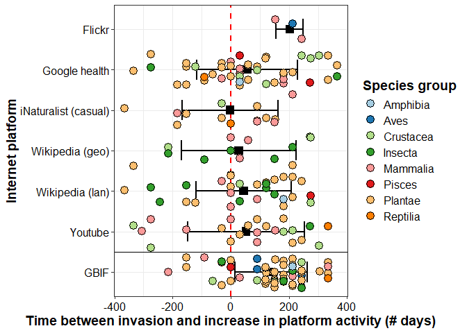
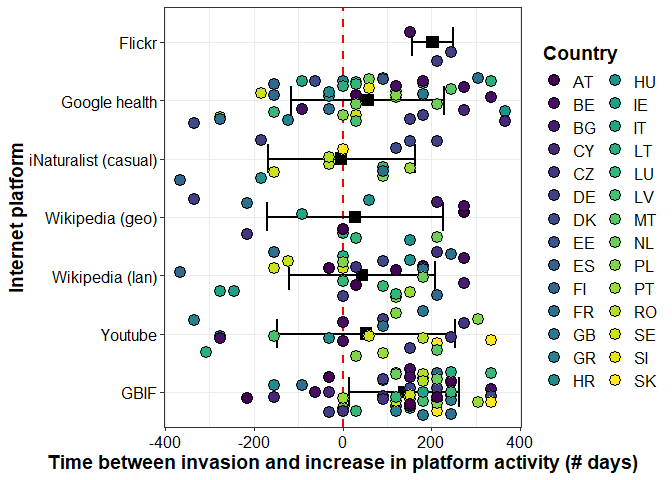
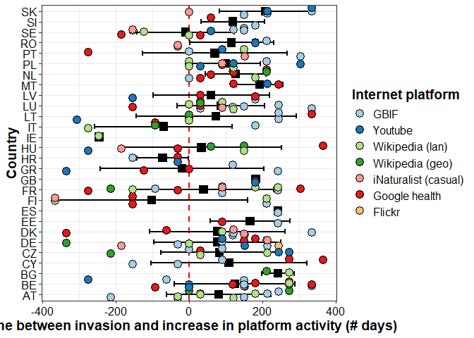
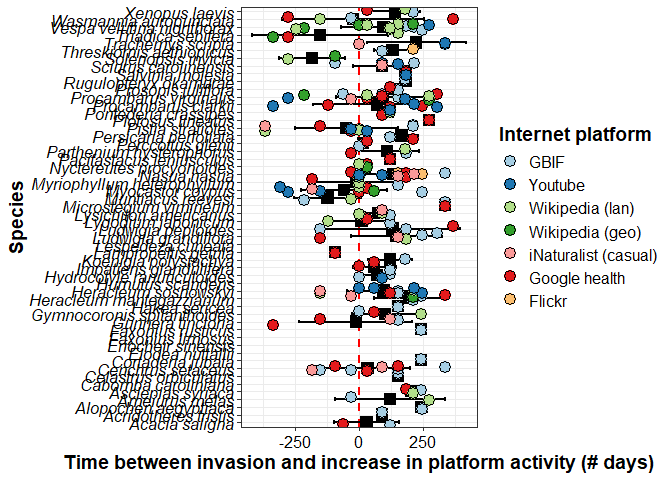
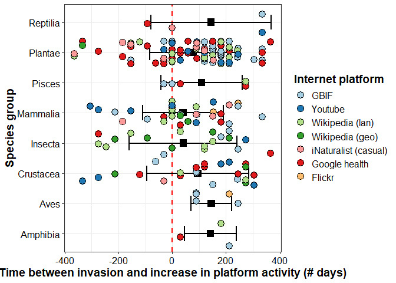
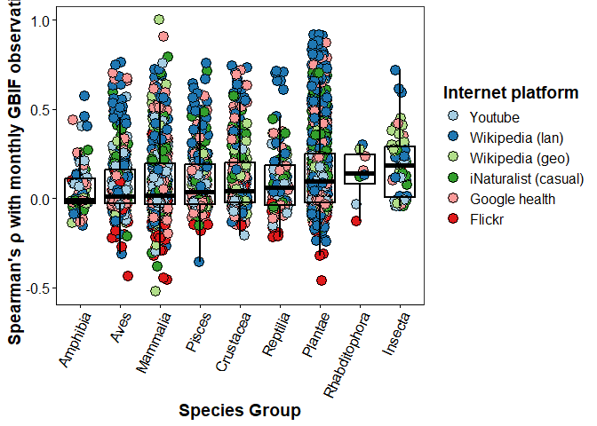
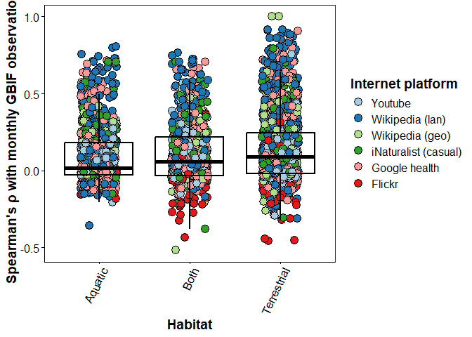

Data processing and statistical analysis of iEcology-IAS-miner data in R
================
Simon Reynaert
25/08/2025

- [1. Loading the required packages](#1-loading-the-required-packages)
- [2. Load in all data sources and
  preprocess](#2-load-in-all-data-sources-and-preprocess)
  - [2.1. Load in the EASIN lists, filter out species x country
    invasions \>=2016 and save as new
    csv](#21-load-in-the-easin-lists-filter-out-species-x-country-invasions-2016-and-save-as-new-csv)
  - [2.2. Load and pre-process the wikipedia language to country mapping
    pageview
    data](#22-load-and-pre-process-the-wikipedia-language-to-country-mapping-pageview-data)
  - [2.3. Load, join and pre-process the wikipedia geolocated pageview
    datasets](#23-load-join-and-pre-process-the-wikipedia-geolocated-pageview-datasets)
  - [2.4. Load and pre-process geolocated Google health activity
    data](#24-load-and-pre-process-geolocated-google-health-activity-data)
  - [2.5. Load and pre-process geolocated Flickr
    data](#25-load-and-pre-process-geolocated-flickr-data)
  - [2.6. Load and pre-process geolocated iNaturalist casual
    observations](#26-load-and-pre-process-geolocated-inaturalist-casual-observations)
  - [2.7. Load and pre-process youtube geolocated
    videos](#27-load-and-pre-process-youtube-geolocated-videos)
  - [2.8. Load and pre-process the GBIF
    data](#28-load-and-pre-process-the-gbif-data)
- [3. Combine all datasets into long format df including daily activity
  patterns](#3-combine-all-datasets-into-long-format-df-including-daily-activity-patterns)
- [4. Bin ‘views’ (= activity) per species x country x platform per
  month to capture signals of increased
  frequency](#4-bin-views--activity-per-species-x-country-x-platform-per-month-to-capture-signals-of-increased-frequency)
- [5. Join monthly long format data with the intro_year EASIN data and
  save as combined
  file](#5-join-monthly-long-format-data-with-the-intro_year-easin-data-and-save-as-combined-file)
- [6. Perform the anomalous activity detection surrounding the EASIN
  reported invasion year for all country x species x platform
  combinations and make
  plots](#6-perform-the-anomalous-activity-detection-surrounding-the-easin-reported-invasion-year-for-all-country-x-species-x-platform-combinations-and-make-plots)
  - [6.1. Prepare the data to feed to anomaly detection
    loop](#61-prepare-the-data-to-feed-to-anomaly-detection-loop)
  - [6.2. Detect the anomalies and combine with raw
    data](#62-detect-the-anomalies-and-combine-with-raw-data)
  - [6.3. Generate the anomaly plots for visual
    inspection](#63-generate-the-anomaly-plots-for-visual-inspection)
  - [6.4. Calculate lead or lag between earliest possible invasion date
    (i.e., january 1st of the invasion year) and anomalous increase in
    platform activity (if
    any)](#64-calculate-lead-or-lag-between-earliest-possible-invasion-date-ie-january-1st-of-the-invasion-year-and-anomalous-increase-in-platform-activity-if-any)
  - [6.5. Generate mean comparison plots between countries, species,
    platforms](#65-generate-mean-comparison-plots-between-countries-species-platforms)
- [7. Lumping normalized data together to check if it improves
  predictability](#7-lumping-normalized-data-together-to-check-if-it-improves-predictability)
  - [7.1. Normalize all activities by dividing each observation by its
    maximum](#71-normalize-all-activities-by-dividing-each-observation-by-its-maximum)
- [7.2.Generate the lump plots with gam fit for all observations except
  GBIF](#72generate-the-lump-plots-with-gam-fit-for-all-observations-except-gbif)
- [8. Verify correlations between GBIF and
  platforms](#8-verify-correlations-between-gbif-and-platforms)
  - [8.1. Check synonyms have been handled correctly and clean up
    data](#81-check-synonyms-have-been-handled-correctly-and-clean-up-data)
  - [8.2. Calculate Spearman correlations with GBIF
    data](#82-calculate-spearman-correlations-with-gbif-data)
  - [8.3. Join with species characteristics data and calculate
    statistics](#83-join-with-species-characteristics-data-and-calculate-statistics)
  - [8.4. Make the Spearman rank correlation
    plots](#84-make-the-spearman-rank-correlation-plots)

This R markdown document goes over the processing and statistical
analysis that was performed in R of the mined iEcology data for the
*iEcology-IAS-miner* Github repository.

# 1. Loading the required packages

``` r
# install.packages(c("tidyverse","lubridate","tidyr","timetk","anomalize","tibbletime","ggplot2","stringr","viridis","countrycode","tbl2xts","reshape2","Hmisc","broom","lme4","nlme","gamlss"))  # if needed
library(tidyverse)
library(lubridate)
library(dplyr)
library(timetk)
library(anomalize)
library(tidyr)
library(tibbletime)
library(ggplot2)
library(stringr)
library(viridis)
library(countrycode)
library(tbl2xts)
library(reshape2)
library(Hmisc)
library(broom)
library(lme4)
library(nlme)
library(gamlss)
library(readr)
library(cowplot)
```

``` r
#check working directory
getwd()
```

    ## [1] "C:/Users/simon/Documents"

# 2. Load in all data sources and preprocess

## 2.1. Load in the EASIN lists, filter out species x country invasions \>=2016 and save as new csv

``` r
#––  Load data
uni <- read_csv("UnionList_Species_Traits_85_present.csv")
```

    ## Registered S3 method overwritten by 'bit':
    ##   method   from  
    ##   print.ri gamlss

    ## Rows: 937 Columns: 7
    ## ── Column specification ────────────────────────────────────────────────────────
    ## Delimiter: ","
    ## chr (6): EASIN.ID, SCIENTIFIC_NAME, COUNTRY, Group, Habitat, WIKI NAME
    ## dbl (1): YEAR
    ## 
    ## ℹ Use `spec()` to retrieve the full column specification for this data.
    ## ℹ Specify the column types or set `show_col_types = FALSE` to quiet this message.

``` r
uni=uni%>%
mutate(COUNTRY = ifelse(COUNTRY == "UK", "GB",ifelse(COUNTRY == "EL", "GR", COUNTRY)))
  
str(uni)
```

    ## tibble [937 × 7] (S3: tbl_df/tbl/data.frame)
    ##  $ EASIN.ID       : chr [1:937] "R00053" "R00053" "R00053" "R00053" ...
    ##  $ SCIENTIFIC_NAME: chr [1:937] "Acacia saligna" "Acacia saligna" "Acacia saligna" "Acacia saligna" ...
    ##  $ COUNTRY        : chr [1:937] "CY" "CZ" "DK" "GR" ...
    ##  $ YEAR           : num [1:937] 1881 2012 2023 1842 1800 ...
    ##  $ Group          : chr [1:937] "Plantae" "Plantae" "Plantae" "Plantae" ...
    ##  $ Habitat        : chr [1:937] "Terrestrial" "Terrestrial" "Terrestrial" "Terrestrial" ...
    ##  $ WIKI NAME      : chr [1:937] "Acacia saligna" "Acacia saligna" "Acacia saligna" "Acacia saligna" ...

``` r
unique(uni$COUNTRY)
```

    ##  [1] "CY" "CZ" "DK" "GR" "ES" "FR" "HR" "IT" "MT" "PT" "SE" "GB" "AT" "DE" "NL"
    ## [16] "BE" "BG" "EE" "HU" "IE" "LU" "LV" "PL" "RO" "SI" "SK" "LT" "FI"

``` r
#––  uni#––  Filter introductions to YEAR >= 2016
intro_year <- uni %>%
  filter(YEAR >= 2016) %>%
  select(SCIENTIFIC_NAME, COUNTRY, YEAR, 'WIKI NAME', Group, Habitat,EASIN.ID) %>%
  distinct()
if (nrow(intro_year) == 0) stop("No introductions found after 2016.")

str(intro_year)
```

    ## tibble [112 × 7] (S3: tbl_df/tbl/data.frame)
    ##  $ SCIENTIFIC_NAME: chr [1:112] "Acacia saligna" "Acridotheres tristis" "Acridotheres tristis" "Alopochen aegyptiaca" ...
    ##  $ COUNTRY        : chr [1:112] "DK" "CY" "GR" "LT" ...
    ##  $ YEAR           : num [1:112] 2023 2022 2017 2016 2017 ...
    ##  $ WIKI NAME      : chr [1:112] "Acacia saligna" "Acridotheres tristis" "Acridotheres tristis" "Alopochen aegyptiaca" ...
    ##  $ Group          : chr [1:112] "Plantae" "Aves" "Aves" "Aves" ...
    ##  $ Habitat        : chr [1:112] "Terrestrial" "Terrestrial" "Terrestrial" "Both" ...
    ##  $ EASIN.ID       : chr [1:112] "R00053" "R00212" "R00212" "R00644" ...

``` r
#fix inconsistent naming for merge with datasets later on

intro_year <- intro_year %>%
  mutate(
    SCIENTIFIC_NAME = case_when(
      # Mappings where the "FROM" name might be in intro_year and needs to change "TO" the new canonical form.
      # This is crucial because you want intro_year to contain the *standardized* names.
      SCIENTIFIC_NAME == "Cortaderia selloana subsp. jubata" ~ "Cortaderia jubata",
      SCIENTIFIC_NAME == "Eichhornia crassipes" ~ "Pontederia crassipes",
      SCIENTIFIC_NAME == "Trachemys scripta elegans" ~ "Trachemys scripta",
      SCIENTIFIC_NAME == "Pennisetum setaceum" ~ "Cenchrus setaceus",
      SCIENTIFIC_NAME == "Herpestes auropunctatus" ~ "Urva auropunctata",
      SCIENTIFIC_NAME == "Neltuma juliflora" ~ "Prosopis juliflora",
      SCIENTIFIC_NAME == "Orconectes limosus" ~ "Faxonius limosus",
      SCIENTIFIC_NAME == "Orconectes virilis" ~ "Faxonius virilis",
      SCIENTIFIC_NAME == "Solenopsis geminata" ~ "Solenopsis invicta",
      SCIENTIFIC_NAME == "Solenopsis richteri" ~ "Solenopsis invicta",
      SCIENTIFIC_NAME == "Pueraria montana (Lour.) Merr. var. lobata" ~ "Pueraria montana",
      SCIENTIFIC_NAME == "Gambusia holbrooki" ~ "Gambusia affinis",
      TRUE ~ SCIENTIFIC_NAME # Keep other names as they are
    ))

unique(intro_year$SCIENTIFIC_NAME)
```

    ##  [1] "Acacia saligna"             "Acridotheres tristis"      
    ##  [3] "Alopochen aegyptiaca"       "Ameiurus melas"            
    ##  [5] "Asclepias syriaca"          "Cabomba caroliniana"       
    ##  [7] "Celastrus orbiculatus"      "Cenchrus setaceus"         
    ##  [9] "Cortaderia jubata"          "Elodea nuttallii"          
    ## [11] "Eriocheir sinensis"         "Faxonius limosus"          
    ## [13] "Faxonius rusticus"          "Gunnera tinctoria"         
    ## [15] "Gymnocoronis spilanthoides" "Hakea sericea"             
    ## [17] "Heracleum mantegazzianum"   "Heracleum sosnowskyi"      
    ## [19] "Humulus scandens"           "Hydrocotyle ranunculoides" 
    ## [21] "Impatiens glandulifera"     "Koenigia polystachya"      
    ## [23] "Lampropeltis getula"        "Lespedeza cuneata"         
    ## [25] "Ludwigia grandiflora"       "Ludwigia peploides"        
    ## [27] "Lygodium japonicum"         "Lysichiton americanus"     
    ## [29] "Microstegium vimineum"      "Muntiacus reevesi"         
    ## [31] "Myocastor coypus"           "Myriophyllum heterophyllum"
    ## [33] "Nasua nasua"                "Prosopis juliflora"        
    ## [35] "Nyctereutes procyonoides"   "Pacifastacus leniusculus"  
    ## [37] "Parthenium hysterophorus"   "Perccottus glenii"         
    ## [39] "Persicaria perfoliata"      "Pistia stratiotes"         
    ## [41] "Plotosus lineatus"          "Pontederia crassipes"      
    ## [43] "Procambarus clarkii"        "Procambarus virginalis"    
    ## [45] "Rugulopteryx okamurae"      "Salvinia molesta"          
    ## [47] "Sciurus carolinensis"       "Solenopsis invicta"        
    ## [49] "Threskiornis aethiopicus"   "Trachemys scripta"         
    ## [51] "Triadica sebifera"          "Vespa velutina nigrithorax"
    ## [53] "Wasmannia auropunctata"     "Xenopus laevis"

``` r
length(unique(intro_year$SCIENTIFIC_NAME))
```

    ## [1] 54

``` r
write.csv(intro_year, "intros_after_2016_EASIN.csv", row.names = FALSE)
```

## 2.2. Load and pre-process the wikipedia language to country mapping pageview data

``` r
#load wiki language pageview data

pv  <- read_csv("species_pageviews_analysis_2016_present.csv")
```

    ## Rows: 1222 Columns: 3424
    ## ── Column specification ────────────────────────────────────────────────────────
    ## Delimiter: ","
    ## chr    (3): Scientific Name, Language, Wikipedia Title
    ## dbl (3421): 20160101, 20160102, 20160103, 20160104, 20160105, 20160106, 2016...
    ## 
    ## ℹ Use `spec()` to retrieve the full column specification for this data.
    ## ℹ Specify the column types or set `show_col_types = FALSE` to quiet this message.

``` r
#––Define language → country mapping
lang2country <- list(
  en = c("GB","IE"), es = "ES", el = c("GR","CY"), fr = c("FR","LU"), de = c("DE","AT","CH"),
  it = "IT", pt = "PT", nl = c("NL","BE"), sv = "SE", da = "DK", fi = "FI", cs = "CZ",
  hr = "HR", hu = "HU", pl = "PL", ro = "RO", sk = "SK", sl = "SI",
  bg = "BG", et = "EE", lv = "LV", lt = "LT", mt = "MT",
  be = "BE"
)

# Sanity check: ensure all intro countries are covered
mapped_countries <- unique(unlist(lang2country))
missing_countries <- setdiff(unique(intro_year$COUNTRY), mapped_countries)
if (length(missing_countries) > 0) {
  warning(paste(
    "Countries with no language mapping:", paste(missing_countries, collapse = ", ")
  ))
}

#––  Prepare pageviews & join
uni_for_join <- uni %>%
  select(-any_of("COUNTRY")) %>% # Drop the 'COUNTRY' column if it exists in 'uni'
  distinct(`WIKI NAME`, .keep_all = TRUE) # Selects one representative row for each WIKI NAME in 'uni'.
# If 'uni' has a 'COUNTRY' column, it will be included
# but not used for joining.

# Step 2: Perform the join.
pv2 <- pv %>%
  rename('WIKI NAME' = `Scientific Name`) %>%
  mutate(COUNTRY = lang2country[Language]) %>% # Keeps the COUNTRY from pv pipeline
  unnest_longer(COUNTRY) %>%
  filter(!is.na(COUNTRY)) %>%
  inner_join(uni_for_join, by = c("WIKI NAME"))

unique(pv2$SCIENTIFIC_NAME)
```

    ##  [1] "Acacia saligna"                            
    ##  [2] "Acridotheres tristis"                      
    ##  [3] "Ailanthus altissima"                       
    ##  [4] "Alopochen aegyptiaca"                      
    ##  [5] "Alternanthera philoxeroides"               
    ##  [6] "Ameiurus melas"                            
    ##  [7] "Andropogon virginicus"                     
    ##  [8] "Arthurdendyus triangulatus"                
    ##  [9] "Asclepias syriaca"                         
    ## [10] "Axis axis"                                 
    ## [11] "Baccharis halimifolia"                     
    ## [12] "Cabomba caroliniana"                       
    ## [13] "Callosciurus erythraeus"                   
    ## [14] "Callosciurus finlaysonii"                  
    ## [15] "Cardiospermum grandiflorum"                
    ## [16] "Celastrus orbiculatus"                     
    ## [17] "Channa argus"                              
    ## [18] "Cortaderia selloana subsp. jubata"         
    ## [19] "Corvus splendens"                          
    ## [20] "Ehrharta calycina"                         
    ## [21] "Pontederia crassipes"                      
    ## [22] "Elodea nuttallii"                          
    ## [23] "Eriocheir sinensis"                        
    ## [24] "Faxonius rusticus"                         
    ## [25] "Fundulus heteroclitus"                     
    ## [26] "Gambusia affinis"                          
    ## [27] "Gambusia holbrooki"                        
    ## [28] "Gunnera tinctoria"                         
    ## [29] "Gymnocoronis spilanthoides"                
    ## [30] "Hakea sericea"                             
    ## [31] "Heracleum mantegazzianum"                  
    ## [32] "Heracleum persicum"                        
    ## [33] "Heracleum sosnowskyi"                      
    ## [34] "Urva auropunctata"                         
    ## [35] "Humulus scandens"                          
    ## [36] "Hydrocotyle ranunculoides"                 
    ## [37] "Impatiens glandulifera"                    
    ## [38] "Koenigia polystachya"                      
    ## [39] "Lagarosiphon major"                        
    ## [40] "Lampropeltis getula"                       
    ## [41] "Lepomis gibbosus"                          
    ## [42] "Lespedeza cuneata"                         
    ## [43] "Lithobates catesbeianus"                   
    ## [44] "Ludwigia grandiflora"                      
    ## [45] "Ludwigia peploides"                        
    ## [46] "Lygodium japonicum"                        
    ## [47] "Lysichiton americanus"                     
    ## [48] "Microstegium vimineum"                     
    ## [49] "Muntiacus reevesi"                         
    ## [50] "Myocastor coypus"                          
    ## [51] "Myriophyllum aquaticum"                    
    ## [52] "Myriophyllum heterophyllum"                
    ## [53] "Nasua nasua"                               
    ## [54] "Nyctereutes procyonoides"                  
    ## [55] "Ondatra zibethicus"                        
    ## [56] "Oxyura jamaicensis"                        
    ## [57] "Pacifastacus leniusculus"                  
    ## [58] "Parthenium hysterophorus"                  
    ## [59] "Cenchrus setaceus"                         
    ## [60] "Perccottus glenii"                         
    ## [61] "Persicaria perfoliata"                     
    ## [62] "Pistia stratiotes"                         
    ## [63] "Plotosus lineatus"                         
    ## [64] "Procambarus clarkii"                       
    ## [65] "Procambarus virginalis"                    
    ## [66] "Procyon lotor"                             
    ## [67] "Neltuma juliflora"                         
    ## [68] "Pseudorasbora parva"                       
    ## [69] "Pueraria montana (Lour.) Merr. var. lobata"
    ## [70] "Pycnonotus cafer"                          
    ## [71] "Rugulopteryx okamurae"                     
    ## [72] "Salvinia molesta"                          
    ## [73] "Sciurus carolinensis"                      
    ## [74] "Sciurus niger"                             
    ## [75] "Solenopsis geminata"                       
    ## [76] "Solenopsis invicta"                        
    ## [77] "Tamias sibiricus"                          
    ## [78] "Threskiornis aethiopicus"                  
    ## [79] "Trachemys scripta"                         
    ## [80] "Triadica sebifera"                         
    ## [81] "Vespa velutina nigrithorax"                
    ## [82] "Wasmannia auropunctata"                    
    ## [83] "Xenopus laevis"

``` r
unique(pv2$`WIKI NAME`)
```

    ##  [1] "Acacia saligna"              "Acridotheres tristis"       
    ##  [3] "Ailanthus altissima"         "Alopochen aegyptiaca"       
    ##  [5] "Alternanthera philoxeroides" "Ameiurus melas"             
    ##  [7] "Andropogon virginicus"       "Arthurdendyus triangulatus" 
    ##  [9] "Asclepias syriaca"           "Axis axis"                  
    ## [11] "Baccharis halimifolia"       "Cabomba caroliniana"        
    ## [13] "Callosciurus erythraeus"     "Callosciurus finlaysonii"   
    ## [15] "Cardiospermum grandiflorum"  "Celastrus orbiculatus"      
    ## [17] "Channa argus"                "Cortaderia jubata"          
    ## [19] "Corvus splendens"            "Ehrharta calycina"          
    ## [21] "Eichhornia crassipes"        "Elodea nuttallii"           
    ## [23] "Eriocheir sinensis"          "Faxonius rusticus"          
    ## [25] "Fundulus heteroclitus"       "Gambusia affinis"           
    ## [27] "Gambusia holbrooki"          "Gunnera tinctoria"          
    ## [29] "Gymnocoronis spilanthoides"  "Hakea sericea"              
    ## [31] "Heracleum mantegazzianum"    "Heracleum persicum"         
    ## [33] "Heracleum sosnowskyi"        "Herpestes javanicus"        
    ## [35] "Humulus scandens"            "Hydrocotyle ranunculoides"  
    ## [37] "Impatiens glandulifera"      "Koenigia polystachya"       
    ## [39] "Lagarosiphon major"          "Lampropeltis getula"        
    ## [41] "Lepomis gibbosus"            "Lespedeza cuneata"          
    ## [43] "Lithobates catesbeianus"     "Ludwigia grandiflora"       
    ## [45] "Ludwigia peploides"          "Lygodium japonicum"         
    ## [47] "Lysichiton americanus"       "Microstegium vimineum"      
    ## [49] "Muntiacus reevesi"           "Myocastor coypus"           
    ## [51] "Myriophyllum aquaticum"      "Myriophyllum heterophyllum" 
    ## [53] "Nasua nasua"                 "Nyctereutes procyonoides"   
    ## [55] "Ondatra zibethicus"          "Oxyura jamaicensis"         
    ## [57] "Pacifastacus leniusculus"    "Parthenium hysterophorus"   
    ## [59] "Pennisetum setaceum"         "Perccottus glenii"          
    ## [61] "Persicaria perfoliata"       "Pistia stratiotes"          
    ## [63] "Plotosus lineatus"           "Procambarus clarkii"        
    ## [65] "Procambarus virginalis"      "Procyon lotor"              
    ## [67] "Prosopis juliflora"          "Pseudorasbora parva"        
    ## [69] "Pueraria montana"            "Pycnonotus cafer"           
    ## [71] "Rugulopteryx okamurae"       "Salvinia molesta"           
    ## [73] "Sciurus carolinensis"        "Sciurus niger"              
    ## [75] "Solenopsis geminata"         "Solenopsis invicta"         
    ## [77] "Tamias sibiricus"            "Threskiornis aethiopicus"   
    ## [79] "Trachemys scripta elegans"   "Triadica sebifera"          
    ## [81] "Vespa velutina nigrithorax"  "Wasmannia auropunctata"     
    ## [83] "Xenopus laevis"

``` r
length(unique(pv$`Scientific Name`))
```

    ## [1] 88

``` r
length(unique(pv2$`WIKI NAME`))
```

    ## [1] 83

``` r
#Pivot to long format
pv_long <- pv2 %>%
  pivot_longer(cols = matches("^[0-9]{8}$"),
               names_to = "date", values_to = "views") %>%
  mutate(date = ymd(date), views = as.numeric(views)) %>%
  filter(!is.na(date), !is.na(views)) %>%
  select(SCIENTIFIC_NAME, COUNTRY, YEAR, date, views)

str(pv_long)
```

    ## tibble [3,597,024 × 5] (S3: tbl_df/tbl/data.frame)
    ##  $ SCIENTIFIC_NAME: chr [1:3597024] "Acacia saligna" "Acacia saligna" "Acacia saligna" "Acacia saligna" ...
    ##  $ COUNTRY        : chr [1:3597024] "DE" "DE" "DE" "DE" ...
    ##  $ YEAR           : num [1:3597024] 1881 1881 1881 1881 1881 ...
    ##  $ date           : Date[1:3597024], format: "2016-01-01" "2016-01-02" ...
    ##  $ views          : num [1:3597024] 5 10 4 3 4 5 7 41 6 5 ...

## 2.3. Load, join and pre-process the wikipedia geolocated pageview datasets

``` r
#load in the data
wikidat_geo <- read_csv("species_pageviews_wiki_geolocated_2023-02-06_now.csv")
```

    ## Rows: 629 Columns: 787
    ## ── Column specification ────────────────────────────────────────────────────────
    ## Delimiter: ","
    ## chr   (3): Scientific Name, Country, Wikidata Q-number
    ## dbl (784): 2023-02-06, 2023-02-07, 2023-02-08, 2023-02-09, 2023-02-10, 2023-...
    ## 
    ## ℹ Use `spec()` to retrieve the full column specification for this data.
    ## ℹ Specify the column types or set `show_col_types = FALSE` to quiet this message.

``` r
head(wikidat_geo)
```

    ## # A tibble: 6 × 787
    ##   `Scientific Name`    Country   `Wikidata Q-number` `2023-02-06` `2023-02-07`
    ##   <chr>                <chr>     <chr>                      <dbl>        <dbl>
    ## 1 Acacia saligna       France    Q402385                       NA           NA
    ## 2 Acacia saligna       Germany   Q402385                       NA           NA
    ## 3 Acacia saligna       Israel    Q402385                       NA           NA
    ## 4 Acridotheres tristis Algeria   Q116667                       NA           NA
    ## 5 Acridotheres tristis Australia Q116667                       NA           96
    ## 6 Acridotheres tristis Bulgaria  Q116667                       NA           NA
    ## # ℹ 782 more variables: `2023-02-08` <dbl>, `2023-02-09` <dbl>,
    ## #   `2023-02-10` <dbl>, `2023-02-11` <dbl>, `2023-02-12` <dbl>,
    ## #   `2023-02-13` <dbl>, `2023-02-14` <dbl>, `2023-02-15` <dbl>,
    ## #   `2023-02-16` <dbl>, `2023-02-17` <dbl>, `2023-02-18` <dbl>,
    ## #   `2023-02-19` <dbl>, `2023-02-20` <dbl>, `2023-02-21` <dbl>,
    ## #   `2023-02-22` <dbl>, `2023-02-23` <dbl>, `2023-02-24` <dbl>,
    ## #   `2023-02-25` <dbl>, `2023-02-26` <dbl>, `2023-02-27` <dbl>, …

``` r
wikidat_geo_old <- read_csv("species_pageviews_wiki_geolocated_2017-02-09_2023-02-05.csv")
```

    ## Rows: 425 Columns: 2185
    ## ── Column specification ────────────────────────────────────────────────────────
    ## Delimiter: ","
    ## chr    (3): Scientific Name, Country, Wikidata Q-number
    ## dbl (2182): 2017-02-09, 2017-02-10, 2017-02-11, 2017-02-12, 2017-02-13, 2017...
    ## 
    ## ℹ Use `spec()` to retrieve the full column specification for this data.
    ## ℹ Specify the column types or set `show_col_types = FALSE` to quiet this message.

``` r
head(wikidat_geo_old)
```

    ## # A tibble: 6 × 2,185
    ##   `Scientific Name`    Country     `Wikidata Q-number` `2017-02-09` `2017-02-10`
    ##   <chr>                <chr>       <chr>                      <dbl>        <dbl>
    ## 1 Acridotheres tristis Germany     Q116667                       NA           NA
    ## 2 Acridotheres tristis India       Q116667                       NA           NA
    ## 3 Acridotheres tristis Israel      Q116667                       NA           NA
    ## 4 Acridotheres tristis Japan       Q116667                       NA           NA
    ## 5 Acridotheres tristis Netherlands Q116667                       NA           NA
    ## 6 Acridotheres tristis Taiwan      Q116667                       NA           NA
    ## # ℹ 2,180 more variables: `2017-02-11` <dbl>, `2017-02-12` <dbl>,
    ## #   `2017-02-13` <dbl>, `2017-02-14` <dbl>, `2017-02-15` <dbl>,
    ## #   `2017-02-16` <dbl>, `2017-02-17` <dbl>, `2017-02-18` <dbl>,
    ## #   `2017-02-19` <dbl>, `2017-02-20` <dbl>, `2017-02-21` <dbl>,
    ## #   `2017-02-22` <dbl>, `2017-02-23` <dbl>, `2017-02-24` <dbl>,
    ## #   `2017-02-25` <dbl>, `2017-02-26` <dbl>, `2017-02-27` <dbl>,
    ## #   `2017-02-28` <dbl>, `2017-03-01` <dbl>, `2017-03-02` <dbl>, …

``` r
# Join the two dataframes on shared ID columns
combined_geo <- full_join(
  wikidat_geo_old,
  wikidat_geo,
  by = c("Scientific Name", "Country", "Wikidata Q-number")
)

head(combined_geo)
```

    ## # A tibble: 6 × 2,969
    ##   `Scientific Name`    Country     `Wikidata Q-number` `2017-02-09` `2017-02-10`
    ##   <chr>                <chr>       <chr>                      <dbl>        <dbl>
    ## 1 Acridotheres tristis Germany     Q116667                       NA           NA
    ## 2 Acridotheres tristis India       Q116667                       NA           NA
    ## 3 Acridotheres tristis Israel      Q116667                       NA           NA
    ## 4 Acridotheres tristis Japan       Q116667                       NA           NA
    ## 5 Acridotheres tristis Netherlands Q116667                       NA           NA
    ## 6 Acridotheres tristis Taiwan      Q116667                       NA           NA
    ## # ℹ 2,964 more variables: `2017-02-11` <dbl>, `2017-02-12` <dbl>,
    ## #   `2017-02-13` <dbl>, `2017-02-14` <dbl>, `2017-02-15` <dbl>,
    ## #   `2017-02-16` <dbl>, `2017-02-17` <dbl>, `2017-02-18` <dbl>,
    ## #   `2017-02-19` <dbl>, `2017-02-20` <dbl>, `2017-02-21` <dbl>,
    ## #   `2017-02-22` <dbl>, `2017-02-23` <dbl>, `2017-02-24` <dbl>,
    ## #   `2017-02-25` <dbl>, `2017-02-26` <dbl>, `2017-02-27` <dbl>,
    ## #   `2017-02-28` <dbl>, `2017-03-01` <dbl>, `2017-03-02` <dbl>, …

``` r
write_csv(combined_geo, "combined_wiki_pageviews_geo_2017-now.csv")

combined_geo_mapped <- combined_geo %>%
  mutate(
    COUNTRY = countrycode(Country,
                               origin = "country.name",
                               destination = "iso2c")
  )
```

    ## Warning: There was 1 warning in `mutate()`.
    ## ℹ In argument: `COUNTRY = countrycode(Country, origin = "country.name",
    ##   destination = "iso2c")`.
    ## Caused by warning:
    ## ! Some values were not matched unambiguously: unknown

``` r
head(combined_geo_mapped)
```

    ## # A tibble: 6 × 2,970
    ##   `Scientific Name`    Country     `Wikidata Q-number` `2017-02-09` `2017-02-10`
    ##   <chr>                <chr>       <chr>                      <dbl>        <dbl>
    ## 1 Acridotheres tristis Germany     Q116667                       NA           NA
    ## 2 Acridotheres tristis India       Q116667                       NA           NA
    ## 3 Acridotheres tristis Israel      Q116667                       NA           NA
    ## 4 Acridotheres tristis Japan       Q116667                       NA           NA
    ## 5 Acridotheres tristis Netherlands Q116667                       NA           NA
    ## 6 Acridotheres tristis Taiwan      Q116667                       NA           NA
    ## # ℹ 2,965 more variables: `2017-02-11` <dbl>, `2017-02-12` <dbl>,
    ## #   `2017-02-13` <dbl>, `2017-02-14` <dbl>, `2017-02-15` <dbl>,
    ## #   `2017-02-16` <dbl>, `2017-02-17` <dbl>, `2017-02-18` <dbl>,
    ## #   `2017-02-19` <dbl>, `2017-02-20` <dbl>, `2017-02-21` <dbl>,
    ## #   `2017-02-22` <dbl>, `2017-02-23` <dbl>, `2017-02-24` <dbl>,
    ## #   `2017-02-25` <dbl>, `2017-02-26` <dbl>, `2017-02-27` <dbl>,
    ## #   `2017-02-28` <dbl>, `2017-03-01` <dbl>, `2017-03-02` <dbl>, …

``` r
# Step 2: Inner join to retain only matching species x country rows
filtered_data <- combined_geo_mapped %>%
  inner_join(uni_for_join, by = c("Scientific Name" = "WIKI NAME"))

unique(filtered_data$COUNTRY)
```

    ##  [1] "DE" "IN" "IL" "JP" "NL" "TW" "US" "AT" "BE" "HR" "CZ" "DK" "FR" "GR" "IT"
    ## [16] "SI" "ES" "SE" "GB" "ID" "PL" "CA" "HU" "AR" "BR" "HK" "MY" "PH" "CH" "VA"
    ## [31] "AU" "GD" "CL" "BG" "FI" "IE" "MX" "NO" "SK" "KR" "LT" "UA" "UY" "AM" "CO"
    ## [46] "EE" "NZ" "MK" "RO" "RS" "SX" NA   "LU" "PE" "NG" "ZA" "IS" "PT" "SG" "DZ"
    ## [61] "JO" "KG" "TH" "BO" "RU" "TN" "BT" "BA" "PR" "RW" "DO" "GH" "MA" "GI"

``` r
# narrow down to EU countries on list
desired_iso2_countries <- c( 
  "GB","IE", "ES", "GR", "FR","LU", "DE","AT","CH", "IT", "PT", "NL","BE",
  "SE", "DK", "FI", "CZ", "HR", "HU", "PL", "RO", "SK", "SI", "BG", "EE",
  "LV", "LT", "MT", "CY"
)

filtered_data <- filtered_data %>%
  filter(COUNTRY %in% desired_iso2_countries)

unique(filtered_data$COUNTRY)
```

    ##  [1] "DE" "NL" "AT" "BE" "HR" "CZ" "DK" "FR" "GR" "IT" "SI" "ES" "SE" "GB" "PL"
    ## [16] "HU" "CH" "BG" "FI" "IE" "SK" "LT" "EE" "RO" "LU" "PT"

``` r
# Convert date columns to long format
long_data_geo <- filtered_data %>%
  pivot_longer(
    cols = matches("^\\d{4}-\\d{2}-\\d{2}$"),
    names_to = "Date",
    values_to = "Pageviews"
  )

head(long_data_geo)
```

    ## # A tibble: 6 × 11
    ##   `Scientific Name` Country `Wikidata Q-number` COUNTRY EASIN.ID SCIENTIFIC_NAME
    ##   <chr>             <chr>   <chr>               <chr>   <chr>    <chr>          
    ## 1 Acridotheres tri… Germany Q116667             DE      R00212   Acridotheres t…
    ## 2 Acridotheres tri… Germany Q116667             DE      R00212   Acridotheres t…
    ## 3 Acridotheres tri… Germany Q116667             DE      R00212   Acridotheres t…
    ## 4 Acridotheres tri… Germany Q116667             DE      R00212   Acridotheres t…
    ## 5 Acridotheres tri… Germany Q116667             DE      R00212   Acridotheres t…
    ## 6 Acridotheres tri… Germany Q116667             DE      R00212   Acridotheres t…
    ## # ℹ 5 more variables: YEAR <dbl>, Group <chr>, Habitat <chr>, Date <chr>,
    ## #   Pageviews <dbl>

``` r
summary(long_data_geo)
```

    ##  Scientific Name      Country          Wikidata Q-number    COUNTRY         
    ##  Length:1165638     Length:1165638     Length:1165638     Length:1165638    
    ##  Class :character   Class :character   Class :character   Class :character  
    ##  Mode  :character   Mode  :character   Mode  :character   Mode  :character  
    ##                                                                             
    ##                                                                             
    ##                                                                             
    ##                                                                             
    ##    EASIN.ID         SCIENTIFIC_NAME         YEAR         Group          
    ##  Length:1165638     Length:1165638     Min.   :1796   Length:1165638    
    ##  Class :character   Class :character   1st Qu.:1935   Class :character  
    ##  Mode  :character   Mode  :character   Median :1982   Mode  :character  
    ##                                        Mean   :1965                     
    ##                                        3rd Qu.:2007                     
    ##                                        Max.   :2024                     
    ##                                                                         
    ##    Habitat              Date             Pageviews      
    ##  Length:1165638     Length:1165638     Min.   :   90.0  
    ##  Class :character   Class :character   1st Qu.:  196.0  
    ##  Mode  :character   Mode  :character   Median :  451.0  
    ##                                        Mean   :  519.6  
    ##                                        3rd Qu.:  683.0  
    ##                                        Max.   :20686.0  
    ##                                        NA's   :1132906

## 2.4. Load and pre-process geolocated Google health activity data

``` r
# Set the path to the folder containing the CSV files
folder_path <- "C:/Users/simon/Documents/Google health_OneStop"

# List all CSV files in the folder
csv_files <- list.files(path = folder_path, pattern = "\\.csv$", full.names = TRUE)

# Function to read a CSV and add species name
read_and_tag <- function(file_path) {
  # Extract the species name from the file name (remove directory and extension)
  species_name <- tools::file_path_sans_ext(basename(file_path))
  
  # Read the CSV file
  df <- read.csv(file_path)
  
  # Add species name column
  df$Species <- species_name
  
  return(df)
}

# Apply the function to all files and combine into one DataFrame
combined_df <- do.call(rbind, lapply(csv_files, read_and_tag))

# Reorder columns to put Species first (optional)
combined_df <- combined_df %>% select(Species, everything())

# View result
head(combined_df)
```

    ##          Species       date AT BE BG CY CZ DE DK EE ES FI       FR GB GR HR HU
    ## 1 Acacia_saligna 2015-12-27  0  0  0  0  0  0  0  0  0  0 0.000000  0  0  0  0
    ## 2 Acacia_saligna 2016-01-03  0  0  0  0  0  0  0  0  0  0 0.000000  0  0  0  0
    ## 3 Acacia_saligna 2016-01-10  0  0  0  0  0  0  0  0  0  0 8.675739  0  0  0  0
    ## 4 Acacia_saligna 2016-01-17  0  0  0  0  0  0  0  0  0  0 0.000000  0  0  0  0
    ## 5 Acacia_saligna 2016-01-24  0  0  0  0  0  0  0  0  0  0 0.000000  0  0  0  0
    ## 6 Acacia_saligna 2016-01-31  0  0  0  0  0  0  0  0  0  0 0.000000  0  0  0  0
    ##   IE IT       LT LU LV MT NL PL PT       RO SE SI SK
    ## 1  0  0   0.0000  0  0  0  0  0  0  0.00000  0  0  0
    ## 2  0  0   0.0000  0  0  0  0  0  0  0.00000  0  0  0
    ## 3  0  0   0.0000  0  0  0  0  0  0 71.18939  0  0  0
    ## 4  0  0 281.4073  0  0  0  0  0  0  0.00000  0  0  0
    ## 5  0  0   0.0000  0  0  0  0  0  0  0.00000  0  0  0
    ## 6  0  0   0.0000  0  0  0  0  0  0  0.00000  0  0  0

``` r
#Reshape combined_df from wide to long format
long_df <- combined_df %>%
  pivot_longer(
    cols = -c(Species, date),
    names_to = "COUNTRY",
    values_to = "value"
  )

# Clean species names to match intro_year_googlehealth format
long_df <- long_df %>%
  mutate(SCIENTIFIC_NAME = str_replace_all(Species, "_", " "))

#fix name mismatches
long_df$SCIENTIFIC_NAME<-c(ifelse(long_df$SCIENTIFIC_NAME=="Vespa velutina","Vespa velutina nigrithorax",long_df$SCIENTIFIC_NAME))

# Filter to only relevant columns
final_df_googlehealth <- long_df %>%
  select(date, SCIENTIFIC_NAME, COUNTRY, value)

# View the result
head(final_df_googlehealth)
```

    ## # A tibble: 6 × 4
    ##   date       SCIENTIFIC_NAME COUNTRY value
    ##   <chr>      <chr>           <chr>   <dbl>
    ## 1 2015-12-27 Acacia saligna  AT          0
    ## 2 2015-12-27 Acacia saligna  BE          0
    ## 3 2015-12-27 Acacia saligna  BG          0
    ## 4 2015-12-27 Acacia saligna  CY          0
    ## 5 2015-12-27 Acacia saligna  CZ          0
    ## 6 2015-12-27 Acacia saligna  DE          0

``` r
unique(final_df_googlehealth$COUNTRY)
```

    ##  [1] "AT" "BE" "BG" "CY" "CZ" "DE" "DK" "EE" "ES" "FI" "FR" "GB" "GR" "HR" "HU"
    ## [16] "IE" "IT" "LT" "LU" "LV" "MT" "NL" "PL" "PT" "RO" "SE" "SI" "SK"

## 2.5. Load and pre-process geolocated Flickr data

``` r
# Read the CSV file (update path if needed)
data_flickr <- read_csv("deduplicated_geocoded_flickr_2004-now.csv")
```

    ## Rows: 3052 Columns: 11
    ## ── Column specification ────────────────────────────────────────────────────────
    ## Delimiter: ","
    ## chr  (6): scientific_name, country, url, tags, detected_cc, detected_country
    ## dbl  (3): photo_id, latitude, longitude
    ## dttm (2): date_taken, timestamp
    ## 
    ## ℹ Use `spec()` to retrieve the full column specification for this data.
    ## ℹ Specify the column types or set `show_col_types = FALSE` to quiet this message.

``` r
daily_counts_flickr <- data_flickr %>%
  mutate(
    date = as.Date(date_taken), # extract date only, ignore time
    # Convert detected_country (full name) to ISO2 code (e.g., "US", "GB")
    detected_country_iso2 = countrycode(detected_country,
                                        origin = "country.name",
                                        destination = "iso2c",
                                        nomatch = NA_character_),
  ) %>%
  # Filter to include only the desired EU countries
  filter(detected_country_iso2 %in% desired_iso2_countries ) %>%
  rename(COUNTRY = detected_country_iso2)%>%
  # Group by species, the NEW ISO2 country column, and date to count observations
  group_by(scientific_name, COUNTRY, date) %>%
  summarise(observations = n(), .groups = "drop")

str(daily_counts_flickr)
```

    ## tibble [2,697 × 4] (S3: tbl_df/tbl/data.frame)
    ##  $ scientific_name: chr [1:2697] "Acacia saligna" "Acacia saligna" "Ailanthus altissima" "Ailanthus altissima" ...
    ##  $ COUNTRY        : chr [1:2697] "ES" "GR" "AT" "DE" ...
    ##  $ date           : Date[1:2697], format: "2008-01-04" "2016-05-02" ...
    ##  $ observations   : int [1:2697] 1 1 1 1 1 1 1 1 1 1 ...

``` r
head(daily_counts_flickr)
```

    ## # A tibble: 6 × 4
    ##   scientific_name     COUNTRY date       observations
    ##   <chr>               <chr>   <date>            <int>
    ## 1 Acacia saligna      ES      2008-01-04            1
    ## 2 Acacia saligna      GR      2016-05-02            1
    ## 3 Ailanthus altissima AT      2022-11-01            1
    ## 4 Ailanthus altissima DE      2008-08-03            1
    ## 5 Ailanthus altissima DE      2009-07-01            1
    ## 6 Ailanthus altissima DE      2012-06-22            1

``` r
# Create full date range (This part seems independent of country filtering logic)
full_dates <- seq.Date(from = as.Date("2016-01-01"), to = Sys.Date(), by = "day")

# Expand the data to all combinations, fill missing observations with 0
expanded_df_flickr <- daily_counts_flickr %>%
  # Select the scientific_name, the NEW ISO2 country column, date, and observations
  select(scientific_name, COUNTRY, date, observations) %>%
  distinct() %>% # Ensure unique combinations before expanding
  complete(
    scientific_name,
    # Use the ISO2 country column for expansion
    COUNTRY,
    date = full_dates,
    fill = list(observations = 0)
  )

head(expanded_df_flickr)
```

    ## # A tibble: 6 × 4
    ##   scientific_name COUNTRY date       observations
    ##   <chr>           <chr>   <date>            <int>
    ## 1 Acacia saligna  AT      2016-01-01            0
    ## 2 Acacia saligna  AT      2016-01-02            0
    ## 3 Acacia saligna  AT      2016-01-03            0
    ## 4 Acacia saligna  AT      2016-01-04            0
    ## 5 Acacia saligna  AT      2016-01-05            0
    ## 6 Acacia saligna  AT      2016-01-06            0

## 2.6. Load and pre-process geolocated iNaturalist casual observations

``` r
# Read the CSV file (update path if needed)
data_inat <- read_csv("species_country_observations_inat_2016_present.csv")
```

    ## Rows: 975 Columns: 3487
    ## ── Column specification ────────────────────────────────────────────────────────
    ## Delimiter: ","
    ## chr    (2): Scientific Name, Country
    ## dbl (3485): 2016-01-01, 2016-01-02, 2016-01-03, 2016-01-04, 2016-01-05, 2016...
    ## 
    ## ℹ Use `spec()` to retrieve the full column specification for this data.
    ## ℹ Specify the column types or set `show_col_types = FALSE` to quiet this message.

``` r
head(data_inat)
```

    ## # A tibble: 6 × 3,487
    ##   `Scientific Name` Country `2016-01-01` `2016-01-02` `2016-01-03` `2016-01-04`
    ##   <chr>             <chr>          <dbl>        <dbl>        <dbl>        <dbl>
    ## 1 Acacia saligna    AL                 0            0            0            0
    ## 2 Acacia saligna    AT                 0            0            0            0
    ## 3 Acacia saligna    ES                 0            0            0            0
    ## 4 Acacia saligna    FR                 0            0            0            0
    ## 5 Acacia saligna    GR                 0            0            0            0
    ## 6 Acacia saligna    IT                 0            0            0            0
    ## # ℹ 3,481 more variables: `2016-01-05` <dbl>, `2016-01-06` <dbl>,
    ## #   `2016-01-07` <dbl>, `2016-01-08` <dbl>, `2016-01-09` <dbl>,
    ## #   `2016-01-10` <dbl>, `2016-01-11` <dbl>, `2016-01-12` <dbl>,
    ## #   `2016-01-13` <dbl>, `2016-01-14` <dbl>, `2016-01-15` <dbl>,
    ## #   `2016-01-16` <dbl>, `2016-01-17` <dbl>, `2016-01-18` <dbl>,
    ## #   `2016-01-19` <dbl>, `2016-01-20` <dbl>, `2016-01-21` <dbl>,
    ## #   `2016-01-22` <dbl>, `2016-01-23` <dbl>, `2016-01-24` <dbl>, …

``` r
# Convert data_inat to long format
long_inat_df <- data_inat %>%
  # Rename 'Scientific.Name' to 'SCIENTIFIC_NAME' for consistency
  rename(SCIENTIFIC_NAME = `Scientific Name`) %>%
  # Pivot all columns EXCEPT 'SCIENTIFIC_NAME' and 'Country'
  pivot_longer(
    cols = -c(SCIENTIFIC_NAME, Country), # Selects all columns EXCEPT these ID columns
    names_to = "date",                   # New column to store the date (old column names)
    values_to = "observations"           # New column to store the observation values
  ) %>%
  # Ensure the date column is in date format
  mutate(date = as.Date(date)) %>%
  # Add the 'Internet_platform' column with the tag 'inat'
  mutate(Internet_platform = "iNaturalist (casual)",
         views = observations,
         COUNTRY = Country
         ) %>%
  select(SCIENTIFIC_NAME, COUNTRY, date, views, Internet_platform)

#display first rows
print(head(long_inat_df))
```

    ## # A tibble: 6 × 5
    ##   SCIENTIFIC_NAME COUNTRY date       views Internet_platform   
    ##   <chr>           <chr>   <date>     <dbl> <chr>               
    ## 1 Acacia saligna  AL      2016-01-01     0 iNaturalist (casual)
    ## 2 Acacia saligna  AL      2016-01-02     0 iNaturalist (casual)
    ## 3 Acacia saligna  AL      2016-01-03     0 iNaturalist (casual)
    ## 4 Acacia saligna  AL      2016-01-04     0 iNaturalist (casual)
    ## 5 Acacia saligna  AL      2016-01-05     0 iNaturalist (casual)
    ## 6 Acacia saligna  AL      2016-01-06     0 iNaturalist (casual)

## 2.7. Load and pre-process youtube geolocated videos

``` r
# Define the folder path where the YouTube CSVs are located
# IMPORTANT: Adjust this path to match your actual directory structure.
youtube_folder_path <- "youtube_results_2016-now_fuzzymatch"

# Get a list of all CSV files in the folder
csv_files <- list.files(
  path = youtube_folder_path,
  pattern = "\\.csv$",
  full.names = TRUE
)

# Initialize an empty list to store processed data frames
youtube_data_list <- list()

# Loop through each CSV file
for (file_path in csv_files) {
  # Read the CSV file
  df <- read.csv(file_path, stringsAsFactors = FALSE)
  
  # Process the data:
  # 1. Extract date from 'published_at'
  # 2. Rename 'species' column to 'SCIENTIFIC_NAME' for consistency
  # 3. Count observations per day for each species x country combination
  processed_df <- df %>%
    mutate(
      date = as.Date(substr(published_at, 1, 10)), # Extract YYYY-MM-DD
      SCIENTIFIC_NAME = species # Rename for consistency
    ) %>%
    group_by(SCIENTIFIC_NAME, country, date) %>%
    summarise(observations = n(), .groups = "drop")
  
  youtube_data_list[[length(youtube_data_list) + 1]] <- processed_df
}

# Combine all processed data frames into a single one
if (length(youtube_data_list) > 0) {
  raw_youtube_counts <- bind_rows(youtube_data_list)
} else {
  raw_youtube_counts <- data.frame(
    SCIENTIFIC_NAME = character(),
    country = character(),
    date = as.Date(character()),
    observations = numeric()
  )
}

# Define the start date
start_date <- as.Date("2016-01-01")

# Determine the end date from the data, or current date if no data is present
# Using an if-else block to ensure end_date is always a Date object
if (nrow(raw_youtube_counts) > 0) {
  end_date <- max(raw_youtube_counts$date)
} else {
  end_date <- Sys.Date()
}

# Create a complete sequence of dates from 2016-01-01 to the latest date found
all_dates <- seq(from = start_date, to = end_date, by = "day")

# Use complete() instead of expand_grid() for more efficient date filling
processed_youtube_df <- raw_youtube_counts %>%
  complete(SCIENTIFIC_NAME, country, date = all_dates, fill = list(observations = 0)) %>%
  mutate(Internet_platform = "Youtube",
         COUNTRY = countrycode(country, # This is the original 'COUNTRY' column with full names
                                    origin = "country.name",
                                    destination = "iso2c",
                                    nomatch = NA_character_)) %>%
        
  filter(COUNTRY %in% desired_iso2_countries) %>%
  rename(views = observations) %>%
  select(SCIENTIFIC_NAME, COUNTRY, date, views, Internet_platform)

# Display the first few rows of the final processed YouTube dataframe
print(head(processed_youtube_df))
```

    ## # A tibble: 6 × 5
    ##   SCIENTIFIC_NAME COUNTRY date       views Internet_platform
    ##   <chr>           <chr>   <date>     <int> <chr>            
    ## 1 Acacia saligna  AT      2016-01-01     0 Youtube          
    ## 2 Acacia saligna  AT      2016-01-02     0 Youtube          
    ## 3 Acacia saligna  AT      2016-01-03     0 Youtube          
    ## 4 Acacia saligna  AT      2016-01-04     0 Youtube          
    ## 5 Acacia saligna  AT      2016-01-05     0 Youtube          
    ## 6 Acacia saligna  AT      2016-01-06     0 Youtube

## 2.8. Load and pre-process the GBIF data

``` r
gbif_df <-  read.csv("GBIF_Observations_2016-present_final.csv")
str(gbif_df)
```

    ## 'data.frame':    907 obs. of  3484 variables:
    ##  $ Scientific.Name: chr  "Acacia saligna" "Acacia saligna" "Acacia saligna" "Acacia saligna" ...
    ##  $ Country        : chr  "AL" "BE" "CY" "DK" ...
    ##  $ X2016.01.01    : num  0 0 0 0 0 0 0 0 0 0 ...
    ##  $ X2016.01.02    : num  0 0 0 0 0 0 0 0 0 2 ...
    ##  $ X2016.01.03    : num  0 0 0 0 0 0 0 0 0 0 ...
    ##  $ X2016.01.04    : num  0 0 0 0 0 0 0 0 0 0 ...
    ##  $ X2016.01.05    : num  0 0 0 0 0 0 0 0 0 0 ...
    ##  $ X2016.01.06    : num  0 0 0 0 0 0 0 0 0 0 ...
    ##  $ X2016.01.07    : num  0 0 0 0 0 0 0 0 0 1 ...
    ##  $ X2016.01.08    : num  0 0 0 0 0 0 0 0 0 0 ...
    ##  $ X2016.01.09    : num  0 0 0 0 0 0 0 0 0 0 ...
    ##  $ X2016.01.10    : num  0 0 0 0 0 0 0 0 0 0 ...
    ##  $ X2016.01.11    : num  0 0 0 0 0 0 0 0 0 0 ...
    ##  $ X2016.01.12    : num  0 0 0 0 0 0 0 0 0 0 ...
    ##  $ X2016.01.13    : num  0 0 0 0 0 0 0 0 0 0 ...
    ##  $ X2016.01.14    : num  0 0 0 0 0 0 0 0 0 0 ...
    ##  $ X2016.01.15    : num  0 0 0 0 0 0 0 0 0 0 ...
    ##  $ X2016.01.16    : num  0 0 0 0 0 0 0 0 0 0 ...
    ##  $ X2016.01.17    : num  0 0 0 0 0 0 0 0 0 1 ...
    ##  $ X2016.01.18    : num  0 0 0 0 0 0 0 0 0 0 ...
    ##  $ X2016.01.19    : num  0 0 0 0 0 0 0 0 0 0 ...
    ##  $ X2016.01.20    : num  0 0 0 0 0 0 0 0 0 1 ...
    ##  $ X2016.01.21    : num  0 0 0 0 0 0 0 0 0 0 ...
    ##  $ X2016.01.22    : num  0 0 0 0 0 0 0 0 0 0 ...
    ##  $ X2016.01.23    : num  0 0 0 0 0 0 0 0 0 1 ...
    ##  $ X2016.01.24    : num  0 0 0 0 0 0 0 0 0 2 ...
    ##  $ X2016.01.25    : num  0 0 0 0 0 0 0 1 0 0 ...
    ##  $ X2016.01.26    : num  0 0 0 0 0 0 0 0 0 0 ...
    ##  $ X2016.01.27    : num  0 0 0 0 0 0 0 0 0 0 ...
    ##  $ X2016.01.28    : num  0 0 0 0 0 0 0 0 0 0 ...
    ##  $ X2016.01.29    : num  0 0 0 0 1 0 0 0 0 0 ...
    ##  $ X2016.01.30    : num  0 0 0 0 0 0 0 0 0 0 ...
    ##  $ X2016.01.31    : num  0 0 0 0 0 0 0 0 0 0 ...
    ##  $ X2016.02.01    : num  0 0 0 0 0 0 0 0 0 0 ...
    ##  $ X2016.02.02    : num  0 0 0 0 0 9 0 0 0 1 ...
    ##  $ X2016.02.03    : num  0 0 0 0 0 0 0 0 0 0 ...
    ##  $ X2016.02.04    : num  0 0 0 0 0 0 0 0 0 0 ...
    ##  $ X2016.02.05    : num  0 0 0 0 0 0 0 0 0 1 ...
    ##  $ X2016.02.06    : num  0 0 0 0 0 0 0 0 0 1 ...
    ##  $ X2016.02.07    : num  0 0 0 0 0 0 0 0 0 3 ...
    ##  $ X2016.02.08    : num  0 0 0 0 0 0 0 0 0 2 ...
    ##  $ X2016.02.09    : num  0 0 0 0 0 0 0 0 0 2 ...
    ##  $ X2016.02.10    : num  0 0 0 0 0 0 0 0 0 0 ...
    ##  $ X2016.02.11    : num  0 0 0 0 0 2 0 0 0 1 ...
    ##  $ X2016.02.12    : num  0 0 0 0 0 0 0 0 0 0 ...
    ##  $ X2016.02.13    : num  0 0 0 0 0 0 0 0 0 0 ...
    ##  $ X2016.02.14    : num  0 0 0 0 1 0 0 0 0 0 ...
    ##  $ X2016.02.15    : num  0 0 0 0 0 0 0 0 0 5 ...
    ##  $ X2016.02.16    : num  0 0 0 0 0 0 0 0 0 2 ...
    ##  $ X2016.02.17    : num  0 0 0 0 0 0 0 0 0 0 ...
    ##  $ X2016.02.18    : num  0 0 0 0 0 0 0 0 0 6 ...
    ##  $ X2016.02.19    : num  0 0 0 0 0 0 0 0 0 2 ...
    ##  $ X2016.02.20    : num  0 0 0 0 0 0 0 0 0 3 ...
    ##  $ X2016.02.21    : num  0 0 0 0 1 0 0 0 0 9 ...
    ##  $ X2016.02.22    : num  0 0 0 0 0 0 0 0 0 1 ...
    ##  $ X2016.02.23    : num  0 0 0 0 0 0 0 0 0 2 ...
    ##  $ X2016.02.24    : num  0 0 0 0 1 0 0 0 0 0 ...
    ##  $ X2016.02.25    : num  0 0 0 0 0 0 0 0 0 5 ...
    ##  $ X2016.02.26    : num  0 0 0 0 0 0 0 0 0 0 ...
    ##  $ X2016.02.27    : num  0 0 0 0 0 0 0 0 0 11 ...
    ##  $ X2016.02.28    : num  0 0 0 0 0 0 0 0 0 5 ...
    ##  $ X2016.02.29    : num  0 0 0 0 0 0 0 0 0 1 ...
    ##  $ X2016.03.01    : num  0 0 0 0 0 0 0 0 0 1 ...
    ##  $ X2016.03.02    : num  0 0 0 0 1 0 0 0 0 9 ...
    ##  $ X2016.03.03    : num  0 0 0 0 0 0 0 0 0 2 ...
    ##  $ X2016.03.04    : num  0 0 1 0 1 0 0 0 0 0 ...
    ##  $ X2016.03.05    : num  0 0 0 0 0 0 0 0 0 8 ...
    ##  $ X2016.03.06    : num  0 0 0 0 0 0 0 0 0 8 ...
    ##  $ X2016.03.07    : num  0 0 0 0 0 0 0 0 0 3 ...
    ##  $ X2016.03.08    : num  0 0 0 0 0 0 0 0 0 2 ...
    ##  $ X2016.03.09    : num  0 0 0 0 0 0 1 0 0 11 ...
    ##  $ X2016.03.10    : num  0 0 0 0 1 0 0 0 0 12 ...
    ##  $ X2016.03.11    : num  0 0 0 0 0 0 0 0 0 2 ...
    ##  $ X2016.03.12    : num  0 0 0 0 0 0 0 0 0 8 ...
    ##  $ X2016.03.13    : num  0 0 0 0 0 0 0 0 0 13 ...
    ##  $ X2016.03.14    : num  0 0 0 0 1 0 0 0 0 1 ...
    ##  $ X2016.03.15    : num  0 0 0 0 0 0 0 0 0 2 ...
    ##  $ X2016.03.16    : num  0 0 0 0 0 0 0 0 0 1 ...
    ##  $ X2016.03.17    : num  0 0 0 0 0 0 0 0 0 8 ...
    ##  $ X2016.03.18    : num  0 0 0 0 0 0 0 0 0 6 ...
    ##  $ X2016.03.19    : num  0 0 0 0 2 0 0 0 0 9 ...
    ##  $ X2016.03.20    : num  0 0 0 0 0 0 0 0 0 7 ...
    ##  $ X2016.03.21    : num  0 0 0 0 0 0 0 0 0 0 ...
    ##  $ X2016.03.22    : num  0 0 0 0 1 0 0 0 0 1 ...
    ##  $ X2016.03.23    : num  0 0 0 0 0 0 0 0 0 5 ...
    ##  $ X2016.03.24    : num  0 0 0 0 0 0 0 0 0 1 ...
    ##  $ X2016.03.25    : num  0 0 0 0 0 0 0 0 0 7 ...
    ##  $ X2016.03.26    : num  0 0 0 0 0 0 0 0 0 1 ...
    ##  $ X2016.03.27    : num  0 0 0 0 0 0 0 0 0 1 ...
    ##  $ X2016.03.28    : num  0 0 0 0 0 0 0 0 0 1 ...
    ##  $ X2016.03.29    : num  0 0 0 0 0 0 0 0 0 0 ...
    ##  $ X2016.03.30    : num  0 0 0 0 2 0 0 0 0 1 ...
    ##  $ X2016.03.31    : num  0 0 0 0 0 0 0 0 0 2 ...
    ##  $ X2016.04.01    : num  0 0 0 0 0 0 0 0 0 0 ...
    ##  $ X2016.04.02    : num  0 0 0 0 0 0 0 1 0 5 ...
    ##  $ X2016.04.03    : num  0 0 0 0 0 0 0 0 0 0 ...
    ##  $ X2016.04.04    : num  0 0 0 0 0 0 0 0 0 0 ...
    ##  $ X2016.04.05    : num  0 0 0 0 0 0 0 0 0 7 ...
    ##  $ X2016.04.06    : num  0 0 0 0 0 0 0 0 0 0 ...
    ##   [list output truncated]

``` r
head(gbif_df)
```

    ##   Scientific.Name Country X2016.01.01 X2016.01.02 X2016.01.03 X2016.01.04
    ## 1  Acacia saligna      AL           0           0           0           0
    ## 2  Acacia saligna      BE           0           0           0           0
    ## 3  Acacia saligna      CY           0           0           0           0
    ## 4  Acacia saligna      DK           0           0           0           0
    ## 5  Acacia saligna      ES           0           0           0           0
    ## 6  Acacia saligna      FR           0           0           0           0
    ##   X2016.01.05 X2016.01.06 X2016.01.07 X2016.01.08 X2016.01.09 X2016.01.10
    ## 1           0           0           0           0           0           0
    ## 2           0           0           0           0           0           0
    ## 3           0           0           0           0           0           0
    ## 4           0           0           0           0           0           0
    ## 5           0           0           0           0           0           0
    ## 6           0           0           0           0           0           0
    ##   X2016.01.11 X2016.01.12 X2016.01.13 X2016.01.14 X2016.01.15 X2016.01.16
    ## 1           0           0           0           0           0           0
    ## 2           0           0           0           0           0           0
    ## 3           0           0           0           0           0           0
    ## 4           0           0           0           0           0           0
    ## 5           0           0           0           0           0           0
    ## 6           0           0           0           0           0           0
    ##   X2016.01.17 X2016.01.18 X2016.01.19 X2016.01.20 X2016.01.21 X2016.01.22
    ## 1           0           0           0           0           0           0
    ## 2           0           0           0           0           0           0
    ## 3           0           0           0           0           0           0
    ## 4           0           0           0           0           0           0
    ## 5           0           0           0           0           0           0
    ## 6           0           0           0           0           0           0
    ##   X2016.01.23 X2016.01.24 X2016.01.25 X2016.01.26 X2016.01.27 X2016.01.28
    ## 1           0           0           0           0           0           0
    ## 2           0           0           0           0           0           0
    ## 3           0           0           0           0           0           0
    ## 4           0           0           0           0           0           0
    ## 5           0           0           0           0           0           0
    ## 6           0           0           0           0           0           0
    ##   X2016.01.29 X2016.01.30 X2016.01.31 X2016.02.01 X2016.02.02 X2016.02.03
    ## 1           0           0           0           0           0           0
    ## 2           0           0           0           0           0           0
    ## 3           0           0           0           0           0           0
    ## 4           0           0           0           0           0           0
    ## 5           1           0           0           0           0           0
    ## 6           0           0           0           0           9           0
    ##   X2016.02.04 X2016.02.05 X2016.02.06 X2016.02.07 X2016.02.08 X2016.02.09
    ## 1           0           0           0           0           0           0
    ## 2           0           0           0           0           0           0
    ## 3           0           0           0           0           0           0
    ## 4           0           0           0           0           0           0
    ## 5           0           0           0           0           0           0
    ## 6           0           0           0           0           0           0
    ##   X2016.02.10 X2016.02.11 X2016.02.12 X2016.02.13 X2016.02.14 X2016.02.15
    ## 1           0           0           0           0           0           0
    ## 2           0           0           0           0           0           0
    ## 3           0           0           0           0           0           0
    ## 4           0           0           0           0           0           0
    ## 5           0           0           0           0           1           0
    ## 6           0           2           0           0           0           0
    ##   X2016.02.16 X2016.02.17 X2016.02.18 X2016.02.19 X2016.02.20 X2016.02.21
    ## 1           0           0           0           0           0           0
    ## 2           0           0           0           0           0           0
    ## 3           0           0           0           0           0           0
    ## 4           0           0           0           0           0           0
    ## 5           0           0           0           0           0           1
    ## 6           0           0           0           0           0           0
    ##   X2016.02.22 X2016.02.23 X2016.02.24 X2016.02.25 X2016.02.26 X2016.02.27
    ## 1           0           0           0           0           0           0
    ## 2           0           0           0           0           0           0
    ## 3           0           0           0           0           0           0
    ## 4           0           0           0           0           0           0
    ## 5           0           0           1           0           0           0
    ## 6           0           0           0           0           0           0
    ##   X2016.02.28 X2016.02.29 X2016.03.01 X2016.03.02 X2016.03.03 X2016.03.04
    ## 1           0           0           0           0           0           0
    ## 2           0           0           0           0           0           0
    ## 3           0           0           0           0           0           1
    ## 4           0           0           0           0           0           0
    ## 5           0           0           0           1           0           1
    ## 6           0           0           0           0           0           0
    ##   X2016.03.05 X2016.03.06 X2016.03.07 X2016.03.08 X2016.03.09 X2016.03.10
    ## 1           0           0           0           0           0           0
    ## 2           0           0           0           0           0           0
    ## 3           0           0           0           0           0           0
    ## 4           0           0           0           0           0           0
    ## 5           0           0           0           0           0           1
    ## 6           0           0           0           0           0           0
    ##   X2016.03.11 X2016.03.12 X2016.03.13 X2016.03.14 X2016.03.15 X2016.03.16
    ## 1           0           0           0           0           0           0
    ## 2           0           0           0           0           0           0
    ## 3           0           0           0           0           0           0
    ## 4           0           0           0           0           0           0
    ## 5           0           0           0           1           0           0
    ## 6           0           0           0           0           0           0
    ##   X2016.03.17 X2016.03.18 X2016.03.19 X2016.03.20 X2016.03.21 X2016.03.22
    ## 1           0           0           0           0           0           0
    ## 2           0           0           0           0           0           0
    ## 3           0           0           0           0           0           0
    ## 4           0           0           0           0           0           0
    ## 5           0           0           2           0           0           1
    ## 6           0           0           0           0           0           0
    ##   X2016.03.23 X2016.03.24 X2016.03.25 X2016.03.26 X2016.03.27 X2016.03.28
    ## 1           0           0           0           0           0           0
    ## 2           0           0           0           0           0           0
    ## 3           0           0           0           0           0           0
    ## 4           0           0           0           0           0           0
    ## 5           0           0           0           0           0           0
    ## 6           0           0           0           0           0           0
    ##   X2016.03.29 X2016.03.30 X2016.03.31 X2016.04.01 X2016.04.02 X2016.04.03
    ## 1           0           0           0           0           0           0
    ## 2           0           0           0           0           0           0
    ## 3           0           0           0           0           0           0
    ## 4           0           0           0           0           0           0
    ## 5           0           2           0           0           0           0
    ## 6           0           0           0           0           0           0
    ##   X2016.04.04 X2016.04.05 X2016.04.06 X2016.04.07 X2016.04.08 X2016.04.09
    ## 1           0           0           0           0           0           0
    ## 2           0           0           0           0           0           0
    ## 3           0           0           0           0           0           0
    ## 4           0           0           0           0           0           0
    ## 5           0           0           0           0           0           0
    ## 6           0           0           0           0           0           0
    ##   X2016.04.10 X2016.04.11 X2016.04.12 X2016.04.13 X2016.04.14 X2016.04.15
    ## 1           0           0           0           0           0           0
    ## 2           0           0           0           0           0           0
    ## 3           0           0           0           0           0           0
    ## 4           0           0           0           0           0           0
    ## 5           0           0           0           0           1           0
    ## 6           0           0           0           0           0           0
    ##   X2016.04.16 X2016.04.17 X2016.04.18 X2016.04.19 X2016.04.20 X2016.04.21
    ## 1           0           0           0           0           0           0
    ## 2           0           0           0           0           0           0
    ## 3           0           0           0           0           0           0
    ## 4           0           0           0           0           0           0
    ## 5           1           0           0           1           0           0
    ## 6           0           0           0           0           0           0
    ##   X2016.04.22 X2016.04.23 X2016.04.24 X2016.04.25 X2016.04.26 X2016.04.27
    ## 1           0           0           0           0           0           0
    ## 2           0           0           0           0           0           0
    ## 3           0           0           0           0           0           0
    ## 4           0           0           0           0           0           0
    ## 5           0           0           0           0           4           0
    ## 6           0           0           0           0           0           0
    ##   X2016.04.28 X2016.04.29 X2016.04.30 X2016.05.01 X2016.05.02 X2016.05.03
    ## 1           0           0           0           0           0           0
    ## 2           0           0           0           0           0           0
    ## 3           0           0           0           0           0           0
    ## 4           0           0           0           0           0           0
    ## 5           1           0           0           0           1           0
    ## 6           0           0           0           0           0           0
    ##   X2016.05.04 X2016.05.05 X2016.05.06 X2016.05.07 X2016.05.08 X2016.05.09
    ## 1           0           0           0           0           0           0
    ## 2           0           0           0           0           0           0
    ## 3           0           0           0           0           0           0
    ## 4           0           0           0           0           0           0
    ## 5           1           0           0           0           0           0
    ## 6           0           0           0           0           0           0
    ##   X2016.05.10 X2016.05.11 X2016.05.12 X2016.05.13 X2016.05.14 X2016.05.15
    ## 1           0           0           0           0           0           0
    ## 2           0           0           0           0           0           0
    ## 3           0           0           0           0           0           0
    ## 4           0           0           0           0           0           0
    ## 5           0           0           0           0           0           0
    ## 6           0           0           0           0           0           0
    ##   X2016.05.16 X2016.05.17 X2016.05.18 X2016.05.19 X2016.05.20 X2016.05.21
    ## 1           0           0           0           0           0           0
    ## 2           0           0           0           0           0           0
    ## 3           0           0           0           0           0           0
    ## 4           0           0           0           0           0           0
    ## 5           0           1           0           0           0           0
    ## 6           0           0           0           0           0           0
    ##   X2016.05.22 X2016.05.23 X2016.05.24 X2016.05.25 X2016.05.26 X2016.05.27
    ## 1           0           0           0           0           0           0
    ## 2           0           0           0           0           0           0
    ## 3           0           0           0           0           0           0
    ## 4           0           0           0           0           0           0
    ## 5           0           0           0           0           0           0
    ## 6           0           0           0           0           0           0
    ##   X2016.05.28 X2016.05.29 X2016.05.30 X2016.05.31 X2016.06.01 X2016.06.02
    ## 1           0           0           0           0           0           0
    ## 2           0           0           0           0           0           0
    ## 3           0           0           0           0           0           0
    ## 4           0           0           0           0           0           0
    ## 5           0           0           0           0           0           0
    ## 6           0           0           0           0           0           0
    ##   X2016.06.03 X2016.06.04 X2016.06.05 X2016.06.06 X2016.06.07 X2016.06.08
    ## 1           0           0           0           0           0           0
    ## 2           0           0           0           0           0           0
    ## 3           0           0           0           0           0           0
    ## 4           0           0           0           0           0           0
    ## 5           0           0           0           0           0           0
    ## 6           0           0           0           0           0           0
    ##   X2016.06.09 X2016.06.10 X2016.06.11 X2016.06.12 X2016.06.13 X2016.06.14
    ## 1           0           0           0           0           0           0
    ## 2           0           0           0           0           0           0
    ## 3           0           0           0           0           0           0
    ## 4           0           0           0           0           0           0
    ## 5           0           0           0           0           0           0
    ## 6           0           0           0           0           0           0
    ##   X2016.06.15 X2016.06.16 X2016.06.17 X2016.06.18 X2016.06.19 X2016.06.20
    ## 1           0           0           0           0           0           0
    ## 2           0           0           0           0           0           0
    ## 3           0           0           0           0           0           0
    ## 4           0           0           0           0           0           0
    ## 5           0           2           0           0           0           0
    ## 6           0           0           0           0           0           0
    ##   X2016.06.21 X2016.06.22 X2016.06.23 X2016.06.24 X2016.06.25 X2016.06.26
    ## 1           0           0           0           0           0           0
    ## 2           0           0           0           0           0           0
    ## 3           0           0           0           0           0           0
    ## 4           0           0           0           0           0           0
    ## 5           0           0           0           0           0           0
    ## 6           0           0           0           0           0           0
    ##   X2016.06.27 X2016.06.28 X2016.06.29 X2016.06.30 X2016.07.01 X2016.07.02
    ## 1           0           0           0           0           0           0
    ## 2           0           0           0           0           0           0
    ## 3           0           0           0           0           0           0
    ## 4           0           0           0           0           0           0
    ## 5           0           0           0           0           0           0
    ## 6           0           0           0           0           0           0
    ##   X2016.07.03 X2016.07.04 X2016.07.05 X2016.07.06 X2016.07.07 X2016.07.08
    ## 1           0           0           0           0           0           0
    ## 2           0           0           0           0           0           0
    ## 3           0           0           0           0           0           0
    ## 4           0           0           0           0           0           0
    ## 5           0           0           0           0           0           0
    ## 6           0           0           0           0           0           0
    ##   X2016.07.09 X2016.07.10 X2016.07.11 X2016.07.12 X2016.07.13 X2016.07.14
    ## 1           0           0           0           0           0           0
    ## 2           0           0           0           0           0           0
    ## 3           0           0           0           0           0           0
    ## 4           0           0           0           0           0           0
    ## 5           0           0           0           0           0           0
    ## 6           0           0           0           0           0           0
    ##   X2016.07.15 X2016.07.16 X2016.07.17 X2016.07.18 X2016.07.19 X2016.07.20
    ## 1           0           0           0           0           0           0
    ## 2           0           0           0           0           0           0
    ## 3           0           0           0           0           0           0
    ## 4           0           0           0           0           0           0
    ## 5           0           0           1           0           0           0
    ## 6           0           0           0           0           0           0
    ##   X2016.07.21 X2016.07.22 X2016.07.23 X2016.07.24 X2016.07.25 X2016.07.26
    ## 1           0           0           0           0           0           0
    ## 2           0           0           0           0           0           0
    ## 3           0           0           0           0           0           0
    ## 4           0           0           0           0           0           0
    ## 5           0           0           0           0           0           0
    ## 6           0           0           0           0           0           0
    ##   X2016.07.27 X2016.07.28 X2016.07.29 X2016.07.30 X2016.07.31 X2016.08.01
    ## 1           0           0           0           0           0           0
    ## 2           0           0           0           0           0           0
    ## 3           0           0           0           0           0           0
    ## 4           0           0           0           0           0           0
    ## 5           0           0           0           0           0           0
    ## 6           0           0           0           0           0           0
    ##   X2016.08.02 X2016.08.03 X2016.08.04 X2016.08.05 X2016.08.06 X2016.08.07
    ## 1           0           0           0           0           0           0
    ## 2           0           0           0           0           0           0
    ## 3           0           0           0           0           0           0
    ## 4           0           0           0           0           0           0
    ## 5           0           0           0           0           0           0
    ## 6           0           0           0           0           0           0
    ##   X2016.08.08 X2016.08.09 X2016.08.10 X2016.08.11 X2016.08.12 X2016.08.13
    ## 1           0           0           0           0           0           0
    ## 2           0           0           0           0           0           0
    ## 3           0           0           0           0           0           0
    ## 4           0           0           0           0           0           0
    ## 5           0           0           0           0           0           0
    ## 6           0           0           0           0           0           0
    ##   X2016.08.14 X2016.08.15 X2016.08.16 X2016.08.17 X2016.08.18 X2016.08.19
    ## 1           0           0           0           0           0           0
    ## 2           0           0           0           0           0           0
    ## 3           0           0           0           0           0           0
    ## 4           0           0           0           0           0           0
    ## 5           0           0           0           0           0           0
    ## 6           0           0           0           0           0           0
    ##   X2016.08.20 X2016.08.21 X2016.08.22 X2016.08.23 X2016.08.24 X2016.08.25
    ## 1           0           0           0           0           0           0
    ## 2           0           0           0           0           0           0
    ## 3           0           0           0           0           0           0
    ## 4           0           0           0           0           0           0
    ## 5           0           0           0           0           0           0
    ## 6           0           0           0           0           0           0
    ##   X2016.08.26 X2016.08.27 X2016.08.28 X2016.08.29 X2016.08.30 X2016.08.31
    ## 1           0           0           0           0           0           0
    ## 2           0           0           0           0           0           0
    ## 3           0           0           0           0           0           0
    ## 4           0           0           0           0           0           0
    ## 5           0           0           0           0           0           0
    ## 6           0           0           0           0           0           0
    ##   X2016.09.01 X2016.09.02 X2016.09.03 X2016.09.04 X2016.09.05 X2016.09.06
    ## 1           0           0           0           0           0           0
    ## 2           0           0           0           0           0           0
    ## 3           0           0           0           0           0           0
    ## 4           0           0           0           0           0           0
    ## 5           0           0           0           0           0           0
    ## 6           0           0           0           0           0           0
    ##   X2016.09.07 X2016.09.08 X2016.09.09 X2016.09.10 X2016.09.11 X2016.09.12
    ## 1           0           0           0           0           0           0
    ## 2           0           0           0           0           0           0
    ## 3           0           0           0           0           0           0
    ## 4           0           0           0           0           0           0
    ## 5           0           0           0           0           0           0
    ## 6           0           0           0           0           0           0
    ##   X2016.09.13 X2016.09.14 X2016.09.15 X2016.09.16 X2016.09.17 X2016.09.18
    ## 1           0           0           0           0           0           0
    ## 2           0           0           0           0           0           0
    ## 3           0           0           0           0           0           0
    ## 4           0           0           0           0           0           0
    ## 5           0           0           0           0           0           0
    ## 6           0           0           0           0           0           0
    ##   X2016.09.19 X2016.09.20 X2016.09.21 X2016.09.22 X2016.09.23 X2016.09.24
    ## 1           0           0           0           0           0           0
    ## 2           0           0           0           0           0           0
    ## 3           0           0           0           0           0           0
    ## 4           0           0           0           0           0           0
    ## 5           0           0           0           0           0           0
    ## 6           0           0           0           0           0           0
    ##   X2016.09.25 X2016.09.26 X2016.09.27 X2016.09.28 X2016.09.29 X2016.09.30
    ## 1           0           0           0           0           0           0
    ## 2           0           0           0           0           0           0
    ## 3           0           0           0           0           0           0
    ## 4           0           0           0           0           0           0
    ## 5           0           0           0           0           0           0
    ## 6           0           0           0           0           0           0
    ##   X2016.10.01 X2016.10.02 X2016.10.03 X2016.10.04 X2016.10.05 X2016.10.06
    ## 1           0           0           0           0           0           0
    ## 2           0           0           0           0           0           0
    ## 3           0           0           0           0           0           0
    ## 4           0           0           0           0           0           0
    ## 5           0           0           0           0           0           0
    ## 6           0           0           0           0           0           0
    ##   X2016.10.07 X2016.10.08 X2016.10.09 X2016.10.10 X2016.10.11 X2016.10.12
    ## 1           0           0           0           0           0           0
    ## 2           0           0           0           0           0           0
    ## 3           0           0           0           0           0           0
    ## 4           0           0           0           0           0           0
    ## 5           0           0           0           0           0           0
    ## 6           0           0           0           0           0           0
    ##   X2016.10.13 X2016.10.14 X2016.10.15 X2016.10.16 X2016.10.17 X2016.10.18
    ## 1           0           0           0           0           0           0
    ## 2           0           0           0           0           0           0
    ## 3           0           0           0           0           0           0
    ## 4           0           0           0           0           0           0
    ## 5           0           0           0           0           0           0
    ## 6           0           0           0           0           0           0
    ##   X2016.10.19 X2016.10.20 X2016.10.21 X2016.10.22 X2016.10.23 X2016.10.24
    ## 1           0           0           0           0           0           0
    ## 2           0           0           0           0           0           0
    ## 3           0           0           0           0           0           0
    ## 4           0           0           0           0           0           0
    ## 5           0           0           0           0           0           0
    ## 6           0           0           0           0           0           0
    ##   X2016.10.25 X2016.10.26 X2016.10.27 X2016.10.28 X2016.10.29 X2016.10.30
    ## 1           0           0           0           0           0           0
    ## 2           0           0           0           0           0           0
    ## 3           0           0           0           0           0           0
    ## 4           0           0           0           0           0           0
    ## 5           0           0           0           0           0           0
    ## 6           0           0           0           0           0           0
    ##   X2016.10.31 X2016.11.01 X2016.11.02 X2016.11.03 X2016.11.04 X2016.11.05
    ## 1           0           0           0           0           0           0
    ## 2           0           0           0           0           0           0
    ## 3           0           0           0           0           0           0
    ## 4           0           0           0           0           0           0
    ## 5           0           0           0           0           0           0
    ## 6           0           0           0           0           0           0
    ##   X2016.11.06 X2016.11.07 X2016.11.08 X2016.11.09 X2016.11.10 X2016.11.11
    ## 1           0           0           0           0           0           0
    ## 2           0           0           0           0           0           0
    ## 3           0           0           0           0           0           0
    ## 4           0           0           0           0           0           0
    ## 5           0           0           0           0           0           0
    ## 6           0           0           0           0           0           0
    ##   X2016.11.12 X2016.11.13 X2016.11.14 X2016.11.15 X2016.11.16 X2016.11.17
    ## 1           0           0           0           0           0           0
    ## 2           0           0           0           0           0           0
    ## 3           0           0           0           0           0           0
    ## 4           0           0           0           0           0           0
    ## 5           0           0           0           0           0           0
    ## 6           0           0           0           0           0           0
    ##   X2016.11.18 X2016.11.19 X2016.11.20 X2016.11.21 X2016.11.22 X2016.11.23
    ## 1           0           0           0           0           0           0
    ## 2           0           0           0           0           0           0
    ## 3           0           0           0           0           0           0
    ## 4           0           0           0           0           0           0
    ## 5           0           0           0           0           0           0
    ## 6           0           0           0           0           0           0
    ##   X2016.11.24 X2016.11.25 X2016.11.26 X2016.11.27 X2016.11.28 X2016.11.29
    ## 1           0           0           0           0           0           0
    ## 2           0           0           0           0           0           0
    ## 3           0           0           0           0           0           0
    ## 4           0           0           0           0           0           0
    ## 5           0           0           0           0           0           0
    ## 6           0           0           0           0           0           0
    ##   X2016.11.30 X2016.12.01 X2016.12.02 X2016.12.03 X2016.12.04 X2016.12.05
    ## 1           0           0           0           0           0           0
    ## 2           0           0           0           0           0           0
    ## 3           0           0           0           0           0           0
    ## 4           0           0           0           0           0           0
    ## 5           0           1           0           0           0           0
    ## 6           0           0           0           0           0           0
    ##   X2016.12.06 X2016.12.07 X2016.12.08 X2016.12.09 X2016.12.10 X2016.12.11
    ## 1           0           0           0           0           0           0
    ## 2           0           0           0           0           0           0
    ## 3           0           0           0           0           0           0
    ## 4           0           0           0           0           0           0
    ## 5           0           0           0           0           0           0
    ## 6           0           0           0           0           0           0
    ##   X2016.12.12 X2016.12.13 X2016.12.14 X2016.12.15 X2016.12.16 X2016.12.17
    ## 1           0           0           0           0           0           0
    ## 2           0           0           0           0           0           0
    ## 3           0           0           0           0           0           0
    ## 4           0           0           0           0           0           0
    ## 5           0           0           0           0           0           0
    ## 6           0           0           0           0           0           0
    ##   X2016.12.18 X2016.12.19 X2016.12.20 X2016.12.21 X2016.12.22 X2016.12.23
    ## 1           0           0           0           0           0           0
    ## 2           0           0           0           0           0           0
    ## 3           0           0           0           0           0           0
    ## 4           0           0           0           0           0           0
    ## 5           0           0           0           0           0           0
    ## 6           0           0           0           0           0           0
    ##   X2016.12.24 X2016.12.25 X2016.12.26 X2016.12.27 X2016.12.28 X2016.12.29
    ## 1           0           0           0           0           0           0
    ## 2           0           0           0           0           0           0
    ## 3           0           0           0           0           0           0
    ## 4           0           0           0           0           0           0
    ## 5           0           0           0           0           0           0
    ## 6           0           0           0           0           0           0
    ##   X2016.12.30 X2016.12.31 X2017.01.01 X2017.01.02 X2017.01.03 X2017.01.04
    ## 1           0           0           0           0           0           0
    ## 2           0           0           0           0           0           0
    ## 3           0           0           0           0           0           0
    ## 4           0           0           0           0           0           0
    ## 5           0           0           0           0           0           0
    ## 6           0           0           1           0           0           0
    ##   X2017.01.05 X2017.01.06 X2017.01.07 X2017.01.08 X2017.01.09 X2017.01.10
    ## 1           0           0           0           0           0           0
    ## 2           0           0           0           0           0           0
    ## 3           0           0           0           0           0           0
    ## 4           0           0           0           0           0           0
    ## 5           0           0           0           0           0           0
    ## 6           0           0           0           0           0           0
    ##   X2017.01.11 X2017.01.12 X2017.01.13 X2017.01.14 X2017.01.15 X2017.01.16
    ## 1           0           0           0           0           0           0
    ## 2           0           0           0           0           0           0
    ## 3           0           0           0           0           0           0
    ## 4           0           0           0           0           0           0
    ## 5           0           0           0           0           0           0
    ## 6           0           0           0           0           0           0
    ##   X2017.01.17 X2017.01.18 X2017.01.19 X2017.01.20 X2017.01.21 X2017.01.22
    ## 1           0           0           0           0           0           0
    ## 2           0           0           0           0           0           0
    ## 3           0           0           0           0           0           0
    ## 4           0           0           0           0           0           0
    ## 5           0           0           0           0           0           0
    ## 6           0           0           0           0           0           0
    ##   X2017.01.23 X2017.01.24 X2017.01.25 X2017.01.26 X2017.01.27 X2017.01.28
    ## 1           0           0           0           0           0           0
    ## 2           0           0           0           0           0           0
    ## 3           0           0           0           0           0           0
    ## 4           0           0           0           0           0           0
    ## 5           0           0           1           0           0           0
    ## 6           0           0           0           0           0           0
    ##   X2017.01.29 X2017.01.30 X2017.01.31 X2017.02.01 X2017.02.02 X2017.02.03
    ## 1           0           0           0           0           0           0
    ## 2           0           0           0           0           0           0
    ## 3           0           0           0           0           0           0
    ## 4           0           0           0           0           0           0
    ## 5           0           0           0           0           0           0
    ## 6           0           0           0           0           0           0
    ##   X2017.02.04 X2017.02.05 X2017.02.06 X2017.02.07 X2017.02.08 X2017.02.09
    ## 1           0           0           0           0           0           0
    ## 2           0           0           0           0           0           0
    ## 3           0           0           0           0           0           0
    ## 4           0           0           0           0           0           0
    ## 5           0           0           0           0           0           0
    ## 6           0           0           0           0           0           0
    ##   X2017.02.10 X2017.02.11 X2017.02.12 X2017.02.13 X2017.02.14 X2017.02.15
    ## 1           0           0           0           0           0           0
    ## 2           0           0           0           0           0           0
    ## 3           0           0           0           0           0           0
    ## 4           0           0           0           0           0           0
    ## 5           1           0           0           0           0           0
    ## 6           0           0           0           0           0           0
    ##   X2017.02.16 X2017.02.17 X2017.02.18 X2017.02.19 X2017.02.20 X2017.02.21
    ## 1           0           0           0           0           0           0
    ## 2           0           0           0           0           0           0
    ## 3           0           0           0           0           0           0
    ## 4           0           0           0           0           0           0
    ## 5           0           0           0           0           0           0
    ## 6           0           0           0           0           0           0
    ##   X2017.02.22 X2017.02.23 X2017.02.24 X2017.02.25 X2017.02.26 X2017.02.27
    ## 1           0           0           0           0           0           0
    ## 2           0           0           0           0           0           0
    ## 3           0           0           0           0           0           0
    ## 4           0           0           0           0           0           0
    ## 5           0           0           0           0           2           0
    ## 6           0           0           0           0           0           0
    ##   X2017.02.28 X2017.03.01 X2017.03.02 X2017.03.03 X2017.03.04 X2017.03.05
    ## 1           0           0           0           0           0           0
    ## 2           0           0           0           0           0           0
    ## 3           0           0           1           0           0           0
    ## 4           0           0           0           0           0           0
    ## 5           1           0           0           0           0           1
    ## 6           0           0           0           0           0           4
    ##   X2017.03.06 X2017.03.07 X2017.03.08 X2017.03.09 X2017.03.10 X2017.03.11
    ## 1           0           0           0           0           0           0
    ## 2           0           0           0           0           0           0
    ## 3           0           0           0           0           0           0
    ## 4           0           0           0           0           0           0
    ## 5           0           0           0           0           0           0
    ## 6           0           0           0           0           0           0
    ##   X2017.03.12 X2017.03.13 X2017.03.14 X2017.03.15 X2017.03.16 X2017.03.17
    ## 1           0           0           0           0           0           0
    ## 2           0           0           0           0           0           0
    ## 3           0           0           0           0           0           0
    ## 4           0           0           0           0           0           0
    ## 5           0           0           0           0           0           0
    ## 6           0           0           0           0           0           0
    ##   X2017.03.18 X2017.03.19 X2017.03.20 X2017.03.21 X2017.03.22 X2017.03.23
    ## 1           0           0           0           0           0           0
    ## 2           0           0           0           0           0           0
    ## 3           0           0           0           0           0           0
    ## 4           0           0           0           0           0           0
    ## 5           0           0           1           0           0           0
    ## 6           0           0           0           0           0           0
    ##   X2017.03.24 X2017.03.25 X2017.03.26 X2017.03.27 X2017.03.28 X2017.03.29
    ## 1           0           0           0           0           0           0
    ## 2           0           0           0           0           0           0
    ## 3           0           0           1           0           0           0
    ## 4           0           0           0           0           0           0
    ## 5           0           0           0           0           0           0
    ## 6           0           0           0           0           0           0
    ##   X2017.03.30 X2017.03.31 X2017.04.01 X2017.04.02 X2017.04.03 X2017.04.04
    ## 1           0           0           0           0           0           0
    ## 2           0           0           0           0           0           0
    ## 3           0           0           0           0           0           0
    ## 4           0           0           0           0           0           0
    ## 5           0           1           0           0           0           0
    ## 6           0           0           0           0           0           0
    ##   X2017.04.05 X2017.04.06 X2017.04.07 X2017.04.08 X2017.04.09 X2017.04.10
    ## 1           0           0           0           0           0           0
    ## 2           0           0           0           0           0           0
    ## 3           0           0           0           0           0           0
    ## 4           0           0           0           0           0           0
    ## 5           0           0           0           0           0           0
    ## 6           0           0           0           0           0           0
    ##   X2017.04.11 X2017.04.12 X2017.04.13 X2017.04.14 X2017.04.15 X2017.04.16
    ## 1           0           0           0           0           0           0
    ## 2           0           0           0           0           0           0
    ## 3           0           0           0           0           0           0
    ## 4           0           0           0           0           0           0
    ## 5           1           1           0           0           0           0
    ## 6           0           0           0           0           0           0
    ##   X2017.04.17 X2017.04.18 X2017.04.19 X2017.04.20 X2017.04.21 X2017.04.22
    ## 1           0           0           0           0           0           0
    ## 2           0           0           0           0           0           0
    ## 3           0           0           0           0           0           0
    ## 4           0           0           0           0           0           0
    ## 5           0           0           0           0           0           0
    ## 6           0           0           0           0           0           0
    ##   X2017.04.23 X2017.04.24 X2017.04.25 X2017.04.26 X2017.04.27 X2017.04.28
    ## 1           0           0           0           0           0           0
    ## 2           0           0           0           0           0           0
    ## 3           5           0           0           0           0           0
    ## 4           0           0           0           0           0           0
    ## 5           0           0           1           0           0           0
    ## 6           0           0           0           0           0           0
    ##   X2017.04.29 X2017.04.30 X2017.05.01 X2017.05.02 X2017.05.03 X2017.05.04
    ## 1           0           0           0           0           0           0
    ## 2           0           0           0           0           0           0
    ## 3           0           0           0           0           0           0
    ## 4           0           0           0           0           0           0
    ## 5           0           0           0           0           0           0
    ## 6           0           0           0           0           0           0
    ##   X2017.05.05 X2017.05.06 X2017.05.07 X2017.05.08 X2017.05.09 X2017.05.10
    ## 1           0           0           0           0           0           0
    ## 2           0           0           0           0           0           0
    ## 3           0           0           0           0           0           0
    ## 4           0           0           0           0           0           0
    ## 5           0           0           0           0           0           1
    ## 6           0           0           0           0           0           0
    ##   X2017.05.11 X2017.05.12 X2017.05.13 X2017.05.14 X2017.05.15 X2017.05.16
    ## 1           0           0           0           0           0           0
    ## 2           0           0           0           0           0           0
    ## 3           0           0           0           0           0           0
    ## 4           0           0           0           0           0           0
    ## 5           0           0           0           0           0           0
    ## 6           0           0           0           0           0           0
    ##   X2017.05.17 X2017.05.18 X2017.05.19 X2017.05.20 X2017.05.21 X2017.05.22
    ## 1           0           0           0           0           0           0
    ## 2           0           0           0           0           0           0
    ## 3           0           0           0           0           0           0
    ## 4           0           0           0           0           0           0
    ## 5           0           0           0           1           0           0
    ## 6           0           0           0           0           0           0
    ##   X2017.05.23 X2017.05.24 X2017.05.25 X2017.05.26 X2017.05.27 X2017.05.28
    ## 1           0           0           0           0           0           0
    ## 2           0           0           0           0           0           0
    ## 3           0           0           0           0           0           0
    ## 4           0           0           0           0           0           0
    ## 5           0           0           0           0           0           0
    ## 6           0           0           0           0           0           0
    ##   X2017.05.29 X2017.05.30 X2017.05.31 X2017.06.01 X2017.06.02 X2017.06.03
    ## 1           0           0           0           0           0           0
    ## 2           0           0           0           0           0           0
    ## 3           0           0           0           0           0           0
    ## 4           0           0           0           0           0           0
    ## 5           0           0           0           0           0           0
    ## 6           0           0           0           0           0           0
    ##   X2017.06.04 X2017.06.05 X2017.06.06 X2017.06.07 X2017.06.08 X2017.06.09
    ## 1           0           0           0           0           0           0
    ## 2           0           0           0           0           0           0
    ## 3           0           0           0           0           0           0
    ## 4           0           0           0           0           0           0
    ## 5           0           0           0           0           0           0
    ## 6           0           0           0           0           0           0
    ##   X2017.06.10 X2017.06.11 X2017.06.12 X2017.06.13 X2017.06.14 X2017.06.15
    ## 1           0           0           0           0           0           0
    ## 2           0           0           0           0           0           0
    ## 3           0           0           0           0           0           0
    ## 4           0           0           0           0           0           0
    ## 5           0           0           0           0           0           0
    ## 6           0           0           0           0           0           0
    ##   X2017.06.16 X2017.06.17 X2017.06.18 X2017.06.19 X2017.06.20 X2017.06.21
    ## 1           0           0           0           0           0           0
    ## 2           0           0           0           0           0           0
    ## 3           0           0           0           0           0           0
    ## 4           0           0           0           0           0           0
    ## 5           0           0           0           0           0           0
    ## 6           0           0           0           0           0           0
    ##   X2017.06.22 X2017.06.23 X2017.06.24 X2017.06.25 X2017.06.26 X2017.06.27
    ## 1           0           0           0           0           0           0
    ## 2           0           0           0           0           0           0
    ## 3           0           0           0           0           0           0
    ## 4           0           0           0           0           0           0
    ## 5           0           0           0           0           0           0
    ## 6           0           0           0           0           0           0
    ##   X2017.06.28 X2017.06.29 X2017.06.30 X2017.07.01 X2017.07.02 X2017.07.03
    ## 1           0           0           0           0           0           0
    ## 2           0           0           0           0           0           0
    ## 3           0           0           0           0           0           0
    ## 4           0           0           0           0           0           0
    ## 5           0           0           0           0           2           0
    ## 6           0           0           0           0           0           0
    ##   X2017.07.04 X2017.07.05 X2017.07.06 X2017.07.07 X2017.07.08 X2017.07.09
    ## 1           0           0           0           0           0           0
    ## 2           0           0           0           0           0           0
    ## 3           0           0           0           0           0           0
    ## 4           0           0           0           0           0           0
    ## 5           0           1           0           0           0           0
    ## 6           0           0           0           0           0           0
    ##   X2017.07.10 X2017.07.11 X2017.07.12 X2017.07.13 X2017.07.14 X2017.07.15
    ## 1           0           0           0           0           0           0
    ## 2           0           0           0           0           0           0
    ## 3           0           0           0           0           0           0
    ## 4           0           0           0           0           0           0
    ## 5           0           0           0           0           0           0
    ## 6           0           0           0           0           0           0
    ##   X2017.07.16 X2017.07.17 X2017.07.18 X2017.07.19 X2017.07.20 X2017.07.21
    ## 1           0           0           0           0           0           0
    ## 2           0           0           0           0           0           0
    ## 3           0          80           0           0           0           0
    ## 4           0           0           0           0           0           0
    ## 5           1           0           0           0           1           0
    ## 6           0           0           0           0           0           0
    ##   X2017.07.22 X2017.07.23 X2017.07.24 X2017.07.25 X2017.07.26 X2017.07.27
    ## 1           0           0           0           0           0           0
    ## 2           0           0           0           0           0           0
    ## 3           0           0           0           0           0           0
    ## 4           0           0           0           0           0           0
    ## 5           0           0           0           0           0           0
    ## 6           0           0           0           0           0           0
    ##   X2017.07.28 X2017.07.29 X2017.07.30 X2017.07.31 X2017.08.01 X2017.08.02
    ## 1           0           0           0           0           0           0
    ## 2           0           0           0           0           0           0
    ## 3           0           0           0           0           0           0
    ## 4           0           0           0           0           0           0
    ## 5           0           1           0           0           0           0
    ## 6           0           0           0           0           0           0
    ##   X2017.08.03 X2017.08.04 X2017.08.05 X2017.08.06 X2017.08.07 X2017.08.08
    ## 1           0           0           0           0           0           0
    ## 2           0           0           0           0           0           0
    ## 3           0           0           0           0           0           0
    ## 4           0           0           0           0           0           0
    ## 5           0           0           0           0           0           0
    ## 6           0           0           0           0           0           0
    ##   X2017.08.09 X2017.08.10 X2017.08.11 X2017.08.12 X2017.08.13 X2017.08.14
    ## 1           0           0           0           0           0           0
    ## 2           0           0           0           0           0           0
    ## 3           0           0           0           0           0           0
    ## 4           0           0           0           0           0           0
    ## 5           0           0           0           0           0           0
    ## 6           0           0           0           0           0           0
    ##   X2017.08.15 X2017.08.16 X2017.08.17 X2017.08.18 X2017.08.19 X2017.08.20
    ## 1           0           0           0           0           0           0
    ## 2           0           0           0           0           0           0
    ## 3           0           0           0           0           0           0
    ## 4           0           0           0           0           0           0
    ## 5           0           0           0           0           0           0
    ## 6           0           0           0           0           0           0
    ##   X2017.08.21 X2017.08.22 X2017.08.23 X2017.08.24 X2017.08.25 X2017.08.26
    ## 1           0           0           0           0           0           0
    ## 2           0           0           0           0           0           0
    ## 3           0           0           0           0           0           0
    ## 4           0           0           0           0           0           0
    ## 5           0           0           0           0           0           0
    ## 6           0           0           0           0           0           0
    ##   X2017.08.27 X2017.08.28 X2017.08.29 X2017.08.30 X2017.08.31 X2017.09.01
    ## 1           0           0           0           0           0           0
    ## 2           0           0           0           0           0           0
    ## 3           0           0           0           0           0           0
    ## 4           0           0           0           0           0           0
    ## 5           0           0           0           0           0           0
    ## 6           0           0           0           2           0           0
    ##   X2017.09.02 X2017.09.03 X2017.09.04 X2017.09.05 X2017.09.06 X2017.09.07
    ## 1           0           0           0           0           0           0
    ## 2           0           0           0           0           0           0
    ## 3           0           0           0           0           0           0
    ## 4           0           0           0           0           0           0
    ## 5           0           0           0           0           0           0
    ## 6           0           0           0           0           0           0
    ##   X2017.09.08 X2017.09.09 X2017.09.10 X2017.09.11 X2017.09.12 X2017.09.13
    ## 1           0           0           0           0           0           0
    ## 2           0           0           0           0           0           0
    ## 3           0           0           0           0           0           0
    ## 4           0           0           0           0           0           0
    ## 5           0           0           0           0           0           0
    ## 6           0           0           0           0           0           0
    ##   X2017.09.14 X2017.09.15 X2017.09.16 X2017.09.17 X2017.09.18 X2017.09.19
    ## 1           0           0           0           0           0           0
    ## 2           0           0           0           0           0           0
    ## 3           0           0           0           0           0           0
    ## 4           0           0           0           0           0           0
    ## 5           0           0           0           0           0           0
    ## 6           0           0           0           0           0           0
    ##   X2017.09.20 X2017.09.21 X2017.09.22 X2017.09.23 X2017.09.24 X2017.09.25
    ## 1           0           0           0           0           0           0
    ## 2           0           0           0           0           0           0
    ## 3           0           0           0           0           0           0
    ## 4           0           0           0           0           0           0
    ## 5           0           0           0           0           0           0
    ## 6           0           1           0           0           0           0
    ##   X2017.09.26 X2017.09.27 X2017.09.28 X2017.09.29 X2017.09.30 X2017.10.01
    ## 1           0           0           0           0           0           0
    ## 2           0           0           0           0           0           0
    ## 3           0           0           0           0           0           0
    ## 4           0           0           0           0           0           0
    ## 5           0           0           0           0           0           0
    ## 6           0           0           0           0           0           0
    ##   X2017.10.02 X2017.10.03 X2017.10.04 X2017.10.05 X2017.10.06 X2017.10.07
    ## 1           0           0           0           0           0           0
    ## 2           0           0           0           0           0           0
    ## 3           0           0           0           0           0           0
    ## 4           0           0           0           0           0           0
    ## 5           0           0           0           0           0           0
    ## 6           0           0           0           0           0           0
    ##   X2017.10.08 X2017.10.09 X2017.10.10 X2017.10.11 X2017.10.12 X2017.10.13
    ## 1           0           0           0           0           0           0
    ## 2           0           0           0           0           0           0
    ## 3           0           0           0           0           0           0
    ## 4           0           0           0           0           0           0
    ## 5           0           0           0           0           0           0
    ## 6           0           0           0           0           0           0
    ##   X2017.10.14 X2017.10.15 X2017.10.16 X2017.10.17 X2017.10.18 X2017.10.19
    ## 1           0           0           0           0           0           0
    ## 2           0           0           0           0           0           0
    ## 3           0           0           0           0           0           0
    ## 4           0           0           0           0           0           0
    ## 5           0           0           0           0           0           0
    ## 6           0           0           0           0           0           0
    ##   X2017.10.20 X2017.10.21 X2017.10.22 X2017.10.23 X2017.10.24 X2017.10.25
    ## 1           0           0           0           0           0           0
    ## 2           0           0           0           0           0           0
    ## 3           0           0           0           0           0           0
    ## 4           0           0           0           0           0           0
    ## 5           0           0           0           0           0           0
    ## 6           0           0           0           0           0           0
    ##   X2017.10.26 X2017.10.27 X2017.10.28 X2017.10.29 X2017.10.30 X2017.10.31
    ## 1           0           0           0           0           0           0
    ## 2           0           0           0           0           0           0
    ## 3           0           0           0           0           0           0
    ## 4           0           0           0           0           0           0
    ## 5           0           0           0           0           0           0
    ## 6           0           0           0           0           0           0
    ##   X2017.11.01 X2017.11.02 X2017.11.03 X2017.11.04 X2017.11.05 X2017.11.06
    ## 1           0           0           0           0           0           0
    ## 2           0           0           0           0           0           0
    ## 3           0           0           0           0           0           0
    ## 4           0           0           0           0           0           0
    ## 5           0           0           0           0           0           0
    ## 6           0           0           0           0           0           0
    ##   X2017.11.07 X2017.11.08 X2017.11.09 X2017.11.10 X2017.11.11 X2017.11.12
    ## 1           0           0           0           0           0           0
    ## 2           0           0           0           0           0           0
    ## 3           0           0           0           0           0           0
    ## 4           0           0           0           0           0           0
    ## 5           0           0           0           0           0           0
    ## 6           0           0           0           0           0           0
    ##   X2017.11.13 X2017.11.14 X2017.11.15 X2017.11.16 X2017.11.17 X2017.11.18
    ## 1           0           0           0           0           0           0
    ## 2           0           0           0           0           0           0
    ## 3           0           0           0           0           0           0
    ## 4           0           0           0           0           0           0
    ## 5           0           0           0           0           0           0
    ## 6           0           0           0           0           0           0
    ##   X2017.11.19 X2017.11.20 X2017.11.21 X2017.11.22 X2017.11.23 X2017.11.24
    ## 1           0           0           0           0           0           0
    ## 2           0           0           0           0           0           0
    ## 3           0           0           0           0           0           0
    ## 4           0           0           0           0           0           0
    ## 5           0           0           0           0           0           0
    ## 6           0           0           0           0           0           0
    ##   X2017.11.25 X2017.11.26 X2017.11.27 X2017.11.28 X2017.11.29 X2017.11.30
    ## 1           0           0           0           0           0           0
    ## 2           0           0           0           0           0           0
    ## 3           0           0           0           0           0           0
    ## 4           0           0           0           0           0           0
    ## 5           0           0           0           0           0           0
    ## 6           0           0           0           0           0           0
    ##   X2017.12.01 X2017.12.02 X2017.12.03 X2017.12.04 X2017.12.05 X2017.12.06
    ## 1           0           0           0           0           0           0
    ## 2           0           0           0           0           0           0
    ## 3           0           0           0           0           0           0
    ## 4           0           0           0           0           0           0
    ## 5           0           0           0           0           0           0
    ## 6           0           0           0           0           0           0
    ##   X2017.12.07 X2017.12.08 X2017.12.09 X2017.12.10 X2017.12.11 X2017.12.12
    ## 1           0           0           0           0           0           0
    ## 2           0           0           0           0           0           0
    ## 3           0           0           0           0           0           0
    ## 4           0           0           0           0           0           0
    ## 5           0           0           0           0           0           0
    ## 6           0           0           0           0           0           0
    ##   X2017.12.13 X2017.12.14 X2017.12.15 X2017.12.16 X2017.12.17 X2017.12.18
    ## 1           0           0           0           0           0           0
    ## 2           0           0           0           0           0           0
    ## 3           0           0           0           0           0           0
    ## 4           0           0           0           0           0           0
    ## 5           0           0           0           0           0           0
    ## 6           0           0           0           0           0           0
    ##   X2017.12.19 X2017.12.20 X2017.12.21 X2017.12.22 X2017.12.23 X2017.12.24
    ## 1           0           0           0           0           0           0
    ## 2           0           0           0           0           0           0
    ## 3           0           0           0           0           0           0
    ## 4           0           0           0           0           0           0
    ## 5           0           0           0           0           0           0
    ## 6           0           0           0           0           0           0
    ##   X2017.12.25 X2017.12.26 X2017.12.27 X2017.12.28 X2017.12.29 X2017.12.30
    ## 1           0           0           0           0           0           0
    ## 2           0           0           0           0           0           0
    ## 3           0           0           0           0           0           0
    ## 4           0           0           0           0           0           0
    ## 5           0           0           0           0           0           0
    ## 6           0           0           0           0           0           0
    ##   X2017.12.31 X2018.01.01 X2018.01.02 X2018.01.03 X2018.01.04 X2018.01.05
    ## 1           0           0           0           0           0           0
    ## 2           0           0           0           0           0           0
    ## 3           0           0           0           0           0           0
    ## 4           0           0           0           0           0           0
    ## 5           0           0           0           0           0           0
    ## 6           0           0           0           0           0           0
    ##   X2018.01.06 X2018.01.07 X2018.01.08 X2018.01.09 X2018.01.10 X2018.01.11
    ## 1           0           0           0           0           0           0
    ## 2           0           0           0           0           0           0
    ## 3           0           0           0           0           0           0
    ## 4           0           0           0           0           0           0
    ## 5           0           0           0           0           0           0
    ## 6           0           0           0           0           0           0
    ##   X2018.01.12 X2018.01.13 X2018.01.14 X2018.01.15 X2018.01.16 X2018.01.17
    ## 1           0           0           0           0           0           0
    ## 2           0           0           0           0           0           0
    ## 3           0           0           0           0           0           0
    ## 4           0           0           0           0           0           0
    ## 5           0           0           0           0           0           0
    ## 6           0           0           0           0           0           0
    ##   X2018.01.18 X2018.01.19 X2018.01.20 X2018.01.21 X2018.01.22 X2018.01.23
    ## 1           0           0           0           0           0           0
    ## 2           0           0           0           0           0           0
    ## 3           0           0           0           0           0           0
    ## 4           0           0           0           0           0           0
    ## 5           0           0           0           0           0           0
    ## 6           0           0           0           0           0           0
    ##   X2018.01.24 X2018.01.25 X2018.01.26 X2018.01.27 X2018.01.28 X2018.01.29
    ## 1           0           0           0           0           0           0
    ## 2           0           0           0           0           0           0
    ## 3           0           0           0           0           0           0
    ## 4           0           0           0           0           0           0
    ## 5           0           0           0           0           0           0
    ## 6           0           0           0           0           0           0
    ##   X2018.01.30 X2018.01.31 X2018.02.01 X2018.02.02 X2018.02.03 X2018.02.04
    ## 1           0           0           0           0           0           0
    ## 2           0           0           0           0           0           0
    ## 3           0           0           0           0           0           0
    ## 4           0           0           0           0           0           0
    ## 5           0           0           0           0           0           0
    ## 6           0           0           0           0           0           0
    ##   X2018.02.05 X2018.02.06 X2018.02.07 X2018.02.08 X2018.02.09 X2018.02.10
    ## 1           0           0           0           0           0           0
    ## 2           0           0           0           0           0           0
    ## 3           0           0           0           0           0           0
    ## 4           0           0           0           0           0           0
    ## 5           0           0           0           0           0           0
    ## 6           0           0           0           0           0           0
    ##   X2018.02.11 X2018.02.12 X2018.02.13 X2018.02.14 X2018.02.15 X2018.02.16
    ## 1           0           0           0           0           0           0
    ## 2           0           0           0           0           0           0
    ## 3           0           0           0           0           0           0
    ## 4           0           0           0           0           0           0
    ## 5           0           1           0           0           0           0
    ## 6           0           0           0           0           0           0
    ##   X2018.02.17 X2018.02.18 X2018.02.19 X2018.02.20 X2018.02.21 X2018.02.22
    ## 1           0           0           0           0           0           0
    ## 2           0           0           0           0           0           0
    ## 3           0           0           0           0           0           0
    ## 4           0           0           0           0           0           0
    ## 5           0           0           0           0           0           0
    ## 6           0           0           0           0           0           0
    ##   X2018.02.23 X2018.02.24 X2018.02.25 X2018.02.26 X2018.02.27 X2018.02.28
    ## 1           0           0           0           0           0           0
    ## 2           0           0           0           0           0           0
    ## 3           0           0           0           0           0           0
    ## 4           0           0           0           0           0           0
    ## 5           0           0           0           1           0           0
    ## 6           0           0           0           0           0           0
    ##   X2018.03.01 X2018.03.02 X2018.03.03 X2018.03.04 X2018.03.05 X2018.03.06
    ## 1           0           0           0           0           0           0
    ## 2           0           0           0           0           0           0
    ## 3           0           0           0           0           0           0
    ## 4           0           0           0           0           0           0
    ## 5           0           0           0           0           0           0
    ## 6           0           0           0           0           0           0
    ##   X2018.03.07 X2018.03.08 X2018.03.09 X2018.03.10 X2018.03.11 X2018.03.12
    ## 1           0           0           0           0           0           0
    ## 2           0           0           0           0           0           0
    ## 3           0           0           0           0           0           0
    ## 4           0           0           0           0           0           0
    ## 5           0           0           0           0           0           0
    ## 6           0           0           0           0           0           0
    ##   X2018.03.13 X2018.03.14 X2018.03.15 X2018.03.16 X2018.03.17 X2018.03.18
    ## 1           0           0           0           0           0           0
    ## 2           0           0           0           0           0           0
    ## 3           0           0           0           0           0           0
    ## 4           0           0           0           0           0           0
    ## 5           1           0           0           0           0           0
    ## 6           0           3           0           0           0           0
    ##   X2018.03.19 X2018.03.20 X2018.03.21 X2018.03.22 X2018.03.23 X2018.03.24
    ## 1           0           0           0           0           0           0
    ## 2           0           0           0           0           0           0
    ## 3           0           0           0           0           0           0
    ## 4           0           0           0           0           0           0
    ## 5           0           0           0           0           0           0
    ## 6           0           0           0           0           7           0
    ##   X2018.03.25 X2018.03.26 X2018.03.27 X2018.03.28 X2018.03.29 X2018.03.30
    ## 1           0           0           0           0           0           0
    ## 2           0           0           0           0           0           0
    ## 3           0           0           0           0           0           0
    ## 4           0           0           0           0           0           0
    ## 5           0           0           0           1           0           0
    ## 6           0           0           0           0           0           1
    ##   X2018.03.31 X2018.04.01 X2018.04.02 X2018.04.03 X2018.04.04 X2018.04.05
    ## 1           0           0           0           0           0           0
    ## 2           0           0           0           0           0           0
    ## 3           0           0           0           0           0           0
    ## 4           0           0           0           0           0           0
    ## 5           0           0           0           0           0           0
    ## 6           0           0           0           0           0           0
    ##   X2018.04.06 X2018.04.07 X2018.04.08 X2018.04.09 X2018.04.10 X2018.04.11
    ## 1           0           0           0           0           0           0
    ## 2           0           0           0           0           0           0
    ## 3           0           0           0           0           0           0
    ## 4           0           0           0           0           0           0
    ## 5           0           0           1           0           0           0
    ## 6           0           0           0           0           0           0
    ##   X2018.04.12 X2018.04.13 X2018.04.14 X2018.04.15 X2018.04.16 X2018.04.17
    ## 1           0           0           0           0           0           0
    ## 2           0           0           0           0           0           0
    ## 3           0           0           0           0           0           0
    ## 4           0           0           0           0           0           0
    ## 5           0           0           1           0           0           0
    ## 6           0           0           0           1           0           0
    ##   X2018.04.18 X2018.04.19 X2018.04.20 X2018.04.21 X2018.04.22 X2018.04.23
    ## 1           0           0           0           0           0           0
    ## 2           0           0           0           0           0           0
    ## 3           0           0           0           0           0           0
    ## 4           0           0           0           0           0           0
    ## 5           0           0           1           0           1           0
    ## 6           0           0           0           0           0           0
    ##   X2018.04.24 X2018.04.25 X2018.04.26 X2018.04.27 X2018.04.28 X2018.04.29
    ## 1           0           0           0           0           0           0
    ## 2           0           0           0           0           0           0
    ## 3           0           0           0           0           0           0
    ## 4           0           0           0           0           0           0
    ## 5           0           0           0           0           0           0
    ## 6           0           0           0           0           0           0
    ##   X2018.04.30 X2018.05.01 X2018.05.02 X2018.05.03 X2018.05.04 X2018.05.05
    ## 1           0           0           0           0           0           0
    ## 2           0           0           0           0           0           0
    ## 3           0           0           0           0           0           0
    ## 4           0           0           0           0           0           0
    ## 5           0           0           1           0           0           0
    ## 6           0           0           0           0           0           0
    ##   X2018.05.06 X2018.05.07 X2018.05.08 X2018.05.09 X2018.05.10 X2018.05.11
    ## 1           0           0           0           0           0           0
    ## 2           0           0           0           0           0           0
    ## 3           1           0           0           0           0           0
    ## 4           0           0           0           0           0           0
    ## 5           0           0           0           0           0           0
    ## 6           0           0           0           0           0           3
    ##   X2018.05.12 X2018.05.13 X2018.05.14 X2018.05.15 X2018.05.16 X2018.05.17
    ## 1           0           0           0           0           0           0
    ## 2           0           0           0           0           0           0
    ## 3           0           0           0           0           0           0
    ## 4           0           0           0           0           0           0
    ## 5           0           0           0           0           0           0
    ## 6           0           0           0           1           0           0
    ##   X2018.05.18 X2018.05.19 X2018.05.20 X2018.05.21 X2018.05.22 X2018.05.23
    ## 1           0           0           0           0           0           0
    ## 2           0           0           0           0           0           0
    ## 3           0           0           0           0           0           0
    ## 4           0           0           0           0           0           0
    ## 5           0           0           0           1           7           1
    ## 6           0           0           0           0           0           0
    ##   X2018.05.24 X2018.05.25 X2018.05.26 X2018.05.27 X2018.05.28 X2018.05.29
    ## 1           0           0           0           0           0           0
    ## 2           0           0           0           0           0           0
    ## 3           0           0           0           0           0           0
    ## 4           0           0           0           0           0           0
    ## 5           2           0           0           0           0           0
    ## 6           1           0           0           0           0           0
    ##   X2018.05.30 X2018.05.31 X2018.06.01 X2018.06.02 X2018.06.03 X2018.06.04
    ## 1           0           0           0           0           0           0
    ## 2           0           0           0           0           0           0
    ## 3           0           0           0           0           0           0
    ## 4           0           0           0           0           0           0
    ## 5           0           0           0           0           0           0
    ## 6           0           0           0           0           0           0
    ##   X2018.06.05 X2018.06.06 X2018.06.07 X2018.06.08 X2018.06.09 X2018.06.10
    ## 1           0           0           0           0           0           0
    ## 2           0           0           0           0           0           0
    ## 3           0           0           0           0           0           0
    ## 4           0           0           0           0           0           0
    ## 5           0           0           0           0           0           0
    ## 6           0           0           0           0           0           0
    ##   X2018.06.11 X2018.06.12 X2018.06.13 X2018.06.14 X2018.06.15 X2018.06.16
    ## 1           0           0           0           0           0           0
    ## 2           0           0           0           0           0           0
    ## 3           0           0           0           0           0           0
    ## 4           0           0           0           0           0           0
    ## 5           0           0           0           0           0           0
    ## 6           0           3           0           0           1           0
    ##   X2018.06.17 X2018.06.18 X2018.06.19 X2018.06.20 X2018.06.21 X2018.06.22
    ## 1           0           0           0           0           0           0
    ## 2           0           0           0           0           0           0
    ## 3           0           0           0           0           0           0
    ## 4           0           0           0           0           0           0
    ## 5           0           0           0           0           0           0
    ## 6           0           0           0           0           0           0
    ##   X2018.06.23 X2018.06.24 X2018.06.25 X2018.06.26 X2018.06.27 X2018.06.28
    ## 1           0           0           0           0           0           0
    ## 2           0           0           0           0           0           0
    ## 3           0           0           0           0           0           0
    ## 4           0           0           0           0           0           0
    ## 5           0           0           0           0           0           0
    ## 6           0           0           0           0           0           0
    ##   X2018.06.29 X2018.06.30 X2018.07.01 X2018.07.02 X2018.07.03 X2018.07.04
    ## 1           0           0           0           0           0           0
    ## 2           0           0           0           0           0           0
    ## 3           0           0           0           0           0           0
    ## 4           0           0           0           0           0           0
    ## 5           0           0           0           0           0           0
    ## 6           0           0           0           0           0           0
    ##   X2018.07.05 X2018.07.06 X2018.07.07 X2018.07.08 X2018.07.09 X2018.07.10
    ## 1           0           0           0           0           0           0
    ## 2           0           0           0           0           0           0
    ## 3           0           0           0           0           0           0
    ## 4           0           0           0           0           0           0
    ## 5           0           0           0           0           0           0
    ## 6           0           0           0           0           0           0
    ##   X2018.07.11 X2018.07.12 X2018.07.13 X2018.07.14 X2018.07.15 X2018.07.16
    ## 1           0           0           0           0           0           0
    ## 2           0           0           0           0           0           0
    ## 3           0           0           0           0           0           0
    ## 4           0           0           0           0           0           0
    ## 5           0           0           0           0           0           0
    ## 6           0           0           0           0           0           0
    ##   X2018.07.17 X2018.07.18 X2018.07.19 X2018.07.20 X2018.07.21 X2018.07.22
    ## 1           0           0           0           0           0           0
    ## 2           0           0           0           0           0           0
    ## 3           0           0           0           0           0           0
    ## 4           0           0           0           0           0           0
    ## 5           0           0           0           0           1           0
    ## 6           0           0           1           0           0           0
    ##   X2018.07.23 X2018.07.24 X2018.07.25 X2018.07.26 X2018.07.27 X2018.07.28
    ## 1           0           0           0           0           0           0
    ## 2           0           0           0           0           0           0
    ## 3           0           0           0           0           0           0
    ## 4           0           0           0           0           0           0
    ## 5           0           0           0           0           0           0
    ## 6           0           0           0           0           0           0
    ##   X2018.07.29 X2018.07.30 X2018.07.31 X2018.08.01 X2018.08.02 X2018.08.03
    ## 1           0           0           0           0           0           0
    ## 2           0           0           0           0           0           0
    ## 3           0           0           0           0           0           0
    ## 4           0           0           0           0           0           0
    ## 5           0           0           0           0           0           0
    ## 6           0           0           0           0           0           0
    ##   X2018.08.04 X2018.08.05 X2018.08.06 X2018.08.07 X2018.08.08 X2018.08.09
    ## 1           0           0           0           0           0           0
    ## 2           0           0           0           0           0           0
    ## 3           0           0           0           0           0           0
    ## 4           0           0           0           0           0           0
    ## 5           0           0           0           0           0           0
    ## 6           0           0           0           0           0           0
    ##   X2018.08.10 X2018.08.11 X2018.08.12 X2018.08.13 X2018.08.14 X2018.08.15
    ## 1           0           0           0           0           0           0
    ## 2           0           0           0           0           0           0
    ## 3           0           0           0           0           0           0
    ## 4           0           0           0           0           0           0
    ## 5           0           0           0           0           0           0
    ## 6           0           0           0           0           0           0
    ##   X2018.08.16 X2018.08.17 X2018.08.18 X2018.08.19 X2018.08.20 X2018.08.21
    ## 1           0           0           0           0           0           0
    ## 2           0           0           0           0           0           0
    ## 3           0           0           0           0           0           0
    ## 4           0           0           0           0           0           0
    ## 5           0           0           0           0           0           0
    ## 6           0           0           0           0           0           0
    ##   X2018.08.22 X2018.08.23 X2018.08.24 X2018.08.25 X2018.08.26 X2018.08.27
    ## 1           0           0           0           0           0           0
    ## 2           0           0           0           0           0           0
    ## 3           0           0           0           0           0           0
    ## 4           0           0           0           0           0           0
    ## 5           0           0           0           0           0           0
    ## 6           0           0           0           0           0           0
    ##   X2018.08.28 X2018.08.29 X2018.08.30 X2018.08.31 X2018.09.01 X2018.09.02
    ## 1           0           0           0           0           0           0
    ## 2           0           0           0           0           0           0
    ## 3           0           0           0           0           0           0
    ## 4           0           0           0           0           0           0
    ## 5           0           0           0           0           0           0
    ## 6           0           0           0           0           0           0
    ##   X2018.09.03 X2018.09.04 X2018.09.05 X2018.09.06 X2018.09.07 X2018.09.08
    ## 1           0           0           0           0           0           0
    ## 2           0           0           0           0           0           0
    ## 3           0           0           0           0           0           0
    ## 4           0           0           0           0           0           0
    ## 5           0           0           0           0           0           0
    ## 6           0           0           0           0           0           0
    ##   X2018.09.09 X2018.09.10 X2018.09.11 X2018.09.12 X2018.09.13 X2018.09.14
    ## 1           0           0           0           0           0           0
    ## 2           0           0           0           0           0           0
    ## 3           0           0           0           0           0           0
    ## 4           0           0           0           0           0           0
    ## 5           0           0           0           0           0           0
    ## 6           0           0           0           0           0           0
    ##   X2018.09.15 X2018.09.16 X2018.09.17 X2018.09.18 X2018.09.19 X2018.09.20
    ## 1           0           0           0           0           0           0
    ## 2           0           0           0           0           0           0
    ## 3           0           0           0           0           0           0
    ## 4           0           0           0           0           0           0
    ## 5           0           0           0           0           0           0
    ## 6           0           0           0           0           0           0
    ##   X2018.09.21 X2018.09.22 X2018.09.23 X2018.09.24 X2018.09.25 X2018.09.26
    ## 1           0           0           0           0           0           0
    ## 2           0           0           0           0           0           0
    ## 3           0           0           0           0           0           0
    ## 4           0           0           0           0           0           0
    ## 5           0           0           0           0           0           0
    ## 6           0           0           0           0           0           0
    ##   X2018.09.27 X2018.09.28 X2018.09.29 X2018.09.30 X2018.10.01 X2018.10.02
    ## 1           0           0           0           0           0           0
    ## 2           0           0           0           0           0           0
    ## 3           0           0           0           0           0           0
    ## 4           0           0           0           0           0           0
    ## 5           0           0           0           0           0           0
    ## 6           0           0           0           1           0           0
    ##   X2018.10.03 X2018.10.04 X2018.10.05 X2018.10.06 X2018.10.07 X2018.10.08
    ## 1           0           0           0           0           0           0
    ## 2           0           0           0           0           0           0
    ## 3           0           0           0           0           0           0
    ## 4           0           0           0           0           0           0
    ## 5           0           0           0           0           0           0
    ## 6           0           0           0           0           0           0
    ##   X2018.10.09 X2018.10.10 X2018.10.11 X2018.10.12 X2018.10.13 X2018.10.14
    ## 1           0           0           0           0           0           0
    ## 2           0           0           0           0           0           0
    ## 3           0           0           0           0           0           0
    ## 4           0           0           0           0           0           0
    ## 5           0           0           0           0           0           0
    ## 6           0           0           0           0           0           0
    ##   X2018.10.15 X2018.10.16 X2018.10.17 X2018.10.18 X2018.10.19 X2018.10.20
    ## 1           0           0           0           0           0           0
    ## 2           0           0           0           0           0           0
    ## 3           0           0           0           0           0           0
    ## 4           0           0           0           0           0           0
    ## 5           0           0           0           0           0           0
    ## 6           0           0           0           0           0           0
    ##   X2018.10.21 X2018.10.22 X2018.10.23 X2018.10.24 X2018.10.25 X2018.10.26
    ## 1           0           0           0           0           0           0
    ## 2           0           0           0           0           0           0
    ## 3           0           0           0           0           0           0
    ## 4           0           0           0           0           0           0
    ## 5           0           0           0           0           0           0
    ## 6           0           0           0           0           0           0
    ##   X2018.10.27 X2018.10.28 X2018.10.29 X2018.10.30 X2018.10.31 X2018.11.01
    ## 1           0           0           0           0           0           0
    ## 2           0           0           0           0           0           0
    ## 3           0           0           0           0           0           0
    ## 4           0           0           0           0           0           0
    ## 5           0           0           0           0           0           0
    ## 6           0           0           0           0           0           0
    ##   X2018.11.02 X2018.11.03 X2018.11.04 X2018.11.05 X2018.11.06 X2018.11.07
    ## 1           0           0           0           0           0           0
    ## 2           0           0           0           0           0           0
    ## 3           0           0           0           0           0           0
    ## 4           0           0           0           0           0           0
    ## 5           0           0           0           0           0           0
    ## 6           0           0           0           0           0           0
    ##   X2018.11.08 X2018.11.09 X2018.11.10 X2018.11.11 X2018.11.12 X2018.11.13
    ## 1           0           0           0           0           0           0
    ## 2           0           0           0           0           0           0
    ## 3           0           0           0           0           0           0
    ## 4           0           0           0           0           0           0
    ## 5           0           0           0           0           0           0
    ## 6           0           0           0           0           0           0
    ##   X2018.11.14 X2018.11.15 X2018.11.16 X2018.11.17 X2018.11.18 X2018.11.19
    ## 1           0           0           0           0           0           0
    ## 2           0           0           0           0           0           0
    ## 3           0           0           0           0           1           1
    ## 4           0           0           0           0           0           0
    ## 5           0           0           0           0           0           0
    ## 6           0           0           0           0           0           0
    ##   X2018.11.20 X2018.11.21 X2018.11.22 X2018.11.23 X2018.11.24 X2018.11.25
    ## 1           0           0           0           0           0           0
    ## 2           0           0           0           0           0           0
    ## 3           1           0           0           0           0           0
    ## 4           0           0           0           0           0           0
    ## 5           0           0           0           0           0           0
    ## 6           0           0           0           0           0           0
    ##   X2018.11.26 X2018.11.27 X2018.11.28 X2018.11.29 X2018.11.30 X2018.12.01
    ## 1           0           0           0           0           0           0
    ## 2           0           0           0           0           0           0
    ## 3           0           1           0           0           0           0
    ## 4           0           0           0           0           0           0
    ## 5           0           0           0           0           0           0
    ## 6           0           0           0           0           0           0
    ##   X2018.12.02 X2018.12.03 X2018.12.04 X2018.12.05 X2018.12.06 X2018.12.07
    ## 1           0           0           0           0           0           0
    ## 2           0           0           0           0           0           0
    ## 3           0           0           0           0           0           0
    ## 4           0           0           0           0           0           0
    ## 5           0           0           0           0           0           0
    ## 6           0           0           0           0           0           0
    ##   X2018.12.08 X2018.12.09 X2018.12.10 X2018.12.11 X2018.12.12 X2018.12.13
    ## 1           0           0           0           0           0           0
    ## 2           0           0           0           0           0           0
    ## 3           0           0           0           0           0           0
    ## 4           0           0           0           0           0           0
    ## 5           0           0           0           0           0           0
    ## 6           0           0           0           0           0           0
    ##   X2018.12.14 X2018.12.15 X2018.12.16 X2018.12.17 X2018.12.18 X2018.12.19
    ## 1           0           0           0           0           0           0
    ## 2           0           0           0           0           0           0
    ## 3           0           0           0           0           0           0
    ## 4           0           0           0           0           0           0
    ## 5           0           0           0           0           0           0
    ## 6           0           0           0           0           0           0
    ##   X2018.12.20 X2018.12.21 X2018.12.22 X2018.12.23 X2018.12.24 X2018.12.25
    ## 1           0           0           0           0           0           0
    ## 2           0           0           0           0           0           0
    ## 3           0           0           0           0           0           0
    ## 4           0           0           0           0           0           0
    ## 5           0           0           0           0           0           0
    ## 6           0           0           0           0           0           0
    ##   X2018.12.26 X2018.12.27 X2018.12.28 X2018.12.29 X2018.12.30 X2018.12.31
    ## 1           0           0           0           0           0           0
    ## 2           0           0           0           0           0           0
    ## 3           0           0           0           0           0           0
    ## 4           0           0           0           0           0           0
    ## 5           0           0           0           0           0           0
    ## 6           0           0           0           0           0           0
    ##   X2019.01.01 X2019.01.02 X2019.01.03 X2019.01.04 X2019.01.05 X2019.01.06
    ## 1           0           0           0           0           0           0
    ## 2           0           0           0           0           0           0
    ## 3           0           0           0           0           0           0
    ## 4           0           0           0           0           0           0
    ## 5           0           0           0           0           0           0
    ## 6           0           0           0           0           0           0
    ##   X2019.01.07 X2019.01.08 X2019.01.09 X2019.01.10 X2019.01.11 X2019.01.12
    ## 1           0           0           0           0           0           0
    ## 2           0           0           0           0           0           0
    ## 3           0           0           0           0           0           0
    ## 4           0           0           0           0           0           0
    ## 5           0           0           0           0           0           0
    ## 6           0           0           0           0           0           0
    ##   X2019.01.13 X2019.01.14 X2019.01.15 X2019.01.16 X2019.01.17 X2019.01.18
    ## 1           0           0           0           0           0           0
    ## 2           0           0           0           0           0           0
    ## 3           0           0           0           0           0           0
    ## 4           0           0           0           0           0           0
    ## 5           0           0           0           0           0           0
    ## 6           0           0           0           0           0           0
    ##   X2019.01.19 X2019.01.20 X2019.01.21 X2019.01.22 X2019.01.23 X2019.01.24
    ## 1           0           0           0           0           0           0
    ## 2           0           0           0           0           0           0
    ## 3           0           0           0           0           0           0
    ## 4           0           0           0           0           0           0
    ## 5           0           0           0           0           0           0
    ## 6           0           0           0           0           0           0
    ##   X2019.01.25 X2019.01.26 X2019.01.27 X2019.01.28 X2019.01.29 X2019.01.30
    ## 1           0           0           0           0           0           0
    ## 2           0           0           0           0           0           0
    ## 3           0           0           0           0           0           0
    ## 4           0           0           0           0           0           0
    ## 5           0           0           0           0           0           0
    ## 6           0           0           0           0           0           0
    ##   X2019.01.31 X2019.02.01 X2019.02.02 X2019.02.03 X2019.02.04 X2019.02.05
    ## 1           0           0           0           0           0           0
    ## 2           0           0           0           0           0           0
    ## 3           0           0           0           0           0           0
    ## 4           0           0           0           0           0           0
    ## 5           0           0           0           0           0           0
    ## 6           0           0           0           0           0           0
    ##   X2019.02.06 X2019.02.07 X2019.02.08 X2019.02.09 X2019.02.10 X2019.02.11
    ## 1           0           0           0           0           0           0
    ## 2           0           0           0           0           0           0
    ## 3           0           0           0           0           0           1
    ## 4           0           0           0           0           0           0
    ## 5           0           1           0           0           0           0
    ## 6           0           0           0           0           0           0
    ##   X2019.02.12 X2019.02.13 X2019.02.14 X2019.02.15 X2019.02.16 X2019.02.17
    ## 1           0           0           0           0           0           0
    ## 2           0           0           0           0           0           0
    ## 3           0           0           0           0           0           0
    ## 4           0           0           0           0           0           0
    ## 5           0           0           0           0           0           0
    ## 6           0           0           0           0           0           0
    ##   X2019.02.18 X2019.02.19 X2019.02.20 X2019.02.21 X2019.02.22 X2019.02.23
    ## 1           0           0           0           0           0           0
    ## 2           0           0           0           0           0           0
    ## 3           0           0           0           0           0           0
    ## 4           0           0           0           0           0           0
    ## 5           1           1           0           0           0           1
    ## 6           0           0           0           0           0           0
    ##   X2019.02.24 X2019.02.25 X2019.02.26 X2019.02.27 X2019.02.28 X2019.03.01
    ## 1           0           0           0           0           0           0
    ## 2           0           0           0           0           0           0
    ## 3           0           2           1          10           5           0
    ## 4           0           0           0           0           0           0
    ## 5           0           1           0           0           0           1
    ## 6           0           0           0           0           0           0
    ##   X2019.03.02 X2019.03.03 X2019.03.04 X2019.03.05 X2019.03.06 X2019.03.07
    ## 1           0           0           0           0           0           0
    ## 2           0           0           0           0           0           0
    ## 3           0           0           0           0           0           0
    ## 4           0           0           0           0           0           0
    ## 5           0           0           0           0           0           0
    ## 6           0           0           0           0           0           0
    ##   X2019.03.08 X2019.03.09 X2019.03.10 X2019.03.11 X2019.03.12 X2019.03.13
    ## 1           0           0           0           0           0           0
    ## 2           0           0           0           0           0           0
    ## 3           0           0           0           0           0           0
    ## 4           0           0           0           0           0           0
    ## 5           1           0           0           0           0           0
    ## 6           0           0           0           0           0           0
    ##   X2019.03.14 X2019.03.15 X2019.03.16 X2019.03.17 X2019.03.18 X2019.03.19
    ## 1           0           0           0           0           0           0
    ## 2           0           0           0           0           0           0
    ## 3           0           0           0           0           0           0
    ## 4           0           0           0           0           0           0
    ## 5           0           0           0           0           0           1
    ## 6           0           0           0           0           0           0
    ##   X2019.03.20 X2019.03.21 X2019.03.22 X2019.03.23 X2019.03.24 X2019.03.25
    ## 1           0           0           0           0           0           0
    ## 2           0           0           0           0           0           0
    ## 3           0           0           0           0           0           0
    ## 4           0           0           0           0           0           0
    ## 5           1           0           0           1           0           0
    ## 6           0           0           0           0           0           0
    ##   X2019.03.26 X2019.03.27 X2019.03.28 X2019.03.29 X2019.03.30 X2019.03.31
    ## 1           0           0           0           0           0           0
    ## 2           0           0           0           0           0           0
    ## 3           0           0           0           0           0           0
    ## 4           0           0           0           0           0           0
    ## 5           0           0           0           0           0           0
    ## 6           0           0           0           0           0           0
    ##   X2019.04.01 X2019.04.02 X2019.04.03 X2019.04.04 X2019.04.05 X2019.04.06
    ## 1           0           0           0           0           0           0
    ## 2           0           0           0           0           0           0
    ## 3           0           0           0           0           0           0
    ## 4           0           0           0           0           0           0
    ## 5           0           0           0           0           0           0
    ## 6           0           0           0           0           0           0
    ##   X2019.04.07 X2019.04.08 X2019.04.09 X2019.04.10 X2019.04.11 X2019.04.12
    ## 1           0           0           0           0           0           0
    ## 2           0           0           0           0           0           0
    ## 3           0           0           1           0           0           0
    ## 4           0           0           0           0           0           0
    ## 5           0           0           0           0           0           0
    ## 6           0           0           0           0           0           0
    ##   X2019.04.13 X2019.04.14 X2019.04.15 X2019.04.16 X2019.04.17 X2019.04.18
    ## 1           0           0           0           0           0           0
    ## 2           0           0           0           0           0           0
    ## 3           0           0           0           0           0           0
    ## 4           0           0           0           0           0           0
    ## 5           0           0           0           0           0           0
    ## 6           0           0           0           0           0           0
    ##   X2019.04.19 X2019.04.20 X2019.04.21 X2019.04.22 X2019.04.23 X2019.04.24
    ## 1           0           0           0           0           0           0
    ## 2           0           0           0           0           0           0
    ## 3           0           0           0           0           0           0
    ## 4           0           0           0           0           0           0
    ## 5           0           0           0           0           0           1
    ## 6           0           0           0           0           0           0
    ##   X2019.04.25 X2019.04.26 X2019.04.27 X2019.04.28 X2019.04.29 X2019.04.30
    ## 1           0           0           0           0           0           0
    ## 2           0           0           0           0           0           0
    ## 3           0           0           0           0           0           0
    ## 4           0           0           0           0           0           0
    ## 5           0           0           0           0           0           0
    ## 6           0           0           0           0           0           0
    ##   X2019.05.01 X2019.05.02 X2019.05.03 X2019.05.04 X2019.05.05 X2019.05.06
    ## 1           0           0           0           0           0           0
    ## 2           0           0           0           0           0           0
    ## 3           0           0           0           0           0           0
    ## 4           0           0           0           0           0           0
    ## 5           0           0           3           0           0           0
    ## 6           0           0           0           0           0           0
    ##   X2019.05.07 X2019.05.08 X2019.05.09 X2019.05.10 X2019.05.11 X2019.05.12
    ## 1           0           0           0           0           0           0
    ## 2           0           0           0           0           0           0
    ## 3           0           0           0           0           0           0
    ## 4           0           0           0           0           0           0
    ## 5           0           0           0           0           0           1
    ## 6           0           0           0           0           0           0
    ##   X2019.05.13 X2019.05.14 X2019.05.15 X2019.05.16 X2019.05.17 X2019.05.18
    ## 1           0           0           0           0           0           0
    ## 2           0           0           0           0           0           0
    ## 3           0           0           0           0           0           0
    ## 4           0           0           0           0           0           0
    ## 5           0           0           0           0          12           0
    ## 6           0           0           0           0           0           0
    ##   X2019.05.19 X2019.05.20 X2019.05.21 X2019.05.22 X2019.05.23 X2019.05.24
    ## 1           0           0           0           0           0           0
    ## 2           0           0           0           0           0           0
    ## 3           0           0           0           0           0           0
    ## 4           0           0           0           0           0           0
    ## 5           0           0           0           0           0           0
    ## 6           0           0           0           0           0           0
    ##   X2019.05.25 X2019.05.26 X2019.05.27 X2019.05.28 X2019.05.29 X2019.05.30
    ## 1           0           0           0           0           0           0
    ## 2           0           0           0           0           0           0
    ## 3           0           0           0           0           0           0
    ## 4           0           0           0           0           0           0
    ## 5           0           0           0           0           0           0
    ## 6           0           0           0           0           0           0
    ##   X2019.05.31 X2019.06.01 X2019.06.02 X2019.06.03 X2019.06.04 X2019.06.05
    ## 1           0           0           0           0           0           0
    ## 2           0           0           0           0           0           0
    ## 3           0           0           0           0           0           0
    ## 4           0           0           0           0           0           0
    ## 5           0           0           0           0           0           0
    ## 6           0           0           0           0           0           0
    ##   X2019.06.06 X2019.06.07 X2019.06.08 X2019.06.09 X2019.06.10 X2019.06.11
    ## 1           0           0           0           0           0           0
    ## 2           0           0           0           0           0           0
    ## 3           0           0           0           0           0           0
    ## 4           0           0           0           0           0           0
    ## 5           1           0           0           0           0           0
    ## 6           0           0           0           0           1           0
    ##   X2019.06.12 X2019.06.13 X2019.06.14 X2019.06.15 X2019.06.16 X2019.06.17
    ## 1           0           0           0           0           0           0
    ## 2           0           0           0           0           0           0
    ## 3           0           0           0           0           0           0
    ## 4           0           0           0           0           0           0
    ## 5           0           0           1           0           0           4
    ## 6           0           0           1           0           0           0
    ##   X2019.06.18 X2019.06.19 X2019.06.20 X2019.06.21 X2019.06.22 X2019.06.23
    ## 1           0           0           0           0           0           0
    ## 2           0           0           0           0           0           0
    ## 3           0           0           0           0           0           0
    ## 4           0           0           0           0           0           0
    ## 5           0           0           0           0           0           0
    ## 6           0           0           0           0           0           0
    ##   X2019.06.24 X2019.06.25 X2019.06.26 X2019.06.27 X2019.06.28 X2019.06.29
    ## 1           0           0           0           0           0           0
    ## 2           0           0           0           0           0           0
    ## 3           0           0           0           0           0           0
    ## 4           0           0           0           0           0           0
    ## 5           0           0           0           0           0           0
    ## 6           0           0           0           0           0           0
    ##   X2019.06.30 X2019.07.01 X2019.07.02 X2019.07.03 X2019.07.04 X2019.07.05
    ## 1           0           0           0           0           0           0
    ## 2           0           0           0           0           0           0
    ## 3           0           0           0           0           0           0
    ## 4           0           0           0           0           0           0
    ## 5           0           0           0           0           0           0
    ## 6           0           0           0           0           0           0
    ##   X2019.07.06 X2019.07.07 X2019.07.08 X2019.07.09 X2019.07.10 X2019.07.11
    ## 1           0           0           0           0           0           0
    ## 2           0           0           0           0           0           0
    ## 3           0           0           0           0           0           0
    ## 4           0           0           0           0           0           0
    ## 5           0           0           0           0           0           0
    ## 6           0           0           0           0           0           0
    ##   X2019.07.12 X2019.07.13 X2019.07.14 X2019.07.15 X2019.07.16 X2019.07.17
    ## 1           0           0           0           0           0           0
    ## 2           0           0           0           0           0           0
    ## 3           0           0           0           0           0           0
    ## 4           0           0           0           0           0           0
    ## 5           0           0           0           0           0           3
    ## 6           0           0           0           0           0           0
    ##   X2019.07.18 X2019.07.19 X2019.07.20 X2019.07.21 X2019.07.22 X2019.07.23
    ## 1           0           0           0           0           0           0
    ## 2           0           0           0           0           0           0
    ## 3           0           0           0           0           0           0
    ## 4           0           0           0           0           0           0
    ## 5           0           0           0           0           0           0
    ## 6           0           0           0           0           0           0
    ##   X2019.07.24 X2019.07.25 X2019.07.26 X2019.07.27 X2019.07.28 X2019.07.29
    ## 1           0           0           0           0           0           0
    ## 2           0           0           0           0           0           0
    ## 3           0           0           0           0           0           0
    ## 4           0           0           0           0           0           0
    ## 5           0           0           0           0           0           0
    ## 6           0           0           0           0           0           0
    ##   X2019.07.30 X2019.07.31 X2019.08.01 X2019.08.02 X2019.08.03 X2019.08.04
    ## 1           0           0           0           0           0           0
    ## 2           0           0           0           0           0           0
    ## 3           0           0           0           0           0           0
    ## 4           0           0           0           0           0           0
    ## 5           0           0           0           0           0           0
    ## 6           0           0           0           0           0           0
    ##   X2019.08.05 X2019.08.06 X2019.08.07 X2019.08.08 X2019.08.09 X2019.08.10
    ## 1           0           0           0           0           0           0
    ## 2           0           0           0           0           0           0
    ## 3           0           0           0           0           0           0
    ## 4           0           0           0           0           0           0
    ## 5           0           0           0           0           0           0
    ## 6           0           0           0           0           0           0
    ##   X2019.08.11 X2019.08.12 X2019.08.13 X2019.08.14 X2019.08.15 X2019.08.16
    ## 1           0           0           0           0           0           0
    ## 2           0           0           0           0           0           0
    ## 3           0           0           0           0           0           0
    ## 4           0           0           0           0           0           0
    ## 5           0           0           0           0           1           0
    ## 6           0           0           0           0           0           0
    ##   X2019.08.17 X2019.08.18 X2019.08.19 X2019.08.20 X2019.08.21 X2019.08.22
    ## 1           0           0           0           0           0           0
    ## 2           0           0           0           0           0           0
    ## 3           0           0           0           0           0           0
    ## 4           0           0           0           0           0           0
    ## 5           0           0           0           0           0           0
    ## 6           0           0           0           0           0           0
    ##   X2019.08.23 X2019.08.24 X2019.08.25 X2019.08.26 X2019.08.27 X2019.08.28
    ## 1           0           0           0           0           0           0
    ## 2           0           0           0           0           0           0
    ## 3           0           0           0           0           0           0
    ## 4           0           0           0           0           0           0
    ## 5           0           0           0           0           0           0
    ## 6           0           0           0           0           0           0
    ##   X2019.08.29 X2019.08.30 X2019.08.31 X2019.09.01 X2019.09.02 X2019.09.03
    ## 1           0           0           0           0           0           0
    ## 2           0           0           0           0           0           0
    ## 3           0           0           0           0           0           0
    ## 4           0           0           0           0           0           0
    ## 5           0           0           0           0           0           0
    ## 6           0           0           0           0           0           0
    ##   X2019.09.04 X2019.09.05 X2019.09.06 X2019.09.07 X2019.09.08 X2019.09.09
    ## 1           0           0           0           0           0           0
    ## 2           0           0           0           0           0           0
    ## 3           0           0           0           0           0           0
    ## 4           0           0           0           0           0           0
    ## 5           0           0           0           0           0           0
    ## 6           0           0           0           0           0           0
    ##   X2019.09.10 X2019.09.11 X2019.09.12 X2019.09.13 X2019.09.14 X2019.09.15
    ## 1           0           0           0           0           0           0
    ## 2           0           0           0           0           0           0
    ## 3           0           0           0           0           0           0
    ## 4           0           0           0           0           0           0
    ## 5           0           0           0           0           0           0
    ## 6           0           0           0           0           0           0
    ##   X2019.09.16 X2019.09.17 X2019.09.18 X2019.09.19 X2019.09.20 X2019.09.21
    ## 1           0           0           0           0           0           0
    ## 2           0           0           0           0           0           0
    ## 3           0           0           0           0           0           0
    ## 4           0           0           0           0           0           0
    ## 5           0           1           0           0           0           0
    ## 6           0           0           0           0           0           0
    ##   X2019.09.22 X2019.09.23 X2019.09.24 X2019.09.25 X2019.09.26 X2019.09.27
    ## 1           0           0           0           0           0           0
    ## 2           0           0           0           0           0           0
    ## 3           0           0           0           0           0           0
    ## 4           0           0           0           0           0           0
    ## 5           0           0           0           0           0           0
    ## 6           0           0           0           0           0           0
    ##   X2019.09.28 X2019.09.29 X2019.09.30 X2019.10.01 X2019.10.02 X2019.10.03
    ## 1           0           0           0           0           0           0
    ## 2           0           0           0           0           0           0
    ## 3           0           0           0           0           0           1
    ## 4           0           0           0           0           0           0
    ## 5           0           0           0           0           0           0
    ## 6           0           0           0           0           0           0
    ##   X2019.10.04 X2019.10.05 X2019.10.06 X2019.10.07 X2019.10.08 X2019.10.09
    ## 1           0           0           0           0           0           0
    ## 2           0           0           0           0           0           0
    ## 3           0           0           0           0           0           0
    ## 4           0           0           0           0           0           0
    ## 5           0           0           0           0           0           0
    ## 6           0           0           0           0           0           0
    ##   X2019.10.10 X2019.10.11 X2019.10.12 X2019.10.13 X2019.10.14 X2019.10.15
    ## 1           0           0           0           0           0           0
    ## 2           0           0           0           0           0           0
    ## 3           0           0           0           0           0           0
    ## 4           0           0           0           0           0           0
    ## 5           0           0           0           0           0           0
    ## 6           0           0           0           0           0           0
    ##   X2019.10.16 X2019.10.17 X2019.10.18 X2019.10.19 X2019.10.20 X2019.10.21
    ## 1           0           0           0           0           0           0
    ## 2           0           0           0           0           0           0
    ## 3           0           0           0           0           0           0
    ## 4           0           0           0           0           0           0
    ## 5           0           0           0           0           0           0
    ## 6           0           0           0           0           0           0
    ##   X2019.10.22 X2019.10.23 X2019.10.24 X2019.10.25 X2019.10.26 X2019.10.27
    ## 1           0           0           0           0           0           0
    ## 2           0           0           0           0           0           0
    ## 3           0           0           0           0           0           1
    ## 4           0           0           0           0           0           0
    ## 5           0           0           0           0           0           0
    ## 6           0           0           0           0           0           0
    ##   X2019.10.28 X2019.10.29 X2019.10.30 X2019.10.31 X2019.11.01 X2019.11.02
    ## 1           0           0           0           0           0           0
    ## 2           0           0           0           0           0           0
    ## 3           0           0           0           0           0           0
    ## 4           0           0           0           0           0           0
    ## 5           0           0           0           0           0           0
    ## 6           0           0           0           0           0           0
    ##   X2019.11.03 X2019.11.04 X2019.11.05 X2019.11.06 X2019.11.07 X2019.11.08
    ## 1           0           0           0           0           0           0
    ## 2           0           0           0           0           0           0
    ## 3           0           0           0           0           0           0
    ## 4           0           0           0           0           0           0
    ## 5           0           0           0           0           0           0
    ## 6           0           0           0           0           0           0
    ##   X2019.11.09 X2019.11.10 X2019.11.11 X2019.11.12 X2019.11.13 X2019.11.14
    ## 1           0           0           0           0           0           0
    ## 2           0           0           0           0           0           0
    ## 3           1           0           0           0           0           0
    ## 4           0           0           0           0           0           0
    ## 5           0           0           0           0           0           0
    ## 6           0           0           0           0           0           0
    ##   X2019.11.15 X2019.11.16 X2019.11.17 X2019.11.18 X2019.11.19 X2019.11.20
    ## 1           0           0           0           0           0           0
    ## 2           0           0           0           0           0           0
    ## 3           0           0           0           0           0           0
    ## 4           0           0           0           0           0           0
    ## 5           0           0           0           0           0           0
    ## 6           0           0           0           0           0           0
    ##   X2019.11.21 X2019.11.22 X2019.11.23 X2019.11.24 X2019.11.25 X2019.11.26
    ## 1           0           0           0           0           0           0
    ## 2           0           0           0           0           0           0
    ## 3           0           0           0           0           0           0
    ## 4           0           0           0           0           0           0
    ## 5           0           0           0           0           0           0
    ## 6           0           0           0           0           0           0
    ##   X2019.11.27 X2019.11.28 X2019.11.29 X2019.11.30 X2019.12.01 X2019.12.02
    ## 1           0           0           0           0           0           0
    ## 2           0           0           0           0           0           0
    ## 3           0           0           0           0           0           0
    ## 4           0           0           0           0           0           0
    ## 5           0           0           0           0           0           0
    ## 6           0           0           0           0           0           0
    ##   X2019.12.03 X2019.12.04 X2019.12.05 X2019.12.06 X2019.12.07 X2019.12.08
    ## 1           0           0           0           0           0           0
    ## 2           0           0           0           0           0           0
    ## 3           0           0           0           0           0           0
    ## 4           0           0           0           0           0           0
    ## 5           0           0           0           0           0           0
    ## 6           0           0           0           0           0           0
    ##   X2019.12.09 X2019.12.10 X2019.12.11 X2019.12.12 X2019.12.13 X2019.12.14
    ## 1           0           0           0           0           0           0
    ## 2           0           0           0           0           0           0
    ## 3           0           0           0           0           0           0
    ## 4           0           0           0           0           0           0
    ## 5           0           0           0           0           0           0
    ## 6           0           0           0           0           0           0
    ##   X2019.12.15 X2019.12.16 X2019.12.17 X2019.12.18 X2019.12.19 X2019.12.20
    ## 1           0           0           0           0           0           0
    ## 2           0           0           0           0           0           0
    ## 3           0           0           0           0           0           0
    ## 4           0           0           0           0           0           0
    ## 5           0           1           0           0           0           0
    ## 6           0           0           0           0           0           0
    ##   X2019.12.21 X2019.12.22 X2019.12.23 X2019.12.24 X2019.12.25 X2019.12.26
    ## 1           0           0           0           0           0           0
    ## 2           0           0           0           0           0           0
    ## 3           0           0           0           0           0           0
    ## 4           0           0           0           0           0           0
    ## 5           0           0           0           0           0           0
    ## 6           0           0           0           0           0           0
    ##   X2019.12.27 X2019.12.28 X2019.12.29 X2019.12.30 X2019.12.31 X2020.01.01
    ## 1           0           0           0           0           0           0
    ## 2           0           0           0           0           0           0
    ## 3           0           0           0           0           0           0
    ## 4           0           0           0           0           0           0
    ## 5           0           0           0           0           1           0
    ## 6           0           0           0           0           0           0
    ##   X2020.01.02 X2020.01.03 X2020.01.04 X2020.01.05 X2020.01.06 X2020.01.07
    ## 1           0           0           0           0           0           0
    ## 2           0           0           0           0           0           0
    ## 3           0           0           0           0           0           0
    ## 4           0           0           0           0           0           0
    ## 5           0           0           0           1           0           0
    ## 6           0           0           0           0           0           0
    ##   X2020.01.08 X2020.01.09 X2020.01.10 X2020.01.11 X2020.01.12 X2020.01.13
    ## 1           0           0           0           0           0           0
    ## 2           0           0           0           0           0           0
    ## 3           0           0           0           0           0           0
    ## 4           0           0           0           0           0           0
    ## 5           0           0           0           0           0           0
    ## 6           0           0           0           0           0           0
    ##   X2020.01.14 X2020.01.15 X2020.01.16 X2020.01.17 X2020.01.18 X2020.01.19
    ## 1           0           0           0           0           0           0
    ## 2           0           0           0           0           0           0
    ## 3           0           0           0           0           0           0
    ## 4           0           0           0           0           0           0
    ## 5           0           0           0           0           0           0
    ## 6           0           0           0           0           0           0
    ##   X2020.01.20 X2020.01.21 X2020.01.22 X2020.01.23 X2020.01.24 X2020.01.25
    ## 1           0           0           0           0           0           0
    ## 2           0           0           0           0           0           0
    ## 3           0           0           0           0           0           0
    ## 4           0           0           0           0           0           0
    ## 5           0           0           0           0           0           0
    ## 6           0           0           0           0           0           0
    ##   X2020.01.26 X2020.01.27 X2020.01.28 X2020.01.29 X2020.01.30 X2020.01.31
    ## 1           0           0           0           0           0           0
    ## 2           0           0           0           0           0           0
    ## 3           0           0           0           0           0           0
    ## 4           0           0           0           0           0           0
    ## 5           0           0           0           1           0           0
    ## 6           0           0           0           0           0           0
    ##   X2020.02.01 X2020.02.02 X2020.02.03 X2020.02.04 X2020.02.05 X2020.02.06
    ## 1           0           0           0           0           0           0
    ## 2           0           0           0           0           0           0
    ## 3           0           0           0           0           0           0
    ## 4           0           0           0           0           0           0
    ## 5           0           0           0           1           0           0
    ## 6           0           0           0           0           0           0
    ##   X2020.02.07 X2020.02.08 X2020.02.09 X2020.02.10 X2020.02.11 X2020.02.12
    ## 1           0           0           0           0           0           0
    ## 2           0           0           0           0           0           0
    ## 3           0           0           0           0           0           0
    ## 4           0           0           0           0           0           0
    ## 5           0           1           0           0           6           0
    ## 6           0           0           0           0           0           0
    ##   X2020.02.13 X2020.02.14 X2020.02.15 X2020.02.16 X2020.02.17 X2020.02.18
    ## 1           0           0           0           0           0           0
    ## 2           0           0           0           0           0           0
    ## 3           0           0           0           0           0           0
    ## 4           0           0           0           0           0           0
    ## 5           0           0           1           1           0           0
    ## 6           0           0           0           0           0           0
    ##   X2020.02.19 X2020.02.20 X2020.02.21 X2020.02.22 X2020.02.23 X2020.02.24
    ## 1           0           0           0           0           0           0
    ## 2           0           0           0           0           0           0
    ## 3           0           0           0           0           0           0
    ## 4           0           0           0           0           0           0
    ## 5           0           0           2           1           0           1
    ## 6           0          13           0           0           0           0
    ##   X2020.02.25 X2020.02.26 X2020.02.27 X2020.02.28 X2020.02.29 X2020.03.01
    ## 1           0           0           0           0           0           0
    ## 2           0           0           0           0           0           0
    ## 3           0           0           0           0           0           0
    ## 4           0           0           0           0           0           0
    ## 5           0           1           0           1           1           3
    ## 6           0           0           0           2           0           0
    ##   X2020.03.02 X2020.03.03 X2020.03.04 X2020.03.05 X2020.03.06 X2020.03.07
    ## 1           0           0           0           0           0           0
    ## 2           0           0           0           0           0           0
    ## 3           0           0           0           1           0           0
    ## 4           0           0           0           0           0           0
    ## 5           2           0           0           0           1           1
    ## 6           0           0           0           0           0           0
    ##   X2020.03.08 X2020.03.09 X2020.03.10 X2020.03.11 X2020.03.12 X2020.03.13
    ## 1           0           0           0           0           0           0
    ## 2           0           0           0           0           0           0
    ## 3           0           0           0           0           0           0
    ## 4           0           0           0           0           0           0
    ## 5           0           2           1           0           1           1
    ## 6           0           0           0           0           0           0
    ##   X2020.03.14 X2020.03.15 X2020.03.16 X2020.03.17 X2020.03.18 X2020.03.19
    ## 1           0           0           0           0           0           0
    ## 2           0           0           0           0           0           0
    ## 3           0           0           0           0           0           0
    ## 4           0           0           0           0           0           0
    ## 5           0           1           0           0           0           0
    ## 6           0           0           0           0           0           0
    ##   X2020.03.20 X2020.03.21 X2020.03.22 X2020.03.23 X2020.03.24 X2020.03.25
    ## 1           0           0           0           0           0           0
    ## 2           0           0           0           0           0           0
    ## 3           0           0           0           0           0           0
    ## 4           0           0           0           0           0           0
    ## 5           0           1           0           0           0           0
    ## 6           0           0           0           0           0           0
    ##   X2020.03.26 X2020.03.27 X2020.03.28 X2020.03.29 X2020.03.30 X2020.03.31
    ## 1           0           0           0           0           0           0
    ## 2           0           0           0           0           0           0
    ## 3           0           0           0           0           0           0
    ## 4           0           0           0           0           0           0
    ## 5           0           0           0           0           1           0
    ## 6           0           0           0           0           0           0
    ##   X2020.04.01 X2020.04.02 X2020.04.03 X2020.04.04 X2020.04.05 X2020.04.06
    ## 1           0           0           0           0           0           0
    ## 2           0           0           0           0           0           0
    ## 3           0           0           0           0           0           0
    ## 4           0           0           0           0           0           0
    ## 5           0           0           0           0           0           0
    ## 6           0           0           0           0           0           0
    ##   X2020.04.07 X2020.04.08 X2020.04.09 X2020.04.10 X2020.04.11 X2020.04.12
    ## 1           0           0           0           0           0           0
    ## 2           0           0           0           0           0           0
    ## 3           0           0           0           0           0           0
    ## 4           0           0           0           0           0           0
    ## 5           0           0           0           0           0           0
    ## 6           0           0           0           0           0           0
    ##   X2020.04.13 X2020.04.14 X2020.04.15 X2020.04.16 X2020.04.17 X2020.04.18
    ## 1           0           0           0           0           0           0
    ## 2           0           0           0           0           0           0
    ## 3           0           0           0           0           0           0
    ## 4           0           0           0           0           0           0
    ## 5           0           0           0           0           0           0
    ## 6           0           0           0           0           0           0
    ##   X2020.04.19 X2020.04.20 X2020.04.21 X2020.04.22 X2020.04.23 X2020.04.24
    ## 1           0           0           0           0           0           0
    ## 2           0           0           0           0           0           0
    ## 3           0           0           0           0           0           0
    ## 4           0           0           0           0           0           0
    ## 5           0           0           1           0           0           0
    ## 6           0           0           0           0           0           0
    ##   X2020.04.25 X2020.04.26 X2020.04.27 X2020.04.28 X2020.04.29 X2020.04.30
    ## 1           0           0           0           0           0           0
    ## 2           0           0           0           0           0           0
    ## 3           0           0           0           0           0           0
    ## 4           0           0           0           0           0           0
    ## 5           0           0           0           0           0           0
    ## 6           0           0           0           0           0           0
    ##   X2020.05.01 X2020.05.02 X2020.05.03 X2020.05.04 X2020.05.05 X2020.05.06
    ## 1           0           0           0           0           0           0
    ## 2           0           0           0           0           0           0
    ## 3           0           0           0           0           0           0
    ## 4           0           0           0           0           0           0
    ## 5           0           0           0           0           0           0
    ## 6           0           0           0           0           0           0
    ##   X2020.05.07 X2020.05.08 X2020.05.09 X2020.05.10 X2020.05.11 X2020.05.12
    ## 1           0           0           0           0           0           0
    ## 2           0           0           0           0           0           0
    ## 3           0           0           0           0           0           0
    ## 4           0           0           0           0           0           0
    ## 5           0           0           0           0           0           0
    ## 6           0           0           0           0           0           0
    ##   X2020.05.13 X2020.05.14 X2020.05.15 X2020.05.16 X2020.05.17 X2020.05.18
    ## 1           0           0           0           0           0           0
    ## 2           0           0           0           0           0           0
    ## 3           0           0           0           0           0           0
    ## 4           0           0           0           0           0           0
    ## 5           0           0           0           0           3           0
    ## 6           0           1           0           0           0           0
    ##   X2020.05.19 X2020.05.20 X2020.05.21 X2020.05.22 X2020.05.23 X2020.05.24
    ## 1           0           0           0           0           0           0
    ## 2           0           0           0           0           0           0
    ## 3           0           0           0           0           0           0
    ## 4           0           0           0           0           0           0
    ## 5           0           0           0           0           0           0
    ## 6           0           0           0           0           0           0
    ##   X2020.05.25 X2020.05.26 X2020.05.27 X2020.05.28 X2020.05.29 X2020.05.30
    ## 1           0           0           0           0           0           0
    ## 2           0           0           0           0           0           0
    ## 3           0           0           0           0           0           0
    ## 4           0           0           0           0           0           0
    ## 5           1           1           1           1           1           0
    ## 6           0           6           0          17           0           0
    ##   X2020.05.31 X2020.06.01 X2020.06.02 X2020.06.03 X2020.06.04 X2020.06.05
    ## 1           0           0           0           0           0           0
    ## 2           0           0           0           0           0           0
    ## 3           0           0           0           0           0           0
    ## 4           0           0           0           0           0           0
    ## 5           0           0           0           0           0           0
    ## 6           0           0           0           0          29           2
    ##   X2020.06.06 X2020.06.07 X2020.06.08 X2020.06.09 X2020.06.10 X2020.06.11
    ## 1           0           0           0           0           0           0
    ## 2           0           0           0           0           0           0
    ## 3           0           0           0           0           0           0
    ## 4           0           0           0           0           0           0
    ## 5           0           0           0           0           0           1
    ## 6           0           0          25           0           0           3
    ##   X2020.06.12 X2020.06.13 X2020.06.14 X2020.06.15 X2020.06.16 X2020.06.17
    ## 1           0           0           0           0           0           0
    ## 2           0           0           0           0           0           0
    ## 3           0           0           0           0           0           0
    ## 4           0           0           0           0           0           0
    ## 5           0           0           0           0           0           0
    ## 6           0           0           0           0           0           0
    ##   X2020.06.18 X2020.06.19 X2020.06.20 X2020.06.21 X2020.06.22 X2020.06.23
    ## 1           0           0           0           0           0           0
    ## 2           0           0           0           0           0           0
    ## 3           0           0           0           0           0           0
    ## 4           0           0           0           0           0           0
    ## 5           0           0           0           0           0           0
    ## 6           0           0           0           0           0           0
    ##   X2020.06.24 X2020.06.25 X2020.06.26 X2020.06.27 X2020.06.28 X2020.06.29
    ## 1           0           0           0           0           0           0
    ## 2           0           0           0           0           0           0
    ## 3           0           0           0           0           0           0
    ## 4           0           0           0           0           0           0
    ## 5           0           0           0           0           0           0
    ## 6           0           0           0           0           0           0
    ##   X2020.06.30 X2020.07.01 X2020.07.02 X2020.07.03 X2020.07.04 X2020.07.05
    ## 1           0           0           0           0           0           0
    ## 2           0           0           0           0           0           0
    ## 3           0           0           0           0           0           0
    ## 4           0           0           0           0           0           0
    ## 5           0           0           0           0           0           0
    ## 6           0           0           0           0           0           0
    ##   X2020.07.06 X2020.07.07 X2020.07.08 X2020.07.09 X2020.07.10 X2020.07.11
    ## 1           0           0           0           0           0           0
    ## 2           0           0           0           0           0           0
    ## 3           0           0           0           0           0           0
    ## 4           0           0           0           0           0           0
    ## 5           0           0           1           0           0           0
    ## 6           0           0           0           0           0           0
    ##   X2020.07.12 X2020.07.13 X2020.07.14 X2020.07.15 X2020.07.16 X2020.07.17
    ## 1           0           0           0           0           0           0
    ## 2           0           0           0           0           0           0
    ## 3           0           0           0           0           0           0
    ## 4           0           0           0           0           0           0
    ## 5           0           0           0           0           0           0
    ## 6           0           0           0           0           0           0
    ##   X2020.07.18 X2020.07.19 X2020.07.20 X2020.07.21 X2020.07.22 X2020.07.23
    ## 1           0           0           0           0           0           0
    ## 2           0           0           0           0           0           0
    ## 3           0           0           0           0           0           0
    ## 4           0           0           0           0           0           0
    ## 5           0           0           0           0           0           1
    ## 6           0           0           0           0           0           0
    ##   X2020.07.24 X2020.07.25 X2020.07.26 X2020.07.27 X2020.07.28 X2020.07.29
    ## 1           0           0           0           0           0           0
    ## 2           0           0           0           0           0           0
    ## 3           0           0           0           0           0           0
    ## 4           0           0           0           0           0           0
    ## 5           0           0           0           0           0           0
    ## 6           0           0           0           0           0           0
    ##   X2020.07.30 X2020.07.31 X2020.08.01 X2020.08.02 X2020.08.03 X2020.08.04
    ## 1           0           0           0           0           0           0
    ## 2           0           0           0           0           0           0
    ## 3           0           0           0           0           0           0
    ## 4           0           0           0           0           0           0
    ## 5           0           0           0           0           0           0
    ## 6           0           0           0           0           0           0
    ##   X2020.08.05 X2020.08.06 X2020.08.07 X2020.08.08 X2020.08.09 X2020.08.10
    ## 1           0           0           0           0           0           0
    ## 2           0           0           0           0           0           0
    ## 3           0           0           0           0           0           0
    ## 4           0           0           0           0           0           0
    ## 5           0           0           0           0           0           0
    ## 6           0           0           0           0           0           0
    ##   X2020.08.11 X2020.08.12 X2020.08.13 X2020.08.14 X2020.08.15 X2020.08.16
    ## 1           0           0           0           0           0           0
    ## 2           0           0           0           0           0           0
    ## 3           0           0           0           0           0           0
    ## 4           0           0           0           0           0           0
    ## 5           0           0           0           0           0           0
    ## 6           0           0           0           0           0           0
    ##   X2020.08.17 X2020.08.18 X2020.08.19 X2020.08.20 X2020.08.21 X2020.08.22
    ## 1           0           0           0           0           0           0
    ## 2           0           0           0           0           0           0
    ## 3           0           0           0           0           0           0
    ## 4           0           0           0           0           0           0
    ## 5           0           0           0           0           0           0
    ## 6           0           0           0           0           0           0
    ##   X2020.08.23 X2020.08.24 X2020.08.25 X2020.08.26 X2020.08.27 X2020.08.28
    ## 1           0           0           0           0           0           0
    ## 2           0           0           0           0           0           0
    ## 3           0           0           0           0           0           0
    ## 4           0           0           0           0           0           0
    ## 5           0           0           0           0           0           0
    ## 6           0           0           0           0           0           0
    ##   X2020.08.29 X2020.08.30 X2020.08.31 X2020.09.01 X2020.09.02 X2020.09.03
    ## 1           0           0           0           0           0           0
    ## 2           0           0           0           0           0           0
    ## 3           0           0           0           0           0           0
    ## 4           0           0           0           0           0           0
    ## 5           0           0           0           0           0           1
    ## 6           0           0           0           0           0           0
    ##   X2020.09.04 X2020.09.05 X2020.09.06 X2020.09.07 X2020.09.08 X2020.09.09
    ## 1           0           0           0           0           0           0
    ## 2           0           0           0           0           0           0
    ## 3           0           0           0           0           0           0
    ## 4           0           0           0           0           0           0
    ## 5           0           0           0           0           0           0
    ## 6           0           0           0           0           0           0
    ##   X2020.09.10 X2020.09.11 X2020.09.12 X2020.09.13 X2020.09.14 X2020.09.15
    ## 1           0           0           0           0           0           0
    ## 2           0           0           0           0           0           0
    ## 3           0           0           0           0           0           0
    ## 4           0           0           0           0           0           0
    ## 5           1           0           0           0           0           0
    ## 6           0           0           0           0           0           0
    ##   X2020.09.16 X2020.09.17 X2020.09.18 X2020.09.19 X2020.09.20 X2020.09.21
    ## 1           0           0           0           0           0           0
    ## 2           0           0           0           0           0           0
    ## 3           0           0           0           0           0           0
    ## 4           0           0           0           0           0           0
    ## 5           0           0           0           0           0           0
    ## 6           0           0           0           0           0           0
    ##   X2020.09.22 X2020.09.23 X2020.09.24 X2020.09.25 X2020.09.26 X2020.09.27
    ## 1           0           0           0           0           0           0
    ## 2           0           0           0           0           0           0
    ## 3           0           0           0           0           0           0
    ## 4           0           0           0           0           0           0
    ## 5           0           0           0           0           1           0
    ## 6           0           0           0           0           0           0
    ##   X2020.09.28 X2020.09.29 X2020.09.30 X2020.10.01 X2020.10.02 X2020.10.03
    ## 1           0           0           0           0           0           0
    ## 2           0           0           0           0           0           0
    ## 3           0           0           0           0           0           0
    ## 4           0           0           0           0           0           0
    ## 5           0           0           0           0           0           0
    ## 6           0           0           0           0           0           0
    ##   X2020.10.04 X2020.10.05 X2020.10.06 X2020.10.07 X2020.10.08 X2020.10.09
    ## 1           0           0           0           0           0           0
    ## 2           0           0           0           0           0           0
    ## 3           0           0           0           0           0           0
    ## 4           0           0           0           0           0           0
    ## 5           0           0           0           0           0           0
    ## 6           0           0           0           0           0           0
    ##   X2020.10.10 X2020.10.11 X2020.10.12 X2020.10.13 X2020.10.14 X2020.10.15
    ## 1           0           0           0           0           0           0
    ## 2           0           0           0           0           0           0
    ## 3           0           1           0           0           0           0
    ## 4           0           0           0           0           0           0
    ## 5           0           0           0           0           0           0
    ## 6           0           0           0           0           0           0
    ##   X2020.10.16 X2020.10.17 X2020.10.18 X2020.10.19 X2020.10.20 X2020.10.21
    ## 1           0           0           0           0           0           0
    ## 2           0           0           0           0           0           0
    ## 3           0           0           0           0           0           0
    ## 4           0           0           0           0           0           0
    ## 5           0           0           0           0           0           0
    ## 6           0           0           0           0           0           0
    ##   X2020.10.22 X2020.10.23 X2020.10.24 X2020.10.25 X2020.10.26 X2020.10.27
    ## 1           0           0           0           0           0           0
    ## 2           0           0           0           0           0           0
    ## 3           0           0           0           0           0           0
    ## 4           0           0           0           0           0           0
    ## 5           0           0           0           0           0           0
    ## 6           0           0           0           0           0           0
    ##   X2020.10.28 X2020.10.29 X2020.10.30 X2020.10.31 X2020.11.01 X2020.11.02
    ## 1           0           0           0           0           0           0
    ## 2           0           0           0           0           0           0
    ## 3           0           0           0           0           0           0
    ## 4           0           0           0           0           0           0
    ## 5           0           0           0           0           0           0
    ## 6           0           0           0           0           0           0
    ##   X2020.11.03 X2020.11.04 X2020.11.05 X2020.11.06 X2020.11.07 X2020.11.08
    ## 1           0           0           0           0           0           0
    ## 2           0           0           0           0           0           0
    ## 3           0           0           0           0           0           0
    ## 4           0           0           0           0           0           0
    ## 5           0           0           0           0           0           0
    ## 6           0           0           0           0           0           0
    ##   X2020.11.09 X2020.11.10 X2020.11.11 X2020.11.12 X2020.11.13 X2020.11.14
    ## 1           0           0           0           0           0           0
    ## 2           0           0           0           0           0           0
    ## 3           0           0           0           0           0           0
    ## 4           0           0           0           0           0           0
    ## 5           0           0           1           0           0           0
    ## 6           0           0           0           0           0           0
    ##   X2020.11.15 X2020.11.16 X2020.11.17 X2020.11.18 X2020.11.19 X2020.11.20
    ## 1           0           0           0           0           0           0
    ## 2           0           0           0           0           0           0
    ## 3           0           0           0           0           0           0
    ## 4           0           0           0           0           0           0
    ## 5           0           0           0           0           0           0
    ## 6           0           0           0           0           0           0
    ##   X2020.11.21 X2020.11.22 X2020.11.23 X2020.11.24 X2020.11.25 X2020.11.26
    ## 1           0           0           0           0           0           0
    ## 2           0           0           0           0           0           0
    ## 3           0           0           0           0           0           0
    ## 4           0           0           0           0           0           0
    ## 5           0           0           0           0           0           0
    ## 6           0           0           0           0           0           0
    ##   X2020.11.27 X2020.11.28 X2020.11.29 X2020.11.30 X2020.12.01 X2020.12.02
    ## 1           0           0           0           0           0           0
    ## 2           0           0           0           0           0           0
    ## 3           0           0           0           0           0           0
    ## 4           0           0           0           0           0           0
    ## 5           0           0           0           0           0           0
    ## 6           0           0           0           0           0           0
    ##   X2020.12.03 X2020.12.04 X2020.12.05 X2020.12.06 X2020.12.07 X2020.12.08
    ## 1           0           0           0           0           0           0
    ## 2           0           0           0           0           0           0
    ## 3           0           0           0           0           0           0
    ## 4           0           0           0           0           0           0
    ## 5           0           0           0           0           0           0
    ## 6           0           0           0           0           0           0
    ##   X2020.12.09 X2020.12.10 X2020.12.11 X2020.12.12 X2020.12.13 X2020.12.14
    ## 1           0           0           0           0           0           0
    ## 2           0           0           0           0           0           0
    ## 3           0           0           0           0           0           0
    ## 4           0           0           0           0           0           0
    ## 5           0           0           0           0           0           0
    ## 6           0           0           0           0           0           0
    ##   X2020.12.15 X2020.12.16 X2020.12.17 X2020.12.18 X2020.12.19 X2020.12.20
    ## 1           0           0           0           0           0           0
    ## 2           0           0           0           0           0           0
    ## 3           0           0           0           0           0           0
    ## 4           0           0           0           0           0           0
    ## 5           0           0           0           0           0           0
    ## 6           0           0           0           0           0           0
    ##   X2020.12.21 X2020.12.22 X2020.12.23 X2020.12.24 X2020.12.25 X2020.12.26
    ## 1           0           0           0           0           0           0
    ## 2           0           0           0           0           0           0
    ## 3           0           0           0           0           0           0
    ## 4           0           0           0           0           0           0
    ## 5           0           0           0           0           0           0
    ## 6           0           0           0           0           0           0
    ##   X2020.12.27 X2020.12.28 X2020.12.29 X2020.12.30 X2020.12.31 X2021.01.01
    ## 1           0           0           0           0           0           0
    ## 2           0           0           0           0           0           0
    ## 3           0           0           0           0           0           0
    ## 4           0           0           0           0           0           0
    ## 5           0           0           0           0           0           0
    ## 6           0           0           0           0           0           0
    ##   X2021.01.02 X2021.01.03 X2021.01.04 X2021.01.05 X2021.01.06 X2021.01.07
    ## 1           0           0           0           0           0           0
    ## 2           0           0           0           0           0           0
    ## 3           0           0           0           0           0           0
    ## 4           0           0           0           0           0           0
    ## 5           0           0           0           0           0           0
    ## 6           0           0           0           0           0           0
    ##   X2021.01.08 X2021.01.09 X2021.01.10 X2021.01.11 X2021.01.12 X2021.01.13
    ## 1           0           0           0           0           0           0
    ## 2           0           0           0           0           0           0
    ## 3           0           0           0           0           0           0
    ## 4           0           0           0           0           0           0
    ## 5           0           0           0           0           0           0
    ## 6           0           0           0           0           0           0
    ##   X2021.01.14 X2021.01.15 X2021.01.16 X2021.01.17 X2021.01.18 X2021.01.19
    ## 1           0           0           0           0           0           0
    ## 2           0           0           0           0           0           0
    ## 3           0           0           0           0           0           0
    ## 4           0           0           0           0           0           0
    ## 5           0           0           0           0           0           0
    ## 6           0           0           0           0           0           0
    ##   X2021.01.20 X2021.01.21 X2021.01.22 X2021.01.23 X2021.01.24 X2021.01.25
    ## 1           0           0           0           0           0           0
    ## 2           0           0           0           0           0           0
    ## 3           0           0           0           0           0           0
    ## 4           0           0           0           0           0           0
    ## 5           0           0           0           0           0           0
    ## 6           0           0           0           0           0           0
    ##   X2021.01.26 X2021.01.27 X2021.01.28 X2021.01.29 X2021.01.30 X2021.01.31
    ## 1           0           0           0           0           0           0
    ## 2           0           0           0           0           0           0
    ## 3           0           0           0           0           0           0
    ## 4           0           0           0           0           0           0
    ## 5           0           0           0           0           0           0
    ## 6           0           0           0           0           0           0
    ##   X2021.02.01 X2021.02.02 X2021.02.03 X2021.02.04 X2021.02.05 X2021.02.06
    ## 1           0           0           0           0           0           0
    ## 2           0           0           0           0           0           0
    ## 3           0           0           0           0           0           0
    ## 4           0           0           0           0           0           0
    ## 5           0           0           0           0           0           0
    ## 6           0           0           0           0           0           0
    ##   X2021.02.07 X2021.02.08 X2021.02.09 X2021.02.10 X2021.02.11 X2021.02.12
    ## 1           0           0           0           0           0           0
    ## 2           0           0           0           0           0           0
    ## 3           0           0           0           0           0           0
    ## 4           0           0           0           0           0           0
    ## 5           0           1           0           0           0           0
    ## 6           0           0           0           0           0           0
    ##   X2021.02.13 X2021.02.14 X2021.02.15 X2021.02.16 X2021.02.17 X2021.02.18
    ## 1           0           0           0           0           0           0
    ## 2           0           0           0           0           0           0
    ## 3           0           0           0           0           0           0
    ## 4           0           0           0           0           0           0
    ## 5           0           0           1           0           0           0
    ## 6           0           0           0           0           0           0
    ##   X2021.02.19 X2021.02.20 X2021.02.21 X2021.02.22 X2021.02.23 X2021.02.24
    ## 1           0           0           0           0           0           0
    ## 2           0           0           0           0           0           0
    ## 3           0           0           0           0           0           0
    ## 4           0           0           0           0           0           0
    ## 5           0           0           0           0           1           0
    ## 6           0           0           1           0           0           0
    ##   X2021.02.25 X2021.02.26 X2021.02.27 X2021.02.28 X2021.03.01 X2021.03.02
    ## 1           0           0           0           0           0           0
    ## 2           0           0           0           0           0           0
    ## 3           0           0           0           0           0           0
    ## 4           0           0           0           0           0           0
    ## 5           0           1           0           0           1           0
    ## 6           0           0           0           0           0           0
    ##   X2021.03.03 X2021.03.04 X2021.03.05 X2021.03.06 X2021.03.07 X2021.03.08
    ## 1           0           0           0           0           0           0
    ## 2           0           0           0           0           0           0
    ## 3           0           0           0           0           0           0
    ## 4           0           0           0           0           0           0
    ## 5           0           2           0           1           0           0
    ## 6           0           0           0           0           0           0
    ##   X2021.03.09 X2021.03.10 X2021.03.11 X2021.03.12 X2021.03.13 X2021.03.14
    ## 1           0           0           0           0           0           0
    ## 2           0           0           0           0           0           0
    ## 3           0           0           0           0           0           0
    ## 4           0           0           0           0           0           0
    ## 5           0           1           1           0           0           0
    ## 6           0           0           0           0           0           0
    ##   X2021.03.15 X2021.03.16 X2021.03.17 X2021.03.18 X2021.03.19 X2021.03.20
    ## 1           0           0           0           0           0           0
    ## 2           0           0           0           0           0           0
    ## 3           0           0           0           0           0           0
    ## 4           0           0           0           0           0           0
    ## 5           0           1           0           1           0           1
    ## 6           0           0           1           0           0           0
    ##   X2021.03.21 X2021.03.22 X2021.03.23 X2021.03.24 X2021.03.25 X2021.03.26
    ## 1           0           0           0           0           0           0
    ## 2           0           0           0           0           0           0
    ## 3           0           0           0           0           0           0
    ## 4           0           0           0           0           0           0
    ## 5           0           1           2           1           0           0
    ## 6           1           0           0           0           0           0
    ##   X2021.03.27 X2021.03.28 X2021.03.29 X2021.03.30 X2021.03.31 X2021.04.01
    ## 1           0           0           0           0           0           0
    ## 2           0           0           0           0           0           0
    ## 3           0           0           0           0           0           0
    ## 4           0           0           0           0           0           0
    ## 5           2           2           0           2           0           2
    ## 6           0           1           0           0           0           0
    ##   X2021.04.02 X2021.04.03 X2021.04.04 X2021.04.05 X2021.04.06 X2021.04.07
    ## 1           0           0           0           0           0           0
    ## 2           0           0           0           0           0           0
    ## 3           0           0           0           0           0           0
    ## 4           0           0           0           0           0           0
    ## 5           0           2           0           0           0           0
    ## 6           0           1           0           0           0           0
    ##   X2021.04.08 X2021.04.09 X2021.04.10 X2021.04.11 X2021.04.12 X2021.04.13
    ## 1           0           0           0           0           0           0
    ## 2           0           0           0           0           0           0
    ## 3           0           0           0           0           0           0
    ## 4           0           0           0           0           0           0
    ## 5           1           0           1           0           0           7
    ## 6           0           0           0           0           0           0
    ##   X2021.04.14 X2021.04.15 X2021.04.16 X2021.04.17 X2021.04.18 X2021.04.19
    ## 1           0           0           0           0           0           0
    ## 2           0           0           0           0           0           0
    ## 3           0           0           0           0           0           0
    ## 4           0           0           0           0           0           0
    ## 5           0           0           0           0           0           1
    ## 6           0           0           0           0           0           0
    ##   X2021.04.20 X2021.04.21 X2021.04.22 X2021.04.23 X2021.04.24 X2021.04.25
    ## 1           0           0           0           0           0           0
    ## 2           0           0           0           0           0           0
    ## 3           0           0           0           0           0           0
    ## 4           0           0           0           0           0           0
    ## 5           0           1           0           0           0           0
    ## 6           0           0           0           0           0           0
    ##   X2021.04.26 X2021.04.27 X2021.04.28 X2021.04.29 X2021.04.30 X2021.05.01
    ## 1           0           0           0           0           0           0
    ## 2           0           0           0           0           0           0
    ## 3           0           0           0           0           0           0
    ## 4           0           0           0           0           0           0
    ## 5           0           0           0           1           0           0
    ## 6           0           0           0           0           0           0
    ##   X2021.05.02 X2021.05.03 X2021.05.04 X2021.05.05 X2021.05.06 X2021.05.07
    ## 1           0           0           0           0           0           0
    ## 2           0           0           0           0           0           0
    ## 3           0           0           0           0           0           0
    ## 4           0           0           0           0           0           0
    ## 5           1           0           0           0           0           0
    ## 6           0           0           0           0           0           0
    ##   X2021.05.08 X2021.05.09 X2021.05.10 X2021.05.11 X2021.05.12 X2021.05.13
    ## 1           0           0           0           0           0           0
    ## 2           0           0           0           0           0           0
    ## 3           0           0           0           0           0           0
    ## 4           0           0           0           0           0           0
    ## 5           0           0           0           0           0           0
    ## 6           0           0           0           0           0           0
    ##   X2021.05.14 X2021.05.15 X2021.05.16 X2021.05.17 X2021.05.18 X2021.05.19
    ## 1           0           0           0           0           0           0
    ## 2           0           0           0           0           0           0
    ## 3           0           0           0           0           0           0
    ## 4           0           0           0           0           0           0
    ## 5           0           0           1           0           0           0
    ## 6           0           0           0           0           0           0
    ##   X2021.05.20 X2021.05.21 X2021.05.22 X2021.05.23 X2021.05.24 X2021.05.25
    ## 1           0           0           0           0           0           0
    ## 2           0           0           0           0           0           0
    ## 3           0           0           0           0           0           0
    ## 4           0           0           0           0           0           0
    ## 5           1           0           0           1           0           0
    ## 6           0           0           0           0           0           0
    ##   X2021.05.26 X2021.05.27 X2021.05.28 X2021.05.29 X2021.05.30 X2021.05.31
    ## 1           0           0           0           0           0           0
    ## 2           0           0           0           0           0           0
    ## 3           0           0           0           0           0           0
    ## 4           0           0           0           0           0           0
    ## 5           0           1           0           0           0           1
    ## 6           0           0           0           0           0           0
    ##   X2021.06.01 X2021.06.02 X2021.06.03 X2021.06.04 X2021.06.05 X2021.06.06
    ## 1           0           0           0           0           0           0
    ## 2           0           0           0           0           0           0
    ## 3           0           0           0           0           0           0
    ## 4           0           0           0           0           0           0
    ## 5           0           0           0           0           0           0
    ## 6           0           0           0           0           0           0
    ##   X2021.06.07 X2021.06.08 X2021.06.09 X2021.06.10 X2021.06.11 X2021.06.12
    ## 1           0           0           0           0           0           0
    ## 2           0           0           0           0           0           0
    ## 3           0           0           0           0           0           0
    ## 4           0           0           0           0           0           0
    ## 5           0           0           0           0           0           0
    ## 6           0           0           0           0           0           0
    ##   X2021.06.13 X2021.06.14 X2021.06.15 X2021.06.16 X2021.06.17 X2021.06.18
    ## 1           0           0           0           0           0           0
    ## 2           0           0           0           0           0           0
    ## 3           0           0           0           0           0           0
    ## 4           0           0           0           0           0           0
    ## 5           0           0           0           0           0           0
    ## 6           0           0           0           0           0           0
    ##   X2021.06.19 X2021.06.20 X2021.06.21 X2021.06.22 X2021.06.23 X2021.06.24
    ## 1           0           0           0           0           0           0
    ## 2           0           0           0           0           0           0
    ## 3           0           0           0           0           0           0
    ## 4           0           0           0           0           0           0
    ## 5           0           0           0           1           0           0
    ## 6           0           0           0           0           0           0
    ##   X2021.06.25 X2021.06.26 X2021.06.27 X2021.06.28 X2021.06.29 X2021.06.30
    ## 1           0           0           0           0           0           0
    ## 2           0           0           0           0           0           0
    ## 3           0           0           0           0           0           0
    ## 4           0           0           0           0           0           0
    ## 5           0           0           0           0           0           0
    ## 6           0           0           0           0           0           0
    ##   X2021.07.01 X2021.07.02 X2021.07.03 X2021.07.04 X2021.07.05 X2021.07.06
    ## 1           0           0           0           0           0           0
    ## 2           0           0           0           0           0           0
    ## 3           0           0           0           0           0           0
    ## 4           0           0           0           0           0           0
    ## 5           1           0           0           0           0           0
    ## 6           0           0           0           0           0           0
    ##   X2021.07.07 X2021.07.08 X2021.07.09 X2021.07.10 X2021.07.11 X2021.07.12
    ## 1           0           0           0           0           0           0
    ## 2           0           0           0           0           0           0
    ## 3           0           0           0           0           0           0
    ## 4           0           0           0           0           0           0
    ## 5           0           0           1           0           0           0
    ## 6           0           0           0           0           0           0
    ##   X2021.07.13 X2021.07.14 X2021.07.15 X2021.07.16 X2021.07.17 X2021.07.18
    ## 1           0           0           0           0           0           0
    ## 2           0           0           0           0           0           0
    ## 3           0           0           0           0           0           0
    ## 4           0           0           0           0           0           0
    ## 5           0           0           0           0           1           0
    ## 6           0           0           0           0           0           0
    ##   X2021.07.19 X2021.07.20 X2021.07.21 X2021.07.22 X2021.07.23 X2021.07.24
    ## 1           0           0           0           0           0           0
    ## 2           0           0           0           0           0           0
    ## 3           0           0           0           0           0           0
    ## 4           0           0           0           0           0           0
    ## 5           0           0           0           0           0           0
    ## 6           0           0           0           0           0           0
    ##   X2021.07.25 X2021.07.26 X2021.07.27 X2021.07.28 X2021.07.29 X2021.07.30
    ## 1           0           0           0           0           0           0
    ## 2           0           0           0           0           0           0
    ## 3           0           0           0           0           0           0
    ## 4           0           0           0           0           0           0
    ## 5           0           0           0           0           0           0
    ## 6           0           0           0           0           0           0
    ##   X2021.07.31 X2021.08.01 X2021.08.02 X2021.08.03 X2021.08.04 X2021.08.05
    ## 1           0           0           0           0           0           0
    ## 2           0           0           0           0           0           0
    ## 3           0           0           0           0           0           0
    ## 4           0           0           0           0           0           0
    ## 5           0           0           0           0           0           0
    ## 6           0           0           0           0           0           0
    ##   X2021.08.06 X2021.08.07 X2021.08.08 X2021.08.09 X2021.08.10 X2021.08.11
    ## 1           0           0           0           0           0           0
    ## 2           0           0           0           0           0           0
    ## 3           0           0           0           0           0           0
    ## 4           0           0           0           0           0           0
    ## 5           0           0           0           0           0           0
    ## 6           0           0           0           0           0           0
    ##   X2021.08.12 X2021.08.13 X2021.08.14 X2021.08.15 X2021.08.16 X2021.08.17
    ## 1           0           0           0           0           0           0
    ## 2           0           0           0           0           0           0
    ## 3           0           0           0           0           0           0
    ## 4           0           0           0           0           0           0
    ## 5           0           0           0           0           0           0
    ## 6           0           0           0           0           0           0
    ##   X2021.08.18 X2021.08.19 X2021.08.20 X2021.08.21 X2021.08.22 X2021.08.23
    ## 1           0           0           0           0           0           0
    ## 2           0           0           0           0           0           0
    ## 3           0           0           0           0           0           0
    ## 4           0           0           0           0           0           0
    ## 5           0           0           0           0           0           0
    ## 6           0           0           0           0           0           0
    ##   X2021.08.24 X2021.08.25 X2021.08.26 X2021.08.27 X2021.08.28 X2021.08.29
    ## 1           0           0           0           0           0           0
    ## 2           0           0           0           0           0           0
    ## 3           0           0           0           0           0           0
    ## 4           0           0           0           0           0           0
    ## 5           0           0           0           0           0           0
    ## 6           0           0           0           0           0           0
    ##   X2021.08.30 X2021.08.31 X2021.09.01 X2021.09.02 X2021.09.03 X2021.09.04
    ## 1           0           0           0           0           0           0
    ## 2           0           0           0           0           0           0
    ## 3           0           0           0           0           0           0
    ## 4           0           0           0           0           0           0
    ## 5           0           0           0           0           0           0
    ## 6           0           0           0           0           0           0
    ##   X2021.09.05 X2021.09.06 X2021.09.07 X2021.09.08 X2021.09.09 X2021.09.10
    ## 1           0           0           0           0           0           0
    ## 2           0           0           0           0           0           0
    ## 3           0           0           0           0           0           0
    ## 4           0           0           0           0           0           0
    ## 5           0           0           0           0           0           0
    ## 6           0           0           0           0           0           0
    ##   X2021.09.11 X2021.09.12 X2021.09.13 X2021.09.14 X2021.09.15 X2021.09.16
    ## 1           0           0           0           0           0           0
    ## 2           0           0           0           0           0           0
    ## 3           0           0           0           0           0           0
    ## 4           0           0           0           0           0           0
    ## 5           0           0           0           0           0           0
    ## 6           0           0           1           0           0           0
    ##   X2021.09.17 X2021.09.18 X2021.09.19 X2021.09.20 X2021.09.21 X2021.09.22
    ## 1           0           0           0           0           0           0
    ## 2           0           0           0           0           0           0
    ## 3           0           0           0           0           0           0
    ## 4           0           0           0           0           0           0
    ## 5           0           0           0           0           0           0
    ## 6           0           0           0           0           0           0
    ##   X2021.09.23 X2021.09.24 X2021.09.25 X2021.09.26 X2021.09.27 X2021.09.28
    ## 1           0           0           0           0           0           0
    ## 2           0           0           0           0           0           0
    ## 3           0           0           0           0           0           1
    ## 4           0           0           0           0           0           0
    ## 5           0           0           0           0           0           0
    ## 6           0           0           0           0           0           0
    ##   X2021.09.29 X2021.09.30 X2021.10.01 X2021.10.02 X2021.10.03 X2021.10.04
    ## 1           0           0           0           0           0           0
    ## 2           0           0           0           0           0           0
    ## 3           0           0           0           0           0           0
    ## 4           0           0           0           0           0           0
    ## 5           0           0           0           0           0           0
    ## 6           0           0           0           0           0           0
    ##   X2021.10.05 X2021.10.06 X2021.10.07 X2021.10.08 X2021.10.09 X2021.10.10
    ## 1           0           0           0           0           0           0
    ## 2           0           0           0           0           0           0
    ## 3           0           0           0           0           0           0
    ## 4           0           0           0           0           0           0
    ## 5           0           0           0           0           0           0
    ## 6           0           0           0           0           0           0
    ##   X2021.10.11 X2021.10.12 X2021.10.13 X2021.10.14 X2021.10.15 X2021.10.16
    ## 1           0           0           0           0           0           0
    ## 2           0           0           0           0           0           0
    ## 3           0           0           0           0           0           0
    ## 4           0           0           0           0           0           0
    ## 5           0           0           0           0           0           0
    ## 6           0           0           0           0           0           0
    ##   X2021.10.17 X2021.10.18 X2021.10.19 X2021.10.20 X2021.10.21 X2021.10.22
    ## 1           0           0           0           0           0           0
    ## 2           0           0           0           0           0           0
    ## 3           0           0           0           0           0           0
    ## 4           0           0           0           0           0           0
    ## 5           0           0           0           0           0           0
    ## 6           0           0           0           0           0           0
    ##   X2021.10.23 X2021.10.24 X2021.10.25 X2021.10.26 X2021.10.27 X2021.10.28
    ## 1           0           0           0           0           0           0
    ## 2           0           0           0           0           0           0
    ## 3           0           0           0           0           0           0
    ## 4           0           0           0           0           0           0
    ## 5           0           0           0           0           0           0
    ## 6           0           0           0           0           0           0
    ##   X2021.10.29 X2021.10.30 X2021.10.31 X2021.11.01 X2021.11.02 X2021.11.03
    ## 1           0           0           0           0           0           0
    ## 2           0           0           0           0           0           0
    ## 3           0           0           0           0           0           0
    ## 4           0           0           0           0           0           0
    ## 5           0           0           0           0           0           0
    ## 6           0           0           0           0           0           0
    ##   X2021.11.04 X2021.11.05 X2021.11.06 X2021.11.07 X2021.11.08 X2021.11.09
    ## 1           0           0           0           0           0           0
    ## 2           0           0           0           0           0           0
    ## 3           0           0           0           0           0           0
    ## 4           0           0           0           0           0           0
    ## 5           0           0           0           0           0           0
    ## 6           0           0           0           0           0           0
    ##   X2021.11.10 X2021.11.11 X2021.11.12 X2021.11.13 X2021.11.14 X2021.11.15
    ## 1           0           0           0           0           0           0
    ## 2           0           0           0           0           0           0
    ## 3           0           0           0           0           0           0
    ## 4           0           0           0           0           0           0
    ## 5           0           0           0           0           0           0
    ## 6           0           0           0           0           0           0
    ##   X2021.11.16 X2021.11.17 X2021.11.18 X2021.11.19 X2021.11.20 X2021.11.21
    ## 1           0           0           0           0           0           0
    ## 2           0           0           0           0           0           0
    ## 3           0           0           0           0           0           0
    ## 4           0           0           0           0           0           0
    ## 5           0           0           0           0           0           0
    ## 6           0           0           0           0           0           0
    ##   X2021.11.22 X2021.11.23 X2021.11.24 X2021.11.25 X2021.11.26 X2021.11.27
    ## 1           0           0           0           0           0           0
    ## 2           0           0           0           0           0           0
    ## 3           0           0           0           0           0           0
    ## 4           0           0           0           0           0           0
    ## 5           0           0           0           0           0           0
    ## 6           0           0           0           0           0           0
    ##   X2021.11.28 X2021.11.29 X2021.11.30 X2021.12.01 X2021.12.02 X2021.12.03
    ## 1           0           0           0           0           0           0
    ## 2           0           0           0           0           0           0
    ## 3           0           0           0           0           0           0
    ## 4           0           0           0           0           0           0
    ## 5           0           0           0           0           0           0
    ## 6           0           0           0           0           0           0
    ##   X2021.12.04 X2021.12.05 X2021.12.06 X2021.12.07 X2021.12.08 X2021.12.09
    ## 1           0           0           0           0           0           0
    ## 2           0           0           0           0           0           0
    ## 3           0           0           0           0           0           0
    ## 4           0           0           0           0           0           0
    ## 5           0           0           0           0           0           0
    ## 6           0           0           0           0           0           0
    ##   X2021.12.10 X2021.12.11 X2021.12.12 X2021.12.13 X2021.12.14 X2021.12.15
    ## 1           0           0           0           0           0           0
    ## 2           0           0           0           0           0           0
    ## 3           0           0           0           0           0           0
    ## 4           0           0           0           0           0           0
    ## 5           0           0           0           0           0           0
    ## 6           0           0           0           0           0           0
    ##   X2021.12.16 X2021.12.17 X2021.12.18 X2021.12.19 X2021.12.20 X2021.12.21
    ## 1           0           0           0           0           0           0
    ## 2           0           0           0           0           0           0
    ## 3           0           0           0           0           0           0
    ## 4           0           0           0           0           0           0
    ## 5           0           0           0           0           0           0
    ## 6           0           0           0           0           0           0
    ##   X2021.12.22 X2021.12.23 X2021.12.24 X2021.12.25 X2021.12.26 X2021.12.27
    ## 1           0           0           0           0           0           0
    ## 2           0           0           0           0           0           0
    ## 3           0           0           0           0           0           0
    ## 4           0           0           0           0           0           0
    ## 5           0           0           0           0           2           0
    ## 6           0           0           0           0           0           0
    ##   X2021.12.28 X2021.12.29 X2021.12.30 X2021.12.31 X2022.01.01 X2022.01.02
    ## 1           0           0           0           0           0           0
    ## 2           0           0           0           0           0           0
    ## 3           0           0           0           0           0           0
    ## 4           0           0           0           0           0           0
    ## 5           0           0           0           1           1           0
    ## 6           0           0           0           0           0           0
    ##   X2022.01.03 X2022.01.04 X2022.01.05 X2022.01.06 X2022.01.07 X2022.01.08
    ## 1           0           0           0           0           0           0
    ## 2           0           0           0           0           0           0
    ## 3           0           0           0           0           0           0
    ## 4           0           0           0           0           0           0
    ## 5           0           0           0           0           0           0
    ## 6           0           0           0           0           0           0
    ##   X2022.01.09 X2022.01.10 X2022.01.11 X2022.01.12 X2022.01.13 X2022.01.14
    ## 1           0           0           0           0           0           0
    ## 2           0           0           0           0           0           0
    ## 3           0           0           0           0           0           0
    ## 4           0           0           0           0           0           0
    ## 5           0           0           0           0           0           0
    ## 6           0           0           0           0           0           0
    ##   X2022.01.15 X2022.01.16 X2022.01.17 X2022.01.18 X2022.01.19 X2022.01.20
    ## 1           0           0           0           0           0           0
    ## 2           0           0           0           0           0           0
    ## 3           0           0           0           0           0           0
    ## 4           0           0           0           0           0           0
    ## 5           0           0           0           0           0           0
    ## 6           0           0           0           0           0           0
    ##   X2022.01.21 X2022.01.22 X2022.01.23 X2022.01.24 X2022.01.25 X2022.01.26
    ## 1           0           0           0           0           0           0
    ## 2           0           0           0           0           0           0
    ## 3           0           0           0           0           0           0
    ## 4           0           0           0           0           0           0
    ## 5           0           0           0           0           0           1
    ## 6           0           0           0           0           0           0
    ##   X2022.01.27 X2022.01.28 X2022.01.29 X2022.01.30 X2022.01.31 X2022.02.01
    ## 1           0           0           0           0           0           0
    ## 2           0           0           0           0           0           0
    ## 3           0           0           0           0           0           0
    ## 4           0           0           0           0           0           0
    ## 5           0           0           0           0           0           0
    ## 6           0           0           0           0           0           0
    ##   X2022.02.02 X2022.02.03 X2022.02.04 X2022.02.05 X2022.02.06 X2022.02.07
    ## 1           0           0           0           0           0           0
    ## 2           0           0           0           0           0           0
    ## 3           0           0           0           0           0           0
    ## 4           0           0           0           0           0           0
    ## 5           0           0           0           0           0           1
    ## 6           0           0           0           0           0           0
    ##   X2022.02.08 X2022.02.09 X2022.02.10 X2022.02.11 X2022.02.12 X2022.02.13
    ## 1           0           0           0           0           0           0
    ## 2           0           0           0           0           0           0
    ## 3           0           0           0           0           0           0
    ## 4           0           0           0           0           0           0
    ## 5           1           0           0           0           1           0
    ## 6           0           0           0           0           0           0
    ##   X2022.02.14 X2022.02.15 X2022.02.16 X2022.02.17 X2022.02.18 X2022.02.19
    ## 1           0           0           0           0           0           0
    ## 2           0           0           0           0           0           0
    ## 3           0           0           0           0           0           0
    ## 4           0           0           0           0           0           0
    ## 5           0           0           0           2           1           0
    ## 6           0           0           0           0           0           0
    ##   X2022.02.20 X2022.02.21 X2022.02.22 X2022.02.23 X2022.02.24 X2022.02.25
    ## 1           0           0           0           0           0           0
    ## 2           0           0           0           0           0           0
    ## 3           0           0           0           0           0           0
    ## 4           0           0           0           0           0           0
    ## 5           0           0           0           0           0           0
    ## 6           0           0           0           0           0           0
    ##   X2022.02.26 X2022.02.27 X2022.02.28 X2022.03.01 X2022.03.02 X2022.03.03
    ## 1           0           0           0           0           0           0
    ## 2           0           0           0           0           0           0
    ## 3           0           0           0           0           0           0
    ## 4           0           0           0           0           0           0
    ## 5           0           0           2           0           0           0
    ## 6           0           0           0           0           0           0
    ##   X2022.03.04 X2022.03.05 X2022.03.06 X2022.03.07 X2022.03.08 X2022.03.09
    ## 1           0           0           0           0           0           0
    ## 2           0           0           0           0           0           0
    ## 3           0           0           0           0           0           0
    ## 4           0           0           0           0           0           0
    ## 5           0           0           0           1           0           0
    ## 6           0           0           0           0           0           0
    ##   X2022.03.10 X2022.03.11 X2022.03.12 X2022.03.13 X2022.03.14 X2022.03.15
    ## 1           0           0           0           0           0           0
    ## 2           0           0           0           0           0           0
    ## 3           0           0           0           0           0           0
    ## 4           0           0           0           0           0           0
    ## 5           0           0           0           0           0           1
    ## 6           0           0           0           0           0           0
    ##   X2022.03.16 X2022.03.17 X2022.03.18 X2022.03.19 X2022.03.20 X2022.03.21
    ## 1           0           0           0           0           0           0
    ## 2           0           0           0           0           0           0
    ## 3           0           0           0           0           0           0
    ## 4           0           0           0           0           0           0
    ## 5           0           0           1           2           5           0
    ## 6           0           0           0           0           0           0
    ##   X2022.03.22 X2022.03.23 X2022.03.24 X2022.03.25 X2022.03.26 X2022.03.27
    ## 1           0           0           0           0           0           0
    ## 2           0           0           0           0           0           0
    ## 3           0           0           0           1           0           0
    ## 4           0           0           0           0           0           0
    ## 5           0           0           0           0           0           0
    ## 6           0           0           0           0           0           0
    ##   X2022.03.28 X2022.03.29 X2022.03.30 X2022.03.31 X2022.04.01 X2022.04.02
    ## 1           0           0           0           0           0           0
    ## 2           0           0           0           0           0           0
    ## 3           0           0           0           0           0           0
    ## 4           0           0           0           0           0           0
    ## 5           0           1           0           1           1           1
    ## 6           0           1           0           0           0           0
    ##   X2022.04.03 X2022.04.04 X2022.04.05 X2022.04.06 X2022.04.07 X2022.04.08
    ## 1           0           0           0           0           0           0
    ## 2           0           0           0           0           0           0
    ## 3           1           0           0           0           1           0
    ## 4           0           0           0           0           0           0
    ## 5           0           1           1           0           0           2
    ## 6           0           0           0           1           0           0
    ##   X2022.04.09 X2022.04.10 X2022.04.11 X2022.04.12 X2022.04.13 X2022.04.14
    ## 1           0           0           0           0           0           0
    ## 2           0           0           0           0           0           0
    ## 3           0           1           0           0           0           0
    ## 4           0           0           0           0           0           0
    ## 5           4           2           1           0           2           0
    ## 6           0           0           0           0           0           0
    ##   X2022.04.15 X2022.04.16 X2022.04.17 X2022.04.18 X2022.04.19 X2022.04.20
    ## 1           0           0           0           0           3           0
    ## 2           0           0           0           0           0           0
    ## 3           0           0           0           1           0           0
    ## 4           0           0           0           0           0           0
    ## 5           0           2           0           0           1           0
    ## 6           1           0           0           0           0           1
    ##   X2022.04.21 X2022.04.22 X2022.04.23 X2022.04.24 X2022.04.25 X2022.04.26
    ## 1           2           0           0           7           0           0
    ## 2           0           0           0           0           0           0
    ## 3           0           0           0           0           0           0
    ## 4           0           0           0           0           0           0
    ## 5           0           1           0           1           0           0
    ## 6           0           0           0           0           1           0
    ##   X2022.04.27 X2022.04.28 X2022.04.29 X2022.04.30 X2022.05.01 X2022.05.02
    ## 1           0           0           0           0           0           0
    ## 2           0           0           0           0           0           0
    ## 3           0           0           0           0           0           0
    ## 4           0           0           0           0           0           0
    ## 5           0           0           0           0           0           0
    ## 6           0           1           0           0           0           0
    ##   X2022.05.03 X2022.05.04 X2022.05.05 X2022.05.06 X2022.05.07 X2022.05.08
    ## 1           0           0           0           0           0           0
    ## 2           0           0           0           0           0           0
    ## 3           0           0           0           0           1           0
    ## 4           0           0           0           0           0           0
    ## 5           0           0           1           0           0           0
    ## 6           0           0           0           0           0           0
    ##   X2022.05.09 X2022.05.10 X2022.05.11 X2022.05.12 X2022.05.13 X2022.05.14
    ## 1           0           0           0           0           0           0
    ## 2           0           0           0           0           0           0
    ## 3           0           0           0           0           0           0
    ## 4           0           0           0           0           0           0
    ## 5           0           0           0           0           0           0
    ## 6           0           0           0           0           0           0
    ##   X2022.05.15 X2022.05.16 X2022.05.17 X2022.05.18 X2022.05.19 X2022.05.20
    ## 1           0           0           0           0           0           0
    ## 2           0           0           0           0           0           0
    ## 3           0           0           0           0           0           0
    ## 4           0           0           0           0           0           0
    ## 5           0           0           0           0           2           0
    ## 6           0           0           0           0           0           0
    ##   X2022.05.21 X2022.05.22 X2022.05.23 X2022.05.24 X2022.05.25 X2022.05.26
    ## 1           0           0           0           0           0           0
    ## 2           0           0           0           0           0           0
    ## 3           2           0           0           0           0           0
    ## 4           0           0           0           0           0           0
    ## 5           1           1           0           0           0           0
    ## 6           0           0           0           0           0           0
    ##   X2022.05.27 X2022.05.28 X2022.05.29 X2022.05.30 X2022.05.31 X2022.06.01
    ## 1           0           0           0           0           0           0
    ## 2           0           0           0           0           0           0
    ## 3           0           0           0           0           0           0
    ## 4           0           0           0           0           0           0
    ## 5           0           0           0           0           0           0
    ## 6           0           0           0           0           0           0
    ##   X2022.06.02 X2022.06.03 X2022.06.04 X2022.06.05 X2022.06.06 X2022.06.07
    ## 1           0           0           0           0           0           0
    ## 2           0           0           0           0           0           0
    ## 3           0           0           0           0           0           0
    ## 4           0           0           0           0           0           0
    ## 5           0           0           0           0           0           0
    ## 6           0           0           0           0           0           0
    ##   X2022.06.08 X2022.06.09 X2022.06.10 X2022.06.11 X2022.06.12 X2022.06.13
    ## 1           0           0           0           0           0           0
    ## 2           0           0           0           0           0           0
    ## 3           0           0           0           0           0           0
    ## 4           0           0           0           0           0           0
    ## 5           0           0           0           0           0           0
    ## 6           0           0           0           0           0           0
    ##   X2022.06.14 X2022.06.15 X2022.06.16 X2022.06.17 X2022.06.18 X2022.06.19
    ## 1           0           0           0           0           0           0
    ## 2           0           0           0           0           0           0
    ## 3           0           0           0           0           0           0
    ## 4           0           0           0           0           0           0
    ## 5           0           0           0           0           0           0
    ## 6           0           0           0           0           0           0
    ##   X2022.06.20 X2022.06.21 X2022.06.22 X2022.06.23 X2022.06.24 X2022.06.25
    ## 1           0           0           0           0           0           0
    ## 2           0           0           0           0           0           0
    ## 3           0           0           0           0           0           0
    ## 4           0           0           0           0           0           0
    ## 5           0           0           0           0           0           0
    ## 6           0           0           0           0           0           0
    ##   X2022.06.26 X2022.06.27 X2022.06.28 X2022.06.29 X2022.06.30 X2022.07.01
    ## 1           0           0           0           0           0           0
    ## 2           0           0           0           0           0           0
    ## 3           0           0           0           0           0           0
    ## 4           0           0           0           0           0           0
    ## 5           0           0           0           0           0           0
    ## 6           0           0           0           0           0           0
    ##   X2022.07.02 X2022.07.03 X2022.07.04 X2022.07.05 X2022.07.06 X2022.07.07
    ## 1           0           0           0           0           0           0
    ## 2           0           0           0           0           0           0
    ## 3           0           0           0           0           0           0
    ## 4           0           0           0           0           0           0
    ## 5           0           0           0           0           0           0
    ## 6           0           0           0           0           0           0
    ##   X2022.07.08 X2022.07.09 X2022.07.10 X2022.07.11 X2022.07.12 X2022.07.13
    ## 1           0           0           0           0           0           0
    ## 2           0           0           0           0           0           0
    ## 3           0           0           1           0           0           0
    ## 4           0           0           0           0           0           0
    ## 5           0           0           0           0           0           0
    ## 6           0           0           0           0           0           0
    ##   X2022.07.14 X2022.07.15 X2022.07.16 X2022.07.17 X2022.07.18 X2022.07.19
    ## 1           0           0           0           0           0           0
    ## 2           0           0           0           0           0           0
    ## 3           0           0           0           1           0           0
    ## 4           0           0           0           0           0           0
    ## 5           0           0           0           1           0           0
    ## 6           0           0           0           0           0           0
    ##   X2022.07.20 X2022.07.21 X2022.07.22 X2022.07.23 X2022.07.24 X2022.07.25
    ## 1           0           0           0           0           0           0
    ## 2           0           0           0           0           0           0
    ## 3           0           0           0           0           0           0
    ## 4           0           0           0           0           0           0
    ## 5           0           0           0           0           0           0
    ## 6           0           0           0           0           0           0
    ##   X2022.07.26 X2022.07.27 X2022.07.28 X2022.07.29 X2022.07.30 X2022.07.31
    ## 1           0           0           0           0           0           0
    ## 2           0           0           0           0           0           0
    ## 3           0           0           0           0           0           0
    ## 4           0           0           0           0           0           0
    ## 5           0           0           0           0           0           0
    ## 6           0           0           0           0           0           0
    ##   X2022.08.01 X2022.08.02 X2022.08.03 X2022.08.04 X2022.08.05 X2022.08.06
    ## 1           0           0           0           0           0           0
    ## 2           0           0           0           0           0           0
    ## 3           0           0           0           0           0           0
    ## 4           0           0           0           0           0           0
    ## 5           0           0           0           0           0           0
    ## 6           0           0           0           0           0           0
    ##   X2022.08.07 X2022.08.08 X2022.08.09 X2022.08.10 X2022.08.11 X2022.08.12
    ## 1           0           0           0           0           0           0
    ## 2           0           0           0           0           0           0
    ## 3           0           0           0           0           0           0
    ## 4           0           0           0           0           0           0
    ## 5           0           0           0           0           0           0
    ## 6           0           0           0           0           0           0
    ##   X2022.08.13 X2022.08.14 X2022.08.15 X2022.08.16 X2022.08.17 X2022.08.18
    ## 1           0           0           0           0           0           0
    ## 2           0           0           0           0           0           0
    ## 3           0           0           0           0           0           0
    ## 4           0           0           0           0           0           0
    ## 5           0           0           0           0           0           0
    ## 6           0           0           0           0           0           0
    ##   X2022.08.19 X2022.08.20 X2022.08.21 X2022.08.22 X2022.08.23 X2022.08.24
    ## 1           0           0           0           0           0           0
    ## 2           0           0           0           0           0           0
    ## 3           0           0           0           0           0           0
    ## 4           0           0           0           0           0           0
    ## 5           0           0           0           0           0           0
    ## 6           0           0           0           0           0           0
    ##   X2022.08.25 X2022.08.26 X2022.08.27 X2022.08.28 X2022.08.29 X2022.08.30
    ## 1           0           0           0           0           0           0
    ## 2           0           0           0           0           0           0
    ## 3           0           0           0           0           0           0
    ## 4           0           0           0           0           0           0
    ## 5           0           1           0           0           0           0
    ## 6           0           0           0           0           0           0
    ##   X2022.08.31 X2022.09.01 X2022.09.02 X2022.09.03 X2022.09.04 X2022.09.05
    ## 1           0           0           0           0           0           0
    ## 2           0           0           0           0           0           0
    ## 3           0           0           0           0           0           0
    ## 4           0           0           0           0           0           0
    ## 5           0           0           0           0           0           0
    ## 6           0           0           0           0           0           0
    ##   X2022.09.06 X2022.09.07 X2022.09.08 X2022.09.09 X2022.09.10 X2022.09.11
    ## 1           0           0           0           0           0           0
    ## 2           0           0           0           0           0           0
    ## 3           0           0           0           0           0           0
    ## 4           0           0           0           0           0           0
    ## 5           0           0           0           0           0           0
    ## 6           0           0           0           0           0           0
    ##   X2022.09.12 X2022.09.13 X2022.09.14 X2022.09.15 X2022.09.16 X2022.09.17
    ## 1           0           0           0           0           0           0
    ## 2           0           0           0           0           0           0
    ## 3           0           0           0           0           0           0
    ## 4           0           0           0           0           0           0
    ## 5           0           0           0           0           0           0
    ## 6           0           0           0           0           0           0
    ##   X2022.09.18 X2022.09.19 X2022.09.20 X2022.09.21 X2022.09.22 X2022.09.23
    ## 1           0           0           0           0           0           0
    ## 2           0           0           0           0           0           0
    ## 3           0           0           0           0           0           0
    ## 4           0           0           0           0           0           0
    ## 5           0           0           0           0           0           0
    ## 6           0           0           0           0           0           0
    ##   X2022.09.24 X2022.09.25 X2022.09.26 X2022.09.27 X2022.09.28 X2022.09.29
    ## 1           0           0           0           0           0           1
    ## 2           0           0           0           0           0           0
    ## 3           0           0           0           0           0           0
    ## 4           0           0           0           0           0           0
    ## 5           0           0           0           0           0           0
    ## 6           0           0           0           0           0           0
    ##   X2022.09.30 X2022.10.01 X2022.10.02 X2022.10.03 X2022.10.04 X2022.10.05
    ## 1           0           0           0           0           0           1
    ## 2           0           0           0           0           0           0
    ## 3           0           0           0           0           0           0
    ## 4           0           0           0           0           0           0
    ## 5           0           0           0           0           0           0
    ## 6           0           0           0           0           0           0
    ##   X2022.10.06 X2022.10.07 X2022.10.08 X2022.10.09 X2022.10.10 X2022.10.11
    ## 1           0           0           0           0           0           0
    ## 2           0           0           0           0           0           0
    ## 3           0           0           0           0           0           0
    ## 4           0           0           0           0           0           0
    ## 5           0           0           0           0           0           0
    ## 6           0           0           0           0           0           0
    ##   X2022.10.12 X2022.10.13 X2022.10.14 X2022.10.15 X2022.10.16 X2022.10.17
    ## 1           0           0           0           0           0           0
    ## 2           0           0           0           0           0           0
    ## 3           0           0           0           0           0           0
    ## 4           0           0           0           0           0           0
    ## 5           0           0           0           0           0           0
    ## 6           0           0           0           0           0           0
    ##   X2022.10.18 X2022.10.19 X2022.10.20 X2022.10.21 X2022.10.22 X2022.10.23
    ## 1           0           0           0           0           0           0
    ## 2           0           0           0           0           0           0
    ## 3           0           0           0           0           0           0
    ## 4           0           0           0           0           0           0
    ## 5           0           0           0           0           0           0
    ## 6           0           0           0           0           0           0
    ##   X2022.10.24 X2022.10.25 X2022.10.26 X2022.10.27 X2022.10.28 X2022.10.29
    ## 1           0           0           0           0           0           0
    ## 2           0           0           0           0           0           0
    ## 3           0           0           0           0           0           0
    ## 4           0           0           0           0           0           0
    ## 5           0           0           0           0           0           0
    ## 6           0           0           0           0           0           0
    ##   X2022.10.30 X2022.10.31 X2022.11.01 X2022.11.02 X2022.11.03 X2022.11.04
    ## 1           0           0           0           0           0           0
    ## 2           0           0           0           0           0           0
    ## 3           0           0           0           0           0           0
    ## 4           0           0           0           0           0           0
    ## 5           0           0           0           0           0           0
    ## 6           1           0           0           0           0           0
    ##   X2022.11.05 X2022.11.06 X2022.11.07 X2022.11.08 X2022.11.09 X2022.11.10
    ## 1           0           0           0           0           0           0
    ## 2           0           0           0           0           0           0
    ## 3           0           0           0           0           0           0
    ## 4           0           0           0           0           0           0
    ## 5           0           0           0           0           0           0
    ## 6           0           0           0           0           0           0
    ##   X2022.11.11 X2022.11.12 X2022.11.13 X2022.11.14 X2022.11.15 X2022.11.16
    ## 1           0           0           0           0           0           0
    ## 2           0           0           0           0           0           0
    ## 3           0           0           0           0           0           0
    ## 4           0           0           0           0           0           0
    ## 5           0           0           0           0           0           0
    ## 6           0           0           0           0           0           0
    ##   X2022.11.17 X2022.11.18 X2022.11.19 X2022.11.20 X2022.11.21 X2022.11.22
    ## 1           0           0           0           0           0           0
    ## 2           0           0           0           0           0           0
    ## 3           0           0           0           0           0           0
    ## 4           0           0           0           0           0           0
    ## 5           0           1           0           0           0           1
    ## 6           0           0           0           0           0           0
    ##   X2022.11.23 X2022.11.24 X2022.11.25 X2022.11.26 X2022.11.27 X2022.11.28
    ## 1           0           0           0           0           0           0
    ## 2           0           0           0           0           0           0
    ## 3           0           0           0           0           0           0
    ## 4           0           0           0           0           0           0
    ## 5           0           0           0           0           0           0
    ## 6           0           0           0           0           0           0
    ##   X2022.11.29 X2022.11.30 X2022.12.01 X2022.12.02 X2022.12.03 X2022.12.04
    ## 1           0           0           0           0           0           0
    ## 2           0           0           0           0           0           0
    ## 3           0           0           0           0           0           0
    ## 4           0           0           0           0           0           0
    ## 5           0           0           0           0           0           0
    ## 6           0           0           0           0           0           0
    ##   X2022.12.05 X2022.12.06 X2022.12.07 X2022.12.08 X2022.12.09 X2022.12.10
    ## 1           0           0           0           0           0           0
    ## 2           0           0           0           0           0           0
    ## 3           0           0           0           0           0           0
    ## 4           0           0           0           0           0           0
    ## 5           0           0           0           0           0           0
    ## 6           0           0           0           0           0           0
    ##   X2022.12.11 X2022.12.12 X2022.12.13 X2022.12.14 X2022.12.15 X2022.12.16
    ## 1           0           0           0           0           0           0
    ## 2           0           0           0           0           0           0
    ## 3           0           0           0           0           0           0
    ## 4           0           0           0           0           0           0
    ## 5           0           0           0           0           0           0
    ## 6           0           0           0           0           0           0
    ##   X2022.12.17 X2022.12.18 X2022.12.19 X2022.12.20 X2022.12.21 X2022.12.22
    ## 1           0           0           0           0           0           0
    ## 2           0           0           0           0           0           0
    ## 3           0           0           0           0           0           0
    ## 4           0           0           0           0           0           0
    ## 5           0           0           0           0           0           0
    ## 6           0           0           0           0           0           0
    ##   X2022.12.23 X2022.12.24 X2022.12.25 X2022.12.26 X2022.12.27 X2022.12.28
    ## 1           0           0           0           0           0           0
    ## 2           0           0           0           0           0           0
    ## 3           0           0           0           0           0           0
    ## 4           0           0           0           0           0           0
    ## 5           0           1           0           0           0           1
    ## 6           0           0           0           0           0           0
    ##   X2022.12.29 X2022.12.30 X2022.12.31 X2023.01.01 X2023.01.02 X2023.01.03
    ## 1           0           0           0           0           0           0
    ## 2           0           0           0           0           0           0
    ## 3           0           0           0           0           0           0
    ## 4           0           0           0           0           0           0
    ## 5           0           0           0           0           1           0
    ## 6           0           0           0           0           0           0
    ##   X2023.01.04 X2023.01.05 X2023.01.06 X2023.01.07 X2023.01.08 X2023.01.09
    ## 1           0           0           0           0           0           0
    ## 2           0           0           0           0           0           0
    ## 3           0           0           0           0           0           0
    ## 4           0           0           0           0           0           0
    ## 5           0           0           0           0           0           1
    ## 6           0           0           0           0           0           0
    ##   X2023.01.10 X2023.01.11 X2023.01.12 X2023.01.13 X2023.01.14 X2023.01.15
    ## 1           0           0           0           0           0           0
    ## 2           0           0           0           0           0           0
    ## 3           0           0           0           0           0           0
    ## 4           0           0           0           0           0           0
    ## 5           0           0           0           0           0           0
    ## 6           0           0           0           0           0           0
    ##   X2023.01.16 X2023.01.17 X2023.01.18 X2023.01.19 X2023.01.20 X2023.01.21
    ## 1           0           0           0           0           0           0
    ## 2           0           0           0           0           0           0
    ## 3           0           0           0           0           0           0
    ## 4           0           0           0           0           0           0
    ## 5           0           0           0           0           1           0
    ## 6           0           0           0           0           0           0
    ##   X2023.01.22 X2023.01.23 X2023.01.24 X2023.01.25 X2023.01.26 X2023.01.27
    ## 1           0           0           0           0           0           0
    ## 2           0           0           0           0           0           0
    ## 3           0           0           0           0           0           0
    ## 4           0           0           0           0           0           0
    ## 5           0           0           0           0           0           0
    ## 6           0           0           0           0           0           0
    ##   X2023.01.28 X2023.01.29 X2023.01.30 X2023.01.31 X2023.02.01 X2023.02.02
    ## 1           0           0           0           0           0           0
    ## 2           0           0           0           0           0           0
    ## 3           0           0           0           0           0           0
    ## 4           0           0           0           0           0           0
    ## 5           0           0           0           0           0           0
    ## 6           0           0           0           0           0           0
    ##   X2023.02.03 X2023.02.04 X2023.02.05 X2023.02.06 X2023.02.07 X2023.02.08
    ## 1           0           0           0           0           0           0
    ## 2           0           0           0           0           0           0
    ## 3           0           0           0           0           0           0
    ## 4           0           0           0           0           0           0
    ## 5           0           0           0           0           0           0
    ## 6           0           0           0           0           0           0
    ##   X2023.02.09 X2023.02.10 X2023.02.11 X2023.02.12 X2023.02.13 X2023.02.14
    ## 1           0           0           0           0           0           1
    ## 2           0           0           0           0           0           0
    ## 3           0           0           0           0           0           0
    ## 4           0           0           0           0           0           0
    ## 5           0           0           0           0           0           0
    ## 6           0           0           0           0           0           0
    ##   X2023.02.15 X2023.02.16 X2023.02.17 X2023.02.18 X2023.02.19 X2023.02.20
    ## 1           0           0           0           0           0           0
    ## 2           0           0           0           0           0           0
    ## 3           0           0           0           0           0           0
    ## 4           0           0           0           0           0           0
    ## 5           0           0           0           0           1           0
    ## 6           0           0           0           0           0           0
    ##   X2023.02.21 X2023.02.22 X2023.02.23 X2023.02.24 X2023.02.25 X2023.02.26
    ## 1           0           0           0           0           0           0
    ## 2           0           0           0           0           0           0
    ## 3           0           0           0           0           0           0
    ## 4           0           0           0           0           0           0
    ## 5           1           0           0           0           1           0
    ## 6           0           0           0           0           0           0
    ##   X2023.02.27 X2023.02.28 X2023.03.01 X2023.03.02 X2023.03.03 X2023.03.04
    ## 1           0           0           0           0           0           0
    ## 2           0           0           0           0           0           0
    ## 3           0           1           2           0           0           0
    ## 4           0           0           0           0           0           0
    ## 5           0           0           1           0           0           0
    ## 6           0           0           0           0           0           0
    ##   X2023.03.05 X2023.03.06 X2023.03.07 X2023.03.08 X2023.03.09 X2023.03.10
    ## 1           0           1           0           0           0           0
    ## 2           0           0           0           0           0           0
    ## 3           0           0           0           0           0           0
    ## 4           0           0           0           0           0           0
    ## 5           0           0           0           0           0           2
    ## 6           0           0           0           0           0           0
    ##   X2023.03.11 X2023.03.12 X2023.03.13 X2023.03.14 X2023.03.15 X2023.03.16
    ## 1           0           0           0           0           0           0
    ## 2           0           0           0           0           0           0
    ## 3           0           0           0           1           1           0
    ## 4           0           0           0           0           0           0
    ## 5           1           0           1           0           1           0
    ## 6           0           0           0           0           0           0
    ##   X2023.03.17 X2023.03.18 X2023.03.19 X2023.03.20 X2023.03.21 X2023.03.22
    ## 1           0           0           0           0           0           0
    ## 2           0           0           0           0           0           0
    ## 3           1           0           0           0           1           0
    ## 4           0           0           0           0           0           0
    ## 5           4           1           2           1           0           1
    ## 6           0           0           0           0           0           1
    ##   X2023.03.23 X2023.03.24 X2023.03.25 X2023.03.26 X2023.03.27 X2023.03.28
    ## 1           0           0           0           0           0           1
    ## 2           0           0           0           0           0           0
    ## 3           0           1           0           1           2           0
    ## 4           0           0           0           0           0           0
    ## 5           3           2           0           0           0           0
    ## 6           0           0           0           0           0           0
    ##   X2023.03.29 X2023.03.30 X2023.03.31 X2023.04.01 X2023.04.02 X2023.04.03
    ## 1           0           0           0           0           0           0
    ## 2           0           0           0           0           0           0
    ## 3           0           0           0           0           0           0
    ## 4           0           0           0           0           0           0
    ## 5           0           0           2           1           1           1
    ## 6           0           0           1           0           0           0
    ##   X2023.04.04 X2023.04.05 X2023.04.06 X2023.04.07 X2023.04.08 X2023.04.09
    ## 1           0           0           1           0           0           0
    ## 2           0           0           0           0           0           0
    ## 3           0           1           0           1           0           0
    ## 4           0           0           0           0           0           0
    ## 5           3           0           0           1           0           2
    ## 6           0           0           0           0           1           0
    ##   X2023.04.10 X2023.04.11 X2023.04.12 X2023.04.13 X2023.04.14 X2023.04.15
    ## 1           0           0           0           0           0           0
    ## 2           0           0           0           0           0           0
    ## 3           1           0           0           0           0           0
    ## 4           0           0           0           0           0           0
    ## 5           0           0           0           3           0           0
    ## 6           0           0           0           1           0           0
    ##   X2023.04.16 X2023.04.17 X2023.04.18 X2023.04.19 X2023.04.20 X2023.04.21
    ## 1           0           0           0           0           0           0
    ## 2           0           0           0           0           0           0
    ## 3           0           0           0           0           0           0
    ## 4           0           0           0           0           0           0
    ## 5           0           0           0           1           0           0
    ## 6           0           0           1           0           0           0
    ##   X2023.04.22 X2023.04.23 X2023.04.24 X2023.04.25 X2023.04.26 X2023.04.27
    ## 1           0           0           0           0           0           0
    ## 2           0           0           0           0           0           0
    ## 3           0           0           0           0           0           0
    ## 4           0           0           0           0           0           0
    ## 5           0           0           1           0           0           0
    ## 6           0           0           0           0           0           0
    ##   X2023.04.28 X2023.04.29 X2023.04.30 X2023.05.01 X2023.05.02 X2023.05.03
    ## 1           0           0           0           0           0           0
    ## 2           0           0           0           0           0           0
    ## 3           0           0           0           0           0           0
    ## 4           0           0           0           0           0           0
    ## 5           0           0           0           0           0           0
    ## 6           0           0           0           0           0           0
    ##   X2023.05.04 X2023.05.05 X2023.05.06 X2023.05.07 X2023.05.08 X2023.05.09
    ## 1           0           0           0           0           0           0
    ## 2           0           0           0           0           0           0
    ## 3           0           0           0           0           0           0
    ## 4           0           0           0           0           0           0
    ## 5           0           0           0           0           0           1
    ## 6           0           0           0           0           0           0
    ##   X2023.05.10 X2023.05.11 X2023.05.12 X2023.05.13 X2023.05.14 X2023.05.15
    ## 1           0           0           0           0           0           0
    ## 2           0           0           0           0           0           0
    ## 3           0           0           0           0           0           0
    ## 4           0           0           0           0           0           0
    ## 5           0           0           0           0           0           0
    ## 6           0           0           0           0           0           0
    ##   X2023.05.16 X2023.05.17 X2023.05.18 X2023.05.19 X2023.05.20 X2023.05.21
    ## 1           0           0           0           0           0           0
    ## 2           0           0           0           0           0           0
    ## 3           0           0           0           0           0           0
    ## 4           0           0           0           0           0           0
    ## 5           0           0           0           1           0           0
    ## 6           0           0           0           0           0           0
    ##   X2023.05.22 X2023.05.23 X2023.05.24 X2023.05.25 X2023.05.26 X2023.05.27
    ## 1           0           0           0           0           0           0
    ## 2           0           0           0           0           0           0
    ## 3           0           0           0           0           0           1
    ## 4           0           0           0           0           0           0
    ## 5           0           0           0           0           0           0
    ## 6           0           0           0           0           0           0
    ##   X2023.05.28 X2023.05.29 X2023.05.30 X2023.05.31 X2023.06.01 X2023.06.02
    ## 1           0           0           0           0           0           0
    ## 2           0           0           0           0           0           0
    ## 3           0           0           0           0           0           0
    ## 4           0           0           0           1           0           0
    ## 5           0           0           0           0           0           0
    ## 6           0           0           0           0           0           0
    ##   X2023.06.03 X2023.06.04 X2023.06.05 X2023.06.06 X2023.06.07 X2023.06.08
    ## 1           0           0           0           0           0           0
    ## 2           0           0           0           0           0           0
    ## 3           0           0           0           0           0           0
    ## 4           0           0           0           0           0           0
    ## 5           0           0           0           0           0           0
    ## 6           0           0           0           0           0           0
    ##   X2023.06.09 X2023.06.10 X2023.06.11 X2023.06.12 X2023.06.13 X2023.06.14
    ## 1           0           0           0           0           0           0
    ## 2           0           0           0           0           0           0
    ## 3           0           0           0           0           0           0
    ## 4           0           0           0           0           0           0
    ## 5           0           1           0           0           0           0
    ## 6           0           0           0           0           0           1
    ##   X2023.06.15 X2023.06.16 X2023.06.17 X2023.06.18 X2023.06.19 X2023.06.20
    ## 1           0           0           0           0           0           0
    ## 2           0           0           0           0           0           0
    ## 3           0           0           0           0           0           0
    ## 4           0           0           0           0           0           0
    ## 5           2           0           0           0           0           0
    ## 6           0           0           0           0           0           0
    ##   X2023.06.21 X2023.06.22 X2023.06.23 X2023.06.24 X2023.06.25 X2023.06.26
    ## 1           0           0           0           0           0           0
    ## 2           0           0           0           0           0           0
    ## 3           0           0           0           0           0           0
    ## 4           0           0           0           0           0           0
    ## 5           0           0           0           0           0           0
    ## 6           0           0           0           0           0           0
    ##   X2023.06.27 X2023.06.28 X2023.06.29 X2023.06.30 X2023.07.01 X2023.07.02
    ## 1           0           0           0           0           0           0
    ## 2           0           0           0           0           0           0
    ## 3           0           0           0           0           0           0
    ## 4           0           0           0           0           0           0
    ## 5           0           0           0           0           0           0
    ## 6           1           0           0           0           0           0
    ##   X2023.07.03 X2023.07.04 X2023.07.05 X2023.07.06 X2023.07.07 X2023.07.08
    ## 1           0           0           0           0           0           0
    ## 2           0           0           0           0           0           0
    ## 3           0           0           0           0           0           0
    ## 4           0           0           0           0           0           0
    ## 5           0           0           0           0           0           0
    ## 6           1           0           0           0           0           0
    ##   X2023.07.09 X2023.07.10 X2023.07.11 X2023.07.12 X2023.07.13 X2023.07.14
    ## 1           0           0           0           0           0           0
    ## 2           0           0           0           0           0           0
    ## 3           0           0           0           0           0           0
    ## 4           0           0           0           0           0           0
    ## 5           0           0           0           0           0           0
    ## 6           0           0           0           0           0           0
    ##   X2023.07.15 X2023.07.16 X2023.07.17 X2023.07.18 X2023.07.19 X2023.07.20
    ## 1           0           0           0           0           0           0
    ## 2           0           0           0           0           0           0
    ## 3           0           0           0           0           0           0
    ## 4           0           0           0           0           0           0
    ## 5           0           0           0           0           0           0
    ## 6           0           0           0           0           0           0
    ##   X2023.07.21 X2023.07.22 X2023.07.23 X2023.07.24 X2023.07.25 X2023.07.26
    ## 1           0           0           0           0           0           0
    ## 2           0           0           0           0           0           0
    ## 3           0           0           0           0           0           0
    ## 4           0           0           0           0           0           0
    ## 5           0           0           0           0           0           0
    ## 6           0           0           0           0           0           0
    ##   X2023.07.27 X2023.07.28 X2023.07.29 X2023.07.30 X2023.07.31 X2023.08.01
    ## 1           0           0           0           0           0           0
    ## 2           0           0           0           0           0           0
    ## 3           0           0           0           0           0           0
    ## 4           0           0           0           0           0           0
    ## 5           0           0           0           0           0           0
    ## 6           0           0           0           0           0           0
    ##   X2023.08.02 X2023.08.03 X2023.08.04 X2023.08.05 X2023.08.06 X2023.08.07
    ## 1           0           0           0           0           0           0
    ## 2           0           0           0           0           0           0
    ## 3           0           0           0           0           0           0
    ## 4           0           0           0           0           0           0
    ## 5           0           0           0           0           0           0
    ## 6           0           0           0           0           0           0
    ##   X2023.08.08 X2023.08.09 X2023.08.10 X2023.08.11 X2023.08.12 X2023.08.13
    ## 1           0           0           0           0           0           0
    ## 2           0           0           0           0           0           0
    ## 3           0           0           0           0           0           0
    ## 4           0           0           0           0           0           0
    ## 5           0           0           0           0           0           0
    ## 6           0           0           0           0           0           0
    ##   X2023.08.14 X2023.08.15 X2023.08.16 X2023.08.17 X2023.08.18 X2023.08.19
    ## 1           0           0           0           0           0           0
    ## 2           0           0           0           0           0           0
    ## 3           0           0           0           0           0           0
    ## 4           0           0           0           0           0           0
    ## 5           0           0           0           0           0           0
    ## 6           0           0           0           0           0           0
    ##   X2023.08.20 X2023.08.21 X2023.08.22 X2023.08.23 X2023.08.24 X2023.08.25
    ## 1           0           0           0           0           0           0
    ## 2           0           0           0           0           0           0
    ## 3           0           0           0           0           0           0
    ## 4           0           0           0           0           0           0
    ## 5           0           0           0           0           3           0
    ## 6           0           0           0           0           0           0
    ##   X2023.08.26 X2023.08.27 X2023.08.28 X2023.08.29 X2023.08.30 X2023.08.31
    ## 1           0           0           0           0           0           0
    ## 2           0           0           0           0           0           0
    ## 3           0           0           0           0           0           0
    ## 4           0           0           0           0           0           0
    ## 5           0           0           0           0           0           0
    ## 6           0           0           0           0           0           0
    ##   X2023.09.01 X2023.09.02 X2023.09.03 X2023.09.04 X2023.09.05 X2023.09.06
    ## 1           0           0           0           0           0           0
    ## 2           0           0           0           0           0           0
    ## 3           0           0           0           0           0           0
    ## 4           0           0           0           0           0           0
    ## 5           0           0           0           0           0           0
    ## 6           0           0           0           0           0           0
    ##   X2023.09.07 X2023.09.08 X2023.09.09 X2023.09.10 X2023.09.11 X2023.09.12
    ## 1           0           0           0           0           0           0
    ## 2           0           0           0           0           0           0
    ## 3           0           0           0           0           0           0
    ## 4           0           0           0           0           0           0
    ## 5           0           0           0           0           0           0
    ## 6           0           0           0           0           0           0
    ##   X2023.09.13 X2023.09.14 X2023.09.15 X2023.09.16 X2023.09.17 X2023.09.18
    ## 1           0           0           0           0           0           0
    ## 2           0           0           0           0           0           0
    ## 3           0           0           0           0           0           0
    ## 4           0           0           0           0           0           0
    ## 5           0           1           0           0           0           0
    ## 6           0           0           0           0           0           0
    ##   X2023.09.19 X2023.09.20 X2023.09.21 X2023.09.22 X2023.09.23 X2023.09.24
    ## 1           0           0           0           0           0           0
    ## 2           0           0           0           0           0           0
    ## 3           0           0           0           0           0           0
    ## 4           0           0           0           0           0           0
    ## 5           0           0           0           0           0           0
    ## 6           0           0           0           0           0           0
    ##   X2023.09.25 X2023.09.26 X2023.09.27 X2023.09.28 X2023.09.29 X2023.09.30
    ## 1           0           0           0           0           0           0
    ## 2           0           0           0           0           0           0
    ## 3           0           0           0           0           0           0
    ## 4           0           0           0           0           0           0
    ## 5           0           0           0           0           1           1
    ## 6           0           0           0           0           0           0
    ##   X2023.10.01 X2023.10.02 X2023.10.03 X2023.10.04 X2023.10.05 X2023.10.06
    ## 1           0           0           0           0           0           0
    ## 2           0           0           0           0           0           0
    ## 3           0           0           0           0           0           0
    ## 4           0           0           0           0           0           0
    ## 5           0           0           0           1           0           0
    ## 6           0           1           0           0           0           0
    ##   X2023.10.07 X2023.10.08 X2023.10.09 X2023.10.10 X2023.10.11 X2023.10.12
    ## 1           0           0           0           0           0           0
    ## 2           0           0           0           0           0           0
    ## 3           0           0           0           0           0           0
    ## 4           0           0           0           0           0           0
    ## 5           1           0           0           0           1           0
    ## 6           0           0           0           0           0           0
    ##   X2023.10.13 X2023.10.14 X2023.10.15 X2023.10.16 X2023.10.17 X2023.10.18
    ## 1           0           0           0           0           0           0
    ## 2           0           0           0           0           0           0
    ## 3           0           0           0           0           0           0
    ## 4           0           0           0           0           0           0
    ## 5           0           0           0           0           1           0
    ## 6           0           0           0           0           0           0
    ##   X2023.10.19 X2023.10.20 X2023.10.21 X2023.10.22 X2023.10.23 X2023.10.24
    ## 1           0           0           0           0           0           0
    ## 2           0           0           0           0           0           0
    ## 3           0           0           0           0           0           0
    ## 4           0           0           0           0           0           0
    ## 5           0           0           1           0           0           0
    ## 6           0           0           0           1           0           0
    ##   X2023.10.25 X2023.10.26 X2023.10.27 X2023.10.28 X2023.10.29 X2023.10.30
    ## 1           0           0           0           0           0           0
    ## 2           0           0           0           0           0           0
    ## 3           0           0           0           0           0           0
    ## 4           0           0           0           0           0           0
    ## 5           0           0           0           0           0           0
    ## 6           0           0           0           0           0           0
    ##   X2023.10.31 X2023.11.01 X2023.11.02 X2023.11.03 X2023.11.04 X2023.11.05
    ## 1           0           0           0           0           0           0
    ## 2           0           0           0           0           0           0
    ## 3           0           0           0           0           0           0
    ## 4           0           0           0           0           0           0
    ## 5           0           1           0           0           0           1
    ## 6           0           0           0           0           0           0
    ##   X2023.11.06 X2023.11.07 X2023.11.08 X2023.11.09 X2023.11.10 X2023.11.11
    ## 1           0           1           0           0           0           0
    ## 2           0           0           0           0           0           0
    ## 3           0           0           0           0           0           0
    ## 4           0           0           0           0           0           0
    ## 5           0           0           0           0           0           1
    ## 6           0           0           0           0           0           0
    ##   X2023.11.12 X2023.11.13 X2023.11.14 X2023.11.15 X2023.11.16 X2023.11.17
    ## 1           0           0           0           0           0           0
    ## 2           0           0           0           0           0           0
    ## 3           0           0           0           0           0           0
    ## 4           0           0           0           0           0           0
    ## 5           0           0           0           0           0           0
    ## 6           0           0           0           0           0           0
    ##   X2023.11.18 X2023.11.19 X2023.11.20 X2023.11.21 X2023.11.22 X2023.11.23
    ## 1           0           0           0           0           0           0
    ## 2           0           0           0           0           0           0
    ## 3           0           0           0           0           0           0
    ## 4           0           0           0           0           0           0
    ## 5           0           0           0           0           0           0
    ## 6           0           0           0           0           0           0
    ##   X2023.11.24 X2023.11.25 X2023.11.26 X2023.11.27 X2023.11.28 X2023.11.29
    ## 1           0           0           0           0           0           0
    ## 2           0           0           0           0           0           0
    ## 3           0           0           0           0           0           0
    ## 4           0           0           0           0           0           0
    ## 5           0           0           0           0           0           0
    ## 6           0           0           0           0           0           0
    ##   X2023.11.30 X2023.12.01 X2023.12.02 X2023.12.03 X2023.12.04 X2023.12.05
    ## 1           0           0           0           0           0           0
    ## 2           0           0           0           0           0           0
    ## 3           0           0           0           0           0           0
    ## 4           0           0           0           0           0           0
    ## 5           0           0           0           1           0           0
    ## 6           0           0           0           0           0           0
    ##   X2023.12.06 X2023.12.07 X2023.12.08 X2023.12.09 X2023.12.10 X2023.12.11
    ## 1           0           0           0           0           0           0
    ## 2           0           0           0           0           0           0
    ## 3           0           0           0           0           0           0
    ## 4           0           0           0           0           0           0
    ## 5           2           0           0           0           0           0
    ## 6           0           0           0           0           0           0
    ##   X2023.12.12 X2023.12.13 X2023.12.14 X2023.12.15 X2023.12.16 X2023.12.17
    ## 1           0           0           0           0           0           0
    ## 2           0           0           0           0           0           0
    ## 3           0           0           0           0           0           0
    ## 4           0           0           0           0           0           0
    ## 5           0           0           0           0           0           0
    ## 6           0           0           0           0           0           0
    ##   X2023.12.18 X2023.12.19 X2023.12.20 X2023.12.21 X2023.12.22 X2023.12.23
    ## 1           0           0           0           0           0           0
    ## 2           0           0           0           0           0           0
    ## 3           0           0           0           0           0           0
    ## 4           0           0           0           0           0           0
    ## 5           0           0           0           0           0           0
    ## 6           0           0           0           0           0           0
    ##   X2023.12.24 X2023.12.25 X2023.12.26 X2023.12.27 X2023.12.28 X2023.12.29
    ## 1           0           0           0           0           0           0
    ## 2           0           0           0           0           0           0
    ## 3           0           0           0           0           0           0
    ## 4           0           0           0           0           0           0
    ## 5           0           0           0           0           0           0
    ## 6           0           0           0           0           0           0
    ##   X2023.12.30 X2023.12.31 X2024.01.01 X2024.01.02 X2024.01.03 X2024.01.04
    ## 1           0           0           0           0           0           0
    ## 2           0           0           0           0           0           0
    ## 3           0           0           0           0           0           0
    ## 4           0           0           0           0           0           0
    ## 5           0           0           0           0           0           0
    ## 6           0           0           0           0           0           0
    ##   X2024.01.05 X2024.01.06 X2024.01.07 X2024.01.08 X2024.01.09 X2024.01.10
    ## 1           0           0           0           0           0           0
    ## 2           0           0           0           0           0           0
    ## 3           0           0           0           0           0           0
    ## 4           0           0           0           0           0           0
    ## 5           0           0           0           1           0           0
    ## 6           0           0           0           0           0           0
    ##   X2024.01.11 X2024.01.12 X2024.01.13 X2024.01.14 X2024.01.15 X2024.01.16
    ## 1           0           0           0           0           0           0
    ## 2           0           0           0           0           0           0
    ## 3           0           0           0           0           0           0
    ## 4           0           0           0           0           0           0
    ## 5           0           0           0           0           0           1
    ## 6           0           0           0           0           0           0
    ##   X2024.01.17 X2024.01.18 X2024.01.19 X2024.01.20 X2024.01.21 X2024.01.22
    ## 1           0           0           0           0           0           0
    ## 2           0           0           0           0           0           0
    ## 3           0           0           0           0           0           0
    ## 4           0           0           0           0           0           0
    ## 5           0           0           0           0           0           0
    ## 6           0           0           0           0           0           0
    ##   X2024.01.23 X2024.01.24 X2024.01.25 X2024.01.26 X2024.01.27 X2024.01.28
    ## 1           0           0           0           0           0           0
    ## 2           0           0           0           0           0           0
    ## 3           0           0           0           0           0           0
    ## 4           0           0           0           0           0           0
    ## 5           0           0           0           0           0           0
    ## 6           0           0           0           0           0           0
    ##   X2024.01.29 X2024.01.30 X2024.01.31 X2024.02.01 X2024.02.02 X2024.02.03
    ## 1           0           0           0           0           0           0
    ## 2           0           0           0           0           0           0
    ## 3           0           0           0           0           0           0
    ## 4           0           0           0           0           0           0
    ## 5           1           0           0           0           1           0
    ## 6           0           0           0           0           0           0
    ##   X2024.02.04 X2024.02.05 X2024.02.06 X2024.02.07 X2024.02.08 X2024.02.09
    ## 1           0           0           0           0           0           0
    ## 2           0           0           0           0           0           0
    ## 3           0           0           0           0           0           0
    ## 4           0           0           0           0           0           0
    ## 5           2           1           0           0           0           0
    ## 6           0           0           0           0           0           0
    ##   X2024.02.10 X2024.02.11 X2024.02.12 X2024.02.13 X2024.02.14 X2024.02.15
    ## 1           0           0           0           0           0           0
    ## 2           0           0           0           0           0           0
    ## 3           0           0           0           0           0           0
    ## 4           0           0           0           0           0           0
    ## 5           2           1           0           0           2           1
    ## 6           0           0           0           0           0           0
    ##   X2024.02.16 X2024.02.17 X2024.02.18 X2024.02.19 X2024.02.20 X2024.02.21
    ## 1           0           0           0           0           0           0
    ## 2           0           0           0           0           0           0
    ## 3           0           0           0           0           0           0
    ## 4           0           0           0           0           0           0
    ## 5           1           3           5           0           1           0
    ## 6           0           0           0           0           0           0
    ##   X2024.02.22 X2024.02.23 X2024.02.24 X2024.02.25 X2024.02.26 X2024.02.27
    ## 1           0           0           0           0           0           0
    ## 2           0           0           0           0           0           0
    ## 3           0           0           0           0           0           0
    ## 4           0           0           0           0           0           0
    ## 5           1           1           1           1           0           3
    ## 6           0           0           0           0           0           0
    ##   X2024.02.28 X2024.02.29 X2024.03.01 X2024.03.02 X2024.03.03 X2024.03.04
    ## 1           0           0           0           0           0           0
    ## 2           0           0           0           0           0           0
    ## 3           0           0           0           0           0           0
    ## 4           0           0           0           0           0           0
    ## 5           0           3           2           1           3           1
    ## 6           0           0           0           0           0           0
    ##   X2024.03.05 X2024.03.06 X2024.03.07 X2024.03.08 X2024.03.09 X2024.03.10
    ## 1           0           0           0           0           0           0
    ## 2           0           0           0           0           0           0
    ## 3           0           0           0           0           0           0
    ## 4           0           0           0           0           0           0
    ## 5           2           1           2           1           0           3
    ## 6           0           0           0           0           0           0
    ##   X2024.03.11 X2024.03.12 X2024.03.13 X2024.03.14 X2024.03.15 X2024.03.16
    ## 1           0           0           0           0           0           0
    ## 2           0           0           0           0           0           0
    ## 3           0           0           0           0           0           0
    ## 4           0           0           0           0           0           0
    ## 5           3           1           4           2           1           3
    ## 6           0           0           0           0           0           1
    ##   X2024.03.17 X2024.03.18 X2024.03.19 X2024.03.20 X2024.03.21 X2024.03.22
    ## 1           0           0           0           0           0           0
    ## 2           0           0           0           0           0           0
    ## 3           0           0           0           0           0           0
    ## 4           0           0           0           0           0           0
    ## 5           5           1           2           0           1           1
    ## 6           0           0           0           0           0           0
    ##   X2024.03.23 X2024.03.24 X2024.03.25 X2024.03.26 X2024.03.27 X2024.03.28
    ## 1           0           0           0           0           0           0
    ## 2           0           0           0           0           0           0
    ## 3           0           0           2           0           0           0
    ## 4           0           0           0           0           0           0
    ## 5           2           3           2           0           1           3
    ## 6           0           0           0           0           0           0
    ##   X2024.03.29 X2024.03.30 X2024.03.31 X2024.04.01 X2024.04.02 X2024.04.03
    ## 1           0           0           0           0           0           0
    ## 2           0           0           0           1           0           0
    ## 3           2           0           0           2           1           0
    ## 4           0           0           0           0           0           0
    ## 5           0           1           2           2           1           1
    ## 6           0           0           1           0           0           0
    ##   X2024.04.04 X2024.04.05 X2024.04.06 X2024.04.07 X2024.04.08 X2024.04.09
    ## 1           0           0           0           0           0           0
    ## 2           0           0           0           0           0           0
    ## 3           0           0           0           0           0           0
    ## 4           0           0           0           0           0           0
    ## 5           0           2           0           0           0           0
    ## 6           0           0           0           0           0           0
    ##   X2024.04.10 X2024.04.11 X2024.04.12 X2024.04.13 X2024.04.14 X2024.04.15
    ## 1           0           0           0           0           0           0
    ## 2           0           0           0           0           0           0
    ## 3           1           0           1           0           0           0
    ## 4           0           0           0           0           0           0
    ## 5           0           0           1           0           1           0
    ## 6           1           0           0           0           1           0
    ##   X2024.04.16 X2024.04.17 X2024.04.18 X2024.04.19 X2024.04.20 X2024.04.21
    ## 1           0           0           0           0           0           0
    ## 2           0           0           0           0           0           0
    ## 3           0           0           0           0           0           0
    ## 4           0           0           0           0           0           0
    ## 5           1           0           0           1           0           0
    ## 6           0           0           0           0           0           0
    ##   X2024.04.22 X2024.04.23 X2024.04.24 X2024.04.25 X2024.04.26 X2024.04.27
    ## 1           0           0           0           0           0           0
    ## 2           0           0           0           0           0           0
    ## 3           0           0           0           0           0           0
    ## 4           0           0           0           0           0           0
    ## 5           0           0           0           2           1           1
    ## 6           0           0           0           0           0           0
    ##   X2024.04.28 X2024.04.29 X2024.04.30 X2024.05.01 X2024.05.02 X2024.05.03
    ## 1           0           0           0           0           0           0
    ## 2           0           0           0           0           0           0
    ## 3           0           0           0           0           0           0
    ## 4           0           0           0           0           0           0
    ## 5           0           0           0           0           0           1
    ## 6           0           0           0           0           1           0
    ##   X2024.05.04 X2024.05.05 X2024.05.06 X2024.05.07 X2024.05.08 X2024.05.09
    ## 1           0           0           0           0           0           0
    ## 2           0           0           0           0           0           0
    ## 3           0           0           0           0           0           0
    ## 4           0           0           0           0           0           0
    ## 5           0           0           0           0           0           0
    ## 6           0           0           0           0           0           0
    ##   X2024.05.10 X2024.05.11 X2024.05.12 X2024.05.13 X2024.05.14 X2024.05.15
    ## 1           0           0           0           0           0           0
    ## 2           0           0           0           0           0           0
    ## 3           0           0           0           0           0           0
    ## 4           0           0           0           0           0           0
    ## 5           0           0           2           1           0           0
    ## 6           0           0           0           0           0           0
    ##   X2024.05.16 X2024.05.17 X2024.05.18 X2024.05.19 X2024.05.20 X2024.05.21
    ## 1           0           0           0           0           0           0
    ## 2           0           0           0           0           0           0
    ## 3           0           0           0           0           0           0
    ## 4           0           0           0           0           0           0
    ## 5           0           1           3           0           5           0
    ## 6           0           0           0           0           0           0
    ##   X2024.05.22 X2024.05.23 X2024.05.24 X2024.05.25 X2024.05.26 X2024.05.27
    ## 1           0           0           0           0           0           0
    ## 2           0           0           0           0           0           0
    ## 3           0           0           0           0           0           0
    ## 4           0           0           0           0           0           0
    ## 5           0           0           0           0           1           1
    ## 6           0           0           0           0           0           0
    ##   X2024.05.28 X2024.05.29 X2024.05.30 X2024.05.31 X2024.06.01 X2024.06.02
    ## 1           0           0           0           0           0           0
    ## 2           0           0           0           0           0           0
    ## 3           0           0           0           0           0           0
    ## 4           0           0           0           0           0           0
    ## 5           0           1           0           0           0           0
    ## 6           0           0           0           0           0           0
    ##   X2024.06.03 X2024.06.04 X2024.06.05 X2024.06.06 X2024.06.07 X2024.06.08
    ## 1           0           0           0           0           0           0
    ## 2           0           0           0           0           0           0
    ## 3           0           0           0           0           0           0
    ## 4           0           0           0           0           0           0
    ## 5           0           0           0           0           0           2
    ## 6           0           0           0           0           0           0
    ##   X2024.06.09 X2024.06.10 X2024.06.11 X2024.06.12 X2024.06.13 X2024.06.14
    ## 1           0           0           0           0           0           0
    ## 2           0           0           0           0           0           0
    ## 3           0           0           0           0           0           0
    ## 4           0           0           0           0           0           0
    ## 5           1           0           0           0           0           0
    ## 6           0           0           0           0           0           0
    ##   X2024.06.15 X2024.06.16 X2024.06.17 X2024.06.18 X2024.06.19 X2024.06.20
    ## 1           0           0           0           0           0           0
    ## 2           0           0           0           0           0           0
    ## 3           0           0           0           0           0           0
    ## 4           0           0           0           0           0           0
    ## 5           1           1           0           0           0           0
    ## 6           0           0           0           0           0           0
    ##   X2024.06.21 X2024.06.22 X2024.06.23 X2024.06.24 X2024.06.25 X2024.06.26
    ## 1           0           0           0           0           0           0
    ## 2           0           0           0           0           0           0
    ## 3           0           0           0           0           0           0
    ## 4           0           0           0           0           0           0
    ## 5           0           1           0           0           1           0
    ## 6           0           0           0           0           0           0
    ##   X2024.06.27 X2024.06.28 X2024.06.29 X2024.06.30 X2024.07.01 X2024.07.02
    ## 1           0           0           0           0           0           0
    ## 2           0           0           0           0           0           0
    ## 3           0           0           0           0           0           0
    ## 4           0           0           0           0           0           0
    ## 5           0           2           0           0           3           0
    ## 6           0           0           0           0           0           0
    ##   X2024.07.03 X2024.07.04 X2024.07.05 X2024.07.06 X2024.07.07 X2024.07.08
    ## 1           0           0           0           0           0           0
    ## 2           0           0           0           0           0           0
    ## 3           0           0           0           0           0           0
    ## 4           0           0           0           0           0           0
    ## 5           0           0           0           0           0           0
    ## 6           0           0           0           0           0           0
    ##   X2024.07.09 X2024.07.10 X2024.07.11 X2024.07.12 X2024.07.13 X2024.07.14
    ## 1           0           0           0           0           0           0
    ## 2           0           0           0           0           0           0
    ## 3           0           0           0           0           0           0
    ## 4           0           0           0           0           0           0
    ## 5           0           0           0           0           0           0
    ## 6           0           0           0           0           0           0
    ##   X2024.07.15 X2024.07.16 X2024.07.17 X2024.07.18 X2024.07.19 X2024.07.20
    ## 1           0           0           0           0           0           0
    ## 2           0           0           0           0           0           0
    ## 3           0           0           0           0           0           0
    ## 4           0           0           0           0           0           0
    ## 5           0           1           0           0           0           1
    ## 6           0           0           0           0           0           0
    ##   X2024.07.21 X2024.07.22 X2024.07.23 X2024.07.24 X2024.07.25 X2024.07.26
    ## 1           0           0           0           0           0           0
    ## 2           0           0           0           0           0           0
    ## 3           0           0           0           0           0           0
    ## 4           0           0           0           0           0           0
    ## 5           0           0           1           0           0           0
    ## 6           0           0           0           0           0           0
    ##   X2024.07.27 X2024.07.28 X2024.07.29 X2024.07.30 X2024.07.31 X2024.08.01
    ## 1           0           0           0           0           0           0
    ## 2           0           0           0           0           0           0
    ## 3           0           0           0           0           0           0
    ## 4           0           0           0           0           0           0
    ## 5           1           0           0           1           0           1
    ## 6           0           0           0           0           0           0
    ##   X2024.08.02 X2024.08.03 X2024.08.04 X2024.08.05 X2024.08.06 X2024.08.07
    ## 1           0           0           0           0           0           0
    ## 2           0           0           0           0           0           0
    ## 3           0           0           0           0           0           0
    ## 4           0           0           0           0           0           0
    ## 5           1           0           0           0           0           1
    ## 6           0           0           0           0           0           0
    ##   X2024.08.08 X2024.08.09 X2024.08.10 X2024.08.11 X2024.08.12 X2024.08.13
    ## 1           0           0           0           0           0           0
    ## 2           0           0           0           0           0           0
    ## 3           0           0           0           0           0           0
    ## 4           0           0           0           0           0           0
    ## 5           0           0           0           0           0           0
    ## 6           0           0           0           0           0           0
    ##   X2024.08.14 X2024.08.15 X2024.08.16 X2024.08.17 X2024.08.18 X2024.08.19
    ## 1           0           0           0           0           0           0
    ## 2           0           0           0           0           0           0
    ## 3           0           0           0           0           0           0
    ## 4           0           0           0           0           0           0
    ## 5           0           0           0           0           0           0
    ## 6           0           0           0           0           0           0
    ##   X2024.08.20 X2024.08.21 X2024.08.22 X2024.08.23 X2024.08.24 X2024.08.25
    ## 1           0           0           0           0           0           0
    ## 2           0           0           0           0           0           0
    ## 3           0           0           0           0           0           0
    ## 4           0           0           0           0           0           0
    ## 5           1           0           0           0           0           0
    ## 6           0           0           0           0           0           0
    ##   X2024.08.26 X2024.08.27 X2024.08.28 X2024.08.29 X2024.08.30 X2024.08.31
    ## 1           0           0           0           0           0           0
    ## 2           0           0           0           0           0           0
    ## 3           0           0           0           0           0           0
    ## 4           0           0           0           0           0           0
    ## 5           2           0           0           0           0           0
    ## 6           0           0           0           1           0           0
    ##   X2024.09.01 X2024.09.02 X2024.09.03 X2024.09.04 X2024.09.05 X2024.09.06
    ## 1           0           0           0           0           0           0
    ## 2           0           0           0           0           0           0
    ## 3           0           0           0           0           0           0
    ## 4           0           0           0           0           0           0
    ## 5           0           0           1           0           0           0
    ## 6           0           0           0           0           0           0
    ##   X2024.09.07 X2024.09.08 X2024.09.09 X2024.09.10 X2024.09.11 X2024.09.12
    ## 1           0           0           0           0           0           0
    ## 2           0           0           0           0           0           0
    ## 3           0           0           0           0           0           0
    ## 4           0           0           0           0           0           0
    ## 5           0           0           0           0           1           2
    ## 6           0           0           0           0           0           0
    ##   X2024.09.13 X2024.09.14 X2024.09.15 X2024.09.16 X2024.09.17 X2024.09.18
    ## 1           0           0           0           0           0           0
    ## 2           0           0           0           0           0           0
    ## 3           0           0           0           0           0           0
    ## 4           0           0           0           0           0           0
    ## 5           0           1           0           0           0           0
    ## 6           0           0           0           0           0           0
    ##   X2024.09.19 X2024.09.20 X2024.09.21 X2024.09.22 X2024.09.23 X2024.09.24
    ## 1           0           0           0           0           0           0
    ## 2           0           0           0           0           0           0
    ## 3           0           0           0           0           0           0
    ## 4           0           0           0           0           0           0
    ## 5           0           0           0           0           0           1
    ## 6           0           0           0           0           0           0
    ##   X2024.09.25 X2024.09.26 X2024.09.27 X2024.09.28 X2024.09.29 X2024.09.30
    ## 1           0           0           0           0           0           0
    ## 2           0           0           0           0           0           0
    ## 3           0           0           0           0           0           0
    ## 4           0           0           0           0           0           0
    ## 5           0           0           0           0           0           0
    ## 6           0           0           0           0           0           0
    ##   X2024.10.01 X2024.10.02 X2024.10.03 X2024.10.04 X2024.10.05 X2024.10.06
    ## 1           0           0           0           0           0           0
    ## 2           0           0           0           0           0           0
    ## 3           0           0           0           0           0           0
    ## 4           0           0           0           0           0           0
    ## 5           0           1           0           0           0           0
    ## 6           0           0           0           0           0           0
    ##   X2024.10.07 X2024.10.08 X2024.10.09 X2024.10.10 X2024.10.11 X2024.10.12
    ## 1           0           0           0           0           0           0
    ## 2           0           0           0           0           0           0
    ## 3           0           0           0           0           0           0
    ## 4           0           0           0           0           0           0
    ## 5           0           0           0           0           0           0
    ## 6           0           0           0           0           0           0
    ##   X2024.10.13 X2024.10.14 X2024.10.15 X2024.10.16 X2024.10.17 X2024.10.18
    ## 1           0           0           0           0           0           0
    ## 2           0           0           0           0           0           0
    ## 3           0           0           0           0           0           0
    ## 4           0           0           0           0           0           0
    ## 5           0           0           0           0           0           0
    ## 6           0           0           0           0           0           0
    ##   X2024.10.19 X2024.10.20 X2024.10.21 X2024.10.22 X2024.10.23 X2024.10.24
    ## 1           0           0           0           0           0           0
    ## 2           0           0           0           0           0           0
    ## 3           0           0           0           0           0           0
    ## 4           0           0           0           0           0           0
    ## 5           0           0           0           0           0           0
    ## 6           0           0           0           0           0           0
    ##   X2024.10.25 X2024.10.26 X2024.10.27 X2024.10.28 X2024.10.29 X2024.10.30
    ## 1           0           0           0           0           0           0
    ## 2           0           0           0           0           0           0
    ## 3           0           0           0           0           0           0
    ## 4           0           0           0           0           0           0
    ## 5           0           0           0           0           0           1
    ## 6           0           0           0           0           0           0
    ##   X2024.10.31 X2024.11.01 X2024.11.02 X2024.11.03 X2024.11.04 X2024.11.05
    ## 1           0           0           0           0           0           0
    ## 2           0           0           0           0           0           0
    ## 3           0           0           0           0           0           0
    ## 4           0           0           0           0           0           0
    ## 5           1           2           2           0           0           0
    ## 6           0           0           0           0           0           0
    ##   X2024.11.06 X2024.11.07 X2024.11.08 X2024.11.09 X2024.11.10 X2024.11.11
    ## 1           0           0           0           0           0           0
    ## 2           0           0           0           0           0           0
    ## 3           0           0           0           0           0           0
    ## 4           0           0           0           0           0           0
    ## 5           0           0           0           0           0           0
    ## 6           0           0           0           0           0           0
    ##   X2024.11.12 X2024.11.13 X2024.11.14 X2024.11.15 X2024.11.16 X2024.11.17
    ## 1           0           0           0           0           0           0
    ## 2           0           0           0           0           0           0
    ## 3           0           0           0           0           0           0
    ## 4           0           0           0           0           0           0
    ## 5           0           0           0           3           5           0
    ## 6           0           0           0           0           0           0
    ##   X2024.11.18 X2024.11.19 X2024.11.20 X2024.11.21 X2024.11.22 X2024.11.23
    ## 1           0           0           0           0           0           0
    ## 2           0           0           0           0           0           0
    ## 3           0           0           0           0           0           0
    ## 4           0           0           0           0           0           0
    ## 5           0           0           0           0           0           0
    ## 6           0           0           0           0           0           0
    ##   X2024.11.24 X2024.11.25 X2024.11.26 X2024.11.27 X2024.11.28 X2024.11.29
    ## 1           0           0           0           0           0           0
    ## 2           0           0           0           0           0           0
    ## 3           0           0           0           0           0           0
    ## 4           0           0           0           0           0           0
    ## 5           0           0           0           0           0           1
    ## 6           0           0           0           0           0           0
    ##   X2024.11.30 X2024.12.01 X2024.12.02 X2024.12.03 X2024.12.04 X2024.12.05
    ## 1           0           0           0           0           0           0
    ## 2           0           0           0           0           0           0
    ## 3           0           0           0           0           0           0
    ## 4           0           0           0           0           0           0
    ## 5           0           0           0           0           0           0
    ## 6           0           0           0           0           0           0
    ##   X2024.12.06 X2024.12.07 X2024.12.08 X2024.12.09 X2024.12.10 X2024.12.11
    ## 1           0           0           0           0           0           0
    ## 2           0           0           0           0           0           0
    ## 3           0           0           0           0           0           0
    ## 4           0           0           0           0           0           0
    ## 5           1           1           0           0           0           1
    ## 6           0           0           0           0           0           0
    ##   X2024.12.12 X2024.12.13 X2024.12.14 X2024.12.15 X2024.12.16 X2024.12.17
    ## 1           0           0           0           0           0           0
    ## 2           0           0           0           0           0           0
    ## 3           0           0           0           0           0           0
    ## 4           0           0           0           0           0           0
    ## 5           0           0           0           1           0           0
    ## 6           0           0           0           0           0           0
    ##   X2024.12.18 X2024.12.19 X2024.12.20 X2024.12.21 X2024.12.22 X2024.12.23
    ## 1           0           0           0           0           0           0
    ## 2           0           0           0           0           0           0
    ## 3           0           0           0           0           0           0
    ## 4           0           0           0           0           0           0
    ## 5           0           0           1           0           0           0
    ## 6           0           0           0           0           0           0
    ##   X2024.12.24 X2024.12.25 X2024.12.26 X2024.12.27 X2024.12.28 X2024.12.29
    ## 1           0           0           0           0           0           0
    ## 2           0           0           0           0           0           0
    ## 3           0           0           0           0           0           0
    ## 4           0           0           0           0           0           0
    ## 5           0           0           0           0           0           0
    ## 6           0           0           0           0           0           0
    ##   X2024.12.30 X2024.12.31 X2025.01.01 X2025.01.02 X2025.01.03 X2025.01.04
    ## 1           0           0           0           0           0           0
    ## 2           0           0           0           0           0           0
    ## 3           0           0           0           0           0           0
    ## 4           0           0           0           0           0           0
    ## 5           1           0           1           1           0           0
    ## 6           0           0           0           0           0           0
    ##   X2025.01.05 X2025.01.06 X2025.01.07 X2025.01.08 X2025.01.09 X2025.01.10
    ## 1           0           0           0           0           0           0
    ## 2           0           0           0           0           0           0
    ## 3           0           0           0           0           0           0
    ## 4           0           0           0           0           0           0
    ## 5           0           0           0           0           2           0
    ## 6           0           0           0           0           0           0
    ##   X2025.01.11 X2025.01.12 X2025.01.13 X2025.01.14 X2025.01.15 X2025.01.16
    ## 1           0           0           0           0           0           0
    ## 2           0           0           0           0           0           0
    ## 3           0           0           0           0           0           0
    ## 4           0           0           0           0           0           0
    ## 5           1           0           0           0           0           6
    ## 6           0           0           0           0           0           0
    ##   X2025.01.17 X2025.01.18 X2025.01.19 X2025.01.20 X2025.01.21 X2025.01.22
    ## 1           0           0           0           0           0           0
    ## 2           0           0           0           0           0           0
    ## 3           0           0           0           0           0           0
    ## 4           0           0           0           0           0           0
    ## 5           1           1           0           0           0           0
    ## 6           0           0           0           0           0           0
    ##   X2025.01.23 X2025.01.24 X2025.01.25 X2025.01.26 X2025.01.27 X2025.01.28
    ## 1           0           0           0           0           0           0
    ## 2           0           0           0           0           0           0
    ## 3           0           0           0           0           0           0
    ## 4           0           0           0           0           0           0
    ## 5           0           0           0           0           2           0
    ## 6           0           0           0           0           0           0
    ##   X2025.01.29 X2025.01.30 X2025.01.31 X2025.02.01 X2025.02.02 X2025.02.03
    ## 1           0           0           0           0           0           0
    ## 2           0           0           0           0           0           0
    ## 3           0           0           0           0           0           0
    ## 4           0           0           0           0           0           0
    ## 5           0           0           2           2           2           3
    ## 6           0           0           0           0           0           0
    ##   X2025.02.04 X2025.02.05 X2025.02.06 X2025.02.07 X2025.02.08 X2025.02.09
    ## 1           0           0           0           0           0           0
    ## 2           0           0           0           0           0           0
    ## 3           0           0           0           0           0           0
    ## 4           0           0           0           0           0           0
    ## 5           1           0           0           0           1           2
    ## 6           0           0           0           0           0           0
    ##   X2025.02.10 X2025.02.11 X2025.02.12 X2025.02.13 X2025.02.14 X2025.02.15
    ## 1           0           0           0           0           0           0
    ## 2           0           0           0           0           0           0
    ## 3           0           0           0           0           0           0
    ## 4           0           0           0           0           0           0
    ## 5           0           0           1           0           0           0
    ## 6           0           0           0           0           0           0
    ##   X2025.02.16 X2025.02.17 X2025.02.18 X2025.02.19 X2025.02.20 X2025.02.21
    ## 1           0           0           0           0           0           0
    ## 2           0           0           0           0           0           0
    ## 3           0           0           0           0           1           0
    ## 4           0           0           0           0           0           0
    ## 5           0           1           0           0           3           0
    ## 6           0           0           0           0           0           0
    ##   X2025.02.22 X2025.02.23 X2025.02.24 X2025.02.25 X2025.02.26 X2025.02.27
    ## 1           0           0           0           0           0           0
    ## 2           0           0           0           0           0           0
    ## 3           0           0           0           0           0           0
    ## 4           0           0           0           0           0           0
    ## 5           0           4           1           0           0           2
    ## 6           0           0           0           0           0           0
    ##   X2025.02.28 X2025.03.01 X2025.03.02 X2025.03.03 X2025.03.04 X2025.03.05
    ## 1           0           0           0           0           0           0
    ## 2           0           0           0           0           0           0
    ## 3           0           0           0           0           0           0
    ## 4           0           0           0           0           0           0
    ## 5           1           3           0           0           1           2
    ## 6           0           0           0           0           0           0
    ##   X2025.03.06 X2025.03.07 X2025.03.08 X2025.03.09 X2025.03.10 X2025.03.11
    ## 1           0           0           0           0           0           0
    ## 2           0           0           0           0           0           0
    ## 3           0           0           0           0           0           0
    ## 4           0           0           0           0           0           0
    ## 5           4           2           1           1           3           0
    ## 6           0           0           0           0           0           0
    ##   X2025.03.12 X2025.03.13 X2025.03.14 X2025.03.15 X2025.03.16 X2025.03.17
    ## 1           0           0           1           0           0           0
    ## 2           0           0           0           0           0           0
    ## 3           0           1           0           0           3           1
    ## 4           0           0           0           0           0           0
    ## 5           4           3           1           1           1           2
    ## 6           0           0           0           0           0           0
    ##   X2025.03.18 X2025.03.19 X2025.03.20 X2025.03.21 X2025.03.22 X2025.03.23
    ## 1           0           0           0           0           0           0
    ## 2           0           0           0           0           0           0
    ## 3           2           0           0           2           0           1
    ## 4           0           0           0           0           0           0
    ## 5           3           2           3           3           1           1
    ## 6           0           0           0           0           0           0
    ##   X2025.03.24 X2025.03.25 X2025.03.26 X2025.03.27 X2025.03.28 X2025.03.29
    ## 1           0           0           0           0           0           0
    ## 2           0           0           0           0           0           0
    ## 3           0           1           0           0           0           1
    ## 4           0           0           0           0           0           0
    ## 5           1           0           3           2           1           4
    ## 6           0           0           0           0           0           0
    ##   X2025.03.30 X2025.03.31 X2025.04.01 X2025.04.02 X2025.04.03 X2025.04.04
    ## 1           0           0           0           0           0           0
    ## 2           0           0           0           0           0           0
    ## 3           0           1           0           0           0           0
    ## 4           0           0           0           0           0           0
    ## 5           1           1           4           1           2           3
    ## 6           0           0           0           1           1           0
    ##   X2025.04.05 X2025.04.06 X2025.04.07 X2025.04.08 X2025.04.09 X2025.04.10
    ## 1           0           0           0           0           0           0
    ## 2           0           0           0           0           0           0
    ## 3           0           0           1           0           0           0
    ## 4           0           0           0           0           0           0
    ## 5           4           1           0           3           5           0
    ## 6           0           0           0           0           0           0
    ##   X2025.04.11 X2025.04.12 X2025.04.13 X2025.04.14 X2025.04.15 X2025.04.16
    ## 1           0           0           0           0           0           0
    ## 2           0           0           0           0           0           0
    ## 3           0           1           0           0           0           0
    ## 4           0           0           0           0           0           0
    ## 5           0           1           1           1           0           1
    ## 6           1           0           0           0           0           0
    ##   X2025.04.17 X2025.04.18 X2025.04.19 X2025.04.20 X2025.04.21 X2025.04.22
    ## 1           0           0           0           0           0           0
    ## 2           0           0           0           0           0           0
    ## 3           0           0           0           0           0           0
    ## 4           0           0           0           0           0           0
    ## 5           1           0           0           0           0           0
    ## 6           0           0           0           0           0           0
    ##   X2025.04.23 X2025.04.24 X2025.04.25 X2025.04.26 X2025.04.27 X2025.04.28
    ## 1           0           0           0           0           0           0
    ## 2           0           0           0           0           0           0
    ## 3           0           0           0           0           0           0
    ## 4           0           0           0           0           0           0
    ## 5           0           0           1           0           1           0
    ## 6           0           0           0           1           0           0
    ##   X2025.04.29 X2025.04.30 X2025.05.01 X2025.05.02 X2025.05.03 X2025.05.04
    ## 1           0           0           0           0           0           0
    ## 2           0           0           0           0           0           0
    ## 3           0           0           0           0           0           0
    ## 4           0           0           0           0           0           0
    ## 5           0           0           1           1           1           0
    ## 6           0           0           0           0           0           0
    ##   X2025.05.05 X2025.05.06 X2025.05.07 X2025.05.08 X2025.05.09 X2025.05.10
    ## 1           0           0           0           0           0           0
    ## 2           0           0           0           0           0           0
    ## 3           0           0           0           0           0           0
    ## 4           0           0           0           0           0           0
    ## 5           0           1           0           1           0           0
    ## 6           0           0           0           0           0           0
    ##   X2025.05.11 X2025.05.12 X2025.05.13 X2025.05.14 X2025.05.15 X2025.05.16
    ## 1           0           0           0           0           0           0
    ## 2           0           0           0           0           0           0
    ## 3           0           0           0           0           0           0
    ## 4           0           0           0           0           0           0
    ## 5           1           0           0           0           1           3
    ## 6           0           0           0           0           0           0
    ##   X2025.05.17 X2025.05.18 X2025.05.19 X2025.05.20 X2025.05.21 X2025.05.22
    ## 1           0           0           0           0           0           0
    ## 2           0           0           0           0           0           0
    ## 3           0           0           0           0           0           0
    ## 4           0           0           0           0           0           0
    ## 5           3           0           0           0           0           0
    ## 6           0           0           0           0           0           0
    ##   X2025.05.23 X2025.05.24 X2025.05.25 X2025.05.26 X2025.05.27 X2025.05.28
    ## 1           0           0           0           0           0           0
    ## 2           0           0           0           0           0           0
    ## 3           1           0           0           0           0           0
    ## 4           0           0           0           0           0           0
    ## 5           1           1           0           0           0           0
    ## 6           0           0           0           0           0           0
    ##   X2025.05.29 X2025.05.30 X2025.05.31 X2025.06.01 X2025.06.02 X2025.06.03
    ## 1           0           0           0           0           0           0
    ## 2           0           0           0           0           0           0
    ## 3           0           0           0           1           0           0
    ## 4           0           0           0           0           0           0
    ## 5           0           0           0           1           0           0
    ## 6           0           0           0           0           0           0
    ##   X2025.06.04 X2025.06.05 X2025.06.06 X2025.06.07 X2025.06.08 X2025.06.09
    ## 1           0           0           0           0           0           0
    ## 2           0           0           0           0           0           0
    ## 3           0           0           0           0           0           0
    ## 4           0           0           0           0           0           0
    ## 5           0           0           0           0           0           0
    ## 6           0           0           0           0           0           0
    ##   X2025.06.10 X2025.06.11 X2025.06.12 X2025.06.13 X2025.06.14 X2025.06.15
    ## 1           0           0           0           0           0           0
    ## 2           0           0           0           0           0           0
    ## 3           0           0           0           0           0           0
    ## 4           0           0           0           0           0           0
    ## 5           0           0           0           0           0           0
    ## 6           0           0           0           0           0           0
    ##   X2025.06.16 X2025.06.17 X2025.06.18 X2025.06.19 X2025.06.20 X2025.06.21
    ## 1           0           0           0           0           0           0
    ## 2           0           0           0           0           0           0
    ## 3           0           0           0           0           0           0
    ## 4           0           0           0           0           0           0
    ## 5           0           0           0           0           0           0
    ## 6           0           0           0           0           0           0
    ##   X2025.06.22 X2025.06.23 X2025.06.24 X2025.06.25 X2025.06.26 X2025.06.27
    ## 1           0           0           0           0           0           0
    ## 2           0           0           0           0           0           0
    ## 3           0           0           0           0           0           0
    ## 4           0           0           0           0           0           0
    ## 5           0           0           0           0           0           0
    ## 6           0           0           0           0           0           0
    ##   X2025.06.28 X2025.06.29 X2025.06.30 X2025.07.01 X2025.07.02 X2025.07.03
    ## 1           0           0           0           0           0           0
    ## 2           0           0           0           0           0           0
    ## 3           0           0           0           0           0           0
    ## 4           0           0           0           0           0           0
    ## 5           0           0           0           0           0           0
    ## 6           0           0           0           0           0           0
    ##   X2025.07.04 X2025.07.05 X2025.07.06 X2025.07.07 X2025.07.08 X2025.07.09
    ## 1           0           0           0           0           0           0
    ## 2           0           0           0           0           0           0
    ## 3           0           0           0           0           0           0
    ## 4           0           0           0           0           0           0
    ## 5           0           0           0           0           0           0
    ## 6           0           0           0           0           0           0
    ##   X2025.07.10 X2025.07.11 X2025.07.12 X2025.07.13
    ## 1           0           0           0           0
    ## 2           0           0           0           0
    ## 3           0           0           0           0
    ## 4           0           0           0           0
    ## 5           0           0           0           0
    ## 6           0           0           0           0

``` r
gbif_long <- gbif_df %>%
  pivot_longer(
    cols = starts_with("X"),
    names_to = "Date",
    values_to = "Observations"
  ) %>%
  mutate(
    Date = as.Date(gsub("^X", "", Date), format = "%Y.%m.%d"),
    COUNTRY = Country,
    date = Date,
    views = Observations,
    SCIENTIFIC_NAME = Scientific.Name,
    Internet_platform = "GBIF"
  )%>%
  select(SCIENTIFIC_NAME, COUNTRY, date, views, Internet_platform)

# View the result
head(gbif_long)
```

    ## # A tibble: 6 × 5
    ##   SCIENTIFIC_NAME COUNTRY date       views Internet_platform
    ##   <chr>           <chr>   <date>     <dbl> <chr>            
    ## 1 Acacia saligna  AL      2016-01-01     0 GBIF             
    ## 2 Acacia saligna  AL      2016-01-02     0 GBIF             
    ## 3 Acacia saligna  AL      2016-01-03     0 GBIF             
    ## 4 Acacia saligna  AL      2016-01-04     0 GBIF             
    ## 5 Acacia saligna  AL      2016-01-05     0 GBIF             
    ## 6 Acacia saligna  AL      2016-01-06     0 GBIF

``` r
unique(gbif_long$COUNTRY)
```

    ##  [1] "AL" "BE" "CY" "DK" "ES" "FR" "GR" "IT" "MT" "PT" "DE" "GB" "NL" "RS" "SE"
    ## [16] "AT" "BA" "BG" "CH" "CZ" "HR" "HU" "LI" "LU" "ME" "MK" "NO" "PL" "RO" "SI"
    ## [31] "SK" "XK" "IE" "LT" "EE" "LV" "FI" "IS"

``` r
unique(gbif_long$SCIENTIFIC_NAME)
```

    ##  [1] "Acacia saligna"              "Acridotheres tristis"       
    ##  [3] "Ailanthus altissima"         "Alopochen aegyptiaca"       
    ##  [5] "Alternanthera philoxeroides" "Ameiurus melas"             
    ##  [7] "Andropogon virginicus"       "Arthurdendyus triangulatus" 
    ##  [9] "Asclepias syriaca"           "Axis axis"                  
    ## [11] "Baccharis halimifolia"       "Cabomba caroliniana"        
    ## [13] "Callosciurus erythraeus"     "Callosciurus finlaysonii"   
    ## [15] "Cardiospermum grandiflorum"  "Celastrus orbiculatus"      
    ## [17] "Cortaderia jubata"           "Corvus splendens"           
    ## [19] "Ehrharta calycina"           "Eichhornia crassipes"       
    ## [21] "Elodea nuttallii"            "Eriocheir sinensis"         
    ## [23] "Faxonius rusticus"           "Fundulus heteroclitus"      
    ## [25] "Gambusia affinis"            "Gambusia holbrooki"         
    ## [27] "Gunnera tinctoria"           "Gymnocoronis spilanthoides" 
    ## [29] "Hakea sericea"               "Heracleum mantegazzianum"   
    ## [31] "Heracleum persicum"          "Heracleum sosnowskyi"       
    ## [33] "Herpestes javanicus"         "Humulus scandens"           
    ## [35] "Hydrocotyle ranunculoides"   "Impatiens glandulifera"     
    ## [37] "Koenigia polystachya"        "Lagarosiphon major"         
    ## [39] "Lampropeltis getula"         "Lepomis gibbosus"           
    ## [41] "Lespedeza cuneata"           "Lithobates catesbeianus"    
    ## [43] "Ludwigia grandiflora"        "Ludwigia peploides"         
    ## [45] "Lygodium japonicum"          "Lysichiton americanus"      
    ## [47] "Microstegium vimineum"       "Muntiacus reevesi"          
    ## [49] "Myocastor coypus"            "Myriophyllum aquaticum"     
    ## [51] "Myriophyllum heterophyllum"  "Nasua nasua"                
    ## [53] "Nyctereutes procyonoides"    "Ondatra zibethicus"         
    ## [55] "Orconectes limosus"          "Orconectes virilis"         
    ## [57] "Oxyura jamaicensis"          "Pacifastacus leniusculus"   
    ## [59] "Parthenium hysterophorus"    "Pennisetum setaceum"        
    ## [61] "Perccottus glenii"           "Persicaria perfoliata"      
    ## [63] "Pistia stratiotes"           "Plotosus lineatus"          
    ## [65] "Procambarus clarkii"         "Procambarus virginalis"     
    ## [67] "Procyon lotor"               "Prosopis juliflora"         
    ## [69] "Pseudorasbora parva"         "Pueraria montana"           
    ## [71] "Pycnonotus cafer"            "Rugulopteryx okamurae"      
    ## [73] "Salvinia molesta"            "Sciurus carolinensis"       
    ## [75] "Sciurus niger"               "Solenopsis invicta"         
    ## [77] "Tamias sibiricus"            "Threskiornis aethiopicus"   
    ## [79] "Trachemys scripta elegans"   "Vespa velutina nigrithorax" 
    ## [81] "Wasmannia auropunctata"      "Xenopus laevis"

# 3. Combine all datasets into long format df including daily activity patterns

``` r
# Prepare long_data_geo (Wikipedia geotagged)
wiki_geo_df <- long_data_geo %>%
  rename(date = Date,
         views = Pageviews) %>%
  mutate(date = as.Date(date),
         views = ifelse(is.na(views), 0, views), #replace NA views with 0
         Internet_platform = "Wikipedia (geo)") %>%
  select(SCIENTIFIC_NAME, COUNTRY, date, views, Internet_platform)

# Prepare pv_long (Wikipedia language views)
wiki_lang_df <- pv_long %>%
  mutate(views = ifelse(is.na(views), 0, views)) %>%  # Replace NA views with 0
  mutate(Internet_platform = "Wikipedia (lan)") %>%
  select(SCIENTIFIC_NAME, COUNTRY, date, views, Internet_platform)

# Prepare long_df (Google Health Trends)
google_health_df <- long_df %>%
  mutate(
    views = ifelse(is.na(value), 0, value),  # fill NA with zero and create 'views'
    date = as.Date(date),
    Internet_platform = "Google health"
  ) %>%
  select(SCIENTIFIC_NAME, COUNTRY, date, views, Internet_platform)


# --- Prepare data_flickr (Flickr images) ---
flickr_df <- expanded_df_flickr %>%
  rename(SCIENTIFIC_NAME = scientific_name) %>%
  mutate(
    views = ifelse(is.na(observations), 0, observations), #replace NA views with 0
    Internet_platform = "Flickr"
  ) %>% 
  select(SCIENTIFIC_NAME, COUNTRY, date, views, Internet_platform)

#Combine all data

# --- Combine all data ---
combined_data <- bind_rows(
  wiki_geo_df,
  wiki_lang_df,
  google_health_df,
  flickr_df,
  gbif_long,
  long_inat_df,
  processed_youtube_df
)

unique(combined_data$SCIENTIFIC_NAME)
```

    ##  [1] "Acridotheres tristis"                      
    ##  [2] "Ailanthus altissima"                       
    ##  [3] "Alopochen aegyptiaca"                      
    ##  [4] "Ameiurus melas"                            
    ##  [5] "Asclepias syriaca"                         
    ##  [6] "Axis axis"                                 
    ##  [7] "Celastrus orbiculatus"                     
    ##  [8] "Channa argus"                              
    ##  [9] "Corvus splendens"                          
    ## [10] "Pontederia crassipes"                      
    ## [11] "Eriocheir sinensis"                        
    ## [12] "Gambusia affinis"                          
    ## [13] "Heracleum mantegazzianum"                  
    ## [14] "Heracleum persicum"                        
    ## [15] "Heracleum sosnowskyi"                      
    ## [16] "Impatiens glandulifera"                    
    ## [17] "Koenigia polystachya"                      
    ## [18] "Lampropeltis getula"                       
    ## [19] "Lepomis gibbosus"                          
    ## [20] "Lithobates catesbeianus"                   
    ## [21] "Lysichiton americanus"                     
    ## [22] "Muntiacus reevesi"                         
    ## [23] "Myocastor coypus"                          
    ## [24] "Nasua nasua"                               
    ## [25] "Nyctereutes procyonoides"                  
    ## [26] "Ondatra zibethicus"                        
    ## [27] "Pacifastacus leniusculus"                  
    ## [28] "Parthenium hysterophorus"                  
    ## [29] "Perccottus glenii"                         
    ## [30] "Pistia stratiotes"                         
    ## [31] "Plotosus lineatus"                         
    ## [32] "Procambarus clarkii"                       
    ## [33] "Procambarus virginalis"                    
    ## [34] "Procyon lotor"                             
    ## [35] "Pseudorasbora parva"                       
    ## [36] "Pueraria montana (Lour.) Merr. var. lobata"
    ## [37] "Pycnonotus cafer"                          
    ## [38] "Sciurus carolinensis"                      
    ## [39] "Sciurus niger"                             
    ## [40] "Solenopsis invicta"                        
    ## [41] "Tamias sibiricus"                          
    ## [42] "Threskiornis aethiopicus"                  
    ## [43] "Trachemys scripta"                         
    ## [44] "Vespa velutina nigrithorax"                
    ## [45] "Wasmannia auropunctata"                    
    ## [46] "Xenopus laevis"                            
    ## [47] "Acacia saligna"                            
    ## [48] "Arthurdendyus triangulatus"                
    ## [49] "Baccharis halimifolia"                     
    ## [50] "Cabomba caroliniana"                       
    ## [51] "Callosciurus erythraeus"                   
    ## [52] "Callosciurus finlaysonii"                  
    ## [53] "Cortaderia selloana subsp. jubata"         
    ## [54] "Elodea nuttallii"                          
    ## [55] "Fundulus heteroclitus"                     
    ## [56] "Gunnera tinctoria"                         
    ## [57] "Hakea sericea"                             
    ## [58] "Urva auropunctata"                         
    ## [59] "Ludwigia grandiflora"                      
    ## [60] "Ludwigia peploides"                        
    ## [61] "Myriophyllum aquaticum"                    
    ## [62] "Oxyura jamaicensis"                        
    ## [63] "Rugulopteryx okamurae"                     
    ## [64] "Triadica sebifera"                         
    ## [65] "Alternanthera philoxeroides"               
    ## [66] "Andropogon virginicus"                     
    ## [67] "Cardiospermum grandiflorum"                
    ## [68] "Ehrharta calycina"                         
    ## [69] "Faxonius rusticus"                         
    ## [70] "Gambusia holbrooki"                        
    ## [71] "Gymnocoronis spilanthoides"                
    ## [72] "Humulus scandens"                          
    ## [73] "Hydrocotyle ranunculoides"                 
    ## [74] "Lagarosiphon major"                        
    ## [75] "Lespedeza cuneata"                         
    ## [76] "Lygodium japonicum"                        
    ## [77] "Microstegium vimineum"                     
    ## [78] "Myriophyllum heterophyllum"                
    ## [79] "Cenchrus setaceus"                         
    ## [80] "Persicaria perfoliata"                     
    ## [81] "Neltuma juliflora"                         
    ## [82] "Salvinia molesta"                          
    ## [83] "Solenopsis geminata"                       
    ## [84] "Cortaderia jubata"                         
    ## [85] "Faxonius limosus"                          
    ## [86] "Faxonius virilis"                          
    ## [87] "Herpestes auropunctatus"                   
    ## [88] "Limnoperna fortunei"                       
    ## [89] "Morone americana"                          
    ## [90] "Pennisetum setaceum"                       
    ## [91] "Prosopis juliflora"                        
    ## [92] "Pueraria montana"                          
    ## [93] "Solenopsis richteri"                       
    ## [94] "Eichhornia crassipes"                      
    ## [95] "Orconectes limosus"                        
    ## [96] "Trachemys scripta elegans"                 
    ## [97] "Herpestes javanicus"                       
    ## [98] "Orconectes virilis"

``` r
# Apply the renaming logic
standardized_df <- combined_data %>%
  mutate(
    SCIENTIFIC_NAME = case_when(
      SCIENTIFIC_NAME == "Pennisetum setaceum" ~ "Cenchrus setaceus",
      SCIENTIFIC_NAME == "Eichhornia crassipes" ~ "Pontederia crassipes",
      SCIENTIFIC_NAME == "Orconectes limosus" ~ "Faxonius limosus",
      SCIENTIFIC_NAME == "Cortaderia selloana subsp. jubata" ~ "Cortaderia jubata",
      SCIENTIFIC_NAME == "Trachemys scripta elegans" ~ "Trachemys scripta",
      SCIENTIFIC_NAME == "Herpestes auropunctatus" ~ "Herpestes javanicus",
      SCIENTIFIC_NAME == "Orconectes virilis" ~ "Faxonius virilis",
      SCIENTIFIC_NAME == "Pueraria montana (Lour.) Merr. var. lobata" ~ "Pueraria montana",
      SCIENTIFIC_NAME == "Urva auropunctata" ~ "Wasmannia auropunctata", # Assuming Wasmannia is the standard
      SCIENTIFIC_NAME == "Neltuma juliflora" ~ "Prosopis juliflora",     # Assuming Prosopis is the standard
      TRUE ~ SCIENTIFIC_NAME # Keep other names as they are
    )
  )

# Now check the unique names again after the expanded fix
unique(standardized_df$SCIENTIFIC_NAME)
```

    ##  [1] "Acridotheres tristis"        "Ailanthus altissima"        
    ##  [3] "Alopochen aegyptiaca"        "Ameiurus melas"             
    ##  [5] "Asclepias syriaca"           "Axis axis"                  
    ##  [7] "Celastrus orbiculatus"       "Channa argus"               
    ##  [9] "Corvus splendens"            "Pontederia crassipes"       
    ## [11] "Eriocheir sinensis"          "Gambusia affinis"           
    ## [13] "Heracleum mantegazzianum"    "Heracleum persicum"         
    ## [15] "Heracleum sosnowskyi"        "Impatiens glandulifera"     
    ## [17] "Koenigia polystachya"        "Lampropeltis getula"        
    ## [19] "Lepomis gibbosus"            "Lithobates catesbeianus"    
    ## [21] "Lysichiton americanus"       "Muntiacus reevesi"          
    ## [23] "Myocastor coypus"            "Nasua nasua"                
    ## [25] "Nyctereutes procyonoides"    "Ondatra zibethicus"         
    ## [27] "Pacifastacus leniusculus"    "Parthenium hysterophorus"   
    ## [29] "Perccottus glenii"           "Pistia stratiotes"          
    ## [31] "Plotosus lineatus"           "Procambarus clarkii"        
    ## [33] "Procambarus virginalis"      "Procyon lotor"              
    ## [35] "Pseudorasbora parva"         "Pueraria montana"           
    ## [37] "Pycnonotus cafer"            "Sciurus carolinensis"       
    ## [39] "Sciurus niger"               "Solenopsis invicta"         
    ## [41] "Tamias sibiricus"            "Threskiornis aethiopicus"   
    ## [43] "Trachemys scripta"           "Vespa velutina nigrithorax" 
    ## [45] "Wasmannia auropunctata"      "Xenopus laevis"             
    ## [47] "Acacia saligna"              "Arthurdendyus triangulatus" 
    ## [49] "Baccharis halimifolia"       "Cabomba caroliniana"        
    ## [51] "Callosciurus erythraeus"     "Callosciurus finlaysonii"   
    ## [53] "Cortaderia jubata"           "Elodea nuttallii"           
    ## [55] "Fundulus heteroclitus"       "Gunnera tinctoria"          
    ## [57] "Hakea sericea"               "Ludwigia grandiflora"       
    ## [59] "Ludwigia peploides"          "Myriophyllum aquaticum"     
    ## [61] "Oxyura jamaicensis"          "Rugulopteryx okamurae"      
    ## [63] "Triadica sebifera"           "Alternanthera philoxeroides"
    ## [65] "Andropogon virginicus"       "Cardiospermum grandiflorum" 
    ## [67] "Ehrharta calycina"           "Faxonius rusticus"          
    ## [69] "Gambusia holbrooki"          "Gymnocoronis spilanthoides" 
    ## [71] "Humulus scandens"            "Hydrocotyle ranunculoides"  
    ## [73] "Lagarosiphon major"          "Lespedeza cuneata"          
    ## [75] "Lygodium japonicum"          "Microstegium vimineum"      
    ## [77] "Myriophyllum heterophyllum"  "Cenchrus setaceus"          
    ## [79] "Persicaria perfoliata"       "Prosopis juliflora"         
    ## [81] "Salvinia molesta"            "Solenopsis geminata"        
    ## [83] "Faxonius limosus"            "Faxonius virilis"           
    ## [85] "Herpestes javanicus"         "Limnoperna fortunei"        
    ## [87] "Morone americana"            "Solenopsis richteri"

``` r
# Display the unique names after standardization to verify
cat("Original unique names number:")
```

    ## Original unique names number:

``` r
length((unique(combined_data$SCIENTIFIC_NAME)))
```

    ## [1] 98

``` r
cat("Standardized unique names number:")
```

    ## Standardized unique names number:

``` r
length(unique(standardized_df$SCIENTIFIC_NAME))
```

    ## [1] 88

``` r
# View the first few rows of the updated dataframe
head(standardized_df)
```

    ## # A tibble: 6 × 5
    ##   SCIENTIFIC_NAME      COUNTRY date       views Internet_platform
    ##   <chr>                <chr>   <date>     <dbl> <chr>            
    ## 1 Acridotheres tristis DE      2017-02-09     0 Wikipedia (geo)  
    ## 2 Acridotheres tristis DE      2017-02-10     0 Wikipedia (geo)  
    ## 3 Acridotheres tristis DE      2017-02-11     0 Wikipedia (geo)  
    ## 4 Acridotheres tristis DE      2017-02-12     0 Wikipedia (geo)  
    ## 5 Acridotheres tristis DE      2017-02-13     0 Wikipedia (geo)  
    ## 6 Acridotheres tristis DE      2017-02-14     0 Wikipedia (geo)

``` r
str(standardized_df)
```

    ## tibble [24,832,584 × 5] (S3: tbl_df/tbl/data.frame)
    ##  $ SCIENTIFIC_NAME  : chr [1:24832584] "Acridotheres tristis" "Acridotheres tristis" "Acridotheres tristis" "Acridotheres tristis" ...
    ##  $ COUNTRY          : chr [1:24832584] "DE" "DE" "DE" "DE" ...
    ##  $ date             : Date[1:24832584], format: "2017-02-09" "2017-02-10" ...
    ##  $ views            : num [1:24832584] 0 0 0 0 0 0 0 0 0 0 ...
    ##  $ Internet_platform: chr [1:24832584] "Wikipedia (geo)" "Wikipedia (geo)" "Wikipedia (geo)" "Wikipedia (geo)" ...

``` r
unique(standardized_df$Internet_platform)
```

    ## [1] "Wikipedia (geo)"      "Wikipedia (lan)"      "Google health"       
    ## [4] "Flickr"               "GBIF"                 "iNaturalist (casual)"
    ## [7] "Youtube"

# 4. Bin ‘views’ (= activity) per species x country x platform per month to capture signals of increased frequency

``` r
# Bin per month to also aggregate density of observations/views

standardized_df <- standardized_df %>%
  mutate(
    month_year = format(date, "%Y-%m")
  )

# Group by Internet_platform, SCIENTIFIC_NAME, COUNTRY, and the new month_year
# Then, sum the 'views' for each unique combination
grouped_monthly_views <- standardized_df %>%
  group_by(
    Internet_platform,
    SCIENTIFIC_NAME,
    COUNTRY,
    month_year
  ) %>%
  summarise(
    total_views = sum(views, na.rm = TRUE), # Sum the views, handling any missing values
    .groups = 'drop' # This tells dplyr to remove the grouping after summarizing
  )

# Display a preview of the grouped data
print("Head of the grouped monthly views:")
```

    ## [1] "Head of the grouped monthly views:"

``` r
print(head(grouped_monthly_views))
```

    ## # A tibble: 6 × 5
    ##   Internet_platform SCIENTIFIC_NAME COUNTRY month_year total_views
    ##   <chr>             <chr>           <chr>   <chr>            <dbl>
    ## 1 Flickr            Acacia saligna  AT      2016-01              0
    ## 2 Flickr            Acacia saligna  AT      2016-02              0
    ## 3 Flickr            Acacia saligna  AT      2016-03              0
    ## 4 Flickr            Acacia saligna  AT      2016-04              0
    ## 5 Flickr            Acacia saligna  AT      2016-05              0
    ## 6 Flickr            Acacia saligna  AT      2016-06              0

``` r
str(grouped_monthly_views)
```

    ## tibble [1,055,144 × 5] (S3: tbl_df/tbl/data.frame)
    ##  $ Internet_platform: chr [1:1055144] "Flickr" "Flickr" "Flickr" "Flickr" ...
    ##  $ SCIENTIFIC_NAME  : chr [1:1055144] "Acacia saligna" "Acacia saligna" "Acacia saligna" "Acacia saligna" ...
    ##  $ COUNTRY          : chr [1:1055144] "AT" "AT" "AT" "AT" ...
    ##  $ month_year       : chr [1:1055144] "2016-01" "2016-02" "2016-03" "2016-04" ...
    ##  $ total_views      : num [1:1055144] 0 0 0 0 0 0 0 0 0 0 ...

``` r
unique(grouped_monthly_views$Internet_platform)
```

    ## [1] "Flickr"               "GBIF"                 "Google health"       
    ## [4] "Wikipedia (geo)"      "Wikipedia (lan)"      "Youtube"             
    ## [7] "iNaturalist (casual)"

# 5. Join monthly long format data with the intro_year EASIN data and save as combined file

``` r
# Change inner_join to left_join to keep all rows from grouped_monthly_views
# even if they don't have a matching SCIENTIFIC_NAME/COUNTRY in intro_year.
# The 'YEAR' column will be NA for non-matching rows.
filtered_and_joined_views <- grouped_monthly_views %>%
  inner_join( 
    intro_year %>% select(SCIENTIFIC_NAME, COUNTRY, YEAR, Group, Habitat),
    by = c("SCIENTIFIC_NAME", "COUNTRY")
  )

# Show the data
print("Head of the filtered and joined monthly views (now includes Intro YEAR, possibly NA):")
```

    ## [1] "Head of the filtered and joined monthly views (now includes Intro YEAR, possibly NA):"

``` r
print(head(filtered_and_joined_views))
```

    ## # A tibble: 6 × 8
    ##   Internet_platform SCIENTIFIC_NAME COUNTRY month_year total_views  YEAR Group  
    ##   <chr>             <chr>           <chr>   <chr>            <dbl> <dbl> <chr>  
    ## 1 Flickr            Acacia saligna  DK      2016-01              0  2023 Plantae
    ## 2 Flickr            Acacia saligna  DK      2016-02              0  2023 Plantae
    ## 3 Flickr            Acacia saligna  DK      2016-03              0  2023 Plantae
    ## 4 Flickr            Acacia saligna  DK      2016-04              0  2023 Plantae
    ## 5 Flickr            Acacia saligna  DK      2016-05              0  2023 Plantae
    ## 6 Flickr            Acacia saligna  DK      2016-06              0  2023 Plantae
    ## # ℹ 1 more variable: Habitat <chr>

``` r
str(filtered_and_joined_views)
```

    ## tibble [53,455 × 8] (S3: tbl_df/tbl/data.frame)
    ##  $ Internet_platform: chr [1:53455] "Flickr" "Flickr" "Flickr" "Flickr" ...
    ##  $ SCIENTIFIC_NAME  : chr [1:53455] "Acacia saligna" "Acacia saligna" "Acacia saligna" "Acacia saligna" ...
    ##  $ COUNTRY          : chr [1:53455] "DK" "DK" "DK" "DK" ...
    ##  $ month_year       : chr [1:53455] "2016-01" "2016-02" "2016-03" "2016-04" ...
    ##  $ total_views      : num [1:53455] 0 0 0 0 0 0 0 0 0 0 ...
    ##  $ YEAR             : num [1:53455] 2023 2023 2023 2023 2023 ...
    ##  $ Group            : chr [1:53455] "Plantae" "Plantae" "Plantae" "Plantae" ...
    ##  $ Habitat          : chr [1:53455] "Terrestrial" "Terrestrial" "Terrestrial" "Terrestrial" ...

``` r
# Now Flickr and YouTube should appear here, but their YEAR column might be NA
print("Unique platforms after left_join:")
```

    ## [1] "Unique platforms after left_join:"

``` r
print(unique(filtered_and_joined_views$Internet_platform))
```

    ## [1] "Flickr"               "GBIF"                 "Google health"       
    ## [4] "Wikipedia (geo)"      "Wikipedia (lan)"      "Youtube"             
    ## [7] "iNaturalist (casual)"

``` r
write.csv(filtered_and_joined_views, "allplatforms_views_introyears.csv", row.names = FALSE)
```

# 6. Perform the anomalous activity detection surrounding the EASIN reported invasion year for all country x species x platform combinations and make plots

## 6.1. Prepare the data to feed to anomaly detection loop

``` r
# `pv_long` will be the primary input for the anomaly detection loop.
# The `YEAR` column in `pv_long` now *is* the introduction year for that row.
pv_long <- filtered_and_joined_views %>%
  mutate(date = ymd(paste0(month_year, "-01")), # Convert 'month_year' to 'date'
         views = as.numeric(total_views)) %>%    # Rename total_views to views for consistency
  # Explicitly select all columns needed, including the YEAR (intro year) from the join
  select(Internet_platform, SCIENTIFIC_NAME, COUNTRY, date, views, YEAR, Group, Habitat) %>%
  arrange(Internet_platform, SCIENTIFIC_NAME, COUNTRY, date)


# Print pv_long to confirm its structure
print("Head of pv_long (main input for anomaly detection):")
```

    ## [1] "Head of pv_long (main input for anomaly detection):"

``` r
print(head(pv_long))
```

    ## # A tibble: 6 × 8
    ##   Internet_platform SCIENTIFIC_NAME COUNTRY date       views  YEAR Group Habitat
    ##   <chr>             <chr>           <chr>   <date>     <dbl> <dbl> <chr> <chr>  
    ## 1 Flickr            Acacia saligna  DK      2016-01-01     0  2023 Plan… Terres…
    ## 2 Flickr            Acacia saligna  DK      2016-02-01     0  2023 Plan… Terres…
    ## 3 Flickr            Acacia saligna  DK      2016-03-01     0  2023 Plan… Terres…
    ## 4 Flickr            Acacia saligna  DK      2016-04-01     0  2023 Plan… Terres…
    ## 5 Flickr            Acacia saligna  DK      2016-05-01     0  2023 Plan… Terres…
    ## 6 Flickr            Acacia saligna  DK      2016-06-01     0  2023 Plan… Terres…

``` r
str(pv_long)
```

    ## tibble [53,455 × 8] (S3: tbl_df/tbl/data.frame)
    ##  $ Internet_platform: chr [1:53455] "Flickr" "Flickr" "Flickr" "Flickr" ...
    ##  $ SCIENTIFIC_NAME  : chr [1:53455] "Acacia saligna" "Acacia saligna" "Acacia saligna" "Acacia saligna" ...
    ##  $ COUNTRY          : chr [1:53455] "DK" "DK" "DK" "DK" ...
    ##  $ date             : Date[1:53455], format: "2016-01-01" "2016-02-01" ...
    ##  $ views            : num [1:53455] 0 0 0 0 0 0 0 0 0 0 ...
    ##  $ YEAR             : num [1:53455] 2023 2023 2023 2023 2023 ...
    ##  $ Group            : chr [1:53455] "Plantae" "Plantae" "Plantae" "Plantae" ...
    ##  $ Habitat          : chr [1:53455] "Terrestrial" "Terrestrial" "Terrestrial" "Terrestrial" ...

``` r
# This step also incorporates the checks for minimum data points and unique dates
# as these are prerequisites for time series decomposition.
pv_long <- pv_long %>%
  group_by(Internet_platform, SCIENTIFIC_NAME, COUNTRY) %>%
  filter({
    # Get non-NA views and unique dates for the current group
    non_na_views <- views[!is.na(views)]
    unique_dates <- unique(date)
    
    # Condition to KEEP the group:
    # 1. Must have at least 3 non-NA data points (common minimum for time series)
    has_enough_data_points <- length(non_na_views) >= 3
    
    # 2. Must have variability (not all NA and not all constant values)
    has_variability <- !(length(non_na_views) == 0 || min(non_na_views) == max(non_na_views))
    
    # 3. Must have at least 3 unique dates (critical for time series decomposition)
    has_enough_unique_dates <- length(unique_dates) >= 3
    
    # Combine all conditions to KEEP the group for analysis
    has_enough_data_points && has_variability && has_enough_unique_dates
  }) %>%
  ungroup() # Ungroup after filtering to avoid unexpected behavior in subsequent steps

str(pv_long)
```

    ## tibble [40,790 × 8] (S3: tbl_df/tbl/data.frame)
    ##  $ Internet_platform: chr [1:40790] "Flickr" "Flickr" "Flickr" "Flickr" ...
    ##  $ SCIENTIFIC_NAME  : chr [1:40790] "Gunnera tinctoria" "Gunnera tinctoria" "Gunnera tinctoria" "Gunnera tinctoria" ...
    ##  $ COUNTRY          : chr [1:40790] "DK" "DK" "DK" "DK" ...
    ##  $ date             : Date[1:40790], format: "2009-03-01" "2016-01-01" ...
    ##  $ views            : num [1:40790] 1 0 0 0 0 0 0 0 0 0 ...
    ##  $ YEAR             : num [1:40790] 2020 2020 2020 2020 2020 2020 2020 2020 2020 2020 ...
    ##  $ Group            : chr [1:40790] "Plantae" "Plantae" "Plantae" "Plantae" ...
    ##  $ Habitat          : chr [1:40790] "Terrestrial" "Terrestrial" "Terrestrial" "Terrestrial" ...

``` r
head(pv_long)
```

    ## # A tibble: 6 × 8
    ##   Internet_platform SCIENTIFIC_NAME COUNTRY date       views  YEAR Group Habitat
    ##   <chr>             <chr>           <chr>   <date>     <dbl> <dbl> <chr> <chr>  
    ## 1 Flickr            Gunnera tincto… DK      2009-03-01     1  2020 Plan… Terres…
    ## 2 Flickr            Gunnera tincto… DK      2016-01-01     0  2020 Plan… Terres…
    ## 3 Flickr            Gunnera tincto… DK      2016-02-01     0  2020 Plan… Terres…
    ## 4 Flickr            Gunnera tincto… DK      2016-03-01     0  2020 Plan… Terres…
    ## 5 Flickr            Gunnera tincto… DK      2016-04-01     0  2020 Plan… Terres…
    ## 6 Flickr            Gunnera tincto… DK      2016-05-01     0  2020 Plan… Terres…

## 6.2. Detect the anomalies and combine with raw data

``` r
# Make sure to initialize the list fresh every time you run this
all_results <- list()
all_anomalies <- list()

# Get unique platform-species-country combos
combos <- pv_long %>% distinct(Internet_platform, SCIENTIFIC_NAME, COUNTRY)
total_combos <- nrow(combos)

# Add a print statement to indicate the start of the loop
print(paste0("Starting anomaly detection for ", total_combos, " unique combinations."))
```

    ## [1] "Starting anomaly detection for 371 unique combinations."

``` r
# Store problematic combos
problematic_combos <- list()

for (i in seq_len(total_combos)) {
  platform <- combos$Internet_platform[i]
  sci_name <- combos$SCIENTIFIC_NAME[i]
  country  <- combos$COUNTRY[i]
  
  # Add a print statement for current iteration and combination
  cat(paste0("\nProcessing combination ", i, " of ", total_combos, ": Platform='", platform, "', Species='", sci_name, "', Country='", country, "'\n"))
  
  sub_df <- pv_long %>%
    filter(Internet_platform == platform,
           SCIENTIFIC_NAME == sci_name,
           COUNTRY == country) %>%
    arrange(date)
  
  # --- NEW: Additional checks before decomposition ---
  if (nrow(sub_df) < 3) {
    cat(paste0("  Skipping: Not enough data points (", nrow(sub_df), ") for time series analysis.\n"))
    next
  }
  
  # Get the non-NA views only
  non_na_views <- sub_df$views[!is.na(sub_df$views)]
  
  # Check if there are no non-NA views, or if all non-NA views are the same
  if (length(non_na_views) == 0 || (length(non_na_views) > 0 && min(non_na_views) == max(non_na_views))) {
    cat("  Skipping: 'views' column is all NA or has constant values (no variability).\n")
    next
  }
  
  # Check for date range and sufficient unique dates
  if (length(unique(sub_df$date)) < 3) {
    cat("  Skipping: Not enough unique dates for time series analysis.\n")
    next
  }
  
  # Convert to time tibble
  sub_df$date <- as.Date(sub_df$date) # Ensure 'date' is Date class
  sub_df_time <- as_tbl_time(sub_df, index = date)
  
  # Check if tbl_time conversion resulted in empty index
  if (nrow(sub_df_time) == 0) {
    cat("  Skipping: tbl_time conversion resulted in an empty tibble.\n")
    next
  }
  
  # --- Try-catch block for robust error handling ---
  tryCatch({
    results <- sub_df_time %>%
      group_by(Internet_platform, SCIENTIFIC_NAME, COUNTRY) %>%
      time_decompose(views, method = "twitter", frequency = "auto", trend = "auto") %>%
      anomalize(remainder, method = "gesd", alpha = 0.15, max_anoms = 0.5) %>%
      time_recompose() %>%
      ungroup()
    
    all_results[[i]] <- results
    
    flagged <- results %>%
      filter(anomaly == "Yes", observed > recomposed_l1) %>%
      select(Internet_platform, SCIENTIFIC_NAME, COUNTRY, date)
    
    if (nrow(flagged) > 0) {
      all_anomalies[[length(all_anomalies) + 1]] <- flagged
      cat(paste0("  Anomaly detected for this combination (", nrow(flagged), " anomalies flagged).\n"))
    } else {
      cat("  No anomalies detected for this combination.\n")
    }
  }, error = function(e) {
    # Store the problematic combination and error message
    problem_info <- list(
      platform = platform,
      sci_name = sci_name,
      country = country,
      error_message = e$message,
      sub_df_head = head(sub_df, 10), # Get first 10 rows of problematic sub_df
      sub_df_summary = summary(sub_df$views), # Summary of views column
      sub_df_dates = range(sub_df$date) # Date range
    )
    problematic_combos[[length(problematic_combos) + 1]] <<- problem_info # Use <<- to assign to outer scope
    cat(paste0("  ERROR: Crashed for this combination. Error message: ", e$message, "\n"))
    cat("  Details of problematic sub_df (first 10 rows):\n")
    print(head(sub_df))
    cat("  Summary of views column:\n")
    print(summary(sub_df$views))
    cat("  Date range:\n")
    print(range(sub_df$date))
  })
}
```

    ## 
    ## Processing combination 1 of 371: Platform='Flickr', Species='Gunnera tinctoria', Country='DK'

    ## Registered S3 method overwritten by 'quantmod':
    ##   method            from
    ##   as.zoo.data.frame zoo

    ##   Anomaly detected for this combination (1 anomalies flagged).
    ## 
    ## Processing combination 2 of 371: Platform='Flickr', Species='Nasua nasua', Country='BE'
    ##   Anomaly detected for this combination (1 anomalies flagged).
    ## 
    ## Processing combination 3 of 371: Platform='Flickr', Species='Nasua nasua', Country='DE'
    ##   Anomaly detected for this combination (13 anomalies flagged).
    ## 
    ## Processing combination 4 of 371: Platform='Flickr', Species='Nasua nasua', Country='DK'
    ##   Anomaly detected for this combination (1 anomalies flagged).
    ## 
    ## Processing combination 5 of 371: Platform='Flickr', Species='Pistia stratiotes', Country='PL'
    ##   Anomaly detected for this combination (2 anomalies flagged).
    ## 
    ## Processing combination 6 of 371: Platform='Flickr', Species='Sciurus carolinensis', Country='DE'
    ##   Anomaly detected for this combination (1 anomalies flagged).
    ## 
    ## Processing combination 7 of 371: Platform='Flickr', Species='Sciurus carolinensis', Country='FR'
    ##   Anomaly detected for this combination (1 anomalies flagged).
    ## 
    ## Processing combination 8 of 371: Platform='Flickr', Species='Threskiornis aethiopicus', Country='CZ'
    ##   Anomaly detected for this combination (1 anomalies flagged).
    ## 
    ## Processing combination 9 of 371: Platform='Flickr', Species='Threskiornis aethiopicus', Country='DE'
    ##   Anomaly detected for this combination (7 anomalies flagged).
    ## 
    ## Processing combination 10 of 371: Platform='GBIF', Species='Acacia saligna', Country='DK'
    ##   Anomaly detected for this combination (1 anomalies flagged).
    ## 
    ## Processing combination 11 of 371: Platform='GBIF', Species='Acridotheres tristis', Country='CY'
    ##   Anomaly detected for this combination (3 anomalies flagged).
    ## 
    ## Processing combination 12 of 371: Platform='GBIF', Species='Acridotheres tristis', Country='GR'
    ##   Anomaly detected for this combination (9 anomalies flagged).
    ## 
    ## Processing combination 13 of 371: Platform='GBIF', Species='Alopochen aegyptiaca', Country='LT'
    ##   Anomaly detected for this combination (2 anomalies flagged).
    ## 
    ## Processing combination 14 of 371: Platform='GBIF', Species='Ameiurus melas', Country='AT'
    ##   Anomaly detected for this combination (9 anomalies flagged).
    ## 
    ## Processing combination 15 of 371: Platform='GBIF', Species='Ameiurus melas', Country='BG'
    ##   Anomaly detected for this combination (2 anomalies flagged).
    ## 
    ## Processing combination 16 of 371: Platform='GBIF', Species='Asclepias syriaca', Country='EE'
    ##   Anomaly detected for this combination (1 anomalies flagged).
    ## 
    ## Processing combination 17 of 371: Platform='GBIF', Species='Asclepias syriaca', Country='LV'
    ##   Anomaly detected for this combination (2 anomalies flagged).
    ## 
    ## Processing combination 18 of 371: Platform='GBIF', Species='Celastrus orbiculatus', Country='SK'
    ##   Anomaly detected for this combination (3 anomalies flagged).
    ## 
    ## Processing combination 19 of 371: Platform='GBIF', Species='Cenchrus setaceus', Country='BE'
    ##   Anomaly detected for this combination (5 anomalies flagged).
    ## 
    ## Processing combination 20 of 371: Platform='GBIF', Species='Cenchrus setaceus', Country='CY'
    ##   Anomaly detected for this combination (5 anomalies flagged).
    ## 
    ## Processing combination 21 of 371: Platform='GBIF', Species='Cenchrus setaceus', Country='DE'
    ##   Anomaly detected for this combination (12 anomalies flagged).
    ## 
    ## Processing combination 22 of 371: Platform='GBIF', Species='Cenchrus setaceus', Country='LU'
    ##   Anomaly detected for this combination (4 anomalies flagged).
    ## 
    ## Processing combination 23 of 371: Platform='GBIF', Species='Cortaderia jubata', Country='ES'
    ##   Anomaly detected for this combination (1 anomalies flagged).
    ## 
    ## Processing combination 24 of 371: Platform='GBIF', Species='Elodea nuttallii', Country='ES'
    ##   Anomaly detected for this combination (2 anomalies flagged).
    ## 
    ## Processing combination 25 of 371: Platform='GBIF', Species='Elodea nuttallii', Country='LT'
    ##   Anomaly detected for this combination (1 anomalies flagged).
    ## 
    ## Processing combination 26 of 371: Platform='GBIF', Species='Faxonius rusticus', Country='FR'
    ##   Anomaly detected for this combination (1 anomalies flagged).
    ## 
    ## Processing combination 27 of 371: Platform='GBIF', Species='Gunnera tinctoria', Country='DK'
    ##   Anomaly detected for this combination (16 anomalies flagged).
    ## 
    ## Processing combination 28 of 371: Platform='GBIF', Species='Gunnera tinctoria', Country='LU'
    ##   Anomaly detected for this combination (1 anomalies flagged).
    ## 
    ## Processing combination 29 of 371: Platform='GBIF', Species='Gymnocoronis spilanthoides', Country='NL'
    ##   Anomaly detected for this combination (15 anomalies flagged).
    ## 
    ## Processing combination 30 of 371: Platform='GBIF', Species='Hakea sericea', Country='BE'
    ##   Anomaly detected for this combination (1 anomalies flagged).
    ## 
    ## Processing combination 31 of 371: Platform='GBIF', Species='Heracleum mantegazzianum', Country='GR'
    ##   Anomaly detected for this combination (1 anomalies flagged).
    ## 
    ## Processing combination 32 of 371: Platform='GBIF', Species='Heracleum mantegazzianum', Country='RO'
    ##   Anomaly detected for this combination (1 anomalies flagged).
    ## 
    ## Processing combination 33 of 371: Platform='GBIF', Species='Heracleum sosnowskyi', Country='BE'
    ##   Anomaly detected for this combination (1 anomalies flagged).
    ## 
    ## Processing combination 34 of 371: Platform='GBIF', Species='Heracleum sosnowskyi', Country='SE'
    ##   Anomaly detected for this combination (9 anomalies flagged).
    ## 
    ## Processing combination 35 of 371: Platform='GBIF', Species='Heracleum sosnowskyi', Country='SK'
    ##   Anomaly detected for this combination (11 anomalies flagged).
    ## 
    ## Processing combination 36 of 371: Platform='GBIF', Species='Hydrocotyle ranunculoides', Country='DK'
    ##   Anomaly detected for this combination (4 anomalies flagged).
    ## 
    ## Processing combination 37 of 371: Platform='GBIF', Species='Hydrocotyle ranunculoides', Country='PT'
    ##   Anomaly detected for this combination (1 anomalies flagged).
    ## 
    ## Processing combination 38 of 371: Platform='GBIF', Species='Impatiens glandulifera', Country='GR'
    ##   Anomaly detected for this combination (1 anomalies flagged).
    ## 
    ## Processing combination 39 of 371: Platform='GBIF', Species='Koenigia polystachya', Country='SI'
    ##   Anomaly detected for this combination (1 anomalies flagged).
    ## 
    ## Processing combination 40 of 371: Platform='GBIF', Species='Lespedeza cuneata', Country='BE'
    ##   Anomaly detected for this combination (1 anomalies flagged).
    ## 
    ## Processing combination 41 of 371: Platform='GBIF', Species='Ludwigia grandiflora', Country='AT'
    ##   Anomaly detected for this combination (1 anomalies flagged).
    ## 
    ## Processing combination 42 of 371: Platform='GBIF', Species='Ludwigia grandiflora', Country='PT'
    ##   Anomaly detected for this combination (6 anomalies flagged).
    ## 
    ## Processing combination 43 of 371: Platform='GBIF', Species='Ludwigia peploides', Country='HR'
    ##   Anomaly detected for this combination (3 anomalies flagged).
    ## 
    ## Processing combination 44 of 371: Platform='GBIF', Species='Ludwigia peploides', Country='HU'
    ##   Anomaly detected for this combination (2 anomalies flagged).
    ## 
    ## Processing combination 45 of 371: Platform='GBIF', Species='Ludwigia peploides', Country='RO'
    ##   Anomaly detected for this combination (2 anomalies flagged).
    ## 
    ## Processing combination 46 of 371: Platform='GBIF', Species='Lygodium japonicum', Country='SE'
    ##   Anomaly detected for this combination (1 anomalies flagged).
    ## 
    ## Processing combination 47 of 371: Platform='GBIF', Species='Lysichiton americanus', Country='CZ'
    ##   Anomaly detected for this combination (2 anomalies flagged).
    ## 
    ## Processing combination 48 of 371: Platform='GBIF', Species='Lysichiton americanus', Country='LU'
    ##   Anomaly detected for this combination (4 anomalies flagged).
    ## 
    ## Processing combination 49 of 371: Platform='GBIF', Species='Lysichiton americanus', Country='PL'
    ##   Anomaly detected for this combination (2 anomalies flagged).
    ## 
    ## Processing combination 50 of 371: Platform='GBIF', Species='Microstegium vimineum', Country='BE'
    ##   Anomaly detected for this combination (2 anomalies flagged).
    ## 
    ## Processing combination 51 of 371: Platform='GBIF', Species='Muntiacus reevesi', Country='AT'
    ##   Anomaly detected for this combination (6 anomalies flagged).
    ## 
    ## Processing combination 52 of 371: Platform='GBIF', Species='Myocastor coypus', Country='HU'
    ##   Anomaly detected for this combination (16 anomalies flagged).
    ## 
    ## Processing combination 53 of 371: Platform='GBIF', Species='Myocastor coypus', Country='LT'
    ##   Anomaly detected for this combination (3 anomalies flagged).
    ## 
    ## Processing combination 54 of 371: Platform='GBIF', Species='Myriophyllum heterophyllum', Country='SE'
    ##   Anomaly detected for this combination (11 anomalies flagged).
    ## 
    ## Processing combination 55 of 371: Platform='GBIF', Species='Nasua nasua', Country='BE'
    ##   Anomaly detected for this combination (1 anomalies flagged).
    ## 
    ## Processing combination 56 of 371: Platform='GBIF', Species='Nasua nasua', Country='DK'
    ##   Anomaly detected for this combination (1 anomalies flagged).
    ## 
    ## Processing combination 57 of 371: Platform='GBIF', Species='Nasua nasua', Country='HU'
    ##   Anomaly detected for this combination (1 anomalies flagged).
    ## 
    ## Processing combination 58 of 371: Platform='GBIF', Species='Nyctereutes procyonoides', Country='LU'
    ##   Anomaly detected for this combination (1 anomalies flagged).
    ## 
    ## Processing combination 59 of 371: Platform='GBIF', Species='Parthenium hysterophorus', Country='RO'
    ##   Anomaly detected for this combination (1 anomalies flagged).
    ## 
    ## Processing combination 60 of 371: Platform='GBIF', Species='Perccottus glenii', Country='CZ'
    ##   Anomaly detected for this combination (1 anomalies flagged).
    ## 
    ## Processing combination 61 of 371: Platform='GBIF', Species='Persicaria perfoliata', Country='NL'
    ##   Anomaly detected for this combination (2 anomalies flagged).
    ## 
    ## Processing combination 62 of 371: Platform='GBIF', Species='Pistia stratiotes', Country='FI'
    ##   Anomaly detected for this combination (1 anomalies flagged).
    ## 
    ## Processing combination 63 of 371: Platform='GBIF', Species='Pistia stratiotes', Country='HR'
    ##   Anomaly detected for this combination (1 anomalies flagged).
    ## 
    ## Processing combination 64 of 371: Platform='GBIF', Species='Pistia stratiotes', Country='PL'
    ##   Anomaly detected for this combination (2 anomalies flagged).
    ## 
    ## Processing combination 65 of 371: Platform='GBIF', Species='Pontederia crassipes', Country='PL'
    ##   Anomaly detected for this combination (1 anomalies flagged).
    ## 
    ## Processing combination 66 of 371: Platform='GBIF', Species='Procambarus clarkii', Country='MT'
    ##   Anomaly detected for this combination (3 anomalies flagged).
    ## 
    ## Processing combination 67 of 371: Platform='GBIF', Species='Procambarus clarkii', Country='PL'
    ##   Anomaly detected for this combination (2 anomalies flagged).
    ## 
    ## Processing combination 68 of 371: Platform='GBIF', Species='Procambarus virginalis', Country='AT'
    ##   Anomaly detected for this combination (7 anomalies flagged).
    ## 
    ## Processing combination 69 of 371: Platform='GBIF', Species='Procambarus virginalis', Country='BE'
    ##   Anomaly detected for this combination (25 anomalies flagged).
    ## 
    ## Processing combination 70 of 371: Platform='GBIF', Species='Procambarus virginalis', Country='ES'
    ##   Anomaly detected for this combination (1 anomalies flagged).
    ## 
    ## Processing combination 71 of 371: Platform='GBIF', Species='Procambarus virginalis', Country='FR'
    ##   Anomaly detected for this combination (1 anomalies flagged).
    ## 
    ## Processing combination 72 of 371: Platform='GBIF', Species='Prosopis juliflora', Country='BE'
    ##   Anomaly detected for this combination (2 anomalies flagged).
    ## 
    ## Processing combination 73 of 371: Platform='GBIF', Species='Rugulopteryx okamurae', Country='IT'
    ##   Anomaly detected for this combination (1 anomalies flagged).
    ## 
    ## Processing combination 74 of 371: Platform='GBIF', Species='Sciurus carolinensis', Country='DE'
    ##   Anomaly detected for this combination (6 anomalies flagged).
    ## 
    ## Processing combination 75 of 371: Platform='GBIF', Species='Sciurus carolinensis', Country='FR'
    ##   Anomaly detected for this combination (10 anomalies flagged).
    ## 
    ## Processing combination 76 of 371: Platform='GBIF', Species='Solenopsis invicta', Country='IT'
    ##   Anomaly detected for this combination (3 anomalies flagged).
    ## 
    ## Processing combination 77 of 371: Platform='GBIF', Species='Threskiornis aethiopicus', Country='CZ'
    ##   Anomaly detected for this combination (7 anomalies flagged).
    ## 
    ## Processing combination 78 of 371: Platform='GBIF', Species='Threskiornis aethiopicus', Country='DE'
    ##   Anomaly detected for this combination (20 anomalies flagged).
    ## 
    ## Processing combination 79 of 371: Platform='GBIF', Species='Trachemys scripta', Country='CY'
    ##   Anomaly detected for this combination (4 anomalies flagged).
    ## 
    ## Processing combination 80 of 371: Platform='GBIF', Species='Trachemys scripta', Country='SK'
    ##   Anomaly detected for this combination (11 anomalies flagged).
    ## 
    ## Processing combination 81 of 371: Platform='GBIF', Species='Vespa velutina nigrithorax', Country='AT'
    ##   Anomaly detected for this combination (1 anomalies flagged).
    ## 
    ## Processing combination 82 of 371: Platform='GBIF', Species='Vespa velutina nigrithorax', Country='GB'
    ##   Anomaly detected for this combination (5 anomalies flagged).
    ## 
    ## Processing combination 83 of 371: Platform='GBIF', Species='Vespa velutina nigrithorax', Country='LU'
    ##   Anomaly detected for this combination (29 anomalies flagged).
    ## 
    ## Processing combination 84 of 371: Platform='GBIF', Species='Vespa velutina nigrithorax', Country='NL'
    ##   Anomaly detected for this combination (31 anomalies flagged).
    ## 
    ## Processing combination 85 of 371: Platform='GBIF', Species='Wasmannia auropunctata', Country='CY'
    ##   Anomaly detected for this combination (16 anomalies flagged).
    ## 
    ## Processing combination 86 of 371: Platform='GBIF', Species='Wasmannia auropunctata', Country='FR'
    ##   Anomaly detected for this combination (1 anomalies flagged).
    ## 
    ## Processing combination 87 of 371: Platform='GBIF', Species='Xenopus laevis', Country='NL'
    ##   Anomaly detected for this combination (1 anomalies flagged).
    ## 
    ## Processing combination 88 of 371: Platform='Google health', Species='Acacia saligna', Country='DK'
    ##   Anomaly detected for this combination (2 anomalies flagged).
    ## 
    ## Processing combination 89 of 371: Platform='Google health', Species='Acridotheres tristis', Country='CY'
    ##   Anomaly detected for this combination (3 anomalies flagged).
    ## 
    ## Processing combination 90 of 371: Platform='Google health', Species='Acridotheres tristis', Country='GR'
    ##   Anomaly detected for this combination (2 anomalies flagged).
    ## 
    ## Processing combination 91 of 371: Platform='Google health', Species='Ameiurus melas', Country='AT'
    ##   Anomaly detected for this combination (3 anomalies flagged).
    ## 
    ## Processing combination 92 of 371: Platform='Google health', Species='Ameiurus melas', Country='BG'
    ##   Anomaly detected for this combination (3 anomalies flagged).
    ## 
    ## Processing combination 93 of 371: Platform='Google health', Species='Asclepias syriaca', Country='EE'
    ##   Anomaly detected for this combination (1 anomalies flagged).
    ## 
    ## Processing combination 94 of 371: Platform='Google health', Species='Asclepias syriaca', Country='ES'
    ##   Anomaly detected for this combination (2 anomalies flagged).
    ## 
    ## Processing combination 95 of 371: Platform='Google health', Species='Asclepias syriaca', Country='FI'
    ##   Anomaly detected for this combination (3 anomalies flagged).
    ## 
    ## Processing combination 96 of 371: Platform='Google health', Species='Asclepias syriaca', Country='LV'
    ##   Anomaly detected for this combination (3 anomalies flagged).
    ## 
    ## Processing combination 97 of 371: Platform='Google health', Species='Cabomba caroliniana', Country='AT'
    ##   Anomaly detected for this combination (5 anomalies flagged).
    ## 
    ## Processing combination 98 of 371: Platform='Google health', Species='Celastrus orbiculatus', Country='SK'
    ##   Anomaly detected for this combination (1 anomalies flagged).
    ## 
    ## Processing combination 99 of 371: Platform='Google health', Species='Cenchrus setaceus', Country='BE'
    ##   Anomaly detected for this combination (4 anomalies flagged).
    ## 
    ## Processing combination 100 of 371: Platform='Google health', Species='Cenchrus setaceus', Country='DE'
    ##   Anomaly detected for this combination (3 anomalies flagged).
    ## 
    ## Processing combination 101 of 371: Platform='Google health', Species='Cenchrus setaceus', Country='LU'
    ##   Anomaly detected for this combination (2 anomalies flagged).
    ## 
    ## Processing combination 102 of 371: Platform='Google health', Species='Cortaderia jubata', Country='BE'
    ##   Anomaly detected for this combination (4 anomalies flagged).
    ## 
    ## Processing combination 103 of 371: Platform='Google health', Species='Cortaderia jubata', Country='ES'
    ##   Anomaly detected for this combination (3 anomalies flagged).
    ## 
    ## Processing combination 104 of 371: Platform='Google health', Species='Elodea nuttallii', Country='ES'
    ##   Anomaly detected for this combination (1 anomalies flagged).
    ## 
    ## Processing combination 105 of 371: Platform='Google health', Species='Elodea nuttallii', Country='LT'
    ##   Anomaly detected for this combination (1 anomalies flagged).
    ## 
    ## Processing combination 106 of 371: Platform='Google health', Species='Eriocheir sinensis', Country='SK'
    ##   Anomaly detected for this combination (1 anomalies flagged).
    ## 
    ## Processing combination 107 of 371: Platform='Google health', Species='Faxonius limosus', Country='EE'
    ##   Anomaly detected for this combination (1 anomalies flagged).
    ## 
    ## Processing combination 108 of 371: Platform='Google health', Species='Faxonius rusticus', Country='FR'
    ##   Anomaly detected for this combination (4 anomalies flagged).
    ## 
    ## Processing combination 109 of 371: Platform='Google health', Species='Gunnera tinctoria', Country='DK'
    ##   Anomaly detected for this combination (3 anomalies flagged).
    ## 
    ## Processing combination 110 of 371: Platform='Google health', Species='Gunnera tinctoria', Country='LU'
    ##   Anomaly detected for this combination (3 anomalies flagged).
    ## 
    ## Processing combination 111 of 371: Platform='Google health', Species='Gymnocoronis spilanthoides', Country='FR'
    ##   Anomaly detected for this combination (2 anomalies flagged).
    ## 
    ## Processing combination 112 of 371: Platform='Google health', Species='Gymnocoronis spilanthoides', Country='NL'
    ##   Anomaly detected for this combination (3 anomalies flagged).
    ## 
    ## Processing combination 113 of 371: Platform='Google health', Species='Hakea sericea', Country='BE'
    ##   Anomaly detected for this combination (1 anomalies flagged).
    ## 
    ## Processing combination 114 of 371: Platform='Google health', Species='Heracleum mantegazzianum', Country='BG'
    ##   Anomaly detected for this combination (3 anomalies flagged).
    ## 
    ## Processing combination 115 of 371: Platform='Google health', Species='Heracleum mantegazzianum', Country='GR'
    ##   Anomaly detected for this combination (2 anomalies flagged).
    ## 
    ## Processing combination 116 of 371: Platform='Google health', Species='Heracleum mantegazzianum', Country='LT'
    ##   Anomaly detected for this combination (3 anomalies flagged).
    ## 
    ## Processing combination 117 of 371: Platform='Google health', Species='Heracleum sosnowskyi', Country='BE'
    ##   Anomaly detected for this combination (1 anomalies flagged).
    ## 
    ## Processing combination 118 of 371: Platform='Google health', Species='Heracleum sosnowskyi', Country='BG'
    ##   Anomaly detected for this combination (1 anomalies flagged).
    ## 
    ## Processing combination 119 of 371: Platform='Google health', Species='Heracleum sosnowskyi', Country='CZ'
    ##   Anomaly detected for this combination (2 anomalies flagged).
    ## 
    ## Processing combination 120 of 371: Platform='Google health', Species='Heracleum sosnowskyi', Country='NL'
    ##   Anomaly detected for this combination (8 anomalies flagged).
    ## 
    ## Processing combination 121 of 371: Platform='Google health', Species='Heracleum sosnowskyi', Country='PT'
    ##   Anomaly detected for this combination (1 anomalies flagged).
    ## 
    ## Processing combination 122 of 371: Platform='Google health', Species='Heracleum sosnowskyi', Country='SE'
    ##   Anomaly detected for this combination (4 anomalies flagged).
    ## 
    ## Processing combination 123 of 371: Platform='Google health', Species='Humulus scandens', Country='CZ'
    ##   Anomaly detected for this combination (2 anomalies flagged).
    ## 
    ## Processing combination 124 of 371: Platform='Google health', Species='Humulus scandens', Country='HR'
    ##   Anomaly detected for this combination (1 anomalies flagged).
    ## 
    ## Processing combination 125 of 371: Platform='Google health', Species='Hydrocotyle ranunculoides', Country='DK'
    ##   Anomaly detected for this combination (1 anomalies flagged).
    ## 
    ## Processing combination 126 of 371: Platform='Google health', Species='Hydrocotyle ranunculoides', Country='PT'
    ##   Anomaly detected for this combination (7 anomalies flagged).
    ## 
    ## Processing combination 127 of 371: Platform='Google health', Species='Impatiens glandulifera', Country='GR'
    ##   Anomaly detected for this combination (1 anomalies flagged).
    ## 
    ## Processing combination 128 of 371: Platform='Google health', Species='Koenigia polystachya', Country='SI'
    ##   Anomaly detected for this combination (4 anomalies flagged).
    ## 
    ## Processing combination 129 of 371: Platform='Google health', Species='Lampropeltis getula', Country='IT'
    ##   Anomaly detected for this combination (6 anomalies flagged).
    ## 
    ## Processing combination 130 of 371: Platform='Google health', Species='Lespedeza cuneata', Country='BE'
    ##   Anomaly detected for this combination (1 anomalies flagged).
    ## 
    ## Processing combination 131 of 371: Platform='Google health', Species='Ludwigia grandiflora', Country='AT'
    ##   Anomaly detected for this combination (1 anomalies flagged).
    ## 
    ## Processing combination 132 of 371: Platform='Google health', Species='Ludwigia grandiflora', Country='FI'
    ##   Anomaly detected for this combination (3 anomalies flagged).
    ## 
    ## Processing combination 133 of 371: Platform='Google health', Species='Ludwigia grandiflora', Country='PT'
    ##   Anomaly detected for this combination (7 anomalies flagged).
    ## 
    ## Processing combination 134 of 371: Platform='Google health', Species='Ludwigia peploides', Country='HR'
    ##   Anomaly detected for this combination (3 anomalies flagged).
    ## 
    ## Processing combination 135 of 371: Platform='Google health', Species='Ludwigia peploides', Country='HU'
    ##   Anomaly detected for this combination (7 anomalies flagged).
    ## 
    ## Processing combination 136 of 371: Platform='Google health', Species='Ludwigia peploides', Country='RO'
    ##   Anomaly detected for this combination (1 anomalies flagged).
    ## 
    ## Processing combination 137 of 371: Platform='Google health', Species='Lygodium japonicum', Country='SE'
    ##   Anomaly detected for this combination (1 anomalies flagged).
    ## 
    ## Processing combination 138 of 371: Platform='Google health', Species='Lysichiton americanus', Country='CZ'
    ##   Anomaly detected for this combination (2 anomalies flagged).
    ## 
    ## Processing combination 139 of 371: Platform='Google health', Species='Lysichiton americanus', Country='LU'
    ##   Anomaly detected for this combination (1 anomalies flagged).
    ## 
    ## Processing combination 140 of 371: Platform='Google health', Species='Lysichiton americanus', Country='PL'
    ##   Anomaly detected for this combination (4 anomalies flagged).
    ## 
    ## Processing combination 141 of 371: Platform='Google health', Species='Microstegium vimineum', Country='BE'
    ##   Anomaly detected for this combination (3 anomalies flagged).
    ## 
    ## Processing combination 142 of 371: Platform='Google health', Species='Muntiacus reevesi', Country='AT'
    ##   Anomaly detected for this combination (2 anomalies flagged).
    ## 
    ## Processing combination 143 of 371: Platform='Google health', Species='Myocastor coypus', Country='HU'
    ##   Anomaly detected for this combination (1 anomalies flagged).
    ## 
    ## Processing combination 144 of 371: Platform='Google health', Species='Myocastor coypus', Country='LT'
    ##   Anomaly detected for this combination (40 anomalies flagged).
    ## 
    ## Processing combination 145 of 371: Platform='Google health', Species='Myocastor coypus', Country='LV'
    ##   Anomaly detected for this combination (16 anomalies flagged).
    ## 
    ## Processing combination 146 of 371: Platform='Google health', Species='Myriophyllum heterophyllum', Country='SE'
    ##   Anomaly detected for this combination (1 anomalies flagged).
    ## 
    ## Processing combination 147 of 371: Platform='Google health', Species='Nasua nasua', Country='BE'
    ##   Anomaly detected for this combination (7 anomalies flagged).
    ## 
    ## Processing combination 148 of 371: Platform='Google health', Species='Nasua nasua', Country='DE'
    ##   Anomaly detected for this combination (2 anomalies flagged).
    ## 
    ## Processing combination 149 of 371: Platform='Google health', Species='Nasua nasua', Country='DK'
    ##   Anomaly detected for this combination (3 anomalies flagged).
    ## 
    ## Processing combination 150 of 371: Platform='Google health', Species='Nasua nasua', Country='HU'
    ##   Anomaly detected for this combination (1 anomalies flagged).
    ## 
    ## Processing combination 151 of 371: Platform='Google health', Species='Nyctereutes procyonoides', Country='LU'
    ##   Anomaly detected for this combination (3 anomalies flagged).
    ## 
    ## Processing combination 152 of 371: Platform='Google health', Species='Pacifastacus leniusculus', Country='MT'
    ##   Anomaly detected for this combination (3 anomalies flagged).
    ## 
    ## Processing combination 153 of 371: Platform='Google health', Species='Parthenium hysterophorus', Country='FR'
    ##   Anomaly detected for this combination (6 anomalies flagged).
    ## 
    ## Processing combination 154 of 371: Platform='Google health', Species='Parthenium hysterophorus', Country='RO'
    ##   Anomaly detected for this combination (2 anomalies flagged).
    ## 
    ## Processing combination 155 of 371: Platform='Google health', Species='Perccottus glenii', Country='CZ'
    ##   Anomaly detected for this combination (4 anomalies flagged).
    ## 
    ## Processing combination 156 of 371: Platform='Google health', Species='Persicaria perfoliata', Country='NL'
    ##   Anomaly detected for this combination (3 anomalies flagged).
    ## 
    ## Processing combination 157 of 371: Platform='Google health', Species='Pistia stratiotes', Country='FI'
    ##   Anomaly detected for this combination (1 anomalies flagged).
    ## 
    ## Processing combination 158 of 371: Platform='Google health', Species='Pistia stratiotes', Country='HR'
    ##   Anomaly detected for this combination (5 anomalies flagged).
    ## 
    ## Processing combination 159 of 371: Platform='Google health', Species='Pistia stratiotes', Country='PL'
    ##   Anomaly detected for this combination (23 anomalies flagged).
    ## 
    ## Processing combination 160 of 371: Platform='Google health', Species='Plotosus lineatus', Country='CY'
    ##   Anomaly detected for this combination (2 anomalies flagged).
    ## 
    ## Processing combination 161 of 371: Platform='Google health', Species='Pontederia crassipes', Country='MT'
    ##   Anomaly detected for this combination (1 anomalies flagged).
    ## 
    ## Processing combination 162 of 371: Platform='Google health', Species='Pontederia crassipes', Country='PL'
    ##   Anomaly detected for this combination (25 anomalies flagged).
    ## 
    ## Processing combination 163 of 371: Platform='Google health', Species='Procambarus clarkii', Country='GR'
    ##   Anomaly detected for this combination (1 anomalies flagged).
    ## 
    ## Processing combination 164 of 371: Platform='Google health', Species='Procambarus clarkii', Country='MT'
    ##   Anomaly detected for this combination (3 anomalies flagged).
    ## 
    ## Processing combination 165 of 371: Platform='Google health', Species='Procambarus clarkii', Country='PL'
    ##   Anomaly detected for this combination (10 anomalies flagged).
    ## 
    ## Processing combination 166 of 371: Platform='Google health', Species='Procambarus virginalis', Country='AT'
    ##   Anomaly detected for this combination (4 anomalies flagged).
    ## 
    ## Processing combination 167 of 371: Platform='Google health', Species='Procambarus virginalis', Country='BE'
    ##   Anomaly detected for this combination (4 anomalies flagged).
    ## 
    ## Processing combination 168 of 371: Platform='Google health', Species='Procambarus virginalis', Country='EE'
    ##   Anomaly detected for this combination (5 anomalies flagged).
    ## 
    ## Processing combination 169 of 371: Platform='Google health', Species='Procambarus virginalis', Country='ES'
    ##   Anomaly detected for this combination (3 anomalies flagged).
    ## 
    ## Processing combination 170 of 371: Platform='Google health', Species='Procambarus virginalis', Country='FR'
    ##   Anomaly detected for this combination (7 anomalies flagged).
    ## 
    ## Processing combination 171 of 371: Platform='Google health', Species='Procambarus virginalis', Country='MT'
    ##   Anomaly detected for this combination (2 anomalies flagged).
    ## 
    ## Processing combination 172 of 371: Platform='Google health', Species='Prosopis juliflora', Country='BE'
    ##   Anomaly detected for this combination (7 anomalies flagged).
    ## 
    ## Processing combination 173 of 371: Platform='Google health', Species='Prosopis juliflora', Country='HU'
    ##   Anomaly detected for this combination (2 anomalies flagged).
    ## 
    ## Processing combination 174 of 371: Platform='Google health', Species='Rugulopteryx okamurae', Country='IT'
    ##   Anomaly detected for this combination (5 anomalies flagged).
    ## 
    ## Processing combination 175 of 371: Platform='Google health', Species='Salvinia molesta', Country='GB'
    ##   Anomaly detected for this combination (4 anomalies flagged).
    ## 
    ## Processing combination 176 of 371: Platform='Google health', Species='Sciurus carolinensis', Country='DE'
    ##   Anomaly detected for this combination (3 anomalies flagged).
    ## 
    ## Processing combination 177 of 371: Platform='Google health', Species='Sciurus carolinensis', Country='FR'
    ##   No anomalies detected for this combination.
    ## 
    ## Processing combination 178 of 371: Platform='Google health', Species='Solenopsis invicta', Country='IT'
    ##   Anomaly detected for this combination (11 anomalies flagged).
    ## 
    ## Processing combination 179 of 371: Platform='Google health', Species='Threskiornis aethiopicus', Country='DE'
    ##   Anomaly detected for this combination (2 anomalies flagged).
    ## 
    ## Processing combination 180 of 371: Platform='Google health', Species='Trachemys scripta', Country='CY'
    ##   Anomaly detected for this combination (3 anomalies flagged).
    ## 
    ## Processing combination 181 of 371: Platform='Google health', Species='Trachemys scripta', Country='SK'
    ##   Anomaly detected for this combination (11 anomalies flagged).
    ## 
    ## Processing combination 182 of 371: Platform='Google health', Species='Triadica sebifera', Country='DE'
    ##   Anomaly detected for this combination (4 anomalies flagged).
    ## 
    ## Processing combination 183 of 371: Platform='Google health', Species='Triadica sebifera', Country='PT'
    ##   Anomaly detected for this combination (1 anomalies flagged).
    ## 
    ## Processing combination 184 of 371: Platform='Google health', Species='Wasmannia auropunctata', Country='CY'
    ##   Anomaly detected for this combination (4 anomalies flagged).
    ## 
    ## Processing combination 185 of 371: Platform='Google health', Species='Wasmannia auropunctata', Country='FR'
    ##   Anomaly detected for this combination (17 anomalies flagged).
    ## 
    ## Processing combination 186 of 371: Platform='Google health', Species='Xenopus laevis', Country='NL'
    ##   Anomaly detected for this combination (7 anomalies flagged).
    ## 
    ## Processing combination 187 of 371: Platform='Wikipedia (geo)', Species='Heracleum mantegazzianum', Country='BG'
    ##   Anomaly detected for this combination (7 anomalies flagged).
    ## 
    ## Processing combination 188 of 371: Platform='Wikipedia (geo)', Species='Heracleum sosnowskyi', Country='BE'
    ##   Anomaly detected for this combination (1 anomalies flagged).
    ## 
    ## Processing combination 189 of 371: Platform='Wikipedia (geo)', Species='Heracleum sosnowskyi', Country='CZ'
    ##   Anomaly detected for this combination (1 anomalies flagged).
    ## 
    ## Processing combination 190 of 371: Platform='Wikipedia (geo)', Species='Heracleum sosnowskyi', Country='SE'
    ##   Anomaly detected for this combination (1 anomalies flagged).
    ## 
    ## Processing combination 191 of 371: Platform='Wikipedia (geo)', Species='Heracleum sosnowskyi', Country='SK'
    ##   Anomaly detected for this combination (1 anomalies flagged).
    ## 
    ## Processing combination 192 of 371: Platform='Wikipedia (geo)', Species='Myocastor coypus', Country='HU'
    ##   Anomaly detected for this combination (19 anomalies flagged).
    ## 
    ## Processing combination 193 of 371: Platform='Wikipedia (geo)', Species='Myocastor coypus', Country='LT'
    ##   Anomaly detected for this combination (2 anomalies flagged).
    ## 
    ## Processing combination 194 of 371: Platform='Wikipedia (geo)', Species='Nyctereutes procyonoides', Country='LU'
    ##   Anomaly detected for this combination (2 anomalies flagged).
    ## 
    ## Processing combination 195 of 371: Platform='Wikipedia (geo)', Species='Pistia stratiotes', Country='PL'
    ##   Anomaly detected for this combination (3 anomalies flagged).
    ## 
    ## Processing combination 196 of 371: Platform='Wikipedia (geo)', Species='Pontederia crassipes', Country='PL'
    ##   Anomaly detected for this combination (2 anomalies flagged).
    ## 
    ## Processing combination 197 of 371: Platform='Wikipedia (geo)', Species='Procambarus clarkii', Country='PL'
    ##   Anomaly detected for this combination (2 anomalies flagged).
    ## 
    ## Processing combination 198 of 371: Platform='Wikipedia (geo)', Species='Procambarus virginalis', Country='AT'
    ##   Anomaly detected for this combination (2 anomalies flagged).
    ## 
    ## Processing combination 199 of 371: Platform='Wikipedia (geo)', Species='Procambarus virginalis', Country='BE'
    ##   Anomaly detected for this combination (5 anomalies flagged).
    ## 
    ## Processing combination 200 of 371: Platform='Wikipedia (geo)', Species='Procambarus virginalis', Country='FR'
    ##   Anomaly detected for this combination (2 anomalies flagged).
    ## 
    ## Processing combination 201 of 371: Platform='Wikipedia (geo)', Species='Sciurus carolinensis', Country='DE'
    ##   Anomaly detected for this combination (23 anomalies flagged).
    ## 
    ## Processing combination 202 of 371: Platform='Wikipedia (geo)', Species='Sciurus carolinensis', Country='FR'
    ##   Anomaly detected for this combination (2 anomalies flagged).
    ## 
    ## Processing combination 203 of 371: Platform='Wikipedia (geo)', Species='Solenopsis invicta', Country='IT'
    ##   Anomaly detected for this combination (14 anomalies flagged).
    ## 
    ## Processing combination 204 of 371: Platform='Wikipedia (geo)', Species='Triadica sebifera', Country='DE'
    ##   Anomaly detected for this combination (2 anomalies flagged).
    ## 
    ## Processing combination 205 of 371: Platform='Wikipedia (geo)', Species='Vespa velutina nigrithorax', Country='AT'
    ##   Anomaly detected for this combination (7 anomalies flagged).
    ## 
    ## Processing combination 206 of 371: Platform='Wikipedia (geo)', Species='Vespa velutina nigrithorax', Country='CZ'
    ##   Anomaly detected for this combination (10 anomalies flagged).
    ## 
    ## Processing combination 207 of 371: Platform='Wikipedia (geo)', Species='Vespa velutina nigrithorax', Country='GB'
    ##   Anomaly detected for this combination (23 anomalies flagged).
    ## 
    ## Processing combination 208 of 371: Platform='Wikipedia (geo)', Species='Vespa velutina nigrithorax', Country='HU'
    ##   Anomaly detected for this combination (13 anomalies flagged).
    ## 
    ## Processing combination 209 of 371: Platform='Wikipedia (geo)', Species='Vespa velutina nigrithorax', Country='IE'
    ##   Anomaly detected for this combination (1 anomalies flagged).
    ## 
    ## Processing combination 210 of 371: Platform='Wikipedia (geo)', Species='Vespa velutina nigrithorax', Country='NL'
    ##   Anomaly detected for this combination (22 anomalies flagged).
    ## 
    ## Processing combination 211 of 371: Platform='Wikipedia (geo)', Species='Wasmannia auropunctata', Country='FR'
    ##   Anomaly detected for this combination (9 anomalies flagged).
    ## 
    ## Processing combination 212 of 371: Platform='Wikipedia (lan)', Species='Alopochen aegyptiaca', Country='LT'
    ##   Anomaly detected for this combination (8 anomalies flagged).
    ## 
    ## Processing combination 213 of 371: Platform='Wikipedia (lan)', Species='Ameiurus melas', Country='AT'
    ##   Anomaly detected for this combination (6 anomalies flagged).
    ## 
    ## Processing combination 214 of 371: Platform='Wikipedia (lan)', Species='Ameiurus melas', Country='BG'
    ##   Anomaly detected for this combination (2 anomalies flagged).
    ## 
    ## Processing combination 215 of 371: Platform='Wikipedia (lan)', Species='Asclepias syriaca', Country='ES'
    ##   Anomaly detected for this combination (1 anomalies flagged).
    ## 
    ## Processing combination 216 of 371: Platform='Wikipedia (lan)', Species='Asclepias syriaca', Country='FI'
    ##   Anomaly detected for this combination (3 anomalies flagged).
    ## 
    ## Processing combination 217 of 371: Platform='Wikipedia (lan)', Species='Cabomba caroliniana', Country='AT'
    ##   Anomaly detected for this combination (11 anomalies flagged).
    ## 
    ## Processing combination 218 of 371: Platform='Wikipedia (lan)', Species='Cenchrus setaceus', Country='DE'
    ##   Anomaly detected for this combination (10 anomalies flagged).
    ## 
    ## Processing combination 219 of 371: Platform='Wikipedia (lan)', Species='Cortaderia jubata', Country='ES'
    ##   Anomaly detected for this combination (1 anomalies flagged).
    ## 
    ## Processing combination 220 of 371: Platform='Wikipedia (lan)', Species='Elodea nuttallii', Country='ES'
    ##   No anomalies detected for this combination.
    ## 
    ## Processing combination 221 of 371: Platform='Wikipedia (lan)', Species='Gunnera tinctoria', Country='LU'
    ##   Anomaly detected for this combination (7 anomalies flagged).
    ## 
    ## Processing combination 222 of 371: Platform='Wikipedia (lan)', Species='Gymnocoronis spilanthoides', Country='FR'
    ##   Anomaly detected for this combination (2 anomalies flagged).
    ## 
    ## Processing combination 223 of 371: Platform='Wikipedia (lan)', Species='Gymnocoronis spilanthoides', Country='NL'
    ##   Anomaly detected for this combination (1 anomalies flagged).
    ## 
    ## Processing combination 224 of 371: Platform='Wikipedia (lan)', Species='Heracleum mantegazzianum', Country='LT'
    ##   Anomaly detected for this combination (9 anomalies flagged).
    ## 
    ## Processing combination 225 of 371: Platform='Wikipedia (lan)', Species='Heracleum sosnowskyi', Country='BE'
    ##   Anomaly detected for this combination (6 anomalies flagged).
    ## 
    ## Processing combination 226 of 371: Platform='Wikipedia (lan)', Species='Heracleum sosnowskyi', Country='CZ'
    ##   Anomaly detected for this combination (19 anomalies flagged).
    ## 
    ## Processing combination 227 of 371: Platform='Wikipedia (lan)', Species='Heracleum sosnowskyi', Country='NL'
    ##   Anomaly detected for this combination (6 anomalies flagged).
    ## 
    ## Processing combination 228 of 371: Platform='Wikipedia (lan)', Species='Heracleum sosnowskyi', Country='SE'
    ##   Anomaly detected for this combination (7 anomalies flagged).
    ## 
    ## Processing combination 229 of 371: Platform='Wikipedia (lan)', Species='Humulus scandens', Country='HR'
    ##   Anomaly detected for this combination (8 anomalies flagged).
    ## 
    ## Processing combination 230 of 371: Platform='Wikipedia (lan)', Species='Ludwigia grandiflora', Country='AT'
    ##   Anomaly detected for this combination (6 anomalies flagged).
    ## 
    ## Processing combination 231 of 371: Platform='Wikipedia (lan)', Species='Lygodium japonicum', Country='SE'
    ##   Anomaly detected for this combination (8 anomalies flagged).
    ## 
    ## Processing combination 232 of 371: Platform='Wikipedia (lan)', Species='Lysichiton americanus', Country='LU'
    ##   Anomaly detected for this combination (9 anomalies flagged).
    ## 
    ## Processing combination 233 of 371: Platform='Wikipedia (lan)', Species='Lysichiton americanus', Country='PL'
    ##   Anomaly detected for this combination (9 anomalies flagged).
    ## 
    ## Processing combination 234 of 371: Platform='Wikipedia (lan)', Species='Muntiacus reevesi', Country='AT'
    ##   Anomaly detected for this combination (10 anomalies flagged).
    ## 
    ## Processing combination 235 of 371: Platform='Wikipedia (lan)', Species='Myocastor coypus', Country='HU'
    ##   Anomaly detected for this combination (7 anomalies flagged).
    ## 
    ## Processing combination 236 of 371: Platform='Wikipedia (lan)', Species='Myocastor coypus', Country='LT'
    ##   Anomaly detected for this combination (6 anomalies flagged).
    ## 
    ## Processing combination 237 of 371: Platform='Wikipedia (lan)', Species='Myriophyllum heterophyllum', Country='SE'
    ##   Anomaly detected for this combination (12 anomalies flagged).
    ## 
    ## Processing combination 238 of 371: Platform='Wikipedia (lan)', Species='Nasua nasua', Country='BE'
    ##   Anomaly detected for this combination (5 anomalies flagged).
    ## 
    ## Processing combination 239 of 371: Platform='Wikipedia (lan)', Species='Nasua nasua', Country='DE'
    ##   Anomaly detected for this combination (14 anomalies flagged).
    ## 
    ## Processing combination 240 of 371: Platform='Wikipedia (lan)', Species='Nasua nasua', Country='DK'
    ##   Anomaly detected for this combination (4 anomalies flagged).
    ## 
    ## Processing combination 241 of 371: Platform='Wikipedia (lan)', Species='Nasua nasua', Country='HU'
    ##   Anomaly detected for this combination (4 anomalies flagged).
    ## 
    ## Processing combination 242 of 371: Platform='Wikipedia (lan)', Species='Nyctereutes procyonoides', Country='LU'
    ##   Anomaly detected for this combination (14 anomalies flagged).
    ## 
    ## Processing combination 243 of 371: Platform='Wikipedia (lan)', Species='Parthenium hysterophorus', Country='FR'
    ##   Anomaly detected for this combination (22 anomalies flagged).
    ## 
    ## Processing combination 244 of 371: Platform='Wikipedia (lan)', Species='Persicaria perfoliata', Country='NL'
    ##   Anomaly detected for this combination (3 anomalies flagged).
    ## 
    ## Processing combination 245 of 371: Platform='Wikipedia (lan)', Species='Pistia stratiotes', Country='FI'
    ##   Anomaly detected for this combination (9 anomalies flagged).
    ## 
    ## Processing combination 246 of 371: Platform='Wikipedia (lan)', Species='Pistia stratiotes', Country='PL'
    ##   Anomaly detected for this combination (9 anomalies flagged).
    ## 
    ## Processing combination 247 of 371: Platform='Wikipedia (lan)', Species='Pontederia crassipes', Country='PL'
    ##   Anomaly detected for this combination (10 anomalies flagged).
    ## 
    ## Processing combination 248 of 371: Platform='Wikipedia (lan)', Species='Procambarus virginalis', Country='AT'
    ##   Anomaly detected for this combination (23 anomalies flagged).
    ## 
    ## Processing combination 249 of 371: Platform='Wikipedia (lan)', Species='Procambarus virginalis', Country='BE'
    ##   Anomaly detected for this combination (11 anomalies flagged).
    ## 
    ## Processing combination 250 of 371: Platform='Wikipedia (lan)', Species='Procambarus virginalis', Country='EE'
    ##   Anomaly detected for this combination (9 anomalies flagged).
    ## 
    ## Processing combination 251 of 371: Platform='Wikipedia (lan)', Species='Procambarus virginalis', Country='FR'
    ##   Anomaly detected for this combination (8 anomalies flagged).
    ## 
    ## Processing combination 252 of 371: Platform='Wikipedia (lan)', Species='Salvinia molesta', Country='GB'
    ##   Anomaly detected for this combination (2 anomalies flagged).
    ## 
    ## Processing combination 253 of 371: Platform='Wikipedia (lan)', Species='Sciurus carolinensis', Country='DE'
    ##   Anomaly detected for this combination (4 anomalies flagged).
    ## 
    ## Processing combination 254 of 371: Platform='Wikipedia (lan)', Species='Sciurus carolinensis', Country='FR'
    ##   Anomaly detected for this combination (4 anomalies flagged).
    ## 
    ## Processing combination 255 of 371: Platform='Wikipedia (lan)', Species='Solenopsis invicta', Country='IT'
    ##   Anomaly detected for this combination (10 anomalies flagged).
    ## 
    ## Processing combination 256 of 371: Platform='Wikipedia (lan)', Species='Threskiornis aethiopicus', Country='CZ'
    ##   Anomaly detected for this combination (8 anomalies flagged).
    ## 
    ## Processing combination 257 of 371: Platform='Wikipedia (lan)', Species='Threskiornis aethiopicus', Country='DE'
    ##   Anomaly detected for this combination (2 anomalies flagged).
    ## 
    ## Processing combination 258 of 371: Platform='Wikipedia (lan)', Species='Trachemys scripta', Country='CY'
    ##   No anomalies detected for this combination.
    ## 
    ## Processing combination 259 of 371: Platform='Wikipedia (lan)', Species='Trachemys scripta', Country='SK'
    ##   No anomalies detected for this combination.
    ## 
    ## Processing combination 260 of 371: Platform='Wikipedia (lan)', Species='Triadica sebifera', Country='DE'
    ##   Anomaly detected for this combination (10 anomalies flagged).
    ## 
    ## Processing combination 261 of 371: Platform='Wikipedia (lan)', Species='Triadica sebifera', Country='PT'
    ##   Anomaly detected for this combination (5 anomalies flagged).
    ## 
    ## Processing combination 262 of 371: Platform='Wikipedia (lan)', Species='Vespa velutina nigrithorax', Country='AT'
    ##   Anomaly detected for this combination (18 anomalies flagged).
    ## 
    ## Processing combination 263 of 371: Platform='Wikipedia (lan)', Species='Vespa velutina nigrithorax', Country='CZ'
    ##   Anomaly detected for this combination (21 anomalies flagged).
    ## 
    ## Processing combination 264 of 371: Platform='Wikipedia (lan)', Species='Vespa velutina nigrithorax', Country='GB'
    ##   Anomaly detected for this combination (5 anomalies flagged).
    ## 
    ## Processing combination 265 of 371: Platform='Wikipedia (lan)', Species='Vespa velutina nigrithorax', Country='HU'
    ##   Anomaly detected for this combination (11 anomalies flagged).
    ## 
    ## Processing combination 266 of 371: Platform='Wikipedia (lan)', Species='Vespa velutina nigrithorax', Country='IE'
    ##   Anomaly detected for this combination (5 anomalies flagged).
    ## 
    ## Processing combination 267 of 371: Platform='Wikipedia (lan)', Species='Vespa velutina nigrithorax', Country='LU'
    ##   Anomaly detected for this combination (7 anomalies flagged).
    ## 
    ## Processing combination 268 of 371: Platform='Wikipedia (lan)', Species='Vespa velutina nigrithorax', Country='NL'
    ##   Anomaly detected for this combination (14 anomalies flagged).
    ## 
    ## Processing combination 269 of 371: Platform='Wikipedia (lan)', Species='Wasmannia auropunctata', Country='FR'
    ##   Anomaly detected for this combination (10 anomalies flagged).
    ## 
    ## Processing combination 270 of 371: Platform='Wikipedia (lan)', Species='Xenopus laevis', Country='NL'
    ##   Anomaly detected for this combination (3 anomalies flagged).
    ## 
    ## Processing combination 271 of 371: Platform='Youtube', Species='Acridotheres tristis', Country='GR'
    ##   Anomaly detected for this combination (2 anomalies flagged).
    ## 
    ## Processing combination 272 of 371: Platform='Youtube', Species='Alopochen aegyptiaca', Country='LT'
    ##   Anomaly detected for this combination (1 anomalies flagged).
    ## 
    ## Processing combination 273 of 371: Platform='Youtube', Species='Cabomba caroliniana', Country='AT'
    ##   Anomaly detected for this combination (1 anomalies flagged).
    ## 
    ## Processing combination 274 of 371: Platform='Youtube', Species='Cenchrus setaceus', Country='BE'
    ##   Anomaly detected for this combination (1 anomalies flagged).
    ## 
    ## Processing combination 275 of 371: Platform='Youtube', Species='Cenchrus setaceus', Country='CY'
    ##   Anomaly detected for this combination (1 anomalies flagged).
    ## 
    ## Processing combination 276 of 371: Platform='Youtube', Species='Cenchrus setaceus', Country='DE'
    ##   Anomaly detected for this combination (1 anomalies flagged).
    ## 
    ## Processing combination 277 of 371: Platform='Youtube', Species='Cortaderia jubata', Country='BE'
    ##   Anomaly detected for this combination (5 anomalies flagged).
    ## 
    ## Processing combination 278 of 371: Platform='Youtube', Species='Gunnera tinctoria', Country='DK'
    ##   Anomaly detected for this combination (1 anomalies flagged).
    ## 
    ## Processing combination 279 of 371: Platform='Youtube', Species='Heracleum mantegazzianum', Country='LT'
    ##   Anomaly detected for this combination (1 anomalies flagged).
    ## 
    ## Processing combination 280 of 371: Platform='Youtube', Species='Heracleum sosnowskyi', Country='BE'
    ##   Anomaly detected for this combination (8 anomalies flagged).
    ## 
    ## Processing combination 281 of 371: Platform='Youtube', Species='Heracleum sosnowskyi', Country='CZ'
    ##   Anomaly detected for this combination (4 anomalies flagged).
    ## 
    ## Processing combination 282 of 371: Platform='Youtube', Species='Heracleum sosnowskyi', Country='NL'
    ##   Anomaly detected for this combination (8 anomalies flagged).
    ## 
    ## Processing combination 283 of 371: Platform='Youtube', Species='Heracleum sosnowskyi', Country='SE'
    ##   Anomaly detected for this combination (13 anomalies flagged).
    ## 
    ## Processing combination 284 of 371: Platform='Youtube', Species='Heracleum sosnowskyi', Country='SK'
    ##   Anomaly detected for this combination (9 anomalies flagged).
    ## 
    ## Processing combination 285 of 371: Platform='Youtube', Species='Humulus scandens', Country='CZ'
    ##   Anomaly detected for this combination (1 anomalies flagged).
    ## 
    ## Processing combination 286 of 371: Platform='Youtube', Species='Hydrocotyle ranunculoides', Country='PT'
    ##   Anomaly detected for this combination (1 anomalies flagged).
    ## 
    ## Processing combination 287 of 371: Platform='Youtube', Species='Lampropeltis getula', Country='IT'
    ##   Anomaly detected for this combination (1 anomalies flagged).
    ## 
    ## Processing combination 288 of 371: Platform='Youtube', Species='Ludwigia peploides', Country='HR'
    ##   Anomaly detected for this combination (2 anomalies flagged).
    ## 
    ## Processing combination 289 of 371: Platform='Youtube', Species='Lysichiton americanus', Country='CZ'
    ##   Anomaly detected for this combination (1 anomalies flagged).
    ## 
    ## Processing combination 290 of 371: Platform='Youtube', Species='Lysichiton americanus', Country='PL'
    ##   Anomaly detected for this combination (1 anomalies flagged).
    ## 
    ## Processing combination 291 of 371: Platform='Youtube', Species='Muntiacus reevesi', Country='AT'
    ##   Anomaly detected for this combination (3 anomalies flagged).
    ## 
    ## Processing combination 292 of 371: Platform='Youtube', Species='Myocastor coypus', Country='HU'
    ##   Anomaly detected for this combination (5 anomalies flagged).
    ## 
    ## Processing combination 293 of 371: Platform='Youtube', Species='Myocastor coypus', Country='LT'
    ##   Anomaly detected for this combination (9 anomalies flagged).
    ## 
    ## Processing combination 294 of 371: Platform='Youtube', Species='Myocastor coypus', Country='LV'
    ##   Anomaly detected for this combination (3 anomalies flagged).
    ## 
    ## Processing combination 295 of 371: Platform='Youtube', Species='Myriophyllum heterophyllum', Country='SE'
    ##   Anomaly detected for this combination (1 anomalies flagged).
    ## 
    ## Processing combination 296 of 371: Platform='Youtube', Species='Nasua nasua', Country='BE'
    ##   Anomaly detected for this combination (3 anomalies flagged).
    ## 
    ## Processing combination 297 of 371: Platform='Youtube', Species='Nasua nasua', Country='DE'
    ##   Anomaly detected for this combination (13 anomalies flagged).
    ## 
    ## Processing combination 298 of 371: Platform='Youtube', Species='Nasua nasua', Country='DK'
    ##   Anomaly detected for this combination (1 anomalies flagged).
    ## 
    ## Processing combination 299 of 371: Platform='Youtube', Species='Nasua nasua', Country='HU'
    ##   Anomaly detected for this combination (6 anomalies flagged).
    ## 
    ## Processing combination 300 of 371: Platform='Youtube', Species='Nyctereutes procyonoides', Country='LU'
    ##   Anomaly detected for this combination (1 anomalies flagged).
    ## 
    ## Processing combination 301 of 371: Platform='Youtube', Species='Pistia stratiotes', Country='HR'
    ##   Anomaly detected for this combination (8 anomalies flagged).
    ## 
    ## Processing combination 302 of 371: Platform='Youtube', Species='Pistia stratiotes', Country='PL'
    ##   Anomaly detected for this combination (12 anomalies flagged).
    ## 
    ## Processing combination 303 of 371: Platform='Youtube', Species='Pontederia crassipes', Country='PL'
    ##   Anomaly detected for this combination (2 anomalies flagged).
    ## 
    ## Processing combination 304 of 371: Platform='Youtube', Species='Procambarus clarkii', Country='GR'
    ##   Anomaly detected for this combination (1 anomalies flagged).
    ## 
    ## Processing combination 305 of 371: Platform='Youtube', Species='Procambarus clarkii', Country='MT'
    ##   Anomaly detected for this combination (4 anomalies flagged).
    ## 
    ## Processing combination 306 of 371: Platform='Youtube', Species='Procambarus clarkii', Country='PL'
    ##   Anomaly detected for this combination (12 anomalies flagged).
    ## 
    ## Processing combination 307 of 371: Platform='Youtube', Species='Procambarus virginalis', Country='AT'
    ##   Anomaly detected for this combination (1 anomalies flagged).
    ## 
    ## Processing combination 308 of 371: Platform='Youtube', Species='Procambarus virginalis', Country='BE'
    ##   Anomaly detected for this combination (1 anomalies flagged).
    ## 
    ## Processing combination 309 of 371: Platform='Youtube', Species='Procambarus virginalis', Country='EE'
    ##   Anomaly detected for this combination (1 anomalies flagged).
    ## 
    ## Processing combination 310 of 371: Platform='Youtube', Species='Procambarus virginalis', Country='RO'
    ##   Anomaly detected for this combination (2 anomalies flagged).
    ## 
    ## Processing combination 311 of 371: Platform='Youtube', Species='Rugulopteryx okamurae', Country='IT'
    ##   Anomaly detected for this combination (1 anomalies flagged).
    ## 
    ## Processing combination 312 of 371: Platform='Youtube', Species='Salvinia molesta', Country='GB'
    ##   Anomaly detected for this combination (2 anomalies flagged).
    ## 
    ## Processing combination 313 of 371: Platform='Youtube', Species='Sciurus carolinensis', Country='DE'
    ##   Anomaly detected for this combination (27 anomalies flagged).
    ## 
    ## Processing combination 314 of 371: Platform='Youtube', Species='Sciurus carolinensis', Country='FR'
    ##   Anomaly detected for this combination (8 anomalies flagged).
    ## 
    ## Processing combination 315 of 371: Platform='Youtube', Species='Solenopsis invicta', Country='IT'
    ##   Anomaly detected for this combination (3 anomalies flagged).
    ## 
    ## Processing combination 316 of 371: Platform='Youtube', Species='Threskiornis aethiopicus', Country='CZ'
    ##   Anomaly detected for this combination (1 anomalies flagged).
    ## 
    ## Processing combination 317 of 371: Platform='Youtube', Species='Threskiornis aethiopicus', Country='DE'
    ##   Anomaly detected for this combination (4 anomalies flagged).
    ## 
    ## Processing combination 318 of 371: Platform='Youtube', Species='Trachemys scripta', Country='CY'
    ##   Anomaly detected for this combination (1 anomalies flagged).
    ## 
    ## Processing combination 319 of 371: Platform='Youtube', Species='Trachemys scripta', Country='SK'
    ##   Anomaly detected for this combination (6 anomalies flagged).
    ## 
    ## Processing combination 320 of 371: Platform='Youtube', Species='Vespa velutina nigrithorax', Country='AT'
    ##   Anomaly detected for this combination (1 anomalies flagged).
    ## 
    ## Processing combination 321 of 371: Platform='Youtube', Species='Vespa velutina nigrithorax', Country='CZ'
    ##   Anomaly detected for this combination (2 anomalies flagged).
    ## 
    ## Processing combination 322 of 371: Platform='Youtube', Species='Vespa velutina nigrithorax', Country='GB'
    ##   Anomaly detected for this combination (1 anomalies flagged).
    ## 
    ## Processing combination 323 of 371: Platform='Youtube', Species='Vespa velutina nigrithorax', Country='HU'
    ##   Anomaly detected for this combination (1 anomalies flagged).
    ## 
    ## Processing combination 324 of 371: Platform='Youtube', Species='Vespa velutina nigrithorax', Country='LU'
    ##   Anomaly detected for this combination (1 anomalies flagged).
    ## 
    ## Processing combination 325 of 371: Platform='Youtube', Species='Vespa velutina nigrithorax', Country='NL'
    ##   Anomaly detected for this combination (1 anomalies flagged).
    ## 
    ## Processing combination 326 of 371: Platform='Youtube', Species='Wasmannia auropunctata', Country='FR'
    ##   Anomaly detected for this combination (1 anomalies flagged).
    ## 
    ## Processing combination 327 of 371: Platform='Youtube', Species='Xenopus laevis', Country='NL'
    ##   Anomaly detected for this combination (2 anomalies flagged).
    ## 
    ## Processing combination 328 of 371: Platform='iNaturalist (casual)', Species='Ameiurus melas', Country='AT'
    ##   Anomaly detected for this combination (4 anomalies flagged).
    ## 
    ## Processing combination 329 of 371: Platform='iNaturalist (casual)', Species='Ameiurus melas', Country='BG'
    ##   Anomaly detected for this combination (1 anomalies flagged).
    ## 
    ## Processing combination 330 of 371: Platform='iNaturalist (casual)', Species='Asclepias syriaca', Country='FI'
    ##   Anomaly detected for this combination (1 anomalies flagged).
    ## 
    ## Processing combination 331 of 371: Platform='iNaturalist (casual)', Species='Cenchrus setaceus', Country='BE'
    ##   Anomaly detected for this combination (5 anomalies flagged).
    ## 
    ## Processing combination 332 of 371: Platform='iNaturalist (casual)', Species='Cenchrus setaceus', Country='DE'
    ##   Anomaly detected for this combination (8 anomalies flagged).
    ## 
    ## Processing combination 333 of 371: Platform='iNaturalist (casual)', Species='Cenchrus setaceus', Country='LU'
    ##   Anomaly detected for this combination (2 anomalies flagged).
    ## 
    ## Processing combination 334 of 371: Platform='iNaturalist (casual)', Species='Gunnera tinctoria', Country='DK'
    ##   Anomaly detected for this combination (20 anomalies flagged).
    ## 
    ## Processing combination 335 of 371: Platform='iNaturalist (casual)', Species='Heracleum mantegazzianum', Country='BG'
    ##   Anomaly detected for this combination (1 anomalies flagged).
    ## 
    ## Processing combination 336 of 371: Platform='iNaturalist (casual)', Species='Heracleum mantegazzianum', Country='LT'
    ##   Anomaly detected for this combination (1 anomalies flagged).
    ## 
    ## Processing combination 337 of 371: Platform='iNaturalist (casual)', Species='Heracleum mantegazzianum', Country='RO'
    ##   Anomaly detected for this combination (8 anomalies flagged).
    ## 
    ## Processing combination 338 of 371: Platform='iNaturalist (casual)', Species='Heracleum sosnowskyi', Country='BG'
    ##   Anomaly detected for this combination (1 anomalies flagged).
    ## 
    ## Processing combination 339 of 371: Platform='iNaturalist (casual)', Species='Heracleum sosnowskyi', Country='CZ'
    ##   Anomaly detected for this combination (1 anomalies flagged).
    ## 
    ## Processing combination 340 of 371: Platform='iNaturalist (casual)', Species='Heracleum sosnowskyi', Country='NL'
    ##   Anomaly detected for this combination (2 anomalies flagged).
    ## 
    ## Processing combination 341 of 371: Platform='iNaturalist (casual)', Species='Heracleum sosnowskyi', Country='SE'
    ##   Anomaly detected for this combination (4 anomalies flagged).
    ## 
    ## Processing combination 342 of 371: Platform='iNaturalist (casual)', Species='Hydrocotyle ranunculoides', Country='DK'
    ##   Anomaly detected for this combination (1 anomalies flagged).
    ## 
    ## Processing combination 343 of 371: Platform='iNaturalist (casual)', Species='Ludwigia grandiflora', Country='PT'
    ##   Anomaly detected for this combination (7 anomalies flagged).
    ## 
    ## Processing combination 344 of 371: Platform='iNaturalist (casual)', Species='Ludwigia peploides', Country='HR'
    ##   Anomaly detected for this combination (4 anomalies flagged).
    ## 
    ## Processing combination 345 of 371: Platform='iNaturalist (casual)', Species='Ludwigia peploides', Country='HU'
    ##   Anomaly detected for this combination (1 anomalies flagged).
    ## 
    ## Processing combination 346 of 371: Platform='iNaturalist (casual)', Species='Lysichiton americanus', Country='CZ'
    ##   Anomaly detected for this combination (5 anomalies flagged).
    ## 
    ## Processing combination 347 of 371: Platform='iNaturalist (casual)', Species='Lysichiton americanus', Country='LU'
    ##   Anomaly detected for this combination (1 anomalies flagged).
    ## 
    ## Processing combination 348 of 371: Platform='iNaturalist (casual)', Species='Lysichiton americanus', Country='PL'
    ##   Anomaly detected for this combination (2 anomalies flagged).
    ## 
    ## Processing combination 349 of 371: Platform='iNaturalist (casual)', Species='Muntiacus reevesi', Country='AT'
    ##   Anomaly detected for this combination (2 anomalies flagged).
    ## 
    ## Processing combination 350 of 371: Platform='iNaturalist (casual)', Species='Myocastor coypus', Country='HU'
    ##   Anomaly detected for this combination (9 anomalies flagged).
    ## 
    ## Processing combination 351 of 371: Platform='iNaturalist (casual)', Species='Myriophyllum heterophyllum', Country='SE'
    ##   Anomaly detected for this combination (1 anomalies flagged).
    ## 
    ## Processing combination 352 of 371: Platform='iNaturalist (casual)', Species='Nasua nasua', Country='BE'
    ##   Anomaly detected for this combination (1 anomalies flagged).
    ## 
    ## Processing combination 353 of 371: Platform='iNaturalist (casual)', Species='Nasua nasua', Country='DE'
    ##   Anomaly detected for this combination (12 anomalies flagged).
    ## 
    ## Processing combination 354 of 371: Platform='iNaturalist (casual)', Species='Nasua nasua', Country='DK'
    ##   Anomaly detected for this combination (5 anomalies flagged).
    ## 
    ## Processing combination 355 of 371: Platform='iNaturalist (casual)', Species='Nasua nasua', Country='HU'
    ##   Anomaly detected for this combination (2 anomalies flagged).
    ## 
    ## Processing combination 356 of 371: Platform='iNaturalist (casual)', Species='Nyctereutes procyonoides', Country='LU'
    ##   Anomaly detected for this combination (2 anomalies flagged).
    ## 
    ## Processing combination 357 of 371: Platform='iNaturalist (casual)', Species='Pistia stratiotes', Country='FI'
    ##   Anomaly detected for this combination (2 anomalies flagged).
    ## 
    ## Processing combination 358 of 371: Platform='iNaturalist (casual)', Species='Pistia stratiotes', Country='PL'
    ##   Anomaly detected for this combination (9 anomalies flagged).
    ## 
    ## Processing combination 359 of 371: Platform='iNaturalist (casual)', Species='Pontederia crassipes', Country='PL'
    ##   Anomaly detected for this combination (2 anomalies flagged).
    ## 
    ## Processing combination 360 of 371: Platform='iNaturalist (casual)', Species='Procambarus clarkii', Country='MT'
    ##   Anomaly detected for this combination (1 anomalies flagged).
    ## 
    ## Processing combination 361 of 371: Platform='iNaturalist (casual)', Species='Procambarus virginalis', Country='AT'
    ##   Anomaly detected for this combination (3 anomalies flagged).
    ## 
    ## Processing combination 362 of 371: Platform='iNaturalist (casual)', Species='Procambarus virginalis', Country='RO'
    ##   Anomaly detected for this combination (7 anomalies flagged).
    ## 
    ## Processing combination 363 of 371: Platform='iNaturalist (casual)', Species='Salvinia molesta', Country='GB'
    ##   Anomaly detected for this combination (1 anomalies flagged).
    ## 
    ## Processing combination 364 of 371: Platform='iNaturalist (casual)', Species='Sciurus carolinensis', Country='DE'
    ##   Anomaly detected for this combination (2 anomalies flagged).
    ## 
    ## Processing combination 365 of 371: Platform='iNaturalist (casual)', Species='Sciurus carolinensis', Country='FR'
    ##   Anomaly detected for this combination (4 anomalies flagged).
    ## 
    ## Processing combination 366 of 371: Platform='iNaturalist (casual)', Species='Solenopsis invicta', Country='IT'
    ##   Anomaly detected for this combination (2 anomalies flagged).
    ## 
    ## Processing combination 367 of 371: Platform='iNaturalist (casual)', Species='Threskiornis aethiopicus', Country='DE'
    ##   Anomaly detected for this combination (3 anomalies flagged).
    ## 
    ## Processing combination 368 of 371: Platform='iNaturalist (casual)', Species='Trachemys scripta', Country='SK'
    ##   Anomaly detected for this combination (5 anomalies flagged).
    ## 
    ## Processing combination 369 of 371: Platform='iNaturalist (casual)', Species='Vespa velutina nigrithorax', Country='GB'
    ##   Anomaly detected for this combination (1 anomalies flagged).
    ## 
    ## Processing combination 370 of 371: Platform='iNaturalist (casual)', Species='Vespa velutina nigrithorax', Country='IE'
    ##   Anomaly detected for this combination (1 anomalies flagged).
    ## 
    ## Processing combination 371 of 371: Platform='iNaturalist (casual)', Species='Vespa velutina nigrithorax', Country='LU'
    ##   Anomaly detected for this combination (4 anomalies flagged).

``` r
# Add a print statement to indicate the end of the loop
print("\nAnomaly detection loop completed.")
```

    ## [1] "\nAnomaly detection loop completed."

``` r
# Print summary of problematic combos
if (length(problematic_combos) > 0) {
  print("\n--- Summary of Problematic Combinations ---")
  for (pc in problematic_combos) {
    cat(paste0("Platform: ", pc$platform, ", Species: ", pc$sci_name, ", Country: ", pc$country, "\n"))
    cat(paste0("  Error: ", pc$error_message, "\n"))
    cat("  Dates: ", paste(pc$sub_df_dates, collapse = " to "), "\n")
    cat("  Views summary: \n")
    print(pc$sub_df_summary)
    cat("---\n")
  }
}

# Combine all results, keep all rows (no distinct to preserve all anomalies)
anomaly_flags_full <- bind_rows(all_results)
print("Full anomaly results (anomaly_flags_full):")
```

    ## [1] "Full anomaly results (anomaly_flags_full):"

``` r
print(anomaly_flags_full)
```

    ## # A time tibble: 40,790 × 13
    ## # Index:         date
    ##    Internet_platform SCIENTIFIC_NAME   COUNTRY date       observed   season
    ##    <chr>             <chr>             <chr>   <date>        <dbl>    <dbl>
    ##  1 Flickr            Gunnera tinctoria DK      2009-03-01 1   e+ 0  0.452  
    ##  2 Flickr            Gunnera tinctoria DK      2016-01-01 0        -0.0465 
    ##  3 Flickr            Gunnera tinctoria DK      2016-02-01 0        -0.0448 
    ##  4 Flickr            Gunnera tinctoria DK      2016-03-01 0        -0.0432 
    ##  5 Flickr            Gunnera tinctoria DK      2016-04-01 0        -0.0417 
    ##  6 Flickr            Gunnera tinctoria DK      2016-05-01 0        -0.0400 
    ##  7 Flickr            Gunnera tinctoria DK      2016-06-01 0        -0.0382 
    ##  8 Flickr            Gunnera tinctoria DK      2016-07-01 0        -0.0360 
    ##  9 Flickr            Gunnera tinctoria DK      2016-08-01 6.07e-18 -0.00704
    ## 10 Flickr            Gunnera tinctoria DK      2016-09-01 0        -0.0423 
    ## # ℹ 40,780 more rows
    ## # ℹ 7 more variables: median_spans <dbl>, remainder <dbl>, remainder_l1 <dbl>,
    ## #   remainder_l2 <dbl>, anomaly <chr>, recomposed_l1 <dbl>, recomposed_l2 <dbl>

``` r
# Combine all anomalies into one dataframe
df_anomalies <- bind_rows(all_anomalies) %>%
  distinct(Internet_platform, SCIENTIFIC_NAME, COUNTRY, date) %>% # Keep only distinct anomaly points, include platform
  mutate(anomaly = "Yes")

# Add anomaly column to original df (safe join: 1:1 mapping)
pv_long_with_anomaly <- pv_long %>%
  left_join(df_anomalies, by = c("Internet_platform", "SCIENTIFIC_NAME", "COUNTRY", "date")) %>% # Join by platform
  mutate(anomaly = replace_na(anomaly, "No"))


# View or save result
print("Detected Anomalies (df_anomalies):")
```

    ## [1] "Detected Anomalies (df_anomalies):"

``` r
print(df_anomalies)
```

    ## # A time tibble: 1,842 × 5
    ## # Index:         date
    ##    Internet_platform SCIENTIFIC_NAME   COUNTRY date       anomaly
    ##    <chr>             <chr>             <chr>   <date>     <chr>  
    ##  1 Flickr            Gunnera tinctoria DK      2009-03-01 Yes    
    ##  2 Flickr            Nasua nasua       BE      2016-06-01 Yes    
    ##  3 Flickr            Nasua nasua       DE      2009-05-01 Yes    
    ##  4 Flickr            Nasua nasua       DE      2015-04-01 Yes    
    ##  5 Flickr            Nasua nasua       DE      2015-05-01 Yes    
    ##  6 Flickr            Nasua nasua       DE      2016-09-01 Yes    
    ##  7 Flickr            Nasua nasua       DE      2016-10-01 Yes    
    ##  8 Flickr            Nasua nasua       DE      2017-03-01 Yes    
    ##  9 Flickr            Nasua nasua       DE      2017-08-01 Yes    
    ## 10 Flickr            Nasua nasua       DE      2017-09-01 Yes    
    ## # ℹ 1,832 more rows

``` r
print("Original Data with Anomaly Flags (pv_long_with_anomaly):")
```

    ## [1] "Original Data with Anomaly Flags (pv_long_with_anomaly):"

``` r
print(pv_long_with_anomaly)
```

    ## # A tibble: 40,790 × 9
    ##    Internet_platform SCIENTIFIC_NAME   COUNTRY date       views  YEAR Group  
    ##    <chr>             <chr>             <chr>   <date>     <dbl> <dbl> <chr>  
    ##  1 Flickr            Gunnera tinctoria DK      2009-03-01     1  2020 Plantae
    ##  2 Flickr            Gunnera tinctoria DK      2016-01-01     0  2020 Plantae
    ##  3 Flickr            Gunnera tinctoria DK      2016-02-01     0  2020 Plantae
    ##  4 Flickr            Gunnera tinctoria DK      2016-03-01     0  2020 Plantae
    ##  5 Flickr            Gunnera tinctoria DK      2016-04-01     0  2020 Plantae
    ##  6 Flickr            Gunnera tinctoria DK      2016-05-01     0  2020 Plantae
    ##  7 Flickr            Gunnera tinctoria DK      2016-06-01     0  2020 Plantae
    ##  8 Flickr            Gunnera tinctoria DK      2016-07-01     0  2020 Plantae
    ##  9 Flickr            Gunnera tinctoria DK      2016-08-01     0  2020 Plantae
    ## 10 Flickr            Gunnera tinctoria DK      2016-09-01     0  2020 Plantae
    ## # ℹ 40,780 more rows
    ## # ℹ 2 more variables: Habitat <chr>, anomaly <chr>

``` r
write.csv(pv_long_with_anomaly, "pv_long_with_anomaly_flags.csv", row.names = FALSE)
```

## 6.3. Generate the anomaly plots for visual inspection

``` r
# Ensure output directory exists
out_dir <- "anomaly_plots_views_per_platform" # Renamed directory
dir.create(out_dir, showWarnings = FALSE)

head(pv_long_with_anomaly)
```

    ## # A tibble: 6 × 9
    ##   Internet_platform SCIENTIFIC_NAME COUNTRY date       views  YEAR Group Habitat
    ##   <chr>             <chr>           <chr>   <date>     <dbl> <dbl> <chr> <chr>  
    ## 1 Flickr            Gunnera tincto… DK      2009-03-01     1  2020 Plan… Terres…
    ## 2 Flickr            Gunnera tincto… DK      2016-01-01     0  2020 Plan… Terres…
    ## 3 Flickr            Gunnera tincto… DK      2016-02-01     0  2020 Plan… Terres…
    ## 4 Flickr            Gunnera tincto… DK      2016-03-01     0  2020 Plan… Terres…
    ## 5 Flickr            Gunnera tincto… DK      2016-04-01     0  2020 Plan… Terres…
    ## 6 Flickr            Gunnera tincto… DK      2016-05-01     0  2020 Plan… Terres…
    ## # ℹ 1 more variable: anomaly <chr>

``` r
pv_long_with_anomaly$anomaly = factor(pv_long_with_anomaly$anomaly, levels = c("Yes", "No"), ordered = T) #make ordered factor

#Loop per platform and species, facet by country
platform_species_list <- unique(pv_long_with_anomaly %>% distinct(Internet_platform, SCIENTIFIC_NAME))

for (ps_row in seq_len(nrow(platform_species_list))) {
  current_platform <- platform_species_list$Internet_platform[ps_row]
  current_species <- platform_species_list$SCIENTIFIC_NAME[ps_row]
  
  df_sp <- pv_long_with_anomaly %>%
    filter(Internet_platform == current_platform,
           SCIENTIFIC_NAME == current_species)
  
  # Skip if no data for this platform-species combination at all
  if(nrow(df_sp) == 0) {
    cat(paste0("  Skipping plot: No data found for '", current_platform, "', '", current_species, "'.\n"))
    next
  }
  
  # --- NEW: Filter out countries with all NA or constant 'views' for plotting ---
  df_sp_filtered_for_plot <- df_sp %>%
    group_by(COUNTRY) %>% # Group by country to check each facet's data
    filter({
      non_na_views <- views[!is.na(views)]
      # Keep the group if it's NOT (all NAs OR has constant non-NA values)
      !(length(non_na_views) == 0 || (length(non_na_views) > 0 && min(non_na_views) == max(non_na_views)))
    }) %>%
    ungroup() # Ungroup after filtering
  
  # If after filtering, no data remains for any country for this platform-species, skip the plot
  if(nrow(df_sp_filtered_for_plot) == 0) {
    cat(paste0("  Skipping plot: All countries for '", current_platform, "', '", current_species, "' have constant or no views (will not plot).\n"))
    next # Skip saving the plot entirely
  }
  
  # Ensure intro years match countries that remain in df_sp_filtered_for_plot
  intro_sp <- intro_year %>%
    filter(SCIENTIFIC_NAME == current_species) %>%
    semi_join(df_sp_filtered_for_plot, by = "COUNTRY") # Use the filtered df_sp for semi_join
  
  
  p <- ggplot(df_sp_filtered_for_plot, aes(date, views)) + # Use the filtered dataframe for plotting
    geom_point(aes(color = anomaly)) +
    geom_vline(data = intro_sp,
               aes(xintercept = ymd(paste0(YEAR, "-01-01"))), # Using YEAR from intro_year
               linetype = "dashed", color = "red", size = 1) +
    facet_wrap(~ COUNTRY, scales = "free_y", ncol = 2) +
    labs(title = bquote(.(current_platform) ~ "activity by country for " * italic(.(current_species)) * " with invasion date"),
         x = "Date", y = "Observations / pageviews / searches (#)") +
    theme_minimal() +
    scale_color_manual(name = "Anomaly", values = c("red", "steelblue")) +
    theme(panel.background = element_rect(fill = "white", color = NA),
          plot.background = element_rect(fill = "white", color = NA),
          strip.text = element_text(size = 10))
  
  # Compute the actual intro-dates for this species/platform for x-axis expansion
  # Ensure intro_sp is not empty before attempting to get intro_dates
  if (nrow(intro_sp) > 0) {
    intro_dates <- ymd(paste0(intro_sp$YEAR, "-01-01"))
    p <- p + expand_limits(x = intro_dates)
  }
  
  # Save plot with platform and species in filename
  file_name <- paste0(
    str_replace_all(current_platform, "[^a-zA-Z0-9_]", "_"), "_",
    str_replace_all(current_species, "\\s+", "_"), ".png"
  )
  ggsave(file.path(out_dir, file_name),
         plot = p, width = 12, height = 7, bg = "white")
  
  cat(paste0("  Plot saved for '", current_platform, "', '", current_species, "'.\n"))
}
```

    ## Warning: Using `size` aesthetic for lines was deprecated in ggplot2 3.4.0.
    ## ℹ Please use `linewidth` instead.
    ## This warning is displayed once every 8 hours.
    ## Call `lifecycle::last_lifecycle_warnings()` to see where this warning was
    ## generated.

    ##   Plot saved for 'Flickr', 'Gunnera tinctoria'.

    ##   Plot saved for 'Flickr', 'Nasua nasua'.

    ##   Plot saved for 'Flickr', 'Pistia stratiotes'.

    ##   Plot saved for 'Flickr', 'Sciurus carolinensis'.

    ##   Plot saved for 'Flickr', 'Threskiornis aethiopicus'.

    ##   Plot saved for 'GBIF', 'Acacia saligna'.

    ##   Plot saved for 'GBIF', 'Acridotheres tristis'.

    ##   Plot saved for 'GBIF', 'Alopochen aegyptiaca'.

    ##   Plot saved for 'GBIF', 'Ameiurus melas'.

    ##   Plot saved for 'GBIF', 'Asclepias syriaca'.

    ##   Plot saved for 'GBIF', 'Celastrus orbiculatus'.

    ##   Plot saved for 'GBIF', 'Cenchrus setaceus'.

    ##   Plot saved for 'GBIF', 'Cortaderia jubata'.

    ##   Plot saved for 'GBIF', 'Elodea nuttallii'.

    ##   Plot saved for 'GBIF', 'Faxonius rusticus'.

    ##   Plot saved for 'GBIF', 'Gunnera tinctoria'.

    ##   Plot saved for 'GBIF', 'Gymnocoronis spilanthoides'.

    ##   Plot saved for 'GBIF', 'Hakea sericea'.

    ##   Plot saved for 'GBIF', 'Heracleum mantegazzianum'.

    ##   Plot saved for 'GBIF', 'Heracleum sosnowskyi'.

    ##   Plot saved for 'GBIF', 'Hydrocotyle ranunculoides'.

    ##   Plot saved for 'GBIF', 'Impatiens glandulifera'.

    ##   Plot saved for 'GBIF', 'Koenigia polystachya'.

    ##   Plot saved for 'GBIF', 'Lespedeza cuneata'.

    ##   Plot saved for 'GBIF', 'Ludwigia grandiflora'.

    ##   Plot saved for 'GBIF', 'Ludwigia peploides'.

    ##   Plot saved for 'GBIF', 'Lygodium japonicum'.

    ##   Plot saved for 'GBIF', 'Lysichiton americanus'.

    ##   Plot saved for 'GBIF', 'Microstegium vimineum'.

    ##   Plot saved for 'GBIF', 'Muntiacus reevesi'.

    ##   Plot saved for 'GBIF', 'Myocastor coypus'.

    ##   Plot saved for 'GBIF', 'Myriophyllum heterophyllum'.

    ##   Plot saved for 'GBIF', 'Nasua nasua'.

    ##   Plot saved for 'GBIF', 'Nyctereutes procyonoides'.

    ##   Plot saved for 'GBIF', 'Parthenium hysterophorus'.

    ##   Plot saved for 'GBIF', 'Perccottus glenii'.

    ##   Plot saved for 'GBIF', 'Persicaria perfoliata'.

    ##   Plot saved for 'GBIF', 'Pistia stratiotes'.

    ##   Plot saved for 'GBIF', 'Pontederia crassipes'.

    ##   Plot saved for 'GBIF', 'Procambarus clarkii'.

    ##   Plot saved for 'GBIF', 'Procambarus virginalis'.

    ##   Plot saved for 'GBIF', 'Prosopis juliflora'.

    ##   Plot saved for 'GBIF', 'Rugulopteryx okamurae'.

    ##   Plot saved for 'GBIF', 'Sciurus carolinensis'.

    ##   Plot saved for 'GBIF', 'Solenopsis invicta'.

    ##   Plot saved for 'GBIF', 'Threskiornis aethiopicus'.

    ##   Plot saved for 'GBIF', 'Trachemys scripta'.

    ##   Plot saved for 'GBIF', 'Vespa velutina nigrithorax'.

    ##   Plot saved for 'GBIF', 'Wasmannia auropunctata'.

    ##   Plot saved for 'GBIF', 'Xenopus laevis'.

    ##   Plot saved for 'Google health', 'Acacia saligna'.

    ##   Plot saved for 'Google health', 'Acridotheres tristis'.

    ##   Plot saved for 'Google health', 'Ameiurus melas'.

    ##   Plot saved for 'Google health', 'Asclepias syriaca'.

    ##   Plot saved for 'Google health', 'Cabomba caroliniana'.

    ##   Plot saved for 'Google health', 'Celastrus orbiculatus'.

    ##   Plot saved for 'Google health', 'Cenchrus setaceus'.

    ##   Plot saved for 'Google health', 'Cortaderia jubata'.

    ##   Plot saved for 'Google health', 'Elodea nuttallii'.

    ##   Plot saved for 'Google health', 'Eriocheir sinensis'.

    ##   Plot saved for 'Google health', 'Faxonius limosus'.

    ##   Plot saved for 'Google health', 'Faxonius rusticus'.

    ##   Plot saved for 'Google health', 'Gunnera tinctoria'.

    ##   Plot saved for 'Google health', 'Gymnocoronis spilanthoides'.

    ##   Plot saved for 'Google health', 'Hakea sericea'.

    ##   Plot saved for 'Google health', 'Heracleum mantegazzianum'.

    ##   Plot saved for 'Google health', 'Heracleum sosnowskyi'.

    ##   Plot saved for 'Google health', 'Humulus scandens'.

    ##   Plot saved for 'Google health', 'Hydrocotyle ranunculoides'.

    ##   Plot saved for 'Google health', 'Impatiens glandulifera'.

    ##   Plot saved for 'Google health', 'Koenigia polystachya'.

    ##   Plot saved for 'Google health', 'Lampropeltis getula'.

    ##   Plot saved for 'Google health', 'Lespedeza cuneata'.

    ##   Plot saved for 'Google health', 'Ludwigia grandiflora'.

    ##   Plot saved for 'Google health', 'Ludwigia peploides'.

    ##   Plot saved for 'Google health', 'Lygodium japonicum'.

    ##   Plot saved for 'Google health', 'Lysichiton americanus'.

    ##   Plot saved for 'Google health', 'Microstegium vimineum'.

    ##   Plot saved for 'Google health', 'Muntiacus reevesi'.

    ##   Plot saved for 'Google health', 'Myocastor coypus'.

    ##   Plot saved for 'Google health', 'Myriophyllum heterophyllum'.

    ##   Plot saved for 'Google health', 'Nasua nasua'.

    ##   Plot saved for 'Google health', 'Nyctereutes procyonoides'.

    ##   Plot saved for 'Google health', 'Pacifastacus leniusculus'.

    ##   Plot saved for 'Google health', 'Parthenium hysterophorus'.

    ##   Plot saved for 'Google health', 'Perccottus glenii'.

    ##   Plot saved for 'Google health', 'Persicaria perfoliata'.

    ##   Plot saved for 'Google health', 'Pistia stratiotes'.

    ##   Plot saved for 'Google health', 'Plotosus lineatus'.

    ##   Plot saved for 'Google health', 'Pontederia crassipes'.

    ##   Plot saved for 'Google health', 'Procambarus clarkii'.

    ##   Plot saved for 'Google health', 'Procambarus virginalis'.

    ##   Plot saved for 'Google health', 'Prosopis juliflora'.

    ##   Plot saved for 'Google health', 'Rugulopteryx okamurae'.

    ##   Plot saved for 'Google health', 'Salvinia molesta'.

    ##   Plot saved for 'Google health', 'Sciurus carolinensis'.

    ##   Plot saved for 'Google health', 'Solenopsis invicta'.

    ##   Plot saved for 'Google health', 'Threskiornis aethiopicus'.

    ##   Plot saved for 'Google health', 'Trachemys scripta'.

    ##   Plot saved for 'Google health', 'Triadica sebifera'.

    ##   Plot saved for 'Google health', 'Wasmannia auropunctata'.

    ##   Plot saved for 'Google health', 'Xenopus laevis'.

    ##   Plot saved for 'Wikipedia (geo)', 'Heracleum mantegazzianum'.

    ##   Plot saved for 'Wikipedia (geo)', 'Heracleum sosnowskyi'.

    ##   Plot saved for 'Wikipedia (geo)', 'Myocastor coypus'.

    ##   Plot saved for 'Wikipedia (geo)', 'Nyctereutes procyonoides'.

    ##   Plot saved for 'Wikipedia (geo)', 'Pistia stratiotes'.

    ##   Plot saved for 'Wikipedia (geo)', 'Pontederia crassipes'.

    ##   Plot saved for 'Wikipedia (geo)', 'Procambarus clarkii'.

    ##   Plot saved for 'Wikipedia (geo)', 'Procambarus virginalis'.

    ##   Plot saved for 'Wikipedia (geo)', 'Sciurus carolinensis'.

    ##   Plot saved for 'Wikipedia (geo)', 'Solenopsis invicta'.

    ##   Plot saved for 'Wikipedia (geo)', 'Triadica sebifera'.

    ##   Plot saved for 'Wikipedia (geo)', 'Vespa velutina nigrithorax'.

    ##   Plot saved for 'Wikipedia (geo)', 'Wasmannia auropunctata'.

    ##   Plot saved for 'Wikipedia (lan)', 'Alopochen aegyptiaca'.

    ##   Plot saved for 'Wikipedia (lan)', 'Ameiurus melas'.

    ##   Plot saved for 'Wikipedia (lan)', 'Asclepias syriaca'.

    ##   Plot saved for 'Wikipedia (lan)', 'Cabomba caroliniana'.

    ##   Plot saved for 'Wikipedia (lan)', 'Cenchrus setaceus'.

    ##   Plot saved for 'Wikipedia (lan)', 'Cortaderia jubata'.

    ##   Plot saved for 'Wikipedia (lan)', 'Elodea nuttallii'.

    ##   Plot saved for 'Wikipedia (lan)', 'Gunnera tinctoria'.

    ##   Plot saved for 'Wikipedia (lan)', 'Gymnocoronis spilanthoides'.

    ##   Plot saved for 'Wikipedia (lan)', 'Heracleum mantegazzianum'.

    ##   Plot saved for 'Wikipedia (lan)', 'Heracleum sosnowskyi'.

    ##   Plot saved for 'Wikipedia (lan)', 'Humulus scandens'.

    ##   Plot saved for 'Wikipedia (lan)', 'Ludwigia grandiflora'.

    ##   Plot saved for 'Wikipedia (lan)', 'Lygodium japonicum'.

    ##   Plot saved for 'Wikipedia (lan)', 'Lysichiton americanus'.

    ##   Plot saved for 'Wikipedia (lan)', 'Muntiacus reevesi'.

    ##   Plot saved for 'Wikipedia (lan)', 'Myocastor coypus'.

    ##   Plot saved for 'Wikipedia (lan)', 'Myriophyllum heterophyllum'.

    ##   Plot saved for 'Wikipedia (lan)', 'Nasua nasua'.

    ##   Plot saved for 'Wikipedia (lan)', 'Nyctereutes procyonoides'.

    ##   Plot saved for 'Wikipedia (lan)', 'Parthenium hysterophorus'.

    ##   Plot saved for 'Wikipedia (lan)', 'Persicaria perfoliata'.

    ##   Plot saved for 'Wikipedia (lan)', 'Pistia stratiotes'.

    ##   Plot saved for 'Wikipedia (lan)', 'Pontederia crassipes'.

    ##   Plot saved for 'Wikipedia (lan)', 'Procambarus virginalis'.

    ##   Plot saved for 'Wikipedia (lan)', 'Salvinia molesta'.

    ##   Plot saved for 'Wikipedia (lan)', 'Sciurus carolinensis'.

    ##   Plot saved for 'Wikipedia (lan)', 'Solenopsis invicta'.

    ##   Plot saved for 'Wikipedia (lan)', 'Threskiornis aethiopicus'.

    ##   Plot saved for 'Wikipedia (lan)', 'Trachemys scripta'.

    ##   Plot saved for 'Wikipedia (lan)', 'Triadica sebifera'.

    ##   Plot saved for 'Wikipedia (lan)', 'Vespa velutina nigrithorax'.

    ##   Plot saved for 'Wikipedia (lan)', 'Wasmannia auropunctata'.

    ##   Plot saved for 'Wikipedia (lan)', 'Xenopus laevis'.

    ##   Plot saved for 'Youtube', 'Acridotheres tristis'.

    ##   Plot saved for 'Youtube', 'Alopochen aegyptiaca'.

    ##   Plot saved for 'Youtube', 'Cabomba caroliniana'.

    ##   Plot saved for 'Youtube', 'Cenchrus setaceus'.

    ##   Plot saved for 'Youtube', 'Cortaderia jubata'.

    ##   Plot saved for 'Youtube', 'Gunnera tinctoria'.

    ##   Plot saved for 'Youtube', 'Heracleum mantegazzianum'.

    ##   Plot saved for 'Youtube', 'Heracleum sosnowskyi'.

    ##   Plot saved for 'Youtube', 'Humulus scandens'.

    ##   Plot saved for 'Youtube', 'Hydrocotyle ranunculoides'.

    ##   Plot saved for 'Youtube', 'Lampropeltis getula'.

    ##   Plot saved for 'Youtube', 'Ludwigia peploides'.

    ##   Plot saved for 'Youtube', 'Lysichiton americanus'.

    ##   Plot saved for 'Youtube', 'Muntiacus reevesi'.

    ##   Plot saved for 'Youtube', 'Myocastor coypus'.

    ##   Plot saved for 'Youtube', 'Myriophyllum heterophyllum'.

    ##   Plot saved for 'Youtube', 'Nasua nasua'.

    ##   Plot saved for 'Youtube', 'Nyctereutes procyonoides'.

    ##   Plot saved for 'Youtube', 'Pistia stratiotes'.

    ##   Plot saved for 'Youtube', 'Pontederia crassipes'.

    ##   Plot saved for 'Youtube', 'Procambarus clarkii'.

    ##   Plot saved for 'Youtube', 'Procambarus virginalis'.

    ##   Plot saved for 'Youtube', 'Rugulopteryx okamurae'.

    ##   Plot saved for 'Youtube', 'Salvinia molesta'.

    ##   Plot saved for 'Youtube', 'Sciurus carolinensis'.

    ##   Plot saved for 'Youtube', 'Solenopsis invicta'.

    ##   Plot saved for 'Youtube', 'Threskiornis aethiopicus'.

    ##   Plot saved for 'Youtube', 'Trachemys scripta'.

    ##   Plot saved for 'Youtube', 'Vespa velutina nigrithorax'.

    ##   Plot saved for 'Youtube', 'Wasmannia auropunctata'.

    ##   Plot saved for 'Youtube', 'Xenopus laevis'.

    ##   Plot saved for 'iNaturalist (casual)', 'Ameiurus melas'.

    ##   Plot saved for 'iNaturalist (casual)', 'Asclepias syriaca'.

    ##   Plot saved for 'iNaturalist (casual)', 'Cenchrus setaceus'.

    ##   Plot saved for 'iNaturalist (casual)', 'Gunnera tinctoria'.

    ##   Plot saved for 'iNaturalist (casual)', 'Heracleum mantegazzianum'.

    ##   Plot saved for 'iNaturalist (casual)', 'Heracleum sosnowskyi'.

    ##   Plot saved for 'iNaturalist (casual)', 'Hydrocotyle ranunculoides'.

    ##   Plot saved for 'iNaturalist (casual)', 'Ludwigia grandiflora'.

    ##   Plot saved for 'iNaturalist (casual)', 'Ludwigia peploides'.

    ##   Plot saved for 'iNaturalist (casual)', 'Lysichiton americanus'.

    ##   Plot saved for 'iNaturalist (casual)', 'Muntiacus reevesi'.

    ##   Plot saved for 'iNaturalist (casual)', 'Myocastor coypus'.

    ##   Plot saved for 'iNaturalist (casual)', 'Myriophyllum heterophyllum'.

    ##   Plot saved for 'iNaturalist (casual)', 'Nasua nasua'.

    ##   Plot saved for 'iNaturalist (casual)', 'Nyctereutes procyonoides'.

    ##   Plot saved for 'iNaturalist (casual)', 'Pistia stratiotes'.

    ##   Plot saved for 'iNaturalist (casual)', 'Pontederia crassipes'.

    ##   Plot saved for 'iNaturalist (casual)', 'Procambarus clarkii'.

    ##   Plot saved for 'iNaturalist (casual)', 'Procambarus virginalis'.

    ##   Plot saved for 'iNaturalist (casual)', 'Salvinia molesta'.

    ##   Plot saved for 'iNaturalist (casual)', 'Sciurus carolinensis'.

    ##   Plot saved for 'iNaturalist (casual)', 'Solenopsis invicta'.

    ##   Plot saved for 'iNaturalist (casual)', 'Threskiornis aethiopicus'.

    ##   Plot saved for 'iNaturalist (casual)', 'Trachemys scripta'.

    ##   Plot saved for 'iNaturalist (casual)', 'Vespa velutina nigrithorax'.

``` r
message(sprintf("Plots saved to '%s'/", out_dir))
```

    ## Plots saved to 'anomaly_plots_views_per_platform'/

## 6.4. Calculate lead or lag between earliest possible invasion date (i.e., january 1st of the invasion year) and anomalous increase in platform activity (if any)

``` r
# Assume your input dataframe is called pv_long_with_anomaly

# Ensure 'date' is of Date type (already done)
# Add 'internet_platform' column to pv_long_with_anomaly for consistency in lag_df
pv_long_with_anomaly_for_lag <- pv_long_with_anomaly %>%
  mutate(internet_platform = Internet_platform) # Use the existing Internet_platform column

# Main calculation
lag_df <- pv_long_with_anomaly_for_lag %>%
  group_by(Internet_platform, SCIENTIFIC_NAME, COUNTRY) %>% # Group by platform
  # Ensure intro_date is correctly derived from the YEAR associated with the data point
  # This relies on pv_long_with_anomaly having the correct YEAR for each combo.
  mutate(intro_date = as.Date(paste0(YEAR, "-01-01"))) %>%
  # Filter anomalies within a year before and a year after introduction
  filter(date >= (intro_date - days(366)) & date <= (intro_date + days(366))) %>%
  filter(anomaly == "Yes") %>%
  # Select the closest anomaly
  slice_min(abs(as.numeric(date - intro_date)), with_ties = FALSE) %>%
  mutate(lag_days = as.numeric(date - intro_date)) %>%
  select(Internet_platform, SCIENTIFIC_NAME, COUNTRY, lag_days) %>% # Select platform
  ungroup()

# Fill in combinations with no anomaly in window as NA
all_combinations <- pv_long_with_anomaly_for_lag %>%
  distinct(Internet_platform, SCIENTIFIC_NAME, COUNTRY) # Include platform

final_lags_views_per_platform <- all_combinations %>%
  left_join(lag_df, by = c("Internet_platform", "SCIENTIFIC_NAME", "COUNTRY"))

# View result
print("Final Lags (final_lags_views_per_platform):")
```

    ## [1] "Final Lags (final_lags_views_per_platform):"

``` r
print(final_lags_views_per_platform)
```

    ## # A tibble: 371 × 4
    ##    Internet_platform SCIENTIFIC_NAME          COUNTRY lag_days
    ##    <chr>             <chr>                    <chr>      <dbl>
    ##  1 Flickr            Gunnera tinctoria        DK            NA
    ##  2 Flickr            Nasua nasua              BE           152
    ##  3 Flickr            Nasua nasua              DE           244
    ##  4 Flickr            Nasua nasua              DK            NA
    ##  5 Flickr            Pistia stratiotes        PL            NA
    ##  6 Flickr            Sciurus carolinensis     DE            NA
    ##  7 Flickr            Sciurus carolinensis     FR            NA
    ##  8 Flickr            Threskiornis aethiopicus CZ            NA
    ##  9 Flickr            Threskiornis aethiopicus DE           212
    ## 10 GBIF              Acacia saligna           DK           120
    ## # ℹ 361 more rows

## 6.5. Generate mean comparison plots between countries, species, platforms

``` r
# Use the 'final_lags_views_per_platform' as the base for plotting.
# Rename it to df_plot to match your template.
df_plot <- final_lags_views_per_platform %>%
  rename(internet_platform = Internet_platform) # Rename for consistency with plotting section
df_plot
```

    ## # A tibble: 371 × 4
    ##    internet_platform SCIENTIFIC_NAME          COUNTRY lag_days
    ##    <chr>             <chr>                    <chr>      <dbl>
    ##  1 Flickr            Gunnera tinctoria        DK            NA
    ##  2 Flickr            Nasua nasua              BE           152
    ##  3 Flickr            Nasua nasua              DE           244
    ##  4 Flickr            Nasua nasua              DK            NA
    ##  5 Flickr            Pistia stratiotes        PL            NA
    ##  6 Flickr            Sciurus carolinensis     DE            NA
    ##  7 Flickr            Sciurus carolinensis     FR            NA
    ##  8 Flickr            Threskiornis aethiopicus CZ            NA
    ##  9 Flickr            Threskiornis aethiopicus DE           212
    ## 10 GBIF              Acacia saligna           DK           120
    ## # ℹ 361 more rows

``` r
# Join df_plot with intro_year on SCIENTIFIC_NAME and COUNTRY
df_plot_joined <- df_plot %>%
  left_join(intro_year, by = c("SCIENTIFIC_NAME", "COUNTRY"))

# Ensure the join was successful (optional check, but good for debugging)
if (nrow(df_plot_joined) == 0) {
  stop("df_plot_joined is empty after left_join. Check join keys and data.")
}
print("df_plot_joined after initial join:")
```

    ## [1] "df_plot_joined after initial join:"

``` r
print(df_plot_joined)
```

    ## # A tibble: 371 × 9
    ##    internet_platform SCIENTIFIC_NAME    COUNTRY lag_days  YEAR `WIKI NAME` Group
    ##    <chr>             <chr>              <chr>      <dbl> <dbl> <chr>       <chr>
    ##  1 Flickr            Gunnera tinctoria  DK            NA  2020 Gunnera ti… Plan…
    ##  2 Flickr            Nasua nasua        BE           152  2016 Nasua nasua Mamm…
    ##  3 Flickr            Nasua nasua        DE           244  2016 Nasua nasua Mamm…
    ##  4 Flickr            Nasua nasua        DK            NA  2019 Nasua nasua Mamm…
    ##  5 Flickr            Pistia stratiotes  PL            NA  2021 Pistia str… Plan…
    ##  6 Flickr            Sciurus carolinen… DE            NA  2016 Sciurus ca… Mamm…
    ##  7 Flickr            Sciurus carolinen… FR            NA  2019 Sciurus ca… Mamm…
    ##  8 Flickr            Threskiornis aeth… CZ            NA  2018 Threskiorn… Aves 
    ##  9 Flickr            Threskiornis aeth… DE           212  2018 Threskiorn… Aves 
    ## 10 GBIF              Acacia saligna     DK           120  2023 Acacia sal… Plan…
    ## # ℹ 361 more rows
    ## # ℹ 2 more variables: Habitat <chr>, EASIN.ID <chr>

``` r
df_plot_filtered_by_intro_year <- df_plot_joined %>%
  filter(!is.na(YEAR)) # Keep only rows where the YEAR from intro_year is present

# Check how many rows remain after this filter
cat("Number of rows after filtering for valid intro_year matches:", nrow(df_plot_filtered_by_intro_year), "\n")
```

    ## Number of rows after filtering for valid intro_year matches: 371

``` r
df_plot_joined
```

    ## # A tibble: 371 × 9
    ##    internet_platform SCIENTIFIC_NAME    COUNTRY lag_days  YEAR `WIKI NAME` Group
    ##    <chr>             <chr>              <chr>      <dbl> <dbl> <chr>       <chr>
    ##  1 Flickr            Gunnera tinctoria  DK            NA  2020 Gunnera ti… Plan…
    ##  2 Flickr            Nasua nasua        BE           152  2016 Nasua nasua Mamm…
    ##  3 Flickr            Nasua nasua        DE           244  2016 Nasua nasua Mamm…
    ##  4 Flickr            Nasua nasua        DK            NA  2019 Nasua nasua Mamm…
    ##  5 Flickr            Pistia stratiotes  PL            NA  2021 Pistia str… Plan…
    ##  6 Flickr            Sciurus carolinen… DE            NA  2016 Sciurus ca… Mamm…
    ##  7 Flickr            Sciurus carolinen… FR            NA  2019 Sciurus ca… Mamm…
    ##  8 Flickr            Threskiornis aeth… CZ            NA  2018 Threskiorn… Aves 
    ##  9 Flickr            Threskiornis aeth… DE           212  2018 Threskiorn… Aves 
    ## 10 GBIF              Acacia saligna     DK           120  2023 Acacia sal… Plan…
    ## # ℹ 361 more rows
    ## # ℹ 2 more variables: Habitat <chr>, EASIN.ID <chr>

``` r
# Calculate all means and standard deviations in a single pipeline
# These calculations will be applied to EACH ROW after grouping
df_plot_final <- df_plot_joined %>%
  # Group and mutate for internet_platform specific stats
  group_by(internet_platform) %>%
  mutate(
    platform_m = mean(lag_days, na.rm = T), # Renamed to avoid confusion with countrysp_m
    platform_sd = sd(lag_days, na.rm = T)   # Renamed
  ) %>%
  # Group and mutate for COUNTRY specific stats
  group_by(COUNTRY) %>%
  mutate(
    country_m = mean(lag_days, na.rm = T),
    country_sd = sd(lag_days, na.rm = T)
  ) %>%
  # Group and mutate for SCIENTIFIC_NAME specific stats
  group_by(SCIENTIFIC_NAME) %>%
  mutate(
    species_m = mean(lag_days, na.rm = T),
    species_sd = sd(lag_days, na.rm = T)
  ) %>%
  # Group and mutate for Group specific stats (from intro_year)
  group_by(Group) %>%
  mutate(
    group_m = mean(lag_days, na.rm = T),
    group_sd = sd(lag_days, na.rm = T)
  ) %>%
  # Group and mutate for Habitat specific stats (from intro_year)
  group_by(Habitat) %>%
  mutate(
    habitat_m = mean(lag_days, na.rm = T),
    habitat_sd = sd(lag_days, na.rm = T)
  ) %>%
  ungroup() # Ungroup after all mutations to avoid unintended grouping effects later

df_plot_final$internet_platform <- factor(df_plot_final$internet_platform, levels = c ("GBIF", "Youtube", "Wikipedia (lan)", "Wikipedia (geo)", "iNaturalist (casual)", "Google health", "Flickr"), ordered = T)

print("df_plot_final after all calculations:")
```

    ## [1] "df_plot_final after all calculations:"

``` r
print(df_plot_final)
```

    ## # A tibble: 371 × 19
    ##    internet_platform SCIENTIFIC_NAME    COUNTRY lag_days  YEAR `WIKI NAME` Group
    ##    <ord>             <chr>              <chr>      <dbl> <dbl> <chr>       <chr>
    ##  1 Flickr            Gunnera tinctoria  DK            NA  2020 Gunnera ti… Plan…
    ##  2 Flickr            Nasua nasua        BE           152  2016 Nasua nasua Mamm…
    ##  3 Flickr            Nasua nasua        DE           244  2016 Nasua nasua Mamm…
    ##  4 Flickr            Nasua nasua        DK            NA  2019 Nasua nasua Mamm…
    ##  5 Flickr            Pistia stratiotes  PL            NA  2021 Pistia str… Plan…
    ##  6 Flickr            Sciurus carolinen… DE            NA  2016 Sciurus ca… Mamm…
    ##  7 Flickr            Sciurus carolinen… FR            NA  2019 Sciurus ca… Mamm…
    ##  8 Flickr            Threskiornis aeth… CZ            NA  2018 Threskiorn… Aves 
    ##  9 Flickr            Threskiornis aeth… DE           212  2018 Threskiorn… Aves 
    ## 10 GBIF              Acacia saligna     DK           120  2023 Acacia sal… Plan…
    ## # ℹ 361 more rows
    ## # ℹ 12 more variables: Habitat <chr>, EASIN.ID <chr>, platform_m <dbl>,
    ## #   platform_sd <dbl>, country_m <dbl>, country_sd <dbl>, species_m <dbl>,
    ## #   species_sd <dbl>, group_m <dbl>, group_sd <dbl>, habitat_m <dbl>,
    ## #   habitat_sd <dbl>

``` r
# Ensure a dedicated output directory for these new plots
comparison_plots_dir <- "comparison_lags_plots"
dir.create(comparison_plots_dir, showWarnings = FALSE)

#IMPORTANT!!: possibly still need to exclude GBIF from mean comparisons to properly reflect traditional internet platform trends!

# plot p1
p1 <- ggplot(df_plot_final) +
  geom_vline(aes(xintercept = 0), linetype = "dashed", color = "red", size = 1) +
  geom_point(aes(x = platform_m, y = internet_platform), size = 4, shape = "square") +
  geom_errorbarh(aes(xmin = platform_m - platform_sd, xmax = platform_m + platform_sd, y = internet_platform), size = 1, height = 0.5) +
  geom_jitter(aes(x = lag_days, y = internet_platform, color = Group, fill = Group), shape = 21, color = "black", size = 4, width = 0) +
  geom_hline(aes(yintercept=1.5),color="black")+
  ylab("Internet platform") +
  xlab("Time between invasion and increase in platform activity (# days)") +
  scale_shape_manual(values = c(0, 1, 2, 3, 4, 25, 23)) +
  scale_color_brewer(palette = "Paired") +
  scale_fill_brewer(palette = "Paired") +
  labs(color = "Species group", fill = "Species group") +
  theme_bw() +
  theme(axis.title = element_text(size = 14, face = "bold", color = "black"),
        axis.text.x = element_text(size = 12, color = "black"),
        axis.text.y = element_text (size = 12, color = "black"),
        legend.text = element_text (size = 12, color = "black"),
        legend.title = element_text (size = 14, face = "bold", color = "black"))
print(p1)
```

    ## Warning: Removed 184 rows containing missing values or values outside the scale range
    ## (`geom_point()`).

<!-- -->

``` r
ggsave(file.path(comparison_plots_dir, "comparison_meanlags_groups.png"), plot = p1, width = 10, height = 10, dpi = 300, bg = "white") # Saved to new directory
```

    ## Warning: Removed 184 rows containing missing values or values outside the scale range
    ## (`geom_point()`).

``` r
# plot p2 
p2 <- ggplot(df_plot_final) +
  geom_vline(aes(xintercept = 0), linetype = "dashed", color = "red", size = 1) +
  geom_point(aes(x = platform_m, y = internet_platform), size = 4, shape = "square") +
  geom_errorbarh(aes(xmin = platform_m - platform_sd, xmax = platform_m + platform_sd, y = internet_platform), size = 1, height = 0.5) +
  geom_jitter(aes(x = lag_days, y = internet_platform, color = COUNTRY, fill = COUNTRY), color = "black", shape = 21, size = 4, width = 0) +
  ylab("Internet platform") +
  xlab("Time between invasion and increase in platform activity (# days)") +
  scale_shape_manual(values = c(0, 1, 2, 3, 4, 25, 23)) +
  scale_color_viridis_d() +
  scale_fill_viridis_d() +
  labs(color = "Country", fill = "Country") +
  theme_bw() +
  theme(axis.title = element_text(size = 14, face = "bold", color = "black"),
        axis.text.x = element_text(size = 12, color = "black"),
        axis.text.y = element_text (size = 12, color = "black"),
        legend.text = element_text (size = 12, color = "black"),
        legend.title = element_text (size = 14, face = "bold", color = "black"))
print(p2)
```

    ## Warning: Removed 184 rows containing missing values or values outside the scale range
    ## (`geom_point()`).

<!-- -->

``` r
ggsave(file.path(comparison_plots_dir, "comparison_meanlags_countries.png"), plot = p2, width = 10, height = 10, dpi = 300, bg = "white") # Saved to new directory
```

    ## Warning: Removed 184 rows containing missing values or values outside the scale range
    ## (`geom_point()`).

``` r
#plot p3

p3 <- ggplot(df_plot_final) +
  geom_vline(aes(xintercept = 0), linetype = "dashed", color = "red", size = 1) +
  geom_point(aes(x = country_m, y = COUNTRY), size = 4, shape = "square") +
  geom_errorbarh(aes(xmin = country_m - country_sd, xmax = country_m + country_sd, y = COUNTRY), size = 1, height = 0.5) +
  geom_jitter(aes(x = lag_days, y = COUNTRY, color = internet_platform, fill = internet_platform), size = 4, width = 0, color = "black", shape = 21) +
  ylab("Country") +
  xlab("Time between invasion and increase in platform activity (# days)") +
  scale_shape_manual(values = c(0, 1, 2, 3, 4, 25, 23)) +
  scale_color_brewer(palette = "Paired") +
  scale_fill_brewer(palette = "Paired") +
  labs(color = "Internet platform", fill = "Internet platform") +
  theme_bw() +
  theme(axis.title = element_text(size = 14, face = "bold", color = "black"),
        axis.text.x = element_text(size = 12, color = "black"),
        axis.text.y = element_text (size = 12, color = "black"),
        legend.text = element_text (size = 12, color = "black"),
        legend.title = element_text (size = 14, face = "bold", color = "black"))
print(p3)
```

    ## Warning: Removed 13 rows containing missing values or values outside the scale range
    ## (`geom_errorbarh()`).
    ## Removed 184 rows containing missing values or values outside the scale range
    ## (`geom_point()`).

<!-- -->

``` r
ggsave(file.path(comparison_plots_dir, "comparison_meanlags_countries_y.png"), plot = p3, width = 10, height = 15, dpi = 300, bg = "white") # Saved to new directory
```

    ## Warning: Removed 13 rows containing missing values or values outside the scale range
    ## (`geom_errorbarh()`).
    ## Removed 184 rows containing missing values or values outside the scale range
    ## (`geom_point()`).

``` r
#plot p4

p4 <- ggplot(df_plot_final) +
  geom_vline(aes(xintercept = 0), linetype = "dashed", color = "red", size = 1) +
  geom_point(aes(x = species_m, y = SCIENTIFIC_NAME), size = 4, shape = "square") +
  geom_errorbarh(aes(xmin = species_m - species_sd, xmax = species_m + species_sd, y = SCIENTIFIC_NAME), size = 1, height = 0.5) +
  geom_jitter(aes(x = lag_days, y = SCIENTIFIC_NAME, color = internet_platform, fill = internet_platform), size = 4, width = 0, color = "black", shape = 21) +
  ylab("Species") +
  xlab("Time between invasion and increase in platform activity (# days)") +
  scale_shape_manual(values = c(0, 1, 2, 3, 4, 25, 23)) +
  scale_color_brewer(palette = "Paired") +
  scale_fill_brewer(palette = "Paired") +
  labs(color = "Internet platform", fill = "Internet platform") +
  theme_bw() +
  theme(axis.title = element_text(size = 14, face = "bold", color = "black"),
        axis.text.x = element_text(size = 12, color = "black"),
        axis.text.y = element_text (size = 12, face = "italic", color = "black"),
        legend.text = element_text (size = 12, color = "black"),
        legend.title = element_text (size = 14, face = "bold", color = "black"))
print(p4)
```

    ## Warning: Removed 16 rows containing missing values or values outside the scale range
    ## (`geom_point()`).

    ## Warning: Removed 42 rows containing missing values or values outside the scale range
    ## (`geom_errorbarh()`).

    ## Warning: Removed 184 rows containing missing values or values outside the scale range
    ## (`geom_point()`).

<!-- -->

``` r
ggsave(file.path(comparison_plots_dir, "comparison_meanlags_species_y.png"), plot = p4, width = 10, height = 15, dpi = 300, bg = "white") # Saved to new directory
```

    ## Warning: Removed 16 rows containing missing values or values outside the scale range
    ## (`geom_point()`).

    ## Warning: Removed 42 rows containing missing values or values outside the scale range
    ## (`geom_errorbarh()`).

    ## Warning: Removed 184 rows containing missing values or values outside the scale range
    ## (`geom_point()`).

``` r
#plot and save p5

p5 <- ggplot(df_plot_final) +
  geom_vline(aes(xintercept = 0), linetype = "dashed", color = "red", size = 1) +
  geom_point(aes(x = group_m, y = Group), size = 4, shape = "square") +
  geom_errorbarh(aes(xmin = group_m - group_sd, xmax = group_m + group_sd, y = Group), size = 1, height = 0.5) +
  geom_jitter(aes(x = lag_days, y = Group, color = internet_platform, fill = internet_platform), color = "black", shape = 21, size = 4, width = 0) +
  ylab("Species group") +
  xlab("Time between invasion and increase in platform activity (# days)") +
  scale_shape_manual(values = c(0, 1, 2, 3, 4, 25, 23)) +
  scale_color_brewer(palette = "Paired") +
  scale_fill_brewer(palette = "Paired") +
  labs(color = "Internet platform", fill = "Internet platform") +
  theme_bw() +
  theme(axis.title = element_text(size = 14, face = "bold", color = "black"),
        axis.text.x = element_text(size = 12, color = "black"),
        axis.text.y = element_text (size = 12, color = "black"),
        legend.text = element_text (size = 12, color = "black"),
        legend.title = element_text (size = 14, face = "bold", color = "black"))
print(p5)
```

    ## Warning: Removed 184 rows containing missing values or values outside the scale range
    ## (`geom_point()`).

<!-- -->

``` r
ggsave(file.path(comparison_plots_dir, "comparison_meanlags_group_y.png"), plot = p5, width = 10, height = 10, dpi = 300, bg = "white") # Saved to new directory
```

    ## Warning: Removed 184 rows containing missing values or values outside the scale range
    ## (`geom_point()`).

``` r
#plot and save p6

p6 <- ggplot(df_plot_final) +
  geom_vline(aes(xintercept = 0), linetype = "dashed", color = "red", size = 1) +
  geom_point(aes(x = habitat_m, y = Habitat), size = 4, shape = "square") +
  geom_errorbarh(aes(xmin = habitat_m - habitat_sd, xmax = habitat_m + habitat_sd, y = Habitat), size = 1, height = 0.5) +
  geom_jitter(aes(x = lag_days, y = Habitat, color = internet_platform, fill = internet_platform), color = "black", shape = 21, size = 4, width = 0) +
  ylab("Habitat") +
  xlab("Time between invasion and increase in platform activity (# days)") +
  scale_shape_manual(values = c(0, 1, 2, 3, 4, 25, 23)) +
  scale_color_brewer(palette = "Paired") +
  scale_fill_brewer(palette = "Paired") +
  labs(color = "Internet platform", fill = "Internet platform") +
  theme_bw() +
  theme(axis.title = element_text(size = 14, face = "bold", color = "black"),
        axis.text.x = element_text(size = 12, color = "black"),
        axis.text.y = element_text (size = 12, color = "black"),
        legend.text = element_text (size = 12, color = "black"),
        legend.title = element_text (size = 14, face = "bold", color = "black"))
print(p6)
```

    ## Warning: Removed 184 rows containing missing values or values outside the scale range
    ## (`geom_point()`).

<!-- -->

``` r
ggsave(file.path(comparison_plots_dir, "comparison_meanlags_habitat_y.png"), plot = p6, width = 10, height = 6, dpi = 300, bg = "white") # Saved to new directory
```

    ## Warning: Removed 184 rows containing missing values or values outside the scale range
    ## (`geom_point()`).

``` r
#Plot 7, proportion of actual detections over total possible combinations with some platform data

df_plot_final_counts=df_plot_final%>%
  group_by(internet_platform)%>%
  summarise(
  n_perplatform = n(),
totalprop = sum(!is.na(lag_days)) / n()) # 

p7 <- ggplot(df_plot_final_counts) +
  geom_bar(aes(x=internet_platform, y=totalprop*100, color = internet_platform, fill = internet_platform),stat="identity",color="black")+
  geom_text(aes(x = internet_platform, y = totalprop*100,
                label = paste0("N = ", n_perplatform)), # Create the label text
            vjust = -0.5, # Adjust vertical position (slightly above the bar)
            color = "black", # Color of the text label
            size = 4) + # Size of the text label
  geom_vline(aes(xintercept=1.5),color="black")+
  ylab("Percentage of activity increases detected surrounding invasion (%)") +
  xlab("Internet platform") +
  scale_shape_manual(values = c(0, 1, 2, 3, 4, 25, 23)) +
  scale_color_brewer(palette = "Paired") +
  scale_fill_brewer(palette = "Paired") +
  labs(color = "Internet platform", fill = "Internet platform") +
  theme_bw() +
  theme(axis.title = element_text(size = 14, face = "bold", color = "black"),
        axis.text.x = element_text(size = 12, color = "black"),
        axis.text.y = element_text (size = 12, color = "black"),
        legend.text = element_text (size = 12, color = "black"),
        legend.title = element_text (size = 14, face = "bold", color = "black"))
print(p7)
```

<!-- -->

``` r
ggsave(file.path(comparison_plots_dir, "proportion_activity_changes_per_platform.png"), plot = p7, width = 13, height = 6, dpi = 300, bg = "white") # Saved to new directory

#p8 combining p1 and p7 side-by-side for comparison

p8 <- plot_grid(
  p1, p7,
  labels = c("(a)", "(b)"), # Labels for subplots
  label_size = 16,          # Label size
  ncol = 2,                 # Place plots in one row
  align = "h"               # Horizontal alignment
)
```

    ## Warning: Removed 184 rows containing missing values or values outside the scale range
    ## (`geom_point()`).

``` r
print(p8)
```

<!-- -->

``` r
ggsave(file.path(comparison_plots_dir, "combined_lags_and_props_final.png"), plot = p8, width = 24, height = 7.5, dpi = 300, bg = "white")
```

# 7. Lumping normalized data together to check if it improves predictability

## 7.1. Normalize all activities by dividing each observation by its maximum

``` r
normalized_monthly_views_EASIN = filtered_and_joined_views%>%
  group_by(Internet_platform, SCIENTIFIC_NAME, COUNTRY)%>%
  mutate(normalized_views=total_views/max(total_views))

summary(normalized_monthly_views_EASIN)
```

    ##  Internet_platform  SCIENTIFIC_NAME      COUNTRY           month_year       
    ##  Length:53455       Length:53455       Length:53455       Length:53455      
    ##  Class :character   Class :character   Class :character   Class :character  
    ##  Mode  :character   Mode  :character   Mode  :character   Mode  :character  
    ##                                                                             
    ##                                                                             
    ##                                                                             
    ##                                                                             
    ##   total_views           YEAR         Group             Habitat         
    ##  Min.   :    0.0   Min.   :2016   Length:53455       Length:53455      
    ##  1st Qu.:    0.0   1st Qu.:2017   Class :character   Class :character  
    ##  Median :    0.0   Median :2019   Mode  :character   Mode  :character  
    ##  Mean   :  140.6   Mean   :2019                                        
    ##  3rd Qu.:    0.0   3rd Qu.:2020                                        
    ##  Max.   :94193.0   Max.   :2024                                        
    ##                                                                        
    ##  normalized_views
    ##  Min.   :0.000   
    ##  1st Qu.:0.000   
    ##  Median :0.000   
    ##  Mean   :0.057   
    ##  3rd Qu.:0.000   
    ##  Max.   :1.000   
    ##  NA's   :12665

``` r
print(head(normalized_monthly_views_EASIN$normalized_views))
```

    ## [1] NaN NaN NaN NaN NaN NaN

``` r
# Ensure the month_year column is POSIXct element for clean plotting
normalized_monthly_views_EASIN$month_year <- as.POSIXct(paste0(normalized_monthly_views_EASIN$month_year, "-01"))

#Make internet platform an ordered factor to ensure color scheme

normalized_monthly_views_EASIN$Internet_platform <- factor(normalized_monthly_views_EASIN$Internet_platform, levels = c ("GBIF", "Youtube", "Wikipedia (lan)", "Wikipedia (geo)", "iNaturalist (casual)", "Google health", "Flickr"), ordered = T)

str(normalized_monthly_views_EASIN$Internet_platform)
```

    ##  Ord.factor w/ 7 levels "GBIF"<"Youtube"<..: 7 7 7 7 7 7 7 7 7 7 ...

``` r
# Get a list of all unique combinations of country and species
combinations <- normalized_monthly_views_EASIN %>%
  ungroup()%>%
  distinct(COUNTRY, SCIENTIFIC_NAME)

head(combinations)
```

    ## # A tibble: 6 × 2
    ##   COUNTRY SCIENTIFIC_NAME     
    ##   <chr>   <chr>               
    ## 1 DK      Acacia saligna      
    ## 2 LT      Alopochen aegyptiaca
    ## 3 EE      Asclepias syriaca   
    ## 4 ES      Asclepias syriaca   
    ## 5 FI      Asclepias syriaca   
    ## 6 BE      Cenchrus setaceus

``` r
#manually assign colors

platform_colors <- c(
  "GBIF" = "#A6CEE3",
  "Youtube" = "#1F78B4",
  "Wikipedia (lan)" = "#B2DF8A",
  "Wikipedia (geo)" = "#33A02C",
  "iNaturalist (casual)" = "#FB9A99",
  "Google health" = "#E31A1C",
  "Flickr" = "#FDBF6F"
)
```

# 7.2.Generate the lump plots with gam fit for all observations except GBIF

``` r
# Create a directory to save the plots
if (!dir.exists("lump_plots_by_species_country")) {
  dir.create("lump_plots_by_species_country")
}

# Loop through each unique combination
for (i in 1:nrow(combinations)) {
  current_country <- combinations$COUNTRY[i]
  current_species <- combinations$SCIENTIFIC_NAME[i]
  
  message(paste("Processing combination", i, "of", nrow(combinations), ":", current_species, "in", current_country))
  
  plot_data <- normalized_monthly_views_EASIN %>%
    filter(COUNTRY == current_country, SCIENTIFIC_NAME == current_species) %>%
    filter(!is.na(normalized_views) & normalized_views > 0)
  
  if (nrow(plot_data) == 0) {
    message(paste("Skipping plot for", current_species, "in", current_country, "- no valid data points after filtering."))
    next
  }
  
  invasion_year <- unique(plot_data$YEAR)[1]
  
  shading_layer <- NULL
  
  if (!is.na(invasion_year) && is.numeric(invasion_year)) {
    invasion_start <- as.POSIXct(paste0(invasion_year - 1, "-01-01"))
    invasion_end <- as.POSIXct(paste0(invasion_year, "-12-31"))
    
    shading_df <- data.frame(
      xmin = invasion_start,
      xmax = invasion_end,
      ymin = -Inf,
      ymax = Inf
    )
    
    shading_layer <- geom_rect(
      data = shading_df,
      aes(xmin = xmin, xmax = xmax, ymin = ymin, ymax = ymax),
      fill = "red", alpha = 0.15, inherit.aes = FALSE
    )
  }
  
  p <- ggplot(plot_data, aes(x = month_year, y = normalized_views)) +
    shading_layer +
    geom_smooth(data = plot_data %>% filter(Internet_platform != "GBIF"),
                aes(group = 1),
                method = "gam", formula = y ~ s(x, bs = "cs", fx = TRUE), se = FALSE, color = "darkgrey") +
    geom_point(aes(group = Internet_platform, fill = Internet_platform), color = "black", shape = 21, size = 4) +
    xlim(as.POSIXct(paste0(2015, "-01-01")),as.POSIXct(paste0(2025, "-07-01")))+
    ylim(0,1)+
    #scale_color_brewer(palette = "Paired") +
    #scale_fill_brewer(palette = "Paired") +
    scale_fill_manual(values = platform_colors) +
    labs(
      title = bquote("Normalized activity for " * italic(.(current_species)) * " in " * .(current_country)),
      subtitle = "Trends across different internet platforms and GBIF",
      x = "Date",
      y = "Normalized activity (0-1)",
      fill = "Internet platform",
      color = "Internet platform"
    ) +
    theme_minimal() +
    theme(
      panel.background = element_rect(fill = "white", color = NA),
      plot.background = element_rect(fill = "white", color = NA),
      panel.grid.major = element_blank(),
      panel.grid.minor = element_blank(),
      axis.line = element_line(color = "black"),
      axis.ticks = element_line(color = "black"),
      axis.text = element_text(color = "black"),
      axis.title = element_text(color = "black", face = "bold"),
      plot.title = element_text(face = "bold"),
      legend.title = element_text(face = "bold")
    )
  
  filename <- paste0("lump_plots_by_species_country/",
                     gsub(" ", "_", current_species),
                     "_", current_country, ".png")
  
  ggsave(filename, plot = p, width = 10, height = 6, units = "in", dpi = 300, bg = "white")
  
}
```

    ## Processing combination 1 of 112 : Acacia saligna in DK

    ## Warning: Failed to fit group 1.
    ## Caused by error in `smooth.construct.cr.smooth.spec()`:
    ## ! x has insufficient unique values to support 10 knots: reduce k.

    ## Processing combination 2 of 112 : Alopochen aegyptiaca in LT

    ## Processing combination 3 of 112 : Asclepias syriaca in EE

    ## Processing combination 4 of 112 : Asclepias syriaca in ES

    ## Processing combination 5 of 112 : Asclepias syriaca in FI

    ## Processing combination 6 of 112 : Cenchrus setaceus in BE

    ## Warning: Removed 29 rows containing missing values or values outside the scale range
    ## (`geom_smooth()`).

    ## Processing combination 7 of 112 : Cenchrus setaceus in DE

    ## Processing combination 8 of 112 : Cenchrus setaceus in LU

    ## Warning: Failed to fit group 1.
    ## Caused by error in `smooth.construct.cr.smooth.spec()`:
    ## ! x has insufficient unique values to support 10 knots: reduce k.

    ## Processing combination 9 of 112 : Elodea nuttallii in ES

    ## Warning: Removed 53 rows containing missing values or values outside the scale range
    ## (`geom_smooth()`).

    ## Processing combination 10 of 112 : Elodea nuttallii in LT

    ## Processing combination 11 of 112 : Faxonius limosus in EE

    ## Processing combination 12 of 112 : Gunnera tinctoria in DK

    ## Warning: Removed 1 row containing non-finite outside the scale range
    ## (`stat_smooth()`).

    ## Warning: Removed 1 row containing missing values or values outside the scale range
    ## (`geom_point()`).

    ## Processing combination 13 of 112 : Gunnera tinctoria in LU

    ## Processing combination 14 of 112 : Hakea sericea in BE

    ## Processing combination 15 of 112 : Heracleum mantegazzianum in GR

    ## Warning: Failed to fit group 1.
    ## Caused by error in `smooth.construct.cr.smooth.spec()`:
    ## ! x has insufficient unique values to support 10 knots: reduce k.

    ## Processing combination 16 of 112 : Heracleum mantegazzianum in LT

    ## Processing combination 17 of 112 : Heracleum mantegazzianum in RO

    ## Warning: Failed to fit group 1.
    ## Caused by error in `smooth.construct.cr.smooth.spec()`:
    ## ! x has insufficient unique values to support 10 knots: reduce k.

    ## Processing combination 18 of 112 : Heracleum sosnowskyi in BE

    ## Warning: Removed 2 rows containing missing values or values outside the scale range
    ## (`geom_smooth()`).

    ## Processing combination 19 of 112 : Heracleum sosnowskyi in CZ

    ## Processing combination 20 of 112 : Heracleum sosnowskyi in NL

    ## Processing combination 21 of 112 : Heracleum sosnowskyi in PT

    ## Processing combination 22 of 112 : Heracleum sosnowskyi in SE

    ## Processing combination 23 of 112 : Impatiens glandulifera in GR

    ## Processing combination 24 of 112 : Koenigia polystachya in SI

    ## Warning: Failed to fit group 1.
    ## Caused by error in `smooth.construct.cr.smooth.spec()`:
    ## ! x has insufficient unique values to support 10 knots: reduce k.

    ## Processing combination 25 of 112 : Lampropeltis getula in IT

    ## Warning: Failed to fit group 1.
    ## Caused by error in `smooth.construct.cr.smooth.spec()`:
    ## ! x has insufficient unique values to support 10 knots: reduce k.

    ## Processing combination 26 of 112 : Ludwigia grandiflora in AT

    ## Processing combination 27 of 112 : Ludwigia grandiflora in FI

    ## Warning: Failed to fit group 1.
    ## Caused by error in `smooth.construct.cr.smooth.spec()`:
    ## ! x has insufficient unique values to support 10 knots: reduce k.

    ## Processing combination 28 of 112 : Ludwigia grandiflora in PT

    ## Warning: Failed to fit group 1.
    ## Caused by error in `smooth.construct.cr.smooth.spec()`:
    ## ! x has insufficient unique values to support 10 knots: reduce k.

    ## Processing combination 29 of 112 : Ludwigia peploides in HR

    ## Warning: Failed to fit group 1.
    ## Caused by error in `smooth.construct.cr.smooth.spec()`:
    ## ! x has insufficient unique values to support 10 knots: reduce k.

    ## Processing combination 30 of 112 : Ludwigia peploides in HU

    ## Warning: Failed to fit group 1.
    ## Caused by error in `smooth.construct.cr.smooth.spec()`:
    ## ! x has insufficient unique values to support 10 knots: reduce k.

    ## Processing combination 31 of 112 : Ludwigia peploides in RO

    ## Processing combination 32 of 112 : Lysichiton americanus in CZ

    ## Warning: Failed to fit group 1.
    ## Caused by error in `smooth.construct.cr.smooth.spec()`:
    ## ! x has insufficient unique values to support 10 knots: reduce k.

    ## Processing combination 33 of 112 : Lysichiton americanus in LU

    ## Processing combination 34 of 112 : Lysichiton americanus in PL

    ## Processing combination 35 of 112 : Muntiacus reevesi in AT

    ## Processing combination 36 of 112 : Myocastor coypus in HU

    ## Processing combination 37 of 112 : Myocastor coypus in LT

    ## Processing combination 38 of 112 : Nasua nasua in BE

    ## Processing combination 39 of 112 : Nasua nasua in DE

    ## Warning: Removed 14 rows containing non-finite outside the scale range
    ## (`stat_smooth()`).

    ## Warning: Removed 14 rows containing missing values or values outside the scale range
    ## (`geom_point()`).

    ## Processing combination 40 of 112 : Nasua nasua in DK

    ## Warning: Removed 1 row containing non-finite outside the scale range
    ## (`stat_smooth()`).

    ## Warning: Removed 1 row containing missing values or values outside the scale range
    ## (`geom_point()`).

    ## Processing combination 41 of 112 : Nasua nasua in HU

    ## Processing combination 42 of 112 : Nyctereutes procyonoides in LU

    ## Processing combination 43 of 112 : Pistia stratiotes in FI

    ## Processing combination 44 of 112 : Pistia stratiotes in HR

    ## Warning: Failed to fit group 1.
    ## Caused by error in `smooth.construct.cr.smooth.spec()`:
    ## ! x has insufficient unique values to support 10 knots: reduce k.

    ## Processing combination 45 of 112 : Pistia stratiotes in PL

    ## Processing combination 46 of 112 : Pontederia crassipes in PL

    ## Processing combination 47 of 112 : Procambarus clarkii in GR

    ## Warning: Failed to fit group 1.
    ## Caused by error in `smooth.construct.cr.smooth.spec()`:
    ## ! x has insufficient unique values to support 10 knots: reduce k.

    ## Processing combination 48 of 112 : Procambarus clarkii in PL

    ## Warning: Removed 24 rows containing missing values or values outside the scale range
    ## (`geom_smooth()`).

    ## Processing combination 49 of 112 : Sciurus carolinensis in DE

    ## Processing combination 50 of 112 : Sciurus carolinensis in FR

    ## Warning: Removed 1 row containing non-finite outside the scale range (`stat_smooth()`).
    ## Removed 1 row containing missing values or values outside the scale range
    ## (`geom_point()`).

    ## Processing combination 51 of 112 : Threskiornis aethiopicus in CZ

    ## Processing combination 52 of 112 : Threskiornis aethiopicus in DE

    ## Warning: Removed 1 row containing non-finite outside the scale range (`stat_smooth()`).
    ## Removed 1 row containing missing values or values outside the scale range
    ## (`geom_point()`).

    ## Processing combination 53 of 112 : Vespa velutina nigrithorax in AT

    ## Processing combination 54 of 112 : Vespa velutina nigrithorax in CZ

    ## Warning: Removed 2 rows containing missing values or values outside the scale range
    ## (`geom_smooth()`).

    ## Processing combination 55 of 112 : Vespa velutina nigrithorax in GB

    ## Warning: Removed 9 rows containing missing values or values outside the scale range
    ## (`geom_smooth()`).

    ## Processing combination 56 of 112 : Vespa velutina nigrithorax in HU

    ## Warning: Removed 5 rows containing missing values or values outside the scale range
    ## (`geom_smooth()`).

    ## Processing combination 57 of 112 : Vespa velutina nigrithorax in IE

    ## Warning: Removed 8 rows containing missing values or values outside the scale range
    ## (`geom_smooth()`).

    ## Processing combination 58 of 112 : Vespa velutina nigrithorax in LU

    ## Processing combination 59 of 112 : Vespa velutina nigrithorax in NL

    ## Warning: Removed 1 row containing missing values or values outside the scale range
    ## (`geom_smooth()`).

    ## Processing combination 60 of 112 : Xenopus laevis in NL

    ## Processing combination 61 of 112 : Acridotheres tristis in CY

    ## Warning: Failed to fit group 1.
    ## Caused by error in `smooth.construct.cr.smooth.spec()`:
    ## ! x has insufficient unique values to support 10 knots: reduce k.

    ## Processing combination 62 of 112 : Acridotheres tristis in GR

    ## Warning: Failed to fit group 1.
    ## Caused by error in `smooth.construct.cr.smooth.spec()`:
    ## ! x has insufficient unique values to support 10 knots: reduce k.

    ## Processing combination 63 of 112 : Ameiurus melas in AT

    ## Processing combination 64 of 112 : Ameiurus melas in BG

    ## Processing combination 65 of 112 : Asclepias syriaca in LV

    ## Warning: Failed to fit group 1.
    ## Caused by error in `smooth.construct.cr.smooth.spec()`:
    ## ! x has insufficient unique values to support 10 knots: reduce k.

    ## Processing combination 66 of 112 : Celastrus orbiculatus in SK

    ## Processing combination 67 of 112 : Cenchrus setaceus in CY

    ## Processing combination 68 of 112 : Cortaderia jubata in ES

    ## Processing combination 69 of 112 : Faxonius rusticus in FR

    ## Warning: Failed to fit group 1.
    ## Caused by error in `smooth.construct.cr.smooth.spec()`:
    ## ! x has insufficient unique values to support 10 knots: reduce k.

    ## Processing combination 70 of 112 : Gymnocoronis spilanthoides in NL

    ## Warning: Removed 45 rows containing missing values or values outside the scale range
    ## (`geom_smooth()`).

    ## Processing combination 71 of 112 : Heracleum sosnowskyi in SK

    ## Warning: Failed to fit group 1.
    ## Caused by error in `smooth.construct.cr.smooth.spec()`:
    ## ! x has insufficient unique values to support 10 knots: reduce k.

    ## Processing combination 72 of 112 : Hydrocotyle ranunculoides in DK

    ## Warning: Failed to fit group 1.
    ## Caused by error in `smooth.construct.cr.smooth.spec()`:
    ## ! x has insufficient unique values to support 10 knots: reduce k.

    ## Processing combination 73 of 112 : Hydrocotyle ranunculoides in PT

    ## Warning: Failed to fit group 1.
    ## Caused by error in `smooth.construct.cr.smooth.spec()`:
    ## ! x has insufficient unique values to support 10 knots: reduce k.

    ## Processing combination 74 of 112 : Lespedeza cuneata in BE

    ## Processing combination 75 of 112 : Lygodium japonicum in SE

    ## Processing combination 76 of 112 : Microstegium vimineum in BE

    ## Warning: Failed to fit group 1.
    ## Caused by error in `smooth.construct.cr.smooth.spec()`:
    ## ! x has insufficient unique values to support 10 knots: reduce k.

    ## Processing combination 77 of 112 : Myriophyllum heterophyllum in SE

    ## Warning: Removed 6 rows containing missing values or values outside the scale range
    ## (`geom_smooth()`).

    ## Processing combination 78 of 112 : Parthenium hysterophorus in RO

    ## Warning: Failed to fit group 1.
    ## Caused by error in `smooth.construct.cr.smooth.spec()`:
    ## ! x has insufficient unique values to support 10 knots: reduce k.

    ## Processing combination 79 of 112 : Perccottus glenii in CZ

    ## Warning: Failed to fit group 1.
    ## Caused by error in `smooth.construct.cr.smooth.spec()`:
    ## ! x has insufficient unique values to support 10 knots: reduce k.

    ## Processing combination 80 of 112 : Persicaria perfoliata in NL

    ## Warning: Removed 1 row containing missing values or values outside the scale range
    ## (`geom_smooth()`).

    ## Processing combination 81 of 112 : Procambarus clarkii in MT

    ## Warning: Failed to fit group 1.
    ## Caused by error in `smooth.construct.cr.smooth.spec()`:
    ## ! x has insufficient unique values to support 10 knots: reduce k.

    ## Processing combination 82 of 112 : Procambarus virginalis in AT

    ## Processing combination 83 of 112 : Procambarus virginalis in BE

    ## Processing combination 84 of 112 : Procambarus virginalis in ES

    ## Warning: Failed to fit group 1.
    ## Caused by error in `smooth.construct.cr.smooth.spec()`:
    ## ! x has insufficient unique values to support 10 knots: reduce k.

    ## Processing combination 85 of 112 : Procambarus virginalis in FR

    ## Processing combination 86 of 112 : Prosopis juliflora in BE

    ## Warning: Failed to fit group 1.
    ## Caused by error in `smooth.construct.cr.smooth.spec()`:
    ## ! x has insufficient unique values to support 10 knots: reduce k.

    ## Processing combination 87 of 112 : Rugulopteryx okamurae in IT

    ## Warning: Failed to fit group 1.
    ## Caused by error in `smooth.construct.cr.smooth.spec()`:
    ## ! x has insufficient unique values to support 10 knots: reduce k.

    ## Processing combination 88 of 112 : Solenopsis invicta in IT

    ## Warning: Removed 3 rows containing missing values or values outside the scale range
    ## (`geom_smooth()`).

    ## Processing combination 89 of 112 : Trachemys scripta in CY

    ## Warning: Removed 3 rows containing missing values or values outside the scale range
    ## (`geom_smooth()`).

    ## Processing combination 90 of 112 : Trachemys scripta in SK

    ## Processing combination 91 of 112 : Wasmannia auropunctata in CY

    ## Warning: Failed to fit group 1.
    ## Caused by error in `smooth.construct.cr.smooth.spec()`:
    ## ! x has insufficient unique values to support 10 knots: reduce k.

    ## Processing combination 92 of 112 : Wasmannia auropunctata in FR

    ## Processing combination 93 of 112 : Cabomba caroliniana in AT

    ## Processing combination 94 of 112 : Cortaderia jubata in BE

    ## Warning: Failed to fit group 1.
    ## Caused by error in `smooth.construct.cr.smooth.spec()`:
    ## ! x has insufficient unique values to support 10 knots: reduce k.

    ## Processing combination 95 of 112 : Eriocheir sinensis in SK

    ## Processing combination 96 of 112 : Gymnocoronis spilanthoides in FR

    ## Warning: Removed 47 rows containing missing values or values outside the scale range
    ## (`geom_smooth()`).

    ## Processing combination 97 of 112 : Heracleum mantegazzianum in BG

    ## Warning: Failed to fit group 1.
    ## Caused by error in `smooth.construct.cr.smooth.spec()`:
    ## ! x has insufficient unique values to support 10 knots: reduce k.

    ## Processing combination 98 of 112 : Heracleum sosnowskyi in BG

    ## Warning: Failed to fit group 1.
    ## Caused by error in `smooth.construct.cr.smooth.spec()`:
    ## ! x has insufficient unique values to support 10 knots: reduce k.

    ## Processing combination 99 of 112 : Humulus scandens in CZ

    ## Warning: Failed to fit group 1.
    ## Caused by error in `smooth.construct.cr.smooth.spec()`:
    ## ! x has insufficient unique values to support 10 knots: reduce k.

    ## Processing combination 100 of 112 : Humulus scandens in HR

    ## Processing combination 101 of 112 : Myocastor coypus in LV

    ## Warning: Removed 12 rows containing missing values or values outside the scale range
    ## (`geom_smooth()`).

    ## Processing combination 102 of 112 : Pacifastacus leniusculus in MT

    ## Warning: Failed to fit group 1.
    ## Caused by error in `smooth.construct.cr.smooth.spec()`:
    ## ! x has insufficient unique values to support 10 knots: reduce k.

    ## Processing combination 103 of 112 : Parthenium hysterophorus in FR

    ## Processing combination 104 of 112 : Plotosus lineatus in CY

    ## Warning: Failed to fit group 1.
    ## Caused by error in `smooth.construct.cr.smooth.spec()`:
    ## ! x has insufficient unique values to support 10 knots: reduce k.

    ## Processing combination 105 of 112 : Pontederia crassipes in MT

    ## Processing combination 106 of 112 : Procambarus virginalis in EE

    ## Processing combination 107 of 112 : Procambarus virginalis in MT

    ## Warning: Failed to fit group 1.
    ## Caused by error in `smooth.construct.cr.smooth.spec()`:
    ## ! x has insufficient unique values to support 10 knots: reduce k.

    ## Processing combination 108 of 112 : Procambarus virginalis in RO

    ## Warning: Failed to fit group 1.
    ## Caused by error in `smooth.construct.cr.smooth.spec()`:
    ## ! x has insufficient unique values to support 10 knots: reduce k.

    ## Processing combination 109 of 112 : Prosopis juliflora in HU

    ## Warning: Failed to fit group 1.
    ## Caused by error in `smooth.construct.cr.smooth.spec()`:
    ## ! x has insufficient unique values to support 10 knots: reduce k.

    ## Processing combination 110 of 112 : Salvinia molesta in GB

    ## Processing combination 111 of 112 : Triadica sebifera in DE

    ## Processing combination 112 of 112 : Triadica sebifera in PT

``` r
message(paste0("Loop finished, verify that number of plots corresponds to loops in directory." ))
```

    ## Loop finished, verify that number of plots corresponds to loops in directory.

# 8. Verify correlations between GBIF and platforms

## 8.1. Check synonyms have been handled correctly and clean up data

``` r
# Check dataframe structures

head(str(standardized_df))
```

    ## tibble [24,832,584 × 6] (S3: tbl_df/tbl/data.frame)
    ##  $ SCIENTIFIC_NAME  : chr [1:24832584] "Acridotheres tristis" "Acridotheres tristis" "Acridotheres tristis" "Acridotheres tristis" ...
    ##  $ COUNTRY          : chr [1:24832584] "DE" "DE" "DE" "DE" ...
    ##  $ date             : Date[1:24832584], format: "2017-02-09" "2017-02-10" ...
    ##  $ views            : num [1:24832584] 0 0 0 0 0 0 0 0 0 0 ...
    ##  $ Internet_platform: chr [1:24832584] "Wikipedia (geo)" "Wikipedia (geo)" "Wikipedia (geo)" "Wikipedia (geo)" ...
    ##  $ month_year       : chr [1:24832584] "2017-02" "2017-02" "2017-02" "2017-02" ...

    ## NULL

``` r
head(str(filtered_and_joined_views))
```

    ## tibble [53,455 × 8] (S3: tbl_df/tbl/data.frame)
    ##  $ Internet_platform: chr [1:53455] "Flickr" "Flickr" "Flickr" "Flickr" ...
    ##  $ SCIENTIFIC_NAME  : chr [1:53455] "Acacia saligna" "Acacia saligna" "Acacia saligna" "Acacia saligna" ...
    ##  $ COUNTRY          : chr [1:53455] "DK" "DK" "DK" "DK" ...
    ##  $ month_year       : chr [1:53455] "2016-01" "2016-02" "2016-03" "2016-04" ...
    ##  $ total_views      : num [1:53455] 0 0 0 0 0 0 0 0 0 0 ...
    ##  $ YEAR             : num [1:53455] 2023 2023 2023 2023 2023 ...
    ##  $ Group            : chr [1:53455] "Plantae" "Plantae" "Plantae" "Plantae" ...
    ##  $ Habitat          : chr [1:53455] "Terrestrial" "Terrestrial" "Terrestrial" "Terrestrial" ...

    ## NULL

``` r
# Create a lookup table for the synonyms.
# The names of the list are the old names to be replaced, and the values are the new, standardized names.

# We will apply this mapping to the standardized_df to create a new, cleaned dataframe.
standardized_df_cleaned <- standardized_df %>%
  mutate(
    SCIENTIFIC_NAME = case_when(
      # Mappings where the "FROM" name might be in intro_year and needs to change "TO" the new canonical form.
      # This is crucial because you want intro_year to contain the *standardized* names.
      SCIENTIFIC_NAME == "Cortaderia selloana subsp. jubata" ~ "Cortaderia jubata",
      SCIENTIFIC_NAME == "Eichhornia crassipes" ~ "Pontederia crassipes",
      SCIENTIFIC_NAME == "Trachemys scripta elegans" ~ "Trachemys scripta",
      SCIENTIFIC_NAME == "Pennisetum setaceum" ~ "Cenchrus setaceus",
      SCIENTIFIC_NAME == "Herpestes auropunctatus" ~ "Urva auropunctata",
      SCIENTIFIC_NAME == "Neltuma juliflora" ~ "Prosopis juliflora",
      SCIENTIFIC_NAME == "Orconectes limosus" ~ "Faxonius limosus",
      SCIENTIFIC_NAME == "Orconectes virilis" ~ "Faxonius virilis",
      SCIENTIFIC_NAME == "Solenopsis geminata" ~ "Solenopsis invicta",
      SCIENTIFIC_NAME == "Solenopsis richteri" ~ "Solenopsis invicta",
      SCIENTIFIC_NAME == "Pueraria montana (Lour.) Merr. var. lobata" ~ "Pueraria montana",
      SCIENTIFIC_NAME == "Gambusia holbrooki" ~ "Gambusia affinis",
      TRUE ~ SCIENTIFIC_NAME # Keep other names as they are
    )
  )

# You can now proceed with your analysis using `standardized_df_cleaned`.
# It's a good practice to check the unique names after this process.
# print(unique(standardized_df_cleaned$SCIENTIFIC_NAME))

# Print the new unique list to confirm the changes have been made
# You should no longer see the old names in the output.
message("Original unique scientific names in standardized_df:")
```

    ## Original unique scientific names in standardized_df:

``` r
print(unique(standardized_df$SCIENTIFIC_NAME))
```

    ##  [1] "Acridotheres tristis"        "Ailanthus altissima"        
    ##  [3] "Alopochen aegyptiaca"        "Ameiurus melas"             
    ##  [5] "Asclepias syriaca"           "Axis axis"                  
    ##  [7] "Celastrus orbiculatus"       "Channa argus"               
    ##  [9] "Corvus splendens"            "Pontederia crassipes"       
    ## [11] "Eriocheir sinensis"          "Gambusia affinis"           
    ## [13] "Heracleum mantegazzianum"    "Heracleum persicum"         
    ## [15] "Heracleum sosnowskyi"        "Impatiens glandulifera"     
    ## [17] "Koenigia polystachya"        "Lampropeltis getula"        
    ## [19] "Lepomis gibbosus"            "Lithobates catesbeianus"    
    ## [21] "Lysichiton americanus"       "Muntiacus reevesi"          
    ## [23] "Myocastor coypus"            "Nasua nasua"                
    ## [25] "Nyctereutes procyonoides"    "Ondatra zibethicus"         
    ## [27] "Pacifastacus leniusculus"    "Parthenium hysterophorus"   
    ## [29] "Perccottus glenii"           "Pistia stratiotes"          
    ## [31] "Plotosus lineatus"           "Procambarus clarkii"        
    ## [33] "Procambarus virginalis"      "Procyon lotor"              
    ## [35] "Pseudorasbora parva"         "Pueraria montana"           
    ## [37] "Pycnonotus cafer"            "Sciurus carolinensis"       
    ## [39] "Sciurus niger"               "Solenopsis invicta"         
    ## [41] "Tamias sibiricus"            "Threskiornis aethiopicus"   
    ## [43] "Trachemys scripta"           "Vespa velutina nigrithorax" 
    ## [45] "Wasmannia auropunctata"      "Xenopus laevis"             
    ## [47] "Acacia saligna"              "Arthurdendyus triangulatus" 
    ## [49] "Baccharis halimifolia"       "Cabomba caroliniana"        
    ## [51] "Callosciurus erythraeus"     "Callosciurus finlaysonii"   
    ## [53] "Cortaderia jubata"           "Elodea nuttallii"           
    ## [55] "Fundulus heteroclitus"       "Gunnera tinctoria"          
    ## [57] "Hakea sericea"               "Ludwigia grandiflora"       
    ## [59] "Ludwigia peploides"          "Myriophyllum aquaticum"     
    ## [61] "Oxyura jamaicensis"          "Rugulopteryx okamurae"      
    ## [63] "Triadica sebifera"           "Alternanthera philoxeroides"
    ## [65] "Andropogon virginicus"       "Cardiospermum grandiflorum" 
    ## [67] "Ehrharta calycina"           "Faxonius rusticus"          
    ## [69] "Gambusia holbrooki"          "Gymnocoronis spilanthoides" 
    ## [71] "Humulus scandens"            "Hydrocotyle ranunculoides"  
    ## [73] "Lagarosiphon major"          "Lespedeza cuneata"          
    ## [75] "Lygodium japonicum"          "Microstegium vimineum"      
    ## [77] "Myriophyllum heterophyllum"  "Cenchrus setaceus"          
    ## [79] "Persicaria perfoliata"       "Prosopis juliflora"         
    ## [81] "Salvinia molesta"            "Solenopsis geminata"        
    ## [83] "Faxonius limosus"            "Faxonius virilis"           
    ## [85] "Herpestes javanicus"         "Limnoperna fortunei"        
    ## [87] "Morone americana"            "Solenopsis richteri"

``` r
message("\nNew unique scientific names in standardized_df_clean after recoding:")
```

    ## 
    ## New unique scientific names in standardized_df_clean after recoding:

``` r
print(unique(standardized_df_cleaned$SCIENTIFIC_NAME))
```

    ##  [1] "Acridotheres tristis"        "Ailanthus altissima"        
    ##  [3] "Alopochen aegyptiaca"        "Ameiurus melas"             
    ##  [5] "Asclepias syriaca"           "Axis axis"                  
    ##  [7] "Celastrus orbiculatus"       "Channa argus"               
    ##  [9] "Corvus splendens"            "Pontederia crassipes"       
    ## [11] "Eriocheir sinensis"          "Gambusia affinis"           
    ## [13] "Heracleum mantegazzianum"    "Heracleum persicum"         
    ## [15] "Heracleum sosnowskyi"        "Impatiens glandulifera"     
    ## [17] "Koenigia polystachya"        "Lampropeltis getula"        
    ## [19] "Lepomis gibbosus"            "Lithobates catesbeianus"    
    ## [21] "Lysichiton americanus"       "Muntiacus reevesi"          
    ## [23] "Myocastor coypus"            "Nasua nasua"                
    ## [25] "Nyctereutes procyonoides"    "Ondatra zibethicus"         
    ## [27] "Pacifastacus leniusculus"    "Parthenium hysterophorus"   
    ## [29] "Perccottus glenii"           "Pistia stratiotes"          
    ## [31] "Plotosus lineatus"           "Procambarus clarkii"        
    ## [33] "Procambarus virginalis"      "Procyon lotor"              
    ## [35] "Pseudorasbora parva"         "Pueraria montana"           
    ## [37] "Pycnonotus cafer"            "Sciurus carolinensis"       
    ## [39] "Sciurus niger"               "Solenopsis invicta"         
    ## [41] "Tamias sibiricus"            "Threskiornis aethiopicus"   
    ## [43] "Trachemys scripta"           "Vespa velutina nigrithorax" 
    ## [45] "Wasmannia auropunctata"      "Xenopus laevis"             
    ## [47] "Acacia saligna"              "Arthurdendyus triangulatus" 
    ## [49] "Baccharis halimifolia"       "Cabomba caroliniana"        
    ## [51] "Callosciurus erythraeus"     "Callosciurus finlaysonii"   
    ## [53] "Cortaderia jubata"           "Elodea nuttallii"           
    ## [55] "Fundulus heteroclitus"       "Gunnera tinctoria"          
    ## [57] "Hakea sericea"               "Ludwigia grandiflora"       
    ## [59] "Ludwigia peploides"          "Myriophyllum aquaticum"     
    ## [61] "Oxyura jamaicensis"          "Rugulopteryx okamurae"      
    ## [63] "Triadica sebifera"           "Alternanthera philoxeroides"
    ## [65] "Andropogon virginicus"       "Cardiospermum grandiflorum" 
    ## [67] "Ehrharta calycina"           "Faxonius rusticus"          
    ## [69] "Gymnocoronis spilanthoides"  "Humulus scandens"           
    ## [71] "Hydrocotyle ranunculoides"   "Lagarosiphon major"         
    ## [73] "Lespedeza cuneata"           "Lygodium japonicum"         
    ## [75] "Microstegium vimineum"       "Myriophyllum heterophyllum" 
    ## [77] "Cenchrus setaceus"           "Persicaria perfoliata"      
    ## [79] "Prosopis juliflora"          "Salvinia molesta"           
    ## [81] "Faxonius limosus"            "Faxonius virilis"           
    ## [83] "Herpestes javanicus"         "Limnoperna fortunei"        
    ## [85] "Morone americana"

``` r
#group per month
monthly_views_raw <- standardized_df_cleaned %>%
  group_by(SCIENTIFIC_NAME, COUNTRY, month_year, Internet_platform) %>%
  summarise(raw_views = sum(views, na.rm = TRUE), .groups = "drop")

#pivot table to have columns with observations ready for correlations
wide_raw_views <- monthly_views_raw %>%
  pivot_wider(
    names_from = Internet_platform,
    values_from = raw_views,
    values_fill = 0
  )

# Get a list of all non-GBIF platforms for later use
non_gbif_platforms <- wide_raw_views %>%
  select(where(is.numeric)) %>%
  select(-GBIF) %>%
  colnames()
```

## 8.2. Calculate Spearman correlations with GBIF data

``` r
# Calculate all Spearman rank correlations with GBIF data and store results
# Use `nest` to group the data by species and country
# Then use `map` to run the model for each group and platform
correlation_results_df <- wide_raw_views %>%
  group_by(SCIENTIFIC_NAME, COUNTRY) %>%
  nest() %>%
  mutate(
    correlations = map(data, ~ {
      platform_correlations <- tibble()
      
      for (platform in non_gbif_platforms) {
        # Check if the platform column exists and has sufficient data
        # Note: cor.test() requires at least 4 observations for Spearman.
        if (platform %in% colnames(.x) &&
            is.numeric(.x[[platform]]) &&
            is.numeric(.x$GBIF) &&
            !is.na(var(.x[[platform]], na.rm = TRUE)) &&
            !is.na(var(.x$GBIF, na.rm = TRUE)) &&
            var(.x[[platform]], na.rm = TRUE) > 0 &&
            var(.x$GBIF, na.rm = TRUE) > 0 &&
            nrow(.x) > 3) { # Changed to > 3 for Spearman
          
          # Use cor.test for Spearman correlation
          cor_test_result <- cor.test(.x$GBIF, .x[[platform]], method = "spearman")
          
          # Extract the rho coefficient and p-value
          rho <- cor_test_result$estimate
          p_value <- cor_test_result$p.value
          
          # Combine results into a row
          result_row <- tibble(
            platform_name = platform,
            rho = rho,
            p_value = p_value
          )
          
          platform_correlations <- bind_rows(platform_correlations, result_row)
        }
      }
      return(platform_correlations)
    })
  ) %>%
  select(-data) %>%
  unnest(correlations)
```

    ## Warning: There were 3045 warnings in `mutate()`.
    ## The first warning was:
    ## ℹ In argument: `correlations = map(...)`.
    ## ℹ In group 1: `SCIENTIFIC_NAME = "Acacia saligna"` and `COUNTRY = "AL"`.
    ## Caused by warning in `cor.test.default()`:
    ## ! Cannot compute exact p-value with ties
    ## ℹ Run `dplyr::last_dplyr_warnings()` to see the 3044 remaining warnings.

## 8.3. Join with species characteristics data and calculate statistics

``` r
# Join with invasion year data
# First, create a clean, unique table of Group and Habitat info from your original data.
# This prevents the join from creating a massive number of duplicate rows.
original_info <- uni %>%
  mutate(
    SCIENTIFIC_NAME = case_when(
      # Mappings where the "FROM" name might be in intro_year and needs to change "TO" the new canonical form.
      # This is crucial because you want intro_year to contain the *standardized* names.
      SCIENTIFIC_NAME == "Cortaderia selloana subsp. jubata" ~ "Cortaderia jubata",
      SCIENTIFIC_NAME == "Eichhornia crassipes" ~ "Pontederia crassipes",
      SCIENTIFIC_NAME == "Trachemys scripta elegans" ~ "Trachemys scripta",
      SCIENTIFIC_NAME == "Pennisetum setaceum" ~ "Cenchrus setaceus",
      SCIENTIFIC_NAME == "Herpestes auropunctatus" ~ "Urva auropunctata",
      SCIENTIFIC_NAME == "Neltuma juliflora" ~ "Prosopis juliflora",
      SCIENTIFIC_NAME == "Orconectes limosus" ~ "Faxonius limosus",
      SCIENTIFIC_NAME == "Orconectes virilis" ~ "Faxonius virilis",
      SCIENTIFIC_NAME == "Solenopsis geminata" ~ "Solenopsis invicta",
      SCIENTIFIC_NAME == "Solenopsis richteri" ~ "Solenopsis invicta",
      SCIENTIFIC_NAME == "Pueraria montana (Lour.) Merr. var. lobata" ~ "Pueraria montana",
      SCIENTIFIC_NAME == "Gambusia holbrooki" ~ "Gambusia affinis",
      TRUE ~ SCIENTIFIC_NAME # Keep other names as they are
    )
  )%>%
  select(SCIENTIFIC_NAME, Group, Habitat) %>%
  distinct()

# Now, perform a left_join with the correlation results.
# The join key is a combination of species and country, which ensures a precise merge.
final_results_df <- correlation_results_df %>%
  left_join(original_info, by = c("SCIENTIFIC_NAME"))

final_results_df <- final_results_df %>%
  mutate(
    Group = case_when(SCIENTIFIC_NAME == "Herpestes javanicus" ~ "Mammalia", TRUE ~ Group),
    Habitat = case_when(SCIENTIFIC_NAME == "Herpestes javanicus" ~ "Terrestrial", TRUE ~ Habitat)
  )

# View the final data frame
print(head(final_results_df))
```

    ## # A tibble: 6 × 7
    ##   SCIENTIFIC_NAME COUNTRY platform_name             rho    p_value Group Habitat
    ##   <chr>           <chr>   <chr>                   <dbl>      <dbl> <chr> <chr>  
    ## 1 Acacia saligna  AL      iNaturalist (casual) -0.0447     6.35e-1 Plan… Terres…
    ## 2 Acacia saligna  BE      Google health        -0.00862    9.27e-1 Plan… Terres…
    ## 3 Acacia saligna  CY      Google health         0.104      2.65e-1 Plan… Terres…
    ## 4 Acacia saligna  DK      Google health        -0.0122     8.96e-1 Plan… Terres…
    ## 5 Acacia saligna  ES      iNaturalist (casual)  0.506      5.03e-9 Plan… Terres…
    ## 6 Acacia saligna  ES      Google health         0.110      2.34e-1 Plan… Terres…

``` r
print(str(final_results_df))
```

    ## tibble [3,045 × 7] (S3: tbl_df/tbl/data.frame)
    ##  $ SCIENTIFIC_NAME: chr [1:3045] "Acacia saligna" "Acacia saligna" "Acacia saligna" "Acacia saligna" ...
    ##  $ COUNTRY        : chr [1:3045] "AL" "BE" "CY" "DK" ...
    ##  $ platform_name  : chr [1:3045] "iNaturalist (casual)" "Google health" "Google health" "Google health" ...
    ##  $ rho            : Named num [1:3045] -0.04473 -0.00862 0.10441 -0.01224 0.50609 ...
    ##   ..- attr(*, "names")= chr [1:3045] "rho" "rho" "rho" "rho" ...
    ##  $ p_value        : num [1:3045] 6.35e-01 9.27e-01 2.65e-01 8.96e-01 5.03e-09 ...
    ##  $ Group          : chr [1:3045] "Plantae" "Plantae" "Plantae" "Plantae" ...
    ##  $ Habitat        : chr [1:3045] "Terrestrial" "Terrestrial" "Terrestrial" "Terrestrial" ...
    ## NULL

``` r
# Rename final_results_df to df_plot_joined for plotting
df_plot_joined <- final_results_df

# Calculate all means and standard deviations in a single pipeline
# These calculations will be applied to EACH ROW after grouping
df_plot_final <- df_plot_joined %>%
  # Group and mutate for internet_platform specific stats
  group_by(platform_name) %>%
  mutate(
    platform_m = mean(rho, na.rm = TRUE), # Using r_squared as the metric
    platform_sd = sd(rho, na.rm = TRUE)
  ) %>%
  # Ungroup to reset for the next grouping
  ungroup() %>%
  # Group and mutate for COUNTRY specific stats
  group_by(COUNTRY) %>%
  mutate(
    country_m = mean(rho, na.rm = TRUE),
    country_sd = sd(rho, na.rm = TRUE)
  ) %>%
  # Ungroup to reset for the next grouping
  ungroup() %>%
  # Group and mutate for SCIENTIFIC_NAME specific stats
  group_by(SCIENTIFIC_NAME) %>%
  mutate(
    species_m = mean(rho, na.rm = TRUE),
    species_sd = sd(rho, na.rm = TRUE)
  ) %>%
  # Ungroup to reset for the next grouping
  ungroup() %>%
  # Group and mutate for Group specific stats (from intro_year)
  group_by(Group) %>%
  mutate(
    group_m = mean(rho, na.rm = TRUE),
    group_sd = sd(rho, na.rm = TRUE)
  ) %>%
  # Ungroup to reset for the next grouping
  ungroup() %>%
  # Group and mutate for Habitat specific stats (from intro_year)
  group_by(Habitat) %>%
  mutate(
    habitat_m = mean(rho, na.rm = TRUE),
    habitat_sd = sd(rho, na.rm = TRUE)
  ) %>%
  ungroup() # Ungroup after all mutations to avoid unintended grouping effects later

# Ensure platform_name is a factor with specified levels for consistent plotting order
# The user's example had "GBIF", "Youtube", "Wikipedia (lan)", "Wikipedia (geo)", "iNaturalist (casual)", "Google health", "Flickr"
# We'll use the unique platforms from the data to define levels.
platform_levels_ordered <- c("GBIF", "Youtube", "Wikipedia (lan)", "Wikipedia (geo)", "iNaturalist (casual)", "Google health", "Flickr")
# Ensure all platforms in df_plot_final are covered, and add any missing ones
actual_platforms_in_data <- unique(df_plot_final$platform_name)
platform_levels <- unique(c(platform_levels_ordered, actual_platforms_in_data))
df_plot_final$platform_name <- factor(df_plot_final$platform_name, levels = platform_levels, ordered = TRUE)


message("df_plot_final after all calculations (first few rows):")
```

    ## df_plot_final after all calculations (first few rows):

``` r
print(head(df_plot_final))
```

    ## # A tibble: 6 × 17
    ##   SCIENTIFIC_NAME COUNTRY platform_name             rho    p_value Group Habitat
    ##   <chr>           <chr>   <ord>                   <dbl>      <dbl> <chr> <chr>  
    ## 1 Acacia saligna  AL      iNaturalist (casual) -0.0447     6.35e-1 Plan… Terres…
    ## 2 Acacia saligna  BE      Google health        -0.00862    9.27e-1 Plan… Terres…
    ## 3 Acacia saligna  CY      Google health         0.104      2.65e-1 Plan… Terres…
    ## 4 Acacia saligna  DK      Google health        -0.0122     8.96e-1 Plan… Terres…
    ## 5 Acacia saligna  ES      iNaturalist (casual)  0.506      5.03e-9 Plan… Terres…
    ## 6 Acacia saligna  ES      Google health         0.110      2.34e-1 Plan… Terres…
    ## # ℹ 10 more variables: platform_m <dbl>, platform_sd <dbl>, country_m <dbl>,
    ## #   country_sd <dbl>, species_m <dbl>, species_sd <dbl>, group_m <dbl>,
    ## #   group_sd <dbl>, habitat_m <dbl>, habitat_sd <dbl>

``` r
message("\nStructure of df_plot_final:")
```

    ## 
    ## Structure of df_plot_final:

``` r
print(str(df_plot_final))
```

    ## tibble [3,045 × 17] (S3: tbl_df/tbl/data.frame)
    ##  $ SCIENTIFIC_NAME: chr [1:3045] "Acacia saligna" "Acacia saligna" "Acacia saligna" "Acacia saligna" ...
    ##  $ COUNTRY        : chr [1:3045] "AL" "BE" "CY" "DK" ...
    ##  $ platform_name  : Ord.factor w/ 7 levels "GBIF"<"Youtube"<..: 5 6 6 6 5 6 7 3 2 5 ...
    ##  $ rho            : Named num [1:3045] -0.04473 -0.00862 0.10441 -0.01224 0.50609 ...
    ##   ..- attr(*, "names")= chr [1:3045] "rho" "rho" "rho" "rho" ...
    ##  $ p_value        : num [1:3045] 6.35e-01 9.27e-01 2.65e-01 8.96e-01 5.03e-09 ...
    ##  $ Group          : chr [1:3045] "Plantae" "Plantae" "Plantae" "Plantae" ...
    ##  $ Habitat        : chr [1:3045] "Terrestrial" "Terrestrial" "Terrestrial" "Terrestrial" ...
    ##  $ platform_m     : num [1:3045] 0.1458 0.0969 0.0969 0.0969 0.1458 ...
    ##  $ platform_sd    : num [1:3045] 0.19 0.204 0.204 0.204 0.19 ...
    ##  $ country_m      : num [1:3045] 0.0355 0.1337 0.0179 0.0911 0.1038 ...
    ##  $ country_sd     : num [1:3045] 0.1283 0.215 0.0784 0.1927 0.1989 ...
    ##  $ species_m      : num [1:3045] 0.109 0.109 0.109 0.109 0.109 ...
    ##  $ species_sd     : num [1:3045] 0.193 0.193 0.193 0.193 0.193 ...
    ##  $ group_m        : num [1:3045] 0.15 0.15 0.15 0.15 0.15 ...
    ##  $ group_sd       : num [1:3045] 0.23 0.23 0.23 0.23 0.23 ...
    ##  $ habitat_m      : num [1:3045] 0.143 0.143 0.143 0.143 0.143 ...
    ##  $ habitat_sd     : num [1:3045] 0.232 0.232 0.232 0.232 0.232 ...
    ## NULL

## 8.4. Make the Spearman rank correlation plots

``` r
# Ensure a dedicated output directory for these new plots
comparison_plots_dir <- "mean_r2_plots" # Changed name to reflect R2
dir.create(comparison_plots_dir, showWarnings = FALSE)
  
### Plot 1: Mean R² by Internet Platform
  
#This plot displays the mean spearman's rho value for each internet platform, along with error bars representing the standard deviation. Individual rho values are shown as jittered points, colored by their `Group`. Other plots have similar logic.

p_platform <- ggplot(df_plot_final) +
  geom_jitter(aes(x = platform_name, y = rho, color = Group, fill = Group),shape = 21, color = "black", size = 4, height = 0,width=0.2) +
  geom_boxplot(aes(x=platform_name,y=rho),size=1,color="black",fill=NA,outliers=F)+
  #geom_point(aes(x = platform_name, y = platform_m), size = 4, shape = "square", color = "black") +
  #geom_errorbar(aes(x = platform_name, ymin = platform_m - platform_sd, ymax = platform_m + platform_sd), size = 1.5, width = 0.5, color = "black") +
  ylab("Spearman's ρ with monthly GBIF observations") +
  xlab("Internet platform") +
  scale_color_brewer(palette = "Paired") +
  scale_fill_brewer(palette = "Paired") +
  labs(color = "Species group", fill = "Species group") +
  theme_bw() +
  theme(axis.title = element_text(size = 14, face = "bold", color = "black"),
        axis.text.x = element_text(size = 12, color = "black",angle = 65,hjust=1),
        axis.text.y = element_text (size = 12, color = "black"),
        legend.text = element_text (size = 12, color = "black"),
        legend.title = element_text (size = 14, face = "bold", color = "black"),
        panel.background = element_rect(fill = "white", color = NA),
        plot.background = element_rect(fill = "white", color = NA),
        panel.grid.major = element_blank(),
        panel.grid.minor = element_blank(),
        axis.line = element_line(color = "black"),
        axis.ticks = element_line(color = "black"),
        plot.title = element_text(face = "bold", hjust = 0.5)
  )

print(p_platform)
```

<!-- -->

``` r
ggsave(file.path(comparison_plots_dir, "comparison_meanR2_platforms.png"), plot = p_platform, width = 10, height = 10, dpi = 300, bg = "white")

#Plot 2: mean Rho per species

p_species <- ggplot(df_plot_final) +
  geom_jitter(aes(x = reorder(SCIENTIFIC_NAME, rho, FUN = median), y = rho, color = platform_name, fill = platform_name), shape = 21, color = "black", size = 4, height = 0, width = 0.2) +
  geom_boxplot(aes(x = reorder(SCIENTIFIC_NAME, rho, FUN = median), y = rho), size = 1, color = "black", fill = NA, outliers = FALSE) +
  ylab("Spearman's ρ with monthly GBIF observations") +
  xlab("Species") +
  scale_color_brewer(palette = "Paired") +
  scale_fill_brewer(palette = "Paired") +
  labs(color = "Internet platform", fill = "Internet platform") +
  theme_bw() +
  theme(axis.title = element_text(size = 14, face = "bold", color = "black"),
        axis.text.x = element_text(size = 12, color = "black", angle = 65, hjust = 1,face='italic'),
        axis.text.y = element_text(size = 12, color = "black"),
        legend.text = element_text(size = 12, color = "black"),
        legend.title = element_text(size = 14, face = "bold", color = "black"),
        panel.background = element_rect(fill = "white", color = NA),
        plot.background = element_rect(fill = "white", color = NA),
        panel.grid.major = element_blank(),
        panel.grid.minor = element_blank(),
        axis.line = element_line(color = "black"),
        axis.ticks = element_line(color = "black"),
        plot.title = element_text(face = "bold", hjust = 0.5)
  )

print(p_species)
```

<!-- -->

``` r
ggsave(file.path(comparison_plots_dir, "comparison_meanR2_species.png"), plot = p_species, width = 15, height = 10, dpi = 300, bg = "white")

# Plot 3: mean rho per country

p_country <- ggplot(df_plot_final) +
  geom_jitter(aes(x = reorder(COUNTRY, rho, FUN = median), y = rho, color = platform_name, fill = platform_name), shape = 21, color = "black", size = 4, height = 0, width = 0.2) +
  geom_boxplot(aes(x = reorder(COUNTRY, rho, FUN = median), y = rho), size = 1, color = "black", fill = NA, outliers = FALSE) +
  ylab("Spearman's ρ with monthly GBIF observations") +
  xlab("Country") +
  scale_color_brewer(palette = "Paired") +
  scale_fill_brewer(palette = "Paired") +
  labs(color = "Internet platform", fill = "Internet platform") +
  theme_bw() +
  theme(axis.title = element_text(size = 14, face = "bold", color = "black"),
        axis.text.x = element_text(size = 12, color = "black", angle = 65, hjust = 1),
        axis.text.y = element_text(size = 12, color = "black"),
        legend.text = element_text(size = 12, color = "black"),
        legend.title = element_text(size = 14, face = "bold", color = "black"),
        panel.background = element_rect(fill = "white", color = NA),
        plot.background = element_rect(fill = "white", color = NA),
        panel.grid.major = element_blank(),
        panel.grid.minor = element_blank(),
        axis.line = element_line(color = "black"),
        axis.ticks = element_line(color = "black"),
        plot.title = element_text(face = "bold", hjust = 0.5)
  )

print(p_country)
```

<!-- -->

``` r
ggsave(file.path(comparison_plots_dir, "comparison_meanR2_countries.png"), plot = p_country, width = 10, height = 10, dpi = 300, bg = "white")

# Plot 4: mean rho per species group

p_group <- ggplot(df_plot_final) +
  geom_jitter(aes(x = reorder(Group, rho, FUN = median), y = rho, color = platform_name, fill = platform_name), shape = 21, color = "black", size = 4, height = 0, width = 0.2) +
  geom_boxplot(aes(x = reorder(Group, rho, FUN = median), y = rho), size = 1, color = "black", fill = NA, outliers = FALSE) +
  ylab("Spearman's ρ with monthly GBIF observations") +
  xlab("Species Group") +
  scale_color_brewer(palette = "Paired") +
  scale_fill_brewer(palette = "Paired") +
  labs(color = "Internet platform", fill = "Internet platform") +
  theme_bw() +
  theme(axis.title = element_text(size = 14, face = "bold", color = "black"),
        axis.text.x = element_text(size = 12, color = "black", angle = 65, hjust = 1),
        axis.text.y = element_text(size = 12, color = "black"),
        legend.text = element_text(size = 12, color = "black"),
        legend.title = element_text(size = 14, face = "bold", color = "black"),
        panel.background = element_rect(fill = "white", color = NA),
        plot.background = element_rect(fill = "white", color = NA),
        panel.grid.major = element_blank(),
        panel.grid.minor = element_blank(),
        axis.line = element_line(color = "black"),
        axis.ticks = element_line(color = "black"),
        plot.title = element_text(face = "bold", hjust = 0.5)
  )

print(p_group)
```

<!-- -->

``` r
ggsave(file.path(comparison_plots_dir, "comparison_meanR2_groups.png"), plot = p_group, width = 10, height = 10, dpi = 300, bg = "white")

# Plot 5: mean rho per habitat

p_habitat <- ggplot(df_plot_final) +
  geom_jitter(aes(x = reorder(Habitat, rho, FUN = median), y = rho, color = platform_name, fill = platform_name), shape = 21, color = "black", size = 4, height = 0, width = 0.2) +
  geom_boxplot(aes(x = reorder(Habitat, rho, FUN = median), y = rho), size = 1, color = "black", fill = NA, outliers = FALSE) +
  ylab("Spearman's ρ with monthly GBIF observations") +
  xlab("Habitat") +
  scale_color_brewer(palette = "Paired") +
  scale_fill_brewer(palette = "Paired") +
  labs(color = "Internet platform", fill = "Internet platform") +
  theme_bw() +
  theme(axis.title = element_text(size = 14, face = "bold", color = "black"),
        axis.text.x = element_text(size = 12, color = "black", angle = 65, hjust = 1),
        axis.text.y = element_text(size = 12, color = "black"),
        legend.text = element_text(size = 12, color = "black"),
        legend.title = element_text(size = 14, face = "bold", color = "black"),
        panel.background = element_rect(fill = "white", color = NA),
        plot.background = element_rect(fill = "white", color = NA),
        panel.grid.major = element_blank(),
        panel.grid.minor = element_blank(),
        axis.line = element_line(color = "black"),
        axis.ticks = element_line(color = "black"),
        plot.title = element_text(face = "bold", hjust = 0.5)
  )

print(p_habitat)
```

<!-- -->

``` r
ggsave(file.path(comparison_plots_dir, "comparison_meanR2_habitats.png"), plot = p_habitat, width = 10, height = 10, dpi = 300, bg = "white")
```
