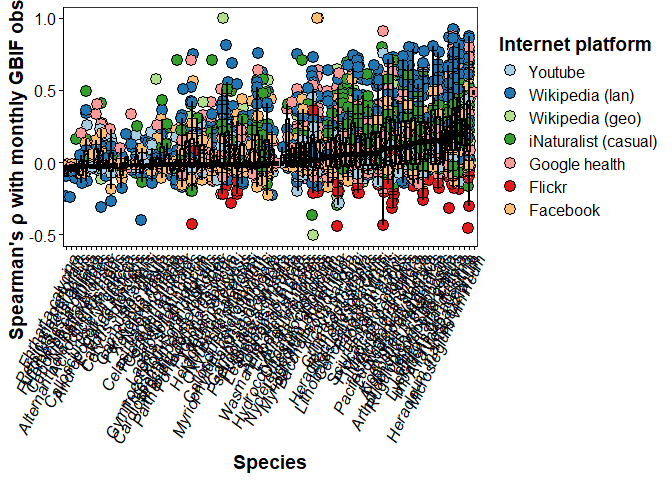
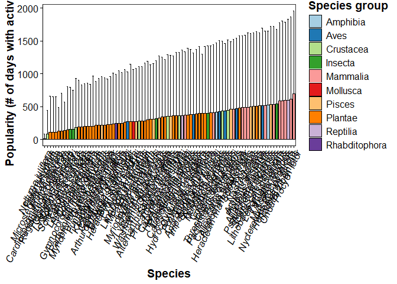

Data processing and statistical analysis of iEcology-IAS-miner data in R
================
Simon Reynaert
25/08/2025

- [1. Loading the required packages](#1-loading-the-required-packages)
- [2. Load in all data sources and
  preprocess](#2-load-in-all-data-sources-and-preprocess)
  - [2.1. Load in the EASIN lists, filter out species x country
    invasions \>=2016 and save as new
    csv](#21-load-in-the-easin-lists-filter-out-species-x-country-invasions-2016-and-save-as-new-csv)
  - [2.2. Load and pre-process the wikipedia language to country mapping
    pageview
    data](#22-load-and-pre-process-the-wikipedia-language-to-country-mapping-pageview-data)
  - [2.3. Load, join and pre-process the wikipedia geolocated pageview
    datasets](#23-load-join-and-pre-process-the-wikipedia-geolocated-pageview-datasets)
  - [2.4. Load and pre-process geolocated Google health activity
    data](#24-load-and-pre-process-geolocated-google-health-activity-data)
  - [2.5. Load and pre-process geolocated Flickr
    data](#25-load-and-pre-process-geolocated-flickr-data)
  - [2.6. Load and pre-process geolocated iNaturalist casual
    observations](#26-load-and-pre-process-geolocated-inaturalist-casual-observations)
  - [2.7. Load and pre-process youtube geolocated
    videos](#27-load-and-pre-process-youtube-geolocated-videos)
  - [2.8. Load and pre-process the Facebook
    data](#28-load-and-pre-process-the-facebook-data)
  - [2.9. Load and pre-process the GBIF
    data](#29-load-and-pre-process-the-gbif-data)
- [3. Combine all datasets into long format df including daily activity
  patterns](#3-combine-all-datasets-into-long-format-df-including-daily-activity-patterns)
- [4. Bin ‘views’ (= activity) per species x country x platform per
  month to capture signals of increased
  frequency](#4-bin-views--activity-per-species-x-country-x-platform-per-month-to-capture-signals-of-increased-frequency)
- [5. Join monthly long format data with the intro_year EASIN data and
  save as combined
  file](#5-join-monthly-long-format-data-with-the-intro_year-easin-data-and-save-as-combined-file)
- [6. Perform the anomalous activity detection surrounding the EASIN
  reported invasion year for all country x species x platform
  combinations and make
  plots](#6-perform-the-anomalous-activity-detection-surrounding-the-easin-reported-invasion-year-for-all-country-x-species-x-platform-combinations-and-make-plots)
  - [6.1. Prepare the data to feed to anomaly detection
    loop](#61-prepare-the-data-to-feed-to-anomaly-detection-loop)
  - [6.2. Detect the anomalies + changepoints and combine with raw
    data](#62-detect-the-anomalies--changepoints-and-combine-with-raw-data)
  - [6.3. Generate the anomaly plots for visual
    inspection](#63-generate-the-anomaly-plots-for-visual-inspection)
  - [6.4. Calculate lead or lag between earliest possible invasion date
    (i.e., january 1st of the invasion year) and anomalous increase in
    platform activity (if
    any)](#64-calculate-lead-or-lag-between-earliest-possible-invasion-date-ie-january-1st-of-the-invasion-year-and-anomalous-increase-in-platform-activity-if-any)
  - [6.5. Generate mean comparison plots between countries, species,
    platforms](#65-generate-mean-comparison-plots-between-countries-species-platforms)
- [7. Lumping normalized data together to check if it improves
  predictability](#7-lumping-normalized-data-together-to-check-if-it-improves-predictability)
  - [7.1. Normalize all activities by dividing each observation by its
    maximum](#71-normalize-all-activities-by-dividing-each-observation-by-its-maximum)
  - [7.2.Generate the lump plots with gam fit for all observations
    except
    GBIF](#72generate-the-lump-plots-with-gam-fit-for-all-observations-except-gbif)
- [8. Verify correlations between GBIF and
  platforms](#8-verify-correlations-between-gbif-and-platforms)
  - [8.1. Clean up monthly data to allow 1-by-1
    correlations](#81-clean-up-monthly-data-to-allow-1-by-1-correlations)
  - [8.2. Calculate Spearman correlations with GBIF
    data](#82-calculate-spearman-correlations-with-gbif-data)
  - [8.3. Join with species characteristics data and calculate
    statistics](#83-join-with-species-characteristics-data-and-calculate-statistics)
  - [8.4. Make the Spearman rank correlation
    plots](#84-make-the-spearman-rank-correlation-plots)
- [9. Calculate the popularity per species x country x platform
  combinations and
  compare](#9-calculate-the-popularity-per-species-x-country-x-platform-combinations-and-compare)

This R markdown document goes over the processing and statistical
analysis that was performed in R of the mined iEcology data for the
*iEcology-IAS-miner* Github repository.

# 1. Loading the required packages

``` r
# install.packages(c("tidyverse","lubridate","tidyr","timetk","anomalize","tibbletime","ggplot2","stringr","viridis","countrycode","tbl2xts","reshape2","Hmisc","broom","lme4","nlme","gamlss","data.table","changepoint.np"))  # if needed
library(tidyverse)
library(lubridate)
library(dplyr)
library(timetk)
library(anomalize)
library(tidyr)
library(tibbletime)
library(ggplot2)
library(stringr)
library(viridis)
library(countrycode)
library(tbl2xts)
library(reshape2)
library(Hmisc)
library(broom)
library(lme4)
library(nlme)
library(gamlss)
library(readr)
library(cowplot)
library(changepoint.np)
library(data.table)
```

``` r
#check working directory
getwd()
```

    ## [1] "C:/Users/simon/Documents"

# 2. Load in all data sources and preprocess

``` r
#load in union full list + traits
union_traits<-data.table::fread("unionlist_traits_combined.csv")

union_traits=union_traits%>%
  rename(SCIENTIFIC_NAME = 'Scientific Name')%>%
  mutate(
    SCIENTIFIC_NAME = case_when(
      # Safe synonym collapses:
      SCIENTIFIC_NAME == "Cortaderia selloana subsp. jubata" ~ "Cortaderia jubata",
      SCIENTIFIC_NAME == "Eichhornia crassipes" ~ "Pontederia crassipes",
      SCIENTIFIC_NAME == "Trachemys scripta elegans" ~ "Trachemys scripta",
      SCIENTIFIC_NAME == "Pennisetum setaceum" ~ "Cenchrus setaceus",
      SCIENTIFIC_NAME == "Orconectes limosus" ~ "Faxonius limosus",
      SCIENTIFIC_NAME == "Orconectes virilis" ~ "Faxonius virilis",
      SCIENTIFIC_NAME == "Vespa velutina nigrithorax" ~ "Vespa velutina",
      SCIENTIFIC_NAME == "Prosopis juliflora" ~ "Neltuma juliflora",       #  NEW: synonym handled
      SCIENTIFIC_NAME == "Urva auropunctata" ~ "Herpestes javanicus",
      SCIENTIFIC_NAME == "Pueraria montana (Lour.) Merr. var. lobata" ~ "Pueraria montana",
      SCIENTIFIC_NAME == "Alternathera philoxeroides" ~ "Alternanthera philoxeroides", # Fixing a misspelling
      SCIENTIFIC_NAME == "Trachemy scripta" ~ "Trachemys scripta", # Fixing a misspelling
      SCIENTIFIC_NAME == "Lepomis gibosus" ~ "Lepomis gibbosus", # Fixing a misspelling
      SCIENTIFIC_NAME == "Percottus glenii" ~ "Perccottus glenii", # Fixing a misspelling
      SCIENTIFIC_NAME == "Plototus lineatus" ~ "Plotosus lineatus", # Fixing a misspelling
      TRUE ~ SCIENTIFIC_NAME # Keep other names as they are
    )
  )

unique(union_traits$SCIENTIFIC_NAME)
```

    ##  [1] "Acacia saligna"              "Acridotheres tristis"       
    ##  [3] "Ailanthus altissima"         "Alopochen aegyptiaca"       
    ##  [5] "Alternanthera philoxeroides" "Ameiurus melas"             
    ##  [7] "Andropogon virginicus"       "Arthurdendyus triangulatus" 
    ##  [9] "Asclepias syriaca"           "Axis axis"                  
    ## [11] "Baccharis halimifolia"       "Cabomba caroliniana"        
    ## [13] "Callosciurus erythraeus"     "Callosciurus finlaysonii"   
    ## [15] "Cardiospermum grandiflorum"  "Celastrus orbiculatus"      
    ## [17] "Channa argus"                "Cortaderia jubata"          
    ## [19] "Corvus splendens"            "Ehrharta calycina"          
    ## [21] "Pontederia crassipes"        "Elodea nuttallii"           
    ## [23] "Eriocheir sinensis"          "Faxonius rusticus"          
    ## [25] "Fundulus heteroclitus"       "Gambusia affinis"           
    ## [27] "Gambusia holbrooki"          "Gunnera tinctoria"          
    ## [29] "Gymnocoronis spilanthoides"  "Hakea sericea"              
    ## [31] "Heracleum mantegazzianum"    "Heracleum persicum"         
    ## [33] "Heracleum sosnowskyi"        "Herpestes javanicus"        
    ## [35] "Humulus scandens"            "Hydrocotyle ranunculoides"  
    ## [37] "Impatiens glandulifera"      "Koenigia polystachya"       
    ## [39] "Lagarosiphon major"          "Lampropeltis getula"        
    ## [41] "Lepomis gibbosus"            "Lespedeza cuneata"          
    ## [43] "Limnoperna fortunei"         "Lithobates catesbeianus"    
    ## [45] "Ludwigia grandiflora"        "Ludwigia peploides"         
    ## [47] "Lygodium japonicum"          "Lysichiton americanus"      
    ## [49] "Microstegium vimineum"       "Morone americana"           
    ## [51] "Muntiacus reevesi"           "Myocastor coypus"           
    ## [53] "Myriophyllum aquaticum"      "Myriophyllum heterophyllum" 
    ## [55] "Nasua nasua"                 "Nyctereutes procyonoides"   
    ## [57] "Ondatra zibethicus"          "Faxonius limosus"           
    ## [59] "Faxonius virilis"            "Oxyura jamaicensis"         
    ## [61] "Pacifastacus leniusculus"    "Parthenium hysterophorus"   
    ## [63] "Cenchrus setaceus"           "Perccottus glenii"          
    ## [65] "Persicaria perfoliata"       "Pistia stratiotes"          
    ## [67] "Plotosus lineatus"           "Procambarus clarkii"        
    ## [69] "Procambarus virginalis"      "Procyon lotor"              
    ## [71] "Neltuma juliflora"           "Pseudorasbora parva"        
    ## [73] "Pueraria montana"            "Pycnonotus cafer"           
    ## [75] "Rugulopteryx okamurae"       "Salvinia molesta"           
    ## [77] "Sciurus carolinensis"        "Sciurus niger"              
    ## [79] "Solenopsis geminata"         "Solenopsis invicta"         
    ## [81] "Solenopsis richteri"         "Tamias sibiricus"           
    ## [83] "Threskiornis aethiopicus"    "Trachemys scripta"          
    ## [85] "Triadica sebifera"           "Vespa velutina"             
    ## [87] "Wasmannia auropunctata"      "Xenopus laevis"

## 2.1. Load in the EASIN lists, filter out species x country invasions \>=2016 and save as new csv

``` r
#––  Load data
uni <- data.table::fread("UnionList_Species_Traits_85_present.csv")
uni=uni%>%
mutate(COUNTRY = ifelse(COUNTRY == "UK", "GB",ifelse(COUNTRY == "EL", "GR", COUNTRY)))
  
head((uni))
```

    ##    EASIN.ID SCIENTIFIC_NAME COUNTRY  YEAR   Group     Habitat      WIKI NAME
    ##      <char>          <char>  <char> <int>  <char>      <char>         <char>
    ## 1:   R00053  Acacia saligna      CY  1881 Plantae Terrestrial Acacia saligna
    ## 2:   R00053  Acacia saligna      CZ  2012 Plantae Terrestrial Acacia saligna
    ## 3:   R00053  Acacia saligna      DK  2023 Plantae Terrestrial Acacia saligna
    ## 4:   R00053  Acacia saligna      GR  1842 Plantae Terrestrial Acacia saligna
    ## 5:   R00053  Acacia saligna      ES  1800 Plantae Terrestrial Acacia saligna
    ## 6:   R00053  Acacia saligna      FR  1838 Plantae Terrestrial Acacia saligna

``` r
unique(uni$COUNTRY)
```

    ##  [1] "CY" "CZ" "DK" "GR" "ES" "FR" "HR" "IT" "MT" "PT" "SE" "GB" "AT" "DE" "NL"
    ## [16] "BE" "BG" "EE" "HU" "IE" "LU" "LV" "PL" "RO" "SI" "SK" "LT" "FI"

``` r
length(unique(uni$SCIENTIFIC_NAME))
```

    ## [1] 85

``` r
unique(uni$SCIENTIFIC_NAME)
```

    ##  [1] "Acacia saligna"                            
    ##  [2] "Acridotheres tristis"                      
    ##  [3] "Ailanthus altissima"                       
    ##  [4] "Alopochen aegyptiaca"                      
    ##  [5] "Alternanthera philoxeroides"               
    ##  [6] "Ameiurus melas"                            
    ##  [7] "Andropogon virginicus"                     
    ##  [8] "Arthurdendyus triangulatus"                
    ##  [9] "Asclepias syriaca"                         
    ## [10] "Axis axis"                                 
    ## [11] "Baccharis halimifolia"                     
    ## [12] "Cabomba caroliniana"                       
    ## [13] "Callosciurus erythraeus"                   
    ## [14] "Callosciurus finlaysonii"                  
    ## [15] "Cardiospermum grandiflorum"                
    ## [16] "Celastrus orbiculatus"                     
    ## [17] "Cenchrus setaceus"                         
    ## [18] "Channa argus"                              
    ## [19] "Cortaderia selloana subsp. jubata"         
    ## [20] "Corvus splendens"                          
    ## [21] "Ehrharta calycina"                         
    ## [22] "Elodea nuttallii"                          
    ## [23] "Eriocheir sinensis"                        
    ## [24] "Faxonius limosus"                          
    ## [25] "Faxonius rusticus"                         
    ## [26] "Faxonius virilis"                          
    ## [27] "Fundulus heteroclitus"                     
    ## [28] "Gambusia affinis"                          
    ## [29] "Gambusia holbrooki"                        
    ## [30] "Gunnera tinctoria"                         
    ## [31] "Gymnocoronis spilanthoides"                
    ## [32] "Hakea sericea"                             
    ## [33] "Heracleum mantegazzianum"                  
    ## [34] "Heracleum persicum"                        
    ## [35] "Heracleum sosnowskyi"                      
    ## [36] "Humulus scandens"                          
    ## [37] "Hydrocotyle ranunculoides"                 
    ## [38] "Impatiens glandulifera"                    
    ## [39] "Koenigia polystachya"                      
    ## [40] "Lagarosiphon major"                        
    ## [41] "Lampropeltis getula"                       
    ## [42] "Lepomis gibbosus"                          
    ## [43] "Lespedeza cuneata"                         
    ## [44] "Lithobates catesbeianus"                   
    ## [45] "Ludwigia grandiflora"                      
    ## [46] "Ludwigia peploides"                        
    ## [47] "Lygodium japonicum"                        
    ## [48] "Lysichiton americanus"                     
    ## [49] "Microstegium vimineum"                     
    ## [50] "Muntiacus reevesi"                         
    ## [51] "Myocastor coypus"                          
    ## [52] "Myriophyllum aquaticum"                    
    ## [53] "Myriophyllum heterophyllum"                
    ## [54] "Nasua nasua"                               
    ## [55] "Neltuma juliflora"                         
    ## [56] "Nyctereutes procyonoides"                  
    ## [57] "Ondatra zibethicus"                        
    ## [58] "Oxyura jamaicensis"                        
    ## [59] "Pacifastacus leniusculus"                  
    ## [60] "Parthenium hysterophorus"                  
    ## [61] "Perccottus glenii"                         
    ## [62] "Persicaria perfoliata"                     
    ## [63] "Pistia stratiotes"                         
    ## [64] "Plotosus lineatus"                         
    ## [65] "Pontederia crassipes"                      
    ## [66] "Procambarus clarkii"                       
    ## [67] "Procambarus virginalis"                    
    ## [68] "Procyon lotor"                             
    ## [69] "Pseudorasbora parva"                       
    ## [70] "Pueraria montana (Lour.) Merr. var. lobata"
    ## [71] "Pycnonotus cafer"                          
    ## [72] "Rugulopteryx okamurae"                     
    ## [73] "Salvinia molesta"                          
    ## [74] "Sciurus carolinensis"                      
    ## [75] "Sciurus niger"                             
    ## [76] "Solenopsis geminata"                       
    ## [77] "Solenopsis invicta"                        
    ## [78] "Tamias sibiricus"                          
    ## [79] "Threskiornis aethiopicus"                  
    ## [80] "Trachemys scripta"                         
    ## [81] "Triadica sebifera"                         
    ## [82] "Urva auropunctata"                         
    ## [83] "Vespa velutina nigrithorax"                
    ## [84] "Wasmannia auropunctata"                    
    ## [85] "Xenopus laevis"

``` r
# We will apply this mapping to the standardized_df to create a new, cleaned dataframe.
uni <- uni %>%
  mutate(
    SCIENTIFIC_NAME = case_when(
      # Safe synonym collapses:
      SCIENTIFIC_NAME == "Cortaderia selloana subsp. jubata" ~ "Cortaderia jubata",
      SCIENTIFIC_NAME == "Eichhornia crassipes" ~ "Pontederia crassipes",
      SCIENTIFIC_NAME == "Trachemys scripta elegans" ~ "Trachemys scripta",
      SCIENTIFIC_NAME == "Pennisetum setaceum" ~ "Cenchrus setaceus",
      SCIENTIFIC_NAME == "Orconectes limosus" ~ "Faxonius limosus",
      SCIENTIFIC_NAME == "Orconectes virilis" ~ "Faxonius virilis",
      SCIENTIFIC_NAME == "Vespa velutina nigrithorax" ~ "Vespa velutina",
      SCIENTIFIC_NAME == "Prosopis juliflora" ~ "Neltuma juliflora",       #  NEW: synonym handled
      SCIENTIFIC_NAME == "Urva auropunctata" ~ "Herpestes javanicus",
      SCIENTIFIC_NAME == "Pueraria montana (Lour.) Merr. var. lobata" ~ "Pueraria montana",
      SCIENTIFIC_NAME == "Alternathera philoxeroides" ~ "Alternanthera philoxeroides", # Fixing a misspelling
      SCIENTIFIC_NAME == "Trachemy scripta" ~ "Trachemys scripta", # Fixing a misspelling
      SCIENTIFIC_NAME == "Lepomis gibosus" ~ "Lepomis gibbosus", # Fixing a misspelling
      SCIENTIFIC_NAME == "Percottus glenii" ~ "Perccottus glenii", # Fixing a misspelling
      SCIENTIFIC_NAME == "Plototus lineatus" ~ "Plotosus lineatus", # Fixing a misspelling
      TRUE ~ SCIENTIFIC_NAME # Keep other names as they are
    )
  )

length(unique(uni$SCIENTIFIC_NAME))
```

    ## [1] 85

``` r
unique(uni$SCIENTIFIC_NAME)
```

    ##  [1] "Acacia saligna"              "Acridotheres tristis"       
    ##  [3] "Ailanthus altissima"         "Alopochen aegyptiaca"       
    ##  [5] "Alternanthera philoxeroides" "Ameiurus melas"             
    ##  [7] "Andropogon virginicus"       "Arthurdendyus triangulatus" 
    ##  [9] "Asclepias syriaca"           "Axis axis"                  
    ## [11] "Baccharis halimifolia"       "Cabomba caroliniana"        
    ## [13] "Callosciurus erythraeus"     "Callosciurus finlaysonii"   
    ## [15] "Cardiospermum grandiflorum"  "Celastrus orbiculatus"      
    ## [17] "Cenchrus setaceus"           "Channa argus"               
    ## [19] "Cortaderia jubata"           "Corvus splendens"           
    ## [21] "Ehrharta calycina"           "Elodea nuttallii"           
    ## [23] "Eriocheir sinensis"          "Faxonius limosus"           
    ## [25] "Faxonius rusticus"           "Faxonius virilis"           
    ## [27] "Fundulus heteroclitus"       "Gambusia affinis"           
    ## [29] "Gambusia holbrooki"          "Gunnera tinctoria"          
    ## [31] "Gymnocoronis spilanthoides"  "Hakea sericea"              
    ## [33] "Heracleum mantegazzianum"    "Heracleum persicum"         
    ## [35] "Heracleum sosnowskyi"        "Humulus scandens"           
    ## [37] "Hydrocotyle ranunculoides"   "Impatiens glandulifera"     
    ## [39] "Koenigia polystachya"        "Lagarosiphon major"         
    ## [41] "Lampropeltis getula"         "Lepomis gibbosus"           
    ## [43] "Lespedeza cuneata"           "Lithobates catesbeianus"    
    ## [45] "Ludwigia grandiflora"        "Ludwigia peploides"         
    ## [47] "Lygodium japonicum"          "Lysichiton americanus"      
    ## [49] "Microstegium vimineum"       "Muntiacus reevesi"          
    ## [51] "Myocastor coypus"            "Myriophyllum aquaticum"     
    ## [53] "Myriophyllum heterophyllum"  "Nasua nasua"                
    ## [55] "Neltuma juliflora"           "Nyctereutes procyonoides"   
    ## [57] "Ondatra zibethicus"          "Oxyura jamaicensis"         
    ## [59] "Pacifastacus leniusculus"    "Parthenium hysterophorus"   
    ## [61] "Perccottus glenii"           "Persicaria perfoliata"      
    ## [63] "Pistia stratiotes"           "Plotosus lineatus"          
    ## [65] "Pontederia crassipes"        "Procambarus clarkii"        
    ## [67] "Procambarus virginalis"      "Procyon lotor"              
    ## [69] "Pseudorasbora parva"         "Pueraria montana"           
    ## [71] "Pycnonotus cafer"            "Rugulopteryx okamurae"      
    ## [73] "Salvinia molesta"            "Sciurus carolinensis"       
    ## [75] "Sciurus niger"               "Solenopsis geminata"        
    ## [77] "Solenopsis invicta"          "Tamias sibiricus"           
    ## [79] "Threskiornis aethiopicus"    "Trachemys scripta"          
    ## [81] "Triadica sebifera"           "Herpestes javanicus"        
    ## [83] "Vespa velutina"              "Wasmannia auropunctata"     
    ## [85] "Xenopus laevis"

``` r
#––  uni#––  Filter introductions to YEAR >= 2016
intro_year <- uni %>%
  filter(YEAR >= 2016) %>%
  select(SCIENTIFIC_NAME, COUNTRY, YEAR, 'WIKI NAME', Group, Habitat,EASIN.ID) %>%
  distinct()
if (nrow(intro_year) == 0) stop("No introductions found after 2016.")

head((intro_year))
```

    ##         SCIENTIFIC_NAME COUNTRY  YEAR            WIKI NAME   Group     Habitat
    ##                  <char>  <char> <int>               <char>  <char>      <char>
    ## 1:       Acacia saligna      DK  2023       Acacia saligna Plantae Terrestrial
    ## 2: Acridotheres tristis      CY  2022 Acridotheres tristis    Aves Terrestrial
    ## 3: Acridotheres tristis      GR  2017 Acridotheres tristis    Aves Terrestrial
    ## 4: Alopochen aegyptiaca      LT  2016 Alopochen aegyptiaca    Aves        Both
    ## 5:       Ameiurus melas      AT  2017       Ameiurus melas  Pisces     Aquatic
    ## 6:       Ameiurus melas      BG  2016       Ameiurus melas  Pisces     Aquatic
    ##    EASIN.ID
    ##      <char>
    ## 1:   R00053
    ## 2:   R00212
    ## 3:   R00212
    ## 4:   R00644
    ## 5:   R00826
    ## 6:   R00826

``` r
unique(intro_year$SCIENTIFIC_NAME)
```

    ##  [1] "Acacia saligna"             "Acridotheres tristis"      
    ##  [3] "Alopochen aegyptiaca"       "Ameiurus melas"            
    ##  [5] "Asclepias syriaca"          "Cabomba caroliniana"       
    ##  [7] "Celastrus orbiculatus"      "Cenchrus setaceus"         
    ##  [9] "Cortaderia jubata"          "Elodea nuttallii"          
    ## [11] "Eriocheir sinensis"         "Faxonius limosus"          
    ## [13] "Faxonius rusticus"          "Gunnera tinctoria"         
    ## [15] "Gymnocoronis spilanthoides" "Hakea sericea"             
    ## [17] "Heracleum mantegazzianum"   "Heracleum sosnowskyi"      
    ## [19] "Humulus scandens"           "Hydrocotyle ranunculoides" 
    ## [21] "Impatiens glandulifera"     "Koenigia polystachya"      
    ## [23] "Lampropeltis getula"        "Lespedeza cuneata"         
    ## [25] "Ludwigia grandiflora"       "Ludwigia peploides"        
    ## [27] "Lygodium japonicum"         "Lysichiton americanus"     
    ## [29] "Microstegium vimineum"      "Muntiacus reevesi"         
    ## [31] "Myocastor coypus"           "Myriophyllum heterophyllum"
    ## [33] "Nasua nasua"                "Neltuma juliflora"         
    ## [35] "Nyctereutes procyonoides"   "Pacifastacus leniusculus"  
    ## [37] "Parthenium hysterophorus"   "Perccottus glenii"         
    ## [39] "Persicaria perfoliata"      "Pistia stratiotes"         
    ## [41] "Plotosus lineatus"          "Pontederia crassipes"      
    ## [43] "Procambarus clarkii"        "Procambarus virginalis"    
    ## [45] "Rugulopteryx okamurae"      "Salvinia molesta"          
    ## [47] "Sciurus carolinensis"       "Solenopsis invicta"        
    ## [49] "Threskiornis aethiopicus"   "Trachemys scripta"         
    ## [51] "Triadica sebifera"          "Vespa velutina"            
    ## [53] "Wasmannia auropunctata"     "Xenopus laevis"

``` r
length(unique(intro_year$SCIENTIFIC_NAME))
```

    ## [1] 54

``` r
write.csv(intro_year, "intros_after_2016_EASIN.csv", row.names = FALSE)
```

## 2.2. Load and pre-process the wikipedia language to country mapping pageview data

``` r
#load wiki language pageview data

pv  <- data.table::fread("species_pageviews_analysis_2016_present.csv",header=TRUE)

head(pv[,1:5])
```

    ##    Scientific Name Language    Wikipedia Title 20160101 20160102
    ##             <char>   <char>             <char>    <int>    <int>
    ## 1:  Acacia saligna       de Weidenblatt-Akazie        5       10
    ## 2:  Acacia saligna       en     Acacia_saligna       15       42
    ## 3:  Acacia saligna       es     Acacia_saligna        7        9
    ## 4:  Acacia saligna       fi        Siniakaasia       NA       NA
    ## 5:  Acacia saligna       fr     Acacia_saligna        3        5
    ## 6:  Acacia saligna       pt     Acacia_saligna       NA        0

``` r
unique(pv$`Scientific Name`)
```

    ##  [1] "Acacia saligna"              "Acridotheres tristis"       
    ##  [3] "Ailanthus altissima"         "Alopochen aegyptiaca"       
    ##  [5] "Alternanthera philoxeroides" "Ameiurus melas"             
    ##  [7] "Andropogon virginicus"       "Arthurdendyus triangulatus" 
    ##  [9] "Asclepias syriaca"           "Axis axis"                  
    ## [11] "Baccharis halimifolia"       "Cabomba caroliniana"        
    ## [13] "Callosciurus erythraeus"     "Callosciurus finlaysonii"   
    ## [15] "Cardiospermum grandiflorum"  "Celastrus orbiculatus"      
    ## [17] "Channa argus"                "Cortaderia jubata"          
    ## [19] "Corvus splendens"            "Ehrharta calycina"          
    ## [21] "Eichhornia crassipes"        "Elodea nuttallii"           
    ## [23] "Eriocheir sinensis"          "Faxonius rusticus"          
    ## [25] "Fundulus heteroclitus"       "Gambusia affinis"           
    ## [27] "Gambusia holbrooki"          "Gunnera tinctoria"          
    ## [29] "Gymnocoronis spilanthoides"  "Hakea sericea"              
    ## [31] "Heracleum mantegazzianum"    "Heracleum persicum"         
    ## [33] "Heracleum sosnowskyi"        "Herpestes javanicus"        
    ## [35] "Humulus scandens"            "Hydrocotyle ranunculoides"  
    ## [37] "Impatiens glandulifera"      "Koenigia polystachya"       
    ## [39] "Lagarosiphon major"          "Lampropeltis getula"        
    ## [41] "Lepomis gibbosus"            "Lespedeza cuneata"          
    ## [43] "Limnoperna fortunei"         "Lithobates catesbeianus"    
    ## [45] "Ludwigia grandiflora"        "Ludwigia peploides"         
    ## [47] "Lygodium japonicum"          "Lysichiton americanus"      
    ## [49] "Microstegium vimineum"       "Morone americana"           
    ## [51] "Muntiacus reevesi"           "Myocastor coypus"           
    ## [53] "Myriophyllum aquaticum"      "Myriophyllum heterophyllum" 
    ## [55] "Nasua nasua"                 "Nyctereutes procyonoides"   
    ## [57] "Ondatra zibethicus"          "Orconectes limosus"         
    ## [59] "Orconectes virilis"          "Oxyura jamaicensis"         
    ## [61] "Pacifastacus leniusculus"    "Parthenium hysterophorus"   
    ## [63] "Pennisetum setaceum"         "Perccottus glenii"          
    ## [65] "Persicaria perfoliata"       "Pistia stratiotes"          
    ## [67] "Plotosus lineatus"           "Procambarus clarkii"        
    ## [69] "Procambarus virginalis"      "Procyon lotor"              
    ## [71] "Prosopis juliflora"          "Pseudorasbora parva"        
    ## [73] "Pueraria montana"            "Pycnonotus cafer"           
    ## [75] "Rugulopteryx okamurae"       "Salvinia molesta"           
    ## [77] "Sciurus carolinensis"        "Sciurus niger"              
    ## [79] "Solenopsis geminata"         "Solenopsis invicta"         
    ## [81] "Solenopsis richteri"         "Tamias sibiricus"           
    ## [83] "Threskiornis aethiopicus"    "Trachemys scripta elegans"  
    ## [85] "Triadica sebifera"           "Vespa velutina nigrithorax" 
    ## [87] "Wasmannia auropunctata"      "Xenopus laevis"

``` r
#––Define language → country mapping (based on the language that most people speak in the respective countries)
lang2country <- list(
  en = c("GB","IE"), es = "ES", el = c("GR","CY"), fr = c("FR","LU"), de = c("DE","AT","CH","LI"),
  it = c("IT"), pt = "PT", nl = c("NL","BE"), sv = "SE", da = "DK", fi = "FI", cs = "CZ",
  hr = "HR", hu = "HU", pl = "PL", ro = "RO", sk = "SK", sl = "SI",
  bg = "BG", et = "EE", lv = "LV", lt = "LT", mt = "MT",
  no = "NO", is = "IS", mk = "MK", bs = c("BA"), sq = c("AL","XK"), sr = c("RS","ME")
)

# Sanity check: ensure all intro countries are covered
mapped_countries <- unique(unlist(lang2country))
missing_countries <- setdiff(unique(intro_year$COUNTRY), mapped_countries)
if (length(missing_countries) > 0) {
  warning(paste(
    "Countries with no language mapping:", paste(missing_countries, collapse = ", ")
  ))
}

# language to country mapping
pv2 <- pv %>%
  rename(SCIENTIFIC_NAME = `Scientific Name`) %>%
  mutate(COUNTRY = purrr::map(Language, ~lang2country[[.x]])) %>%
  unnest_longer(COUNTRY)

setdiff(unique(pv$`Scientific Name`), unique(pv2$SCIENTIFIC_NAME))
```

    ## character(0)

``` r
unique(pv2$SCIENTIFIC_NAME)
```

    ##  [1] "Acacia saligna"              "Acridotheres tristis"       
    ##  [3] "Ailanthus altissima"         "Alopochen aegyptiaca"       
    ##  [5] "Alternanthera philoxeroides" "Ameiurus melas"             
    ##  [7] "Andropogon virginicus"       "Arthurdendyus triangulatus" 
    ##  [9] "Asclepias syriaca"           "Axis axis"                  
    ## [11] "Baccharis halimifolia"       "Cabomba caroliniana"        
    ## [13] "Callosciurus erythraeus"     "Callosciurus finlaysonii"   
    ## [15] "Cardiospermum grandiflorum"  "Celastrus orbiculatus"      
    ## [17] "Channa argus"                "Cortaderia jubata"          
    ## [19] "Corvus splendens"            "Ehrharta calycina"          
    ## [21] "Eichhornia crassipes"        "Elodea nuttallii"           
    ## [23] "Eriocheir sinensis"          "Faxonius rusticus"          
    ## [25] "Fundulus heteroclitus"       "Gambusia affinis"           
    ## [27] "Gambusia holbrooki"          "Gunnera tinctoria"          
    ## [29] "Gymnocoronis spilanthoides"  "Hakea sericea"              
    ## [31] "Heracleum mantegazzianum"    "Heracleum persicum"         
    ## [33] "Heracleum sosnowskyi"        "Herpestes javanicus"        
    ## [35] "Humulus scandens"            "Hydrocotyle ranunculoides"  
    ## [37] "Impatiens glandulifera"      "Koenigia polystachya"       
    ## [39] "Lagarosiphon major"          "Lampropeltis getula"        
    ## [41] "Lepomis gibbosus"            "Lespedeza cuneata"          
    ## [43] "Limnoperna fortunei"         "Lithobates catesbeianus"    
    ## [45] "Ludwigia grandiflora"        "Ludwigia peploides"         
    ## [47] "Lygodium japonicum"          "Lysichiton americanus"      
    ## [49] "Microstegium vimineum"       "Morone americana"           
    ## [51] "Muntiacus reevesi"           "Myocastor coypus"           
    ## [53] "Myriophyllum aquaticum"      "Myriophyllum heterophyllum" 
    ## [55] "Nasua nasua"                 "Nyctereutes procyonoides"   
    ## [57] "Ondatra zibethicus"          "Orconectes limosus"         
    ## [59] "Orconectes virilis"          "Oxyura jamaicensis"         
    ## [61] "Pacifastacus leniusculus"    "Parthenium hysterophorus"   
    ## [63] "Pennisetum setaceum"         "Perccottus glenii"          
    ## [65] "Persicaria perfoliata"       "Pistia stratiotes"          
    ## [67] "Plotosus lineatus"           "Procambarus clarkii"        
    ## [69] "Procambarus virginalis"      "Procyon lotor"              
    ## [71] "Prosopis juliflora"          "Pseudorasbora parva"        
    ## [73] "Pueraria montana"            "Pycnonotus cafer"           
    ## [75] "Rugulopteryx okamurae"       "Salvinia molesta"           
    ## [77] "Sciurus carolinensis"        "Sciurus niger"              
    ## [79] "Solenopsis geminata"         "Solenopsis invicta"         
    ## [81] "Solenopsis richteri"         "Tamias sibiricus"           
    ## [83] "Threskiornis aethiopicus"    "Trachemys scripta elegans"  
    ## [85] "Triadica sebifera"           "Vespa velutina nigrithorax" 
    ## [87] "Wasmannia auropunctata"      "Xenopus laevis"

``` r
# Assuming pv2 is your starting data frame
pv_long_wiki <- pv2 %>%
  pivot_longer(
    cols = matches("^[0-9]{8}$"),
    names_to = "date",
    values_to = "views"
  ) %>%
  mutate(
    date = ymd(date),
    views = as.numeric(views)
  ) %>%
  # Fill NA values in 'views' with 0
  replace_na(list(views = 0)) %>%
  select(SCIENTIFIC_NAME, COUNTRY, date, views)

head((pv_long_wiki))
```

    ## # A tibble: 6 × 4
    ##   SCIENTIFIC_NAME COUNTRY date       views
    ##   <chr>           <chr>   <date>     <dbl>
    ## 1 Acacia saligna  DE      2016-01-01     5
    ## 2 Acacia saligna  DE      2016-01-02    10
    ## 3 Acacia saligna  DE      2016-01-03     4
    ## 4 Acacia saligna  DE      2016-01-04     3
    ## 5 Acacia saligna  DE      2016-01-05     4
    ## 6 Acacia saligna  DE      2016-01-06     5

## 2.3. Load, join and pre-process the wikipedia geolocated pageview datasets

``` r
#load in the data
wikidat_geo <- data.table::fread("species_pageviews_wiki_geolocated_2023-02-06_now.csv",header=TRUE)
head((wikidat_geo))
```

    ##         Scientific Name   Country Wikidata Q-number 2023-02-06 2023-02-07
    ##                  <char>    <char>            <char>      <num>      <num>
    ## 1:       Acacia saligna    France           Q402385         NA         NA
    ## 2:       Acacia saligna   Germany           Q402385         NA         NA
    ## 3:       Acacia saligna    Israel           Q402385         NA         NA
    ## 4: Acridotheres tristis   Algeria           Q116667         NA         NA
    ## 5: Acridotheres tristis Australia           Q116667         NA         96
    ## 6: Acridotheres tristis  Bulgaria           Q116667         NA         NA
    ##    2023-02-08 2023-02-09 2023-02-10 2023-02-11 2023-02-12 2023-02-13 2023-02-14
    ##         <num>      <num>      <num>      <num>      <num>      <num>      <num>
    ## 1:         NA         NA         NA         NA         NA         NA         NA
    ## 2:         NA         NA         NA         NA         NA         NA         NA
    ## 3:         NA         NA         NA         NA         NA         NA         NA
    ## 4:         NA         NA         NA         NA         NA         NA         NA
    ## 5:         NA         NA         NA         NA        137        115         NA
    ## 6:         NA         NA         NA         NA         NA         NA         NA
    ##    2023-02-15 2023-02-16 2023-02-17 2023-02-18 2023-02-19 2023-02-20 2023-02-21
    ##         <num>      <num>      <num>      <num>      <num>      <num>      <num>
    ## 1:         NA         NA         NA         NA         NA         NA         NA
    ## 2:         NA         NA         NA         NA         NA         NA         NA
    ## 3:         NA         NA         NA         NA         NA         NA         NA
    ## 4:         NA         NA         NA         NA         NA         NA         NA
    ## 5:         NA         NA        126        121        119        133         NA
    ## 6:         NA         NA         NA         NA         NA         NA         NA
    ##    2023-02-22 2023-02-23 2023-02-24 2023-02-25 2023-02-26 2023-02-27 2023-02-28
    ##         <num>      <num>      <num>      <num>      <num>      <num>      <num>
    ## 1:         NA         NA         NA         NA         NA         NA         NA
    ## 2:         NA         NA         NA         NA         NA         NA         NA
    ## 3:         NA         NA         NA         NA         NA         NA         NA
    ## 4:         NA         NA         NA         NA         NA         NA         NA
    ## 5:         NA        117        123        104         NA        102         NA
    ## 6:         NA         NA         NA         NA         NA         NA         NA
    ##    2023-03-01 2023-03-02 2023-03-03 2023-03-04 2023-03-05 2023-03-06 2023-03-07
    ##         <num>      <num>      <num>      <num>      <num>      <num>      <num>
    ## 1:         NA         NA         NA         NA         NA         NA         NA
    ## 2:         NA         NA         NA         NA         NA         NA         NA
    ## 3:         NA         NA         NA         NA         NA         NA         NA
    ## 4:         NA         NA         NA         NA         NA         NA         NA
    ## 5:         NA        110        138        105        102         NA         NA
    ## 6:         NA         NA         NA         NA         NA         NA         NA
    ##    2023-03-08 2023-03-09 2023-03-10 2023-03-11 2023-03-12 2023-03-13 2023-03-14
    ##         <num>      <num>      <num>      <num>      <num>      <num>      <num>
    ## 1:         NA         NA         NA         NA         NA         NA         NA
    ## 2:         NA         NA         NA         NA         NA         NA         NA
    ## 3:         NA         NA         NA         NA         NA         NA         NA
    ## 4:         NA         NA         NA         NA         NA         NA         NA
    ## 5:        117         NA         NA        129         93         NA         NA
    ## 6:         NA         NA         NA         NA         NA         NA         NA
    ##    2023-03-15 2023-03-16 2023-03-17 2023-03-18 2023-03-19 2023-03-20 2023-03-21
    ##         <num>      <num>      <num>      <num>      <num>      <num>      <num>
    ## 1:         NA         NA         NA         NA         NA         NA         NA
    ## 2:         NA         NA         NA         NA         NA         NA         NA
    ## 3:         NA         NA         NA         NA         NA         NA         NA
    ## 4:         NA         NA         NA         NA         NA         NA         NA
    ## 5:         NA         NA         NA         NA         NA         NA        101
    ## 6:         NA         NA         NA         NA         NA         NA         NA
    ##    2023-03-22 2023-03-23 2023-03-24 2023-03-25 2023-03-26 2023-03-27 2023-03-28
    ##         <num>      <num>      <num>      <num>      <num>      <num>      <num>
    ## 1:         NA         NA         NA         NA         NA         NA         NA
    ## 2:         NA         NA         NA         NA         NA         NA         NA
    ## 3:         NA         NA         NA         NA         NA         NA         NA
    ## 4:         NA         NA         NA         NA         NA         NA         NA
    ## 5:         NA         NA         NA         99         NA         NA         NA
    ## 6:         NA         NA         NA         NA         NA         NA         NA
    ##    2023-03-29 2023-03-30 2023-03-31 2023-04-01 2023-04-02 2023-04-03 2023-04-04
    ##         <num>      <num>      <num>      <num>      <num>      <num>      <num>
    ## 1:         NA         NA         NA         NA         NA         NA         NA
    ## 2:         NA         NA         NA         NA         NA         NA         NA
    ## 3:         NA         NA         NA         NA         NA         NA         NA
    ## 4:         NA         NA         NA         NA         NA         NA         NA
    ## 5:         NA         91         NA        119         NA         90         NA
    ## 6:         NA         NA         NA         NA         NA         NA         NA
    ##    2023-04-05 2023-04-06 2023-04-07 2023-04-08 2023-04-09 2023-04-10 2023-04-11
    ##         <num>      <num>      <num>      <num>      <num>      <num>      <num>
    ## 1:         NA         NA         NA         NA         NA         NA         NA
    ## 2:         NA         NA         NA         NA         NA         NA         NA
    ## 3:         NA         NA         NA         NA         NA         NA         NA
    ## 4:         NA         NA         NA         NA         NA         NA         NA
    ## 5:         NA         NA         NA         NA         NA         NA         NA
    ## 6:         NA         NA         NA         NA         NA         NA         NA
    ##    2023-04-12 2023-04-13 2023-04-14 2023-04-15 2023-04-16 2023-04-17 2023-04-18
    ##         <num>      <num>      <num>      <num>      <num>      <num>      <num>
    ## 1:         NA         NA         NA         NA         NA         NA         NA
    ## 2:         NA         NA         NA         NA         NA         NA         NA
    ## 3:         NA         NA         NA         NA         NA         NA         NA
    ## 4:         NA         NA         NA         NA         NA         NA         NA
    ## 5:         NA         NA         NA         NA         NA         NA         NA
    ## 6:         NA         NA         NA         NA         NA         NA         NA
    ##    2023-04-19 2023-04-20 2023-04-21 2023-04-22 2023-04-23 2023-04-24 2023-04-25
    ##         <num>      <num>      <num>      <num>      <num>      <num>      <num>
    ## 1:         NA         NA         NA         NA         NA         NA         NA
    ## 2:         NA         NA         NA         NA         NA         NA         NA
    ## 3:         NA         NA         NA         NA         NA         NA         NA
    ## 4:         NA         NA         NA         NA         NA         NA         NA
    ## 5:         NA         NA         NA         NA         NA         NA        146
    ## 6:         NA         NA         NA         NA         NA         NA         NA
    ##    2023-04-26 2023-04-27 2023-04-28 2023-04-29 2023-04-30 2023-05-01 2023-05-02
    ##         <num>      <num>      <num>      <num>      <num>      <num>      <num>
    ## 1:         NA         NA         NA         NA         NA         NA         NA
    ## 2:         NA         NA         NA         NA         NA         NA         NA
    ## 3:         NA         NA         NA         NA         NA         NA         NA
    ## 4:         NA         NA         NA         NA         NA         NA         NA
    ## 5:         NA         94         NA         NA         NA         NA         NA
    ## 6:         NA         NA         NA         NA         NA         NA         NA
    ##    2023-05-03 2023-05-04 2023-05-05 2023-05-06 2023-05-07 2023-05-08 2023-05-09
    ##         <num>      <num>      <num>      <num>      <num>      <num>      <num>
    ## 1:         NA         NA         NA         NA         NA         NA         NA
    ## 2:         NA         NA         NA         NA         NA         NA         NA
    ## 3:         NA         NA         NA         NA         NA         NA         NA
    ## 4:         NA         NA         NA         NA         NA         NA         NA
    ## 5:         NA         NA         NA         NA         NA         NA         NA
    ## 6:         NA         NA         NA         NA         NA         NA         NA
    ##    2023-05-10 2023-05-11 2023-05-12 2023-05-13 2023-05-14 2023-05-15 2023-05-16
    ##         <num>      <num>      <num>      <num>      <num>      <num>      <num>
    ## 1:         NA         NA         NA         NA         NA         NA         NA
    ## 2:         NA         NA         NA         NA         NA         NA         NA
    ## 3:         NA         NA         NA         NA         NA         NA         NA
    ## 4:         NA         NA         NA         NA         NA         NA         NA
    ## 5:         NA         NA         NA         93         NA         NA         NA
    ## 6:         NA         NA         NA         NA         NA         NA         NA
    ##    2023-05-17 2023-05-18 2023-05-19 2023-05-20 2023-05-21 2023-05-22 2023-05-23
    ##         <num>      <num>      <num>      <num>      <num>      <num>      <num>
    ## 1:         NA         NA         NA         NA         NA         NA         NA
    ## 2:         NA         NA         NA         NA         NA         NA         NA
    ## 3:         NA         NA         NA         NA         NA         NA         NA
    ## 4:         NA         NA         NA         NA         NA         NA         NA
    ## 5:         NA         NA         NA        102        134         NA        114
    ## 6:         NA         NA         NA         NA         NA         NA         NA
    ##    2023-05-24 2023-05-25 2023-05-26 2023-05-27 2023-05-28 2023-05-29 2023-05-30
    ##         <num>      <num>      <num>      <num>      <num>      <num>      <num>
    ## 1:         NA         NA         NA         NA         NA         NA         NA
    ## 2:         NA         NA         NA         NA         NA         NA         NA
    ## 3:         NA         NA         NA         NA         NA         NA         NA
    ## 4:         NA         NA         NA         NA         NA         NA         NA
    ## 5:         92         NA         NA         NA         NA         NA         NA
    ## 6:         NA         NA         NA         NA         NA         NA         NA
    ##    2023-05-31 2023-06-01 2023-06-02 2023-06-03 2023-06-04 2023-06-05 2023-06-06
    ##         <num>      <num>      <num>      <num>      <num>      <num>      <num>
    ## 1:         NA         NA         NA         NA         NA         NA         NA
    ## 2:         NA         NA         NA         NA         NA         NA         NA
    ## 3:         NA         NA         NA         NA         NA         NA         NA
    ## 4:         NA         NA         NA         NA         NA         NA         NA
    ## 5:        131         NA        117         94         91         NA         NA
    ## 6:         NA         NA         NA         NA         NA         NA         NA
    ##    2023-06-07 2023-06-08 2023-06-09 2023-06-10 2023-06-11 2023-06-12 2023-06-13
    ##         <num>      <num>      <num>      <num>      <num>      <num>      <num>
    ## 1:         NA         NA         NA         NA         NA         NA         NA
    ## 2:         NA         NA         NA         NA         NA         NA         NA
    ## 3:         NA         NA         NA         NA         NA         NA         NA
    ## 4:         NA         NA         NA         NA         NA         NA         NA
    ## 5:         NA         NA         NA         NA         NA         NA         NA
    ## 6:         NA         NA         NA         NA         NA         NA         NA
    ##    2023-06-14 2023-06-15 2023-06-16 2023-06-17 2023-06-18 2023-06-19 2023-06-20
    ##         <num>      <num>      <num>      <num>      <num>      <num>      <num>
    ## 1:         NA         NA         NA         NA         NA         NA         NA
    ## 2:         NA         NA         NA         NA         NA         NA         NA
    ## 3:         NA         NA         NA         NA         NA         NA         NA
    ## 4:         NA         NA         NA         NA         NA         NA         NA
    ## 5:         NA         NA         NA         NA         NA         NA         NA
    ## 6:         NA         NA         NA         NA         NA         NA         NA
    ##    2023-06-21 2023-06-22 2023-06-23 2023-06-24 2023-06-25 2023-06-26 2023-06-27
    ##         <num>      <num>      <num>      <num>      <num>      <num>      <num>
    ## 1:         NA         NA         NA         NA         NA         NA         NA
    ## 2:         NA         NA         NA         NA         NA         NA         NA
    ## 3:         NA         NA         NA         NA         NA         NA         NA
    ## 4:         NA         NA         NA         NA         NA         NA         NA
    ## 5:         NA         NA         NA         NA         NA         NA         NA
    ## 6:         NA         NA         NA         NA         NA         NA         NA
    ##    2023-06-28 2023-06-29 2023-06-30 2023-07-01 2023-07-02 2023-07-03 2023-07-04
    ##         <num>      <num>      <num>      <num>      <num>      <num>      <num>
    ## 1:         NA         NA         NA         NA         NA         NA         NA
    ## 2:         NA         NA         NA         NA         NA         NA         NA
    ## 3:         NA         NA         NA         NA         NA         NA         NA
    ## 4:         NA         NA         NA         NA         NA         NA         NA
    ## 5:         NA         NA         NA         NA         NA         NA         NA
    ## 6:         NA         NA        199         NA         NA         NA         NA
    ##    2023-07-05 2023-07-06 2023-07-07 2023-07-08 2023-07-09 2023-07-10 2023-07-11
    ##         <num>      <num>      <num>      <num>      <num>      <num>      <num>
    ## 1:         NA         NA         NA         NA         NA         NA         NA
    ## 2:         NA         NA         NA         NA         NA         NA         NA
    ## 3:         NA         NA         NA         NA         NA         NA         NA
    ## 4:         NA         NA         NA         NA         NA         NA         NA
    ## 5:         NA         NA         NA         NA         NA         96         NA
    ## 6:         NA         NA         NA         NA         NA         NA         NA
    ##    2023-07-12 2023-07-13 2023-07-14 2023-07-15 2023-07-16 2023-07-17 2023-07-18
    ##         <num>      <num>      <num>      <num>      <num>      <num>      <num>
    ## 1:         NA         NA         NA         NA         NA         NA         NA
    ## 2:         NA         NA         NA         NA         NA         NA         NA
    ## 3:         NA         NA         NA         NA         NA         NA         NA
    ## 4:         NA         NA         NA         NA         NA         NA         NA
    ## 5:         NA         NA         NA         NA         NA        102         NA
    ## 6:         NA         NA         NA         NA         NA         NA         NA
    ##    2023-07-19 2023-07-20 2023-07-21 2023-07-22 2023-07-23 2023-07-24 2023-07-25
    ##         <num>      <num>      <num>      <num>      <num>      <num>      <num>
    ## 1:         NA         NA         NA         NA         NA         NA         NA
    ## 2:         NA         NA         NA         NA         NA         NA         NA
    ## 3:         NA         NA         NA         NA         NA         NA         NA
    ## 4:         NA         NA         NA         NA         NA         NA         NA
    ## 5:         NA         NA         NA         91         92         NA         NA
    ## 6:         NA         NA         NA         NA         NA         NA         NA
    ##    2023-07-26 2023-07-27 2023-07-28 2023-07-29 2023-07-30 2023-07-31 2023-08-01
    ##         <num>      <num>      <num>      <num>      <num>      <num>      <num>
    ## 1:         NA         NA         NA         NA         NA         NA         NA
    ## 2:         NA         NA         NA         NA         NA         NA         NA
    ## 3:         NA         NA         NA         NA         NA         NA         NA
    ## 4:         NA         NA         NA         NA         NA         NA         NA
    ## 5:         NA         NA         NA         NA         NA         NA         NA
    ## 6:         NA         NA         NA         NA         NA         NA         NA
    ##    2023-08-02 2023-08-03 2023-08-04 2023-08-05 2023-08-06 2023-08-07 2023-08-08
    ##         <num>      <num>      <num>      <num>      <num>      <num>      <num>
    ## 1:         NA         NA         NA         NA         NA         NA         NA
    ## 2:         NA         NA         NA         NA         NA         NA         NA
    ## 3:         NA         NA         NA         NA         NA         NA         NA
    ## 4:         NA         NA         NA         NA         NA         NA         NA
    ## 5:         NA         NA         NA         NA         97         NA         NA
    ## 6:         NA         NA         NA         NA         NA         NA         NA
    ##    2023-08-09 2023-08-10 2023-08-11 2023-08-12 2023-08-13 2023-08-14 2023-08-15
    ##         <num>      <num>      <num>      <num>      <num>      <num>      <num>
    ## 1:         NA         NA         NA         NA         NA         NA         NA
    ## 2:         NA         NA         NA         NA         NA         NA         NA
    ## 3:         NA         NA        237        188         NA         NA         NA
    ## 4:         NA         NA         NA         NA         NA         NA         NA
    ## 5:         NA         90         NA         NA         NA         99         NA
    ## 6:         NA         NA         NA         NA         NA         NA         NA
    ##    2023-08-16 2023-08-17 2023-08-18 2023-08-19 2023-08-20 2023-08-21 2023-08-22
    ##         <num>      <num>      <num>      <num>      <num>      <num>      <num>
    ## 1:         NA         NA         NA         NA         NA         NA         NA
    ## 2:         NA         NA         NA         NA         NA         NA         NA
    ## 3:         NA         NA         NA         NA         NA         NA         NA
    ## 4:         NA         NA         NA         NA         NA         NA         NA
    ## 5:         NA         NA         NA         NA         NA         NA         NA
    ## 6:         NA         NA         NA         NA         NA         NA         NA
    ##    2023-08-23 2023-08-24 2023-08-25 2023-08-26 2023-08-27 2023-08-28 2023-08-29
    ##         <num>      <num>      <num>      <num>      <num>      <num>      <num>
    ## 1:         NA         NA         NA         NA         NA         NA         NA
    ## 2:         NA         NA         NA         NA         NA         NA         NA
    ## 3:         NA         NA         NA         NA         NA         NA         NA
    ## 4:         NA         NA         NA         NA         NA         NA         NA
    ## 5:         98         NA         NA         99         NA         95        109
    ## 6:         NA         NA         NA         NA         NA         NA         NA
    ##    2023-08-30 2023-08-31 2023-09-01 2023-09-02 2023-09-03 2023-09-04 2023-09-05
    ##         <num>      <num>      <num>      <num>      <num>      <num>      <num>
    ## 1:         NA         NA         NA         NA         NA         NA         NA
    ## 2:         NA         NA         NA         NA         NA         NA         NA
    ## 3:         NA         NA         NA         NA         NA         NA         NA
    ## 4:         NA         NA         NA         NA         NA         NA         NA
    ## 5:         NA        106         NA        100        115         NA         NA
    ## 6:         NA         NA         NA         NA         NA         NA         NA
    ##    2023-09-06 2023-09-07 2023-09-08 2023-09-09 2023-09-10 2023-09-11 2023-09-12
    ##         <num>      <num>      <num>      <num>      <num>      <num>      <num>
    ## 1:         NA         NA         NA         NA         NA         NA         NA
    ## 2:         NA         NA         NA         NA         NA         NA         NA
    ## 3:         NA         NA         NA         NA         NA         NA         NA
    ## 4:         NA         NA         NA         NA         NA         NA         NA
    ## 5:        111         NA         96        128         99        134        107
    ## 6:         NA         NA         NA         NA         NA         NA         NA
    ##    2023-09-13 2023-09-14 2023-09-15 2023-09-16 2023-09-17 2023-09-18 2023-09-19
    ##         <num>      <num>      <num>      <num>      <num>      <num>      <num>
    ## 1:         NA         NA         NA         NA         NA         NA         NA
    ## 2:         NA         NA         NA         NA         NA         NA         NA
    ## 3:         NA         NA         NA         NA         NA         NA         NA
    ## 4:         NA         NA         NA         NA         NA         NA         NA
    ## 5:         NA        110        116        125         92         NA         94
    ## 6:         NA         NA         NA         NA         NA         NA         NA
    ##    2023-09-20 2023-09-21 2023-09-22 2023-09-23 2023-09-24 2023-09-25 2023-09-26
    ##         <num>      <num>      <num>      <num>      <num>      <num>      <num>
    ## 1:         NA         NA         NA         NA         NA         NA         NA
    ## 2:         NA         NA         NA         NA         NA         NA         NA
    ## 3:         NA         NA         NA         NA         NA         NA         NA
    ## 4:         NA         NA         NA         NA         NA         NA         NA
    ## 5:         NA         NA         NA         NA         NA         NA         NA
    ## 6:         NA         NA         NA         NA         NA         NA         NA
    ##    2023-09-27 2023-09-28 2023-09-29 2023-09-30 2023-10-01 2023-10-02 2023-10-03
    ##         <num>      <num>      <num>      <num>      <num>      <num>      <num>
    ## 1:         NA         NA         NA         NA         NA         NA         NA
    ## 2:         NA         NA         NA         NA         NA         NA         NA
    ## 3:         NA         NA         NA         NA         NA         NA         NA
    ## 4:         NA         NA         NA         NA         NA         NA         NA
    ## 5:         NA         93        102        129         97        110         NA
    ## 6:         NA         NA         NA         NA         NA         NA         NA
    ##    2023-10-04 2023-10-05 2023-10-06 2023-10-07 2023-10-08 2023-10-09 2023-10-10
    ##         <num>      <num>      <num>      <num>      <num>      <num>      <num>
    ## 1:         NA         NA         NA         NA         NA         NA         NA
    ## 2:         NA         NA         NA         NA         NA         NA         NA
    ## 3:         NA         NA         NA         NA         NA         NA         NA
    ## 4:         NA         NA         NA         NA         NA         NA         NA
    ## 5:         NA        221         NA        104        122         NA        107
    ## 6:         NA         NA         NA         NA         NA         NA         NA
    ##    2023-10-11 2023-10-12 2023-10-13 2023-10-14 2023-10-15 2023-10-16 2023-10-17
    ##         <num>      <num>      <num>      <num>      <num>      <num>      <num>
    ## 1:         NA         NA         NA         NA         NA         NA         NA
    ## 2:         NA         NA         NA         NA         NA         NA         NA
    ## 3:         NA         NA         NA         NA         NA         NA         NA
    ## 4:         NA         NA         NA         NA         NA         NA         NA
    ## 5:         NA         NA         90        119        142         99        118
    ## 6:         NA         NA         NA         NA         NA         NA         NA
    ##    2023-10-18 2023-10-19 2023-10-20 2023-10-21 2023-10-22 2023-10-23 2023-10-24
    ##         <num>      <num>      <num>      <num>      <num>      <num>      <num>
    ## 1:         NA         NA         NA         NA         NA         NA         NA
    ## 2:         NA         NA         NA         NA         NA         NA         NA
    ## 3:         NA         NA         NA         NA         NA         NA         NA
    ## 4:         NA         NA         NA         NA         NA         NA         NA
    ## 5:        113        176        140        142        127         99        109
    ## 6:         NA         NA         NA         NA         NA         NA         NA
    ##    2023-10-25 2023-10-26 2023-10-27 2023-10-28 2023-10-29 2023-10-30 2023-10-31
    ##         <num>      <num>      <num>      <num>      <num>      <num>      <num>
    ## 1:         NA         NA         NA         NA         NA         NA         NA
    ## 2:         NA         NA         NA         NA         NA         NA         NA
    ## 3:         NA         NA         NA         NA         NA         NA         NA
    ## 4:         NA         NA         NA         NA         NA         NA         NA
    ## 5:         NA        114         NA        114        107        135         NA
    ## 6:         NA         NA         NA         NA         NA         NA         NA
    ##    2023-11-01 2023-11-02 2023-11-03 2023-11-04 2023-11-05 2023-11-06 2023-11-07
    ##         <num>      <num>      <num>      <num>      <num>      <num>      <num>
    ## 1:         NA         NA         NA         NA         NA         NA         NA
    ## 2:         NA         NA         NA         NA         NA         NA         NA
    ## 3:         NA         NA         NA         NA         NA         NA         NA
    ## 4:         NA         NA         NA         NA         NA         NA         NA
    ## 5:        103        123        105        111        143        134        119
    ## 6:         NA         NA         NA         NA         NA         NA         NA
    ##    2023-11-08 2023-11-09 2023-11-10 2023-11-11 2023-11-12 2023-11-13 2023-11-14
    ##         <num>      <num>      <num>      <num>      <num>      <num>      <num>
    ## 1:         NA         NA         NA         NA         NA         NA         NA
    ## 2:         NA         NA         NA         NA         NA         NA         NA
    ## 3:         NA         NA         NA         NA         NA         NA         NA
    ## 4:         NA         NA         NA         NA         NA         NA         NA
    ## 5:        155        139        127        201        158         NA         90
    ## 6:         NA         NA         NA         NA         NA         NA         NA
    ##    2023-11-15 2023-11-16 2023-11-17 2023-11-18 2023-11-19 2023-11-20 2023-11-21
    ##         <num>      <num>      <num>      <num>      <num>      <num>      <num>
    ## 1:         NA         NA         NA         NA         NA         NA         NA
    ## 2:         NA         NA         NA         NA         NA         NA         NA
    ## 3:         NA         NA         NA         NA         NA         NA         NA
    ## 4:         NA         NA         NA         NA         NA         NA         NA
    ## 5:        137        115         NA        146         NA        153        119
    ## 6:         NA         NA         NA         NA         NA         NA         NA
    ##    2023-11-22 2023-11-23 2023-11-24 2023-11-25 2023-11-26 2023-11-27 2023-11-28
    ##         <num>      <num>      <num>      <num>      <num>      <num>      <num>
    ## 1:         NA         NA         NA         NA         NA         NA         NA
    ## 2:         NA         NA         NA         NA         NA         NA         NA
    ## 3:         NA         NA         NA         NA         NA         NA         NA
    ## 4:         NA         NA         NA         NA         NA         NA         NA
    ## 5:        127         NA        118        160        144         NA         NA
    ## 6:         NA         NA         NA         NA         NA         NA         NA
    ##    2023-11-29 2023-11-30 2023-12-01 2023-12-02 2023-12-03 2023-12-04 2023-12-05
    ##         <num>      <num>      <num>      <num>      <num>      <num>      <num>
    ## 1:         NA         NA         NA         NA         NA         NA         NA
    ## 2:         NA         NA         NA         NA         NA         NA         NA
    ## 3:         NA         NA         NA         NA         NA         NA         NA
    ## 4:         NA         NA         NA         NA         NA         NA         NA
    ## 5:        101         NA        141         96        132         95        129
    ## 6:         NA         NA         NA         NA         NA         NA         NA
    ##    2023-12-06 2023-12-07 2023-12-08 2023-12-09 2023-12-10 2023-12-11 2023-12-12
    ##         <num>      <num>      <num>      <num>      <num>      <num>      <num>
    ## 1:         NA         NA         NA         NA         NA         NA         NA
    ## 2:         NA         NA         NA         NA         NA         NA         NA
    ## 3:         NA         NA         NA         NA         NA         NA         NA
    ## 4:         NA         NA         NA         NA         NA         NA         NA
    ## 5:        111        146         93        119        143         97        126
    ## 6:         NA         NA         NA         NA         NA         NA         NA
    ##    2023-12-13 2023-12-14 2023-12-15 2023-12-16 2023-12-17 2023-12-18 2023-12-19
    ##         <num>      <num>      <num>      <num>      <num>      <num>      <num>
    ## 1:         NA         NA         NA         NA         NA         NA         NA
    ## 2:         NA         NA         NA         NA         NA         NA         NA
    ## 3:         NA         NA         NA         NA         NA         NA         NA
    ## 4:         NA         NA         NA         NA         NA         NA         NA
    ## 5:         NA        135        119        149        180        120         NA
    ## 6:         NA         NA         NA         NA         NA         NA         NA
    ##    2023-12-20 2023-12-21 2023-12-22 2023-12-23 2023-12-24 2023-12-25 2023-12-26
    ##         <num>      <num>      <num>      <num>      <num>      <num>      <num>
    ## 1:         NA         NA         NA         NA         NA         NA         NA
    ## 2:         NA         NA         NA         NA         NA         NA         NA
    ## 3:         NA         NA         NA         NA         NA         NA         NA
    ## 4:         NA         NA         NA         NA         NA         NA         NA
    ## 5:        128         NA        135        129         96        140        126
    ## 6:         NA         NA         NA         NA         NA         NA         NA
    ##    2023-12-27 2023-12-28 2023-12-29 2023-12-30 2023-12-31 2024-01-01 2024-01-02
    ##         <num>      <num>      <num>      <num>      <num>      <num>      <num>
    ## 1:         NA         NA         NA         NA         NA         NA         NA
    ## 2:         NA         NA         NA         NA         NA         NA         NA
    ## 3:         NA         NA         NA         NA         NA         NA         NA
    ## 4:         NA         NA         NA         NA         NA         NA         NA
    ## 5:        202        140         NA        206        156        191        124
    ## 6:         NA         NA         NA         NA         NA         NA         NA
    ##    2024-01-03 2024-01-04 2024-01-05 2024-01-06 2024-01-07 2024-01-08 2024-01-09
    ##         <num>      <num>      <num>      <num>      <num>      <num>      <num>
    ## 1:         NA         NA         NA         NA         NA         NA         NA
    ## 2:         NA         NA         NA         NA         NA         NA         NA
    ## 3:         NA         NA         NA         NA         NA         NA         NA
    ## 4:         NA         NA         NA         NA         NA         NA         NA
    ## 5:        116         NA        117        180        150        119        105
    ## 6:         NA         NA         NA         NA         NA         NA         NA
    ##    2024-01-10 2024-01-11 2024-01-12 2024-01-13 2024-01-14 2024-01-15 2024-01-16
    ##         <num>      <num>      <num>      <num>      <num>      <num>      <num>
    ## 1:         NA         NA         NA         NA         NA         NA         NA
    ## 2:         NA         NA         NA         NA         NA         NA         NA
    ## 3:         NA         NA         NA         NA         NA         NA         NA
    ## 4:         NA         NA         NA         NA         NA         NA         NA
    ## 5:        103        140        139         95        114        121        103
    ## 6:         NA         NA         NA         NA         NA         NA         NA
    ##    2024-01-17 2024-01-18 2024-01-19 2024-01-20 2024-01-21 2024-01-22 2024-01-23
    ##         <num>      <num>      <num>      <num>      <num>      <num>      <num>
    ## 1:         NA         NA         NA         NA         NA         NA         NA
    ## 2:         NA         NA         NA         NA         NA         NA         NA
    ## 3:         NA         NA         NA         NA         NA         NA         NA
    ## 4:         NA         NA         NA         NA         NA         NA         NA
    ## 5:         NA        118         94        160         90        121        125
    ## 6:         NA         NA         NA         NA         NA         NA         NA
    ##    2024-01-24 2024-01-25 2024-01-26 2024-01-27 2024-01-28 2024-01-29 2024-01-30
    ##         <num>      <num>      <num>      <num>      <num>      <num>      <num>
    ## 1:         NA         NA         NA         NA         NA         NA         NA
    ## 2:         NA         NA         NA         NA         NA         NA         NA
    ## 3:         NA         NA         NA         NA         NA         NA         NA
    ## 4:         NA         NA         NA         NA         NA         NA         NA
    ## 5:        156        113        152        151        136         97        190
    ## 6:         NA         NA         NA         NA         NA         NA         NA
    ##    2024-01-31 2024-02-01 2024-02-02 2024-02-03 2024-02-04 2024-02-05 2024-02-06
    ##         <num>      <num>      <num>      <num>      <num>      <num>      <num>
    ## 1:         NA         NA         NA         NA         NA         NA         NA
    ## 2:         NA         NA         NA         NA         NA         NA         NA
    ## 3:         NA         NA         NA         NA         NA         NA         NA
    ## 4:         NA         NA         NA         NA         NA         NA         NA
    ## 5:        338        144        147        156        107         NA         NA
    ## 6:         NA         NA         NA         NA         NA         NA         NA
    ##    2024-02-07 2024-02-08 2024-02-09 2024-02-10 2024-02-11 2024-02-12 2024-02-13
    ##         <num>      <num>      <num>      <num>      <num>      <num>      <num>
    ## 1:         NA         NA         NA         NA         NA         NA         NA
    ## 2:         NA         NA         NA         NA         NA         NA         NA
    ## 3:         NA         NA         NA         NA         NA         NA         NA
    ## 4:         NA         NA         NA         NA         NA         NA         NA
    ## 5:         NA         92        119        111        114         NA         93
    ## 6:         NA         NA         NA         NA         NA         NA         NA
    ##    2024-02-14 2024-02-15 2024-02-16 2024-02-17 2024-02-18 2024-02-19 2024-02-20
    ##         <num>      <num>      <num>      <num>      <num>      <num>      <num>
    ## 1:         NA         NA         NA         NA         NA         NA         NA
    ## 2:         NA         NA         NA         NA         NA         NA         NA
    ## 3:         NA         NA         NA         NA         NA         NA         NA
    ## 4:         NA         NA         NA         NA         NA         NA         NA
    ## 5:         NA         NA         98        131        114         NA         91
    ## 6:         NA         NA         NA         NA         NA         NA         NA
    ##    2024-02-21 2024-02-22 2024-02-23 2024-02-24 2024-02-25 2024-02-26 2024-02-27
    ##         <num>      <num>      <num>      <num>      <num>      <num>      <num>
    ## 1:         NA         NA         NA         NA         NA         NA         NA
    ## 2:         NA         NA         NA         NA         NA         NA         NA
    ## 3:         NA         NA         NA         NA         NA         NA         NA
    ## 4:         NA         NA         NA         NA         NA         NA         NA
    ## 5:         NA         NA         NA        195        113         NA         NA
    ## 6:         NA         NA         NA         NA         NA         NA         NA
    ##    2024-02-28 2024-02-29 2024-03-01 2024-03-02 2024-03-03 2024-03-04 2024-03-05
    ##         <num>      <num>      <num>      <num>      <num>      <num>      <num>
    ## 1:         NA         NA         NA         NA         NA         NA         NA
    ## 2:         NA         NA         NA         NA         NA         NA         NA
    ## 3:         NA         NA         NA         NA         NA         NA         NA
    ## 4:         NA         NA         NA         NA         NA         NA         NA
    ## 5:         NA         NA         92         90         94         NA         NA
    ## 6:         NA         NA         NA         NA         NA         NA         NA
    ##    2024-03-06 2024-03-07 2024-03-08 2024-03-09 2024-03-10 2024-03-11 2024-03-12
    ##         <num>      <num>      <num>      <num>      <num>      <num>      <num>
    ## 1:         NA         NA         NA         NA         NA         NA         NA
    ## 2:         NA         NA         NA         NA         NA         NA         NA
    ## 3:         NA         NA         NA         NA         NA         NA         NA
    ## 4:         NA         NA         NA         NA         NA         NA         NA
    ## 5:         91         NA         NA         96         NA         NA         NA
    ## 6:         NA         NA         NA         NA         NA         NA         NA
    ##    2024-03-13 2024-03-14 2024-03-15 2024-03-16 2024-03-17 2024-03-18 2024-03-19
    ##         <num>      <num>      <num>      <num>      <num>      <num>      <num>
    ## 1:         NA         NA         NA         NA         NA         NA         NA
    ## 2:         NA         NA         NA         NA        119         NA         NA
    ## 3:         NA         NA         NA         NA         NA         NA         NA
    ## 4:         NA         NA         NA         NA         NA         NA         NA
    ## 5:        102         NA         NA         NA         NA        102         NA
    ## 6:         NA         NA         NA         NA         NA         NA         NA
    ##    2024-03-20 2024-03-21 2024-03-22 2024-03-23 2024-03-24 2024-03-25 2024-03-26
    ##         <num>      <num>      <num>      <num>      <num>      <num>      <num>
    ## 1:         NA         NA         NA         NA         NA         NA         NA
    ## 2:         NA         NA         NA         NA         NA         NA         NA
    ## 3:         NA         NA         NA         NA         NA         NA         NA
    ## 4:         NA         NA         NA         NA         NA         NA         NA
    ## 5:         NA         NA        138         93         NA        114         NA
    ## 6:         NA         NA         NA         NA         NA         NA         NA
    ##    2024-03-27 2024-03-28 2024-03-29 2024-03-30 2024-03-31 2024-04-01 2024-04-02
    ##         <num>      <num>      <num>      <num>      <num>      <num>      <num>
    ## 1:         NA         NA         NA         NA         NA         NA         NA
    ## 2:         NA         NA         NA         NA         NA         NA         NA
    ## 3:         NA         NA         NA         NA         NA         NA         NA
    ## 4:         NA         NA         NA         NA         NA         NA         NA
    ## 5:         NA         NA        114         92         94         NA         NA
    ## 6:         NA         NA         NA         NA         NA         NA         NA
    ##    2024-04-03 2024-04-04 2024-04-05 2024-04-06 2024-04-07 2024-04-08 2024-04-09
    ##         <num>      <num>      <num>      <num>      <num>      <num>      <num>
    ## 1:         NA         NA         NA         NA         NA         NA         NA
    ## 2:         NA         NA         NA         NA         NA         NA         NA
    ## 3:         NA         NA         NA         NA         NA         NA         NA
    ## 4:         NA         NA         NA         NA         NA         NA         NA
    ## 5:         NA         NA         NA        113        100         NA         NA
    ## 6:         NA         NA         NA         NA         NA         NA         NA
    ##    2024-04-10 2024-04-11 2024-04-12 2024-04-13 2024-04-14 2024-04-15 2024-04-16
    ##         <num>      <num>      <num>      <num>      <num>      <num>      <num>
    ## 1:         NA         NA         NA         NA         NA         NA         NA
    ## 2:         NA         NA         NA         NA         NA         NA         NA
    ## 3:         NA         NA         NA         NA         NA         NA         NA
    ## 4:         NA         NA         NA         NA         NA         NA         NA
    ## 5:         NA         92         99         NA        100         NA         NA
    ## 6:         NA         NA         NA         NA         NA         NA         NA
    ##    2024-04-17 2024-04-18 2024-04-19 2024-04-20 2024-04-21 2024-04-22 2024-04-23
    ##         <num>      <num>      <num>      <num>      <num>      <num>      <num>
    ## 1:         NA         NA         NA         NA         NA         NA         NA
    ## 2:         NA         NA         NA         NA         NA         NA         NA
    ## 3:         NA         NA         NA         NA         NA         NA         NA
    ## 4:         NA         NA         NA         NA         NA         NA         NA
    ## 5:         NA         NA         NA         NA         NA         NA         NA
    ## 6:         NA         NA         NA         NA         NA         NA         NA
    ##    2024-04-24 2024-04-25 2024-04-26 2024-04-27 2024-04-28 2024-04-29 2024-04-30
    ##         <num>      <num>      <num>      <num>      <num>      <num>      <num>
    ## 1:         NA         NA         NA         NA         NA         NA         NA
    ## 2:         NA         NA         NA         NA         NA         NA         NA
    ## 3:         NA         NA         NA         NA         NA         NA         NA
    ## 4:         NA         NA         NA         NA         NA         NA         NA
    ## 5:         NA         NA         97         NA         NA         NA         NA
    ## 6:         NA         NA         NA         NA         NA         NA         NA
    ##    2024-05-01 2024-05-02 2024-05-03 2024-05-04 2024-05-05 2024-05-06 2024-05-07
    ##         <num>      <num>      <num>      <num>      <num>      <num>      <num>
    ## 1:         NA         NA         NA         NA         NA         NA         NA
    ## 2:         NA         NA         NA         NA         NA         NA         NA
    ## 3:         NA         NA         NA         NA         NA         NA         NA
    ## 4:         NA         NA         NA         NA         NA         NA         NA
    ## 5:         NA         95         NA         NA         NA         NA         NA
    ## 6:         NA         NA         NA         NA         NA         NA         NA
    ##    2024-05-08 2024-05-09 2024-05-10 2024-05-11 2024-05-12 2024-05-13 2024-05-14
    ##         <num>      <num>      <num>      <num>      <num>      <num>      <num>
    ## 1:         NA         NA         NA         NA         NA         NA         NA
    ## 2:         NA         NA         NA         NA         NA         NA         NA
    ## 3:         NA         NA         NA         NA         NA         NA         NA
    ## 4:         NA         NA         NA         NA         NA         NA         NA
    ## 5:         NA         NA         NA         NA         NA         NA         NA
    ## 6:         NA         NA         NA         NA         NA         NA         NA
    ##    2024-05-15 2024-05-16 2024-05-17 2024-05-18 2024-05-19 2024-05-20 2024-05-21
    ##         <num>      <num>      <num>      <num>      <num>      <num>      <num>
    ## 1:         NA         NA         NA         NA         NA         NA         NA
    ## 2:         NA         NA         NA         NA         NA         NA         NA
    ## 3:         NA         NA         NA         NA         NA         NA         NA
    ## 4:         NA         NA         NA         NA         NA         NA         NA
    ## 5:         NA         NA         NA         NA         NA         NA         NA
    ## 6:         NA         NA         NA         NA         NA         NA         NA
    ##    2024-05-22 2024-05-23 2024-05-24 2024-05-25 2024-05-26 2024-05-27 2024-05-28
    ##         <num>      <num>      <num>      <num>      <num>      <num>      <num>
    ## 1:         NA         NA         NA         NA         NA         NA         NA
    ## 2:         NA         NA         NA         NA         NA         NA         NA
    ## 3:         NA         NA         NA         NA         NA         NA         NA
    ## 4:         NA         NA         NA         NA         NA         NA         NA
    ## 5:         NA         NA         NA         NA         NA         NA         NA
    ## 6:         NA         NA         NA         NA         NA         NA         NA
    ##    2024-05-29 2024-05-30 2024-05-31 2024-06-01 2024-06-02 2024-06-03 2024-06-04
    ##         <num>      <num>      <num>      <num>      <num>      <num>      <num>
    ## 1:         NA         NA         NA         NA         NA         NA        164
    ## 2:         NA         NA         NA         NA         NA         NA         NA
    ## 3:         NA         NA         NA         NA         NA         NA         NA
    ## 4:         NA         NA         NA         NA         NA         NA         NA
    ## 5:         NA         NA         NA         NA         NA         NA         NA
    ## 6:         NA         NA         NA         NA         NA         NA         NA
    ##    2024-06-05 2024-06-06 2024-06-07 2024-06-08 2024-06-09 2024-06-10 2024-06-11
    ##         <num>      <num>      <num>      <num>      <num>      <num>      <num>
    ## 1:        284        165         NA         NA         NA         NA         NA
    ## 2:         NA         NA         NA         NA         NA         NA         NA
    ## 3:         NA         NA         NA         NA         NA         NA         NA
    ## 4:         NA         NA         NA         NA         NA         NA         NA
    ## 5:         NA         NA         NA        112         NA         93         NA
    ## 6:         NA         NA         NA         NA         NA         NA         NA
    ##    2024-06-12 2024-06-13 2024-06-14 2024-06-15 2024-06-16 2024-06-17 2024-06-18
    ##         <num>      <num>      <num>      <num>      <num>      <num>      <num>
    ## 1:         NA         NA         NA         NA         NA         NA         NA
    ## 2:         NA         NA         NA         NA         NA         NA         NA
    ## 3:         NA         NA         NA         NA         NA         NA         NA
    ## 4:         NA         NA         NA         NA         NA         NA         NA
    ## 5:         NA         NA         NA         NA         NA         NA         NA
    ## 6:         NA         NA         NA         NA         NA         NA         NA
    ##    2024-06-19 2024-06-20 2024-06-21 2024-06-22 2024-06-23 2024-06-24 2024-06-25
    ##         <num>      <num>      <num>      <num>      <num>      <num>      <num>
    ## 1:         NA         NA         NA         NA         NA         NA         NA
    ## 2:         NA         NA         NA         NA         NA         NA         NA
    ## 3:         NA         NA         NA         NA         NA         NA         NA
    ## 4:         NA         NA         NA         NA         NA         NA         NA
    ## 5:         NA         NA         NA         NA         NA         NA         NA
    ## 6:         NA         NA         NA         NA         NA         NA         NA
    ##    2024-06-26 2024-06-27 2024-06-28 2024-06-29 2024-06-30 2024-07-01 2024-07-02
    ##         <num>      <num>      <num>      <num>      <num>      <num>      <num>
    ## 1:         NA         NA         NA         NA         NA         NA         NA
    ## 2:         NA         NA         NA         NA         NA         NA         NA
    ## 3:         NA         NA         NA         NA         NA         NA         NA
    ## 4:         NA         NA         NA         NA         NA         NA         NA
    ## 5:         NA         NA         NA         NA         NA         NA         NA
    ## 6:         NA         NA         NA         NA         NA         NA         NA
    ##    2024-07-03 2024-07-04 2024-07-05 2024-07-06 2024-07-07 2024-07-08 2024-07-09
    ##         <num>      <num>      <num>      <num>      <num>      <num>      <num>
    ## 1:         NA         NA         NA         NA         NA         NA         NA
    ## 2:         NA         NA         NA         NA         NA         NA         NA
    ## 3:         NA         NA         NA         NA         NA         NA         NA
    ## 4:         NA         NA         NA         NA         NA         NA         NA
    ## 5:         NA         NA         NA         95         NA         NA         NA
    ## 6:         NA         NA         NA         NA         NA         NA         NA
    ##    2024-07-10 2024-07-11 2024-07-12 2024-07-13 2024-07-14 2024-07-15 2024-07-16
    ##         <num>      <num>      <num>      <num>      <num>      <num>      <num>
    ## 1:         NA         NA         NA         NA         NA         NA         NA
    ## 2:         NA         NA         NA         NA         NA         NA         NA
    ## 3:         NA         NA         NA         NA         NA         NA         NA
    ## 4:         NA         NA         NA         NA         NA         NA         NA
    ## 5:         NA         NA         NA         NA         NA         NA         NA
    ## 6:         NA         NA         NA         NA         NA         NA         NA
    ##    2024-07-17 2024-07-18 2024-07-19 2024-07-20 2024-07-21 2024-07-22 2024-07-23
    ##         <num>      <num>      <num>      <num>      <num>      <num>      <num>
    ## 1:         NA         NA         NA         NA         NA         NA         NA
    ## 2:         NA         NA         NA         NA         NA         NA         NA
    ## 3:         NA         NA         NA         NA         NA         NA         NA
    ## 4:         NA         NA         NA         NA         NA         NA         NA
    ## 5:         NA        105        106         NA         NA         96         NA
    ## 6:         NA         NA         NA         NA         NA         NA         NA
    ##    2024-07-24 2024-07-25 2024-07-26 2024-07-27 2024-07-28 2024-07-29 2024-07-30
    ##         <num>      <num>      <num>      <num>      <num>      <num>      <num>
    ## 1:         NA         NA         NA         NA         NA         NA         NA
    ## 2:         NA         NA         NA         NA         NA         NA         NA
    ## 3:         NA         NA         NA         NA         NA         NA         NA
    ## 4:         NA         NA         NA         NA         NA         NA         NA
    ## 5:         NA         NA         NA         NA         NA         NA         NA
    ## 6:         NA         NA         NA         NA         NA         NA         NA
    ##    2024-07-31 2024-08-01 2024-08-02 2024-08-03 2024-08-04 2024-08-05 2024-08-06
    ##         <num>      <num>      <num>      <num>      <num>      <num>      <num>
    ## 1:         NA         NA         NA         NA         NA         NA         NA
    ## 2:         NA         NA         NA         NA         NA         NA         NA
    ## 3:         NA         NA         NA         NA         NA         NA         NA
    ## 4:         NA         NA         NA         NA         NA         NA         NA
    ## 5:         NA         NA         NA         NA         NA         NA         NA
    ## 6:         NA         NA         NA         NA         NA         NA         NA
    ##    2024-08-07 2024-08-08 2024-08-09 2024-08-10 2024-08-11 2024-08-12 2024-08-13
    ##         <num>      <num>      <num>      <num>      <num>      <num>      <num>
    ## 1:         NA         NA         NA         NA         NA         NA         NA
    ## 2:         NA         NA         NA         NA         NA         NA         NA
    ## 3:         NA         NA         NA         NA         NA         NA         NA
    ## 4:         NA         NA         NA         NA         NA         NA         NA
    ## 5:         NA         NA         NA         NA         97         NA         NA
    ## 6:         NA         NA         NA         NA         NA         NA         NA
    ##    2024-08-14 2024-08-15 2024-08-16 2024-08-17 2024-08-18 2024-08-19 2024-08-20
    ##         <num>      <num>      <num>      <num>      <num>      <num>      <num>
    ## 1:         NA         NA         NA         NA         NA         NA         NA
    ## 2:         NA         NA         NA         NA         NA         NA         NA
    ## 3:         NA         NA         NA         NA         NA         NA         NA
    ## 4:         NA         NA         NA         NA         NA         NA         NA
    ## 5:         NA         NA         NA         NA         NA        117         NA
    ## 6:         NA         NA         NA         NA         NA         NA         NA
    ##    2024-08-21 2024-08-22 2024-08-23 2024-08-24 2024-08-25 2024-08-26 2024-08-27
    ##         <num>      <num>      <num>      <num>      <num>      <num>      <num>
    ## 1:         NA         NA         NA         NA         NA         NA         NA
    ## 2:         NA         NA         NA         NA         NA         NA         NA
    ## 3:         NA         NA         NA         NA         NA         NA         NA
    ## 4:         NA         NA         NA         NA         NA         NA         NA
    ## 5:         91         NA         90         NA         NA         NA         NA
    ## 6:         NA         NA         NA         NA         NA         NA         NA
    ##    2024-08-28 2024-08-29 2024-08-30 2024-08-31 2024-09-01 2024-09-02 2024-09-03
    ##         <num>      <num>      <num>      <num>      <num>      <num>      <num>
    ## 1:         NA         NA         NA         NA         NA         NA         NA
    ## 2:         NA         NA         NA         NA         NA         NA         NA
    ## 3:         NA         NA         NA         NA         NA         NA         NA
    ## 4:         NA         NA         NA         NA         NA         NA         NA
    ## 5:         NA         NA         NA         NA         NA         NA         NA
    ## 6:         NA         NA         NA         NA         NA         NA         NA
    ##    2024-09-04 2024-09-05 2024-09-06 2024-09-07 2024-09-08 2024-09-09 2024-09-10
    ##         <num>      <num>      <num>      <num>      <num>      <num>      <num>
    ## 1:         NA         NA         NA         NA         NA         NA         NA
    ## 2:         NA         NA         NA         NA         NA         NA         NA
    ## 3:         NA         NA         NA         NA         NA         NA         NA
    ## 4:         NA         NA         NA         NA         NA         NA         NA
    ## 5:         NA         NA         NA         NA         96         NA         NA
    ## 6:         NA         NA         NA         NA         NA         NA         NA
    ##    2024-09-11 2024-09-12 2024-09-13 2024-09-14 2024-09-15 2024-09-16 2024-09-17
    ##         <num>      <num>      <num>      <num>      <num>      <num>      <num>
    ## 1:         NA         NA         NA         NA         NA         NA         NA
    ## 2:         NA         NA         NA         NA         NA         NA         NA
    ## 3:         NA         NA         NA         NA         NA         NA         NA
    ## 4:         NA         NA         NA         NA         NA         NA         NA
    ## 5:         NA         NA         NA         NA         NA         NA         92
    ## 6:         NA         NA         NA         NA         NA         NA         NA
    ##    2024-09-18 2024-09-19 2024-09-20 2024-09-21 2024-09-22 2024-09-23 2024-09-24
    ##         <num>      <num>      <num>      <num>      <num>      <num>      <num>
    ## 1:         NA         NA         NA         NA         NA         NA         NA
    ## 2:         NA         NA         NA         NA         NA         NA         NA
    ## 3:         NA         NA         NA         NA         NA         NA         NA
    ## 4:         NA         NA         NA         NA         NA         NA         NA
    ## 5:         NA         90         NA         NA         99        110         NA
    ## 6:         NA         NA         NA         NA         NA         NA         NA
    ##    2024-09-25 2024-09-26 2024-09-27 2024-09-28 2024-09-29 2024-09-30 2024-10-01
    ##         <num>      <num>      <num>      <num>      <num>      <num>      <num>
    ## 1:         NA         NA         NA         NA         NA         NA         NA
    ## 2:         NA         NA         NA         NA         NA         NA         NA
    ## 3:         NA         NA         NA         NA         NA         NA         NA
    ## 4:         NA         NA         NA         NA         NA         NA         NA
    ## 5:         NA         NA         92         NA        127         93        132
    ## 6:         NA         NA         NA         NA         NA         NA         NA
    ##    2024-10-02 2024-10-03 2024-10-04 2024-10-05 2024-10-06 2024-10-07 2024-10-08
    ##         <num>      <num>      <num>      <num>      <num>      <num>      <num>
    ## 1:         NA         NA         NA         NA        160         NA         NA
    ## 2:         NA         NA         NA         NA         NA         NA         NA
    ## 3:         NA         NA         NA         NA         NA         NA         NA
    ## 4:         NA         NA         NA         NA         NA         NA         NA
    ## 5:        125         NA        127        135        162         NA         91
    ## 6:         NA         NA         NA         NA         NA         NA         NA
    ##    2024-10-09 2024-10-10 2024-10-11 2024-10-12 2024-10-13 2024-10-14 2024-10-15
    ##         <num>      <num>      <num>      <num>      <num>      <num>      <num>
    ## 1:         NA         NA         NA         NA         NA         NA         NA
    ## 2:         NA         NA         NA         NA         NA         NA         NA
    ## 3:         NA         NA         NA         NA         NA         NA         NA
    ## 4:         NA         NA         NA         NA         NA         NA         NA
    ## 5:         NA         NA        108        150        149        166        122
    ## 6:         NA         NA         NA         NA         NA         NA         NA
    ##    2024-10-16 2024-10-17 2024-10-18 2024-10-19 2024-10-20 2024-10-21 2024-10-22
    ##         <num>      <num>      <num>      <num>      <num>      <num>      <num>
    ## 1:         NA         NA         NA         NA         NA         NA         NA
    ## 2:         NA         NA         NA         NA         NA         NA         NA
    ## 3:         NA         NA         NA         NA         NA         NA         NA
    ## 4:         NA         NA         NA         NA         NA         NA         NA
    ## 5:         NA         NA         95        151        171        140         NA
    ## 6:         NA         NA         NA         NA         NA         NA         NA
    ##    2024-10-23 2024-10-24 2024-10-25 2024-10-26 2024-10-27 2024-10-28 2024-10-29
    ##         <num>      <num>      <num>      <num>      <num>      <num>      <num>
    ## 1:         NA         NA         NA         NA         NA         NA         NA
    ## 2:         NA         NA         NA         NA         NA         NA         NA
    ## 3:         NA         NA         NA         NA         NA         NA         NA
    ## 4:         NA         NA         NA         NA         NA         NA         NA
    ## 5:        143         NA        104        154        121        122        120
    ## 6:         NA         NA         NA         NA         NA         NA         NA
    ##    2024-10-30 2024-10-31 2024-11-01 2024-11-02 2024-11-03 2024-11-04 2024-11-05
    ##         <num>      <num>      <num>      <num>      <num>      <num>      <num>
    ## 1:         NA         NA         NA         NA         NA         NA         NA
    ## 2:         NA         NA         NA         NA         NA         NA         NA
    ## 3:         NA         NA         NA         NA         NA         NA         NA
    ## 4:         NA         NA         NA         NA         NA         NA         NA
    ## 5:        128        165        110        110        146        118        103
    ## 6:         NA         NA         NA         NA         NA         NA         NA
    ##    2024-11-06 2024-11-07 2024-11-08 2024-11-09 2024-11-10 2024-11-11 2024-11-12
    ##         <num>      <num>      <num>      <num>      <num>      <num>      <num>
    ## 1:         NA         NA         NA         NA         NA         NA         NA
    ## 2:         NA         NA         NA         NA         NA         NA         NA
    ## 3:         NA         NA         NA        156         NA         NA         NA
    ## 4:         NA         NA         NA         NA         NA         NA         NA
    ## 5:         NA         NA         NA        139        144        118        151
    ## 6:         NA         NA         NA         NA         NA         NA         NA
    ##    2024-11-13 2024-11-14 2024-11-15 2024-11-16 2024-11-17 2024-11-18 2024-11-19
    ##         <num>      <num>      <num>      <num>      <num>      <num>      <num>
    ## 1:         NA         NA         NA         NA         NA         NA         NA
    ## 2:         NA         NA         NA         NA         NA         NA         NA
    ## 3:         NA         NA         NA         NA         NA         NA         NA
    ## 4:         NA         NA         NA         NA         NA         NA        292
    ## 5:        112        151        151         NA        143        142        115
    ## 6:         NA         NA         NA         NA         NA         NA         NA
    ##    2024-11-20 2024-11-21 2024-11-22 2024-11-23 2024-11-24 2024-11-25 2024-11-26
    ##         <num>      <num>      <num>      <num>      <num>      <num>      <num>
    ## 1:         NA         NA         NA         NA         NA         NA         NA
    ## 2:         NA         NA         NA         NA         NA         NA         NA
    ## 3:         NA         NA         NA         NA         NA         NA         NA
    ## 4:        462       1154        825        287        283        823       1008
    ## 5:        126        139        126        152        172        106         92
    ## 6:         NA         NA         NA         NA         NA         NA         NA
    ##    2024-11-27 2024-11-28 2024-11-29 2024-11-30 2024-12-01 2024-12-02 2024-12-03
    ##         <num>      <num>      <num>      <num>      <num>      <num>      <num>
    ## 1:         NA         NA         NA         NA         NA         NA         NA
    ## 2:         NA         NA         NA         NA         NA         NA         NA
    ## 3:         NA         NA         NA         NA         NA         NA         NA
    ## 4:        669        315        187        120         90         98         NA
    ## 5:        154         95        119         NA        104        131        138
    ## 6:         NA         NA         NA         NA         NA         NA         NA
    ##    2024-12-04 2024-12-06 2024-12-07 2024-12-08 2024-12-10 2024-12-11 2024-12-12
    ##         <num>      <num>      <num>      <num>      <num>      <num>      <num>
    ## 1:         NA         NA         NA         NA         NA         NA         NA
    ## 2:         NA         NA         NA         NA         NA         NA         NA
    ## 3:         NA         NA         NA         NA         NA         NA         NA
    ## 4:         NA         NA         NA         NA         NA         NA         NA
    ## 5:        117        123        137        132        103        100         95
    ## 6:         NA         NA         NA         NA         NA         NA         NA
    ##    2024-12-13 2024-12-14 2024-12-15 2024-12-16 2024-12-17 2024-12-18 2024-12-19
    ##         <num>      <num>      <num>      <num>      <num>      <num>      <num>
    ## 1:         NA         NA         NA         NA         NA         NA         NA
    ## 2:         NA         NA         NA         NA         NA         NA         NA
    ## 3:         NA         NA         NA         NA         NA         NA         NA
    ## 4:         NA         NA         NA         NA         NA         NA         NA
    ## 5:        113        115        104        127        133         93        162
    ## 6:         NA         NA         NA         NA         NA         NA         NA
    ##    2024-12-20 2024-12-21 2024-12-22 2024-12-23 2024-12-24 2024-12-25 2024-12-26
    ##         <num>      <num>      <num>      <num>      <num>      <num>      <num>
    ## 1:         NA         NA         NA         NA         NA         NA         NA
    ## 2:         NA         NA         NA         NA         NA         NA         NA
    ## 3:         NA         NA         NA         NA         NA         NA         NA
    ## 4:         NA         NA         NA         NA         NA        312         NA
    ## 5:        152        183        357        162        153        126        138
    ## 6:         NA         NA         NA         NA         NA         NA         NA
    ##    2024-12-27 2024-12-28 2024-12-29 2024-12-30 2024-12-31 2025-01-01 2025-01-02
    ##         <num>      <num>      <num>      <num>      <num>      <num>      <num>
    ## 1:         NA         NA         NA         NA         NA         NA         NA
    ## 2:         NA         NA         NA         NA         NA         NA         NA
    ## 3:         NA         NA         NA         NA         NA         NA         NA
    ## 4:         NA         NA         NA         NA         NA         NA         NA
    ## 5:        127        177        129        104        133        152        114
    ## 6:         NA         NA         NA         NA         NA         NA         NA
    ##    2025-01-03 2025-01-04 2025-01-05 2025-01-06 2025-01-07 2025-01-08 2025-01-09
    ##         <num>      <num>      <num>      <num>      <num>      <num>      <num>
    ## 1:         NA         NA         NA         NA         NA         NA         NA
    ## 2:         NA         NA         NA         NA         NA         NA         NA
    ## 3:         NA         NA         NA         NA         NA         NA         NA
    ## 4:         NA         NA         NA         NA         NA         NA         NA
    ## 5:        149        143        173        105        187        150        161
    ## 6:         NA         NA         NA         NA         NA         NA         NA
    ##    2025-01-10 2025-01-11 2025-01-12 2025-01-13 2025-01-14 2025-01-15 2025-01-16
    ##         <num>      <num>      <num>      <num>      <num>      <num>      <num>
    ## 1:         NA         NA         NA         NA         NA         NA         NA
    ## 2:         NA         NA         NA         NA         NA         NA         NA
    ## 3:         NA         NA         NA         NA         NA         NA         NA
    ## 4:         NA         NA         NA         NA         NA         NA         NA
    ## 5:        188        136        165        118        129        112        105
    ## 6:         NA         NA         NA         NA         NA         NA         NA
    ##    2025-01-17 2025-01-18 2025-01-19 2025-01-20 2025-01-21 2025-01-22 2025-01-23
    ##         <num>      <num>      <num>      <num>      <num>      <num>      <num>
    ## 1:         NA         NA         NA         NA         NA         NA         NA
    ## 2:         NA         NA         NA         NA         NA         NA         NA
    ## 3:         NA         NA         NA         NA         NA         NA         NA
    ## 4:         NA         NA         NA         NA         NA         NA         NA
    ## 5:        109        146        157         NA        115         NA        174
    ## 6:         NA         NA         NA         NA         NA         NA         NA
    ##    2025-01-24 2025-01-25 2025-01-26 2025-01-27 2025-01-28 2025-01-29 2025-01-30
    ##         <num>      <num>      <num>      <num>      <num>      <num>      <num>
    ## 1:         NA         NA         NA         NA         NA         NA         NA
    ## 2:         NA         NA         NA         NA         NA         NA         NA
    ## 3:         NA         NA         NA         NA         NA         NA         NA
    ## 4:         NA         NA         NA         NA         NA         NA         NA
    ## 5:        105        142        134        121         NA        142        121
    ## 6:         NA         NA         NA         NA         NA         NA         NA
    ##    2025-01-31 2025-02-01 2025-02-02 2025-02-03 2025-02-04 2025-02-05 2025-02-06
    ##         <num>      <num>      <num>      <num>      <num>      <num>      <num>
    ## 1:         NA         NA         NA         NA         NA         NA         NA
    ## 2:         NA         NA         NA         NA         NA         NA         NA
    ## 3:         NA         NA         NA         NA         NA         NA         NA
    ## 4:         NA         NA         NA         NA         NA         NA         NA
    ## 5:        102         NA        130        100         NA        118        115
    ## 6:         NA         NA         NA         NA         NA         NA         NA
    ##    2025-02-07 2025-02-08 2025-02-09 2025-02-10 2025-02-11 2025-02-12 2025-02-13
    ##         <num>      <num>      <num>      <num>      <num>      <num>      <num>
    ## 1:         NA         NA         NA         NA         NA         NA         NA
    ## 2:         NA         NA         NA         NA         NA         NA         NA
    ## 3:         NA         NA         NA         NA         NA         NA         NA
    ## 4:         NA         NA         NA         NA         NA         NA         NA
    ## 5:         NA         NA        104         NA         NA         90         99
    ## 6:         NA         NA         NA         NA         NA         NA         NA
    ##    2025-02-14 2025-02-15 2025-02-16 2025-02-17 2025-02-18 2025-02-19 2025-02-20
    ##         <num>      <num>      <num>      <num>      <num>      <num>      <num>
    ## 1:         NA         NA         NA         NA         NA         NA         NA
    ## 2:         NA         NA         NA         NA         NA         NA         NA
    ## 3:         NA         NA         NA         NA         NA         NA         NA
    ## 4:         NA         NA         NA         NA         NA         NA         NA
    ## 5:        108        111         NA         NA         NA         92         95
    ## 6:         NA         NA         NA         NA         NA         NA         NA
    ##    2025-02-21 2025-02-22 2025-02-23 2025-02-24 2025-02-25 2025-02-26 2025-02-27
    ##         <num>      <num>      <num>      <num>      <num>      <num>      <num>
    ## 1:         NA         NA         NA         NA         NA         NA         NA
    ## 2:         NA         NA         NA         NA         NA         NA         NA
    ## 3:         NA         NA         NA         NA         NA         NA         NA
    ## 4:         NA         NA         NA         NA         NA         NA         NA
    ## 5:        110         94         NA        117         NA         NA         NA
    ## 6:         NA         NA         NA         NA         NA         NA         NA
    ##    2025-02-28 2025-03-01 2025-03-02 2025-03-03 2025-03-04 2025-03-05 2025-03-06
    ##         <num>      <num>      <num>      <num>      <num>      <num>      <num>
    ## 1:         NA         NA         NA         NA         NA         NA         NA
    ## 2:         NA         NA         NA         NA         NA         NA         NA
    ## 3:         NA         NA         NA         NA         NA         NA         NA
    ## 4:         NA         NA         NA         NA         NA         NA         NA
    ## 5:         NA        105         NA         98         NA         NA         NA
    ## 6:         NA         NA         NA         NA         NA         NA         NA
    ##    2025-03-07 2025-03-08 2025-03-09 2025-03-10 2025-03-11 2025-03-12 2025-03-13
    ##         <num>      <num>      <num>      <num>      <num>      <num>      <num>
    ## 1:         NA         NA         NA         NA         NA         NA         NA
    ## 2:         NA         NA         NA         NA         NA         NA         NA
    ## 3:         NA         NA         NA         NA         NA         NA         NA
    ## 4:         NA         NA         NA         NA         NA         NA         NA
    ## 5:         NA        173        126         90         93         NA         NA
    ## 6:         NA         NA         NA         NA         NA         NA         NA
    ##    2025-03-14 2025-03-15 2025-03-16 2025-03-17 2025-03-18 2025-03-19 2025-03-20
    ##         <num>      <num>      <num>      <num>      <num>      <num>      <num>
    ## 1:         NA         NA         NA         NA         NA         NA        147
    ## 2:         NA         NA         NA         NA         NA         NA         NA
    ## 3:         NA         NA         NA         NA         NA         NA         NA
    ## 4:         NA         NA         NA         NA         NA         NA         NA
    ## 5:         NA        103         NA         NA         NA         NA         NA
    ## 6:         NA         NA         NA         NA         NA         NA         NA
    ##    2025-03-21 2025-03-22 2025-03-23 2025-03-24 2025-03-25 2025-03-26 2025-03-27
    ##         <num>      <num>      <num>      <num>      <num>      <num>      <num>
    ## 1:         NA         NA         NA         NA         NA         NA         NA
    ## 2:         NA         NA         NA         NA         NA         NA         NA
    ## 3:         NA         NA         NA         NA         NA         NA         NA
    ## 4:         NA         NA         NA         NA         NA         NA         NA
    ## 5:         NA         NA         NA         NA         NA         NA         NA
    ## 6:         NA         NA         NA         NA         NA         NA         NA
    ##    2025-03-28 2025-03-29 2025-03-30 2025-03-31 2025-04-01
    ##         <num>      <num>      <num>      <num>      <num>
    ## 1:         NA         NA         NA         NA         NA
    ## 2:         NA         NA         NA         NA         NA
    ## 3:         NA         NA         NA         NA         NA
    ## 4:         NA         NA         NA         NA         NA
    ## 5:         NA         NA        129         NA         NA
    ## 6:         NA         NA         NA         NA         NA

``` r
wikidat_geo_old <- data.table::fread("species_pageviews_wiki_geolocated_2017-02-09_2023-02-05.csv", header=TRUE)
head(wikidat_geo_old[, 1:5])
```

    ##         Scientific Name     Country Wikidata Q-number 2017-02-09 2017-02-10
    ##                  <char>      <char>            <char>      <num>      <num>
    ## 1: Acridotheres tristis     Germany           Q116667         NA         NA
    ## 2: Acridotheres tristis       India           Q116667         NA         NA
    ## 3: Acridotheres tristis      Israel           Q116667         NA         NA
    ## 4: Acridotheres tristis       Japan           Q116667         NA         NA
    ## 5: Acridotheres tristis Netherlands           Q116667         NA         NA
    ## 6: Acridotheres tristis      Taiwan           Q116667         NA         NA

``` r
str(wikidat_geo_old)
```

    ## Classes 'data.table' and 'data.frame':   425 obs. of  2185 variables:
    ##  $ Scientific Name  : chr  "Acridotheres tristis" "Acridotheres tristis" "Acridotheres tristis" "Acridotheres tristis" ...
    ##  $ Country          : chr  "Germany" "India" "Israel" "Japan" ...
    ##  $ Wikidata Q-number: chr  "Q116667" "Q116667" "Q116667" "Q116667" ...
    ##  $ 2017-02-09       : num  NA NA NA NA NA NA NA NA NA NA ...
    ##  $ 2017-02-10       : num  NA NA NA NA NA NA NA NA NA NA ...
    ##  $ 2017-02-11       : num  NA NA NA NA NA NA NA NA NA NA ...
    ##  $ 2017-02-12       : num  NA NA NA NA NA NA NA NA NA NA ...
    ##  $ 2017-02-13       : num  NA NA NA NA NA NA NA NA NA NA ...
    ##  $ 2017-02-14       : num  NA NA NA NA NA NA NA NA NA NA ...
    ##  $ 2017-02-15       : num  NA NA NA NA NA NA NA NA NA NA ...
    ##  $ 2017-02-16       : num  NA NA NA NA NA NA NA NA NA NA ...
    ##  $ 2017-02-17       : num  NA NA NA NA NA NA NA NA NA NA ...
    ##  $ 2017-02-18       : num  NA NA NA NA NA NA NA NA NA NA ...
    ##  $ 2017-02-19       : num  NA NA NA NA NA NA NA NA NA NA ...
    ##  $ 2017-02-20       : num  NA NA NA NA NA NA NA NA NA NA ...
    ##  $ 2017-02-21       : num  NA NA NA NA NA NA NA NA NA NA ...
    ##  $ 2017-02-22       : num  NA NA NA NA NA NA NA NA NA NA ...
    ##  $ 2017-02-23       : num  NA NA NA NA NA NA NA NA NA NA ...
    ##  $ 2017-02-24       : num  NA NA NA NA NA NA NA NA NA NA ...
    ##  $ 2017-02-25       : num  NA NA NA NA NA NA NA NA NA NA ...
    ##  $ 2017-02-26       : num  NA NA NA NA NA NA NA NA NA NA ...
    ##  $ 2017-02-27       : num  NA NA NA NA NA NA NA NA NA NA ...
    ##  $ 2017-02-28       : num  NA NA NA NA NA NA NA NA NA NA ...
    ##  $ 2017-03-01       : num  NA NA NA NA NA NA NA NA NA NA ...
    ##  $ 2017-03-02       : num  NA NA NA NA NA NA NA NA NA NA ...
    ##  $ 2017-03-03       : num  NA NA NA NA NA NA NA NA NA NA ...
    ##  $ 2017-03-04       : num  NA NA NA NA NA NA NA NA NA NA ...
    ##  $ 2017-03-05       : num  NA NA NA NA NA NA NA NA NA NA ...
    ##  $ 2017-03-06       : num  NA NA NA NA NA NA NA NA NA NA ...
    ##  $ 2017-03-07       : num  NA NA NA NA NA NA NA NA NA NA ...
    ##  $ 2017-03-08       : num  NA NA NA NA NA NA NA NA NA NA ...
    ##  $ 2017-03-09       : num  NA NA NA NA NA NA NA NA NA NA ...
    ##  $ 2017-03-10       : num  NA NA NA NA NA NA NA NA NA NA ...
    ##  $ 2017-03-11       : num  NA NA NA NA NA NA NA NA NA NA ...
    ##  $ 2017-03-12       : num  NA NA NA NA NA NA NA NA NA NA ...
    ##  $ 2017-03-13       : num  NA NA NA NA NA NA NA NA NA NA ...
    ##  $ 2017-03-14       : num  NA NA NA NA NA NA NA NA NA NA ...
    ##  $ 2017-03-15       : num  NA NA NA NA NA NA NA NA NA NA ...
    ##  $ 2017-03-16       : num  NA NA NA NA NA NA NA NA NA NA ...
    ##  $ 2017-03-17       : num  NA NA NA NA NA NA NA NA NA NA ...
    ##  $ 2017-03-18       : num  NA NA NA NA NA NA NA NA NA NA ...
    ##  $ 2017-03-19       : num  NA NA NA NA NA NA NA NA NA NA ...
    ##  $ 2017-03-20       : num  NA NA NA NA NA NA NA NA NA NA ...
    ##  $ 2017-03-21       : num  NA NA NA NA NA NA NA NA NA NA ...
    ##  $ 2017-03-22       : num  NA NA NA NA NA NA NA NA NA NA ...
    ##  $ 2017-03-23       : num  NA NA NA NA NA NA NA NA NA NA ...
    ##  $ 2017-03-24       : num  NA NA NA NA NA NA NA NA NA NA ...
    ##  $ 2017-03-25       : num  NA NA NA NA NA NA NA NA NA NA ...
    ##  $ 2017-03-26       : num  NA NA NA NA NA NA NA NA NA NA ...
    ##  $ 2017-03-27       : num  NA NA NA NA NA NA NA NA NA NA ...
    ##  $ 2017-03-28       : num  NA NA NA NA NA NA NA NA NA NA ...
    ##  $ 2017-03-29       : num  NA NA NA NA NA NA NA NA NA NA ...
    ##  $ 2017-03-30       : num  NA NA NA NA NA NA NA NA NA NA ...
    ##  $ 2017-03-31       : num  NA NA NA NA NA NA NA NA NA NA ...
    ##  $ 2017-04-01       : num  NA NA NA NA NA NA NA NA NA NA ...
    ##  $ 2017-04-02       : num  NA NA NA NA NA NA NA NA NA NA ...
    ##  $ 2017-04-03       : num  NA NA NA NA NA NA NA NA NA NA ...
    ##  $ 2017-04-04       : num  NA NA NA NA NA NA NA NA NA NA ...
    ##  $ 2017-04-05       : num  NA NA NA NA NA NA NA NA NA NA ...
    ##  $ 2017-04-06       : num  NA NA NA NA NA NA NA NA NA NA ...
    ##  $ 2017-04-07       : num  NA NA NA NA NA NA NA NA NA NA ...
    ##  $ 2017-04-08       : num  NA NA NA NA NA NA NA NA NA NA ...
    ##  $ 2017-04-09       : num  NA NA NA NA NA NA NA NA NA NA ...
    ##  $ 2017-04-10       : num  NA NA NA NA NA NA NA NA NA NA ...
    ##  $ 2017-04-11       : num  NA NA NA NA NA NA NA NA NA NA ...
    ##  $ 2017-04-12       : num  NA NA NA NA NA NA NA NA NA NA ...
    ##  $ 2017-04-13       : num  NA NA NA NA NA NA NA NA NA NA ...
    ##  $ 2017-04-14       : num  NA NA NA NA NA NA NA NA NA NA ...
    ##  $ 2017-04-15       : num  NA NA NA NA NA NA NA NA NA NA ...
    ##  $ 2017-04-16       : num  NA NA NA NA NA NA NA NA NA NA ...
    ##  $ 2017-04-17       : num  NA NA NA NA NA NA NA NA NA NA ...
    ##  $ 2017-04-18       : num  NA NA NA NA NA NA NA NA NA NA ...
    ##  $ 2017-04-19       : num  NA NA NA NA NA NA NA NA NA NA ...
    ##  $ 2017-04-20       : num  NA NA NA NA NA NA NA NA NA NA ...
    ##  $ 2017-04-21       : num  NA NA NA NA NA NA NA NA NA NA ...
    ##  $ 2017-04-22       : num  NA NA NA NA NA NA NA NA NA NA ...
    ##  $ 2017-04-23       : num  NA NA NA NA NA NA NA NA NA NA ...
    ##  $ 2017-04-24       : num  NA NA 1984 NA NA ...
    ##  $ 2017-04-25       : num  NA NA 3531 NA NA ...
    ##  $ 2017-04-26       : num  NA NA NA NA NA NA NA NA NA NA ...
    ##  $ 2017-04-27       : num  NA NA NA NA NA NA NA NA NA NA ...
    ##  $ 2017-04-28       : num  NA NA NA NA NA NA NA NA NA NA ...
    ##  $ 2017-04-29       : num  NA NA NA NA NA NA NA NA NA NA ...
    ##  $ 2017-04-30       : num  NA NA NA NA NA NA NA NA NA NA ...
    ##  $ 2017-05-01       : num  NA NA NA NA NA NA NA NA NA NA ...
    ##  $ 2017-05-02       : num  NA NA NA NA NA NA NA NA NA NA ...
    ##  $ 2017-05-03       : num  NA NA NA NA NA NA NA NA NA NA ...
    ##  $ 2017-05-04       : num  NA NA NA NA NA NA NA NA NA NA ...
    ##  $ 2017-05-05       : num  NA NA NA NA NA NA NA NA NA NA ...
    ##  $ 2017-05-06       : num  NA NA NA NA NA NA NA NA NA NA ...
    ##  $ 2017-05-07       : num  NA NA NA NA NA NA NA NA NA NA ...
    ##  $ 2017-05-08       : num  NA NA NA NA NA NA NA NA NA NA ...
    ##  $ 2017-05-09       : num  NA NA NA NA NA NA NA NA NA NA ...
    ##  $ 2017-05-10       : num  NA NA NA NA NA NA NA NA NA NA ...
    ##  $ 2017-05-11       : num  NA NA NA NA NA NA NA NA NA NA ...
    ##  $ 2017-05-12       : num  NA NA NA NA NA NA NA NA NA NA ...
    ##  $ 2017-05-13       : num  NA NA NA NA NA NA NA NA NA NA ...
    ##  $ 2017-05-14       : num  NA NA NA NA NA NA NA NA NA NA ...
    ##  $ 2017-05-15       : num  NA NA NA NA NA NA NA NA NA NA ...
    ##   [list output truncated]
    ##  - attr(*, ".internal.selfref")=<externalptr>

``` r
# Join the two dataframes on shared ID columns
combined_geo <- full_join(
  wikidat_geo_old,
  wikidat_geo,
  by = c("Scientific Name", "Country", "Wikidata Q-number")
)

head(combined_geo)
```

    ##         Scientific Name     Country Wikidata Q-number 2017-02-09 2017-02-10
    ##                  <char>      <char>            <char>      <num>      <num>
    ## 1: Acridotheres tristis     Germany           Q116667         NA         NA
    ## 2: Acridotheres tristis       India           Q116667         NA         NA
    ## 3: Acridotheres tristis      Israel           Q116667         NA         NA
    ## 4: Acridotheres tristis       Japan           Q116667         NA         NA
    ## 5: Acridotheres tristis Netherlands           Q116667         NA         NA
    ## 6: Acridotheres tristis      Taiwan           Q116667         NA         NA
    ##    2017-02-11 2017-02-12 2017-02-13 2017-02-14 2017-02-15 2017-02-16 2017-02-17
    ##         <num>      <num>      <num>      <num>      <num>      <num>      <num>
    ## 1:         NA         NA         NA         NA         NA         NA         NA
    ## 2:         NA         NA         NA         NA         NA         NA         NA
    ## 3:         NA         NA         NA         NA         NA         NA         NA
    ## 4:         NA         NA         NA         NA         NA         NA         NA
    ## 5:         NA         NA         NA         NA         NA         NA         NA
    ## 6:         NA         NA         NA         NA         NA         NA         NA
    ##    2017-02-18 2017-02-19 2017-02-20 2017-02-21 2017-02-22 2017-02-23 2017-02-24
    ##         <num>      <num>      <num>      <num>      <num>      <num>      <num>
    ## 1:         NA         NA         NA         NA         NA         NA         NA
    ## 2:         NA         NA         NA         NA         NA         NA         NA
    ## 3:         NA         NA         NA         NA         NA         NA         NA
    ## 4:         NA         NA         NA         NA         NA         NA         NA
    ## 5:         NA         NA         NA         NA         NA         NA         NA
    ## 6:         NA         NA         NA         NA         NA         NA         NA
    ##    2017-02-25 2017-02-26 2017-02-27 2017-02-28 2017-03-01 2017-03-02 2017-03-03
    ##         <num>      <num>      <num>      <num>      <num>      <num>      <num>
    ## 1:         NA         NA         NA         NA         NA         NA         NA
    ## 2:         NA         NA         NA         NA         NA         NA         NA
    ## 3:         NA         NA         NA         NA         NA         NA         NA
    ## 4:         NA         NA         NA         NA         NA         NA         NA
    ## 5:         NA         NA         NA         NA         NA         NA         NA
    ## 6:         NA         NA         NA         NA         NA         NA         NA
    ##    2017-03-04 2017-03-05 2017-03-06 2017-03-07 2017-03-08 2017-03-09 2017-03-10
    ##         <num>      <num>      <num>      <num>      <num>      <num>      <num>
    ## 1:         NA         NA         NA         NA         NA         NA         NA
    ## 2:         NA         NA         NA         NA         NA         NA         NA
    ## 3:         NA         NA         NA         NA         NA         NA         NA
    ## 4:         NA         NA         NA         NA         NA         NA         NA
    ## 5:         NA         NA         NA         NA         NA         NA         NA
    ## 6:         NA         NA         NA         NA         NA         NA         NA
    ##    2017-03-11 2017-03-12 2017-03-13 2017-03-14 2017-03-15 2017-03-16 2017-03-17
    ##         <num>      <num>      <num>      <num>      <num>      <num>      <num>
    ## 1:         NA         NA         NA         NA         NA         NA         NA
    ## 2:         NA         NA         NA         NA         NA         NA         NA
    ## 3:         NA         NA         NA         NA         NA         NA         NA
    ## 4:         NA         NA         NA         NA         NA         NA         NA
    ## 5:         NA         NA         NA         NA         NA         NA         NA
    ## 6:         NA         NA         NA         NA         NA         NA         NA
    ##    2017-03-18 2017-03-19 2017-03-20 2017-03-21 2017-03-22 2017-03-23 2017-03-24
    ##         <num>      <num>      <num>      <num>      <num>      <num>      <num>
    ## 1:         NA         NA         NA         NA         NA         NA         NA
    ## 2:         NA         NA         NA         NA         NA         NA         NA
    ## 3:         NA         NA         NA         NA         NA         NA         NA
    ## 4:         NA         NA         NA         NA         NA         NA         NA
    ## 5:         NA         NA         NA         NA         NA         NA         NA
    ## 6:         NA         NA         NA         NA         NA         NA         NA
    ##    2017-03-25 2017-03-26 2017-03-27 2017-03-28 2017-03-29 2017-03-30 2017-03-31
    ##         <num>      <num>      <num>      <num>      <num>      <num>      <num>
    ## 1:         NA         NA         NA         NA         NA         NA         NA
    ## 2:         NA         NA         NA         NA         NA         NA         NA
    ## 3:         NA         NA         NA         NA         NA         NA         NA
    ## 4:         NA         NA         NA         NA         NA         NA         NA
    ## 5:         NA         NA         NA         NA         NA         NA         NA
    ## 6:         NA         NA         NA         NA         NA         NA         NA
    ##    2017-04-01 2017-04-02 2017-04-03 2017-04-04 2017-04-05 2017-04-06 2017-04-07
    ##         <num>      <num>      <num>      <num>      <num>      <num>      <num>
    ## 1:         NA         NA         NA         NA         NA         NA         NA
    ## 2:         NA         NA         NA         NA         NA         NA         NA
    ## 3:         NA         NA         NA         NA         NA         NA         NA
    ## 4:         NA         NA         NA         NA         NA         NA         NA
    ## 5:         NA         NA         NA         NA         NA         NA         NA
    ## 6:         NA         NA         NA         NA         NA         NA         NA
    ##    2017-04-08 2017-04-09 2017-04-10 2017-04-11 2017-04-12 2017-04-13 2017-04-14
    ##         <num>      <num>      <num>      <num>      <num>      <num>      <num>
    ## 1:         NA         NA         NA         NA         NA         NA         NA
    ## 2:         NA         NA         NA         NA         NA         NA         NA
    ## 3:         NA         NA         NA         NA         NA         NA         NA
    ## 4:         NA         NA         NA         NA         NA         NA         NA
    ## 5:         NA         NA         NA         NA         NA         NA         NA
    ## 6:         NA         NA         NA         NA         NA         NA         NA
    ##    2017-04-15 2017-04-16 2017-04-17 2017-04-18 2017-04-19 2017-04-20 2017-04-21
    ##         <num>      <num>      <num>      <num>      <num>      <num>      <num>
    ## 1:         NA         NA         NA         NA         NA         NA         NA
    ## 2:         NA         NA         NA         NA         NA         NA         NA
    ## 3:         NA         NA         NA         NA         NA         NA         NA
    ## 4:         NA         NA         NA         NA         NA         NA         NA
    ## 5:         NA         NA         NA         NA         NA         NA         NA
    ## 6:         NA         NA         NA         NA         NA         NA         NA
    ##    2017-04-22 2017-04-23 2017-04-24 2017-04-25 2017-04-26 2017-04-27 2017-04-28
    ##         <num>      <num>      <num>      <num>      <num>      <num>      <num>
    ## 1:         NA         NA         NA         NA         NA         NA         NA
    ## 2:         NA         NA         NA         NA         NA         NA         NA
    ## 3:         NA         NA       1984       3531         NA         NA         NA
    ## 4:         NA         NA         NA         NA         NA         NA         NA
    ## 5:         NA         NA         NA         NA         NA         NA         NA
    ## 6:         NA         NA         NA         NA         NA         NA         NA
    ##    2017-04-29 2017-04-30 2017-05-01 2017-05-02 2017-05-03 2017-05-04 2017-05-05
    ##         <num>      <num>      <num>      <num>      <num>      <num>      <num>
    ## 1:         NA         NA         NA         NA         NA         NA         NA
    ## 2:         NA         NA         NA         NA         NA         NA         NA
    ## 3:         NA         NA         NA         NA         NA         NA         NA
    ## 4:         NA         NA         NA         NA         NA         NA         NA
    ## 5:         NA         NA         NA         NA         NA         NA         NA
    ## 6:         NA         NA         NA         NA         NA         NA         NA
    ##    2017-05-06 2017-05-07 2017-05-08 2017-05-09 2017-05-10 2017-05-11 2017-05-12
    ##         <num>      <num>      <num>      <num>      <num>      <num>      <num>
    ## 1:         NA         NA         NA         NA         NA         NA         NA
    ## 2:         NA         NA         NA         NA         NA         NA         NA
    ## 3:         NA         NA         NA         NA         NA         NA         NA
    ## 4:         NA         NA         NA         NA         NA         NA         NA
    ## 5:         NA         NA         NA         NA         NA         NA         NA
    ## 6:         NA         NA         NA         NA         NA         NA         NA
    ##    2017-05-13 2017-05-14 2017-05-15 2017-05-16 2017-05-17 2017-05-18 2017-05-19
    ##         <num>      <num>      <num>      <num>      <num>      <num>      <num>
    ## 1:         NA         NA         NA         NA         NA         NA         NA
    ## 2:         NA         NA         NA         NA         NA         NA         NA
    ## 3:         NA         NA         NA         NA         NA         NA         NA
    ## 4:         NA         NA         NA         NA         NA         NA         NA
    ## 5:         NA         NA         NA         NA         NA         NA         NA
    ## 6:         NA         NA         NA         NA         NA         NA         NA
    ##    2017-05-20 2017-05-21 2017-05-22 2017-05-23 2017-05-24 2017-05-25 2017-05-26
    ##         <num>      <num>      <num>      <num>      <num>      <num>      <num>
    ## 1:         NA         NA         NA         NA         NA         NA         NA
    ## 2:         NA         NA         NA         NA         NA         NA         NA
    ## 3:         NA         NA         NA         NA         NA         NA         NA
    ## 4:         NA         NA         NA         NA         NA         NA         NA
    ## 5:         NA         NA         NA         NA         NA         NA         NA
    ## 6:         NA         NA         NA         NA         NA         NA         NA
    ##    2017-05-27 2017-05-28 2017-05-29 2017-05-30 2017-05-31 2017-06-01 2017-06-02
    ##         <num>      <num>      <num>      <num>      <num>      <num>      <num>
    ## 1:         NA         NA         NA         NA         NA         NA         NA
    ## 2:         NA         NA         NA         NA         NA         NA         NA
    ## 3:         NA         NA         NA         NA         NA         NA         NA
    ## 4:         NA         NA         NA         NA         NA         NA         NA
    ## 5:         NA         NA         NA         NA         NA         NA         NA
    ## 6:         NA         NA         NA         NA         NA         NA         NA
    ##    2017-06-03 2017-06-04 2017-06-05 2017-06-06 2017-06-07 2017-06-08 2017-06-09
    ##         <num>      <num>      <num>      <num>      <num>      <num>      <num>
    ## 1:         NA         NA         NA         NA         NA         NA         NA
    ## 2:         NA         NA         NA         NA         NA         NA         NA
    ## 3:         NA         NA         NA         NA         NA         NA         NA
    ## 4:         NA         NA         NA         NA         NA         NA         NA
    ## 5:         NA         NA         NA         NA         NA         NA         NA
    ## 6:         NA         NA         NA         NA         NA         NA         NA
    ##    2017-06-10 2017-06-11 2017-06-12 2017-06-13 2017-06-14 2017-06-15 2017-06-16
    ##         <num>      <num>      <num>      <num>      <num>      <num>      <num>
    ## 1:         NA         NA         NA         NA         NA         NA         NA
    ## 2:         NA         NA         NA         NA         NA         NA         NA
    ## 3:         NA         NA         NA         NA         NA         NA         NA
    ## 4:         NA         NA         NA         NA         NA         NA         NA
    ## 5:         NA         NA         NA         NA         NA         NA         NA
    ## 6:         NA         NA         NA         NA         NA         NA         NA
    ##    2017-06-17 2017-06-18 2017-06-19 2017-06-20 2017-06-21 2017-06-22 2017-06-23
    ##         <num>      <num>      <num>      <num>      <num>      <num>      <num>
    ## 1:         NA         NA         NA         NA         NA         NA         NA
    ## 2:         NA         NA         NA         NA         NA         NA         NA
    ## 3:         NA         NA         NA         NA         NA         NA         NA
    ## 4:         NA         NA         NA         NA         NA         NA         NA
    ## 5:         NA         NA         NA         NA         NA         NA         NA
    ## 6:         NA         NA         NA         NA         NA         NA         NA
    ##    2017-06-24 2017-06-25 2017-06-27 2017-06-28 2017-06-29 2017-06-30 2017-07-01
    ##         <num>      <num>      <num>      <num>      <num>      <num>      <num>
    ## 1:         NA         NA         NA         NA         NA         NA         NA
    ## 2:         NA         NA         NA         NA         NA         NA         NA
    ## 3:         NA         NA         NA         NA         NA         NA         NA
    ## 4:         NA         NA         NA         NA         NA         NA         NA
    ## 5:         NA         NA         NA         NA         NA         NA         NA
    ## 6:         NA         NA         NA         NA         NA         NA         NA
    ##    2017-07-02 2017-07-03 2017-07-04 2017-07-05 2017-07-06 2017-07-07 2017-07-08
    ##         <num>      <num>      <num>      <num>      <num>      <num>      <num>
    ## 1:         NA         NA         NA         NA         NA         NA         NA
    ## 2:         NA         NA         NA         NA         NA         NA         NA
    ## 3:         NA         NA         NA         NA         NA         NA         NA
    ## 4:         NA         NA         NA         NA         NA         NA         NA
    ## 5:         NA         NA         NA         NA         NA         NA         NA
    ## 6:         NA         NA         NA         NA         NA         NA         NA
    ##    2017-07-09 2017-07-10 2017-07-11 2017-07-12 2017-07-13 2017-07-14 2017-07-15
    ##         <num>      <num>      <num>      <num>      <num>      <num>      <num>
    ## 1:         NA         NA         NA         NA         NA         NA         NA
    ## 2:         NA         NA         NA         NA         NA         NA         NA
    ## 3:         NA         NA         NA         NA         NA         NA         NA
    ## 4:         NA         NA         NA         NA         NA         NA         NA
    ## 5:         NA         NA         NA         NA         NA         NA         NA
    ## 6:         NA         NA         NA         NA         NA         NA         NA
    ##    2017-07-16 2017-07-17 2017-07-18 2017-07-19 2017-07-20 2017-07-21 2017-07-22
    ##         <num>      <num>      <num>      <num>      <num>      <num>      <num>
    ## 1:         NA         NA         NA         NA         NA         NA         NA
    ## 2:         NA         NA         NA         NA         NA         NA         NA
    ## 3:         NA         NA         NA         NA         NA         NA         NA
    ## 4:         NA         NA         NA         NA         NA         NA         NA
    ## 5:         NA         NA         NA         NA         NA         NA         NA
    ## 6:         NA         NA         NA         NA         NA         NA         NA
    ##    2017-07-23 2017-07-25 2017-07-26 2017-07-27 2017-07-28 2017-07-29 2017-07-30
    ##         <num>      <num>      <num>      <num>      <num>      <num>      <num>
    ## 1:         NA         NA         NA         NA         NA         NA         NA
    ## 2:         NA         NA         NA         NA         NA         NA         NA
    ## 3:         NA         NA         NA         NA         NA         NA         NA
    ## 4:         NA         NA         NA         NA         NA         NA         NA
    ## 5:         NA         NA         NA         NA         NA         NA         NA
    ## 6:         NA         NA         NA         NA         NA         NA         NA
    ##    2017-07-31 2017-08-01 2017-08-02 2017-08-03 2017-08-04 2017-08-05 2017-08-06
    ##         <num>      <num>      <num>      <num>      <num>      <num>      <num>
    ## 1:         NA         NA         NA         NA         NA         NA         NA
    ## 2:         NA         NA         NA         NA         NA         NA         NA
    ## 3:         NA         NA         NA         NA         NA         NA         NA
    ## 4:         NA         NA         NA         NA         NA         NA         NA
    ## 5:         NA         NA         NA         NA         NA         NA         NA
    ## 6:         NA         NA         NA         NA         NA         NA         NA
    ##    2017-08-07 2017-08-08 2017-08-09 2017-08-10 2017-08-11 2017-08-12 2017-08-13
    ##         <num>      <num>      <num>      <num>      <num>      <num>      <num>
    ## 1:         NA         NA         NA         NA         NA         NA         NA
    ## 2:         NA         NA         NA         NA         NA         NA         NA
    ## 3:         NA         NA         NA         NA         NA         NA         NA
    ## 4:         NA         NA         NA         NA         NA         NA         NA
    ## 5:         NA         NA         NA         NA         NA         NA         NA
    ## 6:         NA         NA         NA         NA         NA         NA         NA
    ##    2017-08-14 2017-08-15 2017-08-16 2017-08-17 2017-08-18 2017-08-19 2017-08-20
    ##         <num>      <num>      <num>      <num>      <num>      <num>      <num>
    ## 1:         NA         NA         NA         NA         NA         NA         NA
    ## 2:         NA         NA         NA         NA         NA         NA         NA
    ## 3:         NA         NA         NA         NA         NA         NA         NA
    ## 4:         NA         NA         NA         NA         NA         NA         NA
    ## 5:         NA         NA         NA         NA         NA         NA         NA
    ## 6:         NA         NA         NA         NA         NA         NA         NA
    ##    2017-08-21 2017-08-22 2017-08-23 2017-08-24 2017-08-25 2017-08-26 2017-08-27
    ##         <num>      <num>      <num>      <num>      <num>      <num>      <num>
    ## 1:         NA         NA         NA         NA         NA         NA         NA
    ## 2:         NA         NA         NA         NA         NA         NA         NA
    ## 3:         NA         NA         NA         NA         NA         NA         NA
    ## 4:         NA         NA         NA         NA         NA         NA         NA
    ## 5:         NA         NA         NA         NA         NA         NA         NA
    ## 6:         NA         NA         NA         NA         NA         NA         NA
    ##    2017-08-28 2017-08-29 2017-08-30 2017-08-31 2017-09-01 2017-09-02 2017-09-03
    ##         <num>      <num>      <num>      <num>      <num>      <num>      <num>
    ## 1:         NA         NA         NA         NA         NA         NA         NA
    ## 2:         NA         NA         NA         NA         NA         NA         NA
    ## 3:         NA         NA         NA         NA         NA         NA         NA
    ## 4:         NA         NA         NA         NA         NA         NA         NA
    ## 5:         NA         NA         NA         NA         NA         NA         NA
    ## 6:         NA         NA         NA         NA         NA         NA         NA
    ##    2017-09-04 2017-09-05 2017-09-06 2017-09-07 2017-09-08 2017-09-09 2017-09-10
    ##         <num>      <num>      <num>      <num>      <num>      <num>      <num>
    ## 1:         NA         NA         NA         NA         NA         NA         NA
    ## 2:         NA         NA         NA         NA         NA         NA         NA
    ## 3:         NA         NA         NA         NA         NA         NA         NA
    ## 4:         NA         NA         NA         NA         NA         NA         NA
    ## 5:         NA         NA         NA         NA         NA         NA         NA
    ## 6:         NA         NA         NA         NA         NA         NA         NA
    ##    2017-09-11 2017-09-12 2017-09-13 2017-09-14 2017-09-15 2017-09-16 2017-09-17
    ##         <num>      <num>      <num>      <num>      <num>      <num>      <num>
    ## 1:         NA         NA         NA         NA         NA         NA         NA
    ## 2:         NA         NA         NA         NA         NA         NA         NA
    ## 3:         NA         NA         NA         NA         NA         NA         NA
    ## 4:         NA         NA         NA         NA         NA         NA         NA
    ## 5:         NA         NA         NA         NA         NA         NA         NA
    ## 6:         NA         NA         NA         NA         NA         NA         NA
    ##    2017-09-18 2017-09-19 2017-09-20 2017-09-21 2017-09-22 2017-09-23 2017-09-24
    ##         <num>      <num>      <num>      <num>      <num>      <num>      <num>
    ## 1:         NA         NA         NA         NA         NA         NA         NA
    ## 2:         NA         NA         NA         NA         NA         NA         NA
    ## 3:         NA         NA         NA         NA         NA         NA         NA
    ## 4:         NA         NA         NA         NA         NA         NA         NA
    ## 5:         NA         NA         NA         NA         NA         NA         NA
    ## 6:         NA         NA         NA         NA         NA         NA         NA
    ##    2017-09-25 2017-09-26 2017-09-27 2017-09-28 2017-09-29 2017-09-30 2017-10-01
    ##         <num>      <num>      <num>      <num>      <num>      <num>      <num>
    ## 1:         NA         NA         NA         NA         NA         NA         NA
    ## 2:         NA         NA         NA         NA         NA         NA         NA
    ## 3:         NA         NA         NA         NA         NA         NA         NA
    ## 4:         NA         NA         NA         NA         NA         NA         NA
    ## 5:         NA         NA         NA         NA         NA         NA         NA
    ## 6:         NA         NA         NA         NA         NA         NA         NA
    ##    2017-10-02 2017-10-03 2017-10-04 2017-10-05 2017-10-06 2017-10-07 2017-10-08
    ##         <num>      <num>      <num>      <num>      <num>      <num>      <num>
    ## 1:         NA         NA         NA         NA         NA         NA         NA
    ## 2:         NA         NA         NA         NA         NA         NA         NA
    ## 3:         NA         NA         NA         NA         NA         NA         NA
    ## 4:         NA        503         NA         NA         NA         NA         NA
    ## 5:         NA         NA         NA         NA         NA         NA         NA
    ## 6:         NA         NA         NA         NA         NA         NA         NA
    ##    2017-10-09 2017-10-10 2017-10-11 2017-10-12 2017-10-13 2017-10-14 2017-10-15
    ##         <num>      <num>      <num>      <num>      <num>      <num>      <num>
    ## 1:         NA         NA         NA         NA         NA         NA         NA
    ## 2:         NA         NA         NA         NA         NA         NA         NA
    ## 3:         NA         NA         NA         NA         NA         NA         NA
    ## 4:         NA         NA         NA         NA         NA         NA         NA
    ## 5:         NA         NA         NA         NA         NA         NA         NA
    ## 6:         NA         NA         NA         NA         NA         NA         NA
    ##    2017-10-16 2017-10-17 2017-10-18 2017-10-19 2017-10-20 2017-10-21 2017-10-22
    ##         <num>      <num>      <num>      <num>      <num>      <num>      <num>
    ## 1:         NA         NA         NA         NA         NA         NA         NA
    ## 2:         NA         NA         NA         NA         NA         NA         NA
    ## 3:         NA         NA         NA         NA         NA         NA         NA
    ## 4:         NA         NA         NA         NA         NA         NA         NA
    ## 5:         NA         NA         NA         NA         NA         NA         NA
    ## 6:         NA         NA         NA         NA         NA         NA         NA
    ##    2017-10-23 2017-10-24 2017-10-25 2017-10-26 2017-10-27 2017-10-28 2017-10-29
    ##         <num>      <num>      <num>      <num>      <num>      <num>      <num>
    ## 1:         NA         NA         NA         NA         NA         NA         NA
    ## 2:         NA         NA         NA         NA         NA         NA         NA
    ## 3:         NA         NA         NA         NA         NA         NA         NA
    ## 4:         NA         NA         NA         NA         NA         NA         NA
    ## 5:         NA         NA         NA         NA         NA         NA         NA
    ## 6:         NA         NA         NA         NA         NA         NA         NA
    ##    2017-10-30 2017-10-31 2017-11-01 2017-11-02 2017-11-03 2017-11-04 2017-11-05
    ##         <num>      <num>      <num>      <num>      <num>      <num>      <num>
    ## 1:         NA         NA         NA         NA         NA         NA         NA
    ## 2:         NA         NA         NA         NA         NA         NA         NA
    ## 3:         NA         NA         NA         NA         NA         NA         NA
    ## 4:         NA         NA         NA         NA         NA         NA         NA
    ## 5:         NA         NA         NA         NA         NA         NA         NA
    ## 6:         NA         NA         NA         NA         NA         NA         NA
    ##    2017-11-06 2017-11-07 2017-11-08 2017-11-09 2017-11-10 2017-11-11 2017-11-12
    ##         <num>      <num>      <num>      <num>      <num>      <num>      <num>
    ## 1:         NA         NA         NA         NA         NA         NA         NA
    ## 2:         NA         NA         NA         NA         NA         NA         NA
    ## 3:         NA         NA         NA         NA         NA         NA         NA
    ## 4:         NA         NA         NA         NA         NA         NA         NA
    ## 5:         NA         NA         NA         NA         NA         NA         NA
    ## 6:         NA         NA         NA         NA         NA         NA         NA
    ##    2017-11-13 2017-11-14 2017-11-15 2017-11-16 2017-11-17 2017-11-18 2017-11-19
    ##         <num>      <num>      <num>      <num>      <num>      <num>      <num>
    ## 1:         NA         NA         NA         NA         NA         NA         NA
    ## 2:         NA         NA         NA         NA         NA         NA         NA
    ## 3:         NA         NA         NA         NA         NA         NA         NA
    ## 4:         NA         NA         NA         NA         NA         NA         NA
    ## 5:         NA         NA         NA         NA         NA         NA         NA
    ## 6:         NA         NA         NA         NA         NA         NA         NA
    ##    2017-11-20 2017-11-21 2017-11-22 2017-11-23 2017-11-24 2017-11-25 2017-11-26
    ##         <num>      <num>      <num>      <num>      <num>      <num>      <num>
    ## 1:         NA         NA         NA         NA         NA         NA         NA
    ## 2:         NA         NA         NA         NA         NA         NA         NA
    ## 3:         NA         NA         NA         NA         NA         NA         NA
    ## 4:         NA         NA         NA         NA         NA         NA         NA
    ## 5:         NA         NA         NA         NA         NA         NA         NA
    ## 6:         NA         NA         NA         NA         NA         NA         NA
    ##    2017-11-27 2017-11-28 2017-11-29 2017-11-30 2017-12-01 2017-12-02 2017-12-03
    ##         <num>      <num>      <num>      <num>      <num>      <num>      <num>
    ## 1:         NA         NA         NA         NA         NA         NA         NA
    ## 2:         NA         NA         NA         NA         NA         NA         NA
    ## 3:         NA         NA         NA         NA         NA         NA         NA
    ## 4:         NA         NA         NA         NA         NA         NA         NA
    ## 5:         NA         NA         NA         NA         NA         NA         NA
    ## 6:         NA         NA         NA         NA         NA         NA         NA
    ##    2017-12-04 2017-12-05 2017-12-06 2017-12-07 2017-12-08 2017-12-09 2017-12-10
    ##         <num>      <num>      <num>      <num>      <num>      <num>      <num>
    ## 1:         NA         NA         NA         NA         NA         NA         NA
    ## 2:         NA         NA         NA         NA         NA         NA         NA
    ## 3:         NA         NA         NA         NA         NA         NA         NA
    ## 4:         NA         NA         NA         NA         NA         NA         NA
    ## 5:         NA         NA         NA         NA         NA         NA         NA
    ## 6:         NA         NA         NA         NA         NA         NA         NA
    ##    2017-12-11 2017-12-12 2017-12-13 2017-12-14 2017-12-15 2017-12-16 2017-12-17
    ##         <num>      <num>      <num>      <num>      <num>      <num>      <num>
    ## 1:         NA         NA         NA         NA         NA         NA         NA
    ## 2:         NA         NA         NA         NA         NA         NA         NA
    ## 3:         NA         NA         NA         NA         NA         NA         NA
    ## 4:         NA         NA         NA         NA         NA         NA         NA
    ## 5:         NA         NA         NA         NA         NA         NA         NA
    ## 6:         NA         NA         NA         NA         NA         NA         NA
    ##    2017-12-18 2017-12-19 2017-12-20 2017-12-21 2017-12-22 2017-12-23 2017-12-24
    ##         <num>      <num>      <num>      <num>      <num>      <num>      <num>
    ## 1:         NA         NA         NA         NA         NA         NA         NA
    ## 2:         NA         NA         NA         NA         NA         NA         NA
    ## 3:         NA         NA         NA         NA         NA         NA         NA
    ## 4:         NA         NA         NA         NA         NA         NA         NA
    ## 5:         NA         NA         NA         NA         NA         NA         NA
    ## 6:         NA         NA         NA         NA         NA         NA         NA
    ##    2017-12-25 2017-12-26 2017-12-27 2017-12-28 2017-12-29 2017-12-30 2017-12-31
    ##         <num>      <num>      <num>      <num>      <num>      <num>      <num>
    ## 1:         NA         NA         NA         NA         NA         NA         NA
    ## 2:         NA         NA         NA         NA         NA         NA         NA
    ## 3:         NA         NA         NA         NA         NA         NA         NA
    ## 4:         NA         NA         NA         NA         NA         NA         NA
    ## 5:         NA         NA         NA         NA         NA         NA         NA
    ## 6:         NA         NA         NA         NA         NA         NA         NA
    ##    2018-01-01 2018-01-02 2018-01-03 2018-01-04 2018-01-05 2018-01-06 2018-01-07
    ##         <num>      <num>      <num>      <num>      <num>      <num>      <num>
    ## 1:         NA         NA         NA         NA         NA         NA         NA
    ## 2:         NA         NA         NA         NA         NA         NA         NA
    ## 3:         NA         NA         NA         NA         NA         NA         NA
    ## 4:         NA         NA         NA         NA         NA         NA         NA
    ## 5:         NA         NA         NA         NA         NA         NA         NA
    ## 6:         NA         NA         NA         NA         NA         NA         NA
    ##    2018-01-08 2018-01-09 2018-01-10 2018-01-11 2018-01-12 2018-01-13 2018-01-14
    ##         <num>      <num>      <num>      <num>      <num>      <num>      <num>
    ## 1:         NA         NA         NA         NA         NA         NA         NA
    ## 2:         NA         NA         NA         NA         NA         NA         NA
    ## 3:         NA         NA         NA         NA         NA         NA         NA
    ## 4:         NA         NA         NA         NA         NA         NA         NA
    ## 5:         NA         NA         NA         NA         NA         NA         NA
    ## 6:         NA         NA         NA         NA         NA         NA         NA
    ##    2018-01-15 2018-01-16 2018-01-17 2018-01-18 2018-01-19 2018-01-20 2018-01-21
    ##         <num>      <num>      <num>      <num>      <num>      <num>      <num>
    ## 1:         NA         NA         NA         NA         NA         NA         NA
    ## 2:         NA         NA         NA         NA         NA         NA         NA
    ## 3:         NA         NA         NA         NA         NA         NA         NA
    ## 4:         NA         NA         NA         NA         NA         NA         NA
    ## 5:         NA         NA         NA         NA         NA         NA         NA
    ## 6:         NA         NA         NA         NA         NA         NA         NA
    ##    2018-01-22 2018-01-23 2018-01-24 2018-01-25 2018-01-26 2018-01-27 2018-01-28
    ##         <num>      <num>      <num>      <num>      <num>      <num>      <num>
    ## 1:         NA         NA         NA         NA         NA         NA         NA
    ## 2:         NA         NA         NA         NA         NA         NA         NA
    ## 3:         NA         NA         NA         NA         NA         NA         NA
    ## 4:         NA         NA         NA         NA         NA         NA         NA
    ## 5:         NA         NA         NA         NA         NA         NA         NA
    ## 6:         NA         NA         NA         NA         NA         NA         NA
    ##    2018-01-29 2018-01-30 2018-01-31 2018-02-01 2018-02-02 2018-02-03 2018-02-04
    ##         <num>      <num>      <num>      <num>      <num>      <num>      <num>
    ## 1:         NA         NA         NA         NA         NA         NA         NA
    ## 2:         NA         NA         NA         NA         NA         NA         NA
    ## 3:         NA         NA         NA         NA         NA         NA         NA
    ## 4:         NA         NA         NA         NA         NA         NA         NA
    ## 5:         NA         NA         NA         NA         NA         NA         NA
    ## 6:         NA         NA         NA         NA         NA         NA         NA
    ##    2018-02-05 2018-02-06 2018-02-07 2018-02-08 2018-02-09 2018-02-10 2018-02-11
    ##         <num>      <num>      <num>      <num>      <num>      <num>      <num>
    ## 1:         NA         NA         NA         NA         NA         NA         NA
    ## 2:         NA         NA         NA         NA         NA         NA         NA
    ## 3:         NA         NA         NA         NA         NA         NA         NA
    ## 4:         NA         NA         NA         NA         NA         NA         NA
    ## 5:         NA         NA         NA         NA         NA         NA         NA
    ## 6:         NA         NA         NA         NA         NA         NA         NA
    ##    2018-02-12 2018-02-13 2018-02-14 2018-02-15 2018-02-16 2018-02-17 2018-02-18
    ##         <num>      <num>      <num>      <num>      <num>      <num>      <num>
    ## 1:         NA         NA         NA         NA         NA         NA         NA
    ## 2:         NA         NA         NA         NA         NA         NA         NA
    ## 3:         NA         NA         NA         NA         NA         NA         NA
    ## 4:         NA         NA         NA         NA         NA         NA         NA
    ## 5:         NA         NA         NA         NA         NA         NA         NA
    ## 6:         NA         NA         NA         NA         NA         NA         NA
    ##    2018-02-19 2018-02-20 2018-02-21 2018-02-22 2018-02-23 2018-02-24 2018-02-25
    ##         <num>      <num>      <num>      <num>      <num>      <num>      <num>
    ## 1:         NA         NA         NA         NA         NA         NA         NA
    ## 2:         NA         NA         NA         NA         NA         NA         NA
    ## 3:         NA         NA         NA         NA         NA         NA         NA
    ## 4:         NA         NA         NA         NA         NA         NA         NA
    ## 5:         NA         NA         NA         NA         NA         NA         NA
    ## 6:         NA         NA         NA         NA         NA         NA         NA
    ##    2018-02-26 2018-02-27 2018-02-28 2018-03-01 2018-03-02 2018-03-03 2018-03-04
    ##         <num>      <num>      <num>      <num>      <num>      <num>      <num>
    ## 1:         NA         NA         NA         NA         NA         NA         NA
    ## 2:         NA         NA         NA         NA         NA         NA         NA
    ## 3:         NA         NA         NA         NA         NA         NA         NA
    ## 4:         NA         NA         NA         NA         NA         NA         NA
    ## 5:         NA         NA         NA         NA         NA         NA         NA
    ## 6:         NA         NA         NA         NA         NA         NA         NA
    ##    2018-03-05 2018-03-06 2018-03-07 2018-03-08 2018-03-09 2018-03-10 2018-03-11
    ##         <num>      <num>      <num>      <num>      <num>      <num>      <num>
    ## 1:         NA         NA         NA         NA         NA         NA         NA
    ## 2:         NA         NA         NA         NA         NA         NA         NA
    ## 3:         NA         NA         NA         NA         NA         NA         NA
    ## 4:         NA         NA         NA         NA         NA         NA         NA
    ## 5:         NA         NA         NA         NA         NA         NA         NA
    ## 6:         NA         NA         NA         NA         NA         NA         NA
    ##    2018-03-12 2018-03-13 2018-03-14 2018-03-15 2018-03-16 2018-03-17 2018-03-18
    ##         <num>      <num>      <num>      <num>      <num>      <num>      <num>
    ## 1:         NA         NA         NA         NA         NA         NA         NA
    ## 2:         NA         NA         NA         NA         NA         NA         NA
    ## 3:         NA         NA         NA         NA         NA         NA         NA
    ## 4:         NA         NA         NA         NA         NA         NA         NA
    ## 5:         NA         NA         NA         NA         NA         NA         NA
    ## 6:         NA         NA         NA         NA         NA         NA         NA
    ##    2018-03-19 2018-03-20 2018-03-21 2018-03-22 2018-03-23 2018-03-24 2018-03-25
    ##         <num>      <num>      <num>      <num>      <num>      <num>      <num>
    ## 1:         NA         NA         NA         NA         NA         NA         NA
    ## 2:         NA         NA         NA         NA         NA         NA         NA
    ## 3:         NA         NA         NA         NA         NA         NA         NA
    ## 4:         NA         NA         NA         NA         NA         NA         NA
    ## 5:         NA         NA         NA         NA         NA         NA         NA
    ## 6:         NA         NA         NA         NA         NA         NA         NA
    ##    2018-03-26 2018-03-27 2018-03-28 2018-03-29 2018-03-30 2018-03-31 2018-04-01
    ##         <num>      <num>      <num>      <num>      <num>      <num>      <num>
    ## 1:         NA         NA         NA         NA         NA         NA         NA
    ## 2:         NA         NA         NA         NA         NA         NA         NA
    ## 3:         NA         NA         NA         NA         NA         NA         NA
    ## 4:         NA         NA         NA         NA         NA         NA         NA
    ## 5:         NA         NA         NA         NA         NA         NA         NA
    ## 6:         NA         NA         NA         NA         NA         NA         NA
    ##    2018-04-02 2018-04-03 2018-04-04 2018-04-05 2018-04-06 2018-04-07 2018-04-08
    ##         <num>      <num>      <num>      <num>      <num>      <num>      <num>
    ## 1:         NA         NA         NA         NA         NA         NA         NA
    ## 2:         NA         NA         NA         NA         NA         NA         NA
    ## 3:         NA         NA         NA         NA         NA         NA         NA
    ## 4:         NA         NA         NA         NA         NA         NA         NA
    ## 5:         NA         NA         NA         NA         NA         NA         NA
    ## 6:         NA         NA         NA         NA         NA         NA         NA
    ##    2018-04-09 2018-04-10 2018-04-11 2018-04-12 2018-04-13 2018-04-14 2018-04-15
    ##         <num>      <num>      <num>      <num>      <num>      <num>      <num>
    ## 1:         NA         NA         NA         NA         NA         NA         NA
    ## 2:         NA         NA         NA         NA         NA         NA         NA
    ## 3:         NA         NA         NA         NA         NA         NA         NA
    ## 4:         NA         NA         NA         NA         NA         NA         NA
    ## 5:         NA         NA         NA         NA         NA         NA         NA
    ## 6:         NA         NA         NA         NA         NA         NA         NA
    ##    2018-04-16 2018-04-17 2018-04-18 2018-04-19 2018-04-20 2018-04-21 2018-04-22
    ##         <num>      <num>      <num>      <num>      <num>      <num>      <num>
    ## 1:         NA         NA         NA         NA         NA         NA         NA
    ## 2:         NA         NA         NA         NA         NA         NA         NA
    ## 3:         NA         NA         NA         NA         NA         NA         NA
    ## 4:         NA         NA         NA         NA         NA         NA         NA
    ## 5:         NA         NA         NA         NA         NA         NA         NA
    ## 6:         NA         NA         NA         NA         NA         NA         NA
    ##    2018-04-23 2018-04-24 2018-04-25 2018-04-26 2018-04-27 2018-04-28 2018-04-29
    ##         <num>      <num>      <num>      <num>      <num>      <num>      <num>
    ## 1:         NA         NA         NA         NA         NA         NA         NA
    ## 2:         NA         NA         NA         NA         NA         NA         NA
    ## 3:         NA         NA         NA         NA         NA         NA         NA
    ## 4:         NA         NA         NA         NA         NA         NA         NA
    ## 5:         NA         NA         NA         NA         NA         NA         NA
    ## 6:         NA         NA         NA         NA         NA         NA         NA
    ##    2018-04-30 2018-05-01 2018-05-02 2018-05-03 2018-05-04 2018-05-05 2018-05-06
    ##         <num>      <num>      <num>      <num>      <num>      <num>      <num>
    ## 1:         NA         NA         NA         NA         NA         NA         NA
    ## 2:         NA         NA         NA         NA         NA         NA         NA
    ## 3:         NA         NA         NA         NA         NA         NA         NA
    ## 4:         NA         NA         NA         NA         NA         NA         NA
    ## 5:         NA         NA         NA         NA         NA         NA         NA
    ## 6:         NA         NA         NA         NA         NA         NA         NA
    ##    2018-05-07 2018-05-08 2018-05-09 2018-05-10 2018-05-11 2018-05-12 2018-05-13
    ##         <num>      <num>      <num>      <num>      <num>      <num>      <num>
    ## 1:         NA         NA         NA         NA         NA         NA         NA
    ## 2:         NA         NA         NA         NA         NA         NA         NA
    ## 3:         NA         NA         NA         NA         NA         NA         NA
    ## 4:         NA         NA         NA         NA         NA         NA         NA
    ## 5:         NA         NA         NA         NA         NA         NA         NA
    ## 6:         NA         NA         NA         NA         NA         NA         NA
    ##    2018-05-14 2018-05-15 2018-05-16 2018-05-17 2018-05-18 2018-05-19 2018-05-20
    ##         <num>      <num>      <num>      <num>      <num>      <num>      <num>
    ## 1:         NA         NA         NA         NA         NA         NA         NA
    ## 2:         NA         NA         NA         NA         NA         NA         NA
    ## 3:         NA         NA         NA         NA         NA         NA         NA
    ## 4:         NA         NA         NA         NA         NA         NA         NA
    ## 5:         NA         NA         NA         NA         NA         NA         NA
    ## 6:         NA         NA         NA         NA         NA         NA         NA
    ##    2018-05-21 2018-05-22 2018-05-23 2018-05-24 2018-05-25 2018-05-26 2018-05-27
    ##         <num>      <num>      <num>      <num>      <num>      <num>      <num>
    ## 1:         NA         NA         NA         NA         NA         NA         NA
    ## 2:         NA         NA         NA         NA         NA         NA         NA
    ## 3:         NA         NA         NA         NA         NA         NA         NA
    ## 4:         NA         NA         NA         NA         NA         NA         NA
    ## 5:         NA         NA         NA         NA         NA         NA         NA
    ## 6:         NA         NA         NA         NA         NA         NA         NA
    ##    2018-05-28 2018-05-29 2018-05-30 2018-05-31 2018-06-01 2018-06-02 2018-06-03
    ##         <num>      <num>      <num>      <num>      <num>      <num>      <num>
    ## 1:         NA         NA         NA         NA         NA         NA         NA
    ## 2:         NA         NA         NA         NA         NA         NA         NA
    ## 3:         NA         NA         NA         NA         NA         NA         NA
    ## 4:         NA         NA         NA         NA         NA         NA         NA
    ## 5:         NA         NA         NA         NA         NA         NA         NA
    ## 6:         NA         NA         NA         NA         NA         NA         NA
    ##    2018-06-04 2018-06-05 2018-06-06 2018-06-07 2018-06-08 2018-06-09 2018-06-10
    ##         <num>      <num>      <num>      <num>      <num>      <num>      <num>
    ## 1:         NA         NA         NA         NA         NA         NA         NA
    ## 2:         NA         NA         NA         NA         NA         NA         NA
    ## 3:         NA         NA         NA         NA         NA         NA         NA
    ## 4:         NA         NA         NA         NA         NA         NA         NA
    ## 5:         NA         NA         NA         NA         NA         NA         NA
    ## 6:         NA         NA         NA         NA         NA         NA         NA
    ##    2018-06-11 2018-06-12 2018-06-13 2018-06-14 2018-06-15 2018-06-16 2018-06-17
    ##         <num>      <num>      <num>      <num>      <num>      <num>      <num>
    ## 1:         NA         NA         NA         NA         NA         NA         NA
    ## 2:         NA         NA         NA         NA         NA         NA         NA
    ## 3:         NA         NA         NA         NA         NA         NA         NA
    ## 4:         NA         NA         NA         NA         NA         NA         NA
    ## 5:         NA         NA         NA         NA         NA         NA         NA
    ## 6:         NA         NA         NA         NA         NA         NA         NA
    ##    2018-06-18 2018-06-19 2018-06-20 2018-06-21 2018-06-22 2018-06-23 2018-06-24
    ##         <num>      <num>      <num>      <num>      <num>      <num>      <num>
    ## 1:         NA         NA         NA         NA         NA         NA         NA
    ## 2:         NA         NA         NA         NA         NA         NA         NA
    ## 3:         NA         NA         NA         NA         NA         NA         NA
    ## 4:         NA         NA         NA         NA         NA         NA         NA
    ## 5:         NA         NA         NA         NA         NA         NA         NA
    ## 6:         NA         NA         NA         NA         NA         NA         NA
    ##    2018-06-25 2018-06-26 2018-06-27 2018-06-28 2018-06-29 2018-06-30 2018-07-01
    ##         <num>      <num>      <num>      <num>      <num>      <num>      <num>
    ## 1:         NA         NA         NA         NA         NA         NA         NA
    ## 2:         NA         NA         NA         NA         NA         NA         NA
    ## 3:         NA         NA         NA         NA         NA         NA         NA
    ## 4:         NA         NA         NA         NA         NA         NA         NA
    ## 5:         NA         NA         NA         NA         NA         NA         NA
    ## 6:         NA         NA         NA         NA         NA         NA         NA
    ##    2018-07-02 2018-07-03 2018-07-04 2018-07-05 2018-07-06 2018-07-07 2018-07-08
    ##         <num>      <num>      <num>      <num>      <num>      <num>      <num>
    ## 1:         NA         NA         NA         NA         NA         NA         NA
    ## 2:         NA         NA         NA         NA         NA         NA         NA
    ## 3:         NA         NA         NA         NA         NA         NA         NA
    ## 4:         NA         NA         NA         NA         NA         NA         NA
    ## 5:         NA         NA         NA         NA         NA         NA         NA
    ## 6:         NA         NA         NA         NA         NA         NA         NA
    ##    2018-07-09 2018-07-10 2018-07-11 2018-07-12 2018-07-13 2018-07-14 2018-07-15
    ##         <num>      <num>      <num>      <num>      <num>      <num>      <num>
    ## 1:         NA         NA         NA         NA         NA         NA         NA
    ## 2:         NA         NA         NA         NA         NA         NA         NA
    ## 3:         NA         NA         NA        933        594        508         NA
    ## 4:         NA         NA         NA         NA         NA         NA         NA
    ## 5:         NA         NA         NA         NA         NA         NA         NA
    ## 6:         NA         NA         NA         NA         NA         NA         NA
    ##    2018-07-16 2018-07-17 2018-07-18 2018-07-19 2018-07-20 2018-07-21 2018-07-22
    ##         <num>      <num>      <num>      <num>      <num>      <num>      <num>
    ## 1:         NA         NA         NA         NA         NA         NA         NA
    ## 2:         NA         NA         NA         NA         NA         NA         NA
    ## 3:         NA         NA        837         NA         NA         NA         NA
    ## 4:         NA         NA         NA         NA         NA         NA         NA
    ## 5:         NA         NA         NA         NA         NA         NA         NA
    ## 6:         NA         NA         NA         NA         NA         NA         NA
    ##    2018-07-23 2018-07-24 2018-07-25 2018-07-26 2018-07-27 2018-07-28 2018-07-29
    ##         <num>      <num>      <num>      <num>      <num>      <num>      <num>
    ## 1:         NA         NA         NA         NA         NA         NA         NA
    ## 2:         NA         NA         NA         NA         NA         NA         NA
    ## 3:         NA         NA         NA         NA         NA         NA         NA
    ## 4:         NA         NA         NA         NA         NA         NA         NA
    ## 5:         NA         NA         NA         NA         NA         NA         NA
    ## 6:         NA         NA         NA         NA         NA         NA         NA
    ##    2018-07-30 2018-07-31 2018-08-01 2018-08-02 2018-08-03 2018-08-04 2018-08-05
    ##         <num>      <num>      <num>      <num>      <num>      <num>      <num>
    ## 1:         NA         NA         NA         NA         NA         NA         NA
    ## 2:         NA         NA         NA         NA         NA         NA         NA
    ## 3:         NA         NA         NA         NA         NA         NA         NA
    ## 4:         NA         NA         NA         NA         NA         NA         NA
    ## 5:         NA         NA         NA         NA         NA         NA         NA
    ## 6:         NA         NA         NA         NA         NA         NA         NA
    ##    2018-08-06 2018-08-07 2018-08-08 2018-08-09 2018-08-10 2018-08-11 2018-08-12
    ##         <num>      <num>      <num>      <num>      <num>      <num>      <num>
    ## 1:         NA         NA         NA         NA         NA         NA         NA
    ## 2:         NA         NA         NA         NA         NA         NA         NA
    ## 3:         NA         NA         NA         NA         NA         NA         NA
    ## 4:         NA         NA         NA         NA         NA         NA         NA
    ## 5:         NA         NA         NA         NA         NA         NA         NA
    ## 6:         NA         NA         NA         NA         NA         NA         NA
    ##    2018-08-13 2018-08-14 2018-08-15 2018-08-16 2018-08-17 2018-08-18 2018-08-19
    ##         <num>      <num>      <num>      <num>      <num>      <num>      <num>
    ## 1:         NA         NA         NA         NA         NA         NA         NA
    ## 2:         NA         NA         NA         NA         NA         NA         NA
    ## 3:         NA         NA         NA         NA         NA         NA         NA
    ## 4:         NA         NA         NA         NA         NA         NA         NA
    ## 5:         NA         NA         NA         NA         NA         NA         NA
    ## 6:         NA         NA         NA         NA         NA         NA         NA
    ##    2018-08-20 2018-08-21 2018-08-22 2018-08-23 2018-08-24 2018-08-25 2018-08-26
    ##         <num>      <num>      <num>      <num>      <num>      <num>      <num>
    ## 1:         NA         NA         NA         NA         NA         NA         NA
    ## 2:         NA         NA         NA         NA         NA         NA         NA
    ## 3:         NA         NA         NA         NA         NA         NA         NA
    ## 4:         NA         NA         NA         NA         NA         NA         NA
    ## 5:         NA         NA         NA         NA         NA         NA         NA
    ## 6:         NA         NA         NA         NA         NA         NA         NA
    ##    2018-08-27 2018-08-28 2018-08-29 2018-08-30 2018-08-31 2018-09-01 2018-09-02
    ##         <num>      <num>      <num>      <num>      <num>      <num>      <num>
    ## 1:         NA         NA         NA         NA         NA         NA         NA
    ## 2:         NA         NA         NA         NA         NA         NA         NA
    ## 3:         NA         NA         NA         NA         NA         NA         NA
    ## 4:         NA         NA         NA         NA         NA         NA         NA
    ## 5:         NA         NA         NA         NA         NA         NA         NA
    ## 6:         NA         NA         NA         NA         NA         NA         NA
    ##    2018-09-03 2018-09-04 2018-09-05 2018-09-06 2018-09-07 2018-09-08 2018-09-09
    ##         <num>      <num>      <num>      <num>      <num>      <num>      <num>
    ## 1:         NA         NA         NA         NA         NA         NA         NA
    ## 2:         NA         NA         NA         NA         NA         NA         NA
    ## 3:         NA         NA         NA         NA         NA         NA         NA
    ## 4:         NA         NA         NA         NA         NA         NA         NA
    ## 5:         NA         NA         NA         NA         NA         NA         NA
    ## 6:         NA         NA         NA         NA         NA         NA         NA
    ##    2018-09-10 2018-09-11 2018-09-12 2018-09-13 2018-09-14 2018-09-15 2018-09-16
    ##         <num>      <num>      <num>      <num>      <num>      <num>      <num>
    ## 1:         NA         NA         NA         NA         NA         NA         NA
    ## 2:         NA         NA         NA         NA         NA         NA         NA
    ## 3:         NA         NA         NA         NA         NA         NA         NA
    ## 4:         NA         NA         NA         NA         NA         NA         NA
    ## 5:         NA         NA         NA         NA         NA         NA         NA
    ## 6:         NA         NA         NA         NA         NA         NA         NA
    ##    2018-09-17 2018-09-18 2018-09-19 2018-09-20 2018-09-21 2018-09-22 2018-09-23
    ##         <num>      <num>      <num>      <num>      <num>      <num>      <num>
    ## 1:         NA         NA         NA         NA         NA         NA         NA
    ## 2:         NA         NA         NA         NA         NA         NA         NA
    ## 3:         NA         NA         NA         NA         NA         NA         NA
    ## 4:         NA         NA         NA         NA         NA         NA         NA
    ## 5:         NA         NA         NA         NA         NA         NA         NA
    ## 6:         NA         NA         NA         NA         NA         NA         NA
    ##    2018-09-24 2018-09-25 2018-09-26 2018-09-27 2018-09-28 2018-09-29 2018-09-30
    ##         <num>      <num>      <num>      <num>      <num>      <num>      <num>
    ## 1:         NA         NA         NA         NA         NA         NA         NA
    ## 2:         NA         NA         NA         NA         NA         NA         NA
    ## 3:         NA         NA         NA         NA         NA         NA         NA
    ## 4:         NA         NA         NA         NA         NA         NA         NA
    ## 5:         NA         NA         NA         NA         NA         NA         NA
    ## 6:         NA         NA         NA         NA         NA         NA         NA
    ##    2018-10-01 2018-10-02 2018-10-03 2018-10-04 2018-10-05 2018-10-06 2018-10-07
    ##         <num>      <num>      <num>      <num>      <num>      <num>      <num>
    ## 1:         NA         NA         NA         NA         NA         NA         NA
    ## 2:         NA         NA         NA         NA         NA         NA         NA
    ## 3:         NA         NA         NA         NA         NA         NA         NA
    ## 4:         NA         NA         NA         NA         NA         NA         NA
    ## 5:         NA         NA         NA         NA         NA         NA         NA
    ## 6:         NA         NA         NA         NA         NA         NA         NA
    ##    2018-10-08 2018-10-09 2018-10-10 2018-10-11 2018-10-12 2018-10-13 2018-10-14
    ##         <num>      <num>      <num>      <num>      <num>      <num>      <num>
    ## 1:         NA         NA         NA         NA         NA         NA         NA
    ## 2:         NA         NA         NA         NA         NA         NA         NA
    ## 3:         NA         NA         NA         NA         NA         NA         NA
    ## 4:         NA         NA         NA         NA         NA         NA         NA
    ## 5:         NA         NA         NA         NA         NA         NA         NA
    ## 6:         NA         NA         NA         NA         NA         NA         NA
    ##    2018-10-15 2018-10-16 2018-10-17 2018-10-18 2018-10-19 2018-10-20 2018-10-21
    ##         <num>      <num>      <num>      <num>      <num>      <num>      <num>
    ## 1:         NA         NA         NA         NA         NA         NA         NA
    ## 2:         NA         NA         NA         NA         NA         NA         NA
    ## 3:         NA         NA         NA         NA         NA         NA         NA
    ## 4:         NA         NA         NA         NA         NA         NA         NA
    ## 5:         NA         NA         NA         NA         NA         NA         NA
    ## 6:         NA         NA         NA         NA         NA         NA         NA
    ##    2018-10-22 2018-10-23 2018-10-24 2018-10-25 2018-10-26 2018-10-27 2018-10-28
    ##         <num>      <num>      <num>      <num>      <num>      <num>      <num>
    ## 1:         NA         NA         NA         NA         NA         NA         NA
    ## 2:         NA         NA         NA         NA         NA         NA         NA
    ## 3:         NA         NA         NA         NA         NA         NA         NA
    ## 4:         NA         NA         NA         NA         NA         NA         NA
    ## 5:         NA         NA         NA         NA         NA         NA         NA
    ## 6:         NA         NA         NA         NA         NA         NA         NA
    ##    2018-10-29 2018-10-30 2018-10-31 2018-11-01 2018-11-02 2018-11-03 2018-11-04
    ##         <num>      <num>      <num>      <num>      <num>      <num>      <num>
    ## 1:         NA         NA         NA         NA         NA         NA         NA
    ## 2:         NA         NA         NA         NA         NA         NA         NA
    ## 3:         NA         NA         NA         NA         NA         NA         NA
    ## 4:         NA         NA         NA         NA         NA         NA         NA
    ## 5:         NA         NA         NA         NA         NA         NA         NA
    ## 6:         NA         NA         NA         NA         NA         NA         NA
    ##    2018-11-05 2018-11-06 2018-11-07 2018-11-08 2018-11-09 2018-11-10 2018-11-11
    ##         <num>      <num>      <num>      <num>      <num>      <num>      <num>
    ## 1:         NA         NA         NA         NA         NA         NA         NA
    ## 2:         NA         NA         NA         NA         NA         NA         NA
    ## 3:         NA         NA         NA         NA         NA         NA         NA
    ## 4:         NA         NA         NA         NA         NA         NA         NA
    ## 5:         NA         NA         NA         NA         NA         NA         NA
    ## 6:         NA         NA         NA         NA         NA         NA         NA
    ##    2018-11-12 2018-11-13 2018-11-14 2018-11-15 2018-11-16 2018-11-17 2018-11-18
    ##         <num>      <num>      <num>      <num>      <num>      <num>      <num>
    ## 1:         NA         NA         NA         NA         NA         NA         NA
    ## 2:         NA         NA         NA         NA         NA         NA         NA
    ## 3:         NA         NA         NA         NA         NA         NA         NA
    ## 4:         NA         NA         NA         NA         NA         NA         NA
    ## 5:         NA         NA         NA         NA         NA         NA         NA
    ## 6:         NA         NA         NA         NA         NA         NA         NA
    ##    2018-11-19 2018-11-20 2018-11-21 2018-11-22 2018-11-23 2018-11-24 2018-11-25
    ##         <num>      <num>      <num>      <num>      <num>      <num>      <num>
    ## 1:         NA         NA         NA         NA         NA         NA         NA
    ## 2:         NA         NA         NA         NA         NA         NA         NA
    ## 3:         NA         NA         NA         NA         NA         NA         NA
    ## 4:         NA         NA         NA         NA         NA         NA         NA
    ## 5:         NA         NA         NA         NA         NA         NA         NA
    ## 6:         NA         NA         NA         NA         NA         NA         NA
    ##    2018-11-26 2018-11-27 2018-11-28 2018-11-29 2018-11-30 2018-12-01 2018-12-02
    ##         <num>      <num>      <num>      <num>      <num>      <num>      <num>
    ## 1:         NA         NA         NA         NA         NA         NA         NA
    ## 2:         NA         NA         NA         NA         NA         NA         NA
    ## 3:         NA         NA         NA         NA         NA         NA         NA
    ## 4:         NA         NA         NA         NA         NA         NA         NA
    ## 5:         NA         NA         NA         NA         NA         NA         NA
    ## 6:         NA         NA         NA         NA         NA         NA         NA
    ##    2018-12-03 2018-12-04 2018-12-05 2018-12-06 2018-12-07 2018-12-08 2018-12-09
    ##         <num>      <num>      <num>      <num>      <num>      <num>      <num>
    ## 1:         NA         NA         NA         NA         NA         NA         NA
    ## 2:         NA         NA         NA         NA         NA         NA         NA
    ## 3:         NA         NA         NA         NA         NA         NA         NA
    ## 4:         NA         NA         NA         NA         NA         NA         NA
    ## 5:         NA         NA         NA         NA         NA         NA         NA
    ## 6:         NA         NA         NA         NA         NA         NA         NA
    ##    2018-12-10 2018-12-11 2018-12-12 2018-12-13 2018-12-14 2018-12-15 2018-12-16
    ##         <num>      <num>      <num>      <num>      <num>      <num>      <num>
    ## 1:         NA         NA         NA         NA         NA         NA         NA
    ## 2:         NA         NA         NA         NA         NA         NA         NA
    ## 3:         NA         NA         NA         NA         NA         NA         NA
    ## 4:         NA         NA        493         NA         NA         NA         NA
    ## 5:         NA         NA         NA         NA         NA         NA         NA
    ## 6:         NA         NA         NA         NA         NA         NA         NA
    ##    2018-12-17 2018-12-18 2018-12-19 2018-12-20 2018-12-21 2018-12-22 2018-12-23
    ##         <num>      <num>      <num>      <num>      <num>      <num>      <num>
    ## 1:         NA         NA         NA         NA         NA         NA         NA
    ## 2:         NA         NA         NA         NA         NA         NA         NA
    ## 3:         NA         NA         NA         NA         NA         NA         NA
    ## 4:         NA         NA         NA         NA         NA         NA         NA
    ## 5:         NA         NA         NA         NA         NA         NA         NA
    ## 6:         NA         NA         NA         NA         NA         NA         NA
    ##    2018-12-24 2018-12-25 2018-12-26 2018-12-27 2018-12-28 2018-12-29 2018-12-30
    ##         <num>      <num>      <num>      <num>      <num>      <num>      <num>
    ## 1:         NA         NA         NA         NA         NA         NA         NA
    ## 2:         NA         NA         NA         NA         NA         NA         NA
    ## 3:         NA         NA         NA         NA         NA         NA         NA
    ## 4:         NA         NA         NA         NA         NA         NA         NA
    ## 5:         NA         NA         NA         NA         NA         NA         NA
    ## 6:         NA         NA         NA         NA         NA         NA         NA
    ##    2018-12-31 2019-01-01 2019-01-02 2019-01-03 2019-01-04 2019-01-05 2019-01-06
    ##         <num>      <num>      <num>      <num>      <num>      <num>      <num>
    ## 1:         NA         NA         NA         NA         NA         NA         NA
    ## 2:         NA         NA         NA         NA         NA         NA         NA
    ## 3:         NA         NA         NA         NA         NA         NA         NA
    ## 4:         NA         NA         NA         NA         NA         NA         NA
    ## 5:         NA         NA         NA         NA         NA         NA         NA
    ## 6:         NA         NA         NA         NA         NA         NA         NA
    ##    2019-01-07 2019-01-08 2019-01-09 2019-01-10 2019-01-11 2019-01-12 2019-01-13
    ##         <num>      <num>      <num>      <num>      <num>      <num>      <num>
    ## 1:         NA         NA         NA         NA         NA         NA         NA
    ## 2:         NA         NA         NA         NA         NA         NA         NA
    ## 3:         NA         NA         NA         NA         NA         NA         NA
    ## 4:         NA         NA         NA         NA         NA         NA         NA
    ## 5:         NA         NA         NA         NA         NA         NA         NA
    ## 6:         NA         NA         NA         NA         NA         NA         NA
    ##    2019-01-14 2019-01-15 2019-01-16 2019-01-17 2019-01-18 2019-01-19 2019-01-20
    ##         <num>      <num>      <num>      <num>      <num>      <num>      <num>
    ## 1:         NA         NA         NA         NA         NA         NA         NA
    ## 2:         NA         NA         NA         NA         NA         NA         NA
    ## 3:         NA         NA         NA         NA         NA         NA         NA
    ## 4:         NA         NA         NA         NA         NA         NA         NA
    ## 5:         NA         NA         NA         NA         NA         NA         NA
    ## 6:         NA         NA         NA         NA         NA         NA         NA
    ##    2019-01-21 2019-01-22 2019-01-23 2019-01-24 2019-01-25 2019-01-26 2019-01-27
    ##         <num>      <num>      <num>      <num>      <num>      <num>      <num>
    ## 1:         NA         NA         NA         NA         NA         NA         NA
    ## 2:         NA         NA         NA         NA         NA         NA         NA
    ## 3:         NA         NA         NA         NA         NA         NA         NA
    ## 4:         NA         NA         NA         NA         NA         NA         NA
    ## 5:         NA         NA         NA         NA         NA         NA         NA
    ## 6:         NA         NA         NA         NA         NA         NA         NA
    ##    2019-01-28 2019-01-29 2019-01-30 2019-01-31 2019-02-01 2019-02-02 2019-02-03
    ##         <num>      <num>      <num>      <num>      <num>      <num>      <num>
    ## 1:         NA         NA         NA         NA         NA         NA         NA
    ## 2:         NA         NA         NA         NA         NA         NA         NA
    ## 3:         NA         NA         NA         NA         NA         NA         NA
    ## 4:         NA         NA         NA         NA         NA         NA         NA
    ## 5:         NA         NA         NA         NA         NA         NA         NA
    ## 6:         NA         NA         NA         NA         NA         NA         NA
    ##    2019-02-04 2019-02-05 2019-02-06 2019-02-07 2019-02-08 2019-02-09 2019-02-10
    ##         <num>      <num>      <num>      <num>      <num>      <num>      <num>
    ## 1:         NA         NA         NA         NA         NA         NA         NA
    ## 2:         NA         NA         NA         NA         NA         NA         NA
    ## 3:         NA         NA         NA         NA         NA         NA         NA
    ## 4:         NA         NA         NA         NA         NA         NA         NA
    ## 5:         NA         NA         NA         NA         NA         NA         NA
    ## 6:         NA         NA         NA         NA         NA         NA         NA
    ##    2019-02-11 2019-02-12 2019-02-13 2019-02-14 2019-02-15 2019-02-16 2019-02-17
    ##         <num>      <num>      <num>      <num>      <num>      <num>      <num>
    ## 1:         NA         NA         NA         NA         NA         NA         NA
    ## 2:         NA         NA         NA         NA         NA         NA         NA
    ## 3:         NA         NA         NA         NA         NA         NA         NA
    ## 4:         NA         NA         NA         NA         NA         NA         NA
    ## 5:         NA         NA         NA         NA         NA         NA         NA
    ## 6:         NA         NA         NA         NA         NA         NA         NA
    ##    2019-02-18 2019-02-19 2019-02-20 2019-02-21 2019-02-22 2019-02-23 2019-02-24
    ##         <num>      <num>      <num>      <num>      <num>      <num>      <num>
    ## 1:         NA         NA         NA         NA         NA         NA         NA
    ## 2:         NA         NA         NA         NA         NA         NA         NA
    ## 3:         NA         NA         NA         NA         NA         NA         NA
    ## 4:         NA         NA         NA         NA         NA         NA         NA
    ## 5:         NA         NA         NA         NA         NA         NA         NA
    ## 6:         NA         NA         NA         NA         NA         NA         NA
    ##    2019-02-25 2019-02-26 2019-02-27 2019-02-28 2019-03-01 2019-03-02 2019-03-03
    ##         <num>      <num>      <num>      <num>      <num>      <num>      <num>
    ## 1:         NA         NA         NA         NA         NA         NA         NA
    ## 2:         NA         NA         NA         NA         NA         NA         NA
    ## 3:         NA         NA         NA         NA         NA         NA         NA
    ## 4:         NA         NA         NA         NA         NA         NA         NA
    ## 5:         NA         NA         NA         NA         NA         NA         NA
    ## 6:         NA         NA         NA         NA         NA         NA         NA
    ##    2019-03-04 2019-03-05 2019-03-06 2019-03-07 2019-03-08 2019-03-09 2019-03-10
    ##         <num>      <num>      <num>      <num>      <num>      <num>      <num>
    ## 1:         NA         NA         NA         NA         NA         NA         NA
    ## 2:         NA         NA         NA         NA         NA         NA         NA
    ## 3:         NA         NA         NA         NA         NA         NA         NA
    ## 4:         NA         NA         NA         NA         NA         NA         NA
    ## 5:         NA         NA         NA         NA         NA         NA         NA
    ## 6:         NA         NA         NA         NA         NA         NA         NA
    ##    2019-03-11 2019-03-12 2019-03-13 2019-03-14 2019-03-15 2019-03-16 2019-03-17
    ##         <num>      <num>      <num>      <num>      <num>      <num>      <num>
    ## 1:         NA         NA         NA         NA         NA         NA         NA
    ## 2:         NA         NA         NA         NA         NA         NA         NA
    ## 3:         NA         NA         NA         NA         NA         NA         NA
    ## 4:         NA         NA         NA         NA         NA         NA         NA
    ## 5:         NA         NA         NA         NA         NA         NA         NA
    ## 6:         NA         NA         NA         NA         NA         NA         NA
    ##    2019-03-18 2019-03-19 2019-03-20 2019-03-21 2019-03-22 2019-03-23 2019-03-24
    ##         <num>      <num>      <num>      <num>      <num>      <num>      <num>
    ## 1:         NA         NA         NA         NA         NA         NA         NA
    ## 2:         NA         NA         NA         NA         NA         NA         NA
    ## 3:         NA         NA         NA         NA         NA         NA         NA
    ## 4:         NA         NA         NA         NA         NA         NA         NA
    ## 5:         NA         NA         NA         NA         NA         NA         NA
    ## 6:         NA         NA         NA         NA         NA         NA         NA
    ##    2019-03-25 2019-03-26 2019-03-27 2019-03-28 2019-03-29 2019-03-30 2019-03-31
    ##         <num>      <num>      <num>      <num>      <num>      <num>      <num>
    ## 1:         NA         NA         NA         NA         NA         NA         NA
    ## 2:         NA         NA         NA         NA         NA         NA         NA
    ## 3:         NA         NA         NA         NA         NA         NA         NA
    ## 4:         NA         NA         NA         NA         NA         NA         NA
    ## 5:         NA         NA         NA         NA         NA         NA         NA
    ## 6:         NA         NA         NA         NA         NA         NA         NA
    ##    2019-04-01 2019-04-02 2019-04-03 2019-04-04 2019-04-05 2019-04-06 2019-04-07
    ##         <num>      <num>      <num>      <num>      <num>      <num>      <num>
    ## 1:         NA         NA         NA         NA         NA         NA         NA
    ## 2:         NA         NA         NA         NA         NA         NA         NA
    ## 3:         NA         NA         NA         NA         NA         NA         NA
    ## 4:         NA         NA         NA         NA         NA         NA         NA
    ## 5:         NA         NA         NA         NA         NA         NA         NA
    ## 6:         NA         NA         NA         NA         NA         NA         NA
    ##    2019-04-08 2019-04-09 2019-04-10 2019-04-11 2019-04-12 2019-04-13 2019-04-14
    ##         <num>      <num>      <num>      <num>      <num>      <num>      <num>
    ## 1:         NA         NA         NA         NA         NA         NA         NA
    ## 2:         NA         NA         NA         NA         NA         NA         NA
    ## 3:         NA         NA         NA         NA         NA         NA         NA
    ## 4:         NA         NA         NA         NA         NA         NA         NA
    ## 5:         NA         NA         NA         NA         NA         NA         NA
    ## 6:         NA         NA         NA         NA         NA         NA         NA
    ##    2019-04-15 2019-04-16 2019-04-17 2019-04-18 2019-04-19 2019-04-20 2019-04-21
    ##         <num>      <num>      <num>      <num>      <num>      <num>      <num>
    ## 1:         NA         NA         NA         NA         NA         NA         NA
    ## 2:         NA         NA         NA         NA         NA         NA         NA
    ## 3:         NA         NA         NA         NA         NA         NA         NA
    ## 4:         NA         NA         NA         NA         NA         NA         NA
    ## 5:         NA         NA         NA         NA         NA         NA         NA
    ## 6:         NA         NA         NA         NA         NA         NA         NA
    ##    2019-04-22 2019-04-23 2019-04-24 2019-04-25 2019-04-26 2019-04-27 2019-04-28
    ##         <num>      <num>      <num>      <num>      <num>      <num>      <num>
    ## 1:         NA         NA         NA         NA         NA         NA         NA
    ## 2:         NA         NA         NA         NA         NA         NA         NA
    ## 3:         NA         NA         NA         NA         NA         NA         NA
    ## 4:         NA         NA         NA         NA         NA         NA         NA
    ## 5:         NA         NA         NA         NA         NA         NA         NA
    ## 6:         NA         NA         NA         NA         NA         NA         NA
    ##    2019-04-29 2019-04-30 2019-05-01 2019-05-02 2019-05-03 2019-05-04 2019-05-05
    ##         <num>      <num>      <num>      <num>      <num>      <num>      <num>
    ## 1:         NA         NA         NA         NA         NA         NA         NA
    ## 2:         NA         NA         NA         NA         NA         NA         NA
    ## 3:         NA         NA         NA         NA         NA         NA         NA
    ## 4:         NA         NA         NA         NA         NA         NA         NA
    ## 5:         NA         NA         NA         NA         NA         NA         NA
    ## 6:         NA         NA         NA         NA         NA         NA         NA
    ##    2019-05-06 2019-05-07 2019-05-08 2019-05-09 2019-05-10 2019-05-11 2019-05-12
    ##         <num>      <num>      <num>      <num>      <num>      <num>      <num>
    ## 1:         NA         NA         NA         NA         NA         NA         NA
    ## 2:         NA         NA         NA         NA         NA         NA         NA
    ## 3:         NA         NA         NA        454         NA         NA         NA
    ## 4:         NA         NA         NA         NA         NA         NA         NA
    ## 5:         NA         NA         NA         NA         NA         NA         NA
    ## 6:         NA         NA         NA         NA         NA         NA         NA
    ##    2019-05-13 2019-05-14 2019-05-15 2019-05-16 2019-05-17 2019-05-18 2019-05-19
    ##         <num>      <num>      <num>      <num>      <num>      <num>      <num>
    ## 1:         NA         NA         NA         NA         NA         NA         NA
    ## 2:         NA         NA         NA         NA         NA         NA         NA
    ## 3:         NA         NA         NA         NA         NA         NA         NA
    ## 4:         NA         NA         NA         NA         NA         NA         NA
    ## 5:         NA         NA         NA         NA         NA         NA         NA
    ## 6:         NA         NA         NA         NA         NA         NA         NA
    ##    2019-05-20 2019-05-21 2019-05-22 2019-05-23 2019-05-24 2019-05-25 2019-05-26
    ##         <num>      <num>      <num>      <num>      <num>      <num>      <num>
    ## 1:         NA         NA         NA         NA         NA         NA         NA
    ## 2:         NA         NA         NA         NA         NA         NA         NA
    ## 3:         NA         NA         NA         NA         NA         NA         NA
    ## 4:         NA         NA         NA         NA         NA         NA         NA
    ## 5:         NA         NA         NA         NA         NA         NA         NA
    ## 6:         NA         NA         NA         NA         NA         NA         NA
    ##    2019-05-27 2019-05-28 2019-05-29 2019-05-30 2019-05-31 2019-06-01 2019-06-02
    ##         <num>      <num>      <num>      <num>      <num>      <num>      <num>
    ## 1:         NA         NA         NA         NA         NA         NA         NA
    ## 2:         NA         NA         NA         NA         NA         NA         NA
    ## 3:         NA         NA        478         NA        461        815        490
    ## 4:         NA         NA         NA         NA         NA         NA         NA
    ## 5:         NA         NA         NA         NA         NA         NA         NA
    ## 6:         NA         NA         NA         NA         NA         NA         NA
    ##    2019-06-03 2019-06-04 2019-06-05 2019-06-06 2019-06-07 2019-06-08 2019-06-09
    ##         <num>      <num>      <num>      <num>      <num>      <num>      <num>
    ## 1:         NA         NA         NA         NA         NA         NA         NA
    ## 2:         NA         NA         NA         NA         NA         NA         NA
    ## 3:         NA         NA         NA         NA        520        595        554
    ## 4:         NA         NA         NA         NA         NA         NA         NA
    ## 5:         NA         NA         NA         NA         NA         NA         NA
    ## 6:         NA         NA         NA         NA         NA         NA         NA
    ##    2019-06-10 2019-06-11 2019-06-12 2019-06-13 2019-06-14 2019-06-15 2019-06-16
    ##         <num>      <num>      <num>      <num>      <num>      <num>      <num>
    ## 1:         NA         NA         NA         NA         NA         NA         NA
    ## 2:         NA         NA         NA         NA         NA         NA         NA
    ## 3:         NA         NA         NA         NA         NA        515         NA
    ## 4:         NA         NA         NA         NA         NA         NA         NA
    ## 5:         NA         NA         NA         NA         NA         NA         NA
    ## 6:         NA         NA         NA         NA         NA         NA         NA
    ##    2019-06-17 2019-06-18 2019-06-19 2019-06-20 2019-06-21 2019-06-22 2019-06-23
    ##         <num>      <num>      <num>      <num>      <num>      <num>      <num>
    ## 1:         NA         NA         NA         NA         NA         NA         NA
    ## 2:         NA         NA         NA         NA         NA         NA         NA
    ## 3:         NA         NA         NA         NA         NA         NA         NA
    ## 4:         NA         NA         NA         NA         NA         NA         NA
    ## 5:         NA         NA         NA         NA         NA         NA         NA
    ## 6:         NA         NA         NA         NA         NA         NA         NA
    ##    2019-06-24 2019-06-25 2019-06-26 2019-06-27 2019-06-28 2019-06-29 2019-06-30
    ##         <num>      <num>      <num>      <num>      <num>      <num>      <num>
    ## 1:         NA         NA         NA         NA         NA         NA         NA
    ## 2:         NA         NA         NA         NA         NA         NA         NA
    ## 3:         NA         NA         NA         NA         NA         NA         NA
    ## 4:         NA         NA         NA         NA         NA         NA         NA
    ## 5:         NA         NA         NA         NA         NA         NA         NA
    ## 6:         NA         NA         NA         NA         NA         NA         NA
    ##    2019-07-01 2019-07-02 2019-07-03 2019-07-04 2019-07-05 2019-07-06 2019-07-07
    ##         <num>      <num>      <num>      <num>      <num>      <num>      <num>
    ## 1:         NA         NA         NA         NA         NA         NA         NA
    ## 2:         NA         NA         NA         NA         NA         NA         NA
    ## 3:         NA         NA         NA         NA         NA         NA         NA
    ## 4:         NA         NA         NA         NA         NA         NA         NA
    ## 5:         NA         NA         NA         NA         NA         NA         NA
    ## 6:         NA         NA         NA         NA         NA         NA         NA
    ##    2019-07-08 2019-07-09 2019-07-10 2019-07-11 2019-07-12 2019-07-13 2019-07-14
    ##         <num>      <num>      <num>      <num>      <num>      <num>      <num>
    ## 1:         NA         NA         NA         NA         NA         NA         NA
    ## 2:         NA         NA         NA         NA         NA         NA         NA
    ## 3:         NA         NA         NA         NA         NA         NA         NA
    ## 4:         NA         NA         NA         NA         NA         NA         NA
    ## 5:         NA         NA         NA         NA         NA         NA         NA
    ## 6:         NA         NA         NA         NA         NA         NA         NA
    ##    2019-07-15 2019-07-16 2019-07-17 2019-07-18 2019-07-19 2019-07-20 2019-07-21
    ##         <num>      <num>      <num>      <num>      <num>      <num>      <num>
    ## 1:         NA         NA         NA         NA         NA         NA         NA
    ## 2:         NA         NA         NA         NA         NA         NA         NA
    ## 3:         NA         NA         NA         NA         NA         NA         NA
    ## 4:         NA         NA         NA         NA         NA         NA         NA
    ## 5:         NA         NA         NA         NA         NA         NA         NA
    ## 6:         NA         NA         NA         NA         NA         NA         NA
    ##    2019-07-22 2019-07-23 2019-07-24 2019-07-25 2019-07-26 2019-07-27 2019-07-28
    ##         <num>      <num>      <num>      <num>      <num>      <num>      <num>
    ## 1:         NA         NA         NA         NA         NA         NA         NA
    ## 2:         NA         NA         NA         NA         NA         NA         NA
    ## 3:         NA         NA         NA         NA         NA         NA         NA
    ## 4:         NA         NA         NA         NA         NA         NA         NA
    ## 5:         NA         NA         NA         NA         NA         NA         NA
    ## 6:         NA         NA         NA         NA         NA         NA         NA
    ##    2019-07-29 2019-07-30 2019-07-31 2019-08-01 2019-08-02 2019-08-03 2019-08-04
    ##         <num>      <num>      <num>      <num>      <num>      <num>      <num>
    ## 1:         NA         NA         NA         NA         NA         NA         NA
    ## 2:         NA         NA         NA         NA         NA         NA         NA
    ## 3:         NA         NA         NA         NA         NA         NA         NA
    ## 4:         NA         NA         NA         NA         NA         NA         NA
    ## 5:         NA         NA         NA         NA         NA         NA         NA
    ## 6:         NA         NA         NA         NA         NA         NA         NA
    ##    2019-08-05 2019-08-06 2019-08-07 2019-08-08 2019-08-09 2019-08-10 2019-08-11
    ##         <num>      <num>      <num>      <num>      <num>      <num>      <num>
    ## 1:         NA         NA         NA         NA         NA         NA         NA
    ## 2:         NA         NA         NA         NA         NA         NA         NA
    ## 3:         NA         NA         NA         NA         NA         NA         NA
    ## 4:         NA         NA         NA         NA         NA         NA         NA
    ## 5:         NA         NA         NA         NA         NA         NA         NA
    ## 6:         NA         NA         NA         NA         NA         NA         NA
    ##    2019-08-12 2019-08-13 2019-08-14 2019-08-15 2019-08-16 2019-08-17 2019-08-18
    ##         <num>      <num>      <num>      <num>      <num>      <num>      <num>
    ## 1:         NA         NA         NA         NA         NA         NA         NA
    ## 2:         NA         NA         NA         NA         NA         NA         NA
    ## 3:         NA         NA         NA         NA         NA         NA         NA
    ## 4:         NA         NA         NA         NA         NA         NA         NA
    ## 5:         NA         NA         NA         NA         NA         NA         NA
    ## 6:         NA         NA         NA         NA         NA         NA         NA
    ##    2019-08-19 2019-08-20 2019-08-21 2019-08-22 2019-08-23 2019-08-24 2019-08-25
    ##         <num>      <num>      <num>      <num>      <num>      <num>      <num>
    ## 1:         NA         NA         NA         NA         NA         NA         NA
    ## 2:         NA         NA         NA         NA         NA         NA         NA
    ## 3:         NA         NA         NA         NA         NA         NA         NA
    ## 4:         NA         NA         NA         NA         NA         NA         NA
    ## 5:         NA         NA         NA         NA         NA         NA         NA
    ## 6:         NA         NA         NA         NA         NA         NA         NA
    ##    2019-08-26 2019-08-27 2019-08-28 2019-08-29 2019-08-30 2019-08-31 2019-09-01
    ##         <num>      <num>      <num>      <num>      <num>      <num>      <num>
    ## 1:         NA         NA         NA         NA         NA         NA         NA
    ## 2:         NA         NA         NA         NA         NA         NA         NA
    ## 3:         NA         NA         NA         NA         NA         NA         NA
    ## 4:         NA         NA         NA         NA         NA         NA         NA
    ## 5:         NA         NA         NA         NA         NA         NA         NA
    ## 6:         NA         NA         NA         NA         NA         NA         NA
    ##    2019-09-02 2019-09-03 2019-09-04 2019-09-05 2019-09-06 2019-09-07 2019-09-08
    ##         <num>      <num>      <num>      <num>      <num>      <num>      <num>
    ## 1:         NA         NA         NA         NA         NA         NA         NA
    ## 2:         NA         NA         NA         NA         NA         NA         NA
    ## 3:         NA         NA         NA         NA         NA         NA         NA
    ## 4:         NA         NA         NA         NA         NA         NA         NA
    ## 5:         NA         NA         NA         NA         NA         NA         NA
    ## 6:         NA         NA         NA         NA         NA         NA         NA
    ##    2019-09-09 2019-09-10 2019-09-11 2019-09-12 2019-09-13 2019-09-14 2019-09-15
    ##         <num>      <num>      <num>      <num>      <num>      <num>      <num>
    ## 1:         NA         NA         NA         NA         NA         NA         NA
    ## 2:         NA         NA         NA         NA         NA         NA         NA
    ## 3:         NA         NA         NA         NA         NA         NA         NA
    ## 4:         NA         NA         NA         NA         NA         NA         NA
    ## 5:         NA         NA         NA         NA         NA         NA         NA
    ## 6:         NA         NA         NA         NA         NA         NA         NA
    ##    2019-09-16 2019-09-17 2019-09-18 2019-09-19 2019-09-20 2019-09-21 2019-09-22
    ##         <num>      <num>      <num>      <num>      <num>      <num>      <num>
    ## 1:         NA         NA         NA         NA         NA         NA         NA
    ## 2:         NA         NA         NA         NA         NA         NA         NA
    ## 3:         NA         NA         NA         NA         NA         NA         NA
    ## 4:         NA         NA         NA         NA         NA         NA         NA
    ## 5:         NA         NA         NA         NA         NA         NA         NA
    ## 6:         NA         NA         NA         NA         NA         NA         NA
    ##    2019-09-23 2019-09-24 2019-09-25 2019-09-26 2019-09-27 2019-09-28 2019-09-29
    ##         <num>      <num>      <num>      <num>      <num>      <num>      <num>
    ## 1:         NA         NA         NA         NA         NA         NA         NA
    ## 2:         NA         NA         NA         NA         NA         NA         NA
    ## 3:         NA         NA         NA         NA         NA         NA         NA
    ## 4:         NA         NA         NA         NA         NA         NA         NA
    ## 5:         NA         NA         NA         NA         NA         NA         NA
    ## 6:         NA         NA         NA         NA         NA         NA         NA
    ##    2019-09-30 2019-10-01 2019-10-02 2019-10-03 2019-10-04 2019-10-05 2019-10-06
    ##         <num>      <num>      <num>      <num>      <num>      <num>      <num>
    ## 1:         NA         NA         NA         NA         NA         NA         NA
    ## 2:         NA         NA         NA         NA         NA         NA         NA
    ## 3:         NA         NA         NA         NA         NA         NA         NA
    ## 4:         NA         NA         NA         NA         NA         NA         NA
    ## 5:         NA         NA         NA         NA         NA         NA         NA
    ## 6:         NA         NA         NA         NA         NA         NA         NA
    ##    2019-10-07 2019-10-08 2019-10-09 2019-10-10 2019-10-11 2019-10-12 2019-10-13
    ##         <num>      <num>      <num>      <num>      <num>      <num>      <num>
    ## 1:         NA         NA         NA         NA         NA         NA         NA
    ## 2:         NA         NA         NA         NA         NA         NA         NA
    ## 3:         NA         NA         NA         NA         NA         NA         NA
    ## 4:         NA         NA         NA         NA         NA         NA         NA
    ## 5:         NA         NA         NA         NA         NA         NA         NA
    ## 6:         NA         NA         NA         NA         NA         NA         NA
    ##    2019-10-14 2019-10-15 2019-10-16 2019-10-17 2019-10-18 2019-10-19 2019-10-20
    ##         <num>      <num>      <num>      <num>      <num>      <num>      <num>
    ## 1:         NA         NA         NA         NA         NA         NA         NA
    ## 2:         NA         NA         NA         NA         NA         NA         NA
    ## 3:         NA         NA         NA         NA         NA         NA         NA
    ## 4:         NA         NA         NA         NA         NA         NA         NA
    ## 5:         NA         NA         NA         NA         NA         NA         NA
    ## 6:         NA         NA         NA         NA         NA         NA         NA
    ##    2019-10-21 2019-10-22 2019-10-23 2019-10-24 2019-10-25 2019-10-26 2019-10-27
    ##         <num>      <num>      <num>      <num>      <num>      <num>      <num>
    ## 1:         NA         NA         NA         NA         NA         NA         NA
    ## 2:         NA         NA         NA         NA         NA         NA         NA
    ## 3:         NA         NA         NA         NA         NA         NA         NA
    ## 4:         NA         NA         NA         NA         NA         NA         NA
    ## 5:         NA         NA         NA         NA         NA         NA         NA
    ## 6:         NA         NA         NA         NA         NA         NA         NA
    ##    2019-10-28 2019-10-29 2019-10-30 2019-10-31 2019-11-01 2019-11-02 2019-11-03
    ##         <num>      <num>      <num>      <num>      <num>      <num>      <num>
    ## 1:         NA         NA         NA         NA         NA         NA         NA
    ## 2:         NA         NA         NA         NA         NA         NA         NA
    ## 3:         NA         NA         NA         NA         NA         NA         NA
    ## 4:         NA         NA         NA         NA         NA         NA         NA
    ## 5:         NA         NA         NA         NA         NA         NA         NA
    ## 6:         NA         NA         NA         NA         NA         NA         NA
    ##    2019-11-04 2019-11-05 2019-11-06 2019-11-07 2019-11-08 2019-11-09 2019-11-10
    ##         <num>      <num>      <num>      <num>      <num>      <num>      <num>
    ## 1:         NA         NA         NA         NA         NA         NA         NA
    ## 2:         NA         NA         NA         NA         NA         NA         NA
    ## 3:         NA         NA         NA         NA         NA         NA         NA
    ## 4:         NA         NA         NA         NA         NA         NA         NA
    ## 5:         NA         NA         NA         NA         NA         NA         NA
    ## 6:         NA         NA         NA         NA         NA         NA         NA
    ##    2019-11-11 2019-11-12 2019-11-13 2019-11-14 2019-11-15 2019-11-16 2019-11-17
    ##         <num>      <num>      <num>      <num>      <num>      <num>      <num>
    ## 1:         NA         NA         NA         NA         NA         NA         NA
    ## 2:         NA         NA         NA         NA         NA         NA         NA
    ## 3:         NA         NA         NA         NA         NA         NA         NA
    ## 4:         NA         NA         NA         NA         NA         NA         NA
    ## 5:         NA         NA         NA         NA         NA         NA         NA
    ## 6:         NA         NA         NA         NA         NA         NA         NA
    ##    2019-11-18 2019-11-19 2019-11-20 2019-11-21 2019-11-22 2019-11-23 2019-11-24
    ##         <num>      <num>      <num>      <num>      <num>      <num>      <num>
    ## 1:         NA         NA         NA         NA         NA         NA         NA
    ## 2:         NA         NA         NA         NA         NA         NA         NA
    ## 3:         NA         NA         NA         NA         NA         NA         NA
    ## 4:         NA         NA         NA         NA         NA         NA         NA
    ## 5:         NA         NA         NA         NA         NA         NA         NA
    ## 6:         NA         NA         NA         NA         NA         NA         NA
    ##    2019-11-25 2019-11-26 2019-11-27 2019-11-28 2019-11-29 2019-11-30 2019-12-01
    ##         <num>      <num>      <num>      <num>      <num>      <num>      <num>
    ## 1:         NA         NA         NA         NA         NA         NA         NA
    ## 2:         NA         NA         NA         NA         NA         NA         NA
    ## 3:         NA         NA         NA         NA         NA         NA         NA
    ## 4:         NA         NA         NA         NA         NA         NA         NA
    ## 5:         NA         NA         NA         NA         NA         NA         NA
    ## 6:         NA         NA         NA         NA         NA         NA         NA
    ##    2019-12-02 2019-12-03 2019-12-04 2019-12-05 2019-12-06 2019-12-07 2019-12-08
    ##         <num>      <num>      <num>      <num>      <num>      <num>      <num>
    ## 1:         NA         NA         NA         NA         NA         NA         NA
    ## 2:         NA         NA         NA         NA         NA         NA         NA
    ## 3:         NA         NA         NA         NA         NA         NA         NA
    ## 4:         NA         NA         NA         NA         NA         NA         NA
    ## 5:         NA         NA         NA         NA         NA         NA         NA
    ## 6:         NA         NA         NA         NA         NA         NA         NA
    ##    2019-12-09 2019-12-10 2019-12-11 2019-12-12 2019-12-13 2019-12-14 2019-12-15
    ##         <num>      <num>      <num>      <num>      <num>      <num>      <num>
    ## 1:         NA         NA         NA         NA         NA         NA         NA
    ## 2:         NA         NA         NA         NA         NA         NA         NA
    ## 3:         NA         NA         NA         NA         NA         NA         NA
    ## 4:         NA         NA         NA         NA         NA         NA         NA
    ## 5:         NA         NA         NA         NA         NA         NA         NA
    ## 6:         NA         NA         NA         NA         NA         NA         NA
    ##    2019-12-16 2019-12-17 2019-12-18 2019-12-19 2019-12-20 2019-12-21 2019-12-22
    ##         <num>      <num>      <num>      <num>      <num>      <num>      <num>
    ## 1:         NA         NA         NA         NA         NA         NA         NA
    ## 2:         NA         NA         NA         NA         NA         NA         NA
    ## 3:         NA         NA         NA         NA         NA         NA         NA
    ## 4:         NA         NA         NA         NA         NA         NA         NA
    ## 5:         NA         NA         NA         NA         NA         NA         NA
    ## 6:         NA         NA         NA         NA         NA         NA         NA
    ##    2019-12-23 2019-12-24 2019-12-25 2019-12-26 2019-12-27 2019-12-28 2019-12-29
    ##         <num>      <num>      <num>      <num>      <num>      <num>      <num>
    ## 1:         NA         NA         NA         NA         NA         NA         NA
    ## 2:         NA         NA         NA         NA         NA         NA         NA
    ## 3:         NA         NA         NA         NA         NA         NA         NA
    ## 4:         NA         NA         NA         NA         NA         NA         NA
    ## 5:         NA         NA         NA         NA         NA         NA         NA
    ## 6:         NA         NA         NA         NA         NA         NA         NA
    ##    2019-12-30 2019-12-31 2020-01-01 2020-01-02 2020-01-03 2020-01-04 2020-01-05
    ##         <num>      <num>      <num>      <num>      <num>      <num>      <num>
    ## 1:         NA         NA         NA         NA         NA         NA         NA
    ## 2:         NA         NA         NA         NA         NA         NA         NA
    ## 3:         NA         NA         NA         NA         NA         NA         NA
    ## 4:         NA         NA         NA         NA         NA         NA         NA
    ## 5:         NA         NA         NA         NA         NA         NA         NA
    ## 6:         NA         NA         NA         NA         NA         NA         NA
    ##    2020-01-06 2020-01-07 2020-01-08 2020-01-09 2020-01-10 2020-01-11 2020-01-12
    ##         <num>      <num>      <num>      <num>      <num>      <num>      <num>
    ## 1:         NA         NA         NA         NA         NA         NA         NA
    ## 2:         NA         NA         NA         NA         NA         NA         NA
    ## 3:         NA         NA         NA         NA         NA         NA         NA
    ## 4:         NA         NA         NA         NA         NA         NA         NA
    ## 5:         NA         NA         NA         NA         NA         NA         NA
    ## 6:         NA         NA         NA         NA         NA         NA         NA
    ##    2020-01-13 2020-01-14 2020-01-15 2020-01-16 2020-01-17 2020-01-18 2020-01-19
    ##         <num>      <num>      <num>      <num>      <num>      <num>      <num>
    ## 1:         NA         NA         NA         NA         NA         NA         NA
    ## 2:         NA         NA         NA         NA         NA         NA         NA
    ## 3:         NA         NA         NA         NA         NA         NA         NA
    ## 4:         NA         NA         NA         NA         NA         NA         NA
    ## 5:         NA         NA         NA         NA         NA         NA         NA
    ## 6:         NA         NA         NA         NA         NA         NA         NA
    ##    2020-01-20 2020-01-21 2020-01-22 2020-01-23 2020-01-24 2020-01-25 2020-01-26
    ##         <num>      <num>      <num>      <num>      <num>      <num>      <num>
    ## 1:         NA         NA         NA         NA         NA         NA         NA
    ## 2:         NA         NA         NA         NA         NA         NA         NA
    ## 3:         NA         NA         NA         NA         NA         NA         NA
    ## 4:         NA         NA         NA         NA         NA         NA         NA
    ## 5:         NA         NA         NA         NA         NA         NA         NA
    ## 6:         NA         NA         NA         NA         NA         NA         NA
    ##    2020-01-27 2020-01-28 2020-01-29 2020-01-30 2020-01-31 2020-02-01 2020-02-02
    ##         <num>      <num>      <num>      <num>      <num>      <num>      <num>
    ## 1:         NA         NA         NA         NA         NA         NA         NA
    ## 2:         NA         NA         NA         NA         NA         NA         NA
    ## 3:         NA         NA         NA         NA         NA         NA         NA
    ## 4:         NA         NA         NA         NA         NA         NA         NA
    ## 5:         NA         NA         NA         NA         NA         NA         NA
    ## 6:         NA         NA         NA         NA         NA         NA         NA
    ##    2020-02-03 2020-02-04 2020-02-05 2020-02-06 2020-02-07 2020-02-08 2020-02-09
    ##         <num>      <num>      <num>      <num>      <num>      <num>      <num>
    ## 1:         NA         NA         NA         NA         NA         NA         NA
    ## 2:         NA         NA         NA         NA         NA         NA         NA
    ## 3:         NA         NA         NA         NA         NA         NA         NA
    ## 4:         NA         NA         NA         NA         NA         NA         NA
    ## 5:         NA         NA         NA         NA         NA         NA         NA
    ## 6:         NA         NA         NA         NA         NA         NA         NA
    ##    2020-02-10 2020-02-11 2020-02-12 2020-02-13 2020-02-14 2020-02-15 2020-02-16
    ##         <num>      <num>      <num>      <num>      <num>      <num>      <num>
    ## 1:         NA         NA         NA         NA         NA         NA         NA
    ## 2:         NA         NA         NA         NA         NA         NA         NA
    ## 3:         NA         NA         NA         NA         NA         NA         NA
    ## 4:         NA         NA         NA         NA         NA         NA         NA
    ## 5:         NA         NA         NA         NA         NA         NA         NA
    ## 6:         NA         NA         NA         NA         NA         NA         NA
    ##    2020-02-17 2020-02-18 2020-02-19 2020-02-20 2020-02-21 2020-02-22 2020-02-23
    ##         <num>      <num>      <num>      <num>      <num>      <num>      <num>
    ## 1:         NA         NA         NA         NA         NA         NA         NA
    ## 2:         NA         NA         NA         NA         NA         NA         NA
    ## 3:         NA         NA         NA         NA         NA         NA         NA
    ## 4:         NA         NA         NA         NA         NA         NA         NA
    ## 5:         NA         NA         NA         NA         NA         NA         NA
    ## 6:         NA         NA         NA         NA         NA         NA         NA
    ##    2020-02-24 2020-02-25 2020-02-26 2020-02-27 2020-02-28 2020-02-29 2020-03-01
    ##         <num>      <num>      <num>      <num>      <num>      <num>      <num>
    ## 1:         NA         NA         NA         NA         NA         NA         NA
    ## 2:         NA         NA         NA         NA         NA         NA         NA
    ## 3:         NA         NA         NA         NA         NA         NA         NA
    ## 4:         NA         NA         NA         NA         NA         NA         NA
    ## 5:         NA         NA         NA         NA         NA         NA         NA
    ## 6:         NA         NA         NA         NA         NA         NA         NA
    ##    2020-03-02 2020-03-03 2020-03-04 2020-03-05 2020-03-06 2020-03-07 2020-03-08
    ##         <num>      <num>      <num>      <num>      <num>      <num>      <num>
    ## 1:         NA         NA         NA         NA         NA         NA         NA
    ## 2:         NA         NA         NA         NA         NA         NA         NA
    ## 3:         NA         NA         NA         NA         NA         NA         NA
    ## 4:         NA         NA         NA         NA         NA         NA         NA
    ## 5:         NA         NA         NA         NA         NA         NA         NA
    ## 6:         NA         NA         NA         NA         NA         NA         NA
    ##    2020-03-09 2020-03-10 2020-03-11 2020-03-12 2020-03-13 2020-03-14 2020-03-15
    ##         <num>      <num>      <num>      <num>      <num>      <num>      <num>
    ## 1:         NA         NA         NA         NA         NA         NA         NA
    ## 2:         NA         NA         NA         NA         NA         NA         NA
    ## 3:         NA         NA         NA         NA         NA         NA         NA
    ## 4:         NA         NA         NA         NA         NA         NA         NA
    ## 5:         NA         NA         NA         NA         NA         NA         NA
    ## 6:         NA         NA         NA         NA         NA         NA         NA
    ##    2020-03-16 2020-03-17 2020-03-18 2020-03-19 2020-03-20 2020-03-21 2020-03-22
    ##         <num>      <num>      <num>      <num>      <num>      <num>      <num>
    ## 1:         NA         NA         NA         NA         NA         NA         NA
    ## 2:         NA         NA         NA         NA         NA         NA         NA
    ## 3:         NA         NA         NA         NA         NA         NA         NA
    ## 4:         NA         NA         NA         NA         NA         NA         NA
    ## 5:         NA         NA         NA         NA         NA         NA         NA
    ## 6:         NA         NA         NA         NA         NA         NA         NA
    ##    2020-03-23 2020-03-24 2020-03-25 2020-03-26 2020-03-27 2020-03-28 2020-03-29
    ##         <num>      <num>      <num>      <num>      <num>      <num>      <num>
    ## 1:         NA         NA         NA         NA         NA         NA         NA
    ## 2:         NA         NA         NA         NA         NA         NA         NA
    ## 3:         NA         NA         NA         NA         NA         NA         NA
    ## 4:         NA         NA         NA         NA         NA         NA         NA
    ## 5:         NA         NA         NA         NA         NA         NA         NA
    ## 6:         NA         NA         NA         NA         NA         NA         NA
    ##    2020-03-30 2020-03-31 2020-04-01 2020-04-02 2020-04-03 2020-04-04 2020-04-05
    ##         <num>      <num>      <num>      <num>      <num>      <num>      <num>
    ## 1:         NA         NA         NA         NA         NA         NA         NA
    ## 2:         NA         NA         NA         NA         NA         NA         NA
    ## 3:         NA         NA         NA         NA         NA         NA         NA
    ## 4:         NA         NA         NA         NA         NA         NA         NA
    ## 5:         NA         NA         NA         NA         NA         NA         NA
    ## 6:         NA         NA         NA         NA         NA         NA         NA
    ##    2020-04-06 2020-04-07 2020-04-08 2020-04-09 2020-04-10 2020-04-11 2020-04-12
    ##         <num>      <num>      <num>      <num>      <num>      <num>      <num>
    ## 1:         NA         NA         NA         NA         NA         NA         NA
    ## 2:         NA         NA         NA         NA         NA         NA         NA
    ## 3:         NA         NA         NA         NA         NA         NA         NA
    ## 4:         NA         NA         NA         NA         NA         NA         NA
    ## 5:         NA         NA         NA         NA         NA         NA         NA
    ## 6:         NA         NA         NA         NA         NA         NA         NA
    ##    2020-04-13 2020-04-14 2020-04-15 2020-04-16 2020-04-17 2020-04-18 2020-04-19
    ##         <num>      <num>      <num>      <num>      <num>      <num>      <num>
    ## 1:         NA         NA         NA         NA         NA         NA         NA
    ## 2:         NA         NA         NA         NA         NA         NA         NA
    ## 3:         NA         NA        490        489         NA        528        455
    ## 4:         NA         NA         NA         NA         NA         NA         NA
    ## 5:         NA         NA         NA         NA         NA         NA         NA
    ## 6:         NA         NA         NA         NA         NA         NA         NA
    ##    2020-04-20 2020-04-21 2020-04-22 2020-04-23 2020-04-24 2020-04-25 2020-04-26
    ##         <num>      <num>      <num>      <num>      <num>      <num>      <num>
    ## 1:         NA         NA         NA         NA         NA         NA         NA
    ## 2:         NA         NA         NA         NA         NA         NA         NA
    ## 3:         NA         NA        481         NA         NA        604         NA
    ## 4:         NA         NA         NA         NA         NA         NA         NA
    ## 5:         NA         NA         NA         NA         NA         NA         NA
    ## 6:         NA         NA         NA         NA         NA         NA         NA
    ##    2020-04-27 2020-04-28 2020-04-29 2020-04-30 2020-05-01 2020-05-02 2020-05-03
    ##         <num>      <num>      <num>      <num>      <num>      <num>      <num>
    ## 1:         NA         NA         NA         NA         NA         NA         NA
    ## 2:         NA         NA         NA         NA         NA         NA         NA
    ## 3:         NA         NA        482         NA         NA        543         NA
    ## 4:         NA         NA         NA         NA         NA         NA         NA
    ## 5:         NA         NA         NA         NA         NA         NA         NA
    ## 6:         NA         NA         NA         NA         NA         NA         NA
    ##    2020-05-04 2020-05-05 2020-05-06 2020-05-07 2020-05-08 2020-05-09 2020-05-10
    ##         <num>      <num>      <num>      <num>      <num>      <num>      <num>
    ## 1:         NA         NA         NA         NA         NA         NA         NA
    ## 2:         NA         NA         NA         NA         NA         NA         NA
    ## 3:        502         NA         NA        471         NA        588         NA
    ## 4:         NA         NA         NA         NA         NA         NA         NA
    ## 5:         NA         NA         NA         NA         NA         NA         NA
    ## 6:         NA         NA         NA         NA         NA         NA         NA
    ##    2020-05-11 2020-05-12 2020-05-13 2020-05-14 2020-05-15 2020-05-16 2020-05-17
    ##         <num>      <num>      <num>      <num>      <num>      <num>      <num>
    ## 1:         NA         NA         NA         NA         NA         NA         NA
    ## 2:         NA         NA         NA         NA         NA         NA         NA
    ## 3:         NA         NA        497         NA        460        621        461
    ## 4:         NA         NA         NA         NA         NA         NA         NA
    ## 5:         NA         NA         NA         NA         NA         NA         NA
    ## 6:         NA         NA         NA         NA         NA         NA         NA
    ##    2020-05-18 2020-05-19 2020-05-20 2020-05-21 2020-05-22 2020-05-23 2020-05-24
    ##         <num>      <num>      <num>      <num>      <num>      <num>      <num>
    ## 1:         NA         NA         NA         NA         NA         NA         NA
    ## 2:         NA         NA         NA         NA         NA         NA         NA
    ## 3:         NA         NA         NA         NA         NA        662         NA
    ## 4:         NA         NA         NA         NA         NA         NA         NA
    ## 5:         NA         NA         NA         NA         NA         NA         NA
    ## 6:         NA         NA         NA         NA         NA         NA         NA
    ##    2020-05-25 2020-05-26 2020-05-27 2020-05-28 2020-05-29 2020-05-30 2020-05-31
    ##         <num>      <num>      <num>      <num>      <num>      <num>      <num>
    ## 1:         NA         NA         NA         NA         NA         NA         NA
    ## 2:         NA         NA         NA         NA         NA         NA         NA
    ## 3:         NA         NA         NA         NA        505        482         NA
    ## 4:         NA         NA         NA         NA         NA         NA         NA
    ## 5:         NA         NA         NA         NA         NA         NA         NA
    ## 6:         NA         NA         NA         NA         NA         NA         NA
    ##    2020-06-01 2020-06-02 2020-06-03 2020-06-04 2020-06-05 2020-06-06 2020-06-07
    ##         <num>      <num>      <num>      <num>      <num>      <num>      <num>
    ## 1:         NA         NA         NA         NA         NA         NA         NA
    ## 2:         NA         NA         NA         NA         NA         NA         NA
    ## 3:         NA         NA         NA        542        457        521         NA
    ## 4:         NA         NA         NA         NA         NA         NA         NA
    ## 5:         NA         NA         NA         NA         NA         NA         NA
    ## 6:         NA         NA         NA         NA         NA         NA         NA
    ##    2020-06-08 2020-06-09 2020-06-10 2020-06-11 2020-06-12 2020-06-13 2020-06-14
    ##         <num>      <num>      <num>      <num>      <num>      <num>      <num>
    ## 1:         NA         NA         NA         NA         NA         NA         NA
    ## 2:         NA         NA         NA         NA         NA         NA         NA
    ## 3:         NA         NA         NA         NA         NA         NA         NA
    ## 4:         NA         NA         NA         NA         NA         NA         NA
    ## 5:         NA         NA         NA         NA         NA         NA         NA
    ## 6:         NA         NA         NA         NA         NA         NA         NA
    ##    2020-06-15 2020-06-16 2020-06-17 2020-06-18 2020-06-19 2020-06-20 2020-06-21
    ##         <num>      <num>      <num>      <num>      <num>      <num>      <num>
    ## 1:         NA         NA         NA         NA         NA         NA         NA
    ## 2:         NA         NA         NA         NA         NA         NA         NA
    ## 3:        451         NA         NA         NA         NA         NA         NA
    ## 4:         NA         NA         NA         NA         NA         NA         NA
    ## 5:         NA         NA         NA         NA         NA         NA         NA
    ## 6:         NA         NA         NA         NA         NA         NA         NA
    ##    2020-06-22 2020-06-23 2020-06-24 2020-06-25 2020-06-26 2020-06-27 2020-06-28
    ##         <num>      <num>      <num>      <num>      <num>      <num>      <num>
    ## 1:         NA         NA         NA         NA         NA         NA         NA
    ## 2:         NA         NA         NA         NA         NA         NA         NA
    ## 3:         NA         NA         NA         NA         NA        456         NA
    ## 4:         NA         NA         NA         NA         NA         NA         NA
    ## 5:         NA         NA         NA         NA         NA         NA         NA
    ## 6:         NA         NA         NA         NA         NA         NA         NA
    ##    2020-06-29 2020-06-30 2020-07-01 2020-07-02 2020-07-03 2020-07-04 2020-07-05
    ##         <num>      <num>      <num>      <num>      <num>      <num>      <num>
    ## 1:         NA         NA         NA         NA         NA         NA         NA
    ## 2:         NA         NA         NA         NA         NA         NA         NA
    ## 3:         NA         NA         NA         NA         NA         NA         NA
    ## 4:         NA         NA         NA         NA         NA         NA         NA
    ## 5:         NA         NA         NA         NA         NA         NA         NA
    ## 6:         NA         NA         NA         NA         NA         NA         NA
    ##    2020-07-06 2020-07-07 2020-07-08 2020-07-09 2020-07-10 2020-07-11 2020-07-12
    ##         <num>      <num>      <num>      <num>      <num>      <num>      <num>
    ## 1:         NA         NA         NA         NA         NA         NA         NA
    ## 2:         NA         NA         NA         NA         NA         NA         NA
    ## 3:         NA        573         NA         NA         NA         NA         NA
    ## 4:         NA         NA         NA         NA         NA         NA         NA
    ## 5:         NA         NA         NA         NA         NA         NA         NA
    ## 6:         NA         NA         NA         NA         NA         NA         NA
    ##    2020-07-13 2020-07-14 2020-07-15 2020-07-16 2020-07-17 2020-07-18 2020-07-21
    ##         <num>      <num>      <num>      <num>      <num>      <num>      <num>
    ## 1:         NA         NA         NA         NA         NA         NA         NA
    ## 2:         NA         NA         NA         NA         NA         NA         NA
    ## 3:         NA         NA         NA         NA         NA         NA         NA
    ## 4:         NA         NA         NA         NA         NA         NA         NA
    ## 5:         NA         NA         NA         NA         NA         NA         NA
    ## 6:         NA         NA         NA         NA         NA         NA         NA
    ##    2020-07-22 2020-07-23 2020-07-24 2020-07-25 2020-07-26 2020-07-27 2020-07-28
    ##         <num>      <num>      <num>      <num>      <num>      <num>      <num>
    ## 1:         NA         NA         NA         NA         NA         NA         NA
    ## 2:         NA         NA         NA         NA         NA         NA         NA
    ## 3:         NA         NA         NA         NA         NA         NA         NA
    ## 4:         NA         NA         NA         NA         NA         NA         NA
    ## 5:         NA         NA         NA         NA         NA         NA         NA
    ## 6:         NA         NA         NA         NA         NA         NA         NA
    ##    2020-07-29 2020-07-30 2020-07-31 2020-08-01 2020-08-02 2020-08-03 2020-08-04
    ##         <num>      <num>      <num>      <num>      <num>      <num>      <num>
    ## 1:         NA         NA         NA         NA         NA         NA         NA
    ## 2:         NA         NA         NA         NA         NA         NA         NA
    ## 3:         NA         NA         NA         NA         NA         NA         NA
    ## 4:         NA         NA         NA         NA         NA         NA         NA
    ## 5:         NA         NA         NA         NA         NA         NA         NA
    ## 6:         NA         NA         NA         NA         NA         NA         NA
    ##    2020-08-05 2020-08-06 2020-08-07 2020-08-08 2020-08-09 2020-08-10 2020-08-11
    ##         <num>      <num>      <num>      <num>      <num>      <num>      <num>
    ## 1:         NA         NA         NA         NA         NA         NA         NA
    ## 2:         NA         NA         NA         NA         NA         NA         NA
    ## 3:         NA         NA         NA         NA         NA         NA         NA
    ## 4:         NA         NA         NA         NA         NA         NA         NA
    ## 5:         NA         NA         NA         NA         NA         NA         NA
    ## 6:         NA         NA         NA         NA         NA         NA         NA
    ##    2020-08-12 2020-08-13 2020-08-14 2020-08-15 2020-08-16 2020-08-17 2020-08-18
    ##         <num>      <num>      <num>      <num>      <num>      <num>      <num>
    ## 1:         NA         NA         NA         NA         NA         NA         NA
    ## 2:         NA         NA         NA         NA         NA         NA         NA
    ## 3:         NA         NA         NA         NA         NA         NA         NA
    ## 4:         NA         NA         NA         NA         NA         NA         NA
    ## 5:         NA         NA         NA         NA         NA         NA         NA
    ## 6:         NA         NA         NA         NA         NA         NA         NA
    ##    2020-08-19 2020-08-20 2020-08-21 2020-08-22 2020-08-23 2020-08-24 2020-08-25
    ##         <num>      <num>      <num>      <num>      <num>      <num>      <num>
    ## 1:         NA         NA         NA         NA         NA         NA         NA
    ## 2:         NA         NA         NA         NA         NA         NA         NA
    ## 3:         NA         NA         NA         NA         NA         NA         NA
    ## 4:         NA         NA         NA         NA         NA         NA         NA
    ## 5:         NA         NA         NA         NA         NA         NA         NA
    ## 6:         NA         NA         NA         NA         NA         NA         NA
    ##    2020-08-26 2020-08-27 2020-08-28 2020-08-29 2020-08-30 2020-08-31 2020-09-01
    ##         <num>      <num>      <num>      <num>      <num>      <num>      <num>
    ## 1:         NA         NA         NA         NA         NA         NA         NA
    ## 2:         NA         NA         NA         NA         NA         NA         NA
    ## 3:         NA         NA         NA         NA         NA         NA         NA
    ## 4:         NA         NA         NA         NA         NA         NA         NA
    ## 5:         NA         NA         NA         NA         NA         NA         NA
    ## 6:         NA         NA         NA         NA         NA         NA         NA
    ##    2020-09-02 2020-09-03 2020-09-04 2020-09-05 2020-09-06 2020-09-07 2020-09-08
    ##         <num>      <num>      <num>      <num>      <num>      <num>      <num>
    ## 1:         NA         NA         NA         NA         NA         NA         NA
    ## 2:         NA         NA         NA        484         NA         NA         NA
    ## 3:         NA         NA         NA         NA         NA         NA         NA
    ## 4:         NA         NA         NA         NA         NA         NA         NA
    ## 5:         NA         NA         NA         NA         NA         NA         NA
    ## 6:         NA         NA         NA         NA         NA         NA         NA
    ##    2020-09-09 2020-09-10 2020-09-11 2020-09-12 2020-09-13 2020-09-14 2020-09-15
    ##         <num>      <num>      <num>      <num>      <num>      <num>      <num>
    ## 1:         NA         NA         NA         NA         NA         NA         NA
    ## 2:         NA         NA         NA         NA         NA         NA         NA
    ## 3:         NA         NA         NA         NA         NA         NA         NA
    ## 4:         NA         NA         NA         NA         NA         NA         NA
    ## 5:         NA         NA         NA         NA         NA         NA         NA
    ## 6:         NA         NA         NA         NA         NA         NA         NA
    ##    2020-09-16 2020-09-17 2020-09-18 2020-09-19 2020-09-20 2020-09-21 2020-09-22
    ##         <num>      <num>      <num>      <num>      <num>      <num>      <num>
    ## 1:         NA         NA         NA         NA         NA         NA         NA
    ## 2:         NA         NA         NA         NA         NA         NA         NA
    ## 3:         NA         NA         NA         NA         NA         NA         NA
    ## 4:         NA         NA         NA         NA         NA         NA         NA
    ## 5:         NA         NA         NA         NA         NA         NA         NA
    ## 6:         NA         NA         NA         NA         NA         NA         NA
    ##    2020-09-23 2020-09-24 2020-09-25 2020-09-26 2020-09-27 2020-09-28 2020-09-29
    ##         <num>      <num>      <num>      <num>      <num>      <num>      <num>
    ## 1:         NA         NA         NA         NA         NA         NA         NA
    ## 2:         NA         NA         NA         NA         NA         NA         NA
    ## 3:         NA         NA         NA         NA         NA         NA         NA
    ## 4:         NA         NA         NA         NA         NA         NA         NA
    ## 5:         NA         NA         NA         NA         NA         NA         NA
    ## 6:         NA         NA         NA         NA         NA         NA         NA
    ##    2020-09-30 2020-10-01 2020-10-02 2020-10-03 2020-10-04 2020-10-05 2020-10-06
    ##         <num>      <num>      <num>      <num>      <num>      <num>      <num>
    ## 1:         NA         NA         NA         NA         NA         NA         NA
    ## 2:         NA         NA         NA         NA         NA         NA         NA
    ## 3:         NA         NA         NA         NA         NA         NA         NA
    ## 4:         NA         NA         NA         NA         NA         NA         NA
    ## 5:         NA         NA         NA         NA         NA         NA         NA
    ## 6:         NA         NA         NA         NA         NA         NA         NA
    ##    2020-10-07 2020-10-08 2020-10-09 2020-10-10 2020-10-11 2020-10-12 2020-10-13
    ##         <num>      <num>      <num>      <num>      <num>      <num>      <num>
    ## 1:         NA         NA         NA         NA         NA         NA         NA
    ## 2:         NA         NA         NA         NA         NA        549        791
    ## 3:         NA         NA         NA         NA         NA         NA         NA
    ## 4:         NA         NA         NA         NA         NA         NA         NA
    ## 5:         NA         NA         NA         NA         NA         NA         NA
    ## 6:         NA         NA         NA         NA         NA         NA         NA
    ##    2020-10-14 2020-10-15 2020-10-16 2020-10-17 2020-10-18 2020-10-19 2020-10-20
    ##         <num>      <num>      <num>      <num>      <num>      <num>      <num>
    ## 1:         NA         NA         NA         NA         NA         NA         NA
    ## 2:        480         NA         NA         NA         NA         NA         NA
    ## 3:         NA         NA         NA         NA         NA         NA         NA
    ## 4:         NA         NA         NA         NA         NA         NA         NA
    ## 5:         NA         NA         NA         NA         NA         NA         NA
    ## 6:         NA         NA         NA         NA         NA         NA         NA
    ##    2020-10-21 2020-10-22 2020-10-23 2020-10-24 2020-10-25 2020-10-26 2020-10-27
    ##         <num>      <num>      <num>      <num>      <num>      <num>      <num>
    ## 1:         NA         NA         NA         NA         NA         NA         NA
    ## 2:        493         NA         NA         NA         NA         NA         NA
    ## 3:         NA         NA         NA         NA         NA         NA         NA
    ## 4:         NA         NA         NA         NA         NA         NA         NA
    ## 5:         NA         NA         NA         NA         NA         NA         NA
    ## 6:         NA         NA         NA         NA         NA         NA         NA
    ##    2020-10-28 2020-10-29 2020-10-30 2020-10-31 2020-11-01 2020-11-02 2020-11-03
    ##         <num>      <num>      <num>      <num>      <num>      <num>      <num>
    ## 1:         NA         NA         NA         NA         NA         NA         NA
    ## 2:         NA         NA         NA         NA         NA         NA         NA
    ## 3:         NA         NA         NA         NA         NA         NA         NA
    ## 4:         NA         NA         NA         NA         NA         NA         NA
    ## 5:         NA         NA         NA         NA         NA         NA         NA
    ## 6:         NA         NA         NA         NA         NA         NA         NA
    ##    2020-11-04 2020-11-05 2020-11-06 2020-11-07 2020-11-08 2020-11-09 2020-11-10
    ##         <num>      <num>      <num>      <num>      <num>      <num>      <num>
    ## 1:         NA         NA         NA         NA         NA         NA         NA
    ## 2:         NA         NA         NA         NA         NA         NA         NA
    ## 3:         NA         NA         NA         NA         NA         NA         NA
    ## 4:         NA         NA         NA         NA         NA         NA         NA
    ## 5:         NA         NA         NA         NA         NA         NA         NA
    ## 6:         NA         NA         NA         NA         NA         NA         NA
    ##    2020-11-11 2020-11-12 2020-11-13 2020-11-14 2020-11-15 2020-11-16 2020-11-17
    ##         <num>      <num>      <num>      <num>      <num>      <num>      <num>
    ## 1:         NA         NA         NA         NA         NA         NA         NA
    ## 2:         NA         NA         NA         NA         NA         NA         NA
    ## 3:         NA         NA         NA         NA         NA         NA         NA
    ## 4:         NA         NA         NA         NA         NA         NA         NA
    ## 5:         NA         NA         NA         NA         NA         NA         NA
    ## 6:         NA         NA         NA         NA         NA         NA         NA
    ##    2020-11-18 2020-11-19 2020-11-20 2020-11-21 2020-11-22 2020-11-23 2020-11-24
    ##         <num>      <num>      <num>      <num>      <num>      <num>      <num>
    ## 1:         NA         NA         NA         NA         NA         NA         NA
    ## 2:         NA         NA         NA         NA         NA         NA         NA
    ## 3:         NA         NA         NA         NA         NA         NA         NA
    ## 4:         NA         NA         NA         NA         NA         NA         NA
    ## 5:         NA         NA         NA         NA         NA         NA         NA
    ## 6:         NA         NA         NA         NA         NA         NA         NA
    ##    2020-11-25 2020-11-26 2020-11-27 2020-11-28 2020-11-29 2020-11-30 2020-12-01
    ##         <num>      <num>      <num>      <num>      <num>      <num>      <num>
    ## 1:         NA         NA         NA         NA         NA         NA         NA
    ## 2:         NA         NA         NA         NA         NA         NA         NA
    ## 3:         NA         NA         NA         NA         NA         NA         NA
    ## 4:         NA         NA         NA         NA         NA         NA         NA
    ## 5:         NA         NA         NA         NA         NA         NA         NA
    ## 6:         NA         NA         NA         NA         NA         NA         NA
    ##    2020-12-02 2020-12-03 2020-12-04 2020-12-05 2020-12-06 2020-12-07 2020-12-08
    ##         <num>      <num>      <num>      <num>      <num>      <num>      <num>
    ## 1:         NA         NA         NA         NA         NA         NA         NA
    ## 2:         NA         NA         NA         NA         NA         NA         NA
    ## 3:         NA         NA         NA         NA         NA         NA         NA
    ## 4:         NA         NA         NA         NA         NA         NA         NA
    ## 5:         NA         NA         NA         NA         NA         NA         NA
    ## 6:         NA         NA         NA         NA         NA         NA         NA
    ##    2020-12-09 2020-12-10 2020-12-11 2020-12-12 2020-12-13 2020-12-14 2020-12-15
    ##         <num>      <num>      <num>      <num>      <num>      <num>      <num>
    ## 1:         NA         NA         NA         NA         NA         NA         NA
    ## 2:         NA         NA         NA         NA         NA         NA         NA
    ## 3:         NA         NA         NA         NA         NA         NA         NA
    ## 4:         NA         NA         NA         NA         NA         NA         NA
    ## 5:         NA         NA         NA         NA         NA         NA         NA
    ## 6:         NA         NA         NA         NA         NA         NA         NA
    ##    2020-12-16 2020-12-17 2020-12-18 2020-12-19 2020-12-20 2020-12-21 2020-12-22
    ##         <num>      <num>      <num>      <num>      <num>      <num>      <num>
    ## 1:         NA         NA         NA         NA         NA         NA         NA
    ## 2:         NA         NA         NA         NA         NA         NA         NA
    ## 3:         NA         NA         NA         NA         NA         NA         NA
    ## 4:         NA         NA         NA         NA         NA         NA         NA
    ## 5:         NA         NA         NA         NA         NA         NA         NA
    ## 6:         NA         NA         NA         NA         NA         NA         NA
    ##    2020-12-23 2020-12-24 2020-12-25 2020-12-26 2020-12-27 2020-12-28 2020-12-29
    ##         <num>      <num>      <num>      <num>      <num>      <num>      <num>
    ## 1:         NA         NA         NA         NA         NA         NA         NA
    ## 2:         NA         NA         NA         NA         NA         NA         NA
    ## 3:         NA         NA         NA         NA         NA         NA         NA
    ## 4:         NA         NA         NA         NA         NA         NA         NA
    ## 5:         NA         NA         NA         NA         NA         NA         NA
    ## 6:         NA         NA         NA         NA         NA         NA         NA
    ##    2020-12-30 2020-12-31 2021-01-01 2021-01-02 2021-01-03 2021-01-04 2021-01-05
    ##         <num>      <num>      <num>      <num>      <num>      <num>      <num>
    ## 1:         NA         NA         NA         NA         NA         NA         NA
    ## 2:         NA         NA         NA         NA         NA         NA         NA
    ## 3:         NA         NA         NA         NA         NA         NA         NA
    ## 4:         NA         NA         NA         NA         NA         NA         NA
    ## 5:         NA         NA         NA         NA         NA         NA         NA
    ## 6:         NA         NA         NA         NA         NA         NA         NA
    ##    2021-01-06 2021-01-07 2021-01-08 2021-01-09 2021-01-10 2021-01-11 2021-01-12
    ##         <num>      <num>      <num>      <num>      <num>      <num>      <num>
    ## 1:         NA         NA         NA         NA         NA         NA         NA
    ## 2:         NA         NA         NA         NA         NA         NA         NA
    ## 3:         NA         NA         NA         NA         NA         NA         NA
    ## 4:         NA         NA         NA         NA         NA         NA         NA
    ## 5:         NA         NA         NA         NA         NA         NA         NA
    ## 6:         NA         NA         NA         NA         NA         NA         NA
    ##    2021-01-13 2021-01-14 2021-01-15 2021-01-16 2021-01-17 2021-01-18 2021-01-19
    ##         <num>      <num>      <num>      <num>      <num>      <num>      <num>
    ## 1:         NA         NA         NA         NA         NA         NA         NA
    ## 2:         NA         NA         NA         NA         NA         NA         NA
    ## 3:         NA         NA         NA         NA         NA         NA         NA
    ## 4:         NA         NA         NA         NA         NA         NA         NA
    ## 5:         NA         NA         NA         NA         NA         NA         NA
    ## 6:         NA         NA         NA         NA         NA         NA         NA
    ##    2021-01-20 2021-01-21 2021-01-22 2021-01-23 2021-01-24 2021-01-25 2021-01-26
    ##         <num>      <num>      <num>      <num>      <num>      <num>      <num>
    ## 1:         NA         NA         NA         NA         NA         NA         NA
    ## 2:         NA         NA         NA         NA         NA         NA         NA
    ## 3:         NA         NA         NA         NA         NA         NA         NA
    ## 4:         NA         NA         NA         NA         NA         NA         NA
    ## 5:         NA         NA         NA         NA         NA         NA         NA
    ## 6:         NA         NA         NA         NA         NA         NA         NA
    ##    2021-01-27 2021-01-28 2021-01-29 2021-01-30 2021-01-31 2021-02-01 2021-02-02
    ##         <num>      <num>      <num>      <num>      <num>      <num>      <num>
    ## 1:         NA         NA         NA         NA         NA         NA         NA
    ## 2:         NA         NA         NA         NA         NA         NA         NA
    ## 3:         NA         NA         NA         NA         NA         NA         NA
    ## 4:         NA         NA         NA         NA         NA         NA         NA
    ## 5:         NA         NA         NA         NA         NA         NA         NA
    ## 6:         NA         NA         NA         NA         NA         NA         NA
    ##    2021-02-03 2021-02-04 2021-02-05 2021-02-06 2021-02-07 2021-02-08 2021-02-09
    ##         <num>      <num>      <num>      <num>      <num>      <num>      <num>
    ## 1:         NA         NA         NA         NA         NA         NA         NA
    ## 2:         NA         NA         NA         NA         NA         NA         NA
    ## 3:         NA         NA         NA         NA         NA         NA         NA
    ## 4:         NA         NA         NA         NA         NA         NA         NA
    ## 5:         NA         NA         NA         NA         NA         NA         NA
    ## 6:         NA         NA         NA         NA         NA         NA         NA
    ##    2021-02-10 2021-02-11 2021-02-12 2021-02-13 2021-02-14 2021-02-15 2021-02-16
    ##         <num>      <num>      <num>      <num>      <num>      <num>      <num>
    ## 1:         NA         NA         NA         NA         NA         NA         NA
    ## 2:         NA         NA         NA         NA         NA         NA         NA
    ## 3:         NA         NA         NA         NA         NA         NA         NA
    ## 4:         NA         NA         NA         NA         NA         NA         NA
    ## 5:         NA         NA         NA         NA         NA         NA         NA
    ## 6:         NA         NA         NA         NA         NA         NA         NA
    ##    2021-02-17 2021-02-18 2021-02-19 2021-02-20 2021-02-21 2021-02-22 2021-02-23
    ##         <num>      <num>      <num>      <num>      <num>      <num>      <num>
    ## 1:         NA         NA         NA         NA         NA         NA         NA
    ## 2:         NA         NA         NA         NA         NA         NA         NA
    ## 3:         NA         NA         NA         NA         NA         NA         NA
    ## 4:         NA         NA         NA         NA         NA         NA         NA
    ## 5:         NA         NA         NA         NA         NA         NA         NA
    ## 6:         NA         NA         NA         NA         NA         NA         NA
    ##    2021-02-24 2021-02-25 2021-02-26 2021-02-27 2021-02-28 2021-03-01 2021-03-02
    ##         <num>      <num>      <num>      <num>      <num>      <num>      <num>
    ## 1:         NA         NA         NA         NA         NA         NA         NA
    ## 2:         NA         NA         NA         NA         NA         NA         NA
    ## 3:         NA         NA         NA         NA         NA         NA         NA
    ## 4:         NA         NA         NA         NA         NA         NA         NA
    ## 5:         NA         NA         NA         NA         NA         NA         NA
    ## 6:         NA         NA         NA         NA         NA         NA         NA
    ##    2021-03-03 2021-03-04 2021-03-05 2021-03-06 2021-03-07 2021-03-08 2021-03-09
    ##         <num>      <num>      <num>      <num>      <num>      <num>      <num>
    ## 1:         NA         NA         NA         NA         NA         NA         NA
    ## 2:         NA         NA         NA         NA         NA         NA         NA
    ## 3:         NA         NA         NA         NA         NA         NA         NA
    ## 4:         NA         NA         NA         NA         NA         NA         NA
    ## 5:         NA         NA         NA         NA         NA         NA         NA
    ## 6:         NA         NA         NA         NA         NA         NA         NA
    ##    2021-03-10 2021-03-11 2021-03-12 2021-03-13 2021-03-14 2021-03-15 2021-03-16
    ##         <num>      <num>      <num>      <num>      <num>      <num>      <num>
    ## 1:         NA         NA         NA         NA         NA         NA         NA
    ## 2:         NA         NA         NA         NA         NA         NA         NA
    ## 3:         NA         NA         NA         NA         NA         NA         NA
    ## 4:         NA         NA         NA         NA         NA         NA         NA
    ## 5:         NA       1251        735         NA         NA         NA         NA
    ## 6:         NA         NA         NA         NA         NA         NA         NA
    ##    2021-03-17 2021-03-18 2021-03-19 2021-03-20 2021-03-21 2021-03-22 2021-03-23
    ##         <num>      <num>      <num>      <num>      <num>      <num>      <num>
    ## 1:         NA         NA         NA         NA         NA         NA         NA
    ## 2:         NA         NA         NA         NA         NA         NA         NA
    ## 3:         NA         NA         NA         NA         NA         NA         NA
    ## 4:         NA         NA         NA         NA         NA         NA         NA
    ## 5:         NA         NA         NA         NA         NA         NA         NA
    ## 6:         NA         NA         NA         NA         NA         NA         NA
    ##    2021-03-24 2021-03-25 2021-03-26 2021-03-27 2021-03-28 2021-03-29 2021-03-30
    ##         <num>      <num>      <num>      <num>      <num>      <num>      <num>
    ## 1:         NA         NA         NA         NA         NA         NA         NA
    ## 2:         NA         NA         NA         NA         NA         NA         NA
    ## 3:         NA         NA         NA         NA         NA         NA         NA
    ## 4:         NA         NA         NA         NA         NA         NA         NA
    ## 5:         NA         NA         NA         NA         NA         NA         NA
    ## 6:         NA         NA         NA         NA         NA         NA         NA
    ##    2021-03-31 2021-04-01 2021-04-02 2021-04-03 2021-04-04 2021-04-05 2021-04-06
    ##         <num>      <num>      <num>      <num>      <num>      <num>      <num>
    ## 1:         NA         NA         NA         NA         NA         NA         NA
    ## 2:         NA         NA         NA         NA         NA         NA         NA
    ## 3:         NA         NA         NA         NA         NA         NA         NA
    ## 4:         NA         NA         NA         NA         NA         NA         NA
    ## 5:         NA         NA         NA         NA         NA         NA         NA
    ## 6:         NA         NA         NA         NA         NA         NA         NA
    ##    2021-04-07 2021-04-08 2021-04-09 2021-04-10 2021-04-11 2021-04-12 2021-04-13
    ##         <num>      <num>      <num>      <num>      <num>      <num>      <num>
    ## 1:         NA         NA         NA         NA         NA         NA         NA
    ## 2:         NA         NA         NA         NA         NA         NA         NA
    ## 3:         NA         NA         NA         NA         NA         NA         NA
    ## 4:         NA         NA         NA         NA         NA         NA         NA
    ## 5:         NA         NA         NA         NA         NA         NA         NA
    ## 6:         NA         NA         NA         NA         NA         NA         NA
    ##    2021-04-14 2021-04-15 2021-04-16 2021-04-17 2021-04-18 2021-04-19 2021-04-20
    ##         <num>      <num>      <num>      <num>      <num>      <num>      <num>
    ## 1:         NA         NA         NA         NA         NA         NA         NA
    ## 2:         NA         NA         NA         NA         NA         NA         NA
    ## 3:         NA         NA         NA         NA         NA         NA         NA
    ## 4:         NA         NA         NA         NA         NA         NA         NA
    ## 5:         NA         NA         NA         NA         NA         NA         NA
    ## 6:         NA         NA         NA         NA         NA        477         NA
    ##    2021-04-21 2021-04-22 2021-04-23 2021-04-24 2021-04-25 2021-04-26 2021-04-27
    ##         <num>      <num>      <num>      <num>      <num>      <num>      <num>
    ## 1:         NA         NA         NA         NA         NA         NA         NA
    ## 2:         NA         NA         NA         NA         NA         NA         NA
    ## 3:         NA         NA         NA         NA         NA         NA         NA
    ## 4:         NA         NA         NA         NA         NA         NA         NA
    ## 5:         NA         NA         NA         NA         NA         NA         NA
    ## 6:         NA         NA         NA         NA         NA         NA         NA
    ##    2021-04-28 2021-04-29 2021-04-30 2021-05-01 2021-05-02 2021-05-03 2021-05-04
    ##         <num>      <num>      <num>      <num>      <num>      <num>      <num>
    ## 1:         NA         NA         NA         NA         NA         NA         NA
    ## 2:         NA         NA         NA         NA         NA         NA         NA
    ## 3:         NA         NA         NA        532         NA         NA         NA
    ## 4:         NA         NA         NA         NA         NA         NA         NA
    ## 5:         NA         NA         NA         NA         NA         NA         NA
    ## 6:         NA         NA         NA         NA         NA         NA         NA
    ##    2021-05-05 2021-05-06 2021-05-07 2021-05-08 2021-05-09 2021-05-10 2021-05-11
    ##         <num>      <num>      <num>      <num>      <num>      <num>      <num>
    ## 1:         NA         NA         NA         NA         NA         NA         NA
    ## 2:         NA         NA         NA         NA         NA         NA         NA
    ## 3:         NA         NA         NA         NA         NA         NA         NA
    ## 4:         NA         NA         NA         NA         NA         NA         NA
    ## 5:         NA         NA         NA         NA         NA         NA         NA
    ## 6:         NA         NA         NA         NA         NA         NA         NA
    ##    2021-05-12 2021-05-13 2021-05-14 2021-05-15 2021-05-16 2021-05-17 2021-05-18
    ##         <num>      <num>      <num>      <num>      <num>      <num>      <num>
    ## 1:         NA         NA         NA         NA         NA         NA         NA
    ## 2:         NA         NA         NA         NA         NA         NA         NA
    ## 3:         NA         NA         NA         NA         NA         NA         NA
    ## 4:         NA         NA         NA         NA         NA         NA         NA
    ## 5:         NA         NA         NA         NA         NA         NA         NA
    ## 6:         NA         NA         NA         NA         NA         NA         NA
    ##    2021-05-19 2021-05-20 2021-05-21 2021-05-22 2021-05-23 2021-05-24 2021-05-25
    ##         <num>      <num>      <num>      <num>      <num>      <num>      <num>
    ## 1:         NA         NA         NA         NA         NA         NA         NA
    ## 2:         NA         NA         NA         NA         NA         NA         NA
    ## 3:         NA         NA         NA        519         NA         NA         NA
    ## 4:         NA         NA         NA         NA         NA         NA         NA
    ## 5:         NA         NA         NA         NA         NA         NA         NA
    ## 6:         NA         NA         NA         NA         NA         NA         NA
    ##    2021-05-26 2021-05-27 2021-05-28 2021-05-29 2021-05-30 2021-05-31 2021-06-01
    ##         <num>      <num>      <num>      <num>      <num>      <num>      <num>
    ## 1:         NA         NA         NA         NA         NA         NA         NA
    ## 2:         NA         NA         NA         NA         NA         NA         NA
    ## 3:         NA         NA         NA        497        549         NA         NA
    ## 4:         NA         NA         NA         NA         NA         NA         NA
    ## 5:         NA         NA         NA         NA         NA         NA         NA
    ## 6:         NA         NA         NA         NA         NA         NA         NA
    ##    2021-06-02 2021-06-03 2021-06-04 2021-06-05 2021-06-06 2021-06-07 2021-06-08
    ##         <num>      <num>      <num>      <num>      <num>      <num>      <num>
    ## 1:         NA         NA         NA         NA         NA         NA         NA
    ## 2:         NA         NA         NA         NA         NA         NA         NA
    ## 3:         NA         NA         NA         NA         NA         NA         NA
    ## 4:         NA         NA         NA         NA         NA         NA         NA
    ## 5:         NA         NA         NA         NA         NA         NA         NA
    ## 6:         NA         NA         NA         NA         NA         NA         NA
    ##    2021-06-09 2021-06-10 2021-06-11 2021-06-12 2021-06-13 2021-06-14 2021-06-15
    ##         <num>      <num>      <num>      <num>      <num>      <num>      <num>
    ## 1:         NA         NA         NA         NA         NA         NA         NA
    ## 2:         NA         NA         NA         NA         NA         NA         NA
    ## 3:        485        470         NA         NA         NA         NA         NA
    ## 4:         NA         NA         NA         NA         NA         NA         NA
    ## 5:         NA         NA         NA         NA         NA         NA         NA
    ## 6:         NA         NA         NA         NA         NA         NA         NA
    ##    2021-06-16 2021-06-17 2021-06-18 2021-06-19 2021-06-20 2021-06-21 2021-06-22
    ##         <num>      <num>      <num>      <num>      <num>      <num>      <num>
    ## 1:         NA         NA         NA         NA         NA         NA         NA
    ## 2:         NA         NA         NA         NA         NA         NA         NA
    ## 3:         NA         NA         NA         NA         NA         NA         NA
    ## 4:         NA         NA         NA         NA         NA         NA         NA
    ## 5:         NA         NA         NA         NA         NA         NA         NA
    ## 6:         NA         NA         NA         NA         NA         NA         NA
    ##    2021-06-23 2021-06-24 2021-06-25 2021-06-26 2021-06-27 2021-06-28 2021-06-29
    ##         <num>      <num>      <num>      <num>      <num>      <num>      <num>
    ## 1:         NA         NA         NA         NA         NA         NA         NA
    ## 2:         NA         NA         NA         NA         NA         NA         NA
    ## 3:         NA         NA         NA        484         NA         NA         NA
    ## 4:         NA         NA         NA         NA         NA         NA         NA
    ## 5:         NA         NA         NA         NA         NA         NA         NA
    ## 6:         NA         NA         NA         NA         NA         NA         NA
    ##    2021-06-30 2021-07-01 2021-07-02 2021-07-03 2021-07-04 2021-07-05 2021-07-06
    ##         <num>      <num>      <num>      <num>      <num>      <num>      <num>
    ## 1:         NA         NA         NA         NA         NA         NA         NA
    ## 2:         NA         NA         NA         NA         NA         NA         NA
    ## 3:         NA         NA         NA         NA         NA         NA         NA
    ## 4:         NA         NA         NA         NA         NA         NA         NA
    ## 5:         NA         NA         NA         NA         NA         NA         NA
    ## 6:         NA         NA         NA         NA         NA         NA         NA
    ##    2021-07-07 2021-07-08 2021-07-09 2021-07-10 2021-07-11 2021-07-12 2021-07-13
    ##         <num>      <num>      <num>      <num>      <num>      <num>      <num>
    ## 1:         NA         NA         NA         NA         NA         NA         NA
    ## 2:         NA         NA         NA         NA         NA         NA         NA
    ## 3:         NA         NA         NA         NA         NA         NA         NA
    ## 4:         NA         NA         NA         NA         NA         NA         NA
    ## 5:         NA         NA         NA         NA         NA         NA         NA
    ## 6:         NA         NA         NA         NA         NA         NA         NA
    ##    2021-07-14 2021-07-15 2021-07-16 2021-07-17 2021-07-18 2021-07-19 2021-07-20
    ##         <num>      <num>      <num>      <num>      <num>      <num>      <num>
    ## 1:         NA         NA         NA         NA         NA         NA         NA
    ## 2:         NA         NA         NA         NA         NA         NA         NA
    ## 3:         NA         NA         NA         NA         NA         NA         NA
    ## 4:         NA         NA         NA         NA         NA         NA         NA
    ## 5:         NA         NA         NA         NA         NA         NA         NA
    ## 6:         NA         NA         NA         NA         NA         NA         NA
    ##    2021-07-21 2021-07-22 2021-07-23 2021-07-24 2021-07-25 2021-07-26 2021-07-27
    ##         <num>      <num>      <num>      <num>      <num>      <num>      <num>
    ## 1:         NA         NA         NA         NA         NA         NA         NA
    ## 2:         NA         NA         NA         NA         NA         NA         NA
    ## 3:         NA        530         NA         NA         NA         NA         NA
    ## 4:         NA         NA         NA         NA         NA         NA         NA
    ## 5:         NA         NA         NA         NA         NA         NA         NA
    ## 6:         NA         NA         NA         NA         NA         NA         NA
    ##    2021-07-28 2021-07-29 2021-07-30 2021-07-31 2021-08-01 2021-08-02 2021-08-03
    ##         <num>      <num>      <num>      <num>      <num>      <num>      <num>
    ## 1:         NA         NA         NA         NA         NA         NA         NA
    ## 2:         NA         NA         NA         NA         NA         NA         NA
    ## 3:         NA         NA         NA         NA         NA         NA         NA
    ## 4:         NA         NA         NA         NA         NA         NA         NA
    ## 5:         NA         NA         NA         NA         NA         NA         NA
    ## 6:         NA         NA         NA         NA         NA         NA         NA
    ##    2021-08-04 2021-08-05 2021-08-06 2021-08-07 2021-08-08 2021-08-09 2021-08-10
    ##         <num>      <num>      <num>      <num>      <num>      <num>      <num>
    ## 1:         NA         NA         NA         NA         NA         NA         NA
    ## 2:         NA         NA         NA         NA         NA         NA         NA
    ## 3:         NA         NA         NA         NA         NA         NA         NA
    ## 4:         NA         NA         NA         NA         NA         NA         NA
    ## 5:         NA         NA         NA         NA         NA         NA         NA
    ## 6:         NA         NA         NA         NA         NA         NA         NA
    ##    2021-08-11 2021-08-12 2021-08-13 2021-08-14 2021-08-15 2021-08-16 2021-08-17
    ##         <num>      <num>      <num>      <num>      <num>      <num>      <num>
    ## 1:         NA         NA         NA         NA         NA         NA         NA
    ## 2:         NA         NA         NA         NA         NA         NA         NA
    ## 3:         NA         NA         NA         NA         NA         NA         NA
    ## 4:         NA         NA         NA         NA         NA         NA         NA
    ## 5:         NA         NA         NA         NA         NA         NA         NA
    ## 6:         NA         NA         NA         NA         NA         NA         NA
    ##    2021-08-18 2021-08-19 2021-08-20 2021-08-21 2021-08-22 2021-08-23 2021-08-24
    ##         <num>      <num>      <num>      <num>      <num>      <num>      <num>
    ## 1:         NA         NA         NA         NA         NA         NA         NA
    ## 2:         NA         NA         NA         NA         NA         NA         NA
    ## 3:         NA         NA         NA         NA         NA         NA         NA
    ## 4:         NA         NA         NA         NA         NA         NA         NA
    ## 5:         NA         NA         NA         NA         NA         NA         NA
    ## 6:         NA         NA         NA         NA         NA         NA         NA
    ##    2021-08-25 2021-08-26 2021-08-27 2021-08-28 2021-08-29 2021-08-30 2021-08-31
    ##         <num>      <num>      <num>      <num>      <num>      <num>      <num>
    ## 1:         NA         NA         NA         NA         NA         NA         NA
    ## 2:         NA         NA         NA         NA         NA         NA         NA
    ## 3:         NA         NA         NA         NA         NA         NA         NA
    ## 4:         NA         NA         NA         NA         NA         NA         NA
    ## 5:         NA         NA         NA         NA         NA         NA         NA
    ## 6:         NA         NA         NA         NA         NA         NA         NA
    ##    2021-09-01 2021-09-02 2021-09-03 2021-09-04 2021-09-05 2021-09-06 2021-09-07
    ##         <num>      <num>      <num>      <num>      <num>      <num>      <num>
    ## 1:         NA         NA         NA         NA         NA         NA         NA
    ## 2:         NA         NA         NA         NA         NA         NA        477
    ## 3:         NA         NA         NA         NA         NA         NA         NA
    ## 4:         NA         NA         NA         NA         NA         NA         NA
    ## 5:         NA         NA         NA         NA         NA         NA         NA
    ## 6:         NA         NA         NA         NA         NA         NA         NA
    ##    2021-09-08 2021-09-09 2021-09-10 2021-09-11 2021-09-12 2021-09-13 2021-09-14
    ##         <num>      <num>      <num>      <num>      <num>      <num>      <num>
    ## 1:         NA         NA         NA         NA         NA         NA         NA
    ## 2:        588         NA         NA         NA         NA         NA         NA
    ## 3:         NA         NA         NA         NA         NA         NA         NA
    ## 4:         NA         NA         NA         NA         NA         NA         NA
    ## 5:         NA         NA         NA         NA         NA         NA         NA
    ## 6:         NA         NA         NA         NA         NA         NA         NA
    ##    2021-09-15 2021-09-16 2021-09-17 2021-09-18 2021-09-19 2021-09-20 2021-09-21
    ##         <num>      <num>      <num>      <num>      <num>      <num>      <num>
    ## 1:         NA         NA         NA         NA         NA         NA         NA
    ## 2:         NA         NA         NA         NA         NA         NA         NA
    ## 3:         NA         NA         NA         NA         NA         NA         NA
    ## 4:         NA         NA         NA         NA         NA         NA         NA
    ## 5:         NA         NA         NA         NA         NA         NA         NA
    ## 6:         NA         NA         NA         NA         NA         NA         NA
    ##    2021-09-22 2021-09-23 2021-09-24 2021-09-25 2021-09-26 2021-09-27 2021-09-28
    ##         <num>      <num>      <num>      <num>      <num>      <num>      <num>
    ## 1:         NA         NA         NA         NA         NA         NA         NA
    ## 2:         NA         NA         NA         NA         NA         NA         NA
    ## 3:         NA         NA         NA         NA         NA         NA         NA
    ## 4:         NA         NA         NA         NA         NA         NA         NA
    ## 5:         NA         NA         NA         NA         NA         NA         NA
    ## 6:         NA         NA         NA         NA         NA         NA         NA
    ##    2021-09-29 2021-09-30 2021-10-01 2021-10-02 2021-10-03 2021-10-04 2021-10-05
    ##         <num>      <num>      <num>      <num>      <num>      <num>      <num>
    ## 1:         NA         NA         NA         NA         NA         NA         NA
    ## 2:         NA         NA         NA         NA         NA         NA         NA
    ## 3:         NA         NA         NA         NA         NA         NA         NA
    ## 4:         NA         NA         NA         NA         NA         NA         NA
    ## 5:         NA         NA         NA         NA         NA         NA         NA
    ## 6:         NA         NA         NA         NA         NA         NA         NA
    ##    2021-10-06 2021-10-07 2021-10-08 2021-10-09 2021-10-10 2021-10-11 2021-10-12
    ##         <num>      <num>      <num>      <num>      <num>      <num>      <num>
    ## 1:         NA         NA         NA         NA         NA         NA         NA
    ## 2:         NA         NA         NA         NA         NA         NA         NA
    ## 3:         NA         NA         NA         NA         NA         NA         NA
    ## 4:         NA         NA         NA         NA         NA         NA         NA
    ## 5:         NA         NA         NA         NA         NA         NA         NA
    ## 6:         NA         NA         NA         NA         NA         NA         NA
    ##    2021-10-13 2021-10-14 2021-10-15 2021-10-16 2021-10-17 2021-10-18 2021-10-19
    ##         <num>      <num>      <num>      <num>      <num>      <num>      <num>
    ## 1:         NA         NA         NA         NA         NA         NA         NA
    ## 2:         NA         NA         NA         NA         NA         NA         NA
    ## 3:         NA         NA         NA         NA         NA         NA         NA
    ## 4:         NA         NA         NA         NA         NA         NA         NA
    ## 5:         NA         NA         NA         NA         NA         NA         NA
    ## 6:         NA         NA         NA         NA         NA         NA         NA
    ##    2021-10-20 2021-10-21 2021-10-22 2021-10-23 2021-10-24 2021-10-25 2021-10-26
    ##         <num>      <num>      <num>      <num>      <num>      <num>      <num>
    ## 1:         NA         NA         NA         NA         NA         NA         NA
    ## 2:         NA         NA         NA         NA         NA         NA         NA
    ## 3:         NA         NA         NA         NA         NA         NA         NA
    ## 4:         NA         NA         NA         NA         NA         NA        691
    ## 5:         NA         NA         NA         NA         NA         NA         NA
    ## 6:         NA         NA         NA         NA         NA         NA         NA
    ##    2021-10-27 2021-10-28 2021-10-29 2021-10-30 2021-10-31 2021-11-01 2021-11-02
    ##         <num>      <num>      <num>      <num>      <num>      <num>      <num>
    ## 1:         NA         NA         NA         NA         NA         NA         NA
    ## 2:         NA         NA         NA         NA         NA         NA         NA
    ## 3:         NA         NA         NA         NA         NA         NA         NA
    ## 4:         NA         NA         NA         NA         NA         NA         NA
    ## 5:         NA         NA         NA         NA         NA         NA         NA
    ## 6:         NA         NA         NA         NA         NA         NA         NA
    ##    2021-11-03 2021-11-04 2021-11-05 2021-11-06 2021-11-07 2021-11-08 2021-11-09
    ##         <num>      <num>      <num>      <num>      <num>      <num>      <num>
    ## 1:         NA         NA         NA         NA         NA         NA        525
    ## 2:         NA         NA         NA         NA         NA         NA         NA
    ## 3:         NA         NA         NA         NA         NA         NA         NA
    ## 4:         NA         NA         NA         NA         NA         NA         NA
    ## 5:         NA         NA         NA         NA         NA         NA         NA
    ## 6:         NA         NA         NA         NA         NA         NA         NA
    ##    2021-11-10 2021-11-11 2021-11-12 2021-11-13 2021-11-14 2021-11-15 2021-11-16
    ##         <num>      <num>      <num>      <num>      <num>      <num>      <num>
    ## 1:        510         NA         NA         NA         NA         NA         NA
    ## 2:         NA         NA         NA         NA         NA         NA         NA
    ## 3:         NA         NA         NA         NA         NA         NA         NA
    ## 4:         NA         NA         NA         NA         NA         NA         NA
    ## 5:         NA         NA         NA         NA         NA         NA         NA
    ## 6:         NA         NA         NA         NA         NA         NA         NA
    ##    2021-11-17 2021-11-18 2021-11-19 2021-11-20 2021-11-21 2021-11-22 2021-11-23
    ##         <num>      <num>      <num>      <num>      <num>      <num>      <num>
    ## 1:         NA         NA         NA         NA         NA         NA         NA
    ## 2:         NA         NA         NA         NA         NA         NA         NA
    ## 3:         NA         NA         NA         NA         NA         NA         NA
    ## 4:         NA         NA         NA         NA         NA         NA         NA
    ## 5:         NA         NA         NA         NA         NA         NA         NA
    ## 6:         NA         NA         NA         NA         NA         NA         NA
    ##    2021-11-24 2021-11-25 2021-11-26 2021-11-27 2021-11-28 2021-11-29 2021-11-30
    ##         <num>      <num>      <num>      <num>      <num>      <num>      <num>
    ## 1:         NA         NA         NA         NA         NA         NA         NA
    ## 2:         NA         NA         NA         NA         NA         NA         NA
    ## 3:         NA         NA         NA         NA         NA         NA         NA
    ## 4:         NA         NA         NA         NA         NA         NA         NA
    ## 5:         NA         NA         NA         NA         NA         NA         NA
    ## 6:         NA         NA         NA         NA         NA         NA         NA
    ##    2021-12-01 2021-12-02 2021-12-03 2021-12-04 2021-12-05 2021-12-06 2021-12-07
    ##         <num>      <num>      <num>      <num>      <num>      <num>      <num>
    ## 1:         NA         NA         NA         NA         NA         NA         NA
    ## 2:         NA         NA         NA         NA         NA         NA         NA
    ## 3:         NA         NA         NA         NA         NA         NA         NA
    ## 4:         NA         NA         NA         NA         NA         NA         NA
    ## 5:         NA         NA         NA         NA         NA         NA         NA
    ## 6:         NA         NA         NA         NA         NA         NA         NA
    ##    2021-12-08 2021-12-09 2021-12-10 2021-12-11 2021-12-12 2021-12-13 2021-12-14
    ##         <num>      <num>      <num>      <num>      <num>      <num>      <num>
    ## 1:         NA         NA         NA         NA         NA         NA         NA
    ## 2:         NA         NA         NA         NA         NA         NA         NA
    ## 3:         NA         NA         NA         NA         NA         NA         NA
    ## 4:         NA         NA         NA         NA         NA         NA         NA
    ## 5:         NA         NA         NA         NA         NA         NA         NA
    ## 6:         NA         NA         NA         NA         NA         NA         NA
    ##    2021-12-15 2021-12-16 2021-12-17 2021-12-18 2021-12-19 2021-12-20 2021-12-21
    ##         <num>      <num>      <num>      <num>      <num>      <num>      <num>
    ## 1:         NA         NA         NA         NA         NA         NA         NA
    ## 2:         NA         NA         NA         NA         NA         NA         NA
    ## 3:         NA         NA         NA         NA         NA         NA         NA
    ## 4:         NA         NA         NA         NA         NA         NA         NA
    ## 5:         NA         NA         NA         NA         NA         NA         NA
    ## 6:         NA         NA         NA         NA         NA         NA         NA
    ##    2021-12-22 2021-12-23 2021-12-24 2021-12-25 2021-12-26 2021-12-27 2021-12-28
    ##         <num>      <num>      <num>      <num>      <num>      <num>      <num>
    ## 1:         NA         NA         NA         NA         NA         NA         NA
    ## 2:         NA         NA         NA         NA         NA         NA         NA
    ## 3:         NA         NA         NA         NA         NA         NA         NA
    ## 4:         NA         NA         NA         NA         NA         NA         NA
    ## 5:         NA         NA         NA         NA         NA         NA         NA
    ## 6:         NA         NA         NA         NA         NA         NA         NA
    ##    2021-12-29 2021-12-30 2021-12-31 2022-01-01 2022-01-02 2022-01-03 2022-01-04
    ##         <num>      <num>      <num>      <num>      <num>      <num>      <num>
    ## 1:         NA         NA         NA         NA         NA         NA         NA
    ## 2:         NA         NA         NA         NA         NA         NA         NA
    ## 3:         NA         NA         NA         NA         NA         NA         NA
    ## 4:         NA         NA         NA         NA         NA         NA         NA
    ## 5:         NA         NA         NA         NA         NA         NA         NA
    ## 6:         NA         NA         NA         NA         NA         NA         NA
    ##    2022-01-05 2022-01-06 2022-01-07 2022-01-08 2022-01-09 2022-01-10 2022-01-11
    ##         <num>      <num>      <num>      <num>      <num>      <num>      <num>
    ## 1:         NA         NA         NA         NA         NA         NA         NA
    ## 2:         NA         NA         NA         NA         NA         NA         NA
    ## 3:         NA         NA         NA         NA         NA         NA         NA
    ## 4:         NA         NA         NA         NA         NA         NA         NA
    ## 5:         NA         NA         NA         NA         NA         NA         NA
    ## 6:         NA         NA         NA         NA         NA         NA         NA
    ##    2022-01-12 2022-01-13 2022-01-14 2022-01-15 2022-01-16 2022-01-17 2022-01-18
    ##         <num>      <num>      <num>      <num>      <num>      <num>      <num>
    ## 1:         NA         NA         NA         NA         NA         NA         NA
    ## 2:         NA         NA         NA         NA         NA         NA         NA
    ## 3:         NA         NA         NA         NA         NA         NA         NA
    ## 4:         NA         NA         NA         NA         NA         NA         NA
    ## 5:         NA         NA         NA         NA         NA         NA         NA
    ## 6:         NA         NA         NA         NA         NA         NA         NA
    ##    2022-01-19 2022-01-20 2022-01-21 2022-01-22 2022-01-23 2022-01-24 2022-01-25
    ##         <num>      <num>      <num>      <num>      <num>      <num>      <num>
    ## 1:         NA         NA         NA         NA         NA         NA         NA
    ## 2:         NA         NA         NA         NA         NA         NA         NA
    ## 3:         NA         NA         NA         NA         NA         NA         NA
    ## 4:         NA         NA         NA         NA         NA         NA         NA
    ## 5:         NA         NA         NA         NA         NA         NA         NA
    ## 6:         NA         NA         NA         NA         NA         NA         NA
    ##    2022-01-26 2022-01-27 2022-01-28 2022-01-29 2022-01-30 2022-01-31 2022-02-01
    ##         <num>      <num>      <num>      <num>      <num>      <num>      <num>
    ## 1:         NA         NA         NA         NA         NA         NA         NA
    ## 2:         NA         NA         NA         NA         NA         NA         NA
    ## 3:         NA         NA         NA         NA         NA         NA         NA
    ## 4:         NA         NA         NA         NA         NA         NA         NA
    ## 5:         NA         NA         NA         NA         NA         NA         NA
    ## 6:         NA         NA         NA         NA         NA         NA         NA
    ##    2022-02-02 2022-02-03 2022-02-04 2022-02-05 2022-02-06 2022-02-07 2022-02-08
    ##         <num>      <num>      <num>      <num>      <num>      <num>      <num>
    ## 1:         NA         NA         NA         NA         NA         NA         NA
    ## 2:         NA         NA         NA         NA         NA         NA         NA
    ## 3:         NA         NA         NA         NA         NA         NA         NA
    ## 4:         NA         NA         NA         NA         NA         NA         NA
    ## 5:         NA         NA         NA         NA         NA         NA         NA
    ## 6:         NA         NA         NA         NA         NA         NA         NA
    ##    2022-02-09 2022-02-10 2022-02-11 2022-02-12 2022-02-13 2022-02-14 2022-02-15
    ##         <num>      <num>      <num>      <num>      <num>      <num>      <num>
    ## 1:         NA         NA         NA         NA         NA         NA         NA
    ## 2:         NA         NA         NA         NA         NA         NA         NA
    ## 3:         NA         NA         NA         NA         NA         NA         NA
    ## 4:         NA         NA         NA         NA         NA         NA         NA
    ## 5:         NA         NA         NA         NA         NA         NA         NA
    ## 6:         NA         NA         NA         NA         NA         NA         NA
    ##    2022-02-16 2022-02-17 2022-02-18 2022-02-19 2022-02-20 2022-02-21 2022-02-22
    ##         <num>      <num>      <num>      <num>      <num>      <num>      <num>
    ## 1:         NA         NA         NA         NA         NA         NA         NA
    ## 2:         NA         NA         NA         NA         NA         NA         NA
    ## 3:         NA         NA         NA         NA         NA         NA         NA
    ## 4:         NA         NA         NA         NA         NA         NA         NA
    ## 5:         NA         NA         NA         NA         NA         NA         NA
    ## 6:         NA         NA         NA         NA         NA         NA         NA
    ##    2022-02-23 2022-02-24 2022-02-25 2022-02-26 2022-02-27 2022-02-28 2022-03-01
    ##         <num>      <num>      <num>      <num>      <num>      <num>      <num>
    ## 1:         NA         NA         NA         NA         NA         NA         NA
    ## 2:         NA         NA         NA         NA         NA         NA         NA
    ## 3:         NA         NA         NA         NA         NA         NA         NA
    ## 4:         NA         NA         NA         NA         NA         NA         NA
    ## 5:         NA         NA         NA         NA         NA         NA         NA
    ## 6:         NA         NA         NA         NA         NA         NA         NA
    ##    2022-03-02 2022-03-03 2022-03-04 2022-03-05 2022-03-06 2022-03-07 2022-03-08
    ##         <num>      <num>      <num>      <num>      <num>      <num>      <num>
    ## 1:         NA         NA         NA         NA         NA         NA         NA
    ## 2:         NA         NA         NA         NA         NA         NA         NA
    ## 3:         NA         NA         NA         NA         NA         NA         NA
    ## 4:         NA         NA         NA         NA         NA         NA         NA
    ## 5:         NA         NA         NA         NA         NA         NA         NA
    ## 6:         NA         NA         NA         NA         NA         NA         NA
    ##    2022-03-09 2022-03-10 2022-03-11 2022-03-12 2022-03-13 2022-03-14 2022-03-15
    ##         <num>      <num>      <num>      <num>      <num>      <num>      <num>
    ## 1:         NA         NA         NA         NA         NA         NA         NA
    ## 2:         NA         NA         NA         NA         NA         NA         NA
    ## 3:         NA         NA         NA         NA         NA         NA         NA
    ## 4:         NA         NA         NA         NA         NA         NA         NA
    ## 5:         NA         NA         NA         NA         NA         NA         NA
    ## 6:         NA         NA         NA         NA         NA         NA         NA
    ##    2022-03-16 2022-03-17 2022-03-18 2022-03-19 2022-03-20 2022-03-21 2022-03-22
    ##         <num>      <num>      <num>      <num>      <num>      <num>      <num>
    ## 1:         NA         NA         NA         NA         NA         NA         NA
    ## 2:         NA         NA         NA         NA         NA         NA         NA
    ## 3:         NA         NA         NA         NA         NA         NA         NA
    ## 4:         NA         NA         NA         NA         NA         NA         NA
    ## 5:         NA         NA         NA         NA         NA         NA         NA
    ## 6:         NA         NA         NA         NA         NA         NA         NA
    ##    2022-03-23 2022-03-24 2022-03-25 2022-03-26 2022-03-27 2022-03-28 2022-03-29
    ##         <num>      <num>      <num>      <num>      <num>      <num>      <num>
    ## 1:         NA         NA         NA         NA         NA         NA         NA
    ## 2:         NA         NA         NA         NA         NA         NA         NA
    ## 3:         NA         NA         NA         NA         NA         NA         NA
    ## 4:         NA         NA         NA         NA         NA         NA         NA
    ## 5:         NA         NA         NA         NA         NA         NA         NA
    ## 6:         NA         NA         NA         NA         NA         NA         NA
    ##    2022-03-30 2022-03-31 2022-04-01 2022-04-02 2022-04-03 2022-04-04 2022-04-05
    ##         <num>      <num>      <num>      <num>      <num>      <num>      <num>
    ## 1:         NA         NA         NA         NA         NA         NA         NA
    ## 2:         NA         NA         NA         NA         NA         NA         NA
    ## 3:         NA         NA         NA         NA         NA         NA         NA
    ## 4:         NA         NA         NA         NA         NA         NA         NA
    ## 5:         NA         NA         NA         NA         NA         NA         NA
    ## 6:         NA         NA         NA         NA         NA         NA         NA
    ##    2022-04-06 2022-04-07 2022-04-08 2022-04-09 2022-04-10 2022-04-11 2022-04-13
    ##         <num>      <num>      <num>      <num>      <num>      <num>      <num>
    ## 1:         NA         NA         NA         NA         NA         NA         NA
    ## 2:         NA         NA         NA         NA         NA         NA         NA
    ## 3:         NA         NA         NA         NA         NA         NA         NA
    ## 4:         NA         NA         NA         NA         NA         NA         NA
    ## 5:         NA         NA         NA         NA         NA         NA         NA
    ## 6:         NA         NA         NA         NA         NA         NA         NA
    ##    2022-04-14 2022-04-15 2022-04-16 2022-04-17 2022-04-18 2022-04-19 2022-04-20
    ##         <num>      <num>      <num>      <num>      <num>      <num>      <num>
    ## 1:         NA         NA         NA         NA         NA         NA         NA
    ## 2:         NA         NA         NA         NA         NA         NA         NA
    ## 3:         NA         NA         NA         NA         NA         NA         NA
    ## 4:         NA         NA         NA         NA         NA         NA         NA
    ## 5:         NA         NA         NA         NA         NA         NA         NA
    ## 6:         NA         NA         NA         NA         NA         NA         NA
    ##    2022-04-21 2022-04-22 2022-04-23 2022-04-24 2022-04-25 2022-04-26 2022-04-27
    ##         <num>      <num>      <num>      <num>      <num>      <num>      <num>
    ## 1:         NA         NA         NA         NA         NA         NA         NA
    ## 2:         NA         NA         NA         NA         NA         NA         NA
    ## 3:         NA         NA         NA         NA         NA         NA         NA
    ## 4:         NA         NA         NA         NA         NA         NA         NA
    ## 5:         NA         NA         NA         NA         NA         NA         NA
    ## 6:         NA         NA         NA         NA         NA         NA         NA
    ##    2022-04-28 2022-04-29 2022-04-30 2022-05-01 2022-05-02 2022-05-03 2022-05-04
    ##         <num>      <num>      <num>      <num>      <num>      <num>      <num>
    ## 1:         NA         NA         NA         NA         NA         NA         NA
    ## 2:         NA         NA         NA         NA         NA         NA         NA
    ## 3:         NA         NA         NA         NA         NA         NA         NA
    ## 4:         NA         NA         NA         NA         NA         NA         NA
    ## 5:         NA         NA         NA         NA         NA         NA         NA
    ## 6:         NA         NA         NA         NA         NA         NA         NA
    ##    2022-05-05 2022-05-06 2022-05-07 2022-05-08 2022-05-09 2022-05-10 2022-05-11
    ##         <num>      <num>      <num>      <num>      <num>      <num>      <num>
    ## 1:         NA         NA         NA         NA         NA         NA         NA
    ## 2:         NA         NA         NA         NA         NA         NA         NA
    ## 3:         NA         NA         NA         NA         NA         NA         NA
    ## 4:         NA         NA         NA         NA         NA         NA         NA
    ## 5:         NA         NA         NA         NA         NA         NA         NA
    ## 6:         NA         NA         NA         NA         NA         NA         NA
    ##    2022-05-12 2022-05-13 2022-05-14 2022-05-15 2022-05-16 2022-05-17 2022-05-18
    ##         <num>      <num>      <num>      <num>      <num>      <num>      <num>
    ## 1:         NA         NA         NA         NA         NA         NA         NA
    ## 2:         NA         NA         NA         NA         NA         NA         NA
    ## 3:         NA         NA         NA         NA         NA         NA         NA
    ## 4:         NA         NA         NA         NA         NA         NA         NA
    ## 5:         NA         NA         NA         NA         NA         NA         NA
    ## 6:         NA         NA         NA         NA         NA         NA         NA
    ##    2022-05-19 2022-05-20 2022-05-21 2022-05-22 2022-05-23 2022-05-24 2022-05-25
    ##         <num>      <num>      <num>      <num>      <num>      <num>      <num>
    ## 1:         NA         NA         NA         NA         NA         NA         NA
    ## 2:         NA         NA         NA         NA         NA         NA         NA
    ## 3:         NA         NA         NA         NA         NA         NA         NA
    ## 4:         NA         NA         NA         NA         NA         NA         NA
    ## 5:         NA         NA         NA         NA         NA         NA         NA
    ## 6:         NA         NA         NA         NA         NA         NA         NA
    ##    2022-05-26 2022-05-27 2022-05-28 2022-05-29 2022-05-30 2022-05-31 2022-06-01
    ##         <num>      <num>      <num>      <num>      <num>      <num>      <num>
    ## 1:         NA         NA         NA         NA         NA         NA         NA
    ## 2:         NA         NA         NA         NA         NA         NA         NA
    ## 3:        467        641        527        511         NA         NA         NA
    ## 4:         NA         NA         NA         NA         NA         NA         NA
    ## 5:         NA         NA         NA         NA         NA         NA         NA
    ## 6:         NA         NA         NA         NA         NA         NA         NA
    ##    2022-06-02 2022-06-03 2022-06-04 2022-06-05 2022-06-06 2022-06-07 2022-06-08
    ##         <num>      <num>      <num>      <num>      <num>      <num>      <num>
    ## 1:         NA         NA         NA         NA         NA         NA         NA
    ## 2:         NA         NA         NA         NA         NA         NA         NA
    ## 3:         NA         NA         NA         NA         NA         NA         NA
    ## 4:         NA         NA         NA         NA         NA         NA         NA
    ## 5:         NA         NA         NA         NA         NA         NA         NA
    ## 6:         NA         NA         NA         NA         NA         NA         NA
    ##    2022-06-09 2022-06-10 2022-06-11 2022-06-12 2022-06-13 2022-06-14 2022-06-15
    ##         <num>      <num>      <num>      <num>      <num>      <num>      <num>
    ## 1:         NA         NA         NA         NA         NA         NA         NA
    ## 2:         NA         NA         NA         NA         NA         NA         NA
    ## 3:         NA         NA         NA         NA         NA         NA         NA
    ## 4:         NA         NA         NA         NA         NA         NA         NA
    ## 5:         NA         NA         NA         NA         NA         NA         NA
    ## 6:         NA         NA         NA         NA         NA         NA         NA
    ##    2022-06-16 2022-06-17 2022-06-18 2022-06-19 2022-06-20 2022-06-21 2022-06-22
    ##         <num>      <num>      <num>      <num>      <num>      <num>      <num>
    ## 1:         NA         NA         NA         NA         NA         NA         NA
    ## 2:         NA         NA         NA         NA         NA         NA         NA
    ## 3:         NA         NA         NA         NA         NA         NA        739
    ## 4:         NA         NA         NA         NA         NA         NA         NA
    ## 5:         NA         NA         NA         NA         NA         NA         NA
    ## 6:         NA         NA         NA         NA         NA         NA         NA
    ##    2022-06-23 2022-06-24 2022-06-25 2022-06-26 2022-06-27 2022-06-28 2022-06-29
    ##         <num>      <num>      <num>      <num>      <num>      <num>      <num>
    ## 1:         NA         NA         NA         NA         NA         NA         NA
    ## 2:         NA         NA         NA         NA         NA         NA         NA
    ## 3:         NA         NA         NA         NA         NA         NA         NA
    ## 4:         NA         NA         NA         NA         NA         NA         NA
    ## 5:         NA         NA         NA         NA         NA         NA         NA
    ## 6:         NA         NA         NA         NA         NA         NA         NA
    ##    2022-06-30 2022-07-01 2022-07-02 2022-07-03 2022-07-04 2022-07-05 2022-07-06
    ##         <num>      <num>      <num>      <num>      <num>      <num>      <num>
    ## 1:         NA         NA         NA         NA         NA         NA         NA
    ## 2:         NA         NA         NA         NA         NA         NA         NA
    ## 3:         NA         NA         NA         NA         NA         NA         NA
    ## 4:         NA         NA         NA         NA         NA         NA         NA
    ## 5:         NA         NA         NA         NA         NA         NA         NA
    ## 6:         NA         NA         NA         NA         NA         NA         NA
    ##    2022-07-07 2022-07-08 2022-07-09 2022-07-10 2022-07-11 2022-07-12 2022-07-13
    ##         <num>      <num>      <num>      <num>      <num>      <num>      <num>
    ## 1:         NA         NA         NA         NA         NA         NA         NA
    ## 2:         NA         NA         NA         NA         NA         NA         NA
    ## 3:         NA         NA         NA         NA         NA         NA         NA
    ## 4:         NA         NA         NA         NA         NA         NA         NA
    ## 5:         NA         NA         NA         NA         NA         NA         NA
    ## 6:         NA         NA         NA         NA         NA         NA         NA
    ##    2022-07-14 2022-07-15 2022-07-16 2022-07-17 2022-07-18 2022-07-19 2022-07-20
    ##         <num>      <num>      <num>      <num>      <num>      <num>      <num>
    ## 1:         NA         NA         NA         NA         NA         NA         NA
    ## 2:         NA         NA         NA         NA         NA         NA         NA
    ## 3:         NA         NA         NA         NA         NA         NA         NA
    ## 4:         NA         NA         NA         NA         NA         NA         NA
    ## 5:         NA         NA         NA         NA         NA         NA         NA
    ## 6:         NA         NA         NA         NA         NA         NA         NA
    ##    2022-07-21 2022-07-22 2022-07-23 2022-07-24 2022-07-25 2022-07-26 2022-07-27
    ##         <num>      <num>      <num>      <num>      <num>      <num>      <num>
    ## 1:         NA         NA         NA         NA         NA         NA         NA
    ## 2:         NA         NA         NA         NA         NA         NA         NA
    ## 3:         NA         NA         NA         NA         NA         NA         NA
    ## 4:         NA         NA         NA         NA         NA         NA         NA
    ## 5:         NA         NA         NA         NA         NA         NA         NA
    ## 6:         NA         NA         NA         NA         NA         NA         NA
    ##    2022-07-28 2022-07-29 2022-07-30 2022-07-31 2022-08-01 2022-08-02 2022-08-03
    ##         <num>      <num>      <num>      <num>      <num>      <num>      <num>
    ## 1:         NA         NA         NA         NA         NA         NA         NA
    ## 2:         NA         NA         NA         NA         NA         NA         NA
    ## 3:         NA         NA         NA         NA         NA         NA         NA
    ## 4:         NA         NA         NA         NA         NA         NA         NA
    ## 5:         NA         NA         NA         NA         NA         NA         NA
    ## 6:         NA         NA         NA         NA         NA         NA         NA
    ##    2022-08-04 2022-08-05 2022-08-06 2022-08-07 2022-08-08 2022-08-09 2022-08-10
    ##         <num>      <num>      <num>      <num>      <num>      <num>      <num>
    ## 1:         NA         NA         NA         NA         NA         NA         NA
    ## 2:         NA         NA         NA         NA         NA         NA         NA
    ## 3:         NA         NA         NA         NA         NA         NA         NA
    ## 4:         NA         NA         NA         NA         NA         NA         NA
    ## 5:         NA         NA         NA         NA         NA         NA         NA
    ## 6:         NA         NA         NA         NA         NA         NA         NA
    ##    2022-08-11 2022-08-12 2022-08-13 2022-08-14 2022-08-15 2022-08-16 2022-08-17
    ##         <num>      <num>      <num>      <num>      <num>      <num>      <num>
    ## 1:         NA         NA         NA         NA         NA         NA         NA
    ## 2:         NA         NA         NA         NA         NA         NA         NA
    ## 3:         NA         NA         NA         NA         NA         NA         NA
    ## 4:         NA         NA         NA         NA         NA         NA         NA
    ## 5:         NA         NA         NA         NA         NA         NA         NA
    ## 6:         NA         NA         NA         NA         NA         NA         NA
    ##    2022-08-18 2022-08-19 2022-08-20 2022-08-21 2022-08-22 2022-08-23 2022-08-24
    ##         <num>      <num>      <num>      <num>      <num>      <num>      <num>
    ## 1:         NA         NA         NA         NA         NA         NA         NA
    ## 2:         NA         NA         NA         NA         NA         NA         NA
    ## 3:         NA         NA         NA         NA         NA         NA         NA
    ## 4:         NA         NA         NA         NA         NA         NA         NA
    ## 5:         NA         NA         NA         NA         NA         NA         NA
    ## 6:         NA         NA         NA         NA         NA         NA         NA
    ##    2022-08-25 2022-08-26 2022-08-27 2022-08-28 2022-08-29 2022-08-30 2022-08-31
    ##         <num>      <num>      <num>      <num>      <num>      <num>      <num>
    ## 1:         NA         NA         NA         NA         NA         NA         NA
    ## 2:         NA         NA         NA         NA         NA         NA         NA
    ## 3:         NA         NA         NA         NA         NA         NA         NA
    ## 4:         NA         NA         NA         NA         NA         NA         NA
    ## 5:         NA         NA         NA         NA         NA         NA         NA
    ## 6:         NA         NA         NA         NA         NA         NA         NA
    ##    2022-09-01 2022-09-02 2022-09-03 2022-09-04 2022-09-05 2022-09-06 2022-09-07
    ##         <num>      <num>      <num>      <num>      <num>      <num>      <num>
    ## 1:         NA         NA         NA         NA         NA         NA         NA
    ## 2:         NA         NA         NA         NA         NA         NA         NA
    ## 3:         NA         NA         NA         NA         NA         NA         NA
    ## 4:         NA         NA         NA         NA         NA         NA         NA
    ## 5:         NA         NA         NA         NA         NA         NA         NA
    ## 6:         NA         NA         NA         NA         NA         NA         NA
    ##    2022-09-08 2022-09-09 2022-09-10 2022-09-11 2022-09-12 2022-09-13 2022-09-14
    ##         <num>      <num>      <num>      <num>      <num>      <num>      <num>
    ## 1:         NA         NA         NA         NA         NA         NA         NA
    ## 2:         NA         NA         NA         NA         NA         NA         NA
    ## 3:         NA         NA         NA         NA         NA         NA         NA
    ## 4:         NA         NA         NA         NA         NA         NA         NA
    ## 5:         NA         NA         NA         NA         NA         NA         NA
    ## 6:         NA         NA         NA         NA         NA         NA         NA
    ##    2022-09-15 2022-09-16 2022-09-17 2022-09-18 2022-09-19 2022-09-20 2022-09-21
    ##         <num>      <num>      <num>      <num>      <num>      <num>      <num>
    ## 1:         NA         NA         NA         NA         NA         NA         NA
    ## 2:         NA         NA         NA         NA         NA         NA         NA
    ## 3:         NA         NA         NA         NA         NA         NA         NA
    ## 4:         NA         NA         NA         NA         NA         NA         NA
    ## 5:         NA         NA         NA         NA         NA         NA         NA
    ## 6:         NA         NA         NA         NA         NA         NA         NA
    ##    2022-09-22 2022-09-23 2022-09-24 2022-09-25 2022-09-26 2022-09-27 2022-09-28
    ##         <num>      <num>      <num>      <num>      <num>      <num>      <num>
    ## 1:         NA         NA         NA         NA         NA         NA         NA
    ## 2:         NA         NA         NA         NA         NA         NA         NA
    ## 3:         NA         NA         NA         NA         NA         NA         NA
    ## 4:         NA         NA         NA         NA         NA         NA         NA
    ## 5:         NA         NA         NA         NA         NA         NA         NA
    ## 6:         NA         NA         NA         NA         NA         NA         NA
    ##    2022-09-29 2022-09-30 2022-10-01 2022-10-02 2022-10-03 2022-10-04 2022-10-05
    ##         <num>      <num>      <num>      <num>      <num>      <num>      <num>
    ## 1:         NA         NA         NA         NA         NA         NA         NA
    ## 2:         NA         NA         NA         NA         NA         NA         NA
    ## 3:         NA         NA         NA         NA         NA         NA         NA
    ## 4:         NA         NA         NA         NA         NA         NA         NA
    ## 5:         NA         NA         NA         NA         NA         NA         NA
    ## 6:         NA         NA         NA         NA         NA         NA         NA
    ##    2022-10-06 2022-10-07 2022-10-08 2022-10-09 2022-10-10 2022-10-11 2022-10-12
    ##         <num>      <num>      <num>      <num>      <num>      <num>      <num>
    ## 1:         NA         NA         NA         NA         NA         NA         NA
    ## 2:         NA         NA         NA         NA         NA         NA         NA
    ## 3:         NA         NA         NA         NA         NA         NA         NA
    ## 4:         NA         NA         NA         NA         NA         NA         NA
    ## 5:         NA         NA         NA         NA         NA         NA         NA
    ## 6:         NA         NA         NA         NA         NA         NA         NA
    ##    2022-10-13 2022-10-14 2022-10-15 2022-10-16 2022-10-17 2022-10-18 2022-10-20
    ##         <num>      <num>      <num>      <num>      <num>      <num>      <num>
    ## 1:         NA         NA         NA         NA         NA         NA         NA
    ## 2:         NA         NA         NA         NA         NA         NA         NA
    ## 3:         NA         NA         NA         NA         NA         NA         NA
    ## 4:         NA         NA         NA         NA         NA         NA         NA
    ## 5:         NA         NA         NA         NA         NA         NA         NA
    ## 6:         NA         NA         NA         NA         NA         NA         NA
    ##    2022-10-21 2022-10-22 2022-10-23 2022-10-24 2022-10-25 2022-10-26 2022-10-27
    ##         <num>      <num>      <num>      <num>      <num>      <num>      <num>
    ## 1:         NA         NA         NA         NA         NA         NA         NA
    ## 2:         NA         NA         NA         NA         NA         NA         NA
    ## 3:         NA         NA         NA         NA         NA         NA         NA
    ## 4:         NA         NA         NA         NA         NA         NA         NA
    ## 5:         NA         NA         NA         NA         NA         NA         NA
    ## 6:         NA         NA         NA         NA         NA         NA         NA
    ##    2022-10-28 2022-10-29 2022-10-30 2022-10-31 2022-11-01 2022-11-02 2022-11-03
    ##         <num>      <num>      <num>      <num>      <num>      <num>      <num>
    ## 1:         NA         NA         NA         NA         NA         NA         NA
    ## 2:         NA         NA         NA         NA         NA         NA         NA
    ## 3:         NA         NA         NA         NA         NA         NA         NA
    ## 4:         NA         NA         NA         NA         NA         NA         NA
    ## 5:         NA         NA         NA         NA         NA         NA         NA
    ## 6:         NA         NA         NA         NA         NA         NA         NA
    ##    2022-11-04 2022-11-05 2022-11-06 2022-11-07 2022-11-08 2022-11-09 2022-11-10
    ##         <num>      <num>      <num>      <num>      <num>      <num>      <num>
    ## 1:         NA         NA         NA         NA         NA         NA         NA
    ## 2:         NA         NA         NA         NA         NA         NA         NA
    ## 3:         NA         NA         NA         NA         NA         NA         NA
    ## 4:         NA         NA         NA         NA         NA         NA         NA
    ## 5:         NA         NA         NA         NA         NA         NA         NA
    ## 6:         NA         NA         NA         NA         NA         NA         NA
    ##    2022-11-11 2022-11-12 2022-11-13 2022-11-14 2022-11-15 2022-11-16 2022-11-17
    ##         <num>      <num>      <num>      <num>      <num>      <num>      <num>
    ## 1:         NA         NA         NA         NA         NA         NA         NA
    ## 2:         NA         NA         NA         NA         NA         NA         NA
    ## 3:         NA         NA         NA         NA         NA         NA         NA
    ## 4:         NA         NA         NA         NA         NA         NA         NA
    ## 5:         NA         NA         NA         NA         NA         NA         NA
    ## 6:         NA         NA         NA         NA         NA         NA         NA
    ##    2022-11-18 2022-11-19 2022-11-20 2022-11-21 2022-11-22 2022-11-23 2022-11-24
    ##         <num>      <num>      <num>      <num>      <num>      <num>      <num>
    ## 1:         NA         NA         NA         NA         NA         NA         NA
    ## 2:         NA         NA         NA         NA         NA         NA         NA
    ## 3:         NA         NA         NA         NA         NA         NA         NA
    ## 4:         NA         NA         NA         NA         NA         NA         NA
    ## 5:         NA         NA         NA         NA         NA         NA         NA
    ## 6:         NA         NA         NA         NA         NA         NA         NA
    ##    2022-11-25 2022-11-26 2022-11-27 2022-11-28 2022-11-29 2022-11-30 2022-12-01
    ##         <num>      <num>      <num>      <num>      <num>      <num>      <num>
    ## 1:         NA         NA         NA         NA         NA         NA         NA
    ## 2:         NA         NA         NA         NA         NA         NA         NA
    ## 3:         NA         NA         NA         NA         NA         NA         NA
    ## 4:         NA         NA         NA         NA         NA         NA         NA
    ## 5:         NA         NA         NA         NA         NA         NA         NA
    ## 6:         NA         NA         NA         NA         NA         NA         NA
    ##    2022-12-02 2022-12-03 2022-12-04 2022-12-05 2022-12-06 2022-12-07 2022-12-08
    ##         <num>      <num>      <num>      <num>      <num>      <num>      <num>
    ## 1:         NA         NA         NA         NA         NA         NA         NA
    ## 2:         NA         NA         NA         NA         NA         NA         NA
    ## 3:         NA         NA         NA         NA         NA         NA         NA
    ## 4:         NA         NA         NA         NA         NA         NA         NA
    ## 5:         NA         NA         NA         NA         NA         NA         NA
    ## 6:         NA         NA         NA         NA         NA         NA         NA
    ##    2022-12-09 2022-12-10 2022-12-11 2022-12-12 2022-12-13 2022-12-14 2022-12-15
    ##         <num>      <num>      <num>      <num>      <num>      <num>      <num>
    ## 1:         NA         NA         NA         NA         NA         NA         NA
    ## 2:         NA         NA         NA         NA         NA         NA         NA
    ## 3:         NA         NA         NA         NA         NA         NA         NA
    ## 4:         NA         NA         NA         NA         NA         NA         NA
    ## 5:         NA         NA         NA         NA         NA         NA         NA
    ## 6:         NA         NA         NA         NA         NA         NA         NA
    ##    2022-12-16 2022-12-17 2022-12-18 2022-12-19 2022-12-20 2022-12-21 2022-12-22
    ##         <num>      <num>      <num>      <num>      <num>      <num>      <num>
    ## 1:         NA         NA         NA         NA         NA         NA         NA
    ## 2:         NA         NA         NA         NA         NA         NA         NA
    ## 3:         NA         NA         NA         NA         NA         NA         NA
    ## 4:         NA         NA         NA         NA         NA         NA         NA
    ## 5:         NA         NA         NA         NA         NA         NA         NA
    ## 6:         NA         NA         NA         NA         NA         NA         NA
    ##    2022-12-23 2022-12-24 2022-12-25 2022-12-26 2022-12-27 2022-12-28 2022-12-29
    ##         <num>      <num>      <num>      <num>      <num>      <num>      <num>
    ## 1:         NA         NA         NA         NA         NA         NA         NA
    ## 2:         NA         NA         NA         NA         NA         NA         NA
    ## 3:         NA         NA         NA         NA         NA         NA         NA
    ## 4:         NA         NA         NA         NA         NA         NA         NA
    ## 5:         NA         NA         NA         NA         NA         NA         NA
    ## 6:         NA         NA         NA         NA         NA         NA         NA
    ##    2022-12-30 2022-12-31 2023-01-01 2023-01-02 2023-01-03 2023-01-04 2023-01-05
    ##         <num>      <num>      <num>      <num>      <num>      <num>      <num>
    ## 1:         NA         NA         NA         NA         NA         NA         NA
    ## 2:         NA         NA         NA         NA         NA         NA         NA
    ## 3:         NA         NA         NA         NA         NA         NA         NA
    ## 4:         NA         NA         NA         NA         NA         NA         NA
    ## 5:         NA         NA         NA         NA         NA         NA         NA
    ## 6:         NA         NA         NA         NA         NA         NA         NA
    ##    2023-01-06 2023-01-07 2023-01-08 2023-01-09 2023-01-10 2023-01-11 2023-01-12
    ##         <num>      <num>      <num>      <num>      <num>      <num>      <num>
    ## 1:         NA         NA         NA         NA         NA         NA         NA
    ## 2:         NA         NA         NA         NA         NA         NA         NA
    ## 3:         NA         NA         NA         NA         NA         NA         NA
    ## 4:         NA         NA         NA         NA         NA         NA         NA
    ## 5:         NA         NA         NA         NA         NA         NA         NA
    ## 6:         NA         NA         NA         NA         NA         NA         NA
    ##    2023-01-13 2023-01-14 2023-01-15 2023-01-16 2023-01-17 2023-01-18 2023-01-19
    ##         <num>      <num>      <num>      <num>      <num>      <num>      <num>
    ## 1:         NA         NA         NA         NA         NA         NA         NA
    ## 2:         NA         NA         NA         NA         NA         NA         NA
    ## 3:         NA         NA         NA         NA         NA         NA         NA
    ## 4:         NA         NA         NA         NA         NA         NA         NA
    ## 5:         NA         NA         NA         NA         NA         NA         NA
    ## 6:         NA         NA         NA         NA         NA         NA         NA
    ##    2023-01-20 2023-01-21 2023-01-22 2023-01-23 2023-01-24 2023-01-25 2023-01-26
    ##         <num>      <num>      <num>      <num>      <num>      <num>      <num>
    ## 1:         NA         NA         NA         NA         NA         NA         NA
    ## 2:         NA         NA         NA         NA         NA         NA         NA
    ## 3:         NA         NA         NA         NA         NA         NA         NA
    ## 4:         NA         NA         NA         NA         NA         NA         NA
    ## 5:         NA         NA         NA         NA         NA         NA         NA
    ## 6:         NA         NA         NA         NA         NA         NA         NA
    ##    2023-01-27 2023-01-28 2023-01-29 2023-01-30 2023-01-31 2023-02-01 2023-02-02
    ##         <num>      <num>      <num>      <num>      <num>      <num>      <num>
    ## 1:         NA         NA         NA         NA         NA         NA         NA
    ## 2:         NA         NA         NA         NA         NA         NA         NA
    ## 3:         NA         NA         NA         NA         NA         NA         NA
    ## 4:         NA         NA         NA         NA         NA         NA         NA
    ## 5:         NA         NA         NA         NA         NA         NA         NA
    ## 6:         NA         NA         NA         NA         NA         NA         NA
    ##    2023-02-03 2023-02-04 2023-02-05 2023-02-06 2023-02-07 2023-02-08 2023-02-09
    ##         <num>      <num>      <num>      <num>      <num>      <num>      <num>
    ## 1:         NA         NA         NA         NA         NA         NA         NA
    ## 2:         NA         NA         NA        129        276        190        185
    ## 3:         NA         NA         NA         NA         NA         NA         NA
    ## 4:         NA         NA         NA         NA         NA         NA         NA
    ## 5:         NA         NA         NA         NA         NA         NA         NA
    ## 6:         NA         NA         NA         NA         NA         NA         NA
    ##    2023-02-10 2023-02-11 2023-02-12 2023-02-13 2023-02-14 2023-02-15 2023-02-16
    ##         <num>      <num>      <num>      <num>      <num>      <num>      <num>
    ## 1:         NA         NA         NA         NA         NA         NA         NA
    ## 2:        229        129        262        158        247        199        243
    ## 3:         NA         NA         NA         NA         NA         NA         NA
    ## 4:         NA         NA         NA         NA         NA         NA         NA
    ## 5:         NA         NA         NA         NA         NA         NA         NA
    ## 6:         NA         NA         NA         NA         NA         NA         NA
    ##    2023-02-17 2023-02-18 2023-02-19 2023-02-20 2023-02-21 2023-02-22 2023-02-23
    ##         <num>      <num>      <num>      <num>      <num>      <num>      <num>
    ## 1:         NA         NA         NA         NA         NA         NA         NA
    ## 2:        228        215        218        240        199        173        263
    ## 3:         NA         NA         NA         NA         NA         NA         NA
    ## 4:         NA         NA         NA         NA         NA         NA         NA
    ## 5:         NA         NA         NA         NA         NA         NA         NA
    ## 6:         NA         NA         NA         NA         NA         NA         NA
    ##    2023-02-24 2023-02-25 2023-02-26 2023-02-27 2023-02-28 2023-03-01 2023-03-02
    ##         <num>      <num>      <num>      <num>      <num>      <num>      <num>
    ## 1:         NA         NA         NA         NA         NA         NA         NA
    ## 2:        182        148        178        169        256        220        206
    ## 3:         NA         NA         NA         NA         NA        381        254
    ## 4:         NA         NA         NA         NA         NA         NA         NA
    ## 5:         NA         NA         NA         NA         NA         NA         NA
    ## 6:         NA         NA         NA         NA         NA         NA         NA
    ##    2023-03-03 2023-03-04 2023-03-05 2023-03-06 2023-03-07 2023-03-08 2023-03-09
    ##         <num>      <num>      <num>      <num>      <num>      <num>      <num>
    ## 1:         NA         NA         NA         NA         NA         NA         NA
    ## 2:        212        228        195        183        159        194        158
    ## 3:        240        232         NA         NA         NA         NA         NA
    ## 4:         NA         NA         NA         NA         NA         NA         NA
    ## 5:         NA         NA         NA         NA         NA         NA         NA
    ## 6:         NA         NA         NA         NA         NA         NA         NA
    ##    2023-03-10 2023-03-11 2023-03-12 2023-03-13 2023-03-14 2023-03-15 2023-03-16
    ##         <num>      <num>      <num>      <num>      <num>      <num>      <num>
    ## 1:         NA         NA         NA         NA         NA         NA         NA
    ## 2:        209        145        203        224        247        255        210
    ## 3:         NA        186         NA        167        216         NA         NA
    ## 4:         NA         NA         NA         NA         NA         NA         NA
    ## 5:         NA         NA         NA         NA         NA         NA         NA
    ## 6:         NA         NA         NA         NA         NA         NA         NA
    ##    2023-03-17 2023-03-18 2023-03-19 2023-03-20 2023-03-21 2023-03-22 2023-03-23
    ##         <num>      <num>      <num>      <num>      <num>      <num>      <num>
    ## 1:         NA         NA         NA         NA         NA         NA         NA
    ## 2:        249        183        225        241        189        278        215
    ## 3:        181        202         NA         NA        152         NA         NA
    ## 4:         NA         NA         NA         NA         NA         NA         NA
    ## 5:         NA         NA         NA         NA         NA         NA         NA
    ## 6:         NA         NA         NA         NA         NA         NA         NA
    ##    2023-03-24 2023-03-25 2023-03-26 2023-03-27 2023-03-28 2023-03-29 2023-03-30
    ##         <num>      <num>      <num>      <num>      <num>      <num>      <num>
    ## 1:         NA         NA         NA         NA         NA         NA         NA
    ## 2:        183        208        210        245        255        219        292
    ## 3:        121        191        147         NA         NA         NA         NA
    ## 4:         NA         NA         NA         NA         NA         NA         NA
    ## 5:         NA         NA         NA         NA         NA         NA         NA
    ## 6:         NA         NA         NA         NA         NA         NA         NA
    ##    2023-03-31 2023-04-01 2023-04-02 2023-04-03 2023-04-04 2023-04-05 2023-04-06
    ##         <num>      <num>      <num>      <num>      <num>      <num>      <num>
    ## 1:         NA         NA         NA         NA         NA         NA         NA
    ## 2:        199        171        197        232        199        148         93
    ## 3:         NA        201         NA         NA         NA         NA        159
    ## 4:         NA         NA         NA         NA         NA         NA         NA
    ## 5:         NA         NA         NA         NA         NA         NA         NA
    ## 6:         NA         NA         NA         NA         NA         NA         NA
    ##    2023-04-07 2023-04-08 2023-04-09 2023-04-10 2023-04-11 2023-04-12 2023-04-13
    ##         <num>      <num>      <num>      <num>      <num>      <num>      <num>
    ## 1:         NA         NA         NA         NA         NA         NA         NA
    ## 2:        119        134        128        114         NA        129         99
    ## 3:        102        179        184         NA        177         NA         NA
    ## 4:         NA         NA         NA         NA         NA         NA         NA
    ## 5:         NA         NA         NA         NA         NA         NA         NA
    ## 6:         NA         NA         NA         NA         NA         NA         NA
    ##    2023-04-14 2023-04-15 2023-04-16 2023-04-17 2023-04-18 2023-04-19 2023-04-20
    ##         <num>      <num>      <num>      <num>      <num>      <num>      <num>
    ## 1:         NA         NA         NA         NA         NA         NA         NA
    ## 2:         98        104        111         97         NA        119        219
    ## 3:        147        223        188        141        164        211        189
    ## 4:         NA         NA         NA         NA         NA         NA         NA
    ## 5:         NA         NA         NA         NA         NA         NA         NA
    ## 6:         NA         NA         NA         NA         NA         NA         NA
    ##    2023-04-21 2023-04-22 2023-04-23 2023-04-24 2023-04-25 2023-04-26 2023-04-27
    ##         <num>      <num>      <num>      <num>      <num>      <num>      <num>
    ## 1:         NA         NA         NA         NA         NA         NA         NA
    ## 2:        223        192        265        234        203        240        265
    ## 3:        222        268        253        165        151        313        194
    ## 4:         NA         NA         NA         NA         NA         NA         NA
    ## 5:         NA         NA         NA         NA         NA         NA         NA
    ## 6:         NA         NA         NA         NA         NA         NA         NA
    ##    2023-04-28 2023-04-29 2023-04-30 2023-05-01 2023-05-02 2023-05-03 2023-05-04
    ##         <num>      <num>      <num>      <num>      <num>      <num>      <num>
    ## 1:         NA         NA         NA         NA         NA         NA         NA
    ## 2:        218        208        223        269        205        234        256
    ## 3:        198        299        266        191        236        225        331
    ## 4:         NA         NA         NA         NA         NA         NA         NA
    ## 5:         NA         NA         NA         NA         NA         NA         NA
    ## 6:         NA         NA         NA         NA         NA         NA         NA
    ##    2023-05-05 2023-05-06 2023-05-07 2023-05-08 2023-05-09 2023-05-10 2023-05-11
    ##         <num>      <num>      <num>      <num>      <num>      <num>      <num>
    ## 1:         NA         NA         NA         NA         NA         NA         NA
    ## 2:        267        198        262        222        277        262        261
    ## 3:        241        327        274        225        276        217        514
    ## 4:         NA         NA         NA         NA         NA         NA         NA
    ## 5:         NA         NA         NA         NA         NA         NA         NA
    ## 6:         NA         NA         NA         NA         NA         NA         NA
    ##    2023-05-12 2023-05-13 2023-05-14 2023-05-15 2023-05-16 2023-05-17 2023-05-18
    ##         <num>      <num>      <num>      <num>      <num>      <num>      <num>
    ## 1:         NA         NA         NA         NA         NA         NA         NA
    ## 2:        271        287        244        270        288        248        244
    ## 3:        542        422        340        367        276        339        306
    ## 4:         NA         NA         NA         NA         NA         NA         NA
    ## 5:         NA         NA         NA         NA         NA         NA         NA
    ## 6:         NA         NA         NA         NA         NA         NA         NA
    ##    2023-05-19 2023-05-20 2023-05-21 2023-05-22 2023-05-23 2023-05-24 2023-05-25
    ##         <num>      <num>      <num>      <num>      <num>      <num>      <num>
    ## 1:         NA         NA         NA         NA         NA         NA         NA
    ## 2:        244        336        305        331        319        345        204
    ## 3:        360        439        369        283        261        274        280
    ## 4:         NA         NA         NA         NA         NA         NA         NA
    ## 5:         NA         NA         NA         NA         NA         NA         NA
    ## 6:         NA         NA         NA         NA         NA         NA         NA
    ##    2023-05-26 2023-05-27 2023-05-28 2023-05-29 2023-05-30 2023-05-31 2023-06-01
    ##         <num>      <num>      <num>      <num>      <num>      <num>      <num>
    ## 1:         NA         NA         NA         NA         NA         NA         NA
    ## 2:        193        196        185        189        161        180        198
    ## 3:        303        304        427        332        223        197        230
    ## 4:         NA         NA         NA         NA         NA         NA         NA
    ## 5:         NA         NA         NA         NA         NA         NA         NA
    ## 6:         NA         NA         NA         NA         NA         NA         NA
    ##    2023-06-02 2023-06-03 2023-06-04 2023-06-05 2023-06-06 2023-06-07 2023-06-08
    ##         <num>      <num>      <num>      <num>      <num>      <num>      <num>
    ## 1:         NA         NA         NA         NA         NA         NA         NA
    ## 2:        250        167        176        207        238        243        207
    ## 3:        244        285        197        214        216        274        269
    ## 4:         NA         NA         NA         NA         NA         NA         NA
    ## 5:         NA         NA         NA         NA         NA         NA         NA
    ## 6:         NA         NA         NA         NA         NA         NA         NA
    ##    2023-06-09 2023-06-10 2023-06-11 2023-06-12 2023-06-13 2023-06-14 2023-06-15
    ##         <num>      <num>      <num>      <num>      <num>      <num>      <num>
    ## 1:         NA         NA         NA         NA         NA         NA         NA
    ## 2:        223        153        208        181        227        208        229
    ## 3:        218        258        205        196        191        202        237
    ## 4:         NA         NA         NA         NA         NA         NA         NA
    ## 5:         NA         NA         NA         NA         NA         NA         NA
    ## 6:         NA         NA         NA         NA         NA         NA         NA
    ##    2023-06-16 2023-06-17 2023-06-18 2023-06-19 2023-06-20 2023-06-21 2023-06-22
    ##         <num>      <num>      <num>      <num>      <num>      <num>      <num>
    ## 1:         NA         NA         NA         NA         NA         NA         NA
    ## 2:        241        215        242         NA        268        269        212
    ## 3:        210        196        228         NA        214        192        190
    ## 4:         NA         NA         NA         NA         NA         NA         NA
    ## 5:         NA         NA         NA         NA         NA         NA         NA
    ## 6:         NA         NA         NA         NA         NA         NA         NA
    ##    2023-06-23 2023-06-24 2023-06-25 2023-06-26 2023-06-27 2023-06-28 2023-06-29
    ##         <num>      <num>      <num>      <num>      <num>      <num>      <num>
    ## 1:         NA         NA         NA         NA         NA         NA         NA
    ## 2:        363        418        266        210        221        234        210
    ## 3:        497        431        371        183        232        151        191
    ## 4:         NA        339         NA         NA         NA         NA         NA
    ## 5:         NA         NA         NA         NA         NA         NA         NA
    ## 6:         NA         NA         NA         NA         NA         NA         NA
    ##    2023-06-30 2023-07-01 2023-07-02 2023-07-03 2023-07-04 2023-07-05 2023-07-06
    ##         <num>      <num>      <num>      <num>      <num>      <num>      <num>
    ## 1:         NA         NA         NA         NA         NA         NA         NA
    ## 2:        196        161        249        211        182        173        212
    ## 3:        230        232        231        134        144        185        208
    ## 4:         NA         NA         NA         NA         NA         NA         NA
    ## 5:         NA         NA         NA         NA        183         NA         NA
    ## 6:         NA         NA         NA         NA         NA         NA         NA
    ##    2023-07-07 2023-07-08 2023-07-09 2023-07-10 2023-07-11 2023-07-12 2023-07-13
    ##         <num>      <num>      <num>      <num>      <num>      <num>      <num>
    ## 1:         NA         NA         NA         NA         NA         NA         NA
    ## 2:        190        136        205        189        250        217        168
    ## 3:        312        384        264        190        161        187        102
    ## 4:         NA         NA         NA         NA         NA         NA         NA
    ## 5:         NA         NA         NA         NA         NA         NA         NA
    ## 6:         NA         NA         NA         NA         NA         NA         NA
    ##    2023-07-14 2023-07-15 2023-07-16 2023-07-17 2023-07-18 2023-07-19 2023-07-20
    ##         <num>      <num>      <num>      <num>      <num>      <num>      <num>
    ## 1:         NA         NA         NA         NA         NA         NA         NA
    ## 2:        211        165        203        222        196        168        150
    ## 3:        164        176        141        126         97         NA        155
    ## 4:         NA         NA         NA         NA         NA         NA         NA
    ## 5:         NA         NA         NA         NA         NA         NA         NA
    ## 6:         NA         NA         NA         NA         NA         NA         NA
    ##    2023-07-21 2023-07-22 2023-07-23 2023-07-24 2023-07-25 2023-07-26 2023-07-27
    ##         <num>      <num>      <num>      <num>      <num>      <num>      <num>
    ## 1:         NA         NA         NA         NA         NA         NA         NA
    ## 2:        175        220        177        179        188        225        195
    ## 3:        166        183         NA         NA         NA         NA         NA
    ## 4:         NA         NA         NA         NA         NA         NA         NA
    ## 5:         NA         NA         NA         NA         NA         NA         NA
    ## 6:         NA         NA         NA         NA         NA         NA         NA
    ##    2023-07-28 2023-07-29 2023-07-30 2023-07-31 2023-08-01 2023-08-02 2023-08-03
    ##         <num>      <num>      <num>      <num>      <num>      <num>      <num>
    ## 1:         NA         NA         NA         NA         NA         NA         NA
    ## 2:        196        167        166        192        124        166        177
    ## 3:        141        149         NA        132         NA         NA         NA
    ## 4:         NA         NA         NA         NA         NA         NA         NA
    ## 5:         NA         NA         NA         NA         NA         NA         NA
    ## 6:         NA         NA         NA         NA         NA         NA         NA
    ##    2023-08-04 2023-08-05 2023-08-06 2023-08-07 2023-08-08 2023-08-09 2023-08-10
    ##         <num>      <num>      <num>      <num>      <num>      <num>      <num>
    ## 1:         NA         NA         NA         NA         NA         NA         NA
    ## 2:        162        158        125        242        114        164        145
    ## 3:         NA        170         NA        145         NA         NA         NA
    ## 4:         NA         NA         NA         NA         NA         NA         NA
    ## 5:         NA         NA         NA         NA         NA         NA         NA
    ## 6:         NA         NA         NA         NA         NA         NA         NA
    ##    2023-08-11 2023-08-12 2023-08-13 2023-08-14 2023-08-15 2023-08-16 2023-08-17
    ##         <num>      <num>      <num>      <num>      <num>      <num>      <num>
    ## 1:         NA         NA         NA         NA         NA         NA         NA
    ## 2:        174        133        111        143        145        132        119
    ## 3:        138         NA         NA         NA         NA         NA         NA
    ## 4:         NA         NA         NA         NA         NA         NA         NA
    ## 5:         NA         NA         NA         NA         NA         NA         NA
    ## 6:         NA         NA         NA         NA         NA         NA         NA
    ##    2023-08-18 2023-08-19 2023-08-20 2023-08-21 2023-08-22 2023-08-23 2023-08-24
    ##         <num>      <num>      <num>      <num>      <num>      <num>      <num>
    ## 1:         NA         NA         NA         NA         NA         NA         NA
    ## 2:        192        141        183        168        201        262        158
    ## 3:         NA        140         NA         NA         NA         NA         NA
    ## 4:         NA         NA         NA         NA         NA         NA         NA
    ## 5:         NA         NA         NA         NA         NA         NA         NA
    ## 6:         NA         NA         NA         NA         NA         NA         NA
    ##    2023-08-25 2023-08-26 2023-08-27 2023-08-28 2023-08-29 2023-08-30 2023-08-31
    ##         <num>      <num>      <num>      <num>      <num>      <num>      <num>
    ## 1:         NA         NA         NA         NA         NA         NA         NA
    ## 2:        186        139        200        162        195        198        127
    ## 3:         NA         NA         NA         NA         NA         NA         NA
    ## 4:         NA         NA         NA         NA         NA         NA         NA
    ## 5:         NA         NA         NA         NA         NA         NA         NA
    ## 6:         NA         NA         NA         NA         NA         NA         NA
    ##    2023-09-01 2023-09-02 2023-09-03 2023-09-04 2023-09-05 2023-09-06 2023-09-07
    ##         <num>      <num>      <num>      <num>      <num>      <num>      <num>
    ## 1:         NA         NA         NA         NA         NA         NA         NA
    ## 2:        173        153        178        167        169        130        162
    ## 3:         NA         NA         NA         NA         NA         NA         NA
    ## 4:         NA         NA         NA         NA         NA         NA         NA
    ## 5:         NA         NA         NA         NA         NA         NA         NA
    ## 6:         NA         NA         NA         NA         NA         NA         NA
    ##    2023-09-08 2023-09-09 2023-09-10 2023-09-11 2023-09-12 2023-09-13 2023-09-14
    ##         <num>      <num>      <num>      <num>      <num>      <num>      <num>
    ## 1:         NA         NA         NA         NA         NA         NA         NA
    ## 2:        148        166        204        138        153        176        129
    ## 3:         NA         NA         NA         NA         NA         NA         NA
    ## 4:         NA         NA         NA         NA         NA         NA         NA
    ## 5:         NA         NA         NA         NA         NA         NA         NA
    ## 6:         NA         NA         NA         NA         NA         NA         NA
    ##    2023-09-15 2023-09-16 2023-09-17 2023-09-18 2023-09-19 2023-09-20 2023-09-21
    ##         <num>      <num>      <num>      <num>      <num>      <num>      <num>
    ## 1:         NA         NA         NA         NA         NA         NA         NA
    ## 2:        144        155        149        109        125        137        147
    ## 3:         NA         NA        119         NA         NA         NA         NA
    ## 4:         NA         NA         NA         NA         NA         NA         NA
    ## 5:         NA         NA         NA         NA         NA         NA         NA
    ## 6:         NA         NA         NA         NA         NA         NA         NA
    ##    2023-09-22 2023-09-23 2023-09-24 2023-09-25 2023-09-26 2023-09-27 2023-09-28
    ##         <num>      <num>      <num>      <num>      <num>      <num>      <num>
    ## 1:         NA         NA         NA         NA         NA         NA         NA
    ## 2:        136        148        179        155        153        122        171
    ## 3:         NA         NA         NA         NA         NA         NA         NA
    ## 4:         NA         NA         NA         NA         NA         NA         NA
    ## 5:         NA         NA         NA         NA         NA         NA         NA
    ## 6:         NA         NA         NA         NA         NA         NA         NA
    ##    2023-09-29 2023-09-30 2023-10-01 2023-10-02 2023-10-03 2023-10-04 2023-10-05
    ##         <num>      <num>      <num>      <num>      <num>      <num>      <num>
    ## 1:         NA         NA         NA         NA         NA         NA         NA
    ## 2:        188        162        170        196        165        179        165
    ## 3:         NA         NA         NA         NA         NA         NA         NA
    ## 4:         NA         NA         NA         NA         NA         NA         NA
    ## 5:         NA         NA         NA         NA         NA         NA         NA
    ## 6:         NA         NA         NA         NA         NA         NA         NA
    ##    2023-10-06 2023-10-07 2023-10-08 2023-10-09 2023-10-10 2023-10-11 2023-10-12
    ##         <num>      <num>      <num>      <num>      <num>      <num>      <num>
    ## 1:         NA         NA         NA         NA         NA         NA         NA
    ## 2:        163        137        146        142        154        123        218
    ## 3:         NA         NA         NA         NA         NA         NA         NA
    ## 4:         NA         NA         NA         NA         NA         NA         NA
    ## 5:         NA         NA         NA         NA         NA         NA         NA
    ## 6:         NA         NA         NA         NA         NA         NA         NA
    ##    2023-10-13 2023-10-14 2023-10-15 2023-10-16 2023-10-17 2023-10-18 2023-10-19
    ##         <num>      <num>      <num>      <num>      <num>      <num>      <num>
    ## 1:         NA         NA         NA         NA         NA         NA         NA
    ## 2:        161        193        223        165        116        147        152
    ## 3:         NA         NA         NA         NA         NA         NA         NA
    ## 4:         NA         NA         NA         NA         NA         NA         NA
    ## 5:         NA         NA         NA         NA         NA         NA         NA
    ## 6:         NA         NA         NA         NA         NA         NA         NA
    ##    2023-10-20 2023-10-21 2023-10-22 2023-10-23 2023-10-24 2023-10-25 2023-10-26
    ##         <num>      <num>      <num>      <num>      <num>      <num>      <num>
    ## 1:         NA         NA         NA         NA         NA         NA         NA
    ## 2:        153        133        158        163        162         NA        205
    ## 3:         NA         NA         NA         NA         NA         NA         NA
    ## 4:         NA         NA         NA         NA         NA         NA         NA
    ## 5:         NA         NA         NA         NA         NA         NA         NA
    ## 6:         NA         NA         NA         NA         NA         NA         NA
    ##    2023-10-27 2023-10-28 2023-10-29 2023-10-30 2023-10-31 2023-11-01 2023-11-02
    ##         <num>      <num>      <num>      <num>      <num>      <num>      <num>
    ## 1:         NA         NA         NA         NA         NA         NA         NA
    ## 2:        104        104        166        127        165        125        146
    ## 3:         NA         NA         NA         NA         NA         NA         NA
    ## 4:         NA         NA         NA         NA         NA         NA         NA
    ## 5:         NA         NA         NA         NA         NA         NA         NA
    ## 6:         NA         NA         NA         NA         NA         NA         NA
    ##    2023-11-03 2023-11-04 2023-11-05 2023-11-06 2023-11-07 2023-11-08 2023-11-09
    ##         <num>      <num>      <num>      <num>      <num>      <num>      <num>
    ## 1:         NA         NA         NA         NA         NA         NA         NA
    ## 2:        179        116        171        169        194        178        148
    ## 3:         NA         NA         NA         NA         NA         NA         NA
    ## 4:         NA         NA         NA         NA         NA         NA         NA
    ## 5:         NA         NA         NA         NA         NA         NA         NA
    ## 6:         NA         NA         NA         NA         NA         NA         NA
    ##    2023-11-10 2023-11-11 2023-11-12 2023-11-13 2023-11-14 2023-11-15 2023-11-16
    ##         <num>      <num>      <num>      <num>      <num>      <num>      <num>
    ## 1:         NA         NA         NA         NA         NA         NA         NA
    ## 2:        122         NA        121         NA        142        118        136
    ## 3:         NA         NA         NA         NA         NA         NA         NA
    ## 4:         NA         NA         NA         NA         NA         NA         NA
    ## 5:         NA         NA         NA         NA         NA         NA         NA
    ## 6:         NA         NA         NA         NA         NA         NA         NA
    ##    2023-11-17 2023-11-18 2023-11-19 2023-11-20 2023-11-21 2023-11-22 2023-11-23
    ##         <num>      <num>      <num>      <num>      <num>      <num>      <num>
    ## 1:         NA         NA         NA         NA         NA         NA         NA
    ## 2:         NA        134         NA        182        215        189         NA
    ## 3:         NA         NA         NA         NA         NA         NA         NA
    ## 4:         NA         NA         NA         NA         NA         NA         NA
    ## 5:         NA         NA         NA         NA         NA         NA         NA
    ## 6:         NA         NA         NA         NA         NA         NA         NA
    ##    2023-11-24 2023-11-25 2023-11-26 2023-11-27 2023-11-28 2023-11-29 2023-11-30
    ##         <num>      <num>      <num>      <num>      <num>      <num>      <num>
    ## 1:         NA         NA         NA         NA         NA         NA         NA
    ## 2:        157        131        167         NA        204        155        184
    ## 3:         NA         NA         NA         NA         NA         NA         NA
    ## 4:         NA         NA         NA         NA         NA         NA         NA
    ## 5:         NA         NA         NA         NA         NA         NA         NA
    ## 6:         NA         NA         NA         NA         NA         NA         NA
    ##    2023-12-01 2023-12-02 2023-12-03 2023-12-04 2023-12-05 2023-12-06 2023-12-07
    ##         <num>      <num>      <num>      <num>      <num>      <num>      <num>
    ## 1:         NA         NA         NA         NA         NA         NA         NA
    ## 2:        186        130        171        170        195        187        173
    ## 3:         NA         NA         NA         NA         NA         NA         NA
    ## 4:         NA         NA         NA         NA         NA         NA         NA
    ## 5:         NA         NA         NA         NA         NA         NA         NA
    ## 6:         NA         NA         NA         NA         NA         NA         NA
    ##    2023-12-08 2023-12-09 2023-12-10 2023-12-11 2023-12-12 2023-12-13 2023-12-14
    ##         <num>      <num>      <num>      <num>      <num>      <num>      <num>
    ## 1:         NA         NA         NA         NA         NA         NA         NA
    ## 2:        146        114        163        135        168        119        179
    ## 3:         NA         NA         NA         NA         NA         NA         NA
    ## 4:         NA         NA         NA         NA         NA         NA         NA
    ## 5:         NA         NA         NA         NA         NA         NA         NA
    ## 6:         NA         NA         NA         NA         NA         NA         NA
    ##    2023-12-15 2023-12-16 2023-12-17 2023-12-18 2023-12-19 2023-12-20 2023-12-21
    ##         <num>      <num>      <num>      <num>      <num>      <num>      <num>
    ## 1:         NA         NA         NA         NA         NA         NA         NA
    ## 2:        152        206        176        195        174        193        128
    ## 3:         NA         NA         NA         NA         NA         NA         NA
    ## 4:         NA         NA         NA         NA         NA         NA         NA
    ## 5:         NA         NA         NA         NA         NA         NA         NA
    ## 6:         NA         NA         NA         NA         NA         NA         NA
    ##    2023-12-22 2023-12-23 2023-12-24 2023-12-25 2023-12-26 2023-12-27 2023-12-28
    ##         <num>      <num>      <num>      <num>      <num>      <num>      <num>
    ## 1:         NA         NA         NA         NA         NA         NA         NA
    ## 2:        146        144        158        127        127        176        165
    ## 3:         NA         NA         NA         NA         NA         NA         NA
    ## 4:         NA         NA         NA         NA         NA         NA         NA
    ## 5:         NA         NA         NA         NA         NA         NA         NA
    ## 6:         NA         NA         NA         NA         NA         NA         NA
    ##    2023-12-29 2023-12-30 2023-12-31 2024-01-01 2024-01-02 2024-01-03 2024-01-04
    ##         <num>      <num>      <num>      <num>      <num>      <num>      <num>
    ## 1:         NA         NA         NA         NA         NA         NA         NA
    ## 2:        146        120        115        110        199        190        169
    ## 3:         NA         NA         NA         NA         NA         NA         NA
    ## 4:         NA         NA         NA         NA         NA         NA         NA
    ## 5:         NA         NA         NA         NA         NA         NA         NA
    ## 6:         NA         NA         NA         NA         NA         NA         NA
    ##    2024-01-05 2024-01-06 2024-01-07 2024-01-08 2024-01-09 2024-01-10 2024-01-11
    ##         <num>      <num>      <num>      <num>      <num>      <num>      <num>
    ## 1:         NA         NA         NA         NA         NA         NA         NA
    ## 2:        142        153        209        147        130        110        128
    ## 3:         NA         NA         NA         NA         NA         NA         NA
    ## 4:         NA         NA         NA         NA         NA         NA         NA
    ## 5:         NA         NA         NA         NA         NA         NA         NA
    ## 6:         NA         NA         NA         NA         NA         NA         NA
    ##    2024-01-12 2024-01-13 2024-01-14 2024-01-15 2024-01-16 2024-01-17 2024-01-18
    ##         <num>      <num>      <num>      <num>      <num>      <num>      <num>
    ## 1:         NA         NA         NA         NA         NA         NA         NA
    ## 2:        186        114        142        147        204        138        196
    ## 3:         NA         NA         NA         NA         NA         NA         NA
    ## 4:         NA         NA         NA         NA         NA         NA         NA
    ## 5:         NA         NA         NA         NA         NA         NA         NA
    ## 6:         NA         NA         NA         NA         NA         NA         NA
    ##    2024-01-19 2024-01-20 2024-01-21 2024-01-22 2024-01-23 2024-01-24 2024-01-25
    ##         <num>      <num>      <num>      <num>      <num>      <num>      <num>
    ## 1:         NA         NA         NA         NA         NA         NA         NA
    ## 2:        139        116        126         92        151        167        159
    ## 3:         NA         NA         NA         NA         NA         NA         NA
    ## 4:         NA         NA         NA         NA         NA         NA         NA
    ## 5:         NA         NA         NA         NA         NA         NA         NA
    ## 6:         NA         NA         NA         NA         NA         NA         NA
    ##    2024-01-26 2024-01-27 2024-01-28 2024-01-29 2024-01-30 2024-01-31 2024-02-01
    ##         <num>      <num>      <num>      <num>      <num>      <num>      <num>
    ## 1:         NA         NA         NA         NA         NA         NA         NA
    ## 2:        131        153        149        214        214        189        218
    ## 3:         NA         NA         NA         NA         NA         NA         NA
    ## 4:         NA         NA         NA         NA         NA         NA         NA
    ## 5:         NA         NA         NA         NA         NA         NA         NA
    ## 6:         NA         NA         NA         NA         NA         NA         NA
    ##    2024-02-02 2024-02-03 2024-02-04 2024-02-05 2024-02-06 2024-02-07 2024-02-08
    ##         <num>      <num>      <num>      <num>      <num>      <num>      <num>
    ## 1:         NA         NA         NA         NA         NA         NA         NA
    ## 2:        141        152        187        174        140        184        152
    ## 3:         NA         NA         NA        213        157         NA         NA
    ## 4:         NA         NA         NA         NA         NA         NA         NA
    ## 5:         NA         NA         NA         NA         NA         NA         NA
    ## 6:         NA         NA         NA         NA         NA         NA         NA
    ##    2024-02-09 2024-02-10 2024-02-11 2024-02-12 2024-02-13 2024-02-14 2024-02-15
    ##         <num>      <num>      <num>      <num>      <num>      <num>      <num>
    ## 1:         NA         NA         NA         NA         NA         NA         NA
    ## 2:        164        167        197        144        136        181        171
    ## 3:         NA         NA         NA         NA         NA         NA         NA
    ## 4:         NA         NA         NA         NA         NA         NA         NA
    ## 5:         NA         NA         NA         NA         NA         NA         NA
    ## 6:         NA         NA         NA         NA         NA         NA         NA
    ##    2024-02-16 2024-02-17 2024-02-18 2024-02-19 2024-02-20 2024-02-21 2024-02-22
    ##         <num>      <num>      <num>      <num>      <num>      <num>      <num>
    ## 1:         NA         NA         NA         NA         NA         NA         NA
    ## 2:        173        138        194        218        182        195        210
    ## 3:         NA         NA         NA         NA         NA         NA         NA
    ## 4:         NA         NA         NA         NA         NA         NA         NA
    ## 5:         NA         NA         NA         NA         NA         NA         NA
    ## 6:         NA         NA         NA         NA         NA         NA         NA
    ##    2024-02-23 2024-02-24 2024-02-25 2024-02-26 2024-02-27 2024-02-28 2024-02-29
    ##         <num>      <num>      <num>      <num>      <num>      <num>      <num>
    ## 1:         NA         NA         NA         NA         NA         NA         NA
    ## 2:        159        202        165        180        143        162        150
    ## 3:         NA         NA         NA         NA         NA         NA         NA
    ## 4:         NA         NA         NA         NA         NA         NA         NA
    ## 5:         NA         NA         NA         NA         NA         NA         NA
    ## 6:         NA         NA         NA         NA         NA         NA         NA
    ##    2024-03-01 2024-03-02 2024-03-03 2024-03-04 2024-03-05 2024-03-06 2024-03-07
    ##         <num>      <num>      <num>      <num>      <num>      <num>      <num>
    ## 1:         NA         NA         NA         NA         NA         NA         NA
    ## 2:        167        157        196        220        161        160        189
    ## 3:         NA        117         NA         NA         NA         NA         NA
    ## 4:         NA         NA         NA         NA         NA         NA         NA
    ## 5:         NA         NA         NA         NA         NA         NA         NA
    ## 6:         NA         NA         NA         NA         NA         NA         NA
    ##    2024-03-08 2024-03-09 2024-03-10 2024-03-11 2024-03-12 2024-03-13 2024-03-14
    ##         <num>      <num>      <num>      <num>      <num>      <num>      <num>
    ## 1:         NA         NA         NA         NA         NA         NA         NA
    ## 2:        155        146        140        190        235        132        202
    ## 3:         NA         NA         NA         NA         NA        141         NA
    ## 4:         NA         NA         NA         NA         NA         NA         NA
    ## 5:         NA         NA         NA         NA         NA         NA         NA
    ## 6:         NA         NA         NA         NA         NA         NA         NA
    ##    2024-03-15 2024-03-16 2024-03-17 2024-03-18 2024-03-19 2024-03-20 2024-03-21
    ##         <num>      <num>      <num>      <num>      <num>      <num>      <num>
    ## 1:         NA         NA         NA         NA         NA         NA         NA
    ## 2:        213        165        190        153        214        216        188
    ## 3:         NA        164         NA         NA         NA         NA         NA
    ## 4:         NA         NA         NA         NA         NA         NA         NA
    ## 5:         NA         NA         NA         NA         NA         NA         NA
    ## 6:         NA         NA         NA         NA         NA         NA         NA
    ##    2024-03-22 2024-03-23 2024-03-24 2024-03-25 2024-03-26 2024-03-27 2024-03-28
    ##         <num>      <num>      <num>      <num>      <num>      <num>      <num>
    ## 1:         NA         NA         NA         NA         NA         NA         NA
    ## 2:        156        139        158        153        154        192        180
    ## 3:         NA         NA         NA         NA         NA         NA         NA
    ## 4:         NA         NA         NA         NA         NA         NA         NA
    ## 5:         NA         NA         NA         NA         NA         NA         NA
    ## 6:         NA         NA         NA         NA         NA         NA         NA
    ##    2024-03-29 2024-03-30 2024-03-31 2024-04-01 2024-04-02 2024-04-03 2024-04-04
    ##         <num>      <num>      <num>      <num>      <num>      <num>      <num>
    ## 1:         NA         NA         NA         NA         NA         NA         NA
    ## 2:        194        199        160        186        210        191        202
    ## 3:         NA        210        132         NA         NA         NA         NA
    ## 4:         NA         NA         NA         NA         NA         NA         NA
    ## 5:         NA         NA         NA         NA         NA         NA         NA
    ## 6:         NA         NA         NA         NA         NA         NA         NA
    ##    2024-04-05 2024-04-06 2024-04-07 2024-04-08 2024-04-09 2024-04-10 2024-04-11
    ##         <num>      <num>      <num>      <num>      <num>      <num>      <num>
    ## 1:         NA         NA         NA         NA         NA         NA         NA
    ## 2:        210        138        171        152        230        181        173
    ## 3:        131        147         NA        266        170        179        155
    ## 4:         NA         NA         NA         NA         NA         NA         NA
    ## 5:         NA         NA         NA         NA         NA         NA         NA
    ## 6:         NA         NA         NA         NA         NA         NA         NA
    ##    2024-04-12 2024-04-13 2024-04-14 2024-04-15 2024-04-16 2024-04-17 2024-04-18
    ##         <num>      <num>      <num>      <num>      <num>      <num>      <num>
    ## 1:         NA         NA         NA         NA         NA         NA         NA
    ## 2:        223        155        189        169        213        197        252
    ## 3:        188        202        113        143         NA        130        148
    ## 4:         NA         NA         NA         NA         NA         NA         NA
    ## 5:         NA         NA         NA         NA         NA         NA         NA
    ## 6:         NA         NA         NA         NA         NA         NA         NA
    ##    2024-04-19 2024-04-20 2024-04-21 2024-04-22 2024-04-23 2024-04-24 2024-04-25
    ##         <num>      <num>      <num>      <num>      <num>      <num>      <num>
    ## 1:         NA         NA         NA         NA         NA         NA         NA
    ## 2:        196        199        182        189        226        214        229
    ## 3:        172        211        137        160        240        168        142
    ## 4:         NA         NA         NA         NA         NA         NA         NA
    ## 5:         NA         NA         NA         NA         NA         NA         NA
    ## 6:         NA         NA         NA         NA         NA         NA         NA
    ##    2024-04-26 2024-04-27 2024-04-28 2024-04-29 2024-04-30 2024-05-01 2024-05-02
    ##         <num>      <num>      <num>      <num>      <num>      <num>      <num>
    ## 1:         NA         NA         NA         NA         NA         NA         NA
    ## 2:        201        173        207        229        270        256        254
    ## 3:        216        278        278        360        223        202        201
    ## 4:         NA         NA         NA         NA         NA         NA         NA
    ## 5:         NA         NA         NA         NA         NA         NA         NA
    ## 6:         NA         NA         NA         NA         NA         NA         NA
    ##    2024-05-03 2024-05-04 2024-05-05 2024-05-06 2024-05-07 2024-05-08 2024-05-09
    ##         <num>      <num>      <num>      <num>      <num>      <num>      <num>
    ## 1:         NA         NA         NA         NA         NA         NA         NA
    ## 2:        215        202        183        222        231        221        174
    ## 3:        361        934        635        744        687        479        331
    ## 4:         NA         NA         NA         NA         NA         NA         NA
    ## 5:         NA         NA         NA         NA         NA         NA         NA
    ## 6:         NA         NA         NA         NA         NA         NA         NA
    ##    2024-05-10 2024-05-11 2024-05-12 2024-05-13 2024-05-14 2024-05-15 2024-05-16
    ##         <num>      <num>      <num>      <num>      <num>      <num>      <num>
    ## 1:         NA         NA         NA         NA         NA         NA         NA
    ## 2:        103         NA         NA        114        109        114        104
    ## 3:        233        370        215        277        360        258        262
    ## 4:         NA         NA         NA         NA         NA         NA         NA
    ## 5:         NA         NA         NA         NA         NA         NA         NA
    ## 6:         NA         NA         NA         NA         NA         NA         NA
    ##    2024-05-17 2024-05-18 2024-05-19 2024-05-20 2024-05-21 2024-05-22 2024-05-23
    ##         <num>      <num>      <num>      <num>      <num>      <num>      <num>
    ## 1:         NA         NA         NA         NA         NA         NA         NA
    ## 2:        119        114        130        128        115         NA        129
    ## 3:        340        536        470        423        372        282        285
    ## 4:         NA         NA         NA         NA         NA         NA         NA
    ## 5:         NA         NA         NA         NA         NA         NA         NA
    ## 6:         NA         NA         NA         NA         NA         NA         NA
    ##    2024-05-24 2024-05-25 2024-05-26 2024-05-27 2024-05-28 2024-05-29 2024-05-30
    ##         <num>      <num>      <num>      <num>      <num>      <num>      <num>
    ## 1:         NA         NA         NA         NA         NA         NA         NA
    ## 2:        120        127        116        154        113        137        122
    ## 3:        341        346        239        297        285        339        271
    ## 4:         NA         NA         NA         NA         NA         NA         NA
    ## 5:         NA         NA         NA         NA         NA         NA         NA
    ## 6:         NA         NA         NA         NA         NA         NA         NA
    ##    2024-05-31 2024-06-01 2024-06-02 2024-06-03 2024-06-04 2024-06-05 2024-06-06
    ##         <num>      <num>      <num>      <num>      <num>      <num>      <num>
    ## 1:         NA         NA         NA         NA         NA         NA         NA
    ## 2:        141        117        132         92         92         94        111
    ## 3:        327        346        290        246        237        167        242
    ## 4:         NA         NA         NA         NA         NA         NA         NA
    ## 5:         NA         NA         NA         NA         NA         NA         NA
    ## 6:         NA         NA         NA         NA         NA         NA         NA
    ##    2024-06-07 2024-06-08 2024-06-09 2024-06-10 2024-06-11 2024-06-12 2024-06-13
    ##         <num>      <num>      <num>      <num>      <num>      <num>      <num>
    ## 1:         NA         NA         NA         NA         NA         NA         NA
    ## 2:        124        121        148        126        121         NA        141
    ## 3:        162        290        255        229        243        318        218
    ## 4:         NA         NA         NA         NA         NA         NA         NA
    ## 5:         NA         NA         NA         NA         NA         NA         NA
    ## 6:         NA         NA         NA         NA         NA         NA         NA
    ##    2024-06-14 2024-06-15 2024-06-16 2024-06-17 2024-06-18 2024-06-19 2024-06-20
    ##         <num>      <num>      <num>      <num>      <num>      <num>      <num>
    ## 1:         NA         NA         NA         NA         NA         NA         NA
    ## 2:        110        134         98        134        126        140        103
    ## 3:        240        244        250        164        164        159        181
    ## 4:         NA         NA         NA         NA         NA         NA         NA
    ## 5:         NA         NA         NA         NA         NA         NA         NA
    ## 6:         NA         NA         NA         NA         NA         NA         NA
    ##    2024-06-21 2024-06-22 2024-06-23 2024-06-24 2024-06-25 2024-06-26 2024-06-27
    ##         <num>      <num>      <num>      <num>      <num>      <num>      <num>
    ## 1:         NA         NA         NA         NA         NA         NA         NA
    ## 2:        114        133        160         NA        116        133        169
    ## 3:        205        252        204        183        166        197        151
    ## 4:         NA         NA         NA         NA         NA         NA         NA
    ## 5:         NA         NA         NA         NA         NA         NA         NA
    ## 6:         NA         NA         NA         NA         NA         NA         NA
    ##    2024-06-28 2024-06-29 2024-06-30 2024-07-01 2024-07-02 2024-07-03 2024-07-04
    ##         <num>      <num>      <num>      <num>      <num>      <num>      <num>
    ## 1:         NA         NA         NA         NA         NA         NA         NA
    ## 2:         91        122        105        124        127        125         NA
    ## 3:        208        252        176        150        150        112        200
    ## 4:         NA         NA         NA         NA         NA         NA         NA
    ## 5:         NA         NA         NA         NA         NA         NA         NA
    ## 6:         NA         NA         NA         NA         NA         NA         NA
    ##    2024-07-05 2024-07-06 2024-07-07 2024-07-08 2024-07-09 2024-07-10 2024-07-11
    ##         <num>      <num>      <num>      <num>      <num>      <num>      <num>
    ## 1:         NA         NA         NA         NA         NA         NA         NA
    ## 2:        141        137        141        134        139        110         NA
    ## 3:        161        256        202        247        275        239        174
    ## 4:         NA         NA         NA         NA         NA         NA         NA
    ## 5:         NA         NA         NA         NA         NA         NA         NA
    ## 6:         NA         NA         NA         NA         NA         NA         NA
    ##    2024-07-12 2024-07-13 2024-07-14 2024-07-15 2024-07-16 2024-07-17 2024-07-18
    ##         <num>      <num>      <num>      <num>      <num>      <num>      <num>
    ## 1:         NA         NA         NA         NA         NA         NA         NA
    ## 2:        123        124        122        130        107         NA        114
    ## 3:        123        182        123         NA        129         NA         NA
    ## 4:         NA         NA         NA         NA         NA         NA         NA
    ## 5:         NA         NA         NA         NA         NA         NA         NA
    ## 6:         NA         NA         NA         NA         NA         NA         NA
    ##    2024-07-19 2024-07-20 2024-07-21 2024-07-22 2024-07-23 2024-07-24 2024-07-25
    ##         <num>      <num>      <num>      <num>      <num>      <num>      <num>
    ## 1:         NA         NA         NA         NA         NA         NA         NA
    ## 2:        116        113        137        165        112        104        116
    ## 3:        118        190         92         NA         NA         NA         NA
    ## 4:         NA         NA         NA         NA         NA         NA         NA
    ## 5:         NA         NA         NA         NA         NA         NA         NA
    ## 6:         NA         NA         NA         NA         NA         NA         NA
    ##    2024-07-26 2024-07-27 2024-07-28 2024-07-29 2024-07-30 2024-07-31 2024-08-01
    ##         <num>      <num>      <num>      <num>      <num>      <num>      <num>
    ## 1:         NA         NA         NA         NA         NA         NA         NA
    ## 2:         NA        118         93        116        156        130        119
    ## 3:         NA        130        116        165        107         NA         NA
    ## 4:         NA         NA         NA         NA         NA         NA         NA
    ## 5:         NA         NA         NA         NA         NA         NA         NA
    ## 6:         NA         NA         NA         NA         NA         NA         NA
    ##    2024-08-02 2024-08-03 2024-08-04 2024-08-05 2024-08-06 2024-08-07 2024-08-08
    ##         <num>      <num>      <num>      <num>      <num>      <num>      <num>
    ## 1:         NA         NA         NA         NA         NA         NA         NA
    ## 2:        115        127        164        125        108         93         97
    ## 3:         NA        141         NA         NA         NA         NA         NA
    ## 4:         NA         NA         NA         NA         NA         NA         NA
    ## 5:         NA         NA         NA         NA         NA         NA         NA
    ## 6:         NA         NA         NA         NA         NA         NA         NA
    ##    2024-08-09 2024-08-10 2024-08-11 2024-08-12 2024-08-13 2024-08-14 2024-08-15
    ##         <num>      <num>      <num>      <num>      <num>      <num>      <num>
    ## 1:         NA         NA         NA         NA         NA         NA         NA
    ## 2:         NA         NA        115        153         NA         97        117
    ## 3:         NA         NA         NA         NA         NA         NA         NA
    ## 4:         NA         NA         NA         NA         NA         NA         NA
    ## 5:         NA         NA         NA         NA         NA         NA         NA
    ## 6:         NA         NA         NA         NA         NA         NA         NA
    ##    2024-08-16 2024-08-17 2024-08-18 2024-08-19 2024-08-20 2024-08-21 2024-08-22
    ##         <num>      <num>      <num>      <num>      <num>      <num>      <num>
    ## 1:         NA         NA         NA         NA         NA         NA         NA
    ## 2:        127        116        119        124         98        137        100
    ## 3:        128         NA         NA         NA         NA         NA         NA
    ## 4:         NA         NA         NA         NA         NA         NA         NA
    ## 5:         NA         NA         NA         NA         NA         NA         NA
    ## 6:         NA         NA         NA         NA         NA         NA         NA
    ##    2024-08-23 2024-08-24 2024-08-25 2024-08-26 2024-08-27 2024-08-28 2024-08-29
    ##         <num>      <num>      <num>      <num>      <num>      <num>      <num>
    ## 1:         NA         NA         NA         NA         NA         NA         NA
    ## 2:        118         99        115        125         NA         NA         92
    ## 3:         NA         NA         NA         NA         NA         NA         NA
    ## 4:         NA         NA         NA         NA         NA         NA         NA
    ## 5:         NA         NA         NA         NA         NA         NA         NA
    ## 6:         NA         NA         NA         NA         NA         NA         NA
    ##    2024-08-30 2024-08-31 2024-09-01 2024-09-02 2024-09-03 2024-09-04 2024-09-05
    ##         <num>      <num>      <num>      <num>      <num>      <num>      <num>
    ## 1:         NA         NA         NA         NA         NA         NA         NA
    ## 2:        110         NA        154         98        106        120         NA
    ## 3:         NA        124         NA         NA         NA         NA         NA
    ## 4:         NA         NA         NA         NA         NA         NA         NA
    ## 5:         NA         NA         NA         NA         NA         NA         NA
    ## 6:         NA         NA         NA         NA         NA         NA         NA
    ##    2024-09-06 2024-09-07 2024-09-08 2024-09-09 2024-09-10 2024-09-11 2024-09-12
    ##         <num>      <num>      <num>      <num>      <num>      <num>      <num>
    ## 1:         NA         NA         NA         NA         NA         NA         NA
    ## 2:         NA        101         NA        119         NA        117         NA
    ## 3:        154         NA         NA         NA         NA         NA         NA
    ## 4:         NA         NA         NA         NA         NA         NA         NA
    ## 5:         NA         NA         NA         NA         NA         NA         NA
    ## 6:         NA         NA         NA         NA         NA         NA         NA
    ##    2024-09-13 2024-09-14 2024-09-15 2024-09-16 2024-09-17 2024-09-18 2024-09-19
    ##         <num>      <num>      <num>      <num>      <num>      <num>      <num>
    ## 1:         NA         NA         NA         NA         NA         NA         NA
    ## 2:        101         NA         NA         NA         NA         NA        110
    ## 3:         NA         NA         NA         NA        273        156         NA
    ## 4:         NA         NA         NA         NA         NA         NA         NA
    ## 5:         NA         NA         NA         NA         NA         NA         NA
    ## 6:         NA         NA         NA         NA         NA         NA         NA
    ##    2024-09-20 2024-09-21 2024-09-22 2024-09-23 2024-09-24 2024-09-25 2024-09-26
    ##         <num>      <num>      <num>      <num>      <num>      <num>      <num>
    ## 1:         NA         NA         NA         NA         NA         NA         NA
    ## 2:         NA         NA        124         99         NA         NA        107
    ## 3:         NA         NA         NA         NA         NA         NA         NA
    ## 4:         NA         NA         NA         NA         NA         NA         NA
    ## 5:         NA         NA         NA         NA         NA         NA         NA
    ## 6:         NA         NA         NA         NA         NA         NA         NA
    ##    2024-09-27 2024-09-28 2024-09-29 2024-09-30 2024-10-01 2024-10-02 2024-10-03
    ##         <num>      <num>      <num>      <num>      <num>      <num>      <num>
    ## 1:         NA         NA         NA         NA         NA         NA         NA
    ## 2:         NA         NA        113         NA         NA         NA         NA
    ## 3:         NA         NA         NA         NA         NA         NA         NA
    ## 4:         NA         NA         NA         NA         NA         NA         NA
    ## 5:         NA         NA         NA         NA         NA         NA         NA
    ## 6:         NA         NA         NA         NA         NA         NA         NA
    ##    2024-10-04 2024-10-05 2024-10-06 2024-10-07 2024-10-08 2024-10-09 2024-10-10
    ##         <num>      <num>      <num>      <num>      <num>      <num>      <num>
    ## 1:         NA         NA         NA         NA         NA         NA         NA
    ## 2:         NA         NA         93        104         NA         NA         NA
    ## 3:         NA         NA         NA         NA         NA         NA         NA
    ## 4:         NA         NA         NA         NA         NA         NA         NA
    ## 5:         NA         NA         NA         NA         NA         NA         NA
    ## 6:         NA         NA         NA         NA         NA         NA         NA
    ##    2024-10-11 2024-10-12 2024-10-13 2024-10-14 2024-10-15 2024-10-16 2024-10-17
    ##         <num>      <num>      <num>      <num>      <num>      <num>      <num>
    ## 1:         NA         NA         NA         NA         NA         NA         NA
    ## 2:        111         NA        102         NA         NA        107        102
    ## 3:         NA         NA         NA         NA         NA         NA         NA
    ## 4:         NA         NA         NA         NA         NA         NA         NA
    ## 5:         NA         NA         NA         NA         NA         NA         NA
    ## 6:         NA         NA         NA         NA         NA         NA         NA
    ##    2024-10-18 2024-10-19 2024-10-20 2024-10-21 2024-10-22 2024-10-23 2024-10-24
    ##         <num>      <num>      <num>      <num>      <num>      <num>      <num>
    ## 1:         NA         NA         NA         NA         NA         NA         NA
    ## 2:        106         NA        105         95        118         NA         NA
    ## 3:         NA         NA         NA         NA         NA         NA         NA
    ## 4:         NA         NA         NA         NA         NA         NA         NA
    ## 5:         NA         NA         NA         NA         NA         NA         NA
    ## 6:         NA         NA         NA         NA         NA         NA         NA
    ##    2024-10-25 2024-10-26 2024-10-27 2024-10-28 2024-10-29 2024-10-30 2024-10-31
    ##         <num>      <num>      <num>      <num>      <num>      <num>      <num>
    ## 1:         NA         NA         NA         NA         NA         NA         NA
    ## 2:         NA         NA         NA         98         NA         NA         NA
    ## 3:         NA         NA         NA         NA         NA         NA         NA
    ## 4:         NA         NA         NA         NA         NA         NA         NA
    ## 5:         NA         NA         NA         NA         NA         NA         NA
    ## 6:         NA         NA         NA         NA         NA         NA         NA
    ##    2024-11-01 2024-11-02 2024-11-03 2024-11-04 2024-11-05 2024-11-06 2024-11-07
    ##         <num>      <num>      <num>      <num>      <num>      <num>      <num>
    ## 1:         NA         NA         NA         NA         NA         NA         NA
    ## 2:         NA         NA         NA        113         NA        131        100
    ## 3:         NA         NA         NA         NA         NA         NA         NA
    ## 4:         NA         NA         NA         NA         NA         NA         NA
    ## 5:         NA         NA         NA         NA         NA         NA         NA
    ## 6:         NA         NA         NA         NA         NA         NA         NA
    ##    2024-11-08 2024-11-09 2024-11-10 2024-11-11 2024-11-12 2024-11-13 2024-11-14
    ##         <num>      <num>      <num>      <num>      <num>      <num>      <num>
    ## 1:         NA         NA         NA         NA         NA         NA         NA
    ## 2:         NA         NA        110         95        126         98         94
    ## 3:         NA         NA         NA         NA         NA         NA         NA
    ## 4:         NA         NA         NA         NA         NA         NA         NA
    ## 5:         NA         NA         NA         NA         NA         NA         NA
    ## 6:         NA         NA         NA         NA         NA         NA         NA
    ##    2024-11-15 2024-11-16 2024-11-17 2024-11-18 2024-11-19 2024-11-20 2024-11-21
    ##         <num>      <num>      <num>      <num>      <num>      <num>      <num>
    ## 1:         NA         NA         NA         NA         NA         NA         NA
    ## 2:         NA         NA         96         NA        111        113         94
    ## 3:         NA         NA         NA         NA         NA         NA         NA
    ## 4:         NA         NA         NA         NA         NA         NA         NA
    ## 5:         NA         NA         NA         NA         NA         NA         NA
    ## 6:         NA         NA         NA         NA         NA         NA         NA
    ##    2024-11-22 2024-11-23 2024-11-24 2024-11-25 2024-11-26 2024-11-27 2024-11-28
    ##         <num>      <num>      <num>      <num>      <num>      <num>      <num>
    ## 1:         NA         NA         NA         NA         NA         NA         NA
    ## 2:         NA         NA         96        102        133        114         NA
    ## 3:         NA         NA         NA         NA         NA         NA         NA
    ## 4:         NA         NA         NA         NA         NA         NA         NA
    ## 5:         NA         NA         NA         NA         NA         NA         NA
    ## 6:         NA         NA         NA         NA         NA         NA         NA
    ##    2024-11-29 2024-11-30 2024-12-01 2024-12-02 2024-12-03 2024-12-04 2024-12-06
    ##         <num>      <num>      <num>      <num>      <num>      <num>      <num>
    ## 1:         NA         NA         NA         NA         NA         NA         NA
    ## 2:         NA         NA        127         NA        103         99        111
    ## 3:         NA         NA         NA         NA         NA         NA         NA
    ## 4:         NA         NA         NA         NA         NA         NA         NA
    ## 5:         NA         NA         NA         NA         NA         NA         NA
    ## 6:         NA         NA         NA         NA         NA         NA         NA
    ##    2024-12-07 2024-12-08 2024-12-10 2024-12-11 2024-12-12 2024-12-13 2024-12-14
    ##         <num>      <num>      <num>      <num>      <num>      <num>      <num>
    ## 1:         NA         NA         NA         NA         NA         NA         NA
    ## 2:         90         91         NA         NA        119         NA         NA
    ## 3:         NA         NA         NA         NA         NA         NA         NA
    ## 4:         NA         NA         NA         NA         NA         NA         NA
    ## 5:         NA         NA         NA         NA         NA         NA         NA
    ## 6:         NA         NA         NA         NA         NA         NA         NA
    ##    2024-12-15 2024-12-16 2024-12-17 2024-12-18 2024-12-19 2024-12-20 2024-12-21
    ##         <num>      <num>      <num>      <num>      <num>      <num>      <num>
    ## 1:         NA         NA         NA         NA         NA         NA         NA
    ## 2:         91         NA        111         NA        105         NA         NA
    ## 3:         NA         NA         NA         NA         NA         NA         NA
    ## 4:         NA         NA         NA         NA         NA         NA         NA
    ## 5:         NA         NA         NA         NA         NA         NA         NA
    ## 6:         NA         NA         NA         NA         NA         NA         NA
    ##    2024-12-22 2024-12-23 2024-12-24 2024-12-25 2024-12-26 2024-12-27 2024-12-28
    ##         <num>      <num>      <num>      <num>      <num>      <num>      <num>
    ## 1:         NA         NA         NA         NA         NA         NA         NA
    ## 2:        106         95        102         91         NA         NA         NA
    ## 3:         NA         NA         NA         NA         NA         NA         NA
    ## 4:         NA         NA         NA         NA         NA         NA         NA
    ## 5:         NA         NA         NA         NA         NA         NA         NA
    ## 6:         NA         NA         NA         NA         NA         NA         NA
    ##    2024-12-29 2024-12-30 2024-12-31 2025-01-01 2025-01-02 2025-01-03 2025-01-04
    ##         <num>      <num>      <num>      <num>      <num>      <num>      <num>
    ## 1:         NA         NA         NA         NA         NA         NA         NA
    ## 2:         NA         NA         NA         NA        102         NA        110
    ## 3:         NA         NA         NA         NA         NA         NA         NA
    ## 4:         NA         NA         NA         NA         NA         NA         NA
    ## 5:         NA         NA         NA         NA         NA         NA         NA
    ## 6:         NA         NA         NA         NA         NA         NA         NA
    ##    2025-01-05 2025-01-06 2025-01-07 2025-01-08 2025-01-09 2025-01-10 2025-01-11
    ##         <num>      <num>      <num>      <num>      <num>      <num>      <num>
    ## 1:         NA         NA         NA         NA         NA         NA         NA
    ## 2:         NA         99         NA         91        111         NA        102
    ## 3:         NA         NA         NA         NA         NA         NA         NA
    ## 4:         NA         NA         NA         NA         NA         NA         NA
    ## 5:         NA         NA         NA         NA         NA         NA         NA
    ## 6:         NA         NA         NA         NA         NA         NA         NA
    ##    2025-01-12 2025-01-13 2025-01-14 2025-01-15 2025-01-16 2025-01-17 2025-01-18
    ##         <num>      <num>      <num>      <num>      <num>      <num>      <num>
    ## 1:         NA         NA         NA         NA         NA         NA         NA
    ## 2:         NA         97         NA         NA         NA         NA        110
    ## 3:         NA         NA         NA         NA         NA         NA         NA
    ## 4:         NA         NA         NA         NA         NA         NA         NA
    ## 5:         NA         NA         NA         NA         NA         NA         NA
    ## 6:         NA         NA         NA         NA         NA         NA         NA
    ##    2025-01-19 2025-01-20 2025-01-21 2025-01-22 2025-01-23 2025-01-24 2025-01-25
    ##         <num>      <num>      <num>      <num>      <num>      <num>      <num>
    ## 1:         NA         NA         NA         NA         NA         NA         NA
    ## 2:        108         NA        101        108        108         NA         NA
    ## 3:         NA         NA         NA         NA         NA         NA         NA
    ## 4:         NA         NA         NA         NA         NA         NA         NA
    ## 5:         NA         NA         NA         NA         NA         NA         NA
    ## 6:         NA         NA         NA         NA         NA         NA         NA
    ##    2025-01-26 2025-01-27 2025-01-28 2025-01-29 2025-01-30 2025-01-31 2025-02-01
    ##         <num>      <num>      <num>      <num>      <num>      <num>      <num>
    ## 1:         NA         NA         NA         NA         NA         NA         NA
    ## 2:        106        103        124        134         NA        110         NA
    ## 3:         NA         NA         NA         NA         NA         NA         NA
    ## 4:         NA         NA         NA         NA         NA         NA         NA
    ## 5:         NA         NA         NA         NA         NA         NA         NA
    ## 6:         NA         NA         NA         NA         NA         NA         NA
    ##    2025-02-02 2025-02-03 2025-02-04 2025-02-05 2025-02-06 2025-02-07 2025-02-08
    ##         <num>      <num>      <num>      <num>      <num>      <num>      <num>
    ## 1:         NA         NA         NA         NA         NA         NA         NA
    ## 2:         NA         NA         93         NA        132        101         NA
    ## 3:         NA         NA         NA         NA         NA         NA         NA
    ## 4:         NA         NA         NA         NA         NA         NA         NA
    ## 5:         NA         NA         NA         NA         NA         NA         NA
    ## 6:         NA         NA         NA         NA         NA         NA         NA
    ##    2025-02-09 2025-02-10 2025-02-11 2025-02-12 2025-02-13 2025-02-14 2025-02-15
    ##         <num>      <num>      <num>      <num>      <num>      <num>      <num>
    ## 1:         NA         NA         NA         NA         NA         NA         NA
    ## 2:        110        135         93        148        151        104         NA
    ## 3:         NA         NA         NA         NA         NA         NA         NA
    ## 4:         NA         NA         NA         NA         NA         NA         NA
    ## 5:         NA         NA         NA         NA         NA         NA         NA
    ## 6:         NA         NA         NA         NA         NA         NA         NA
    ##    2025-02-16 2025-02-17 2025-02-18 2025-02-19 2025-02-20 2025-02-21 2025-02-22
    ##         <num>      <num>      <num>      <num>      <num>      <num>      <num>
    ## 1:         NA         NA         NA         NA         NA         NA         NA
    ## 2:         NA        108        119         99        120         NA         NA
    ## 3:         NA         NA         NA         NA         NA         NA         NA
    ## 4:         NA         NA         NA         NA         NA         NA         NA
    ## 5:         NA         NA         NA         NA         NA         NA         NA
    ## 6:         NA         NA         NA         NA         NA         NA         NA
    ##    2025-02-23 2025-02-24 2025-02-25 2025-02-26 2025-02-27 2025-02-28 2025-03-01
    ##         <num>      <num>      <num>      <num>      <num>      <num>      <num>
    ## 1:         NA         NA         NA         NA         NA         NA         NA
    ## 2:         NA         NA         NA         NA         91         NA         NA
    ## 3:         NA         NA         NA         NA         NA         NA         NA
    ## 4:         NA         NA         NA         NA         NA         NA         NA
    ## 5:         NA         NA         NA         NA         NA         NA         NA
    ## 6:         NA         NA         NA         NA         NA         NA         NA
    ##    2025-03-02 2025-03-03 2025-03-04 2025-03-05 2025-03-06 2025-03-07 2025-03-08
    ##         <num>      <num>      <num>      <num>      <num>      <num>      <num>
    ## 1:         NA         NA         NA         NA         NA         NA         NA
    ## 2:        397         NA         NA         NA        112         NA         NA
    ## 3:         NA         NA         NA         NA         NA         NA         NA
    ## 4:         NA         NA         NA         NA         NA         NA         NA
    ## 5:         NA         NA         NA         NA         NA         NA         NA
    ## 6:         NA         NA         NA         NA         NA         NA         NA
    ##    2025-03-09 2025-03-10 2025-03-11 2025-03-12 2025-03-13 2025-03-14 2025-03-15
    ##         <num>      <num>      <num>      <num>      <num>      <num>      <num>
    ## 1:         NA         NA         NA         NA         NA         NA         NA
    ## 2:         NA        120         NA         NA        101         NA         NA
    ## 3:         NA         NA         NA         NA         NA         NA         NA
    ## 4:         NA         NA         NA         NA         NA         NA         NA
    ## 5:         NA         NA         NA         NA         NA         NA         NA
    ## 6:         NA         NA         NA         NA         NA         NA         NA
    ##    2025-03-16 2025-03-17 2025-03-18 2025-03-19 2025-03-20 2025-03-21 2025-03-22
    ##         <num>      <num>      <num>      <num>      <num>      <num>      <num>
    ## 1:         NA         NA         NA         NA         NA         NA         NA
    ## 2:        123        108         97        107        101         98         NA
    ## 3:         NA         NA         NA         NA         NA         NA         NA
    ## 4:         NA         NA         NA         NA         NA         NA         NA
    ## 5:         NA         NA         NA         NA         NA         NA         NA
    ## 6:         NA         NA         NA         NA         NA         NA         NA
    ##    2025-03-23 2025-03-24 2025-03-25 2025-03-26 2025-03-27 2025-03-28 2025-03-29
    ##         <num>      <num>      <num>      <num>      <num>      <num>      <num>
    ## 1:         NA         NA         NA         NA         NA         NA         NA
    ## 2:        116         NA        119        113         98        125        114
    ## 3:         NA         NA         NA         NA         NA         NA        126
    ## 4:         NA         NA         NA         NA         NA         NA         NA
    ## 5:         NA         NA         NA         NA         NA         NA         NA
    ## 6:         NA         NA         NA         NA         NA         NA         NA
    ##    2025-03-30 2025-03-31 2025-04-01
    ##         <num>      <num>      <num>
    ## 1:         NA         NA         NA
    ## 2:        102         NA        142
    ## 3:         NA         NA         NA
    ## 4:         NA         NA         NA
    ## 5:         NA         NA         NA
    ## 6:         NA         NA         NA

``` r
write_csv(combined_geo, "combined_wiki_pageviews_geo_2017-now.csv")
```

    ## Registered S3 method overwritten by 'bit':
    ##   method   from  
    ##   print.ri gamlss

``` r
combined_geo_mapped <- combined_geo %>%
  mutate(
    COUNTRY = countrycode(Country,
                               origin = "country.name",
                               destination = "iso2c")
  )
```

    ## Warning: There was 1 warning in `mutate()`.
    ## ℹ In argument: `COUNTRY = countrycode(Country, origin = "country.name",
    ##   destination = "iso2c")`.
    ## Caused by warning:
    ## ! Some values were not matched unambiguously: unknown

``` r
head((combined_geo_mapped))
```

    ##         Scientific Name     Country Wikidata Q-number 2017-02-09 2017-02-10
    ##                  <char>      <char>            <char>      <num>      <num>
    ## 1: Acridotheres tristis     Germany           Q116667         NA         NA
    ## 2: Acridotheres tristis       India           Q116667         NA         NA
    ## 3: Acridotheres tristis      Israel           Q116667         NA         NA
    ## 4: Acridotheres tristis       Japan           Q116667         NA         NA
    ## 5: Acridotheres tristis Netherlands           Q116667         NA         NA
    ## 6: Acridotheres tristis      Taiwan           Q116667         NA         NA
    ##    2017-02-11 2017-02-12 2017-02-13 2017-02-14 2017-02-15 2017-02-16 2017-02-17
    ##         <num>      <num>      <num>      <num>      <num>      <num>      <num>
    ## 1:         NA         NA         NA         NA         NA         NA         NA
    ## 2:         NA         NA         NA         NA         NA         NA         NA
    ## 3:         NA         NA         NA         NA         NA         NA         NA
    ## 4:         NA         NA         NA         NA         NA         NA         NA
    ## 5:         NA         NA         NA         NA         NA         NA         NA
    ## 6:         NA         NA         NA         NA         NA         NA         NA
    ##    2017-02-18 2017-02-19 2017-02-20 2017-02-21 2017-02-22 2017-02-23 2017-02-24
    ##         <num>      <num>      <num>      <num>      <num>      <num>      <num>
    ## 1:         NA         NA         NA         NA         NA         NA         NA
    ## 2:         NA         NA         NA         NA         NA         NA         NA
    ## 3:         NA         NA         NA         NA         NA         NA         NA
    ## 4:         NA         NA         NA         NA         NA         NA         NA
    ## 5:         NA         NA         NA         NA         NA         NA         NA
    ## 6:         NA         NA         NA         NA         NA         NA         NA
    ##    2017-02-25 2017-02-26 2017-02-27 2017-02-28 2017-03-01 2017-03-02 2017-03-03
    ##         <num>      <num>      <num>      <num>      <num>      <num>      <num>
    ## 1:         NA         NA         NA         NA         NA         NA         NA
    ## 2:         NA         NA         NA         NA         NA         NA         NA
    ## 3:         NA         NA         NA         NA         NA         NA         NA
    ## 4:         NA         NA         NA         NA         NA         NA         NA
    ## 5:         NA         NA         NA         NA         NA         NA         NA
    ## 6:         NA         NA         NA         NA         NA         NA         NA
    ##    2017-03-04 2017-03-05 2017-03-06 2017-03-07 2017-03-08 2017-03-09 2017-03-10
    ##         <num>      <num>      <num>      <num>      <num>      <num>      <num>
    ## 1:         NA         NA         NA         NA         NA         NA         NA
    ## 2:         NA         NA         NA         NA         NA         NA         NA
    ## 3:         NA         NA         NA         NA         NA         NA         NA
    ## 4:         NA         NA         NA         NA         NA         NA         NA
    ## 5:         NA         NA         NA         NA         NA         NA         NA
    ## 6:         NA         NA         NA         NA         NA         NA         NA
    ##    2017-03-11 2017-03-12 2017-03-13 2017-03-14 2017-03-15 2017-03-16 2017-03-17
    ##         <num>      <num>      <num>      <num>      <num>      <num>      <num>
    ## 1:         NA         NA         NA         NA         NA         NA         NA
    ## 2:         NA         NA         NA         NA         NA         NA         NA
    ## 3:         NA         NA         NA         NA         NA         NA         NA
    ## 4:         NA         NA         NA         NA         NA         NA         NA
    ## 5:         NA         NA         NA         NA         NA         NA         NA
    ## 6:         NA         NA         NA         NA         NA         NA         NA
    ##    2017-03-18 2017-03-19 2017-03-20 2017-03-21 2017-03-22 2017-03-23 2017-03-24
    ##         <num>      <num>      <num>      <num>      <num>      <num>      <num>
    ## 1:         NA         NA         NA         NA         NA         NA         NA
    ## 2:         NA         NA         NA         NA         NA         NA         NA
    ## 3:         NA         NA         NA         NA         NA         NA         NA
    ## 4:         NA         NA         NA         NA         NA         NA         NA
    ## 5:         NA         NA         NA         NA         NA         NA         NA
    ## 6:         NA         NA         NA         NA         NA         NA         NA
    ##    2017-03-25 2017-03-26 2017-03-27 2017-03-28 2017-03-29 2017-03-30 2017-03-31
    ##         <num>      <num>      <num>      <num>      <num>      <num>      <num>
    ## 1:         NA         NA         NA         NA         NA         NA         NA
    ## 2:         NA         NA         NA         NA         NA         NA         NA
    ## 3:         NA         NA         NA         NA         NA         NA         NA
    ## 4:         NA         NA         NA         NA         NA         NA         NA
    ## 5:         NA         NA         NA         NA         NA         NA         NA
    ## 6:         NA         NA         NA         NA         NA         NA         NA
    ##    2017-04-01 2017-04-02 2017-04-03 2017-04-04 2017-04-05 2017-04-06 2017-04-07
    ##         <num>      <num>      <num>      <num>      <num>      <num>      <num>
    ## 1:         NA         NA         NA         NA         NA         NA         NA
    ## 2:         NA         NA         NA         NA         NA         NA         NA
    ## 3:         NA         NA         NA         NA         NA         NA         NA
    ## 4:         NA         NA         NA         NA         NA         NA         NA
    ## 5:         NA         NA         NA         NA         NA         NA         NA
    ## 6:         NA         NA         NA         NA         NA         NA         NA
    ##    2017-04-08 2017-04-09 2017-04-10 2017-04-11 2017-04-12 2017-04-13 2017-04-14
    ##         <num>      <num>      <num>      <num>      <num>      <num>      <num>
    ## 1:         NA         NA         NA         NA         NA         NA         NA
    ## 2:         NA         NA         NA         NA         NA         NA         NA
    ## 3:         NA         NA         NA         NA         NA         NA         NA
    ## 4:         NA         NA         NA         NA         NA         NA         NA
    ## 5:         NA         NA         NA         NA         NA         NA         NA
    ## 6:         NA         NA         NA         NA         NA         NA         NA
    ##    2017-04-15 2017-04-16 2017-04-17 2017-04-18 2017-04-19 2017-04-20 2017-04-21
    ##         <num>      <num>      <num>      <num>      <num>      <num>      <num>
    ## 1:         NA         NA         NA         NA         NA         NA         NA
    ## 2:         NA         NA         NA         NA         NA         NA         NA
    ## 3:         NA         NA         NA         NA         NA         NA         NA
    ## 4:         NA         NA         NA         NA         NA         NA         NA
    ## 5:         NA         NA         NA         NA         NA         NA         NA
    ## 6:         NA         NA         NA         NA         NA         NA         NA
    ##    2017-04-22 2017-04-23 2017-04-24 2017-04-25 2017-04-26 2017-04-27 2017-04-28
    ##         <num>      <num>      <num>      <num>      <num>      <num>      <num>
    ## 1:         NA         NA         NA         NA         NA         NA         NA
    ## 2:         NA         NA         NA         NA         NA         NA         NA
    ## 3:         NA         NA       1984       3531         NA         NA         NA
    ## 4:         NA         NA         NA         NA         NA         NA         NA
    ## 5:         NA         NA         NA         NA         NA         NA         NA
    ## 6:         NA         NA         NA         NA         NA         NA         NA
    ##    2017-04-29 2017-04-30 2017-05-01 2017-05-02 2017-05-03 2017-05-04 2017-05-05
    ##         <num>      <num>      <num>      <num>      <num>      <num>      <num>
    ## 1:         NA         NA         NA         NA         NA         NA         NA
    ## 2:         NA         NA         NA         NA         NA         NA         NA
    ## 3:         NA         NA         NA         NA         NA         NA         NA
    ## 4:         NA         NA         NA         NA         NA         NA         NA
    ## 5:         NA         NA         NA         NA         NA         NA         NA
    ## 6:         NA         NA         NA         NA         NA         NA         NA
    ##    2017-05-06 2017-05-07 2017-05-08 2017-05-09 2017-05-10 2017-05-11 2017-05-12
    ##         <num>      <num>      <num>      <num>      <num>      <num>      <num>
    ## 1:         NA         NA         NA         NA         NA         NA         NA
    ## 2:         NA         NA         NA         NA         NA         NA         NA
    ## 3:         NA         NA         NA         NA         NA         NA         NA
    ## 4:         NA         NA         NA         NA         NA         NA         NA
    ## 5:         NA         NA         NA         NA         NA         NA         NA
    ## 6:         NA         NA         NA         NA         NA         NA         NA
    ##    2017-05-13 2017-05-14 2017-05-15 2017-05-16 2017-05-17 2017-05-18 2017-05-19
    ##         <num>      <num>      <num>      <num>      <num>      <num>      <num>
    ## 1:         NA         NA         NA         NA         NA         NA         NA
    ## 2:         NA         NA         NA         NA         NA         NA         NA
    ## 3:         NA         NA         NA         NA         NA         NA         NA
    ## 4:         NA         NA         NA         NA         NA         NA         NA
    ## 5:         NA         NA         NA         NA         NA         NA         NA
    ## 6:         NA         NA         NA         NA         NA         NA         NA
    ##    2017-05-20 2017-05-21 2017-05-22 2017-05-23 2017-05-24 2017-05-25 2017-05-26
    ##         <num>      <num>      <num>      <num>      <num>      <num>      <num>
    ## 1:         NA         NA         NA         NA         NA         NA         NA
    ## 2:         NA         NA         NA         NA         NA         NA         NA
    ## 3:         NA         NA         NA         NA         NA         NA         NA
    ## 4:         NA         NA         NA         NA         NA         NA         NA
    ## 5:         NA         NA         NA         NA         NA         NA         NA
    ## 6:         NA         NA         NA         NA         NA         NA         NA
    ##    2017-05-27 2017-05-28 2017-05-29 2017-05-30 2017-05-31 2017-06-01 2017-06-02
    ##         <num>      <num>      <num>      <num>      <num>      <num>      <num>
    ## 1:         NA         NA         NA         NA         NA         NA         NA
    ## 2:         NA         NA         NA         NA         NA         NA         NA
    ## 3:         NA         NA         NA         NA         NA         NA         NA
    ## 4:         NA         NA         NA         NA         NA         NA         NA
    ## 5:         NA         NA         NA         NA         NA         NA         NA
    ## 6:         NA         NA         NA         NA         NA         NA         NA
    ##    2017-06-03 2017-06-04 2017-06-05 2017-06-06 2017-06-07 2017-06-08 2017-06-09
    ##         <num>      <num>      <num>      <num>      <num>      <num>      <num>
    ## 1:         NA         NA         NA         NA         NA         NA         NA
    ## 2:         NA         NA         NA         NA         NA         NA         NA
    ## 3:         NA         NA         NA         NA         NA         NA         NA
    ## 4:         NA         NA         NA         NA         NA         NA         NA
    ## 5:         NA         NA         NA         NA         NA         NA         NA
    ## 6:         NA         NA         NA         NA         NA         NA         NA
    ##    2017-06-10 2017-06-11 2017-06-12 2017-06-13 2017-06-14 2017-06-15 2017-06-16
    ##         <num>      <num>      <num>      <num>      <num>      <num>      <num>
    ## 1:         NA         NA         NA         NA         NA         NA         NA
    ## 2:         NA         NA         NA         NA         NA         NA         NA
    ## 3:         NA         NA         NA         NA         NA         NA         NA
    ## 4:         NA         NA         NA         NA         NA         NA         NA
    ## 5:         NA         NA         NA         NA         NA         NA         NA
    ## 6:         NA         NA         NA         NA         NA         NA         NA
    ##    2017-06-17 2017-06-18 2017-06-19 2017-06-20 2017-06-21 2017-06-22 2017-06-23
    ##         <num>      <num>      <num>      <num>      <num>      <num>      <num>
    ## 1:         NA         NA         NA         NA         NA         NA         NA
    ## 2:         NA         NA         NA         NA         NA         NA         NA
    ## 3:         NA         NA         NA         NA         NA         NA         NA
    ## 4:         NA         NA         NA         NA         NA         NA         NA
    ## 5:         NA         NA         NA         NA         NA         NA         NA
    ## 6:         NA         NA         NA         NA         NA         NA         NA
    ##    2017-06-24 2017-06-25 2017-06-27 2017-06-28 2017-06-29 2017-06-30 2017-07-01
    ##         <num>      <num>      <num>      <num>      <num>      <num>      <num>
    ## 1:         NA         NA         NA         NA         NA         NA         NA
    ## 2:         NA         NA         NA         NA         NA         NA         NA
    ## 3:         NA         NA         NA         NA         NA         NA         NA
    ## 4:         NA         NA         NA         NA         NA         NA         NA
    ## 5:         NA         NA         NA         NA         NA         NA         NA
    ## 6:         NA         NA         NA         NA         NA         NA         NA
    ##    2017-07-02 2017-07-03 2017-07-04 2017-07-05 2017-07-06 2017-07-07 2017-07-08
    ##         <num>      <num>      <num>      <num>      <num>      <num>      <num>
    ## 1:         NA         NA         NA         NA         NA         NA         NA
    ## 2:         NA         NA         NA         NA         NA         NA         NA
    ## 3:         NA         NA         NA         NA         NA         NA         NA
    ## 4:         NA         NA         NA         NA         NA         NA         NA
    ## 5:         NA         NA         NA         NA         NA         NA         NA
    ## 6:         NA         NA         NA         NA         NA         NA         NA
    ##    2017-07-09 2017-07-10 2017-07-11 2017-07-12 2017-07-13 2017-07-14 2017-07-15
    ##         <num>      <num>      <num>      <num>      <num>      <num>      <num>
    ## 1:         NA         NA         NA         NA         NA         NA         NA
    ## 2:         NA         NA         NA         NA         NA         NA         NA
    ## 3:         NA         NA         NA         NA         NA         NA         NA
    ## 4:         NA         NA         NA         NA         NA         NA         NA
    ## 5:         NA         NA         NA         NA         NA         NA         NA
    ## 6:         NA         NA         NA         NA         NA         NA         NA
    ##    2017-07-16 2017-07-17 2017-07-18 2017-07-19 2017-07-20 2017-07-21 2017-07-22
    ##         <num>      <num>      <num>      <num>      <num>      <num>      <num>
    ## 1:         NA         NA         NA         NA         NA         NA         NA
    ## 2:         NA         NA         NA         NA         NA         NA         NA
    ## 3:         NA         NA         NA         NA         NA         NA         NA
    ## 4:         NA         NA         NA         NA         NA         NA         NA
    ## 5:         NA         NA         NA         NA         NA         NA         NA
    ## 6:         NA         NA         NA         NA         NA         NA         NA
    ##    2017-07-23 2017-07-25 2017-07-26 2017-07-27 2017-07-28 2017-07-29 2017-07-30
    ##         <num>      <num>      <num>      <num>      <num>      <num>      <num>
    ## 1:         NA         NA         NA         NA         NA         NA         NA
    ## 2:         NA         NA         NA         NA         NA         NA         NA
    ## 3:         NA         NA         NA         NA         NA         NA         NA
    ## 4:         NA         NA         NA         NA         NA         NA         NA
    ## 5:         NA         NA         NA         NA         NA         NA         NA
    ## 6:         NA         NA         NA         NA         NA         NA         NA
    ##    2017-07-31 2017-08-01 2017-08-02 2017-08-03 2017-08-04 2017-08-05 2017-08-06
    ##         <num>      <num>      <num>      <num>      <num>      <num>      <num>
    ## 1:         NA         NA         NA         NA         NA         NA         NA
    ## 2:         NA         NA         NA         NA         NA         NA         NA
    ## 3:         NA         NA         NA         NA         NA         NA         NA
    ## 4:         NA         NA         NA         NA         NA         NA         NA
    ## 5:         NA         NA         NA         NA         NA         NA         NA
    ## 6:         NA         NA         NA         NA         NA         NA         NA
    ##    2017-08-07 2017-08-08 2017-08-09 2017-08-10 2017-08-11 2017-08-12 2017-08-13
    ##         <num>      <num>      <num>      <num>      <num>      <num>      <num>
    ## 1:         NA         NA         NA         NA         NA         NA         NA
    ## 2:         NA         NA         NA         NA         NA         NA         NA
    ## 3:         NA         NA         NA         NA         NA         NA         NA
    ## 4:         NA         NA         NA         NA         NA         NA         NA
    ## 5:         NA         NA         NA         NA         NA         NA         NA
    ## 6:         NA         NA         NA         NA         NA         NA         NA
    ##    2017-08-14 2017-08-15 2017-08-16 2017-08-17 2017-08-18 2017-08-19 2017-08-20
    ##         <num>      <num>      <num>      <num>      <num>      <num>      <num>
    ## 1:         NA         NA         NA         NA         NA         NA         NA
    ## 2:         NA         NA         NA         NA         NA         NA         NA
    ## 3:         NA         NA         NA         NA         NA         NA         NA
    ## 4:         NA         NA         NA         NA         NA         NA         NA
    ## 5:         NA         NA         NA         NA         NA         NA         NA
    ## 6:         NA         NA         NA         NA         NA         NA         NA
    ##    2017-08-21 2017-08-22 2017-08-23 2017-08-24 2017-08-25 2017-08-26 2017-08-27
    ##         <num>      <num>      <num>      <num>      <num>      <num>      <num>
    ## 1:         NA         NA         NA         NA         NA         NA         NA
    ## 2:         NA         NA         NA         NA         NA         NA         NA
    ## 3:         NA         NA         NA         NA         NA         NA         NA
    ## 4:         NA         NA         NA         NA         NA         NA         NA
    ## 5:         NA         NA         NA         NA         NA         NA         NA
    ## 6:         NA         NA         NA         NA         NA         NA         NA
    ##    2017-08-28 2017-08-29 2017-08-30 2017-08-31 2017-09-01 2017-09-02 2017-09-03
    ##         <num>      <num>      <num>      <num>      <num>      <num>      <num>
    ## 1:         NA         NA         NA         NA         NA         NA         NA
    ## 2:         NA         NA         NA         NA         NA         NA         NA
    ## 3:         NA         NA         NA         NA         NA         NA         NA
    ## 4:         NA         NA         NA         NA         NA         NA         NA
    ## 5:         NA         NA         NA         NA         NA         NA         NA
    ## 6:         NA         NA         NA         NA         NA         NA         NA
    ##    2017-09-04 2017-09-05 2017-09-06 2017-09-07 2017-09-08 2017-09-09 2017-09-10
    ##         <num>      <num>      <num>      <num>      <num>      <num>      <num>
    ## 1:         NA         NA         NA         NA         NA         NA         NA
    ## 2:         NA         NA         NA         NA         NA         NA         NA
    ## 3:         NA         NA         NA         NA         NA         NA         NA
    ## 4:         NA         NA         NA         NA         NA         NA         NA
    ## 5:         NA         NA         NA         NA         NA         NA         NA
    ## 6:         NA         NA         NA         NA         NA         NA         NA
    ##    2017-09-11 2017-09-12 2017-09-13 2017-09-14 2017-09-15 2017-09-16 2017-09-17
    ##         <num>      <num>      <num>      <num>      <num>      <num>      <num>
    ## 1:         NA         NA         NA         NA         NA         NA         NA
    ## 2:         NA         NA         NA         NA         NA         NA         NA
    ## 3:         NA         NA         NA         NA         NA         NA         NA
    ## 4:         NA         NA         NA         NA         NA         NA         NA
    ## 5:         NA         NA         NA         NA         NA         NA         NA
    ## 6:         NA         NA         NA         NA         NA         NA         NA
    ##    2017-09-18 2017-09-19 2017-09-20 2017-09-21 2017-09-22 2017-09-23 2017-09-24
    ##         <num>      <num>      <num>      <num>      <num>      <num>      <num>
    ## 1:         NA         NA         NA         NA         NA         NA         NA
    ## 2:         NA         NA         NA         NA         NA         NA         NA
    ## 3:         NA         NA         NA         NA         NA         NA         NA
    ## 4:         NA         NA         NA         NA         NA         NA         NA
    ## 5:         NA         NA         NA         NA         NA         NA         NA
    ## 6:         NA         NA         NA         NA         NA         NA         NA
    ##    2017-09-25 2017-09-26 2017-09-27 2017-09-28 2017-09-29 2017-09-30 2017-10-01
    ##         <num>      <num>      <num>      <num>      <num>      <num>      <num>
    ## 1:         NA         NA         NA         NA         NA         NA         NA
    ## 2:         NA         NA         NA         NA         NA         NA         NA
    ## 3:         NA         NA         NA         NA         NA         NA         NA
    ## 4:         NA         NA         NA         NA         NA         NA         NA
    ## 5:         NA         NA         NA         NA         NA         NA         NA
    ## 6:         NA         NA         NA         NA         NA         NA         NA
    ##    2017-10-02 2017-10-03 2017-10-04 2017-10-05 2017-10-06 2017-10-07 2017-10-08
    ##         <num>      <num>      <num>      <num>      <num>      <num>      <num>
    ## 1:         NA         NA         NA         NA         NA         NA         NA
    ## 2:         NA         NA         NA         NA         NA         NA         NA
    ## 3:         NA         NA         NA         NA         NA         NA         NA
    ## 4:         NA        503         NA         NA         NA         NA         NA
    ## 5:         NA         NA         NA         NA         NA         NA         NA
    ## 6:         NA         NA         NA         NA         NA         NA         NA
    ##    2017-10-09 2017-10-10 2017-10-11 2017-10-12 2017-10-13 2017-10-14 2017-10-15
    ##         <num>      <num>      <num>      <num>      <num>      <num>      <num>
    ## 1:         NA         NA         NA         NA         NA         NA         NA
    ## 2:         NA         NA         NA         NA         NA         NA         NA
    ## 3:         NA         NA         NA         NA         NA         NA         NA
    ## 4:         NA         NA         NA         NA         NA         NA         NA
    ## 5:         NA         NA         NA         NA         NA         NA         NA
    ## 6:         NA         NA         NA         NA         NA         NA         NA
    ##    2017-10-16 2017-10-17 2017-10-18 2017-10-19 2017-10-20 2017-10-21 2017-10-22
    ##         <num>      <num>      <num>      <num>      <num>      <num>      <num>
    ## 1:         NA         NA         NA         NA         NA         NA         NA
    ## 2:         NA         NA         NA         NA         NA         NA         NA
    ## 3:         NA         NA         NA         NA         NA         NA         NA
    ## 4:         NA         NA         NA         NA         NA         NA         NA
    ## 5:         NA         NA         NA         NA         NA         NA         NA
    ## 6:         NA         NA         NA         NA         NA         NA         NA
    ##    2017-10-23 2017-10-24 2017-10-25 2017-10-26 2017-10-27 2017-10-28 2017-10-29
    ##         <num>      <num>      <num>      <num>      <num>      <num>      <num>
    ## 1:         NA         NA         NA         NA         NA         NA         NA
    ## 2:         NA         NA         NA         NA         NA         NA         NA
    ## 3:         NA         NA         NA         NA         NA         NA         NA
    ## 4:         NA         NA         NA         NA         NA         NA         NA
    ## 5:         NA         NA         NA         NA         NA         NA         NA
    ## 6:         NA         NA         NA         NA         NA         NA         NA
    ##    2017-10-30 2017-10-31 2017-11-01 2017-11-02 2017-11-03 2017-11-04 2017-11-05
    ##         <num>      <num>      <num>      <num>      <num>      <num>      <num>
    ## 1:         NA         NA         NA         NA         NA         NA         NA
    ## 2:         NA         NA         NA         NA         NA         NA         NA
    ## 3:         NA         NA         NA         NA         NA         NA         NA
    ## 4:         NA         NA         NA         NA         NA         NA         NA
    ## 5:         NA         NA         NA         NA         NA         NA         NA
    ## 6:         NA         NA         NA         NA         NA         NA         NA
    ##    2017-11-06 2017-11-07 2017-11-08 2017-11-09 2017-11-10 2017-11-11 2017-11-12
    ##         <num>      <num>      <num>      <num>      <num>      <num>      <num>
    ## 1:         NA         NA         NA         NA         NA         NA         NA
    ## 2:         NA         NA         NA         NA         NA         NA         NA
    ## 3:         NA         NA         NA         NA         NA         NA         NA
    ## 4:         NA         NA         NA         NA         NA         NA         NA
    ## 5:         NA         NA         NA         NA         NA         NA         NA
    ## 6:         NA         NA         NA         NA         NA         NA         NA
    ##    2017-11-13 2017-11-14 2017-11-15 2017-11-16 2017-11-17 2017-11-18 2017-11-19
    ##         <num>      <num>      <num>      <num>      <num>      <num>      <num>
    ## 1:         NA         NA         NA         NA         NA         NA         NA
    ## 2:         NA         NA         NA         NA         NA         NA         NA
    ## 3:         NA         NA         NA         NA         NA         NA         NA
    ## 4:         NA         NA         NA         NA         NA         NA         NA
    ## 5:         NA         NA         NA         NA         NA         NA         NA
    ## 6:         NA         NA         NA         NA         NA         NA         NA
    ##    2017-11-20 2017-11-21 2017-11-22 2017-11-23 2017-11-24 2017-11-25 2017-11-26
    ##         <num>      <num>      <num>      <num>      <num>      <num>      <num>
    ## 1:         NA         NA         NA         NA         NA         NA         NA
    ## 2:         NA         NA         NA         NA         NA         NA         NA
    ## 3:         NA         NA         NA         NA         NA         NA         NA
    ## 4:         NA         NA         NA         NA         NA         NA         NA
    ## 5:         NA         NA         NA         NA         NA         NA         NA
    ## 6:         NA         NA         NA         NA         NA         NA         NA
    ##    2017-11-27 2017-11-28 2017-11-29 2017-11-30 2017-12-01 2017-12-02 2017-12-03
    ##         <num>      <num>      <num>      <num>      <num>      <num>      <num>
    ## 1:         NA         NA         NA         NA         NA         NA         NA
    ## 2:         NA         NA         NA         NA         NA         NA         NA
    ## 3:         NA         NA         NA         NA         NA         NA         NA
    ## 4:         NA         NA         NA         NA         NA         NA         NA
    ## 5:         NA         NA         NA         NA         NA         NA         NA
    ## 6:         NA         NA         NA         NA         NA         NA         NA
    ##    2017-12-04 2017-12-05 2017-12-06 2017-12-07 2017-12-08 2017-12-09 2017-12-10
    ##         <num>      <num>      <num>      <num>      <num>      <num>      <num>
    ## 1:         NA         NA         NA         NA         NA         NA         NA
    ## 2:         NA         NA         NA         NA         NA         NA         NA
    ## 3:         NA         NA         NA         NA         NA         NA         NA
    ## 4:         NA         NA         NA         NA         NA         NA         NA
    ## 5:         NA         NA         NA         NA         NA         NA         NA
    ## 6:         NA         NA         NA         NA         NA         NA         NA
    ##    2017-12-11 2017-12-12 2017-12-13 2017-12-14 2017-12-15 2017-12-16 2017-12-17
    ##         <num>      <num>      <num>      <num>      <num>      <num>      <num>
    ## 1:         NA         NA         NA         NA         NA         NA         NA
    ## 2:         NA         NA         NA         NA         NA         NA         NA
    ## 3:         NA         NA         NA         NA         NA         NA         NA
    ## 4:         NA         NA         NA         NA         NA         NA         NA
    ## 5:         NA         NA         NA         NA         NA         NA         NA
    ## 6:         NA         NA         NA         NA         NA         NA         NA
    ##    2017-12-18 2017-12-19 2017-12-20 2017-12-21 2017-12-22 2017-12-23 2017-12-24
    ##         <num>      <num>      <num>      <num>      <num>      <num>      <num>
    ## 1:         NA         NA         NA         NA         NA         NA         NA
    ## 2:         NA         NA         NA         NA         NA         NA         NA
    ## 3:         NA         NA         NA         NA         NA         NA         NA
    ## 4:         NA         NA         NA         NA         NA         NA         NA
    ## 5:         NA         NA         NA         NA         NA         NA         NA
    ## 6:         NA         NA         NA         NA         NA         NA         NA
    ##    2017-12-25 2017-12-26 2017-12-27 2017-12-28 2017-12-29 2017-12-30 2017-12-31
    ##         <num>      <num>      <num>      <num>      <num>      <num>      <num>
    ## 1:         NA         NA         NA         NA         NA         NA         NA
    ## 2:         NA         NA         NA         NA         NA         NA         NA
    ## 3:         NA         NA         NA         NA         NA         NA         NA
    ## 4:         NA         NA         NA         NA         NA         NA         NA
    ## 5:         NA         NA         NA         NA         NA         NA         NA
    ## 6:         NA         NA         NA         NA         NA         NA         NA
    ##    2018-01-01 2018-01-02 2018-01-03 2018-01-04 2018-01-05 2018-01-06 2018-01-07
    ##         <num>      <num>      <num>      <num>      <num>      <num>      <num>
    ## 1:         NA         NA         NA         NA         NA         NA         NA
    ## 2:         NA         NA         NA         NA         NA         NA         NA
    ## 3:         NA         NA         NA         NA         NA         NA         NA
    ## 4:         NA         NA         NA         NA         NA         NA         NA
    ## 5:         NA         NA         NA         NA         NA         NA         NA
    ## 6:         NA         NA         NA         NA         NA         NA         NA
    ##    2018-01-08 2018-01-09 2018-01-10 2018-01-11 2018-01-12 2018-01-13 2018-01-14
    ##         <num>      <num>      <num>      <num>      <num>      <num>      <num>
    ## 1:         NA         NA         NA         NA         NA         NA         NA
    ## 2:         NA         NA         NA         NA         NA         NA         NA
    ## 3:         NA         NA         NA         NA         NA         NA         NA
    ## 4:         NA         NA         NA         NA         NA         NA         NA
    ## 5:         NA         NA         NA         NA         NA         NA         NA
    ## 6:         NA         NA         NA         NA         NA         NA         NA
    ##    2018-01-15 2018-01-16 2018-01-17 2018-01-18 2018-01-19 2018-01-20 2018-01-21
    ##         <num>      <num>      <num>      <num>      <num>      <num>      <num>
    ## 1:         NA         NA         NA         NA         NA         NA         NA
    ## 2:         NA         NA         NA         NA         NA         NA         NA
    ## 3:         NA         NA         NA         NA         NA         NA         NA
    ## 4:         NA         NA         NA         NA         NA         NA         NA
    ## 5:         NA         NA         NA         NA         NA         NA         NA
    ## 6:         NA         NA         NA         NA         NA         NA         NA
    ##    2018-01-22 2018-01-23 2018-01-24 2018-01-25 2018-01-26 2018-01-27 2018-01-28
    ##         <num>      <num>      <num>      <num>      <num>      <num>      <num>
    ## 1:         NA         NA         NA         NA         NA         NA         NA
    ## 2:         NA         NA         NA         NA         NA         NA         NA
    ## 3:         NA         NA         NA         NA         NA         NA         NA
    ## 4:         NA         NA         NA         NA         NA         NA         NA
    ## 5:         NA         NA         NA         NA         NA         NA         NA
    ## 6:         NA         NA         NA         NA         NA         NA         NA
    ##    2018-01-29 2018-01-30 2018-01-31 2018-02-01 2018-02-02 2018-02-03 2018-02-04
    ##         <num>      <num>      <num>      <num>      <num>      <num>      <num>
    ## 1:         NA         NA         NA         NA         NA         NA         NA
    ## 2:         NA         NA         NA         NA         NA         NA         NA
    ## 3:         NA         NA         NA         NA         NA         NA         NA
    ## 4:         NA         NA         NA         NA         NA         NA         NA
    ## 5:         NA         NA         NA         NA         NA         NA         NA
    ## 6:         NA         NA         NA         NA         NA         NA         NA
    ##    2018-02-05 2018-02-06 2018-02-07 2018-02-08 2018-02-09 2018-02-10 2018-02-11
    ##         <num>      <num>      <num>      <num>      <num>      <num>      <num>
    ## 1:         NA         NA         NA         NA         NA         NA         NA
    ## 2:         NA         NA         NA         NA         NA         NA         NA
    ## 3:         NA         NA         NA         NA         NA         NA         NA
    ## 4:         NA         NA         NA         NA         NA         NA         NA
    ## 5:         NA         NA         NA         NA         NA         NA         NA
    ## 6:         NA         NA         NA         NA         NA         NA         NA
    ##    2018-02-12 2018-02-13 2018-02-14 2018-02-15 2018-02-16 2018-02-17 2018-02-18
    ##         <num>      <num>      <num>      <num>      <num>      <num>      <num>
    ## 1:         NA         NA         NA         NA         NA         NA         NA
    ## 2:         NA         NA         NA         NA         NA         NA         NA
    ## 3:         NA         NA         NA         NA         NA         NA         NA
    ## 4:         NA         NA         NA         NA         NA         NA         NA
    ## 5:         NA         NA         NA         NA         NA         NA         NA
    ## 6:         NA         NA         NA         NA         NA         NA         NA
    ##    2018-02-19 2018-02-20 2018-02-21 2018-02-22 2018-02-23 2018-02-24 2018-02-25
    ##         <num>      <num>      <num>      <num>      <num>      <num>      <num>
    ## 1:         NA         NA         NA         NA         NA         NA         NA
    ## 2:         NA         NA         NA         NA         NA         NA         NA
    ## 3:         NA         NA         NA         NA         NA         NA         NA
    ## 4:         NA         NA         NA         NA         NA         NA         NA
    ## 5:         NA         NA         NA         NA         NA         NA         NA
    ## 6:         NA         NA         NA         NA         NA         NA         NA
    ##    2018-02-26 2018-02-27 2018-02-28 2018-03-01 2018-03-02 2018-03-03 2018-03-04
    ##         <num>      <num>      <num>      <num>      <num>      <num>      <num>
    ## 1:         NA         NA         NA         NA         NA         NA         NA
    ## 2:         NA         NA         NA         NA         NA         NA         NA
    ## 3:         NA         NA         NA         NA         NA         NA         NA
    ## 4:         NA         NA         NA         NA         NA         NA         NA
    ## 5:         NA         NA         NA         NA         NA         NA         NA
    ## 6:         NA         NA         NA         NA         NA         NA         NA
    ##    2018-03-05 2018-03-06 2018-03-07 2018-03-08 2018-03-09 2018-03-10 2018-03-11
    ##         <num>      <num>      <num>      <num>      <num>      <num>      <num>
    ## 1:         NA         NA         NA         NA         NA         NA         NA
    ## 2:         NA         NA         NA         NA         NA         NA         NA
    ## 3:         NA         NA         NA         NA         NA         NA         NA
    ## 4:         NA         NA         NA         NA         NA         NA         NA
    ## 5:         NA         NA         NA         NA         NA         NA         NA
    ## 6:         NA         NA         NA         NA         NA         NA         NA
    ##    2018-03-12 2018-03-13 2018-03-14 2018-03-15 2018-03-16 2018-03-17 2018-03-18
    ##         <num>      <num>      <num>      <num>      <num>      <num>      <num>
    ## 1:         NA         NA         NA         NA         NA         NA         NA
    ## 2:         NA         NA         NA         NA         NA         NA         NA
    ## 3:         NA         NA         NA         NA         NA         NA         NA
    ## 4:         NA         NA         NA         NA         NA         NA         NA
    ## 5:         NA         NA         NA         NA         NA         NA         NA
    ## 6:         NA         NA         NA         NA         NA         NA         NA
    ##    2018-03-19 2018-03-20 2018-03-21 2018-03-22 2018-03-23 2018-03-24 2018-03-25
    ##         <num>      <num>      <num>      <num>      <num>      <num>      <num>
    ## 1:         NA         NA         NA         NA         NA         NA         NA
    ## 2:         NA         NA         NA         NA         NA         NA         NA
    ## 3:         NA         NA         NA         NA         NA         NA         NA
    ## 4:         NA         NA         NA         NA         NA         NA         NA
    ## 5:         NA         NA         NA         NA         NA         NA         NA
    ## 6:         NA         NA         NA         NA         NA         NA         NA
    ##    2018-03-26 2018-03-27 2018-03-28 2018-03-29 2018-03-30 2018-03-31 2018-04-01
    ##         <num>      <num>      <num>      <num>      <num>      <num>      <num>
    ## 1:         NA         NA         NA         NA         NA         NA         NA
    ## 2:         NA         NA         NA         NA         NA         NA         NA
    ## 3:         NA         NA         NA         NA         NA         NA         NA
    ## 4:         NA         NA         NA         NA         NA         NA         NA
    ## 5:         NA         NA         NA         NA         NA         NA         NA
    ## 6:         NA         NA         NA         NA         NA         NA         NA
    ##    2018-04-02 2018-04-03 2018-04-04 2018-04-05 2018-04-06 2018-04-07 2018-04-08
    ##         <num>      <num>      <num>      <num>      <num>      <num>      <num>
    ## 1:         NA         NA         NA         NA         NA         NA         NA
    ## 2:         NA         NA         NA         NA         NA         NA         NA
    ## 3:         NA         NA         NA         NA         NA         NA         NA
    ## 4:         NA         NA         NA         NA         NA         NA         NA
    ## 5:         NA         NA         NA         NA         NA         NA         NA
    ## 6:         NA         NA         NA         NA         NA         NA         NA
    ##    2018-04-09 2018-04-10 2018-04-11 2018-04-12 2018-04-13 2018-04-14 2018-04-15
    ##         <num>      <num>      <num>      <num>      <num>      <num>      <num>
    ## 1:         NA         NA         NA         NA         NA         NA         NA
    ## 2:         NA         NA         NA         NA         NA         NA         NA
    ## 3:         NA         NA         NA         NA         NA         NA         NA
    ## 4:         NA         NA         NA         NA         NA         NA         NA
    ## 5:         NA         NA         NA         NA         NA         NA         NA
    ## 6:         NA         NA         NA         NA         NA         NA         NA
    ##    2018-04-16 2018-04-17 2018-04-18 2018-04-19 2018-04-20 2018-04-21 2018-04-22
    ##         <num>      <num>      <num>      <num>      <num>      <num>      <num>
    ## 1:         NA         NA         NA         NA         NA         NA         NA
    ## 2:         NA         NA         NA         NA         NA         NA         NA
    ## 3:         NA         NA         NA         NA         NA         NA         NA
    ## 4:         NA         NA         NA         NA         NA         NA         NA
    ## 5:         NA         NA         NA         NA         NA         NA         NA
    ## 6:         NA         NA         NA         NA         NA         NA         NA
    ##    2018-04-23 2018-04-24 2018-04-25 2018-04-26 2018-04-27 2018-04-28 2018-04-29
    ##         <num>      <num>      <num>      <num>      <num>      <num>      <num>
    ## 1:         NA         NA         NA         NA         NA         NA         NA
    ## 2:         NA         NA         NA         NA         NA         NA         NA
    ## 3:         NA         NA         NA         NA         NA         NA         NA
    ## 4:         NA         NA         NA         NA         NA         NA         NA
    ## 5:         NA         NA         NA         NA         NA         NA         NA
    ## 6:         NA         NA         NA         NA         NA         NA         NA
    ##    2018-04-30 2018-05-01 2018-05-02 2018-05-03 2018-05-04 2018-05-05 2018-05-06
    ##         <num>      <num>      <num>      <num>      <num>      <num>      <num>
    ## 1:         NA         NA         NA         NA         NA         NA         NA
    ## 2:         NA         NA         NA         NA         NA         NA         NA
    ## 3:         NA         NA         NA         NA         NA         NA         NA
    ## 4:         NA         NA         NA         NA         NA         NA         NA
    ## 5:         NA         NA         NA         NA         NA         NA         NA
    ## 6:         NA         NA         NA         NA         NA         NA         NA
    ##    2018-05-07 2018-05-08 2018-05-09 2018-05-10 2018-05-11 2018-05-12 2018-05-13
    ##         <num>      <num>      <num>      <num>      <num>      <num>      <num>
    ## 1:         NA         NA         NA         NA         NA         NA         NA
    ## 2:         NA         NA         NA         NA         NA         NA         NA
    ## 3:         NA         NA         NA         NA         NA         NA         NA
    ## 4:         NA         NA         NA         NA         NA         NA         NA
    ## 5:         NA         NA         NA         NA         NA         NA         NA
    ## 6:         NA         NA         NA         NA         NA         NA         NA
    ##    2018-05-14 2018-05-15 2018-05-16 2018-05-17 2018-05-18 2018-05-19 2018-05-20
    ##         <num>      <num>      <num>      <num>      <num>      <num>      <num>
    ## 1:         NA         NA         NA         NA         NA         NA         NA
    ## 2:         NA         NA         NA         NA         NA         NA         NA
    ## 3:         NA         NA         NA         NA         NA         NA         NA
    ## 4:         NA         NA         NA         NA         NA         NA         NA
    ## 5:         NA         NA         NA         NA         NA         NA         NA
    ## 6:         NA         NA         NA         NA         NA         NA         NA
    ##    2018-05-21 2018-05-22 2018-05-23 2018-05-24 2018-05-25 2018-05-26 2018-05-27
    ##         <num>      <num>      <num>      <num>      <num>      <num>      <num>
    ## 1:         NA         NA         NA         NA         NA         NA         NA
    ## 2:         NA         NA         NA         NA         NA         NA         NA
    ## 3:         NA         NA         NA         NA         NA         NA         NA
    ## 4:         NA         NA         NA         NA         NA         NA         NA
    ## 5:         NA         NA         NA         NA         NA         NA         NA
    ## 6:         NA         NA         NA         NA         NA         NA         NA
    ##    2018-05-28 2018-05-29 2018-05-30 2018-05-31 2018-06-01 2018-06-02 2018-06-03
    ##         <num>      <num>      <num>      <num>      <num>      <num>      <num>
    ## 1:         NA         NA         NA         NA         NA         NA         NA
    ## 2:         NA         NA         NA         NA         NA         NA         NA
    ## 3:         NA         NA         NA         NA         NA         NA         NA
    ## 4:         NA         NA         NA         NA         NA         NA         NA
    ## 5:         NA         NA         NA         NA         NA         NA         NA
    ## 6:         NA         NA         NA         NA         NA         NA         NA
    ##    2018-06-04 2018-06-05 2018-06-06 2018-06-07 2018-06-08 2018-06-09 2018-06-10
    ##         <num>      <num>      <num>      <num>      <num>      <num>      <num>
    ## 1:         NA         NA         NA         NA         NA         NA         NA
    ## 2:         NA         NA         NA         NA         NA         NA         NA
    ## 3:         NA         NA         NA         NA         NA         NA         NA
    ## 4:         NA         NA         NA         NA         NA         NA         NA
    ## 5:         NA         NA         NA         NA         NA         NA         NA
    ## 6:         NA         NA         NA         NA         NA         NA         NA
    ##    2018-06-11 2018-06-12 2018-06-13 2018-06-14 2018-06-15 2018-06-16 2018-06-17
    ##         <num>      <num>      <num>      <num>      <num>      <num>      <num>
    ## 1:         NA         NA         NA         NA         NA         NA         NA
    ## 2:         NA         NA         NA         NA         NA         NA         NA
    ## 3:         NA         NA         NA         NA         NA         NA         NA
    ## 4:         NA         NA         NA         NA         NA         NA         NA
    ## 5:         NA         NA         NA         NA         NA         NA         NA
    ## 6:         NA         NA         NA         NA         NA         NA         NA
    ##    2018-06-18 2018-06-19 2018-06-20 2018-06-21 2018-06-22 2018-06-23 2018-06-24
    ##         <num>      <num>      <num>      <num>      <num>      <num>      <num>
    ## 1:         NA         NA         NA         NA         NA         NA         NA
    ## 2:         NA         NA         NA         NA         NA         NA         NA
    ## 3:         NA         NA         NA         NA         NA         NA         NA
    ## 4:         NA         NA         NA         NA         NA         NA         NA
    ## 5:         NA         NA         NA         NA         NA         NA         NA
    ## 6:         NA         NA         NA         NA         NA         NA         NA
    ##    2018-06-25 2018-06-26 2018-06-27 2018-06-28 2018-06-29 2018-06-30 2018-07-01
    ##         <num>      <num>      <num>      <num>      <num>      <num>      <num>
    ## 1:         NA         NA         NA         NA         NA         NA         NA
    ## 2:         NA         NA         NA         NA         NA         NA         NA
    ## 3:         NA         NA         NA         NA         NA         NA         NA
    ## 4:         NA         NA         NA         NA         NA         NA         NA
    ## 5:         NA         NA         NA         NA         NA         NA         NA
    ## 6:         NA         NA         NA         NA         NA         NA         NA
    ##    2018-07-02 2018-07-03 2018-07-04 2018-07-05 2018-07-06 2018-07-07 2018-07-08
    ##         <num>      <num>      <num>      <num>      <num>      <num>      <num>
    ## 1:         NA         NA         NA         NA         NA         NA         NA
    ## 2:         NA         NA         NA         NA         NA         NA         NA
    ## 3:         NA         NA         NA         NA         NA         NA         NA
    ## 4:         NA         NA         NA         NA         NA         NA         NA
    ## 5:         NA         NA         NA         NA         NA         NA         NA
    ## 6:         NA         NA         NA         NA         NA         NA         NA
    ##    2018-07-09 2018-07-10 2018-07-11 2018-07-12 2018-07-13 2018-07-14 2018-07-15
    ##         <num>      <num>      <num>      <num>      <num>      <num>      <num>
    ## 1:         NA         NA         NA         NA         NA         NA         NA
    ## 2:         NA         NA         NA         NA         NA         NA         NA
    ## 3:         NA         NA         NA        933        594        508         NA
    ## 4:         NA         NA         NA         NA         NA         NA         NA
    ## 5:         NA         NA         NA         NA         NA         NA         NA
    ## 6:         NA         NA         NA         NA         NA         NA         NA
    ##    2018-07-16 2018-07-17 2018-07-18 2018-07-19 2018-07-20 2018-07-21 2018-07-22
    ##         <num>      <num>      <num>      <num>      <num>      <num>      <num>
    ## 1:         NA         NA         NA         NA         NA         NA         NA
    ## 2:         NA         NA         NA         NA         NA         NA         NA
    ## 3:         NA         NA        837         NA         NA         NA         NA
    ## 4:         NA         NA         NA         NA         NA         NA         NA
    ## 5:         NA         NA         NA         NA         NA         NA         NA
    ## 6:         NA         NA         NA         NA         NA         NA         NA
    ##    2018-07-23 2018-07-24 2018-07-25 2018-07-26 2018-07-27 2018-07-28 2018-07-29
    ##         <num>      <num>      <num>      <num>      <num>      <num>      <num>
    ## 1:         NA         NA         NA         NA         NA         NA         NA
    ## 2:         NA         NA         NA         NA         NA         NA         NA
    ## 3:         NA         NA         NA         NA         NA         NA         NA
    ## 4:         NA         NA         NA         NA         NA         NA         NA
    ## 5:         NA         NA         NA         NA         NA         NA         NA
    ## 6:         NA         NA         NA         NA         NA         NA         NA
    ##    2018-07-30 2018-07-31 2018-08-01 2018-08-02 2018-08-03 2018-08-04 2018-08-05
    ##         <num>      <num>      <num>      <num>      <num>      <num>      <num>
    ## 1:         NA         NA         NA         NA         NA         NA         NA
    ## 2:         NA         NA         NA         NA         NA         NA         NA
    ## 3:         NA         NA         NA         NA         NA         NA         NA
    ## 4:         NA         NA         NA         NA         NA         NA         NA
    ## 5:         NA         NA         NA         NA         NA         NA         NA
    ## 6:         NA         NA         NA         NA         NA         NA         NA
    ##    2018-08-06 2018-08-07 2018-08-08 2018-08-09 2018-08-10 2018-08-11 2018-08-12
    ##         <num>      <num>      <num>      <num>      <num>      <num>      <num>
    ## 1:         NA         NA         NA         NA         NA         NA         NA
    ## 2:         NA         NA         NA         NA         NA         NA         NA
    ## 3:         NA         NA         NA         NA         NA         NA         NA
    ## 4:         NA         NA         NA         NA         NA         NA         NA
    ## 5:         NA         NA         NA         NA         NA         NA         NA
    ## 6:         NA         NA         NA         NA         NA         NA         NA
    ##    2018-08-13 2018-08-14 2018-08-15 2018-08-16 2018-08-17 2018-08-18 2018-08-19
    ##         <num>      <num>      <num>      <num>      <num>      <num>      <num>
    ## 1:         NA         NA         NA         NA         NA         NA         NA
    ## 2:         NA         NA         NA         NA         NA         NA         NA
    ## 3:         NA         NA         NA         NA         NA         NA         NA
    ## 4:         NA         NA         NA         NA         NA         NA         NA
    ## 5:         NA         NA         NA         NA         NA         NA         NA
    ## 6:         NA         NA         NA         NA         NA         NA         NA
    ##    2018-08-20 2018-08-21 2018-08-22 2018-08-23 2018-08-24 2018-08-25 2018-08-26
    ##         <num>      <num>      <num>      <num>      <num>      <num>      <num>
    ## 1:         NA         NA         NA         NA         NA         NA         NA
    ## 2:         NA         NA         NA         NA         NA         NA         NA
    ## 3:         NA         NA         NA         NA         NA         NA         NA
    ## 4:         NA         NA         NA         NA         NA         NA         NA
    ## 5:         NA         NA         NA         NA         NA         NA         NA
    ## 6:         NA         NA         NA         NA         NA         NA         NA
    ##    2018-08-27 2018-08-28 2018-08-29 2018-08-30 2018-08-31 2018-09-01 2018-09-02
    ##         <num>      <num>      <num>      <num>      <num>      <num>      <num>
    ## 1:         NA         NA         NA         NA         NA         NA         NA
    ## 2:         NA         NA         NA         NA         NA         NA         NA
    ## 3:         NA         NA         NA         NA         NA         NA         NA
    ## 4:         NA         NA         NA         NA         NA         NA         NA
    ## 5:         NA         NA         NA         NA         NA         NA         NA
    ## 6:         NA         NA         NA         NA         NA         NA         NA
    ##    2018-09-03 2018-09-04 2018-09-05 2018-09-06 2018-09-07 2018-09-08 2018-09-09
    ##         <num>      <num>      <num>      <num>      <num>      <num>      <num>
    ## 1:         NA         NA         NA         NA         NA         NA         NA
    ## 2:         NA         NA         NA         NA         NA         NA         NA
    ## 3:         NA         NA         NA         NA         NA         NA         NA
    ## 4:         NA         NA         NA         NA         NA         NA         NA
    ## 5:         NA         NA         NA         NA         NA         NA         NA
    ## 6:         NA         NA         NA         NA         NA         NA         NA
    ##    2018-09-10 2018-09-11 2018-09-12 2018-09-13 2018-09-14 2018-09-15 2018-09-16
    ##         <num>      <num>      <num>      <num>      <num>      <num>      <num>
    ## 1:         NA         NA         NA         NA         NA         NA         NA
    ## 2:         NA         NA         NA         NA         NA         NA         NA
    ## 3:         NA         NA         NA         NA         NA         NA         NA
    ## 4:         NA         NA         NA         NA         NA         NA         NA
    ## 5:         NA         NA         NA         NA         NA         NA         NA
    ## 6:         NA         NA         NA         NA         NA         NA         NA
    ##    2018-09-17 2018-09-18 2018-09-19 2018-09-20 2018-09-21 2018-09-22 2018-09-23
    ##         <num>      <num>      <num>      <num>      <num>      <num>      <num>
    ## 1:         NA         NA         NA         NA         NA         NA         NA
    ## 2:         NA         NA         NA         NA         NA         NA         NA
    ## 3:         NA         NA         NA         NA         NA         NA         NA
    ## 4:         NA         NA         NA         NA         NA         NA         NA
    ## 5:         NA         NA         NA         NA         NA         NA         NA
    ## 6:         NA         NA         NA         NA         NA         NA         NA
    ##    2018-09-24 2018-09-25 2018-09-26 2018-09-27 2018-09-28 2018-09-29 2018-09-30
    ##         <num>      <num>      <num>      <num>      <num>      <num>      <num>
    ## 1:         NA         NA         NA         NA         NA         NA         NA
    ## 2:         NA         NA         NA         NA         NA         NA         NA
    ## 3:         NA         NA         NA         NA         NA         NA         NA
    ## 4:         NA         NA         NA         NA         NA         NA         NA
    ## 5:         NA         NA         NA         NA         NA         NA         NA
    ## 6:         NA         NA         NA         NA         NA         NA         NA
    ##    2018-10-01 2018-10-02 2018-10-03 2018-10-04 2018-10-05 2018-10-06 2018-10-07
    ##         <num>      <num>      <num>      <num>      <num>      <num>      <num>
    ## 1:         NA         NA         NA         NA         NA         NA         NA
    ## 2:         NA         NA         NA         NA         NA         NA         NA
    ## 3:         NA         NA         NA         NA         NA         NA         NA
    ## 4:         NA         NA         NA         NA         NA         NA         NA
    ## 5:         NA         NA         NA         NA         NA         NA         NA
    ## 6:         NA         NA         NA         NA         NA         NA         NA
    ##    2018-10-08 2018-10-09 2018-10-10 2018-10-11 2018-10-12 2018-10-13 2018-10-14
    ##         <num>      <num>      <num>      <num>      <num>      <num>      <num>
    ## 1:         NA         NA         NA         NA         NA         NA         NA
    ## 2:         NA         NA         NA         NA         NA         NA         NA
    ## 3:         NA         NA         NA         NA         NA         NA         NA
    ## 4:         NA         NA         NA         NA         NA         NA         NA
    ## 5:         NA         NA         NA         NA         NA         NA         NA
    ## 6:         NA         NA         NA         NA         NA         NA         NA
    ##    2018-10-15 2018-10-16 2018-10-17 2018-10-18 2018-10-19 2018-10-20 2018-10-21
    ##         <num>      <num>      <num>      <num>      <num>      <num>      <num>
    ## 1:         NA         NA         NA         NA         NA         NA         NA
    ## 2:         NA         NA         NA         NA         NA         NA         NA
    ## 3:         NA         NA         NA         NA         NA         NA         NA
    ## 4:         NA         NA         NA         NA         NA         NA         NA
    ## 5:         NA         NA         NA         NA         NA         NA         NA
    ## 6:         NA         NA         NA         NA         NA         NA         NA
    ##    2018-10-22 2018-10-23 2018-10-24 2018-10-25 2018-10-26 2018-10-27 2018-10-28
    ##         <num>      <num>      <num>      <num>      <num>      <num>      <num>
    ## 1:         NA         NA         NA         NA         NA         NA         NA
    ## 2:         NA         NA         NA         NA         NA         NA         NA
    ## 3:         NA         NA         NA         NA         NA         NA         NA
    ## 4:         NA         NA         NA         NA         NA         NA         NA
    ## 5:         NA         NA         NA         NA         NA         NA         NA
    ## 6:         NA         NA         NA         NA         NA         NA         NA
    ##    2018-10-29 2018-10-30 2018-10-31 2018-11-01 2018-11-02 2018-11-03 2018-11-04
    ##         <num>      <num>      <num>      <num>      <num>      <num>      <num>
    ## 1:         NA         NA         NA         NA         NA         NA         NA
    ## 2:         NA         NA         NA         NA         NA         NA         NA
    ## 3:         NA         NA         NA         NA         NA         NA         NA
    ## 4:         NA         NA         NA         NA         NA         NA         NA
    ## 5:         NA         NA         NA         NA         NA         NA         NA
    ## 6:         NA         NA         NA         NA         NA         NA         NA
    ##    2018-11-05 2018-11-06 2018-11-07 2018-11-08 2018-11-09 2018-11-10 2018-11-11
    ##         <num>      <num>      <num>      <num>      <num>      <num>      <num>
    ## 1:         NA         NA         NA         NA         NA         NA         NA
    ## 2:         NA         NA         NA         NA         NA         NA         NA
    ## 3:         NA         NA         NA         NA         NA         NA         NA
    ## 4:         NA         NA         NA         NA         NA         NA         NA
    ## 5:         NA         NA         NA         NA         NA         NA         NA
    ## 6:         NA         NA         NA         NA         NA         NA         NA
    ##    2018-11-12 2018-11-13 2018-11-14 2018-11-15 2018-11-16 2018-11-17 2018-11-18
    ##         <num>      <num>      <num>      <num>      <num>      <num>      <num>
    ## 1:         NA         NA         NA         NA         NA         NA         NA
    ## 2:         NA         NA         NA         NA         NA         NA         NA
    ## 3:         NA         NA         NA         NA         NA         NA         NA
    ## 4:         NA         NA         NA         NA         NA         NA         NA
    ## 5:         NA         NA         NA         NA         NA         NA         NA
    ## 6:         NA         NA         NA         NA         NA         NA         NA
    ##    2018-11-19 2018-11-20 2018-11-21 2018-11-22 2018-11-23 2018-11-24 2018-11-25
    ##         <num>      <num>      <num>      <num>      <num>      <num>      <num>
    ## 1:         NA         NA         NA         NA         NA         NA         NA
    ## 2:         NA         NA         NA         NA         NA         NA         NA
    ## 3:         NA         NA         NA         NA         NA         NA         NA
    ## 4:         NA         NA         NA         NA         NA         NA         NA
    ## 5:         NA         NA         NA         NA         NA         NA         NA
    ## 6:         NA         NA         NA         NA         NA         NA         NA
    ##    2018-11-26 2018-11-27 2018-11-28 2018-11-29 2018-11-30 2018-12-01 2018-12-02
    ##         <num>      <num>      <num>      <num>      <num>      <num>      <num>
    ## 1:         NA         NA         NA         NA         NA         NA         NA
    ## 2:         NA         NA         NA         NA         NA         NA         NA
    ## 3:         NA         NA         NA         NA         NA         NA         NA
    ## 4:         NA         NA         NA         NA         NA         NA         NA
    ## 5:         NA         NA         NA         NA         NA         NA         NA
    ## 6:         NA         NA         NA         NA         NA         NA         NA
    ##    2018-12-03 2018-12-04 2018-12-05 2018-12-06 2018-12-07 2018-12-08 2018-12-09
    ##         <num>      <num>      <num>      <num>      <num>      <num>      <num>
    ## 1:         NA         NA         NA         NA         NA         NA         NA
    ## 2:         NA         NA         NA         NA         NA         NA         NA
    ## 3:         NA         NA         NA         NA         NA         NA         NA
    ## 4:         NA         NA         NA         NA         NA         NA         NA
    ## 5:         NA         NA         NA         NA         NA         NA         NA
    ## 6:         NA         NA         NA         NA         NA         NA         NA
    ##    2018-12-10 2018-12-11 2018-12-12 2018-12-13 2018-12-14 2018-12-15 2018-12-16
    ##         <num>      <num>      <num>      <num>      <num>      <num>      <num>
    ## 1:         NA         NA         NA         NA         NA         NA         NA
    ## 2:         NA         NA         NA         NA         NA         NA         NA
    ## 3:         NA         NA         NA         NA         NA         NA         NA
    ## 4:         NA         NA        493         NA         NA         NA         NA
    ## 5:         NA         NA         NA         NA         NA         NA         NA
    ## 6:         NA         NA         NA         NA         NA         NA         NA
    ##    2018-12-17 2018-12-18 2018-12-19 2018-12-20 2018-12-21 2018-12-22 2018-12-23
    ##         <num>      <num>      <num>      <num>      <num>      <num>      <num>
    ## 1:         NA         NA         NA         NA         NA         NA         NA
    ## 2:         NA         NA         NA         NA         NA         NA         NA
    ## 3:         NA         NA         NA         NA         NA         NA         NA
    ## 4:         NA         NA         NA         NA         NA         NA         NA
    ## 5:         NA         NA         NA         NA         NA         NA         NA
    ## 6:         NA         NA         NA         NA         NA         NA         NA
    ##    2018-12-24 2018-12-25 2018-12-26 2018-12-27 2018-12-28 2018-12-29 2018-12-30
    ##         <num>      <num>      <num>      <num>      <num>      <num>      <num>
    ## 1:         NA         NA         NA         NA         NA         NA         NA
    ## 2:         NA         NA         NA         NA         NA         NA         NA
    ## 3:         NA         NA         NA         NA         NA         NA         NA
    ## 4:         NA         NA         NA         NA         NA         NA         NA
    ## 5:         NA         NA         NA         NA         NA         NA         NA
    ## 6:         NA         NA         NA         NA         NA         NA         NA
    ##    2018-12-31 2019-01-01 2019-01-02 2019-01-03 2019-01-04 2019-01-05 2019-01-06
    ##         <num>      <num>      <num>      <num>      <num>      <num>      <num>
    ## 1:         NA         NA         NA         NA         NA         NA         NA
    ## 2:         NA         NA         NA         NA         NA         NA         NA
    ## 3:         NA         NA         NA         NA         NA         NA         NA
    ## 4:         NA         NA         NA         NA         NA         NA         NA
    ## 5:         NA         NA         NA         NA         NA         NA         NA
    ## 6:         NA         NA         NA         NA         NA         NA         NA
    ##    2019-01-07 2019-01-08 2019-01-09 2019-01-10 2019-01-11 2019-01-12 2019-01-13
    ##         <num>      <num>      <num>      <num>      <num>      <num>      <num>
    ## 1:         NA         NA         NA         NA         NA         NA         NA
    ## 2:         NA         NA         NA         NA         NA         NA         NA
    ## 3:         NA         NA         NA         NA         NA         NA         NA
    ## 4:         NA         NA         NA         NA         NA         NA         NA
    ## 5:         NA         NA         NA         NA         NA         NA         NA
    ## 6:         NA         NA         NA         NA         NA         NA         NA
    ##    2019-01-14 2019-01-15 2019-01-16 2019-01-17 2019-01-18 2019-01-19 2019-01-20
    ##         <num>      <num>      <num>      <num>      <num>      <num>      <num>
    ## 1:         NA         NA         NA         NA         NA         NA         NA
    ## 2:         NA         NA         NA         NA         NA         NA         NA
    ## 3:         NA         NA         NA         NA         NA         NA         NA
    ## 4:         NA         NA         NA         NA         NA         NA         NA
    ## 5:         NA         NA         NA         NA         NA         NA         NA
    ## 6:         NA         NA         NA         NA         NA         NA         NA
    ##    2019-01-21 2019-01-22 2019-01-23 2019-01-24 2019-01-25 2019-01-26 2019-01-27
    ##         <num>      <num>      <num>      <num>      <num>      <num>      <num>
    ## 1:         NA         NA         NA         NA         NA         NA         NA
    ## 2:         NA         NA         NA         NA         NA         NA         NA
    ## 3:         NA         NA         NA         NA         NA         NA         NA
    ## 4:         NA         NA         NA         NA         NA         NA         NA
    ## 5:         NA         NA         NA         NA         NA         NA         NA
    ## 6:         NA         NA         NA         NA         NA         NA         NA
    ##    2019-01-28 2019-01-29 2019-01-30 2019-01-31 2019-02-01 2019-02-02 2019-02-03
    ##         <num>      <num>      <num>      <num>      <num>      <num>      <num>
    ## 1:         NA         NA         NA         NA         NA         NA         NA
    ## 2:         NA         NA         NA         NA         NA         NA         NA
    ## 3:         NA         NA         NA         NA         NA         NA         NA
    ## 4:         NA         NA         NA         NA         NA         NA         NA
    ## 5:         NA         NA         NA         NA         NA         NA         NA
    ## 6:         NA         NA         NA         NA         NA         NA         NA
    ##    2019-02-04 2019-02-05 2019-02-06 2019-02-07 2019-02-08 2019-02-09 2019-02-10
    ##         <num>      <num>      <num>      <num>      <num>      <num>      <num>
    ## 1:         NA         NA         NA         NA         NA         NA         NA
    ## 2:         NA         NA         NA         NA         NA         NA         NA
    ## 3:         NA         NA         NA         NA         NA         NA         NA
    ## 4:         NA         NA         NA         NA         NA         NA         NA
    ## 5:         NA         NA         NA         NA         NA         NA         NA
    ## 6:         NA         NA         NA         NA         NA         NA         NA
    ##    2019-02-11 2019-02-12 2019-02-13 2019-02-14 2019-02-15 2019-02-16 2019-02-17
    ##         <num>      <num>      <num>      <num>      <num>      <num>      <num>
    ## 1:         NA         NA         NA         NA         NA         NA         NA
    ## 2:         NA         NA         NA         NA         NA         NA         NA
    ## 3:         NA         NA         NA         NA         NA         NA         NA
    ## 4:         NA         NA         NA         NA         NA         NA         NA
    ## 5:         NA         NA         NA         NA         NA         NA         NA
    ## 6:         NA         NA         NA         NA         NA         NA         NA
    ##    2019-02-18 2019-02-19 2019-02-20 2019-02-21 2019-02-22 2019-02-23 2019-02-24
    ##         <num>      <num>      <num>      <num>      <num>      <num>      <num>
    ## 1:         NA         NA         NA         NA         NA         NA         NA
    ## 2:         NA         NA         NA         NA         NA         NA         NA
    ## 3:         NA         NA         NA         NA         NA         NA         NA
    ## 4:         NA         NA         NA         NA         NA         NA         NA
    ## 5:         NA         NA         NA         NA         NA         NA         NA
    ## 6:         NA         NA         NA         NA         NA         NA         NA
    ##    2019-02-25 2019-02-26 2019-02-27 2019-02-28 2019-03-01 2019-03-02 2019-03-03
    ##         <num>      <num>      <num>      <num>      <num>      <num>      <num>
    ## 1:         NA         NA         NA         NA         NA         NA         NA
    ## 2:         NA         NA         NA         NA         NA         NA         NA
    ## 3:         NA         NA         NA         NA         NA         NA         NA
    ## 4:         NA         NA         NA         NA         NA         NA         NA
    ## 5:         NA         NA         NA         NA         NA         NA         NA
    ## 6:         NA         NA         NA         NA         NA         NA         NA
    ##    2019-03-04 2019-03-05 2019-03-06 2019-03-07 2019-03-08 2019-03-09 2019-03-10
    ##         <num>      <num>      <num>      <num>      <num>      <num>      <num>
    ## 1:         NA         NA         NA         NA         NA         NA         NA
    ## 2:         NA         NA         NA         NA         NA         NA         NA
    ## 3:         NA         NA         NA         NA         NA         NA         NA
    ## 4:         NA         NA         NA         NA         NA         NA         NA
    ## 5:         NA         NA         NA         NA         NA         NA         NA
    ## 6:         NA         NA         NA         NA         NA         NA         NA
    ##    2019-03-11 2019-03-12 2019-03-13 2019-03-14 2019-03-15 2019-03-16 2019-03-17
    ##         <num>      <num>      <num>      <num>      <num>      <num>      <num>
    ## 1:         NA         NA         NA         NA         NA         NA         NA
    ## 2:         NA         NA         NA         NA         NA         NA         NA
    ## 3:         NA         NA         NA         NA         NA         NA         NA
    ## 4:         NA         NA         NA         NA         NA         NA         NA
    ## 5:         NA         NA         NA         NA         NA         NA         NA
    ## 6:         NA         NA         NA         NA         NA         NA         NA
    ##    2019-03-18 2019-03-19 2019-03-20 2019-03-21 2019-03-22 2019-03-23 2019-03-24
    ##         <num>      <num>      <num>      <num>      <num>      <num>      <num>
    ## 1:         NA         NA         NA         NA         NA         NA         NA
    ## 2:         NA         NA         NA         NA         NA         NA         NA
    ## 3:         NA         NA         NA         NA         NA         NA         NA
    ## 4:         NA         NA         NA         NA         NA         NA         NA
    ## 5:         NA         NA         NA         NA         NA         NA         NA
    ## 6:         NA         NA         NA         NA         NA         NA         NA
    ##    2019-03-25 2019-03-26 2019-03-27 2019-03-28 2019-03-29 2019-03-30 2019-03-31
    ##         <num>      <num>      <num>      <num>      <num>      <num>      <num>
    ## 1:         NA         NA         NA         NA         NA         NA         NA
    ## 2:         NA         NA         NA         NA         NA         NA         NA
    ## 3:         NA         NA         NA         NA         NA         NA         NA
    ## 4:         NA         NA         NA         NA         NA         NA         NA
    ## 5:         NA         NA         NA         NA         NA         NA         NA
    ## 6:         NA         NA         NA         NA         NA         NA         NA
    ##    2019-04-01 2019-04-02 2019-04-03 2019-04-04 2019-04-05 2019-04-06 2019-04-07
    ##         <num>      <num>      <num>      <num>      <num>      <num>      <num>
    ## 1:         NA         NA         NA         NA         NA         NA         NA
    ## 2:         NA         NA         NA         NA         NA         NA         NA
    ## 3:         NA         NA         NA         NA         NA         NA         NA
    ## 4:         NA         NA         NA         NA         NA         NA         NA
    ## 5:         NA         NA         NA         NA         NA         NA         NA
    ## 6:         NA         NA         NA         NA         NA         NA         NA
    ##    2019-04-08 2019-04-09 2019-04-10 2019-04-11 2019-04-12 2019-04-13 2019-04-14
    ##         <num>      <num>      <num>      <num>      <num>      <num>      <num>
    ## 1:         NA         NA         NA         NA         NA         NA         NA
    ## 2:         NA         NA         NA         NA         NA         NA         NA
    ## 3:         NA         NA         NA         NA         NA         NA         NA
    ## 4:         NA         NA         NA         NA         NA         NA         NA
    ## 5:         NA         NA         NA         NA         NA         NA         NA
    ## 6:         NA         NA         NA         NA         NA         NA         NA
    ##    2019-04-15 2019-04-16 2019-04-17 2019-04-18 2019-04-19 2019-04-20 2019-04-21
    ##         <num>      <num>      <num>      <num>      <num>      <num>      <num>
    ## 1:         NA         NA         NA         NA         NA         NA         NA
    ## 2:         NA         NA         NA         NA         NA         NA         NA
    ## 3:         NA         NA         NA         NA         NA         NA         NA
    ## 4:         NA         NA         NA         NA         NA         NA         NA
    ## 5:         NA         NA         NA         NA         NA         NA         NA
    ## 6:         NA         NA         NA         NA         NA         NA         NA
    ##    2019-04-22 2019-04-23 2019-04-24 2019-04-25 2019-04-26 2019-04-27 2019-04-28
    ##         <num>      <num>      <num>      <num>      <num>      <num>      <num>
    ## 1:         NA         NA         NA         NA         NA         NA         NA
    ## 2:         NA         NA         NA         NA         NA         NA         NA
    ## 3:         NA         NA         NA         NA         NA         NA         NA
    ## 4:         NA         NA         NA         NA         NA         NA         NA
    ## 5:         NA         NA         NA         NA         NA         NA         NA
    ## 6:         NA         NA         NA         NA         NA         NA         NA
    ##    2019-04-29 2019-04-30 2019-05-01 2019-05-02 2019-05-03 2019-05-04 2019-05-05
    ##         <num>      <num>      <num>      <num>      <num>      <num>      <num>
    ## 1:         NA         NA         NA         NA         NA         NA         NA
    ## 2:         NA         NA         NA         NA         NA         NA         NA
    ## 3:         NA         NA         NA         NA         NA         NA         NA
    ## 4:         NA         NA         NA         NA         NA         NA         NA
    ## 5:         NA         NA         NA         NA         NA         NA         NA
    ## 6:         NA         NA         NA         NA         NA         NA         NA
    ##    2019-05-06 2019-05-07 2019-05-08 2019-05-09 2019-05-10 2019-05-11 2019-05-12
    ##         <num>      <num>      <num>      <num>      <num>      <num>      <num>
    ## 1:         NA         NA         NA         NA         NA         NA         NA
    ## 2:         NA         NA         NA         NA         NA         NA         NA
    ## 3:         NA         NA         NA        454         NA         NA         NA
    ## 4:         NA         NA         NA         NA         NA         NA         NA
    ## 5:         NA         NA         NA         NA         NA         NA         NA
    ## 6:         NA         NA         NA         NA         NA         NA         NA
    ##    2019-05-13 2019-05-14 2019-05-15 2019-05-16 2019-05-17 2019-05-18 2019-05-19
    ##         <num>      <num>      <num>      <num>      <num>      <num>      <num>
    ## 1:         NA         NA         NA         NA         NA         NA         NA
    ## 2:         NA         NA         NA         NA         NA         NA         NA
    ## 3:         NA         NA         NA         NA         NA         NA         NA
    ## 4:         NA         NA         NA         NA         NA         NA         NA
    ## 5:         NA         NA         NA         NA         NA         NA         NA
    ## 6:         NA         NA         NA         NA         NA         NA         NA
    ##    2019-05-20 2019-05-21 2019-05-22 2019-05-23 2019-05-24 2019-05-25 2019-05-26
    ##         <num>      <num>      <num>      <num>      <num>      <num>      <num>
    ## 1:         NA         NA         NA         NA         NA         NA         NA
    ## 2:         NA         NA         NA         NA         NA         NA         NA
    ## 3:         NA         NA         NA         NA         NA         NA         NA
    ## 4:         NA         NA         NA         NA         NA         NA         NA
    ## 5:         NA         NA         NA         NA         NA         NA         NA
    ## 6:         NA         NA         NA         NA         NA         NA         NA
    ##    2019-05-27 2019-05-28 2019-05-29 2019-05-30 2019-05-31 2019-06-01 2019-06-02
    ##         <num>      <num>      <num>      <num>      <num>      <num>      <num>
    ## 1:         NA         NA         NA         NA         NA         NA         NA
    ## 2:         NA         NA         NA         NA         NA         NA         NA
    ## 3:         NA         NA        478         NA        461        815        490
    ## 4:         NA         NA         NA         NA         NA         NA         NA
    ## 5:         NA         NA         NA         NA         NA         NA         NA
    ## 6:         NA         NA         NA         NA         NA         NA         NA
    ##    2019-06-03 2019-06-04 2019-06-05 2019-06-06 2019-06-07 2019-06-08 2019-06-09
    ##         <num>      <num>      <num>      <num>      <num>      <num>      <num>
    ## 1:         NA         NA         NA         NA         NA         NA         NA
    ## 2:         NA         NA         NA         NA         NA         NA         NA
    ## 3:         NA         NA         NA         NA        520        595        554
    ## 4:         NA         NA         NA         NA         NA         NA         NA
    ## 5:         NA         NA         NA         NA         NA         NA         NA
    ## 6:         NA         NA         NA         NA         NA         NA         NA
    ##    2019-06-10 2019-06-11 2019-06-12 2019-06-13 2019-06-14 2019-06-15 2019-06-16
    ##         <num>      <num>      <num>      <num>      <num>      <num>      <num>
    ## 1:         NA         NA         NA         NA         NA         NA         NA
    ## 2:         NA         NA         NA         NA         NA         NA         NA
    ## 3:         NA         NA         NA         NA         NA        515         NA
    ## 4:         NA         NA         NA         NA         NA         NA         NA
    ## 5:         NA         NA         NA         NA         NA         NA         NA
    ## 6:         NA         NA         NA         NA         NA         NA         NA
    ##    2019-06-17 2019-06-18 2019-06-19 2019-06-20 2019-06-21 2019-06-22 2019-06-23
    ##         <num>      <num>      <num>      <num>      <num>      <num>      <num>
    ## 1:         NA         NA         NA         NA         NA         NA         NA
    ## 2:         NA         NA         NA         NA         NA         NA         NA
    ## 3:         NA         NA         NA         NA         NA         NA         NA
    ## 4:         NA         NA         NA         NA         NA         NA         NA
    ## 5:         NA         NA         NA         NA         NA         NA         NA
    ## 6:         NA         NA         NA         NA         NA         NA         NA
    ##    2019-06-24 2019-06-25 2019-06-26 2019-06-27 2019-06-28 2019-06-29 2019-06-30
    ##         <num>      <num>      <num>      <num>      <num>      <num>      <num>
    ## 1:         NA         NA         NA         NA         NA         NA         NA
    ## 2:         NA         NA         NA         NA         NA         NA         NA
    ## 3:         NA         NA         NA         NA         NA         NA         NA
    ## 4:         NA         NA         NA         NA         NA         NA         NA
    ## 5:         NA         NA         NA         NA         NA         NA         NA
    ## 6:         NA         NA         NA         NA         NA         NA         NA
    ##    2019-07-01 2019-07-02 2019-07-03 2019-07-04 2019-07-05 2019-07-06 2019-07-07
    ##         <num>      <num>      <num>      <num>      <num>      <num>      <num>
    ## 1:         NA         NA         NA         NA         NA         NA         NA
    ## 2:         NA         NA         NA         NA         NA         NA         NA
    ## 3:         NA         NA         NA         NA         NA         NA         NA
    ## 4:         NA         NA         NA         NA         NA         NA         NA
    ## 5:         NA         NA         NA         NA         NA         NA         NA
    ## 6:         NA         NA         NA         NA         NA         NA         NA
    ##    2019-07-08 2019-07-09 2019-07-10 2019-07-11 2019-07-12 2019-07-13 2019-07-14
    ##         <num>      <num>      <num>      <num>      <num>      <num>      <num>
    ## 1:         NA         NA         NA         NA         NA         NA         NA
    ## 2:         NA         NA         NA         NA         NA         NA         NA
    ## 3:         NA         NA         NA         NA         NA         NA         NA
    ## 4:         NA         NA         NA         NA         NA         NA         NA
    ## 5:         NA         NA         NA         NA         NA         NA         NA
    ## 6:         NA         NA         NA         NA         NA         NA         NA
    ##    2019-07-15 2019-07-16 2019-07-17 2019-07-18 2019-07-19 2019-07-20 2019-07-21
    ##         <num>      <num>      <num>      <num>      <num>      <num>      <num>
    ## 1:         NA         NA         NA         NA         NA         NA         NA
    ## 2:         NA         NA         NA         NA         NA         NA         NA
    ## 3:         NA         NA         NA         NA         NA         NA         NA
    ## 4:         NA         NA         NA         NA         NA         NA         NA
    ## 5:         NA         NA         NA         NA         NA         NA         NA
    ## 6:         NA         NA         NA         NA         NA         NA         NA
    ##    2019-07-22 2019-07-23 2019-07-24 2019-07-25 2019-07-26 2019-07-27 2019-07-28
    ##         <num>      <num>      <num>      <num>      <num>      <num>      <num>
    ## 1:         NA         NA         NA         NA         NA         NA         NA
    ## 2:         NA         NA         NA         NA         NA         NA         NA
    ## 3:         NA         NA         NA         NA         NA         NA         NA
    ## 4:         NA         NA         NA         NA         NA         NA         NA
    ## 5:         NA         NA         NA         NA         NA         NA         NA
    ## 6:         NA         NA         NA         NA         NA         NA         NA
    ##    2019-07-29 2019-07-30 2019-07-31 2019-08-01 2019-08-02 2019-08-03 2019-08-04
    ##         <num>      <num>      <num>      <num>      <num>      <num>      <num>
    ## 1:         NA         NA         NA         NA         NA         NA         NA
    ## 2:         NA         NA         NA         NA         NA         NA         NA
    ## 3:         NA         NA         NA         NA         NA         NA         NA
    ## 4:         NA         NA         NA         NA         NA         NA         NA
    ## 5:         NA         NA         NA         NA         NA         NA         NA
    ## 6:         NA         NA         NA         NA         NA         NA         NA
    ##    2019-08-05 2019-08-06 2019-08-07 2019-08-08 2019-08-09 2019-08-10 2019-08-11
    ##         <num>      <num>      <num>      <num>      <num>      <num>      <num>
    ## 1:         NA         NA         NA         NA         NA         NA         NA
    ## 2:         NA         NA         NA         NA         NA         NA         NA
    ## 3:         NA         NA         NA         NA         NA         NA         NA
    ## 4:         NA         NA         NA         NA         NA         NA         NA
    ## 5:         NA         NA         NA         NA         NA         NA         NA
    ## 6:         NA         NA         NA         NA         NA         NA         NA
    ##    2019-08-12 2019-08-13 2019-08-14 2019-08-15 2019-08-16 2019-08-17 2019-08-18
    ##         <num>      <num>      <num>      <num>      <num>      <num>      <num>
    ## 1:         NA         NA         NA         NA         NA         NA         NA
    ## 2:         NA         NA         NA         NA         NA         NA         NA
    ## 3:         NA         NA         NA         NA         NA         NA         NA
    ## 4:         NA         NA         NA         NA         NA         NA         NA
    ## 5:         NA         NA         NA         NA         NA         NA         NA
    ## 6:         NA         NA         NA         NA         NA         NA         NA
    ##    2019-08-19 2019-08-20 2019-08-21 2019-08-22 2019-08-23 2019-08-24 2019-08-25
    ##         <num>      <num>      <num>      <num>      <num>      <num>      <num>
    ## 1:         NA         NA         NA         NA         NA         NA         NA
    ## 2:         NA         NA         NA         NA         NA         NA         NA
    ## 3:         NA         NA         NA         NA         NA         NA         NA
    ## 4:         NA         NA         NA         NA         NA         NA         NA
    ## 5:         NA         NA         NA         NA         NA         NA         NA
    ## 6:         NA         NA         NA         NA         NA         NA         NA
    ##    2019-08-26 2019-08-27 2019-08-28 2019-08-29 2019-08-30 2019-08-31 2019-09-01
    ##         <num>      <num>      <num>      <num>      <num>      <num>      <num>
    ## 1:         NA         NA         NA         NA         NA         NA         NA
    ## 2:         NA         NA         NA         NA         NA         NA         NA
    ## 3:         NA         NA         NA         NA         NA         NA         NA
    ## 4:         NA         NA         NA         NA         NA         NA         NA
    ## 5:         NA         NA         NA         NA         NA         NA         NA
    ## 6:         NA         NA         NA         NA         NA         NA         NA
    ##    2019-09-02 2019-09-03 2019-09-04 2019-09-05 2019-09-06 2019-09-07 2019-09-08
    ##         <num>      <num>      <num>      <num>      <num>      <num>      <num>
    ## 1:         NA         NA         NA         NA         NA         NA         NA
    ## 2:         NA         NA         NA         NA         NA         NA         NA
    ## 3:         NA         NA         NA         NA         NA         NA         NA
    ## 4:         NA         NA         NA         NA         NA         NA         NA
    ## 5:         NA         NA         NA         NA         NA         NA         NA
    ## 6:         NA         NA         NA         NA         NA         NA         NA
    ##    2019-09-09 2019-09-10 2019-09-11 2019-09-12 2019-09-13 2019-09-14 2019-09-15
    ##         <num>      <num>      <num>      <num>      <num>      <num>      <num>
    ## 1:         NA         NA         NA         NA         NA         NA         NA
    ## 2:         NA         NA         NA         NA         NA         NA         NA
    ## 3:         NA         NA         NA         NA         NA         NA         NA
    ## 4:         NA         NA         NA         NA         NA         NA         NA
    ## 5:         NA         NA         NA         NA         NA         NA         NA
    ## 6:         NA         NA         NA         NA         NA         NA         NA
    ##    2019-09-16 2019-09-17 2019-09-18 2019-09-19 2019-09-20 2019-09-21 2019-09-22
    ##         <num>      <num>      <num>      <num>      <num>      <num>      <num>
    ## 1:         NA         NA         NA         NA         NA         NA         NA
    ## 2:         NA         NA         NA         NA         NA         NA         NA
    ## 3:         NA         NA         NA         NA         NA         NA         NA
    ## 4:         NA         NA         NA         NA         NA         NA         NA
    ## 5:         NA         NA         NA         NA         NA         NA         NA
    ## 6:         NA         NA         NA         NA         NA         NA         NA
    ##    2019-09-23 2019-09-24 2019-09-25 2019-09-26 2019-09-27 2019-09-28 2019-09-29
    ##         <num>      <num>      <num>      <num>      <num>      <num>      <num>
    ## 1:         NA         NA         NA         NA         NA         NA         NA
    ## 2:         NA         NA         NA         NA         NA         NA         NA
    ## 3:         NA         NA         NA         NA         NA         NA         NA
    ## 4:         NA         NA         NA         NA         NA         NA         NA
    ## 5:         NA         NA         NA         NA         NA         NA         NA
    ## 6:         NA         NA         NA         NA         NA         NA         NA
    ##    2019-09-30 2019-10-01 2019-10-02 2019-10-03 2019-10-04 2019-10-05 2019-10-06
    ##         <num>      <num>      <num>      <num>      <num>      <num>      <num>
    ## 1:         NA         NA         NA         NA         NA         NA         NA
    ## 2:         NA         NA         NA         NA         NA         NA         NA
    ## 3:         NA         NA         NA         NA         NA         NA         NA
    ## 4:         NA         NA         NA         NA         NA         NA         NA
    ## 5:         NA         NA         NA         NA         NA         NA         NA
    ## 6:         NA         NA         NA         NA         NA         NA         NA
    ##    2019-10-07 2019-10-08 2019-10-09 2019-10-10 2019-10-11 2019-10-12 2019-10-13
    ##         <num>      <num>      <num>      <num>      <num>      <num>      <num>
    ## 1:         NA         NA         NA         NA         NA         NA         NA
    ## 2:         NA         NA         NA         NA         NA         NA         NA
    ## 3:         NA         NA         NA         NA         NA         NA         NA
    ## 4:         NA         NA         NA         NA         NA         NA         NA
    ## 5:         NA         NA         NA         NA         NA         NA         NA
    ## 6:         NA         NA         NA         NA         NA         NA         NA
    ##    2019-10-14 2019-10-15 2019-10-16 2019-10-17 2019-10-18 2019-10-19 2019-10-20
    ##         <num>      <num>      <num>      <num>      <num>      <num>      <num>
    ## 1:         NA         NA         NA         NA         NA         NA         NA
    ## 2:         NA         NA         NA         NA         NA         NA         NA
    ## 3:         NA         NA         NA         NA         NA         NA         NA
    ## 4:         NA         NA         NA         NA         NA         NA         NA
    ## 5:         NA         NA         NA         NA         NA         NA         NA
    ## 6:         NA         NA         NA         NA         NA         NA         NA
    ##    2019-10-21 2019-10-22 2019-10-23 2019-10-24 2019-10-25 2019-10-26 2019-10-27
    ##         <num>      <num>      <num>      <num>      <num>      <num>      <num>
    ## 1:         NA         NA         NA         NA         NA         NA         NA
    ## 2:         NA         NA         NA         NA         NA         NA         NA
    ## 3:         NA         NA         NA         NA         NA         NA         NA
    ## 4:         NA         NA         NA         NA         NA         NA         NA
    ## 5:         NA         NA         NA         NA         NA         NA         NA
    ## 6:         NA         NA         NA         NA         NA         NA         NA
    ##    2019-10-28 2019-10-29 2019-10-30 2019-10-31 2019-11-01 2019-11-02 2019-11-03
    ##         <num>      <num>      <num>      <num>      <num>      <num>      <num>
    ## 1:         NA         NA         NA         NA         NA         NA         NA
    ## 2:         NA         NA         NA         NA         NA         NA         NA
    ## 3:         NA         NA         NA         NA         NA         NA         NA
    ## 4:         NA         NA         NA         NA         NA         NA         NA
    ## 5:         NA         NA         NA         NA         NA         NA         NA
    ## 6:         NA         NA         NA         NA         NA         NA         NA
    ##    2019-11-04 2019-11-05 2019-11-06 2019-11-07 2019-11-08 2019-11-09 2019-11-10
    ##         <num>      <num>      <num>      <num>      <num>      <num>      <num>
    ## 1:         NA         NA         NA         NA         NA         NA         NA
    ## 2:         NA         NA         NA         NA         NA         NA         NA
    ## 3:         NA         NA         NA         NA         NA         NA         NA
    ## 4:         NA         NA         NA         NA         NA         NA         NA
    ## 5:         NA         NA         NA         NA         NA         NA         NA
    ## 6:         NA         NA         NA         NA         NA         NA         NA
    ##    2019-11-11 2019-11-12 2019-11-13 2019-11-14 2019-11-15 2019-11-16 2019-11-17
    ##         <num>      <num>      <num>      <num>      <num>      <num>      <num>
    ## 1:         NA         NA         NA         NA         NA         NA         NA
    ## 2:         NA         NA         NA         NA         NA         NA         NA
    ## 3:         NA         NA         NA         NA         NA         NA         NA
    ## 4:         NA         NA         NA         NA         NA         NA         NA
    ## 5:         NA         NA         NA         NA         NA         NA         NA
    ## 6:         NA         NA         NA         NA         NA         NA         NA
    ##    2019-11-18 2019-11-19 2019-11-20 2019-11-21 2019-11-22 2019-11-23 2019-11-24
    ##         <num>      <num>      <num>      <num>      <num>      <num>      <num>
    ## 1:         NA         NA         NA         NA         NA         NA         NA
    ## 2:         NA         NA         NA         NA         NA         NA         NA
    ## 3:         NA         NA         NA         NA         NA         NA         NA
    ## 4:         NA         NA         NA         NA         NA         NA         NA
    ## 5:         NA         NA         NA         NA         NA         NA         NA
    ## 6:         NA         NA         NA         NA         NA         NA         NA
    ##    2019-11-25 2019-11-26 2019-11-27 2019-11-28 2019-11-29 2019-11-30 2019-12-01
    ##         <num>      <num>      <num>      <num>      <num>      <num>      <num>
    ## 1:         NA         NA         NA         NA         NA         NA         NA
    ## 2:         NA         NA         NA         NA         NA         NA         NA
    ## 3:         NA         NA         NA         NA         NA         NA         NA
    ## 4:         NA         NA         NA         NA         NA         NA         NA
    ## 5:         NA         NA         NA         NA         NA         NA         NA
    ## 6:         NA         NA         NA         NA         NA         NA         NA
    ##    2019-12-02 2019-12-03 2019-12-04 2019-12-05 2019-12-06 2019-12-07 2019-12-08
    ##         <num>      <num>      <num>      <num>      <num>      <num>      <num>
    ## 1:         NA         NA         NA         NA         NA         NA         NA
    ## 2:         NA         NA         NA         NA         NA         NA         NA
    ## 3:         NA         NA         NA         NA         NA         NA         NA
    ## 4:         NA         NA         NA         NA         NA         NA         NA
    ## 5:         NA         NA         NA         NA         NA         NA         NA
    ## 6:         NA         NA         NA         NA         NA         NA         NA
    ##    2019-12-09 2019-12-10 2019-12-11 2019-12-12 2019-12-13 2019-12-14 2019-12-15
    ##         <num>      <num>      <num>      <num>      <num>      <num>      <num>
    ## 1:         NA         NA         NA         NA         NA         NA         NA
    ## 2:         NA         NA         NA         NA         NA         NA         NA
    ## 3:         NA         NA         NA         NA         NA         NA         NA
    ## 4:         NA         NA         NA         NA         NA         NA         NA
    ## 5:         NA         NA         NA         NA         NA         NA         NA
    ## 6:         NA         NA         NA         NA         NA         NA         NA
    ##    2019-12-16 2019-12-17 2019-12-18 2019-12-19 2019-12-20 2019-12-21 2019-12-22
    ##         <num>      <num>      <num>      <num>      <num>      <num>      <num>
    ## 1:         NA         NA         NA         NA         NA         NA         NA
    ## 2:         NA         NA         NA         NA         NA         NA         NA
    ## 3:         NA         NA         NA         NA         NA         NA         NA
    ## 4:         NA         NA         NA         NA         NA         NA         NA
    ## 5:         NA         NA         NA         NA         NA         NA         NA
    ## 6:         NA         NA         NA         NA         NA         NA         NA
    ##    2019-12-23 2019-12-24 2019-12-25 2019-12-26 2019-12-27 2019-12-28 2019-12-29
    ##         <num>      <num>      <num>      <num>      <num>      <num>      <num>
    ## 1:         NA         NA         NA         NA         NA         NA         NA
    ## 2:         NA         NA         NA         NA         NA         NA         NA
    ## 3:         NA         NA         NA         NA         NA         NA         NA
    ## 4:         NA         NA         NA         NA         NA         NA         NA
    ## 5:         NA         NA         NA         NA         NA         NA         NA
    ## 6:         NA         NA         NA         NA         NA         NA         NA
    ##    2019-12-30 2019-12-31 2020-01-01 2020-01-02 2020-01-03 2020-01-04 2020-01-05
    ##         <num>      <num>      <num>      <num>      <num>      <num>      <num>
    ## 1:         NA         NA         NA         NA         NA         NA         NA
    ## 2:         NA         NA         NA         NA         NA         NA         NA
    ## 3:         NA         NA         NA         NA         NA         NA         NA
    ## 4:         NA         NA         NA         NA         NA         NA         NA
    ## 5:         NA         NA         NA         NA         NA         NA         NA
    ## 6:         NA         NA         NA         NA         NA         NA         NA
    ##    2020-01-06 2020-01-07 2020-01-08 2020-01-09 2020-01-10 2020-01-11 2020-01-12
    ##         <num>      <num>      <num>      <num>      <num>      <num>      <num>
    ## 1:         NA         NA         NA         NA         NA         NA         NA
    ## 2:         NA         NA         NA         NA         NA         NA         NA
    ## 3:         NA         NA         NA         NA         NA         NA         NA
    ## 4:         NA         NA         NA         NA         NA         NA         NA
    ## 5:         NA         NA         NA         NA         NA         NA         NA
    ## 6:         NA         NA         NA         NA         NA         NA         NA
    ##    2020-01-13 2020-01-14 2020-01-15 2020-01-16 2020-01-17 2020-01-18 2020-01-19
    ##         <num>      <num>      <num>      <num>      <num>      <num>      <num>
    ## 1:         NA         NA         NA         NA         NA         NA         NA
    ## 2:         NA         NA         NA         NA         NA         NA         NA
    ## 3:         NA         NA         NA         NA         NA         NA         NA
    ## 4:         NA         NA         NA         NA         NA         NA         NA
    ## 5:         NA         NA         NA         NA         NA         NA         NA
    ## 6:         NA         NA         NA         NA         NA         NA         NA
    ##    2020-01-20 2020-01-21 2020-01-22 2020-01-23 2020-01-24 2020-01-25 2020-01-26
    ##         <num>      <num>      <num>      <num>      <num>      <num>      <num>
    ## 1:         NA         NA         NA         NA         NA         NA         NA
    ## 2:         NA         NA         NA         NA         NA         NA         NA
    ## 3:         NA         NA         NA         NA         NA         NA         NA
    ## 4:         NA         NA         NA         NA         NA         NA         NA
    ## 5:         NA         NA         NA         NA         NA         NA         NA
    ## 6:         NA         NA         NA         NA         NA         NA         NA
    ##    2020-01-27 2020-01-28 2020-01-29 2020-01-30 2020-01-31 2020-02-01 2020-02-02
    ##         <num>      <num>      <num>      <num>      <num>      <num>      <num>
    ## 1:         NA         NA         NA         NA         NA         NA         NA
    ## 2:         NA         NA         NA         NA         NA         NA         NA
    ## 3:         NA         NA         NA         NA         NA         NA         NA
    ## 4:         NA         NA         NA         NA         NA         NA         NA
    ## 5:         NA         NA         NA         NA         NA         NA         NA
    ## 6:         NA         NA         NA         NA         NA         NA         NA
    ##    2020-02-03 2020-02-04 2020-02-05 2020-02-06 2020-02-07 2020-02-08 2020-02-09
    ##         <num>      <num>      <num>      <num>      <num>      <num>      <num>
    ## 1:         NA         NA         NA         NA         NA         NA         NA
    ## 2:         NA         NA         NA         NA         NA         NA         NA
    ## 3:         NA         NA         NA         NA         NA         NA         NA
    ## 4:         NA         NA         NA         NA         NA         NA         NA
    ## 5:         NA         NA         NA         NA         NA         NA         NA
    ## 6:         NA         NA         NA         NA         NA         NA         NA
    ##    2020-02-10 2020-02-11 2020-02-12 2020-02-13 2020-02-14 2020-02-15 2020-02-16
    ##         <num>      <num>      <num>      <num>      <num>      <num>      <num>
    ## 1:         NA         NA         NA         NA         NA         NA         NA
    ## 2:         NA         NA         NA         NA         NA         NA         NA
    ## 3:         NA         NA         NA         NA         NA         NA         NA
    ## 4:         NA         NA         NA         NA         NA         NA         NA
    ## 5:         NA         NA         NA         NA         NA         NA         NA
    ## 6:         NA         NA         NA         NA         NA         NA         NA
    ##    2020-02-17 2020-02-18 2020-02-19 2020-02-20 2020-02-21 2020-02-22 2020-02-23
    ##         <num>      <num>      <num>      <num>      <num>      <num>      <num>
    ## 1:         NA         NA         NA         NA         NA         NA         NA
    ## 2:         NA         NA         NA         NA         NA         NA         NA
    ## 3:         NA         NA         NA         NA         NA         NA         NA
    ## 4:         NA         NA         NA         NA         NA         NA         NA
    ## 5:         NA         NA         NA         NA         NA         NA         NA
    ## 6:         NA         NA         NA         NA         NA         NA         NA
    ##    2020-02-24 2020-02-25 2020-02-26 2020-02-27 2020-02-28 2020-02-29 2020-03-01
    ##         <num>      <num>      <num>      <num>      <num>      <num>      <num>
    ## 1:         NA         NA         NA         NA         NA         NA         NA
    ## 2:         NA         NA         NA         NA         NA         NA         NA
    ## 3:         NA         NA         NA         NA         NA         NA         NA
    ## 4:         NA         NA         NA         NA         NA         NA         NA
    ## 5:         NA         NA         NA         NA         NA         NA         NA
    ## 6:         NA         NA         NA         NA         NA         NA         NA
    ##    2020-03-02 2020-03-03 2020-03-04 2020-03-05 2020-03-06 2020-03-07 2020-03-08
    ##         <num>      <num>      <num>      <num>      <num>      <num>      <num>
    ## 1:         NA         NA         NA         NA         NA         NA         NA
    ## 2:         NA         NA         NA         NA         NA         NA         NA
    ## 3:         NA         NA         NA         NA         NA         NA         NA
    ## 4:         NA         NA         NA         NA         NA         NA         NA
    ## 5:         NA         NA         NA         NA         NA         NA         NA
    ## 6:         NA         NA         NA         NA         NA         NA         NA
    ##    2020-03-09 2020-03-10 2020-03-11 2020-03-12 2020-03-13 2020-03-14 2020-03-15
    ##         <num>      <num>      <num>      <num>      <num>      <num>      <num>
    ## 1:         NA         NA         NA         NA         NA         NA         NA
    ## 2:         NA         NA         NA         NA         NA         NA         NA
    ## 3:         NA         NA         NA         NA         NA         NA         NA
    ## 4:         NA         NA         NA         NA         NA         NA         NA
    ## 5:         NA         NA         NA         NA         NA         NA         NA
    ## 6:         NA         NA         NA         NA         NA         NA         NA
    ##    2020-03-16 2020-03-17 2020-03-18 2020-03-19 2020-03-20 2020-03-21 2020-03-22
    ##         <num>      <num>      <num>      <num>      <num>      <num>      <num>
    ## 1:         NA         NA         NA         NA         NA         NA         NA
    ## 2:         NA         NA         NA         NA         NA         NA         NA
    ## 3:         NA         NA         NA         NA         NA         NA         NA
    ## 4:         NA         NA         NA         NA         NA         NA         NA
    ## 5:         NA         NA         NA         NA         NA         NA         NA
    ## 6:         NA         NA         NA         NA         NA         NA         NA
    ##    2020-03-23 2020-03-24 2020-03-25 2020-03-26 2020-03-27 2020-03-28 2020-03-29
    ##         <num>      <num>      <num>      <num>      <num>      <num>      <num>
    ## 1:         NA         NA         NA         NA         NA         NA         NA
    ## 2:         NA         NA         NA         NA         NA         NA         NA
    ## 3:         NA         NA         NA         NA         NA         NA         NA
    ## 4:         NA         NA         NA         NA         NA         NA         NA
    ## 5:         NA         NA         NA         NA         NA         NA         NA
    ## 6:         NA         NA         NA         NA         NA         NA         NA
    ##    2020-03-30 2020-03-31 2020-04-01 2020-04-02 2020-04-03 2020-04-04 2020-04-05
    ##         <num>      <num>      <num>      <num>      <num>      <num>      <num>
    ## 1:         NA         NA         NA         NA         NA         NA         NA
    ## 2:         NA         NA         NA         NA         NA         NA         NA
    ## 3:         NA         NA         NA         NA         NA         NA         NA
    ## 4:         NA         NA         NA         NA         NA         NA         NA
    ## 5:         NA         NA         NA         NA         NA         NA         NA
    ## 6:         NA         NA         NA         NA         NA         NA         NA
    ##    2020-04-06 2020-04-07 2020-04-08 2020-04-09 2020-04-10 2020-04-11 2020-04-12
    ##         <num>      <num>      <num>      <num>      <num>      <num>      <num>
    ## 1:         NA         NA         NA         NA         NA         NA         NA
    ## 2:         NA         NA         NA         NA         NA         NA         NA
    ## 3:         NA         NA         NA         NA         NA         NA         NA
    ## 4:         NA         NA         NA         NA         NA         NA         NA
    ## 5:         NA         NA         NA         NA         NA         NA         NA
    ## 6:         NA         NA         NA         NA         NA         NA         NA
    ##    2020-04-13 2020-04-14 2020-04-15 2020-04-16 2020-04-17 2020-04-18 2020-04-19
    ##         <num>      <num>      <num>      <num>      <num>      <num>      <num>
    ## 1:         NA         NA         NA         NA         NA         NA         NA
    ## 2:         NA         NA         NA         NA         NA         NA         NA
    ## 3:         NA         NA        490        489         NA        528        455
    ## 4:         NA         NA         NA         NA         NA         NA         NA
    ## 5:         NA         NA         NA         NA         NA         NA         NA
    ## 6:         NA         NA         NA         NA         NA         NA         NA
    ##    2020-04-20 2020-04-21 2020-04-22 2020-04-23 2020-04-24 2020-04-25 2020-04-26
    ##         <num>      <num>      <num>      <num>      <num>      <num>      <num>
    ## 1:         NA         NA         NA         NA         NA         NA         NA
    ## 2:         NA         NA         NA         NA         NA         NA         NA
    ## 3:         NA         NA        481         NA         NA        604         NA
    ## 4:         NA         NA         NA         NA         NA         NA         NA
    ## 5:         NA         NA         NA         NA         NA         NA         NA
    ## 6:         NA         NA         NA         NA         NA         NA         NA
    ##    2020-04-27 2020-04-28 2020-04-29 2020-04-30 2020-05-01 2020-05-02 2020-05-03
    ##         <num>      <num>      <num>      <num>      <num>      <num>      <num>
    ## 1:         NA         NA         NA         NA         NA         NA         NA
    ## 2:         NA         NA         NA         NA         NA         NA         NA
    ## 3:         NA         NA        482         NA         NA        543         NA
    ## 4:         NA         NA         NA         NA         NA         NA         NA
    ## 5:         NA         NA         NA         NA         NA         NA         NA
    ## 6:         NA         NA         NA         NA         NA         NA         NA
    ##    2020-05-04 2020-05-05 2020-05-06 2020-05-07 2020-05-08 2020-05-09 2020-05-10
    ##         <num>      <num>      <num>      <num>      <num>      <num>      <num>
    ## 1:         NA         NA         NA         NA         NA         NA         NA
    ## 2:         NA         NA         NA         NA         NA         NA         NA
    ## 3:        502         NA         NA        471         NA        588         NA
    ## 4:         NA         NA         NA         NA         NA         NA         NA
    ## 5:         NA         NA         NA         NA         NA         NA         NA
    ## 6:         NA         NA         NA         NA         NA         NA         NA
    ##    2020-05-11 2020-05-12 2020-05-13 2020-05-14 2020-05-15 2020-05-16 2020-05-17
    ##         <num>      <num>      <num>      <num>      <num>      <num>      <num>
    ## 1:         NA         NA         NA         NA         NA         NA         NA
    ## 2:         NA         NA         NA         NA         NA         NA         NA
    ## 3:         NA         NA        497         NA        460        621        461
    ## 4:         NA         NA         NA         NA         NA         NA         NA
    ## 5:         NA         NA         NA         NA         NA         NA         NA
    ## 6:         NA         NA         NA         NA         NA         NA         NA
    ##    2020-05-18 2020-05-19 2020-05-20 2020-05-21 2020-05-22 2020-05-23 2020-05-24
    ##         <num>      <num>      <num>      <num>      <num>      <num>      <num>
    ## 1:         NA         NA         NA         NA         NA         NA         NA
    ## 2:         NA         NA         NA         NA         NA         NA         NA
    ## 3:         NA         NA         NA         NA         NA        662         NA
    ## 4:         NA         NA         NA         NA         NA         NA         NA
    ## 5:         NA         NA         NA         NA         NA         NA         NA
    ## 6:         NA         NA         NA         NA         NA         NA         NA
    ##    2020-05-25 2020-05-26 2020-05-27 2020-05-28 2020-05-29 2020-05-30 2020-05-31
    ##         <num>      <num>      <num>      <num>      <num>      <num>      <num>
    ## 1:         NA         NA         NA         NA         NA         NA         NA
    ## 2:         NA         NA         NA         NA         NA         NA         NA
    ## 3:         NA         NA         NA         NA        505        482         NA
    ## 4:         NA         NA         NA         NA         NA         NA         NA
    ## 5:         NA         NA         NA         NA         NA         NA         NA
    ## 6:         NA         NA         NA         NA         NA         NA         NA
    ##    2020-06-01 2020-06-02 2020-06-03 2020-06-04 2020-06-05 2020-06-06 2020-06-07
    ##         <num>      <num>      <num>      <num>      <num>      <num>      <num>
    ## 1:         NA         NA         NA         NA         NA         NA         NA
    ## 2:         NA         NA         NA         NA         NA         NA         NA
    ## 3:         NA         NA         NA        542        457        521         NA
    ## 4:         NA         NA         NA         NA         NA         NA         NA
    ## 5:         NA         NA         NA         NA         NA         NA         NA
    ## 6:         NA         NA         NA         NA         NA         NA         NA
    ##    2020-06-08 2020-06-09 2020-06-10 2020-06-11 2020-06-12 2020-06-13 2020-06-14
    ##         <num>      <num>      <num>      <num>      <num>      <num>      <num>
    ## 1:         NA         NA         NA         NA         NA         NA         NA
    ## 2:         NA         NA         NA         NA         NA         NA         NA
    ## 3:         NA         NA         NA         NA         NA         NA         NA
    ## 4:         NA         NA         NA         NA         NA         NA         NA
    ## 5:         NA         NA         NA         NA         NA         NA         NA
    ## 6:         NA         NA         NA         NA         NA         NA         NA
    ##    2020-06-15 2020-06-16 2020-06-17 2020-06-18 2020-06-19 2020-06-20 2020-06-21
    ##         <num>      <num>      <num>      <num>      <num>      <num>      <num>
    ## 1:         NA         NA         NA         NA         NA         NA         NA
    ## 2:         NA         NA         NA         NA         NA         NA         NA
    ## 3:        451         NA         NA         NA         NA         NA         NA
    ## 4:         NA         NA         NA         NA         NA         NA         NA
    ## 5:         NA         NA         NA         NA         NA         NA         NA
    ## 6:         NA         NA         NA         NA         NA         NA         NA
    ##    2020-06-22 2020-06-23 2020-06-24 2020-06-25 2020-06-26 2020-06-27 2020-06-28
    ##         <num>      <num>      <num>      <num>      <num>      <num>      <num>
    ## 1:         NA         NA         NA         NA         NA         NA         NA
    ## 2:         NA         NA         NA         NA         NA         NA         NA
    ## 3:         NA         NA         NA         NA         NA        456         NA
    ## 4:         NA         NA         NA         NA         NA         NA         NA
    ## 5:         NA         NA         NA         NA         NA         NA         NA
    ## 6:         NA         NA         NA         NA         NA         NA         NA
    ##    2020-06-29 2020-06-30 2020-07-01 2020-07-02 2020-07-03 2020-07-04 2020-07-05
    ##         <num>      <num>      <num>      <num>      <num>      <num>      <num>
    ## 1:         NA         NA         NA         NA         NA         NA         NA
    ## 2:         NA         NA         NA         NA         NA         NA         NA
    ## 3:         NA         NA         NA         NA         NA         NA         NA
    ## 4:         NA         NA         NA         NA         NA         NA         NA
    ## 5:         NA         NA         NA         NA         NA         NA         NA
    ## 6:         NA         NA         NA         NA         NA         NA         NA
    ##    2020-07-06 2020-07-07 2020-07-08 2020-07-09 2020-07-10 2020-07-11 2020-07-12
    ##         <num>      <num>      <num>      <num>      <num>      <num>      <num>
    ## 1:         NA         NA         NA         NA         NA         NA         NA
    ## 2:         NA         NA         NA         NA         NA         NA         NA
    ## 3:         NA        573         NA         NA         NA         NA         NA
    ## 4:         NA         NA         NA         NA         NA         NA         NA
    ## 5:         NA         NA         NA         NA         NA         NA         NA
    ## 6:         NA         NA         NA         NA         NA         NA         NA
    ##    2020-07-13 2020-07-14 2020-07-15 2020-07-16 2020-07-17 2020-07-18 2020-07-21
    ##         <num>      <num>      <num>      <num>      <num>      <num>      <num>
    ## 1:         NA         NA         NA         NA         NA         NA         NA
    ## 2:         NA         NA         NA         NA         NA         NA         NA
    ## 3:         NA         NA         NA         NA         NA         NA         NA
    ## 4:         NA         NA         NA         NA         NA         NA         NA
    ## 5:         NA         NA         NA         NA         NA         NA         NA
    ## 6:         NA         NA         NA         NA         NA         NA         NA
    ##    2020-07-22 2020-07-23 2020-07-24 2020-07-25 2020-07-26 2020-07-27 2020-07-28
    ##         <num>      <num>      <num>      <num>      <num>      <num>      <num>
    ## 1:         NA         NA         NA         NA         NA         NA         NA
    ## 2:         NA         NA         NA         NA         NA         NA         NA
    ## 3:         NA         NA         NA         NA         NA         NA         NA
    ## 4:         NA         NA         NA         NA         NA         NA         NA
    ## 5:         NA         NA         NA         NA         NA         NA         NA
    ## 6:         NA         NA         NA         NA         NA         NA         NA
    ##    2020-07-29 2020-07-30 2020-07-31 2020-08-01 2020-08-02 2020-08-03 2020-08-04
    ##         <num>      <num>      <num>      <num>      <num>      <num>      <num>
    ## 1:         NA         NA         NA         NA         NA         NA         NA
    ## 2:         NA         NA         NA         NA         NA         NA         NA
    ## 3:         NA         NA         NA         NA         NA         NA         NA
    ## 4:         NA         NA         NA         NA         NA         NA         NA
    ## 5:         NA         NA         NA         NA         NA         NA         NA
    ## 6:         NA         NA         NA         NA         NA         NA         NA
    ##    2020-08-05 2020-08-06 2020-08-07 2020-08-08 2020-08-09 2020-08-10 2020-08-11
    ##         <num>      <num>      <num>      <num>      <num>      <num>      <num>
    ## 1:         NA         NA         NA         NA         NA         NA         NA
    ## 2:         NA         NA         NA         NA         NA         NA         NA
    ## 3:         NA         NA         NA         NA         NA         NA         NA
    ## 4:         NA         NA         NA         NA         NA         NA         NA
    ## 5:         NA         NA         NA         NA         NA         NA         NA
    ## 6:         NA         NA         NA         NA         NA         NA         NA
    ##    2020-08-12 2020-08-13 2020-08-14 2020-08-15 2020-08-16 2020-08-17 2020-08-18
    ##         <num>      <num>      <num>      <num>      <num>      <num>      <num>
    ## 1:         NA         NA         NA         NA         NA         NA         NA
    ## 2:         NA         NA         NA         NA         NA         NA         NA
    ## 3:         NA         NA         NA         NA         NA         NA         NA
    ## 4:         NA         NA         NA         NA         NA         NA         NA
    ## 5:         NA         NA         NA         NA         NA         NA         NA
    ## 6:         NA         NA         NA         NA         NA         NA         NA
    ##    2020-08-19 2020-08-20 2020-08-21 2020-08-22 2020-08-23 2020-08-24 2020-08-25
    ##         <num>      <num>      <num>      <num>      <num>      <num>      <num>
    ## 1:         NA         NA         NA         NA         NA         NA         NA
    ## 2:         NA         NA         NA         NA         NA         NA         NA
    ## 3:         NA         NA         NA         NA         NA         NA         NA
    ## 4:         NA         NA         NA         NA         NA         NA         NA
    ## 5:         NA         NA         NA         NA         NA         NA         NA
    ## 6:         NA         NA         NA         NA         NA         NA         NA
    ##    2020-08-26 2020-08-27 2020-08-28 2020-08-29 2020-08-30 2020-08-31 2020-09-01
    ##         <num>      <num>      <num>      <num>      <num>      <num>      <num>
    ## 1:         NA         NA         NA         NA         NA         NA         NA
    ## 2:         NA         NA         NA         NA         NA         NA         NA
    ## 3:         NA         NA         NA         NA         NA         NA         NA
    ## 4:         NA         NA         NA         NA         NA         NA         NA
    ## 5:         NA         NA         NA         NA         NA         NA         NA
    ## 6:         NA         NA         NA         NA         NA         NA         NA
    ##    2020-09-02 2020-09-03 2020-09-04 2020-09-05 2020-09-06 2020-09-07 2020-09-08
    ##         <num>      <num>      <num>      <num>      <num>      <num>      <num>
    ## 1:         NA         NA         NA         NA         NA         NA         NA
    ## 2:         NA         NA         NA        484         NA         NA         NA
    ## 3:         NA         NA         NA         NA         NA         NA         NA
    ## 4:         NA         NA         NA         NA         NA         NA         NA
    ## 5:         NA         NA         NA         NA         NA         NA         NA
    ## 6:         NA         NA         NA         NA         NA         NA         NA
    ##    2020-09-09 2020-09-10 2020-09-11 2020-09-12 2020-09-13 2020-09-14 2020-09-15
    ##         <num>      <num>      <num>      <num>      <num>      <num>      <num>
    ## 1:         NA         NA         NA         NA         NA         NA         NA
    ## 2:         NA         NA         NA         NA         NA         NA         NA
    ## 3:         NA         NA         NA         NA         NA         NA         NA
    ## 4:         NA         NA         NA         NA         NA         NA         NA
    ## 5:         NA         NA         NA         NA         NA         NA         NA
    ## 6:         NA         NA         NA         NA         NA         NA         NA
    ##    2020-09-16 2020-09-17 2020-09-18 2020-09-19 2020-09-20 2020-09-21 2020-09-22
    ##         <num>      <num>      <num>      <num>      <num>      <num>      <num>
    ## 1:         NA         NA         NA         NA         NA         NA         NA
    ## 2:         NA         NA         NA         NA         NA         NA         NA
    ## 3:         NA         NA         NA         NA         NA         NA         NA
    ## 4:         NA         NA         NA         NA         NA         NA         NA
    ## 5:         NA         NA         NA         NA         NA         NA         NA
    ## 6:         NA         NA         NA         NA         NA         NA         NA
    ##    2020-09-23 2020-09-24 2020-09-25 2020-09-26 2020-09-27 2020-09-28 2020-09-29
    ##         <num>      <num>      <num>      <num>      <num>      <num>      <num>
    ## 1:         NA         NA         NA         NA         NA         NA         NA
    ## 2:         NA         NA         NA         NA         NA         NA         NA
    ## 3:         NA         NA         NA         NA         NA         NA         NA
    ## 4:         NA         NA         NA         NA         NA         NA         NA
    ## 5:         NA         NA         NA         NA         NA         NA         NA
    ## 6:         NA         NA         NA         NA         NA         NA         NA
    ##    2020-09-30 2020-10-01 2020-10-02 2020-10-03 2020-10-04 2020-10-05 2020-10-06
    ##         <num>      <num>      <num>      <num>      <num>      <num>      <num>
    ## 1:         NA         NA         NA         NA         NA         NA         NA
    ## 2:         NA         NA         NA         NA         NA         NA         NA
    ## 3:         NA         NA         NA         NA         NA         NA         NA
    ## 4:         NA         NA         NA         NA         NA         NA         NA
    ## 5:         NA         NA         NA         NA         NA         NA         NA
    ## 6:         NA         NA         NA         NA         NA         NA         NA
    ##    2020-10-07 2020-10-08 2020-10-09 2020-10-10 2020-10-11 2020-10-12 2020-10-13
    ##         <num>      <num>      <num>      <num>      <num>      <num>      <num>
    ## 1:         NA         NA         NA         NA         NA         NA         NA
    ## 2:         NA         NA         NA         NA         NA        549        791
    ## 3:         NA         NA         NA         NA         NA         NA         NA
    ## 4:         NA         NA         NA         NA         NA         NA         NA
    ## 5:         NA         NA         NA         NA         NA         NA         NA
    ## 6:         NA         NA         NA         NA         NA         NA         NA
    ##    2020-10-14 2020-10-15 2020-10-16 2020-10-17 2020-10-18 2020-10-19 2020-10-20
    ##         <num>      <num>      <num>      <num>      <num>      <num>      <num>
    ## 1:         NA         NA         NA         NA         NA         NA         NA
    ## 2:        480         NA         NA         NA         NA         NA         NA
    ## 3:         NA         NA         NA         NA         NA         NA         NA
    ## 4:         NA         NA         NA         NA         NA         NA         NA
    ## 5:         NA         NA         NA         NA         NA         NA         NA
    ## 6:         NA         NA         NA         NA         NA         NA         NA
    ##    2020-10-21 2020-10-22 2020-10-23 2020-10-24 2020-10-25 2020-10-26 2020-10-27
    ##         <num>      <num>      <num>      <num>      <num>      <num>      <num>
    ## 1:         NA         NA         NA         NA         NA         NA         NA
    ## 2:        493         NA         NA         NA         NA         NA         NA
    ## 3:         NA         NA         NA         NA         NA         NA         NA
    ## 4:         NA         NA         NA         NA         NA         NA         NA
    ## 5:         NA         NA         NA         NA         NA         NA         NA
    ## 6:         NA         NA         NA         NA         NA         NA         NA
    ##    2020-10-28 2020-10-29 2020-10-30 2020-10-31 2020-11-01 2020-11-02 2020-11-03
    ##         <num>      <num>      <num>      <num>      <num>      <num>      <num>
    ## 1:         NA         NA         NA         NA         NA         NA         NA
    ## 2:         NA         NA         NA         NA         NA         NA         NA
    ## 3:         NA         NA         NA         NA         NA         NA         NA
    ## 4:         NA         NA         NA         NA         NA         NA         NA
    ## 5:         NA         NA         NA         NA         NA         NA         NA
    ## 6:         NA         NA         NA         NA         NA         NA         NA
    ##    2020-11-04 2020-11-05 2020-11-06 2020-11-07 2020-11-08 2020-11-09 2020-11-10
    ##         <num>      <num>      <num>      <num>      <num>      <num>      <num>
    ## 1:         NA         NA         NA         NA         NA         NA         NA
    ## 2:         NA         NA         NA         NA         NA         NA         NA
    ## 3:         NA         NA         NA         NA         NA         NA         NA
    ## 4:         NA         NA         NA         NA         NA         NA         NA
    ## 5:         NA         NA         NA         NA         NA         NA         NA
    ## 6:         NA         NA         NA         NA         NA         NA         NA
    ##    2020-11-11 2020-11-12 2020-11-13 2020-11-14 2020-11-15 2020-11-16 2020-11-17
    ##         <num>      <num>      <num>      <num>      <num>      <num>      <num>
    ## 1:         NA         NA         NA         NA         NA         NA         NA
    ## 2:         NA         NA         NA         NA         NA         NA         NA
    ## 3:         NA         NA         NA         NA         NA         NA         NA
    ## 4:         NA         NA         NA         NA         NA         NA         NA
    ## 5:         NA         NA         NA         NA         NA         NA         NA
    ## 6:         NA         NA         NA         NA         NA         NA         NA
    ##    2020-11-18 2020-11-19 2020-11-20 2020-11-21 2020-11-22 2020-11-23 2020-11-24
    ##         <num>      <num>      <num>      <num>      <num>      <num>      <num>
    ## 1:         NA         NA         NA         NA         NA         NA         NA
    ## 2:         NA         NA         NA         NA         NA         NA         NA
    ## 3:         NA         NA         NA         NA         NA         NA         NA
    ## 4:         NA         NA         NA         NA         NA         NA         NA
    ## 5:         NA         NA         NA         NA         NA         NA         NA
    ## 6:         NA         NA         NA         NA         NA         NA         NA
    ##    2020-11-25 2020-11-26 2020-11-27 2020-11-28 2020-11-29 2020-11-30 2020-12-01
    ##         <num>      <num>      <num>      <num>      <num>      <num>      <num>
    ## 1:         NA         NA         NA         NA         NA         NA         NA
    ## 2:         NA         NA         NA         NA         NA         NA         NA
    ## 3:         NA         NA         NA         NA         NA         NA         NA
    ## 4:         NA         NA         NA         NA         NA         NA         NA
    ## 5:         NA         NA         NA         NA         NA         NA         NA
    ## 6:         NA         NA         NA         NA         NA         NA         NA
    ##    2020-12-02 2020-12-03 2020-12-04 2020-12-05 2020-12-06 2020-12-07 2020-12-08
    ##         <num>      <num>      <num>      <num>      <num>      <num>      <num>
    ## 1:         NA         NA         NA         NA         NA         NA         NA
    ## 2:         NA         NA         NA         NA         NA         NA         NA
    ## 3:         NA         NA         NA         NA         NA         NA         NA
    ## 4:         NA         NA         NA         NA         NA         NA         NA
    ## 5:         NA         NA         NA         NA         NA         NA         NA
    ## 6:         NA         NA         NA         NA         NA         NA         NA
    ##    2020-12-09 2020-12-10 2020-12-11 2020-12-12 2020-12-13 2020-12-14 2020-12-15
    ##         <num>      <num>      <num>      <num>      <num>      <num>      <num>
    ## 1:         NA         NA         NA         NA         NA         NA         NA
    ## 2:         NA         NA         NA         NA         NA         NA         NA
    ## 3:         NA         NA         NA         NA         NA         NA         NA
    ## 4:         NA         NA         NA         NA         NA         NA         NA
    ## 5:         NA         NA         NA         NA         NA         NA         NA
    ## 6:         NA         NA         NA         NA         NA         NA         NA
    ##    2020-12-16 2020-12-17 2020-12-18 2020-12-19 2020-12-20 2020-12-21 2020-12-22
    ##         <num>      <num>      <num>      <num>      <num>      <num>      <num>
    ## 1:         NA         NA         NA         NA         NA         NA         NA
    ## 2:         NA         NA         NA         NA         NA         NA         NA
    ## 3:         NA         NA         NA         NA         NA         NA         NA
    ## 4:         NA         NA         NA         NA         NA         NA         NA
    ## 5:         NA         NA         NA         NA         NA         NA         NA
    ## 6:         NA         NA         NA         NA         NA         NA         NA
    ##    2020-12-23 2020-12-24 2020-12-25 2020-12-26 2020-12-27 2020-12-28 2020-12-29
    ##         <num>      <num>      <num>      <num>      <num>      <num>      <num>
    ## 1:         NA         NA         NA         NA         NA         NA         NA
    ## 2:         NA         NA         NA         NA         NA         NA         NA
    ## 3:         NA         NA         NA         NA         NA         NA         NA
    ## 4:         NA         NA         NA         NA         NA         NA         NA
    ## 5:         NA         NA         NA         NA         NA         NA         NA
    ## 6:         NA         NA         NA         NA         NA         NA         NA
    ##    2020-12-30 2020-12-31 2021-01-01 2021-01-02 2021-01-03 2021-01-04 2021-01-05
    ##         <num>      <num>      <num>      <num>      <num>      <num>      <num>
    ## 1:         NA         NA         NA         NA         NA         NA         NA
    ## 2:         NA         NA         NA         NA         NA         NA         NA
    ## 3:         NA         NA         NA         NA         NA         NA         NA
    ## 4:         NA         NA         NA         NA         NA         NA         NA
    ## 5:         NA         NA         NA         NA         NA         NA         NA
    ## 6:         NA         NA         NA         NA         NA         NA         NA
    ##    2021-01-06 2021-01-07 2021-01-08 2021-01-09 2021-01-10 2021-01-11 2021-01-12
    ##         <num>      <num>      <num>      <num>      <num>      <num>      <num>
    ## 1:         NA         NA         NA         NA         NA         NA         NA
    ## 2:         NA         NA         NA         NA         NA         NA         NA
    ## 3:         NA         NA         NA         NA         NA         NA         NA
    ## 4:         NA         NA         NA         NA         NA         NA         NA
    ## 5:         NA         NA         NA         NA         NA         NA         NA
    ## 6:         NA         NA         NA         NA         NA         NA         NA
    ##    2021-01-13 2021-01-14 2021-01-15 2021-01-16 2021-01-17 2021-01-18 2021-01-19
    ##         <num>      <num>      <num>      <num>      <num>      <num>      <num>
    ## 1:         NA         NA         NA         NA         NA         NA         NA
    ## 2:         NA         NA         NA         NA         NA         NA         NA
    ## 3:         NA         NA         NA         NA         NA         NA         NA
    ## 4:         NA         NA         NA         NA         NA         NA         NA
    ## 5:         NA         NA         NA         NA         NA         NA         NA
    ## 6:         NA         NA         NA         NA         NA         NA         NA
    ##    2021-01-20 2021-01-21 2021-01-22 2021-01-23 2021-01-24 2021-01-25 2021-01-26
    ##         <num>      <num>      <num>      <num>      <num>      <num>      <num>
    ## 1:         NA         NA         NA         NA         NA         NA         NA
    ## 2:         NA         NA         NA         NA         NA         NA         NA
    ## 3:         NA         NA         NA         NA         NA         NA         NA
    ## 4:         NA         NA         NA         NA         NA         NA         NA
    ## 5:         NA         NA         NA         NA         NA         NA         NA
    ## 6:         NA         NA         NA         NA         NA         NA         NA
    ##    2021-01-27 2021-01-28 2021-01-29 2021-01-30 2021-01-31 2021-02-01 2021-02-02
    ##         <num>      <num>      <num>      <num>      <num>      <num>      <num>
    ## 1:         NA         NA         NA         NA         NA         NA         NA
    ## 2:         NA         NA         NA         NA         NA         NA         NA
    ## 3:         NA         NA         NA         NA         NA         NA         NA
    ## 4:         NA         NA         NA         NA         NA         NA         NA
    ## 5:         NA         NA         NA         NA         NA         NA         NA
    ## 6:         NA         NA         NA         NA         NA         NA         NA
    ##    2021-02-03 2021-02-04 2021-02-05 2021-02-06 2021-02-07 2021-02-08 2021-02-09
    ##         <num>      <num>      <num>      <num>      <num>      <num>      <num>
    ## 1:         NA         NA         NA         NA         NA         NA         NA
    ## 2:         NA         NA         NA         NA         NA         NA         NA
    ## 3:         NA         NA         NA         NA         NA         NA         NA
    ## 4:         NA         NA         NA         NA         NA         NA         NA
    ## 5:         NA         NA         NA         NA         NA         NA         NA
    ## 6:         NA         NA         NA         NA         NA         NA         NA
    ##    2021-02-10 2021-02-11 2021-02-12 2021-02-13 2021-02-14 2021-02-15 2021-02-16
    ##         <num>      <num>      <num>      <num>      <num>      <num>      <num>
    ## 1:         NA         NA         NA         NA         NA         NA         NA
    ## 2:         NA         NA         NA         NA         NA         NA         NA
    ## 3:         NA         NA         NA         NA         NA         NA         NA
    ## 4:         NA         NA         NA         NA         NA         NA         NA
    ## 5:         NA         NA         NA         NA         NA         NA         NA
    ## 6:         NA         NA         NA         NA         NA         NA         NA
    ##    2021-02-17 2021-02-18 2021-02-19 2021-02-20 2021-02-21 2021-02-22 2021-02-23
    ##         <num>      <num>      <num>      <num>      <num>      <num>      <num>
    ## 1:         NA         NA         NA         NA         NA         NA         NA
    ## 2:         NA         NA         NA         NA         NA         NA         NA
    ## 3:         NA         NA         NA         NA         NA         NA         NA
    ## 4:         NA         NA         NA         NA         NA         NA         NA
    ## 5:         NA         NA         NA         NA         NA         NA         NA
    ## 6:         NA         NA         NA         NA         NA         NA         NA
    ##    2021-02-24 2021-02-25 2021-02-26 2021-02-27 2021-02-28 2021-03-01 2021-03-02
    ##         <num>      <num>      <num>      <num>      <num>      <num>      <num>
    ## 1:         NA         NA         NA         NA         NA         NA         NA
    ## 2:         NA         NA         NA         NA         NA         NA         NA
    ## 3:         NA         NA         NA         NA         NA         NA         NA
    ## 4:         NA         NA         NA         NA         NA         NA         NA
    ## 5:         NA         NA         NA         NA         NA         NA         NA
    ## 6:         NA         NA         NA         NA         NA         NA         NA
    ##    2021-03-03 2021-03-04 2021-03-05 2021-03-06 2021-03-07 2021-03-08 2021-03-09
    ##         <num>      <num>      <num>      <num>      <num>      <num>      <num>
    ## 1:         NA         NA         NA         NA         NA         NA         NA
    ## 2:         NA         NA         NA         NA         NA         NA         NA
    ## 3:         NA         NA         NA         NA         NA         NA         NA
    ## 4:         NA         NA         NA         NA         NA         NA         NA
    ## 5:         NA         NA         NA         NA         NA         NA         NA
    ## 6:         NA         NA         NA         NA         NA         NA         NA
    ##    2021-03-10 2021-03-11 2021-03-12 2021-03-13 2021-03-14 2021-03-15 2021-03-16
    ##         <num>      <num>      <num>      <num>      <num>      <num>      <num>
    ## 1:         NA         NA         NA         NA         NA         NA         NA
    ## 2:         NA         NA         NA         NA         NA         NA         NA
    ## 3:         NA         NA         NA         NA         NA         NA         NA
    ## 4:         NA         NA         NA         NA         NA         NA         NA
    ## 5:         NA       1251        735         NA         NA         NA         NA
    ## 6:         NA         NA         NA         NA         NA         NA         NA
    ##    2021-03-17 2021-03-18 2021-03-19 2021-03-20 2021-03-21 2021-03-22 2021-03-23
    ##         <num>      <num>      <num>      <num>      <num>      <num>      <num>
    ## 1:         NA         NA         NA         NA         NA         NA         NA
    ## 2:         NA         NA         NA         NA         NA         NA         NA
    ## 3:         NA         NA         NA         NA         NA         NA         NA
    ## 4:         NA         NA         NA         NA         NA         NA         NA
    ## 5:         NA         NA         NA         NA         NA         NA         NA
    ## 6:         NA         NA         NA         NA         NA         NA         NA
    ##    2021-03-24 2021-03-25 2021-03-26 2021-03-27 2021-03-28 2021-03-29 2021-03-30
    ##         <num>      <num>      <num>      <num>      <num>      <num>      <num>
    ## 1:         NA         NA         NA         NA         NA         NA         NA
    ## 2:         NA         NA         NA         NA         NA         NA         NA
    ## 3:         NA         NA         NA         NA         NA         NA         NA
    ## 4:         NA         NA         NA         NA         NA         NA         NA
    ## 5:         NA         NA         NA         NA         NA         NA         NA
    ## 6:         NA         NA         NA         NA         NA         NA         NA
    ##    2021-03-31 2021-04-01 2021-04-02 2021-04-03 2021-04-04 2021-04-05 2021-04-06
    ##         <num>      <num>      <num>      <num>      <num>      <num>      <num>
    ## 1:         NA         NA         NA         NA         NA         NA         NA
    ## 2:         NA         NA         NA         NA         NA         NA         NA
    ## 3:         NA         NA         NA         NA         NA         NA         NA
    ## 4:         NA         NA         NA         NA         NA         NA         NA
    ## 5:         NA         NA         NA         NA         NA         NA         NA
    ## 6:         NA         NA         NA         NA         NA         NA         NA
    ##    2021-04-07 2021-04-08 2021-04-09 2021-04-10 2021-04-11 2021-04-12 2021-04-13
    ##         <num>      <num>      <num>      <num>      <num>      <num>      <num>
    ## 1:         NA         NA         NA         NA         NA         NA         NA
    ## 2:         NA         NA         NA         NA         NA         NA         NA
    ## 3:         NA         NA         NA         NA         NA         NA         NA
    ## 4:         NA         NA         NA         NA         NA         NA         NA
    ## 5:         NA         NA         NA         NA         NA         NA         NA
    ## 6:         NA         NA         NA         NA         NA         NA         NA
    ##    2021-04-14 2021-04-15 2021-04-16 2021-04-17 2021-04-18 2021-04-19 2021-04-20
    ##         <num>      <num>      <num>      <num>      <num>      <num>      <num>
    ## 1:         NA         NA         NA         NA         NA         NA         NA
    ## 2:         NA         NA         NA         NA         NA         NA         NA
    ## 3:         NA         NA         NA         NA         NA         NA         NA
    ## 4:         NA         NA         NA         NA         NA         NA         NA
    ## 5:         NA         NA         NA         NA         NA         NA         NA
    ## 6:         NA         NA         NA         NA         NA        477         NA
    ##    2021-04-21 2021-04-22 2021-04-23 2021-04-24 2021-04-25 2021-04-26 2021-04-27
    ##         <num>      <num>      <num>      <num>      <num>      <num>      <num>
    ## 1:         NA         NA         NA         NA         NA         NA         NA
    ## 2:         NA         NA         NA         NA         NA         NA         NA
    ## 3:         NA         NA         NA         NA         NA         NA         NA
    ## 4:         NA         NA         NA         NA         NA         NA         NA
    ## 5:         NA         NA         NA         NA         NA         NA         NA
    ## 6:         NA         NA         NA         NA         NA         NA         NA
    ##    2021-04-28 2021-04-29 2021-04-30 2021-05-01 2021-05-02 2021-05-03 2021-05-04
    ##         <num>      <num>      <num>      <num>      <num>      <num>      <num>
    ## 1:         NA         NA         NA         NA         NA         NA         NA
    ## 2:         NA         NA         NA         NA         NA         NA         NA
    ## 3:         NA         NA         NA        532         NA         NA         NA
    ## 4:         NA         NA         NA         NA         NA         NA         NA
    ## 5:         NA         NA         NA         NA         NA         NA         NA
    ## 6:         NA         NA         NA         NA         NA         NA         NA
    ##    2021-05-05 2021-05-06 2021-05-07 2021-05-08 2021-05-09 2021-05-10 2021-05-11
    ##         <num>      <num>      <num>      <num>      <num>      <num>      <num>
    ## 1:         NA         NA         NA         NA         NA         NA         NA
    ## 2:         NA         NA         NA         NA         NA         NA         NA
    ## 3:         NA         NA         NA         NA         NA         NA         NA
    ## 4:         NA         NA         NA         NA         NA         NA         NA
    ## 5:         NA         NA         NA         NA         NA         NA         NA
    ## 6:         NA         NA         NA         NA         NA         NA         NA
    ##    2021-05-12 2021-05-13 2021-05-14 2021-05-15 2021-05-16 2021-05-17 2021-05-18
    ##         <num>      <num>      <num>      <num>      <num>      <num>      <num>
    ## 1:         NA         NA         NA         NA         NA         NA         NA
    ## 2:         NA         NA         NA         NA         NA         NA         NA
    ## 3:         NA         NA         NA         NA         NA         NA         NA
    ## 4:         NA         NA         NA         NA         NA         NA         NA
    ## 5:         NA         NA         NA         NA         NA         NA         NA
    ## 6:         NA         NA         NA         NA         NA         NA         NA
    ##    2021-05-19 2021-05-20 2021-05-21 2021-05-22 2021-05-23 2021-05-24 2021-05-25
    ##         <num>      <num>      <num>      <num>      <num>      <num>      <num>
    ## 1:         NA         NA         NA         NA         NA         NA         NA
    ## 2:         NA         NA         NA         NA         NA         NA         NA
    ## 3:         NA         NA         NA        519         NA         NA         NA
    ## 4:         NA         NA         NA         NA         NA         NA         NA
    ## 5:         NA         NA         NA         NA         NA         NA         NA
    ## 6:         NA         NA         NA         NA         NA         NA         NA
    ##    2021-05-26 2021-05-27 2021-05-28 2021-05-29 2021-05-30 2021-05-31 2021-06-01
    ##         <num>      <num>      <num>      <num>      <num>      <num>      <num>
    ## 1:         NA         NA         NA         NA         NA         NA         NA
    ## 2:         NA         NA         NA         NA         NA         NA         NA
    ## 3:         NA         NA         NA        497        549         NA         NA
    ## 4:         NA         NA         NA         NA         NA         NA         NA
    ## 5:         NA         NA         NA         NA         NA         NA         NA
    ## 6:         NA         NA         NA         NA         NA         NA         NA
    ##    2021-06-02 2021-06-03 2021-06-04 2021-06-05 2021-06-06 2021-06-07 2021-06-08
    ##         <num>      <num>      <num>      <num>      <num>      <num>      <num>
    ## 1:         NA         NA         NA         NA         NA         NA         NA
    ## 2:         NA         NA         NA         NA         NA         NA         NA
    ## 3:         NA         NA         NA         NA         NA         NA         NA
    ## 4:         NA         NA         NA         NA         NA         NA         NA
    ## 5:         NA         NA         NA         NA         NA         NA         NA
    ## 6:         NA         NA         NA         NA         NA         NA         NA
    ##    2021-06-09 2021-06-10 2021-06-11 2021-06-12 2021-06-13 2021-06-14 2021-06-15
    ##         <num>      <num>      <num>      <num>      <num>      <num>      <num>
    ## 1:         NA         NA         NA         NA         NA         NA         NA
    ## 2:         NA         NA         NA         NA         NA         NA         NA
    ## 3:        485        470         NA         NA         NA         NA         NA
    ## 4:         NA         NA         NA         NA         NA         NA         NA
    ## 5:         NA         NA         NA         NA         NA         NA         NA
    ## 6:         NA         NA         NA         NA         NA         NA         NA
    ##    2021-06-16 2021-06-17 2021-06-18 2021-06-19 2021-06-20 2021-06-21 2021-06-22
    ##         <num>      <num>      <num>      <num>      <num>      <num>      <num>
    ## 1:         NA         NA         NA         NA         NA         NA         NA
    ## 2:         NA         NA         NA         NA         NA         NA         NA
    ## 3:         NA         NA         NA         NA         NA         NA         NA
    ## 4:         NA         NA         NA         NA         NA         NA         NA
    ## 5:         NA         NA         NA         NA         NA         NA         NA
    ## 6:         NA         NA         NA         NA         NA         NA         NA
    ##    2021-06-23 2021-06-24 2021-06-25 2021-06-26 2021-06-27 2021-06-28 2021-06-29
    ##         <num>      <num>      <num>      <num>      <num>      <num>      <num>
    ## 1:         NA         NA         NA         NA         NA         NA         NA
    ## 2:         NA         NA         NA         NA         NA         NA         NA
    ## 3:         NA         NA         NA        484         NA         NA         NA
    ## 4:         NA         NA         NA         NA         NA         NA         NA
    ## 5:         NA         NA         NA         NA         NA         NA         NA
    ## 6:         NA         NA         NA         NA         NA         NA         NA
    ##    2021-06-30 2021-07-01 2021-07-02 2021-07-03 2021-07-04 2021-07-05 2021-07-06
    ##         <num>      <num>      <num>      <num>      <num>      <num>      <num>
    ## 1:         NA         NA         NA         NA         NA         NA         NA
    ## 2:         NA         NA         NA         NA         NA         NA         NA
    ## 3:         NA         NA         NA         NA         NA         NA         NA
    ## 4:         NA         NA         NA         NA         NA         NA         NA
    ## 5:         NA         NA         NA         NA         NA         NA         NA
    ## 6:         NA         NA         NA         NA         NA         NA         NA
    ##    2021-07-07 2021-07-08 2021-07-09 2021-07-10 2021-07-11 2021-07-12 2021-07-13
    ##         <num>      <num>      <num>      <num>      <num>      <num>      <num>
    ## 1:         NA         NA         NA         NA         NA         NA         NA
    ## 2:         NA         NA         NA         NA         NA         NA         NA
    ## 3:         NA         NA         NA         NA         NA         NA         NA
    ## 4:         NA         NA         NA         NA         NA         NA         NA
    ## 5:         NA         NA         NA         NA         NA         NA         NA
    ## 6:         NA         NA         NA         NA         NA         NA         NA
    ##    2021-07-14 2021-07-15 2021-07-16 2021-07-17 2021-07-18 2021-07-19 2021-07-20
    ##         <num>      <num>      <num>      <num>      <num>      <num>      <num>
    ## 1:         NA         NA         NA         NA         NA         NA         NA
    ## 2:         NA         NA         NA         NA         NA         NA         NA
    ## 3:         NA         NA         NA         NA         NA         NA         NA
    ## 4:         NA         NA         NA         NA         NA         NA         NA
    ## 5:         NA         NA         NA         NA         NA         NA         NA
    ## 6:         NA         NA         NA         NA         NA         NA         NA
    ##    2021-07-21 2021-07-22 2021-07-23 2021-07-24 2021-07-25 2021-07-26 2021-07-27
    ##         <num>      <num>      <num>      <num>      <num>      <num>      <num>
    ## 1:         NA         NA         NA         NA         NA         NA         NA
    ## 2:         NA         NA         NA         NA         NA         NA         NA
    ## 3:         NA        530         NA         NA         NA         NA         NA
    ## 4:         NA         NA         NA         NA         NA         NA         NA
    ## 5:         NA         NA         NA         NA         NA         NA         NA
    ## 6:         NA         NA         NA         NA         NA         NA         NA
    ##    2021-07-28 2021-07-29 2021-07-30 2021-07-31 2021-08-01 2021-08-02 2021-08-03
    ##         <num>      <num>      <num>      <num>      <num>      <num>      <num>
    ## 1:         NA         NA         NA         NA         NA         NA         NA
    ## 2:         NA         NA         NA         NA         NA         NA         NA
    ## 3:         NA         NA         NA         NA         NA         NA         NA
    ## 4:         NA         NA         NA         NA         NA         NA         NA
    ## 5:         NA         NA         NA         NA         NA         NA         NA
    ## 6:         NA         NA         NA         NA         NA         NA         NA
    ##    2021-08-04 2021-08-05 2021-08-06 2021-08-07 2021-08-08 2021-08-09 2021-08-10
    ##         <num>      <num>      <num>      <num>      <num>      <num>      <num>
    ## 1:         NA         NA         NA         NA         NA         NA         NA
    ## 2:         NA         NA         NA         NA         NA         NA         NA
    ## 3:         NA         NA         NA         NA         NA         NA         NA
    ## 4:         NA         NA         NA         NA         NA         NA         NA
    ## 5:         NA         NA         NA         NA         NA         NA         NA
    ## 6:         NA         NA         NA         NA         NA         NA         NA
    ##    2021-08-11 2021-08-12 2021-08-13 2021-08-14 2021-08-15 2021-08-16 2021-08-17
    ##         <num>      <num>      <num>      <num>      <num>      <num>      <num>
    ## 1:         NA         NA         NA         NA         NA         NA         NA
    ## 2:         NA         NA         NA         NA         NA         NA         NA
    ## 3:         NA         NA         NA         NA         NA         NA         NA
    ## 4:         NA         NA         NA         NA         NA         NA         NA
    ## 5:         NA         NA         NA         NA         NA         NA         NA
    ## 6:         NA         NA         NA         NA         NA         NA         NA
    ##    2021-08-18 2021-08-19 2021-08-20 2021-08-21 2021-08-22 2021-08-23 2021-08-24
    ##         <num>      <num>      <num>      <num>      <num>      <num>      <num>
    ## 1:         NA         NA         NA         NA         NA         NA         NA
    ## 2:         NA         NA         NA         NA         NA         NA         NA
    ## 3:         NA         NA         NA         NA         NA         NA         NA
    ## 4:         NA         NA         NA         NA         NA         NA         NA
    ## 5:         NA         NA         NA         NA         NA         NA         NA
    ## 6:         NA         NA         NA         NA         NA         NA         NA
    ##    2021-08-25 2021-08-26 2021-08-27 2021-08-28 2021-08-29 2021-08-30 2021-08-31
    ##         <num>      <num>      <num>      <num>      <num>      <num>      <num>
    ## 1:         NA         NA         NA         NA         NA         NA         NA
    ## 2:         NA         NA         NA         NA         NA         NA         NA
    ## 3:         NA         NA         NA         NA         NA         NA         NA
    ## 4:         NA         NA         NA         NA         NA         NA         NA
    ## 5:         NA         NA         NA         NA         NA         NA         NA
    ## 6:         NA         NA         NA         NA         NA         NA         NA
    ##    2021-09-01 2021-09-02 2021-09-03 2021-09-04 2021-09-05 2021-09-06 2021-09-07
    ##         <num>      <num>      <num>      <num>      <num>      <num>      <num>
    ## 1:         NA         NA         NA         NA         NA         NA         NA
    ## 2:         NA         NA         NA         NA         NA         NA        477
    ## 3:         NA         NA         NA         NA         NA         NA         NA
    ## 4:         NA         NA         NA         NA         NA         NA         NA
    ## 5:         NA         NA         NA         NA         NA         NA         NA
    ## 6:         NA         NA         NA         NA         NA         NA         NA
    ##    2021-09-08 2021-09-09 2021-09-10 2021-09-11 2021-09-12 2021-09-13 2021-09-14
    ##         <num>      <num>      <num>      <num>      <num>      <num>      <num>
    ## 1:         NA         NA         NA         NA         NA         NA         NA
    ## 2:        588         NA         NA         NA         NA         NA         NA
    ## 3:         NA         NA         NA         NA         NA         NA         NA
    ## 4:         NA         NA         NA         NA         NA         NA         NA
    ## 5:         NA         NA         NA         NA         NA         NA         NA
    ## 6:         NA         NA         NA         NA         NA         NA         NA
    ##    2021-09-15 2021-09-16 2021-09-17 2021-09-18 2021-09-19 2021-09-20 2021-09-21
    ##         <num>      <num>      <num>      <num>      <num>      <num>      <num>
    ## 1:         NA         NA         NA         NA         NA         NA         NA
    ## 2:         NA         NA         NA         NA         NA         NA         NA
    ## 3:         NA         NA         NA         NA         NA         NA         NA
    ## 4:         NA         NA         NA         NA         NA         NA         NA
    ## 5:         NA         NA         NA         NA         NA         NA         NA
    ## 6:         NA         NA         NA         NA         NA         NA         NA
    ##    2021-09-22 2021-09-23 2021-09-24 2021-09-25 2021-09-26 2021-09-27 2021-09-28
    ##         <num>      <num>      <num>      <num>      <num>      <num>      <num>
    ## 1:         NA         NA         NA         NA         NA         NA         NA
    ## 2:         NA         NA         NA         NA         NA         NA         NA
    ## 3:         NA         NA         NA         NA         NA         NA         NA
    ## 4:         NA         NA         NA         NA         NA         NA         NA
    ## 5:         NA         NA         NA         NA         NA         NA         NA
    ## 6:         NA         NA         NA         NA         NA         NA         NA
    ##    2021-09-29 2021-09-30 2021-10-01 2021-10-02 2021-10-03 2021-10-04 2021-10-05
    ##         <num>      <num>      <num>      <num>      <num>      <num>      <num>
    ## 1:         NA         NA         NA         NA         NA         NA         NA
    ## 2:         NA         NA         NA         NA         NA         NA         NA
    ## 3:         NA         NA         NA         NA         NA         NA         NA
    ## 4:         NA         NA         NA         NA         NA         NA         NA
    ## 5:         NA         NA         NA         NA         NA         NA         NA
    ## 6:         NA         NA         NA         NA         NA         NA         NA
    ##    2021-10-06 2021-10-07 2021-10-08 2021-10-09 2021-10-10 2021-10-11 2021-10-12
    ##         <num>      <num>      <num>      <num>      <num>      <num>      <num>
    ## 1:         NA         NA         NA         NA         NA         NA         NA
    ## 2:         NA         NA         NA         NA         NA         NA         NA
    ## 3:         NA         NA         NA         NA         NA         NA         NA
    ## 4:         NA         NA         NA         NA         NA         NA         NA
    ## 5:         NA         NA         NA         NA         NA         NA         NA
    ## 6:         NA         NA         NA         NA         NA         NA         NA
    ##    2021-10-13 2021-10-14 2021-10-15 2021-10-16 2021-10-17 2021-10-18 2021-10-19
    ##         <num>      <num>      <num>      <num>      <num>      <num>      <num>
    ## 1:         NA         NA         NA         NA         NA         NA         NA
    ## 2:         NA         NA         NA         NA         NA         NA         NA
    ## 3:         NA         NA         NA         NA         NA         NA         NA
    ## 4:         NA         NA         NA         NA         NA         NA         NA
    ## 5:         NA         NA         NA         NA         NA         NA         NA
    ## 6:         NA         NA         NA         NA         NA         NA         NA
    ##    2021-10-20 2021-10-21 2021-10-22 2021-10-23 2021-10-24 2021-10-25 2021-10-26
    ##         <num>      <num>      <num>      <num>      <num>      <num>      <num>
    ## 1:         NA         NA         NA         NA         NA         NA         NA
    ## 2:         NA         NA         NA         NA         NA         NA         NA
    ## 3:         NA         NA         NA         NA         NA         NA         NA
    ## 4:         NA         NA         NA         NA         NA         NA        691
    ## 5:         NA         NA         NA         NA         NA         NA         NA
    ## 6:         NA         NA         NA         NA         NA         NA         NA
    ##    2021-10-27 2021-10-28 2021-10-29 2021-10-30 2021-10-31 2021-11-01 2021-11-02
    ##         <num>      <num>      <num>      <num>      <num>      <num>      <num>
    ## 1:         NA         NA         NA         NA         NA         NA         NA
    ## 2:         NA         NA         NA         NA         NA         NA         NA
    ## 3:         NA         NA         NA         NA         NA         NA         NA
    ## 4:         NA         NA         NA         NA         NA         NA         NA
    ## 5:         NA         NA         NA         NA         NA         NA         NA
    ## 6:         NA         NA         NA         NA         NA         NA         NA
    ##    2021-11-03 2021-11-04 2021-11-05 2021-11-06 2021-11-07 2021-11-08 2021-11-09
    ##         <num>      <num>      <num>      <num>      <num>      <num>      <num>
    ## 1:         NA         NA         NA         NA         NA         NA        525
    ## 2:         NA         NA         NA         NA         NA         NA         NA
    ## 3:         NA         NA         NA         NA         NA         NA         NA
    ## 4:         NA         NA         NA         NA         NA         NA         NA
    ## 5:         NA         NA         NA         NA         NA         NA         NA
    ## 6:         NA         NA         NA         NA         NA         NA         NA
    ##    2021-11-10 2021-11-11 2021-11-12 2021-11-13 2021-11-14 2021-11-15 2021-11-16
    ##         <num>      <num>      <num>      <num>      <num>      <num>      <num>
    ## 1:        510         NA         NA         NA         NA         NA         NA
    ## 2:         NA         NA         NA         NA         NA         NA         NA
    ## 3:         NA         NA         NA         NA         NA         NA         NA
    ## 4:         NA         NA         NA         NA         NA         NA         NA
    ## 5:         NA         NA         NA         NA         NA         NA         NA
    ## 6:         NA         NA         NA         NA         NA         NA         NA
    ##    2021-11-17 2021-11-18 2021-11-19 2021-11-20 2021-11-21 2021-11-22 2021-11-23
    ##         <num>      <num>      <num>      <num>      <num>      <num>      <num>
    ## 1:         NA         NA         NA         NA         NA         NA         NA
    ## 2:         NA         NA         NA         NA         NA         NA         NA
    ## 3:         NA         NA         NA         NA         NA         NA         NA
    ## 4:         NA         NA         NA         NA         NA         NA         NA
    ## 5:         NA         NA         NA         NA         NA         NA         NA
    ## 6:         NA         NA         NA         NA         NA         NA         NA
    ##    2021-11-24 2021-11-25 2021-11-26 2021-11-27 2021-11-28 2021-11-29 2021-11-30
    ##         <num>      <num>      <num>      <num>      <num>      <num>      <num>
    ## 1:         NA         NA         NA         NA         NA         NA         NA
    ## 2:         NA         NA         NA         NA         NA         NA         NA
    ## 3:         NA         NA         NA         NA         NA         NA         NA
    ## 4:         NA         NA         NA         NA         NA         NA         NA
    ## 5:         NA         NA         NA         NA         NA         NA         NA
    ## 6:         NA         NA         NA         NA         NA         NA         NA
    ##    2021-12-01 2021-12-02 2021-12-03 2021-12-04 2021-12-05 2021-12-06 2021-12-07
    ##         <num>      <num>      <num>      <num>      <num>      <num>      <num>
    ## 1:         NA         NA         NA         NA         NA         NA         NA
    ## 2:         NA         NA         NA         NA         NA         NA         NA
    ## 3:         NA         NA         NA         NA         NA         NA         NA
    ## 4:         NA         NA         NA         NA         NA         NA         NA
    ## 5:         NA         NA         NA         NA         NA         NA         NA
    ## 6:         NA         NA         NA         NA         NA         NA         NA
    ##    2021-12-08 2021-12-09 2021-12-10 2021-12-11 2021-12-12 2021-12-13 2021-12-14
    ##         <num>      <num>      <num>      <num>      <num>      <num>      <num>
    ## 1:         NA         NA         NA         NA         NA         NA         NA
    ## 2:         NA         NA         NA         NA         NA         NA         NA
    ## 3:         NA         NA         NA         NA         NA         NA         NA
    ## 4:         NA         NA         NA         NA         NA         NA         NA
    ## 5:         NA         NA         NA         NA         NA         NA         NA
    ## 6:         NA         NA         NA         NA         NA         NA         NA
    ##    2021-12-15 2021-12-16 2021-12-17 2021-12-18 2021-12-19 2021-12-20 2021-12-21
    ##         <num>      <num>      <num>      <num>      <num>      <num>      <num>
    ## 1:         NA         NA         NA         NA         NA         NA         NA
    ## 2:         NA         NA         NA         NA         NA         NA         NA
    ## 3:         NA         NA         NA         NA         NA         NA         NA
    ## 4:         NA         NA         NA         NA         NA         NA         NA
    ## 5:         NA         NA         NA         NA         NA         NA         NA
    ## 6:         NA         NA         NA         NA         NA         NA         NA
    ##    2021-12-22 2021-12-23 2021-12-24 2021-12-25 2021-12-26 2021-12-27 2021-12-28
    ##         <num>      <num>      <num>      <num>      <num>      <num>      <num>
    ## 1:         NA         NA         NA         NA         NA         NA         NA
    ## 2:         NA         NA         NA         NA         NA         NA         NA
    ## 3:         NA         NA         NA         NA         NA         NA         NA
    ## 4:         NA         NA         NA         NA         NA         NA         NA
    ## 5:         NA         NA         NA         NA         NA         NA         NA
    ## 6:         NA         NA         NA         NA         NA         NA         NA
    ##    2021-12-29 2021-12-30 2021-12-31 2022-01-01 2022-01-02 2022-01-03 2022-01-04
    ##         <num>      <num>      <num>      <num>      <num>      <num>      <num>
    ## 1:         NA         NA         NA         NA         NA         NA         NA
    ## 2:         NA         NA         NA         NA         NA         NA         NA
    ## 3:         NA         NA         NA         NA         NA         NA         NA
    ## 4:         NA         NA         NA         NA         NA         NA         NA
    ## 5:         NA         NA         NA         NA         NA         NA         NA
    ## 6:         NA         NA         NA         NA         NA         NA         NA
    ##    2022-01-05 2022-01-06 2022-01-07 2022-01-08 2022-01-09 2022-01-10 2022-01-11
    ##         <num>      <num>      <num>      <num>      <num>      <num>      <num>
    ## 1:         NA         NA         NA         NA         NA         NA         NA
    ## 2:         NA         NA         NA         NA         NA         NA         NA
    ## 3:         NA         NA         NA         NA         NA         NA         NA
    ## 4:         NA         NA         NA         NA         NA         NA         NA
    ## 5:         NA         NA         NA         NA         NA         NA         NA
    ## 6:         NA         NA         NA         NA         NA         NA         NA
    ##    2022-01-12 2022-01-13 2022-01-14 2022-01-15 2022-01-16 2022-01-17 2022-01-18
    ##         <num>      <num>      <num>      <num>      <num>      <num>      <num>
    ## 1:         NA         NA         NA         NA         NA         NA         NA
    ## 2:         NA         NA         NA         NA         NA         NA         NA
    ## 3:         NA         NA         NA         NA         NA         NA         NA
    ## 4:         NA         NA         NA         NA         NA         NA         NA
    ## 5:         NA         NA         NA         NA         NA         NA         NA
    ## 6:         NA         NA         NA         NA         NA         NA         NA
    ##    2022-01-19 2022-01-20 2022-01-21 2022-01-22 2022-01-23 2022-01-24 2022-01-25
    ##         <num>      <num>      <num>      <num>      <num>      <num>      <num>
    ## 1:         NA         NA         NA         NA         NA         NA         NA
    ## 2:         NA         NA         NA         NA         NA         NA         NA
    ## 3:         NA         NA         NA         NA         NA         NA         NA
    ## 4:         NA         NA         NA         NA         NA         NA         NA
    ## 5:         NA         NA         NA         NA         NA         NA         NA
    ## 6:         NA         NA         NA         NA         NA         NA         NA
    ##    2022-01-26 2022-01-27 2022-01-28 2022-01-29 2022-01-30 2022-01-31 2022-02-01
    ##         <num>      <num>      <num>      <num>      <num>      <num>      <num>
    ## 1:         NA         NA         NA         NA         NA         NA         NA
    ## 2:         NA         NA         NA         NA         NA         NA         NA
    ## 3:         NA         NA         NA         NA         NA         NA         NA
    ## 4:         NA         NA         NA         NA         NA         NA         NA
    ## 5:         NA         NA         NA         NA         NA         NA         NA
    ## 6:         NA         NA         NA         NA         NA         NA         NA
    ##    2022-02-02 2022-02-03 2022-02-04 2022-02-05 2022-02-06 2022-02-07 2022-02-08
    ##         <num>      <num>      <num>      <num>      <num>      <num>      <num>
    ## 1:         NA         NA         NA         NA         NA         NA         NA
    ## 2:         NA         NA         NA         NA         NA         NA         NA
    ## 3:         NA         NA         NA         NA         NA         NA         NA
    ## 4:         NA         NA         NA         NA         NA         NA         NA
    ## 5:         NA         NA         NA         NA         NA         NA         NA
    ## 6:         NA         NA         NA         NA         NA         NA         NA
    ##    2022-02-09 2022-02-10 2022-02-11 2022-02-12 2022-02-13 2022-02-14 2022-02-15
    ##         <num>      <num>      <num>      <num>      <num>      <num>      <num>
    ## 1:         NA         NA         NA         NA         NA         NA         NA
    ## 2:         NA         NA         NA         NA         NA         NA         NA
    ## 3:         NA         NA         NA         NA         NA         NA         NA
    ## 4:         NA         NA         NA         NA         NA         NA         NA
    ## 5:         NA         NA         NA         NA         NA         NA         NA
    ## 6:         NA         NA         NA         NA         NA         NA         NA
    ##    2022-02-16 2022-02-17 2022-02-18 2022-02-19 2022-02-20 2022-02-21 2022-02-22
    ##         <num>      <num>      <num>      <num>      <num>      <num>      <num>
    ## 1:         NA         NA         NA         NA         NA         NA         NA
    ## 2:         NA         NA         NA         NA         NA         NA         NA
    ## 3:         NA         NA         NA         NA         NA         NA         NA
    ## 4:         NA         NA         NA         NA         NA         NA         NA
    ## 5:         NA         NA         NA         NA         NA         NA         NA
    ## 6:         NA         NA         NA         NA         NA         NA         NA
    ##    2022-02-23 2022-02-24 2022-02-25 2022-02-26 2022-02-27 2022-02-28 2022-03-01
    ##         <num>      <num>      <num>      <num>      <num>      <num>      <num>
    ## 1:         NA         NA         NA         NA         NA         NA         NA
    ## 2:         NA         NA         NA         NA         NA         NA         NA
    ## 3:         NA         NA         NA         NA         NA         NA         NA
    ## 4:         NA         NA         NA         NA         NA         NA         NA
    ## 5:         NA         NA         NA         NA         NA         NA         NA
    ## 6:         NA         NA         NA         NA         NA         NA         NA
    ##    2022-03-02 2022-03-03 2022-03-04 2022-03-05 2022-03-06 2022-03-07 2022-03-08
    ##         <num>      <num>      <num>      <num>      <num>      <num>      <num>
    ## 1:         NA         NA         NA         NA         NA         NA         NA
    ## 2:         NA         NA         NA         NA         NA         NA         NA
    ## 3:         NA         NA         NA         NA         NA         NA         NA
    ## 4:         NA         NA         NA         NA         NA         NA         NA
    ## 5:         NA         NA         NA         NA         NA         NA         NA
    ## 6:         NA         NA         NA         NA         NA         NA         NA
    ##    2022-03-09 2022-03-10 2022-03-11 2022-03-12 2022-03-13 2022-03-14 2022-03-15
    ##         <num>      <num>      <num>      <num>      <num>      <num>      <num>
    ## 1:         NA         NA         NA         NA         NA         NA         NA
    ## 2:         NA         NA         NA         NA         NA         NA         NA
    ## 3:         NA         NA         NA         NA         NA         NA         NA
    ## 4:         NA         NA         NA         NA         NA         NA         NA
    ## 5:         NA         NA         NA         NA         NA         NA         NA
    ## 6:         NA         NA         NA         NA         NA         NA         NA
    ##    2022-03-16 2022-03-17 2022-03-18 2022-03-19 2022-03-20 2022-03-21 2022-03-22
    ##         <num>      <num>      <num>      <num>      <num>      <num>      <num>
    ## 1:         NA         NA         NA         NA         NA         NA         NA
    ## 2:         NA         NA         NA         NA         NA         NA         NA
    ## 3:         NA         NA         NA         NA         NA         NA         NA
    ## 4:         NA         NA         NA         NA         NA         NA         NA
    ## 5:         NA         NA         NA         NA         NA         NA         NA
    ## 6:         NA         NA         NA         NA         NA         NA         NA
    ##    2022-03-23 2022-03-24 2022-03-25 2022-03-26 2022-03-27 2022-03-28 2022-03-29
    ##         <num>      <num>      <num>      <num>      <num>      <num>      <num>
    ## 1:         NA         NA         NA         NA         NA         NA         NA
    ## 2:         NA         NA         NA         NA         NA         NA         NA
    ## 3:         NA         NA         NA         NA         NA         NA         NA
    ## 4:         NA         NA         NA         NA         NA         NA         NA
    ## 5:         NA         NA         NA         NA         NA         NA         NA
    ## 6:         NA         NA         NA         NA         NA         NA         NA
    ##    2022-03-30 2022-03-31 2022-04-01 2022-04-02 2022-04-03 2022-04-04 2022-04-05
    ##         <num>      <num>      <num>      <num>      <num>      <num>      <num>
    ## 1:         NA         NA         NA         NA         NA         NA         NA
    ## 2:         NA         NA         NA         NA         NA         NA         NA
    ## 3:         NA         NA         NA         NA         NA         NA         NA
    ## 4:         NA         NA         NA         NA         NA         NA         NA
    ## 5:         NA         NA         NA         NA         NA         NA         NA
    ## 6:         NA         NA         NA         NA         NA         NA         NA
    ##    2022-04-06 2022-04-07 2022-04-08 2022-04-09 2022-04-10 2022-04-11 2022-04-13
    ##         <num>      <num>      <num>      <num>      <num>      <num>      <num>
    ## 1:         NA         NA         NA         NA         NA         NA         NA
    ## 2:         NA         NA         NA         NA         NA         NA         NA
    ## 3:         NA         NA         NA         NA         NA         NA         NA
    ## 4:         NA         NA         NA         NA         NA         NA         NA
    ## 5:         NA         NA         NA         NA         NA         NA         NA
    ## 6:         NA         NA         NA         NA         NA         NA         NA
    ##    2022-04-14 2022-04-15 2022-04-16 2022-04-17 2022-04-18 2022-04-19 2022-04-20
    ##         <num>      <num>      <num>      <num>      <num>      <num>      <num>
    ## 1:         NA         NA         NA         NA         NA         NA         NA
    ## 2:         NA         NA         NA         NA         NA         NA         NA
    ## 3:         NA         NA         NA         NA         NA         NA         NA
    ## 4:         NA         NA         NA         NA         NA         NA         NA
    ## 5:         NA         NA         NA         NA         NA         NA         NA
    ## 6:         NA         NA         NA         NA         NA         NA         NA
    ##    2022-04-21 2022-04-22 2022-04-23 2022-04-24 2022-04-25 2022-04-26 2022-04-27
    ##         <num>      <num>      <num>      <num>      <num>      <num>      <num>
    ## 1:         NA         NA         NA         NA         NA         NA         NA
    ## 2:         NA         NA         NA         NA         NA         NA         NA
    ## 3:         NA         NA         NA         NA         NA         NA         NA
    ## 4:         NA         NA         NA         NA         NA         NA         NA
    ## 5:         NA         NA         NA         NA         NA         NA         NA
    ## 6:         NA         NA         NA         NA         NA         NA         NA
    ##    2022-04-28 2022-04-29 2022-04-30 2022-05-01 2022-05-02 2022-05-03 2022-05-04
    ##         <num>      <num>      <num>      <num>      <num>      <num>      <num>
    ## 1:         NA         NA         NA         NA         NA         NA         NA
    ## 2:         NA         NA         NA         NA         NA         NA         NA
    ## 3:         NA         NA         NA         NA         NA         NA         NA
    ## 4:         NA         NA         NA         NA         NA         NA         NA
    ## 5:         NA         NA         NA         NA         NA         NA         NA
    ## 6:         NA         NA         NA         NA         NA         NA         NA
    ##    2022-05-05 2022-05-06 2022-05-07 2022-05-08 2022-05-09 2022-05-10 2022-05-11
    ##         <num>      <num>      <num>      <num>      <num>      <num>      <num>
    ## 1:         NA         NA         NA         NA         NA         NA         NA
    ## 2:         NA         NA         NA         NA         NA         NA         NA
    ## 3:         NA         NA         NA         NA         NA         NA         NA
    ## 4:         NA         NA         NA         NA         NA         NA         NA
    ## 5:         NA         NA         NA         NA         NA         NA         NA
    ## 6:         NA         NA         NA         NA         NA         NA         NA
    ##    2022-05-12 2022-05-13 2022-05-14 2022-05-15 2022-05-16 2022-05-17 2022-05-18
    ##         <num>      <num>      <num>      <num>      <num>      <num>      <num>
    ## 1:         NA         NA         NA         NA         NA         NA         NA
    ## 2:         NA         NA         NA         NA         NA         NA         NA
    ## 3:         NA         NA         NA         NA         NA         NA         NA
    ## 4:         NA         NA         NA         NA         NA         NA         NA
    ## 5:         NA         NA         NA         NA         NA         NA         NA
    ## 6:         NA         NA         NA         NA         NA         NA         NA
    ##    2022-05-19 2022-05-20 2022-05-21 2022-05-22 2022-05-23 2022-05-24 2022-05-25
    ##         <num>      <num>      <num>      <num>      <num>      <num>      <num>
    ## 1:         NA         NA         NA         NA         NA         NA         NA
    ## 2:         NA         NA         NA         NA         NA         NA         NA
    ## 3:         NA         NA         NA         NA         NA         NA         NA
    ## 4:         NA         NA         NA         NA         NA         NA         NA
    ## 5:         NA         NA         NA         NA         NA         NA         NA
    ## 6:         NA         NA         NA         NA         NA         NA         NA
    ##    2022-05-26 2022-05-27 2022-05-28 2022-05-29 2022-05-30 2022-05-31 2022-06-01
    ##         <num>      <num>      <num>      <num>      <num>      <num>      <num>
    ## 1:         NA         NA         NA         NA         NA         NA         NA
    ## 2:         NA         NA         NA         NA         NA         NA         NA
    ## 3:        467        641        527        511         NA         NA         NA
    ## 4:         NA         NA         NA         NA         NA         NA         NA
    ## 5:         NA         NA         NA         NA         NA         NA         NA
    ## 6:         NA         NA         NA         NA         NA         NA         NA
    ##    2022-06-02 2022-06-03 2022-06-04 2022-06-05 2022-06-06 2022-06-07 2022-06-08
    ##         <num>      <num>      <num>      <num>      <num>      <num>      <num>
    ## 1:         NA         NA         NA         NA         NA         NA         NA
    ## 2:         NA         NA         NA         NA         NA         NA         NA
    ## 3:         NA         NA         NA         NA         NA         NA         NA
    ## 4:         NA         NA         NA         NA         NA         NA         NA
    ## 5:         NA         NA         NA         NA         NA         NA         NA
    ## 6:         NA         NA         NA         NA         NA         NA         NA
    ##    2022-06-09 2022-06-10 2022-06-11 2022-06-12 2022-06-13 2022-06-14 2022-06-15
    ##         <num>      <num>      <num>      <num>      <num>      <num>      <num>
    ## 1:         NA         NA         NA         NA         NA         NA         NA
    ## 2:         NA         NA         NA         NA         NA         NA         NA
    ## 3:         NA         NA         NA         NA         NA         NA         NA
    ## 4:         NA         NA         NA         NA         NA         NA         NA
    ## 5:         NA         NA         NA         NA         NA         NA         NA
    ## 6:         NA         NA         NA         NA         NA         NA         NA
    ##    2022-06-16 2022-06-17 2022-06-18 2022-06-19 2022-06-20 2022-06-21 2022-06-22
    ##         <num>      <num>      <num>      <num>      <num>      <num>      <num>
    ## 1:         NA         NA         NA         NA         NA         NA         NA
    ## 2:         NA         NA         NA         NA         NA         NA         NA
    ## 3:         NA         NA         NA         NA         NA         NA        739
    ## 4:         NA         NA         NA         NA         NA         NA         NA
    ## 5:         NA         NA         NA         NA         NA         NA         NA
    ## 6:         NA         NA         NA         NA         NA         NA         NA
    ##    2022-06-23 2022-06-24 2022-06-25 2022-06-26 2022-06-27 2022-06-28 2022-06-29
    ##         <num>      <num>      <num>      <num>      <num>      <num>      <num>
    ## 1:         NA         NA         NA         NA         NA         NA         NA
    ## 2:         NA         NA         NA         NA         NA         NA         NA
    ## 3:         NA         NA         NA         NA         NA         NA         NA
    ## 4:         NA         NA         NA         NA         NA         NA         NA
    ## 5:         NA         NA         NA         NA         NA         NA         NA
    ## 6:         NA         NA         NA         NA         NA         NA         NA
    ##    2022-06-30 2022-07-01 2022-07-02 2022-07-03 2022-07-04 2022-07-05 2022-07-06
    ##         <num>      <num>      <num>      <num>      <num>      <num>      <num>
    ## 1:         NA         NA         NA         NA         NA         NA         NA
    ## 2:         NA         NA         NA         NA         NA         NA         NA
    ## 3:         NA         NA         NA         NA         NA         NA         NA
    ## 4:         NA         NA         NA         NA         NA         NA         NA
    ## 5:         NA         NA         NA         NA         NA         NA         NA
    ## 6:         NA         NA         NA         NA         NA         NA         NA
    ##    2022-07-07 2022-07-08 2022-07-09 2022-07-10 2022-07-11 2022-07-12 2022-07-13
    ##         <num>      <num>      <num>      <num>      <num>      <num>      <num>
    ## 1:         NA         NA         NA         NA         NA         NA         NA
    ## 2:         NA         NA         NA         NA         NA         NA         NA
    ## 3:         NA         NA         NA         NA         NA         NA         NA
    ## 4:         NA         NA         NA         NA         NA         NA         NA
    ## 5:         NA         NA         NA         NA         NA         NA         NA
    ## 6:         NA         NA         NA         NA         NA         NA         NA
    ##    2022-07-14 2022-07-15 2022-07-16 2022-07-17 2022-07-18 2022-07-19 2022-07-20
    ##         <num>      <num>      <num>      <num>      <num>      <num>      <num>
    ## 1:         NA         NA         NA         NA         NA         NA         NA
    ## 2:         NA         NA         NA         NA         NA         NA         NA
    ## 3:         NA         NA         NA         NA         NA         NA         NA
    ## 4:         NA         NA         NA         NA         NA         NA         NA
    ## 5:         NA         NA         NA         NA         NA         NA         NA
    ## 6:         NA         NA         NA         NA         NA         NA         NA
    ##    2022-07-21 2022-07-22 2022-07-23 2022-07-24 2022-07-25 2022-07-26 2022-07-27
    ##         <num>      <num>      <num>      <num>      <num>      <num>      <num>
    ## 1:         NA         NA         NA         NA         NA         NA         NA
    ## 2:         NA         NA         NA         NA         NA         NA         NA
    ## 3:         NA         NA         NA         NA         NA         NA         NA
    ## 4:         NA         NA         NA         NA         NA         NA         NA
    ## 5:         NA         NA         NA         NA         NA         NA         NA
    ## 6:         NA         NA         NA         NA         NA         NA         NA
    ##    2022-07-28 2022-07-29 2022-07-30 2022-07-31 2022-08-01 2022-08-02 2022-08-03
    ##         <num>      <num>      <num>      <num>      <num>      <num>      <num>
    ## 1:         NA         NA         NA         NA         NA         NA         NA
    ## 2:         NA         NA         NA         NA         NA         NA         NA
    ## 3:         NA         NA         NA         NA         NA         NA         NA
    ## 4:         NA         NA         NA         NA         NA         NA         NA
    ## 5:         NA         NA         NA         NA         NA         NA         NA
    ## 6:         NA         NA         NA         NA         NA         NA         NA
    ##    2022-08-04 2022-08-05 2022-08-06 2022-08-07 2022-08-08 2022-08-09 2022-08-10
    ##         <num>      <num>      <num>      <num>      <num>      <num>      <num>
    ## 1:         NA         NA         NA         NA         NA         NA         NA
    ## 2:         NA         NA         NA         NA         NA         NA         NA
    ## 3:         NA         NA         NA         NA         NA         NA         NA
    ## 4:         NA         NA         NA         NA         NA         NA         NA
    ## 5:         NA         NA         NA         NA         NA         NA         NA
    ## 6:         NA         NA         NA         NA         NA         NA         NA
    ##    2022-08-11 2022-08-12 2022-08-13 2022-08-14 2022-08-15 2022-08-16 2022-08-17
    ##         <num>      <num>      <num>      <num>      <num>      <num>      <num>
    ## 1:         NA         NA         NA         NA         NA         NA         NA
    ## 2:         NA         NA         NA         NA         NA         NA         NA
    ## 3:         NA         NA         NA         NA         NA         NA         NA
    ## 4:         NA         NA         NA         NA         NA         NA         NA
    ## 5:         NA         NA         NA         NA         NA         NA         NA
    ## 6:         NA         NA         NA         NA         NA         NA         NA
    ##    2022-08-18 2022-08-19 2022-08-20 2022-08-21 2022-08-22 2022-08-23 2022-08-24
    ##         <num>      <num>      <num>      <num>      <num>      <num>      <num>
    ## 1:         NA         NA         NA         NA         NA         NA         NA
    ## 2:         NA         NA         NA         NA         NA         NA         NA
    ## 3:         NA         NA         NA         NA         NA         NA         NA
    ## 4:         NA         NA         NA         NA         NA         NA         NA
    ## 5:         NA         NA         NA         NA         NA         NA         NA
    ## 6:         NA         NA         NA         NA         NA         NA         NA
    ##    2022-08-25 2022-08-26 2022-08-27 2022-08-28 2022-08-29 2022-08-30 2022-08-31
    ##         <num>      <num>      <num>      <num>      <num>      <num>      <num>
    ## 1:         NA         NA         NA         NA         NA         NA         NA
    ## 2:         NA         NA         NA         NA         NA         NA         NA
    ## 3:         NA         NA         NA         NA         NA         NA         NA
    ## 4:         NA         NA         NA         NA         NA         NA         NA
    ## 5:         NA         NA         NA         NA         NA         NA         NA
    ## 6:         NA         NA         NA         NA         NA         NA         NA
    ##    2022-09-01 2022-09-02 2022-09-03 2022-09-04 2022-09-05 2022-09-06 2022-09-07
    ##         <num>      <num>      <num>      <num>      <num>      <num>      <num>
    ## 1:         NA         NA         NA         NA         NA         NA         NA
    ## 2:         NA         NA         NA         NA         NA         NA         NA
    ## 3:         NA         NA         NA         NA         NA         NA         NA
    ## 4:         NA         NA         NA         NA         NA         NA         NA
    ## 5:         NA         NA         NA         NA         NA         NA         NA
    ## 6:         NA         NA         NA         NA         NA         NA         NA
    ##    2022-09-08 2022-09-09 2022-09-10 2022-09-11 2022-09-12 2022-09-13 2022-09-14
    ##         <num>      <num>      <num>      <num>      <num>      <num>      <num>
    ## 1:         NA         NA         NA         NA         NA         NA         NA
    ## 2:         NA         NA         NA         NA         NA         NA         NA
    ## 3:         NA         NA         NA         NA         NA         NA         NA
    ## 4:         NA         NA         NA         NA         NA         NA         NA
    ## 5:         NA         NA         NA         NA         NA         NA         NA
    ## 6:         NA         NA         NA         NA         NA         NA         NA
    ##    2022-09-15 2022-09-16 2022-09-17 2022-09-18 2022-09-19 2022-09-20 2022-09-21
    ##         <num>      <num>      <num>      <num>      <num>      <num>      <num>
    ## 1:         NA         NA         NA         NA         NA         NA         NA
    ## 2:         NA         NA         NA         NA         NA         NA         NA
    ## 3:         NA         NA         NA         NA         NA         NA         NA
    ## 4:         NA         NA         NA         NA         NA         NA         NA
    ## 5:         NA         NA         NA         NA         NA         NA         NA
    ## 6:         NA         NA         NA         NA         NA         NA         NA
    ##    2022-09-22 2022-09-23 2022-09-24 2022-09-25 2022-09-26 2022-09-27 2022-09-28
    ##         <num>      <num>      <num>      <num>      <num>      <num>      <num>
    ## 1:         NA         NA         NA         NA         NA         NA         NA
    ## 2:         NA         NA         NA         NA         NA         NA         NA
    ## 3:         NA         NA         NA         NA         NA         NA         NA
    ## 4:         NA         NA         NA         NA         NA         NA         NA
    ## 5:         NA         NA         NA         NA         NA         NA         NA
    ## 6:         NA         NA         NA         NA         NA         NA         NA
    ##    2022-09-29 2022-09-30 2022-10-01 2022-10-02 2022-10-03 2022-10-04 2022-10-05
    ##         <num>      <num>      <num>      <num>      <num>      <num>      <num>
    ## 1:         NA         NA         NA         NA         NA         NA         NA
    ## 2:         NA         NA         NA         NA         NA         NA         NA
    ## 3:         NA         NA         NA         NA         NA         NA         NA
    ## 4:         NA         NA         NA         NA         NA         NA         NA
    ## 5:         NA         NA         NA         NA         NA         NA         NA
    ## 6:         NA         NA         NA         NA         NA         NA         NA
    ##    2022-10-06 2022-10-07 2022-10-08 2022-10-09 2022-10-10 2022-10-11 2022-10-12
    ##         <num>      <num>      <num>      <num>      <num>      <num>      <num>
    ## 1:         NA         NA         NA         NA         NA         NA         NA
    ## 2:         NA         NA         NA         NA         NA         NA         NA
    ## 3:         NA         NA         NA         NA         NA         NA         NA
    ## 4:         NA         NA         NA         NA         NA         NA         NA
    ## 5:         NA         NA         NA         NA         NA         NA         NA
    ## 6:         NA         NA         NA         NA         NA         NA         NA
    ##    2022-10-13 2022-10-14 2022-10-15 2022-10-16 2022-10-17 2022-10-18 2022-10-20
    ##         <num>      <num>      <num>      <num>      <num>      <num>      <num>
    ## 1:         NA         NA         NA         NA         NA         NA         NA
    ## 2:         NA         NA         NA         NA         NA         NA         NA
    ## 3:         NA         NA         NA         NA         NA         NA         NA
    ## 4:         NA         NA         NA         NA         NA         NA         NA
    ## 5:         NA         NA         NA         NA         NA         NA         NA
    ## 6:         NA         NA         NA         NA         NA         NA         NA
    ##    2022-10-21 2022-10-22 2022-10-23 2022-10-24 2022-10-25 2022-10-26 2022-10-27
    ##         <num>      <num>      <num>      <num>      <num>      <num>      <num>
    ## 1:         NA         NA         NA         NA         NA         NA         NA
    ## 2:         NA         NA         NA         NA         NA         NA         NA
    ## 3:         NA         NA         NA         NA         NA         NA         NA
    ## 4:         NA         NA         NA         NA         NA         NA         NA
    ## 5:         NA         NA         NA         NA         NA         NA         NA
    ## 6:         NA         NA         NA         NA         NA         NA         NA
    ##    2022-10-28 2022-10-29 2022-10-30 2022-10-31 2022-11-01 2022-11-02 2022-11-03
    ##         <num>      <num>      <num>      <num>      <num>      <num>      <num>
    ## 1:         NA         NA         NA         NA         NA         NA         NA
    ## 2:         NA         NA         NA         NA         NA         NA         NA
    ## 3:         NA         NA         NA         NA         NA         NA         NA
    ## 4:         NA         NA         NA         NA         NA         NA         NA
    ## 5:         NA         NA         NA         NA         NA         NA         NA
    ## 6:         NA         NA         NA         NA         NA         NA         NA
    ##    2022-11-04 2022-11-05 2022-11-06 2022-11-07 2022-11-08 2022-11-09 2022-11-10
    ##         <num>      <num>      <num>      <num>      <num>      <num>      <num>
    ## 1:         NA         NA         NA         NA         NA         NA         NA
    ## 2:         NA         NA         NA         NA         NA         NA         NA
    ## 3:         NA         NA         NA         NA         NA         NA         NA
    ## 4:         NA         NA         NA         NA         NA         NA         NA
    ## 5:         NA         NA         NA         NA         NA         NA         NA
    ## 6:         NA         NA         NA         NA         NA         NA         NA
    ##    2022-11-11 2022-11-12 2022-11-13 2022-11-14 2022-11-15 2022-11-16 2022-11-17
    ##         <num>      <num>      <num>      <num>      <num>      <num>      <num>
    ## 1:         NA         NA         NA         NA         NA         NA         NA
    ## 2:         NA         NA         NA         NA         NA         NA         NA
    ## 3:         NA         NA         NA         NA         NA         NA         NA
    ## 4:         NA         NA         NA         NA         NA         NA         NA
    ## 5:         NA         NA         NA         NA         NA         NA         NA
    ## 6:         NA         NA         NA         NA         NA         NA         NA
    ##    2022-11-18 2022-11-19 2022-11-20 2022-11-21 2022-11-22 2022-11-23 2022-11-24
    ##         <num>      <num>      <num>      <num>      <num>      <num>      <num>
    ## 1:         NA         NA         NA         NA         NA         NA         NA
    ## 2:         NA         NA         NA         NA         NA         NA         NA
    ## 3:         NA         NA         NA         NA         NA         NA         NA
    ## 4:         NA         NA         NA         NA         NA         NA         NA
    ## 5:         NA         NA         NA         NA         NA         NA         NA
    ## 6:         NA         NA         NA         NA         NA         NA         NA
    ##    2022-11-25 2022-11-26 2022-11-27 2022-11-28 2022-11-29 2022-11-30 2022-12-01
    ##         <num>      <num>      <num>      <num>      <num>      <num>      <num>
    ## 1:         NA         NA         NA         NA         NA         NA         NA
    ## 2:         NA         NA         NA         NA         NA         NA         NA
    ## 3:         NA         NA         NA         NA         NA         NA         NA
    ## 4:         NA         NA         NA         NA         NA         NA         NA
    ## 5:         NA         NA         NA         NA         NA         NA         NA
    ## 6:         NA         NA         NA         NA         NA         NA         NA
    ##    2022-12-02 2022-12-03 2022-12-04 2022-12-05 2022-12-06 2022-12-07 2022-12-08
    ##         <num>      <num>      <num>      <num>      <num>      <num>      <num>
    ## 1:         NA         NA         NA         NA         NA         NA         NA
    ## 2:         NA         NA         NA         NA         NA         NA         NA
    ## 3:         NA         NA         NA         NA         NA         NA         NA
    ## 4:         NA         NA         NA         NA         NA         NA         NA
    ## 5:         NA         NA         NA         NA         NA         NA         NA
    ## 6:         NA         NA         NA         NA         NA         NA         NA
    ##    2022-12-09 2022-12-10 2022-12-11 2022-12-12 2022-12-13 2022-12-14 2022-12-15
    ##         <num>      <num>      <num>      <num>      <num>      <num>      <num>
    ## 1:         NA         NA         NA         NA         NA         NA         NA
    ## 2:         NA         NA         NA         NA         NA         NA         NA
    ## 3:         NA         NA         NA         NA         NA         NA         NA
    ## 4:         NA         NA         NA         NA         NA         NA         NA
    ## 5:         NA         NA         NA         NA         NA         NA         NA
    ## 6:         NA         NA         NA         NA         NA         NA         NA
    ##    2022-12-16 2022-12-17 2022-12-18 2022-12-19 2022-12-20 2022-12-21 2022-12-22
    ##         <num>      <num>      <num>      <num>      <num>      <num>      <num>
    ## 1:         NA         NA         NA         NA         NA         NA         NA
    ## 2:         NA         NA         NA         NA         NA         NA         NA
    ## 3:         NA         NA         NA         NA         NA         NA         NA
    ## 4:         NA         NA         NA         NA         NA         NA         NA
    ## 5:         NA         NA         NA         NA         NA         NA         NA
    ## 6:         NA         NA         NA         NA         NA         NA         NA
    ##    2022-12-23 2022-12-24 2022-12-25 2022-12-26 2022-12-27 2022-12-28 2022-12-29
    ##         <num>      <num>      <num>      <num>      <num>      <num>      <num>
    ## 1:         NA         NA         NA         NA         NA         NA         NA
    ## 2:         NA         NA         NA         NA         NA         NA         NA
    ## 3:         NA         NA         NA         NA         NA         NA         NA
    ## 4:         NA         NA         NA         NA         NA         NA         NA
    ## 5:         NA         NA         NA         NA         NA         NA         NA
    ## 6:         NA         NA         NA         NA         NA         NA         NA
    ##    2022-12-30 2022-12-31 2023-01-01 2023-01-02 2023-01-03 2023-01-04 2023-01-05
    ##         <num>      <num>      <num>      <num>      <num>      <num>      <num>
    ## 1:         NA         NA         NA         NA         NA         NA         NA
    ## 2:         NA         NA         NA         NA         NA         NA         NA
    ## 3:         NA         NA         NA         NA         NA         NA         NA
    ## 4:         NA         NA         NA         NA         NA         NA         NA
    ## 5:         NA         NA         NA         NA         NA         NA         NA
    ## 6:         NA         NA         NA         NA         NA         NA         NA
    ##    2023-01-06 2023-01-07 2023-01-08 2023-01-09 2023-01-10 2023-01-11 2023-01-12
    ##         <num>      <num>      <num>      <num>      <num>      <num>      <num>
    ## 1:         NA         NA         NA         NA         NA         NA         NA
    ## 2:         NA         NA         NA         NA         NA         NA         NA
    ## 3:         NA         NA         NA         NA         NA         NA         NA
    ## 4:         NA         NA         NA         NA         NA         NA         NA
    ## 5:         NA         NA         NA         NA         NA         NA         NA
    ## 6:         NA         NA         NA         NA         NA         NA         NA
    ##    2023-01-13 2023-01-14 2023-01-15 2023-01-16 2023-01-17 2023-01-18 2023-01-19
    ##         <num>      <num>      <num>      <num>      <num>      <num>      <num>
    ## 1:         NA         NA         NA         NA         NA         NA         NA
    ## 2:         NA         NA         NA         NA         NA         NA         NA
    ## 3:         NA         NA         NA         NA         NA         NA         NA
    ## 4:         NA         NA         NA         NA         NA         NA         NA
    ## 5:         NA         NA         NA         NA         NA         NA         NA
    ## 6:         NA         NA         NA         NA         NA         NA         NA
    ##    2023-01-20 2023-01-21 2023-01-22 2023-01-23 2023-01-24 2023-01-25 2023-01-26
    ##         <num>      <num>      <num>      <num>      <num>      <num>      <num>
    ## 1:         NA         NA         NA         NA         NA         NA         NA
    ## 2:         NA         NA         NA         NA         NA         NA         NA
    ## 3:         NA         NA         NA         NA         NA         NA         NA
    ## 4:         NA         NA         NA         NA         NA         NA         NA
    ## 5:         NA         NA         NA         NA         NA         NA         NA
    ## 6:         NA         NA         NA         NA         NA         NA         NA
    ##    2023-01-27 2023-01-28 2023-01-29 2023-01-30 2023-01-31 2023-02-01 2023-02-02
    ##         <num>      <num>      <num>      <num>      <num>      <num>      <num>
    ## 1:         NA         NA         NA         NA         NA         NA         NA
    ## 2:         NA         NA         NA         NA         NA         NA         NA
    ## 3:         NA         NA         NA         NA         NA         NA         NA
    ## 4:         NA         NA         NA         NA         NA         NA         NA
    ## 5:         NA         NA         NA         NA         NA         NA         NA
    ## 6:         NA         NA         NA         NA         NA         NA         NA
    ##    2023-02-03 2023-02-04 2023-02-05 2023-02-06 2023-02-07 2023-02-08 2023-02-09
    ##         <num>      <num>      <num>      <num>      <num>      <num>      <num>
    ## 1:         NA         NA         NA         NA         NA         NA         NA
    ## 2:         NA         NA         NA        129        276        190        185
    ## 3:         NA         NA         NA         NA         NA         NA         NA
    ## 4:         NA         NA         NA         NA         NA         NA         NA
    ## 5:         NA         NA         NA         NA         NA         NA         NA
    ## 6:         NA         NA         NA         NA         NA         NA         NA
    ##    2023-02-10 2023-02-11 2023-02-12 2023-02-13 2023-02-14 2023-02-15 2023-02-16
    ##         <num>      <num>      <num>      <num>      <num>      <num>      <num>
    ## 1:         NA         NA         NA         NA         NA         NA         NA
    ## 2:        229        129        262        158        247        199        243
    ## 3:         NA         NA         NA         NA         NA         NA         NA
    ## 4:         NA         NA         NA         NA         NA         NA         NA
    ## 5:         NA         NA         NA         NA         NA         NA         NA
    ## 6:         NA         NA         NA         NA         NA         NA         NA
    ##    2023-02-17 2023-02-18 2023-02-19 2023-02-20 2023-02-21 2023-02-22 2023-02-23
    ##         <num>      <num>      <num>      <num>      <num>      <num>      <num>
    ## 1:         NA         NA         NA         NA         NA         NA         NA
    ## 2:        228        215        218        240        199        173        263
    ## 3:         NA         NA         NA         NA         NA         NA         NA
    ## 4:         NA         NA         NA         NA         NA         NA         NA
    ## 5:         NA         NA         NA         NA         NA         NA         NA
    ## 6:         NA         NA         NA         NA         NA         NA         NA
    ##    2023-02-24 2023-02-25 2023-02-26 2023-02-27 2023-02-28 2023-03-01 2023-03-02
    ##         <num>      <num>      <num>      <num>      <num>      <num>      <num>
    ## 1:         NA         NA         NA         NA         NA         NA         NA
    ## 2:        182        148        178        169        256        220        206
    ## 3:         NA         NA         NA         NA         NA        381        254
    ## 4:         NA         NA         NA         NA         NA         NA         NA
    ## 5:         NA         NA         NA         NA         NA         NA         NA
    ## 6:         NA         NA         NA         NA         NA         NA         NA
    ##    2023-03-03 2023-03-04 2023-03-05 2023-03-06 2023-03-07 2023-03-08 2023-03-09
    ##         <num>      <num>      <num>      <num>      <num>      <num>      <num>
    ## 1:         NA         NA         NA         NA         NA         NA         NA
    ## 2:        212        228        195        183        159        194        158
    ## 3:        240        232         NA         NA         NA         NA         NA
    ## 4:         NA         NA         NA         NA         NA         NA         NA
    ## 5:         NA         NA         NA         NA         NA         NA         NA
    ## 6:         NA         NA         NA         NA         NA         NA         NA
    ##    2023-03-10 2023-03-11 2023-03-12 2023-03-13 2023-03-14 2023-03-15 2023-03-16
    ##         <num>      <num>      <num>      <num>      <num>      <num>      <num>
    ## 1:         NA         NA         NA         NA         NA         NA         NA
    ## 2:        209        145        203        224        247        255        210
    ## 3:         NA        186         NA        167        216         NA         NA
    ## 4:         NA         NA         NA         NA         NA         NA         NA
    ## 5:         NA         NA         NA         NA         NA         NA         NA
    ## 6:         NA         NA         NA         NA         NA         NA         NA
    ##    2023-03-17 2023-03-18 2023-03-19 2023-03-20 2023-03-21 2023-03-22 2023-03-23
    ##         <num>      <num>      <num>      <num>      <num>      <num>      <num>
    ## 1:         NA         NA         NA         NA         NA         NA         NA
    ## 2:        249        183        225        241        189        278        215
    ## 3:        181        202         NA         NA        152         NA         NA
    ## 4:         NA         NA         NA         NA         NA         NA         NA
    ## 5:         NA         NA         NA         NA         NA         NA         NA
    ## 6:         NA         NA         NA         NA         NA         NA         NA
    ##    2023-03-24 2023-03-25 2023-03-26 2023-03-27 2023-03-28 2023-03-29 2023-03-30
    ##         <num>      <num>      <num>      <num>      <num>      <num>      <num>
    ## 1:         NA         NA         NA         NA         NA         NA         NA
    ## 2:        183        208        210        245        255        219        292
    ## 3:        121        191        147         NA         NA         NA         NA
    ## 4:         NA         NA         NA         NA         NA         NA         NA
    ## 5:         NA         NA         NA         NA         NA         NA         NA
    ## 6:         NA         NA         NA         NA         NA         NA         NA
    ##    2023-03-31 2023-04-01 2023-04-02 2023-04-03 2023-04-04 2023-04-05 2023-04-06
    ##         <num>      <num>      <num>      <num>      <num>      <num>      <num>
    ## 1:         NA         NA         NA         NA         NA         NA         NA
    ## 2:        199        171        197        232        199        148         93
    ## 3:         NA        201         NA         NA         NA         NA        159
    ## 4:         NA         NA         NA         NA         NA         NA         NA
    ## 5:         NA         NA         NA         NA         NA         NA         NA
    ## 6:         NA         NA         NA         NA         NA         NA         NA
    ##    2023-04-07 2023-04-08 2023-04-09 2023-04-10 2023-04-11 2023-04-12 2023-04-13
    ##         <num>      <num>      <num>      <num>      <num>      <num>      <num>
    ## 1:         NA         NA         NA         NA         NA         NA         NA
    ## 2:        119        134        128        114         NA        129         99
    ## 3:        102        179        184         NA        177         NA         NA
    ## 4:         NA         NA         NA         NA         NA         NA         NA
    ## 5:         NA         NA         NA         NA         NA         NA         NA
    ## 6:         NA         NA         NA         NA         NA         NA         NA
    ##    2023-04-14 2023-04-15 2023-04-16 2023-04-17 2023-04-18 2023-04-19 2023-04-20
    ##         <num>      <num>      <num>      <num>      <num>      <num>      <num>
    ## 1:         NA         NA         NA         NA         NA         NA         NA
    ## 2:         98        104        111         97         NA        119        219
    ## 3:        147        223        188        141        164        211        189
    ## 4:         NA         NA         NA         NA         NA         NA         NA
    ## 5:         NA         NA         NA         NA         NA         NA         NA
    ## 6:         NA         NA         NA         NA         NA         NA         NA
    ##    2023-04-21 2023-04-22 2023-04-23 2023-04-24 2023-04-25 2023-04-26 2023-04-27
    ##         <num>      <num>      <num>      <num>      <num>      <num>      <num>
    ## 1:         NA         NA         NA         NA         NA         NA         NA
    ## 2:        223        192        265        234        203        240        265
    ## 3:        222        268        253        165        151        313        194
    ## 4:         NA         NA         NA         NA         NA         NA         NA
    ## 5:         NA         NA         NA         NA         NA         NA         NA
    ## 6:         NA         NA         NA         NA         NA         NA         NA
    ##    2023-04-28 2023-04-29 2023-04-30 2023-05-01 2023-05-02 2023-05-03 2023-05-04
    ##         <num>      <num>      <num>      <num>      <num>      <num>      <num>
    ## 1:         NA         NA         NA         NA         NA         NA         NA
    ## 2:        218        208        223        269        205        234        256
    ## 3:        198        299        266        191        236        225        331
    ## 4:         NA         NA         NA         NA         NA         NA         NA
    ## 5:         NA         NA         NA         NA         NA         NA         NA
    ## 6:         NA         NA         NA         NA         NA         NA         NA
    ##    2023-05-05 2023-05-06 2023-05-07 2023-05-08 2023-05-09 2023-05-10 2023-05-11
    ##         <num>      <num>      <num>      <num>      <num>      <num>      <num>
    ## 1:         NA         NA         NA         NA         NA         NA         NA
    ## 2:        267        198        262        222        277        262        261
    ## 3:        241        327        274        225        276        217        514
    ## 4:         NA         NA         NA         NA         NA         NA         NA
    ## 5:         NA         NA         NA         NA         NA         NA         NA
    ## 6:         NA         NA         NA         NA         NA         NA         NA
    ##    2023-05-12 2023-05-13 2023-05-14 2023-05-15 2023-05-16 2023-05-17 2023-05-18
    ##         <num>      <num>      <num>      <num>      <num>      <num>      <num>
    ## 1:         NA         NA         NA         NA         NA         NA         NA
    ## 2:        271        287        244        270        288        248        244
    ## 3:        542        422        340        367        276        339        306
    ## 4:         NA         NA         NA         NA         NA         NA         NA
    ## 5:         NA         NA         NA         NA         NA         NA         NA
    ## 6:         NA         NA         NA         NA         NA         NA         NA
    ##    2023-05-19 2023-05-20 2023-05-21 2023-05-22 2023-05-23 2023-05-24 2023-05-25
    ##         <num>      <num>      <num>      <num>      <num>      <num>      <num>
    ## 1:         NA         NA         NA         NA         NA         NA         NA
    ## 2:        244        336        305        331        319        345        204
    ## 3:        360        439        369        283        261        274        280
    ## 4:         NA         NA         NA         NA         NA         NA         NA
    ## 5:         NA         NA         NA         NA         NA         NA         NA
    ## 6:         NA         NA         NA         NA         NA         NA         NA
    ##    2023-05-26 2023-05-27 2023-05-28 2023-05-29 2023-05-30 2023-05-31 2023-06-01
    ##         <num>      <num>      <num>      <num>      <num>      <num>      <num>
    ## 1:         NA         NA         NA         NA         NA         NA         NA
    ## 2:        193        196        185        189        161        180        198
    ## 3:        303        304        427        332        223        197        230
    ## 4:         NA         NA         NA         NA         NA         NA         NA
    ## 5:         NA         NA         NA         NA         NA         NA         NA
    ## 6:         NA         NA         NA         NA         NA         NA         NA
    ##    2023-06-02 2023-06-03 2023-06-04 2023-06-05 2023-06-06 2023-06-07 2023-06-08
    ##         <num>      <num>      <num>      <num>      <num>      <num>      <num>
    ## 1:         NA         NA         NA         NA         NA         NA         NA
    ## 2:        250        167        176        207        238        243        207
    ## 3:        244        285        197        214        216        274        269
    ## 4:         NA         NA         NA         NA         NA         NA         NA
    ## 5:         NA         NA         NA         NA         NA         NA         NA
    ## 6:         NA         NA         NA         NA         NA         NA         NA
    ##    2023-06-09 2023-06-10 2023-06-11 2023-06-12 2023-06-13 2023-06-14 2023-06-15
    ##         <num>      <num>      <num>      <num>      <num>      <num>      <num>
    ## 1:         NA         NA         NA         NA         NA         NA         NA
    ## 2:        223        153        208        181        227        208        229
    ## 3:        218        258        205        196        191        202        237
    ## 4:         NA         NA         NA         NA         NA         NA         NA
    ## 5:         NA         NA         NA         NA         NA         NA         NA
    ## 6:         NA         NA         NA         NA         NA         NA         NA
    ##    2023-06-16 2023-06-17 2023-06-18 2023-06-19 2023-06-20 2023-06-21 2023-06-22
    ##         <num>      <num>      <num>      <num>      <num>      <num>      <num>
    ## 1:         NA         NA         NA         NA         NA         NA         NA
    ## 2:        241        215        242         NA        268        269        212
    ## 3:        210        196        228         NA        214        192        190
    ## 4:         NA         NA         NA         NA         NA         NA         NA
    ## 5:         NA         NA         NA         NA         NA         NA         NA
    ## 6:         NA         NA         NA         NA         NA         NA         NA
    ##    2023-06-23 2023-06-24 2023-06-25 2023-06-26 2023-06-27 2023-06-28 2023-06-29
    ##         <num>      <num>      <num>      <num>      <num>      <num>      <num>
    ## 1:         NA         NA         NA         NA         NA         NA         NA
    ## 2:        363        418        266        210        221        234        210
    ## 3:        497        431        371        183        232        151        191
    ## 4:         NA        339         NA         NA         NA         NA         NA
    ## 5:         NA         NA         NA         NA         NA         NA         NA
    ## 6:         NA         NA         NA         NA         NA         NA         NA
    ##    2023-06-30 2023-07-01 2023-07-02 2023-07-03 2023-07-04 2023-07-05 2023-07-06
    ##         <num>      <num>      <num>      <num>      <num>      <num>      <num>
    ## 1:         NA         NA         NA         NA         NA         NA         NA
    ## 2:        196        161        249        211        182        173        212
    ## 3:        230        232        231        134        144        185        208
    ## 4:         NA         NA         NA         NA         NA         NA         NA
    ## 5:         NA         NA         NA         NA        183         NA         NA
    ## 6:         NA         NA         NA         NA         NA         NA         NA
    ##    2023-07-07 2023-07-08 2023-07-09 2023-07-10 2023-07-11 2023-07-12 2023-07-13
    ##         <num>      <num>      <num>      <num>      <num>      <num>      <num>
    ## 1:         NA         NA         NA         NA         NA         NA         NA
    ## 2:        190        136        205        189        250        217        168
    ## 3:        312        384        264        190        161        187        102
    ## 4:         NA         NA         NA         NA         NA         NA         NA
    ## 5:         NA         NA         NA         NA         NA         NA         NA
    ## 6:         NA         NA         NA         NA         NA         NA         NA
    ##    2023-07-14 2023-07-15 2023-07-16 2023-07-17 2023-07-18 2023-07-19 2023-07-20
    ##         <num>      <num>      <num>      <num>      <num>      <num>      <num>
    ## 1:         NA         NA         NA         NA         NA         NA         NA
    ## 2:        211        165        203        222        196        168        150
    ## 3:        164        176        141        126         97         NA        155
    ## 4:         NA         NA         NA         NA         NA         NA         NA
    ## 5:         NA         NA         NA         NA         NA         NA         NA
    ## 6:         NA         NA         NA         NA         NA         NA         NA
    ##    2023-07-21 2023-07-22 2023-07-23 2023-07-24 2023-07-25 2023-07-26 2023-07-27
    ##         <num>      <num>      <num>      <num>      <num>      <num>      <num>
    ## 1:         NA         NA         NA         NA         NA         NA         NA
    ## 2:        175        220        177        179        188        225        195
    ## 3:        166        183         NA         NA         NA         NA         NA
    ## 4:         NA         NA         NA         NA         NA         NA         NA
    ## 5:         NA         NA         NA         NA         NA         NA         NA
    ## 6:         NA         NA         NA         NA         NA         NA         NA
    ##    2023-07-28 2023-07-29 2023-07-30 2023-07-31 2023-08-01 2023-08-02 2023-08-03
    ##         <num>      <num>      <num>      <num>      <num>      <num>      <num>
    ## 1:         NA         NA         NA         NA         NA         NA         NA
    ## 2:        196        167        166        192        124        166        177
    ## 3:        141        149         NA        132         NA         NA         NA
    ## 4:         NA         NA         NA         NA         NA         NA         NA
    ## 5:         NA         NA         NA         NA         NA         NA         NA
    ## 6:         NA         NA         NA         NA         NA         NA         NA
    ##    2023-08-04 2023-08-05 2023-08-06 2023-08-07 2023-08-08 2023-08-09 2023-08-10
    ##         <num>      <num>      <num>      <num>      <num>      <num>      <num>
    ## 1:         NA         NA         NA         NA         NA         NA         NA
    ## 2:        162        158        125        242        114        164        145
    ## 3:         NA        170         NA        145         NA         NA         NA
    ## 4:         NA         NA         NA         NA         NA         NA         NA
    ## 5:         NA         NA         NA         NA         NA         NA         NA
    ## 6:         NA         NA         NA         NA         NA         NA         NA
    ##    2023-08-11 2023-08-12 2023-08-13 2023-08-14 2023-08-15 2023-08-16 2023-08-17
    ##         <num>      <num>      <num>      <num>      <num>      <num>      <num>
    ## 1:         NA         NA         NA         NA         NA         NA         NA
    ## 2:        174        133        111        143        145        132        119
    ## 3:        138         NA         NA         NA         NA         NA         NA
    ## 4:         NA         NA         NA         NA         NA         NA         NA
    ## 5:         NA         NA         NA         NA         NA         NA         NA
    ## 6:         NA         NA         NA         NA         NA         NA         NA
    ##    2023-08-18 2023-08-19 2023-08-20 2023-08-21 2023-08-22 2023-08-23 2023-08-24
    ##         <num>      <num>      <num>      <num>      <num>      <num>      <num>
    ## 1:         NA         NA         NA         NA         NA         NA         NA
    ## 2:        192        141        183        168        201        262        158
    ## 3:         NA        140         NA         NA         NA         NA         NA
    ## 4:         NA         NA         NA         NA         NA         NA         NA
    ## 5:         NA         NA         NA         NA         NA         NA         NA
    ## 6:         NA         NA         NA         NA         NA         NA         NA
    ##    2023-08-25 2023-08-26 2023-08-27 2023-08-28 2023-08-29 2023-08-30 2023-08-31
    ##         <num>      <num>      <num>      <num>      <num>      <num>      <num>
    ## 1:         NA         NA         NA         NA         NA         NA         NA
    ## 2:        186        139        200        162        195        198        127
    ## 3:         NA         NA         NA         NA         NA         NA         NA
    ## 4:         NA         NA         NA         NA         NA         NA         NA
    ## 5:         NA         NA         NA         NA         NA         NA         NA
    ## 6:         NA         NA         NA         NA         NA         NA         NA
    ##    2023-09-01 2023-09-02 2023-09-03 2023-09-04 2023-09-05 2023-09-06 2023-09-07
    ##         <num>      <num>      <num>      <num>      <num>      <num>      <num>
    ## 1:         NA         NA         NA         NA         NA         NA         NA
    ## 2:        173        153        178        167        169        130        162
    ## 3:         NA         NA         NA         NA         NA         NA         NA
    ## 4:         NA         NA         NA         NA         NA         NA         NA
    ## 5:         NA         NA         NA         NA         NA         NA         NA
    ## 6:         NA         NA         NA         NA         NA         NA         NA
    ##    2023-09-08 2023-09-09 2023-09-10 2023-09-11 2023-09-12 2023-09-13 2023-09-14
    ##         <num>      <num>      <num>      <num>      <num>      <num>      <num>
    ## 1:         NA         NA         NA         NA         NA         NA         NA
    ## 2:        148        166        204        138        153        176        129
    ## 3:         NA         NA         NA         NA         NA         NA         NA
    ## 4:         NA         NA         NA         NA         NA         NA         NA
    ## 5:         NA         NA         NA         NA         NA         NA         NA
    ## 6:         NA         NA         NA         NA         NA         NA         NA
    ##    2023-09-15 2023-09-16 2023-09-17 2023-09-18 2023-09-19 2023-09-20 2023-09-21
    ##         <num>      <num>      <num>      <num>      <num>      <num>      <num>
    ## 1:         NA         NA         NA         NA         NA         NA         NA
    ## 2:        144        155        149        109        125        137        147
    ## 3:         NA         NA        119         NA         NA         NA         NA
    ## 4:         NA         NA         NA         NA         NA         NA         NA
    ## 5:         NA         NA         NA         NA         NA         NA         NA
    ## 6:         NA         NA         NA         NA         NA         NA         NA
    ##    2023-09-22 2023-09-23 2023-09-24 2023-09-25 2023-09-26 2023-09-27 2023-09-28
    ##         <num>      <num>      <num>      <num>      <num>      <num>      <num>
    ## 1:         NA         NA         NA         NA         NA         NA         NA
    ## 2:        136        148        179        155        153        122        171
    ## 3:         NA         NA         NA         NA         NA         NA         NA
    ## 4:         NA         NA         NA         NA         NA         NA         NA
    ## 5:         NA         NA         NA         NA         NA         NA         NA
    ## 6:         NA         NA         NA         NA         NA         NA         NA
    ##    2023-09-29 2023-09-30 2023-10-01 2023-10-02 2023-10-03 2023-10-04 2023-10-05
    ##         <num>      <num>      <num>      <num>      <num>      <num>      <num>
    ## 1:         NA         NA         NA         NA         NA         NA         NA
    ## 2:        188        162        170        196        165        179        165
    ## 3:         NA         NA         NA         NA         NA         NA         NA
    ## 4:         NA         NA         NA         NA         NA         NA         NA
    ## 5:         NA         NA         NA         NA         NA         NA         NA
    ## 6:         NA         NA         NA         NA         NA         NA         NA
    ##    2023-10-06 2023-10-07 2023-10-08 2023-10-09 2023-10-10 2023-10-11 2023-10-12
    ##         <num>      <num>      <num>      <num>      <num>      <num>      <num>
    ## 1:         NA         NA         NA         NA         NA         NA         NA
    ## 2:        163        137        146        142        154        123        218
    ## 3:         NA         NA         NA         NA         NA         NA         NA
    ## 4:         NA         NA         NA         NA         NA         NA         NA
    ## 5:         NA         NA         NA         NA         NA         NA         NA
    ## 6:         NA         NA         NA         NA         NA         NA         NA
    ##    2023-10-13 2023-10-14 2023-10-15 2023-10-16 2023-10-17 2023-10-18 2023-10-19
    ##         <num>      <num>      <num>      <num>      <num>      <num>      <num>
    ## 1:         NA         NA         NA         NA         NA         NA         NA
    ## 2:        161        193        223        165        116        147        152
    ## 3:         NA         NA         NA         NA         NA         NA         NA
    ## 4:         NA         NA         NA         NA         NA         NA         NA
    ## 5:         NA         NA         NA         NA         NA         NA         NA
    ## 6:         NA         NA         NA         NA         NA         NA         NA
    ##    2023-10-20 2023-10-21 2023-10-22 2023-10-23 2023-10-24 2023-10-25 2023-10-26
    ##         <num>      <num>      <num>      <num>      <num>      <num>      <num>
    ## 1:         NA         NA         NA         NA         NA         NA         NA
    ## 2:        153        133        158        163        162         NA        205
    ## 3:         NA         NA         NA         NA         NA         NA         NA
    ## 4:         NA         NA         NA         NA         NA         NA         NA
    ## 5:         NA         NA         NA         NA         NA         NA         NA
    ## 6:         NA         NA         NA         NA         NA         NA         NA
    ##    2023-10-27 2023-10-28 2023-10-29 2023-10-30 2023-10-31 2023-11-01 2023-11-02
    ##         <num>      <num>      <num>      <num>      <num>      <num>      <num>
    ## 1:         NA         NA         NA         NA         NA         NA         NA
    ## 2:        104        104        166        127        165        125        146
    ## 3:         NA         NA         NA         NA         NA         NA         NA
    ## 4:         NA         NA         NA         NA         NA         NA         NA
    ## 5:         NA         NA         NA         NA         NA         NA         NA
    ## 6:         NA         NA         NA         NA         NA         NA         NA
    ##    2023-11-03 2023-11-04 2023-11-05 2023-11-06 2023-11-07 2023-11-08 2023-11-09
    ##         <num>      <num>      <num>      <num>      <num>      <num>      <num>
    ## 1:         NA         NA         NA         NA         NA         NA         NA
    ## 2:        179        116        171        169        194        178        148
    ## 3:         NA         NA         NA         NA         NA         NA         NA
    ## 4:         NA         NA         NA         NA         NA         NA         NA
    ## 5:         NA         NA         NA         NA         NA         NA         NA
    ## 6:         NA         NA         NA         NA         NA         NA         NA
    ##    2023-11-10 2023-11-11 2023-11-12 2023-11-13 2023-11-14 2023-11-15 2023-11-16
    ##         <num>      <num>      <num>      <num>      <num>      <num>      <num>
    ## 1:         NA         NA         NA         NA         NA         NA         NA
    ## 2:        122         NA        121         NA        142        118        136
    ## 3:         NA         NA         NA         NA         NA         NA         NA
    ## 4:         NA         NA         NA         NA         NA         NA         NA
    ## 5:         NA         NA         NA         NA         NA         NA         NA
    ## 6:         NA         NA         NA         NA         NA         NA         NA
    ##    2023-11-17 2023-11-18 2023-11-19 2023-11-20 2023-11-21 2023-11-22 2023-11-23
    ##         <num>      <num>      <num>      <num>      <num>      <num>      <num>
    ## 1:         NA         NA         NA         NA         NA         NA         NA
    ## 2:         NA        134         NA        182        215        189         NA
    ## 3:         NA         NA         NA         NA         NA         NA         NA
    ## 4:         NA         NA         NA         NA         NA         NA         NA
    ## 5:         NA         NA         NA         NA         NA         NA         NA
    ## 6:         NA         NA         NA         NA         NA         NA         NA
    ##    2023-11-24 2023-11-25 2023-11-26 2023-11-27 2023-11-28 2023-11-29 2023-11-30
    ##         <num>      <num>      <num>      <num>      <num>      <num>      <num>
    ## 1:         NA         NA         NA         NA         NA         NA         NA
    ## 2:        157        131        167         NA        204        155        184
    ## 3:         NA         NA         NA         NA         NA         NA         NA
    ## 4:         NA         NA         NA         NA         NA         NA         NA
    ## 5:         NA         NA         NA         NA         NA         NA         NA
    ## 6:         NA         NA         NA         NA         NA         NA         NA
    ##    2023-12-01 2023-12-02 2023-12-03 2023-12-04 2023-12-05 2023-12-06 2023-12-07
    ##         <num>      <num>      <num>      <num>      <num>      <num>      <num>
    ## 1:         NA         NA         NA         NA         NA         NA         NA
    ## 2:        186        130        171        170        195        187        173
    ## 3:         NA         NA         NA         NA         NA         NA         NA
    ## 4:         NA         NA         NA         NA         NA         NA         NA
    ## 5:         NA         NA         NA         NA         NA         NA         NA
    ## 6:         NA         NA         NA         NA         NA         NA         NA
    ##    2023-12-08 2023-12-09 2023-12-10 2023-12-11 2023-12-12 2023-12-13 2023-12-14
    ##         <num>      <num>      <num>      <num>      <num>      <num>      <num>
    ## 1:         NA         NA         NA         NA         NA         NA         NA
    ## 2:        146        114        163        135        168        119        179
    ## 3:         NA         NA         NA         NA         NA         NA         NA
    ## 4:         NA         NA         NA         NA         NA         NA         NA
    ## 5:         NA         NA         NA         NA         NA         NA         NA
    ## 6:         NA         NA         NA         NA         NA         NA         NA
    ##    2023-12-15 2023-12-16 2023-12-17 2023-12-18 2023-12-19 2023-12-20 2023-12-21
    ##         <num>      <num>      <num>      <num>      <num>      <num>      <num>
    ## 1:         NA         NA         NA         NA         NA         NA         NA
    ## 2:        152        206        176        195        174        193        128
    ## 3:         NA         NA         NA         NA         NA         NA         NA
    ## 4:         NA         NA         NA         NA         NA         NA         NA
    ## 5:         NA         NA         NA         NA         NA         NA         NA
    ## 6:         NA         NA         NA         NA         NA         NA         NA
    ##    2023-12-22 2023-12-23 2023-12-24 2023-12-25 2023-12-26 2023-12-27 2023-12-28
    ##         <num>      <num>      <num>      <num>      <num>      <num>      <num>
    ## 1:         NA         NA         NA         NA         NA         NA         NA
    ## 2:        146        144        158        127        127        176        165
    ## 3:         NA         NA         NA         NA         NA         NA         NA
    ## 4:         NA         NA         NA         NA         NA         NA         NA
    ## 5:         NA         NA         NA         NA         NA         NA         NA
    ## 6:         NA         NA         NA         NA         NA         NA         NA
    ##    2023-12-29 2023-12-30 2023-12-31 2024-01-01 2024-01-02 2024-01-03 2024-01-04
    ##         <num>      <num>      <num>      <num>      <num>      <num>      <num>
    ## 1:         NA         NA         NA         NA         NA         NA         NA
    ## 2:        146        120        115        110        199        190        169
    ## 3:         NA         NA         NA         NA         NA         NA         NA
    ## 4:         NA         NA         NA         NA         NA         NA         NA
    ## 5:         NA         NA         NA         NA         NA         NA         NA
    ## 6:         NA         NA         NA         NA         NA         NA         NA
    ##    2024-01-05 2024-01-06 2024-01-07 2024-01-08 2024-01-09 2024-01-10 2024-01-11
    ##         <num>      <num>      <num>      <num>      <num>      <num>      <num>
    ## 1:         NA         NA         NA         NA         NA         NA         NA
    ## 2:        142        153        209        147        130        110        128
    ## 3:         NA         NA         NA         NA         NA         NA         NA
    ## 4:         NA         NA         NA         NA         NA         NA         NA
    ## 5:         NA         NA         NA         NA         NA         NA         NA
    ## 6:         NA         NA         NA         NA         NA         NA         NA
    ##    2024-01-12 2024-01-13 2024-01-14 2024-01-15 2024-01-16 2024-01-17 2024-01-18
    ##         <num>      <num>      <num>      <num>      <num>      <num>      <num>
    ## 1:         NA         NA         NA         NA         NA         NA         NA
    ## 2:        186        114        142        147        204        138        196
    ## 3:         NA         NA         NA         NA         NA         NA         NA
    ## 4:         NA         NA         NA         NA         NA         NA         NA
    ## 5:         NA         NA         NA         NA         NA         NA         NA
    ## 6:         NA         NA         NA         NA         NA         NA         NA
    ##    2024-01-19 2024-01-20 2024-01-21 2024-01-22 2024-01-23 2024-01-24 2024-01-25
    ##         <num>      <num>      <num>      <num>      <num>      <num>      <num>
    ## 1:         NA         NA         NA         NA         NA         NA         NA
    ## 2:        139        116        126         92        151        167        159
    ## 3:         NA         NA         NA         NA         NA         NA         NA
    ## 4:         NA         NA         NA         NA         NA         NA         NA
    ## 5:         NA         NA         NA         NA         NA         NA         NA
    ## 6:         NA         NA         NA         NA         NA         NA         NA
    ##    2024-01-26 2024-01-27 2024-01-28 2024-01-29 2024-01-30 2024-01-31 2024-02-01
    ##         <num>      <num>      <num>      <num>      <num>      <num>      <num>
    ## 1:         NA         NA         NA         NA         NA         NA         NA
    ## 2:        131        153        149        214        214        189        218
    ## 3:         NA         NA         NA         NA         NA         NA         NA
    ## 4:         NA         NA         NA         NA         NA         NA         NA
    ## 5:         NA         NA         NA         NA         NA         NA         NA
    ## 6:         NA         NA         NA         NA         NA         NA         NA
    ##    2024-02-02 2024-02-03 2024-02-04 2024-02-05 2024-02-06 2024-02-07 2024-02-08
    ##         <num>      <num>      <num>      <num>      <num>      <num>      <num>
    ## 1:         NA         NA         NA         NA         NA         NA         NA
    ## 2:        141        152        187        174        140        184        152
    ## 3:         NA         NA         NA        213        157         NA         NA
    ## 4:         NA         NA         NA         NA         NA         NA         NA
    ## 5:         NA         NA         NA         NA         NA         NA         NA
    ## 6:         NA         NA         NA         NA         NA         NA         NA
    ##    2024-02-09 2024-02-10 2024-02-11 2024-02-12 2024-02-13 2024-02-14 2024-02-15
    ##         <num>      <num>      <num>      <num>      <num>      <num>      <num>
    ## 1:         NA         NA         NA         NA         NA         NA         NA
    ## 2:        164        167        197        144        136        181        171
    ## 3:         NA         NA         NA         NA         NA         NA         NA
    ## 4:         NA         NA         NA         NA         NA         NA         NA
    ## 5:         NA         NA         NA         NA         NA         NA         NA
    ## 6:         NA         NA         NA         NA         NA         NA         NA
    ##    2024-02-16 2024-02-17 2024-02-18 2024-02-19 2024-02-20 2024-02-21 2024-02-22
    ##         <num>      <num>      <num>      <num>      <num>      <num>      <num>
    ## 1:         NA         NA         NA         NA         NA         NA         NA
    ## 2:        173        138        194        218        182        195        210
    ## 3:         NA         NA         NA         NA         NA         NA         NA
    ## 4:         NA         NA         NA         NA         NA         NA         NA
    ## 5:         NA         NA         NA         NA         NA         NA         NA
    ## 6:         NA         NA         NA         NA         NA         NA         NA
    ##    2024-02-23 2024-02-24 2024-02-25 2024-02-26 2024-02-27 2024-02-28 2024-02-29
    ##         <num>      <num>      <num>      <num>      <num>      <num>      <num>
    ## 1:         NA         NA         NA         NA         NA         NA         NA
    ## 2:        159        202        165        180        143        162        150
    ## 3:         NA         NA         NA         NA         NA         NA         NA
    ## 4:         NA         NA         NA         NA         NA         NA         NA
    ## 5:         NA         NA         NA         NA         NA         NA         NA
    ## 6:         NA         NA         NA         NA         NA         NA         NA
    ##    2024-03-01 2024-03-02 2024-03-03 2024-03-04 2024-03-05 2024-03-06 2024-03-07
    ##         <num>      <num>      <num>      <num>      <num>      <num>      <num>
    ## 1:         NA         NA         NA         NA         NA         NA         NA
    ## 2:        167        157        196        220        161        160        189
    ## 3:         NA        117         NA         NA         NA         NA         NA
    ## 4:         NA         NA         NA         NA         NA         NA         NA
    ## 5:         NA         NA         NA         NA         NA         NA         NA
    ## 6:         NA         NA         NA         NA         NA         NA         NA
    ##    2024-03-08 2024-03-09 2024-03-10 2024-03-11 2024-03-12 2024-03-13 2024-03-14
    ##         <num>      <num>      <num>      <num>      <num>      <num>      <num>
    ## 1:         NA         NA         NA         NA         NA         NA         NA
    ## 2:        155        146        140        190        235        132        202
    ## 3:         NA         NA         NA         NA         NA        141         NA
    ## 4:         NA         NA         NA         NA         NA         NA         NA
    ## 5:         NA         NA         NA         NA         NA         NA         NA
    ## 6:         NA         NA         NA         NA         NA         NA         NA
    ##    2024-03-15 2024-03-16 2024-03-17 2024-03-18 2024-03-19 2024-03-20 2024-03-21
    ##         <num>      <num>      <num>      <num>      <num>      <num>      <num>
    ## 1:         NA         NA         NA         NA         NA         NA         NA
    ## 2:        213        165        190        153        214        216        188
    ## 3:         NA        164         NA         NA         NA         NA         NA
    ## 4:         NA         NA         NA         NA         NA         NA         NA
    ## 5:         NA         NA         NA         NA         NA         NA         NA
    ## 6:         NA         NA         NA         NA         NA         NA         NA
    ##    2024-03-22 2024-03-23 2024-03-24 2024-03-25 2024-03-26 2024-03-27 2024-03-28
    ##         <num>      <num>      <num>      <num>      <num>      <num>      <num>
    ## 1:         NA         NA         NA         NA         NA         NA         NA
    ## 2:        156        139        158        153        154        192        180
    ## 3:         NA         NA         NA         NA         NA         NA         NA
    ## 4:         NA         NA         NA         NA         NA         NA         NA
    ## 5:         NA         NA         NA         NA         NA         NA         NA
    ## 6:         NA         NA         NA         NA         NA         NA         NA
    ##    2024-03-29 2024-03-30 2024-03-31 2024-04-01 2024-04-02 2024-04-03 2024-04-04
    ##         <num>      <num>      <num>      <num>      <num>      <num>      <num>
    ## 1:         NA         NA         NA         NA         NA         NA         NA
    ## 2:        194        199        160        186        210        191        202
    ## 3:         NA        210        132         NA         NA         NA         NA
    ## 4:         NA         NA         NA         NA         NA         NA         NA
    ## 5:         NA         NA         NA         NA         NA         NA         NA
    ## 6:         NA         NA         NA         NA         NA         NA         NA
    ##    2024-04-05 2024-04-06 2024-04-07 2024-04-08 2024-04-09 2024-04-10 2024-04-11
    ##         <num>      <num>      <num>      <num>      <num>      <num>      <num>
    ## 1:         NA         NA         NA         NA         NA         NA         NA
    ## 2:        210        138        171        152        230        181        173
    ## 3:        131        147         NA        266        170        179        155
    ## 4:         NA         NA         NA         NA         NA         NA         NA
    ## 5:         NA         NA         NA         NA         NA         NA         NA
    ## 6:         NA         NA         NA         NA         NA         NA         NA
    ##    2024-04-12 2024-04-13 2024-04-14 2024-04-15 2024-04-16 2024-04-17 2024-04-18
    ##         <num>      <num>      <num>      <num>      <num>      <num>      <num>
    ## 1:         NA         NA         NA         NA         NA         NA         NA
    ## 2:        223        155        189        169        213        197        252
    ## 3:        188        202        113        143         NA        130        148
    ## 4:         NA         NA         NA         NA         NA         NA         NA
    ## 5:         NA         NA         NA         NA         NA         NA         NA
    ## 6:         NA         NA         NA         NA         NA         NA         NA
    ##    2024-04-19 2024-04-20 2024-04-21 2024-04-22 2024-04-23 2024-04-24 2024-04-25
    ##         <num>      <num>      <num>      <num>      <num>      <num>      <num>
    ## 1:         NA         NA         NA         NA         NA         NA         NA
    ## 2:        196        199        182        189        226        214        229
    ## 3:        172        211        137        160        240        168        142
    ## 4:         NA         NA         NA         NA         NA         NA         NA
    ## 5:         NA         NA         NA         NA         NA         NA         NA
    ## 6:         NA         NA         NA         NA         NA         NA         NA
    ##    2024-04-26 2024-04-27 2024-04-28 2024-04-29 2024-04-30 2024-05-01 2024-05-02
    ##         <num>      <num>      <num>      <num>      <num>      <num>      <num>
    ## 1:         NA         NA         NA         NA         NA         NA         NA
    ## 2:        201        173        207        229        270        256        254
    ## 3:        216        278        278        360        223        202        201
    ## 4:         NA         NA         NA         NA         NA         NA         NA
    ## 5:         NA         NA         NA         NA         NA         NA         NA
    ## 6:         NA         NA         NA         NA         NA         NA         NA
    ##    2024-05-03 2024-05-04 2024-05-05 2024-05-06 2024-05-07 2024-05-08 2024-05-09
    ##         <num>      <num>      <num>      <num>      <num>      <num>      <num>
    ## 1:         NA         NA         NA         NA         NA         NA         NA
    ## 2:        215        202        183        222        231        221        174
    ## 3:        361        934        635        744        687        479        331
    ## 4:         NA         NA         NA         NA         NA         NA         NA
    ## 5:         NA         NA         NA         NA         NA         NA         NA
    ## 6:         NA         NA         NA         NA         NA         NA         NA
    ##    2024-05-10 2024-05-11 2024-05-12 2024-05-13 2024-05-14 2024-05-15 2024-05-16
    ##         <num>      <num>      <num>      <num>      <num>      <num>      <num>
    ## 1:         NA         NA         NA         NA         NA         NA         NA
    ## 2:        103         NA         NA        114        109        114        104
    ## 3:        233        370        215        277        360        258        262
    ## 4:         NA         NA         NA         NA         NA         NA         NA
    ## 5:         NA         NA         NA         NA         NA         NA         NA
    ## 6:         NA         NA         NA         NA         NA         NA         NA
    ##    2024-05-17 2024-05-18 2024-05-19 2024-05-20 2024-05-21 2024-05-22 2024-05-23
    ##         <num>      <num>      <num>      <num>      <num>      <num>      <num>
    ## 1:         NA         NA         NA         NA         NA         NA         NA
    ## 2:        119        114        130        128        115         NA        129
    ## 3:        340        536        470        423        372        282        285
    ## 4:         NA         NA         NA         NA         NA         NA         NA
    ## 5:         NA         NA         NA         NA         NA         NA         NA
    ## 6:         NA         NA         NA         NA         NA         NA         NA
    ##    2024-05-24 2024-05-25 2024-05-26 2024-05-27 2024-05-28 2024-05-29 2024-05-30
    ##         <num>      <num>      <num>      <num>      <num>      <num>      <num>
    ## 1:         NA         NA         NA         NA         NA         NA         NA
    ## 2:        120        127        116        154        113        137        122
    ## 3:        341        346        239        297        285        339        271
    ## 4:         NA         NA         NA         NA         NA         NA         NA
    ## 5:         NA         NA         NA         NA         NA         NA         NA
    ## 6:         NA         NA         NA         NA         NA         NA         NA
    ##    2024-05-31 2024-06-01 2024-06-02 2024-06-03 2024-06-04 2024-06-05 2024-06-06
    ##         <num>      <num>      <num>      <num>      <num>      <num>      <num>
    ## 1:         NA         NA         NA         NA         NA         NA         NA
    ## 2:        141        117        132         92         92         94        111
    ## 3:        327        346        290        246        237        167        242
    ## 4:         NA         NA         NA         NA         NA         NA         NA
    ## 5:         NA         NA         NA         NA         NA         NA         NA
    ## 6:         NA         NA         NA         NA         NA         NA         NA
    ##    2024-06-07 2024-06-08 2024-06-09 2024-06-10 2024-06-11 2024-06-12 2024-06-13
    ##         <num>      <num>      <num>      <num>      <num>      <num>      <num>
    ## 1:         NA         NA         NA         NA         NA         NA         NA
    ## 2:        124        121        148        126        121         NA        141
    ## 3:        162        290        255        229        243        318        218
    ## 4:         NA         NA         NA         NA         NA         NA         NA
    ## 5:         NA         NA         NA         NA         NA         NA         NA
    ## 6:         NA         NA         NA         NA         NA         NA         NA
    ##    2024-06-14 2024-06-15 2024-06-16 2024-06-17 2024-06-18 2024-06-19 2024-06-20
    ##         <num>      <num>      <num>      <num>      <num>      <num>      <num>
    ## 1:         NA         NA         NA         NA         NA         NA         NA
    ## 2:        110        134         98        134        126        140        103
    ## 3:        240        244        250        164        164        159        181
    ## 4:         NA         NA         NA         NA         NA         NA         NA
    ## 5:         NA         NA         NA         NA         NA         NA         NA
    ## 6:         NA         NA         NA         NA         NA         NA         NA
    ##    2024-06-21 2024-06-22 2024-06-23 2024-06-24 2024-06-25 2024-06-26 2024-06-27
    ##         <num>      <num>      <num>      <num>      <num>      <num>      <num>
    ## 1:         NA         NA         NA         NA         NA         NA         NA
    ## 2:        114        133        160         NA        116        133        169
    ## 3:        205        252        204        183        166        197        151
    ## 4:         NA         NA         NA         NA         NA         NA         NA
    ## 5:         NA         NA         NA         NA         NA         NA         NA
    ## 6:         NA         NA         NA         NA         NA         NA         NA
    ##    2024-06-28 2024-06-29 2024-06-30 2024-07-01 2024-07-02 2024-07-03 2024-07-04
    ##         <num>      <num>      <num>      <num>      <num>      <num>      <num>
    ## 1:         NA         NA         NA         NA         NA         NA         NA
    ## 2:         91        122        105        124        127        125         NA
    ## 3:        208        252        176        150        150        112        200
    ## 4:         NA         NA         NA         NA         NA         NA         NA
    ## 5:         NA         NA         NA         NA         NA         NA         NA
    ## 6:         NA         NA         NA         NA         NA         NA         NA
    ##    2024-07-05 2024-07-06 2024-07-07 2024-07-08 2024-07-09 2024-07-10 2024-07-11
    ##         <num>      <num>      <num>      <num>      <num>      <num>      <num>
    ## 1:         NA         NA         NA         NA         NA         NA         NA
    ## 2:        141        137        141        134        139        110         NA
    ## 3:        161        256        202        247        275        239        174
    ## 4:         NA         NA         NA         NA         NA         NA         NA
    ## 5:         NA         NA         NA         NA         NA         NA         NA
    ## 6:         NA         NA         NA         NA         NA         NA         NA
    ##    2024-07-12 2024-07-13 2024-07-14 2024-07-15 2024-07-16 2024-07-17 2024-07-18
    ##         <num>      <num>      <num>      <num>      <num>      <num>      <num>
    ## 1:         NA         NA         NA         NA         NA         NA         NA
    ## 2:        123        124        122        130        107         NA        114
    ## 3:        123        182        123         NA        129         NA         NA
    ## 4:         NA         NA         NA         NA         NA         NA         NA
    ## 5:         NA         NA         NA         NA         NA         NA         NA
    ## 6:         NA         NA         NA         NA         NA         NA         NA
    ##    2024-07-19 2024-07-20 2024-07-21 2024-07-22 2024-07-23 2024-07-24 2024-07-25
    ##         <num>      <num>      <num>      <num>      <num>      <num>      <num>
    ## 1:         NA         NA         NA         NA         NA         NA         NA
    ## 2:        116        113        137        165        112        104        116
    ## 3:        118        190         92         NA         NA         NA         NA
    ## 4:         NA         NA         NA         NA         NA         NA         NA
    ## 5:         NA         NA         NA         NA         NA         NA         NA
    ## 6:         NA         NA         NA         NA         NA         NA         NA
    ##    2024-07-26 2024-07-27 2024-07-28 2024-07-29 2024-07-30 2024-07-31 2024-08-01
    ##         <num>      <num>      <num>      <num>      <num>      <num>      <num>
    ## 1:         NA         NA         NA         NA         NA         NA         NA
    ## 2:         NA        118         93        116        156        130        119
    ## 3:         NA        130        116        165        107         NA         NA
    ## 4:         NA         NA         NA         NA         NA         NA         NA
    ## 5:         NA         NA         NA         NA         NA         NA         NA
    ## 6:         NA         NA         NA         NA         NA         NA         NA
    ##    2024-08-02 2024-08-03 2024-08-04 2024-08-05 2024-08-06 2024-08-07 2024-08-08
    ##         <num>      <num>      <num>      <num>      <num>      <num>      <num>
    ## 1:         NA         NA         NA         NA         NA         NA         NA
    ## 2:        115        127        164        125        108         93         97
    ## 3:         NA        141         NA         NA         NA         NA         NA
    ## 4:         NA         NA         NA         NA         NA         NA         NA
    ## 5:         NA         NA         NA         NA         NA         NA         NA
    ## 6:         NA         NA         NA         NA         NA         NA         NA
    ##    2024-08-09 2024-08-10 2024-08-11 2024-08-12 2024-08-13 2024-08-14 2024-08-15
    ##         <num>      <num>      <num>      <num>      <num>      <num>      <num>
    ## 1:         NA         NA         NA         NA         NA         NA         NA
    ## 2:         NA         NA        115        153         NA         97        117
    ## 3:         NA         NA         NA         NA         NA         NA         NA
    ## 4:         NA         NA         NA         NA         NA         NA         NA
    ## 5:         NA         NA         NA         NA         NA         NA         NA
    ## 6:         NA         NA         NA         NA         NA         NA         NA
    ##    2024-08-16 2024-08-17 2024-08-18 2024-08-19 2024-08-20 2024-08-21 2024-08-22
    ##         <num>      <num>      <num>      <num>      <num>      <num>      <num>
    ## 1:         NA         NA         NA         NA         NA         NA         NA
    ## 2:        127        116        119        124         98        137        100
    ## 3:        128         NA         NA         NA         NA         NA         NA
    ## 4:         NA         NA         NA         NA         NA         NA         NA
    ## 5:         NA         NA         NA         NA         NA         NA         NA
    ## 6:         NA         NA         NA         NA         NA         NA         NA
    ##    2024-08-23 2024-08-24 2024-08-25 2024-08-26 2024-08-27 2024-08-28 2024-08-29
    ##         <num>      <num>      <num>      <num>      <num>      <num>      <num>
    ## 1:         NA         NA         NA         NA         NA         NA         NA
    ## 2:        118         99        115        125         NA         NA         92
    ## 3:         NA         NA         NA         NA         NA         NA         NA
    ## 4:         NA         NA         NA         NA         NA         NA         NA
    ## 5:         NA         NA         NA         NA         NA         NA         NA
    ## 6:         NA         NA         NA         NA         NA         NA         NA
    ##    2024-08-30 2024-08-31 2024-09-01 2024-09-02 2024-09-03 2024-09-04 2024-09-05
    ##         <num>      <num>      <num>      <num>      <num>      <num>      <num>
    ## 1:         NA         NA         NA         NA         NA         NA         NA
    ## 2:        110         NA        154         98        106        120         NA
    ## 3:         NA        124         NA         NA         NA         NA         NA
    ## 4:         NA         NA         NA         NA         NA         NA         NA
    ## 5:         NA         NA         NA         NA         NA         NA         NA
    ## 6:         NA         NA         NA         NA         NA         NA         NA
    ##    2024-09-06 2024-09-07 2024-09-08 2024-09-09 2024-09-10 2024-09-11 2024-09-12
    ##         <num>      <num>      <num>      <num>      <num>      <num>      <num>
    ## 1:         NA         NA         NA         NA         NA         NA         NA
    ## 2:         NA        101         NA        119         NA        117         NA
    ## 3:        154         NA         NA         NA         NA         NA         NA
    ## 4:         NA         NA         NA         NA         NA         NA         NA
    ## 5:         NA         NA         NA         NA         NA         NA         NA
    ## 6:         NA         NA         NA         NA         NA         NA         NA
    ##    2024-09-13 2024-09-14 2024-09-15 2024-09-16 2024-09-17 2024-09-18 2024-09-19
    ##         <num>      <num>      <num>      <num>      <num>      <num>      <num>
    ## 1:         NA         NA         NA         NA         NA         NA         NA
    ## 2:        101         NA         NA         NA         NA         NA        110
    ## 3:         NA         NA         NA         NA        273        156         NA
    ## 4:         NA         NA         NA         NA         NA         NA         NA
    ## 5:         NA         NA         NA         NA         NA         NA         NA
    ## 6:         NA         NA         NA         NA         NA         NA         NA
    ##    2024-09-20 2024-09-21 2024-09-22 2024-09-23 2024-09-24 2024-09-25 2024-09-26
    ##         <num>      <num>      <num>      <num>      <num>      <num>      <num>
    ## 1:         NA         NA         NA         NA         NA         NA         NA
    ## 2:         NA         NA        124         99         NA         NA        107
    ## 3:         NA         NA         NA         NA         NA         NA         NA
    ## 4:         NA         NA         NA         NA         NA         NA         NA
    ## 5:         NA         NA         NA         NA         NA         NA         NA
    ## 6:         NA         NA         NA         NA         NA         NA         NA
    ##    2024-09-27 2024-09-28 2024-09-29 2024-09-30 2024-10-01 2024-10-02 2024-10-03
    ##         <num>      <num>      <num>      <num>      <num>      <num>      <num>
    ## 1:         NA         NA         NA         NA         NA         NA         NA
    ## 2:         NA         NA        113         NA         NA         NA         NA
    ## 3:         NA         NA         NA         NA         NA         NA         NA
    ## 4:         NA         NA         NA         NA         NA         NA         NA
    ## 5:         NA         NA         NA         NA         NA         NA         NA
    ## 6:         NA         NA         NA         NA         NA         NA         NA
    ##    2024-10-04 2024-10-05 2024-10-06 2024-10-07 2024-10-08 2024-10-09 2024-10-10
    ##         <num>      <num>      <num>      <num>      <num>      <num>      <num>
    ## 1:         NA         NA         NA         NA         NA         NA         NA
    ## 2:         NA         NA         93        104         NA         NA         NA
    ## 3:         NA         NA         NA         NA         NA         NA         NA
    ## 4:         NA         NA         NA         NA         NA         NA         NA
    ## 5:         NA         NA         NA         NA         NA         NA         NA
    ## 6:         NA         NA         NA         NA         NA         NA         NA
    ##    2024-10-11 2024-10-12 2024-10-13 2024-10-14 2024-10-15 2024-10-16 2024-10-17
    ##         <num>      <num>      <num>      <num>      <num>      <num>      <num>
    ## 1:         NA         NA         NA         NA         NA         NA         NA
    ## 2:        111         NA        102         NA         NA        107        102
    ## 3:         NA         NA         NA         NA         NA         NA         NA
    ## 4:         NA         NA         NA         NA         NA         NA         NA
    ## 5:         NA         NA         NA         NA         NA         NA         NA
    ## 6:         NA         NA         NA         NA         NA         NA         NA
    ##    2024-10-18 2024-10-19 2024-10-20 2024-10-21 2024-10-22 2024-10-23 2024-10-24
    ##         <num>      <num>      <num>      <num>      <num>      <num>      <num>
    ## 1:         NA         NA         NA         NA         NA         NA         NA
    ## 2:        106         NA        105         95        118         NA         NA
    ## 3:         NA         NA         NA         NA         NA         NA         NA
    ## 4:         NA         NA         NA         NA         NA         NA         NA
    ## 5:         NA         NA         NA         NA         NA         NA         NA
    ## 6:         NA         NA         NA         NA         NA         NA         NA
    ##    2024-10-25 2024-10-26 2024-10-27 2024-10-28 2024-10-29 2024-10-30 2024-10-31
    ##         <num>      <num>      <num>      <num>      <num>      <num>      <num>
    ## 1:         NA         NA         NA         NA         NA         NA         NA
    ## 2:         NA         NA         NA         98         NA         NA         NA
    ## 3:         NA         NA         NA         NA         NA         NA         NA
    ## 4:         NA         NA         NA         NA         NA         NA         NA
    ## 5:         NA         NA         NA         NA         NA         NA         NA
    ## 6:         NA         NA         NA         NA         NA         NA         NA
    ##    2024-11-01 2024-11-02 2024-11-03 2024-11-04 2024-11-05 2024-11-06 2024-11-07
    ##         <num>      <num>      <num>      <num>      <num>      <num>      <num>
    ## 1:         NA         NA         NA         NA         NA         NA         NA
    ## 2:         NA         NA         NA        113         NA        131        100
    ## 3:         NA         NA         NA         NA         NA         NA         NA
    ## 4:         NA         NA         NA         NA         NA         NA         NA
    ## 5:         NA         NA         NA         NA         NA         NA         NA
    ## 6:         NA         NA         NA         NA         NA         NA         NA
    ##    2024-11-08 2024-11-09 2024-11-10 2024-11-11 2024-11-12 2024-11-13 2024-11-14
    ##         <num>      <num>      <num>      <num>      <num>      <num>      <num>
    ## 1:         NA         NA         NA         NA         NA         NA         NA
    ## 2:         NA         NA        110         95        126         98         94
    ## 3:         NA         NA         NA         NA         NA         NA         NA
    ## 4:         NA         NA         NA         NA         NA         NA         NA
    ## 5:         NA         NA         NA         NA         NA         NA         NA
    ## 6:         NA         NA         NA         NA         NA         NA         NA
    ##    2024-11-15 2024-11-16 2024-11-17 2024-11-18 2024-11-19 2024-11-20 2024-11-21
    ##         <num>      <num>      <num>      <num>      <num>      <num>      <num>
    ## 1:         NA         NA         NA         NA         NA         NA         NA
    ## 2:         NA         NA         96         NA        111        113         94
    ## 3:         NA         NA         NA         NA         NA         NA         NA
    ## 4:         NA         NA         NA         NA         NA         NA         NA
    ## 5:         NA         NA         NA         NA         NA         NA         NA
    ## 6:         NA         NA         NA         NA         NA         NA         NA
    ##    2024-11-22 2024-11-23 2024-11-24 2024-11-25 2024-11-26 2024-11-27 2024-11-28
    ##         <num>      <num>      <num>      <num>      <num>      <num>      <num>
    ## 1:         NA         NA         NA         NA         NA         NA         NA
    ## 2:         NA         NA         96        102        133        114         NA
    ## 3:         NA         NA         NA         NA         NA         NA         NA
    ## 4:         NA         NA         NA         NA         NA         NA         NA
    ## 5:         NA         NA         NA         NA         NA         NA         NA
    ## 6:         NA         NA         NA         NA         NA         NA         NA
    ##    2024-11-29 2024-11-30 2024-12-01 2024-12-02 2024-12-03 2024-12-04 2024-12-06
    ##         <num>      <num>      <num>      <num>      <num>      <num>      <num>
    ## 1:         NA         NA         NA         NA         NA         NA         NA
    ## 2:         NA         NA        127         NA        103         99        111
    ## 3:         NA         NA         NA         NA         NA         NA         NA
    ## 4:         NA         NA         NA         NA         NA         NA         NA
    ## 5:         NA         NA         NA         NA         NA         NA         NA
    ## 6:         NA         NA         NA         NA         NA         NA         NA
    ##    2024-12-07 2024-12-08 2024-12-10 2024-12-11 2024-12-12 2024-12-13 2024-12-14
    ##         <num>      <num>      <num>      <num>      <num>      <num>      <num>
    ## 1:         NA         NA         NA         NA         NA         NA         NA
    ## 2:         90         91         NA         NA        119         NA         NA
    ## 3:         NA         NA         NA         NA         NA         NA         NA
    ## 4:         NA         NA         NA         NA         NA         NA         NA
    ## 5:         NA         NA         NA         NA         NA         NA         NA
    ## 6:         NA         NA         NA         NA         NA         NA         NA
    ##    2024-12-15 2024-12-16 2024-12-17 2024-12-18 2024-12-19 2024-12-20 2024-12-21
    ##         <num>      <num>      <num>      <num>      <num>      <num>      <num>
    ## 1:         NA         NA         NA         NA         NA         NA         NA
    ## 2:         91         NA        111         NA        105         NA         NA
    ## 3:         NA         NA         NA         NA         NA         NA         NA
    ## 4:         NA         NA         NA         NA         NA         NA         NA
    ## 5:         NA         NA         NA         NA         NA         NA         NA
    ## 6:         NA         NA         NA         NA         NA         NA         NA
    ##    2024-12-22 2024-12-23 2024-12-24 2024-12-25 2024-12-26 2024-12-27 2024-12-28
    ##         <num>      <num>      <num>      <num>      <num>      <num>      <num>
    ## 1:         NA         NA         NA         NA         NA         NA         NA
    ## 2:        106         95        102         91         NA         NA         NA
    ## 3:         NA         NA         NA         NA         NA         NA         NA
    ## 4:         NA         NA         NA         NA         NA         NA         NA
    ## 5:         NA         NA         NA         NA         NA         NA         NA
    ## 6:         NA         NA         NA         NA         NA         NA         NA
    ##    2024-12-29 2024-12-30 2024-12-31 2025-01-01 2025-01-02 2025-01-03 2025-01-04
    ##         <num>      <num>      <num>      <num>      <num>      <num>      <num>
    ## 1:         NA         NA         NA         NA         NA         NA         NA
    ## 2:         NA         NA         NA         NA        102         NA        110
    ## 3:         NA         NA         NA         NA         NA         NA         NA
    ## 4:         NA         NA         NA         NA         NA         NA         NA
    ## 5:         NA         NA         NA         NA         NA         NA         NA
    ## 6:         NA         NA         NA         NA         NA         NA         NA
    ##    2025-01-05 2025-01-06 2025-01-07 2025-01-08 2025-01-09 2025-01-10 2025-01-11
    ##         <num>      <num>      <num>      <num>      <num>      <num>      <num>
    ## 1:         NA         NA         NA         NA         NA         NA         NA
    ## 2:         NA         99         NA         91        111         NA        102
    ## 3:         NA         NA         NA         NA         NA         NA         NA
    ## 4:         NA         NA         NA         NA         NA         NA         NA
    ## 5:         NA         NA         NA         NA         NA         NA         NA
    ## 6:         NA         NA         NA         NA         NA         NA         NA
    ##    2025-01-12 2025-01-13 2025-01-14 2025-01-15 2025-01-16 2025-01-17 2025-01-18
    ##         <num>      <num>      <num>      <num>      <num>      <num>      <num>
    ## 1:         NA         NA         NA         NA         NA         NA         NA
    ## 2:         NA         97         NA         NA         NA         NA        110
    ## 3:         NA         NA         NA         NA         NA         NA         NA
    ## 4:         NA         NA         NA         NA         NA         NA         NA
    ## 5:         NA         NA         NA         NA         NA         NA         NA
    ## 6:         NA         NA         NA         NA         NA         NA         NA
    ##    2025-01-19 2025-01-20 2025-01-21 2025-01-22 2025-01-23 2025-01-24 2025-01-25
    ##         <num>      <num>      <num>      <num>      <num>      <num>      <num>
    ## 1:         NA         NA         NA         NA         NA         NA         NA
    ## 2:        108         NA        101        108        108         NA         NA
    ## 3:         NA         NA         NA         NA         NA         NA         NA
    ## 4:         NA         NA         NA         NA         NA         NA         NA
    ## 5:         NA         NA         NA         NA         NA         NA         NA
    ## 6:         NA         NA         NA         NA         NA         NA         NA
    ##    2025-01-26 2025-01-27 2025-01-28 2025-01-29 2025-01-30 2025-01-31 2025-02-01
    ##         <num>      <num>      <num>      <num>      <num>      <num>      <num>
    ## 1:         NA         NA         NA         NA         NA         NA         NA
    ## 2:        106        103        124        134         NA        110         NA
    ## 3:         NA         NA         NA         NA         NA         NA         NA
    ## 4:         NA         NA         NA         NA         NA         NA         NA
    ## 5:         NA         NA         NA         NA         NA         NA         NA
    ## 6:         NA         NA         NA         NA         NA         NA         NA
    ##    2025-02-02 2025-02-03 2025-02-04 2025-02-05 2025-02-06 2025-02-07 2025-02-08
    ##         <num>      <num>      <num>      <num>      <num>      <num>      <num>
    ## 1:         NA         NA         NA         NA         NA         NA         NA
    ## 2:         NA         NA         93         NA        132        101         NA
    ## 3:         NA         NA         NA         NA         NA         NA         NA
    ## 4:         NA         NA         NA         NA         NA         NA         NA
    ## 5:         NA         NA         NA         NA         NA         NA         NA
    ## 6:         NA         NA         NA         NA         NA         NA         NA
    ##    2025-02-09 2025-02-10 2025-02-11 2025-02-12 2025-02-13 2025-02-14 2025-02-15
    ##         <num>      <num>      <num>      <num>      <num>      <num>      <num>
    ## 1:         NA         NA         NA         NA         NA         NA         NA
    ## 2:        110        135         93        148        151        104         NA
    ## 3:         NA         NA         NA         NA         NA         NA         NA
    ## 4:         NA         NA         NA         NA         NA         NA         NA
    ## 5:         NA         NA         NA         NA         NA         NA         NA
    ## 6:         NA         NA         NA         NA         NA         NA         NA
    ##    2025-02-16 2025-02-17 2025-02-18 2025-02-19 2025-02-20 2025-02-21 2025-02-22
    ##         <num>      <num>      <num>      <num>      <num>      <num>      <num>
    ## 1:         NA         NA         NA         NA         NA         NA         NA
    ## 2:         NA        108        119         99        120         NA         NA
    ## 3:         NA         NA         NA         NA         NA         NA         NA
    ## 4:         NA         NA         NA         NA         NA         NA         NA
    ## 5:         NA         NA         NA         NA         NA         NA         NA
    ## 6:         NA         NA         NA         NA         NA         NA         NA
    ##    2025-02-23 2025-02-24 2025-02-25 2025-02-26 2025-02-27 2025-02-28 2025-03-01
    ##         <num>      <num>      <num>      <num>      <num>      <num>      <num>
    ## 1:         NA         NA         NA         NA         NA         NA         NA
    ## 2:         NA         NA         NA         NA         91         NA         NA
    ## 3:         NA         NA         NA         NA         NA         NA         NA
    ## 4:         NA         NA         NA         NA         NA         NA         NA
    ## 5:         NA         NA         NA         NA         NA         NA         NA
    ## 6:         NA         NA         NA         NA         NA         NA         NA
    ##    2025-03-02 2025-03-03 2025-03-04 2025-03-05 2025-03-06 2025-03-07 2025-03-08
    ##         <num>      <num>      <num>      <num>      <num>      <num>      <num>
    ## 1:         NA         NA         NA         NA         NA         NA         NA
    ## 2:        397         NA         NA         NA        112         NA         NA
    ## 3:         NA         NA         NA         NA         NA         NA         NA
    ## 4:         NA         NA         NA         NA         NA         NA         NA
    ## 5:         NA         NA         NA         NA         NA         NA         NA
    ## 6:         NA         NA         NA         NA         NA         NA         NA
    ##    2025-03-09 2025-03-10 2025-03-11 2025-03-12 2025-03-13 2025-03-14 2025-03-15
    ##         <num>      <num>      <num>      <num>      <num>      <num>      <num>
    ## 1:         NA         NA         NA         NA         NA         NA         NA
    ## 2:         NA        120         NA         NA        101         NA         NA
    ## 3:         NA         NA         NA         NA         NA         NA         NA
    ## 4:         NA         NA         NA         NA         NA         NA         NA
    ## 5:         NA         NA         NA         NA         NA         NA         NA
    ## 6:         NA         NA         NA         NA         NA         NA         NA
    ##    2025-03-16 2025-03-17 2025-03-18 2025-03-19 2025-03-20 2025-03-21 2025-03-22
    ##         <num>      <num>      <num>      <num>      <num>      <num>      <num>
    ## 1:         NA         NA         NA         NA         NA         NA         NA
    ## 2:        123        108         97        107        101         98         NA
    ## 3:         NA         NA         NA         NA         NA         NA         NA
    ## 4:         NA         NA         NA         NA         NA         NA         NA
    ## 5:         NA         NA         NA         NA         NA         NA         NA
    ## 6:         NA         NA         NA         NA         NA         NA         NA
    ##    2025-03-23 2025-03-24 2025-03-25 2025-03-26 2025-03-27 2025-03-28 2025-03-29
    ##         <num>      <num>      <num>      <num>      <num>      <num>      <num>
    ## 1:         NA         NA         NA         NA         NA         NA         NA
    ## 2:        116         NA        119        113         98        125        114
    ## 3:         NA         NA         NA         NA         NA         NA        126
    ## 4:         NA         NA         NA         NA         NA         NA         NA
    ## 5:         NA         NA         NA         NA         NA         NA         NA
    ## 6:         NA         NA         NA         NA         NA         NA         NA
    ##    2025-03-30 2025-03-31 2025-04-01 COUNTRY
    ##         <num>      <num>      <num>  <char>
    ## 1:         NA         NA         NA      DE
    ## 2:        102         NA        142      IN
    ## 3:         NA         NA         NA      IL
    ## 4:         NA         NA         NA      JP
    ## 5:         NA         NA         NA      NL
    ## 6:         NA         NA         NA      TW

``` r
# Find the unique country names that were not matched
unmatched_countries <- combined_geo_mapped %>%
  filter(is.na(COUNTRY)) %>%
  distinct(Country)

# Print the list of unmatched names
print(unmatched_countries)
```

    ##    Country
    ##     <char>
    ## 1: unknown

``` r
# narrow down to EU countries on list
desired_iso2_countries <- c( 
  "GB","IE", "ES", "GR", "FR","LU", "DE","AT","CH", "IT", "PT", "NL","BE",
  "SE", "DK", "FI", "CZ", "HR", "HU", "PL", "RO", "SK", "SI", "BG", "EE",
  "LV", "LT", "MT", "CY", "NO","IS","MK","BA","RS","AL","XK", "LI", "ME"
)

filtered_data <- combined_geo_mapped %>%
  rename(SCIENTIFIC_NAME = 'Scientific Name')%>%
  filter(COUNTRY %in% desired_iso2_countries)

unique(filtered_data$COUNTRY)
```

    ##  [1] "DE" "NL" "AT" "BE" "HR" "CZ" "DK" "FR" "GR" "IT" "SI" "ES" "SE" "GB" "PL"
    ## [16] "HU" "CH" "BG" "FI" "IE" "NO" "SK" "LT" "EE" "MK" "RO" "RS" "LU" "IS" "PT"
    ## [31] "BA"

``` r
# Convert date columns to long format
long_data_geo <- filtered_data %>%
  pivot_longer(
    cols = matches("^\\d{4}-\\d{2}-\\d{2}$"),
    names_to = "Date",
    values_to = "Pageviews"
  )

head((long_data_geo))
```

    ## # A tibble: 6 × 6
    ##   SCIENTIFIC_NAME      Country `Wikidata Q-number` COUNTRY Date       Pageviews
    ##   <chr>                <chr>   <chr>               <chr>   <chr>          <dbl>
    ## 1 Acridotheres tristis Germany Q116667             DE      2017-02-09        NA
    ## 2 Acridotheres tristis Germany Q116667             DE      2017-02-10        NA
    ## 3 Acridotheres tristis Germany Q116667             DE      2017-02-11        NA
    ## 4 Acridotheres tristis Germany Q116667             DE      2017-02-12        NA
    ## 5 Acridotheres tristis Germany Q116667             DE      2017-02-13        NA
    ## 6 Acridotheres tristis Germany Q116667             DE      2017-02-14        NA

``` r
summary(long_data_geo)
```

    ##  SCIENTIFIC_NAME      Country          Wikidata Q-number    COUNTRY         
    ##  Length:1230890     Length:1230890     Length:1230890     Length:1230890    
    ##  Class :character   Class :character   Class :character   Class :character  
    ##  Mode  :character   Mode  :character   Mode  :character   Mode  :character  
    ##                                                                             
    ##                                                                             
    ##                                                                             
    ##                                                                             
    ##      Date             Pageviews      
    ##  Length:1230890     Min.   :   90.0  
    ##  Class :character   1st Qu.:  195.0  
    ##  Mode  :character   Median :  451.0  
    ##                     Mean   :  519.1  
    ##                     3rd Qu.:  682.0  
    ##                     Max.   :20686.0  
    ##                     NA's   :1198047

## 2.4. Load and pre-process geolocated Google health activity data

``` r
# Set the path to the folder containing the CSV files
folder_path <- "C:/Users/simon/Documents/Google health_OneStop"

# List all CSV files in the folder
csv_files <- list.files(path = folder_path, pattern = "\\.csv$", full.names = TRUE)

# Function to read a CSV and add species name
read_and_tag <- function(file_path) {
  # Extract the species name from the file name (remove directory and extension)
  species_name <- tools::file_path_sans_ext(basename(file_path))
  
  # Read the CSV file
  df <- read.csv(file_path)
  
  # Add species name column
  df$Species <- species_name
  
  return(df)
}

# Apply the function to all files and combine into one DataFrame
combined_df <- do.call(rbind, lapply(csv_files, read_and_tag))

# Reorder columns to put Species first (optional)
combined_df <- combined_df %>% select(Species, everything())

# View result
head((combined_df))
```

    ##          Species       date AT BE BG CY CZ DE DK EE ES FI       FR GB GR HR HU
    ## 1 Acacia_saligna 2015-12-27  0  0  0  0  0  0  0  0  0  0 0.000000  0  0  0  0
    ## 2 Acacia_saligna 2016-01-03  0  0  0  0  0  0  0  0  0  0 0.000000  0  0  0  0
    ## 3 Acacia_saligna 2016-01-10  0  0  0  0  0  0  0  0  0  0 8.675739  0  0  0  0
    ## 4 Acacia_saligna 2016-01-17  0  0  0  0  0  0  0  0  0  0 0.000000  0  0  0  0
    ## 5 Acacia_saligna 2016-01-24  0  0  0  0  0  0  0  0  0  0 0.000000  0  0  0  0
    ## 6 Acacia_saligna 2016-01-31  0  0  0  0  0  0  0  0  0  0 0.000000  0  0  0  0
    ##   IE IT       LT LU LV MT NL PL PT       RO SE SI SK
    ## 1  0  0   0.0000  0  0  0  0  0  0  0.00000  0  0  0
    ## 2  0  0   0.0000  0  0  0  0  0  0  0.00000  0  0  0
    ## 3  0  0   0.0000  0  0  0  0  0  0 71.18939  0  0  0
    ## 4  0  0 281.4073  0  0  0  0  0  0  0.00000  0  0  0
    ## 5  0  0   0.0000  0  0  0  0  0  0  0.00000  0  0  0
    ## 6  0  0   0.0000  0  0  0  0  0  0  0.00000  0  0  0

``` r
#Reshape combined_df from wide to long format
long_df <- combined_df %>%
  pivot_longer(
    cols = -c(Species, date),
    names_to = "COUNTRY",
    values_to = "value"
  )

# Clean species names to match intro_year_googlehealth format
long_df <- long_df %>%
  mutate(SCIENTIFIC_NAME = str_replace_all(Species, "_", " "))

# Filter to only relevant columns
final_df_googlehealth <- long_df %>%
  select(date, SCIENTIFIC_NAME, COUNTRY, value)

# View the result
head((final_df_googlehealth))
```

    ## # A tibble: 6 × 4
    ##   date       SCIENTIFIC_NAME COUNTRY value
    ##   <chr>      <chr>           <chr>   <dbl>
    ## 1 2015-12-27 Acacia saligna  AT          0
    ## 2 2015-12-27 Acacia saligna  BE          0
    ## 3 2015-12-27 Acacia saligna  BG          0
    ## 4 2015-12-27 Acacia saligna  CY          0
    ## 5 2015-12-27 Acacia saligna  CZ          0
    ## 6 2015-12-27 Acacia saligna  DE          0

``` r
unique(final_df_googlehealth$SCIENTIFIC_NAME)
```

    ##  [1] "Acacia saligna"              "Acridotheres tristis"       
    ##  [3] "Ailanthus altissima"         "Alopochen aegyptiaca"       
    ##  [5] "Alternanthera philoxeroides" "Ameiurus melas"             
    ##  [7] "Andropogon virginicus"       "Arthurdendyus triangulatus" 
    ##  [9] "Asclepias syriaca"           "Baccharis halimifolia"      
    ## [11] "Cabomba caroliniana"         "Callosciurus erythraeus"    
    ## [13] "Callosciurus finlaysonii"    "Cardiospermum grandiflorum" 
    ## [15] "Celastrus orbiculatus"       "Channa argus"               
    ## [17] "Cortaderia jubata"           "Corvus splendens"           
    ## [19] "Ehrharta calycina"           "Elodea nuttallii"           
    ## [21] "Eriocheir sinensis"          "Faxonius limosus"           
    ## [23] "Faxonius rusticus"           "Faxonius virilis"           
    ## [25] "Fundulus heteroclitus"       "Gambusia affinis"           
    ## [27] "Gambusia holbrooki"          "Gunnera tinctoria"          
    ## [29] "Gymnocoronis spilanthoides"  "Hakea sericea"              
    ## [31] "Heracleum mantegazzianum"    "Heracleum persicum"         
    ## [33] "Heracleum sosnowskyi"        "Herpestes auropunctatus"    
    ## [35] "Humulus scandens"            "Hydrocotyle ranunculoides"  
    ## [37] "Impatiens glandulifera"      "Koenigia polystachya"       
    ## [39] "Lagarosiphon major"          "Lampropeltis getula"        
    ## [41] "Lepomis gibbosus"            "Lespedeza cuneata"          
    ## [43] "Limnoperna fortunei"         "Lithobates catesbeianus"    
    ## [45] "Ludwigia grandiflora"        "Ludwigia peploides"         
    ## [47] "Lygodium japonicum"          "Lysichiton americanus"      
    ## [49] "Microstegium vimineum"       "Morone americana"           
    ## [51] "Muntiacus reevesi"           "Myocastor coypus"           
    ## [53] "Myriophyllum aquaticum"      "Myriophyllum heterophyllum" 
    ## [55] "Nasua nasua"                 "Nyctereutes procyonoides"   
    ## [57] "Ondatra zibethicus"          "Oxyura jamaicensis"         
    ## [59] "Pacifastacus leniusculus"    "Parthenium hysterophorus"   
    ## [61] "Pennisetum setaceum"         "Perccottus glenii"          
    ## [63] "Persicaria perfoliata"       "Pistia stratiotes"          
    ## [65] "Plotosus lineatus"           "Pontederia crassipes"       
    ## [67] "Procambarus clarkii"         "Procambarus virginalis"     
    ## [69] "Procyon lotor"               "Prosopis juliflora"         
    ## [71] "Pseudorasbora parva"         "Pueraria montana"           
    ## [73] "Pycnonotus cafer"            "Rugulopteryx okamurae"      
    ## [75] "Salvinia molesta"            "Sciurus carolinensis"       
    ## [77] "Sciurus niger"               "Solenopsis geminata"        
    ## [79] "Solenopsis invicta"          "Solenopsis richteri"        
    ## [81] "Tamias sibiricus"            "Threskiornis aethiopicus"   
    ## [83] "Trachemys scripta"           "Triadica sebifera"          
    ## [85] "Wasmannia auropunctata"      "Xenopus laevis"

## 2.5. Load and pre-process geolocated Flickr data

``` r
# Read the CSV file (update path if needed)
data_flickr <- data.table::fread("deduplicated_geocoded_flickr_2004-now.csv",header=TRUE)

daily_counts_flickr <- data_flickr %>%
  mutate(
    date = as.Date(date_taken), # extract date only, ignore time
    # Convert detected_country (full name) to ISO2 code (e.g., "US", "GB")
    detected_country_iso2 = countrycode(detected_country,
                                        origin = "country.name",
                                        destination = "iso2c",
                                        nomatch = NA_character_),
  ) %>%
  # Filter to include only the desired EU countries
  filter(detected_country_iso2 %in% desired_iso2_countries ) %>%
  rename(COUNTRY = detected_country_iso2)%>%
  # Group by species, the NEW ISO2 country column, and date to count observations
  group_by(scientific_name, COUNTRY, date) %>%
  summarise(observations = n(), .groups = "drop")

head((daily_counts_flickr))
```

    ## # A tibble: 6 × 4
    ##   scientific_name     COUNTRY date       observations
    ##   <chr>               <chr>   <date>            <int>
    ## 1 Acacia saligna      ES      2008-01-04            1
    ## 2 Acacia saligna      GR      2016-05-02            1
    ## 3 Ailanthus altissima AT      2022-11-01            1
    ## 4 Ailanthus altissima DE      2008-08-03            1
    ## 5 Ailanthus altissima DE      2009-07-01            1
    ## 6 Ailanthus altissima DE      2012-06-22            1

``` r
# Create full date range (This part seems independent of country filtering logic)
full_dates <- seq.Date(from = as.Date("2016-01-01"), to = Sys.Date(), by = "day")

# Expand the data to all combinations, fill missing observations with 0
expanded_df_flickr <- daily_counts_flickr %>%
  # Select the scientific_name, the NEW ISO2 country column, date, and observations
  select(scientific_name, COUNTRY, date, observations) %>%
  distinct() %>% # Ensure unique combinations before expanding
  complete(
    scientific_name,
    # Use the ISO2 country column for expansion
    COUNTRY,
    date = full_dates,
    fill = list(observations = 0)
  )

head((expanded_df_flickr))
```

    ## # A tibble: 6 × 4
    ##   scientific_name COUNTRY date       observations
    ##   <chr>           <chr>   <date>            <int>
    ## 1 Acacia saligna  AT      2016-01-01            0
    ## 2 Acacia saligna  AT      2016-01-02            0
    ## 3 Acacia saligna  AT      2016-01-03            0
    ## 4 Acacia saligna  AT      2016-01-04            0
    ## 5 Acacia saligna  AT      2016-01-05            0
    ## 6 Acacia saligna  AT      2016-01-06            0

## 2.6. Load and pre-process geolocated iNaturalist casual observations

``` r
# Read the CSV file (update path if needed)
data_inat <- data.table::fread("species_country_observations_inat_2016_present.csv",header=TRUE)

head((data_inat))
```

    ##    Scientific Name Country 2016-01-01 2016-01-02 2016-01-03 2016-01-04
    ##             <char>  <char>      <num>      <num>      <int>      <num>
    ## 1:  Acacia saligna      AL          0          0          0          0
    ## 2:  Acacia saligna      AT          0          0          0          0
    ## 3:  Acacia saligna      ES          0          0          0          0
    ## 4:  Acacia saligna      FR          0          0          0          0
    ## 5:  Acacia saligna      GR          0          0          0          0
    ## 6:  Acacia saligna      IT          0          0          0          0
    ##    2016-01-05 2016-01-06 2016-01-07 2016-01-08 2016-01-09 2016-01-10 2016-01-11
    ##         <int>      <num>      <int>      <int>      <int>      <num>      <num>
    ## 1:          0          0          0          0          0          0          0
    ## 2:          0          0          0          0          0          0          0
    ## 3:          0          0          0          0          0          0          0
    ## 4:          0          0          0          0          0          0          0
    ## 5:          0          0          0          0          0          0          0
    ## 6:          0          0          0          0          0          0          0
    ##    2016-01-12 2016-01-13 2016-01-14 2016-01-15 2016-01-16 2016-01-17 2016-01-18
    ##         <num>      <num>      <num>      <int>      <int>      <num>      <int>
    ## 1:          0          0          0          0          0          0          0
    ## 2:          0          0          0          0          0          0          0
    ## 3:          0          0          0          0          0          0          0
    ## 4:          0          0          0          0          0          0          0
    ## 5:          0          0          0          0          0          0          0
    ## 6:          0          0          0          0          0          0          0
    ##    2016-01-19 2016-01-20 2016-01-21 2016-01-22 2016-01-23 2016-01-24 2016-01-25
    ##         <int>      <num>      <int>      <int>      <num>      <num>      <num>
    ## 1:          0          0          0          0          0          0          0
    ## 2:          0          0          0          0          0          0          0
    ## 3:          0          0          0          0          0          0          0
    ## 4:          0          0          0          0          0          0          0
    ## 5:          0          0          0          0          0          0          0
    ## 6:          0          0          0          0          0          0          0
    ##    2016-01-26 2016-01-27 2016-01-28 2016-01-29 2016-01-30 2016-01-31 2016-02-01
    ##         <num>      <num>      <num>      <num>      <num>      <int>      <int>
    ## 1:          0          0          0          0          0          0          0
    ## 2:          0          0          0          0          0          0          0
    ## 3:          0          0          0          0          0          0          0
    ## 4:          0          0          0          0          0          0          0
    ## 5:          0          0          0          0          0          0          0
    ## 6:          0          1          0          0          0          0          0
    ##    2016-02-02 2016-02-03 2016-02-04 2016-02-05 2016-02-06 2016-02-07 2016-02-08
    ##         <int>      <num>      <num>      <num>      <num>      <num>      <int>
    ## 1:          0          0          0          0          0          0          0
    ## 2:          0          0          0          0          0          0          0
    ## 3:          0          0          0          0          0          0          0
    ## 4:          0          0          0          0          0          0          0
    ## 5:          0          0          0          0          0          0          0
    ## 6:          0          0          0          0          0          0          0
    ##    2016-02-09 2016-02-10 2016-02-11 2016-02-12 2016-02-13 2016-02-14 2016-02-15
    ##         <int>      <num>      <int>      <num>      <int>      <int>      <int>
    ## 1:          0          0          0          0          0          0          0
    ## 2:          0          0          0          0          0          0          0
    ## 3:          0          0          0          0          0          0          0
    ## 4:          0          0          0          0          0          0          0
    ## 5:          0          0          0          0          0          0          0
    ## 6:          0          0          0          0          0          0          0
    ##    2016-02-16 2016-02-17 2016-02-18 2016-02-19 2016-02-20 2016-02-21 2016-02-22
    ##         <num>      <int>      <int>      <int>      <num>      <num>      <num>
    ## 1:          0          0          0          0          0          0          0
    ## 2:          0          0          0          0          0          0          0
    ## 3:          0          0          0          0          0          0          0
    ## 4:          0          0          0          0          0          0          0
    ## 5:          0          0          0          0          0          0          0
    ## 6:          0          0          0          0          0          0          0
    ##    2016-02-23 2016-02-24 2016-02-25 2016-02-26 2016-02-27 2016-02-28 2016-02-29
    ##         <int>      <num>      <num>      <int>      <int>      <num>      <num>
    ## 1:          0          0          0          0          0          0          0
    ## 2:          0          0          0          0          0          0          0
    ## 3:          0          0          0          0          0          1          0
    ## 4:          0          0          0          0          0          0          0
    ## 5:          0          0          0          0          0          0          0
    ## 6:          0          0          0          0          0          0          0
    ##    2016-03-01 2016-03-02 2016-03-03 2016-03-04 2016-03-05 2016-03-06 2016-03-07
    ##         <int>      <int>      <int>      <num>      <num>      <num>      <num>
    ## 1:          0          0          0          0          0          0          0
    ## 2:          0          0          0          0          0          0          0
    ## 3:          0          0          0          0          0          0          0
    ## 4:          0          0          0          0          0          0          0
    ## 5:          0          0          0          0          0          0          0
    ## 6:          0          0          0          0          0          0          0
    ##    2016-03-08 2016-03-09 2016-03-10 2016-03-11 2016-03-12 2016-03-13 2016-03-14
    ##         <int>      <int>      <num>      <num>      <num>      <num>      <int>
    ## 1:          0          0          0          0          0          0          0
    ## 2:          0          0          0          0          0          0          0
    ## 3:          0          0          0          0          0          0          0
    ## 4:          0          0          0          0          0          0          0
    ## 5:          0          0          0          0          0          0          0
    ## 6:          0          0          0          0          0          0          0
    ##    2016-03-15 2016-03-16 2016-03-17 2016-03-18 2016-03-19 2016-03-20 2016-03-21
    ##         <num>      <int>      <int>      <int>      <num>      <int>      <num>
    ## 1:          0          0          0          0          0          0          0
    ## 2:          0          0          0          0          0          0          0
    ## 3:          0          0          0          0          0          0          0
    ## 4:          0          0          0          0          0          0          0
    ## 5:          0          0          0          0          0          0          0
    ## 6:          0          0          0          0          0          0          0
    ##    2016-03-22 2016-03-23 2016-03-24 2016-03-25 2016-03-26 2016-03-27 2016-03-28
    ##         <num>      <int>      <int>      <num>      <num>      <int>      <num>
    ## 1:          0          0          0          0          0          0          0
    ## 2:          0          0          0          0          0          0          0
    ## 3:          0          0          0          0          0          0          0
    ## 4:          0          0          0          0          0          0          0
    ## 5:          0          0          0          0          0          0          0
    ## 6:          0          0          0          0          0          0          0
    ##    2016-03-29 2016-03-30 2016-03-31 2016-04-01 2016-04-02 2016-04-03 2016-04-04
    ##         <int>      <num>      <int>      <int>      <num>      <num>      <int>
    ## 1:          0          0          0          0          0          0          0
    ## 2:          0          0          0          0          0          0          0
    ## 3:          0          0          0          0          0          0          0
    ## 4:          0          0          0          0          0          0          0
    ## 5:          0          0          0          0          0          0          0
    ## 6:          0          0          0          0          0          0          0
    ##    2016-04-05 2016-04-06 2016-04-07 2016-04-08 2016-04-09 2016-04-10 2016-04-11
    ##         <num>      <num>      <num>      <num>      <int>      <int>      <int>
    ## 1:          0          0          0          0          0          0          0
    ## 2:          0          0          0          0          0          0          0
    ## 3:          0          0          0          0          0          0          0
    ## 4:          0          0          0          0          0          0          0
    ## 5:          0          0          0          0          0          0          0
    ## 6:          0          0          0          0          0          0          0
    ##    2016-04-12 2016-04-13 2016-04-14 2016-04-15 2016-04-16 2016-04-17 2016-04-18
    ##         <num>      <int>      <num>      <int>      <num>      <num>      <int>
    ## 1:          0          0          0          0          0          0          0
    ## 2:          0          0          0          0          0          0          0
    ## 3:          0          0          0          0          0          0          0
    ## 4:          0          0          0          0          0          0          0
    ## 5:          0          0          0          0          0          0          0
    ## 6:          0          0          0          0          0          0          0
    ##    2016-04-19 2016-04-20 2016-04-21 2016-04-22 2016-04-23 2016-04-24 2016-04-25
    ##         <num>      <num>      <num>      <int>      <num>      <num>      <num>
    ## 1:          0          0          0          0          0          0          0
    ## 2:          0          0          0          0          0          0          0
    ## 3:          0          0          0          0          0          0          0
    ## 4:          0          0          0          0          0          0          0
    ## 5:          0          0          0          0          0          0          0
    ## 6:          0          0          0          0          0          0          0
    ##    2016-04-26 2016-04-27 2016-04-28 2016-04-29 2016-04-30 2016-05-01 2016-05-02
    ##         <num>      <num>      <num>      <num>      <num>      <int>      <num>
    ## 1:          0          0          0          0          0          0          0
    ## 2:          0          0          0          0          0          0          0
    ## 3:          0          0          0          0          0          0          0
    ## 4:          0          0          0          0          0          0          0
    ## 5:          0          0          0          0          0          0          0
    ## 6:          0          0          0          0          0          0          0
    ##    2016-05-03 2016-05-04 2016-05-05 2016-05-06 2016-05-07 2016-05-08 2016-05-09
    ##         <num>      <num>      <num>      <num>      <int>      <int>      <num>
    ## 1:          0          0          0          0          0          0          0
    ## 2:          0          0          0          0          0          0          0
    ## 3:          0          0          0          0          0          0          0
    ## 4:          0          0          0          0          0          0          0
    ## 5:          0          0          0          0          0          0          0
    ## 6:          0          0          0          0          0          0          0
    ##    2016-05-10 2016-05-11 2016-05-12 2016-05-13 2016-05-14 2016-05-15 2016-05-16
    ##         <num>      <int>      <num>      <num>      <num>      <num>      <num>
    ## 1:          0          0          0          0          0          0          0
    ## 2:          0          0          0          0          0          0          0
    ## 3:          0          0          0          0          0          0          0
    ## 4:          0          0          0          0          0          0          0
    ## 5:          0          0          0          0          0          0          0
    ## 6:          0          0          0          0          0          0          0
    ##    2016-05-17 2016-05-18 2016-05-19 2016-05-20 2016-05-21 2016-05-22 2016-05-23
    ##         <num>      <int>      <num>      <num>      <int>      <num>      <num>
    ## 1:          0          0          0          0          0          0          0
    ## 2:          0          0          0          0          0          0          0
    ## 3:          0          0          0          0          0          0          0
    ## 4:          0          0          0          0          0          0          0
    ## 5:          0          0          0          0          0          0          0
    ## 6:          0          0          0          0          0          0          0
    ##    2016-05-24 2016-05-25 2016-05-26 2016-05-27 2016-05-28 2016-05-29 2016-05-30
    ##         <num>      <num>      <int>      <num>      <num>      <int>      <num>
    ## 1:          0          0          0          0          0          0          0
    ## 2:          0          0          0          0          0          0          0
    ## 3:          0          0          0          0          0          0          0
    ## 4:          0          0          0          0          0          0          0
    ## 5:          0          0          0          0          0          0          0
    ## 6:          0          0          0          0          0          0          0
    ##    2016-05-31 2016-06-01 2016-06-02 2016-06-03 2016-06-04 2016-06-05 2016-06-06
    ##         <num>      <num>      <num>      <num>      <num>      <int>      <int>
    ## 1:          0          0          0          0          0          0          0
    ## 2:          0          0          0          0          0          0          0
    ## 3:          0          0          0          0          0          0          0
    ## 4:          0          0          0          0          0          0          0
    ## 5:          0          0          0          0          0          0          0
    ## 6:          0          0          0          0          0          0          0
    ##    2016-06-07 2016-06-08 2016-06-09 2016-06-10 2016-06-11 2016-06-12 2016-06-13
    ##         <num>      <num>      <num>      <num>      <int>      <int>      <num>
    ## 1:          0          0          0          0          0          0          0
    ## 2:          0          0          0          0          0          0          0
    ## 3:          0          0          0          0          0          0          0
    ## 4:          0          0          0          0          0          0          0
    ## 5:          0          0          0          0          0          0          0
    ## 6:          0          0          0          0          0          0          0
    ##    2016-06-14 2016-06-15 2016-06-16 2016-06-17 2016-06-18 2016-06-19 2016-06-20
    ##         <int>      <num>      <num>      <num>      <num>      <num>      <num>
    ## 1:          0          0          0          0          0          0          0
    ## 2:          0          0          0          0          0          0          0
    ## 3:          0          0          0          0          0          0          0
    ## 4:          0          0          0          0          0          0          0
    ## 5:          0          0          0          0          0          0          0
    ## 6:          0          0          0          0          0          0          0
    ##    2016-06-21 2016-06-22 2016-06-23 2016-06-24 2016-06-25 2016-06-26 2016-06-27
    ##         <num>      <num>      <int>      <num>      <int>      <num>      <num>
    ## 1:          0          0          0          0          0          0          0
    ## 2:          0          0          0          0          0          0          0
    ## 3:          0          0          0          0          0          0          0
    ## 4:          0          0          0          0          0          0          0
    ## 5:          0          0          0          0          0          0          0
    ## 6:          0          0          0          0          0          0          0
    ##    2016-06-28 2016-06-29 2016-06-30 2016-07-01 2016-07-02 2016-07-03 2016-07-04
    ##         <num>      <num>      <num>      <num>      <num>      <num>      <num>
    ## 1:          0          0          0          0          0          0          0
    ## 2:          0          0          0          0          0          0          0
    ## 3:          0          0          0          0          0          1          4
    ## 4:          0          0          0          0          0          0          0
    ## 5:          0          0          0          0          0          0          0
    ## 6:          0          0          0          0          0          0          0
    ##    2016-07-05 2016-07-06 2016-07-07 2016-07-08 2016-07-09 2016-07-10 2016-07-11
    ##         <num>      <int>      <num>      <num>      <num>      <num>      <int>
    ## 1:          0          0          0          0          0          0          0
    ## 2:          0          0          0          0          0          0          0
    ## 3:          0          0          0          0          1          0          0
    ## 4:          0          0          0          0          0          0          0
    ## 5:          0          0          0          0          0          0          0
    ## 6:          0          0          0          0          0          0          0
    ##    2016-07-12 2016-07-13 2016-07-14 2016-07-15 2016-07-16 2016-07-17 2016-07-18
    ##         <num>      <int>      <num>      <int>      <num>      <num>      <num>
    ## 1:          0          0          0          0          0          0          0
    ## 2:          0          0          0          0          0          0          0
    ## 3:          1          0          0          0          0          0          0
    ## 4:          0          0          0          0          0          0          0
    ## 5:          0          0          0          0          0          0          0
    ## 6:          0          0          0          0          0          0          0
    ##    2016-07-19 2016-07-20 2016-07-21 2016-07-22 2016-07-23 2016-07-24 2016-07-25
    ##         <num>      <int>      <num>      <int>      <int>      <num>      <num>
    ## 1:          0          0          0          0          0          0          0
    ## 2:          0          0          0          0          0          0          0
    ## 3:          0          0          0          0          0          0          0
    ## 4:          0          0          0          0          0          0          0
    ## 5:          0          0          0          0          0          0          0
    ## 6:          0          0          0          0          0          0          0
    ##    2016-07-26 2016-07-27 2016-07-28 2016-07-29 2016-07-30 2016-07-31 2016-08-01
    ##         <int>      <num>      <int>      <num>      <num>      <num>      <num>
    ## 1:          0          0          0          0          0          0          0
    ## 2:          0          0          0          0          0          0          0
    ## 3:          0          0          0          0          0          0          0
    ## 4:          0          0          0          0          0          0          0
    ## 5:          0          0          0          0          0          0          0
    ## 6:          0          0          0          0          0          0          0
    ##    2016-08-02 2016-08-03 2016-08-04 2016-08-05 2016-08-06 2016-08-07 2016-08-08
    ##         <num>      <num>      <num>      <num>      <num>      <num>      <num>
    ## 1:          0          0          0          0          0          0          0
    ## 2:          0          0          0          0          0          0          0
    ## 3:          0          0          0          0          0          0          0
    ## 4:          0          0          0          0          0          0          0
    ## 5:          0          0          0          0          0          0          0
    ## 6:          0          0          0          0          0          0          0
    ##    2016-08-09 2016-08-10 2016-08-11 2016-08-12 2016-08-13 2016-08-14 2016-08-15
    ##         <num>      <num>      <num>      <num>      <num>      <num>      <num>
    ## 1:          0          0          0          0          0          0          0
    ## 2:          0          0          0          0          0          0          0
    ## 3:          0          0          0          0          0          0          0
    ## 4:          0          0          0          0          0          0          0
    ## 5:          0          0          0          0          0          0          0
    ## 6:          0          0          0          0          0          0          0
    ##    2016-08-16 2016-08-17 2016-08-18 2016-08-19 2016-08-20 2016-08-21 2016-08-22
    ##         <num>      <num>      <num>      <int>      <int>      <num>      <int>
    ## 1:          0          0          0          0          0          0          0
    ## 2:          0          0          0          0          0          0          0
    ## 3:          0          0          0          0          0          0          0
    ## 4:          0          0          0          0          0          0          0
    ## 5:          0          0          0          0          0          0          0
    ## 6:          0          0          0          0          0          0          0
    ##    2016-08-23 2016-08-24 2016-08-25 2016-08-26 2016-08-27 2016-08-28 2016-08-29
    ##         <num>      <num>      <num>      <num>      <num>      <num>      <int>
    ## 1:          0          0          0          0          0          0          0
    ## 2:          0          0          0          0          0          0          0
    ## 3:          0          0          0          0          0          0          0
    ## 4:          0          0          0          0          0          0          0
    ## 5:          0          0          0          0          0          0          0
    ## 6:          0          0          0          0          0          0          0
    ##    2016-08-30 2016-08-31 2016-09-01 2016-09-02 2016-09-03 2016-09-04 2016-09-05
    ##         <int>      <num>      <num>      <int>      <int>      <int>      <num>
    ## 1:          0          0          0          0          0          0          0
    ## 2:          0          0          0          0          0          0          0
    ## 3:          0          0          0          0          0          0          0
    ## 4:          0          0          0          0          0          0          0
    ## 5:          0          0          0          0          0          0          0
    ## 6:          0          0          0          0          0          0          0
    ##    2016-09-06 2016-09-07 2016-09-08 2016-09-09 2016-09-10 2016-09-11 2016-09-12
    ##         <num>      <num>      <num>      <num>      <num>      <int>      <num>
    ## 1:          0          0          0          0          0          0          0
    ## 2:          0          0          0          0          0          0          0
    ## 3:          0          0          0          0          0          0          0
    ## 4:          0          0          0          0          0          0          0
    ## 5:          0          0          0          0          0          0          0
    ## 6:          0          0          0          0          0          0          0
    ##    2016-09-13 2016-09-14 2016-09-15 2016-09-16 2016-09-17 2016-09-18 2016-09-19
    ##         <int>      <num>      <num>      <num>      <num>      <num>      <num>
    ## 1:          0          0          0          0          0          0          0
    ## 2:          0          0          0          0          0          0          0
    ## 3:          0          0          0          0          0          0          0
    ## 4:          0          0          0          0          0          0          0
    ## 5:          0          0          0          0          0          0          0
    ## 6:          0          0          0          0          0          0          0
    ##    2016-09-20 2016-09-21 2016-09-22 2016-09-23 2016-09-24 2016-09-25 2016-09-26
    ##         <num>      <num>      <num>      <num>      <num>      <num>      <num>
    ## 1:          0          0          0          0          0          0          0
    ## 2:          0          0          0          0          0          0          0
    ## 3:          0          0          0          0          0          0          0
    ## 4:          0          0          0          0          0          0          0
    ## 5:          0          0          0          0          0          0          0
    ## 6:          0          0          0          0          0          0          0
    ##    2016-09-27 2016-09-28 2016-09-29 2016-09-30 2016-10-01 2016-10-02 2016-10-03
    ##         <num>      <int>      <num>      <num>      <num>      <num>      <int>
    ## 1:          0          0          0          0          0          0          0
    ## 2:          0          0          0          0          0          0          0
    ## 3:          0          0          0          0          0          0          0
    ## 4:          0          0          0          0          0          0          0
    ## 5:          0          0          0          0          0          0          0
    ## 6:          0          0          0          0          0          0          0
    ##    2016-10-04 2016-10-05 2016-10-06 2016-10-07 2016-10-08 2016-10-09 2016-10-10
    ##         <int>      <num>      <num>      <int>      <num>      <num>      <num>
    ## 1:          0          0          0          0          0          0          0
    ## 2:          0          0          0          0          0          0          0
    ## 3:          0          0          0          0          0          0          0
    ## 4:          0          0          0          0          0          0          0
    ## 5:          0          0          0          0          0          0          0
    ## 6:          0          0          0          0          0          0          0
    ##    2016-10-11 2016-10-12 2016-10-13 2016-10-14 2016-10-15 2016-10-16 2016-10-17
    ##         <num>      <int>      <int>      <num>      <num>      <num>      <num>
    ## 1:          0          0          0          0          0          0          0
    ## 2:          0          0          0          0          0          0          0
    ## 3:          0          0          0          0          0          0          0
    ## 4:          0          0          0          0          0          0          0
    ## 5:          0          0          0          0          0          0          0
    ## 6:          0          0          0          0          0          0          0
    ##    2016-10-18 2016-10-19 2016-10-20 2016-10-21 2016-10-22 2016-10-23 2016-10-24
    ##         <num>      <num>      <int>      <num>      <num>      <num>      <int>
    ## 1:          0          0          0          0          0          0          0
    ## 2:          0          0          0          0          0          0          0
    ## 3:          0          0          0          0          0          0          0
    ## 4:          0          0          0          0          0          0          0
    ## 5:          0          0          0          0          0          0          0
    ## 6:          0          0          0          0          0          0          0
    ##    2016-10-25 2016-10-26 2016-10-27 2016-10-28 2016-10-29 2016-10-30 2016-10-31
    ##         <num>      <num>      <num>      <num>      <num>      <num>      <num>
    ## 1:          0          0          0          0          0          0          0
    ## 2:          0          0          0          0          0          0          0
    ## 3:          0          0          0          0          0          0          0
    ## 4:          0          0          0          0          0          0          0
    ## 5:          0          0          0          0          0          0          0
    ## 6:          0          0          0          0          0          0          0
    ##    2016-11-01 2016-11-02 2016-11-03 2016-11-04 2016-11-05 2016-11-06 2016-11-07
    ##         <int>      <int>      <int>      <int>      <int>      <int>      <int>
    ## 1:          0          0          0          0          0          0          0
    ## 2:          0          0          0          0          0          0          0
    ## 3:          0          0          0          0          0          0          0
    ## 4:          0          0          0          0          0          0          0
    ## 5:          0          0          0          0          0          0          0
    ## 6:          0          0          0          0          0          0          0
    ##    2016-11-08 2016-11-09 2016-11-10 2016-11-11 2016-11-12 2016-11-13 2016-11-14
    ##         <num>      <num>      <int>      <num>      <num>      <int>      <num>
    ## 1:          0          0          0          0          0          0          0
    ## 2:          0          0          0          0          0          0          0
    ## 3:          0          0          0          0          0          0          0
    ## 4:          0          0          0          0          0          0          0
    ## 5:          0          0          0          0          0          0          0
    ## 6:          0          0          0          0          0          0          0
    ##    2016-11-15 2016-11-16 2016-11-17 2016-11-18 2016-11-19 2016-11-20 2016-11-21
    ##         <num>      <num>      <num>      <int>      <num>      <num>      <int>
    ## 1:          0          0          0          0          0          0          0
    ## 2:          0          0          0          0          0          0          0
    ## 3:          0          0          0          0          0          0          0
    ## 4:          0          0          0          0          0          0          0
    ## 5:          0          0          0          0          0          0          0
    ## 6:          0          0          0          0          0          0          0
    ##    2016-11-22 2016-11-23 2016-11-24 2016-11-25 2016-11-26 2016-11-27 2016-11-28
    ##         <int>      <num>      <int>      <int>      <num>      <num>      <int>
    ## 1:          0          0          0          0          0          0          0
    ## 2:          0          0          0          0          0          0          0
    ## 3:          0          0          0          0          0          0          0
    ## 4:          0          0          0          0          0          0          0
    ## 5:          0          0          0          0          0          0          0
    ## 6:          0          0          0          0          0          0          0
    ##    2016-11-29 2016-11-30 2016-12-01 2016-12-02 2016-12-03 2016-12-04 2016-12-05
    ##         <int>      <num>      <num>      <num>      <int>      <int>      <int>
    ## 1:          0          0          0          0          0          0          0
    ## 2:          0          0          0          0          0          0          0
    ## 3:          0          0          0          0          0          0          0
    ## 4:          0          0          0          0          0          0          0
    ## 5:          0          0          0          0          0          0          0
    ## 6:          0          0          0          0          0          0          0
    ##    2016-12-06 2016-12-07 2016-12-08 2016-12-09 2016-12-10 2016-12-11 2016-12-12
    ##         <num>      <num>      <num>      <int>      <num>      <num>      <int>
    ## 1:          0          0          0          0          0          0          0
    ## 2:          0          0          0          0          0          0          0
    ## 3:          0          0          0          0          0          0          0
    ## 4:          0          0          0          0          0          0          0
    ## 5:          0          0          0          0          0          0          0
    ## 6:          0          0          0          0          0          0          0
    ##    2016-12-13 2016-12-14 2016-12-15 2016-12-16 2016-12-17 2016-12-18 2016-12-19
    ##         <num>      <num>      <int>      <int>      <int>      <num>      <int>
    ## 1:          0          0          0          0          0          0          0
    ## 2:          0          0          0          0          0          0          0
    ## 3:          0          0          0          0          0          0          0
    ## 4:          0          0          0          0          0          0          0
    ## 5:          0          0          0          0          0          0          0
    ## 6:          0          0          0          0          0          0          0
    ##    2016-12-20 2016-12-21 2016-12-22 2016-12-23 2016-12-24 2016-12-25 2016-12-26
    ##         <num>      <int>      <num>      <num>      <int>      <num>      <int>
    ## 1:          0          0          0          0          0          0          0
    ## 2:          0          0          0          0          0          0          0
    ## 3:          0          0          0          0          0          0          0
    ## 4:          0          0          0          0          0          0          0
    ## 5:          0          0          0          0          0          0          0
    ## 6:          0          0          0          0          0          0          0
    ##    2016-12-27 2016-12-28 2016-12-29 2016-12-30 2016-12-31 2017-01-01 2017-01-02
    ##         <int>      <num>      <int>      <int>      <int>      <num>      <num>
    ## 1:          0          0          0          0          0          0          0
    ## 2:          0          0          0          0          0          0          0
    ## 3:          0          0          0          0          0          0          0
    ## 4:          0          0          0          0          0          0          0
    ## 5:          0          0          0          0          0          0          0
    ## 6:          0          0          0          0          0          0          0
    ##    2017-01-03 2017-01-04 2017-01-05 2017-01-06 2017-01-07 2017-01-08 2017-01-09
    ##         <num>      <num>      <num>      <num>      <int>      <num>      <num>
    ## 1:          0          0          0          0          0          0          0
    ## 2:          0          0          0          0          0          0          0
    ## 3:          0          0          0          0          0          0          0
    ## 4:          0          0          0          0          0          0          0
    ## 5:          0          0          0          0          0          0          0
    ## 6:          0          0          0          0          0          0          0
    ##    2017-01-10 2017-01-11 2017-01-12 2017-01-13 2017-01-14 2017-01-15 2017-01-16
    ##         <int>      <int>      <int>      <int>      <num>      <num>      <int>
    ## 1:          0          0          0          0          0          0          0
    ## 2:          0          0          0          0          0          0          0
    ## 3:          0          0          0          0          0          0          0
    ## 4:          0          0          0          0          0          0          0
    ## 5:          0          0          0          0          0          0          0
    ## 6:          0          0          0          0          0          0          0
    ##    2017-01-17 2017-01-18 2017-01-19 2017-01-20 2017-01-21 2017-01-22 2017-01-23
    ##         <int>      <num>      <int>      <int>      <int>      <num>      <num>
    ## 1:          0          0          0          0          0          0          0
    ## 2:          0          0          0          0          0          0          0
    ## 3:          0          0          0          0          0          0          0
    ## 4:          0          0          0          0          0          0          0
    ## 5:          0          0          0          0          0          0          0
    ## 6:          0          0          0          0          0          0          0
    ##    2017-01-24 2017-01-25 2017-01-26 2017-01-27 2017-01-28 2017-01-29 2017-01-30
    ##         <num>      <num>      <int>      <num>      <num>      <int>      <num>
    ## 1:          0          0          0          0          0          0          0
    ## 2:          0          0          0          0          0          0          0
    ## 3:          0          0          0          0          0          0          0
    ## 4:          0          0          0          0          0          0          0
    ## 5:          0          0          0          0          0          0          0
    ## 6:          0          0          0          0          0          0          0
    ##    2017-01-31 2017-02-01 2017-02-02 2017-02-03 2017-02-04 2017-02-05 2017-02-06
    ##         <int>      <num>      <num>      <num>      <num>      <num>      <int>
    ## 1:          0          0          0          0          0          0          0
    ## 2:          0          0          0          0          0          0          0
    ## 3:          0          0          0          0          0          0          0
    ## 4:          0          0          0          0          0          0          0
    ## 5:          0          0          0          0          0          0          0
    ## 6:          0          0          0          0          0          0          0
    ##    2017-02-07 2017-02-08 2017-02-09 2017-02-10 2017-02-11 2017-02-12 2017-02-13
    ##         <num>      <int>      <num>      <num>      <num>      <num>      <num>
    ## 1:          0          0          0          0          0          0          0
    ## 2:          0          0          0          0          0          0          0
    ## 3:          0          0          0          0          0          0          0
    ## 4:          0          0          0          0          0          0          0
    ## 5:          0          0          0          0          0          0          0
    ## 6:          0          0          0          0          0          0          0
    ##    2017-02-14 2017-02-15 2017-02-16 2017-02-17 2017-02-18 2017-02-19 2017-02-20
    ##         <num>      <num>      <num>      <num>      <num>      <num>      <num>
    ## 1:          0          0          0          0          0          0          0
    ## 2:          0          0          0          0          0          0          0
    ## 3:          0          0          0          0          0          0          0
    ## 4:          0          0          0          0          0          0          0
    ## 5:          0          0          0          0          0          0          0
    ## 6:          0          0          0          0          0          1          0
    ##    2017-02-21 2017-02-22 2017-02-23 2017-02-24 2017-02-25 2017-02-26 2017-02-27
    ##         <num>      <int>      <num>      <num>      <num>      <num>      <int>
    ## 1:          0          0          0          0          0          0          0
    ## 2:          0          0          0          0          0          0          0
    ## 3:          0          0          0          0          0          0          0
    ## 4:          0          0          0          0          0          0          0
    ## 5:          0          0          0          0          0          0          0
    ## 6:          0          0          0          0          0          0          0
    ##    2017-02-28 2017-03-01 2017-03-02 2017-03-03 2017-03-04 2017-03-05 2017-03-06
    ##         <int>      <int>      <num>      <num>      <int>      <num>      <num>
    ## 1:          0          0          0          0          0          0          0
    ## 2:          0          0          0          0          0          0          0
    ## 3:          0          0          0          0          0          1          0
    ## 4:          0          0          0          0          0          0          0
    ## 5:          0          0          0          0          0          0          0
    ## 6:          0          0          0          0          0          0          0
    ##    2017-03-07 2017-03-08 2017-03-09 2017-03-10 2017-03-11 2017-03-12 2017-03-13
    ##         <int>      <num>      <num>      <int>      <num>      <int>      <int>
    ## 1:          0          0          0          0          0          0          0
    ## 2:          0          0          0          0          0          0          0
    ## 3:          0          0          0          0          0          0          0
    ## 4:          0          0          0          0          0          0          0
    ## 5:          0          0          0          0          0          0          0
    ## 6:          0          0          0          0          0          0          0
    ##    2017-03-14 2017-03-15 2017-03-16 2017-03-17 2017-03-18 2017-03-19 2017-03-20
    ##         <int>      <num>      <num>      <int>      <num>      <num>      <num>
    ## 1:          0          0          0          0          0          0          0
    ## 2:          0          0          0          0          0          0          0
    ## 3:          0          0          0          0          0          0          0
    ## 4:          0          0          0          0          0          0          0
    ## 5:          0          0          0          0          0          0          0
    ## 6:          0          0          0          0          0          0          0
    ##    2017-03-21 2017-03-22 2017-03-23 2017-03-24 2017-03-25 2017-03-26 2017-03-27
    ##         <num>      <num>      <num>      <num>      <num>      <num>      <int>
    ## 1:          0          0          0          0          0          0          0
    ## 2:          0          0          0          0          0          0          0
    ## 3:          0          0          0          0          0          0          0
    ## 4:          0          0          0          0          0          0          0
    ## 5:          0          0          0          0          0          0          0
    ## 6:          0          0          0          0          0          0          0
    ##    2017-03-28 2017-03-29 2017-03-30 2017-03-31 2017-04-01 2017-04-02 2017-04-03
    ##         <num>      <int>      <num>      <num>      <num>      <num>      <num>
    ## 1:          0          0          0          0          0          0          0
    ## 2:          0          0          0          0          0          0          0
    ## 3:          0          0          0          0          0          0          0
    ## 4:          0          0          0          0          0          0          1
    ## 5:          0          0          0          0          1          0          0
    ## 6:          0          0          0          0          0          0          0
    ##    2017-04-04 2017-04-05 2017-04-06 2017-04-07 2017-04-08 2017-04-09 2017-04-10
    ##         <num>      <int>      <num>      <int>      <num>      <num>      <num>
    ## 1:          0          0          0          0          0          0          0
    ## 2:          0          0          0          0          0          0          0
    ## 3:          0          0          0          0          0          0          0
    ## 4:          0          0          0          0          0          0          0
    ## 5:          0          0          0          0          0          0          0
    ## 6:          0          0          0          0          0          0          0
    ##    2017-04-11 2017-04-12 2017-04-13 2017-04-14 2017-04-15 2017-04-16 2017-04-17
    ##         <num>      <num>      <int>      <num>      <num>      <num>      <num>
    ## 1:          0          0          0          0          0          0          0
    ## 2:          0          0          0          0          0          0          0
    ## 3:          0          0          0          0          0          0          0
    ## 4:          0          0          0          0          0          0          0
    ## 5:          0          0          0          0          0          0          0
    ## 6:          0          0          0          0          0          0          1
    ##    2017-04-18 2017-04-19 2017-04-20 2017-04-21 2017-04-22 2017-04-23 2017-04-24
    ##         <num>      <num>      <num>      <num>      <num>      <num>      <num>
    ## 1:          0          0          0          0          0          0          0
    ## 2:          0          0          0          0          0          0          0
    ## 3:          0          0          0          0          0          0          0
    ## 4:          0          0          0          0          0          0          0
    ## 5:          0          0          0          0          0          0          0
    ## 6:          0          0          0          0          0          0          0
    ##    2017-04-25 2017-04-26 2017-04-27 2017-04-28 2017-04-29 2017-04-30 2017-05-01
    ##         <num>      <num>      <num>      <num>      <num>      <num>      <num>
    ## 1:          0          0          0          0          0          0          0
    ## 2:          0          0          0          0          0          0          0
    ## 3:          0          0          0          0          0          0          0
    ## 4:          0          0          0          0          0          0          0
    ## 5:          0          0          0          0          0          0          0
    ## 6:          0          0          0          0          0          0          0
    ##    2017-05-02 2017-05-03 2017-05-04 2017-05-05 2017-05-06 2017-05-07 2017-05-08
    ##         <num>      <int>      <num>      <num>      <num>      <num>      <num>
    ## 1:          0          0          0          0          0          0          0
    ## 2:          0          0          0          0          0          0          0
    ## 3:          0          0          0          0          0          0          0
    ## 4:          0          0          0          0          0          0          0
    ## 5:          0          0          0          0          0          0          0
    ## 6:          1          0          0          0          0          0          0
    ##    2017-05-09 2017-05-10 2017-05-11 2017-05-12 2017-05-13 2017-05-14 2017-05-15
    ##         <num>      <num>      <num>      <num>      <int>      <num>      <num>
    ## 1:          0          0          0          0          0          0          0
    ## 2:          0          0          0          0          0          0          0
    ## 3:          0          0          0          0          0          0          0
    ## 4:          0          0          0          0          0          0          0
    ## 5:          0          0          0          0          0          0          0
    ## 6:          0          0          1          0          0          0          0
    ##    2017-05-16 2017-05-17 2017-05-18 2017-05-19 2017-05-20 2017-05-21 2017-05-22
    ##         <num>      <num>      <num>      <num>      <num>      <num>      <num>
    ## 1:          0          0          0          0          0          0          0
    ## 2:          0          0          0          0          0          0          0
    ## 3:          0          0          0          0          0          0          0
    ## 4:          0          0          0          0          0          0          0
    ## 5:          0          0          0          0          0          0          0
    ## 6:          0          0          0          0          0          0          0
    ##    2017-05-23 2017-05-24 2017-05-25 2017-05-26 2017-05-27 2017-05-28 2017-05-29
    ##         <int>      <num>      <num>      <num>      <num>      <num>      <num>
    ## 1:          0          0          0          0          0          0          0
    ## 2:          0          0          0          0          0          0          0
    ## 3:          0          0          0          0          0          0          0
    ## 4:          0          0          0          0          0          0          0
    ## 5:          0          0          0          0          0          0          0
    ## 6:          0          0          0          0          0          0          0
    ##    2017-05-30 2017-05-31 2017-06-01 2017-06-02 2017-06-03 2017-06-04 2017-06-05
    ##         <int>      <num>      <num>      <num>      <num>      <num>      <num>
    ## 1:          0          0          0          0          0          0          0
    ## 2:          0          0          0          0          0          0          0
    ## 3:          0          0          0          0          0          0          0
    ## 4:          0          0          0          0          0          0          0
    ## 5:          0          0          0          0          0          0          0
    ## 6:          0          0          0          0          0          0          0
    ##    2017-06-06 2017-06-07 2017-06-08 2017-06-09 2017-06-10 2017-06-11 2017-06-12
    ##         <num>      <num>      <num>      <num>      <num>      <num>      <int>
    ## 1:          0          0          0          0          0          0          0
    ## 2:          0          0          0          0          0          0          0
    ## 3:          0          0          0          0          0          0          0
    ## 4:          0          0          0          0          0          0          0
    ## 5:          0          0          0          0          0          0          0
    ## 6:          0          0          0          0          0          0          0
    ##    2017-06-13 2017-06-14 2017-06-15 2017-06-16 2017-06-17 2017-06-18 2017-06-19
    ##         <int>      <num>      <num>      <int>      <int>      <num>      <num>
    ## 1:          0          0          0          0          0          0          0
    ## 2:          0          0          0          0          0          0          0
    ## 3:          0          0          0          0          0          0          0
    ## 4:          0          0          0          0          0          0          0
    ## 5:          0          0          0          0          0          0          0
    ## 6:          0          0          0          0          0          0          0
    ##    2017-06-20 2017-06-21 2017-06-22 2017-06-23 2017-06-24 2017-06-25 2017-06-26
    ##         <num>      <num>      <num>      <num>      <num>      <num>      <int>
    ## 1:          0          0          0          0          0          0          0
    ## 2:          0          0          0          0          0          0          0
    ## 3:          0          0          0          0          0          0          0
    ## 4:          0          0          0          0          0          0          0
    ## 5:          0          0          0          0          0          0          0
    ## 6:          0          0          0          0          0          0          0
    ##    2017-06-27 2017-06-28 2017-06-29 2017-06-30 2017-07-01 2017-07-02 2017-07-03
    ##         <num>      <num>      <num>      <num>      <num>      <num>      <num>
    ## 1:          0          0          0          0          0          0          0
    ## 2:          0          0          0          0          0          0          0
    ## 3:          0          0          0          0          0          0          0
    ## 4:          0          0          0          0          0          0          0
    ## 5:          0          0          0          0          0          0          0
    ## 6:          0          0          0          0          0          0          0
    ##    2017-07-04 2017-07-05 2017-07-06 2017-07-07 2017-07-08 2017-07-09 2017-07-10
    ##         <num>      <num>      <int>      <int>      <num>      <num>      <num>
    ## 1:          0          0          0          0          0          0          0
    ## 2:          0          0          0          0          0          0          0
    ## 3:          1          0          0          0          0          0          0
    ## 4:          0          0          0          0          0          0          0
    ## 5:          0          0          0          0          0          0          0
    ## 6:          0          0          0          0          0          0          0
    ##    2017-07-11 2017-07-12 2017-07-13 2017-07-14 2017-07-15 2017-07-16 2017-07-17
    ##         <num>      <int>      <num>      <num>      <num>      <num>      <num>
    ## 1:          0          0          0          0          0          0          0
    ## 2:          0          0          0          0          0          0          0
    ## 3:          0          0          0          0          0          0          0
    ## 4:          0          0          0          0          0          0          0
    ## 5:          0          0          0          0          0          0          0
    ## 6:          0          0          0          0          0          0          0
    ##    2017-07-18 2017-07-19 2017-07-20 2017-07-21 2017-07-22 2017-07-23 2017-07-24
    ##         <num>      <num>      <num>      <num>      <num>      <num>      <num>
    ## 1:          0          0          0          0          0          0          0
    ## 2:          0          0          0          0          0          0          0
    ## 3:          0          0          0          0          0          0          0
    ## 4:          0          0          0          0          0          0          0
    ## 5:          0          0          0          0          0          0          0
    ## 6:          0          0          0          0          0          0          0
    ##    2017-07-25 2017-07-26 2017-07-27 2017-07-28 2017-07-29 2017-07-30 2017-07-31
    ##         <int>      <num>      <num>      <num>      <num>      <num>      <num>
    ## 1:          0          0          0          0          0          0          0
    ## 2:          0          0          0          0          0          0          0
    ## 3:          0          0          0          0          0          0          0
    ## 4:          0          0          0          0          0          0          0
    ## 5:          0          0          0          0          0          0          0
    ## 6:          0          0          0          0          0          0          0
    ##    2017-08-01 2017-08-02 2017-08-03 2017-08-04 2017-08-05 2017-08-06 2017-08-07
    ##         <num>      <num>      <num>      <num>      <num>      <num>      <num>
    ## 1:          0          0          0          0          0          0          0
    ## 2:          0          0          0          0          0          0          0
    ## 3:          0          0          0          0          0          0          0
    ## 4:          0          0          0          0          0          0          0
    ## 5:          0          0          0          0          0          0          0
    ## 6:          0          0          0          0          0          0          0
    ##    2017-08-08 2017-08-09 2017-08-10 2017-08-11 2017-08-12 2017-08-13 2017-08-14
    ##         <num>      <int>      <num>      <num>      <num>      <num>      <num>
    ## 1:          0          0          0          0          0          0          0
    ## 2:          0          0          0          0          0          0          0
    ## 3:          0          0          0          0          0          0          0
    ## 4:          0          0          0          0          0          0          0
    ## 5:          0          0          0          0          0          0          0
    ## 6:          0          0          0          0          0          0          0
    ##    2017-08-15 2017-08-16 2017-08-17 2017-08-18 2017-08-19 2017-08-20 2017-08-21
    ##         <num>      <num>      <num>      <int>      <num>      <num>      <int>
    ## 1:          0          0          0          0          0          0          0
    ## 2:          0          0          0          0          0          0          0
    ## 3:          0          0          0          0          0          0          0
    ## 4:          0          0          0          0          0          0          0
    ## 5:          0          0          0          0          0          0          0
    ## 6:          0          0          0          0          0          0          0
    ##    2017-08-22 2017-08-23 2017-08-24 2017-08-25 2017-08-26 2017-08-27 2017-08-28
    ##         <num>      <num>      <num>      <num>      <num>      <num>      <num>
    ## 1:          0          0          0          0          0          0          0
    ## 2:          0          0          0          0          0          0          0
    ## 3:          0          0          0          0          0          0          0
    ## 4:          0          0          0          0          0          0          0
    ## 5:          0          0          0          0          0          0          0
    ## 6:          0          0          0          0          0          0          0
    ##    2017-08-29 2017-08-30 2017-08-31 2017-09-01 2017-09-02 2017-09-03 2017-09-04
    ##         <num>      <num>      <num>      <num>      <num>      <num>      <num>
    ## 1:          0          0          0          0          0          0          0
    ## 2:          0          0          0          0          0          0          0
    ## 3:          0          0          0          0          0          0          0
    ## 4:          0          0          0          0          0          0          0
    ## 5:          0          0          0          0          0          0          0
    ## 6:          0          0          0          0          0          0          0
    ##    2017-09-05 2017-09-06 2017-09-07 2017-09-08 2017-09-09 2017-09-10 2017-09-11
    ##         <num>      <num>      <num>      <int>      <num>      <num>      <num>
    ## 1:          0          0          0          0          0          0          0
    ## 2:          0          0          0          0          0          0          0
    ## 3:          0          0          0          0          0          0          0
    ## 4:          0          0          0          0          0          0          0
    ## 5:          0          0          0          0          0          0          0
    ## 6:          0          0          0          0          0          0          0
    ##    2017-09-12 2017-09-13 2017-09-14 2017-09-15 2017-09-16 2017-09-17 2017-09-18
    ##         <num>      <num>      <num>      <num>      <num>      <num>      <num>
    ## 1:          0          0          0          0          0          0          0
    ## 2:          0          0          0          0          0          0          0
    ## 3:          0          0          0          0          0          0          0
    ## 4:          0          0          0          0          0          0          0
    ## 5:          0          0          0          0          0          0          0
    ## 6:          0          0          0          0          0          0          0
    ##    2017-09-19 2017-09-20 2017-09-21 2017-09-22 2017-09-23 2017-09-24 2017-09-25
    ##         <int>      <num>      <int>      <num>      <num>      <num>      <num>
    ## 1:          0          0          0          0          0          0          0
    ## 2:          0          0          0          0          0          0          0
    ## 3:          0          0          0          0          0          0          0
    ## 4:          0          0          0          0          0          0          0
    ## 5:          0          0          0          0          0          0          0
    ## 6:          0          0          0          0          0          0          0
    ##    2017-09-26 2017-09-27 2017-09-28 2017-09-29 2017-09-30 2017-10-01 2017-10-02
    ##         <num>      <int>      <int>      <num>      <num>      <num>      <num>
    ## 1:          0          0          0          0          0          0          0
    ## 2:          0          0          0          0          0          0          0
    ## 3:          0          0          0          0          0          0          0
    ## 4:          0          0          0          0          0          0          0
    ## 5:          0          0          0          0          0          0          0
    ## 6:          0          0          0          0          0          0          0
    ##    2017-10-03 2017-10-04 2017-10-05 2017-10-06 2017-10-07 2017-10-08 2017-10-09
    ##         <num>      <num>      <num>      <num>      <num>      <num>      <num>
    ## 1:          0          0          0          0          0          0          0
    ## 2:          0          0          0          0          0          0          0
    ## 3:          0          0          0          0          0          0          0
    ## 4:          0          0          0          0          0          0          0
    ## 5:          0          0          0          0          0          0          0
    ## 6:          0          0          1          0          0          0          0
    ##    2017-10-10 2017-10-11 2017-10-12 2017-10-13 2017-10-14 2017-10-15 2017-10-16
    ##         <int>      <num>      <num>      <int>      <num>      <num>      <num>
    ## 1:          0          0          0          0          0          0          0
    ## 2:          0          0          0          0          0          0          0
    ## 3:          0          0          0          0          0          0          0
    ## 4:          0          0          0          0          0          0          0
    ## 5:          0          0          0          0          0          0          0
    ## 6:          0          0          0          0          0          0          0
    ##    2017-10-17 2017-10-18 2017-10-19 2017-10-20 2017-10-21 2017-10-22 2017-10-23
    ##         <num>      <num>      <num>      <num>      <num>      <num>      <int>
    ## 1:          0          0          0          0          0          0          0
    ## 2:          0          0          0          0          0          0          0
    ## 3:          0          0          0          0          0          0          0
    ## 4:          0          0          0          0          0          0          0
    ## 5:          0          0          0          0          0          0          0
    ## 6:          0          0          0          0          0          0          0
    ##    2017-10-24 2017-10-25 2017-10-26 2017-10-27 2017-10-28 2017-10-29 2017-10-30
    ##         <num>      <int>      <num>      <num>      <num>      <num>      <num>
    ## 1:          0          0          0          0          0          0          0
    ## 2:          0          0          0          0          0          0          0
    ## 3:          0          0          0          0          0          0          1
    ## 4:          0          0          0          0          0          0          0
    ## 5:          0          0          0          0          0          0          0
    ## 6:          0          0          0          0          0          0          0
    ##    2017-10-31 2017-11-01 2017-11-02 2017-11-03 2017-11-04 2017-11-05 2017-11-06
    ##         <num>      <int>      <int>      <int>      <num>      <num>      <int>
    ## 1:          0          0          0          0          0          0          0
    ## 2:          0          0          0          0          0          0          0
    ## 3:          0          0          0          0          0          0          0
    ## 4:          0          0          0          0          0          0          0
    ## 5:          0          0          0          0          0          0          0
    ## 6:          0          0          0          0          0          0          0
    ##    2017-11-07 2017-11-08 2017-11-09 2017-11-10 2017-11-11 2017-11-12 2017-11-13
    ##         <int>      <int>      <int>      <int>      <num>      <num>      <num>
    ## 1:          0          0          0          0          0          0          0
    ## 2:          0          0          0          0          0          0          0
    ## 3:          0          0          0          0          0          0          0
    ## 4:          0          0          0          0          0          0          0
    ## 5:          0          0          0          0          0          0          0
    ## 6:          0          0          0          0          0          0          0
    ##    2017-11-14 2017-11-15 2017-11-16 2017-11-17 2017-11-18 2017-11-19 2017-11-20
    ##         <num>      <int>      <int>      <int>      <num>      <num>      <num>
    ## 1:          0          0          0          0          0          0          0
    ## 2:          0          0          0          0          0          0          0
    ## 3:          0          0          0          0          0          0          0
    ## 4:          0          0          0          0          0          0          0
    ## 5:          0          0          0          0          0          0          0
    ## 6:          0          0          0          0          0          0          0
    ##    2017-11-21 2017-11-22 2017-11-23 2017-11-24 2017-11-25 2017-11-26 2017-11-27
    ##         <int>      <num>      <num>      <num>      <num>      <num>      <num>
    ## 1:          0          0          0          0          0          0          0
    ## 2:          0          0          0          0          0          0          0
    ## 3:          0          0          0          0          0          0          0
    ## 4:          0          0          0          0          0          0          0
    ## 5:          0          0          0          0          0          0          0
    ## 6:          0          0          0          0          0          0          0
    ##    2017-11-28 2017-11-29 2017-11-30 2017-12-01 2017-12-02 2017-12-03 2017-12-04
    ##         <num>      <num>      <int>      <num>      <num>      <num>      <int>
    ## 1:          0          0          0          0          0          0          0
    ## 2:          0          0          0          0          0          0          0
    ## 3:          0          0          0          0          0          0          0
    ## 4:          0          0          0          0          0          0          0
    ## 5:          0          0          0          0          0          0          0
    ## 6:          0          0          0          0          0          0          0
    ##    2017-12-05 2017-12-06 2017-12-07 2017-12-08 2017-12-09 2017-12-10 2017-12-11
    ##         <num>      <num>      <num>      <int>      <num>      <num>      <int>
    ## 1:          0          0          0          0          0          0          0
    ## 2:          0          0          0          0          0          0          0
    ## 3:          0          0          0          0          0          0          0
    ## 4:          0          0          0          0          0          0          0
    ## 5:          0          0          0          0          0          0          0
    ## 6:          0          0          0          0          0          0          0
    ##    2017-12-12 2017-12-13 2017-12-14 2017-12-15 2017-12-16 2017-12-17 2017-12-18
    ##         <num>      <num>      <num>      <int>      <int>      <num>      <num>
    ## 1:          0          0          0          0          0          0          0
    ## 2:          0          0          0          0          0          0          0
    ## 3:          0          0          0          0          0          0          0
    ## 4:          0          0          0          0          0          0          0
    ## 5:          0          0          0          0          0          0          0
    ## 6:          0          0          0          0          0          0          0
    ##    2017-12-19 2017-12-20 2017-12-21 2017-12-22 2017-12-23 2017-12-24 2017-12-25
    ##         <num>      <int>      <num>      <int>      <int>      <num>      <num>
    ## 1:          0          0          0          0          0          0          0
    ## 2:          0          0          0          0          0          0          0
    ## 3:          0          0          0          0          0          0          0
    ## 4:          0          0          0          0          0          0          0
    ## 5:          0          0          0          0          0          0          0
    ## 6:          0          0          0          0          0          0          0
    ##    2017-12-26 2017-12-27 2017-12-28 2017-12-29 2017-12-30 2017-12-31 2018-01-01
    ##         <num>      <num>      <num>      <num>      <num>      <int>      <num>
    ## 1:          0          0          0          0          0          0          0
    ## 2:          0          0          0          0          0          0          0
    ## 3:          0          0          0          0          0          0          0
    ## 4:          0          0          0          0          0          0          0
    ## 5:          0          0          0          0          0          0          0
    ## 6:          0          0          0          0          0          0          0
    ##    2018-01-02 2018-01-03 2018-01-04 2018-01-05 2018-01-06 2018-01-07 2018-01-08
    ##         <num>      <num>      <num>      <num>      <num>      <num>      <int>
    ## 1:          0          0          0          0          0          0          0
    ## 2:          0          0          0          0          0          0          0
    ## 3:          0          0          0          0          0          0          0
    ## 4:          0          0          0          0          0          0          0
    ## 5:          0          0          0          0          0          0          0
    ## 6:          0          0          0          0          0          0          0
    ##    2018-01-09 2018-01-10 2018-01-11 2018-01-12 2018-01-13 2018-01-14 2018-01-15
    ##         <num>      <int>      <num>      <num>      <num>      <num>      <int>
    ## 1:          0          0          0          0          0          0          0
    ## 2:          0          0          0          0          0          0          0
    ## 3:          0          0          0          0          0          0          0
    ## 4:          0          0          0          0          0          0          0
    ## 5:          0          0          0          0          0          0          0
    ## 6:          0          0          0          0          0          0          0
    ##    2018-01-16 2018-01-17 2018-01-18 2018-01-19 2018-01-20 2018-01-21 2018-01-22
    ##         <num>      <int>      <num>      <num>      <num>      <num>      <num>
    ## 1:          0          0          0          0          0          0          0
    ## 2:          0          0          0          0          0          0          0
    ## 3:          0          0          0          0          0          0          0
    ## 4:          0          0          0          0          0          0          0
    ## 5:          0          0          0          0          0          0          0
    ## 6:          0          0          0          0          0          0          0
    ##    2018-01-23 2018-01-24 2018-01-25 2018-01-26 2018-01-27 2018-01-28 2018-01-29
    ##         <num>      <int>      <int>      <num>      <num>      <int>      <int>
    ## 1:          0          0          0          0          0          0          0
    ## 2:          0          0          0          0          0          0          0
    ## 3:          0          0          0          0          0          0          0
    ## 4:          0          0          0          0          0          0          0
    ## 5:          0          0          0          0          0          0          0
    ## 6:          0          0          0          0          0          0          0
    ##    2018-01-30 2018-01-31 2018-02-01 2018-02-02 2018-02-03 2018-02-04 2018-02-05
    ##         <num>      <int>      <num>      <int>      <int>      <num>      <num>
    ## 1:          0          0          0          0          0          0          0
    ## 2:          0          0          0          0          0          0          0
    ## 3:          0          0          0          0          0          0          0
    ## 4:          0          0          0          0          0          0          0
    ## 5:          0          0          0          0          0          0          0
    ## 6:          0          0          0          0          0          0          0
    ##    2018-02-06 2018-02-07 2018-02-08 2018-02-09 2018-02-10 2018-02-11 2018-02-12
    ##         <int>      <num>      <num>      <num>      <num>      <num>      <int>
    ## 1:          0          0          0          0          0          0          0
    ## 2:          0          0          0          0          0          0          0
    ## 3:          0          0          0          0          0          1          0
    ## 4:          0          0          0          0          0          0          0
    ## 5:          0          0          0          0          0          0          0
    ## 6:          0          0          0          0          0          0          0
    ##    2018-02-13 2018-02-14 2018-02-15 2018-02-16 2018-02-17 2018-02-18 2018-02-19
    ##         <num>      <num>      <num>      <int>      <num>      <num>      <num>
    ## 1:          0          0          0          0          0          0          0
    ## 2:          0          0          0          0          0          0          0
    ## 3:          0          0          0          0          0          0          0
    ## 4:          0          0          0          0          0          0          0
    ## 5:          0          0          0          0          0          0          0
    ## 6:          0          0          0          0          0          0          0
    ##    2018-02-20 2018-02-21 2018-02-22 2018-02-23 2018-02-24 2018-02-25 2018-02-26
    ##         <num>      <num>      <int>      <num>      <num>      <int>      <num>
    ## 1:          0          0          0          0          0          0          0
    ## 2:          0          0          0          0          0          0          0
    ## 3:          0          0          0          0          0          0          0
    ## 4:          0          0          0          0          0          0          0
    ## 5:          0          0          0          0          0          0          0
    ## 6:          0          0          0          0          0          0          0
    ##    2018-02-27 2018-02-28 2018-03-01 2018-03-02 2018-03-03 2018-03-04 2018-03-05
    ##         <num>      <int>      <num>      <int>      <int>      <int>      <num>
    ## 1:          0          0          0          0          0          0          0
    ## 2:          0          0          0          0          0          0          0
    ## 3:          0          0          0          0          0          0          0
    ## 4:          0          0          0          0          0          0          0
    ## 5:          0          0          0          0          0          0          1
    ## 6:          0          0          0          0          0          0          0
    ##    2018-03-06 2018-03-07 2018-03-08 2018-03-09 2018-03-10 2018-03-11 2018-03-12
    ##         <num>      <num>      <num>      <int>      <num>      <int>      <num>
    ## 1:          0          0          0          0          0          0          0
    ## 2:          0          0          0          0          0          0          0
    ## 3:          0          0          0          0          0          0          0
    ## 4:          0          0          0          0          0          0          0
    ## 5:          0          0          0          0          0          0          0
    ## 6:          0          0          0          0          0          0          0
    ##    2018-03-13 2018-03-14 2018-03-15 2018-03-16 2018-03-17 2018-03-18 2018-03-19
    ##         <int>      <num>      <int>      <num>      <num>      <num>      <num>
    ## 1:          0          0          0          0          0          0          0
    ## 2:          0          0          0          0          0          0          0
    ## 3:          0          0          0          0          0          0          0
    ## 4:          0          0          0          0          0          0          0
    ## 5:          0          1          0          0          0          0          0
    ## 6:          0          0          0          0          0          0          0
    ##    2018-03-20 2018-03-21 2018-03-22 2018-03-23 2018-03-24 2018-03-25 2018-03-26
    ##         <num>      <num>      <num>      <num>      <int>      <num>      <int>
    ## 1:          0          0          0          0          0          0          0
    ## 2:          0          0          0          0          0          0          0
    ## 3:          0          0          0          0          0          0          0
    ## 4:          0          0          0          0          0          0          0
    ## 5:          0          0          0          0          0          0          0
    ## 6:          0          0          0          0          0          0          0
    ##    2018-03-27 2018-03-28 2018-03-29 2018-03-30 2018-03-31 2018-04-01 2018-04-02
    ##         <num>      <num>      <num>      <num>      <int>      <num>      <num>
    ## 1:          0          0          0          0          0          0          0
    ## 2:          0          0          0          0          0          0          0
    ## 3:          0          0          0          0          0          0          0
    ## 4:          0          0          0          0          0          0          1
    ## 5:          0          0          0          0          0          1          0
    ## 6:          0          0          0          0          0          1          0
    ##    2018-04-03 2018-04-04 2018-04-05 2018-04-06 2018-04-07 2018-04-08 2018-04-09
    ##         <int>      <num>      <num>      <num>      <num>      <num>      <num>
    ## 1:          0          0          0          0          0          0          0
    ## 2:          0          0          0          0          0          0          0
    ## 3:          0          0          0          0          0          0          0
    ## 4:          0          0          0          0          0          0          0
    ## 5:          0          0          0          0          0          0          0
    ## 6:          0          0          0          0          0          0          0
    ##    2018-04-10 2018-04-11 2018-04-12 2018-04-13 2018-04-14 2018-04-15 2018-04-16
    ##         <num>      <int>      <int>      <num>      <num>      <num>      <num>
    ## 1:          0          0          0          0          0          0          0
    ## 2:          0          0          0          0          0          0          0
    ## 3:          0          0          0          0          0          0          0
    ## 4:          0          0          0          0          0          0          0
    ## 5:          0          0          0          0          0          0          0
    ## 6:          0          0          0          0          1          0          0
    ##    2018-04-17 2018-04-18 2018-04-19 2018-04-20 2018-04-21 2018-04-22 2018-04-23
    ##         <num>      <num>      <num>      <num>      <num>      <num>      <num>
    ## 1:          0          0          0          0          0          0          0
    ## 2:          0          0          0          0          0          0          0
    ## 3:          0          0          0          0          0          0          0
    ## 4:          0          0          0          0          0          0          0
    ## 5:          0          0          0          0          0          0          0
    ## 6:          0          0          0          0          0          1          0
    ##    2018-04-24 2018-04-25 2018-04-26 2018-04-27 2018-04-28 2018-04-29 2018-04-30
    ##         <int>      <num>      <num>      <num>      <num>      <num>      <int>
    ## 1:          0          0          0          0          0          0          0
    ## 2:          0          0          0          0          0          0          0
    ## 3:          0          0          0          0          0          0          0
    ## 4:          0          0          0          0          0          0          0
    ## 5:          0          0          0          0          0          0          0
    ## 6:          0          0          0          0          0          0          0
    ##    2018-05-01 2018-05-02 2018-05-03 2018-05-04 2018-05-05 2018-05-06 2018-05-07
    ##         <num>      <num>      <num>      <num>      <num>      <num>      <num>
    ## 1:          0          0          0          0          0          0          0
    ## 2:          0          0          0          0          0          0          0
    ## 3:          0          0          0          0          0          0          0
    ## 4:          0          0          0          0          0          0          0
    ## 5:          0          0          0          0          0          0          0
    ## 6:          0          0          0          0          0          0          0
    ##    2018-05-08 2018-05-09 2018-05-10 2018-05-11 2018-05-12 2018-05-13 2018-05-14
    ##         <num>      <num>      <num>      <num>      <num>      <num>      <int>
    ## 1:          0          0          0          0          0          0          0
    ## 2:          0          0          0          0          0          0          0
    ## 3:          0          0          0          0          0          0          0
    ## 4:          0          0          0          0          0          0          0
    ## 5:          0          0          0          0          0          0          0
    ## 6:          0          0          0          0          0          0          0
    ##    2018-05-15 2018-05-16 2018-05-17 2018-05-18 2018-05-19 2018-05-20 2018-05-21
    ##         <num>      <num>      <num>      <num>      <num>      <num>      <num>
    ## 1:          0          0          0          0          0          0          0
    ## 2:          0          0          0          0          0          0          0
    ## 3:          0          0          0          0          0          0          0
    ## 4:          0          0          0          0          0          0          0
    ## 5:          0          0          0          0          0          0          0
    ## 6:          0          0          0          0          0          0          0
    ##    2018-05-22 2018-05-23 2018-05-24 2018-05-25 2018-05-26 2018-05-27 2018-05-28
    ##         <num>      <num>      <num>      <num>      <num>      <num>      <num>
    ## 1:          0          0          0          0          0          0          0
    ## 2:          0          0          0          0          0          0          0
    ## 3:          0          0          0          0          0          0          0
    ## 4:          0          0          0          0          0          0          0
    ## 5:          0          0          0          0          0          0          0
    ## 6:          0          0          0          0          0          0          0
    ##    2018-05-29 2018-05-30 2018-05-31 2018-06-01 2018-06-02 2018-06-03 2018-06-04
    ##         <num>      <num>      <num>      <num>      <num>      <num>      <num>
    ## 1:          0          0          0          0          0          0          0
    ## 2:          0          0          0          0          0          0          0
    ## 3:          0          0          0          0          0          0          0
    ## 4:          0          0          0          0          0          0          0
    ## 5:          0          0          0          0          0          0          0
    ## 6:          0          0          0          0          0          0          0
    ##    2018-06-05 2018-06-06 2018-06-07 2018-06-08 2018-06-09 2018-06-10 2018-06-11
    ##         <num>      <num>      <num>      <num>      <int>      <num>      <num>
    ## 1:          0          0          0          0          0          0          0
    ## 2:          0          0          0          0          0          0          0
    ## 3:          0          0          0          0          0          0          0
    ## 4:          0          0          0          0          0          0          0
    ## 5:          0          0          0          0          0          0          0
    ## 6:          0          0          0          0          0          0          0
    ##    2018-06-12 2018-06-13 2018-06-14 2018-06-15 2018-06-16 2018-06-17 2018-06-18
    ##         <num>      <num>      <num>      <num>      <num>      <num>      <num>
    ## 1:          0          0          0          0          0          0          0
    ## 2:          0          0          0          0          0          0          0
    ## 3:          0          0          0          0          0          0          0
    ## 4:          0          0          0          0          0          0          0
    ## 5:          0          0          0          0          0          0          0
    ## 6:          0          0          0          0          0          0          0
    ##    2018-06-19 2018-06-20 2018-06-21 2018-06-22 2018-06-23 2018-06-24 2018-06-25
    ##         <num>      <num>      <num>      <int>      <num>      <num>      <num>
    ## 1:          0          0          0          0          0          0          0
    ## 2:          0          0          0          0          0          0          0
    ## 3:          0          0          0          0          0          0          0
    ## 4:          0          0          0          0          0          0          0
    ## 5:          0          0          0          0          0          0          0
    ## 6:          0          0          0          0          0          0          0
    ##    2018-06-26 2018-06-27 2018-06-28 2018-06-29 2018-06-30 2018-07-01 2018-07-02
    ##         <num>      <num>      <num>      <num>      <num>      <num>      <num>
    ## 1:          0          0          0          0          0          0          0
    ## 2:          0          0          0          0          0          0          0
    ## 3:          0          0          0          0          0          0          0
    ## 4:          0          0          0          0          0          0          0
    ## 5:          0          0          0          0          0          0          0
    ## 6:          0          0          0          0          0          0          0
    ##    2018-07-03 2018-07-04 2018-07-05 2018-07-06 2018-07-07 2018-07-08 2018-07-09
    ##         <num>      <num>      <num>      <num>      <num>      <num>      <num>
    ## 1:          0          0          0          0          0          0          0
    ## 2:          0          0          0          0          0          0          0
    ## 3:          0          0          0          0          0          0          0
    ## 4:          0          0          0          0          0          0          0
    ## 5:          0          0          0          0          0          0          0
    ## 6:          0          0          0          0          0          0          0
    ##    2018-07-10 2018-07-11 2018-07-12 2018-07-13 2018-07-14 2018-07-15 2018-07-16
    ##         <num>      <num>      <num>      <num>      <num>      <int>      <num>
    ## 1:          0          0          0          0          0          0          0
    ## 2:          0          0          0          0          0          0          0
    ## 3:          0          0          0          0          0          0          0
    ## 4:          0          0          0          0          0          0          0
    ## 5:          0          0          0          0          0          0          0
    ## 6:          0          0          0          0          1          0          0
    ##    2018-07-17 2018-07-18 2018-07-19 2018-07-20 2018-07-21 2018-07-22 2018-07-23
    ##         <num>      <num>      <num>      <num>      <num>      <num>      <num>
    ## 1:          0          0          0          0          0          0          0
    ## 2:          0          0          0          0          0          0          0
    ## 3:          0          0          0          0          0          0          0
    ## 4:          0          0          0          0          0          0          0
    ## 5:          0          0          0          0          0          0          0
    ## 6:          0          0          0          0          0          0          0
    ##    2018-07-24 2018-07-25 2018-07-26 2018-07-27 2018-07-28 2018-07-29 2018-07-30
    ##         <num>      <num>      <num>      <num>      <num>      <num>      <num>
    ## 1:          0          0          0          0          0          0          0
    ## 2:          0          0          0          0          0          0          0
    ## 3:          0          0          0          0          0          0          0
    ## 4:          0          0          0          0          0          0          0
    ## 5:          0          0          0          0          0          0          0
    ## 6:          0          0          0          0          0          0          0
    ##    2018-07-31 2018-08-01 2018-08-02 2018-08-03 2018-08-04 2018-08-05 2018-08-06
    ##         <num>      <num>      <num>      <num>      <num>      <num>      <num>
    ## 1:          0          0          0          0          0          0          0
    ## 2:          0          0          0          0          0          0          0
    ## 3:          0          0          0          0          0          0          0
    ## 4:          0          0          0          0          0          0          0
    ## 5:          0          0          0          0          0          0          0
    ## 6:          0          0          0          0          0          0          0
    ##    2018-08-07 2018-08-08 2018-08-09 2018-08-10 2018-08-11 2018-08-12 2018-08-13
    ##         <num>      <num>      <num>      <num>      <num>      <num>      <num>
    ## 1:          0          0          0          0          0          0          0
    ## 2:          0          0          0          0          0          0          0
    ## 3:          0          0          0          0          0          0          0
    ## 4:          0          0          0          0          0          0          0
    ## 5:          0          0          0          0          0          0          0
    ## 6:          0          0          0          0          0          0          0
    ##    2018-08-14 2018-08-15 2018-08-16 2018-08-17 2018-08-18 2018-08-19 2018-08-20
    ##         <num>      <num>      <num>      <num>      <num>      <num>      <num>
    ## 1:          0          0          0          0          0          0          0
    ## 2:          0          0          0          0          0          0          0
    ## 3:          0          0          0          0          0          0          0
    ## 4:          0          0          0          0          0          0          0
    ## 5:          0          0          0          0          0          1          0
    ## 6:          0          0          0          0          0          0          0
    ##    2018-08-21 2018-08-22 2018-08-23 2018-08-24 2018-08-25 2018-08-26 2018-08-27
    ##         <num>      <num>      <num>      <num>      <num>      <num>      <num>
    ## 1:          0          0          0          0          0          0          0
    ## 2:          0          0          0          0          0          0          0
    ## 3:          0          0          0          0          0          0          0
    ## 4:          0          0          0          0          0          0          0
    ## 5:          0          0          0          0          0          0          0
    ## 6:          0          0          0          0          0          0          0
    ##    2018-08-28 2018-08-29 2018-08-30 2018-08-31 2018-09-01 2018-09-02 2018-09-03
    ##         <num>      <num>      <num>      <num>      <num>      <num>      <num>
    ## 1:          0          0          0          0          0          0          0
    ## 2:          0          0          0          0          0          0          0
    ## 3:          0          0          0          0          0          0          0
    ## 4:          0          0          0          0          0          0          0
    ## 5:          0          0          0          0          0          0          0
    ## 6:          0          0          0          0          0          0          0
    ##    2018-09-04 2018-09-05 2018-09-06 2018-09-07 2018-09-08 2018-09-09 2018-09-10
    ##         <num>      <num>      <num>      <num>      <num>      <num>      <num>
    ## 1:          0          0          0          0          0          0          0
    ## 2:          0          0          0          0          0          0          0
    ## 3:          0          0          0          0          0          0          0
    ## 4:          0          0          0          0          0          0          0
    ## 5:          0          0          0          0          0          0          0
    ## 6:          0          0          0          0          0          0          0
    ##    2018-09-11 2018-09-12 2018-09-13 2018-09-14 2018-09-15 2018-09-16 2018-09-17
    ##         <num>      <num>      <num>      <num>      <num>      <num>      <num>
    ## 1:          0          0          0          0          0          0          0
    ## 2:          0          0          0          0          0          0          0
    ## 3:          0          0          0          0          0          0          0
    ## 4:          0          0          0          0          0          0          0
    ## 5:          0          0          0          0          0          0          0
    ## 6:          0          0          0          0          0          0          0
    ##    2018-09-18 2018-09-19 2018-09-20 2018-09-21 2018-09-22 2018-09-23 2018-09-24
    ##         <int>      <int>      <num>      <num>      <num>      <num>      <num>
    ## 1:          0          0          0          0          0          0          0
    ## 2:          0          0          0          0          0          0          0
    ## 3:          0          0          0          0          0          0          0
    ## 4:          0          0          0          0          0          0          0
    ## 5:          0          0          0          0          0          0          0
    ## 6:          0          0          0          0          0          0          0
    ##    2018-09-25 2018-09-26 2018-09-27 2018-09-28 2018-09-29 2018-09-30 2018-10-01
    ##         <num>      <num>      <num>      <num>      <num>      <num>      <num>
    ## 1:          0          0          0          0          0          0          0
    ## 2:          0          0          0          0          0          0          0
    ## 3:          0          0          0          0          0          0          0
    ## 4:          0          0          0          0          0          0          0
    ## 5:          0          0          0          0          0          0          0
    ## 6:          0          0          0          0          0          0          0
    ##    2018-10-02 2018-10-03 2018-10-04 2018-10-05 2018-10-06 2018-10-07 2018-10-08
    ##         <num>      <num>      <num>      <num>      <num>      <num>      <int>
    ## 1:          0          0          0          0          0          0          0
    ## 2:          0          0          0          0          0          0          0
    ## 3:          0          0          0          0          0          0          0
    ## 4:          0          0          0          0          0          0          0
    ## 5:          0          0          0          0          0          0          0
    ## 6:          0          0          0          0          0          0          0
    ##    2018-10-09 2018-10-10 2018-10-11 2018-10-12 2018-10-13 2018-10-14 2018-10-15
    ##         <num>      <num>      <num>      <int>      <num>      <int>      <num>
    ## 1:          0          0          0          0          0          0          0
    ## 2:          0          0          0          0          0          0          0
    ## 3:          0          0          0          0          0          0          0
    ## 4:          0          0          0          0          0          0          0
    ## 5:          0          0          0          0          0          0          0
    ## 6:          0          0          0          0          0          0          0
    ##    2018-10-16 2018-10-17 2018-10-18 2018-10-19 2018-10-20 2018-10-21 2018-10-22
    ##         <int>      <num>      <int>      <num>      <num>      <num>      <num>
    ## 1:          0          0          0          0          0          0          0
    ## 2:          0          0          0          0          0          0          0
    ## 3:          0          0          0          0          0          0          0
    ## 4:          0          0          0          0          0          0          0
    ## 5:          0          0          0          0          0          0          0
    ## 6:          0          0          0          0          0          0          0
    ##    2018-10-23 2018-10-24 2018-10-25 2018-10-26 2018-10-27 2018-10-28 2018-10-29
    ##         <num>      <num>      <num>      <num>      <num>      <num>      <num>
    ## 1:          0          0          0          0          0          0          0
    ## 2:          0          0          0          0          0          0          0
    ## 3:          0          0          0          0          0          0          0
    ## 4:          0          0          0          0          0          0          0
    ## 5:          0          0          0          0          0          0          0
    ## 6:          0          0          0          0          0          0          0
    ##    2018-10-30 2018-10-31 2018-11-01 2018-11-02 2018-11-03 2018-11-04 2018-11-05
    ##         <int>      <num>      <int>      <num>      <num>      <num>      <num>
    ## 1:          0          0          0          0          0          0          0
    ## 2:          0          0          0          0          0          0          0
    ## 3:          0          0          0          0          0          0          0
    ## 4:          0          0          0          0          0          0          0
    ## 5:          0          0          0          0          0          0          0
    ## 6:          0          0          0          0          0          0          0
    ##    2018-11-06 2018-11-07 2018-11-08 2018-11-09 2018-11-10 2018-11-11 2018-11-12
    ##         <num>      <num>      <num>      <num>      <num>      <num>      <num>
    ## 1:          0          0          0          0          0          0          0
    ## 2:          0          0          0          0          0          0          0
    ## 3:          0          0          0          0          0          0          0
    ## 4:          0          0          0          0          0          0          0
    ## 5:          0          0          0          0          0          0          0
    ## 6:          0          0          0          0          0          0          0
    ##    2018-11-13 2018-11-14 2018-11-15 2018-11-16 2018-11-17 2018-11-18 2018-11-19
    ##         <num>      <int>      <int>      <num>      <int>      <num>      <int>
    ## 1:          0          0          0          0          0          0          0
    ## 2:          0          0          0          0          0          0          0
    ## 3:          0          0          0          0          0          0          0
    ## 4:          0          0          0          0          0          0          0
    ## 5:          0          0          0          0          0          0          0
    ## 6:          0          0          0          0          0          0          0
    ##    2018-11-20 2018-11-21 2018-11-22 2018-11-23 2018-11-24 2018-11-25 2018-11-26
    ##         <int>      <num>      <num>      <num>      <int>      <num>      <num>
    ## 1:          0          0          0          0          0          0          0
    ## 2:          0          0          0          0          0          0          0
    ## 3:          0          0          0          0          0          0          0
    ## 4:          0          0          0          0          0          0          0
    ## 5:          0          0          0          0          0          0          0
    ## 6:          0          0          0          0          0          0          0
    ##    2018-11-27 2018-11-28 2018-11-29 2018-11-30 2018-12-01 2018-12-02 2018-12-03
    ##         <num>      <int>      <int>      <int>      <num>      <int>      <num>
    ## 1:          0          0          0          0          0          0          0
    ## 2:          0          0          0          0          0          0          0
    ## 3:          0          0          0          0          0          0          0
    ## 4:          0          0          0          0          0          0          0
    ## 5:          0          0          0          0          0          0          0
    ## 6:          0          0          0          0          0          0          0
    ##    2018-12-04 2018-12-05 2018-12-06 2018-12-07 2018-12-08 2018-12-09 2018-12-10
    ##         <int>      <num>      <int>      <int>      <num>      <int>      <num>
    ## 1:          0          0          0          0          0          0          0
    ## 2:          0          0          0          0          0          0          0
    ## 3:          0          0          0          0          0          0          0
    ## 4:          0          0          0          0          0          0          0
    ## 5:          0          0          0          0          0          0          0
    ## 6:          0          0          0          0          0          0          0
    ##    2018-12-11 2018-12-12 2018-12-13 2018-12-14 2018-12-15 2018-12-16 2018-12-17
    ##         <num>      <num>      <int>      <num>      <num>      <num>      <int>
    ## 1:          0          0          0          0          0          0          0
    ## 2:          0          0          0          0          0          0          0
    ## 3:          0          0          0          0          0          0          0
    ## 4:          0          0          0          0          0          0          0
    ## 5:          0          0          0          0          0          0          0
    ## 6:          0          0          0          0          0          0          0
    ##    2018-12-18 2018-12-19 2018-12-20 2018-12-21 2018-12-22 2018-12-23 2018-12-24
    ##         <num>      <num>      <num>      <num>      <int>      <int>      <num>
    ## 1:          0          0          0          0          0          0          0
    ## 2:          0          0          0          0          0          0          0
    ## 3:          0          0          0          0          0          0          0
    ## 4:          0          0          0          0          0          0          0
    ## 5:          0          0          0          0          0          0          0
    ## 6:          0          0          0          0          0          0          0
    ##    2018-12-25 2018-12-26 2018-12-27 2018-12-28 2018-12-29 2018-12-30 2018-12-31
    ##         <num>      <num>      <num>      <num>      <num>      <num>      <int>
    ## 1:          0          0          0          0          0          0          0
    ## 2:          0          0          0          0          0          0          0
    ## 3:          0          0          0          0          0          0          0
    ## 4:          0          0          0          0          0          0          0
    ## 5:          0          0          0          0          0          0          0
    ## 6:          0          0          0          0          0          0          0
    ##    2019-01-01 2019-01-02 2019-01-03 2019-01-04 2019-01-05 2019-01-06 2019-01-07
    ##         <num>      <num>      <num>      <num>      <num>      <num>      <int>
    ## 1:          0          0          0          0          0          0          0
    ## 2:          0          0          0          0          0          0          0
    ## 3:          0          0          0          0          0          0          0
    ## 4:          0          0          0          0          0          0          0
    ## 5:          0          0          0          0          0          0          0
    ## 6:          0          0          0          0          0          0          0
    ##    2019-01-08 2019-01-09 2019-01-10 2019-01-11 2019-01-12 2019-01-13 2019-01-14
    ##         <num>      <int>      <num>      <num>      <num>      <num>      <num>
    ## 1:          0          0          0          0          0          0          0
    ## 2:          0          0          0          0          0          0          0
    ## 3:          0          0          0          0          0          0          0
    ## 4:          0          0          0          0          0          0          0
    ## 5:          0          0          0          0          0          0          0
    ## 6:          0          0          0          0          0          0          0
    ##    2019-01-15 2019-01-16 2019-01-17 2019-01-18 2019-01-19 2019-01-20 2019-01-21
    ##         <num>      <num>      <int>      <int>      <num>      <num>      <num>
    ## 1:          0          0          0          0          0          0          0
    ## 2:          0          0          0          0          0          0          0
    ## 3:          0          0          0          0          0          0          0
    ## 4:          0          0          0          0          0          0          0
    ## 5:          0          0          0          0          0          0          0
    ## 6:          0          0          0          0          0          0          0
    ##    2019-01-22 2019-01-23 2019-01-24 2019-01-25 2019-01-26 2019-01-27 2019-01-28
    ##         <num>      <num>      <num>      <num>      <num>      <num>      <num>
    ## 1:          0          0          0          0          0          0          0
    ## 2:          0          0          0          0          0          0          0
    ## 3:          0          0          0          0          0          0          0
    ## 4:          0          0          0          0          0          0          0
    ## 5:          0          0          0          0          0          0          0
    ## 6:          0          0          0          0          0          0          0
    ##    2019-01-29 2019-01-30 2019-01-31 2019-02-01 2019-02-02 2019-02-03 2019-02-04
    ##         <int>      <num>      <int>      <num>      <num>      <num>      <num>
    ## 1:          0          0          0          0          0          0          0
    ## 2:          0          0          0          0          0          0          0
    ## 3:          0          0          0          0          0          0          0
    ## 4:          0          0          0          0          0          0          0
    ## 5:          0          0          0          0          0          0          0
    ## 6:          0          0          0          0          0          0          0
    ##    2019-02-05 2019-02-06 2019-02-07 2019-02-08 2019-02-09 2019-02-10 2019-02-11
    ##         <num>      <num>      <int>      <num>      <num>      <num>      <num>
    ## 1:          0          0          0          0          0          0          0
    ## 2:          0          0          0          0          0          0          0
    ## 3:          0          0          0          0          0          0          0
    ## 4:          0          0          0          0          0          0          0
    ## 5:          0          0          0          0          0          0          0
    ## 6:          0          0          0          0          0          0          0
    ##    2019-02-12 2019-02-13 2019-02-14 2019-02-15 2019-02-16 2019-02-17 2019-02-18
    ##         <num>      <num>      <num>      <num>      <num>      <num>      <num>
    ## 1:          0          0          0          0          0          0          0
    ## 2:          0          0          0          0          0          0          0
    ## 3:          0          0          0          0          0          0          0
    ## 4:          0          0          0          0          0          0          0
    ## 5:          0          0          0          0          0          0          0
    ## 6:          0          0          0          0          0          0          0
    ##    2019-02-19 2019-02-20 2019-02-21 2019-02-22 2019-02-23 2019-02-24 2019-02-25
    ##         <num>      <num>      <num>      <num>      <num>      <num>      <num>
    ## 1:          0          0          0          0          0          0          0
    ## 2:          0          0          0          0          0          0          0
    ## 3:          0          0          0          0          0          0          0
    ## 4:          0          0          0          0          0          0          0
    ## 5:          0          0          0          0          0          0          0
    ## 6:          0          0          0          0          0          0          0
    ##    2019-02-26 2019-02-27 2019-02-28 2019-03-01 2019-03-02 2019-03-03 2019-03-04
    ##         <num>      <num>      <num>      <num>      <num>      <num>      <int>
    ## 1:          0          0          0          0          0          0          0
    ## 2:          0          0          0          0          0          0          0
    ## 3:          0          0          0          0          0          1          0
    ## 4:          0          0          0          0          0          0          0
    ## 5:          0          0          0          0          0          0          0
    ## 6:          0          0          0          0          0          0          0
    ##    2019-03-05 2019-03-06 2019-03-07 2019-03-08 2019-03-09 2019-03-10 2019-03-11
    ##         <num>      <num>      <num>      <num>      <num>      <int>      <int>
    ## 1:          0          0          0          0          0          0          0
    ## 2:          0          0          0          0          0          0          0
    ## 3:          0          0          0          0          0          0          0
    ## 4:          0          0          0          0          0          0          0
    ## 5:          0          0          0          0          0          0          0
    ## 6:          0          0          0          0          0          0          0
    ##    2019-03-12 2019-03-13 2019-03-14 2019-03-15 2019-03-16 2019-03-17 2019-03-18
    ##         <num>      <int>      <num>      <num>      <num>      <num>      <num>
    ## 1:          0          0          0          0          0          0          0
    ## 2:          0          0          0          0          0          0          0
    ## 3:          0          0          0          0          0          0          0
    ## 4:          0          0          0          0          0          0          0
    ## 5:          0          0          0          0          0          0          0
    ## 6:          0          0          0          0          0          0          0
    ##    2019-03-19 2019-03-20 2019-03-21 2019-03-22 2019-03-23 2019-03-24 2019-03-25
    ##         <num>      <num>      <num>      <num>      <num>      <num>      <num>
    ## 1:          0          0          0          0          0          0          0
    ## 2:          0          0          0          0          0          0          0
    ## 3:          0          0          0          0          0          0          0
    ## 4:          0          0          0          0          0          0          0
    ## 5:          0          0          0          0          1          0          0
    ## 6:          0          0          0          0          0          0          0
    ##    2019-03-26 2019-03-27 2019-03-28 2019-03-29 2019-03-30 2019-03-31 2019-04-01
    ##         <num>      <num>      <num>      <num>      <num>      <num>      <num>
    ## 1:          0          0          0          0          0          0          0
    ## 2:          0          0          0          0          0          0          0
    ## 3:          0          0          0          0          0          0          0
    ## 4:          0          0          0          0          0          0          0
    ## 5:          0          1          0          0          0          0          0
    ## 6:          0          0          0          0          1          0          0
    ##    2019-04-02 2019-04-03 2019-04-04 2019-04-05 2019-04-06 2019-04-07 2019-04-08
    ##         <num>      <num>      <num>      <num>      <num>      <num>      <num>
    ## 1:          0          0          0          0          0          0          0
    ## 2:          0          0          0          0          0          0          0
    ## 3:          0          0          0          0          0          0          0
    ## 4:          0          0          0          0          0          0          0
    ## 5:          0          0          1          0          2          0          0
    ## 6:          0          0          0          0          0          0          0
    ##    2019-04-09 2019-04-10 2019-04-11 2019-04-12 2019-04-13 2019-04-14 2019-04-15
    ##         <num>      <num>      <num>      <num>      <num>      <num>      <num>
    ## 1:          0          0          0          0          0          0          0
    ## 2:          0          0          0          0          0          0          0
    ## 3:          0          0          0          0          0          0          0
    ## 4:          0          0          1          0          0          0          0
    ## 5:          0          0          0          0          0          0          0
    ## 6:          0          0          1          0          0          0          0
    ##    2019-04-16 2019-04-17 2019-04-18 2019-04-19 2019-04-20 2019-04-21 2019-04-22
    ##         <num>      <num>      <num>      <num>      <num>      <num>      <num>
    ## 1:          0          0          0          0          0          0          0
    ## 2:          0          0          0          0          0          0          0
    ## 3:          0          0          0          0          0          0          0
    ## 4:          0          0          0          0          0          0          0
    ## 5:          0          0          1          0          0          1          0
    ## 6:          0          0          0          0          0          0          0
    ##    2019-04-23 2019-04-24 2019-04-25 2019-04-26 2019-04-27 2019-04-28 2019-04-29
    ##         <num>      <num>      <num>      <num>      <num>      <num>      <num>
    ## 1:          0          0          0          0          0          0          0
    ## 2:          0          0          0          0          0          0          0
    ## 3:          0          0          0          0          0          0          0
    ## 4:          0          0          0          0          0          0          0
    ## 5:          0          0          0          0          0          0          0
    ## 6:          0          0          0          0          0          0          0
    ##    2019-04-30 2019-05-01 2019-05-02 2019-05-03 2019-05-04 2019-05-05 2019-05-06
    ##         <num>      <num>      <num>      <num>      <num>      <num>      <num>
    ## 1:          0          0          0          0          0          0          0
    ## 2:          0          0          0          0          0          0          0
    ## 3:          0          0          0          0          0          0          0
    ## 4:          0          0          0          0          0          0          0
    ## 5:          0          0          0          0          0          0          0
    ## 6:          0          0          0          0          0          1          0
    ##    2019-05-07 2019-05-08 2019-05-09 2019-05-10 2019-05-11 2019-05-12 2019-05-13
    ##         <num>      <num>      <num>      <num>      <num>      <num>      <num>
    ## 1:          0          0          0          0          0          0          0
    ## 2:          0          0          0          0          0          0          0
    ## 3:          0          0          0          0          0          0          0
    ## 4:          0          0          0          0          0          0          0
    ## 5:          0          0          0          0          0          0          0
    ## 6:          0          0          0          0          0          0          0
    ##    2019-05-14 2019-05-15 2019-05-16 2019-05-17 2019-05-18 2019-05-19 2019-05-20
    ##         <num>      <num>      <num>      <num>      <num>      <num>      <num>
    ## 1:          0          0          0          0          0          0          0
    ## 2:          0          0          0          0          0          0          0
    ## 3:          0          0          0          0          0          0          0
    ## 4:          0          0          0          0          0          0          0
    ## 5:          0          0          0          0          0          0          0
    ## 6:          0          0          0          0          0          0          0
    ##    2019-05-21 2019-05-22 2019-05-23 2019-05-24 2019-05-25 2019-05-26 2019-05-27
    ##         <num>      <num>      <num>      <num>      <num>      <num>      <num>
    ## 1:          0          0          0          0          0          0          0
    ## 2:          0          0          0          0          0          0          0
    ## 3:          0          0          0          0          0          0          0
    ## 4:          0          0          0          0          0          0          0
    ## 5:          0          0          0          0          0          0          0
    ## 6:          0          0          0          0          0          0          0
    ##    2019-05-28 2019-05-29 2019-05-30 2019-05-31 2019-06-01 2019-06-02 2019-06-03
    ##         <num>      <num>      <num>      <num>      <num>      <num>      <num>
    ## 1:          0          0          0          0          0          0          0
    ## 2:          0          0          0          0          0          0          0
    ## 3:          0          0          0          0          0          0          0
    ## 4:          0          0          0          0          0          0          0
    ## 5:          0          0          0          0          0          0          0
    ## 6:          0          0          0          0          0          0          0
    ##    2019-06-04 2019-06-05 2019-06-06 2019-06-07 2019-06-08 2019-06-09 2019-06-10
    ##         <num>      <num>      <num>      <num>      <num>      <num>      <num>
    ## 1:          0          0          0          0          0          0          0
    ## 2:          0          0          0          0          0          0          0
    ## 3:          0          0          0          0          0          0          0
    ## 4:          0          0          0          0          0          0          0
    ## 5:          0          0          0          0          0          0          0
    ## 6:          0          0          0          0          0          0          0
    ##    2019-06-11 2019-06-12 2019-06-13 2019-06-14 2019-06-15 2019-06-16 2019-06-17
    ##         <num>      <num>      <num>      <num>      <num>      <num>      <num>
    ## 1:          0          0          0          0          0          0          0
    ## 2:          0          0          0          0          0          0          0
    ## 3:          0          0          0          0          0          0          0
    ## 4:          0          0          0          0          0          0          0
    ## 5:          0          0          0          0          0          0          0
    ## 6:          0          0          0          0          0          0          0
    ##    2019-06-18 2019-06-19 2019-06-20 2019-06-21 2019-06-22 2019-06-23 2019-06-24
    ##         <num>      <num>      <num>      <num>      <num>      <num>      <num>
    ## 1:          0          0          0          0          0          0          0
    ## 2:          0          0          0          0          0          0          0
    ## 3:          0          0          0          0          0          0          0
    ## 4:          0          0          0          0          0          0          0
    ## 5:          0          0          0          0          0          0          0
    ## 6:          0          0          0          0          0          0          0
    ##    2019-06-25 2019-06-26 2019-06-27 2019-06-28 2019-06-29 2019-06-30 2019-07-01
    ##         <num>      <num>      <num>      <num>      <num>      <num>      <num>
    ## 1:          0          0          0          0          0          0          0
    ## 2:          0          0          0          0          0          0          0
    ## 3:          0          0          0          0          0          0          0
    ## 4:          0          0          0          0          0          0          0
    ## 5:          0          0          0          0          0          0          0
    ## 6:          0          0          0          0          0          0          0
    ##    2019-07-02 2019-07-03 2019-07-04 2019-07-05 2019-07-06 2019-07-07 2019-07-08
    ##         <num>      <num>      <num>      <num>      <num>      <num>      <num>
    ## 1:          0          0          0          0          0          0          0
    ## 2:          0          0          0          0          0          0          0
    ## 3:          0          0          0          0          0          0          0
    ## 4:          0          0          0          0          0          0          0
    ## 5:          0          0          0          0          0          0          0
    ## 6:          0          0          1          0          0          0          0
    ##    2019-07-09 2019-07-10 2019-07-11 2019-07-12 2019-07-13 2019-07-14 2019-07-15
    ##         <num>      <num>      <num>      <num>      <num>      <num>      <num>
    ## 1:          0          0          0          0          0          0          0
    ## 2:          0          0          0          0          0          0          0
    ## 3:          0          0          0          0          0          0          0
    ## 4:          0          0          0          0          0          0          0
    ## 5:          0          0          0          0          0          0          0
    ## 6:          0          0          0          0          0          0          0
    ##    2019-07-16 2019-07-17 2019-07-18 2019-07-19 2019-07-20 2019-07-21 2019-07-22
    ##         <num>      <num>      <num>      <num>      <num>      <num>      <num>
    ## 1:          0          0          0          0          0          0          0
    ## 2:          0          0          0          0          0          0          0
    ## 3:          0          0          0          0          0          0          0
    ## 4:          0          0          0          0          0          0          0
    ## 5:          0          0          0          0          0          0          0
    ## 6:          0          0          0          0          0          0          0
    ##    2019-07-23 2019-07-24 2019-07-25 2019-07-26 2019-07-27 2019-07-28 2019-07-29
    ##         <num>      <num>      <num>      <num>      <num>      <num>      <num>
    ## 1:          0          0          0          0          0          0          0
    ## 2:          0          0          0          0          0          0          0
    ## 3:          0          0          0          0          0          0          0
    ## 4:          0          0          0          0          0          0          0
    ## 5:          0          0          0          0          0          0          0
    ## 6:          0          0          0          0          0          0          0
    ##    2019-07-30 2019-07-31 2019-08-01 2019-08-02 2019-08-03 2019-08-04 2019-08-05
    ##         <num>      <num>      <num>      <num>      <num>      <num>      <num>
    ## 1:          0          0          0          0          0          0          0
    ## 2:          0          0          0          0          0          0          0
    ## 3:          0          0          0          0          0          0          0
    ## 4:          0          0          0          0          0          0          0
    ## 5:          0          0          0          0          0          0          0
    ## 6:          0          0          0          0          0          0          0
    ##    2019-08-06 2019-08-07 2019-08-08 2019-08-09 2019-08-10 2019-08-11 2019-08-12
    ##         <num>      <num>      <num>      <num>      <num>      <num>      <num>
    ## 1:          0          0          0          0          0          0          0
    ## 2:          0          0          0          0          0          0          0
    ## 3:          0          0          0          0          0          0          0
    ## 4:          0          0          0          0          0          0          0
    ## 5:          0          0          0          0          0          0          0
    ## 6:          0          0          0          0          0          0          0
    ##    2019-08-13 2019-08-14 2019-08-15 2019-08-16 2019-08-17 2019-08-18 2019-08-19
    ##         <num>      <num>      <num>      <num>      <num>      <num>      <num>
    ## 1:          0          0          0          0          0          0          0
    ## 2:          0          0          0          0          0          0          0
    ## 3:          0          0          0          0          0          0          0
    ## 4:          0          0          0          0          0          0          0
    ## 5:          0          0          0          0          0          0          0
    ## 6:          0          0          0          0          0          0          0
    ##    2019-08-20 2019-08-21 2019-08-22 2019-08-23 2019-08-24 2019-08-25 2019-08-26
    ##         <num>      <num>      <num>      <num>      <num>      <num>      <num>
    ## 1:          0          0          0          0          0          0          0
    ## 2:          0          0          0          0          0          0          0
    ## 3:          0          0          0          0          0          0          0
    ## 4:          0          0          0          0          0          0          0
    ## 5:          0          0          0          0          0          0          0
    ## 6:          0          0          0          0          0          0          0
    ##    2019-08-27 2019-08-28 2019-08-29 2019-08-30 2019-08-31 2019-09-01 2019-09-02
    ##         <num>      <num>      <num>      <num>      <num>      <num>      <num>
    ## 1:          0          0          0          0          0          0          0
    ## 2:          0          0          0          0          0          0          0
    ## 3:          0          0          0          0          0          0          0
    ## 4:          0          0          0          0          0          0          0
    ## 5:          0          0          0          0          0          0          0
    ## 6:          0          0          0          0          0          0          0
    ##    2019-09-03 2019-09-04 2019-09-05 2019-09-06 2019-09-07 2019-09-08 2019-09-09
    ##         <num>      <num>      <num>      <num>      <num>      <num>      <num>
    ## 1:          0          0          0          0          0          0          0
    ## 2:          0          0          0          0          0          0          0
    ## 3:          0          0          0          0          0          0          0
    ## 4:          0          0          0          0          0          0          0
    ## 5:          0          0          0          0          0          0          0
    ## 6:          0          0          0          0          0          0          0
    ##    2019-09-10 2019-09-11 2019-09-12 2019-09-13 2019-09-14 2019-09-15 2019-09-16
    ##         <num>      <num>      <num>      <num>      <num>      <num>      <num>
    ## 1:          0          0          0          0          0          0          0
    ## 2:          0          0          0          0          0          0          0
    ## 3:          0          0          0          0          0          0          0
    ## 4:          0          0          0          0          0          0          0
    ## 5:          0          0          0          0          0          0          0
    ## 6:          0          0          0          0          0          0          0
    ##    2019-09-17 2019-09-18 2019-09-19 2019-09-20 2019-09-21 2019-09-22 2019-09-23
    ##         <num>      <num>      <num>      <num>      <num>      <num>      <num>
    ## 1:          0          0          0          0          0          0          0
    ## 2:          0          0          0          0          0          0          0
    ## 3:          0          0          0          0          0          0          0
    ## 4:          0          0          0          0          0          0          0
    ## 5:          0          1          0          0          0          0          0
    ## 6:          0          0          0          0          0          0          0
    ##    2019-09-24 2019-09-25 2019-09-26 2019-09-27 2019-09-28 2019-09-29 2019-09-30
    ##         <num>      <num>      <num>      <num>      <num>      <num>      <num>
    ## 1:          0          0          0          0          0          0          0
    ## 2:          0          0          0          0          0          0          0
    ## 3:          0          0          0          0          0          0          0
    ## 4:          0          0          0          0          0          0          0
    ## 5:          0          0          0          0          0          0          0
    ## 6:          0          0          0          0          0          0          0
    ##    2019-10-01 2019-10-02 2019-10-03 2019-10-04 2019-10-05 2019-10-06 2019-10-07
    ##         <num>      <int>      <num>      <num>      <num>      <num>      <num>
    ## 1:          0          0          0          0          0          0          0
    ## 2:          0          0          0          0          0          0          0
    ## 3:          0          0          0          0          0          0          0
    ## 4:          0          0          0          1          0          1          0
    ## 5:          0          0          0          0          0          0          0
    ## 6:          0          0          0          0          0          0          0
    ##    2019-10-08 2019-10-09 2019-10-10 2019-10-11 2019-10-12 2019-10-13 2019-10-14
    ##         <num>      <num>      <int>      <num>      <num>      <num>      <num>
    ## 1:          0          0          0          0          0          0          0
    ## 2:          0          0          0          0          0          0          0
    ## 3:          0          0          0          0          0          0          0
    ## 4:          0          0          0          0          0          0          0
    ## 5:          0          0          0          0          0          0          0
    ## 6:          0          0          0          0          0          0          0
    ##    2019-10-15 2019-10-16 2019-10-17 2019-10-18 2019-10-19 2019-10-20 2019-10-21
    ##         <num>      <num>      <num>      <num>      <num>      <num>      <num>
    ## 1:          0          0          0          0          0          0          0
    ## 2:          0          0          0          0          0          0          0
    ## 3:          0          0          0          0          0          0          0
    ## 4:          0          0          0          0          0          0          0
    ## 5:          0          0          0          0          0          0          0
    ## 6:          0          0          0          0          0          0          0
    ##    2019-10-22 2019-10-23 2019-10-24 2019-10-25 2019-10-26 2019-10-27 2019-10-28
    ##         <num>      <num>      <num>      <num>      <num>      <int>      <num>
    ## 1:          0          0          0          0          0          0          0
    ## 2:          0          0          0          0          0          0          0
    ## 3:          0          0          0          0          0          0          0
    ## 4:          0          0          0          0          0          0          0
    ## 5:          0          0          0          0          0          0          0
    ## 6:          0          0          0          0          0          0          0
    ##    2019-10-29 2019-10-30 2019-10-31 2019-11-01 2019-11-02 2019-11-03 2019-11-04
    ##         <num>      <num>      <int>      <num>      <num>      <num>      <int>
    ## 1:          0          0          0          0          0          0          0
    ## 2:          0          0          0          0          0          0          0
    ## 3:          0          0          0          0          0          0          0
    ## 4:          0          0          0          0          0          0          0
    ## 5:          0          0          0          0          0          0          0
    ## 6:          0          0          0          0          0          0          0
    ##    2019-11-05 2019-11-06 2019-11-07 2019-11-08 2019-11-09 2019-11-10 2019-11-11
    ##         <num>      <num>      <num>      <num>      <num>      <num>      <num>
    ## 1:          0          0          0          0          0          0          0
    ## 2:          0          0          0          0          0          0          0
    ## 3:          0          0          0          0          0          0          0
    ## 4:          0          0          0          0          0          0          0
    ## 5:          0          0          0          0          0          0          0
    ## 6:          0          0          0          0          0          0          0
    ##    2019-11-12 2019-11-13 2019-11-14 2019-11-15 2019-11-16 2019-11-17 2019-11-18
    ##         <num>      <num>      <num>      <num>      <num>      <num>      <num>
    ## 1:          0          0          0          0          0          0          0
    ## 2:          0          0          0          0          0          0          0
    ## 3:          0          0          0          0          0          0          0
    ## 4:          0          0          0          0          0          0          0
    ## 5:          0          0          0          0          0          0          0
    ## 6:          0          0          0          0          0          0          0
    ##    2019-11-19 2019-11-20 2019-11-21 2019-11-22 2019-11-23 2019-11-24 2019-11-25
    ##         <num>      <int>      <num>      <num>      <num>      <num>      <int>
    ## 1:          0          0          0          0          0          0          0
    ## 2:          0          0          0          0          0          0          0
    ## 3:          0          0          0          0          0          0          0
    ## 4:          0          0          0          0          0          0          0
    ## 5:          0          0          0          0          0          0          0
    ## 6:          0          0          0          0          0          0          0
    ##    2019-11-26 2019-11-27 2019-11-28 2019-11-29 2019-11-30 2019-12-01 2019-12-02
    ##         <int>      <int>      <num>      <num>      <num>      <num>      <int>
    ## 1:          0          0          0          0          0          0          0
    ## 2:          0          0          0          0          0          0          0
    ## 3:          0          0          0          0          0          0          0
    ## 4:          0          0          0          0          0          0          0
    ## 5:          0          0          0          0          0          0          0
    ## 6:          0          0          0          0          0          0          0
    ##    2019-12-03 2019-12-04 2019-12-05 2019-12-06 2019-12-07 2019-12-08 2019-12-09
    ##         <num>      <num>      <int>      <int>      <num>      <num>      <num>
    ## 1:          0          0          0          0          0          0          0
    ## 2:          0          0          0          0          0          0          0
    ## 3:          0          0          0          0          0          0          0
    ## 4:          0          0          0          0          0          0          0
    ## 5:          0          0          0          0          0          0          0
    ## 6:          0          0          0          0          0          0          0
    ##    2019-12-10 2019-12-11 2019-12-12 2019-12-13 2019-12-14 2019-12-15 2019-12-16
    ##         <num>      <int>      <int>      <num>      <num>      <num>      <num>
    ## 1:          0          0          0          0          0          0          0
    ## 2:          0          0          0          0          0          0          0
    ## 3:          0          0          0          0          0          0          0
    ## 4:          0          0          0          0          0          0          0
    ## 5:          0          0          0          0          0          0          0
    ## 6:          0          0          0          0          0          0          0
    ##    2019-12-17 2019-12-18 2019-12-19 2019-12-20 2019-12-21 2019-12-22 2019-12-23
    ##         <int>      <num>      <int>      <int>      <num>      <num>      <num>
    ## 1:          0          0          0          0          0          0          0
    ## 2:          0          0          0          0          0          0          0
    ## 3:          0          0          0          0          0          0          0
    ## 4:          0          0          0          0          0          0          0
    ## 5:          0          0          0          0          0          0          0
    ## 6:          0          0          0          0          0          0          0
    ##    2019-12-24 2019-12-25 2019-12-26 2019-12-27 2019-12-28 2019-12-29 2019-12-30
    ##         <int>      <int>      <num>      <num>      <num>      <num>      <num>
    ## 1:          0          0          0          0          0          0          0
    ## 2:          0          0          0          0          0          0          0
    ## 3:          0          0          0          0          0          0          0
    ## 4:          0          0          0          0          0          0          0
    ## 5:          0          0          0          0          0          0          0
    ## 6:          0          0          0          0          0          0          0
    ##    2019-12-31 2020-01-01 2020-01-02 2020-01-03 2020-01-04 2020-01-05 2020-01-06
    ##         <num>      <num>      <num>      <int>      <num>      <num>      <num>
    ## 1:          0          0          0          0          0          0          0
    ## 2:          0          0          0          0          0          0          0
    ## 3:          0          0          0          0          0          0          0
    ## 4:          0          0          0          0          0          0          0
    ## 5:          0          0          0          0          0          0          0
    ## 6:          0          0          0          0          0          0          0
    ##    2020-01-07 2020-01-08 2020-01-09 2020-01-10 2020-01-11 2020-01-12 2020-01-13
    ##         <num>      <int>      <num>      <num>      <int>      <num>      <num>
    ## 1:          0          0          0          0          0          0          0
    ## 2:          0          0          0          0          0          0          0
    ## 3:          0          0          0          0          0          0          0
    ## 4:          0          0          0          0          0          0          0
    ## 5:          0          0          0          0          0          0          0
    ## 6:          0          0          0          0          0          0          0
    ##    2020-01-14 2020-01-15 2020-01-16 2020-01-17 2020-01-18 2020-01-19 2020-01-20
    ##         <int>      <int>      <num>      <int>      <int>      <int>      <int>
    ## 1:          0          0          0          0          0          0          0
    ## 2:          0          0          0          0          0          0          0
    ## 3:          0          0          0          0          0          0          0
    ## 4:          0          0          0          0          0          0          0
    ## 5:          0          0          0          0          0          0          0
    ## 6:          0          0          0          0          0          0          0
    ##    2020-01-21 2020-01-22 2020-01-23 2020-01-24 2020-01-25 2020-01-26 2020-01-27
    ##         <num>      <num>      <num>      <int>      <num>      <num>      <num>
    ## 1:          0          0          0          0          0          0          0
    ## 2:          0          0          0          0          0          0          0
    ## 3:          0          0          0          0          0          0          0
    ## 4:          0          0          0          0          0          0          0
    ## 5:          0          0          0          0          0          0          0
    ## 6:          0          0          0          0          0          1          0
    ##    2020-01-28 2020-01-29 2020-01-30 2020-01-31 2020-02-01 2020-02-02 2020-02-03
    ##         <num>      <num>      <num>      <num>      <num>      <num>      <num>
    ## 1:          0          0          0          0          0          0          0
    ## 2:          0          0          0          0          0          0          0
    ## 3:          0          0          0          0          0          0          0
    ## 4:          0          0          0          0          0          0          0
    ## 5:          0          0          0          0          0          0          0
    ## 6:          0          0          0          0          0          0          0
    ##    2020-02-04 2020-02-05 2020-02-06 2020-02-07 2020-02-08 2020-02-09 2020-02-10
    ##         <num>      <num>      <num>      <num>      <num>      <num>      <int>
    ## 1:          0          0          0          0          0          0          0
    ## 2:          0          0          0          0          0          0          0
    ## 3:          0          0          0          0          0          0          0
    ## 4:          0          0          0          0          0          0          0
    ## 5:          0          0          0          0          0          0          0
    ## 6:          0          0          0          0          0          0          0
    ##    2020-02-11 2020-02-12 2020-02-13 2020-02-14 2020-02-15 2020-02-16 2020-02-17
    ##         <int>      <int>      <int>      <num>      <num>      <int>      <num>
    ## 1:          0          0          0          0          0          0          0
    ## 2:          0          0          0          0          0          0          0
    ## 3:          0          0          0          0          0          0          0
    ## 4:          0          0          0          0          0          0          0
    ## 5:          0          0          0          0          0          0          0
    ## 6:          0          0          0          0          0          0          0
    ##    2020-02-18 2020-02-19 2020-02-20 2020-02-21 2020-02-22 2020-02-23 2020-02-24
    ##         <num>      <num>      <num>      <num>      <num>      <num>      <int>
    ## 1:          0          0          0          0          0          0          0
    ## 2:          0          0          0          0          0          0          0
    ## 3:          0          0          0          0          0          0          0
    ## 4:          0          0          0          0          0          0          0
    ## 5:          0          0          0          0          0          0          0
    ## 6:          0          0          0          0          0          0          0
    ##    2020-02-25 2020-02-26 2020-02-27 2020-02-28 2020-02-29 2020-03-01 2020-03-02
    ##         <num>      <num>      <num>      <num>      <num>      <num>      <int>
    ## 1:          0          0          0          0          0          0          0
    ## 2:          0          0          0          0          0          0          0
    ## 3:          0          0          0          0          0          0          0
    ## 4:          0          0          0          0          0          0          0
    ## 5:          0          0          0          0          0          0          0
    ## 6:          0          0          0          0          0          0          0
    ##    2020-03-03 2020-03-04 2020-03-05 2020-03-06 2020-03-07 2020-03-08 2020-03-09
    ##         <int>      <num>      <int>      <num>      <num>      <int>      <int>
    ## 1:          0          0          0          0          0          0          0
    ## 2:          0          0          0          0          0          0          0
    ## 3:          0          0          0          0          0          0          0
    ## 4:          0          0          0          0          0          0          0
    ## 5:          0          0          0          0          0          0          0
    ## 6:          0          0          0          0          0          0          0
    ##    2020-03-10 2020-03-11 2020-03-12 2020-03-13 2020-03-14 2020-03-15 2020-03-16
    ##         <int>      <int>      <num>      <int>      <num>      <int>      <int>
    ## 1:          0          0          0          0          0          0          0
    ## 2:          0          0          0          0          0          0          0
    ## 3:          0          0          0          0          0          0          0
    ## 4:          0          0          0          0          0          0          0
    ## 5:          0          0          0          0          0          0          0
    ## 6:          0          0          0          0          0          0          0
    ##    2020-03-17 2020-03-18 2020-03-19 2020-03-20 2020-03-21 2020-03-22 2020-03-23
    ##         <num>      <num>      <int>      <int>      <num>      <num>      <num>
    ## 1:          0          0          0          0          0          0          0
    ## 2:          0          0          0          0          0          0          0
    ## 3:          0          0          0          0          0          0          0
    ## 4:          0          0          0          0          0          0          0
    ## 5:          0          0          0          0          0          0          0
    ## 6:          0          0          0          0          0          0          0
    ##    2020-03-24 2020-03-25 2020-03-26 2020-03-27 2020-03-28 2020-03-29 2020-03-30
    ##         <num>      <num>      <num>      <num>      <int>      <num>      <num>
    ## 1:          0          0          0          0          0          0          0
    ## 2:          0          0          0          0          0          0          0
    ## 3:          0          0          0          0          0          0          0
    ## 4:          0          0          0          0          0          0          0
    ## 5:          0          0          0          0          0          0          0
    ## 6:          0          0          0          0          0          0          0
    ##    2020-03-31 2020-04-01 2020-04-02 2020-04-03 2020-04-04 2020-04-05 2020-04-06
    ##         <num>      <num>      <num>      <num>      <num>      <num>      <num>
    ## 1:          0          0          0          0          0          0          0
    ## 2:          0          0          0          0          0          0          0
    ## 3:          0          0          0          0          0          0          0
    ## 4:          0          0          0          0          0          0          0
    ## 5:          0          0          1          0          0          1          0
    ## 6:          0          0          0          0          0          0          0
    ##    2020-04-07 2020-04-08 2020-04-09 2020-04-10 2020-04-11 2020-04-12 2020-04-13
    ##         <num>      <num>      <num>      <num>      <num>      <num>      <num>
    ## 1:          0          0          0          0          0          0          0
    ## 2:          0          0          0          0          0          0          0
    ## 3:          0          0          0          0          0          0          0
    ## 4:          0          0          0          0          0          0          0
    ## 5:          0          0          0          0          0          0          0
    ## 6:          0          0          0          0          0          0          0
    ##    2020-04-14 2020-04-15 2020-04-16 2020-04-17 2020-04-18 2020-04-19 2020-04-20
    ##         <num>      <num>      <num>      <num>      <num>      <num>      <num>
    ## 1:          0          0          0          0          0          0          0
    ## 2:          0          0          0          0          0          0          0
    ## 3:          0          0          0          0          0          0          0
    ## 4:          0          0          0          0          0          0          0
    ## 5:          0          0          0          0          0          0          0
    ## 6:          0          0          0          0          0          0          0
    ##    2020-04-21 2020-04-22 2020-04-23 2020-04-24 2020-04-25 2020-04-26 2020-04-27
    ##         <num>      <int>      <num>      <num>      <num>      <num>      <num>
    ## 1:          0          0          0          0          0          0          0
    ## 2:          0          0          0          0          0          0          0
    ## 3:          0          0          0          0          0          0          0
    ## 4:          0          0          0          0          0          0          0
    ## 5:          0          0          0          0          0          0          0
    ## 6:          0          0          0          0          0          0          0
    ##    2020-04-28 2020-04-29 2020-04-30 2020-05-01 2020-05-02 2020-05-03 2020-05-04
    ##         <num>      <num>      <num>      <num>      <num>      <num>      <num>
    ## 1:          0          0          0          0          0          0          0
    ## 2:          0          0          0          0          0          0          0
    ## 3:          0          0          0          0          0          0          0
    ## 4:          0          0          0          0          0          0          0
    ## 5:          0          0          0          0          0          0          0
    ## 6:          0          0          0          0          0          0          0
    ##    2020-05-05 2020-05-06 2020-05-07 2020-05-08 2020-05-09 2020-05-10 2020-05-11
    ##         <num>      <num>      <num>      <num>      <num>      <num>      <num>
    ## 1:          0          0          0          0          0          0          0
    ## 2:          0          0          0          0          0          0          0
    ## 3:          0          0          0          0          0          0          0
    ## 4:          0          0          0          0          0          0          0
    ## 5:          0          0          0          0          0          0          0
    ## 6:          0          0          0          0          0          0          0
    ##    2020-05-12 2020-05-13 2020-05-14 2020-05-15 2020-05-16 2020-05-17 2020-05-18
    ##         <num>      <num>      <num>      <num>      <num>      <num>      <num>
    ## 1:          0          0          0          0          0          0          0
    ## 2:          0          0          0          0          0          0          0
    ## 3:          0          0          0          0          0          0          0
    ## 4:          0          0          0          0          0          0          0
    ## 5:          0          0          0          0          0          0          0
    ## 6:          0          0          0          0          0          0          0
    ##    2020-05-19 2020-05-20 2020-05-21 2020-05-22 2020-05-23 2020-05-24 2020-05-25
    ##         <num>      <num>      <num>      <num>      <num>      <num>      <num>
    ## 1:          0          0          0          0          0          0          0
    ## 2:          0          0          0          0          0          0          0
    ## 3:          0          0          0          0          0          0          0
    ## 4:          0          0          0          0          0          0          0
    ## 5:          0          0          0          0          0          0          0
    ## 6:          0          0          0          0          0          0          0
    ##    2020-05-26 2020-05-27 2020-05-28 2020-05-29 2020-05-30 2020-05-31 2020-06-01
    ##         <num>      <num>      <num>      <num>      <num>      <num>      <num>
    ## 1:          0          0          0          0          0          0          0
    ## 2:          0          0          0          0          0          0          0
    ## 3:          0          0          0          0          0          0          0
    ## 4:          0          0          0          0          0          0          0
    ## 5:          0          0          0          0          0          0          0
    ## 6:          0          0          0          0          0          0          0
    ##    2020-06-02 2020-06-03 2020-06-04 2020-06-05 2020-06-06 2020-06-07 2020-06-08
    ##         <num>      <num>      <num>      <num>      <num>      <num>      <num>
    ## 1:          0          0          0          0          0          0          0
    ## 2:          0          0          0          0          0          0          0
    ## 3:          0          0          0          0          0          0          0
    ## 4:          0          0          0          0          0          0          0
    ## 5:          0          0          0          0          0          0          0
    ## 6:          0          0          0          0          0          0          0
    ##    2020-06-09 2020-06-10 2020-06-11 2020-06-12 2020-06-13 2020-06-14 2020-06-15
    ##         <num>      <num>      <num>      <num>      <num>      <num>      <num>
    ## 1:          0          0          0          0          0          0          0
    ## 2:          0          0          0          0          0          0          0
    ## 3:          0          0          0          0          0          0          0
    ## 4:          0          0          0          0          0          0          0
    ## 5:          0          0          0          0          0          0          0
    ## 6:          0          0          0          0          0          0          0
    ##    2020-06-16 2020-06-17 2020-06-18 2020-06-19 2020-06-20 2020-06-21 2020-06-22
    ##         <num>      <num>      <num>      <num>      <num>      <num>      <num>
    ## 1:          0          0          0          0          0          0          0
    ## 2:          0          0          0          0          0          0          0
    ## 3:          0          0          0          0          0          0          0
    ## 4:          0          0          0          0          0          0          0
    ## 5:          0          0          0          0          0          0          0
    ## 6:          0          0          0          0          1          0          0
    ##    2020-06-23 2020-06-24 2020-06-25 2020-06-26 2020-06-27 2020-06-28 2020-06-29
    ##         <num>      <num>      <num>      <num>      <num>      <num>      <num>
    ## 1:          0          0          0          0          0          0          0
    ## 2:          0          0          0          0          0          0          0
    ## 3:          0          0          0          0          0          0          0
    ## 4:          0          0          0          0          0          0          0
    ## 5:          0          0          0          0          0          0          0
    ## 6:          0          0          0          0          0          0          0
    ##    2020-06-30 2020-07-01 2020-07-02 2020-07-03 2020-07-04 2020-07-05 2020-07-06
    ##         <num>      <num>      <num>      <num>      <num>      <num>      <num>
    ## 1:          0          0          0          0          0          0          0
    ## 2:          0          0          0          0          0          0          0
    ## 3:          0          0          0          0          0          0          0
    ## 4:          0          0          0          0          0          0          0
    ## 5:          0          0          0          0          0          0          0
    ## 6:          0          0          0          0          0          0          0
    ##    2020-07-07 2020-07-08 2020-07-09 2020-07-10 2020-07-11 2020-07-12 2020-07-13
    ##         <num>      <num>      <num>      <num>      <num>      <num>      <num>
    ## 1:          0          0          0          0          0          0          0
    ## 2:          0          0          0          0          0          0          0
    ## 3:          0          0          0          0          0          0          0
    ## 4:          0          0          0          0          0          0          0
    ## 5:          0          0          0          0          0          0          0
    ## 6:          0          0          0          0          0          0          0
    ##    2020-07-14 2020-07-15 2020-07-16 2020-07-17 2020-07-18 2020-07-19 2020-07-20
    ##         <num>      <num>      <num>      <num>      <num>      <num>      <num>
    ## 1:          0          0          0          0          0          0          0
    ## 2:          0          0          0          0          0          0          0
    ## 3:          0          0          0          0          0          0          0
    ## 4:          0          0          0          0          0          0          0
    ## 5:          0          0          0          0          0          0          0
    ## 6:          0          0          0          0          0          0          0
    ##    2020-07-21 2020-07-22 2020-07-23 2020-07-24 2020-07-25 2020-07-26 2020-07-27
    ##         <num>      <num>      <num>      <num>      <num>      <num>      <num>
    ## 1:          0          0          0          0          0          0          0
    ## 2:          0          0          0          0          0          0          0
    ## 3:          0          0          0          0          0          0          0
    ## 4:          0          0          0          0          0          0          0
    ## 5:          0          0          0          0          0          0          0
    ## 6:          0          0          0          0          0          0          0
    ##    2020-07-28 2020-07-29 2020-07-30 2020-07-31 2020-08-01 2020-08-02 2020-08-03
    ##         <num>      <num>      <num>      <num>      <num>      <num>      <num>
    ## 1:          0          0          0          0          0          0          0
    ## 2:          0          0          0          0          0          0          0
    ## 3:          0          0          0          0          0          0          0
    ## 4:          0          0          0          0          0          0          0
    ## 5:          0          0          0          0          0          0          0
    ## 6:          0          0          0          0          0          0          0
    ##    2020-08-04 2020-08-05 2020-08-06 2020-08-07 2020-08-08 2020-08-09 2020-08-10
    ##         <num>      <num>      <num>      <num>      <num>      <num>      <num>
    ## 1:          0          0          0          0          0          0          0
    ## 2:          0          0          0          0          0          0          0
    ## 3:          0          0          0          0          0          0          0
    ## 4:          0          0          0          0          0          0          0
    ## 5:          0          0          0          0          0          0          0
    ## 6:          0          0          0          0          0          0          0
    ##    2020-08-11 2020-08-12 2020-08-13 2020-08-14 2020-08-15 2020-08-16 2020-08-17
    ##         <num>      <num>      <num>      <num>      <num>      <num>      <num>
    ## 1:          0          0          0          0          0          0          0
    ## 2:          0          0          0          0          0          0          0
    ## 3:          0          1          0          0          0          0          0
    ## 4:          0          0          0          0          0          0          0
    ## 5:          0          0          0          0          0          0          0
    ## 6:          0          0          0          0          0          0          0
    ##    2020-08-18 2020-08-19 2020-08-20 2020-08-21 2020-08-22 2020-08-23 2020-08-24
    ##         <num>      <num>      <num>      <num>      <num>      <num>      <num>
    ## 1:          0          0          0          0          0          0          0
    ## 2:          0          0          0          0          0          0          0
    ## 3:          0          0          0          0          0          0          0
    ## 4:          0          0          0          0          0          0          0
    ## 5:          0          0          0          0          0          0          0
    ## 6:          0          0          0          0          0          0          0
    ##    2020-08-25 2020-08-26 2020-08-27 2020-08-28 2020-08-29 2020-08-30 2020-08-31
    ##         <num>      <num>      <num>      <num>      <num>      <num>      <num>
    ## 1:          0          0          0          0          0          0          0
    ## 2:          0          0          0          0          0          0          0
    ## 3:          0          0          0          0          0          0          0
    ## 4:          0          0          0          0          0          0          0
    ## 5:          0          0          0          0          0          0          0
    ## 6:          0          0          0          0          0          0          0
    ##    2020-09-01 2020-09-02 2020-09-03 2020-09-04 2020-09-05 2020-09-06 2020-09-07
    ##         <num>      <num>      <num>      <num>      <num>      <num>      <num>
    ## 1:          0          0          0          0          0          0          0
    ## 2:          0          0          0          0          0          0          0
    ## 3:          0          0          0          1          0          0          0
    ## 4:          0          0          0          0          0          0          0
    ## 5:          0          0          0          0          0          0          0
    ## 6:          0          0          0          0          0          0          0
    ##    2020-09-08 2020-09-09 2020-09-10 2020-09-11 2020-09-12 2020-09-13 2020-09-14
    ##         <int>      <num>      <num>      <num>      <num>      <num>      <num>
    ## 1:          0          0          0          0          0          0          0
    ## 2:          0          0          0          0          0          0          0
    ## 3:          0          0          0          0          0          0          0
    ## 4:          0          0          0          0          0          0          0
    ## 5:          0          0          0          0          0          0          0
    ## 6:          0          0          0          0          0          0          0
    ##    2020-09-15 2020-09-16 2020-09-17 2020-09-18 2020-09-19 2020-09-20 2020-09-21
    ##         <num>      <num>      <num>      <num>      <num>      <num>      <num>
    ## 1:          0          0          0          0          0          0          0
    ## 2:          0          0          0          0          0          0          0
    ## 3:          0          0          0          0          0          0          0
    ## 4:          0          0          0          0          0          0          0
    ## 5:          0          0          0          0          0          0          0
    ## 6:          0          1          0          0          0          0          0
    ##    2020-09-22 2020-09-23 2020-09-24 2020-09-25 2020-09-26 2020-09-27 2020-09-28
    ##         <num>      <num>      <num>      <num>      <num>      <num>      <num>
    ## 1:          0          0          0          0          0          0          0
    ## 2:          0          0          0          0          0          0          0
    ## 3:          0          0          0          0          0          0          0
    ## 4:          0          0          0          0          0          0          0
    ## 5:          0          0          0          0          0          0          0
    ## 6:          0          0          0          0          0          0          0
    ##    2020-09-29 2020-09-30 2020-10-01 2020-10-02 2020-10-03 2020-10-04 2020-10-05
    ##         <num>      <num>      <num>      <num>      <num>      <num>      <num>
    ## 1:          0          0          0          0          0          0          0
    ## 2:          0          0          0          0          0          0          0
    ## 3:          0          0          0          0          0          0          0
    ## 4:          0          0          0          0          0          0          0
    ## 5:          0          0          0          0          0          0          0
    ## 6:          0          0          0          0          0          0          0
    ##    2020-10-06 2020-10-07 2020-10-08 2020-10-09 2020-10-10 2020-10-11 2020-10-12
    ##         <num>      <num>      <num>      <num>      <num>      <num>      <int>
    ## 1:          0          0          0          0          0          0          0
    ## 2:          0          0          0          0          0          0          0
    ## 3:          0          0          0          0          0          0          0
    ## 4:          0          0          0          0          0          0          0
    ## 5:          0          0          0          0          0          0          0
    ## 6:          0          2          0          0          0          0          0
    ##    2020-10-13 2020-10-14 2020-10-15 2020-10-16 2020-10-17 2020-10-18 2020-10-19
    ##         <num>      <num>      <num>      <num>      <num>      <num>      <num>
    ## 1:          0          0          0          0          0          0          0
    ## 2:          0          0          0          0          0          0          0
    ## 3:          0          0          0          0          0          0          0
    ## 4:          0          0          0          0          0          0          0
    ## 5:          0          0          0          0          0          0          0
    ## 6:          0          0          0          0          0          0          0
    ##    2020-10-20 2020-10-21 2020-10-22 2020-10-23 2020-10-24 2020-10-25 2020-10-26
    ##         <num>      <num>      <num>      <num>      <num>      <num>      <num>
    ## 1:          0          0          0          0          0          0          0
    ## 2:          0          0          0          0          0          0          0
    ## 3:          0          0          0          0          0          0          0
    ## 4:          0          0          0          0          0          0          0
    ## 5:          0          0          0          0          0          0          0
    ## 6:          0          0          0          0          0          1          0
    ##    2020-10-27 2020-10-28 2020-10-29 2020-10-30 2020-10-31 2020-11-01 2020-11-02
    ##         <num>      <num>      <num>      <num>      <num>      <num>      <int>
    ## 1:          0          0          0          0          0          0          0
    ## 2:          0          0          0          0          0          0          0
    ## 3:          0          0          0          0          0          0          0
    ## 4:          0          0          0          0          0          0          0
    ## 5:          0          0          0          0          0          0          0
    ## 6:          0          0          0          0          0          0          0
    ##    2020-11-03 2020-11-04 2020-11-05 2020-11-06 2020-11-07 2020-11-08 2020-11-09
    ##         <num>      <num>      <num>      <num>      <num>      <num>      <num>
    ## 1:          0          0          0          0          0          0          0
    ## 2:          0          0          0          0          0          0          0
    ## 3:          0          0          0          0          0          0          0
    ## 4:          0          0          0          0          0          0          0
    ## 5:          0          0          0          0          0          0          0
    ## 6:          0          0          0          0          0          0          0
    ##    2020-11-10 2020-11-11 2020-11-12 2020-11-13 2020-11-14 2020-11-15 2020-11-16
    ##         <num>      <num>      <num>      <num>      <num>      <num>      <num>
    ## 1:          0          0          0          0          0          0          0
    ## 2:          0          0          0          0          0          0          0
    ## 3:          0          0          0          0          0          0          0
    ## 4:          0          0          0          0          0          0          0
    ## 5:          0          0          0          0          0          0          0
    ## 6:          0          0          0          0          0          0          0
    ##    2020-11-17 2020-11-18 2020-11-19 2020-11-20 2020-11-21 2020-11-22 2020-11-23
    ##         <num>      <num>      <int>      <int>      <num>      <num>      <num>
    ## 1:          0          0          0          0          0          0          0
    ## 2:          0          0          0          0          0          0          0
    ## 3:          0          0          0          0          0          0          0
    ## 4:          0          0          0          0          0          0          0
    ## 5:          0          0          0          0          0          0          0
    ## 6:          0          0          0          0          0          0          0
    ##    2020-11-24 2020-11-25 2020-11-26 2020-11-27 2020-11-28 2020-11-29 2020-11-30
    ##         <num>      <int>      <num>      <num>      <num>      <num>      <num>
    ## 1:          0          0          0          0          0          0          0
    ## 2:          0          0          0          0          0          0          0
    ## 3:          0          0          0          0          1          0          0
    ## 4:          0          0          0          0          0          0          0
    ## 5:          0          0          0          0          0          0          0
    ## 6:          0          0          0          0          0          0          0
    ##    2020-12-01 2020-12-02 2020-12-03 2020-12-04 2020-12-05 2020-12-06 2020-12-07
    ##         <num>      <num>      <int>      <num>      <num>      <num>      <num>
    ## 1:          0          0          0          0          0          0          0
    ## 2:          0          0          0          0          0          0          0
    ## 3:          0          0          0          0          0          0          0
    ## 4:          0          0          0          0          0          0          0
    ## 5:          0          0          0          0          0          0          0
    ## 6:          0          0          0          0          0          0          0
    ##    2020-12-08 2020-12-09 2020-12-10 2020-12-11 2020-12-12 2020-12-13 2020-12-14
    ##         <num>      <num>      <int>      <int>      <num>      <num>      <num>
    ## 1:          0          0          0          0          0          0          0
    ## 2:          0          0          0          0          0          0          0
    ## 3:          0          0          0          0          0          0          0
    ## 4:          0          0          0          0          0          0          0
    ## 5:          0          0          0          0          0          0          0
    ## 6:          0          0          0          0          0          0          0
    ##    2020-12-15 2020-12-16 2020-12-17 2020-12-18 2020-12-19 2020-12-20 2020-12-21
    ##         <num>      <num>      <num>      <int>      <num>      <num>      <num>
    ## 1:          0          0          0          0          0          0          0
    ## 2:          0          0          0          0          0          0          0
    ## 3:          0          0          0          0          0          0          0
    ## 4:          0          1          0          0          0          0          0
    ## 5:          0          0          0          0          0          0          0
    ## 6:          0          0          0          0          0          0          0
    ##    2020-12-22 2020-12-23 2020-12-24 2020-12-25 2020-12-26 2020-12-27 2020-12-28
    ##         <num>      <num>      <num>      <num>      <num>      <int>      <num>
    ## 1:          0          0          0          0          0          0          0
    ## 2:          0          0          0          0          0          0          0
    ## 3:          0          0          0          0          0          0          0
    ## 4:          0          0          0          1          0          0          0
    ## 5:          0          0          0          0          0          0          0
    ## 6:          0          0          0          0          0          0          0
    ##    2020-12-29 2020-12-30 2020-12-31 2021-01-01 2021-01-02 2021-01-03 2021-01-04
    ##         <num>      <num>      <num>      <num>      <int>      <num>      <num>
    ## 1:          0          0          0          0          0          0          0
    ## 2:          0          0          0          0          0          0          0
    ## 3:          0          0          1          0          0          0          0
    ## 4:          0          0          0          0          0          0          0
    ## 5:          0          0          0          0          0          0          0
    ## 6:          0          0          0          0          0          0          0
    ##    2021-01-05 2021-01-06 2021-01-07 2021-01-08 2021-01-09 2021-01-10 2021-01-11
    ##         <num>      <num>      <num>      <int>      <num>      <num>      <int>
    ## 1:          0          0          0          0          0          0          0
    ## 2:          0          0          0          0          0          0          0
    ## 3:          0          0          0          0          0          0          0
    ## 4:          0          0          0          0          0          0          0
    ## 5:          0          0          0          0          0          0          0
    ## 6:          0          0          0          0          0          0          0
    ##    2021-01-12 2021-01-13 2021-01-14 2021-01-15 2021-01-16 2021-01-17 2021-01-18
    ##         <num>      <num>      <int>      <num>      <num>      <num>      <num>
    ## 1:          0          0          0          0          0          0          0
    ## 2:          0          0          0          0          0          0          0
    ## 3:          0          0          0          0          0          0          0
    ## 4:          0          0          0          0          0          0          0
    ## 5:          0          0          0          0          0          0          0
    ## 6:          0          0          0          0          0          0          0
    ##    2021-01-19 2021-01-20 2021-01-21 2021-01-22 2021-01-23 2021-01-24 2021-01-25
    ##         <num>      <num>      <num>      <num>      <num>      <num>      <num>
    ## 1:          0          0          0          0          0          0          0
    ## 2:          0          0          0          0          0          0          0
    ## 3:          0          0          0          0          0          0          0
    ## 4:          0          0          0          0          0          0          0
    ## 5:          1          0          0          0          0          0          0
    ## 6:          0          0          0          0          0          0          0
    ##    2021-01-26 2021-01-27 2021-01-28 2021-01-29 2021-01-30 2021-01-31 2021-02-01
    ##         <num>      <int>      <int>      <num>      <num>      <num>      <num>
    ## 1:          0          0          0          0          0          0          0
    ## 2:          0          0          0          0          0          0          0
    ## 3:          0          0          0          0          0          0          0
    ## 4:          0          0          0          0          0          0          0
    ## 5:          0          0          0          0          0          0          0
    ## 6:          0          0          0          0          0          0          0
    ##    2021-02-02 2021-02-03 2021-02-04 2021-02-05 2021-02-06 2021-02-07 2021-02-08
    ##         <int>      <num>      <num>      <num>      <num>      <num>      <num>
    ## 1:          0          0          0          0          0          0          0
    ## 2:          0          0          0          0          0          0          0
    ## 3:          0          0          0          0          0          0          0
    ## 4:          0          0          0          0          0          0          0
    ## 5:          0          0          0          0          0          0          0
    ## 6:          0          0          0          0          0          0          0
    ##    2021-02-09 2021-02-10 2021-02-11 2021-02-12 2021-02-13 2021-02-14 2021-02-15
    ##         <num>      <int>      <num>      <num>      <num>      <num>      <int>
    ## 1:          0          0          0          0          0          0          0
    ## 2:          0          0          0          0          0          0          0
    ## 3:          0          0          0          1          1          0          0
    ## 4:          0          0          0          0          0          0          0
    ## 5:          0          0          0          0          0          0          0
    ## 6:          0          0          0          0          0          0          0
    ##    2021-02-16 2021-02-17 2021-02-18 2021-02-19 2021-02-20 2021-02-21 2021-02-22
    ##         <num>      <num>      <num>      <num>      <num>      <num>      <num>
    ## 1:          0          0          0          0          0          0          0
    ## 2:          0          0          0          0          0          0          0
    ## 3:          0          0          0          0          0          0          1
    ## 4:          0          0          0          0          0          0          0
    ## 5:          0          0          0          0          0          0          0
    ## 6:          0          0          0          0          0          0          0
    ##    2021-02-23 2021-02-24 2021-02-25 2021-02-26 2021-02-27 2021-02-28 2021-03-01
    ##         <num>      <num>      <num>      <num>      <num>      <num>      <num>
    ## 1:          0          0          0          0          0          0          0
    ## 2:          0          0          0          0          0          0          0
    ## 3:          0          0          0          0          0          0          1
    ## 4:          0          0          0          0          0          0          0
    ## 5:          0          0          0          0          0          0          0
    ## 6:          0          0          0          0          0          0          0
    ##    2021-03-02 2021-03-03 2021-03-04 2021-03-05 2021-03-06 2021-03-07 2021-03-08
    ##         <int>      <num>      <num>      <num>      <num>      <num>      <num>
    ## 1:          0          0          0          0          0          0          0
    ## 2:          0          0          0          0          0          0          0
    ## 3:          0          0          0          0          0          0          0
    ## 4:          0          0          0          0          0          0          0
    ## 5:          0          0          0          0          0          0          0
    ## 6:          0          0          0          1          0          1          0
    ##    2021-03-09 2021-03-10 2021-03-11 2021-03-12 2021-03-13 2021-03-14 2021-03-15
    ##         <num>      <num>      <num>      <num>      <num>      <num>      <num>
    ## 1:          0          0          0          0          0          0          0
    ## 2:          0          0          0          0          0          0          0
    ## 3:          0          0          0          0          0          0          0
    ## 4:          0          0          0          0          0          0          0
    ## 5:          0          0          0          0          0          0          0
    ## 6:          0          0          0          0          0          0          0
    ##    2021-03-16 2021-03-17 2021-03-18 2021-03-19 2021-03-20 2021-03-21 2021-03-22
    ##         <int>      <num>      <num>      <num>      <num>      <num>      <num>
    ## 1:          0          0          0          0          0          0          0
    ## 2:          0          0          0          0          0          0          0
    ## 3:          0          1          0          1          1          0          0
    ## 4:          0          0          0          0          0          0          0
    ## 5:          0          0          1          0          0          0          0
    ## 6:          0          0          0          0          0          0          0
    ##    2021-03-23 2021-03-24 2021-03-25 2021-03-26 2021-03-27 2021-03-28 2021-03-29
    ##         <num>      <num>      <num>      <num>      <num>      <num>      <num>
    ## 1:          0          0          0          0          0          0          0
    ## 2:          0          0          0          0          0          0          0
    ## 3:          1          0          0          0          0          1          0
    ## 4:          0          0          0          0          0          0          0
    ## 5:          0          0          0          0          0          0          0
    ## 6:          0          0          0          0          0          0          0
    ##    2021-03-30 2021-03-31 2021-04-01 2021-04-02 2021-04-03 2021-04-04 2021-04-05
    ##         <num>      <num>      <num>      <num>      <num>      <num>      <num>
    ## 1:          0          0          0          0          0          0          0
    ## 2:          0          0          0          0          0          0          0
    ## 3:          0          0          0          0          0          0          1
    ## 4:          0          0          0          0          1          0          0
    ## 5:          0          0          0          0          0          1          0
    ## 6:          0          0          0          0          0          0          0
    ##    2021-04-06 2021-04-07 2021-04-08 2021-04-09 2021-04-10 2021-04-11 2021-04-12
    ##         <num>      <num>      <num>      <num>      <num>      <num>      <num>
    ## 1:          0          0          0          0          0          0          0
    ## 2:          0          0          0          0          0          0          0
    ## 3:          1          0          0          0          0          0          0
    ## 4:          0          0          0          0          0          0          0
    ## 5:          0          0          0          0          0          0          0
    ## 6:          0          0          0          0          0          0          0
    ##    2021-04-13 2021-04-14 2021-04-15 2021-04-16 2021-04-17 2021-04-18 2021-04-19
    ##         <num>      <num>      <num>      <num>      <num>      <num>      <num>
    ## 1:          0          0          0          0          0          0          0
    ## 2:          0          0          0          0          0          0          0
    ## 3:          0          0          0          0          1          0          0
    ## 4:          0          0          0          0          0          0          0
    ## 5:          0          0          0          0          0          0          0
    ## 6:          0          0          0          0          0          0          0
    ##    2021-04-20 2021-04-21 2021-04-22 2021-04-23 2021-04-24 2021-04-25 2021-04-26
    ##         <num>      <num>      <num>      <num>      <num>      <num>      <num>
    ## 1:          0          0          0          0          0          0          0
    ## 2:          0          0          0          0          0          0          0
    ## 3:          0          0          0          0          0          0          0
    ## 4:          0          0          0          0          0          0          0
    ## 5:          0          0          0          0          0          0          0
    ## 6:          0          0          0          0          0          0          0
    ##    2021-04-27 2021-04-28 2021-04-29 2021-04-30 2021-05-01 2021-05-02 2021-05-03
    ##         <num>      <num>      <num>      <num>      <num>      <num>      <num>
    ## 1:          0          0          0          0          0          0          0
    ## 2:          0          0          0          0          0          0          0
    ## 3:          0          0          0          0          0          0          0
    ## 4:          0          0          0          0          0          0          0
    ## 5:          0          0          0          0          0          0          0
    ## 6:          0          0          0          0          0          0          0
    ##    2021-05-04 2021-05-05 2021-05-06 2021-05-07 2021-05-08 2021-05-09 2021-05-10
    ##         <num>      <num>      <num>      <num>      <num>      <num>      <num>
    ## 1:          0          0          0          0          0          0          0
    ## 2:          0          0          0          0          0          0          0
    ## 3:          0          0          0          0          0          0          0
    ## 4:          0          0          0          0          0          0          0
    ## 5:          0          0          0          0          0          0          0
    ## 6:          0          0          0          0          0          0          0
    ##    2021-05-11 2021-05-12 2021-05-13 2021-05-14 2021-05-15 2021-05-16 2021-05-17
    ##         <num>      <num>      <num>      <num>      <num>      <num>      <num>
    ## 1:          0          0          0          0          0          0          0
    ## 2:          0          0          0          0          0          0          0
    ## 3:          0          0          0          0          0          0          0
    ## 4:          0          0          0          0          0          0          0
    ## 5:          0          0          0          0          0          0          0
    ## 6:          0          0          0          0          0          0          0
    ##    2021-05-18 2021-05-19 2021-05-20 2021-05-21 2021-05-22 2021-05-23 2021-05-24
    ##         <num>      <num>      <num>      <num>      <num>      <num>      <num>
    ## 1:          0          0          0          0          0          0          0
    ## 2:          0          0          0          0          0          0          0
    ## 3:          0          0          0          0          0          1          0
    ## 4:          0          0          0          0          0          0          0
    ## 5:          0          0          0          0          0          0          0
    ## 6:          0          0          0          0          0          0          0
    ##    2021-05-25 2021-05-26 2021-05-27 2021-05-28 2021-05-29 2021-05-30 2021-05-31
    ##         <num>      <num>      <num>      <num>      <num>      <num>      <num>
    ## 1:          0          0          0          0          0          0          0
    ## 2:          0          0          0          0          0          0          0
    ## 3:          0          0          0          0          1          0          0
    ## 4:          0          0          0          0          0          0          0
    ## 5:          0          0          0          0          0          0          0
    ## 6:          0          0          0          0          0          0          0
    ##    2021-06-01 2021-06-02 2021-06-03 2021-06-04 2021-06-05 2021-06-06 2021-06-07
    ##         <num>      <num>      <num>      <num>      <num>      <num>      <num>
    ## 1:          0          0          0          0          0          0          0
    ## 2:          0          0          0          0          0          0          0
    ## 3:          0          0          0          0          0          0          0
    ## 4:          0          0          0          0          0          0          0
    ## 5:          0          0          0          0          0          0          0
    ## 6:          0          0          0          0          0          0          0
    ##    2021-06-08 2021-06-09 2021-06-10 2021-06-11 2021-06-12 2021-06-13 2021-06-14
    ##         <num>      <num>      <num>      <num>      <num>      <num>      <num>
    ## 1:          0          0          0          0          0          0          0
    ## 2:          0          0          0          0          0          0          0
    ## 3:          0          0          0          0          0          0          0
    ## 4:          0          0          0          0          0          0          0
    ## 5:          0          0          0          0          0          0          0
    ## 6:          0          0          0          0          0          0          0
    ##    2021-06-15 2021-06-16 2021-06-17 2021-06-18 2021-06-19 2021-06-20 2021-06-21
    ##         <num>      <num>      <num>      <num>      <num>      <num>      <num>
    ## 1:          0          0          0          0          0          0          0
    ## 2:          0          0          0          0          0          0          0
    ## 3:          0          0          0          0          0          0          0
    ## 4:          0          0          0          0          0          0          0
    ## 5:          0          0          0          0          0          0          0
    ## 6:          0          0          0          0          0          0          0
    ##    2021-06-22 2021-06-23 2021-06-24 2021-06-25 2021-06-26 2021-06-27 2021-06-28
    ##         <num>      <num>      <num>      <num>      <num>      <num>      <num>
    ## 1:          0          0          0          0          0          0          0
    ## 2:          0          0          0          0          0          0          0
    ## 3:          0          0          0          0          0          0          0
    ## 4:          0          0          0          0          0          0          0
    ## 5:          0          0          0          0          0          0          0
    ## 6:          0          0          0          0          0          0          0
    ##    2021-06-29 2021-06-30 2021-07-01 2021-07-02 2021-07-03 2021-07-04 2021-07-05
    ##         <num>      <num>      <num>      <num>      <num>      <num>      <num>
    ## 1:          0          0          0          0          0          0          0
    ## 2:          0          0          0          0          0          0          0
    ## 3:          0          0          0          0          0          0          0
    ## 4:          0          0          0          0          0          0          0
    ## 5:          0          0          0          0          0          0          0
    ## 6:          0          0          0          0          0          0          0
    ##    2021-07-06 2021-07-07 2021-07-08 2021-07-09 2021-07-10 2021-07-11 2021-07-12
    ##         <num>      <num>      <num>      <num>      <num>      <num>      <num>
    ## 1:          0          0          0          0          0          0          0
    ## 2:          0          0          0          0          0          0          0
    ## 3:          0          0          0          0          0          0          0
    ## 4:          0          0          0          0          0          0          0
    ## 5:          0          0          0          0          0          0          0
    ## 6:          0          0          0          1          0          0          0
    ##    2021-07-13 2021-07-14 2021-07-15 2021-07-16 2021-07-17 2021-07-18 2021-07-19
    ##         <num>      <num>      <num>      <num>      <num>      <num>      <num>
    ## 1:          0          0          0          0          0          0          0
    ## 2:          0          0          0          0          0          0          0
    ## 3:          0          1          0          0          0          0          0
    ## 4:          0          0          0          0          0          0          0
    ## 5:          0          0          0          0          0          0          0
    ## 6:          0          0          0          0          0          0          0
    ##    2021-07-20 2021-07-21 2021-07-22 2021-07-23 2021-07-24 2021-07-25 2021-07-26
    ##         <num>      <num>      <num>      <num>      <num>      <num>      <num>
    ## 1:          0          0          0          0          0          0          0
    ## 2:          0          0          0          0          0          0          0
    ## 3:          0          0          0          0          0          0          0
    ## 4:          0          0          0          0          0          0          0
    ## 5:          0          1          0          0          0          0          1
    ## 6:          0          0          0          0          0          0          0
    ##    2021-07-27 2021-07-28 2021-07-29 2021-07-30 2021-07-31 2021-08-01 2021-08-02
    ##         <num>      <num>      <num>      <num>      <num>      <num>      <num>
    ## 1:          0          0          0          0          0          0          0
    ## 2:          0          0          0          0          0          0          0
    ## 3:          0          0          0          0          0          0          0
    ## 4:          0          0          0          0          0          0          0
    ## 5:          0          0          0          0          0          0          0
    ## 6:          0          0          0          0          0          0          0
    ##    2021-08-03 2021-08-04 2021-08-05 2021-08-06 2021-08-07 2021-08-08 2021-08-09
    ##         <num>      <num>      <num>      <num>      <num>      <num>      <num>
    ## 1:          0          0          0          0          0          0          0
    ## 2:          0          0          0          0          0          0          0
    ## 3:          0          0          0          0          0          0          0
    ## 4:          0          0          0          0          0          0          0
    ## 5:          0          0          0          0          0          0          0
    ## 6:          0          0          0          0          0          0          0
    ##    2021-08-10 2021-08-11 2021-08-12 2021-08-13 2021-08-14 2021-08-15 2021-08-16
    ##         <num>      <num>      <num>      <num>      <num>      <num>      <num>
    ## 1:          0          0          0          0          0          0          0
    ## 2:          0          0          0          0          0          0          0
    ## 3:          0          0          0          0          0          0          0
    ## 4:          0          0          0          0          0          0          0
    ## 5:          0          0          0          0          0          0          0
    ## 6:          0          0          0          0          0          0          0
    ##    2021-08-17 2021-08-18 2021-08-19 2021-08-20 2021-08-21 2021-08-22 2021-08-23
    ##         <num>      <num>      <num>      <num>      <num>      <num>      <num>
    ## 1:          0          0          0          0          0          0          0
    ## 2:          0          0          0          0          0          0          0
    ## 3:          0          0          0          0          0          1          0
    ## 4:          0          0          0          0          0          0          0
    ## 5:          0          1          0          0          0          0          0
    ## 6:          0          0          0          0          0          0          0
    ##    2021-08-24 2021-08-25 2021-08-26 2021-08-27 2021-08-28 2021-08-29 2021-08-30
    ##         <num>      <num>      <num>      <num>      <num>      <num>      <num>
    ## 1:          0          0          0          0          0          0          0
    ## 2:          0          0          0          0          0          0          0
    ## 3:          0          0          0          0          0          0          0
    ## 4:          0          0          0          0          0          0          0
    ## 5:          0          0          0          0          0          0          0
    ## 6:          0          0          0          0          0          0          0
    ##    2021-08-31 2021-09-01 2021-09-02 2021-09-03 2021-09-04 2021-09-05 2021-09-06
    ##         <num>      <num>      <num>      <num>      <num>      <num>      <num>
    ## 1:          0          0          0          0          0          1          0
    ## 2:          0          0          0          0          0          0          0
    ## 3:          0          0          0          0          0          0          1
    ## 4:          0          0          0          0          0          0          0
    ## 5:          0          0          0          0          0          0          0
    ## 6:          0          0          0          0          0          0          0
    ##    2021-09-07 2021-09-08 2021-09-09 2021-09-10 2021-09-11 2021-09-12 2021-09-13
    ##         <num>      <num>      <num>      <num>      <num>      <num>      <num>
    ## 1:          0          0          0          0          0          0          0
    ## 2:          0          0          0          0          0          0          0
    ## 3:          0          0          0          0          0          0          0
    ## 4:          0          0          0          0          0          0          0
    ## 5:          0          0          0          0          0          0          0
    ## 6:          0          0          0          0          0          0          0
    ##    2021-09-14 2021-09-15 2021-09-16 2021-09-17 2021-09-18 2021-09-19 2021-09-20
    ##         <num>      <num>      <num>      <num>      <num>      <num>      <num>
    ## 1:          0          0          0          0          0          0          0
    ## 2:          0          0          0          0          0          0          0
    ## 3:          0          0          0          0          0          0          0
    ## 4:          0          0          0          0          0          0          0
    ## 5:          0          0          0          0          0          0          0
    ## 6:          0          0          0          0          0          0          0
    ##    2021-09-21 2021-09-22 2021-09-23 2021-09-24 2021-09-25 2021-09-26 2021-09-27
    ##         <num>      <num>      <num>      <num>      <num>      <num>      <num>
    ## 1:          0          0          0          0          0          0          0
    ## 2:          0          0          0          0          0          0          0
    ## 3:          0          0          0          2          0          0          0
    ## 4:          0          0          0          0          0          0          0
    ## 5:          0          0          0          0          0          0          0
    ## 6:          0          0          0          0          0          0          0
    ##    2021-09-28 2021-09-29 2021-09-30 2021-10-01 2021-10-02 2021-10-03 2021-10-04
    ##         <num>      <num>      <num>      <num>      <num>      <num>      <num>
    ## 1:          0          0          0          0          0          0          0
    ## 2:          0          0          0          0          0          0          0
    ## 3:          0          0          0          0          0          0          0
    ## 4:          0          0          0          0          0          0          0
    ## 5:          0          0          0          0          0          0          0
    ## 6:          0          0          0          0          0          0          0
    ##    2021-10-05 2021-10-06 2021-10-07 2021-10-08 2021-10-09 2021-10-10 2021-10-11
    ##         <num>      <num>      <num>      <num>      <num>      <num>      <num>
    ## 1:          0          0          0          0          0          0          0
    ## 2:          0          0          0          0          0          0          0
    ## 3:          0          0          0          0          0          0          0
    ## 4:          0          0          0          0          0          0          0
    ## 5:          0          0          0          0          0          0          0
    ## 6:          0          0          0          0          0          0          0
    ##    2021-10-12 2021-10-13 2021-10-14 2021-10-15 2021-10-16 2021-10-17 2021-10-18
    ##         <num>      <num>      <num>      <num>      <num>      <num>      <num>
    ## 1:          0          0          0          0          0          0          0
    ## 2:          0          0          0          0          0          0          0
    ## 3:          0          0          0          0          0          0          0
    ## 4:          0          0          0          0          0          0          0
    ## 5:          0          0          0          0          0          0          0
    ## 6:          0          0          0          0          0          0          0
    ##    2021-10-19 2021-10-20 2021-10-21 2021-10-22 2021-10-23 2021-10-24 2021-10-25
    ##         <num>      <num>      <num>      <num>      <num>      <num>      <num>
    ## 1:          0          0          0          0          0          0          0
    ## 2:          0          0          0          0          0          0          0
    ## 3:          0          0          0          0          0          0          0
    ## 4:          0          0          0          0          0          0          0
    ## 5:          0          0          0          0          0          0          0
    ## 6:          0          0          0          0          0          0          0
    ##    2021-10-26 2021-10-27 2021-10-28 2021-10-29 2021-10-30 2021-10-31 2021-11-01
    ##         <num>      <num>      <num>      <num>      <num>      <num>      <num>
    ## 1:          0          0          0          0          0          0          0
    ## 2:          0          0          0          0          0          0          0
    ## 3:          0          0          0          0          0          0          0
    ## 4:          0          0          0          0          0          0          0
    ## 5:          0          0          0          0          0          0          0
    ## 6:          0          0          0          0          0          0          0
    ##    2021-11-02 2021-11-03 2021-11-04 2021-11-05 2021-11-06 2021-11-07 2021-11-08
    ##         <num>      <num>      <num>      <num>      <int>      <num>      <num>
    ## 1:          0          0          0          0          0          0          0
    ## 2:          0          0          0          0          0          0          0
    ## 3:          0          0          0          0          0          0          0
    ## 4:          0          0          0          0          0          0          0
    ## 5:          0          0          0          0          0          0          0
    ## 6:          0          0          0          0          0          0          0
    ##    2021-11-09 2021-11-10 2021-11-11 2021-11-12 2021-11-13 2021-11-14 2021-11-15
    ##         <int>      <num>      <num>      <num>      <num>      <num>      <num>
    ## 1:          0          0          0          0          0          0          0
    ## 2:          0          0          0          0          0          0          0
    ## 3:          0          0          0          0          0          0          0
    ## 4:          0          0          0          0          0          0          0
    ## 5:          0          0          0          0          0          0          0
    ## 6:          0          0          0          0          0          0          0
    ##    2021-11-16 2021-11-17 2021-11-18 2021-11-19 2021-11-20 2021-11-21 2021-11-22
    ##         <int>      <num>      <num>      <int>      <num>      <num>      <num>
    ## 1:          0          0          0          0          0          0          0
    ## 2:          0          0          0          0          0          0          0
    ## 3:          0          0          0          0          0          0          0
    ## 4:          0          0          0          0          0          0          0
    ## 5:          0          0          0          0          0          0          0
    ## 6:          0          0          0          0          0          0          0
    ##    2021-11-23 2021-11-24 2021-11-25 2021-11-26 2021-11-27 2021-11-28 2021-11-29
    ##         <num>      <num>      <int>      <num>      <num>      <num>      <num>
    ## 1:          0          0          0          0          0          0          0
    ## 2:          0          0          0          0          0          0          0
    ## 3:          0          0          0          0          1          0          0
    ## 4:          0          0          0          0          0          0          0
    ## 5:          0          0          0          0          0          0          0
    ## 6:          0          0          0          0          0          0          0
    ##    2021-11-30 2021-12-01 2021-12-02 2021-12-03 2021-12-04 2021-12-05 2021-12-06
    ##         <num>      <num>      <num>      <num>      <num>      <num>      <num>
    ## 1:          0          0          0          0          0          0          0
    ## 2:          0          0          0          0          0          0          0
    ## 3:          0          0          0          0          0          0          0
    ## 4:          0          0          0          0          0          0          0
    ## 5:          0          0          0          1          0          0          0
    ## 6:          0          0          0          0          0          0          0
    ##    2021-12-07 2021-12-08 2021-12-09 2021-12-10 2021-12-11 2021-12-12 2021-12-13
    ##         <num>      <num>      <num>      <int>      <num>      <num>      <num>
    ## 1:          0          0          0          0          0          0          0
    ## 2:          0          0          0          0          0          0          0
    ## 3:          0          0          0          0          0          0          0
    ## 4:          0          0          0          0          0          0          0
    ## 5:          0          0          0          0          0          0          0
    ## 6:          0          0          0          0          0          0          0
    ##    2021-12-14 2021-12-15 2021-12-16 2021-12-17 2021-12-18 2021-12-19 2021-12-20
    ##         <num>      <int>      <num>      <num>      <num>      <num>      <num>
    ## 1:          0          0          0          0          0          0          0
    ## 2:          0          0          0          0          0          0          1
    ## 3:          0          0          0          0          0          0          0
    ## 4:          0          0          0          0          0          0          0
    ## 5:          0          0          0          0          0          0          0
    ## 6:          0          0          0          0          0          0          0
    ##    2021-12-21 2021-12-22 2021-12-23 2021-12-24 2021-12-25 2021-12-26 2021-12-27
    ##         <num>      <int>      <num>      <int>      <num>      <num>      <num>
    ## 1:          0          0          0          0          0          0          0
    ## 2:          0          0          0          0          0          0          0
    ## 3:          0          0          0          0          0          0          0
    ## 4:          0          0          0          0          0          0          0
    ## 5:          0          0          0          0          0          0          0
    ## 6:          0          0          0          0          0          0          0
    ##    2021-12-28 2021-12-29 2021-12-30 2021-12-31 2022-01-01 2022-01-02 2022-01-03
    ##         <num>      <int>      <num>      <num>      <num>      <num>      <num>
    ## 1:          0          0          0          0          0          0          0
    ## 2:          0          0          0          0          0          0          0
    ## 3:          0          0          0          0          1          0          0
    ## 4:          0          0          0          0          0          0          0
    ## 5:          0          0          0          0          0          0          0
    ## 6:          0          0          0          0          0          0          0
    ##    2022-01-04 2022-01-05 2022-01-06 2022-01-07 2022-01-08 2022-01-09 2022-01-10
    ##         <num>      <num>      <num>      <num>      <num>      <num>      <num>
    ## 1:          0          0          0          0          0          0          0
    ## 2:          0          0          0          0          0          0          0
    ## 3:          0          0          0          0          0          0          0
    ## 4:          0          0          0          0          0          0          0
    ## 5:          0          0          0          0          0          0          0
    ## 6:          0          0          0          0          0          0          0
    ##    2022-01-11 2022-01-12 2022-01-13 2022-01-14 2022-01-15 2022-01-16 2022-01-17
    ##         <num>      <num>      <num>      <num>      <num>      <num>      <num>
    ## 1:          0          0          0          0          0          0          0
    ## 2:          0          0          0          0          0          0          0
    ## 3:          0          0          0          0          1          0          0
    ## 4:          0          0          0          0          0          0          0
    ## 5:          0          0          0          0          0          0          0
    ## 6:          0          0          0          0          0          0          0
    ##    2022-01-18 2022-01-19 2022-01-20 2022-01-21 2022-01-22 2022-01-23 2022-01-24
    ##         <num>      <num>      <num>      <num>      <num>      <num>      <num>
    ## 1:          0          0          0          0          0          0          0
    ## 2:          0          0          0          0          0          0          0
    ## 3:          0          1          0          0          0          0          0
    ## 4:          0          0          0          0          0          0          0
    ## 5:          0          0          0          0          0          0          0
    ## 6:          0          0          0          0          0          0          0
    ##    2022-01-25 2022-01-26 2022-01-27 2022-01-28 2022-01-29 2022-01-30 2022-01-31
    ##         <num>      <num>      <int>      <num>      <num>      <num>      <num>
    ## 1:          0          0          0          0          0          0          0
    ## 2:          0          0          0          0          0          0          0
    ## 3:          0          0          0          0          0          0          1
    ## 4:          0          0          0          0          0          0          0
    ## 5:          0          0          0          0          0          0          0
    ## 6:          0          0          0          0          0          0          0
    ##    2022-02-01 2022-02-02 2022-02-03 2022-02-04 2022-02-05 2022-02-06 2022-02-07
    ##         <int>      <num>      <num>      <num>      <num>      <num>      <num>
    ## 1:          0          0          0          0          0          0          0
    ## 2:          0          0          0          0          0          0          0
    ## 3:          0          0          0          0          0          0          0
    ## 4:          0          0          0          0          0          0          0
    ## 5:          0          0          0          0          0          0          0
    ## 6:          0          0          0          0          0          0          0
    ##    2022-02-08 2022-02-09 2022-02-10 2022-02-11 2022-02-12 2022-02-13 2022-02-14
    ##         <num>      <num>      <num>      <num>      <num>      <num>      <int>
    ## 1:          0          0          0          0          0          0          0
    ## 2:          0          0          0          0          0          0          0
    ## 3:          0          0          0          0          0          0          0
    ## 4:          0          0          0          0          0          0          0
    ## 5:          0          0          0          0          0          1          0
    ## 6:          0          0          0          0          0          0          0
    ##    2022-02-15 2022-02-16 2022-02-17 2022-02-18 2022-02-19 2022-02-20 2022-02-21
    ##         <num>      <num>      <num>      <num>      <num>      <int>      <num>
    ## 1:          0          0          0          0          0          0          0
    ## 2:          0          0          0          0          0          0          0
    ## 3:          0          0          0          0          0          0          0
    ## 4:          0          0          0          0          0          0          0
    ## 5:          0          0          0          0          0          0          0
    ## 6:          0          0          0          0          0          0          0
    ##    2022-02-22 2022-02-23 2022-02-24 2022-02-25 2022-02-26 2022-02-27 2022-02-28
    ##         <num>      <num>      <num>      <num>      <num>      <num>      <num>
    ## 1:          0          0          0          0          0          0          0
    ## 2:          0          0          0          0          0          0          0
    ## 3:          0          0          0          1          0          0          0
    ## 4:          0          0          0          0          0          0          0
    ## 5:          0          0          0          0          0          0          0
    ## 6:          0          0          0          0          0          0          0
    ##    2022-03-01 2022-03-02 2022-03-03 2022-03-04 2022-03-05 2022-03-06 2022-03-07
    ##         <num>      <num>      <num>      <num>      <num>      <num>      <int>
    ## 1:          0          0          0          0          0          0          0
    ## 2:          0          0          0          0          0          0          0
    ## 3:          0          0          0          0          0          0          0
    ## 4:          0          0          0          0          0          0          0
    ## 5:          0          0          0          0          0          0          0
    ## 6:          0          0          0          0          0          0          0
    ##    2022-03-08 2022-03-09 2022-03-10 2022-03-11 2022-03-12 2022-03-13 2022-03-14
    ##         <num>      <num>      <num>      <num>      <num>      <num>      <num>
    ## 1:          0          0          0          0          0          0          0
    ## 2:          0          0          0          0          0          0          0
    ## 3:          0          1          0          0          1          0          0
    ## 4:          0          0          0          0          0          0          0
    ## 5:          0          0          0          0          0          0          0
    ## 6:          0          0          0          0          0          0          0
    ##    2022-03-15 2022-03-16 2022-03-17 2022-03-18 2022-03-19 2022-03-20 2022-03-21
    ##         <num>      <num>      <num>      <num>      <num>      <num>      <num>
    ## 1:          0          0          0          0          0          0          0
    ## 2:          0          0          0          0          0          0          0
    ## 3:          0          0          0          0          0          0          0
    ## 4:          0          0          0          0          0          0          0
    ## 5:          0          0          0          0          0          0          0
    ## 6:          0          0          0          0          0          0          1
    ##    2022-03-22 2022-03-23 2022-03-24 2022-03-25 2022-03-26 2022-03-27 2022-03-28
    ##         <num>      <num>      <num>      <num>      <num>      <num>      <num>
    ## 1:          0          0          0          0          0          0          0
    ## 2:          0          0          0          0          0          0          0
    ## 3:          1          0          0          0          0          0          0
    ## 4:          0          0          0          1          0          0          0
    ## 5:          0          0          0          1          0          0          0
    ## 6:          1          0          0          0          0          0          0
    ##    2022-03-29 2022-03-30 2022-03-31 2022-04-01 2022-04-02 2022-04-03 2022-04-04
    ##         <num>      <num>      <num>      <num>      <num>      <num>      <num>
    ## 1:          0          0          0          0          0          0          0
    ## 2:          0          0          0          0          0          0          0
    ## 3:          1          0          0          3          0          0          0
    ## 4:          0          0          0          0          0          0          0
    ## 5:          0          0          0          0          0          0          0
    ## 6:          0          1          0          0          0          0          0
    ##    2022-04-05 2022-04-06 2022-04-07 2022-04-08 2022-04-09 2022-04-10 2022-04-11
    ##         <int>      <num>      <num>      <num>      <num>      <num>      <num>
    ## 1:          0          0          0          0          0          0          0
    ## 2:          0          0          0          0          0          0          0
    ## 3:          0          1          2          5          0          0          1
    ## 4:          0          0          0          0          0          0          0
    ## 5:          0          0          1          0          1          1          0
    ## 6:          0          0          0          0          0          0          0
    ##    2022-04-12 2022-04-13 2022-04-14 2022-04-15 2022-04-16 2022-04-17 2022-04-18
    ##         <num>      <num>      <num>      <num>      <num>      <num>      <num>
    ## 1:          0          0          0          0          0          0          0
    ## 2:          0          0          0          0          0          0          0
    ## 3:          1          0          0          0          0          0          0
    ## 4:          0          0          0          0          0          0          0
    ## 5:          2          0          0          2          0          1          0
    ## 6:          0          0          0          0          1          0          0
    ##    2022-04-19 2022-04-20 2022-04-21 2022-04-22 2022-04-23 2022-04-24 2022-04-25
    ##         <num>      <num>      <num>      <num>      <num>      <num>      <num>
    ## 1:          0          0          0          0          0          0          0
    ## 2:          0          0          0          0          0          0          0
    ## 3:          0          0          0          1          0          0          0
    ## 4:          0          0          0          0          0          0          0
    ## 5:          1          0          1          0          0          0          0
    ## 6:          0          0          0          1          0          0          0
    ##    2022-04-26 2022-04-27 2022-04-28 2022-04-29 2022-04-30 2022-05-01 2022-05-02
    ##         <num>      <num>      <num>      <num>      <num>      <num>      <num>
    ## 1:          0          0          0          0          0          0          0
    ## 2:          0          0          0          0          0          0          0
    ## 3:          1          1          0          0          0          0          0
    ## 4:          0          0          0          0          0          0          0
    ## 5:          0          0          0          1          0          0          0
    ## 6:          0          0          1          1          0          2          2
    ##    2022-05-03 2022-05-04 2022-05-05 2022-05-06 2022-05-07 2022-05-08 2022-05-09
    ##         <num>      <num>      <num>      <num>      <num>      <num>      <num>
    ## 1:          0          0          0          0          0          0          0
    ## 2:          0          0          0          0          0          0          0
    ## 3:          0          0          0          0          0          1          0
    ## 4:          0          0          0          0          0          0          0
    ## 5:          0          0          0          1          0          0          0
    ## 6:          0          0          0          0          0          1          0
    ##    2022-05-10 2022-05-11 2022-05-12 2022-05-13 2022-05-14 2022-05-15 2022-05-16
    ##         <num>      <num>      <num>      <num>      <num>      <num>      <num>
    ## 1:          0          0          0          0          0          0          0
    ## 2:          0          0          0          0          0          0          0
    ## 3:          0          0          0          0          0          1          0
    ## 4:          0          0          0          0          0          0          0
    ## 5:          0          0          0          0          0          0          0
    ## 6:          0          1          0          0          0          0          0
    ##    2022-05-17 2022-05-18 2022-05-19 2022-05-20 2022-05-21 2022-05-22 2022-05-23
    ##         <num>      <num>      <num>      <num>      <num>      <num>      <num>
    ## 1:          0          0          0          0          0          0          0
    ## 2:          0          0          0          0          0          0          0
    ## 3:          0          0          0          1          0          1          1
    ## 4:          0          0          0          0          0          0          0
    ## 5:          0          0          0          0          0          0          0
    ## 6:          0          0          0          0          2         12          0
    ##    2022-05-24 2022-05-25 2022-05-26 2022-05-27 2022-05-28 2022-05-29 2022-05-30
    ##         <num>      <num>      <num>      <num>      <num>      <num>      <num>
    ## 1:          0          0          0          0          0          0          0
    ## 2:          0          0          0          0          0          0          0
    ## 3:          0          2          0          0          0          0          0
    ## 4:          0          0          0          1          0          0          0
    ## 5:          0          0          0          0          0          0          0
    ## 6:          0          0          0          1          0          0          0
    ##    2022-05-31 2022-06-01 2022-06-02 2022-06-03 2022-06-04 2022-06-05 2022-06-06
    ##         <num>      <num>      <num>      <num>      <num>      <num>      <num>
    ## 1:          0          0          0          0          0          0          0
    ## 2:          0          0          0          0          0          0          0
    ## 3:          0          0          0          0          0          0          0
    ## 4:          0          0          0          0          0          0          0
    ## 5:          0          0          0          0          1          0          0
    ## 6:          0          0          0          0          0          0          0
    ##    2022-06-07 2022-06-08 2022-06-09 2022-06-10 2022-06-11 2022-06-12 2022-06-13
    ##         <num>      <num>      <num>      <num>      <num>      <num>      <num>
    ## 1:          0          0          0          0          0          0          0
    ## 2:          0          0          0          0          0          0          0
    ## 3:          0          0          0          0          0          0          0
    ## 4:          0          0          0          0          0          0          0
    ## 5:          0          0          0          0          0          0          0
    ## 6:          0          0          0          0          0          0          0
    ##    2022-06-14 2022-06-15 2022-06-16 2022-06-17 2022-06-18 2022-06-19 2022-06-20
    ##         <num>      <num>      <num>      <num>      <num>      <num>      <num>
    ## 1:          0          0          0          0          0          0          0
    ## 2:          0          0          0          0          0          0          0
    ## 3:          0          0          0          0          0          0          0
    ## 4:          0          0          0          0          0          0          0
    ## 5:          0          0          0          0          0          0          0
    ## 6:          0          0          0          0          0          0          0
    ##    2022-06-21 2022-06-22 2022-06-23 2022-06-24 2022-06-25 2022-06-26 2022-06-27
    ##         <num>      <num>      <num>      <num>      <num>      <num>      <num>
    ## 1:          0          0          0          0          0          0          0
    ## 2:          0          0          0          0          0          0          0
    ## 3:          0          0          0          0          0          0          0
    ## 4:          0          0          0          0          0          0          0
    ## 5:          0          0          0          0          0          0          0
    ## 6:          1          0          0          0          0          0          0
    ##    2022-06-28 2022-06-29 2022-06-30 2022-07-01 2022-07-02 2022-07-03 2022-07-04
    ##         <num>      <num>      <num>      <num>      <num>      <num>      <num>
    ## 1:          0          0          0          0          0          0          0
    ## 2:          0          0          0          0          0          0          0
    ## 3:          0          0          0          0          0          0          0
    ## 4:          0          0          0          0          0          0          0
    ## 5:          0          0          0          0          0          0          0
    ## 6:          0          0          0          1          0          0          0
    ##    2022-07-05 2022-07-06 2022-07-07 2022-07-08 2022-07-09 2022-07-10 2022-07-11
    ##         <num>      <num>      <num>      <num>      <num>      <num>      <num>
    ## 1:          0          0          0          0          0          0          0
    ## 2:          0          0          0          0          0          0          0
    ## 3:          0          0          0          0          0          0          1
    ## 4:          0          0          0          0          0          0          0
    ## 5:          0          0          0          0          0          0          0
    ## 6:          0          0          0          0          0          0          0
    ##    2022-07-12 2022-07-13 2022-07-14 2022-07-15 2022-07-16 2022-07-17 2022-07-18
    ##         <num>      <num>      <num>      <num>      <num>      <num>      <num>
    ## 1:          0          0          0          0          0          0          0
    ## 2:          0          0          0          0          0          0          0
    ## 3:          0          0          0          0          0          0          0
    ## 4:          0          0          0          0          1          0          0
    ## 5:          0          0          0          0          0          0          0
    ## 6:          0          0          0          0          0          0          0
    ##    2022-07-19 2022-07-20 2022-07-21 2022-07-22 2022-07-23 2022-07-24 2022-07-25
    ##         <num>      <num>      <num>      <num>      <num>      <num>      <num>
    ## 1:          0          0          0          0          0          0          0
    ## 2:          0          0          0          0          0          0          0
    ## 3:          0          0          1          0          0          0          0
    ## 4:          0          0          0          0          0          0          0
    ## 5:          0          0          0          0          0          0          0
    ## 6:          0          0          0          0          0          0          0
    ##    2022-07-26 2022-07-27 2022-07-28 2022-07-29 2022-07-30 2022-07-31 2022-08-01
    ##         <num>      <num>      <num>      <num>      <num>      <num>      <num>
    ## 1:          0          0          0          0          0          0          0
    ## 2:          0          0          0          0          0          0          0
    ## 3:          0          1          0          0          0          0          0
    ## 4:          0          0          0          0          0          0          0
    ## 5:          0          0          0          0          0          0          0
    ## 6:          0          0          0          0          0          0          0
    ##    2022-08-02 2022-08-03 2022-08-04 2022-08-05 2022-08-06 2022-08-07 2022-08-08
    ##         <num>      <num>      <num>      <num>      <num>      <num>      <num>
    ## 1:          0          0          0          0          0          0          0
    ## 2:          0          0          0          0          0          0          0
    ## 3:          0          0          0          0          0          0          0
    ## 4:          0          0          0          0          0          0          0
    ## 5:          0          0          0          0          0          0          0
    ## 6:          0          0          0          0          0          0          0
    ##    2022-08-09 2022-08-10 2022-08-11 2022-08-12 2022-08-13 2022-08-14 2022-08-15
    ##         <num>      <num>      <num>      <num>      <num>      <num>      <num>
    ## 1:          0          0          0          0          0          0          0
    ## 2:          0          0          0          0          0          0          0
    ## 3:          0          0          0          1          0          0          0
    ## 4:          0          0          0          0          0          0          0
    ## 5:          0          0          0          0          0          0          0
    ## 6:          0          0          0          0          0          0          0
    ##    2022-08-16 2022-08-17 2022-08-18 2022-08-19 2022-08-20 2022-08-21 2022-08-22
    ##         <num>      <num>      <num>      <num>      <num>      <num>      <num>
    ## 1:          0          0          0          0          0          0          0
    ## 2:          0          0          0          0          0          0          0
    ## 3:          0          2          0          0          1          0          0
    ## 4:          0          0          0          0          0          0          0
    ## 5:          0          0          0          0          1          0          0
    ## 6:          0          0          0          0          0          0          0
    ##    2022-08-23 2022-08-24 2022-08-25 2022-08-26 2022-08-27 2022-08-28 2022-08-29
    ##         <num>      <num>      <num>      <num>      <num>      <num>      <num>
    ## 1:          0          0          0          0          0          0          0
    ## 2:          0          0          0          0          0          0          0
    ## 3:          0          0          0          1          0          0          0
    ## 4:          0          0          0          0          0          0          0
    ## 5:          0          0          0          0          0          0          0
    ## 6:          0          0          0          0          0          0          0
    ##    2022-08-30 2022-08-31 2022-09-01 2022-09-02 2022-09-03 2022-09-04 2022-09-05
    ##         <num>      <num>      <num>      <num>      <num>      <num>      <num>
    ## 1:          0          0          0          0          0          0          0
    ## 2:          0          0          0          0          0          0          0
    ## 3:          0          0          0          0          0          1          0
    ## 4:          0          0          0          0          0          0          0
    ## 5:          0          0          0          0          0          0          0
    ## 6:          0          0          0          0          0          0          0
    ##    2022-09-06 2022-09-07 2022-09-08 2022-09-09 2022-09-10 2022-09-11 2022-09-12
    ##         <num>      <num>      <num>      <num>      <num>      <num>      <num>
    ## 1:          0          0          0          0          0          0          0
    ## 2:          0          0          0          0          0          0          0
    ## 3:          0          0          0          0          0          0          0
    ## 4:          0          0          0          0          0          0          0
    ## 5:          0          0          0          0          0          0          0
    ## 6:          0          0          0          0          0          0          1
    ##    2022-09-13 2022-09-14 2022-09-15 2022-09-16 2022-09-17 2022-09-18 2022-09-19
    ##         <num>      <num>      <num>      <num>      <num>      <num>      <num>
    ## 1:          0          0          0          0          0          0          0
    ## 2:          0          0          0          0          0          0          0
    ## 3:          0          0          0          0          1          0          0
    ## 4:          0          0          0          0          0          0          0
    ## 5:          0          0          0          0          0          0          0
    ## 6:          0          0          0          0          0          0          0
    ##    2022-09-20 2022-09-21 2022-09-22 2022-09-23 2022-09-24 2022-09-25 2022-09-26
    ##         <num>      <num>      <num>      <num>      <num>      <num>      <num>
    ## 1:          0          0          0          0          0          0          0
    ## 2:          0          0          0          0          0          0          0
    ## 3:          1          0          0          0          0          0          0
    ## 4:          0          0          0          0          0          0          0
    ## 5:          0          0          0          0          0          0          0
    ## 6:          0          0          0          0          0          0          0
    ##    2022-09-27 2022-09-28 2022-09-29 2022-09-30 2022-10-01 2022-10-02 2022-10-03
    ##         <num>      <num>      <num>      <num>      <num>      <num>      <num>
    ## 1:          0          0          0          0          0          0          0
    ## 2:          0          0          0          0          0          0          0
    ## 3:          0          0          0          0          0          0          0
    ## 4:          0          0          0          0          0          0          0
    ## 5:          0          0          0          0          0          0          0
    ## 6:          0          0          0          0          0          0          0
    ##    2022-10-04 2022-10-05 2022-10-06 2022-10-07 2022-10-08 2022-10-09 2022-10-10
    ##         <num>      <num>      <num>      <num>      <num>      <num>      <num>
    ## 1:          0          0          0          0          0          0          0
    ## 2:          0          0          0          0          0          0          0
    ## 3:          0          1          0          0          0          0          0
    ## 4:          0          0          0          0          0          0          0
    ## 5:          0          0          0          0          0          0          0
    ## 6:          0          0          0          0          0          0          1
    ##    2022-10-11 2022-10-12 2022-10-13 2022-10-14 2022-10-15 2022-10-16 2022-10-17
    ##         <num>      <num>      <num>      <num>      <num>      <num>      <num>
    ## 1:          0          0          0          0          0          0          0
    ## 2:          0          0          0          0          0          0          0
    ## 3:          0          0          0          0          1          0          0
    ## 4:          0          0          0          0          0          0          0
    ## 5:          0          0          0          0          0          0          0
    ## 6:          1          0          0          0          0          0          0
    ##    2022-10-18 2022-10-19 2022-10-20 2022-10-21 2022-10-22 2022-10-23 2022-10-24
    ##         <num>      <num>      <num>      <num>      <num>      <num>      <num>
    ## 1:          0          0          0          0          0          0          0
    ## 2:          0          0          0          0          0          0          0
    ## 3:          0          0          0          0          0          0          0
    ## 4:          0          0          0          0          0          0          0
    ## 5:          0          0          0          0          0          0          0
    ## 6:          0          0          0          0          0          0          0
    ##    2022-10-25 2022-10-26 2022-10-27 2022-10-28 2022-10-29 2022-10-30 2022-10-31
    ##         <num>      <num>      <num>      <num>      <num>      <num>      <num>
    ## 1:          0          0          0          0          0          0          0
    ## 2:          0          0          0          0          0          0          0
    ## 3:          0          0          1          0          0          0          0
    ## 4:          0          0          0          0          0          0          0
    ## 5:          0          0          0          0          0          0          0
    ## 6:          0          0          0          0          0          0          0
    ##    2022-11-01 2022-11-02 2022-11-03 2022-11-04 2022-11-05 2022-11-06 2022-11-07
    ##         <int>      <num>      <num>      <num>      <num>      <num>      <num>
    ## 1:          0          0          0          0          0          0          0
    ## 2:          0          0          0          0          0          0          0
    ## 3:          0          0          0          0          0          0          0
    ## 4:          0          0          0          0          0          0          0
    ## 5:          0          0          0          0          0          0          0
    ## 6:          0          0          0          0          0          0          0
    ##    2022-11-08 2022-11-09 2022-11-10 2022-11-11 2022-11-12 2022-11-13 2022-11-14
    ##         <num>      <num>      <num>      <num>      <num>      <num>      <num>
    ## 1:          0          0          0          0          0          0          0
    ## 2:          0          0          0          0          0          0          0
    ## 3:          0          0          0          0          0          0          0
    ## 4:          0          0          0          0          0          0          0
    ## 5:          0          0          0          0          0          0          0
    ## 6:          0          0          0          0          0          0          0
    ##    2022-11-15 2022-11-16 2022-11-17 2022-11-18 2022-11-19 2022-11-20 2022-11-21
    ##         <int>      <int>      <int>      <num>      <num>      <num>      <num>
    ## 1:          0          0          0          0          0          0          0
    ## 2:          0          0          0          0          0          0          0
    ## 3:          0          0          0          0          0          0          0
    ## 4:          0          0          0          0          0          0          0
    ## 5:          0          0          0          0          0          0          0
    ## 6:          0          0          0          0          0          0          0
    ##    2022-11-22 2022-11-23 2022-11-24 2022-11-25 2022-11-26 2022-11-27 2022-11-28
    ##         <num>      <num>      <num>      <num>      <num>      <num>      <num>
    ## 1:          0          0          0          0          0          0          0
    ## 2:          0          0          0          0          0          0          0
    ## 3:          0          0          0          0          0          0          0
    ## 4:          0          0          0          0          0          0          0
    ## 5:          0          0          0          0          0          0          0
    ## 6:          0          0          0          0          0          0          0
    ##    2022-11-29 2022-11-30 2022-12-01 2022-12-02 2022-12-03 2022-12-04 2022-12-05
    ##         <num>      <num>      <num>      <num>      <num>      <num>      <num>
    ## 1:          0          0          0          0          0          0          0
    ## 2:          0          0          0          0          0          0          0
    ## 3:          0          0          0          0          0          0          0
    ## 4:          0          0          0          0          0          0          0
    ## 5:          0          0          0          0          0          0          0
    ## 6:          0          0          0          1          0          0          0
    ##    2022-12-06 2022-12-07 2022-12-08 2022-12-09 2022-12-10 2022-12-11 2022-12-12
    ##         <num>      <num>      <num>      <num>      <num>      <int>      <num>
    ## 1:          0          0          0          0          0          0          0
    ## 2:          0          0          0          0          0          0          0
    ## 3:          0          0          0          0          0          0          0
    ## 4:          0          0          0          0          0          0          0
    ## 5:          0          0          0          0          0          0          0
    ## 6:          0          0          0          0          0          0          0
    ##    2022-12-13 2022-12-14 2022-12-15 2022-12-16 2022-12-17 2022-12-18 2022-12-19
    ##         <num>      <int>      <num>      <num>      <int>      <int>      <num>
    ## 1:          0          0          0          0          0          0          0
    ## 2:          0          0          0          0          0          0          0
    ## 3:          0          0          0          0          0          0          0
    ## 4:          0          0          0          0          0          0          0
    ## 5:          0          0          0          0          0          0          0
    ## 6:          0          0          0          0          0          0          0
    ##    2022-12-20 2022-12-21 2022-12-22 2022-12-23 2022-12-24 2022-12-25 2022-12-26
    ##         <num>      <num>      <num>      <num>      <num>      <num>      <num>
    ## 1:          0          0          0          0          0          0          0
    ## 2:          0          0          0          0          0          0          0
    ## 3:          0          0          0          0          0          0          0
    ## 4:          0          0          0          0          0          0          0
    ## 5:          0          0          0          0          0          0          0
    ## 6:          0          0          0          0          0          0          0
    ##    2022-12-27 2022-12-28 2022-12-29 2022-12-30 2022-12-31 2023-01-01 2023-01-02
    ##         <num>      <num>      <num>      <num>      <int>      <num>      <num>
    ## 1:          0          0          0          0          0          0          0
    ## 2:          0          0          0          0          0          0          0
    ## 3:          1          0          0          0          0          0          0
    ## 4:          0          0          0          0          0          0          0
    ## 5:          0          0          0          0          0          0          0
    ## 6:          0          0          0          0          0          0          0
    ##    2023-01-03 2023-01-04 2023-01-05 2023-01-06 2023-01-07 2023-01-08 2023-01-09
    ##         <num>      <num>      <num>      <num>      <num>      <num>      <num>
    ## 1:          0          0          0          0          0          0          0
    ## 2:          0          0          0          0          0          0          0
    ## 3:          0          0          0          0          0          0          0
    ## 4:          0          0          0          0          0          0          0
    ## 5:          0          0          0          0          0          0          0
    ## 6:          0          0          0          0          0          0          0
    ##    2023-01-10 2023-01-11 2023-01-12 2023-01-13 2023-01-14 2023-01-15 2023-01-16
    ##         <num>      <num>      <num>      <num>      <num>      <num>      <num>
    ## 1:          0          0          0          0          0          0          0
    ## 2:          0          0          0          0          0          0          0
    ## 3:          1          0          0          0          0          0          0
    ## 4:          0          0          0          0          0          0          0
    ## 5:          0          0          0          0          0          0          0
    ## 6:          0          0          1          0          0          0          0
    ##    2023-01-17 2023-01-18 2023-01-19 2023-01-20 2023-01-21 2023-01-22 2023-01-23
    ##         <num>      <num>      <num>      <num>      <num>      <num>      <num>
    ## 1:          0          0          0          0          0          0          0
    ## 2:          0          0          0          0          0          0          0
    ## 3:          0          0          0          0          1          0          0
    ## 4:          0          0          0          0          0          0          0
    ## 5:          0          0          0          0          0          0          0
    ## 6:          0          0          0          0          0          0          0
    ##    2023-01-24 2023-01-25 2023-01-26 2023-01-27 2023-01-28 2023-01-29 2023-01-30
    ##         <num>      <num>      <num>      <num>      <num>      <num>      <int>
    ## 1:          0          0          0          0          0          0          0
    ## 2:          0          0          0          0          0          0          0
    ## 3:          0          0          0          0          1          0          0
    ## 4:          0          0          0          0          0          0          0
    ## 5:          0          0          0          0          0          0          0
    ## 6:          0          0          0          0          0          0          0
    ##    2023-01-31 2023-02-01 2023-02-02 2023-02-03 2023-02-04 2023-02-05 2023-02-06
    ##         <num>      <num>      <num>      <int>      <num>      <num>      <num>
    ## 1:          0          0          0          0          0          0          0
    ## 2:          0          0          0          0          0          0          0
    ## 3:          0          0          0          0          0          1          9
    ## 4:          0          0          0          0          0          0          0
    ## 5:          0          0          0          0          0          0          0
    ## 6:          0          0          0          0          0          0          0
    ##    2023-02-07 2023-02-08 2023-02-09 2023-02-10 2023-02-11 2023-02-12 2023-02-13
    ##         <num>      <num>      <int>      <num>      <num>      <num>      <num>
    ## 1:          0          0          0          0          0          0          0
    ## 2:          0          0          0          0          0          0          0
    ## 3:          0          0          0          0          1          0          0
    ## 4:          0          0          0          0          0          0          0
    ## 5:          0          0          0          0          0          0          0
    ## 6:          0          0          0          0          0          0          0
    ##    2023-02-14 2023-02-15 2023-02-16 2023-02-17 2023-02-18 2023-02-19 2023-02-20
    ##         <num>      <num>      <num>      <num>      <num>      <num>      <num>
    ## 1:          0          0          0          0          0          0          0
    ## 2:          0          0          0          0          0          0          0
    ## 3:          0          0          0          0          1          0          0
    ## 4:          0          0          0          0          0          0          0
    ## 5:          0          0          0          0          0          0          0
    ## 6:          0          0          0          1          0          0          0
    ##    2023-02-21 2023-02-22 2023-02-23 2023-02-24 2023-02-25 2023-02-26 2023-02-27
    ##         <num>      <num>      <num>      <num>      <num>      <num>      <num>
    ## 1:          0          0          0          0          0          0          0
    ## 2:          0          0          0          0          0          0          0
    ## 3:          1          0          0          0          1          1          0
    ## 4:          0          0          0          0          0          0          0
    ## 5:          0          0          0          0          0          0          0
    ## 6:          0          0          0          0          0          0          0
    ##    2023-02-28 2023-03-01 2023-03-02 2023-03-03 2023-03-04 2023-03-05 2023-03-06
    ##         <num>      <num>      <num>      <num>      <num>      <num>      <num>
    ## 1:          0          0          0          0          0          0          0
    ## 2:          0          0          0          0          0          0          0
    ## 3:          0          0          0          0          0          1          0
    ## 4:          0          0          0          0          0          0          0
    ## 5:          0          0          0          0          0          1          0
    ## 6:          0          0          0          0          0          0          0
    ##    2023-03-07 2023-03-08 2023-03-09 2023-03-10 2023-03-11 2023-03-12 2023-03-13
    ##         <num>      <num>      <num>      <num>      <num>      <num>      <num>
    ## 1:          0          0          0          0          0          0          0
    ## 2:          0          0          0          0          0          0          0
    ## 3:          0          0          0          1          1          0          1
    ## 4:          0          0          0          0          0          0          0
    ## 5:          0          0          0          0          0          0          0
    ## 6:          0          0          0          0          0          0          0
    ##    2023-03-14 2023-03-15 2023-03-16 2023-03-17 2023-03-18 2023-03-19 2023-03-20
    ##         <num>      <num>      <num>      <num>      <num>      <num>      <num>
    ## 1:          0          0          0          0          0          0          0
    ## 2:          0          0          0          0          0          0          0
    ## 3:          2          1          1          0          0          3          1
    ## 4:          0          0          0          0          0          0          0
    ## 5:          0          0          0          0          2          1          0
    ## 6:          0          0          0          0          0          0          0
    ##    2023-03-21 2023-03-22 2023-03-23 2023-03-24 2023-03-25 2023-03-26 2023-03-27
    ##         <num>      <num>      <num>      <num>      <num>      <num>      <num>
    ## 1:          0          0          0          0          0          0          0
    ## 2:          0          0          0          0          0          0          0
    ## 3:          0          0          0          1          0          0          0
    ## 4:          0          0          0          0          0          0          0
    ## 5:          0          0          0          0          0          0          2
    ## 6:          0          0          0          1          1          0          0
    ##    2023-03-28 2023-03-29 2023-03-30 2023-03-31 2023-04-01 2023-04-02 2023-04-03
    ##         <num>      <num>      <num>      <num>      <num>      <num>      <num>
    ## 1:          0          0          0          0          0          0          0
    ## 2:          0          0          0          0          0          0          0
    ## 3:          2          1          0          0          0          1          0
    ## 4:          0          0          0          0          0          0          0
    ## 5:          0          0          0          2          0          3          2
    ## 6:          0          1          0          0          2          0          0
    ##    2023-04-04 2023-04-05 2023-04-06 2023-04-07 2023-04-08 2023-04-09 2023-04-10
    ##         <num>      <num>      <num>      <num>      <num>      <num>      <num>
    ## 1:          0          0          0          0          0          0          0
    ## 2:          0          0          0          0          0          0          0
    ## 3:          1          2          0          1          1          1          1
    ## 4:          0          0          0          0          0          0          0
    ## 5:          1          1          0          2          1          1          0
    ## 6:          0          1          1          0          0          1          0
    ##    2023-04-11 2023-04-12 2023-04-13 2023-04-14 2023-04-15 2023-04-16 2023-04-17
    ##         <num>      <num>      <num>      <num>      <num>      <num>      <num>
    ## 1:          0          0          0          0          0          0          0
    ## 2:          0          0          0          0          0          0          0
    ## 3:          1          1          0          0          0          0          2
    ## 4:          0          0          0          0          0          0          1
    ## 5:          0          0          1          0          0          0          1
    ## 6:          0          0          0          0          1          0          0
    ##    2023-04-18 2023-04-19 2023-04-20 2023-04-21 2023-04-22 2023-04-23 2023-04-24
    ##         <num>      <num>      <num>      <num>      <num>      <num>      <num>
    ## 1:          0          0          0          0          0          0          0
    ## 2:          0          0          0          0          0          0          0
    ## 3:          0          0          0          0          0          1          0
    ## 4:          0          0          0          0          0          0          1
    ## 5:          1          0          0          0          0          0          1
    ## 6:          0          1          1          0          0          0          0
    ##    2023-04-25 2023-04-26 2023-04-27 2023-04-28 2023-04-29 2023-04-30 2023-05-01
    ##         <num>      <num>      <num>      <num>      <num>      <num>      <num>
    ## 1:          0          0          0          0          0          0          0
    ## 2:          0          0          0          0          0          0          0
    ## 3:          1          0          0          0          0          0          0
    ## 4:          0          0          1          0          0          0          0
    ## 5:          0          0          0          0          1          1          0
    ## 6:          1          0          0          1          2          0          1
    ##    2023-05-02 2023-05-03 2023-05-04 2023-05-05 2023-05-06 2023-05-07 2023-05-08
    ##         <num>      <num>      <num>      <num>      <num>      <num>      <num>
    ## 1:          0          0          0          0          0          0          0
    ## 2:          0          0          0          0          0          0          0
    ## 3:          0          1          0          0          0          0          0
    ## 4:          0          0          0          0          0          0          0
    ## 5:          0          0          0          0          0          0          0
    ## 6:          0          0          0          0          0          0          0
    ##    2023-05-09 2023-05-10 2023-05-11 2023-05-12 2023-05-13 2023-05-14 2023-05-15
    ##         <num>      <num>      <num>      <num>      <num>      <num>      <num>
    ## 1:          0          0          0          0          0          0          0
    ## 2:          0          0          0          0          0          0          0
    ## 3:          0          0          0          0          0          1          0
    ## 4:          0          0          0          0          0          0          0
    ## 5:          0          0          0          0          0          0          0
    ## 6:          0          0          0          0          0          0          0
    ##    2023-05-16 2023-05-17 2023-05-18 2023-05-19 2023-05-20 2023-05-21 2023-05-22
    ##         <num>      <num>      <num>      <num>      <num>      <num>      <num>
    ## 1:          0          0          0          0          0          0          0
    ## 2:          0          0          0          0          0          0          0
    ## 3:          0          0          0          0          1          0          0
    ## 4:          0          0          0          0          0          0          0
    ## 5:          0          0          0          0          1          0          0
    ## 6:          0          0          0          0          0          0          0
    ##    2023-05-23 2023-05-24 2023-05-25 2023-05-26 2023-05-27 2023-05-28 2023-05-29
    ##         <num>      <num>      <num>      <num>      <num>      <num>      <num>
    ## 1:          0          0          0          0          0          0          0
    ## 2:          0          0          0          0          0          0          0
    ## 3:          0          0          0          0          0          0          0
    ## 4:          0          0          0          0          0          0          0
    ## 5:          0          0          0          0          0          0          0
    ## 6:          0          0          0          6          7          0          0
    ##    2023-05-30 2023-05-31 2023-06-01 2023-06-02 2023-06-03 2023-06-04 2023-06-05
    ##         <num>      <num>      <num>      <num>      <num>      <num>      <num>
    ## 1:          0          0          0          0          0          0          0
    ## 2:          0          0          0          0          0          0          0
    ## 3:          0          0          0          0          1          0          1
    ## 4:          0          0          0          0          0          0          0
    ## 5:          0          0          0          0          0          0          0
    ## 6:          0          0          0          0          0          0          0
    ##    2023-06-06 2023-06-07 2023-06-08 2023-06-09 2023-06-10 2023-06-11 2023-06-12
    ##         <num>      <num>      <num>      <num>      <num>      <num>      <num>
    ## 1:          0          0          0          0          0          0          0
    ## 2:          0          0          0          0          0          0          0
    ## 3:          1          0          0          1          0          0          0
    ## 4:          0          0          0          0          0          0          0
    ## 5:          0          0          0          0          0          0          0
    ## 6:          0          0          0          0          0          0          0
    ##    2023-06-13 2023-06-14 2023-06-15 2023-06-16 2023-06-17 2023-06-18 2023-06-19
    ##         <num>      <num>      <num>      <num>      <num>      <num>      <num>
    ## 1:          0          0          0          0          0          0          0
    ## 2:          0          0          0          0          0          0          0
    ## 3:          1          0          1          0          0          0          0
    ## 4:          0          0          0          0          0          0          0
    ## 5:          0          0          0          1          0          0          0
    ## 6:          0          0          0          0          2          0          0
    ##    2023-06-20 2023-06-21 2023-06-22 2023-06-23 2023-06-24 2023-06-25 2023-06-26
    ##         <num>      <num>      <num>      <num>      <num>      <num>      <num>
    ## 1:          0          0          0          0          0          0          0
    ## 2:          0          0          0          0          0          0          0
    ## 3:          0          0          0          0          0          0          0
    ## 4:          0          0          0          0          0          0          0
    ## 5:          0          0          0          0          0          0          1
    ## 6:          0          0          0          0          0          0          1
    ##    2023-06-27 2023-06-28 2023-06-29 2023-06-30 2023-07-01 2023-07-02 2023-07-03
    ##         <num>      <num>      <num>      <num>      <num>      <num>      <num>
    ## 1:          0          0          0          0          0          0          0
    ## 2:          0          0          0          0          0          0          0
    ## 3:          0          0          0          0          0          0          0
    ## 4:          0          0          0          0          0          0          0
    ## 5:          0          0          0          0          0          1          0
    ## 6:          0          0          0          0          0          0          0
    ##    2023-07-04 2023-07-05 2023-07-06 2023-07-07 2023-07-08 2023-07-09 2023-07-10
    ##         <num>      <num>      <num>      <num>      <num>      <num>      <num>
    ## 1:          0          0          0          0          0          0          0
    ## 2:          0          0          0          0          0          0          0
    ## 3:          0          0          0          0          0          1          0
    ## 4:          0          0          0          0          0          0          0
    ## 5:          0          1          0          0          0          1          0
    ## 6:          0          0          0          0          0          0          0
    ##    2023-07-11 2023-07-12 2023-07-13 2023-07-14 2023-07-15 2023-07-16 2023-07-17
    ##         <num>      <num>      <num>      <num>      <num>      <num>      <num>
    ## 1:          0          0          0          0          0          0          0
    ## 2:          0          0          0          0          0          0          0
    ## 3:          0          1          0          0          0          0          0
    ## 4:          0          0          0          0          0          0          0
    ## 5:          0          0          0          0          0          0          0
    ## 6:          0          0          0          1          0          0          0
    ##    2023-07-18 2023-07-19 2023-07-20 2023-07-21 2023-07-22 2023-07-23 2023-07-24
    ##         <num>      <num>      <num>      <num>      <num>      <num>      <num>
    ## 1:          0          0          0          0          0          0          0
    ## 2:          0          0          0          0          0          0          0
    ## 3:          0          0          0          0          0          0          0
    ## 4:          0          0          0          0          0          0          0
    ## 5:          0          0          0          1          0          0          0
    ## 6:          0          0          0          0          0          0          0
    ##    2023-07-25 2023-07-26 2023-07-27 2023-07-28 2023-07-29 2023-07-30 2023-07-31
    ##         <num>      <num>      <num>      <num>      <num>      <num>      <num>
    ## 1:          0          0          0          0          0          0          0
    ## 2:          0          0          0          0          0          0          0
    ## 3:          0          0          0          0          0          1          0
    ## 4:          0          0          0          0          0          0          0
    ## 5:          0          0          0          0          0          0          0
    ## 6:          0          0          0          0          0          0          0
    ##    2023-08-01 2023-08-02 2023-08-03 2023-08-04 2023-08-05 2023-08-06 2023-08-07
    ##         <num>      <num>      <num>      <num>      <num>      <num>      <num>
    ## 1:          0          0          0          0          0          0          0
    ## 2:          0          0          0          0          0          0          0
    ## 3:          0          0          0          1          0          0          0
    ## 4:          0          0          0          0          0          0          0
    ## 5:          0          0          0          0          0          0          0
    ## 6:          0          0          0          1          0          0          0
    ##    2023-08-08 2023-08-09 2023-08-10 2023-08-11 2023-08-12 2023-08-13 2023-08-14
    ##         <num>      <num>      <num>      <num>      <num>      <num>      <num>
    ## 1:          0          0          0          0          0          0          0
    ## 2:          0          0          0          0          0          0          0
    ## 3:          1          0          0          0          3          1          0
    ## 4:          0          0          0          0          0          0          0
    ## 5:          0          0          0          0          0          0          0
    ## 6:          0          0          0          1          0          0          0
    ##    2023-08-15 2023-08-16 2023-08-17 2023-08-18 2023-08-19 2023-08-20 2023-08-21
    ##         <num>      <num>      <num>      <num>      <num>      <num>      <num>
    ## 1:          0          0          0          0          0          0          0
    ## 2:          0          0          0          0          0          0          0
    ## 3:          0          0          0          0          0          0          0
    ## 4:          0          0          0          0          0          0          0
    ## 5:          0          1          0          0          0          0          0
    ## 6:          0          0          0          0          0          0          0
    ##    2023-08-22 2023-08-23 2023-08-24 2023-08-25 2023-08-26 2023-08-27 2023-08-28
    ##         <num>      <num>      <num>      <num>      <num>      <num>      <num>
    ## 1:          0          0          0          0          0          0          0
    ## 2:          0          0          0          0          0          0          0
    ## 3:          0          0          0          0          0          0          0
    ## 4:          0          0          0          0          0          0          0
    ## 5:          0          0          0          0          0          0          1
    ## 6:          0          0          0          0          0          0          0
    ##    2023-08-29 2023-08-30 2023-08-31 2023-09-01 2023-09-02 2023-09-03 2023-09-04
    ##         <num>      <num>      <num>      <num>      <num>      <num>      <num>
    ## 1:          0          0          0          0          0          0          0
    ## 2:          0          0          0          0          0          0          0
    ## 3:          0          0          0          0          0          0          0
    ## 4:          0          0          0          0          0          0          0
    ## 5:          0          0          0          0          0          0          0
    ## 6:          0          0          0          0          2          0          1
    ##    2023-09-05 2023-09-06 2023-09-07 2023-09-08 2023-09-09 2023-09-10 2023-09-11
    ##         <num>      <num>      <num>      <num>      <num>      <num>      <num>
    ## 1:          0          0          0          0          0          0          0
    ## 2:          0          0          0          0          0          0          0
    ## 3:          0          0          0          0          0          0          0
    ## 4:          0          0          0          0          0          0          0
    ## 5:          0          0          0          0          0          0          0
    ## 6:          0          0          0          0          0          0          0
    ##    2023-09-12 2023-09-13 2023-09-14 2023-09-15 2023-09-16 2023-09-17 2023-09-18
    ##         <num>      <num>      <num>      <num>      <num>      <num>      <num>
    ## 1:          0          0          0          0          0          0          0
    ## 2:          0          0          0          0          0          0          0
    ## 3:          0          0          0          0          0          0          0
    ## 4:          0          0          0          0          0          0          0
    ## 5:          0          0          0          0          0          0          0
    ## 6:          0          0          0          0          0          0          0
    ##    2023-09-19 2023-09-20 2023-09-21 2023-09-22 2023-09-23 2023-09-24 2023-09-25
    ##         <num>      <num>      <num>      <num>      <num>      <num>      <num>
    ## 1:          0          0          0          0          0          0          0
    ## 2:          0          0          0          0          0          0          0
    ## 3:          0          0          1          0          0          0          0
    ## 4:          0          0          0          0          0          0          0
    ## 5:          0          1          0          0          0          0          0
    ## 6:          0          0          0          0          0          0          0
    ##    2023-09-26 2023-09-27 2023-09-28 2023-09-29 2023-09-30 2023-10-01 2023-10-02
    ##         <num>      <num>      <num>      <num>      <num>      <num>      <num>
    ## 1:          0          0          0          0          0          0          0
    ## 2:          0          0          0          0          0          0          0
    ## 3:          0          0          0          1          1          0          0
    ## 4:          0          0          0          0          0          0          0
    ## 5:          0          0          0          0          0          0          0
    ## 6:          0          1          0          0          0          0          0
    ##    2023-10-03 2023-10-04 2023-10-05 2023-10-06 2023-10-07 2023-10-08 2023-10-09
    ##         <num>      <num>      <num>      <num>      <num>      <num>      <num>
    ## 1:          0          0          0          0          0          0          0
    ## 2:          0          0          0          0          0          0          0
    ## 3:          7          0          0          0          0          0          0
    ## 4:          0          0          0          0          0          0          0
    ## 5:          0          0          0          0          0          0          0
    ## 6:          0          0          0          0          0          0          0
    ##    2023-10-10 2023-10-11 2023-10-12 2023-10-13 2023-10-14 2023-10-15 2023-10-16
    ##         <num>      <num>      <num>      <num>      <num>      <num>      <num>
    ## 1:          0          0          0          0          0          0          0
    ## 2:          0          0          0          0          0          0          0
    ## 3:          0          0          0          0          0          0          0
    ## 4:          0          0          0          0          0          0          0
    ## 5:          0          0          0          0          0          0          0
    ## 6:          0          0          0          0          0          0          0
    ##    2023-10-17 2023-10-18 2023-10-19 2023-10-20 2023-10-21 2023-10-22 2023-10-23
    ##         <num>      <num>      <num>      <num>      <num>      <num>      <num>
    ## 1:          0          0          0          0          0          0          0
    ## 2:          0          0          0          0          0          0          0
    ## 3:          0          0          1          0          1          0          0
    ## 4:          0          0          0          0          0          0          0
    ## 5:          0          0          0          0          0          0          0
    ## 6:          0          1          0          0          0          0          0
    ##    2023-10-24 2023-10-25 2023-10-26 2023-10-27 2023-10-28 2023-10-29 2023-10-30
    ##         <num>      <num>      <num>      <num>      <num>      <num>      <num>
    ## 1:          0          0          0          0          0          0          0
    ## 2:          0          0          0          0          0          0          0
    ## 3:          0          0          0          0          0          0          0
    ## 4:          0          0          0          0          0          0          0
    ## 5:          0          0          0          0          0          0          0
    ## 6:          0          0          0          0          0          0          0
    ##    2023-10-31 2023-11-01 2023-11-02 2023-11-03 2023-11-04 2023-11-05 2023-11-06
    ##         <num>      <num>      <num>      <num>      <num>      <num>      <num>
    ## 1:          0          0          0          0          0          0          0
    ## 2:          0          0          0          0          0          0          0
    ## 3:          0          0          0          0          0          3          0
    ## 4:          0          0          0          0          0          0          0
    ## 5:          0          0          0          0          0          0          0
    ## 6:          0          0          0          0          0          0          0
    ##    2023-11-07 2023-11-08 2023-11-09 2023-11-10 2023-11-11 2023-11-12 2023-11-13
    ##         <num>      <num>      <num>      <num>      <num>      <num>      <num>
    ## 1:          0          0          0          0          0          0          0
    ## 2:          0          0          0          0          0          0          0
    ## 3:          0          0          0          0          0          0          0
    ## 4:          0          0          0          0          0          0          0
    ## 5:          0          0          0          0          0          0          0
    ## 6:          0          0          0          0          0          0          0
    ##    2023-11-14 2023-11-15 2023-11-16 2023-11-17 2023-11-18 2023-11-19 2023-11-20
    ##         <num>      <num>      <num>      <num>      <num>      <num>      <num>
    ## 1:          0          0          0          0          0          0          0
    ## 2:          0          0          0          0          0          0          0
    ## 3:          0          0          0          0          0          0          0
    ## 4:          0          0          1          0          0          0          0
    ## 5:          0          0          0          0          0          0          0
    ## 6:          0          0          0          0          0          0          0
    ##    2023-11-21 2023-11-22 2023-11-23 2023-11-24 2023-11-25 2023-11-26 2023-11-27
    ##         <num>      <num>      <num>      <num>      <num>      <num>      <num>
    ## 1:          0          0          0          0          0          0          0
    ## 2:          0          0          0          0          0          0          0
    ## 3:          0          0          0          0          0          0          0
    ## 4:          0          0          0          0          0          0          0
    ## 5:          0          0          0          0          0          0          0
    ## 6:          0          0          0          0          0          0          0
    ##    2023-11-28 2023-11-29 2023-11-30 2023-12-01 2023-12-02 2023-12-03 2023-12-04
    ##         <int>      <int>      <num>      <num>      <num>      <num>      <int>
    ## 1:          0          0          0          0          0          0          0
    ## 2:          0          0          0          0          0          0          0
    ## 3:          0          0          0          0          0          0          0
    ## 4:          0          0          0          0          0          0          0
    ## 5:          0          0          0          0          0          0          0
    ## 6:          0          0          0          0          0          0          0
    ##    2023-12-05 2023-12-06 2023-12-07 2023-12-08 2023-12-09 2023-12-10 2023-12-11
    ##         <num>      <num>      <num>      <num>      <num>      <int>      <int>
    ## 1:          0          0          0          0          0          0          0
    ## 2:          0          0          0          0          0          0          0
    ## 3:          0          0          0          0          0          0          0
    ## 4:          0          0          0          0          0          0          0
    ## 5:          0          0          0          0          0          0          0
    ## 6:          0          0          0          0          0          0          0
    ##    2023-12-12 2023-12-13 2023-12-14 2023-12-15 2023-12-16 2023-12-17 2023-12-18
    ##         <num>      <int>      <num>      <num>      <num>      <num>      <num>
    ## 1:          0          0          0          0          0          0          0
    ## 2:          0          0          0          0          0          0          0
    ## 3:          0          0          0          0          0          1          0
    ## 4:          0          0          0          0          0          0          0
    ## 5:          0          0          0          0          0          0          0
    ## 6:          0          0          0          0          0          0          0
    ##    2023-12-19 2023-12-20 2023-12-21 2023-12-22 2023-12-23 2023-12-24 2023-12-25
    ##         <num>      <num>      <num>      <int>      <num>      <num>      <num>
    ## 1:          0          0          0          0          0          0          0
    ## 2:          0          0          0          0          0          0          0
    ## 3:          0          0          0          0          0          0          0
    ## 4:          0          0          0          0          0          0          0
    ## 5:          0          0          0          0          0          0          0
    ## 6:          0          0          0          0          0          0          0
    ##    2023-12-26 2023-12-27 2023-12-28 2023-12-29 2023-12-30 2023-12-31 2024-01-01
    ##         <num>      <num>      <num>      <num>      <num>      <num>      <num>
    ## 1:          0          0          0          0          0          0          0
    ## 2:          0          0          0          0          0          0          0
    ## 3:          0          0          0          0          1          0          0
    ## 4:          0          0          0          0          0          0          0
    ## 5:          0          0          0          0          0          0          0
    ## 6:          0          0          0          0          1          0          0
    ##    2024-01-02 2024-01-03 2024-01-04 2024-01-05 2024-01-06 2024-01-07 2024-01-08
    ##         <num>      <num>      <num>      <num>      <num>      <num>      <num>
    ## 1:          0          0          0          0          0          0          0
    ## 2:          0          0          0          0          0          0          0
    ## 3:          0          0          0          0          0          0          0
    ## 4:          0          0          0          0          0          0          0
    ## 5:          0          0          1          0          1          0          0
    ## 6:          0          0          0          1          0          0          0
    ##    2024-01-09 2024-01-10 2024-01-11 2024-01-12 2024-01-13 2024-01-14 2024-01-15
    ##         <num>      <num>      <num>      <int>      <num>      <num>      <num>
    ## 1:          0          0          0          0          0          0          0
    ## 2:          0          0          0          0          0          0          0
    ## 3:          0          0          0          0          0          0          0
    ## 4:          0          0          0          0          0          0          0
    ## 5:          0          0          0          0          0          0          0
    ## 6:          0          0          0          0          0          0          0
    ##    2024-01-16 2024-01-17 2024-01-18 2024-01-19 2024-01-20 2024-01-21 2024-01-22
    ##         <num>      <num>      <num>      <num>      <num>      <num>      <num>
    ## 1:          0          0          0          0          0          0          0
    ## 2:          0          0          0          0          0          0          0
    ## 3:          0          0          0          0          0          0          0
    ## 4:          0          0          0          0          0          0          0
    ## 5:          0          0          0          0          0          0          0
    ## 6:          0          0          0          0          0          0          0
    ##    2024-01-23 2024-01-24 2024-01-25 2024-01-26 2024-01-27 2024-01-28 2024-01-29
    ##         <num>      <num>      <num>      <num>      <num>      <num>      <num>
    ## 1:          0          0          0          0          0          0          0
    ## 2:          0          0          0          0          0          0          0
    ## 3:          2          0          1          0          0          0          0
    ## 4:          0          0          0          0          0          0          0
    ## 5:          0          0          0          0          0          1          0
    ## 6:          0          0          0          0          1          0          0
    ##    2024-01-30 2024-01-31 2024-02-01 2024-02-02 2024-02-03 2024-02-04 2024-02-05
    ##         <num>      <num>      <num>      <num>      <num>      <num>      <num>
    ## 1:          0          0          0          0          0          0          0
    ## 2:          0          0          0          0          0          0          0
    ## 3:          0          0          0          0          0          1          0
    ## 4:          0          0          0          0          0          0          0
    ## 5:          0          0          0          0          0          0          0
    ## 6:          0          0          0          0          0          0          0
    ##    2024-02-06 2024-02-07 2024-02-08 2024-02-09 2024-02-10 2024-02-11 2024-02-12
    ##         <num>      <num>      <num>      <int>      <num>      <num>      <num>
    ## 1:          0          0          0          0          0          0          0
    ## 2:          0          0          0          0          0          0          0
    ## 3:          0          0          0          0          1          0          0
    ## 4:          0          0          0          0          0          0          0
    ## 5:          0          0          0          0          0          0          0
    ## 6:          0          0          0          0          0          0          0
    ##    2024-02-13 2024-02-14 2024-02-15 2024-02-16 2024-02-17 2024-02-18 2024-02-19
    ##         <num>      <int>      <num>      <num>      <num>      <num>      <num>
    ## 1:          0          0          0          0          0          0          0
    ## 2:          0          0          0          0          0          0          0
    ## 3:          0          0          0          0          0          0          0
    ## 4:          0          0          0          0          0          0          0
    ## 5:          0          0          0          0          0          0          0
    ## 6:          0          0          0          0          0          0          0
    ##    2024-02-20 2024-02-21 2024-02-22 2024-02-23 2024-02-24 2024-02-25 2024-02-26
    ##         <num>      <num>      <num>      <num>      <num>      <num>      <num>
    ## 1:          0          0          0          0          0          0          0
    ## 2:          0          0          0          0          0          0          0
    ## 3:          0          0          0          0          1          0          0
    ## 4:          0          0          0          0          0          0          0
    ## 5:          0          0          0          0          0          0          0
    ## 6:          0          0          0          0          1          0          0
    ##    2024-02-27 2024-02-28 2024-02-29 2024-03-01 2024-03-02 2024-03-03 2024-03-04
    ##         <num>      <num>      <num>      <num>      <num>      <num>      <num>
    ## 1:          0          0          0          0          0          0          0
    ## 2:          0          0          0          0          0          0          0
    ## 3:          0          0          0          2          1          1          0
    ## 4:          0          0          0          0          0          0          0
    ## 5:          0          0          0          0          0          0          0
    ## 6:          0          0          0          0          0          0          0
    ##    2024-03-05 2024-03-06 2024-03-07 2024-03-08 2024-03-09 2024-03-10 2024-03-11
    ##         <num>      <num>      <num>      <num>      <num>      <num>      <num>
    ## 1:          0          0          0          0          0          0          0
    ## 2:          0          0          0          0          0          0          0
    ## 3:          0          0          0          1          1          1          0
    ## 4:          0          0          0          0          0          0          1
    ## 5:          0          0          0          0          0          0          0
    ## 6:          0          0          0          1          0          0          0
    ##    2024-03-12 2024-03-13 2024-03-14 2024-03-15 2024-03-16 2024-03-17 2024-03-18
    ##         <num>      <num>      <num>      <num>      <num>      <num>      <num>
    ## 1:          0          0          0          0          0          0          0
    ## 2:          0          0          0          0          0          0          0
    ## 3:          0          0          1          0          1          0          0
    ## 4:          0          0          0          0          0          0          0
    ## 5:          0          0          0          0          0          0          0
    ## 6:          1          0          0          0          0          0          0
    ##    2024-03-19 2024-03-20 2024-03-21 2024-03-22 2024-03-23 2024-03-24 2024-03-25
    ##         <num>      <num>      <num>      <num>      <num>      <num>      <num>
    ## 1:          0          0          0          0          0          0          0
    ## 2:          0          0          0          0          0          0          0
    ## 3:          1          0          2          1          0          0          0
    ## 4:          0          0          0          0          0          1          0
    ## 5:          0          0          0          0          0          0          1
    ## 6:          1          1          0          0          1          2          0
    ##    2024-03-26 2024-03-27 2024-03-28 2024-03-29 2024-03-30 2024-03-31 2024-04-01
    ##         <num>      <num>      <num>      <num>      <num>      <num>      <num>
    ## 1:          0          0          0          0          0          0          0
    ## 2:          0          0          0          0          0          0          0
    ## 3:          1          0          0          2          0          0          0
    ## 4:          0          0          0          0          0          0          0
    ## 5:          0          0          0          0          0          0          0
    ## 6:          0          0          0          0          0          0          0
    ##    2024-04-02 2024-04-03 2024-04-04 2024-04-05 2024-04-06 2024-04-07 2024-04-08
    ##         <num>      <num>      <num>      <num>      <num>      <num>      <num>
    ## 1:          0          0          0          0          0          0          0
    ## 2:          0          0          0          0          0          0          0
    ## 3:          0          0          1          0          1          1          1
    ## 4:          0          0          0          0          0          1          0
    ## 5:          1          0          0          0          0          0          1
    ## 6:          1          0          1          0          0          1          0
    ##    2024-04-09 2024-04-10 2024-04-11 2024-04-12 2024-04-13 2024-04-14 2024-04-15
    ##         <num>      <num>      <num>      <num>      <num>      <num>      <num>
    ## 1:          0          0          0          0          0          0          0
    ## 2:          0          0          0          0          0          0          0
    ## 3:          0          0          1          0          0          0          0
    ## 4:          0          0          0          0          0          0          0
    ## 5:          0          0          0          0          0          0          0
    ## 6:          0          0          0          0          0          0          0
    ##    2024-04-16 2024-04-17 2024-04-18 2024-04-19 2024-04-20 2024-04-21 2024-04-22
    ##         <num>      <num>      <num>      <num>      <num>      <num>      <num>
    ## 1:          0          0          0          0          0          0          1
    ## 2:          0          0          0          0          0          0          0
    ## 3:          0          1          0          0          0          0          1
    ## 4:          0          0          0          0          0          0          0
    ## 5:          0          0          0          0          0          0          0
    ## 6:          1          0          0          0          0          1          2
    ##    2024-04-23 2024-04-24 2024-04-25 2024-04-26 2024-04-27 2024-04-28 2024-04-29
    ##         <num>      <num>      <num>      <num>      <num>      <num>      <num>
    ## 1:          0          0          0          0          0          0          0
    ## 2:          0          0          0          0          0          0          0
    ## 3:          0          0          2          0          0          0          0
    ## 4:          0          0          0          0          0          0          0
    ## 5:          0          0          0          0          0          0          0
    ## 6:          0          0          1          1          1          2          0
    ##    2024-04-30 2024-05-01 2024-05-02 2024-05-03 2024-05-04 2024-05-05 2024-05-06
    ##         <num>      <num>      <num>      <num>      <num>      <num>      <num>
    ## 1:          0          0          0          0          0          0          0
    ## 2:          0          0          0          0          0          0          0
    ## 3:          0          0          0          1          0          0          0
    ## 4:          0          0          0          0          0          0          0
    ## 5:          0          0          0          0          1          0          0
    ## 6:          0          0          0          0          0          0          0
    ##    2024-05-07 2024-05-08 2024-05-09 2024-05-10 2024-05-11 2024-05-12 2024-05-13
    ##         <num>      <num>      <num>      <num>      <num>      <num>      <num>
    ## 1:          0          0          0          0          0          0          0
    ## 2:          0          0          0          0          0          0          0
    ## 3:          0          0          0          0          0          0          0
    ## 4:          0          0          0          0          0          0          0
    ## 5:          0          0          0          0          0          0          0
    ## 6:          0          0          0          0          0          0          0
    ##    2024-05-14 2024-05-15 2024-05-16 2024-05-17 2024-05-18 2024-05-19 2024-05-20
    ##         <num>      <num>      <num>      <num>      <num>      <num>      <num>
    ## 1:          0          0          0          0          0          0          0
    ## 2:          0          0          0          0          0          0          0
    ## 3:          0          0          0          4          0          0          0
    ## 4:          0          0          0          0          0          0          0
    ## 5:          0          0          0          0          0          0          0
    ## 6:          0          0          1          0          0          0          0
    ##    2024-05-21 2024-05-22 2024-05-23 2024-05-24 2024-05-25 2024-05-26 2024-05-27
    ##         <num>      <num>      <num>      <num>      <num>      <num>      <num>
    ## 1:          0          0          0          0          0          0          0
    ## 2:          0          0          0          0          0          0          0
    ## 3:          2          0          0          0          1          0          0
    ## 4:          0          0          0          0          0          0          0
    ## 5:          0          0          0          0          0          0          0
    ## 6:          0          1          0          0          0          0          0
    ##    2024-05-28 2024-05-29 2024-05-30 2024-05-31 2024-06-01 2024-06-02 2024-06-03
    ##         <num>      <num>      <num>      <num>      <num>      <num>      <num>
    ## 1:          0          0          0          0          0          0          0
    ## 2:          0          0          0          0          0          0          0
    ## 3:          0          0          1          0          0          0          0
    ## 4:          0          0          0          0          0          0          0
    ## 5:          0          0          0          0          0          0          0
    ## 6:          0          0          0          0          0          0          0
    ##    2024-06-04 2024-06-05 2024-06-06 2024-06-07 2024-06-08 2024-06-09 2024-06-10
    ##         <num>      <num>      <num>      <num>      <num>      <num>      <num>
    ## 1:          0          0          0          0          0          0          0
    ## 2:          0          0          0          0          0          0          0
    ## 3:          0          0          0          0          1          0          0
    ## 4:          0          0          0          0          0          0          0
    ## 5:          0          0          0          0          0          0          0
    ## 6:          0          0          0          0          0          0          0
    ##    2024-06-11 2024-06-12 2024-06-13 2024-06-14 2024-06-15 2024-06-16 2024-06-17
    ##         <num>      <num>      <num>      <num>      <num>      <num>      <num>
    ## 1:          0          0          0          0          0          0          0
    ## 2:          0          0          0          0          0          0          0
    ## 3:          0          0          0          0          3          0          0
    ## 4:          0          0          0          0          0          0          0
    ## 5:          0          0          0          0          0          0          0
    ## 6:          0          0          0          0          0          1          0
    ##    2024-06-18 2024-06-19 2024-06-20 2024-06-21 2024-06-22 2024-06-23 2024-06-24
    ##         <num>      <num>      <num>      <num>      <num>      <num>      <num>
    ## 1:          0          0          0          0          0          0          0
    ## 2:          0          0          0          0          0          0          0
    ## 3:          0          0          0          0          0          0          0
    ## 4:          0          0          0          0          0          0          0
    ## 5:          0          0          0          0          0          0          0
    ## 6:          0          1          0          0          0          0          0
    ##    2024-06-25 2024-06-26 2024-06-27 2024-06-28 2024-06-29 2024-06-30 2024-07-01
    ##         <num>      <num>      <num>      <num>      <num>      <num>      <num>
    ## 1:          0          0          0          0          0          0          0
    ## 2:          0          0          0          0          0          0          0
    ## 3:          0          0          0          0          0          0          0
    ## 4:          0          0          0          0          0          0          0
    ## 5:          0          0          0          0          0          0          0
    ## 6:          0          0          0          0          0          0          0
    ##    2024-07-02 2024-07-03 2024-07-04 2024-07-05 2024-07-06 2024-07-07 2024-07-08
    ##         <num>      <num>      <num>      <num>      <num>      <num>      <num>
    ## 1:          0          0          0          0          0          0          0
    ## 2:          0          0          0          0          0          0          0
    ## 3:          0          0          0          0          0          0          0
    ## 4:          0          0          0          0          0          0          0
    ## 5:          0          0          0          0          0          0          0
    ## 6:          0          0          0          1          0          0          0
    ##    2024-07-09 2024-07-10 2024-07-11 2024-07-12 2024-07-13 2024-07-14 2024-07-15
    ##         <num>      <num>      <num>      <num>      <num>      <num>      <num>
    ## 1:          0          0          0          0          0          0          0
    ## 2:          0          0          0          0          0          0          0
    ## 3:          0          0          0          0          0          0          0
    ## 4:          0          0          0          0          0          0          0
    ## 5:          0          0          0          0          0          0          0
    ## 6:          0          0          0          1          0          0          0
    ##    2024-07-16 2024-07-17 2024-07-18 2024-07-19 2024-07-20 2024-07-21 2024-07-22
    ##         <num>      <num>      <num>      <num>      <num>      <num>      <num>
    ## 1:          0          0          0          0          0          0          0
    ## 2:          0          0          0          0          0          0          0
    ## 3:          0          0          0          0          0          0          0
    ## 4:          0          0          0          0          0          0          0
    ## 5:          0          0          0          0          0          0          0
    ## 6:          0          0          0          0          0          0          1
    ##    2024-07-23 2024-07-24 2024-07-25 2024-07-26 2024-07-27 2024-07-28 2024-07-29
    ##         <num>      <num>      <num>      <num>      <num>      <num>      <num>
    ## 1:          0          0          0          0          0          0          0
    ## 2:          0          0          0          0          0          0          0
    ## 3:          0          0          0          1          1          0          0
    ## 4:          0          0          0          0          0          0          0
    ## 5:          0          0          0          0          0          0          0
    ## 6:          0          0          1          0          0          0          0
    ##    2024-07-30 2024-07-31 2024-08-01 2024-08-02 2024-08-03 2024-08-04 2024-08-05
    ##         <num>      <num>      <num>      <num>      <num>      <num>      <num>
    ## 1:          0          0          0          0          0          0          0
    ## 2:          0          0          0          0          0          0          0
    ## 3:          0          0          0          0          0          0          0
    ## 4:          0          0          0          0          0          0          0
    ## 5:          0          0          0          0          0          0          0
    ## 6:          0          0          0          0          0          0          0
    ##    2024-08-06 2024-08-07 2024-08-08 2024-08-09 2024-08-10 2024-08-11 2024-08-12
    ##         <num>      <num>      <num>      <num>      <num>      <num>      <num>
    ## 1:          0          0          0          0          0          0          0
    ## 2:          0          0          0          0          0          0          0
    ## 3:          0          0          0          0          0          0          0
    ## 4:          0          0          0          0          0          0          0
    ## 5:          0          0          0          0          0          0          0
    ## 6:          0          0          0          1          0          0          0
    ##    2024-08-13 2024-08-14 2024-08-15 2024-08-16 2024-08-17 2024-08-18 2024-08-19
    ##         <num>      <num>      <num>      <num>      <num>      <num>      <num>
    ## 1:          0          0          0          0          0          0          0
    ## 2:          0          0          0          0          0          0          0
    ## 3:          0          0          3          0          0          1          0
    ## 4:          0          0          0          1          0          0          0
    ## 5:          0          0          0          0          0          0          0
    ## 6:          0          0          1          0          0          0          0
    ##    2024-08-20 2024-08-21 2024-08-22 2024-08-23 2024-08-24 2024-08-25 2024-08-26
    ##         <num>      <num>      <num>      <num>      <num>      <num>      <num>
    ## 1:          0          0          0          0          0          0          0
    ## 2:          0          0          0          0          0          0          0
    ## 3:          0          0          1          0          0          0          2
    ## 4:          0          0          0          0          0          0          0
    ## 5:          0          0          0          0          0          0          0
    ## 6:          1          0          0          0          2          1          0
    ##    2024-08-27 2024-08-28 2024-08-29 2024-08-30 2024-08-31 2024-09-01 2024-09-02
    ##         <num>      <num>      <num>      <num>      <num>      <num>      <num>
    ## 1:          0          0          0          0          0          0          0
    ## 2:          0          0          0          0          0          0          0
    ## 3:          0          0          0          0          0          0          0
    ## 4:          0          0          0          0          0          1          0
    ## 5:          0          0          0          0          0          1          0
    ## 6:          0          0          2          0          7          0          1
    ##    2024-09-03 2024-09-04 2024-09-05 2024-09-06 2024-09-07 2024-09-08 2024-09-09
    ##         <num>      <num>      <num>      <num>      <num>      <num>      <num>
    ## 1:          0          0          0          0          0          0          0
    ## 2:          0          0          0          0          0          0          0
    ## 3:          0          1          0          0          0          0          0
    ## 4:          0          0          0          0          0          0          0
    ## 5:          0          0          0          0          0          0          0
    ## 6:          0          0          0          0          1          0          0
    ##    2024-09-10 2024-09-11 2024-09-12 2024-09-13 2024-09-14 2024-09-15 2024-09-16
    ##         <num>      <num>      <num>      <num>      <num>      <num>      <num>
    ## 1:          0          0          0          0          0          0          0
    ## 2:          0          0          0          0          0          0          0
    ## 3:          0          0          0          0          0          0          0
    ## 4:          0          0          0          0          0          0          1
    ## 5:          0          0          0          0          0          0          0
    ## 6:          1          0          0          0          0          0          0
    ##    2024-09-17 2024-09-18 2024-09-19 2024-09-20 2024-09-21 2024-09-22 2024-09-23
    ##         <num>      <num>      <num>      <num>      <num>      <num>      <num>
    ## 1:          0          0          0          0          0          0          0
    ## 2:          0          0          0          0          0          0          0
    ## 3:          0          0          0          0          0          0          0
    ## 4:          0          0          0          0          0          0          0
    ## 5:          0          0          0          2          0          0          0
    ## 6:          0          0          0          0          0          0          0
    ##    2024-09-24 2024-09-25 2024-09-26 2024-09-27 2024-09-28 2024-09-29 2024-09-30
    ##         <num>      <num>      <num>      <num>      <num>      <num>      <num>
    ## 1:          0          0          0          0          0          0          0
    ## 2:          0          0          0          0          0          0          0
    ## 3:          0          0          0          0          0          0          0
    ## 4:          0          0          0          0          0          0          0
    ## 5:          0          1          1          0          0          0          0
    ## 6:          0          0          0          0          0          0          0
    ##    2024-10-01 2024-10-02 2024-10-03 2024-10-04 2024-10-05 2024-10-06 2024-10-07
    ##         <num>      <num>      <num>      <num>      <num>      <num>      <num>
    ## 1:          0          0          0          0          0          0          0
    ## 2:          0          0          0          0          0          0          0
    ## 3:          0          0          0          0          0          0          0
    ## 4:          0          0          0          0          0          0          0
    ## 5:          0          0          0          0          0          0          0
    ## 6:          0          0          0          0          0          0          0
    ##    2024-10-08 2024-10-09 2024-10-10 2024-10-11 2024-10-12 2024-10-13 2024-10-14
    ##         <num>      <num>      <num>      <num>      <num>      <num>      <num>
    ## 1:          0          0          0          0          0          0          0
    ## 2:          0          0          0          0          0          0          0
    ## 3:          0          0          0          0          0          0          0
    ## 4:          0          0          0          0          0          0          0
    ## 5:          0          0          0          0          0          0          0
    ## 6:          0          1          0          0          0          0          0
    ##    2024-10-15 2024-10-16 2024-10-17 2024-10-18 2024-10-19 2024-10-20 2024-10-21
    ##         <num>      <num>      <num>      <num>      <num>      <num>      <num>
    ## 1:          0          0          0          0          0          0          0
    ## 2:          0          0          0          0          0          0          0
    ## 3:          0          0          0          0          0          0          0
    ## 4:          0          0          0          0          0          0          0
    ## 5:          0          0          0          0          1          0          0
    ## 6:          0          0          0          3          0          0          0
    ##    2024-10-22 2024-10-23 2024-10-24 2024-10-25 2024-10-26 2024-10-27 2024-10-28
    ##         <num>      <num>      <num>      <num>      <num>      <num>      <num>
    ## 1:          0          0          0          0          0          0          0
    ## 2:          0          0          0          0          0          0          0
    ## 3:          0          0          0          0          0          0          0
    ## 4:          0          0          0          0          0          0          0
    ## 5:          0          0          0          0          0          0          0
    ## 6:          0          0          0          0          0          0          0
    ##    2024-10-29 2024-10-30 2024-10-31 2024-11-01 2024-11-02 2024-11-03 2024-11-04
    ##         <num>      <num>      <num>      <num>      <num>      <num>      <num>
    ## 1:          0          0          0          0          0          0          0
    ## 2:          0          0          0          0          0          0          0
    ## 3:          0          0          0          0          0          0          0
    ## 4:          0          0          0          0          0          0          0
    ## 5:          0          0          0          0          0          0          0
    ## 6:          0          0          0          0          0          0          0
    ##    2024-11-05 2024-11-06 2024-11-07 2024-11-08 2024-11-09 2024-11-10 2024-11-11
    ##         <num>      <num>      <num>      <num>      <num>      <num>      <num>
    ## 1:          0          0          0          0          0          0          0
    ## 2:          0          0          0          0          0          0          0
    ## 3:          0          0          0          0          0          0          0
    ## 4:          0          0          0          0          0          0          0
    ## 5:          0          0          0          0          0          0          0
    ## 6:          0          0          0          0          0          0          1
    ##    2024-11-12 2024-11-13 2024-11-14 2024-11-15 2024-11-16 2024-11-17 2024-11-18
    ##         <num>      <num>      <num>      <num>      <num>      <num>      <num>
    ## 1:          0          0          0          0          0          0          0
    ## 2:          0          0          0          0          0          0          0
    ## 3:          0          1          0          0          0          0          0
    ## 4:          0          0          0          0          0          0          0
    ## 5:          0          0          0          0          0          0          0
    ## 6:          0          0          0          0          0          0          0
    ##    2024-11-19 2024-11-20 2024-11-21 2024-11-22 2024-11-23 2024-11-24 2024-11-25
    ##         <num>      <num>      <num>      <num>      <num>      <num>      <num>
    ## 1:          0          0          0          0          0          0          0
    ## 2:          0          0          0          0          0          0          0
    ## 3:          0          0          0          0          0          0          1
    ## 4:          0          0          0          0          0          0          0
    ## 5:          0          0          0          0          0          0          0
    ## 6:          0          0          0          0          0          0          0
    ##    2024-11-26 2024-11-27 2024-11-28 2024-11-29 2024-11-30 2024-12-01 2024-12-02
    ##         <num>      <int>      <num>      <num>      <num>      <num>      <num>
    ## 1:          0          0          0          0          0          0          0
    ## 2:          0          0          0          0          0          0          0
    ## 3:          0          0          0          1          0          0          0
    ## 4:          0          0          0          0          0          0          0
    ## 5:          1          0          0          0          0          0          0
    ## 6:          0          0          0          0          1          0          0
    ##    2024-12-03 2024-12-04 2024-12-05 2024-12-06 2024-12-07 2024-12-08 2024-12-09
    ##         <num>      <num>      <num>      <num>      <num>      <num>      <num>
    ## 1:          0          0          0          0          0          0          0
    ## 2:          0          0          0          0          0          0          0
    ## 3:          0          0          0          0          1          0          0
    ## 4:          0          0          0          0          0          0          0
    ## 5:          0          0          0          0          0          0          0
    ## 6:          0          0          0          0          0          0          0
    ##    2024-12-10 2024-12-11 2024-12-12 2024-12-13 2024-12-14 2024-12-15 2024-12-16
    ##         <num>      <num>      <num>      <num>      <num>      <num>      <num>
    ## 1:          0          0          0          0          0          0          0
    ## 2:          0          0          0          0          0          0          0
    ## 3:          0          0          0          0          0          0          0
    ## 4:          0          0          0          0          0          0          0
    ## 5:          0          0          0          0          0          0          0
    ## 6:          0          0          0          0          0          0          0
    ##    2024-12-17 2024-12-18 2024-12-19 2024-12-20 2024-12-21 2024-12-22 2024-12-23
    ##         <num>      <num>      <int>      <num>      <num>      <num>      <num>
    ## 1:          0          0          0          0          0          0          0
    ## 2:          0          0          0          0          0          0          0
    ## 3:          0          0          0          0          0          1          0
    ## 4:          0          0          0          0          0          0          0
    ## 5:          0          0          0          0          0          0          0
    ## 6:          0          0          0          0          0          0          0
    ##    2024-12-24 2024-12-25 2024-12-26 2024-12-27 2024-12-28 2024-12-29 2024-12-30
    ##         <num>      <num>      <num>      <num>      <num>      <num>      <num>
    ## 1:          0          0          0          0          0          0          0
    ## 2:          0          0          0          0          0          0          0
    ## 3:          0          0          0          0          0          1          1
    ## 4:          0          0          0          0          0          0          0
    ## 5:          0          0          0          0          0          0          0
    ## 6:          0          0          1          0          1          0          1
    ##    2024-12-31 2025-01-01 2025-01-02 2025-01-03 2025-01-04 2025-01-05 2025-01-06
    ##         <num>      <num>      <num>      <num>      <num>      <num>      <num>
    ## 1:          0          0          0          0          0          0          0
    ## 2:          0          0          0          0          0          0          0
    ## 3:          0          0          0          0          0          0          0
    ## 4:          0          0          0          0          0          0          0
    ## 5:          0          0          0          0          0          0          0
    ## 6:          0          0          0          0          0          0          0
    ##    2025-01-07 2025-01-08 2025-01-09 2025-01-10 2025-01-11 2025-01-12 2025-01-13
    ##         <num>      <num>      <num>      <num>      <num>      <num>      <num>
    ## 1:          0          0          0          0          0          0          0
    ## 2:          0          0          0          0          0          0          0
    ## 3:          0          0          0          0          0          0          0
    ## 4:          0          0          0          0          0          0          0
    ## 5:          0          0          0          0          0          0          0
    ## 6:          0          0          1          0          0          0          0
    ##    2025-01-14 2025-01-15 2025-01-16 2025-01-17 2025-01-18 2025-01-19 2025-01-20
    ##         <num>      <num>      <num>      <int>      <num>      <num>      <num>
    ## 1:          0          0          0          0          0          0          0
    ## 2:          0          0          0          0          0          0          0
    ## 3:          0          0          0          0          0          1          0
    ## 4:          0          0          0          0          0          0          0
    ## 5:          0          0          0          0          0          0          0
    ## 6:          0          0          0          0          0          0          0
    ##    2025-01-21 2025-01-22 2025-01-23 2025-01-24 2025-01-25 2025-01-26 2025-01-27
    ##         <num>      <num>      <num>      <int>      <num>      <num>      <int>
    ## 1:          0          0          0          0          0          0          0
    ## 2:          0          0          0          0          0          0          0
    ## 3:          0          0          1          0          0          0          0
    ## 4:          0          0          0          0          0          0          0
    ## 5:          0          0          0          0          0          1          0
    ## 6:          0          0          0          0          0          0          0
    ##    2025-01-28 2025-01-29 2025-01-30 2025-01-31 2025-02-01 2025-02-02 2025-02-03
    ##         <int>      <int>      <num>      <num>      <num>      <num>      <num>
    ## 1:          0          0          0          0          0          0          0
    ## 2:          0          0          0          0          0          0          0
    ## 3:          0          0          1          1          0          0         12
    ## 4:          0          0          0          0          0          0          0
    ## 5:          0          0          0          0          0          0          0
    ## 6:          0          0          0          0          0          0          0
    ##    2025-02-04 2025-02-05 2025-02-06 2025-02-07 2025-02-08 2025-02-09 2025-02-10
    ##         <num>      <num>      <num>      <num>      <num>      <num>      <num>
    ## 1:          0          0          0          0          0          0          0
    ## 2:          0          0          0          0          0          0          0
    ## 3:          0          0          1          0          0          0          0
    ## 4:          0          0          0          0          0          0          0
    ## 5:          0          0          0          0          0          0          0
    ## 6:          0          0          0          0          0          0          0
    ##    2025-02-11 2025-02-12 2025-02-13 2025-02-14 2025-02-15 2025-02-16 2025-02-17
    ##         <num>      <num>      <num>      <num>      <num>      <num>      <num>
    ## 1:          0          0          0          0          0          0          0
    ## 2:          0          0          0          0          0          0          0
    ## 3:          0          0          0          0          0          0          0
    ## 4:          0          0          0          0          0          0          0
    ## 5:          0          0          0          0          0          0          0
    ## 6:          0          0          0          0          0          0          0
    ##    2025-02-18 2025-02-19 2025-02-20 2025-02-21 2025-02-22 2025-02-23 2025-02-24
    ##         <num>      <num>      <num>      <num>      <num>      <num>      <num>
    ## 1:          0          0          0          0          0          0          0
    ## 2:          0          0          0          0          0          0          0
    ## 3:          0          0          0          0          0          1          0
    ## 4:          0          0          0          0          0          0          1
    ## 5:          0          0          1          0          0          0          0
    ## 6:          0          0          0          0          0          0          0
    ##    2025-02-25 2025-02-26 2025-02-27 2025-02-28 2025-03-01 2025-03-02 2025-03-03
    ##         <num>      <num>      <num>      <num>      <num>      <num>      <num>
    ## 1:          0          0          0          0          0          0          0
    ## 2:          0          0          0          0          0          0          0
    ## 3:          1          1          0          0          0          1          2
    ## 4:          0          0          0          0          0          0          0
    ## 5:          0          0          0          0          0          0          0
    ## 6:          0          0          0          0          0          0          0
    ##    2025-03-04 2025-03-05 2025-03-06 2025-03-07 2025-03-08 2025-03-09 2025-03-10
    ##         <num>      <num>      <num>      <num>      <num>      <num>      <num>
    ## 1:          0          0          0          0          0          0          0
    ## 2:          0          0          0          0          0          0          0
    ## 3:          0          0          0          0          0          0          0
    ## 4:          0          0          0          1          0          0          0
    ## 5:          0          0          0          0          0          0          0
    ## 6:          0          0          0          0          0          0          0
    ##    2025-03-11 2025-03-12 2025-03-13 2025-03-14 2025-03-15 2025-03-16 2025-03-17
    ##         <num>      <num>      <num>      <num>      <num>      <num>      <num>
    ## 1:          0          0          0          0          0          0          0
    ## 2:          0          0          0          0          0          0          0
    ## 3:          1          0          0          0          0          2          0
    ## 4:          0          0          0          0          0          0          0
    ## 5:          0          0          0          0          0          0          0
    ## 6:          1          0          0          2          1          0          0
    ##    2025-03-18 2025-03-19 2025-03-20 2025-03-21 2025-03-22 2025-03-23 2025-03-24
    ##         <num>      <num>      <num>      <num>      <num>      <num>      <num>
    ## 1:          0          0          0          0          0          0          0
    ## 2:          0          0          0          0          0          0          0
    ## 3:          0          0          0          0          0          4          1
    ## 4:          0          0          0          0          0          0          0
    ## 5:          1          0          0          1          1          1          0
    ## 6:          0          0          0          1          1          0          0
    ##    2025-03-25 2025-03-26 2025-03-27 2025-03-28 2025-03-29 2025-03-30 2025-03-31
    ##         <num>      <num>      <num>      <num>      <num>      <num>      <num>
    ## 1:          0          0          0          0          0          0          0
    ## 2:          0          0          0          0          0          0          0
    ## 3:          0          1          0          4          0          2          1
    ## 4:          0          0          0          1          0          0          0
    ## 5:          0          0          0          2          0          1          0
    ## 6:          0          0          0          2          1          0          2
    ##    2025-04-01 2025-04-02 2025-04-03 2025-04-04 2025-04-05 2025-04-06 2025-04-07
    ##         <num>      <num>      <num>      <num>      <num>      <num>      <num>
    ## 1:          0          0          0          0          0          0          0
    ## 2:          0          0          0          0          0          0          0
    ## 3:          0          0          0          0          1          1          1
    ## 4:          0          1          0          0          0          0          1
    ## 5:          0          0          0          2          0          3          0
    ## 6:          1          0          0          1          1          2          0
    ##    2025-04-08 2025-04-09 2025-04-10 2025-04-11 2025-04-12 2025-04-13 2025-04-14
    ##         <num>      <num>      <num>      <num>      <num>      <num>      <num>
    ## 1:          0          0          0          0          0          1          0
    ## 2:          0          0          0          0          0          0          0
    ## 3:          0          0          0          2          0          0          1
    ## 4:          1          0          0          0          1          0          0
    ## 5:          0          0          0          2          0          0          0
    ## 6:          0          0          0          0          0          0          0
    ##    2025-04-15 2025-04-16 2025-04-17 2025-04-18 2025-04-19 2025-04-20 2025-04-21
    ##         <num>      <num>      <num>      <num>      <num>      <num>      <num>
    ## 1:          0          0          0          0          0          0          0
    ## 2:          0          0          0          0          0          0          0
    ## 3:          0          2          0          0          1          0          1
    ## 4:          0          0          0          0          0          0          1
    ## 5:          0          0          0          1          2          0          0
    ## 6:          1          0          1          0          0          1          1
    ##    2025-04-22 2025-04-23 2025-04-24 2025-04-25 2025-04-26 2025-04-27 2025-04-28
    ##         <num>      <num>      <num>      <num>      <num>      <num>      <num>
    ## 1:          0          0          0          0          0          0          0
    ## 2:          0          0          0          0          0          0          0
    ## 3:          1          0          2          0          1          1          0
    ## 4:          0          0          0          0          0          0          0
    ## 5:          1          0          1          0          0          1          0
    ## 6:          0          2          0          1          0          0          1
    ##    2025-04-29 2025-04-30 2025-05-01 2025-05-02 2025-05-03 2025-05-04 2025-05-05
    ##         <num>      <num>      <num>      <num>      <num>      <num>      <num>
    ## 1:          0          0          0          0          0          0          0
    ## 2:          0          0          0          0          0          0          0
    ## 3:          0          0          0          0          0          0          0
    ## 4:          0          0          0          0          0          0          0
    ## 5:          0          0          0          0          0          0          0
    ## 6:          0          1          0          0          0          0          0
    ##    2025-05-06 2025-05-07 2025-05-08 2025-05-09 2025-05-10 2025-05-11 2025-05-12
    ##         <num>      <num>      <num>      <num>      <num>      <num>      <num>
    ## 1:          0          0          0          0          0          0          0
    ## 2:          0          0          0          0          0          0          0
    ## 3:          0          0          0          0          0          2          2
    ## 4:          1          0          0          0          0          0          0
    ## 5:          0          0          0          1          0          0          0
    ## 6:          0          0          1          0          0          0          0
    ##    2025-05-13 2025-05-14 2025-05-15 2025-05-16 2025-05-17 2025-05-18 2025-05-19
    ##         <num>      <num>      <num>      <num>      <num>      <num>      <num>
    ## 1:          0          0          0          0          0          0          0
    ## 2:          0          0          0          0          0          0          0
    ## 3:          0          0          0          0          1          0          0
    ## 4:          0          0          0          0          0          0          0
    ## 5:          0          1          0          0          0          0          0
    ## 6:          0          0          0          0          0          0          0
    ##    2025-05-20 2025-05-21 2025-05-22 2025-05-23 2025-05-24 2025-05-25 2025-05-26
    ##         <num>      <num>      <num>      <num>      <num>      <num>      <num>
    ## 1:          0          0          0          0          0          0          0
    ## 2:          0          0          0          0          0          0          0
    ## 3:          0          0          0          0          0          0          0
    ## 4:          0          0          0          0          0          1          0
    ## 5:          0          0          0          0          0          0          0
    ## 6:          0          0          0          0          0          1          0
    ##    2025-05-27 2025-05-28 2025-05-29 2025-05-30 2025-05-31 2025-06-01 2025-06-02
    ##         <num>      <num>      <num>      <num>      <num>      <num>      <num>
    ## 1:          0          0          0          0          0          0          0
    ## 2:          0          0          0          0          0          0          0
    ## 3:          0          0          0          0          0          0          0
    ## 4:          0          0          0          0          0          0          0
    ## 5:          0          0          0          0          0          1          0
    ## 6:          0          0          0          0          0          0          0
    ##    2025-06-03 2025-06-04 2025-06-05 2025-06-06 2025-06-07 2025-06-08 2025-06-09
    ##         <num>      <num>      <num>      <num>      <num>      <num>      <num>
    ## 1:          0          0          0          0          0          0          0
    ## 2:          0          0          0          0          0          0          0
    ## 3:          0          0          0          0          0          0          0
    ## 4:          1          0          0          0          0          0          0
    ## 5:          0          0          0          0          0          0          0
    ## 6:          0          0          0          1          0          0          0
    ##    2025-06-10 2025-06-11 2025-06-12 2025-06-13 2025-06-14 2025-06-15 2025-06-16
    ##         <num>      <num>      <num>      <num>      <num>      <num>      <num>
    ## 1:          0          0          0          0          0          0          0
    ## 2:          0          0          0          0          0          0          0
    ## 3:          0          0          0          0          0          0          0
    ## 4:          0          0          0          0          0          0          0
    ## 5:          0          0          0          0          1          0          0
    ## 6:          2          0          0          1          1          1          0
    ##    2025-06-17 2025-06-18 2025-06-19 2025-06-20 2025-06-21 2025-06-22 2025-06-23
    ##         <num>      <num>      <num>      <num>      <num>      <num>      <num>
    ## 1:          0          0          0          0          0          0          0
    ## 2:          0          0          0          0          0          0          0
    ## 3:          0          0          0          0          0          0          0
    ## 4:          0          0          0          0          0          0          0
    ## 5:          0          0          0          0          0          0          0
    ## 6:          0          0          1          0          0          0          0
    ##    2025-06-24 2025-06-25 2025-06-26 2025-06-27 2025-06-28 2025-06-29 2025-06-30
    ##         <num>      <num>      <num>      <num>      <num>      <num>      <num>
    ## 1:          0          0          0          0          0          0          0
    ## 2:          0          0          0          0          0          0          0
    ## 3:          0          0          0          0          0          0          0
    ## 4:          0          0          0          0          0          0          1
    ## 5:          0          0          0          0          0          0          0
    ## 6:          0          0          0          0          0          0          0
    ##    2025-07-01 2025-07-02 2025-07-03 2025-07-04 2025-07-05 2025-07-06 2025-07-07
    ##         <num>      <num>      <num>      <num>      <num>      <num>      <num>
    ## 1:          0          0          0          0          0          0          0
    ## 2:          0          0          0          0          0          0          0
    ## 3:          0          0          0          0          0          0          0
    ## 4:          0          0          0          0          0          0          0
    ## 5:          0          0          0          0          0          0          0
    ## 6:          0          0          0          0          0          0          0
    ##    2025-07-08 2025-07-09 2025-07-10 2025-07-11 2025-07-12 2025-07-13 2025-07-14
    ##         <num>      <num>      <num>      <num>      <num>      <num>      <num>
    ## 1:          0          0          0          0          0          0          0
    ## 2:          0          0          0          0          0          0          0
    ## 3:          0          1          1          0          0          0          0
    ## 4:          0          0          0          0          0          0          0
    ## 5:          0          0          1          0          0          0          0
    ## 6:          1          1          2          0          0          0          0
    ##    2025-07-15 2025-07-16
    ##         <num>      <num>
    ## 1:          0          0
    ## 2:          0          0
    ## 3:          1          0
    ## 4:          0          0
    ## 5:          0          0
    ## 6:          0          0

``` r
# Convert data_inat to long format
long_inat_df <- data_inat %>%
  # Rename 'Scientific.Name' to 'SCIENTIFIC_NAME' for consistency
  rename(SCIENTIFIC_NAME = `Scientific Name`) %>%
  # Pivot all columns EXCEPT 'SCIENTIFIC_NAME' and 'Country'
  pivot_longer(
    cols = -c(SCIENTIFIC_NAME, Country), # Selects all columns EXCEPT these ID columns
    names_to = "date",                   # New column to store the date (old column names)
    values_to = "observations"           # New column to store the observation values
  ) %>%
  # Ensure the date column is in date format
  mutate(date = as.Date(date)) %>%
  # Add the 'Internet_platform' column with the tag 'inat'
  mutate(Internet_platform = "iNaturalist (casual)",
         views = observations,
         COUNTRY = Country
         ) %>%
  select(SCIENTIFIC_NAME, COUNTRY, date, views, Internet_platform) #reorder as intended

#display first rows
print(head(long_inat_df))
```

    ## # A tibble: 6 × 5
    ##   SCIENTIFIC_NAME COUNTRY date       views Internet_platform   
    ##   <chr>           <chr>   <date>     <dbl> <chr>               
    ## 1 Acacia saligna  AL      2016-01-01     0 iNaturalist (casual)
    ## 2 Acacia saligna  AL      2016-01-02     0 iNaturalist (casual)
    ## 3 Acacia saligna  AL      2016-01-03     0 iNaturalist (casual)
    ## 4 Acacia saligna  AL      2016-01-04     0 iNaturalist (casual)
    ## 5 Acacia saligna  AL      2016-01-05     0 iNaturalist (casual)
    ## 6 Acacia saligna  AL      2016-01-06     0 iNaturalist (casual)

## 2.7. Load and pre-process youtube geolocated videos

``` r
# Define the folder path where the YouTube CSVs are located
# IMPORTANT: Adjust this path to match your actual directory structure.
youtube_folder_path <- "youtube_results_2016-now_fuzzymatch"

# Get a list of all CSV files in the folder
csv_files <- list.files(
  path = youtube_folder_path,
  pattern = "\\.csv$",
  full.names = TRUE
)

# Initialize an empty list to store processed data frames
youtube_data_list <- list()

# Loop through each CSV file
for (file_path in csv_files) {
  # Read the CSV file
  df <- read.csv(file_path, stringsAsFactors = FALSE)
  
  # Process the data:
  # 1. Extract date from 'published_at'
  # 2. Rename 'species' column to 'SCIENTIFIC_NAME' for consistency
  # 3. Count observations per day for each species x country combination
  processed_df <- df %>%
    mutate(
      date = as.Date(substr(published_at, 1, 10)), # Extract YYYY-MM-DD
      SCIENTIFIC_NAME = species # Rename for consistency
    ) %>%
    group_by(SCIENTIFIC_NAME, country, date) %>%
    summarise(observations = n(), .groups = "drop")
  
  youtube_data_list[[length(youtube_data_list) + 1]] <- processed_df
}

# Combine all processed data frames into a single one
if (length(youtube_data_list) > 0) {
  raw_youtube_counts <- bind_rows(youtube_data_list)
} else {
  raw_youtube_counts <- data.frame(
    SCIENTIFIC_NAME = character(),
    country = character(),
    date = as.Date(character()),
    observations = numeric()
  )
}

# Define the start date
start_date <- as.Date("2016-01-01")

# Determine the end date from the data, or current date if no data is present
# Using an if-else block to ensure end_date is always a Date object
if (nrow(raw_youtube_counts) > 0) {
  end_date <- max(raw_youtube_counts$date)
} else {
  end_date <- Sys.Date()
}

# Create a complete sequence of dates from 2016-01-01 to the latest date found
all_dates <- seq(from = start_date, to = end_date, by = "day")

# Use complete() instead of expand_grid() for more efficient date filling
processed_youtube_df <- raw_youtube_counts %>%
  complete(SCIENTIFIC_NAME, country, date = all_dates, fill = list(observations = 0)) %>%
  mutate(Internet_platform = "Youtube",
         COUNTRY = countrycode(country, # This is the original 'COUNTRY' column with full names
                                    origin = "country.name",
                                    destination = "iso2c",
                                    nomatch = NA_character_)) %>%
        
  filter(COUNTRY %in% desired_iso2_countries) %>%
  rename(views = observations) %>%
  select(SCIENTIFIC_NAME, COUNTRY, date, views, Internet_platform)

# Display the first few rows of the final processed YouTube dataframe
print(head((processed_youtube_df)))
```

    ## # A tibble: 6 × 5
    ##   SCIENTIFIC_NAME COUNTRY date       views Internet_platform
    ##   <chr>           <chr>   <date>     <int> <chr>            
    ## 1 Acacia saligna  AT      2016-01-01     0 Youtube          
    ## 2 Acacia saligna  AT      2016-01-02     0 Youtube          
    ## 3 Acacia saligna  AT      2016-01-03     0 Youtube          
    ## 4 Acacia saligna  AT      2016-01-04     0 Youtube          
    ## 5 Acacia saligna  AT      2016-01-05     0 Youtube          
    ## 6 Acacia saligna  AT      2016-01-06     0 Youtube

## 2.8. Load and pre-process the Facebook data

``` r
facebook_df <-  data.table::fread("daily_post_counts_final.csv",header=TRUE) #read in data
head(facebook_df)
```

    ##          date        species country post_count
    ##        <POSc>         <char>  <char>      <int>
    ## 1: 2016-01-01 Acacia saligna      BG          0
    ## 2: 2016-01-02 Acacia saligna      BG          0
    ## 3: 2016-01-03 Acacia saligna      BG          0
    ## 4: 2016-01-04 Acacia saligna      BG          0
    ## 5: 2016-01-05 Acacia saligna      BG          0
    ## 6: 2016-01-06 Acacia saligna      BG          0

``` r
facebook_df$date= as.POSIXct(facebook_df$date, format = "%Y-%m-%d %H:%M:%S", tz = "UTC") #make date object

head(facebook_df$date)
```

    ## [1] "2016-01-01 UTC" "2016-01-02 UTC" "2016-01-03 UTC" "2016-01-04 UTC"
    ## [5] "2016-01-05 UTC" "2016-01-06 UTC"

``` r
facebook_df_clean <- facebook_df %>%
  rename(
    views = post_count,
    COUNTRY = country,
    SCIENTIFIC_NAME = species
  ) %>%
  mutate(
    # Convert the POSIXct date to a simple Date object
    date = as.Date(date),
    Internet_platform = "Facebook"
  ) %>%
  select(SCIENTIFIC_NAME, COUNTRY, date, views, Internet_platform)

head((facebook_df_clean))
```

    ##    SCIENTIFIC_NAME COUNTRY       date views Internet_platform
    ##             <char>  <char>     <Date> <int>            <char>
    ## 1:  Acacia saligna      BG 2016-01-01     0          Facebook
    ## 2:  Acacia saligna      BG 2016-01-02     0          Facebook
    ## 3:  Acacia saligna      BG 2016-01-03     0          Facebook
    ## 4:  Acacia saligna      BG 2016-01-04     0          Facebook
    ## 5:  Acacia saligna      BG 2016-01-05     0          Facebook
    ## 6:  Acacia saligna      BG 2016-01-06     0          Facebook

``` r
unique(facebook_df_clean$SCIENTIFIC_NAME)
```

    ##  [1] "Acacia saligna"             "Acridotheres tristis"      
    ##  [3] "Ailanthus altissima"        "Alopochen aegyptiaca"      
    ##  [5] "Alternathera philoxeroides" "Ameiurus melas"            
    ##  [7] "Asclepias syriaca"          "Axis axis"                 
    ##  [9] "Baccharis halimifolia"      "Cabomba caroliniana"       
    ## [11] "Callosciurus erythraeus"    "Callosciurus finlaysonii"  
    ## [13] "Cardiospermum grandiflorum" "Celastrus orbiculatus"     
    ## [15] "Channa argus"               "Cortaderia jubata"         
    ## [17] "Corvus splendens"           "Ehrharta calycina"         
    ## [19] "Eichhornia crassipes"       "Elodea nuttallii"          
    ## [21] "Eriocheir sinensis"         "Faxonius rusticus"         
    ## [23] "Fundulus heteroclitus"      "Gambusia affinis"          
    ## [25] "Gambusia holbrooki"         "Gunnera tinctoria"         
    ## [27] "Gymnocoronis spilanthoides" "Hakea sericea"             
    ## [29] "Heracleum mantegazzianum"   "Heracleum persicum"        
    ## [31] "Heracleum sosnowskyi"       "Herpestes javanicus"       
    ## [33] "Humulus scandens"           "Hydrocotyle ranunculoides" 
    ## [35] "Impatiens glandulifera"     "Koenigia polystachya"      
    ## [37] "Lagarosiphon major"         "Lampropeltis getula"       
    ## [39] "Lepomis gibosus"            "Lespedeza cuneata"         
    ## [41] "Limnoperna fortunei"        "Lithobates catesbeianus"   
    ## [43] "Ludwigia grandiflora"       "Ludwigia peploides"        
    ## [45] "Lygodium japonicum"         "Lysichiton americanus"     
    ## [47] "Microstegium vimineum"      "Morone americana"          
    ## [49] "Muntiacus reevesi"          "Myocastor coypus"          
    ## [51] "Myriophyllum aquaticum"     "Myriophyllum heterophyllum"
    ## [53] "Nasua nasua"                "Nyctereutes procyonoides"  
    ## [55] "Ondatra zibethicus"         "Orconectes limosus"        
    ## [57] "Orconectes virilis"         "Oxyura jamaicensis"        
    ## [59] "Pacifastacus leniusculus"   "Parthenium hysterophorus"  
    ## [61] "Percottus glenii"           "Persicaria perfoliata"     
    ## [63] "Pistia stratiotes"          "Plototus lineatus"         
    ## [65] "Procambarus clarkii"        "Procambarus virginalis"    
    ## [67] "Procyon lotor"              "Prosopis juliflora"        
    ## [69] "Pseudorasbora parva"        "Pueraria montana"          
    ## [71] "Pycnonotus cafer"           "Rugulopteryx okamurae"     
    ## [73] "Salvinia molesta"           "Sciurus niger"             
    ## [75] "Solenopsis geminata"        "Solenopsis invicta"        
    ## [77] "Solenopsis richteri"        "Tamias sibiricus"          
    ## [79] "Threskiornis aethiopicus"   "Trachemy scripta"          
    ## [81] "Triadica sebifera"          "Vespa velutina"            
    ## [83] "Wasmannia auropunctata"     "Xenopus laevis"

``` r
unique(facebook_df_clean$COUNTRY)
```

    ##  [1] "BG" "CH" "CY" "CZ" "DE" "DK" "ES" "FR" "GB" "GR" "IE" "IT" "LT" "MT" "NL"
    ## [16] "PL" "PT" "RO" "AT" "BE" "FI" "HU" "SE" "SK" "HR" "NO" "SI" "IS" "LU" "LV"
    ## [31] "EE"

## 2.9. Load and pre-process the GBIF data

``` r
gbif_df <-  data.table::fread("GBIF_Observations_2016-present_final.csv",header=TRUE)
head((gbif_df[,1:5]))
```

    ##    Scientific Name Country 2016-01-01 2016-01-02 2016-01-03
    ##             <char>  <char>      <num>      <num>      <num>
    ## 1:  Acacia saligna      AL          0          0          0
    ## 2:  Acacia saligna      BE          0          0          0
    ## 3:  Acacia saligna      CY          0          0          0
    ## 4:  Acacia saligna      DK          0          0          0
    ## 5:  Acacia saligna      ES          0          0          0
    ## 6:  Acacia saligna      FR          0          0          0

``` r
gbif_long <- gbif_df %>%
  pivot_longer( #pivot table
    cols = 3:ncol(gbif_df),
    names_to = "Date",
    values_to = "Observations"
  ) %>%
  mutate(
    Date = as.Date(Date, format = "%Y-%m-%d"), #make date object
    COUNTRY = Country,
    date = Date,
    views = Observations,
    SCIENTIFIC_NAME = `Scientific Name`,
    Internet_platform = "GBIF"
  ) %>%
  select(SCIENTIFIC_NAME, COUNTRY, date, views, Internet_platform) #select properly named and reordered columns

# View the result
head((gbif_long))
```

    ## # A tibble: 6 × 5
    ##   SCIENTIFIC_NAME COUNTRY date       views Internet_platform
    ##   <chr>           <chr>   <date>     <dbl> <chr>            
    ## 1 Acacia saligna  AL      2016-01-01     0 GBIF             
    ## 2 Acacia saligna  AL      2016-01-02     0 GBIF             
    ## 3 Acacia saligna  AL      2016-01-03     0 GBIF             
    ## 4 Acacia saligna  AL      2016-01-04     0 GBIF             
    ## 5 Acacia saligna  AL      2016-01-05     0 GBIF             
    ## 6 Acacia saligna  AL      2016-01-06     0 GBIF

``` r
unique(gbif_long$COUNTRY)
```

    ##  [1] "AL" "BE" "CY" "DK" "ES" "FR" "GR" "IT" "MT" "PT" "DE" "GB" "NL" "RS" "SE"
    ## [16] "AT" "BA" "BG" "CH" "CZ" "HR" "HU" "LI" "LU" "ME" "MK" "NO" "PL" "RO" "SI"
    ## [31] "SK" "XK" "IE" "LT" "EE" "LV" "FI" "IS"

``` r
unique(gbif_long$SCIENTIFIC_NAME)
```

    ##  [1] "Acacia saligna"              "Acridotheres tristis"       
    ##  [3] "Ailanthus altissima"         "Alopochen aegyptiaca"       
    ##  [5] "Alternanthera philoxeroides" "Ameiurus melas"             
    ##  [7] "Andropogon virginicus"       "Arthurdendyus triangulatus" 
    ##  [9] "Asclepias syriaca"           "Axis axis"                  
    ## [11] "Baccharis halimifolia"       "Cabomba caroliniana"        
    ## [13] "Callosciurus erythraeus"     "Callosciurus finlaysonii"   
    ## [15] "Cardiospermum grandiflorum"  "Celastrus orbiculatus"      
    ## [17] "Cortaderia jubata"           "Corvus splendens"           
    ## [19] "Ehrharta calycina"           "Eichhornia crassipes"       
    ## [21] "Elodea nuttallii"            "Eriocheir sinensis"         
    ## [23] "Faxonius rusticus"           "Fundulus heteroclitus"      
    ## [25] "Gambusia affinis"            "Gambusia holbrooki"         
    ## [27] "Gunnera tinctoria"           "Gymnocoronis spilanthoides" 
    ## [29] "Hakea sericea"               "Heracleum mantegazzianum"   
    ## [31] "Heracleum persicum"          "Heracleum sosnowskyi"       
    ## [33] "Herpestes javanicus"         "Humulus scandens"           
    ## [35] "Hydrocotyle ranunculoides"   "Impatiens glandulifera"     
    ## [37] "Koenigia polystachya"        "Lagarosiphon major"         
    ## [39] "Lampropeltis getula"         "Lepomis gibbosus"           
    ## [41] "Lespedeza cuneata"           "Lithobates catesbeianus"    
    ## [43] "Ludwigia grandiflora"        "Ludwigia peploides"         
    ## [45] "Lygodium japonicum"          "Lysichiton americanus"      
    ## [47] "Microstegium vimineum"       "Muntiacus reevesi"          
    ## [49] "Myocastor coypus"            "Myriophyllum aquaticum"     
    ## [51] "Myriophyllum heterophyllum"  "Nasua nasua"                
    ## [53] "Nyctereutes procyonoides"    "Ondatra zibethicus"         
    ## [55] "Orconectes limosus"          "Orconectes virilis"         
    ## [57] "Oxyura jamaicensis"          "Pacifastacus leniusculus"   
    ## [59] "Parthenium hysterophorus"    "Pennisetum setaceum"        
    ## [61] "Perccottus glenii"           "Persicaria perfoliata"      
    ## [63] "Pistia stratiotes"           "Plotosus lineatus"          
    ## [65] "Procambarus clarkii"         "Procambarus virginalis"     
    ## [67] "Procyon lotor"               "Prosopis juliflora"         
    ## [69] "Pseudorasbora parva"         "Pueraria montana"           
    ## [71] "Pycnonotus cafer"            "Rugulopteryx okamurae"      
    ## [73] "Salvinia molesta"            "Sciurus carolinensis"       
    ## [75] "Sciurus niger"               "Solenopsis invicta"         
    ## [77] "Tamias sibiricus"            "Threskiornis aethiopicus"   
    ## [79] "Trachemys scripta elegans"   "Vespa velutina nigrithorax" 
    ## [81] "Wasmannia auropunctata"      "Xenopus laevis"

# 3. Combine all datasets into long format df including daily activity patterns

``` r
# Prepare long_data_geo (Wikipedia geotagged)
wiki_geo_df <- long_data_geo %>%
  rename(date = Date,
         views = Pageviews) %>%
  mutate(date = as.Date(date),
         views = ifelse(is.na(views), 0, views), #replace NA views with 0
         Internet_platform = "Wikipedia (geo)") %>%
  select(SCIENTIFIC_NAME, COUNTRY, date, views, Internet_platform)

# Prepare pv_long (Wikipedia language views)
wiki_lang_df <- pv_long_wiki %>%
  mutate(views = ifelse(is.na(views), 0, views)) %>%  # Replace NA views with 0
  mutate(Internet_platform = "Wikipedia (lan)") %>%
  select(SCIENTIFIC_NAME, COUNTRY, date, views, Internet_platform)

# Prepare long_df (Google Health Trends)
google_health_df <- long_df %>%
  mutate(
    views = ifelse(is.na(value), 0, value),  # fill NA with zero and create 'views'
    date = as.Date(date),
    Internet_platform = "Google health"
  ) %>%
  select(SCIENTIFIC_NAME, COUNTRY, date, views, Internet_platform)


# Prepare data_flickr (Flickr images)
flickr_df <- expanded_df_flickr %>%
  rename(SCIENTIFIC_NAME = scientific_name) %>%
  mutate(
    views = ifelse(is.na(observations), 0, observations), #replace NA views with 0
    Internet_platform = "Flickr"
  ) %>% 
  select(SCIENTIFIC_NAME, COUNTRY, date, views, Internet_platform)

# Put all your data frames into a list
list_of_dfs <- list(
  wiki_geo_df,
  wiki_lang_df,
  google_health_df,
  flickr_df,
  gbif_long,
  long_inat_df,
  processed_youtube_df,
  facebook_df_clean
)

# Use rbindlist() to combine them all at once
combined_data <- data.table::rbindlist(list_of_dfs, fill = TRUE)

unique(combined_data$SCIENTIFIC_NAME)
```

    ##  [1] "Acridotheres tristis"        "Ailanthus altissima"        
    ##  [3] "Alopochen aegyptiaca"        "Ameiurus melas"             
    ##  [5] "Asclepias syriaca"           "Axis axis"                  
    ##  [7] "Celastrus orbiculatus"       "Channa argus"               
    ##  [9] "Corvus splendens"            "Eichhornia crassipes"       
    ## [11] "Eriocheir sinensis"          "Gambusia affinis"           
    ## [13] "Heracleum mantegazzianum"    "Heracleum persicum"         
    ## [15] "Heracleum sosnowskyi"        "Impatiens glandulifera"     
    ## [17] "Koenigia polystachya"        "Lampropeltis getula"        
    ## [19] "Lepomis gibbosus"            "Lithobates catesbeianus"    
    ## [21] "Lysichiton americanus"       "Muntiacus reevesi"          
    ## [23] "Myocastor coypus"            "Nasua nasua"                
    ## [25] "Nyctereutes procyonoides"    "Ondatra zibethicus"         
    ## [27] "Orconectes limosus"          "Pacifastacus leniusculus"   
    ## [29] "Parthenium hysterophorus"    "Perccottus glenii"          
    ## [31] "Pistia stratiotes"           "Plotosus lineatus"          
    ## [33] "Procambarus clarkii"         "Procambarus virginalis"     
    ## [35] "Procyon lotor"               "Pseudorasbora parva"        
    ## [37] "Pueraria montana"            "Pycnonotus cafer"           
    ## [39] "Sciurus carolinensis"        "Sciurus niger"              
    ## [41] "Solenopsis invicta"          "Tamias sibiricus"           
    ## [43] "Threskiornis aethiopicus"    "Trachemys scripta elegans"  
    ## [45] "Vespa velutina nigrithorax"  "Wasmannia auropunctata"     
    ## [47] "Xenopus laevis"              "Acacia saligna"             
    ## [49] "Arthurdendyus triangulatus"  "Baccharis halimifolia"      
    ## [51] "Cabomba caroliniana"         "Callosciurus erythraeus"    
    ## [53] "Callosciurus finlaysonii"    "Cortaderia jubata"          
    ## [55] "Elodea nuttallii"            "Fundulus heteroclitus"      
    ## [57] "Gunnera tinctoria"           "Hakea sericea"              
    ## [59] "Herpestes javanicus"         "Ludwigia grandiflora"       
    ## [61] "Ludwigia peploides"          "Myriophyllum aquaticum"     
    ## [63] "Orconectes virilis"          "Oxyura jamaicensis"         
    ## [65] "Rugulopteryx okamurae"       "Triadica sebifera"          
    ## [67] "Alternanthera philoxeroides" "Andropogon virginicus"      
    ## [69] "Cardiospermum grandiflorum"  "Ehrharta calycina"          
    ## [71] "Faxonius rusticus"           "Gambusia holbrooki"         
    ## [73] "Gymnocoronis spilanthoides"  "Humulus scandens"           
    ## [75] "Hydrocotyle ranunculoides"   "Lagarosiphon major"         
    ## [77] "Lespedeza cuneata"           "Limnoperna fortunei"        
    ## [79] "Lygodium japonicum"          "Microstegium vimineum"      
    ## [81] "Morone americana"            "Myriophyllum heterophyllum" 
    ## [83] "Pennisetum setaceum"         "Persicaria perfoliata"      
    ## [85] "Prosopis juliflora"          "Salvinia molesta"           
    ## [87] "Solenopsis geminata"         "Solenopsis richteri"        
    ## [89] "Faxonius limosus"            "Faxonius virilis"           
    ## [91] "Herpestes auropunctatus"     "Pontederia crassipes"       
    ## [93] "Trachemys scripta"           "Alternathera philoxeroides" 
    ## [95] "Lepomis gibosus"             "Percottus glenii"           
    ## [97] "Plototus lineatus"           "Trachemy scripta"           
    ## [99] "Vespa velutina"

``` r
# Apply the renaming logic with corrections for synonyms and misspellings
standardized_df <-combined_data %>%
  mutate(
    SCIENTIFIC_NAME = case_when(
      SCIENTIFIC_NAME == "Cortaderia selloana subsp. jubata" ~ "Cortaderia jubata",
      SCIENTIFIC_NAME == "Eichhornia crassipes" ~ "Pontederia crassipes",
      SCIENTIFIC_NAME == "Trachemys scripta elegans" ~ "Trachemys scripta",
      SCIENTIFIC_NAME == "Trachemy scripta" ~ "Trachemys scripta",
      SCIENTIFIC_NAME == "Pennisetum setaceum" ~ "Cenchrus setaceus",
      SCIENTIFIC_NAME == "Orconectes limosus" ~ "Faxonius limosus",
      SCIENTIFIC_NAME == "Orconectes virilis" ~ "Faxonius virilis",
      SCIENTIFIC_NAME == "Vespa velutina nigrithorax" ~ "Vespa velutina",
      SCIENTIFIC_NAME == "Urva auropunctata" ~ "Herpestes javanicus",
      SCIENTIFIC_NAME == "Herpestes auropunctatus" ~ "Herpestes javanicus",
      SCIENTIFIC_NAME == "Prosopis juliflora" ~ "Neltuma juliflora",
      SCIENTIFIC_NAME == "Pueraria montana (Lour.) Merr. var. lobata" ~ "Pueraria montana",
      SCIENTIFIC_NAME == "Alternathera philoxeroides" ~ "Alternanthera philoxeroides",
      SCIENTIFIC_NAME == "Lepomis gibosus" ~ "Lepomis gibbosus",
      SCIENTIFIC_NAME == "Percottus glenii" ~ "Perccottus glenii",
      SCIENTIFIC_NAME == "Plototus lineatus" ~ "Plotosus lineatus",
      TRUE ~ SCIENTIFIC_NAME
    )
  )

# Now check the unique names again after the expanded fix
unique(standardized_df$SCIENTIFIC_NAME)
```

    ##  [1] "Acridotheres tristis"        "Ailanthus altissima"        
    ##  [3] "Alopochen aegyptiaca"        "Ameiurus melas"             
    ##  [5] "Asclepias syriaca"           "Axis axis"                  
    ##  [7] "Celastrus orbiculatus"       "Channa argus"               
    ##  [9] "Corvus splendens"            "Pontederia crassipes"       
    ## [11] "Eriocheir sinensis"          "Gambusia affinis"           
    ## [13] "Heracleum mantegazzianum"    "Heracleum persicum"         
    ## [15] "Heracleum sosnowskyi"        "Impatiens glandulifera"     
    ## [17] "Koenigia polystachya"        "Lampropeltis getula"        
    ## [19] "Lepomis gibbosus"            "Lithobates catesbeianus"    
    ## [21] "Lysichiton americanus"       "Muntiacus reevesi"          
    ## [23] "Myocastor coypus"            "Nasua nasua"                
    ## [25] "Nyctereutes procyonoides"    "Ondatra zibethicus"         
    ## [27] "Faxonius limosus"            "Pacifastacus leniusculus"   
    ## [29] "Parthenium hysterophorus"    "Perccottus glenii"          
    ## [31] "Pistia stratiotes"           "Plotosus lineatus"          
    ## [33] "Procambarus clarkii"         "Procambarus virginalis"     
    ## [35] "Procyon lotor"               "Pseudorasbora parva"        
    ## [37] "Pueraria montana"            "Pycnonotus cafer"           
    ## [39] "Sciurus carolinensis"        "Sciurus niger"              
    ## [41] "Solenopsis invicta"          "Tamias sibiricus"           
    ## [43] "Threskiornis aethiopicus"    "Trachemys scripta"          
    ## [45] "Vespa velutina"              "Wasmannia auropunctata"     
    ## [47] "Xenopus laevis"              "Acacia saligna"             
    ## [49] "Arthurdendyus triangulatus"  "Baccharis halimifolia"      
    ## [51] "Cabomba caroliniana"         "Callosciurus erythraeus"    
    ## [53] "Callosciurus finlaysonii"    "Cortaderia jubata"          
    ## [55] "Elodea nuttallii"            "Fundulus heteroclitus"      
    ## [57] "Gunnera tinctoria"           "Hakea sericea"              
    ## [59] "Herpestes javanicus"         "Ludwigia grandiflora"       
    ## [61] "Ludwigia peploides"          "Myriophyllum aquaticum"     
    ## [63] "Faxonius virilis"            "Oxyura jamaicensis"         
    ## [65] "Rugulopteryx okamurae"       "Triadica sebifera"          
    ## [67] "Alternanthera philoxeroides" "Andropogon virginicus"      
    ## [69] "Cardiospermum grandiflorum"  "Ehrharta calycina"          
    ## [71] "Faxonius rusticus"           "Gambusia holbrooki"         
    ## [73] "Gymnocoronis spilanthoides"  "Humulus scandens"           
    ## [75] "Hydrocotyle ranunculoides"   "Lagarosiphon major"         
    ## [77] "Lespedeza cuneata"           "Limnoperna fortunei"        
    ## [79] "Lygodium japonicum"          "Microstegium vimineum"      
    ## [81] "Morone americana"            "Myriophyllum heterophyllum" 
    ## [83] "Cenchrus setaceus"           "Persicaria perfoliata"      
    ## [85] "Neltuma juliflora"           "Salvinia molesta"           
    ## [87] "Solenopsis geminata"         "Solenopsis richteri"

``` r
unique(standardized_df$Internet_platform)
```

    ## [1] "Wikipedia (geo)"      "Wikipedia (lan)"      "Google health"       
    ## [4] "Flickr"               "GBIF"                 "iNaturalist (casual)"
    ## [7] "Youtube"              "Facebook"

``` r
head((standardized_df))
```

    ##         SCIENTIFIC_NAME COUNTRY       date views Internet_platform
    ##                  <char>  <char>     <Date> <num>            <char>
    ## 1: Acridotheres tristis      DE 2017-02-09     0   Wikipedia (geo)
    ## 2: Acridotheres tristis      DE 2017-02-10     0   Wikipedia (geo)
    ## 3: Acridotheres tristis      DE 2017-02-11     0   Wikipedia (geo)
    ## 4: Acridotheres tristis      DE 2017-02-12     0   Wikipedia (geo)
    ## 5: Acridotheres tristis      DE 2017-02-13     0   Wikipedia (geo)
    ## 6: Acridotheres tristis      DE 2017-02-14     0   Wikipedia (geo)

``` r
# Display the unique names after standardization to verify
cat("Original unique names number:")
```

    ## Original unique names number:

``` r
length((unique(combined_data$SCIENTIFIC_NAME)))
```

    ## [1] 99

``` r
cat("Standardized unique names number:")
```

    ## Standardized unique names number:

``` r
length(unique(standardized_df$SCIENTIFIC_NAME))
```

    ## [1] 88

``` r
# View the first few rows of the updated dataframe
head((standardized_df))
```

    ##         SCIENTIFIC_NAME COUNTRY       date views Internet_platform
    ##                  <char>  <char>     <Date> <num>            <char>
    ## 1: Acridotheres tristis      DE 2017-02-09     0   Wikipedia (geo)
    ## 2: Acridotheres tristis      DE 2017-02-10     0   Wikipedia (geo)
    ## 3: Acridotheres tristis      DE 2017-02-11     0   Wikipedia (geo)
    ## 4: Acridotheres tristis      DE 2017-02-12     0   Wikipedia (geo)
    ## 5: Acridotheres tristis      DE 2017-02-13     0   Wikipedia (geo)
    ## 6: Acridotheres tristis      DE 2017-02-14     0   Wikipedia (geo)

``` r
length(standardized_df$SCIENTIFIC_NAME)
```

    ## [1] 31918117

``` r
data.table::fwrite(standardized_df, "allplatforms_daily_activity_combined.csv", row.names = FALSE)
```

# 4. Bin ‘views’ (= activity) per species x country x platform per month to capture signals of increased frequency

``` r
# Make sure your data frame is a data.table first
setDT(standardized_df)

# Group by columns and calculate the sum in one step
grouped_monthly_views_dt <- standardized_df[,
  .(total_views = sum(views, na.rm = TRUE)), # The '.(...)'' is a list, and na.rm = TRUE handles NAs
  by = .(
    Internet_platform,
    SCIENTIFIC_NAME,
    COUNTRY,
    month_year = format(date, "%Y-%m")
  )
]

# Display a preview of the grouped data
print("Head of the grouped monthly views:")
```

    ## [1] "Head of the grouped monthly views:"

``` r
head(grouped_monthly_views_dt)
```

    ##    Internet_platform      SCIENTIFIC_NAME COUNTRY month_year total_views
    ##               <char>               <char>  <char>     <char>       <num>
    ## 1:   Wikipedia (geo) Acridotheres tristis      DE    2017-02           0
    ## 2:   Wikipedia (geo) Acridotheres tristis      DE    2017-03           0
    ## 3:   Wikipedia (geo) Acridotheres tristis      DE    2017-04           0
    ## 4:   Wikipedia (geo) Acridotheres tristis      DE    2017-05           0
    ## 5:   Wikipedia (geo) Acridotheres tristis      DE    2017-06           0
    ## 6:   Wikipedia (geo) Acridotheres tristis      DE    2017-07           0

``` r
unique(grouped_monthly_views_dt$SCIENTIFIC_NAME)
```

    ##  [1] "Acridotheres tristis"        "Ailanthus altissima"        
    ##  [3] "Alopochen aegyptiaca"        "Ameiurus melas"             
    ##  [5] "Asclepias syriaca"           "Axis axis"                  
    ##  [7] "Celastrus orbiculatus"       "Channa argus"               
    ##  [9] "Corvus splendens"            "Pontederia crassipes"       
    ## [11] "Eriocheir sinensis"          "Gambusia affinis"           
    ## [13] "Heracleum mantegazzianum"    "Heracleum persicum"         
    ## [15] "Heracleum sosnowskyi"        "Impatiens glandulifera"     
    ## [17] "Koenigia polystachya"        "Lampropeltis getula"        
    ## [19] "Lepomis gibbosus"            "Lithobates catesbeianus"    
    ## [21] "Lysichiton americanus"       "Muntiacus reevesi"          
    ## [23] "Myocastor coypus"            "Nasua nasua"                
    ## [25] "Nyctereutes procyonoides"    "Ondatra zibethicus"         
    ## [27] "Faxonius limosus"            "Pacifastacus leniusculus"   
    ## [29] "Parthenium hysterophorus"    "Perccottus glenii"          
    ## [31] "Pistia stratiotes"           "Plotosus lineatus"          
    ## [33] "Procambarus clarkii"         "Procambarus virginalis"     
    ## [35] "Procyon lotor"               "Pseudorasbora parva"        
    ## [37] "Pueraria montana"            "Pycnonotus cafer"           
    ## [39] "Sciurus carolinensis"        "Sciurus niger"              
    ## [41] "Solenopsis invicta"          "Tamias sibiricus"           
    ## [43] "Threskiornis aethiopicus"    "Trachemys scripta"          
    ## [45] "Vespa velutina"              "Wasmannia auropunctata"     
    ## [47] "Xenopus laevis"              "Acacia saligna"             
    ## [49] "Arthurdendyus triangulatus"  "Baccharis halimifolia"      
    ## [51] "Cabomba caroliniana"         "Callosciurus erythraeus"    
    ## [53] "Callosciurus finlaysonii"    "Cortaderia jubata"          
    ## [55] "Elodea nuttallii"            "Fundulus heteroclitus"      
    ## [57] "Gunnera tinctoria"           "Hakea sericea"              
    ## [59] "Herpestes javanicus"         "Ludwigia grandiflora"       
    ## [61] "Ludwigia peploides"          "Myriophyllum aquaticum"     
    ## [63] "Faxonius virilis"            "Oxyura jamaicensis"         
    ## [65] "Rugulopteryx okamurae"       "Triadica sebifera"          
    ## [67] "Alternanthera philoxeroides" "Andropogon virginicus"      
    ## [69] "Cardiospermum grandiflorum"  "Ehrharta calycina"          
    ## [71] "Faxonius rusticus"           "Gambusia holbrooki"         
    ## [73] "Gymnocoronis spilanthoides"  "Humulus scandens"           
    ## [75] "Hydrocotyle ranunculoides"   "Lagarosiphon major"         
    ## [77] "Lespedeza cuneata"           "Limnoperna fortunei"        
    ## [79] "Lygodium japonicum"          "Microstegium vimineum"      
    ## [81] "Morone americana"            "Myriophyllum heterophyllum" 
    ## [83] "Cenchrus setaceus"           "Persicaria perfoliata"      
    ## [85] "Neltuma juliflora"           "Salvinia molesta"           
    ## [87] "Solenopsis geminata"         "Solenopsis richteri"

``` r
# Display unique platforms
unique(grouped_monthly_views_dt$Internet_platform)
```

    ## [1] "Wikipedia (geo)"      "Wikipedia (lan)"      "Google health"       
    ## [4] "Flickr"               "GBIF"                 "iNaturalist (casual)"
    ## [7] "Youtube"              "Facebook"

# 5. Join monthly long format data with the intro_year EASIN data and save as combined file

``` r
# Change inner_join to left_join to keep all rows from grouped_monthly_views
# even if they don't have a matching SCIENTIFIC_NAME/COUNTRY in intro_year.
# The 'YEAR' column will be NA for non-matching rows.
filtered_and_joined_views <- grouped_monthly_views_dt %>%
  inner_join( 
    intro_year %>% select(SCIENTIFIC_NAME, COUNTRY, YEAR, Group, Habitat),
    by = c("SCIENTIFIC_NAME", "COUNTRY")
  )

# Show the data
print("Head of the filtered and joined monthly views (now includes Intro YEAR, possibly NA):")
```

    ## [1] "Head of the filtered and joined monthly views (now includes Intro YEAR, possibly NA):"

``` r
head((filtered_and_joined_views))
```

    ##    Internet_platform          SCIENTIFIC_NAME COUNTRY month_year total_views
    ##               <char>                   <char>  <char>     <char>       <num>
    ## 1:   Wikipedia (geo) Heracleum mantegazzianum      BG    2017-02           0
    ## 2:   Wikipedia (geo) Heracleum mantegazzianum      BG    2017-03           0
    ## 3:   Wikipedia (geo) Heracleum mantegazzianum      BG    2017-04           0
    ## 4:   Wikipedia (geo) Heracleum mantegazzianum      BG    2017-05           0
    ## 5:   Wikipedia (geo) Heracleum mantegazzianum      BG    2017-06           0
    ## 6:   Wikipedia (geo) Heracleum mantegazzianum      BG    2017-07           0
    ##     YEAR   Group     Habitat
    ##    <int>  <char>      <char>
    ## 1:  2017 Plantae Terrestrial
    ## 2:  2017 Plantae Terrestrial
    ## 3:  2017 Plantae Terrestrial
    ## 4:  2017 Plantae Terrestrial
    ## 5:  2017 Plantae Terrestrial
    ## 6:  2017 Plantae Terrestrial

``` r
# Now all platforms should appear, but their YEAR column might be NA
print("Unique platforms after left_join:")
```

    ## [1] "Unique platforms after left_join:"

``` r
print(unique(filtered_and_joined_views$Internet_platform))
```

    ## [1] "Wikipedia (geo)"      "Wikipedia (lan)"      "Google health"       
    ## [4] "Flickr"               "GBIF"                 "iNaturalist (casual)"
    ## [7] "Youtube"              "Facebook"

``` r
data.table::fwrite(filtered_and_joined_views, "allplatforms_views_introyears.csv", row.names = FALSE)
```

# 6. Perform the anomalous activity detection surrounding the EASIN reported invasion year for all country x species x platform combinations and make plots

## 6.1. Prepare the data to feed to anomaly detection loop

``` r
# Read the CSV file into a data.table object
filtered_and_joined_views <- data.table::fread("allplatforms_views_introyears.csv")
head((filtered_and_joined_views))
```

    ##    Internet_platform          SCIENTIFIC_NAME COUNTRY month_year total_views
    ##               <char>                   <char>  <char>     <char>       <num>
    ## 1:   Wikipedia (geo) Heracleum mantegazzianum      BG    2017-02           0
    ## 2:   Wikipedia (geo) Heracleum mantegazzianum      BG    2017-03           0
    ## 3:   Wikipedia (geo) Heracleum mantegazzianum      BG    2017-04           0
    ## 4:   Wikipedia (geo) Heracleum mantegazzianum      BG    2017-05           0
    ## 5:   Wikipedia (geo) Heracleum mantegazzianum      BG    2017-06           0
    ## 6:   Wikipedia (geo) Heracleum mantegazzianum      BG    2017-07           0
    ##     YEAR   Group     Habitat
    ##    <int>  <char>      <char>
    ## 1:  2017 Plantae Terrestrial
    ## 2:  2017 Plantae Terrestrial
    ## 3:  2017 Plantae Terrestrial
    ## 4:  2017 Plantae Terrestrial
    ## 5:  2017 Plantae Terrestrial
    ## 6:  2017 Plantae Terrestrial

``` r
# Count the number of NA values in the 'views' column
na_count_views <- sum(is.na(filtered_and_joined_views$views))

# Print the result
print(paste("The number of NA values in the 'views' column is:", na_count_views))
```

    ## [1] "The number of NA values in the 'views' column is: 0"

``` r
# `pv_long` will be the primary input for the anomaly detection loop.
# The `YEAR` column in `pv_long` now *is* the introduction year for that row.
pv_long <- filtered_and_joined_views %>%
  mutate(date = ymd(paste0(month_year, "-01")), # Convert 'month_year' to 'date'
         views = as.numeric(total_views)) %>%    # Rename total_views to views for consistency
  # Explicitly select all columns needed, including the YEAR (intro year) from the join
  select(Internet_platform, SCIENTIFIC_NAME, COUNTRY, date, views, YEAR, Group, Habitat) %>%
  arrange(Internet_platform, SCIENTIFIC_NAME, COUNTRY, date)


# Print pv_long to confirm its structure
print("Head of pv_long (main input for anomaly detection):")
```

    ## [1] "Head of pv_long (main input for anomaly detection):"

``` r
print(head(pv_long))
```

    ##    Internet_platform SCIENTIFIC_NAME COUNTRY       date views  YEAR   Group
    ##               <char>          <char>  <char>     <Date> <num> <int>  <char>
    ## 1:          Facebook  Acacia saligna      DK 2016-01-01     0  2023 Plantae
    ## 2:          Facebook  Acacia saligna      DK 2016-02-01     0  2023 Plantae
    ## 3:          Facebook  Acacia saligna      DK 2016-03-01     0  2023 Plantae
    ## 4:          Facebook  Acacia saligna      DK 2016-04-01     0  2023 Plantae
    ## 5:          Facebook  Acacia saligna      DK 2016-05-01     0  2023 Plantae
    ## 6:          Facebook  Acacia saligna      DK 2016-06-01     0  2023 Plantae
    ##        Habitat
    ##         <char>
    ## 1: Terrestrial
    ## 2: Terrestrial
    ## 3: Terrestrial
    ## 4: Terrestrial
    ## 5: Terrestrial
    ## 6: Terrestrial

``` r
# This step also incorporates the checks for minimum data points and unique dates
# as these are prerequisites for time series decomposition.
pv_long <- pv_long %>%
  group_by(Internet_platform, SCIENTIFIC_NAME, COUNTRY) %>%
  filter({
    # Get non-NA views and unique dates for the current group
    non_na_views <- views[!is.na(views)]
    unique_dates <- unique(date)
    
    # Condition to KEEP the group:
    # 1. Must have at least 3 non-NA data points (common minimum for time series)
    has_enough_data_points <- length(non_na_views) >= 3
    
    # 2. Must have variability (not all NA and not all constant values)
    has_variability <- !(length(non_na_views) == 0 || min(non_na_views) == max(non_na_views))
    
    # 3. Must have at least 3 unique dates (critical for time series decomposition)
    has_enough_unique_dates <- length(unique_dates) >= 3
    
    # Combine all conditions to KEEP the group for analysis
    has_enough_data_points && has_variability && has_enough_unique_dates
  }) %>%
  ungroup() # Ungroup after filtering to avoid unexpected behavior in subsequent steps

head((pv_long))
```

    ## # A tibble: 6 × 8
    ##   Internet_platform SCIENTIFIC_NAME COUNTRY date       views  YEAR Group Habitat
    ##   <chr>             <chr>           <chr>   <date>     <dbl> <int> <chr> <chr>  
    ## 1 Facebook          Acacia saligna  DK      2016-01-01     0  2023 Plan… Terres…
    ## 2 Facebook          Acacia saligna  DK      2016-02-01     0  2023 Plan… Terres…
    ## 3 Facebook          Acacia saligna  DK      2016-03-01     0  2023 Plan… Terres…
    ## 4 Facebook          Acacia saligna  DK      2016-04-01     0  2023 Plan… Terres…
    ## 5 Facebook          Acacia saligna  DK      2016-05-01     0  2023 Plan… Terres…
    ## 6 Facebook          Acacia saligna  DK      2016-06-01     0  2023 Plan… Terres…

``` r
unique(pv_long$Internet_platform)
```

    ## [1] "Facebook"             "Flickr"               "GBIF"                
    ## [4] "Google health"        "Wikipedia (geo)"      "Wikipedia (lan)"     
    ## [7] "Youtube"              "iNaturalist (casual)"

``` r
# Count the number of NA values in the 'views' column
na_count_views <- sum(is.na(pv_long$views))

# Print the result
print(paste("The number of NA values in the 'views' column is:", na_count_views))
```

    ## [1] "The number of NA values in the 'views' column is: 0"

``` r
# Load the stringr library for flexible string matching
library(stringr)

# # Check for Elodea nuttallii views in Spain on Wikipedia (lan)
# # This filter is more robust and ignores extra spaces and case differences
# elodea_es_wiki <- filtered_and_joined_views %>%
#   filter(
#     str_detect(SCIENTIFIC_NAME, regex("Elodea nuttallii", ignore_case = TRUE)),
#     COUNTRY == "ES",
#     str_detect(Internet_platform, regex("Wikipedia \\(lan\\)", ignore_case = TRUE))
#   )
# 
# # Check if the filtered dataset is empty
# if (nrow(elodea_es_wiki) == 0) {
#   print("No data was found for the combination: Elodea nuttallii in Spain on Wikipedia (lan).")
#   
#   # Optional check to see if the strings exist at all
#   if (any(str_detect(pv_long$Internet_platform, "Wikipedia"))) {
#     print("The 'Wikipedia (lan)' string might be different than expected. Check for typos or special characters.")
#   }
# 
# } else {
#   # Check for the number of non-zero and non-NA views
#   non_zero_views <- sum(elodea_es_wiki$views > 0, na.rm = TRUE)
#   
#   if (non_zero_views > 0) {
#     print(paste0(
#       "Yes, there are ",
#       non_zero_views,
#       " non-zero views for Elodea nuttallii in Spain on Wikipedia (lan)."
#     ))
#   } else {
#     print("Data was found, but all views were either 0 or NA for this combination.")
#   }
# }

#View(elodea_es_wiki)
```

## 6.2. Detect the anomalies + changepoints and combine with raw data

``` r
#ACTUAL CHANGEPOINT + ANOMALY DETECTION SCRIPT

# Initialize final data frames to store results
anomaly_flags_full <- tibble()
changepoint_flags_full <- tibble()

# Get unique platform-species-country combos
combos <- pv_long %>% distinct(Internet_platform, SCIENTIFIC_NAME, COUNTRY)
total_combos <- nrow(combos)

print(paste0("Starting analysis for ", total_combos, " unique combinations."))
```

    ## [1] "Starting analysis for 447 unique combinations."

``` r
problematic_combos <- list()
problematic_cpt_combos <- list()

for (i in seq_len(total_combos)) {
  platform <- combos$Internet_platform[i]
  sci_name <- combos$SCIENTIFIC_NAME[i]
  country  <- combos$COUNTRY[i]
  
  cat(paste0("\nProcessing combination ", i, " of ", total_combos, ": Platform='", platform, "', Species='", sci_name, "', Country='", country, "'\n"))
  
  sub_df <- pv_long %>%
    filter(Internet_platform == platform,
           SCIENTIFIC_NAME == sci_name,
           COUNTRY == country) %>%
    arrange(date)

  # The validation checks remain important
  if (nrow(sub_df) < 5 || length(unique(sub_df$date)) < 5) {
    cat(paste0("  Skipping: Not enough data points (", nrow(sub_df), ") or unique dates for analysis.\n"))
    next
  }
  
  #date_diffs <- as.numeric(diff(sub_df$date)) / 30.44
  #if (any(date_diffs > 3)) {
  #  cat("  Skipping: The time series contains a gap larger than 3 months, which may cause errors.\n")
  #  next
  #}
  
  non_zero_views <- sub_df$views[sub_df$views > 0]
  if (length(non_zero_views) == 0) {
    cat("  Skipping: 'views' column is all zero.\n")
    next
  }
  
  # Anomaly Detection with anomalize
  tryCatch({
    results_anomalies <- sub_df %>%
      as_tbl_time(index = date) %>%
      group_by(Internet_platform, SCIENTIFIC_NAME, COUNTRY) %>%
      time_decompose(views, method = "twitter", frequency = "auto", trend = "auto") %>%
      anomalize(remainder, method = "gesd", alpha = 0.25) %>%
      time_recompose() %>%
      ungroup()
    
    flagged <- results_anomalies %>%
      filter(anomaly == "Yes", observed > recomposed_l1) %>%
      select(Internet_platform, SCIENTIFIC_NAME, COUNTRY, date) %>%
      distinct() %>%
      mutate(is_anomaly = "Yes")
    
    # Append results to the final data frame inside the loop
    if (nrow(flagged) > 0) {
      anomaly_flags_full <- bind_rows(anomaly_flags_full, flagged)
      cat(paste0("  Anomaly detected for this combination (", nrow(flagged), " anomalies flagged).\n"))
      
      clean_platform <- gsub("[[:punct:]]", "_", platform)
      clean_sci_name <- gsub("[[:punct:]]", "_", sci_name)
      clean_country <- gsub("[[:punct:]]", "_", country)
      filename_anomaly <- paste0("anomaly_plot_", clean_platform, "_", clean_sci_name, "_", clean_country, ".png")
      
      if (!dir.exists("confidence_anomaly_plots")) {
        dir.create("confidence_anomaly_plots")
      }
      
      p_anomaly <- results_anomalies %>% plot_anomalies(time_recomposed = TRUE, ncol = 3) +
        labs(
          title = paste("Anomalies for", sci_name, "on", platform, "in", country),
          subtitle = "Anomalies are flagged in red"
        )
      
      ggsave(file.path("confidence_anomaly_plots", filename_anomaly), plot = p_anomaly, width = 12, height = 8, units = "in")
      cat(paste0("  Saved anomaly plot to '", file.path("confidence_anomaly_plots", filename_anomaly), "'.\n"))
    } else {
      cat("  No anomalies detected for this combination.\n")
    }
  }, error = function(e) {
    problem_info <- list(
      platform = platform,
      sci_name = sci_name,
      country = country,
      error_message = e$message
    )
    problematic_combos[[length(problematic_combos) + 1]] <<- problem_info
    cat(paste0("  ERROR: Anomaly detection crashed. Error message: ", e$message, "\n"))
  })
  
  # Changepoint Detection with changepoint.np
  tryCatch({
    views_vector <- sub_df$views
    
    cpt_result <- cpt.np(
      views_vector,
      penalty = "MBIC",
      method = "PELT",
      test.stat = "empirical_distribution",
      minseglen = 12
    )
    
    cpts <- cpts(cpt_result)
    
    if (length(cpts) > 0) {
      changepoint_dates <- sub_df$date[cpts]
      cpt_df <- tibble(
        Internet_platform = platform,
        SCIENTIFIC_NAME = sci_name,
        COUNTRY = country,
        changepoint_date = changepoint_dates,
        is_changepoint = "Yes"
      ) %>%
        distinct()
      
      # Append changepoint results to the final data frame inside the loop
      changepoint_flags_full <- bind_rows(changepoint_flags_full, cpt_df)
      cat(paste0("  Changepoint(s) detected at date(s): ", paste(changepoint_dates, collapse = ", "), "\n"))
      
      clean_platform <- gsub("[[:punct:]]", "_", platform)
      clean_sci_name <- gsub("[[:punct:]]", "_", sci_name)
      clean_country <- gsub("[[:punct:]]", "_", country)
      filename_cpt <- paste0("changepoint_plot_", clean_platform, "_", clean_sci_name, "_", clean_country, ".png")
      
      if (!dir.exists("changepoint_plots")) {
        dir.create("changepoint_plots")
      }
      
      png(file.path("changepoint_plots", filename_cpt), width = 12, height = 8, units = "in", res = 300)
      plot(cpt_result, main = paste("Changepoints for", sci_name, "on", platform, "in", country), xlab = "Time Index", ylab = "Views", cpt.col = "red", lty = 1, type = "l")
      dev.off()
      
      cat(paste0("  Saved changepoint plot to '", file.path("changepoint_plots", filename_cpt), "'.\n"))
    } else {
      cat("  No changepoints detected for this combination.\n")
    }
  }, error = function(e) {
    problem_info <- list(
      platform = platform,
      sci_name = sci_name,
      country = country,
      error_message = e$message
    )
    problematic_cpt_combos[[length(problematic_cpt_combos) + 1]] <<- problem_info
    cat(paste0("  ERROR: Changepoint detection crashed. Error message: ", e$message, "\n"))
  })
}
```

    ## 
    ## Processing combination 1 of 447: Platform='Facebook', Species='Acacia saligna', Country='DK'

    ## Registered S3 method overwritten by 'quantmod':
    ##   method            from
    ##   as.zoo.data.frame zoo

    ##   Anomaly detected for this combination (1 anomalies flagged).

    ##   Saved anomaly plot to 'confidence_anomaly_plots/anomaly_plot_Facebook_Acacia saligna_DK.png'.
    ##   No changepoints detected for this combination.
    ## 
    ## Processing combination 2 of 447: Platform='Facebook', Species='Acridotheres tristis', Country='CY'
    ##   Anomaly detected for this combination (5 anomalies flagged).

    ##   Saved anomaly plot to 'confidence_anomaly_plots/anomaly_plot_Facebook_Acridotheres tristis_CY.png'.
    ##   No changepoints detected for this combination.
    ## 
    ## Processing combination 3 of 447: Platform='Facebook', Species='Acridotheres tristis', Country='GR'
    ##   Anomaly detected for this combination (1 anomalies flagged).

    ##   Saved anomaly plot to 'confidence_anomaly_plots/anomaly_plot_Facebook_Acridotheres tristis_GR.png'.
    ##   No changepoints detected for this combination.
    ## 
    ## Processing combination 4 of 447: Platform='Facebook', Species='Alopochen aegyptiaca', Country='LT'
    ##   Anomaly detected for this combination (2 anomalies flagged).

    ##   Saved anomaly plot to 'confidence_anomaly_plots/anomaly_plot_Facebook_Alopochen aegyptiaca_LT.png'.
    ##   No changepoints detected for this combination.
    ## 
    ## Processing combination 5 of 447: Platform='Facebook', Species='Ameiurus melas', Country='BG'
    ##   Anomaly detected for this combination (1 anomalies flagged).

    ##   Saved anomaly plot to 'confidence_anomaly_plots/anomaly_plot_Facebook_Ameiurus melas_BG.png'.
    ##   No changepoints detected for this combination.
    ## 
    ## Processing combination 6 of 447: Platform='Facebook', Species='Asclepias syriaca', Country='EE'
    ##   Anomaly detected for this combination (2 anomalies flagged).

    ##   Saved anomaly plot to 'confidence_anomaly_plots/anomaly_plot_Facebook_Asclepias syriaca_EE.png'.
    ##   No changepoints detected for this combination.
    ## 
    ## Processing combination 7 of 447: Platform='Facebook', Species='Asclepias syriaca', Country='ES'
    ##   Anomaly detected for this combination (8 anomalies flagged).

    ##   Saved anomaly plot to 'confidence_anomaly_plots/anomaly_plot_Facebook_Asclepias syriaca_ES.png'.
    ##   No changepoints detected for this combination.
    ## 
    ## Processing combination 8 of 447: Platform='Facebook', Species='Asclepias syriaca', Country='FI'
    ##   Anomaly detected for this combination (2 anomalies flagged).

    ##   Saved anomaly plot to 'confidence_anomaly_plots/anomaly_plot_Facebook_Asclepias syriaca_FI.png'.
    ##   No changepoints detected for this combination.
    ## 
    ## Processing combination 9 of 447: Platform='Facebook', Species='Asclepias syriaca', Country='LV'
    ##   Anomaly detected for this combination (2 anomalies flagged).

    ##   Saved anomaly plot to 'confidence_anomaly_plots/anomaly_plot_Facebook_Asclepias syriaca_LV.png'.
    ##   No changepoints detected for this combination.
    ## 
    ## Processing combination 10 of 447: Platform='Facebook', Species='Celastrus orbiculatus', Country='SK'
    ##   Anomaly detected for this combination (1 anomalies flagged).

    ##   Saved anomaly plot to 'confidence_anomaly_plots/anomaly_plot_Facebook_Celastrus orbiculatus_SK.png'.
    ##   No changepoints detected for this combination.
    ## 
    ## Processing combination 11 of 447: Platform='Facebook', Species='Cortaderia jubata', Country='ES'
    ##   Anomaly detected for this combination (1 anomalies flagged).

    ##   Saved anomaly plot to 'confidence_anomaly_plots/anomaly_plot_Facebook_Cortaderia jubata_ES.png'.
    ##   No changepoints detected for this combination.
    ## 
    ## Processing combination 12 of 447: Platform='Facebook', Species='Elodea nuttallii', Country='ES'
    ##   Anomaly detected for this combination (1 anomalies flagged).

    ##   Saved anomaly plot to 'confidence_anomaly_plots/anomaly_plot_Facebook_Elodea nuttallii_ES.png'.
    ##   No changepoints detected for this combination.
    ## 
    ## Processing combination 13 of 447: Platform='Facebook', Species='Faxonius rusticus', Country='FR'
    ##   Anomaly detected for this combination (4 anomalies flagged).

    ##   Saved anomaly plot to 'confidence_anomaly_plots/anomaly_plot_Facebook_Faxonius rusticus_FR.png'.
    ##   No changepoints detected for this combination.
    ## 
    ## Processing combination 14 of 447: Platform='Facebook', Species='Gymnocoronis spilanthoides', Country='FR'
    ##   Anomaly detected for this combination (4 anomalies flagged).

    ##   Saved anomaly plot to 'confidence_anomaly_plots/anomaly_plot_Facebook_Gymnocoronis spilanthoides_FR.png'.
    ##   No changepoints detected for this combination.
    ## 
    ## Processing combination 15 of 447: Platform='Facebook', Species='Gymnocoronis spilanthoides', Country='NL'
    ##   Anomaly detected for this combination (5 anomalies flagged).

    ##   Saved anomaly plot to 'confidence_anomaly_plots/anomaly_plot_Facebook_Gymnocoronis spilanthoides_NL.png'.
    ##   No changepoints detected for this combination.
    ## 
    ## Processing combination 16 of 447: Platform='Facebook', Species='Heracleum mantegazzianum', Country='BG'
    ##   Anomaly detected for this combination (2 anomalies flagged).

    ##   Saved anomaly plot to 'confidence_anomaly_plots/anomaly_plot_Facebook_Heracleum mantegazzianum_BG.png'.
    ##   No changepoints detected for this combination.
    ## 
    ## Processing combination 17 of 447: Platform='Facebook', Species='Heracleum mantegazzianum', Country='GR'
    ##   Anomaly detected for this combination (1 anomalies flagged).

    ##   Saved anomaly plot to 'confidence_anomaly_plots/anomaly_plot_Facebook_Heracleum mantegazzianum_GR.png'.
    ##   No changepoints detected for this combination.
    ## 
    ## Processing combination 18 of 447: Platform='Facebook', Species='Heracleum mantegazzianum', Country='LT'
    ##   Anomaly detected for this combination (4 anomalies flagged).

    ##   Saved anomaly plot to 'confidence_anomaly_plots/anomaly_plot_Facebook_Heracleum mantegazzianum_LT.png'.
    ##   No changepoints detected for this combination.
    ## 
    ## Processing combination 19 of 447: Platform='Facebook', Species='Heracleum mantegazzianum', Country='RO'
    ##   Anomaly detected for this combination (4 anomalies flagged).

    ##   Saved anomaly plot to 'confidence_anomaly_plots/anomaly_plot_Facebook_Heracleum mantegazzianum_RO.png'.
    ##   No changepoints detected for this combination.
    ## 
    ## Processing combination 20 of 447: Platform='Facebook', Species='Heracleum sosnowskyi', Country='BE'
    ##   Anomaly detected for this combination (1 anomalies flagged).

    ##   Saved anomaly plot to 'confidence_anomaly_plots/anomaly_plot_Facebook_Heracleum sosnowskyi_BE.png'.
    ##   No changepoints detected for this combination.
    ## 
    ## Processing combination 21 of 447: Platform='Facebook', Species='Heracleum sosnowskyi', Country='BG'
    ##   Anomaly detected for this combination (1 anomalies flagged).

    ##   Saved anomaly plot to 'confidence_anomaly_plots/anomaly_plot_Facebook_Heracleum sosnowskyi_BG.png'.
    ##   No changepoints detected for this combination.
    ## 
    ## Processing combination 22 of 447: Platform='Facebook', Species='Heracleum sosnowskyi', Country='CZ'
    ##   Anomaly detected for this combination (2 anomalies flagged).

    ##   Saved anomaly plot to 'confidence_anomaly_plots/anomaly_plot_Facebook_Heracleum sosnowskyi_CZ.png'.
    ##   No changepoints detected for this combination.
    ## 
    ## Processing combination 23 of 447: Platform='Facebook', Species='Heracleum sosnowskyi', Country='NL'
    ##   Anomaly detected for this combination (1 anomalies flagged).

    ##   Saved anomaly plot to 'confidence_anomaly_plots/anomaly_plot_Facebook_Heracleum sosnowskyi_NL.png'.
    ##   No changepoints detected for this combination.
    ## 
    ## Processing combination 24 of 447: Platform='Facebook', Species='Heracleum sosnowskyi', Country='SE'
    ##   Anomaly detected for this combination (2 anomalies flagged).

    ##   Saved anomaly plot to 'confidence_anomaly_plots/anomaly_plot_Facebook_Heracleum sosnowskyi_SE.png'.
    ##   No changepoints detected for this combination.
    ## 
    ## Processing combination 25 of 447: Platform='Facebook', Species='Hydrocotyle ranunculoides', Country='PT'
    ##   Anomaly detected for this combination (1 anomalies flagged).

    ##   Saved anomaly plot to 'confidence_anomaly_plots/anomaly_plot_Facebook_Hydrocotyle ranunculoides_PT.png'.
    ##   No changepoints detected for this combination.
    ## 
    ## Processing combination 26 of 447: Platform='Facebook', Species='Impatiens glandulifera', Country='GR'
    ##   Anomaly detected for this combination (2 anomalies flagged).

    ##   Saved anomaly plot to 'confidence_anomaly_plots/anomaly_plot_Facebook_Impatiens glandulifera_GR.png'.
    ##   No changepoints detected for this combination.
    ## 
    ## Processing combination 27 of 447: Platform='Facebook', Species='Lampropeltis getula', Country='IT'
    ##   Anomaly detected for this combination (18 anomalies flagged).

    ##   Saved anomaly plot to 'confidence_anomaly_plots/anomaly_plot_Facebook_Lampropeltis getula_IT.png'.
    ##   Changepoint(s) detected at date(s): 2019-03-01, 2022-10-01

    ##   Saved changepoint plot to 'changepoint_plots/changepoint_plot_Facebook_Lampropeltis getula_IT.png'.
    ## 
    ## Processing combination 28 of 447: Platform='Facebook', Species='Ludwigia grandiflora', Country='FI'
    ##   Anomaly detected for this combination (1 anomalies flagged).

    ##   Saved anomaly plot to 'confidence_anomaly_plots/anomaly_plot_Facebook_Ludwigia grandiflora_FI.png'.
    ##   No changepoints detected for this combination.
    ## 
    ## Processing combination 29 of 447: Platform='Facebook', Species='Ludwigia grandiflora', Country='PT'
    ##   Anomaly detected for this combination (5 anomalies flagged).

    ##   Saved anomaly plot to 'confidence_anomaly_plots/anomaly_plot_Facebook_Ludwigia grandiflora_PT.png'.
    ##   Changepoint(s) detected at date(s): 2024-05-01

    ##   Saved changepoint plot to 'changepoint_plots/changepoint_plot_Facebook_Ludwigia grandiflora_PT.png'.
    ## 
    ## Processing combination 30 of 447: Platform='Facebook', Species='Ludwigia peploides', Country='HR'
    ##   Anomaly detected for this combination (3 anomalies flagged).

    ##   Saved anomaly plot to 'confidence_anomaly_plots/anomaly_plot_Facebook_Ludwigia peploides_HR.png'.
    ##   No changepoints detected for this combination.
    ## 
    ## Processing combination 31 of 447: Platform='Facebook', Species='Ludwigia peploides', Country='RO'
    ##   Anomaly detected for this combination (1 anomalies flagged).

    ##   Saved anomaly plot to 'confidence_anomaly_plots/anomaly_plot_Facebook_Ludwigia peploides_RO.png'.
    ##   No changepoints detected for this combination.
    ## 
    ## Processing combination 32 of 447: Platform='Facebook', Species='Lysichiton americanus', Country='CZ'
    ##   Anomaly detected for this combination (1 anomalies flagged).

    ##   Saved anomaly plot to 'confidence_anomaly_plots/anomaly_plot_Facebook_Lysichiton americanus_CZ.png'.
    ##   No changepoints detected for this combination.
    ## 
    ## Processing combination 33 of 447: Platform='Facebook', Species='Lysichiton americanus', Country='PL'
    ##   Anomaly detected for this combination (9 anomalies flagged).

    ##   Saved anomaly plot to 'confidence_anomaly_plots/anomaly_plot_Facebook_Lysichiton americanus_PL.png'.
    ##   No changepoints detected for this combination.
    ## 
    ## Processing combination 34 of 447: Platform='Facebook', Species='Myocastor coypus', Country='HU'
    ##   Anomaly detected for this combination (15 anomalies flagged).

    ##   Saved anomaly plot to 'confidence_anomaly_plots/anomaly_plot_Facebook_Myocastor coypus_HU.png'.
    ##   Changepoint(s) detected at date(s): 2020-04-01

    ##   Saved changepoint plot to 'changepoint_plots/changepoint_plot_Facebook_Myocastor coypus_HU.png'.
    ## 
    ## Processing combination 35 of 447: Platform='Facebook', Species='Myocastor coypus', Country='LT'
    ##   Anomaly detected for this combination (1 anomalies flagged).

    ##   Saved anomaly plot to 'confidence_anomaly_plots/anomaly_plot_Facebook_Myocastor coypus_LT.png'.
    ##   No changepoints detected for this combination.
    ## 
    ## Processing combination 36 of 447: Platform='Facebook', Species='Myocastor coypus', Country='LV'
    ##   Anomaly detected for this combination (2 anomalies flagged).

    ##   Saved anomaly plot to 'confidence_anomaly_plots/anomaly_plot_Facebook_Myocastor coypus_LV.png'.
    ##   No changepoints detected for this combination.
    ## 
    ## Processing combination 37 of 447: Platform='Facebook', Species='Myriophyllum heterophyllum', Country='SE'
    ##   Anomaly detected for this combination (1 anomalies flagged).

    ##   Saved anomaly plot to 'confidence_anomaly_plots/anomaly_plot_Facebook_Myriophyllum heterophyllum_SE.png'.
    ##   No changepoints detected for this combination.
    ## 
    ## Processing combination 38 of 447: Platform='Facebook', Species='Nasua nasua', Country='BE'
    ##   Anomaly detected for this combination (9 anomalies flagged).

    ##   Saved anomaly plot to 'confidence_anomaly_plots/anomaly_plot_Facebook_Nasua nasua_BE.png'.
    ##   No changepoints detected for this combination.
    ## 
    ## Processing combination 39 of 447: Platform='Facebook', Species='Nasua nasua', Country='DE'
    ##   Anomaly detected for this combination (19 anomalies flagged).

    ##   Saved anomaly plot to 'confidence_anomaly_plots/anomaly_plot_Facebook_Nasua nasua_DE.png'.
    ##   No changepoints detected for this combination.
    ## 
    ## Processing combination 40 of 447: Platform='Facebook', Species='Nasua nasua', Country='DK'
    ##   Anomaly detected for this combination (1 anomalies flagged).

    ##   Saved anomaly plot to 'confidence_anomaly_plots/anomaly_plot_Facebook_Nasua nasua_DK.png'.
    ##   No changepoints detected for this combination.
    ## 
    ## Processing combination 41 of 447: Platform='Facebook', Species='Nasua nasua', Country='HU'
    ##   Anomaly detected for this combination (5 anomalies flagged).

    ##   Saved anomaly plot to 'confidence_anomaly_plots/anomaly_plot_Facebook_Nasua nasua_HU.png'.
    ##   No changepoints detected for this combination.
    ## 
    ## Processing combination 42 of 447: Platform='Facebook', Species='Neltuma juliflora', Country='BE'
    ##   Anomaly detected for this combination (4 anomalies flagged).

    ##   Saved anomaly plot to 'confidence_anomaly_plots/anomaly_plot_Facebook_Neltuma juliflora_BE.png'.
    ##   No changepoints detected for this combination.
    ## 
    ## Processing combination 43 of 447: Platform='Facebook', Species='Neltuma juliflora', Country='HU'
    ##   Anomaly detected for this combination (1 anomalies flagged).

    ##   Saved anomaly plot to 'confidence_anomaly_plots/anomaly_plot_Facebook_Neltuma juliflora_HU.png'.
    ##   No changepoints detected for this combination.
    ## 
    ## Processing combination 44 of 447: Platform='Facebook', Species='Nyctereutes procyonoides', Country='LU'
    ##   Anomaly detected for this combination (1 anomalies flagged).

    ##   Saved anomaly plot to 'confidence_anomaly_plots/anomaly_plot_Facebook_Nyctereutes procyonoides_LU.png'.
    ##   No changepoints detected for this combination.
    ## 
    ## Processing combination 45 of 447: Platform='Facebook', Species='Pacifastacus leniusculus', Country='MT'
    ##   Anomaly detected for this combination (1 anomalies flagged).

    ##   Saved anomaly plot to 'confidence_anomaly_plots/anomaly_plot_Facebook_Pacifastacus leniusculus_MT.png'.
    ##   No changepoints detected for this combination.
    ## 
    ## Processing combination 46 of 447: Platform='Facebook', Species='Parthenium hysterophorus', Country='FR'
    ##   Anomaly detected for this combination (3 anomalies flagged).

    ##   Saved anomaly plot to 'confidence_anomaly_plots/anomaly_plot_Facebook_Parthenium hysterophorus_FR.png'.
    ##   No changepoints detected for this combination.
    ## 
    ## Processing combination 47 of 447: Platform='Facebook', Species='Parthenium hysterophorus', Country='RO'
    ##   Anomaly detected for this combination (2 anomalies flagged).

    ##   Saved anomaly plot to 'confidence_anomaly_plots/anomaly_plot_Facebook_Parthenium hysterophorus_RO.png'.
    ##   No changepoints detected for this combination.
    ## 
    ## Processing combination 48 of 447: Platform='Facebook', Species='Persicaria perfoliata', Country='NL'
    ##   Anomaly detected for this combination (1 anomalies flagged).

    ##   Saved anomaly plot to 'confidence_anomaly_plots/anomaly_plot_Facebook_Persicaria perfoliata_NL.png'.
    ##   No changepoints detected for this combination.
    ## 
    ## Processing combination 49 of 447: Platform='Facebook', Species='Pistia stratiotes', Country='FI'
    ##   Anomaly detected for this combination (2 anomalies flagged).

    ##   Saved anomaly plot to 'confidence_anomaly_plots/anomaly_plot_Facebook_Pistia stratiotes_FI.png'.
    ##   No changepoints detected for this combination.
    ## 
    ## Processing combination 50 of 447: Platform='Facebook', Species='Pistia stratiotes', Country='HR'
    ##   Anomaly detected for this combination (5 anomalies flagged).

    ##   Saved anomaly plot to 'confidence_anomaly_plots/anomaly_plot_Facebook_Pistia stratiotes_HR.png'.
    ##   No changepoints detected for this combination.
    ## 
    ## Processing combination 51 of 447: Platform='Facebook', Species='Pistia stratiotes', Country='PL'
    ##   Anomaly detected for this combination (15 anomalies flagged).

    ##   Saved anomaly plot to 'confidence_anomaly_plots/anomaly_plot_Facebook_Pistia stratiotes_PL.png'.
    ##   Changepoint(s) detected at date(s): 2020-07-01, 2021-09-01

    ##   Saved changepoint plot to 'changepoint_plots/changepoint_plot_Facebook_Pistia stratiotes_PL.png'.
    ## 
    ## Processing combination 52 of 447: Platform='Facebook', Species='Pontederia crassipes', Country='PL'
    ##   Anomaly detected for this combination (12 anomalies flagged).

    ##   Saved anomaly plot to 'confidence_anomaly_plots/anomaly_plot_Facebook_Pontederia crassipes_PL.png'.
    ##   No changepoints detected for this combination.
    ## 
    ## Processing combination 53 of 447: Platform='Facebook', Species='Procambarus clarkii', Country='GR'
    ##   Anomaly detected for this combination (3 anomalies flagged).

    ##   Saved anomaly plot to 'confidence_anomaly_plots/anomaly_plot_Facebook_Procambarus clarkii_GR.png'.
    ##   No changepoints detected for this combination.
    ## 
    ## Processing combination 54 of 447: Platform='Facebook', Species='Procambarus clarkii', Country='MT'
    ##   Anomaly detected for this combination (10 anomalies flagged).

    ##   Saved anomaly plot to 'confidence_anomaly_plots/anomaly_plot_Facebook_Procambarus clarkii_MT.png'.
    ##   No changepoints detected for this combination.
    ## 
    ## Processing combination 55 of 447: Platform='Facebook', Species='Procambarus clarkii', Country='PL'
    ##   Anomaly detected for this combination (9 anomalies flagged).

    ##   Saved anomaly plot to 'confidence_anomaly_plots/anomaly_plot_Facebook_Procambarus clarkii_PL.png'.
    ##   No changepoints detected for this combination.
    ## 
    ## Processing combination 56 of 447: Platform='Facebook', Species='Procambarus virginalis', Country='AT'
    ##   Anomaly detected for this combination (1 anomalies flagged).

    ##   Saved anomaly plot to 'confidence_anomaly_plots/anomaly_plot_Facebook_Procambarus virginalis_AT.png'.
    ##   No changepoints detected for this combination.
    ## 
    ## Processing combination 57 of 447: Platform='Facebook', Species='Procambarus virginalis', Country='BE'
    ##   Anomaly detected for this combination (1 anomalies flagged).

    ##   Saved anomaly plot to 'confidence_anomaly_plots/anomaly_plot_Facebook_Procambarus virginalis_BE.png'.
    ##   No changepoints detected for this combination.
    ## 
    ## Processing combination 58 of 447: Platform='Facebook', Species='Procambarus virginalis', Country='ES'
    ##   Anomaly detected for this combination (3 anomalies flagged).

    ##   Saved anomaly plot to 'confidence_anomaly_plots/anomaly_plot_Facebook_Procambarus virginalis_ES.png'.
    ##   No changepoints detected for this combination.
    ## 
    ## Processing combination 59 of 447: Platform='Facebook', Species='Procambarus virginalis', Country='FR'
    ##   Anomaly detected for this combination (9 anomalies flagged).

    ##   Saved anomaly plot to 'confidence_anomaly_plots/anomaly_plot_Facebook_Procambarus virginalis_FR.png'.
    ##   No changepoints detected for this combination.
    ## 
    ## Processing combination 60 of 447: Platform='Facebook', Species='Procambarus virginalis', Country='MT'
    ##   Anomaly detected for this combination (3 anomalies flagged).

    ##   Saved anomaly plot to 'confidence_anomaly_plots/anomaly_plot_Facebook_Procambarus virginalis_MT.png'.
    ##   No changepoints detected for this combination.
    ## 
    ## Processing combination 61 of 447: Platform='Facebook', Species='Procambarus virginalis', Country='RO'
    ##   Anomaly detected for this combination (1 anomalies flagged).

    ##   Saved anomaly plot to 'confidence_anomaly_plots/anomaly_plot_Facebook_Procambarus virginalis_RO.png'.
    ##   No changepoints detected for this combination.
    ## 
    ## Processing combination 62 of 447: Platform='Facebook', Species='Rugulopteryx okamurae', Country='IT'
    ##   Anomaly detected for this combination (10 anomalies flagged).

    ##   Saved anomaly plot to 'confidence_anomaly_plots/anomaly_plot_Facebook_Rugulopteryx okamurae_IT.png'.
    ##   Changepoint(s) detected at date(s): 2020-10-01

    ##   Saved changepoint plot to 'changepoint_plots/changepoint_plot_Facebook_Rugulopteryx okamurae_IT.png'.
    ## 
    ## Processing combination 63 of 447: Platform='Facebook', Species='Salvinia molesta', Country='GB'
    ##   Anomaly detected for this combination (9 anomalies flagged).

    ##   Saved anomaly plot to 'confidence_anomaly_plots/anomaly_plot_Facebook_Salvinia molesta_GB.png'.
    ##   No changepoints detected for this combination.
    ## 
    ## Processing combination 64 of 447: Platform='Facebook', Species='Solenopsis invicta', Country='IT'
    ##   Anomaly detected for this combination (16 anomalies flagged).

    ##   Saved anomaly plot to 'confidence_anomaly_plots/anomaly_plot_Facebook_Solenopsis invicta_IT.png'.
    ##   Changepoint(s) detected at date(s): 2023-08-01

    ##   Saved changepoint plot to 'changepoint_plots/changepoint_plot_Facebook_Solenopsis invicta_IT.png'.
    ## 
    ## Processing combination 65 of 447: Platform='Facebook', Species='Threskiornis aethiopicus', Country='CZ'
    ##   Anomaly detected for this combination (3 anomalies flagged).

    ##   Saved anomaly plot to 'confidence_anomaly_plots/anomaly_plot_Facebook_Threskiornis aethiopicus_CZ.png'.
    ##   No changepoints detected for this combination.
    ## 
    ## Processing combination 66 of 447: Platform='Facebook', Species='Threskiornis aethiopicus', Country='DE'
    ##   Anomaly detected for this combination (15 anomalies flagged).

    ##   Saved anomaly plot to 'confidence_anomaly_plots/anomaly_plot_Facebook_Threskiornis aethiopicus_DE.png'.
    ##   No changepoints detected for this combination.
    ## 
    ## Processing combination 67 of 447: Platform='Facebook', Species='Vespa velutina', Country='AT'
    ##   Anomaly detected for this combination (22 anomalies flagged).

    ##   Saved anomaly plot to 'confidence_anomaly_plots/anomaly_plot_Facebook_Vespa velutina_AT.png'.
    ##   Changepoint(s) detected at date(s): 2023-01-01

    ##   Saved changepoint plot to 'changepoint_plots/changepoint_plot_Facebook_Vespa velutina_AT.png'.
    ## 
    ## Processing combination 68 of 447: Platform='Facebook', Species='Vespa velutina', Country='CZ'
    ##   Anomaly detected for this combination (17 anomalies flagged).

    ##   Saved anomaly plot to 'confidence_anomaly_plots/anomaly_plot_Facebook_Vespa velutina_CZ.png'.
    ##   Changepoint(s) detected at date(s): 2023-09-01

    ##   Saved changepoint plot to 'changepoint_plots/changepoint_plot_Facebook_Vespa velutina_CZ.png'.
    ## 
    ## Processing combination 69 of 447: Platform='Facebook', Species='Vespa velutina', Country='GB'
    ##   Anomaly detected for this combination (12 anomalies flagged).

    ##   Saved anomaly plot to 'confidence_anomaly_plots/anomaly_plot_Facebook_Vespa velutina_GB.png'.
    ##   Changepoint(s) detected at date(s): 2023-02-01

    ##   Saved changepoint plot to 'changepoint_plots/changepoint_plot_Facebook_Vespa velutina_GB.png'.
    ## 
    ## Processing combination 70 of 447: Platform='Facebook', Species='Vespa velutina', Country='HU'
    ##   Anomaly detected for this combination (14 anomalies flagged).

    ##   Saved anomaly plot to 'confidence_anomaly_plots/anomaly_plot_Facebook_Vespa velutina_HU.png'.
    ##   Changepoint(s) detected at date(s): 2023-05-01

    ##   Saved changepoint plot to 'changepoint_plots/changepoint_plot_Facebook_Vespa velutina_HU.png'.
    ## 
    ## Processing combination 71 of 447: Platform='Facebook', Species='Vespa velutina', Country='IE'
    ##   Anomaly detected for this combination (8 anomalies flagged).

    ##   Saved anomaly plot to 'confidence_anomaly_plots/anomaly_plot_Facebook_Vespa velutina_IE.png'.
    ##   No changepoints detected for this combination.
    ## 
    ## Processing combination 72 of 447: Platform='Facebook', Species='Vespa velutina', Country='LU'
    ##   Anomaly detected for this combination (7 anomalies flagged).

    ##   Saved anomaly plot to 'confidence_anomaly_plots/anomaly_plot_Facebook_Vespa velutina_LU.png'.
    ##   No changepoints detected for this combination.
    ## 
    ## Processing combination 73 of 447: Platform='Facebook', Species='Vespa velutina', Country='NL'
    ##   Anomaly detected for this combination (16 anomalies flagged).

    ##   Saved anomaly plot to 'confidence_anomaly_plots/anomaly_plot_Facebook_Vespa velutina_NL.png'.
    ##   Changepoint(s) detected at date(s): 2023-04-01

    ##   Saved changepoint plot to 'changepoint_plots/changepoint_plot_Facebook_Vespa velutina_NL.png'.
    ## 
    ## Processing combination 74 of 447: Platform='Facebook', Species='Wasmannia auropunctata', Country='FR'
    ##   Anomaly detected for this combination (13 anomalies flagged).

    ##   Saved anomaly plot to 'confidence_anomaly_plots/anomaly_plot_Facebook_Wasmannia auropunctata_FR.png'.
    ##   No changepoints detected for this combination.
    ## 
    ## Processing combination 75 of 447: Platform='Facebook', Species='Xenopus laevis', Country='NL'
    ##   Anomaly detected for this combination (10 anomalies flagged).

    ##   Saved anomaly plot to 'confidence_anomaly_plots/anomaly_plot_Facebook_Xenopus laevis_NL.png'.
    ##   No changepoints detected for this combination.
    ## 
    ## Processing combination 76 of 447: Platform='Flickr', Species='Gunnera tinctoria', Country='DK'
    ##   Anomaly detected for this combination (1 anomalies flagged).

    ##   Saved anomaly plot to 'confidence_anomaly_plots/anomaly_plot_Flickr_Gunnera tinctoria_DK.png'.
    ##   No changepoints detected for this combination.
    ## 
    ## Processing combination 77 of 447: Platform='Flickr', Species='Nasua nasua', Country='BE'
    ##   Anomaly detected for this combination (2 anomalies flagged).

    ##   Saved anomaly plot to 'confidence_anomaly_plots/anomaly_plot_Flickr_Nasua nasua_BE.png'.
    ##   No changepoints detected for this combination.
    ## 
    ## Processing combination 78 of 447: Platform='Flickr', Species='Nasua nasua', Country='DE'
    ##   Anomaly detected for this combination (15 anomalies flagged).

    ##   Saved anomaly plot to 'confidence_anomaly_plots/anomaly_plot_Flickr_Nasua nasua_DE.png'.
    ##   Changepoint(s) detected at date(s): 2015-12-01, 2017-10-01

    ##   Saved changepoint plot to 'changepoint_plots/changepoint_plot_Flickr_Nasua nasua_DE.png'.
    ## 
    ## Processing combination 79 of 447: Platform='Flickr', Species='Nasua nasua', Country='DK'
    ##   Anomaly detected for this combination (1 anomalies flagged).

    ##   Saved anomaly plot to 'confidence_anomaly_plots/anomaly_plot_Flickr_Nasua nasua_DK.png'.
    ##   No changepoints detected for this combination.
    ## 
    ## Processing combination 80 of 447: Platform='Flickr', Species='Pistia stratiotes', Country='PL'
    ##   Anomaly detected for this combination (2 anomalies flagged).

    ##   Saved anomaly plot to 'confidence_anomaly_plots/anomaly_plot_Flickr_Pistia stratiotes_PL.png'.
    ##   No changepoints detected for this combination.
    ## 
    ## Processing combination 81 of 447: Platform='Flickr', Species='Sciurus carolinensis', Country='DE'
    ##   Anomaly detected for this combination (1 anomalies flagged).

    ##   Saved anomaly plot to 'confidence_anomaly_plots/anomaly_plot_Flickr_Sciurus carolinensis_DE.png'.
    ##   No changepoints detected for this combination.
    ## 
    ## Processing combination 82 of 447: Platform='Flickr', Species='Sciurus carolinensis', Country='FR'
    ##   Anomaly detected for this combination (1 anomalies flagged).

    ##   Saved anomaly plot to 'confidence_anomaly_plots/anomaly_plot_Flickr_Sciurus carolinensis_FR.png'.
    ##   No changepoints detected for this combination.
    ## 
    ## Processing combination 83 of 447: Platform='Flickr', Species='Threskiornis aethiopicus', Country='CZ'
    ##   Anomaly detected for this combination (1 anomalies flagged).

    ##   Saved anomaly plot to 'confidence_anomaly_plots/anomaly_plot_Flickr_Threskiornis aethiopicus_CZ.png'.
    ##   No changepoints detected for this combination.
    ## 
    ## Processing combination 84 of 447: Platform='Flickr', Species='Threskiornis aethiopicus', Country='DE'
    ##   Anomaly detected for this combination (7 anomalies flagged).

    ##   Saved anomaly plot to 'confidence_anomaly_plots/anomaly_plot_Flickr_Threskiornis aethiopicus_DE.png'.
    ##   No changepoints detected for this combination.
    ## 
    ## Processing combination 85 of 447: Platform='GBIF', Species='Acacia saligna', Country='DK'
    ##   Anomaly detected for this combination (1 anomalies flagged).

    ##   Saved anomaly plot to 'confidence_anomaly_plots/anomaly_plot_GBIF_Acacia saligna_DK.png'.
    ##   No changepoints detected for this combination.
    ## 
    ## Processing combination 86 of 447: Platform='GBIF', Species='Acridotheres tristis', Country='CY'
    ##   Anomaly detected for this combination (3 anomalies flagged).

    ##   Saved anomaly plot to 'confidence_anomaly_plots/anomaly_plot_GBIF_Acridotheres tristis_CY.png'.
    ##   No changepoints detected for this combination.
    ## 
    ## Processing combination 87 of 447: Platform='GBIF', Species='Acridotheres tristis', Country='GR'
    ##   Anomaly detected for this combination (9 anomalies flagged).

    ##   Saved anomaly plot to 'confidence_anomaly_plots/anomaly_plot_GBIF_Acridotheres tristis_GR.png'.
    ##   No changepoints detected for this combination.
    ## 
    ## Processing combination 88 of 447: Platform='GBIF', Species='Alopochen aegyptiaca', Country='LT'
    ##   Anomaly detected for this combination (2 anomalies flagged).

    ##   Saved anomaly plot to 'confidence_anomaly_plots/anomaly_plot_GBIF_Alopochen aegyptiaca_LT.png'.
    ##   No changepoints detected for this combination.
    ## 
    ## Processing combination 89 of 447: Platform='GBIF', Species='Ameiurus melas', Country='AT'
    ##   Anomaly detected for this combination (7 anomalies flagged).

    ##   Saved anomaly plot to 'confidence_anomaly_plots/anomaly_plot_GBIF_Ameiurus melas_AT.png'.
    ##   No changepoints detected for this combination.
    ## 
    ## Processing combination 90 of 447: Platform='GBIF', Species='Ameiurus melas', Country='BG'
    ##   Anomaly detected for this combination (2 anomalies flagged).

    ##   Saved anomaly plot to 'confidence_anomaly_plots/anomaly_plot_GBIF_Ameiurus melas_BG.png'.
    ##   No changepoints detected for this combination.
    ## 
    ## Processing combination 91 of 447: Platform='GBIF', Species='Asclepias syriaca', Country='EE'
    ##   Anomaly detected for this combination (1 anomalies flagged).

    ##   Saved anomaly plot to 'confidence_anomaly_plots/anomaly_plot_GBIF_Asclepias syriaca_EE.png'.
    ##   No changepoints detected for this combination.
    ## 
    ## Processing combination 92 of 447: Platform='GBIF', Species='Asclepias syriaca', Country='LV'
    ##   Anomaly detected for this combination (2 anomalies flagged).

    ##   Saved anomaly plot to 'confidence_anomaly_plots/anomaly_plot_GBIF_Asclepias syriaca_LV.png'.
    ##   No changepoints detected for this combination.
    ## 
    ## Processing combination 93 of 447: Platform='GBIF', Species='Celastrus orbiculatus', Country='SK'
    ##   Anomaly detected for this combination (1 anomalies flagged).

    ##   Saved anomaly plot to 'confidence_anomaly_plots/anomaly_plot_GBIF_Celastrus orbiculatus_SK.png'.
    ##   No changepoints detected for this combination.
    ## 
    ## Processing combination 94 of 447: Platform='GBIF', Species='Cenchrus setaceus', Country='BE'
    ##   Anomaly detected for this combination (5 anomalies flagged).

    ##   Saved anomaly plot to 'confidence_anomaly_plots/anomaly_plot_GBIF_Cenchrus setaceus_BE.png'.
    ##   No changepoints detected for this combination.
    ## 
    ## Processing combination 95 of 447: Platform='GBIF', Species='Cenchrus setaceus', Country='CY'
    ##   Anomaly detected for this combination (4 anomalies flagged).

    ##   Saved anomaly plot to 'confidence_anomaly_plots/anomaly_plot_GBIF_Cenchrus setaceus_CY.png'.
    ##   No changepoints detected for this combination.
    ## 
    ## Processing combination 96 of 447: Platform='GBIF', Species='Cenchrus setaceus', Country='DE'
    ##   Anomaly detected for this combination (8 anomalies flagged).

    ##   Saved anomaly plot to 'confidence_anomaly_plots/anomaly_plot_GBIF_Cenchrus setaceus_DE.png'.
    ##   No changepoints detected for this combination.
    ## 
    ## Processing combination 97 of 447: Platform='GBIF', Species='Cenchrus setaceus', Country='LU'
    ##   Anomaly detected for this combination (4 anomalies flagged).

    ##   Saved anomaly plot to 'confidence_anomaly_plots/anomaly_plot_GBIF_Cenchrus setaceus_LU.png'.
    ##   No changepoints detected for this combination.
    ## 
    ## Processing combination 98 of 447: Platform='GBIF', Species='Cortaderia jubata', Country='ES'
    ##   Anomaly detected for this combination (1 anomalies flagged).

    ##   Saved anomaly plot to 'confidence_anomaly_plots/anomaly_plot_GBIF_Cortaderia jubata_ES.png'.
    ##   No changepoints detected for this combination.
    ## 
    ## Processing combination 99 of 447: Platform='GBIF', Species='Elodea nuttallii', Country='ES'
    ##   Anomaly detected for this combination (2 anomalies flagged).

    ##   Saved anomaly plot to 'confidence_anomaly_plots/anomaly_plot_GBIF_Elodea nuttallii_ES.png'.
    ##   No changepoints detected for this combination.
    ## 
    ## Processing combination 100 of 447: Platform='GBIF', Species='Elodea nuttallii', Country='LT'
    ##   Anomaly detected for this combination (1 anomalies flagged).

    ##   Saved anomaly plot to 'confidence_anomaly_plots/anomaly_plot_GBIF_Elodea nuttallii_LT.png'.
    ##   No changepoints detected for this combination.
    ## 
    ## Processing combination 101 of 447: Platform='GBIF', Species='Faxonius rusticus', Country='FR'
    ##   Anomaly detected for this combination (1 anomalies flagged).

    ##   Saved anomaly plot to 'confidence_anomaly_plots/anomaly_plot_GBIF_Faxonius rusticus_FR.png'.
    ##   No changepoints detected for this combination.
    ## 
    ## Processing combination 102 of 447: Platform='GBIF', Species='Gunnera tinctoria', Country='DK'
    ##   Anomaly detected for this combination (7 anomalies flagged).

    ##   Saved anomaly plot to 'confidence_anomaly_plots/anomaly_plot_GBIF_Gunnera tinctoria_DK.png'.
    ##   No changepoints detected for this combination.
    ## 
    ## Processing combination 103 of 447: Platform='GBIF', Species='Gunnera tinctoria', Country='LU'
    ##   Anomaly detected for this combination (1 anomalies flagged).

    ##   Saved anomaly plot to 'confidence_anomaly_plots/anomaly_plot_GBIF_Gunnera tinctoria_LU.png'.
    ##   No changepoints detected for this combination.
    ## 
    ## Processing combination 104 of 447: Platform='GBIF', Species='Gymnocoronis spilanthoides', Country='NL'
    ##   Anomaly detected for this combination (8 anomalies flagged).

    ##   Saved anomaly plot to 'confidence_anomaly_plots/anomaly_plot_GBIF_Gymnocoronis spilanthoides_NL.png'.
    ##   No changepoints detected for this combination.
    ## 
    ## Processing combination 105 of 447: Platform='GBIF', Species='Hakea sericea', Country='BE'
    ##   Anomaly detected for this combination (1 anomalies flagged).

    ##   Saved anomaly plot to 'confidence_anomaly_plots/anomaly_plot_GBIF_Hakea sericea_BE.png'.
    ##   No changepoints detected for this combination.
    ## 
    ## Processing combination 106 of 447: Platform='GBIF', Species='Heracleum mantegazzianum', Country='GR'
    ##   Anomaly detected for this combination (1 anomalies flagged).

    ##   Saved anomaly plot to 'confidence_anomaly_plots/anomaly_plot_GBIF_Heracleum mantegazzianum_GR.png'.
    ##   No changepoints detected for this combination.
    ## 
    ## Processing combination 107 of 447: Platform='GBIF', Species='Heracleum mantegazzianum', Country='RO'
    ##   Anomaly detected for this combination (1 anomalies flagged).

    ##   Saved anomaly plot to 'confidence_anomaly_plots/anomaly_plot_GBIF_Heracleum mantegazzianum_RO.png'.
    ##   No changepoints detected for this combination.
    ## 
    ## Processing combination 108 of 447: Platform='GBIF', Species='Heracleum sosnowskyi', Country='BE'
    ##   Anomaly detected for this combination (1 anomalies flagged).

    ##   Saved anomaly plot to 'confidence_anomaly_plots/anomaly_plot_GBIF_Heracleum sosnowskyi_BE.png'.
    ##   No changepoints detected for this combination.
    ## 
    ## Processing combination 109 of 447: Platform='GBIF', Species='Heracleum sosnowskyi', Country='SE'
    ##   Anomaly detected for this combination (9 anomalies flagged).

    ##   Saved anomaly plot to 'confidence_anomaly_plots/anomaly_plot_GBIF_Heracleum sosnowskyi_SE.png'.
    ##   Changepoint(s) detected at date(s): 2023-05-01

    ##   Saved changepoint plot to 'changepoint_plots/changepoint_plot_GBIF_Heracleum sosnowskyi_SE.png'.
    ## 
    ## Processing combination 110 of 447: Platform='GBIF', Species='Heracleum sosnowskyi', Country='SK'
    ##   Anomaly detected for this combination (9 anomalies flagged).

    ##   Saved anomaly plot to 'confidence_anomaly_plots/anomaly_plot_GBIF_Heracleum sosnowskyi_SK.png'.
    ##   No changepoints detected for this combination.
    ## 
    ## Processing combination 111 of 447: Platform='GBIF', Species='Hydrocotyle ranunculoides', Country='DK'
    ##   Anomaly detected for this combination (4 anomalies flagged).

    ##   Saved anomaly plot to 'confidence_anomaly_plots/anomaly_plot_GBIF_Hydrocotyle ranunculoides_DK.png'.
    ##   Changepoint(s) detected at date(s): 2024-04-01

    ##   Saved changepoint plot to 'changepoint_plots/changepoint_plot_GBIF_Hydrocotyle ranunculoides_DK.png'.
    ## 
    ## Processing combination 112 of 447: Platform='GBIF', Species='Hydrocotyle ranunculoides', Country='PT'
    ##   Anomaly detected for this combination (1 anomalies flagged).

    ##   Saved anomaly plot to 'confidence_anomaly_plots/anomaly_plot_GBIF_Hydrocotyle ranunculoides_PT.png'.
    ##   No changepoints detected for this combination.
    ## 
    ## Processing combination 113 of 447: Platform='GBIF', Species='Impatiens glandulifera', Country='GR'
    ##   Anomaly detected for this combination (1 anomalies flagged).

    ##   Saved anomaly plot to 'confidence_anomaly_plots/anomaly_plot_GBIF_Impatiens glandulifera_GR.png'.
    ##   No changepoints detected for this combination.
    ## 
    ## Processing combination 114 of 447: Platform='GBIF', Species='Koenigia polystachya', Country='SI'
    ##   Anomaly detected for this combination (1 anomalies flagged).

    ##   Saved anomaly plot to 'confidence_anomaly_plots/anomaly_plot_GBIF_Koenigia polystachya_SI.png'.
    ##   No changepoints detected for this combination.
    ## 
    ## Processing combination 115 of 447: Platform='GBIF', Species='Lespedeza cuneata', Country='BE'
    ##   Anomaly detected for this combination (1 anomalies flagged).

    ##   Saved anomaly plot to 'confidence_anomaly_plots/anomaly_plot_GBIF_Lespedeza cuneata_BE.png'.
    ##   No changepoints detected for this combination.
    ## 
    ## Processing combination 116 of 447: Platform='GBIF', Species='Ludwigia grandiflora', Country='AT'
    ##   Anomaly detected for this combination (1 anomalies flagged).

    ##   Saved anomaly plot to 'confidence_anomaly_plots/anomaly_plot_GBIF_Ludwigia grandiflora_AT.png'.
    ##   No changepoints detected for this combination.
    ## 
    ## Processing combination 117 of 447: Platform='GBIF', Species='Ludwigia grandiflora', Country='PT'
    ##   Anomaly detected for this combination (6 anomalies flagged).

    ##   Saved anomaly plot to 'confidence_anomaly_plots/anomaly_plot_GBIF_Ludwigia grandiflora_PT.png'.
    ##   No changepoints detected for this combination.
    ## 
    ## Processing combination 118 of 447: Platform='GBIF', Species='Ludwigia peploides', Country='HR'
    ##   Anomaly detected for this combination (2 anomalies flagged).

    ##   Saved anomaly plot to 'confidence_anomaly_plots/anomaly_plot_GBIF_Ludwigia peploides_HR.png'.
    ##   No changepoints detected for this combination.
    ## 
    ## Processing combination 119 of 447: Platform='GBIF', Species='Ludwigia peploides', Country='HU'
    ##   Anomaly detected for this combination (2 anomalies flagged).

    ##   Saved anomaly plot to 'confidence_anomaly_plots/anomaly_plot_GBIF_Ludwigia peploides_HU.png'.
    ##   No changepoints detected for this combination.
    ## 
    ## Processing combination 120 of 447: Platform='GBIF', Species='Ludwigia peploides', Country='RO'
    ##   Anomaly detected for this combination (2 anomalies flagged).

    ##   Saved anomaly plot to 'confidence_anomaly_plots/anomaly_plot_GBIF_Ludwigia peploides_RO.png'.
    ##   No changepoints detected for this combination.
    ## 
    ## Processing combination 121 of 447: Platform='GBIF', Species='Lygodium japonicum', Country='SE'
    ##   Anomaly detected for this combination (1 anomalies flagged).

    ##   Saved anomaly plot to 'confidence_anomaly_plots/anomaly_plot_GBIF_Lygodium japonicum_SE.png'.
    ##   No changepoints detected for this combination.
    ## 
    ## Processing combination 122 of 447: Platform='GBIF', Species='Lysichiton americanus', Country='CZ'
    ##   Anomaly detected for this combination (2 anomalies flagged).

    ##   Saved anomaly plot to 'confidence_anomaly_plots/anomaly_plot_GBIF_Lysichiton americanus_CZ.png'.
    ##   No changepoints detected for this combination.
    ## 
    ## Processing combination 123 of 447: Platform='GBIF', Species='Lysichiton americanus', Country='LU'
    ##   Anomaly detected for this combination (4 anomalies flagged).

    ##   Saved anomaly plot to 'confidence_anomaly_plots/anomaly_plot_GBIF_Lysichiton americanus_LU.png'.
    ##   No changepoints detected for this combination.
    ## 
    ## Processing combination 124 of 447: Platform='GBIF', Species='Lysichiton americanus', Country='PL'
    ##   Anomaly detected for this combination (2 anomalies flagged).

    ##   Saved anomaly plot to 'confidence_anomaly_plots/anomaly_plot_GBIF_Lysichiton americanus_PL.png'.
    ##   No changepoints detected for this combination.
    ## 
    ## Processing combination 125 of 447: Platform='GBIF', Species='Microstegium vimineum', Country='BE'
    ##   Anomaly detected for this combination (2 anomalies flagged).

    ##   Saved anomaly plot to 'confidence_anomaly_plots/anomaly_plot_GBIF_Microstegium vimineum_BE.png'.
    ##   No changepoints detected for this combination.
    ## 
    ## Processing combination 126 of 447: Platform='GBIF', Species='Muntiacus reevesi', Country='AT'
    ##   Anomaly detected for this combination (3 anomalies flagged).

    ##   Saved anomaly plot to 'confidence_anomaly_plots/anomaly_plot_GBIF_Muntiacus reevesi_AT.png'.
    ##   No changepoints detected for this combination.
    ## 
    ## Processing combination 127 of 447: Platform='GBIF', Species='Myocastor coypus', Country='HU'
    ##   Anomaly detected for this combination (15 anomalies flagged).

    ##   Saved anomaly plot to 'confidence_anomaly_plots/anomaly_plot_GBIF_Myocastor coypus_HU.png'.
    ##   Changepoint(s) detected at date(s): 2023-04-01

    ##   Saved changepoint plot to 'changepoint_plots/changepoint_plot_GBIF_Myocastor coypus_HU.png'.
    ## 
    ## Processing combination 128 of 447: Platform='GBIF', Species='Myocastor coypus', Country='LT'
    ##   Anomaly detected for this combination (3 anomalies flagged).

    ##   Saved anomaly plot to 'confidence_anomaly_plots/anomaly_plot_GBIF_Myocastor coypus_LT.png'.
    ##   No changepoints detected for this combination.
    ## 
    ## Processing combination 129 of 447: Platform='GBIF', Species='Myriophyllum heterophyllum', Country='SE'
    ##   Anomaly detected for this combination (7 anomalies flagged).

    ##   Saved anomaly plot to 'confidence_anomaly_plots/anomaly_plot_GBIF_Myriophyllum heterophyllum_SE.png'.
    ##   No changepoints detected for this combination.
    ## 
    ## Processing combination 130 of 447: Platform='GBIF', Species='Nasua nasua', Country='BE'
    ##   Anomaly detected for this combination (1 anomalies flagged).

    ##   Saved anomaly plot to 'confidence_anomaly_plots/anomaly_plot_GBIF_Nasua nasua_BE.png'.
    ##   No changepoints detected for this combination.
    ## 
    ## Processing combination 131 of 447: Platform='GBIF', Species='Nasua nasua', Country='DK'
    ##   Anomaly detected for this combination (1 anomalies flagged).

    ##   Saved anomaly plot to 'confidence_anomaly_plots/anomaly_plot_GBIF_Nasua nasua_DK.png'.
    ##   No changepoints detected for this combination.
    ## 
    ## Processing combination 132 of 447: Platform='GBIF', Species='Nasua nasua', Country='HU'
    ##   Anomaly detected for this combination (1 anomalies flagged).

    ##   Saved anomaly plot to 'confidence_anomaly_plots/anomaly_plot_GBIF_Nasua nasua_HU.png'.
    ##   No changepoints detected for this combination.
    ## 
    ## Processing combination 133 of 447: Platform='GBIF', Species='Neltuma juliflora', Country='BE'
    ##   Anomaly detected for this combination (1 anomalies flagged).

    ##   Saved anomaly plot to 'confidence_anomaly_plots/anomaly_plot_GBIF_Neltuma juliflora_BE.png'.
    ##   No changepoints detected for this combination.
    ## 
    ## Processing combination 134 of 447: Platform='GBIF', Species='Nyctereutes procyonoides', Country='LU'
    ##   Anomaly detected for this combination (1 anomalies flagged).

    ##   Saved anomaly plot to 'confidence_anomaly_plots/anomaly_plot_GBIF_Nyctereutes procyonoides_LU.png'.
    ##   No changepoints detected for this combination.
    ## 
    ## Processing combination 135 of 447: Platform='GBIF', Species='Parthenium hysterophorus', Country='RO'
    ##   Anomaly detected for this combination (1 anomalies flagged).

    ##   Saved anomaly plot to 'confidence_anomaly_plots/anomaly_plot_GBIF_Parthenium hysterophorus_RO.png'.
    ##   No changepoints detected for this combination.
    ## 
    ## Processing combination 136 of 447: Platform='GBIF', Species='Perccottus glenii', Country='CZ'
    ##   Anomaly detected for this combination (1 anomalies flagged).

    ##   Saved anomaly plot to 'confidence_anomaly_plots/anomaly_plot_GBIF_Perccottus glenii_CZ.png'.
    ##   No changepoints detected for this combination.
    ## 
    ## Processing combination 137 of 447: Platform='GBIF', Species='Persicaria perfoliata', Country='NL'
    ##   Anomaly detected for this combination (2 anomalies flagged).

    ##   Saved anomaly plot to 'confidence_anomaly_plots/anomaly_plot_GBIF_Persicaria perfoliata_NL.png'.
    ##   No changepoints detected for this combination.
    ## 
    ## Processing combination 138 of 447: Platform='GBIF', Species='Pistia stratiotes', Country='FI'
    ##   Anomaly detected for this combination (1 anomalies flagged).

    ##   Saved anomaly plot to 'confidence_anomaly_plots/anomaly_plot_GBIF_Pistia stratiotes_FI.png'.
    ##   No changepoints detected for this combination.
    ## 
    ## Processing combination 139 of 447: Platform='GBIF', Species='Pistia stratiotes', Country='HR'
    ##   Anomaly detected for this combination (1 anomalies flagged).

    ##   Saved anomaly plot to 'confidence_anomaly_plots/anomaly_plot_GBIF_Pistia stratiotes_HR.png'.
    ##   No changepoints detected for this combination.
    ## 
    ## Processing combination 140 of 447: Platform='GBIF', Species='Pistia stratiotes', Country='PL'
    ##   Anomaly detected for this combination (2 anomalies flagged).

    ##   Saved anomaly plot to 'confidence_anomaly_plots/anomaly_plot_GBIF_Pistia stratiotes_PL.png'.
    ##   No changepoints detected for this combination.
    ## 
    ## Processing combination 141 of 447: Platform='GBIF', Species='Pontederia crassipes', Country='PL'
    ##   Anomaly detected for this combination (1 anomalies flagged).

    ##   Saved anomaly plot to 'confidence_anomaly_plots/anomaly_plot_GBIF_Pontederia crassipes_PL.png'.
    ##   No changepoints detected for this combination.
    ## 
    ## Processing combination 142 of 447: Platform='GBIF', Species='Procambarus clarkii', Country='MT'
    ##   Anomaly detected for this combination (3 anomalies flagged).

    ##   Saved anomaly plot to 'confidence_anomaly_plots/anomaly_plot_GBIF_Procambarus clarkii_MT.png'.
    ##   No changepoints detected for this combination.
    ## 
    ## Processing combination 143 of 447: Platform='GBIF', Species='Procambarus clarkii', Country='PL'
    ##   Anomaly detected for this combination (2 anomalies flagged).

    ##   Saved anomaly plot to 'confidence_anomaly_plots/anomaly_plot_GBIF_Procambarus clarkii_PL.png'.
    ##   No changepoints detected for this combination.
    ## 
    ## Processing combination 144 of 447: Platform='GBIF', Species='Procambarus virginalis', Country='AT'
    ##   Anomaly detected for this combination (5 anomalies flagged).

    ##   Saved anomaly plot to 'confidence_anomaly_plots/anomaly_plot_GBIF_Procambarus virginalis_AT.png'.
    ##   No changepoints detected for this combination.
    ## 
    ## Processing combination 145 of 447: Platform='GBIF', Species='Procambarus virginalis', Country='BE'
    ##   Anomaly detected for this combination (21 anomalies flagged).

    ##   Saved anomaly plot to 'confidence_anomaly_plots/anomaly_plot_GBIF_Procambarus virginalis_BE.png'.
    ##   Changepoint(s) detected at date(s): 2020-03-01

    ##   Saved changepoint plot to 'changepoint_plots/changepoint_plot_GBIF_Procambarus virginalis_BE.png'.
    ## 
    ## Processing combination 146 of 447: Platform='GBIF', Species='Procambarus virginalis', Country='ES'
    ##   Anomaly detected for this combination (1 anomalies flagged).

    ##   Saved anomaly plot to 'confidence_anomaly_plots/anomaly_plot_GBIF_Procambarus virginalis_ES.png'.
    ##   No changepoints detected for this combination.
    ## 
    ## Processing combination 147 of 447: Platform='GBIF', Species='Procambarus virginalis', Country='FR'
    ##   Anomaly detected for this combination (1 anomalies flagged).

    ##   Saved anomaly plot to 'confidence_anomaly_plots/anomaly_plot_GBIF_Procambarus virginalis_FR.png'.
    ##   No changepoints detected for this combination.
    ## 
    ## Processing combination 148 of 447: Platform='GBIF', Species='Rugulopteryx okamurae', Country='IT'
    ##   Anomaly detected for this combination (1 anomalies flagged).

    ##   Saved anomaly plot to 'confidence_anomaly_plots/anomaly_plot_GBIF_Rugulopteryx okamurae_IT.png'.
    ##   No changepoints detected for this combination.
    ## 
    ## Processing combination 149 of 447: Platform='GBIF', Species='Sciurus carolinensis', Country='DE'
    ##   Anomaly detected for this combination (4 anomalies flagged).

    ##   Saved anomaly plot to 'confidence_anomaly_plots/anomaly_plot_GBIF_Sciurus carolinensis_DE.png'.
    ##   No changepoints detected for this combination.
    ## 
    ## Processing combination 150 of 447: Platform='GBIF', Species='Sciurus carolinensis', Country='FR'
    ##   Anomaly detected for this combination (10 anomalies flagged).

    ##   Saved anomaly plot to 'confidence_anomaly_plots/anomaly_plot_GBIF_Sciurus carolinensis_FR.png'.
    ##   Changepoint(s) detected at date(s): 2020-09-01, 2021-10-01

    ##   Saved changepoint plot to 'changepoint_plots/changepoint_plot_GBIF_Sciurus carolinensis_FR.png'.
    ## 
    ## Processing combination 151 of 447: Platform='GBIF', Species='Solenopsis invicta', Country='IT'
    ##   Anomaly detected for this combination (3 anomalies flagged).

    ##   Saved anomaly plot to 'confidence_anomaly_plots/anomaly_plot_GBIF_Solenopsis invicta_IT.png'.
    ##   No changepoints detected for this combination.
    ## 
    ## Processing combination 152 of 447: Platform='GBIF', Species='Threskiornis aethiopicus', Country='CZ'
    ##   Anomaly detected for this combination (6 anomalies flagged).

    ##   Saved anomaly plot to 'confidence_anomaly_plots/anomaly_plot_GBIF_Threskiornis aethiopicus_CZ.png'.
    ##   No changepoints detected for this combination.
    ## 
    ## Processing combination 153 of 447: Platform='GBIF', Species='Threskiornis aethiopicus', Country='DE'
    ##   Anomaly detected for this combination (15 anomalies flagged).

    ##   Saved anomaly plot to 'confidence_anomaly_plots/anomaly_plot_GBIF_Threskiornis aethiopicus_DE.png'.
    ##   No changepoints detected for this combination.
    ## 
    ## Processing combination 154 of 447: Platform='GBIF', Species='Trachemys scripta', Country='CY'
    ##   Anomaly detected for this combination (4 anomalies flagged).

    ##   Saved anomaly plot to 'confidence_anomaly_plots/anomaly_plot_GBIF_Trachemys scripta_CY.png'.
    ##   No changepoints detected for this combination.
    ## 
    ## Processing combination 155 of 447: Platform='GBIF', Species='Trachemys scripta', Country='SK'
    ##   Anomaly detected for this combination (10 anomalies flagged).

    ##   Saved anomaly plot to 'confidence_anomaly_plots/anomaly_plot_GBIF_Trachemys scripta_SK.png'.
    ##   Changepoint(s) detected at date(s): 2023-03-01

    ##   Saved changepoint plot to 'changepoint_plots/changepoint_plot_GBIF_Trachemys scripta_SK.png'.
    ## 
    ## Processing combination 156 of 447: Platform='GBIF', Species='Vespa velutina', Country='AT'
    ##   Anomaly detected for this combination (1 anomalies flagged).

    ##   Saved anomaly plot to 'confidence_anomaly_plots/anomaly_plot_GBIF_Vespa velutina_AT.png'.
    ##   No changepoints detected for this combination.
    ## 
    ## Processing combination 157 of 447: Platform='GBIF', Species='Vespa velutina', Country='GB'
    ##   Anomaly detected for this combination (4 anomalies flagged).

    ##   Saved anomaly plot to 'confidence_anomaly_plots/anomaly_plot_GBIF_Vespa velutina_GB.png'.
    ##   No changepoints detected for this combination.
    ## 
    ## Processing combination 158 of 447: Platform='GBIF', Species='Vespa velutina', Country='LU'
    ##   Anomaly detected for this combination (22 anomalies flagged).

    ##   Saved anomaly plot to 'confidence_anomaly_plots/anomaly_plot_GBIF_Vespa velutina_LU.png'.
    ##   Changepoint(s) detected at date(s): 2023-04-01

    ##   Saved changepoint plot to 'changepoint_plots/changepoint_plot_GBIF_Vespa velutina_LU.png'.
    ## 
    ## Processing combination 159 of 447: Platform='GBIF', Species='Vespa velutina', Country='NL'
    ##   Anomaly detected for this combination (23 anomalies flagged).

    ##   Saved anomaly plot to 'confidence_anomaly_plots/anomaly_plot_GBIF_Vespa velutina_NL.png'.
    ##   Changepoint(s) detected at date(s): 2020-05-01, 2023-08-01

    ##   Saved changepoint plot to 'changepoint_plots/changepoint_plot_GBIF_Vespa velutina_NL.png'.
    ## 
    ## Processing combination 160 of 447: Platform='GBIF', Species='Wasmannia auropunctata', Country='CY'
    ##   Anomaly detected for this combination (10 anomalies flagged).

    ##   Saved anomaly plot to 'confidence_anomaly_plots/anomaly_plot_GBIF_Wasmannia auropunctata_CY.png'.
    ##   Changepoint(s) detected at date(s): 2022-02-01, 2023-02-01

    ##   Saved changepoint plot to 'changepoint_plots/changepoint_plot_GBIF_Wasmannia auropunctata_CY.png'.
    ## 
    ## Processing combination 161 of 447: Platform='GBIF', Species='Wasmannia auropunctata', Country='FR'
    ##   Anomaly detected for this combination (1 anomalies flagged).

    ##   Saved anomaly plot to 'confidence_anomaly_plots/anomaly_plot_GBIF_Wasmannia auropunctata_FR.png'.
    ##   No changepoints detected for this combination.
    ## 
    ## Processing combination 162 of 447: Platform='GBIF', Species='Xenopus laevis', Country='NL'
    ##   Anomaly detected for this combination (1 anomalies flagged).

    ##   Saved anomaly plot to 'confidence_anomaly_plots/anomaly_plot_GBIF_Xenopus laevis_NL.png'.
    ##   No changepoints detected for this combination.
    ## 
    ## Processing combination 163 of 447: Platform='Google health', Species='Acacia saligna', Country='DK'
    ##   Anomaly detected for this combination (2 anomalies flagged).

    ##   Saved anomaly plot to 'confidence_anomaly_plots/anomaly_plot_Google health_Acacia saligna_DK.png'.
    ##   No changepoints detected for this combination.
    ## 
    ## Processing combination 164 of 447: Platform='Google health', Species='Acridotheres tristis', Country='CY'
    ##   Anomaly detected for this combination (3 anomalies flagged).

    ##   Saved anomaly plot to 'confidence_anomaly_plots/anomaly_plot_Google health_Acridotheres tristis_CY.png'.
    ##   No changepoints detected for this combination.
    ## 
    ## Processing combination 165 of 447: Platform='Google health', Species='Acridotheres tristis', Country='GR'
    ##   Anomaly detected for this combination (2 anomalies flagged).

    ##   Saved anomaly plot to 'confidence_anomaly_plots/anomaly_plot_Google health_Acridotheres tristis_GR.png'.
    ##   No changepoints detected for this combination.
    ## 
    ## Processing combination 166 of 447: Platform='Google health', Species='Ameiurus melas', Country='AT'
    ##   Anomaly detected for this combination (3 anomalies flagged).

    ##   Saved anomaly plot to 'confidence_anomaly_plots/anomaly_plot_Google health_Ameiurus melas_AT.png'.
    ##   No changepoints detected for this combination.
    ## 
    ## Processing combination 167 of 447: Platform='Google health', Species='Ameiurus melas', Country='BG'
    ##   Anomaly detected for this combination (3 anomalies flagged).

    ##   Saved anomaly plot to 'confidence_anomaly_plots/anomaly_plot_Google health_Ameiurus melas_BG.png'.
    ##   No changepoints detected for this combination.
    ## 
    ## Processing combination 168 of 447: Platform='Google health', Species='Asclepias syriaca', Country='EE'
    ##   Anomaly detected for this combination (1 anomalies flagged).

    ##   Saved anomaly plot to 'confidence_anomaly_plots/anomaly_plot_Google health_Asclepias syriaca_EE.png'.
    ##   No changepoints detected for this combination.
    ## 
    ## Processing combination 169 of 447: Platform='Google health', Species='Asclepias syriaca', Country='ES'
    ##   Anomaly detected for this combination (2 anomalies flagged).

    ##   Saved anomaly plot to 'confidence_anomaly_plots/anomaly_plot_Google health_Asclepias syriaca_ES.png'.
    ##   No changepoints detected for this combination.
    ## 
    ## Processing combination 170 of 447: Platform='Google health', Species='Asclepias syriaca', Country='FI'
    ##   Anomaly detected for this combination (3 anomalies flagged).

    ##   Saved anomaly plot to 'confidence_anomaly_plots/anomaly_plot_Google health_Asclepias syriaca_FI.png'.
    ##   No changepoints detected for this combination.
    ## 
    ## Processing combination 171 of 447: Platform='Google health', Species='Asclepias syriaca', Country='LV'
    ##   Anomaly detected for this combination (2 anomalies flagged).

    ##   Saved anomaly plot to 'confidence_anomaly_plots/anomaly_plot_Google health_Asclepias syriaca_LV.png'.
    ##   No changepoints detected for this combination.
    ## 
    ## Processing combination 172 of 447: Platform='Google health', Species='Cabomba caroliniana', Country='AT'
    ##   Anomaly detected for this combination (5 anomalies flagged).

    ##   Saved anomaly plot to 'confidence_anomaly_plots/anomaly_plot_Google health_Cabomba caroliniana_AT.png'.
    ##   No changepoints detected for this combination.
    ## 
    ## Processing combination 173 of 447: Platform='Google health', Species='Celastrus orbiculatus', Country='SK'
    ##   Anomaly detected for this combination (1 anomalies flagged).

    ##   Saved anomaly plot to 'confidence_anomaly_plots/anomaly_plot_Google health_Celastrus orbiculatus_SK.png'.
    ##   No changepoints detected for this combination.
    ## 
    ## Processing combination 174 of 447: Platform='Google health', Species='Cenchrus setaceus', Country='BE'
    ##   Anomaly detected for this combination (4 anomalies flagged).

    ##   Saved anomaly plot to 'confidence_anomaly_plots/anomaly_plot_Google health_Cenchrus setaceus_BE.png'.
    ##   No changepoints detected for this combination.
    ## 
    ## Processing combination 175 of 447: Platform='Google health', Species='Cenchrus setaceus', Country='DE'
    ##   Anomaly detected for this combination (3 anomalies flagged).

    ##   Saved anomaly plot to 'confidence_anomaly_plots/anomaly_plot_Google health_Cenchrus setaceus_DE.png'.
    ##   Changepoint(s) detected at date(s): 2020-03-01

    ##   Saved changepoint plot to 'changepoint_plots/changepoint_plot_Google health_Cenchrus setaceus_DE.png'.
    ## 
    ## Processing combination 176 of 447: Platform='Google health', Species='Cenchrus setaceus', Country='LU'
    ##   Anomaly detected for this combination (2 anomalies flagged).

    ##   Saved anomaly plot to 'confidence_anomaly_plots/anomaly_plot_Google health_Cenchrus setaceus_LU.png'.
    ##   No changepoints detected for this combination.
    ## 
    ## Processing combination 177 of 447: Platform='Google health', Species='Cortaderia jubata', Country='BE'
    ##   Anomaly detected for this combination (1 anomalies flagged).

    ##   Saved anomaly plot to 'confidence_anomaly_plots/anomaly_plot_Google health_Cortaderia jubata_BE.png'.
    ##   No changepoints detected for this combination.
    ## 
    ## Processing combination 178 of 447: Platform='Google health', Species='Cortaderia jubata', Country='ES'
    ##   Anomaly detected for this combination (3 anomalies flagged).

    ##   Saved anomaly plot to 'confidence_anomaly_plots/anomaly_plot_Google health_Cortaderia jubata_ES.png'.
    ##   No changepoints detected for this combination.
    ## 
    ## Processing combination 179 of 447: Platform='Google health', Species='Elodea nuttallii', Country='ES'
    ##   Anomaly detected for this combination (1 anomalies flagged).

    ##   Saved anomaly plot to 'confidence_anomaly_plots/anomaly_plot_Google health_Elodea nuttallii_ES.png'.
    ##   No changepoints detected for this combination.
    ## 
    ## Processing combination 180 of 447: Platform='Google health', Species='Elodea nuttallii', Country='LT'
    ##   Anomaly detected for this combination (1 anomalies flagged).

    ##   Saved anomaly plot to 'confidence_anomaly_plots/anomaly_plot_Google health_Elodea nuttallii_LT.png'.
    ##   No changepoints detected for this combination.
    ## 
    ## Processing combination 181 of 447: Platform='Google health', Species='Eriocheir sinensis', Country='SK'
    ##   Anomaly detected for this combination (1 anomalies flagged).

    ##   Saved anomaly plot to 'confidence_anomaly_plots/anomaly_plot_Google health_Eriocheir sinensis_SK.png'.
    ##   No changepoints detected for this combination.
    ## 
    ## Processing combination 182 of 447: Platform='Google health', Species='Faxonius limosus', Country='EE'
    ##   Anomaly detected for this combination (1 anomalies flagged).

    ##   Saved anomaly plot to 'confidence_anomaly_plots/anomaly_plot_Google health_Faxonius limosus_EE.png'.
    ##   No changepoints detected for this combination.
    ## 
    ## Processing combination 183 of 447: Platform='Google health', Species='Faxonius rusticus', Country='FR'
    ##   Anomaly detected for this combination (4 anomalies flagged).

    ##   Saved anomaly plot to 'confidence_anomaly_plots/anomaly_plot_Google health_Faxonius rusticus_FR.png'.
    ##   No changepoints detected for this combination.
    ## 
    ## Processing combination 184 of 447: Platform='Google health', Species='Gunnera tinctoria', Country='DK'
    ##   Anomaly detected for this combination (3 anomalies flagged).

    ##   Saved anomaly plot to 'confidence_anomaly_plots/anomaly_plot_Google health_Gunnera tinctoria_DK.png'.
    ##   No changepoints detected for this combination.
    ## 
    ## Processing combination 185 of 447: Platform='Google health', Species='Gunnera tinctoria', Country='LU'
    ##   Anomaly detected for this combination (3 anomalies flagged).

    ##   Saved anomaly plot to 'confidence_anomaly_plots/anomaly_plot_Google health_Gunnera tinctoria_LU.png'.
    ##   No changepoints detected for this combination.
    ## 
    ## Processing combination 186 of 447: Platform='Google health', Species='Gymnocoronis spilanthoides', Country='FR'
    ##   Anomaly detected for this combination (2 anomalies flagged).

    ##   Saved anomaly plot to 'confidence_anomaly_plots/anomaly_plot_Google health_Gymnocoronis spilanthoides_FR.png'.
    ##   No changepoints detected for this combination.
    ## 
    ## Processing combination 187 of 447: Platform='Google health', Species='Gymnocoronis spilanthoides', Country='NL'
    ##   Anomaly detected for this combination (3 anomalies flagged).

    ##   Saved anomaly plot to 'confidence_anomaly_plots/anomaly_plot_Google health_Gymnocoronis spilanthoides_NL.png'.
    ##   No changepoints detected for this combination.
    ## 
    ## Processing combination 188 of 447: Platform='Google health', Species='Hakea sericea', Country='BE'
    ##   Anomaly detected for this combination (1 anomalies flagged).

    ##   Saved anomaly plot to 'confidence_anomaly_plots/anomaly_plot_Google health_Hakea sericea_BE.png'.
    ##   No changepoints detected for this combination.
    ## 
    ## Processing combination 189 of 447: Platform='Google health', Species='Heracleum mantegazzianum', Country='BG'
    ##   Anomaly detected for this combination (3 anomalies flagged).

    ##   Saved anomaly plot to 'confidence_anomaly_plots/anomaly_plot_Google health_Heracleum mantegazzianum_BG.png'.
    ##   No changepoints detected for this combination.
    ## 
    ## Processing combination 190 of 447: Platform='Google health', Species='Heracleum mantegazzianum', Country='GR'
    ##   Anomaly detected for this combination (2 anomalies flagged).

    ##   Saved anomaly plot to 'confidence_anomaly_plots/anomaly_plot_Google health_Heracleum mantegazzianum_GR.png'.
    ##   No changepoints detected for this combination.
    ## 
    ## Processing combination 191 of 447: Platform='Google health', Species='Heracleum mantegazzianum', Country='LT'
    ##   Anomaly detected for this combination (3 anomalies flagged).

    ##   Saved anomaly plot to 'confidence_anomaly_plots/anomaly_plot_Google health_Heracleum mantegazzianum_LT.png'.
    ##   No changepoints detected for this combination.
    ## 
    ## Processing combination 192 of 447: Platform='Google health', Species='Heracleum sosnowskyi', Country='BE'
    ##   Anomaly detected for this combination (1 anomalies flagged).

    ##   Saved anomaly plot to 'confidence_anomaly_plots/anomaly_plot_Google health_Heracleum sosnowskyi_BE.png'.
    ##   No changepoints detected for this combination.
    ## 
    ## Processing combination 193 of 447: Platform='Google health', Species='Heracleum sosnowskyi', Country='BG'
    ##   Anomaly detected for this combination (1 anomalies flagged).

    ##   Saved anomaly plot to 'confidence_anomaly_plots/anomaly_plot_Google health_Heracleum sosnowskyi_BG.png'.
    ##   No changepoints detected for this combination.
    ## 
    ## Processing combination 194 of 447: Platform='Google health', Species='Heracleum sosnowskyi', Country='CZ'
    ##   Anomaly detected for this combination (2 anomalies flagged).

    ##   Saved anomaly plot to 'confidence_anomaly_plots/anomaly_plot_Google health_Heracleum sosnowskyi_CZ.png'.
    ##   No changepoints detected for this combination.
    ## 
    ## Processing combination 195 of 447: Platform='Google health', Species='Heracleum sosnowskyi', Country='NL'
    ##   Anomaly detected for this combination (8 anomalies flagged).

    ##   Saved anomaly plot to 'confidence_anomaly_plots/anomaly_plot_Google health_Heracleum sosnowskyi_NL.png'.
    ##   No changepoints detected for this combination.
    ## 
    ## Processing combination 196 of 447: Platform='Google health', Species='Heracleum sosnowskyi', Country='PT'
    ##   Anomaly detected for this combination (1 anomalies flagged).

    ##   Saved anomaly plot to 'confidence_anomaly_plots/anomaly_plot_Google health_Heracleum sosnowskyi_PT.png'.
    ##   No changepoints detected for this combination.
    ## 
    ## Processing combination 197 of 447: Platform='Google health', Species='Heracleum sosnowskyi', Country='SE'
    ##   Anomaly detected for this combination (4 anomalies flagged).

    ##   Saved anomaly plot to 'confidence_anomaly_plots/anomaly_plot_Google health_Heracleum sosnowskyi_SE.png'.
    ##   No changepoints detected for this combination.
    ## 
    ## Processing combination 198 of 447: Platform='Google health', Species='Humulus scandens', Country='CZ'
    ##   Anomaly detected for this combination (2 anomalies flagged).

    ##   Saved anomaly plot to 'confidence_anomaly_plots/anomaly_plot_Google health_Humulus scandens_CZ.png'.
    ##   No changepoints detected for this combination.
    ## 
    ## Processing combination 199 of 447: Platform='Google health', Species='Humulus scandens', Country='HR'
    ##   Anomaly detected for this combination (1 anomalies flagged).

    ##   Saved anomaly plot to 'confidence_anomaly_plots/anomaly_plot_Google health_Humulus scandens_HR.png'.
    ##   No changepoints detected for this combination.
    ## 
    ## Processing combination 200 of 447: Platform='Google health', Species='Hydrocotyle ranunculoides', Country='DK'
    ##   Anomaly detected for this combination (1 anomalies flagged).

    ##   Saved anomaly plot to 'confidence_anomaly_plots/anomaly_plot_Google health_Hydrocotyle ranunculoides_DK.png'.
    ##   No changepoints detected for this combination.
    ## 
    ## Processing combination 201 of 447: Platform='Google health', Species='Hydrocotyle ranunculoides', Country='PT'
    ##   Anomaly detected for this combination (4 anomalies flagged).

    ##   Saved anomaly plot to 'confidence_anomaly_plots/anomaly_plot_Google health_Hydrocotyle ranunculoides_PT.png'.
    ##   No changepoints detected for this combination.
    ## 
    ## Processing combination 202 of 447: Platform='Google health', Species='Impatiens glandulifera', Country='GR'
    ##   Anomaly detected for this combination (1 anomalies flagged).

    ##   Saved anomaly plot to 'confidence_anomaly_plots/anomaly_plot_Google health_Impatiens glandulifera_GR.png'.
    ##   No changepoints detected for this combination.
    ## 
    ## Processing combination 203 of 447: Platform='Google health', Species='Koenigia polystachya', Country='SI'
    ##   Anomaly detected for this combination (4 anomalies flagged).

    ##   Saved anomaly plot to 'confidence_anomaly_plots/anomaly_plot_Google health_Koenigia polystachya_SI.png'.
    ##   No changepoints detected for this combination.
    ## 
    ## Processing combination 204 of 447: Platform='Google health', Species='Lampropeltis getula', Country='IT'
    ##   Anomaly detected for this combination (4 anomalies flagged).

    ##   Saved anomaly plot to 'confidence_anomaly_plots/anomaly_plot_Google health_Lampropeltis getula_IT.png'.
    ##   No changepoints detected for this combination.
    ## 
    ## Processing combination 205 of 447: Platform='Google health', Species='Lespedeza cuneata', Country='BE'
    ##   Anomaly detected for this combination (1 anomalies flagged).

    ##   Saved anomaly plot to 'confidence_anomaly_plots/anomaly_plot_Google health_Lespedeza cuneata_BE.png'.
    ##   No changepoints detected for this combination.
    ## 
    ## Processing combination 206 of 447: Platform='Google health', Species='Ludwigia grandiflora', Country='AT'
    ##   Anomaly detected for this combination (1 anomalies flagged).

    ##   Saved anomaly plot to 'confidence_anomaly_plots/anomaly_plot_Google health_Ludwigia grandiflora_AT.png'.
    ##   No changepoints detected for this combination.
    ## 
    ## Processing combination 207 of 447: Platform='Google health', Species='Ludwigia grandiflora', Country='FI'
    ##   Anomaly detected for this combination (3 anomalies flagged).

    ##   Saved anomaly plot to 'confidence_anomaly_plots/anomaly_plot_Google health_Ludwigia grandiflora_FI.png'.
    ##   No changepoints detected for this combination.
    ## 
    ## Processing combination 208 of 447: Platform='Google health', Species='Ludwigia grandiflora', Country='PT'
    ##   Anomaly detected for this combination (3 anomalies flagged).

    ##   Saved anomaly plot to 'confidence_anomaly_plots/anomaly_plot_Google health_Ludwigia grandiflora_PT.png'.
    ##   No changepoints detected for this combination.
    ## 
    ## Processing combination 209 of 447: Platform='Google health', Species='Ludwigia peploides', Country='HR'
    ##   Anomaly detected for this combination (3 anomalies flagged).

    ##   Saved anomaly plot to 'confidence_anomaly_plots/anomaly_plot_Google health_Ludwigia peploides_HR.png'.
    ##   No changepoints detected for this combination.
    ## 
    ## Processing combination 210 of 447: Platform='Google health', Species='Ludwigia peploides', Country='HU'
    ##   Anomaly detected for this combination (5 anomalies flagged).

    ##   Saved anomaly plot to 'confidence_anomaly_plots/anomaly_plot_Google health_Ludwigia peploides_HU.png'.
    ##   No changepoints detected for this combination.
    ## 
    ## Processing combination 211 of 447: Platform='Google health', Species='Ludwigia peploides', Country='RO'
    ##   Anomaly detected for this combination (1 anomalies flagged).

    ##   Saved anomaly plot to 'confidence_anomaly_plots/anomaly_plot_Google health_Ludwigia peploides_RO.png'.
    ##   No changepoints detected for this combination.
    ## 
    ## Processing combination 212 of 447: Platform='Google health', Species='Lygodium japonicum', Country='SE'
    ##   Anomaly detected for this combination (1 anomalies flagged).

    ##   Saved anomaly plot to 'confidence_anomaly_plots/anomaly_plot_Google health_Lygodium japonicum_SE.png'.
    ##   No changepoints detected for this combination.
    ## 
    ## Processing combination 213 of 447: Platform='Google health', Species='Lysichiton americanus', Country='CZ'
    ##   Anomaly detected for this combination (2 anomalies flagged).

    ##   Saved anomaly plot to 'confidence_anomaly_plots/anomaly_plot_Google health_Lysichiton americanus_CZ.png'.
    ##   No changepoints detected for this combination.
    ## 
    ## Processing combination 214 of 447: Platform='Google health', Species='Lysichiton americanus', Country='LU'
    ##   Anomaly detected for this combination (1 anomalies flagged).

    ##   Saved anomaly plot to 'confidence_anomaly_plots/anomaly_plot_Google health_Lysichiton americanus_LU.png'.
    ##   No changepoints detected for this combination.
    ## 
    ## Processing combination 215 of 447: Platform='Google health', Species='Lysichiton americanus', Country='PL'
    ##   Anomaly detected for this combination (4 anomalies flagged).

    ##   Saved anomaly plot to 'confidence_anomaly_plots/anomaly_plot_Google health_Lysichiton americanus_PL.png'.
    ##   No changepoints detected for this combination.
    ## 
    ## Processing combination 216 of 447: Platform='Google health', Species='Microstegium vimineum', Country='BE'
    ##   Anomaly detected for this combination (2 anomalies flagged).

    ##   Saved anomaly plot to 'confidence_anomaly_plots/anomaly_plot_Google health_Microstegium vimineum_BE.png'.
    ##   No changepoints detected for this combination.
    ## 
    ## Processing combination 217 of 447: Platform='Google health', Species='Muntiacus reevesi', Country='AT'
    ##   Anomaly detected for this combination (2 anomalies flagged).

    ##   Saved anomaly plot to 'confidence_anomaly_plots/anomaly_plot_Google health_Muntiacus reevesi_AT.png'.
    ##   No changepoints detected for this combination.
    ## 
    ## Processing combination 218 of 447: Platform='Google health', Species='Myocastor coypus', Country='HU'
    ##   Anomaly detected for this combination (1 anomalies flagged).

    ##   Saved anomaly plot to 'confidence_anomaly_plots/anomaly_plot_Google health_Myocastor coypus_HU.png'.
    ##   Changepoint(s) detected at date(s): 2018-06-01, 2021-12-01

    ##   Saved changepoint plot to 'changepoint_plots/changepoint_plot_Google health_Myocastor coypus_HU.png'.
    ## 
    ## Processing combination 219 of 447: Platform='Google health', Species='Myocastor coypus', Country='LT'
    ##   Anomaly detected for this combination (21 anomalies flagged).

    ##   Saved anomaly plot to 'confidence_anomaly_plots/anomaly_plot_Google health_Myocastor coypus_LT.png'.
    ##   No changepoints detected for this combination.
    ## 
    ## Processing combination 220 of 447: Platform='Google health', Species='Myocastor coypus', Country='LV'
    ##   Anomaly detected for this combination (12 anomalies flagged).

    ##   Saved anomaly plot to 'confidence_anomaly_plots/anomaly_plot_Google health_Myocastor coypus_LV.png'.
    ##   No changepoints detected for this combination.
    ## 
    ## Processing combination 221 of 447: Platform='Google health', Species='Myriophyllum heterophyllum', Country='SE'
    ##   Anomaly detected for this combination (1 anomalies flagged).

    ##   Saved anomaly plot to 'confidence_anomaly_plots/anomaly_plot_Google health_Myriophyllum heterophyllum_SE.png'.
    ##   No changepoints detected for this combination.
    ## 
    ## Processing combination 222 of 447: Platform='Google health', Species='Nasua nasua', Country='BE'
    ##   Anomaly detected for this combination (6 anomalies flagged).

    ##   Saved anomaly plot to 'confidence_anomaly_plots/anomaly_plot_Google health_Nasua nasua_BE.png'.
    ##   No changepoints detected for this combination.
    ## 
    ## Processing combination 223 of 447: Platform='Google health', Species='Nasua nasua', Country='DE'
    ##   Anomaly detected for this combination (2 anomalies flagged).

    ##   Saved anomaly plot to 'confidence_anomaly_plots/anomaly_plot_Google health_Nasua nasua_DE.png'.
    ##   Changepoint(s) detected at date(s): 2021-11-01

    ##   Saved changepoint plot to 'changepoint_plots/changepoint_plot_Google health_Nasua nasua_DE.png'.
    ## 
    ## Processing combination 224 of 447: Platform='Google health', Species='Nasua nasua', Country='DK'
    ##   Anomaly detected for this combination (3 anomalies flagged).

    ##   Saved anomaly plot to 'confidence_anomaly_plots/anomaly_plot_Google health_Nasua nasua_DK.png'.
    ##   No changepoints detected for this combination.
    ## 
    ## Processing combination 225 of 447: Platform='Google health', Species='Nasua nasua', Country='HU'
    ##   Anomaly detected for this combination (1 anomalies flagged).

    ##   Saved anomaly plot to 'confidence_anomaly_plots/anomaly_plot_Google health_Nasua nasua_HU.png'.
    ##   No changepoints detected for this combination.
    ## 
    ## Processing combination 226 of 447: Platform='Google health', Species='Neltuma juliflora', Country='BE'
    ##   Anomaly detected for this combination (4 anomalies flagged).

    ##   Saved anomaly plot to 'confidence_anomaly_plots/anomaly_plot_Google health_Neltuma juliflora_BE.png'.
    ##   No changepoints detected for this combination.
    ## 
    ## Processing combination 227 of 447: Platform='Google health', Species='Neltuma juliflora', Country='HU'
    ##   Anomaly detected for this combination (2 anomalies flagged).

    ##   Saved anomaly plot to 'confidence_anomaly_plots/anomaly_plot_Google health_Neltuma juliflora_HU.png'.
    ##   No changepoints detected for this combination.
    ## 
    ## Processing combination 228 of 447: Platform='Google health', Species='Nyctereutes procyonoides', Country='LU'
    ##   Anomaly detected for this combination (3 anomalies flagged).

    ##   Saved anomaly plot to 'confidence_anomaly_plots/anomaly_plot_Google health_Nyctereutes procyonoides_LU.png'.
    ##   No changepoints detected for this combination.
    ## 
    ## Processing combination 229 of 447: Platform='Google health', Species='Pacifastacus leniusculus', Country='MT'
    ##   Anomaly detected for this combination (2 anomalies flagged).

    ##   Saved anomaly plot to 'confidence_anomaly_plots/anomaly_plot_Google health_Pacifastacus leniusculus_MT.png'.
    ##   No changepoints detected for this combination.
    ## 
    ## Processing combination 230 of 447: Platform='Google health', Species='Parthenium hysterophorus', Country='FR'
    ##   Anomaly detected for this combination (2 anomalies flagged).

    ##   Saved anomaly plot to 'confidence_anomaly_plots/anomaly_plot_Google health_Parthenium hysterophorus_FR.png'.
    ##   No changepoints detected for this combination.
    ## 
    ## Processing combination 231 of 447: Platform='Google health', Species='Parthenium hysterophorus', Country='RO'
    ##   Anomaly detected for this combination (2 anomalies flagged).

    ##   Saved anomaly plot to 'confidence_anomaly_plots/anomaly_plot_Google health_Parthenium hysterophorus_RO.png'.
    ##   No changepoints detected for this combination.
    ## 
    ## Processing combination 232 of 447: Platform='Google health', Species='Perccottus glenii', Country='CZ'
    ##   Anomaly detected for this combination (4 anomalies flagged).

    ##   Saved anomaly plot to 'confidence_anomaly_plots/anomaly_plot_Google health_Perccottus glenii_CZ.png'.
    ##   No changepoints detected for this combination.
    ## 
    ## Processing combination 233 of 447: Platform='Google health', Species='Persicaria perfoliata', Country='NL'
    ##   Anomaly detected for this combination (3 anomalies flagged).

    ##   Saved anomaly plot to 'confidence_anomaly_plots/anomaly_plot_Google health_Persicaria perfoliata_NL.png'.
    ##   No changepoints detected for this combination.
    ## 
    ## Processing combination 234 of 447: Platform='Google health', Species='Pistia stratiotes', Country='FI'
    ##   Anomaly detected for this combination (1 anomalies flagged).

    ##   Saved anomaly plot to 'confidence_anomaly_plots/anomaly_plot_Google health_Pistia stratiotes_FI.png'.
    ##   No changepoints detected for this combination.
    ## 
    ## Processing combination 235 of 447: Platform='Google health', Species='Pistia stratiotes', Country='HR'
    ##   Anomaly detected for this combination (2 anomalies flagged).

    ##   Saved anomaly plot to 'confidence_anomaly_plots/anomaly_plot_Google health_Pistia stratiotes_HR.png'.
    ##   No changepoints detected for this combination.
    ## 
    ## Processing combination 236 of 447: Platform='Google health', Species='Pistia stratiotes', Country='PL'
    ##   Anomaly detected for this combination (21 anomalies flagged).

    ##   Saved anomaly plot to 'confidence_anomaly_plots/anomaly_plot_Google health_Pistia stratiotes_PL.png'.
    ##   No changepoints detected for this combination.
    ## 
    ## Processing combination 237 of 447: Platform='Google health', Species='Plotosus lineatus', Country='CY'
    ##   Anomaly detected for this combination (2 anomalies flagged).

    ##   Saved anomaly plot to 'confidence_anomaly_plots/anomaly_plot_Google health_Plotosus lineatus_CY.png'.
    ##   No changepoints detected for this combination.
    ## 
    ## Processing combination 238 of 447: Platform='Google health', Species='Pontederia crassipes', Country='MT'
    ##   Anomaly detected for this combination (1 anomalies flagged).

    ##   Saved anomaly plot to 'confidence_anomaly_plots/anomaly_plot_Google health_Pontederia crassipes_MT.png'.
    ##   No changepoints detected for this combination.
    ## 
    ## Processing combination 239 of 447: Platform='Google health', Species='Pontederia crassipes', Country='PL'
    ##   Anomaly detected for this combination (21 anomalies flagged).

    ##   Saved anomaly plot to 'confidence_anomaly_plots/anomaly_plot_Google health_Pontederia crassipes_PL.png'.
    ##   Changepoint(s) detected at date(s): 2020-03-01

    ##   Saved changepoint plot to 'changepoint_plots/changepoint_plot_Google health_Pontederia crassipes_PL.png'.
    ## 
    ## Processing combination 240 of 447: Platform='Google health', Species='Procambarus clarkii', Country='GR'
    ##   Anomaly detected for this combination (1 anomalies flagged).

    ##   Saved anomaly plot to 'confidence_anomaly_plots/anomaly_plot_Google health_Procambarus clarkii_GR.png'.
    ##   No changepoints detected for this combination.
    ## 
    ## Processing combination 241 of 447: Platform='Google health', Species='Procambarus clarkii', Country='MT'
    ##   Anomaly detected for this combination (3 anomalies flagged).

    ##   Saved anomaly plot to 'confidence_anomaly_plots/anomaly_plot_Google health_Procambarus clarkii_MT.png'.
    ##   No changepoints detected for this combination.
    ## 
    ## Processing combination 242 of 447: Platform='Google health', Species='Procambarus clarkii', Country='PL'
    ##   Anomaly detected for this combination (10 anomalies flagged).

    ##   Saved anomaly plot to 'confidence_anomaly_plots/anomaly_plot_Google health_Procambarus clarkii_PL.png'.
    ##   No changepoints detected for this combination.
    ## 
    ## Processing combination 243 of 447: Platform='Google health', Species='Procambarus virginalis', Country='AT'
    ##   Anomaly detected for this combination (4 anomalies flagged).

    ##   Saved anomaly plot to 'confidence_anomaly_plots/anomaly_plot_Google health_Procambarus virginalis_AT.png'.
    ##   No changepoints detected for this combination.
    ## 
    ## Processing combination 244 of 447: Platform='Google health', Species='Procambarus virginalis', Country='BE'
    ##   Anomaly detected for this combination (4 anomalies flagged).

    ##   Saved anomaly plot to 'confidence_anomaly_plots/anomaly_plot_Google health_Procambarus virginalis_BE.png'.
    ##   No changepoints detected for this combination.
    ## 
    ## Processing combination 245 of 447: Platform='Google health', Species='Procambarus virginalis', Country='EE'
    ##   Anomaly detected for this combination (5 anomalies flagged).

    ##   Saved anomaly plot to 'confidence_anomaly_plots/anomaly_plot_Google health_Procambarus virginalis_EE.png'.
    ##   No changepoints detected for this combination.
    ## 
    ## Processing combination 246 of 447: Platform='Google health', Species='Procambarus virginalis', Country='ES'
    ##   Anomaly detected for this combination (3 anomalies flagged).

    ##   Saved anomaly plot to 'confidence_anomaly_plots/anomaly_plot_Google health_Procambarus virginalis_ES.png'.
    ##   No changepoints detected for this combination.
    ## 
    ## Processing combination 247 of 447: Platform='Google health', Species='Procambarus virginalis', Country='FR'
    ##   Anomaly detected for this combination (7 anomalies flagged).

    ##   Saved anomaly plot to 'confidence_anomaly_plots/anomaly_plot_Google health_Procambarus virginalis_FR.png'.
    ##   No changepoints detected for this combination.
    ## 
    ## Processing combination 248 of 447: Platform='Google health', Species='Procambarus virginalis', Country='MT'
    ##   Anomaly detected for this combination (2 anomalies flagged).

    ##   Saved anomaly plot to 'confidence_anomaly_plots/anomaly_plot_Google health_Procambarus virginalis_MT.png'.
    ##   No changepoints detected for this combination.
    ## 
    ## Processing combination 249 of 447: Platform='Google health', Species='Rugulopteryx okamurae', Country='IT'
    ##   Anomaly detected for this combination (2 anomalies flagged).

    ##   Saved anomaly plot to 'confidence_anomaly_plots/anomaly_plot_Google health_Rugulopteryx okamurae_IT.png'.
    ##   No changepoints detected for this combination.
    ## 
    ## Processing combination 250 of 447: Platform='Google health', Species='Salvinia molesta', Country='GB'
    ##   Anomaly detected for this combination (3 anomalies flagged).

    ##   Saved anomaly plot to 'confidence_anomaly_plots/anomaly_plot_Google health_Salvinia molesta_GB.png'.
    ##   No changepoints detected for this combination.
    ## 
    ## Processing combination 251 of 447: Platform='Google health', Species='Sciurus carolinensis', Country='DE'
    ##   Anomaly detected for this combination (3 anomalies flagged).

    ##   Saved anomaly plot to 'confidence_anomaly_plots/anomaly_plot_Google health_Sciurus carolinensis_DE.png'.
    ##   Changepoint(s) detected at date(s): 2018-11-01

    ##   Saved changepoint plot to 'changepoint_plots/changepoint_plot_Google health_Sciurus carolinensis_DE.png'.
    ## 
    ## Processing combination 252 of 447: Platform='Google health', Species='Sciurus carolinensis', Country='FR'
    ##   Anomaly detected for this combination (3 anomalies flagged).

    ##   Saved anomaly plot to 'confidence_anomaly_plots/anomaly_plot_Google health_Sciurus carolinensis_FR.png'.
    ##   Changepoint(s) detected at date(s): 2019-05-01, 2020-09-01, 2022-03-01

    ##   Saved changepoint plot to 'changepoint_plots/changepoint_plot_Google health_Sciurus carolinensis_FR.png'.
    ## 
    ## Processing combination 253 of 447: Platform='Google health', Species='Solenopsis invicta', Country='IT'
    ##   Anomaly detected for this combination (9 anomalies flagged).

    ##   Saved anomaly plot to 'confidence_anomaly_plots/anomaly_plot_Google health_Solenopsis invicta_IT.png'.
    ##   Changepoint(s) detected at date(s): 2023-08-01

    ##   Saved changepoint plot to 'changepoint_plots/changepoint_plot_Google health_Solenopsis invicta_IT.png'.
    ## 
    ## Processing combination 254 of 447: Platform='Google health', Species='Threskiornis aethiopicus', Country='DE'
    ##   Anomaly detected for this combination (2 anomalies flagged).

    ##   Saved anomaly plot to 'confidence_anomaly_plots/anomaly_plot_Google health_Threskiornis aethiopicus_DE.png'.
    ##   No changepoints detected for this combination.
    ## 
    ## Processing combination 255 of 447: Platform='Google health', Species='Trachemys scripta', Country='CY'
    ##   Anomaly detected for this combination (3 anomalies flagged).

    ##   Saved anomaly plot to 'confidence_anomaly_plots/anomaly_plot_Google health_Trachemys scripta_CY.png'.
    ##   No changepoints detected for this combination.
    ## 
    ## Processing combination 256 of 447: Platform='Google health', Species='Trachemys scripta', Country='SK'
    ##   Anomaly detected for this combination (11 anomalies flagged).

    ##   Saved anomaly plot to 'confidence_anomaly_plots/anomaly_plot_Google health_Trachemys scripta_SK.png'.
    ##   No changepoints detected for this combination.
    ## 
    ## Processing combination 257 of 447: Platform='Google health', Species='Triadica sebifera', Country='DE'
    ##   Anomaly detected for this combination (4 anomalies flagged).

    ##   Saved anomaly plot to 'confidence_anomaly_plots/anomaly_plot_Google health_Triadica sebifera_DE.png'.
    ##   No changepoints detected for this combination.
    ## 
    ## Processing combination 258 of 447: Platform='Google health', Species='Triadica sebifera', Country='PT'
    ##   Anomaly detected for this combination (1 anomalies flagged).

    ##   Saved anomaly plot to 'confidence_anomaly_plots/anomaly_plot_Google health_Triadica sebifera_PT.png'.
    ##   No changepoints detected for this combination.
    ## 
    ## Processing combination 259 of 447: Platform='Google health', Species='Wasmannia auropunctata', Country='CY'
    ##   Anomaly detected for this combination (4 anomalies flagged).

    ##   Saved anomaly plot to 'confidence_anomaly_plots/anomaly_plot_Google health_Wasmannia auropunctata_CY.png'.
    ##   No changepoints detected for this combination.
    ## 
    ## Processing combination 260 of 447: Platform='Google health', Species='Wasmannia auropunctata', Country='FR'
    ##   Anomaly detected for this combination (14 anomalies flagged).

    ##   Saved anomaly plot to 'confidence_anomaly_plots/anomaly_plot_Google health_Wasmannia auropunctata_FR.png'.
    ##   Changepoint(s) detected at date(s): 2022-09-01

    ##   Saved changepoint plot to 'changepoint_plots/changepoint_plot_Google health_Wasmannia auropunctata_FR.png'.
    ## 
    ## Processing combination 261 of 447: Platform='Google health', Species='Xenopus laevis', Country='NL'
    ##   Anomaly detected for this combination (7 anomalies flagged).

    ##   Saved anomaly plot to 'confidence_anomaly_plots/anomaly_plot_Google health_Xenopus laevis_NL.png'.
    ##   No changepoints detected for this combination.
    ## 
    ## Processing combination 262 of 447: Platform='Wikipedia (geo)', Species='Heracleum mantegazzianum', Country='BG'
    ##   Anomaly detected for this combination (3 anomalies flagged).

    ##   Saved anomaly plot to 'confidence_anomaly_plots/anomaly_plot_Wikipedia _geo__Heracleum mantegazzianum_BG.png'.
    ##   No changepoints detected for this combination.
    ## 
    ## Processing combination 263 of 447: Platform='Wikipedia (geo)', Species='Heracleum sosnowskyi', Country='BE'
    ##   Anomaly detected for this combination (1 anomalies flagged).

    ##   Saved anomaly plot to 'confidence_anomaly_plots/anomaly_plot_Wikipedia _geo__Heracleum sosnowskyi_BE.png'.
    ##   No changepoints detected for this combination.
    ## 
    ## Processing combination 264 of 447: Platform='Wikipedia (geo)', Species='Heracleum sosnowskyi', Country='CZ'
    ##   Anomaly detected for this combination (1 anomalies flagged).

    ##   Saved anomaly plot to 'confidence_anomaly_plots/anomaly_plot_Wikipedia _geo__Heracleum sosnowskyi_CZ.png'.
    ##   No changepoints detected for this combination.
    ## 
    ## Processing combination 265 of 447: Platform='Wikipedia (geo)', Species='Heracleum sosnowskyi', Country='SE'
    ##   Anomaly detected for this combination (1 anomalies flagged).

    ##   Saved anomaly plot to 'confidence_anomaly_plots/anomaly_plot_Wikipedia _geo__Heracleum sosnowskyi_SE.png'.
    ##   No changepoints detected for this combination.
    ## 
    ## Processing combination 266 of 447: Platform='Wikipedia (geo)', Species='Heracleum sosnowskyi', Country='SK'
    ##   Anomaly detected for this combination (1 anomalies flagged).

    ##   Saved anomaly plot to 'confidence_anomaly_plots/anomaly_plot_Wikipedia _geo__Heracleum sosnowskyi_SK.png'.
    ##   No changepoints detected for this combination.
    ## 
    ## Processing combination 267 of 447: Platform='Wikipedia (geo)', Species='Myocastor coypus', Country='HU'
    ##   Anomaly detected for this combination (18 anomalies flagged).

    ##   Saved anomaly plot to 'confidence_anomaly_plots/anomaly_plot_Wikipedia _geo__Myocastor coypus_HU.png'.
    ##   Changepoint(s) detected at date(s): 2023-10-01

    ##   Saved changepoint plot to 'changepoint_plots/changepoint_plot_Wikipedia _geo__Myocastor coypus_HU.png'.
    ## 
    ## Processing combination 268 of 447: Platform='Wikipedia (geo)', Species='Myocastor coypus', Country='LT'
    ##   Anomaly detected for this combination (2 anomalies flagged).

    ##   Saved anomaly plot to 'confidence_anomaly_plots/anomaly_plot_Wikipedia _geo__Myocastor coypus_LT.png'.
    ##   No changepoints detected for this combination.
    ## 
    ## Processing combination 269 of 447: Platform='Wikipedia (geo)', Species='Nyctereutes procyonoides', Country='LU'
    ##   Anomaly detected for this combination (1 anomalies flagged).

    ##   Saved anomaly plot to 'confidence_anomaly_plots/anomaly_plot_Wikipedia _geo__Nyctereutes procyonoides_LU.png'.
    ##   No changepoints detected for this combination.
    ## 
    ## Processing combination 270 of 447: Platform='Wikipedia (geo)', Species='Pistia stratiotes', Country='PL'
    ##   Anomaly detected for this combination (3 anomalies flagged).

    ##   Saved anomaly plot to 'confidence_anomaly_plots/anomaly_plot_Wikipedia _geo__Pistia stratiotes_PL.png'.
    ##   No changepoints detected for this combination.
    ## 
    ## Processing combination 271 of 447: Platform='Wikipedia (geo)', Species='Pontederia crassipes', Country='PL'
    ##   Anomaly detected for this combination (2 anomalies flagged).

    ##   Saved anomaly plot to 'confidence_anomaly_plots/anomaly_plot_Wikipedia _geo__Pontederia crassipes_PL.png'.
    ##   No changepoints detected for this combination.
    ## 
    ## Processing combination 272 of 447: Platform='Wikipedia (geo)', Species='Procambarus clarkii', Country='PL'
    ##   Anomaly detected for this combination (2 anomalies flagged).

    ##   Saved anomaly plot to 'confidence_anomaly_plots/anomaly_plot_Wikipedia _geo__Procambarus clarkii_PL.png'.
    ##   No changepoints detected for this combination.
    ## 
    ## Processing combination 273 of 447: Platform='Wikipedia (geo)', Species='Procambarus virginalis', Country='AT'
    ##   Anomaly detected for this combination (2 anomalies flagged).

    ##   Saved anomaly plot to 'confidence_anomaly_plots/anomaly_plot_Wikipedia _geo__Procambarus virginalis_AT.png'.
    ##   No changepoints detected for this combination.
    ## 
    ## Processing combination 274 of 447: Platform='Wikipedia (geo)', Species='Procambarus virginalis', Country='BE'
    ##   Anomaly detected for this combination (3 anomalies flagged).

    ##   Saved anomaly plot to 'confidence_anomaly_plots/anomaly_plot_Wikipedia _geo__Procambarus virginalis_BE.png'.
    ##   No changepoints detected for this combination.
    ## 
    ## Processing combination 275 of 447: Platform='Wikipedia (geo)', Species='Procambarus virginalis', Country='FR'
    ##   Anomaly detected for this combination (2 anomalies flagged).

    ##   Saved anomaly plot to 'confidence_anomaly_plots/anomaly_plot_Wikipedia _geo__Procambarus virginalis_FR.png'.
    ##   No changepoints detected for this combination.
    ## 
    ## Processing combination 276 of 447: Platform='Wikipedia (geo)', Species='Sciurus carolinensis', Country='DE'
    ##   Anomaly detected for this combination (19 anomalies flagged).

    ##   Saved anomaly plot to 'confidence_anomaly_plots/anomaly_plot_Wikipedia _geo__Sciurus carolinensis_DE.png'.
    ##   Changepoint(s) detected at date(s): 2023-08-01

    ##   Saved changepoint plot to 'changepoint_plots/changepoint_plot_Wikipedia _geo__Sciurus carolinensis_DE.png'.
    ## 
    ## Processing combination 277 of 447: Platform='Wikipedia (geo)', Species='Sciurus carolinensis', Country='FR'
    ##   Anomaly detected for this combination (2 anomalies flagged).

    ##   Saved anomaly plot to 'confidence_anomaly_plots/anomaly_plot_Wikipedia _geo__Sciurus carolinensis_FR.png'.
    ##   No changepoints detected for this combination.
    ## 
    ## Processing combination 278 of 447: Platform='Wikipedia (geo)', Species='Solenopsis invicta', Country='IT'
    ##   Anomaly detected for this combination (9 anomalies flagged).

    ##   Saved anomaly plot to 'confidence_anomaly_plots/anomaly_plot_Wikipedia _geo__Solenopsis invicta_IT.png'.
    ##   Changepoint(s) detected at date(s): 2023-02-01

    ##   Saved changepoint plot to 'changepoint_plots/changepoint_plot_Wikipedia _geo__Solenopsis invicta_IT.png'.
    ## 
    ## Processing combination 279 of 447: Platform='Wikipedia (geo)', Species='Triadica sebifera', Country='DE'
    ##   Anomaly detected for this combination (2 anomalies flagged).

    ##   Saved anomaly plot to 'confidence_anomaly_plots/anomaly_plot_Wikipedia _geo__Triadica sebifera_DE.png'.
    ##   No changepoints detected for this combination.
    ## 
    ## Processing combination 280 of 447: Platform='Wikipedia (geo)', Species='Vespa velutina', Country='AT'
    ##   Anomaly detected for this combination (7 anomalies flagged).

    ##   Saved anomaly plot to 'confidence_anomaly_plots/anomaly_plot_Wikipedia _geo__Vespa velutina_AT.png'.
    ##   No changepoints detected for this combination.
    ## 
    ## Processing combination 281 of 447: Platform='Wikipedia (geo)', Species='Vespa velutina', Country='CZ'
    ##   Anomaly detected for this combination (9 anomalies flagged).

    ##   Saved anomaly plot to 'confidence_anomaly_plots/anomaly_plot_Wikipedia _geo__Vespa velutina_CZ.png'.
    ##   No changepoints detected for this combination.
    ## 
    ## Processing combination 282 of 447: Platform='Wikipedia (geo)', Species='Vespa velutina', Country='GB'
    ##   Anomaly detected for this combination (17 anomalies flagged).

    ##   Saved anomaly plot to 'confidence_anomaly_plots/anomaly_plot_Wikipedia _geo__Vespa velutina_GB.png'.
    ##   Changepoint(s) detected at date(s): 2023-03-01

    ##   Saved changepoint plot to 'changepoint_plots/changepoint_plot_Wikipedia _geo__Vespa velutina_GB.png'.
    ## 
    ## Processing combination 283 of 447: Platform='Wikipedia (geo)', Species='Vespa velutina', Country='HU'
    ##   Anomaly detected for this combination (8 anomalies flagged).

    ##   Saved anomaly plot to 'confidence_anomaly_plots/anomaly_plot_Wikipedia _geo__Vespa velutina_HU.png'.
    ##   Changepoint(s) detected at date(s): 2023-05-01

    ##   Saved changepoint plot to 'changepoint_plots/changepoint_plot_Wikipedia _geo__Vespa velutina_HU.png'.
    ## 
    ## Processing combination 284 of 447: Platform='Wikipedia (geo)', Species='Vespa velutina', Country='IE'
    ##   Anomaly detected for this combination (1 anomalies flagged).

    ##   Saved anomaly plot to 'confidence_anomaly_plots/anomaly_plot_Wikipedia _geo__Vespa velutina_IE.png'.
    ##   No changepoints detected for this combination.
    ## 
    ## Processing combination 285 of 447: Platform='Wikipedia (geo)', Species='Vespa velutina', Country='NL'
    ##   Anomaly detected for this combination (16 anomalies flagged).

    ##   Saved anomaly plot to 'confidence_anomaly_plots/anomaly_plot_Wikipedia _geo__Vespa velutina_NL.png'.
    ##   No changepoints detected for this combination.
    ## 
    ## Processing combination 286 of 447: Platform='Wikipedia (geo)', Species='Wasmannia auropunctata', Country='FR'
    ##   Anomaly detected for this combination (9 anomalies flagged).

    ##   Saved anomaly plot to 'confidence_anomaly_plots/anomaly_plot_Wikipedia _geo__Wasmannia auropunctata_FR.png'.
    ##   Changepoint(s) detected at date(s): 2022-09-01

    ##   Saved changepoint plot to 'changepoint_plots/changepoint_plot_Wikipedia _geo__Wasmannia auropunctata_FR.png'.
    ## 
    ## Processing combination 287 of 447: Platform='Wikipedia (lan)', Species='Alopochen aegyptiaca', Country='LT'
    ##   Anomaly detected for this combination (8 anomalies flagged).

    ##   Saved anomaly plot to 'confidence_anomaly_plots/anomaly_plot_Wikipedia _lan__Alopochen aegyptiaca_LT.png'.
    ##   Changepoint(s) detected at date(s): 2024-02-01

    ##   Saved changepoint plot to 'changepoint_plots/changepoint_plot_Wikipedia _lan__Alopochen aegyptiaca_LT.png'.
    ## 
    ## Processing combination 288 of 447: Platform='Wikipedia (lan)', Species='Ameiurus melas', Country='AT'
    ##   Anomaly detected for this combination (6 anomalies flagged).

    ##   Saved anomaly plot to 'confidence_anomaly_plots/anomaly_plot_Wikipedia _lan__Ameiurus melas_AT.png'.
    ##   Changepoint(s) detected at date(s): 2021-08-01

    ##   Saved changepoint plot to 'changepoint_plots/changepoint_plot_Wikipedia _lan__Ameiurus melas_AT.png'.
    ## 
    ## Processing combination 289 of 447: Platform='Wikipedia (lan)', Species='Ameiurus melas', Country='BG'
    ##   Anomaly detected for this combination (3 anomalies flagged).

    ##   Saved anomaly plot to 'confidence_anomaly_plots/anomaly_plot_Wikipedia _lan__Ameiurus melas_BG.png'.
    ##   No changepoints detected for this combination.
    ## 
    ## Processing combination 290 of 447: Platform='Wikipedia (lan)', Species='Asclepias syriaca', Country='ES'
    ##   Anomaly detected for this combination (1 anomalies flagged).

    ##   Saved anomaly plot to 'confidence_anomaly_plots/anomaly_plot_Wikipedia _lan__Asclepias syriaca_ES.png'.
    ##   Changepoint(s) detected at date(s): 2017-11-01, 2019-02-01, 2022-05-01

    ##   Saved changepoint plot to 'changepoint_plots/changepoint_plot_Wikipedia _lan__Asclepias syriaca_ES.png'.
    ## 
    ## Processing combination 291 of 447: Platform='Wikipedia (lan)', Species='Asclepias syriaca', Country='FI'
    ##   Anomaly detected for this combination (6 anomalies flagged).

    ##   Saved anomaly plot to 'confidence_anomaly_plots/anomaly_plot_Wikipedia _lan__Asclepias syriaca_FI.png'.
    ##   Changepoint(s) detected at date(s): 2021-10-01, 2023-03-01

    ##   Saved changepoint plot to 'changepoint_plots/changepoint_plot_Wikipedia _lan__Asclepias syriaca_FI.png'.
    ## 
    ## Processing combination 292 of 447: Platform='Wikipedia (lan)', Species='Cabomba caroliniana', Country='AT'
    ##   Anomaly detected for this combination (14 anomalies flagged).

    ##   Saved anomaly plot to 'confidence_anomaly_plots/anomaly_plot_Wikipedia _lan__Cabomba caroliniana_AT.png'.
    ##   Changepoint(s) detected at date(s): 2017-01-01, 2019-04-01, 2021-01-01, 2022-01-01, 2024-02-01

    ##   Saved changepoint plot to 'changepoint_plots/changepoint_plot_Wikipedia _lan__Cabomba caroliniana_AT.png'.
    ## 
    ## Processing combination 293 of 447: Platform='Wikipedia (lan)', Species='Cenchrus setaceus', Country='DE'
    ##   Anomaly detected for this combination (14 anomalies flagged).

    ##   Saved anomaly plot to 'confidence_anomaly_plots/anomaly_plot_Wikipedia _lan__Cenchrus setaceus_DE.png'.
    ##   Changepoint(s) detected at date(s): 2020-03-01

    ##   Saved changepoint plot to 'changepoint_plots/changepoint_plot_Wikipedia _lan__Cenchrus setaceus_DE.png'.
    ## 
    ## Processing combination 294 of 447: Platform='Wikipedia (lan)', Species='Cortaderia jubata', Country='ES'
    ##   Anomaly detected for this combination (17 anomalies flagged).

    ##   Saved anomaly plot to 'confidence_anomaly_plots/anomaly_plot_Wikipedia _lan__Cortaderia jubata_ES.png'.
    ##   Changepoint(s) detected at date(s): 2019-09-01, 2020-09-01

    ##   Saved changepoint plot to 'changepoint_plots/changepoint_plot_Wikipedia _lan__Cortaderia jubata_ES.png'.
    ## 
    ## Processing combination 295 of 447: Platform='Wikipedia (lan)', Species='Elodea nuttallii', Country='ES'
    ##   Anomaly detected for this combination (14 anomalies flagged).

    ##   Saved anomaly plot to 'confidence_anomaly_plots/anomaly_plot_Wikipedia _lan__Elodea nuttallii_ES.png'.
    ##   Changepoint(s) detected at date(s): 2024-04-01

    ##   Saved changepoint plot to 'changepoint_plots/changepoint_plot_Wikipedia _lan__Elodea nuttallii_ES.png'.
    ## 
    ## Processing combination 296 of 447: Platform='Wikipedia (lan)', Species='Faxonius limosus', Country='EE'
    ##   Anomaly detected for this combination (22 anomalies flagged).

    ##   Saved anomaly plot to 'confidence_anomaly_plots/anomaly_plot_Wikipedia _lan__Faxonius limosus_EE.png'.
    ##   Changepoint(s) detected at date(s): 2018-09-01

    ##   Saved changepoint plot to 'changepoint_plots/changepoint_plot_Wikipedia _lan__Faxonius limosus_EE.png'.
    ## 
    ## Processing combination 297 of 447: Platform='Wikipedia (lan)', Species='Gunnera tinctoria', Country='LU'
    ##   Anomaly detected for this combination (7 anomalies flagged).

    ##   Saved anomaly plot to 'confidence_anomaly_plots/anomaly_plot_Wikipedia _lan__Gunnera tinctoria_LU.png'.
    ##   Changepoint(s) detected at date(s): 2019-02-01, 2023-04-01

    ##   Saved changepoint plot to 'changepoint_plots/changepoint_plot_Wikipedia _lan__Gunnera tinctoria_LU.png'.
    ## 
    ## Processing combination 298 of 447: Platform='Wikipedia (lan)', Species='Gymnocoronis spilanthoides', Country='FR'
    ##   Anomaly detected for this combination (8 anomalies flagged).

    ##   Saved anomaly plot to 'confidence_anomaly_plots/anomaly_plot_Wikipedia _lan__Gymnocoronis spilanthoides_FR.png'.
    ##   Changepoint(s) detected at date(s): 2022-08-01

    ##   Saved changepoint plot to 'changepoint_plots/changepoint_plot_Wikipedia _lan__Gymnocoronis spilanthoides_FR.png'.
    ## 
    ## Processing combination 299 of 447: Platform='Wikipedia (lan)', Species='Gymnocoronis spilanthoides', Country='NL'
    ##   Anomaly detected for this combination (11 anomalies flagged).

    ##   Saved anomaly plot to 'confidence_anomaly_plots/anomaly_plot_Wikipedia _lan__Gymnocoronis spilanthoides_NL.png'.
    ##   Changepoint(s) detected at date(s): 2023-03-01

    ##   Saved changepoint plot to 'changepoint_plots/changepoint_plot_Wikipedia _lan__Gymnocoronis spilanthoides_NL.png'.
    ## 
    ## Processing combination 300 of 447: Platform='Wikipedia (lan)', Species='Heracleum mantegazzianum', Country='LT'
    ##   Anomaly detected for this combination (9 anomalies flagged).

    ##   Saved anomaly plot to 'confidence_anomaly_plots/anomaly_plot_Wikipedia _lan__Heracleum mantegazzianum_LT.png'.
    ##   No changepoints detected for this combination.
    ## 
    ## Processing combination 301 of 447: Platform='Wikipedia (lan)', Species='Heracleum sosnowskyi', Country='BE'
    ##   Anomaly detected for this combination (11 anomalies flagged).

    ##   Saved anomaly plot to 'confidence_anomaly_plots/anomaly_plot_Wikipedia _lan__Heracleum sosnowskyi_BE.png'.
    ##   Changepoint(s) detected at date(s): 2018-06-01, 2021-04-01

    ##   Saved changepoint plot to 'changepoint_plots/changepoint_plot_Wikipedia _lan__Heracleum sosnowskyi_BE.png'.
    ## 
    ## Processing combination 302 of 447: Platform='Wikipedia (lan)', Species='Heracleum sosnowskyi', Country='CZ'
    ##   Anomaly detected for this combination (17 anomalies flagged).

    ##   Saved anomaly plot to 'confidence_anomaly_plots/anomaly_plot_Wikipedia _lan__Heracleum sosnowskyi_CZ.png'.
    ##   No changepoints detected for this combination.
    ## 
    ## Processing combination 303 of 447: Platform='Wikipedia (lan)', Species='Heracleum sosnowskyi', Country='NL'
    ##   Anomaly detected for this combination (11 anomalies flagged).

    ##   Saved anomaly plot to 'confidence_anomaly_plots/anomaly_plot_Wikipedia _lan__Heracleum sosnowskyi_NL.png'.
    ##   Changepoint(s) detected at date(s): 2018-06-01, 2021-04-01

    ##   Saved changepoint plot to 'changepoint_plots/changepoint_plot_Wikipedia _lan__Heracleum sosnowskyi_NL.png'.
    ## 
    ## Processing combination 304 of 447: Platform='Wikipedia (lan)', Species='Heracleum sosnowskyi', Country='SE'
    ##   Anomaly detected for this combination (7 anomalies flagged).

    ##   Saved anomaly plot to 'confidence_anomaly_plots/anomaly_plot_Wikipedia _lan__Heracleum sosnowskyi_SE.png'.
    ##   Changepoint(s) detected at date(s): 2019-03-01

    ##   Saved changepoint plot to 'changepoint_plots/changepoint_plot_Wikipedia _lan__Heracleum sosnowskyi_SE.png'.
    ## 
    ## Processing combination 305 of 447: Platform='Wikipedia (lan)', Species='Humulus scandens', Country='HR'
    ##   Anomaly detected for this combination (13 anomalies flagged).

    ##   Saved anomaly plot to 'confidence_anomaly_plots/anomaly_plot_Wikipedia _lan__Humulus scandens_HR.png'.
    ##   Changepoint(s) detected at date(s): 2018-12-01

    ##   Saved changepoint plot to 'changepoint_plots/changepoint_plot_Wikipedia _lan__Humulus scandens_HR.png'.
    ## 
    ## Processing combination 306 of 447: Platform='Wikipedia (lan)', Species='Ludwigia grandiflora', Country='AT'
    ##   Anomaly detected for this combination (7 anomalies flagged).

    ##   Saved anomaly plot to 'confidence_anomaly_plots/anomaly_plot_Wikipedia _lan__Ludwigia grandiflora_AT.png'.
    ##   Changepoint(s) detected at date(s): 2019-04-01, 2020-12-01

    ##   Saved changepoint plot to 'changepoint_plots/changepoint_plot_Wikipedia _lan__Ludwigia grandiflora_AT.png'.
    ## 
    ## Processing combination 307 of 447: Platform='Wikipedia (lan)', Species='Lygodium japonicum', Country='SE'
    ##   Anomaly detected for this combination (9 anomalies flagged).

    ##   Saved anomaly plot to 'confidence_anomaly_plots/anomaly_plot_Wikipedia _lan__Lygodium japonicum_SE.png'.
    ##   Changepoint(s) detected at date(s): 2024-04-01

    ##   Saved changepoint plot to 'changepoint_plots/changepoint_plot_Wikipedia _lan__Lygodium japonicum_SE.png'.
    ## 
    ## Processing combination 308 of 447: Platform='Wikipedia (lan)', Species='Lysichiton americanus', Country='LU'
    ##   Anomaly detected for this combination (10 anomalies flagged).

    ##   Saved anomaly plot to 'confidence_anomaly_plots/anomaly_plot_Wikipedia _lan__Lysichiton americanus_LU.png'.
    ##   Changepoint(s) detected at date(s): 2024-02-01

    ##   Saved changepoint plot to 'changepoint_plots/changepoint_plot_Wikipedia _lan__Lysichiton americanus_LU.png'.
    ## 
    ## Processing combination 309 of 447: Platform='Wikipedia (lan)', Species='Lysichiton americanus', Country='PL'
    ##   Anomaly detected for this combination (18 anomalies flagged).

    ##   Saved anomaly plot to 'confidence_anomaly_plots/anomaly_plot_Wikipedia _lan__Lysichiton americanus_PL.png'.
    ##   Changepoint(s) detected at date(s): 2019-12-01

    ##   Saved changepoint plot to 'changepoint_plots/changepoint_plot_Wikipedia _lan__Lysichiton americanus_PL.png'.
    ## 
    ## Processing combination 310 of 447: Platform='Wikipedia (lan)', Species='Muntiacus reevesi', Country='AT'
    ##   Anomaly detected for this combination (11 anomalies flagged).

    ##   Saved anomaly plot to 'confidence_anomaly_plots/anomaly_plot_Wikipedia _lan__Muntiacus reevesi_AT.png'.
    ##   Changepoint(s) detected at date(s): 2016-12-01, 2023-08-01

    ##   Saved changepoint plot to 'changepoint_plots/changepoint_plot_Wikipedia _lan__Muntiacus reevesi_AT.png'.
    ## 
    ## Processing combination 311 of 447: Platform='Wikipedia (lan)', Species='Myocastor coypus', Country='HU'
    ##   Anomaly detected for this combination (7 anomalies flagged).

    ##   Saved anomaly plot to 'confidence_anomaly_plots/anomaly_plot_Wikipedia _lan__Myocastor coypus_HU.png'.
    ##   Changepoint(s) detected at date(s): 2017-12-01, 2019-12-01, 2023-07-01

    ##   Saved changepoint plot to 'changepoint_plots/changepoint_plot_Wikipedia _lan__Myocastor coypus_HU.png'.
    ## 
    ## Processing combination 312 of 447: Platform='Wikipedia (lan)', Species='Myocastor coypus', Country='LT'
    ##   Anomaly detected for this combination (6 anomalies flagged).

    ##   Saved anomaly plot to 'confidence_anomaly_plots/anomaly_plot_Wikipedia _lan__Myocastor coypus_LT.png'.
    ##   Changepoint(s) detected at date(s): 2019-12-01, 2021-06-01, 2023-01-01, 2024-04-01

    ##   Saved changepoint plot to 'changepoint_plots/changepoint_plot_Wikipedia _lan__Myocastor coypus_LT.png'.
    ## 
    ## Processing combination 313 of 447: Platform='Wikipedia (lan)', Species='Myriophyllum heterophyllum', Country='SE'
    ##   Anomaly detected for this combination (13 anomalies flagged).

    ##   Saved anomaly plot to 'confidence_anomaly_plots/anomaly_plot_Wikipedia _lan__Myriophyllum heterophyllum_SE.png'.
    ##   Changepoint(s) detected at date(s): 2016-12-01, 2017-12-01, 2023-11-01

    ##   Saved changepoint plot to 'changepoint_plots/changepoint_plot_Wikipedia _lan__Myriophyllum heterophyllum_SE.png'.
    ## 
    ## Processing combination 314 of 447: Platform='Wikipedia (lan)', Species='Nasua nasua', Country='BE'
    ##   Anomaly detected for this combination (5 anomalies flagged).

    ##   Saved anomaly plot to 'confidence_anomaly_plots/anomaly_plot_Wikipedia _lan__Nasua nasua_BE.png'.
    ##   Changepoint(s) detected at date(s): 2020-05-01, 2021-12-01, 2024-01-01

    ##   Saved changepoint plot to 'changepoint_plots/changepoint_plot_Wikipedia _lan__Nasua nasua_BE.png'.
    ## 
    ## Processing combination 315 of 447: Platform='Wikipedia (lan)', Species='Nasua nasua', Country='DE'
    ##   Anomaly detected for this combination (14 anomalies flagged).

    ##   Saved anomaly plot to 'confidence_anomaly_plots/anomaly_plot_Wikipedia _lan__Nasua nasua_DE.png'.
    ##   Changepoint(s) detected at date(s): 2017-02-01, 2020-06-01, 2022-06-01, 2024-04-01

    ##   Saved changepoint plot to 'changepoint_plots/changepoint_plot_Wikipedia _lan__Nasua nasua_DE.png'.
    ## 
    ## Processing combination 316 of 447: Platform='Wikipedia (lan)', Species='Nasua nasua', Country='DK'
    ##   Anomaly detected for this combination (4 anomalies flagged).

    ##   Saved anomaly plot to 'confidence_anomaly_plots/anomaly_plot_Wikipedia _lan__Nasua nasua_DK.png'.
    ##   Changepoint(s) detected at date(s): 2020-07-01, 2023-06-01

    ##   Saved changepoint plot to 'changepoint_plots/changepoint_plot_Wikipedia _lan__Nasua nasua_DK.png'.
    ## 
    ## Processing combination 317 of 447: Platform='Wikipedia (lan)', Species='Nasua nasua', Country='HU'
    ##   Anomaly detected for this combination (4 anomalies flagged).

    ##   Saved anomaly plot to 'confidence_anomaly_plots/anomaly_plot_Wikipedia _lan__Nasua nasua_HU.png'.
    ##   Changepoint(s) detected at date(s): 2017-06-01, 2021-07-01

    ##   Saved changepoint plot to 'changepoint_plots/changepoint_plot_Wikipedia _lan__Nasua nasua_HU.png'.
    ## 
    ## Processing combination 318 of 447: Platform='Wikipedia (lan)', Species='Nyctereutes procyonoides', Country='LU'
    ##   Anomaly detected for this combination (14 anomalies flagged).

    ##   Saved anomaly plot to 'confidence_anomaly_plots/anomaly_plot_Wikipedia _lan__Nyctereutes procyonoides_LU.png'.
    ##   Changepoint(s) detected at date(s): 2016-12-01

    ##   Saved changepoint plot to 'changepoint_plots/changepoint_plot_Wikipedia _lan__Nyctereutes procyonoides_LU.png'.
    ## 
    ## Processing combination 319 of 447: Platform='Wikipedia (lan)', Species='Parthenium hysterophorus', Country='FR'
    ##   Anomaly detected for this combination (21 anomalies flagged).

    ##   Saved anomaly plot to 'confidence_anomaly_plots/anomaly_plot_Wikipedia _lan__Parthenium hysterophorus_FR.png'.
    ##   Changepoint(s) detected at date(s): 2017-05-01, 2018-07-01, 2021-05-01, 2022-11-01

    ##   Saved changepoint plot to 'changepoint_plots/changepoint_plot_Wikipedia _lan__Parthenium hysterophorus_FR.png'.
    ## 
    ## Processing combination 320 of 447: Platform='Wikipedia (lan)', Species='Persicaria perfoliata', Country='NL'
    ##   Anomaly detected for this combination (21 anomalies flagged).

    ##   Saved anomaly plot to 'confidence_anomaly_plots/anomaly_plot_Wikipedia _lan__Persicaria perfoliata_NL.png'.
    ##   Changepoint(s) detected at date(s): 2019-03-01

    ##   Saved changepoint plot to 'changepoint_plots/changepoint_plot_Wikipedia _lan__Persicaria perfoliata_NL.png'.
    ## 
    ## Processing combination 321 of 447: Platform='Wikipedia (lan)', Species='Pistia stratiotes', Country='FI'
    ##   Anomaly detected for this combination (9 anomalies flagged).

    ##   Saved anomaly plot to 'confidence_anomaly_plots/anomaly_plot_Wikipedia _lan__Pistia stratiotes_FI.png'.
    ##   Changepoint(s) detected at date(s): 2020-05-01, 2022-06-01

    ##   Saved changepoint plot to 'changepoint_plots/changepoint_plot_Wikipedia _lan__Pistia stratiotes_FI.png'.
    ## 
    ## Processing combination 322 of 447: Platform='Wikipedia (lan)', Species='Pistia stratiotes', Country='PL'
    ##   Anomaly detected for this combination (9 anomalies flagged).

    ##   Saved anomaly plot to 'confidence_anomaly_plots/anomaly_plot_Wikipedia _lan__Pistia stratiotes_PL.png'.
    ##   Changepoint(s) detected at date(s): 2021-07-01, 2023-12-01

    ##   Saved changepoint plot to 'changepoint_plots/changepoint_plot_Wikipedia _lan__Pistia stratiotes_PL.png'.
    ## 
    ## Processing combination 323 of 447: Platform='Wikipedia (lan)', Species='Pontederia crassipes', Country='PL'
    ##   Anomaly detected for this combination (10 anomalies flagged).

    ##   Saved anomaly plot to 'confidence_anomaly_plots/anomaly_plot_Wikipedia _lan__Pontederia crassipes_PL.png'.
    ##   Changepoint(s) detected at date(s): 2017-07-01, 2024-02-01

    ##   Saved changepoint plot to 'changepoint_plots/changepoint_plot_Wikipedia _lan__Pontederia crassipes_PL.png'.
    ## 
    ## Processing combination 324 of 447: Platform='Wikipedia (lan)', Species='Procambarus virginalis', Country='AT'
    ##   Anomaly detected for this combination (22 anomalies flagged).

    ##   Saved anomaly plot to 'confidence_anomaly_plots/anomaly_plot_Wikipedia _lan__Procambarus virginalis_AT.png'.
    ##   Changepoint(s) detected at date(s): 2022-08-01

    ##   Saved changepoint plot to 'changepoint_plots/changepoint_plot_Wikipedia _lan__Procambarus virginalis_AT.png'.
    ## 
    ## Processing combination 325 of 447: Platform='Wikipedia (lan)', Species='Procambarus virginalis', Country='BE'
    ##   Anomaly detected for this combination (11 anomalies flagged).

    ##   Saved anomaly plot to 'confidence_anomaly_plots/anomaly_plot_Wikipedia _lan__Procambarus virginalis_BE.png'.
    ##   Changepoint(s) detected at date(s): 2021-08-01

    ##   Saved changepoint plot to 'changepoint_plots/changepoint_plot_Wikipedia _lan__Procambarus virginalis_BE.png'.
    ## 
    ## Processing combination 326 of 447: Platform='Wikipedia (lan)', Species='Procambarus virginalis', Country='EE'
    ##   Anomaly detected for this combination (6 anomalies flagged).

    ##   Saved anomaly plot to 'confidence_anomaly_plots/anomaly_plot_Wikipedia _lan__Procambarus virginalis_EE.png'.
    ##   Changepoint(s) detected at date(s): 2018-01-01, 2021-03-01

    ##   Saved changepoint plot to 'changepoint_plots/changepoint_plot_Wikipedia _lan__Procambarus virginalis_EE.png'.
    ## 
    ## Processing combination 327 of 447: Platform='Wikipedia (lan)', Species='Procambarus virginalis', Country='FR'
    ##   Anomaly detected for this combination (7 anomalies flagged).

    ##   Saved anomaly plot to 'confidence_anomaly_plots/anomaly_plot_Wikipedia _lan__Procambarus virginalis_FR.png'.
    ##   Changepoint(s) detected at date(s): 2021-12-01

    ##   Saved changepoint plot to 'changepoint_plots/changepoint_plot_Wikipedia _lan__Procambarus virginalis_FR.png'.
    ## 
    ## Processing combination 328 of 447: Platform='Wikipedia (lan)', Species='Salvinia molesta', Country='GB'
    ##   Anomaly detected for this combination (3 anomalies flagged).

    ##   Saved anomaly plot to 'confidence_anomaly_plots/anomaly_plot_Wikipedia _lan__Salvinia molesta_GB.png'.
    ##   Changepoint(s) detected at date(s): 2017-01-01, 2021-05-01, 2023-01-01, 2024-04-01

    ##   Saved changepoint plot to 'changepoint_plots/changepoint_plot_Wikipedia _lan__Salvinia molesta_GB.png'.
    ## 
    ## Processing combination 329 of 447: Platform='Wikipedia (lan)', Species='Sciurus carolinensis', Country='DE'
    ##   Anomaly detected for this combination (7 anomalies flagged).

    ##   Saved anomaly plot to 'confidence_anomaly_plots/anomaly_plot_Wikipedia _lan__Sciurus carolinensis_DE.png'.
    ##   Changepoint(s) detected at date(s): 2021-05-01

    ##   Saved changepoint plot to 'changepoint_plots/changepoint_plot_Wikipedia _lan__Sciurus carolinensis_DE.png'.
    ## 
    ## Processing combination 330 of 447: Platform='Wikipedia (lan)', Species='Sciurus carolinensis', Country='FR'
    ##   Anomaly detected for this combination (4 anomalies flagged).

    ##   Saved anomaly plot to 'confidence_anomaly_plots/anomaly_plot_Wikipedia _lan__Sciurus carolinensis_FR.png'.
    ##   Changepoint(s) detected at date(s): 2020-03-01, 2022-11-01, 2024-05-01

    ##   Saved changepoint plot to 'changepoint_plots/changepoint_plot_Wikipedia _lan__Sciurus carolinensis_FR.png'.
    ## 
    ## Processing combination 331 of 447: Platform='Wikipedia (lan)', Species='Solenopsis invicta', Country='IT'
    ##   Anomaly detected for this combination (10 anomalies flagged).

    ##   Saved anomaly plot to 'confidence_anomaly_plots/anomaly_plot_Wikipedia _lan__Solenopsis invicta_IT.png'.
    ##   Changepoint(s) detected at date(s): 2017-08-01, 2020-02-01, 2023-02-01

    ##   Saved changepoint plot to 'changepoint_plots/changepoint_plot_Wikipedia _lan__Solenopsis invicta_IT.png'.
    ## 
    ## Processing combination 332 of 447: Platform='Wikipedia (lan)', Species='Threskiornis aethiopicus', Country='CZ'
    ##   Anomaly detected for this combination (9 anomalies flagged).

    ##   Saved anomaly plot to 'confidence_anomaly_plots/anomaly_plot_Wikipedia _lan__Threskiornis aethiopicus_CZ.png'.
    ##   No changepoints detected for this combination.
    ## 
    ## Processing combination 333 of 447: Platform='Wikipedia (lan)', Species='Threskiornis aethiopicus', Country='DE'
    ##   Anomaly detected for this combination (22 anomalies flagged).

    ##   Saved anomaly plot to 'confidence_anomaly_plots/anomaly_plot_Wikipedia _lan__Threskiornis aethiopicus_DE.png'.
    ##   Changepoint(s) detected at date(s): 2023-06-01

    ##   Saved changepoint plot to 'changepoint_plots/changepoint_plot_Wikipedia _lan__Threskiornis aethiopicus_DE.png'.
    ## 
    ## Processing combination 334 of 447: Platform='Wikipedia (lan)', Species='Trachemys scripta', Country='CY'
    ##   Anomaly detected for this combination (12 anomalies flagged).

    ##   Saved anomaly plot to 'confidence_anomaly_plots/anomaly_plot_Wikipedia _lan__Trachemys scripta_CY.png'.
    ##   Changepoint(s) detected at date(s): 2019-06-01

    ##   Saved changepoint plot to 'changepoint_plots/changepoint_plot_Wikipedia _lan__Trachemys scripta_CY.png'.
    ## 
    ## Processing combination 335 of 447: Platform='Wikipedia (lan)', Species='Trachemys scripta', Country='SK'
    ##   No anomalies detected for this combination.
    ##   Changepoint(s) detected at date(s): 2018-09-01, 2020-02-01, 2021-06-01, 2023-08-01

    ##   Saved changepoint plot to 'changepoint_plots/changepoint_plot_Wikipedia _lan__Trachemys scripta_SK.png'.
    ## 
    ## Processing combination 336 of 447: Platform='Wikipedia (lan)', Species='Triadica sebifera', Country='DE'
    ##   Anomaly detected for this combination (11 anomalies flagged).

    ##   Saved anomaly plot to 'confidence_anomaly_plots/anomaly_plot_Wikipedia _lan__Triadica sebifera_DE.png'.
    ##   Changepoint(s) detected at date(s): 2019-05-01, 2024-02-01

    ##   Saved changepoint plot to 'changepoint_plots/changepoint_plot_Wikipedia _lan__Triadica sebifera_DE.png'.
    ## 
    ## Processing combination 337 of 447: Platform='Wikipedia (lan)', Species='Triadica sebifera', Country='PT'
    ##   Anomaly detected for this combination (6 anomalies flagged).

    ##   Saved anomaly plot to 'confidence_anomaly_plots/anomaly_plot_Wikipedia _lan__Triadica sebifera_PT.png'.
    ##   Changepoint(s) detected at date(s): 2018-02-01, 2020-11-01, 2024-02-01

    ##   Saved changepoint plot to 'changepoint_plots/changepoint_plot_Wikipedia _lan__Triadica sebifera_PT.png'.
    ## 
    ## Processing combination 338 of 447: Platform='Wikipedia (lan)', Species='Vespa velutina', Country='AT'
    ##   Anomaly detected for this combination (18 anomalies flagged).

    ##   Saved anomaly plot to 'confidence_anomaly_plots/anomaly_plot_Wikipedia _lan__Vespa velutina_AT.png'.
    ##   Changepoint(s) detected at date(s): 2016-12-01, 2024-04-01

    ##   Saved changepoint plot to 'changepoint_plots/changepoint_plot_Wikipedia _lan__Vespa velutina_AT.png'.
    ## 
    ## Processing combination 339 of 447: Platform='Wikipedia (lan)', Species='Vespa velutina', Country='CZ'
    ##   Anomaly detected for this combination (21 anomalies flagged).

    ##   Saved anomaly plot to 'confidence_anomaly_plots/anomaly_plot_Wikipedia _lan__Vespa velutina_CZ.png'.
    ##   Changepoint(s) detected at date(s): 2018-03-01, 2023-01-01

    ##   Saved changepoint plot to 'changepoint_plots/changepoint_plot_Wikipedia _lan__Vespa velutina_CZ.png'.
    ## 
    ## Processing combination 340 of 447: Platform='Wikipedia (lan)', Species='Vespa velutina', Country='GB'
    ##   Anomaly detected for this combination (6 anomalies flagged).

    ##   Saved anomaly plot to 'confidence_anomaly_plots/anomaly_plot_Wikipedia _lan__Vespa velutina_GB.png'.
    ##   Changepoint(s) detected at date(s): 2017-11-01, 2023-03-01

    ##   Saved changepoint plot to 'changepoint_plots/changepoint_plot_Wikipedia _lan__Vespa velutina_GB.png'.
    ## 
    ## Processing combination 341 of 447: Platform='Wikipedia (lan)', Species='Vespa velutina', Country='HU'
    ##   Anomaly detected for this combination (11 anomalies flagged).

    ##   Saved anomaly plot to 'confidence_anomaly_plots/anomaly_plot_Wikipedia _lan__Vespa velutina_HU.png'.
    ##   Changepoint(s) detected at date(s): 2023-04-01

    ##   Saved changepoint plot to 'changepoint_plots/changepoint_plot_Wikipedia _lan__Vespa velutina_HU.png'.
    ## 
    ## Processing combination 342 of 447: Platform='Wikipedia (lan)', Species='Vespa velutina', Country='IE'
    ##   Anomaly detected for this combination (6 anomalies flagged).

    ##   Saved anomaly plot to 'confidence_anomaly_plots/anomaly_plot_Wikipedia _lan__Vespa velutina_IE.png'.
    ##   Changepoint(s) detected at date(s): 2017-11-01, 2023-03-01

    ##   Saved changepoint plot to 'changepoint_plots/changepoint_plot_Wikipedia _lan__Vespa velutina_IE.png'.
    ## 
    ## Processing combination 343 of 447: Platform='Wikipedia (lan)', Species='Vespa velutina', Country='LU'
    ##   Anomaly detected for this combination (7 anomalies flagged).

    ##   Saved anomaly plot to 'confidence_anomaly_plots/anomaly_plot_Wikipedia _lan__Vespa velutina_LU.png'.
    ##   Changepoint(s) detected at date(s): 2018-03-01, 2020-11-01

    ##   Saved changepoint plot to 'changepoint_plots/changepoint_plot_Wikipedia _lan__Vespa velutina_LU.png'.
    ## 
    ## Processing combination 344 of 447: Platform='Wikipedia (lan)', Species='Vespa velutina', Country='NL'
    ##   Anomaly detected for this combination (17 anomalies flagged).

    ##   Saved anomaly plot to 'confidence_anomaly_plots/anomaly_plot_Wikipedia _lan__Vespa velutina_NL.png'.
    ##   Changepoint(s) detected at date(s): 2018-03-01

    ##   Saved changepoint plot to 'changepoint_plots/changepoint_plot_Wikipedia _lan__Vespa velutina_NL.png'.
    ## 
    ## Processing combination 345 of 447: Platform='Wikipedia (lan)', Species='Wasmannia auropunctata', Country='FR'
    ##   Anomaly detected for this combination (19 anomalies flagged).

    ##   Saved anomaly plot to 'confidence_anomaly_plots/anomaly_plot_Wikipedia _lan__Wasmannia auropunctata_FR.png'.
    ##   Changepoint(s) detected at date(s): 2020-08-01, 2022-09-01

    ##   Saved changepoint plot to 'changepoint_plots/changepoint_plot_Wikipedia _lan__Wasmannia auropunctata_FR.png'.
    ## 
    ## Processing combination 346 of 447: Platform='Wikipedia (lan)', Species='Xenopus laevis', Country='NL'
    ##   Anomaly detected for this combination (3 anomalies flagged).

    ##   Saved anomaly plot to 'confidence_anomaly_plots/anomaly_plot_Wikipedia _lan__Xenopus laevis_NL.png'.
    ##   Changepoint(s) detected at date(s): 2020-06-01, 2023-06-01

    ##   Saved changepoint plot to 'changepoint_plots/changepoint_plot_Wikipedia _lan__Xenopus laevis_NL.png'.
    ## 
    ## Processing combination 347 of 447: Platform='Youtube', Species='Acridotheres tristis', Country='GR'
    ##   Anomaly detected for this combination (2 anomalies flagged).

    ##   Saved anomaly plot to 'confidence_anomaly_plots/anomaly_plot_Youtube_Acridotheres tristis_GR.png'.
    ##   No changepoints detected for this combination.
    ## 
    ## Processing combination 348 of 447: Platform='Youtube', Species='Alopochen aegyptiaca', Country='LT'
    ##   Anomaly detected for this combination (1 anomalies flagged).

    ##   Saved anomaly plot to 'confidence_anomaly_plots/anomaly_plot_Youtube_Alopochen aegyptiaca_LT.png'.
    ##   No changepoints detected for this combination.
    ## 
    ## Processing combination 349 of 447: Platform='Youtube', Species='Cabomba caroliniana', Country='AT'
    ##   Anomaly detected for this combination (1 anomalies flagged).

    ##   Saved anomaly plot to 'confidence_anomaly_plots/anomaly_plot_Youtube_Cabomba caroliniana_AT.png'.
    ##   No changepoints detected for this combination.
    ## 
    ## Processing combination 350 of 447: Platform='Youtube', Species='Cenchrus setaceus', Country='BE'
    ##   Anomaly detected for this combination (1 anomalies flagged).

    ##   Saved anomaly plot to 'confidence_anomaly_plots/anomaly_plot_Youtube_Cenchrus setaceus_BE.png'.
    ##   No changepoints detected for this combination.
    ## 
    ## Processing combination 351 of 447: Platform='Youtube', Species='Cenchrus setaceus', Country='CY'
    ##   Anomaly detected for this combination (1 anomalies flagged).

    ##   Saved anomaly plot to 'confidence_anomaly_plots/anomaly_plot_Youtube_Cenchrus setaceus_CY.png'.
    ##   No changepoints detected for this combination.
    ## 
    ## Processing combination 352 of 447: Platform='Youtube', Species='Cenchrus setaceus', Country='DE'
    ##   Anomaly detected for this combination (1 anomalies flagged).

    ##   Saved anomaly plot to 'confidence_anomaly_plots/anomaly_plot_Youtube_Cenchrus setaceus_DE.png'.
    ##   No changepoints detected for this combination.
    ## 
    ## Processing combination 353 of 447: Platform='Youtube', Species='Cortaderia jubata', Country='BE'
    ##   Anomaly detected for this combination (5 anomalies flagged).

    ##   Saved anomaly plot to 'confidence_anomaly_plots/anomaly_plot_Youtube_Cortaderia jubata_BE.png'.
    ##   Changepoint(s) detected at date(s): 2024-07-01

    ##   Saved changepoint plot to 'changepoint_plots/changepoint_plot_Youtube_Cortaderia jubata_BE.png'.
    ## 
    ## Processing combination 354 of 447: Platform='Youtube', Species='Gunnera tinctoria', Country='DK'
    ##   Anomaly detected for this combination (1 anomalies flagged).

    ##   Saved anomaly plot to 'confidence_anomaly_plots/anomaly_plot_Youtube_Gunnera tinctoria_DK.png'.
    ##   No changepoints detected for this combination.
    ## 
    ## Processing combination 355 of 447: Platform='Youtube', Species='Heracleum mantegazzianum', Country='LT'
    ##   Anomaly detected for this combination (1 anomalies flagged).

    ##   Saved anomaly plot to 'confidence_anomaly_plots/anomaly_plot_Youtube_Heracleum mantegazzianum_LT.png'.
    ##   No changepoints detected for this combination.
    ## 
    ## Processing combination 356 of 447: Platform='Youtube', Species='Heracleum sosnowskyi', Country='BE'
    ##   Anomaly detected for this combination (4 anomalies flagged).

    ##   Saved anomaly plot to 'confidence_anomaly_plots/anomaly_plot_Youtube_Heracleum sosnowskyi_BE.png'.
    ##   No changepoints detected for this combination.
    ## 
    ## Processing combination 357 of 447: Platform='Youtube', Species='Heracleum sosnowskyi', Country='CZ'
    ##   Anomaly detected for this combination (4 anomalies flagged).

    ##   Saved anomaly plot to 'confidence_anomaly_plots/anomaly_plot_Youtube_Heracleum sosnowskyi_CZ.png'.
    ##   No changepoints detected for this combination.
    ## 
    ## Processing combination 358 of 447: Platform='Youtube', Species='Heracleum sosnowskyi', Country='NL'
    ##   Anomaly detected for this combination (4 anomalies flagged).

    ##   Saved anomaly plot to 'confidence_anomaly_plots/anomaly_plot_Youtube_Heracleum sosnowskyi_NL.png'.
    ##   No changepoints detected for this combination.
    ## 
    ## Processing combination 359 of 447: Platform='Youtube', Species='Heracleum sosnowskyi', Country='SE'
    ##   Anomaly detected for this combination (9 anomalies flagged).

    ##   Saved anomaly plot to 'confidence_anomaly_plots/anomaly_plot_Youtube_Heracleum sosnowskyi_SE.png'.
    ##   No changepoints detected for this combination.
    ## 
    ## Processing combination 360 of 447: Platform='Youtube', Species='Heracleum sosnowskyi', Country='SK'
    ##   Anomaly detected for this combination (5 anomalies flagged).

    ##   Saved anomaly plot to 'confidence_anomaly_plots/anomaly_plot_Youtube_Heracleum sosnowskyi_SK.png'.
    ##   No changepoints detected for this combination.
    ## 
    ## Processing combination 361 of 447: Platform='Youtube', Species='Humulus scandens', Country='CZ'
    ##   Anomaly detected for this combination (1 anomalies flagged).

    ##   Saved anomaly plot to 'confidence_anomaly_plots/anomaly_plot_Youtube_Humulus scandens_CZ.png'.
    ##   No changepoints detected for this combination.
    ## 
    ## Processing combination 362 of 447: Platform='Youtube', Species='Hydrocotyle ranunculoides', Country='PT'
    ##   Anomaly detected for this combination (1 anomalies flagged).

    ##   Saved anomaly plot to 'confidence_anomaly_plots/anomaly_plot_Youtube_Hydrocotyle ranunculoides_PT.png'.
    ##   No changepoints detected for this combination.
    ## 
    ## Processing combination 363 of 447: Platform='Youtube', Species='Lampropeltis getula', Country='IT'
    ##   Anomaly detected for this combination (1 anomalies flagged).

    ##   Saved anomaly plot to 'confidence_anomaly_plots/anomaly_plot_Youtube_Lampropeltis getula_IT.png'.
    ##   No changepoints detected for this combination.
    ## 
    ## Processing combination 364 of 447: Platform='Youtube', Species='Ludwigia peploides', Country='HR'
    ##   Anomaly detected for this combination (2 anomalies flagged).

    ##   Saved anomaly plot to 'confidence_anomaly_plots/anomaly_plot_Youtube_Ludwigia peploides_HR.png'.
    ##   No changepoints detected for this combination.
    ## 
    ## Processing combination 365 of 447: Platform='Youtube', Species='Lysichiton americanus', Country='CZ'
    ##   Anomaly detected for this combination (1 anomalies flagged).

    ##   Saved anomaly plot to 'confidence_anomaly_plots/anomaly_plot_Youtube_Lysichiton americanus_CZ.png'.
    ##   No changepoints detected for this combination.
    ## 
    ## Processing combination 366 of 447: Platform='Youtube', Species='Lysichiton americanus', Country='PL'
    ##   Anomaly detected for this combination (1 anomalies flagged).

    ##   Saved anomaly plot to 'confidence_anomaly_plots/anomaly_plot_Youtube_Lysichiton americanus_PL.png'.
    ##   No changepoints detected for this combination.
    ## 
    ## Processing combination 367 of 447: Platform='Youtube', Species='Muntiacus reevesi', Country='AT'
    ##   Anomaly detected for this combination (2 anomalies flagged).

    ##   Saved anomaly plot to 'confidence_anomaly_plots/anomaly_plot_Youtube_Muntiacus reevesi_AT.png'.
    ##   No changepoints detected for this combination.
    ## 
    ## Processing combination 368 of 447: Platform='Youtube', Species='Myocastor coypus', Country='HU'
    ##   Anomaly detected for this combination (5 anomalies flagged).

    ##   Saved anomaly plot to 'confidence_anomaly_plots/anomaly_plot_Youtube_Myocastor coypus_HU.png'.
    ##   No changepoints detected for this combination.
    ## 
    ## Processing combination 369 of 447: Platform='Youtube', Species='Myocastor coypus', Country='LT'
    ##   Anomaly detected for this combination (6 anomalies flagged).

    ##   Saved anomaly plot to 'confidence_anomaly_plots/anomaly_plot_Youtube_Myocastor coypus_LT.png'.
    ##   No changepoints detected for this combination.
    ## 
    ## Processing combination 370 of 447: Platform='Youtube', Species='Myocastor coypus', Country='LV'
    ##   Anomaly detected for this combination (3 anomalies flagged).

    ##   Saved anomaly plot to 'confidence_anomaly_plots/anomaly_plot_Youtube_Myocastor coypus_LV.png'.
    ##   No changepoints detected for this combination.
    ## 
    ## Processing combination 371 of 447: Platform='Youtube', Species='Myriophyllum heterophyllum', Country='SE'
    ##   Anomaly detected for this combination (1 anomalies flagged).

    ##   Saved anomaly plot to 'confidence_anomaly_plots/anomaly_plot_Youtube_Myriophyllum heterophyllum_SE.png'.
    ##   No changepoints detected for this combination.
    ## 
    ## Processing combination 372 of 447: Platform='Youtube', Species='Nasua nasua', Country='BE'
    ##   Anomaly detected for this combination (2 anomalies flagged).

    ##   Saved anomaly plot to 'confidence_anomaly_plots/anomaly_plot_Youtube_Nasua nasua_BE.png'.
    ##   No changepoints detected for this combination.
    ## 
    ## Processing combination 373 of 447: Platform='Youtube', Species='Nasua nasua', Country='DE'
    ##   Anomaly detected for this combination (11 anomalies flagged).

    ##   Saved anomaly plot to 'confidence_anomaly_plots/anomaly_plot_Youtube_Nasua nasua_DE.png'.
    ##   Changepoint(s) detected at date(s): 2021-02-01

    ##   Saved changepoint plot to 'changepoint_plots/changepoint_plot_Youtube_Nasua nasua_DE.png'.
    ## 
    ## Processing combination 374 of 447: Platform='Youtube', Species='Nasua nasua', Country='DK'
    ##   Anomaly detected for this combination (1 anomalies flagged).

    ##   Saved anomaly plot to 'confidence_anomaly_plots/anomaly_plot_Youtube_Nasua nasua_DK.png'.
    ##   No changepoints detected for this combination.
    ## 
    ## Processing combination 375 of 447: Platform='Youtube', Species='Nasua nasua', Country='HU'
    ##   Anomaly detected for this combination (4 anomalies flagged).

    ##   Saved anomaly plot to 'confidence_anomaly_plots/anomaly_plot_Youtube_Nasua nasua_HU.png'.
    ##   No changepoints detected for this combination.
    ## 
    ## Processing combination 376 of 447: Platform='Youtube', Species='Nyctereutes procyonoides', Country='LU'
    ##   Anomaly detected for this combination (1 anomalies flagged).

    ##   Saved anomaly plot to 'confidence_anomaly_plots/anomaly_plot_Youtube_Nyctereutes procyonoides_LU.png'.
    ##   No changepoints detected for this combination.
    ## 
    ## Processing combination 377 of 447: Platform='Youtube', Species='Pistia stratiotes', Country='HR'
    ##   Anomaly detected for this combination (6 anomalies flagged).

    ##   Saved anomaly plot to 'confidence_anomaly_plots/anomaly_plot_Youtube_Pistia stratiotes_HR.png'.
    ##   No changepoints detected for this combination.
    ## 
    ## Processing combination 378 of 447: Platform='Youtube', Species='Pistia stratiotes', Country='PL'
    ##   Anomaly detected for this combination (7 anomalies flagged).

    ##   Saved anomaly plot to 'confidence_anomaly_plots/anomaly_plot_Youtube_Pistia stratiotes_PL.png'.
    ##   No changepoints detected for this combination.
    ## 
    ## Processing combination 379 of 447: Platform='Youtube', Species='Pontederia crassipes', Country='PL'
    ##   Anomaly detected for this combination (2 anomalies flagged).

    ##   Saved anomaly plot to 'confidence_anomaly_plots/anomaly_plot_Youtube_Pontederia crassipes_PL.png'.
    ##   No changepoints detected for this combination.
    ## 
    ## Processing combination 380 of 447: Platform='Youtube', Species='Procambarus clarkii', Country='GR'
    ##   Anomaly detected for this combination (1 anomalies flagged).

    ##   Saved anomaly plot to 'confidence_anomaly_plots/anomaly_plot_Youtube_Procambarus clarkii_GR.png'.
    ##   No changepoints detected for this combination.
    ## 
    ## Processing combination 381 of 447: Platform='Youtube', Species='Procambarus clarkii', Country='MT'
    ##   Anomaly detected for this combination (5 anomalies flagged).

    ##   Saved anomaly plot to 'confidence_anomaly_plots/anomaly_plot_Youtube_Procambarus clarkii_MT.png'.
    ##   No changepoints detected for this combination.
    ## 
    ## Processing combination 382 of 447: Platform='Youtube', Species='Procambarus clarkii', Country='PL'
    ##   Anomaly detected for this combination (7 anomalies flagged).

    ##   Saved anomaly plot to 'confidence_anomaly_plots/anomaly_plot_Youtube_Procambarus clarkii_PL.png'.
    ##   No changepoints detected for this combination.
    ## 
    ## Processing combination 383 of 447: Platform='Youtube', Species='Procambarus virginalis', Country='AT'
    ##   Anomaly detected for this combination (1 anomalies flagged).

    ##   Saved anomaly plot to 'confidence_anomaly_plots/anomaly_plot_Youtube_Procambarus virginalis_AT.png'.
    ##   No changepoints detected for this combination.
    ## 
    ## Processing combination 384 of 447: Platform='Youtube', Species='Procambarus virginalis', Country='BE'
    ##   Anomaly detected for this combination (1 anomalies flagged).

    ##   Saved anomaly plot to 'confidence_anomaly_plots/anomaly_plot_Youtube_Procambarus virginalis_BE.png'.
    ##   No changepoints detected for this combination.
    ## 
    ## Processing combination 385 of 447: Platform='Youtube', Species='Procambarus virginalis', Country='EE'
    ##   Anomaly detected for this combination (1 anomalies flagged).

    ##   Saved anomaly plot to 'confidence_anomaly_plots/anomaly_plot_Youtube_Procambarus virginalis_EE.png'.
    ##   No changepoints detected for this combination.
    ## 
    ## Processing combination 386 of 447: Platform='Youtube', Species='Procambarus virginalis', Country='RO'
    ##   Anomaly detected for this combination (2 anomalies flagged).

    ##   Saved anomaly plot to 'confidence_anomaly_plots/anomaly_plot_Youtube_Procambarus virginalis_RO.png'.
    ##   No changepoints detected for this combination.
    ## 
    ## Processing combination 387 of 447: Platform='Youtube', Species='Rugulopteryx okamurae', Country='IT'
    ##   Anomaly detected for this combination (1 anomalies flagged).

    ##   Saved anomaly plot to 'confidence_anomaly_plots/anomaly_plot_Youtube_Rugulopteryx okamurae_IT.png'.
    ##   No changepoints detected for this combination.
    ## 
    ## Processing combination 388 of 447: Platform='Youtube', Species='Salvinia molesta', Country='GB'
    ##   Anomaly detected for this combination (1 anomalies flagged).

    ##   Saved anomaly plot to 'confidence_anomaly_plots/anomaly_plot_Youtube_Salvinia molesta_GB.png'.
    ##   No changepoints detected for this combination.
    ## 
    ## Processing combination 389 of 447: Platform='Youtube', Species='Sciurus carolinensis', Country='DE'
    ##   Anomaly detected for this combination (17 anomalies flagged).

    ##   Saved anomaly plot to 'confidence_anomaly_plots/anomaly_plot_Youtube_Sciurus carolinensis_DE.png'.
    ##   Changepoint(s) detected at date(s): 2023-04-01, 2024-04-01

    ##   Saved changepoint plot to 'changepoint_plots/changepoint_plot_Youtube_Sciurus carolinensis_DE.png'.
    ## 
    ## Processing combination 390 of 447: Platform='Youtube', Species='Sciurus carolinensis', Country='FR'
    ##   Anomaly detected for this combination (5 anomalies flagged).

    ##   Saved anomaly plot to 'confidence_anomaly_plots/anomaly_plot_Youtube_Sciurus carolinensis_FR.png'.
    ##   No changepoints detected for this combination.
    ## 
    ## Processing combination 391 of 447: Platform='Youtube', Species='Solenopsis invicta', Country='IT'
    ##   Anomaly detected for this combination (3 anomalies flagged).

    ##   Saved anomaly plot to 'confidence_anomaly_plots/anomaly_plot_Youtube_Solenopsis invicta_IT.png'.
    ##   No changepoints detected for this combination.
    ## 
    ## Processing combination 392 of 447: Platform='Youtube', Species='Threskiornis aethiopicus', Country='CZ'
    ##   Anomaly detected for this combination (1 anomalies flagged).

    ##   Saved anomaly plot to 'confidence_anomaly_plots/anomaly_plot_Youtube_Threskiornis aethiopicus_CZ.png'.
    ##   No changepoints detected for this combination.
    ## 
    ## Processing combination 393 of 447: Platform='Youtube', Species='Threskiornis aethiopicus', Country='DE'
    ##   Anomaly detected for this combination (4 anomalies flagged).

    ##   Saved anomaly plot to 'confidence_anomaly_plots/anomaly_plot_Youtube_Threskiornis aethiopicus_DE.png'.
    ##   No changepoints detected for this combination.
    ## 
    ## Processing combination 394 of 447: Platform='Youtube', Species='Trachemys scripta', Country='CY'
    ##   Anomaly detected for this combination (1 anomalies flagged).

    ##   Saved anomaly plot to 'confidence_anomaly_plots/anomaly_plot_Youtube_Trachemys scripta_CY.png'.
    ##   No changepoints detected for this combination.
    ## 
    ## Processing combination 395 of 447: Platform='Youtube', Species='Trachemys scripta', Country='SK'
    ##   Anomaly detected for this combination (3 anomalies flagged).

    ##   Saved anomaly plot to 'confidence_anomaly_plots/anomaly_plot_Youtube_Trachemys scripta_SK.png'.
    ##   No changepoints detected for this combination.
    ## 
    ## Processing combination 396 of 447: Platform='Youtube', Species='Vespa velutina', Country='AT'
    ##   Anomaly detected for this combination (1 anomalies flagged).

    ##   Saved anomaly plot to 'confidence_anomaly_plots/anomaly_plot_Youtube_Vespa velutina_AT.png'.
    ##   No changepoints detected for this combination.
    ## 
    ## Processing combination 397 of 447: Platform='Youtube', Species='Vespa velutina', Country='CZ'
    ##   Anomaly detected for this combination (2 anomalies flagged).

    ##   Saved anomaly plot to 'confidence_anomaly_plots/anomaly_plot_Youtube_Vespa velutina_CZ.png'.
    ##   No changepoints detected for this combination.
    ## 
    ## Processing combination 398 of 447: Platform='Youtube', Species='Vespa velutina', Country='GB'
    ##   Anomaly detected for this combination (1 anomalies flagged).

    ##   Saved anomaly plot to 'confidence_anomaly_plots/anomaly_plot_Youtube_Vespa velutina_GB.png'.
    ##   No changepoints detected for this combination.
    ## 
    ## Processing combination 399 of 447: Platform='Youtube', Species='Vespa velutina', Country='HU'
    ##   Anomaly detected for this combination (1 anomalies flagged).

    ##   Saved anomaly plot to 'confidence_anomaly_plots/anomaly_plot_Youtube_Vespa velutina_HU.png'.
    ##   No changepoints detected for this combination.
    ## 
    ## Processing combination 400 of 447: Platform='Youtube', Species='Vespa velutina', Country='LU'
    ##   Anomaly detected for this combination (1 anomalies flagged).

    ##   Saved anomaly plot to 'confidence_anomaly_plots/anomaly_plot_Youtube_Vespa velutina_LU.png'.
    ##   No changepoints detected for this combination.
    ## 
    ## Processing combination 401 of 447: Platform='Youtube', Species='Vespa velutina', Country='NL'
    ##   Anomaly detected for this combination (1 anomalies flagged).

    ##   Saved anomaly plot to 'confidence_anomaly_plots/anomaly_plot_Youtube_Vespa velutina_NL.png'.
    ##   No changepoints detected for this combination.
    ## 
    ## Processing combination 402 of 447: Platform='Youtube', Species='Wasmannia auropunctata', Country='FR'
    ##   Anomaly detected for this combination (1 anomalies flagged).

    ##   Saved anomaly plot to 'confidence_anomaly_plots/anomaly_plot_Youtube_Wasmannia auropunctata_FR.png'.
    ##   No changepoints detected for this combination.
    ## 
    ## Processing combination 403 of 447: Platform='Youtube', Species='Xenopus laevis', Country='NL'
    ##   Anomaly detected for this combination (2 anomalies flagged).

    ##   Saved anomaly plot to 'confidence_anomaly_plots/anomaly_plot_Youtube_Xenopus laevis_NL.png'.
    ##   No changepoints detected for this combination.
    ## 
    ## Processing combination 404 of 447: Platform='iNaturalist (casual)', Species='Ameiurus melas', Country='AT'
    ##   Anomaly detected for this combination (4 anomalies flagged).

    ##   Saved anomaly plot to 'confidence_anomaly_plots/anomaly_plot_iNaturalist _casual__Ameiurus melas_AT.png'.
    ##   No changepoints detected for this combination.
    ## 
    ## Processing combination 405 of 447: Platform='iNaturalist (casual)', Species='Ameiurus melas', Country='BG'
    ##   Anomaly detected for this combination (1 anomalies flagged).

    ##   Saved anomaly plot to 'confidence_anomaly_plots/anomaly_plot_iNaturalist _casual__Ameiurus melas_BG.png'.
    ##   No changepoints detected for this combination.
    ## 
    ## Processing combination 406 of 447: Platform='iNaturalist (casual)', Species='Asclepias syriaca', Country='FI'
    ##   Anomaly detected for this combination (1 anomalies flagged).

    ##   Saved anomaly plot to 'confidence_anomaly_plots/anomaly_plot_iNaturalist _casual__Asclepias syriaca_FI.png'.
    ##   No changepoints detected for this combination.
    ## 
    ## Processing combination 407 of 447: Platform='iNaturalist (casual)', Species='Cenchrus setaceus', Country='BE'
    ##   Anomaly detected for this combination (5 anomalies flagged).

    ##   Saved anomaly plot to 'confidence_anomaly_plots/anomaly_plot_iNaturalist _casual__Cenchrus setaceus_BE.png'.
    ##   No changepoints detected for this combination.
    ## 
    ## Processing combination 408 of 447: Platform='iNaturalist (casual)', Species='Cenchrus setaceus', Country='DE'
    ##   Anomaly detected for this combination (7 anomalies flagged).

    ##   Saved anomaly plot to 'confidence_anomaly_plots/anomaly_plot_iNaturalist _casual__Cenchrus setaceus_DE.png'.
    ##   No changepoints detected for this combination.
    ## 
    ## Processing combination 409 of 447: Platform='iNaturalist (casual)', Species='Cenchrus setaceus', Country='LU'
    ##   Anomaly detected for this combination (2 anomalies flagged).

    ##   Saved anomaly plot to 'confidence_anomaly_plots/anomaly_plot_iNaturalist _casual__Cenchrus setaceus_LU.png'.
    ##   No changepoints detected for this combination.
    ## 
    ## Processing combination 410 of 447: Platform='iNaturalist (casual)', Species='Gunnera tinctoria', Country='DK'
    ##   Anomaly detected for this combination (17 anomalies flagged).

    ##   Saved anomaly plot to 'confidence_anomaly_plots/anomaly_plot_iNaturalist _casual__Gunnera tinctoria_DK.png'.
    ##   Changepoint(s) detected at date(s): 2020-04-01, 2021-08-01

    ##   Saved changepoint plot to 'changepoint_plots/changepoint_plot_iNaturalist _casual__Gunnera tinctoria_DK.png'.
    ## 
    ## Processing combination 411 of 447: Platform='iNaturalist (casual)', Species='Heracleum mantegazzianum', Country='BG'
    ##   Anomaly detected for this combination (1 anomalies flagged).

    ##   Saved anomaly plot to 'confidence_anomaly_plots/anomaly_plot_iNaturalist _casual__Heracleum mantegazzianum_BG.png'.
    ##   No changepoints detected for this combination.
    ## 
    ## Processing combination 412 of 447: Platform='iNaturalist (casual)', Species='Heracleum mantegazzianum', Country='LT'
    ##   Anomaly detected for this combination (1 anomalies flagged).

    ##   Saved anomaly plot to 'confidence_anomaly_plots/anomaly_plot_iNaturalist _casual__Heracleum mantegazzianum_LT.png'.
    ##   No changepoints detected for this combination.
    ## 
    ## Processing combination 413 of 447: Platform='iNaturalist (casual)', Species='Heracleum mantegazzianum', Country='RO'
    ##   Anomaly detected for this combination (3 anomalies flagged).

    ##   Saved anomaly plot to 'confidence_anomaly_plots/anomaly_plot_iNaturalist _casual__Heracleum mantegazzianum_RO.png'.
    ##   No changepoints detected for this combination.
    ## 
    ## Processing combination 414 of 447: Platform='iNaturalist (casual)', Species='Heracleum sosnowskyi', Country='BG'
    ##   Anomaly detected for this combination (1 anomalies flagged).

    ##   Saved anomaly plot to 'confidence_anomaly_plots/anomaly_plot_iNaturalist _casual__Heracleum sosnowskyi_BG.png'.
    ##   No changepoints detected for this combination.
    ## 
    ## Processing combination 415 of 447: Platform='iNaturalist (casual)', Species='Heracleum sosnowskyi', Country='CZ'
    ##   Anomaly detected for this combination (1 anomalies flagged).

    ##   Saved anomaly plot to 'confidence_anomaly_plots/anomaly_plot_iNaturalist _casual__Heracleum sosnowskyi_CZ.png'.
    ##   No changepoints detected for this combination.
    ## 
    ## Processing combination 416 of 447: Platform='iNaturalist (casual)', Species='Heracleum sosnowskyi', Country='NL'
    ##   Anomaly detected for this combination (2 anomalies flagged).

    ##   Saved anomaly plot to 'confidence_anomaly_plots/anomaly_plot_iNaturalist _casual__Heracleum sosnowskyi_NL.png'.
    ##   No changepoints detected for this combination.
    ## 
    ## Processing combination 417 of 447: Platform='iNaturalist (casual)', Species='Heracleum sosnowskyi', Country='SE'
    ##   Anomaly detected for this combination (3 anomalies flagged).

    ##   Saved anomaly plot to 'confidence_anomaly_plots/anomaly_plot_iNaturalist _casual__Heracleum sosnowskyi_SE.png'.
    ##   No changepoints detected for this combination.
    ## 
    ## Processing combination 418 of 447: Platform='iNaturalist (casual)', Species='Hydrocotyle ranunculoides', Country='DK'
    ##   Anomaly detected for this combination (1 anomalies flagged).

    ##   Saved anomaly plot to 'confidence_anomaly_plots/anomaly_plot_iNaturalist _casual__Hydrocotyle ranunculoides_DK.png'.
    ##   No changepoints detected for this combination.
    ## 
    ## Processing combination 419 of 447: Platform='iNaturalist (casual)', Species='Ludwigia grandiflora', Country='PT'
    ##   Anomaly detected for this combination (5 anomalies flagged).

    ##   Saved anomaly plot to 'confidence_anomaly_plots/anomaly_plot_iNaturalist _casual__Ludwigia grandiflora_PT.png'.
    ##   No changepoints detected for this combination.
    ## 
    ## Processing combination 420 of 447: Platform='iNaturalist (casual)', Species='Ludwigia peploides', Country='HR'
    ##   Anomaly detected for this combination (3 anomalies flagged).

    ##   Saved anomaly plot to 'confidence_anomaly_plots/anomaly_plot_iNaturalist _casual__Ludwigia peploides_HR.png'.
    ##   No changepoints detected for this combination.
    ## 
    ## Processing combination 421 of 447: Platform='iNaturalist (casual)', Species='Ludwigia peploides', Country='HU'
    ##   Anomaly detected for this combination (1 anomalies flagged).

    ##   Saved anomaly plot to 'confidence_anomaly_plots/anomaly_plot_iNaturalist _casual__Ludwigia peploides_HU.png'.
    ##   No changepoints detected for this combination.
    ## 
    ## Processing combination 422 of 447: Platform='iNaturalist (casual)', Species='Lysichiton americanus', Country='CZ'
    ##   Anomaly detected for this combination (3 anomalies flagged).

    ##   Saved anomaly plot to 'confidence_anomaly_plots/anomaly_plot_iNaturalist _casual__Lysichiton americanus_CZ.png'.
    ##   No changepoints detected for this combination.
    ## 
    ## Processing combination 423 of 447: Platform='iNaturalist (casual)', Species='Lysichiton americanus', Country='LU'
    ##   Anomaly detected for this combination (1 anomalies flagged).

    ##   Saved anomaly plot to 'confidence_anomaly_plots/anomaly_plot_iNaturalist _casual__Lysichiton americanus_LU.png'.
    ##   No changepoints detected for this combination.
    ## 
    ## Processing combination 424 of 447: Platform='iNaturalist (casual)', Species='Lysichiton americanus', Country='PL'
    ##   Anomaly detected for this combination (2 anomalies flagged).

    ##   Saved anomaly plot to 'confidence_anomaly_plots/anomaly_plot_iNaturalist _casual__Lysichiton americanus_PL.png'.
    ##   No changepoints detected for this combination.
    ## 
    ## Processing combination 425 of 447: Platform='iNaturalist (casual)', Species='Muntiacus reevesi', Country='AT'
    ##   Anomaly detected for this combination (2 anomalies flagged).

    ##   Saved anomaly plot to 'confidence_anomaly_plots/anomaly_plot_iNaturalist _casual__Muntiacus reevesi_AT.png'.
    ##   No changepoints detected for this combination.
    ## 
    ## Processing combination 426 of 447: Platform='iNaturalist (casual)', Species='Myocastor coypus', Country='HU'
    ##   Anomaly detected for this combination (8 anomalies flagged).

    ##   Saved anomaly plot to 'confidence_anomaly_plots/anomaly_plot_iNaturalist _casual__Myocastor coypus_HU.png'.
    ##   Changepoint(s) detected at date(s): 2024-04-01

    ##   Saved changepoint plot to 'changepoint_plots/changepoint_plot_iNaturalist _casual__Myocastor coypus_HU.png'.
    ## 
    ## Processing combination 427 of 447: Platform='iNaturalist (casual)', Species='Myriophyllum heterophyllum', Country='SE'
    ##   Anomaly detected for this combination (1 anomalies flagged).

    ##   Saved anomaly plot to 'confidence_anomaly_plots/anomaly_plot_iNaturalist _casual__Myriophyllum heterophyllum_SE.png'.
    ##   No changepoints detected for this combination.
    ## 
    ## Processing combination 428 of 447: Platform='iNaturalist (casual)', Species='Nasua nasua', Country='BE'
    ##   Anomaly detected for this combination (1 anomalies flagged).

    ##   Saved anomaly plot to 'confidence_anomaly_plots/anomaly_plot_iNaturalist _casual__Nasua nasua_BE.png'.
    ##   No changepoints detected for this combination.
    ## 
    ## Processing combination 429 of 447: Platform='iNaturalist (casual)', Species='Nasua nasua', Country='DE'
    ##   Anomaly detected for this combination (10 anomalies flagged).

    ##   Saved anomaly plot to 'confidence_anomaly_plots/anomaly_plot_iNaturalist _casual__Nasua nasua_DE.png'.
    ##   No changepoints detected for this combination.
    ## 
    ## Processing combination 430 of 447: Platform='iNaturalist (casual)', Species='Nasua nasua', Country='DK'
    ##   Anomaly detected for this combination (4 anomalies flagged).

    ##   Saved anomaly plot to 'confidence_anomaly_plots/anomaly_plot_iNaturalist _casual__Nasua nasua_DK.png'.
    ##   No changepoints detected for this combination.
    ## 
    ## Processing combination 431 of 447: Platform='iNaturalist (casual)', Species='Nasua nasua', Country='HU'
    ##   Anomaly detected for this combination (2 anomalies flagged).

    ##   Saved anomaly plot to 'confidence_anomaly_plots/anomaly_plot_iNaturalist _casual__Nasua nasua_HU.png'.
    ##   No changepoints detected for this combination.
    ## 
    ## Processing combination 432 of 447: Platform='iNaturalist (casual)', Species='Nyctereutes procyonoides', Country='LU'
    ##   Anomaly detected for this combination (1 anomalies flagged).

    ##   Saved anomaly plot to 'confidence_anomaly_plots/anomaly_plot_iNaturalist _casual__Nyctereutes procyonoides_LU.png'.
    ##   No changepoints detected for this combination.
    ## 
    ## Processing combination 433 of 447: Platform='iNaturalist (casual)', Species='Pistia stratiotes', Country='FI'
    ##   Anomaly detected for this combination (2 anomalies flagged).

    ##   Saved anomaly plot to 'confidence_anomaly_plots/anomaly_plot_iNaturalist _casual__Pistia stratiotes_FI.png'.
    ##   No changepoints detected for this combination.
    ## 
    ## Processing combination 434 of 447: Platform='iNaturalist (casual)', Species='Pistia stratiotes', Country='PL'
    ##   Anomaly detected for this combination (8 anomalies flagged).

    ##   Saved anomaly plot to 'confidence_anomaly_plots/anomaly_plot_iNaturalist _casual__Pistia stratiotes_PL.png'.
    ##   No changepoints detected for this combination.
    ## 
    ## Processing combination 435 of 447: Platform='iNaturalist (casual)', Species='Pontederia crassipes', Country='PL'
    ##   Anomaly detected for this combination (2 anomalies flagged).

    ##   Saved anomaly plot to 'confidence_anomaly_plots/anomaly_plot_iNaturalist _casual__Pontederia crassipes_PL.png'.
    ##   No changepoints detected for this combination.
    ## 
    ## Processing combination 436 of 447: Platform='iNaturalist (casual)', Species='Procambarus clarkii', Country='MT'
    ##   Anomaly detected for this combination (1 anomalies flagged).

    ##   Saved anomaly plot to 'confidence_anomaly_plots/anomaly_plot_iNaturalist _casual__Procambarus clarkii_MT.png'.
    ##   No changepoints detected for this combination.
    ## 
    ## Processing combination 437 of 447: Platform='iNaturalist (casual)', Species='Procambarus virginalis', Country='AT'
    ##   Anomaly detected for this combination (3 anomalies flagged).

    ##   Saved anomaly plot to 'confidence_anomaly_plots/anomaly_plot_iNaturalist _casual__Procambarus virginalis_AT.png'.
    ##   Changepoint(s) detected at date(s): 2024-06-01

    ##   Saved changepoint plot to 'changepoint_plots/changepoint_plot_iNaturalist _casual__Procambarus virginalis_AT.png'.
    ## 
    ## Processing combination 438 of 447: Platform='iNaturalist (casual)', Species='Procambarus virginalis', Country='RO'
    ##   Anomaly detected for this combination (5 anomalies flagged).

    ##   Saved anomaly plot to 'confidence_anomaly_plots/anomaly_plot_iNaturalist _casual__Procambarus virginalis_RO.png'.
    ##   No changepoints detected for this combination.
    ## 
    ## Processing combination 439 of 447: Platform='iNaturalist (casual)', Species='Salvinia molesta', Country='GB'
    ##   Anomaly detected for this combination (1 anomalies flagged).

    ##   Saved anomaly plot to 'confidence_anomaly_plots/anomaly_plot_iNaturalist _casual__Salvinia molesta_GB.png'.
    ##   No changepoints detected for this combination.
    ## 
    ## Processing combination 440 of 447: Platform='iNaturalist (casual)', Species='Sciurus carolinensis', Country='DE'
    ##   Anomaly detected for this combination (2 anomalies flagged).

    ##   Saved anomaly plot to 'confidence_anomaly_plots/anomaly_plot_iNaturalist _casual__Sciurus carolinensis_DE.png'.
    ##   No changepoints detected for this combination.
    ## 
    ## Processing combination 441 of 447: Platform='iNaturalist (casual)', Species='Sciurus carolinensis', Country='FR'
    ##   Anomaly detected for this combination (4 anomalies flagged).

    ##   Saved anomaly plot to 'confidence_anomaly_plots/anomaly_plot_iNaturalist _casual__Sciurus carolinensis_FR.png'.
    ##   No changepoints detected for this combination.
    ## 
    ## Processing combination 442 of 447: Platform='iNaturalist (casual)', Species='Solenopsis invicta', Country='IT'
    ##   Anomaly detected for this combination (1 anomalies flagged).

    ##   Saved anomaly plot to 'confidence_anomaly_plots/anomaly_plot_iNaturalist _casual__Solenopsis invicta_IT.png'.
    ##   No changepoints detected for this combination.
    ## 
    ## Processing combination 443 of 447: Platform='iNaturalist (casual)', Species='Threskiornis aethiopicus', Country='DE'
    ##   Anomaly detected for this combination (3 anomalies flagged).

    ##   Saved anomaly plot to 'confidence_anomaly_plots/anomaly_plot_iNaturalist _casual__Threskiornis aethiopicus_DE.png'.
    ##   No changepoints detected for this combination.
    ## 
    ## Processing combination 444 of 447: Platform='iNaturalist (casual)', Species='Trachemys scripta', Country='SK'
    ##   Anomaly detected for this combination (2 anomalies flagged).

    ##   Saved anomaly plot to 'confidence_anomaly_plots/anomaly_plot_iNaturalist _casual__Trachemys scripta_SK.png'.
    ##   No changepoints detected for this combination.
    ## 
    ## Processing combination 445 of 447: Platform='iNaturalist (casual)', Species='Vespa velutina', Country='GB'
    ##   Anomaly detected for this combination (1 anomalies flagged).

    ##   Saved anomaly plot to 'confidence_anomaly_plots/anomaly_plot_iNaturalist _casual__Vespa velutina_GB.png'.
    ##   No changepoints detected for this combination.
    ## 
    ## Processing combination 446 of 447: Platform='iNaturalist (casual)', Species='Vespa velutina', Country='IE'
    ##   Anomaly detected for this combination (1 anomalies flagged).

    ##   Saved anomaly plot to 'confidence_anomaly_plots/anomaly_plot_iNaturalist _casual__Vespa velutina_IE.png'.
    ##   No changepoints detected for this combination.
    ## 
    ## Processing combination 447 of 447: Platform='iNaturalist (casual)', Species='Vespa velutina', Country='LU'
    ##   Anomaly detected for this combination (4 anomalies flagged).

    ##   Saved anomaly plot to 'confidence_anomaly_plots/anomaly_plot_iNaturalist _casual__Vespa velutina_LU.png'.
    ##   No changepoints detected for this combination.

``` r
# Add a print statement to indicate the end of the loop
print("\nAnalysis loop completed.")
```

    ## [1] "\nAnalysis loop completed."

``` r
# Final join outside the loop
pv_long_with_flags <- pv_long %>%
  left_join(anomaly_flags_full, by = c("Internet_platform", "SCIENTIFIC_NAME", "COUNTRY", "date")) %>%
  mutate(is_anomaly = replace_na(is_anomaly, "No")) %>%
  left_join(changepoint_flags_full, by = c("Internet_platform", "SCIENTIFIC_NAME", "COUNTRY", c("date" = "changepoint_date"))) %>%
  mutate(is_changepoint = replace_na(is_changepoint, "No"))

# View or save result
print("Original Data with Anomaly and Changepoint Flags (pv_long_with_flags):")
```

    ## [1] "Original Data with Anomaly and Changepoint Flags (pv_long_with_flags):"

``` r
print(head((pv_long_with_flags)))
```

    ## # A tibble: 6 × 10
    ##   Internet_platform SCIENTIFIC_NAME COUNTRY date       views  YEAR Group Habitat
    ##   <chr>             <chr>           <chr>   <date>     <dbl> <int> <chr> <chr>  
    ## 1 Facebook          Acacia saligna  DK      2016-01-01     0  2023 Plan… Terres…
    ## 2 Facebook          Acacia saligna  DK      2016-02-01     0  2023 Plan… Terres…
    ## 3 Facebook          Acacia saligna  DK      2016-03-01     0  2023 Plan… Terres…
    ## 4 Facebook          Acacia saligna  DK      2016-04-01     0  2023 Plan… Terres…
    ## 5 Facebook          Acacia saligna  DK      2016-05-01     0  2023 Plan… Terres…
    ## 6 Facebook          Acacia saligna  DK      2016-06-01     0  2023 Plan… Terres…
    ## # ℹ 2 more variables: is_anomaly <chr>, is_changepoint <chr>

``` r
if (length(problematic_cpt_combos) > 0) {
  print("\n--- Summary of Problematic Changepoint Combinations ---")
  for (pc in problematic_cpt_combos) {
    cat(paste0("Platform: ", pc$platform, ", Species: ", pc$sci_name, ", Country: ", pc$country, "\n"))
    cat(paste0("  Error: ", pc$error_message, "\n"))
    cat("---\n")
  }
}
```

## 6.3. Generate the anomaly plots for visual inspection

``` r
# Ensure output directory exists
out_dir <- "anomaly_plots_views_per_platform" # Renamed directory
dir.create(out_dir, showWarnings = FALSE)

head((pv_long_with_flags))
```

    ## # A tibble: 6 × 10
    ##   Internet_platform SCIENTIFIC_NAME COUNTRY date       views  YEAR Group Habitat
    ##   <chr>             <chr>           <chr>   <date>     <dbl> <int> <chr> <chr>  
    ## 1 Facebook          Acacia saligna  DK      2016-01-01     0  2023 Plan… Terres…
    ## 2 Facebook          Acacia saligna  DK      2016-02-01     0  2023 Plan… Terres…
    ## 3 Facebook          Acacia saligna  DK      2016-03-01     0  2023 Plan… Terres…
    ## 4 Facebook          Acacia saligna  DK      2016-04-01     0  2023 Plan… Terres…
    ## 5 Facebook          Acacia saligna  DK      2016-05-01     0  2023 Plan… Terres…
    ## 6 Facebook          Acacia saligna  DK      2016-06-01     0  2023 Plan… Terres…
    ## # ℹ 2 more variables: is_anomaly <chr>, is_changepoint <chr>

``` r
pv_long_with_flags$is_anomaly = factor(pv_long_with_flags$is_anomaly, levels = c("Yes", "No"), ordered = T) #make ordered factor

#Loop per platform and species, facet by country
platform_species_list <- unique(pv_long_with_flags %>% distinct(Internet_platform, SCIENTIFIC_NAME))

for (ps_row in seq_len(nrow(platform_species_list))) {
  current_platform <- platform_species_list$Internet_platform[ps_row]
  current_species <- platform_species_list$SCIENTIFIC_NAME[ps_row]
  
  df_sp <- pv_long_with_flags %>%
    filter(Internet_platform == current_platform,
           SCIENTIFIC_NAME == current_species)
  
  # Skip if no data for this platform-species combination at all
  if(nrow(df_sp) == 0) {
    cat(paste0("  Skipping plot: No data found for '", current_platform, "', '", current_species, "'.\n"))
    next
  }
  
  # --- NEW: Filter out countries with all NA or constant 'views' for plotting ---
  df_sp_filtered_for_plot <- df_sp %>%
    group_by(COUNTRY) %>% # Group by country to check each facet's data
    filter({
      non_na_views <- views[!is.na(views)]
      # Keep the group if it's NOT (all NAs OR has constant non-NA values)
      !(length(non_na_views) == 0 || (length(non_na_views) > 0 && min(non_na_views) == max(non_na_views)))
    }) %>%
    ungroup() # Ungroup after filtering
  
  # If after filtering, no data remains for any country for this platform-species, skip the plot
  if(nrow(df_sp_filtered_for_plot) == 0) {
    cat(paste0("  Skipping plot: All countries for '", current_platform, "', '", current_species, "' have constant or no views (will not plot).\n"))
    next # Skip saving the plot entirely
  }
  
  # Ensure intro years match countries that remain in df_sp_filtered_for_plot
  intro_sp <- intro_year %>%
    filter(SCIENTIFIC_NAME == current_species) %>%
    semi_join(df_sp_filtered_for_plot, by = "COUNTRY")%>% # Use the filtered df_sp for semi_join 
    mutate(
        start_date = ymd(paste0(YEAR - 1, "-01-01")),  # Box starts Jan 1 of previous year
        end_date   = ymd(paste0(YEAR, "-12-31"))       # Box ends Dec 31 of current year
    )
  
  
  p <- ggplot(df_sp_filtered_for_plot, aes(date, views)) + # Use the filtered dataframe for plotting
    geom_point(aes(color = is_anomaly)) +
    geom_rect(
    data = intro_sp,
    aes(
        xmin = start_date,
        xmax = end_date,
        ymin = -Inf,
        ymax = Inf,
        group = YEAR
    ),
    fill = "red",
    alpha = 0.1,
    inherit.aes = FALSE
    )+
    facet_wrap(~ COUNTRY, scales = "free_y", ncol = 2) +
    labs(title = bquote(.(current_platform) ~ "activity by country for " * italic(.(current_species)) * " with invasion window"),
         x = "Date", y = "Observations / pageviews / searches / posts (#)") +
    theme_minimal() +
    scale_color_manual(name = "Anomaly", values = c("red", "steelblue")) +
    theme(panel.background = element_rect(fill = "white", color = NA),
          plot.background = element_rect(fill = "white", color = NA),
          strip.text = element_text(size = 10))
  
  # Compute the actual intro-dates for this species/platform for x-axis expansion
  # Ensure intro_sp is not empty before attempting to get intro_dates
  if (nrow(intro_sp) > 0) {
    intro_dates <- ymd(paste0(intro_sp$YEAR, "-01-01"))
    p <- p + expand_limits(x = intro_dates)
  }
  
  # Save plot with platform and species in filename
  file_name <- paste0(
    str_replace_all(current_platform, "[^a-zA-Z0-9_]", "_"), "_",
    str_replace_all(current_species, "\\s+", "_"), ".png"
  )
  ggsave(file.path(out_dir, file_name),
         plot = p, width = 12, height = 7, bg = "white")
  
  cat(paste0("  Plot saved for '", current_platform, "', '", current_species, "'.\n"))
}
```

    ##   Plot saved for 'Facebook', 'Acacia saligna'.

    ##   Plot saved for 'Facebook', 'Acridotheres tristis'.

    ##   Plot saved for 'Facebook', 'Alopochen aegyptiaca'.

    ##   Plot saved for 'Facebook', 'Ameiurus melas'.

    ##   Plot saved for 'Facebook', 'Asclepias syriaca'.

    ##   Plot saved for 'Facebook', 'Celastrus orbiculatus'.

    ##   Plot saved for 'Facebook', 'Cortaderia jubata'.

    ##   Plot saved for 'Facebook', 'Elodea nuttallii'.

    ##   Plot saved for 'Facebook', 'Faxonius rusticus'.

    ##   Plot saved for 'Facebook', 'Gymnocoronis spilanthoides'.

    ##   Plot saved for 'Facebook', 'Heracleum mantegazzianum'.

    ##   Plot saved for 'Facebook', 'Heracleum sosnowskyi'.

    ##   Plot saved for 'Facebook', 'Hydrocotyle ranunculoides'.

    ##   Plot saved for 'Facebook', 'Impatiens glandulifera'.

    ##   Plot saved for 'Facebook', 'Lampropeltis getula'.

    ##   Plot saved for 'Facebook', 'Ludwigia grandiflora'.

    ##   Plot saved for 'Facebook', 'Ludwigia peploides'.

    ##   Plot saved for 'Facebook', 'Lysichiton americanus'.

    ##   Plot saved for 'Facebook', 'Myocastor coypus'.

    ##   Plot saved for 'Facebook', 'Myriophyllum heterophyllum'.

    ##   Plot saved for 'Facebook', 'Nasua nasua'.

    ##   Plot saved for 'Facebook', 'Neltuma juliflora'.

    ##   Plot saved for 'Facebook', 'Nyctereutes procyonoides'.

    ##   Plot saved for 'Facebook', 'Pacifastacus leniusculus'.

    ##   Plot saved for 'Facebook', 'Parthenium hysterophorus'.

    ##   Plot saved for 'Facebook', 'Persicaria perfoliata'.

    ##   Plot saved for 'Facebook', 'Pistia stratiotes'.

    ##   Plot saved for 'Facebook', 'Pontederia crassipes'.

    ##   Plot saved for 'Facebook', 'Procambarus clarkii'.

    ##   Plot saved for 'Facebook', 'Procambarus virginalis'.

    ##   Plot saved for 'Facebook', 'Rugulopteryx okamurae'.

    ##   Plot saved for 'Facebook', 'Salvinia molesta'.

    ##   Plot saved for 'Facebook', 'Solenopsis invicta'.

    ##   Plot saved for 'Facebook', 'Threskiornis aethiopicus'.

    ##   Plot saved for 'Facebook', 'Vespa velutina'.

    ##   Plot saved for 'Facebook', 'Wasmannia auropunctata'.

    ##   Plot saved for 'Facebook', 'Xenopus laevis'.

    ##   Plot saved for 'Flickr', 'Gunnera tinctoria'.

    ##   Plot saved for 'Flickr', 'Nasua nasua'.

    ##   Plot saved for 'Flickr', 'Pistia stratiotes'.

    ##   Plot saved for 'Flickr', 'Sciurus carolinensis'.

    ##   Plot saved for 'Flickr', 'Threskiornis aethiopicus'.

    ##   Plot saved for 'GBIF', 'Acacia saligna'.

    ##   Plot saved for 'GBIF', 'Acridotheres tristis'.

    ##   Plot saved for 'GBIF', 'Alopochen aegyptiaca'.

    ##   Plot saved for 'GBIF', 'Ameiurus melas'.

    ##   Plot saved for 'GBIF', 'Asclepias syriaca'.

    ##   Plot saved for 'GBIF', 'Celastrus orbiculatus'.

    ##   Plot saved for 'GBIF', 'Cenchrus setaceus'.

    ##   Plot saved for 'GBIF', 'Cortaderia jubata'.

    ##   Plot saved for 'GBIF', 'Elodea nuttallii'.

    ##   Plot saved for 'GBIF', 'Faxonius rusticus'.

    ##   Plot saved for 'GBIF', 'Gunnera tinctoria'.

    ##   Plot saved for 'GBIF', 'Gymnocoronis spilanthoides'.

    ##   Plot saved for 'GBIF', 'Hakea sericea'.

    ##   Plot saved for 'GBIF', 'Heracleum mantegazzianum'.

    ##   Plot saved for 'GBIF', 'Heracleum sosnowskyi'.

    ##   Plot saved for 'GBIF', 'Hydrocotyle ranunculoides'.

    ##   Plot saved for 'GBIF', 'Impatiens glandulifera'.

    ##   Plot saved for 'GBIF', 'Koenigia polystachya'.

    ##   Plot saved for 'GBIF', 'Lespedeza cuneata'.

    ##   Plot saved for 'GBIF', 'Ludwigia grandiflora'.

    ##   Plot saved for 'GBIF', 'Ludwigia peploides'.

    ##   Plot saved for 'GBIF', 'Lygodium japonicum'.

    ##   Plot saved for 'GBIF', 'Lysichiton americanus'.

    ##   Plot saved for 'GBIF', 'Microstegium vimineum'.

    ##   Plot saved for 'GBIF', 'Muntiacus reevesi'.

    ##   Plot saved for 'GBIF', 'Myocastor coypus'.

    ##   Plot saved for 'GBIF', 'Myriophyllum heterophyllum'.

    ##   Plot saved for 'GBIF', 'Nasua nasua'.

    ##   Plot saved for 'GBIF', 'Neltuma juliflora'.

    ##   Plot saved for 'GBIF', 'Nyctereutes procyonoides'.

    ##   Plot saved for 'GBIF', 'Parthenium hysterophorus'.

    ##   Plot saved for 'GBIF', 'Perccottus glenii'.

    ##   Plot saved for 'GBIF', 'Persicaria perfoliata'.

    ##   Plot saved for 'GBIF', 'Pistia stratiotes'.

    ##   Plot saved for 'GBIF', 'Pontederia crassipes'.

    ##   Plot saved for 'GBIF', 'Procambarus clarkii'.

    ##   Plot saved for 'GBIF', 'Procambarus virginalis'.

    ##   Plot saved for 'GBIF', 'Rugulopteryx okamurae'.

    ##   Plot saved for 'GBIF', 'Sciurus carolinensis'.

    ##   Plot saved for 'GBIF', 'Solenopsis invicta'.

    ##   Plot saved for 'GBIF', 'Threskiornis aethiopicus'.

    ##   Plot saved for 'GBIF', 'Trachemys scripta'.

    ##   Plot saved for 'GBIF', 'Vespa velutina'.

    ##   Plot saved for 'GBIF', 'Wasmannia auropunctata'.

    ##   Plot saved for 'GBIF', 'Xenopus laevis'.

    ##   Plot saved for 'Google health', 'Acacia saligna'.

    ##   Plot saved for 'Google health', 'Acridotheres tristis'.

    ##   Plot saved for 'Google health', 'Ameiurus melas'.

    ##   Plot saved for 'Google health', 'Asclepias syriaca'.

    ##   Plot saved for 'Google health', 'Cabomba caroliniana'.

    ##   Plot saved for 'Google health', 'Celastrus orbiculatus'.

    ##   Plot saved for 'Google health', 'Cenchrus setaceus'.

    ##   Plot saved for 'Google health', 'Cortaderia jubata'.

    ##   Plot saved for 'Google health', 'Elodea nuttallii'.

    ##   Plot saved for 'Google health', 'Eriocheir sinensis'.

    ##   Plot saved for 'Google health', 'Faxonius limosus'.

    ##   Plot saved for 'Google health', 'Faxonius rusticus'.

    ##   Plot saved for 'Google health', 'Gunnera tinctoria'.

    ##   Plot saved for 'Google health', 'Gymnocoronis spilanthoides'.

    ##   Plot saved for 'Google health', 'Hakea sericea'.

    ##   Plot saved for 'Google health', 'Heracleum mantegazzianum'.

    ##   Plot saved for 'Google health', 'Heracleum sosnowskyi'.

    ##   Plot saved for 'Google health', 'Humulus scandens'.

    ##   Plot saved for 'Google health', 'Hydrocotyle ranunculoides'.

    ##   Plot saved for 'Google health', 'Impatiens glandulifera'.

    ##   Plot saved for 'Google health', 'Koenigia polystachya'.

    ##   Plot saved for 'Google health', 'Lampropeltis getula'.

    ##   Plot saved for 'Google health', 'Lespedeza cuneata'.

    ##   Plot saved for 'Google health', 'Ludwigia grandiflora'.

    ##   Plot saved for 'Google health', 'Ludwigia peploides'.

    ##   Plot saved for 'Google health', 'Lygodium japonicum'.

    ##   Plot saved for 'Google health', 'Lysichiton americanus'.

    ##   Plot saved for 'Google health', 'Microstegium vimineum'.

    ##   Plot saved for 'Google health', 'Muntiacus reevesi'.

    ##   Plot saved for 'Google health', 'Myocastor coypus'.

    ##   Plot saved for 'Google health', 'Myriophyllum heterophyllum'.

    ##   Plot saved for 'Google health', 'Nasua nasua'.

    ##   Plot saved for 'Google health', 'Neltuma juliflora'.

    ##   Plot saved for 'Google health', 'Nyctereutes procyonoides'.

    ##   Plot saved for 'Google health', 'Pacifastacus leniusculus'.

    ##   Plot saved for 'Google health', 'Parthenium hysterophorus'.

    ##   Plot saved for 'Google health', 'Perccottus glenii'.

    ##   Plot saved for 'Google health', 'Persicaria perfoliata'.

    ##   Plot saved for 'Google health', 'Pistia stratiotes'.

    ##   Plot saved for 'Google health', 'Plotosus lineatus'.

    ##   Plot saved for 'Google health', 'Pontederia crassipes'.

    ##   Plot saved for 'Google health', 'Procambarus clarkii'.

    ##   Plot saved for 'Google health', 'Procambarus virginalis'.

    ##   Plot saved for 'Google health', 'Rugulopteryx okamurae'.

    ##   Plot saved for 'Google health', 'Salvinia molesta'.

    ##   Plot saved for 'Google health', 'Sciurus carolinensis'.

    ##   Plot saved for 'Google health', 'Solenopsis invicta'.

    ##   Plot saved for 'Google health', 'Threskiornis aethiopicus'.

    ##   Plot saved for 'Google health', 'Trachemys scripta'.

    ##   Plot saved for 'Google health', 'Triadica sebifera'.

    ##   Plot saved for 'Google health', 'Wasmannia auropunctata'.

    ##   Plot saved for 'Google health', 'Xenopus laevis'.

    ##   Plot saved for 'Wikipedia (geo)', 'Heracleum mantegazzianum'.

    ##   Plot saved for 'Wikipedia (geo)', 'Heracleum sosnowskyi'.

    ##   Plot saved for 'Wikipedia (geo)', 'Myocastor coypus'.

    ##   Plot saved for 'Wikipedia (geo)', 'Nyctereutes procyonoides'.

    ##   Plot saved for 'Wikipedia (geo)', 'Pistia stratiotes'.

    ##   Plot saved for 'Wikipedia (geo)', 'Pontederia crassipes'.

    ##   Plot saved for 'Wikipedia (geo)', 'Procambarus clarkii'.

    ##   Plot saved for 'Wikipedia (geo)', 'Procambarus virginalis'.

    ##   Plot saved for 'Wikipedia (geo)', 'Sciurus carolinensis'.

    ##   Plot saved for 'Wikipedia (geo)', 'Solenopsis invicta'.

    ##   Plot saved for 'Wikipedia (geo)', 'Triadica sebifera'.

    ##   Plot saved for 'Wikipedia (geo)', 'Vespa velutina'.

    ##   Plot saved for 'Wikipedia (geo)', 'Wasmannia auropunctata'.

    ##   Plot saved for 'Wikipedia (lan)', 'Alopochen aegyptiaca'.

    ##   Plot saved for 'Wikipedia (lan)', 'Ameiurus melas'.

    ##   Plot saved for 'Wikipedia (lan)', 'Asclepias syriaca'.

    ##   Plot saved for 'Wikipedia (lan)', 'Cabomba caroliniana'.

    ##   Plot saved for 'Wikipedia (lan)', 'Cenchrus setaceus'.

    ##   Plot saved for 'Wikipedia (lan)', 'Cortaderia jubata'.

    ##   Plot saved for 'Wikipedia (lan)', 'Elodea nuttallii'.

    ##   Plot saved for 'Wikipedia (lan)', 'Faxonius limosus'.

    ##   Plot saved for 'Wikipedia (lan)', 'Gunnera tinctoria'.

    ##   Plot saved for 'Wikipedia (lan)', 'Gymnocoronis spilanthoides'.

    ##   Plot saved for 'Wikipedia (lan)', 'Heracleum mantegazzianum'.

    ##   Plot saved for 'Wikipedia (lan)', 'Heracleum sosnowskyi'.

    ##   Plot saved for 'Wikipedia (lan)', 'Humulus scandens'.

    ##   Plot saved for 'Wikipedia (lan)', 'Ludwigia grandiflora'.

    ##   Plot saved for 'Wikipedia (lan)', 'Lygodium japonicum'.

    ##   Plot saved for 'Wikipedia (lan)', 'Lysichiton americanus'.

    ##   Plot saved for 'Wikipedia (lan)', 'Muntiacus reevesi'.

    ##   Plot saved for 'Wikipedia (lan)', 'Myocastor coypus'.

    ##   Plot saved for 'Wikipedia (lan)', 'Myriophyllum heterophyllum'.

    ##   Plot saved for 'Wikipedia (lan)', 'Nasua nasua'.

    ##   Plot saved for 'Wikipedia (lan)', 'Nyctereutes procyonoides'.

    ##   Plot saved for 'Wikipedia (lan)', 'Parthenium hysterophorus'.

    ##   Plot saved for 'Wikipedia (lan)', 'Persicaria perfoliata'.

    ##   Plot saved for 'Wikipedia (lan)', 'Pistia stratiotes'.

    ##   Plot saved for 'Wikipedia (lan)', 'Pontederia crassipes'.

    ##   Plot saved for 'Wikipedia (lan)', 'Procambarus virginalis'.

    ##   Plot saved for 'Wikipedia (lan)', 'Salvinia molesta'.

    ##   Plot saved for 'Wikipedia (lan)', 'Sciurus carolinensis'.

    ##   Plot saved for 'Wikipedia (lan)', 'Solenopsis invicta'.

    ##   Plot saved for 'Wikipedia (lan)', 'Threskiornis aethiopicus'.

    ##   Plot saved for 'Wikipedia (lan)', 'Trachemys scripta'.

    ##   Plot saved for 'Wikipedia (lan)', 'Triadica sebifera'.

    ##   Plot saved for 'Wikipedia (lan)', 'Vespa velutina'.

    ##   Plot saved for 'Wikipedia (lan)', 'Wasmannia auropunctata'.

    ##   Plot saved for 'Wikipedia (lan)', 'Xenopus laevis'.

    ##   Plot saved for 'Youtube', 'Acridotheres tristis'.

    ##   Plot saved for 'Youtube', 'Alopochen aegyptiaca'.

    ##   Plot saved for 'Youtube', 'Cabomba caroliniana'.

    ##   Plot saved for 'Youtube', 'Cenchrus setaceus'.

    ##   Plot saved for 'Youtube', 'Cortaderia jubata'.

    ##   Plot saved for 'Youtube', 'Gunnera tinctoria'.

    ##   Plot saved for 'Youtube', 'Heracleum mantegazzianum'.

    ##   Plot saved for 'Youtube', 'Heracleum sosnowskyi'.

    ##   Plot saved for 'Youtube', 'Humulus scandens'.

    ##   Plot saved for 'Youtube', 'Hydrocotyle ranunculoides'.

    ##   Plot saved for 'Youtube', 'Lampropeltis getula'.

    ##   Plot saved for 'Youtube', 'Ludwigia peploides'.

    ##   Plot saved for 'Youtube', 'Lysichiton americanus'.

    ##   Plot saved for 'Youtube', 'Muntiacus reevesi'.

    ##   Plot saved for 'Youtube', 'Myocastor coypus'.

    ##   Plot saved for 'Youtube', 'Myriophyllum heterophyllum'.

    ##   Plot saved for 'Youtube', 'Nasua nasua'.

    ##   Plot saved for 'Youtube', 'Nyctereutes procyonoides'.

    ##   Plot saved for 'Youtube', 'Pistia stratiotes'.

    ##   Plot saved for 'Youtube', 'Pontederia crassipes'.

    ##   Plot saved for 'Youtube', 'Procambarus clarkii'.

    ##   Plot saved for 'Youtube', 'Procambarus virginalis'.

    ##   Plot saved for 'Youtube', 'Rugulopteryx okamurae'.

    ##   Plot saved for 'Youtube', 'Salvinia molesta'.

    ##   Plot saved for 'Youtube', 'Sciurus carolinensis'.

    ##   Plot saved for 'Youtube', 'Solenopsis invicta'.

    ##   Plot saved for 'Youtube', 'Threskiornis aethiopicus'.

    ##   Plot saved for 'Youtube', 'Trachemys scripta'.

    ##   Plot saved for 'Youtube', 'Vespa velutina'.

    ##   Plot saved for 'Youtube', 'Wasmannia auropunctata'.

    ##   Plot saved for 'Youtube', 'Xenopus laevis'.

    ##   Plot saved for 'iNaturalist (casual)', 'Ameiurus melas'.

    ##   Plot saved for 'iNaturalist (casual)', 'Asclepias syriaca'.

    ##   Plot saved for 'iNaturalist (casual)', 'Cenchrus setaceus'.

    ##   Plot saved for 'iNaturalist (casual)', 'Gunnera tinctoria'.

    ##   Plot saved for 'iNaturalist (casual)', 'Heracleum mantegazzianum'.

    ##   Plot saved for 'iNaturalist (casual)', 'Heracleum sosnowskyi'.

    ##   Plot saved for 'iNaturalist (casual)', 'Hydrocotyle ranunculoides'.

    ##   Plot saved for 'iNaturalist (casual)', 'Ludwigia grandiflora'.

    ##   Plot saved for 'iNaturalist (casual)', 'Ludwigia peploides'.

    ##   Plot saved for 'iNaturalist (casual)', 'Lysichiton americanus'.

    ##   Plot saved for 'iNaturalist (casual)', 'Muntiacus reevesi'.

    ##   Plot saved for 'iNaturalist (casual)', 'Myocastor coypus'.

    ##   Plot saved for 'iNaturalist (casual)', 'Myriophyllum heterophyllum'.

    ##   Plot saved for 'iNaturalist (casual)', 'Nasua nasua'.

    ##   Plot saved for 'iNaturalist (casual)', 'Nyctereutes procyonoides'.

    ##   Plot saved for 'iNaturalist (casual)', 'Pistia stratiotes'.

    ##   Plot saved for 'iNaturalist (casual)', 'Pontederia crassipes'.

    ##   Plot saved for 'iNaturalist (casual)', 'Procambarus clarkii'.

    ##   Plot saved for 'iNaturalist (casual)', 'Procambarus virginalis'.

    ##   Plot saved for 'iNaturalist (casual)', 'Salvinia molesta'.

    ##   Plot saved for 'iNaturalist (casual)', 'Sciurus carolinensis'.

    ##   Plot saved for 'iNaturalist (casual)', 'Solenopsis invicta'.

    ##   Plot saved for 'iNaturalist (casual)', 'Threskiornis aethiopicus'.

    ##   Plot saved for 'iNaturalist (casual)', 'Trachemys scripta'.

    ##   Plot saved for 'iNaturalist (casual)', 'Vespa velutina'.

``` r
message(sprintf("Plots saved to '%s'/", out_dir))
```

    ## Plots saved to 'anomaly_plots_views_per_platform'/

## 6.4. Calculate lead or lag between earliest possible invasion date (i.e., january 1st of the invasion year) and anomalous increase in platform activity (if any)

``` r
# Assume your input dataframe is called pv_long_with_flags

# Ensure 'date' is of Date type (already done)
# Add 'internet_platform' column to pv_long_with_flags for consistency in lag_df
pv_long_with_anomaly_for_lag <- pv_long_with_flags %>%
  mutate(internet_platform = Internet_platform) # Use the existing Internet_platform column

# Main calculation
lag_df <- pv_long_with_anomaly_for_lag %>%
  group_by(Internet_platform, SCIENTIFIC_NAME, COUNTRY) %>% # Group by platform
  # Ensure intro_date is correctly derived from the YEAR associated with the data point
  # This relies on pv_long_with_flags having the correct YEAR for each combo.
  mutate(intro_date = as.Date(paste0(YEAR, "-01-01"))) %>%
  # Filter anomalies within a year before and a year after introduction
  filter(date >= (intro_date - days(366)) & date <= (intro_date + days(366))) %>%
  filter(is_anomaly == "Yes") %>%
  # Select the closest anomaly
  slice_min(abs(as.numeric(date - intro_date)), with_ties = FALSE) %>%
  mutate(lag_days = as.numeric(date - intro_date)) %>%
  select(Internet_platform, SCIENTIFIC_NAME, COUNTRY, lag_days) %>% # Select platform
  ungroup()

# Fill in combinations with no anomaly in window as NA
all_combinations <- pv_long_with_anomaly_for_lag %>%
  distinct(Internet_platform, SCIENTIFIC_NAME, COUNTRY) # Include platform

final_lags_views_per_platform <- all_combinations %>%
  left_join(lag_df, by = c("Internet_platform", "SCIENTIFIC_NAME", "COUNTRY"))

# View result
print("Final Lags (final_lags_views_per_platform):")
```

    ## [1] "Final Lags (final_lags_views_per_platform):"

``` r
print(final_lags_views_per_platform)
```

    ## # A tibble: 447 × 4
    ##    Internet_platform SCIENTIFIC_NAME       COUNTRY lag_days
    ##    <chr>             <chr>                 <chr>      <dbl>
    ##  1 Facebook          Acacia saligna        DK          -214
    ##  2 Facebook          Acridotheres tristis  CY            31
    ##  3 Facebook          Acridotheres tristis  GR           273
    ##  4 Facebook          Alopochen aegyptiaca  LT            NA
    ##  5 Facebook          Ameiurus melas        BG           274
    ##  6 Facebook          Asclepias syriaca     EE            NA
    ##  7 Facebook          Asclepias syriaca     ES            NA
    ##  8 Facebook          Asclepias syriaca     FI            NA
    ##  9 Facebook          Asclepias syriaca     LV            NA
    ## 10 Facebook          Celastrus orbiculatus SK            NA
    ## # ℹ 437 more rows

## 6.5. Generate mean comparison plots between countries, species, platforms

``` r
# Use the 'final_lags_views_per_platform' as the base for plotting.
# Rename it to df_plot to match your template.
df_plot <- final_lags_views_per_platform %>%
  rename(internet_platform = Internet_platform) # Rename for consistency with plotting section
df_plot
```

    ## # A tibble: 447 × 4
    ##    internet_platform SCIENTIFIC_NAME       COUNTRY lag_days
    ##    <chr>             <chr>                 <chr>      <dbl>
    ##  1 Facebook          Acacia saligna        DK          -214
    ##  2 Facebook          Acridotheres tristis  CY            31
    ##  3 Facebook          Acridotheres tristis  GR           273
    ##  4 Facebook          Alopochen aegyptiaca  LT            NA
    ##  5 Facebook          Ameiurus melas        BG           274
    ##  6 Facebook          Asclepias syriaca     EE            NA
    ##  7 Facebook          Asclepias syriaca     ES            NA
    ##  8 Facebook          Asclepias syriaca     FI            NA
    ##  9 Facebook          Asclepias syriaca     LV            NA
    ## 10 Facebook          Celastrus orbiculatus SK            NA
    ## # ℹ 437 more rows

``` r
# Join df_plot with intro_year on SCIENTIFIC_NAME and COUNTRY
df_plot_joined <- df_plot %>%
  left_join(intro_year, by = c("SCIENTIFIC_NAME", "COUNTRY"))

# Ensure the join was successful (optional check, but good for debugging)
if (nrow(df_plot_joined) == 0) {
  stop("df_plot_joined is empty after left_join. Check join keys and data.")
}
print("df_plot_joined after initial join:")
```

    ## [1] "df_plot_joined after initial join:"

``` r
head(df_plot_joined)
```

    ## # A tibble: 6 × 9
    ##   internet_platform SCIENTIFIC_NAME     COUNTRY lag_days  YEAR `WIKI NAME` Group
    ##   <chr>             <chr>               <chr>      <dbl> <int> <chr>       <chr>
    ## 1 Facebook          Acacia saligna      DK          -214  2023 Acacia sal… Plan…
    ## 2 Facebook          Acridotheres trist… CY            31  2022 Acridother… Aves 
    ## 3 Facebook          Acridotheres trist… GR           273  2017 Acridother… Aves 
    ## 4 Facebook          Alopochen aegyptia… LT            NA  2016 Alopochen … Aves 
    ## 5 Facebook          Ameiurus melas      BG           274  2016 Ameiurus m… Pisc…
    ## 6 Facebook          Asclepias syriaca   EE            NA  2019 Asclepias … Plan…
    ## # ℹ 2 more variables: Habitat <chr>, EASIN.ID <chr>

``` r
df_plot_filtered_by_intro_year <- df_plot_joined %>%
  filter(!is.na(YEAR)) # Keep only rows where the YEAR from intro_year is present

# Check how many rows remain after this filter
cat("Number of rows after filtering for valid intro_year matches:", nrow(df_plot_filtered_by_intro_year), "\n")
```

    ## Number of rows after filtering for valid intro_year matches: 447

``` r
df_plot_joined$internet_platform <- factor(df_plot_joined$internet_platform, levels = c ("GBIF", "Youtube", "Wikipedia (lan)", "Wikipedia (geo)", "iNaturalist (casual)", "Google health", "Flickr","Facebook"), ordered = T)

head(df_plot_joined)
```

    ## # A tibble: 6 × 9
    ##   internet_platform SCIENTIFIC_NAME     COUNTRY lag_days  YEAR `WIKI NAME` Group
    ##   <ord>             <chr>               <chr>      <dbl> <int> <chr>       <chr>
    ## 1 Facebook          Acacia saligna      DK          -214  2023 Acacia sal… Plan…
    ## 2 Facebook          Acridotheres trist… CY            31  2022 Acridother… Aves 
    ## 3 Facebook          Acridotheres trist… GR           273  2017 Acridother… Aves 
    ## 4 Facebook          Alopochen aegyptia… LT            NA  2016 Alopochen … Aves 
    ## 5 Facebook          Ameiurus melas      BG           274  2016 Ameiurus m… Pisc…
    ## 6 Facebook          Asclepias syriaca   EE            NA  2019 Asclepias … Plan…
    ## # ℹ 2 more variables: Habitat <chr>, EASIN.ID <chr>

``` r
# Calculate all means and standard deviations in a single pipeline
# These calculations will be applied to EACH ROW after grouping
df_plot_final <- df_plot_joined %>%
  filter(internet_platform != "GBIF")%>%
  # Group and mutate for internet_platform specific stats
  group_by(internet_platform) %>%
  mutate(
    platform_m = mean(lag_days, na.rm = T), # Renamed to avoid confusion with countrysp_m
    platform_sd = sd(lag_days, na.rm = T)   # Renamed
  ) %>%
  # Group and mutate for COUNTRY specific stats
  group_by(COUNTRY) %>%
  mutate(
    country_m = mean(lag_days, na.rm = T),
    country_sd = sd(lag_days, na.rm = T)
  ) %>%
  # Group and mutate for SCIENTIFIC_NAME specific stats
  group_by(SCIENTIFIC_NAME) %>%
  mutate(
    species_m = mean(lag_days, na.rm = T),
    species_sd = sd(lag_days, na.rm = T)
  ) %>%
  # Group and mutate for Group specific stats (from intro_year)
  group_by(Group) %>%
  mutate(
    group_m = mean(lag_days, na.rm = T),
    group_sd = sd(lag_days, na.rm = T)
  ) %>%
  # Group and mutate for Habitat specific stats (from intro_year)
  group_by(Habitat) %>%
  mutate(
    habitat_m = mean(lag_days, na.rm = T),
    habitat_sd = sd(lag_days, na.rm = T)
  ) %>%
  ungroup() # Ungroup after all mutations to avoid unintended grouping effects later

df_plot_platform <- df_plot_joined %>%
  # Group and mutate for internet_platform specific stats
  group_by(internet_platform) %>%
  mutate(
    platform_m = mean(lag_days, na.rm = T), # Renamed to avoid confusion with countrysp_m
    platform_sd = sd(lag_days, na.rm = T)   # Renamed
  ) 

print("df_plot_final after all calculations:")
```

    ## [1] "df_plot_final after all calculations:"

``` r
head(df_plot_final)
```

    ## # A tibble: 6 × 19
    ##   internet_platform SCIENTIFIC_NAME     COUNTRY lag_days  YEAR `WIKI NAME` Group
    ##   <ord>             <chr>               <chr>      <dbl> <int> <chr>       <chr>
    ## 1 Facebook          Acacia saligna      DK          -214  2023 Acacia sal… Plan…
    ## 2 Facebook          Acridotheres trist… CY            31  2022 Acridother… Aves 
    ## 3 Facebook          Acridotheres trist… GR           273  2017 Acridother… Aves 
    ## 4 Facebook          Alopochen aegyptia… LT            NA  2016 Alopochen … Aves 
    ## 5 Facebook          Ameiurus melas      BG           274  2016 Ameiurus m… Pisc…
    ## 6 Facebook          Asclepias syriaca   EE            NA  2019 Asclepias … Plan…
    ## # ℹ 12 more variables: Habitat <chr>, EASIN.ID <chr>, platform_m <dbl>,
    ## #   platform_sd <dbl>, country_m <dbl>, country_sd <dbl>, species_m <dbl>,
    ## #   species_sd <dbl>, group_m <dbl>, group_sd <dbl>, habitat_m <dbl>,
    ## #   habitat_sd <dbl>

``` r
# Ensure a dedicated output directory for these new plots
comparison_plots_dir <- "comparison_lags_plots"
dir.create(comparison_plots_dir, showWarnings = FALSE)

#IMPORTANT!!: possibly still need to exclude GBIF from mean comparisons to properly reflect traditional internet platform trends!

# plot p1
p1 <- ggplot(df_plot_platform) +
  geom_vline(aes(xintercept = 0), linetype = "dashed", color = "red", size = 1) +
  geom_point(aes(x = platform_m, y = internet_platform), size = 4, shape = "square") +
  geom_errorbarh(aes(xmin = platform_m - platform_sd, xmax = platform_m + platform_sd, y = internet_platform), size = 1, height = 0.5) +
  geom_jitter(aes(x = lag_days, y = internet_platform, color = Group, fill = Group), shape = 21, color = "black", size = 4, width = 0) +
  geom_hline(aes(yintercept=1.5),color="black")+
  ylab("Internet platform") +
  xlab("Time between invasion and increase in platform activity (# days)") +
  scale_shape_manual(values = c(0, 1, 2, 3, 4, 25, 23)) +
  scale_color_brewer(palette = "Paired") +
  scale_fill_brewer(palette = "Paired") +
  labs(color = "Species group", fill = "Species group") +
  theme_bw() +
  theme(axis.title = element_text(size = 14, face = "bold", color = "black"),
        axis.text.x = element_text(size = 12, color = "black"),
        axis.text.y = element_text (size = 12, color = "black"),
        legend.text = element_text (size = 12, color = "black"),
        legend.title = element_text (size = 14, face = "bold", color = "black"))
```

    ## Warning: Using `size` aesthetic for lines was deprecated in ggplot2 3.4.0.
    ## ℹ Please use `linewidth` instead.
    ## This warning is displayed once every 8 hours.
    ## Call `lifecycle::last_lifecycle_warnings()` to see where this warning was
    ## generated.

``` r
print(p1)
```

    ## Warning: Removed 238 rows containing missing values or values outside the scale range
    ## (`geom_point()`).

<!-- -->

``` r
ggsave(file.path(comparison_plots_dir, "comparison_meanlags_groups.png"), plot = p1, width = 10, height = 10, dpi = 300, bg = "white") # Saved to new directory
```

    ## Warning: Removed 238 rows containing missing values or values outside the scale range
    ## (`geom_point()`).

``` r
# plot p2 
p2 <- ggplot(df_plot_final) +
  geom_vline(aes(xintercept = 0), linetype = "dashed", color = "red", size = 1) +
  geom_point(aes(x = platform_m, y = internet_platform), size = 4, shape = "square") +
  geom_errorbarh(aes(xmin = platform_m - platform_sd, xmax = platform_m + platform_sd, y = internet_platform), size = 1, height = 0.5) +
  geom_jitter(aes(x = lag_days, y = internet_platform, color = COUNTRY, fill = COUNTRY), color = "black", shape = 21, size = 4, width = 0) +
  ylab("Internet platform") +
  xlab("Time between invasion and increase in platform activity (# days)") +
  scale_shape_manual(values = c(0, 1, 2, 3, 4, 25, 23)) +
  scale_color_viridis_d() +
  scale_fill_viridis_d() +
  labs(color = "Country", fill = "Country") +
  theme_bw() +
  theme(axis.title = element_text(size = 14, face = "bold", color = "black"),
        axis.text.x = element_text(size = 12, color = "black"),
        axis.text.y = element_text (size = 12, color = "black"),
        legend.text = element_text (size = 12, color = "black"),
        legend.title = element_text (size = 14, face = "bold", color = "black"))
print(p2)
```

    ## Warning: Removed 214 rows containing missing values or values outside the scale range
    ## (`geom_point()`).

<!-- -->

``` r
ggsave(file.path(comparison_plots_dir, "comparison_meanlags_countries.png"), plot = p2, width = 10, height = 10, dpi = 300, bg = "white") # Saved to new directory
```

    ## Warning: Removed 214 rows containing missing values or values outside the scale range
    ## (`geom_point()`).

``` r
#plot p3

p3 <- ggplot(df_plot_final) +
  geom_vline(aes(xintercept = 0), linetype = "dashed", color = "red", size = 1) +
  geom_point(aes(x = country_m, y = COUNTRY), size = 4, shape = "square") +
  geom_errorbarh(aes(xmin = country_m - country_sd, xmax = country_m + country_sd, y = COUNTRY), size = 1, height = 0.5) +
  geom_jitter(aes(x = lag_days, y = COUNTRY, color = internet_platform, fill = internet_platform), size = 4, width = 0, color = "black", shape = 21) +
  ylab("Country") +
  xlab("Time between invasion and increase in platform activity (# days)") +
  scale_shape_manual(values = c(0, 1, 2, 3, 4, 25, 23)) +
  scale_color_brewer(palette = "Paired") +
  scale_fill_brewer(palette = "Paired") +
  labs(color = "Internet platform", fill = "Internet platform") +
  theme_bw() +
  theme(axis.title = element_text(size = 14, face = "bold", color = "black"),
        axis.text.x = element_text(size = 12, color = "black"),
        axis.text.y = element_text (size = 12, color = "black"),
        legend.text = element_text (size = 12, color = "black"),
        legend.title = element_text (size = 14, face = "bold", color = "black"))
print(p3)
```

    ## Warning: Removed 31 rows containing missing values or values outside the scale range
    ## (`geom_errorbarh()`).

    ## Warning: Removed 214 rows containing missing values or values outside the scale range
    ## (`geom_point()`).

<!-- -->

``` r
ggsave(file.path(comparison_plots_dir, "comparison_meanlags_countries_y.png"), plot = p3, width = 10, height = 15, dpi = 300, bg = "white") # Saved to new directory
```

    ## Warning: Removed 31 rows containing missing values or values outside the scale range
    ## (`geom_errorbarh()`).
    ## Removed 214 rows containing missing values or values outside the scale range
    ## (`geom_point()`).

``` r
#plot p4

p4 <- ggplot(df_plot_final) +
  geom_vline(aes(xintercept = 0), linetype = "dashed", color = "red", size = 1) +
  geom_point(aes(x = species_m, y = SCIENTIFIC_NAME), size = 4, shape = "square") +
  geom_errorbarh(aes(xmin = species_m - species_sd, xmax = species_m + species_sd, y = SCIENTIFIC_NAME), size = 1, height = 0.5) +
  geom_jitter(aes(x = lag_days, y = SCIENTIFIC_NAME, color = internet_platform, fill = internet_platform), size = 4, width = 0, color = "black", shape = 21) +
  ylab("Species") +
  xlab("Time between invasion and increase in platform activity (# days)") +
  scale_shape_manual(values = c(0, 1, 2, 3, 4, 25, 23)) +
  scale_color_brewer(palette = "Paired") +
  scale_fill_brewer(palette = "Paired") +
  labs(color = "Internet platform", fill = "Internet platform") +
  theme_bw() +
  theme(axis.title = element_text(size = 14, face = "bold", color = "black"),
        axis.text.x = element_text(size = 12, color = "black"),
        axis.text.y = element_text (size = 12, face = "italic", color = "black"),
        legend.text = element_text (size = 12, color = "black"),
        legend.title = element_text (size = 14, face = "bold", color = "black"))
print(p4)
```

    ## Warning: Removed 35 rows containing missing values or values outside the scale range
    ## (`geom_point()`).

    ## Warning: Removed 72 rows containing missing values or values outside the scale range
    ## (`geom_errorbarh()`).

    ## Warning: Removed 214 rows containing missing values or values outside the scale range
    ## (`geom_point()`).

<!-- -->

``` r
ggsave(file.path(comparison_plots_dir, "comparison_meanlags_species_y.png"), plot = p4, width = 10, height = 15, dpi = 300, bg = "white") # Saved to new directory
```

    ## Warning: Removed 35 rows containing missing values or values outside the scale range
    ## (`geom_point()`).

    ## Warning: Removed 72 rows containing missing values or values outside the scale range
    ## (`geom_errorbarh()`).

    ## Warning: Removed 214 rows containing missing values or values outside the scale range
    ## (`geom_point()`).

``` r
#plot and save p5

p5 <- ggplot(df_plot_final) +
  geom_vline(aes(xintercept = 0), linetype = "dashed", color = "red", size = 1) +
  geom_point(aes(x = group_m, y = Group), size = 4, shape = "square") +
  geom_errorbarh(aes(xmin = group_m - group_sd, xmax = group_m + group_sd, y = Group), size = 1, height = 0.5) +
  geom_jitter(aes(x = lag_days, y = Group, color = internet_platform, fill = internet_platform), color = "black", shape = 21, size = 4, width = 0) +
  ylab("Species group") +
  xlab("Time between invasion and increase in platform activity (# days)") +
  scale_shape_manual(values = c(0, 1, 2, 3, 4, 25, 23)) +
  scale_color_brewer(palette = "Paired") +
  scale_fill_brewer(palette = "Paired") +
  labs(color = "Internet platform", fill = "Internet platform") +
  theme_bw() +
  theme(axis.title = element_text(size = 14, face = "bold", color = "black"),
        axis.text.x = element_text(size = 12, color = "black"),
        axis.text.y = element_text (size = 12, color = "black"),
        legend.text = element_text (size = 12, color = "black"),
        legend.title = element_text (size = 14, face = "bold", color = "black"))
print(p5)
```

    ## Warning: Removed 214 rows containing missing values or values outside the scale range
    ## (`geom_point()`).

<!-- -->

``` r
ggsave(file.path(comparison_plots_dir, "comparison_meanlags_group_y.png"), plot = p5, width = 10, height = 10, dpi = 300, bg = "white") # Saved to new directory
```

    ## Warning: Removed 214 rows containing missing values or values outside the scale range
    ## (`geom_point()`).

``` r
#plot and save p6

p6 <- ggplot(df_plot_final) +
  geom_vline(aes(xintercept = 0), linetype = "dashed", color = "red", size = 1) +
  geom_point(aes(x = habitat_m, y = Habitat), size = 4, shape = "square") +
  geom_errorbarh(aes(xmin = habitat_m - habitat_sd, xmax = habitat_m + habitat_sd, y = Habitat), size = 1, height = 0.5) +
  geom_jitter(aes(x = lag_days, y = Habitat, color = internet_platform, fill = internet_platform), color = "black", shape = 21, size = 4, width = 0) +
  ylab("Habitat") +
  xlab("Time between invasion and increase in platform activity (# days)") +
  scale_shape_manual(values = c(0, 1, 2, 3, 4, 25, 23)) +
  scale_color_brewer(palette = "Paired") +
  scale_fill_brewer(palette = "Paired") +
  labs(color = "Internet platform", fill = "Internet platform") +
  theme_bw() +
  theme(axis.title = element_text(size = 14, face = "bold", color = "black"),
        axis.text.x = element_text(size = 12, color = "black"),
        axis.text.y = element_text (size = 12, color = "black"),
        legend.text = element_text (size = 12, color = "black"),
        legend.title = element_text (size = 14, face = "bold", color = "black"))
print(p6)
```

    ## Warning: Removed 214 rows containing missing values or values outside the scale range
    ## (`geom_point()`).

<!-- -->

``` r
ggsave(file.path(comparison_plots_dir, "comparison_meanlags_habitat_y.png"), plot = p6, width = 10, height = 6, dpi = 300, bg = "white") # Saved to new directory
```

    ## Warning: Removed 214 rows containing missing values or values outside the scale range
    ## (`geom_point()`).

``` r
#Plot 7, proportion of actual detections over total possible combinations with some platform data

df_plot_final_counts=df_plot_platform%>%
  group_by(internet_platform)%>%
  summarise(
  n_perplatform = n(),
totalprop = sum(!is.na(lag_days)) / n()) # 

p7 <- ggplot(df_plot_final_counts) +
  geom_bar(aes(x=internet_platform, y=totalprop*100, color = internet_platform, fill = internet_platform),stat="identity",color="black")+
  geom_text(aes(x = internet_platform, y = totalprop*100,
                label = paste0("N = ", n_perplatform)), # Create the label text
            vjust = -0.5, # Adjust vertical position (slightly above the bar)
            color = "black", # Color of the text label
            size = 4) + # Size of the text label
  geom_vline(aes(xintercept=1.5),color="black")+
  ylab("Percentage of activity increases detected surrounding invasion (%)") +
  xlab("Internet platform") +
  scale_shape_manual(values = c(0, 1, 2, 3, 4, 25, 23)) +
  scale_color_brewer(palette = "Paired") +
  scale_fill_brewer(palette = "Paired") +
  labs(color = "Internet platform", fill = "Internet platform") +
  theme_bw() +
  theme(axis.title = element_text(size = 14, face = "bold", color = "black"),
        axis.text.x = element_text(size = 12, color = "black"),
        axis.text.y = element_text (size = 12, color = "black"),
        legend.text = element_text (size = 12, color = "black"),
        legend.title = element_text (size = 14, face = "bold", color = "black"))
print(p7)
```

<!-- -->

``` r
ggsave(file.path(comparison_plots_dir, "proportion_activity_changes_per_platform.png"), plot = p7, width = 14, height = 6, dpi = 300, bg = "white") # Saved to new directory

#p8 combining p1 and p7 side-by-side for comparison

p8 <- plot_grid(
  p1, p7,
  labels = c("(a)", "(b)"), # Labels for subplots
  label_size = 16,          # Label size
  nrow = 2,                 # Place plots in one column
  align = "vh"               # Horizontal alignment
)
```

    ## Warning: Removed 238 rows containing missing values or values outside the scale range
    ## (`geom_point()`).

``` r
print(p8)
```

<!-- -->

``` r
ggsave(file.path(comparison_plots_dir, "combined_lags_and_props_final.png"), plot = p8, width = 15, height = 15, dpi = 300, bg = "white")
```

# 7. Lumping normalized data together to check if it improves predictability

## 7.1. Normalize all activities by dividing each observation by its maximum

``` r
normalized_monthly_views_EASIN = filtered_and_joined_views%>%
  group_by(Internet_platform, SCIENTIFIC_NAME, COUNTRY)%>%
  mutate(normalized_views=total_views/max(total_views))

summary(normalized_monthly_views_EASIN)
```

    ##  Internet_platform  SCIENTIFIC_NAME      COUNTRY           month_year       
    ##  Length:63049       Length:63049       Length:63049       Length:63049      
    ##  Class :character   Class :character   Class :character   Class :character  
    ##  Mode  :character   Mode  :character   Mode  :character   Mode  :character  
    ##                                                                             
    ##                                                                             
    ##                                                                             
    ##                                                                             
    ##   total_views         YEAR         Group             Habitat         
    ##  Min.   :    0   Min.   :2016   Length:63049       Length:63049      
    ##  1st Qu.:    0   1st Qu.:2017   Class :character   Class :character  
    ##  Median :    0   Median :2019   Mode  :character   Mode  :character  
    ##  Mean   :  119   Mean   :2019                                        
    ##  3rd Qu.:    0   3rd Qu.:2020                                        
    ##  Max.   :94193   Max.   :2024                                        
    ##                                                                      
    ##  normalized_views
    ##  Min.   :0.000   
    ##  1st Qu.:0.000   
    ##  Median :0.000   
    ##  Mean   :0.053   
    ##  3rd Qu.:0.000   
    ##  Max.   :1.000   
    ##  NA's   :12716

``` r
print(head(normalized_monthly_views_EASIN$normalized_views))
```

    ## [1] 0 0 0 0 0 0

``` r
# Ensure the month_year column is POSIXct element for clean plotting
normalized_monthly_views_EASIN$month_year <- as.POSIXct(paste0(normalized_monthly_views_EASIN$month_year, "-01"))

#Make internet platform an ordered factor to ensure color scheme

normalized_monthly_views_EASIN$Internet_platform <- factor(normalized_monthly_views_EASIN$Internet_platform, levels = c ("GBIF", "Youtube", "Wikipedia (lan)", "Wikipedia (geo)", "iNaturalist (casual)", "Google health", "Flickr","Facebook"), ordered = T)

str(normalized_monthly_views_EASIN$Internet_platform)
```

    ##  Ord.factor w/ 8 levels "GBIF"<"Youtube"<..: 4 4 4 4 4 4 4 4 4 4 ...

``` r
# Get a list of all unique combinations of country and species
combinations <- normalized_monthly_views_EASIN %>%
  ungroup()%>%
  distinct(COUNTRY, SCIENTIFIC_NAME)

head(combinations)
```

    ## # A tibble: 6 × 2
    ##   COUNTRY SCIENTIFIC_NAME         
    ##   <chr>   <chr>                   
    ## 1 BG      Heracleum mantegazzianum
    ## 2 CZ      Heracleum sosnowskyi    
    ## 3 HU      Myocastor coypus        
    ## 4 LT      Myocastor coypus        
    ## 5 LU      Nyctereutes procyonoides
    ## 6 AT      Procambarus virginalis

``` r
#manually assign colors

platform_colors <- c(
  "GBIF" = "#A6CEE3",
  "Youtube" = "#1F78B4",
  "Wikipedia (lan)" = "#B2DF8A",
  "Wikipedia (geo)" = "#33A02C",
  "iNaturalist (casual)" = "#FB9A99",
  "Google health" = "#E31A1C",
  "Flickr" = "#FDBF6F",
  "Facebook" = "#FF7F00")
```

## 7.2.Generate the lump plots with gam fit for all observations except GBIF

``` r
# Create a directory to save the plots
if (!dir.exists("lump_plots_by_species_country")) {
  dir.create("lump_plots_by_species_country")
}

# Loop through each unique combination
for (i in 1:nrow(combinations)) {
  current_country <- combinations$COUNTRY[i]
  current_species <- combinations$SCIENTIFIC_NAME[i]
  
  message(paste("Processing combination", i, "of", nrow(combinations), ":", current_species, "in", current_country))
  
  plot_data <- normalized_monthly_views_EASIN %>%
    filter(COUNTRY == current_country, SCIENTIFIC_NAME == current_species) %>%
    filter(!is.na(normalized_views))
  
  if (nrow(plot_data) == 0) {
    message(paste("Skipping plot for", current_species, "in", current_country, "- no valid data points after filtering."))
    next
  }
  
  invasion_year <- unique(plot_data$YEAR)[1]
  
  shading_layer <- NULL
  
  if (!is.na(invasion_year) && is.numeric(invasion_year)) {
    invasion_start <- as.POSIXct(paste0(invasion_year - 1, "-01-01"))
    invasion_end <- as.POSIXct(paste0(invasion_year, "-12-31"))
    
    shading_df <- data.frame(
      xmin = invasion_start,
      xmax = invasion_end,
      ymin = -Inf,
      ymax = Inf
    )
    
    shading_layer <- geom_rect(
      data = shading_df,
      aes(xmin = xmin, xmax = xmax, ymin = ymin, ymax = ymax),
      fill = "red", alpha = 0.15, inherit.aes = FALSE
    )
  }
  
  p <- ggplot(plot_data, aes(x = month_year, y = normalized_views)) +
    shading_layer +
    geom_smooth(data = plot_data %>% filter(Internet_platform != "GBIF"),
                aes(group = 1),
                method = "gam", formula = y ~ s(x, bs = "cs", fx = TRUE), se = FALSE, color = "darkgrey") +
    geom_point(aes(group = Internet_platform, fill = Internet_platform), color = "black", shape = 21, size = 4) +
    xlim(as.POSIXct(paste0(2015, "-01-01")),as.POSIXct(paste0(2025, "-07-01")))+
    ylim(0,1)+
    #scale_color_brewer(palette = "Paired") +
    #scale_fill_brewer(palette = "Paired") +
    scale_fill_manual(values = platform_colors) +
    labs(
      title = bquote("Normalized activity for " * italic(.(current_species)) * " in " * .(current_country)),
      subtitle = "Trends across different internet platforms and GBIF",
      x = "Date",
      y = "Normalized activity (0-1)",
      fill = "Internet platform",
      color = "Internet platform"
    ) +
    theme_minimal() +
    theme(
      panel.background = element_rect(fill = "white", color = NA),
      plot.background = element_rect(fill = "white", color = NA),
      panel.grid.major = element_blank(),
      panel.grid.minor = element_blank(),
      axis.line = element_line(color = "black"),
      axis.ticks = element_line(color = "black"),
      axis.text = element_text(color = "black"),
      axis.title = element_text(color = "black", face = "bold"),
      plot.title = element_text(face = "bold"),
      legend.title = element_text(face = "bold")
    )
  
  filename <- paste0("lump_plots_by_species_country/",
                     gsub(" ", "_", current_species),
                     "_", current_country, ".png")
  
  ggsave(filename, plot = p, width = 10, height = 6, units = "in", dpi = 300, bg = "white")
  
}
```

    ## Processing combination 1 of 112 : Heracleum mantegazzianum in BG

    ## Warning: Removed 18 rows containing missing values or values outside the scale range
    ## (`geom_smooth()`).

    ## Processing combination 2 of 112 : Heracleum sosnowskyi in CZ

    ## Processing combination 3 of 112 : Myocastor coypus in HU

    ## Processing combination 4 of 112 : Myocastor coypus in LT

    ## Processing combination 5 of 112 : Nyctereutes procyonoides in LU

    ## Processing combination 6 of 112 : Procambarus virginalis in AT

    ## Warning: Removed 3 rows containing missing values or values outside the scale range
    ## (`geom_smooth()`).

    ## Processing combination 7 of 112 : Procambarus virginalis in BE

    ## Warning: Removed 3 rows containing missing values or values outside the scale range
    ## (`geom_smooth()`).

    ## Processing combination 8 of 112 : Procambarus virginalis in FR

    ## Warning: Removed 11 rows containing missing values or values outside the scale range
    ## (`geom_smooth()`).

    ## Processing combination 9 of 112 : Sciurus carolinensis in DE

    ## Warning: Removed 2 rows containing non-finite outside the scale range
    ## (`stat_smooth()`).

    ## Warning: Removed 2 rows containing missing values or values outside the scale range
    ## (`geom_point()`).

    ## Processing combination 10 of 112 : Solenopsis invicta in IT

    ## Warning: Removed 2 rows containing missing values or values outside the scale range
    ## (`geom_smooth()`).

    ## Processing combination 11 of 112 : Vespa velutina in AT

    ## Processing combination 12 of 112 : Vespa velutina in CZ

    ## Warning: Removed 2 rows containing missing values or values outside the scale range
    ## (`geom_smooth()`).

    ## Processing combination 13 of 112 : Vespa velutina in NL

    ## Warning: Removed 3 rows containing missing values or values outside the scale range
    ## (`geom_smooth()`).

    ## Processing combination 14 of 112 : Vespa velutina in GB

    ## Processing combination 15 of 112 : Wasmannia auropunctata in FR

    ## Warning: Removed 5 rows containing missing values or values outside the scale range
    ## (`geom_smooth()`).

    ## Processing combination 16 of 112 : Pontederia crassipes in PL

    ## Warning: Removed 1 row containing missing values or values outside the scale range
    ## (`geom_smooth()`).

    ## Processing combination 17 of 112 : Heracleum sosnowskyi in BE

    ## Warning: Removed 5 rows containing missing values or values outside the scale range
    ## (`geom_smooth()`).

    ## Processing combination 18 of 112 : Heracleum sosnowskyi in SK

    ## Warning: Removed 17 rows containing missing values or values outside the scale range
    ## (`geom_smooth()`).

    ## Processing combination 19 of 112 : Heracleum sosnowskyi in SE

    ## Processing combination 20 of 112 : Pistia stratiotes in PL

    ## Warning: Removed 2 rows containing non-finite outside the scale range
    ## (`stat_smooth()`).

    ## Warning: Removed 1 row containing missing values or values outside the scale range
    ## (`geom_smooth()`).

    ## Warning: Removed 2 rows containing missing values or values outside the scale range
    ## (`geom_point()`).

    ## Processing combination 21 of 112 : Procambarus clarkii in PL

    ## Processing combination 22 of 112 : Sciurus carolinensis in FR

    ## Warning: Removed 3 rows containing non-finite outside the scale range
    ## (`stat_smooth()`).

    ## Warning: Removed 3 rows containing missing values or values outside the scale range
    ## (`geom_point()`).

    ## Processing combination 23 of 112 : Triadica sebifera in DE

    ## Processing combination 24 of 112 : Vespa velutina in HU

    ## Warning: Removed 7 rows containing missing values or values outside the scale range
    ## (`geom_smooth()`).

    ## Processing combination 25 of 112 : Vespa velutina in IE

    ## Warning: Removed 3 rows containing missing values or values outside the scale range
    ## (`geom_smooth()`).

    ## Processing combination 26 of 112 : Alopochen aegyptiaca in LT

    ## Processing combination 27 of 112 : Ameiurus melas in BG

    ## Processing combination 28 of 112 : Ameiurus melas in AT

    ## Processing combination 29 of 112 : Asclepias syriaca in ES

    ## Processing combination 30 of 112 : Asclepias syriaca in FI

    ## Processing combination 31 of 112 : Cabomba caroliniana in AT

    ## Warning: Removed 1 row containing missing values or values outside the scale range
    ## (`geom_smooth()`).

    ## Processing combination 32 of 112 : Cortaderia jubata in ES

    ## Warning: Removed 13 rows containing missing values or values outside the scale range
    ## (`geom_smooth()`).

    ## Processing combination 33 of 112 : Elodea nuttallii in ES

    ## Warning: Removed 29 rows containing missing values or values outside the scale range
    ## (`geom_smooth()`).

    ## Processing combination 34 of 112 : Gunnera tinctoria in LU

    ## Processing combination 35 of 112 : Gymnocoronis spilanthoides in FR

    ## Warning: Removed 6 rows containing missing values or values outside the scale range
    ## (`geom_smooth()`).

    ## Processing combination 36 of 112 : Gymnocoronis spilanthoides in NL

    ## Warning: Removed 22 rows containing missing values or values outside the scale range
    ## (`geom_smooth()`).

    ## Processing combination 37 of 112 : Heracleum mantegazzianum in LT

    ## Processing combination 38 of 112 : Heracleum sosnowskyi in NL

    ## Processing combination 39 of 112 : Humulus scandens in HR

    ## Warning: Removed 12 rows containing missing values or values outside the scale range
    ## (`geom_smooth()`).

    ## Processing combination 40 of 112 : Ludwigia grandiflora in AT

    ## Processing combination 41 of 112 : Lygodium japonicum in SE

    ## Warning: Removed 2 rows containing missing values or values outside the scale range
    ## (`geom_smooth()`).

    ## Processing combination 42 of 112 : Lysichiton americanus in LU

    ## Processing combination 43 of 112 : Lysichiton americanus in PL

    ## Warning: Removed 7 rows containing missing values or values outside the scale range
    ## (`geom_smooth()`).

    ## Processing combination 44 of 112 : Muntiacus reevesi in AT

    ## Processing combination 45 of 112 : Myriophyllum heterophyllum in SE

    ## Processing combination 46 of 112 : Nasua nasua in DK

    ## Warning: Removed 3 rows containing non-finite outside the scale range (`stat_smooth()`).
    ## Removed 3 rows containing missing values or values outside the scale range
    ## (`geom_point()`).

    ## Processing combination 47 of 112 : Nasua nasua in DE

    ## Warning: Removed 16 rows containing non-finite outside the scale range
    ## (`stat_smooth()`).

    ## Warning: Removed 16 rows containing missing values or values outside the scale range
    ## (`geom_point()`).

    ## Processing combination 48 of 112 : Nasua nasua in HU

    ## Processing combination 49 of 112 : Nasua nasua in BE

    ## Warning: Removed 2 rows containing non-finite outside the scale range
    ## (`stat_smooth()`).

    ## Warning: Removed 2 rows containing missing values or values outside the scale range
    ## (`geom_point()`).

    ## Processing combination 50 of 112 : Faxonius limosus in EE

    ## Warning: Removed 10 rows containing missing values or values outside the scale range
    ## (`geom_smooth()`).

    ## Processing combination 51 of 112 : Parthenium hysterophorus in FR

    ## Processing combination 52 of 112 : Cenchrus setaceus in DE

    ## Warning: Removed 5 rows containing missing values or values outside the scale range
    ## (`geom_smooth()`).

    ## Processing combination 53 of 112 : Persicaria perfoliata in NL

    ## Warning: Removed 9 rows containing missing values or values outside the scale range
    ## (`geom_smooth()`).

    ## Processing combination 54 of 112 : Pistia stratiotes in FI

    ## Processing combination 55 of 112 : Procambarus virginalis in EE

    ## Warning: Removed 2 rows containing missing values or values outside the scale range
    ## (`geom_smooth()`).

    ## Processing combination 56 of 112 : Salvinia molesta in GB

    ## Processing combination 57 of 112 : Threskiornis aethiopicus in CZ

    ## Warning: Removed 2 rows containing non-finite outside the scale range (`stat_smooth()`).
    ## Removed 2 rows containing missing values or values outside the scale range
    ## (`geom_point()`).

    ## Processing combination 58 of 112 : Threskiornis aethiopicus in DE

    ## Warning: Removed 3 rows containing non-finite outside the scale range
    ## (`stat_smooth()`).

    ## Warning: Removed 3 rows containing missing values or values outside the scale range
    ## (`geom_point()`).

    ## Processing combination 59 of 112 : Trachemys scripta in CY

    ## Warning: Removed 3 rows containing missing values or values outside the scale range
    ## (`geom_smooth()`).

    ## Processing combination 60 of 112 : Trachemys scripta in SK

    ## Processing combination 61 of 112 : Triadica sebifera in PT

    ## Processing combination 62 of 112 : Vespa velutina in LU

    ## Processing combination 63 of 112 : Xenopus laevis in NL

    ## Processing combination 64 of 112 : Acacia saligna in DK

    ## Warning: Removed 35 rows containing missing values or values outside the scale range
    ## (`geom_smooth()`).

    ## Processing combination 65 of 112 : Acridotheres tristis in CY

    ## Warning: Removed 26 rows containing missing values or values outside the scale range
    ## (`geom_smooth()`).

    ## Processing combination 66 of 112 : Acridotheres tristis in GR

    ## Warning: Removed 14 rows containing missing values or values outside the scale range
    ## (`geom_smooth()`).

    ## Processing combination 67 of 112 : Asclepias syriaca in EE

    ## Warning: Removed 28 rows containing missing values or values outside the scale range
    ## (`geom_smooth()`).

    ## Processing combination 68 of 112 : Asclepias syriaca in LV

    ## Warning: Removed 30 rows containing missing values or values outside the scale range
    ## (`geom_smooth()`).

    ## Processing combination 69 of 112 : Celastrus orbiculatus in SK

    ## Warning: Removed 33 rows containing missing values or values outside the scale range
    ## (`geom_smooth()`).

    ## Processing combination 70 of 112 : Cortaderia jubata in BE

    ## Warning: Removed 32 rows containing missing values or values outside the scale range
    ## (`geom_smooth()`).

    ## Processing combination 71 of 112 : Elodea nuttallii in LT

    ## Warning: Removed 36 rows containing missing values or values outside the scale range
    ## (`geom_smooth()`).

    ## Processing combination 72 of 112 : Eriocheir sinensis in SK

    ## Warning: Removed 36 rows containing missing values or values outside the scale range
    ## (`geom_smooth()`).

    ## Processing combination 73 of 112 : Faxonius rusticus in FR

    ## Warning: Removed 15 rows containing missing values or values outside the scale range
    ## (`geom_smooth()`).

    ## Processing combination 74 of 112 : Gunnera tinctoria in DK

    ## Warning: Removed 3 rows containing non-finite outside the scale range
    ## (`stat_smooth()`).

    ## Warning: Removed 9 rows containing missing values or values outside the scale range
    ## (`geom_smooth()`).

    ## Warning: Removed 3 rows containing missing values or values outside the scale range
    ## (`geom_point()`).

    ## Processing combination 75 of 112 : Hakea sericea in BE

    ## Warning: Removed 36 rows containing missing values or values outside the scale range
    ## (`geom_smooth()`).

    ## Processing combination 76 of 112 : Heracleum mantegazzianum in GR

    ## Warning: Removed 25 rows containing missing values or values outside the scale range
    ## (`geom_smooth()`).

    ## Processing combination 77 of 112 : Heracleum mantegazzianum in RO

    ## Warning: Removed 10 rows containing missing values or values outside the scale range
    ## (`geom_smooth()`).

    ## Processing combination 78 of 112 : Heracleum sosnowskyi in BG

    ## Warning: Removed 29 rows containing missing values or values outside the scale range
    ## (`geom_smooth()`).

    ## Processing combination 79 of 112 : Heracleum sosnowskyi in PT

    ## Warning: Removed 35 rows containing missing values or values outside the scale range
    ## (`geom_smooth()`).

    ## Processing combination 80 of 112 : Humulus scandens in CZ

    ## Warning: Removed 27 rows containing missing values or values outside the scale range
    ## (`geom_smooth()`).

    ## Processing combination 81 of 112 : Hydrocotyle ranunculoides in DK

    ## Warning: Removed 34 rows containing missing values or values outside the scale range
    ## (`geom_smooth()`).

    ## Processing combination 82 of 112 : Hydrocotyle ranunculoides in PT

    ## Warning: Removed 14 rows containing missing values or values outside the scale range
    ## (`geom_smooth()`).

    ## Processing combination 83 of 112 : Impatiens glandulifera in GR

    ## Warning: Removed 25 rows containing missing values or values outside the scale range
    ## (`geom_smooth()`).

    ## Processing combination 84 of 112 : Koenigia polystachya in SI

    ## Warning: Removed 18 rows containing missing values or values outside the scale range
    ## (`geom_smooth()`).

    ## Processing combination 85 of 112 : Lampropeltis getula in IT

    ## Processing combination 86 of 112 : Lespedeza cuneata in BE

    ## Warning: Removed 37 rows containing missing values or values outside the scale range
    ## (`geom_smooth()`).

    ## Processing combination 87 of 112 : Ludwigia grandiflora in FI

    ## Warning: Removed 25 rows containing missing values or values outside the scale range
    ## (`geom_smooth()`).

    ## Processing combination 88 of 112 : Ludwigia grandiflora in PT

    ## Warning: Removed 11 rows containing missing values or values outside the scale range
    ## (`geom_smooth()`).

    ## Processing combination 89 of 112 : Ludwigia peploides in HR

    ## Warning: Removed 16 rows containing missing values or values outside the scale range
    ## (`geom_smooth()`).

    ## Processing combination 90 of 112 : Ludwigia peploides in HU

    ## Warning: Removed 25 rows containing missing values or values outside the scale range
    ## (`geom_smooth()`).

    ## Processing combination 91 of 112 : Ludwigia peploides in RO

    ## Warning: Removed 31 rows containing missing values or values outside the scale range
    ## (`geom_smooth()`).

    ## Processing combination 92 of 112 : Lysichiton americanus in CZ

    ## Warning: Removed 22 rows containing missing values or values outside the scale range
    ## (`geom_smooth()`).

    ## Processing combination 93 of 112 : Microstegium vimineum in BE

    ## Warning: Removed 34 rows containing missing values or values outside the scale range
    ## (`geom_smooth()`).

    ## Processing combination 94 of 112 : Myocastor coypus in LV

    ## Warning: Removed 12 rows containing missing values or values outside the scale range
    ## (`geom_smooth()`).

    ## Processing combination 95 of 112 : Pacifastacus leniusculus in MT

    ## Warning: Removed 31 rows containing missing values or values outside the scale range
    ## (`geom_smooth()`).

    ## Processing combination 96 of 112 : Parthenium hysterophorus in RO

    ## Warning: Removed 15 rows containing missing values or values outside the scale range
    ## (`geom_smooth()`).

    ## Processing combination 97 of 112 : Cenchrus setaceus in BE

    ## Warning: Removed 7 rows containing missing values or values outside the scale range
    ## (`geom_smooth()`).

    ## Processing combination 98 of 112 : Cenchrus setaceus in CY

    ## Warning: Removed 33 rows containing missing values or values outside the scale range
    ## (`geom_smooth()`).

    ## Processing combination 99 of 112 : Cenchrus setaceus in LU

    ## Warning: Removed 32 rows containing missing values or values outside the scale range
    ## (`geom_smooth()`).

    ## Processing combination 100 of 112 : Perccottus glenii in CZ

    ## Warning: Removed 25 rows containing missing values or values outside the scale range
    ## (`geom_smooth()`).

    ## Processing combination 101 of 112 : Pistia stratiotes in HR

    ## Warning: Removed 12 rows containing missing values or values outside the scale range
    ## (`geom_smooth()`).

    ## Processing combination 102 of 112 : Plotosus lineatus in CY

    ## Warning: Removed 31 rows containing missing values or values outside the scale range
    ## (`geom_smooth()`).

    ## Processing combination 103 of 112 : Pontederia crassipes in MT

    ## Warning: Removed 36 rows containing missing values or values outside the scale range
    ## (`geom_smooth()`).

    ## Processing combination 104 of 112 : Procambarus clarkii in GR

    ## Warning: Removed 12 rows containing missing values or values outside the scale range
    ## (`geom_smooth()`).

    ## Processing combination 105 of 112 : Procambarus clarkii in MT

    ## Warning: Removed 12 rows containing missing values or values outside the scale range
    ## (`geom_smooth()`).

    ## Processing combination 106 of 112 : Procambarus virginalis in ES

    ## Warning: Removed 15 rows containing missing values or values outside the scale range
    ## (`geom_smooth()`).

    ## Processing combination 107 of 112 : Procambarus virginalis in MT

    ## Warning: Removed 18 rows containing missing values or values outside the scale range
    ## (`geom_smooth()`).

    ## Processing combination 108 of 112 : Procambarus virginalis in RO

    ## Warning: Removed 26 rows containing missing values or values outside the scale range
    ## (`geom_smooth()`).

    ## Processing combination 109 of 112 : Neltuma juliflora in BE

    ## Warning: Removed 21 rows containing missing values or values outside the scale range
    ## (`geom_smooth()`).

    ## Processing combination 110 of 112 : Neltuma juliflora in HU

    ## Warning: Removed 31 rows containing missing values or values outside the scale range
    ## (`geom_smooth()`).

    ## Processing combination 111 of 112 : Rugulopteryx okamurae in IT

    ## Warning: Removed 11 rows containing missing values or values outside the scale range
    ## (`geom_smooth()`).

    ## Processing combination 112 of 112 : Wasmannia auropunctata in CY

    ## Warning: Removed 25 rows containing missing values or values outside the scale range
    ## (`geom_smooth()`).

``` r
message(paste0("Loop finished, verify that number of plots corresponds to loops in directory." ))
```

    ## Loop finished, verify that number of plots corresponds to loops in directory.

# 8. Verify correlations between GBIF and platforms

## 8.1. Clean up monthly data to allow 1-by-1 correlations

``` r
# Check dataframe structures

# Print the new unique list to confirm the changes have been made
# You should no longer see the old names in the output.
message("Original unique scientific names in standardized_df:")
```

    ## Original unique scientific names in standardized_df:

``` r
print(unique(grouped_monthly_views_dt$SCIENTIFIC_NAME))
```

    ##  [1] "Acridotheres tristis"        "Ailanthus altissima"        
    ##  [3] "Alopochen aegyptiaca"        "Ameiurus melas"             
    ##  [5] "Asclepias syriaca"           "Axis axis"                  
    ##  [7] "Celastrus orbiculatus"       "Channa argus"               
    ##  [9] "Corvus splendens"            "Pontederia crassipes"       
    ## [11] "Eriocheir sinensis"          "Gambusia affinis"           
    ## [13] "Heracleum mantegazzianum"    "Heracleum persicum"         
    ## [15] "Heracleum sosnowskyi"        "Impatiens glandulifera"     
    ## [17] "Koenigia polystachya"        "Lampropeltis getula"        
    ## [19] "Lepomis gibbosus"            "Lithobates catesbeianus"    
    ## [21] "Lysichiton americanus"       "Muntiacus reevesi"          
    ## [23] "Myocastor coypus"            "Nasua nasua"                
    ## [25] "Nyctereutes procyonoides"    "Ondatra zibethicus"         
    ## [27] "Faxonius limosus"            "Pacifastacus leniusculus"   
    ## [29] "Parthenium hysterophorus"    "Perccottus glenii"          
    ## [31] "Pistia stratiotes"           "Plotosus lineatus"          
    ## [33] "Procambarus clarkii"         "Procambarus virginalis"     
    ## [35] "Procyon lotor"               "Pseudorasbora parva"        
    ## [37] "Pueraria montana"            "Pycnonotus cafer"           
    ## [39] "Sciurus carolinensis"        "Sciurus niger"              
    ## [41] "Solenopsis invicta"          "Tamias sibiricus"           
    ## [43] "Threskiornis aethiopicus"    "Trachemys scripta"          
    ## [45] "Vespa velutina"              "Wasmannia auropunctata"     
    ## [47] "Xenopus laevis"              "Acacia saligna"             
    ## [49] "Arthurdendyus triangulatus"  "Baccharis halimifolia"      
    ## [51] "Cabomba caroliniana"         "Callosciurus erythraeus"    
    ## [53] "Callosciurus finlaysonii"    "Cortaderia jubata"          
    ## [55] "Elodea nuttallii"            "Fundulus heteroclitus"      
    ## [57] "Gunnera tinctoria"           "Hakea sericea"              
    ## [59] "Herpestes javanicus"         "Ludwigia grandiflora"       
    ## [61] "Ludwigia peploides"          "Myriophyllum aquaticum"     
    ## [63] "Faxonius virilis"            "Oxyura jamaicensis"         
    ## [65] "Rugulopteryx okamurae"       "Triadica sebifera"          
    ## [67] "Alternanthera philoxeroides" "Andropogon virginicus"      
    ## [69] "Cardiospermum grandiflorum"  "Ehrharta calycina"          
    ## [71] "Faxonius rusticus"           "Gambusia holbrooki"         
    ## [73] "Gymnocoronis spilanthoides"  "Humulus scandens"           
    ## [75] "Hydrocotyle ranunculoides"   "Lagarosiphon major"         
    ## [77] "Lespedeza cuneata"           "Limnoperna fortunei"        
    ## [79] "Lygodium japonicum"          "Microstegium vimineum"      
    ## [81] "Morone americana"            "Myriophyllum heterophyllum" 
    ## [83] "Cenchrus setaceus"           "Persicaria perfoliata"      
    ## [85] "Neltuma juliflora"           "Salvinia molesta"           
    ## [87] "Solenopsis geminata"         "Solenopsis richteri"

``` r
#pivot table to have columns with observations ready for correlations
wide_raw_views <- grouped_monthly_views_dt %>%
  pivot_wider(
    names_from = Internet_platform,
    values_from = total_views,
    values_fill = 0
  )

head(wide_raw_views)
```

    ## # A tibble: 6 × 11
    ##   SCIENTIFIC_NAME      COUNTRY month_year `Wikipedia (geo)` `Wikipedia (lan)`
    ##   <chr>                <chr>   <chr>                  <dbl>             <dbl>
    ## 1 Acridotheres tristis DE      2017-02                    0              1255
    ## 2 Acridotheres tristis DE      2017-03                    0              1353
    ## 3 Acridotheres tristis DE      2017-04                    0              1594
    ## 4 Acridotheres tristis DE      2017-05                    0              1212
    ## 5 Acridotheres tristis DE      2017-06                    0               780
    ## 6 Acridotheres tristis DE      2017-07                    0               898
    ## # ℹ 6 more variables: `Google health` <dbl>, Flickr <dbl>, GBIF <dbl>,
    ## #   `iNaturalist (casual)` <dbl>, Youtube <dbl>, Facebook <dbl>

``` r
# Get a list of all non-GBIF platforms for later use
non_gbif_platforms <- wide_raw_views %>%
  select(where(is.numeric)) %>%
  select(-GBIF) %>%
  colnames()
```

## 8.2. Calculate Spearman correlations with GBIF data

``` r
# Calculate all Spearman rank correlations with GBIF data and store results
# Use `nest` to group the data by species and country
# Then use `map` to run the model for each group and platform
unique(wide_raw_views$SCIENTIFIC_NAME)
```

    ##  [1] "Acridotheres tristis"        "Ailanthus altissima"        
    ##  [3] "Alopochen aegyptiaca"        "Ameiurus melas"             
    ##  [5] "Asclepias syriaca"           "Axis axis"                  
    ##  [7] "Celastrus orbiculatus"       "Channa argus"               
    ##  [9] "Corvus splendens"            "Pontederia crassipes"       
    ## [11] "Eriocheir sinensis"          "Gambusia affinis"           
    ## [13] "Heracleum mantegazzianum"    "Heracleum persicum"         
    ## [15] "Heracleum sosnowskyi"        "Impatiens glandulifera"     
    ## [17] "Koenigia polystachya"        "Lampropeltis getula"        
    ## [19] "Lepomis gibbosus"            "Lithobates catesbeianus"    
    ## [21] "Lysichiton americanus"       "Muntiacus reevesi"          
    ## [23] "Myocastor coypus"            "Nasua nasua"                
    ## [25] "Nyctereutes procyonoides"    "Ondatra zibethicus"         
    ## [27] "Faxonius limosus"            "Pacifastacus leniusculus"   
    ## [29] "Parthenium hysterophorus"    "Perccottus glenii"          
    ## [31] "Pistia stratiotes"           "Plotosus lineatus"          
    ## [33] "Procambarus clarkii"         "Procambarus virginalis"     
    ## [35] "Procyon lotor"               "Pseudorasbora parva"        
    ## [37] "Pueraria montana"            "Pycnonotus cafer"           
    ## [39] "Sciurus carolinensis"        "Sciurus niger"              
    ## [41] "Solenopsis invicta"          "Tamias sibiricus"           
    ## [43] "Threskiornis aethiopicus"    "Trachemys scripta"          
    ## [45] "Vespa velutina"              "Wasmannia auropunctata"     
    ## [47] "Xenopus laevis"              "Acacia saligna"             
    ## [49] "Arthurdendyus triangulatus"  "Baccharis halimifolia"      
    ## [51] "Cabomba caroliniana"         "Callosciurus erythraeus"    
    ## [53] "Callosciurus finlaysonii"    "Cortaderia jubata"          
    ## [55] "Elodea nuttallii"            "Fundulus heteroclitus"      
    ## [57] "Gunnera tinctoria"           "Hakea sericea"              
    ## [59] "Herpestes javanicus"         "Ludwigia grandiflora"       
    ## [61] "Ludwigia peploides"          "Myriophyllum aquaticum"     
    ## [63] "Faxonius virilis"            "Oxyura jamaicensis"         
    ## [65] "Rugulopteryx okamurae"       "Triadica sebifera"          
    ## [67] "Alternanthera philoxeroides" "Andropogon virginicus"      
    ## [69] "Cardiospermum grandiflorum"  "Ehrharta calycina"          
    ## [71] "Faxonius rusticus"           "Gambusia holbrooki"         
    ## [73] "Gymnocoronis spilanthoides"  "Humulus scandens"           
    ## [75] "Hydrocotyle ranunculoides"   "Lagarosiphon major"         
    ## [77] "Lespedeza cuneata"           "Limnoperna fortunei"        
    ## [79] "Lygodium japonicum"          "Microstegium vimineum"      
    ## [81] "Morone americana"            "Myriophyllum heterophyllum" 
    ## [83] "Cenchrus setaceus"           "Persicaria perfoliata"      
    ## [85] "Neltuma juliflora"           "Salvinia molesta"           
    ## [87] "Solenopsis geminata"         "Solenopsis richteri"

``` r
correlation_results_df <- wide_raw_views %>%
  group_by(SCIENTIFIC_NAME, COUNTRY) %>%
  nest() %>%
  mutate(
    correlations = map(data, ~ {
      platform_correlations <- tibble()
      
      for (platform in non_gbif_platforms) {
        # Check if the platform column exists and has sufficient data
        # Note: cor.test() requires at least 4 observations for Spearman.
        if (platform %in% colnames(.x) &&
            is.numeric(.x[[platform]]) &&
            is.numeric(.x$GBIF) &&
            !is.na(var(.x[[platform]], na.rm = TRUE)) &&
            !is.na(var(.x$GBIF, na.rm = TRUE)) &&
            var(.x[[platform]], na.rm = TRUE) > 0 &&
            var(.x$GBIF, na.rm = TRUE) > 0 &&
            nrow(.x) > 3) { # Changed to > 3 for Spearman
          
          # Use cor.test for Spearman correlation
          cor_test_result <- cor.test(.x$GBIF, .x[[platform]], method = "spearman")
          
          # Extract the rho coefficient and p-value
          rho <- cor_test_result$estimate
          p_value <- cor_test_result$p.value
          
          # Combine results into a row
          result_row <- tibble(
            platform_name = platform,
            rho = rho,
            p_value = p_value
          )
          
          platform_correlations <- bind_rows(platform_correlations, result_row)
        }
      }
      return(platform_correlations)
    })
  ) %>%
  select(-data) %>%
  unnest(correlations)
```

    ## Warning: There were 3798 warnings in `mutate()`.
    ## The first warning was:
    ## ℹ In argument: `correlations = map(...)`.
    ## ℹ In group 1: `SCIENTIFIC_NAME = "Acacia saligna"` and `COUNTRY = "AL"`.
    ## Caused by warning in `cor.test.default()`:
    ## ! Cannot compute exact p-value with ties
    ## ℹ Run `dplyr::last_dplyr_warnings()` to see the 3797 remaining warnings.

``` r
unique(correlation_results_df$SCIENTIFIC_NAME)
```

    ##  [1] "Acridotheres tristis"        "Ailanthus altissima"        
    ##  [3] "Alopochen aegyptiaca"        "Ameiurus melas"             
    ##  [5] "Asclepias syriaca"           "Celastrus orbiculatus"      
    ##  [7] "Corvus splendens"            "Pontederia crassipes"       
    ##  [9] "Eriocheir sinensis"          "Heracleum mantegazzianum"   
    ## [11] "Heracleum persicum"          "Heracleum sosnowskyi"       
    ## [13] "Impatiens glandulifera"      "Koenigia polystachya"       
    ## [15] "Lampropeltis getula"         "Lepomis gibbosus"           
    ## [17] "Lithobates catesbeianus"     "Lysichiton americanus"      
    ## [19] "Muntiacus reevesi"           "Myocastor coypus"           
    ## [21] "Nasua nasua"                 "Nyctereutes procyonoides"   
    ## [23] "Ondatra zibethicus"          "Faxonius limosus"           
    ## [25] "Pacifastacus leniusculus"    "Parthenium hysterophorus"   
    ## [27] "Perccottus glenii"           "Pistia stratiotes"          
    ## [29] "Procambarus clarkii"         "Procambarus virginalis"     
    ## [31] "Procyon lotor"               "Pseudorasbora parva"        
    ## [33] "Pueraria montana"            "Pycnonotus cafer"           
    ## [35] "Sciurus carolinensis"        "Solenopsis invicta"         
    ## [37] "Tamias sibiricus"            "Threskiornis aethiopicus"   
    ## [39] "Trachemys scripta"           "Vespa velutina"             
    ## [41] "Wasmannia auropunctata"      "Xenopus laevis"             
    ## [43] "Acacia saligna"              "Arthurdendyus triangulatus" 
    ## [45] "Axis axis"                   "Baccharis halimifolia"      
    ## [47] "Cabomba caroliniana"         "Callosciurus finlaysonii"   
    ## [49] "Elodea nuttallii"            "Gunnera tinctoria"          
    ## [51] "Hakea sericea"               "Ludwigia grandiflora"       
    ## [53] "Ludwigia peploides"          "Myriophyllum aquaticum"     
    ## [55] "Faxonius virilis"            "Oxyura jamaicensis"         
    ## [57] "Rugulopteryx okamurae"       "Alternanthera philoxeroides"
    ## [59] "Callosciurus erythraeus"     "Cardiospermum grandiflorum" 
    ## [61] "Cortaderia jubata"           "Ehrharta calycina"          
    ## [63] "Faxonius rusticus"           "Fundulus heteroclitus"      
    ## [65] "Gambusia affinis"            "Gambusia holbrooki"         
    ## [67] "Gymnocoronis spilanthoides"  "Herpestes javanicus"        
    ## [69] "Humulus scandens"            "Hydrocotyle ranunculoides"  
    ## [71] "Lagarosiphon major"          "Lygodium japonicum"         
    ## [73] "Myriophyllum heterophyllum"  "Cenchrus setaceus"          
    ## [75] "Persicaria perfoliata"       "Plotosus lineatus"          
    ## [77] "Salvinia molesta"            "Sciurus niger"              
    ## [79] "Andropogon virginicus"       "Lespedeza cuneata"          
    ## [81] "Microstegium vimineum"       "Neltuma juliflora"

## 8.3. Join with species characteristics data and calculate statistics

``` r
# Now, perform a left_join with the correlation results.
# The join key is a combination of species and country, which ensures a precise merge.
final_results_df <- correlation_results_df %>%
  left_join(union_traits, by = c("SCIENTIFIC_NAME"))

unique(final_results_df$SCIENTIFIC_NAME)
```

    ##  [1] "Acridotheres tristis"        "Ailanthus altissima"        
    ##  [3] "Alopochen aegyptiaca"        "Ameiurus melas"             
    ##  [5] "Asclepias syriaca"           "Celastrus orbiculatus"      
    ##  [7] "Corvus splendens"            "Pontederia crassipes"       
    ##  [9] "Eriocheir sinensis"          "Heracleum mantegazzianum"   
    ## [11] "Heracleum persicum"          "Heracleum sosnowskyi"       
    ## [13] "Impatiens glandulifera"      "Koenigia polystachya"       
    ## [15] "Lampropeltis getula"         "Lepomis gibbosus"           
    ## [17] "Lithobates catesbeianus"     "Lysichiton americanus"      
    ## [19] "Muntiacus reevesi"           "Myocastor coypus"           
    ## [21] "Nasua nasua"                 "Nyctereutes procyonoides"   
    ## [23] "Ondatra zibethicus"          "Faxonius limosus"           
    ## [25] "Pacifastacus leniusculus"    "Parthenium hysterophorus"   
    ## [27] "Perccottus glenii"           "Pistia stratiotes"          
    ## [29] "Procambarus clarkii"         "Procambarus virginalis"     
    ## [31] "Procyon lotor"               "Pseudorasbora parva"        
    ## [33] "Pueraria montana"            "Pycnonotus cafer"           
    ## [35] "Sciurus carolinensis"        "Solenopsis invicta"         
    ## [37] "Tamias sibiricus"            "Threskiornis aethiopicus"   
    ## [39] "Trachemys scripta"           "Vespa velutina"             
    ## [41] "Wasmannia auropunctata"      "Xenopus laevis"             
    ## [43] "Acacia saligna"              "Arthurdendyus triangulatus" 
    ## [45] "Axis axis"                   "Baccharis halimifolia"      
    ## [47] "Cabomba caroliniana"         "Callosciurus finlaysonii"   
    ## [49] "Elodea nuttallii"            "Gunnera tinctoria"          
    ## [51] "Hakea sericea"               "Ludwigia grandiflora"       
    ## [53] "Ludwigia peploides"          "Myriophyllum aquaticum"     
    ## [55] "Faxonius virilis"            "Oxyura jamaicensis"         
    ## [57] "Rugulopteryx okamurae"       "Alternanthera philoxeroides"
    ## [59] "Callosciurus erythraeus"     "Cardiospermum grandiflorum" 
    ## [61] "Cortaderia jubata"           "Ehrharta calycina"          
    ## [63] "Faxonius rusticus"           "Fundulus heteroclitus"      
    ## [65] "Gambusia affinis"            "Gambusia holbrooki"         
    ## [67] "Gymnocoronis spilanthoides"  "Herpestes javanicus"        
    ## [69] "Humulus scandens"            "Hydrocotyle ranunculoides"  
    ## [71] "Lagarosiphon major"          "Lygodium japonicum"         
    ## [73] "Myriophyllum heterophyllum"  "Cenchrus setaceus"          
    ## [75] "Persicaria perfoliata"       "Plotosus lineatus"          
    ## [77] "Salvinia molesta"            "Sciurus niger"              
    ## [79] "Andropogon virginicus"       "Lespedeza cuneata"          
    ## [81] "Microstegium vimineum"       "Neltuma juliflora"

``` r
final_results_df <- final_results_df %>%
  mutate(
    Group = case_when(SCIENTIFIC_NAME == "Herpestes javanicus" ~ "Mammalia", TRUE ~ Group),
    Habitat = case_when(SCIENTIFIC_NAME == "Herpestes javanicus" ~ "Terrestrial", TRUE ~ Habitat)
  )

# View the final data frame
print(head(final_results_df))
```

    ## # A tibble: 6 × 7
    ##   SCIENTIFIC_NAME      COUNTRY platform_name        rho p_value Group Habitat   
    ##   <chr>                <chr>   <chr>              <dbl>   <dbl> <chr> <chr>     
    ## 1 Acridotheres tristis DE      Wikipedia (geo) -0.00870 0.926   Aves  Terrestri…
    ## 2 Acridotheres tristis DE      Wikipedia (lan)  0.0766  0.414   Aves  Terrestri…
    ## 3 Acridotheres tristis DE      Google health   -0.0270  0.773   Aves  Terrestri…
    ## 4 Acridotheres tristis DE      Youtube         -0.0152  0.871   Aves  Terrestri…
    ## 5 Acridotheres tristis DE      Facebook        -0.0487  0.603   Aves  Terrestri…
    ## 6 Acridotheres tristis NL      Wikipedia (geo)  0.270   0.00340 Aves  Terrestri…

``` r
print(str(final_results_df))
```

    ## tibble [3,798 × 7] (S3: tbl_df/tbl/data.frame)
    ##  $ SCIENTIFIC_NAME: chr [1:3798] "Acridotheres tristis" "Acridotheres tristis" "Acridotheres tristis" "Acridotheres tristis" ...
    ##  $ COUNTRY        : chr [1:3798] "DE" "DE" "DE" "DE" ...
    ##  $ platform_name  : chr [1:3798] "Wikipedia (geo)" "Wikipedia (lan)" "Google health" "Youtube" ...
    ##  $ rho            : Named num [1:3798] -0.0087 0.0766 -0.027 -0.0152 -0.0487 ...
    ##   ..- attr(*, "names")= chr [1:3798] "rho" "rho" "rho" "rho" ...
    ##  $ p_value        : num [1:3798] 0.926 0.414 0.773 0.871 0.603 ...
    ##  $ Group          : chr [1:3798] "Aves" "Aves" "Aves" "Aves" ...
    ##  $ Habitat        : chr [1:3798] "Terrestrial" "Terrestrial" "Terrestrial" "Terrestrial" ...
    ## NULL

``` r
unique(final_results_df$SCIENTIFIC_NAME)
```

    ##  [1] "Acridotheres tristis"        "Ailanthus altissima"        
    ##  [3] "Alopochen aegyptiaca"        "Ameiurus melas"             
    ##  [5] "Asclepias syriaca"           "Celastrus orbiculatus"      
    ##  [7] "Corvus splendens"            "Pontederia crassipes"       
    ##  [9] "Eriocheir sinensis"          "Heracleum mantegazzianum"   
    ## [11] "Heracleum persicum"          "Heracleum sosnowskyi"       
    ## [13] "Impatiens glandulifera"      "Koenigia polystachya"       
    ## [15] "Lampropeltis getula"         "Lepomis gibbosus"           
    ## [17] "Lithobates catesbeianus"     "Lysichiton americanus"      
    ## [19] "Muntiacus reevesi"           "Myocastor coypus"           
    ## [21] "Nasua nasua"                 "Nyctereutes procyonoides"   
    ## [23] "Ondatra zibethicus"          "Faxonius limosus"           
    ## [25] "Pacifastacus leniusculus"    "Parthenium hysterophorus"   
    ## [27] "Perccottus glenii"           "Pistia stratiotes"          
    ## [29] "Procambarus clarkii"         "Procambarus virginalis"     
    ## [31] "Procyon lotor"               "Pseudorasbora parva"        
    ## [33] "Pueraria montana"            "Pycnonotus cafer"           
    ## [35] "Sciurus carolinensis"        "Solenopsis invicta"         
    ## [37] "Tamias sibiricus"            "Threskiornis aethiopicus"   
    ## [39] "Trachemys scripta"           "Vespa velutina"             
    ## [41] "Wasmannia auropunctata"      "Xenopus laevis"             
    ## [43] "Acacia saligna"              "Arthurdendyus triangulatus" 
    ## [45] "Axis axis"                   "Baccharis halimifolia"      
    ## [47] "Cabomba caroliniana"         "Callosciurus finlaysonii"   
    ## [49] "Elodea nuttallii"            "Gunnera tinctoria"          
    ## [51] "Hakea sericea"               "Ludwigia grandiflora"       
    ## [53] "Ludwigia peploides"          "Myriophyllum aquaticum"     
    ## [55] "Faxonius virilis"            "Oxyura jamaicensis"         
    ## [57] "Rugulopteryx okamurae"       "Alternanthera philoxeroides"
    ## [59] "Callosciurus erythraeus"     "Cardiospermum grandiflorum" 
    ## [61] "Cortaderia jubata"           "Ehrharta calycina"          
    ## [63] "Faxonius rusticus"           "Fundulus heteroclitus"      
    ## [65] "Gambusia affinis"            "Gambusia holbrooki"         
    ## [67] "Gymnocoronis spilanthoides"  "Herpestes javanicus"        
    ## [69] "Humulus scandens"            "Hydrocotyle ranunculoides"  
    ## [71] "Lagarosiphon major"          "Lygodium japonicum"         
    ## [73] "Myriophyllum heterophyllum"  "Cenchrus setaceus"          
    ## [75] "Persicaria perfoliata"       "Plotosus lineatus"          
    ## [77] "Salvinia molesta"            "Sciurus niger"              
    ## [79] "Andropogon virginicus"       "Lespedeza cuneata"          
    ## [81] "Microstegium vimineum"       "Neltuma juliflora"

``` r
# Rename final_results_df to df_plot_joined for plotting
df_plot_joined <- final_results_df

# Calculate all means and standard deviations in a single pipeline
# These calculations will be applied to EACH ROW after grouping
df_plot_final <- df_plot_joined %>%
  # Group and mutate for internet_platform specific stats
  group_by(platform_name) %>%
  mutate(
    platform_m = mean(rho, na.rm = TRUE), # Using r_squared as the metric
    platform_sd = sd(rho, na.rm = TRUE)
  ) %>%
  # Ungroup to reset for the next grouping
  ungroup() %>%
  # Group and mutate for COUNTRY specific stats
  group_by(COUNTRY) %>%
  mutate(
    country_m = mean(rho, na.rm = TRUE),
    country_sd = sd(rho, na.rm = TRUE)
  ) %>%
  # Ungroup to reset for the next grouping
  ungroup() %>%
  # Group and mutate for SCIENTIFIC_NAME specific stats
  group_by(SCIENTIFIC_NAME) %>%
  mutate(
    species_m = mean(rho, na.rm = TRUE),
    species_sd = sd(rho, na.rm = TRUE)
  ) %>%
  # Ungroup to reset for the next grouping
  ungroup() %>%
  # Group and mutate for Group specific stats (from intro_year)
  group_by(Group) %>%
  mutate(
    group_m = mean(rho, na.rm = TRUE),
    group_sd = sd(rho, na.rm = TRUE)
  ) %>%
  # Ungroup to reset for the next grouping
  ungroup() %>%
  # Group and mutate for Habitat specific stats (from intro_year)
  group_by(Habitat) %>%
  mutate(
    habitat_m = mean(rho, na.rm = TRUE),
    habitat_sd = sd(rho, na.rm = TRUE)
  ) %>%
  ungroup() # Ungroup after all mutations to avoid unintended grouping effects later

# Ensure platform_name is a factor with specified levels for consistent plotting order
# The user's example had "GBIF", "Youtube", "Wikipedia (lan)", "Wikipedia (geo)", "iNaturalist (casual)", "Google health", "Flickr"
# We'll use the unique platforms from the data to define levels.
platform_levels_ordered <- c("GBIF", "Youtube", "Wikipedia (lan)", "Wikipedia (geo)", "iNaturalist (casual)", "Google health", "Flickr")
# Ensure all platforms in df_plot_final are covered, and add any missing ones
actual_platforms_in_data <- unique(df_plot_final$platform_name)
platform_levels <- unique(c(platform_levels_ordered, actual_platforms_in_data))
df_plot_final$platform_name <- factor(df_plot_final$platform_name, levels = platform_levels, ordered = TRUE)


message("df_plot_final after all calculations (first few rows):")
```

    ## df_plot_final after all calculations (first few rows):

``` r
print(head(df_plot_final))
```

    ## # A tibble: 6 × 17
    ##   SCIENTIFIC_NAME      COUNTRY platform_name        rho p_value Group Habitat   
    ##   <chr>                <chr>   <ord>              <dbl>   <dbl> <chr> <chr>     
    ## 1 Acridotheres tristis DE      Wikipedia (geo) -0.00870 0.926   Aves  Terrestri…
    ## 2 Acridotheres tristis DE      Wikipedia (lan)  0.0766  0.414   Aves  Terrestri…
    ## 3 Acridotheres tristis DE      Google health   -0.0270  0.773   Aves  Terrestri…
    ## 4 Acridotheres tristis DE      Youtube         -0.0152  0.871   Aves  Terrestri…
    ## 5 Acridotheres tristis DE      Facebook        -0.0487  0.603   Aves  Terrestri…
    ## 6 Acridotheres tristis NL      Wikipedia (geo)  0.270   0.00340 Aves  Terrestri…
    ## # ℹ 10 more variables: platform_m <dbl>, platform_sd <dbl>, country_m <dbl>,
    ## #   country_sd <dbl>, species_m <dbl>, species_sd <dbl>, group_m <dbl>,
    ## #   group_sd <dbl>, habitat_m <dbl>, habitat_sd <dbl>

``` r
message("\nStructure of df_plot_final:")
```

    ## 
    ## Structure of df_plot_final:

``` r
print(str(df_plot_final))
```

    ## tibble [3,798 × 17] (S3: tbl_df/tbl/data.frame)
    ##  $ SCIENTIFIC_NAME: chr [1:3798] "Acridotheres tristis" "Acridotheres tristis" "Acridotheres tristis" "Acridotheres tristis" ...
    ##  $ COUNTRY        : chr [1:3798] "DE" "DE" "DE" "DE" ...
    ##  $ platform_name  : Ord.factor w/ 8 levels "GBIF"<"Youtube"<..: 4 3 6 2 8 4 3 6 5 2 ...
    ##  $ rho            : Named num [1:3798] -0.0087 0.0766 -0.027 -0.0152 -0.0487 ...
    ##   ..- attr(*, "names")= chr [1:3798] "rho" "rho" "rho" "rho" ...
    ##  $ p_value        : num [1:3798] 0.926 0.414 0.773 0.871 0.603 ...
    ##  $ Group          : chr [1:3798] "Aves" "Aves" "Aves" "Aves" ...
    ##  $ Habitat        : chr [1:3798] "Terrestrial" "Terrestrial" "Terrestrial" "Terrestrial" ...
    ##  $ platform_m     : num [1:3798] 0.1197 0.2442 0.0979 0.0511 0.0738 ...
    ##  $ platform_sd    : num [1:3798] 0.192 0.271 0.204 0.115 0.15 ...
    ##  $ country_m      : num [1:3798] 0.174 0.174 0.174 0.174 0.174 ...
    ##  $ country_sd     : num [1:3798] 0.239 0.239 0.239 0.239 0.239 ...
    ##  $ species_m      : num [1:3798] 0.0235 0.0235 0.0235 0.0235 0.0235 ...
    ##  $ species_sd     : num [1:3798] 0.118 0.118 0.118 0.118 0.118 ...
    ##  $ group_m        : num [1:3798] 0.0852 0.0852 0.0852 0.0852 0.0852 ...
    ##  $ group_sd       : num [1:3798] 0.187 0.187 0.187 0.187 0.187 ...
    ##  $ habitat_m      : num [1:3798] 0.136 0.136 0.136 0.136 0.136 ...
    ##  $ habitat_sd     : num [1:3798] 0.224 0.224 0.224 0.224 0.224 ...
    ## NULL

## 8.4. Make the Spearman rank correlation plots

``` r
# Ensure a dedicated output directory for these new plots
comparison_plots_dir <- "mean_r2_plots" # Changed name to reflect R2
dir.create(comparison_plots_dir, showWarnings = FALSE)
  
### Plot 1: Mean R² by Internet Platform
  
#This plot displays the mean spearman's rho value for each internet platform, along with error bars representing the standard deviation. Individual rho values are shown as jittered points, colored by their `Group`. Other plots have similar logic.

p_platform <- ggplot(df_plot_final) +
  geom_jitter(aes(x = platform_name, y = rho, color = Group, fill = Group),shape = 21, color = "black", size = 4, height = 0,width=0.2) +
  geom_boxplot(aes(x=platform_name,y=rho),size=1,color="black",fill=NA,outliers=F)+
  #geom_point(aes(x = platform_name, y = platform_m), size = 4, shape = "square", color = "black") +
  #geom_errorbar(aes(x = platform_name, ymin = platform_m - platform_sd, ymax = platform_m + platform_sd), size = 1.5, width = 0.5, color = "black") +
  ylab("Spearman's ρ with monthly GBIF observations") +
  xlab("Internet platform") +
  scale_color_brewer(palette = "Paired") +
  scale_fill_brewer(palette = "Paired") +
  labs(color = "Species group", fill = "Species group") +
  theme_bw() +
  theme(axis.title = element_text(size = 14, face = "bold", color = "black"),
        axis.text.x = element_text(size = 12, color = "black",angle = 65,hjust=1),
        axis.text.y = element_text (size = 12, color = "black"),
        legend.text = element_text (size = 12, color = "black"),
        legend.title = element_text (size = 14, face = "bold", color = "black"),
        panel.background = element_rect(fill = "white", color = NA),
        plot.background = element_rect(fill = "white", color = NA),
        panel.grid.major = element_blank(),
        panel.grid.minor = element_blank(),
        axis.line = element_line(color = "black"),
        axis.ticks = element_line(color = "black"),
        plot.title = element_text(face = "bold", hjust = 0.5)
  )

print(p_platform)
```

<!-- -->

``` r
ggsave(file.path(comparison_plots_dir, "comparison_meanR2_platforms.png"), plot = p_platform, width = 10, height = 10, dpi = 300, bg = "white")

#Plot 2: mean Rho per species

p_species <- ggplot(df_plot_final) +
  geom_jitter(aes(x = reorder(SCIENTIFIC_NAME, rho, FUN = median), y = rho, color = platform_name, fill = platform_name), shape = 21, color = "black", size = 4, height = 0, width = 0.2) +
  geom_boxplot(aes(x = reorder(SCIENTIFIC_NAME, rho, FUN = median), y = rho), size = 1, color = "black", fill = NA, outliers = FALSE) +
  ylab("Spearman's ρ with monthly GBIF observations") +
  xlab("Species") +
  scale_color_brewer(palette = "Paired") +
  scale_fill_brewer(palette = "Paired") +
  labs(color = "Internet platform", fill = "Internet platform") +
  theme_bw() +
  theme(axis.title = element_text(size = 14, face = "bold", color = "black"),
        axis.text.x = element_text(size = 12, color = "black", angle = 65, hjust = 1,face='italic'),
        axis.text.y = element_text(size = 12, color = "black"),
        legend.text = element_text(size = 12, color = "black"),
        legend.title = element_text(size = 14, face = "bold", color = "black"),
        panel.background = element_rect(fill = "white", color = NA),
        plot.background = element_rect(fill = "white", color = NA),
        panel.grid.major = element_blank(),
        panel.grid.minor = element_blank(),
        axis.line = element_line(color = "black"),
        axis.ticks = element_line(color = "black"),
        plot.title = element_text(face = "bold", hjust = 0.5)
  )

print(p_species)
```

<!-- -->

``` r
ggsave(file.path(comparison_plots_dir, "comparison_meanR2_species.png"), plot = p_species, width = 15, height = 10, dpi = 300, bg = "white")

# Plot 3: mean rho per country

p_country <- ggplot(df_plot_final) +
  geom_jitter(aes(x = reorder(COUNTRY, rho, FUN = median), y = rho, color = platform_name, fill = platform_name), shape = 21, color = "black", size = 4, height = 0, width = 0.2) +
  geom_boxplot(aes(x = reorder(COUNTRY, rho, FUN = median), y = rho), size = 1, color = "black", fill = NA, outliers = FALSE) +
  ylab("Spearman's ρ with monthly GBIF observations") +
  xlab("Country") +
  scale_color_brewer(palette = "Paired") +
  scale_fill_brewer(palette = "Paired") +
  labs(color = "Internet platform", fill = "Internet platform") +
  theme_bw() +
  theme(axis.title = element_text(size = 14, face = "bold", color = "black"),
        axis.text.x = element_text(size = 12, color = "black", angle = 65, hjust = 1),
        axis.text.y = element_text(size = 12, color = "black"),
        legend.text = element_text(size = 12, color = "black"),
        legend.title = element_text(size = 14, face = "bold", color = "black"),
        panel.background = element_rect(fill = "white", color = NA),
        plot.background = element_rect(fill = "white", color = NA),
        panel.grid.major = element_blank(),
        panel.grid.minor = element_blank(),
        axis.line = element_line(color = "black"),
        axis.ticks = element_line(color = "black"),
        plot.title = element_text(face = "bold", hjust = 0.5)
  )

print(p_country)
```

<!-- -->

``` r
ggsave(file.path(comparison_plots_dir, "comparison_meanR2_countries.png"), plot = p_country, width = 10, height = 10, dpi = 300, bg = "white")

# Plot 4: mean rho per species group

p_group <- ggplot(df_plot_final) +
  geom_jitter(aes(x = reorder(Group, rho, FUN = median), y = rho, color = platform_name, fill = platform_name), shape = 21, color = "black", size = 4, height = 0, width = 0.2) +
  geom_boxplot(aes(x = reorder(Group, rho, FUN = median), y = rho), size = 1, color = "black", fill = NA, outliers = FALSE) +
  ylab("Spearman's ρ with monthly GBIF observations") +
  xlab("Species Group") +
  scale_color_brewer(palette = "Paired") +
  scale_fill_brewer(palette = "Paired") +
  labs(color = "Internet platform", fill = "Internet platform") +
  theme_bw() +
  theme(axis.title = element_text(size = 14, face = "bold", color = "black"),
        axis.text.x = element_text(size = 12, color = "black", angle = 65, hjust = 1),
        axis.text.y = element_text(size = 12, color = "black"),
        legend.text = element_text(size = 12, color = "black"),
        legend.title = element_text(size = 14, face = "bold", color = "black"),
        panel.background = element_rect(fill = "white", color = NA),
        plot.background = element_rect(fill = "white", color = NA),
        panel.grid.major = element_blank(),
        panel.grid.minor = element_blank(),
        axis.line = element_line(color = "black"),
        axis.ticks = element_line(color = "black"),
        plot.title = element_text(face = "bold", hjust = 0.5)
  )

print(p_group)
```

<!-- -->

``` r
ggsave(file.path(comparison_plots_dir, "comparison_meanR2_groups.png"), plot = p_group, width = 10, height = 10, dpi = 300, bg = "white")

# Plot 5: mean rho per habitat

p_habitat <- ggplot(df_plot_final) +
  geom_jitter(aes(x = reorder(Habitat, rho, FUN = median), y = rho, color = platform_name, fill = platform_name), shape = 21, color = "black", size = 4, height = 0, width = 0.2) +
  geom_boxplot(aes(x = reorder(Habitat, rho, FUN = median), y = rho), size = 1, color = "black", fill = NA, outliers = FALSE) +
  ylab("Spearman's ρ with monthly GBIF observations") +
  xlab("Habitat") +
  scale_color_brewer(palette = "Paired") +
  scale_fill_brewer(palette = "Paired") +
  labs(color = "Internet platform", fill = "Internet platform") +
  theme_bw() +
  theme(axis.title = element_text(size = 14, face = "bold", color = "black"),
        axis.text.x = element_text(size = 12, color = "black", angle = 65, hjust = 1),
        axis.text.y = element_text(size = 12, color = "black"),
        legend.text = element_text(size = 12, color = "black"),
        legend.title = element_text(size = 14, face = "bold", color = "black"),
        panel.background = element_rect(fill = "white", color = NA),
        plot.background = element_rect(fill = "white", color = NA),
        panel.grid.major = element_blank(),
        panel.grid.minor = element_blank(),
        axis.line = element_line(color = "black"),
        axis.ticks = element_line(color = "black"),
        plot.title = element_text(face = "bold", hjust = 0.5)
  )

print(p_habitat)
```

<!-- -->

``` r
ggsave(file.path(comparison_plots_dir, "comparison_meanR2_habitats.png"), plot = p_habitat, width = 10, height = 10, dpi = 300, bg = "white")
```

# 9. Calculate the popularity per species x country x platform combinations and compare

``` r
daily_activity_df<-data.table::fread("allplatforms_daily_activity_combined.csv")

# Calculate popularity for each country x species x platform combination
popularity_df <- daily_activity_df %>%
  group_by(COUNTRY, SCIENTIFIC_NAME, Internet_platform) %>%
  summarise(
    popularity = sum(views > 0 & !is.na(views)), #calculates no of unique days with activity
    .groups = 'drop' 
  )

# Display the result
head(popularity_df)
```

    ## # A tibble: 6 × 4
    ##   COUNTRY SCIENTIFIC_NAME     Internet_platform    popularity
    ##   <chr>   <chr>               <chr>                     <int>
    ## 1 AL      Acacia saligna      GBIF                         11
    ## 2 AL      Acacia saligna      iNaturalist (casual)          3
    ## 3 AL      Ailanthus altissima GBIF                         16
    ## 4 AL      Ailanthus altissima iNaturalist (casual)         15
    ## 5 AL      Axis axis           iNaturalist (casual)          6
    ## 6 AL      Cenchrus setaceus   iNaturalist (casual)          1

``` r
unique(popularity_df$SCIENTIFIC_NAME)
```

    ##  [1] "Acacia saligna"              "Ailanthus altissima"        
    ##  [3] "Axis axis"                   "Cenchrus setaceus"          
    ##  [5] "Gambusia affinis"            "Gambusia holbrooki"         
    ##  [7] "Herpestes javanicus"         "Lepomis gibbosus"           
    ##  [9] "Myocastor coypus"            "Pistia stratiotes"          
    ## [11] "Procambarus clarkii"         "Trachemys scripta"          
    ## [13] "Acridotheres tristis"        "Alopochen aegyptiaca"       
    ## [15] "Alternanthera philoxeroides" "Ameiurus melas"             
    ## [17] "Andropogon virginicus"       "Arthurdendyus triangulatus" 
    ## [19] "Asclepias syriaca"           "Baccharis halimifolia"      
    ## [21] "Cabomba caroliniana"         "Callosciurus erythraeus"    
    ## [23] "Callosciurus finlaysonii"    "Cardiospermum grandiflorum" 
    ## [25] "Celastrus orbiculatus"       "Channa argus"               
    ## [27] "Cortaderia jubata"           "Corvus splendens"           
    ## [29] "Ehrharta calycina"           "Elodea nuttallii"           
    ## [31] "Eriocheir sinensis"          "Faxonius limosus"           
    ## [33] "Faxonius rusticus"           "Faxonius virilis"           
    ## [35] "Fundulus heteroclitus"       "Gunnera tinctoria"          
    ## [37] "Gymnocoronis spilanthoides"  "Hakea sericea"              
    ## [39] "Heracleum mantegazzianum"    "Heracleum persicum"         
    ## [41] "Heracleum sosnowskyi"        "Humulus scandens"           
    ## [43] "Hydrocotyle ranunculoides"   "Impatiens glandulifera"     
    ## [45] "Koenigia polystachya"        "Lagarosiphon major"         
    ## [47] "Lampropeltis getula"         "Lespedeza cuneata"          
    ## [49] "Limnoperna fortunei"         "Lithobates catesbeianus"    
    ## [51] "Ludwigia grandiflora"        "Ludwigia peploides"         
    ## [53] "Lygodium japonicum"          "Lysichiton americanus"      
    ## [55] "Microstegium vimineum"       "Morone americana"           
    ## [57] "Muntiacus reevesi"           "Myriophyllum aquaticum"     
    ## [59] "Myriophyllum heterophyllum"  "Nasua nasua"                
    ## [61] "Neltuma juliflora"           "Nyctereutes procyonoides"   
    ## [63] "Ondatra zibethicus"          "Oxyura jamaicensis"         
    ## [65] "Pacifastacus leniusculus"    "Parthenium hysterophorus"   
    ## [67] "Perccottus glenii"           "Persicaria perfoliata"      
    ## [69] "Plotosus lineatus"           "Pontederia crassipes"       
    ## [71] "Procambarus virginalis"      "Procyon lotor"              
    ## [73] "Pseudorasbora parva"         "Pueraria montana"           
    ## [75] "Pycnonotus cafer"            "Rugulopteryx okamurae"      
    ## [77] "Salvinia molesta"            "Sciurus carolinensis"       
    ## [79] "Sciurus niger"               "Solenopsis geminata"        
    ## [81] "Solenopsis invicta"          "Solenopsis richteri"        
    ## [83] "Tamias sibiricus"            "Threskiornis aethiopicus"   
    ## [85] "Triadica sebifera"           "Vespa velutina"             
    ## [87] "Wasmannia auropunctata"      "Xenopus laevis"

``` r
popularity_df=popularity_df%>%
  mutate(
    SCIENTIFIC_NAME = case_when(
      # Safe synonym collapses:
      SCIENTIFIC_NAME == "Cortaderia selloana subsp. jubata" ~ "Cortaderia jubata",
      SCIENTIFIC_NAME == "Eichhornia crassipes" ~ "Pontederia crassipes",
      SCIENTIFIC_NAME == "Trachemys scripta elegans" ~ "Trachemys scripta",
      SCIENTIFIC_NAME == "Pennisetum setaceum" ~ "Cenchrus setaceus",
      SCIENTIFIC_NAME == "Orconectes limosus" ~ "Faxonius limosus",
      SCIENTIFIC_NAME == "Orconectes virilis" ~ "Faxonius virilis",
      SCIENTIFIC_NAME == "Vespa velutina nigrithorax" ~ "Vespa velutina",
      SCIENTIFIC_NAME == "Herpestes auropunctatus" ~ "Herpestes javanicus",
      SCIENTIFIC_NAME == "Prosopis juliflora" ~ "Neltuma juliflora",       #  NEW: synonym handled
      SCIENTIFIC_NAME == "Pueraria montana (Lour.) Merr. var. lobata" ~ "Pueraria montana",
      SCIENTIFIC_NAME == "Alternathera philoxeroides" ~ "Alternanthera philoxeroides", # Fixing a misspelling
      SCIENTIFIC_NAME == "Trachemy scripta" ~ "Trachemys scripta", # Fixing a misspelling
      SCIENTIFIC_NAME == "Lepomis gibosus" ~ "Lepomis gibbosus", # Fixing a misspelling
      SCIENTIFIC_NAME == "Percottus glenii" ~ "Perccottus glenii", # Fixing a misspelling
      SCIENTIFIC_NAME == "Plototus lineatus" ~ "Plotosus lineatus", # Fixing a misspelling
      TRUE ~ SCIENTIFIC_NAME # Keep other names as they are
    )
  )

unique(union_traits$SCIENTIFIC_NAME)
```

    ##  [1] "Acacia saligna"              "Acridotheres tristis"       
    ##  [3] "Ailanthus altissima"         "Alopochen aegyptiaca"       
    ##  [5] "Alternanthera philoxeroides" "Ameiurus melas"             
    ##  [7] "Andropogon virginicus"       "Arthurdendyus triangulatus" 
    ##  [9] "Asclepias syriaca"           "Axis axis"                  
    ## [11] "Baccharis halimifolia"       "Cabomba caroliniana"        
    ## [13] "Callosciurus erythraeus"     "Callosciurus finlaysonii"   
    ## [15] "Cardiospermum grandiflorum"  "Celastrus orbiculatus"      
    ## [17] "Channa argus"                "Cortaderia jubata"          
    ## [19] "Corvus splendens"            "Ehrharta calycina"          
    ## [21] "Pontederia crassipes"        "Elodea nuttallii"           
    ## [23] "Eriocheir sinensis"          "Faxonius rusticus"          
    ## [25] "Fundulus heteroclitus"       "Gambusia affinis"           
    ## [27] "Gambusia holbrooki"          "Gunnera tinctoria"          
    ## [29] "Gymnocoronis spilanthoides"  "Hakea sericea"              
    ## [31] "Heracleum mantegazzianum"    "Heracleum persicum"         
    ## [33] "Heracleum sosnowskyi"        "Herpestes javanicus"        
    ## [35] "Humulus scandens"            "Hydrocotyle ranunculoides"  
    ## [37] "Impatiens glandulifera"      "Koenigia polystachya"       
    ## [39] "Lagarosiphon major"          "Lampropeltis getula"        
    ## [41] "Lepomis gibbosus"            "Lespedeza cuneata"          
    ## [43] "Limnoperna fortunei"         "Lithobates catesbeianus"    
    ## [45] "Ludwigia grandiflora"        "Ludwigia peploides"         
    ## [47] "Lygodium japonicum"          "Lysichiton americanus"      
    ## [49] "Microstegium vimineum"       "Morone americana"           
    ## [51] "Muntiacus reevesi"           "Myocastor coypus"           
    ## [53] "Myriophyllum aquaticum"      "Myriophyllum heterophyllum" 
    ## [55] "Nasua nasua"                 "Nyctereutes procyonoides"   
    ## [57] "Ondatra zibethicus"          "Faxonius limosus"           
    ## [59] "Faxonius virilis"            "Oxyura jamaicensis"         
    ## [61] "Pacifastacus leniusculus"    "Parthenium hysterophorus"   
    ## [63] "Cenchrus setaceus"           "Perccottus glenii"          
    ## [65] "Persicaria perfoliata"       "Pistia stratiotes"          
    ## [67] "Plotosus lineatus"           "Procambarus clarkii"        
    ## [69] "Procambarus virginalis"      "Procyon lotor"              
    ## [71] "Neltuma juliflora"           "Pseudorasbora parva"        
    ## [73] "Pueraria montana"            "Pycnonotus cafer"           
    ## [75] "Rugulopteryx okamurae"       "Salvinia molesta"           
    ## [77] "Sciurus carolinensis"        "Sciurus niger"              
    ## [79] "Solenopsis geminata"         "Solenopsis invicta"         
    ## [81] "Solenopsis richteri"         "Tamias sibiricus"           
    ## [83] "Threskiornis aethiopicus"    "Trachemys scripta"          
    ## [85] "Triadica sebifera"           "Vespa velutina"             
    ## [87] "Wasmannia auropunctata"      "Xenopus laevis"

``` r
unique(popularity_df$SCIENTIFIC_NAME)
```

    ##  [1] "Acacia saligna"              "Ailanthus altissima"        
    ##  [3] "Axis axis"                   "Cenchrus setaceus"          
    ##  [5] "Gambusia affinis"            "Gambusia holbrooki"         
    ##  [7] "Herpestes javanicus"         "Lepomis gibbosus"           
    ##  [9] "Myocastor coypus"            "Pistia stratiotes"          
    ## [11] "Procambarus clarkii"         "Trachemys scripta"          
    ## [13] "Acridotheres tristis"        "Alopochen aegyptiaca"       
    ## [15] "Alternanthera philoxeroides" "Ameiurus melas"             
    ## [17] "Andropogon virginicus"       "Arthurdendyus triangulatus" 
    ## [19] "Asclepias syriaca"           "Baccharis halimifolia"      
    ## [21] "Cabomba caroliniana"         "Callosciurus erythraeus"    
    ## [23] "Callosciurus finlaysonii"    "Cardiospermum grandiflorum" 
    ## [25] "Celastrus orbiculatus"       "Channa argus"               
    ## [27] "Cortaderia jubata"           "Corvus splendens"           
    ## [29] "Ehrharta calycina"           "Elodea nuttallii"           
    ## [31] "Eriocheir sinensis"          "Faxonius limosus"           
    ## [33] "Faxonius rusticus"           "Faxonius virilis"           
    ## [35] "Fundulus heteroclitus"       "Gunnera tinctoria"          
    ## [37] "Gymnocoronis spilanthoides"  "Hakea sericea"              
    ## [39] "Heracleum mantegazzianum"    "Heracleum persicum"         
    ## [41] "Heracleum sosnowskyi"        "Humulus scandens"           
    ## [43] "Hydrocotyle ranunculoides"   "Impatiens glandulifera"     
    ## [45] "Koenigia polystachya"        "Lagarosiphon major"         
    ## [47] "Lampropeltis getula"         "Lespedeza cuneata"          
    ## [49] "Limnoperna fortunei"         "Lithobates catesbeianus"    
    ## [51] "Ludwigia grandiflora"        "Ludwigia peploides"         
    ## [53] "Lygodium japonicum"          "Lysichiton americanus"      
    ## [55] "Microstegium vimineum"       "Morone americana"           
    ## [57] "Muntiacus reevesi"           "Myriophyllum aquaticum"     
    ## [59] "Myriophyllum heterophyllum"  "Nasua nasua"                
    ## [61] "Neltuma juliflora"           "Nyctereutes procyonoides"   
    ## [63] "Ondatra zibethicus"          "Oxyura jamaicensis"         
    ## [65] "Pacifastacus leniusculus"    "Parthenium hysterophorus"   
    ## [67] "Perccottus glenii"           "Persicaria perfoliata"      
    ## [69] "Plotosus lineatus"           "Pontederia crassipes"       
    ## [71] "Procambarus virginalis"      "Procyon lotor"              
    ## [73] "Pseudorasbora parva"         "Pueraria montana"           
    ## [75] "Pycnonotus cafer"            "Rugulopteryx okamurae"      
    ## [77] "Salvinia molesta"            "Sciurus carolinensis"       
    ## [79] "Sciurus niger"               "Solenopsis geminata"        
    ## [81] "Solenopsis invicta"          "Solenopsis richteri"        
    ## [83] "Tamias sibiricus"            "Threskiornis aethiopicus"   
    ## [85] "Triadica sebifera"           "Vespa velutina"             
    ## [87] "Wasmannia auropunctata"      "Xenopus laevis"

``` r
# Perform the left join
joined_df <- left_join(popularity_df, union_traits, by = "SCIENTIFIC_NAME")

head(joined_df)
```

    ## # A tibble: 6 × 6
    ##   COUNTRY SCIENTIFIC_NAME     Internet_platform    popularity Group    Habitat  
    ##   <chr>   <chr>               <chr>                     <int> <chr>    <chr>    
    ## 1 AL      Acacia saligna      GBIF                         11 Plantae  Terrestr…
    ## 2 AL      Acacia saligna      iNaturalist (casual)          3 Plantae  Terrestr…
    ## 3 AL      Ailanthus altissima GBIF                         16 Plantae  Terrestr…
    ## 4 AL      Ailanthus altissima iNaturalist (casual)         15 Plantae  Terrestr…
    ## 5 AL      Axis axis           iNaturalist (casual)          6 Mammalia Terrestr…
    ## 6 AL      Cenchrus setaceus   iNaturalist (casual)          1 Plantae  Terrestr…

``` r
unique(joined_df$SCIENTIFIC_NAME)
```

    ##  [1] "Acacia saligna"              "Ailanthus altissima"        
    ##  [3] "Axis axis"                   "Cenchrus setaceus"          
    ##  [5] "Gambusia affinis"            "Gambusia holbrooki"         
    ##  [7] "Herpestes javanicus"         "Lepomis gibbosus"           
    ##  [9] "Myocastor coypus"            "Pistia stratiotes"          
    ## [11] "Procambarus clarkii"         "Trachemys scripta"          
    ## [13] "Acridotheres tristis"        "Alopochen aegyptiaca"       
    ## [15] "Alternanthera philoxeroides" "Ameiurus melas"             
    ## [17] "Andropogon virginicus"       "Arthurdendyus triangulatus" 
    ## [19] "Asclepias syriaca"           "Baccharis halimifolia"      
    ## [21] "Cabomba caroliniana"         "Callosciurus erythraeus"    
    ## [23] "Callosciurus finlaysonii"    "Cardiospermum grandiflorum" 
    ## [25] "Celastrus orbiculatus"       "Channa argus"               
    ## [27] "Cortaderia jubata"           "Corvus splendens"           
    ## [29] "Ehrharta calycina"           "Elodea nuttallii"           
    ## [31] "Eriocheir sinensis"          "Faxonius limosus"           
    ## [33] "Faxonius rusticus"           "Faxonius virilis"           
    ## [35] "Fundulus heteroclitus"       "Gunnera tinctoria"          
    ## [37] "Gymnocoronis spilanthoides"  "Hakea sericea"              
    ## [39] "Heracleum mantegazzianum"    "Heracleum persicum"         
    ## [41] "Heracleum sosnowskyi"        "Humulus scandens"           
    ## [43] "Hydrocotyle ranunculoides"   "Impatiens glandulifera"     
    ## [45] "Koenigia polystachya"        "Lagarosiphon major"         
    ## [47] "Lampropeltis getula"         "Lespedeza cuneata"          
    ## [49] "Limnoperna fortunei"         "Lithobates catesbeianus"    
    ## [51] "Ludwigia grandiflora"        "Ludwigia peploides"         
    ## [53] "Lygodium japonicum"          "Lysichiton americanus"      
    ## [55] "Microstegium vimineum"       "Morone americana"           
    ## [57] "Muntiacus reevesi"           "Myriophyllum aquaticum"     
    ## [59] "Myriophyllum heterophyllum"  "Nasua nasua"                
    ## [61] "Neltuma juliflora"           "Nyctereutes procyonoides"   
    ## [63] "Ondatra zibethicus"          "Oxyura jamaicensis"         
    ## [65] "Pacifastacus leniusculus"    "Parthenium hysterophorus"   
    ## [67] "Perccottus glenii"           "Persicaria perfoliata"      
    ## [69] "Plotosus lineatus"           "Pontederia crassipes"       
    ## [71] "Procambarus virginalis"      "Procyon lotor"              
    ## [73] "Pseudorasbora parva"         "Pueraria montana"           
    ## [75] "Pycnonotus cafer"            "Rugulopteryx okamurae"      
    ## [77] "Salvinia molesta"            "Sciurus carolinensis"       
    ## [79] "Sciurus niger"               "Solenopsis geminata"        
    ## [81] "Solenopsis invicta"          "Solenopsis richteri"        
    ## [83] "Tamias sibiricus"            "Threskiornis aethiopicus"   
    ## [85] "Triadica sebifera"           "Vespa velutina"             
    ## [87] "Wasmannia auropunctata"      "Xenopus laevis"

``` r
# Filter the data frame to find rows with NA in 'Group' or 'Habitat'
species_with_na_classification <- joined_df %>%
  filter(is.na(Group) | is.na(Habitat)) %>%
  select(SCIENTIFIC_NAME, Group, Habitat)

# Display the result
species_with_na_classification
```

    ## # A tibble: 0 × 3
    ## # ℹ 3 variables: SCIENTIFIC_NAME <chr>, Group <chr>, Habitat <chr>

``` r
# Calculate mean popularities, correcting for number of species in group / habitat

df_all_stats <- joined_df %>%
  filter(Internet_platform != "GBIF")%>%
  # First, calculate the mean popularity for each species
  group_by(SCIENTIFIC_NAME) %>%
  mutate(
    species_m = mean(popularity, na.rm = TRUE),
    species_sd = sd(popularity, na.rm = TRUE)
  ) %>%
  ungroup() %>%
  # Now, use the species-level mean to calculate the group-level means
  # This corrects for the number of species within each group
  group_by(Group) %>%
  mutate(
    group_m = mean(species_m, na.rm = TRUE),
    group_sd = sd(species_m, na.rm = TRUE)
  ) %>%
  ungroup() %>%
  # Now calculate the means for Habitat, using the species-level mean
  group_by(Habitat) %>%
  mutate(
    habitat_m = mean(species_m, na.rm = TRUE),
    habitat_sd = sd(species_m, na.rm = TRUE)
  ) %>%
  ungroup() %>%
  # Finally, calculate the means for Country and Internet_platform as these
  # are already at a detailed level and don't require the same correction
  group_by(COUNTRY) %>%
  mutate(
    country_m = mean(popularity, na.rm = TRUE),
    country_sd = sd(popularity, na.rm = TRUE)
  ) %>%
  ungroup()

unique(df_all_stats$Internet_platform)
```

    ## [1] "iNaturalist (casual)" "Wikipedia (lan)"      "Flickr"              
    ## [4] "Google health"        "Youtube"              "Facebook"            
    ## [7] "Wikipedia (geo)"

``` r
platform_comp=joined_df %>%
  group_by(Internet_platform) %>%
  mutate(
    platform_m = mean(popularity, na.rm = TRUE),
    platform_sd = sd(popularity, na.rm = TRUE)
  ) %>%
  ungroup()

# View the structure of the final data frame
print(glimpse(platform_comp))
```

    ## Rows: 11,315
    ## Columns: 8
    ## $ COUNTRY           <chr> "AL", "AL", "AL", "AL", "AL", "AL", "AL", "AL", "AL"…
    ## $ SCIENTIFIC_NAME   <chr> "Acacia saligna", "Acacia saligna", "Ailanthus altis…
    ## $ Internet_platform <chr> "GBIF", "iNaturalist (casual)", "GBIF", "iNaturalist…
    ## $ popularity        <int> 11, 3, 16, 15, 6, 1, 6, 3, 6, 108, 1, 1, 1, 1, 1, 63…
    ## $ Group             <chr> "Plantae", "Plantae", "Plantae", "Plantae", "Mammali…
    ## $ Habitat           <chr> "Terrestrial", "Terrestrial", "Terrestrial", "Terres…
    ## $ platform_m        <dbl> 263.266814, 19.233846, 263.266814, 19.233846, 19.233…
    ## $ platform_sd       <dbl> 583.97552, 52.76597, 583.97552, 52.76597, 52.76597, …
    ## # A tibble: 11,315 × 8
    ##    COUNTRY SCIENTIFIC_NAME Internet_platform popularity Group Habitat platform_m
    ##    <chr>   <chr>           <chr>                  <int> <chr> <chr>        <dbl>
    ##  1 AL      Acacia saligna  GBIF                      11 Plan… Terres…      263. 
    ##  2 AL      Acacia saligna  iNaturalist (cas…          3 Plan… Terres…       19.2
    ##  3 AL      Ailanthus alti… GBIF                      16 Plan… Terres…      263. 
    ##  4 AL      Ailanthus alti… iNaturalist (cas…         15 Plan… Terres…       19.2
    ##  5 AL      Axis axis       iNaturalist (cas…          6 Mamm… Terres…       19.2
    ##  6 AL      Cenchrus setac… iNaturalist (cas…          1 Plan… Terres…       19.2
    ##  7 AL      Gambusia affin… iNaturalist (cas…          6 Pisc… Aquatic       19.2
    ##  8 AL      Gambusia holbr… GBIF                       3 Pisc… Aquatic      263. 
    ##  9 AL      Gambusia holbr… iNaturalist (cas…          6 Pisc… Aquatic       19.2
    ## 10 AL      Herpestes java… Wikipedia (lan)          108 Mamm… Terres…     2439. 
    ## # ℹ 11,305 more rows
    ## # ℹ 1 more variable: platform_sd <dbl>

``` r
print(glimpse(df_all_stats))
```

    ## Rows: 10,408
    ## Columns: 14
    ## $ COUNTRY           <chr> "AL", "AL", "AL", "AL", "AL", "AL", "AL", "AL", "AL"…
    ## $ SCIENTIFIC_NAME   <chr> "Acacia saligna", "Ailanthus altissima", "Axis axis"…
    ## $ Internet_platform <chr> "iNaturalist (casual)", "iNaturalist (casual)", "iNa…
    ## $ popularity        <int> 3, 15, 6, 1, 6, 6, 108, 1, 1, 638, 1, 0, 2, 3341, 0,…
    ## $ Group             <chr> "Plantae", "Plantae", "Mammalia", "Plantae", "Pisces…
    ## $ Habitat           <chr> "Terrestrial", "Terrestrial", "Terrestrial", "Terres…
    ## $ species_m         <dbl> 270.4921, 508.1768, 483.6600, 130.9528, 353.2632, 30…
    ## $ species_sd        <dbl> 872.6305, 1134.8805, 1101.6386, 435.1125, 927.1879, …
    ## $ group_m           <dbl> 280.6097, 280.6097, 538.3344, 280.6097, 408.6366, 40…
    ## $ group_sd          <dbl> 113.49458, 113.49458, 86.24409, 113.49458, 106.29791…
    ## $ habitat_m         <dbl> 352.6095, 352.6095, 352.6095, 352.6095, 347.0371, 34…
    ## $ habitat_sd        <dbl> 156.51642, 156.51642, 156.51642, 156.51642, 106.3151…
    ## $ country_m         <dbl> 71.45455, 71.45455, 71.45455, 71.45455, 71.45455, 71…
    ## $ country_sd        <dbl> 190.4969, 190.4969, 190.4969, 190.4969, 190.4969, 19…
    ## # A tibble: 10,408 × 14
    ##    COUNTRY SCIENTIFIC_NAME  Internet_platform popularity Group Habitat species_m
    ##    <chr>   <chr>            <chr>                  <int> <chr> <chr>       <dbl>
    ##  1 AL      Acacia saligna   iNaturalist (cas…          3 Plan… Terres…      270.
    ##  2 AL      Ailanthus altis… iNaturalist (cas…         15 Plan… Terres…      508.
    ##  3 AL      Axis axis        iNaturalist (cas…          6 Mamm… Terres…      484.
    ##  4 AL      Cenchrus setace… iNaturalist (cas…          1 Plan… Terres…      131.
    ##  5 AL      Gambusia affinis iNaturalist (cas…          6 Pisc… Aquatic      353.
    ##  6 AL      Gambusia holbro… iNaturalist (cas…          6 Pisc… Aquatic      309.
    ##  7 AL      Herpestes javan… Wikipedia (lan)          108 Mamm… Terres…      597.
    ##  8 AL      Myocastor coypus iNaturalist (cas…          1 Mamm… Both         586.
    ##  9 AL      Pistia stratiot… iNaturalist (cas…          1 Plan… Aquatic      374.
    ## 10 AL      Trachemys scrip… Wikipedia (lan)          638 Rept… Both         599.
    ## # ℹ 10,398 more rows
    ## # ℹ 7 more variables: species_sd <dbl>, group_m <dbl>, group_sd <dbl>,
    ## #   habitat_m <dbl>, habitat_sd <dbl>, country_m <dbl>, country_sd <dbl>

``` r
#make the actual plots

# Ensure a dedicated output directory for these new plots
popularity_plots_dir <- "popularity_plots"
dir.create(popularity_plots_dir, showWarnings = FALSE)

### Plot 1: Mean Popularity by Internet Platform

p_platform <- ggplot(platform_comp) +
  geom_errorbar(aes(x = reorder(Internet_platform, platform_m, FUN = median), ymin = platform_m, ymax = platform_m + platform_sd),color="black", width = 0.5) +
  stat_summary(aes(x=Internet_platform, y=platform_m,fill=Internet_platform),fun=mean, geom="bar", color="black") +
  ylab("Popularity (# of days with activity)") +
  xlab("Internet platform") +
  scale_color_brewer(palette = "Paired") +
  scale_fill_brewer(palette = "Paired") +
  labs(color = "Internet platform", fill = "Internet platform") +
  theme_bw() +
  theme(axis.title = element_text(size = 14, face = "bold", color = "black"),
        axis.text.x = element_text(size = 12, color = "black", angle = 65, hjust = 1),
        axis.text.y = element_text(size = 12, color = "black"),
        legend.text = element_text(size = 12, color = "black"),
        legend.title = element_text(size = 14, face = "bold", color = "black"),
        panel.background = element_rect(fill = "white", color = NA),
        plot.background = element_rect(fill = "white", color = NA),
        panel.grid.major = element_blank(),
        panel.grid.minor = element_blank(),
        axis.line = element_line(color = "black"),
        axis.ticks = element_line(color = "black"),
        plot.title = element_text(face = "bold", hjust = 0.5)
  )

print(p_platform)
```

<!-- -->

``` r
ggsave(file.path(popularity_plots_dir, "popularity_platforms.png"), plot = p_platform, width = 10, height = 10, dpi = 300, bg = "white")

### Plot 2: Mean Popularity by Species

p_species <- ggplot(df_all_stats) +
  geom_errorbar(aes(x = reorder(SCIENTIFIC_NAME, species_m, FUN = median), ymin = species_m, ymax = species_m + species_sd), width = 0.5, color = "black") +
  stat_summary(aes(x = reorder(SCIENTIFIC_NAME, species_m, FUN = median), y=species_m,fill=Group),fun=mean, geom="bar", color="black") +
  ylab("Popularity (# of days with activity)") +
  xlab("Species") +
  scale_color_brewer(palette = "Paired") +
  scale_fill_brewer(palette = "Paired") +
  labs(color = "Species group", fill = "Species group") +
  theme_bw() +
  theme(axis.title = element_text(size = 14, face = "bold", color = "black"),
        axis.text.x = element_text(size = 12, color = "black", angle = 65, hjust = 1, face = 'italic'),
        axis.text.y = element_text(size = 12, color = "black"),
        legend.text = element_text(size = 12, color = "black"),
        legend.title = element_text(size = 14, face = "bold", color = "black"),
        panel.background = element_rect(fill = "white", color = NA),
        plot.background = element_rect(fill = "white", color = NA),
        panel.grid.major = element_blank(),
        panel.grid.minor = element_blank(),
        axis.line = element_line(color = "black"),
        axis.ticks = element_line(color = "black"),
        plot.title = element_text(face = "bold", hjust = 0.5)
  )

print(p_species)
```

<!-- -->

``` r
ggsave(file.path(popularity_plots_dir, "popularity_species.png"), plot = p_species, width = 15, height = 10, dpi = 300, bg = "white")

### Plot 3: Mean Popularity by Country
p_country <- ggplot(df_all_stats) +
  geom_errorbar(
    aes(x = reorder(COUNTRY, country_m, FUN = median),
        ymin = country_m,
        ymax = country_m + country_sd),
    width = 0.5, color = "black"
  ) +
  stat_summary(
    aes(x = reorder(COUNTRY, country_m, FUN = median),
        y = country_m),
    fill = "black", fun = mean, geom = "bar", color = "black"
  ) +
  ylab("Popularity (# of days with activity)") +
  xlab("Country") +
  theme_bw() +
  scale_color_brewer(palette = "Paired") +
  scale_fill_brewer(palette = "Paired") +
  theme(
    axis.title = element_text(size = 14, face = "bold", color = "black"),
    axis.text.x = element_text(size = 12, color = "black", angle = 65, hjust = 1),
    axis.text.y = element_text(size = 12, color = "black"),
    panel.background = element_rect(fill = "white", color = NA),
    plot.background = element_rect(fill = "white", color = NA),
    panel.grid.major = element_blank(),
    panel.grid.minor = element_blank(),
    axis.line = element_line(color = "black"),
    axis.ticks = element_line(color = "black"),
    plot.title = element_text(face = "bold", hjust = 0.5)
  )
ggsave(file.path(popularity_plots_dir, "popularity_countries.png"), plot = p_country, width = 10, height = 10, dpi = 300, bg = "white")


### Plot 4: Mean Popularity by Species Group
p_group <- ggplot(df_all_stats) +
  geom_errorbar(
    aes(x = reorder(Group, group_m, FUN = median),
        ymin = group_m,
        ymax = group_m + group_sd),
    width = 0.5, color = "black"
  ) +
  stat_summary(
    aes(x = reorder(Group, group_m, FUN = median),
        y = group_m,fill=Group), fun = mean, geom = "bar", color = "black"
  ) +
  ylab("Popularity (# of days with activity)") +
  xlab("Species Group") +
  labs(fill="Species group")+
  scale_color_brewer(palette = "Paired") +
  scale_fill_brewer(palette = "Paired") +
  labs(fill = "Species group") +
  theme_bw() +
  theme(
    axis.title = element_text(size = 14, face = "bold", color = "black"),
    axis.text.x = element_text(size = 12, color = "black", angle = 65, hjust = 1),
    axis.text.y = element_text(size = 12, color = "black"),
    panel.background = element_rect(fill = "white", color = NA),
    plot.background = element_rect(fill = "white", color = NA),
    panel.grid.major = element_blank(),
    panel.grid.minor = element_blank(),
    axis.line = element_line(color = "black"),
    axis.ticks = element_line(color = "black"),
    plot.title = element_text(face = "bold", hjust = 0.5)
  )
ggsave(file.path(popularity_plots_dir, "popularity_groups.png"), plot = p_group, width = 10, height = 10, dpi = 300, bg = "white")


### Plot 5: Mean Popularity by Habitat
p_habitat <- ggplot(df_all_stats) +
  geom_errorbar(
    aes(x = reorder(Habitat, habitat_m, FUN = median),
        ymin = habitat_m,
        ymax = habitat_m + habitat_sd),
    width = 0.5, color = "black"
  ) +
  stat_summary(
    aes(x = reorder(Habitat, habitat_m, FUN = median),
        y = habitat_m,fill=Habitat), fun = mean, geom = "bar", color = "black"
  ) +
  ylab("Popularity (# of daiys with activity)") +
  xlab("Habitat") +
  scale_color_brewer(palette = "Paired") +
  scale_fill_brewer(palette = "Paired") +
  labs(fill = "Habitat") +
  theme_bw() +
  theme(
    axis.title = element_text(size = 14, face = "bold", color = "black"),
    axis.text.x = element_text(size = 12, color = "black", angle = 65, hjust = 1),
    axis.text.y = element_text(size = 12, color = "black"),
    panel.background = element_rect(fill = "white", color = NA),
    plot.background = element_rect(fill = "white", color = NA),
    panel.grid.major = element_blank(),
    panel.grid.minor = element_blank(),
    axis.line = element_line(color = "black"),
    axis.ticks = element_line(color = "black"),
    plot.title = element_text(face = "bold", hjust = 0.5)
  )
ggsave(file.path(popularity_plots_dir, "popularity_habitats.png"), plot = p_habitat, width = 10, height = 10, dpi = 300, bg = "white")
```
